> [Deepak Narayanan](https://deepakn94.github.io/) [+intern], [Mohammad Shoeybi](https://research.nvidia.com/labs/lpr/author/mohammad-shoeybi/), [Jared Casper](https://research.nvidia.com/labs/lpr/author/jared-casper/), [Patrick LeGresley](https://developer.nvidia.com/blog/author/plegresley/), [Mostofa Patwary](https://research.nvidia.com/labs/lpr/author/mostofa-patwary/), [Vijay Anand Korthikanti](https://sites.google.com/site/kvareddy/), [Dmitri Vainbrand](https://developer.nvidia.com/blog/author/dvainbrand/), [Prethvi Kashinkunti](https://developer.nvidia.com/blog/author/pkashinkunti/), [Julie Bernauer](https://dblp.org/pid/95/5685), [Bryan Catanzaro](http://catanzaro.name/), [Amar Phanishayee](https://www.phanishayee.me/), and [Matei Zaharia](https://people.csail.mit.edu/matei/). arXiv 初回投稿日: 2021 年 4 月 9 日; 現行版は v5. SC '21 採録; [DOI 10.1145/3458817.3476209](https://doi.org/10.1145/3458817.3476209). [Efficient Large-Scale Language Model Training on GPU Clusters Using Megatron-LM](https://arxiv.org/abs/2104.04473). [原 PDF](/paper/megatron-lm.pdf). [TeX ソース](https://export.arxiv.org/e-print/2104.04473). 正確な印刷レイアウトと参考文献については原 PDF を正本とする.

## 要約

大規模言語モデルは、さまざまなタスクで最高水準の精度を達成してきました。しかし、これらのモデルを効率よく訓練するのは容易ではありません。理由は、a) GPU のメモリ容量が限られ、大規模モデルは複数 GPU サーバーにも収まらないこと、b) 必要な演算量が膨大で、訓練時間が非現実的な長さになり得ることです。このため、テンソル並列やパイプライン並列といった新しいモデル並列手法が提案されています。ところが、これらを単純に用いるだけでは、数千 GPU 規模でスケーリング上の問題が生じます。本論文では、テンソル並列、パイプライン並列、データ並列を組み合わせ、数千 GPU まで拡張する方法を示します。また、既存手法と同程度のメモリ使用量を保ちながら、スループットを 10% 以上改善できる新しいインターリーブ型パイプラインスケジュールを提案します。この手法により、1 兆パラメータのモデルを 3072 GPU 上で 502 petaFLOP/s、GPU あたりでは理論ピークの 52% に相当するスループットで訓練できます。

## 1. はじめに

トランスフォーマーベースの言語モデル [Vas17c, Rad18, Rad19, Dev18, Liu19a, Yan19, Raf19] は、計算リソースの大規模化が可能になり、データセットが大きくなるにつれて、近年急速な進展を遂げてきました。最近の研究 [Bro77, Sho19] は、大規模言語モデルがゼロショットまたは少数ショット学習者として効果的であり、多くの NLP タスクやデータセットで高精度を示すことを明らかにしています。これらの大規模言語モデルには、クライアントフィードバックの要約、自動対話生成、セマンティック検索、コード自動補完など、魅力的な下流アプリケーションが多数存在します [App21, Mic21, Git21]。その結果、最先端 NLP モデルのパラメータ数は指数関数的に増加しています（[図1](#figure-01)）。しかし、このようなモデルのトレーニングは以下の2つの理由から困難です：（a） このモデルのパラメータを最大級の GPU のメインメモリ内に収めることはもはや不可能である（NVIDIA は最近 80GB-A100 カードをリリース）、（b） もし単一 GPU にモデルを収めることができても（例えば、ホストメモリとデバイスメモリ間でパラメータをスワップすることで [Ren21]）、必要な計算量の多さにより、現実的でない長時間のトレーニング時間となる可能性がある（例えば 1750 億パラメータの GPT-3 のトレーニング [Bro77] には、単一 V100 NVIDIA GPU で約 288 年を要する）。これにより並列処理が必要となります。データ並列スケールアウトは通常うまく機能しますが、以下の2つの制約があります：a） 一定のポイントを超えると、GPU ごとのバッチサイズが小さくなり、GPU の使用率が低下し通信コストが増加する、b） 使用できるデバイスの最大数はバッチサイズに制限され、トレーニングに使用できるアクセラレータの数が制限される。

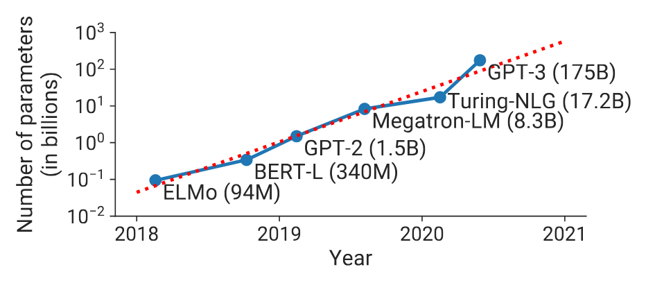

**図1.** 時間とともに進化する最新の自然言語処理（NLP）モデルのサイズの傾向。これらのモデルを訓練するための浮動小数点演算数は指数関数的に増加している。

この二つの課題に対処するために、さまざまなモデル並列化技術が提案されている。例えば、最近の研究[Sha18a, Sho19]では、各トランスフォーマーレイヤー内の行列乗算を複数のGPUに分割するテンソル（レイヤ内）モデル並列化が、これらの制限を克服する方法として示されている。このアプローチは、NVIDIA DGX A100サーバー（80GB-A100 GPU ×8）で最大200億パラメータのモデルではうまく機能するが、それ以上の大規模モデルでは対応できなくなる。大規模モデルは複数のマルチGPUサーバーに分割する必要があり、これにより二つの問題が生じる。（a） テンソル並列化に必要なAll-Reduce通信が、マルチGPUサーバー内の高帯域幅NVLinkよりも遅いサーバー間リンクを経由する必要があること、（b） 高度なモデル並列化により小さな行列乗算（GEMMs）が発生し、GPU利用率が低下する可能性があること。

パイプラインモデル並列性 [Nar19, Hua19, Nar21b, Yan21, Kos21, Fan21a] は大規模モデルのトレーニングをサポートするもう一つの手法であり、モデルの層を複数のGPUに分散して配置します。バッチはより小さなマイクロバッチに分割され、これらのマイクロバッチにわたって実行がパイプライン化されます。層はさまざまな方法でワーカーに割り当てることができ、入力の順伝播および逆伝播のさまざまなスケジュールを使用できます。層の割り当てとスケジューリングの戦略は、異なる性能上のトレードオフをもたらします。スケジュールにかかわらず、厳密なオプティマイザのセマンティクスを維持するために、オプティマイザのステップはデバイス間で同期する必要があり、各バッチの終了時にパイプラインをフラッシュすることが必要です。このときマイクロバッチは実行を完了することが許可され（新しいマイクロバッチは注入されません）、場合によってはパイプラインに注入されるマイクロバッチの数に応じて、時間の最大50％がパイプラインのフラッシュに費やされることがあります。マイクロバッチの数とパイプラインサイズの比率が大きいほど、パイプラインフラッシュに費やされる時間は短くなります。したがって、高効率を達成するためには、大きなバッチサイズがしばしば必要です。本研究では、さらに小さなバッチサイズでも効率を改善する新しいパイプラインスケジュールも導入します。

このようにして、ユーザーはさまざまな技術を用いて大規模モデルをトレーニングすることができ、それぞれ異なるトレードオフがあります。さらに、これらの技術は*組み合わせる*ことも可能です。ただし、これらの技術を組み合わせると、容易でない相互作用が生じるため、良好な性能を得るには慎重に検討する必要があります。本論文では、次の問いに取り組みます：

> *バッチサイズが与えられた場合に、大規模モデルのトレーニングスループットを最大化しつつ、厳密なオプティマイザの意味論を維持するために、並列処理の手法をどのように組み合わせるべきでしょうか？*

特に、パイプライン並列、テンソル並列、データ並列を組み合わせる方法、私たちが *PTD-P* と呼ぶ技術を示し、1000台以上のGPU上で大規模言語モデルを良好な計算性能（ピークデバイススループットの52%）で訓練する方法を説明します。私たちの方法は、マルチGPUサーバー間でのパイプライン並列、マルチGPUサーバー内でのテンソル並列、およびデータ並列の組み合わせを活用し、同一サーバー内およびサーバー間の高帯域幅リンクを持つ最適化クラスタ環境で、兆単位のパラメータを持つモデルを実際にスケーラブルに訓練することを可能にします。より多くの訓練リソースがあれば、同様のアイデアを用いてより大きなモデルの訓練も可能です。実験では、3072台のA100 GPUまでほぼ線形スケーリングを示し、GPTモデル [Bro77]（兆単位のパラメータ、混合精度使用）で1 GPUあたり163テラFLOP/s（通信、データ処理、最適化を含む）のエンドツーエンド訓練スループットを達成し、総合スループット502ペタFLOP/sを実現しました。このスループットにより実用的な訓練時間が実現可能となり、このモデルのエンドツーエンド訓練には$\sim 3$かかると見積もっています。私たちは、これがこの規模のモデルで達成された最速の訓練スループットであると考えています。過去のシステム [Sho19, Nar19] は、パイプライン並列とテンソル並列を組み合わせていないため、このような大規模モデルを訓練できません。またZeRO [Raj19]と比較したところ、1750億および5300億パラメータのモデルにおいてクロスノード通信が少ないため、私たちのアプローチはZeRO-3を$70\%$上回ることが分かりました。これらのモデルは、マルチGPUサーバーには収まりきらないほど大規模です。

このスループットを大規模環境で達成するには、複数の面で工夫と慎重な実装が必要でした。具体的には、演算の大半をメモリ律速ではなく計算律速にする効率的なカーネル、ネットワークを流れるデータ量とデバイスの待機時間をともに抑える計算グラフの分割、用途に特化した通信最適化、そして高速なハードウェアです。ハードウェアには、最新の GPU と、同一サーバー内およびサーバー間の GPU を結ぶ高帯域リンクが含まれます。公開したソフトウェア ([https://github.com/nvidia/megatron-lm](https://github.com/nvidia/megatron-lm)) が、他の研究グループによる大規模 NLP モデルの効率的な訓練に役立つことを期待しています。

さらに、スループットに影響を与えるさまざまなコンポーネント間の相互作用を、可能な場合は実証的および分析的に研究しました。これらの研究に基づき、分散学習を構成する際の次の指針を提供します：

- 異なる並列方式は複雑に相互作用します。並列化戦略は、通信量、カーネルの計算効率、さらにパイプラインフラッシュ (パイプラインバブル) によってワーカーが計算を待つ時間に影響します。例えば実験では、テンソルモデル並列とパイプラインモデル並列の組み合わせが適切でないと、サーバー間に高帯域ネットワークがあってもスループットが最大 $2\times$ 低下しました。テンソルモデル並列はマルチ GPU サーバー内で有効ですが、より大きなモデルにはパイプラインモデル並列が必要です。
- パイプライン並列のスケジュールは、通信量、パイプラインバブルの大きさ、アクティベーションの保存に使うメモリ量を左右します。本論文では、従来のスケジュール [Hua19, Nar21b] と同程度のメモリ使用量で、スループットを最大 10% 改善できる新しいインターリーブ型スケジュールを提案します。
- マイクロバッチサイズなどのハイパーパラメータは、メモリ使用量、ワーカー上で動くカーネルの演算効率、パイプラインバブルの大きさに影響します。実験では最適なマイクロバッチサイズは問題ごとに異なり、適切に選ぶことでスループットが 15% 向上しました。
- 大規模な分散訓練は通信負荷が高くなります。3072 GPU で 1 兆パラメータのモデルを訓練した際、本実装が利用した実効二分帯域幅は、パイプライン並列通信で 892 GB/s、データ並列通信で 13 TB/s でした。ノード間接続が遅い場合や、通信量の多い分割方法では、スケーリング性能が損なわれます。

本研究は、FlexFlow [Jia19a]、PipeDream [Nar19]、Tarnawski ら [Tar20]、DAPPLE [Fan21a] のように並列化戦略の探索空間を自動探索するものではありません。その代わり、実際に良好な結果を得られたヒューリスティックを §[3](#section-3) で示します。

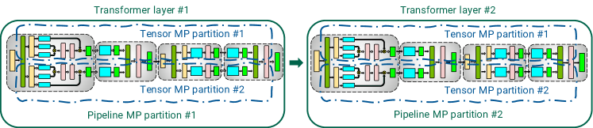

**図2.** 本研究で使用したトランスフォーマーベースモデルのためのテンソルとパイプラインモデル並列（MP）の組み合わせ。

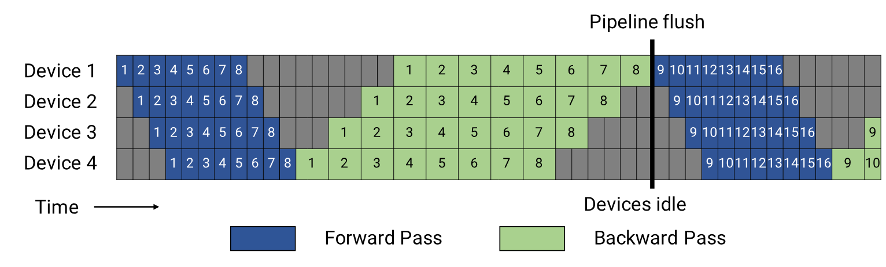

**図3.** すべてのマイクロバッチ（数字で表される）に対する順方向パス（青）と後方パス（緑）によるGPipeパイプラインスケジュール。グレーゾーンはパイプラインバブルを表しています。簡便化のために、後方パスは前方パスの2倍の時間がかかると仮定します。パイプラインスケジュールの効率はこの要素に依存しません。この例の各バッチは8つのマイクロバッチで構成されており、青または緑のボックス内の数字は対応するマイクロバッチに一意の識別子として与えられています（特に、最初のバッチはマイクロバッチ$1-8$、2番目のバッチはマイクロバッチ$9-16$、という具合です）。オプティマイザーはステップ状に行われ、パイプラインフラッシュで重みパラメータが更新されるため、厳密なオプティマイザーの意味論が確保されるため、アイドルデバイスとパイプラインバブルが発生します。

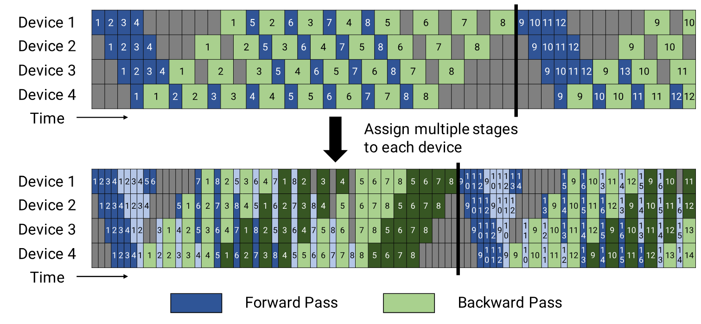

**図4.** デフォルトおよびインターリーブされた1F1Bパイプラインスケジュール。上の図はデフォルトのインターリーブなし1F1Bスケジュールを示しています。下の図はインターリーブされた1F1Bスケジュールを示しており、各デバイスには複数のチャンク（この場合は2）が割り当てられています。暗い色は最初のチャンク、明るい色は2番目のチャンクを示します。パイプラインバブルの大きさは小さくなります（パイプラインフラッシュはインターリーブタイムラインで早く起こります）。

## 2. 並列化方式

本節では、単一のGPUのメモリに収まらない大規模モデルの*効率的な*学習を可能にする並列化手法について議論します。本研究では、パイプラインモデル並列化とテンソルモデル並列化（[図2](#figure-02)に示す組み合わせ）をデータ並列化と組み合わせます。これを略してPTD-Pと呼びます。

### 2.1 データ並列

データ並列化では[Xin15, Li20c]、各ワーカーがモデルのコピーを保持し、入力データセットをシャード化し、ワーカーは定期的に勾配を集約して、全てのワーカーが一貫した重みのバージョンを見るようにします。単一のワーカーに収まらない大規模モデルの場合、データ並列化はより小さいモデルシャードに使用することができます。

### 2.2 パイプラインモデル並列

パイプライン並列化では、モデルの層を複数のデバイスに分割します。同じトランスフォーマーブロックが繰り返されるモデルに使用する場合、各デバイスに均等な数のトランスフォーマー層を割り当てることができます。層の割り当てがより難しい非対称なモデルアーキテクチャについては考慮せず、この問題の解決は関連研究[Nar19, Jia19a, Tar20]に委ねます。

バッチはより小さなマイクロバッチに分割され、マイクロバッチごとに実行がパイプライン化されます。パイプライン方式では、順伝播と逆伝播の両方で入力が一貫した重みバージョンを見ることができるようにする必要があり、これによって同期重み更新の意味論が明確になります。具体的には、単純なパイプライン処理では、ある入力が順伝播では見えなかった重み更新を逆伝播で見ることになってしまう可能性があります。

厳密なオプティマイザの意味論を*完全に*保持するために、定期的なパイプラインフラッシュを導入し、オプティマイザのステップがデバイス間で同期されるようにします。各バッチの開始時と終了時にはデバイスはアイドル状態になります。このアイドル時間を*パイプラインバブル*と呼び、できるだけ小さくしたいと考えています。PipeMare、PipeDream、PipeDream-2BW などの非同期および有界遅延アプローチ [Yan21, Kos21, Nar19, Nar21b] はフラッシュを完全に廃止しますが、重み更新の意味論を緩めます。そのような方式の検討は将来の課題とします。

デバイス間で順伝播および逆伝播のマイクロバッチをスケジューリングする方法はいくつか考えられ、それぞれパイプラインバブルの大きさ、通信、およびメモリ使用量に関して異なるトレードオフを提供します。本節ではそのようなアプローチのうちの2つについて論じます。

#### 2.2.1 デフォルトスケジュール

GPipe [Hua19]は、バッチ内のすべてのマイクロバッチに対するフォワードパスを最初に実行し、その後、すべてのマイクロバッチに対するバックワードパスを実行するスケジュールを提案しています（[図3](#figure-03)に示されています）。私たちは、GPipeのパイプラインバブルのサイズを定量化できます（$t_{\mathrm{pb}}$）。バッチ内のマイクロバッチの数を$m$、パイプラインステージ数（パイプライン並列化に使用されるデバイスの数）を$p$、理想的なイテレーションあたりの時間を$t_{\mathrm{id}}$（完全または理想的なスケーリングを仮定）、単一マイクロバッチのフォワードおよびバックワードパスを実行する時間をそれぞれ$t_{f}$および$t_{b}$と表します。このスケジュールでは、パイプラインバブルはバッチの開始時に$p-1$のフォワードパス、および終了時に$p-1$のバックワードパスで構成されます。パイプラインバブルに費やされる総時間は$t_{\mathrm{pb}}=(p-1)\cdot(t_{f}+t_{b})$となります。バッチの理想的な処理時間は$t_{\mathrm{id}}=m\cdot(t_{f}+t_{b})$です。したがって、パイプラインバブルに費やされる理想的な計算時間の割合は次の通りです：

$$
\mathrm{Bubble\,time\,fraction\,(pipeline\,bubble\,size)}=\frac{t_{\mathrm{pb}}}{t_{\mathrm{id}}}=\frac{p-1}{m}.
$$

。バブル時間の割合を小さくするためには、$m\gg p$が必要です。しかし、そのような大きな$m$の場合、このアプローチはメモリ使用量が多く、すべての$m$マイクロバッチに対して、トレーニングイテレーションの間、ストアされた中間アクティベーション（またはアクティベーション再計算を使用する場合は各パイプラインステージの入力アクティベーションのみ）をメモリに保持する必要があります。

代わりに、PipeDream-Flush スケジュール [Nar21b] を使用します。このスケジュールでは、まずウォームアップフェーズに入り、ワーカーが [図 4](#figure-04)（上図）に示されているように異なる回数のフォワードパスを実行します。このスケジュールでは、フライングマイクロバッチの数（バックワードパスが未完了で、アクティベーションを維持する必要があるマイクロバッチの数）をバッチ内のマイクロバッチの数ではなく、パイプラインの深さに制限します。ウォームアップフェーズの後、各ワーカーは定常状態に入り、ワーカーは1回のフォワードパスに続いて1回のバックワードパスを実行します（略して 1F1B と呼びます）。最後に、バッチの終わりで、残りすべてのフライングマイクロバッチに対してバックワードパスを完了します。この新しいスケジュールではバブルに費やす時間は同じですが、未完了のフォワードパスの数は PipeDream-Flush スケジュールのパイプライン段階の数を超えません。その結果、このスケジュールでは $p$ 以下のマイクロバッチのアクティベーションを保存する必要があります（GPipe スケジュールの場合は $m$ マイクロバッチ）。したがって、$m\gg p$ の場合、PipeDream-Flush は GPipe よりもはるかにメモリ効率が良くなります。

#### 2.2.2 インターリーブ型ステージのスケジュール

パイプラインバブルのサイズを減らすために、各デバイスは連続した単一のレイヤーセットの代わりに、複数のレイヤーのサブセット（モデルチャンクと呼ばれる）に対して計算を行うことができます。例えば、以前に各デバイスが4つのレイヤーを持っていた場合（つまり、デバイス1がレイヤー$1-4$を持ち、デバイス2がレイヤー$5-8$を持つ、というように）、各デバイスが2つのモデルチャンク（それぞれ2つのレイヤー）に対して計算を行うようにすることができます。すなわち、デバイス1はレイヤー$1,2,9,10$を持ち、デバイス2はレイヤー$3,4,11,12$を持つ、という具合です。このスキームでは、パイプライン内の各デバイスに複数のパイプライン段階が割り当てられます（各パイプライン段階の計算量は以前より少なくなります）。

以前と同様に、このスケジュールの「全て前向き、全て後向き」バージョンを使用することもできますが、これは高いメモリ負荷（$m$に比例）を伴います。代わりに、以前のメモリ効率の良い1F1Bスケジュールを適応させたインターリーブスケジュールを開発しました。この新しいスケジュールは[図4](#figure-04)に示されており、バッチ内のマイクロバッチ数はパイプライン並列度（パイプライン内のデバイス数）の整数倍である必要があります。例えば、デバイスが4つの場合、バッチ内のマイクロバッチ数は4の倍数でなければなりません。

図[図 4](#figure-04)に示すように、新しいスケジュールでは同じバッチサイズのパイプラインフラッシュがより早く発生します。各デバイスが$v$ステージ（またはモデルチャンク）を持つ場合、各ステージまたはチャンクのマイクロバッチに対する順方向および逆方向の時間はそれぞれ$t_{f}/v$および$t_{b}/v$になります。したがって、パイプラインバブル時間は$t^{\mathrm{int.}}_{\mathrm{pb}}=\frac{(p-1)\cdot(t_{f}+t_{b})}{v}$に減少し、バブル時間の割合は次のようになります：

$$
\mathrm{Bubble\,time\,fraction\,(pipeline\,bubble\,size)}=\frac{t^{\mathrm{int.}}_{\mathrm{pb}}}{t_{\mathrm{id}}}=\frac{1}{v}\cdot\frac{p-1}{m}.
$$

これは、新しいスケジュールがバブル時間を$v$減らすことを意味します。ただし、この減少したパイプラインバブルサイズは無料ではありません：このスケジュールは追加の通信を必要とします。定量的には、通信量も$v$増加します。次のセクションでは、マルチGPUサーバ（例：DGX A100ノード）で8枚のInfiniBandネットワークカードを利用して、この追加通信の影響をどのように軽減できるかを議論します。

### 2.3 テンソルモデル並列

テンサーモデル並列化では、モデルの個々の層が複数のデバイスに分割されます。本論文では、Megatron [Sho19]がトランスフォーマー層、すなわち言語モデルの基盤として使用する特定の分割戦略を使用します。CNNなど他のタイプのモデルにも同様の考え方を適用できます。この戦略を簡単に概説し、[図 5](#figure-05)に示します。

トランスフォーマー層は、自己注意ブロックとその後に続く二層の多層パーセプトロン（MLP）で構成されます。トランスフォーマー層の詳細については、Vaswani et al [Vas17c] を参照してください。

MLPブロックは、2つのGEMMとGeLU非線形から構成されます：

$$
Y=\mathrm{GeLU}(X A),\qquad Z=\mathrm{Dropout}(Y B).
$$

我々は$A$をその列に沿って分割することができます$A=[A_{1},A_{2}]$。この分割により、GeLU非線形は各分割されたGEMMの出力に独立して適用できます：

$$
[Y_{1},Y_{2}]=[\mathrm{GeLU}(X A_{1}),\mathrm{GeLU}(X A_{2})].
$$

これは有利です。なぜなら、GeLUは非線形であるため、$A$を行に沿って分割する場合に必要な同期を不要にするからです。

次の重み行列$B$の行は、その行に沿って分割することで、GEMM間の通信の必要性を排除できます（[図5（a）](#figure-05)に示されている通り）、以下のように：

$$
B=\begin{bmatrix}B_{1}\\
B_{2}\end{bmatrix},\ Y=[Y_{1},Y_{2}].
$$

次に、2番目のGEMMの出力はドロップアウト層の前にGPU間で集約されます。

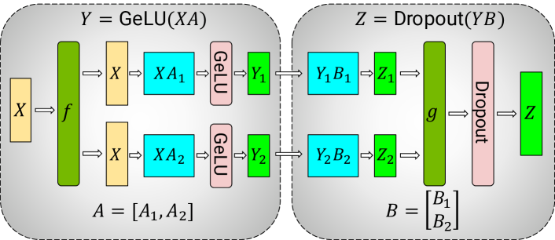

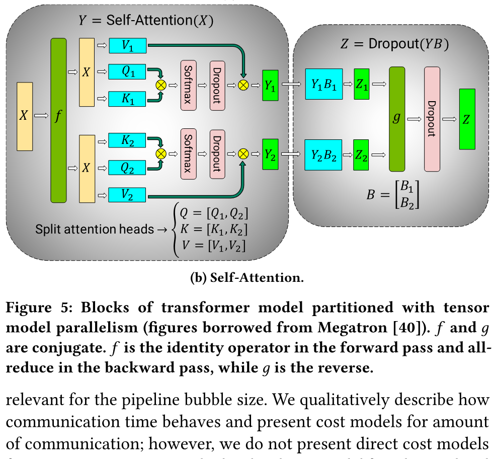

**図5.** テンソルモデル並列で分割されたトランスフォーマーモデルのブロック（図はMegatron [Sho19]から借用）。$f$と$g$は共役です。$f$は順伝播では恒等演算子、逆伝播ではオールリデュースであり、$g$はその逆です。

我々はマルチヘッドアテンション操作に内在する並列性を利用して、セルフアテンションブロックを分割します（[図5（b）](#figure-05)に示す）。キー（$K$）、クエリ（$Q$）、およびバリュー（$V$）行列は列並列方式で分割できます。その後の出力線形層は、注意操作の分割された出力（重み行列は行に沿って分割）に直接作用できます。

このアプローチは、MLPと自己注意ブロックのGEMMをGPU間で分割し、前方パス（$g$演算子）で全リダプト演算を2回、後方パス（$f$演算子）で2回の全還元演算のみで済む。$f$と$g$を数行のコードで実装しました。

## 3. 並列化構成の性能解析

この節では、パイプラインとテンソルモデルの並列性とデータ並列性を組み合わせることによるパフォーマンスへの影響を検討します。GPUの予算とバッチサイズが固定されている場合、PTD-Pの並列度数の違いを使ってモデルを訓練できます。各次元はメモリ使用量、デバイス使用率、通信量とのトレードオフを明らかにします。

これらのトレードオフを本節の残りで検討し、§[5.4](#section-5-4) で実測結果を示します。また、パイプラインバブルの大きさを表す解析モデルを提示し、通信時間の挙動を定性的に説明するとともに、通信量のコストモデルを示します。ただし、通信時間そのもののコストモデルは扱いません。同一サーバー内の GPU 間接続がサーバー間接続より高帯域になる階層型ネットワークでは、そのモデル化が難しいためです。著者らの知る限り、本研究はこれらの並列化軸の性能上の*相互作用*を初めて解析したものです。

### 3.1 表記法

このセクションでは以下の表記法を使用します：

- $(p,t,d)$: 並列化の各軸。$p$ はパイプラインモデル並列サイズ、$t$ はテンソルモデル並列サイズ、$d$ はデータ並列サイズです。
- $n$: GPU 数。$p\cdot t\cdot d=n$ を満たす必要があります。
- $B$: 入力として与えられるグローバルバッチサイズ。
- $b$: マイクロバッチサイズ。
- $m=\frac{1}{b}\cdot\frac{B}{d}$: *各パイプライン*における 1 バッチあたりのマイクロバッチ数。

### 3.2 テンソルおよびパイプラインモデル並列

テンソル並列およびパイプラインモデル並列は、複数GPUにわたってモデルのパラメータを分割するために使用できます。前述の通り、定期的なフラッシュを伴うパイプライン並列を使用すると、$(p-1)/m$ のサイズのパイプラインバブルが発生します。$d=1$（データ並列サイズ）と仮定すると、それにより $t\cdot p=n$ となります。$t$ に関するパイプラインバブルのサイズは次の通りです：

$$
\frac{p-1}{m}=\frac{n/t-1}{m}.
$$

$t$ が増加すると、$B$、$b$、$d$（$m=B/(b\cdot d)$ も固定）の場合、パイプラインバブルは減少します。

GPU 間の通信量も $p$ と $t$ によって変わります。パイプラインモデル並列は比較的安価なポイントツーポイント通信を使います。一方、テンソルモデル並列ではオールリデュースが必要で、順伝播と逆伝播のそれぞれで 2 回ずつ実行します (§[2.3](#section-2-3))。パイプライン並列では、各マイクロバッチが隣接するデバイス間を順方向または逆方向に通る際の通信量は $bsh$ です。ここで $s$ はシーケンス長、$h$ は隠れ層サイズです。テンソルモデル並列では、各層の順伝播と逆伝播で、総サイズ $bsh$ のテンソルを $t$ 個のモデルレプリカ間でそれぞれ 2 回オールリデュースします。このため、各デバイスが 1 マイクロバッチを処理するときの層あたり通信量は $8bsh\left(\frac{t-1}{t}\right)$ です。通常、各デバイスには複数の層があるので、デバイスあたり、マイクロバッチあたりのテンソル並列通信量は $l^{\mathrm{stage}}\cdot\left(8bsh\left(\frac{t-1}{t}\right)\right)$ となります。$l^{\mathrm{stage}}$ は 1 つのパイプラインステージに含まれる層数です。

このように、テンソルモデル並列はデバイス間の通信量を増やします。$t$ が単一ノードの GPU 数を超えると、低速なノード間リンクでテンソルモデル並列通信を行うコストが現実的でなくなる場合があります。§[5.4](#section-5-4) で、この結果を実験的に確認します。

> **要点 #1:** 1 台あたり $g$ GPU のサーバーでは、テンソルモデル並列の次数は原則として $g$ までとし、さらに大きなモデルへ拡張する場合はサーバー間でパイプラインモデル並列を用います。

### 3.3 データ並列とモデル並列

また、データ並列と2種類のモデル並列の相互作用についても考慮したいです。本節では、簡単のためにこれらの相互作用を個別に考察します。

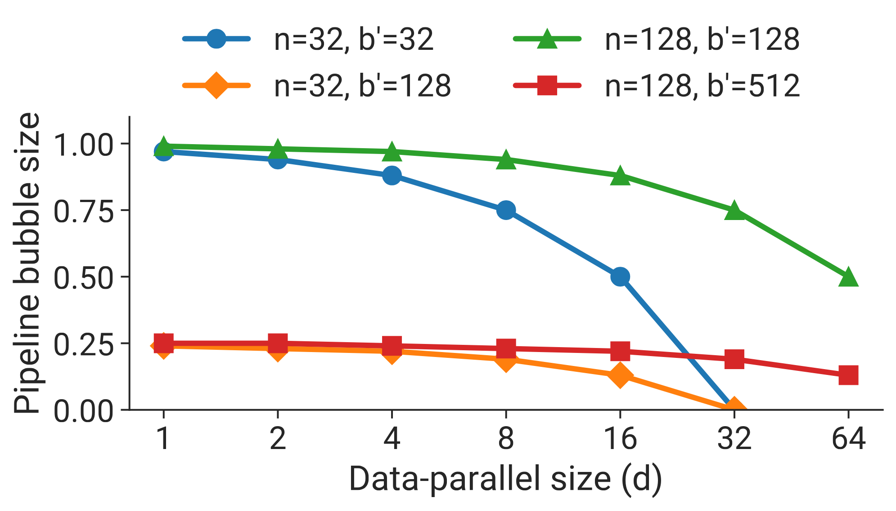

**図6.** パイプラインフラッシュによるアイドル時間の割合（パイプラインバブルサイズ）とデータ並列サイズ（$d$）の関係、異なるGPU数（$n$）およびバッチサイズとマイクロバッチサイズの比（$b^{\prime}=B/b$）に対して。

#### 3.3.1 パイプラインモデル並列

$t=1$（テンソルモデル並列サイズ）とします。パイプラインあたりのマイクロバッチ数は $m=B/(d\cdot b)=b^{\prime}/d$ で、ここで $b^{\prime}:=B/b$ です。GPU の総数が $n$ の場合、パイプラインステージの数は $p=n/(t\cdot d)=n/d$ です。パイプラインバブルのサイズは以下の通りです：

$$
\frac{p-1}{m}=\dfrac{n/d-1}{b^{\prime}/d}=\dfrac{n-d}{b^{\prime}}.
$$

$d$ が大きくなると、$n-d$ は小さくなり、したがってパイプラインバブルは小さくなります。[図6](#figure-06) は、さまざまな $d,n,$ と $b^{\prime}$ の値に対するパイプラインバブルサイズの挙動を示しています。すべてのモデルに対して $d$ を $n$ まで増やすことができないかもしれません。なぜなら、モデルの完全なトレーニングメモリ使用量が単一アクセラレータのメモリ容量を超える場合があるためです。

したがって、データ並列に必要なオールリデュース通信が $d$ の増加に伴って大幅に増加しない場合、全体のスループットは増加します。リングベースの実装では通信時間は $\frac{d-1}{d}=1-\frac{1}{d}$ に比例してスケーリングするため、この条件は満たされるはずです。

また、バッチサイズ $B$ を増やす影響も分析できます。与えられた並列構成において、バッチサイズ $B$ が増加すると、$b^{\prime}=B/b$ が増加し、$(n-d)/b^{\prime}$ は減少し、その結果スループットが増加します。データ並列に必要なオールリデュース通信も頻度が低くなり、さらにスループットが増加します。

#### 3.3.2 データ並列およびテンソルモデル並列

テンソルモデル並列を使用すると、すべてのマイクロバッチごとにオールリデュース通信を行う必要があります。これはマルチGPUサーバー間で高コストになる可能性があります。一方、データ並列では高コストなオールリデュース通信はバッチごとに一度だけ行う必要があります。さらに、テンソルモデル並列では、各モデル並列ランクが各モデル層の計算の一部を担当するため、層が十分に大きくない場合、最新のGPUはこれらのサブマトリックス計算を最高効率で行えないことがあります。

> **要点 #2:** データ並列とモデル並列を併用する場合、モデルのパラメータと中間メタデータが GPU メモリに収まるよう、モデル並列の総サイズを $M=t\cdot p$ とします。残りの GPU はデータ並列に用いて訓練を拡張できます。

### 3.4 マイクロバッチサイズ

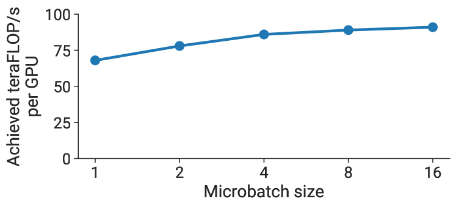

**図7.** 10億パラメータを持つGPTモデル（アテンションヘッド128、隠れ層サイズ4096、トランスフォーマー層4）のマイクロバッチサイズに対するGPUごとのスループット。

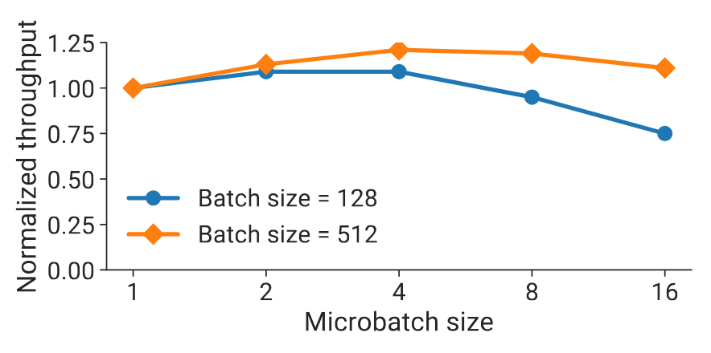

**図8.** [図7](#figure-07)の同じGPTモデルにおけるマイクロバッチサイズ$b$に対する正規化推定スループット（$t=\left(b^{\prime}/b+p-1\right)\cdot\left(t_{f}(b)+t_{b}(b)\right)$として計算された時間）の挙動。

マイクロバッチサイズの選択 $b$ は、モデルのトレーニングスループットにも影響します。例えば、[図7](#figure-07) では、単一GPUでマイクロバッチサイズを大きくすると、GPUごとのスループットが最大で $1.3\times$ まで向上することがわかります。ここで、並列構成 $(p,t,d)$ およびバッチサイズ $B$ が与えられた場合に、最適なマイクロバッチサイズ $b$ を決定したいと考えます。マイクロバッチサイズに関わらず、データ並列通信の量は同じになります。単一マイクロバッチの順伝播および逆伝播の計算時間にマイクロバッチサイズをマッピングする関数 $t_{f}(b)$ および $t_{b}(b)$ が与えられている場合、通信コストを無視したバッチ計算に費やされる総時間は（前と同様に $b^{\prime}$ を $B/d$ と定義する）次のようになります：

$$
\left(b^{\prime}/b+p-1\right)\cdot\left(t_{f}(b)+t_{b}(b)\right).\tag{1}
$$

このように、マイクロバッチサイズは演算強度だけでなく、$m$ を介してパイプラインバブルの大きさにも影響します。[図8](#figure-08) は、10 億パラメータの GPT モデルと $(p,t)=(8,8)$ について、式 ([1](#equation-01)) から推定したスループットを示します。どちらのバッチサイズでも最適な $b$ は 4 です。

> **要点 #3:** 最適なマイクロバッチサイズ $b$ は、モデルのスループットとメモリ使用量の特性に加え、パイプライン深さ $p$、データ並列サイズ $d$、バッチサイズ $B$ に依存します。

### 3.5 アクティベーション再計算

活性化再計算 [Hua19, Che16, Gri00a, Jai20] はオプションの技術で、順伝播を逆伝播の直前にもう一度実行することによって追加のメモリフットプリントのために実行される計算操作の数を増やすというトレードオフを行います（パイプライン段階ごとの入力活性化のみを保存し、はるかに多い中間活性化の全セットを保存するのではありません）。活性化再計算は、メモリフットプリントを許容できる低さに保つために、パイプライン並列性を用いた比較的大きなモデルをトレーニングする際に必要です。PipeDream-2BW [Nar21b] のような以前の研究では、活性化再計算のパフォーマンスへの影響が検討されています。

活性化チェックポイントの数はスループットには影響しませんが、メモリフットプリントには影響します。レイヤーの入力活性化のサイズを $A^{\mathrm{input}}$、中間活性化のレイヤーごとのサイズを $A^{\mathrm{intermediate}}$ とします。モデルのステージに $l$ 層があり、チェックポイントの数が $c$ の場合、総メモリフットプリントは $c\cdot A^{\mathrm{input}}+l/c\cdot A^{\mathrm{intermediate}}$ になります。この関数の最小値は $c=\sqrt{l\cdot\left(A^{\mathrm{intermediate}}/A^{\mathrm{input}}\right)}$ のときに得られます。実際には、$A^{\mathrm{intermediate}}$ を経験的に測定します。ほとんどのケースでは、1～2 層ごとにチェックポイントを設定することが最適です。

活性化メモリ消費をさらに削減するために、活性化分割 （activation partitioning [Raj19]） のような他の手法もテンソルモデル並列処理と併用することができます。

## 4. 実装

我々は PTD-P を Megatron-LM コードベースの拡張として実装しました。我々の実装は PyTorch [Pas19] を使用して構築されています。デバイス間の通信には NCCL [Ncc15] を使用します。良好な性能を得るために、通信と計算の両方を対象とした最適化を実装しました。以下にその概要を示します。

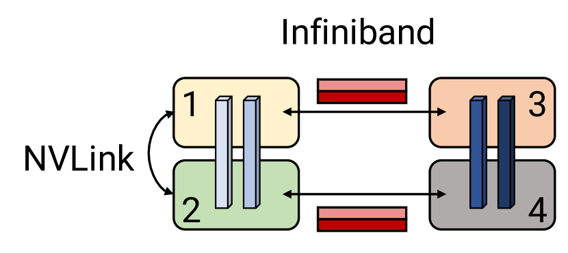

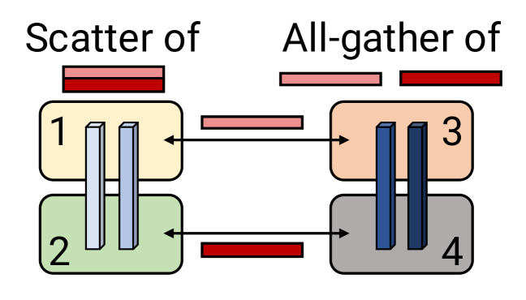

**図 9.** Scatter/gather 通信の最適化。水色のブロックは最初のパイプラインステージのレイヤー、濃い青のブロックは第二のパイプラインステージのレイヤーです。scatter/gather 最適化を行わない場合、同じテンソルがノード間の InfiniBand リンクを通じて冗長に送信されます。代わりに、送信側でテンソルを小さなチャンクに分散（scatter）することで、InfiniBand リンクを通じて送信されるテンソルのサイズを削減できます。最終的なテンソルは受信側で gather 操作を使用して再構成することができます。

### 4.1 通信の最適化

パイプライン並列化を使用する場合、順伝播と逆伝播でテンソルを並列に送受信することが望まれます。各 DGX A100 には 8 枚の InfiniBand （IB） ネットワーキングカードが搭載されています。残念ながら、送受信はポイント・ツー・ポイントで行われ、2 台のサーバー上の 2 つの GPU 間でのみ発生するため、パイプライン内の単一通信呼び出しで 8 枚すべてのカードを活用するのは困難です。

しかし、テンソルモデル並列とパイプラインモデル並列の両方を使用しているという事実を活用して、ノード間通信のオーバーヘッドを削減することができます。特に、各トランスフォーマーレイヤーの出力は、MLPブロックで $g$ の後（[図5（a）](#figure-05)参照）にテンソル並列ランク全体で複製されることに注目します。その結果、テンソルモデル並列を行っている連続する2つのパイプラインステージのランクは、全く同じセットのテンソルを送受信します（[図9（a）](#figure-09)参照）。

十分に大きなモデルでは、テンソルモデル並列サイズを8に設定します。これは、隣接するマルチGPUサーバーの対応するGPU間で同じセットのテンソルを8回送信していることを意味します。この冗長性を減らすために、送信側でテンソルを等しいサイズのチャンクに分割し、次のノードの対応するランクにランク自身のInfiniBandカードを使用して1つのチャンクのみを送信することができます（例： [図9](#figure-09)ではランク1がランク3に、ランク2がランク4に送信）。8つのテンソルモデル並列ランクの場合、各チャンクは8分の1のサイズになります。その後、受信側でNVLinkを介してオールギャザー操作を行うことで、InfiniBandインターコネクトよりも高速に完全なテンソルを再構成することができます。これは[図9（b）](#figure-09)に示されています。この手法を *scatter/gather通信最適化* と呼びます。この最適化により、DGX A100サーバー上の複数のIBカードをより有効に活用でき、インターリーブのような通信集約型のスケジュールも実現可能になります。

定量的には、scatter-gather 通信最適化により、隣接するステージ間の通信量は $\frac{bsh}{t}$ まで減少します。ここで $t$ はテンソルモデル並列サイズ、$s$ はシーケンス長、$h$ は隠れ層サイズです。実験では $t=8$ としました。

### 4.2 計算最適化

我々は高性能を達成するために、計算グラフに対して3つのモデル特有の最適化を実装しました。まず、トランスフォーマーレイヤーのデータレイアウトを変更して、メモリ集約型の転置操作を回避し、ストライド付きバッチ GEMM カーネルの使用を可能にしました。具体的には、データレイアウトを $[b,s,a,h]$ から $[s,b,a,h]$ に変更しました。ここで $b$、$s$、$a$、および $h$ はそれぞれバッチ、シーケンス、アテンションヘッド、および隠れ層の次元です。次に、一連の要素ごとの操作（bias   GeLU および bias   dropout   add）に対して PyTorch JIT [Pyt18] を使用して融合カーネルを生成しました。第三に、スケール、マスク、および softmax（還元）操作の融合を可能にするために2つのカスタムカーネルを作成しました。1つは一般的なマスキング（BERT などのモデルで使用）をサポートし、もう1つは暗黙的な因果マスキング（GPT などの自己回帰モデルで使用）をサポートします。これらの最適化の影響を次のセクションで定量化します。

## 5. 評価

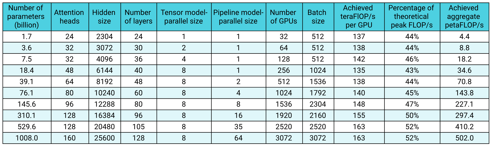

**表 1.** 10億から1兆パラメータまでの GPT モデルにおける弱スケーリングスループット。

本節では、次の質問に答えることを目指します：

- PTD-P の性能はどの程度か。エンドツーエンドの訓練時間は現実的か。
- 所定のモデルとバッチサイズに対して、パイプライン並列はどの程度スケールするか。インターリーブ型スケジュールは性能にどれほど影響するか。
- 異なる並列化軸はどのように相互作用するか。マイクロバッチサイズなどのハイパーパラメータはどのような影響を与えるか。
- Scatter-gather 通信最適化にはどのような効果があるか。大規模な訓練反復を実行するとき、ハードウェアにはどの程度の負荷がかかるか。

すべての実験は Selene スーパーコンピュータ [Nvi20c] 上で混合精度を用いて実行しました。各クラスタノードには NVIDIA 80 GB A100 GPU [Nvi20a] が 8 基あり、NVLink と NVSwitch [Nvl14] で相互接続されています。また、アプリケーション通信向けに NVIDIA Mellanox 200 Gbps HDR InfiniBand HCA を 8 基、ストレージ専用にさらに 2 基備えています。ノード間は 850 台のスイッチからなる 3 層 (leaf、spine、core) の fat-tree トポロジーで接続され、深層学習訓練の主要な通信パターンであるオールリデュースを効率よく実行できます。クラスタは、高性能なデータアクセスと保存のため、全 NVMe 構成の共有並列ファイルシステムを使用します。16 bit 精度における A100 GPU のピークスループットは 312 teraFLOP/s です。結果の大半は GPU あたりのスループットで示し、総スループットはこれに GPU 数を掛けて求めます。

実験には、それぞれの条件に合った規模の GPT モデルを用います。各マイクロベンチマークでは、モデルが実験で使うモデル並列 GPU 群に収まる必要があります。条件が合う場合は GPT-3 [Bro77] などの標準的なモデル構成を使います。

### 5.1 エンドツーエンド性能

テンソル並列、パイプライン並列、データ並列を用い、数十億から 1 兆パラメータまでの GPT モデルでシステムのエンドツーエンド性能を評価します。各並列次数は §[3](#section-3) のヒューリスティックに従って選びます。具体的には、scatter-gather 最適化を有効にしたインターリーブ型パイプラインスケジュールを使用します。すべてのモデルで語彙サイズ $V$ は 51,200 (1024 の倍数)、シーケンス長 $s$ は 2048 とし、隠れ層サイズ $h$、アテンションヘッド数、層数 $l$ を変えます。モデルのパラメータ数 $P$ は次式で求められます。

$$
P=12l h^{2}\left(1+\dfrac{13}{12h}+\dfrac{V+s}{12l h}\right).\tag{2}
$$

モデルサイズが大きくなるにつれて、バッチサイズ（$B$）およびGPUの数（$n$）も増加させる。モデル内の大部分の浮動小数点演算は、トランスフォーマーおよびロジット層での行列積（GEMM）で行われる。これらのGEMMだけを考慮すると、各イテレーションあたりのFLOPs数は（詳細は付録参照）：

$$
F=96B s l h^{2}\left(1+\dfrac{s}{6h}+\dfrac{V}{16l h}\right).\tag{3}
$$

これは実際の FLOP 数の下限ですが、真の値に近いと考えられます。精度にかかわらず、1 回の浮動小数点演算を 1 FLOP と数えます。また、式 ([3](#equation-03)) はアクティベーション再計算を前提とし、追加の順伝播に伴う演算も含みます。

[表1](#table-01) は、達成されたFLOP/s（GPUごとおよび全GPU合計）とともにモデル構成を示しています。モデルのサイズが大きくなるにつれて（大きな行列積）、通信時間が計算時間に比べて大幅に増加しないため、GPUの利用率が向上し、3072台のA100 GPU（384台のDGX A100ノード）までの超線形スケーリングが見られます。スループットはエンドツーエンドのトレーニングで測定されており、データ読み込み、オプティマイザステップ、通信、ログ記録などのすべての操作を含んでいることに注意してください。最大モデルではピークデバイススループットの52%、最小モデルではピークデバイススループットの44%を達成しています。

**訓練時間の見積もり.** 以上のスループットから、$T$ トークンを使ったエンドツーエンド訓練の所要時間も見積もれます。訓練に必要な反復回数は $I=T/\left(B\cdot s\right)$ です。式 ([3](#equation-03)) の $F$ と、[表 1](#table-01) で実測したエンドツーエンドスループット $X$ を使って総訓練時間を求めます。[表 1](#table-01) の構成では、$6h\gg s$、$16lh\gg\left(V+s\right)$、$12lh\gg V$ が成り立ちます。これらを式 ([2](#equation-02)) と式 ([3](#equation-03)) に組み合わせると、

$$
\mathrm{End-to-end\ training\ time}\approx\dfrac{8T P}{nX}.\tag{4}
$$

例として、1750億パラメータを持つGPT-3モデルを考えてみましょう。このモデルは$T=300$十億トークンで訓練されました。$n=1024$ A100 GPUを使用し、バッチサイズ1536で、GPUあたり$X=140$テラFLOP/sを達成しました。その結果、このモデルを訓練するのに34日間かかります。1兆パラメータのモデルについては、エンドツーエンドの訓練に4500億トークンが必要であると仮定します。3072台のA100 GPUを使用すれば、GPUあたり163テラFLOP/sのスループットを達成し、エンドツーエンドの訓練時間は84日です。私たちは、これらの訓練時間（合理的な数のGPUを使用）は実用的であると考えています。

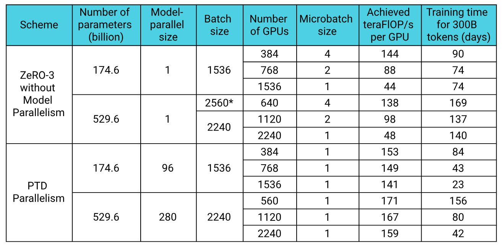

**表2.** PTD並列処理とZeRO-3（モデル並列なし）の比較。5300億パラメータのGPTモデルは、ZeRO-3でマイクロバッチサイズ4を使用した場合、560 GPUでは収まらなかったため、使用するGPUの数を640に増やし、グローバルバッチサイズを2560にしてスループットの推定値を示しました（表の該当行は*で表示）。

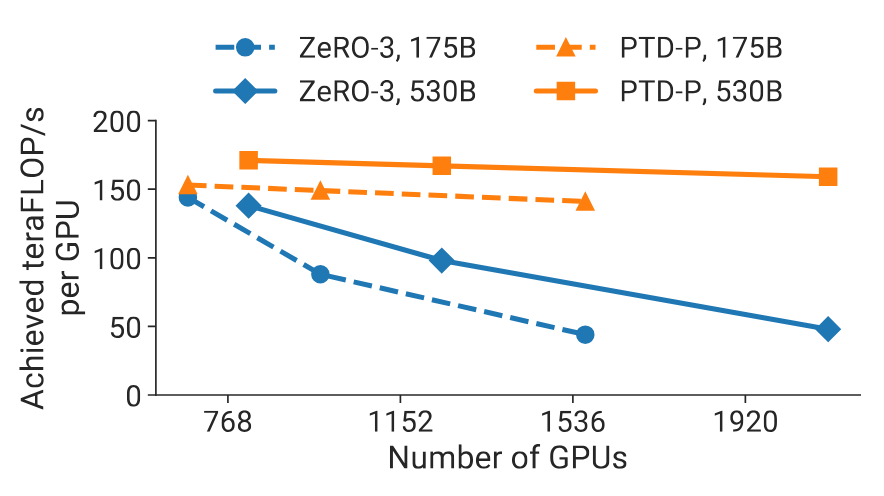

**図10.** 二つの異なるGPTモデルにおけるPTD-PとZeRO-3のGPUあたりスループット（175B GPT-3モデルは点線で示され、530Bモデルは実線で示されます）。グローバルバッチサイズは固定され、ZeRO-3はモデル並列なしで使用されています。

### 5.2 ZeRO-3 との比較

標準GPT-3モデルアーキテクチャおよび[表 1](#table-01)の5300億パラメータモデルに対して、[表 2](#table-02)および[図 10](#figure-10)でPTD-PとZeRO-3 [Raj19, Raj21]を比較します。結果はモデル並列を使用しない方法との比較の指標を提供します。私たちはDeepSpeed Pythonライブラリ[Dee20a]を使用してZeROをコードベースに統合しました。GPUの数を増やしてもグローバルバッチサイズは同じに保ちます。GPUが少なく、マイクロバッチサイズが4の場合、PTD-Pは175億および5300億パラメータモデルに対してそれぞれ$6\%$および$24\%$高いスループットをもたらします。GPUの数を増やすにつれて、PTD-Pは単独のZeRO-3よりもうまくスケーリングします（[図 10](#figure-10)参照）。例えば、GPUの数を倍にして（バッチサイズは同じ）、ノード間通信が少ないため、PTD-Pは両方のモデルで$70\%$の差でZeRO-3を上回ります。ここではテンソル並列を使用しないZeRO-3のみを考慮していることに注意します。ZeRO-3はモデル並列と組み合わせることで、スケーリング挙動を向上させる可能性があります。

### 5.3 パイプライン並列

ここで単独のパイプライン並列の弱スケーリング性能を評価し、非インターリーブスケジュールとインターリーブスケジュールの性能を比較します。

#### 5.3.1 弱スケーリング

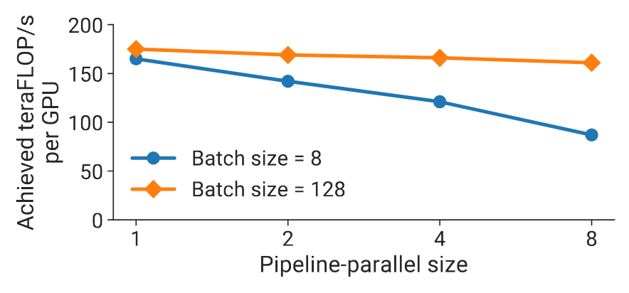

**図 11.** 弱スケーリング実験設定（モデルサイズはパイプライン並列サイズに応じて増加）で、2つの異なるバッチサイズを使用したパイプライン並列のGPUあたりスループット。

弱スケーリング設定で、デフォルトの非インターリーブ型パイプライン並列スケジュールを評価します。モデルはアテンションヘッド数 128、隠れ層サイズ 20480 の GPT で、マイクロバッチサイズは 1 です。パイプラインステージ数を増やす際は層数も比例して増やし、モデルを大きくします。例えば、パイプライン並列サイズ 1 では 3 層、150 億パラメータ、サイズ 8 では 24 層、1210 億パラメータのモデルを使います。すべての構成でテンソル並列サイズは 8 とし、A100 GPU の総数を 8 から 64 まで変えます。[図11](#figure-11) は、パイプラインバブルの影響を見るため、2 種類のバッチサイズで GPU あたりスループットを示しています。バブルは §[2.2.1](#section-2-2-1) の $\frac{p-1}{m}$ に従います。予想どおり、大きいバッチの方が良好にスケールします。バブルのコストをより多くのマイクロバッチに分散できるためです。

#### 5.3.2 インターリーブ型と非インターリーブ型の比較

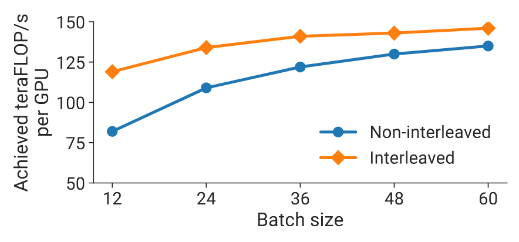

**図12.** 96 GPU上でのGPTモデル（1750億パラメータ）のインターリーブ型および非インターリーブ型スケジュールのGPUあたりスループット

[図12](#figure-12) は、1750億パラメータ（96層、96注意ヘッド、隠れサイズ12288）を持つGPT-3 [Bro77]モデルにおける、インタリーブ方式および非インタリーブ方式のスケジュールのGPUあたりスループットを示しています。scatter/gather通信最適化を用いたインタリーブ方式のスケジュールは、非インタリーブ（デフォルト）スケジュールよりも計算性能が高いです。この差はバッチサイズが増加するにつれて縮まります。その理由は二つあります：（a） バッチサイズが増加するにつれてデフォルトスケジュールのバブルサイズが小さくなること、（b） パイプライン内のポイントツーポイント通信量はバッチサイズに比例するため、通信量が増えると非インタリーブ方式が追いつくこと（インタリーブ方式はサンプルごとの通信量が多いです）。scatter/gather最適化がない場合、大きなバッチサイズではデフォルトスケジュールがインタリーブスケジュールよりも優れた性能を示します（図示せず）。

### 5.4 並列構成の比較

この小節では、さまざまな並列化次元を組み合わせることに伴う各種トレードオフを示します。特に、与えられたモデルに対して同じGPU数を使用し、複数のバッチサイズでの並列構成の性能を示します。

#### 5.4.1 テンソル並列とパイプライン並列

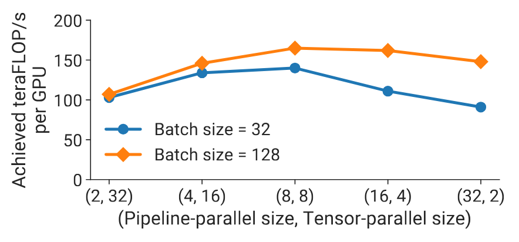

**図13.** 1622億パラメータと64 A100 GPUを使用したGPTモデルで、パイプラインとテンソルモデル並列を組み合わせたさまざまな並列構成のGPUあたりスループット。

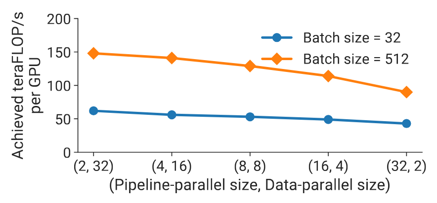

**図14.** 59 億パラメータの GPT モデルでデータ並列とパイプラインモデル並列を組み合わせた各構成の GPU あたりスループット。バッチサイズは 3 種類、マイクロバッチサイズは 1、A100 GPU は 64 基。

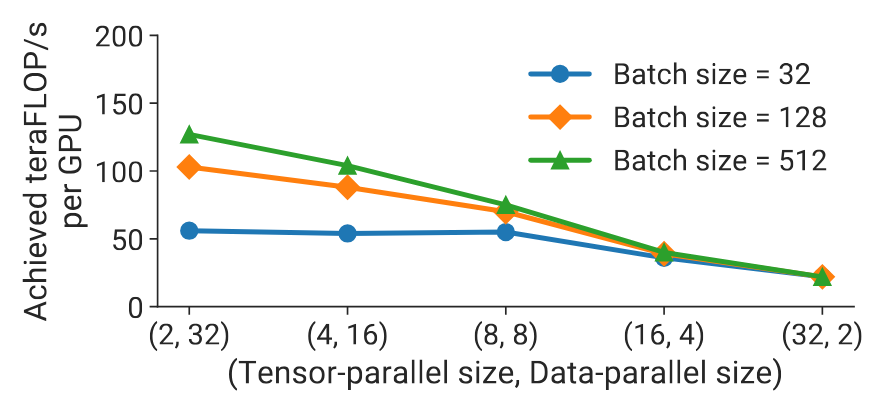

**図15.** 59 億パラメータの GPT モデルでデータ並列とテンソルモデル並列を組み合わせた各構成の GPU あたりスループット。バッチサイズは 3 種類、マイクロバッチサイズは 1、A100 GPU は 64 基。

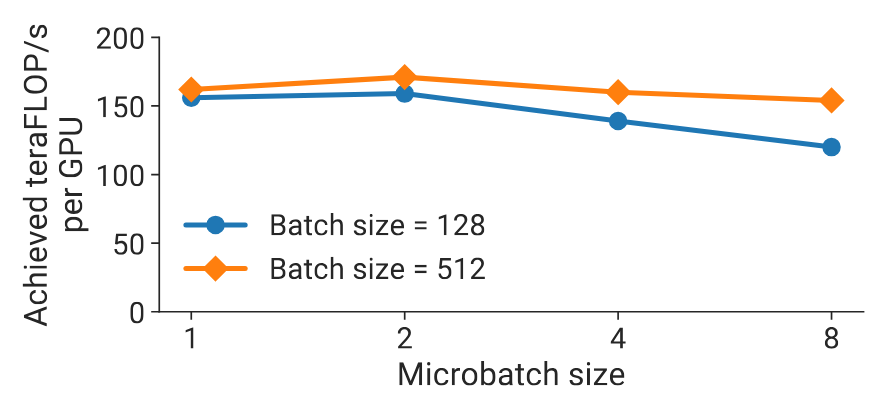

**図16.** 910 億パラメータの GPT モデルにおける $(t,p)=(8,8)$ 構成の GPU あたりスループット。64 基の A100 GPU と 2 種類のバッチサイズを使い、マイクロバッチサイズを変化させた。

我々は、特定のモデルとバッチサイズに対して、パイプライン並列性とテンソルモデル並列性がパフォーマンスに与える影響を評価します。[図13](#figure-13) の実証結果は、1610億パラメータのGPTモデル（32のトランスフォーマーレイヤー、パイプライン並列サイズ32をサポート、128のアテンションヘッド、隠れ層サイズ20480）を低い通信オーバーヘッドで高い計算資源利用率でトレーニングするには、テンソルモデル並列性とパイプラインモデル並列性を併用することの重要性を示しています。テンソルモデル並列性は、高価なオールリデュース通信が必要なため、ノード内（DGX A100サーバー）で最適であることがわかりました。一方でパイプラインモデル並列性は、ノード間でも全体の計算をボトルネックにせずに実行できる、より安価なポイントツーポイント通信を使用します。しかし、パイプライン並列性では、パイプラインバブルでかなりの時間が費やされることがあります。そのため、パイプライン内のマイクロバッチの数がパイプラインステージ数の合理的な倍数になるように、パイプラインステージの総数を制限する必要があります。結果として、テンソル並列サイズが単一ノードにおけるGPUの数（DGX A100ノードでは8）に等しいときにピークパフォーマンスが得られることがわかります。この結果は、テンソルモデル並列性（Megatron [Sho19]で使用）もパイプラインモデル並列性（PipeDream [Nar21b]などで使用）も、単独では両方の技術を組み合わせて使用するパフォーマンスに匹敵しないことを示しています。

#### 5.4.2 パイプライン並列とデータ並列の比較

[図14](#figure-14) では、59 億パラメータ (Transformer 32 層、アテンションヘッド 32、隠れ層サイズ 3840) の GPT モデルを使い、データ並列とパイプラインモデル並列が性能に与える影響を評価します。モデル並列サイズが 2 でも収まるモデルの性能を示すため、先ほどより小さいモデルを選びました。簡単のため、マイクロバッチサイズは 1 に固定します。どのバッチサイズでも、パイプライン並列サイズを増やすとスループットが下がり、§[3.3](#section-3-3) の解析モデルと一致します。パイプラインモデル並列は、主として 1 ワーカーに収まらない大規模モデルを訓練するために使い、訓練規模の拡大にはデータ並列を使うべきです。

#### 5.4.3 テンソル並列とデータ並列

我々はまた、[図15](#figure-15) に示す同じGPTモデル（59億パラメータ）に対するデータ並列性とテンソルモデル並列性が性能に与える影響を評価します（上記と同じ理由で小さいモデルを使用）。前と同様に、最初はマイクロバッチサイズを1に設定します。大きなバッチサイズでマイクロバッチサイズが1の場合、データ並列通信はまれです。一方、テンソルモデル並列性で必要なオールツーオール通信は、バッチ内の*すべての*マイクロバッチに対して行う必要があります。このテンソルモデル並列性によるオールツーオール通信がエンドツーエンドの学習時間を支配し、特にマルチGPUノード間で通信を行う必要がある場合に顕著です。さらに、テンソルモデル並列サイズが大きくなると、各GPU上でより小さな行列演算を行うことになり、各GPUの利用率が低下します。

データ並列性は効率的なスケーリングをもたらす可能性がありますが、非常に大きなモデルに対しては、限られた学習バッチサイズでデータ並列性のみを使用することはできない点に注意する必要があります。理由は a） メモリ容量が不十分であること、b） データ並列性のスケーリング制限（例えば、GPT-3はバッチサイズ$1536$で収束するまで学習された）です。したがって、データ並列性は$1536$ GPUsまでの並列化をサポートします。しかし、このモデルを合理的な時間で学習するためにはおおよそ$10,000$ GPUsが使用されました。

### 5.5 マイクロバッチサイズ

[図16](#figure-16) では、910 億パラメータのモデル ($(t,p)=(8,8)$) を使い、パイプライン並列とテンソルモデル並列を組み合わせた構成におけるマイクロバッチサイズの影響を評価します。このモデルの最適値は 2 ですが、他のモデルでは値が異なり、*モデルに依存*します。バッチサイズを固定したままマイクロバッチサイズを大きくすると、パイプライン内のマイクロバッチ数 $m$ が減ってバブルは大きくなります。一方、実行するカーネルの演算密度が上がり、GPU 利用率が改善する場合もあります。この 2 つは相反するため、最適値の選択は簡単ではありません。§[3.3](#section-3-3) の解析モデルは実測性能を妥当に近似しており、さまざまな訓練構成やモデルでこのハイパーパラメータを選ぶ際の代理指標として使えます。

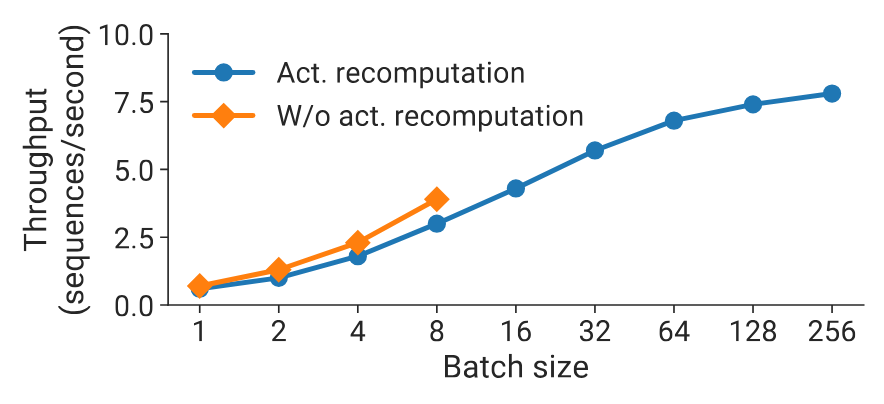

**図17.** 128 A100 GPU を使用した1450億パラメータのGPTモデルにおけるアクティベーション再計算の有無によるスループット（シーケンス毎秒）（$(t,p)=(8,16)$）。

### 5.6 アクティベーション再計算

[図17](#figure-17) は、128台のA100 GPU、$(t,p)=(8,16)$、およびさまざまなバッチサイズを使用した、1450億パラメータ（80のトランスフォーマーレイヤー、96のアテンションヘッド、隠れ層サイズ12288）のGPTモデルにおける、活性化再計算の有無によるスループットを示しています。小さいバッチサイズでは、バックワードパス中に追加のフォワードパスを実行する必要があるため、活性化再計算によりスループット（1秒あたりのシーケンス数）が最大で$33\%$低下します。しかし、より大きなバッチサイズをサポートするためには、活性化再計算が必要です。活性化再計算を行った場合、大きなバッチサイズでのスループットは、（小さいバッチサイズで達成された）活性化再計算なしの最高スループットよりも最大で$2\times$高くなることがあります。これはパイプラインの空き時間が小さくなるためです。

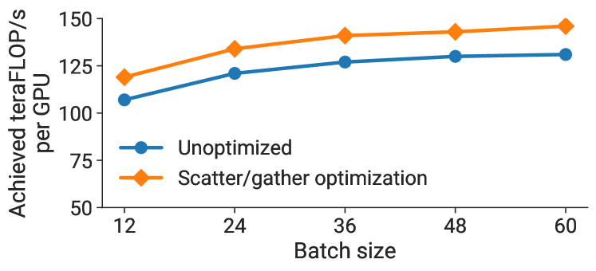

**図18.** GPTモデル（1750億パラメータ）における、インターリーブスケジュールと96台のA100 GPUを使用した場合の、scatter/gather最適化の有無によるGPUあたりのスループット。

### 5.7 Scatter-Gather 最適化

[図18](#figure-18) は、1750億パラメータのGPT-3モデルに対して、scatter/gather通信最適化（未最適化の場合も含む）の有無によるGPUあたりのスループットを示しています。クロスノードリンクでの通信量を減らすことによって、通信集約型スケジュール（インターリーブを用いた大バッチサイズ）で最大11％のスループット改善が見られます。

### 5.8 演算子融合

§[4.2](#section-4-2) で説明した演算子融合の効果も評価しました。1750 億パラメータの GPT-3 では、融合によって GPU あたりのスループットが 113 teraFLOP/s から 135 teraFLOP/s へ 19% 向上しました。さらに大きい 5300 億パラメータの GPT モデル ([図1](#figure-01) の構成) では、133 teraFLOP/s から 148 teraFLOP/s へ 11% 向上しました。

### 5.9 ノード間通信帯域幅

我々の高い性能は、最適化されたソフトウェアとハードウェアのスタックを*同時に*使用することの副産物です。特に、同一サーバ上およびサーバ間のGPU間の高帯域通信リンクを活用しています。3072 GPUを使用した1兆パラメータモデルでは、パイプラインステージ間のポイントツーポイント通信の実効二分帯域幅は892 GB/sであり、データ並列レプリカ間のオールリデュース操作の実効二分帯域幅は12.9 TB/sであることを観測しました。デバイス間でオペレータを最適化して分割しない場合、より多くのノード間通信が発生し、スケーリング性能が低下します。

### 5.10 チェックポイントの読み込みと保存

大規模モデルの訓練における重要な実用的考慮点は、モデルチェックポイントの読み込みと保存であり、本論文で扱うモデルでは特に大きいです。例えば、1兆パラメータモデルのチェックポイントは13.8テラバイトです。1兆パラメータモデルのチェックポイントの初期負荷は、384ノードすべて（3072 GPU）でピーク読み取り帯域幅1TB/sに達し、これは並列ファイルシステムから可能な最大読み取りスループットとなります。チェックポイントのセーブはピーク書き込み帯域幅の40%（273 GB/s）に達します。

## 6. 関連研究

本節では、モデルを大規模に訓練するための他の手法を取り上げます。

**大規模モデルの並列化.** パイプラインモデル並列は、大規模モデルの訓練に広く使われています。方式はいくつかあり、本論文で扱う方式は、*厳密な*オプティマイザの意味論を保つためにフラッシュを用います。TeraPipe [Li21b] は、GPT のような自己回帰モデルについて、1 本の訓練シーケンス内のトークンをまたぐ細粒度のパイプライン並列を実現します。PipeTransformer [He21] は「安定した」重みを持つ層を凍結し、残る「アクティブな」層に資源を振り向けることで、パイプライン並列とデータ並列の次数を動的に調整します。HetPipe [Par20] は異種アクセラレータ群でパイプライン並列とデータ並列を組み合わせます。意味論を緩和する実装もあります。PipeDream-2BW [Nar21b] は 2 つの重み版を保持し、高コストなフラッシュなしで 1 段階古い重みによる更新を保証します。PipeMare [Yan21] と Kosson ら [Kos21] は非同期パイプライン並列を使います。これらはフラッシュを使う本論文の方式より高いスループットを得られますが、収束速度や最終精度を損なう可能性があります。また、パイプライン並列だけではモデルの層数と同じ数のデバイスまでしか拡張できず、一部のモデル構成では制約になります。

PipeDream [Nar19] は、デバイス間通信を減らすために、体系的な方法でパイプライン並列性とデータ並列性を組み合わせました。DeepSpeed [Dee20] は、パイプライン並列性とテンソルおよびデータ並列性を組み合わせて最大1兆パラメータのモデルを訓練しましたが、この論文で示されたスループットよりも低くなりました（ピークの52%対36%）その理由はいくつかあります：演算子グラフの大部分を計算バウンドに保つための演算子融合、パイプラインバブルサイズを最小化するより効率的なパイプライン並列スケジュール、高速ハードウェア（A100対V100 GPUおよび同一サーバーおよび異なるサーバー間のGPU間の高帯域幅リンク）、およびより多くのGPUへのスケーリングです。我々は、この高いスループットが推定訓練時間をはるかに実用的にすること（約3か月）を強調したいと思います。同等のサイズのモデルを訓練するためには、総スループット37.6 petaFLOP/s では約40か月かかります。より大きなモデルへのスケーリングも可能ですが、訓練時間を実用的に保つためにはより多くのGPUが必要です。

Mesh-TensorFlow [Sha18a] は、データ並列性とモデル並列性を組み合わせた並列化戦略を容易に指定するための言語を提案しています。Switch Transformers [Fed22] は、1.6兆パラメータを持つ希薄に活性化されたエキスパートベースのモデルを訓練するためにMesh-TensorFlowを使用し、T5-11Bモデル [Raf19] よりも事前学習速度が向上しました。

**シャード化データ並列.** MLPerf 0.6 [Mat19] の性能最適化では、オプティマイザ状態をデータ並列ワーカー間で分割するシャード化データ並列 [Kum19, Xu20c] が導入されました。この方法には、a) 通常のデータ並列を超える追加通信がない、b) オプティマイザの計算量とメモリコストをデータ並列パーティション間で分担できる、という 2 つの利点があります。ZeRO [Raj19, Raj21] はこの考えを重みと勾配にも広げます。各ワーカーは計算前に、それらを「所有する」ワーカーから必要な状態を取得します。追加通信は生じますが、計算と通信を慎重に重ねれば一部を隠せます。ただし、テンソル並列を使わない場合や、バッチサイズが通信コストを隠せるほど大きくない場合は難しくなります ([図10](#figure-10))。ZeRO-Infinity [Raj21] は NVMe を使ってパラメータを効率よく入れ替え、少数の GPU で非常に大きなモデルを訓練できるようにします。ただし、極端に大きなモデルを少数の GPU で訓練すると、収束まで数千年かかるなど、訓練時間は非現実的になります。

**自動パーティショニング.** FlexFlow [Jia19a]、PipeDream [Nar19]、DAPPLE [Fan21a]、Tarnawski ら [Tar20] は、コストモデルを使って複数デバイス上のモデル訓練グラフを自動分割します。しかし、いずれも本論文で扱うすべての軸、すなわちパイプラインおよびテンソルモデル並列、データ並列、マイクロバッチサイズ、さらにアクセラレータのメモリ容量を超えるモデルを訓練する際のアクティベーション再計算などを同時には考慮しません。これらの軸が加わると探索空間はさらに広がります。Gholami ら [Gho18] は、データ並列とモデル並列を組み合わせた場合の通信コストをモデル化する方法を示しました。

**モデル訓練のための HPC.** Goyal ら [Goy17a] と You ら [You18] は、高性能計算の手法を使い、高精度な ImageNet モデルを数分で訓練できることを示しました。ただし、対象の画像分類モデルは単一アクセラレータに十分収まるためモデル並列が不要で、$>32$k の非常に大きなバッチを使えるため、通信頻度を抑えながら多数のワーカーへデータ並列を拡張できます。また、データ並列通信に適した小規模な畳み込み層で構成されています。

## 7. 議論と結論

本論文では、PTD-P（ノード間パイプライン並列性、ノード内テンソル並列性、およびデータ並列性）を組み合わせることで、トリリオンパラメータの大規模モデルを訓練する際に高い総合スループット（502ペタFLOP/s）を達成できることを示しました。これにより、トリリオンパラメータモデルの訓練時間が概算で約3か月と、合理的な期間でのエンドツーエンドの訓練が可能になります。各並列性のタイプに関連するさまざまなトレードオフについて議論し、それらを組み合わせる際には相互作用を慎重に考慮する必要があることを示しました。

本論文における実装および評価はGPU中心で行われていますが、これらの多くのアイデアは他の種類のアクセラレータにも適用可能です。具体的には、次のアイデアはアクセラレータに依存しません：a） デバイスを活動させながら通信量を最小化するためにモデル訓練グラフを賢く分割するアイデア、b） オペレータ融合と慎重なデータ配置によってメモリ制約のカーネル数を最小化すること、c） その他のドメイン固有の最適化（例：scatter-gather最適化）。

## 謝辞

匿名の査読者、朴宣明（Seonmyeong Bak）、ケシャヴ・サンサナム（Keshav Santhanam）、トレヴァー・ゲイル（Trevor Gale）、ディミトリオス・ヴィティニオティス（Dimitrios Vytiniotis）、シッダルタ・カラムチェティ（Siddharth Karamcheti）に、この研究の改善に役立つ助言とフィードバックをいただいたことに感謝します。本研究は一部、NSF大学院研究奨学金（DGE-1656518）およびNSF CAREER助成金（CNS-1651570）によって支援されました。本資料に記載された意見、発見、結論や推奨事項は、著者らのみの見解を表すものです。

## 付録: 浮動小数点演算

本節では、モデルにおける浮動小数点演算（FLOPs）の数をどのように計算するかを説明します。我々は、$l$ 個のトランスフォーマーレイヤー、隠れ層サイズ $h$、シーケンス長 $s$、語彙サイズ $V$、トレーニングバッチサイズ $B$ を持つ言語モデルを考えます。

$A_{m\times k}\times X_{k\times n}$ 行列の掛け算には $2m\times k\times n$ FLOPs が必要です（乗算と加算の両方を考慮するために 2 倍の係数が必要）。

トランスフォーマー層は、アテンションブロックと、それに続く 2 層のフィードフォワードネットワークで構成されます。アテンションブロックで FLOP 数を主に占めるのは、キー、クエリ、バリューの変換 ($6Bsh^{2}$ 演算)、アテンション行列の計算 ($2Bs^{2}h$ 演算)、値へのアテンション適用 ($2Bs^{2}h$ 演算)、アテンション後の線形射影 ($2Bsh^{2}$ 演算) です。フィードフォワードネットワークは隠れ層サイズを $4h$ に広げてから $h$ に戻し、$16Bsh^{2}$ FLOPs を要します。合計すると、各トランスフォーマー層の順伝播は $24Bsh^{2}+4Bs^{2}h$ FLOPs です。逆伝播では入力と重みの両方に対する勾配を計算するため、順伝播の 2 倍の FLOPs が必要です。さらにアクティベーション再計算により、逆伝播前に順伝播をもう一度実行します。したがって、各層の総 FLOP 数は $4\times\left(24Bsh^{2}+4Bs^{2}h\right)=96Bsh^{2}\left(1+\dfrac{s}{6h}\right)$ です。

FLOP 数のもう一つの主要部分は、次元 $h$ の特徴量を語彙次元 $V$ に変換する言語モデルヘッドのロジット層です。この演算には順伝播で $2B s h V$、逆伝播で $4B s h V$、合計で $6B s h V$ FLOPs が必要です。

したがって、$l$ トランスフォーマーレイヤーを持つトランスフォーマーモデルの場合、浮動小数点演算の総数は次の通りです：

$$
96B s l h^{2}\left(1+\dfrac{s}{6h}+\dfrac{V}{16l h}\right).
$$

[+intern]: NVIDIA でのインターン中に行った研究.
