> [Jingyang Yuan](https://dblp.org/pid/244/7491.html) [+internship]、[Huazuo Gao](https://dblp.org/pid/366/3356.html)、[Damai Dai](https://dblp.org/pid/199/2097.html)、[Junyu Luo](https://dblp.org/pid/198/0850-2.html)、[Liang Zhao](https://dblp.org/pid/63/5422-26.html)、[Zhengyan Zhang](https://aclanthology.org/people/zhengyan-zhang/unverified/)、[Zhenda Xie](https://dblp.org/pid/239/8676.html)、[Yuxing Wei](https://aclanthology.org/people/yuxing-wei/unverified/)、[Lean Wang](https://aclanthology.org/people/lean-wang/)、[Zhiping Xiao](https://dblp.org/pid/176/5397-1.html)、[Yuqing Wang](https://aclanthology.org/people/yuqing-wang/)、[Chong Ruan](https://dblp.org/pid/159/9956.html)、[Ming Zhang](https://dblp.org/pid/73/1844-4.html)、[Wenfeng Liang](https://dblp.org/pid/59/9456.html)、[Wangding Zeng](https://dblp.org/pid/315/5319.html)。2025 年 2 月 16 日に arXiv へ初回投稿され、現行版は v2 である。本リーディング版は [Native Sparse Attention: Hardware-Aligned and Natively Trainable Sparse Attention](https://arxiv.org/abs/2502.11089v2) を転記・翻訳したものであり、同論文は後に ACL 2025 の Best Paper として 23078–23097 ページに掲載された。<a href="/paper/native-sparse-attention.pdf" target="_blank">原 PDF</a>。[arXiv DOI](https://doi.org/10.48550/arXiv.2502.11089)。[ACL 論文](https://doi.org/10.18653/v1/2025.acl-long.1126)。[TeX ソース](https://export.arxiv.org/e-print/2502.11089v2)。厳密な誌面レイアウトと参考文献については原 PDF を正本とする。

[+internship]: DeepSeek-AI でのインターン期間中の貢献。

## 概要

長文脈モデリングは次世代言語モデルに不可欠だが、標準的な注意機構の計算コストは大きな課題となる。

疎な注意は、モデル能力を維持しながら効率を高める有望な方向である。

本研究では、アルゴリズム上の工夫とハードウェアに整合した最適化を統合し、長文脈を効率よく扱う、ネイティブに訓練可能な疎な注意機構 NSA を提案する。

NSA は動的な階層型疎化戦略を採用し、粗粒度の token 圧縮と細粒度の token 選択を組み合わせることで、文脈全体の把握と局所的な精度を両立する。本手法には二つの主要な革新がある。(1) 算術強度の均衡を考慮したアルゴリズムと現代的ハードウェア向け実装により、大幅な高速化を実現する。(2) end-to-end 訓練を可能にし、モデル性能を損なわずに事前訓練の計算量を削減する。

[図 1](#figure-01)に示すように、NSA で事前訓練したモデルは、一般 benchmark、長文脈タスク、指示に基づく推論のいずれでも Full Attention モデルと同等以上の性能を示した。

また、64k 長の系列では、デコード、順伝播、逆伝播のすべてで Full Attention を大幅に高速化し、モデルのライフサイクル全体にわたる効率を確認した。

## 1 はじめに

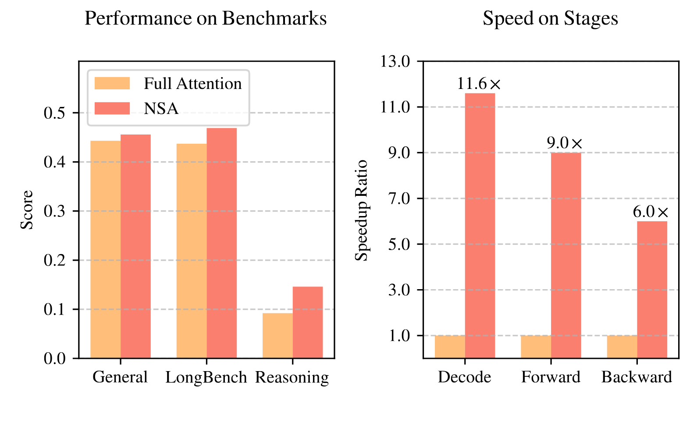

**図 1. Full Attention モデルと NSA の性能・効率比較。左：疎であるにもかかわらず、NSA は一般 benchmark、長文脈タスク、推論評価の平均で Full Attention baseline を上回る。右：64k 長の系列処理で、NSA はデコード、順伝播、逆伝播のすべてにおいて Full Attention より大幅な計算高速化を達成する。**

研究コミュニティでは、長文脈モデリングが次世代大規模言語モデルの重要な能力だと認識されつつある。その背景には、深い推論 [Zel22a, Dee25c]、repository レベルのコード生成 [Zha23z, Zha24zz]、複数ターンの自律 agent システム [Par23] など、多様な実応用がある。OpenAI の o-series、DeepSeek-R1 [Dee25c]、Gemini 1.5 Pro [Tea24a] などの進展により、モデルはコードベース全体や長い文書を処理し、数千 token にわたる対話の一貫性を保ち、長距離依存をまたぐ複雑な推論を行えるようになった。一方、系列長が伸びると vanilla Attention [Zah20, Vas17] の高い計算量が重大な遅延ボトルネックとなる。理論推定では、64k 文脈のデコード時に softmax 注意の計算が総遅延の 70–80% を占めるため、より効率的な注意機構が急務である。

自然な解決策は、softmax 注意に本来備わる疎性 [Ge24, Jia23z] を活用し、重要な query-key 対だけを計算して、性能を保ちながら計算量を減らすことである。近年は KV-cache の eviction [Zha23g, Li24c, Zho24z]、blockwise KV-cache 選択 [Tan24, Xia24z, Gao24z]、サンプリング・クラスタリング・ハッシュに基づく選択 [Che25ab, Liu24zz, Des24z] などが提案されている。しかし、既存手法の多くは実運用で理論値に見合う高速化を得られず、訓練時の疎な注意パターンも十分に利用できない。

有効な疎な注意を実現するには、二つの課題を解く必要がある。(1) ***ハードウェアに整合した推論高速化***：理論上の計算削減を実速度へ結び付けるには、prefill とデコードの両段階で、メモリアクセスとスケジューリングのボトルネックを抑えるハードウェア指向の設計が必要である。(2) ***訓練を考慮したアルゴリズム設計***：訓練可能な演算子で end-to-end 計算を支え、性能を保ったまま訓練コストを下げる必要がある。実用的な長文脈推論・訓練には双方が不可欠だが、既存手法にはなお大きな隔たりがある。

そこで、階層的 token モデリングを統合した、ネイティブに訓練可能な疎な注意アーキテクチャ NSA を提案する。[図 2](#figure-02)に示すように、key と value を時間方向の block にまとめ、圧縮された粗粒度 token、選択して残す細粒度 token、局所文脈を扱う sliding window の三経路で処理する。さらに専用 kernel を実装し、実効効率を最大化する。中心的な革新は、(1) Tensor Core 利用率とメモリアクセスを考慮し、算術強度を均衡させるハードウェア整合型システムと、(2) 高効率なアルゴリズムと backward 演算子により安定した end-to-end 訓練を可能にする訓練指向設計である。

実言語コーパスで NSA を包括的に評価した。27B parameter の transformer backbone を 260B token で事前訓練し、一般言語、長文脈、chain-of-thought 推論を評価した。また A100 GPU 上で、最適化した Triton [Til19] 実装と kernel 速度を比較した。NSA は Full Attention baseline と同等以上の性能を示し、既存の疎な注意手法も上回った。デコード、順伝播、逆伝播のすべてで Full Attention を大幅に高速化し、系列が長いほど高速化率も高くなった。階層型疎な注意がモデル能力と計算効率を両立できることが確認された。

## 2 疎な注意手法の再検討

現代の疎な注意手法は transformer の理論計算量を大きく削減してきた。しかし多くは、事前訓練済みの Full Attention backbone を維持したまま推論時だけ疎化するため、アーキテクチャ上の bias が生じ、疎な注意の利点を十分に引き出せない可能性がある。ネイティブな疎化アーキテクチャを示す前に、この制約を二つの観点から分析する。

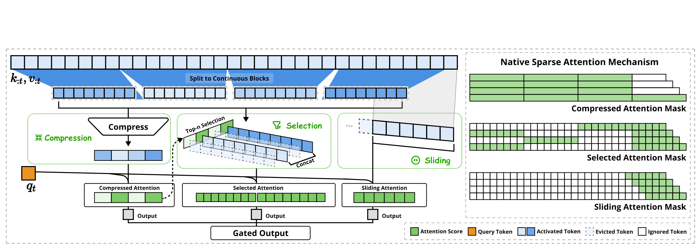

**図 2. NSA のアーキテクチャ概要。左：入力系列を三つの並列注意分岐で処理する。ある query に対し、それ以前の key と value は、粗粒度パターンを捉える圧縮注意、重要な token block を扱う選択注意、局所文脈を扱う sliding attention に送られる。右：各分岐が作る注意パターン。緑は注意スコアを計算する領域、白は省略できる領域を表す。**

### 2.1 高効率推論という幻想

注意計算を疎にしても推論遅延が同じ割合で減らない手法が多い。主な理由は二つある。

**段階限定の疎性。** H2O [Zha23g] などは自己回帰デコードを疎化する一方、prefill では attention map 計算や索引構築など重い前処理を必要とする。MInference [Jia24e] は prefill の疎化だけに注力する。少なくとも一方の段階が Full Attention と同程度のコストを残すため、推論全体を高速化できない。書籍要約やコード補完のような prefill 主体の workload、長い chain-of-thought [Wei22z] 推論のようなデコード主体の workload のどちらでも、この段階依存性が高速化を妨げる。

**先進的な注意アーキテクチャとの非互換性。** 一部の疎な注意手法は、Multi-Query Attention (MQA) [Sha19] や Grouped-Query Attention (GQA) [Ain23] のようなデコード効率の高い構造に適応できない。これらは複数 query head で KV を共有し、デコード時のメモリアクセスを減らす。Quest [Tan24] では各 attention head が独立に KV-cache 部分集合を選ぶ。MHA なら計算とメモリアクセスの疎性が一致するが、GQA では同一 group の全 query head の選択和集合を読み込む必要があり、KV-cache アクセスは多いままである。計算を減らしても、散在したアクセスパターンが先進構造の効率的なメモリアクセス設計と衝突する。

既存手法の多くは KV-cache または理論計算量の削減に注力し、先進的 framework や backend 上で遅延を十分に下げられない。そこで、先進アーキテクチャとハードウェア効率の高い実装を組み合わせ、疎性を実効的な効率向上へつなげる。

### 2.2 訓練可能な疎性という神話

ネイティブに訓練可能な疎な注意を追求する理由は二つある。(1) ***性能低下***：事後的な疎化はモデルを事前訓練の最適化軌道から外す。Chen ら [Che25ab] によれば、上位 20% の注意でも総注意スコアの 70% しか覆えず、事前訓練モデルの retrieval head などは推論時 pruning で損なわれやすい。(2) ***訓練効率の需要***：長い文書による事前訓練だけでなく、長文脈 fine-tuning や reinforcement learning にも長系列の効率的な訓練が欠かせない。既存手法は主に推論向けで、訓練時の計算課題をほぼ扱わない。既存の疎化手法を訓練に転用すると、さらに次の問題が生じる。

**訓練不能な構成要素。** ClusterKV [Liu24zz] の k-means clustering や MagicPIG [Che25ab] の SimHash 選択などの離散操作は計算グラフを不連続にする。勾配が token 選択を通れず、最適な疎パターンを学習できない。

**非効率な逆伝播。** 理論上は訓練可能でも、実際の訓練効率が低い場合がある。HashAttention [Des24z] のような token 粒度選択では、注意計算時に KV cache から多数の token を個別に読む必要がある。不連続なメモリアクセスは、連続アクセスと blockwise 計算に依存する FlashAttention などの高速技法に適さず、ハードウェア利用率の低い実装に戻らざるを得ない。

### 2.3 ネイティブな疎性の必要性

推論効率と訓練可能性の制約から、疎な注意機構を根本から設計し直す。NSA は計算効率と訓練要件の双方を満たすネイティブな疎な注意 framework である。以下でアルゴリズム設計と演算子実装を詳述する。

## 3 手法

本手法はアルゴリズム設計と kernel 最適化からなる。まず背景を説明し、NSA の全体 framework と主要な構成要素を示した後、実効効率を高めるハードウェア最適化 kernel を述べる。

### 3.1 背景

**注意機構。** 言語モデリングでは、各 query token $\mathbf{q}_t$ が先行するすべての key $\mathbf{k}_{:t}$ との関連度を計算し、value $\mathbf{v}_{:t}$ の重み付き和を生成する。長さ $t$ の入力系列に対する注意操作を次式で定義する。

$$
\mathbf{o}_t = \mathrm{Attn}\left(\mathbf{q}_t, \mathbf{k}_{:t}, \mathbf{v}_{:t}\right)
$$

$\mathrm{Attn}$ は注意関数である。

$$
\mathrm{Attn}\left(\mathbf{q}_t, \mathbf{k}_{:t}, \mathbf{v}_{:t}\right) = \sum_{i=1}^t\frac{ \alpha_{t,i} \mathbf{v}_i}{\sum_{j=1}^t \alpha_{t,j}}, \quad \alpha_{t,i} = e^{\frac{\mathbf{q}_t^\top \mathbf{k}_i}{\sqrt{d_k}}}\,.
$$

$\alpha_{t,i}$ は $\mathbf{q}_t$ と $\mathbf{k}_i$ の注意重み、$d_k$ は key の特徴次元である。系列が長くなるほど注意計算が総コストを支配し、長文脈処理を難しくする。

**算術強度。** 算術強度は演算量とメモリアクセス量の比であり、ハードウェア上の最適化を左右する。GPU ごとに、ピーク演算性能とメモリ帯域の比から定まる臨界算術強度がある。それを上回る処理は compute-bound、下回る処理は memory-bound となる。

causal self-attention では、訓練と prefill の batched matrix multiplication および注意計算は算術強度が高く、現代の accelerator 上で compute-bound である。一方、自己回帰デコードは一回の順伝播で一 token だけを生成しながら KV cache 全体を読むため、算術強度が低くメモリ帯域に制約される。したがって、訓練・prefill では計算量を、デコードではメモリアクセスを減らす必要がある。

### 3.2 全体 framework

注意に本来ある疎パターンを活用するため、各 query $\mathbf{q}_t$ に対して、[式 1](#equation-01)の元の key-value 対 $\mathbf{k}_{:t},\mathbf{v}_{:t}$ を、より小さく情報密度の高い表現 $\tilde{K}_t,\tilde{V}_t$ に置き換える。

$$
\tilde{K}_t = f_K(\mathbf{q}_t, \mathbf{k}_{:t}, \mathbf{v}_{:t}), \quad \tilde{V}_t = f_V(\mathbf{q}_t, \mathbf{k}_{:t}, \mathbf{v}_{:t})
$$

$$
\mathbf{o}^*_t=\mathrm{Attn}\left(\mathbf{q}_t,\tilde{K}_t, \tilde{V}_t \right)
$$

$\tilde{K}_t,\tilde{V}_t$ は現在の query $\mathbf{q}_t$ と文脈 memory $\mathbf{k}_{:t},\mathbf{v}_{:t}$ から動的に構成される。複数の mapping 戦略で $\tilde{K}_t^c,\tilde{V}_t^c$ を作り、次のように統合する。

$$
\mathbf{o}^*_t = \sum_{c \in \mathcal{C}} g_t^c \cdot \mathrm{Attn}(\mathbf{q}_t, \tilde{K}_t^c, \tilde{V}_t^c).
$$

[図 2](#figure-02)のように、NSA は key と value に対して、圧縮、選択、sliding window を表す三戦略 $\mathcal{C}=\{\mathrm{cmp},\mathrm{slc},\mathrm{win}\}$ を持つ。$g_t^c\in[0,1]$ は戦略 $c$ の gate score で、入力特徴を MLP と sigmoid activation に通して得る。再 mapping 後の key/value 総数を $N_t$ とする。

$$
N_t = \sum_{c \in \mathcal{C}}\mathrm{size}[\tilde{K}^c_t].
$$

$N_t\ll t$ を保つことで、高い疎性を維持する。

### 3.3 アルゴリズム設計

$f_K,f_V$ の三つの再 mapping、token 圧縮、token 選択、sliding window を説明する。

#### 3.3.1 Token 圧縮

連続する key または value の block を block-level 表現へ集約し、block 全体の情報を持つ圧縮 key/value を得る。圧縮 key を次式で定義する。

$$
\tilde{K}^\mathrm{cmp}_t = f_K^\mathrm{cmp}(\mathbf{k}_{:t}) = \left\{\varphi(\mathbf{k}_{i d+1: i d+l})\middle| 0\leqslant i\leqslant\left\lfloor\frac{t-l}{d}\right\rfloor\right\}
$$

$l$ は block 長、$d$ は隣接 block 間の sliding stride である。$\varphi$ は block 内 position encoding を持つ学習可能な MLP で、block 内の key を一つの圧縮 key に写像する。$\tilde{K}_t^\mathrm{cmp}\in\mathbb{R}^{d_k\times\left\lfloor\frac{t-l}{d}\right\rfloor}$ は圧縮 key からなる tensor である。情報の断片化を抑えるため、通常 $d<l$ とする。圧縮 value $\tilde{V}_t^\mathrm{cmp}$ も同様である。圧縮表現は粗粒度で高水準の意味情報を捉え、注意の計算負荷を減らす。

#### 3.3.2 Token 選択

圧縮 key/value だけでは重要な細粒度情報が失われる可能性があるため、個々の key/value も選択的に保持する。以下では、低い計算 overhead で関連 token を識別・保持する機構を述べる。

**Blockwise 選択。** key/value 系列を空間的に連続する block で処理する理由は、ハードウェア効率と注意スコア固有の分布にある。***現代 GPU で高効率に計算するには blockwise 選択が重要である。*** ランダム index read より連続 block access の throughput が大幅に高く、Tensor Core も有効に利用できるためである。FlashAttention の block 設計に見られるように、blockwise メモリアクセスと計算は高性能な注意実装の基本原則である。***Blockwise 選択は注意スコア固有の分布にも従う。*** 先行研究 [Jia24e] は、注意スコアに空間的連続性があり、隣接 key の重要度が近いことを示す。[第 6.2 節](#section-6-2)の可視化も同じ傾向を示す。

まず key/value 系列を選択 block に分割する。注意計算に重要な block を見つけるため、各 block に重要度スコアを与える。

**重要度スコアの計算。** 直接計算すると overhead が大きいが、圧縮 token の注意計算で生じる中間スコアを利用できる。

$$
\mathbf{p}_t^\mathrm{cmp} = \mathrm{Softmax}\left(\mathbf{q}_t^\top \tilde{K}_t^\mathrm{cmp}\right),
$$

$\mathbf{p}_t^\mathrm{cmp}\in\mathbb{R}^{\left\lfloor\frac{t-l}{d}\right\rfloor+1}$ は $q_t$ と圧縮 key $\tilde{K}_t^\mathrm{cmp}$ の注意スコアである。選択 block size を $l'$ とする。圧縮 block と選択 block が同じ分割、すなわち $l'=l=d$ なら、$\mathbf{p}_t^\mathrm{slc}=\mathbf{p}_t^\mathrm{cmp}$ として選択重要度を直接得る。分割が異なる場合は空間関係から導く。$l\leqslant l'$、$d\mid l$、$d\mid l'$ のとき、

$$
\mathbf{p}_t^\mathrm{slc}[j] = \sum_{m=0}^{\frac{l'}{d}-1}\sum_{n=0}^{\frac{l}{d} -1} \mathbf{p}_t^\mathrm{cmp}\left[\frac{l'}{d}j -m -n \right].
$$

$[\cdot]$ は vector element を参照する index 演算子である。GQA/MQA のように query head 間で KV cache を共有するモデルでは、デコード時の読み込みを抑えるため、同じ group の head が同じ block を選ばなければならない。共有重要度を次式で定義する。

$$
{\mathbf{p}_t^{\mathrm{slc}}}' = \sum_{h=1}^{H} \mathbf{p}_{t}^{\mathrm{slc}, (h)}.
$$

上付きの $(h)$ は head index、$H$ は各 group の query head 数である。この集約で group 内の選択を一致させる。

**Top-$\pmb{n}$ block 選択。** block 重要度の上位 $n$ 個に含まれる token を保持する。

$$
\mathcal{I}_t = \{i \mid \mathrm{rank}({\mathbf{p}_t^\mathrm{slc}}'[i]) \leqslant n\}
$$

$$
\tilde{K}^\mathrm{slc}_t = \mathrm{Cat}\left[\{\mathbf{k}_{il'+1:(i+1)l'}\mid i \in \mathcal{I}_t\}\right].
$$

$\mathrm{rank}(\cdot)$ は降順の順位で、rank = 1 が最大値、$\mathcal{I}_t$ は選択 block の index 集合、$\mathrm{Cat}$ は連結操作である。$\tilde{K}_t^\mathrm{slc}\in\mathbb{R}^{d_k\times nl'}$ は圧縮 key からなる tensor である。細粒度 value $\tilde{V}_t^\mathrm{slc}$ も同様であり、選択した key/value は[式 5](#equation-05)に従って $\mathbf{q}_t$ と注意計算を行う。

#### 3.3.3 Sliding window

局所パターンは学習が速く、学習過程を支配して圧縮・選択 token からの学習を妨げることがある。そこで局所文脈専用の sliding window 分岐を設け、圧縮・選択分岐が局所パターンへの shortcut を使わず、それぞれの特徴を学べるようにする。window $w$ 内の直近 token $\tilde{K}_t^\mathrm{win}=\mathbf{k}_{t-w:t},\tilde{V}_t^\mathrm{win}=\mathbf{v}_{t-w:t}$ を保持し、圧縮 token、選択 token、sliding window を別々に計算して、学習可能な gating で統合する。さらに三分岐へ独立した key/value を与え、わずかな overhead で shortcut learning を防ぐ。局所・長距離パターン認識間の勾配干渉を避け、安定した学習を可能にする。

三種類の key/value を得た後、[式 5](#equation-05)に従って最終注意出力を計算する。以上の圧縮、選択、sliding window が NSA の完全なアルゴリズム framework を構成する。

### 3.4 Kernel 設計

訓練・prefill で FlashAttention 級の高速化を得るため、Triton 上にハードウェア整合型の疎な注意 kernel を実装する。デコード時に MHA は memory-intensive で非効率なため、現代 LLM と同様に GQA/MQA のような KV cache 共有構造を対象とする。圧縮注意と sliding window 注意は FlashAttention-2 kernel を使えるが、疎な選択注意には専用設計が必要である。FlashAttention のように時間的に連続する query block を SRAM へ載せると、block 内 query が互いに異なる KV block を要求し、アクセス効率が悪い。そこで各 query 位置について、同じ疎 KV block を共有する GQA group の全 query head を SRAM へまとめて載せる。[図 3](#figure-03)に順伝播実装を示す。

1. **Group 中心のデータロード。** inner loop ごとに、位置 $t$ の group 内全 head の query $Q\in\mathbb{R}^{[h,d_k]}$ と共有する疎 key/value block index $\mathcal{I}_t$ を読む。

2. **KV の共有取得。** inner loop で $\mathcal{I}_t$ の連続 key/value block を $K\in\mathbb{R}^{[B_k,d_k]}$、$V\in\mathbb{R}^{[B_k,d_v]}$ として SRAM に順次読み、メモリロードを抑える。$B_k$ は $B_k\mid l'$ を満たす kernel block size である。

3. **Grid 上の outer loop。** inner-loop 長は選択 block 数 $n$ に比例し、query block 間でほぼ同じなので、query/output loop を Triton grid scheduler に置き、kernel を単純化・最適化する。

group 内共有で重複 KV 転送を除き、GPU streaming multiprocessor 間で workload を均衡させることで、ほぼ最適な算術強度を得る。

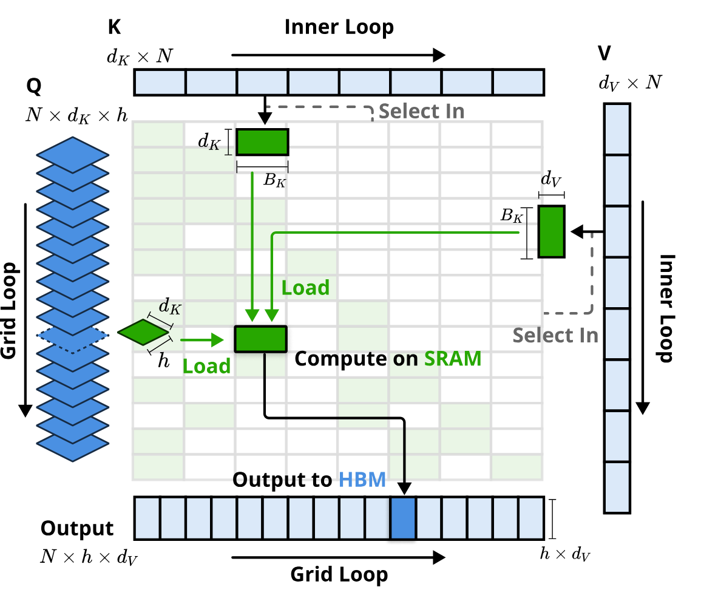

**図 3. NSA の kernel 設計。GQA group 単位で query をロードし（Grid Loop）、対応する疎 KV block を取得し（Inner Loop）、SRAM 上で注意計算を行う。緑は SRAM 上、青は HBM 上のデータを示す。**

## 4 実験

NSA を、(1) 一般 benchmark、(2) 長文脈 benchmark、(3) chain-of-thought 推論の三側面から評価し、Full Attention baseline および最先端の疎な注意手法と比較する。訓練・推論速度は[第 5 節](#section-5)で詳しく分析する。

### 4.1 事前訓練設定

最先端 LLM の一般的な構成に従い、Grouped-Query Attention (GQA) と Mixture-of-Experts (MoE) を組み合わせた backbone を用いる。総 parameter は $27\mathrm{B}$、active parameter は $3\mathrm{B}$、30 layer、hidden dimension 2560 である。GQA は 4 group、合計 64 attention head とし、各 head の query/key/value dimension は $d_q=d_k=192$、$d_v=128$ とする。MoE は DeepSeekMoE [Dai24, Dee24] 構造で、72 routed expert、2 shared expert、top-k expert は 6 とする。訓練安定性のため、最初の layer の MoE は SwiGLU 形式の MLP に置き換える。この構成は計算コストと性能の均衡を取る。

NSA の圧縮 block size を $l=32$、sliding stride を $d=16$、選択 block size を $l'=64$、選択 block 数を $n=16$（先頭 1 block と局所 2 block を常時活性化）、sliding window size を $w=512$ とする。Full Attention と NSA はともに、長さ $8\mathrm{k}$ のテキスト $270\mathrm{B}$ token で事前訓練し、次に YaRN [Pen23] を用いて長さ $32\mathrm{k}$ のテキストで継続訓練と supervised fine-tuning を行う。公平のため双方を完全に収束させた。[図 4](#figure-04)の loss curve は安定して滑らかに低下し、NSA は一貫して Full Attention より低い。

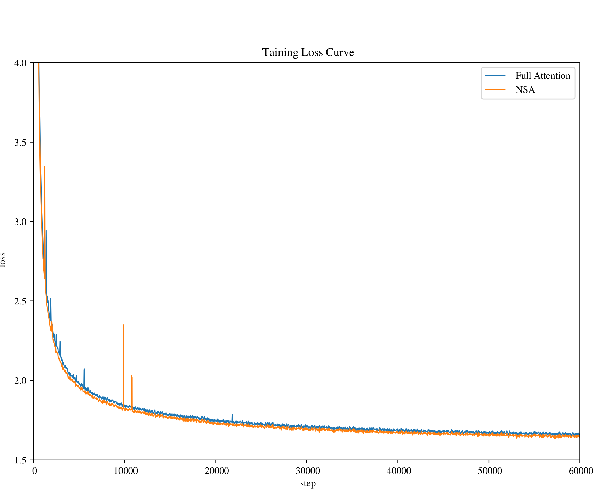

**図 4. 27B parameter モデルにおける Full Attention と NSA の事前訓練 loss。双方が安定して収束し、NSA の loss が低い。**

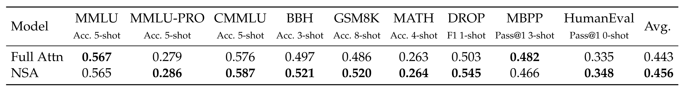

**表 1. Full Attention baseline と NSA の一般 benchmark における事前訓練性能。知識（MMLU、MMLU-PRO、CMMLU）、推論（BBH、GSM8K、MATH、DROP）、コード（MBPP、HumanEval）を含む。NSA は高い疎性にもかかわらず、多くの benchmark で優れた平均性能を示す。**

### 4.2 Baseline 手法

Full Attention に加え、推論段階の疎な注意である H2O [Zha23g]、infLLM [Xia24z]、Quest [Tan24]、Exact-Top を評価する。Exact-Top は全注意スコアを先に計算し、各 query に対する上位 $n$ key を選び、その位置だけで注意を計算する。これらは KV-cache eviction、query-aware 選択、厳密 top-$n$ 選択を代表する。

一般評価のサンプルはほぼ局所 window 内に収まり、各疎化 baseline は実質 Full Attention と等価なので、NSA と Full Attention だけを示す。長文脈評価では全 baseline の疎性を揃えて比較する。Chain-of-thought 評価は長文の supervised fine-tuning を必要とし、疎化 baseline は訓練を支援しないため、Full Attention だけと比較する。

### 4.3 性能比較

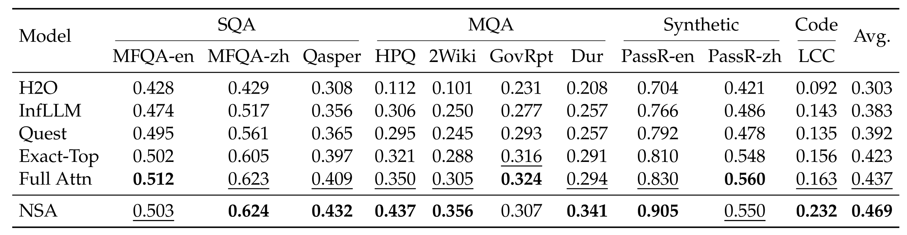

**表 2. LongBench における NSA と baseline の比較。単一文書 QA、複数文書 QA、合成、コードの各 subset を含む。NSA は Full Attention を含むほとんどの baseline を上回る。**

**一般評価。** 知識、推論、コード能力を含む MMLU [Hen20]、MMLU-PRO [Wan24c]、CMMLU [Li23e]、BBH [Suz22]、GSM8K [Cob21]、MATH [Hen20]、DROP [Dua19]、MBPP [Aus21]、HumanEval [Che21] で、事前訓練済み NSA と Full Attention を評価した。結果は[表 1](#table-01)に示す。NSA は疎でありながら、9 指標中 7 指標で Full Attention を含む全 baseline を上回る。短い系列で効率上の利点を十分に使えない場合にも性能は高い。とくに DROP で +0.042、GSM8K で +0.034 と推論 benchmark の改善が大きく、事前訓練が専用の注意機構を発達させたことを示唆する。疎な注意による事前訓練は重要情報への集中を促し、無関係な経路の noise を除くことで性能を高めうる。多様な評価での一貫した性能は汎用アーキテクチャとしての頑健性も示す。

**長文脈評価。** [図 5](#figure-05)のとおり、64k 文脈の needle-in-a-haystack [Kam23z] で全位置において完全な検索精度を得た。圧縮 token で全体を効率よく走査し、選択 token で細かな局所情報を取得する階層設計によるものである。粗粒度圧縮が低コストで関連 block を特定し、その token-level 注意が重要な細粒度情報を保持するため、全体把握と局所精度を両立できる。

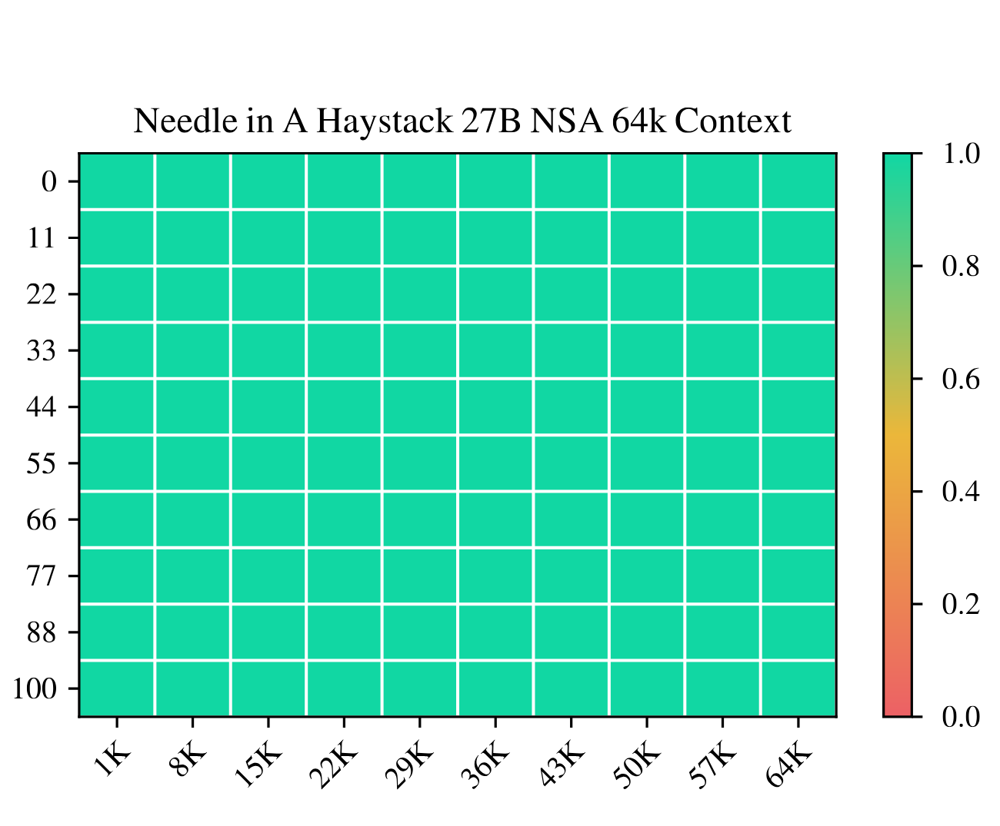

**図 5. 64k 文脈における各位置の needle-in-a-haystack 検索精度。NSA は階層型疎な注意により完全な精度を達成する。**

LongBench [Bai23] でも最先端手法および Full Attention と比較する。疎性を揃えるため、すべての疎化 baseline で各 query が活性化する token 数を 2560 とする。これは NSA が 32k 系列を扱うときの平均で、StreamLLM [Xia24a] に従い先頭 128 token と局所 512 token を含む。全モデルで低得点となり有意な比較が難しい subset は除いた。[表 2](#table-02)では NSA の平均が 0.469 と最も高く、Full Attention より +0.032、Exact-Top より +0.046 高い。ネイティブ設計により事前訓練中に疎パターンを end-to-end 最適化し、他の構成要素と同期して適応できること、階層構造が局所・全体処理を均衡させることが理由である。

長文脈の複雑な推論では、とくに HPQ と 2Wiki で Full Attention より +0.087、+0.051、コード理解 LCC で baseline より +0.069、passage retrieval の PassR-en で他手法より +0.075 高い。多様な長文脈課題を扱え、ネイティブに事前訓練した疎な注意が task-optimal なパターン学習にも寄与する。

**Chain-of-thought 推論評価。** 高度な下流訓練への適合性を調べるため、post-training で数学的 chain-of-thought を獲得できるか評価する。小規模モデルでは reinforcement learning の効果が限られるため、DeepSeek-R1 から knowledge distillation し、長さ 32k の数学推論 trace 10B token で supervised fine-tuning (SFT) を行う。Full Attention-R と NSA-R を AIME 24 で評価し、temperature 0.7、top-$p$ 0.95 で各問題 16 回生成して平均を取る。推論深度の影響を見るため、生成文脈上限を 8k と 16k にする。予測例は[第 9 節](#section-9)に示す。

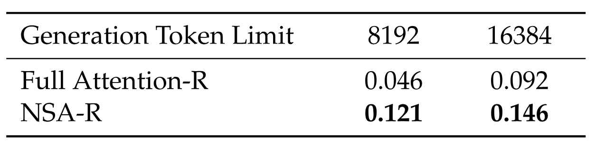

**表 3. Supervised fine-tuning 後の AIME 指示評価。NSA-R は 8k、16k の双方で Full Attention-R を上回る。**

[表 3](#table-03)では、NSA-R は 8k で +0.075、16k でも +0.054 Full Attention-R を上回る。事前訓練した疎パターンが数学的導出に必要な長距離論理依存を効率よく捉え、ハードウェア整合型設計が文脈密度を維持して catastrophic forgetting なしに深い推論を支える。ネイティブに訓練へ統合すれば、疎な注意が高度な推論にも有効である。

## 5 効率分析

8 枚の A100 GPU 上で NSA と Full Attention を比較する。4 GQA group、group あたり 16 head、$d_k=192$、$d_v=128$ とし、[第 4 節](#section-4)と同じく $l=32,d=16,l'=64,n=16,w=512$ とする。

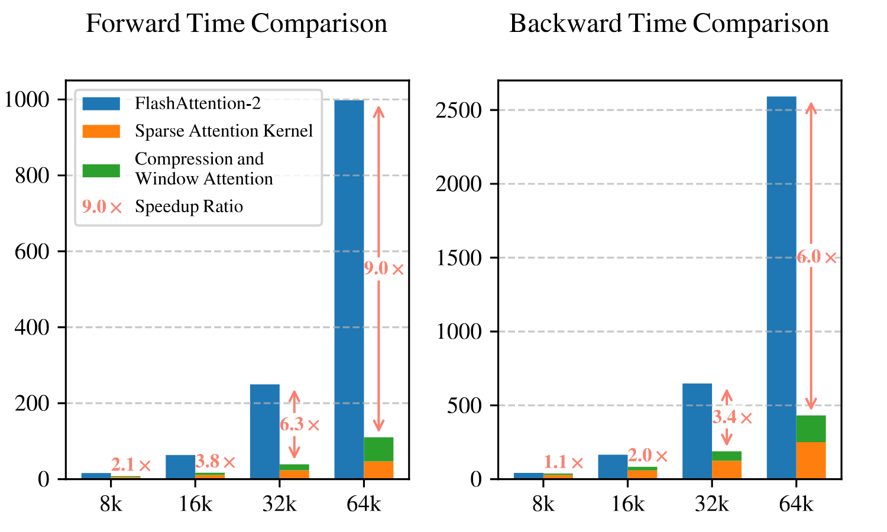

**図 6. Triton 製 NSA kernel と Triton 製 FlashAttention-2 kernel の比較。すべての文脈長で遅延を減らし、入力が長いほど改善が大きい。**

### 5.1 訓練速度

同じ backend で公平に比べるため、Triton 製の NSA と Full Attention を Triton 製 FlashAttention-2 と比較する。[図 6](#figure-06)のように、文脈が長いほど NSA の高速化は大きく、64k で順伝播 9.0$\times$、逆伝播 6.0$\times$ に達する。blockwise access が coalesced load によって Tensor Core 利用率を高め、精密な loop scheduling が重複 KV 転送を除くためである。

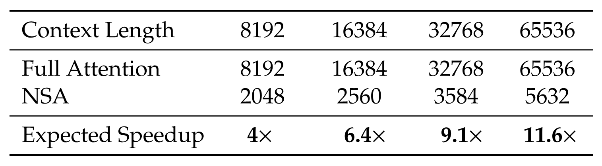

**表 4. デコード時の注意操作一回当たりのメモリアクセス量（token 相当）。デコードは算術強度が低く memory-bound なので、期待高速化率はメモリアクセス量にほぼ比例する。**

### 5.2 デコード速度

注意のデコード速度は主に KV cache load 量と結び付いたメモリアクセス bottleneck で決まる。NSA は各 step で最大 $\left\lfloor\frac{s-l}{d}\right\rfloor$ 個の圧縮 token、$nl'$ 個の選択 token、$w$ 個の近傍 token を読むだけでよい。$s$ は cache 済み系列長である。[表 4](#table-04)のように、デコードが長いほど遅延削減が大きく、64k で最大 11.6$\times$ となる。

## 6 考察

NSA の開発過程を振り返り、異なる疎な注意戦略から得た知見を論じる。代替戦略の課題と注意パターンを理解することは今後の研究にも役立つ。まず設計選択の動機となった代替 token 選択戦略を検討し、次に注意分布を可視化する。

### 6.1 代替 Token 選択戦略の課題

NSA を設計する前に、既存の疎な注意を訓練へ適用したが、さまざまな問題が生じた。

**Key clustering 戦略。** ClusterKV [Liu24zz] のように同じ cluster の key/value を連続領域へ置く戦略は、理論上訓練・推論に使えるが、(1) 動的 clustering の無視できない計算 overhead、(2) cluster 間の不均衡、とくに MoE の Expert Parallelism group 間の実行時間偏りによる operator 最適化の困難、(3) 定期的な再 clustering と chunk-sequential 訓練が必須という実装制約を持つ。これらが実運用の大きな bottleneck となる。

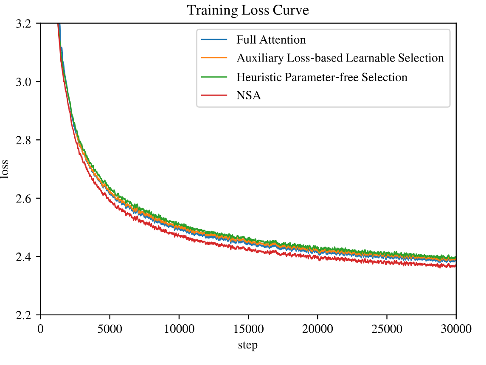

**図 7. 3B parameter モデルで Full Attention と各 token 選択戦略の訓練 loss を比較。NSA が優れる。**

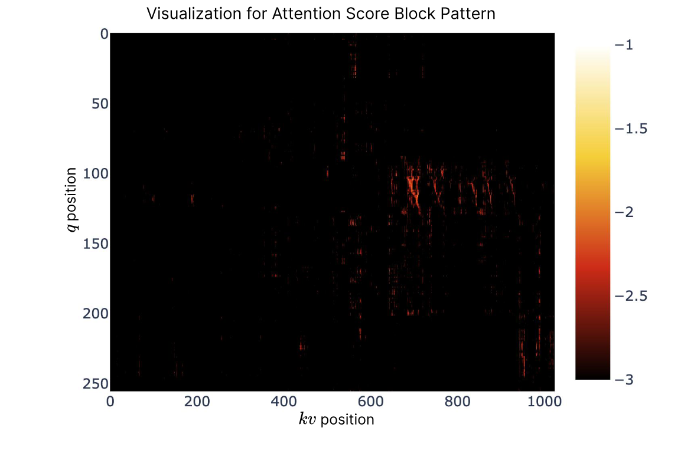

**図 8. Full Attention transformer の Attention Map。明るい領域ほど注意値が高く、スコアは blockwise に集まる。**

**その他の blockwise 選択。** Quest [Tan24] や InfLLM [Xia24z] は各 KV block の重要度を計算し、$q_t$ との類似度で上位 $n$ block を選ぶ。しかし、(1) 選択が非微分なので neural network による予測には補助 loss が必要で、operator overhead と性能低下を招く、(2) parameter-free heuristic は recall が低い、という問題がある。類似した 3B モデルで両者を NSA、Full Attention と比較した。補助 loss 方式では各 token に追加 query、各 block に代表 key を設け、key block 内の注意スコアを mean-pooling した教師信号と KL divergence で重要度を学習する。効率的なデコードのため query は block 平均せず個別に保つ。この方式は SeerAttention [Gao24z] と概念的に近い。heuristic 方式は Quest に従い query と key chunk の座標ごとの min-max の積で直接選び、parameter を追加しない。最初の 1000 step だけ Full Attention を使う cold-start も試したが、[図 7](#figure-07)のように双方とも loss が悪かった。

### 6.2 可視化

transformer の注意分布から設計の手掛かりを得るため、事前訓練した 27B Full Attention モデルの attention map を[図 8](#figure-08)に示す。スコアは blockwise に集まり、近接 key が似た値を持つ。この空間的連続性から key block を選ぶという NSA の発想を得た。隣接 token が query token と何らかの意味関係を共有する可能性を示すが、その性質は今後の検討を要する。そこで個々の token ではなく連続 block に作用する疎な注意を用い、計算効率と高注意パターンの保持を両立する。

## 7 関連研究

疎な注意によって注意計算を効率化する既存手法を概観する。中心的な戦略により、(1) 固定疎パターン、(2) 動的 token pruning、(3) query-aware 選択の三群に大別できる。以下で各群の代表例を紹介する。

### 7.1 固定疎パターン

SlidingWindow は query が固定 window 内だけに注意する一般的な手法である。StreamingLLM [Xia24a] は attention sink と局所 window を組み合わせて連続テキストを扱う。MoA [Fu24z] と DuoAttention [Xia24d] も局所・sink 情報を利用する。Longformer [Bel20] は局所 window 注意と global token を交互に用いる。NSA は事前定義パターンに頼らず自動学習し、全文脈を利用できる。

### 7.2 動的 Token pruning

H2O [Zha23g]、BUZZ [Zha24za]、SepLLM [Che24z] は、将来予測に重要でない token を動的に除き、デコード時の KV-cache memory を削減する。FastGen と HeadKV [Fu24za] は head ごとに異なる戦略を割り当てる。SnapKV [Li24c] は重要特徴だけを残して KV-cache を縮小する。これらが推論中心なのに対し、NSA は訓練段階からネイティブに疎性を組み込む。

### 7.3 Query-aware 選択

Quest [Tan24] は query と key chunk の座標ごとの min-max の積で chunk 重要度を推定する。InfLLM [Xia24z] は attention sink、局所文脈、検索可能 chunk を保ち、代表 key で重要度を求める。HashAttention [Des24z] は query/key を学習関数で Hamming space に写像し、重要 token 識別を推薦問題として扱う。ClusterKV [Liu24zz] は key を clustering し、query-cluster 類似度で選ぶ。MInference [Jia24e] と TokenSelect [Wu24z] は token-level スコアで KV 対を選ぶ。SeerAttention [Gao24z] は query/key を空間 block に分けて選択する。NSA は訓練、prefill、デコードを含む全ライフサイクルでハードウェア整合型の疎な注意計算を行う。

## 8 結論

NSA は効率的な長文脈モデリングのための、ネイティブに訓練可能な疎な注意機構である。階層型 token 圧縮・選択とハードウェア整合型実装を組み合わせ、性能を損なわず訓練と推論を高速化する。27B モデルの実験では一般・長文脈 benchmark と chain-of-thought で Full Attention と同等以上となり、64k 系列で順伝播 9.0$\times$、逆伝播 6.0$\times$、デコード 11.6$\times$ を達成した。ネイティブな疎な注意は次世代言語モデルの長文脈処理に有望である。

## 9 AIME 結果の例

**例 1 — Prompt**

> 「|User| 正の実数 $x,y,z$ が次の方程式系を満たすとする。
>
> $\log_2\left(\frac{x}{yz}\right)=\frac{1}{2}$、$\log_2\left(\frac{y}{xz}\right)=\frac{1}{3}$、$\log_2\left(\frac{z}{xy}\right)=\frac{1}{4}$。
>
> $\left|\log_2(x^4y^3z^2)\right|=\frac{m}{n}$ で、$m,n$ は互いに素な正整数である。$m+n$ を求めよ。
>
> 段階的に推論し、最終回答を $\boxed{}$ に入れよ。|Assistant|」

**本手法の結果**

> $\langle$think$\rangle$...$\langle$/think$\rangle$ (2275 tokens)
>
> 与えられた方程式は、
>
> 1. $\log_2\left(\frac{x}{yz}\right)=\frac{1}{2}$
> 2. $\log_2\left(\frac{y}{xz}\right)=\frac{1}{3}$
> 3. $\log_2\left(\frac{z}{xy}\right)=\frac{1}{4}$
>
> である。指数形式に直すと、
>
> 1. $\frac{x}{yz}=\sqrt{2}$
> 2. $\frac{y}{xz}=2^{1/3}$
> 3. $\frac{z}{xy}=2^{1/4}$
>
> したがって、$x=\sqrt{2}\cdot yz$、$y=2^{1/3}\cdot xz$、$z=2^{1/4}\cdot xy$ である。
>
> これらを代入すると、
>
> - 最初の二式から $x=\sqrt{2}\cdot(2^{1/3}\cdot xz)\cdot z$、よって $z=2^{-5/12}$。
> - $z$ を $y$ の式へ代入して $y=2^{-3/8}$。
> - $z,y$ を $x$ の式へ代入して $x=2^{-7/24}$。
>
> 次に、$x^4=(2^{-7/24})^4=2^{-7/6}$、$y^3=(2^{-3/8})^3=2^{-9/8}$、$z^2=(2^{-5/12})^2=2^{-5/6}$。
>
> よって $x^4y^3z^2=2^{-7/6}\cdot2^{-9/8}\cdot2^{-5/6}=2^{-75/24}=2^{-25/8}$。
>
> $\log_2(x^4y^3z^2)=-25/8$ なので、絶対値は $25/8$。したがって $m=25,n=8$、$m+n=33$。
>
> $\boxed{33}$

**Baseline の結果**

> $\langle$think$\rangle$...$\langle$/think$\rangle$ (9392 tokens)
>
> 対数方程式を指数形式に直すと、
>
> $\sqrt{2}=\frac{x}{yz}\implies x=\sqrt{2}\cdot yz$、
>
> $2^{\frac{1}{3}}=\frac{y}{xz}\implies y=2^{\frac{1}{3}}\cdot xz$、
>
> $2^{\frac{1}{4}}=\frac{z}{xy}\implies z=2^{\frac{1}{4}}\cdot xy$。
>
> 代入して解くと、$z=2^{-5/12}$、$xy=2^{-2/3}$、$y=2^{-1/24}$、$x=2^{1/24}$ を得る。
>
> しかし第三式を確認すると解がない可能性があるため、行列の逆行列で解く。
>
> $\begin{cases}\log_2(x)-\log_2(y)-\log_2(z)=\frac{1}{2}\\ \log_2(y)-\log_2(x)-\log_2(z)=\frac{1}{3}\\ \log_2(z)-\log_2(x)-\log_2(y)=\frac{1}{4}\end{cases}$
>
> $A=\log_2(x),B=\log_2(y),C=\log_2(z)$ とすると、
>
> $\begin{cases}A-B-C=\frac{1}{2}\\ B-A-C=\frac{1}{3}\\ C-A-B=\frac{1}{4}\end{cases}$
>
> Cramer の公式と逆行列を使う。行列式は -2、解は $A=\frac{61}{48},B=\frac{13}{16},C=-\frac{1}{6}$ である。
>
> よって $x=2^{61/48},y=2^{13/16},z=2^{-1/6}$。
>
> 求める値の中身は、$4\log_2x+3\log_2y+2\log_2z=4\cdot\frac{61}{48}+3\cdot\frac{13}{16}+2\cdot\left(-\frac{1}{6}\right)$。
>
> 分母を 48 に揃えると、$\frac{244}{48}+\frac{117}{48}-\frac{16}{48}=\frac{345}{48}=\frac{115}{16}$。
>
> 既約なので $m=115,n=16$、$m+n=131$。
>
> $\boxed{131}$

**例 2 — Prompt**

> 「|User| 実数 $x,y>1$ が $\log_x(y^x)=\log_y(x^{4y})=10$ を満たす。$xy$ の値は何か。
>
> 段階的に推論し、最終回答を $\boxed{}$ に入れよ。|Assistant|」

**本手法の結果**

> $\langle$think$\rangle$...$\langle$/think$\rangle$ (15147 tokens)
>
> 1. $\log_x(y^x)=10$
> 2. $\log_y(x^{4y})=10$
>
> まず対数の冪乗則を使う。第一式は $\log_x(y^x)=x\cdot\log_x(y)=10$。
>
> $z=\log_y(x)$ とすると $\log_x(y)=\frac{1}{z}$ なので、$x\cdot\frac{1}{z}=10\implies x=10z$。
>
> 第二式は $\log_y(x^{4y})=y\cdot\log_y(x^4)=10$。したがって $4y\log_y(x)=10$、$\log_y(x)=z$ より $yz=\frac{5}{2}$。
>
> $x=10z$、$y=\frac{5/2}{z}$ を $xy$ に代入すると、$xy=(10z)\cdot\left(\frac{5/2}{z}\right)=25$。
>
> よって $xy=\boxed{25}$。

**Baseline の結果**

> $\langle$think$\rangle$...$\langle$/think$\rangle$ (16223 tokens)
>
> $x,y>1$ が $\log_x(y^x)=10$ と $\log_y(x^4y)=10$ を満たすとき $xy$ を求める。
>
> 第一式は $x\log_x(y)=10$。換底公式 $\log_x(y)=\frac{\ln y}{\ln x}$ と $\log_yx=\frac{9}{4}$ から $\log_xy=\frac{4}{9}$。よって $x\cdot\frac{4}{9}=10\implies x=\frac{45}{2}$。
>
> 第二式は $4\log_yx+1=10\implies\log_yx=\frac{9}{4}$。再び $\log_xy=\frac{4}{9}$。
>
> したがって $x=\frac{45}{2}$、$y=\left(\frac{45}{2}\right)^{4/9}$ であり、$xy=\left(\frac{45}{2}\right)^{13/9}$。
>
> しかし再検討し、$x=2^a,y=2^b$ と置くと、$\log_x(y^x)=10\implies\frac{x\log_xy}{\log_xy}=10\implies x\cdot\frac{4}{9}=10\implies x=\frac{45}{2}$。
>
> また $\log_y(x^4y)=10\implies\frac{4\log_yx+1}{\log_yx}=10\implies4\cdot\frac{9}{4}+1=10$ で整合する。
>
> 最後に $xy=\left(\frac{45}{2}\right)$ と簡約される。
