> [Guseul Heo](https://dblp.org/pid/299/7465.html), [Sangyeop Lee](https://dblp.org/pid/290/9678.html), [Jaehong Cho](https://dblp.org/pid/297/4770.html), [Hyunmin Choi](https://dblp.org/pid/288/1825.html), [Sanghyeon Lee](https://dblp.org/pid/286/7145.html), [Hyungkyu Ham](https://dblp.org/pid/322/2213.html), [Gwangsun Kim](https://dblp.org/pid/335/5960.html), [Divya Mahajan](https://divyamahajan.github.io/)、および [Jongse Park](https://casys.kaist.ac.kr/)。2024 年 3 月 1 日に arXiv へ初投稿、現行版 v1。[ASPLOS '24](https://doi.org/10.1145/3620666.3651380)、pp. 722-737。[NeuPIMs: NPU-PIM Heterogeneous Acceleration for Batched LLM Inferencing](https://arxiv.org/abs/2403.00579)。[原論文 PDF](/paper/neupims.pdf)。[DOI](https://doi.org/10.1145/3620666.3651380)。[TeX ソース](https://export.arxiv.org/e-print/2403.00579)。正確な印刷レイアウトと参考文献は原論文 PDF を参照する。

## 要旨

Transformer ベースの大規模言語モデル (LLM) は、複数のデコーダブロックから構成される。各ブロックには (1) QKV 生成、(2) マルチヘッド注意機構、(3) フィードフォワードネットワークが含まれる。バッチ処理では、QKV 生成と FFN は計算負荷の高い行列-行列積 (GEMM) を使う一方、マルチヘッド注意機構は帯域幅を消費する行列-ベクトル積 (GEMV) を必要とする。TPU や NPU は GEMM に強いが GEMV の効率は低い。Processing-in-Memory (PIM) は GEMV に適する反面、GEMM の計算能力に乏しい。

この性質から、通常の GEMM 向け NPU と GEMV 向け PIM デバイスを組み合わせる異種加速システム NeuPIMs を提案する。NPU と PIM を効率よく統合するには、両方を同時に動作させる必要がある。既存 PIM は通常「ブロック」モードで動作し、NPU または PIM の一方しか有効にできない。また LLM 内の GEMM と GEMV の依存関係が並列処理を制限する。NeuPIMs は各 bank に二重行バッファを備え、メモリの読み書きと PIM コマンドを同時に管理する。さらに、実行時のサブバッチ・インターリービングにより、1 台のデバイス内で独立した 2 つのサブバッチをパイプライン実行する。GPU のみ、NPU のみ、単純な NPU+PIM 統合と比べ、スループットはそれぞれ 3 倍、2.4 倍、1.6 倍向上する。

## 1 はじめに

LLM は自然言語理解、コンテンツ生成、意思決定支援などに広く使われている [Ope23, Hof22, Bla22, Tou23]。しかし、メモリと計算資源の要求が大きい。本稿は GPT-4 [Ope23] や LLaMA [Tou23] など、現代の LLM 推論における課題を扱う。

これらのモデルに共通する構造は、デコーダブロックを積み重ねたものである。[図 1](#figure-01)(a) のように、各ブロックは (1) Query-Key-Value (QKV) 生成、(2) Multi-Head Attention (MHA)、(3) Feed-Forward Networks (FFN) から成る。複数の推論要求をバッチ化すると、QKV 生成と FFN は重みを共有でき、重み行列と活性行列の GEMM になる。一方、MHA は活性行列と活性ベクトルを乗算し、再利用がないため GEMV になる。

LLM 推論は大規模な GEMM と GEMV を大量に実行する。GPU や TPU などの機械学習アクセラレータを、ここでは Neural Processing Unit (NPU) と呼ぶ。NPU は GEMM に最適化されるが、算術強度の低い GEMV では計算資源が余る。PIM は GEMV に有効である [Att24, New20, Tra22, Har21, Neu24a]。

NeuPIMs は、複数の systolic array を備えた GEMM 向け NPU と、GEMV 向け PIM を同時に利用する。設計上の課題は 2 つある。

- **マイクロアーキテクチャ上の課題:** 既存 PIM は NPU と同時に動かせない。
- **アルゴリズム上の課題:** デコーダブロック内の GEMM と GEMV は依存している。

1. **マイクロアーキテクチャの貢献。** NeuPIMs は異なる機能用に独立した行バッファを持つ二重行バッファを導入する。メモリ制御器はメモリ命令と PIM 命令を交互に発行し、DRAM のタイミングを守る。複数の GEMV をまとめる複合命令も追加する。
2. **アルゴリズムの貢献。** サブバッチ・インターリービングにより、独立な 2 つのサブバッチを交互に処理する。一方の GEMM と他方の GEMV を重ね合わせ、シーケンス長から MHA 遅延を推定してサブバッチを均衡させる。

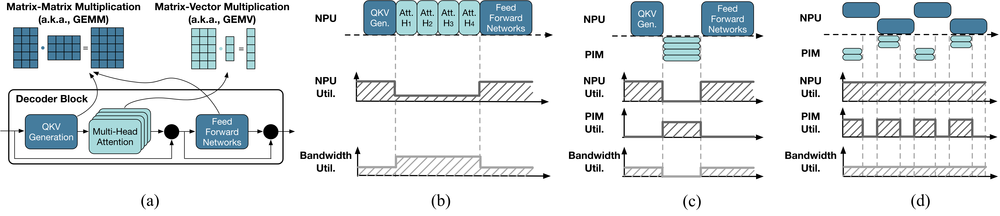

**図 1.** (a) LLM デコーダブロックの数学的構成、(b) 非 PIM メモリを持つ NPU のみのベースライン、(c) NPU+PIM ベースライン、(d) 提案する NeuPIMs。

NeuPIMs を GPT-3 の 4 つの構成と ShareGPT、Alpaca データセットで評価した。ONNXim と DRAMsim3 ベースの PIM シミュレータを組み合わせた結果、NPU のみおよび単純な NPU+PIM よりスループットが 2.4 倍、1.6 倍向上した。

## 2 背景

### 2.1 LLM 推論の計算特性

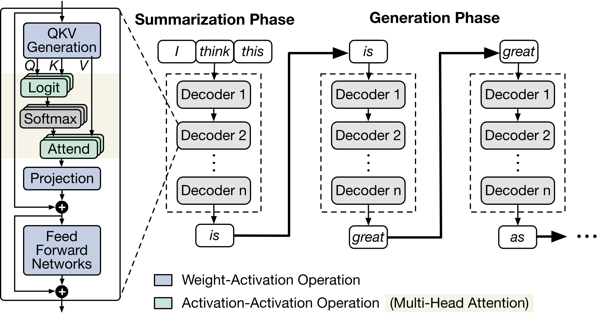

**図 2.** LLM のモデル構造と推論。

**モデル構造と実行。** [図 2](#figure-02) は大規模言語モデルに共通する構造を示す [Tou23, Bla22]。入力プロンプトは要約段階で符号化され、生成段階のコンテキストになる。生成段階では、前回までの key-value 投影を使い、自己回帰的に 1 トークンずつ生成する。両段階は QKV 生成、MHA、FFN を含むデコーダブロック列である。

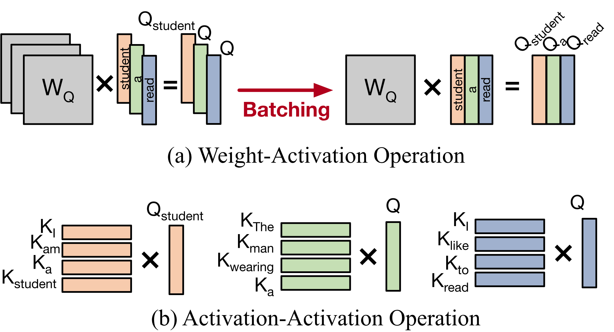

**図 3.** LLM デコーダブロックの演算子。

**バッチ推論。** [図 3](#figure-03) は重み-活性と活性-活性の乗算を示す。要約段階の複数トークンや複数要求のバッチ化により、QKV と FFN の GEMV は GEMM になる。MHA は現在トークンと過去トークンの乗算であり、要求ごとに活性が異なるためバッチ化できず、メモリ帯域幅律速になる。

**算術強度の分析。** GPT3-13B と GPT3-175B の roofline 分析では、[図 4](#figure-04) に示すように生成段階はメモリ律速、要約段階は計算律速である。両段階は依存関係を持って交互に実行されるため、GEMM 向け NPU と GEMV 向け PIM の異種構成が必要になる。

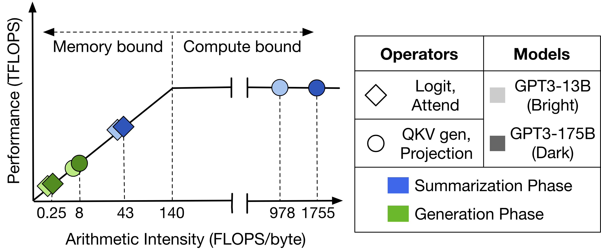

**図 4.** LLM 各層の算術強度。

### 2.2 LLM 推論サービング

LLM サービスは DeepSpeed、Orca、vLLM [Vll23] などのフレームワークを使い、要求をバッチ化する。

**選択的バッチ化。** MHA はバッチ化できないため、Orca は注意層を個別に計算し、QKV と FFN をバッチ化する。この性質が GEMM と GEMV の同時実行を必要とする。

**反復レベルのスケジューリング。** ストリームで到着する要求を各反復の境界でバッチに追加・削除する。NeuPIMs もこの方式を採用する。

**注意機構のメモリページング。** vLLM は再利用される KV cache をページ単位で割り当て、長い系列でも過剰な事前確保を避ける。NeuPIMs は同じ方式を用いる。

*NeuPIMs はこれらの技術を備えた推論サービングシステムへの配備を想定する。*

## 3 動機

既存の GPU ベース推論サービスと、単純な NPU-PIM 統合の制約を分析する。

### 3.1 GPU ベースの LLM 推論サービング

LLM は大容量メモリを必要とするため、パイプライン並列やテンソル並列を使う複数 GPU クラスタに配置される。

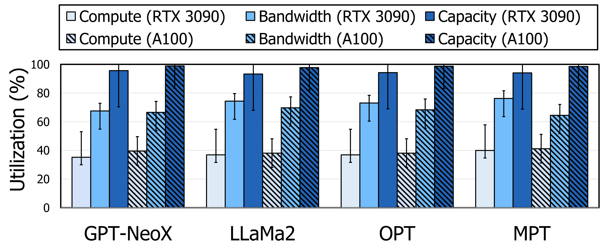

**図 5.** 4 種類の LLM における GPU 利用率。

**GPU システムの低利用率。** RTX 3090 24GB と A100 40GB で GPT-NeoX、LLaMA2、OPT、MPT を実行して利用率を比較した。[図 5](#figure-05) では容量利用率は 100% に近いが、計算資源利用率は 40% 未満である。A100 の HBM が 1,555 GB/s を提供しても帯域幅が不足し、GEMM と GEMV の逐次依存が残る限り不均衡は避けられない。

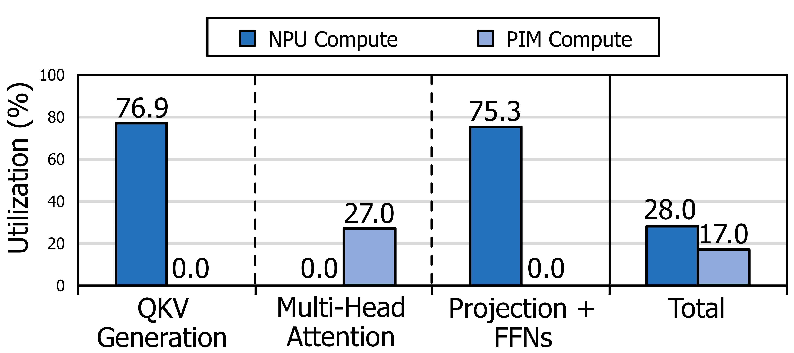

**図 6.** デコーダブロックの NPU-PIM 利用率。

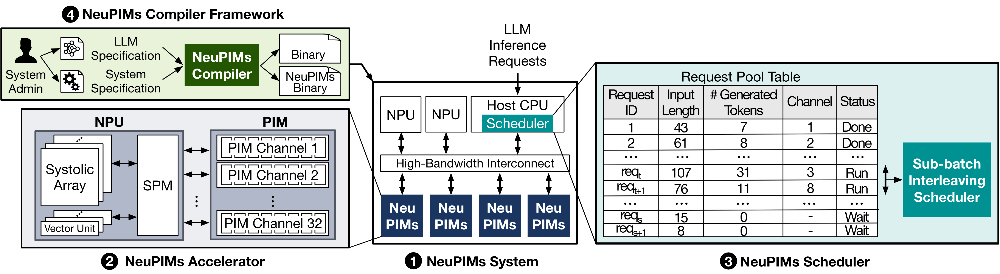

**図 7.** NeuPIMs システムの概要。

### 3.2 単純な NPU-PIM 方式

帯域幅ボトルネックを PIM にオフロードするため、systolic array NPU と Newton [New20] を組み合わせた単純な NPU-PIM を設計した。[第 8 節](#section-8) の方法で評価すると、NPU が QKV、projection、FFN を実行する間 PIM は停止し、PIM が MHA を実行する間 NPU はほぼ停止する。[図 6](#figure-06) の総合利用率は双方で 40% 未満である。

**NPU と PIM の同時実行の必要性。** 単一行バッファを共有する PIM マイクロアーキテクチャがホスト (NPU) と PIM の同時実行を禁止し、独立した資源を直列化している。実用化には両者の並列実行が必要である。

## 4 NeuPIMs の概要

[図 7](#figure-07) のシステムは、systolic array とベクトルユニットを持つ NPU、HBM ベースの PIM チャネル、バッチを 2 つのサブバッチに分けて交互に実行するスケジューラから成る。

1. **NeuPIMs システム。** ホスト CPU、複数の NeuPIMs デバイス、単独 NPU、高帯域インターコネクトを備える。要約段階の GEMM は単独 NPU、生成段階は NeuPIMs が担当する。要求はストリームで到着し、反復の境界まで request pool に待機する。
2. **NeuPIMs アクセラレータ。** bank に PIM 用と通常メモリアクセス用の二重行バッファを置き、PIM が使っていない行を NPU がアクセスできるようにする。
3. **NeuPIMs スケジューラ。** 32 個の HBM PIM チャネルと各チャネルのメモリコントローラが、タイミングを守りながらメモリ命令と PIM 命令をインターリーブする。
4. **NeuPIMs コンパイラ。** ONNX に似た仕様を中間表現へ変換し、NPU と NeuPIMs の命令バイナリを生成する。

## 5 NeuPIMs アーキテクチャ

### 5.1 同時実行のための PIM マイクロアーキテクチャ

**単一行バッファ。** [図 8](#figure-08)(a) では、ベクトルを共有グローバルバッファに置き、行列の行を複数 bank の行バッファへ読み出して、乗算器と加算木で部分内積を計算する。

**既存 GEMV アクセラレータの制約。** 既存 PIM [New20, Har21] は通常と PIM のアクセスで単一行バッファを共有するため、NPU と PIM を同時に動かせない。GEMM と GEMV を要求する LLM 推論ではこれが性能を制限する。

**二重行バッファ。** [図 8](#figure-08)(b) の NeuPIMs bank は MEM と PIM の行バッファを持つ。マイクロアーキテクチャの変更を抑え、複雑さを命令インターフェースと制御へ移した。評価には Newton を使うが、標準 DRAM 構造の GEMV アクセラレータに適用できる。

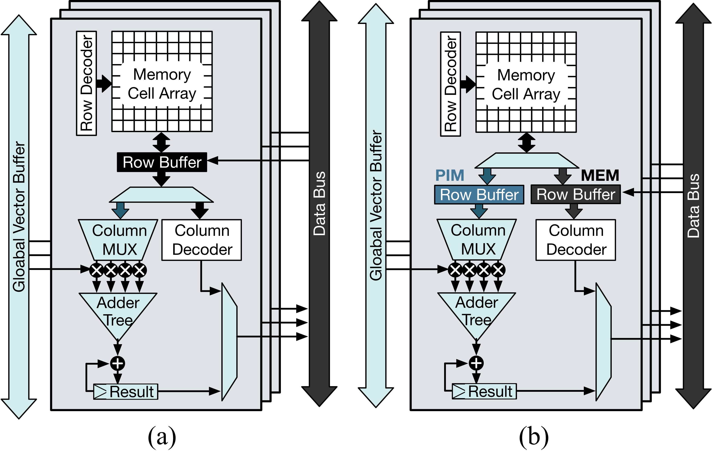

**図 8.** (a) 既存 PIM、(b) NeuPIMs のメモリ bank マイクロアーキテクチャ。

### 5.2 メモリ命令インターフェース

**既存の命令。** `PIM_GWRITE` は行を共有ベクトルバッファへコピーし、`PIM_ACTIVATION` は複数 bank の PIM 行バッファを起動する。`PIM_DOTPRODUCT` が並列内積を実行し、`PIM_RDRESULT` が結果をホストへ返す。

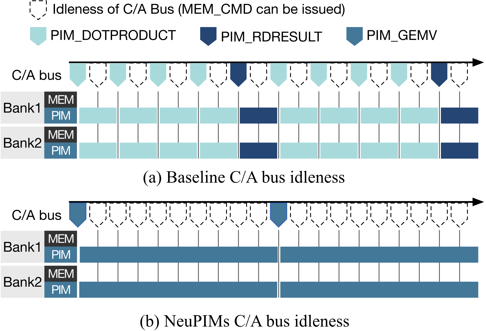

**図 9.** PIM 命令のタイミング比較。

**NeuPIMs の命令。** 3 つの命令を追加する。

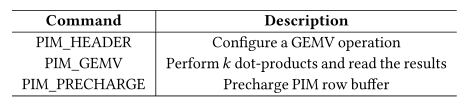

**表 1.** NeuPIMs 命令の一覧。

- **PIM_HEADER:** GEMV の次元を通知し、コントローラが DRAM refresh と衝突しない遅延を見積もる。
- **PIM_GEMV:** 複数の内積と結果読み出しを 1 つの複合命令にまとめる。$k$ は内積数である。
- **PIM_PRECHARGE:** GEMV 後に PIM 行バッファを precharge する。

### 5.3 メモリコントローラ

NeuPIMs は複数チャネルと PIM bank で構成され、要求はチャネルへ割り当てられる。各チャネルのコマンドキューから PIM 命令をすべての bank に broadcast する。

**メモリ命令と PIM 命令のインターリーブ。** コマンド/アドレスバスがボトルネックにならないよう、発行遅延の大きい PIM 命令を優先し、通常のメモリ命令と交互に発行する。

## 6 NeuPIMs スケジューリング

二重行バッファにより NPU のメモリアクセスと PIM 命令を同時に扱う。ここでは MHA の重複とサブバッチ・インターリービングを説明する。

### 6.1 MHA 層の重複機会

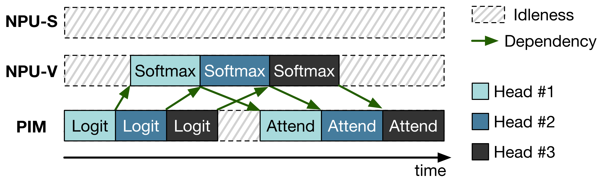

**図 10.** MHA 層の重複機会。NPU-S は systolic array、NPU-V はベクトルユニットを表す。

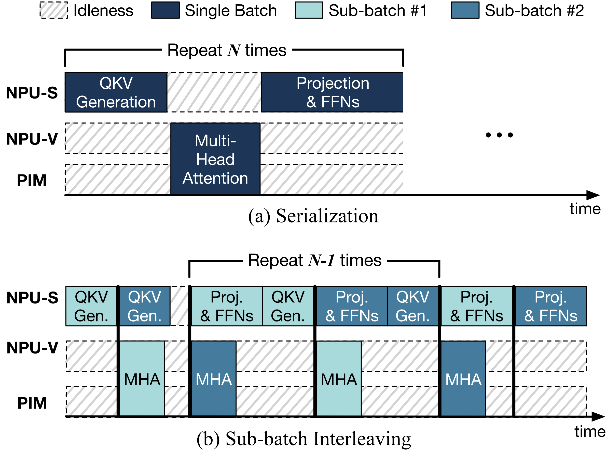

**図 11.** デコーダブロックの実行タイムライン。(a) 直列実行、(b) サブバッチ・インターリービング。$N$ はブロック数である。

[図 10](#figure-10) は PIM 側の logit/attend と NPU 側の softmax の重複を示す。MHA は head 単位に分解できるが、単純な統合方式では PIM チャネルを介して結果をベクトルユニットへ渡せない。二重行バッファを使う NeuPIMs では、PIM GEMV の完了を待たずに NPU-V が部分値を保存できる。これは head レベル並列性に依存し、NPU の systolic array は MHA 中ほとんどアイドルのままである。

### 6.2 サブバッチ・インターリービング

**直列実行の制約。** [図 11](#figure-11)(a) では QKV、MHA、projection と FFN が依存関係のため直列に実行される。

**2 つのサブバッチの交互実行。** 大きなバッチを 2 つに分割し、[図 11](#figure-11)(b) のように一方の PIM 向け演算と他方の NPU 向け演算を重ねる。

**タイムラインの比較。** 1 台の NeuPIMs に $N$ 個のデコーダブロックがあるとする。インターリーブなしでは実行時間は $N$ 倍のブロック時間になる。インターリーブすると MHA の時間が NPU の GEMM に隠れ、交互実行中の利用率が上がる。

**課題。** MHA の最長系列を処理するチャネルが遅延を決めるため、[第 6.4 節](#section-6-4)でチャネル負荷を均衡させる。二つのサブバッチの時間をそろえるため、[第 6.5 節](#section-6-5)で分割する。

### 6.3 MHA 遅延推定

NPU の遅延はバッチサイズに依存する。GEMV ベクトルを bank 間で共有し、行列を行方向にインターリーブした KV マッピングを使って遅延を推定する。同じ行と列の key cache は layer と head を共有し、value cache は layer、head、系列を共有する。[アルゴリズム 1](#algorithm-01) がこの対応を利用する。

**アルゴリズム 1: MHA 遅延推定。**

- **入力:** `seq_len` (要求の系列長)。
- **パラメータ:** $E$, $L_{\mathrm{tile}}$, $L_{\mathrm{GWRITE}}$, $P_{\mathrm{DRAM}}$, $B_{\mathrm{chnl}}$, $N_{\mathrm{head}}$。
- **出力:** $L_{\mathrm{MHA}}$。
- $L_{\mathrm{MHA}}\leftarrow 0$ とし、$K^\top\times\mathrm{Query}$ と $\mathrm{Logits}\times\mathrm{Value}$ の GEMV タイル数および書き込み遅延を加算する。
- **返す:** $L_{\mathrm{MHA}}$。

### 6.4 貪欲最小負荷ビンパッキング

NeuPIMs は要求を PIM チャネルへ割り当てる。系列長を降順に並べ、MHA 遅延推定値が最小のチャネルへ要求を追加して負荷を更新する。

**アルゴリズム 2: 貪欲最小負荷ビンパッキング。**

- **入力:** 新規要求の系列長リスト $L_{\mathrm{req}}$ と、チャネルごとの割当 $L_{\mathrm{chnl}}$。
- **各**チャネルの要求について MHA 遅延を合計し、負荷リストを作る。
- **各**新規要求を最小負荷チャネルへ追加し、その負荷を更新する。
- **返す:** $L_{\mathrm{chnl}}$。

### 6.5 サブバッチ分割アルゴリズム

NPU 演算のバッチサイズ依存性から、2 つのサブバッチを均衡させる必要がある。[アルゴリズム 3](#algorithm-03) は各チャネルの要求を半分に分ける。

**アルゴリズム 3: サブバッチ分割。**

- **入力:** 各チャネルのアクティブ要求集合 $L_{\mathrm{req}}$。
- **出力:** インターリーブ用の $\mathrm{SB}_1$ と $\mathrm{SB}_2$。
- **各**チャネルで要求数の半分を計算し、奇数の場合は余りを交互に一方へ割り当て、前半を $\mathrm{SB}_1$、後半を $\mathrm{SB}_2$ へ追加する。
- **返す:** $\mathrm{SB}_1,\mathrm{SB}_2$。

## 7 NeuPIMs システムのスケーリング

モデルパラメータを複数デバイスへ分割するモデル並列は、デバイスのメモリ容量が限られるため必要である。ここではパイプライン並列とテンソル並列への適用を述べる。

### 7.1 NeuPIMs のパイプライン並列

モデルを層ごとに分割し、マイクロバッチをパイプライン処理する。NeuPIMs にも適用できるが、デバイスあたりのブロックとバッチサイズが小さくなり、サブバッチ分割によって systolic array が利用不足になる。

### 7.2 NeuPIMs のテンソル並列

テンソルをシャードに分け、各デバイスで並列実行して結果を通信で集約する。サブバッチ・インターリービングは通信頻度を 2 倍にするが、総トラフィックは変わらない。先に終わったサブバッチが通信する間、もう一方は計算できるため、テンソル並列を優先し、必要な場合だけパイプライン並列を加える。

## 8 評価

### 8.1 方法論

**ベースライン。** GPU のみ、NPU のみ、NPU+PIM、NeuPIMs を比較する。

- **GPU のみ:** NVIDIA A100 40GB と PyTorch でバッチ推論を実行する実 GPU システム。
- **NPU のみ:** PIM を持たない NPU。公平性のため他方式と同じメモリ帯域を仮定し、systolic array とベクトルユニットを備える。
- **NPU+PIM:** Newton PIM GEMV と既存 NPU を統合し、MHA の GEMV だけを PIM へ割り当て、要求はラウンドロビンでチャネルへ配る。

**サイクルレベルシミュレーション。** ONNXim と DRAMsim3 を接続し、ONNXim のメモリインターフェースから PIM シミュレータへアクセスを転送する。

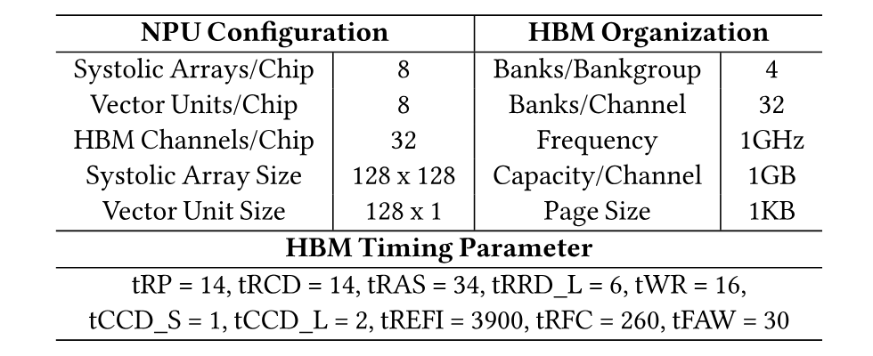

**表 2.** NeuPIMs ハードウェア仕様。

**ハードウェア仕様。** プロトタイプは 8 個の systolic array と SIMD ベクトルユニットを持つマルチチップレット設計で、各メモリチャネルは 32 個の PIM bank と 1 GB の容量を持つ。

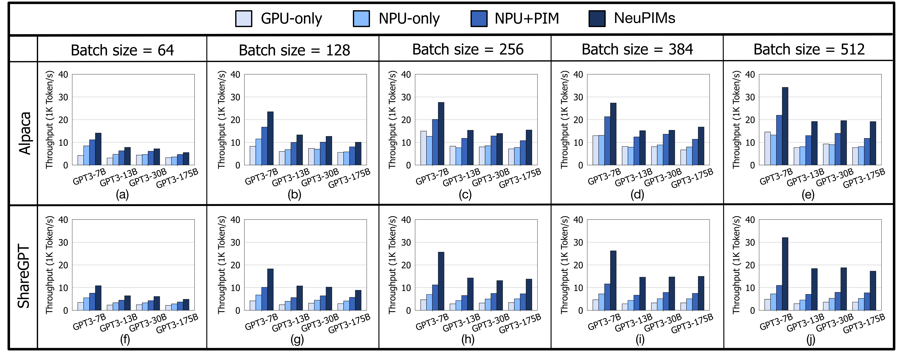

**図 12.** Alpaca と ShareGPT、バッチサイズ 64、128、256、384、512 におけるスループット。

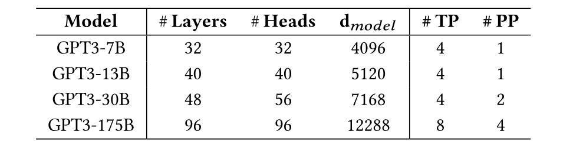

**表 3.** 評価した LLM 構成。

**LLM モデル。** [表 3](#table-03) の 4 種類の GPT-3 を使用する。NeuPIMs は他の decoder ベース生成モデルにも適用できる。

**データセット。** ShareGPT は ChatGPT の実ユーザーログから抽出した対話、Alpaca は text-davinci-003 が生成した命令データセットである。平均入力/出力長は ShareGPT が 80/296、Alpaca が 12/56 トークンである。

**ワークロード。** 全推論サービスのサイクルシミュレーションは困難なため、モデル、バッチサイズ、テンソル/パイプライン並列を組み合わせ、データセットから系列長をランダムに抽出してワークロードを合成した。各組合せで 10 バッチを測定した。

### 8.2 結果

**スループット。** [図 12](#figure-12) では GPU のみと NPU のみの差は小さい。NPU+PIM は MHA GEMV を PIM へ移して NPU のみより平均 1.5 倍高速になる。NeuPIMs は全モデルとデータセットで NPU+PIM を上回り、13% から 3 倍の追加向上を得る。ShareGPT の長い系列と、バッチサイズ増加による NPU 計算の活用が利益を大きくする。

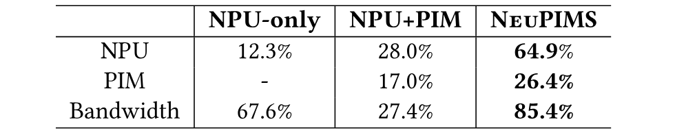

**表 4.** NPU/PIM 計算資源とメモリ帯域の平均利用率。

**利用率。** [表 4](#table-04) の GPT3-30B、バッチ 256、ShareGPT では、NPU+PIM の NPU 利用率は 28.0% である。NeuPIMs は同時実行により NPU 64.9%、PIM 26.4% を達成する。

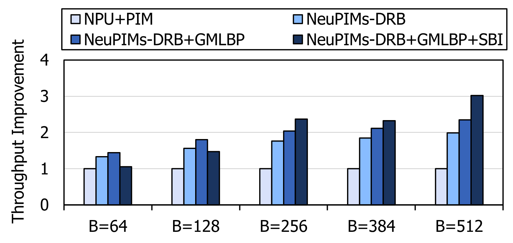

**図 13.** GPT3-7B と ShareGPT。DRB は二重行バッファ、GMLBP は貪欲最小負荷ビンパッキング、SBI はサブバッチ・インターリービングである。

**アブレーション。** 二重行バッファは平均 69.7% の向上をもたらす。GMLBP も要求を均等に分散するため常に有効である。小さいバッチでは SBI の分割とパイプラインコストが利益を上回るが、256 以上では最大スループットになる。

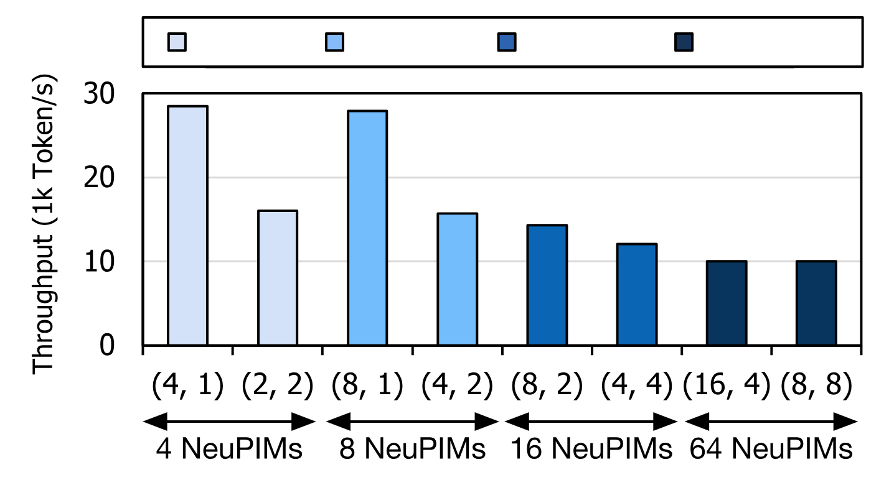

**図 14.** 並列方式を変えたマルチ NeuPIMs システムのスループット。

**並列化の含意。** LLM が大きくなるとデバイス数を増やす必要がある。[図 14](#figure-14) は全要求数 256 を固定した結果であり、テンソル並列はデバイスあたりのバッチを大きく保つためパイプライン並列より有利である。

**面積オーバーヘッド。** 主な面積増加は二重行バッファである。22 nm の CACTI 7.0 で行バッファを倍増して測定した結果、オーバーヘッドは 3.11% だった。

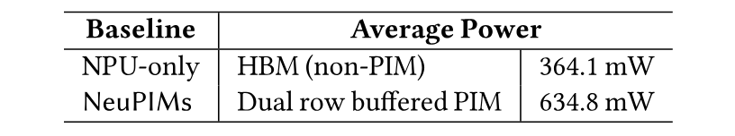

**表 5.** NeuPIMs の電力オーバーヘッド。

**電力オーバーヘッド。** NPU と PIM を同時に動かすため、メモリ電力は NPU のみより高い。DRAMsim3 の Micron 電力モデルで測定し、全 bank 計算命令の電力を read の 4 倍、追加行バッファの背景電力を含めた。電力は 1.8 倍だが速度は 2.4 倍で、エネルギーを 25% 削減できる。

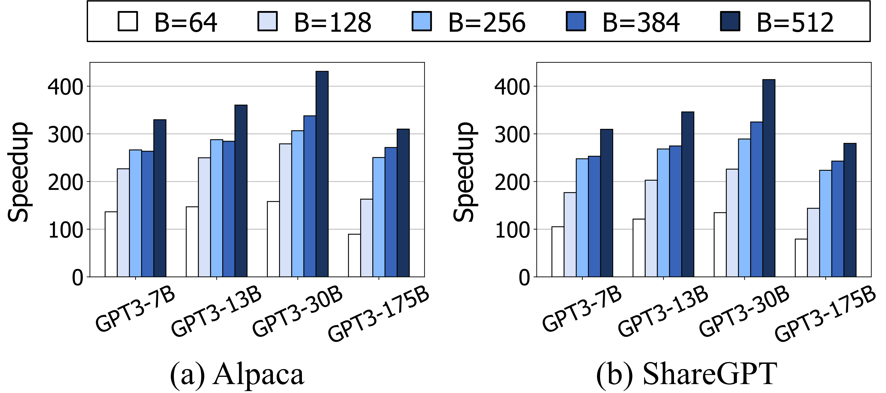

**図 15.** TransPIM [Tra22] に対する NeuPIMs の高速化。

**TransPIM との比較。** TransPIM は Transformer 全体を PIM で実行する方式である。DRAMsim3 に基づくシミュレータを作成し、HBM のタイミングと容量をそろえた。[図 15](#figure-15) では平均スループットが 228 倍高く、79 倍から 431 倍の高速化となる。NPU で GEMM を効率よく実行できることが差の主因であり、TransPIM は単一バッチの encoder 推論向けで decoder ベースのバッチ推論には適さない。

## 9 考察

**モデル学習。** 学習は固定長系列を使い GEMM が中心であるため、GEMV 向け PIM の効率は低い。NeuPIMs は学習にも使えるが効率は限定される。

**実運用ソフトウェアとの統合。** NeuPIMs コンパイラは ONNX、PyTorch、JAX に似たインターフェースを持つ。既存スタックとの統合にはモデル表現を NeuPIMs 仕様へ変換する translator が必要だが、スケジューラ、演算コンパイラ、実行ランタイムはそのまま利用できる。

## 10 関連研究

**LLM 推論サービング。** 既存システムはメモリ削減、カーネル最適化、演算分割、またはこれらの組合せで性能を上げる。本研究は計算と I/O に適した NPU と PIM の利用率を高め、スケジューリングを追加する。

**言語モデル向け PIM。** TransPIM [Tra22] は Transformer の encoder 注意機構と単一要求を対象とし、decoder ベースのバッチ LLM には適さない。AttAcc [Att24] は KV 移動を減らす PIM を提案する。NeuPIMs は PIM とエンドツーエンドスケジューリングを組み合わせる。その他の PIM 研究 [New20, Har21] は GEMV を対象とするが、PIM と NPU の同時実行を可能にしない。

**深層学習の異種パイプライン。** 既存のパイプライン型アクセラレータやモデル専用アクセラレータは、LLM の帯域幅要求を PIM で緩和したり、decoder の GEMV/GEMM 利用率を同時に改善したりしない。

## 11 結論

LLM 推論には大容量メモリ、高い計算強度、高帯域が必要である。NeuPIMs は汎用 ML アクセラレータ NPU と PIM を統合し、Transformer のデータフローに合わせたスケジューリングと実行方式を導入した。単純な NPU+PIM ベースラインに対してスループットを 1.6 倍向上させる。

## 謝辞

shepherd の Vidushi Goyal と匿名査読者に感謝する。本研究は韓国政府 (MSIT) の IITP (No. 2022-0-01037、No. 2018-0-00503、IITP-2024-2020-0-01795) および KAIST Artificial Intelligence Graduate School Program (No. 2019-0-00075) の支援を受けた。
