> [NVIDIA Corporation](https://www.nvidia.com/en-us/about-nvidia/)。*[NVIDIA A100 Tensor Core GPU Architecture](https://images.nvidia.com/aem-dam/en-zz/Solutions/data-center/nvidia-ampere-architecture-whitepaper.pdf)*、V1.0、2020 年 8 月 26 日付 PDF 版。<a href="/paper/nvidia-a100-architecture.pdf" target="_blank" rel="noopener noreferrer">原 PDF</a>。arXiv レコードおよび TeX ソースは公開されていないため、正確な文言、印刷レイアウト、参考文献については公開 PDF を正本とする。

## 1 はじめに

現代のクラウドデータセンターで稼働する計算負荷の高いアプリケーションが多様化したことで、NVIDIA GPU アクセラレーションによるクラウドコンピューティングは爆発的に拡大しました。こうした負荷の高いアプリケーションには、AI ディープラーニングのトレーニングと推論、データ分析、科学技術計算、ゲノミクス、エッジ動画分析と 5G サービス、グラフィックスレンダリング、クラウドゲーミングなど、多くの分野が含まれます。AI トレーニングと科学技術計算のスケールアップ、推論アプリケーションのスケールアウト、リアルタイム会話型 AI の実現に至るまで、NVIDIA GPU は、今日のクラウドデータセンターで稼働する数多くの複雑で予測困難なワークロードを高速化するために必要な計算能力を提供します。

NVIDIA® GPU は AI 革命を支える主要な計算エンジンであり、AI のトレーニングおよび推論ワークロードを大幅に高速化します。さらに、NVIDIA GPU は多様な HPC およびデータ分析アプリケーションとシステムを高速化し、顧客がデータを効率よく分析、可視化して知見へ変換できるようにします。NVIDIA のアクセラレーテッドコンピューティングプラットフォームは、世界で最も重要かつ急成長している多くの産業の中核を担っています。

HPC は、天気予報、石油・ガス探査、金融モデリングなど、計算負荷の高いアプリケーションを実行するスーパーコンピューターの枠を超えて発展してきました。現在では数百万基の NVIDIA GPU が、クラウドデータセンター、サーバー、エッジシステム、さらにはデスクサイドワークステーションで稼働する多様な HPC アプリケーションを高速化し、数百の産業分野と科学分野に貢献しています。

AI ネットワークは規模、複雑さ、多様性を増し続け、AI ベースのアプリケーションとサービスの利用も急速に拡大しています。NVIDIA GPU は、ディープラーニング推薦システム、自律機械（自動運転車、工場ロボットなど）、自然言語処理（会話型 AI、リアルタイム言語翻訳など）、スマートシティの動画分析、ソフトウェア定義 5G ネットワーク（エッジで AI ベースのサービスを提供可能）、分子シミュレーション、ドローン制御、医用画像分析など、数多くの AI システムとアプリケーションを高速化します。

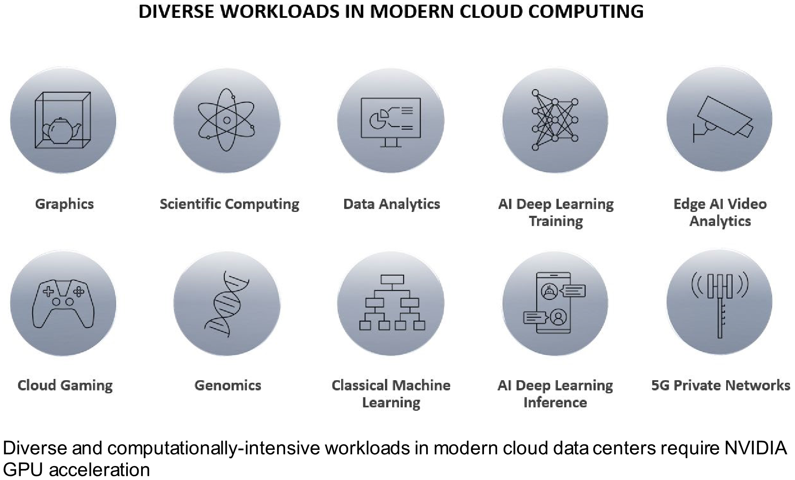

**図 1.** 現代のクラウドデータセンターのワークロードには NVIDIA GPU による高速化が必要

2017 年、NVIDIA Tesla® V100 GPU は、ディープラーニングニューラルネットワークのトレーニングおよび推論処理の中核となる行列計算を大幅に高速化する、強力な新しい「Tensor コア」を導入しました。2018 年には、NVIDIA Turing™ Tensor コアを採用した NVIDIA Tesla® T4 GPU と Tensor RT™ 推論オプティマイザーおよびランタイムにより、データセンターでの推論を高いエネルギー効率で大幅に高速化しました。Turing Tensor コアは、Turing GPU を搭載した GeForce® ゲーミング PC と Quadro® ワークステーションにも、画期的な新しい AI 機能をもたらしました。

業界標準の AI ベンチマーク MLPerf では、NVIDIA Volta™ GPU がトレーニング部門で首位を獲得し、Turing GPU は新たに導入された MLPerf 推論ベンチマークのデータセンター部門とエッジ部門で首位を獲得しました。NVIDIA Jetson AGX Xavier™ も、市販されているすべての SoC デバイスの中で最高の推論性能を達成しました。

10 年以上にわたり、NVIDIA CUDA® 開発プラットフォームは GPU の能力を引き出し、多種多様なアプリケーション分野を高速化してきました。API、ソフトウェアスタック、ライブラリ、コードオプティマイザーの革新と改善は、GPU ハードウェアの進歩と同じく重要です。[NVIDIA CUDA Toolkit](https://developer.nvidia.com/cuda-toolkit) は、AI、HPC、データ分析向けの NVIDIA [CUDA-X™ GPU アクセラレーションライブラリ](https://developer.nvidia.com/gpu-accelerated-libraries) をはじめ、開発者向けに多数のソフトウェアツールを提供します。また、モデルやスクリプトを含む AI フレームワークおよび HPC アプリケーション用コンテナーが [NVIDIA GPU Cloud™（NGC）](https://ngc.nvidia.com/catalog/all) から無償で提供され、GPU アクセラレーション対応アプリケーションのプログラミングを簡素化し、開発と展開を高速化します。[NVIDIA GPU 上の Kubernetes](https://developer.nvidia.com/kubernetes-gpu) も無償で利用でき、企業はマルチクラウド GPU クラスター全体でトレーニングと推論の展開をシームレスにスケールアップおよびスケールアウトできます。

## 2 NVIDIA A100 Tensor コア GPU—弾力的コンピューティング時代の第 8 世代データセンター GPU

新しい NVIDIA® A100 Tensor コア GPU は、従来の NVIDIA Tesla V100 GPU の機能を基盤として多数の新機能を追加し、HPC、AI、データ分析のワークロードで大幅に高い性能を実現します。NVIDIA Ampere アーキテクチャベースの GA100 GPU を採用した A100 は、単一 GPU およびマルチ GPU のワークステーション、サーバー、クラスター、クラウドデータセンター、エッジシステム、スーパーコンピューターで稼働する GPU コンピューティングおよびディープラーニングアプリケーションに対し、強力なスケーリングを提供します。A100 GPU により、弾力性と汎用性を備え、高スループットのデータセンターを構築できます。

A100 GPU は、クラウドサービスプロバイダー（CSP）に特に大きな利点をもたらす、革新的な新しい「マルチインスタンス GPU」（MIG）仮想化および GPU パーティショニング機能を搭載しています。MIG 動作に構成すると、A100 によって CSP は GPU サーバーの利用率を高め、追加費用なしで最大 7 倍の GPU インスタンスを提供できます。堅牢な障害隔離により、顧客は 1 基の A100 GPU を安全かつ確実に分割できます。

A100 は強力な新しい第 3 世代 Tensor コアを追加し、V100 よりもスループットを向上させるとともに、DL と HPC のデータ型を包括的にサポートします。さらに、新しいスパース性機能によってスループットをもう一度 2 倍にできます。

A100 の新しい TensorFloat-32（TF32）Tensor コア演算は、DL フレームワークと HPC の FP32 入出力データを容易に高速化し、V100 の FP32 FMA 演算より 10 倍、スパース性を利用すれば 20 倍高速に実行します。FP16/FP32 混合精度 DL では、A100 Tensor コアは V100 の 2.5 倍の性能を発揮し、スパース性を利用すると 5 倍に向上します。

新しい Bfloat16（BF16）/FP32 混合精度 Tensor コア演算は、FP16/FP32 混合精度と同じ速度で実行します。INT8、INT4、バイナリの Tensor コアアクセラレーションによって DL 推論対応が完成し、A100 のスパース INT8 は V100 の INT8 より 20 倍高速です。HPC 向けには、A100 Tensor コアが新たに IEEE 準拠 FP64 処理を搭載し、V100 の 2.5 倍の FP64 性能を実現します。

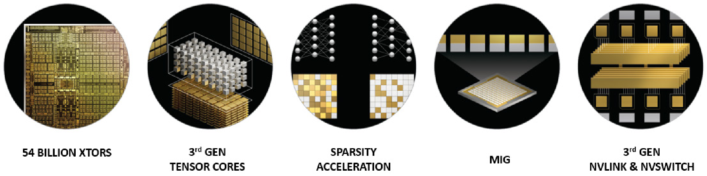

**図 2.** NVIDIA A100 の新技術

A100 GPU は広範な性能スケーラビリティを念頭に設計されています。顧客は MIG GPU パーティショニング技術で 1 基の A100 を共有することも、新しい第 3 世代 NVIDIA NVLink® 高速インターコネクトで接続した複数の A100 GPU を、強力な NVIDIA DGX™、NVIDIA HGX™、NVIDIA EGX™ システムで使用することもできます。新しい NVIDIA NVSwitch™ と Mellanox® の最先端 InfiniBand™ および Ethernet ソリューションで接続した A100 ベースのシステムは、コンピューティングクラスター、クラウドインスタンス、巨大なスーパーコンピューターで数十、数百、数千基の A100 へスケールアウトし、多様なアプリケーションとワークロードを高速化できます。さらに、A100 GPU の革新的な新しいハードウェア機能は、プログラマビリティを改善し、AI と HPC ソフトウェアの複雑さを軽減する CUDA 11 の新機能によって強化されています。

NVIDIA A100 GPU は、NVLink、NVSwitch、InfiniBand を使って巨大な GPU へスケールアップすることも、MIG で複数の独立ユーザーを支えるようスケールアウトすることもできる、初の弾力的 GPU アーキテクチャです。優れた性能と GPU インスタンス当たりの最低コストを同時に実現します。

NVIDIA A100 Tensor コア GPU は、NVIDIA の GPU アクセラレーテッドコンピューティング史上、最大の世代間飛躍を実現します。

## 3 NVIDIA A100 Tensor コア GPU の概要

### 3.1 次世代データセンターおよびクラウド向け GPU

AI、HPC、データ分析のワークロードはますます複雑化と多様化が進んでおり、さらなる GPU コンピューティング能力、マルチ GPU 接続の強化、これらをサポートする包括的なソフトウェア スタックが求められています。NVIDIA は、NVIDIA Ampere GPU アーキテクチャをベースにした新しい NVIDIA A100 Tensor コア GPU と新しい CUDA ソフトウェアの進歩を組み合わせることで、このようにますます大きくなる GPU コンピューティングの課題に対応します。

A100 GPU ではコア アーキテクチャに多くの改良を加えており、本書で説明するように、V100 と比較して AI、HPC、データ分析のワークロードを大幅に高速化しています。新しいスパース性機能を使えば、算術演算のスピードをそこからさらに 2 倍にまで高めることもできます。また、高帯域幅の HBM2 メモリと、より大容量かつ高速のキャッシュを採用したことにより、さらに多くの CUDA コアと Tensor コアにデータを送り込めるようになっています。

新しい第 3 世代 NVLink と PCIe Gen 4 は、マルチ GPU システム構成を高速化します。その他の多くの機能強化により、ハイパースケール データセンターでの強力なスケーリングや、クラウド サービス プロバイダー（CSP）のシステムとその顧客向けの堅牢なマルチインスタンス GPU（MIG）仮想化が可能になりました。また、NVIDIA Ampere アーキテクチャは、レイテンシを短縮し、AI や HPC ソフトウェアの複雑さを軽減しながら、プログラミングを容易にします。NVIDIA Ampere アーキテクチャ GPU はこれらの新機能をすべて提供しつつも、ワットあたりのパフォーマンスは前世代の NVIDIA Volta GPU より優れています。

NVIDIA A100 GPU は、大規模で複雑なワークロードだけでなく、多数の小規模なワークロードも効率的に高速化できるように設計されています。A100 は、予測不可能なワークロードの需要に対応できるデータセンターの構築を可能にすると同時に、きめ細かなワークロードのプロビジョニング、GPU 利用率の向上、TCO の削減を実現します。

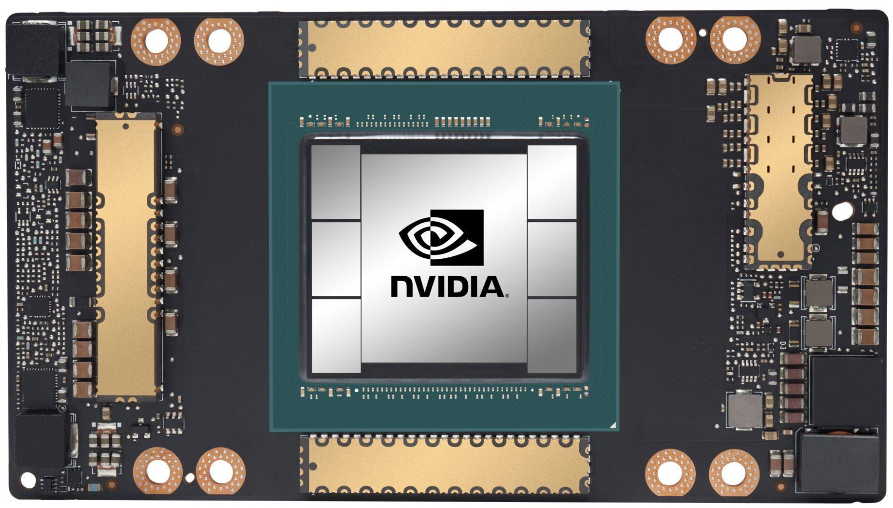

**図 3.** 新しい SXM4 モジュールに搭載された NVIDIA A100 GPU

A100 は汎用性に優れているため、インフラストラクチャ管理者は、データセンター内のすべての GPU を最大限に有効活用して、最小規模のジョブから最大規模のマルチノード ワークロードまで、さまざまな規模のパフォーマンス ニーズに対応できます。A100 は、Mellanox HDR InfiniBand（IB）、NVSwitch、HGXA100、Magnum IO SDK を組み込んだ NVIDIA データセンター プラットフォームを強化し、スケールアップを実現します。これらのテクノロジを統合することで、何万個もの GPU に効率的にスケーリングし、きわめて複雑な AI ネットワークでもこれまでにない速さでトレーニングすることができます。

エンタープライズ環境やクラウド環境で高速コンピューティングを普及させるには、小規模なワークロードで高い利用率を実現する必要があります。新しいマルチインスタンス GPU テクノロジを使用すると、それぞれの A100 を最大 7 つの GPU インスタンスに分割して最適な利用率を実現し、あらゆるユーザーやアプリケーションへのアクセスを拡大できます。

### 3.2 AI、HPC、データ分析を支える業界最高水準の性能

NVIDIA A100 GPU は、[図 4](#figure-04) に示すように、AI のトレーニングおよび推論ワークロードにおいて、V100 を格段に上回る高速化を実現します。同様に、[図 5](#figure-05) は、さまざまな HPC アプリケーションでの大幅なパフォーマンス向上を示しています。

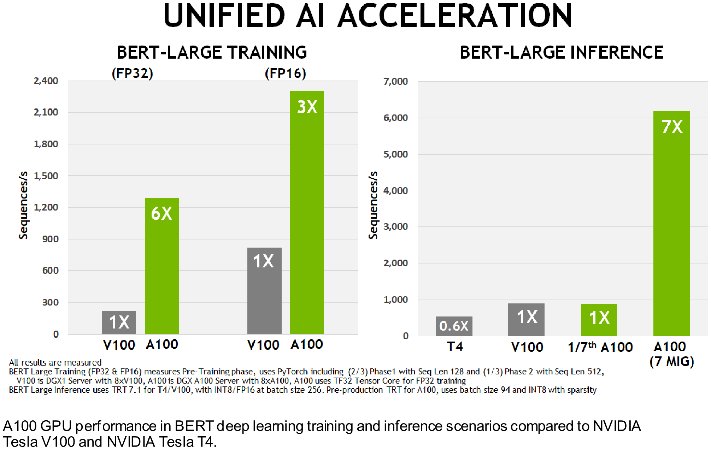

**図 4.** BERT-LARGE のトレーニングと推論を統合的に高速化

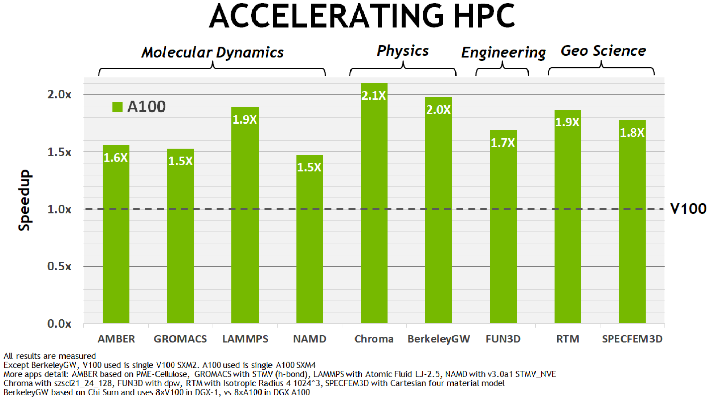

**図 5.** NVIDIA Tesla V100 と比較した A100 GPU の HPC アプリケーション高速化

### 3.3 A100 GPU の主な機能の概要

NVIDIA A100 Tensor コア GPU は、膨大な計算能力を必要とする AI、HPC、およびデータ分析アプリケーションを強化するために設計された、世界最速のクラウドおよびデータセンター GPU アクセラレータです。

A100 を支えているのは、TSMC の 7nm N7 製造プロセスで製造された NVIDIA Ampere アーキテクチャベースの GA100 GPU であり、ダイ サイズ 826 mm² のトランジスタを 542 億個搭載しています。

A100 の重要な新テクノロジとパフォーマンス レベルをすばやく理解できるように、A100 の主な機能の概要を以下に紹介します。アーキテクチャについての詳細情報は、次以降のセクションで紹介します。

#### 3.3.1 A100 GPU ストリーミング マルチプロセッサ（SM）

NVIDIA Ampere アーキテクチャベースの A100 Tensor コア GPU の新しい SM は、パフォーマンスを大幅に向上させます。Volta SM と Turing SM のアーキテクチャの両方で導入された機能をベースに構築されており、多くの新機能が追加されています。

A100 第 3 世代 Tensor コアは、オペランド共有を強化して効率を向上させます。また、以下の新しい強力なデータ タイプが追加されています。

- FP32 データの処理を高速化する TF32 Tensor コア命令
- HPC 向けの IEEE 準拠 FP64 Tensor コア命令
- BF16 Tensor コア命令を FP16 と同じスループットで実行可能

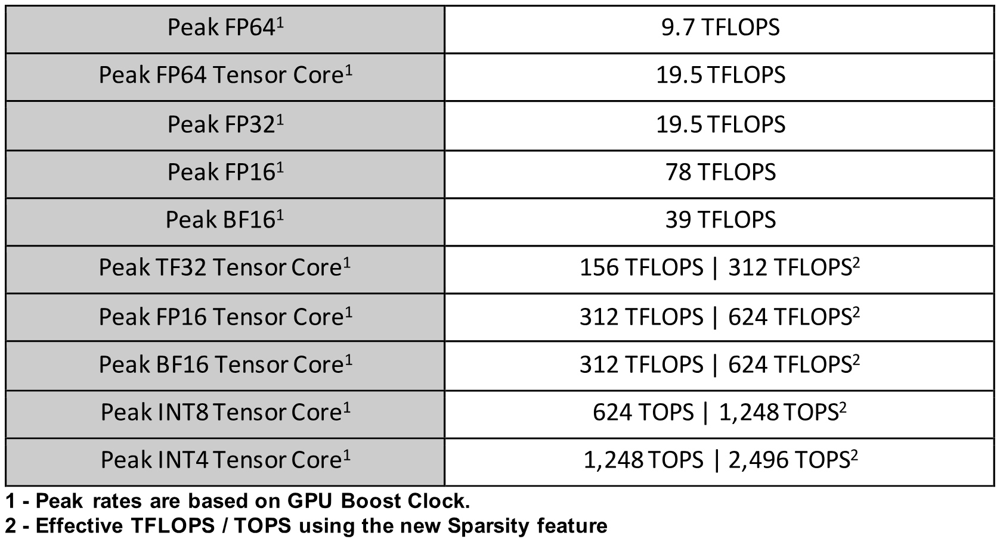

**表 1.** NVIDIA A100 Tensor コア GPU の性能仕様

A100 Tensor コアでは、スパース性が新たにサポートされたことにより、ディープラーニング ネットワークで細粒度構造化スパース性を利用して、Tensor コア演算のスループットを 2 倍にすることができます。スパース性機能については、[第 4.3 節](#section-4-3)で詳しく説明しています。

より大容量かつ高速になった A100 の L1 キャッシュと共有メモリ ユニットは、V100 と比較して 1.5 倍の SM あたりの総容量（128 KB から 192 KB に増加）を提供し、さまざまな HPC および AI ワークロードをさらに高速化します。

他にも多くの新しい SM 機能により、プログラマビリティが向上し、ソフトウェアの複雑さが軽減されています。

#### 3.3.2 40 GB HBM2 と 40 MB L2 キャッシュ

大量のコンピューティング スループットを提供するために、NVIDIA A100 GPU は、クラス最高の 1,555 GB/秒のメモリ帯域幅を持つ 40 GB の高速 HBM2 メモリを搭載しています。メモリ帯域幅は V100 と比較して 73% 増加しています。さらに、A100 GPU は、コンピューティング パフォーマンスを最大化するために、40 MB のレベル 2（L2）キャッシュ（V100 の約 7 倍）を含め、はるかに多くのオンチップ メモリを搭載しています。新しいパーティショニングされたクロスバー構造により、A100 の L2 キャッシュは、V100 の 2.3 倍の L2 キャッシュ読み取り帯域幅を提供します。

容量の利用率を最適化するために、NVIDIA Ampere アーキテクチャでは L2 キャッシュの常駐コントロールを使用して、キャッシュに保存するデータやキャッシュから削除するデータを管理できます。また、A100 には計算データ圧縮機能が追加されており、DRAM 帯域幅と L2 帯域幅を最大 4 倍まで、L2 容量を最大 2 倍まで向上できます。

#### 3.3.3 マルチインスタンス GPU（MIG）

新しいマルチインスタンス GPU（MIG）機能を使用すると、A100 Tensor コア GPU を CUDA アプリケーション用に最大 7 つの GPU インスタンスに安全にパーティショニングすることができ、複数のユーザーに別々の GPU リソースを提供してアプリケーションや開発プロジェクトを高速化できます。

MIG を使用すると、各インスタンスのプロセッサに対して、メモリ システム全体を通るパスが個別に提供されます。つまり、オンチップのクロスバー ポート、L2 キャッシュ バンク、メモリ コントローラー、DRAM アドレス バスがすべて、個々のインスタンスに一意に割り当てられます。これにより L2 キャッシュの割り当てと DRAM 帯域幅がどのユーザーも同じになるため、あるユーザーのタスクがキャッシュのスラッシングを起こしていたり、DRAM インターフェイスを飽和させたりしていても、他のユーザーのワークロードは予測可能なスループットとレイテンシで実行できるようになります。

MIG は、GPU ハードウェアの利用率を向上させるとともに、一定のサービス品質（QoS）とさまざまなクライアント（VM、コンテナー、プロセスなど）間の隔離を提供します。MIG は、マルチテナントのユース ケースを提供するクラウド サービス プロバイダーにとって特に有益であり、あるクライアントが他のクライアントの処理やスケジューリングに影響を与えないようにするだけでなく、顧客のためにセキュリティを強化し、GPU 利用率を保証することもできます。

#### 3.3.4 第 3 世代 NVLink

A100 GPU と新しい NVSwitch に実装された第 3 世代の NVIDIA の高速 NVLink インターコネクトは、マルチ GPU のスケーラビリティ、パフォーマンス、信頼性を大幅に向上させます。GPU とスイッチあたりのリンク数が増えたため、新しい NVLink では GPU 間の通信帯域幅が大幅に向上し、エラーの検出および修復機能も向上します。

第 3 世代 NVLink のデータ レートは、信号ペアあたり 50 Gbit/秒と、V100 の Gbit/秒の約 2 倍です。

V100 と同様に、1 つの A100 NVLink は各方向に 25 GB/秒の帯域幅を提供しますが、使用する 1 リンクあたりの信号ペアの数は、V100 のわずか半分です。リンクの総数は、V100 では 6 個だったのに対し、A100 では 12 個に増え、V100 では 300 GB/秒だった総帯域幅も 600 GB/秒になりました。

#### 3.3.5 NVIDIA Magnum IO™ と Mellanox インターコネクト ソリューションのサポート

NVIDIA A100 Tensor コア GPU は、NVIDIA Magnum IO と Mellanox の最先端の InfiniBand および Ethernet 相互接続ソリューションと完全に互換性があり、マルチノード接続を高速化します。NVIDIA Magnum IO API は、コンピューティング、ネットワーキング、ファイル システム、ストレージを統合し、マルチ GPU、マルチノード アクセラレーテッド システムの IO パフォーマンスを最大化します。CUDA-X™ ライブラリとやり取りすることで、AI からデータ分析、可視化まで、幅広いワークロードの IO を高速化します。

#### 3.3.6 SR-IOV 対応 PCIe Gen 4

A100 GPU は PCI Express Gen 4（PCIe Gen 4）をサポートしています。帯域幅は x16 接続で 31.5 GB/秒となり、PCIe 3.0/3.1 の 15.75 GB/秒の 2 倍です。PCIe Gen 4 の帯域幅は、PCIe 4.0 対応の CPU に接続する A100 GPU や、200 Gbit/秒の InfiniBand などの高速ネットワーク インターフェイスをサポートする場合に特に役立ちます。また、A100 はシングル ルート I/O 仮想化（SR-IOV）をサポートしており、複数のプロセスや仮想マシン（VM）で単一の PCIe 接続を共有および仮想化できます。

#### 3.3.7 エラーと障害の検出、隔離、封じ込めの改善

大規模なマルチ GPU クラスターや MIG 構成のようなシングル GPU のマルチテナント環境では特に、GPU のリセットを強制的に行うのではなく、エラーや障害を検出して封じ込め、場合によっては修正することで、GPU のアップタイムと可用性を最大化することが非常に重要です。NVIDIA A100 Tensor コア GPU には、[第 4 節](#section-4)で説明するように、エラー/障害の箇所特定、隔離、封じ込めを改善するための新しい技術が搭載されています。

#### 3.3.8 非同期コピー

A100 GPU は、グローバル メモリから SM 共有メモリに直接データをロードする新しい非同期コピー命令を搭載しているため、中間レジスタ ファイル（RF）の使用が不要になります。非同期コピーは、レジスタ ファイルの帯域幅を削減し、メモリ帯域幅をより効率的に使用して消費電力を削減します。その名が示すとおり、非同期コピーは SM が他の計算を実行している間にバックグラウンドで実行できます。

#### 3.3.9 非同期バリア

A100 GPU は共有メモリでハードウェア アクセラレーション対応のバリアを提供します。このバリアは CUDA 11 を使用し、ISO C++ 準拠のバリア オブジェクトの形で利用できます。非同期バリアは、バリアの到達操作と待機操作を分割します。これを使用すると、グローバル メモリから共有メモリへの非同期コピーを SM 内の計算とオーバーラップさせることができます。このバリアは、CUDA スレッドを使用したプロデューサー/コンシューマー モデルの実装に利用できます。また、Warp レベルやブロック レベルだけでなく、さまざまな粒度で CUDA スレッドを同期させるメカニズムも提供します。

#### 3.3.10 タスクグラフの高速化

CUDA タスク グラフは、GPU に処理を送信するためのより効率的なモデルを提供します。タスク グラフは、メモリ コピーやカーネル起動など、依存関係で結び付けられた一連の操作で構成されています。タスク グラフを使用すると、「一度定義して繰り返し実行する」という実行フローを実現できます。定義済みのタスクグラフを使用すると、1 回の操作で任意の数のカーネルを起動でき、アプリケーションの効率とパフォーマンスを大幅に向上させることができます。A100 では、タスク グラフのグリッド間のパスを大幅に高速化するために、新しいハードウェア機能が追加されています。

## 4 NVIDIA A100 Tensor コア GPU アーキテクチャの詳細

NVIDIA Ampere アーキテクチャをベースにした NVIDIA A100 GPU は、数多くの新しいアーキテクチャ機能と最適化により、AI や HPC のコンピューティング能力を最大限に提供できるように設計されています。A100 は、V100 で使用されている 12nm FFN プロセスよりも高いトランジスタ密度、パフォーマンス、電力効率を実現する TSMC 7nm N7 FinFET 製造プロセスで構築されています。新しいマルチインスタンス GPU（MIG）機能は、マルチテナントおよび仮想化された GPU 環境向けに、クライアント/アプリケーションの障害隔離と QoS を強化します。これはクラウド サービス プロバイダーにとって特に有益です。NVIDIA の第 3 世代の NVLink インターコネクトは、より高速でエラー耐性が高く、ハイパースケール データセンターに適したマルチ GPU のパフォーマンスのスケーリングを向上させます。

NVIDIA GA100 GPU は、複数の GPU プロセッシング クラスター（GPC）、テクスチャ プロセッシング クラスター（TPC）、ストリーミング マルチプロセッサ（SM）、HBM2 メモリ コントローラーで構成されています。

GA100 GPU のフル実装には、以下のユニットが含まれます。

- 合計 128 SM（8 GPC, 8 TPC/GPC, 2 SM/TPC, 16 SM/GPC）
- SM あたり FP32 CUDA コア 64 個、フル GPU あたり FP32 CUDA コア 8,192 個
- SM あたり第 3 世代 Tensor コア 4 個、フル GPU あたり第 3 世代 Tensor コア 512 個
- HBM2 スタック 6 個、512 ビット メモリ コントローラー 12 個

GA100 GPU の NVIDIA A100 Tensor コア GPU の実装には、以下のユニットが含まれます。

- 合計 108 SM（7 GPC, 7 または 8 TPC/GPC, 2 SM/TPC, 14 または 16 SM/GPC）
- SM あたり FP32 CUDA コア 64 個、GPU あたり FP32 CUDA コア 6,912 個
- SM あたり第 3 世代 Tensor コア 4 個、GPU あたり第 3 世代 Tensor コア 432 個
- HBM2 スタック 5 個、512 ビット メモリ コントローラー 10 個 GA100 GPU の製造に使用される TSMC 7nm N7 プロセスは、Volta GV100 GPU（TSMC 12nm FFN プロセスで製造）と同程度のダイ サイズで、より多くの GPC、TPC、SM ユニット、およびその他の多くの新しいハードウェア機能を生み出すことができます。

[図 6](#figure-06) は 128 個の SM を搭載した完全な GA100 GPU を示しています。

A100 に搭載された GA100 では 108 個の SM が有効です。

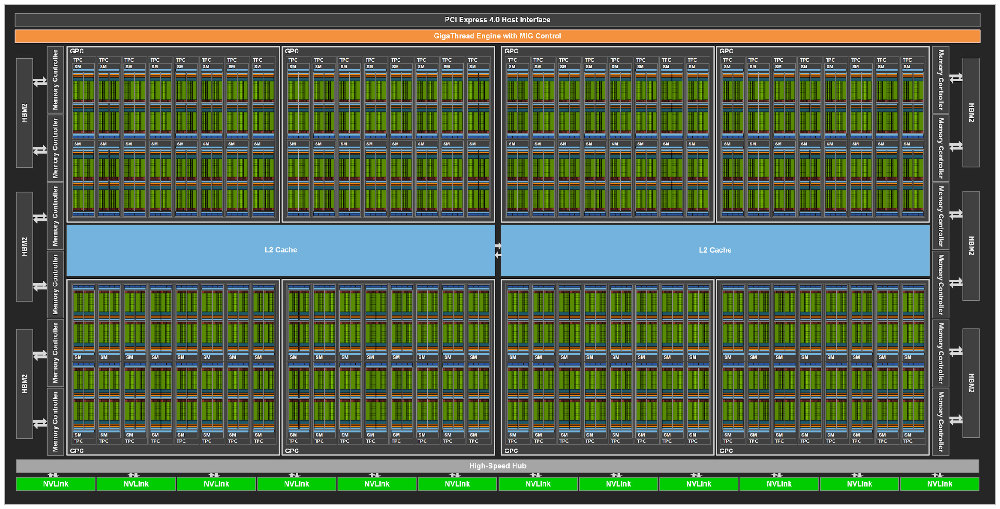

**図 6.** 128 個の SM を搭載した完全な GA100 GPU（A100 Tensor コア GPU は 108 個の SM を搭載）

### 4.1 A100 SM アーキテクチャ

新しい A100 SM はパフォーマンスを大幅に向上させます。Volta SM と Turing SM のアーキテクチャの両方で導入された機能をベースに構築されており、多くの新機能と機能強化が追加されています。

A100 SM の図を[図 7](#figure-07) に示します。Volta と Turing には、SM 1 つあたり 8 個の Tensor コアがあり、各 Tensor コアは 1 クロックあたり 64 回の FP16/FP32 混合精度融合積和（FMA）演算を実行します。

A100 SM には新しい第 3 世代 Tensor コアが搭載されており、それぞれが 1 クロックあたり 256 回の FP16/FP32 FMA 演算を実行します。A100 は、SM あたり 4 個の Tensor コアを搭載しており、1 クロックあたり 1024 回の高密度 FP16/FP32 FMA 演算を実行します。Volta や Turing と比較すると、SM あたりの計算処理能力は 2 倍に向上しています。

SM の主な機能を以下に簡単に紹介します（詳細は後のセクションを参照）。

- 第 3 世代 Tensor コア
  - FP16、BF16、TF32、FP64、INT8、INT4、バイナリを含むすべてのデータ タイプの高速化。
  - Tensor コアの新機能であるスパース性機能は、ディープラーニング ネットワークで細粒度構造化スパース性を利用することで、標準の Tensor コア演算のパフォーマンスを 2 倍に向上させます。
  - TF32 Tensor コア演算は、DL フレームワークや HPC における FP32 入出力データの高速化を容易に実現します。実行速度は V100 の FP32 FMA 演算の 10 倍で、スパース性機能を利用すれば 20 倍速も実現できます。
  - FP16/FP32 混合精度 Tensor コア演算は、これまでにない処理能力を発揮し、V100 Tensor コア演算と比較して 2.5 倍、スパース性機能を利用した場合は 5 倍の処理能力を発揮します。
  - BF16/FP32 混合精度 Tensor コア演算は、FP16/FP32 混合精度演算と同じ速度で実行されます。
  - FP64 Tensor コア演算は、V100 FP64 DFMA 演算の 2.5 倍速で実行され、HPC でこれまでにない倍精度の処理能力を実現します。
  - スパース性を利用した INT8 Tensor コア演算は、DL 推論処理でこれまでにない処理能力を発揮し、V100 INT8 演算と比較して最大 20 倍の処理能力を発揮します。
- 合計 192 KB の共有メモリと L1 データ キャッシュ（V100 SM の 1.5 倍）
- 新しい非同期コピー命令は、グローバル メモリから共有メモリに直接データをロードし、オプションで L1 キャッシュをバイパスできるため、中間レジスタ ファイル（RF）の使用が不要
- 新しい非同期コピー命令に対応する新しい共有メモリベースのバリア ユニット（非同期バリア）
- L2 キャッシュ管理と常駐コントロールのための新たな命令
- CUDA Cooperative Groups がサポートする新しい Warp レベル reduction 命令
- 数多くのプログラマビリティの改善によりソフトウェアの複雑さを軽減

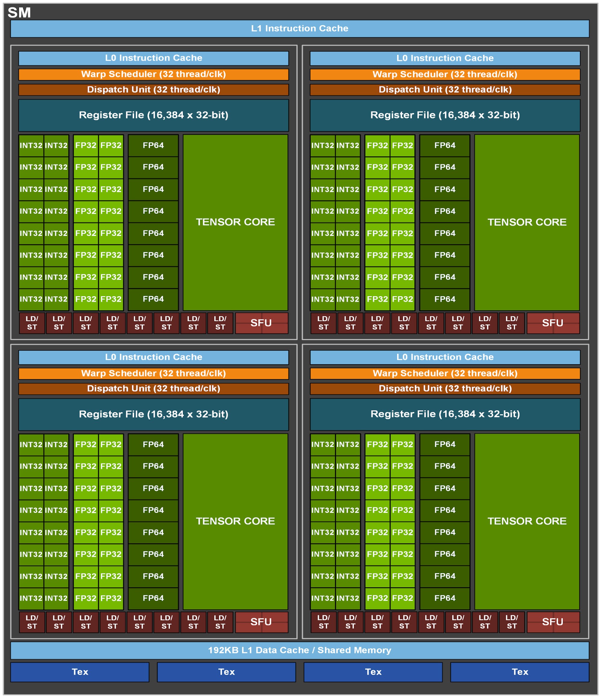

**図 7.** GA100 ストリーミング マルチプロセッサ（SM）

### 4.2 第 3 世代 NVIDIA Tensor コア

Tensor コアは、AI および HPC アプリケーションに画期的なパフォーマンスを提供する行列演算に特化した高性能計算コアです。Tensor コアは行列積和（MMA）演算を実行します。1 つの NVIDIA GPU で数百個の Tensor コアを並列で実行することで、スループットと効率を大幅に向上させることができます。Tensor コアは、NVIDIA V100 GPU で初めて導入され、より新しい NVIDIA Turing GPU でさらに強化されました（Tensor コアの演算に関する参考情報については、『[NVIDIA Tesla V100 GPU アーキテクチャ](https://images.nvidia.com/content/volta-architecture/pdf/volta-architecture-whitepaper.pdf)』を参照してください）。

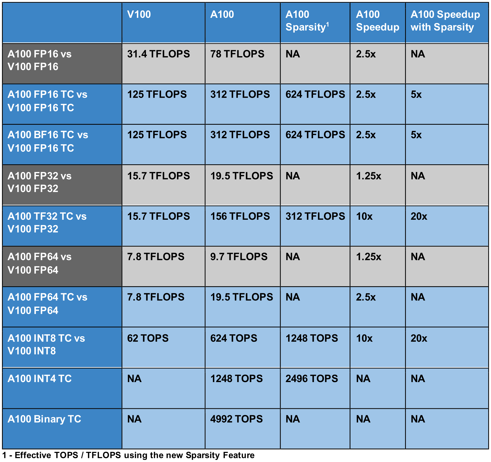

**表 2.** V100 と比較した A100 の高速化（TC=Tensor コア、各 GPU はそれぞれのクロック速度で動作）

#### 4.2.1 A100 Tensor コアによるスループットの向上

A100 の新しい第 3 世代 Tensor コア アーキテクチャは、V100 と比較して SM あたりの実際の高密度 Tensor スループットを 2 倍に増加させ、より多くのデータ タイプの高速化を実現するほか、スパース行列計算をさらに 2 倍に高速化します。

行列積（GEMM）演算は、ニューラル ネットワークのトレーニングと推論の中核を成すものであり、入力データと重みで構成される大きな行列をさまざまな層で乗算するために使用されます。GEMM 演算では、行列積 $D = A * B + C$ を計算します。C と D は m 行 n 列の行列、 A は m 行 k 列の行列、B は k 行 n 列の行列です。Tensor コア上で実行されるこのような GEMM 演算の問題サイズは、行列のサイズによって定義され、一般的には $m$ × $n$ × $k$ という形で表されます。

FP16/FP32 の混合精度 Tensor コア演算を例にとると、Volta アーキテクチャの各 Tensor コアは、ハードウェア レベルで、1 クロックあたり 64 回の FP16 融合積和演算（FMA）と FP32 累算を実行することができ、1 クロックあたり 4 x 4 x 4 の混合精度行列積和演算を行います。それぞれの Volta SM には 8 個の Tensor コアが搭載されているため、1 つの SM で、1 クロックあたり 512 回の FP16 FMA 演算または 1,024 回の個別の FP16 浮動小数点演算を実行できます。A100 Tensor コアの各コアは、1 クロックあたり 256 回の FP16 FMA 演算を実行できるため、1 クロックあたり 8 x 4 x 8 の混合精度行列積演算の結果を計算できます。A100 GPU の各 SM には再設計された新しい Tensor コアが 4 つ含まれているため、A100 の各 SM は、1 クロックあたり 1,024 回の FP16 FMA 演算（または 1 クロックあたり 2,048 回の個別の FP16 浮動小数点演算）を実行できます。

SM レベルのパフォーマンスだけでなく、GPU 全体のパフォーマンスを比較すると、108 個の SM を搭載した NVIDIA A100 Tensor コア GPU は、合計 432 個の Tensor コア搭載しており、最大 312 TFLOPS の高密度混合精度（FP16/FP32）演算性能を実現します。これは、V100 GPU 全体の Tensor コア混合精度演算性能の 2.5 倍に相当し、V100 の標準的な FP32（従来の FP32 CUDA コアで実行される FP32 演算）スループットの 20 倍に相当します。

[図 8](#figure-08) は V100 と A100 の FP16 Tensor コア演算を比較したものです。また、V100 の FP32、FP64、INT8 標準演算と A100 の TF32、FP64、INT8 Tensor コア演算についても、それぞれ比較しています。スループットは GPU ごとに集計されており、A100 では FP16、TF32、INT8 でスパースな Tensor コア演算を使用しています。左上の図が示すとおり、V100 FP16 Tensor コアは 2 つあります。これは、V100 SM には SM パーティションあたり 2 個の Tensor コアがあるためです。一方、A100 の SM の Tensor コアは 1 つです。

A100 Tensor コア演算と V100 Tensor コアおよび各種データ タイプの標準演算との比較。

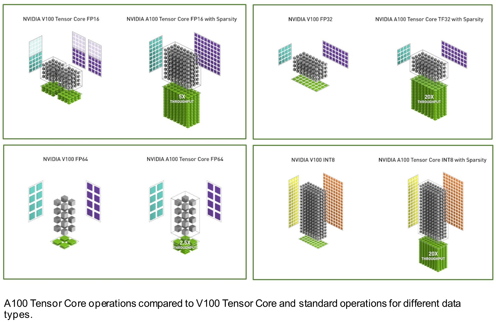

**図 8.** A100 と V100 の Tensor コア演算の比較

#### 4.2.2 すべての DL データ型をサポートする A100 Tensor コア

A100 Tensor コアでは、Volta Tensor コアで導入された FP16 精度と、Turing Tensor コアで追加された INT8、INT4、バイナリ 1 ビット精度に加えて、TF32、BF16、FP64 形式のサポートが追加されています（FP64 倍精度 MMA については [第 4.2.3 節](#section-4-2-3) で説明します）。

Volta GPU アーキテクチャでは、IEEE FP16 データ タイプで処理を行う Tensor コアを導入し、V100 FP32 と比較して 8 倍の演算スループットを実現しました。結果は、混合精度トレーニングの場合は FP32 形式で、推論の場合は FP16 形式で累積されます。アーキテクチャの実際の性能の観点から見ると、A100 と V100 の両方を同じクロック速度で動作させた場合、1 つの A100 SM は、V100 SM と比較して 2 倍の FP16 Tensor コア演算性能を発揮し、標準の V100（および A100）の FP32 FFMA 演算と比較して 16 倍の性能を発揮します。

Turing アーキテクチャでは、INT8、INT4、バイナリのサポートが追加され、より多くの推論処理のユースケースに対応できるように Tensor コアが拡張されました。Turing では、Tensor コアは FP32 と比較して 16 倍、32 倍、128 倍の演算スループットを提供します。A100 SM は、Turing SM と比較して 2 倍の INT8、INT4、バイナリ Tensor コア演算性能を発揮し、A100 の FP32 FFMA 演算と比較して 32 倍、64 倍、256 倍の性能を発揮します。

NVIDIA Ampere アーキテクチャでは、BF16、TF32、FP64 の 3 つのフォーマットが Tensor コアに追加されました。BF16 は、IEEE FP16 に代わるもので、8 ビットの指数部、7 ビットの仮数部、符号 1 ビットで構成されます。FP16 と BF16 はどちらも混合精度モードでニューラル ネットワークのトレーニングを正常に実行でき、ハイパーパラメーターの調整なしで FP32 のトレーニング結果と一致することが示されています。

Tensor コアの FP16 と BF16 の両モードは、A100 GPU の FP32 の 16 倍の演算スループットを実現します。

現在、Tensor コア アクセラレーションを使用しない場合の AI トレーニングのデフォルトの数値演算は FP32 です。NVIDIA Ampere アーキテクチャでは TF32 のサポートが新たに導入されており、ユーザーは何も設定することなく、デフォルトで AI トレーニングに Tensor コアを使用できます。非 Tensor 演算では、引き続き FP32 データパスが使用されますが、TF32 Tensor コアは、FP32 データを読み込み、FP32 と同じダイナミックレンジを確保しながら内部精度を下げて演算し、標準の IEEE FP32 出力を生成します。TF32 は、8 ビットの指数部（FP32 と同じ）、10 ビットの仮数部（FP16 と同じ精度）、符号 1 ビットで構成されます。

Volta と同様に、自動混合精度（AMP）により、わずか数行のコード変更で FP16 との混合精度を AI トレーニングに使用することができます。AMP を使用することで、A100 は TF32 よりもさらに 2 倍高速の Tensor コア演算性能を発揮します。

TensorFloat-32（TF32）は、FP32 と同じ範囲と、FP16 と同じ精度（BF16 と比べて 8 倍の精度）を提供します（左側）。A100 は、FP32 形式の入出力データをサポートする一方で、TF32 で テンソル演算を加速し（右側）、DL や HPC プログラムへの組み込みや DL フレームワークの自動高速化を容易に実現します。

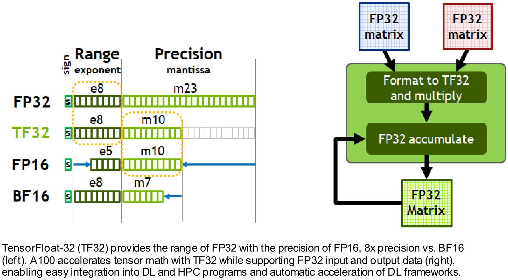

**図 9.** TensorFloat-32（TF32）

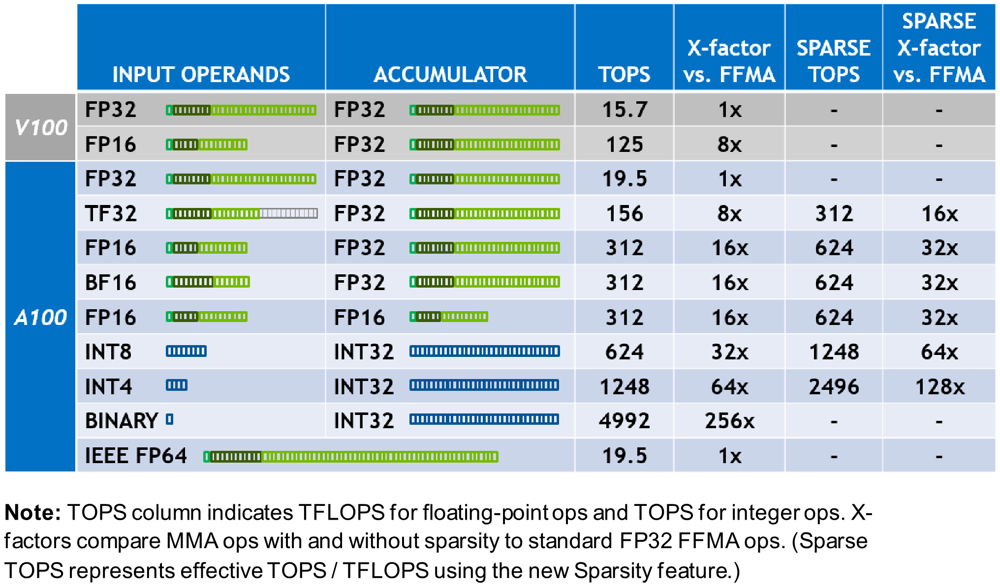

**表 3.** A100 Tensor コアの入出力形式、および FP32 FFMA と比較した性能

ディープラーニングのトレーニングで使用できる NVIDIA Ampere アーキテクチャの演算の選択肢をまとめると、次のようになります。

- デフォルトでは TF32 Tensor コアが使用されます。ユーザー スクリプトへの調整は不要です。A100 の FP32 と比較して最大 8 倍、V100 の FP32 と比較して最大 10 倍のスループットを提供します。
- FP16 または BF16 の混合精度演算トレーニングを使用することで、トレーニング速度を最大化できます。TF32 と比較して最大 2 倍のスループット、A100 の FP32 と比較して最大 16 倍、V100 の FP32 と比較して最大 20 倍のスループットを提供します。

#### 4.2.3 HPC を高速化する A100 Tensor コア

ハイパフォーマンス コンピューティング（HPC）アプリケーションのパフォーマンス ニーズが急速に高まっています。科学研究分野のさまざまなアプリケーションが、倍精度（FP64）計算に依存しています。HPC コンピューティングの計算ニーズの急増に対応するために、A100 Tensor コアは IEEE 準拠の FP64 演算のアクセラレーションをサポートし、NVIDIA V100 GPU の最大 2.5 倍の FP64 演算性能を発揮します。A100 の新しい倍精度行列積和演算命令は、V100 の 8 つの DFMA 命令に代わるものであり、命令フェッチ、スケジューリング オーバーヘッド、レジスタ読み取り、データパス消費電力、共有メモリ読み取り帯域幅を削減します。Tensor コアを使用した場合、A100 の各 SM は、1 クロックあたり合計 64 回の FP64 FMA 演算（または 128 回の FP64 演算）を実行します。これは V100 の 2 倍のスループットに相当します。

108 個の SM を搭載した A100 Tensor コア GPU では、FP64 のピーク スループットは 19.5 TFLOPS で、これは Tesla V100 の 2.5 倍に相当します。

これらの新しい形式がサポートされているため、A100 Tensor コアは、HPC ワークロード、反復ソルバー、さまざまな新しい AI アルゴリズムの高速化に使用できます。

##### 4.2.3.1 HPC 向け混合精度 Tensor コア

HPC における混合精度 Tensor コアの最も有望な用途の 1 つは、反復改良法の分野です。反復的改良法は、地球科学、流体力学、医療、材料科学、原子力、石油およびガス探査などの幅広い分野の HPC アプリケーションで普遍的に使用される線形方程式系の解法として一般的に使用されています。

cuSOLVER の Tensor Core Accelerated Iterative Refinement Solver（TCAIRS）は、このようなアプリケーションでの混合精度演算の使用を自動化します。昨年行われた国際熱核融合実験炉の核融合反応研究では、V100 の FP16 Tensor コアを使用したこのソルバーにおいて、混合精度手法により V100 上で 3.5 倍の高速化が実現することが実証されました。この研究で使用されたテクノロジにより、スーパーコンピューター Summit の HPL-AI ベンチマークのパフォーマンスが 3 倍に向上しました。

CUDA 11.0 の cuSOLVER には、TF32 を含む A100 の新しい Tensor コア フォーマットのサポートが追加されています。下の [図 10](#figure-10) と[図 11](#figure-11) は、SuiteSparse Matrix コレクションの 37 種のテストにおける TCAIRS ソルバーの結果を示しており、FP32、入力スケーリングを使用した FP16、BF16、および TF32 の収束率とパフォーマンスを比較しています。これらの結果は、A100 の FP64 Tensor コアを利用したリファレンス FP64 ソルバーのパフォーマンスと比較されています。混合精度ソルバーが遅い、または収束しないために FP64 ソルバーに自動的にフォールバックするケースでは、反復回数が負の値として記録され、失敗した試行のコストを含むため、高速化率は 1 未満となりました。

[図 10](#figure-10) および [図 11](#figure-11) に示したように、TF32 は、他の Tensor コア モードと比較して最も高速かつ安定した結果を出しました。収束までの反復回数は、TF32 が Tensor コア モードの中で最も少ないという結果になりました。FP32 のフォールバック ケースは 1 つ、TF32 は 2 つのみでした。これに対して、入力スケーリングを使用した FP16 では 3 つ、BF16 の Tensor コア モードでは 6 つでした。FP64 ソルバーと比較した幾何平均の高速化は、TF32 Tensor コアでは 2.0 倍であったのに対し、FP16 では 1.9 倍、BF16 では 1.8 倍でした。約 4 万のサイズの大きな複素数行列の場合は、TCAIRS ソルバーは A100 の TF32 で最大 4 倍の高速化を実現しています。

混合精度 Tensor コア アクセラレーションの利用は、高密度の線形ソルバーだけでなく、行列の乗算がアルゴリズムの複雑さの大部分を占める他の数値法に加えて、スパース問題にも拡張することができます。

TCAIRS ソルバーが FP64 演算時と同等の正確度（Accuracy）に収束するまでに要した反復回数を、37 種の異なる問題を使用して比較。結果は TF32 の反復回数が少ない順に並んでいます。負の値は、ソルバーが精度を下げても収束せず、完全な FP64 の解にフォールバックしたことを示しています。

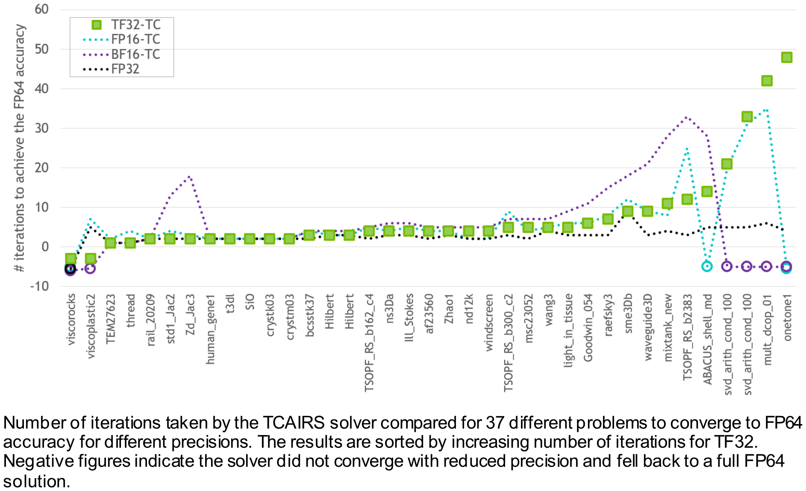

**図 10.** FP64 精度に収束するまでに要した TCAIRS ソルバーの反復回数

37 種の異なる問題を使用してベースラインの FP64 直接ソルバーと比較した TCAIRS ソルバーの高速化率。

高速化率が 1 よりも小さい場合は、TCAIRS ソルバーが精度を下げても収束せず、完全な FP64 の解にフォールバックしたことを示しています。結果は TF32 の高速化率が小さい順に並べられています。

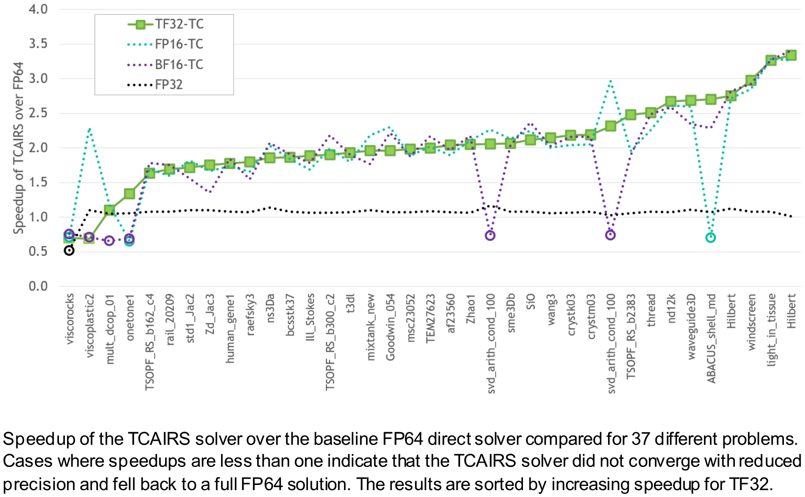

**図 11.** ベースラインの FP64 直接ソルバーと比較した TCAIRS ソルバーの高速化

### 4.3 A100 が導入した細粒度構造化スパース性

NVIDIA は A100 GPU で、ディープ ニューラル ネットワークの計算スループットを 2 倍にする新たな手法として、細粒度構造化スパース性を導入しました。

ディープラーニングでは、重み行列を疎にすることで推論を高速化できます。これは、学習中に個々の重みの重要性が変化していき、ネットワークのトレーニング終了時には、一部の重みだけが学習の出力を決定するうえでの重要性を獲得し、その他の重みが不要になるためです。

細粒度構造化スパース性は、許容されるスパース性のパターンに制約を課すことで、ハードウェアが実行する入力オペランドの必要な調整を効率化します。NVIDIA のエンジニアは、ディープラーニング ネットワークではトレーニングのフィードバックに基づいてトレーニング中に重みを調整することができるため、一般的に構造の制約は推論のためにトレーニングされたネットワークの精度に影響を与えないことを発見しました。これにより、スパース性を利用した推論処理の高速化が可能になりました。トレーニングを高速化する場合、パフォーマンス向上のためにプロセスの早い段階でスパース性を導入する必要があります。精度を損なうことなくトレーニングを高速化する方法は、現在活発に研究が進められている分野の 1 つです。

スパース性に関するその他の参考情報については、[第 14 節](#section-14)を参照してください。

#### 4.3.1 スパース行列の定義

4 つのエントリを持つベクトルごとに 2 つの非ゼロ値を許容する新しい 2:4 スパース行列の定義により、構造が適用されます。

A100 は、下の [図 12](#figure-12) に示すように、行の 2:4 構造化スパースをサポートしています。行列の構造が明確に定義されているため、効率的に圧縮することができ、メモリ ストレージと帯域幅をほぼ半分に削減することができます。

A100 の細粒度構造化スパース性は、2:4 の非ゼロ パターンを使用してトレーニング済みの重みをプルーニングしてから、非ゼロの重みを最適化するシンプルかつ汎用的な方法を適用します。重みが圧縮されるため、データ フットプリントと帯域幅が半分に削減されます。また、A100 スパース Tensor コアがゼロ値をスキップするため、演算スループットが 2 倍になります。

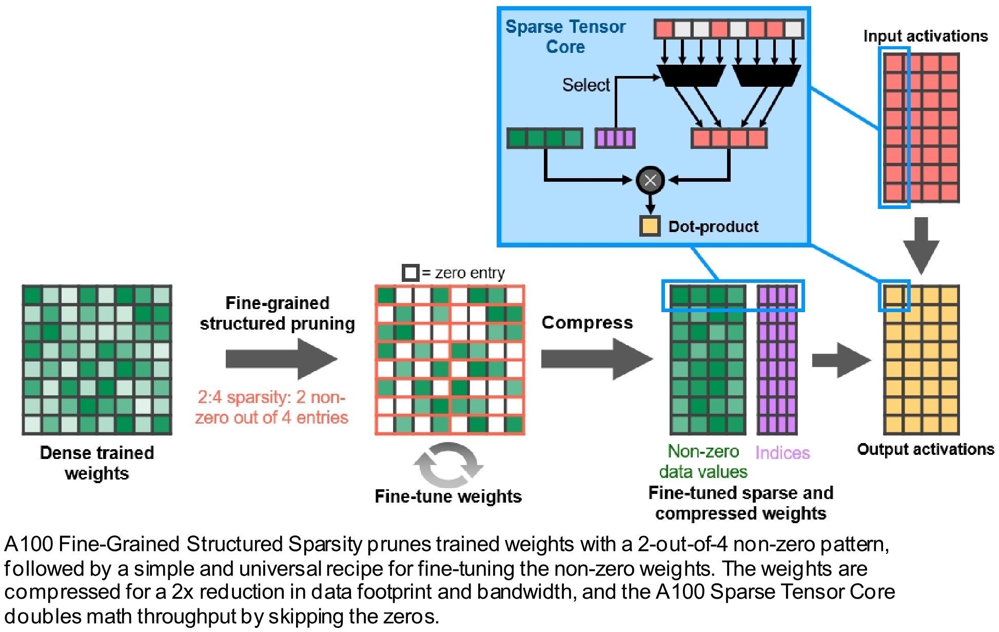

**図 12.** A100 の細粒度構造化スパース性

NVIDIA は、この 2:4 構造化スパース パターンを使用して、推論用のディープ ニューラル ネットワークをスパース化するシンプルかつ汎用的な方法を開発しました。まず、密な重み行列を使用してネットワークを訓練します。続いて細粒度構造化プルーニングを適用し、最後に追加のトレーニング ステップで残りの非ゼロの重みを最適化します。ビジョン、物体検出、セグメンテーション、自然言語モデリング、翻訳など、数十種類のネットワークを評価したところ、この方法による推論の精度の低下は、実質的に皆無でした。

#### 4.3.2 スパース行列積和（MMA）演算

A100 の新しいスパース MMA 命令は、ゼロ値を持つエントリの計算をスキップするため、Tensor コアの計算スループットが 2 倍になります。下の[図 13](#figure-13) の行列 A は、要求される 2:4 構造化パターンに従った 50% のスパース行列であり、行列 B は半分のサイズの密行列です。標準の MMA 演算では、ゼロ値をスキップせず、16 x 8 x 16 の行列全体の結果を N サイクルで計算します。スパース MMA 命令を使用すると、行列 A の各行にあるゼロ以外の値を持つ要素のみが、行列 B の各要素と対応付けられます。これにより、計算が小規模の行列乗算に変換され、わずか N/2 サイクルで実行されるようになるため、2 倍の高速化が実現します。

16 x 16 のスパース行列（行列 A）に 16x8 の密行列（行列 B）を乗算する通常の MMA とスパース MMA 演算の例。右側のスパース MMA 演算では、ゼロ値の計算をスキップすることで、スループットが倍増します。

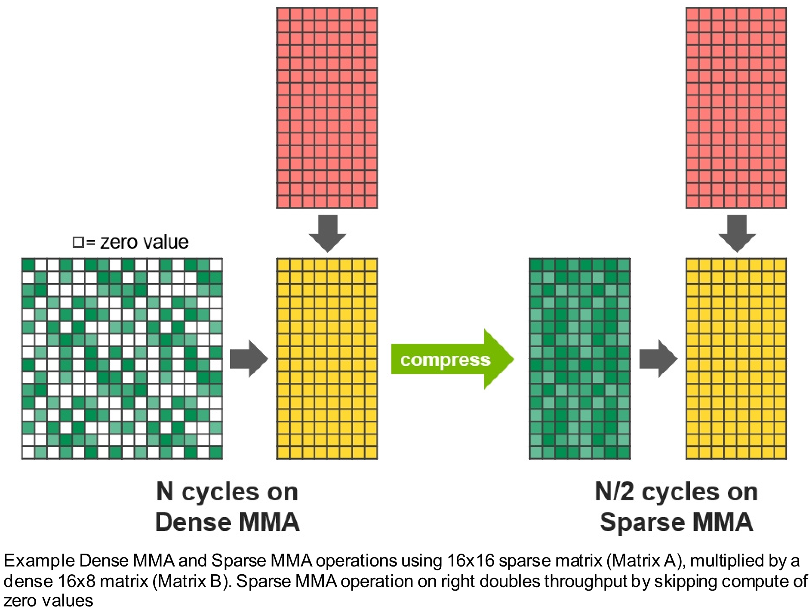

**図 13.** デンス MMA とスパース MMA の演算例

### 4.4 L1 データキャッシュと共有メモリの統合

Volta V100 で初めて導入された、NVIDIA の L1 データ キャッシュと共有メモリを統合したサブシステム アーキテクチャは、パフォーマンスを大幅に向上させると同時に、プログラミングを簡素化し、アプリケーションのピーク時またはピークに近いパフォーマンスを達成するために必要な調整を削減します。データ キャッシュと共有メモリ機能を単一のメモリ ブロックに統合することで、両方のタイプのメモリ アクセスに対して総合的に最適なパフォーマンスが提供されます。L1 データ キャッシュと共有メモリの合計容量は、A100 では 192 KB/SM、V100 では 128 KB/SM です。

共有メモリ ブロック内に L1 キャッシュを統合することで、L1 キャッシュに低レイテンシと高帯域幅を実現します。L1 は、高スループットのストリーミング データのルートとして機能すると同時に、頻繁に再利用されるデータへの高帯域幅で低レイテンシのアクセスを提供します。A100 でさらに大型化した L1/共有メモリ サブシステムは、デバイス メモリにアクセスする際に L1 データ キャッシュを使用するアプリケーションのパフォーマンスをさらに向上させ、高速な共有メモリを使用して明示的に管理する場合と同等のパフォーマンス レベルを実現します（L1 データ キャッシュと共有メモリを統合したサブシステムにより、L1 キャッシュ処理で実現できる共有メモリ パフォーマンスのメリットの具体例については、NVIDIA Tesla V100 のホワイトペーパーを参照してください）。

### 4.5 FP32 演算と INT32 演算の同時実行

A100 の SM は、V100 や Turing GPU と同じく独立した FP32 コアと INT32 コアを搭載しているため、FP32 演算と INT32 演算をフル スループットで同時実行でき、さらに命令発行スループットも高まります。

多くのアプリケーションには、ポインター演算（整数メモリ アドレス計算）と浮動小数点演算を組み合わせて実行する内部ループがあり、FP32 命令と INT32 命令を同時に実行することでメリットを得ることができます。パイプライン処理されるループの各反復は、アドレスの更新（INT32 ポインター演算）と次の反復のデータのロードを行いながら、FP32 で現在の反復を処理することができます。

### 4.6 A100 の HBM2 と L2 キャッシュメモリアーキテクチャ

GPU のメモリ アーキテクチャと階層構造の設計は、アプリケーションのパフォーマンスにとって非常に重要であり、GPU のサイズ、コスト、電力使用量、プログラマビリティに影響を与えます。GPU には、大型の補完的なオフチップ DRAM（フレーム バッファ）デバイス メモリ、さまざまなレベルやタイプのオンチップ メモリ、SM の計算に使用されるレジスタ ファイルまで、多くの異なるメモリ サブシステムが存在します。A100 GPU で使用されている DRAM テクノロジは、ハイパフォーマンス HBM2 です。

CUDA プログラムがアクセスするグローバル メモリ領域とローカル メモリ領域は、HBM2 メモリ空間に存在します。この領域は CUDA の用語ではデバイス メモリと呼ばれています。定数メモリ空間はデバイス メモリに存在し、定数キャッシュにキャッシュされます。テクスチャおよびサーフェス メモリ空間は、デバイス メモリに存在し、テクスチャ キャッシュにキャッシュされます。L2 キャッシュは、HBM2（デバイス）メモリからの読み取りと書き込みをキャッシュします。HBM2 および L2 メモリ スペースには、すべての SM および GPU で実行されているすべてのアプリケーションがアクセスできます。

#### 4.6.1 A100 HBM2 DRAM サブシステム

HPC、AI、アナリティクスのデータセットが増え続け、解決が必要な問題がますます複雑になるに伴い、GPU のメモリ容量とメモリ帯域幅のさらなる向上が求められています。P100 は、高帯域幅の HBM2 メモリ テクノロジに対応した世界初の GPU アーキテクチャでした。また、V100 では、より高速で効率的かつ大容量の HBM2 が実装されました。A100 では、HBM2 のパフォーマンスと容量のレベルがさらに向上しています。

HBM2 メモリは、GPU と同じ物理パッケージ上に配置されたメモリ スタックで構成されています。従来の GDDR5/6 メモリ設計よりも消費電力と面積が大幅に削減され、より多くの GPU をシステムに組み込めるようになりました。HBM2 テクノロジの基本的な情報については、[NVIDIA の Pascal アーキテクチャに関するホワイトペーパー](https://images.nvidia.com/content/pdf/tesla/whitepaper/pascal-architecture-whitepaper.pdf) を参照してください。

A100 GPU には、40 GB の高速 HBM2 DRAM メモリが SXM4 スタイルの回路基板上に搭載されています。このメモリは、スタックごとに 8 個のメモリ ダイを備えた 5 つのアクティブ HBM2 スタックとして構成されています。1,215 MHz（DDR）のデータ レートで、A100 の HBM2 は 1,555 GB/秒のメモリ帯域幅を実現します。これは Tesla V100 のメモリ帯域幅の 1.7 倍以上に相当します。

#### 4.6.2 ECC メモリの耐障害性

A100 HBM2 メモリのサブシステムは、データを保護するために、Single-Error Correcting Double-ErrorDetecting（SECDED）誤り訂正符号（ECC）をサポートしています。ECC は、データ破損の影響を受けやすい計算アプリケーションに高い信頼性を提供します。これは、GPU が非常に大きなデータセットを処理したり、アプリケーションを長時間実行したりする大規模なクラスター コンピューティング環境では特に重要です。

L2 キャッシュと L1 キャッシュ、すべての SM 内のレジスタ ファイルなど、A100 のその他の主要なメモリ構造も、SECDED ECC によって保護されます。

#### 4.6.3 A100 L2 キャッシュ

A100 Tensor コア GPU の A100 GPU には 40 MB の L2 キャッシュが搭載されています。これは V100 の L2 キャッシュの 6.7 倍に相当します。L2 キャッシュ サイズの大幅な増加により、多くの HPC および AI ワークロードのパフォーマンスが大幅に向上します。これは、データセットやモデルの大部分をキャッシュして、HBM2 メモリから読み書きするよりもはるかに高速に繰り返しアクセスできるためです。小さなバッチ サイズを使用するディープ ニューラル ネットワークなど、DRAM の帯域幅に制限がある一部のワークロードでは、L2 キャッシュの容量増加の恩恵を受けることができます。

A100 の L2 キャッシュは 2 つのパーティションに分割されており、高帯域幅で低レイテンシのメモリ アクセスを実現します。各 L2 パーティションは、パーティションに直接接続された GPC 内の SM からのメモリ アクセス用のデータの位置を特定してキャッシュします。この構造により、A100 は V100 と比較して 2.3 倍の L2 帯域幅を実現しています。ハードウェア キャッシュコヒーレンスにより、GPU 全体で CUDA プログラミング モデルが維持され、アプリケーションは A100 の新しい L2 キャッシュの帯域幅とレイテンシのメリットを自動的に活用します。

各 L2 キャッシュ パーティションは、40 個の L2 キャッシュ スライスに分割されています。8 つの 512 KB の L2 スライスが、各メモリ コントローラーに関連付けられています。[第 6 節](#section-6)で説明するように、MIG 構成の GPU インスタンスの各 GPU スライスには、10 個の L2 キャッシュスライスで構成される L2 スライス グループが含まれています。V100 の L2 キャッシュ読み取り帯域幅が 1 サイクルあたり 2,048 バイトであるのに対し、A100 の L2 読み取り帯域幅は 1 サイクルあたり 5,120 バイトです。

NVIDIA Ampere アーキテクチャでは、プログラマは L2 キャッシュ常駐コントロールを使用して、キャッシュに保存するデータやキャッシュから削除するデータを管理できます（詳細については、[第 11 節](#section-11)を参照してください）。

NVIDIA Ampere アーキテクチャには、非構造化スパース性やその他の圧縮可能なデータ パターンを高速化するための計算データ圧縮機能が追加されています。L2 での圧縮により、DRAM の読み書き帯域幅は最大 4 倍、L2 の読み取り/書き込み帯域幅は最大 4 倍、L2 の容量は最大 2 倍になります。

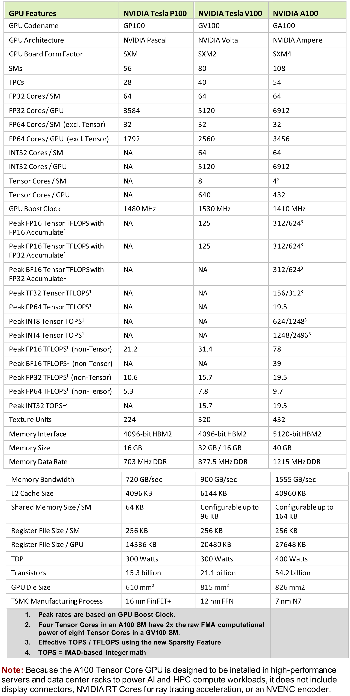

**表 4.** NVIDIA データセンター GPU の比較

## 5 ディープラーニング向け Tensor コアの性能と効率の最大化

前述のように、NVIDIA Tensor コアは、ニューラル ネットワークのトレーニングや推論で一般的に使用される行列積演算のパフォーマンスを大幅に向上させるために、NVIDIA Volta GPU アーキテクチャで初めて導入されました。Volta の Tensor コアでは、混合精度行列積演算を、標準の FP32 精度演算と比較して 8 倍（ピーク時）高速化できるようになりました。

Tesla V100 に対して、NVIDIA Ampere アーキテクチャベースの A100 GPU は、より大規模な Tensor 演算が可能な第 3 世代 Tensor コアを搭載し、さらに多くの SM（80 個から 108 個に増加）を備えています。A100 GPU の Tensor コアは、標準の FP32 FMA 演算の 16 倍（ピーク時）の混合精度演算パフォーマンスを実現します。

NVIDIA Ampere アーキテクチャには、Tensor コアの利用率を高め、プログラマビリティを向上させ、ソフトウェアの複雑さを軽減し、メモリ帯域幅の使用量を減らし、レイテンシやその他のオーバーヘッドを削減するいくつかの新機能や最適化が導入されています。

### 5.1 ディープラーニング性能の強スケーリング

ディープラーニングは大量のコンピューティング リソースを必要としますが、並列処理は、順序の依存関係を持つ小さな処理の塊に分割されます。一般なディープ ニューラル ネットワークは、相互に接続された長い層のチェーンで構成されています。それぞれの層は、入力値の行列を受け取り、それに重みの行列を乗算して出力行列を生成することで、汎用行列乗算（GEMM）と同様の演算を実行します。通常、出力行列はネットワークの次の層に送信される前に、活性化演算を行います。それぞれの GEMM の出力行列は、小さなタイルに分けられ、GPU 内の複数の SM にマッピングされます。

NVIDIA Ampere アーキテクチャは、既存のディープ ニューラル ネットワークの高速化を実現する強スケーリングを目指しています。それよりも達成が容易である弱スケーリングでは、より高速なアーキテクチャを活用するために、ワークロードの並列処理を拡大する必要があります。強スケーリングでは、GPU あたりのワークロードはアーキテクチャごとに固定されます。ディープラーニングの文脈で考えると、これはつまり、A100 Tensor コアは V100 の 2.5 倍速でデータを消費できるものの、SM あたりの GEMM タイル サイズを増加してはならないということになります。NVIDIA Ampere アーキテクチャには、Tensor コアにより高速かつ効率的にデータを提供するために、以下に説明するいくつかの機能と最適化が実装されています。

### 5.2 NVIDIA Ampere アーキテクチャの新機能による Tensor コア性能の向上

**データ共有の改善—** NVIDIA Ampere アーキテクチャの第 3 世代 Tensor コアでは、Warp 内の 32 スレッド全体（Volta の Tensor コアでは 8 スレッド）でデータを共有できます。より多くのスレッドでデータを共有することで、Tensor コアにデータを送るためのレジスタ ファイルの帯域幅が削減されます。また、共有メモリ（SMEM）からレジスタ ファイルにロードされる冗長データの量も減るため、帯域幅とレジスタ ファイルのストレージの両方を削減できます。A100 Tensor コア命令は、効率をさらに高めるために、1 命令あたりの行列乗算の k 次元を、V100 と比較して最大 4 倍まで増加させます。行列乗算演算の計算を V100 と比較すると、A100 では、命令の発行回数が 8 分の 1、レジスタ ファイル アクセスの実行回数が約 3 分の 1 で済みます。

A100 の Tensor コアは、V100 と比較して 4 倍のスレッド共有を実現します。16 x 16 x 16 の行列乗算を実行する場合、A100 では強化された 16 x 8 x 16 Tensor コア（TC）命令により、レジスタ アクセスが 80 から 28 に、ハードウェア命令の発行が 16 から 2 に削減されるため、V100 よりも効率が向上します。サイクル カウントは SM パーティションごとのものです。

注: V100 の各 8 x 8 x 4 TC 命令（CUDA Warp レベルの命令）は、4 つの下位レベルの MMA ハードウェア命令に変換されます。

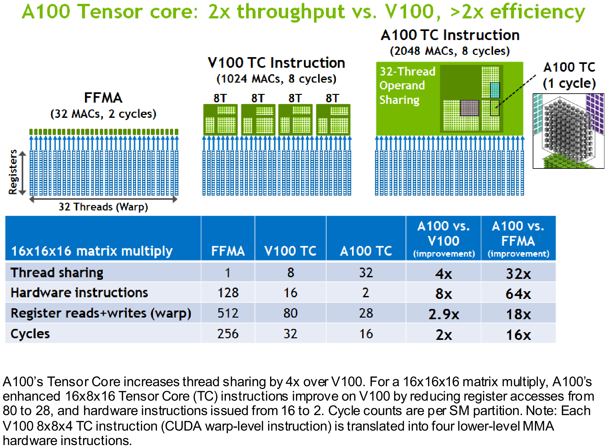

**図 14.** A100 Tensor コアのスループットと効率

**データ フェッチの改善—** NVIDIA Ampere アーキテクチャには、グローバル メモリ（通常は L2 キャッシュと DRAM）から SM 共有メモリに直接データをロードする新しい非同期コピー命令が搭載されています。Volta では、データはまず L1 キャッシュを介してロード-グローバル命令によりレジスタ ファイルにロードされ、続いてストア-共有命令によりレジスタ ファイルから共有メモリに転送されてから、最後にロード-共有命令で共有メモリから複数のスレッドと Warp のレジスタにロードされていました。NVIDIA Ampere アーキテクチャ GPU の新しいロード-グローバル-ストア-共有非同期コピー命令は、レジスタ ファイルの往復を回避することで、SM 内部の帯域幅を節約します。また、インフライト データ転送のためにレジスタ ファイル ストレージを割り当てる必要もなくなります。非同期コピー命令の詳細については、本書で後ほど説明します。

A100 は、L1 キャッシュとレジスタ ファイル（RF）をバイパスする新しいロード-グローバル-非同期コピー命令により、SM 帯域幅の効率を向上させます。さらに、A100 のより効率的な Tensor コアにより、共有メモリ（SMEM）の負荷が軽減されます。

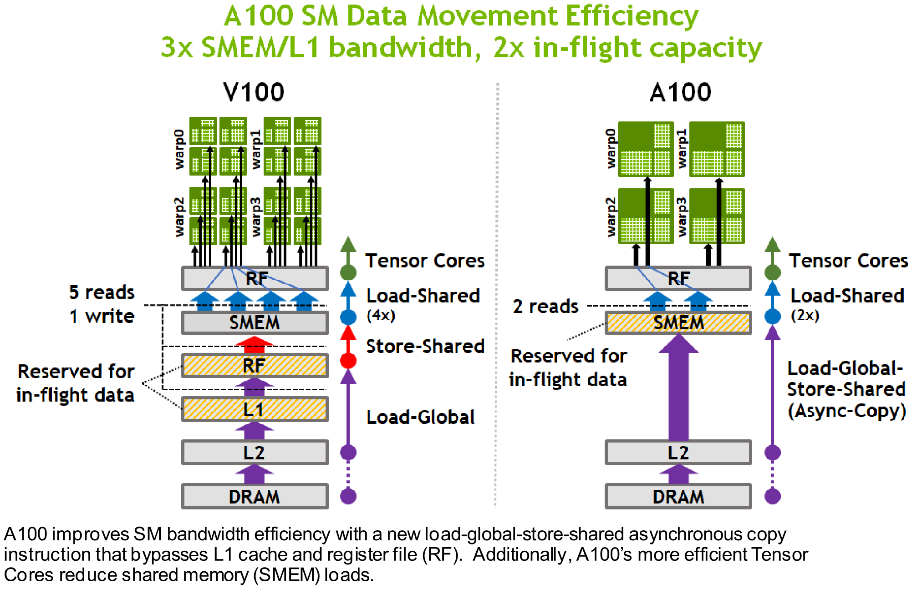

**図 15.** A100 SM のデータ移動効率

新しい非同期バリアは、非同期コピー命令と連動して効率的なデータ フェッチ パイプラインを実現します。A100 では、SM あたりの SMEM 最大割り当て容量が 1.7 倍の 164 KB に増加しました（V100 は 96 KB）。これらの改善を利用して、A100 SM は、L2 キャッシュを常に活用し続けるために、データ ストリーミングを継続的に実行します。

L2 キャッシュと DRAM 帯域幅の改善—NVIDIA A100 GPU の SM 数の増加と、より強力な Tensor コアにより、DRAM と L2 キャッシュからの必要なデータのフェッチ速度が向上しました。Tensor コアにデータを送るために、A100 は 5 サイトの HBM2 メモリ サブシステムを実装しており、V100 の 1.7 倍以上となる 1,555 GB/秒の帯域幅を実現します。A100 はさらに、V100 の 2.3 倍の L2 キャッシュ読み取り帯域幅を提供します。

生のデータ帯域幅の向上に加えて、A100 は Tesla V100 の約 7 倍の 40 MB の L2 キャッシュを搭載することで、データ フェッチ効率を向上させ、DRAM 帯域幅の需要を低減しています。L2 の容量をフル活用するために、A100 ではキャッシュ管理のコントロールも改善されています。ニューラル ネットワークのトレーニングや推論、一般的な計算ワークロードに最適化された新しいコントロールにより、メモリへの書き込みを最小限に抑え、再利用されるデータを L2 に保持して冗長な DRAM トラフィックを削減することで、キャッシュ内のデータをより効率的に使用できるようになります。

たとえば、DL の推論ワークロードでは、ピンポン バッファを L2 に永続的にキャッシュしておくことで、DRAM への書き込みを回避しつつ、データ アクセスを高速化できます。DL トレーニングで見られるようなプロデューサー/コンシューマーのチェーンでは、L2 キャッシュ コントロールにより、データの書き込みと読み込みの依存関係全体のキャッシュを最適化できます。LSTM ネットワークでは、複数の GEMM 演算で共有される回帰重みを L2 に優先的にキャッシュして再利用できます。

A100 の L2 キャッシュ常駐コントロールは、アプリケーションが使用する DRAM 帯域幅の削減に役立ちます。この例では、L2 での永続的なキャッシュの対象としてマークされたデータを示すために、さまざまなデータ バッファを色で強調表示しています。

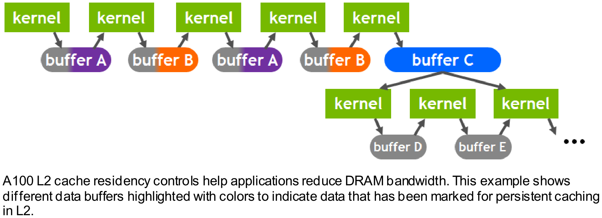

**図 16.** A100 の L2 キャッシュ常駐コントロール

**圧縮—** A100 には、効率を高め、強スケーリングを向上させるために、計算データ圧縮機能が追加されています。これにより、DRAM の読み取り/書き込み帯域幅を最大 4 分の 1 に、L2 の読み取り帯域幅を最大 4 分の 1 に、L2 の容量を最大 2 分の 1 に抑えることができます。

A100 の計算データ圧縮機能は、DRAM 帯域幅、L2 帯域幅、L2 容量を向上させます。

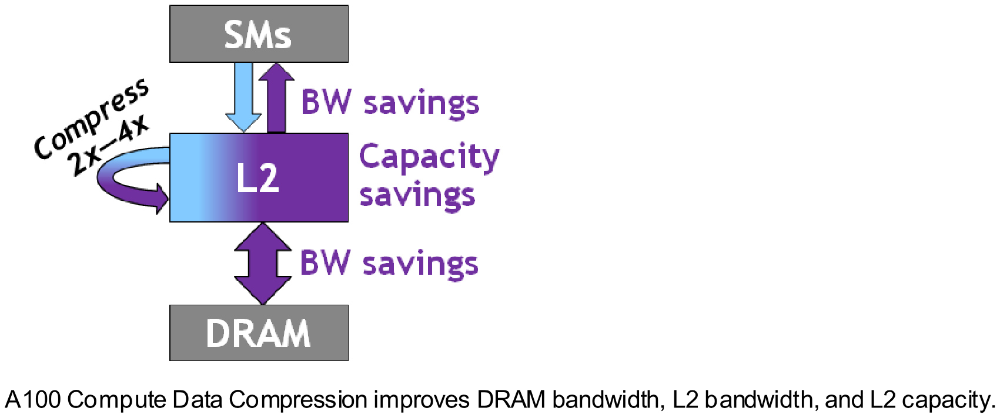

**図 17.** A100 の計算データ圧縮

**まとめ—** 下の[図 18](#figure-18) は、A100 の計算およびメモリ階層のすべてのレベルの改良点をまとめたものです。これらのイノベーションにより、A100 はディープラーニングをこれまでにないレベルのパフォーマンスにまで拡大できます。

A100 は、計算およびメモリ階層全体で V100 を上回る強力なスケーリング イノベーションと改善を実現します。

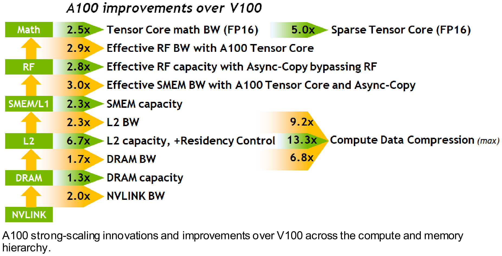

**図 18.** A100 の強スケーリングに関する革新

### 5.3 Compute Capability

A100 GPU は新しい Compute Capability 8.0 をサポートしています。[表 5](#table-05) は、NVIDIA GPU アーキテクチャのさまざまな計算能力のパラメーターを比較したものです。

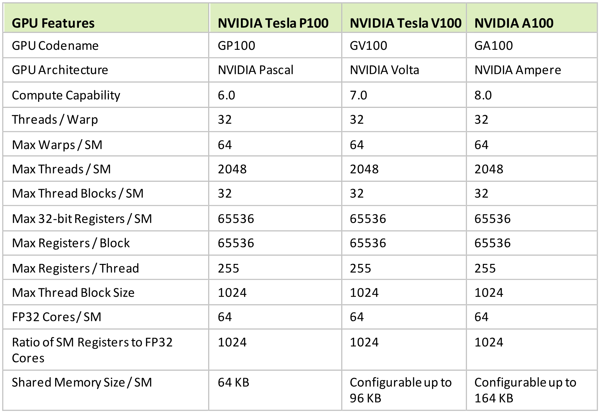

**表 5.** Compute Capability：GP100、GV100、GA100 の比較

## 6 MIG（マルチインスタンス GPU）アーキテクチャ

多くのデータセンターのワークロードは大規模化と複雑化を続けていますが、初期段階の開発や小さなバッチ サイズでの単純なモデルの推論など、アクセラレーション タスクの中にはそれほど負荷が高くないものもあります。データセンターの管理者はリソースの利用率を高く保つことを目標としているため、単に大規模化に対応するだけでなく、多くの小規模なワークロードを効率的に高速化するデータセンター アクセラレータが理想的であると言えます。

### 6.1 背景

2017 年、NVIDIA Tesla V100 GPU は、ハードウェア アクセラレーション対応のマルチ プロセス サーバー（MPS）のサポートを導入しました。これにより、複数のアプリケーションを別々の GPU 実行リソース（SM）上で同時に実行できるようになりました。

ディープラーニング推論アプリケーションに Volta MPS を使用することで、従来の GPU 処理の送信方法と比較してスループットが大幅に向上し、レイテンシが低下したため、GPU 全体の利用率を向上させるとともに、多くの個別の推論ジョブを同時に GPU に送信することが可能になりました（Volta MPS の詳細については、『[NVIDIA Tesla V100 GPU アーキテクチャ](https://images.nvidia.com/content/volta-architecture/pdf/volta-architecture-whitepaper.pdf)』を参照してください）。

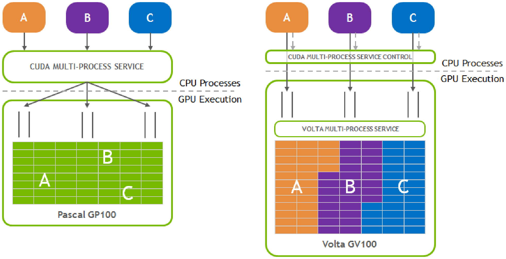

**図 19.** Pascal のソフトウェアベース MPS と Volta のハードウェアアクセラレーション対応 MPS の比較

しかし、メモリ システムのリソースはすべてのアプリケーションで共有されていたため、DRAM の帯域幅に対する要求が高かったり、L2 キャッシュを超える要求が生じたりすると、アプリケーションが他のアプリケーションと干渉することがありました。Ampere でも完全にサポートされている Volta MPS は、単一ユーザーのアプリケーション間で GPU を共有するようには設計されていますが、マルチユーザーやマルチテナントのユース ケースには対応していませんでした。

### 6.2 NVIDIA Ampere GPU アーキテクチャの MIG 機能

新たに追加された MIG 機能は、各 A100 を最大 7 つの GPU インスタンスにパーティショニングして最適な利用率を実現し、あらゆるユーザーやアプリケーションへのアクセスを効果的に拡大できます。

A100 GPU の新しい MIG 機能を使用すると、1 つの GPU を GPU インスタンスと呼ばれる複数の GPU パーティションに分割できます。各インスタンスの SM に、メモリ システム全体を通るパスが個別に提供されます。つまり、オンチップのクロスバー ポート、L2 キャッシュ バンク、メモリ コントローラー、DRAM アドレス バスがすべて、個々のインスタンスに一意に割り当てられます。これにより L2 キャッシュの割り当てと DRAM 帯域幅がどのユーザーも同じになるため、あるユーザーのタスクがキャッシュのスラッシングを起こしていたり、DRAM インターフェイスを飽和させたりしていても、他のユーザーのワークロードは予測可能なスループットとレイテンシで実行できるようになります。

この機能を使用することで、MIG は利用可能な GPU コンピューティング リソースをパーティショニングして、一定のサービス品質（QoS）とさまざまなクライアント（VM、コンテナー、プロセスなど）の障害隔離を提供できます。これにより、複数の GPU インスタンスを 1 つの物理的な A100 GPU 上で並列に実行できます。また、MIG は CUDA プログラミング モデルを変更せずに、プログラミングの手間を最小限に抑えます。

クラウド サービス プロバイダー（CSP）は MIG を使用して GPU サーバーの利用率を向上させ、追加コストなしで最大 7 倍の GPU インスタンスを提供できます。MIG は、CSP に欠かせない QoS や隔離の保証をサポートし、あるクライアント（VM、コンテナー、プロセス）が別のクライアントの処理やスケジューリングに影響を与えないようにします。

CSP は多くの場合、顧客の使用パターンに基づいてハードウェアをパーティショニングしています。パーティショニングは、ハードウェア リソースが一貫した帯域幅、適切な隔離、実行時の良好なパフォーマンスを提供している場合にのみ効果的に機能します。

NVIDIA Ampere アーキテクチャベースの GPU を使用すると、ユーザーは物理 GPU と同じように、新しい仮想 GPU インスタンス上のジョブを確認してスケジューリングすることができます。MIG は Linux オペレーティング システムとそのハイパーバイザーに対応しています。ユーザーは Docker Engine などのランタイムを使用して MIG でコンテナーを実行できます。Kubernetes を使用したコンテナー オーケストレーションのサポートも近日中に予定されています。

### 6.3 MIG の重要なユースケース

「マルチテナント」と呼ばれる MIG の重要なユース ケースを（NVIDIA の vGPU テクノロジとともに）利用することで、CSP は個々の GPU インスタンスを別々の顧客に貸し出すことができます。各 GPU インスタンスで実行されているアプリケーションは、他の GPU インスタンスで同時に実行されているアプリケーションで発生する障害から隔離および保護されます。このようなユース ケースでは、データ保護、障害隔離、QoS が欠かせません。

もう 1 つの MIG のユース ケースである「シングルテナント、シングルユーザー」では、1 台のワークステーションを使用して複数の GPU ベースのアプリケーションを実行しており、アプリケーション間の障害隔離を必要としている単一ユーザーをサポートできます。また、「シングルテナント、マルチユーザー」シナリオは、社内のワークグループをサポートしたり、AI 推論サービスや他のさまざまなタイプの GPU アクセラレーション サービスなど、複数の外部ユーザーにサービスを提供したりする場合に役立ちます。

MIG を使用すると、異なる仮想マシン（VM）間でコンピューティング リソースをパーティショニングし、障害隔離を維持しながら複数の VM を同時に実行できます。VM が別の GPU に移行しても、安定したパフォーマンスを維持できます。また、同じ GPU 上に複数の VM をパッキングすることで、GPU の利用率を向上できます。

CSP の現在のマルチユーザー ノード（A100 以前）を表したこの図では、ユーザー アプリケーションが GPU のリソースをフルに必要としない場合でも、各組織のユーザーはアクセラレーション対応の GPU インスタンスをフル物理 GPU レベルでしか利用できないことを示しています。

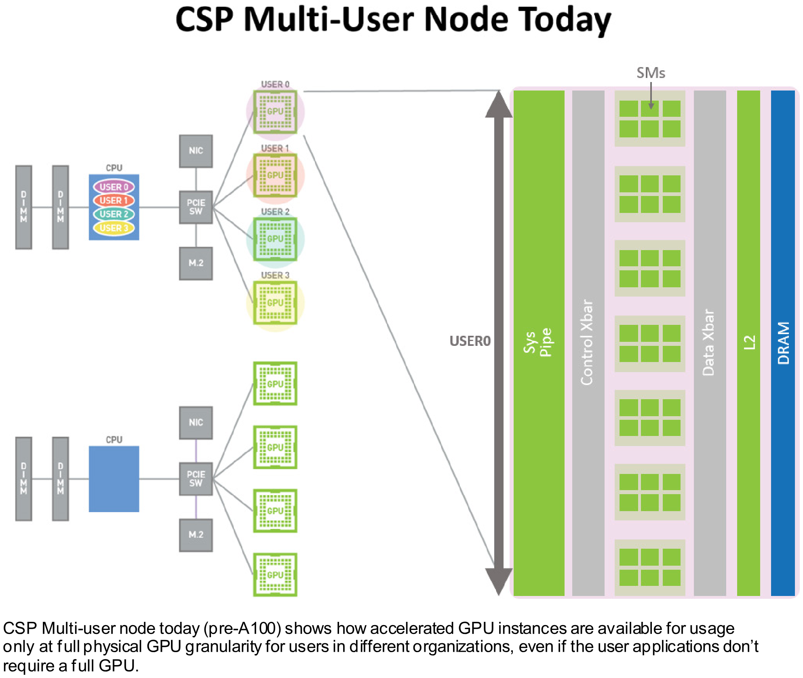

**図 20.** CSP における現在のマルチユーザーノード

CSP の MIG 構成を表したこの図では、同じ組織または異なる組織の複数の独立したユーザーに対して、1 つの物理 GPU を分割した専用の GPU インスタンスが割り当てられる様子を示しています（以下の MIG 構成と GPU パーティショニングの詳細を参照）。

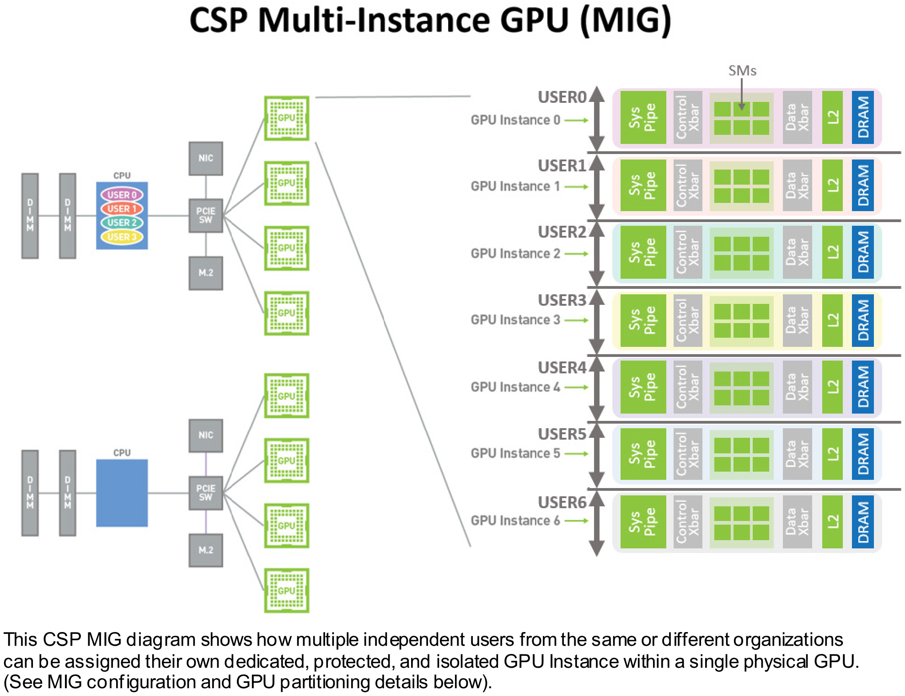

**図 21.** CSP の MIG 構成例

### 6.4 MIG アーキテクチャと GPU インスタンスの詳細

GPU インスタンスを作成することは、1 つの大きな GPU を、専用のコンピューティング リソースとメモリ リソースを持つ複数の小さな GPU に分割することであると考えることができます。各 GPU インスタンスは、所定の数の GPC、SM、L2 キャッシュ スライス、メモリ コントローラー、フレーム バッファ メモリを含む、完全な能力を備えた独立した小型 GPU のように動作します。

GPU インスタンスは複数の「GPU スライス」から構成されます。各 GPU スライスには、「Sys Pipe」（定義は後述）、1 つの GPC、1 つの L2 スライス グループ（L2 スライス グループには 10 個の L2 キャッシュ スライスが含まれる）、フレーム バッファ メモリの一部へのアクセスが含まれています。A100 GPU は合計 7 つの GPU スライスをサポートしています。

注: MIG 動作モードでは、各 GPU スライスの 1 つの GPC は 7 つの TPC（14 個の SM）を利用できます。これにより、すべての GPU スライスで一貫したコンピューティング パフォーマンスを実現できます。

新しい A100 GigaThread™ Engine の一部である Sys Pipe は、ホスト CPU と通信し、GPU スライス内の GPC（およびその SM）に処理をスケジューリングするユニットです。A100 Tensor コア GPU には、MIG をサポートするために合計 7 つの Sys Pipe が搭載されています。1 つの A100 Sys Pipe は、以前の GPU アーキテクチャに似ており、グラフィックスとコンピュートの両方のワークロードをサポートしています。その他の 6 つの新しい Sys Pipe は、コンピュートのみのワークロードをサポートしています。グラフィックス モードで動作している場合、A100 は、1 つのグラフィックス対応 Sys Pipe と 1 つのグラフィックス コンテキストを使用して、従来の GPU と同様に動作します。コンピュート モードでは、7 つの Sys Pipe すべてが複数のコンピュート コンテキストを同時に実行できます。A100 GPU が MIG モードの場合、グラフィックス パイプライン処理はサポートされません。MIG はコンピュート モードのみの機能です。

GPU メモリ スライスも MIG の構造の 1 つです。これは、GPU インスタンス内のすべての GPU スライスに含まれるすべての L2 スライス グループ（L2 キャッシュ スライスのブロック）と関連するフレーム バッファ メモリを含むものです。1 つの GPU インスタンスで実行されているアプリケーション コンテキストが別の GPU インスタンスの L2 スライスを使用することはないため、使用するメモリ帯域幅を GPU インスタンス間で効果的に分離および配分できます（図中のユニットの大きさは、GPU ダイ上の実際の物理領域の大きさを表しているわけではありません）。

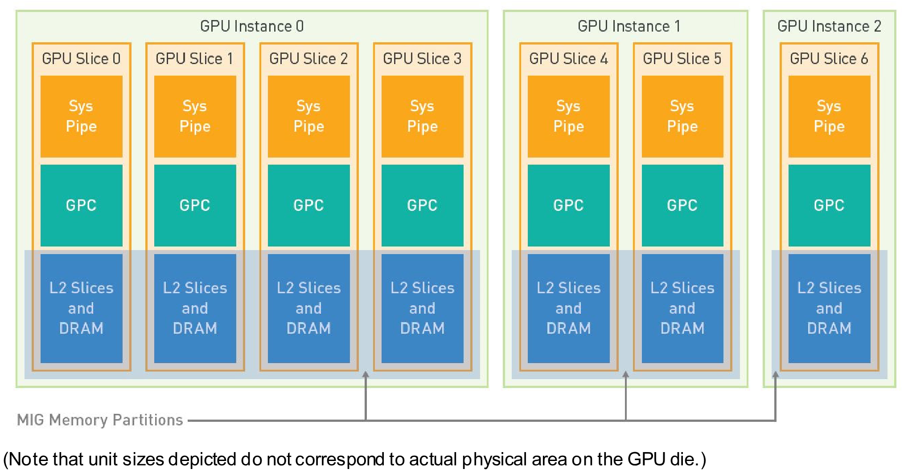

**図 22.** 3 つの GPU インスタンスを持つ MIG コンピューティング構成例

1 つの GPU インスタンスは、そのインスタンス上で実行されているすべてのクライアント アプリケーションにメモリの QoS を提供します。GPU フレーム バッファ メモリは、複数のインスタンスが比例的に共有します。

さまざまな数の GPU スライスを各 GPU インスタンスに静的に割り当てることで、コンピューティング リソースとメモリ帯域幅リソースを必要に応じてパーティショニングできるほか、QoS、障害隔離、エラー封じ込め、エラー修復を改善することもできます。

### 6.5 コンピュートインスタンス

「コンピュート インスタンス」とは、1 つの GPU インスタンス内で処理を実行できるすべてのコンピューティングリソース（GPC、コピー エンジン、NVDEC ユニットの数など）をカプセル化して、その GPU インスタンス内にさまざまなレベルのコンピューティング能力を設定できるグループのことです。デフォルトでは、各 GPU インスタンスに 1 つのコンピュート インスタンスが作成され、GPU インスタンス内で利用できるすべての GPU コンピューティング リソースが割り当てられます。GPU インスタンスを複数の小さなコンピュート インスタンスに分けると、利用できるコンピューティング リソースも細かく分割されることになります。

コンピュート インスタンスは、それぞれ Volta 式の MPS 機能をサポートしており、複数の異なる CPU プロセス（ホスト アプリケーション コンテキスト）を 1 つの CUDA コンテキストに統合して GPU 上で実行することができます。MPS クライアントの最大数は、コンピュート インスタンスのサイズに比例します。MPS は A100 で完全にサポートされており、MPI のために MPS のスループットが必要な HPC ユース ケースでは特に重要です。

A100 GPU の MIG 構成を使用して並列で実行される複数の独立した GPU コンピュート ワークロードの例。この構成には GPU インスタンスが 3 つあり、各 GPU インスタンス内にはさまざまな数のコンピュート インスタンスがあります。

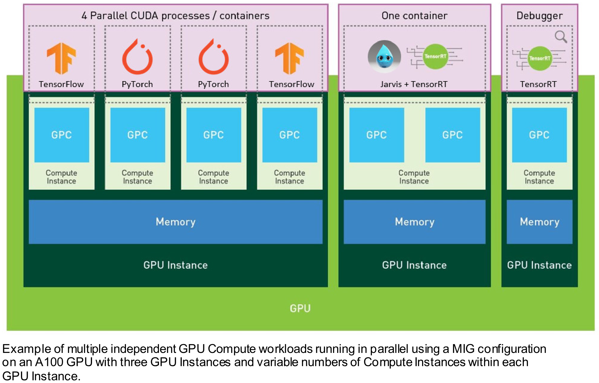

**図 23.** 複数の独立した GPU コンピューティングワークロードを使用する MIG 構成

4 つの GPU スライスを持つ GPU インスタンスを作成してから、2 つの GPC を持つ 2 つのコンピュート インスタンスを作成するプロセスを示した図です。コピー エンジン（CE）と NVDEC デコーダー（DEC）も図示されています。

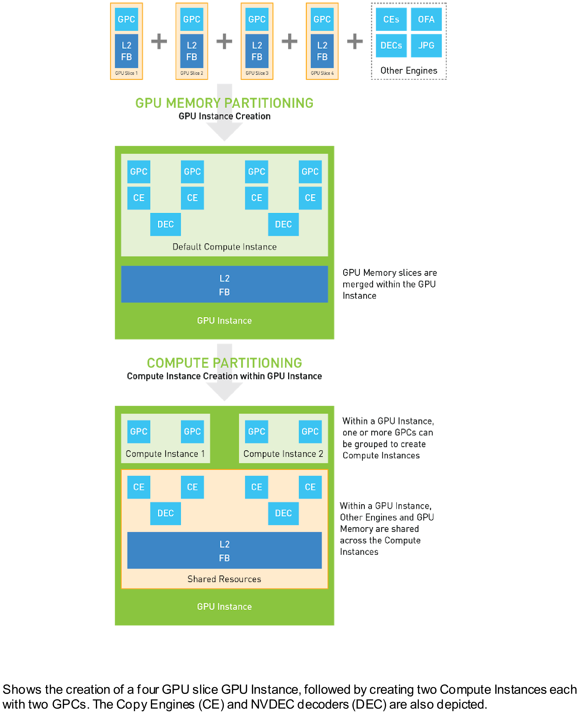

**図 24.** MIG パーティショニング処理の例

### 6.6 コンテキストを同時実行できるコンピュートインスタンス

コンピュート インスタンスは、GPU 上で複数のコンテキストを同時に実行できるようにするものです。1 つのコンピュート インスタンスは 1 つ以上の GPU スライスを含むことができますが、コンピュート インスタンスは、1 つの Sys Pipe を複数の GPC、L2 スライス、他の GPU スライスのメモリに接続するように構成することもできます。そのような場合、GPU インスタンス内の他の GPU スライスの Sys Pipe は無効になります。

GPU インスタンス 0 には 2 つのコンピュート インスタンスがあり、それぞれに Sys Pipe が 1 つずつあります（図中のユニットの大きさは、GPU ダイ上の実際の物理領域の大きさを表しているわけではありません）。

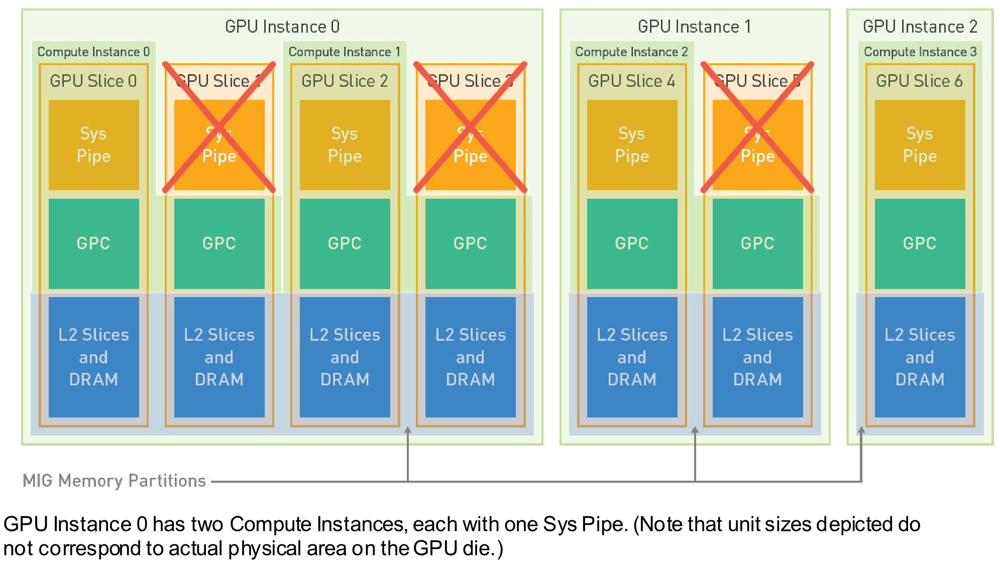

**図 25.** 3 つの GPU インスタンスと 4 つのコンピュートインスタンスを持つ MIG 構成例

成の例コンピュート インスタンスは、技術的には 1 つの Sys Pipe と、GPU インスタンス内の GPC を最大 7 つ含むものであると定義されます。コンピュート インスタンスを共有するすべてのアプリケーションは単一の Sys Pipe を共有します。各コンピュート インスタンスは他のコンピュート インスタンスとは別にコンテキストを切り替えることができます。A100 以前では、すべての GPC でコンテキストがまとめて切り替えられていましたが、A100 では、異なるコンピュート インスタンス内の GPC で別々にコンテキストが切り替わるようになりました。これにより、各 Sys Pipe が一部の GPC のコンテキストを切り替えられるようになり、複数のコンピュート インスタンスを独立して動作させることが可能になりました。

各コンピュート インスタンスでは Volta 式の MPS 機能を使用することもでき、複数の異なる CPU プロセス（アプリケーション コンテキスト）を 1 つのアプリケーション コンテキストに統合して GPU 上で実行することができます。

MIG 構成はさまざまなものが可能です。詳細は開発者やシステム管理者向けのドキュメントに記載しています。

### 6.7 MIG の移行

vGPU（仮想 GPU）仮想マシン（VM）の構成の管理、調整、稼働、負荷分散を行うための重要な MIG 機能の 1 つに、1 つの GPU 上の GPU インスタンス間や、多くの場合はクラスター内の異なる GPU 間で vGPU を移行する機能があります。移行プロセスは概念的には簡単です。GPU インスタンス内の vGPU の GPU スライスの状態情報を保存してから、同じ数の GPU スライスを持つ別の GPU インスタンスに復元します。

クラスター内のさまざまな GPU が部分的にしか利用されていない場合は、MIG 移行を使用することで、より少数の GPU にジョブを移動してパッキングして、断片化を減らすことができます。また多くの場合、特定の数の vGPU をサポートするのに必要な物理 GPU の数を減らすこともできます。これにより、特定の GPU を解放してより大きなジョブを実行したり、使用していない GPU を省電力モードにしてデータセンターのコストを削減したりすることができます。また、MIG 移行を使用すると、ジョブを停止させることなく、サービス実行のために GPU を解放することができます。

## 7 第 3 世代 NVLink

第 3 世代の NVIDIA の高速 NVLink インターコネクトは、NVIDIA Ampere アーキテクチャベースの A100 GPU と新しい NVSwitch に実装されています。NVLink は、ロスレス、高帯域幅、低レイテンシの共有メモリ相互接続です。リンクレベルのエラー検出やパケット リプレイ メカニズムなどの耐障害性機能を搭載し、データの正常な伝送を保証します。

新しい NVLink は、GPU あたりのリンク数を増やし、GPU 間の通信帯域幅を大幅に高速化し、エラーの検出および修復機能を向上させることで、マルチ GPU のスケーラビリティ、パフォーマンス、信頼性を大幅に向上させます。A100 GPU は、NVLink リンクを使用して、PCI Express で達成できる帯域幅よりもはるかに高い帯域幅でピア GPU メモリにアクセスできます。

新しい NVLink のデータ レートは、信号ペアあたり 50 Gbit/秒と、V100 の 25.78 Gbit/秒の約 2 倍です。各リンクは、各方向に 4 つの差動信号ペア（4 レーン）を使用します。これに対し、Volta の信号ペアは 8 つ（8 レーン）です。Volta GPU と同様に、1 つのリンクで各方向に 25 GB/秒の帯域幅を提供しますが、Volta と比較して半分しか信号を使用しません。NVLink リンクの総数は、Tesla V100 では 6 本だったのに対し、A100 では 12 本に増えました。A100 全体の総帯域幅も、V100 の 300 GB/秒から 600 GB/秒へと大幅に増加しました。

各 A100 の 12 本の NVLink リンクは、他の GPU やスイッチと高速に接続し、さまざまな構成を可能にします。より大規模で複雑な DNN や HPC シミュレーションのコンピューティング需要の増加に対応するため、新しい DGX A100 システム（[第 13 節](#section-13) を参照）には、新しい NVLink 対応の NVSwitch で接続された 8 個の A100 GPU が搭載されています。複数の DGX A100 システムを Mellanox InfiniBand や Mellanox Ethernet などのネットワーク ファブリックを介して接続することで、データセンターをスケールアウトし、非常に強力なスーパー コンピュータークラスのシステムを構築することができます。よりパワフルな NVIDIA DGX POD™ システムや [NVIDIA DGX SuperPOD](https://www.nvidia.com/en-us/data-center/resources/nvidia-dgx-superpod-reference-architecture/)™ システムには、複数の DGX A100 システムが搭載されており、強力なスケーリングではるかに大きなコンピューティング能力を提供します。

NVSwitch を介した第 3 世代 NVLink 接続です。

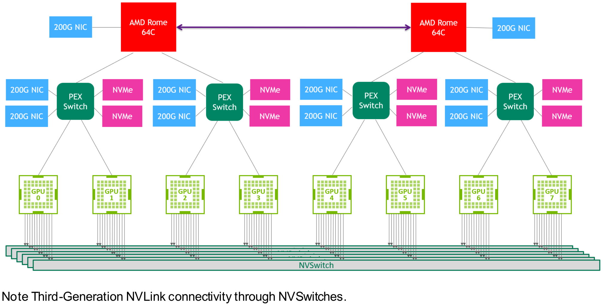

**図 26.** 8 基の A100 GPU を搭載した NVIDIA DGX A100

第 3 世代 NVLink の書き込みはすべてノンポステッド（Non-Posted）型であるため、同期を要求元で実行し、エラーの帰属を特定の実行コンテキストに返すことができます。また、小さなペイロード書き込みやデータレス応答の効率を向上させる新機能も追加されました。

## 8 SR-IOV 対応 PCIe Gen 4

A100 GPU は PCI Express Gen 4（PCIe Gen 4）をサポートしています。帯域幅は x16 接続で一方向あたり 31.5 GB/秒となり、PCIe 3.0/3 の 2 倍の帯域幅を提供します。PCIe Gen 4 の帯域幅は、PCIe4.0 対応の CPU に接続する A100 GPU を使用する場合や、200 Gbit/秒の InfiniBand をサポートして GPU クラスターのパフォーマンスを向上させる場合など、ネットワーク インターフェイスを高速化する場合に特に役立ちます。また、A100 はシングル ルート I/O 仮想化（SR-IOV）をサポートしており、複数のプロセスや仮想マシン（VM）で 1 つの PCIe 接続 GPU を共有および仮想化できます。また、A100 では、1 つの SR-IOV PCIe 接続 GPU の仮想機能（VF）または物理機能（PF）に、NVLink を介してピア GPU にアクセスさせることが可能です。

## 9 エラーと障害の検出、隔離、封じ込め

大規模なマルチ GPU クラスターや MIG 構成のようなシングル GPU のマルチテナント環境では特に、GPU のリセットを強制的に行うのではなく、エラーや障害を検出して封じ込め、場合によっては修正することで、GPU のアップタイムと可用性を向上させることが非常に重要です。NVIDIA A100 Ampere アーキテクチャ GPU には、エラー/障害の帰属（エラーの原因となっているアプリケーションを特定すること）、隔離（障害のあるアプリケーションを隔離して、同じ GPU 上または GPU クラスター内で実行されている他のアプリケーションに影響を与えないようにすること）、封じ込め（1 つのアプリケーションのエラーが漏れて他のアプリケーションに影響を与えないようにすること）を改善するための多くの新しいテクノロジが搭載されています。

新しい NVIDIA Ampere アーキテクチャの障害処理テクノロジは、MIG 環境において 1 つの GPU を共有するクライアントを適切に隔離し、セキュリティを確保するうえで特に重要です。また、NVLink で接続された GPU は、[第 7 節](#section-7)で説明したとおり、より堅牢なエラー検出および修復機能を備えています。リモート GPU でページ フォールトが発生すると、NVLink を通じてソース GPU に送信されます。リモート アクセス障害発生時の通信は、大規模な GPU コンピューティング クラスターに欠かせない耐障害性機能であり、1 つのプロセスや VM の障害によって別のプロセスや VM が停止しないようにすることができます。

## 10 A100 アーキテクチャのその他の機能

NVIDIA A100 GPU には、アプリケーションのパフォーマンスを向上させ、プログラマビリティを向上させる新機能や機能強化が他にも数多く導入されています。以下ではこれらの新機能をいくつか紹介します。また、関連情報については、[NVIDIA Developer サイト](https://developer.nvidia.com/) をご覧ください。

### 10.1 DL トレーニング向け NVJPG デコード

A100 GPU には、ハードウェアベースの JPEG デコード機能が追加されています。DL を使った画像の学習/推論において高いスループットを実現するうえでの根本的な課題の 1 つは、JPEG デコードの入力のボトルネックです。CPU や GPU は、画像ビットの処理に直列演算を使用するため、JPEG デコードにはあまり効率的ではありません。また、JPEG デコードを CPU で行うと、PCIe がもう 1 つのボトルネックになります。A100 では、ハードウェア JPEG デコード エンジンを追加することで、これらの問題を解決しています。

A100 には、NVJPG と呼ばれる 5 コアのハードウェア JPEG デコード エンジンが搭載されています。アプリケーションは、複数の画像を最大 5 つのチャンクにバッチ処理し、NVJPG に渡して処理することができます。

画像のサイズは均一でなくでも問題ありませんが、最高のパフォーマンスを得るためには、可能な限り同程度のサイズの画像をまとめてバッチ処理する必要があります。

サポート対象の JPEG デコード フォーマット:

- YUV420
- YUV422
- YUV444
- YUV400
- RGBA1 メガピクセル以上の大きな画像を GPU ブースト クロック（1,410 MHz）で処理した場合のパフォーマンス（メガピクセル/秒単位）を以下に示します。

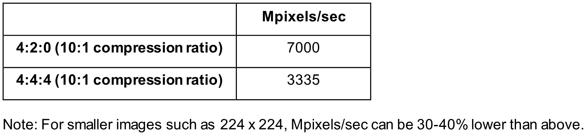

**表 6.** 動画形式別の NVJPG デコードレート

### 10.2 オプティカルフローアクセラレータ

オプティカル フローとステレオ視差は、コンピューター ビジョンにおける画像解析の 2 つの基本的な方法であり、互いに関連しています。オプティカル フローでは 2 つの画像の点の視覚的な動きを測定し、ステレオ視差では、2 つの平行の校正済みカメラ システムから物体までの（逆の）奥行きを測定します。

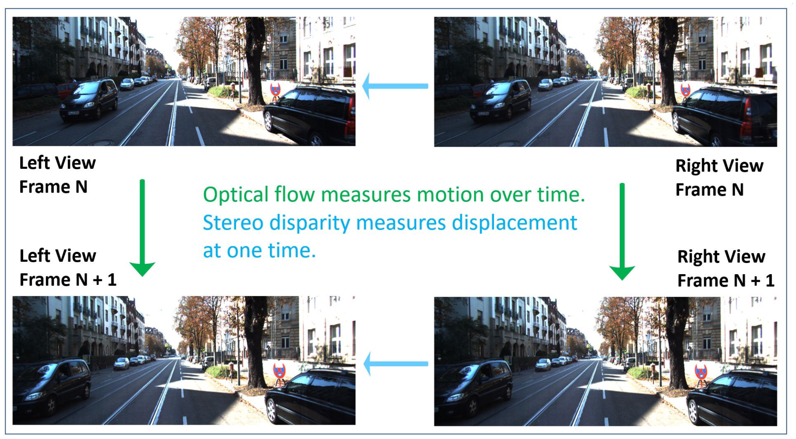

**図 27.** オプティカルフローとステレオ視差の図

オプティカル フローとステレオ視差は、自動車やロボットのナビゲーション、映画制作、映像の解析や認識、拡張現実や仮想現実など、幅広い分野のコンピューター ビジョン タスクで使用されています。オプティカル フローとステレオ視差の測定は、何十年にもわたって研究され、大幅に改善されてきたにもかかわらず、今でも難しい課題です。最新のカメラでリアルタイムの高密度データを取得する場合は、いっそう困難です。ピクセル レートが常に 50 メガピクセル/秒を超え、その 10 倍にまで達することが少なくないからです。

GA100 オプティカル フロー アクセラレータは、高画素でのオプティカル フローとステレオ視差の推定の両方をサポートするハードウェア モジュールです。パラメーターを選択することによって、品質とパフォーマンスを調整できます。

### 10.3 アトミック演算の改善

A100 GPU は、グローバル メモリでのアトミック演算のスループットを向上させることで、V100 のアトミック操作をさらに進歩させています。多くの DL ワークロードでは、トレーニング処理や推論処理で FP16 アトミック演算を使用します。A100 は、FP16 アトミックのスループットを V100 と比較して 11 倍、FP32 アトミックのスループットを 2.7 倍向上させています。

### 10.4 DL 向け NVDEC

A100 は V100 と比較してビデオ デコード能力が大幅に向上しています。DL プラットフォームでは、入力ビデオは H264/HEVC/VP9 など、業界標準のいずれかで圧縮されます。DL プラットフォームでエンドツーエンドの高スループットで実現するうえでの重要な課題の 1 つに、入力ビデオのデコード パフォーマンスをトレーニング/推論のパフォーマンスと一致させることが挙げられます。これができないと、DL に関して GPU のパフォーマンスをフル活用することはできません。A100 は NVDEC（NVidia DECode）ユニットを 5 つ搭載することで、この分野で大きな躍進を遂げました。

V100 との比較:

- V100 では NVDEC が 1 つであったのに対し、A100 では NVDEC を 5 つ搭載
- NVDEC あたりの HEVC デコード パフォーマンスが向上
- A100 では HEVC 4:4:4 をサポート

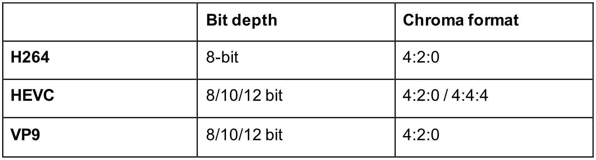

**表 7.** GA100 のハードウェアデコード対応

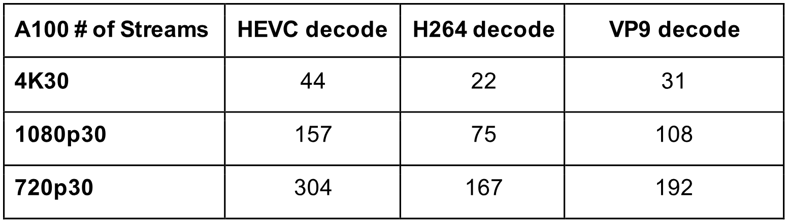

**表 8.** GPU ブーストクロック（1410 MHz）でのデコード性能

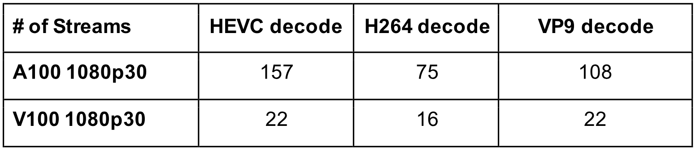

**表 9.** 1080p30 における A100 と V100 のデコード比較

ビデオのユース ケース:

- ビデオの分類/認識
- エッジ プラットフォームでのインテリジェントなビデオ解析
- 自動運転の DL トレーニング

## 11 NVIDIA Ampere アーキテクチャ向け CUDA の進歩

NVIDIA® CUDA® は、NVIDIA が開発したパラレル コンピューティング プラットフォームとプログラミング モデルで、アプリケーション開発者は NVIDIA GPU の大規模な並列処理機能を利用できます。CUDA はディープラーニングの GPU アクセラレーションの基盤として利用できるだけでなく、天文学、分子動力学シミュレーション、金融工学など、膨大な計算能力とメモリ容量が必要になる用途にも適しています。何千もの GPU アクセラレーション対応のアプリケーションが、NVIDIA CUDA 並列処理プラットフォームをベースに構築されています。柔軟性とプログラマビリティに優れた CUDA は、ディープラーニングと並列処理のための新しいアルゴリズムの研究と展開に最適なプラットフォームです。

NVIDIA Ampere アーキテクチャの GPU は、GPU のプログラマビリティとパフォーマンスを向上させるとともに、ソフトウェアの複雑さを軽減するように設計されています。NVIDIA Ampere アーキテクチャの GPU と CUDA プログラミング モデルの進歩により、プログラムの実行が高速化され、多くの処理のレイテンシとオーバーヘッドが減少します。CUDA 11 は、第 3 世代 Tensor コア、スパーシティ機能、[CUDA グラフ](https://developer.nvidia.com/blog/cuda-graphs/)、マルチインスタンス GPU、L2 キャッシュ常駐コントロール、および NVIDIA Ampere アーキテクチャのその他の多くの新機能に関するプログラミングと API のサポートを提供します。

以下のセクションでは、NVIDIA Ampere アーキテクチャに関連する CUDA の主な進歩をいくつか紹介します。

### 11.1 CUDA タスクグラフの高速化

#### 11.1.1 CUDA タスクグラフの基礎

ディープ ニューラル ネットワークのトレーニングや科学シミュレーションなど、GPU を多用するアプリケーションの多くは、同じワークフローを繰り返し実行する反復構造を持っています。このようなワークフローに CUDA ストリームを使用すると、反復のたびに CPU が GPU に処理を再送信する必要があり、時間と CPU リソースの両方を消費します。2018 年リリースの CUDA 10 の一部として導入された CUDA タスク グラフは、GPU に処理を送信するためのより効率的なモデルを提供します。タスク グラフは、メモリコピーやカーネル起動など、依存関係で結び付けられた一連の操作で構成され、その実行とは別に定義します。タスク グラフを使用すると、「一度定義して繰り返し実行する」という実行フローを実現できます。定義済みのタスク グラフを使用すると、1 回の操作で任意の数のカーネルを起動でき、アプリケーションの効率とパフォーマンスを大幅に向上させることができます。

GPU での処理の実行は、起動、グリッド初期化、カーネル実行の 3 段階に分けられます。特に実行時間の短い GPU カーネルでは、これらのオーバーヘッドがエンドツーエンドの実行時間全体の大部分を占めていることがあります。

タスク グラフの定義をその実行（反復実行）から分離することで、CPU カーネルの起動コストを大幅に削減できます。また、タスク グラフを使用すると、実行、データ移動、同期の相互作用を含め、ワークフロー全体が CUDA ドライバーに認識されるため、ドライバーが数多くの最適化を実行できるようになり、さまざまなケースで実行パフォーマンスを向上できます。

注目すべき点は、効率の向上により、さまざまなプロセッサにメリットがあることです。CPU の実行時間は 1 回の起動処理でメリットがありますが、GPU の実行時間はカーネルごとに削減されるため、グラフのノード数が増えるほど、そのメリットも大幅に増加します。

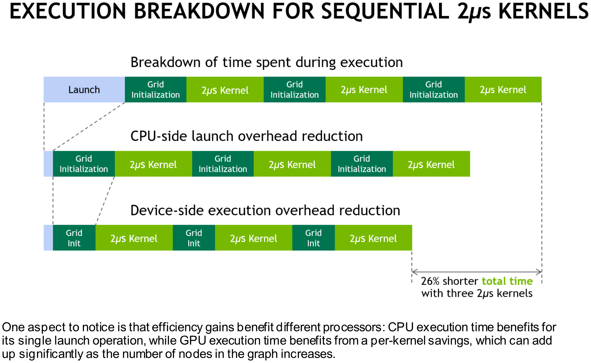

**図 28.** 連続する 2μs カーネルの実行内訳

#### 11.1.2 NVIDIA Ampere アーキテクチャ GPU のタスクグラフ高速化

A100 GPU は、タスク グラフによって可能になる数多くの最適化を加速します。これらの最適化は、起動の最適化と実行依存関係の最適化の 2 種類に分類されます。最適化の目的はカーネル間のレイテンシとオーバーヘッドの削減です。これが可能なのは、タスク グラフでワークフロー全体が事前に把握されているためです。これらの最適化は、実行時間が非常に短く、オーバーヘッドが実行時間の大部分を占めているカーネルを持つ強スケーリング対応のワークロードで特に効果的です。

起動の最適化では、ワークフロー全体を識別するグラフ トポロジを利用して、処理の起動と実行の両方に必要なカーネル データを効率的にアップロードできるようにします。まず、グラフの初期起動は 1 回の操作で複数の処理項目を GPU に送信できます。これは、CPU から見た起動オーバーヘッドの大幅な削減に直結しています。次に、A100 GPU はグラフに組み込まれた依存関係情報を使用して、カーネル情報をより効率的に SM にアップロードして実行します。これにより、カーネル内の最初の命令が実行を開始するまでのレイテンシを大幅に短縮できます。

全グラフ起動の CPU コストと、グラフなしで起動する場合の同等の時間を比較しています。グラフ起動はどのハードウェアでも大幅なパフォーマンス向上を実現しますが、A100 の起動最適化は、特に複雑なトポロジを持つグラフで大幅なパフォーマンス向上を実現します。

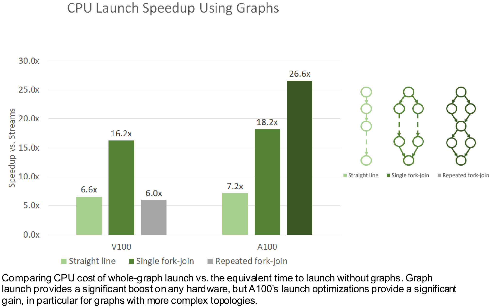

**図 29.** タスクグラフ高速化が CPU の起動レイテンシに与える影響

実行依存関係の最適化は、ワークフローが分岐して合流する複雑なグラフを対象としています。A100 GPU アーキテクチャには、分岐の複数の依存関係を追跡し、可能な限り最短のレイテンシで依存カーネルを自動的に実行する機能が搭載されています。これにより、複雑なトポロジを持つグラフの起動とグリッド間の実行レイテンシが大幅に向上します。

CUDA ストリームでグラフとして起動された処理と、独立カーネルとして起動された処理の実行レイテンシを比較しています。NVIDIA Ampere マイクロアーキテクチャでは、依存関係のトラッキングが改善され、複雑なワークフローも非常に効率的に実行できます。

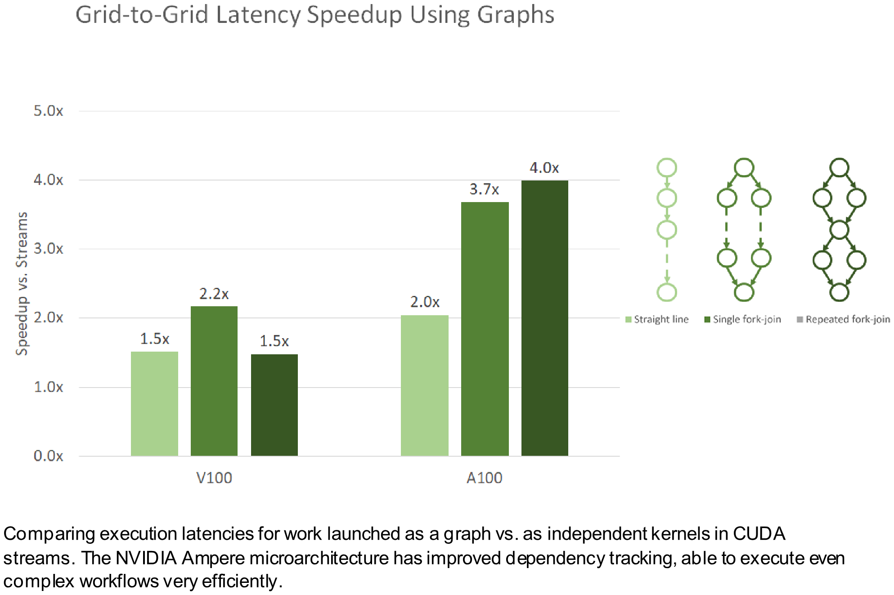

**図 30.** CUDA グラフによるグリッド間レイテンシの短縮

CUDA タスク グラフの使用方法の詳細については、[CUDA プログラミング ガイド](https://docs.nvidia.com/cuda/cuda-c-programming-guide/index.html) とブログ記事「GettingStarted with CUDA Graphs」を参照してください。

### 11.2 CUDA 非同期コピー操作

CUDA 11 には、新しい非同期コピー API が搭載されています。これは、A100 GPU のハードウェア アクセラレーション対応の共有メモリダイレクトコピー機能を利用するためのものです。非同期コピーは、グローバル メモリから共有メモリへの非同期（ノンブロッキング）直接メモリ転送を実行し、SM スレッドをバイパスして、「グローバル メモリからレジスタへのロード」と「レジスタから共有メモリへの書き込み」という別々の操作の機能を 1 つの効率的な操作に結合します。

非同期コピーでは、レジスタ ファイル（RF）を介したデータの中間的なステージングが不要となり、レジスタ ファイルの帯域幅が削減されます。また、非同期コピーは、メモリ帯域幅を効率的に使用し、消費電力を削減します。その名が示すとおり、非同期コピーは非同期に動作し、グローバル メモリから共有メモリへのコピー中に、他の計算を実行できるようにします。非同期コピーは、GPU の新しいバリア機能（[第 11.3 節](#section-11-3) を参照）を使用し、コピー完了をプログラムに通知することができます。

L1 とレジスタ ファイルをバイパスすることで、特にグローバル メモリから共有メモリへ大量のデータをコピーする複数の連続した非同期コピー操作を行う場合に、メモリ コピーのパフォーマンスを大幅に向上できます。

非同期コピー命令には、使用シナリオに応じて利用できる 2 つのバリエーションがあります。前述のように L1 キャッシュとレジスタ ファイルをバイパスする BYPASS と、後のアクセスと再利用のためにデータを L1 に保存する ACCESS です。

上のパイプラインは非同期コピーを使用しない場合を示しており、DRAM または L2 から L1 を介してデータをロードしてから、レジスタ ファイル（RF）にロードし、最後に RF から共有メモリ（SMEM）に格納しています。下の 2 つのパイプラインは非同期コピーを使用する場合を示しており、DRAM または L2 からデータをフェッチし、オプションの L1 キャッシュ アクセスを使用して直接共有メモリに格納しています。

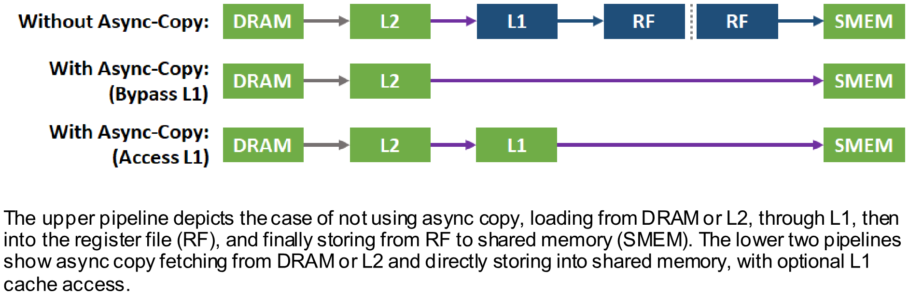

**図 31.** A100 の非同期コピーを使用する場合と使用しない場合の比較

ユーザーの視点から見ると、非同期コピーは、別々のロード-グローバル命令とストア-共有命令を実行した場合と同じように動作しますが、一時的なストレージのためにスレッド リソースを消費することはありません。この命令では、スレッドごとに独立したグローバル メモリ アドレスと共有メモリ アドレスを使用できます。

プログラムは、スレッド ブロック内のスレッド間で書き込みの適切な順序とロードおよび格納操作の可視性を確保するために、バリアを使用する必要があります。[第 11.3 節](#section-11-3) で説明するとおり、この課題を実現するのは、新機能のスレッドごとの非同期バリアです。

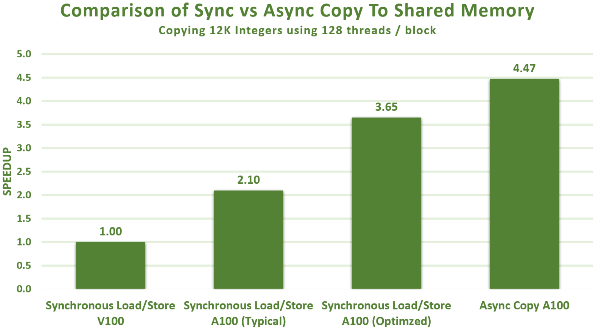

**図 32.** 共有メモリへの同期コピーと非同期コピーの比較

### 11.3 非同期バリア

NVIDIA A100 GPU は共有メモリでハードウェア アクセラレーション対応のバリアを提供します。このバリアは CUDA 11 で ISO C++ 準拠のバリア オブジェクトの形で利用できます。非同期バリアは、通常のシングルステージ バリアとは異なり、スレッドがバリアに到達したという通知（「到達」）と、他のスレッドがバリアに到着するのを待機する操作（「待機」）が分離されています。これにより、スレッドがバリアとは関係のない追加の操作を実行できるようになり、待機時間をより有効に活用できるため、実行効率が向上します。非同期バリアは、CUDA スレッドを使用したプロデューサー/コンシューマー モデルの実装に使用できるほか、必要に応じて単純にシングルステージ バリアとして使用することもできます。

非同期バリアを使用すると、スレッドはデータの準備ができたことを示してから独立した操作を続行するため、待機を延期してアイドル時間を削減できます。これはパイプライン処理と呼ばれる非同期処理の一形態であり、メモリ ロードなどのレイテンシが高い処理を隠すためによく使用されます（前述の「非同期コピー」を参照）。

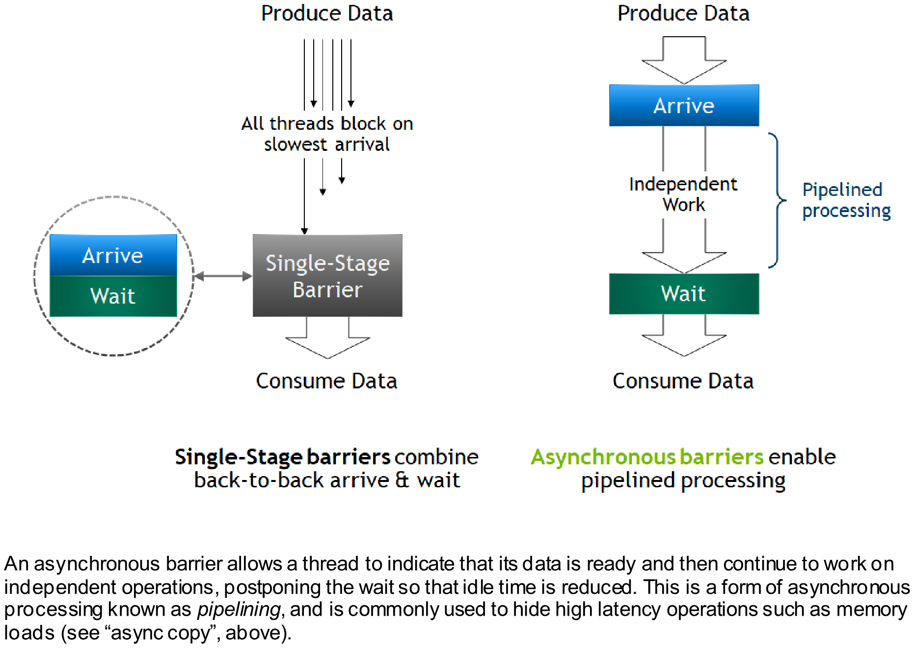

**図 33.** A100 の非同期バリア

また、新しい非同期バリアでは、ブロック内の CUDA スレッドの任意の部分をハードウェアで高速化できるため、従来のアーキテクチャのバリアと比較して同期の粒度が大幅に向上しています。従来のアーキテクチャでは、Warp 全体レベルまたはブロック全体レベルでしか同期を高速化できませんでした。非同期バリアを使用すると、コピー操作完了時にコピー操作信号（「到達」）をバリアにすることで、グローバル メモリから共有メモリへの非同期コピーをオーバーラップさせることができます（[第 11.2 節](#section-11-2) を参照）。これにより、SM 内の他の実行とコピーをオーバーラップさせることができ、コピーのレイテンシを隠して効率を向上できます。

### 11.4 L2 キャッシュ常駐コントロール

CUDA カーネルがグローバル メモリ内のデータ領域に繰り返しアクセスする場合、そのようなデータは「永続的」であると考えることができます。一方、データが一度しかアクセスされない場合、そのようなデータは「ストリーミング」であると考えることができます。特に DL ワークロードは、永続的なデータ アクセスに依存しています。

CUDA 11.0 から、A100 などの Compute Capability 8.0 のデバイスでは、L2 キャッシュ内のデータの永続性に影響を与え、L2 キャッシュの一部を永続的なデータ アクセス用に確保できるようになり、より高帯域幅かつ低レイテンシでグローバル メモリにアクセスすることが可能になりました。

L2 キャッシュ内のデータの永続性に影響を与える機能により、A100 GPU は 40 MB の大容量 L2 キャッシュをより効率的に使用できるようになっています。たとえば、多くの LSTM ネットワークで使用される回帰重みを L2 で永続化し、複数の GEMM 演算で再利用することができます。A100 では、L2 キャッシュを 1/16（2.5 MB）単位で永続的アクセス用に確保することができます。

永続的アクセスは、L2 キャッシュのこの確保部分を優先的に使用します。グローバル メモリへの通常のアクセスまたはストリーミング アクセスは、永続的アクセスによって使用されない場合にのみ、L2 のこの部分を使用できます。L2 の永続性は、CUDA ストリームまたは [CUDA グラフ](https://developer.nvidia.com/blog/cuda-graphs/)を使用して設定できます。ただし、GPU が MIG（マルチインスタンス GPU）モードで構成されている場合、L2 キャッシュの確保機能は無効になります。

永続的アクセス用の L2 キャッシュ確保領域の設定方法と使用方法、同時に実行される複数の CUDA カーネルによる L2 キャッシュ確保領域の共有方法、非永続的アクセスのために確保領域をクリアおよびリセットする方法などの詳細については、[CUDA プログラミング ガイド](https://docs.nvidia.com/cuda/cuda-c-programming-guide/index.html)を参照してください。

L2 キャッシュ内のデータの常駐は、アドレス範囲ベースのウィンドウを介して管理できます。このウィンドウでは、すべての読み取りおよび書き込みアクセスが L2 に永続的にキャッシュされるアドレス範囲を指定します。

メモリ操作自体はアノテーションを必要としません。

また、A100 は、L2 の常駐がアクセスごとに指定されている場合には、より細かなメモリ操作ごとの制御もサポートしています。アクセスベースの制御としては、アドレス ハッシュに基づく部分割り当てなどもあります。これはプロデューサー/コンシューマーのバッファなどのユース ケースを対象としています。これらの機能のサポート方法の詳細については、[CUDA プログラミング ガイド](https://docs.nvidia.com/cuda/cuda-c-programming-guide/index.html)を参照してください。

グローバル メモリでヒストグラムを実行した例。2 億 5,600 万の整数要素から成るデータセットを使用。ヒストグラムのサイズは 500 万の整数ビン。

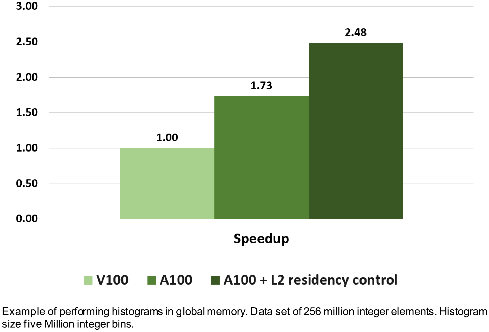

**図 34.** A100 の L2 常駐コントロール例

共有メモリに収まらない多数のビンを使用してヒストグラムを実行する場合、GPU のグローバル メモリでアトミック演算を直接実行してヒストグラムを計算する必要があります。上の[図 34](#figure-34) では、2 億 5,600 万の整数のデータセットを使用して、500 万の整数ビンを含むヒストグラムを計算しています。500 万の整数ビンのフットプリントは 20 MB であるため、共有メモリには収まりませんが、GPU の L2 キャッシュには収まります。ヒストグラムのビン領域を永続的としてマークすることで、V100 と比較して 2.5 倍、常駐コントロールを使用しない A100 と比較して 43% の高速化を実現できます。

### 11.5 Cooperative Groups

Cooperative Groups は、（CUDA 9 で導入された）プログラミング モデルを拡張するものであり、非同期メモリ コピーをグループ全体の集合体にカプセル化します。また、A100 のハードウェア アクセラレーションを利用してグローバル メモリから共有メモリへのノンブロッキング メモリ コピーを実行するほか、以前のアーキテクチャで別の方向への（ブロッキング）ソフトウェア フォールバックを提供します。

Cooperative Groups は、グループ内で指定されたスレッドを使用して、ワークロードを可能な限り効率的かつ自動的に分散し、スレッドごとに正しいアライメントとデータ転送サイズを推定します。デフォルトではシングルステージのパイプラインとして動作しますが、CUDA が提供する新しいメモリ パイプライン オブジェクトと連携して、これをマルチステージのパイプラインに拡張するためのオーバーロードを利用することができます。

転送が開始されると、パイプラインが空であること、または対応するステージが共有メモリへのデータの移動を完了したことを知らせる待機呼び出しの後で、データの読み取りが可能になります。

Cooperative Groups は、A100 の新しい強力な Warp リダクション命令と Reduce API を使用して集合体のセットを拡張します。この API は、渡されたグループ内にある名前付きの各スレッドが提供するデータに対してリダクション演算を実行します。ハードウェアは ADD、MIN、MAX といった算術演算や AND、OR、XOR といった論理演算を高速化できます。その他のタイプと演算は、ソフトウェアと、旧世代のハードウェアのフォールバックに実装されています。

CUDA 開発者はこれまでと同様に、Cooperative Launch のメリットを利用できます。グリッド同期のオーバーヘッドを最大 30% 削減できるほか、協調カーネルを作成してグリッド グループを利用する際の個別コンパイルが不要になります。

A100 以前の Warp 範囲の削減は、SHFL 演算をベースにしており、左側のデータ交換パターンに従って、5 ステップで完了する必要があります。A100 GPU は、1 ステップで結果が得られるハードウェア アクセラレーション対応の削減機能を搭載しています。

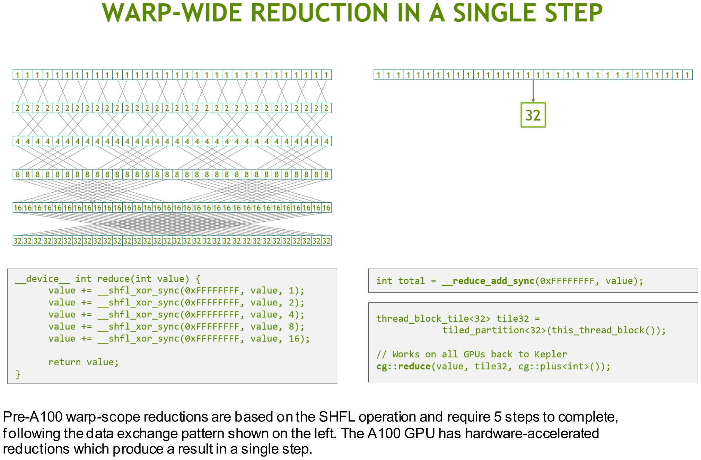

**図 35.** Warp 全体のリダクション

## 12 まとめ

NVIDIA の使命は、現代のダ・ヴィンチやアインシュタインの仕事を促進することです。科学者、研究者、エンジニアたちは、ハイパフォーマンス コンピューティング（HPC）と人工知能（AI）を使用して、世界で最も重要な科学、産業、ビッグ データの課題を解決することに注力しています。NVIDIA® A100 Tensor コア GPU は、このような革新者たちが生涯にわたって自分のライフワークに取り組めるように、NVIDIA の高速データセンター プラットフォームをさらに大きく前進させ、あらゆる規模で比類のない高速化を提供します。A100 は、HPC、ゲノミクス、5G、レンダリング、ディープラーニング、データ分析、データ サイエンス、ロボティクスなど、さまざまな応用分野を強化します。

今日の最も重要な HPC および AI の適用分野である個別化医療、対話型 AI、ディープ レコメンダー システムを推進するには、研究者が大きな力を発揮することが必要です。A100 は、Mellanox HDR InfiniBand（IB）、NVIDIA NVSwitch、NVIDIA HGX-A100、Magnum IO SDK を組み込んだ NVIDIA データセンター プラットフォームを強化し、スケールアップを実現します。これらのテクノロジを統合することで、何万個もの GPU に効率的にスケーリングし、最も複雑な AI ネットワークをこれまでにない速さでトレーニングすることができます。

A100 GPU の新しい MIG（マルチインスタンス GPU）は、各 A100 を最大 7 つの GPU アクセラレータにパーティショニングして最適な利用率を実現し、GPU リソースの利用率と、多くのユーザーや GPU アクセラレーション対応のアプリケーションへの GPU アクセスを効果的に向上させます。A100 は汎用性に優れているため、インフラストラクチャ管理者は、データセンター内のすべての GPU を最大限に有効活用して、最小規模のジョブから最大規模のマルチノード ワークロードまで、さまざまな規模のパフォーマンス ニーズに対応できます。

## 13 NVIDIA DGX A100

今日の企業は困難な時代にあり、ただ生き抜くだけでなく、さらなる成功を収めるためには、AI の利用を拡大してビジネスを変革する必要があります。しかし、ほとんどの企業には、AI を大規模に運用するためのインフラストラクチャとノウハウが不足しています。レガシー システムやアーキテクチャに依存しているため、データセンターで多額のサーバー コストが発生しており、効率が悪く、トレーニング、推論、分析固有のニーズに対応できていません。

### 13.1 NVIDIA DGX A100—AI インフラストラクチャ向けユニバーサルシステム

DGX A100 は第 3 世代の世界最先端の専用 AI システムです。1 つのシステムで 5 PFLOPS（ペタフロップス）という前例のないパフォーマンスを実現します。DGX A100 は、インフラストラクチャ向けの新しい構成を備えており、新しいユニバーサルなプラットフォームとアーキテクチャですべての AI ワークロードを統合して、エンタープライズ データセンターに革命をもたらします。A100 と MIG を搭載した DGX A100 は、エンタープライズ データセンターを変革します。データセンターのアーキテクトは、均質なインフラストラクチャを使用しながら、異種混合のワークロードに最適化されたデータセンターの計画、展開、スケーリングを行うことができます。DGX A100 は、開発から大規模展開まで、最も重要な活動に取り組むために必要なパワーを AI のイノベーターに提供します。

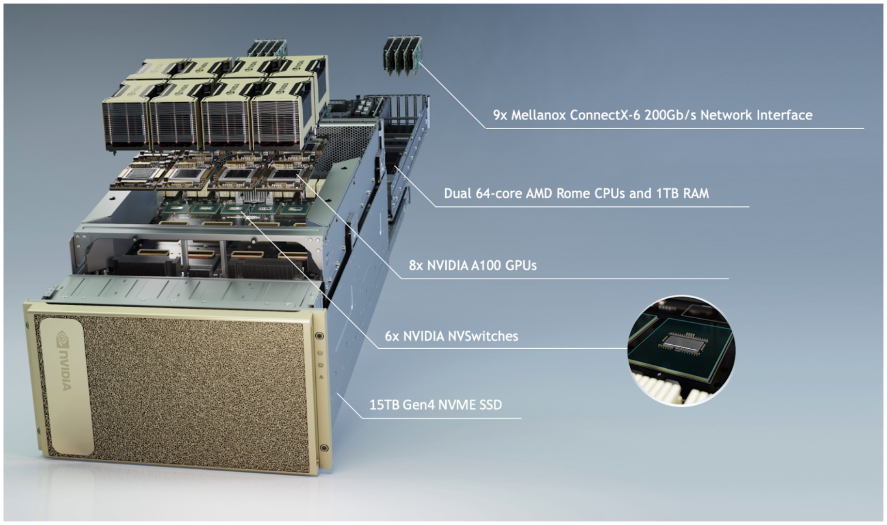

**図 36.** NVIDIA DGX A100 システム

DGX A100 のパフォーマンスは、数千個の DGX A100 システムを接続することで簡単にスケールアップすることができます。また、システム内の各 A100 GPU を 7 つの GPU インスタンスにスライスしてスケールダウンし、比類のない効率を実現できます。マルチインスタンス GPU（MIG）は NVIDIA の画期的なテクノロジであり、1 つの DGX A100 に最大 56 個のアクセラレータを提供します。各アクセラレータは、独自の高帯域幅メモリ、キャッシュ、コンピューティング コアを持ち、ハードウェア レベルで完全に分離および保護されます。

MIG を使用すると、最適な利用率を得るために専用リソースを使用しながら、複数のトレーニングおよび推論ジョブを同じシステム上で並行して組み合わせることができます。

NGC の最適化されたソフトウェアを実行し、高密度のコンピューティング能力とワークロードの徹底した柔軟性を併せ持つ DGX A100 は、シングルノードでの展開にも、NVIDIA DeepOps を使用して展開される大規模な Slurm クラスターや Kubernetes クラスターにも最適です。

### 13.2 革新的な性能

DGX A100 に搭載された 8 個の NVIDIA A100 GPU は、新しい高性能な第 3 世代 NVLink を使用して、合計 4.8 TB/秒の双方向帯域幅（2.4 TB/秒、全二重通信）を持つ 6 つの新しい NVSwitch を介して相互接続しています。各 NVIDIA A100 GPU は、TF32 の精度とスパース性機能を備えた第 3 世代 Tensor コアを搭載しており、コード変更ゼロで、V100 の標準の FP32 FMA 演算の最大 20 倍のパフォーマンスを提供します。DGX A100 は、AI トレーニングで V100 ベースの DGX-1 の最大 6 倍のパフォーマンスを発揮します。また、DGX A100 は、6U のフォーム ファクターで最大 5 PFLOPS の AI パフォーマンスを提供し、コンピューティング密度の新たな基準を打ち立てます。

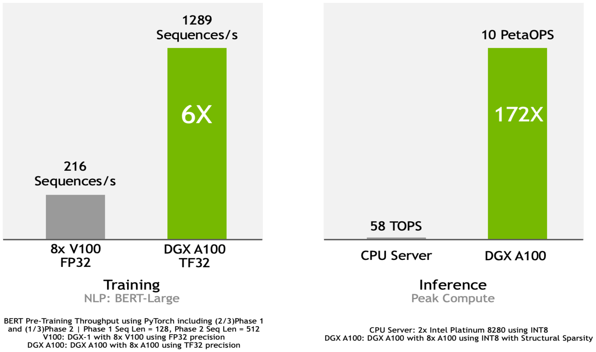

**図 37.** トレーニングと推論でかつてない AI 性能を実現する DGX A100

### 13.3 比類のないデータセンターのスケーラビリティ

DGX システムの中で最速の IO アーキテクチャを持つ NVIDIA DGX A100 は、[NVIDIA DGX SuperPOD](https://www.nvidia.com/en-us/data-center/resources/nvidia-dgx-superpod-reference-architecture/) などの大規模な AI クラスターの基礎となるビルディング ブロックであり、企業にとってスケーラブルな AI インフラストラクチャを実現するための青写真となるものです。DGX A100 は、PCIe Gen 4 の 10 倍高速の次世代 NVLink、新しい NVSwitch、200 Gb/秒で動作する 8 つの Mellanox ConnectX-6 HDR InfiniBand アダプターを初めて搭載し、大規模な AI ワークロード向けの高速ファブリックを提供します。また、アプリケーションを数万個の GPU に効率的にスケーリングするための Magnum IO ソフトウェア SDK もサポートしています。大規模な GPU 高速計算、最先端のネットワーク ハードウェア、ソフトウェア最適化の組み合わせにより、NVIDIA DGX A100 は、何百、何千ものノードにスケールアップして、会話型 AI や大規模な画像分類など、最大の課題に対応することができます。

### 13.4 完全に最適化された DGX ソフトウェアスタック

DGX A100 ソフトウェアは、AI ワークロードを大規模に実行できるように構築されています。作業者が DGXA100 にディープラーニング フレームワーク、データ分析、その他の HPC アプリケーションを展開する際に、最小限のセットアップ作業で済むように配慮されています。プラットフォーム ソフトウェアは、サーバーにインストールされる最小限の OS とドライバーを中心に設計されており、すべてのアプリケーションと SDK ソフトウェアが [NGC Private Registry](https://docs.nvidia.com/ngc/ngc-private-registry-user-guide/index.html) を通じてプロビジョニングされます。

[NGC Private Registry](https://docs.nvidia.com/ngc/ngc-private-registry-user-guide/index.html) は、ディープラーニング（DL）、機械学習（ML）、ハイパフォーマンス コンピューティング（HPC）アプリケーション向けの GPU 最適化コンテナー、トレーニング済みモデル、モデル スクリプト、Helm チャート、ソフトウェア開発キット（SDK）を提供します。これらのソフトウェアは、DGX システム上で開発、テスト、調整されており、すべての DGX 製品（DGX-1、DGX-2、DGX Station、DGX A100）と互換性があります。また、NGC Private Registry が提供する安全なスペースを利用して、カスタムのコンテナー、モデル、モデル スクリプト、Helm チャートを企業内の他のユーザーと共有することもできます。NGC PrivateRegistry の詳細については、[こちらのブログ記事](https://developer.nvidia.com/blog/securing-and-accelerating-end-to-end-ai-workflows-with-the-ngc-private-registry/)を参照してください。

[図 38](#figure-38) は、このような DGX ソフトウェア スタックのすべての構成要素の位置付けを示しています。

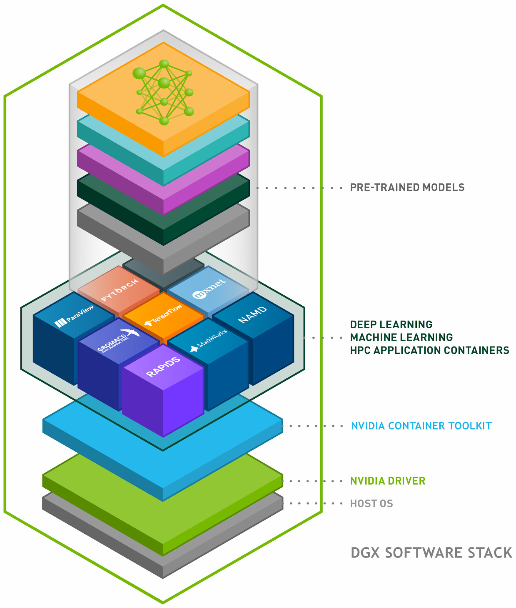

**図 38.** NVIDIA DGX ソフトウェアスタック

DGX ソフトウェア スタックには、以下の主要なコンポーネントが含まれています。

- [NVIDIA CUDA Toolkit](https://developer.nvidia.com/cuda-toolkit) は、高性能な GPU アクセラレーション対応のアプリケーションを作成するための開発環境です。CUDA 11 によって、ソフトウェア開発者や DevOps エンジニアは、新しい NVIDIA A100 GPU における次のような大きな革新の恩恵を受けることができます。
  - 線形代数用の CUDA ライブラリにおける新しい入力データ タイプ フォーマットとパフォーマンス最適化のサポート
  - DGX ソフトウェア スタックの一部である Linux オペレーティング システムでの MIG インスタンスの構成と管理

CUDA 11 の新機能については、開発者ブログ「[CUDA 11 Features Revealed](https://developer.nvidia.com/blog/cuda-11-features-revealed/)」を参照してください。

- NVIDIA Container Toolkit を使用すると、GPU アクセラレーション対応の Docker コンテナーを構築して運用することができます。Toolkit には、コンテナー ランタイム ライブラリとユーティリティが含まれており、コンテナーを自動的に設定して NVIDIA GPU を活用できます。
- GPU アクセラレーション対応コンテナーは、以下をサポートするためのソフトウェアを備えています。
  - トレーニング用ディープラーニング フレームワーク。[PyTorch](https://docs.nvidia.com/deeplearning/frameworks/pytorch-release-notes/index.html)、[MXNet](http://docs.nvidia.com/deeplearning/dgx/mxnet-release-notes/index.html)、[TensorFlow](http://docs.nvidia.com/deeplearning/dgx/tensorflow-release-notes/index.html) など
  - 推論プラットフォーム。[TensorRT](https://docs.nvidia.com/deeplearning/frameworks/tf-trt-user-guide/index.html) など
  - データ分析。[RAPIDS](http://rapids.ai/)（エンドツーエンドのデータ サイエンスとアナリティクス パイプラインを完全に GPU 上で実行するためのソフトウェア ライブラリ スイート）など
  - ハイパフォーマンス コンピューティング（HPC）。[CUDA-X HPC](https://developer.nvidia.com/gpu-accelerated-libraries)、[OpenACC](https://developer.nvidia.com/openacc)、CUDA® など。

DGX A100 の詳細については、NVIDIA のブログ記事「[Defining AI Innovation with DGX A100](https://developer.nvidia.com/blog/defining-ai-innovation-with-dgx-a100/)」を参照してください。

### 13.5 NVIDIA DGX A100 システム仕様

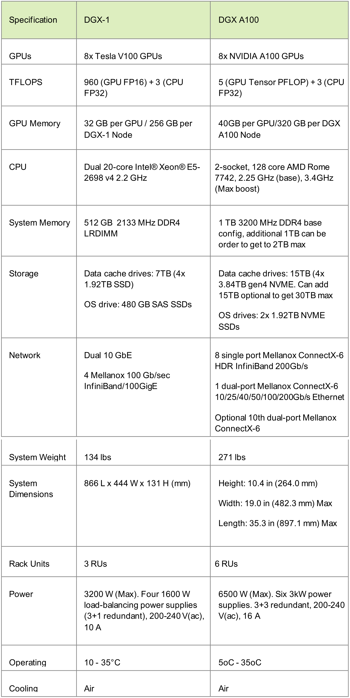

**表 10.** NVIDIA DGX A100 システム仕様

## 14 スパースニューラルネットワーク入門

DNN の複雑化に対応するため、GPU のコンピューティング パフォーマンスが急速に向上しているにもかかわらず、科学者たちは、密なネットワークのトレーニングに使用する計算量、メモリ、エネルギーを削減し、さらにはメモリの少ないエッジ デバイスに収まるように、トレーニング済みネットワークのサイズを減らす新たな手法を研究しています。密なネットワークを、同じレベルの精度を提供するスパースなネットワークにプルーニングする手法は、産業界や学術界で広く盛んに研究されています。

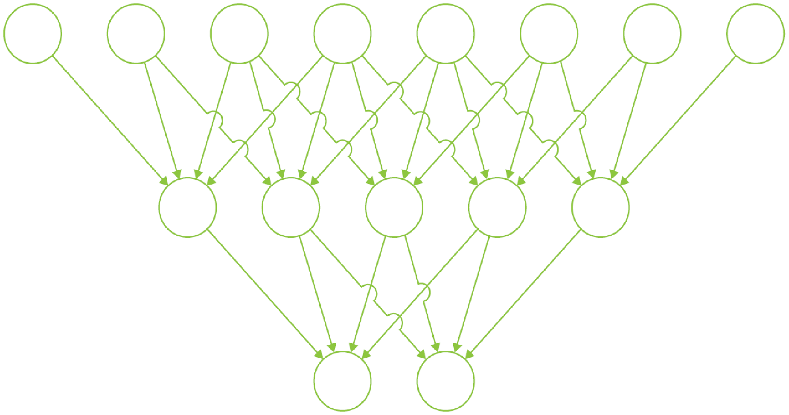

**図 39.** デンスニューラルネットワーク

ディープ ニューラル ネットワーク（DNN）は、相互に接続されたニューロンまたはノードから成る複数の層で構成されています。一般的に、完全に接続された DNN の各ニューロンまたはノードは、ネットワークの次の層のすべてのニューロンと接続されています。ネットワークのある層に n 個のノードが存在し、次の層の n 個のノードに接続されている場合、2 つの層の間の相互接続数は $n^2$ になります。新しいニューラル ネットワークはここ数年で急速に複雑化しています。その結果、数十から数百の層を含む DNN や、数百万の相互接続を持ち、数千のニューロンを含む DNN が誕生しています。

### 14.1 プルーニングとスパース性

プルーニングとは、簡単に言えば、ネットワークの最終的な精度にほとんど、またはまったく寄与しないノードと相互接続を、ゼロにしたり削除したりするために使用する手法です。AI のトレーニングでは、ゼロに近い値を持つ重み行列や活性化行列の多くをゼロにして、残りの重みを最適化するために再トレーニングを行うことを指す場合があります。推論では、ゼロに近い値を持つ重みの値をゼロに丸めたり、ゼロに近い値を持つ相互接続とノードをネットワークから削除したりすることがあります。プルーニング後はノードと相互接続が少なくなるため、ネットワークはスパースになります。数多くの研究論文で、スパース ネットワークのためのさまざまなプルーニング手法が検討されています。このトピックの詳細は、オンラインで調べることができます。

ニューラル ネットワークでスパース性を利用すると、いくつかのパフォーマンス上の利点が得られます。第一に、ゼロ値の行列要素の計算をスキップすることで、計算スループットを向上できます。第二に、ゼロではない要素のみを取得することで、メモリ帯域幅の使用量を削減できます。第三に、レイテンシに依存する推論アプリケーションでは、メモリからより多くの非ゼロ値をフェッチし、それらをオンチップでローカルに格納することで、レイテンシを削減できます。

### 14.2 細粒度スパース性と粗粒度スパース性

スパース性に関する研究は、大きく分けるとニューラル ネットワーク全体に分布する特定の重みをゼロにする細粒度スパース性の研究と、ニューラル ネットワークのサブネットワーク全体をゼロにする粗粒度スパース性の研究に分類することができます。

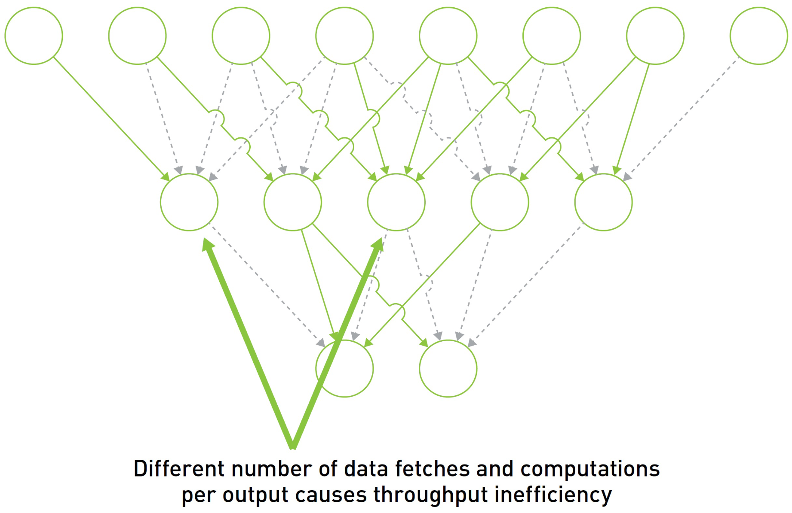

**図 40.** 細粒度スパース性

細粒度のスパース性を持つネットワークでは、ノードの数は同じですが、ネットワーク全体に不規則に分布するエッジの数は少なくなります。[図 40](#figure-40) に示すように、メモリからフェッチされるデータ量と各ノードの出力を計算するのに必要な計算量は、ノードごとに異なります。これにより、不規則なメモリ アクセスと負荷分散の問題が生じ、計算ワークロードの並列性が低下するため、GPU の計算スループットが減少します。

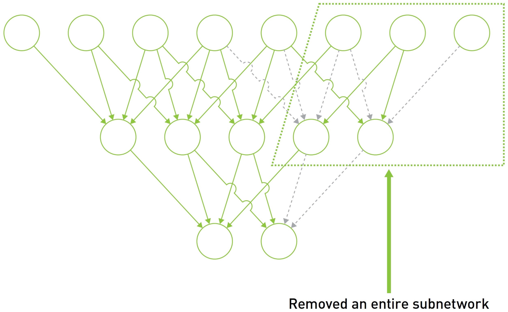

**図 41.** 粗粒度スパース性

粗粒度スパース性に基づいてプルーニングされたネットワーク（[図 41](#figure-41)）では、ネットワークのサブセクション全体が削除されています。これはワークロードの並列性を維持し、スループットを向上させるのに役立ちますが、精度の損失が大きくなる点で望ましくありません。

NVIDIA A100 GPU がサポートする細粒度構造化スパース性では、ネットワークをスパースにしながら、各ノードが同じ量のデータ取得と計算を実行するようにできます。下の [図 42](#figure-42) は、第 2 層と第 3 層の各ノードが同数のスパース接続を持つ、細粒度構造化スパース性ネットワークを示しています。

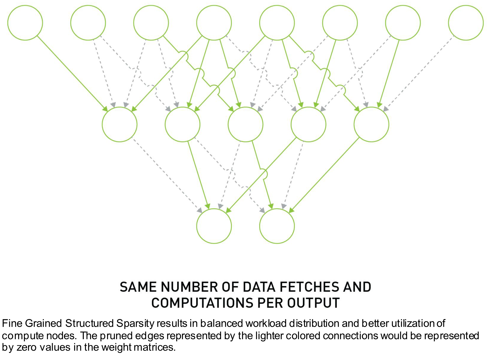

**図 42.** 細粒度構造化スパース性

スパース性に関する研究は、学術界と AI 業界の両方で大量に発表されています。しかし、スパース性を使用して精度を損なうことなく計算スループットを最適化する標準的な方法は確立されていません。NVIDIA A100 に実装されている細粒度構造化スパース性と、NVIDIA が提供するディープ ニューラル ネットワークをスパース化するシンプルで汎用的な方法を使用すれば、精度の損失はほぼ発生しません（各種の一般的なニューラル ネットワークの評価方法に基づく）。下の[表 11](#table-11) では、2:4 のスパース性を使用した最適化で達成される精度と、密行列を使用したトレーニングを比較しています。

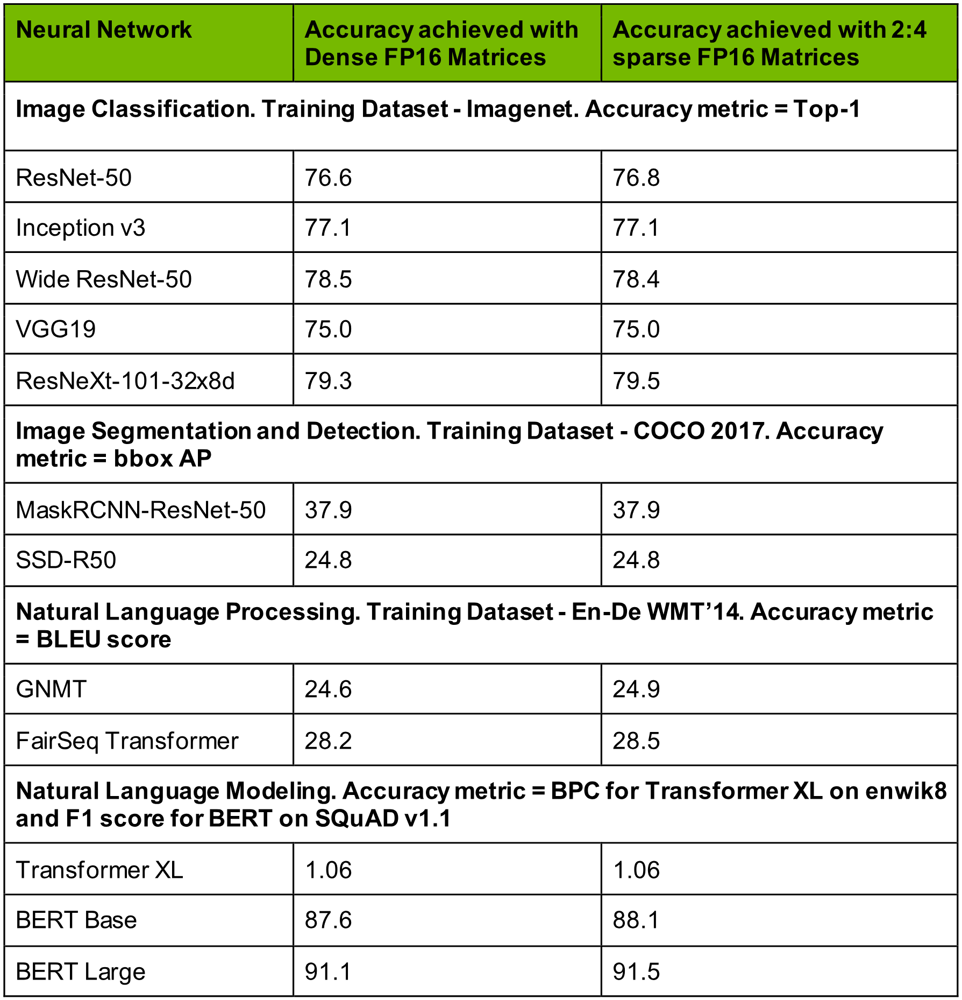

**表 11.** 2:4 細粒度構造化スパース性を使用した各種ネットワークの精度

> 正確な印刷レイアウトと参考文献については、原 PDF を正本とする。
