> [Nick Stam](https://developer.nvidia.com/blog/author/nstam/)。NVIDIA Blackwell Architecture Technical Brief、V2.1、2025-10-01 公開。[NVIDIA リソースページ](https://resources.nvidia.com/en-us-blackwell-architecture/blackwell-architecture-technical-brief)。<a href="/paper/nvidia-blackwell-architecture.pdf" target="_blank" rel="noopener noreferrer">原 PDF</a>。arXiv レコードおよび TeX ソースは存在しない。正確な文言、印刷レイアウト、参考文献については公開 PDF を正本とする。
>
> AI 推論時代のために構築。Blackwell Ultra GB300 Superchip、Blackwell Ultra GB300 NVL72 Rack-scale System、HGX B300 Server System を追加するよう更新済み。

## 1 AI 推論時代のために構築された NVIDIA GB300 NVL72

長年にわたり、AI の進歩は事前学習スケーリングという明確な軌道をたどってきた。モデルを大きくし、データを増やし、計算資源を拡大すると、画期的な能力が得られる。より知的なシステムを構築することは、もはや事前学習モデルを大きくするだけではない。モデルを洗練し、思考と推論ができるようにすることが必要である。

AI モデルを特定のタスクに合わせて洗練することで、事後学習スケーリングはモデルを改善し、より会話的な応答を可能にする。ドメイン固有データと合成データでモデルを調整すると、微妙な文脈を理解し、正確な出力を返す能力が高まる。合成データの生成には上限がないため、事後学習スケーリングでは大量の計算資源が必要になる。

現在、知能を増幅する新しいスケーリング則、テスト時スケーリングが登場している。

テスト時スケーリングは長時間思考とも呼ばれ、AI 推論中の計算量を動的に増やして、より深い推論を可能にする。AI 推論モデルは 1 回のパスで応答を生成するだけでなく、リアルタイムに思考し、複数の可能性を比較し、回答を洗練する。

事後学習スケーリングとテスト時スケーリングへの移行により、計算量、リアルタイム処理、高速インターコネクトの需要は指数関数的に増える。特化した派生モデルを開発する事後学習では事前学習の 30 倍、極めて複雑なタスクを解く長時間思考では 1 回の推論パスの 100 倍の計算量が必要になる場合がある。

ここで [NVIDIA Blackwell アーキテクチャ](https://www.nvidia.com/en-us/data-center/technologies/blackwell-architecture/?ncid=so-link-252431-vt04) が登場する。これはデータセンター規模の推論 AI ワークフローを処理する目的で構築され、前世代の NVIDIA Hopper GPU に対して最大 30 倍の[エネルギー効率](https://www.nvidia.com/en-us/glossary/energy-efficiency/)を実現する。

本技術概要では、Blackwell Ultra GPU、[GB300 NVL72 ラックスケールシステム](https://www.nvidia.com/en-us/data-center/gb300-nvl72/)、HGX B300 サーバを含む NVIDIA Blackwell の利点を詳しく紹介する。GB200 NVL72 と HGX B200 のシステム情報も含まれる。

## 2 NVIDIA Blackwell と Blackwell Ultra の概要

NVIDIA Blackwell と Blackwell Ultra 製品は、モデル規模の拡大や AI 推論を含め、増え続ける AI の複雑性に対応するために設計され、多数の新しいイノベーションを備える。

NVIDIA Blackwell と Blackwell Ultra 製品により、あらゆる企業が最先端の LLM を経済的に利用、導入し、推論 AI の利点で事業を最適化できる。同時に、NVIDIA Blackwell と Blackwell Ultra 製品は次世代の AI モデルを可能にし、リアルタイム性能を保ちながら高スループットを支える。これは Blackwell のアーキテクチャ上の革新なしには実現できない。

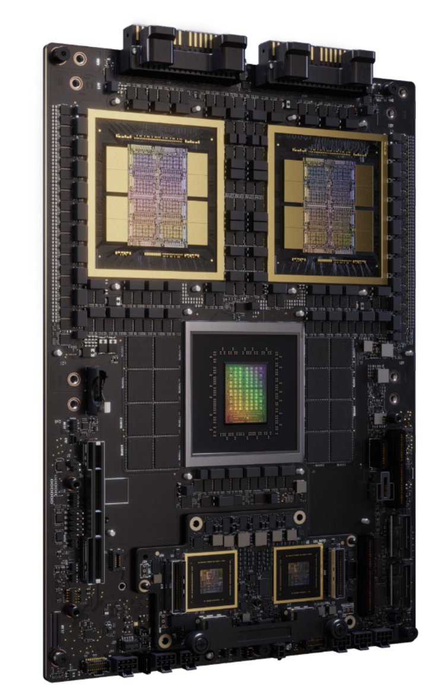

**図 1。** ConnectX-8 SuperNIC を搭載した NVIDIA Grace Blackwell Ultra Superchip

## 3 NVIDIA Blackwell のアーキテクチャ革新

Blackwell アーキテクチャは、Blackwell と Blackwell Ultra 製品によって AI 推論とアクセラレーテッドコンピューティングに画期的な進歩をもたらす。新しい第 2 世代 Transformer Engine と、より高速で広帯域な [NVIDIA® NVLink®](https://www.nvidia.com/en-us/data-center/nvlink/) インターコネクトの採用により、データセンターは前世代のアーキテクチャより数桁高い性能を持つ新時代へ進む。

[NVIDIA Confidential Computing](https://www.nvidia.com/en-us/data-center/solutions/confidential-computing/) 技術の進歩により、性能を損なうことなく大規模 AI 推論のセキュリティ水準が高まる。また、NVIDIA Blackwell の新しい Decompression Engine と [Spark RAPIDS™](https://docs.nvidia.com/spark-rapids/index.html) ライブラリを組み合わせることで、データ分析アプリケーションに比類のないデータベース性能を提供する。NVIDIA Blackwell の複数の進歩は、何世代にもわたるアクセラレーテッドコンピューティング技術を基盤とし、比類のない性能、効率、規模によって推論 AI の次章を形作る。

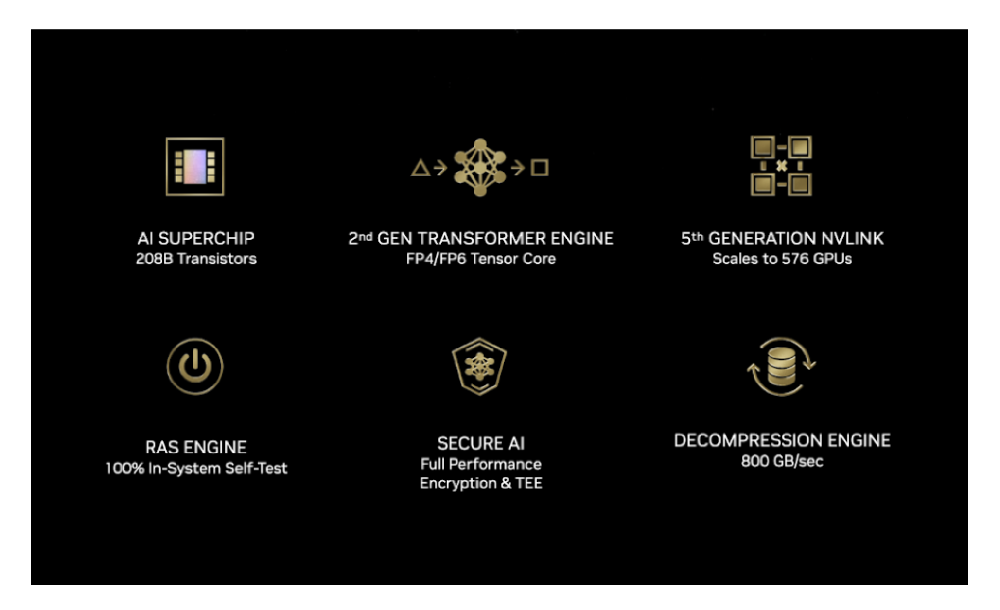

**図 2。** NVIDIA Blackwell アーキテクチャの技術的ブレークスルー

### 3.1 新しいクラスの AI GPU

Blackwell は NVIDIA Hopper GPU の 2.5 倍を超える 2080 億個のトランジスタを搭載し、NVIDIA 向けに調整された [TSMC](https://www.tsmc.com/english) の 4NP プロセスを採用した、これまでで最大の GPU である。NVIDIA Blackwell は単一チップとして最高の計算性能である 20 petaFLOPS を達成する。

このアーキテクチャは 2 個の GPU ダイを統合することで、大量の計算能力を収容できる。2 個の GPU ダイはいずれもレチクルサイズの限界まで大きく、現在製造可能な最大サイズである。2 個のダイは 10 TB/s のチップ間 NVIDIA High-Bandwidth Interface（NV-HBI）で接続、統合され、完全にコヒーレントな 1 個のチップとして機能する。

Blackwell アーキテクチャは、高い 1 秒当たり浮動小数点演算回数（FLOPS）を持つチップだけではない。NVIDIA の豊富な開発ツール群、CUDA-X™ ライブラリ、400 万人を超える開発者、数千ノードまで性能を拡張する 3000 を超えるアプリケーションからなるエコシステムを引き続き基盤とし、その恩恵を受ける。

新しい NVIDIA Blackwell Ultra GPU は、強化された計算能力と増加したメモリにより、AI 推論時代のために構築されている。GB300 NVL72 は NVIDIA GB200 NVL72 より AI 性能が 1.5 倍高く、[NVIDIA Hopper™](https://www.nvidia.com/en-us/data-center/technologies/hopper-architecture/) システムと比べて AI 推論の生産性が 50 倍、AI 推論が 35 倍高速、エネルギー効率が 30 倍、token 当たりのコストが 25 分の 1 になる。

### 3.2 Blackwell Tensor Core アーキテクチャ

Tensor Core は、AI と HPC アプリケーションに画期的な性能をもたらす行列積和（MMA）演算専用の高性能計算コアである。1 個の NVIDIA GPU で複数の SM にまたがって並列動作する Tensor Core は、標準の Floating-Point（FP）、Integer（INT）、FMA（Fused Multiply-Accumulate）演算と比べてスループットと効率を大幅に向上させる。Tensor Core は NVIDIA Tesla® V100 GPU で初めて導入され、その後の NVIDIA GPU アーキテクチャ世代ごとに強化されてきた。

生成 AI と推論 AI のモデルが規模と複雑さを増すにつれ、学習と推論の性能向上が不可欠になる。こうした計算需要に応えるため、Blackwell の新しい第 5 世代 Tensor Core アーキテクチャは、コミュニティ定義の microscaling（OCP）形式を含む FP4 などの新しい数値形式をサポートする。Blackwell アーキテクチャは[表 1](#table-01)に示すすべてのデータ型と数値形式をサポートする。

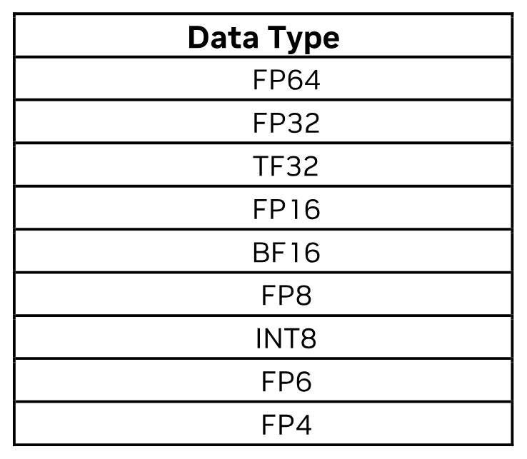

**表 1。** Blackwell アーキテクチャがサポートするデータ型

### 3.3 第 2 世代 Transformer Engine

Blackwell は新しい第 2 世代 Transformer Engine を導入する。第 2 世代 Transformer Engine は、独自の Blackwell Tensor Core 技術と [NVIDIA Dynamo](https://www.nvidia.com/en-us/ai/dynamo/)、[TensorRT-LLM](https://developer.nvidia.com/tensorrt)、[Nemo Framework](https://www.nvidia.com/en-us/ai-data-science/generative-ai/nemo-framework/) のイノベーションを組み合わせ、LLM、AI 推論、Mixture-of-Experts（MoE）モデルの推論と学習を高速化する。

Blackwell Transformer Engine は、高度なダイナミックレンジ管理アルゴリズムと micro-tensor scaling と呼ばれる細粒度スケーリング技術を使い、推論性能と精度を最適化して FP4 AI を実現する。これにより Blackwell の FP4 Tensor Core 性能、HBM メモリへのパラメータ帯域幅、GPU 1 個当たりで対応できるモデル規模がそれぞれ 2 倍になる。

Dynamo と TensorRT-LLM のイノベーションには、4-bit 精度への量子化、expert parallelism マッピングを使う専用 kernel、分離構成があり、今日の MoE モデルを、より少ないハードウェア、エネルギー、コストでリアルタイム推論に利用できるようにする。

学習では、第 2 世代 Transformer Engine が Nemo Framework および Megatron-Core の新しい expert parallelism 技術と連携し、ほかの並列化技術や第 5 世代 NVLink と組み合わさって、前例のないモデル性能を実現する。低精度形式は大規模学習をさらに高速化する可能性を開く。

Blackwell 第 2 世代 Transformer Engine により、企業は最先端の AI 推論モデルを経済的に利用、導入し、生成 AI の利点で事業を最適化できる。NVIDIA Blackwell は次世代の AI 推論モデルを実現し、学習とリアルタイム推論の両方を支える。

### 3.4 Attention Layer Acceleration

Blackwell Ultra GPU は、長い入力系列の性能を改善する新命令により、注意層の計算を Blackwell GPU の 2 倍に高速化する。Blackwell Ultra GPU アーキテクチャで注意演算を 2 倍にすることで、レイテンシを短縮し、AI 推論モデルがより高速かつ知的に意思決定できるようになり、AI 性能が高まる。この高速化は処理時間を短縮するため、計算コストも下がり、エネルギーとインフラストラクチャを節約できる。企業は同じ資源でより大きなワークロードを処理して効率的に拡張し、最終的に効率向上、コスト削減、AI 駆動事業における競争上の優位を得られる。

### 3.5 高性能 Confidential Computing と Secure AI

生成 AI は企業に大きな可能性をもたらす。収益の最適化、ビジネス知見の提供、生成コンテンツの支援は、その利点の一部にすぎない。しかし、プライバシー規制の対象となるデータや独自情報を含む非公開データで学習する必要がある企業にとって、生成 AI の導入は難しい場合がある。

NVIDIA Confidential Computing は Trusted Execution Environment（TEE）を CPU から GPU へ拡張する。NVIDIA Blackwell の Confidential Computing は、LLM やその他の機密データに対して、最速で最も安全かつ検証可能な（証拠に基づく）保護を提供するよう設計されている。NVIDIA Blackwell は業界初の TEE-I/O 対応 GPU を導入し、TEE-I/O 対応ホストと NVLink 上のインライン保護（機密性と完全性を提供）により、最高性能の confidential compute ソリューションも提供する。

Blackwell Confidential Computing は、暗号化しないモードとほぼ同じスループット性能を実現する。顧客は AI 知的財産（IP）を保護し、機密 AI 学習、推論、連合学習を安全に実行できるほか、最大規模のモデルも高性能に保護できるようになる。

### 3.6 第 5 世代 NVLink と NVLink Switch

エクサスケールコンピューティングと AI 推論モデルの潜在能力をすべて引き出すには、サーバクラスタ内の全 GPU 間で高速かつ円滑に通信する必要がある。第 5 世代 NVLink は、そのために構築された NVLink Switch チップによって 576 GPU まで拡張し、推論 AI モデルの性能を高める。第 5 世代 NVLink の性能は NVIDIA Hopper の第 4 世代 NVLink の 2 倍である。Blackwell と Blackwell Ultra GPU の新しい NVLink も Hopper GPU と同様に、各方向 2 組の高速差動ペアで 1 本のリンクを構成するが、NVIDIA Blackwell アーキテクチャはリンク当たり各方向の実効帯域幅を 50 GB/sec に倍増する。

Blackwell と Blackwell Ultra GPU は 18 本の第 5 世代 NVLink を備え、合計 1.8 TB/sec、各方向 900 GB/sec の帯域幅を提供する。GPU 1 個当たり 1.8TB/s の双方向スループットは PCIe Gen5 の 14 倍を超え、今日の最も複雑な大規模モデルに高速通信を提供する。72 GPU の NVLink ドメインでは総帯域幅 130 TB/s のデータが転送され、これはインターネット全体を上回るデータ移動量である。

NVIDIA NVLink Switch は、モデル並列化のために 72 GPU の 1 つの NVLink ドメイン（NVL72）で 130TB/s の GPU 帯域幅を実現し、新しい NVIDIA Scalable Hierarchical Aggregation and Reduction Protocol（SHARP）™ の FP8 対応により帯域効率を 4 倍にする。NVLink と NVLink Switch を併用すると、単一サーバを超えるクラスタでも同じ優れた 1.8 TB/s のインターコネクトを維持できる。NVLink Switch を使うマルチサーバクラスタは、増加する計算能力と釣り合うように GPU 通信を拡張でき、GB300 NVL72 は単一の 8 GPU システムに比べて 9 倍の GPU スループットをサポートできる。

### 3.7 Decompression Engine

データ分析とデータベースのワークフローは、従来 CPU に計算を依存していたため低速で煩雑だった。アクセラレーテッドデータサイエンスは、エンドツーエンド分析の性能を大幅に高め、価値創出と知見獲得を高速化しながらコストを削減できる。データベースは、データ分析のために大量のデータを扱い、処理し、分析するうえで重要な役割を担う。Blackwell アーキテクチャの新しい専用 NVIDIA Decompression Engine は、最大 800GB/s でデータを解凍できる。GB200 の単一 GPU が持つ 8TB/s の HBM3e（High Bandwidth Memory）と Grace CPU の高速 NVLink-C2C（Chip-to-Chip）インターコネクトを組み合わせることで、Blackwell と Blackwell Ultra はデータベースクエリのパイプライン全体を高速化し、データ分析とデータサイエンスで最高の性能を実現する。LZ4、Snappy、Deflate など最新の圧縮形式をサポートし、クエリベンチマークでは [NVIDIA Blackwell は CPU より 18 倍高速](https://developer.nvidia.com/blog/nvidia-gb200-nvl72-delivers-trillion-parameter-llm-training-and-real-time-inference/)で、NVIDIA H100 GPU より 6 倍高速である。

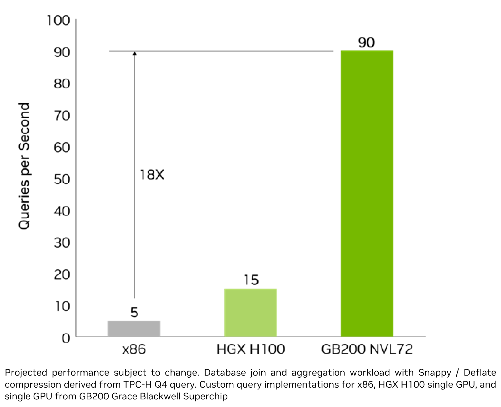

**図 3。** Decompression Engine を使った GB200 Grace Blackwell のデータベース結合クエリ

### 3.8 RAS Engine

Blackwell アーキテクチャは専用の Reliability、Availability、Serviceability（RAS）Engine による知的レジリエンスを追加し、発生し得る障害を早期に特定してダウンタイムを最小化する。NVIDIA の AI 駆動予測管理機能は、ハードウェアとソフトウェアにわたる数千のデータポイントを継続的に監視して全体の健全性を把握し、ダウンタイムと非効率の原因を予測して未然に防ぐ。これにより、時間、エネルギー、計算コストを節約する知的レジリエンスが得られる。

NVIDIA の RAS engine は詳細な診断情報を提供し、懸念箇所を特定して保守を計画できる。RAS engine は問題の原因を迅速に特定してターンアラウンド時間を短縮し、効果的な修復によってダウンタイムを最小化する。管理者は計算資源と最適な checkpoint 戦略を柔軟に調整し、大規模学習ジョブを中断なく実行できる。RAS engine が交換部品の必要性を検出した場合は待機容量が有効になり、性能低下を最小限に抑えながら作業を予定どおり完了させる。必要なハードウェア交換は、計画外停止を避けるように予定できる。

## 4 NVIDIA Grace Blackwell Ultra / Blackwell NVL72 ラックスケールシステム

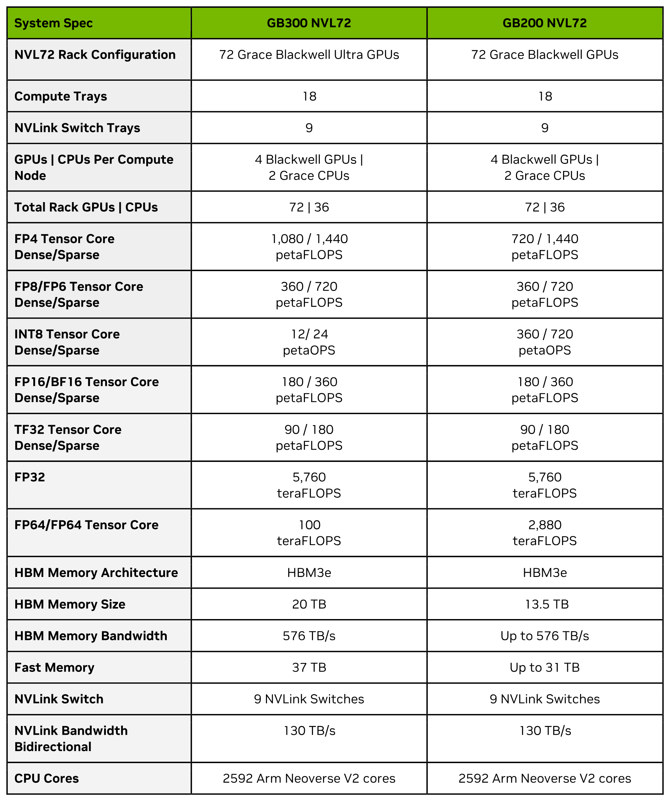

**表 2。** GB300 NVL72 と GB200 NVL72 のシステム仕様

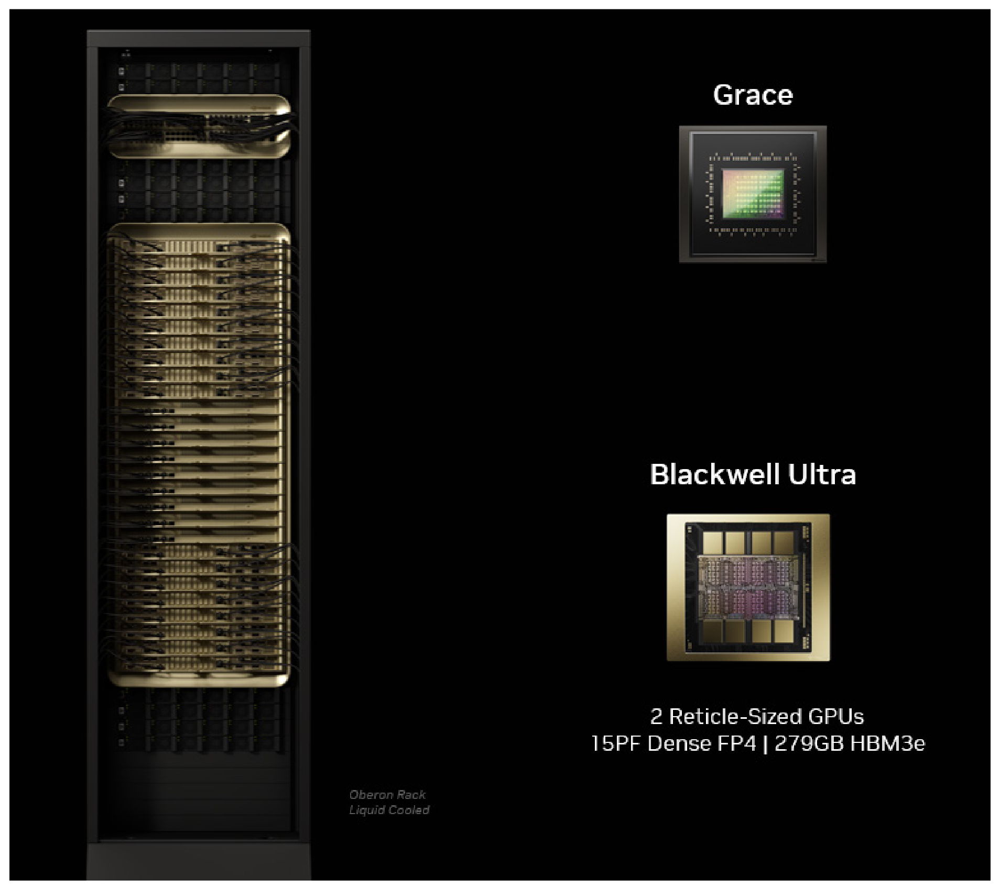

**図 4。** NVIDIA GB300 NVL72

## 5 Blackwell Ultra GB300 NLV72

NVIDIA GB300 NVL72 は、36 個の Grace CPU と 72 個の Blackwell Ultra GPU をラックスケール設計で接続し、推論、学習、データ処理を強化する。GB300 NVL72 は液冷ラックスケールソリューションであり、単一の巨大 GPU として機能する 72 GPU NVLink ドメインを備え、AI 推論向けに最適化された接続性を提供する。

### 5.1 AI ファクトリの性能と収益を最大化

#### 5.1.1 AI ファクトリの生産量を 50 倍に向上

Jensen Huang は Pareto Frontier 曲線を AI ファクトリの大規模言語モデル推論の最適化フレームワークとして位置づけ、メガワット当たりのスループット（y 軸の TPS / MW）とユーザー当たりのレイテンシ体験（x 軸の TPS for 1 User）の釣り合いを示した。AI ファクトリの効率は生のスループットと高速な応答の均衡であり、最適な動作点は曲線の角にある。ファクトリの生産量は曲線下の面積、または均衡点から作られる長方形の面積で近似できる。NVIDIA Dynamo はリアルタイムオーケストレータとして、GPU、GPU メモリ、NVLink にまたがって GPU 資源を動的に分割し、システムを固定した動作点に縛らず Pareto 曲線上で柔軟に移動させる。Dynamo は Blackwell Ultra GPU にわたる並列化戦略（expert/tensor/pipeline）と管理を最適化し、低レイテンシを維持しながら AI ファクトリの生産量または生産性を Hopper システムの 50 倍に高め、効率的な token 製造によって token 当たりの収益を最大化する。

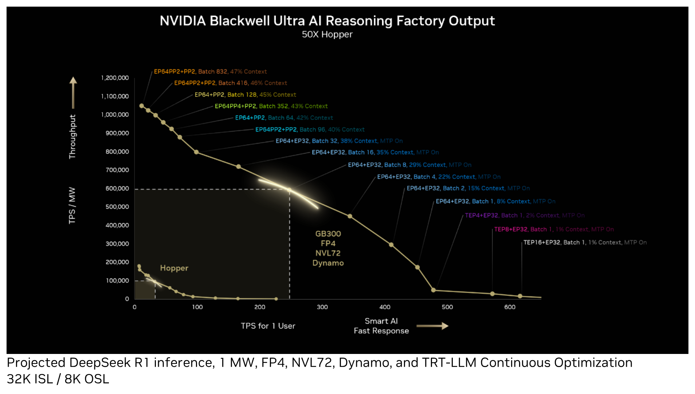

**図 5。** GB300 が AI 推論の AI ファクトリ生産量を 50 倍に向上

### 5.2 性能とエネルギー効率による TCO の削減

#### 5.2.1 性能を 35 倍に向上

NVIDIA GB300 NVL72 は推論性能を 35 倍に高め、AI 推論（DeepSeek-R1）で H100 と比較した場合の AI アプリケーションの速度とスケーラビリティを変え、AI チャットボットによる、より複雑で戦略的な問題解決を可能にする。

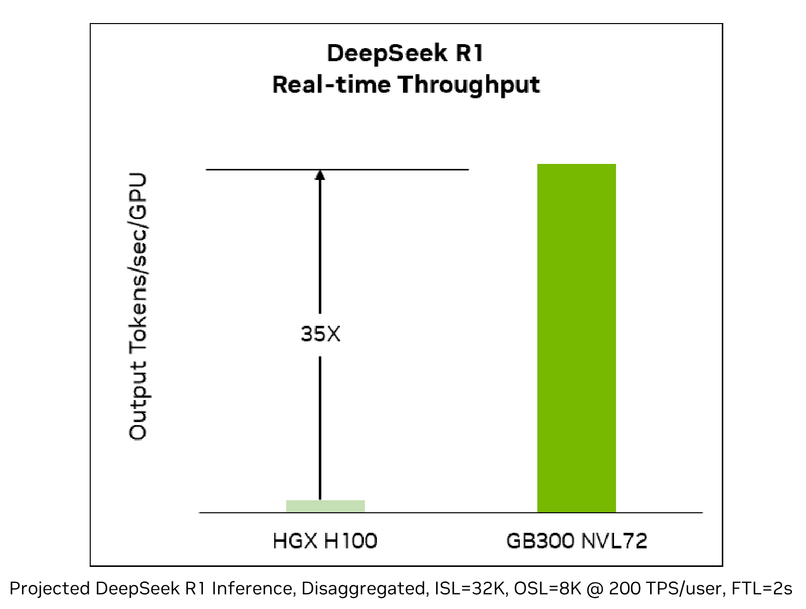

**図 6。** GB300 が AI 推論性能を 35 倍に向上

#### 5.2.2 エネルギー効率を 30 倍に向上

AI ワークロードを実行するデータセンターは、エネルギーと冷却の制約を受けることが多いため、消費するエネルギー単位当たりの性能を最大化するうえで効率が重要になる。Blackwell Ultra は Hopper 世代の 30 倍のエネルギー効率を実現する。

#### 5.2.3 TCO を 25 分の 1 に削減

わずかなコストで大幅に高い AI 性能を得ようとする企業にとって、総所有コスト（TCO）は引き続き重要である。GB300 NVL72 により、顧客はハードウェア費用を削減できるほか、AI 導入のライフサイクル全体にわたる冷却と保守のコストも最小化できる。これにより組織は資源を効率的に配分し、過大な設備投資をせずに AI 駆動のイノベーションを加速できる。

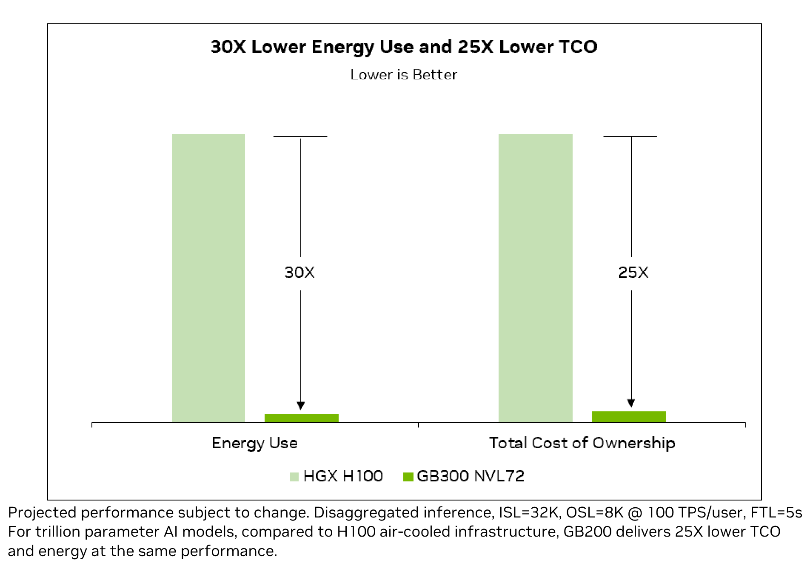

**図 7。** GB300 によるエネルギー使用量と総所有コストの削減

### 5.3 ラックスケールのエンドツーエンド AI 高速化

Blackwell Ultra は GPU 当たり最大 279 GB の HBM3e メモリ、ラック当たり 37 TB の高速メモリ、1 exaFLOP を超える FP4 計算能力、統合された 72 GPU NVLink ドメインにより、はるかに大きなモデルをサポートし、少ないノードでスケールアップでき、AI のブレークスルーへの道を開く。アクセラレーテッドコンピューティング向け CUDA-X ライブラリと組み合わせることで、NVIDIA はハードウェアとソフトウェアの計算スタック全体を高速化する。

### 5.4 あらゆるデータセンターに最適化

最適化されたデータセンターへの投資は性能上の優位だけでなく、AI 駆動の将来に競争力を保とうとする組織にとって戦略上不可欠である。GB300 NVL72 は HGX H100 の 65 倍の AI FLOPS を持ち、AI モデルに大幅に多い推論能力を提供する。NVLink で CPU、GPU、高速インターコネクトを組み合わせることで、複数システム間のデータ転送はかつてないほど効率的になる。

### 5.5 スケーラブルで安全かつ高スループットな AI 性能のための高速ネットワークプラットフォーム

GB300 NVL72 は極めて強力な単一計算ユニットとして動作するため、最適なアプリケーション性能を得るには堅牢なネットワークが必要になる。NVIDIA Quantum-X800 InfiniBand、Spectrum-X Ethernet、Connect-X SuperNIC、BlueField-3 DPU と組み合わせた GB300 NVL72 は、超大規模 AI データセンターで前例のないスケーラブルな性能、効率、セキュリティを提供する。

システム内の各 GPU は合計 800 Gb/s のデータスループットを利用できる。GB300 NVL72 は NVIDIA ネットワークプラットフォームとシームレスに統合され、AI ファクトリとクラウドデータセンターがボトルネックなしに兆パラメータモデルを処理できる。GB300 NVL72 アーキテクチャは、GPU と ConnectX-8 SuperNIC の間に PCIe Gen6 接続を初めて導入し、独立した PCIe switch インターフェースを不要にする。

#### 5.5.1 ConnectX-8 SuperNIC による卓越した推論性能

新しい NVIDIA ConnectX®-8 SuperNIC™ は、GB300 NVL72 システム内の各 GPU に完全な 800 gigabits per second（Gb/s）のネットワーク接続を提供する。NVIDIA Quantum-X800 InfiniBand または Spectrum-X™ Ethernet ネットワークプラットフォームと組み合わせることで、最高水準の remote direct-memory access（RDMA）機能を提供し、AI ワークロード効率を最大化する。さらに ConnectX-8 SuperNIC は、Internet Protocol Security（IPsec）と PSP Protocol Security（PSP）のラインレートネットワーク暗号化をサポートし、GPU 間接続の暗号化によってプラットフォームのセキュリティを高める。

### 5.6 リアルタイム動画生成とマルチモーダル AI の能力を 30 倍に向上

最先端の LLM がわずか 128,000 token のコンテキストウィンドウで動作するのに対し、5 秒の動画を 1 本生成するには 400 万 token を処理し、今日の最先端 NVIDIA Hopper GPU では生成に約 90 秒かかる。Blackwell Ultra プラットフォームは NVIDIA Cosmos のような world foundation model からリアルタイムに動画を生成し、Hopper 世代に対して 30 倍の性能向上を実現する。また、顧客は Physical AI アプリケーション向けに、カスタマイズされ、写実的で、時間的、空間的に安定した動画と 3D 世界シミュレータを作成できる。

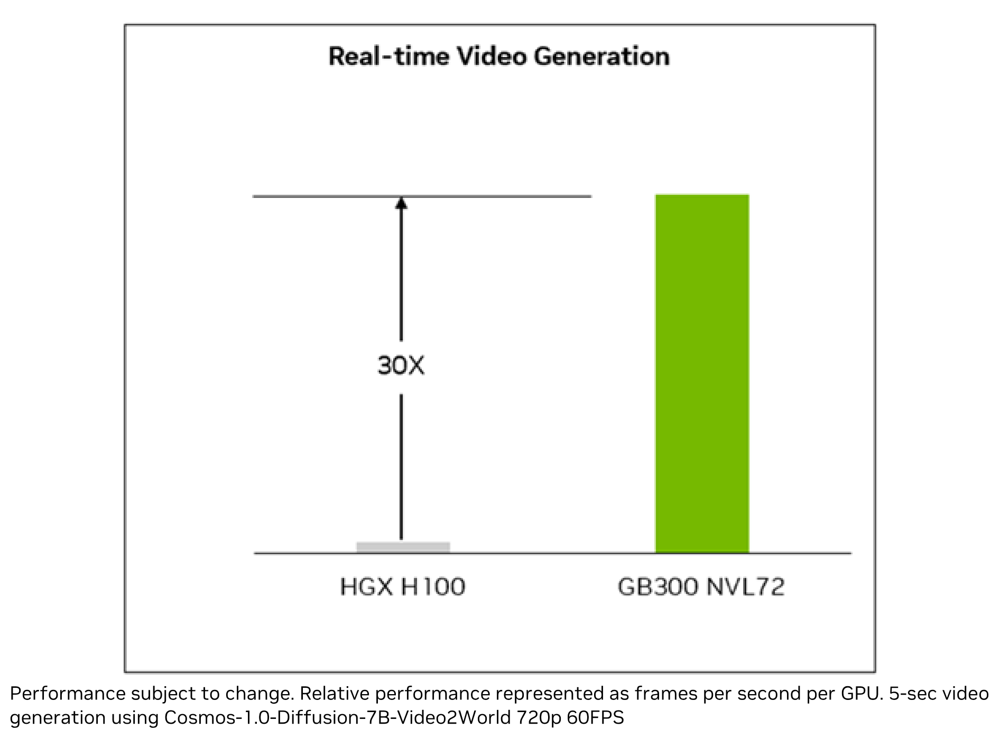

**図 8。** GB300 NVL72 が Physical AI アプリケーションの動画生成性能を 30 倍に向上

## 6 Blackwell GB200 NVL72

### 6.1 AI ファクトリの性能と収益を最大化

#### 6.1.1 AI ファクトリの生産量を 40 倍に向上

Frontier Pareto 曲線は、スループットと 1 ユーザーの応答時間を均衡させた AI ファクトリの推論生産性を示す。NVIDIA Dynamo はリアルタイムの GPU 資源オーケストレーション、並列化、Blackwell GPU 管理により、GB200 NVL72 上の生産性を Hopper システムの最大 40 倍に高め、1 megawatt の固定電力条件で token 製造効率を最大化する。

<https://docs.nvidia.com/multi-node-nvlink-systems/partition-guide.pdf>

<https://www.theregister.com/2025/03/23/nvidia_dynamo/>

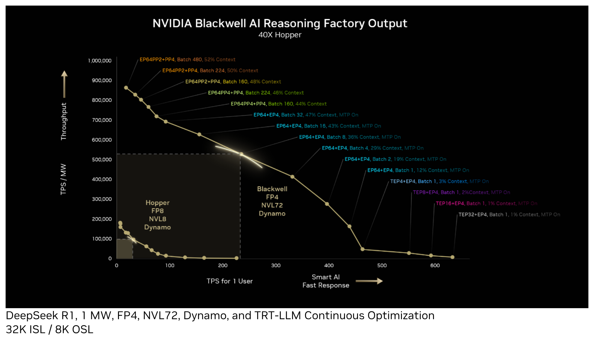

**図 9。** GB200 が AI 推論の AI ファクトリ生産量を 40 倍に向上

### 6.2 次世代大規模言語モデルのリアルタイム推論

GB200 NVL72 は最先端の機能と第 2 世代 Transformer Engine を導入して LLM 推論ワークロードを大幅に高速化し、数兆パラメータの言語モデルのような資源集約型アプリケーションでリアルタイム性能を実現する。GB200 NVL72 は GPT-MoE-1.8 のような巨大モデルで H100 より 30 倍高速であり、同じ GPU 数で TCO とエネルギー使用量を 25 分の 1 にする。この進歩は FP4 を含む新しい精度を導入した新世代 Tensor Core によって実現される。さらに GB200 は NVLink と液冷を使い、通信ボトルネックを克服できる 72 GPU の巨大な単一ラックを構成する。

GB200 は高性能推論タスク向けの革新的ソリューションであり、AI の限界を押し広げる NVIDIA の姿勢を示している。

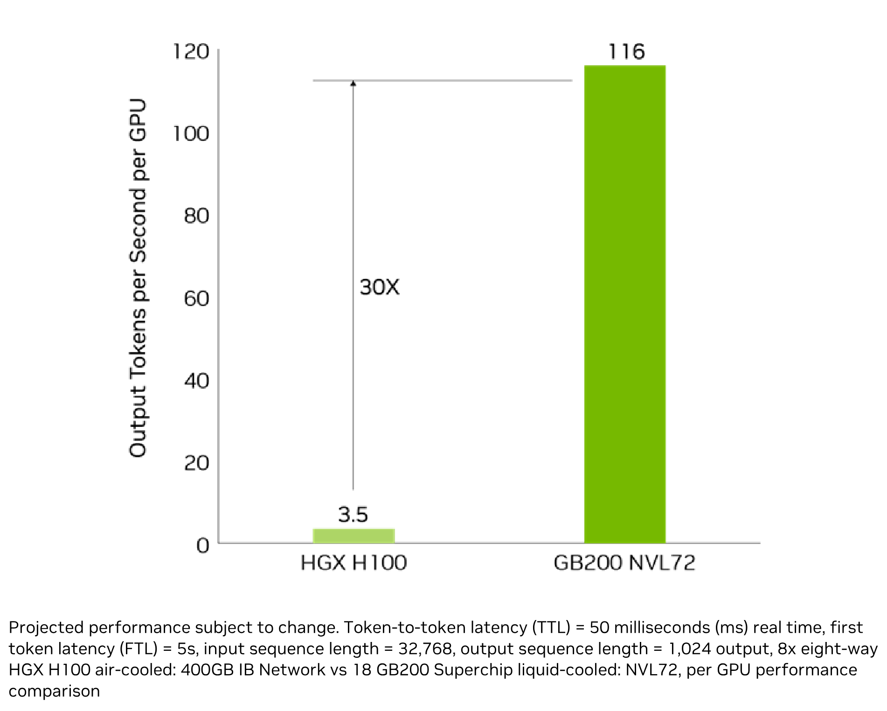

**図 10。** 第 2 世代 Transformer Engine を使用した GB200 1.8T GPT-MoE リアルタイム推論性能と次世代 AI 学習性能

GB200 は FP8 精度に対応する高速な Transformer Engine を搭載し、GPT-MoE-1.8T のような大規模言語モデルの学習性能を NVIDIA Hopper GPU 世代の 4 倍に高める。この性能向上により、ラックスペースは 9 分の 1、TCO とエネルギー使用量は 3.5 分の 1 になる。このブレークスルーは、第 5 世代 NVLink（1.8 TB/s の GPU 間インターコネクトと、より大きな 72 GPU NVLink ドメインを実現）、InfiniBand ネットワーク、NVIDIA Magnum IO™ ソフトウェアによって補完される。これらを組み合わせることで、企業は効率的にスケールでき、大規模 GPU コンピューティングクラスタを容易に実装できる。

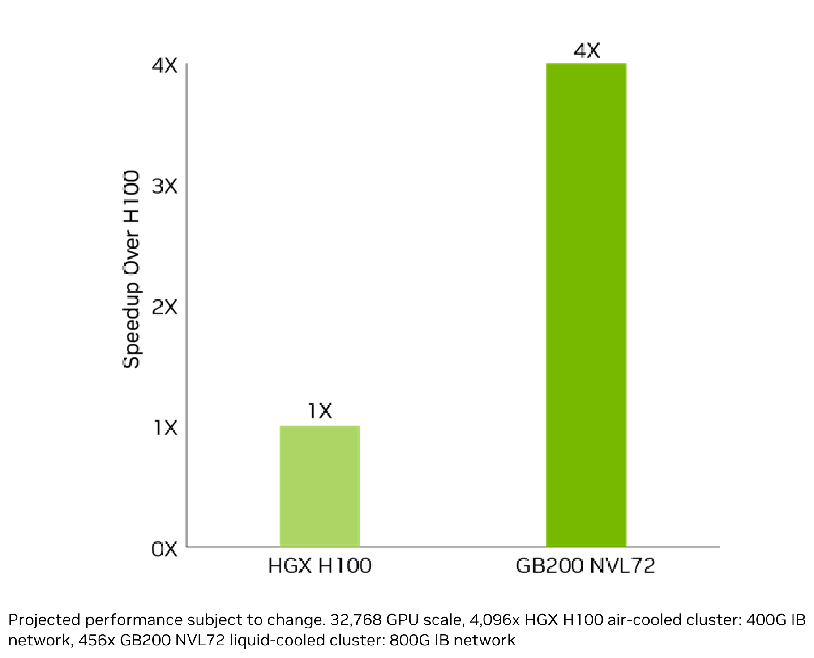

**図 11。** Transformer Engine による GB200 1.8T GPT-MoE モデル学習の高速化

### 6.3 データ処理と物理ベースシミュレーションの高速化

GB200 は密結合された CPU と GPU により、データ処理、エンジニアリング設計、シミュレーションのアクセラレーテッドコンピューティングに新しい機会をもたらす。

データベースは、企業の大量データを扱い、処理し、分析するうえで重要な役割を担う。GB200 は高帯域幅 NVLink-C2C と Blackwell の専用 Decompression Engine を利用し、主要なデータベースクエリを CPU より 18 倍高速化し、エネルギーを 7 分の 1、TCO を 5 分の 1 にする。

物理ベースシミュレーションは、今も製品設計と開発の中心である。シリコンチップから医薬品まで、物理的な試験を行う代わりにシミュレーションで製品を試験、改良することで、毎年数十億ドルを節約できる。

特定用途向け集積回路は、ほぼすべて CPU 上の長く複雑なワークフローで設計され、通常は各所の電圧と電流を特定するアナログ解析も含まれる。Cadence SpectreX simulator は solver の一例で、GB200 上では x86 CPU より 13 倍高速に動作する。

GPU で高速化された計算流体力学（CFD）は、エンジニアと装置設計者が設計の挙動を調べ、予測するための重要なツールである。Cadence Fidelity は large eddy simulator（LES）であり、GB200 上では x86 CPU より最大 22 倍高速にシミュレーションを実行する。

### 6.4 サステナブルコンピューティング

計算密度と計算電力により、空冷から液冷への移行が進んでいる。空気の代わりに液体を使うことで、ラック当たり性能の向上、冷却用水の削減、データセンターをより高い周囲温度で運用できることによるエネルギー消費の追加削減など、データセンターの内外で多くの好影響が得られる。

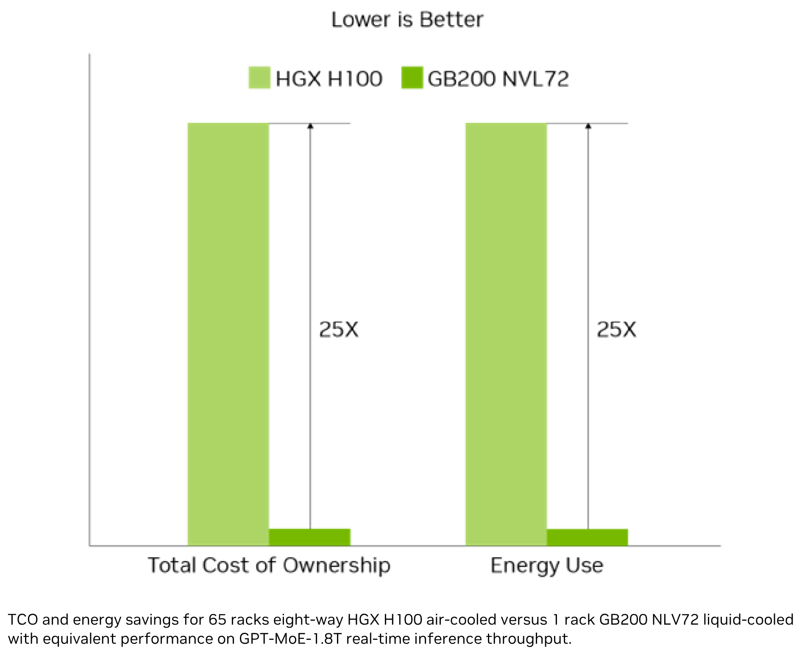

**図 12。** エネルギー使用量と TCO を 25 分の 1 に削減

## 7 AI-Ready Enterprise Platform

[NVIDIA AI Enterprise](https://www.nvidia.com/en-us/data-center/products/ai-enterprise/) は、あらゆる企業が生成 AI を利用できるようにし、生成 AI foundation model に最速かつ最も効率的な runtime を提供するエンドツーエンドのソフトウェアプラットフォームである。NVIDIA NIM™ 推論 microservice、AI framework、ライブラリ、ツールを含み、一般的なデータセンタープラットフォームと NVIDIA GPU を搭載した主流の NVIDIA-Certified Systems™ 上での動作が認定されている。AI で事業を運営する企業は、NVIDIA AI Enterprise が提供するセキュリティ、サポート、管理性、安定性を利用し、試験導入から本番運用へ円滑に移行する。

NVIDIA AI Enterprise と NVIDIA Blackwell Ultra アクセラレーテッドコンピューティングを組み合わせることで、AI-ready プラットフォームの構築を簡素化するだけでなく、価値創出までの時間も短縮する。

[build.nvidia.com](http://build.nvidia.com/) で NVIDIA AI Enterprise の AI ワークロードワークフローを参照できる。

## 8 NVIDIA Blackwell HGX

NVIDIA Blackwell HGX B300 と HGX B200 システムは、生成 AI、データ分析、ハイパフォーマンスコンピューティングに画期的な進歩をもたらす、

**NVIDIA HGX™ B300：** NVIDIA HGX™ B300 は、強化された計算能力と増加したメモリにより、AI 推論時代のために構築されている。Hopper プラットフォームの 7 倍の AI 計算能力、2 TB を超える HBM3E メモリ、NVIDIA ConnectX-8 SuperNIC との高性能ネットワーク統合を備え、HGX B300 は学習、agentic system、推論からリアルタイム動画生成まで、あらゆるデータセンターの最も複雑なワークロードで画期的な性能を提供する。

**HGX B200：** 8 個の Blackwell GPU baseboard を基盤とし、144 petaFLOPS の AI 性能を提供する Blackwell x86 プラットフォームである。HGX B200 は x86 scale-up プラットフォームとインフラストラクチャに対し、最高の性能（HGX H100 の 15 倍）と TCO（HGX H100 の 12 倍）を提供する。各 GPU は最大 1000 Watts に設定できる。

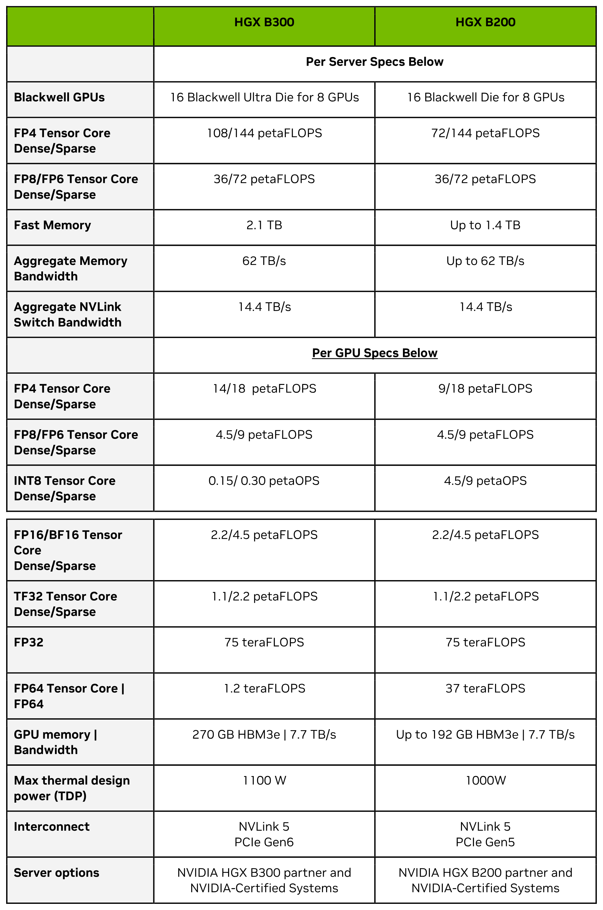

**表 3。** HGX B300 と HGX B200 のシステム仕様

## 9 AI 推論時代における NVIDIA Blackwell アーキテクチャの役割

AI は、計算資源の異なる適用方法がモデル性能にどう影響するかを示す 3 つの異なるスケーリング則を必要とする段階に進化した。

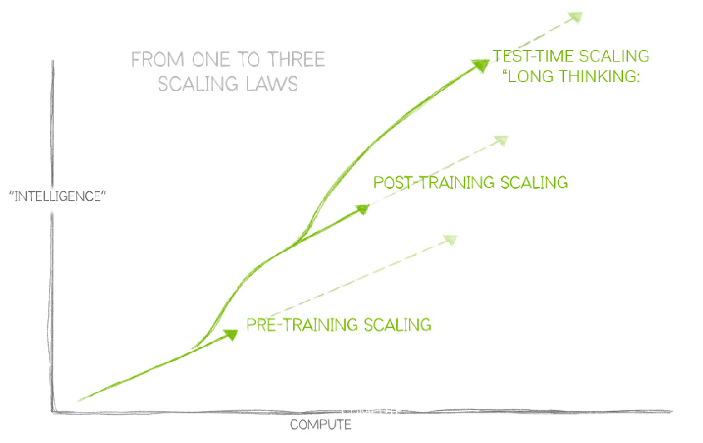

**図 13。** 3 つの AI スケーリング則

**事前学習スケーリング：** AI 開発の元来の法則である。学習データセットの規模、モデルパラメータ数、計算資源を増やすことで、モデルの知能と精度が予測可能に向上することを示した。事前学習スケーリングによって画期的な能力を持つモデルが生まれた。数十億、数兆パラメータの Transformer モデルの登場など、モデルアーキテクチャの大きな革新を促し、計算要件は 5 年間で 5000 万倍に増えた。

**事後学習スケーリング：** 事前学習スケーリングがモデルにインターネットの知識を教えるのに対し、事後学習はモデルに考え方を教え、組織が意図するユースケースへの特化度と関連性をさらに高める。事前学習が AI モデルを学校に通わせて基礎技能を学ばせることだとすれば、事後学習は意図した仕事に使える技能をモデルに与える。事後学習を支えるため、開発者は合成データで fine-tuning データセットを拡張または補完できる。事後学習に必要な総計算量は事前学習の 30 倍である。

**テスト時スケーリング（長時間思考または推論とも呼ばれる）：** LLM は入力 prompt にすばやく応答し、単純な質問には正しい答えを返せるが、複雑な問い合わせには十分有効でない場合がある。agentic AI ワークロードに不可欠な能力では、回答を出す前に LLM が質問を推論する必要があり、これは推論中に行われる。テスト時スケーリングを使うモデルは従来の推論より 100 倍の計算を必要とすると推定され、最適な回答に至る前に複数の回答候補を推論できる。

[NVIDIA Blackwell](https://www.nvidia.com/en-us/data-center/technologies/blackwell-architecture/?ncid=so-link-252431-vt04) は、3 つのスケーリング則を効果的に支える計算能力とエネルギー効率を備え、AI 推論時代の基盤となる世代に一度のプラットフォームである。

## 10 兆パラメータモデルの AI 推論における高度な並列化技術

GPT 1.8T MoE（Mixture of Experts）のような兆パラメータモデルの導入は、特に最適なユーザー体験を確保しながら計算資源を効果的に管理する点で、AI 推論に固有の課題をもたらす。本付録では、これらの課題に対応するために利用できる各種並列化技術を検討し、data、tensor、pipeline、expert parallelism を扱う。

### 10.1 AI 推論の並列化技術

1. **Data Parallelism（DP）** Data parallelism では、モデル全体の複数のコピーを異なる GPU またはクラスタに配置し、独立したユーザー要求を同時に処理する。この方法は GPU 数に比例して線形に拡張し、ユーザーのインタラクティビティに影響せずスループットを高める。ただし、各 GPU がモデル全体のコピーを保持するため、大量のメモリを必要とする。
2. **Tensor Parallelism（TP）** Tensor parallelism はモデルの各層を複数の GPU に分割し、1 件のユーザー要求の異なる部分を並列処理する。この方法は要求当たりに多くの資源を割り当てて処理時間を短縮し、ユーザーのインタラクティビティを改善できる。ただし、高帯域幅の GPU 間通信に大きく依存し、大規模になるとボトルネックになる場合がある。
3. **Pipeline Parallelism（PP）** Pipeline parallelism では、モデル層の異なるグループを複数の GPU に分散し、ユーザー要求の各部分を pipeline 全体で順番に処理する。この技術は重みを分散して大規模モデルを管理しやすくするが、処理が非効率になり、ユーザーのインタラクティビティを大幅には改善しない場合がある。
4. **Expert Parallelism（EP）** Expert parallelism は、要求をモデル内の特定 expert に振り分けて異なる GPU で処理し、不要なパラメータとのやり取りを減らす。expert 処理後の結果には、高帯域幅 GPU インターコネクトを介した all-to-all 通信が必要になる。データのルーティングと再構成の複雑な管理が必要であり、その有効性は利用可能な expert 数に制限される。

### 10.2 並列化技術の組み合わせ

異なる並列化方法を組み合わせると、個々の技術の制約を緩和できる。expert parallelism と pipeline parallelism を併用すると、スループットをほとんど失わずにユーザーのインタラクティビティを 2 倍にできる。同様に tensor、expert、pipeline parallelism を統合すると、ユーザーのインタラクティビティを損なわずに GPU スループットを 3 倍にできる。適切な導入シナリオに合わせて異なる並列化方式を組み合わせるには、解空間の網羅的な探索と大量の計算資源が必要になる。

### 10.3 スループットの最大化と運用フェーズの管理

prefill と decode、すなわちコンテキスト処理と生成の各フェーズを効率的に管理することが、スループットの最大化には重要である。inflight batching や chunking のような技術は、要求処理を動的に管理して各フェーズのボトルネックを防ぎ、GPU 利用率を最適化できる。

**Inflight Batching and Chunking** Inflight batching と chunking は、LLM 導入時の GPU 利用率を最適化し、ユーザー体験を高める重要な技術である。これらの方法は GPU 資源間でデータを処理する方法を管理し、AI 推論の運用フェーズである prefill と decode に対応する。

- **Chunk Size Considerations：** chunk サイズは GPU スループットとユーザーのインタラクティビティの均衡に大きく影響する。chunk を大きくすると prefill フェーズで必要な反復回数が減り、time to first token（TTFT）が短くなる。ただし decode フェーズの継続時間も延び、tokens per second（TPS）は低下する。逆に chunk を小さくすると token 出力が速くなり TPS が向上するが、TTFT は長くなる。このトレードオフは、特定の導入シナリオに最適な chunk サイズを決めるうえで重要である。

**Impact of Chunk Size on GPT 1.8T MoE Model** GPT 1.8T MoE モデルを例に、128 から 8,192 token まで chunk サイズを変えた効果を、2,700 を超える並列化と chunk 長の構成の組み合わせで分析した。この広範な分析により、異なる設定がスループットとインタラクティビティの均衡にどう影響するかを理解できる。

### 10.4 結論

兆パラメータモデルの導入では、スループットとユーザーのインタラクティビティを効果的に均衡させる高度な並列化戦略が必要になる。data、tensor、pipeline、expert parallelism の組み合わせを理解して実装することで、企業は計算需要とユーザーの期待の両方を満たすよう AI 推論環境を最適化できる。

大規模モデルの AI 推論を最適化する方法と、各種 parallelism の詳細については、技術解説 [Demystifying AI Inference Deployments for Trillion Parameter Large Language Models](https://developer.nvidia.com/blog/demystifying-ai-inference-deployments-for-trillion-parameter-large-language-models/) を参照されたい。

## 11 通知

本仕様に記載された情報は、記載時点で正確かつ信頼できると考えられている。ただし NVIDIA Corporation（「NVIDIA」）は、その正確性または完全性について明示、黙示を問わずいかなる表明または保証も行わない。NVIDIA は、当該情報の結果または使用、あるいはその使用により生じ得る特許または第三者のその他の権利の侵害について責任を負わない。本書は、以前に提供された可能性のある当該製品のその他すべての仕様に優先し、それらを置き換える。

NVIDIA は本仕様の訂正、変更、強化、改善、その他の変更をいつでも行い、かつ／または製品またはサービスを予告なく終了する権利を留保する。顧客は注文前に最新の関連仕様を入手し、その情報が最新かつ完全であることを確認しなければならない。

NVIDIA 製品は、NVIDIA と顧客の権限ある代表者が署名した個別の売買契約で別途合意しない限り、注文確認時に提示される NVIDIA 標準販売条件に従って販売される。NVIDIA は、本仕様で言及された NVIDIA 製品の購入に顧客の一般条件を適用することに明示的に異議を唱える。

NVIDIA 製品は、医療、軍事、航空機、宇宙、生命維持装置での使用、または NVIDIA 製品の故障や誤動作により人身傷害、死亡、財産もしくは環境への損害が合理的に予想される用途に適するよう設計、認可、保証されていない。NVIDIA は、そのような装置または用途に NVIDIA 製品を組み込み、かつ／または使用することについて責任を負わず、その組み込み、使用は顧客自身の責任で行われる。

NVIDIA は、これらの仕様に基づく製品が追加の試験または変更なしに指定用途に適することを表明または保証しない。NVIDIA は各製品のすべてのパラメータを必ずしも試験しない。製品が予定する用途に適し、適合することを確認し、用途または製品の不具合を避けるために必要な試験を行う責任は、顧客だけが負う。顧客の製品設計上の弱点は NVIDIA 製品の品質と信頼性に影響し、本仕様に含まれない追加または異なる条件、要件を生じさせる場合がある。NVIDIA は、次の事項に基づく、または起因する不具合、損害、費用、問題について責任を負わない。（i）本仕様に反する方法で NVIDIA 製品を使用すること、または（ii）顧客の製品設計。

本仕様により、NVIDIA の特許権、著作権、その他の知的財産権に基づくライセンスが明示、黙示を問わず付与されることはない。NVIDIA が公開する第三者の製品またはサービスに関する情報は、当該製品またはサービスを使用する NVIDIA からのライセンス、保証、推奨を構成しない。当該情報の使用には、第三者の特許またはその他の知的財産権に基づく第三者からのライセンス、あるいは NVIDIA の特許またはその他の知的財産権に基づく NVIDIA からのライセンスが必要になる場合がある。本仕様の情報は、NVIDIA が書面で複製を承認し、変更せずに複製し、関連するすべての条件、制限、通知を添付した場合にのみ複製できる。

すべての NVIDIA 設計仕様、リファレンスボード、ファイル、図面、診断情報、リスト、その他の文書（まとめて、および個別に「資料」）は「現状のまま」提供される。NVIDIA は資料に関して、明示、黙示、法定その他を問わずいかなる保証も行わず、非侵害性、商品性、特定目的への適合性に関するすべての黙示の保証を明示的に否認する。顧客にいかなる理由で損害が発生した場合でも、ここに記載する製品について NVIDIA が顧客に負う総責任および累積責任は、当該製品の NVIDIA 販売条件に従って制限される。

### 11.1 商標

NVIDIA、NVIDIA logo、NVIDIA CUDA、NVIDIA Omniverse、NVIDIA RTX、NVIDIA Tesla、NVIDIA Turing、NVIDIA Volta、NVIDIA Jetson AGX Xavier、NVIDIA DGX、NVIDIA HGX、NVIDIA EGX、NVIDIA CUDA-X、NVIDIA GPU Cloud、GeForce、Quadro、CUDA、GeForce RTX、NVIDIA NVLink、NVIDIA NVSwitch、NVIDIA DGX POD、NVIDIA DGX SuperPOD、NVIDIA TensorRT は、米国およびその他の国における NVIDIA Corporation の商標または登録商標である。その他の会社名および製品名は、それぞれの関連会社の商標である場合がある。

Copyright © 2025 NVIDIA Corporation。All rights reserved。
