> [Haojie Wang](https://pacman.cs.tsinghua.edu.cn/~whj/)、[Jidong Zhai](https://pacman.cs.tsinghua.edu.cn/~zjd/)、[Mingyu Gao](https://people.iiis.tsinghua.edu.cn/~gaomy/)、[Zixuan Ma](https://pacman.cs.tsinghua.edu.cn/~cwg/author/zixuan-ma/)、[Shizhi Tang](https://pacman.cs.tsinghua.edu.cn/~cwg/author/shizhi-tang/)、[Liyan Zheng](https://pacman.cs.tsinghua.edu.cn/~cwg/author/liyan-zheng/)、[Yuanzhi Li](https://scholar.google.com/citations?user=aHtfItQAAAAJ)、[Kaiyuan Rong](https://dblp.org/pid/294/4147)、[Yuanyong Chen](https://dblp.org/pid/299/3231)、[Zhihao Jia](https://www.cs.cmu.edu/~zhihaoj2/)。OSDI 2021 採録。本 HTML 版は [原論文 PDF](/paper/osdi21-wang-haojie.pdf) の本文、図表、参考文献を再現しています。[カンファレンスページ](https://www.usenix.org/conference/osdi21/presentation/wang)。[ソースコード](https://github.com/thu-pacman/PET)。

## 概要

現実世界のタスクにディープ ニューラル ネットワーク (DNN) モデルを効率的にデプロイするには、高性能のテンソル プログラムが不可欠です。既存のフレームワークは、完全に等価な変換を適用することでテンソル プログラムを最適化し、出力テンソルのすべての要素の等価性を維持します。このアプローチでは、出力テンソルのサブセットの等価性のみを保持する変換が除外されるため、考えられる最適化の機会が失われます。

私たちは、部分的に等価な変換と自動修正を使用してテンソル プログラムを最適化する最初の DNN フレームワークである PET を提案します。 PET は、計算効率を向上させながら部分的な機能同等性のみを維持するプログラム変換を発見して適用します。その後、PET は結果を自動的に修正して完全な等価性を復元します。私たちは、部分的に等価な変換の等価性の検査と修正を簡素化するための厳密な理論的基礎を開発し、テンソル、演算子、およびグラフのレベルで完全および部分的に等価な最適化を組み合わせることで、高度に最適化されたプログラムを迅速に発見するための効率的な検索アルゴリズムを設計します。私たちの評価によると、PET は、部分的に同等の変換からこれまで逃していた機会を解放することにより、既存のシステムよりも最大 2.5 倍優れたパフォーマンスを発揮します。

## 1 はじめに

既存のディープ ニューラル ネットワーク (DNN) フレームワークは、DNN 計算をテンソル プログラムとして表します。これは、テンソルのセット (つまり、n 次元配列) に適用される操作を記述する直接非巡回計算グラフです。テンソル プログラムの演算子は、主に行列の乗算や畳み込みなどの線形代数計算です。テンソル プログラムは、今日の DNN アルゴリズムの高レベルの洞察に基づいて指定されていますが、そのような構造が必ずしも最高の実行時パフォーマンスを提供するとは限りません。既存の DNN フレームワークでテンソル プログラムを最適化する現在の手法は、プログラム変換を活用することです。各変換は、特定のパターンに一致するサブプログラムを特定し、パフォーマンスを向上させる別のサブプログラムに置き換えます。

DNN モデルの統計的動作を維持するために、既存のフレームワークは、新しいサブプログラムが任意の入力に対して元のサブプログラムと数学的に等価である、完全に等価なプログラム変換のみを考慮します。たとえば、TensorFlow、PyTorch、TensorRT、TVM、および Ansor はすべて、該当する場合は常に手動で設計されたプログラム変換を直接適用するルールベースの最適化戦略を使用します。 TASO は、演算子の仕様を入力として受け取ることで変換を自動的に生成および検証しますが、完全に同等の変換 [Jia19b] に限定されます。

従来のコンパイラや最新の DNN フレームワークでは同等のプログラム変換が広く使用されているにもかかわらず、特にテンソル プログラムの場合、パフォーマンスを最適化する機会は限られています。プリミティブがスカラーまたはスカラーの単純な配列である従来のプログラムとは異なり、テンソル プログラムは最大数百万の要素を持つ高次元のテンソルで動作します。多くの変換により、テンソル プログラムの実行時のパフォーマンスを向上させることができますが、出力テンソルのすべての要素の完全な等価性は維持されません。このような変換を部分等価と呼びます。パフォーマンスを最適化する部分的に等価な変換の例には、(1) 計算効率を向上させるために入力テンソルの形状または線形化順序を変更する、(2) 効率の低い演算子を同様の数学的動作を持つより最適化された演算子に置き換える、(3) 後続のパフォーマンスの最適化を可能にするためにプログラムのグラフ構造を変換する、などがあります。

部分的に等価な変換は、その高い可能性にもかかわらず、いくつかの課題のため、既存の DNN フレームワークでは活用されていません。まず、部分的に等価な変換を直接適用すると、入力プログラムとの機能的等価性に違反し、モデルの精度が低下する可能性があります。より高いレベルのアルゴリズムに対する透明性を維持するには、出力テンソルの非等価領域を修正する必要があります。ただし、等価性を迅速に調べてこれらの領域を特定し、必要な補正カーネルを効果的に生成することは困難な作業です。第 2 に、部分的に等価な変換が適用されると、等価性制約の下で既存のフレームワークと比較して設計空間が大幅に拡大します。理論的には、結果が元の結果とどれほど異なっているかに関係なく、あらゆるプログラム変換が潜在的な候補になります。部分的に等価な変換の生成アルゴリズムは、計算の複雑さを慎重に管理する必要があります。オプティマイザーは利点とオーバーヘッドのバランスをとり、完全および部分的に同等の変換を組み合わせてパフォーマンスの高いテンソル プログラムを取得できなければなりません。

この論文では、部分的に等価な変換を利用することにより、テンソル プログラムを最適化する根本的に異なるアプローチを検討します。私たちは、等価性の検査と修正カーネルの生成を簡素化する厳密な定理を開発し、機能の等価性を簡単に復元し、DNN モデルの統計的挙動を確実に保存できるようにします。完全に等価な変換と部分的に等価な変換の両方を含むプログラム最適化の大幅に大きな検索空間を使用することで、私たちのアプローチは、既存のアプローチでは見逃している高度に最適化されたテンソル プログラムを発見できます。これらの手法に基づいて、部分的に等価な変換と自動補正を使用してテンソル プログラムを最適化する最初の DNN フレームワークである PET を提案します。 PET は 3 つの主要コンポーネントで構成されます。

#### ミューテーションジェネレーター

入力サブプログラムに対して部分的に同等の変換を自動的に検出するために、PET はミューテーションジェネレーターを使用して潜在的なプログラムのミューテーションを構築します。各ミュータントは、元のサブプログラムと同じ入力テンソルを受け取り、同じ形状の出力テンソルを生成します。これにより、ミュータントが入力サブプログラムを置き換えることができるため、潜在的な変換が行われることが保証されます。

#### ミューテーション補正器

入力サブプログラムの生成されたミュータントは、出力テンソルの一部の領域で異なる結果を生成する可能性があるため、モデルの精度に影響を与えます。統計的動作を維持するために、PET のミューテーション コレクターは入力サブプログラムとそのミュータントの間の等価性を検査し、補正カーネルを自動的に生成します。これらはその後、入力サブプログラムとのエンドツーエンドの等価性を維持するために出力テンソルに適用されます。補正カーネルによってもたらされるオーバーヘッドと異質性を軽減するために、PET は、補正カーネルを他のテンソル計算カーネルと便宜的に融合します。

プログラムの出力テンソルには最大数百万の要素が含まれており、それぞれを多数の入力要素に対して検証する必要があるため、部分的に等価な変換を検査して修正することは困難です。 PET の主な貢献は、この検証プロセスを大幅に簡素化する一連の厳密な理論的基礎です。 PET は、出力テンソルのすべての位置のプログラムの等価性を調べるのではなく、いくつかの代表的な位置のみをテストする必要があります。

#### プログラムオプティマイザー

PET は、プログラム オプティマイザーを使用して、より優れたミュータントを使用することによる利点と追加の修正カーネルのオーバーヘッドのバランスを効果的に調整することで、高いパフォーマンスを備えたミュータント候補を特定します。まず、任意の大きな入力プログラムを、非線形演算子の位置で複数の小さなサブプログラムに分割します。各サブプログラムには線形演算子のみが含まれており、独立して変更できます。サブプログラム内の演算子のさまざまなサブセットに対するミューテーションをサポートしており、ミューテーションを繰り返し適用して、より複雑なミュータントを取得できます。最後に、冗長性の削除や演算子の融合など、サブプログラムの境界を越えて一連の事後最適化を適用します。

5 つの現実世界の DNN モデルで PET を評価します。 Resnet-18 [He16] などの既存のフレームワークの一般的で高度に最適化されたモデルでも、PET はパフォーマンスを 1.2 倍向上させることができます。 CSRNet [Li18a] や BERT [Dev18] などの新しいモデルの場合、PET は最先端のフレームワークよりも最大 2.5 倍高速です。テンソル、演算子、およびグラフ レベルで完全および部分的に同等の変換を組み合わせることで、大幅なパフォーマンスの向上が可能になります。

本稿は以下の貢献を行っています。

- 我々は、自動修正による部分的に等価な変換を利用するテンソル プログラム最適化における最初の試みを紹介します。私たちは既存の DNN フレームワークよりも大幅に広い検索空間を探索します。
- 私たちは、等価性の検査と修正カーネルの生成を簡素化する厳密な理論的基礎を開発し、部分的に等価な変換であっても統計的挙動を保存することを実用化します。
- 私たちは、完全に等価な変換と部分的に等価な変換の両方を使用して、大規模な設計空間を自動的に探索するための効率的な生成および最適化のアプローチを提案します。
- 上記の手法をエンドツーエンドのフレームワーク PET に実装し、最先端のフレームワークと比較して最大 2.5 倍の高速化を実現します。

## 2 背景と動機

高性能のテンソル プログラムを生成するための、既存の DNN フレームワーク (TensorFlow [Aba16]、TensorRT [Ten17a]、TVM [Che18] など) における一般的な最適化形式は、数学的等価性を維持しながらテンソル プログラムのパフォーマンスを向上させる完全に等価な変換です。現在の完全に等価な変換の例には、演算子融合 [Ten18a、Che18]、レイアウト変換 [Li16]、およびグラフ置換の自動生成 [Jia19b] が含まれます。パフォーマンスの向上には効果的ですが、完全に等価な変換はプログラム最適化の限られた領域のみを探索します。

対照的に、図 1 は、畳み込み演算子の部分的に等価な変換の例を示しています。パフォーマンスを向上させるために、2 つの個別のイメージを幅方向に沿って大きなイメージに連結します。これは、通常、GPU などの最新のアクセラレータでの畳み込みの最も内側の次元である幅が大きいほど、より多くの並列処理が提供され、計算の局所性が向上するためです。ただし、この変換後の新しいプログラム (図 1b に示す) は、連結の境界に沿った出力テンソルのサブ領域 (図 1b の斜線のボックスで示す) に異なる結果を生成し、部分的に非等価になります。


**図 1.** テンソル形状と線形化を操作することで畳み込みのパフォーマンスを向上させる、部分的に等価な変換。 (b) の影付きのボックスは、変換における 2 つのプログラム間で等価でない要素を強調表示します。 (c) の修正カーネルはこれらの要素に適用され、入力プログラムの機能的等価性を回復します。

テンソルの形状と線形化を変更することでテンソル プログラムを最適化する上記の例に加え、部分的に等価な変換には、効率の悪い演算子を同様のセマンティクスを持つより最適化された演算子に置き換えることや、追加の最適化を可能にするためにテンソル プログラムのグラフ構造を変更することも含まれます。このような例を [セクション 4.2](#_4-2-example-mutant-categories) で提供し、[セクション 8.3](#_8-3-case-studies) で評価します。

部分的に等価な変換はパフォーマンス向上の高い可能性を示しますが、モデルの精度に影響を与える可能性があるため、現在の DNN フレームワークでは考慮されていません。このような部分的に同等の変換を手動で実装するのは法外です。まず、有望な変換を発見するには、部分的に等価になる可能性のある大量の変換を評価する必要があります。次に、モデルの精度を維持しながら部分的に同等の変換を適用するには、非同等部分の結果を修正するための補正カーネルが必要です (図 1c を参照)。全体として、パフォーマンスを最適化する部分的に同等の変換を発見し、結果を修正するには、より自動化されたアプローチが必要であり、これがこの作業の主な焦点です。

## 3 設計の概要

PET は、部分的に等価な変換を利用し、その結果を自動的に修正することで、テンソル プログラムを最適化する最初のフレームワークです。これを実現するために、PET はテンソル プログラムの多重線形性を利用します。

#### 多重線形テンソルプログラム（MLTP）

まず、多重線形テンソル演算子を定義します。 $n$ 入力テンソル $I_1,\ldots,I_n$ を持つ演算子 $\operatorname{op}$ は、$\operatorname{op}$ がすべての入力 $I_k$ に対して線形である場合、多重線形です。

$$
\begin{aligned}
&\operatorname{op}(I_1,\ldots,I_{k-1},X,\ldots,I_n)
+\operatorname{op}(I_1,\ldots,I_{k-1},Y,\ldots,I_n) \\
&\qquad=\operatorname{op}(I_1,\ldots,I_{k-1},X+Y,\ldots,I_n),\\
&\alpha\cdot\operatorname{op}(I_1,\ldots,I_{k-1},X,\ldots,I_n)
=\operatorname{op}(I_1,\ldots,I_{k-1},\alpha\cdot X,\ldots,I_n),
\end{aligned}
$$

ここで、$X$ および $Y$ は、$I_k$ と同じ形状の任意のテンソル、$\alpha$ は任意のスカラーです。 DNN 計算は通常、多重線形テンソル演算子 (行列の乗算や畳み込みなど) と要素ごとの非線形演算子 (ReLU [Nai10] やシグモイドなど) で構成されます。線形演算子は計算の複雑さが高いため、計算時間の大部分を消費します。すべての演算子 $\operatorname{op}\in\mathcal{P}$ が多重線形である場合、プログラム $\mathcal{P}$ は多重線形テンソル プログラム (MLTP) です。

#### PET の概要

図 2 に PET の概要を示します。 PET への入力は、最適化されるテンソル プログラムです。以前の作業 [Che18、Zhe20]、PET と同様に、まず入力プログラムをより小さなサブプログラムに分割して、パフォーマンス向上の機会を犠牲にすることなく各サブプログラムの探索スペースを削減します。 PET のミューテーションジェネレーターは、サブプログラムごとに、サブプログラム内の MLTP の可能なミューテーション体を生成することによって、部分的に同等の変換を発見します。各ミュータントは元の MLTP と同じ入力および出力形状を持ち、部分的に等価な変換を構成します ([セクション 4](#_4-mutation-generator))。

入力プログラムに対するエンドツーエンドの等価性を維持するために、PET のミューテーション コレクターはミュータントとその元の MLTP の間の等価性を検査し、ミュータントの出力を修正するための修正カーネルを自動的に生成します。 PET は、厳密な理論的基礎を活用して、このような困難なタスクを簡素化します ([セクション 5](#_5-mutation-corrector))。

修正された変異体は PET のプログラム オプティマイザーに送信され、既存の完全に同等の変換と部分的に同等の変換を組み合わせて、プログラム最適化の包括的な検索スペースを構築します。オプティマイザーは、検索空間内で高度に最適化された候補を検出するために、各サブプログラムの豊富な変異セットを評価し、それらの境界を越えて事後最適化を適用します ([セクション 6](#_6-program-optimizer))。

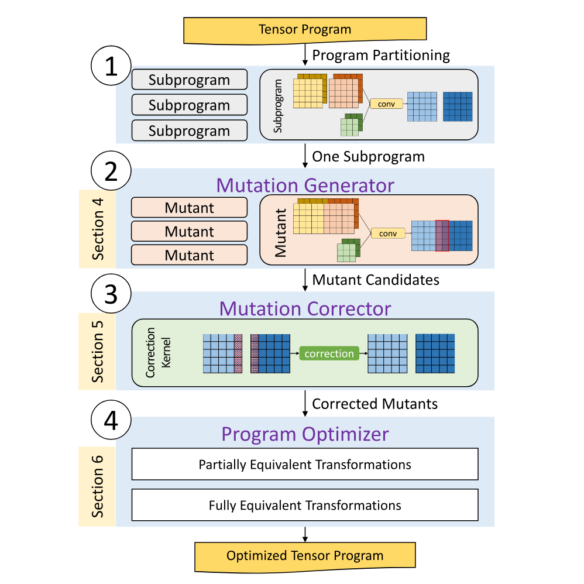

**図 2.** PET の概要。

## 4 ミューテーションジェネレーター

このセクションでは、PET のミューテーション ジェネレーターについて説明します。このジェネレーターは、MLTP を入力として受け取り、入力 MLTP を置き換える可能性のあるミュータントを自動的に生成します。生成アルゴリズムは、特定のサイズまでの有効な変異体を検出します。生成された各ミュータントは、出力テンソル全体で入力プログラムとの数学的等価性を必ずしも保持するわけではありません。機能的等価性を復元するために、ミューテーションコレクター ([セクション 5](#_5-mutation-corrector)) は修正カーネルを自動的に生成します。

### 4.1 ミューテーション生成アルゴリズム

$\mathcal{P}_1$ と $\mathcal{P}_0$ の入力 (および出力) の数が同じで、各入力 (および出力) の形状が同じである場合、MLTP $\mathcal{P}_1$ を別の MLTP $\mathcal{P}_0$ の変異体と呼びます。 $\mathcal{P}_0$ と $\mathcal{P}_1$ の計算は必ずしも等価ではありません。直観的に、$\mathcal{P}_0$ がテンソル プログラム内のサブプログラムである場合、$\mathcal{P}_0$ を $\mathcal{P}_1$ に置き換えると、有効ではあるが潜在的に等価ではないテンソル プログラムが生成されます。

特定の MLTP $\mathcal{P}_0$ の場合、PET は、特定の多線形演算子のセット $O$ を基本構成要素として使用して、$\mathcal{P}_0$ の潜在的な変異体を生成します。表 1 に、評価に使用した演算子のリストを示します。このリストには、計算集約型の演算子 (`conv`、`matmul` など)、要素ごとの演算子 (`add`、`mul` など)、テンソル操作 (`split`、`transpose` など) など、一般的に使用されるさまざまなテンソル演算子が含まれています。このセットを拡張して、新しい DNN 演算子を含めることもできます。

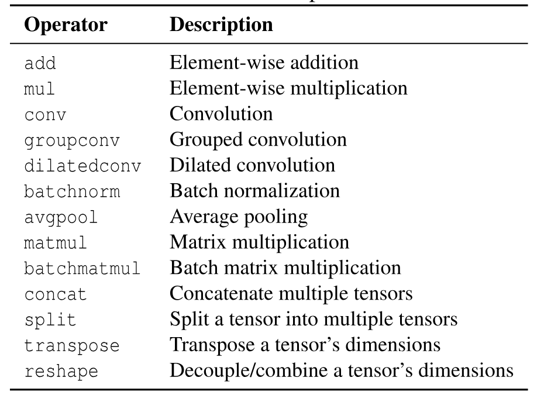

**表 1.** PET で使用される多線形テンソル演算子。

```pseudocode:line-numbers title="アルゴリズム 1：MLTP ミューテーション生成アルゴリズム"
Input: A set of operators O; an input MLTP P0
Output: A set of valid program mutants M for P0

I0 = the set of input tensors in P0
M = {}
Build(1, {}, I0)

// Depth-first search to construct mutants
function Build(n, P, I)
  if P and P0 have the same input/output shapes then
    M = M + {P}
  if n < depth then
    for op in O do
      for i in I where i is a valid input to op do
        Add operator op into program P
        Add the output tensors of op into I
        Build(n + 1, P, I)
        Remove operator op from P
        Remove the output tensors of op from I
  return M
```

アルゴリズム 1 は、MLTP $\mathcal{P}_0$ の潜在的な変異体を構築するための深さ優先検索アルゴリズムを示しています。 PET は、演算子を持たず、$\mathcal{P}_0$ への元の入力テンソルのセットのみを含む空のプログラムから開始します。 PET は、$O$ からの演算子のタイプと演算子への入力テンソルを列挙することによって、新しい演算子を現在のプログラム $\mathcal{P}$ に繰り返し追加します。入力テンソルは、$\mathcal{P}_0$(つまり、アルゴリズム 1 の $I_0$) への最初の入力テンソル、または前の演算子の出力テンソルにすることができます。深さ優先検索アルゴリズムは、特定のサイズ (変異の深さと呼ばれる) までのすべての潜在的な MLTP を列挙します。各変異体 $\mathcal{P}$ について、PET は、$\mathcal{P}$ と $\mathcal{P}_0$ の入力/出力の数と形状が同じかどうかを確認します。 $\mathcal{P}$ は、このテストに合格した場合、有効な変異体です。

### 4.2 ミュータントのカテゴリ例

上記のミューテーション生成アルゴリズムは、十分に広い設計空間を探索するのに十分一般的ですが、いくつかのミューテーションカテゴリが PET にとって特に重要であり、パフォーマンスが向上したミューテーションをもたらすことを強調します。 PET は手動で指定されたカテゴリに依存しないことに注意してください。むしろ、これらのカテゴリは PET によって自動的に検出されます。

#### reshape と transpose

テンソルのメモリ内レイアウトがテンソル プログラム [Che18] の最適化に重要な役割を果たすことは広く知られています。 PET は、`reshape` 演算子と `transpose` 演算子を活用して、入力テンソルの形状とテンソル次元の線形化順序を変換し、より優れたパフォーマンスのミュータントを生成します。 `reshape` 演算子は、単一の次元を複数の次元に分離するか、複数の次元を 1 つに結合することによって、テンソルの形状を変更します。たとえば、`reshape` は、4 つの要素を含むベクトルを $2\times2$ 行列に変換できます。 `transpose` 演算子は、行優先の行列を列優先の行列に変換するなど、テンソルの次元の線形化順序を変更します。

`reshape` と `transpose` は通常、テンソル レイアウトを変換するために一緒に適用されます。たとえば、図 1 は、畳み込みのパフォーマンスを向上させるために 2 つの別々のイメージ (つまり、図 1b の $T_1\to T_3$) を幅の次元に沿って連結する畳み込み演算子の潜在的な変異体を示しています。通常、幅が大きいほど、GPU などの最新のアクセラレータで利用できる並列性が高くなります。この連結には、3 つの `reshape` 演算子と `transpose` 演算子の組み合わせが含まれます。まず、`reshape` オペレーターは、$T_0$ のバッチ ディメンションを、連続する 2 つのイメージごとにグループ化する内側のディメンションと、元のサイズの半分の外側のディメンションに分割します。次に、`transpose` オペレーターは、新しく作成された内部次元を幅次元の隣に移動し、それに応じてテンソルの線形化順序を更新します。これにより、同じグループ内の 2 つのイメージの各行が連続してメモリに格納されます。最後に、別の `reshape` オペレーターが 2 つのイメージを結合します。

ミューテーションジェネレーターは通常、複数の連続する `reshape` 演算子と `transpose` 演算子を単一の複合演算子、つまり `reshape & transpose` に融合します。この融合により、生成される変異体のサイズが縮小し、より大きく、より洗練された変異体の探索が可能になります。

#### 単一演算子ミュータント

PET は、テンソル プログラム内の非効率な演算子を別のより高性能な演算子に置き換えるミュータントを生成することもできます。畳み込みや行列乗算などのいくつかの標準テンソル演算子は、最新のハードウェア バックエンドで手動または自動で広範囲に最適化されています。対照的に、ストライド畳み込みや拡張畳み込み [Li18a] などのそのバリアントは、それほど効率的にサポートされていません。高度に最適化されたカーネルを備えた標準の対応物にそれらを変更すると、パフォーマンス関連の利点があります。例として、図 3 は、指定された拡張に基づいて入力テンソルの線形化順序を再編成することにより、拡張畳み込みを通常の畳み込みに変換する変異体を示しています。ただし、変異体は入力プログラムと完全に等価ではないため、機能的な等価性を回復するには後で修正が必要です。

#### 複数演算子ミュータント

PET は、複数の演算子のサブグラフを別のより効率的な演算子のセットで置き換えることもサポートしています。たとえば、同様のテンソル形状を持ついくつかの独立した畳み込みを 1 つの大きな畳み込みに結合して、GPU 使用率を向上させ、カーネル起動のオーバーヘッドを削減することができます。これには、テンソル形状を操作し、適切なパディングを追加する必要があります ([セクション 8.3.3](#_8-3-3-graph-level-optimization) の例を参照)。

## 5 ミューテーション補正器

PET によって生成されたミュータントは、元のプログラムよりもパフォーマンスが高い可能性がありますが、出力テンソルの一部の領域で異なる数学的結果を生成する可能性があり、精度の低下につながる可能性があります。アプリケーション レベルで透明性を維持するために、PET は入力プログラムの統計的動作を保存することを選択し、ミューテーション修正機能の助けを借りて同じモデルの精度を保証します。具体的には、ミューテーション コレクターは MLTP $\mathcal{P}_0$ とそのミュータントの 1 つである $\mathcal{P}$ を入力として受け取り、$\mathcal{P}_0$ との機能的等価性を維持するために $\mathcal{P}$ の出力テンソルに適用される補正カーネルを自動的に生成します。

ミューテーション コレクターの目的は 2 つあります。まず、任意の MLTP とその変異体について、補正器は 2 つのプログラムを分析し、2 つのプログラムが同一の結果を提供するため補正が必要ない出力テンソルのすべての領域を特定します。第 2 に、2 つの出力が異なる残りの領域については、補正機能がカーネルを自動的に生成して、変異体の出力を修正し、機能的等価性を維持します。

ミューテーションコレクターを設計するには、2 つの課題に対処する必要があります。まず、出力テンソルは非常に大きくなる可能性があり、すべての等価性検証が必要な最大数百万の要素が含まれます。出力テンソルのすべての要素を個別に検証することは不可能です。第 2 に、各出力要素の検証は、多くのテンソル演算子の多数の入力変数に依存する可能性があります。たとえば、行列乗算の各出力要素は、サイズが最大数千の 2 つの入力行列の 1 行 1 列の内積です。これほど多くの入力変数に対して考えられるすべての値を数値的に列挙することは現実的ではありません。

検証タスクを大幅に簡素化する 2 つの定理が、PET ミューテーション補正機能の中心となります。 PET は、すべての入力値の組み合わせに対してすべての出力位置を検証するのではなく、ランダムに生成された少数の入力値を使用していくつかの代表的な出力位置を検証するだけで済みます。これにより、検証作業の負荷が大幅に軽減されます。これらの理論的基礎については [セクション 5.1](#_5-1-theoretical-foundations) で説明し、ミューテーション修正アルゴリズムを [セクション 5.2](#_5-2-mutation-correction-algorithm) で紹介します。

### 5.1 理論的基礎

分析を簡素化するために、入力 MLTP $\mathcal{P}_0$ とその変異体 $\mathcal{P}$ がそれぞれ 1 つの出力を持つと仮定します。私たちの結果は、それぞれを順番に分析することで、複数の出力を持つプログラムに一般化できます。 $\mathcal{P}(I)$ が、$n$ 入力テンソル $I=(I_1,\ldots,I_n)$ 上で実行される $\mathcal{P}$ の出力テンソルを表すものとします。 $\mathcal{P}(I)[\vec v]$ が位置 $\vec v$ の出力値を表し、$I_j[\vec u]$ が $I_j$ の位置 $\vec u$ の入力値を表すものとします。これらの定義を使用すると、MLTP $\mathcal{P}$ の単一出力位置の計算は次のように表されます。

$$
\mathcal{P}(I_1,\ldots,I_n)[\vec v]
=\sum_{\vec r\in\mathcal{R}(\vec v)}\prod_{j=1}^{n}I_j\left [L_j(\vec v,\vec r)\right],
$$

ここで、$\mathcal{R}(\vec v)$ は $\vec v$ の合計間隔であり、$\mathcal{P}(I)[\vec v]$ の計算時に反復されます。$\vec u=L_j(\vec v,\vec r)$ は、$(\vec v,\vec r)$ から $j$ 番目の入力テンソル $I_j$ の位置 $\vec u$ への線形マッピングです。たとえば、カーネル サイズが $3\times3$ でゼロ パディングの畳み込みは次のように定義されます。

$$
\begin{aligned}
\operatorname{conv}(I_1,I_2)[c,h,w]
={}&\sum_{d=0}^{D-1}
\sum_{x=\max(-1,-h)}^{\min(H-1-h,1)}
\sum_{y=\max(-1,-w)}^{\min(W-1-w,1)}\\
&I_1 [d,h+x,w+y]\times I_2 [d,c,x,y].
\end{aligned}
$$

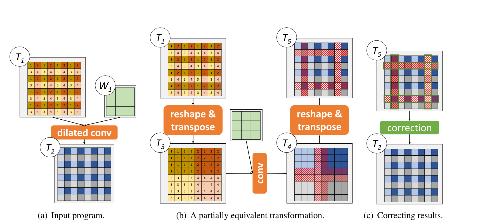

**図 3.** 拡張コンボリューションを標準コンボリューションに変換する変異体の例。 (b) の赤い影付きのボックスは、2 つのプログラム間の非等価な要素を強調表示します。これらの要素は、(c) の修正カーネルによって修正されます。

ここで、$D$、$H$、および $W$ は、それぞれ入力画像 $I_1$ のチャネル数、高さ、幅を指します。合計記号の下と上の数字は、合計間隔の下限と上限を示します。 2 つの線形マッピングは、$L_1(\vec v,\vec r)=(d,h+x,w+y)$ および $L_2(\vec v,\vec r)=(d,c,x,y)$($\vec v=(c,h,w)$ および $\vec r=(d,x,y)$) として表すことができます。

出力テンソルの位置が異なると、合計間隔も異なる場合があります。上で定義した畳み込み演算子の場合、図 4 に示すように、左上の出力位置 (つまり $h=0,w=0$) の計算には、$2\times2$ カーネル (つまり $0\le x\le1,0\le y\le1$) のみが関係します。これは、図 4 に示すように、その位置には左または上の近傍がないためです。同じ合計間隔を持つ出力位置をボックスにグループ化します。形式的には、ボックスは出力テンソルの領域であり、その要素はすべて同じ合計間隔を持ちます。この畳み込みには全体で 9 つのボックスがあります (図 4 を参照)。


**図 4.** $3\times3$ カーネルとゼロ パディングを使用した畳み込みの 9 つのボックス、およびそれらの合計間隔。畳み込みには 3 つの合計次元があります (つまり、式 1 の $d$、$x$、および $y$)。チャネル次元 (つまり、$d$) はすべてのボックスで同じ間隔であるため、省略されています。

同じボックス内のすべての出力位置は同じ合計間隔を持ち、同様の数学的特性を共有します。これは、プログラムの等価性を調べるときに PET によって利用されます。 PET は、すべての個別の位置で 2 つの MLTP の等価性をテストする代わりに、各ボックス内の $m+1$ の特定の位置でそれらの等価性を検証するだけで済みます。ここで、$m$ は出力テンソルの次元数です。

**定理 1.** $m$ 次元の出力テンソルを持つ 2 つの MLTP $\mathcal{P}_1$ および $\mathcal{P}_2$ の場合、$\vec e_1,\ldots,\vec e_m$ を $m$ 次元の基底ベクトルのセットとします。つまり、$\vec e_i=(0,\ldots,0,1,0,\ldots,0)$ は、$i$ 番目を除くすべての座標が 0 に等しい $m$ タプルです。 $\mathcal{B}$ を $\mathcal{P}_1$ と $\mathcal{P}_2$ のボックスとし、$\vec v_0$ を $\mathcal{B}$ 内の任意の位置とする。 $\vec v_i=\vec v_0+\vec e_i$、$1\le i\le m$ を定義します。 $\forall I,0\le i\le m$、$\mathcal{P}_1(I)[\vec v_i]=\mathcal{P}_2(I)[\vec v_i]$ の場合は、$\forall I,\vec v\in\mathcal{B}$、$\mathcal{P}_1(I)[\vec v]=\mathcal{P}_2(I)[\vec v]$ になります。

**Proofsketch.** 証明では補題を使用します。つまり、$\mathcal{P}_1$ と $\mathcal{P}_2$ が位置 $\vec v_0$ と $\vec v_0+\vec e_i$ で同等である場合、同等性は $\vec v_0+k\cdot\vec e_i$ にも当てはまります。ここで、$k$ は整数。入力変数に関して $\mathcal{P}_1$ と $\mathcal{P}_2$ の係数行列を比較することで、この補題を証明します。この補題を使用すると、$\vec v\in\mathcal{B}$ は $\vec v_0$ と $\vec e_0,\ldots,\vec e_m$ の線形結合に分解できるため、$\mathcal{P}_1$ と $\mathcal{P}_2$ がボックス全体 $\mathcal{B}$ と同等であることがわかります。

定理 1 は、$\mathcal{P}_1$ と $\mathcal{P}_2$ が、$\vec v_0,\ldots,\vec v_m$ で識別されるボックス内の $m+1$ 特定の位置について同等である場合、その同等性が同じボックス内の他のすべての位置にも当てはまることを示しています。この定理により、検証の作業負荷が大幅に軽減されます。PET は、出力テンソルのすべての位置を調べる代わりに、各ボックス内の $m+1$ の特定の位置を検証するだけで済みます。

それにもかかわらず、各 MLTP には一般に多数の入力変数が含まれるため、単一の位置の検証は依然として困難です。 2 つの MLTP が同等であることを証明するには、これらの入力変数への値割り当ての考えられるすべての組み合わせを調べる必要があります。次の定理を使用して、この課題にさらに取り組みます。

**定理 2.** $n$ 入力テンソルを持つ 2 つの MLTP $\mathcal{P}_1$ および $\mathcal{P}_2$ の場合、$\vec v$ を $\mathcal{P}_1$ と $\mathcal{P}_2$ が等価ではない位置とします。つまり、 $\exists I$、$\mathcal{P}_1(I)[\vec v]\ne\mathcal{P}_2(I)[\vec v]$。 $I'$ を、有限体 $\mathbb{F}$ から一様にサンプリングされたランダムに生成された入力とします。 $\mathcal{P}_1(I')[\vec v]=\mathcal{P}_2(I')[\vec v]$ が最大でも $n/p$ である確率。$p$ は $\mathbb{F}$ で取り得る値の数です。

**証明スケッチ。** これは、Schwartz-Zippel 補題 [Sch80、Zip79] の帰結です。

定理 2 は、$n$ 個の入力をもつ二つの MLTP が位置 $\vec v$ で等価でないとき、有限体 $\mathbb{F}$ から sample したランダム入力に対して、同じ位置で偶然同じ結果を出す確率が低いことを示します。その確率は最大でも $n/p$ で、$p$ は $\mathbb{F}$ の要素数です。したがって、ランダムテストだけでも二つの MLTP の等価性を十分かつ効果的に検査できます。

定理 2 は、$\mathbb{F}$ が有限体であり、そこからランダム入力がサンプリングされるという事実に基づいていますが、MLTP は実数の無限体で動作します。定理 2 を適用するには、$\mathbb{F}$ を $p$ を法とする整数フィールドとして選択します。ここで、$p$ は大きな素数です (評価では $p=2^{31}-1$)。ランダム テストの算術演算は整数に対して実行され、素数 $p$ を法として計算されます。有限フィールドを操作すると、算術演算子の適用に整数のオーバーフローが含まれないという、もう 1 つの望ましい特性が得られます。

定理 1 と 2 を組み合わせることで、PET は、表 2 に示すように、すべての入力値の組み合わせに関してすべての出力位置を調べるという元の検証タスクを、ランダムに生成されたいくつかの入力を使用していくつかの代表的な位置をテストするだけで済む、はるかに軽量なタスクに削減します。

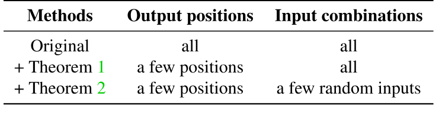

**表 2.** PET の検証作業負荷を軽減します。

### 5.2 ミューテーション修正アルゴリズム

PET ミューテーション修正アルゴリズムは、[セクション 5.1](#_5-1-theoretical-foundations) の定理を利用して、ミューテーション体の出力テンソルのどの領域が入力 MLTP と等価でないか、したがって追加の修正が必要かを計算します。特に、少数のランダム テストを使用して、2 つの MLTP からの重複ボックスの各ペアの等価性を調べるだけで十分です。全体的なアルゴリズムは次の 3 つのステップで機能します。

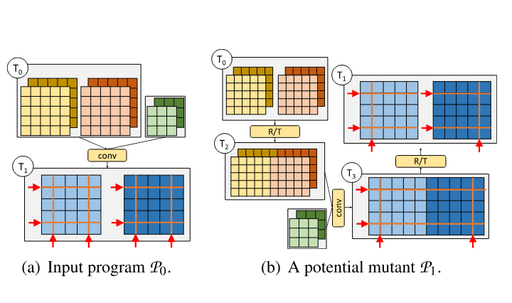

**図 5.** 図 1 の例のボックス伝播。赤い矢印は、各テンソル次元の分割点を示します。

#### ステップ 1: ボックスの伝播

まず、ボックス伝播を通じて特定の MLTP のボックスを計算します。ボックス伝播の考え方は、深層学習における順伝播と逆伝播に似ています。演算子の入力のボックスに基づいて演算子の出力テンソルのボックスを計算し、計算はプログラム内の演算子の依存関係に従って実行されます。ボックスの境界を識別するために、テンソルの各次元の分割点のセットを維持します。多重線形演算子の場合、入力テンソルの分割点、演算子のタイプ、ハイパーパラメータに基づいて出力テンソルの分割点を推測します。図 5 は、図 1 のミューテーション例のボックス伝播手順を示しています。

#### ステップ 2: 各ボックス ペアのランダム テスト

入力 MLTP $\mathcal{P}_1$ とその mutant $\mathcal{P}_2$ の全 box を得た後、PET は [セクション 5.1](#_5-1-theoretical-foundations) の定理を使い、$\mathcal{P}_1$ と $\mathcal{P}_2$ の box の各 pair について共通部分を調べます。二つの box に重なる領域がなければ、その pair は無視できます。各共通部分について、定理 1 が定める $m+1$ 個の位置で二つの program の等価性を検査します。ここで $m$ は出力 tensor の次元数です。たとえば convolution の出力は四次元なので、図 5 では $m=4$ です。

これらの $m+1$ 位置のそれぞれについて、PET は、0 から $p-1$ までのすべての整数を含む有限フィールド $\mathbb{F}$ から一様にサンプリングされた値を入力テンソルに割り当てることにより、一連のランダム テストを実行します ($p=2^{31}-1$ は素数)。その結果、2 つの等価でない MLTP がランダムな入力に対して同一の出力を生成する確率は最大でも $n/p$ になります。ここで、$n$ は MLTP への入力の数です。最後に、2 つの非同等の MLTP は、$(n/p)^t$ よりも低い確率ですべてのテストに合格します。ここで、$t$ はテスト ケースの数であり、PET のハイパーパラメーターです。コレクタの速度と、非同等の MLTP がすべてのランダム テストに合格するエラー確率との間のトレードオフとして機能します。

私たちのアプローチでは、許容しなければならない非常に小さい、制御可能なエラーの確率が発生します。つまり、同等でないプログラムは、$(n/p)^t$ の確率でランダム テストに合格する可能性があります。これは、ランダム テストによって、プログラム検証のコストと、テンソル プログラム変換の検証における不健全性の小さな確率との間のトレードオフがどのように可能になるかを示す一例であると私たちは主張します。

検証作業負荷をさらに軽減するために、PET にはキャッシュの最適化が含まれています。すべてのボックスのテストは同じランダム入力セットを共有し、PET はすべての中間結果をキャッシュして再利用して、冗長な計算を回避します。

#### ステップ 3: 修正カーネルの生成

ランダム テストに不合格となったボックスごとに、PET は修正カーネルを生成して出力を修正し、元の MLTP とその変異体の数学的等価性を復元します。出力を修正するために、修正カーネルは元の MLTP と同じ一連の操作を実行しますが、2 つの入力プログラムが等価ではないボックス (図 1 の赤い網掛けのボックスとして表示) に対してのみ実行されます。これらのボックスは多次元空間内の通常の立方体であり、元のボックスのサブテンソルとして見ることができますが、サイズははるかに小さくなります。したがって、PET は、既存の DNN ライブラリ [Che14、Cub16]、またはカーネル生成技術 [Che18、Zhe20] を直接活用して、修正カーネルを生成します。補正オーバーヘッドを削減するために、PET は補正カーネルを既​​存のテンソル演算子と便宜的に融合します ([セクション 5.3](#_5-3-fusing-correction-kernels))。

### 5.3 補正カーネルの融合

補正カーネルは、補正カーネルの起動コストと並列度の制限により、重大なオーバーヘッドを導入する可能性があります。たとえば、一部の補正カーネルは、対応するフルサイズのテンソル演算子と比較して、同様の実行時間を持つ可能性があります。これにより、部分的に同等の変換を適用することによるパフォーマンスの向上が失われる可能性があります。補正のオーバーヘッドを削減するために、PET は補正カーネルを他のテンソル演算子と便宜的に融合します。

たとえば、図 6b は、図 1 の部分的に等価な変換を適用した後のテンソル プログラムを示しています。 `Conv-2` は、`Conv-1` の出力を修正するための補正カーネルです。 2 つの畳み込み演算子は同じ重み ($W_1$) を共有するため、PET はそれらを 1 つの畳み込みに融合します (図 6c の `Conv-1-2` として示されています)。この融合では、$T_1$ と $T_0'$ を単一のテンソルに連結し、`Conv-1-2` の出力を $T_2$ と $T_3'$ に分割する必要があります。連結と分割には直接メモリ コピーのみが含まれ、`reshape` および `transpose` 演算子と融合できます。

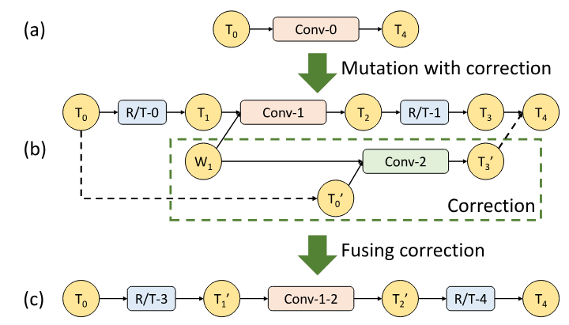

**図 6.** 補正カーネルと DNN カーネルの融合。

## 6 プログラムオプティマイザー

このセクションでは、PET のプログラム オプティマイザーについて説明します。このオプティマイザーは、プログラム最適化の大きな検索空間を探索し、完全および部分的に同等の変換を組み合わせて、高度に最適化されたプログラムを迅速に発見します。プログラム オプティマイザーは、効率的にミューテーションを生成できるように、最初に入力プログラムをより小さいサイズの複数のサブプログラムに分割します ([セクション 6.1](#_6-1-program-splitting))。次に、個々のサブプログラムを最適化するために、PET は、一緒に変異する演算子のサブセットと変異の反復ラウンド数の両方を変更することにより、豊富な候補空間で最適な変異体を検索します ([セクション 6.2](#_6-2-subprogram-optimization))。最後に、最適化されたサブプログラムを再度つなぎ合わせるときに、PET は、冗長性の削除や演算子の融合など、サブプログラムの境界を越えて追加の事後最適化を適用します ([セクション 6.3](#_6-3-post-optimizations))。全体的なプログラム最適化アルゴリズムはアルゴリズム 2 にまとめられています。

```pseudocode:line-numbers title="アルゴリズム 2：プログラム最適化アルゴリズム"
Input: An input tensor program P0
Output: An optimized tensor program Popt

Split P0 into a list of subprograms
Initialize a heap H to record the top-K programs
H.insert(P0)

// Greedily mutate each subprogram
for each subprogram S in P0 do
  mutants = GetMutants(S)
  Initialize a new heap Hnew
  for P in H do
    for M in mutants do
      Pnew = replace S with M in P
      Apply post-optimizations on Pnew
      Hnew.insert(Pnew)
  H = Hnew
Popt = the program with the best performance in H
return Popt

function GetMutants(S0)
  O = the set of mutant operators for S0
  Q = {S0}, mutants = {S0}
  for r rounds do
    Qnew = {}
    for S in Q do
      for each subset of operators S' in S do
        for M' in MutationGenerator(O, S') do
          M = replace S' with M' in S
          Add M to Qnew and mutants
    Q = Qnew
  return mutants
```

### 6.1 プログラムの分割

[セクション 4](#_4-mutation-generator) で説明されているように、ミューテーション生成の複雑さは入力プログラムのサイズに応じて急速に増加します。何百もの演算子を含む大規模なテンソル プログラムを直接変更することはほぼ不可能です。代わりに、PET は、入力プログラムを、より小さいサイズの複数の独立したサブプログラムに分割します。

ほとんどのプログラム最適化の機会を維持しながら、ミューテーションの複雑さを効果的に軽減するには、入力プログラムの分割ポイントを適切に選択することが重要です。分割点が多いほど、サブプログラムが小さくなり、探索される変異候補が少なくなります。極端な例として、各サブプログラムが少数の一定数の演算子のみを持つように制約することにより、全体の複雑さは単純な指数関数的な傾向ではなく、プログラムのサイズに比例して増加します。ただし、過度に積極的な分割により、局所的に最適化された変異体がサブプログラム内に限定され、サブプログラムの境界を越えた最適化の機会が失われる可能性があります。

tensor program では、非線形演算子を分割点にします。第一に、DNN の activation layer などの非線形演算子は広く使われており、通常は一つまたは数個の線形演算子ごとに ReLU や sigmoid などの非線形 activation が続きます。このため、分割後の subprogram を期待どおり小さく保てます。第二に、[セクション 5](#_5-mutation-corrector) で述べるように、PET のミューテーションは MLTP だけに適用されるため、非線形演算子を除外しなければなりません。したがって、非線形演算子で分割するのが自然です。第三に、既存の tensor program 変換 [Ten18a、Che18、Jia19b] も、融合を除けば置換 pattern に非線形演算子を含めないことが多く、融合は [セクション 6.3](#_6-3-post-optimizations) で扱います。

入力 program を非線形演算子で分割した後、PET は subprogram の大きさをさらに調整します。データ依存関係のない複数の subprogram については、grouped 演算子や batched 演算子を使って一つにまとめる可能性を検討します。図 10 のように、Inception network [Sze16] の各 branch にある通常の convolution を grouped convolution へ融合するのが一例です。一方、subprogram がまだ大きすぎる場合は、毎回一部の演算子だけをミューテーション生成器へ渡します（[セクション 6.2](#_6-2-subprogram-optimization)）。

### 6.2 サブプログラムの最適化

入力 program を複数の subprogram に分割した後、PET は [セクション 4.1](#_4-1-mutation-generation-algorithm) のミューテーション生成器を使って各 subprogram を変化させ、アルゴリズム 2 の 7～16 行目に示すとおり、推定性能が最も高い上位 $K$ 個の候補を heap $\mathcal{H}$ に保持します。$K$ を大きくすると探索途中の一時的な性能低下を許容できますが、$K$ 個すべての候補の保存に必要なメモリと計算量は増えます。各 step では、得られた各 mutant で現在の候補（アルゴリズム 2 の $\mathcal{P}$）に対応する subprogram を置き換え、新しい候補 $\mathcal{P}_{\mathrm{new}}$ を作り、一連の事後最適化を適用します（[セクション 6.3](#_6-3-post-optimizations)）。

PET は、TASO [Jia19b] から適応されたコスト モデルを使用して、各新しい候補 $\mathcal{P}_{\mathrm{new}}$ のパフォーマンスを推定します。コスト モデルは、各構成 (畳み込みの異なるストライドやパディングなど) ごとに各テンソル オペレーターの実行時間を 1 回測定し、オペレーターの測定された実行時間を合計することによって、新しいプログラム候補 $\mathcal{P}_{\mathrm{new}}$ のパフォーマンスを推定します。これまでに最高のパフォーマンスを持つ上位 $K$ プログラム候補が $\mathcal{H}$ に保持されます。

妥当な時間とスペースのコスト内で各サブプログラムの可能性のある変異体の十分に大きな空間を探索するために、いくつかの重要な機能を使用して変異プロセスを管理します。まず、サブプログラム内の演算子の数がしきい値 $d$(今回の評価では $d=4$ を使用) を超えると、PET は最大 $d$ 演算子との可能なすべての組み合わせを列挙することでサブプログラムをより小さな演算子のサブセットに分割し、残りの演算子は変更せずにサブセットのミューテーションジェネレーターのみをクエリします (アルゴリズム 2 行) 26）。第 2 に、最大 $r$ ラウンドまでのサブプログラムで反復的なミューテーションを許可します (アルゴリズム 2 行 23)。これにより、可能性のあるミューテーション体の検索スペースが大幅に拡大され、PET がより最適化されたミューテーション体を検出できるようになります。すべてのラウンドで生成されたすべての変異体が潜在的な候補としてオプティマイザーに返されます。

PET のオプティマイザーは、PET の変異に加えて、既存の完全に同等の変換 [Ten18a、Jia19b] と互換性があり、組み込むことができることは注目に値します。これを行うには、完全に同等の変換を探索して返すようにミューテーションジェネレーターを強化するだけで済みます。これは、ミューテーションと同じ方法で入力サブプログラムに直接適用できます。 PET は、完全に同等の変換と部分的に同等の変換を組み合わせることで、プログラム最適化の大幅に広い検索空間を探索し、既存のオプティマイザーが見逃す高度に最適化されたプログラムを発見します。

### 6.3 最適化後の処理

最後に、すべてのサブプログラムの最適化されたミュータントをつなぎ合わせる必要があります。入力テンソルと出力テンソルを接続することに加えて、全体的なパフォーマンスをさらに向上させるために、サブプログラムの境界を越えていくつかの事後最適化も実行します。 PET のミューテーションジェネレーターが、特に各サブプログラムの最初と最後に、多数の `reshape` および `transpose`(R/T) 演算子を導入していることがわかります。これらの R/T 演算子をサブプログラム全体で融合し、上記のサブプログラムの最適化から除外された非線形演算子をさらに融合する機会があります。

図 7 は、2 つの最適化されたサブプログラムを含む例を示しています。サブプログラム間の境界を最適化するために、PET はまず、図 7b に示すように、要素ごとの非線形活性化 (ReLU やシグモイドなど) を使用して R/T 演算子を並べ替えることにより、サブプログラム間のすべての R/T 演算子をグループ化します。 `reshape` と `transpose` は両方とも要素ごとの演算子で可換であるため、この並べ替えは機能的には正しいです。また、並べ替えにより、PET は、図 7c に示すように、Conv と後続の ReLU を Conv-ReLU に融合するなど、非線形アクティベーションを他の線形演算子と融合することもできます。次に、次の 3 つの事後最適化を適用します。

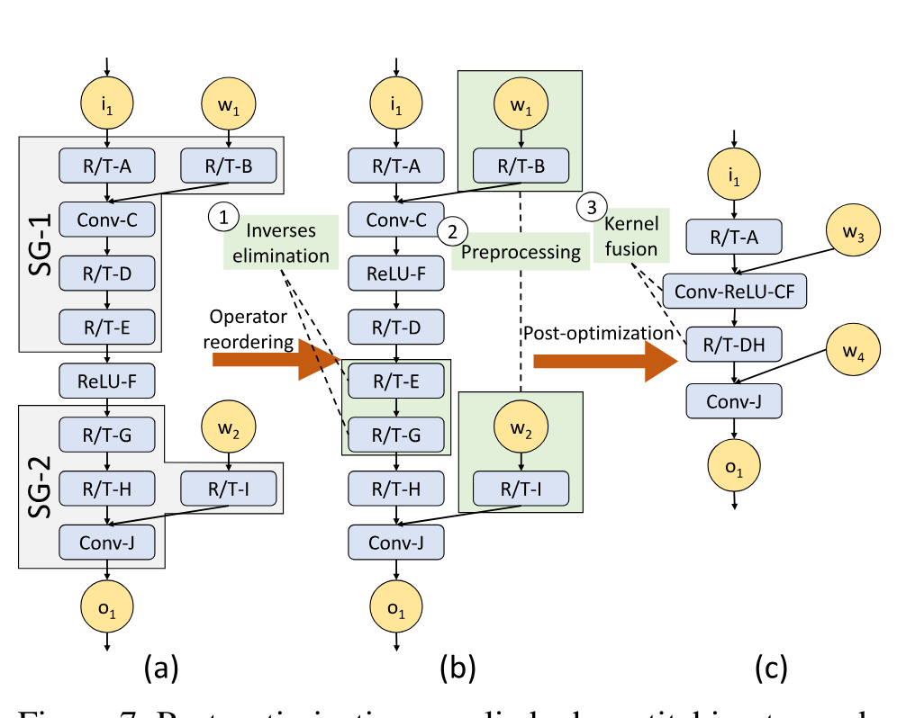

**図 7.** 2 つのサブプログラム SG-1 と SG-2 を結合するときに適用される事後最適化。 R/T は、`reshape` の後に `transpose` が続くことを指します。 Conv と ReLU はそれぞれ畳み込みと ReLU 演算子を示します。

#### 逆変換の除去

互いに打ち消し合う可能性がある R/T 演算子のペアはすべて削除され、したがって no-op と同等になります。このような各ペアを逆グループと呼び、最適化後の一部として直接削除します。逆基の例は、図 7b の R/T-E および R/T-G です。

#### 演算子融合

図 7c に示すように、PET は、残りの連続する R/T オペレーターを単一のオペレーター (R/T-DH など) に融合して、カーネルの起動コストを削減します。テンソル プログラムの非線形アクティベーションは、R/T または他の線形演算子とも融合されます。演算子融合は、唯一ではないにしても、非線形演算子のプログラム最適化として最も一般的に使用されることに注意してください。 PET は、テンソル プログラムの分割時に失われた効率のほとんどを回復できます。

#### 前処理

すべての入力テンソルが静的に既知である場合、演算子を前処理します。たとえば、図 7b では、R/T-B と R/T-I の両方を畳み込み重みテンソル $w_1$ および $w_2$ で前処理できます。

## 7 実装

PET は、約 13,000 行の C++ コードと 1,000 行の Python コードを含む、エンドツーエンドのテンソル プログラム最適化フレームワークとして実装されています。このセクションでは、PET ミューテーションジェネレーターとコレクターの実装について説明します。

#### ミューテーション演算子

表 1 は、PET の現在の実装に含まれるテンソル演算子のリストです。バックエンド オペレーター ライブラリとして cuDNN [Che14] および cuBLAS [Cub16] を使用します。 PET を拡張して、TVM [Che18] や Ansor [Zhe20] などの他のライブラリを含めることもできます。私たちの評価では、TVM と Ansor でこの拡張性を実証し、それらが PET の部分的に同等の最適化と自動修正から直接恩恵を受けることができることを示しました。

`reshape` と `transpose` は、部分的に同等の変換で頻繁に使用される 2 つの演算子です。私たちの実装には、[セクション 6.3](#_6-3-post-optimizations) で説明されているように、R/T 演算子の逆グループの削除や連続する R/T 演算子の融合など、一連の最適化が含まれています。 `reshape` と `transpose` は両方とも多重線形演算子であるため、PET は、[セクション 5](#_5-mutation-corrector) で紹介されたランダム テスト方法を直接使用して、一連の R/T 演算子が逆群を形成し、したがって削除できるかどうかを調べます。

#### 補正カーネル

[セクション 5.2](#_5-2-mutation-correction-algorithm) では、結果が誤っている位置で元の program を直接実行し、補正 kernel を生成する一般的な手法を説明しました。補正の overhead を減らすため、PET は [セクション 5.3](#_5-3-fusing-correction-kernels) で述べたように、補正 kernel をほかの tensor 演算子と融合します。補正 kernel の融合が追加する memory copy も、事後最適化の際に R/T 演算子と融合します。

## 8 評価

### 8.1 実験のセットアップ

#### プラットフォーム

2 ソケット、28 コア Intel Xeon E5-2680 v4 プロセッサ (ハイパースレッド対応)、256 GB の DRAM、および 1 つの NVIDIA Tesla V100 GPU を搭載したサーバーを使用しています。 TVM と Ansor を使用するものを除き、すべての実験では CUDA 10.2 と cuDNN7.6.5 を使用します。これらの実験では、これらのバックエンドによって生成された最適なカーネルが直接使用されます。

PET は、すべてのベースラインと同様に、元のプログラムと最適化されたプログラムの間のエンドツーエンドの同等性を保持します。 PET は ONNX モデルを入力として受け取ります。 TensorRT および TASO は ONNX 形式を直接サポートします。 TensorFlow および TensorFlow-XLA の場合、形式変換に `onnx-tensorflow` ツール [OnnWeb] を使用します。

#### ワークロード

5 つの DNN アーキテクチャを使用します。 Resnet-18 [He16] は、画像分類に広く使用されている畳み込みネットワークです。 CSRNet [Li18a] は、セマンティック セグメンテーションに使用される拡張畳み込みネットワークです。サンプリングレートを任意に調整して受容野を拡大し、より高い精度を得ることができます。 Inception-v3 [Sze16] は、精度と計算効率を向上させるために慎重に設計された Inception モジュールを備えた GoogLeNet [Sze14] の改良版です。 BERT [Dev18] は、幅広い自然言語タスクで最先端の精度を実現する言語表現アーキテクチャです。 Resnet3D-18 [Har17] は、ビデオ処理用の 3D 畳み込みネットワークです。

特に明記されていない限り、すべての実験では、CUDA イベントを使用して、テンソル プログラムの最初の CUDA カーネルの起動から最後のカーネルの完了通知を受信するまでの経過時間を測定します。デフォルトのミューテーション生成の深さを 4 (つまり、アルゴリズム 1 の `depth = 4`) に設定し、検索の丸めを 4 (つまり、アルゴリズム 2 の `r = 4`) に設定します。 [セクション 8.5](#_8-5-ablation-and-sensitivity-studies) で、ミューテーションジェネレーターとプログラム オプティマイザーのスケーラビリティをさらに評価します。

### 8.2 エンドツーエンドの評価

まず、PET と既存のテンソル プログラム オプティマイザー (TensorFlow [Aba16]、TensorFlowXLA [XLA17]、TensorRT [Ten17a]、TASO など) との間のエンドツーエンドの推論パフォーマンスを比較します。 [Jia19b]。図 8 は、バッチ サイズ 1 と 16 での結果を示しています。異なる演算子ライブラリの使用による影響を排除するために、すべてのオプティマイザーは同じ cuDNN [Che14] および cuBLAS [Cub16] ライブラリをバックエンドとして使用します。したがって、パフォーマンスの違いは、PET とベースラインによって生成されたさまざまな最適化されたテンソル プログラムからのみ生じます。 [セクション 8.4](#_8-4-tvm-and-ansor) では、TVM [Che18] や Ansor [Zhe20] などの既存のカーネル生成技術を使用して PET をさらに評価します。

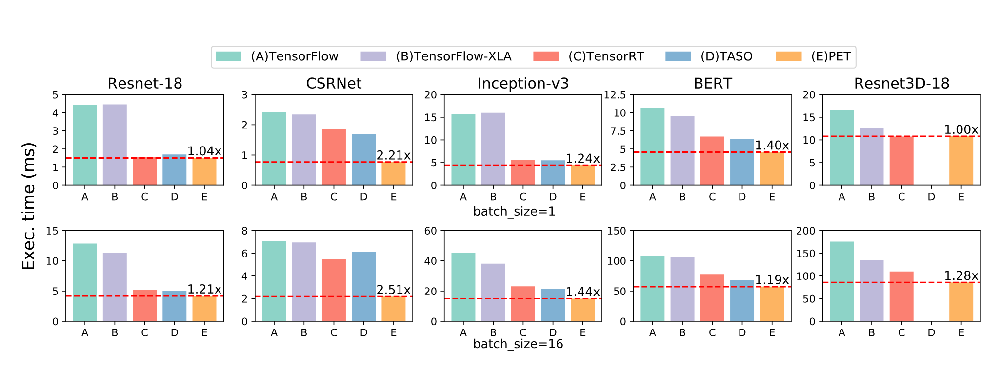

**図 8.** PET と既存のフレームワークとのエンドツーエンドのパフォーマンスの比較。各 DNN について、PET バーの上の数値は、最良のベースラインを超えた高速化を示しています。 TASO は、Resnet3D-18 の 3D 畳み込み演算子をサポートしていません。

5 つの DNN アーキテクチャのうち、Resnet-18 と Resnet3D-18 は一般的に使用されており、既存の DNN フレームワークで高度に最適化されています。ただし、PET は、既存のオプティマイザーでは考慮されていない新しい部分的に同等の変換を発見することにより、それぞれ最大 1.21 倍と 1.28 倍までパフォーマンスを向上させることができます。 Resnet-18、CSRNet、および Inception-v3 では、PET はバッチ サイズ 16 で高速化を達成します。これは、バッチ サイズが大きくなると、PET が利用できるさまざまなテンソル次元間でのミューテーションの機会が増えるためです。全体として、PET は既存の DNN フレームワークよりも最大 2.5 倍優れています。

PET が発見した部分的等価変換をさらに評価するため、それらと対応する補正 kernel を追加のグラフ置換として TASO へ手作業で加え、TASO の性能がどれだけ向上するかを測定します。図 9 のとおり、拡張版 TASO は Inception-v3 と BERT の推論性能をそれぞれ 1.12 倍、1.31 倍に改善しました。これは部分的等価変換がグラフ変換の設計空間を実際に広げ、PET がその利点を自動的に引き出すことを示します。補正 overhead が大きいため TASO では利用できない非自明な変換もありますが、PET は補正 kernel の融合（[セクション 5.3](#_5-3-fusing-correction-kernels)）と事後最適化（[セクション 6.3](#_6-3-post-optimizations)）によって overhead を抑えられます。

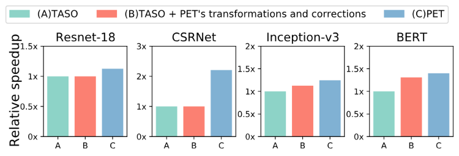

**図 9.** PET の部分的に同等の変換を TASO に追加した後のパフォーマンスの向上。

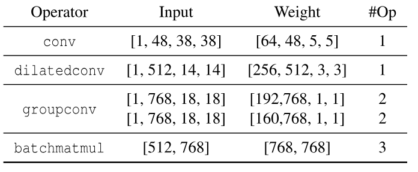

**表 3.** オペレーター ベンチマーク リスト。

### 8.3 ケーススタディ

PET によって発見された部分的に等価な変換がどのように DNN 計算を最適化するかを理解するために、4 つの最適化カテゴリを詳細に研究します。

#### 8.3.1 テンソルレベルの最適化

PET は、テンソルの形状や線形化を最適化することで DNN 計算を改善する、部分的に等価な変換を多数発見します。 Inception-v3 の畳み込み演算子を評価します。その構成は、表 3 の `conv` 行に示されています。

PET は、高さと幅の両方の次元をそれぞれ 4 つのパーティションに分割することにより、入力テンソル形状を $[1,48,38,38]$ から $[16,48,10,10]$ に変換します。 IGEMM と FFT は、それぞれ最適化前後で最も効率的な畳み込みアルゴリズムです。変換された入力テンソルを使用すると、GPU DRAM アクセスと L2 アクセスがそれぞれ 100 倍と 15 倍減少し、実行時間が 7 倍減少します (表 4)。


**表 4.** 表 3 の `conv` および `dilatedconv` 演算子のパフォーマンスに関するケース スタディ。IGEMM、FFT、および WINO は、それぞれ暗黙的 GEMM、高速フーリエ変換、および Winograd 畳み込みアルゴリズムを指します。 `conv` の場合、最適化されたプログラムは入力テンソル形状を $[1,48,38,38]$ から $[16,48,10,10]$ に変換します。 `dilatedconv` の場合、最適化されたプログラムは `dilatedconv` を同じ入力サイズとカーネル サイズの通常の畳み込みに置き換えます。

テンソル レベルの最適化の別の例として、ストライド サイズが 1 より大きい `conv`(つまり、出力テンソルが入力テンソルのダウンサンプルである) の場合、PET はテンソルの線形化を再構成し、ストライド サイズを 1 に減らすことができ、これにより計算の局所性が向上します。

#### 8.3.2 オペレータレベルの最適化

特定のハードウェア バックエンドで効率の低い実装を持つ演算子については、PET は、より最適化された実装を備えた意味的に類似した演算子に便宜的に置き換えることができます。 CSRNet [Li18a] の拡張畳み込みのパフォーマンスを調査します。その構成は、表 3 の `dilatedconv` 行に示されています。PET は、これを通常の畳み込み演算子 (図 3 を参照) に置き換えて、Winograd [Lav16] などの GPU 上でより効率的なアルゴリズムを有効にします。これにより、実行時間が 1.94 倍に短縮されます (表 4)。

オペレーターレベルの最適化の他の例としては、修正コストを含めた場合でも、置換によってパフォーマンスの向上が見込まれる場合、バッチ行列乗算を標準行列乗算に置き換える、グループ畳み込みを畳み込みに置き換える、平均プーリングをグループ畳み込みまたは畳み込みに置き換えるなどがあります。

#### 8.3.3 グラフレベルの最適化

PET は、グラフレベルの最適化も検出します。図 10 は、Inception-v3 [Sze16] を最適化するために PET によって発見された 2 つのグラフ変換を示しています。出力チャネルの数が異なる 2 つの並列 `conv` 演算子について、図 10a は、$W_2$ にゼロをパディングすることで 2 つの `conv` 演算子を `groupconv` に融合する非等価変換を示しています。これにより、`pad` の出力は $W_1$ と同じ形状になります。修正により、最後にゼロ テンソルが分割されて破棄されます (赤で表示)。

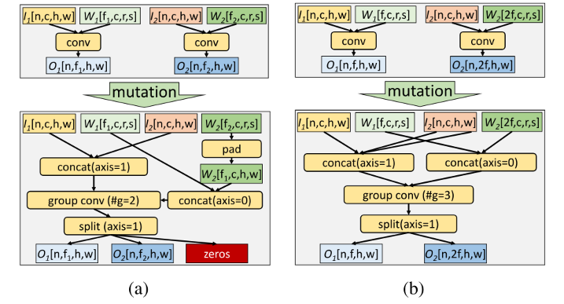

**図 10.** PET によって発見された Inception-v3 の変異体。 `axis` は、`concat` および `split` を実行するディメンションを示します。

PET は、既存のフレームワークでは見逃されている完全に同等の変換も発見します。ミューテーション修正機能は、すべての出力要素の等価性を正常に検証できます。この場合、修正は必要ありません。図 10b は、PET によって発見された新しい等価変換を示しています。これは、入力テンソル (つまり、$I_1$ と $I_2$) を複製し、2 つの `conv` 演算子を `groupconv` に融合することによって 2 つの `conv` 演算子を最適化します。図 10 は、同じ入力プログラムの 2 つの異なる変異体を示していることに注意してください。 PET のプログラム オプティマイザーは、特定のデバイス上のこれらのミュータントのパフォーマンスに基づいて、より効率的なプログラムを自動的に選択できます。

#### 8.3.4 カーネルの融合

PET のカーネル融合最適化の有効性を調査するために、例として CSRNet [Li18a] を使用します。図 11a と図 11b は、CSRNet の元の最適化されたモデル アーキテクチャを示しています。各演算子の数字は入力テンソル形状を示します。 PET での補正カーネルの融合と事後最適化を示すために、図 11c に事後最適化前の単一の拡張畳み込みのサブプログラムを示します。これには、3 つの補正カーネルと 6 つの R/T (つまり、`reshape` および `transpose`) 演算子が含まれています。これらの修正カーネルは、[セクション 5.3](#_5-3-fusing-correction-kernels) で説明されているように、`Conv-4` と融合されています。さらに、畳み込み間の複数の R/T 演算子は、最適化後の処理中に単一の演算子に融合されます ([セクション 6.3](#_6-3-post-optimizations))。


**図 11.** CSRNet の PET の最適化の詳細。

補正カーネルと R/T オペレーターの融合は、PET のパフォーマンスにとって重要です。アブレーション研究では、PET でカーネル フュージョンを無効にすると、最終プログラムのパフォーマンスが 2.9 倍低下し、元のプログラムよりもさらに遅くなります。

### 8.4 TVM と Ansor

PET は、部分的に等価な変換を生成および修正することでテンソル計算を改善するため、TVM [Che18] や Ansor [Zhe20] などの最近のカーネル生成技術と直交しており、潜在的にこれらと組み合わせることができます。

TVM で PET を評価し、Ansor を、それぞれ Resnet-18、CSRNet、Inception-v3、BERT から取得した `conv`、`dilatedconv`、`groupconv`、`batchmatmul` などの一般的に使用される DNN 演算子のセットで評価します。それらの形状構成を表 3 に示します。検索中に潜在的な変異体のカーネルを生成するために、TVM と Ansor が 1024 回のトライアルを実行できるようにし、最もよく発見されたカーネルを使用して変異体のコストを測定します。

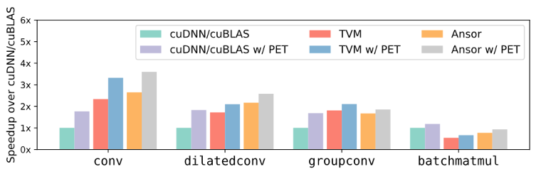

**図 12.** cuDNN/cuBLAS、TVM、および Ansor バックエンドでの PET のパフォーマンスの比較。パフォーマンスは、PET を使用せずに cuDNN/cuBLAS に正規化されます。

図 12 に示すように、PET を TVM および Ansor と組み合わせると、PET は、これらの演算子のカーネルを直接生成する場合と比較して、評価された演算子のパフォーマンスをそれぞれ最大 1.23 倍および 1.21 倍向上させることができます。このような単純な組み合わせを超えて、PET と既存のカーネル生成技術を組み合わせて最適化すると、さらに多くの利点が明らかになり、これは今後の課題として残されます。

### 8.5 アブレーションおよび感度分析

PET の重要な洞察は、部分的に等価なプログラムの変異体を探索することですが、最先端のフレームワークは完全に等価な変換 [Jia19b、Zhe20] のみをキャプチャします。 PET のいくつかのバリアントを実行して、PET と同様に完全または部分的に同等のプログラム変換、またはその両方を考慮する利点を評価します。図 13 に結果を示します。同等の変換のみを考慮するように PET を制限すると、TASO などの以前の作業と同様のパフォーマンス向上が達成されます。部分的に同等の変換は、それ自体で顕著な利点をもたらしますが、大きな可能性を逃すこともあります。最後に、PET は、完全に等価な変換と部分的に等価な変換の両方を共同で考慮することで最高のパフォーマンスを実現します。

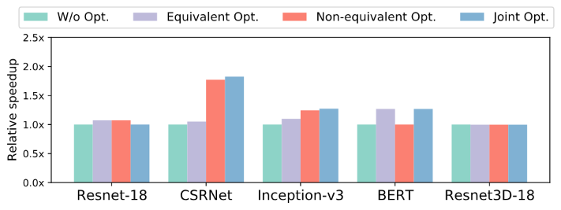

**図 13.**(完全に) 等価な変換のみ、部分的に等価な変換のみ、およびその両方を使用したテンソル プログラム最適化のパフォーマンス比較 (PET と同様)。

最後に、PET は、検索時間と結果として得られるプログラムのパフォーマンスのバランスをとるために、いくつかのヒューリスティック パラメーターに依存します。アルゴリズム 1 のミューテーションの深さは、プログラムのミューテーション内の演算子の最大数を制限します。アルゴリズム 2 のミューテーションラウンドは、ミューテーションを適用する最大反復回数を指定します。これらのしきい値の値が大きいほど、潜在的な変異体の設計空間を大きくすることができますが、検索に必要な時間も長くなります。図 14 は、Resnet-18 と CSRNet のさまざまな検索深さとラウンドにおける最適化されたプログラムのパフォーマンスを比較しています。

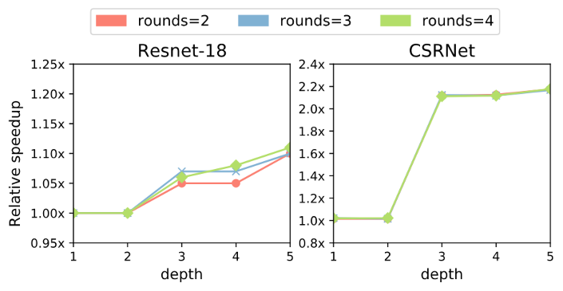

**図 14.** ミューテーションの深さ（[セクション 4.1](#_4-1-mutation-generation-algorithm)）と round 数（[セクション 6.2](#_6-2-subprogram-optimization)）を変えた PET の性能比較。

Resnet-18 では、より最適化された変異体の生成により、ラウンド値が大きくなるにつれてパフォーマンスが向上し続けますが、CSRNet では、パフォーマンスの向上は主に変異の深さの増加によるものです。一方、PET が検出する多くの変異は 3 つの演算子を含むサブプログラムであるため、変異の深さを 2 から 3 に増やすと、両方のモデルのパフォーマンスが大幅に向上します。要約すると、重要な点は、PET の検索の複雑さは中程度であるにもかかわらず、パフォーマンスが大幅に向上するということです。

### 8.6 検索時間

PET は、プログラム オプティマイザーを使用して、可能性のある変異体の検索空間を探索し、高度に最適化された候補を発見します。通常、PET がバッチ サイズ 1 の高度に最適化されたプログラム変異体を見つけるのに 3 分未満 (Resnet-18、CSRNet、BERT、および Resnet3D-18 ではそれぞれ 89 秒、88 秒、91 秒、および 165 秒) かかります。ただし、PET は、次の理由により、Inception-v3 の最適化に約 25 分かかります。 Inception モジュール [Sze16] の複数のブランチ。検索スペースを直接比較することはできませんが、PET の検索時間は、TASO [Jia19b] や Ansor [Zhe20] などの最先端の DNN 最適化フレームワークと同等であり、安定した展開前の 1 回限りのコストであるため許容可能です。積極的なプルーニングや並列化などのさらなる検索の最適化は、今後の作業に委ねます。

## 9 関連研究

#### グラフレベルの最適化

TensorFlow [Aba16]、TensorRT [Ten17a]、TVM [Che18]、および MetaFlow [Jia19] は、ドメイン専門家によって手動で設計された置換を適用することでテンソル プログラムを最適化します。 TASO [Jia19b] は、基本的な演算子のプロパティからグラフ置換を自動的に生成します。これにより、検索スペースが大幅に拡大され、人的労力が軽減されます。 PET とこれらのフレームワークの主な違いは、PET は部分的に同等の変換を生成および修正できるため、プログラム最適化の大幅な領域が可能になることです。

#### プログラムのミューテーション

プログラムミューテーションは、既存のテストケース [DeM91] の品質を評価するために設計されたプログラム テスト手法です。入力プログラムをランダムに変更し、生成されたミュータントを既存のテスト ケースで実行することにより、この技術はこれらのテスト ケースのカバレッジを迅速に推定できます。 PET は、別の目的で変異体を生成します。入力テンソル プログラムをテストする代わりに、PET によって生成されたミュータントがプログラムのパフォーマンスの最適化に使用されます。

#### コード生成

Halide [Rag13] は、高性能テンソル コンピューティング用に設計されたプログラミング言語であり、そのスケジューリング モデル [Ada19、Li18、Mul16] に基づいていくつかの作品が提案されています。 TVM [Che18、Che18a] は、同様のスケジューリング言語と学習ベースのアプローチを使用して、さまざまなハードウェア バックエンド向けに高度に最適化されたコードを生成します。 Ansor [Zhe20] は、TVM よりも大きな検索スペースを探索し、より最適化されたカーネルを見つけます。 Tensor Comprehension [Vas18] および Tiramisu [Bag19] は、多面体コンパイル モデルを使用して深層学習におけるコード生成の問題を解決します。 [セクション 8.4](#_8-4-tvm-and-ansor) に示すように、PET のプログラム レベルの最適化は直交しており、これらのコード生成手法と組み合わせることができます。

#### データレイアウトの最適化

NeoCPU [Liu19] は、データ レイアウトを変更し、CPU 上の不要なレイアウト変換を排除することで CNN モデルを最適化します。 [Li16] は、GPU 上の CNN のメモリ効率を調査します。チョウら。 [Cho20] は、さまざまなスパース テンソル形式を記述し、データ レイアウトを変換するためのコードを自動的に生成する言語を導入します。 PET によって発見された多くの変換には、レイアウト変換も含まれます。ただし、PET と以前の研究の主な違いは、PET がより複雑なレイアウトを考慮し、テンソル レイアウトの最適化を演算子およびグラフ レベルの最適化と組み合わせていることです。

#### AutoML

最近の研究では、モデルのアーキテクチャに対する変更を繰り返し提案し、最も高い精度が得られる提案を受け入れることによって、正確なニューラル アーキテクチャを探索するアプローチが提案されています。例には、自動統計担当者 [Ste19] および TPOT [Ols16] が含まれます。これらのアプローチは、非等価な変換をモデル アーキテクチャに適用し、各変換がモデルの精度にどのような影響を与えるかを評価するために高価な再トレーニング手順に依存します。それどころか、PET は非等価変換でパフォーマンスの最適化を活用し、自動修正を適用してエンドツーエンドの等価性を維持します。そのため、PET は再トレーニングする必要がありません。

## 10 結論

部分的等価変換と自動補正によってテンソルプログラムを最適化する、初の DNN フレームワーク PET を提案しました。PET は、完全な機能的等価性を満たさなくても DNN 計算を改善できるプログラム変換を発見し、厳密な理論的保証に基づく自動補正で完全な等価性を回復します。評価では、既存フレームワークが見逃していた部分的等価変換を利用することで、最大 2.5 倍の性能を達成しました。PET は [https://github.com/thu-pacman/PET](https://github.com/thu-pacman/PET) で公開されています。

## 謝辞

貴重なコメントと提案をくださった匿名の査読者と私たちの羊飼いである Behnaz Arzani に感謝いたします。この研究は、中国国家自然科学財団 (U20A20226、62072262) および北京自然科学財団 (4202031) によって部分的に支援されています。 Jidong Zhai はこの論文の責任著者です ([zhaijidong@tsinghua.edu.cn](mailto:zhaijidong@tsinghua.edu.cn))。

## A アーティファクト付録

### A.1 要約

このアーティファクト付録は、読者が OSDI '21 論文「PET: Optimizing Tensor Programs with Partially Equivalent Transformations and Automated Corrections」の主な評価結果を再現するのに役立ちます。

### A.2 PET の使用法

PET は、入力テンソル プログラムを構築するための C++ API を提供し、[ONNX](https://onnx.ai/) モデルからの入力テンソル プログラムのインポートもサポートします。 PET は、入力テンソル プログラムごとに、このペーパーで説明されているパフォーマンスの最適化を含む数学的に同等の実行可能ファイルを生成します。 PET は、デフォルトで cuDNN/cuBLAS をバックエンドとして使用しますが、ユーザーは対応する入出力テンソル形状を含むミューテーションサブプログラムをエクスポートして、TVM や Ansor などの異なるバックエンドを使用することもできます。

### A.3 範囲

アーティファクトは、エンドツーエンドの評価、オペレーターレベルの評価、さまざまな最適化ポリシーとヒューリスティックパラメータ間のパフォーマンス比較、検索時間など、論文の主な結果を評価および再現するために使用できます。

### A.4 内容

アーティファクトの評価には次の実験が含まれます。

- **E1:** PET と他のフレームワーク間のエンドツーエンドのパフォーマンス比較 (図 8)。
- **E2:** cuDNN/cuBLAS、TVM、Ansor など、さまざまなバックエンドでのオペレーター レベルのパフォーマンスの比較 (図 12)。
- **E3:** 完全に等価な変換、部分的に等価な変換、および両方を使用した結合最適化を含む、さまざまな最適化ポリシーにわたるパフォーマンスの比較 (図 13)。
- **E4:** さまざまなヒューリスティックを使用したパフォーマンスの比較 (図 14)。
- **E5:** 検索時間 ([セクション 8.6](#_8-6-searching-time))。

### A.5 ホスティング

このアーティファクトのソース コードは、コミット `9e07cb1` の `master` ブランチの [GitHub](https://github.com/whjthu/pet-osdi21-ae) にあります。

### A.6 要件

#### ハードウェアの依存関係

このアーティファクトは、NVIDIA V100 GPU に依存します。

#### ソフトウェアの依存関係

このアーティファクトは、次のソフトウェア ライブラリに依存します。

- PET は、バックエンドとして cuDNN ライブラリと cuBLAS ライブラリを使用します。評価では CUDA 10.2 および cuDNN7.6.5 を使用します。
- TensorFlow、TensorRT、TASO、TVM、および Ansor は、E1 および E2 のベースライン DNN フレームワークとして使用されます。ベースライン評価では、TensorFlow1.15、TensorRT7.0.0.11、コミット `f1178f2c` の TASO(テストされたモデルをサポートするための TASO のいくつかのマイナー修正を含む)、およびコミット `3950639` の TVM を使用します。

### A.7 インストール

#### A.7.1 ソースから PET をインストールする

リポジトリのクローンを作成し、PET をビルドします。

```bash
mkdir build
cd build
cmake ..
make -j
```

評価用の環境を設定します。

```bash
export PET_HOME=path-to-pet-home
```

#### A.7.2 他のフレームワークをインストールする

アーティファクトの評価手順 ([GitHub リポジトリの `README.pdf`](https://github.com/whjthu/pet-osdi21-ae)) またはフレームワークによって提供されるインストール手順を参照してください。

### A.8 実験のワークフロー

このアーティファクトには次の実験が含まれています。すべての DNN ベンチマークは、GPU デバイス メモリ内の合成入力データを使用して、CPU と GPU 間のデータ転送の副作用を排除します。詳細な実行手順は、アーティファクト評価手順 ([GitHub リポジトリの `README.pdf`](https://github.com/whjthu/pet-osdi21-ae)) に記載されています。

#### A.8.1 エンドツーエンドのパフォーマンス (E1)

この実験は論文の図 8 を再現します。

前提条件: ONNX モデルを生成します。

```bash
cd $PET_HOME/models-ae
./generate_onnx.sh
```

**TensorFlow および TensorFlowXLA.** 4 つのモデルの結果は、`tensorflow_ae` フォルダーにあります。次のコマンドは、TensorFlow および TensorFlowXLA の推論レイテンシーをそれぞれ測定します。

```bash
cd $PET_HOME/tf-ae
./run.sh
```

**TensorRT.** 4 つのモデルの結果は、`tensorrt_ae` フォルダーにあります。ライブラリ パスを `LD_LIBRARY_PATH` に追加して TensorRT 環境をロードし、次を実行します。

```bash
cd $PET_HOME/trt-ae
./run.sh
```

**TASO.** 4 つのモデルの結果は、`taso_ae` フォルダーにあります。 TASO 環境をロードして、次を実行します。

```bash
cd $PET_HOME/taso-ae
./run_e2e.sh
```

**PET.** 4 つのモデルの結果は、`pet_ae` フォルダーで入手できます。

```bash
cd $PET_HOME/pet-ae
./run_e2e.sh
```

#### A.8.2 オペレータレベルのパフォーマンス (E2)

この実験は論文の図 12 を再現します。スクリプトは `operator_ae` フォルダーにあります。 TVM と Ansor の実験では、異なる変異カーネルを検索するのに長い時間がかかります。

**cuDNN/cuBLAS.** 次のコマンドは、4 つのオペレーター レベルのベンチマークの cuDNN/cuBLAS 結果を測定します。

```bash
cd operator_ae/cudnn
./run.sh
```

**TVM および Ansor.** `operator_ae/autotvm` および `operator_ae/ansor` のスクリプトは、それぞれ TVM および Ansor を使用して、カーネルで 4 つのオペレーターレベルのベンチマークを検索します。

#### A.8.3 異なる最適化ポリシー (E3)

この実験は論文の図 13 を再現します。スクリプトは `pet-ae` フォルダーにあります。

```bash
cd $PET_HOME/pet-ae
./run_policy.sh
```

#### A.8.4 さまざまなヒューリスティックパラメータ (E4)

この実験は論文の図 14 を再現します。スクリプトは `pet-ae` フォルダーにあります。

```bash
cd $PET_HOME/pet-ae
./run_param.sh
```

#### A.8.5 探索時間(E5)

この実験は論文の [セクション 8.6](#_8-6-searching-time) を再現します。 E1 の同じ PET コマンドは検索時間を出力します。

```bash
cd $PET_HOME/pet-ae
./run_e2e.sh
```

成果物評価プラットフォームは論文に使用されたプラットフォームとは異なる CPU を備えているため、検索時間が異なる可能性があります。それにもかかわらず、結果は同じスケール内にあるはずです。
