> [Yu Cheng](https://chengyupku.github.io/) [+internship]、[Lei Wang](https://x.com/Lei_Wang_1999)、[Yining Shi](https://dblp.org/pid/161/3927-1.html)、[Yuqing Xia](https://dblp.org/pid/211/8365.html)、[Lingxiao Ma](https://xysmlx.github.io/)、[Jilong Xue](https://dblp.org/pid/06/10336.html)、[Yang Wang](https://dblp.org/pid/w/YangWang53.html)、[Zhiwen Mo](https://hamerlate.github.io/)、[Feiyang Chen](https://dblp.org/pid/41/10690.html)、[Fan Yang](https://fanyangcs.github.io/)、[Mao Yang](https://dblp.org/pid/89/1482-4.html)、[Zhi Yang](https://yangzhihome.github.io/)。[19th USENIX Symposium on Operating Systems Design and Implementation（OSDI 2025）、*PipeThreader: Software-Defined Pipelining for Efficient DNN Execution*](https://www.usenix.org/conference/osdi25/presentation/cheng) にて 2025 年 7 月 7-9 日に発表、767-783 ページ。[原論文 PDF](/paper/pipethreader.pdf)。本リーディング版は OSDI 2025 論文の本文、図、表、謝辞を収録しています。厳密な印刷レイアウトと参考文献については原論文 PDF を正とします。

[+internship]: 本研究の一部は Microsoft Research でのインターンシップ中に行われました。

## 概要

TensorCore や Tensor Memory Accelerator など、現代の GPU に備わる異種専用 hardware unit を効率よく利用するため、本稿では新しい DNN compiler PipeThreader を提案します。PipeThreader は scheduling 機能を hardware から software へ移し、最小限の手作業で、より効率的かつ高度な computation pipeline を実現します。これは、新たな DNN computation abstraction である sTask-graph、専用 unit の能力を捉える階層的 hardware abstraction、新しい scheduling primitive によって実現されます。その結果、PipeThreader は FlashAttention のように十分研究された DNN architecture に対して効率的な pipeline scheduling を発見し、同等以上の性能を達成できます。さらに、Mamba2 のような新しい model に対して新規 pipeline scheme を発見し、最先端の手書き実装より大幅に高い性能を実現できます。Code は [https://github.com/tile-ai/tilelang](https://github.com/tile-ai/tilelang) で open source 化されています。

## 1 はじめに

Deep neural network（DNN）の大規模化により、GPU などの現代の AI accelerator には大きな computation pressure と memory pressure がかかっています。増大する compute demand に応えるため、hardware vendor は TensorCore [Amd20, Amd21a, Amd23, Nvi17a, Nvi20, Nvi23] や Tensor Memory Accelerator（TMA）[Nvi23] などの異種専用 hardware unit を導入してきました。一方、software developer は memory pressure を軽減するため、複数の DNN operator と、matrix multiplication のような compute-intensive unit を単一の GPU kernel に融合し、data reuse を最大化する傾向があります [Dao22, Shi23a]。

しかし、このような hardware と software の潮流は、DNN を効率よく実行するうえで新たな課題を生みます。第一に、専用 hardware unit の utilization を最大化するには、DNN computation pipeline を慎重に schedule する必要があります。従来の GPU は hardware scheduler に thread execution を任せ、大量の concurrent thread により個々の pipeline で起こり得る stall を償却していました。しかし、専用 unit は computation density を高めるため本質的に大きな tensor granularity を必要とし、利用可能な concurrent thread 数が大幅に減ったため、この方法はもはや有効ではありません。第二に、operator fusion は computation pipeline を深くします。Hardware scheduler はこのような複雑な pipeline を把握しにくく、効率的な scheduling は困難です。そのため、FlashAttention [Dao23b] などの最先端 DNN kernel は、execution pipeline を慎重に構成するため手書きされています。しかし、この方法の一般化は困難です。NVIDIA Hopper GPU や AMD GPU [Sha24b] などの GPU type、Mamba [Gu23] などの新しい DNN model、さらに FlashAttention2/3 [Dao23b, Sha24b] のような DNN model の新しい tensor shape ごとに、新たな手書き実装が必要です。

Software pipeline と hardware pipeline の複雑化、および hardware scheduling 固有の制約を踏まえ、本稿では PipeThreader を提案します。PipeThreader は software-defined pipelining を支援し、異種専用 hardware unit を備えた現代の GPU architecture 上で DNN を効率よく実行する DNN compiler です。PipeThreader は DNN computation を sTask-graph として抽象化します。Graph の各 node は専用 unit に schedule できる細粒度 task である sTask を表し、graph の directed edge は sTask 間の dependency を表します。sTask は tensor の一部である tile 上で計算します。Tiling の概念は現代の DNN compiler で広く採用されています [Fen23, Nvi24a, Ma20, Til19, Zha19h, Zhe20, Zhu22]。sTask-graph を使うことで、PipeThreader は専用 hardware unit での実行に適した高度な computation pipeline を抽出できます。

Hardware の細粒度 scheduling capability を公開するため、PipeThreader は GPU device を階層的 hardware unit として抽象化します。これには、仮想化された同種 parallel execution unit（EU）と、各 EU 内の異種 specialized unit（sEU）が含まれます。これにより、sTask は `append`、`wait`、`propagate` という 3 つの primitive で schedule でき、software による高度な pipelining が可能になります。PipeThreader はさらに、sTask-graph が定義する新しい optimization space と、公開された新しい hardware capability に対して効率的な scheduling scheme を見つける 2 層 scheduling policy を備えます。

私たちは open-source DNN compiler の TVM [Che18] と Ladder [Wan24e] を基盤に、8.5k 行の C++ および Python code で PipeThreader を実装しました。評価では、PipeThreader が NVIDIA H100 や AMD MI300X GPU などの新しい hardware 上で FlashAttention に似た pipelining scheme を発見し、手書き実装なしで同等以上の性能を達成できることを示します。PipeThreader は Mamba2 [Dao24] のような新しい model に対しても効率的な pipeline scheduling を見つけ、最先端の手書き実装より大幅に高い性能を実現できます。私たちは、PipeThreader が tile-based software/hardware abstraction の完全な範囲を定義するための一歩であり、現代の tile-based programming の取り組み（Triton [Til19]、CUTLASS [Nvi24a] の CuTe abstraction など）および新しい hardware architecture の進化によく対応すると考えます。

## 2 動機

**増大する hardware と software の複雑さ。** 大規模 DNN model、特に large language model（LLM）[Ope22] の急速な成長により、hardware vendor は増大する computation demand に応えるため、TensorCore や Tensor Memory Accelerator（TMA）などの異種専用 hardware unit を開発してきました。一方、FlashAttention [Dao22] のような高度な operator fusion technique は、memory overhead を削減し data locality を最大化するため、ますます利用されています（詳細は[第 3.3 節](#_3-3-running-examples)）。これらの潮流は computation density と efficiency を高める一方、特に異種 unit を備えた現代の GPU において、scheduling と execution に大きな課題をもたらします。

**従来の data-parallel GPU execution における低 utilization。** CUDA [Cud25] などの従来の GPU programming model は thread block を Streaming Multiprocessor（SM）へ dispatch し、各 SM を一様で独立した execution unit として扱います。この abstraction はすべての SM が交換可能であると仮定して内部構造を隠しており、NVIDIA V100 [Nvi17a] など以前の architecture では有効でした。しかし、NVIDIA H100 [Nvi23] などの現代の GPU は、matrix operation 用の TensorCore、general-purpose computation 用の CUDA core、memory movement 用の TMA など、各 SM 内に異種 component を統合しています。これらの component は役割と execution characteristic が異なります。内部差を認識せず thread block を一様に dispatch すると、resource usage が非効率になります。このような architecture を十分に活用するには、各 SM 内の異種 unit を認識し、それに応じて task placement、scheduling、pipelining を調整する必要があります。この水準の制御がなければ、大きな性能が未利用のまま残ります。

[図 1](#figure-01) は H100 上の MatMul、FlashAttention、Mamba2 の各実装について unit ごとの utilization を示します。MatMul では、pipelined execution がない場合 memory movement が bottleneck となり、TensorCore utilization は 40% にすぎませんが、expert-optimized cuBLAS は 97% を達成します。Triton-based FlashAttention2 [Dao23b] と比べ、FlashAttention-3 [Sha24b] は手動最適化によって TensorCore utilization を 40% から 72% に高めます。FlashAttention-2 から FlashAttention-3 への進化には 1 年近くかかりました。しかし、新たに手動最適化された Mamba2 [Dao24] も unit を十分に活用できず、TensorCore utilization は 15% にとどまります。したがって、新しい DNN model で現代の hardware を十分に活用することは困難です。

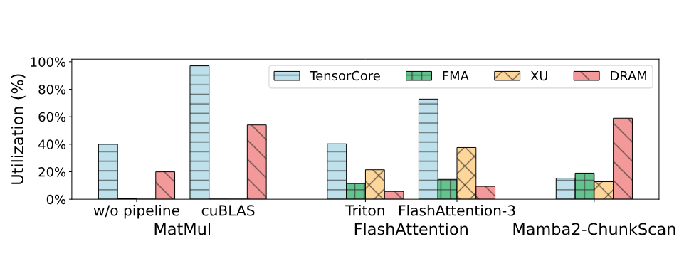

**図 1。** MatMul、FlashAttention、Mamba2 の ChunkScan を含む代表的 AI workload の各実装について、NVIDIA H100 上の hardware utilization を unit ごとに示します。各 bar は、特定 workload 実装における個々の hardware unit の utilization を表します。MatMul では FMA unit と XU unit を使用しません。

Kernel 内の pipelined execution を手作業で管理することは、design space が広大で hardware に敏感なため、非常に困難です。Developer は厳しい on-chip resource constraint を守りながら、tile size と pipeline depth を慎重に調整しなければなりません。Memory hierarchy や specialized compute unit の違いを含む architecture の多様性により、この課題はさらに大きくなります。手作業の推論はすぐに扱いきれなくなるため、performance と portability の両方を得るには自動 inference と scheduling が不可欠です。しかし、TVM [Che18] や Triton [Til19] など既存 compiler には pipelined tile execution を表す明示的 mechanism がありません。Low-level control を抽象化することで、execution order、resource allocation、compute-communication overlap を指定する developer の能力を制限し、性能を十分に引き出せなくしています。効率的な pipelined tile execution には、この design space を系統的に探索し、最適化された schedule を生成し、多様な hardware platform に適応できる新しい compiler が必要です。

**観察と機会。** 以上の事実から、この問題に対処できる独自の機会があると考えます。新しい hardware unit は tensor tile などの大きな granularity で data を処理するため、先行研究 [Fen23, Nvi24a, Ma20, Til19, Zha19h, Zhe20, Zhu22] は tile level の性能が決定的であり、tile-level execution を software layer で効率よく schedule できることを示しています。この傾向を利用し、pipeline scheduling を暗黙の hardware behavior から明示的な software control へ移すことを提案します。ここでいう pipeline scheduling は GPU による low-level thread や warp の dispatch ではなく、各 SM 内の TensorCore、CUDA core、TMA などの specialized unit へ tile-level operation を software 主導で mapping することを指します。

[図 2a](#figure-02) は、MatMul を TensorCore、Sum を CUDA core で実行する fused MatMul-Sum の execution を示します。既存手法の同種 abstraction により、TensorCore と CUDA core には本質的な parallelism があるにもかかわらず execution が直列化され、非効率になります。対して[図 2b](#figure-02) は specialized execution unit を利用した最適化 scheduling を示し、pipelined execution と異種 hardware の完全な利用を可能にします。

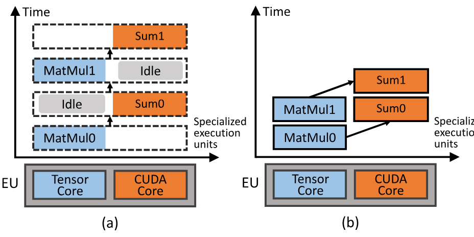

**図 2。** （a）既存手法の非効率な scheduling、（b）specialized execution unit 間の pipelined execution を利用する最適化 scheduling。

しかし、既存の DNN model representation も GPU の hardware interface も、tile-level pipeline execution に必要な scheduling capability を明示的に公開していません。

## 3 PipeThreader abstraction

[第 2 節](#_2-motivation)の観察に基づき、tile-based data parallelism と pipelined scheduling を統合する DNN compiler framework PipeThreader を提案します。[図 3](#figure-03) に system の概要を示します。最先端 DNN compiler（Triton [Til19]、Roller [Zhu22]、Welder [Shi23a] など）は、SPMD-style parallelism のため hardware accelerator を同種 execution unit（EU）の集合として抽象化します。この方法は現代の GPU に固有の hardware heterogeneity を見落とします。たとえば、SM 内の TensorCore と CUDA core は異なる workload に最適化されていますが、既存 compiler はこの多様性を利用できません。この制約に対処するため、PipeThreader は specialized task（sTask）と specialized execution unit（sEU）という 2 つの主要 abstraction を導入します。Operator の data flow graph（DFG）を入力として、PipeThreader は operator を sTask へ変換し、sEU の異種 capability を利用して MPMD-style parallelism を実現します。sTask と sEU の詳細は[第 3.1 節](#_3-1-specialized-tasks-and-execution-units)で説明します。sTask は元の DFG の data dependency を task granularity で保持し、sTask-graph を形成します。PipeThreader は sTask-graph から sEU への mapping を、構造化された execution representation である sTask-program として構成します。sTask-program abstraction により、PipeThreader は新しい search space を開きます。sTask-graph、sTask-program、search space の詳細は[第 3.2 節](#_3-2-from-stask-graph-to-sprogram)で説明します。

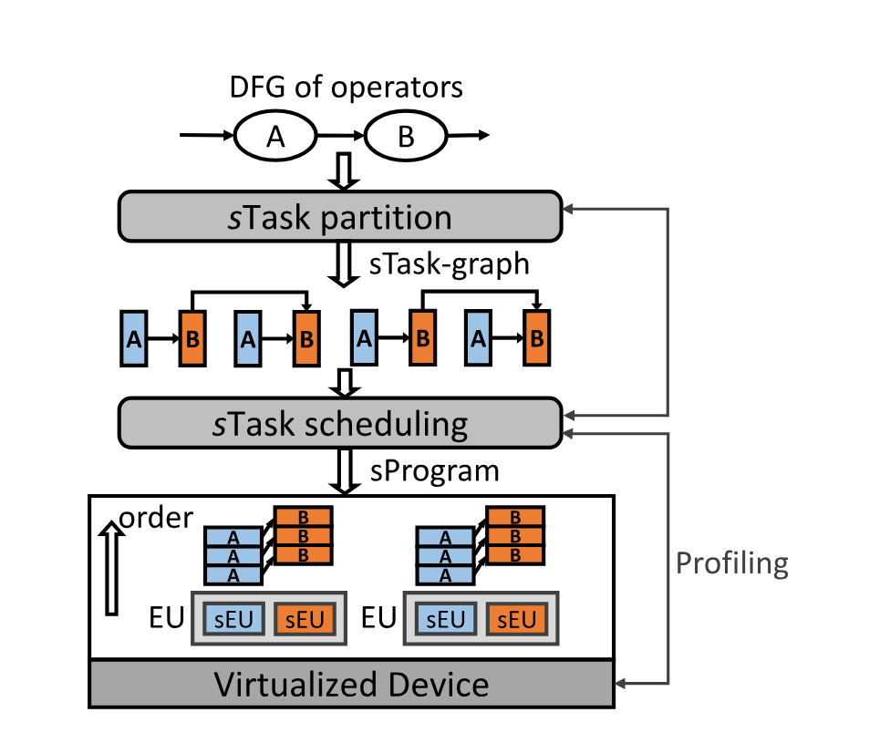

**図 3。** PipeThreader の system 概要。

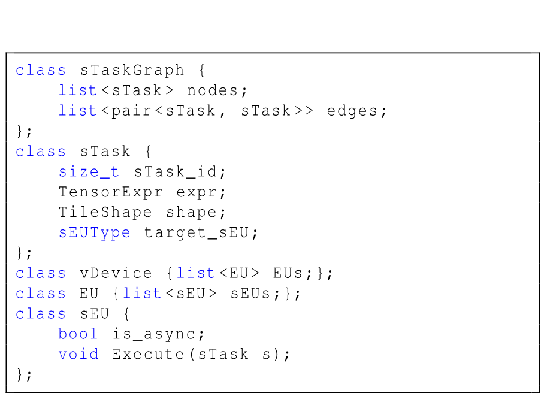

**図 4。** sTask と sEU の abstraction。

### 3.1 Specialized task と execution unit

**sTask。** PipeThreader は specialized task の略である sTask を、accelerator device の特定 execution unit（sEU）で実行される operator 内の基本 computation unit として導入します。sTask の概念は、H100 GPU の TMA、CUDA core、TensorCore など、現代の DNN accelerator における異種 specialized processor と自然に対応します。Efficiency を最大化するには、このような accelerator 上の computation を specialized processor の type ごとに複数の parallel（heterogeneous）task へ分割する必要があります。各 type の parallel task を sTask として表すことで、基盤 hardware の specialized processor だけでなく PipeThreader compiler にも潜在的な task parallelism を公開できます。

[図 4](#figure-04) に示すように、sTask は input tensor から切り出された data tile を処理し、output tensor に data tile を生成します。その computation は index-based tensor expression で記述されます。sTask の shape（8 行目）は tensor expression `expr`（7 行目）の各 loop axis に沿って定義されます。さらに、`target_sEU` attribute（9 行目）は sTask を実行できる specialized unit の type を指定します。対して従来の tile-based task は明示的に分類されず、specialized processor の parallelism を活用する能力が制限されます。[図 5](#figure-05) に示すように、特定 EU 上の従来の MatMul-Sum task（FlashAttention の fused operation）は、$A$ の $[2 \times 2]$ data tile と $B$ の $[2 \times 2 \times 2]$ data tile を逐次計算し、$C$ の $[2 \times 2]$ output tile を生成します。PipeThreader は、TensorCore 上で matrix multiply-accumulate を実行する mma sTask と、CUDA core 上で動作する Sum sTask の 2 種類を導入します。

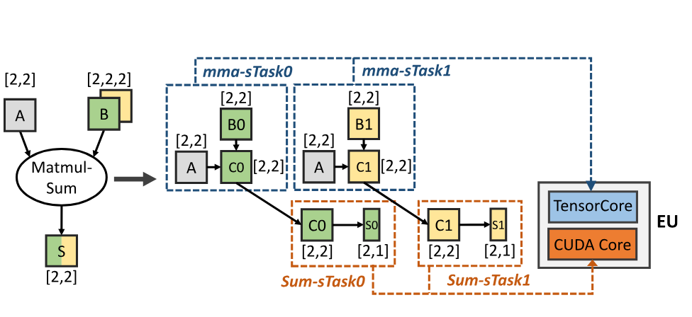

**図 5。** NVIDIA GPU 上の sTask MatMul-Sum。

これにより、TensorCore 上で $A$ と partition $B_1$ を乗算して $C_1$ を生成する 2 番目の mma sTask を、CUDA core 上で $C_0$ を $S_0$ へ reduction する最初の Sum sTask と重ねられ、pipelining が可能になります。この pipelined execution は task parallelism を可能にし、hardware utilization を大幅に高めます。

**sEU。** 現代の accelerator には sTask を特定 execution unit へ mapping する interface がありません。この問題に対処するため、PipeThreader は GPU 内の execution unit を明示的に公開し、parallelism と、pipelining による data-dependent execution を支援する能力の両方を捉える階層的 execution array として抽象化します。

[図 4](#figure-04) に示すように、抽象化された device は複数の parallel execution unit（EU、11 行目）で構成され、各 EU は複数の heterogeneous specialized execution unit（sEU、12 行目）を含みます。これらの sEU は、PipeThreader が data-dependent task を pipelining により効率よく schedule する hardware foundation となります。たとえば現代の H100 GPU では、Streaming Multiprocessor（SM）が EU であり、load sTask 用の Tensor Memory Accelerator（TMA）と mma sTask 用の TensorCore を含みます。sEU は `Execute` interface（15 行目）を使って指定された sTask を実行します。`is_async` attribute（14 行目）は sEU が同期的（CUDA core など）に動作するか、非同期的（TMA など）に動作するかを指定します。Asynchronous sEU は asynchronous sEU と synchronous sEU のどちらとも並行して実行できます。

### 3.2 sTask-Graph から sProgram へ

DNN を実行するため、PipeThreader は input DFG を現代の heterogeneous hardware に特化した representation へ変換します。この処理には 2 つの主要 step があります。Computation と dependency を捉える sTask-graph を構築し、効率的な execution を調整する sTask-program（sProgram）として、この graph を specialized execution unit（sEU）へ mapping します。

**sTask-Graph。** [図 3](#figure-03) に示すように、input DFG の operator は sTask-partition によって sTask へ変換され、sTask-graph を形成します。この graph は元の DFG の computation と data dependency を保持し、node は sTask、edge は task level の細粒度 dependency を表します。sTask-partition は sTask の `TileShape`（すなわち `Map<Axis, Dim>`）を設定し、分割可能な dimension と size を指定して各 operator を partition します。従来の compiler は data parallelism を得るため、主に spatial partitioning に注目します。PipeThreader は spatial partitioning と reduction partitioning の両方を支援するよう拡張し、pipelined execution の新たな機会を開きます。この柔軟性により、PipeThreader は異なる partitioning strategy に基づく多様な sTask-graph を生成し、より柔軟で効率的な execution plan を可能にします。

**sProgram。** sTask-graph が与えられると、PipeThreader は sTask-program（sProgram）の形式で hardware の sEU へ mapping します。sProgram は 2 次元 array `sProg[sEU][order]` であり、各 entry は sTask を特定 sEU へ割り当て、その execution order を指定します。この構造化 representation は task の効率的な scheduling と execution を容易にします。Dependent sTask の正しい execution order を保つため、PipeThreader は program 内で `<EU_id, sEU_id, order>` により識別される sTask list を参照して execution を同期する barrier-sTask を導入します。Barrier-sTask は参照するすべての sTask の完了を待ってから先へ進みます。

**Search Space。** PipeThreader の search space は sProgram の集合として構成されます。各 sProgram は 2 次元 array `sProg[sEU][order]` であり、graph 内の各 sTask について tiling size と execution order（synchronization barrier を含む）を定義します。sTask ordering と tiling size には多くの組合せがあり得ます。PipeThreader の search space は、data dependency を守って operator を実行できるすべての有効な sProgram を含みます。たとえば FlashAttention の search space には 37,440 個の有効な sProgram があります。複雑な fused operator では、sTask scheduling が search space に占める割合が大きくなる傾向があります。sTask type が増えると、異なる sTask execution order を持つ有効な sProgram が多数存在し得ます。たとえば FlashAttention には 36 個の sTask size（tiling）configuration がありますが、各 tiling size に対して 1,040 個の sTask ordering configuration があります。

### 3.3 実行例

**Mamba2。** Mamba は linear attention mechanism を備えた chunk-wise scanning により sequence を処理する一般的な DNN model です。その linear attention は複数 module で構成されます。ここでは主要な ChunkScan operator を例示します。

**Frontend。** ChunkScan function について、PipeThreader は[図 6a](#figure-06) に示す単純な IR を入力とします。`cb` に `dA` の exponential と `dt` の積を乗算し（6 行目）、`cb` と `x` の matrix multiplication の結果を `acc_o` に累積します（8 行目）。PipeThreader は `load_cb`（3 行目）、`load_dA`（4 行目）、`load_dt`（5 行目）、`exp`（6 行目）、`load_x`（7 行目）、`mma`（8 行目）を個別の sTask として扱います。

**sTask-graph。** PipeThreader は dependency に基づいて対応する sTask-graph を構築します。sTask-graph は spatial dimension と reduction dimension の両方に沿って partition できます。Spatial partitioning（batch size）は graph を小さな subgraph に分割して EU 間に分散し、tile-based data parallelism を実現します。Reduction partitioning（sequence length）は EU 内に細粒度 sTask を作り、pipelined execution の機会を公開します。Size $(M, N)$ の `acc_o`（[図 6a](#figure-06) 8 行目）と size $(K, N)$ の $X$ が与えられると、PipeThreader は通常どおり spatial dimension $(M, N)$ を partition し、各 sTask に $(m, n)$ の tile を割り当てます。また reduction dimension $(K)$ を `loop_range` iteration へ partition し、iteration 間で computation を重ねられるようにします [+window]。[図 6b](#figure-06) は reduction-dimension partitioning から得られる sTask-graph を示します。

**sProgram。** sTask-graph が与えられると、PipeThreader は複数の sProgram として、sTask から sEU への異なる mapping を選択できます。[図 6c](#figure-06) は sTask-graph から得られる 3 つの sProgram を示します。sProg-A では `load_x` を他の load sTask より先に schedule しますが、sProg-B と sProg-C では逆順に schedule します。sProg-B と比べ、sProg-C は大きな tiling size を使います。

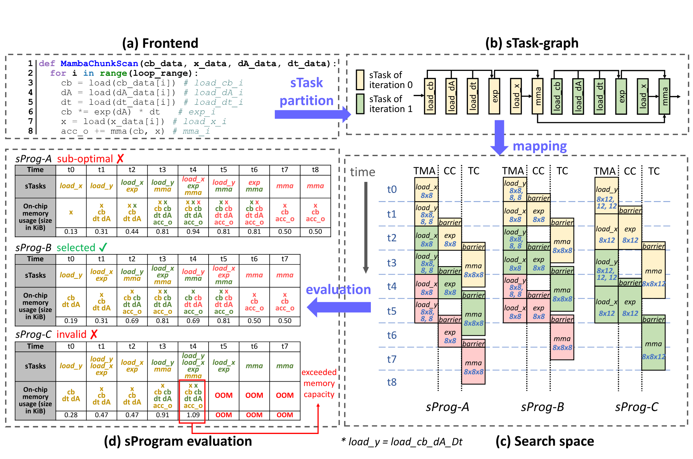

**図 6。** Mamba2-ChunkScan の実行例。（a）は user-facing frontend を示します。（b）は（a）から構築した sTask-graph を示し、色は異なる iteration を表します。（c）は（b）の sTask-graph から得られる複数の sProgram を示し、（d）は evaluation を比較して最も効率的な sProgram を特定します。

[+window]: sTask-graph はすべての loop を完全には unroll せず、MAX_STREAM iteration の window を schedule することで iteration structure をモデル化します。

**Evaluation。** [図 6d](#figure-06) は 3 つの sProgram の evaluation を示します。表には各 time step で動作する sTask と、対応する on-chip memory usage が示されています。ここでは on-chip memory capacity を 1 KiB と仮定します。sProg-A では `load_x` を早く schedule しますが、`exp` sTask が `load_cb_dA_dt` の完了に依存するため `exp` の scheduling が遅れ、sProg-B より全体 efficiency が低くなります。sProg-C は大きな sTask を使いますが、workspace の on-chip memory usage も増えます。Time step $t_4$ では workspace が利用可能な on-chip memory capacity を超え、この sProgram は無効になります。そのため、最終 scheduling strategy として sProg-B が選択されます。

PipeThreader の task partitioning は tiling の原則に従いますが、新しい reduction tiling を主要 optimization strategy へ引き上げます。従来の tiling は data reuse のため spatial partitioning を優先し、reduction tiling は二次的に扱われることが一般的でした。PipeThreader は reduction tiling を積極的に利用して pipelining を可能にし、execution efficiency を高めます。これにより data reuse を保ちながら、効率的な pipelined execution が保証されます。Reduction tiling を first-class optimization とすることで、特に pipeline-heavy workload において、従来の tiling strategy を超える性能向上を実現します。また、従来の tiling strategy は大きな tile size を使う傾向があり、両者が on-chip memory を必要とするため、pipeline parallelism の増加と競合する可能性があります。PipeThreader は tiling と pipelining の trade-off も行います。

**FlashAttention-3。** FlashAttention は元の full attention mechanism の効率的な実装であり、DNN operator graph の input node は $Q$、$K$、$V$ の 3 tensor です。最初に matrix multiplication MatMulQK を実行し、`acc_s` $= QK^\top$ を計算します。次に `acc_s` を Softmax operation に渡して $P$ を生成します。最後に $P$ と $V$ を 2 番目の matrix multiplication MatMulPV の input とし、output $O$ を計算します。

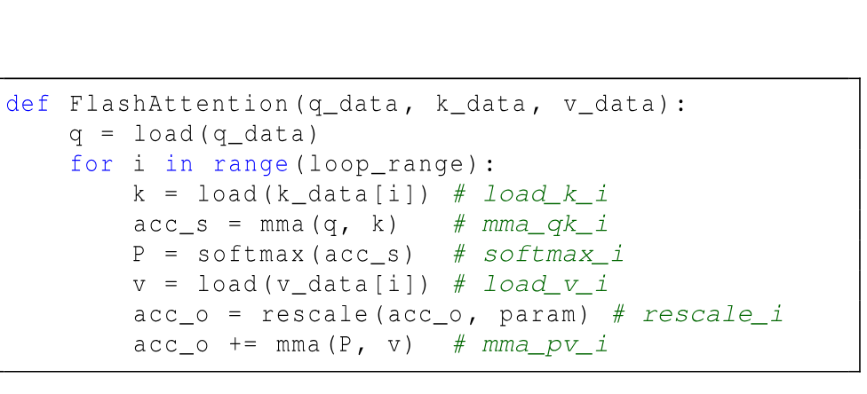

**図 7。** FlashAttention sTask-graph の pseudocode。

FlashAttention では、これら 3 operator を単一 kernel に融合します。PipeThreader は pattern に annotation を付けて dependent sTask を導出し、sTask-graph を形成します（[図 7](#figure-07)）。Partitioning 後、PipeThreader は `load_k`（4 行目）と `load_v`（7 行目）を TMA、`mma_qk`（5 行目）と `mma_pv`（9 行目）を TensorCore、`softmax`（6 行目）と `rescale`（8 行目）を CUDA core へ割り当てます。PipeThreader は 2-level scheduling policy で space を探索し、sEU の asynchrony と heterogeneity を利用して各 sTask が対応する sEU 上で並列実行される sProgram を生成します。私たちの scheduling space には、最新の FlashAttention-3 [Sha24b] の pipeline plan も含まれます。

## 4 PipeThreader のスケジューリング

sProgram 抽象化によって、広大な最適化空間が開かれる。PipeThreader は、この空間から高品質な sProgram を生成することを目指す。そのため、PipeThreader ではスケジューリングのメカニズムとポリシーを分離している。メカニズム側には、(1) ポリシーが sProgram を生成するためのスケジューリングインターフェースと、(2) スケジューリングポリシーが必要とするプロファイル情報を提供するプロファイラという、2 つの機能がある。ポリシー側では、tiling と pipeline parallelism のバランスを取る 2 階層のポリシーを用意している。この単純なポリシーだけでも、最先端手法を上回り、ときには大幅な性能向上を達成できる。このメカニズムは、sProgram が公開する最適化空間をさらに活用する、より高度なポリシーを今後研究するための基盤になると考えている。

### 4.1 スケジューリングインターフェース

[Figure 8](#figure-08) に示すように、PipeThreader は新たな空間で高品質な sProgram を生成するための 3 つのインターフェースを提供する。`Append` インターフェースは、特定の sTask を EU 内の所定の sEU に割り当てる。`Wait` インターフェースは、sTask $s$ が `list<sTask_uid>` 内の sTask の完了を待てるようにするもので、暗黙的に sTask $s$ の直前へ barrier-sTask を追加する。これらのインターフェースにより、sEU 間における sTask の配置と実行順序、すなわち sProgram を明示的に制御し、並列化空間を探索できる。

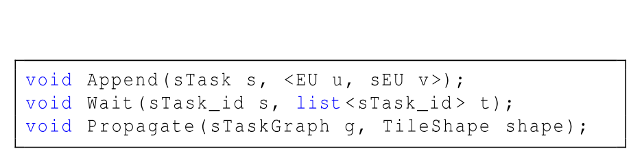

**Figure 8.** スケジューリングインターフェース。

PipeThreader は、sTask-graph 内の各 sTask の `TileShape` を自動推論し、sTask の分割空間を探索する `Propagate` インターフェースも提供する。`Propagate` は、最後の sTask の出力 tile shape を起点として graph を逆向きにたどりながら一連の shape inference を行い、各 sTask の tensor expression と出力 tile shape に基づいて、依存する入力領域を決定する。たとえば Softmax sTask に $[4 \times 128]$ の出力 tile shape が必要なら、`Propagate` は入力 tile shape も $[4 \times 128]$ でなければならないと推論する。これを直前の mma sTask の出力 tile shape とみなすと、その入力 tile は $[4 \times k]$ と $[k \times 128]$ と推論される。ここで $k$ は reduction size である。

### 4.2 スケジューリングポリシー

本研究のスケジューリングポリシーは、[Figure 3](#figure-03) に示した 2 階層の hardware abstraction に着想を得ている。そこでは、同種の EU が SPMD 型の並列性を実現し、各 EU 内の異種 sEU が MPMD 型の並列性を支える。[Figure 9](#figure-09) は、PipeThreader が用いる 2 段階のスケジューリングアルゴリズムを示している。EU 間レベルでは、モデルを sTask-subgraph に分割して各 EU へ均等に配分し、レイテンシを最小化する（1〜10 行目）。EU 内レベルでは、効率的な pipeline plan を構築し、所定の EU 上で各 sTask-subgraph を実行するコストを最適化する（11〜32 行目）。EU 間スケジュールでは、EU 内スケジュールが求めた各分割の実行コスト推定値を利用する。

最初に、ポリシーは各 operator を計算 stage に応じて 1 つ以上の sTask として表現する。たとえば MatMul は load sTask と mma sTask に分割される。EU 間 pass では、scheduler が `GetsTaskPartitions` 関数で出力 sTask のさまざまな分割を列挙する（2 行目）。scheduler は sTask の各分割について `Propagate`（4 行目）を使い、graph 全体にわたってほかの sTask の分割を導出したうえで、各 EU が同等の計算能力を持つことを利用し、sTask を EU 間に均等に割り当てる。この SPMD 型の手法により、EU 間並列化計画の複雑さを大きく削減できる。次にポリシーは EU 内 pass を呼び出し、EU 内に割り当てられた sTask、すなわち sTask-subgraph の実行を最適化する。EU 内 pass では greedy approach によって sTask を sEU にスケジュールし、その EU に割り当てられた全 sTask のスケジューリングが終わるまで、次の手順を反復する。(1) `get_complete_sTask` で `endtime` が現在時刻 `cur_time` より前の sTask $t$ を選ぶ（15 行目）。(2) 先行 sTask がスケジュール済みである ready sTask の集合を特定し（17〜20 行目）、`get_high_priority` を使って優先度が最も高い sTask $u$ を dequeue する（22 行目）。(3) 選択した sTask を `Append()` で sEU に追加し（23 行目）、`Wait()` を呼び出して sTask レベルの依存関係を保証する（25 行目）。また、$u$ のスケジューリングが、$t$ の完了によるメモリ解放を待たなければならない場合に対処するため、`Wait(u, t)` も呼び出す（26〜27 行目）。pipeline efficiency を高めるため、すでにスケジュールされた task への依存が少なく、下流の sTask を実行可能にする可能性が高い非同期 sTask を優先してスケジュールする。[Figure 6c](#figure-06) に示すように、`load_x` を先にスケジュールすると `exp` の実行が遅れる一方、`load_y` を先にスケジュールすれば `exp` をより早く進められる。そのため、本アルゴリズムでは `load_y` により高い優先度を与え、自然に sProg-A よりも sProg-B と sProg-C の構築を優先する。

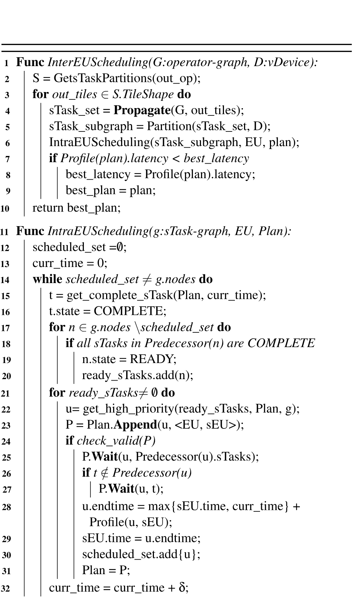

**Figure 9.** スケジューリングアルゴリズム。

stage 間の中間結果を buffer するため、sTask の overlap、すなわち pipeline parallelism を増やすには、GPU の shared memory や register など、追加の on-chip memory が必要になる。しかし、この要求は、より大きな tiling size の使用と競合する可能性がある。本手法は、profiling feedback に導かれる joint search strategy によって、相反する 2 つの要求のバランスを取る。メモリ上で実行可能かどうかを保証するため、`check_valid` を呼び出し、現在の sProgram と profiler に基づいて、選択した sTask が対象 sEU のメモリ制約内に収まるかを確認する（24 行目）。上限を超える候補は除外される。たとえば [Figure 6](#figure-06) の sProg-C は大きな tiling size を使用しており、利用可能な on-chip memory を超過する。`check_valid` はこの違反を検出し、そのような無効な schedule が生成されるのを防ぐ。

**Profiler.** PipeThreader は、探索空間内で効率的な sProgram の生成を導く profiler を導入する（[Figure 9](#figure-09)）。profiler は、sProgram の有効な実行 timeline を生成するため、個々の sTask について次の情報を提供する。(1) 特定の sEU 上での各 sTask の実行時間、(2) local memory と register の消費量を含む sTask の resource usage、(3) sProgram 全体の実行時間である。profiler は TVM など既存 compiler の code generation backend を利用して新しい tensor expression を自動的に処理し、単独の sTask に対応する device code の実行時間と resource usage を測定する。スケジューリング中、PipeThreader は profiling 結果を使い、pipeline efficiency を維持しつつ idle time を最小限に抑えるには task をいつ起動すべきかを推定する。sTask のスケジューリング完了後には、生成された schedule 全体の性能も profiler で測定し、ground-truth latency を得る。この profiling data が scheduling policy に情報を与え、効率的な scheduling plan の生成を導く。

## 5 PipeThreader の実装

PipeThreader は、open-source DNN compiler である TVM [Che18] と Ladder [Wan24e] を基盤として、8.5k 行の C++ および Python code で実装されている。[Figure 10](#figure-10) に PipeThreader 全体の workflow を示す。frontend が sTask-graph を生成し、続いて sTask-aware compiler（scheduler）がそれを処理して sProgram を生成する。最後に、mapping optimizer が sProgram の device code を生成する。

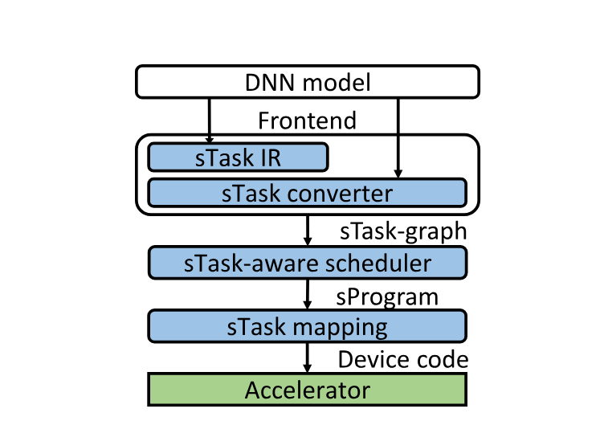

**Figure 10.** PipeThreader の実装。

### 5.1 フロントエンド

PipeThreader の frontend は、sTask レベルの DNN 計算を表現する sTask-IR と、DNN model を sTask-graph に変換する sTask-converter からなる。

**sTask IR.** sTask intermediate representation（IR）は、既存の compiler IR、たとえば expression-oriented IR では容易に捉えられない sTask レベルの計算を柔軟に表現する手段を、programmer と compiler に提供する。[Figure 6a](#figure-06) と [Figure 7](#figure-07) の pseudocode は、sTask IR を簡略化したものとみなせる。この pseudocode は、DRAM と SRAM の間で sTask を移動するような memory operation や、sTask 上の一連の計算を含む複雑な deep learning kernel を、data-flow pattern としてモデル化する方法を示している。

**sEU を用いる sTask converter.** PipeThreader の frontend は、sTask IR と ONNX graph のどちらで表現された DNN model も sTask-graph に変換できる。この処理では、operator fusion 向けの最先端 DNN compiler である Ladder [Wan24e] を利用する。Ladder は tile-graph を出力し、中間表現には TVM の TIR を用いる。各 tile-based task の `target_sEU` 属性に annotation を付け、sEU 情報に基づいて sTask へ変換する。たとえば NVIDIA H100 GPU では、Streaming Multiprocessor（SM）を EU とみなす。各 SM 内の sEU には、matrix multiply-accumulate の `mma` を担う TensorCore、`reduce` や `parallel` など一般的な floating-point computation を担う CUDA core、global memory と shared memory の間で bulk memory copy を行う TMA がある。これらの基本 operation を組み合わせれば、一般的な deep learning kernel の大部分に含まれる data operation を表現できる。たとえば data movement は、任意の element-wise tile operation を表現できる `parallel` operator に変換される。また、user はほかの sTask を記述する独自関数も定義できる。

programmer は kernel を生成するために単純な IR を記述する必要がある。たとえば FlashAttention kernel なら [Figure 7](#figure-07) のようになる。しかし、task の存在、graph（または IR）を sTask に分割する方法、どの sTask がどの sEU で実行できるかを意識する必要はない。PipeThreader はこれらの情報を推論できる。たとえば [Figure 4](#figure-04) の sTask class にある tiling shape や target sEU などの属性を設定する。sTask converter は、各 operation、たとえば `mma` に、実行対象となる sEU の種類を `target_sEU` 属性として annotation する。その後 scheduler が、sTask への分割方法、たとえば tiling shape と、各 sTask を実行する sEU、たとえば sProgram 内の sEU assignment を自動的に決定する。したがって PipeThreader は、hand-crafted implementation に必要な煩雑な手作業と高度な domain expertise を減らせる。FlashAttention kernel の場合、hand-crafted implementation である FlashAttention-3 が 840 行の CUDA kernel code を要するのに対し、PipeThreader では 68 行の Python code だけでよい。

### 5.2 NVIDIA CUDA GPU 上の sTask mapping

TMA sEU と TensorCore sEU では `cp.async.bulk` 命令と `wgmma.mma_async` 命令を利用できるため、どちらも `is_async` 属性を true に設定する。これに対し CUDA core は非同期命令に対応していないため、その `is_async` 属性は false に設定する。CUDA Core と TensorCore の命令を同時に dispatch できることは、NVIDIA も公式に確認している [Nvi23a]。両 unit が同じ register 群を利用するため、干渉が生じる可能性がある。本実装では register の double buffering によって TensorCore と CUDA Core の実行を overlap させ、潜在的な干渉を軽減する。barrier-sTask は PTX [Nvi25] の `mbarrier` object を使って実装する。sEU の `Execute` 関数を効率的に実装するため、layout inference を通じて sTask の operation と data を各 thread と physical memory に割り当てる方法を決定する。さらに、hardware 固有の命令、すなわち hardware intrinsic で operation を高速化する。

PipeThreader では、同じ vendor の異なる GPU model に対応するために大きな engineering effort は必要ない。A100 [Nvi20]、H100 [Nvi23]、B100 [Nvi25b] など異なる architecture を対象とする場合も、sEU layout、intrinsic、resource limit など hardware 固有の configuration をわずかに更新するだけでよい。中核となる compilation logic と scheduling logic は、そのまま再利用できる。

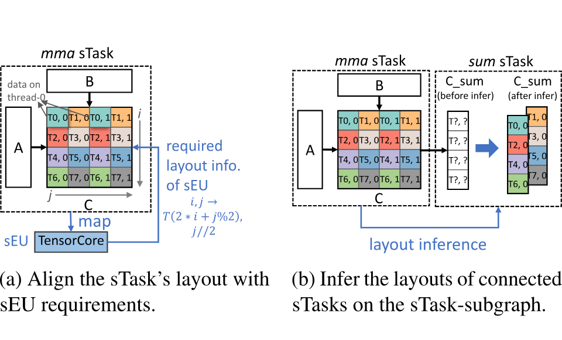

**Figure 11.** mma-sum sTask-subgraph に対する簡略化した layout inference の例。

**Layout inference.** specialized execution unit（sEU）上で sTask を効率的に実行するには、所定の layout と thread-binding constraint に従う必要がある。そこで PipeThreader は、sTask の data layout と thread binding を記述する Layout object を導入する。Layout は mapping function と iterator domain を定義し、logical data element を physical memory へ変換し、必要に応じて thread へ割り当てる方法を指定する。

PipeThreader は layout inference を完全に自動化し、手動で指定する必要をなくしている。[Figure 11a](#figure-11) は、layout inference を簡略化して示したものである。sTask mma は厳密な layout constraint を持つ sEU TensorCore に割り当てられる。この layout constraint に基づいて、対応する layout mapping function を導出できる。ここで $\{T(m), n\}$ は、thread $m$ の $n$ 番目の位置に mapping された data element を表す。

sTask-graph では、互換性を保証するため、接続された sTask の layout を一致させなければならない。PipeThreader は特定の sEU が要求する layout を利用して sTask の Layout を推論し、その要件を graph 全体へ伝播させる。layout 間の競合は priority-based inference algorithm で解消し、mma のように優先度の高い sTask が、依存する sTask の layout を決める。たとえば [Figure 11b](#figure-11) では、mma sTask と sum sTask が接続されている。mma sTask の layout はすでに決まっているため、それに応じて sum sTask の layout を推論できる。この例では、tensor `C_sum` を複製する必要がある。

**Hardware intrinsic.** sEU 上で bulk operation を必要とする sTask は、tile レベルの function template に lower する。たとえば matrix multiply-accumulate operation は、hardware 固有の TensorCore intrinsic を統合した CUTLASS/CuTe template で lower される。register allocation など、さらに細かな instruction-level optimization は LLVM [Lat04] のような low-level compiler に委ねる。NVIDIA H100 では Warp Specialization [Bau14, Cra24] を適用して実行を最適化する。この手法は thread を producer warp と consumer warp に分け、それぞれの warp に異なる pipeline stage を担当させる。producer warp が未使用の register を解放し、consumer warp が再利用できるようにすることで、Warp Specialization は register allocation と効率を改善する。H100 の TMA unit の特性に基づき、global memory と shared memory の間で data を copy する load sTask を producer warp に割り当てる。mma や Softmax など残りの sTask は consumer warp が処理する。producer と consumer の同期には `mbarrier` で実装した barrier-sTask を使い、正しい data dependency を保証する。

### 5.3 AMD ROCm GPU 上の sTask mapping

AMD の最新 high-performance GPU である MI300X [Amd23] にも PipeThreader を実装した。MI300X GPU には、NVIDIA の SM に相当する compute unit（CU）と呼ばれる並列 execution unit がある。各 CU は、matrix multiply-accumulate を担う MatrixCore、Arithmetic Logic Unit（ALU）、asynchronous copy unit など、複数の sEU を備える。CUDA GPU と同様に、PipeThreader は ROCm GPU 上でも layout inference を行い、sTask data を physical address と thread に mapping する。さらに `lgkmcnt` 命令と `s_waitcnt` 命令を明示的に使って asynchronous barrier を管理し、instruction dependency と memory operation の同期を精密に制御する。

## 6 評価

本節では DNN microbenchmark と end-to-end model の両方で PipeThreader を評価し、最先端の DNN compiler、framework、library と比較して、その有効性を示す。最初に結果を要約する。(1) PipeThreader は、FlashAttention など確立された DNN architecture に対して効率的な schedule を発見し、最先端手法と同等、またはそれを上回る性能を達成できる。(2) Mamba2 など新興 model に対して新しい schedule を見いだし、性能を大幅に改善できる。(3) PipeThreader の abstraction と design は、AMD MI300X など NVIDIA GPU 以外の hardware にも適用でき、顕著な性能向上を達成する。

### 6.1 実験設定

**Hardware platform.** 現在最も広く使われている hardware platform である NVIDIA GPU と AMD GPU の両方で PipeThreader を評価する。評価には、最新の high-performance GPU である NVIDIA H100（80GB）[Nvi23] と AMD Instinct MI300X GPU（192GB）[Amd23] を用いる。H100 GPU では CUDA 12.4、MI300X GPU では ROCm 6.1.0 を使用する。どちらの GPU も Ubuntu 20.04 上で評価する。

**DNN workload.** 評価 benchmark には、LLAMA3-8B [Dub24]、LLAMA3-70B [Dub24]、Mamba2-1.3B [Dao24]、RetNet-65B [Sun23a]、ResNet-50 [He16]、UNet [Ron15] という 6 つの代表的な DNN model を使用する。LLAMA3-8B、LLAMA3-70B、RetNet-65B などの large language model は、(BS, SEQ) が (1, 1)、(32, 1)、(1, 4096) の構成でテストする。ResNet-50 や UNet などほかの model は batch size 1 と 128 で評価し、online inference と offline inference の両 scenario を幅広く網羅する。Mamba は、BS=1 では sequence length 1k、2k、4k、8k、BS=32 または 128 では sequence length 1 で評価する。Mamba が transformer より優れる主な点は長い sequence length での高い計算効率にあり、これらが最も一般的な scenario だからである。各 model から、出現頻度が高く計算コストも大きい operation を選び、microbenchmark を構成する。[Table 1](#table-01) に、代表的な operator、その構成、各 operator の略称を示す。

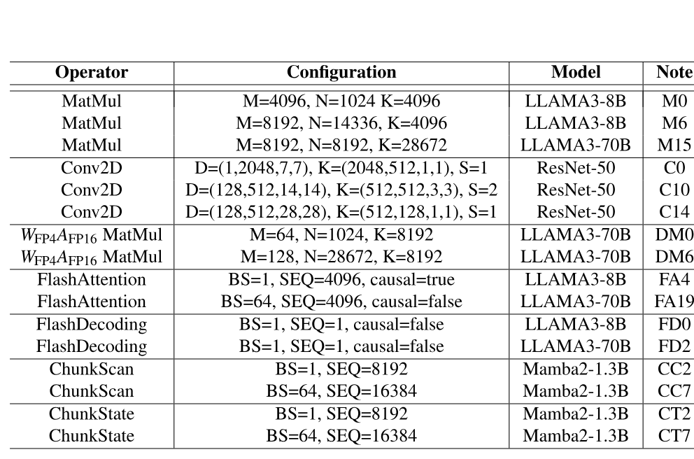

**Table 1.** microbenchmark に含まれる operator 構成の一部。

**Baseline.** PipeThreader を DNN framework の ONNXRuntime（v1.19.2）[Onn24]、および Ladder [Wan24e] や PyTorch-Inductor（v2.4.0、Triton v3.0.0 を使用）[Pyt24, Til19] などの最先端 DNN compiler と比較する。$W_{\mathrm{FP}4}A_{\mathrm{FP}16}$ precision では、PyTorch に HuggingFace transformers の公式 backend である bitsandbytes [Bit24] を統合する。さらに、NVIDIA GPU 固有の inference library である TensorRT（v10.0.1）[Ten24] とも比較する。MatMul では cuBLAS [Nvi24] および rocBLAS（ROCm GPU 上）[Roc25]、low-precision MatMul operation では Ladder および bitsandbytes library、Conv2D では MIOpen [Kha19]、attention operation では CUTLASS [Nvi24a] template で記述され、専門家が最適化した FlashAttention-3 [Sha24b] kernel とも比較する。LLM と Mamba model については、最も広く使われている LLM inference library である vLLM（v0.6.3）[Kwo23] に対しても PipeThreader を benchmark する。speedup などの平均性能指標は、全実験の幾何平均で算出する。すべての評価では最初に warm-up iteration を実施し、その後、正確で安定した結果を得るため各 workload を少なくとも 5 秒間繰り返し実行する。

### 6.2 NVIDIA H100 上の operator 性能

[Figure 12](#figure-12) に、microbenchmark の全 operator 構成における性能を示す。x 軸は各 operator、y 軸は PipeThreader を基準に正規化したレイテンシを表す。

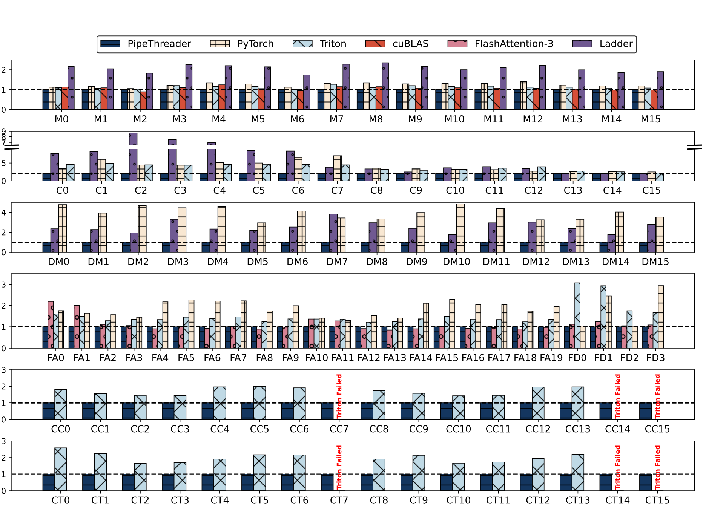

**Figure 12.** NVIDIA H100 GPU 上の operator 性能。

**MatMul.** [Figure 12](#figure-12) の 1 行目は、LLAMA3-8B（M0〜M7）および LLAMA3-70B（M8〜M15）に由来する MatMul operator について、PipeThreader と各 baseline の性能を示している。既存の compiler や library も十分に最適化された MatMul kernel を提供しているが、それでも PipeThreader は大きな speedup を達成する。PyTorch、Triton、Ladder に対する平均 speedup は、それぞれ 1.24×（最大 1.40×）、1.13×（最大 1.26×）、2.07×（最大 2.25×）である。この改善は、PipeThreader が sTask abstraction を利用して MatMul を load sTask と mma sTask の pipeline としてモデル化し、高度な scheduling opportunity を余すところなく探索できることによる。特に、PipeThreader は平均 1.06× の speedup で cuBLAS の MatMul と同等の性能を示す。また、これら MatMul operator の大半で 750 TFLOPS を超え、H100 GPU の TensorCore における理論 peak performance に迫っている。

**Convolution.** PipeThreader は implicit GEMM [Li16c] で convolution を実装し、ここでも load と mma の pipeline optimization を利用する。[Figure 12](#figure-12) の 2 行目に示すように、ResNet-50 model から得た convolution operator（batch size 1 および 128）で、PipeThreader は baseline を大きく上回る。PyTorch に対して平均 1.94×（最大 3.52×）、Ladder に対して平均 2.56×（最大 8.66×）の性能向上を達成する。公式の Conv2D implementation が提供されていないため、Triton で Conv2D kernel を実装し、auto-tuning で最高性能を引き出した。Triton に対する PipeThreader の平均 speedup は 1.85×（最大 2.47×）である。

**Low-bit MatMul.** [Figure 12](#figure-12) の 3 行目は、$W_{\mathrm{FP}4}A_{\mathrm{FP}16}$ 量子化された LLAMA3-8B（DM0〜DM7）および LLAMA3-70B（DM8〜DM15）に由来する low-bit MatMul operator の性能を示している。現在の TensorCore は $W_{\mathrm{FP}4}A_{\mathrm{FP}16}$ MatMul を直接 support しないため、low-bit MatMul では最初に CUDA core 上で data を FP16 に cast する必要があり、dequant stage が追加される。pipeline stage が増えると、PipeThreader が標準 MatMul よりも大きな speedup を得ることが分かる。たとえば low-bit MatMul では、PipeThreader は PyTorch（bitsandbytes 使用）を平均 3.92×（最大 4.76×）、Ladder を平均 2.48×（最大 3.81×）上回る。一方、標準 MatMul における平均 speedup は、それぞれ 1.24× と 2.07× にとどまる。

**FlashAttention と FlashDecoding.** FlashAttention は MatMul や low-bit MatMul よりも深い computation stage を持つため、PipeThreader にはさらに大きな最適化空間が開かれる。PipeThreader は、sTask-graph が定義する新たな最適化空間と、公開された新たな hardware capability を探索し、効果的な scheduling scheme を自動的に発見できる。[Figure 12](#figure-12) の 4 行目は、LLAMA3-8B（FA0〜FA9）および LLAMA3-70B（FA10〜FA19）に由来する FlashAttention operator の性能を示している。評価対象は sequence length 512〜8k、batch size 1 および 64 で、causal masking の有無を含む。Triton に対する PipeThreader の平均性能向上は 1.36×（最大 1.50×）であり、MatMul operation での 1.13×（最大 1.26×）を上回る。この結果は、より複雑な FlashAttention の computation pipeline に内在する大きな最適化空間を PipeThreader が活用できることを示している。

この汎用的な scheduling capability により、PipeThreader は専門家が最適化した model 固有の implementation と同等の性能を達成し、構成によってはそれを上回る。NVIDIA Hopper GPU 向けに手動で最適化された attention kernel である FlashAttention-3 は、そのような専門家設計の一例である。PipeThreader は FlashAttention-3 に対して平均 1.07×（最大 2.18×）の性能向上を達成する。hand-crafted approach である FlashAttention-3 は、多様な workload に合わせて効率よく最適化できない。特に sequence length が短い場合、tile size が固定されているため FlashAttention-3 の性能が最適に届かないことが分かった。PyTorch は hand-crafted の FlashAttention-2 kernel を使用しており、より fine-grained な pipelining を取り入れていない。PipeThreader は PyTorch に対して平均 1.82×（最大 2.29×）の speedup を達成する。

FlashDecoding operator は LLAMA3-8B（FD0、FD1）と LLAMA3-70B（FD2、FD3）model から選び、decoding scenario を模擬するため batch size を 1、context length を 8192 に設定する。PipeThreader は FlashAttention-3 に対して平均 1.12×（最大 1.23×）、Triton に対して平均 2.27×（最大 3.06×）の speedup を達成する。

**Linear Attention.** [Figure 12](#figure-12) の 5 行目と 6 行目は、それぞれ Mamba2 model の主要な linear attention operation である ChunkScan と ChunkState を示している。PipeThreader は公式 Triton implementation と比較する。テスト構成は sequence length 1k〜16k、batch size 1 または 64 である。ChunkScan と ChunkState で、PipeThreader は Triton に対してそれぞれ平均 1.71×（最大 1.99×）と 1.98×（最大 2.59×）の speedup を達成する。また Triton は、sequence length 8k（CC14、CT14）や 16k（CC7、CC15、CT7、CT15）など一部の構成で失敗する。これらの結果は、新興 DNN operation に対する PipeThreader の適応性を示しており、hand-crafted implementation が不要になる。

### 6.3 NVIDIA H100 上の end-to-end 性能

[Figure 13](#figure-13) に、NVIDIA H100 GPU 上で 8 つの DNN model を end-to-end 評価した性能を示す。GPU memory の制約から、LLAMA3、Mamba2、RetNet などの large language model は単一の decoder layer で inference latency を評価し、full model の性能を推定する。すべての layer が同一で、latency は layer 数に比例して増えるためである。

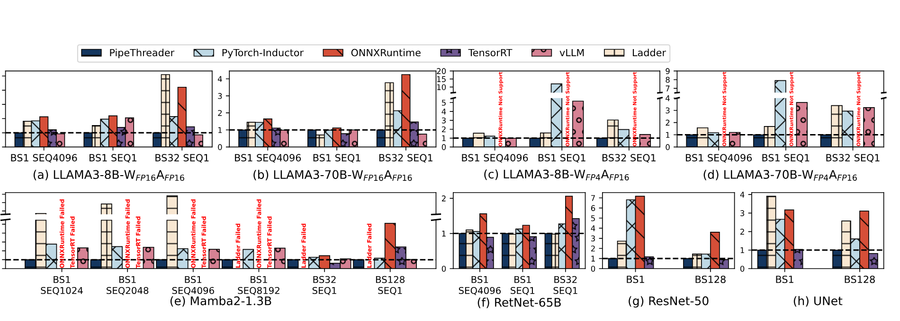

**Figure 13.** NVIDIA H100 GPU 上の end-to-end 性能。

**LLM model.** FP16 precision の LLAMA3-8B および LLAMA3-70B model で、PipeThreader は Ladder に対して平均 2.17×、ONNXRuntime に対して平均 2.45× の speedup を達成する。Ladder の schedule policy は FlashAttention kernel を効果的に表現、生成できず、ONNXRuntime は FlashAttention を native support していないため、性能が最適に届かない。PyTorch-Inductor、TensorRT、vLLM は industry で広く使われている FlashAttention kernel を backend に統合しているが、PipeThreader はそれぞれ平均 1.79×（最大 2.15×）、1.28×（最大 1.47×）、1.10×（最大 2.05×）上回る。この改善は、PipeThreader が model 内の operation、たとえば MatMul や FlashAttention に合わせて、より効率的な pipeline configuration を探索できることによる。$W_{\mathrm{FP}4}A_{\mathrm{FP}16}$ quantization scenario では、low-bit MatMul と FlashAttention の両方で pipeline scheduling を最適化するため、PipeThreader は Ladder、PyTorch-Inductor、vLLM に対して、それぞれ平均 2.01×（最大 3.39×）、3.03×（最大 11.98×）、2.16×（最大 5.16×）の speedup を達成する。絶対性能の一部は [Table 2](#table-02) に示す。

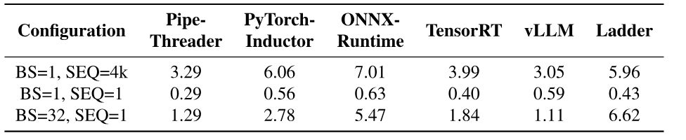

**Table 2.** NVIDIA H100 GPU 上の LLAMA3-8B-$W_{\mathrm{FP}16}A_{\mathrm{FP}16}$ の latency（ミリ秒）。

**Linear Attention model.** Mamba2-1.3B model では、Ladder、ONNXRuntime、TensorRT は効率的な linear attention kernel を生成できず、一部の構成で memory error が発生する。Triton を backend に用いる PyTorch-Inductor は fused linear attention を実行できるが、PipeThreader と比べると性能が低い。PipeThreader は model 内の operation に合わせて効率的な pipeline configuration を探索できるため、PyTorch-Inductor、ONNXRuntime、TensorRT、vLLM、Ladder に対して、それぞれ 1.92×（最大 2.76×）、2.71×（最大 5.10×）、1.21×（最大 2.44×）、1.78×（最大 2.41×）、45.93×（最大 84.41×）の speedup を達成する。

linear attention model の RetNet-65B では、PipeThreader は PyTorch-Inductor、ONNXRuntime、TensorRT、Ladder に対して、それぞれ 1.16×（最大 1.31×）、1.60×（最大 2.12×）、1.06×（最大 1.46×）、1.04×（最大 1.10×）の speedup を達成する。RetNet-65B model における PipeThreader の speedup は比較的小さい。RetNet-65B model では attention head dimension が大きく、query と key が 256、value が 432 であるため shared memory usage が増え、pipeline scheduling の最適化が制限されるからである。

**CNN model.** ResNet-50 と UNet では、より効率的な Conv2D kernel を生成することで、PipeThreader は end-to-end inference latency において Ladder、PyTorch-Inductor、ONNXRuntime に対して、それぞれ 2.01×、2.54×、3.99× の speedup を達成する。TensorRT と比べると、PipeThreader の性能は同等である（0.97×）。

### 6.4 スケジューリングポリシーの評価

**Joint optimization.** 本研究の scheduling policy は、sTask-graph の partitioning と pipeline scheduling を同時に最適化する。その利点を示すため、PipeThreader の variant である「PT-decouple」を作成した。これは partitioning、たとえば単一 sTask で高い memory utilization を得るための最適化と、pipeline scheduling、たとえば overlap を増やすための最適化を、独立した optimization pass で行う。[Table 3](#table-03) に示すように、Mamba2-ChunkScan（BS=64、SEQ=8k）operator で PT-decouple を用いると、compiler は data reuse の最大化を重視して大きな tile shape、たとえば 64×128 を選択する。しかし、この大きな tile shape は 1 つの EU 上で sTask-graph が効率的な pipeline parallelism を実現する妨げとなり、実行時間は 12.150 ms になる。sTask-graph の partitioning と scheduling を同時に最適化すると、compiler は小さな tile shape、たとえば 64×64 を選択する。これにより pipelining の効率が高まり、実行時間は 6.981 ms まで短縮される。

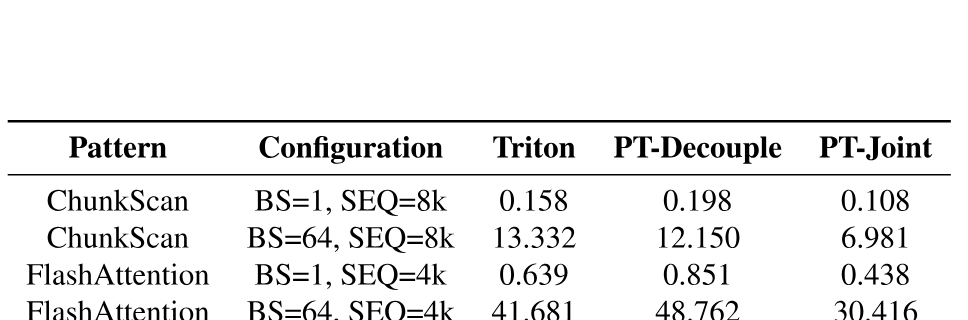

**Table 3.** sTask-graph の decouple optimization と joint optimization における latency（ミリ秒）の比較。

**Compilation time.** joint optimization では compilation time が比較的長くなる。[Table 4](#table-04) に、FlashAttention と Mamba2 の代表的な構成に対する PipeThreader の compilation time を示す。すべての task partition は [Figure 9](#figure-09) の 2 行目で生成されるため、scheduling process を並列化して compilation を高速化できる。MatMul のように pipeline depth が浅い単純な kernel では、PipeThreader の compilation はわずか 0.13 分で済む。これに対し Triton は 0.17 分、CUTLASS は 3.36 分である。FlashAttention のような複雑な fused kernel でも、PipeThreader は Triton より広い pipeline search space を探索しながら、5.26 分という短い compilation time を実現する。

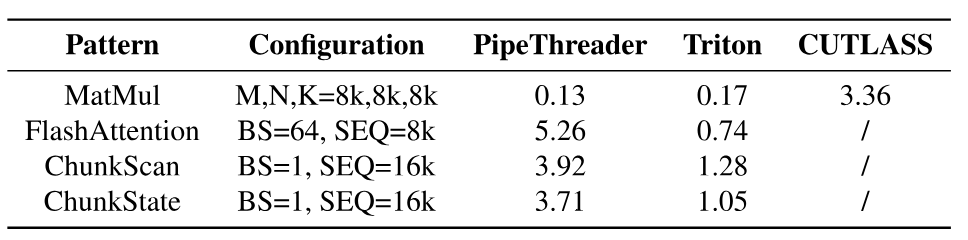

**Table 4.** H100 上の compilation time（分）。

### 6.5 AMD ROCm GPU 上の評価

**Operator 性能.** 本来 NVIDIA H100 GPU 向けに設計した microbenchmark suite から operator の一部を選び、AMD MI300X GPU を benchmark する。評価の中心となる operator は、MatMul（PyTorch、rocBLAS、Triton、Ladder と比較）、Conv2D（PyTorch、MIOpen、Triton、Ladder と比較）、FlashAttention（FlashAttention-2、Triton と比較）、Linear Attention（Triton と比較）である。[Figure 14](#figure-14) に示すように、各種 operator で PipeThreader は Triton に対して 1.16×〜5.42×、PyTorch に対して最大 6.21× の speedup を達成する。MatMul では rocBLAS を最大 1.77×、Conv2D では MIOpen を最大 2.21× 上回る。また FlashAttention-2 に対して最大 2.82× の speedup を達成する。さらに Ladder に対して平均 1.45× の speedup を達成し、効率と scalability を示している。

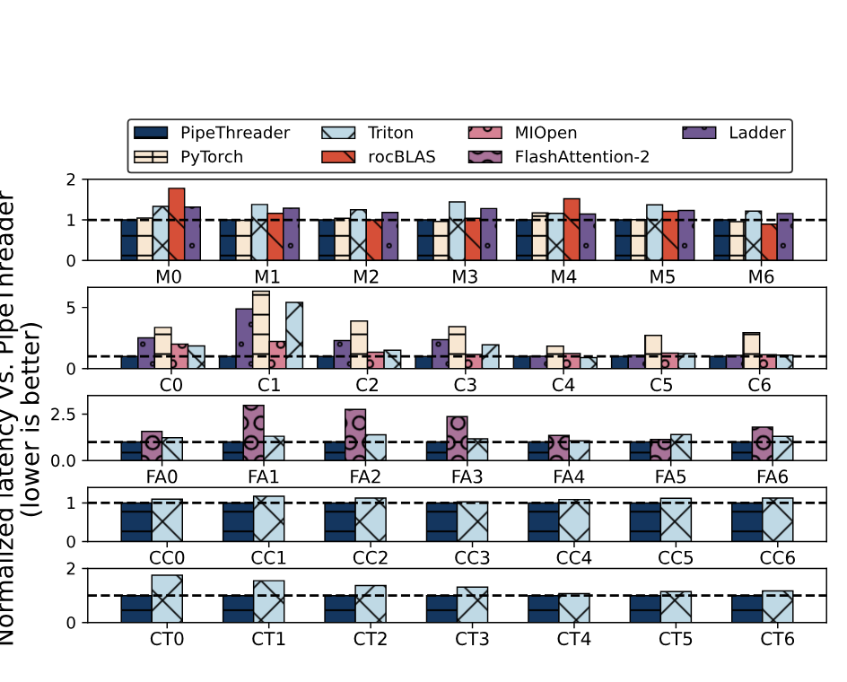

**Figure 14.** AMD MI300X GPU 上の operator 性能。

**End-to-end 性能.** AMD Instinct MI300X GPU 上で PipeThreader を Ladder、PyTorch-Inductor、ONNXRuntime、vLLM と比較する。[Figure 15](#figure-15) に、$W_{\mathrm{FP}16}A_{\mathrm{FP}16}$ と $W_{\mathrm{FP}4}A_{\mathrm{FP}16}$ の LLAMA3-8B および LLAMA3-70B、Mamba2-1.3B、RetNet-65B、ResNet-50、UNet という 8 model の end-to-end 性能を示す。

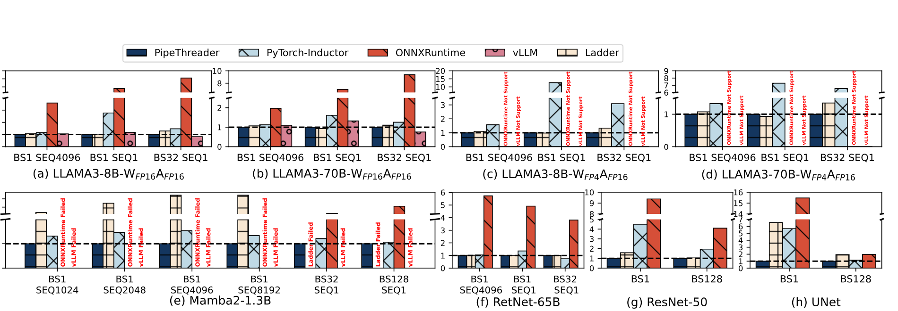

**Figure 15.** AMD Instinct MI300X GPU 上の end-to-end 性能。

FP16 precision の LLAMA3-8B および LLAMA3-70B model で、PipeThreader は PyTorch-Inductor、ONNXRuntime、vLLM、Ladder に対して、それぞれ 1.48×（最大 2.77×）、6.33×（最大 15.51×）、1.02×（最大 1.32×）、1.07×（最大 1.29×）の speedup を達成する。$W_{\mathrm{FP}4}A_{\mathrm{FP}16}$ の LLAMA3-8B および LLAMA3-70B model では、PyTorch-Inductor に対して 3.97×（最大 12.66×）、Ladder に対して 1.12×（最大 1.34×）の speedup を達成する。一方、ONNXRuntime と vLLM は ROCm platform 上の $W_{\mathrm{FP}4}A_{\mathrm{FP}16}$ quantization に対応していない。

Mamba2-1.3B では、PipeThreader は Ladder に対して平均 32.93×（最大 61.33×）という大幅な speedup を達成する。この大きな性能向上は、主に Ladder が Linear Attention component を fuse できないことによる。PyTorch-Inductor に対しては、平均 1.31×（最大 1.54×）の speedup を達成する。RetNet-65B model では、PyTorch-Inductor、ONNXRuntime、Ladder に対して、それぞれ 1.03×（最大 1.36×）、4.75×（最大 5.73×）、1.01×（最大 1.02×）の speedup を達成する。

従来型 CNN model（ResNet-50 と UNet）では、PipeThreader は PyTorch-Inductor、ONNXRuntime、Ladder に対して、それぞれ 2.74×（最大 5.66×）、5.84×（最大 15.47×）、2.14×（最大 6.54×）の speedup を達成する。

MI300X GPU は NVIDIA H100 GPU と比べて非同期処理能力が低く、shared memory も小さいため、PipeThreader が実現する pipeline parallelism の性能向上余地、たとえば baseline に対する speedup が小さくなる。

## 7 考察

**Hand-crafted kernel に対する利点.** PipeThreader は hand-crafted implementation に対して本質的な利点を持ち、特に pipeline scheduling の自動化と architecture 間の portability に優れている。

第 1 に、専門家による manual tuning が不要になる。効率的な pipeline schedule を手作業で設計すると、誤りが生じやすく時間もかかるうえ、入力構成の影響を受けやすい。FlashAttention-3（FA3）のように専門家が作った kernel でさえ、当初は一部の dimension、たとえば head size 256 に対応しておらず、その難しさが表れている。PipeThreader はこの process を自動化し、hardware constraint の下で scheduling space を体系的に探索する。FA3 に対して最大 2.18× の speedup を達成し、vLLM の Triton-based Mamba2 を 2.41× 上回る。

第 2 に、hardware をまたいで高い汎用性を持つ。hand-tuned kernel は特定の platform、特に NVIDIA GPU と密接に結び付くことが多いが、PipeThreader は AMD hardware でも大きな性能向上を達成できる。その abstraction は TPU core や DMA engine などを備えた TPU-like architecture [Jou21, Jou17a] にも自然に mapping でき、効率的な pipelined execution を可能にする。

最後に、高性能化の敷居を下げる。Multihead Latent Attention（MLA）[Dee24, Dee24a] では、PipeThreader はわずか 80 行の Python で Triton に対して最大 5× の speedup を達成し、DeepSeek による 500 行超の CUDA implementation [Fla25] と同等の性能を、はるかに少ない開発作業で実現する。

**Multi-GPU への scale.** PipeThreader は、(1) GPU 間の communication unit、たとえば RDMA、NVLINK、IB を sEU として、(2) collective communication を sTask として組み込むことで、multi-GPU へ自然に scale し、tensor parallelism が導入する collective communication と連携できる。これにより、同じポリシーを再利用して、GPU kernel レベルで collective communication と computation を効率よく pipeline 化する方法を探索し、multi-GPU または multi-node environment へ scale できる。現在の結果では、一般的な communication pattern において、PipeThreader は TileLink [Zhe25a] などの最先端 system と同等の性能を示している。

**新しい device の support.** 広く使われている hardware、たとえば NVIDIA/AMD GPU や TPU は、全 sEU の均等な集合を含む sEU abstraction に適合することが分かった。sTask-graph を device 向けに compile するには、programming model 側で各 sEU の `Execute` interface を、それぞれの load/store/compute instruction を使って実装するだけでよい（[Figure 4](#figure-04)）。この device virtualization は Roller [Zhu22] や Welder [Shi23a] の hardware abstraction に似ているが、より fine-grained な異種 sEU を公開する。

**MoE FFN kernel.** PipeThreader は、MoE FFN kernel の grouped MatMul にも対応できる。batched MatMul と異なり、group ごとに異なる shape を持ち得る。これに対処するため、単一の schedule を共有するのではなく、各 group を固有の input shape を持つ独立した sTask-subgraph に分解し、それぞれに個別のポリシーを適用できる。

## 8 関連研究

**Deep learning compiler と framework.** 既存の DNN compiler の多くは、hardware を同種の execution unit（EU）として抽象化する。Rammer [Ma20] は EU 間での並列実行を目的とした rTask の概念を導入し、Welder [Shi23a] は vertical fusion による包括的な memory optimization に重点を置く。これに対して PipeThreader は sTask と sEU を導入し、hardware の異種性を明示的に公開することで、pipeline parallelism の最適化とスケジューリングを可能にする。

TVM [Che18]、Ansor [Zhe20]、XLA [Xla17]、TensorRT [Ten24] などの DNN compiler では、memory overhead を削減するため operator fusion が広く採用され、その結果 computation stage は深くなっている。Triton [Til19]、Welder [Shi23a]、Roller [Zhu22]、Cocktailer [Zha23h]、TensorIR [Fen23]、ThunderKittens [Res24]、FractalTensor [Liu24f]、Ladder [Wan24e] などの compiler は、tile abstraction に基づいて schedule を最適化する。しかし、これらは主に spatial tiling で data locality を高めることに注力しており、EU 間の data parallelism は実現するものの、sEU 間の pipeline parallelism を活用する機会は見落としている。

Triton [Til19] や CUTLASS [Nvi24a] なども pipelined execution を取り入れているが、特定の operator に対する ad hoc な rule に依存しており、多様な workload には一般化できない。PipeThreader は、pipeline parallelism の自動スケジューリングと最適化を可能にする abstraction を導入し、この制約を解消する。

ALCOP [Hua23b] などの framework は、memory hierarchy の利用を最適化するため、data loading と computation の pipelining に重点を置く。しかし、現代の computation unit が持つ異種性を十分に活用できず、FlashAttention のように深い computation stage を持つ workload の pipeline scheduling も探索できない。PipeThreader は、異種 hardware component 全体で包括的な pipeline optimization を可能にする、より fine-grained な abstraction を導入してこの隔たりを埋める。

**特定 pattern 向けの最適化.** 既存 compiler には sTask と sEU の abstraction がないため、pipeline parallelism の最適化は、特定の pattern に合わせて手動で作られることが多い。たとえば FlashAttention [Sha24b] と CUTLASS [Nvi24a] の Hopper MatMul は pattern 固有の schedule を提供するが、多大な手作業を要する。また FlashAttention は入力ごとに別の schedule を提供し、CUTLASS [Nvi24a] では user が profile を取り、最適な schedule を選ばなければならない。これに対して PipeThreader は、sTask と sEU の abstraction によって pipeline parallelism を一般化し、手動介入なしで幅広い operator と configuration を自動的にスケジュールできる。

**Distributed deep learning framework.** Centauri [Che24f]、PrimePar [Wan24g]、TileLink [Zhe25a] は、それぞれ hierarchical scheduling、temporal tensor partitioning、tile-based abstraction によって communication-computation overlap を改善する。PipeThreader は communication と computation を別々の sTask としてモデル化できるため、これらの研究が提案する scheduling strategy を表現できると同時に、より広い scheduling optimization を可能にする。

## 9 結論

DNN model の大規模化と専用の異種 hardware unit の登場に伴い、hardware scheduler だけでは効率的な pipeline execution が難しくなっている。本論文では、sTask-graph abstraction と、virtualized EU と specialized sEU を組み合わせた階層的な hardware capability により、software-defined pipelining を実現する DNN compiler、PipeThreader を提案した。主要な scheduling primitive を用いて pipeline scheduling を自動化し、H100 および AMD GPU 上で FlashAttention などの最先端手法と同等以上の性能を達成するとともに、Mamba2 のような新興 model にも一般化できる。PipeThreader は compiler-based optimization のさらなる発展に向けた基盤となり、進化し続ける GPU architecture と DNN workload の効率的な活用につながると考えている。

## 謝辞

有益なご指摘をいただいた匿名の reviewer と shepherd の Deepti Raghavan 氏に感謝する。本研究の一部は、中国国家自然科学基金 Grant No. 92464301 の支援を受けた。Zhi Yang は corresponding author である。
