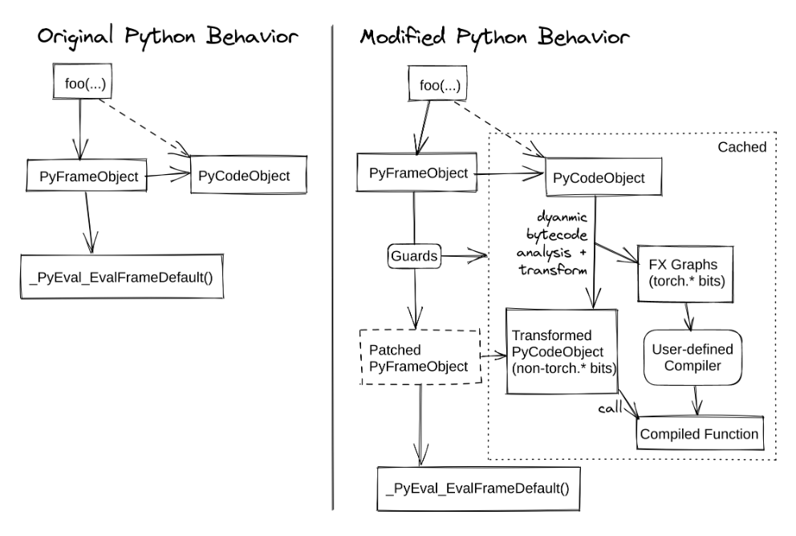
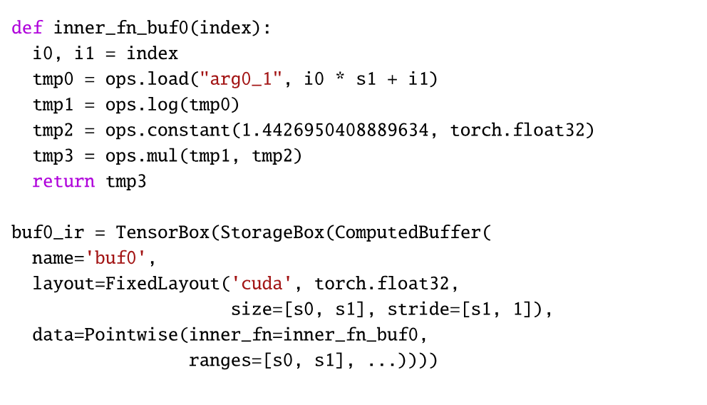
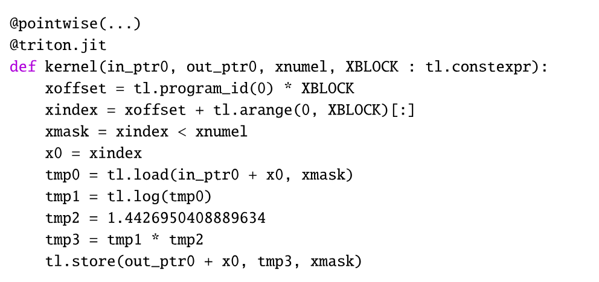
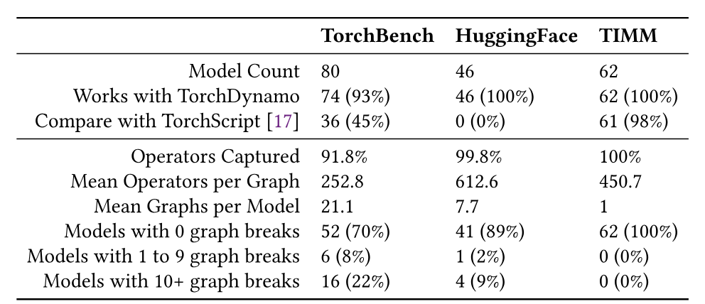
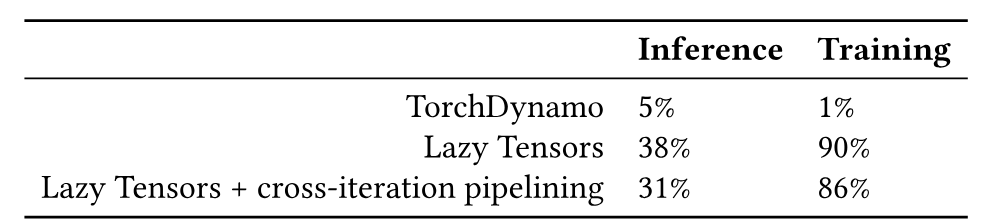
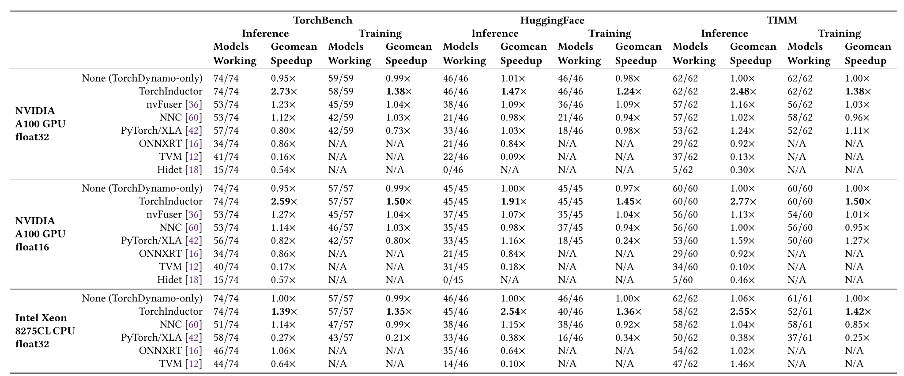
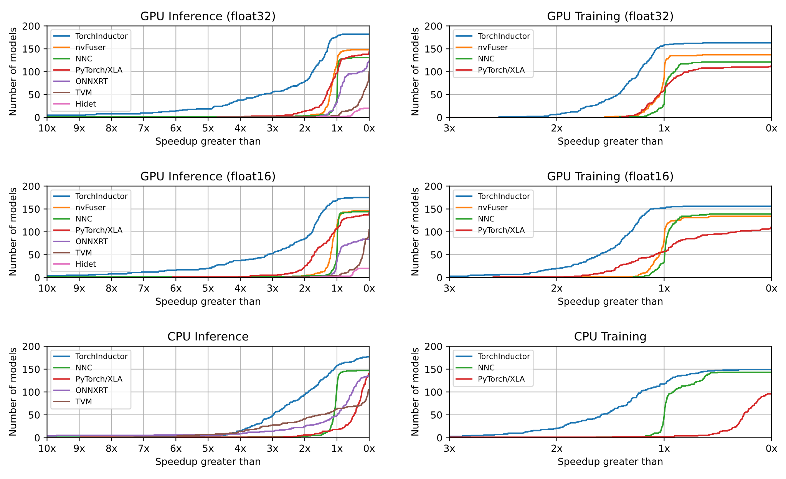
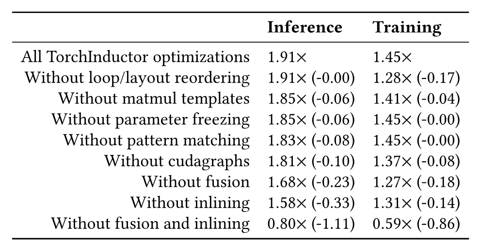

> **著者：** [Jason Ansel](https://orcid.org/0009-0007-5207-2179)、[Edward Yang](https://orcid.org/0009-0008-0621-7872)、[Horace He](https://orcid.org/0009-0004-1133-816X)、[Natalia Gimelshein](https://orcid.org/0009-0002-9867-5075)、[Animesh Jain](https://orcid.org/0000-0001-6777-9168)、[Michael Voznesensky](https://orcid.org/0009-0000-0539-0667)、[Bin Bao](https://orcid.org/0009-0008-8090-7660)、[Peter Bell](https://orcid.org/0009-0003-6824-4343)、[David Berard](https://orcid.org/0009-0005-4954-1849)、[Evgeni Burovski](https://orcid.org/0000-0001-8149-0483)、[Geeta Chauhan](https://orcid.org/0009-0003-0830-7330)、[Anjali Chourdia](https://orcid.org/0009-0005-4276-2227)、[Will Constable](https://orcid.org/0009-0001-7846-744X)、[Alban Desmaison](https://orcid.org/0009-0002-4359-1974)、[Zachary DeVito](https://orcid.org/0009-0002-8863-1503)、[Elias Ellison](https://orcid.org/0009-0005-8337-3498)、[Will Feng](https://orcid.org/0009-0009-6406-4699)、[Jiong Gong](https://orcid.org/0009-0009-0845-5628)、[Michael Gschwind](https://orcid.org/0009-0001-4963-4915)、[Brian Hirsh](https://orcid.org/0009-0004-1239-3320)、[Sherlock Huang](https://orcid.org/0009-0005-7558-5570)、[Kshiteej Kalambarkar](https://orcid.org/0009-0009-8198-4526)、[Laurent Kirsch](https://orcid.org/0009-0007-4121-2308)、[Michael Lazos](https://orcid.org/0009-0007-8706-9447)、[Mario Lezcano](https://orcid.org/0009-0006-8893-2276)、[Yanbo Liang](https://orcid.org/0009-0003-2111-0014)、[Jason Liang](https://orcid.org/0009-0008-5462-1466)、[Yinghai Lu](https://orcid.org/0009-0003-1993-8648)、[C. K. Luk](https://orcid.org/0009-0009-9938-8327)、[Bert Maher](https://orcid.org/0009-0004-6873-645X)、[Yunjie Pan](https://orcid.org/0009-0002-9351-431X)、[Christian Puhrsch](https://orcid.org/0009-0002-3925-967X)、[Matthias Reso](https://orcid.org/0000-0002-1582-5860)、[Mark Saroufim](https://orcid.org/0009-0009-2612-6588)、[Marcos Yukio Siraichi](https://orcid.org/0000-0001-5377-8607)、[Helen Suk](https://orcid.org/0009-0007-6048-3189)、[Shunting Zhang](https://orcid.org/0009-0008-8370-5554)、[Michael Suo](https://orcid.org/0009-0000-5454-3113)、[Phil Tillet](https://orcid.org/0009-0007-0636-8710)、[Xu Zhao](https://orcid.org/0000-0003-2906-8677)、[Eikan Wang](https://orcid.org/0009-0009-2648-5193)、[Keren Zhou](https://orcid.org/0000-0002-7977-3182)、[Richard Zou](https://orcid.org/0009-0000-9597-1405)、[Xiaodong Wang](https://orcid.org/0000-0001-5436-9952)、[Ajit Mathews](https://orcid.org/0009-0003-4199-0434)、[William Wen](https://orcid.org/0009-0009-1502-9520)、[Gregory Chanan](https://orcid.org/0009-0006-0635-4725)、[Peng Wu](https://orcid.org/0000-0003-2913-3280)、[Soumith Chintala](https://orcid.org/0000-0003-2147-9850)。
>
> 2024 年 4 月 27 日、*Proceedings of the 29th ACM International Conference on Architectural Support for Programming Languages and Operating Systems, Volume 2*（ASPLOS '24）、pp. 929-947 に掲載。原題全文：[*PyTorch 2: Faster Machine Learning Through Dynamic Python Bytecode Transformation and Graph Compilation*](https://doi.org/10.1145/3620665.3640366)。[原論文 PDF](/paper/pytorch-2.pdf)。arXiv 版および TeX ソースは公開されていないため、正確な誌面レイアウトと参考文献については原論文 PDF を正本とする。

## 概要

本論文では、広く利用されている PyTorch 機械学習フレームワークに対する 2 つの拡張、TorchDynamo と TorchInductor を紹介する。これらは、PyTorch 2 でリリースされた torch.compile 機能を実装する。TorchDynamo は Python レベルの実行時（JIT）コンパイラであり、Python の柔軟性を損なうことなく PyTorch プログラムでグラフコンパイルを可能にする。これは、実行前に Python バイトコードを動的に変更し、一連の PyTorch 演算を FX グラフへ抽出した後、拡張可能な多数のバックエンドのいずれかを用いて JIT コンパイルすることで実現される。TorchInductor は TorchDynamo のデフォルトコンパイラバックエンドであり、PyTorch プログラムを GPU 向けには OpenAI の Triton、CPU 向けには C++ に変換する。実験結果から、TorchDynamo は従来手法より堅牢にグラフをキャプチャしつつ、追加するオーバーヘッドを最小限に抑えられることが分かった。また TorchInductor は、NVIDIA A100 GPU 上の 180 以上の実用モデルにおいて、幾何平均で推論を 2.27 倍、学習を 1.41 倍高速化し、ほかの 6 つのコンパイラを上回った。これらの拡張により、PyTorch のような eager mode フレームワークでコンパイラによる最適化を適用する新たな方法が得られる。

<span id="section-1"></span>

## 1 はじめに

現代の機械学習フレームワークは、PyTorch [Pas19a] や JAX [Bra18] のような eager mode フレームワークと、TensorFlow [Aba16c]、Caffe [Jia14]、Theano [The16]、CNTK [Sei16] のような graph mode フレームワークに大別できる。eager mode フレームワークは命令型の define-by-run [Tok19] 手法を用い、機械学習モデルを、モデルを実行するたびに実行されるコードとして表現する。graph mode フレームワークは、より宣言的な define-and-run [Tok19] 手法を採用し、ユーザーがまずグラフを構築し、その後でグラフを実行することを求めるグラフ構築 API を公開する。

機械学習フレームワークのユーザー、とりわけ研究者は、eager プログラミングモデルを圧倒的に好むことが示されている [He19a]。eager mode モデルは理解しやすく、Python の print や pdb といった標準ツールでデバッグできる [Inn17]。ユーザーが eager mode を好むため、従来は graph mode だったフレームワークも eager mode のプログラミングモデルへ移行している [Agr19]。

eager mode フレームワークの欠点は、コンパイラによるグラフレベルの最適化を適用しにくいことである。フレームワークが一度に把握できるのは単一の演算子だけなので、演算子の境界をまたぐ融合やスケジューリングなどの最適化を自動的に実行できない。この問題に対処するため、PyTorch では record/replay [Dev18a, Ree22]、Python の構文解析 [Dev18a]、遅延評価 [Suh21] を用いてグラフキャプチャを可能にする試みが行われてきた。しかし、これらの手法では、ユーザーを PyTorch に引きつけている使いやすさの多くが失われる。record/replay は健全ではなく、誤った動作を生じる可能性がある [Dev18a]。Python の構文解析は単純なプログラムには機能するが、Python の複雑な意味論すべてを再現できておらず、後述の結果では実用モデルの半数以上で失敗する。遅延評価は実行時オーバーヘッドが大きく、カーネル起動に遅延を加える。さらに、PyTorch 専用の graph mode バックエンドでは扱えないモデルもある。PyTorch が備える柔軟性を利用して、多くのモデル作者が、辞書、リスト、カスタムクラス、サードパーティライブラリ（numpy、logging など）、ディスク／ネットワーク、マルチプロセッシング、例外、手書きカーネルといった、グラフへ容易には写像できない機能を活用しているためである。

本論文では、PyTorch に対する 2 つのオープンソース拡張、TorchDynamo と TorchInductor を提示する。これらの拡張は PyTorch 2 で導入され、2023 年 3 月に正式リリースされた torch.compile 機能を支える。TorchDynamo は Python レベルの JIT コンパイラであり、Python の完全な柔軟性を維持しながら PyTorch プログラムでグラフコンパイルを可能にするよう設計されている。TorchDynamo は CPython の Python フレーム評価 API [Vie16] にフックし、Python バイトコードが実行される直前に動的に変更する。一連の PyTorch 演算を FX グラフ [Ree22] に抽出するよう Python バイトコードを書き換え、そのグラフを拡張可能な多数のバックエンドで JIT コンパイルする。この FX グラフはバイトコード解析を通じて作成される。Python の実行と組み合わせられる小さなグラフ断片を生成するよう設計されており、使いやすさと性能の両方を得る。

TorchInductor は TorchDynamo の新しいコンパイラバックエンドである。PyTorch プログラムを、GPU 向けには OpenAI の Triton [Til19]、CPU 向けには C++/OpenMP [Dag98] へ変換する。TorchInductor は PyTorch eager mode と同様の抽象化を用いることで、PyTorch の柔軟性と動的性質に対応できる。新しい define-by-run のループレベル中間表現（IR）を導入し、新しい演算子の lowering を容易に追加できるようにしている。さらに Python で実装されているため、PyTorch ユーザーが自分の要件に合わせて拡張・変更しやすい。

実験結果から、TorchDynamo は追加するオーバーヘッドを最小限に抑えつつ、従来手法より堅牢にグラフをキャプチャできることが分かった。TorchDynamo は大半のモデルで単一のプログラム全体グラフをキャプチャでき、必要な場合には部分グラフへ安全にフォールバックできる。測定の結果、TorchInductor は平均すると、ほかの 6 つの PyTorch コンパイラバックエンドより高速なコードを生成した。性能比較には、学習と推論、CPU と GPU、float32 と float16、および実用アプリケーションから採取した 180 以上の実寸大モデルを含む 3 つの大規模ベンチマークスイートが含まれる。

<span id="section-2"></span>

## 2 PyTorch グラフキャプチャの先行事例

PyTorch におけるグラフキャプチャには、ユーザーがグラフで表現可能な構成要素だけを使うよう制約される graph mode フレームワーク [Aba16c, Jia14, The16, Sei16] と比べて、固有の難しさがある。PyTorch などの eager mode フレームワークでは、ユーザーは PyTorch 以外のライブラリを含む任意のコードをモデル内に埋め込める。その結果、PyTorch Tensor から Python 型への変換（.item()、.tolist() など）、外部ライブラリ（numpy、logging など）の使用、固定的なグラフ抽象化にはなじみにくい Python の構成要素（クラス、クロージャ、例外、制御フローなど）の使用が頻繁に生じる。Python/PyTorch がもたらす柔軟性とグラフ表現の非柔軟性が一致しないため、従来の PyTorch グラフキャプチャ手法では、ユーザー体験に制約を課す必要があった。TorchDynamo はこの柔軟性と表現の緊張関係を解消するが、ここでは文脈と背景を示すため、この分野の先行研究を検討する。

<span id="section-2-1"></span>

### 2.1 torch.jit.trace

`torch.jit.trace` は、入力例に対して record/replay を行い、TorchScript [Dev18a] グラフを生成する。記録は PyTorch のディスパッチャレベルで行われる。これは PyTorch の C++ 部分にあり、演算子をデバイス固有のカーネルおよび autograd へディスパッチするために使われる。記録は C++ で行われるため、torch.jit.trace は Python 内の制御フローを一切キャプチャしない。次の例を考える。

```python
def example1(x):
  if len(torch.nonzero(x)) > 1:
    return x + 1
  return x - 1
```

入力例が `torch.tensor([0, 0])` の場合、`torch.jit.trace` は次と等価なグラフをキャプチャする。

```python
def example1_incorrect_capture(x):
  torch.nonzero(x)
  return x - 1
```

プログラムを通る経路が入力例に特化されるため、異なる入力（torch.tensor([Aba16c, Aba16c]) など）では誤った結果になる。加えて、PyTorch 以外の演算子（外部ライブラリ、print、logging、副作用など）はキャプチャされたグラフから省かれる。

<span id="section-2-2"></span>

### 2.2 torch.jit.script

`torch.jit.script` も TorchScript [Dev18a] グラフを構築するが、Python AST を構文解析し、静的解析を行うことで構築する。これは上記の example1 を正しくキャプチャでき、torch.jit.trace とは異なり、誤った結果を生じないはずの健全な手法である。

torch.jit.script が直面する主な課題は、Python 全体を静的言語として再実装しようとしていることにある。この手法は全か無かであり、未実装の Python 構成要素に遭遇すると、プログラム全体をキャプチャできなくなる。Python 全体を静的に模倣することは困難であり、実際には torch.jit.script が対応するのは Python の一部にすぎない。実験結果によれば、torch.jit.script が TorchBench ベンチマークスイートの実用モデルで機能する割合は約半分にとどまる。また、大規模モデルを「torchscript 化」するのに数週間から数か月かかったという事例も耳にしており、これはユーザーに苛立たしい体験をもたらす。

<span id="section-2-3"></span>

### 2.3 Lazy Tensors

Lazy Tensors は PyTorch/XLA [Pyt23a, Suh21] プロジェクトで導入され、このプロジェクトは PyTorch で Google TPU [Jou17a] をサポートすることを主目的としている。Lazy Tensors は C++ レベルのグラフキャプチャ技術である。各イテレーションで演算の実行を遅延させてグラフを蓄積し、蓄積されたグラフを XLA [Xla17a] コンパイラへ送る。このグラフをハッシュ化することで、イテレーション間でキャプチャされたグラフが同一なら再コンパイルを回避できる。この手法は有効かつ健全だが、いくつかの大きな欠点がある。

- オーバーヘッドの増加：Lazy Tensors は PyTorch eager と比べて追加の処理を要する。eager と同じ Python コードと PyTorch ディスパッチャスタックを実行するだけでなく、実行時コストを加える追加のグラフデータ構造を維持しなければならない。
- 遅延の発生：PyTorch eager はモデルの最初の演算で最初のカーネルを発行し、その後はホスト側コードを GPU またはアクセラレータ上のカーネルと並行して実行するため、オーバーヘッドが隠蔽される。対照的に Lazy Tensors は、モデルのコードの実行が完了するまで最初のカーネルを発行しない。そのため、最初のカーネルが発行されるまでと、CPU との往復を必要とする演算（実用モデルでは一般的）の後に遅延が加わる。したがって Lazy Tensors では、ホストでの実行と GPU／アクセラレータの利用が直列化されることが多く、ホスト側オーバーヘッドが増幅される。この問題を回避するには、モデル、損失のログ記録、オプティマイザを変更する必要がある。
- 再コンパイル：キャプチャされたグラフが新しいハッシュを持つたびに、Lazy Tensors は再コンパイルしなければならない。このため、再コンパイルが頻発する病的なケースが生じうる。

PyTorch/XLA プロジェクトは、Lazy Tensors と TorchDynamo の両方を組み合わせる TorchDynamo との統合 [Cao22] を構築した。この統合では、Lazy Tensors をイテレーションごとではなく一度だけ実行し、再キャプチャが必要な時点の判定に TorchDynamo を使うことで、Lazy Tensors のオーバーヘッドを隠蔽する。本論文で後述する PyTorch/XLA の結果には、この統合を用いている。

<span id="section-2-4"></span>

### 2.4 torch.fx.symbolic_trace

`torch.fx.symbolic_trace` [Ree22] はこれらのシステムのなかで最も新しく、TorchDynamo と共有される FX グラフ形式を導入した。torch.jit.trace と同様の record/replay ベースの手法を採るが、トレースは PyTorch の C++ ディスパッチャレベルではなく Python レベルで行う。Proxy Python オブジェクトを用いてユーザーコードを実行し、その動作を記録するとともに、PyTorch の torch_function [Abb20] 拡張ポイントを利用する。Python のより上位のレベルで記録するため、symbolic_trace は torch.jit.trace ではキャプチャできない多くの演算をキャプチャできる。実際の Tensor の代わりに Proxy オブジェクトで記録するため、Proxy Tensor からサイズや値を読み取ろうとする場合や、上記の example1 のように制御フローで使う場合など、torch.jit.trace が誤る多くのケースを検出できる。これにも、上記の多くの手法と同じ全か無かという制約がある。たとえば上記の制御フローの場合、ユーザーは依然としてトレースしたいコードを書き換えなければならない。

しかし、torch.fx.symbolic_trace も健全ではなく、誤った結果を生じる可能性がある。グローバル変数をインクリメントし、関数の入力に依存しない関数を呼び出す次の例を考える。

```python
def example3(x):
  global call_count
  call_count += 1
  return torch.rand(10) + x
```

この例に torch.fx.symbolic_trace を実行すると、次と等価なグラフが生成される。

```python
def example3_incorrect_capture(x):
  return _tensor_constant0 + x
```

torch.rand の呼び出しは除去され、その結果が固定定数としてグラフに焼き付けられた。以後グラフを使っても新しい乱数は得られず、キャプチャ時に生成された値が再利用される。この種の誤ったキャプチャはデバッグが難しく、ユーザーが気づかないこともある。call_count の演算は Proxy オブジェクト x と相互作用しなかったため、完全に失われる。その代わり call_count はトレース中に 1 へインクリメントされ、グラフの呼び出し時にはインクリメントされない。これは、いずれのグラフ表現もサポートしないものの例でもある。機械学習用グラフ形式のほぼすべてに Python のグローバル変数という概念がないため、たとえキャプチャできたとしても、下流のバックエンドコンパイラではサポートされない。

<span id="section-2-5"></span>

### 2.5 torch.onnx.export

ONNX [Onn23] の export は、実際にはグラフキャプチャ機構ではない。しかし、そのように誤解する人もいるため、完全を期してここに含める。内部では ONNX export は torch.jit.trace と torch.jit.script（[第 2.1 節](#section-2-1) と [第 2.2 節](#section-2-2)）を使用するため、これらのシステムが課す制約をすべて受ける。さらに、TorchScript から ONNX 形式への変換は、ONNX が PyTorch の全演算子をサポートしていないため失敗することがある。したがって、ONNX がサポートするモデルの集合は TorchScript がサポートする集合の部分集合である。

ONNX チームは TorchDynamo との統合に取り組んでおり、TorchScript を TorchDynamo との直接統合に置き換える予定である。完成すれば、ONNX が動作するモデル数は増える。

<span id="section-2-6"></span>

### 2.6 JAX のグラフキャプチャとの比較

JAX [Bra18] は、TorchDynamo が解決するものと同じ課題にはほとんど直面しない。JAX の初期設計は XLA [Xla17a] の設計と密接に結びついており、JAX は当初から XLA をバックエンドとしてきた。そのため JAX プログラムは、下位の XLA に由来する設計上の制約に従うことを強いられる。したがって JAX はより単純なキャプチャ機構を使用し、ユーザーにはその機構の制約に沿ってプログラムを書くことを求める。たとえば jax.jit はデータ依存の Python 制御フローをサポートせず、ユーザーコードが関数的に純粋であることを要求する。

対照的に PyTorch は、設計にコンパイラを意識した制約を一切組み込まない eager 専用フレームワークとして始まった。PyTorch 上では膨大なモデル群が育っており、その大半はキャプチャやコンパイルの難しさを考慮せずに書かれている。

実装レベルでは、JAX のキャプチャ機構は torch.fx.symbolic_trace（[第 2.4 節](#section-2-4)）に似ているが、JAX プログラムは純粋関数型であり、状態を考慮する必要がないため、やや単純である。Torch FX 論文 [Ree22] には、JAX とのより詳しい比較がある。

<span id="section-3"></span>

## 3 TorchDynamo の設計と実装

TorchDynamo は、従来の PyTorch グラフキャプチャシステムとは根本的に異なる手法を採る。Python を除去または置換しようとするのではなく、Python バイトコードを実行時（JIT）コンパイルすることで CPython と協調しようとする。TorchDynamo は Python バイトコードから Python バイトコードへのトランスレータであり、元のバイトコードから PyTorch 演算を抽出し、多数の PyTorch 演算を融合したコンパイル済み生成物の呼び出しに置き換える。[図 1](#figure-01)に TorchDynamo の動作概要を示し、本節の残りで説明する。

<span id="figure-01"></span>



**図 1。** TorchDynamo が CPython インタプリタを変更して FX グラフをキャプチャする仕組みの概要。

<span id="section-3-1"></span>

### 3.1 利用 API

本論文で導入する主要 API は torch.compile である。

PyTorch Module に対して呼び出すことも、関数デコレータとして使うこともできる。次のキーワードオプションを持つ。

- backend：torch.fx.Graph と入力例のリストを受け取り、Python callable を返すカスタムコンパイル関数をユーザーが指定できる。デフォルトは TorchInductor だが、多数ある組み込みバックエンドのいずれか、またはユーザー定義バックエンドにも設定できる。
- options：バックエンド固有の設定フラグを格納する任意の辞書。
- mode：事前定義されたオプション群を表す短縮文字列であり、"default"、"reduce-overhead"、"max-autotune" のいずれか。

torch.compile でモジュールを実行すると、そのモジュールは[図 1](#figure-01)に示した変更後の CPython の動作で実行される。具体的には、カスタム CPython フレーム評価フックが、実行される各 Python 関数のバイトコードを書き換え、一連の PyTorch 演算を抽出してコンパイルする。このバイトコード書き換え処理はキャッシュされるが、解析はプログラムの特定の動的プロパティに依存するため、後続の呼び出しではガードを用いてそれらを確認する。

<span id="section-3-2"></span>

### 3.2 CPython フレーム評価フック

PEP 523 [Vie16] は CPython インタプリタへフレーム評価 API を導入した。フレームは、関数呼び出しを表すために CPython で使われるデータ構造である。これは TorchDynamo が用いる主要な拡張ポイントで、Python における実行時（JIT）コンパイラとデバッガを容易にするため設計された。PEP 523 は PyInterpreterState に eval_frame 関数ポインタを追加し、CPython で単一の関数呼び出しを解釈する中核関数をオーバーライドできるようにした。CPython が関数を呼び出すたびに、まず PyFrameObject を作成し、次にこのユーザー定義の eval_frame フックを呼び出す。デフォルトでは eval_frame は、CPython の主要インタプリタループを含む _PyEval_EvalFrameDefault を指す。TorchDynamo は eval_frame を変更し、この標準 CPython インタプリタループを、Python フレームを JIT コンパイルするループに置き換える。TorchDynamo が導入するカスタム eval frame 関数は、次の処理を行う。

- ファイル名による除外、以前の解析失敗（そのフレームをスキップ対象として印付ける）、キャッシュサイズ上限の超過のいずれかを理由に、フレームをスキップすべきか確認する。ファイル名による除外は、Python 標準ライブラリや numpy など、PyTorch 演算を含まない一般的なライブラリに用いる。スキップ対象のファイルでは、元のバイトコードに対して _PyEval_EvalFrameDefault を呼び出して戻る。
- フレームが以前にコンパイルされ、キャッシュされているか確認する。該当する場合、キャッシュ内の各エントリについて、生成されたガード関数（[第 3.3 節](#section-3-3)）を実行する。ガード関数が True を返せば、対応するキャッシュ済みコンパイル済みバイトコードを _PyEval_EvalFrameDefault で実行して戻る。
- 関数バイトコードを命令ごとに記号解析し、FX グラフ [Ree22]、ガード、副作用を抽出する。サポートされない演算に遭遇した場合、この解析は関数の途中で停止できる。
- torch.compile に渡された backend= 引数で指定されるユーザー定義コンパイラ関数を用いて FX グラフをコンパイルする。
- すべてのガードを確認する単一の Python 関数を生成し、コンパイルする。ガードを通過し、既存のコンパイル済み生成物を再利用できる場合は True を返す。
- 解析が関数の末尾まで到達しなかった場合、resume_at_XX 継続関数を生成する。継続関数は関数の残りを新しいフレームで実行し、[第 3.8 節](#section-3-8)で説明する。
- 新しい Python バイトコードを生成する。この新しいバイトコードは、1）コンパイル済み FX グラフを呼び出す、2）ローカル／スタック状態を保存・再構築する、3）元の関数が行うはずだった副作用を実行する（[第 3.7 節](#section-3-7)を参照）、4）return するか、元のバイトコードへフォールバックして生成済み継続関数を呼び出すことでグラフブレークを実装する。
- 生成した Python バイトコードとガード関数をキャッシュへ登録し、生成したバイトコードを _PyEval_EvalFrameDefault で実行して戻る。

<span id="section-3-3"></span>

### 3.3 ガード

ガードは、TorchDynamo が JIT コンパイルで使用した動的プロパティを再確認し、キャッシュ済みコンパイルを再利用できるかどうか判定するための機構である。TorchDynamo は変換した PyCodeObject ごとにガード関数を生成し、コンパイル済み生成物を安全に再利用できる場合は True を返す。ガードと変換後のコードはどちらも、PEP 523 [Vie16] で導入された _PyCode_SetExtra 拡張ポイントを使って保存される。ガードは解析中に蓄積され、globals/locals 由来の変数や Python データ構造内にネストされた変数を参照できる。本稿執筆時点では 30 種類のガードが存在した。ガードには、多数の torch.Tensor プロパティ、Python 型、定数への特殊化、属性、dict/list/tuple、nn.Module インスタンス、PyTorch のグローバル状態の確認が含まれる。ガードシステムは TorchDynamo、AOTAutograd、TorchInductor の各層にまたがる。どの層も、特殊化を保護するガードを導入できる。ガードはすべて独立した検査であり、重複排除を除いて互いに作用しない。

<span id="section-3-4"></span>

### 3.4 記号評価

TorchDynamo の根幹を成すのは、Python バイトコードを解析し、各命令の効果をモデル化する記号的 Python バイトコード評価器である。記号評価には、1）スタック状態、2）ローカル変数、3）例外コンテキスト、4）蓄積された FX グラフ [Ree22]、5）蓄積されたガード、6）副作用を追跡するデータ構造が含まれる。このアルゴリズムは Python バイトコードを一つずつ処理し、Python バイトコードの命令型ごとに対応する関数を持つ。

記号評価の開始時に、関数の引数を調べて記号表現 VariableTracker へ変換する。バイトコードがクラス属性やグローバル変数などのデータ構造へアクセスすると、それらの構成要素に対応する新しい記号表現が遅延的に追加される。この表現については[第 3.5 節](#section-3-5)で詳しく述べる。記号評価器は関数の最初のバイトコード命令から開始し、バイトコードを一つずつ処理し続ける。この解析の健全性は帰納法で示せる。各バイトコードが正しく処理される限り、アルゴリズム全体も正しい。

例として、最初の命令が LOAD_FAST、すなわちローカル変数をスタックへ push する Python バイトコードだったとする。LOAD_FAST のハンドラは記号ローカル変数から表現変数を取り出し、記号スタックデータ構造へ push する。BINARY_ADD のハンドラは 2 つの記号変数をスタックから pop し、その結果をスタックへ push する。結果はそれらの変数の型に応じて計算され、ディスパッチも型に応じて変わる。値が PyTorch Tensor を表す場合、FX グラフ [Ree22] に新しい add ノードが追加され、結果ノードを指す新しい記号 Tensor が作成される。

<span id="section-3-5"></span>

### 3.5 Python データ構造のモデル化

Python の意味論の多くはライブラリとデータ構造に存在するため、Python を解析するには、これらの異なる型の動作をモデル化しなければならない。各変数またはスタックエントリの動作を解析するため、TorchDynamo は異なるデータ型の一般的な動作をモデル化するクラス階層を持つ。これらのデータ構造はそれぞれ VariableTracker のサブクラスである。代表的な variable tracker 型には、次が含まれる。

- TensorVariable は torch.Tensor を表す。基礎となる Tensor 値は保存せず、部分的に構築された FX グラフ [Ree22] 内を指す fx.Proxy と、実データを持たず Tensor のメタデータを表す「fake」Tensor（[第 5 節](#section-5)を参照）を保存する。
- ConstDictVariable と DataClassVariable は、キーが定数文字列であり、値にはネストした dict/list を含む任意のものを指定できる key/value ペアを表すために使われる。
- ListVariable と TupleVariable は list/tuple を表し、ほかの任意の型の記号変数を含められる。
- UserFunctionVariable と UserMethodVariable は、インライン化できるユーザー定義関数を表す。クロージャを含み、動的に構築された関数にも対応する。
- UserDefinedClassVariable はユーザー定義クラスを、UserDefinedObjectVariable はそのインスタンスを表す。属性にアクセスされたときにこれらへ遅延的に特殊化し、その変更を追跡する（[第 3.7 節](#section-3-7)）。

ほかの状況を表す variable tracker 型も多数ある。型固有のデータに加え、各 VariableTracker インスタンスにはガードの集合も含まれる。ガードはインスタンス作成時に初期化され、和集合を通じて演算間を伝播する。さらに各インスタンスは、それがどこから来たかも追跡しており、出力バイトコードで読み込みまたは変更できる。

<span id="section-3-6"></span>

### 3.6 インライン化、制御フロー、クロージャ

関数呼び出しは、ユーザーコードから直接行われる場合も、__getitem__ のような特殊メソッドを介して暗黙に行われる場合もある。より大きなグラフを収集するため、TorchDynamo は関数呼び出しをインライン化し、プログラムを平坦化しようとする。関数呼び出しに遭遇すると、TorchDynamo はまず現在の記号状態のチェックポイントを作成する。次に、入力となる記号状態を渡し、加えられた変更を記録しながら、呼び出された関数の記号評価を再帰的に試みる。この再帰解析が、グラフブレーク（[第 3.8 節](#section-3-8)）を引き起こすケースやほかのエラーに遭遇すると、TorchDynamo は関数呼び出し前の記号状態へロールバックし、その関数呼び出しでグラフブレークを生成する。そうでなければ再帰解析から戻り、親関数の解析を続ける。Python バイトコード内の制御フローの大半は最適化によって除去され、特殊化を通じて処理される。たとえば torch.nn.Module のリストを反復処理する場合、TorchDynamo はリストが変化しないことをガードし、ループを展開する。Tensor の型、サイズ、形状に基づく制御フローでは、TorchDynamo はそれらのプロパティをガードして制御フローを除去する。除去できない制御フローがある比較的まれな場合（メタデータではなく Tensor の値に基づく分岐など）、TorchDynamo はグラフブレークを生成する。このブレークにより分岐バイトコードが CPython で実行され、ジャンプ後に解析が再開する。

もう一つの課題はクロージャである。次の例を考える。

```python
def closure_example(x):
  y = torch.sigmoid(x)
  return lambda z: y + z
```

ここで変数 𝑦 はクロージャ内にあり、CPython が cell と呼ぶものによって表現される。cell は間接参照の層を加え、クロージャ内の変数を変更できるようにする。TorchDynamo が処理しなければならないクロージャには、いくつかのケースがある。

- キャプチャ領域の外側で作成された cell 変数は、ほかの変数とは異なる方法でアクセスしなければならない。トップレベル関数からアクセスされる場合は、LOAD_DEREF および STORE_DEREF バイトコードを生成することでアクセスできる。インライン化時にはこのバイトコードを使用できないため、TorchDynamo はインライン化された関数の cell、たとえば fn.__closure__[0].cell_contents から直接読み書きするコードを生成する。cell の内容が変更された場合、TorchDynamo はほかの変更と同じ方法で追跡する（[第 3.7 節](#section-3-7)）。
- キャプチャ領域内で作成され、その領域内で破棄される cell 変数は、最も処理しやすく、最も一般的である。この場合、TorchDynamo はクロージャを静的に最適化して除去する。
- キャプチャ領域内で作成されるもののフレーム外へ escape する cell 変数は、処理が最も難しい。この場合、TorchDynamo はキャプチャ領域内でのクロージャの全使用を最適化して除去する。その後、生成されたバイトコードの最後で、必要な cell と返却用の Python 関数オブジェクトを作成する。外部の呼び出し元からは、返されたクロージャが元のプログラムとは異なる方法で作成されたことを判別できない。

<span id="section-3-7"></span>

### 3.7 変更と副作用

Python 関数には副作用がある場合がある。TorchDynamo は、FX グラフ [Ree22] の呼び出し後まで副作用を遅延させ、最後にすべての副作用を適用する出力バイトコードを生成することで処理する。そのため TorchDynamo は、元のコードが持つはずの副作用をすべて追跡する副作用データ構造を持つ。保留中の副作用によって変更されるはずの値をコードが読み取ろうとした場合、代わりにその保留中の値を読み取る。グラフの生成後、ガベージコレクションのパスが解析コンテキストから escape しなかった副作用を除去し、TorchDynamo は必要な副作用を適用する出力コードを生成する。この方法で副作用を処理すると、同じ値への複数回の書き込みが 1 回の書き込みへまとめられる。TorchDynamo は次の種類の副作用をサポートする。

- グローバル変数への書き込みでは、対象のグローバル変数が同じファイルにある場合、STORE_GLOBAL バイトコードが生成される。別のファイルにある場合（インライン化によるもの）、別モジュールのグローバル変数を変更するコードが生成される。
- （クラスなどの）属性への書き込みも同様に処理され、出力バイトコードの STORE_ATTR に写像される。変更対象オブジェクトへの参照を読み込む方法の決定には、VariableTracker 上の source を使う。
- cell／クロージャへの書き込みは追跡され、複数の方法で処理される（[第 3.6 節](#section-3-6)を参照）。
- クラスの構築は、プレースホルダとなる記号オブジェクトを作成し、__init__ メソッドをインライン化し、そのプレースホルダオブジェクト上のすべての属性変更を追跡することで処理される。関数の最後でオブジェクトが live なら、出力バイトコードはオブジェクトを作成し（コンストラクタを迂回する）、必要な属性を設定する。
- dict/list が入力として渡された場合、またはグローバル変数／属性から読み込まれた場合、辞書とリストの変更も副作用を起こしうる。dict/list の VariableTracker 表現は、これらのオブジェクトの初期記号状態をガードし、関数全体を通じてすべての変更を記号的に追跡する。キャプチャされた FX グラフ [Ree22] では、これらの演算がすべて最適化によって除去される。出力バイトコードでは、最終状態に一致する新しい dict/list が作成され、元の list オブジェクトがそのオブジェクトと一致するよう変更される。キャプチャ領域から escape しない list/dict では変更を観測できないため、この再作成は不要であり、完全に除去できる。

<span id="section-3-8"></span>

### 3.8 グラフブレークと継続関数

TorchDynamo が処理できない Python バイトコード、たとえば外部ライブラリの呼び出しに遭遇すると、グラフブレークと呼ぶものを生成し、解析中のバイトコードを複数の部分へ分割する。つまり TorchDynamo は、コンパイル済み断片を元の Python コードへ混在させ、ハイブリッド実行を実現する。保留中の部分 FX グラフ [Ree22] はコンパイルされる。出力コードで部分グラフが呼び出された後、未サポートのバイトコードが実行され、TorchDynamo を再帰的に用いて関数の残りを解析する。この再帰解析を開始するため、TorchDynamo は次の形式の継続関数を一つ以上生成する。

```python
def resume_at_X(... livevars ...):
  ... restore try/except/stack state ...
  JUMP_ABSOLUTE X
  ... original function bytecode ...
```

この継続関数は、いくつかの変更を除けば元の関数によく似ている。1）引数はグラフブレークをまたいで live な変数を反映するよう変更される。2）スタック／例外状態を復元する prefix が追加され、この状態も引数として渡される場合がある。3）関数の途中から実行を再開するため、JUMP_ABSOLUTE 命令が作成される。

TorchDynamo は、未サポートのバイトコード直後から実行を続けるため、この関数を一つ生成するか、制御フローの場合（すべての制御フローバイトコードは正確に 2 つの分岐を持つ）は 2 つ生成する。継続を Python 関数として構成する利点は、フレーム評価 API を通じて TorchDynamo を再帰的に起動できることである。TorchDynamo が継続関数を処理するときは、ほかの Python 関数とまったく同じように扱う。

<span id="section-3-9"></span>

### 3.9 AOTAutograd

AOTAutograd は PyTorch の再利用可能なコンポーネントであり、多数の PyTorch コンパイラバックエンドから呼び出されて、学習への対応を追加し、共有の演算子 decomposition を利用する。TorchDynamo はモデルの forward をキャプチャするが、学習をサポートするには backward pass も生成する必要がある。PyTorch eager では、backward グラフは tape-based autograd [Pas19a] を用いて動的に生成される。AOTAutograd は、部分プログラムのグラフをサポートする方法で forward グラフを forward と backward のグラフへ変換する。

AOTAutograd は fake Tensor 入力に対して PyTorch eager mode の autograd エンジンを実行し、forward と backward を結合したグラフを記録することで動作する。データ依存の演算は fake Tensor では動作しない（裏付けとなるデータがないため）ので、TorchDynamo ではこれらの演算でグラフブレークを起こし、グラフの外側で実行する。次に AOTAutograd は min-cut アルゴリズム [Yu23b] を用い、メモリ使用量を最適化するよう、この結合グラフを個別の forward グラフと backward グラフへ分割する。この min-cut アルゴリズムの一環としてバックエンド固有の最適化を適用し、backward グラフ内で再計算コストが低い特定の activation を再実体化する。

AOTAutograd の一環として、ほかのディスパッチャレベルの変換もグラフへ適用される。decomposition では、AOTAutograd が一部の PyTorch 演算子を、より少数のプリミティブな演算子へ写像する。AOTAutograd は変更を行う演算を除去し、関数的に等価な演算へ置き換えることで、グラフを純粋関数型にもする。

<span id="section-4"></span>

## 4 TorchInductor の設計と実装

TorchDynamo は PyTorch のグラフキャプチャ問題を解決するが、有用であるためには、キャプチャされた FX グラフ [Ree22] を受け取り、そこから高速なコードを生成できるバックエンドコンパイラと組み合わせなければならない。そこで、参照コンパイラバックエンドとして TorchInductor を作成した。汎用となるよう設計されており、ユーザーが直接利用することも、ほかのバックエンドの出発点として利用することもできる。

<span id="section-4-1"></span>

### 4.1 設計原則と主要技術

TorchInductor の設計を詳しく見る前に、まずその設計の動機となった原則と技術について説明する。

**PyTorch ネイティブ：** PyTorch は、ほかのフレームワークやコンパイラとは異なる設計上の選択を数多く行った。Tensor はユーザーが操作できる stride を公開し、aliasing view は一般的で、データとメタデータの両方を in-place で変更できる。モデルが大きく異なるコンパイラは、PyTorch プログラムの表現に多くの難題を抱えることになる。TorchInductor には PyTorch eager と同様の抽象化を持たせ、薄い変換層で PyTorch 全体をサポートできるようにしたいと考えた。

**Python 優先：** PyTorch ユーザーの大半は Python に最も慣れている。PyTorch の Python 部分には、C++ 部分よりはるかに多くのコミュニティ貢献が寄せられる。PyTorch ユーザーが理解しやすく手を加えやすいように、TorchInductor を Python で実装することを選んだ。

**広さ優先：** すでに十分研究されている狭いモデル群（ResNet/BERT など）へ注力する代わりに、幅広い演算子、ハードウェア、最適化のサポートを早期から意図的に重視した。これにより TorchInductor は、多様なシナリオへ拡張できる汎用コンパイラになった。早期に学習を重視した理由もここにある。学習は推論よりはるかに難しいコンパイラ問題だからである。

**最先端言語の再利用：** 出力言語については、PyTorch ユーザーが高性能カーネルを書く方法から着想を得た。GPU カーネル記述用の OpenAI Triton [Til19] DSL の人気が急速に高まっており、それらのカーネルがほかのコンパイラや最先端ライブラリを上回ることも多いと分かった。高性能な CPU カーネルは通常 C++/OpenMP [Dag98] で書かれる。TorchInductor は Triton と C++ の両方を出力コードとして生成するため、それらのプロジェクトの技術を活用しながら、PyTorch ユーザーが理解できる出力コードを生成できる。

<span id="section-4-2"></span>

### 4.2 Decomposition

PyTorch の全演算子から TorchInductor の IR への lowering を実装する代わりに、PyTorch の多数の演算子を、処理しやすいより単純な演算子群へ分解する。この decomposition は AOTAutograd（[第 3.9 節](#section-3-9)）を用いて行われる。TorchInductor は、必要な decomposition の辞書を指定して AOTAutograd を呼び出す。decomposition は、PyTorch 演算子をほかの演算子で表した Python 実装として記述される。たとえば次のコードは `log2` を `log` と `mul` へ分解する。

```python
log2_scale = 1 / math.log(2)

@register_decomposition(torch.ops.aten.log2)
def log2(x):
  return torch.log(x) * log2_scale
```

この decomposition は再帰的にトレースされ、正規化される。その過程で追加の decomposition を引き起こす可能性があり、固定点へ到達するまで続く。使用中の decomposition 集合には循環があってはならないことに注意されたい。本稿執筆時点で TorchInductor は 191 個の decomposition（overload を含めると 387 個）を使用していた。その大半は TorchInductor 固有ではなく、torch._decomp モジュールを介してほかの任意のバックエンドから利用できるが、一部は TorchInductor 固有である。

<span id="section-4-3"></span>

### 4.3 Lowering と define-by-run ループレベル IR

コンパイルの次の段階では、PyTorch 演算の FX グラフを TorchInductor の define-by-run IR へ lowering する。define-by-run IR とは、IR が実行可能な Python コードを使ってループ本体を定義することを意味する。これにより TorchInductor の IR は完全な Python の能力の多くを備え、大量の boilerplate が不要になり、lowering を簡潔に記述できる。lowering は、FX グラフを記号的に解釈し、単一の演算子を変換する lowering 関数を適用することで行う。本稿執筆時点で TorchInductor は 433 個の PyTorch 演算子（overload を含めると 1605 個）に対する lowering を持つ。未知の演算子に遭遇すると、元の PyTorch コードを実行する fallback kernel ノードへ自動的に変換される。

<span id="figure-02"></span>



**図 2。** 2D Tensor 上の `torch.log2` に対する TorchInductor IR。

[図 2](#figure-02)に示す IR の例では、inner_fn_buf0 は、ops.* 名前空間にある TorchInductor のプリミティブ演算子の呼び出しによって Tensor buf0 の一要素を計算する方法を定義する Python 関数である。この関数は、計算対象要素の記号座標を表す SymPy [Meu17] シンボル（i0 と i1）のリストを受け取る。SymPy シンボル s0 と s1 は計算対象 Tensor のサイズを表し、サイズと stride の両方に使われる。これらのサイズシンボルは Python クロージャでキャプチャされ、graph オブジェクトへ登録される。

TensorBox と StorageBox は PyTorch の torch.Tensor および torch.Storage オブジェクトに対応する抽象化であり、lowering 処理中に view、aliasing、変更を処理できる。ComputedBuffer は、生成コードを用いて計算される Tensor を表す（fallback kernel または入力を介して作成されるものとは対照的である）。Pointwise は、ComputedBuffer がデータ並列の pointwise 計算であることを表す。この IR は、ほかの種類の演算子を処理するため Reduction と Scatter にも対応する。

この IR の主要な利点は、Python の全能力を利用できるため構築しやすいことである。異なる IR ノードを組み合わせ、その内部へロジックを埋め込める。上記の例は、最初から単一の平坦な関数として構築されるのではなく、lowering 処理で定義される多数の小さな関数クロージャとして構築される。ops.mul 用に作成された関数は ops.log 用に作成された別の関数を呼び出し、それが入力引数を読み込むために作成されたさらに別の関数を呼び出す。

この IR のコンパイルと解析は ops.* の仮想化名前空間に依存しており、この名前空間は異なる機能を実行するよう動的にオーバーライドできる。この IR を解析するには、ops が解析パスを指すようにする。そのパスは、メモリアクセスの記録や、strength reduction 最適化のための high/low watermark の記録といった処理を実行できる。この IR で codegen を行うには、ops が Triton または C++ コードを書き出すものを指すようにする。この IR の変換には FX tracing を利用し、これらの Python 関数のグラフ表現へアクセスする。

本稿執筆時点で、TorchInductor のループレベル IR は 54 個のプリミティブ演算子で構成されていた。

- ops.load と ops.store は、指定された buffer 名と記号メモリ位置を指定する SymPy index を用いて Tensor メモリへアクセスする。
- ops.reduction は ops.store のように動作し、書き込み内部で暗黙に reduction が行われる。指定された reduction 型を用い、現在のノードの reduction 次元に沿って保存値を結合する。対応する reduction 型は argmin、argmax、any、max、min、prod、sum、xor_sum、welford_combine [Wel62] である。
- ops.index_expr は、indexing に使われる SymPy 式を計算に使われる値へ変換する。
- ops.indirect_indexing は、動的に束縛される新しい SymPy 変数を導入することで、計算済みの値を indexing に使われる SymPy 式へ変換する。
- ops.masked は条件付き実行を実装する。条件と、引数を持たない Python 関数（同じ IR を再帰的に使用する）を受け取る。Triton では mask、C++ では条件分岐へ写像される。
- ops.load_seed、ops.rand、ops.randn、ops.randint64 は乱数の計算に使われる。
- 残りの ops は要素単位の数学演算である。

<span id="section-4-4"></span>

### 4.4 スケジューリング

TorchInductor のスケジューリング段階では、どの演算子を融合するか、カーネルをどの順序で実行するかを決め、buffer の除去および／または再利用に向けたメモリ計画を行う。スケジューリングは、IR 内の各 buffer を BaseSchedulerNode のサブクラスへ変換することから始まる。SchedulerNode は、TorchInductor が本体を codegen する標準カーネルを表す。ExternKernelSchedulerNode はライブラリコードまたはユーザー定義カーネルの呼び出しを表す。NopKernelSchedulerNode は何にも写像されないが、カーネルの順序を保証する依存辺を追加するために使われる（たとえば producer が結合済み buffer へ直接書き込むことで処理された concatenate kernel）。最後に FusedSchedulerNode は、単一のカーネルへ融合された 2 個以上の SchedulerNode の集合を表す。

次に scheduler は、各カーネルのメモリ read/write 集合をノード間の依存辺へ変換する。依存辺には、読み取られる記号メモリアドレスの注釈が付く。記号メモリアドレスは、どの融合が正当かを判定するうえで重要である。たとえば、あるカーネルが buf0 を順方向に書き込む一方、consumer が逆順（ops.load("buf0", s0 -1 -i0) を使用）で読み取る場合、それらのノードは融合できない。

融合は 2 つの主要な関数で制御される。

- Scheduler.can_fuse(node1, node2) は、2 つのノードを融合できる場合に True を返す。依存辺を確認するほか、融合の正しさを保証するため多数のプロパティも確認する。ここには heuristic も含まれる。たとえば config.aggressive_fusion=False の場合、can_fuse は共通のメモリアクセスを一切持たないノードの融合を防ぐ。バックエンド固有のロジックもあり、たとえば TorchInductor は Triton では reduction-broadcast-reduction の融合をサポートするが、C++ ではサポートしない。
- Scheduler.score_fusion(node1, node2) は、異なる融合候補の順序付けに使われる。一部の融合は相互排他的なので、TorchInductor は score が高い方を選ぶ。融合 score は、1）融合のカテゴリ（pointwise/reduction/template など）、2）融合によって削減されると推定されるメモリトラフィックの byte 数、3）元のグラフにおけるノード間距離の短さ、の順に融合を並べる。追加の融合がなくなるまで（ある融合が別の融合機会を生むことがあるため）ループ内で、TorchInductor は次の greedy algorithm を実行する。1）すべての融合候補を見つける。2）各融合候補を score し、その score で並べ替える。3）各融合候補について、その融合が引き続き正当かを確認し、正当なら適用する。2 つのノードが融合されると、構成ノードを指していた保留中の融合候補は、新しい融合ノードを指すよう更新される。

<span id="section-4-5"></span>

### 4.5 Triton コード生成

<span id="figure-03"></span>



**図 3。** [図 2](#figure-02)に対して生成された Triton コード。

Triton codegen は、TorchInductor の IR を出力 Triton [Til19] kernel へ写像する役割を担う。[図 3](#figure-03)は、上記の log2 の例に対して生成されたコードを示す。このカーネルは、一度に XBLOCK 個の要素からなる block を処理する。要素数が XBLOCK の倍数でない場合、末尾の一部の要素が mask off されることがある。codegen 中には indexing を単純化する。たとえば、この場合、IR 内の 2D strided load は contiguous load へ変換される。codegen は共通部分式除去（CSE）も担う。これはコード行を出力し、tmp から始まる中間変数名を割り当てる際に cache を用いて行う。pointwise decorator は、block size heuristic、auto-tuning、ahead-of-time kernel compilation を容易にするための boilerplate code を符号化する。decorator は生成される kernel の種類（pointwise、reduction、template）であり、その引数はデータ alignment など kernel に必要な metadata である。reduction kernel を生成する場合、TorchInductor は 2 つの codegen mode を持つ。小さな reduction では、reduction 全体を単一 block に読み込み、register/shared memory に保持する persistent reduction を生成する。この場合、reduction は Triton の reduction operator へ直接写像される。大きな reduction では、block 全体を accumulator として用いる loop を生成し、loop の最後に Triton reduction を呼び出す。より複雑な演算（matmul と convolution）向けに、TorchInductor は、手書き Triton と生成 Triton を組み合わせる独自の template system を持つ。template は Jinja [Mon23a] を用いて記述し、TorchInductor の codegen system と連携するための helper method を使う。

<span id="section-4-6"></span>

### 4.6 C++ コード生成

CPU バックエンド向けに、TorchInductor は OpenMP [Dag98] を用いた C++ を生成する。C++ バックエンドには、vectorize 版と non-vectorize 版の 2 つの variant がある。vectorize 版は tiling を行い、大半の演算を PyTorch ソースコードに含まれる `at::vec::Vectorized` クラスへ写像する。このクラスは一度に 16 要素を処理する。これは標準 PyTorch kernel を vectorize する方法と同じであり、複数の SIMD 命令セットをサポートする。non-vectorize 版は、多数の C++ standard template library [Pro98]（STL）関数を用いて、比較的標準的な C++ コードを生成する。どちらの variant も #pragma omp for annotation を用いて並列化され、何段の loop を並列化するかの決定には heuristic が使われる。reduction 次元の loop が並列化される場合、reduction は OpenMP reduction annotation へ写像され、それ以外では accumulator を持つ C++ loop へ写像される。

<span id="section-4-7"></span>

### 4.7 Wrapper codegen

wrapper codegen は、Triton、C++、外部ソースの kernel を呼び出すコードを生成する役割を担う。Tensor のサイズ計算も行い、メモリの確保と解放も処理する。wrapper codegen の実装は 2 種類あり、一方は Python コードを生成し、もう一方は C++ コードを生成する。Python バックエンドはより柔軟で、C++ 版がサポートしない一部の corner case をサポートする。一方、C++ 版のオーバーヘッドは小さい。

mode="reduce-overhead" で有効にすると、TorchInductor は CUDA Graphs [Gra19] を使い、wrapper code のオーバーヘッドを完全に除去する。CUDA Graphs は CUDA driver レベルで kernel launch を記録・再生し、C++ wrapper code よりもさらに低オーバーヘッドである。健全性を保証するため、CUDA Graphs は安全性要件を満たす場合にのみ使用され、一部のケース（dynamic shape、CUDA 以外の Tensor など）では自動的に無効化される。

<span id="section-4-8"></span>

### 4.8 関連する深層学習コンパイラ

深層学習コンパイラの分野では、多くの興味深い研究が進んでいる。PyTorch ユーザーの大半が GPU を使うため、Triton [Til19] を出力先として選択した主な理由は、単純な入力コードから、手書きライブラリ [Nvi23g, Che14, Cut23] より高速な kernel を生成できることが実証されていたからである。それを一貫して実現できるコンパイラはごく少ない。広く使われている深層学習コンパイラの多くは、複雑な kernel の GPU codegen で競おうとはせず、それらのライブラリを直接呼び出すだけである。

多くのコンパイラが Halide [Rag13] に着想を得た設計を採用しており、これには TVM [Che18e]、nvFuser [Sar22]、NNC [Zol21] が含まれる。これらの設計では意味論を記述する言語とスケジューリング言語が分離されており、プログラムの意味論を変えずに異なる schedule を探索できる。研究者は、探索空間を表現するさまざまな方法 [Din23c, Sha22b, Vas18, Wen21, Zhe22d, Bag19, Zhu22, Fen23] と、その空間を自動探索する方法 [Zhe20, Che18a, Xin22, Zhe22c, Ans14] を研究してきた。

XLA [Xla17a] は TensorFlow [Aba15] と JAX [Bra18] を支えるコンパイラである。XLA は、TPU [Jou17a] および同様のアクセラレータの標準となった high level IR、HLO を含む複数レベルの IR を提供する。多くの新しいコンパイラが MLIR [Lat21] エコシステムに登場しており、IREE [Ire19]（現在は OpenXLA [Xla17a] の一部）もその一つである。Triton [Til19] の最新版も内部表現に MLIR を用いる。

<span id="section-5"></span>

## 5 動的形状

深層学習コンパイラは一般に静的形状にしか対応しない。つまり、入力形状の特定の一構成だけで動作するコンパイル済みプログラムを生成し、いずれかの入力形状が変わると再コンパイルしなければならない。この仮定は、現在一般に実行される深層学習モデルの大半には適しているが、不十分な状況もいくつかある。

- batch size や sequence length など、一部の次元は変化することがある。たとえば adaptive batching を行う inference service は、batching window 内に受け取った request 数に応じ、異なる batch size で inference request を実行する。また、可変長 sequence を batch 内の最大 sequence length までだけ padding することも考えられるが、その長さは batch ごとに異なりうる。
- データ依存の出力形状を示すモデルもある。つまり、出力や中間値のサイズが、実行ごとに異なりうる実際の入力データへ依存する場合がある。たとえば detection model は、より高コストな image recognition model を実行して対象が bounding box 内にあるか判定する前に、可変個数の候補 bounding box を生成することがある。bounding box の数はデータ依存である。
- データ依存形状が特に重要になるのは、sparse Tensor、jagged Tensor、graph neural network などの sparse representation を扱う場合である。いずれの場合も、処理するデータ量は問題の sparse structure に依存し、通常はデータ依存の仕方で変化する。

dynamic shape のサポートにあたっては、dynamic rank program、すなわち入力 Tensor の次元数が変化するプログラムをサポートしないことにした。このパターンが実用の深層学習プログラムではめったに現れず、形状の記号リストに対する帰納的推論が不要になるためである。

<span id="section-5-1"></span>

### 5.1 記号形状ガード

TorchDynamo で直線的な trace を用いる動機は、PyTorch API を対象に Python/C++ で書かれた既存コードを再利用する必要があったことにある。この方針は dynamic shape でも継続する。条件分岐の両方をキャプチャするような完全記号システムとは異なり、常に一方の分岐を選び、仮定が成立する場合にのみこの trace を再利用するという前提のもとで trace を特殊化する。そのため、各記号 size について、JIT コンパイルを開始した最初の入力における具体値を示す size hint を保持する。Tensor の形状に関する条件を処理するときは、この hint を参照して選ぶ分岐を決め、ガードを追加する。

この方法では条件分岐を表現する必要がないため、生成する記号形状式を大幅に単純化できるが、ガード管理システムははるかに複雑になる。たとえば次のプログラムを考える。def f(x, y): z = torch.cat([x, y]) if z.size(0) > 2: return z.mul(2) return z.add(2)

TorchInductor でコンパイルする最終的な IR は、torch.cat([x, y]).add(2) または torch.cat([x, y]).mul(2) のいずれかになる（条件は平坦化されて除去される）。しかし、どちらの分岐にいるか判定するには、中間値 z のサイズを知る必要がある。TorchDynamo はコンパイル済み trace が有効かどうかを事前に知る必要がある（いくつかの JIT コンパイラのような bailout はサポートしない）ため、z.size(0) を入力で表した式 x.size(0) + y.size(0) へ簡約できなければならない。これは、PyTorch の全演算子に meta function を記述することで行う。meta function は、ノード上で実際の計算を行わず、Tensor の出力へ size 情報を伝播する。本稿執筆時点で meta function は、PyTorch ops 3028 個中 2657 個（overload を含む）をカバーしていた。使用頻度の低い／まったく使われない演算子が長い裾を形成しているため、これは実用モデルの圧倒的大半を網羅する。custom ops に独自の meta function を定義する機構もある。

<span id="section-5-2"></span>

### 5.2 動的形状推論の最適化

dynamic shape の主な動機は compile time の短縮である。static shape しかサポートしないコンパイラは、入力形状の可能な組み合わせごとに kernel を再コンパイルしなければならない。しかし、記号形状に対する推論にも固有のコストがある。極端な場合、出力 Tensor の形状式は非常に複雑になりうる。記号形状推論が性能へ与える影響を抑えるため、さまざまな戦略を用いる。

- dynamic shape 用のデフォルト API はユーザーによる注釈を必要としない。すべての入力が動的である可能性があり、model weight は静的であると仮定し、モデルを順に実行して両者の相互作用を解析することで、真の動的性質を推論する。ユーザーが mark_dynamic(tensor, dim) で明示的に dynamic と印付けない限り、すべての入力次元を static と見なす assume_static_by_default mode もサポートする。
- PyTorch のコードでは、変数の size が 0 または 1 かどうかを頻繁に検査する。たとえば Tensor を構築するとき、PyTorch は contiguous かどうかを計算する。要素数 0 の Tensor は常に contiguous なので、Tensor の各次元が 0 かどうかを常に検査する。この事実を trace ごとに記号推論システムへ再発見させる代わりに、先回りして 0/1 に特殊化する。入力 size が 0 または 1 なら、記号変数を割り当てる代わりに定数として扱い、適切なガードを追加する。1 への特殊化は、PyTorch の broadcasting semantics と性能最適化をキャプチャするうえで重要である。重要なのは、記号変数を割り当てる場合に否定的な推論ができる点である。どの記号変数も 0/1 には等しくないため、0/1 と等しいか検査した場合、追加のガードを導入せずに式を false と評価できる。
- ユーザープログラムを処理するにつれ、ガードから新しい事実を得るたびに、記号式を逐次的に簡約する。現在の実装は unification と divisibility をその場で単純化する。また SymPy [Meu17] を用いて、要求されたガードがすでに静的に既知かを判定し、その場合は除去する。

<span id="section-5-3"></span>

### 5.3 Hint-free（unbacked）記号整数

制御フローを解決するため、記号整数の実値を確認して進む分岐を決め、その値をガードする。unbacked 記号整数は、.nonzero() や .item() のようなデータ依存演算から size 変数が生じ、実値が不明な場合に現れる。これらの記号整数に対して制御フローを実行することは不正なので、そのような演算ではグラフブレークを起こさなければならない。単純に実装すると制約が強すぎ、グラフブレークが多すぎる結果になる。これを回避するための最も重要な改善は次のとおりである。1）Tensor 作成時に、PyTorch は Tensor に関するデータを事前計算する。たとえば empty_strided で Tensor を作成するとき、stride を並べ替え、Tensor が non-overlapping かつ dense かどうかを判定する。sort は多数のガードを生成する。しかし実際には、non-overlapping かつ dense な Tensor を生成することが保証された empty のような上位 API で Tensor を直接生成する方が一般的である。そこで PyTorch を変更し、これらのプロパティを不必要に再計算しないようにした。2）自明でない計算が必要な場合でも、プロパティが一度も使われないことがある。これらの事前計算プロパティを遅延化することで、未使用プロパティへのガードを回避できる。3）整数 Tensor 内のデータが負になりうるかどうかは、一般に不明である。しかし constrain_range API を提供しており、ユーザーは size が既知の上限と下限で制約されることを指定できる。

<span id="section-6"></span>

## 6 実験結果

評価には 3 つの異なるベンチマークスイートを用いる。TorchBench [Con20] は、Papers with Code [Sar21] の順位で被引用数が多いオープンソースプロジェクトから選んだ、多様なモデル群を含むベンチマークスイートである。HuggingFace [Wol19] は Transformer [Vas17d] モデル用の広く利用されているライブラリである。TIMM [Wig19] は PyTorch の vision model を含む広く利用されているライブラリである。後者 2 つのライブラリをベンチマークスイートにするため、利用可能なモデルの全カテゴリを網羅する代表的なモデルを選択した。

ほかの論文でも使用されることを期待し、ベンチマーク基盤をオープンソース [Tor23] として公開している。モデルごとの性能、異なる TorchInductor 設定、PyTorch nightly build の日次更新を含む追加結果は、TorchInductor Performance Dashboard [Tor23a] で確認できる。実験は NVIDIA A100 GPU、CUDA 11.6、Intel Xeon 8275CL CPU で実行した。ノイズを減らすため、3 回の warm-up iteration の後、実験を 100 回繰り返した。モデルごとに 30 分の timeout を設定し、timeout は失敗として数えた。TorchInductor は 2023 年 8 月 30 日の PyTorch nightly build を使い、max-autotune、freezing、cudagraphs を有効にして実行した。ほかに使用したバージョンは、nvFuser 2.0、NNC 2.0、Hidet 0.2.2、TVM 0.11.1、ONNX Runtime（ONNXRT）1.14.1、PyTorch/XLA 2.1 である。学習実験では、optimizer を除き、forward と backward pass の両方を含む 1 step を測定する。

<span id="section-6-1"></span>

### 6.1 TorchDynamo のグラフキャプチャ能力

[表 1](#table-01)の最初の区画は、異なるベンチマークスイートをキャプチャする能力について TorchDynamo と TorchScript [Dev18a] を比較した実験結果を示す。HuggingFace では、HuggingFace model が TorchScript のサポートしない ModelOutput container class を返すため、TorchScript は全モデルで失敗する。TIMM の保守担当者は workflow で TorchScript を使用し、モデルを適合させる作業を行ってきたため、TIMM model の大半は TorchScript で動作する。TorchBench では、TorchDynamo は TorchScript の 2 倍を超える数のモデルで動作する。TorchBench は多様なソースから採取したモデルで構成されるため、3 つのベンチマークスイートのなかでグラフキャプチャ比較を最もよく代表する。

[表 1](#table-01)の 2 番目の区画は、TorchDynamo がキャプチャしたグラフの品質に関する統計を、動作するモデルに対する割合として正規化して示す。全か無かだった従来システムと異なり、TorchDynamo は部分プログラムと複数グラフをキャプチャできる。TorchDynamo は大半の場合に単一のプログラム全体グラフをキャプチャでき、グラフブレークがある場合でも、通常のグラフは数百個の演算子からなる。グラフブレークの最も一般的な理由は、numpy [Har20b] など PyTorch 以外のライブラリの使用、tolist() などによる Python 型への変換、データ依存の制御フロー演算である。torch.compile を用いて numpy 演算をコンパイルする機能もあるが、この実験では有効にしていない。

<span id="table-01"></span>



**表 1。** 各ベンチマークスイートにおける TorchDynamo の統計。NVIDIA A100 GPU 上の float32 推論で測定。

<span id="section-6-2"></span>

### 6.2 グラフキャプチャのオーバーヘッド

<span id="table-02"></span>



**表 2。** グラフキャプチャのオーバーヘッド（低いほど良い）を eager PyTorch 実行時間に対する割合で示す。この実験では eager PyTorch と同じ kernel を使用するため、オーバーヘッドはグラフキャプチャのコストだけである。NVIDIA V100 GPU 上の float32 TorchBench で測定。

[表 2](#table-02)は、TorchDynamo と Lazy Tensors のグラフキャプチャによって生じる実行時オーバーヘッドを測定する。ほかのシステムは ahead-of-time であり、実行時オーバーヘッドを生じない。各システムを PyTorch eager と同じ kernel で実行するため、slowdown はグラフキャプチャのオーバーヘッドだけによる。TorchBench における slowdown の幾何平均を取り、1 を引いて、追加されたオーバーヘッドの割合を得る。すべての結果と同様、計時から warm-up iteration を除外しているので、ここで測定しているのは steady-state performance である。

TorchDynamo のオーバーヘッドは 5% 未満だが、Lazy Tensors は大きなオーバーヘッドを加える。この Lazy Tensor のオーバーヘッドはモデル間で一様ではない。イテレーション間 pipelining を用いた学習では、モデルの 3 分の 1 はオーバーヘッドが 10% 未満、3 分の 1 は 10%-66%、3 分の 1 は 66%-1759% である。

学習と offline inference で Lazy Tensor のオーバーヘッドを軽減する一つの方法は、イテレーション間 pipelining である。Lazy Tensors の単一イテレーションでは、CPU がキャプチャしている間は GPU が idle となり、次に GPU がキャプチャ内容を実行している間は CPU が idle になるという問題に対処できる。複数のイテレーションを実行すれば、イテレーション 𝑁 のキャプチャとイテレーション 𝑁 -1 の実行を重ねられる。[表 2](#table-02)の Lazy Tensors + イテレーション間 pipelining は、1 イテレーションではなく 10 イテレーションを測定することで、この償却効果を測る。この戦略により、Lazy Tensor のオーバーヘッドはわずかに改善する。

多くのモデルでは Lazy Tensor のキャプチャが遅すぎて GPU を飽和できない。特に小さなモデルや演算数の多いモデルで顕著である。この場合、制約要因は Lazy Tensor のオーバーヘッドなので、pipelining は役に立たない。PyTorch model のなかには、if torch.any(torch.isnan(x)) や print(loss.item()) のようなコードを含むものがある。どちらの演算も PyTorch Tensor 内の値を取り出し、Python の bool または float 型へ変換する。この種のコードは eager mode PyTorch では高速だが、イテレーション間 pipelining を成立させない。（まだ計算されていない）Lazy Tensor では、torch.any() が返すべき値（コードが進む分岐を制御する）も、出力すべき値も知りようがないためである。Lazy Tensors は、それを呼び出す Python コードを一切把握できないため、このパターンは蓄積された演算 pipeline を強制的に flush し、CPU のキャプチャを停止させて GPU が追いつくのを待たせる。

<span id="section-6-3"></span>

### 6.3 TorchInductor の高速化

<span id="table-03"></span>



**表 3。** 各 TorchDynamo バックエンドが PyTorch eager に対して達成した幾何平均高速化率（高いほど良い）と、各ベンチマークスイートで動作するモデル数。高速化率の計算には動作するモデルだけを含める。比較では eager mode と同じ精度を使用する。N/A はバックエンドがその構成をサポートしないことを示す。この実験では、すべてのバックエンドが TorchDynamo を frontend としてグラフをキャプチャし、同じ初期グラフを受け取る。None はグラフ最適化を一切適用しない TorchDynamo のオーバーヘッド（または高速化）を推定する方法として含めた。

<span id="figure-04"></span>



**図 4。** PyTorch eager mode に対する高速化率の累積分布関数（CDF）。高速化率（x 軸）は高いほど良く、PyTorch eager は 1 倍である。[表 3](#table-03)と同じ基礎データを使用する。

[表 3](#table-03)は、3 つのベンチマークスイートと多数の構成にわたり、TorchInductor およびほかの 6 つの TorchDynamo バックエンドが PyTorch eager に対して達成した幾何平均高速化率を示す。この実験では、グラフキャプチャ機構（TorchDynamo）を固定し、バックエンドコンパイラだけを変える。そのため、各バックエンドは同じ入力グラフを受け取り、同じキャプチャオーバーヘッドを負う。[図 4](#figure-04)は[表 3](#table-03)と同じデータに基づくが、3 つのベンチマークスイートを結合した高速化率の累積分布関数（CDF）を示す。これにより、高速化率の分布をよりよく理解できる。

TorchInductor は大半のケースでほかのバックエンドより高速である。nvFuser [Sar22] と NNC [Zol21] の高速化率はどちらも 1 倍付近に集中する。eager PyTorch kernel を利用し、PyTorch の一部に対してだけコードを生成するためである。PyTorch/XLA [Pyt23a] の性能はばらつきが大きく、多くの場合は大幅に高速化する一方、平均を押し下げる大幅な slowdown を示す場合もある。GPU float16 推論ではほかの構成より良好で、特に TIMM の vision model で優れている。ONNX Runtime [Onn21]、TVM [Che18e]、Hidet [Din23c] は推論専用であり、演算子実装の欠落などの問題により、多数のモデルで実行に失敗する。CPU 上で ONNX runtime は 5 モデルで 8 倍を超える高速化を生成する（TorchInductor では 1 モデル）が、この結果は一般化しなかった。モデルの半数以上で slowdown が見られる。GPU 上では TVM と Hidet が、それぞれ 4 モデルと 2 モデルを除くすべてで slowdown を生じる。CPU 上で TVM は一部のモデルでは大幅に優れるが、ほかでは大幅な slowdown を生成する。大幅な slowdown を生じたモデルを除外すれば、TVM は TorchBench で 2 番目に高速な CPU 推論バックエンド（TorchInductor に次ぐ）になっていた。

<span id="section-6-4"></span>

### 6.4 TorchInductor の高速化要因

<span id="table-04"></span>



**表 4。** TorchInductor から各最適化を除去した影響を測定するアブレーションスタディ。NVIDIA A100 GPU 上の float16 HuggingFace について、eager PyTorch に対する幾何平均高速化率を示す。括弧内は TorchInductor の全最適化との差。

[表 4](#table-04)は、最適化を一つずつ無効にし、HuggingFace model における幾何平均高速化率への影響を測ることで、TorchInductor の高速化がどこから生じるかを調べる。特定の最適化を除去した結果、slowdown が大きくなるなら、その最適化が高速化のより大きな部分を担っていることを意味する。

TorchInductor で最大の高速化をもたらすのは、pointwise、reduction、scatter kernel を組み合わせ、より少数の融合 kernel にすることである。値をメモリと往復させずに再利用できるため、メモリトラフィックが減少する。TorchInductor では、この kernel の組み合わせが 2 か所で行われる。1）インライン化は lowering 中に行われ、閾値を満たすと pointwise kernel の本体をすべての consumer へ複製する。2）融合は scheduling 中に行われ、残りの kernel をまとめるとともに、水平な consumer/consumer 融合も行う。これらの pass には重複が多いため、両方を無効にする fusion・inlining なしの行も含める。これら 2 つの pass がどちらもない場合、TorchInductor は高速化ではなく slowdown を生じる。TorchInductor が実行する decomposition は、大きな最適化済み演算子を多数の小さなプリミティブ演算子へ分割するためであり、それらを再結合して 1 倍の性能を回復するには融合へ依存する。

[表 4](#table-04)で測定した残りの最適化は次のとおりである。1）Loop/layout reordering は投票アルゴリズムを用い、kernel 内の loop を並べ替え、使用状況に合うよう data layout を変更する。2）Matmul template は行列乗算で cuBLAS/cuDNN の代わりに、pointwise epilogue 融合を備えた Triton template を用いる。これらの template をいつ使用するか選択する autotuner（mode="max-autotune" で有効）がある。この最適化がなければ、TorchInductor は template を一切使用しない。3）Parameter freezing は推論専用の最適化であり、parameter だけに依存するモデル部分を constant folding で除去する。4）Pattern matching は、TorchInductor へ lowering する前に入力グラフを書き換えるグラフレベルの peephole optimization を用いる。5）Cudagraphs は CUDA driver レベルで kernel launch のオーバーヘッドを削減する方法である。静的解析によって安全と判断され、設定で有効になっている場合、TorchInductor はこれを自動的に使用する。

<span id="section-7"></span>

## 7 結論

本論文では PyTorch に対する 2 つの拡張、TorchDynamo と TorchInductor を提示した。これらは、PyTorch で知られる eager プログラミングモデルの柔軟性と使いやすさを維持しながら、PyTorch プログラムのグラフコンパイルを通じて高速化を実現する。PyTorch プログラムでグラフコンパイルを可能にすることにより、研究者と実務者が、より大規模で複雑な機械学習問題へ、より高い効率と柔軟性で取り組めるようになることを期待する。

## 謝辞

本論文の改善に役立つ提案とフィードバックをくださった匿名査読者と shepherd の Martin Maas に深く感謝する。校正を担当した Brett Simmers に感謝する。Triton に携わるすべての方に感謝する。Triton なしに TorchInductor の GPU バックエンドは実現できなかった。Intel PyTorch チームの Guobing Chen、Leslie Fang、Jiong Gong、Xuan Liao、Yudong Si、Chuanqi Wang、Eikan Wang、Chunyuan Wu、Weiwen Xia、Xiaobing Zhang、Fan Zhao、Beilei Zheng に感謝する。彼らの仕事により、TorchInductor の CPU バックエンドは大きく改善された。最後に、PyTorch へコードを提供してきた何千人もの方々に感謝する。数え切れない貢献が積み重なって現在の PyTorch を形作っており、それらがなければ本研究は実現できなかった。

<span id="section-8"></span>

## 8 Artifact 付録

<span id="section-8-1"></span>

### 8.1 Artifact 概要

本研究のソースコードは PyTorch に含まれており、[https://github.com/pytorch/pytorch/](https://github.com/pytorch/pytorch/) から入手できる。TorchDynamo は torch/_dynamo ディレクトリに、TorchInductor は torch/_inductor ディレクトリにある。論文の結果を再現するベンチマークコードは [https://github.com/pytorch/pytorch/tree/main/benchmarks/dynamo](https://github.com/pytorch/pytorch/tree/main/benchmarks/dynamo) にある。

本論文には、合計すると実行に数週間を要する多数の実験が含まれるため、ここでの手順は TorchInductor GPU HuggingFace の結果を再現することに絞る。ほかの結果を再現する workflow もこれと非常によく似ており、最後に説明する。追加の手順は、PyTorch の benchmarks/dynamo ディレクトリに含まれる README.md に記載されている。

<span id="section-8-2"></span>

### 8.2 Artifact チェックリスト（メタ情報）

- バイナリ：配布物は [https://pytorch.org/](https://pytorch.org/) から入手可能
- ハードウェア：NVIDIA A100 GPU、Intel Xeon 8275CL CPU
- 指標：PyTorch eager mode に対する幾何平均高速化率
- 必要なディスク容量（概算）：50 GB
- workflow の準備に必要な時間（概算）：1 時間
- 実験完了に必要な時間（概算）：大半の実験では、バックエンド・構成ごとに 1 日未満
- 一般公開：はい
- コードライセンス（一般公開の場合）：BSD-3

<span id="section-8-3"></span>

### 8.3 説明

<span id="section-8-3-1"></span>

#### 8.3.1 アクセス方法。

- ソースコードとベンチマークコード：[https://github.com/pytorch/pytorch/](https://github.com/pytorch/pytorch/)
- PyTorch バイナリ：[https://pytorch.org/](https://pytorch.org/)
- TorchBench：[https://github.com/pytorch/benchmark/](https://github.com/pytorch/benchmark/)

<span id="section-8-3-2"></span>

#### 8.3.2 ハードウェア依存関係。

- 本論文の構成に合わせる場合：NVIDIA A100 GPU と Intel Xeon 8275CL CPU
- ベンチマークは SM80+ と 40GB+ のメモリを備えた NVIDIA GPU で実行でき、大半のベンチマークはそれ未満でも実行可能
- CPU の結果は GPU なしで実行可能

<span id="section-8-3-3"></span>

#### 8.3.3 ソフトウェア依存関係。

- 最近の Linux ディストリビューション
- NVIDIA kernel driver
- 選択した PyTorch バージョンと互換性のある CUDA バージョン
- 選択した CUDA と互換性のある gcc/g++
- Miniconda がインストール済み（[https://docs.conda.io/projects/miniconda/en/latest/](https://docs.conda.io/projects/miniconda/en/latest/)）
- PyTorch（および依存関係）
- 追加の Python package：pandas、scipy、psutil、tqdm

<span id="section-8-4"></span>

### 8.4 インストール

PyTorch のインストール方法は複数あり、[https://pytorch.org/](https://pytorch.org/) で説明されている。依存関係を含む最小構成は、次のコマンドでインストールできる。

```shell
# create a new conda environment
conda create --name=pt2 python=3.10
conda activate pt2

# install dependencies for benchmark code
conda install pandas scipy psutil tqdm

# install PyTorch using release build
conda install pytorch torchvision torchaudio pytorch-cuda=12.1 \
  -c pytorch -c nvidia
```

次に、ベンチマークスクリプトへアクセスするため、PyTorch のソースコードをダウンロードする。

```shell
# clone the PyTorch repository to get benchmark code
git clone --recursive --branch=release/2.1 \
  https://github.com/pytorch/pytorch

# benchmark code should be run from the root PyTorch directory
cd pytorch
```

<span id="section-8-5"></span>

### 8.5 実験 workflow

HuggingFace、float16、GPU、推論において、TorchInductor が eager PyTorch に対して達成する高速化を再現するには、次を実行する。

```shell
TORCHINDUCTOR_MAX_AUTOTUNE=1 ./benchmarks/dynamo/huggingface.py \
  --performance --no-skip \
  -dcuda --float16 --inference \
  --inductor --freezing \
  --output=`pwd`/results.csv
```

これは HuggingFace model をダウンロードし、TorchDynamo あり・なしの両方で実行して、PyTorch eager mode と比べた高速化率を計算する。結果は現在の working directory の results.csv に書き込まれる。追加の実験を実行する場合、実験ごとに `--output` を一意な絶対ファイル名へ設定する必要がある。

<span id="section-8-6"></span>

### 8.6 評価と期待される結果

選択した出力ファイル（results.csv）には 46 個のエントリが含まれ、各モデルの高速化率（およびほかの指標）が示されるはずである。すべてのモデルが動作し（失敗は高速化率 0 として表される）、全高速化率の幾何平均は論文で報告した高速化率に近くなるはずである。

<span id="section-8-7"></span>

### 8.7 実験のカスタマイズ

上記のコマンドはさまざまな方法でカスタマイズできる。

- `./benchmarks/dynamo/huggingface.py` は、3 つのベンチマークスイートについて、script `./benchmarks/dynamo/timm_models.py` または `./benchmarks/dynamo/torchbench.py` に置き換えられる。TorchBench には追加のインストール手順が必要だが、ほかの 2 つは依存関係を自動的にダウンロードすることに注意されたい。
- `-dcuda` は CPU 向けの `-dcpu` に置き換えられる
- `--float16` は `--float32` または `--amp` に置き換えられる
- `--inference` は `--training` に置き換えられる
- `--inductor` は `--backend=eager`（"None" 用）、`--backend=nvfuser`、`--backend=nnc`、`--xla`、`--backend=onnxrt`、`--backend=tvm`、`--backend=hidet` のいずれかに置き換えられる。

各バックエンドで依存関係と setup 手順が異なることに注意されたい。

- `--freezing` および／または `TORCHINDUCTOR_MAX_AUTOTUNE=1` を削除すると、TorchInductor でそれらの最適化を無効にできる。さらに多くの最適化 flag は `torch/_inductor/config.py` にある。
- `--help` から、ほかにも多数の option と backend を利用できる。

本論文の結果には、これらの flag の大半について組合せ積が含まれる。

<span id="section-8-8"></span>

### 8.8 注記

- 最近の PyTorch version では、本論文に示した結果と比べて高速化率と model coverage が改善している。今後の比較には、最新の PyTorch version を実行することを推奨する。
- 性能結果は hardware や CUDA version などの環境設定に左右されることがあるため、多少の差異は見込まれる。
- TorchBench と TorchInductor 以外のバックエンドには、追加のインストール手順が必要である。
- これらの script に基づく performance dashboard は [https://hud.pytorch.org/benchmark/compilers](https://hud.pytorch.org/benchmark/compilers) で利用できる。
