> [Amir Gholami](https://people.eecs.berkeley.edu/~amirgh/), [Sehoon Kim](https://sehoonkim.org/), [Zhen Dong](https://dong-zhen.com/), [Zhewei Yao](https://yaozhewei.github.io/), [Michael W. Mahoney](http://www.stat.berkeley.edu/~mmahoney/), and [Kurt Keutzer](http://www.eecs.berkeley.edu/~keutzer/). arXiv 初回投稿日: March 25, 2021; 現行版は v3. [A Survey of Quantization Methods for Efficient Neural Network Inference](https://arxiv.org/abs/2103.13630). [原 PDF](/paper/quantization-methods-survey.pdf). [TeX ソース](https://export.arxiv.org/e-print/2103.13630). 正確な印刷レイアウトと参考文献については原 PDF を正本とする.

\useunder

## 要約

抽象的な数学的計算がデジタルコンピュータ上での計算に適用されるとすぐに、これらの計算における数値の効率的な表現、操作、通信の問題が生じました。数値表現の問題と密接に関連しているのが量子化の問題です。すなわち、連続的な実数値の集合を固定された離散数値の集合にどのように分配すべきか、必要なビット数を最小化し、かつ対応する計算の精度を最大化するにはどうすればよいかという問題です。この量子化の永遠の問題は、メモリや計算リソースが非常に制限される場合に特に関連性が高く、近年では、コンピュータビジョン、自然言語処理、および関連分野におけるニューラルネットワークモデルの顕著な性能向上により、前面に出るようになっています。浮動小数点表現から、4ビット以下で表される低精度固定整数値に移行することは、メモリ使用量とレイテンシを最大16倍に削減する可能性を持っています。実際に、これらのアプリケーションでは4倍から8倍の削減がしばしば達成されます。したがって、量子化が最近、ニューラルネットワークに関連する計算を効率的に実装するための重要で非常に活発な研究のサブ分野として浮上しているのは驚くべきことではありません。本記事では、深層ニューラルネットワーク計算における数値値の量子化問題へのアプローチを概観し、現在の方法の利点と欠点をカバーします。このサーベイとその構成により、私たちはニューラルネットワークの量子化に関する現在の研究の有用なスナップショットを提示し、この分野における将来の研究の評価を容易にするための知的な構成を提供できたことを願っています。

## はじめに

過去10年間で、幅広い問題に対するニューラルネットワーク（NN）の精度が大幅に向上したことが観察されています。これは多くの場合、非常に過パラメータ化されたモデルによって達成されます。これらの過パラメータ化（つまり非常に大規模な）NNモデルの精度は大幅に向上しましたが、その膨大なサイズのため、多くのリソース制約があるアプリケーションでは展開することができません。これは、リアルタイム推論を低消費電力かつ高精度で、リソース制約のある環境で実現することを要求する普及型ディープラーニングの実現に問題を引き起こします。この普及型ディープラーニングは、リアルタイムのインテリジェントヘルスケアモニタリング、自動運転、オーディオ解析、音声認識など、幅広いアプリケーションに大きな影響を与えると予想されています。

最適な精度で効率的なリアルタイムNNを実現するには、NNモデルの設計、訓練、展開を再考する必要があります。
[Rep20] この問題に対応するため、NNモデルをより効率的（レイテンシ、メモリフットプリント、消費電力などの観点で）にしつつ、最適な精度／一般化のトレードオフを提供することに焦点を当てた多くの文献があります。これらの取り組みは大きく次のように分類できます。

##### 効率的なNNモデルアーキテクチャの設計

一つの研究の流れは、NNモデルのアーキテクチャをマイクロアーキテクチャ[IEEEb17, Xivl17, Sprina12, ECCVh18, Recogf18, Lowrab13, Lettea93, ICASSa19]（例えば、ディプスワイズ畳み込みや低ランク因子分解などのカーネルタイプ）およびマクロアーキテクチャ[Xivai16, Xivl17, IEEEa17, IEEE18, Visioc19, Xivh05]（例えば、残差やインセプションなどのモジュールタイプ）の観点で最適化することに焦点を当てています。ここでの従来の手法は主に手動探索を用いて新しいアーキテクチャモジュールを見つけるもので、拡張性はありません。そのため、新たな研究の流れとして、Automated machine learning （AutoML） や Neural Architecture Search （NAS） の方法を設計することがあります。これらは、モデルサイズ、深さ、および/または幅[Xivac16, PMLR18, Recogh19, Xivad18, Recogj19, Xivd11]という与えられた制約の下で、適切なNNアーキテクチャを自動的に見つけることを目的としています。関心のある読者は、最近のNAS手法のレビューについて[Res19]を参照してください。

##### NNアーキテクチャとハードウェアを共に設計すること

最近の別の研究の方向として、特定のターゲットハードウェアプラットフォーム向けにニューラルネットワーク（NN）アーキテクチャを適応（および共同設計）することがあります。これは、NNコンポーネントのオーバーヘッド（レイテンシやエネルギーの観点）がハードウェア依存であるため重要です。例えば、専用のキャッシュ階層を持つハードウェアは、そのようなキャッシュ階層を持たないハードウェアよりも帯域幅に制約された操作をより効率的に実行できます。NNアーキテクチャ設計と同様に、アーキテクチャとハードウェアの共同設計の初期のアプローチは手動で行われ、専門家がNNアーキテクチャを適応／変更し[CVPRj18]、続いて自動化されたAutoMLおよび／またはNAS技術を使用する[Xivam18, Xivb08, Recogj19, Visioc19]という流れでした。

##### プルーニング

ニューラルネットワーク（NN）のメモリ使用量と計算コストを削減するもう一つのアプローチは、プルーニングを適用することです。プルーニングでは、サリエンシー（感度）が小さいニューロンが除去され、スパースな計算グラフが生成されます。ここでサリエンシーが小さいニューロンとは、その除去がモデルの出力や損失関数に最小限しか影響しないニューロンを指します。プルーニング手法は大きく分けて、アンストラクチャード・プルーニング [Advana90, Kaufma93, Dong17, Xivac18, Systef19, Xivi02] と構造化プルーニング [IEEEe17, ECCVe18, Recogg18, IJCAI18, ECCVf18, Recoab19, Xivaa21] に分類できます。アンストラクチャード・プルーニングでは、サリエンシーの小さいニューロンを、どこにあっても除去します。この方法では、NNのパラメータの大部分をほとんどモデルの汎化性能に影響を与えずに削除する、積極的なプルーニングが可能です。ただし、この方法はスパース行列の演算を生じさせますが、スパース行列操作は高速化が困難であり、通常メモリ制約を受けやすいことが知られています [Challa08, Xivb02]。一方で、構造化プルーニングでは、パラメータのグループ（例：畳み込みフィルター全体）が除去されます。これにより、層や重み行列の入力および出力の形状が変化し、依然として密行列演算が可能となります。しかし、積極的な構造化プルーニングはしばしば大きな精度低下を引き起こします。高レベルのプルーニング／スパース性を維持しつつ、最先端性能を保持しながらの学習および推論は、依然として未解決の問題です [Xiv03]。プルーニング／スパース性に関連する作業の詳細な調査については、[Xivb02, Xive21, Xivc12] を参照してください。

##### ナレッジ蒸留

モデル蒸留 [Xivm14, Xivs15, Xivaj17, Visioa10, Recogc17, Xivag18, Recogb19, Recogf20] とは、大きなモデルをトレーニングし、それを先生としてよりコンパクトなモデルをトレーニングすることを指します。学生モデルのトレーニング中に「ハード」なクラスラベルを使用する代わりに、モデル蒸留の重要な考え方は、教師が出す「ソフト」な確率を活用することです。これらの確率には入力に関するより多くの情報が含まれる可能性があります。蒸留に関する多くの研究があるにもかかわらず、ここでの主要な課題は、蒸留のみで高い圧縮率を達成することです。INT8やそれ以下の精度で圧縮しても性能を維持できる量子化やプルーニングと比較すると、ナレッジ蒸留手法は、積極的な圧縮では無視できない精度低下を伴う傾向があります。しかし、ナレッジ蒸留を従来の手法（つまり量子化やプルーニング）と組み合わせることで、大きな成功が示されています [Xivag18]。

##### 量子化

最後に、量子化はNNモデルのトレーニングと推論の両方で大きく一貫した成功を示してきたアプローチです。数値表現と量子化の問題はデジタルコンピューティングと同じくらい古いものですが、ニューラルネットは改善のための独自の機会を提供します。この量子化に関する調査は主に推論に焦点を当てていますが、量子化の重要な成功がNNのトレーニングにおいてもあったことを強調すべきです [Advanb18, Advana18, Advanf20, Advanb20, Repreb21]。特に、半精度および混合精度トレーニングのブレークスルー [Xivj14, PMLR15, Decema17, Xivai17] は、AIアクセラレータで桁違いに高いスループットを可能にした主な原動力となっています。しかし、重大なチューニングなしに半精度以下にすることは非常に難しいことが証明されており、最近の量子化研究のほとんどは推論に焦点を当てています。この推論のための量子化が、本記事の焦点です。

##### 量子化と神経科学

NN量子化にゆるやかに関連する（そして一部の人々にとって動機となる）ものとして、神経科学の研究があり、人間の脳は情報を連続的な形ではなく、離散的／量子化された形で保存していることを示唆している [The43, Trenda03, Commua20]。この考えの人気のある理由の一つは、連続的な形で保存された情報は必然的にノイズによって損なわれるということである（ノイズは常に物理的環境、脳を含む、に存在し、熱ノイズ、感覚ノイズ、外部ノイズ、シナプスノイズなどによって引き起こされる可能性がある） [Natura08, Natura16]。しかし、離散的な信号表現はそのような低レベルのノイズに対してより頑健でありうる。他の理由として、離散表現の高い一般化能力 [Sciena15, IEEEg16, Econoa17] や、限られた資源下での効率の高さ [Neuron06] なども提案されている。我々は、神経科学文献における関連研究の詳細なレビューについては [Psycha12] を参照することを読者に勧める。

本研究の目的は、量子化に使用される現在の方法と概念を紹介し、この研究分野における現状の課題と機会を議論することである。その過程で、我々は最も関連性の高い研究のほとんどを議論するよう努めた。NN量子化のように大きな分野におけるすべての研究を短い調査報告のページ制限内で論じることは不可能であり、我々が関連する論文をいくつか見落としていることは間違いない。読者および我々が見落とした可能性のある論文の著者に対して、あらかじめお詫び申し上げる。

この調査の構成に関しては、まずセクション[II](#S2)で量子化の簡単な歴史を提供し、その後セクション[III](#S3)で量子化に基づく基本概念を紹介します。これらの基本概念はほとんどの量子化アルゴリズムで共有されており、既存の手法を理解し導入するために必要です。その後、セクション[IV](#S4)でより高度なトピックを議論します。これらは主に最近の最先端手法、特に低精度/混合精度の量子化に関わるものです。その後、セクション[V](#S5)ではハードウェアアクセラレータにおける量子化の影響について議論し、特にエッジプロセッサに焦点を当てます。最後に、セクション[VII](#S7)でまとめと結論を提供します。

## II 量子化の一般的な歴史

グレイとノイホフは、1998年までの量子化の歴史に関する非常に良い総説を執筆しています [IEEE98]。この記事は優れたものであり、全文を読む価値があります。しかし、読者の便宜のために、ここではいくつかの重要なポイントを簡単に要約します。量子化とは、大きな（しばしば連続的な）入力値の集合から小さな（しばしば有限の）出力値の集合へマッピングする方法であり、長い歴史があります。丸めや切り捨てが典型的な例です。量子化は微積分学の基礎に関連しており、関連する方法は1800年代初頭（さらにそれ以前にも）で見られます。例えば、最小二乗法や当時の基準での大規模データ解析のための関連技法の初期の研究においてです [Uncera00]。量子化に関する初期の研究は1867年に遡り、積分計算の近似のために離散化が用いられました [Dietea00]。そしてその後、1897年にはシャッパードが丸め誤差が積分結果に与える影響を調査しました [Sociea00]。より最近では、量子化はデジタル信号処理において重要であり、信号をデジタル形式で表現する過程では通常丸めが伴います。また、数値解析や数値アルゴリズムの実装においても、実数値の計算が有限精度算術で実行される場合に重要です。

量子化の効果とその符号理論での利用が正式に提示されたのは、シャノンが『通信の数学的理論』に関する画期的な論文 [Bell48] を執筆した1948年、デジタルコンピュータの出現頃になってからであった。特にシャノンは、損失のない符号化理論において、関心のある事象が非一様な確率を持つ場合、同じビット数を使うことは無駄であると論じた。シャノンは、より最適なアプローチは事象の確率に基づいてビット数を変化させることであると主張し、この概念は現在「可変レート量子化」として知られている。特にハフマン符号化はこれに動機づけられている [IRE52]。1959年の後続研究 [Rec59] では、シャノンは歪み率関数（符号化後の信号歪みに対する下限を提供する）およびベクトル量子化の概念（[IV-F](#S4.SS6) セクションでも簡単に議論されている）を導入した。この概念は拡張され、[Procea65, Theora87, IEEE89, Lettea90] において実際の通信アプリケーションで実用化された。当時の信号処理における量子化に関する他の重要な歴史的研究には、PCM（パルス符号変調）の概念を導入した [IRE48]（サンプリングされたアナログ信号を近似/表現/符号化するために提案されたパルス法）および高解像度量子化の古典的な成果 [Systea48] が含まれる。これらの問題に関する詳しい議論については、関心のある読者は [IEEE98] を参照されたい。

量子化は、連続的な数理量を含む問題に対して数値近似を用いるアルゴリズムにおいて、わずかに異なる形で現れます。この分野には長い歴史がありますが、デジタルコンピュータの出現により改めて関心が高まりました。数値解析において重要な概念は（今もそうですが）*適正に定式化された問題（well-posed problem）*です。大まかに言えば、問題が適正に定式化されているとは、次の条件を満たす問題です：解が存在すること；その解が一意であること；その解が入力データにある程度連続的に依存すること。このような問題は、時には*良条件問題（well-conditioned problem）*と呼ばれます。実際のところ、与えられた良条件問題で作業している場合でさえ、その問題をある理想化された意味で“厳密に”解くアルゴリズムの中には、丸めや切り捨て誤差によって導入される“ノイズ”の存在下では非常に性能が悪くなるものがあります。これらの丸め誤差は、実数を有限ビットで表現することに関連しています。例えば、IEEE浮動小数点標準によって規定される量子化です。また、切り捨て誤差は、反復アルゴリズムの有限回数の反復しか実際には実行できないために生じます。後者は「正確な算術」でさえ重要です。なぜなら、連続数学のほとんどの問題は、原理的に見ても有限回の基本演算の列で解くことすら不可能だからです。しかし前者は量子化に関わるものです。これらの問題は、アルゴリズムの*数値的安定性（numerical stability）*という概念につながりました。数値アルゴリズムを、入力データ$x$を“真の”解$y$に写そうとする関数$f$と見なしてみましょう。しかし、丸めや切り捨て誤差のために、アルゴリズムの出力は実際には別の$y^{*}$となります。この場合、アルゴリズムの*順方向誤差（forward error）*は$\Delta y=y^{*}-y$であり、アルゴリズムの*逆方向誤差（backward error）*は最小の$\Delta x$であって$f(x+\Delta x)=y^{*}$となるものです。したがって、順方向誤差は正確または真の解とアルゴリズムの出力との差を示し、逆方向誤差は実行したアルゴリズムが実際に正確に解いた入力データが何であったかを示します。アルゴリズムの順方向誤差と逆方向誤差は、問題の条件数によって関連しています。これらの問題についての詳細な議論は[Philaa97]を参照してください。

### II-A ニューラルネットにおける量子化

これらのトピックについては疑いなく数千本の論文が書かれており、次のように疑問に思うかもしれません：ニューラルネットワーク（NN）の量子化に関する最近の研究は、これら以前の研究とどのように異なるのでしょうか。確かに、最近提案された多くの「新しいアルゴリズム」は、既存文献の過去の研究と強い関連があり、場合によっては本質的に再発見であることもあります。しかし、NNは量子化の問題に独自の課題と機会をもたらします。まず、ニューラルネットワークの推論と訓練はどちらも計算コストが高いため、数値の効率的な表現が特に重要です。次に、現在のほとんどのニューラルネットワークモデルは過剰にパラメータ化されているため、精度に影響を与えずにビット精度を削減する十分な機会があります。しかし、非常に重要な違いの一つは、NNは攻撃的な量子化や極端な離散化に対して非常に頑健であるということです。ここでの新たな自由度は、関与するパラメータの数、すなわち過剰にパラメータ化されたモデルで作業していることに関係しています。これは、問題が適切に定式化されているかどうか、前方誤差か後方誤差に関心があるかどうかなどに直接的な影響を与えます。量子化における最近の進展を推進しているNNの応用では、単一の適切に定式化された問題や良好な条件の問題が解かれているわけではありません。代わりに、分類精度やパープレキシティなどに基づくある種の前方誤差指標に興味がありますが、過剰なパラメータ化があるため、この指標を正確または概算的に最適化する非常に異なる多くのモデルが存在します。したがって、量子化されたモデルと元の非量子化モデルとの間に大きな誤差・距離があったとしても、非常に良好な汎化性能を達成することは可能です。この追加の自由度は、多くの古典的な研究にはなく、古典的研究の多くは信号をあまり変えずに圧縮する方法を見つけることや、「正確な」計算と「離散化された」計算との差を強く制御する数値解析に焦点を当てていました。この観察が、NN量子化のための*新しい*技術を研究する主な原動力となっています。最後に、ニューラルネットワークモデルの層状構造は、さらに探索できる次元を提供します。ニューラルネットワークの異なる層は損失関数に対して異なる影響を持つため、量子化において混合精度アプローチを採用する動機となります。

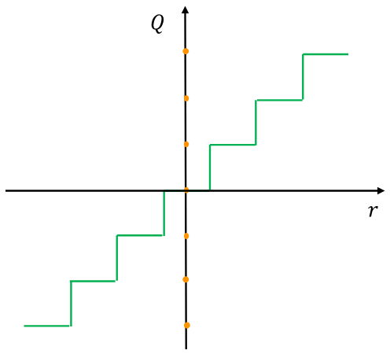

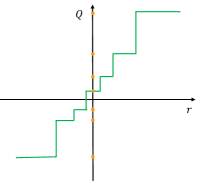

**図1.** 均一量子化（左）と非均一量子化（右）の比較。連続領域$r$の実数値は、量子化領域$Q$の離散的で低精度な値にマップされ、オレンジの弾丸で示される。均一量子化では量子化値（量子化レベル）間の距離は同じであるが、非均一量子化では変化することがある点に注意。

## III 量子化の基本概念

本節では、まずセクション [III-A](#S3.SS1) で一般的な記法と問題設定を簡単に紹介し、その後、セクション [III-B](#S3.SS2)-[III-F](#S3.SS6) で基本的な量子化の概念と方法を説明します。その後、セクション [III-G](#S3.SS7) で異なるファインチューニング手法について議論し、続いてセクション [III-H](#S3.SS8) で確率的量子化について説明します。

### III-A 問題設定と記法

ニューラルネットワーク （NN） が $L$ 層の学習可能なパラメータを持つと仮定し、それを $\{W_{1},W_{2},...,W_{L}\}$ と表し、$\theta$ をそのすべてのパラメータの組み合わせとします。一般性を失うことなく、次の経験的リスク最小化関数を最適化することを名目上の目標とする教師あり学習問題に焦点を当てます：

$$
\small\mathcal{L}(\theta)=\frac{1}{N}\sum_{i=1}^{N}l(x_{i},y_{i};\theta),\tag{1}
$$

$(x,y)$ は入力データと対応するラベル、$l(x,y;\theta)$ は損失関数（例：平均二乗誤差やクロスエントロピー損失）、$N$ はデータ点の総数を表します。また、$i^{\mathrm{th}}$層の入力隠れた活性化を$h_{i}$、対応する出力隠れ活性化を$a_{i}$と表します。訓練済みのモデルパラメータが浮動小数点精度で格納されていると仮定します$\theta$。量子化では、パラメータ（$\theta$）および中間活性化マップ（すなわち$h_{i},\ a_{i}$）の精度を低精度に下げ、モデルの一般化力や精度への影響を最小限に抑えることが目標です。これを行うために、浮動小数点数点の値と量子化された値に写す量子化演算子を定義する必要があります。これは次に説明します。

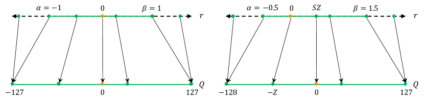

**図2.** 対称量子化および非対称量子化の図。制限された範囲を持つ対称量子化では実数値を \[-127, 127\]、フルレンジを \[-128, 127\] に写像し、8ビット量子化を行います。

### III-B 一様量子化

まず、NNの重みと活性化を有限の値集合に量子化できる関数を定義する必要があります。この関数は浮動小数点で実数値を取り、[図1](#figure-01)に示すように、より低い精度の範囲にマッピングします。量子化関数としてよく選ばれる選択肢は以下の通りです。

$$
\small Q(r)=\mathrm{Int}\big{(}{r}/{S}\big{)}-Z,\tag{2}
$$

ここで $Q$ は量子化演算子、$r$ は実数値入力（活性化値または重み）、$S$ は実数値のスケーリング係数、$Z$ は整数のゼロポイントです。さらに、Int 関数は丸め操作（例：最近接丸めや切り捨て）を通じて実数値を整数値にマッピングします。本質的に、この関数は実数値 $r$ からいくつかの整数値へのマッピングです。この量子化方法は、結果として得られる量子化値（量子化レベルとも呼ばれる）が均等に配置されるため、均一量子化（uniform quantization）とも呼ばれます（[図1](#figure-01) 左）。また、量子化値が必ずしも均等に配置されない非均一量子化法も存在し（[図1](#figure-01) 右）、これらの方法についてはセクション [III-F](#S3.SS6) で詳しく説明されます。量子化値 $Q(r)$ から実数値 $r$ を回復することは、しばしば「デ量子化（dequantization）」と呼ばれる操作を通じて可能です：

$$
\small\tilde{r}=S(Q(r)+Z).\tag{3}
$$

。丸め操作のため、回復された実数値 $\tilde{r}$ は $r$ と完全に一致するわけではないことに注意してください。

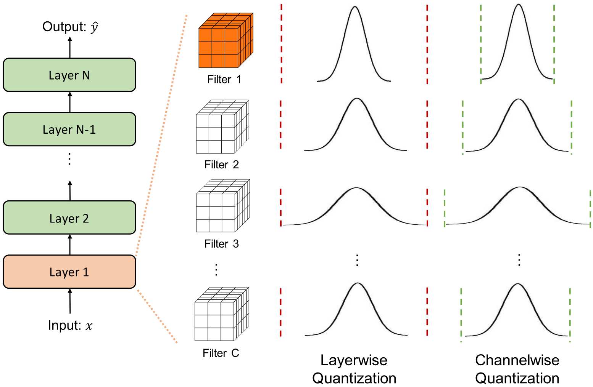

**図3.** 異なる量子化の粒度の例。レイヤー単位の量子化では、同じ層に属するすべてのフィルターに同じクリッピング範囲が適用されます。これにより、分布が狭いチャネル（図中のフィルター1など）では、量子化解像度が低くなる可能性があります。チャネル単位の量子化を使用することで、異なるチャネルに異なるクリッピング範囲を割り当てることができ、より良い量子化解像度を達成できます。

### III-C 対称および非対称量子化

一様量子化における重要な要素の一つは、スケーリングファクターの選択です。
$S$ 式 [2] におけるスケーリングファクター （#S3.E2「III-B 一様量子化 ‣ III 量子化の基本概念 ‣ 効率的なニューラルネットワーク推論のための量子化手法の調査」） は、
$r$ 実数値の与えられた範囲を [Xivar18, CVPRk18] で述べられているように、いくつかの分割に分割します：

$$
\small S=\frac{\beta-\alpha}{2^{b}-1},\tag{4}
$$

で、$[\alpha,\beta]$ はクリッピング範囲、つまり実際の値をクリップする際の有限の範囲を示し、$b$ は量子化ビット幅を示します。したがって、スケーリングファクターを定義するためには、まずクリッピング範囲 $[\alpha,\beta]$ を決定する必要があります。クリッピング範囲を選択するプロセスは、しばしばキャリブレーションと呼ばれます。単純な選択肢としては、クリッピング範囲として信号の最小値/最大値、つまり $\alpha=r_{\min}$ と $\beta=r_{\max}$ を使用する方法があります。この方法は、クリッピング範囲が必ずしも原点に対して対称でないため、*非対称量子化* スキームになります。すなわち、$-\alpha\neq\beta$ であり、[図2](#figure-02)（右）に示されています。また、対称クリッピング範囲 $\alpha=-\beta$ を選択することで、*対称量子化* スキームを使用することも可能です。一般的な選択肢は、信号の最小値/最大値に基づいてこれらを選ぶことです： $-\alpha=\beta={\max(|r_{\max}|,|r_{\min}|)}$。非対称量子化は、対称量子化と比べてより厳しいクリッピング範囲となることが多いです。これは、ターゲットとなる重みやアクティベーションが不均衡である場合、例えば常に非負の値を持つ ReLU 後のアクティベーションなどにおいて特に重要です。一方で、対称量子化を使用すると、量子化関数を Eq. [2](#S3.E2) の中でゼロポイントを $Z=0$ に置き換えることで簡略化できます：

$$
\small Q(r)=\mathrm{Int}\left(\frac{r}{S}\right).\tag{5}
$$

ここでは、スケーリング係数に対して2つの選択肢があります。「フルレンジ」の対称量子化では、Sは$\frac{2\max(|r|)}{2^{n}-1}$（切り捨て丸めモード）として選ばれ、[-128,127] のINT8全体の範囲を使用します。しかし、「制限レンジ」では、Sは$\frac{\max(|r|)}{2^{n-1}-1}$ として選ばれ、[-127,127] の範囲のみを使用します。予想通り、フルレンジのアプローチの方がより正確です。対称量子化は、重みを量子化する際に広く採用されています。これは、ゼロポイントをゼロにすることで推論中の計算コストが削減できる[Xivd04]こと、また実装がより単純になるためです。しかし、活性化に関しては、非対称活性化によるオフセットの影響で生じる交差項は静的なデータ非依存の項であり、バイアスに吸収する（またはアキュムレータを初期化する際に使用する）ことができることに注意してください[Worksb20]。

信号の最小値/最大値を用いた対称および非対称量子化は、一般的な方法です。しかし、このアプローチはアクティベーションの外れ値に影響を受けやすいです。これにより、範囲が不必要に広がり、その結果、量子化の解像度が低下する可能性があります。この問題に対処する一つの方法は、信号の最小値/最大値の代わりにパーセンタイルを使用することです [Xivae18]。つまり、最大値/最小値の代わりに、i 番目に大きい値/小さい値を $\beta$/$\alpha$ として使用します。もう一つの方法は、実際の値と量子化された値の間の KL ダイバージェンス（すなわち情報損失）を最小化するために $\alpha$ と $\beta$ を選択することです [Techna17]。興味のある読者は、様々なモデルで異なるキャリブレーション方法が評価されている [Xivd04] を参照してください。

要約（対称量子化 vs 非対称量子化）。対称量子化は、対称の範囲を用いてクリッピングを分割します。これにより実装が容易になるという利点があります。これは Eq. [2] に示される $Z=0$ に繋がります （#S3.E2 "III-B 均一量子化 ‣ 量子化の基本概念 ‣ 効率的なニューラルネットワーク推論のための量子化手法の調査"）。しかし、範囲が非対称で歪む可能性がある場合には最適ではありません。そのような場合には非対称量子化が推奨されます。

### III-D 範囲キャリブレーションアルゴリズム： 静的対動的量子化

これまで、$[\alpha,\beta]$のクリッピング範囲を決定するためのさまざまなキャリブレーション方法について議論しました。量子化方法のもう一つの重要な差別化要因は、クリッピング範囲がいつ決定されるかです。この範囲は、推論中にパラメータが固定されている場合がほとんどであるため、重みについて静的に計算することができます。しかし、活性化マップは入力サンプルごとに異なります（式 [1] の$x$において （#S3.E1 "III-A 問題設定と表記 ‣ III 量子化の基本概念 ‣ 効率的なニューラルネットワーク推論のための量子化手法の調査" ））。したがって、活性化を量子化するには、動的量子化と静的量子化の2つのアプローチがあります。

動的量子化では、この範囲はランタイム中に各活性化マップごとに*動的に*計算されます。このアプローチでは、信号統計（最小値、最大値、パーセンタイルなど）をリアルタイムで計算する必要があり、非常に高いオーバーヘッドが発生する場合があります。しかし、動的量子化は、入力ごとに信号範囲が正確に計算されるため、精度が高くなることが多いです。

もう一つの量子化手法は静的量子化であり、この方法ではクリッピング範囲が事前に計算され、推論中は*静的*です。この手法は計算コストを追加しませんが、通常、動的量子化に比べて精度が低くなります。事前計算の一般的な方法は、一連のキャリブレーション入力を実行してアクティベーションの典型的な範囲を計算することです [CVPRk18, Xive11]。最適な範囲を見つけるために、元の非量子化された重み分布と対応する量子化値との平均二乗誤差（MSE）を最小化するなど、複数の異なる指標が提案されています [Xivu15, Fixeda16, Worksa19, Reseaa19]。他の指標、例えばエントロピー [Recogb17] を使用することも考えられますが、MSE が最も一般的に使用される方法です。別のアプローチとして、NNのトレーニング中にこのクリッピング範囲を学習または課す方法があります [CVPR19, Xivan18, Xivab16, ECCVm18]。ここでの注目すべき研究には、LQNets [ECCVm18]、PACT [Xivan18]、LSQ [Xivf02]、および LSQ [Worksb20] があり、トレーニング中にNN内でクリッピング範囲と重みを共同で最適化します。

要約（動的量子化 vs 静的量子化）： 動的量子化は各アクティベーションのクリッピング範囲を動的に計算し、しばしば最高の精度を達成します。しかし、信号の範囲を動的に計算することは非常にコストがかかるため、実務者はほとんどの場合、すべての入力に対してクリッピング範囲が固定された静的量子化を使用します。

### III-E 量子化粒度

ほとんどのコンピュータビジョンのタスクでは、レイヤーへの活性化入力が多くの異なる畳み込みフィルタと畳み込まれます（[図 3](#figure-03)に示す通り）。これらの畳み込みフィルタのそれぞれは、異なる値の範囲を持つことがあります。そのため、量子化手法の1つの区別点は、重みのクリッピング範囲$[\alpha,\beta]$がどの粒度で計算されるかです。これらは次のように分類されます。

##### レイヤー単位の量子化

このアプローチでは、クリッピング範囲はレイヤー内の畳み込みフィルタのすべての重みを考慮して決定されます[Xivar18]、[図 3](#figure-03)の第3列に示す通りです。ここでは、そのレイヤー内の全てのパラメータの統計（例：最小値、最大値、パーセンタイルなど）を調べ、それからすべての畳み込みフィルタに同じクリッピング範囲を使用します。この方法は実装が非常に簡単ですが、各畳み込みフィルタの範囲が大きく異なることが多いため、最適な精度を得られないことがよくあります。例えば、比較的狭いパラメータ範囲を持つ畳み込みカーネルは、同じレイヤー内のより広い範囲を持つ別のカーネルによって量子化解像度を失う可能性があります。

##### グループ単位の量子化

複数の異なるチャネルを1つのレイヤー内にグループ化して、クリッピング範囲（アクティベーションまたは畳み込みカーネルのいずれか）を計算することができます。これは、単一の畳み込みやアクティベーションにおけるパラメータの分布が大きく異なる場合に役立つことがあります。たとえば、このアプローチは、完全結合型注意層で構成されるTransformer [Advana17]モデルを量子化する際に、Q-BERT [AAAI20]で有効であることがわかっています。しかしながら、このアプローチには、異なるスケーリングファクターを考慮する追加コストが避けられません。

##### チャネルごとの量子化

クリッピング範囲の一般的な選択肢は、他のチャネルに依存せず、各畳み込みフィルタに固定値を使用することです[Xivaa16, ECCVm18, CVPRk18, Xivar18, The21, Advanj20]。これは[図3](#figure-03)の最終列に示されています。つまり、各チャネルに専用のスケーリングファクターが割り当てられます。これにより、より良い量子化解像度が確保され、多くの場合、精度が向上します。

##### サブチャネルごとの量子化

前述のアプローチは、畳み込み層や完全結合層の任意のパラメータグループに基づいてクリッピング範囲を決定する極端な方法にまで拡張できます。ただし、このアプローチは、異なるスケーリングファクターを単一の畳み込みや完全結合層の処理時に考慮する必要があるため、かなりのオーバーヘッドを追加する可能性があります。したがって、グループ単位の量子化は、量子化解像度と計算オーバーヘッドの間で良い妥協を確立することができます。

要約（量子化粒度）。チャネル単位の量子化は、現在畳み込みカーネルの量子化に用いられる標準的な方法です。これにより、実務者は各カーネルごとにクリッピング範囲を調整することができ、そのオーバーヘッドはほとんど無視できる程度です。これに対して、サブチャネル単位の量子化は大きなオーバーヘッドが生じる可能性があり、現在の標準的な選択肢ではありません（これらの設計選択に伴うトレードオフについては、関心のある読者は [Xiv21] も参照してください）。

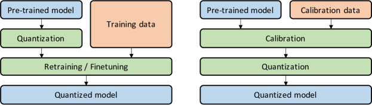

**図4.** 量子化対応学習（QAT、左）と事後トレーニング量子化（PTQ、右）の比較。QAT では、事前学習モデルを量子化し、その後トレーニングデータを用いて微調整を行い、パラメータを調整して精度の低下を回復します。PTQ では、事前学習モデルを較正データ（例：トレーニングデータの小さなサブセット）を使用して較正し、クリッピング範囲やスケーリングファクタを計算します。その後、モデルは較正結果に基づいて量子化されます。なお、較正プロセスは、QAT の微調整プロセスと並行して行われることが多いことに注意してください。

### III-F 非一様量子化

文献の中には、量子化ステップだけでなく量子化レベルも不均一に配置できる非均一量子化 [Xivk14, Recogc16, PMLR15, Xivah16, Xivt15, Xivam16, Xivae16, Recogd17, ECCVj18, ECCVm18, IEEEc18, Xivf05, Recoge19, Recoaa19, Recogb18, Recoge18, IEEEd18, Recogb17, Advanl20, Repree21] を検討したものもあります。非均一量子化の正式な定義は式 [6](#S3.E6) に示されており、ここで $X_{i}$ は離散量子化レベル、$\Delta_{i}$ は量子化ステップ（しきい値）を表します：

$$
\small Q(r)=X_{i},\leavevmode\nobreak\ \mathrm{if}\leavevmode\nobreak\ r\in[\Delta_{i},\Delta_{i+1}).\tag{6}
$$

具体的には、実数 $r$ の値が量子化ステップ $\Delta_{i}$ と $\Delta_{i+1}$ の間にある場合、量子化器 $Q$ はそれを対応する量子化レベル $X_{i}$ に投影します。$X_{i}$ も $\Delta_{i}$ も均等に間隔があいているわけではないことに注意してください。

非均一量子化は、固定ビット幅に対してより高い精度を達成できる可能性があります。これは、重要な値の領域により多く注目したり適切な動的範囲を見つけたりすることで、分布をよりよく捉えることができるためです。例えば、重みや活性化のベル型分布に対して、長い尾を伴うことが多い分布のために設計された多くの非均一量子化手法があります [Xival18, Recogd17, Xive09, Xivam16, Quanta19, Sprind20]。典型的なルールベースの非均一量子化は、量子化ステップとレベルが線形ではなく指数関数的に増加する対数分布を使用することです [Xivam16, Xivac17]。もう一つの一般的な手法は二進コードベース量子化であり [Xivf05, Xivai18, ECCVm18, Recoga17, Advana16]、実数ベクトル $\mathbf{r}\in\mathbb{R}^{n}$ が $m$ に量子化され、スケーリング係数 $\alpha_{i}\in\mathbb{R}$ および二進ベクトル $\mathbf{b}_{i}\in\{-1,+1\}^{n}$ を用いて $\mathbf{r}\approx\sum_{i=1}^{m}\alpha_{i}\mathbf{b}_{i}$ を表現します。$\mathbf{r}$ と $\sum_{i=1}^{m}\alpha_{i}\mathbf{b}_{i}$ の間の誤差を最小化する閉形式の解は存在しないため、従来の研究はヒューリスティックな解決策に依存しています。量子化器をさらに改善するために、最近の研究では [Intelc17, Recoga17, Xivai18] 非均一量子化を最適化問題として定式化しています。式 [7] （#S3.E7 "III-F 非均一量子化 ‣ III 量子化の基本概念 ‣ 効率的なニューラルネットワーク推論のための量子化手法調査"） に示されるように、量子化器 $Q$ の量子化ステップ/レベルは、元のテンソルと量子化された対応物との違いを最小化するように調整されます。

$$
\small\min_{Q}\|Q(r)-r\|^{2}\tag{7}
$$

さらに、量子化器自体もモデルのパラメータと共同で学習させることができます。これらの方法は学習可能な量子化器と呼ばれ、量子化のステップやレベルは一般的に反復的最適化 [ECCVm18, Xivai18] や勾配降下法 [Xivah17, Recoge19, Recoaa19] で学習されます。

ルールベースおよび最適化ベースの非一様量子化に加え、クラスタリングも量子化による情報損失を軽減するのに有効です。ある研究では [Xivk14, Recogc16]、異なるテンソルに対してk-meansを使用して量子化のステップおよびレベルを決定していますが、他の研究 [Xivae16] では、性能損失を最小化するために重みへのヘッセ行列加重k-meansクラスタリングを適用しています。さらに詳細な議論はセクション [IV-F](#S4.SS6) に記載されています。

まとめ（均等量子化 vs 非均等量子化）。一般的に、非均等量子化により、ビットの割り当てやパラメータの範囲を非均等に離散化することで信号情報をより良く捉えることが可能です。しかし、非均等量子化方式はGPUやCPUなどの一般的な計算ハードウェア上で効率的に展開することが通常難しいです。このため、均等量子化はその単純さとハードウェアへの効率的なマッピングのために、現在では事実上の標準的手法となっています。

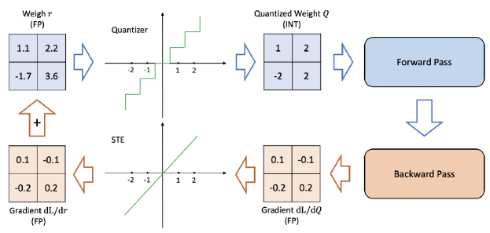

**図5.** STE（Straight Through Estimator）の使用を含む量子化対応学習の手順の図解。

### III-G 微調整方法

量子化後にニューラルネットワークのパラメータを調整する必要があることが多いです。これは、モデルを再学習することで行うこともでき、このプロセスは量子化対応トレーニング（Quantization-Aware Training, QAT）と呼ばれます。または、再学習を行わずに実施することも可能で、このプロセスはしばしば事後量子化（Post-Training Quantization, PTQ）と呼ばれます。これら二つのアプローチの概略比較は[図4](#figure-04)に示されており、以下でさらに詳しく説明します（このトピックの詳細な議論については[Xivax21]を参照してください）。

#### III-G1 量子化対応トレーニング

訓練済みモデルが与えられた場合、量子化は訓練済みモデルのパラメータに摂動を導入する可能性があり、これによりモデルは浮動小数点精度で訓練されたときに収束したポイントから離れてしまうことがあります。この問題には、量子化されたパラメータでニューラルネットワークモデルを再訓練することで対処でき、モデルがより良い損失のポイントに収束できるようにすることが可能です。一般的なアプローチのひとつは量子化対応訓練（Quantization-Aware Training, QAT）を使用することであり、この方法では、通常の順伝播と逆伝播は浮動小数点で量子化されたモデルに対して行われますが、各勾配更新後にモデルパラメータが量子化されます（射影勾配降下法に類似）。特に、浮動小数点精度で重みの更新が行われた後にこの射影を行うことが重要です。逆伝播を浮動小数点で行うことは重要であり、量子化精度で勾配を蓄積すると、ゼロ勾配や高い誤差を持つ勾配が発生する可能性があり、特に低精度の場合に顕著です。 [Advana15, Xivt15, Advana16, Sprinb16, Xivaf16, IEEEb18, Reprei21, Xivd07]

バックプロパゲーションにおける重要な微妙な点は、非微分可能な量子化演算子（式 [2](#S3.E2)）がどのように扱われるかです。近似を行わない場合、この演算子の勾配はほぼ全ての点でゼロになります。なぜなら、式 [2](#S3.E2) の丸め操作は区分的に平坦な演算子だからです。この問題に対処するための一般的な手法は、いわゆる直通推定器（Straight Through Estimator, STE）[Bengio13] によってこの演算子の勾配を近似することです。STEは本質的に丸め操作を無視し、それを恒等関数で近似します（[図 5](#figure-05) に示す通りです）。

STEの粗い近似にもかかわらず、バイナリ量子化のような超低精度量子化[Xivaj18]を除き、実際にはうまく機能することが多いです。[Xivc03]の研究はこの現象に対する理論的な正当化を提供しており、STEの粗い勾配近似は期待値として母集団勾配と相関し得ることを示しています（STEの適切な選択の場合）。歴史的な観点から言うと、STEの元々のアイデアは[Labora57, Buffaa61]の画期的な研究にまで遡ることができ、そこで恒等演算子がバイナリニューロンからの勾配を近似するために使用されました。

STE が主流のアプローチである一方で [IEEEe18, Repreh21]、文献では他のアプローチも検討されています [Inc19, Xivc04, Recogd17, ECCVg18, Intela18, Advanc20]。まず最初に述べるべきことは [Bengio13]、STE の代替として確率的ニューロンアプローチを提案していることです（これはセクション [III-H](#S3.SS8) で簡単に議論されています）。組合せ最適化を用いたアプローチ [Xivag17]、ターゲット伝播 [Sprina15]、または Gumbel-softmax [Xivaj16] を用いたアプローチも提案されています。もう一つの異なる代替手法のクラスは、重みを量子化するために正則化演算子を使用しようとするものです。これにより、式 [2](#S3.E2) の非微分可能な量子化演算子を使用する必要がなくなります。これらはしばしば *Non-STE* メソッドと呼ばれます [Xivao18, Xivaj18, Xivaf18, Intela18, Xivah16, Xivac17, Xive02]。最近の研究には、量子化式（式 [2](#S3.E2)）における丸め操作を取り除き、代わりに重みを量子化値に強制するためにいわゆる *W 形* の非滑らかな正則化関数を使用する ProxQuant [Xivaj18] が含まれます。他の注目すべき研究には、不連続点の導関数を近似するためにパルストレーニングを使用する方法 [Netwoa18]、または量子化された重みを浮動小数点パラメータと量子化パラメータのアフィン結合で置き換える方法 [Xiva03] があります。[PMLRa20] の最近の研究では、最も近い値への丸め法の代替として適応丸め法である AdaRound を提案しています。この分野で興味深い研究が行われているにもかかわらず、これらの手法はしばしば多くの調整を必要とし、現時点では STE アプローチが最も一般的に使用されている方法です。

モデルのパラメータを調整することに加えて、いくつかの先行研究ではQAT中に量子化パラメータを学習することも効果的であるとされています。PACT [Xivan18]は均一量子化の下でアクティベーションのクリッピング範囲を学習し、QIT [Recoge19]は非均一量子化設定への拡張として量子化ステップとレベルも学習します。LSQ [Xivf02]は、QAT中に非負のアクティベーション（例：ReLU）のスケーリングファクターを学習するための新しい勾配推定を導入し、LSQ [Worksb20]はこのアイデアを負の値を生成する一般的なアクティベーション関数（例：swish [Xival17]およびh-swish [Visioc19]）にさらに拡張します。

要約（QAT）。STEの粗い近似にもかかわらず、QATは有効であることが示されています。しかし、QATの主な欠点は、NNモデルを再訓練する計算コストです。この再訓練は、特に低ビット精度量子化の場合、精度を回復するために数百エポック行う必要があるかもしれません。量子化モデルが長期間展開される予定であり、効率と精度が特に重要な場合、この再訓練への投資はおそらく価値があります。しかし、これは常に当てはまるわけではなく、いくつかのモデルは比較的短い寿命しか持たない場合があります。次に、このオーバーヘッドがない代替アプローチについて説明します。

#### III-G2 後処理量子化

高価なQAT方式の代替として、Post-Training Quantization（PTQ）があります。PTQはファインチューニングを行わずに量子化と重みの調整を実施します [Xivak18, PMLR19, Worksa19, Reseaa19, Sprind20, Xivg02, Xivab18, Visiod19, Recogg20, Repred21, ECCVd18, Xiv21, Xiva21, Xivc06, Xivk21]。そのため、PTQのオーバーヘッドは非常に低く、しばしば無視できる程度です。再訓練に十分な量のトレーニングデータを必要とするQATとは異なり、PTQはデータが限られている場合やラベルなしのデータでも適用できるという追加の利点があります。しかし、これはしばしば精度がQATに比べて低くなるという代償を伴い、特に低精度量子化の場合に顕著です。

この理由により、PTQの精度低下を軽減するために複数のアプローチが提案されています。例えば、[Xivak18, Xivb06] は量子化後の重み値の平均と分散に固有のバイアスが存在することを観察し、バイアス補正方法を提案しています。また、[PMLR19, Visiod19] は異なる層やチャンネル間で重みの範囲（および暗黙的にアクティベーションの範囲）を等化することで量子化誤差を減らせることを示しています。ACIQ [Xivak18] はPTQの最適クリッピング範囲とチャンネルごとのビット幅設定を解析的に計算します。ACIQは低い精度低下を達成できますが、ACIQで使用されるチャンネルごとのアクティベーション量子化はハードウェア上で効率的に展開するのが難しいです。これに対処するために、OMSE法 [Worksa19] はアクティベーションのチャンネルごとの量子化を除去し、量子化されたテンソルと対応する浮動小数点テンソル間のL2距離を最適化することでPTQを実行することを提案しています。さらに、PTQへの外れ値の悪影響をよりよく緩和するために、外れ値を含むチャンネルを複製して半分に分ける外れチャンネル分割（OCS）法が[Reseaa19]で提案されています。もう一つの注目すべき研究はAdaRound [PMLRa20]であり、量子化における単純な四捨五入（round-to-nearest）方法が直感に反して最適でない解を生む可能性があることを示し、損失をよりよく減少させる適応的な丸め方法を提案しています。AdaRoundは量子化された重みの変更をフルプレシジョンの対応物から$\pm 1$以内に制限する一方、AdaQuant [Xivc06] は必要に応じて量子化された重みを変更できるより一般的な方法を提案しています。PTQスキームは極端な形にまで取られることがあり、量子化中に学習データもテストデータも使用しない（いわゆるゼロショットシナリオ）場合もあり、これは次に説明されます。

概要 （PTQ）。PTQでは、すべての重みとアクティベーションの量子化パラメータが、NNモデルの再学習なしで決定されます。このため、PTQはNNモデルの量子化において非常に高速な方法です。しかし、これはしばしばQATと比較して精度の低下という代償を伴います。

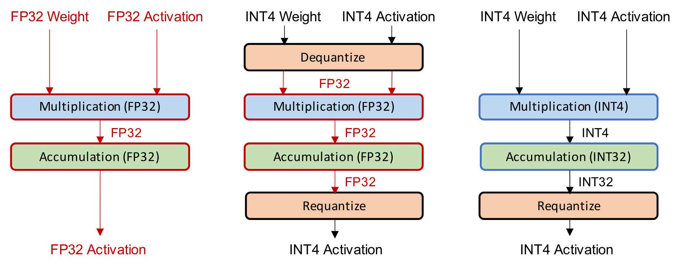

**図6.** フル精度推論（左）、シミュレートされた量子化による推論（中央）、および整数のみの量子化による推論（右）の比較。

#### III-G3 ゼロショット量子化

これまで述べたように、量子化後の精度低下を最小限に抑えるためには、トレーニングデータの全体または一部にアクセスする必要があります。まず、アクティベーションの範囲を知る必要があり、値をクリップして適切なスケーリング係数を決定します（文献では通常キャリブレーションと呼ばれます）。次に、量子化モデルは精度低下を回復するためにモデルパラメータを微調整することがよく必要です。しかし多くの場合、量子化手順中に元のトレーニングデータにアクセスすることはできません。これは、トレーニングデータセットが大きすぎて配布不可能であるか、専有（例：GoogleのJFT-300M）であるか、またはセキュリティやプライバシー上の理由で機密である（例：医療データ）ためです。この課題に対処するために、いくつかの異なる方法が提案されており、これをゼロショット量子化（ZSQ）と呼びます。[Visiod19]に触発され、ここではまず二つの異なるレベルのゼロショット量子化について説明します：

- レベル 1： データなしかつ微調整なし （ZSQ PTQ）。
- レベル 2： データは不要だが微調整が必要 （ZSQ QAT）。

レベル 1 は、微調整なしでより速く簡単に量子化を可能にします。微調整は一般的に時間がかかり、追加のハイパーパラメータ探索が必要になることが多いです。しかし、レベル 2 は通常精度が高くなる傾向があります。微調整は、特に超低ビット精度設定において、量子化されたモデルが精度低下を回復するのに役立つためです [Recoga20]。[Visiod19] の研究では、重みの範囲を均等化し、バイアス誤差を補正することで、データや微調整なしで NN モデルを量子化しやすくするレベル 1 アプローチを使用しています。しかし、この方法は（区分的）線形活性化関数のスケール共変性に基づいているため、GELU [Xivag16] 活性化を持つ BERT [Xiv18] や swish 活性化を持つ MobileNetV3 [Visioc19] [Xivaa17] のような非線形活性化を持つ NN では最適でない場合があります。

ZSQの研究で人気のある分野の一つは、ターゲットとなる事前学習済みモデルが学習された実際のデータに類似した合成データを生成することです。生成された合成データは、その後、量子化モデルの較正や微調整に使用されます。この分野の初期の研究[Visiof19]では、合成データ生成のために生成対向ネットワーク（GANs）[Xivl14]を活用しています。事前学習済みモデルを識別器として使用し、識別器によってうまく分類できるように生成器を訓練します。そして、生成器から収集した合成データサンプルを用いて、量子化モデルはフルプレシジョンの対応モデルからの知識蒸留で微調整されます（詳細はセクション[IV-D](#S4.SS4)を参照してください）。しかしながら、この方法では、生成がモデルの最終出力のみを使用して行われるため、実際のデータの内部統計（例えば、中間層のアクティベーションの分布）を捉えることはできません。内部統計を考慮していない合成データは、実データの分布を適切に表現できない可能性があります[Recoga20]。これに対処するために、その後の多くの研究は、バッチ正規化（BatchNorm）[PMLRa15]に保存されている統計量、すなわちチャンネルごとの平均と分散を用いて、より現実的な合成データを生成します。特に、[Recoga20]は内部統計のKLダイバージェンスを直接最小化することでデータを生成し、その合成データを用いて量子化モデルを較正および微調整します。さらに、ZeroQ [Recogg20]は、合成データが感度測定や較正にも使用できることを示しており、訓練/検証データにアクセスすることなく混合精度ポストトレーニング量子化を可能にします。ZeroQはまた、データ生成時に出力ラベルに依存しないため、ZSQをオブジェクト検出タスクに拡張しています。[Recoga20]および[Recogg20]は、入力画像を学習可能なパラメータとして設定し、その内部統計が実データの統計に近づくまで直接バックプロパゲーションを行います。さらに進めて、最近の研究[Worksa20, Sprinc20, Xivd21]では、実データ分布をよりよく捉え、より現実的な合成データを生成できる生成モデルを訓練して活用することが効果的であることが分かっています。

サマリー （ZSQ）。Zero Shot（別名データフリー）量子化は、トレーニング/検証データに一切アクセスすることなく、量子化全体を実行します。これは、顧客のワークロードのデプロイを加速したいが、データセットにアクセスする必要がない MLaaS（Machine Learning as a Service）プロバイダーにとって特に重要です。さらに、セキュリティやプライバシー上の懸念によりトレーニングデータへのアクセスが制限される場合にも重要です。

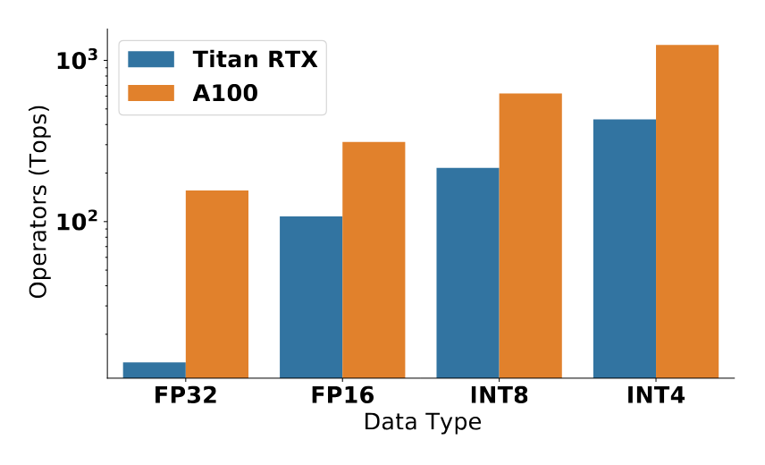

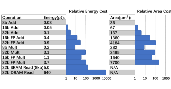

**図7.**（左）Titan RTX および A100 GPU における異なるビット精度ロジックのピークトループットの比較。（右）45nm 技術における異なる精度の対応するエネルギーコストおよび相対面積コストの比較 [Horowa14]。ご覧の通り、低精度は指数関数的に優れたエネルギー効率と高いスループットを提供します。

### III-H 確率的量子化

推論時、量子化スキームは通常決定論的です。しかし、これが唯一の可能性ではなく、いくつかの研究は量子化認識訓練や低精度訓練に対して確率的量子化を探求しています [Bengio13, PMLR15]。高レベルの直感としては、確率的量子化は決定論的量子化と比較して、ニューラルネットワークがより多く探索できる可能性があるということです。よく挙げられる支持する議論としては、小さな重みの更新が何の重みの変化ももたらさない可能性があるというもので、丸め操作が常に同じ重みを返す場合があります。しかし、確率的丸めを有効にすることで、ニューラルネットワークが*脱出*する機会を得て、そのパラメータを更新できる可能性があります。

より正式には、確率的量子化は浮動小数点数を、重みの更新量に関連する確率で上下にマッピングします。例えば、[PMLR15, Xivb10] において、式 [2]（#S3.E2 「III-B 一様量子化 ‣ III 量子化の基本概念 ‣ 効率的なニューラルネットワーク推論のための量子化手法の調査」） の Int 演算子は次のように定義されます。

$$
\small\mathrm{Int}(x)=\begin{cases}\lfloor x\rfloor\quad\mathrm{with\,probability\,}\lceil x\rceil-x,\\
\lceil x\rceil\quad\mathrm{with\,probability\,}x-\lfloor x\rfloor.\end{cases}\tag{8}
$$

しかし、この定義は二値量子化には使用できません。したがって、[Advana15] はこれを次のように拡張します。

$$
\small\mathrm{Binary}(x)=\begin{cases}-1\quad\mathrm{with\,probability\,}1-\sigma(x),\\
+1\quad\mathrm{with\,probability\,}\sigma(x),\end{cases}\tag{9}
$$

ここで Binary は実数 $x$ を二値化する関数であり、$\sigma(\cdot)$ はシグモイド関数です。

最近、QuantNoise [Xivc04] において別の確率的量子化手法が紹介されました。QuantNoise は各フォワードパスごとに異なるランダムな重みのサブセットを量子化し、偏りのない勾配でモデルを訓練します。これにより、多くのコンピュータビジョンおよび自然言語処理モデルにおいて、精度の大幅な低下なく低ビット精度の量子化が可能になります。しかし、確率的量子化手法の主な課題は、各重みの更新ごとに乱数を生成するオーバーヘッドであり、そのため現実の実装ではまだ広く採用されていません。

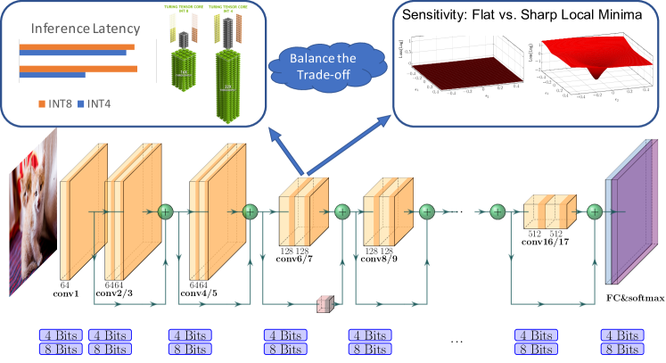

**図8.** 混合精度量子化のイラスト。混合精度量子化では、敏感で効率的な層を高精度に保持し、非敏感で非効率的な層にのみ低精度量子化を適用することを目的としています。効率性の指標はハードウェアに依存し、遅延やエネルギー消費である可能性があります。

## IV 高度な概念：8ビット未満の量子化

本節では、主にサブINT8量子化に使用される、より高度な量子化のトピックについて説明します。まず、セクション[IV-A](#S4.SS1)で、シミュレート量子化と整数のみ量子化の違いについて説明します。その後、セクション[IV-B](#S4.SS2)で混合精度量子化のさまざまな方法について説明し、次にセクション[IV-C](#S4.SS3)でハードウェア対応量子化について説明します。その後、セクション[IV-D](#S4.SS4)で蒸留を利用して量子化精度を向上させる方法を説明し、続いてセクション[IV-E](#S4.SS5)で極めて低ビット精度量子化について議論します。最後に、セクション[IV-F](#S4.SS6)でベクトル量子化のさまざまな方法について簡単に説明します。

### IV-A シミュレーションおよび整数のみの量子化

量子化されたNNモデルを展開する一般的な方法には、シミュレーション量子化（別名フェイク量子化）と整数のみの量子化（別名固定小数点量子化）の2つがあります。シミュレーション量子化では、量子化されたモデルパラメータは低精度で格納されますが、演算（例：行列乗算や畳み込み）は浮動小数点演算で実行されます。したがって、浮動小数点演算の前に、量子化されたパラメータをデ量子化する必要があります。[図6](#figure-06)（中央）に模式的に示されています。このため、シミュレーション量子化では、高速で効率的な低精度ロジックの利点を完全に活用することはできません。しかし、整数のみの量子化では、すべての演算が低精度整数演算で実行されます[CVPRk18, Xive11, Xivh21, PMLR16, Neuroa21]。[図6](#figure-06)（右）に示されているように、これにより、パラメータや活性化量を浮動小数点でデ量子化することなく、効率的な整数演算で推論全体を実行することが可能になります。

一般に、推論を浮動小数点演算でフル精度で行うことは、最終的な量子化精度に寄与する場合がありますが、これは低精度ロジックの利点を享受できないというコストを伴います。低精度ロジックは、遅延、消費電力、および面積効率の観点でフル精度のものよりも多くの利点があります。[図 7](#figure-07)（左）に示されているように、多くのハードウェアプロセッサ、例えば NVIDIA V100 や Titan RTX は、低精度演算の高速処理をサポートしており、推論のスループットと遅延を向上させることができます。さらに、45nm 技術 [Horowa14] における [図 7](#figure-07)（右）に示されるように、低精度ロジックはエネルギーと面積の観点で大幅に効率的です。例えば、INT8 の加算を行うことは、FP32 の加算と比較して $30\times$ エネルギー効率が高く、$116\times$ 面積効率も高いです。[Horowa14]。

注目すべき整数専用量子化の研究には、[PMLR16] があり、これはバッチ正規化を前の畳み込み層に融合させる方法であり、[CVPRk18] は、残差ネットワークに対するバッチ正規化付き整数専用計算法を提案しています。しかし、両方の方法は ReLU 活性化に限られています。最近の [Xivh21] の研究はこの制約に対処し、GELU を [Xivag16]、Softmax、および Layer Normalization を [Xivad16] 整数演算で近似し、さらに整数専用量子化を Transformer [Advana17] アーキテクチャに拡張しています。

二進量化は、整数のみを使用する量子化の別のクラスであり、すべてのスケーリングが二進数、すなわち分子に整数、分母に2の累乗を持つ有理数で行われます [Xive11]。これにより、整数の加算、乗算、ビットシフトのみを必要とし、整数の割り算は不要な計算グラフが得られます。重要なのは、この方法ではすべての加算（例えば、残差接続）が同じ二進スケールを持つように強制されるため、加算ロジックがより簡単で効率的になる可能性があることです。

シミュレート量子化と整数のみの量子化のまとめ。一般に、整数のみおよび二進量化は、シミュレート/フェイク量子化と比べてより望ましいです。これは、整数のみ量子化が算術に低精度のロジックを使用するのに対し、シミュレート量子化は演算を行うために浮動小数点ロジックを使用するためです。しかし、これはフェイク量子化がまったく役に立たないという意味ではありません。実際、フェイク量子化はコンピュートより帯域幅が制約となる問題、例えばレコメンデーションシステムのような場合に有益であることがあります [Xive06]。これらのタスクでは、ボトルネックはメモリ使用量とパラメータをメモリから読み込むコストです。したがって、この場合にフェイク量子化を行うことは許容されます。

### IV-B 混合精度量子化

ハードウェアの性能は、より低い精度の量子化を使用することで向上することは容易にわかります。しかし、モデルを均一に超低精度に量子化すると、精度が大幅に低下する可能性があります。この問題は混合精度量子化で解決可能です [Xivad17, IEEE19, Visioa19, Advank20, Xivl21, June20, Recoga78, Compra21, Repref21, Xivb07, Sprina20, Recogc21, Recogb21]。このアプローチでは、各層が異なるビット精度で量子化されます、[図8](#figure-08) に示されている通りです。このアプローチの課題の一つは、このビット設定を選択するための探索空間が層の数に対して指数関数的であることです。この巨大な探索空間に対処するために、さまざまなアプローチが提案されています。

各層の混合精度を選択することは本質的に探索問題であり、多くの異なる方法が提案されています。最近の [IEEE19] の研究では、強化学習（RL）に基づく方法を提案して、量子化ポリシーを自動的に決定し、RLエージェントのフィードバックにハードウェアアクセラレータのフィードバックを取り入れるためにハードウェアシミュレータを使用しました。[Xivah18] の論文では、混合精度構成探索問題をニューラルアーキテクチャ探索（NAS）問題として定式化し、Differentiable NAS（DNAS）方法を用いて効率的に探索空間を探索しました。これらの探索ベースの方法 [IEEE19, Xivah18] の欠点の一つは、しばしば大規模な計算リソースを必要とし、性能がハイパーパラメータや初期化に対して敏感であることです。

もう一つの混合精度法のクラスは、周期関数正則化を使用して、異なる層とそれらの精度に対する重要性の違いを自動的に識別しながら、それぞれのビット幅を学習することで混合精度モデルを訓練する方法である [Xivaf18]。

これらの探索および正則化ベースのアプローチとは異なり、HAWQ [Visioa19] は、モデルの二次感度に基づいて混合精度設定を見つける自動的な方法を導入している。理論的には、二次演算子（すなわちヘッセ行列）のトレースは層の量子化に対する感度を測定するために使用できることが示されている [Advana20]、これは Optimal Brain Damage の画期的な研究での剪定に関する結果に類似している [Advana90]。HAWQv2 では、この方法が混合精度の活性化量子化に拡張され [Advana20]、RLベースの混合精度法よりも100倍以上高速であることが示された [IEEE19]。最近では、HAWQv3 において、整数のみのハードウェア認識量子化が導入され [Xive11]、特定のアプリケーション制約（例えば、モデルサイズやレイテンシ）に対して最適なビット精度を見つけるための高速整数線形計画法が提案された。この研究では、混合精度量子化のハードウェア効率に関する一般的な疑問にも対応しており、T4 GPU 上で直接実行することで、INT8 量子化と比較して混合精度（INT4/INT8）量子化で最大50%の速度向上が示された。

概要（混合精度量子化）。混合精度量子化は、さまざまなニューラルネットワークモデルの低精度量子化において、効果的かつハードウェア効率の高い方法であることが証明されています。このアプローチでは、ニューラルネットワークのレイヤーを量子化に対して敏感なもの／鈍感なものに分類し、各レイヤーに高ビット／低ビットを使用します。このようにして、精度の低下を最小限に抑えつつ、低精度量子化によるメモリ使用量の削減や処理速度の向上の恩恵を受けることができます。最近の研究[Xive11]でも、このアプローチはハードウェア効率が高いことが示されており、混合精度は操作／レイヤー間でのみ使用されます。

### IV-C ハードウェア認識量子化

量子化の目標の1つは推論の待ち時間を改善することです。しかし、すべてのハードウェアが同じレベルでスピードアップを提供するわけではありません。実際、量子化による利点はハードウェア依存であり、オンチップメモリ、帯域幅、キャッシュ階層など、多くの要因が量子化による速度向上に影響を与えます。

ハードウェア認識型量子化による最適な効果を達成するためには、この事実を考慮することが重要です [Recogc16, IEEE19, ECCVe18, Xivah18, ECCVl18, Xive11, Sprinb20, Xivc21]。特に、研究 [IEEE19] では、異なるビット幅を持つ異なるレイヤーに対するレイテンシのルックアップテーブルに基づいて、強化学習エージェントを使用してハードウェア認識型の混合精度設定を決定しています。しかし、このアプローチではシミュレーションされたハードウェアのレイテンシを使用しています。これに対処するために、最近の研究 [Xive11] では、量子化された演算を直接ハードウェアに展開し、異なる量子化ビット精度における各レイヤーの実際の展開レイテンシを測定しています。

### IV-D 蒸留支援量子化

量子化における興味深い研究分野の一つは、量子化精度を向上させるためにモデル蒸留を組み込むことです [Xivag18, Xivaj17, Xive11, Advane20]。モデル蒸留 [Xivm14, Xivs15, Xivaj17, Visioa10, Xivag18, Recogb19, Recogf20, Xivf07, IEEEe18] は、高い精度を持つ大きなモデルを教師として使用し、コンパクトな学生モデルの学習を支援する方法です。学生モデルの学習中には、単に正解クラスラベルを使用する代わりに、モデル蒸留は教師によって生成されたソフト確率を活用することを提案しています。これは入力に関するより多くの情報を含んでいる可能性があります。すなわち、全体の損失関数は学生の損失と蒸留損失の両方を組み込んでおり、通常は以下のように定式化されます：

$$
\small\mathcal{L}=\alpha\mathcal{H}(y,\sigma(z_{s}))+\beta\mathcal{H}(\sigma(z_{t},T),\sigma(z_{s},T))\tag{10}
$$

式[10]において（#S4.E10 「IV-D 蒸留支援量子化 ‣ IV 高度な概念： 8ビット未満の量子化 ‣ 効率的なニューラル ネットワーク推論のための量子化手法の調査」）、$\alpha$ および $\beta$ は、学生モデルからの損失と蒸留損失の量を調整するための重み係数であり、$y$ は正解クラスラベル、$\mathcal{H}$ はクロスエントロピー損失関数、$z_{s}$/$z_{t}$ は学生モデル/教師モデルによって生成されたロジット、$\sigma$ はソフトマックス関数、T は次のように定義される温度です：

$$
\small p_{i}=\frac{\exp{\frac{z_{i}}{T}}}{\sum_{j}\exp{\frac{z_{j}}{T}}}\tag{11}
$$

知識蒸留の従来の方法は、異なる知識源の探索に焦点を当てています。[Xivs15, Visioa10, Recogg19] はロジット（ソフト確率）を知識の源として使用し、[Xivm14, Recogc17, Recogb19] は中間層からの知識を活用しようとします。教師モデルの選択も十分に研究されており、[Minina17, Xivab17] は複数の教師モデルを使用して学生モデルを共同で監督する一方、[NeurIa18, Visioe19] は追加の教師モデルなしで自己蒸留を適用します。

### IV-E 極端な量子化

バイナリゼーションとは、量子化された値を1ビット表現に制限することで、メモリ使用量を32$\times$分大幅に削減する最も極端な量子化手法です。メモリ面での利点に加え、バイナリ（1ビット）およびトリナリ（2ビット）の演算は、ビット単位の算術で効率的に計算できることが多く、FP32やINT8などの高精度演算に比べて大幅な高速化が可能です。例えば、NVIDIA V100 GPUにおけるピークバイナリ算術性能はINT8の8倍です。しかし、単純なバイナリゼーション手法は精度の大幅な低下を招く可能性があります。そのため、この[Xivak16, Recoga09, Recoga78, Recoge20, Recogb20, Recogd20, Recoad19, Recogi19, Recogf19, Recoac19, Recogk19, Recogd19, Recogd17, Recoga17, IEEEc17, IEEE17, Advana19, Advang20, Advani20, Advand20, Advanh20, Repreb20, Reprea20, PMLR20, Repreg21, Reprej21, Reprec21, Xivb21, Recoga21]に対処するために様々な解決策を提案した研究が多数存在します。

ここでの重要な研究は BinaryConnect [Advana15] であり、これは重みを 1 または -1 のいずれかに制約するものです。このアプローチでは、重みは実数値のまま保持され、順伝播および逆伝播の際にのみ二値化され、二値化の効果をシミュレートします。順伝播中、実数値の重みは符号関数に基づいて 1 または -1 に変換されます。その後、ネットワークは STE を使用して非微分可能な符号関数を通じて勾配を伝播させる標準的な学習方法で訓練することができます。Binarized NN [Advana16] （BNN） はこの考えを拡張し、重みだけでなく活性化も二値化します。重みと活性化を同時に二値化することには、浮動小数点行列積というコストの高い計算を軽量な XNOR 演算とビットカウントに置き換えることができるため、レイテンシ向上という追加の利点があります。もう一つの興味深い研究は Binary Weight Network （BWN） と XNOR-Net であり、[Netwoa18] で提案されました。これらは、重みにスケーリング係数を取り入れ、1 または -1 の代わりに $\alpha$ または -$\alpha$ を使用することで、より高い精度を達成します。ここで、$\alpha$ は実数値の重みとその結果得られる二値化重みとの距離を最小化するために選ばれるスケーリング係数です。言い換えれば、実数値の重み行列 $W$ は $W\approx\alpha B$ として定式化することができ、ここで $B$ は次の最適化問題を満たす二値重み行列です。

$$
\small\alpha,B=\mathrm{argmin}\|W-\alpha B\|^{2}.\tag{12}
$$

さらに、多くの学習済み重みがゼロに近いという観察に着想を得て、重みや活性化を三値（例えば 1、0、-1）で制約することでネットワークを三値化する試みがなされており、これにより量子化された値が明示的にゼロになることが許可される [Xivt15, Xival16]。三値化はまた、バイナリ化と同様に高コストの行列積を排除することで推論の待機時間を劇的に減少させる。後に、Ternary-Binary Network（TBN） [ECCVk18] は、バイナリネットワークの重みと三値活性化を組み合わせることで、精度と計算効率の間で最適なトレードオフを達成できることを示している。

単純なバイナリ化や三値化の方法は、特に ImageNet の分類のような複雑なタスクにおいて通常は深刻な精度低下をもたらすため、極端な量子化における精度低下を低減するための多くの解決策が提案されてきた。[Recogc20] の研究は、これらの解決策を大きく三つの分岐に分類している。ここでは、それぞれの分岐について簡単に説明し、詳細について興味のある読者は [Recogc20] を参照するよう勧める。

##### 量子化誤差の最小化

解の最初の分岐は、実数値と量子化値の差を最小化することを目的としています[IEEEd17, Intelb18, Xivah17, ECCVg18, Xivak17, ECCV20, ICASSa20, Xivd09, Xivb03, Recogb18, IEEEc18]。実数値の重みや活性化を表すために単一の2進行列を使う代わりに、HORQ [IEEEd17]とABC-Netは[Xivah17]複数の2進行列、すなわち$W\approx\alpha_{1}B_{1}+\cdots+\alpha_{M}B_{M}$線形組み合わせを用いて量子化誤差を減らします。活性化を二項化すると、次の畳み込みブロックの表現能力が低下するという事実に触発され、[Xivak17]と[ECCV20]は、より広いネットワーク（すなわちフィルター数が多いネットワーク）の二分化が精度とモデルサイズの間で良いトレードオフを達成できることを示しました。

##### 失われ機能の改善

もう一つの分野の研究は損失関数の選択に焦点を当て[Xivah16, Xivap18, IEEEd18, Recogc19, Recogi19]。ここで重要な研究は、損失認識二分化と、二分化/三項化重みに関して損失を直接最小化する三項化[Xivah16, Xivap18]です。これは、重さを概ねて最終的な損失を考慮しない他のアプローチとは異なります。全精度教師モデルからの知識抽出も、バイナリゼーション/テナライズ[Distia18, Xivag18, Recogk19, Xivaj17]後の精度低下を回復する有望な方法として示されています。

##### 改良されたトレーニング方法

もう一つの興味深い分野は、バイナリ/テリナリーモデルのトレーニング方法の改善を目指しています[Improb18, Recogf19, Visiob19, Xivb04, ECCVg18, Xivaa16, Recoac19, Repres18]。多くの研究では、符号関数による勾配の逆伝播におけるSTEの限界が指摘されています。STEは重みや活性化の勾配のみを伝搬させるが、それらは \[-1, 1\] の範囲内にあります。これに対処するために、BNN [Improb18]符号関数の微分に対する連続近似を導入[Xivf09, Recogd20, Sciena19]し、符号関数の代わりに滑らかで微分可能な関数に置き換え、徐々に符号関数に近づいていきます。Bi-Real Net [ECCVg18]は、連続したブロック内のアクティベーションにアクティベーションを接続するアイデンティティショートカットを導入し、32ビットのアクティベーションを伝播させることができます。多くの研究が推論時間の遅延の削減に焦点を当てているのに対し、DoReFa-Net [Xivaa16]は重みや活性化に加えて勾配も量子化し、トレーニングの加速を図っています。

極端な量子化は、多くのCNNモデルにおいて、推論/訓練のレイテンシーおよびモデルサイズを大幅に削減することに成功しています。最近では、このアイデアを自然言語処理（NLP）タスクに拡張しようという試みも見られます [Xivg09, Xivb12, Xivg21, Xivf21]。大量のラベルなしデータで事前学習された最先端NLPモデル（例：BERT [Xiv18]、RoBERTa [Liua19]、GPTファミリー [Improa18, Blog19, Xivb05]）のモデルサイズと推論レイテンシーが非常に大きいことを考えると、極端な量子化はNLP推論タスクをエッジにもたらすための強力なツールとして浮上しています。

要約（極端な量子化）。極端に低ビット精度の量子化は非常に有望な研究分野です。しかし、既存の手法は、非常に広範なチューニングやハイパーパラメータ探索を行わない限り、ベースラインに比べて精度の低下が大きくなることが多いです。しかし、この精度低下は、それほど重要でないアプリケーションでは許容される場合があります。

### IV-F ベクトル量子化

セクション [II](#S2) で述べたように、量子化は機械学習で発明されたものではなく、情報理論、特にデジタル信号処理の分野で過去一世紀にわたって広く研究されてきました。圧縮ツールとして特に使用されています。しかし、機械学習のための量子化手法の主な違いは、基本的に元の信号に対して最小の変化/誤差で信号を圧縮することに関心があるわけではないという点です。その代わりに、目的は損失を可能な限り小さくするような低精度表現を見つけることです。そのため、量子化された重みや活性化が非量子化のものから大きく離れていても全く問題ありません。

とはいえ、DSP における古典的な量子化手法には、NN 量子化に応用されている興味深いアイデアが多くあり、とくにベクトル量子化 [MIT99] が挙げられます。特に、[IEEE10, Xivk14, Recogc16, Recogb17, Xivr15, Xivae17, ECCVi18, Recogc18, Reprea21] の研究では、重みを異なるグループにクラスタリングし、推論時には各グループの重心を量子化値として使用します。式 [13]（#S4.E13「IV-F ベクトル量子化 ‣ IV 高度な概念： 8 ビット未満の量子化 ‣ 効率的なニューラルネットワーク推論のための量子化手法の調査」） に示されるように、$i$ はテンソル内の重みのインデックス、$c_{1},...,c_{k}$ はクラスタリングによって見つかった $k$ の重心、$c_{j}$ は $w_{i}$ に対応する重心です。クラスタリング後、重み $w_{i}$ はコードブック（ルックアップテーブル）内の $c_{j}$ に関連するクラスタインデックス $j$ を持ちます。

$$
\small\min_{c_{1},...,c_{k}}\sum_{i}\|w_{i}-c_{j}\|^{2}\tag{13}
$$

k-平均クラスタリングを使用するだけで、精度の大きな低下なしにモデルサイズを $8\times$ まで削減できることが分かっています [Xivk14]。さらに、k-平均に基づくベクトル量子化をプルーニングおよびハフマン符号化と組み合わせて適用することで、モデルサイズをさらに削減することができます [Xivr15].

製品量子化 [Xivk14, Recogc16, Xive07] はベクトル量子化の拡張であり、重み行列をサブ行列に分割し、各サブ行列にベクトル量子化を適用します。基本的な製品量子化手法に加えて、クラスタリングのより細かい使用法により、精度をさらに向上させることができます。例えば、[Xivk14] では k-means 製品量子化後の残差をさらに再帰的に量子化します。また [Recogb17] では、著者らはより重要な量子化範囲に対してより多くのクラスタを適用し、情報をよりよく保持します。

## V 量子化とハードウェアプロセッサ

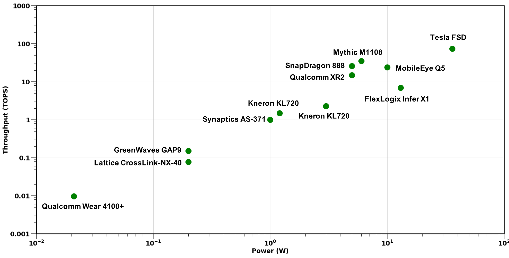

**図 9.** エッジでのニューラルネットワーク推論における異なる商用エッジプロセッサのスループット比較。

量子化はモデルサイズを削減するだけでなく、高速化を実現し、特に低精度ロジックを持つハードウェアにおいて消費電力を削減できると述べました。このため、量子化は IoT やモバイルアプリケーションでのエッジ展開において特に重要です。エッジデバイスは、計算、メモリ、そして重要な電力予算を含む厳しいリソース制約をしばしば抱えています。これらは、多くのディープニューラルネットワークモデルにとって満たすにはコストが高すぎることが多いです。さらに、多くのエッジプロセッサは浮動小数点操作をサポートしておらず、特にマイクロコントローラでは顕著です。

ここでは、量子化の観点からさまざまなハードウェアプラットフォームについて簡単に説明します。ARM Cortex-Mは、低コストで省電力な組み込みデバイス向けに設計された32ビットRISC ARMプロセッサコアのグループです。例えば、STM32ファミリーはARM Cortex-Mコアに基づくマイクロコントローラであり、エッジでのNN推論にも使用されます。一部のARM Cortex-Mコアには専用の浮動小数点ユニットが含まれていないため、モデルは展開する前にまず量子化する必要があります。CMSIS-NN [Xivaa18]は、ARMから提供されているライブラリで、NNモデルをARM Cortex-Mコアに量子化して展開するのに役立ちます。具体的には、このライブラリは固定小数点量子化[PMLR16, CVPRk18, Xive11]を使用して、2のべき乗のスケーリング係数を活用することで、量子化および逆量子化プロセスをビットシフト操作で効率的に実行できるようにしています。GAP-8 [Gap18]は、専用のCNNアクセラレータを備えたエッジ推論用のRISC-V SoC（システムオンチップ）であり、整数演算のみをサポートするエッジプロセッサのもう一つの例です。汎用のプログラム可能プロセッサは柔軟性のために広く採用されていますが、Google Edge TPUは、エッジで推論を実行するための専用ASICチップであり、これも新しいソリューションの一つです。膨大な計算資源を持つGoogleデータセンターで動作するクラウドTPUとは異なり、Edge TPUは小型で低電力のデバイス向けに設計されており、したがって8ビット演算のみをサポートします。NNモデルは、TensorFlowの量子化対応学習または事後訓練量子化を使用して量子化する必要があります。

[図9](#figure-09) は、エッジでのニューラルネットワーク推論に広く使用されているさまざまな商用エッジプロセッサのスループットを示しています。過去数年間で、エッジプロセッサの計算能力は大幅に向上しており、これにより、以前はサーバーのみで利用可能だった高コストのニューラルネットワークモデルのデプロイおよび推論が可能になっています。効率的な低精度ロジックと専用のディープラーニングアクセラレータと組み合わせた量子化は、このようなエッジプロセッサの進化の重要な原動力の一つとなっています。

多くのエッジプロセッサにとって量子化は不可欠な技術ですが、非エッジプロセッサにおいても、例えば99パーセンタイルレイテンシなどのサービスレベルアグリーメント（SLA）の要件を満たすために顕著な改善をもたらすことができます。最近のNVIDIAのTuring GPU、特にT4 GPUはその良い例であり、Turing Tensor Coreを含んでいます。Tensor Coreは、効率的な低精度行列乗算のために設計された特殊な実行ユニットです。

## VI 量子化研究の今後の方向性

ここでは、量子化に関する将来の研究におけるいくつかの高レベルな課題と機会について簡単に説明します。これは、量子化ソフトウェア、ハードウェアおよびニューラルネットワークアーキテクチャの共同設計、結合圧縮手法、および量子化訓練に分類されます。

量子化ソフトウェア： 現在の方法では、異なるニューラルネットワークモデルを精度を損なうことなくINT8に量子化して展開することは簡単です。INT8量子化モデルを展開するために使用できるいくつかのソフトウェアパッケージ（例： NvidiaのTensorRT、TVMなど）があり、それぞれには良好なドキュメントがあります。さらに、実装も非常に最適化されており、量子化による速度向上を簡単に確認できます。しかし、より低いビット精度の量子化用のソフトウェアは広く利用できるわけではなく、時には存在しないこともあります。例えば、NvidiaのTensorRTは現時点でサブINT8量子化をサポートしていません。さらに、INT4量子化のサポートは、最近になってTVM [Xive11]に追加されたばかりです。最近の研究では、INT4/INT8による低精度および混合精度の量子化が実際に機能することが示されています [Xive11, IEEE19, Xivc06, Xivad17, Visioa19, Advank20, Xivl21, June20, Recoga78, Compra21, Repref21, Xivb07, Sprina20]。したがって、低精度量子化のための効率的なソフトウェアAPIを開発することは重要な影響を与えるでしょう。

ハードウェアとニューラルネットワークアーキテクチャの共同設計： 前述のように、低精度量子化における古典的な研究と、最近の機械学習における研究との重要な違いは、ニューラルネットワークのパラメータが非常に異なる量子化値を持つ可能性があるにもかかわらず、依然として同様によく一般化できるという点です。例えば、量子化認識トレーニングを用いると、単精度パラメータを持つ元の解からは遠く離れた、異なる解に収束する可能性がありますが、それでも良好な精度を得ることができます。この自由度を活かし、量子化される際にニューラルネットワークアーキテクチャも適応させることができます。例えば、[ECCV20] の最近の研究では、ニューラルネットワークアーキテクチャの幅を変更することで、量子化後の一般化ギャップを減らすまたは取り除くことができることが示されています。将来の研究の一つの方向性は、モデル量子化時に深さや個々のカーネルなどの他のアーキテクチャパラメータも共同で適応させることです。もう一つの将来の研究の方向性は、この共同設計をハードウェアアーキテクチャに拡張することです。これは特に FPGA 展開に有用であり、乗算蓄積要素の異なるマイクロアーキテクチャなど、多くの異なるハードウェア構成を探求し、それをニューラルネットワークアーキテクチャおよび量子化共同設計と組み合わせることができます。

結合圧縮手法： 上述のように、量子化はニューラルネットワーク（NN）の効率的な展開のための方法の一つに過ぎません。その他の方法には、効率的なNNアーキテクチャ設計、ハードウェアとNNアーキテクチャの共同設計、プルーニング（剪定）、および知識蒸留があります。量子化はこれらの他のアプローチと組み合わせることができます。しかし、これらの手法の最適な組み合わせを探る研究は現在ほとんど行われていません。例えば、プルーニングと量子化をモデルに同時に適用してオーバーヘッドを減らすことができ [Xivc21, Xivi21]、構造化/非構造化プルーニングと量子化の最適な組み合わせを理解することが重要です。同様に、将来的な方向性として、これらの手法と前述の他のアプローチとの結合を研究することも挙げられます。

量子化トレーニング： 量子化の最も重要な用途のひとつは、半精度 [Xivj14, PMLR15, Decema17, Xivai17] を用いた NN トレーニングの加速です。これにより、トレーニングにおいてはるかに高速かつ電力効率の高い低精度ロジックの使用が可能になりました。しかし、これをさらに INT8 精度のトレーニングまで押し下げることは非常に困難でした。この分野にはいくつかの興味深い研究があります [Xivaq18, Xivg05, Advanb18, Xivc08, Xivd01] が、提案された方法はしばしば多くのハイパーパラメータ調整を必要とするか、あるいは比較的簡単な学習タスクにおけるごく少数の NN モデルにしか適用できません。基本的な問題は、INT8 精度ではトレーニングが不安定になり、発散する可能性があることです。この課題に取り組むことは、特にエッジでのトレーニングにおいて、いくつかのアプリケーションに大きな影響を与える可能性があります。

## VII まとめと結論

抽象的な数学的計算がデジタルコンピュータ上の計算に適用されるとすぐに、これらの計算における数値の効率的な表現、操作、通信の問題が生じました。数値表現の問題と密接に関連しているのが量子化の問題です：連続した実数値の集合を、必要なビット数を最小化し、かつそれに伴う計算の精度を最大化するために、固定された離散数値の集合にどのように分配すべきでしょうか？これらの問題はコンピュータサイエンスと同じくらい古い問題ですが、効率的なニューラルネットワーク（NN）モデルの設計に特に関連しています。その理由はいくつかあります。第一に、NNは計算集約的です。したがって、数値の効率的な表現が特に重要です。第二に、現在のほとんどのNNモデルは大幅に過剰にパラメータ化されています。したがって、精度に影響を与えずにビット精度を削減する余地があります。第三に、NNモデルの層状構造はさらに探求する次元を提供します。したがって、NNの異なる層は損失関数に異なる影響を与え、これが混合精度量子化などの興味深いアプローチを促進します。

浮動小数点表現から、8ビットまたは4ビット以下で表現される低精度固定整数値に移行することは、メモリ使用量やレイテンシを削減する可能性を持っています。[Automc19] によると、ResNet50 [IEEEa16]、VGG-19 [Reprea15]、InceptionV3 [IEEEf16] を含む人気のあるコンピュータビジョンモデルの INT8 推論を TVM [OSDI18] 量子化ライブラリで行うと、それぞれ NVIDIA GTX 1080 上で 3.89$\times$、3.32$\times$、5.02$\times$ の速度向上が達成できることが示されています。[Int19] はさらに、ResNet50 の INT4 推論が INT8 の場合と比較して NVIDIA T4 と RTX 上で追加の 50〜60% の速度向上をもたらす可能性があることを示しており、効率を最大化するためにはより低ビット精度を使用することの重要性を強調しています。最近、[Xive11] は混合精度量子化を活用して、ResNet50 に対して INT8 推論と比較して精度低下なしで 23% の速度向上を実現しており、[Xivh21] は INT8 のみの推論を BERT モデルに拡張することで FP32 より最大 4.0$\times$ 高速な推論を可能にしています。前述の研究は GPU 上での高速化に焦点を当てていますが、[Xivd06] は Intel Cascade Lake CPU および Raspberry Pi4（いずれも非 GPU アーキテクチャ）上で、さまざまなコンピュータビジョンモデルの INT8 量子化を通じて、それぞれ 2.35$\times$ および 1.40$\times$ のレイテンシ速度向上も達成しています。その結果、参考文献が示すように、NN モデルにおける量子化の問題は非常に活発な研究分野となっています。

本研究では、これら非常に多様な取り組みに概念的な構造をもたらそうと試みました。まず、均等・不均等、対称・非対称、静的・動的量子化など、量子化の多くの応用で共通するトピックについて議論しました。次に、NNの量子化に特有の量子化課題を検討しました。これには、層ごと、グループごと、チャネルごと、サブチャネルごとの量子化が含まれます。さらに、学習と量子化の相互関係について検討し、後学習量子化と比較した量子化対応学習の利点と欠点について議論しました。量子化と学習の関係に関する議論をさらに詳細にする問題として、データ利用可能性の問題があります。その極端な例は、プライバシーなどのさまざまな妥当な理由により、学習に使用されたデータがもはや利用できなくなる場合です。これは、ゼロショット量子化の問題を引き起こします。

私たちは特にエッジデプロイメントを対象とした効率的なNNに関心があるため、この環境に特有の問題を考察しました。これには、パラメータが8ビット未満、場合によってはバイナリ値まで表現される量子化技術が含まれます。また、整数のみの量子化の問題も考慮しました。これは、浮動小数点ユニットを欠くことが多い低性能マイクロプロセッサでNNを展開可能にします。

本調査とその構成により、ニューラルネットワークにおける量子化の現状研究の有用なスナップショットを提示し、この分野における将来の研究の評価を容易にするための知的な構成を提供できたことを期待しています。

## 謝辞

UCバークレーのチームは、Samsung（特にJoseph Hassoun氏）、Intel社、Intel VLABチーム、Google TRCチーム、Google Brain（特にDavid Patterson教授、Ed Chi博士、Jing Li氏）からの寛大なサポートにも感謝します。Amir GholamiはSamsung SAITの資金提供によって支援されました。私たちの結論は必ずしもスポンサーの立場や方針を反映するものではなく、公式な支持があると解釈されるべきではありません。
