> [An Yang](https://dblp.org/pid/63/10551), [Anfeng Li](https://dblp.org/pid/408/0604), [Baosong Yang](https://dblp.org/pid/203/8245), [Beichen Zhang](https://dblp.org/pid/71/9257), [Binyuan Hui](https://dblp.org/pid/246/4699), [Bo Zheng](https://dblp.org/pid/33/1610-7), [Bowen Yu](https://dblp.org/pid/95/10266-2), [Chang Gao](https://gao-xiao-bai.github.io/), [Chengen Huang](https://dblp.org/pid/330/8484), [Chenxu Lv](https://dblp.org/pid/297/4112), [Chujie Zheng](https://chujiezheng.github.io/), [Dayiheng Liu](https://dblp.org/pid/189/4488), [Fan Zhou](https://koalazf99.github.io/), [Fei Huang](https://dblp.org/pid/h/FeiHuang-5), [Feng Hu](https://dblp.org/pid/74/6975), [Hao Ge](https://dblp.org/pid/76/5849), [Haoran Wei](https://dblp.org/pid/183/9682), [Huan Lin](https://dblp.org/pid/45/3289), [Jialong Tang](https://tangjialong.github.io/), [Jian Yang](https://dblp.org/pid/y/JianYang3), [Jianhong Tu](https://dblp.org/pid/227/8305), [Jianwei Zhang](https://dblp.org/pid/144/1628-12), [Jianxin Yang](https://dblp.org/pid/242/4275), [Jiaxi Yang](https://dblp.org/pid/293/9901-4), [Jing Zhou](https://orcid.org/0009-0002-1701-9384), [Jingren Zhou](https://dblp.org/pid/84/2644-1), [Junyang Lin](https://dblp.org/pid/215/3823), [Kai Dang](https://dblp.org/pid/241/2644), [Keqin Bao](https://dblp.org/pid/331/5509), [Kexin Yang](https://dblp.org/pid/54/774-2), [Le Yu](https://dblp.org/pid/23/7122), [Lianghao Deng](https://dblp.org/pid/395/4128), [Mei Li](https://dblp.org/pid/06/1233), [Mingfeng Xue](https://dblp.org/pid/239/2887), [Mingze Li](https://dblp.org/pid/00/8348), [Pei Zhang](https://dblp.org/pid/78/5323-11), [Peng Wang](https://dblp.org/pid/95/4442-28), [Qin Zhu](https://dblp.org/pid/08/904), [Rui Men](https://dblp.org/pid/170/0093), [Ruize Gao](https://dblp.org/pid/180/4683), [Shixuan Liu](https://dblp.org/pid/152/3598), [Shuang Luo](https://scholar.google.com/citations?user=HvJiMJoAAAAJ), [Tianhao Li](https://dblp.org/pid/69/2238), [Tianyi Tang](https://steventang1998.github.io/), [Wenbiao Yin](https://dblp.org/pid/330/7482), [Xingzhang Ren](https://dblp.org/pid/218/6803), [Xinyu Wang](https://dblp.org/pid/68/1277-13), [Xinyu Zhang](https://dblp.org/pid/58/4582-17), [Xuancheng Ren](https://dblp.org/pid/202/2250), [Yang Fan](https://dblp.org/pid/81/5991), [Yang Su](https://dblp.org/pid/17/686), [Yichang Zhang](https://dblp.org/pid/165/9507), [Yinger Zhang](https://dblp.org/pid/293/6628), [Yu Wan](https://dblp.org/pid/06/6328-4), [Yuqiong Liu](https://dblp.org/pid/45/4771), [Zekun Wang](https://kugwzk.github.io/), [Zeyu Cui](https://dblp.org/pid/236/6347), [Zhenru Zhang](https://dblp.org/pid/311/4174), [Zhipeng Zhou](https://www.sciencedirect.com/science/article/pii/S0005109826001482), and [Zihan Qiu](https://dblp.org/pid/313/9471)。2025 年 5 月 14 日に arXiv へ初投稿され、現在の版は v1 である。[Qwen3 Technical Report](https://arxiv.org/abs/2505.09388)。[原論文 PDF](/paper/qwen3.pdf)。[DOI](https://doi.org/10.48550/arXiv.2505.09388)。[TeX ソース](https://export.arxiv.org/e-print/2505.09388v1)。厳密な印刷レイアウトと参考文献は原論文 PDF を正とする。

## 概要

本研究では、Qwen モデルファミリーの最新版である Qwen3 を提示する。Qwen3 は、性能、効率、多言語能力の向上を目的とした一連の大規模言語モデル（LLM）からなる。Qwen3 シリーズには、密モデルと Mixture-of-Expert（MoE）モデルの両方が含まれ、パラメータ規模は 6 億から 2350 億に及ぶ。Qwen3 の主な革新は、思考モード（複雑な多段階推論向け）と非思考モード（迅速で文脈に基づく応答向け）を一つの枠組みに統合した点である。これにより、チャット向けに最適化されたモデル（GPT-4o など）と専用推論モデル（QwQ-32B など）を切り替える必要がなくなり、ユーザークエリやチャットテンプレートに応じてモードを動的に切り替えられる。同時に Qwen3 は思考予算機構を導入し、推論時の計算資源を適応的に割り当て、タスクの複雑さに応じてレイテンシと性能を両立できるようにする。さらに、フラッグシップモデルの知識を活用することで、小規模モデルの構築に必要な計算資源を大幅に削減しながら、高い競争力を持つ性能を確保する。実証評価では、コード生成、数学的推論、エージェントタスクなど多様なベンチマークで Qwen3 が最先端の結果を達成し、より大規模な MoE モデルやプロプライエタリモデルと競合できることが示された。前世代の Qwen2.5 と比べ、Qwen3 が対応する言語と方言は 29 から 119 に増え、言語横断的な理解・生成能力の改善によって世界中から利用しやすくなった。再現性とコミュニティ主導の研究開発を促すため、すべての Qwen3 モデルを Apache 2.0 のもとで公開する。

## 1 はじめに

汎用人工知能（AGI）または人工超知能（ASI）の追求は、長年にわたって人類の目標であった。GPT-4o [Gpt24]、Claude 3.7 [Ant25b]、Gemini 2.5 [Gem25]、DeepSeek-V3 [Dee24a]、Llama-4 [Lla25]、Qwen2.5 [Yang24] など、近年の大規模基盤モデルの進歩は、この目標に向けて大きく前進していることを示している。これらのモデルは、多様な領域とタスクを含む数兆トークン規模の巨大なデータセットで学習され、人間の知識と能力をパラメータへ効果的に蒸留している。強化学習で最適化された推論モデルの最近の発展も、基盤モデルが推論時スケーリングを改善し、より高い知能水準に到達できる可能性を示している。例えば o3 [Ope25] や DeepSeek-R1 [Guo25] がある。最先端モデルの多くは依然としてプロプライエタリだが、オープンソースコミュニティの急成長によって、オープンウェイトモデルとクローズドソースモデルの性能差は大幅に縮まった。特に、最上位モデル [Lla25, Dee24a, Guo25, Yang24] がオープンソースとして公開される例が増え、人工知能の研究と革新を広く促している。

本研究では、Qwen 基盤モデルファミリーの最新シリーズである Qwen3 を導入する。Qwen3 は、多様なタスクと領域で最先端の性能を達成するオープンウェイト大規模言語モデル（LLM）の集合である。さまざまな下流アプリケーションの要件を満たすため、パラメータ数が 6 億から 2350 億までの密モデルと Mixture-of-Experts（MoE）モデルを公開する。フラッグシップモデル Qwen3-235B-A22B は、総パラメータ数 2350 億、トークン当たりの活性化パラメータ数 220 億の MoE モデルである。この設計は高性能と効率的な推論を両立する。

Qwen3 は、機能性と使いやすさを高めるために複数の改良を導入する。第一に、思考モードと非思考モードという二つの異なる動作モードを単一モデルへ統合する。これにより、Qwen2.5 から QwQ [Qwq24] へ切り替えるように、別のモデルへ変更せずにモードを切り替えられる。この柔軟性により、開発者とユーザーは特定のタスクに合わせてモデルの動作を効率よく調整できる。さらに Qwen3 は思考予算を取り入れ、タスク実行時にモデルが費やす推論量を細かく制御できるようにする。これは、実際のアプリケーションで異なる複雑さに合わせて思考動作を調整し、計算資源と性能を最適化するうえで重要である。Qwen3 は最大 119 の言語と方言を含む 36 兆トークンで事前学習され、多言語能力も効果的に強化された。対応言語の拡大は、世界各地のユースケースや国際的なアプリケーションへ展開できる可能性を広げる。これらの改良により、Qwen3 はさまざまな領域と言語の複雑なタスクに対応できる最先端のオープンソース大規模言語モデルファミリーとなった。

Qwen3 の事前学習では、言語と領域の多様性を確保するよう整備した約 36 兆トークンの大規模データセットを使用する。学習データを効率よく拡張するため、マルチモーダルな手法を採用した。Qwen2.5-VL [Bai25a] をファインチューニングし、大量の PDF 文書からテキストを抽出する。領域特化モデルでも合成データを生成する。数学コンテンツには Qwen2.5-Math [Yang24a]、コード関連データには Qwen2.5-Coder [Hui24] を使用する。事前学習は三段階で進める。第一段階では約 30 兆トークンでモデルを学習し、一般知識の強固な基礎を築く。第二段階では知識集約的なデータで追加学習し、科学、技術、工学、数学（STEM）やコーディングなどの推論能力を高める。最後の第三段階では長文脈データで学習し、最大文脈長を 4,096 トークンから 32,768 トークンへ伸ばす。

基盤モデルを人間の選好や下流アプリケーションへよりよく整合させるため、思考（推論）モードと非思考モードの両方を実現する多段階の事後学習を採用する。最初の二段階では、長い chain-of-thought（CoT）によるコールドスタートのファインチューニングと、数学・コーディングタスクに重点を置く強化学習によって、強い推論能力を育てる。最後の二段階では、推論過程を含むデータと含まないデータを一つのデータセットにまとめて追加ファインチューニングし、両種の入力を効果的に扱えるようにした後、汎用領域の強化学習を適用して広範な下流タスクの性能を改善する。小規模モデルには強いモデルから弱いモデルへの蒸留を用い、大規模モデルからオフポリシーとオンポリシーの両方で知識を移転して能力を高める。高度な教師モデルからの蒸留は、性能と学習効率の両方で強化学習を大きく上回る。

複数のタスクと領域を含む包括的なベンチマーク群で、事前学習版と事後学習版の両方を評価する。実験結果は、事前学習済みベースモデルが最先端の性能に達することを示す。事後学習済みモデルは、思考モードでも非思考モードでも、主要なプロプライエタリモデルや、o1、o3-mini、DeepSeek-V3 などの大規模 Mixture-of-Experts（MoE）モデルと競合する。特にコーディング、数学、エージェント関連タスクに優れる。例えばフラッグシップモデル Qwen3-235B-A22B は、AIME'24 と AIME'25 [Aim25a] でそれぞれ 85.7 と 81.5、LiveCodeBench v5 [Jai24] で 70.7、CodeForces で 2,056、BFCL v3 [Yan24d] で 70.8 を達成する。Qwen3 シリーズのほかのモデルも、その規模に対して高い性能を示す。さらに、思考トークンの予算を増やすと、多様なタスクでモデル性能が一貫して向上することを確認した。

以下では、モデルアーキテクチャの設計と学習手順を説明し、事前学習済みモデルと事後学習済みモデルの実験結果を示した後、主な知見と今後の研究方向をまとめて本技術報告を締めくくる。

## 2 アーキテクチャ

Qwen3 シリーズには、Qwen3-0.6B、Qwen3-1.7B、Qwen3-4B、Qwen3-8B、Qwen3-14B、Qwen3-32B という 6 個の密モデルと、Qwen3-30B-A3B、Qwen3-235B-A22B という 2 個の MoE モデルがある。フラッグシップモデル Qwen3-235B-A22B は、総パラメータ数が 235B、活性化パラメータ数が 22B である。以下で Qwen3 モデルのアーキテクチャを詳しく説明する。

Qwen3 密モデルのアーキテクチャは Qwen2.5 [Yang24] と似ており、Grouped Query Attention（GQA、[Ain23]）、SwiGLU [Yan17]、Rotary Positional Embeddings（RoPE、[Su24]）、事前正規化を伴う RMSNorm [Jia23b] を使用する。また、Qwen2 [Yang24b] で使用していた QKV-bias を削除し、Qwen3 の学習を安定させるため、注意機構へ QK-Norm [Deh23] を導入する。モデルアーキテクチャの主要な情報を [表 1](#table-01) に示す。

Qwen3 MoE モデルは、Qwen3 密モデルと同じ基本アーキテクチャを共有する。モデルアーキテクチャの主要な情報を [表 2](#table-02) に示す。Qwen2.5-MoE [Yang24] に従い、細粒度のエキスパート分割 [Dai24] を実装する。Qwen3 MoE モデルには合計 128 個のエキスパートがあり、トークンごとに 8 個を活性化する。Qwen2.5-MoE と異なり、Qwen3-MoE の設計には共有エキスパートがない。さらに、エキスパートの専門化を促すため、グローバルバッチ負荷分散損失 [Qiu25a] を採用する。こうしたアーキテクチャと学習上の改良により、下流タスクのモデル性能は大幅に向上した。

Qwen3 モデルは、語彙サイズ 151,669 のバイト単位の byte-pair encoding（BBPE、[Bro20b, Wan20e, Sen15]）を実装した Qwen の tokenizer [Bai23b] を使用する。

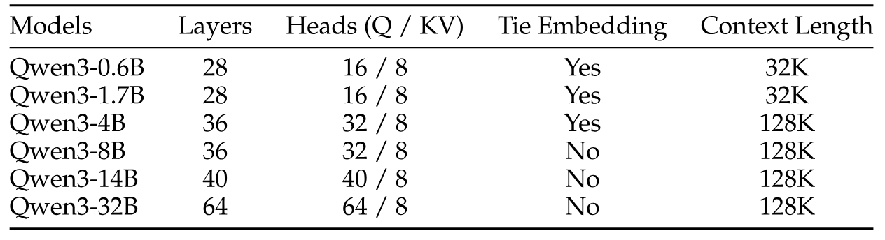

**表 1。** Qwen3 密モデルのアーキテクチャ。

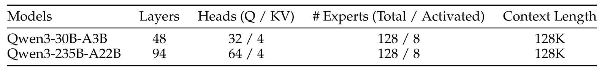

**表 2。** Qwen3 MoE モデルのアーキテクチャ。

## 3 事前学習

本節では、事前学習データの構築と事前学習手法の詳細を説明し、標準ベンチマークでベースモデルを評価した実験結果を示す。

### 3.1 事前学習データ

Qwen2.5 [Yang24] と比べ、学習データの規模と多様性を大幅に拡張した。具体的には、事前学習トークンを 2 倍収集し、対応言語を 3 倍に増やした。すべての Qwen3 モデルは、**119 の言語と方言**からなる大規模で多様なデータセットで学習し、その総量は **36 兆トークン**である。このデータセットには、コーディング、STEM（科学、技術、工学、数学）、推論タスク、書籍、多言語テキスト、合成データなど、多様な領域の高品質コンテンツが含まれる。

事前学習コーパスをさらに拡張するため、まず Qwen2.5-VL [Bai25a] を使用して、大量の PDF に似た文書をテキスト認識する。認識したテキストは Qwen2.5 [Yang24] で精製し、品質を改善する。この二段階の処理により、合計数兆トークンに及ぶ高品質なテキストを追加で取得できる。さらに Qwen2.5 [Yang24]、Qwen2.5-Math [Yang24a]、Qwen2.5-Coder [Hui24] を用いて、教科書、質疑応答、指示、コードスニペットなど、さまざまな形式のテキストを数兆トークン合成し、数十の領域をカバーする。最後に、多言語データを追加して言語数を増やし、事前学習コーパスをさらに拡張する。Qwen2.5 の事前学習データと比べ、対応言語は 29 から 119 へ大幅に増え、モデルの言語範囲と言語横断能力が向上した。

学習データの品質と多様性をともに高める多言語データ注釈システムを開発した。このシステムを大規模な事前学習データセットに適用し、教育的価値、分野、領域、安全性など複数の観点から 30 兆トークン以上を注釈した。詳細な注釈により、データをより効果的に選別して組み合わせられる。従来研究 [Xie23, Fan23, Liu24q] はデータソースまたは領域の単位でデータ混合を最適化するが、本手法は細粒度のデータラベルを用いて小規模な代理モデルで多数のアブレーション実験を行い、インスタンス単位でデータ混合を最適化する。

### 3.2 事前学習段階

Qwen3 モデルの事前学習は三段階で行う。

1. **汎用段階（S1）**：最初の事前学習段階では、すべての Qwen3 モデルを 30 兆トークン以上で学習し、系列長を 4,096 トークンとする。この段階で、119 の言語と方言を含む学習データを用い、言語運用能力と一般的な世界知識についてモデルを十分に事前学習する。

1. **推論段階（S2）**：推論能力をさらに高めるため、STEM、コーディング、推論、合成データの割合を増やして、この段階の事前学習コーパスを最適化する。系列長 4,096 トークンで、約 5T の高品質トークンを用いて追加の事前学習を行う。この段階では学習率の減衰も速める。

1. **長文脈段階**：最後の事前学習段階では、高品質な長文脈コーパスを収集し、Qwen3 モデルの文脈長を拡張する。すべてのモデルを、系列長 32,768 トークンで数千億トークン学習する。長文脈コーパスのうち、75% は長さが 16,384～32,768 トークン、25% は 4,096～16,384 トークンである。Qwen2.5 [Yang24] に従い、ABF 技法 [Xio23] を用いて RoPE の基底周波数を 10,000 から 1,000,000 へ高める。同時に YARN [Pen23] と Dual Chunk Attention（DCA、[An24]）を導入し、推論時の系列長容量を 4 倍にする。

Qwen2.5 [Yang24] と同様に、上記三段階の事前学習に基づき、学習率スケジューラやバッチサイズなどの最適ハイパーパラメータを予測するスケーリング則を構築する。多数の実験を通じ、モデルアーキテクチャ、学習データ、学習段階、最適な学習ハイパーパラメータの関係を体系的に調べる。最終的に、各密モデルと MoE モデルに、予測された最適な学習率とバッチサイズの方策を設定する。

### 3.3 事前学習評価

Qwen3 シリーズのベース言語モデルを包括的に評価する。ベースモデルの評価は、一般知識、推論、数学、科学知識、コーディング、多言語能力を主な対象とする。事前学習済みベースモデルの評価データセットには、次の 15 ベンチマークが含まれる。

- **汎用タスク**：MMLU [Hen20]（5-shot）、MMLU-Pro [Wan24c]（5-shot、CoT）、MMLU-redux [Gem24a]（5-shot）、BBH [Suz22]（3-shot、CoT）、SuperGPQA [Du25a]（5-shot、CoT）。

- **数学・STEM タスク**：GPQA [Rei24]（5-shot、CoT）、GSM8K [Cob21]（4-shot、CoT）、MATH [Hen21]（4-shot、CoT）。

- **コーディングタスク**：EvalPlus [Liu24i]（0-shot）（HumanEval [Che21]、MBPP [Aus21]、Humaneval+、MBPP+ の平均）[Liu24i]、MultiPL-E [Cas23]（0-shot）（Python、C++、JAVA、PHP、TypeScript、C#、Bash、JavaScript）、MBPP-3shot [Aus21]、CRUXEval の CRUX-O（1-shot）[Gu24]。

- **多言語タスク**：MGSM [Shi23]（8-shot、CoT）、MMMLU [Ope24c]（5-shot）、INCLUDE [Rom24]（5-shot）。

ベースモデルの比較では、パラメータ規模に応じて Qwen3 シリーズのベースモデルを Qwen2.5 ベースモデル [Yang24] や、DeepSeek-V3 Base [Dee24a]、Gemma-3 [Gem25a]、Llama-3 [Dub24]、Llama-4 [Lla25] シリーズなど、ほかの主要なオープンソースベースモデルと比較する。公平な比較のため、すべてのモデルを同じ評価パイプラインと広く使われる評価設定で測定する。

**評価結果の概要** 評価結果全体に基づき、Qwen3 ベースモデルについて次の主要な結論を挙げる。

1. 従来の最先端オープンソース密モデルおよび MoE ベースモデル（DeepSeek-V3 Base、Llama-4-Maverick Base、Qwen2.5-72B-Base など）と比べ、Qwen3-235B-A22B-Base は総パラメータ数または活性化パラメータ数が大幅に少ないにもかかわらず、多くのタスクで上回る。

1. Qwen3 MoE ベースモデルの実験結果から、次が分かる。（a）同じ事前学習データを使う場合、Qwen3 MoE ベースモデルは Qwen3 密ベースモデルの **1/5** の活性化パラメータだけで同等の性能に達する。（b）Qwen3 MoE アーキテクチャの改善、学習トークンの拡大、高度な学習方策により、Qwen3 MoE ベースモデルは **1/2** 未満の活性化パラメータと少ない総パラメータで Qwen2.5 MoE ベースモデルを上回る。（c）Qwen2.5 密ベースモデルの **1/10** の活性化パラメータしかなくても、Qwen3 MoE ベースモデルは同等の性能を達成し、推論・学習コストで大きな優位性をもたらす。

1. Qwen3 密ベースモデルの総合性能は、より大きな Qwen2.5 ベースモデルに匹敵する。例えば Qwen3-1.7B/4B/8B/14B/32B-Base は、それぞれ Qwen2.5-3B/7B/14B/32B/72B-Base と同等の性能を達成する。特に STEM、コーディング、推論ベンチマークでは、Qwen3 密ベースモデルが、より大きな Qwen2.5 ベースモデルを上回ることさえある。

詳細な結果を以下に示す。

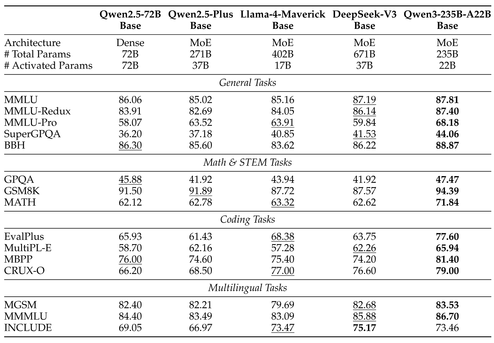

**表 3。** **Qwen3-235B-A22B-Base と代表的な強いオープンソースベースラインの比較。最高値と 2 番目の値を、それぞれ太字と下線で示す。**

**Qwen3-235B-A22B-Base** Qwen3-235B-A22B-Base を、従来の同規模 MoE モデル Qwen2.5-Plus-Base [Yang24] と、Llama-4-Maverick [Lla25]、Qwen2.5-72B-Base [Yang24]、DeepSeek-V3 Base [Dee24a] という主要なオープンソースベースモデルと比較する。[表 3](#table-03) の結果では、Qwen3-235B-A22B-Base が評価したベンチマークの大半で最高性能を達成する。さらに詳しい分析のため、Qwen3-235B-A22B-Base とほかのベースラインを個別に比較する。

1. パラメータ数が約 **2 倍**の最近のオープンソースモデル Llama-4-Maverick-Base と比べても、Qwen3-235B-A22B-Base は大半のベンチマークで優れる。

1. 従来の最先端オープンソースモデル DeepSeek-V3-Base と比べ、Qwen3-235B-A22B-Base は総パラメータ数が約 **1/3**、活性化パラメータ数が **2/3** にすぎないにもかかわらず、15 個の評価ベンチマークのうち 14 個で上回り、本モデルの強力さと費用対効果を示す。

1. 従来の同規模 MoE モデル Qwen2.5-Plus と比べ、Qwen3-235B-A22B-Base は総パラメータ数と活性化パラメータ数が少ないにもかかわらず大幅に上回り、Qwen3 の事前学習データ、学習方策、モデルアーキテクチャの顕著な利点を示す。

1. 従来のフラッグシップオープンソース密モデル Qwen2.5-72B-Base と比べ、Qwen3-235B-A22B-Base はすべてのベンチマークで上回り、活性化パラメータ数は **1/3** 未満である。同時に、モデルアーキテクチャの利点により、Qwen3-235B-A22B-Base の推論コストと 1 兆トークン当たりの学習コストは、Qwen2.5-72B-Base よりはるかに低い。

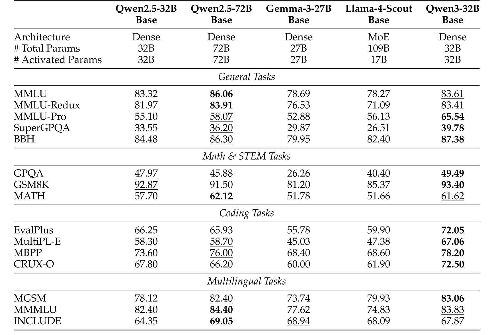

**表 4。** **Qwen3-32B-Base とほかの強いオープンソースベースラインの比較。最高値と 2 番目の値を、それぞれ太字と下線で示す。**

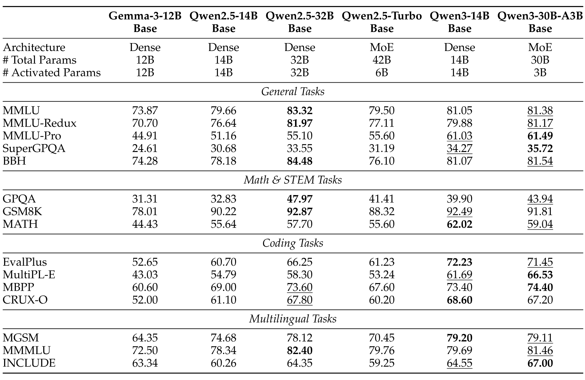

**表 5。** **Qwen3-14B-Base、Qwen3-30B-A3B-Base とほかの強いオープンソースベースラインの比較。最高値と 2 番目の値を、それぞれ太字と下線で示す。**

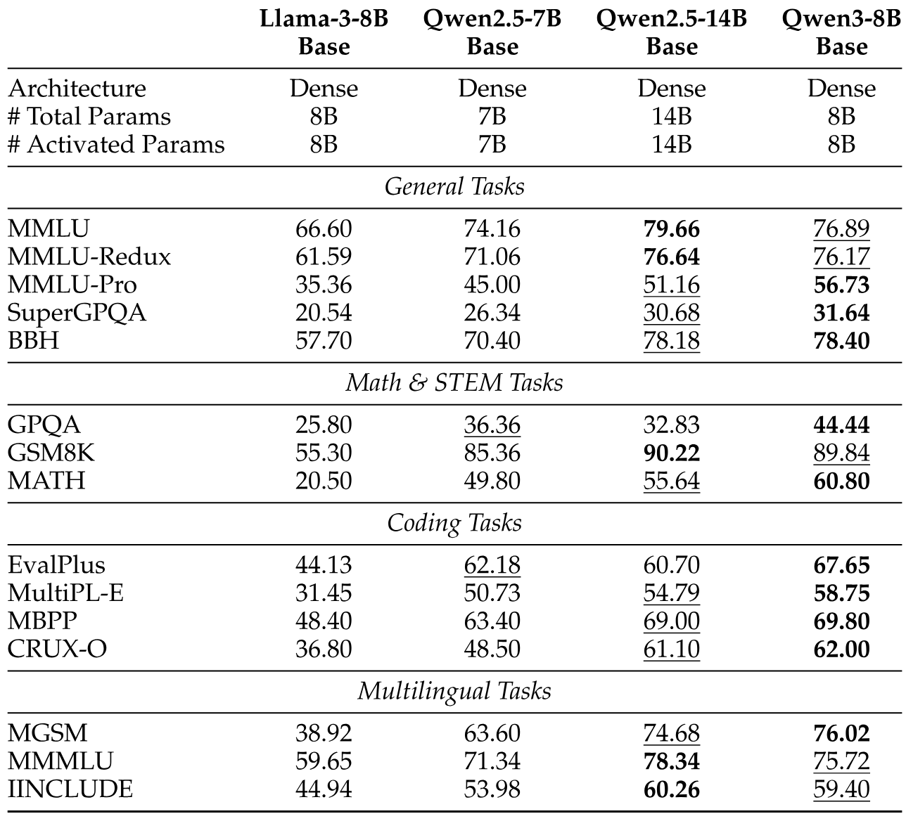

**表 6。** **Qwen8B-Base とほかの強いオープンソースベースラインの比較。最高値と 2 番目の値を、それぞれ太字と下線で示す。**

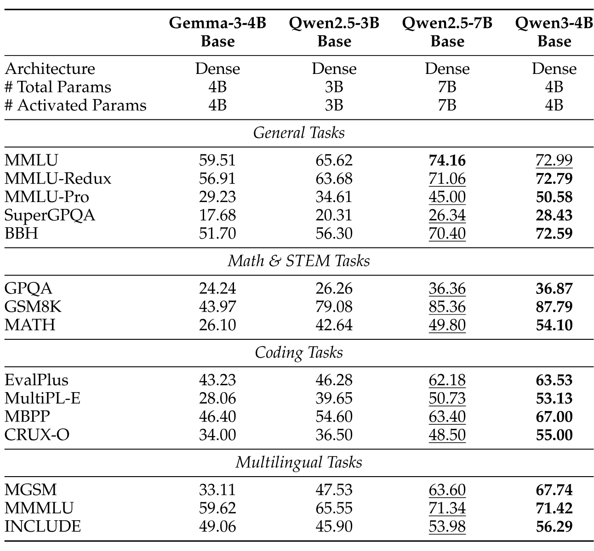

**表 7。** **Qwen3-4B-Base とほかの強いオープンソースベースラインの比較。最高値と 2 番目の値を、それぞれ太字と下線で示す。**

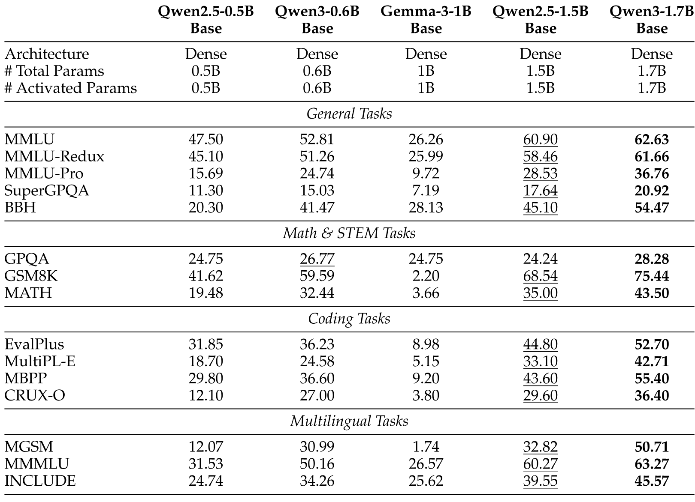

**表 8。** **Qwen3-1.7B-Base、Qwen3-0.6B-Base とほかの強いオープンソースベースラインの比較。最高値と 2 番目の値を、それぞれ太字と下線で示す。**

**Qwen3-32B-Base** Qwen3-32B-Base は Qwen3 シリーズで最大の密モデルである。Gemma-3-27B [Gem25a] や Qwen2.5-32B [Yang24] など、同規模のベースラインと比較する。さらに二つの強いベースラインを加える。一つは最近公開された MoE モデル Llama-4-Scout で、Qwen3-32B-Base の 3 倍のパラメータを持つが、活性化パラメータは半分である。もう一つは従来のフラッグシップオープンソース密モデル Qwen2.5-72B-Base で、Qwen3-32B-Base の 2 倍を超えるパラメータを持つ。[表 4](#table-04) の結果は、次の三つの主要な結論を支持する。

1. 同規模のモデルと比べ、Qwen3-32B-Base は大半のベンチマークで Qwen2.5-32B-Base と Gemma-3-27B Base を上回る。特に MMLU-Pro で 65.54、SuperGPQA で 39.78 を達成し、前世代の Qwen2.5-32B-Base を大幅に上回る。さらに、Qwen3-32B-Base のコーディングベンチマーク得点は、すべてのベースラインモデルより大幅に高い。

1. 驚くべきことに、Qwen3-32B-Base は Qwen2.5-72B-Base と比べても競争力のある結果を達成する。Qwen3-32B-Base のパラメータ数は Qwen2.5-72B-Base の半分未満だが、15 個の評価ベンチマークのうち 10 個で上回る。コーディング、数学、推論ベンチマークでは顕著な優位性がある。

1. Llama-4-Scout-Base と比べ、Qwen3-32B-Base は総パラメータ数が 3 分の 1 で、活性化パラメータ数が 2 倍だが、15 個すべてのベンチマークで大幅に上回る。

**Qwen3-14B-Base と Qwen3-30B-A3B-Base** Qwen3-14B-Base と Qwen3-30B-A3B-Base を、Gemma-3-12B Base や Qwen2.5-14B Base など同規模のベースラインと比較する。同様に二つの強いベースラインも導入する。（1）Qwen2.5-Turbo [Yang24] は 42B パラメータを持ち、そのうち 6B を活性化する。活性化パラメータ数は Qwen3-30B-A3B-Base の 2 倍である。（2）Qwen2.5-32B-Base の活性化パラメータ数は Qwen3-30B-A3B の 11 倍、総パラメータ数は Qwen3-14B の 2 倍を超える。[表 5](#table-05) の結果から次の結論を得る。

1. 同規模のモデルと比べ、Qwen3-14B-Base は 15 個すべてのベンチマークで Qwen2.5-14B-Base と Gemma-3-12B-Base を大幅に上回る。

1. 同様に、Qwen3-14B-Base はパラメータ数が半分未満であるにもかかわらず、Qwen2.5-32B-Base と比べても非常に競争力のある結果を達成する。

1. Qwen3-30B-A3B は活性化する非埋め込みパラメータが **1/5** だけで、すべてのタスクにおいて Qwen2.5-14B-Base を大幅に上回り、Qwen3-14B-Base や Qwen2.5-32B-Base と同等の性能を達成する。このため、推論と学習のコストで大きな利点が得られる。

**Qwen3-8B / 4B / 1.7B / 0.6B-Base** エッジ向けモデルでは、同規模の Qwen2.5、Llama-3、Gemma-3 ベースモデルをベースラインとする。結果は [表 6](#table-06)、[表 7](#table-07)、[表 8](#table-08) に示す。Qwen3 8B / 4B / 1.7B / 0.6B-Base モデルは、ほぼすべてのベンチマークで高い性能を維持する。特に Qwen3-8B / 4B / 1.7B-Base は、半数を超えるベンチマークで、より大きな Qwen2.5-14B / 7B / 3B Base を上回る。STEM 関連およびコーディングベンチマークで顕著であり、Qwen3 モデルの大幅な改善を示している。

## 4 事後学習

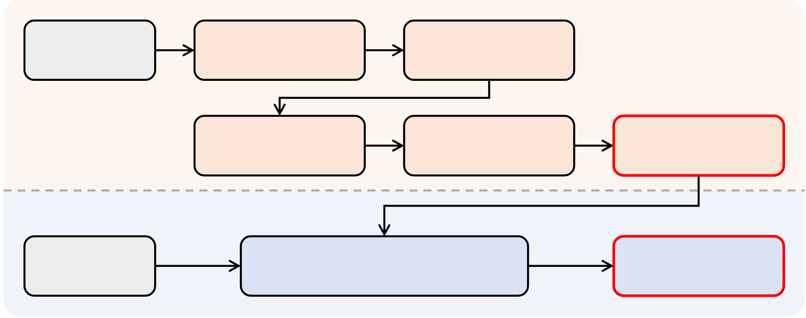

**図 1。** Qwen3 シリーズモデルの事後学習パイプライン。

Qwen3 の事後学習パイプラインは、次の二つの中心的な目標に沿って設計されている。

1. **思考制御**：非思考モードと思考モードという二つの異なるモードを統合し、モデルに推論させるかどうかをユーザーが選択できるようにする。また、思考過程にトークン予算を指定して思考の深さを制御できる。

1. **強いモデルから弱いモデルへの蒸留**：軽量モデルの事後学習を簡素化し、最適化する。大規模モデルの知識を活用することで、小規模モデルの構築に必要な計算コストと開発作業を大幅に削減する。

[図 1](#figure-01) に示すように、Qwen3 シリーズのフラッグシップモデルは精緻な四段階の学習過程に従う。最初の二段階はモデルの思考能力の育成に重点を置く。次の二段階では、強力な非思考機能をモデルへ統合する。

予備実験から、教師モデルの出力 logits を軽量な学生モデルへ直接蒸留すると、推論過程を細かく制御したまま性能を効果的に高められることが分かった。この手法により、小規模モデルごとに完全な四段階の学習過程を実行する必要がなくなる。Pass@1 の向上が示すように直ちに性能が改善し、Pass@64 の向上が示すようにモデルの探索能力も高まる。さらに、四段階の学習法と比べて必要な GPU 時間は 1/10 だけであり、はるかに高い学習効率を実現する。

以下では、四段階の学習過程を示し、強いモデルから弱いモデルへの蒸留手法を詳しく説明する。

### 4.1 Long-CoT コールドスタート

まず、数学、コード、論理推論、一般的な STEM 問題など幅広いカテゴリを含む包括的なデータセットを整備する。データセットの各問題には、検証済みの参照解答またはコードによるテストケースを組み合わせる。このデータセットは、長い Chain-of-Thought（long-CoT）学習のコールドスタート段階の基礎となる。

データセットの構築では、クエリのフィルタリングと応答のフィルタリングという厳格な二段階の処理を行う。クエリのフィルタリング段階では、Qwen2.5-72B-Instruct を使って、容易に検証できないクエリを識別して取り除く。これには、複数の小問を含むクエリや、一般的な文章生成を求めるクエリが含まれる。さらに、Qwen2.5-72B-Instruct が CoT 推論を使わず正しく答えられるクエリも除外する。これにより、モデルが表面的な推測に依存するのを防ぎ、深い推論が必要な複雑な問題だけを含める。また、Qwen2.5-72B-Instruct を用いて各クエリの領域を注釈し、データセット内の領域分布を均衡させる。

検証用クエリ集合を確保した後、QwQ-32B [Qwq25] を使って残りの各クエリに $N$ 個の応答候補を生成する。QwQ-32B が一貫して正しい解答を生成できない場合、人間のアノテーターが応答の正確さを手動で評価する。Pass@$N$ が正のクエリには、さらに厳格なフィルタリング基準を適用し、（1）最終解答が誤っている、（2）大量の反復を含む、（3）十分な推論なしに推測したことが明らかである、（4）思考内容と要約内容が矛盾する、（5）不適切な言語混在や文体の変化がある、（6）検証集合の候補項目と酷似している疑いがある応答を除外する。続いて、精製したデータセットから慎重に選んだ部分集合を使い、推論パターンを最初にコールドスタート学習する。この段階の目的は、直近の推論性能を過度に重視せず、モデルへ基礎的な推論パターンを与えることである。この方法はモデルの可能性を制限せず、後続の強化学習（RL）段階で柔軟に改善できる余地を残す。この目的を効果的に達成するには、準備段階の学習サンプル数と学習ステップ数をともに抑えることが望ましい。

### 4.2 推論 RL

推論 RL 段階で使用するクエリと検証器のペアは、次の四基準を満たす必要がある。（1）コールドスタート段階で使用していない。（2）コールドスタートモデルが学習できる。（3）できるだけ難しい。（4）広範な下位領域を含む。最終的に 3,995 組のクエリと検証器を収集し、GRPO [Sha24] を用いてモデルパラメータを更新した。大きなバッチサイズとクエリ当たり多数の rollout を使用し、オフポリシー学習でサンプル効率を高めることが学習に有効だと分かった。また、モデルのエントロピーが着実に増えるか安定するよう制御し、探索と活用の均衡にも対処した。これは安定した学習を維持するうえで重要である。その結果、一度の RL 実行中にハイパーパラメータを手動調整することなく、学習報酬と検証性能が一貫して改善した。例えば Qwen3-235B-A22B の AIME'24 得点は、合計 170 回の RL 学習ステップで 70.1 から 85.1 へ向上した。

### 4.3 思考モード融合

思考モード融合段階の目標は、以前に開発した思考モデルへ非思考能力を統合することである。これにより、開発者は推論動作を管理・制御しながら、思考タスクと非思考タスクに別々のモデルを配備するコストと複雑さを減らせる。このため、推論 RL モデルに継続的な教師ありファインチューニング（SFT）を行い、二つのモードを融合するチャットテンプレートを設計する。さらに、両モードを十分に扱えるモデルは、異なる思考予算でも一貫して良好に動作することが分かった。

**SFT データの構築。** SFT データセットは思考データと非思考データの両方を含む。追加 SFT によって段階 2 のモデル性能を損なわないよう、思考データは段階 2 のモデル自身が段階 1 のクエリに対して rejection sampling を行って生成する。一方、非思考データは、コーディング、数学、指示追従、多言語タスク、創作、質疑応答、ロールプレイなど、多様なタスクを含むよう慎重に整備する。また、自動生成したチェックリストで非思考データの応答品質を評価する。低リソース言語のタスク性能を高めるため、翻訳タスクの割合を特に増やす。

**チャットテンプレートの設計。** 二つのモードを適切に統合し、ユーザーがモデルの思考過程を動的に切り替えられるよう、[表 9](#table-09) に示す Qwen3 用チャットテンプレートを設計する。具体的には、思考モードと非思考モードのサンプルについて、ユーザークエリまたはシステムメッセージへ、それぞれ `/think` と `/no_think` フラグを導入する。これにより、モデルはユーザー入力に従って適切な思考モードを選択できる。非思考モードのサンプルでは、アシスタントの応答に空の思考ブロックを残す。この設計はモデル内部の形式を統一し、開発者がチャットテンプレートへ空の思考ブロックを連結して、モデルの思考動作を防げるようにする。既定ではモデルは思考モードで動くため、ユーザークエリに `/think` フラグを含まない思考モードの学習サンプルも加える。より複雑な複数ターン対話では、ユーザークエリへ複数の `/think` と `/no_think` フラグをランダムに挿入し、モデルの応答は最後に現れたフラグに従う。

**思考予算。** 思考モード融合にはもう一つ利点がある。モデルが非思考モードと思考モードの両方で応答することを学ぶと、不完全な思考に基づいて応答を生成する中間的な状況へ自然に対処できるようになる。この能力はモデルの思考過程に予算制御を実装する基礎となる。具体的には、モデルの思考長がユーザー指定の閾値に達した時点で思考過程を手動で止め、思考停止命令「`Considering the limited time by the user, I have to give the solution based on the thinking directly now.\n</think>.\n\n`」を挿入する。命令の挿入後、モデルはその時点までに蓄積した推論に基づいて最終応答を生成する。この能力は明示的に学習したものではなく、思考モード融合を適用した結果として自然に現れる。

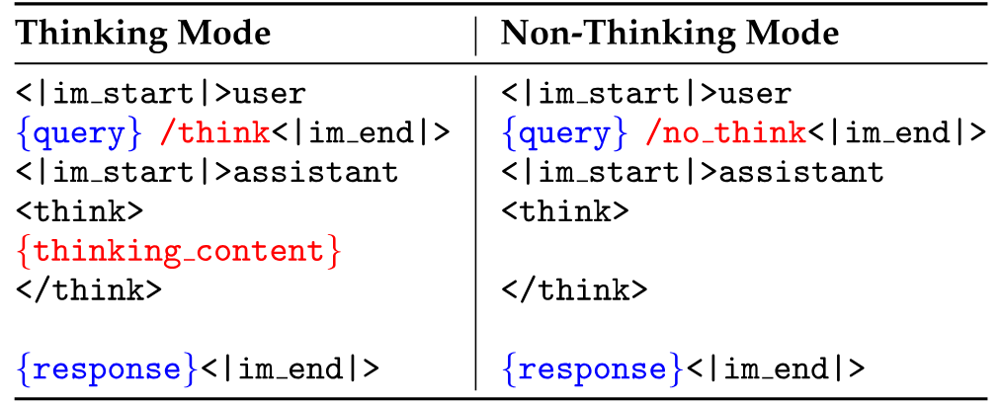

**表 9。** **思考モード融合段階における思考モードと非思考モードの SFT データ例。** 思考モードでは既定動作を表すため、`/think` フラグを省略できる。この機能は Hugging Face tokenizer が対応するチャットテンプレート [+1] に実装され、追加パラメータ `enable_thinking=False` で思考モードを無効化できる。

### 4.4 汎用 RL

汎用 RL 段階は、多様な状況でモデルの能力と安定性を広く高めることを目指す。このため、**20 を超える異なるタスク**を含み、タスクごとに得点基準を調整した高度な**報酬システム**を構築した。これらのタスクは、次の中核能力を特に改善する。

- **指示追従**：内容、形式、長さ、構造化出力の使用に関する要件を含め、ユーザーの指示をモデルが正確に解釈して従い、期待に沿う応答を返す能力である。

- **形式追従**：明示的な指示に加え、特定の形式規約に従うことをモデルへ求める。例えば `/think` と `/no_think` フラグに応じて思考モードと非思考モードを切り替え、指定トークン（`<think>` と `</think>` など）を一貫して使い、最終出力の思考部分と応答部分を分離する。

- **選好整合**：自由回答クエリでは、モデルの有用性、対話性、文体を改善し、より自然で満足できるユーザー体験を提供することに重点を置く。

- **エージェント能力**：指定インターフェースを通じてツールを正しく呼び出せるようモデルを学習する。RL rollout 中、モデルは実環境の実行フィードバックを受けながら複数ターンの完全な対話サイクルを実行できるため、長期的な意思決定タスクの性能と安定性が向上する。

- **専門的な状況の能力**：より専門的な状況では、個別の文脈に合わせたタスクを設計する。例えば Retrieval-Augmented Generation（RAG）タスクでは、正確で文脈に適した応答を生成するよう報酬信号でモデルを導き、ハルシネーションのリスクを抑える。

上記タスクへのフィードバックには、次の三種類の報酬を使用した。

1. **ルールベース報酬**：ルールベース報酬は推論 RL 段階で広く使われており、指示追従 [Lam24] や形式遵守などの汎用タスクにも有効である。適切に設計されたルールベース報酬はモデル出力の正しさを高精度で評価し、reward hacking などの問題を防げる。

1. **参照解答を伴うモデルベース報酬**：各クエリに参照解答を与え、Qwen2.5-72B-Instruct に参照解答に基づいてモデルの応答を採点させる。この方法は厳密な形式を要求せずに多様なタスクを柔軟に扱え、純粋なルールベース報酬で起こりうる偽陰性を避けられる。

1. **参照解答を伴わないモデルベース報酬**：人間の選好データを利用して報酬モデルを学習し、モデルの応答へスカラー値を与える。参照解答に依存しないため、より幅広いクエリを扱いながら、モデルの対話性と有用性を効果的に高められる。

### 4.5 強いモデルから弱いモデルへの蒸留

強いモデルから弱いモデルへの蒸留パイプラインは、5 個の密モデル（Qwen3-0.6B、1.7B、4B、8B、14B）と 1 個の MoE モデル（Qwen3-30B-A3B）を含む軽量モデルの最適化に特化している。この方法はモデル性能を高めるとともに、堅牢なモード切り替え能力を効果的に与える。蒸留は次の二段階に分かれる。

1. **オフポリシー蒸留**：最初の段階では、教師モデルが `/think` モードと `/no_think` モードで生成した出力を組み合わせ、応答蒸留を行う。これにより、軽量な学生モデルは基本的な推論能力と異なる思考モードを切り替える能力を身につけ、次のオンポリシー学習段階に向けた基礎を築く。

1. **オンポリシー蒸留**：この段階では、学生モデルがファインチューニング用のオンポリシー系列を生成する。具体的には、プロンプトをサンプリングし、学生モデルが `/think` または `/no_think` モードで応答を生成する。次に、学生モデルの logits を教師モデル（Qwen3-32B または Qwen3-235B-A22B）の logits と整合させ、KL ダイバージェンスを最小化するよう学生モデルをファインチューニングする。

### 4.6 事後学習評価

指示調整済みモデルの品質を包括的に評価するため、自動ベンチマークを採用し、思考モードと非思考モードの両方でモデル性能を測定する。ベンチマークは次の側面に分類される。

- **汎用タスク**：MMLU-Redux [Gem24a]、GPQA-Diamond [Rei24]、C-Eval [Hua23]、LiveBench（2024-11-25）[Whi24] などのベンチマークを使用する。GPQA-Diamond では各クエリを 10 回サンプリングし、平均正解率を報告する。

- **整合タスク**：モデルが人間の選好とどの程度整合するかを評価するため、専門的なベンチマーク群を使用する。指示追従性能には IFEval [Zho23a] の strict-prompt 正解率を報告する。一般的な話題に対する人間の選好との整合には Arena-Hard [Li24j] と AlignBench v1.1 [Liu23m] を用いる。文章作成タスクでは Creative Writing V3 [Pae24] と WritingBench [Wu25b] を用いて、モデルの習熟度と創造性を評価する。

- **数学・文章推論**：数学的・論理的な推論能力の評価には、高度な数学ベンチマーク MATH-500 [Lig23]、AIME'24、AIME'25 [Aim25a] と、文章推論タスク ZebraLogic [Lin25]、AutoLogi [Zhu25b] を使用する。各年の AIME 問題は Part I と Part II の計 30 問からなる。各問題を 64 回サンプリングし、平均正解率を最終得点とする。

- **エージェント・コーディング**：コーディングとエージェントタスクの習熟度を測るため、BFCL v3 [Yan24d]、LiveCodeBench（v5、2024.10-2025.02）[Jai24]、CodeElo [Qua25] の Codeforces Ratings を使用する。BFCL では全 Qwen3 モデルを FC 形式で評価し、Multi-Turn 評価のため yarn を使って文脈長 64k でモデルを配備した。一部のベースラインは BFCL leaderboard から取得し、FC 形式と Prompt 形式の高い方を採用する。leaderboard にないモデルは Prompt 形式で評価する。LiveCodeBench では、非思考モードに公式推奨プロンプトを用いる一方、思考モードではプロンプトテンプレートから `You will not return anything except for the program` という制約を取り除き、モデルがより自由に思考できるよう調整する。モデルと競技プログラミングの専門家の性能差を評価するため、CodeForces で Elo レーティングを計算する。本ベンチマークでは、各問題について最大 8 回の独立した推論試行を生成して解く。

- **多言語タスク**：多言語能力については、指示追従、知識、数学、論理推論という 4 種類のタスクを評価する。指示追従は、8 個の主要言語を扱う Multi-IF [He24b] で評価する。知識評価には二種類ある。地域知識は 44 言語を含む INCLUDE [Rom24]、一般知識は 14 言語を含む MMMLU [Ope24c] で評価し、後者では未最適化のヨルバ語を除外する。この二つのベンチマークでは、評価効率を高めるため元データの 10% だけをサンプリングする。数学タスクには、55 言語を含む MT-AIME2024 [Son25] と、18 言語を含む PolyMath [Wan25g] を用いる。論理推論は [Zha24k] に由来する MlogiQA で評価し、10 言語を扱う。

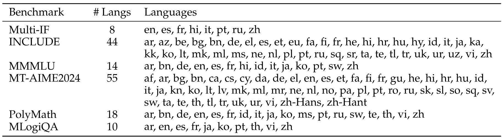

**表 10。** **多言語ベンチマークと含まれる言語。** 言語は IETF 言語タグで識別する。

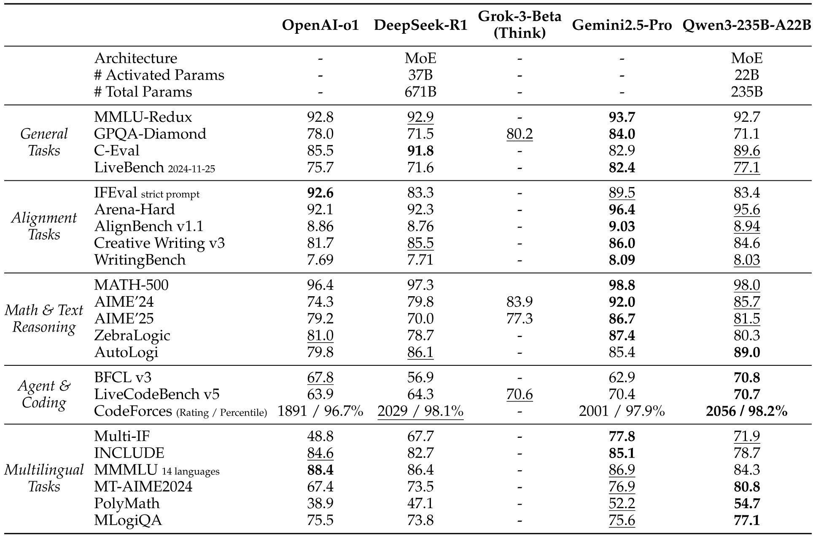

**表 11。** **Qwen3-235B-A22B（思考）とほかの推論ベースラインの比較。最高値と 2 番目の値を、それぞれ太字と下線で示す。**

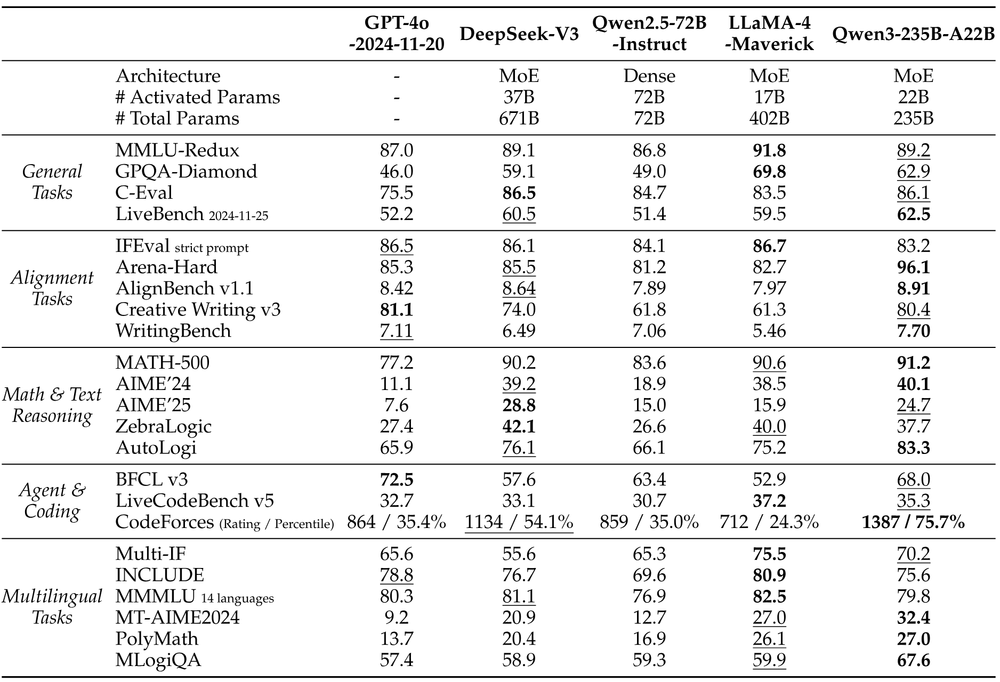

**表 12。** **Qwen3-235B-A22B（非思考）とほかの非推論ベースラインの比較。最高値と 2 番目の値を、それぞれ太字と下線で示す。**

思考モードの全 Qwen3 モデルについて、サンプリング温度を 0.6、top-p を 0.95、top-k を 20 とする。さらに Creative Writing v3 と WritingBench では、多様な内容の生成を促すため presence penalty 1.5 を適用する。非思考モードの Qwen3 モデルでは、サンプリングハイパーパラメータを temperature = 0.7、top-p = 0.8、top-k = 20、presence penalty = 1.5 とする。思考モードと非思考モードの両方で最大出力長を 32,768 トークンとするが、AIME'24 と AIME'25 だけは十分な思考空間を与えるため 38,912 トークンへ伸ばす。

**評価結果の概要** 評価結果から、最終的な Qwen3 モデルについて次の主要な結論をまとめる。

1. フラッグシップモデル Qwen3-235B-A22B は、思考モードと非思考モードの両方で、オープンソースモデルの最先端となる総合性能を示し、DeepSeek-R1 や DeepSeek-V3 などの強力なベースラインを上回る。OpenAI-o1、Gemini2.5-Pro、GPT-4o などの主要なクローズドソースモデルと比べても高い競争力を持ち、深い推論能力と包括的な汎用能力を示す。

1. フラッグシップ密モデル Qwen3-32B は、大半のベンチマークで従来最強の推論モデル QwQ-32B を上回り、クローズドソースの OpenAI-o3-mini と同等に動作して、説得力のある推論能力を示す。非思考モードでも極めて高い性能を持ち、従来のフラッグシップ非推論密モデル Qwen2.5-72B-Instruct を上回る。

1. Qwen3-30B-A3B、Qwen3-14B、さらに小さな密モデルなどの軽量モデルは、パラメータ数が同程度または多いオープンソースモデルより一貫して優れ、強いモデルから弱いモデルへの蒸留が成功したことを示す。

詳細な結果を以下に示す。

**Qwen3-235B-A22B** フラッグシップモデル Qwen3-235B-A22B を、主要な推論モデルと非推論モデルと比較する。思考モードの推論ベースラインには OpenAI-o1 [Ope24]、DeepSeek-R1 [Guo25]、Grok-3-Beta（Think）[Gro25]、Gemini2.5-Pro [Gem25] を使用する。非思考モードの非推論ベースラインには GPT-4o-2024-11-20 [Gpt24]、DeepSeek-V3 [Dee24a]、Qwen2.5-72B-Instruct [Yang24]、LLaMA-4-Maverick [Lla25] を使用する。評価結果を [表 11](#table-11) と [表 12](#table-12) に示す。

1. [表 11](#table-11) によると、Qwen3-235B-A22B（思考）の活性化パラメータと総パラメータは DeepSeek-R1 のそれぞれ 60% と 35% だが、**17/23** 個のベンチマークで上回る。特に数学、エージェント、コーディングなど推論を要するタスクで優れ、オープンソースモデル中で最先端の推論能力を示す。Qwen3-235B-A22B（思考）は、クローズドソースの OpenAI-o1、Grok-3-Beta（Think）、Gemini2.5-Pro と比べても高い競争力を持ち、オープンソースモデルとクローズドソースモデルの推論能力差を大幅に縮める。

1. [表 12](#table-12) によると、Qwen3-235B-A22B（非思考）は、DeepSeek-V3、LLaMA-4-Maverick、従来のフラッグシップモデル Qwen2.5-72B-Instruct などの主要なオープンソースモデルを上回り、**18/23** 個のベンチマークではクローズドソースの GPT-4o-2024-11-20 も上回る。これは、熟慮する思考過程で強化しなくても、本来の能力が強いことを示す。

**Qwen3-32B** フラッグシップ密モデル Qwen3-32B について、思考モードでは DeepSeek-R1-Distill-Llama-70B、OpenAI-o3-mini（medium）、および従来最強の推論モデル QwQ-32B [Qwq25] をベースラインとする。非思考モードでは GPT-4o-mini-2024-07-18、LLaMA-4-Scout、および従来のフラッグシップモデル Qwen2.5-72B-Instruct をベースラインとする。評価結果を [表 13](#table-13) と [表 14](#table-14) に示す。

1. [表 13](#table-13) によると、Qwen3-32B（思考）は **17/23** 個のベンチマークで QwQ-32B を上回り、32B という扱いやすい規模における新たな最先端推論モデルとなる。さらに Qwen3-32B（思考）は、より優れたアラインメント性能と多言語性能を備え、クローズドソースの OpenAI-o3-mini（medium）とも競合する。

1. [表 14](#table-14) によると、Qwen3-32B（非思考）は、ほぼすべてのベンチマークで全ベースラインを上回る。特に汎用タスクでは Qwen2.5-72B-Instruct と同等に動作し、アラインメント、多言語、推論関連のタスクでは大幅に優れており、従来の Qwen2.5 シリーズモデルに対する Qwen3 の根本的な改善を改めて示す。

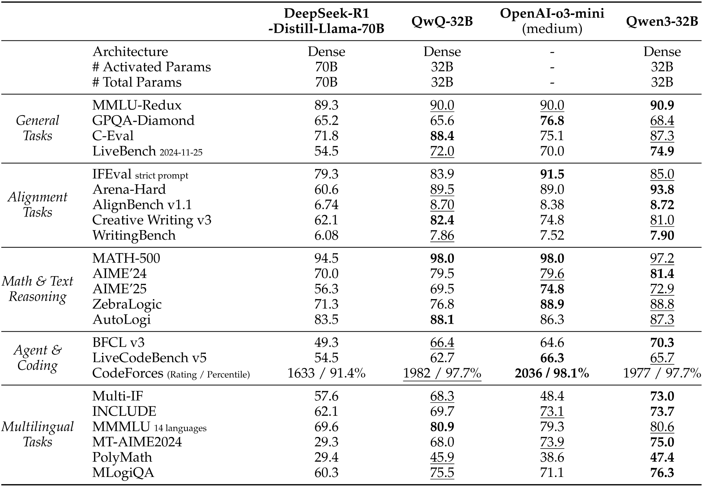

**表 13。** **Qwen3-32B（思考）とほかの推論ベースラインの比較。最高値と 2 番目の値を、それぞれ太字と下線で示す。**

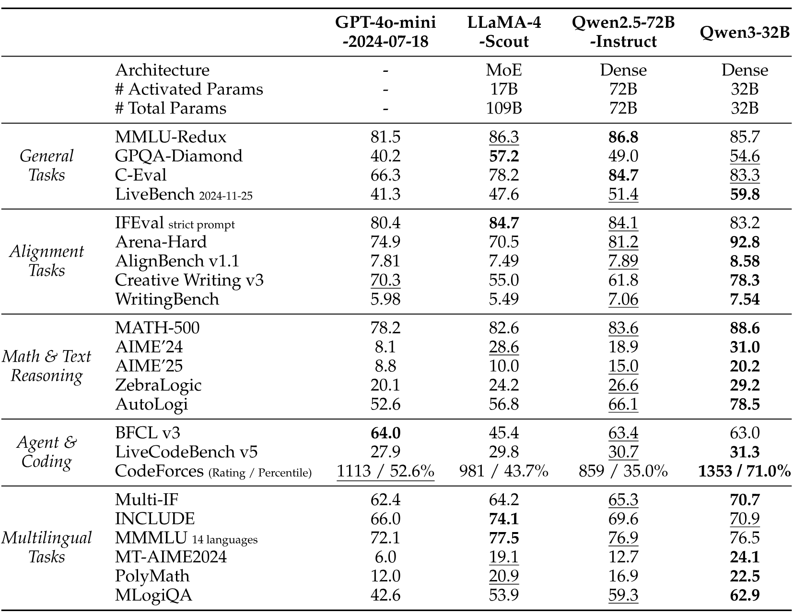

**表 14。** **Qwen3-32B（非思考）とほかの非推論ベースラインの比較。最高値と 2 番目の値を、それぞれ太字と下線で示す。**

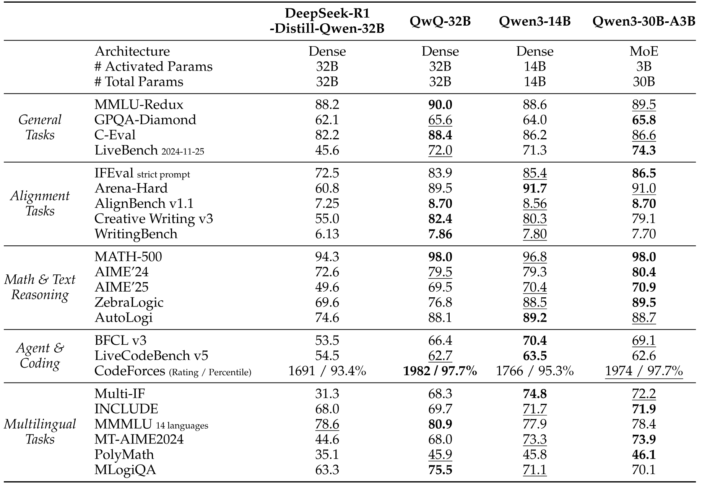

**表 15。** **Qwen3-30B-A3B / Qwen3-14B（思考）とほかの推論ベースラインの比較。最高値と 2 番目の値を、それぞれ太字と下線で示す。**

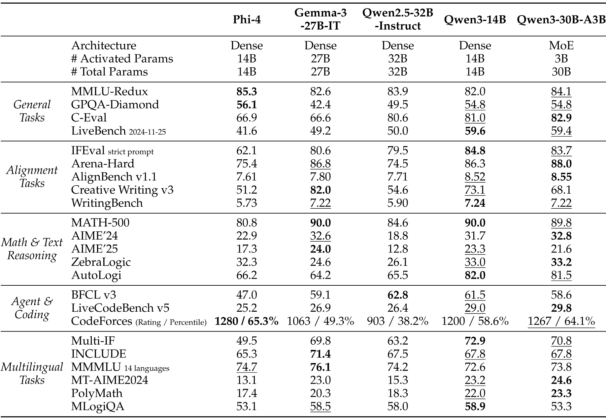

**表 16。** **Qwen3-30B-A3B / Qwen3-14B（非思考）とほかの非推論ベースラインの比較。最高値と 2 番目の値を、それぞれ太字と下線で示す。**

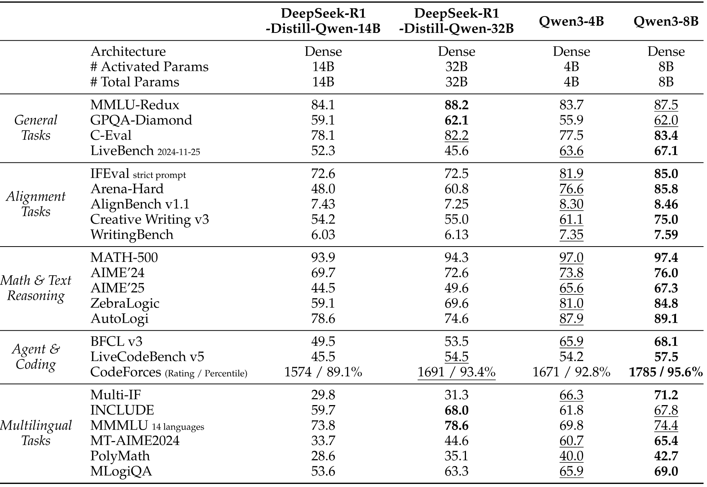

**表 17。** **Qwen3-8B / Qwen3-4B（思考）とほかの推論ベースラインの比較。最高値と 2 番目の値を、それぞれ太字と下線で示す。**

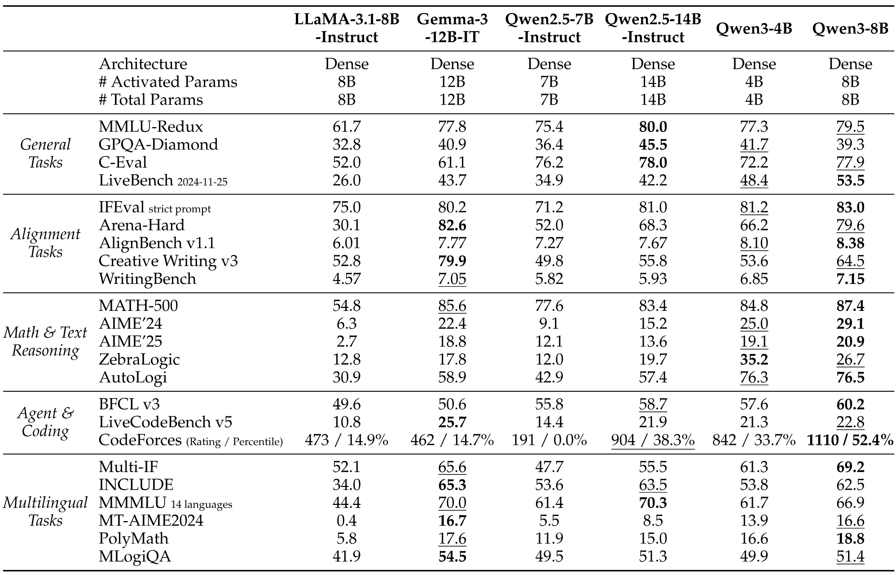

**表 18。** **Qwen3-8B / Qwen3-4B（非思考）とほかの非推論ベースラインの比較。最高値と 2 番目の値を、それぞれ太字と下線で示す。**

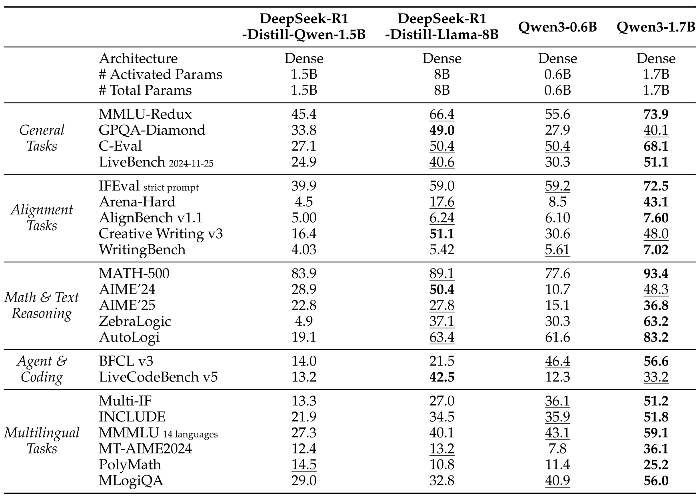

**表 19。** **Qwen3-1.7B / Qwen3-0.6B（思考）とほかの推論ベースラインの比較。最高値と 2 番目の値を、それぞれ太字と下線で示す。**

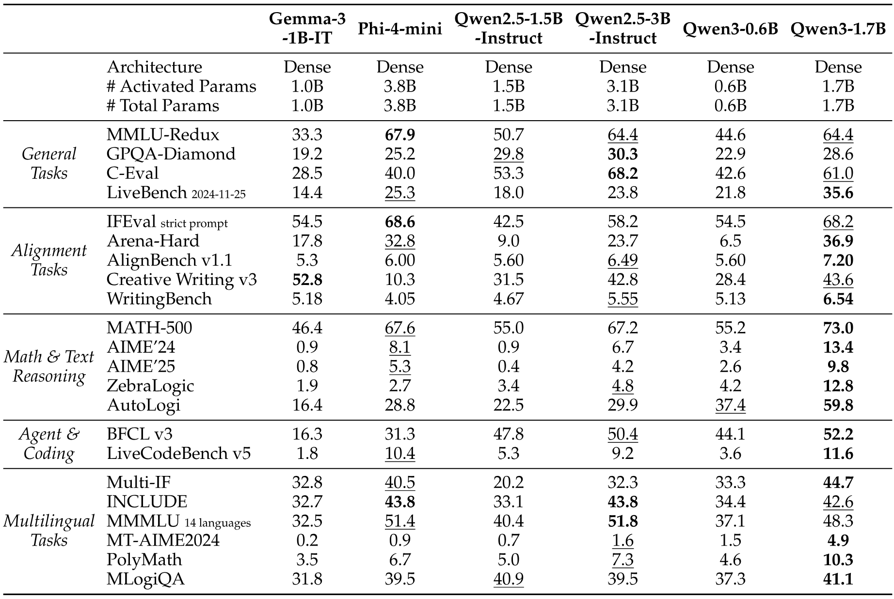

**表 20。** **Qwen3-1.7B / Qwen3-0.6B（非思考）とほかの非推論ベースラインの比較。最高値と 2 番目の値を、それぞれ太字と下線で示す。**

**Qwen3-30B-A3B と Qwen3-14B** Qwen3-30B-A3B と Qwen3-14B について、思考モードではそれぞれ DeepSeek-R1-Distill-Qwen-32B と QwQ-32B、非思考モードではそれぞれ Phi-4 [Abd24a]、Gemma-3-27B-IT [Gem25a]、Qwen2.5-32B-Instruct と比較する。評価結果を [表 15](#table-15) と [表 16](#table-16) に示す。

1. [表 15](#table-15) によると、Qwen3-30B-A3B と Qwen3-14B（思考）は、特に推論関連のベンチマークで、どちらも QwQ-32B に対して高い競争力を持つ。Qwen3-30B-A3B は、より小さなモデル規模かつ **1/10** 未満の活性化パラメータで QwQ-32B と同等の性能を達成しており、軽量モデルに深い推論能力を与える強いモデルから弱いモデルへの蒸留手法の有効性を示す。

1. [表 16](#table-16) によると、Qwen3-30B-A3B と Qwen3-14B（非思考）は、大半のベンチマークで非推論ベースラインを上回る。活性化パラメータ数と総パラメータ数が大幅に少ないにもかかわらず、従来の Qwen2.5-32B-Instruct モデルを上回り、より効率的かつ低コストな性能を実現する。

**Qwen3-8B / 4B / 1.7B / 0.6B** Qwen3-8B と Qwen3-4B について、思考モードではそれぞれ DeepSeek-R1-Distill-Qwen-14B と DeepSeek-R1-Distill-Qwen-32B、非思考モードではそれぞれ LLaMA-3.1-8B-Instruct [Dub24]、Gemma-3-12B-IT [Gem25a]、Qwen2.5-7B-Instruct、Qwen2.5-14B-Instruct と比較する。Qwen3-1.7B と Qwen3-0.6B については、思考モードではそれぞれ DeepSeek-R1-Distill-Qwen-1.5B と DeepSeek-R1-Distill-Llama-8B、非思考モードではそれぞれ Gemma-3-1B-IT、Phi-4-mini、Qwen2.5-1.5B-Instruct、Qwen2.5-3B-Instruct と比較する。Qwen3-8B と Qwen3-4B の評価結果を [表 17](#table-17) と [表 18](#table-18) に、Qwen3-1.7B と Qwen3-0.6B の結果をそれぞれ [表 19](#table-19) と [表 20](#table-20) に示す。全体として、これらのエッジ側モデルは優れた性能を示し、思考モードと非思考モードのいずれでも、従来の Qwen2.5 モデルを含む、より多くのパラメータを持つベースラインさえ上回る。この結果は、強いモデルから弱いモデルへの蒸留手法の有効性を改めて示しており、コストと労力を大幅に抑えた軽量 Qwen3 モデルの構築を可能にする。

### 4.7 考察

**思考予算の有効性** Qwen3 が思考予算の増加を利用して知能水準を高められることを検証するため、数学、コーディング、STEM の各領域にまたがる 4 個のベンチマークで、割り当てる思考予算を調整する。得られたスケーリング曲線を [図 2](#figure-02) に示す。Qwen3 の性能は、割り当てられた思考予算に応じて滑らかに向上する。さらに、出力長を 32K より長くすれば、モデル性能は将来さらに向上すると見込まれる。この検討は今後の課題とする。

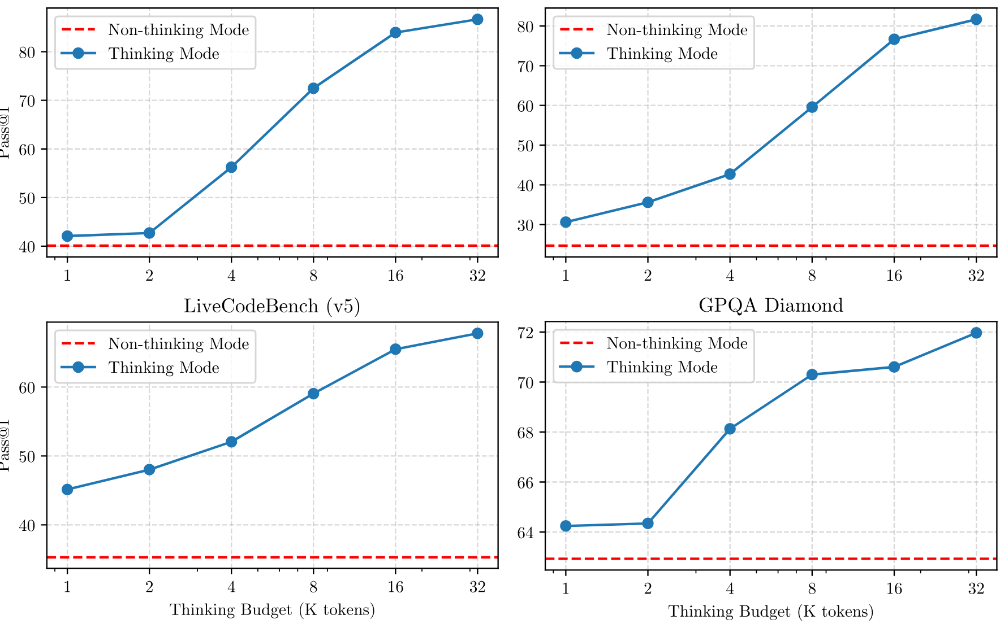

**図 2。** 思考予算に対する Qwen3-235B-A22B の性能。

**オンポリシー蒸留の有効性と効率** 同じオフポリシー蒸留済み 8B チェックポイントを出発点として、蒸留または直接強化学習を行った後の性能と計算コスト（GPU 時間で測定）を比較し、オンポリシー蒸留の有効性と効率を評価する。比較を単純にするため、数学とコードに関連するクエリだけを対象とする。[表 21](#table-21) にまとめた結果は、蒸留が強化学習より大幅に優れた性能を達成しながら、必要な GPU 時間は約 $1/10$ にすぎないことを示す。さらに、教師モデルの logits からの蒸留によって学生モデルは探索空間を広げ、推論能力を高められる。初期チェックポイントと比べ、蒸留後の AIME'24 と AIME'25 ベンチマークで pass@64 スコアが改善したことが、その根拠となる。対照的に、強化学習では pass@64 スコアが改善しない。以上の観察結果は、より強い教師モデルを用いて学生モデルの学習を導く利点を示す。

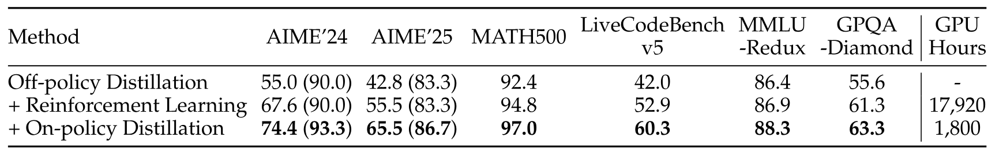

**表 21。** Qwen3-8B における強化学習とオンポリシー蒸留の比較。括弧内の数値は pass@64 スコアを表す。

**思考モード融合と汎用 RL の効果** 事後学習中の思考モード融合と汎用強化学習（RL）の有効性を評価するため、Qwen-32B モデルの各段階を評価する。前述のデータセットに加えて、ほかの能力を監視するために複数の社内ベンチマークを導入する。これらのベンチマークは次のとおりである。

- **CounterFactQA**：モデルが質問を事実に反すると判断し、幻覚を含む回答の生成を避ける必要がある反事実的な質問を収録する。

- **LengthCtrl**：長さの要件を持つ創作タスクを収録する。最終スコアは、生成内容の長さと目標長との差に基づく。

- **ThinkFollow**：`/think` と `/no_think` のフラグをランダムに挿入した複数ターン対話を使用し、モデルがユーザークエリに基づいて思考モードを正しく切り替えられるかを検証する。

- **ToolUse**：単一ターン、複数ターン、複数ステップのツール呼び出し過程におけるモデルの安定性を評価する。スコアには、意図認識の正確性、形式の正確性、ツール呼び出し過程でのパラメータの正確性が含まれる。

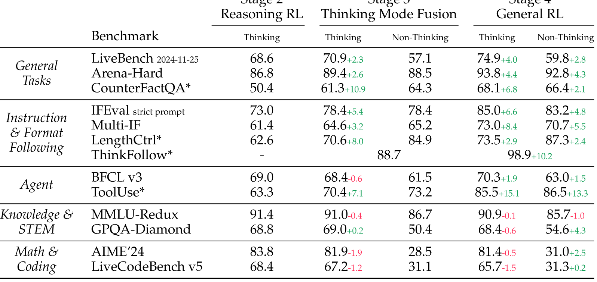

**表 22。** 推論 RL（Stage 2）、思考モード融合（Stage 3）、汎用 RL（Stage 4）後の Qwen3-32B の性能。* が付いたベンチマークは社内データセットである。

[表 22](#table-22) に結果を示す。ここから次の結論が得られる。

1. Stage 3 は、最初の二段階の学習ですでに思考能力を持つモデルへ非思考モードを統合する。ThinkFollow ベンチマークのスコア 88.7 は、モデルがモード切り替えの初期能力を身につけたものの、依然として時折誤ることを示す。Stage 3 は思考モードにおけるモデルの汎用能力と指示追従能力も高め、CounterFactQA は 10.9 ポイント、LengthCtrl は 8.0 ポイント向上する。

1. Stage 4 は、思考モードと非思考モードの両方で、モデルの汎用能力、指示追従能力、エージェント能力をさらに強化する。特に ThinkFollow スコアは 98.9 に向上し、正確なモード切り替えを保証する。

1. 知識、STEM、数学、コーディングのタスクでは、思考モード融合と汎用 RL による顕著な改善は見られない。一方、AIME'24 や LiveCodeBench のような難しいタスクでは、この二つの学習段階を経ると、思考モードの性能はむしろ低下する。この低下は、より広範な汎用タスクでモデルを学習させたことにより、複雑な問題を扱う専門能力が損なわれた可能性があるためだと推測する。Qwen3 の開発では、モデル全体の汎用性を高めるため、この性能上のトレードオフを受け入れることにした。

## 5 結論

本技術報告では、Qwen シリーズの最新版である Qwen3 を紹介した。Qwen3 は思考モードと非思考モードの両方を備え、複雑な思考タスクで使用するトークン数をユーザーが動的に管理できる。このモデルは 36 兆トークンを含む大規模なデータセットで事前学習され、119 の言語と方言でテキストを理解・生成できる。一連の包括的な評価を通じて、Qwen3 は事前学習モデルと事後学習モデルの両方で、コード生成、数学、推論、エージェントに関連するタスクを含む各種標準ベンチマークにおいて高い性能を示した。

近い将来、私たちの研究はいくつかの主要領域に焦点を当てる。より高品質で内容も多様なデータを用いて、事前学習の規模を引き続き拡大する。同時に、効率的な圧縮や極めて長いコンテキストへの拡張などを目的として、モデルアーキテクチャと学習手法の改善に取り組む。さらに、環境からのフィードバックによって学習するエージェントベースの RL システムを特に重視し、強化学習の計算資源を増やす予定である。これにより、推論時スケーリングを必要とする複雑なタスクに取り組めるエージェントを構築できる。

## 6 著者

**主要貢献者：** An Yang, Anfeng Li, Baosong Yang, Beichen Zhang, Binyuan Hui, Bo Zheng, Bowen Yu, Chang Gao, Chengen Huang, Chenxu Lv, Chujie Zheng, Dayiheng Liu, Fan Zhou, Fei Huang, Feng Hu, Hao Ge, Haoran Wei, Huan Lin, Jialong Tang, Jian Yang, Jianhong Tu, Jianwei Zhang, Jianxin Yang, Jiaxi Yang, Jing Zhou, Jingren Zhou, Junyang Lin, Kai Dang, Keqin Bao, Kexin Yang, Le Yu, Lianghao Deng, Mei Li, Mingfeng Xue, Mingze Li, Pei Zhang, Peng Wang, Qin Zhu, Rui Men, Ruize Gao, Shixuan Liu, Shuang Luo, Tianhao Li, Tianyi Tang, Wenbiao Yin, Xingzhang Ren, Xinyu Wang, Xinyu Zhang, Xuancheng Ren, Yang Fan, Yang Su, Yichang Zhang, Yinger Zhang, Yu Wan, Yuqiong Liu, Zekun Wang, Zeyu Cui, Zhenru Zhang, Zhipeng Zhou, Zihan Qiu

**貢献者：** Bei Chen, Biao Sun, Bin Luo, Bin Zhang, Binghai Wang, Bowen Ping, Boyi Deng, Chang Si, Chaojie Yang, Chen Cheng, Chenfei Wu, Chengpeng Li, Chengyuan Li, Fan Hong, Guobin Zhao, Hang Zhang, Hangrui Hu, Hanyu Zhao, Hao Lin, Hao Xiang, Haoyan Huang, Hongkun Hao, Humen Zhong, Jialin Wang, Jiandong Jiang, Jianqiang Wan, Jianyuan Zeng, Jiawei Chen, Jie Zhang, Jin Xu, Jinkai Wang, Jinyang Zhang, Jinzheng He, Jun Tang, Kai Zhang, Ke Yi, Keming Lu, Keqin Chen, Langshi Chen, Le Jiang, Lei Zhang, Linjuan Wu, Man Yuan, Mingkun Yang, Minmin Sun, Mouxiang Chen, Na Ni, Nuo Chen, Peng Liu, Peng Wang, Peng Zhu, Pengcheng Zhang, Pengfei Wang, Qiaoyu Tang, Qing Fu, Qiuyue Wang, Rong Zhang, Rui Hu, Runji Lin, Shen Huang, Shuai Bai, Shutong Jiang, Sibo Song, Siqi Zhang, Song Chen, Tao He, Ting He, Tingfeng Hui, Wei Ding, Wei Liao, Wei Lin, Wei Zhang, Weijia Xu, Wenbin Ge, Wenmeng Zhou, Wenyuan Yu, Xianyan Jia, Xianzhong Shi, Xiaodong Deng, Xiaoming Huang, Xiaoyuan Li, Ximing Zhou, Xinyao Niu, Xipin Wei, Xuejing Liu, Yang Liu, Yang Yao, Yang Zhang, Yanpeng Li, Yantao Liu, Yidan Zhang, Yikai Zhu, Yiming Wang, Yiwen Hu, Yong Jiang, Yong Li, Yongan Yue, Yu Guan, Yuanzhi Zhu, Yunfei Chu, Yunlong Feng, Yuxin Zhou, Yuxuan Cai, Zeyao Ma, Zhaohai Li, Zheng Li, Zhengyang Tang, Zheren Fu, Zhi Li, Zhibo Yang, Zhifang Guo, Zhipeng Zhang, Zhiying Xu, Zhiyu Yin, Zhongshen Zeng, Zile Qiao, Ziye Meng, Zongmeng Zhang

## A 付録

### A.1 追加の評価結果

#### A.1.1 長コンテキスト能力

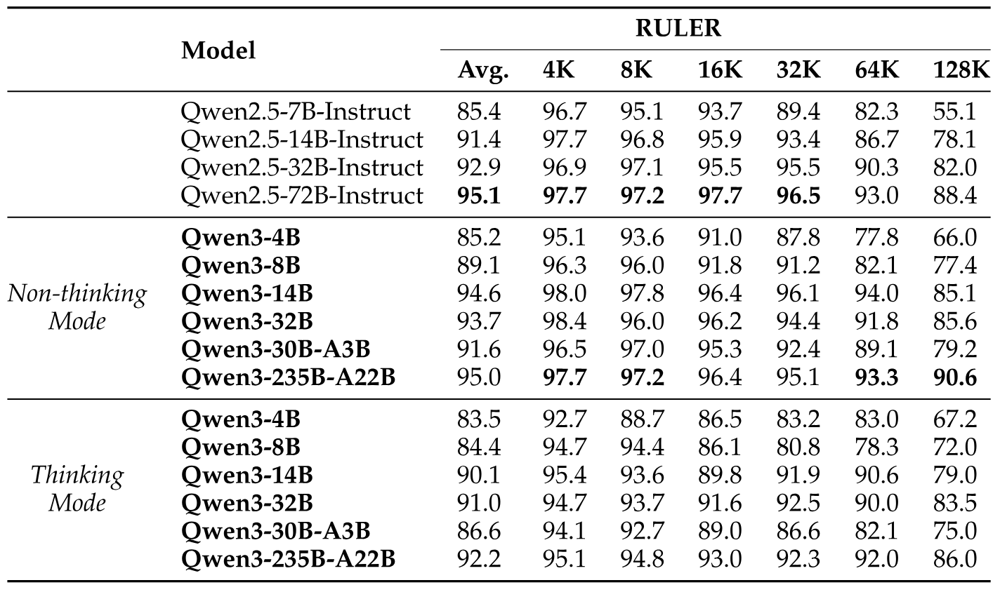

**表 23。** **RULER ベンチマークにおける Qwen3 モデルの性能。**

長コンテキスト処理能力を評価するため、[表 23](#table-23) に RULER ベンチマーク [Hsi24a] の結果を示す。長さの外挿を可能にするため、`scaling_factor=4` とした YARN [Pen23] を使用する。思考モードでは、極端に長い入力に対する過度に冗長な推論を抑えるため、思考予算を 8192 トークンに設定する。

結果は次のことを示す。

1. 非思考モードでは、Qwen3 は長コンテキスト処理タスクにおいて、同規模の Qwen2.5 モデルを上回る。

1. 思考モードでは、モデル性能がわずかに低下する。これらの検索タスクは推論に依存しないため、思考内容には顕著な利点がなく、むしろ検索過程を妨げる可能性があると推測する。今後の版では、思考モードの長コンテキスト能力を強化していく。

#### A.1.2 多言語能力

[表 24](#table-24)-[表 35](#table-35) は、スペイン語、フランス語、ポルトガル語、イタリア語、アラビア語、日本語、韓国語、インドネシア語、ロシア語、ベトナム語、ドイツ語、タイ語を含む各言語の詳細なベンチマークスコアを示す。これらの表の結果から、Qwen3 シリーズモデルは評価したすべてのベンチマークで競争力のある性能を達成し、強力な多言語能力を持つことが分かる。

より広範な言語にわたって Qwen3 の性能を評価するため、自然言語理解ベンチマーク Belebele [Ban23] を使用する。[表 36](#table-36) に示すように、このベンチマークが対応する言語のうち、最適化されていない 42 言語を除く 80 言語で評価する。表では言語を語族別にまとめている。Belebele ベンチマークにおける Qwen3 とほかのベースラインモデルの性能比較を [表 37](#table-37) に示す。結果から、Qwen3 は同規模の Gemma モデルと同等の性能を達成しながら、Qwen2.5 を大幅に上回ることが分かる。

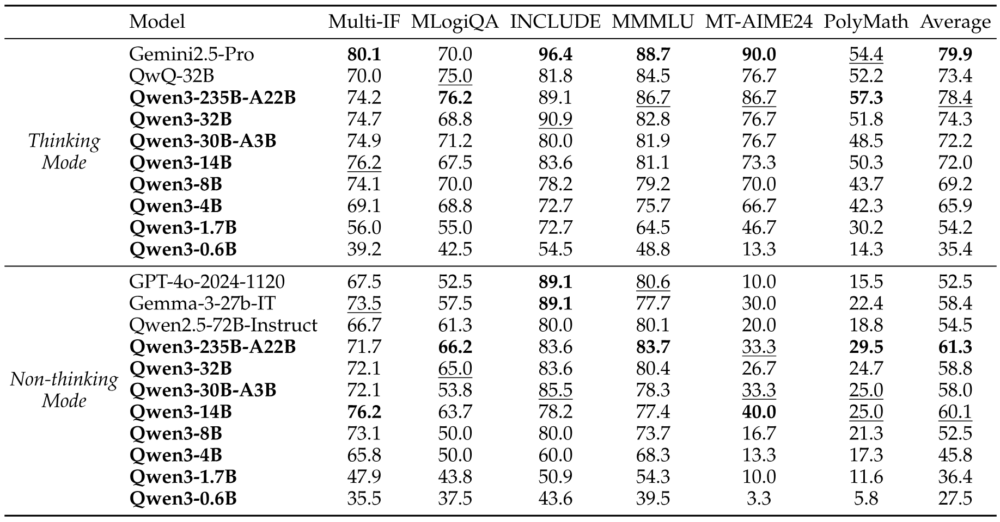

**表 24。** **スペイン語（es）のベンチマークスコア。** 最高値と 2 番目の値を、それぞれ太字と下線で示す。

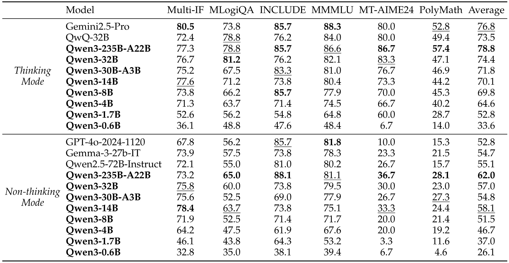

**表 25。** **フランス語（fr）のベンチマークスコア。** 最高値と 2 番目の値を、それぞれ太字と下線で示す。

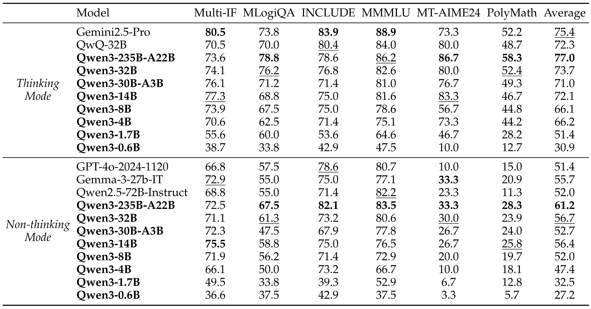

**表 26。** **ポルトガル語（pt）のベンチマークスコア。** 最高値と 2 番目の値を、それぞれ太字と下線で示す。

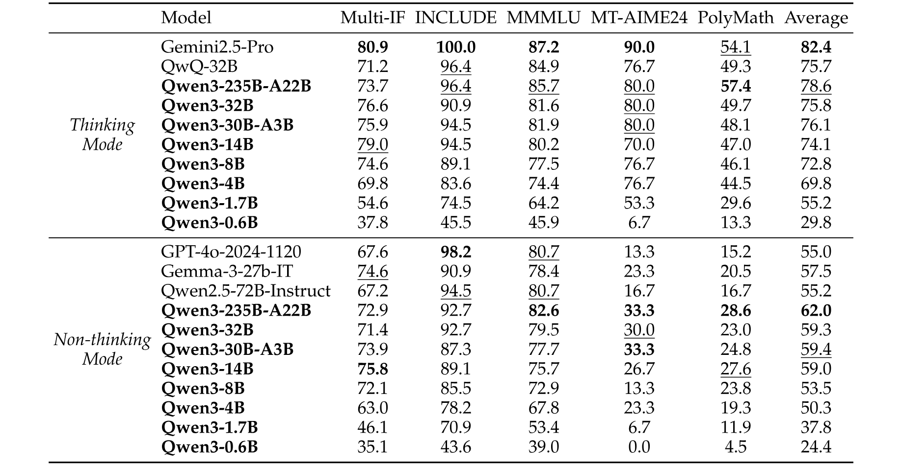

**表 27。** **イタリア語（it）のベンチマークスコア。** 最高値と 2 番目の値を、それぞれ太字と下線で示す。

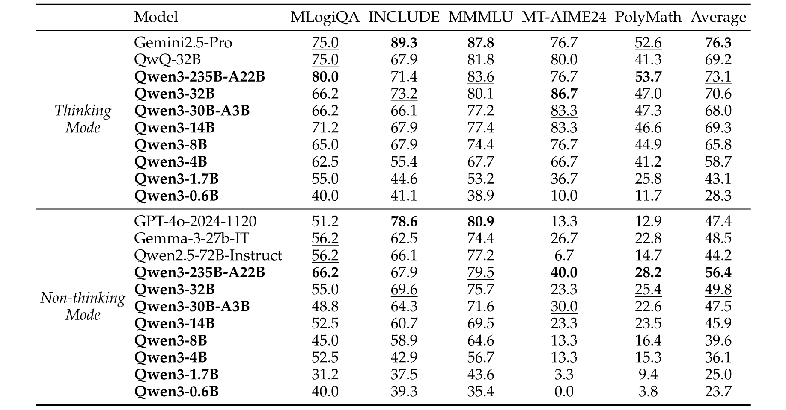

**表 28。** **アラビア語（ar）のベンチマークスコア。** 最高値と 2 番目の値を、それぞれ太字と下線で示す。

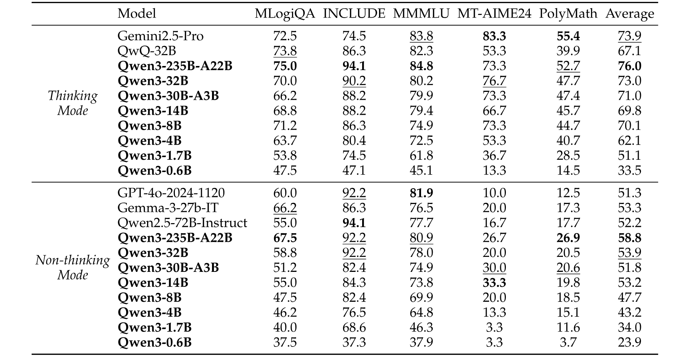

**表 29。** **日本語（ja）のベンチマークスコア。** 最高値と 2 番目の値を、それぞれ太字と下線で示す。

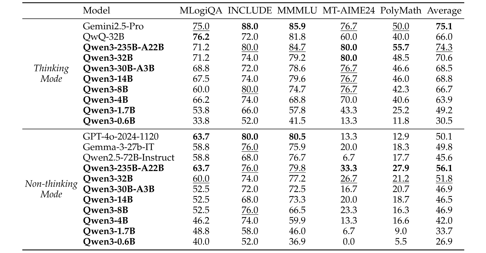

**表 30。** **韓国語（ko）のベンチマークスコア。** 最高値と 2 番目の値を、それぞれ太字と下線で示す。

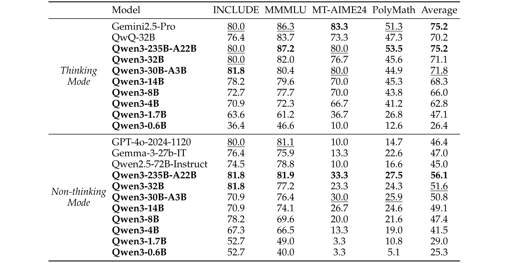

**表 31。** **インドネシア語（id）のベンチマークスコア。** 最高値と 2 番目の値を、それぞれ太字と下線で示す。

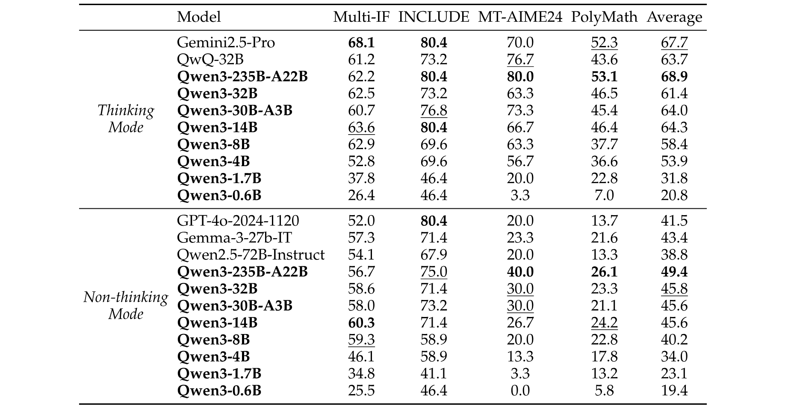

**表 32。** **ロシア語（ru）のベンチマークスコア。** 最高値と 2 番目の値を、それぞれ太字と下線で示す。

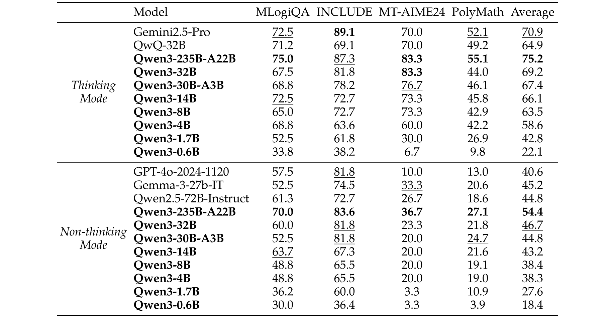

**表 33。** **ベトナム語（vi）のベンチマークスコア。** 最高値と 2 番目の値を、それぞれ太字と下線で示す。

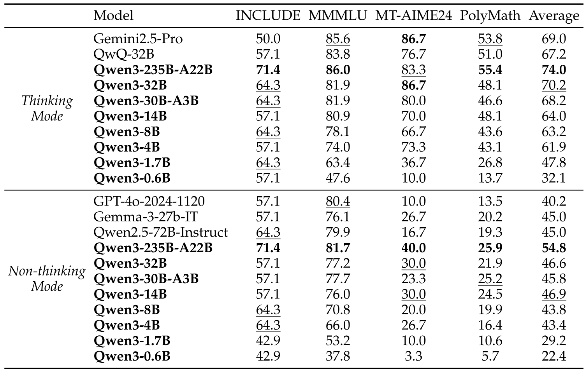

**表 34。** **ドイツ語（de）のベンチマークスコア。** 最高値と 2 番目の値を、それぞれ太字と下線で示す。

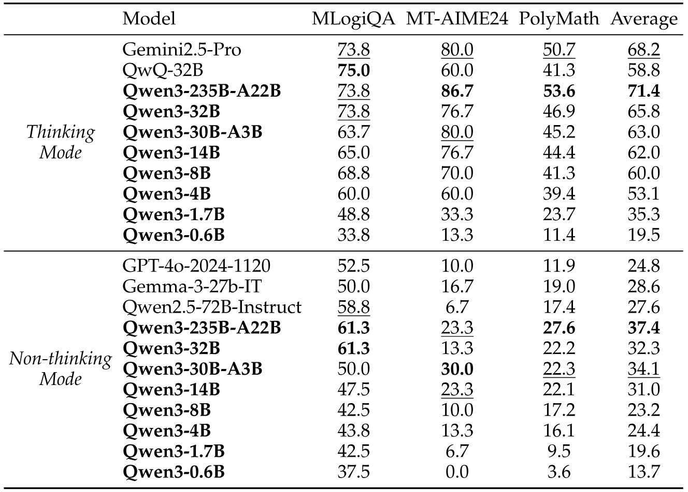

**表 35。** **タイ語（th）のベンチマークスコア。** 最高値と 2 番目の値を、それぞれ太字と下線で示す。

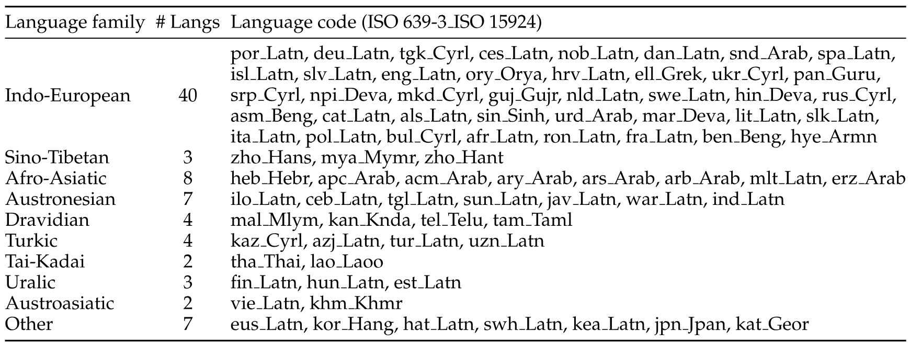

**表 36。** Belebele ベンチマークで Qwen3 が対応する語族と言語コード。

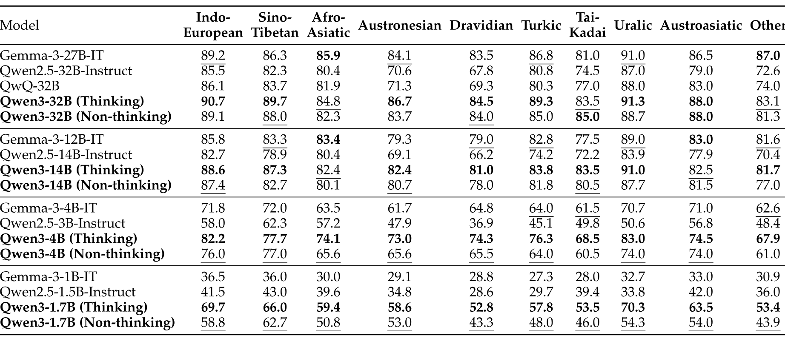

**表 37。** **Belebele ベンチマークにおける Qwen3 とほかのベースラインモデルの性能比較。** 最高値を太字、2 番目の値を下線で示す。

[+1]: [https://huggingface.co/Qwen/Qwen3-32B/blob/main/tokenizer_config.json](https://huggingface.co/Qwen/Qwen3-32B/blob/main/tokenizer_config.json)
