> [Amey Agrawal](https://ameya.info/) [+author-note]、[Nitin Kedia](https://kedianitin.com/)、[Ashish Panwar](https://apanwariisc.github.io/)、[Jayashree Mohan](https://www.microsoft.com/en-us/research/people/jamohan/)、[Nipun Kwatra](https://www.microsoft.com/en-us/research/people/nkwatra/)、[Bhargav S. Gulavani](https://x.com/bhargavgulavani)、[Alexey Tumanov](https://faculty.cc.gatech.edu/~atumanov/)、[Ramachandran Ramjee](https://x.com/ramaramjee)。2024 年 3 月 4 日に arXiv へ初回投稿、現行版は v3。第 18 回 USENIX Symposium on Operating Systems Design and Implementation（OSDI 24）、2024 年 7 月、117–134 頁に掲載。[Taming Throughput-Latency Tradeoff in LLM Inference with Sarathi-Serve](https://arxiv.org/abs/2403.02310)。<a href="/paper/sarathi-serve.pdf" target="_blank" rel="noopener noreferrer">原 PDF</a>。[DOI](https://doi.org/10.48550/arXiv.2403.02310)。[TeX ソース](https://export.arxiv.org/e-print/2403.02310)。正確な印刷レイアウトと参考文献については原 PDF を正本とする。

## 概要

各 LLM サービング要求は二つのフェーズを経る。最初の *prefill* は入力プロンプト全体を処理して最初の出力トークンを生成し、次の *decode* は残りの出力トークンを一つずつ生成する。Prefill イテレーションはレイテンシが高いものの、入力プロンプトを並列に処理するため GPU の計算能力を飽和させる。一方、decode イテレーションはレイテンシが低い反面、各要求につき一つのトークンしか処理しないため計算利用率も低い。このため、バッチ処理は decode に非常に有効であり、ひいては全体のスループットを高める。しかし、複数の要求をバッチ化すると prefill と decode のイテレーションが交互に実行され、高スループットと低レイテンシの両立が難しくなる。

このスループットとレイテンシのトレードオフに対処するため、効率的な LLM 推論スケジューラ Sarathi-Serve を提案する。Sarathi-Serve は、一つの prefill 要求をほぼ同じ大きさのチャンクに分ける *chunked-prefills* と、進行中の decode を止めずに新しい要求をバッチへ加える *stall-free* スケジュールを導入する。Stall-free scheduling により、大きなバッチでスループットを高めながら、バッチ処理がレイテンシへ与える影響を抑えられる。さらに、Sarathi-Serve のバッチは均一に近く、イテレーション間の不均衡を緩和するため、パイプラインバブルも最小限にとどまる。

これらの技術は、テールレイテンシ制約の下で、さまざまなモデルとハードウェアの推論性能を大幅に改善する。単一 A100 GPU 上の Mistral-7B ではサービング容量が $2.6\times$、2 基の A100 GPU 上の Yi-34B では vLLM に比べ最大 $3.7\times$ となる。Falcon-180B でパイプライン並列と併用すると、Sarathi-Serve はエンドツーエンドのサービング容量を最大 $5.6\times$ に高める。Sarathi-Serve のソースコードは [https://github.com/microsoft/sarathi-serve](https://github.com/microsoft/sarathi-serve) で公開している。

## 1 はじめに

大規模言語モデル（LLM）[Wei22d, Bro20, Cho23a, Ope24a, Kap20] は、自然言語処理、質問応答、コード生成など、幅広いタスクで優れた能力を示してきた。その結果、チャットボット [Ope24a, Cha22a, Ant23, Cha22]、検索 [Bin23, Kom22, You21, Per22, Bar23]、コードアシスタント [Git21a, Rep22, Ama22] など、多くの応用で利用が急増している。大規模モデルの推論には大量の GPU 計算が必要であり、利用量も大きく増えていることから、LLM 推論は今日の主要な GPU ワークロードとなった。そのため、多くの近年のシステムが LLM 推論の最適化に重点を置いている [Pop22, She23, Yu22a, Kwo23, Pat23, Zho24, Agr23]。

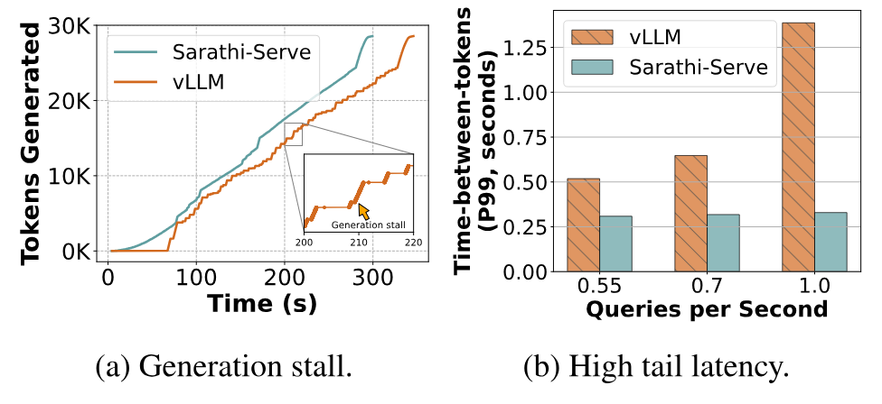

**図 1.** 2 基の A100 GPU 上で *arxiv-summarisation* トレースの 128 要求を処理する Yi-34B。[図 1(a)](#figure-01) は、vLLM で何度も発生する生成停止のうち、数秒以上続く一例を示す [Kwo23]。[図 1(b)](#figure-01) は、負荷の増加がテールレイテンシへ与える影響を示す。Sarathi-Serve は生成停止をなくしながらスループットを高める。

LLM 推論では、スループットとレイテンシのどちらも重要である。前者はサービングコストを現実的な範囲に抑え、後者はアプリケーション要件を満たすために必要となる。本論文では、現在の LLM サービングシステムがスループットとレイテンシのトレードオフに直面することを示す。バッチ処理によって LLM 推論のスループットは大幅に上げられるが、既存システムが複数の要求をバッチ化する方法では、スループットかレイテンシの一方を犠牲にする。たとえば[図 1(b)](#figure-01) は、最先端の LLM サービングシステム vLLM で負荷を増やすと、テールレイテンシが大きく増加することを示している [Kwo23]。

各 LLM 推論要求は、*prefill* に続いて *decode* を行う。*Prefill* は入力プロンプトを処理し、*decode* は自己回帰的にトークンを生成する。Prefill は入力プロンプトの全トークンを並列処理するため計算律速であり、decode は一度に各要求の一トークンだけを処理するためメモリ律速である。したがって、大きなバッチで GPU を効率よく使える decode はバッチ処理から大きな恩恵を受けるが、prefill はほとんど恩恵を受けない。

現在の LLM 推論スケジューラは、要求をバッチ化するときに prefill と decode をどう配置するかによって、*prefill-prioritizing* と *decode-prioritizing* の二種類に大別できる [+1]。本論文では、どちらの戦略にも根本的な問題があり、オンライン推論サービングには適さないと論じる（[図 2](#figure-02)）。

FasterTransformer [Fas21] など、従来の要求単位バッチ処理システムは *decode-prioritizing* scheduling を採用する。この種のシステムは要求のバッチを実行エンジンへ送り、全要求の prefill を計算してから decode をスケジュールする。バッチ内の全要求が decode を終えて初めてバッチが完了する。つまり、一つでも decode 中の要求が残っている限り、新しい prefill はスケジュールされない。この戦略は、LLM の重要なレイテンシ指標である time-between-tokens（TBT）を最適化する。新しい要求が、進行中の decode に影響しないためである。しかし、*decode-prioritizing* スケジューラはスループットを大きく損なう。バッチ内の一部の要求が早く終了しても、最後の要求が終わるまで縮小したバッチのまま実行を続けるからである。

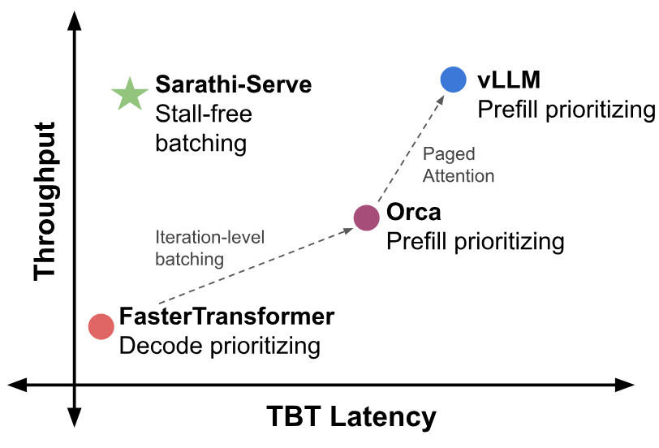

**図 2.** 現在の LLM サービングシステムは、スケジューリング方針に応じてスループットとレイテンシのトレードオフを伴う。Prefill 優先はスループットを最適化するが、TBT（time-between-tokens）のテールレイテンシを犠牲にし、decode 優先はその逆となる。Sarathi-Serve は stall-free batching により、高スループットと低 TBT レイテンシを実現する。（図は説明用であり、実際の値はモデルとワークロードの特性に依存する。）

Orca [Yu22a] は、要求が各イテレーション単位で動的にバッチへ出入りできる、イテレーション単位のバッチ処理を導入した。これは要求単位バッチ処理の非効率を避け、スループットを高める。Orca と vLLM [Vll23] など近年のシステムは、イテレーション単位のバッチ処理に *prefill-prioritizing* scheduling を組み合わせ、GPU メモリが空くたびに一つ以上の要求の prefill を即座に実行する。Prefill を先に計算すれば、その後の decode を大きなバッチで実行できるため、*prefill-prioritizing* スケジューラのスループットは高い。しかし、prefill を優先すると進行中の decode と干渉し、レイテンシが増える。Prefill の実行時間はプロンプト長に応じて際限なく長くなり得るため、*prefill-prioritizing* スケジューラは、本論文で *generation stall* と呼ぶ望ましくない現象を起こす。たとえば[図 1(a)](#figure-01) では、vLLM の生成停止が数秒以上続いている。

Orca [Yu22a] のような従来のイテレーション単位スケジューリングには、パイプライン停止またはバブル [Hua19] という別の課題もある。これは、LLM 推論を複数ノードへ拡張する際に必要なパイプライン並列（PP）配置で発生する。NVIDIA DGX A100 [Nvi16a] のように広帯域接続を備えたサーバーでは、テンソル並列（TP）[Sho19] によって最大 8 基の GPU に LLM を配置し、大きなバッチを低レイテンシで処理できる。しかし、ハイパークラスターが使えない場合、TP のレイテンシは極端に高くなり得る [Ath22]。そこで、一般的なネットワークでは TP の代わりにパイプライン並列（PP）[Pip19, Ath22] が使われる。既存システムはマイクロバッチでパイプライン停止やバブルを軽減する [Hua19]。それでも、LLM 推論固有の特性により、標準的なマイクロバッチスケジューリングにもパイプラインバブルが残る。LLM 推論には長さの異なる prefill と decode が混在するため、マイクロバッチごとの実行時間が大きく変動し、GPU サイクルを浪費してシステム全体のスループットを低下させる。

これらの課題に対処するため、拡張可能なオンライン LLM 推論サービングでスループットとレイテンシの釣り合いを取るスケジューラ Sarathi-Serve を提案する。Sarathi-Serve は *chunked-prefills* と *stall-free* scheduling という二つの考えに基づく。*Chunked-prefills* は prefill 要求を計算量が等しいチャンクに分け、プロンプトの一部のトークンずつ、複数のイテレーションにわたって prefill を計算する。*Stall-free* scheduling は、*進行中の decode を停止せず、新しい要求を実行中のバッチへ加える*。すべての進行中の decode と、新しい要求の一つ以上の prefill チャンクを合流させ、各バッチがあらかじめ設定したチャンクサイズに達するよう構成する。Sarathi-Serve はイテレーション単位のバッチ処理を基礎とするが、重要な違いがある。実行中のバッチへ新しい要求を受け入れながら、各イテレーションの prefill トークン数を制限する。この方法は各イテレーションのレイテンシに上限を設けるだけでなく、入力プロンプト全体の長さによる影響もほぼなくす。その結果、新しい prefill の計算が進行中の decode の TBT に与える影響を抑え、高スループットと低 TBT レイテンシを両立できる。

加えて、Sarathi-Serve が作る prefill と decode の混合バッチは、計算量がほぼ均一である。パイプライン並列では、この特性を使って均衡の取れたマイクロバッチスケジュールを作り、パイプラインバブルを大幅に減らして GPU 利用率を高められる。これにより、効率的で拡張可能な配置が可能となる。

Sarathi-Serve を、さまざまなモデルとハードウェアで評価する。単一 A100 上の Mistral-7B、2 基の A100 上で二方向テンソル並列を用いる Yi-34B、8 基の A40 上の LLaMA2-70B、そして一般的な Ethernet で接続した 8 基の A100 上で二方向パイプライン並列と四方向テンソル並列を用いる Falcon-180B である。Yi-34B では、SLO 目標に応じてシステムのサービング容量が最大 $3.7\times$ になる。Mistral-7B でも最大 $2.6\times$ の容量を達成する。Sarathi-Serve はパイプラインバブルも減らし、パイプライン並列で配置した Falcon-180B のエンドツーエンド容量を最大 $5.6\times$ に高める。

本論文の主な貢献は次のとおりである。

- 現在の LLM サービングシステムにある複数の問題、特にスループットとレイテンシのトレードオフを扱う際の問題を明らかにした。
- LLM サービングシステムの性能を改善する、単純ながら有効な二つの技術 *chunked-prefills* と *stall-free batching* を導入した。
- 複数のモデル、ハードウェア、並列化戦略にわたる広範な評価により、Sarathi-Serve がモデルのサービング容量を最大一桁高めることを示した。

## 2 背景

本節では、典型的な LLM のモデルアーキテクチャと自己回帰推論プロセスを説明し、スケジューリング方針と重要な性能指標を概観する。

### 2.1 Transformer アーキテクチャ

GPT-3 [Ope22a]、LLaMA [Tou23c]、Yi [Yi23] などの代表的な大規模言語モデルは、次トークン予測タスクで学習した decoder-only Transformer モデルである。これらのモデルは、同じ構造を持つ層を積み重ねて構成される。各層には self-attention と feed-forward network（FFN）の二つのモジュールがある。

**Self-attention モジュール：** Self-attention は Transformer アーキテクチャの中核であり [Vas17]、シーケンスの各部分が、それ以前の全要素を考慮して文脈表現を生成できる。Self-attention の計算では、まず各入力トークンに対応する Query（$Q$）、Key（$K$）、Value（$V$）ベクトルを線形変換で求める。次に *attention* 演算子が、シーケンス内の全トークン間の意味的な関係を計算する。各 $Q$ ベクトルと、シーケンス内で先行する全トークンの $K$ ベクトルとの内積を求め、softmax によって重みベクトルを得て、それを用いて $V$ ベクトルの重み付き平均を計算する。Attention は複数の *head* に分けて計算でき、その出力を線形変換で統合する。

**Feed-forward network（FFN）：** FFN は通常、中間に非線形活性化を挟む二つの線形変換からなる。最初の線形層は、次元 $h$ の入力トークン埋め込みを、より高い次元 $h2$ へ変換する。続いて、通常は ReLU または GELU [Aga19, Hen23] の活性化関数を適用する。最後の線形層がトークン埋め込みを元の次元 $h$ に戻す。

### 2.2 LLM 推論プロセス

**自己回帰デコード：** LLM 推論は、*prefill* と、それに続く *decode* の二つのフェーズからなる。Prefill はユーザーの入力プロンプトを処理し、最初の出力トークンを生成する。その後、decode は出力トークンを一つずつ生成する。前のステップで生成したトークンをモデルへ入力して次のトークンを生成し、特別な *end-of-sequence* トークンが生成されるまで繰り返す。Attention を実行するには、それ以前に処理した全トークンに対応する key と value が必要となる。再計算を避けるため、現代の LLM 推論システムはこれらの活性値を KV-cache に保存する [Sho19, Yu22a, Fas21]。

典型的な LLM のプロンプトには、数百から数千の入力トークンが含まれる（[表 2](#table-02)、[Zhe23c]）。Prefill はすべてのプロンプトトークンを一回のイテレーションで並列処理するため、GPU の計算能力を効率よく利用できる。一方、decode は前のイテレーションで生成した一つのトークンに対してモデル全体の forward pass を実行する。そのため計算利用率が低く、decode はメモリ律速となる。

**マルチテナント環境でのバッチ LLM 推論：** 本番サービングシステムは、複数ユーザーから同時に届く要求を処理しなければならない。要求を逐次処理すると GPU の計算能力を大きく浪費するため、LLM サービングシステムは複数の要求をバッチ化して並行に実行する。これは、小さなバッチでは算術強度が低い decode に特に有効である。バッチを大きくするほど、モデルパラメータ取得のコストを多くの要求に分散できる。

近年は、より大きなバッチを可能にしてスループットを改善する、相補的な手法も提案されている。Kwon らの PagedAttention [Kwo23] は *KV-cache* の断片化をなくし、より多くの要求を同時実行できる。LLaMA2 [Tou23c]、Falcon [Alm23]、Yi [Yi23] など先進的な LLM で用いられる Multi Query Attention（MQA）[Sha19b] と Group Query Attention（GQA）[Ain23a] も、LLM 推論のメモリボトルネックを大きく緩和する。たとえば LLaMA2-70B の KV-cache footprint は LLaMA-65B の $1/8$ である。

### 2.3 マルチ GPU LLM 推論

モデルサイズの増大に伴い、LLM は複数 GPU、さらには複数ノードへ拡張して配置する必要がある [Pop22, Usi23]。また、LLM の推論スループット、特に decode のスループットは、単一 GPU に収まる最大バッチサイズに制約される。モデル並列化はモデルの重みを複数 GPU に分割して大きなバッチを可能にし、推論効率を高める。従来研究は、この目的でテンソル並列（TP）[Sho19] とパイプライン並列（PP）[Yu22a, Fas21, Wu23a] を用いてきた。

TP はモデルの重みと KV-cache を参加 GPU 間で分割し、各層を分散する。したがって、GPU あたりのバッチサイズを線形に拡張できる。しかし各層で、attention と FFN に一回ずつ、計二回の all-reduce が必要となり [Sho19]、通信コストが高い。これらの通信はクリティカルパス上にあるため、TP は通常、GPU を NVLink などの広帯域インターコネクトで接続した単一ノード内に限って用いられる。

PP はモデルを層ごとに分け、各 GPU がその一部を受け持つ。パイプライン内の全 GPU を稼働させ続けるため、*micro-batching* を用いる。各イテレーションで、マイクロバッチは一つのパイプラインステージから次のステージへ移る。複数層を計算するごとに活性値を一度送るだけでよいため、PP の計算通信比は TP よりはるかに高い。さらに、PP は point-to-point 通信だけを必要とするが、TP にはより高価な all-reduce が必要となる。したがって、クロスノード配置のように広帯域インターコネクトを使えない環境では、PP は TP より効率的である。

### 2.4 性能指標

LLM サービングでは主に、TTFT（time-to-first-token）と TBT（time-between-tokens）という二つのレイテンシ指標を扱う。ある要求について、TTFT はシステムへの到着から最初の出力トークンが生成されるまでのレイテンシであり、モデルの初期応答性を表す。TBT は同じ要求で二つの出力トークンが連続して生成される間隔であり、ユーザーが感じる応答の滑らかさに影響する。システムに負荷がかかったとき、スループットが低いとスケジューリング遅延が長くなり、TTFT も増加する。

また、指定したレイテンシ目標を満たしながらシステムが処理できる最大要求負荷（queries per second）を表す、*Capacity* というスループット指標も用いる。容量が大きいほどサービングコストは下がる。

### 2.5 LLM 推論のスケジューリング方針

スケジューラは admission control と batching policy を担当する。説明のため、既存の LLM 推論スケジューラを *prefill-prioritizing* と *decode-prioritizing* の二種類に大別する。

FasterTransformer [Fas21] や Triton Inference Server [Tri20] のような従来の推論エンジンは、要求単位バッチ処理による *decode-prioritizing* scheduling を採用する。要求のバッチを選び、バッチ内の**全**要求が完了するまで実行する（[アルゴリズム 1](#algorithm-01)）。この方法はスケジューリングフレームワークの実行上の複雑さを軽減する反面、リソース利用率を下げる。バッチ内の要求ごとに入力・出力トークン数が大きく異なることが多く、要求単位スケジューラは短い要求をゼロで埋めて最長の要求に合わせる。このため無駄な計算が生じ、待機中の要求も長く待たされる [Yu22a]。

**アルゴリズム 1：要求単位のバッチ処理。decode が一つも残っていないときだけ新しい要求を受け入れる（3 行目）。TBT は最適化されるが、decode だけの多くのイテレーション（10 行目）はバッチが小さく、GPU 計算を浪費し得る。**

- 現在のバッチを $B \leftarrow \emptyset$ で初期化する。
- **while** True：
  - **if** $B = \emptyset$：
    - $R_{new} \leftarrow$ `get_next_request()`。
    - **while** `can_allocate_request`$(R_{new})$：
      - $B \leftarrow B + R_{new}$。
      - $R_{new} \leftarrow$ `get_next_request()`。
    - `prefill`$(B)$。
  - **else**：
    - `decode`$(B)$。
    - $B \leftarrow$ `filter_finished_requests`$(B)$。

要求単位バッチ処理の無駄を避けるため、Orca [Yu22a] は、各モデルイテレーションの後に要求が動的にバッチへ出入りできる細粒度のイテレーション単位バッチ処理を導入した（[アルゴリズム 2](#algorithm-02)）。この方法はシステムのスループットを大きく高め、現在では vLLM [Vll23]、TensorRT-LLM [Ten23]、LightLLM [Lig23c] など、多くの LLM 推論サービングシステムで用いられている。

**アルゴリズム 2：イテレーション単位のバッチ処理（vLLM）。Prefill を直ちに実行するため（8–9 行目）、進行中の decode に生成停止を起こし得る（12 行目）。**

- 現在のバッチを $B \leftarrow \emptyset$ で初期化する。
- **while** True：
  - $B_{new} \leftarrow \emptyset$。
  - $R_{new} \leftarrow$ `get_next_request()`。
  - **while** `can_allocate_request`$(R_{new})$：
    - $B_{new} \leftarrow B_{new} + R_{new}$。
    - $R_{new} \leftarrow$ `get_next_request()`。
  - **if** $B_{new} \neq \emptyset$：
    - `prefill`$(B_{new})$。
    - $B \leftarrow B + B_{new}$。
  - **else**：
    - `decode`$(B)$。
  - $B \leftarrow$ `filter_finished_requests`$(B)$。

vLLM [Vll23] や Orca [Yu22a] など、現在のイテレーション単位バッチ処理システムは *prefill-prioritizing* scheduling を用い、たとえば GPU メモリが利用可能になると、機会があるたびに新しい要求を実行中のバッチへ直ちに受け入れる。Prefill を優先すると、その後の decode イテレーションを大きなバッチで実行でき、スループットが高まる。

## 3 動機

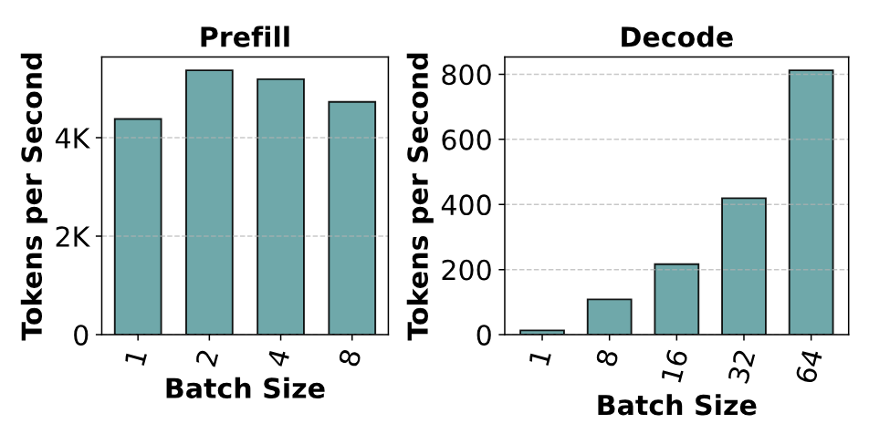

**図 3.** 単一 A100 GPU 上で異なるバッチサイズを用いた Mistral-7B の prefill と decode のスループット。Prefill と decode の実験はいずれもプロンプト長 1024 を用いる。二つのグラフの y 軸が異なることから、prefill は decode よりはるかに効率的だと分かる。また、*バッチ処理は decode のスループットをほぼ線形に高めるが、prefill のスループットにはほとんど影響しない。*

本節では、まず prefill と decode 演算のコストを分析し、次に LLM サービングのスループットとレイテンシのトレードオフ、およびパイプラインバブルを説明する。

### 3.1 Prefill と decode のコスト分析

[第 2.2 節](#section-2-2)で述べたとおり、*prefill* は全入力トークンを並列処理して GPU の計算能力を飽和させるが、*decode* は一度に一トークンしか処理せず、効率が低い。[図 3](#figure-03) は、バッチサイズに応じたスループットの変化を示す。Decode イテレーションのスループットはバッチサイズとほぼ線形に増えるが、prefill のスループットは要求が一つだけでもほぼ飽和する。

**所見 1：** *LLM 推論の prefill と decode は異なる挙動を示す。バッチ処理は decode のスループットを大幅に高めるが、prefill のスループットにはほとんど影響しない。*

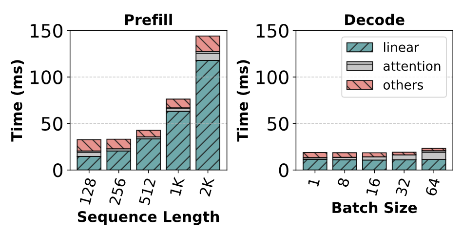

**図 4.** 単一 A100 GPU 上で異なる入力サイズを用いた Mistral-7B の prefill と decode の時間。どちらのフェーズでも、実行時間の大部分を線形層が占める。Decode バッチの算術強度が低いため、1 個の decode トークンに対する線形演算のコストは、128 個の prefill トークンに対するコストとほぼ等しい。

[図 4](#figure-04) は prefill と decode の計算時間を linear、attention、others に分解し、それぞれの割合を示す。実行コストの大部分は線形演算子が占める。Attention のコストはシーケンス長に対して二次関数的に増えるが、長いシーケンスでも線形演算子は全体の 80% 以上を占める。したがって、LLM 推論の改善には線形演算子の最適化が重要となる。

**Decode 中の計算利用率は低い：** Decode は計算利用率が低く、GPU の処理能力を浪費する。これを詳しく調べるため、prefill と decode イテレーションの算術強度を分析する。LLM 推論では時間の大部分が線形演算子に費やされるため、分析もこれらの演算子に絞る。

行列乗算カーネルは、メモリアクセスと数学演算を重ねて実行する。演算全体の実行時間は $T=\max(T_{\text{math}},T_{\text{mem}})$ と近似できる。$T_{\text{math}}$ と $T_{\text{mem}}$ は、それぞれ数学演算とメモリ読み出しの時間である。$T_{\text{math}}<T_{\text{mem}}$ なら演算はメモリ律速となる。メモリ律速の演算は model FLOPs utilization（MFU）が低い [Cho23a]。反対に、計算律速の演算は model bandwidth utilization（MBU）が低い。$T_{\text{math}}=T_{\text{mem}}$ の点で、計算とメモリ帯域幅の利用率がともに最大になる。算術強度は、読み出した 1 バイト当たりの数学演算数である。最適点では、演算の算術強度がデバイスの FLOPS 対帯域幅比に等しくなる。[図 5](#figure-05) は、4 基の A100 GPU 上で LLaMA2-70B を実行したとき、線形層の算術強度がバッチ内トークン数に応じてどう変わるかを示す。Prefill バッチは、線形演算子の重みを HBM から GPU キャッシュへ読み込むコストを多数のトークンに分散できるため、算術強度が高い。Decode バッチの算術強度は低い。[図 6](#figure-06) は、LLaMA2-70B の一イテレーションにおける線形演算子の総実行時間をトークン数ごとに示す。最初のメモリ律速領域では実行時間がわずかに増えるだけだが、計算律速へ移ると線形に増加する。 [+2]

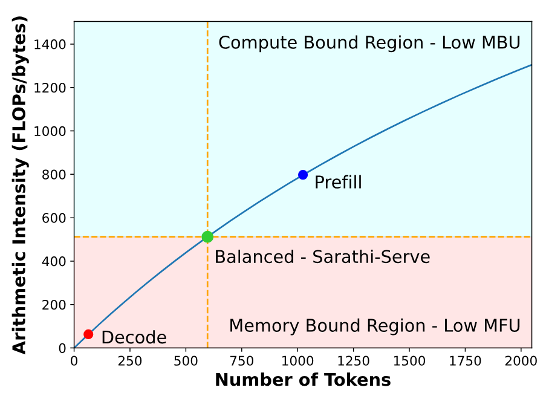

**図 5.** 4 基の A100 上で、トークン数を変えて LLaMA2-70B の線形演算を実行したときの算術強度。Decode バッチは算術強度が低く、メモリ読み出し時間がボトルネックとなるため、計算利用率が低い。Prefill バッチは計算律速であり、帯域幅利用率が低い。Sarathi-Serve は decode と prefill チャンクを均衡の取れたバッチへまとめ、計算と帯域幅の利用率を同時に高める。

**所見 2：** *Decode バッチはメモリ律速領域にあり、計算能力が十分に使われていない。そのため、レイテンシを大きく増やさずに、decode バッチとともに追加のトークンを処理できる。*

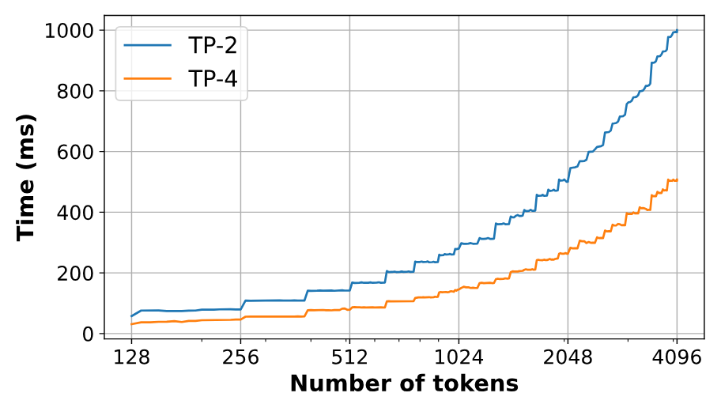

**図 6.** 異なるテンソル並列度で LLaMA2-70B を A100 上に実行したときの、バッチ内トークン数に対する線形層の実行時間。トークン数が少ない間、実行時間は HBM から重みを読み出すコストで決まる。そのため 128～512 トークンの間ではほとんど変化せず、テンソル並列度が高いほどこの傾向が強い。バッチのトークン数が閾値を超えると計算律速になり、実行時間はトークン数に対して線形に増える。

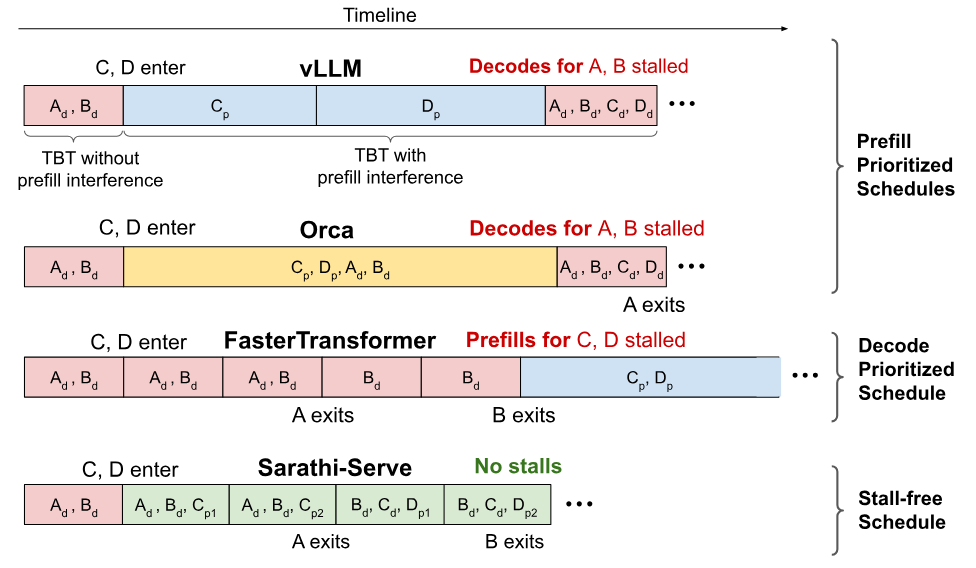

**図 7.** ある要求の連続する二つの decode イテレーションの間に、一つ以上の prefill がスケジュールされると生成停止が起きる。A、B、C、D は異なる要求で、添字 $d$ は decode イテレーション、$p$ は完全な prefill、$p0$ と $p1$ は同一プロンプトの二つの prefill チャンクを表す。vLLM は可能な限り多くの prefill を先に実行してから既存の decode を再開するため、生成停止を招く。Orca は混合バッチを扱えるが、長いプロンプトを含むバッチは依然として実行時間が長く、生成停止を防げない。FasterTransformer はすべての既存 decode を完了してから新しい prefill を実行するため生成停止はないが、decode バッチが小さくなりスループットを損なう。Sarathi-Serve のスケジュールは生成停止をなくしながら、高いスループットを実現する。

### 3.2 スループットとレイテンシのトレードオフ

イテレーション単位のバッチ処理はシステムスループットを高めるが、*生成停止*という現象により、TBT レイテンシが増えることを本論文で示す。

[図 7](#figure-07) は、異なるスケジューリング方針を比較する。例では、要求 A、B、C、D のタイムラインを左から右へ示す。区間の開始時、A と B は decode 中であり、一イテレーション後に C と D がシステムへ入る。Orca と vLLM はどちらも FCFS のイテレーション単位バッチ処理を使い、prefill 要求を直ちに受け入れるが、バッチ構成が異なる。Orca は prefill と decode の要求からなる混合バッチを扱えるが、vLLM のバッチは prefill だけ、または decode だけで構成される。どちらも、その後の decode を大きなバッチで実行してスループットを高められる。しかし、要求 C と D の prefill を直ちにスケジュールすると、既存要求 A と B の decode が遅れる。一つ以上の prefill を計算するイテレーションは、入力プロンプト長に応じて数秒に達し得るためである。このように、*prefill-prioritizing* スケジューラは、既存の decode に*生成停止*を起こし、TBT レイテンシのスパイクを生む。

イテレーション単位のバッチ処理とは異なり、FasterTransformer [Fas21] など要求単位のバッチ処理システムは、既存要求が**すべて** decode を完了するまで新しい要求をスケジュールしない（[アルゴリズム 1](#algorithm-01)の 3 行目）。[図 7](#figure-07) では、要求 A と B がシステムを出るまで、C と D の prefill は待たされる。そのため *decode-prioritizing* システムの TBT は低いが、システムスループットも低い。たとえば Kwon ら [Kwo23] は、PagedAttention を使うイテレーション単位バッチ処理が FasterTransformer より一桁高いスループットを得ることを示した。

イテレーション単位バッチ処理のレイテンシスパイクを減らす一つの方法は、Orca [Yu22a] が提案するように小さなバッチを使うことである。しかし[第 2.2 節](#section-2-2)で示したとおり、バッチを小さくするとスループットが落ちる。したがって、既存システムは目標 SLO に応じてスループットとレイテンシのどちらかを選ばざるを得ない。

**所見 3：** *現在の LLM 推論スケジューラでは、prefill と decode を交互に実行すると、スループットとレイテンシのトレードオフが生じる。今日の最先端システムは prefill-prioritizing scheduling を採用し、TBT レイテンシと引き換えに高スループットを得ている。*

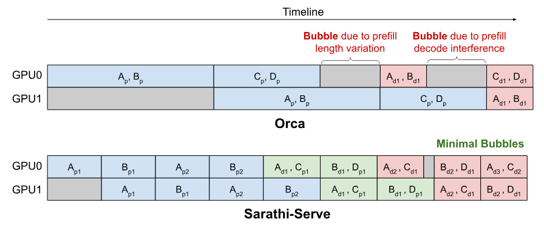

**図 8.** Orca が四つの要求（A、B、C、D）に対して二方向パイプライン並列のイテレーション単位スケジュールを実行すると、バッチ実行時間が不均一なためパイプラインバブルが生じる。Sarathi-Serve は計算量の均一なバッチを作り、これらの停止を最小限に抑える。

### 3.3 パイプラインバブルによる GPU サイクルの浪費

パイプライン並列（PP）はテンソル並列（TP）より通信オーバーヘッドが低く、大規模モデルを複数ノードへ配置する一般的な戦略である。しかし、後続のパイプラインステージは前のステージが対応するマイクロバッチを終えるまで待たなければならず、PP には GPU がアイドル状態となる*パイプラインバブル*が生じる。パイプラインバブルは学習ジョブで知られた問題であり、前段が backward pass の到着を待つため、forward pass と backward pass の間に発生する。PP を用いる学習ジョブでは、micro-batching がパイプラインバブルを軽減する一般的な手法となっている [Ath22, Pip19, Hua19]。

推論ジョブは forward pass だけを行うため、micro-batching でパイプラインバブルをなくせると思われるかもしれない。実際、FasterTransformer [Fas21] や FastServe [Wu23a] などの Transformer 推論研究はマイクロバッチを使うが、パイプラインバブルには言及していない。近年提案された Orca [Yu22a] も、イテレーション単位のスケジューリングがパイプラインスケジュールのバブルをなくすと示唆している（[Yu22a] の[図&#32;8](https://arxiv.org/pdf/2206.02672#page=11)）。ところが、実験ではイテレーション単位のスケジューリングを用いても、PP でパイプラインバブルが大量の GPU サイクルを浪費する（[第 5.3 節](#section-5-3)）。

LLM 推論の各マイクロバッチ（またはイテレーション）は、含まれる prefill と decode のトークン構成により計算量が異なり、実行時間も変わり得る（[図 8](#figure-08)）。推論には三種類のバブルがある。（1）$\mathrm{PB}_{1}$ のように、連続する二つのマイクロバッチで prefill トークン数が違うため生じるもの。（2）$\mathrm{PB}_{2}$ のように、prefill と decode が前後して実行され、計算時間が違うため生じるもの。（3）$\mathrm{PB}_{3}$ のように、累積コンテキスト長（KV-cache の大きさ）が要求ごとに違い、マイクロバッチ間で decode の実行時間が変わるため生じるもの。Falcon-180B では、4k トークンのプロンプトの計算に約 $\approx 1150$ ms かかるが、バッチサイズ 32 の decode-only イテレーションは約 $\approx 200$ ms で済む。この二種類のイテレーションを交互に実行すると、約 $\approx 950$ ms のバブルが生じ得る。パイプラインバブルは GPU サイクルを浪費し、サービングスループットを直接低下させてレイテンシを増やす。長いプロンプトは prefill イテレーションを長くし、大きなバッチは prefill イテレーションの頻度を上げるため、どちらも問題を悪化させる。各マイクロバッチが同じ計算量を実行するよう保証できれば、このバブルを軽減できる。

**所見 4：** *LLM イテレーションの計算時間は、バッチ内の prefill と decode のトークン構成によって大きく変わる。パイプライン並列では、それが大きなバブルを生む。*

## 4 Sarathi-Serve：設計と実装

本節では Sarathi-Serve の設計と実装を説明する。Sarathi-Serve は *chunked-prefills* と *stall-free batching* という二つの技術により、高スループットと予測可能なテールレイテンシを実現する。

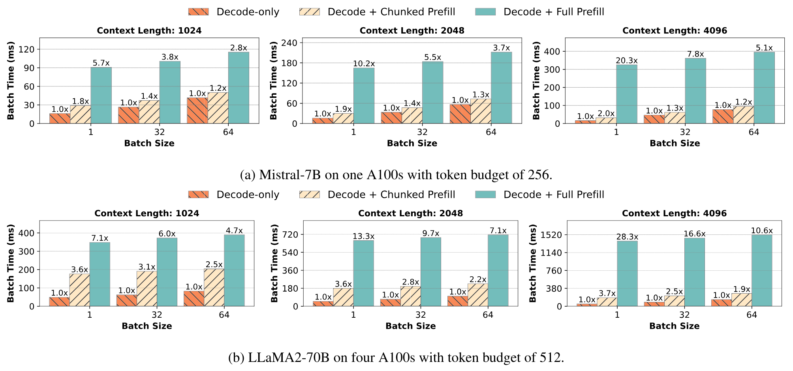

**図 9.** Prefill と decode のバッチをまとめる際の増分コスト。二つの方式を比較する。（i）Decode + Full Prefill は Orca の混合バッチ処理で、完全な prefill を一イテレーションで既存の decode と実行する。（ii）Decode + Chunked Prefill は Sarathi-Serve で、prefill を固定のトークン予算でチャンク化してから既存の decode とまとめる。Sarathi-Serve が prefill トークンを処理するとき、decode レイテンシへの影響ははるかに小さい。Decode バッチとコンテキスト長が大きくなるほど、相対的な影響はさらに小さくなる。

### 4.1 Chunked-prefills

[第 3.1 節](#section-3-1)で示したとおり、decode バッチは強いメモリ律速で算術強度が低い。この算術強度の余裕を利用し、decode バッチに追加計算を付加できる。最も単純な方法は、メモリ律速の decode と計算律速の prefill をまとめた混合バッチを作ることである。しかし、実際の入力プロンプトは平均で数千トークンに達することが多い。たとえば[表 2](#table-02)では、*openchat_sharegpt4* と *arxiv_summarization* のプロンプト長中央値が、それぞれ 1730 と 7059 である。このような長い prefill を decode イテレーションとまとめると、TBT レイテンシが大きくなる。

この問題に対処するため、大きな prefill を小さなチャンクに分け、複数のイテレーションで計算する *chunked-prefills* を提案する。これは二つの観察に基づく prefill 分割方式である。第一に、[第 3.1 節](#section-3-1)で述べたとおり、中程度のシーケンス長の prefill 要求だけでも GPU の計算能力を飽和させられる。たとえば[図 4](#figure-04)では、prefill スループットが約 512 トークンで飽和し始める。第二に、実際の入力プロンプトは平均で数千トークンに達することが多い（[表 2](#table-02)）。したがって、大きな prefill 要求は、GPU の計算能力を飽和できる大きさを保ったまま、小さな計算単位に分割できる。Sarathi-Serve はこの仕組みを利用して適切なトークン数のバッチを作り、TBT SLO に違反せず、decode バッチで使われていない計算能力を活用する。

**アルゴリズム 3：Sarathi-Serve の stall-free batching。まず既存の decode トークンをバッチへ入れ（6–8 行目）、既存要求の prefill チャンクがあればそれも加える（10–12 行目）。最後にトークン予算の範囲で新しい要求を加え（13–20 行目）、スループットを最大化しつつ、既存 decode の遅延による TBT への影響を抑える。**

- **入力：** $T_{\max}$、アプリケーションの TBT SLO。
- *token_budget* を $\tau \leftarrow$ `compute_token_buget`$(T_{\max})$ で初期化する。
- *batch_num_tokens* を $n_t \leftarrow 0$ で初期化する。
- 現在のバッチを $B \leftarrow \emptyset$ で初期化する。
- **while** True：
  - $B$ 内の各 $R$ について：
    - **if** `is_prefill_complete`$(R)$：
      - $n_t \leftarrow n_t + 1$。
  - $B$ 内の各 $R$ について：
    - **if** not `is_prefill_complete`$(R)$：
      - $c \leftarrow$ `get_next_chunk_size`$(R, \tau, n_t)$。
      - $n_t \leftarrow n_t + c$。
  - $R_{new} \leftarrow$ `get_next_request()`。
  - **while** `can_allocate_request`$(R_{new}) \land n_t < \tau$：
    - $c \leftarrow$ `get_next_chunk_size`$(R_{new}, \tau, n_t)$。
    - **if** $c > 0$：
      - $n_t \leftarrow n_t + c$。
      - $B \leftarrow R_{new}$。
    - **else**：
      - **break**。
  - `process_hybrid_batch`$(B)$。
  - $B \leftarrow$ `filter_finished_requests`$(B)$。
  - $n_t \leftarrow 0$。

### 4.2 Stall-free batching

Sarathi-Serve は、*chunked-prefills* と prefill・decode の統合を利用し、レイテンシを抑えながらスループットを高めるイテレーション単位スケジューラである。

Orca と vLLM は prefill を実行するため既存の decode を停止するが、Sarathi-Serve は decode イテレーションに残る算術強度の余裕を用い、システム内の decode 要求を遅らせずに prefill を実行する。この方法を *stall-free batching* と呼ぶ（[アルゴリズム 3](#algorithm-03)）。Sarathi-Serve はまず、ユーザー指定の SLO に基づき、一つのバッチで実行できる最大トークン数を予算として求める。このトークン予算の決め方は[第 4.3 節](#section-4-3)で詳しく説明する。各スケジューリングイテレーションでは、実行中の全 decode を次のバッチへ入れ（[アルゴリズム 3](#algorithm-03)の 6–8 行目）、未完了の prefill があれば加える（9–12 行目）。すべての実行中要求を収めてから、新しい要求を受け入れる（13–20 行目）。Prefill 要求を加えるときは、そのバッチに残ったトークン予算へ収まる最大チャンクサイズを計算する（11、15 行目）。各イテレーションの計算負荷を制限することで、*stall-free batching* は、並行する prefill チャンクのため decode に生成停止が起きないよう保証する。[図 9](#figure-09)は、chunked prefill を使う場合と使わない場合の混合バッチのレイテンシを比較する。単純な混合バッチ処理では、decode-only バッチに比べ TBT が最大 $28.3\times$ まで急増する。一方、Sarathi-Serve はチャンク化により、レイテンシをはるかに厳しく制限する。

[図 7](#figure-07)は、[第 3.2 節](#section-3-2)と同じ例で Sarathi-Serve のスケジューリング方針を示す。最初のイテレーションでは計算すべき prefill がなく、decode だけを実行する。新しい要求 C が入ると、Sarathi-Serve は C の prefill を二つのチャンクに分け、後続イテレーションへ配置する。同時に、*stall-free batching* により、この prefill チャンクを A と B の進行中の decode とまとめる。このように、Sarathi-Serve は既存システムと違って decode も prefill も停止せず、スループットを損なわずに TBT のレイテンシスパイクをほぼなくす。さらに、*stall-free batching* と *chunked-prefills* の組み合わせは、多くの場合、計算量の均一な混合バッチを作る。パイプライン並列のバブルが減り、効率的で拡張可能な配置が可能となる。

### 4.3 トークン予算の決定

トークン予算は、TBT SLO 要件と *chunked-prefills* のオーバーヘッドという、競合する二つの要因で決まる。TBT を最小化するには小さな予算が望ましい。Prefill トークンの少ないイテレーションはレイテンシも低いためである。しかし予算が小さすぎると、prefill が過剰に細分化され、（1）GPU 利用率の低下と、（2）attention での KV-cache の反復アクセスによるオーバーヘッドが生じる。後者について以下で説明する。

*Chunked-prefills* の計算では、プロンプトの各チャンクに対する attention が、同じプロンプトの先行する**すべて**のチャンクの KV-cache にアクセスする必要がある。計算コストは変わらないが、GPU HBM からのメモリ読み出しが増える。たとえば prefill シーケンスを $N$ チャンクに分けた場合、最初のチャンクの KV-cache は $N-1$ 回、二番目は $N-2$ 回読み出され、以後も同様となる。ただし、小さなチャンクでも prefill の attention は計算律速であることが分かった。実際には、カーネル起動などの固定コストによって、チャンク化に小さなオーバーヘッドが生じる。[第 5.4 節](#section-5-4)で *chunked-prefills* のオーバーヘッドを詳しく調べる。

したがって、トークン予算を決める際には prefill のオーバーヘッドと decode のレイテンシを考慮しなければならない。トークン数の異なるバッチを一度プロファイルし、TBT SLO に違反せずに一つのバッチへ詰められる最大トークン数を予算とすればよい。

トークン予算の選択に影響するもう一つの要因は *tile-quantization* 効果である [Mat23]。GPU は与えられた行列を tile に分割し、異なる thread block へ割り当てて行列積を並列計算する。各 thread block は GPU thread のグループで、同数の算術演算を行う。そのため、行列の次元が tile size で割り切れるときに行列積の GPU 利用率が最大となる。割り切れなければ、*tile-quantization* のため一部の thread block が余計な計算を行う [Mat23]。Tile-quantization は prefill の計算時間を大きく増やすことがある。たとえば、チャンクサイズ 257 は 256 に比べ、prefill 時間を 32% 増やす場合がある。

パイプライン並列を使う場合は、トークン予算がパイプラインバブルへ与える影響も考える必要がある。大きなチャンクはバッチ間の実行時間のばらつきを増やし、パイプラインバブルによってシステム全体のスループットを下げる。一方、予算が小さすぎても、算術強度の低下と固定コストによるオーバーヘッドが増える。

したがって、適切なトークン予算の選択は、目標 TBT SLO、並列構成、ハードウェア固有の特性に依存する複雑な判断となる。LLM 推論の profiler と simulator である Vidur [Agr24] を用い、各配置シナリオでシステム容量を最大にするトークン予算を求める。

### 4.4 実装

Sarathi-Serve は、vLLM [Kwo23, Vll23] のオープンソース実装上に構築した。FlashAttention v2 [Dao23a] と FlashInfer [Ye24a] のカーネルを用いて、paged chunk prefill を実装している。対応モデルが広いため、本論文の評価ではすべて FlashAttention backend を使用する。基礎となる vLLM コードベースも拡張し、各種スケジューリング方針、chunked prefill、パイプライン並列、包括的な telemetry system を追加した。パイプライン並列とテンソル並列の通信には NCCL [Ncc15] を使用する。プロジェクトのソースコードは [https://github.com/microsoft/sarathi-serve](https://github.com/microsoft/sarathi-serve) で公開している。

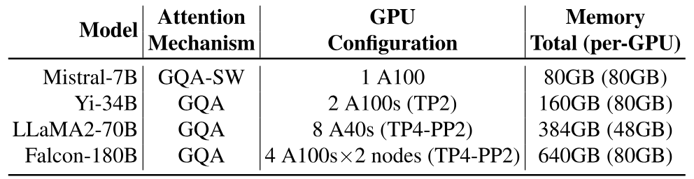

**表 1.** モデルと GPU 構成（GQA：grouped-query attention、SW：sliding window）。

## 5 評価

さまざまな一般的なモデルと GPU 構成（[表 1](#table-01)）、および二つのデータセット（[表 2](#table-02)）で Sarathi-Serve を評価する。LLM 推論の最先端を代表する vLLM と Orca をベースラインとする。評価では次の問いに答える。

- 指定した Service Level Objective（SLO）の制約下で、各推論サービングシステムのモデルレプリカが処理できる最大負荷はいくつか（[第 5.1 節](#section-5-1)）。その負荷は SLO 制約によってどう変わるか（[第 5.2 節](#section-5-2)）。
- TP や PP など、さまざまな配置で Sarathi-Serve はどのように動作するか（[第 5.3 節](#section-5-3)）。
- *Chunked-prefills* のオーバーヘッドはいくらか（[第 5.4.1 節](#section-5-4-1)）。
- *Chunked-prefills* と *stall-free batching* をそれぞれ単独で使った場合と、組み合わせた場合にはどのような違いがあるか（[第 5.4.2 節](#section-5-4-2)）。

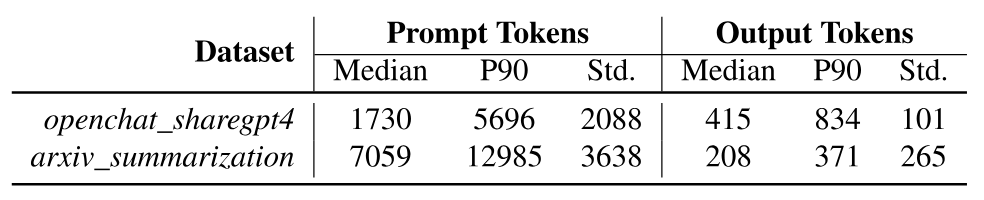

**表 2.** 評価に用いるデータセット。

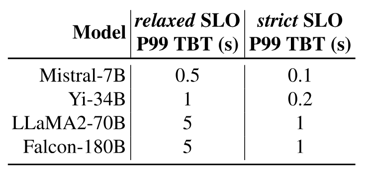

**表 3.** 各モデル構成の SLO。

**モデルと環境：** Mistral-7B [Jia23]、Yi-34B [Yi23]、LLaMA2-70B [Tou23c]、Falcon-180B [Alm23] の四モデルで Sarathi-Serve を評価する。いずれも各モデルサイズの区分で最良クラスにある。サーバー構成は二種類である。LLaMA2-70B を除く全モデルには Azure NC96ads v4 VM を使う。各 VM は、互いに NVLINK で接続した NVIDIA 80GB A100 GPU を 4 基搭載し、マシン間は 100 Gbps Ethernet で接続する。LLaMA2-70B には、互いに接続した NVIDIA 48GB A40 GPU を 8 基搭載するサーバーを使う。Yi-34B は二方向テンソル並列（TP-2）で実行し、LLaMA2-70B と Falcon-180B は四つのテンソル並列 worker と二つのパイプラインステージを使う混合並列構成（TP4-PP2）で実行する。

**ワークロード：** 実際のサービング状況を再現するため、*openchat_sharegpt4* [Wan23m] と *arxiv_summarization* [Coh18] の要求長の特性からトレースを生成する（[表 2](#table-02)）。*openchat_sharegpt4* トレースには、ユーザーが共有した ChatGPT-4 [Cha22a] との会話が含まれる。一つの会話は複数回のユーザーとチャットボットのやり取りを含む場合があり、各回を別々の要求としてシステムへ送る。この複数ラウンドという性質により、プロンプト長の相対分散は大きい。一方、*arxiv_summarization* は arXiv.org [Arx91] 上の科学論文とその要約を集めたデータセットである [Coh18]。プロンプトが長く、出力トークン数の分散は小さい。Microsoft M365 Copilot [Cop23] や Google Duet AI [Due23] などの LLM ワークロードを代表する。要求の到着時刻は Poisson 分布から生成する。二つのデータセットについて、総トークン長がそれぞれ 8192 と 16384 を超える要求を外れ値として除く。

**指標：** TTFT は各ユーザー要求につき一度だけ得られるため中央値を用いる。各 decode トークンは一つの TBT 値を生むため、TBT は 99 パーセンタイル（P99）を用いる。

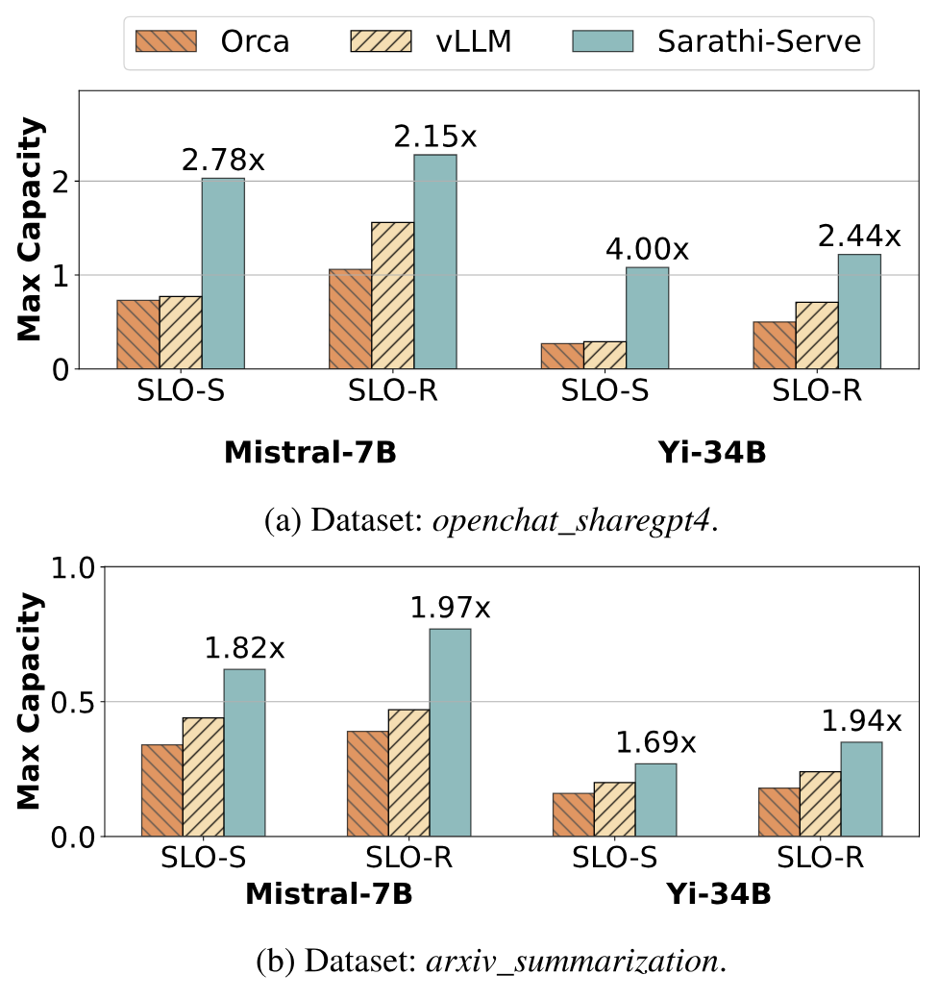

**図 10.** 厳格（SLO-S）および緩和（SLO-R）レイテンシ SLO の下で、異なるスケジューラを用いた Mistral-7B と Yi-34B の容量（queries per second）。

### 5.1 容量評価

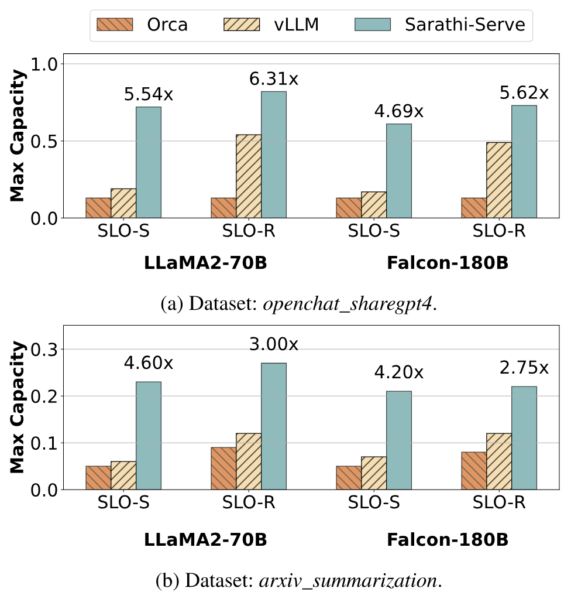

**図 11.** 厳格（SLO-S）および緩和（SLO-R）レイテンシ SLO の下で、異なるスケジューラを用いた LLaMA2-70B と Falcon-180B（パイプライン並列を使うモデル）の容量。

全四モデルと二つのデータセットについて、Sarathi-Serve、Orca、vLLM を二つのレイテンシ設定、*緩和*と*厳格*で評価する。Patel ら [Pat23] と同様に、モデルとハードウェアの組が持つ本質的な性能限界を考慮し、P99 TBT の SLO を、prefill の干渉なしに実行する要求の decode イテレーション時間（prefill 長 4k、バッチサイズ 32）に対し、*厳格*設定では $5\times$、*緩和*設定では $25\times$ と定義する。[表 3](#table-03) は SLO 閾値の絶対値をまとめている。*厳格* SLO は、チャットボットなどの対話型アプリケーションが求めるレイテンシ目標を表す。一方、*緩和*設定は、出力トークン列全体を予測可能な時間内に生成すべきだが、各トークンの TBT 制約はあまり厳しくないシステムの例である。すべての負荷実験で最大負荷が持続可能であること、すなわちキューイング遅延が発散しないことを確認する（スケジューリング遅延中央値の上限を 2 秒とする）。

[図 10](#figure-10)と[図 11](#figure-11)に容量実験の結果を示す。すべてのモデルとワークロードの組み合わせで、Sarathi-Serve は一貫して Orca と vLLM を上回る。*厳格* SLO では、Sarathi-Serve は Orca の最大 $4.0\times$、vLLM の最大 $3.7\times$ の負荷を維持できる（Yi-34B、*openchat_sharegpt4*）。パイプライン並列を用いる大規模モデルでは、パイプラインバブルが少ないため、Orca と vLLM に比べそれぞれ最大 $6.3\times$ と $4.3\times$ の改善を得る（LLaMA2-70B、*openchat_sharegpt4*）。

多くの状況で、Orca と vLLM は最大サービング可能スループットへ達する前に P99 TBT SLO に違反する。そのため、レイテンシ目標を緩和するとモデルのサービング容量がかなり増える。Sarathi-Serve は目標 SLO に応じてチャンクサイズを調整できる。*厳格* SLO では厳しいトークン予算を用い、プロンプトを小さなチャンクに分割する。システム効率はわずかに下がるが、テールレイテンシを抑えられる。レイテンシ制約が緩い場合はトークン予算を増やし、prefill を効率化する。LLaMA2-70B の*緩和*設定だけはパイプラインバブルの影響を抑えるため 1536 とし、それ以外の全モデルでは*緩和*設定に 2048、*厳格*設定に 512 のトークン予算を用いる。ワークロード特性に応じて予算を動的に変えれば、さらに性能を高められる。この検討は今後の課題とする。

また、緩和設定では vLLM が Orca を大幅に上回る。理由は二つある。第一に、Orca は複数要求のプロンプトをまとめてバッチ化する（vLLM の*最大シーケンス長*に対し、*最大シーケンス長 × バッチサイズ*）ため、場合によってはテールレイテンシがさらに高くなる。第二に、vLLM は Orca よりはるかに大きなバッチサイズを扱える。Orca のバッチサイズが小さいのは、PagedAttention がなく、トークン数が非常に多いバッチを処理すると活性値のメモリ footprint が大きくなるためである。

最後に、各システムの容量は *arxiv_summarization* より *openchat_sharegpt4* で高い。[表 2](#table-02)が示すように、*arxiv_summarization* のプロンプト中央値は 7059 トークンであり、*openchat_sharegpt4* の 1730 よりはるかに長いため、これは予想どおりである。長い prefill の処理時間が増すため、Orca と vLLM はレイテンシ違反を起こしやすくなる。

### 5.2 スループットとレイテンシのトレードオフ

LLM サービングシステムのスループットとレイテンシのトレードオフを詳しく理解するため、P99 TBT SLO を変え、vLLM と Sarathi-Serve のシステム容量への影響を調べる。[図 12](#figure-12)は、*openchat_sharegpt4* データセットで Mistral-7B と Yi-34B を五種類の SLO で評価した結果である。

Yu ら [Yu22a] の提案に従い、レイテンシとスループットのトレードオフを調整するため、vLLM を三種類のバッチサイズで評価する。厳しい TBT SLO では、生成停止によって vLLM の最大容量が制限される。特に、三つのバッチサイズ設定で vLLM の容量はほとんど変わらない。PagedAttention は効率的なメモリ管理で大きなバッチを可能にするが、実際のレイテンシ制約下では、*prefill-prioritizing* スケジューラの急激なレイテンシ・スループットのトレードオフにより、vLLM は大きなバッチを活用できない。

一方、Sarathi-Serve はトークン予算を変えることで、このトレードオフを正確に制御できる。厳格 SLO（100ms、Mistral-7B）では 512 の小さなトークン予算を用い、vLLM の $3.5\times$ の容量を達成する。SLO 制約が緩い場合、2048 の大きな予算を選ぶと Sarathi-Serve をより効率よく実行でき、vLLM の $1.65\times$ の容量となる（1s、Yi-34B）。

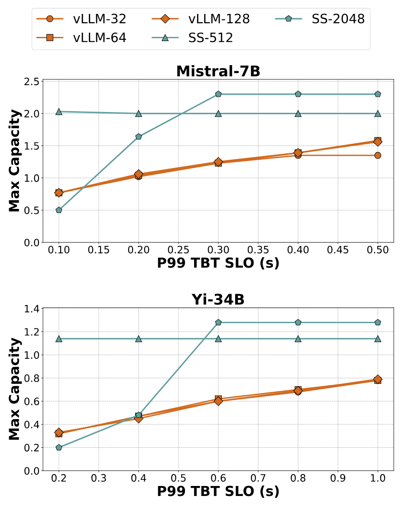

**図 12.** *openchat_sharegpt4* データセット上で Mistral-7B と Yi-34B を実行したときの、vLLM と Sarathi-Serve のレイテンシ・スループットのトレードオフ。vLLM は最大バッチサイズ 32、64、128 で評価する。Sarathi-Serve は最大バッチサイズ 128 とし、トークン予算 512 と 2048 を用いる。*Stall-free batching* により、Sarathi-Serve は厳格 SLO 下の Yi-34B で $3.5\times$ 高い容量を実現する。

### 5.3 パイプライン並列を実用的にする

Sarathi-Serve が効率的なパイプライン並列により、一般的なネットワーク越しの LLM 推論を効率よくサービングできることを示す。この実験では、それぞれ 4 基の A100 GPU を備え、100 Gbps Ethernet で接続した二つのノードで Falcon-180B を実行する。モデル容量を三構成で評価する。8 方向 TP の vLLM、本研究のパイプライン並列実装を使う vLLM、パイプライン並列の Sarathi-Serve である。PP 構成では、ノード内を 4 方向 TP、ノード間を 2 方向 PP とする。

[図 13(a)](#figure-13)は、Falcon-180B の decode-only バッチのレイテンシについて、純粋なテンソル並列 TP-8 配置と TP-4 PP-2 混合並列構成を比較する。テンソル並列のレイテンシ中央値は、パイプライン並列の約 $2\times$ である。TP ではクロスノード all-reduce による通信オーバーヘッドが大きいためである。

[図 13(b)](#figure-13)は、*openchat_sharegpt4* データセット上の Falcon-180B について、テンソル並列と混合並列構成の容量を示す。混合並列とは異なり、TP はレイテンシが高いため、*緩和* SLO でも容量が低い。vLLM は混合並列を用いれば*緩和* SLO でかなり高い負荷を扱えるが、*厳格* SLO ではパイプラインバブルのため性能が急落する。一方、Sarathi-Serve は *chunked-prefills* を用いてマイクロバッチ間の実行時間のばらつきを抑え、パイプラインバブルを避ける。その結果、容量は*緩和* SLO で $1.48\times$、*厳格* SLO で $3.6\times$ となる。

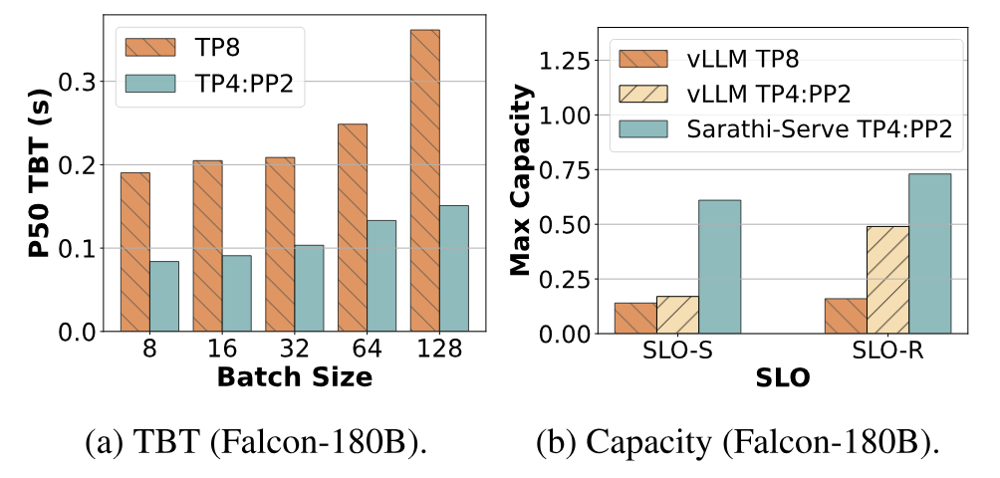

**図 13.** TP はノードをまたぐと効率よくスケールしない。（a）Decode-only バッチの TBT 中央値。ノード内 4 方向 TP とノード間 PP の構成に比べ、クロスノード TP は TBT 中央値を $2\times$ 以上にする。（b）厳格（SLO-S）および緩和（SLO-R）レイテンシ SLO 下の容量。厳格 SLO で、Sarathi-Serve は Falcon-180B のサービング容量を、vLLM の TP-only 構成の $4.3\times$、混合並列構成の $3.6\times$ に高める。

### 5.4 アブレーションスタディ

本節では Sarathi-Serve の各側面をアブレーションスタディで調べる。特に、（1）チャンク化が prefill のスループットへ与える影響と、（2）hybrid-batching とチャンク化がレイテンシへ与える影響、という二つの問いを扱う。本節に示す実験は一部に限られるが、以下の傾向はさまざまなモデルとハードウェアの組み合わせで一貫している。

#### 5.4.1 Chunked-prefills のオーバーヘッド

[図 14](#figure-14)は、Yi-34B の prefill 全体の実行時間にチャンク化が加えるオーバーヘッドを示す。予想どおり、[図 14](#figure-14)の棒が徐々に低くなることから、小さなチャンクほどオーバーヘッドが大きいと分かる。それでも、最小のチャンクサイズ 512 で、観測したオーバーヘッドは最大でも約 25% にとどまる。大きなトークン予算 2048 では、chunked prefill のオーバーヘッドはほぼ無視できる。

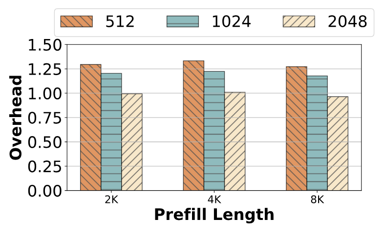

**図 14.** Yi-34B（TP-2）の prefill 計算における *chunked-prefills* のオーバーヘッドを、チャンク化しない場合のコストで正規化した値。複数のプロンプト長について、チャンク長 512、1024、2048 の結果を示す。

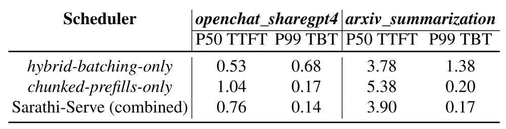

**表 4.** *Hybrid-batching* と *chunked-prefills* をそれぞれ単独で、または組み合わせて用いた場合の TTFT と TBT（秒）。2 基の A100 上で Yi-34B を実行し、128 要求、トークン予算 1024 で評価する。両方を使うと、Sarathi-Serve は TTFT と TBT をともに低減できる。

#### 5.4.2 各技術の影響

最後に、[表 4](#table-04)は、Sarathi-Serve の各要素を単独で評価した TTFT と TBT を示す。*chunked-prefills* のみ、prefill と decode の要求を混ぜる *hybrid-batching* のみ、そして両者を組み合わせた場合である。二つの技術は組み合わせたときに最もよく働く。*Chunked-prefills* だけでは prefill チャンクがやや非効率なため TTFT が増え、*hybrid-batching* だけでは長い prefill が生成停止を起こし得るため TBT が増える。組み合わせると、Sarathi-Serve は両方の指標を改善する。

## 6 関連研究

**モデルサービングシステム：** Clipper [Cra17]、TensorFlow-Serving [Ols17]、Clockwork [Guj20]、BatchMaker [Gao18] などは、モデルサービングの配置、キャッシュ、バッチ処理について多様な戦略を研究しているが、自己回帰 Transformer 推論の課題を扱っていない。より近年の Orca [Yu22a]、vLLM [Kwo23]、FlexGen [She23]、FasterTransformers [Fas21]、LightSeq [Wan21a]、TurboTransformers [Fan21] などは、Transformer 推論に特化した最適化を提案する。FlexGen [She23] はリソース制約のあるオフライン環境で LLM 推論のスループットを最適化するため、オンラインサービングには適さない。FastServe [Wu23a] は、ジョブ完了時間を最小化するプリエンプティブな LLM 推論スケジューリングフレームワークを提案した。LLM 推論の最先端を代表する Orca と vLLM について、本論文では詳細に比較する。

近年は SplitWise、DistServe、TetriInfer [Pat23, Zho24, Hu24b] のように、prefill と decode を別々のレプリカへ分離する方法も登場した。この方法は prefill と decode の干渉を完全になくせる。しかし、各要求の prefill が完了するたびに KV cache を移す必要があり、レプリカ間に広帯域インターコネクトがなければ難しい。さらに、prefill レプリカの GPU メモリ容量を十分に活用できない。KV cache の保存を担うのは decode レプリカだけだからである。一方、分離方式は prefill を最高効率で実行でき、より良い TTFT を得られる。完全な prefill より多少遅い chunked prefill に対する利点である。Sarathi-Serve と分離方式の定量比較は今後の課題とする。

Sheng ら [She23b] は近年、マルチテナント環境でクライアント間の公平性を保証するため、イテレーション単位バッチ処理アルゴリズムを変更した。FastServe [Wu23a] はプリエンプションに基づくスケジューリングで head-of-the-line blocking を緩和する。これらのアルゴリズム最適化は本研究と相補的であり、Sarathi-Serve が低減する prefill と decode の干渉からも恩恵を受けられる。近年の別システム APIServe [Abh24] は Sarathi の chunked prefill を採用し、decode バッチで余った計算能力を使って、マルチターン API サービング向けに prefill を事前再計算する。

**Transformer の GPU 利用率向上：** 近年、Transformer のハードウェア利用率を改善するさまざまな最適化が提案されている。FasterTransformer はモデル固有の GPU カーネル実装を使う。CocoNet [Jan22] と [Wan22b] は計算と通信を重ね、GPU 利用率を高める。通信時間が計算時間を上回り得る高いテンソル並列度で分散モデルを使う際に、特に有効である。また、self-attention の計算コストはシーケンス長に対して二次関数的に増えるため、長いコンテキストでは大きな負担となる。[Rab22, Dao22c, Dao23a] は、慎重な tiling と作業分割によって self-attention のメモリボトルネックを抑える手法を提案した。モデル配置を最適化する並列化戦略も検討されている。これらの技術は Sarathi-Serve と直交する。

**モデル最適化：** モデル革新に関する多くの研究は、Transformer 言語モデルの欠点を補う、または Transformer を越えるモデルアーキテクチャを目指している。たとえば multi-query attention [Sha19b] は、すべての attention head で同じ key と value を共有し、KV-cache を小さくして GPU に大きなバッチを収める。量子化でモデルサイズを大幅に圧縮できることも、複数の近年研究が示している [Xia23a, Fra23, Det23a, Det22b]。Mixture-of-expert model は主に、各イテレーションで活性化するモデルパラメータ数を減らす [Art22, Li23i, Hua23a]。さらに近年、Transformer の後継として retentive network が提案された [Sun23a]。これらと異なり、本研究は一般的な Transformer モデルの性能問題を GPU の観点から扱う。

## 7 結論

LLM 推論には高スループットと低レイテンシの両方が望ましいが、実現は難しい。既存の LLM 推論スケジューラを広く分析し、*prefill-prioritizing* と *decode-prioritizing* の二種類に分けた。一般に前者はスループット、後者は TBT レイテンシの最適化に優れる。しかし、スループットとレイテンシの両方が重要な場合、どちらも適さない。

このトレードオフに対処するため、*chunked-prefills* と *stall-free batching* による新しい方法を実装した Sarathi-Serve を提示した。Sarathi-Serve は入力プロンプトを小さな作業単位に分け、停止のないスケジュールを作る。これにより、進行中の decode を止めずに、実行中のバッチへ新しい要求を加えられる。評価では、単一 A100 GPU 上の Mistral-7B でサービング容量を最大 $2.6\times$、8 基の A100 GPU 上の Falcon-180B で最大 $5.6\times$ に高めた。

## 謝辞

OSDI の査読者と shepherd から有益な意見をいただいた。本研究の一部は、Microsoft および Georgia Tech の Center for Research into Novel Compute Hierarchies（CRNCH）から資金提供を受け、Institute for Data Engineering and Science（IDEaS）に属する GT Cloud Hub の支援によって行われた。

## 8 Artifact 付録

### 概要

オープンソースの artifact は [GitHub](https://github.com/microsoft/sarathi-serve) で公開している。リポジトリには Sarathi-Serve の実装に加え、本論文の実験を実行し、結果を描画するための harness とスクリプトが含まれる。

このリポジトリは、もともと vLLM プロジェクトから fork したものである。Sarathi-Serve は軽量で高性能な研究用プロトタイプであり、オープンソース版 vLLM と完全に同じ機能を備えてはいない。研究を素早く反復できるよう、重要な機能だけを残してコードベースを調整した。

### 8.1 範囲

この artifact により、読者は Sarathi-Serve 論文の主張（各図）を検証し、実験を再現できる。必要な環境を構築し、主要な実験とマイクロベンチマークを実行できるため、Sarathi-Serve の中心的な主張を包括的に理解できる。

### 8.2 内容

リポジトリの構成は次のとおりである。システムの主要なソースコードは */sarathi*、独自 CUDA カーネルの実装は */csrc*、実験再現用の全スクリプトは */osdi-experiments*、実験で使うトレースファイルは */data* に置かれている。

### 8.3 ホスティング

Artifact は [GitHub](https://github.com/microsoft/sarathi-serve) から取得できる。GitHub リポジトリの main branch は更新を続けているが、artifact の明確な説明を見つけやすい README に保守する。OSDI 論文の実験を再現するための詳細な説明と README は、*osdi-sarathi-serve* branch にすべて置かれている。

### 8.4 要件

Sarathi-Serve は A100 と A40 GPU を備えた CUDA 12.1 環境でテストしている。再現を容易にするため、各図に対応する README に、実験で使った具体的な GPU SKU と並列化戦略を明記している。

[+1]: 近年の Splitwise [Pat23] と DistServe [Zho24] は第三の「分離型」に分類し、[第 6 節](#section-6)で論じる。

[+2]: 理論上、A100 GPU では約 200 トークンで演算子が計算律速になると予想される。しかし実際には、固定オーバーヘッドのため、テンソル並列度が高い場合は約 500～600 トークンで計算律速になる。

[+author-note]: 本研究の一部は MSR India でのインターンシップ中に行われた。
