> [Noam Shazeer](https://www.noamshazeer.com/), [Azalia Mirhoseini](https://www.azaliamirhoseini.com/) [+author-equal] [+author-residency], [Krzysztof Maziarz](https://x.com/MaziarzKris) [+author-equal], [Andy Davis](https://research.google/people/104876/), [Quoc Le](http://cs.stanford.edu/~quocle/), [Geoffrey Hinton](http://www.cs.toronto.edu/~hinton/), and [Jeff Dean](https://research.google/people/jeff/). arXiv 初回投稿日: 2017 年 1 月 23 日; 現行版は v1. ICLR 2017 採録. [Outrageously Large Neural Networks: The Sparsely-Gated Mixture-of-Experts Layer](https://arxiv.org/abs/1701.06538). <a href="/paper/sparsely-gated-moe.pdf" target="_blank" rel="noopener noreferrer">原 PDF</a>. [DOI](https://doi.org/10.48550/arXiv.1701.06538). [TeX ソース](https://export.arxiv.org/e-print/1701.06538). 正確な印刷レイアウトと参考文献については原 PDF を正本とする.

## 要旨

ニューラルネットワークが情報を吸収する能力は、そのパラメータの数によって制限されます。条件付き計算、すなわちネットワークの一部が例ごとにアクティブになる方式は、計算量を比例して増やさずにモデルの容量を劇的に増加させる方法として理論上提案されてきました。しかし実際には、重要なアルゴリズム上および性能上の課題があります。本研究では、これらの課題に取り組み、条件付き計算の約束をついに実現し、現代のGPUクラスタ上で計算効率のわずかな損失で、モデル容量の1000倍以上の向上を達成しました。我々は、数千のフィードフォワードサブネットワークで構成される疎結合ゲート型エキスパート混合（MoE）層を導入します。学習可能なゲーティングネットワークが、各例に使用するこれらのエキスパートの疎な組み合わせを決定します。MoEを、トレーニングコーパスに存在する膨大な知識を吸収するためにモデル容量が重要な言語モデリングおよび機械翻訳のタスクに適用します。MoEを最大1370億パラメータで積み重ねたLSTM層の間に畳み込み的に適用したモデルアーキテクチャを提示します。大規模言語モデリングおよび機械翻訳のベンチマークにおいて、これらのモデルは計算コストを低く抑えつつ、最先端の結果よりも大幅に優れた成果を達成します。

## 1 はじめにと関連研究

### 1.1 条件付き計算

トレーニングデータとモデルサイズの両方で規模を活用することは、ディープラーニングの成功の中心となっています。データセットが十分に大きい場合、ニューラルネットワークの容量（パラメータ数）を増やすことで、はるかに高い予測精度が得られることがあります。これは、テキスト [Sut14, Bah14, Joz16, Wu17]、画像 [Kri12, Le12]、およびオーディオ [Hin12, Amo15] の領域で示されています。典型的なディープラーニングモデルでは、すべての例に対してモデル全体が活性化されるため、モデルサイズとトレーニング例数の両方が増加するにつれて、トレーニングコストはおおよそ二次的に増加します。残念ながら、計算能力と分散計算の進歩は、そのような需要を満たすには不十分です。

モデル容量を計算コストの比例的な増加なしに増やす方法として、さまざまな形態の条件付き計算が提案されています [Dav13, Ben13, Eig13, Den14, Cho14, Ben15, Alm15]。この方式では、大きなネットワークの部分が例ごとに活性化または非活性化されます。ゲーティングの決定は、二進法または疎で連続的であり、確率的または決定的である場合があります。ゲーティングの決定をトレーニングするために、さまざまな形の強化学習やバックプロパゲーションが提案されています。

これらのアイデアは理論的には有望ですが、これまでのところ、モデル容量、トレーニング時間、またはモデル品質において大規模な改善を示した研究はありません。これを我々は、以下の課題の組み合わせに原因があると考えています。

- 現代の計算デバイス、特にGPUは、枝分かれよりも算術処理がはるかに高速です。上記の多くの研究はこれを認識しており、各ゲーティングの決定でネットワークの大きな部分をオン/オフにすることを提案しています。

- 大きなバッチサイズはパフォーマンスのために重要であり、パラメータ転送と更新のコストを分散させます。条件付き計算は、条件付きでアクティブなネットワークの部分のバッチサイズを減らします。

- ネットワーク帯域幅がボトルネックになることがあります。GPUクラスターは、計算能力がデバイス間の総ネットワーク帯域幅の数千倍にもなる場合があります。計算効率を高めるためには、アルゴリズムの相対的な計算要求とネットワーク要求の比率がこの比率を上回る必要があります。条件付き計算の一形態と見なせる埋め込み層は、この問題により不利になります。埋め込みは一般的にネットワークを通じて送信する必要があるため、（例やパラメータの）やり取りの数は計算能力ではなくネットワーク帯域幅によって制限されます。

- スキームによっては、チャンクごとや例ごとに望ましいレベルのスパース性を達成するために損失項が必要になる場合があります。[Ben15]はそのような3つの項を使用しています。これらの問題は、モデルの品質や負荷分散の両方に影響を与える可能性があります。

- モデルの容量は非常に大きなデータセットにおいて最も重要です。既存の条件付き計算に関する文献は、最大60万枚の画像で構成される比較的小さな画像認識データセットを扱っています。これらの画像のラベルだけで、何百万、ましてや何十億のパラメータを持つモデルを十分に訓練するための十分な信号を提供できるとは考えにくいです。

本研究では、上記のすべての課題に初めて取り組み、条件付き計算の可能性をついに実現します。我々は、計算効率にわずかな損失があるだけで、モデル容量を1000倍以上向上させ、公的な言語モデリングおよび翻訳データセットで最先端の成果を大幅に進展させました。

### 1.2 我々のアプローチ：スパースゲーティッド・ミクスチャー・オブ・エキスパート層

条件付き計算に対する我々のアプローチは、新しい種類の汎用ニューラルネットワークコンポーネント、スパースゲーティッド・ミクスチャー・オブ・エキスパート層（MoE）を導入することです。MoEは複数のエキスパート（それぞれが単純なフィードフォワードニューラルネットワーク）と、各入力を処理するためにエキスパートのスパースな組み合わせを選択する学習可能なゲーティングネットワークで構成されます（[図1](#figure-01)参照）。ネットワークのすべての部分はバックプロパゲーションで共同訓練されます。

**図1.** 再帰的言語モデルに埋め込まれたミクスチャー・オブ・エキスパート（MoE）層。この場合、スパースゲーティング関数は計算を実行するために2つのエキスパートを選択します。それらの出力は、ゲーティングネットワークの出力によって調整されます。

導入する手法は汎用的だが、本稿では非常に大規模なモデルの恩恵を受けることが知られている言語モデリングと機械翻訳に焦点を当てる。具体的には、[図 1](#figure-01) のように、積層した LSTM 層の間へ MoE を畳み込み的に適用する [Hoc97]。MoE はテキストの各位置で一度ずつ呼び出され、位置ごとに異なるエキスパートの組合せを選択し得る。各エキスパートは構文や意味に応じて高度に特化する傾向がある（[第 11 節](#section-11) の[表 9](#table-09)を参照）。言語モデリングと機械翻訳の双方のベンチマークで、従来の公開最高値をわずかな計算コストで上回った。

### 1.3 Mixtures of Experts に関する関連研究

20年以上前の導入以来、[Jac91, Jor94]、ミクスチャー・オブ・エキスパーツ（エキスパートの混合）アプローチは多くの研究の対象となっています。SVM [Col02]、ガウス過程 [Tre01, The15, Dei15]、ディリクレ過程 [Sha09]、ディープネットワークなど、さまざまなタイプのエキスパートアーキテクチャが提案されてきました。他の研究では、階層構造 [Yao09]、無限のエキスパート [Ras02]、エキスパートを順次追加する方法 [Alj16] など、異なるエキスパートの構成に焦点を当てています。[Gar16] は、機械翻訳のためにミクスチャー・オブ・エキスパーツ形式のアンサンブルモデルを提案しています。ゲーティングネットワークは、事前学習済みのアンサンブル NMT モデルで訓練されます。

これらの研究は、トップレベルのミクスチャー・オブ・エキスパーツに関するものです。ミクスチャー・オブ・エキスパーツはモデル全体です。[Eig13] は、独自のゲーティングネットワークを持つ複数の MoE をディープモデルの一部として使用するというアイデアを紹介しています。後者のアプローチがより強力であることは直感的であり、複雑な問題は多くのサブ問題を含み、それぞれが異なるエキスパートを必要とする可能性があるためです。また、彼らは結論で、スパース性を導入する可能性に言及しており、MoE を計算による処理の手段に変えることに触れています。

我々の研究は、MoEを汎用ニューラルネットワークコンポーネントとして利用するこの使い方に基づいています。[Eig13]が2つの積み重ねられたMoEを使用して2セットのゲーティング決定を可能にしているのに対し、我々のMoEの畳み込み応用では、テキストの各位置で異なるゲーティング決定を行うことができます。また、スパースゲーティングを実現し、モデル容量を大幅に増加させる実用的な方法としてその使用を示します。

## 2 Mixture-of-Experts 層の構造

Mixture-of-Experts（MoE）層は、一連の$n$「エキスパートネットワーク」$E_{1},\cdots,E_{n}$と、出力がスパースな$n$次元ベクトルである「ゲーティングネットワーク」$G$で構成されています。[図1](#figure-01)はMoEモジュールの概略を示しています。エキスパート自身もニューラルネットワークであり、それぞれ独自のパラメータを持ちます。原則として、エキスパートが同じサイズの入力を受け取り、同じサイズの出力を生成することだけが必要ですが、本論文の初期の研究では、モデルが同一のアーキテクチャを持つフィードフォワードネットワークでありながら、個別のパラメータを持つケースに制限しています。

与えられた入力$x$に対して、ゲーティングネットワークの出力と$i$番目のエキスパートネットワークの出力を、それぞれ$G(x)$および$E_{i}(x)$で表すことにします。MoEモジュールの出力$y$は以下のように表すことができます：

$$
y=\sum_{i=1}^{n}G(x)_{i}E_{i}(x)
$$

$G(x)$ の出力がスパースであることを利用して計算を省く。$G(x)_{i}=0$ なら、$E_{i}(x)$ を計算する必要はない。実験では最大数千のエキスパートを用いるが、各例について評価するのはそのうち数個だけである。エキスパート数が非常に多い場合は、2 段階の階層型 MoE によって分岐数を減らせる。階層型 MoE では、一次ゲーティングネットワークが「エキスパート」のスパースな重み付き組合せを選び、各エキスパート自体が独自のゲーティングネットワークを持つ二次 MoE となる。以下では通常の MoE に焦点を当てる。階層型 MoE の詳細は[第 8 節](#section-8)で述べる。

我々の実装は条件付き計算の他のモデルに関連しています。エキスパートが単純な重み行列で構成されるMoEは、[Cho14]で提案されたパラメトリック重み行列に類似しています。エキスパートが1つの隠れ層を持つMoEは、ドロップアウトされた層が完全活性化層で挟まれている[Ben15]で説明されるブロック単位のドロップアウトに類似しています。

### 2.1 ゲーティングネットワーク

**ソフトマックスゲーティング：** 非スパースなゲーティング関数の簡単な選択肢[Jor94]は、入力に学習可能な重み行列$W_{g}$を掛け、その後$\mathrm{Softmax}$関数を適用することです。

$$
G_{\sigma}(x)=\mathrm{Softmax}(x\cdot W_{g})
$$

**Noisy Top-K Gating：** Softmax ゲーティングネットワークに、スパース性とノイズという 2 つの要素を加える。Softmax 関数を適用する前に調整可能なガウスノイズを加え、上位 $k$ 個の値だけを残し、それ以外を $-\infty$ に設定する（対応するゲート値は $0$ になる）。前述のように、スパース性によって計算を省ける。この種のスパース性は、理論上、ゲーティング関数の出力にやや懸念のある不連続性を生むが、実際に問題となった例はまだ観測していない。ノイズ項は負荷分散に役立つ。この点は[第 7 節](#section-7)で述べる。各成分のノイズ量は、2 つ目の訓練可能な重み行列 $W_{\mathrm{noise}}$ で制御する。

$$
G(x)=\mathrm{Softmax}(\mathrm{KeepTopK}(H(x),k))
$$

$$
H(x)_{i}=(x\cdot W_{g})_{i}+\mathrm{StandardNormal}()\cdot \mathrm{Softplus}((x\cdot W_{\mathrm{noise}})_{i})
$$

$$
\mathrm{KeepTopK}(v,k)_{i}=\begin{cases}
v_{i}, & \mathrm{if}\ v_{i}\ \mathrm{is\ in\ the\ top}\ k\ \mathrm{elements\ of}\ v,\\
-\infty, & \mathrm{otherwise.}
\end{cases}
$$

**ゲーティングネットワークの訓練** 我々は、モデルの残り部分とともに単純なバックプロパゲーションでゲーティングネットワークを訓練します。もし$k>1$を選択した場合、上位k人のエキスパートのゲート値はゲーティングネットワークの重みに関して非ゼロの導関数を持ちます。この種の時折感度のある挙動は、ノイズ付き整流器（noisy rectifiers）に関して[Ben13]で説明されています。勾配はゲーティングネットワークを通じてその入力に逆伝播されます。我々の手法はここで[Ben15]と異なり、彼らはブールゲートとREINFORCEスタイルの手法を用いてゲーティングネットワークを訓練します。

## 3 パフォーマンス課題への対応

### 3.1 バッチ縮小問題

現代のCPUおよびGPUでは、計算効率を高めるために大きなバッチサイズが必要であり、パラメータのロードや更新のオーバーヘッドを分散させることができます。もしゲーティングネットワークが各例に対して$n$人のエキスパートのうち$k$人を選ぶ場合、$b$個の例のバッチでは、各エキスパートはおよそ$\frac{\mathrm{kb}}{n}\ll b$個の例という非常に小さいバッチを受け取ることになります。これにより、エキスパートの数が増えるにつれて、単純なMoEの実装は非常に非効率的になります。この小さくなったバッチの問題に対する解決策は、元のバッチサイズをできるだけ大きくすることです。しかし、バッチサイズは順伝播と逆伝播の間で活性化を保存するために必要なメモリによって制限されがちです。バッチサイズを増やすために、次の手法を提案します：

**データ並列性とモデル並列性の混合：** 従来の分散学習設定では、異なるデバイス上のモデルの複数のコピーが、それぞれ異なるデータバッチを非同期に処理し、パラメータは一連のパラメータサーバーを通じて同期されます。我々の手法では、これらの異なるバッチを同期的に実行し、MoE層で結合できるようにします。モデルの標準層とゲーティングネットワークは従来のデータ並列スキームに従って分散しますが、各エキスパートの共有コピーは1つだけ保持します。MoE層の各エキスパートは、データ並列入力バッチすべてから関連する例を組み合わせたバッチを受け取ります。同じデバイスセットが、標準層およびゲーティングネットワークのデータ並列レプリカとして、また各エキスパートのサブセットをホストするモデル並列シャードとして機能します。もしモデルが$d$台のデバイスに分散され、各デバイスが$b$のバッチを処理する場合、各エキスパートはおおよそ$\frac{\mathrm{kbd}}{n}$個の例からなるバッチを受け取ります。したがって、エキスパートのバッチサイズにおいて$d$倍の改善を達成します。

階層型 MoE の場合（[第 8 節](#section-8)）、一次ゲーティングネットワークにはデータ並列を、二次 MoE にはモデル並列を用いる。各二次 MoE は 1 台のデバイスに置かれる。

この手法により、トレーニングクラスターのデバイス数を比例的に増やすことで、エキスパートの数（したがってパラメータの数）を増やすことができます。総バッチサイズは増加しますが、エキスパートごとのバッチサイズは一定に保たれます。デバイスごとのメモリおよび帯域幅の要件も一定に保たれ、ステップ時間も同様で、モデルのパラメータ数に等しいトレーニング例の処理に必要な時間も変わりません。我々の目標は、1兆パラメータのモデルを1兆単語のコーパスでトレーニングすることです。本論文執筆時点ではシステムをここまでスケーリングしていませんが、ハードウェアを追加することで可能であるはずです。

**畳み込み性の活用：** 我々の言語モデルでは、前の層の各時間ステップに同じMoEを適用します。前の層が完了するのを待てば、MoEをすべての時間ステップに一度に大きなバッチとして適用することができます。これにより、MoE層への入力バッチのサイズは、展開された時間ステップの数の分だけ増加します。

**再帰的MoEのバッチサイズの増加：** 我々は、さらに強力なモデルは MoE を繰り返し適用することを含む可能性があると考えています。例えば、LSTM やその他の RNN の重み行列を MoE に置き換えることが考えられます。残念ながら、このようなモデルは前の段落の畳み込みトリックを破ります。なぜなら、ある時刻における MoE への入力が、前の時刻における MoE の出力に依存するためです。[Gru16] は、順方向の活性化を再計算するという代償で、アンロールされた RNN における保存された活性化の数を大幅に削減する手法を説明しています。これにより、バッチサイズを大幅に増加させることが可能になります。

### 3.2 ネットワーク帯域幅

分散コンピューティングにおけるもう一つの大きな性能問題はネットワーク帯域幅です。エキスパートは固定されており（上記参照）、ゲーティングパラメータの数も少ないため、通信の大部分はエキスパートの入力と出力をネットワーク経由で送ることに費やされます。計算効率を保つには、エキスパートの計算量と入出力サイズの比率が、計算機の計算能力とネットワーク容量の比率を上回る必要があります。GPUではこの比率が数千対一になることもあります。実験では、数千の ReLU 活性化ユニットを持つ隠れ層を含むエキスパートを使います。エキスパートの重み行列のサイズは $\mathrm{input\_size}\times\mathrm{hidden\_size}$ と $\mathrm{hidden\_size}\times\mathrm{output\_size}$ なので、計算量と入出力の比率は隠れ層のサイズに等しくなります。大きな隠れ層や、より多くの隠れ層を使えば、計算効率を上げられます。

## 4 エキスパートのバランス活用

我々は、ゲーティングネットワークが常に同じ少数のエキスパートに対して大きな重みを生成する状態に収束する傾向があることを観察しました。この不均衡は自己強化的であり、好まれたエキスパートはより速く訓練され、結果的にゲーティングネットワークからさらに選択されやすくなります。[Eig13] は同じ現象を記述しており、トレーニングの開始時にこの局所最小値を回避するために厳しい制約を使用しています。[Ben15] は各ゲートのバッチごとの平均に対してソフト制約を含めています。[+1]

我々はソフト制約のアプローチを取ります。エキスパートの重要性をトレーニング例のバッチに相対的に定義し、そのバッチ内でのゲート値の合計として定義します。追加の損失 $L_{\mathrm{importance}}$ を定義し、これはモデルの全体の損失関数に加えられます。この損失は、重要性値の集合の変動係数の二乗に、手動で調整されたスケーリング係数 $w_{\mathrm{importance}}$ を掛けたものに等しいです。この追加損失は、すべてのエキスパートが等しい重要性を持つことを促します。

$$
\mathrm{Importance}(X)=\sum_{x\in X}G(x)
$$

$$
L_{\mathrm{importance}}(X)=w_{\mathrm{importance}}\cdot \mathrm{CV}(\mathrm{Importance}(X))^{2}
$$

この損失関数で重要度を均等にしても、エキスパートごとに受け取る例の数が大きく異なる可能性は残る。例えば、あるエキスパートが重みの大きい少数の例を受け取り、別のエキスパートが重みの小さい多数の例を受け取る場合がある。これは分散ハードウェア上でメモリと性能の問題を引き起こし得る。そこで、負荷を均等にする第 2 の損失関数 $L_{\mathrm{load}}$ を導入する。この関数の定義と実験結果は[第 7 節](#section-7)に示す。

## 5 実験

### 5.1 10 億語言語モデルベンチマーク

**データセット：** [Che13] によって導入されたこのデータセットは、ニュース記事からのユニークな文をシャッフルしたもので、総単語数は約8億2900万語、語彙数は793,471語です。

**以前の最先端：** 以前に発表された最良の結果[Joz16] は、1層以上のスタックされた長短期記憶（LSTM）層[Hoc97, Ger00]から成るモデルを使用しています。これらのモデルのLSTM層のパラメータ数は、200万から1億5100万までさまざまです。パラメータ数が増えるにつれて品質は大幅に向上しますが、計算コストも増加します。これらのモデルの結果は、[図2](#figure-02)右図の上側の曲線を構成します。

**MoE モデル：** モデルは 2 層の積層 LSTM の間に MoE 層を挟んだ構成である（[図 1](#figure-01)）。層の大きさとエキスパート数を変化させた。モデルアーキテクチャ、訓練条件、追加のベースライン、および結果の詳細は[第 9 節](#section-9)に示す。

**低計算量、可変容量：** 容量を追加する効果を調査するために、計算コストがおおよそ同じのMoEモデルを一連訓練しました：順方向計算時にソフトマックス層を除き、1ステップごとの訓練例あたり約800万の乗算と加算です。我々はこの指標を（ops/timestep）と呼びます。4、32、および256エキスパートを含むフラットMoEモデル、および256、1024、4096エキスパートを含む階層MoEモデルを訓練しました。各エキスパートは約100万パラメータを持っていました。すべてのMoE層で、入力ごとに4人のエキスパートがアクティブでした。

これらのモデルの結果は[図2](#figure-02)左図に示されています。常に4人のエキスパートがアクティブなモデルは（予想通り）計算が一致したベースラインモデルと同様の性能を示しましたが、最大のモデル（4096エキスパート）はテストセットで24％低いパープレキシティを達成しました。

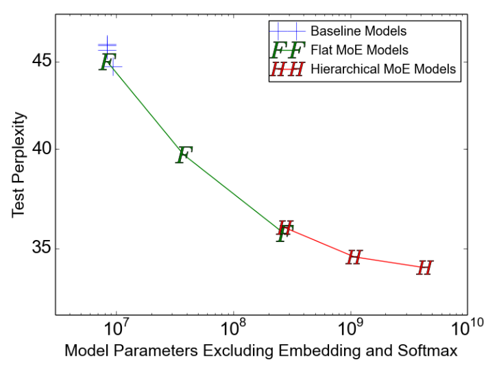

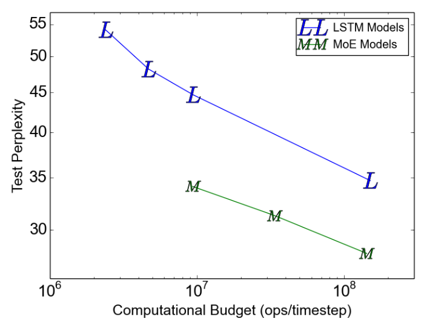

**図2.** 10億語言語モデルベンチマークにおけるモデル比較。左側では、1ステップあたり約800万オペレーションという類似した計算予算を持つモデルに対して、モデル容量に応じたテストパープレキシティをプロットしています。右側では、計算予算に応じたテストパープレキシティをプロットしています。上の線は[Joz16]のLSTMモデルを示し、下の線は異なる計算予算を持つ40億パラメータのMoEモデルを示しています。

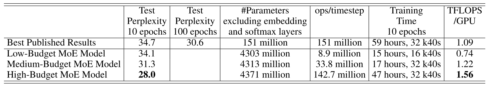

**表 1.** 計算予算の異なる高容量 MoE 拡張モデルの要約と、従来の公開最高値 [Joz16] との比較。詳細は[第 9 節](#section-9)に示す。

**計算量を変えた高容量モデル：** 前段の最大モデルに加え、同程度の高容量（40 億パラメータ）を保ちながら計算予算を増やした MoE モデルを 2 つ訓練した。これらは LSTM が大きく、エキスパート数は少ないが、各エキスパートは大きい。詳細は[第 9.2 節](#section-9-2)に示す。3 モデルの結果が[図 2](#figure-02)右側の下段の曲線を構成する。[表 1](#table-01)では、これらの結果を当該データセットにおける従来の公開最高値と比較する。最も高速なモデルでさえ、訓練 epoch 数を揃えた比較で公開最高値を上回り、必要な計算量はわずか 6% である。

**計算効率：** 我々はTensorFlow [Aba16a]を使用して、16～32台のTesla K40 GPUを搭載したクラスター上でモデルを訓練しました。各モデルについて、1つのトレーニングバッチを処理するのに必要な浮動小数点演算数を、観測されたステップ時間とクラスター内のGPU数で割ることによって、TFLOPS/GPU単位で計算効率を算出します。ここで使用する演算量は、バックワードパスを含め、ソフトマックス層の重要度サンプリングに基づくトレーニングを含め、掛け算と足し算を別々の演算としてカウントする点で、我々が報告しているops/timestepの数値よりも多くなっています。我々の全MoEモデルにおいて、エキスパートに関係する浮動小数点演算は全体の37%～46%を占めています。

MoE を持たないベースラインモデルの計算効率は 1.07-1.29 TFLOPS/GPU であった。低計算量の MoE モデルでは、利用可能な並列性を十分に活用できなかった 4 エキスパートモデルを除き、0.74-0.90 TFLOPS/GPU であった。最も計算量の多い MoE モデルは 1.56 TFLOPS/GPU とさらに効率が高く、これは行列が大きいためと考えられる。これらの値は NVIDIA が公称する理論最大値 4.29 TFLOPS/GPU の相当部分に達する。詳細は[第 9 節](#section-9)の[表 7](#table-07)に示す。

### 5.2 1000 億語の Google ニュースコーパス

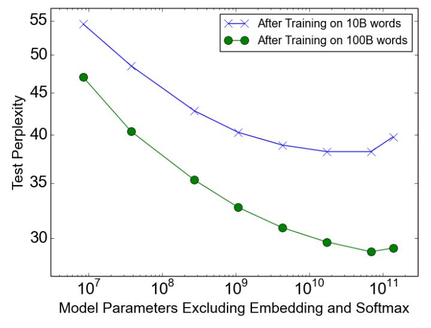

**図3.** 1000億単語のコーパスにおける言語モデリング。モデルは同程度の計算予算（1ステップあたり800万オペレーション）を持つ。

10億単語のコーパスでは、MoE層のパラメータ数が10億を超えると容量を増やしても効果が薄れる傾向があり、[図2](#figure-02)左図からそれがわかります。我々は、より大きな学習データセットでは、さらに大きな容量でも品質向上に有意な影響を与えると仮定した。

Google の社内ニュースコーパスから重複しない文を抽出してシャッフルし、合計約 1000 億語の同様の訓練データセットを構築した。前節と同様に、1 ステップあたり約 800 万オペレーションという同程度の計算コストを持つ一連のモデルを試した。ベースライン LSTM に加え、32、256、1024、4096、16384、65536、131072 個のエキスパートを持つ MoE 層で拡張したモデルを訓練した。これは MoE 層だけで最大 1370 億パラメータに相当する。アーキテクチャ、訓練、結果の詳細は[第 10 節](#section-10)に示す。

**結果：** [図3](#figure-03) は、100億語（上の線）および1000億語（下の線）のデータで学習した後の容量に対するテスト困惑度を示しています。1000億語全体で学習すると、テスト困惑度は65536エキスパート（680億パラメータ）まで大幅に改善し、計算量が同等のベースラインより39%低下しましたが、131072エキスパートでは劣化し、これはスパーシティが過剰であることが原因である可能性があります。2つの線の間の拡大する差は、（予想通り）モデル容量の増加が大規模な学習セットでより効果的であることを示しています。

65536エキスパート（層スパーシティ99.994%）でも、モデルの計算効率は0.72 TFLOPS/GPUと依然として良好です。

### 5.3 機械翻訳（単一言語ペア）

**モデルアーキテクチャ：** モデルは [Wu17] の GNMT を修正したものである。計算量を減らすため、エンコーダとデコーダの LSTM 層数を、それぞれ 9 層と 8 層から 3 層と 2 層へ減らした。エンコーダ（第 2 層と第 3 層の間）とデコーダ（第 1 層と第 2 層の間）の双方に MoE 層を挿入した。各 MoE 層は最大 2048 個のエキスパートを含み、各エキスパートは約 200 万パラメータを持つため、モデル全体で約 80 億パラメータが加わる。モデルアーキテクチャ、テスト手順、結果の詳細は[第 11 節](#section-11)に示す。

**データセット：** 我々は、WMT’14 En $\rightarrow$ Fr および En $\rightarrow$ De コーパスで我々の手法をベンチマークしました。これらの学習セットには、それぞれ3600万文の文対と500万文の文対が含まれています。実験プロトコルも [Wu17] のものと類似しており、テストセットには newstest2014 を使用して以前の研究 [Luo15a, Zho16, Wu17] と比較を行い、開発セットには newstest2012 と newstest2013 の組み合わせを使用しました。また、同じモデルを Google の本番の英語からフランス語のデータでもテストしました。

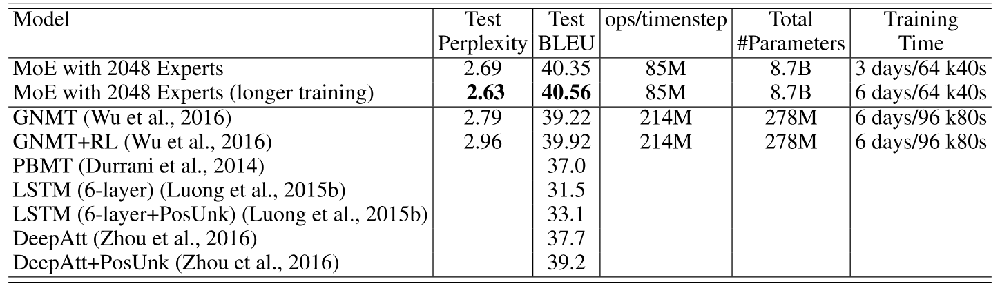

**表2.** WMT’14 En $\rightarrow$ Fr newstest2014 の結果（太字の値は最良の結果を示す）。

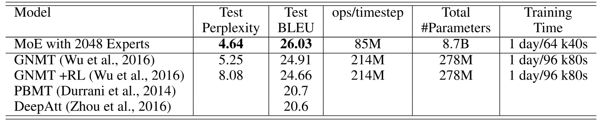

**表3.** WMT’14 En $\rightarrow$ De newstest2014 の結果（太字の値は最良の結果を示す）。

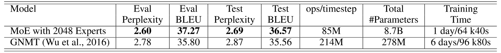

**表4.** Google Production En $\rightarrow$ Fr データセットの結果（太字の値は最良の結果を示す）。

**結果：** [表 2](#table-02)、[3](#table-03)、および [4](#table-04) は、公開された結果と比較した当社の最大のモデルの結果を示しています。当社のアプローチは、WMT’14 En $\rightarrow$ Fr および En $\rightarrow$ De ベンチマークでそれぞれ 40.56 と 26.03 の BLEU スコアを達成しました。当社のモデルは RL による改良を使用していないため、これらの結果は [Wu17] の強力なベースラインに対して 1.34 および 1.12 BLEU スコアの大幅な向上を示しています。パープレキシティスコアもまた良好です。[+2] Google Production データセットでは、当社のモデルは訓練時間がわずか 1/6 であっても 1.01 高いテスト BLEU スコアを達成しました。

### 5.4 多言語機械翻訳

**データセット：** [Joh16] は、12 言語ペアをまとめた非常に大規模なデータセットで単一の GNMT [Wu17] モデルを訓練している。その結果は、言語ペアごとに 12 個の GNMT モデルを別々に訓練した場合よりやや劣る。12 個のモデルには単一モデルの 12 倍の容量と総訓練量があるため、これは意外ではない。本稿では、単一の MoE 拡張モデルでこの実験を繰り返す。モデルアーキテクチャの詳細は[第 11 節](#section-11)に示す。[Joh16] と同じデータセットでモデルを訓練し、同数の訓練例（約 30 億の文ペア）を処理する。計算予算が小さいため、本モデルの訓練時間は短かった。

**結果：** 単一ペア GNMT モデル、多言語 GNMT モデル、および多言語 MoE モデルの結果を [表5](#table-05) に示します。MoE モデルの開発セットのパープレキシティは、多言語 GNMT モデルより 19% 低くなりました。BLEU スコアでは、MoE モデルは 12 言語ペアのうち 11 で多言語 GNMT モデルを大幅に上回り（最大 5.84 ポイント）、8 ペアでは単言語 GNMT モデルも上回りました。英語 $\rightarrow$ 韓国語の性能が低いのは、希少な言語ペアで学習コーパス中の少数の実例を過剰に再サンプリングしたため、深刻な過学習が起きた結果のようです。

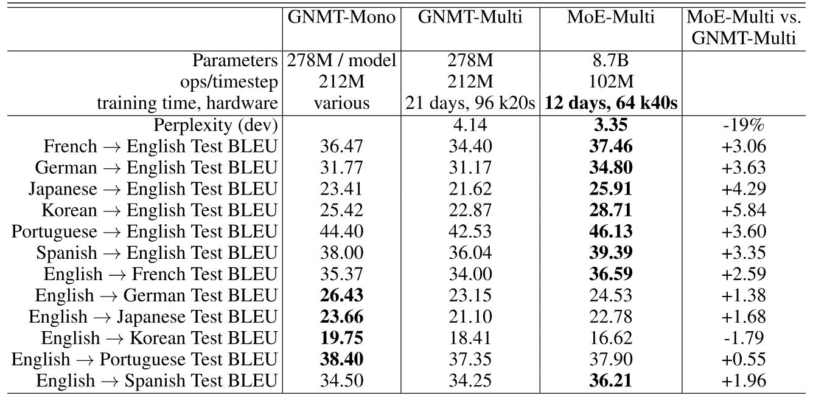

**表5.** 多言語機械翻訳（太字の値は最良の結果を示す）

## 6 結論

本研究は、深層ネットワークにおける条件付き計算から得られる大きな成果を初めて示したものである。我々は条件付き計算の設計上の考慮事項と課題を慎重に特定し、アルゴリズム的および工学的な解決策の組み合わせで対処した。テキストに焦点を当てたが、十分に大きなトレーニングセットがあれば、条件付き計算は他の分野でも役立つ可能性がある。今後、多くの新しい条件付き計算の実装と応用を見ることを楽しみにしている。

## 謝辞

このプロジェクトを支援してくれたGoogle BrainおよびGoogle翻訳チームの全メンバー、特にZhifeng Chen、Yonghui Wu、Melvin Johnsonに感謝する。また、この論文をより良くするための有益な提案をしてくれた匿名のICLRレビュアーにも感謝する。

## 7 負荷分散損失

[第 4 節](#section-4)で述べたように、負荷分散のため、各エキスパートがほぼ同数の訓練例を受け取るよう促す損失関数を追加したい。しかし、エキスパートが受け取る例の数は離散量なので、バックプロパゲーションには使えない。そこで、入力バッチ $X$ について各エキスパートへ割り当てられる例の数を滑らかに推定する $\mathrm{Load}(X)$ を定義する。この滑らかさにより、推定量を通して勾配を逆伝播できる。ゲーティング関数のノイズ項はこのために設けた。$P(x,i)$ を、要素 $i$ のノイズだけを新たに無作為抽出し、他の要素では既に抽出済みのノイズを固定したときに、$G(x)_{i}$ が非ゼロとなる確率と定義する。$P(x,i)$ の計算では、$G(x)_{i}$ が非ゼロとなるのは、$H(x)_{i}$ が $H(x)$ から自身を除いた値のうち $k^{\mathrm{th}}$ 番目に大きい要素を上回る場合に限ることに注意する。この確率は次式となる：

$$
\begin{aligned}
P(x,i)=\Pr\Bigl(& (x\cdot W_{g})_{i}+\mathrm{StandardNormal}()\cdot\mathrm{Softplus}((x\cdot W_{\mathrm{noise}})_{i})\\
&>\mathrm{kth\_excluding}(H(x),k,i)\Bigr)
\end{aligned}
$$

ここで$\mathrm{kth}\_\mathrm{excluding}(v,k,i)$は$i$を除く$v$のk番目に高い成分を意味します。簡単化すると、次のようになります：

$$
P(x,i)=\Phi\Bigl(\frac{(x\cdot W_{g})_{i}-\mathrm{kth\_excluding}(H(x),k,i)}{\mathrm{Softplus}((x\cdot W_{\mathrm{noise}})_{i})}\Bigr)
$$

ここで$\Phi$は標準正規分布の累積分布関数（CDF）です。

$$
\mathrm{Load}(X)_{i}=\sum_{x\in X}P(x,i)
$$

これで、負荷ベクトルの変動係数の二乗に手動調整のスケーリング係数$w_{\mathrm{load}}$を掛けた負荷損失を定義できます。

$$
L_{\mathrm{load}}(X)=w_{\mathrm{load}}\cdot \mathrm{CV}(\mathrm{Load}(X))^{2}
$$

**初期負荷不均衡：** メモリ不足エラーを回避するためには、ネットワークをほぼ等しいエキスパート負荷の状態で初期化する必要があります（ソフト制約が機能するまでに時間がかかるため）。これを達成するために、行列 $W_{g}$ と $W_{\mathrm{noise}}$ をすべてゼロで初期化します。これにより信号は発生せず、ある程度のノイズだけが生じます。

**実験：** 同一のアーキテクチャ（[第 9 節](#section-9)の MoE-256 モデル）を持つ一群のモデルを、$w_{\mathrm{importance}}$ と $w_{\mathrm{load}}$ の値を変えて訓練した。各モデルを 10 epoch 訓練した後、テストセットの perplexity を測定した。さらに、$\mathrm{Importance}$ と $\mathrm{Load}$ の変動係数、および最も過負荷なエキスパートの負荷と平均負荷の比も測定した。最後の値は、分散ハードウェア上の負荷分散に関わる。これらの指標はいずれも複数の訓練バッチについて平均した。

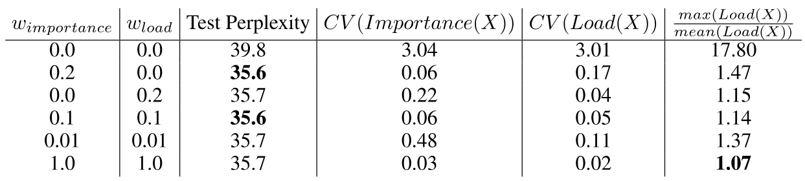

**表6.** 異なる損失の組み合わせによる実験。

**結果：** 結果は[表6](#table-06)に報告されています。少なくとも一つの損失を含むすべての組み合わせは非常に類似したモデルの品質をもたらし、損失がない場合ははるかに悪い結果でした。$w_{\mathrm{load}}$ の値が高いモデルは、最も過負荷になったエキスパートの負荷が低くなりました。

## 8 階層的 Mixture of Experts

エキスパートの数が非常に多い場合、2レベルの階層的MoEを使用して分岐因子を減らすことができます。階層的MoEでは、一次ゲーティングネットワークが「エキスパート」のスパース加重組み合わせを選択し、それぞれが独自のゲーティングネットワークを持つ二次混合エキスパートです。
[+3] 階層的MoEが$a$ のグループ、各グループに$b$ のエキスパートで構成されている場合、一次ゲーティングネットワークは$G_{\mathrm{primary}}$、二次ゲーティングネットワークは$(G_{1},G_{2}..G_{a})$、エキスパートネットワークは$(E_{0,0},E_{0,1}..E_{a,b})$と表します。MoEの出力は次の式で表されます：

$$
y_{H}=\sum_{i=1}^{a}\sum_{j=1}^{b}G_{\mathrm{primary}}(x)_{i}\cdot G_{i}(x)_{j}\cdot E_{i,j}(x)
$$

エキスパート利用の指標は次のように変わります：

$$
\mathrm{Importance}_{H}(X)_{i,j}=\sum_{x\in X}G_{\mathrm{primary}}(x)_{i}\cdot G_{i}(x)_{j}
$$

$$
\mathrm{Load}_{H}(X)_{i,j}=\frac{\mathrm{Load}_{\mathrm{primary}}(X)_{i}\cdot \mathrm{Load}_{i}(X^{(i)})_{j}}{|X^{(i)}|}
$$

$\mathrm{Load}_{\mathrm{primary}}$ および $\mathrm{Load}_{i}$ は、それぞれ一次ゲーティングネットワークと第 $i$ 二次ゲーティングネットワークの $\mathrm{Load}$ 関数を示します。$X^{(i)}$ は、$G_{\mathrm{primary}}(x)_{i}>0$ を満たす $X$ の部分集合です。

$\mathrm{Load}_{H}(X)_{i,j}=\mathrm{Load}_{i}(X_{i})_{j}$ に任せる方が簡単に見えるかもしれませんが、これでは主ゲーティングネットワークに対する勾配が得られないため、上記の定式化を使用します。

## 9 10 億語言語モデルベンチマーク - 実験の詳細

### 9.1 1 ステップあたり 800 万オペレーションのモデル

**モデルアーキテクチャ：** 我々のモデルは5層で構成されています：単語埋め込み層、リカレント長短期記憶（LSTM）層 [Hoc97, Ger00]、MoE 層、2番目のLSTM層、およびソフトマックス層。埋め込み層の次元数、各 LSTM 層のユニット数、MoE 層の入力および出力次元はすべて 512 です。ソフトマックス層以外の各層について、ドロップアウト [Zar14] を層出力に適用し、それぞれの活性化を $\mathrm{DropProb}$ の確率でドロップし、それ以外の場合は $(1-\mathrm{DropProb})$ で割ります。ドロップアウト後、前の層の出力を層出力に加えます。この残差接続は勾配の流れを促進します [He16]。

**MoE 層のアーキテクチャ：** 各エキスパートは、1024 ユニットの ReLU 活性化隠れ層と 512 ユニットの出力層を持つフィードフォワードネットワークである。したがって、各エキスパートは $[512*1024]+[1024*512]=1M$ 個のパラメータを含む。MoE 層の出力は dropout の前に sigmoid 関数を通す。モデルごとにエキスパート数を変え、通常の MoE 層では 4、32、256 個、階層型 MoE 層では 256、1024、4096 個とした。対応するモデルを MoE-4、MoE-32、MoE-256、MoE-256-h、MoE-1024-h、MoE-4096-h と呼ぶ。階層型 MoE 層の第 1 段の分岐数は 16 で、クラスタ内の GPU 数に対応する。[第 2.1 節](#section-2-1)の Noisy Top-K Gating を、通常の MoE 層では $k=4$、階層型 MoE 層の各段では $k=2$ として用いる。したがって、各例はちょうど 4 個のエキスパートで処理され、計算量は合計 4M ops/timestep となる。2 層の LSTM がそれぞれ 2M ops/timestep を使い、総計は所期の 8M となる。

**計算量が一致するベースライン：** MoE-4モデルは、すべての4つのエキスパートが常に使用されるため、スパース性を採用していません。さらに、スパース性なしで計算量が一致するベースラインモデルを4つ訓練しました：

- MoE-1-Wide： MoE層は、サイズ4096の1つのReLU活性化隠れ層を含む単一の「エキスパート」で構成されています。

- MoE-1-Deep： MoE層は1つの「エキスパート」で構成されており、それぞれサイズ$1024$の4つのReLU活性化隠れ層を含みます。

- 4xLSTM-512： MoE層を2つの追加512ユニットLSTM層に置き換えます。

- LSTM-2048-512： モデルには1つの2048ユニットのLSTM層（MoEなし）が含まれています。LSTMの出力は[Sak14]で512次元に投影されます。LSTMの次のタイムステップは、この投影された出力を受け取ります。これは[Joz16]で公開されたモデルのうちの1つと同一です。トレーニング手順の違いを考慮して再実行し、公開されたものと非常に似た結果を得ました。

**訓練：** [第 3 節](#section-3)の同期方式を用い、16 台の K40 GPU からなるクラスタでモデルを訓練した。各バッチは合計約 30 万語の文集合で構成した。時間上の都合から、訓練は 10 epoch（27,000 ステップ）に制限した。MoE-4 以外は 12-16 時間、MoE-4 は 18 時間を要した（後者では、全エキスパートの計算を 16 台中 4 台の GPU だけで実行したためである）。Adam optimizer [Kin15] を用いた。基本学習率は最初の 1000 ステップで線形に増加させ、その後はステップ数の逆平方根に比例して減少させた。Softmax 出力層は [Joz16] のモデルと同様に、importance sampling で効率よく訓練した。各モデルについて、dropout 確率を 0.1 刻みで探索した。

エキスパートの利用を均等にするため、[第 4 節](#section-4)と[第 7 節](#section-7)に従って $w_{\mathrm{importance}}=0.1$、$w_{\mathrm{load}}=0.1$ とした。

**結果：** 我々は、[Che13, Joz16] によって使用されたホールドアウトデータセット上でのパープレキシティを用いてモデルを評価します。標準的な手順に従い、文末記号を含むすべての単語に対して合計します。結果は [表7](#table-07) に報告されています。各モデルについて、テストパープレキシティ、計算予算、パラメータ数、$\mathrm{DropProb}$ の値、および計算効率を報告します。

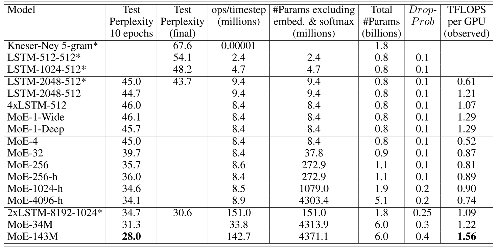

**表7.** 10億語言語モデリングベンチマークにおけるモデル比較。\*でマークされたモデルは[Joz16]のものです。

### 9.2 計算量の大きいモデル

大きなMoE層が存在する場合に計算量を増やす効果を調査するため、さらに2つのモデル（MoE-34MとMoE-143M）を実行しました。これらのモデルは、1時間ステップあたり34Mおよび143Mの計算予算を持っています。上記のモデルと同様に、これらのモデルは2つのLSTM層の間にMoE層を用います。埋め込み層の次元およびMoE層の入力および出力次元は512ではなく1024に設定されています。MoE-34Mの場合、LSTM層は1024単位です。MoE-143Mの場合、LSTM層は4096ユニットで、出力投影サイズは1024 [Sak14]です。MoE-34Mは階層的なMoEレイヤーで、1024個のエキスパートがそれぞれ2048ユニットの隠れ層を持っています。MoE-143Mは256個のエキスパートを持つ階層的なMoEレイヤーを使用し、それぞれに8192ユニットの隠れ層があります。両モデルともMoEレイヤーに4Bパラメータを持っています。各モデルに最適な$\mathrm{DropProb}$を探し、それぞれのモデルを10エポックで訓練しました。

2つのモデルはそれぞれ$31.3$および$28.0$のテストパープレキシティを達成し、大規模なMoEが存在する場合でも、より多くの計算は依然として有用であることを示しています。結果は[表7](#table-07)の下部に報告されています。2つのモデルのうち大きい方は、文献で最も優れた公開モデルと計算予算が似ており、訓練時間も似ています。10エポック後を比較すると、我々のモデルは$18\%$だけ低いテストパープレキシティを示しています。

## 10 1000 億語の Google ニュースコーパス - 実験の詳細

**モデルアーキテクチャ：** モデルは、前節で説明した1タイムステップあたり800万演算のモデルと構造が類似しています。モデル間でエキスパートの数を変えており、32個のエキスパートを持つ通常のMoE層および256、1024、4096、16384、65536、131072のエキスパートを持つ階層型MoE層を使用しています。階層型MoE層では、最初のレベルの分岐係数はそれぞれ32、32、64、128、256、256です。

**訓練：** モデルは32台のTesla K40 GPUのクラスターで訓練され、最後の2つのモデルのみ、すべてのパラメータのメモリが十分になるように64台および128台のGPUクラスターで訓練されます。すべてのモデルにおいて、訓練バッチサイズは約250万語です。モデルは約1000億語にわたり一度通して訓練されます。

我々は、GPUあたり最大10億パラメータを収めるために、いくつかのメモリ最適化を実装しています。まず、エキスパートの隠れ層のアクティベーションは保存せず、逆伝播時に再計算します。次に、補助的なストレージを少なくするために、エキスパートパラメータのオプティマイザを修正します。

Adam オプティマイザー [Kin15] はパラメータごとの勾配について一次および二次モーメントの推定値を保持します。必要なメモリはこれにより 3 倍になります。一次モーメント推定値を保持しないよう、$\beta_{1}=0$ とします。二次モーメント推定値のサイズを減らすため、因数分解近似に置き換えます。パラメータ行列については、二次モーメント推定値の完全な行列の代わりに、行方向と列方向の平均ベクトルを保持します。各ステップで推定値の行列は、この 2 つのベクトルの外積をいずれか一方の平均で割ったものとします。この手法は Adagrad [Duc10] にも適用できます。

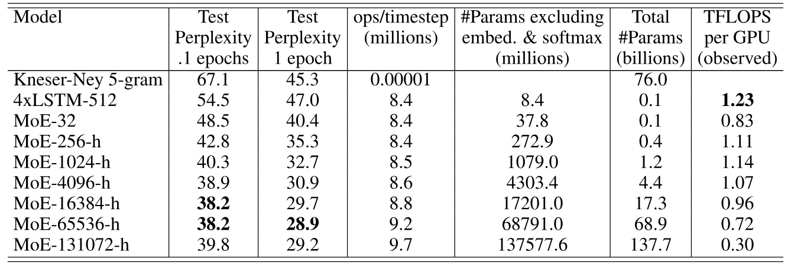

**表 8.** 1000 億ワードの Google ニュースデータセットにおけるモデル比較

**結果：** 我々は保持データセット上でのパープレキシティを使用してモデルを評価します。結果は[表8](#table-08)に報告されています。1000億語の学習後、680億パラメータのMoEモデルのパープレキシティは、ベースラインモデルに比べて39％低くなっています。最大モデルの測定された計算効率（0.30 TFLOPS/GPU）は、他のモデルと比べて非常に低くなっています。これは、比較のために他のモデルと同じようにGPU数に比例して学習バッチサイズを増やさなかったことが原因と考えられます。比較のために、計算面で一致したベースラインモデル（4つのLSTMで構成）と、Kneser-Neyスムージングを使用したプルーニングされていない5-gramモデル[Kne95]の結果も含めています。[+4]

## 11 機械翻訳 - 実験の詳細

**単一言語ペアMoEモデルのモデルアーキテクチャ：** 我々のモデルは、[Wu17] に記載されている GNMT モデルの改良版です。計算量を減らすために、エンコーダとデコーダの LSTM レイヤーの数を、それぞれ 9 層と 8 層から 3 層と 2 層に減らしました。エンコーダ（2 層目と 3 層目の間）とデコーダ（1 層目と 2 層目の間）に MoE レイヤーを挿入しました。エンコーダとデコーダの間にアテンション機構を使用し、最初のデコーダ LSTM が [+5] のアテンションから出力を受け取り、入力を提供します。モデル内のすべてのレイヤーの入力および出力の次元数は 512 です。LSTM レイヤーは 2048 の隠れユニットを持ち、512 次元の出力射影を備えています。すべての LSTM レイヤーと MoE レイヤーの周囲に残差接続を追加し、勾配の流れを促進します [He16]。GNMT と同様に、まれな単語に効果的に対応するために、入力と出力の両方にサブワード単位（「ワードピース」とも呼ばれる）[Sch12] を使用しました。

32K のワードピースからなる共有ソース・ターゲット語彙を使用しています。また、[Wu17] で提案されたのと同じビームサーチ手法も使用しました。

MoE 層のエキスパート数を変えたモデルを訓練する。MoE 層を持たないベースラインに加え、32 個のエキスパートからなる通常の MoE 層を持つモデルと、512 個または 2048 個のエキスパートからなる階層型 MoE 層を持つモデルを訓練する。通常の MoE 層では $k=4$、階層型 MoE ではゲーティングネットワークの各段で $k=2$ とする。したがって、各入力は各 MoE 層でちょうど 4 個のエキスパートに処理される。各エキスパートは、2048 ユニットの ReLU 活性化隠れ層を 1 層持つフィードフォワードネットワークである。よって、各エキスパートは $[512*2048]+[2048*512]=2M$ 個のパラメータを含む。MoE 層の出力は sigmoid 関数を通す。[第 12 節](#section-12)で述べる厳密平衡ゲーティング関数を用いる。

**多言語 MoE モデルのアーキテクチャ：** 単一言語ペアのモデルと同じアーキテクチャを、次の点だけ変更して用いた。[第 2.1 節](#section-2-1)の Noisy Top-K Gating を使用し、[第 12 節](#section-12)の方式は使わなかった。エンコーダとデコーダの MoE 層はいずれも非階層型で、$n=512$ 個のエキスパートとし、$k=2$ とした。各エキスパートの隠れ層は 8192 ユニットへ拡大した。これにより MoE 層の計算量は 2 倍となり、モデル全体の計算予算は 85M から 102M ops/timestep へ増加した。

**訓練：** Adam optimizer [Kin15] でネットワークを訓練した。基本学習率は最初の 2000 ステップで線形に増加させ、続く 8000 ステップは一定とし、その後はステップ数の逆平方根に比例して減少させた。単一言語ペアのモデルでは [Wu17] と同様に、すべての embedding、LSTM、MoE 層の出力へ dropout [Zar14] を適用し、$\mathrm{DropProb}=0.4$ とした。訓練は[第 3 節](#section-3)のように、最大 64 台の GPU からなるクラスタで同期的に行った。各訓練バッチは、GPU 1 台あたり約 16000 語を含む文ペアの集合で構成した。

エキスパートの利用を均等にするため、[第 4 節](#section-4)と[第 7 節](#section-7)に従って $w_{\mathrm{importance}}=0.01$、$w_{\mathrm{load}}=0.01$ とした。

**メトリクス：** 我々は、モデルをパープレキシティと標準的なBLEUスコア指標を使用して評価しました。Mosesの公開実装（Github）からダウンロードしたmulti-bleu.plスクリプトによって計算されたトークン化済みBLEUスコアを報告しました。これは[Luo15a]でも使用されました。

**結果：** [第 5.3 節](#section-5-3)の[表 2](#table-02)、[表 3](#table-03)、[表 4](#table-04)で、本稿の結果を他の公開手法と比較する。[図 4](#figure-04)は、エキスパート数の異なるモデルについて、処理済みの訓練データ中の原文語数に対するテスト perplexity を示す。図から分かるように、エキスパート数を 2048 まで増やしていく間、モデルのテスト perplexity は改善し続けた。

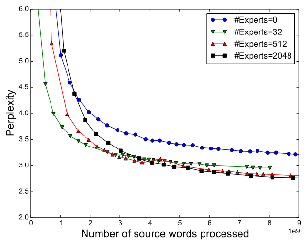

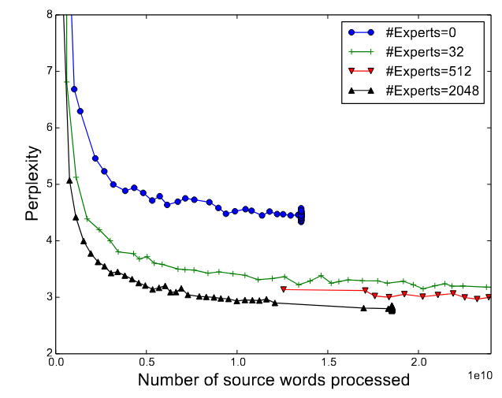

**図4.** 処理した単語数に対する WMT’14 En $\rightarrow$ Fr（左）および Google Production En $\rightarrow$ Fr（右）データセットのパープレキシティ。訓練開始時にモデル間で大きな差が生じるのは、バッチサイズが異なるためです。エキスパートなしのモデルを除き、すべてのモデルが同じ計算予算（85M オペレーション／タイムステップ）を使用します。

我々は、エキスパートが実際に文法や意味に応じて高度に特化することを [表9](#table-09) で確認しました。例えば、あるエキスパートは、直接目的語を導入する不定冠詞「a」が重要性や指導性を示す動詞句に使用される場合に用いられます。

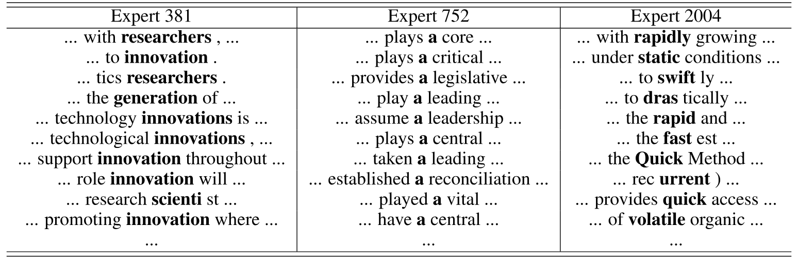

**表9.** WMT’14 En $\rightarrow$ Fr 翻訳モデルのエンコーダ部分にある MoE レイヤーで、2048 エキスパートの一部に対応するコンテキスト。各エキスパート $i$ について、トレーニングバッチ内の入力を $G(x)_{i}$ の降順に並べ、入力文中の対応位置の周囲の単語を示します。

## 12 厳密にバランスされたゲーティング

我々のインフラのいくつかの特異性により、これらは既に修正されていますが、機械翻訳実験を実行した時点では、全てのエキスパートが正確に同じバッチサイズを受け取る場合、モデルの実行が速くなりました。これに対応するために、以下で説明する異なるゲーティング関数を使用しました。

ソフトマックスゲーティング関数を次のように定義することを思い出してください：

$$
G_{\sigma}(x)=\mathrm{Softmax}(x\cdot W_{g})
$$

**スパースゲーティング（代替の定式化）：** スパースなゲーティングベクトルを得るために、$G_{\sigma}(x)$ をスパースマスク $M(G_{\sigma}(x))$ と要素ごとに掛け、出力を正規化します。マスク自体は $G_{\sigma}(x)$ の関数であり、各入力例に割り当てられるエキスパートを指定します：

$$
G(x)_{i}=\frac{G_{\sigma}(x)_{i}M(G_{\sigma}(x))_{i}}{\sum_{j=1}^{n}G_{\sigma}(x)_{j}M(G_{\sigma}(x))_{j}}
$$

**Top-K マスク：** この定式化で top-k ゲーティングを実装するには、$M(v)=\mathrm{TopK}(v,k)$ とし、ここで：

$$
\mathrm{TopK}(v,k)_{i}=\begin{cases}
1, & \mathrm{if}\ v_{i}\ \mathrm{is\ in\ the\ top}\ k\ \mathrm{elements\ of}\ v,\\
0, & \mathrm{otherwise.}
\end{cases}
$$

**バッチごとのマスク：** 各エキスパートが正確に同じ数の例を受け取るように強制するために、入力ベクトルのバッチ上で動作する代替マスク関数 $M_{\mathrm{batchwise}}(X,m)$ を導入します。各例ごとに上位 $k$ の値を保持する代わりに、学習バッチ全体で各エキスパートごとに上位 $m$ の値を保持します。ここで $m=\frac{k|X|}{n}$ は、各例が平均で $k$ 人のエキスパートに送られるようにします。

$$
M_{\mathrm{batchwise}}(X,m)_{j,i}=\begin{cases}
1, & \mathrm{if}\ X_{j,i}\ \mathrm{is\ in\ the\ top}\ m\ \mathrm{values\ for\ expert}\ i,\\
0, & \mathrm{otherwise.}
\end{cases}
$$

我々の実験が示すように、また [Iof15] でも観察されているように、学習中にバッチ単位の関数（$M_{\mathrm{batchwise}}$ など）を使用する場合、大きな例のバッチがない場合の推論時には変更が必要です。我々の解決策は、各エキスパートの閾値値をベクトル $T$ として学習させ、バッチ単位マスクの効果を近似することです。推論時には次のマスクを使用します：

$$
M_{\mathrm{threshold}}(x,T)_{i}=\begin{cases}
1, & \mathrm{if}\ x_{i}>T_{i},\\
0, & \mathrm{otherwise.}
\end{cases}
$$

閾値値を学習するために、学習時に追加の損失を適用し、バッチ単位マスクと閾値マスクが一致する場合に最小化されるようにします。

$$
\begin{aligned}
L_{\mathrm{batchwise}}(X,T,m)
&=\sum_{j=1}^{|X|}\sum_{i=1}^{n}\bigl(M_{\mathrm{threshold}}(x,T)_{i}-M_{\mathrm{batchwise}}(X,m)_{j,i}\bigr)\\
&\quad\cdot(X_{j,i}-T_{i})
\end{aligned}
$$

## 13 アテンション関数

GNMT [Wu17] で記述されているアテンションメカニズムは、学習された「アテンション関数」 $A(x_{i},y_{j})$ を含み、これは「ソースベクトル」 $x_{i}$ と「ターゲットベクトル」 $y_{j}$ を取り、各ソースタイムステップ $i$ およびターゲットタイムステップ $j$ ごとに計算される必要があります。GNMT では、アテンション関数は隠れ層のサイズ $n$ を持つフィードフォワードニューラルネットワークとして実装されています。次のように表現できます：

$$
A_{\mathrm{GNMT}}(x_{i},y_{j})=\sum_{d=1}^{n}V_{d}\tanh((x_{i}U)_{d}+(y_{j}W)_{d})
$$

ここで $U$ と $W$ は学習可能な重み行列であり、$V$ は学習可能な重みベクトルです。

パフォーマンスの理由から、我々のモデルでは、わずかに異なる注意関数を使用しました：

$$
A(x_{i},y_{j})=\sum_{d=1}^{n}V_{d}\tanh((x_{i}U)_{d})\tanh((y_{j}W)_{d})
$$

我々の注意関数を使うと、最適化された行列積を用いて、複数のソースタイムステップと複数のターゲットタイムステップに対して同時に注意関数を計算できます。二つの関数の間で品質にほとんど差はないことがわかりました。

[+1]： [Ben15] はさらに二つの損失を含みます。一つは例ごとのスパース性を制御するもので、$k$ の固定値によって強制されるため我々には必要ありません。三つ目の損失はゲート値の多様性を促進します。我々の実験では、エキスパートが特化するにつれてゲート値は自然に多様化する（好循環）ことがわかり、ゲート値の多様性を強制する必要はありません。

[+2]： 両方のモデルとGNMTで用いたトークン化に基づく報告されたパープレキシティ。

[+3]： より深い階層の必要性は見つかりませんでした。

[+4]： コーパスの元のサイズは1300億単語でしたが、ニューラルモデルは最大で1000億単語まで学習させました。報告されたKneser-Ney 5グラムモデルは、それぞれ130億および1300億単語で学習されており、他の報告結果に対してわずかな利点があります。

[+5]: 性能上の理由から、[Wu17] とはわずかに異なる注意関数を使用した。[第 13 節](#section-13)を参照。

[+author-equal]: 同等の主要貢献者。

[+author-residency]: Google Brain Residency プログラム在籍中に実施した研究（[g.co/brainresidency](https://g.co/brainresidency)）。
