> [Jianyu Wei](https://kaleid-liner.github.io/about/more/) [+internship]、[Shijie Cao](https://caoshijie0501.github.io/) [+corresponding]、[Ting Cao](https://www.microsoft.com/en-us/research/people/ticao/) [+corresponding]、[Lingxiao Ma](https://xysmlx.github.io/)、[Lei Wang](https://dblp.org/pid/181/2817-222) [+internship]、[Yanyong Zhang](http://staff.ustc.edu.cn/~yanyongz/)、[Mao Yang](https://www.microsoft.com/en-us/research/people/maoyang/)。2024 年 6 月 25 日に arXiv へ初回投稿。現行版は 2025 年 3 月 25 日投稿の v2。[EuroSys 2025](https://doi.org/10.1145/3689031.3696099) 採録。[T-MAC: CPU Renaissance via Table Lookup for Low-Bit LLM Deployment on Edge](https://arxiv.org/abs/2407.00088v2)。<a href="/paper/t-mac.pdf" target="_blank" rel="noopener noreferrer">原 PDF</a>。[DOI](https://doi.org/10.1145/3689031.3696099)。[TeX ソース](https://export.arxiv.org/e-print/2407.00088v2)。正確な印刷レイアウトと参考文献については、原 PDF を正本とする。

[+internship]: Microsoft Research でのインターン期間中に行われた研究。

[+corresponding]: 責任著者。

## 概要

デバイス上の知能を高めるうえで、エッジデバイスへの大規模言語モデル（LLM）の展開はますます重要になっている。重み量子化は、デバイス上における LLM のメモリ使用量を削減するために不可欠である。しかし、低ビット LLM の推論では、低精度の重みと高精度の活性化を組み合わせた **混合精度行列積（mpGEMM）** が必要になる。mpGEMM をネイティブにサポートしない既存システムは、重みを逆量子化して高精度計算を行う。この間接的な方法は、大きな推論オーバーヘッドを生みうる。

本論文では、CPU 上で低ビット LLM（すなわち重み量子化 LLM）を効率よく推論するための、新しいルックアップテーブル（LUT）方式である T-MAC を提案する。T-MAC は逆量子化を行わずに mpGEMM を直接サポートし、同時に乗算を取り除き、必要な加算も減らす。具体的には、従来のデータ型中心の乗算をビット単位のテーブル参照へ変換し、統一的でスケーラブルな mpGEMM を実現する。

本 LUT カーネルの性能は、重みのビット幅に対して線形にスケールする。低ビットの Llama と BitNet で評価したところ、T-MAC は *llama.cpp* と比べてスループットを最大 $4\times$ に高め、消費エネルギーを 70% 削減した。BitNet-b1.58-3B では、M2-Ultra の 1 コアで 30 tokens/s、8 コアで 71 tokens/s、Raspberry Pi 5 で 11 tokens/s のトークン生成スループットを達成する。LUT に基づく計算パラダイムを採用した T-MAC は、計算効率を損なわず、資源の限られたエッジデバイスへ低ビット LLM を実用的に展開する道を開く。本システムは [https://github.com/microsoft/T-MAC](https://github.com/microsoft/T-MAC) でオープンソース化されている。

## 1 はじめに

スマートフォン、デスクトップ、ロボットなどのクライアントデバイスに展開される大規模言語モデル（LLM）は増え続けており、かつてない知的サービス、リアルタイムなタスク応答、ユーザーデータの保護を実現している。代表例には、iPhone 上の Phi-3-mini-4bit [Abd24]、Pixel 5 上の Llama-2-7B-4bit と Apple M2 Ultra 上の Llama-2-13B-4bit [Lla23a]、さらにオンデバイス LLM とクラウド LLM を協調動作させる最近の Microsoft Copilot+ PC [Cop24] がある。

ハードウェア資源が限られるため、低ビット重み量子化はオンデバイス LLM 推論に欠かせない。LLM の推論品質は精度低下に対しても頑健である。4-bit に加え、3-bit、2-bit、さらには 1-bit のモデルも登場している [Du24, Xu24h, Wan23, Che24b]。一方、活性化には外れ値があるため、活性化量子化は同じ傾向に追随できない。したがって計算の二つのオペランドは、W4A16、W2A16、W1A8 [+1] のように非対称な精度とビット幅を持つ。

これに対し、現在の汎用ハードウェアがサポートするのは固定ビット幅と対称なオペランドであり、こうした多様な混合精度には対応できない。非対称ビット幅のオペランドを扱う研究でさえ、W4A8 [Gop20] のようにビット幅は固定されている。計算カーネルは低ビット重みを活性化に合わせて変換または逆量子化し、その後ハードウェア上で計算しなければならない。

この変換には二つの明白な問題がある。*(i)* 性能面では、変換コストがビット数削減による利得を相殺する。本評価（[図 6](#figure-06)）では、4 bit から 1 bit へ減らすと、多くの場合でかえってレイテンシが増える。*(ii)* 開発面では、データレイアウトとカーネルを混合精度ごとに個別設計する必要がある。例えば W3 と W2 では、データレイアウトだけでなく interleaving や swizzling の方法もまったく異なる。カーネルも各レイアウトに合わせて再設計しなければならない。したがってデバイス上への LLM 展開では、低ビット重みと高ビット活性化の mpGEMM（混合精度汎用行列積）を直接かつ効率よくサポートする方法が根本的な課題となる。

本論文は、ハードウェアのデータ型や量子化アルゴリズムのビット幅に依存せず、ビット数の削減に応じてスケーラブルに高速化する mpGEMM カーネル設計を目指す。そのための*中心的な発想*は、主流のデータ型中心の計算ではなく、標準的な乗算アルゴリズムの*ビット単位*計算を利用することである。すなわち、二数の乗算を、一方の数と他方の各ビットとの乗算に分け、部分積をシフトして加算する。活性化行列と重み行列の mpGEMM は、活性化行列と 1-bit 行列の mpGEMM を重みのビット幅と同じ本数だけ実行し、その部分結果を加える処理に分解される。これにより、活性化と重みの任意のビット幅の組合せをサポートできる。

ビット単位計算の有望な実装方法がテーブル参照である [Par23b]。1 bit は 1/-1 など二つの値しか表せないため、1-bit ベクトルのビットパターンは限られる。例えば 1-bit 行列を 4 要素ベクトルの組に分けると、各組に可能なビットパターン（例：[1,1,1,-1] と [1,1,-1,-1]）は $2^4$ 通りしかない。活性化が与えられれば、すべてのビットパターンとの結果を先に計算して表に保存できる。活性化と 1-bit 行列の mpGEMM は、重み中の各ビットパターンを索引とするテーブル参照と、その結果を累積する加算へ変換される。つまり mpGEMM はテーブル参照と加算だけになり、乗算は不要になる。

ビット単位の LUT 型 mpGEMM は乗算を減らせるが、現在のハードウェアは乗算向けに高度に最適化されているため、実機で効率よく実装するのは難しい。ビット単位 LUT と従来の mpGEMM の*顕著な違い*は、LUT 法の二つのオペランドが活性化と重みではなく、表と索引行列である点にある。したがって両オペランドのデータ形式とレイアウトが推論速度を左右する。*(i)* 活性化と重みは連続アクセスできるのに対し、表へのアクセスはランダムである。表を高速なオンチップメモリに常駐させることが最終的な推論性能にとって特に重要になる。*(ii)* しかしオンチップメモリは限られ、LUT 法は従来の mpGEMM より多くのオンチップメモリを使う。LUT は活性化ベクトルと可能な全ビットパターンとの積を保存する必要があり、その量は活性化自体に対して指数的に増えるためである。

これらの課題を解決するため、本論文は mpGEMM カーネルライブラリ T-MAC を提案する。[図 1](#figure-01) に示すように、ビット単位計算と LUT 実装を基礎とし、活性化と重みの任意の混合ビット幅に対して統一的でスケーラブルな解を提供する。LUT のランダムアクセスコストを抑えるため、LUT を最速のオンチップメモリに常駐させ、並列参照を可能にするシステム技術とアルゴリズム技術を提案する。システム側では*LUT 中心のデータレイアウト*を提案し、軸の並べ替えとタイリングにより LUT をレジスタなどのオンチップメモリに保持する。各表を十分に再利用しつつ、オンチップメモリを奪い合う一時結果も減らす。アルゴリズム側では、表を小さくする*テーブル量子化*と*ミラー統合*を提案する。

T-MAC は Raspberry Pi を含め、エッジデバイスに広く搭載される CPU 上へ実装した。T-MAC には変換コストがなく、テーブル参照で総演算数を減らせるため、CPU 上の LLM 推論速度は同じデバイスの GPU と同等か、それ以上になることが分かった。*したがって本論文は、広く利用できる CPU を用い、GPU に依存せずエッジデバイスへ LLM を展開する実用的な解を初めて示す。* Apple M2 Ultra、Jetson AGX Orin、Surface Book 3、Raspberry Pi 5 などの代表的なエッジデバイスで T-MAC を評価した。CPU 上の最先端実装 llama.cpp [Lla23a] と比べ、T-MAC カーネルは最大 $6.6\times$、平均 $3.6\times$ 高速化する。Llama-2-7B-2bit [Lla23b] の端から端までの LLM 推論は $2.8\times$ 高速化する。BitNet-b1.58-3B [Wan23] は Raspberry Pi 上でも 11.1 tokens/s に達する。T-MAC はエネルギー効率も高く、llama.cpp と比べてエネルギーを 60–70% 削減する。

本研究の貢献は次のとおりである。

- T-MAC はデータ型中心の乗算を*ビット単位*のテーブル参照へ変換し、統一的でスケーラブルな mpGEMM を設計する。
- 表を最速のメモリに常駐させて並列参照するための、システム技術とアルゴリズム技術を提案する。
- T-MAC カーネルライブラリと端から端までの推論システムを実装し、LLM 推論を大幅に高速化するとともにエネルギーを節約する。

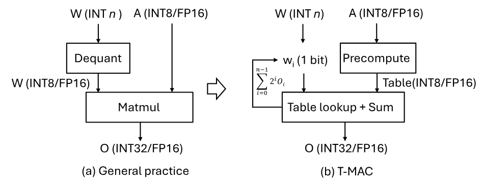

**図 1。** T-MAC と一般的な mpGEMM 実装の比較。

## 2 背景と動機

### 2.1 エッジ上の LLM

大規模言語モデル（LLM）の登場は自然言語処理を一変させ、人間とコンピューターの対話や個人向けアシスタントに新たな可能性を開いた。スマートフォン、デスクトップコンピューター、ロボットなどのエッジデバイスへ LLM を直接展開することは、コンピューティングの重要な最前線となっており、これらのデバイスにかつてない知能と自律性を与えると期待される。

**エッジ LLM の利点。** エッジデバイスへの LLM 展開には明確な利点がいくつもある。オンデバイス処理は応答レイテンシを大幅に短縮し、自動運転車や対話型ロボットなど時間に敏感な用途で特に重要である。さらに、ローカルで処理すれば機密情報をデバイス内に留められ、ユーザーのプライバシーが高まり、情報漏洩のリスクが下がる。ネットワークから独立することで、接続の有無や安定性にかかわらず一貫して機能するという運用上の信頼性も大きな利点である。

**エッジ LLM の課題。** エッジデバイスへの LLM 展開における第一の課題は、モデルを収容するために大量のメモリが必要なことである。LLM はしばしば数十億のパラメータを持つ。例えば FP16 精度の LLAMA-2-7B を保持するには、少なくとも 14 GB のメモリが必要になる。一方、エッジデバイスのメモリ資源は一般に限られ、オンデバイス展開の大きな制約となる。

メモリ容量に加え、LLM が要求する計算量とメモリ帯域もエッジ展開の大きな障害となる。エッジデバイスでは一人のユーザーとのリアルタイム対話に応えるため、通常はバッチサイズ 1 の単一インスタンスでデータを処理する。LLM の推論は prefill と decode の二段階に分けられる。全入力トークンへ自己注意機構を適用する prefill 段階では、計算負荷の高い行列同士の乗算が行われる。しかし key-value（KV）cache が生成されると、decode 段階がボトルネックになる。この段階では後続トークンを一つ生成するたびにモデル全体を読み込んで処理する必要があり、メモリ負荷の高い行列ベクトル積となる。

第三の課題は電力またはエネルギー効率であり、スマートフォンやロボットのようなバッテリー駆動のエッジデバイスでは特に重要である。これらは限られたエネルギーで長時間動作するよう設計されるため、エネルギー効率が不可欠な検討事項となる。

### 2.2 低ビット（重み量子化）LLM

LLM 推論はメモリ負荷が高いため、モデル性能を大きく損なわずにメモリ使用量を減らす方法が必要である。この両立を図る主要技術が重み量子化である。

重み量子化はモデルパラメータの精度を下げ、モデルが占めるメモリを減らすとともに、低精度演算によって計算を高速化できる可能性を持つ [Det22c, Fra22, Lin23d]。現在では、エッジなど資源の限られた環境への展開を想定した 4-bit 版 LLM の公開が増えている [Gem23, You24a]。最近の研究はさらに進み、LLM における 2-bit と 1-bit の重み表現の実現可能性を調べている [Du24, Xu24h, Wan23]。本質的に、重み量子化のビット幅や精度の選択は、計算効率とモデル精度のトレードオフである。

### 2.3 低ビット LLM の展開課題

エッジ展開では低ビット LLM の採用が不可欠になっている。実際、多くのエッジ LLM システムや実装が低ビット技術を積極的に利用している [Lla23a, Int18]。しかし低ビット LLM の展開には、特有の計算上の課題が生じる。特に、多くのハードウェアがネイティブにサポートしない混合精度演算への対応と、展開場面ごとに異なるビット幅および精度の管理である。エッジコンピューティングで低ビット LLM の能力を十分に引き出し、円滑に統合するには、これらの課題を解決する必要がある。

**混合精度 GEMM/GEMV。** 低ビット（重み量子化）LLM では、低精度の重みと比較的高精度の活性化を組み合わせる計算パラダイムが生じる。そのため標準的な行列積（GEMM、GEMV）から混合精度演算（mpGEMM、mpGEMV）へ移行する必要がある。しかし CPU、GPU、NPU を含む現在のハードウェアアーキテクチャは、混合精度演算をネイティブにサポートしない。これらは従来、二つのオペランドが同じデータ型と精度を持つ標準演算向けに最適化されている。

この制約に対し、既存システムは逆量子化による間接的な方法を採る。低精度の重みを活性化の精度に合わせて高精度へ戻し、低ビット LLM 推論に高精度 GEMM を使えるようにする。例えば *Intel Neural Compressor* や *llama.cpp* のシステムは、この逆量子化技術に依存する。ただし、この方法が有効なのは逆量子化がボトルネックにならず、メモリ読み込みと重ね合わせられる場合に限られる。最終的に高精度計算へ戻る間接方式であるため、メモリ使用量の削減や計算高速化の可能性といった低ビット重みの利点を十分に生かせない。

**ビット幅と精度の多様性。** 混合精度演算への対応に加え、展開場面ごとに必要なビット幅と精度が異なることも複雑さを増す。タスクの難しさと展開環境固有の要件に応じ、性能を最適化するためさまざまなビット幅が選ばれる。単一のビット幅や精度設定ですべての用途の多様な要求を満たすことはできない。そのため、幅広い低ビット幅をサポートし、エッジ計算タスクの多様な要請に適応できる計算方式が必要になる。

### 2.4 量子化モデルの LUT 計算

量子化モデルの計算では、ルックアップテーブル（LUT）方式の採用が新たな潮流になっている。重みと活性化の両方を 4-bit、2-bit、1-bit などへ量子化した畳み込みニューラルネットワーク（CNN）では、DeepGEMM [Gan23a] が重みと活性化の可能な積をすべて事前計算して表に保存し、推論時に効率よく参照することで高コストな積和演算を避ける。ベクトル量子化も別の例であり、活性化をベクトル量子化した MADDNESS [Bla21a] と LUT-NN [Tan23a] も GEMM をテーブル参照へ変換する。

低ビット LLM、すなわち重みのみを量子化した LLM については、GPU 上の LUT 方式が検討されている [Par23b, Mal23]。これらは GPU の shared memory や cache を使って表を保存し、参照する。しかし理論上は計算量が減るにもかかわらず、実際のカーネル性能は [Nvi24a, Bit24a] の逆量子化カーネルより低い。例えば A100 GPU 上で実際の Llama-2 モデルに由来する重み行列形状を用いると、LUT-GEMM カーネル [Par23b] の平均レイテンシは、$W_{\text{INT4}}A_{\text{FP16}}$、$W_{\text{INT2}}A_{\text{FP16}}$、$W_{\text{INT1}}A_{\text{FP16}}$ の mpGEMV において、BitBLAS [Bit24a] の逆量子化カーネルよりそれぞれ $2.34\times$、$1.87\times$、$1.75\times$ 長い。カーネル性能が振るわないのは、固定された GPU アーキテクチャにより、表の保存容量または表へのアクセス速度が不足するためである。一方、CPU 上の LUT 型混合精度 GEMM/GEMV は未開拓である。本研究は、CPU における低ビット LLM 推論へ LUT 方式を適用する実現可能性と性能への影響を初めて検討する。

## 3 設計

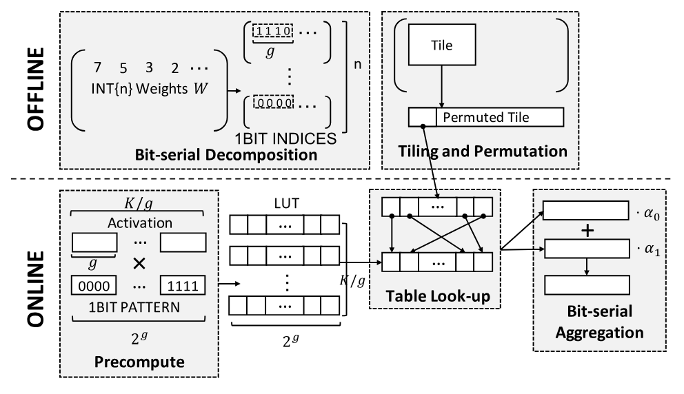

**図 2。** T-MAC の設計概要。

現在の混合精度 GEMM の実装は、組み合わせごとに異なる。W4A16 や W2A8 のように、活性化と重みのビット幅の組み合わせごとに、専用の重みレイアウトと計算カーネルが必要になる。例えば W3 のレイアウトでは、2 ビットと残りの 1 ビットを別々にパックし、メモリアラインメントや高速なデコードのために異なるインターリーブ方式またはスウィズル方式を利用できる。その場合、対応する計算カーネルは、実行に先立ってこの固有のレイアウトをハードウェアが対応するデータ型へアンパックする必要がある。

混合精度 GEMM に対して統一的かつスケーラブルな解決策を提供するため、本論文では [式 1](#equation-01) の線形な等価変換に基づき、支配的な *データ型中心* の計算を *ビット単位* の計算へ変換する。混合精度 GEMM において、$A$ と $W$ はそれぞれ活性化行列と重み行列である。$n$ は重みのビット幅である。$W_{i}$ は $W$ の各ビット行列である。

$$
A\times W=A\times(\sum^{n-1}_{i=0}2^{i}W_{i})=\sum^{n-1}_{i=0}2^{i}A\times W_{i}
$$

このように、多様な重みレイアウトは統一された 1 ビット行列レイアウトへ集約される。多様な計算カーネルも、活性化行列と 1 ビット行列の統一された乗算へ集約される。さらに、ビット単位の計算では、ビット幅の削減に伴って計算コストを線形に削減できる。

本論文では、このビット単位のレイアウトと乗算を実現するために LUT 方式を活用し（[第 3.1 節](#section-3-1)）、レジスタ内へのテーブル常駐と最速の並列ルックアップを可能にする LUT 中心のデータレイアウト（[第 3.2 節](#section-3-2)）およびテーブル圧縮方式（[第 3.3 節](#section-3-3)）を提案する。

### 3.1 T-MAC アルゴリズム

[図 2](#figure-02) とアルゴリズム 1 に T-MAC の設計を示す。オフライン準備段階（29–35 行目）では、$n$ ビットの重み行列を $n$ 個の 1 ビット行列へ分解する。1 ビットで表現できる値は 2 種類だけなので、$g$ ビットからなるグループで可能な順列は $2^{g}$ 通りに限られる。オンライン段階では、形状 $[1,g]$ の活性化の各グループについて順列を事前計算し、テーブルへ保存できる。したがって、重み内の $g$ ビットのグループは、事前計算された結果をテーブルから引くためのインデックスになる。そのため T-MAC の *テーブル* は、$[1,g]\times[g,2^{g}]$ の部分行列乗算の結果を保存するものとして定義され、テーブルのサイズは $[1,2^{g}]$ となる。オフライン段階では、高速なロードを容易にするため、1 ビット行列のタイルをメモリへ連続して保存する。通常の行列乗算におけるタイリングと同様に、ここでのタイリングも LUT 中のデータ局所性とキャッシュ利用率を高めるためのものである。

オンライン段階では、GEMM の入力活性化が与えられると、T-MAC は活性化の各 $[1,g]$ ベクトルを走査し、$[g,2^{g}]$ のビットパターン行列と乗算してテーブルを構築する（16–27 行目）。LUT の実行中には、1 ビット重み行列の各インデックス（すなわちグループ）を使ってテーブルを参照し、部分結果を得る（6–9 行目）。部分結果を累積したものが最終的な GEMM の結果となる（12–14 行目）。

例として、g=4 とし、形状 $[1,4]$ の活性化 (A1,A2,A3,A4) と形状 $[4,M]$ の 1 ビット重みを考えると、活性化はオンラインで形状 $[1,16]$ の LUT へ事前計算され、その要素には -A1-A2-A3-A4 から A1+A2+A3+A4 までが含まれる。重みを 4 個ずつグループ化すると、重みベクトル 0000 は -A1-A2-A3-A4 を、0101 は -A1+A2-A3+A4 を参照する。

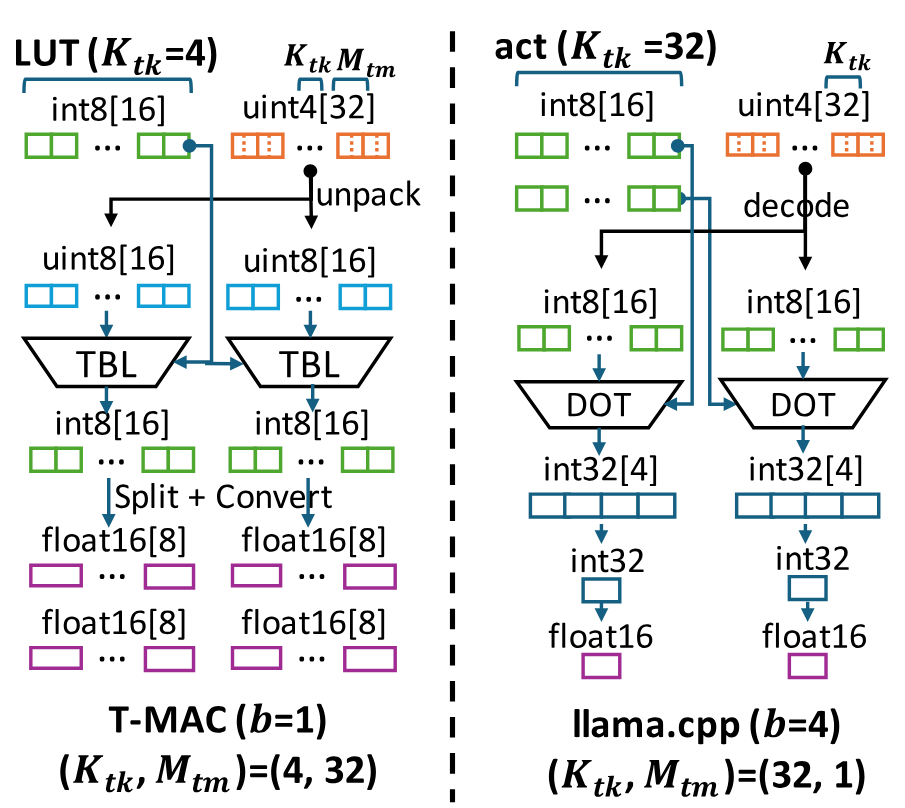

**図 3。** T-MAC と一般的な実装のデータフロー比較。

**LUT ベース mpGEMM の例。** [図 3](#figure-03)（左）は、CPU 上で T-MAC を具体化した例を示す。グループサイズを $g=4$、インデックス行列のタイルサイズを $W_{i}[K_{tk},M_{tm}]=[4,32]$、ビット幅を $b=4$ とする。右側は llama.cpp を用いた一般的な mpGEMM 実装である。左側の T-MAC では、まず 32 個の uint4 インデックスを uint8 バイト（青）へアンパックし、ハードウェアのデータ型および命令との互換性を確保する。続いて、その uint8 インデックスを使ってテーブルを参照する。ルックアップの結果は分割され、より高い精度へ変換された後、低ビット LLM モデルの量子化スケールと乗算される。

これに対し、一般的な実装では、この 4 ビットモデル専用の計算カーネルを設計する。まず 4 ビット重みを int8 へ直接デコードしてハードウェアのデータ型に合わせ、次に活性化ベクトルと重みベクトルの int8 ドット積を計算する。同様に、結果は量子化スケールとの乗算に備えて FP16 へ変換される。llama.cpp のキャッシュタイリングは $W[K_{tk},M_{tm}]=[32,1]$ である。[第 3.2 節](#section-3-2) では、T-MAC のタイリング方針が現在の実装と異なる理由を説明する。

**LUT 実装の課題。** アルゴリズムと例から、LUT ベースの mpGEMM には次の課題があることが分かる。*(i) ランダムなデータアクセス。* 現在の実装における連続的なデータアクセスとは異なり、テーブルはインデックスに応じてランダムにアクセスされる。アクセスコストを削減するには、テーブルを高速なオンチップメモリへ置く必要がある。*(ii) オンチップメモリ使用量の増大。* しかし、LUT は現在の実装よりも多くのオンチップメモリを必要とする。テーブルサイズはグループサイズ $g$ に対して指数的に増加する。例えば $g=4$ のとき、LUT は元の活性化の 4 倍の大きさになる。さらに、各基本ブロックで *スカラー* 出力を生成する従来の GEMM 実装とは対照的に、LUT 方式は（[図 3](#figure-03) に示すように）*ベクトル* 出力を生成するため、一時結果を保存するオンチップメモリも多く必要になる。[図 3](#figure-03) の例を改めて考えると、LUT 方式は 144 個の 8 ビットレジスタを使用し、llama.cpp は 104 個の 8 ビットレジスタを使用する。

以上の問題に対処するため、2 つの主要な手法を提案する。（a）中間結果と LUT をより広帯域なメモリへ収容する *LUT 中心のデータレイアウト*、および（b）LUT のサイズを縮小し、ルックアップ操作の回数を抑える *LUT ストレージの削減* である。

**アルゴリズム 1：T-MAC GEMM**

- **入力：** 形状 $N$、$K$ の活性化 $A$。形状 $M$、$K$ の重み $W$。
- **出力：** 形状 $N$、$M$ の結果行列 $R$。
- $b$ を重みのビット数とする。
- $W_1,\ldots,W_b\leftarrow\mathrm{PreprocessWeights}(W,M,K)$.
- $\mathrm{LUT}\leftarrow\mathrm{Precompute}(A,N,K)$.
- $\alpha_i$（$i\leftarrow 1$ から $b$）をビットシリアルの乗数とする。
- $\beta$ をビットシリアルのバイアスとする。
- **各** $i\leftarrow 1$ から $b$ **について：**
  - **各** $n,m\leftarrow 1$ から $N,M$ **について：**
    - $R_i[n,m]=\sum_{k\leftarrow 1}^{K}\operatorname{Lookup}(\mathrm{LUT},W_i,n,m,k)$.
- $B$ を、全要素が $\beta$ である形状 $M$、$K$ の行列とする。
- $R_\beta\leftarrow A\cdot B^\top$.
- $R\leftarrow\sum_{i\leftarrow 1}^{b}\alpha_iR_i+R_\beta$.
- **関数** $\mathrm{Precompute}(A,N,K)$：
  - $g$ を LUT テーブルのグループサイズとする。
  - **各** $n,k\leftarrow 1$ から $N,K$ **について：**
    - **各** $i,j\leftarrow 1$ から $2^g,g$ **について：**
      - **もし** $i\mathbin{\texttt{\&}}(1\mathbin{\texttt{<<}}j)$ **ならば：**
        - $\mathrm{LUT}[n,k/g,i]\mathrel{+}=A[n,k]$.
      - **それ以外：**
        - $\mathrm{LUT}[n,k/g,i]\mathrel{-}=A[n,k]$.
  - **返す：** $\mathrm{LUT}$。
- **関数** $\mathrm{PreprocessWeights}(W,M,K)$：
  - **各** $i\leftarrow 0$ から $b$ **について：**
    - **各** $m,k\leftarrow 1$ から $M,K$ **について：**
      - $W_i[m,k/g]\mathrel{+}=(W[m,k]\mathbin{\texttt{>>}}i)\mathbin{\texttt{<<}}(k\mathbin{\%}g)$.
  - **返す：** $W_1,\ldots,W_b$。

### 3.2 LUT 中心のデータレイアウト

[第 3.1 節](#section-3-1) で述べたように、低ビット GEMM の LUT ベース方式では、ルックアップテーブルと中間結果を保存するために、より多くのメモリが必要になる。一方、テーブルルックアップはランダムなメモリアクセスを伴うため、通常はメモリアクセス効率が低下する。メモリへの保存とアクセスの非効率性を解消するため、LUT ベース低ビット GEMM 向けに LUT 中心のデータレイアウトを設計する。具体的には、ルックアップテーブルをレジスタなどのオンチップメモリへ保存してテーブルアクセスを高速化し、軸の並べ替えとデータタイリングによってデータ再利用を高め、メモリ消費を削減する。さらに効率を高めるため、メモリトランザクションへ整合させる重みの置換と、重みのアンパックを最適化する重みのインターリーブという 2 つのデータレイアウト最適化を設計する。

**ルックアップテーブルをオンチップメモリへ配置する。** [第 3.1 節](#section-3-1) で述べた LUT ベースの GEMM では、事前計算済みテーブルから結果を取得する必要があり、その際にルックアップテーブルへランダムアクセスする。これらのテーブルルックアップを高速化するため、ルックアップテーブルをレジスタへ置き、ハードウェア固有命令（例えば ARM CPU の TBL と x86 CPU の PSHUF）を利用してテーブルルックアップを行う。ハードウェア固有命令を用いたテーブルルックアップの最適化については [第 4 節](#section-4) で詳述する。しかし、ルックアップテーブルをレジスタへ配置するとオンチップメモリへの圧力がさらに高まり、メモリスピルによって性能が大幅に低下する可能性がある。オンチップメモリ上のテーブルルックアップが持つ可能性を十分に引き出すため、軸の並べ替えとタイリングを設計してデータ再利用を高め、オンチップメモリへの圧力を軽減する。

**軸の並べ替え。** GEMM $C[N,M]=A[N,K]\times W[M,K]$ では、空間軸 $N$ と $M$、次いで時間軸 $K$ の順にループするのが自然である。しかし LUT ベースの GEMM は $K$ 軸に沿ってテーブルを構築する必要があるため、従来の GEMM に従って空間軸から時間軸の順にループすると、$A[N,K]$ 全体のルックアップテーブルが必要になり、テーブル保存量が極めて大きくなる。一方、軸の順序を空間軸優先から時間軸優先へ入れ替えれば、保持するのは小さなルックアップテーブル $[1,K]$ だけでよい。そこで T-MAC は、まず時間軸 $K$、次に空間軸 $N$ と $M$ の順にアクセスするよう軸を並べ替える。

**タイリング。** タイリングは、オンチップメモリ上でデータを再利用することにより、GEMM のデータ局所性を最適化し、メモリ要件を削減する一般的な手法である。GEMM $C[N,M]=A[N,K]\times W[M,K]$ をタイル $A[N_{tn},K_{tk}]$ と $W[M_{tm},K_{tk}]$ で処理すると仮定すると、1 つのタイルを処理する際に DRAM からプロセッサのオンチップメモリへロードするデータ量は、$N_{tn}*M_{tm}*K_{tk}$ ではなく $N_{tn}*K_{tk}+M_{tm}*K_{tk}$ で済む。従来の GEMM では、タイルサイズ $N_{tn}$ と $M_{tm}$ は効率に同等の影響を与える一方、$K_{tk}$ はデータ再利用には影響せず、メモリトランザクションに合わせて設定される。

しかし LUT ベースの GEMM では、活性化 $A[N,K]$ を処理してルックアップテーブルを構築する必要がある一方、重み $W[M,K]$ は同じ事前計算済みルックアップテーブルを共有できる。つまり、$M$ に対するタイルサイズ $M_{tm}$ を大きくするほど、ルックアップテーブルをより効果的に再利用できる。T-MAC は、より優れたデータ再利用を実現するため、タイリング構成 $N_{tn}$、$M_{tm}$、$K_{tk}$ を慎重に検討する。

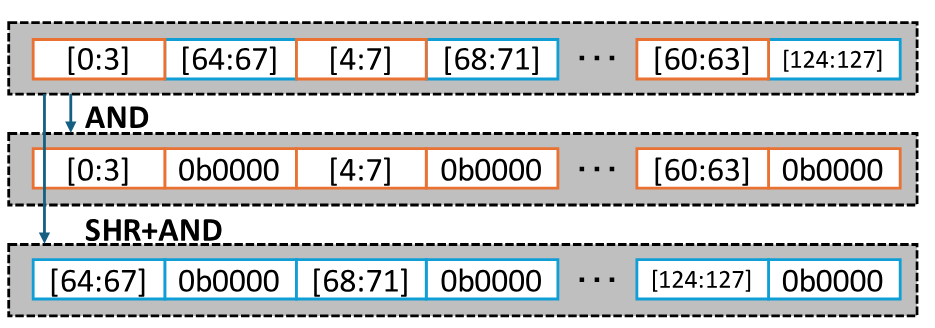

**図 4。** 高速なアンパックのための重みのインターリーブ。

**レイアウトの最適化。** 軸の並べ替えとタイリングによるオンチップテーブルルックアップの最適化に加え、効率をさらに高めるため、重みの置換とインターリーブという 2 つのデータレイアウト最適化を設計する。

*逐次メモリアクセスのための重みの置換。* DRAM で高い帯域利用率を得るには逐次アクセスが必要だが、入力行列のタイルは連続して保存されていないため、タイリングベースの GEMM でタイルへアクセスするとランダムアクセスが生じる。この問題を解決するため、T-MAC は重みのロードをメモリトランザクションへ合わせるよう重み行列を並べ替える方式を設計する。GEMM のスケジューリングが決まった後、T-MAC は行列全体ではなくタイルが連続して保存されるよう入力行列を並べ替える。具体的には、T-MAC はタイル内の要素を順に平坦化し、平坦化したタイルをタイルのアクセス順に連結する。LLM 推論中に重み行列は変更されないため、この置換はオフラインで実行できる。このオフライン置換は推論時のコストを生じさせない。

*高速なアンパックのための重みのインターリーブ。* [第 3.1 節](#section-3-1) で述べたように、重み行列はパック形式でメモリへ保存され、計算中にアンパックする必要がある。しかし、現代の CPU で一般的なリトルエンディアン方式では、整数内のバイトが逆順に格納される。したがって、整数命令で重みをアンパックする場合、正しいアンパック済み重みを得るために追加の並べ替えが必要になる。LLM 推論中に重み行列は変更されないため、T-MAC はパック済み重みをインターリーブし、この並べ替えを省ける。[図 4](#figure-04) は、このインターリーブの例を示しており、インターリーブ済みの重みをアンパックするだけで、必要な重みを順番どおりに直接生成できる。

### 3.3 LUT ストレージの削減

低ビット LLM 推論のための LUT ベース方式では、ルックアップテーブルのサイズが、保存要件とアクセス遅延の両方に影響する重要な要因となる。特に [第 3.2 節](#section-3-2) のようにオンチップメモリを使ってテーブルルックアップを最適化する場合はその影響が大きい。テーブルサイズが大きいほど、必要なメモリ空間が増えるだけでなく、テーブルへのアクセス速度も低下する。この課題に対処するため、*ミラー統合* と *テーブル量子化* という 2 つの最適化戦略を導入する。[図 5](#figure-05) に示すように、ミラー統合はテーブル値の対称性を利用してテーブルの長さを半分にし、テーブル量子化はテーブル値自体へ量子化技術を適用してテーブルの幅を削減する。これらを組み合わせることで、LLM 推論の精度を損なうことなく、ルックアップテーブルの保存量を元の最大 4 分の 1 まで大幅に削減できる。

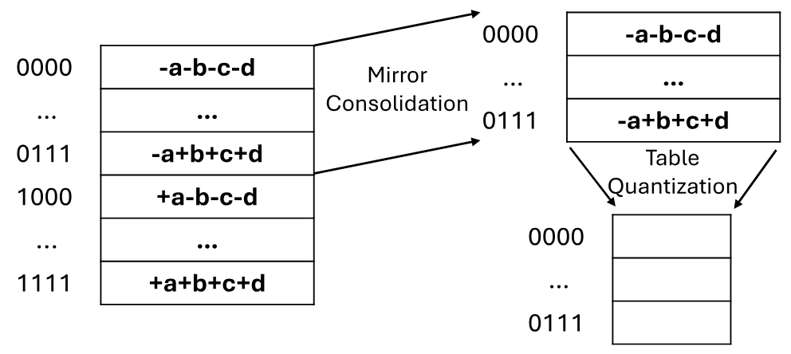

**図 5。** ミラー統合とテーブル量子化による LUT ストレージの削減。ミラー統合はテーブルの長さを半分にする。テーブル量子化はテーブルの幅を削減する。

**ミラー統合。** LLM 推論用ルックアップテーブルにおけるテーブル値固有の対称性は、独自の最適化機会をもたらす。テーブル内の各正値には、ゼロを軸とする鏡像に相当する負の値が自然に対をなしている。この対称性を利用し、提案する *ミラー統合* は、テーブル値の半分だけを明示的に保存すればよいという性質を活用する。残りの半分は、保存した値の符号を反転するだけで高速に再構築できる。このテーブル圧縮方式はロスレスであり、モデルの推論精度を完全に維持する。さらに、ルックアップテーブルの事前計算を高速化し、必要なストレージを削減し、テーブルアクセスを高速化するため、非常に効率的である。

**テーブル量子化。** テーブル量子化は、重みおよび活性化の量子化と同様の原理に基づき、計算効率を高めるためにテーブル値の精度を下げる。例えば、ルックアップテーブル内で当初 16 ビット浮動小数点（fp16）として表現されていた値を、スケーリング係数とともに 8 ビット整数（int8）へ量子化できる。テーブル量子化がモデル精度へ与える影響は無視できる。高速な計算を保証するには粗い粒度と静的量子化が必要となり、モデル精度の維持が難しかった活性化量子化とは異なり、本手法はより細かい粒度（k=4 の場合に 8 個の値を量子化）と動的量子化を採用し、精度低下を最小限に抑える。[第 5.6 節](#section-5-6) に示す結果は、本手法のテーブル量子化がモデル全体の精度へほとんど影響しないことを示している。効率の面では、テーブル量子化によってルックアップテーブルの保存要件が大幅に減り、ルックアップ処理も高速化される。

## 4 実装

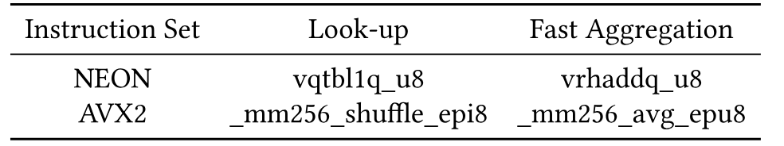

**表 1。** ルックアップと集約のためのハードウェア組み込み関数。

**TVM によるコード生成。** コード生成には TVM [Che18d] + LLVM [Lat04] を採用する。これにより、さまざまな形状の GEMM と異なるハードウェア向けに最適なコードを生成し、ループ展開、ベクトル化、定数畳み込みなどの一般的な最適化を実装できる。TVM Tensorize を利用して、ハードウェア組み込み関数をコードへ埋め込む。生成されたコードを異なるハードウェアターゲット向けに自動調整するため、AutoTVM [Che18a] を使用する。

**API と統合。** C++ と Python の両方に一貫した API を提供する。GEMM 関数は TVM PackedFunc へカプセル化され、テンソルは DLPack [Dlp17] のテンソル構造を介して転送できる。これにより、PyTorch や Numpy などの他のフレームワークと容易に相互運用できる。さらに C++ 向けには、テンソルを生ポインタで渡せ、TVM ランタイムへの依存を排除した追加のラッパーも提供する。これにより、他の C++ プロジェクトへ統合するための、より軽量な解決策が得られる。

**並列処理。** TVM ランタイムのスレッドプールを利用し、タスクを CPU へ動的に割り当てる。しかし、T-MAC を llama.cpp へ統合すると、llama.cpp のスレッドプールと TVM のスレッドプールとの間に明らかな競合が生じることが分かった。この競合は、異なるスレッドプールのスレッドが CPU リソースを奪い合うことで発生し、性能を大幅に低下させる。この問題を解決するため、ライブラリファイルを直接作成する代わりに TVM で C++ コードを生成し、そのコードを後処理して TVM ランタイムとスレッドプールへの依存を除去する。生成された関数は単一のスレッドブロックの計算だけを実行し、それらのスレッドブロックを llama.cpp のスレッドプール内の異なるスレッドへ割り当てる。この方法により、性能と llama.cpp との互換性が向上する。移植可能な C++ コードは、クロスプラットフォーム展開の選択肢にもなる。

**TBL/PSHUF による効率的なテーブルルックアップ。** テーブルをレジスタへロードした後は、ARM NEON/INTEL AVX2 が提供するハードウェア組み込み関数を利用できる。NEON/AVX2 はどちらも 8 ビットのルックアップ命令を備える。ARM NEON のビット幅は 128 であり、$g=4$ のテーブル全体をちょうど収容できる。INTEL AVX2 のビット幅は 256 だが、下位半分と上位半分は別々の 128 ビットレーンに分かれている。そのため、テーブルを複製して 256 ビットの LUT レジスタを満たし、1 命令で 32 個の異なる int8 重みインデックスを参照する。テーブルのデータ型が float16 の場合、NEON/AVX2 は 16 ビット LUT に対応していないため、float16 を 2 つの 8 ビット LUT、すなわち下位部分用と上位部分用に分割する。2 命令で下位部分と上位部分を参照し、その後 float16 へ再結合できる。

**オンチップ LUT サイズの決定。** オンチップメモリを十分に活用し、タイルの処理中に LUT が退避されないよう、オンチップ LUT の数をハードウェアごとに調整する。オンチップメモリが大きいほど多くの LUT を常駐させることができ、書き戻す前により多くの中間結果を集約できる。オンチップ LUT が過剰になることで生じるレジスタスピルは、オーバーヘッドにつながる。

$g$ もオンチップメモリのサイズと命令スループットに応じて決まる。$g=4$ の LUT は ARM.TBL/AVX2.PSHUF における 1 個のレジスタへちょうど収まる。$g=5$ のように $g$ を大きくすると、2 個のレジスタと、より低速な ARM.TBL2/AVX512.PSHUF が必要になる。

**高速な 8 ビット集約。** テーブルルックアップに加え、集約も大きな計算オーバーヘッドとなる。集約を高速化するため、まずルックアップ結果を低ビットで集約し、その後、精度を損なうことなく集約値を float16 などの高精度形式へ変換する。さらに、テーブルが int8 へ量子化されていれば、高速な 8 ビット集約 [Bla21a] を実装できる。通常、オーバーフローを避けるために int8 値を int16 へ変換する必要がある。しかし int16 命令のスループットは int8 集約の半分である。代わりに *avg/rhadd* 命令で平均を計算し、最終値から確率的バイアスを減算することで精度低下を最小限に抑えられる。ただし、高速な 8 ビット集約は無視できない精度低下を招く可能性がある。[表 1](#table-01) に、異なる CPU アーキテクチャにおけるルックアップと集約のハードウェア組み込み関数を示す。

**ビットシリアル線形変換。** [第 3.1 節](#section-3-1) で述べた分解では、$v_{i}$ の元の値、すなわち 0 と 1 を使用する。ただし、これらの値へ線形変換を導入することもできる。この線形変換を $f(v_{i})$、変換後の値を $f(0)=s_{0}$ および $f(1)=s_{1}$ と表す。

事前計算を高速化し、量子化誤差を減らすには、$s_{0}$ と $s_{1}$ の値を慎重に選ぶ必要がある。浮動小数点乗算命令を回避するため、これらを集合 [-1, 0, 1] から選ぶ。量子化誤差を減らすため、ルックアップテーブル（LUT）の最大要素と最小要素の差を最小化する。経験的な調査から、$s_{0}=-1$ と $s_{1}=1$ が最適な選択肢であることが分かった。

$s_{0}$ と $s_{1}$ の値を設定することで線形変換 $f$ を定義し、$W$ の分解を次のように調整する。

$$
\begin{aligned}
f(v_{i}) & =\alpha_{i}^{\prime}v_{i}+\beta_{i}^{\prime},v_{i}=\alpha_{i}f(v_{i})+\beta_{i}, \\
\mathrm{where}~\alpha_{i}=\frac{1}{\alpha_{i}^{\prime}},\beta=-\frac{\beta_{i}^{\prime}}{\alpha_{i}^{\prime}} \\
W & =\sum_{i=0}^{b-1}\alpha_{i}2^{i}W_{i}^{\prime}+B, \\
\mathrm{where}~W_{i}^{\prime}=f(W_{i}),B=J\cdot\sum_{i=0}^{b-1}\beta_{i}2^{i}
\end{aligned}
$$

**効率的な LUT 事前計算のためのレジスタスウィズリング。** [第 3.1 節](#section-3-1) で示したように、より高いスループットを得るため、乗算命令ではなく減算／加算命令を選択する。形状 $(N,K/g,2^{g})$ の LUT では、減算／加算を $K/g$ 軸に沿ってベクトル化できる。例えば、

$$
\begin{aligned}
\mathrm{LUT}[0,0:8,0]= & -A[0,0:32:4]-A[0,1:32:4] \\
-A[0,2:32:4]-A[0,3:32:4]
\end{aligned}
$$

$A$ へのインデックスは連続していない。NEON の *LD4* と AVX2 の *vgatherdps* を使うことで、非連続データを効率よくロードできる。しかし、非連続な LUT をメモリへ書き戻す際、SIMD レジスタから特定のバイトを抽出してメモリへ書き込む処理は、AVX2 では非常に非効率である。この問題に対処するため、レジスタスウィズリングを使って LUT を並べ替え、メモリへ連続して書き戻せるようにする。まず *vpblendvb* を使い、異なるレジスタの 8 ビット値を 1 個のレジスタへブレンドする。続いて *vpermd* で 256 ビット内の 32 ビット値をスウィズルし、さらに *vpshufb* で 8 ビット値を正しい順序へシャッフルする。スウィズリング後、LUT をメモリへ連続して書き戻せる。

## 5 評価

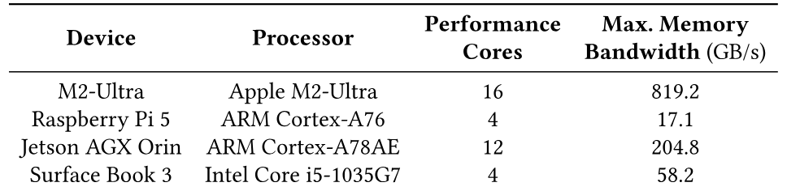

**表 2。** ハードウェアデバイスの仕様。

4 種類のエッジデバイス上で、実際の低ビット LLM、具体的には Llama と BitNet を用いて T-MAC を評価する。ベンチマークでは、既存の最先端実装 *llama.cpp* との直接比較を目的とする。主な結果を以下にまとめる。

- T-MAC の mpGEMV および mpGEMM カーネルは顕著な性能向上を示し、最先端の逆量子化ベースのカーネルを大幅に上回る。
- T-MAC は、元の *llama.cpp* 実装に対してエンドツーエンドのモデル推論スループットを 2–4 倍へ向上させると同時に、エネルギー消費を 60%–70% 削減する。
- 注目すべきことに、多くの場合、T-MAC は GPU の性能に匹敵するだけでなく、それを上回り、デバイス上の LLM 展開効率に新たな節目をもたらす。

### 5.1 評価設定

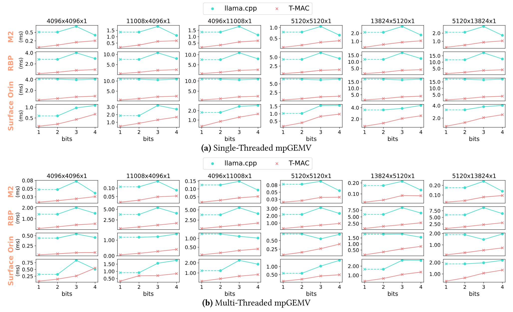

**図 6。** シングルスレッドおよびマルチスレッドでの 1／2／3／4 ビット mpGEMV 性能ベンチマーク。行列形状は Llama-2-7b と Llama-2-13b に由来する。llama.cpp の 1 ビットカーネル性能は 2 ビットカーネルから推定し、破線で示す。

**ハードウェアデバイス。** [表 2](#table-02) に示すように、4 種類のエッジデバイスで T-MAC を評価する。これらのデバイスは、M2-Ultra のような高性能デバイスから Raspberry Pi のような低性能デバイスまで幅広い。評価対象の CPU には Intel Core、Apple Silicon、Cortex シリーズが含まれる。OS には OSX、Linux、Windows が含まれる。この評価により、異なる命令セットと多様なエッジ展開シナリオにおける T-MAC のクロスプラットフォーム互換性と一貫した性能が保証される。

**カーネルとモデル。** T-MAC の性能を評価するため、実際の低ビット LLM とユースケースを用いて広範なベンチマークを行う。カーネル性能ベンチマークには Llama-2-7B および Llama-2-13B モデルに由来する行列形状を選び、実際の要件を反映した評価とする。エンドツーエンドのスループットテストでは、異なるビット幅構成における T-MAC の実用的な有効性を示すため、実際の量子化済みモデルを使用した。具体的には、4 ビット、3 ビット、2 ビット、1 ビットへ量子化した Llama モデルに加え、ゼロから学習した 1 ビットおよび 1.58 ビットの BitNet モデルを使用する。1.58 ビット BitNet の三値重みは 2 ビットとして解釈し、2 個の 1 ビット行列へ分解する。4 ビット Llama モデルは GPTQ [Fra22] によるものである。3 ビットおよび 2 ビット Llama モデルは BitDistiller [Du24] によるものである。1 ビット Llama モデルは OneBit [Xu24h] によるものである。

**ベースライン。** T-MAC の性能を、エッジデバイス上の LLM 展開に向けた最先端実装 *llama.cpp*（バージョン b2794、2024 年 5 月リリース）と比較した。いくつかの有力な理由から、*llama.cpp* をベースラインに選んだ。第一に、*llama.cpp* はエッジデバイス上の LLM 展開における最先端を代表し、各ハードウェアプラットフォーム向けに高度に最適化されたカーネル実装を備えている。その汎用性と堅牢な性能により、新しい手法の有効性を評価するうえで理想的なベンチマークとなる。さらに、*llama.cpp* は依存関係を持たない純粋な C/C++ で実装されており、多様なハードウェア構成で最大限の互換性と効率を確保している。カーネル性能ベンチマークでは、それぞれのハードウェアデバイス上で *llama.cpp* が提供する最適化済みカーネルをベースラインとして使用した。エンドツーエンドのスループット評価では、T-MAC の LUT ベースカーネルを *llama.cpp* へ統合し、元の *llama.cpp* と比較する。

また、T-MAC の性能を *llama.cpp (BLAS)* とも比較した。*llama.cpp* は M2-Ultra 上では *Accelerate* を、その他のプラットフォームでは *OpenBLAS* を使用する。*llama.cpp (BLAS)* は、*llama.cpp* の高度に最適化された混合精度実装と比べ、mpGEMV では低速だが mpGEMM では高速である。そのため T-MAC と *BLAS* の比較は mpGEMM についてのみ行う。

**測定方法。** *カーネルレベル* と *モデルレベル* の両方で測定する。CPU 上で正確かつ一貫したカーネルレベルの遅延を得るため、まず 10 回のウォームアップを行い、その後 100 回実行して平均を算出する。M2-Ultra のウォームアップは他と若干異なり、性能を最大化するには少なくとも 1 秒を要する。モデルレベルの遅延を測定するため、T-MAC を llama.cpp へ統合する。64 トークンの生成を 20 回繰り返し、トークン生成スループットを評価する。

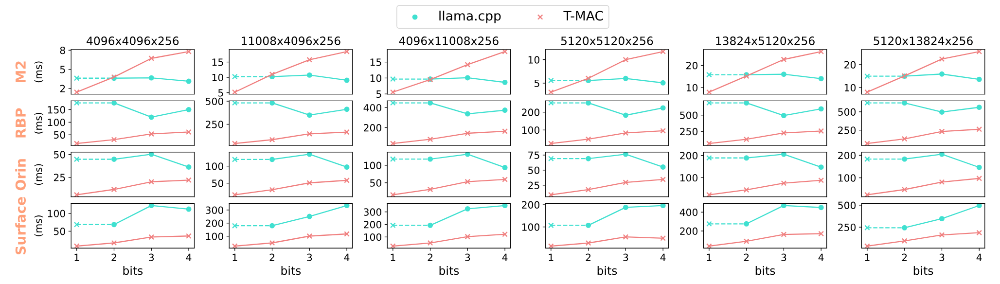

**図 7。** マルチスレッドでの 1／2／3／4 ビット mpGEMM 性能ベンチマーク。行列形状は、入力シーケンス長 256 の Llama-2-7b と Llama-2-13b に由来する。llama.cpp の 1 ビットカーネル性能は 2 ビットカーネルから推定し、破線で示す。

### 5.2 mpGEMV／mpGEMM 性能ベンチマーク

4 種類すべてのデバイス上で、Llama-2-7B／13B のカーネルを評価する。[図 6](#figure-06) に示すように、ビット数を 4 ビットから 2 ビットへ減らしても llama.cpp は追加の高速化を得られず、3 ビットではデコードのオーバーヘッドにより、4 ビットと比べて 15% 低速になる。そのため、llama.cpp は 1 ビット実装を提供していないものの、その 1 ビット性能は 2 ビットと同程度になると推測できる。一方、T-MAC はビット数の削減に伴って線形に高速化する。シングルスレッド GEMV では、T-MAC は 1／2／3／4 ビットでそれぞれ最大 11.2 倍、5.8 倍、4.7 倍、3.1 倍の高速化を達成する。マルチスレッド mpGEMV では、T-MAC の性能は主にメモリ帯域に制約されるが、効率的なメモリアクセスにより、なお大幅な高速化を達成できる。例えば 2 ビットでは、4 種類のデバイスでそれぞれ 4.0 倍、4.0 倍、5.31 倍、2.5 倍となる。

[図 7](#figure-07) では、シーケンス長 256 のマルチスレッド mpGEMM を評価する。*llama.cpp* は mpGEMM に BLAS を使用する。それでも T-MAC は、RBP、Orin、Surface の 2 ビットで大幅な高速化を達成し、最大高速化率はそれぞれ 4.0 倍、5.3 倍、5.3 倍である。M2-Ultra は例外であり、Apple Silicon CPU には GEMM 演算を処理する強力な AMX コプロセッサが搭載されている。ただし、この場合も T-MAC は 1 ビットで最大 $2.0\times$ の高速化を達成する。

T-MAC は 3 ビット精度で顕著な優位性を示す。これは、現在の手法が 3 ビット重みを非効率に処理しているためである。重みのデコードは通常 SHIFT 命令と AND 命令で実行され、重みをバイト幅へ整列させる必要がある。8 は 3 で割り切れないため、このデコード処理は特に非効率となる。*llama.cpp* は 2 ビットと残りの 1 ビットを別々にパックして最適化を試みるが、それでも大きなオーバーヘッドが生じる。対照的に T-MAC は、各ビットの結果を個別に計算することでこの問題を回避する。

### 5.3 エンドツーエンド推論スループット

llama.cpp へ統合した後、llama.cpp と T-MAC のエンドツーエンドのトークン生成スループットを比較する。BitNet の実行には 2 ビットを使用する。[図 8](#figure-08) に示すように、Raspberry Pi 5 上のシングルスレッド実行では、T-MAC は 3 つのモデルでそれぞれ 2.8 倍、6.7 倍、5.8 倍の高速化を達成する。マルチスレッド実行では、メモリ制約と mpGEMV／mpGEMM 以外の演算子のため、高速化はそれほど顕著ではない。それでも M2-Ultra 上で 1.1 倍、2.3 倍、1.7 倍の高速化が観測される。T-MAC は、高性能な M2-Ultra で最大毎秒 71 トークン、性能の低い Raspberry Pi 5 で毎秒 11 トークンに達し、実環境のエッジ展開に有望であることを示す。

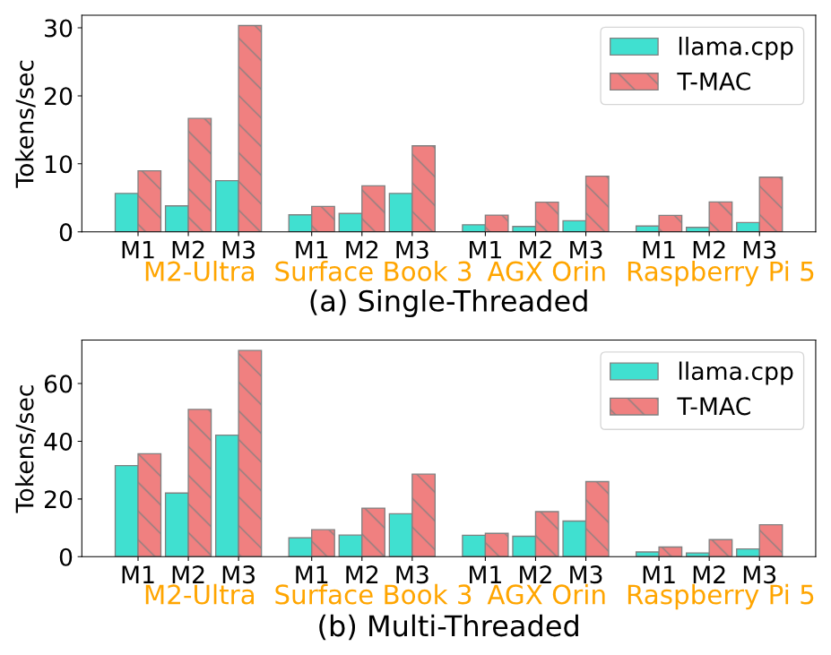

**図 8。** T-MAC カーネルを llama.cpp へ統合したエンドツーエンドのトークン生成スループット。M1、M2、M3 はそれぞれ Llama-2-7B-4bit、Llama-2-7B-2bit、BitNet-3B を表す。

### 5.4 電力およびエネルギー消費

計算効率に加え、エネルギー効率も同じく重要であり、特にバッテリー電源に依存するエッジデバイスでは重要性が高い。*llama.cpp* と比較した T-MAC の電力およびエネルギー消費を評価するため、M2 Ultra デバイス上でマルチスレッド実装を用いた実験を行った。分析には Llama-2-7B-4bit、Llama-2-7B-2bit、BitNet-3B の 3 モデルを選んだ。電力使用量は OSX 上の *powermetrics* で測定する。このツールは、指定したサンプル間隔にわたる平均電力使用量を記録できる。この間隔を 500 ミリ秒に設定し、少なくとも 120 秒間連続してトークンを生成し、電力を時間積分して総エネルギー消費を求める。

[図 9](#figure-09) に示す結果から、T-MAC の LUT ベースカーネルを使用すると電力消費が大幅に減ることが分かる。Llama-2-7B-4bit、Llama-2-7B-2bit、BitNet-3B の各モデルで、T-MAC はそれぞれ 10.3%、10.3%、17.3% の電力消費削減を示す。これらの電力消費削減と T-MAC による遅延改善が合わさり、総エネルギー消費も大幅に減少する。具体的には、T-MAC は各モデルのエネルギー消費をそれぞれ 20.6%、61.2%、51.3% 削減する。

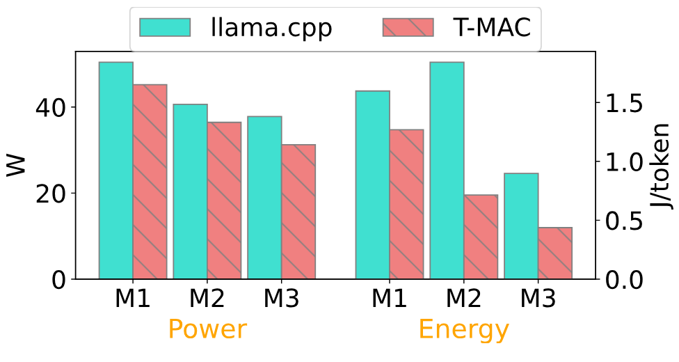

**図 9。** M2-Ultra 上のマルチスレッド推論における電力およびエネルギー消費。M1、M2、M3 はそれぞれ Llama-2-7B-4bit、Llama-2-7B-2bit、BitNet-3B を表す。

### 5.5 最適化の内訳

[第 3 節](#section-3) の最適化の有効性を評価するため、最適化戦略を分解して検証する。これらの最適化の多くはシングルスレッドでより大きな効果をもたらすが、タイリングが効果を発揮するにはマルチスレッドが必要なため、この評価はマルチスレッドで行う。ほとんどの最適化は直交しているが、一部は他の最適化へ依存する。例えば、置換を行うには先にタイリングを完了する必要がある。そのため、基本実装 *TM-base* から始め、段階的に最適化を適用する。

*TM-base* 版はハードウェア組み込み関数を利用してテーブルルックアップを高速化するが、メモリアクセスの最適化は実装していない。[図 10](#figure-10) に示すように、その性能は llama.cpp ベースラインより最大 17% 低い。*テーブル量子化* を実装すると、性能は llama.cpp と競合できる水準になる。*タイリング* 最適化により、さらに最大 1.45 倍の高速化が得られる。各タイリングについてデータレイアウトを連続メモリへ並べ替えることで、*置換* はさらに 1.39 倍の高速化をもたらす。デフォルトのタイリング構成がすでに M2-Ultra のレジスタとキャッシュへ適切に合っているため、図では *チューニング* の効果があまり大きく見えないが、異なるデバイスでは、チューニングによってより優れた構成を見つけられるはずである。

*重みのインターリーブ* を適用すると T-MAC が得られる。インターリーブはアンパックのオーバーヘッドの大半を取り除き、1.42 倍の高速化を達成する。積極的な *高速集約* により T-MAC を最大 1.29 倍高速化できるが、無視できない精度低下を招く可能性があるため、任意の最適化として提供する。

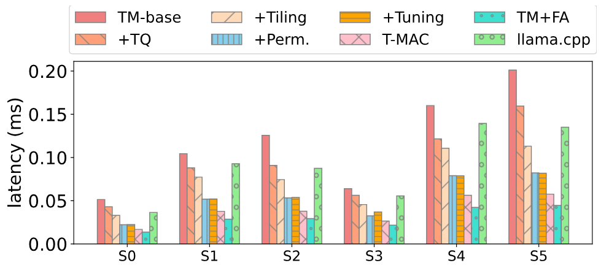

**図 10。** T-MAC の最適化を段階的に適用した、M2-Ultra 上の Llama-2-7B／13B GEMV カーネルのマルチスレッド性能。S0–S5：[図 6](#figure-06) に示す異なる形状。TM：T-MAC、TQ：テーブル量子化、Perm.：置換、IL：インターリーブ、FA：高速集約。

### 5.6 誤差分析

従来の mpGEMM 実装と比較したとき、誤差の発生源は 2 つある。（a）本手法に含まれるアルゴリズム上の近似である *テーブル量子化* と、（b）固定された CPU アーキテクチャ上での命令実行中に誤差が生じる *高速集約* である。これら 2 つの誤差源の影響を、カーネルレベルとモデルレベルの両方で評価する。

**カーネルレベルの評価。** 量子化されていない $W_{\mathrm{FP}16}A_{\mathrm{FP}16}$ GEMV をベンチマークとする。GEMV の重みと活性化には、*ガウス分布* に従ってランダムに生成した FP16 値を用い、その後 4 ビットへ量子化して llama.cpp と T-MAC で実行する。次に、正解値と mpGEMV の出力との間の正規化平均二乗誤差（NMSE）を計算する。[表 3](#table-03) に示すように、llama.cpp と T-MAC の NMSE の差は無視でき、テーブル量子化の誤差がごく小さいことを示している。しかし、*高速集約* を適用すると、NMSE は $2.5\times$ に増加する。

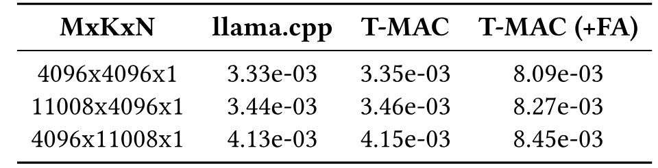

**表 3。** 量子化されていない（$W_{\mathrm{FP16}}A_{\mathrm{FP16}}$）GEMV カーネルに対する NMSE 誤差。

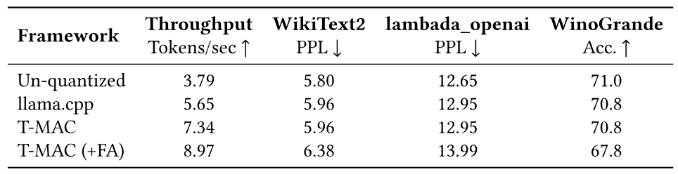

**表 4。** M2-Ultra 上で Llama-2-7B-4bit をシングルスレッド実行したときのエンドツーエンドスループットとモデル品質。T-MAC は同じモデル品質を保ちながら、llama.cpp と比べてスループットを $1.3\times$ に向上させる。高速集約（FA）によりスループット向上率をさらに $1.6\times$ まで高められるが、現在の CPU 命令による数値誤差のためモデル品質は低下する。

**モデルレベルの評価。** これらの誤差が実際のモデルへ与える影響を調べるため、テストには Llama-2-7B を選んだ。使用するモデルは、量子化されていない正解値のために公式 Llama-2-7B 重みから変換した GGUF モデルと、mpGEMM 用として llama.cpp とともにリリースされた元の llama-2-7b.Q4_0.gguf モデル [Lla23b] である。T-MAC を llama.cpp へ統合した後、llama.cpp が提供する *perplexity* [Lla23c] ツールで評価を行う。評価は 3 種類のタスクで行う。パープレキシティ（低いほど良い）には *WikiText-2* [Mer16a] と *lambada_openai* [Pap16, Rad19] を、質問応答精度（高いほど良い）には *WinoGrande* [Sak19] を用いる。[表 4](#table-04) に示すように、3 つのタスクすべてで T-MAC は llama.cpp と同じ結果を示しており、T-MAC が生じさせる誤差は実際のモデルでは無視できることを示唆する。*高速集約* を有効にすると、パープレキシティはそれぞれ 0.4 と 1.0 増加し、精度は 0.3% 低下する。

まとめると、T-MAC はモデル推論へ無視できる程度の誤差しか加えず、大幅な高速化を実現する。*高速集約* は性能をさらに高められるが、その代償としてモデル品質が低下する。リアルタイム性能を優先し、精度への感度が低いシナリオ向けの選択肢としてこれを提供する。[図 10](#figure-10) によれば、*高速集約* なしでも T-MAC は大幅な向上を達成できる。将来的には、CPU マイクロアーキテクチャを単純に最適化することで、高速集約による誤差を軽減できると見込んでいる。

### 5.7 GPU／NPU との比較

GPU は LLM の展開に広く使用されている。T-MAC の効率を示すため、CPU 上の T-MAC と GPU 上の llama.cpp を比較する。llama.cpp は、エッジデバイス上の CPU と GPU の両方に対応する最先端の LLM 推論フレームワークである。

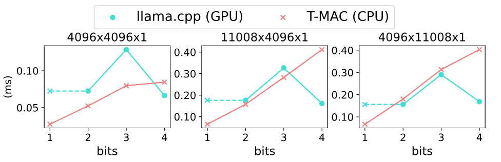

**図 11。** NVIDIA Jetson AGX Orin 上における T-MAC（CPU）と llama.cpp（GPU）の mpGEMV カーネル性能。

[図 11](#figure-11) は、ARM CPU と NVIDIA CUDA GPU を備えたプラットフォームである NVIDIA Jetson AGX Orin 上で、T-MAC（CPU）と llama.cpp（GPU）の mpGEMV カーネル性能を比較したものである。カーネル構成はすべて Llama-2-7B に由来する。T-MAC はすべてのケースで W1A16 において GPU を大幅に上回り、W2A16 と W3A16 では同等の性能を達成する。GPU は強力な並列計算能力により、高ビットかつ大きな形状では優れた性能を示すものの、この評価は、エッジデバイス上で CPU ベースの LLM 展開が持つ大きな可能性をなお示している。

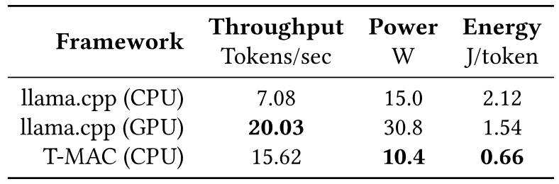

**表 5。** NVIDIA Jetson AGX Orin 上における Llama-2-7B-2bit のエンドツーエンド推論スループット、電力、エネルギーの比較。

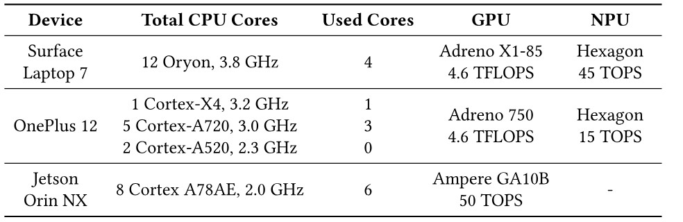

**表 6。** テスト対象プラットフォームの詳細な CPU／GPU／NPU 仕様。「Used Cores」は、メモリ帯域を完全に活用するために使用した CPU コア数を指す。

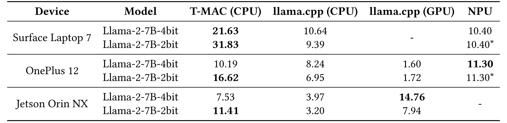

**表 7。** 3 種類のデバイス上で Llama-2-7B-4bit／2bit を実行したときの T-MAC と GPU／NPU のトークン生成速度（tokens/s）。NPU の 2 ビット性能は 4 ビット性能から推定し、「*」で示す。

[表 5](#table-05) は、NVIDIA Jetson AGX Orin 上で Llama-2-7B-2bit モデルをエンドツーエンドで比較したものである。T-MAC を使わない場合、CPU が GPU を上回るのは電力だけであり、スループットが低いためエネルギー消費ではなお GPU に劣る。CPU 上の llama.cpp と比べると、T-MAC はスループットを $2.2\times$ へ向上させるだけでなく、電力を 69$\%$ へ削減し、エネルギー効率を $3.2\times$ に高める。GPU 上の llama.cpp と比べると、T-MAC のスループットは 78$\%$ にとどまるが、必要な電力は 34$\%$ にすぎず、エネルギー効率は $2.3\times$ となる。[図 11](#figure-11) では、mpGEMV カーネルにおいて T-MAC が GPU を上回ることに注意されたい。それでも T-MAC のスループットが GPU より低いのは、CPU 上の llama.cpp における mpGEMV 以外のカーネル性能が原因である。

電力効率に加え、T-MAC は広く使われているプラットフォームにおいて GPU／NPU を上回る性能も示す。さらに Surface Laptop 7、OnePlus 12、Jetson Orin NX の 3 デバイスで T-MAC を評価する。搭載される CPU／GPU／NPU の完全な仕様を [表 6](#table-06) に詳しく示す。メモリ帯域を十分に活用し、ほぼ最適な性能を達成できる最小数の CPU コアを使用する。GPU 評価では、NVIDIA GPU には llama.cpp の CUDA バックエンドを、Qualcomm GPU には OpenCL バックエンドを使用する。NPU の性能は、Qualcomm が Qualcomm AI Hub [Qua24] を通じて公開した公式データに基づく。

T-MAC を用いると、CPU は計算スループットを大幅に高め、メモリ帯域を十分に活用できる。トークン生成中の GEMV が同じくメモリバウンドとなる GPU／NPU は、ほとんどのエッジデバイスで CPU とユニファイドメモリを共有する。[表 7](#table-07) に示すように、T-MAC は 3 種類すべてのデバイスで Llama-2-7B-2bit を大幅に高速化する。具体的には、Surface Laptop 7 では全 12 CPU コア中 4 コアだけを使用して NPU より $3\times$、OnePlus 12 では NPU より $1.5\times$、Jetson Orin NX では Ampere GPU より $1.4\times$ 高速である。Llama-2-7B-4bit でも、T-MAC は Surface Laptop 7 上で $2.1\times$ の高速化を維持する。特に OnePlus 12 では、T-MAC は Adreno GPU に対し、4 ビットで $6.4\times$、2 ビットで $9.7\times$ という大幅な高速化を示す。

まとめると、広く利用できる CPU を活用する T-MAC は、GPU、さらには AI ワークロード専用に設計された NPU に対しても顕著な性能上の優位性をもたらす。このため T-MAC は、エッジデバイスへ LLM を展開するための実用的な解決策となる。

## 6 関連研究

**LLM 量子化アルゴリズム。** LLM 量子化は、リソース制約のある環境へ LLM を効率的に展開するための重要な技術となっている。研究の一部では、重みと活性化の両方を量子化することに取り組んできた。*LLM.int8()* [Det22] は外れ値の特徴次元を 16 ビット計算へ分離し、大半の次元を効率的な 8 ビット計算で処理する。*SmoothQuant* [Xia23] は、数学的に等価な変換によって量子化の難しさを活性化から重みへ移し、重みと活性化の両方の INT8 量子化を可能にする。この分野の進展に伴い、メモリフットプリントの大半を重みの保存が占めることから、モデル重みだけを量子化することへ重点が絞られてきた。*GPTQ* [Fra22] や *AWQ* [Lin23d] などのアルゴリズムは、学習後量子化によって LLM をわずか 4 ビットへ量子化できることを示している。さらに *BitDistiller* [Du24] は、量子化認識学習（QAT）と自己蒸留を活用し、その限界を 2 ビットまで押し広げる。一方、*BitNet* [Wan23] はさらに野心的な方法を取り、1 ビット LLM をゼロから学習する。

**LLM 推論システム。** LLM の重要性が高まったことで、異なるプラットフォームへ適合し、特定の目的へ最適化された多様な LLM 推論システムの開発が促されてきた。*vLLM* [Kwo23a] は LLM 向けに設計された高スループットかつメモリ効率の高い推論エンジンであり、大規模なバッチ処理に優れる。*llama.cpp* [Lla23a] は、外部依存のない純粋な C/C++ 実装を特徴とし、エッジコンピューティングデバイスで優れた性能を発揮する。*TensorRT-LLM* [Ten23] は、NVIDIA GPU に特化した最先端の最適化一式を取り入れている。*Intel Neural Compressor* [Int18] は、Intel エコシステム内で LLM の効率を高めるために調整された、モデル圧縮技術向けのオープンソース Python ライブラリを提供する。これらの推論システムはいずれも低ビット LLM への対応という重要な能力を共有しており、メモリ使用量を最小化するだけでなく計算効率も高め、多様な用途で LLM を利用しやすくする。エンドツーエンドの LLM 推論システムを補完するものとして、低ビット LLM に特化した高効率な計算カーネルの開発へ注力する取り組みもある [Fra24, Bit24a]。

## 7 結論

T-MAC はデータ型中心の乗算をビット単位のテーブルルックアップへ変換し、利用が拡大している mpGEMM に対して統一的かつスケーラブルな解決策を提供する。エッジデバイスへ広く搭載されている CPU 上で、T-MAC カーネルは llama.cpp と比べて最大 $6.6\times$ の高速化を達成し、CPU の推論速度を同じデバイス上の GPU と同等、またはそれ以上にする。したがって T-MAC は、Raspberry Pi 上でさえ、GPU に依存せずエッジデバイスへ LLM を展開するための実用的な解決策を提供する。また、LUT はハードウェア実装上、乗算よりはるかに効率的であるため、T-MAC は LUT に基づく新しい LLM ハードウェアアクセラレータ設計に幅広い可能性を開く。

[+1]: W# は重みのビット幅を、A# は活性化のビット幅を表す。
