> [Zhihao Jia](https://www.cs.cmu.edu/~zhihaoj2/)、[Oded Padon](https://www.wisdom.weizmann.ac.il/~padon/)、[James Thomas](https://cs.stanford.edu/~jjthomas/)、[Todd Warszawski](https://dblp.org/pid/143/7244)、[Matei Zaharia](https://people.eecs.berkeley.edu/~matei/)、[Alex Aiken](https://theory.stanford.edu/~aiken/)。SOSP 2019 採録。本 HTML 版は [原論文 PDF](/paper/TASO.pdf) の本文、図表、参考文献を再現しています。DOI：[10.1145/3341301.3359630](https://doi.org/10.1145/3341301.3359630)。

## 概要

既存のディープ ニューラル ネットワーク (DNN) フレームワークは、人間の専門家が手動で設計したグラフ変換を適用することで、DNN の計算グラフを最適化します。新しい DNN 演算子が定期的に導入されるため、このアプローチでは可能なグラフの最適化が行われず、拡張が困難になります。

私たちは、グラフ置換を自動的に生成する初の DNN 計算グラフ オプティマイザーである TASO を提案します。 TASO は、演算子仕様のリストを入力として受け取り、指定された演算子を基本構成要素として使用して置換候補を生成します。生成されたすべての置換は、自動化された定理証明器を使用してオペレーターの仕様に照らして正式に検証されます。特定の DNN 計算グラフを最適化するために、TASO はコストベースのバックトラッキング検索を実行し、置換を適用して最適化されたグラフを見つけます。このグラフは既存の DNN フレームワークで直接使用できます。

5 つの実際の DNN アーキテクチャに関する評価では、TASO が既存の DNN フレームワークよりも最大 2.8 倍優れたパフォーマンスを示し、必要な人間の労力が大幅に少ないことがわかりました。たとえば、TensorFlow には現在約 53,000 行の手動最適化ルールが含まれていますが、TASO で必要な演算子の仕様はわずか 1,400 行のコードです。

## 1 はじめに

ディープ ニューラル ネットワーク (DNN) フレームワークは、ニューラル アーキテクチャを計算グラフとして表します。各ノードは数学的テンソル演算子 (行列乗算、畳み込みなど) です。計算グラフの実行時パフォーマンスを向上させるための最も一般的な最適化形式は、特定のパターンに一致するサブグラフを、パフォーマンスが向上した機能的に同等のサブグラフに置き換えるグラフ置換です。

既存の DNN フレームワークは、[図 1a](#figure-01) に示すように、ドメインの専門家が手動で設計したグラフ置換を適用することで計算グラフを最適化します。たとえば、TensorFlow、PyTorch、TensorRT、TVM は、貪欲なルールベースの最適化戦略を使用し、入力計算グラフ [Aba16、Che18、PyT17、Ten17a] 上で適用可能なすべての置換 (ルールなど) を直接実行します。 MetaFlow [Jia19] では、パフォーマンスを向上または低下させる置換を許可して、同等の計算グラフのより大きな検索スペースを有効にし、バックトラッキング検索を使用してこのスペースを探索しますが、それでも手動で指定した置換が必要です。手動で設計された置換は DNN 計算のパフォーマンスを向上させますが、いくつかの点で不十分です。

<span id="figure-01"></span>

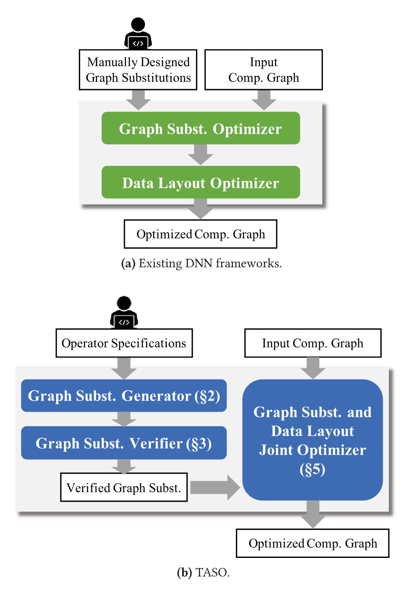

**図 1.** 既存の DNN フレームワークにおける計算グラフの最適化と TASO の比較。

### 保守性

手書きのグラフ置換には多大なエンジニアリング作業が必要です。たとえば、TensorFlowr1.14 には、約 53K 行の C++ コードに実装された 155 の置換が含まれています。メンテナンスの問題は、新しいオペレータが継続的に導入されるという事実によってさらに悪化します。たとえば、最近の研究では、さまざまな画像分類タスクに対して、深さ方向の [How17]、グループ化された [Xie16]、転置畳み込み [Dum16] が提案されています。 TensorFlowr1.14 には、通常の畳み込みをさまざまな演算子タイプと融合するなどして最適化するための 17 個のグラフ置換 (4K 行のコードで記述) が含まれています。それぞれの新しい畳み込みバリアントをサポートするには、同様の実装作業が必要になります。これは、それぞれのセマンティクスがわずかに異なり、既存の置換を使用して直接最適化することができないためです。

### データレイアウト

テンソル データはさまざまなレイアウトでメモリに保存でき、この選択は実行時のパフォーマンスに大きな影響を与えます。最適なレイアウトは、オペレーターとハードウェアの両方に依存します。たとえば、P100 GPU では、畳み込みは行優先のレイアウト (つまり、最も内側の次元が連続して格納される) で最高のパフォーマンスを発揮し、行列乗算は列優先のレイアウト (つまり、最も外側の次元が連続して格納される) で最高のパフォーマンスを発揮します。 4×4 行列演算をサポートするテンソル コア [Ten18] を備えた Tesla V100 GPU では、最適なパフォーマンスを得るには、テンソルを 4×4 チャンクにタイリングする必要がある場合があります。ただし、グラフの置換とともにレイアウトの変換を考慮すると、さらに複雑さが増します。たとえば、グラフ置換は、特定のレイアウト変換と組み合わせた場合にのみパフォーマンスを向上させることができます ([セクション 7.5](#_7-5-joint-optimization-of-graph-substitutions-and-data-layout) を参照)。現在のフレームワークは、[図 1a](#figure-01) に示すように、データ レイアウトとグラフ置換を別個の最適化問題として扱い、[Che18、Mkl16] のように順番に解決することでこの複雑さを回避していますが、この分離により、考えられる多くの最適化の機会が失われます。

### 正しさ

手書きのグラフ置換はエラーが発生しやすく、グラフ置換のバグにより、不正確な計算グラフ [Ten17、Gra18] が発生する可能性があります。コンパイラの最適化でも同じ問題が発生し、不適切な最適化が不適切なプログラムにつながります。コンパイラーの文献では、最適化 [Ban06、Chu19、Dah17、Le14、Nec00、Pnu98、Sha13、Tat11] を正式に検証することに多大な労力が費やされています。ただし、私たちの知る限り、そのような手法は DNN フレームワークによって実行されるグラフ置換の最適化には適用されていません。

### 1.1 私たちのアプローチ

このペーパーでは、グラフ置換を自動的に生成する初の DNN 計算グラフ オプティマイザーである TASO(Tensor Algebra SuperOptimizer) を紹介します。[図 1b](#figure-01) は、TASO の概要を示しています。TASO は、3 つの点で既存のフレームワークとは異なります。まず、TASO では演算子の定義と仕様のみが必要で、グラフ置換が自動的に生成されるため、手動の労力が軽減されます。 2 番目に、TASO は形式的な検証を採用して、生成されたグラフ置換の正確性を保証します。最後に、TASO はグラフ置換とデータ レイアウトを共同で最適化し、実行時のパフォーマンスを大幅に向上させます。

#### 置換の生成

TASO のグラフ置換ジェネレーターは、指定された DNN 演算子のセット (cuDNN カーネル [Che14]) 上で考えられるすべての計算グラフを固定サイズまで列挙し、それらをランダムな入力テンソルのセットで実行します。ランダムな入力に対して同一の結果が得られる計算グラフのペアは、置換候補とみなされます。このようなすべてのペアを効率的に見つけるために、TASO はランダムな入力に対する出力のハッシュに基づいて計算グラフが保存されるハッシュ テーブルを構築します。

#### 正式な検証

TASO のグラフ置換ベリファイアは、ユーザーが指定した演算子のプロパティに依存して、生成されたグラフ置換の正確性を確認するために使用されます。演算子のプロパティは、畳み込みの線形性など、演算子の数学的特性をキャプチャします。私たちが使用した 43 個の演算子プロパティの完全なリストを[表 2](#table-02) に示します。私たちの評価が示すように、複雑な置換の正しさを証明するには、各演算子の少数のプロパティ セットで十分です。

形式的には、基礎となるテンソルのサイズに依存せず、演算子のプロパティを簡潔に表現できる 1 次ロジックに基づくシンボリック表現を使用してテンソル演算子をモデル化します。検証者は、指定されたプロパティを使用して、自動化された定理証明者を使用して、生成されたすべてのグラフ置換の正確さをチェックします。

また、2 つの方法で開発者を支援する演算子プロパティの開発方法も紹介します。グラフ置換ジェネレーターは必要なプロパティの発見をガイドし、小さなテンソルでのシンボリック実行はさらなる検証を提供します。開発中に、この方法論により、演算子の仕様とグラフ置換ジェネレーターの両方にいくつかのバグが発見されました。

#### 共同最適化

TASO は、グラフ置換とデータ レイアウト変換を共通の表現に統合することで、それらを共同で最適化します。 TASO は、MetaFlow [Jia19] のコストベースのバックトラッキング検索アルゴリズムを使用し、そのコスト モデルを拡張して、さまざまなデータ レイアウトから生じるパフォーマンスの違いもキャプチャします。検索中、TASO は、ハードウェア上の特定の提案されたデータ レイアウトを使用して、提案された DNN オペレーターのパフォーマンスを測定します。これらの個々の測定値は、特定のデータ レイアウトを使用した計算グラフ全体のパフォーマンスを予測するために使用されます。

#### 評価

5 つの実際の DNN アーキテクチャで TASO を評価します。 ResNet-50 [He16] などの既存のフレームワークによって最適化され、広く使用されている DNN の場合、TASO は、1,400 行の長さの演算子定義と仕様を使用して、これらのフレームワークのパフォーマンスを手書きのルールと一致させます。

ResNeXt-50 [Xie16]、Nas-RNN [Zop16]、NasNet-A [Zop18]、BERT [Dev18] などの新しい DNN アーキテクチャの場合、TASO は、新しいグラフ置換を自動的に検出して最適化することにより、最先端のフレームワークよりも最大 2.8 倍高速です。これらのアーキテクチャ。グラフ置換とデータ レイアウトを逐次最適化する場合と比較して、結合最適化によりパフォーマンスがさらに 1.2 倍向上することがわかります。すべての実験において、TASO は 10 分以内に最適化されたグラフを発見し、大規模な展開の前に DNN アーキテクチャを最適化するときに使用できるようにしました。

## 2 グラフ置換ジェネレータ

このセクションでは、プリミティブ演算子のリストを指定して潜在的な置換を自動的に生成する TASO 置換ジェネレーターについて説明します。生成アルゴリズムは、特定のサイズまでの有効な置換をすべて検索します。

すべての潜在的な置換を見つけるための簡単なアプローチは、すべてのグラフのペアが等価であるかどうかをテストすることです。これには、グラフ間の 2 次数のテストが必要です。コンパイラーの超最適化 [Ban06] からのアイデアを採用し、各グラフのフィンガープリントを計算します。これは、いくつかの特定の入力に対するグラフ出力のハッシュです。 2 つのグラフが異なるフィンガープリントを持っている場合、これらのグラフは確かに等価ではないため、同じフィンガープリントを持つグラフのみを比較することで、TASO は同等性テストの数を大幅に削減します。実験では、同じフィンガープリントを持つすべてのグラフが TASO によって同等であることが検証されることがわかります。

### 2.1 グラフ置換の定義

グラフ置換は 3 つのコンポーネントで構成されます。(1) 計算グラフ内のサブグラフと照合されるソース グラフ。

ターゲット グラフ [+terminology] は、一致したソース サブグラフを置き換える機能的に同等の新しいサブグラフを定義します。 3 番目のコンポーネントは、ソース グラフとターゲット グラフの入力テンソルと出力テンソル間のマッピング関係です。[図 2a](#figure-02) は、行列乗算結合性に基づく置換を示しています。[図 2b](#figure-02) は、行次元に沿った連結と分割を使用して 2 つの行列乗算を融合しています。 A、B、C、X、Y は、ソース テンソルとターゲット テンソルの間のマッピングを識別します。

グラフの置換は、具体的なテンソル形状とは独立して指定されます。たとえば、[図 2](#figure-02) の置換は、任意の具体的な形状のテンソル A、B、C に適用できます。一部のオペレーターは、構成パラメーターに依存してオペレーターの動作を決定します。たとえば、畳み込みのパラメータは、ストライド、パディング、およびアクティブ化 (たとえば、畳み込みの一部として relu 関数 [Nai10] を適用する) を決定します。また、分割または連結のパラメータによって、演算子を適用する軸が決まります。

[+terminology]: 一部のスーパーオプティマイゼーション文献では、ここで source と呼ぶものを target、target と呼ぶものを rewrite と呼びます。

<span id="figure-02"></span>

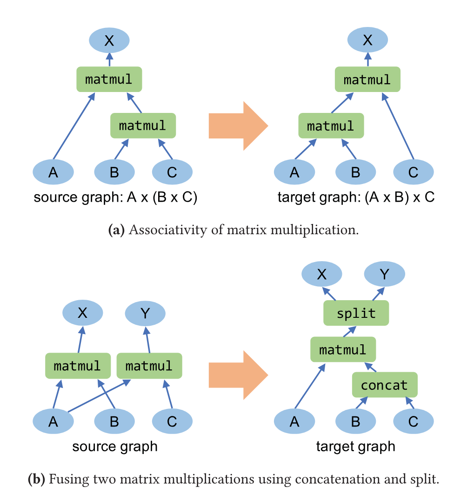

**図 2.** グラフの置換例: (a) 行列乗算の結合性。 (b) 連結と分割を使用して 2 つの行列乗算を融合します。

#### 連結演算子と分割演算子

連結演算子と分割演算子は、[図 2b](#figure-02) に示すように、演算子と共有入力を融合する際によく使用されます。分割オペレータは、パラメータによって決定される次元に沿って、テンソルを 2 つの素なサブテンソルに分割します。分割点は入力テンソルまたはパラメーターから推測できないため、これは複雑な問題を引き起こします。この問題を解決するために、分割演算子は常に前の連結点でテンソルを分割して、最新の連結演算子を「元に戻す」ことが観察されます。この事実を利用して、分割演算子に適切なセマンティクスを定義します。

形式的には、連結履歴を追跡するために、テンソルの次元ごとに分割ツリーを維持します。[図 3](#figure-03) は、[図 2b](#figure-02) のすべてのテンソルの行次元の分割ツリーを示しています。分割ツリーを使用すると、追加のパラメーターを導入することなく、置換によって分割ポイントを回復できます。私たちのアプローチは、連結演算子と分割演算子の入れ子による多方向の連結と分割もサポートしています。

<span id="figure-03"></span>

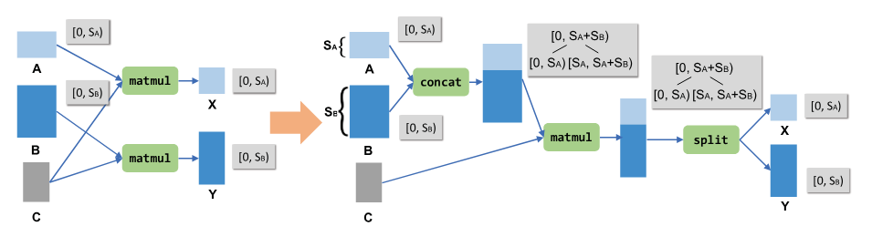

**図 3.** 行列乗算と共有入力を融合するためのグラフ置換。ターゲット グラフには連結演算子と分割演算子があり、どちらも行次元に沿って実行されます。各テンソルの行次元の分割ツリーが灰色のボックスに表示されます。

### 2.2 生成アルゴリズム

アルゴリズム 1 に示すように、指定された一連の演算子仕様に対して、TASO は 2 つのステップで潜在的なグラフ置換を生成します。

ステップ 1: 潜在的なグラフを列挙し、そのフィンガープリントを収集します。 TASO は、まず、指定された一連の演算子を使用して、特定のサイズまでの潜在的なグラフをすべて列挙します。グラフを構築するために、TASO は、演算子の型と演算子への入力テンソルを列挙することによって、現在のグラフに演算子を繰り返し追加します。入力テンソルは、グラフへの初期入力テンソル (たとえば、[図 2](#figure-02) の A、B、および C)、または前の演算子の出力テンソル (たとえば、[図 2](#figure-02) の matmul および concat 演算子の出力) にすることができます。アルゴリズム 1 (行 7 ～ 18) は、重複した計算を含まないすべての非巡回計算グラフを構築するための深さ優先探索アルゴリズムを示しています。同じ入力テンソルに対して同じ計算を実行する 2 つの演算子がある場合、グラフには重複した計算が含まれていると言います。このようなグラフは有用な計算グラフを表さないため、ジェネレーターは無視します。

各グラフについて、TASO はそのフィンガープリントを収集します。これは、いくつかの入力テンソルでグラフを評価することによって取得された出力テンソルのハッシュです。 TASO は、ランダムに初期化されたテンソルと多数の定数の両方を入力として使用し、単位行列などの定数テンソルを含む置換を見つけることができます ([セクション 7.3](#_7-3-substitution-case-study) の例を参照)。フィンガープリントの計算における浮動小数点エラーを回避するために、[Wu18] で導入された方法に従って、すべてのテンソルが整数で表されます。

```pseudocode:line-numbers title="アルゴリズム 1：グラフ置換生成アルゴリズム"
Input: A set of operators P, and a set of input tensors I.
Output: Candidate graph substitutions S.

// Step 1: enumerating potential graphs.
D = {}  // D is a graph hash table indexed by fingerprints.
Build(1, {}, I)
function Build(n, G, I)
  if G contains duplicated computation then
    return
  D = D + (Fingerprint(G), G)
  if n < threshold then
    for op in P do
      for i in I where i is a valid input to op do
        Add operator op into graph G.
        Add the output tensors of op into I.
        Build(n + 1, G, I)
        Remove operator op from G.
        Remove the output tensors of op from I.

// Step 2: testing graphs with identical fingerprints.
S = {}
for G1, G2 in D with the same Fingerprint(.) do
  if G1 and G2 are equivalent for all test cases then
    S = S + (G1, G2)
return S
```

グラフには任意の数の出力テンソルを含めることができるため、ハッシュ関数はそのフィンガープリントが出力テンソルの順列から独立していることを保証する必要があります。この特性を保証するために、TASO は 2 段階のハッシュ関数を採用しています。

$$\operatorname{Fingerprint}(G)=\operatorname{hash}_2\left(\{\operatorname{hash}_1(t_i)\mid i\in\operatorname{Outputs}(G)\}\right).$$

ここで、$t_i$ はグラフ $G$ の出力テンソルです。 $\operatorname{hash}_1$ は、出力テンソルの状態と内容 (サイズ、形状、内容など) を計算します。 $\operatorname{hash}_2$ は、順序のないハッシュ値のセットに適用される対称ハッシュ関数です。

#### ステップ 2: 同一のフィンガープリントを使用してグラフをテストする

同じフィンガープリントを持つグラフについて、TASO は一連のテスト ケースでそれらの等価性をさらに検査します。フィンガープリントの収集と同様に、各テスト ケースにはランダム化された入力テンソルのセットが含まれており、すべてのテスト ケースに対して同等の出力テンソルを生成する場合、2 つのグラフは合格します。フィンガープリントとは異なり、これらのテストでは $[-1,1]$ の間の範囲の浮動小数点数を使用し、出力の違いが小さいしきい値 (評価では $10^{-5}$) 以内であれば、2 つの出力テンソルを同等であると分類します。このしきい値については、整数テストとの矛盾は観察されませんでした。ただし、より小さいしきい値を使用して、実数には有効でも浮動小数点エラーが発生する置換を除外することは可能です。

ランダム テストに合格したグラフの各ペアは、グラフ置換候補のソース グラフとターゲット グラフになり、ソース グラフとターゲット グラフの入出力テンソル間のマッピング関係は、テスト ケースから自動的に推測できます。次に、すべての候補グラフ置換が置換検証器に送信され、その正確性がチェックされ ([セクション 3](#_3-graph-substitution-verifier))、後で枝刈りされて冗長な置換が排除されます ([セクション 4](#_4-pruning-redundant-substitutions))。

これまで説明したアルゴリズムは、使用される特定のテンソル演算子に依存しないという意味で汎用的です。ただし、DNN アプリケーションの場合、特別な処理が必要な演算子が 2 つあることがわかりました。 DNN アプリケーションで一般的に使用される relu 演算子 [Nai10] は、すべての負の入力に対して 0 を返します。 relu は 0 を返すことが多いため、多くの余分な置換が有効になってしまいます。これらの置換が生成されないように、ジェネレーターは relu を任意の非線形関数で置き換えます (実装では $x \mapsto x(x+1)+1$ を使用します)。拡大演算子は、テンソルにゼロをパディングしてテンソルのサイズを増やします。これは、異なるカーネル サイズ [Jia19] の畳み込みを融合するのに役立ちます。ただし、ゼロが存在すると、多くの余分な置換が行われます。これを克服するために、ジェネレーターは、拡大が入力テンソルに適用される計算グラフのみを考慮します。つまり、別の演算子の出力には適用されません。この制限は、余分な置換を回避しながら、畳み込みを融合するための拡大の意図された使用法を捉えています。

<span id="table-01"></span>

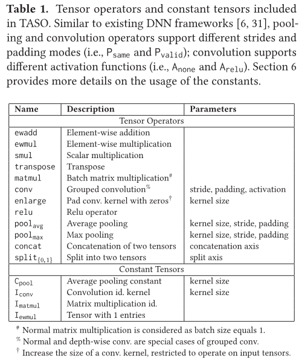

**表 1.** TASO に含まれるテンソル演算子と定数テンソル。

以前の研究 [Ban06] では、コンパイラの超最適化でコード変換を検査するためにランダム テストが使用されたときに誤検知が報告されたことは注目に値します。多くの誤った変換が一連のテストに合格しました。私たちの実験では偽陽性は観察されていません。単一のテスト ケースを使用して、同じフィンガープリントを持つすべてのグラフ ペアを検査します。テスト ケースを通過したすべての置換は正しく、置換検証機能によって検証されます。これは、DNN 演算子の演算密度が高いことと、計算グラフに分岐がないことが原因であると考えられます。参考として、[Gul03] は、線形演算子のみを含むプログラムの場合、2 つの等価でないプログラムがランダムな入力に対して同一の出力を生成する確率は最大でも $1/d$ であることを示しています。ここで、$d$ は変数の取り得る値の数 (TASO の $d=2^{32}$) です。

## 3 グラフ置換検証器

置換を正式に検証するためのアプローチの背後にある重要なアイデアは、一次ロジックで表現された演算子プロパティの小さなセットを使用することです。これらのプロパティは手動で作成およびレビューされ、小さなサイズのテンソルに対して演算子をシンボリックに実行し、これらのテンソル サイズに対して演算子のプロパティが満たされていることを確認することによってさらに検証されます。演算子のプロパティの開発は、置換ジェネレーターによって検出された置換によって導かれます。

検証のために、テンソル演算子は、パラメーターと入力テンソルの両方の関数として 1 次ロジックでモデル化されます。たとえば、$\operatorname{conv}(s, p, c, x, y)$ は、テンソル $x$ および $y$ に適用される畳み込みを表します。 $s$ はストライドを決定し、$p$ はパディング モードを決定し、$c$ はアクティブ化モードを決定します。活性化なしの畳み込み ($A_{\mathrm{none}}$) が最初の引数で線形であるという事実は、次のプロパティによって捉えられます。ここで、$\operatorname{ewadd}$ は要素ごとのテンソル加算です。

$$\forall s,p,x,y,z.\ \operatorname{conv}(s,p,A_{\mathrm{none}},\operatorname{ewadd}(x,y),z)=\operatorname{ewadd}(\operatorname{conv}(s,p,A_{\mathrm{none}},x,z),\operatorname{conv}(s,p,A_{\mathrm{none}},y,z)).$$

[表 1](#table-01) は、評価で使用されるすべての演算子とテンソル定数をリストし、[表 2](#table-02) は、グラフ置換を検証するために使用される演算子プロパティの完全なリストを示します。

<span id="table-02"></span>

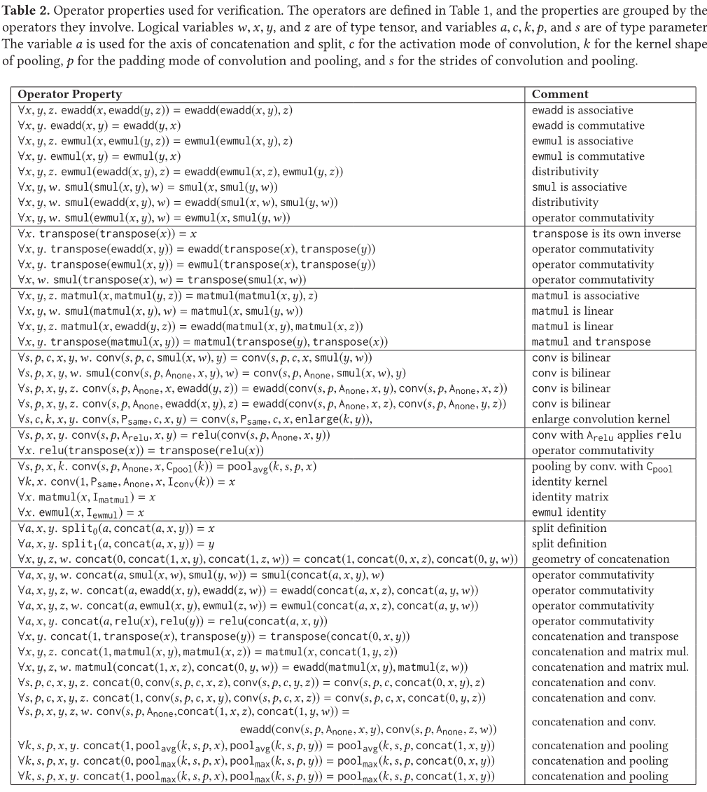

**表 2.** 検証に使用される演算子のプロパティ。

演算子のプロパティを考慮して、一次定理証明器を使用します。私たちの実装では Z3 [DeM08] を使用します。検証は、一次ロジックにおける含意検査に相当します。演算子のプロパティは、生成された置換ごとにソース グラフとターゲット グラフの機能的等価性を含意する必要があります。

一次ロジックを使用した演算子のモデル化には、ある程度の抽象化が伴います (たとえば、テンソルの形状はモデル化されません)。このレベルの抽象化がグラフ置換の検証に適していることがわかりました。また、データ レイアウトは検証目的で抽象化されていることに注意してください。レイアウトは演算子のセマンティクスには影響せず、オプティマイザー ([セクション 5](#_5-joint-optimizer)) により、レイアウトが一貫して使用されることが保証されます。

#### 演算子のプロパティを開発するための方法論

反復プロセスを使用して生成されたグラフ置換の正確さを判断するために、必要に応じて演算子プロパティを開発しました。開発プロセス中に、置換ジェネレーターを実行し、発見されたすべての置換を検証しようとしました。置換が検証できず、正しいと思われる場合は、適切なプロパティ (複数可) を追加しました。演算子のプロパティの間違いを防ぐために、さらなる検証手順を使用しました。

演算子プロパティを検証するために、TASO はパラメータ値とテンソル サイズのすべての組み合わせについて演算子プロパティ自体を小さな境界まで検証します。この評価では境界は 4×4×4×4 でした。このため、TASO には、Python での各テンソル演算子の基本的なシンボリック実装が必要です。 TASO は、小さいサイズのテンソルに対してこの実装をシンボリックに実行し、テンソル演算をシンボリックな実数式に効果的に精緻化します。ここで、活性化関数 (relu など) は、未解釈の関数を使用してモデル化されます。次に、TASO は、ここでは実算理論の SMT ソルバーとして Z3 を使用して、演算子のプロパティを検証します。たとえば、畳み込み演算子がすべてのアクティベーション モード (relu アクティベーションを含む) に対して線形であるという (間違った) プロパティをユーザーが追加しようとした場合、このチェックでは、このプロパティが実際の演算子によって満たされていないことが示されます。

開発プロセスを支援する追加の検証ステップとして、TASO は、演算子プロパティのセットに一貫性があり、冗長性 (つまり、他のプロパティに伴うプロパティ) が含まれていないことをチェックします。これは、一次含意チェックに相当します。これらのチェックは、誤ったプロパティを発見するのにも役立ち、小さなテンソル サイズの検証よりも実行コストが低くなります。

開発プロセス中に、検証方法によりいくつかの微妙なバグが明らかになりました。グラフ置換ジェネレーターのいくつかのバグは、検証できない置換を生成するときに見つかりました。また、上記の検証手順により、候補演算子のプロパティにいくつかのバグが明らかになりました。私たちの経験では、新しいオペレーターは、専門家によるわずかな労力 (通常は数時間の作業) でサポートできます。通常、演算子ごとにいくつかのプロパティを記述する必要があります。私たちの評価では、Matmul と Add はそれぞれ行列の乗算と要素ごとの加算を参照することができました。各サブグラフについて、A、B、C は入力テンソルを指し、X は出力テンソルを指します。 43 の演算子プロパティを使用して、生成された 743 個のグラフ置換をすべて検証します ([表 2](#table-02) を参照)。

## 4 冗長な置換の枝刈り

グラフ置換は、より一般的な有効な置換に包含される場合は冗長です。このセクションでは、TASO の剪定テクニックについて説明します。すべての枝刈りステップでは、あらゆる最適化の機会が維持されます。一連の置換を使用してグラフ $G$ を $G'$ に変換できる場合、枝刈り後も、場合によっては別の変換セットを使用して、$G$ を $G'$ に変換できます。

<span id="figure-04"></span>

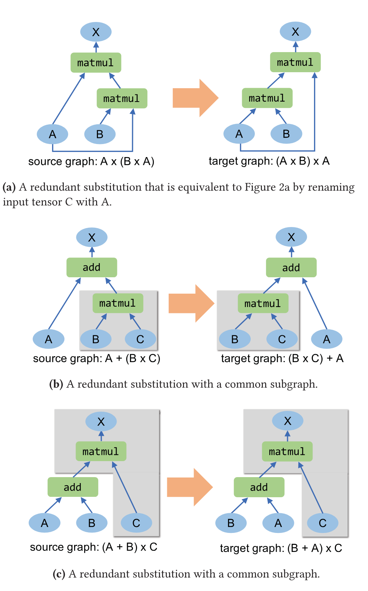

**図 4.** TASO によってプルーニングされた冗長置換の例。 Matmul と Add は、行列の乗算と要素ごとの加算を指します。各サブグラフについて、A、B、C は入力テンソルであり、X は出力テンソルです。

#### 入力テンソルの名前変更

TASO は、他の置換モジュロ入力テンソルの名前変更と同じグラフ置換を排除します。たとえば、[図 4a](#figure-04) は、入力テンソル C の名前を A に変更した後の[図 2a](#figure-02) と等価です。入力テンソルの名前変更を通じて等価な置換の場合、TASO は 1 つの最も一般的な置換を除くすべてを削除します。

#### 共通部分グラフ

TASO はまた、ソース グラフとターゲット グラフに共通のサブグラフがある置換を排除しようとします。 TASO は、枝刈りにつながる可能性のある 2 つの形式の一般的なサブグラフを識別します。 1 つ目は[図 4b](#figure-04) に示されています。ソース グラフとターゲット グラフの両方には、同じ入力テンソルを持つ共通の演算子が含まれており、灰色で強調表示されています。この共通のサブグラフは、両方のグラフの他の演算子への入力です。したがって、共通のサブグラフを新しい入力テンソルで置き換えることによって、より一般的な置換を取得できます。より一般的な置換が有効な場合、TASO はより一般的ではない置換を削除します。

共通サブグラフの 2 番目の形式を[図 4c](#figure-04) に示します。ここで、共通のサブグラフ (灰色のボックスで強調表示) には、ソース グラフとターゲット グラフの両方のすべての出力が含まれています。この場合、共通のサブグラフを完全に削除し、その入力をソース グラフとターゲット グラフの新しい出力にすることで、より一般的な置換を取得できます。 TASO は、より一般的な置換が有効な場合、より一般的ではない置換を削除します。

[表 3](#table-03) は、置換数に対する TASO プルーニング手法の影響を示しています。両方の枝刈り手法が冗長な置換を排除する上で重要な役割を果たしており、それらを組み合わせると、TASO が考慮する必要がある置換の数が 39 分の 1 に減少することがわかります。

<span id="table-03"></span>

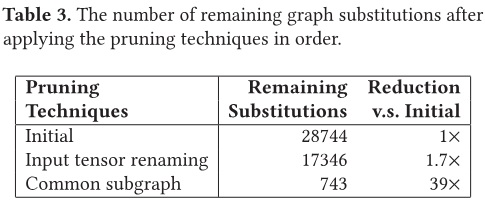

**表 3.** 枝刈り手法を順番に適用した後の残りのグラフ置換の数。

## 5 共同最適化器

次に、データ レイアウトとグラフ置換を共同で最適化するための TASO オプティマイザーについて説明します。オプティマイザーは、MetaFlow [Jia19] コストベースのバックトラッキング検索アルゴリズムを使用して、検証済みの置換を適用することで最適化された計算グラフを検索します。 TASO は、MetaFlow の検索アルゴリズムを拡張して、置換を実行するときに考えられるレイアウト最適化の機会も考慮します。

一致したサブグラフに置換を適用する場合、TASO は、ソース テンソルと各演算子によってサポートされるレイアウトに基づいて、ターゲット グラフ内のテンソルの可能なレイアウトを列挙します。したがって、置換を適用すると、構造は同じだがデータ レイアウトが異なる複数のグラフが生成される場合があります。

<span id="figure-05"></span>

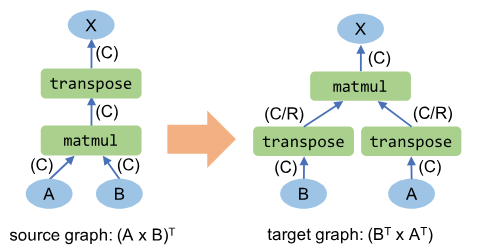

**図 5.** 行列乗算の転置を使用したグラフ置換。括弧は潜在的なテンソル レイアウトを示し、C と R は列優先と行優先のレイアウトを示します。

[図 5](#figure-05) は、デフォルトの列優先レイアウトのソース グラフに行列の転置乗算置換を適用することによって導出された潜在的なグラフを示しています。行列の乗算と転置も行優先のレイアウトをサポートします。マップされたテンソル A、B、X のレイアウトはソース グラフとターゲット グラフ間で一致する必要がありますが、2 つの中間テンソルは行優先または列優先のレイアウトを独立して使用できます。その結果、TASO は CC、CR、RC、RR を考慮し、グラフ置換によりレイアウト変換の機会を捉えることができます。

```pseudocode:line-numbers title="アルゴリズム 2：コストベースのバックトラッキング探索"
Input: An input graph G_in, verified substitutions S,
       a cost model Cost(.), and hyperparameter alpha.
Output: An optimized graph.

P = {G_in}  // Priority queue sorted by Cost.
while P is not empty do
  G = P.dequeue()
  for substitution s in S do
    for layout l in Layout(G, s) do
      G' = Apply(G, s, l)
      if G' is valid then
        if Cost(G') < Cost(G_opt) then
          G_opt = G'
        if Cost(G') < alpha * Cost(G_opt) then
          P.enqueue(G')
return G_opt
```

アルゴリズム 2 は、置換とデータ レイアウトを共同で最適化するためのコストベースのバックトラッキング検索アルゴリズムを示しています。コスト モデルは、DNN オペレーターが分岐のない密な線形代数を実行するという事実によって動機付けられており、そのため、同じデータ レイアウトと構成パラメーター (畳み込みのストライドやパディングなど) が与えられた場合、ハードウェア上でのパフォーマンスは一貫性が高く、予測可能です。 MetaFlow [Jia19] と同様に、TASO は、構成およびデータ レイアウトごとに DNN オペレーターの実行時間を 1 回測定し、測定されたオペレーターの実行時間を合計することでグラフのパフォーマンスを推定します。

最適化されたグラフを検索するために、すべての候補グラフが優先キュー $P$ に保持され、コストの昇順にデキューされます。デキューされたグラフ $G$ ごとに、TASO は、検証された各置換とその置換に適用できる可能なレイアウトを考慮し、それらを適用して機能的に同等の新しいグラフ $G'$ を取得します。

グラフ置換の明らかではない特性として、グラフ置換を適用するとグラフにサイクルが導入される可能性があることが挙げられます。[図 6](#figure-06) は、有効な置換を適用すると循環グラフが生成される一例を示しています。計算グラフは非周期的である必要があるため、TASO は、$P$ をキューに入れる前に、$G'$(アルゴリズム 2 の 12 行目) の非周期性をチェックします。

<span id="figure-06"></span>

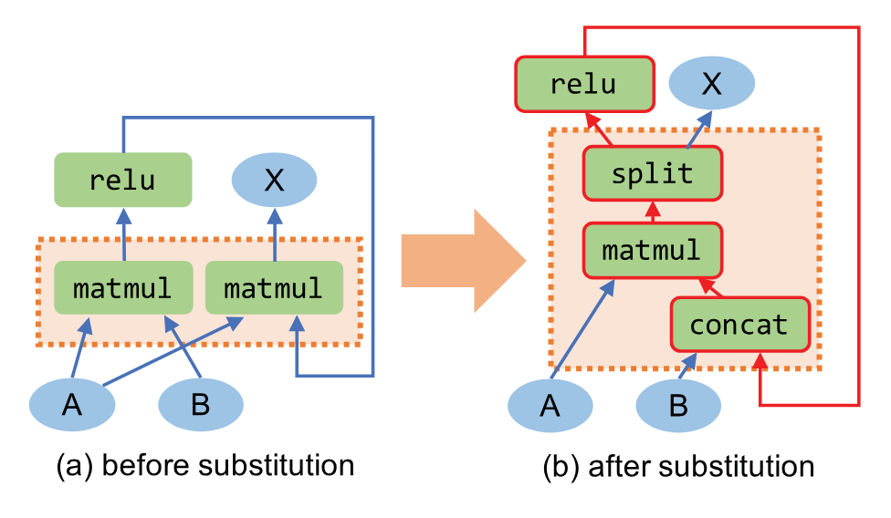

**図 6.** 有効なグラフ置換により、計算グラフにサイクルが導入される可能性があります。ソースとターゲットのサブグラフは点線のボックスで表示され、結果のサイクルは赤色で強調表示されます。

最後に、検索アルゴリズムによって、最も発見されたグラフ $G_{\mathrm{opt}}$ が返されます。検索スペースはハイパーパラメータ $\alpha$ によってプルーニングされ、検出された最良のグラフよりコストが $\alpha$ 倍悪いグラフをすべて直接削除します。パラメータ $\alpha$ は、検索時間と発見された最良のグラフの間でトレードオフになります。 $\alpha=1$ を設定すると、バックトラッキングのない単純な貪欲アルゴリズムに検索が減少します。$\alpha$ の値を高くすると、検索でより多くの候補が探索され、バックトラッキングが増加します。評価では、$\alpha=1.05$ が良好なパフォーマンスを達成していることがわかりました。

## 6 実装

TASO は、新しいテンソル演算子を簡単に追加できるように、テンソル計算用の汎用かつ拡張可能な計算グラフ オプティマイザーとして設計および実装されています。[表 1](#table-01) は、TASO の現在の実装に含まれるテンソル演算子のリストです。一部のオペレーターは、ストライド、パディング、畳み込みのアクティブ化など、オペレーターの動作を決定する追加パラメーターにも依存します。演算子に加えて、TASO には、置換に役立つ 4 種類の定数テンソルも含まれています。特に、$I_{\mathrm{ewmul}}$、$I_{\mathrm{matmul}}$、および $I_{\mathrm{conv}}$ は、それぞれ要素ごとの乗算、行列乗算、および畳み込み用の恒等テンソルです。 $C_{\mathrm{pool}}$ を使用すると、平均プーリング演算子を深さ方向の畳み込みに変換できます ([セクション 7.3](#_7-3-substitution-case-study) の例を参照)。

[セクション 3](#_3-graph-substitution-verifier) で説明されているように、TASO はユーザーが指定した演算子プロパティを使用して、生成されたグラフ置換を検証します。[表 2](#table-02) に、評価ですべての置換を検証するために使用した 43 のプロパティを示します。

TASO は、新しいテンソル演算子を含めるように簡単に拡張できます。 TASO では、演算子ごとに 2 つの形式の入力が必要です。(1) 演算子の参照実装、および (2) 演算子のプロパティの仕様。 (1) は、置換ジェネレータによって使用される具象実装 (C++) と、演算子の仕様を検証するために使用される記号実装 (Python) で構成されます。私たちの経験では、新しいオペレーターを追加するには、専門家による数時間の作業が必要です。

現在仕様が欠落している新しい演算子の場合、TASO はそれを不透明な演算子として扱い、検証済みの置換を使用してグラフの残りの部分を最適化できます。

TASO は MetaFlow の上に実装され、MetaFlow コストベースのバックトラッキング検索 [Jia19] を再利用します。全体として、TASO の実装には、コア コンポーネント (置換ジェネレーター、ベリファイア、オプティマイザー) のコードが約 8,000 行、演算子リファレンス実装のコードが 1,400 行 (43 の演算子プロパティを含む) 含まれています。

TASO はフレームワークに依存せず、ターゲット フレームワークの入力形式で最適化されたグラフを出力するだけで、TensorRT や TVM などの既存の DNN フレームワークにプラグインできます。評価では、TensorRT および TVM でこの移植性を実証し、TASO の最適化を直接使用してパフォーマンスを向上できることを示しました。

## 7 評価

このセクションでは、次の質問を評価します。

- TASO は許容可能な時間内にグラフ置換を自動的に生成して検証できますか?
- TASO は、現実世界の DNN アーキテクチャ、特に最近導入された演算子を備えた新興アーキテクチャでのエンドツーエンドのパフォーマンスを向上させることができますか?
- 計算グラフとデータ レイアウトの共同最適化は、個別の最適化よりも優れたパフォーマンスを発揮できますか?

### 7.1 実験のセットアップ

TASO を評価するには、5 つの現実世界の DNN アーキテクチャを使用します。 ResNet-50 [He16] は、画像分類に広く使用されている畳み込みニューラル ネットワークであり、ILSVRC [Rus15] コンペティションで最高の分類パフォーマンスを達成しました。 ResNeXt-50 [Xie16] は、新しいグループ化畳み込み演算子を導入することにより、ResNet-50 のモデル精度とランタイム効率を向上させます。 NasNet-A [Zop18] と NasRNN [Zop16] は、ニューラル アーキテクチャ検索を通じてマシンによって自動的に検出される 2 つの DNN アーキテクチャです。 NasNet-A と NasRNN は、それぞれ画像分類タスクと言語モデリング タスクに関して、人間が設計した最高の DNN アーキテクチャを上回っています。最後に、BERT [Dev18] は、さまざまな言語タスクにおいて最先端のモデル精度を獲得した新しい言語表現アーキテクチャです。すべての実験は、8 コア Intel E5-2600 CPU、64 GB DRAM、および 1 つの NVIDIA Tesla V100 GPU を搭載した Amazon p3.2xlarge インスタンス [Ama17] で実行されました。

グラフ置換の候補を生成するために、TASO は、[表 1](#table-01) にリストされているすべての DNN 演算子を使用して、最大 4 つの演算子ですべての潜在的なグラフを列挙します。 TASO は、約 5 分で 743 個の置換候補を生成しました。

最適化された DNN グラフのコストベースのバックトラッキング検索では、ハイパーパラメーター $\alpha$ を 1.05 に設定します。これは、MetaFlow [Jia19] で使用される値と同じです。すべての実験において、最適化された計算グラフを発見するためのエンドツーエンドの検索時間は 10 分未満です。

### 7.2 エンドツーエンドの評価

まず、TensorFlow [Aba16]、TensorFlowXLA [XLA17]、TensorRT [Ten17a]、TVM [Che18]、MetaFlow [Jia19] の間でエンドツーエンドの推論パフォーマンスを比較します。 V100 GPU 上の TASO。[図 7](#figure-07) に結果を示します。 TensorFlow、TensorFlowXLA、TensorRT、および MetaFlow は、高度に設計された cuDNN および cuBLAS ライブラリ [Che14、Cub16] を使用して、GPU 上で DNN 演算子を実行します。 DNN オペレーター用にカスタマイズされた GPU カーネルを生成します。さまざまな演算子ライブラリの影響を排除するために、両方のバックエンドで TASO のパフォーマンスを評価します。

TVM で GPU カーネルを生成するために、自動チューナー [Che18a] が 2000 回のトライアルを実行し、各 DNN オペレーターに対して発見された最適な構成を使用できるようにします。各 DNN オペレーターの GPU カーネルを調整するには平均で 2 時間かかります。 TASO グラフ オプティマイザーは、コスト モデルについて数百の DNN オペレーターの実行時間をクエリする必要があります。そのため、TVM バックエンドについては、cuDNN のオペレーターのコストが TVM でのコストの合理的な推定値であると仮定して、cuDNN バックエンド用に発見された最適な計算グラフを再利用します。

五つの DNN アーキテクチャのうち、ResNet-50 は広く使われ、既存フレームワークでも十分に最適化されています。TASO は ResNet-50 で既存フレームワークと同等の性能を達成しており、専門家が手作業で設計したグラフ置換を自動的に発見できることが分かります。新しい演算子とグラフ構造をもつ残り四つのアーキテクチャでは、cuDNN backend で 1.3～2.8 倍、TVM backend で 1.1～1.8 倍の高速化を達成しました。これは、(1) 新しい演算子に対する最適化置換を自動発見し、(2) グラフ置換と data layout を共同最適化することで得られます。TASO が発見した置換は [セクション 7.3](#_7-3-substitution-case-study) と [セクション 7.4](#_7-4-analysis-of-used-substitutions)、置換と data layout の共同最適化は [セクション 7.5](#_7-5-joint-optimization-of-graph-substitutions-and-data-layout) で分析します。

<span id="figure-07"></span>

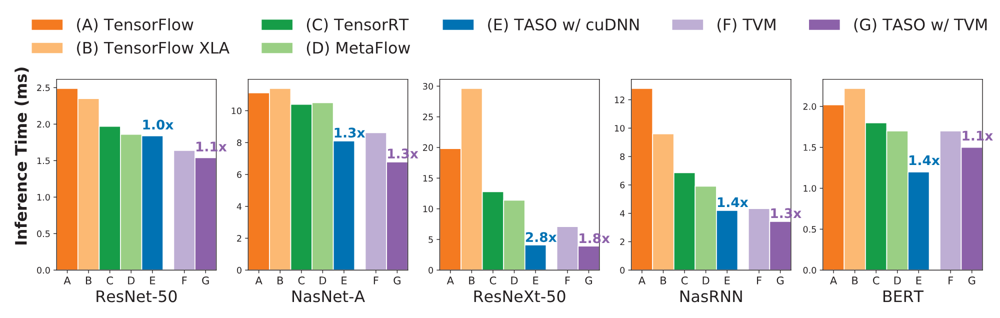

**図 7.** 単一の NVIDIA V100 GPU でのエンドツーエンドの推論パフォーマンス。各結果は平均 1,000 回の実行です。 TASO バーの上のラベルは、同じバックエンドを使用した既存の最良のアプローチよりも高速化していることを示しています。

### 7.3 グラフ置換のケーススタディ

TASO によって生成および検証された置換が実行時のパフォーマンスをどのように向上させるかを理解するために、いくつかのグラフ置換の例を詳細に検討します。

NasNet-A は、ニューラル アーキテクチャ検索によって得られた、CIFAR-10 データセット用に発見された最良の CNN アーキテクチャです。[図 8a](#figure-08) は、NasNet-A の畳み込みセルを示しています。人間が設計したアーキテクチャとは異なり、NasNet-A には型破りなグラフ構造が含まれているため、より標準的な DNN アーキテクチャ用に設計された手動置換による最適化が困難になります。 TASO がこのアーキテクチャをどのように最適化するかを説明するために、TASO によって発見された 2 つの置換例を示します。どちらも既存の DNN フレームワークには存在しません。

<span id="figure-08"></span>

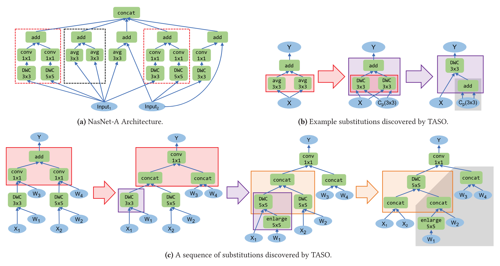

**図 8.** TASO によって発見された NasNet-A アーキテクチャと置換。色付きのボックスはソースとターゲットのサブグラフを識別します。灰色の領域は、事前トレーニングされた重みのみに依存し、事前に計算できます。

[図 8b](#figure-08) は、[表 1](#table-01) で定義された定数テンソル $C_{\mathrm{pool}}$ を使用して、2 つの平均プーリング演算子を変換し、その後要素ごとに加算して単一の深さ方向の畳み込みを行うグラフ置換を示しています。平均プーリングの数学式は次のとおりです。

$$o(n,c,x,y)=\frac{1}{K_XK_Y}\sum_{k_x}\sum_{k_y}i(n,c,x+k_x,y+k_y).$$

ここで、$K_X$ および $K_Y$ は、プーリング フィルターの高さと幅です。深さ方向の畳み込みに対応する式は次のとおりです。

$$o(n,c,x,y)=\sum_{k_x}\sum_{k_y}i(n,c,x+k_x,y+k_y)\times w(c,k_x,k_y),$$

これは、$w(c,k_x,k_y)=1/(K_XK_Y)$ の場合の平均プーリングと数学的に同等です。 TASO は、線形性を使用して 2 つの深さ方向の畳み込みも融合します。

さらに、TASO は、その線形性を利用して 2 つの深さ方向の畳み込みを 1 つに融合します。

NasNet-A の 2 番目の新しい置換シーケンスを[図 8c](#figure-08) に示します。これは、2 つの深さ方向の畳み込みと、2 つの畳み込みとそれに続く深さ方向の畳み込みへの加算とそれに続く標準畳み込みを融合しています。この置換により、オペレーターの粒度が向上し、より大きなオペレーターを使用することでオペレーター起動のオーバーヘッドが削減されます。

推論ワークロードの場合、[図 8](#figure-08) の $W_i$ や $C_{\mathrm{pool}}$ などの DNN 重みは固定されており、入力とは独立しています。 TASO は、入力がすべて事前トレーニングされた重み ([図 8](#figure-08) の灰色の領域など) である演算子を前処理して、推論時間をさらに短縮します。

ResNeXt-50 は、[図 9a](#figure-09) に示すように、大規模な ResNet-50 畳み込みをより小規模な畳み込みの複数のブランチに置き換えて、精度とランタイム効率を向上させます。小さな畳み込みをそれぞれ個別に起動すると、カーネル起動のオーバーヘッドが高くなります。グループ化されたコンボリューション カーネルは、単一の CUDA カーネルで複数のコンボリューションを実行しますが、32 個のコンボリューションをすべてグループ化すると、中間状態に多くのキャッシュが必要となり、パフォーマンスも低下する可能性があります。[図 9d](#figure-09) は、個別の畳み込みも 32 個の 1 つのグループも最適ではないことを示しています。

<span id="figure-09"></span>

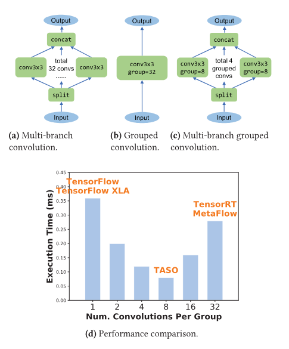

**図 9.** ResNeXt-50 のマルチバッチ畳み込み戦略。 TASO は、それぞれ 8 つの畳み込みからなる 4 つのグループ化された畳み込み (自動的に検出された混合物) を使用し、既存の最良のアプローチと比較して 2.8 倍の高速化を達成します。

### 7.4 使用された置換の分析

ここでは、TASO によって発見されたグラフ置換が、最適化されたグラフのパフォーマンスにどのような影響を与えるかを詳細に分析します。[図 10](#figure-10) は、5 つの DNN アーキテクチャのそれぞれを最適化するために使用される置換のヒート マップを示しています。各 DNN は最適化されたパフォーマンスを達成するために 4 ～ 10 の異なる置換を使用し、DNN が異なれば必要な置換のセットも異なります。これは、多様性がますます高まる今日の DNN アーキテクチャを最適化するために、いくつかのコアの代替を手動で設計することの難しさを示しています。 TASO は、パフォーマンスに重要な代替を自動的に検出することで、新しい DNN の最適化に適しています。

<span id="figure-10"></span>

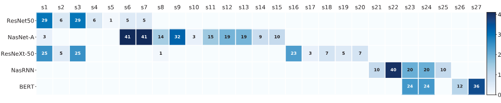

**図 10.** 5 つの DNN アーキテクチャを最適化するために検証済みの置換が使用される頻度。少なくとも 1 つの DNN で使用される置換のみが表示されます。

さらに、さまざまなサイズ制限を持つ置換を考慮し、最適化されたグラフの実行時のパフォーマンスを測定することによって、TASO のスケーラビリティを評価します。[図 11](#figure-11) に結果を示します。 3 つの DNN アーキテクチャすべてにおいて、最大サイズ 3 までのより大きな置換を使用することでパフォーマンスの向上が一貫して達成されています。ResNeXt-50 と BERT は 4 つの演算子による置換を使用してもさらなる高速化は得られませんが、NasNet-A はより大きな置換を考慮することで 1.2 倍を達成します。 TASO の現在の実装は、5 つ以上の演算子を含むすべての置換を生成するように拡張できません。これは、ジェネレーターがすべての潜在的なグラフのフィンガープリントを保持するために必要なメモリによって制限されており、グラフ サイズに応じて指数関数的に拡張されるためです。分散型フィンガープリント ジェネレーターは、サイズ 5 やそれ以上のグラフを処理できる可能性がありますが、これについては将来の作業として残しておきます。

<span id="figure-11"></span>

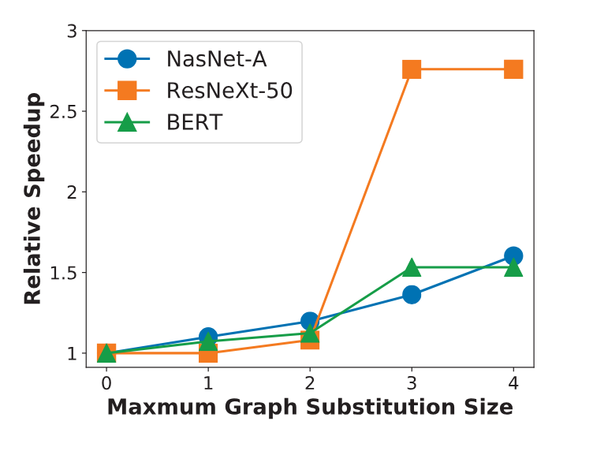

**図 11.** 異なる最大グラフ置換サイズで得られる相対的な高速化。

### 7.5 グラフ置換とデータレイアウトの共同最適化

結合最適化を評価するために、TASO は 3 つのベースライン (グラフ置換最適化のみ、データ レイアウト最適化のみ、および連続して適用される 2 つの最適化) と比較されます。

[図 12](#figure-12) は、BERT に関する 4 つの戦略を比較しています。 TASO は、グラフ構造とデータ レイアウトの両方を変換する置換を使用して、ベースラインを 1.2 ～ 1.3 倍上回るパフォーマンスを示します。一例を[図 5](#figure-05) に示します。BERT で最も負荷の高い操作は $A\times B$ です。ここで、A は 64 x 1024、B は 1024 x 4096 です。cuBLAS では、転置形式 $(B^T\times A^T)^T$ は、$B^T$ および $A^T$ が列優先を使用すると 1.5 倍高速になります。と行優先のレイアウトです。この最適化は、グラフの置換とデータ レイアウトを組み合わせて考慮した場合にのみ実現できます。

<span id="figure-12"></span>

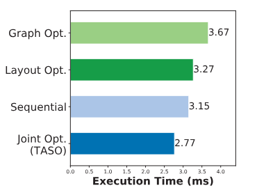

**図 12.** 個別、順次、および結合グラフ置換とデータ レイアウト最適化によるエンドツーエンド BERT 推論パフォーマンス。

### 7.6 グラフ置換検証器

私たちは、生成された置換を演算子の仕様に照らして検証することと、開発プロセスを支援するために演算子の仕様自体を検証するという 2 つの主要なタスクについて、グラフ置換検証ツールのパフォーマンスを評価します ([セクション 3](#_3-graph-substitution-verifier))。私たちの実装では、Z3 [DeM08] を使用してすべての証明義務を自動的に満たしており、実験は Z3 バージョン 4.8.5 で実行されました。 743 個のグラフ置換の生成には約 5 分かかり、指定された 43 個の演算子プロパティに対するそれらの置換の検証には 10 分もかかりません。仕様の冗長性をチェックするとき、Z3 を使用して無効な式の証拠を検索します (指定されたプロパティが仕様の残りの部分に含まれていることを示します)。この検索は無期限に継続することができ、評価ではクエリごとに 10 秒のタイムアウトを使用したため、実行時間は 10 分未満になりました (43 公理の場合)。開発プロセス中に、いくつかの冗長な仕様がある場合、それらは数秒で発見されました。

パラメーター値と 4×4×4×4 までのテンソル サイズのすべての組み合わせに対する演算子の仕様を検証する検証チェックは、計算コストがより高く、およそ 100 万回の証明義務が伴います。 128 個の CPU コアを使用して並列化した結果、実行時間は約 1 時間になりました。開発プロセス中に、より制限された組み合わせの演算子を検証することが有益であることもわかりました。たとえば、(そのサイズまでのすべてのテンソルではなく) 正確に 4×4×4×4 のサイズのテンソルの仕様を検証するには、単一の CPU コアを使用して 10 分未満かかります。

## 8 関連研究

手動で設計されたグラフ置換は、DNN アーキテクチャを最適化するために既存の DNN フレームワークで使用されます。たとえば、TensorFlow、TensorRT、および TVM はルールベースの戦略を使用し、入力グラフ [Aba16、Che18、Ten17a] に対して適用可能なすべての置換を直接実行します。 MetaFlow [Jia19] を使用すると、ユーザーはパフォーマンスを低下させる置換を定義して、潜在的なグラフのより大きなスペースを取得できます。 TASO とこれらのフレームワークの主な違いは、TASO は置換候補を自動的に生成でき、その正しさを検証するための半自動サポートも提供することです。評価では、既存のフレームワークが TASO の最適化されたグラフを直接使用してパフォーマンスを向上できることも示しました。

### 自動化された DNN コード生成

最近の研究では、DNN オペレーター向けのハードウェア固有のコードを生成するためのさまざまなアプローチが提案されています。たとえば、TVM [Che18、Che18a] は学習ベースのアプローチを使用し、さまざまなハードウェア バックエンドのセット向けに低レベルの最適化されたコードを自動的に生成します。 Astra [Siv19] は、トレーニング中にマルチバージョンの複雑さの最適化スペースを探索することにより、DNN 計算を最適化します。これらのアプローチと比較して、TASO はより高いグラフ レベルで DNN 計算を最適化することを目的としているため、TASO の最適化は直交しており、コード生成技術と組み合わせることができます。グラフ レベルとオペレーター レベルの両方で DNN 計算を共同最適化する方法については、依然として未解決の問題が残っています。

### 自動化された DNN 並列化

ColocRL [Mir17] は強化学習を使用して、複数の GPU 間で DNN トレーニングを並列化するための効率的なデバイス配置を自動的に検出します。 FlexFlow [Jia18、Jia19a] は、DNN トレーニング用の並列化戦略の包括的な検索スペースを導入し、ランダム化検索アルゴリズムを使用して検索スペース内で効率的な戦略を見つけます。これらのフレームワークは、固定計算グラフを想定して分散 DNN トレーニングを最適化します。 TASO のグラフの最適化とトレーニングの並列化技術を組み合わせることが可能であると考えています。

### 超最適化

超最適化は、もともと一連の命令 [Mas87] に最適なコードを見つけるために設計されたコンパイラ最適化手法です。グラフの列挙とフィンガープリンティングによって潜在的な置換を特定する TASO のアプローチは、超最適化手法 [Ban06] を使用してピープホール オプティマイザーを自動生成する作業に似ています。ただし、TASO の検証アプローチは大きく異なります。超最適化における検証は通常、「ビット ブラスト」、つまり、計算内のすべてのビットを論理式 (ブール変数など) で明示的にモデル化することに依存します。このアプローチは、計算やデータを含むプログラム変換のすべての側面が既知のビット数を使用して表現できる場合にのみ可能です。 TASO では、グラフ置換の入力テンソル サイズが不明なので、別のアプローチを取る必要があります。ビット ブラストによる検証のように完全に自動ではありませんが、演算子仕様の作成に基づく方法論は、未知のテンソル次元と分割点の問題をスムーズに処理することに加えて、ほぼ任意のセマンティクスで将来の演算子をモデル化できるという点ではるかに柔軟です。

### データレイアウトの最適化

データ レイアウトの最適化をサポートする既存の DNN フレームワークは、データ レイアウトとグラフ変換を別個の最適化問題 [Che18、Li16、Mkl16] として扱います。 TASO は、グラフ置換を実行して各 DNN オペレーターのデータ レイアウトを決定する問題を共同最適化問題として定式化し、レイアウト変換をグラフ置換の一部として考慮します。その結果、TASO は、グラフ構造とデータ レイアウトの両方を最適化するグラフ置換を自動的に生成できます。また、私たちの評価では、2 つのタスクを一緒に最適化すると、別々に最適化する場合と比較して、エンドツーエンドのパフォーマンスが大幅に向上することが示されています。

## 9 制限と今後の課題

TASO の制限の 1 つは、ユーザーが指定した演算子プロパティに依存していることです。私たちの経験では、必要な労力は管理可能ですが、それを完全に排除した方が良いでしょう。考えられるアプローチの 1 つは、演算子の実装 (cuDNN カーネルなど) に対して直接置換を自動的に検証することです。

TASO のもう 1 つの制限は、ジェネレーターのスケーラビリティです。これには、すべての計算グラフのフィンガープリントを固定サイズまで保存する必要があります。このアプローチは現在、サイズ 4 のグラフを超えることはできません。より大きなグラフに拡張するための 1 つの可能なアプローチは、分散ジェネレーターを実装することです。 2 番目の可能性は、総当たりの列挙をより効率的なアルゴリズムまたはヒューリスティックに置き換えることです。

将来の研究のためのさらなる手段は、グラフ レベルの最適化とオペレーター レベルの最適化を組み合わせることです。どちらの問題も大規模で複雑な検索空間を必要とし、一方のレベルでの最適化が他方の検索空間に影響を与えるため、この共同最適化は困難です。

## 10 結論

TASO は、グラフ置換を自動的に生成する初の DNN 計算グラフ オプティマイザーです。 TASO は置換を正式に検証し、グラフの置換とレイアウト変換を一緒に統合最適化問題として考慮し、より多くの最適化の機会を活用します。 TASO は、ResNet-50 などのフレームワークが高度に最適化されている DNN 上で既存のフレームワークのパフォーマンスと同等であり、他の DNN 上では既存のフレームワークを最大 2.8 倍上回るパフォーマンスを示し、既存のフレームワークの数百の最適化ルールには存在しない新しい最適化を見つけます。 TASO は、既存のフレームワークよりも大幅に少ない人的労力でこれらの結果を達成し、より高いレベルの正確性保証を提供します。

## 謝辞

有益なフィードバックをくださった Nikolaj Bjørner 氏、Mingyu Gao 氏、Vinod Grover 氏、Sina Lin 氏、Feng Ruan 氏、Xi Wang 氏、匿名の SOSP 査読者、そして私たちの羊飼いである Joey Gonzalez 氏に感謝します。この研究は、NSF 助成金 CCF-1409813、米国エネルギー省科学局と国家核安全保障局の共同研究であるエクサスケール コンピューティング プロジェクト (17-SC-20-SC) によって支援されており、契約番号 FA84750-14-2-0006 に基づいて DARPA によって後援された研究に基づいています。この研究は、スタンフォード DAWN プロジェクトの関連メンバーおよびその他の支援者 (Ant Financial、Facebook、Google、Infosys、Intel、Microsoft、NEC、SAP、Teradata、VMware)、および CAREER Grant CNS-1651570 に基づく Cisco および NSF によって部分的に支援されました。この資料に記載されている意見、調査結果、結論または推奨事項は著者のものであり、必ずしも NSF の見解を反映しているわけではありません。
