> [Lei Wang](https://leiblog.wang/) [+equal]、[Yu Cheng](https://chengyupku.github.io/) [+equal]、[Yining Shi](https://dblp.org/pid/161/3927-1.html) [+equal]、[Zhengju Tang](https://dblp.org/pid/371/5817.html)、[Zhiwen Mo](https://dblp.org/pid/99/3235.html)、[Wenhao Xie](https://dblp.org/pid/219/9575.html)、[Lingxiao Ma](https://xysmlx.github.io/)、[Yuqing Xia](https://dblp.org/pid/211/8365.html)、[Jilong Xue](https://dblp.org/pid/06/10336.html)、[Fan Yang](https://fanyangcs.github.io/)、[Zhi Yang](https://yangzhihome.github.io/)。2025 年 4 月 24 日に arXiv へ初回投稿され、現在の arXiv 版は 2025 年 4 月 27 日の v2 である。後に拡張された版は [ICLR 2026 Oral](https://openreview.net/forum?id=Jb1WkNSfUB) として発表された。[arXiv: TileLang: A Composable Tiled Programming Model for AI Systems](https://arxiv.org/abs/2504.17577)。[原 PDF](/paper/tilelang.pdf)。[DOI](https://doi.org/10.48550/arXiv.2504.17577)。[TeX ソース](https://arxiv.org/src/2504.17577v2)。この閲覧版は arXiv v2 の実質的な本文、図、表、コード、付録を保存している。厳密な印刷レイアウトと参考文献については原 PDF を正とする。

[+equal]: 同等の貢献。

## 概要

現代の AI ワークロードは、学習と推論の両方で最適化された計算カーネルに大きく依存している。これらの AI カーネルは、DRAM と SRAM の間で tile を移動し、それらの tile 上で一連の計算を実行するなど、明確に定義されたデータフローパターンに従う。しかし、こうしたパターンが明快であるにもかかわらず、高性能カーネルの記述は依然として複雑である。ピーク性能を達成するには、現代のアクセラレータを最大限に活用するための、慎重でハードウェア中心の最適化が必要になる。ドメイン固有コンパイラは高性能カーネルを記述する負担の軽減を試みているものの、使いやすさと表現力の隔たりに苦しむことが多い。

本論文では、AI Kernel をより効率的にプログラミングするための汎用 tiled プログラミングモデルである TileLang を提示する。**TileLang は、スケジューリング空間（thread binding、layout、tensorize、pipeline）をデータフローから分離し、それらをカスタマイズ可能な注釈とプリミティブの集合としてカプセル化する。** このアプローチにより、ユーザーはカーネルのデータフロー自体に集中し、その他の最適化の大部分をコンパイラに委ねられる。一般的に使われるデバイス上で包括的な実験を行った結果、多数の実験を通じて、TileLang が主要なカーネルで最先端の性能を達成できることが評価から示された。これは、統一された block-and-thread パラダイムと透過的なスケジューリング能力が、現代の AI システム開発で求められる能力と柔軟性の両方を備えていることを実証している。

## 1 はじめに

ここ数年、AI ワークロードのさらなる高性能化への追求 [Ope22, Goo24, Mic24, Yan23] が、学習と推論の両方を駆動する専用カーネル [Dao22, Nvi24, AmdWeba, Thu24] の発展を加速させてきた。特に行列乗算は、単純な feed-forward layer から巨大な Transformer ベースモデルまで、幅広いニューラルネットワークアーキテクチャを支えている。これらのネットワークがもたらす大きな計算負荷に対処するため、FlashAttention [Sha24f] のようなカスタムカーネルが登場し、注意機構を最適化してメモリオーバーヘッドを削減し、処理スループットを向上させている。それでも、進化し続けるアクセラレータハードウェア上で高効率を達成するには、ハードウェアを意識した設計と複雑なチューニングを緻密に組み合わせる必要がある。この課題が、より表現力の高いドメイン固有コンパイラへの関心を高めている。

深層学習カーネルは通常、DRAM と SRAM の間で tile を移動し、それらの tile 上で一連の計算を実行するデータフローパターンとして表現される。これらのパターンは一見明快であるものの、開発者が複数の主要な最適化を手作業で扱わなければならないため、高性能カーネルの作成は依然として困難である。

- **Thread Binding。** Binding とは、tile の操作とデータを適切なスレッドへマッピングする処理である。GPU のような現代のアクセラレータアーキテクチャでは、並列性を最大化し、負荷の不均衡を最小化するために、タスクを thread block、warp、個々の thread に慎重に割り当てる必要がある。最適な binding 戦略はデータ局所性を高め、スレッド同期と分岐に伴うオーバーヘッドを減らし、それによって計算スループットの向上に寄与する。
- **Memory Layout。** Memory layout の最適化では、bank conflict を排除して効率的なアクセスパターンを確保するため、物理メモリ内のデータを体系的に編成する。近年の研究 [Pho19, Hag23] が示すように、この処理では、自然なデータ表現をアーキテクチャのメモリサブシステムに適合した tiled 形式または blocked 形式へ変換する必要がある場合が多い。このような再編成は coalesced access と効果的なキャッシュ利用を促進し、メモリレイテンシを削減してシステム全体の性能を向上させる。
- **Intrinsic Tensorization。** Intrinsic function の活用とは、性能向けに最適化されたターゲット固有命令を直接利用することである。現代のプロセッサとアクセラレータは、Tensor Core [NviWeb] や Matrix Core [AmdWeb] のように複数の算術演算を同時に実行できる専用操作に加え、帯域幅をより有効に利用する vector copy や asynchronous copy などの仕組みを提供する。これらの intrinsic 命令を使用するには、ハードウェアの計算能力を最大限に引き出すため、データ型、メモリアラインメント、制御フローを精密に管理する必要があり、それによって重要なカーネル操作を大幅に高速化できる。
- **Pipeline。** Pipelining は、データ移動と計算を重ね合わせてメモリアクセスレイテンシを緩和する手法である。データ転送と計算タスクを同時にスケジューリングすることで、pipelining は処理ユニットを稼働状態に保ち、メモリレイテンシによるアイドル期間を最小化する。先進的な Nvidia Hopper アーキテクチャでは、Tensor Memory Accelerator（TMA）[Nvi23] が CUDA Core や Tensor Core など異なる計算ユニットの非同期処理を可能にし、この処理を促進して並行性をさらに高められる。

近年の AI ワークロード向けドメイン固有コンパイラ [Che18, Zhe20, Zhu22] は高性能カーネルの作成を大幅に簡略化したが、データフローが明示的に公開されている場合でも、低水準の最適化の大部分をカーネル実装と絡み合わせたままである。例えば Triton [Til19] は、直感的なブロックレベルプリミティブを提供する一方、スレッドの動作、メモリレイアウト、アドレス空間の注釈を自動生成戦略の背後に隠す。この抽象化はプログラミングを容易にするが、量子化重みを用いた行列乗算を実装する場合など、最大性能を引き出したい熟練開発者の妨げになる。この種のカーネルでは一般に、ベクトル化されたデータ型変換を実行するインラインアセンブリ [Kim22] と、ハードウェア固有のメモリバッファに慎重に合わせたカスタムデータレイアウト [Wan24l] が必要になる。Triton は `tl.dot` のようなベクトル化演算を提供しているが、PTX を介して手書きの高性能 tile operator を登録する場合など、独自のユースケースへ拡張することは依然として煩雑である。さらに、Triton は使いやすい pipeline knob（`num_stage`）を公開しているものの、ユーザーが完全に独自の pipeline を定義することはできない。その結果、メモリ階層やその他の細粒度最適化を明示的に制御する必要があるカーネルの開発では、ドメイン専門家が制約を受ける。

これらの制約に対処するため、Triton の簡潔さを保ちながら、さらに高い柔軟性を提供するプログラミングモデル TileLang を提案する。TileLang は、より高い性能を得るために、ユーザーがスケジューリング空間を細粒度に制御できるよう設計されている。その重要な要件は、データフローとスケジューリングを分離することだと考える。ユーザーは composable tile operator を用いたデータフローの定義だけに集中し、コンパイラがスケジューリング戦略の探索と適用を担当する。コンパイラのデフォルト最適化が不十分な場合、ユーザーはフロントエンドでより精密な制御を行える。GEMM、COPY、ATOMIC、REDUCE などの主要な計算パターンを tile operator で表現する、composable tiled programming 抽象を導入する。これらの operator は、スケジューリング判断から独立してカーネルのデータフローを定義する。同時に、追加の最適化を捉えるスケジューリングプリミティブと注釈の集合を提供し、ユーザーがコンパイラ生成のスケジュールに依存するか、カーネルの性能に重要な側面を手動で微調整するかを選択できるようにする。

TileLang の使いやすさを高めるため、柔軟なプログラミングスタイルを少ない型注釈で実現するフロントエンド言語を Python で実装した。さらに、ユーザー定義プログラムを高度に最適化された低水準コードへ変換し、現代のハードウェア上で効率的に実行する TileLang コンパイラを導入する。このコンパイラは主要な最適化を自動化し、性能チューニングに必要な手作業を削減する。要約すると、本研究の貢献は次のとおりである。

1. **Tile-Level Programming Language。** ハードウェアメモリ階層内のバッファ配置をユーザーが明示的に宣言できる tile-level programming language を設計した。Layout Inference 機構を利用することで、スレッドレベルの制御インターフェースを公開しながら、バッファ操作を効率的に並列化する複雑さを抽象化し、専門家が各スレッドとバッファの相互作用を正確に管理できるようにする。
2. **Compiler with Automated Optimization。** 一連の自動コンパイル pass を備えた TileLang 用コンパイラを提供した。これらの pass には、Layout Inference 機構による自動並列化、カーネルライブラリ向けの動的パラメータ簡略化、自動 pipeline 導出、動的形状向けの loop tail splitting 最適化などが含まれる。このコンパイラにより、TileLang プログラムは高効率であると同時に記述しやすくなる。
3. **State-of-the-Art Performance。** 実際の AI カーネルでの実証評価により、TileLang は NVIDIA と AMD の両 GPU で、専用ベンダーライブラリや Triton などの DSL ベース手法に匹敵し、場合によっては上回る性能を達成することを示した。

本論文の残りでは、TileLang の設計と実装を提示する。まず、言語構文と基礎となるプログラミングモデルを説明する。次に、ハードウェア非依存最適化とハードウェア認識最適化の両方を含む TileLang JIT コンパイラアーキテクチャを詳述する。最後に、TileLang を既存の取り組みと比較し、知見をまとめるとともに、高性能 AI カーネル開発へのこの統一的アプローチの将来方向を示して結論とする。TileLang はオープンソース化されている [+source]。

[+source]: <https://github.com/tile-ai/tilelang>

## 2 TileLang の例

<span id="figure-01"></span>

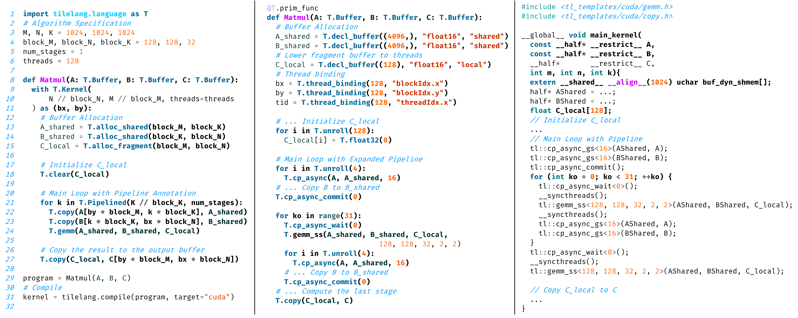

**図 1。** TileLang プログラムと、それに対応する lowered ir および生成された cuda c コードの例。コードスニペットは説明のために簡略化されている。

TVM のようにスケジューリングと計算を分離する既存の機械学習コンパイラでは、ユーザーが計算とスケジューリングを明示的に区別する必要がある。さらに、最適な性能を達成するには、新しい tensor instruction を手動で登録し、バッファレイアウトを指定しなければならない。しかし、スケジューリングプログラムの記述と理解は依然として困難である。Triton のような現代的フレームワークはユーザーが tile-level programming に集中できるようにするが、データフロー表現が不明瞭なことが多く、masked conditional load のような回避策や Tensor Memory Accelerator（TMA）のようなハードウェア固有機能を使う必要がある。ThunderKitten のようなフレームワークは、プログラムを tile 粒度の load、compute、store、synchronization 操作の組合せとして抽象化するが、データフローは依然として十分に透過的ではなく、ユーザーが追加の最適化を適用する能力を制限している。さらに、Python ベースの深層学習フレームワーク [PyT17, Wol19] が広く採用されているため、最適化のためにモデルを手動で C++ へ変換することは現実的ではない。そこで TileLang の設計では、次の 3 原則を重視する。（1）**Pythonic design**：Python エコシステムとシームレスに統合し、使い慣れたコーディング体験を提供して学習曲線を緩和する。（2）**Dataflow-centric**：低水準のスケジューリングの複雑さを抽象化しつつ、ユーザーが主にデータフローへ集中できるようにする。thread binding、memory layout、tensorization、pipelining などのスケジューリング要素をデータフローから分離し、カスタマイズ可能な注釈とプリミティブの集合としてカプセル化して、プログラマビリティと保守性の両方を高める。（3）**Composability**：kernel、primitive、scheduling strategy をシームレスに組み合わせて複雑な設計を構築できるようにする。

以下では、TileLang で汎用行列乗算（GEMM）カーネルを実装し、基本構文を示すとともに、生産性をどのように向上させるかを説明する。[図 11](#figure-11)(a) に示すように、実装は GEMM カーネルの入力と出力を定義し（8 行目）、その形状とデータ型を指定することから始まる。続いて、グリッドサイズと総スレッド数を決めるカーネルコンテキストを初期化し（9-11 行目）、その後にオンチップメモリ割当てとデータフロー管理を含むカーネル本体（12-27 行目）が続く。TileLang は Python embedded programming language であるため、Python のすべての命令型構造（`if-else`、`for`、`while` など）をサポートするが、ユーザーが関数引数と変数宣言に明示的な型注釈を付けなければならない点が重要な違いである。この要件は、Python の動的型付けが、正確なデータ bitwidth を決める静的データ型が不可欠なデバイスコード生成（CUDA/HIP など）に本質的には適さない可能性があるためである。TileLang では、型注釈が要素型と tensor shape を明示的に定義し、正しさと効率的なコード生成を保証する。さらに TileLang は明示的なメモリ割当てを可能にし、データ配置とアクセスパターンをより細かく制御できる。提示した実装では、TileLang は `T.alloc_shared` を用いて $A$ と $B$ の部分行列を共有メモリへ格納し、`T.alloc_fragments` を用いてブロックレベルのレジスタファイルに accumulator を割り当てる。また、pipelined execution（`T.Pipelined`）を用いるとメモリ転送と計算を重ね合わせられ、メモリレイテンシを効果的に隠して全体スループットを向上させられる。`T.gemm` 演算は NVIDIA CUTLASS または手書きの HIP コードを利用し、tile-level matrix computation を効率的に実行する。低水準のスケジューリングと同期を自動化することで、TileLang は開発者がハードウェア固有の最適化ではなくアルゴリズム設計に集中できるようにし、計算効率を保ちながら生産性を高める。

最後に、`tilelang.compile` を呼び出して（31 行目）、[図 11](#figure-11)(b) に示すように `tilelang` プログラムを中間表現（IR）へ lower する。この IR はさらに実行可能形式へコンパイルされ、[図 11](#figure-11)(c) に示す最終的な最適化コードを生成する。

## 3 Tile Language

本節では、tile-based programming model の基礎を導入し、TileLang が AI カーネル開発を体系的かつ効率的に管理する方法を説明し、データフローを他のスケジューリング空間から分離するという TileLang の設計思想を概説する。

[図 2](#figure-02)は TileLang の 5 段階コンパイルパイプラインを示す。まず開発者は、TileLang を用いて計算ロジックとデータアクセスパターンを記述する高水準プログラムを書く。Parser 段階では、TileLang プログラムを Python AST に解析し、その後 TileLang AST へ変換する。次に IR Builder が AST を TVM 中間表現（IR）へ変換し、TVM の構文木と関連インフラストラクチャを利用可能にする。続く Optimization 段階では、実行効率を高めるため、一連のグラフ最適化とスケジューリング変換を行う。最後に Codegen 段階が、最適化された IR を LLVM IR、CUDA C/C++、HIP C/C++ などのバックエンドコードへ変換し、多様なハードウェアプラットフォームをサポートする。

<span id="figure-02"></span>

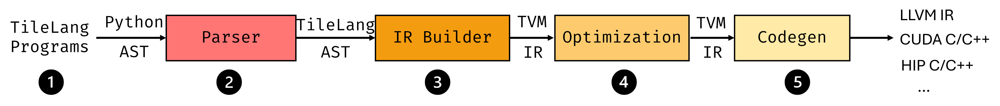

**図 2。** TileLang Compile Pipeline の各段階。

[表 1](#table-01)は、TileLang が提供する dataflow operator と scheduling primitive の代表的な一部を示す。Tile Language はデータ中心のプログラミングパラダイムを採用し、主要な計算セマンティクスを `T.copy`、`T.gemm`、`T.reduce` などの tile-level operator で表現する。これらの operator を補完するものとして、TileLang は並列性、pipelining、memory layout など性能上重要な側面を開発者が微調整できる scheduling primitive の集合を公開する。以下の各節で、この 2 つの構成要素の設計を説明する。

<span id="table-01"></span>

| Dataflow Centric Tile Operator | 説明 | Scheduling Primitive | 説明 |
| --- | --- | --- | --- |
| `T.copy` | レジスタ、共有メモリ、グローバルメモリ間の並列データ移動を抽象化する専用のメモリコピー operator。 | `T.Parallel` | ループ反復を自動的に並列化してハードウェアスレッドへマッピングし、追加の性能向上のために vectorization も有効化できる。 |
| `T.gemm` | 異なる GPU 上の高性能行列乗算に対し、実装（cute/cuda/hip）を自動選択する。 | `T.Pipelined` | ループレベルの pipelining を有効にしてデータ転送と計算を重ね合わせ、async copy や TMA などのハードウェア固有命令をサポートする。 |
| `T.reduce` | warp-level と block-level の並列性を活用する柔軟な reduction operator（sum、min、max など）。 | `T.annotate_layout` | bank conflict を最小化し、thread binding を最適化するカスタム memory layout の定義を可能にする。 |
| `T.atomic` | 共有メモリまたはグローバルメモリの thread-safe update を保証する atomic operation（add、min、max など）を提供する。 | `T.use_swizzle` | thread block を swizzle することで L2 cache locality を改善する。 |

**表 1。** TileLang がサポートする dataflow operator と scheduling primitive の一部。

### 3.1 Tile-based Programming Model

[図 11](#figure-11)は TileLang による簡潔な行列乗算（GEMM）の例を示し、開発者が tile、memory placement、pipelining、operator call などの高水準構造を用いて、データ移動と計算を細粒度に制御する方法を説明している。特に、このスニペットの[図 11](#figure-11)(a) は、multi-level tiling が異なるメモリ階層（global、shared、register）を利用して帯域幅利用率を最適化し、レイテンシを低減する方法を示す。全体として、[図 11](#figure-11) (b) は、TileLang の Python-like syntax により、使いやすいプログラミングモデルの中で性能上重要な最適化を開発者が推論できることを示している。

<span id="figure-03"></span>

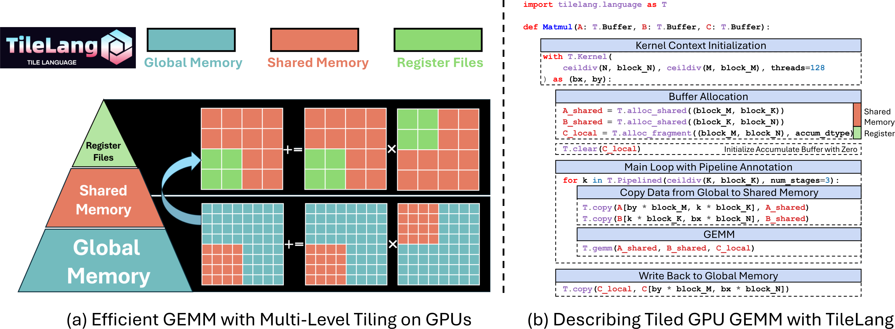

**図 3。** TileLang による GPU 上の Multi-Level Tiling を用いた GEMM 最適化。

**Tile declaration。** 本アプローチの中心には、プログラミングモデルにおける第一級オブジェクトとしての *tile* という概念がある。tile は形状を持つデータの一部を表し、warp、thread block、または同等の並列ユニットが所有して操作できる。`Matmul` の例では、カーネルループ内で `A` と `B` のバッファが tiled chunk（`block_M`、`block_N`、`block_K` で決まる）として読み出される。TileLang は `T.Kernel` により、thread block index（`bx` と `by`）とスレッド数を含む実行コンテキストを定義する。これらのコンテキストは各 thread block の index 計算に役立ち、TileLang によるメモリアクセスと計算の自動推論および最適化を容易にする。さらに、これらのコンテキストにより、ユーザーは thread block 内の個々の独立したスレッドの動作を手動で制御できる。

**明示的なハードウェアメモリ割当て。** TileLang の特徴は、これらの tile buffer をハードウェアメモリ階層へ明示的に配置できることである。コンパイラの不透明な最適化 pass に任せるのではなく、TileLang は物理メモリ空間またはアクセラレータ固有構造へ直接マッピングされるユーザー向け intrinsic を公開する。具体的には次のとおりである。

- **T.alloc_shared**：高速なオンチップストレージ空間にメモリを割り当てる。これは NVIDIA GPU 上の共有メモリに対応する。共有メモリはグローバルメモリより大幅に高速で、同じ thread block 内のスレッド間で効率的にデータを共有できるため、計算中の中間データのキャッシュに適している。例えば行列乗算では、行列の tile を共有メモリへ読み込むことで、グローバルメモリ帯域幅の要求を削減し、性能を向上させられる。
- **T.alloc_fragment**：fragment memory に accumulator を割り当てる。これは NVIDIA GPU 上のレジスタファイルに対応する。入力と部分和をレジスタまたはハードウェアレベルのキャッシュへ保持することで、レイテンシをさらに最小化できる。この tile program では各 tile が共有メモリと同じローカルバッファを割り当てるため、共有メモリの方が一般に高速かつ豊富である一方、レジスタファイルは限られており、直感に反するように見えるかもしれない。これは、ここでの割当てが thread block 全体のレジスタファイルを指しているためである。TileLang はコンパイル中に Layout Inference Pass を使用して Layout object `T.Fragment` を導出し、各スレッドへ対応するレジスタファイルをどのように割り当てるかを決定する。この処理については後の節で詳しく説明する。

グローバルメモリとハードウェア固有メモリ間のデータ転送は `T.copy` で管理できる。さらに、ハードウェア固有バッファは `T.clear` または `T.fill` を用いて初期化できる。データ代入では、[8](#figure-08)に示すように `T.Parallel` を用いて操作を並列実行することもできる。

### 3.2 Dataflow Centric Tile Operator

TileLang は Tile Operator の集合を抽象化し、各 tile operation の低水準実装詳細を管理することなく、開発者がデータフローロジックに集中できるようにする。[図 4](#figure-04)は Tile Operator のインターフェースと、`GEMM`、`Copy`、`Parallel` を含む代表例を示す。各 Tile Operator は、`Lower` と `InferLayout` という 2 つの主要インターフェースを実装する必要がある。`Lower` インターフェースは、高水準 Tile Operator を thread binding や vectorized memory access など、より低水準の IR へ lower する方法を定義する。例えば `Copy` は、明示的な thread binding と vectorized load/store を持つループへ lower できる。`InferLayout` インターフェースは、Tile Operator に関連するメモリレイアウトとループレイアウトを決定する役割を持つ。これには buffer layout（swizzled memory など）や loop-level layout（thread binding など）の推論が含まれる。例えば `T.gemm` は共有メモリ入力に swizzled layout を適用し、MMA fragment の書戻しには行列固有の layout を使用する。同様に、`T.Parallel` の並列ループ構造は thread-level binding と vectorized access pattern で表現でき、どちらも layout inference によって導出される。[4.1 節](#_4-1-memory-layout-composition)では、layout composition と lowering 処理におけるその役割をさらに詳しく説明する。

<span id="figure-04"></span>

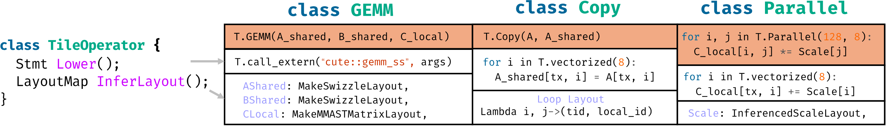

**図 4。** Tile-Operator のインターフェースと TileOP の例。

[表 1](#table-01)は、tile-based programming の一般的な操作を簡略化する TileLang operator の一部を示す。これらの組込み operator は、ハードウェアメモリアクセスと計算の低水準詳細を抽象化し、性能上重要な側面を細粒度に制御しながら、開発者がデータフローの観点から高水準アルゴリズム設計へ集中できるようにする。各 operator は tile programming model とシームレスに統合するよう設計され、ハードウェアメモリ階層全体で効率的なデータ移動と計算を保証する。以下では、いくつかの主要 operator と、メモリ転送および算術計算の最適化における役割を説明する。

- **copy**：copy op はメモリコピーを伴う `T.Parallel` の sugar syntax であり、レジスタの fragment scope、静的共有メモリの shared scope、動的共有メモリの shared.dyn、グローバルメモリの global から、またはそれらへコピーできる。
- **gemm**：組込みの `T.gemm` operator は general matrix multiplication の高度に最適化された実装であり、`ss`、`sr`、`rs`、`rr` という各種メモリアクセスパターンをサポートする。ここで `r` は register memory、`s` は shared memory を表す。operator はカーネル構成に基づいて最適な実装を自動選択する。CUDA バックエンドでは `T.gemm` が Nvidia の CUTLASS ライブラリを用いて Tensor Core または CUDA Core を効率的に活用し、AMD GPU では composable kernel と手書き HIP コードの両方で性能を最適化する。ユーザーは Python でカスタムプリミティブを登録して `T.gemm` を拡張でき、特定のユースケースへ柔軟に対応できる。
- **reduce**：`T.reduce` operator は、次元をまたいでデータを集約する柔軟で効率的な reduction mechanism を提供する。`sum`、`min`、`max`、`product` など、さまざまな reduction operation をサポートする。reduction は指定した axis に沿って実行でき、行列の row-wise または column-wise reduction などを可能にする。`T.reduce` は CUDA と AMD の両バックエンドで最適な性能を得るため、warp-level と block-level の並列性を利用して実装されている。ユーザーは独自の reduction kernel を定義して reduction operation をカスタマイズすることもできる。
- **atomic**：`T.atomic` operator は、並列コンテキストで共有メモリまたはグローバルメモリを安全に更新する atomic operation を提供する。`add`、`min`、`max` などの一般的な atomic operation をすぐに使用できる。`T.atomic` は同時更新中の thread safety を保証するため、histogram update、共有メモリを使う reduction、同期不要の counter などの操作に不可欠である。NVIDIA と AMD の両 GPU でネイティブのハードウェア atomic instruction を利用するよう設計され、並列実行の正しさを保ちながら高性能を実現する。

### 3.3 Schedule Annotation と Primitive

データフローパターンは計算編成の基盤を成すが、現代の高性能計算では実行パターンに対するより細粒度の制御が求められる。この要求に対応するため、TileLang は[表 1](#table-01)に示す包括的な scheduling primitive を提供し、開発者がアプリケーションの性能上重要な側面を精密に調整できるようにする。

- **Pipelined**：`T.Pipelined` primitive は、計算とメモリ操作を重ね合わせて性能を高めるため、ループを効率的に pipelined execution できるようにする。[図 11](#figure-11)では、`k`（reduction dimension）を反復するループが `num_stages=3` で pipeline 化され、3-stage pipeline を形成する。この pipeline はデータ転送、計算、後続データ準備を重ね合わせ、メモリボトルネックを効果的に削減して計算スループットを向上させる。`T.Pipelined` から CUDA ソースコードへの lowering process の詳細設計は[4.4 節](#_4-4-software-defined-pipeline)で説明する。
- **Parallel**：`T.Parallel` primitive は、反復をスレッドへマッピングしてループを自動的に並列化する。[図 8](#figure-08)では、`A_shared` へデータをコピーする操作が `T.Parallel(8, 32)` を用い、`8` と `32` の両次元にわたって並列化されている。ハードウェア並列性を利用して性能を高めるだけでなく、スレッドを反復へ自動マッピングし、追加最適化のための vectorization もサポートする。
- **annotate_layout**：`T.annotate_layout` primitive により、ユーザー定義の memory layout を用いて共有メモリまたはグローバルメモリの memory layout optimization を指定できる。デフォルトでは、TileLang は Nvidia と AMD の両 GPU で bank conflict を最小化するよう設計された最適化済み memory layout を採用する。
- **use_swizzle**：`T.use_swizzle` primitive は swizzled memory access を有効化して L2 cache locality を改善する。rasterization におけるデータ再利用を改善する。この primitive は tiled data を並列 thread block で処理する場合に特に有効である。

## 4 スケジューリングの設計と自動化

本節では、Dataflow 以外に TileLang が持つ 4 種類のスケジューリング空間と、その自動化設計を論じる。一部は比較的独立しているが（pipeline や tensorization など）、Thread Binding と Memory Layouts の設計のように、より強く結合しているものもある。以下では、まず Memory Layout Infrastructure の設計を説明し、続いて Thread Binding を説明する。次に Tensorization の自動化設計を論じ、最後に Pipeline の設計を示す。

### 4.1 Memory Layout Composition

TileLang では、`A[i, k]` のような高水準インターフェースを用いた多次元配列の indexing をサポートする。この高水準 indexing は、一連のソフトウェアおよびハードウェア抽象化層を通じて、最終的に物理メモリアドレスへ変換される。この index 変換処理をモデル化するため、データがメモリ内でどのように編成、マッピングされるかを記述する主要抽象 **Layout** を導入する。物理アドレスレベルでは、layout は $\sum_{i} y_i s_i$ という線形化アドレス式で表現できる。ここで $y_i$ は第 $i$ 次元の index、$s_i$ はその次元が全体の線形メモリアドレスに寄与する stride である。layout $L = s : d = (s_0, s_1, \ldots, s_{n-1}) : (d_0, d_1, \ldots, d_{n-1})$ が与えられると、TileLang は TVM [Che18] に着想を得た設計を採用し、*IterVar* 上に構築された composable かつ stackable な layout function abstraction を導入する。*IterVar* は stride 情報をカプセル化できるため、layout expression は IterVar 上の代数形式へ簡略化できる。したがって layout function は、$f : \mathbb{K}^n \to \mathbb{K}^m$ という mapping として形式的に表現でき、$f$ が高水準 index からメモリアドレスへの変換を符号化する。

<span id="figure-05"></span>

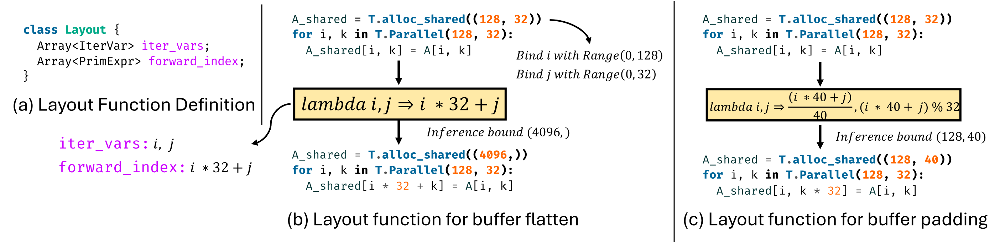

**図 5。** Layout Function のインターフェースと例。

[図 5](#figure-05)(a) は TileLang における `Layout` の定義を示す。主要構成要素には、必要に応じて range 情報を持つ `iter_vars` と、それらの iteration variable に基づいてメモリ位置を計算する `forward_index` expression の集合が含まれる。これらの expression が全体として代数関数 $f : \mathbb{K}^n \to \mathbb{K}^m$ を定義する。[図 5](#figure-05)(b) に示すように、これにより 2D-to-1D layout transformation を表現できる。buffer shape が与えられると、`iter_vars` は特定の region に bind され、得られた expression は arithmetic analyzer へ渡されて symbolic bound または constant bound が決定される。これらの bound は、変換後の buffer shape を推論し、それに応じて buffer access index を調整するために使われる。

TileLang は non-bijective layout transformation もサポートする。例えば[図 5](#figure-05)(c) は、layout を用いて buffer access へ padding を適用する方法を示す。これらの layout transformation は composable であり、TileLang は GPU の共有メモリ bank conflict を緩和するために一般的に使われる layout swizzling など、複数の組込み layout strategy を備える。

さらに TileLang は、**Layout** 抽象を拡張した **Fragment** を導入する。標準 layout と異なり、Fragment Layout は常に $f : \mathbb{K}^n \to \mathbb{K}^2$ という形式の出力を生成し、2 つの出力次元はそれぞれレジスタファイル内でのスレッドの位置と、ローカルレジスタファイルへの index を表す。例えば[図 11](#figure-11)では、カーネルが block-level でレジスタファイル $C_{\mathrm{local}}$ を割り当てる。しかし GPU レジスタファイルは block 内のスレッド間で分割する必要があるため、Fragment Layout はこの分割方式を正確に記述する。

[図 6](#figure-06)(a) は Fragment Layout の定義を示し、TileLang は既存の Fragment Layout の拡張を支援する 4 つの primitive operation を提供する。[図 6](#figure-06)(b) は、`mma_ldmatrix` 命令で `m16k16` matrix fragment に使われる base layout から、完全な block-level layout を導出するためにこれらの primitive を使う例を示す。ここで `base_layout` は、1 つの warp が `m16k16` 行列を消費する layout を表す。この layout は `repeat` primitive によって `warp_layout` へ拡張され、1 つの warp が `m32k16` 行列を消費できるようになる。[図 6](#figure-06)(c) はこの変換を可視化している。さらに `warp_layout` は、`repeat_on_thread` や `replicate` などの primitive によって `block_layout` へ拡張され、4 つの warp が共同で `m128k16` 行列を消費することを表現する。

<span id="figure-06"></span>

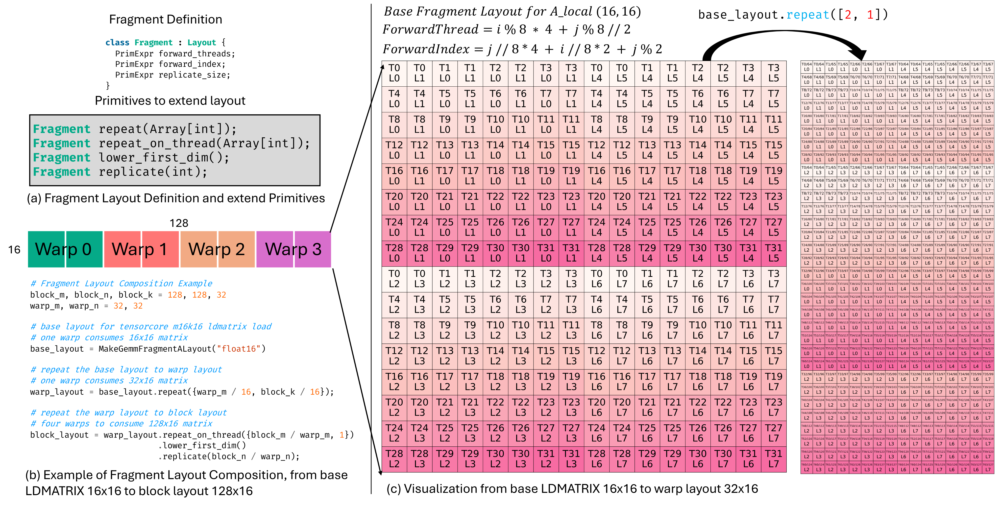

**図 6。** Fragment Layout のインターフェースと例。

### 4.2 Thread Binding

Fragment Layout 抽象を基礎としたとき、実行時にこれらの layout をスレッドへどのようにマッピングするかが主要な課題となる。これは **Thread Binding** 問題につながり、block-level register file を個々のスレッドへどのように分配するか、また適切な fragment layout をどのように推論するかを決める必要がある。さらに、layout constraint に合うようにループを正しく並列化する方法も特定する必要がある。

[4.1 節](#_4-1-memory-layout-composition)は Fragment Layout を導入してこの処理の簡略化を支援するが、任意の計算式に対してすべての buffer に適した fragment layout を決めることは依然として困難である。この処理を導く 2 つの重要な観察がある。第 1 に、複数の tile operator は同じ buffer を共有することが多いため、それぞれの layout と thread binding strategy は相互依存する。第 2 に、layout と thread binding requirement の厳しさは operator ごとに異なる。例えば GPU では、Tensor Core を利用する GEMM operator が layout と thread binding の両方へ厳格な制約を課す一方、element-wise operator は通常より柔軟である。

これらの観察に基づき、buffer layout と thread binding を最適化するため、Layout object と Fragment object に基づく inference scheme を提案する。buffer layout を体系的に管理するため、すべての buffer の layout 情報を記録する LayoutMap を保持する。tile operator layout に階層的な priority system を定義し、高い priority level ほど厳格な layout requirement と大きな性能影響を示す。TileLang は top-down に layout inference を処理し、最も高い priority level から低いものへ順番に layout を推論する。各 priority level では、進展が得られなくなるまですべての未決定 buffer の layout を推論し、その後に次の低い priority level へ進む。

[図 7](#figure-07)に示すように、行列 C が GEMM operation の結果を表して Fragment object に対応し、GEMM 計算後に bias D を加える必要がある状況を考える。GEMM は inference process で最高 priority を持つため、その thread binding configuration は事前決定されているが、D の thread binding strategy は未決定である。出力行列 C は 4×4 次元で、8 スレッドに分散され、各スレッドが 2 要素を担当する。したがって bias buffer D の layout はこの configuration に合わせる必要がある。tensor C の各行は 2 スレッドで処理されるため、加算操作では両方のスレッドが D の同じ要素にアクセスする必要がある。そのため、各スレッドが対応要素へアクセスできるよう D を replicate しなければならない。D の layout も同じ方法で推論できる。

<span id="figure-07"></span>

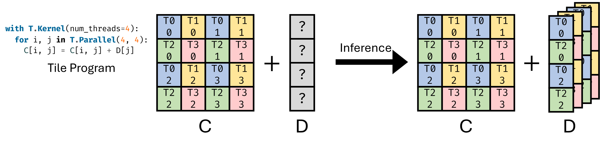

**図 7。** Fragment に対する thread binding inference の例。

[図 8](#figure-08)は thread binding inference process の例を示す。具体的には、[図 8](#figure-08)(a) がデータをコピーする単純なコードスニペットを示し、global memory から shared memory へ subtile を転送するデータフローを記述している。適切な thread binding と vectorized access により GPU の並列性を最大限に活用し、高性能な memory access instruction を利用できる。[図 8](#figure-08)(b) では、`T.copy` operation が複数の loop axis へ展開される。Layout Inference Pass を適用した後、[図 8](#figure-08)(c) に示すようにプログラムは自動的に vectorize および parallelize される。最後に、[図 8](#figure-08)(d) に示す段階で Layout Swizzling を適用する。

<span id="figure-08"></span>

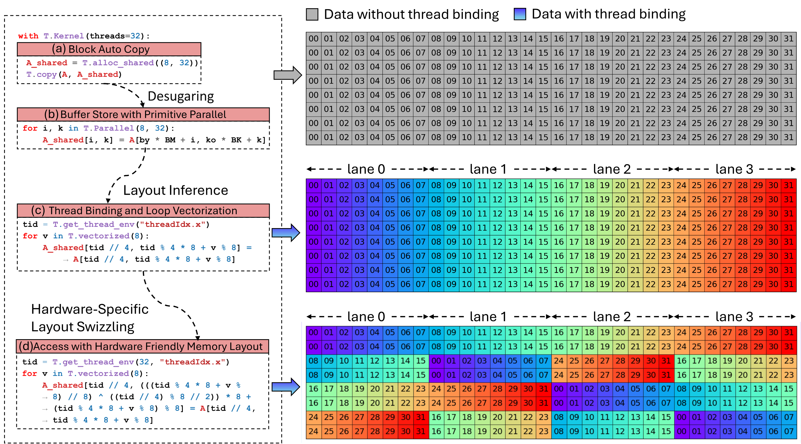

**図 8。** 効率的な並列メモリアクセスのための多段階自動 Thread Binding Inference。

### 4.3 高性能ハードウェア命令の活用

現代のハードウェアアーキテクチャは、同じ計算操作を実装する複数の命令経路をサポートすることが多い。例えば NVIDIA GPU では、8-bit multiply-accumulate operation を複数種類の命令で実現できる。`IMAD` 命令は scalar fused multiply-add operation を実行して $d = a \cdot b + c$ を計算し、すべての operand は内部で 32-bit integer へ昇格して計算される。`DP4A` 命令は vectorized dot-product operation を可能にし、$d = \langle \mathbf{a}, \mathbf{b} \rangle + c = \sum_{i=0}^{3} a_i b_i + c$ を評価する。ここで $\mathbf{a}$ と $\mathbf{b}$ は長さ 4 の 8-bit integer vector であり、bias $c$ と出力 $d$ はともに 32-bit integer precision で表現される。さらに高スループットの行列計算では、`MMA` 命令が Tensor Core を利用して $\mathbf{D} = \mathbf{A} \cdot \mathbf{B} + \mathbf{C}$ を実行する。ここで $\mathbf{A} \in \mathbb{R}^{16 \times 32}, \mathbf{B} \in \mathbb{R}^{32 \times 8}, \mathbf{C}, \mathbf{D} \in \mathbb{R}^{16 \times 8}$ である。この場合、$\mathbf{A}$ と $\mathbf{B}$ は 8-bit integer matrix で、$\mathbf{C}$ と累積結果 $\mathbf{D}$ は 32-bit integer precision を使用する。NVIDIA RTX 3090 GPU 上では、これらの命令のスループットはそれぞれ約 17.8 TOPS、71.2 TOPS、284 TOPS である。さらに `MMA` 命令は、同じ precision setting でさまざまな shape をサポートする。

TileLang では、[図 10](#figure-10)(a) と (b) に示すように、ハードウェア tensor instruction を呼び出す 2 つの方法がある。第 1 の方法（[図 10](#figure-10)(a)）は C++ source injection を用い、`dp4a` のような命令を C++ template で手動ラップし、`T.import_source` と `T.call_extern` を介してカーネルへ注入する。これにより、使い慣れた C-style syntax を活用しながら低水準の制御が可能になる。注入された関数は生成コードの先頭で定義され、カーネル内で呼び出される。別の方法として、[図 10](#figure-10)(b) に示すように、TileLang は inline PTX instruction（`mma.m16n8k32.row.col.s32.s8.s8.s32` など）をカーネル内で直接発行できる組込み `T.ptx` primitive を提供する。これは特に warp-level operation で専用命令を利用するための、もう 1 つの低水準機構となる。

<span id="figure-09"></span>

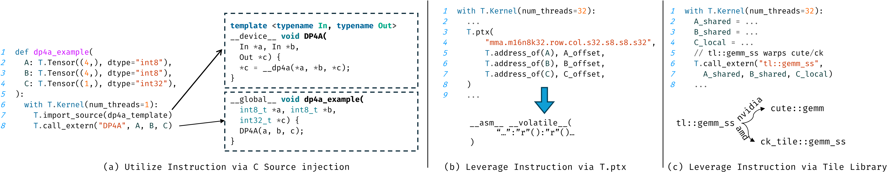

**図 9。** `tilelang` で高性能ハードウェア命令を使用する異なる方法

しかし、入力 shape と data type に基づいて最適な命令を選ぶことは難しい場合がある。この処理を簡略化するため、TileLang は[図 10](#figure-10)(c) に示す Tile Library との統合もサポートする。NVIDIA の `cute` や AMD の `composable kernel (ck)` などの Tile Library は、GEMM のような操作に高水準で標準化された tile-based API（`tl::gemm_ss` など）を提供する。これらのライブラリはハードウェア固有の詳細を抽象化し、与えられた入力 configuration に対して最も効率的な命令を基礎実装が自動選択できるようにする。TileLang では、開発者が `T.call_extern` を用いて、これらのライブラリを直接的かつ一貫した方法で呼び出せる。

要約すると、TileLang は高性能命令を活用する 2 つの相補的な方法を提供する。第 1 の方法は Tile Library を利用し、統合を簡略化してベンダー最適化された性能の恩恵を受ける。ただし、高水準の抽象化は低水準の制御を制限する場合がある。例えば `cute::gemm_ss` インターフェースは共有メモリ入力で GEMM operation を行うが、shared memory から register へのデータフローは `cute` template が内部管理する。そのため外部から internal layout を注釈または上書きできず、柔軟性が低下する。さらに、template の多用によってコンパイルが大幅に遅くなる可能性がある。NVCC 12.8 trace tool を用いた解析では、`tilelang` が生成する CUDA コードのコンパイル時間の約 90% を template expansion が占めることが示された。

<span id="figure-10"></span>

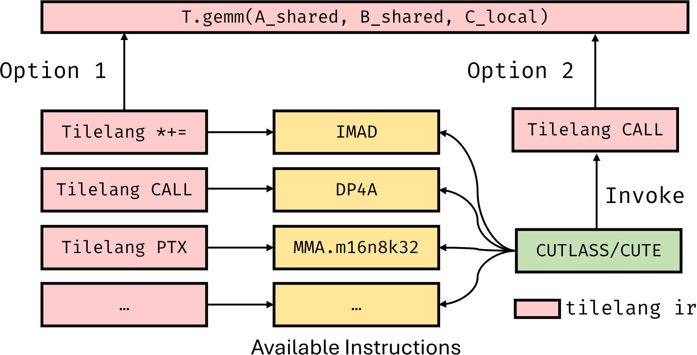

**図 10。** `tilelang` で `DP4A` と `mma` を使用する異なる方法

一方、TileLang は `tilelang` 自体を用いて `T.gemm` から命令を直接実装できる。これにより layout annotation の制約を避け、コンパイル時間を短縮できる。ただし、各ターゲットハードウェア命令について、完全な instruction set を `tilelang` 内でユーザーが実装する必要がある。現在 TileLang は両方の方法をサポートし、新しいハードウェア命令を迅速にサポートできるよう、デフォルトでは Tile Library ベースの方法を使用する。

### 4.4 Software Defined Pipeline

TileLang は自動 software pipeline inference mechanism を用い、計算ブロック（この場合は Copy と GEMM）間の依存関係を解析し、正しい実行順序を保ちながら並列性を最大化する構造化 pipeline schedule を生成する。具体的には、Copy task を他の compute-intensive operation と交互に配置してアイドル時間を減らし、非同期処理の機会を検出すると、それらの task を利用可能なハードウェアリソースへ自動マッピングして並行実行する。その結果、TileLang はユーザーへ単一の `num_stages` インターフェースだけを公開すればよく、処理を大幅に簡略化できる。ただし必要に応じて、ユーザーが順序と stage の情報を明示的に与えることもできる。

<span id="figure-11"></span>

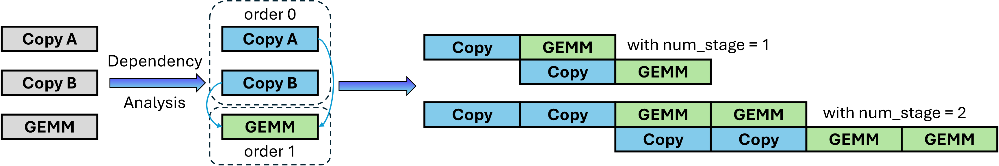

**図 11。** TileLang における software pipeline scheduling。この図は、TileLang が Copy と GEMM をどのように交互配置するかを示す。

Ampere アーキテクチャ向けに、TileLang は `cp.async` を用いた asynchronous memory copy operation をサポートする。`cp.async` 命令は global memory と shared memory 間の高速データ移動を可能にし、メモリ転送と計算を重ね合わせて性能を高める。TileLang はループ構造を解析し、適用可能なメモリ転送へ `cp.async` 命令を自動挿入することで、この機能を統合する。さらに TileLang は、同期処理のために `cp.async.commit` と `cp.async.wait` が正しく使われることを保証し、データの正しさを確保する。この最適化はレジスタファイルへの圧力を緩和し、ハードウェア帯域幅をより効率的に利用できるため、特に有効である。

Hopper アーキテクチャでは 2 つの新機能が導入された。第 1 に、global memory と shared memory 間のデータコピーを担当する専用ハードウェアユニットとして、新しい TMA unit が導入された。第 2 に、PTX instruction set は、4 つの warp からなる warpgroup が matrix multiplication（MMA）operation を実行し、TensorCore utilization を高める新しい wgmma instruction を導入した。さらに `wgmma.mma_async` instruction は非同期である。加えて、Hopper アーキテクチャのカーネル最適化では一般に warp specialization を用い、スレッドを producer と consumer に分割する。producer thread は TMA でデータを移動し、consumer thread が計算を担当する。

TileLang では、lowering process 中に warp specialization optimization を自動実行する。具体的には、TileLang がすべての statement の buffer usage を解析し、その role（producer または consumer）を決定する。この解析に基づき、producer と consumer は threadIdx に応じて異なる実行パスへ分割される。計算の正しさを保証するため、TileLang は Live Variable Analysis を利用して適切な同期点を決め、memory barrier（mbarrier）を適宜挿入する。

AMD CDNA アーキテクチャも asynchronous copy instruction と DMA support を提供しており、TileLang は HIP でラップした Copy primitive を通じてこれらを利用する。具体的には、`s_waitcnt lgkmcnt` や `buffer_load_dword lds` などの命令を用いてメモリ転送を効率的に管理する。この統合により、データ移動と計算を重ね合わせるハードウェア能力を最大限に活用し、pipeline performance をさらに高め、アイドル時間を削減できる。

## 5 数値実験

本節では、多様なハードウェアプラットフォームとワークロードにわたる一連の包括的な数値実験を通じて TileLang の性能を評価した。目的は、現代の機械学習ワークロードの中核を成す主要な operator kernel の最適化における TileLang の有効性、汎用性、スケーラビリティを実証することである。最先端のソリューションとベンチマーク比較することで、mixed-precision computation を扱う TileLang の汎用性と、複数の GPU アーキテクチャで大幅な性能向上をもたらす能力の両方を明らかにする。

### 5.1 実験設定

**ハードウェアプラットフォーム。** NVIDIA と AMD の GPU は最も広く使われるアクセラレータであるため、その両方で TileLang を評価する。実験には 3 つの最先端 GPU、NVIDIA H100（80 GB）[Nvi23]、NVIDIA A100（80 GB）[Nvi20]、AMD Instinct MI300X（192 GB）[Amd23] を使用する。NVIDIA H100 では CUDA 12.4、MI300X では ROCm 6.1.0 を使用する。すべてのプラットフォームで Ubuntu 20.04 を実行する。

**Operator workload。** 大規模深層学習パイプラインで頻繁に現れる各種 operator workload 上で TileLang を評価する。NVIDIA H100 では multi-head attention（MHA）、linear attention、general matrix multiplication（GEMM）に焦点を当てる。NVIDIA A100 では dequantized GEMM kernel の性能を測定する。一方、AMD Instinct MI300X では GEMM と MHA の両方をベンチマークし、異なる GPU アーキテクチャにまたがる代表的なユースケースを捉える。これらのワークロードは、大規模言語モデルを含む多くの現代的ニューラルネットワークモデルの基礎的構成要素である。

**ベースライン。** TileLang の性能を評価するため、機械学習と GPU プログラミングで広く使われる複数の最先端ベースラインと比較する。これには、`tma` や `wgmma.mma_async` のような CUDA 命令を使って multi-head attention 向けに最適化された **FlashAttention-3**、Nvidia と AMD の GPU をサポートするが手動最適化を必要とする効率的な GPU カーネル用オープンソースフレームワーク **Triton**、NVIDIA の高性能 dense linear algebra library **cuBLAS**、AMD の BLAS library **rocBLAS**、GEMM や FlashAttention-2 のような手動最適化カーネルを備えるが完全には最適化されていない **PyTorch**、$W_{\mathrm{NF}4}A_{\mathrm{FP}16}$ などの形式をサポートして効率的なカーネルを提供する **BitsandBytes**、$W_{\mathrm{INT}4}A_{\mathrm{FP}16}$ 計算向けに高度に最適化されたカーネルである **Marlin** が含まれる。この選択により、TileLang を多様な最適化戦略とハードウェア互換性にわたって包括的に比較できる。

### 5.2 実験

**Flash Attention の性能。** FlashAttention-3、Triton、PyTorch と比較し、TileLang はそれぞれ $1.36\times$、$1.41\times$、$1.70\times$ の高速化を達成する。FlashAttention-3 は手作業で作られたアプローチであるため、さまざまなワークロードサイズへ効率的に適応できない。特に固定 tile size により、短いシーケンス長では性能が最適以下になる。長いシーケンス長（8k など）では、TileLang の性能は FlashAttention-3 に近いままである。PyTorch は手動最適化された FlashAttention-2 kernel を使用しており、FlashAttention-3 より低い性能となる。

<span id="figure-12"></span>

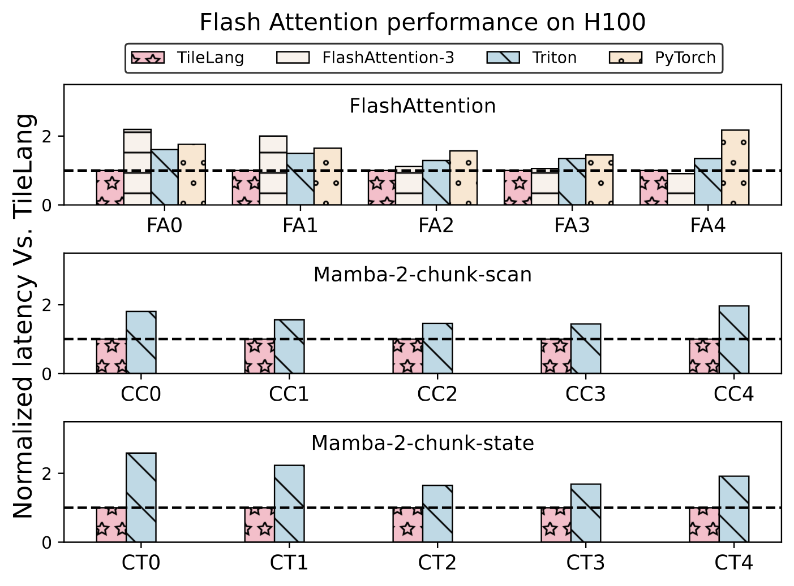

**図 12。** Hopper Architecture における FlashAttention と LinearAtten の性能。

これらの手動 template-based implementation と比較して、TileLang は `cp.async.bulk` や `wgmma.mma_async` などの命令を自動利用し、warp specialization のような最適化も自動適用できる。特に H100 GPU 上では、TileLang は FlashAttention-3 で使われるものと同程度に複雑な pipeline scheduling scheme を表現できる。

**Linear Attention の性能。** Linear Attention の実験では、Mamba-2 の chunk-scan と chunk-state function を使用する。Triton と比較して、TileLang は平均 $1.77 \times$ と $2.10\times$ の高速化を達成する。

<span id="figure-13"></span>

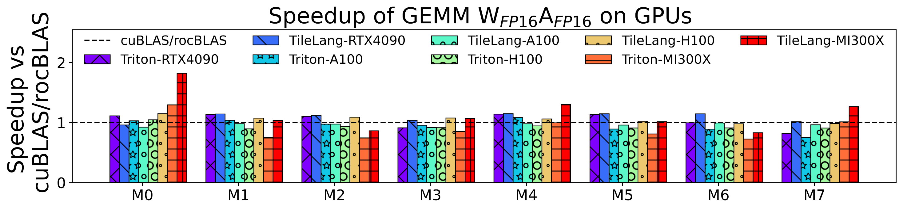

**図 13。** Nvidia および AMD GPU 上の GEMM 性能。

<span id="figure-14"></span>

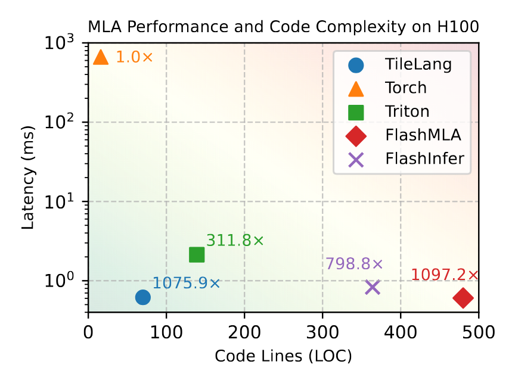

**図 14(a)。** H100 上の MLA 性能とコード行数。

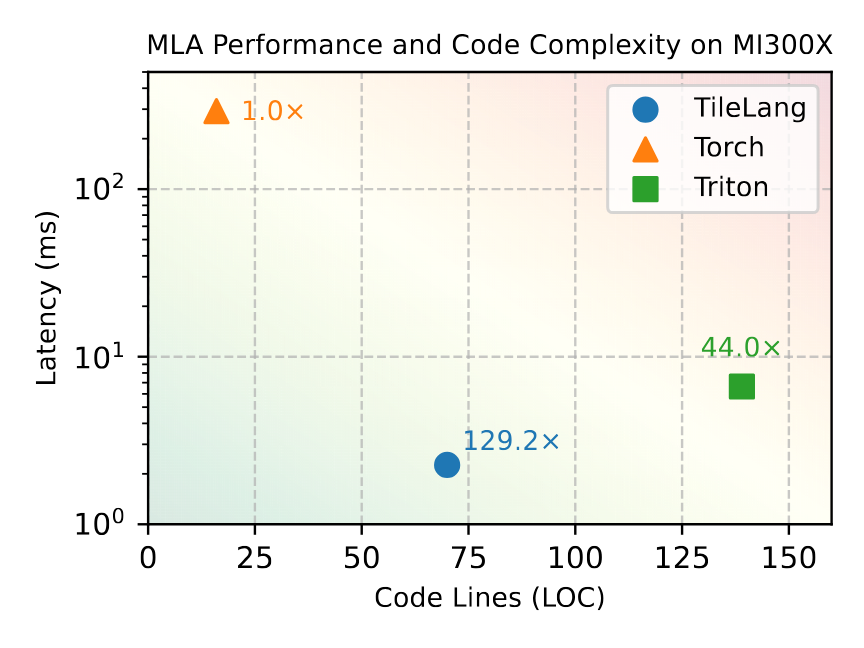

**図 14(b)。** MI300X 上の MLA 性能とコード行数。

**図 14。** H100 と MI300X 上の MLA 性能およびコード行数の比較。

**Multi-Head Latent Attention の性能。**

[図 14](#figure-14)は、H100 と MI300X の GPU 上における MLA の性能と、対応するカーネル実装のコード行数（LOC）を示す。H100 では TileLang が Torch に対して $1075.9\times$ の高速化を達成し、Triton と FlashInfer の両方を大幅に上回り、手動最適化された FlashMLA implementation の性能の最大 98% に達する。さらに TileLang は約 70 行の Python コードしか必要とせず、他のベースラインより大幅に優れた使いやすさを示す。MI300X では TileLang が Torch に対して $129.2\times$ の高速化を達成し、性能とコードの簡潔さの両面で Triton を上回る。手書きライブラリ AITER と比較して、TileLang はその性能の 95% を達成する。AITER のカーネル実装はオープンソースではないため、LOC を図に含めていない。

**Matmul の性能。**

[図 13](#figure-13)は NVIDIA と AMD の GPU 上における GEMM workload の性能を示し、TileLang を Triton およびベンダー最適化ライブラリと比較している。RTX 4090、A100、H100、MI300X 上で、TileLang はベンダーライブラリに対してそれぞれ $1.10\times$、$0.97\times$、$1.00\times$、$1.04\times$ の高速化を達成する。Triton との比較では、同じ GPU 上でそれぞれ $1.08\times$、$1.03\times$、$1.13\times$、$1.25\times$ の高速化を実現する。行列乗算では、TileLang は単純な構文でベンダー最適化ライブラリに匹敵する性能を達成する。さらに Layout Swizzling を用いることで、すべてのテストデバイスで bank conflict-free execution を保証する。

**Dequantize Matmul の性能。**

<span id="figure-15"></span>

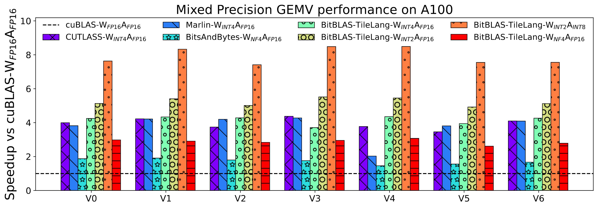

**図 15。** A100 GPU 上の Dequantize Matmul 性能。

BitBLAS は mixed-precision computation 向けの高性能ライブラリであり、tensor numerical type と property のための高度な custom type system と scheduling を備える。当初は TensorIR 上に構築されていたが、その基礎バックエンドを TileLang に置き換え、他の mixed-precision acceleration library と直接比較できるようにした。cuBLAS-$W_{\mathrm{FP}16}A_{\mathrm{FP}16}$ と比較し、TileLang は BitBLAS-TileLang-$W_{\mathrm{INT}2}A_{\mathrm{INT}8}$ configuration により最大 $7.65\times$ の高速化を達成する。さらに $W_{\mathrm{INT}4}A_{\mathrm{FP}16}$ 形式では、本アプローチは Marlin より平均 $1.04\times$ 高速であり、$W_{\mathrm{NF}4}A_{\mathrm{FP}16}$ 形式では BitsandBytes に対して平均 $1.62\times$ 高速である。thread-level programming interface を公開し、data layout と pipeline configuration の制御を可能にすることで、TileLang は開発者にさらに細粒度の最適化能力を提供する。例えば開発者は PTX-based fast numerical precision conversion instruction を利用し、Ladder を活用して tile 内でより滑らかなメモリアクセスを実現できる。これらの最適化を Triton で実装することは難しく、TileLang は Triton が実現しにくい優れた性能を独自に提供できる。

## 6 結論と議論

現代のハードウェアアクセラレータ向け高性能カーネルを記述する課題に対処するため、本論文は tile 粒度でプログラミングできる Python-like domain-specific language（DSL）である TileLang を導入する。Triton と異なり、TileLang はフロントエンドでハードウェアメモリ階層の各レベルにバッファを明示的に宣言でき、Layout Inference mechanism によってバッファ操作を効率的に並列化する。これは、ユーザーが並列化の実装方法を意識せず、バッファの計算ロジックだけを記述すればよいことを意味する。同時に TileLang は、専門家がバッファ操作時の個々のスレッドの正確な動作を明示指定できる柔軟性を提供する。このアプローチは使いやすさと細粒度制御の間でバランスを取り、柔軟性と性能の両方を提供する。

ThunderKittens [Thu24] と比較して、TileLang は開発者が完全に Python でプログラミングでき、pipelining などの最適化詳細をデフォルトで抽象化するため、プログラミング処理を簡略化する。例えば Flash Attention implementation では、TileLang は Ampere GPU 上のデータ移動に async copy を自動使用し、Hopper GPU 上では pipeline を TMA へ lower する。それでも TileLang は、必要に応じてユーザーがフロントエンドで pipelining を明示実装する選択肢を提供する。さらに TileLang は dynamic parameter、dynamic shape、その他の高度な機能を強力にサポートし、カーネルライブラリの記述に特に有用である。

また、将来 TileLang を拡張、強化する有望な方向をいくつか議論したい。第 1 に、TileLang に基づく self-hosting Tile Library を構築し、組込み operator が現在依存している CUTLASS と手動ラップされた CUDA/HIP コードを不要にする予定である。第 2 に、tile-level communication primitive と scheduling policy を導入し、さまざまな分散シナリオをサポートするよう TileLang を拡張する。これにより、特定の通信および計算リソース構成に合わせた高性能カーネルを実装できるようになる。さらに、TileLang の cost model の設計を調査する予定である。thread mapping の詳細を明示的に公開する tile-based programming paradigm では、memory access pattern と計算動作が明確に定義されるため、ハードウェア動作の解析が容易になり、より有効な cost model を開発できる。最後に、動的に変化する次元を持つプログラムへ最適な tile configuration を選ぶことに焦点を当て、dynamic shape tuning の最適化を探求する。TileLang の設計がメモリ階層を明示的に公開することは、CPU、NPU、その他の多様なハードウェアプラットフォーム向けバックエンドのサポートにも役立つ。multi-backend support を拡張する汎用設計アプローチを探求し、TileLang を多様なハードウェアアーキテクチャへシームレスに適応できるようにする。

将来の開発とコミュニティからの貢献を支援するため、本システムはオープンソース化されている：<https://github.com/tile-ai/tilelang>。

## 付録 A ベンチマークにおける operator shape

|   | V0 | V1 | V2 | V3 | V4 | V5 | V6 | V7 |
| --- | ---: | ---: | ---: | ---: | ---: | ---: | ---: | ---: |
| m | 1 | 1 | 1 | 1 | 1 | 1 | 1 | 1 |
| n | 16384 | 43008 | 14336 | 57344 | 14336 | 9216 | 36864 | 9216 |
| k | 16384 | 14336 | 14336 | 14336 | 57344 | 9216 | 9216 | 36864 |
|   | M0 | M1 | M2 | M3 | M4 | M5 | M6 | M7 |
| m | 4096 | 4096 | 4096 | 4096 | 8192 | 8192 | 8192 | 8192 |
| n | 1024 | 8192 | 28672 | 8192 | 1024 | 8192 | 28672 | 8192 |
| k | 8192 | 8192 | 8192 | 28672 | 8192 | 8192 | 8192 | 28672 |

**表 2。** ベンチマークにおける行列 shape。

|   | FA0 | FA1 | FA2 | FA3 | FA4 |
| --- | ---: | ---: | ---: | ---: | ---: |
| batch | 1 | 1 | 1 | 1 | 1 |
| nheads | 32 | 32 | 32 | 32 | 32 |
| seq_len | 512 | 512 | 1024 | 1024 | 4096 |
| head_dim | 128 | 128 | 128 | 128 | 128 |
| causal | true | false | true | false | true |

**表 3。** ベンチマークにおける FlashAttention shape。

|   | CC0 | CC1 | CC2 | CC3 | CC4 | CC5 |
| --- | ---: | ---: | ---: | ---: | ---: | ---: |
| batch | 1 | 1 | 1 | 64 | 64 | 64 |
| nheads | 64 | 64 | 64 | 64 | 64 | 64 |
| seq_len | 1024 | 2048 | 8192 | 1024 | 2048 | 8192 |
| head_dim | 64 | 64 | 64 | 64 | 64 | 64 |
| d_state | 128 | 128 | 128 | 128 | 128 | 128 |
|   | CT0 | CT1 | CT2 | CT3 | CT4 | CT5 |
| batch | 1 | 1 | 1 | 64 | 64 | 64 |
| nheads | 64 | 64 | 64 | 64 | 64 | 64 |
| seq_len | 1024 | 2048 | 8192 | 1024 | 2048 | 8192 |
| head_dim | 64 | 64 | 64 | 64 | 64 | 64 |
| d_state | 128 | 128 | 128 | 128 | 128 | 128 |

**表 4。** ベンチマークにおける Linear Attention shape。

## 付録 B カーネル実装

### B.1 行列乗算（Matmul）

```python
@tilelang.jit
def Matmul(A: T.Tensor, B: T.Tensor, C: T.Tensor):
  with T.Kernel(N // block_N, M // block_M,
    threads=threads) as (bx, by):
    A_shared = T.alloc_shared(block_M, block_K)
    B_shared = T.alloc_shared(block_K, block_N)
    C_local = T.alloc_fragment(block_M, block_N)

    T.clear(C_local)
    for k in T.Pipelined(K // block_K, num_stages=2):
        T.copy(A[by * block_M, k * block_K], A_shared)
        T.copy(B[k * block_K, bx * block_N], B_shared)
        T.gemm(A_shared, B_shared, C_local)

    T.copy(C_local, C[by * block_M, bx * block_N])
```

**図 16。** 行列乗算のカーネル実装。

### B.2 Dequantized Matrix Multiplication

```python
@tilelang.jit
def matmul_fp16_fp4(
    A: T.Tensor(A_shape, in_dtype),
    B: T.Tensor(B_shape, storage_dtype),
    Ct: T.Tensor((N, M), out_dtype),
):
    with T.Kernel(T.ceildiv(N, block_N), T.ceildiv(M, block_M), threads=threads) as (bx, by):
        A_shared = T.alloc_shared(A_shared_shape, in_dtype)
        B_shared = T.alloc_shared(B_shared_shape, storage_dtype)
        B_local = T.alloc_fragment(B_shared_shape, storage_dtype)
        B_dequantize_local = T.alloc_fragment(B_dequantize_shared_shape, in_dtype)
        Ct_local = T.alloc_fragment((block_N, block_M), accum_dtype)

        T.clear(Ct_local)
        for k in T.Pipelined(
            T.ceildiv(K, block_K),
            num_stages=num_stages
        ):
            T.copy(A[by * block_M, k * block_K], A_shared)
            T.copy(B[bx * block_N, k * block_K // num_elems_per_byte], B_shared)
            T.copy(B_shared, B_local)
            for i, j in T.Parallel(block_N, block_K):
                B_dequantize_local[i, j] = _tir_packed_to_unsigned_convert("int", 8)(
                    num_bits,
                    B_local[i, j // 2],
                    j % 2,
                    dtype=in_dtype,
                )
            T.gemm(B_dequantize_local, A_shared, Ct_local, transpose_B=True)
        T.copy(Ct_local, Ct[bx * block_N, by * block_M])
```

**図 17。** TileLang を用いた Weight-Only Quantization（$W_{\mathrm{FP4\_E2M1}}A_{\mathrm{FP16}}$）Matmul の実装。単純な形式による mixed-precision computation のサポートを示す。

### B.3 FlashMLA Implementation

```python
@tilelang.jit
def flash_attn(
        Q: T.Tensor([batch, heads, dim], dtype),
        Q_pe: T.Tensor([batch, heads, pe_dim], dtype),
        KV: T.Tensor([batch, seqlen_kv, kv_head_num, dim], dtype),
        K_pe: T.Tensor([batch, seqlen_kv, kv_head_num, pe_dim], dtype),
        Output: T.Tensor([batch, heads, dim], dtype),
):
    with T.Kernel(batch, heads // min(block_H, kv_group_num), threads=256) as (bx, by):
        Q_shared = T.alloc_shared([block_H, dim], dtype)
        S_shared = T.alloc_shared([block_H, block_N], dtype)
        Q_pe_shared = T.alloc_shared([block_H, pe_dim], dtype)
        KV_shared = T.alloc_shared([block_N, dim], dtype)
        K_pe_shared = T.alloc_shared([block_N, pe_dim], dtype)
        O_shared = T.alloc_shared([block_H, dim], dtype)
        acc_s = T.alloc_fragment([block_H, block_N], accum_dtype)
        acc_o = T.alloc_fragment([block_H, dim], accum_dtype)
        scores_max = T.alloc_fragment([block_H], accum_dtype)
        scores_max_prev = T.alloc_fragment([block_H], accum_dtype)
        scores_scale = T.alloc_fragment([block_H], accum_dtype)
        scores_sum = T.alloc_fragment([block_H], accum_dtype)
        logsum = T.alloc_fragment([block_H], accum_dtype)

        cur_kv_head = by // (kv_group_num // block_H)
        T.use_swizzle(10)

        T.copy(Q[bx, by * VALID_BLOCK_H:(by + 1) * VALID_BLOCK_H, :], Q_shared)
        T.copy(Q_pe[bx, by * VALID_BLOCK_H:(by + 1) * VALID_BLOCK_H, :], Q_pe_shared)
        T.fill(acc_o, 0)
        T.fill(logsum, 0)
        T.fill(scores_max, -T.infinity(accum_dtype))

        loop_range = T.ceildiv(seqlen_kv, block_N)
        for k in T.Pipelined(loop_range, num_stages=2):
            T.copy(KV[bx, k * block_N:(k + 1) * block_N, cur_kv_head, :], KV_shared)
            T.copy(K_pe[bx, k * block_N:(k + 1) * block_N, cur_kv_head, :], K_pe_shared)
            T.clear(acc_s)
            T.gemm(
                Q_shared, KV_shared, acc_s, transpose_B=True, policy=T.GemmWarpPolicy.FullCol)
            T.gemm(
                Q_pe_shared,
                K_pe_shared,
                acc_s,
                transpose_B=True,
                policy=T.GemmWarpPolicy.FullCol)
            T.copy(scores_max, scores_max_prev)
            T.fill(scores_max, -T.infinity(accum_dtype))
            T.reduce_max(acc_s, scores_max, dim=1, clear=False)
            for i in T.Parallel(block_H):
                scores_scale[i] = T.exp2(scores_max_prev[i] * scale - scores_max[i] * scale)
            for i, j in T.Parallel(block_H, block_N):
                acc_s[i, j] = T.exp2(acc_s[i, j] * scale - scores_max[i] * scale)
            T.reduce_sum(acc_s, scores_sum, dim=1)
            T.copy(acc_s, S_shared)
            for i in T.Parallel(block_H):
                logsum[i] = logsum[i] * scores_scale[i] + scores_sum[i]
            for i, j in T.Parallel(block_H, dim):
                acc_o[i, j] *= scores_scale[i]
            T.gemm(S_shared, KV_shared, acc_o, policy=T.GemmWarpPolicy.FullCol)
        for i, j in T.Parallel(block_H, dim):
            acc_o[i, j] /= logsum[i]
        T.copy(acc_o, O_shared)
        T.copy(O_shared, Output[bx, by * VALID_BLOCK_H:(by + 1) * VALID_BLOCK_H, :])
```

**図 18。** TileLang を用いた FlashMLA の実装。
