> [Woosuk Kwon](https://woosuk.me/), [Zhuohan Li](https://zhuohan.li/), [Siyuan Zhuang](https://dblp.org/pid/259/1800), [Ying Sheng](https://x.com/ying11231), [Lianmin Zheng](https://lmzheng.net/), [Cody Hao Yu](https://comaniac.github.io/), [Joseph E. Gonzalez](https://people.eecs.berkeley.edu/~jegonzal/), [Hao Zhang](https://haozhang.ai/), and [Ion Stoica](http://www.cs.berkeley.edu/~istoica/). arXiv 初回投稿日: September 12, 2023; 現行版は v1. [Efficient Memory Management for Large Language Model Serving with PagedAttention](https://arxiv.org/abs/2309.06180). [原 PDF](/paper/vllm.pdf). [TeX ソース](https://export.arxiv.org/e-print/2309.06180). 正確な印刷レイアウトと参考文献については原 PDF を正本とする.

（2023）

## 要約

大規模言語モデル（LLM）の高スループットサービングには、同時に十分な数のリクエストをバッチ処理することが必要です。しかし、既存のシステムは、各リクエストのキー・バリューキャッシュ（KVキャッシュ）メモリが非常に大きく、動的に増減するため、苦戦しています。非効率的に管理されると、このメモリは断片化や重複によって大幅に無駄になり、バッチサイズが制限されます。この問題に対処するために、我々はPagedAttentionを提案します。これは、オペレーティングシステムの古典的な仮想メモリとページング技術に着想を得たアテンションアルゴリズムです。その上に、我々はvLLMを構築しました。これはLLMサービングシステムで、（1） KVキャッシュメモリのほぼゼロの無駄を達成し、（2） リクエスト間およびリクエスト内でKVキャッシュを柔軟に共有してメモリ使用量をさらに削減します。我々の評価では、vLLMは人気のあるLLMのスループットを、FasterTransformerやOrcaなどの最先端システムと比較して、同じ待機時間で2～4$\times$向上させることが示されました。この改善は、シーケンスが長いモデル、大規模モデル、より複雑なデコーディングアルゴリズムにおいてより顕著です。vLLMのソースコードは[https://github.com/vllm-project/vllm](https://github.com/vllm-project/vllm]で公開されています。

[+1] [+2] [+3] [+4] [+5] [+6]

## 1\. はじめに

GPT [OpenAa23, Browne20] や PaLM [Chowdb22] のような大規模言語モデル（*LLMs*）の出現により、プログラミングアシスタント [Githua00, Chena21] やユニバーサルチャットボット [Blog22, Bard23] といった新しいアプリケーションが可能になり、私たちの仕事や日常生活に深い影響を与え始めています。多くのクラウド企業 [OpenAI20, Servic23] が、これらのアプリケーションをホスト型サービスとして提供するために競争しています。しかし、これらのアプリケーションを実行するには非常に高い費用がかかり、GPU などの大量のハードウェアアクセラレータが必要です。最近の推定によると、LLM のリクエストを処理するコストは従来のキーワードクエリ [Reuter23] の10$\times$ 倍に達する可能性があります。これらの高コストを考えると、*LLM サービング* システムのスループットを向上させ、リクエストあたりのコストを削減することがますます重要になっています。

[+7]

LLM の中核には自己回帰型トランスフォーマーモデル [Vaswac17] が存在します。このモデルは、入力（プロンプト）とこれまでに生成した出力のトークンのシーケンスに基づいて、単語（トークン）を*1つずつ*生成します。各リクエストごとに、この高コストなプロセスがモデルが終了トークンを出力するまで繰り返されます。この逐次生成プロセスにより、ワークロードは*メモリ制約*となり、GPU の計算能力が十分に活用されず、サービングのスループットが制限されます。

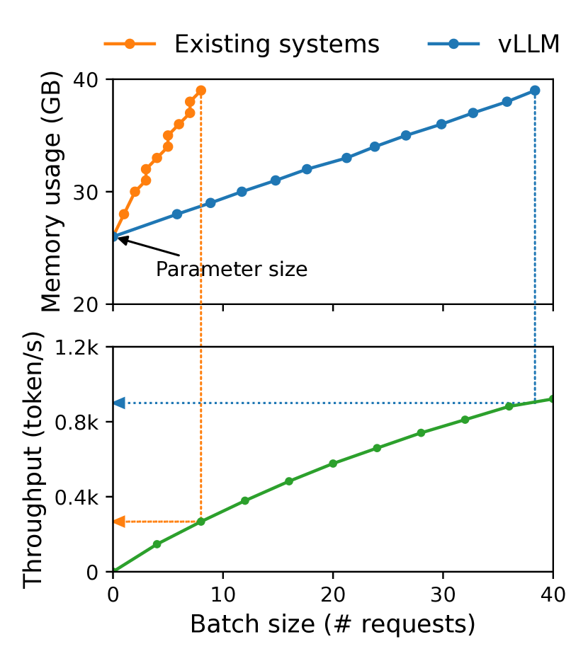

**図1.** *左：* NVIDIA A100で13BパラメータのLLMを提供する際のメモリ配置。パラメータ（灰色）は提供中ずっとGPUメモリに保持される。KVキャッシュ（赤）のメモリは、提供リクエストごとに（割り当て・解放）される。少量のメモリ（黄色）は、アクティベーションのために一時的に使用される。*右：* vLLMは、既存システム[Fastea00, Refd22]で見られるKVキャッシュメモリの急速な成長曲線を平滑化し、提供スループットの著しい向上につながる。

スループットを向上させるには、複数のリクエストをまとめてバッチ処理することが可能です。しかし、バッチで多くのリクエストを処理するには、各リクエストのメモリ領域を効率的に管理する必要があります。例えば、[図1](#figure-01)（左）は、NVIDIA A100 GPU（40GB RAM）上での13BパラメータLLMのメモリ分布を示しています。メモリの約65％はモデルの重みとして割り当てられており、サービング中は固定されています。約30％のメモリはリクエストの動的状態を保存するために使用されます。Transformerでは、これらの状態は注意機構に関連するキーおよびバリューのテンソルで構成され、一般に*KVキャッシュ* [Popea22]と呼ばれ、以前のトークンからのコンテキストを表し、新しい出力トークンを順次生成するために使用されます。残りのわずかなメモリは、LLMを評価する際に生成される一時的なテンソルであるアクティベーションを含むその他のデータに使用されます。モデルの重みは固定されており、アクティベーションはGPUメモリの一部しか占有しないため、KVキャッシュの管理方法が最大バッチサイズを決定する上で重要です。非効率的に管理される場合、KVキャッシュのメモリはバッチサイズを大幅に制限し、その結果、LLMのスループットを制約する可能性があります。これは[図1](#figure-01)（右）に示されています。

本稿では、既存のLLMサービングシステム[Refd22, Fastea00]がKVキャッシュメモリを効率的に管理できていないことを観察する。これは主に、彼らがリクエストのKVキャッシュを連続したメモリ空間に格納するためである。ほとんどのディープラーニングフレームワーク[Paszka19, Olston17]は、テンソルを連続したメモリに格納することを要求する。しかし、従来のディープラーニングワークロードのテンソルとは異なり、KVキャッシュには独自の特性がある。それは、モデルが新しいトークンを生成するにつれて動的に増減し、その寿命と長さは事前にはわからない、というものである。これらの特性により、既存システムのアプローチは、次の二つの点で著しく非効率になる：

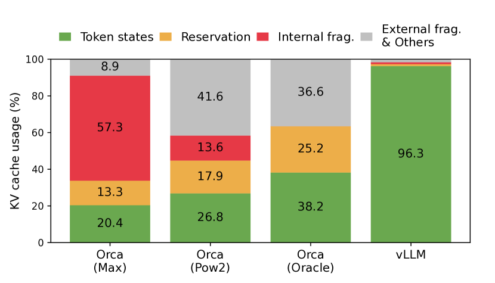

**図2.** §[6.2](#S6.SS2) の実験中、異なるLLMサービングシステムにおけるメモリ無駄遣いの平均割合。

まず、既存のシステム [Refd22, Fastea00] は内部および外部メモリの断片化に悩まされています。リクエストのKVキャッシュを連続した領域に格納するために、リクエストの最大長（例えば、2048トークン）に応じた連続したメモリを*事前割り当て*します。リクエストの実際の長さが最大長よりもはるかに短い場合があるため、これは深刻な内部断片化を引き起こす可能性があります（例：[図11](#figure-11)）。さらに、実際の長さが事前にわかっている場合でも、事前割り当ては非効率です：リクエストの寿命中にチャンク全体が予約されるため、他の短いリクエストは現在未使用のチャンク部分を利用できません。加えて、外部メモリの断片化も顕著になる可能性があります。なぜなら、事前割り当てられたサイズはリクエストごとに異なる場合があるからです。実際、[図2](#figure-02) のプロファイリング結果では、既存システムでKVキャッシュメモリのうち実際のトークン状態の保存に使用されるのはわずか20.4% - 38.2%であることが示されています。

次に、既存のシステムではメモリ共有の機会を利用できません。LLMサービスは、並列サンプリングやビームサーチなど、1つのリクエストで複数の出力を生成する高度なデコーディングアルゴリズムを使用することがよくあります。このような場合、リクエストはKVキャッシュを部分的に共有できる複数のシーケンスで構成されます。しかし、既存のシステムでは、シーケンスのKVキャッシュが別々の連続した領域に格納されているため、メモリ共有は不可能です。

上記の制限に対処するために、私たちは *PagedAttention* を提案します。これは、オペレーティングシステム（OS）のメモリ断片化および共有の解決策、すなわち *ページングを用いた仮想メモリ* に着想を得た注意アルゴリズムです。PagedAttention は、リクエストの KV キャッシュをブロックに分割し、各ブロックは固定数のトークンの注意キーと値を含むことができます。PagedAttention では、KV キャッシュのブロックは必ずしも連続した領域に保存されるわけではありません。したがって、KV キャッシュを OS の仮想メモリのようにより柔軟に管理できます：ブロックをページ、トークンをバイト、リクエストをプロセスとして考えることができます。この設計により、比較的小さなブロックを使用して必要に応じて割り当てることで内部断片化が軽減されます。さらに、全てのブロックが同じサイズであるため、外部断片化も解消されます。最後に、同じリクエストに関連する異なるシーケンス間や、異なるリクエスト間でも、ブロック単位でのメモリ共有が可能になります。

本研究では、PagedAttention の上に構築された高スループット分散 LLM サービングエンジン *vLLM* を構築します。これにより、KV キャッシュメモリの無駄をほぼゼロに抑えることができます。vLLM は PagedAttention と共同設計されたブロックレベルのメモリ管理および先取りリクエストスケジューリングを使用します。vLLM は、GPT [Browne20]、OPT [Zhangb22]、LLaMA [Touvra23] など、さまざまなサイズの人気 LLM をサポートしており、その中には単一 GPU のメモリ容量を超えるものも含まれています。さまざまなモデルとワークロードでの評価により、vLLM は最先端システム [Refd22, Fastea00] と比較して LLM サービングスループットを 2-4$\times$ 向上させることが示され、モデル精度には全く影響を与えません。改善の効果は、シーケンスが長い場合、大規模モデルの場合、より複雑なデコーディングアルゴリズムの場合に顕著です（§[4.3](#S4.SS3)）。まとめると、我々は以下の貢献を行います：

- LLM サービングにおけるメモリ割り当ての課題を特定し、それがサービング性能に与える影響を定量化します。
- OS の仮想メモリとページングに触発された、非連続ページメモリに格納された KV キャッシュ上で動作する注意アルゴリズムである PagedAttention を提案します。
- PagedAttention 上に構築された分散 LLM サービングエンジン vLLM を設計および実装します。
- 私たちはさまざまなシナリオでvLLMを評価し、FasterTransformer [Fastea00]やOrca [Refd22]などの従来の最先端ソリューションを大幅に上回ることを示します。

## 2. 背景

本節では、典型的なLLMの生成および提供手順と、LLM提供で使用される反復レベルのスケジューリングについて説明します。

### 2.1. トランスフォーマーベースの大規模言語モデル

言語モデリングのタスクは、トークンのリストの確率をモデル化することです $(x_{1},\ldots,x_{n}).$ 言語には自然な順序があるため、シーケンス全体の結合確率を条件付き確率の積（別名 *自己回帰分解* [Bengio00]）として因数分解することが一般的です：

$$
P(x)=P(x_{1})\cdot P(x_{2}\mid x_{1})\cdots P(x_{n}\mid x_{1},\ldots,x_{n-1}).\tag{1}
$$

トランスフォーマー [Vaswac17] は、大規模で上記の確率をモデル化するための事実上の標準アーキテクチャとなっています。トランスフォーマーベースの言語モデルにおける最も重要な要素は、その *自己注意* レイヤーです。入力隠れ状態のシーケンス $(x_{1},\ldots,x_{n})\in\mathbb{R}^{n\times d}$ に対して、自己注意レイヤーはまず各位置に線形変換を適用して、クエリ、キー、およびバリューのベクトルを取得します $i$：

$$
q_{i}=W_{q}x_{i},\ k_{i}=W_{k}x_{i},\ v_{i}=W_{v}x_{i}.\tag{2}
$$

次に、自己注意レイヤーは、ある位置のクエリベクトルとそれ以前のすべてのキーのベクトルを掛けて注意スコア $a_{\mathrm{ij}}$ を計算し、バリューベクトルの加重平均として出力 $o_{i}$ を計算します：

$$
a_{\mathrm{ij}}=\frac{\exp(q_{i}^{\top}k_{j}/\sqrt{d})}{\sum_{t=1}^{i}\exp(q_{i}^{\top}k_{t}/\sqrt{d})},\ o_{i}=\sum_{j=1}^{i}a_{\mathrm{ij}}v_{j}.\tag{3}
$$

式 [4]（#S4.E4 「式 4 ‣ 4.1. PagedAttention ‣ 4. メソッド ‣ PagedAttention を用いた大規模言語モデルの効率的メモリ管理」） の計算以外にも、埋め込み層、フィードフォワード層、レイヤー正規化 [Refa16]、残差接続 [Refb16]、出力ロジット計算、および式 [2]（#S2.E2 「式 2 ‣ 2.1. Transformer ベース大規模言語モデル ‣ 2. 背景 ‣ PagedAttention を用いた大規模言語モデルの効率的メモリ管理」） におけるクエリ、キー、バリュー変換を含む他のすべての Transformer モデルのコンポーネントは、$y_{i}=f(x_{i}).$ の形式で位置ごとに独立して適用されます。

### 2.2. LLM サービスと自己回帰的生成

一度訓練されると、LLM はしばしば条件付き生成サービス（例：Completion API [OpenAI20] やチャットボット [Blog22, Bard23]）として展開されます。LLM サービスへのリクエストは、*入力プロンプト* トークンのリスト $(x_{1},\ldots,x_{n}),$ を提供し、LLM サービスは式 [1]（#S2.E1 「式 1 ‣ 2.1. Transformer ベース大規模言語モデル ‣ 2. 背景 ‣ PagedAttention を用いた大規模言語モデルの効率的メモリ管理」） に従って出力トークンのリスト $(x_{n+1},\ldots,x_{n+T})$ を生成します。プロンプトと出力リストの連結を *シーケンス* と呼びます。

式[1](#S2.E1)の分解により、LLMは新しいトークンを一度に1つずつしかサンプリングおよび生成できず、各新しいトークンの生成プロセスは、そのシーケンス内のすべての*以前のトークン*、具体的にはそれらのキーとバリューベクトルに依存します。この逐次生成プロセスでは、既存トークンのキーおよびバリューベクトルは、将来のトークンを生成するためにキャッシュされることが多く、これを*KVキャッシュ*と呼びます。1つのトークンのKVキャッシュはそのトークン以前のすべてのトークンに依存することに注意してください。これは、シーケンス内の異なる位置に現れる同じトークンのKVキャッシュが異なることを意味します。

リクエストプロンプトが与えられた場合、LLMサービスの生成計算は2つのフェーズに分解できます：

プロンプトフェーズは、ユーザープロンプト全体$(x_{1},\ldots,x_{n})$を入力として受け取り、最初の新しいトークン$P(x_{n+1}\mid x_{1},\ldots,x_{n})$の確率を計算します。このプロセス中に、キーべクトル$k_{1},\ldots,k_{n}$とバリューベクトル$v_{1},\ldots,v_{n}$も生成されます。プロンプトトークン$x_{1},\ldots,x_{n}$はすべて既知であるため、プロンプトフェーズの計算は、行列-行列積操作を使用して並列化することができます。したがって、このフェーズはGPUに内在する並列性を効率的に利用できます。

自己回帰生成フェーズでは、残りの新しいトークンを順次生成します。$t$ の反復では、モデルは1つのトークン $x_{n+t}$ を入力として受け取り、確率 $P(x_{n+t+1}\mid x_{1},\ldots,x_{n+t})$ をキー ベクトル $k_{1},\ldots,k_{n+t}$ とバリュー ベクトル $v_{1},\ldots,v_{n+t}$ で計算します。位置 $1$ から $n+t-1$ のキーおよびバリュー ベクトルは以前の反復でキャッシュされており、この反復では新しいキーおよびバリュー ベクトル $k_{n+t}$ と $v_{n+t}$ だけが計算されることに注意してください。このフェーズは、シーケンスが最大長（ユーザーが指定するか、LLM によって制限される）に達するか、またはシーケンス終端（*¡eos¿*）トークンが出力されることで完了します。異なる反復での計算はデータ依存性のため並列化できず、しばしば行列-ベクトル積を使用し、効率は低下します。その結果、このフェーズはGPU計算を十分に活用できず、メモリ制約により、単一リクエストの遅延の大部分を占めます。

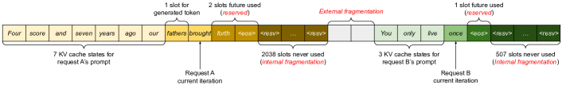

**図3.** 既存システムにおける KV キャッシュメモリ管理。予約済み、内部フラグメンテーション、外部フラグメンテーションの3種類のメモリ無駄が存在し、他のリクエストがメモリに収まるのを妨げます。各メモリスロットのトークンはそのKVキャッシュを表しています。同じトークンであっても、異なる位置では異なるKVキャッシュを持つことがある点に注意してください。

### 2.3. LLMのバッチ処理技術

LLMを提供する際の計算利用率は、複数のリクエストをバッチ処理することで向上させることができます。リクエストは同じモデルの重みを共有するため、重みを移動するオーバーヘッドはバッチ内のリクエストで分散され、バッチサイズが十分に大きい場合には計算のオーバーヘッドによって相殺されることがあります。しかし、LLMサービスへのリクエストをバッチ処理するには2つの理由で簡単ではありません。まず、リクエストが異なるタイミングで到着する可能性があるということです。単純なバッチ戦略では、先に到着したリクエストが後のリクエストを待つか、到着してきたリクエストを先に到着したリクエストが完了するまで遅らせることになり、大きなキュー遅延が発生します。次に、リクエストの入力と出力の長さが大きく異なる場合があります（[図11](#figure-11)）。単純なバッチ処理技術では、リクエストの入力と出力の長さを揃えるためにパディングを行い、GPUの計算とメモリを無駄にします。

この問題に対処するために、セルラーのバッチ[Gao18]や反復レベルのスケジューリング[Refd22]などの細かいバッチ機構が提案されています。従来の手法がリクエストレベルで動作するのとは異なり、これらの手法は反復レベルで動作します。各イテレーションの後、完了したリクエストはバッチから削除され、新しいリクエストが追加されます。したがって、新しいリクエストはバッチ全体が完了するのを待つことなく、単一のイテレーションを待つ後に処理できます。さらに、特殊なGPUカーネルを用いることで、これらの技術は入力と出力のパッドを不要にします。キューの遅延やパディングによる非効率を削減することで、細かいバッチ処理メカニズムはLLMのサービス処理のスループットを大幅に向上させます。

## 3\。LLMサービングにおける記憶の課題

細かいバッチ処理は計算の無駄を減らし、リクエストをより柔軟にバッチ化できるようにしますが、まとめてまとめられるリクエストの数はGPUのメモリ容量、特にKVキャッシュの格納スペースに制約されます。言い換えれば、サービスシステムのスループットは*メモリバウンド*です。このメモリバウンドを克服するには、以下のメモリ管理上の課題に対処する必要があります。

大規模KVキャッシュ。KVキャッシュのサイズはリクエスト数に応じて急速に増加します。例えば、13BパラメータのOPTモデル[Zhangb22]の場合、単一トークンのKVキャッシュは800 KBのスペースを必要とし、計算は以下の通りです：$2$（キーおよびバリューベクトル） $\times\ 5120$（隠れ状態のサイズ） $\times\ 40$（レイヤー数） $\times\ 2$（FP16あたりのバイト数）。OPTは最大2048トークンまでのシーケンスを生成できるため、1リクエストのKVキャッシュを保存するのに必要なメモリは最大1.6 GBに達する可能性があります。現行のGPUのメモリ容量は数十GBです。利用可能なメモリをすべてKVキャッシュに割り当てたとしても、数十リクエストしか処理できません。さらに、非効率的なメモリ管理により、バッチサイズはさらに減少する可能性があります（[図2](#figure-02)参照）。加えて、現在の傾向から、GPUの計算速度はメモリ容量よりも速く増加しています[Gholaa21]。例えば、NVIDIA A100からH100への移行では、FLOPSは2倍以上増加していますが、GPUメモリは最大80GBのままです。したがって、我々はメモリがますます重要なボトルネックになると考えています。

複雑なデコーディングアルゴリズム。LLMサービスは、ユーザーが選択できるさまざまなデコーディングアルゴリズムを提供しており、それぞれメモリ管理の複雑さに異なる影響を与えます。たとえば、ユーザーが単一の入力プロンプトから複数のランダムサンプルを要求する場合、プログラム提案での典型的な使用例 [Githua00] では、実験で総KVキャッシュメモリの12%を占めるプロンプト部分のKVキャッシュ（§[6.3](#S6.SS3)）を共有してメモリ使用量を最小化することができます。一方で、オートリグレッシブ生成フェーズ中のKVキャッシュは、異なるサンプル結果およびそれらのコンテキストや位置依存性のため、共有すべきではありません。KVキャッシュの共有の度合いは、使用される特定のデコーディングアルゴリズムによります。ビームサーチのようなより高度なアルゴリズム [Sutska14] では、異なるリクエストビームがKVキャッシュのより大きな部分（最大55％のメモリ節約、§[6.3](#S6.SS3)参照）を共有でき、共有パターンはデコーディングの進行に伴って変化します。

不明な入力および出力長のスケジューリング。LLMサービスへのリクエストは、入力および出力の長さに変動があります。これにより、メモリ管理システムは幅広いプロンプト長に対応する必要があります。さらに、リクエストの出力長がデコーディング時に増加するにつれて、そのKVキャッシュに必要なメモリも拡大し、既存プロンプトの進行中の生成や新規リクエストのための利用可能なメモリが枯渇する可能性があります。システムは、GPUメモリからいくつかのリクエストのKVキャッシュを削除またはスワップアウトするなどのスケジューリングの決定を行う必要があります。

### 3.1. 既存システムにおけるメモリ管理

現在のほとんどのディープラーニングフレームワークにおける演算子は、[Paszka19, Olston17] テンソルを連続メモリに格納する必要があるため、従来のLLMサービングシステムも[Refd22, Fastea00] 1つのリクエストのKVキャッシュを異なる位置にわたって連続したテンソルとして格納します。LLMからの予測不可能な出力長のため、リクエストの実際の入力や最終的な出力長にかかわらず、リクエストに対して最大シーケンス長に基づくメモリのチャンクを静的に割り当てます。

[図3](#figure-03) は2つのリクエストを示しています：最大シーケンス長2048のリクエストAと、最大512のリクエストBです。既存システムのチャンク事前割り当て方式には、メモリの無駄が主に3つあります：将来のトークンのための*予約*スロット、最大シーケンス長の可能性に対して過剰に割り当てられたことによる*内部断片化*、およびバディアロケータのようなメモリアロケータによる*外部断片化*です。外部断片化は生成されたトークンには決して使用されず、リクエストを処理する前から分かっています。内部断片化も使用されませんが、これはリクエストのサンプリングが完了した後に初めて認識されます。これらは純粋なメモリの無駄です。予約されたメモリは最終的に使用されますが、特に予約スペースが大きい場合、リクエスト全体の期間にわたってこのスペースを確保すると、他のリクエストを処理するために使用できるスペースが占有されます。[図2](#figure-02) において、我々の実験での平均メモリ無駄の割合を可視化しており、以前のシステムでの実際の有効メモリが20.4%まで低下することが分かります。

断片化に対する潜在的な解決策としてコンパクション [Wanga22] が提案されていますが、パフォーマンスに敏感なLLMサービスシステムでコンパクションを行うことは、巨大なKVキャッシュのため実用的ではありません。コンパクションを行ったとしても、各リクエストに事前割り当てされたチャンク空間によって既存のメモリ管理システムではデコーディングアルゴリズム固有のメモリ共有が妨げられます。

## 4\. 方法

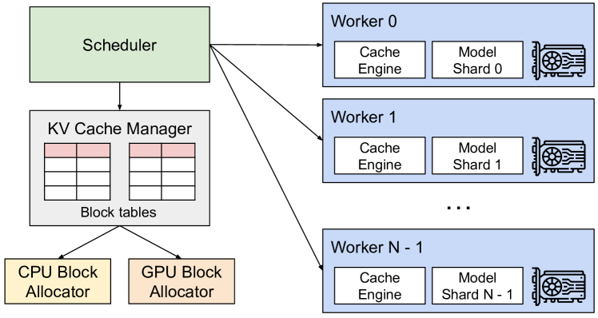

**図4.** vLLMシステムの概要。

本研究では、新しいアテンションアルゴリズムである*PagedAttention*を開発し、LLMサービングエンジン* vLLM*を構築して、§[3](#S3)で概説された課題に対処します。vLLMのアーキテクチャは[図4](#figure-04)に示されています。vLLMは分散GPUワーカーの実行を調整するために集中型スケジューラを採用しています。*KVキャッシュマネージャ*は、PagedAttentionにより可能となるページ方式でKVキャッシュを効果的に管理します。具体的には、KVキャッシュマネージャは集中型スケジューラから送信される指示を通じて、GPUワーカー上の物理KVキャッシュメモリを管理します。

次に、§[4.1](#S4.SS1) で PagedAttention アルゴリズムについて説明します。次に、§[4.2](#S4.SS2) で KV キャッシュマネージャの設計を示し、§[4.3](#S4.SS3) で PagedAttention をどのように支援するかをそれぞれ説明します。その後、この設計がさまざまなデコーディング手法に対してどのように効果的なメモリ管理を促進するか（§[4.4](#S4.SS4)） を示し、可変長の入力および出力シーケンスをどのように処理するか（§[4.5](#S4.SS5)） を説明します。最後に、vLLM のシステム設計が分散環境でどのように機能するかを示します（§[4.6](#S4.SS6)）。

### 4.1. PagedAttention

§[3](#S3) のメモリ課題に対処するために、オペレーティングシステムにおける古典的な「ページング」のアイデアに触発されたアテンションアルゴリズムである *PagedAttention* を導入します。従来のアテンションアルゴリズムとは異なり、PagedAttention は連続するキーと値を非連続のメモリ空間に格納することを可能にします。具体的には、PagedAttention は各シーケンスの KV キャッシュを *KV ブロック* に分割します。各ブロックには固定数のトークンに対するキーと値のベクトルが含まれ、これを *KV ブロックサイズ* （$B$） と呼びます。キー・ブロックを $K_{j}=(k_{(j-1)B+1},\ldots,k_{\mathrm{jB}})$、値・ブロックを $V_{j}=(v_{(j-1)B+1},\ldots,v_{\mathrm{jB}}).$ とします。式 [4](#S4.E4) におけるアテンション計算は、以下のブロックごとの計算に変換できます：

$$
A_{\mathrm{ij}}=\frac{\exp(q_{i}^{\top}K_{j}/\sqrt{d})}{\sum_{t=1}^{\lceil i/B\rceil}\exp(q_{i}^{\top}K_{t}\mathbf{1}/\sqrt{d})},\ o_{i}=\sum_{j=1}^{\lceil i/B\rceil}V_{j}A_{\mathrm{ij}}^{\top},\tag{4}
$$

ここで $A_{\mathrm{ij}}=(a_{i,(j-1)B+1},\ldots,a_{i,\mathrm{jB}})$ は $j$ 番目の KV ブロックに対するアテンションスコアの行ベクトルです。

注意計算中、PagedAttentionカーネルは異なるKVブロックを個別に識別して取得します。[図5](#figure-05)にPagedAttentionの例を示します：キーとバリューベクトルは3つのブロックに分散しており、これら3つのブロックは物理メモリ上で連続していません。各時点で、カーネルはクエリトークン（"*forth*"）のクエリベクトル$q_{i}$と、ブロック内のキー ベクトル$K_{j}$（例：ブロック0の"*Four score and seven*"のキー ベクトル）を掛け合わせて注意スコア$A_{\mathrm{ij}},$を計算し、後でブロック内のバリューベクトル$V_{j}$と$A_{\mathrm{ij}}$を掛け合わせて最終的な注意出力$o_{i}.$を導出します。

まとめると、PagedAttentionアルゴリズムによってKVブロックは非連続の物理メモリに格納できるため、vLLMでより柔軟なページメモリ管理が可能になります。

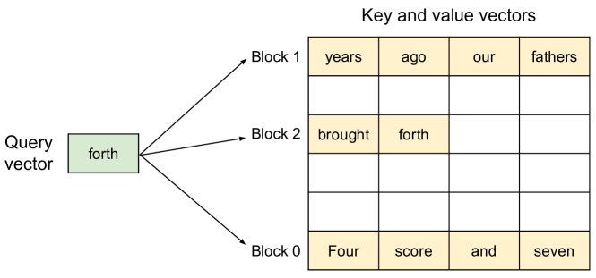

**図5.** メモリ内で注意キーとバリューベクトルが非連続のブロックとして格納されるPagedAttentionアルゴリズムの図解。

### 4.2. KVキャッシュマネージャ

vLLMのメモリマネージャの基本的な考え方は、オペレーティングシステムにおける*仮想メモリ*[Kilbur62]に似ています。OSはメモリを固定サイズの*ページ*に分割し、ユーザープログラムの論理ページを物理ページにマッピングします。連続する論理ページは非連続の物理メモリページに対応することができ、ユーザープログラムはメモリが連続しているかのようにアクセスできます。さらに、物理メモリ空間は事前に完全に確保する必要はなく、OSは必要に応じて動的に物理ページを割り当てることができます。vLLMは、LLMサービスにおけるKVキャッシュを管理するために、仮想メモリの背後にあるアイデアを使用しています。PagedAttentionにより可能となるように、KVキャッシュは仮想メモリのページのように固定サイズのKVブロックとして構成されます。

リクエストのKVキャッシュは、*論理KVブロック*の系列として表され、新しいトークンとそのKVキャッシュが生成されると左から右へ埋められます。最後のKVブロックの未使用位置は将来の生成のために予約されます。GPUワーカーでは、*ブロックエンジン*が連続したGPU DRAMの塊を割り当て、*物理KVブロック*に分割します（スワップ用のCPU RAMでも同様に行われます；参照 §[4.5](#S4.SS5)）。*KVブロックマネージャ*は、さらに*ブロックテーブル*―各リクエストの論理KVブロックと物理KVブロックの対応関係―を管理します。各ブロックテーブルのエントリは、論理ブロックに対応する物理ブロックと埋められた位置の数を記録します。論理KVブロックと物理KVブロックを分離することで、vLLMはKVキャッシュメモリを動的に拡張でき、すべての位置を事前に予約する必要がなく、既存システムにおける多くのメモリの無駄を排除できます（[図2](#figure-02)参照）。

### 4.3. PagedAttentionおよびvLLMによるデコーディング

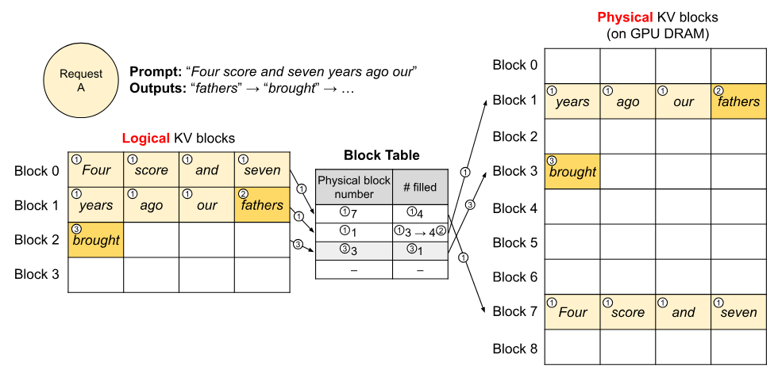

**図6.** vLLMにおけるブロックテーブルの変換。

次に、[図6](#figure-06) の例のように、vLLM がどのように PagedAttention を実行し、単一入力シーケンスのデコード中にメモリを管理するかを示す例を見ていきます。\small1⃝ OS の仮想メモリと同様に、vLLM は最大生成シーケンス長のために最初からメモリを予約する必要はありません。代わりに、プロンプト計算中に生成された KV キャッシュを収容するために必要な KV ブロックのみを予約します。この場合、プロンプトは 7 トークンなので、vLLM は最初の 2 つの論理 KV ブロック（0 と 1）を 2 つの物理 KV ブロック（それぞれ 7 と 1）にマッピングします。プレフィルステップでは、vLLM は従来の自己注意アルゴリズム（例：[Daoc22]）を用いて、プロンプトと最初の出力トークンの KV キャッシュを生成します。その後 vLLM は、最初の 4 トークンの KV キャッシュを論理ブロック 0 に、次の 3 トークンを論理ブロック 1 に格納します。残りのスロットは、後続の自己回帰生成フェーズに予約されます。\small2⃝ 最初の自己回帰デコードステップでは、vLLM は物理ブロック 7 と 1 上で PagedAttention アルゴリズムを用いて新しいトークンを生成します。最後の論理ブロックにスロットが 1 つ残っているため、新しく生成された KV キャッシュはそこに保存され、ブロックテーブルの #filled レコードが更新されます。\small3⃝ 2 回目のデコードステップでは、最後の論理ブロックが満杯であるため、vLLM は新しく生成された KV キャッシュを新しい論理ブロックに格納します。vLLM はそのために新しい物理ブロック（物理ブロック 3）を割り当て、このマッピングをブロックテーブルに保存します。

グローバルには、各デコーディング反復において、vLLM はまずバッチ処理のための候補シーケンスのセットを選択します（詳細は §[4.5](#S4.SS5) を参照）、そして、新たに必要な論理ブロックの物理ブロックを割り当てます。その後、vLLM は現在の反復のすべての入力トークン（すなわち、プロンプトフェーズリクエストのすべてのトークンと生成フェーズリクエストの最新トークン）を一つのシーケンスとして連結し、それを LLM に入力します。LLM の計算中、vLLM は PagedAttention カーネルを使用して、論理 KV ブロックの形で保存された以前の KV キャッシュにアクセスし、新たに生成された KV キャッシュを物理 KV ブロックに保存します。KV ブロック内に複数のトークンを格納すること（ブロックサイズ > 1）により、PagedAttention カーネルはより多くの位置で KV キャッシュを並列処理できるようになり、ハードウェア利用率が向上し、レイテンシが削減されます。しかし、ブロックサイズが大きくなるとメモリの断片化も増加します。ブロックサイズの影響については §[7.2](#S7.SS2) で検討します。

再び、vLLMは、より多くのトークンとそのKVキャッシュが生成されるにつれて、論理ブロックに新しい物理ブロックを動的に割り当てます。すべてのブロックは左から右へ順に埋められ、すべての前のブロックがいっぱいになった場合にのみ新しい物理ブロックが割り当てられるため、vLLMは1つのリクエスト内のメモリの無駄をすべて制限し、すべてのメモリを効果的に利用できます（[図2](#figure-02)参照）。これにより、より多くのリクエストをバッチ処理のためにメモリに収めることができ、スループットが向上します。リクエストが生成を終了すると、そのKVブロックは解放され、他のリクエストのKVキャッシュを格納するために使用できます。[図7](#figure-07)では、2つのシーケンスのメモリ管理におけるvLLMの例を示します。2つのシーケンスの論理ブロックは、GPUワーカー内のブロックエンジンによって確保されたスペース内の異なる物理ブロックにマッピングされます。両方のシーケンスの隣接する論理ブロックは物理GPUメモリ上で連続している必要はなく、物理ブロックのスペースは両方のシーケンスによって効果的に利用できます。

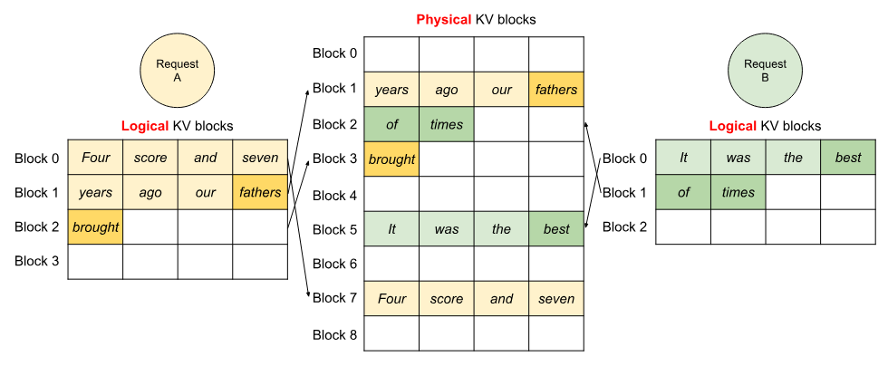

**図7.** vLLMで2つのリクエストのKVキャッシュを同時に保存。

### 4.4. 他のデコーディングシナリオへの応用

§[4.3](#S4.SS3) は、PagedAttention と vLLM が、1つのユーザープロンプトを入力として受け取り、単一の出力シーケンスを生成する、貪欲デコーディングやサンプリングなどの基本的なデコーディングアルゴリズムをどのように扱うかを示しています。多くの成功した LLM アプリケーションにおいて [Githua00, OpenAI20]、LLM サービスは、複雑なアクセスパターンを示し、メモリ共有の機会が増える、より複雑なデコーディングシナリオを提供する必要があります。本節では、それらに対する vLLM の一般的な適用性を示します。

並列サンプリング。LLM ベースのプログラムアシスタント [Chena21, Githua00] では、LLM が単一の入力プロンプトに対して複数のサンプル出力を生成し、ユーザーはさまざまな候補の中からお気に入りの出力を選ぶことができます。これまでのところ、リクエストは単一のシーケンスを生成するという前提で記述してきました。本稿の残りの部分では、リクエストが複数のシーケンスを生成する、より一般的なケースを想定します。並列サンプリングでは、1つのリクエストに同じ入力プロンプトを共有する複数のサンプルが含まれ、プロンプトの KV キャッシュも共有されます。PagedAttention とページメモリ管理を通じて、vLLM はこの共有を容易に実現し、メモリを節約できます。

［[図 8](#figure-08)］（#figure-08） は、2つの出力に対する並列デコーディングの例を示しています。両方の出力が同じプロンプトを共有するため、プロンプト段階ではプロンプトの状態のコピーは1つ分だけ確保します。両方のシーケンスのプロンプトの論理ブロックは同じ物理ブロックにマッピングされます：両方のシーケンスの論理ブロック 0 と 1 は、それぞれ物理ブロック 7 と 1 にマッピングされます。1つの物理ブロックが複数の論理ブロックにマッピングされることがあるため、各物理ブロックに対して*参照カウント*を導入します。この場合、物理ブロック 7 および 1 の参照カウントは両方とも 2 です。生成段階では、2つの出力が異なる出力トークンをサンプリングするため、KV キャッシュの別々のストレージが必要です。vLLM は、複数のシーケンスによって変更が必要な物理ブロックに対して、OS の仮想メモリにおけるコピーオンライト技術（例：プロセスのフォーク時）に似た、ブロック単位の*コピーオンライト*メカニズムを実装しています。具体的には、［[図 8](#figure-08)］（#figure-08） において、サンプル A1 が最後の論理ブロック（論理ブロック 1）に書き込む必要がある場合、vLLM は対応する物理ブロック（物理ブロック 1）の参照カウントが 1 より大きいことを認識します；新しい物理ブロック（物理ブロック 3）を割り当て、ブロックエンジンに物理ブロック 1 の情報をコピーするよう指示し、参照カウントを 1 に減らします。次に、サンプル A2 が物理ブロック 1 に書き込む場合、参照カウントはすでに 1 に減少しているため、A2 は新たに生成した KV キャッシュを直接物理ブロック 1 に書き込みます。

要約すると、vLLM は、最終的な論理ブロックをコピーオンライト方式で管理する場合を除き、複数の出力サンプル間でプロンプトのKVキャッシュを格納するために使用されるスペースのほとんどを共有することを可能にします。複数のサンプル間で物理ブロックを共有することで、特に*長い入力プロンプト*の場合、メモリ使用量を大幅に削減できます。

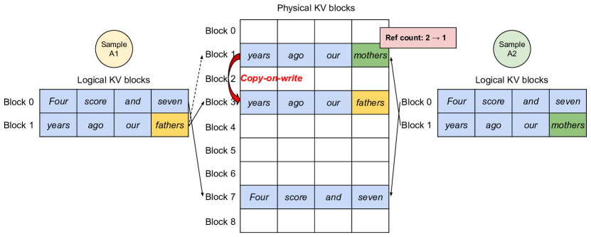

**図8.** 並列サンプリングの例。

ビームサーチ。機械翻訳のようなLLMタスクでは、[Refc16] ユーザーはLLMによって出力される最も適切な上位$k$ の翻訳を期待します。ビームサーチ[Sutska14] は、サンプル空間を完全に探索する計算の複雑さを軽減するため、LLMから最も確率の高い出力シーケンスをデコードする際に広く使用されます。このアルゴリズムは、$k$ 各ステップで保持される上位候補の数を決定する*ビーム幅*パラメータに依存しています。デコード中、ビームサーチはビーム内の各候補シーケンスをすべての可能なトークンを考慮して展開し、LLMを使用してそれぞれの確率を計算し、$k$ 上位に確率が高いシーケンスを$k\cdot|V|$ 候補の中から保持します。ここで$|V|$ は語彙サイズです。

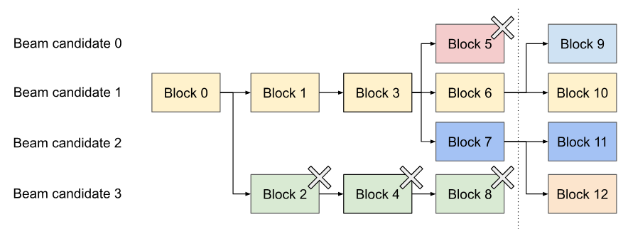

**図9.** ビームサーチの例。

並列デコーディングとは異なり、ビームサーチは初期のプロンプトブロックだけでなく、異なる候補間で他のブロックも共有することを可能にし、デコーディングプロセスが進むにつれて共有パターンが動的に変化します。これは、複合フォークによって作成されるOSのプロセスツリーに類似しています。[Fig. 9](#figure-09) は、$k=4$ を使用したビームサーチの例で vLLM がどのように KV ブロックを管理しているかを示しています。点線で示された反復の前には、各候補シーケンスは 4 つの完全な論理ブロックを使用しています。すべてのビーム候補は最初のブロック 0（つまりプロンプト）を共有しています。候補 3 は 2 番目のブロックから他の候補と分岐しています。候補 0～2 は最初の 3 つのブロックを共有し、4 番目のブロックで分岐します。その後の反復では、最も確率の高い上位 4 つの候補はすべて候補 1 と 2 から発生します。元の候補 0 と 3 はもはや上位候補に含まれないため、それらの論理ブロックは解放され、対応する物理ブロックの参照カウントは減少します。vLLM は参照カウントが 0 に達したすべての物理ブロック（ブロック 2、4、5、8）を解放します。そして、vLLM は新しい候補からの新しい KV キャッシュを格納するために新しい物理ブロック（ブロック 9～12）を割り当てます。現在、すべての候補はブロック 0、1、3 を共有しており、候補 0 と 1 はブロック 6 を、候補 2 と 3 はさらにブロック 7 を共有しています。

以前のLLMサービングシステムでは、ビーム候補間でKVキャッシュを頻繁にメモリコピーする必要がありました。例えば、[図9](#figure-09)に示された場合、点線の後、候補3は生成を続けるために候補2のKVキャッシュの大部分をコピーする必要があります。この頻繁なメモリコピーのオーバーヘッドは、vLLMの物理ブロック共有によって大幅に削減されます。vLLMでは、異なるビーム候補のほとんどのブロックを共有できます。コピーオンライトのメカニズムは、新しく生成されたトークンが古い共有ブロック内にある場合にのみ適用され、並列デコーディングの際にも同様です。これにより、データの1ブロックだけをコピーすることになります。

共有プレフィックス。一般的に、LLMユーザーは、指示や入力例と出力例を含む（長い）タスクの説明を提供します。これを*システムプロンプト* [OpenAI23] とも呼びます。説明は、実際のタスク入力と連結され、リクエストのプロンプトを形成します。LLMは、完全なプロンプトに基づいて出力を生成します。[図10](#figure-10)に例が示されています。さらに、共有プレフィックスは、プロンプトエンジニアリングを通じて微調整することで、下流タスクの精度を向上させることができます [Liang21, Lester21]。

このタイプのアプリケーションでは、多くのユーザーのプロンプトが共通のプレフィックスを持つため、LLMサービスプロバイダーはあらかじめそのプレフィックスのKVキャッシュを保存して、プレフィックスにかかる冗長な計算を削減することができます。vLLMでは、これはLLMサービスプロバイダーがあらかじめ定義した共有プレフィックスのセットのために物理ブロックを確保することで簡単に実現できます。これはOSがプロセス間で共有ライブラリを扱う方法に似ています。共有プレフィックスを持つユーザー入力プロンプトは、その論理ブロックをキャッシュされた物理ブロックに単純にマッピングすることができ（最後のブロックはコピーオンライトとしてマーク）、プロンプト段階での計算はユーザーのタスク入力に対してのみ実行されます。

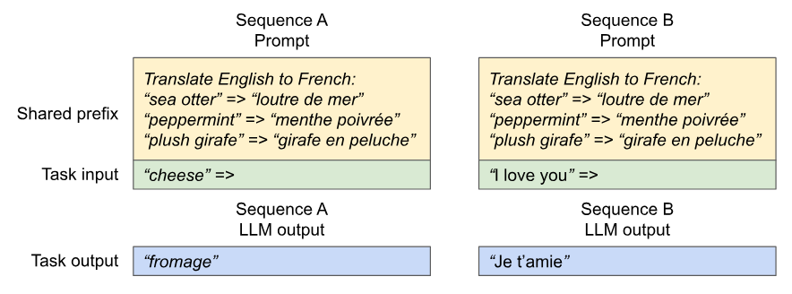

**図10.** 機械翻訳における共有プロンプトの例。例は[Browne20]から採用されています。

混合デコーディング手法。前述のデコーディング手法は、さまざまなメモリ共有およびアクセスパターンを示します。それにもかかわらず、vLLMは異なるデコーディング設定のリクエストを同時に処理することを可能にしますが、既存のシステムは効率的にこれを行うことができません。これは、vLLMが論理ブロックを物理ブロックに変換する共通マッピングレイヤーによって、異なるシーケンス間の複雑なメモリ共有を隠蔽しているためです。LLMとその実行カーネルは、各シーケンスの物理ブロックIDのリストだけを参照し、シーケンス間の共有パターンを扱う必要はありません。既存のシステムと比較すると、このアプローチは異なるサンプリング要件を持つリクエストのバッチ処理の機会を広げ、最終的にシステム全体のスループットを増加させます。

### 4.5. スケジューリングとプリエンプション

要求のトラフィックがシステムの容量を超える場合、vLLM は要求のサブセットに優先順位を付ける必要があります。vLLM では、すべての要求に対して先着順（FCFS）のスケジューリングポリシーを採用し、公平性を確保し、飢餓状態を防ぎます。vLLM が要求をプリエンプトする必要がある場合、最も早く到着した要求が最初に処理され、最新の要求が最初にプリエンプトされることを保証します。

LLMサービスは独自の課題に直面しています：LLMへの入力プロンプトは長さが大きく異なる可能性があり、生成される出力の長さも、入力プロンプトとモデルの両方に依存するため事前にわかりません。リクエスト数とその出力が増えると、vLLMは新たに生成されたKVキャッシュを格納するためのGPUの物理ブロックが不足する可能性があります。この文脈でvLLMが答える必要がある典型的な2つの質問があります：（1） どのブロックを追い出すべきか？（2） 再び必要になった場合、追い出されたブロックをどのように回復するか？通常、追い出しポリシーは、将来的に最もアクセスされないと予測されるブロックを予測するためのヒューリスティックを使用し、そのブロックを追い出します。我々の場合、シーケンスのすべてのブロックが一緒にアクセスされることがわかっているため、私たちはオール・オア・ナッシングの追い出しポリシー、すなわちシーケンスのブロックをすべて追い出すか、全く追い出さないかを実装しています。さらに、1つのリクエスト内の複数のシーケンス（例えば1つのビーム探索リクエストにおけるビーム候補）は、*シーケンスグループ*として並行スケジュールされます。1つのシーケンスグループ内のシーケンスは、これらのシーケンス間でメモリが共有される可能性があるため、常に一緒にプリエンプトまたは再スケジュールされます。追い出されたブロックをどのように回復するかという2つ目の質問に答えるために、我々は2つの手法を検討します：

スワッピング。これは、多くの仮想メモリ実装で使用されるクラシックな技術で、追い出されたページをディスク上のスワップ領域にコピーします。我々の場合、追い出されたブロックをCPUメモリにコピーします。[Fig. 4](#figure-04) に示すように、GPUブロックアロケータに加えて、vLLMにはCPUブロックアロケータが含まれており、CPU RAMにスワップされた物理ブロックを管理します。vLLMが新しいトークンのための空き物理ブロックを使い果たした場合、追い出してCPUにKVキャッシュを転送するシーケンスのセットを選択します。一度シーケンスをプリエンプトしてそのブロックを追い出すと、vLLMはすべてのプリエンプトされたシーケンスが完了するまで新しいリクエストの受付を停止します。リクエストが完了すると、そのブロックはメモリから解放され、プリエンプトされたシーケンスのブロックが戻され、そのシーケンスの処理を続行します。この設計では、CPU RAMにスワップされたブロックの数がGPU RAM内の総物理ブロックの数を超えることはないため、CPU RAM上のスワップ領域はKVキャッシュ用に割り当てられたGPUメモリによって制限されます。

再計算。この場合、プリエンプトされたシーケンスが再スケジュールされると、KVキャッシュを単純に再計算します。再計算の遅延は元の遅延よりも大幅に低くなることがあります。なぜなら、デコード時に生成されたトークンを元のユーザープロンプトと連結して新しいプロンプトとして使用することができ、すべての位置でのKVキャッシュを1回のプロンプトフェーズイテレーションで生成できるからです。

スワッピングと再計算のパフォーマンスは、CPU RAM と GPU メモリ間の帯域幅および GPU の計算能力に依存します。私たちは §[7.3](#S7.SS3) でスワッピングと再計算の速度を検証します。

### 4.6. 分散実行

多くの LLM は単一 GPU の容量を超えるパラメータサイズを持っています [Browne20, Chowdb22]。そのため、それらを分散 GPU に分割し、モデル並列方式で実行する必要があります [Zheng22, Ref23]。このため、分散メモリを扱えるメモリマネージャが求められます。vLLM は、Transformers 上で広く使用されている Megatron-LM スタイルのテンソルモデル並列戦略をサポートすることにより、分散環境でも有効です [Shoeyc19]。この戦略は SPMD（Single Program Multiple Data）実行スケジュールに従い、線形層をブロック単位の行列乗算で分割し、GPU は中間結果を常に all-reduce 操作で同期します。具体的には、注意演算子は注意ヘッドの次元で分割され、各 SPMD プロセスはマルチヘッド注意の一部の注意ヘッドを担当します。

モデル並列実行であっても、各モデルシャードは依然として同じ入力トークンセットを処理するため、同じ位置のKVキャッシュが必要であることが分かります。したがって、vLLMは[図4](#figure-04)のように、中央スケジューラ内に単一のKVキャッシュマネージャを備えています。異なるGPUワーカーはマネージャと、論理ブロックから物理ブロックへのマッピングを共有します。この共通マッピングにより、GPUワーカーは各入力リクエストに対してスケジューラが提供する物理ブロックを用いてモデルを実行できます。各GPUワーカーは同じ物理ブロックIDを持つものの、ワーカーは対応するアテンションヘッドのKVキャッシュの一部のみを保持します。

各ステップで、スケジューラはまずバッチ内の各リクエストの入力トークンIDと各リクエストのブロックテーブルを含むメッセージを準備します。次に、スケジューラはこの制御メッセージをGPUワーカーにブロードキャストします。その後、GPUワーカーは入力トークンIDを用いてモデルの実行を開始します。アテンション層では、GPUワーカーは制御メッセージ内のブロックテーブルに従ってKVキャッシュを読み取ります。実行中、GPUワーカーは中間結果をスケジューラの調整なしにオールリデュース通信プリミティブを用いて同期します（[Shoeyc19]参照）。最後に、GPUワーカーはこのイテレーションのサンプルされたトークンをスケジューラに送信します。まとめると、GPUワーカーは各デコーディングイテレーションの開始時にステップ入力と共に全てのメモリ管理情報を受け取るだけでよいため、メモリ管理で同期する必要はありません。

## 5\. 実装

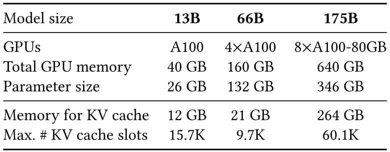

**表 1.** モデルサイズとサーバー構成.

vLLM は FastAPI フロントエンドと GPU ベースの推論エンジンを備えたエンドツーエンドのサービングシステムです。[FastAP23] フロントエンドは OpenAI API [OpenAI20] インターフェースを拡張しており、各リクエストごとに最大シーケンス長やビーム幅などのサンプリングパラメータをカスタマイズできます。$k$ vLLM エンジンは Python 8.5K 行と C /CUDA コード 2K 行で書かれています。[Browne20] スケジューラやブロックマネージャなどの制御関連コンポーネントは Python で開発し、PagedAttention などの主要操作にはカスタム CUDA カーネルを開発しています。[Zhangb22] モデル実行用には、PyTorch [Touvra23] と Transformers [Paszka19] を使用して GPT、OPT、LLaMA などの一般的な LLM を実装しています。[Wolfa20] 分散 GPU ワーカー間でのテンソル通信には NCCL [NccWeb] を使用しています。

### 5.1. カーネルレベルの最適化

PagedAttentionが既存のシステムで効率的にサポートされていないメモリアクセスパターンを導入するため、それを最適化するいくつかのGPUカーネルを開発しました。（1） *リシェイプとブロック書き込みの融合.* 各Transformer層では、新しいKVキャッシュがブロックに分割され、ブロック読み取りに最適化されたメモリレイアウトにリシェイプされ、ブロックテーブルで指定された位置に保存されます。カーネル起動のオーバーヘッドを最小化するために、これらを単一のカーネルに融合しました。（2） *ブロック読み取りとアテンションの融合.* FasterTransformer [Fastea00] のアテンションカーネルを適応させ、KVキャッシュをブロックテーブルに従って読み取り、オンザフライでアテンション操作を実行します。メモリアクセスのコアレス化を確実にするために、各ブロックの読み取りにGPUワープを割り当てます。さらに、リクエストバッチ内の可変シーケンス長をサポートしています。（3） *ブロックコピーの融合.* コピーオンライト機構によって発行されるブロックコピー操作は、不連続なブロックに対して行われる場合があります。cudaMemcpyAsync APIを使用すると、小さいデータ移動の呼び出しが多数発生する可能性があります。オーバーヘッドを軽減するため、異なるブロックのコピー操作を1回のカーネル起動にまとめるカーネルを実装しました。

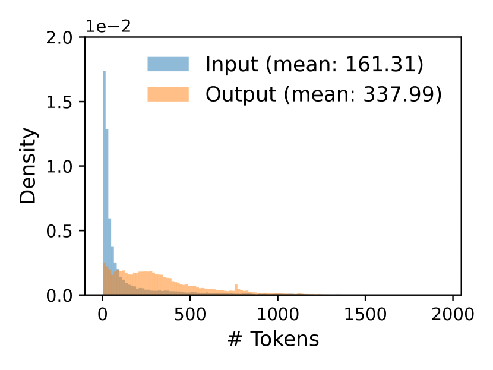

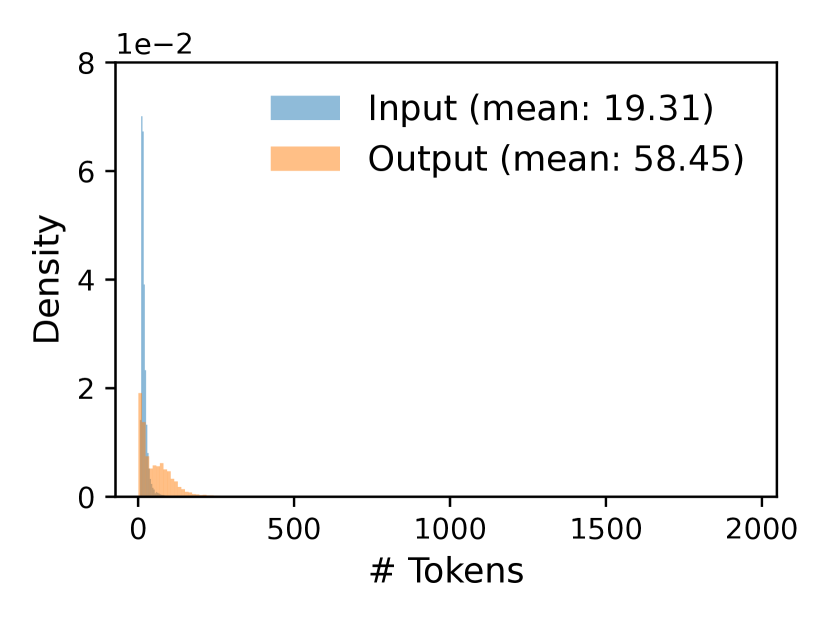

**図11.** （a） ShareGPTおよび（b） Alpacaデータセットの入力および出力長の分布。

### 5.2. 様々なデコーディングアルゴリズムのサポート

vLLMは、フォーク、追加、フリーの3つの主要な方法を用いて様々なデコードアルゴリズムを実装しています。フォークメソッドは既存のシーケンスから新しいシーケンスを作成します。Appendメソッドはシーケンスに新しいトークンを追加します。最後に、フリーメソッドはその配列を削除します。例えば、並列サンプリングでは、vLLMはフォーク法を用いて単一の入力シーケンスから複数の出力シーケンスを作成します。その後、これらのシーケンスに新しいトークンを毎回追加し、停止条件を満たすシーケンスはフリーで削除します。同じ戦略は、vLLMによるビームサーチやプレフィックス共有にも適用されています。これらの手法を組み合わせることで将来の復号アルゴリズムもサポートできると考えています。

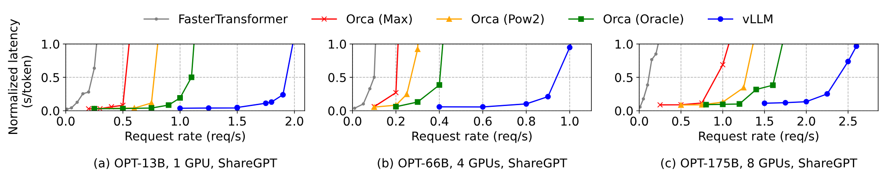

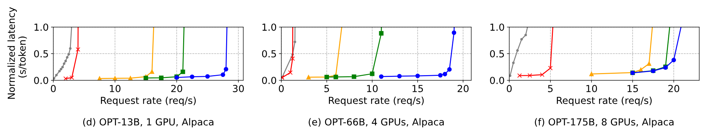

**図12.** ShareGPTおよびAlpacaデータセットにおけるOPTモデルを用いた単一配列生成

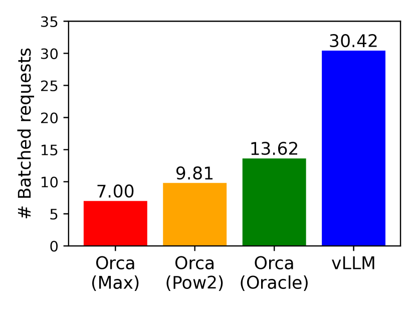

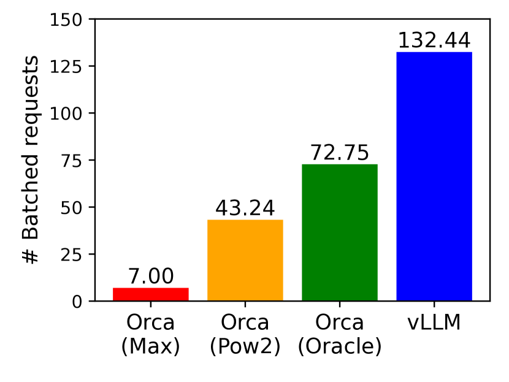

**図13.** ShareGPT（2 reqs/s）および Alpaca（30 reqs/s）トレースのOPT-13B提供時の平均バッチリクエスト数。

## 6\。評価

このセクションでは、さまざまなワークロード下でのvLLMのパフォーマンスを評価します。

### 6.1。実験装置

モデルおよびサーバー構成。我々は評価のために、13B、66B、および175Bパラメータを持つOPT [Zhangb22]モデルと、13Bパラメータを持つLLaMA [Touvra23]モデルを使用します。13Bおよび66BはLLMリーダーボード [ORG23] に示されるように、LLMで一般的なサイズであり、175Bは有名なGPT-3 [Browne20]モデルのサイズです。すべての実験で、Google Cloud Platform上のNVIDIA A100 GPUを搭載したA2インスタンスを使用します。詳細なモデルサイズとサーバー構成は [表1](#table-01) に示されています。

ワークロード。ShareGPT [Sharea23] および Alpaca [Stanfa23] データセットに基づいてワークロードを合成します。これらのデータセットには、実際のLLMサービスの入力および出力テキストが含まれています。ShareGPTデータセットは、ChatGPT [Blog22] とのユーザー共有会話のコレクションです。Alpacaデータセットは、GPT-3.5によりself-instruct [Wangb22] を使用して生成された指示データセットです。データセットをトークナイズし、その入力および出力の長さを使用してクライアントリクエストを合成します。 [図11](#figure-11) に示されるように、ShareGPTデータセットは平均でAlpacaデータセットよりも8.4$\times$ 長い入力プロンプトおよび5.8$\times$ 長い出力を持ち、分散も高くなっています。これらのデータセットにはタイムスタンプが含まれていないため、異なるリクエスト率でポアソン分布を使用してリクエスト到着時間を生成します。

ベースライン 1： FasterTransformer。FasterTransformer [Fastea00] は、レイテンシに最適化された分散推論エンジンです。FasterTransformer 自体にはスケジューラがないため、Triton [Servea00] などの既存のサービングシステムに類似した動的バッチ処理機構を持つカスタムスケジューラを実装します。具体的には、GPU メモリ容量に応じて、各実験で可能な限り大きな最大バッチサイズ $B$ を設定します。スケジューラは、最も早く到着したリクエスト $B$ の最大数を取得し、バッチを FasterTransformer に送信して処理します。

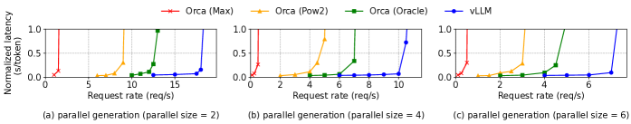

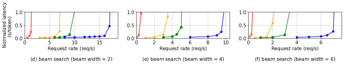

**図 14.** Alpaca データセット上での OPT-13B を用いた並列生成とビームサーチ。

ベースライン 2： Orca。Orca [Refd22] はスループットに最適化された最先端の LLM サービングシステムです。Orca は公開されていないため、独自に Orca を実装します。我々は Orca が KV キャッシュを格納するメモリアドレスを決定するためにバディ割り当てアルゴリズムを使用すると仮定します。リクエスト出力用にどの程度多く余分に予約するかに基づいて、3 つの Orca バージョンを実装します：

- Orca （Oracle）。リクエストに対して実際に生成される出力の長さの情報をシステムが知っていると仮定します。これは、実際には達成不可能な Orca の上限性能を示します。
- Orca （Pow2）。システムが出力のためのスペースを最大で 2$\times$ まで余分に予約すると仮定します。例えば、実際の出力長が 25 の場合、出力のために 32 の位置を予約します。
- Orca（Max）。我々は、システムが常にモデルの最大シーケンス長、すなわち2048トークンまでのスペースを確保すると仮定する。

主要な指標。我々は提供スループットに注目する。具体的には、異なるリクエストレートを持つワークロードを使用して、システムの正規化された待ち時間を測定する。これは、各リクエストのエンドツーエンドの待ち時間の平均をその出力長で割ったものであり、Orca [Refd22]の方法と同様である。高スループットの提供システムは、高いリクエストレートに対しても低い正規化待ち時間を維持すべきである。ほとんどの実験では、1時間のトレースでシステムを評価する。例外として、コスト制限のため、OPT-175Bモデルには15分のトレースを使用する。

### 6.2 基本的なサンプリング

我々は、基本的なサンプリング（リクエストごとに1サンプル）でのvLLMの性能を、3つのモデルと2つのデータセットで評価する。[Fig. 12](#figure-12)の最初の行はShareGPTデータセットでの結果を示している。曲線は、リクエストレートが増加すると、待ち時間は最初は緩やかに増加するが、その後突然急増することを示している。これは、リクエストレートが提供システムの容量を超えると、キューの長さが無限に増加し、それに伴いリクエストの待ち時間も無限に増加することに起因する。

ShareGPT データセットでは、vLLM は Orca （Oracle） と比較して $1.7\times$–$2.7\times$ 高いリクエストレート、Orca （Max） と比較して $2.7\times$–$8\times$ 高いリクエストレートを維持しながら、同様のレイテンシを保つことができます。これは、vLLM の PagedAttention がメモリ使用量を効率的に管理できるため、Orca よりも多くのリクエストをバッチ処理可能にするためです。例えば、[図 13（a）](#figure-13) に示されているように、OPT-13B では vLLM は Orca （Oracle） より $2.2\times$ 多くのリクエストを同時に処理し、Orca （Max） より $4.3\times$ 多くのリクエストを処理します。FasterTransformer と比較すると、vLLM は最大 $22\times$ 高いリクエストレートを維持可能です。これは FasterTransformer が細かいスケジューリング機構を利用せず、Orca （Max） のように非効率的にメモリを管理するためです。

[図 12](#figure-12) の 2 行目および [図 13（b）](#figure-13) は Alpaca データセットの結果を示しており、ShareGPT データセットと同様の傾向が見られます。唯一の例外は [図 12](#figure-12) （f） で、vLLM の Orca （Oracle） および Orca （Pow2） に対する優位性はそれほど顕著ではありません。これは OPT-175B に対するモデルとサーバー構成 （[表 1](#table-01)） により、KV キャッシュを格納するための大きな GPU メモリが利用可能である一方、Alpaca データセットのシーケンスは短いためです。この設定では、Orca （Oracle） および Orca （Pow2） もメモリ管理の非効率性にもかかわらず、多くのリクエストをバッチ処理できます。その結果、システムの性能はメモリ制限ではなく、計算リソース制限によって決まるようになります。

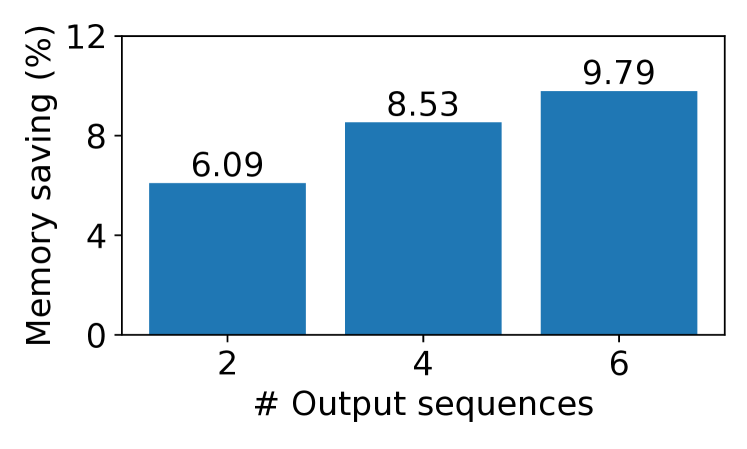

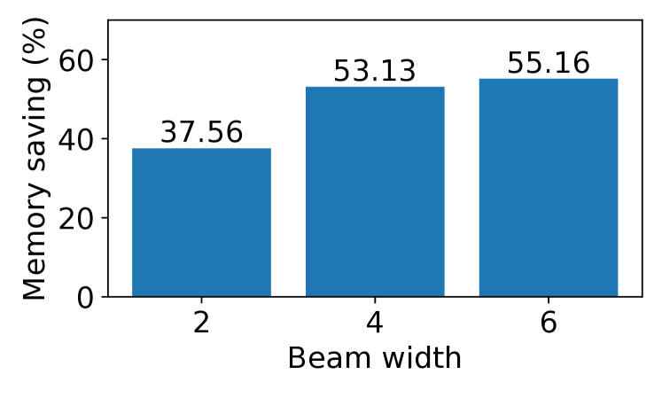

**図15.** Alpacaトレースに対してOPT-13Bを実行する際、KVブロックの共有による平均メモリ節約量。

### 6.3. 並列サンプリングとビームサーチ

PagedAttentionにおけるメモリ共有の有効性を、2つの一般的なサンプリング手法、並列サンプリングとビームサーチで評価します。並列サンプリングでは、リクエスト内のすべての並列シーケンスがプロンプト用KVキャッシュを共有できます。[図14](#figure-14)の最初の行に示されているように、サンプリングするシーケンスの数が多いほど、vLLMはOrcaベースラインに対してより大きな改善をもたらします。同様に、[図14](#figure-14)の第2行は、異なるビーム幅でのビームサーチの結果を示しています。ビームサーチはより多くの共有を可能にするため、vLLMはさらに大きな性能向上を示します。OPT-13BおよびAlpacaデータセットでのvLLMのOrca（Oracle）に対する改善は、基本サンプリングでは$1.3\times$から、ビーム幅6のビームサーチでは$2.3\times$になります。

[図15](#figure-15)は、共有によって節約できたブロック数を、共有なしの総ブロック数で割って計算したメモリ節約量をプロットしたものです。並列サンプリングでは6.1%〜9.8%のメモリ節約、ビームサーチでは37.6%〜55.2%の節約を示しています。同じ実験をShareGPTデータセットで行った場合、並列サンプリングでは16.2%〜30.5%、ビームサーチでは44.3%〜66.3%のメモリ節約が見られました。

### 6.4. 共有プレフィックス

vLLMが異なる入力プロンプト間でプレフィックスが共有される場合の有効性を検証します。[Fig. 10](#figure-10)に示されるようにです。モデルには多言語対応のLLaMA-13B [Touvra23]を使用します。ワークロードにはWMT16 [Bojar16] の英語→ドイツ語翻訳データセットを使用し、指示といくつかの翻訳例を含む2つのプレフィックスを合成します。最初のプレフィックスには単一の例（1ショット）が含まれ、もう一方のプレフィックスには5つの例（数ショット）が含まれます。[Fig. 16](#figure-16) （a）に示されるように、vLLMは1ショットのプレフィックスが共有される場合、Orca （Oracle） より$1.67\times$ 高いスループットを達成します。さらに、より多くの例が共有される場合（[Fig. 16](#figure-16) （b））、vLLMはOrca （Oracle） より$3.58\times$ 高いスループットを達成します。

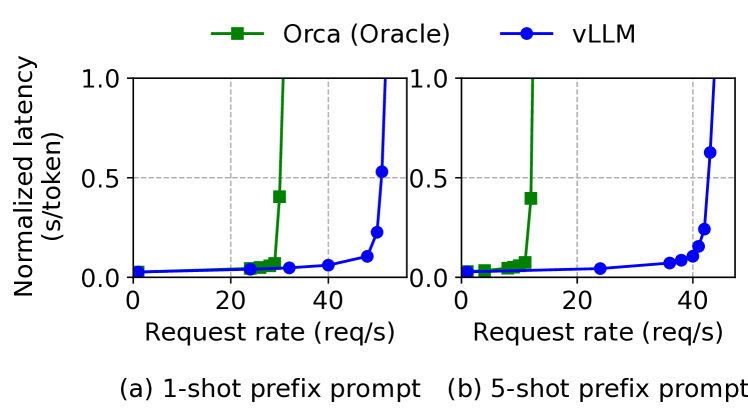

**図16.** 入力プロンプトが共通のプレフィックスを共有する翻訳ワークロード。プレフィックスは（a） 1つの例（80トークン）または（b） 5つの例（341トークン）を含みます。

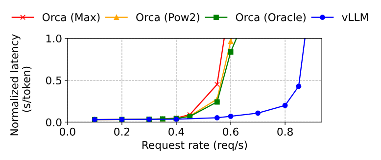

**図17.** チャットボットのワークロードにおける性能。

### 6.5. チャットボット

チャットボット[Blog22, Bard23, Chiang23]はLLMの最も重要な応用の一つです。チャットボットを実装するためには、チャット履歴と直近のユーザークエリをプロンプトに連結してモデルに応答を生成させます。チャット履歴とユーザーの問い合わせをShareGPTデータセットを用いて統合します。OPT-13Bモデルのコンテキストの長さが限られているため、プロンプトは最後の1024トークンにカットし、最大1024トークンの生成にしました。異なる会話ラウンド間にはKVキャッシュを保存しません。なぜなら、そうすると他のリクエストが会話ラウンド間のスペースを占めるためです。

[図17](#figure-17)は、vLLMが3つのシャチ基準と比較して$2\times$高いリクエスト率を維持できることを示しています。ShareGPTデータセットには多くの長い会話が含まれているため、ほとんどのリクエストの入力プロンプトは1024トークンで構成されています。バディ割り当てアルゴリズムのため、Orcaのベースラインは出力の長さの予測に関わらず、リクエスト出力のために1024トークンの容量を確保しています。このため、シャチの3つの基準線は似た挙動を示します。対照的に、vLLMは長いプロンプトを効果的に処理でき、PagedAttentionはメモリ断片化や予約の問題を解決します。

## 7\。アブレーション研究

このセクションでは、vLLMのさまざまな側面を研究し、アブレーション実験における設計選択を評価します。

### 7.1。カーネル・マイクロベンチマーク

PagedAttentionにおける動的ブロックマッピングは、ストアされたKVキャッシュに関わるGPU操作、すなわちブロックの読み書きやアテンションのパフォーマンスに影響します。既存のシステムと比較すると、我々のGPUカーネル （§[5](#S5)） では、ブロックテーブルへのアクセス、追加の分岐の実行、可変シーケンス長の処理に関して追加のオーバーヘッドが発生します。[Fig. 18（a）](#figure-18) に示されているように、これは高度に最適化されたFasterTransformer実装と比較して、アテンションカーネルのレイテンシが20～26％高くなる結果となります。オーバーヘッドはアテンションオペレーターのみに影響し、Linearなどモデル内の他のオペレーターには影響しないため、我々はこのオーバーヘッドは小さいと考えています。オーバーヘッドがあるにもかかわらず、PagedAttentionによりvLLMはエンドツーエンドのパフォーマンスにおいてFasterTransformerを大幅に上回ります （§[6](#S6)）。

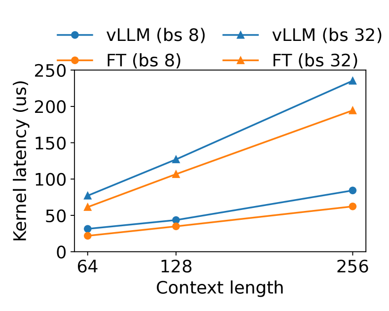

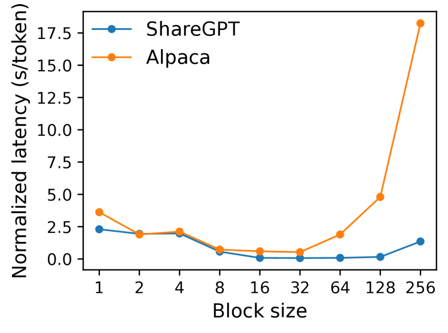

**図18.** アブレーション実験。

### 7.2. ブロックサイズの影響

ブロックサイズの選択は、vLLMのパフォーマンスに大きな影響を与える可能性があります。ブロックサイズが小さすぎると、vLLMはKVキャッシュの読み取りと処理においてGPUの並列性を十分に活用できないことがあります。ブロックサイズが大きすぎると、内部断片化が増加し、共有の可能性が低下します。

[図 18](#figure-18)（b）（#figure-18）では、固定リクエストレートの下で基本的なサンプリングを用い、ShareGPTおよびAlpacaのトレースを使用して、異なるブロックサイズでのvLLMの性能を評価します。ShareGPTトレースでは、ブロックサイズ16から128が最良の性能を示します。Alpacaトレースでは、ブロックサイズ16および32は良好に機能しますが、シーケンスがブロックサイズよりも短くなるため、より大きなブロックサイズでは性能が大幅に低下します。実際には、ブロックサイズ16はGPUを効率的に活用するのに十分大きく、ほとんどのワークロードで内部フラグメンテーションを大きく避けるのに十分小さいことがわかっています。そのため、vLLMはデフォルトのブロックサイズを16に設定しています。

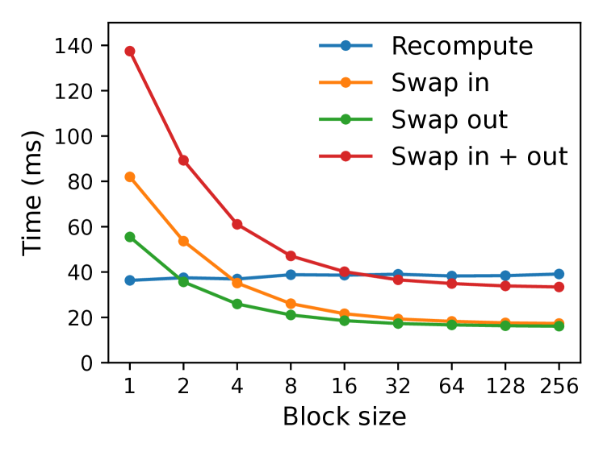

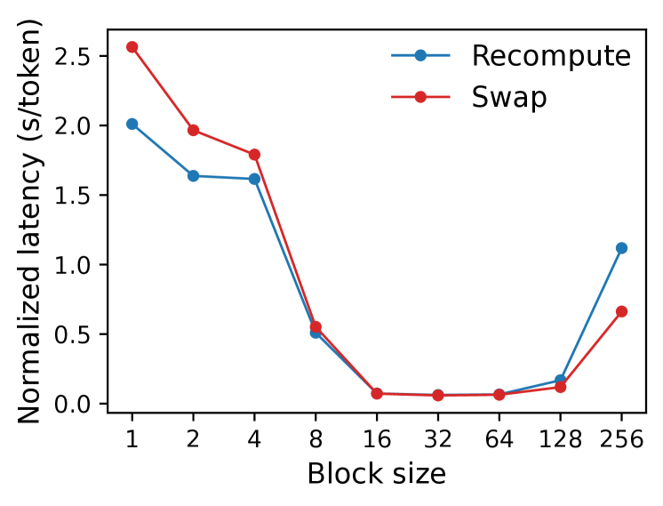

**図19.** （a） 異なるブロックサイズに対する再計算およびスワップのオーバーヘッド。（b） 同じリクエストレートでShareGPTトレースを使用してOPT-13Bを提供する際の性能。

### 7.3. 再計算とスワップの比較

vLLMはリカバリーメカニズムとして再計算とスワッピングの両方をサポートしています。両手法のトレードオフを理解するために、エンドツーエンドのパフォーマンスを評価し、[図19](#figure-19)に示されたように、オーバーヘッドをマイクロベンチマークします。私たちの結果は、小さなブロックサイズではスワップが過剰なオーバーヘッドを生じることを示しています。これは、小さなブロックサイズがCPUとGPU間で多数の小規模なデータ転送を引き起こし、実質的なPCIe帯域幅を制限するためです。対照的に、再計算のオーバーヘッドは異なるブロックサイズ間で一定であり、再計算はKVブロックを利用しないためです。したがって、ブロックサイズが小さい場合に再計算が効率的であり、ブロックサイズが大きい場合にスワッピングが効率的ですが、再計算オーバーヘッドはスワッピングの遅延の20%を超えません。16から64までの中規模ブロックサイズでは、両方法はエンドツーエンドで同等の性能を示します。

## 8\。議論

他のGPUワークロードに仮想メモリとページング技術を適用する。仮想メモリとページングの考え方は、出力の長さが事前にわからないため動的メモリ割り当てが必要となり、パフォーマンスがGPUメモリ容量に制約されるLLMサービングにおけるKVキャッシュ管理に効果的である。しかし、これは必ずしもすべてのGPUワークロードに当てはまるわけではない。例えば、DNNのトレーニングでは、テンソルの形状は通常固定されているため、メモリの割り当てを事前に最適化できる。別の例として、LLMではないDNNのサービングでは、メモリ効率の向上がパフォーマンス向上につながらない場合がある。なぜなら、そのパフォーマンスは主に計算に依存しているからである。このようなシナリオでは、vLLMの技術を導入すると、メモリの間接参照や非連続ブロックメモリによる追加のオーバーヘッドのために、むしろパフォーマンスが低下する可能性がある。しかし、LLMサービングと類似の特性を持つ他のワークロードにvLLMの技術が適用されるのを見ることには興奮している。

仮想メモリとページングの適用におけるLLM特有の最適化。vLLMは、アプリケーション固有の意味論を活用することで、仮想メモリとページングの概念を再解釈し、拡張します。その一例がvLLMの全か無かのスワップアウトポリシーで、リクエストを処理する際に対応するすべてのトークン状態がGPUメモリに保存される必要があるという事実を利用しています。もう一つの例は、追放されたブロックを復元するための再計算手法ですが、これはOSでは実現不可能です。さらに、vLLMはメモリアクセス操作用のGPUカーネルと注意など他の操作を統合することで、ページングにおける間接的なメモリのオーバーヘッドを軽減します。

## 9\。関連作品

一般モデルのサービスシステム。モデルサービングは近年活発な研究分野であり、ディープラーニングモデル展開の多様な側面に取り組むために多くのシステムが提案されています。Clipper [Cranks17]、TensorFlow Serving [Olston17]、Nexus [Shen19]、InferLine [Cranks20]、Clockwork [Gujara20] は、初期の一般的なモデルサービスシステムの一部です。彼らは、単一または複数のモデルに対応するためのバッチ処理、キャッシュ、配置、スケジューリングを研究します。最近では、DVABatch [Cui22]マルチエントリーマルチエグジットバッチングを導入しています。REEF [Han22]とShepherd [Zhang23]は、サービスに対する先取権を提案しています。AlpaServe [Ref23]統計的多重化のためにモデル並列性を利用しています。しかし、これらの一般的なシステムはLLM推論の自己回帰的性質やトークン状態を考慮しておらず、最適化の機会を逃しています。

トランスフォーマー向けの専門的なサービングシステム。トランスフォーマーアーキテクチャの重要性から、それに特化したさまざまなサービングシステムが開発されてきた。これらのシステムは効率的なサービングのために、GPUカーネル最適化 [Wang21, Aminab22, Fastea00, Refc20]、先進的なバッチ処理メカニズム [Fang21, Refd22]、モデル並列処理 [Popea22, Refd22, Aminab22]、およびパラメータ共有 [Zhou22] を活用している。その中で、Orca [Refd22] は我々のアプローチに最も関連している。

Orca との比較。Orca [Refd22] の反復レベルのスケジューリングと vLLM における PagedAttention は補完的な技術である：両システムとも GPU の利用率を高め、LLM サービングのスループットを向上させることを目的としているが、Orca はリクエストをスケジューリングおよびインタリーブすることでより多くのリクエストを並行して処理できるようにしており、vLLM はメモリ利用率を高めることで、より多くのリクエストの作業セットがメモリに収まるようにしている。メモリの断片化を減らし共有を可能にすることで、vLLM はより多くのリクエストをバッチで並行実行でき、Orca と比べて 2-4$\times$ 倍の高速化を達成している。確かに、Orca のような細粒度のスケジューリングとリクエストのインタリーブはメモリ管理をより難しくし、vLLM で提案された技術の重要性をさらに高めている。

メモリ最適化。アクセラレータの計算能力とメモリ容量のギャップが広がることにより、メモリはトレーニングと推論の両方でボトルネックとなっています。[Huang20, Wangb18, Rena21] のスワッピング、[Chena16, Jain20] の再計算、およびその組み合わせ [Patil22] は、トレーニングのピークメモリを削減するために利用されています。特に、FlexGen [Sheng23] は、限られたGPUメモリでLLM推論のために重みとトークン状態をスワップする方法を研究していますが、オンラインサービングの設定を対象としていません。OLLA [Steine22] はテンソルのライフタイムと場所を最適化して断片化を減らしますが、細粒度のブロックレベル管理やオンラインサービングは行いません。FlashAttention [Daoc22] は、タイル化とカーネル最適化を適用して、アテンション計算のピークメモリを削減し、I/Oコストを削減します。本論文では、オンラインサービングの文脈でのブロックレベルメモリ管理の新しいアイデアを紹介します。

## 10\. 結論

本論文では、注意キーと値を非連続的なページメモリに格納できる新しいアテンションアルゴリズムであるPagedAttentionを提案し、PagedAttentionによる効率的なメモリ管理を可能にした高スループットLLMサービングシステムであるvLLMを提示します。オペレーティングシステムに触発され、仮想メモリやコピーオンライトなどの確立された技術をLLMサービングにおけるKVキャッシュの効率的な管理や各種デコーディングアルゴリズムの処理にどのように適用できるかを示します。我々の実験では、vLLMが最先端システムに対して2〜4$\times$のスループット向上を達成することを示しています。

## 謝辞

我々は、劉小軒（Xiaoxuan Liu）、陳志峰（Zhifeng Chen）、黄燕平（Yanping Huang）、匿名のSOSP査読者、そして指導者である周立冬（Lidong Zhou）に、洞察に満ちたフィードバックをいただいたことに感謝します。本研究は、Andreessen Horowitz、Anyscale、Astronomer、Google、IBM、Intel、Lacework、Microsoft、Mohamed Bin Zayed Artificial Intelligence University、Samsung SDS、Uber、およびVMwareからの寄付に部分的に支えられています。

[+1]： †著作権： 権利保持

[+2]： †ジャーナル年： 2023

[+3]： †会議： ACM SIGOPS 第29回オペレーティングシステム原理シンポジウム； 2023年10月23日–26日； ドイツ、コブレンツ

[+4]： †書籍タイトル： ACM SIGOPS 第29回オペレーティングシステム原理シンポジウム（SOSP ’23）、2023年10月23日–26日、ドイツ、コブレンツ

[+5]： †doi： 10.1145/3600006.3613165

[+6]： †isbn： 979-8-4007-0229-7/23/10

[+7]： †∗同等の貢献

[+8]： Transformerでは、各トークンが層ごとおよび層内のアテンションヘッドごとにキーおよびバリューベクトルのセットを持っています。すべてのキーおよびバリューベクトルは1つのKVブロック内でまとめて管理することも、異なるヘッドおよび層ごとにそれぞれ別のブロックを持ち、別々のブロックテーブルで管理することもできます。2つの設計にはパフォーマンスの違いはなく、我々は実装の容易さのために後者を選択しました。
