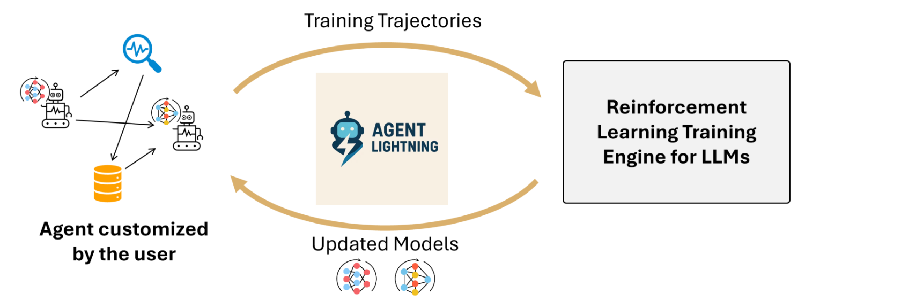
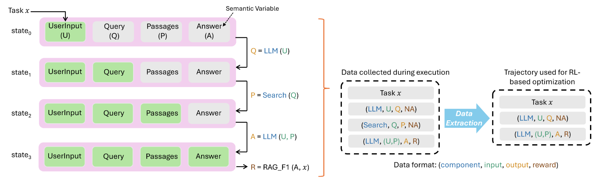
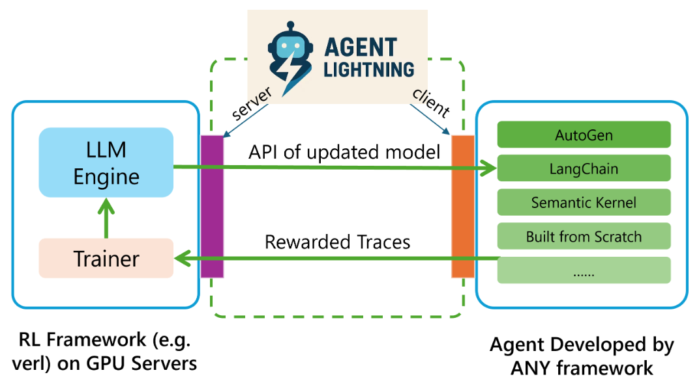
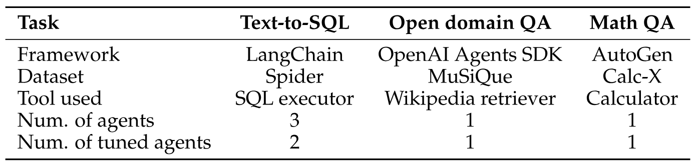
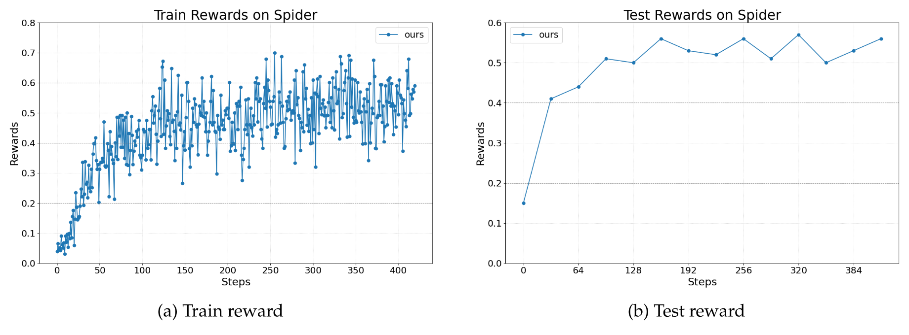
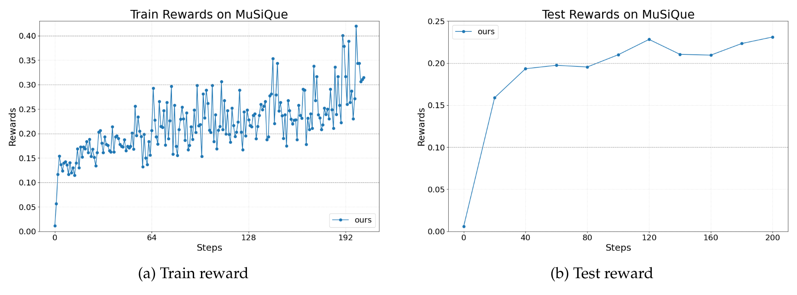
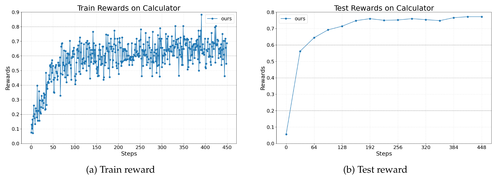
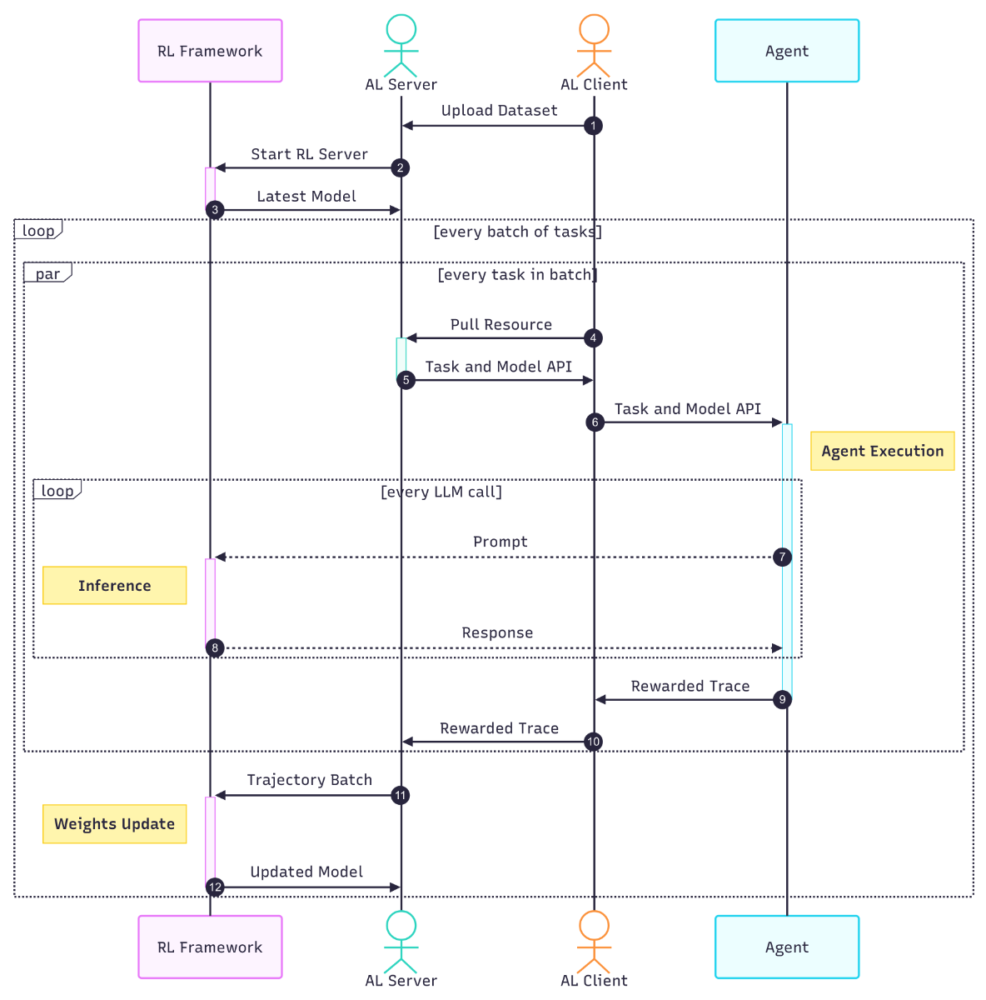

> [Xufang Luo](https://dblp.org/pid/218/7350.html), [Yuge Zhang](https://dblp.org/pid/256/1146.html), [Zhiyuan He](https://dblp.org/pid/10/4777.html) [+cofirst], [Zilong Wang](https://dblp.org/pid/42/898-6.html), [Siyun Zhao](https://dblp.org/pid/361/7173.html), [Dongsheng Li](https://www.microsoft.com/en-us/research/people/dongshengli/), [Luna K. Qiu](https://www.microsoft.com/en-us/research/people/lunaqiu/), [Yuqing Yang](https://dblp.org/pid/91/9064-1.html). 论文于 2025 年 8 月 5 日首次提交至 arXiv; 当前版本为 v1. [Agent Lightning: Train ANY AI Agents with Reinforcement Learning](https://arxiv.org/abs/2508.03680). [原始 PDF](/paper/agent-lightning.pdf). [DOI](https://doi.org/10.48550/arXiv.2508.03680). [TeX 源码](https://export.arxiv.org/e-print/2508.03680v1). 原始 PDF 是精确印刷版式与参考文献的权威版本.

## 摘要

我们提出 *Agent Lightning*, 一个灵活且可扩展的框架, 支持通过强化学习 (RL) 为任意 AI 智能体训练大语言模型 (LLM). 现有方法会将 RL 训练与智能体紧密耦合, 或依赖带掩码的序列拼接; 与之不同, *Agent Lightning* 将智能体执行与训练完全解耦, 几乎无需修改代码, 便可接入以多种方式开发的现有智能体 (例如使用 LangChain, OpenAI Agents SDK, AutoGen 等框架, 或从零构建). 我们将智能体执行形式化为马尔可夫决策过程, 定义统一数据接口, 并提出包含信用分配模块的分层 RL 算法 LightningRL, 从而把任意智能体生成的轨迹分解为训练转移. 这样一来, RL 便能处理多智能体场景、动态工作流等复杂交互逻辑. 在系统设计方面, 我们引入训练-智能体解耦架构, 并将智能体可观测性框架纳入智能体运行时, 提供标准化的智能体微调接口. 在 Text-to-SQL、检索增强生成和数学工具使用任务上的实验均取得稳定、持续的改进, 表明该框架可用于现实场景中的智能体训练与部署.

<span id="section-1"></span>

## 1 引言

大语言模型 (LLM) 近期的发展, 使 AI 智能体可以有效处理搜索、代码生成和工具使用等复杂任务. 这些智能体利用 LLM 的能力适应不同的任务要求, 因而具备很强的灵活性. 提示词工程虽能改善性能, LLM 仍有明显局限. 它们容易出错, 尤其是在部署到未明确训练过的场景时, 例如多轮编码工作流、私有领域数据集或陌生工具. 因此, AI 智能体仍难以可靠地解决产品中的端到端软件开发等复杂现实任务 [Liu24v]. 这一局限说明, 需要训练或微调智能体中的模型, 才能充分发挥 LLM 在这些场景中的潜力 [Che23d, Jin25b, Son25a, Mal25b].

此外, 在现实智能体中训练模型, 很可能会成为推进模型能力边界的关键. 智能体执行期间, 系统会生成丰富的交互数据, 其中包含现实问题求解的复杂过程. 这些现实经验在规模和多样性上都超过传统的人工整理数据集, 因而是未来 LLM 训练的关键资源 [Sil25, Yao25b, Kim25]. 利用这些数据进行微调, 既能改进智能体的专门技能, 也有助于开发更适合动态交互环境的通用 LLM.

<span id="figure-01"></span>



**图 1.** *Agent Lightning* 概览: 这是一个灵活且可扩展的框架, 支持通过强化学习为任意 AI 智能体训练 LLM.

强化学习 (RL) 推动了 DeepSeek-R1 [Dee25c] 和 Kimi k1.5 [Tea25h] 等推理模型的近期进展, 也为智能体场景中的 LLM 优化提供了有力范式. 监督学习需要细致的逐步标注, 而这类标注对于复杂交互任务既稀缺又昂贵; RL 则依赖基于结果的奖励信号. 因此, 它不再需要为每项任务专门整理数据, 并允许智能体直接从不同任务的环境反馈中学习所需行为. 此外, RL 的试错过程与人类获得问题求解技能的方式很相似, 使模型能够学习以部署环境为依据的动作策略. 这项能力有望把 LLM 生成的文本词元转化为现实动作, 因而 RL 很适合训练基于智能体的系统中的模型.

然而, 把 RL 范式扩展到智能体, 会在算法设计和系统实现两方面带来很大挑战. 现有面向 LLM 的 RL 方法和框架主要针对偏好对齐、数学推理等静态单次调用任务. 相比之下, 智能体的复杂性与多样性都超出了这一设定. 复杂性来自这样的事实: 执行过程往往包含多次 LLM 调用, 每次使用不同的提示和响应, 还会与外部工具、API 或环境交互. 多样性则源于不同应用需要按各自要求设计不同的智能体. 这些挑战阻碍了 RL 在智能体中用于大规模 LLM 调优.

我们提出 *Agent Lightning*, 一个灵活且可扩展的框架, 支持通过 RL 为任意 AI 智能体训练 LLM. 如[图 1](#figure-01) 所示, *Agent Lightning* 实现了*智能体执行与 RL 训练的完全解耦*, 让开发者几乎无需修改代码便可训练现有智能体.

这种解耦以把智能体执行形式化为马尔可夫决策过程 (MDP) 为基础. 其中, *状态*是智能体执行的当前快照, 包含足以描述执行状态的变量值. *动作*对应策略 LLM 生成的输出, 随后用它更新状态. 基于这一形式化, 我们提出统一的 RL 训练数据接口, 将智能体轨迹组织为转移序列. 每次转移都包含当前状态 (LLM 输入)、动作 (LLM 输出) 和奖励. 统一数据接口隐藏了底层编排逻辑和智能体框架细节, 因此适用于任意智能体. 此外, 为了使用收集到的转移优化策略 LLM, 我们引入专为智能体训练设计的分层 RL 算法 LightningRL. LightningRL 先为各次转移分配信用, 再以完全兼容现有 LLM 单轮 RL 方法的方式更新策略. 这种建模方法和算法有多项好处, 包括灵活构造上下文、同时选择性优化多个智能体, 以及缓解上下文累积造成的序列过长问题.

在上述具体形式化的基础上, *Agent Lightning* 引入训练-智能体解耦 (TA Disaggregation) 架构, 建立适用于任意智能体的标准化训练服务. 该框架由 Lightning Server 和 Lightning Client 构成. Lightning Server 是 RL 训练系统的控制器, 负责管理训练过程, 并向客户端公开更新后模型的类 OpenAI API. Lightning Client 包含两个功能组件: 一个负责与服务器通信以收发数据; 另一个运行智能体并收集数据, 即智能体运行时.

统一数据接口使智能体运行时可以把 OpenTelemetry [Ope25j] 等完整的可观测性框架用于训练过程中的轨迹收集. 这将可观测性基础设施与 RL 训练连接起来, 使优化技术能够利用丰富的监控数据, 并为提高可扩展性和灵活性打下基础. 智能体运行时还可以通过*自动中间奖励 (AIR)* 机制, 帮助算法缓解奖励稀疏. AIR 根据系统监控信号 (例如工具调用的返回状态) 为转移分配中间奖励. 开发者可以方便地定制该机制, 缓解智能体中的稀疏奖励问题, 使训练更有效.

我们通过多种任务验证 *Agent Lightning* 的效果, 包括使用 LangChain 实现的 Text-to-SQL 智能体、使用 OpenAI Agents SDK 构建的检索增强生成智能体, 以及使用 AutoGen 开发的带工具数学问答智能体. 这些实验的奖励曲线表明, *Agent Lightning* 在不同智能体场景中都能持续、稳定地提升性能, 可用于解决现实任务.

概括而言, *Agent Lightning* 从以下方面推进了智能体训练.

- *Agent Lightning* 是首个完全解耦智能体与 RL 训练的框架. 无论采用何种实现方式, 这种解耦都让 *Agent Lightning* 几乎无需修改代码便可接入任意 AI 智能体. 通过让训练与智能体执行逻辑一致, 它能直接改善智能体在现实应用中的性能. 开发者因而可以超越静态预训练模型, 充分利用可适应、可学习智能体的能力. 它也充当统一数据接口, 收集各种由智能体生成的数据以改善模型能力. 为实现这种解耦, *Agent Lightning* 在算法和基础设施两方面都采用了专门设计.

- 在算法方面, *Agent Lightning* 以智能体的 MDP 形式化为基础, 引入统一数据接口. 该接口隐藏不同智能体执行逻辑的复杂性, 使执行期间收集的数据可以直接转换为训练轨迹. 此外, Agent Lightning 使用带信用分配模块的分层 RL 框架, 将轨迹级回报分配给每次调用生成的响应. 该设计可以直接接入现有单轮 RL 算法, 实现高效训练.

- 在系统方面, *Agent Lightning* 引入训练-智能体解耦架构, 清晰分离 RL 训练与智能体执行. 该架构由 Lightning Server 和 Lightning Client 实现, 两者共同提供适用于任意智能体的标准化模型训练服务. Lightning Client 充当智能体运行时, 无需修改代码即可透明地管理智能体执行并收集轨迹. 该设计使训练场景可以复用可观测性基础设施, 兼顾可扩展性、伸缩能力以及对不同智能体框架的接入.

<span id="section-2"></span>

## 2 现代 AI 智能体

由于 AI 智能体种类繁多且发展迅速, 很难对其给出精确定义. 尽管已有多项工作尝试形式化并划分 AI 智能体 [Gra23, She23c, Ant24c, Ant25e, Kim25d, Xu25i], 我们的目的并非提出新定义. 我们改用一种抽象形式化, 作为对 AI 智能体的共同理解: *AI 智能体是一种软件系统, 其执行过程包含一次或多次 LLM 调用*. 这一定义涵盖了广泛的现有 AI 智能体, 从沿预定义代码路径运行的工作流系统 [Ant24c], 到可以动态规划、推理并执行长时程操作的高级多智能体系统 [Ant25e, Kim25d, Xu25i].

本节从较高层次介绍现代 AI 智能体, 包括构建智能体时使用的常见组件、这些组件的典型编排方式, 以及便于开发智能体的框架.

<span id="section-2-1"></span>

### 2.1 组件

一般而言, 智能体的构建组件可以分为两类.

- **LLM** 或更一般的基础模型 (FM), 是智能体中的核心推理与生成引擎. 每次 LLM 生成都是从输入 (提示) 到输出 (响应) 的无状态映射. LLM 的计算需求很高, 通常运行在高性能服务器或云平台上, 智能体则通过 API 端点访问它们, 既可以使用商业提供商 (例如 OpenAI, Google), 也可以使用自托管方案 (例如 vLLM [Kwo23], SGLang [Sgl25a]). 一个智能体可以使用多个 LLM, 每个 LLM 由唯一的端点 URL 标识, 用来执行不同任务或提供不同功能. 我们把智能体使用的 LLM 集合定义为 $\mathcal{M} = \{ M_i \}_{i=1}^m$, 其中 $m$ 是智能体中的 LLM 数量. 每个 $M_i$ 可以是不同的模型或版本; 为清楚起见, 还可以把模型名称与其参数 $\theta_i$ 关联起来.

- **工具**是智能体为执行特定任务而调用的功能, 例如从数据库检索信息、执行代码或与 API 交互. 工具可以是无状态的, 也可以是有状态的, 取决于它们是否在多次调用之间保留上下文. 工具还可以采用外部 API、本地程序或库等不同方式实现. 近期的工具往往遵循 MCP (Model Context Protocol) [Mod25] 或其他智能体通信协议, 以规范智能体与工具的交互, 实现顺畅接入和互操作. 令 $\mathcal{T} = \{ T_j \}_{j=1}^t$ 表示智能体可用的工具集合, 其中 $t$ 是工具数量.

<span id="section-2-2"></span>

### 2.2 编排

以组件集合 $\mathcal{M} \cup \mathcal{T}$ 作为功能构件时, 编排通常由用户根据任务要求定制, 包括执行流程、组件间依赖和执行顺序. [第 3.1.3 节](#section-3-1-3)给出了智能体及其执行流程的详细示例.

重要的是, 这种编排通常既不固定, 也不是确定性的. 现代 AI 智能体具有动态行为: LLM 可以根据不断变化的上下文决定后续动作或选择工具. 例如, 让 LLM 决定是优化查询还是直接回答问题后, 上述 RAG 智能体与数据库的交互轮数会发生变化. 游戏智能体是另一个例子. 生成动作并接收环境反馈的迭代过程可以表示为一系列 LLM 调用, 每次调用对应游戏中的一个决策步骤. 展开这一迭代过程后, 就能捕获智能体的动态行为: LLM 可根据当前游戏状态和先前动作调整策略.

这种动态交互包含丰富的任务特定行为, 可能有助于优化; 但它也给数据建模和下游学习带来很大困难, 导致使用当前 RL 训练框架实现不同智能体既不现实, 也难以扩展.

<span id="section-2-3"></span>

### 2.3 实现

开发者可以通过多种方式创建 AI 智能体. 一些人可能选择完全从零构建, 以获得完整的控制和定制能力. 另一些开发者则会使用成熟的智能体开发框架, 借助它们提供的基础设施加快开发. 这类框架包括 LangChain [Lan25c]、OpenAI Agents SDK [Ope25i] 和 AutoGen [Aut25a] 等编排平台.

智能体框架提供模块化组件 (LLM 和工具) 以及灵活的动态编排机制, 帮助用户定义能够适应任务要求和智能体运行状态的工作流. 但无论从零构建还是使用框架, 智能体通常都缺少自动自我改进机制, 也不涉及智能体优化. 在现实场景中, 尤其是处理私有数据时, 智能体性能往往达不到要求, 因而需要自动优化.

<span id="section-3"></span>

## 3 Agent Lightning

下面介绍所提出的 *Agent Lightning* 框架. 首先, 我们在[第 3.1 节](#section-3-1)定义统一数据接口, 规定智能体执行期间收集哪些数据, 且不依赖智能体设计. 接着, [第 3.2 节](#section-3-2)说明智能体中的马尔可夫决策过程, 为强化学习 (RL) 奠定基础. 随后, [第 3.3 节](#section-3-3)给出分层 RL 算法, 它利用从智能体收集的数据更新 LLM. 最后, [第 3.4 节](#section-3-4)介绍针对该任务设计的基础设施, 其中多项设计显著简化了智能体训练过程 [+1].

<span id="section-3-1"></span>

### 3.1 统一数据接口

数据驱动的智能体优化从根本上依赖智能体执行期间生成的数据. 因此, 在 *Agent Lightning* 中, 我们定义统一数据接口, 规定这些数据如何输入 RL 训练算法. 该接口具有很强的通用性, 可用于从任意 AI 智能体收集的数据.

AI 智能体是一类特殊软件; 与所有软件执行一样, 它可以表示为有向无环图 (DAG) [Aho07, Aba16]. 图中的每个节点对应集合 $\mathcal{M} \cup \mathcal{T}$ 中的一次组件调用 (LLM 或工具), 每条边表示组件间的依赖或控制流. 但是, 从无序的智能体执行轨迹中解析完整图并非易事, 而且我们发现训练并不需要这样做. 借助马尔可夫决策过程 (MDP) 的概念, 进行 RL 优化时只需识别当前*状态*以及影响状态转移的关键因素 (即*调用*).

<span id="section-3-1-1"></span>

#### 3.1.1 状态与调用

我们把 $\texttt{state}$ 定义为智能体执行的一个快照, 其中可以包含程序计数器、变量值、调用栈、资源上下文等信息. 这些信息可以抽象为一组随智能体执行而变化的变量. 由于智能体具有动态行为, 同一任务 $x$ 可以执行多次并产生不同的执行轨迹. 对 $x$ 的第 $k$ 次执行, 时刻 $t$ 含有 $V$ 个变量的 $\texttt{state}$ 表示为:

<span id="equation-01"></span>

$$
\texttt{state}_t(x,k) = \left\{ \texttt{variable}_i^{x,k,t} \right\}_{i=1}^{V}.
$$

状态在智能体执行期间不断变化. 例如, for 循环中的计数器会递增, 简单的字符串操作会修改中间变量. 但这些中间操作和辅助代码不是智能体优化的关键. 这里主要关注组件使用或修改、且表达关键语义 (例如程序意图) 的变量, 我们称之为*语义变量* [Qiu24]. [第 3.1.3 节](#section-3-1-3)和[图 2](#figure-02) 给出了状态与语义变量的具体示例.

语义变量通过智能体的*组件调用*发生变化. 假设 $x$ 的第 $k$ 次执行由 $N$ 次组件调用构成:

<span id="equation-02"></span>

$$
\texttt{execution}(x,k) = \left\{ \texttt{call}_i^{x,k} \right\}_{i=1}^{N},
$$

其中第 $i$ 次组件调用定义为一个 $\texttt{call}$:

<span id="equation-03"></span>

$$
\texttt{call}_i^{x,k} = (\texttt{meta}_i^{x,k}, \texttt{input}_i^{x,k}, \texttt{output}_i^{x,k}), \quad\mathrm{with}~\texttt{output}_i^{x,k} = C_i(\texttt{input}_i^{x,k}).
$$

这里, $C_i \in \mathcal{M} \cup \mathcal{T}$ 表示本次调用的组件 (LLM 或工具), $\texttt{input}_i^{x,k}$ 和 $\texttt{output}_i^{x,k}$ 分别表示输入与输出数据. $\texttt{meta}_i^{x,k}$ 包含相关的调用元信息, 例如 $C_i$ 的名称、类型、版本、API 端点, 以及 LLM 调用的采样策略、温度等运行时参数.

由于 $\texttt{state}$ 表示智能体快照, 所有输入和输出都是特定时刻的语义变量:

<span id="equation-04"></span>

$$
\texttt{input}_i^{x,k}\in\texttt{state}_{t_1}(x,k), \quad \texttt{output}_i^{x,k}\in \texttt{state}_{t_2}(x,k).
$$

$\texttt{state}$ 中并非所有信息都是被调用组件所需或可见的. 例如, [图 2](#figure-02) 中的 $\texttt{state}$ 虽包含 4 个语义变量, LLM 在编写第一个查询时只能看到用户输入, 搜索工具也只接收生成的查询作为输入.

<span id="section-3-1-2"></span>

#### 3.1.2 奖励与数据集

为了从智能体执行期间收集的数据中学习, 我们引入奖励信号来衡量任务完成质量. 每次智能体执行都附带标量奖励 $\{r_1, \dots, r_N\}$, 其中每个 $r_i \in \mathbb{R}$ 对应第 $i$ 次调用的质量. 带奖励信号的执行表示为:

<span id="equation-05"></span>

$$
\texttt{execution}^R(x,k) = \left\{ (\texttt{call}_i^{x,k},r_i^{x,k}) \right\}_{i=1}^{N}.
$$

奖励信号既可以在中间步骤提供, 也可以在智能体执行结束时提供, 具体取决于任务和智能体设计. 中间奖励 $r_i$ ($i < N$), 例如工具调用成功或任务部分完成的指示信号, 可以提供更细粒度的反馈并引导智能体学习. 最终奖励 $r_N$ 通常评估智能体完成整个任务的情况. 在许多现实场景中, 只能获得终止奖励 $r_N$ 来评估整次执行的结果. 这是一般形式的一种特殊情况: 中间奖励 $r_1, \dots, r_{N-1}$ 缺失, 学习仅依赖最终结果.

用于训练或评估的数据集由任务集合 $\mathcal{X}=\{x_1,\dots,x_{|\mathcal{X}|}\}$ 和奖励函数构成, 其中 $|\cdot|$ 表示集合大小. 任务可以执行多次, 每次执行都按照奖励函数进行标注.

<span id="figure-02"></span>



**图 2.** *Agent Lightning* 统一数据接口示意图. 左侧为智能体执行流程, 每次状态转移都表现为语义变量更新 (绿色矩形表示已有有效值的变量, 灰色矩形表示当前状态中尚未赋值的变量). 右侧为智能体执行期间收集的对应轨迹, 说明统一数据接口如何系统地捕获所有与基于 RL 的优化有关的转移.

<span id="section-3-1-3"></span>

#### 3.1.3 示例

为了具体说明智能体执行与统一数据接口, 下面考虑[图 2](#figure-02) 所示的典型检索增强生成 (RAG) 智能体. 该智能体先检索相关文档, 再根据这些文档生成响应, 从而回答用户查询. 智能体包括两个主要组件: 生成策略模型 ($\mathcal{M} = \{\mathrm{LLM}\}$) 和搜索工具 ($\mathcal{T} = \{\mathrm{Search}\}$).

执行流程如下:

1. 用户提交包含问题 (`UserInput`) 的特定任务 ($x$).

2. 智能体调用 LLM, 根据 `UserInput` 生成搜索查询 (`Query`).

3. Search 工具使用生成的 `Query` 检索相关段落 (`Passages`).

4. 智能体再次调用 LLM, 同时利用检索到的 `Passages` 和原始 `UserInput` 生成最终答案 (`Answer`).

执行结束后, 奖励函数 (例如 `RAG_F1`) 评估生成的 `Answer` 的质量. 在我们的形式化中, 每个 `state` 都包含语义变量的当前值 ([图 2](#figure-02) 中的绿色矩形表示值有效的变量, 灰色矩形表示当前状态中没有值的变量). 智能体执行时, 调用组件 (LLM 或工具) 会更新相应的语义变量, 从而转入下一个状态. 因此, 给定任务 $x$ 的智能体执行可表示为有序调用序列 ([图 2](#figure-02) 右侧), 每次调用都包含组件、输入、输出和相应奖励 (通常只有最后一次调用有奖励).

统一数据接口会捕获所有状态变化, 包括非 LLM 组件引起的变化, 因而支持灵活且高度可定制的优化方法. 例如, 它支持在多智能体系统中选择性优化特定智能体 (更多细节见[第 3.2.2 节](#section-3-2-2), 实验见[第 4.1 节](#section-4-1)), 也支持模型微调以外的优化, 如提示词调优. 本文虽聚焦以 LLM 为中心的优化, 这种可扩展性仍说明该方法适用范围很广. GitHub 仓库中提供了更多实现细节 [+2].

统一数据接口在每个状态中捕获完整执行上下文, 为策略学习提供足够信息, 从而清晰解耦智能体执行与 RL 训练. 该设计无需显式解析完整的执行 DAG, 也能容纳任意复杂的智能体交互逻辑, 因而大幅简化了面向不同智能体工作流的 RL 优化.

<span id="section-3-2"></span>

### 3.2 智能体中的马尔可夫决策过程

<span id="section-3-2-1"></span>

#### 3.2.1 形式化

先考虑一个简单情况: 智能体中只有一个需要优化的 LLM. 把该 LLM 视为策略模型时, 可将其决策过程建模为部分可观测马尔可夫决策过程 (POMDP), 作为应用 RL 的基础. POMDP 五元组 $\mathcal{M} = (\mathcal{S}, \mathcal{O}, \mathcal{A}, \mathcal{P}, \mathcal{R})$ 定义如下:

- $\mathcal{S}$ 是状态空间, 对应所有可能状态, 即 $\texttt{state}_t\in\mathcal{S}$;

- $\mathcal{O}$ 是观测空间, 对应策略 LLM 的所有可能输入, 即 $\texttt{input}_t\in\mathcal{O}$;

- $\mathcal{A}$ 是动作空间, 单个动作定义为策略 LLM 一次调用生成的完整词元序列, 即 $\texttt{output}_t\in\mathcal{A}$.

- $\mathcal{T}(s'|s,a)$ 定义转移到新状态的 (通常未知的) 动力学;

- $\mathcal{R}(s,a)$ 是奖励函数, 将状态-动作对映射为标量奖励;

具体而言, 每一步 $t$ 的智能体快照为 $\texttt{state}_t$, LLM 观测到上下文 $\texttt{input}_t$. 如[第 3.1.1 节](#section-3-1-1)所述, $\texttt{input}_t$ 是一个语义变量, 表示 $\texttt{state}_t$ 中策略 LLM 决策时可见或必需的部分. 随后, LLM 生成词元序列 $\texttt{output}_t = (y_{t,1}, y_{t,2}, \dots, y_{t, N_t})$ 作为输出. 该序列被视为单个动作, 记为 $a_t \in \mathcal{A}$. 执行 $a_t$ 后, 智能体转移到新的 $\texttt{state}_{t+1}$. 可以提供标量奖励 $r_t = \mathcal{R}(s_t, a_t)$ 来评估动作质量. 回报定义为奖励之和:

$$
R=\sum_{t=1}^T r_t.
$$

策略模型的目标是最大化回报.

<span id="section-3-2-2"></span>

#### 3.2.2 提取 RL 数据

根据上述 MDP 形式化, 我们需要为 RL 收集包含所有策略 LLM 决策及相应奖励的轨迹. 为此, 我们从每次执行 (即[式 5](#equation-05)) 中仅提取更新参数为 $\theta$ 的策略 LLM 所需的信息: LLM 调用的原始输入、输出及其奖励, 记为:

<span id="equation-06"></span>

<span id="equation-07"></span>

$$
\begin{aligned}
&\texttt{execution}^{\mathrm{RL}}(x,k) = \left\{( \texttt{input}_t^{x,k}, \texttt{output}_t^{x,k},r_t^{x,k}) \right\}_{t=1}^{T},\\
&\mathrm{with}~\texttt{output}_t^{x,k} = \pi_{\theta}(\texttt{input}_t^{x,k}).
\end{aligned}
$$

其中, $\pi_\theta$ 是待优化的 LLM, $T$ 是该轨迹中的调用次数. [图 2](#figure-02) 展示了这一数据提取过程.

LLM 调用无状态且非常灵活. 它们的输入可以编码复杂智能体逻辑产生的各种信息, 包括但不限于指定 LLM 角色或目标的指令提示、对话历史, 以及随任务和执行而变化的用户查询、推理步骤、检索文档等内容. 智能体框架还可能进一步渲染或解析这些输入与输出 (例如使用模板或结构化格式). 在 RL 训练中, 借助 MDP 形式化, 我们可以忽略繁琐多变的逻辑与处理, 只关注 LLM 当前的输入和输出. 这种方式省略了获得 LLM 输入的具体原因和来源. *这样的提取让我们不必繁琐地解析高度动态的智能体运行轨迹, 同时又不把这项工作简单化, 因而可以用 RL 优化任意 AI 智能体.*

总之, 统一数据接口和 MDP 形式化清晰分离了任务特定的智能体设计与基于学习的策略优化, 为模块化、动态智能体系统中的有效 RL 优化奠定基础.

**应用于单 LLM 多智能体设定.** 上述形式化也能灵活用于只有一个 LLM 的多智能体场景, 此时 LLM 可以根据提示在不同执行阶段承担多个角色. 对[图 2](#figure-02) 中的 RAG 示例, 第一次调用 LLM 时, 可以指示模型专注于搜索并生成搜索查询 $a_1$. 该查询修改 $\texttt{state}$, 形成新的 $\texttt{input}$. 第二次调用 LLM 时, 可以指示模型回答给定问题并生成最终答案 $a_2$. 该答案的质量决定最终奖励 $r_2$. 这样, 单个 LLM 可以充当两个智能体. 此外, *Agent Lightning* 把相应智能体的转移纳入优化过程, 从而支持在多智能体系统中选择性优化智能体. 与掩码方法相比, 选择转移更方便直观.

**扩展到多 LLM 设定.** 当多个具有各自参数的不同 LLM 必须联合优化时, 一种直接方法是把每个 LLM 视为独立 MDP 并分别优化. 这会简化训练, 但忽略策略间依赖, 可能导致次优协作. 更严谨的方法会使用多智能体强化学习 (MARL) 或博弈论, 把每个 LLM 视为具有自身目标与策略的智能体 [Low17, Zha21f]. 这类方法能更好地捕获潜在交互动态以及多个 LLM 间的竞争或合作行为.

<span id="section-3-3"></span>

### 3.3 LightningRL: 优化智能体中 LLM 的分层 RL 方法

<span id="section-3-3-1"></span>

#### 3.3.1 LLM 单轮强化学习预备知识

近期面向 LLM 的 RL 研究主要关注单次调用问题, 即模型一次生成对提示的响应. 这些算法主要用于数学和逻辑谜题等领域 [Dee25c, Xie25c]. 在这种设定下, 给定任务 $x$, LLM 根据策略 $\pi_\theta$ 逐词元生成响应 $\texttt{output} = (y_1, \ldots, y_N)$, 每个词元都视为一个动作. 完整响应生成后, 根据解答的正确性或质量分配标量奖励 $r(x, \texttt{output}, \hat{y})$, 其中 $\hat{y}$ 是任务 $x$ 的真实答案. 典型的词元级损失可简化为 [+3]:

<span id="equation-08"></span>

$$
\mathcal{L}(\theta) = -\mathbb{E}_{x \sim \mathcal{X},\, \texttt{output} \sim \pi_\theta(\cdot|x)}\left[ \sum_{j=1}^N \log \pi_\theta(y_j | x, y_{<j}) \cdot A_j \right],
$$

其中, $A_j$ 是词元级优势估计, $\mathcal{X}$ 是任务集合. 各种常用算法的核心差别在于如何估计优势项 $A_t$. 标准 PPO [Ouy22] 使用学习得到的评论家模型, 通过价值函数定义优势. 相比之下, 近期方法不再需要单独的价值函数, 从而简化训练. 例如, GRPO [Sha24d] 用同一提示生成的一组响应的奖励均值和标准差归一化某个响应的奖励, 由此计算优势. REINFORCE++ [Hu25d] 则采用更简单的基线, 把当前响应的奖励与整个训练批次平均奖励之差定义为优势.

<span id="section-3-3-2"></span>

#### 3.3.2 通过 LightningRL 扩展到智能体场景

在上述 MDP 形式化中, LLM 一次调用生成的完整词元序列被视为一个动作. 策略可能需要通过交互执行多个这样的动作, 才能完成一个完整回合. 相比之下, LLM 逐词元生成输出, 现有大多数 LLM RL 算法也面向单轮交互, 重点优化单个响应中的词元生成. 为衔接这两种设定, *Agent Lightning* 引入一种称为 LightningRL 的简单分层强化学习 (HRL) 方法. 它无需修改即可接入现有 LLM 单轮 RL 方法, 并有效支持任意智能体场景中的优化.

<span id="figure-03"></span>


**图 3.** LightningRL 算法示意图. **(a)** 单次调用 GRPO, LLM 一次生成任务响应. 同一任务的输出组成一组, 用于估计优势. **(b)** 以往的多轮 GRPO. 每条轨迹包含多次 LLM 调用, 同一任务的轨迹组成一组, 用于估计优势. 优化期间, 并非由 LLM 生成的词元会被掩盖 (灰色虚线框). **(c)** 本文提出的 LightningRL. 轨迹被分解为转移, 同一任务的转移组成一组, 用于估计优势. 每次转移包含当前输入/上下文、输出和奖励. 输入属于当前智能体状态, 奖励由信用分配模块计算.

如[图 3](#figure-03) 所示, *Agent Lightning* 使用转移组织数据, 每次转移定义为[式 6](#equation-06) 中的元组 $(\texttt{input}_t^{x,k}, \texttt{output}_t^{x,k}, r_t^{x,k})$. 无论上下文如何构造, 每次转移都包含当前 LLM 调用的输入上下文. LightningRL 采用两步机制: 信用分配模块先把回合级回报 $R$ 分配给各个动作; 然后在每个动作内进一步分解到词元, 产生词元级监督信号. 当前实现简单地假设回合内每个动作的价值相同, 都等于最终回报 $R$. 第二步则由现有的 LLM 单轮 RL 算法处理.

该设计有多项优势. *第一, 它无需修改便可直接使用任意单轮 RL 算法, 尤其是通常更轻量高效的无价值函数方法.* 例如在 GRPO 中, 同一提示生成的样本会组成一组来估计优势. 这里采用相同方式: 每个任务 $x$ 运行多次, 生成不同的执行数据, 再把每次执行分解为单独动作. 随后按任务对这些样本分组, 计算[式 8](#equation-08) 中的统计量. PPO 和 REINFORCE++ 也可以采用类似方式.

*第二, LightningRL 可以灵活构造策略观测*, 因为数据以单次转移为单位组织, 且每次转移都有自身奖励. 当前输入/观测可以根据状态灵活得到. 例如, $\texttt{input}_t$ 可以是 LLM 生成的先前步骤摘要、用模板组装的结构化提示, 或指明 LLM 当前角色的指令 ([第 3.2.2 节](#section-3-2-2)对此有说明). 以往方法通常把一条轨迹中的所有轮次拼接为单个响应, 再用掩码控制更新哪些部分; 这种方法无法支持如此灵活、模块化的上下文构造.

*第三, 与掩码策略相比, LightningRL 的实现更稳健、更易扩展.* 基于掩码的方法不仅要求训练与智能体执行逻辑紧密耦合, 还会破坏 LLM 词元的连续性, 而旋转位置嵌入 (RoPE) [Su24] 等常用位置编码方法假设这种连续性成立. 此外, 掩码会显著增加代码验证、调试和内核设计的复杂度; 当掩码变得复杂时, 往往会降低效率. LightningRL 则把智能体轨迹分解为转移, 自然符合 LLM 输入结构, 不需要额外掩码. 该设计简化了实现, 也提高了扩展能力. 同时, 以转移形式组织数据, 可以缓解拼接所有轮次时上下文不断累积并变得过长的问题. 长轨迹会拆成若干批转移, 因而可以使用批次累积等技术高效更新.

**更复杂的信用分配.** 信用分配模块将来可以接入更复杂的策略, 例如依据启发式规则或学习得到的模型分配信用. 一种可能的后续方向是引入高层价值函数, 分别估计每个动作 $a_t$ 的期望回报, 从而提供更细致的信用分配. 尽管如此, 实验结果表明, 简单的等值分配策略在多个场景和数据集上已经有效.

<span id="section-3-4"></span>

### 3.4 Agent Lightning 的系统设计

为现实智能体训练 LLM 是一项困难工作, 需要整合 RL 训练框架与智能体开发框架. 这些框架通常很复杂、变化快且彼此割裂, 难以协调. *Agent Lightning* 框架提供统一方案, 使开发者能够顺畅地使用 RL 和其他优化技术开发并训练智能体.

<span id="figure-04"></span>



**图 4.** 训练-智能体解耦架构.

<span id="section-3-4-1"></span>

#### 3.4.1 训练-智能体解耦架构

面向 LLM 的 RL 训练框架由两个主要组件构成: 训练器和 rollout. 训练器负责更新模型权重, rollout 则收集供训练器使用的轨迹数据. 对数学推理等单轮 RL 任务, rollout 过程很直接, 只需根据特定提示生成 LLM 响应. 对包含多轮交互和环境交互的智能体任务, rollout 则要求完整执行智能体. 这不仅包括多次 LLM 生成, 也包括工具使用等原生代码的执行.

*Agent Lightning* 的核心创新是训练-智能体解耦架构. 该架构把计算密集的 LLM 生成, 与轻量但多样灵活、由传统编程语言编写的应用逻辑和工具分离. 前者由 RL 框架管理, 并向后者公开类 OpenAI API, 如[图 4](#figure-04) 所示. 后者可以独立管理和执行, 无需与 GPU 资源部署在一起, 因而能够更灵活地定义智能体行为.

**智能体无关训练与训练器无关智能体.** *Agent Lightning* 训练-智能体解耦架构的一项主要优势, 是让训练框架与智能体彼此独立. 该设计使训练框架 (例如 VeRL [She24a]) 与智能体无关; 它只负责优化 LLM 和管理硬件资源, 不与具体的智能体逻辑耦合. 反过来, 客户端上的智能体也与训练器无关, 可以脱离训练框架的实现细节独立运行. 这种解耦为智能体开发与部署提供了很大灵活性, 开发者可以专注于智能体逻辑, 不受训练基础设施限制. [附录 A](#appendix-a) 给出代码示例, 说明如何使用 *Agent Lightning* 直接优化现有智能体, 体现其易用性与适应性.

为实现上述设计目标, *Agent Lightning* 引入由 *Agent Lightning* Server 和 *Agent Lightning* Client 组成的双组件架构, 如[图 4](#figure-04) 所示. 服务器负责接入 RL 框架, 管理训练过程与 LLM 优化. 它还负责组织任务、管理数据并与客户端通信. 客户端封装智能体, 使其可以脱离训练框架独立运行, 从而提高智能体开发与执行的灵活性. 用户上传任务数据集后, 与 RL 框架一同初始化的服务器会组织训练流程. 服务器把数据集划分为批次, 并通过事件驱动系统与客户端协作, 管理生成阶段和训练阶段之间的切换. 任务批次以库存方式分发给客户端: 服务器记录可用任务, 并在客户端就绪时分配任务. 每个任务都有唯一的类 OpenAI API 端点, 它会与任务同时传给客户端. 该端点让客户端连接服务器, 并支持数据追踪与捕获. 随后, 客户端在智能体运行时 ([第 3.4.2 节](#section-3-4-2)) 中执行智能体, 生成轨迹和奖励. 轨迹被收集并返回服务器, 由服务器处理后转发给训练框架, 用于更新模型参数. 该架构结合 RL 框架与智能体开发框架各自的优势, 支持高效、可扩展的智能体训练.

<span id="section-3-4-2"></span>

#### 3.4.2 智能体运行时

*Agent Lightning* 客户端是智能体的运行时管理器, 负责编排执行、捕获数据、处理错误并与服务器通信. 它使智能体训练工作流保持稳健、可扩展且高效.

**智能体执行的数据并行.** 在现代 RL 训练中, 大批量对于充分利用计算资源并降低 rollout 延迟至关重要, 后者是训练循环的瓶颈. 处理大批量数据时, 必须并行运行多个智能体实例. *Agent Lightning* 客户端利用数据并行, 高效地并发管理和执行多个智能体实例, 以提高吞吐量并降低延迟. 具体而言, 它实现了两级并行策略: 节点内并行是在一台机器上由一个客户端运行多个 worker, 每个 worker 执行不同的智能体实例; 节点间并行则是在不同机器上运行多个客户端, 各自管理一组智能体实例. 该架构支持灵活扩展, 并能在分布式系统中高效利用资源.

**无需修改代码的数据捕获.** 为顺畅接入现有智能体代码库, Lightning 客户端采用两种插桩技术捕获相关数据, 无需修改智能体逻辑. 第一种技术基于 OpenTelemetry [Ope25j] 和 AgentOps [Age25]. 它使用 OpenTelemetry 的追踪能力自动对智能体代码插桩, 捕获执行轨迹、LLM 调用和环境交互. 对不希望依赖 OpenTelemetry 的用户, *Agent Lightning* 还在类 OpenAI API 端点中内置了基础追踪机制. 该机制轻量且可扩展, 即使智能体开发框架不兼容 OpenTelemetry, 也能高效捕获数据.

**错误处理与稳健性.** 训练过程的稳定性和可靠性十分重要, 也容易受到各种故障影响, 尤其是在长时间训练会话中. 错误可能来自智能体崩溃、网络中断或无效输出等多种来源. 由于 RL 算法内在的探索与利用动态, 这类错误在 RL 训练中的发生频率可能远高于推理. 如果处理不当, 错误会造成长时间停机并浪费计算资源. 为此, *Agent Lightning* 客户端包含完整的错误处理机制, 保持训练稳健. 它能检测智能体代码没有妥善处理的故障, 如崩溃或长时间挂起的工具调用, 并避免这些故障中断整个训练过程. 失败任务可以重试或重新分配给其他智能体实例, 系统也会保留详细日志, 供调试和监控使用. 该设计缩短停机时间并提高训练效率, 使智能体性能能够持续改进.

**自动中间奖励 (AIR).** RL 训练中的奖励延迟且稀疏, 可能阻碍学习. 中间奖励在智能体执行的不同阶段提供反馈, 可以给出更频繁、信息量更高的信号, 从而显著改善训练过程. 但中间奖励往往需要昂贵的人工标注或复杂的奖励计算逻辑, 开销很高. 如何从智能体执行中挖掘中间奖励, 对训练过程十分重要. *Agent Lightning* 客户端提供 AIR 机制, 把系统监控数据转换为中间奖励, 让训练框架可以利用这些信号进行更有效的学习.

**用于扩展的环境与奖励服务.** 环境和奖励函数是 RL 训练的关键组件. 轻量且可以本地运行的环境与奖励函数, 可以直接在智能体实例所在的 worker 中执行. 但对于资源密集或初始化成本较高的组件, 如手机模拟器或复杂奖励计算逻辑, 把它们托管为共享服务更高效. 当前, *Agent Lightning* 客户端支持以简单池化方式托管环境和奖励计算服务, 将来也可以扩展为更复杂的无服务器架构.

<span id="section-4"></span>

## 4 结果

我们在三个不同任务上验证 *Agent Lightning* 的效果, 每个任务使用不同的智能体框架实现. [表 1](#table-01) 汇总了示例任务. 以下小节的结果表明, *Agent Lightning* 可以在不同场景中持续、稳定地改善性能, 可用于现实世界的智能体优化.

<span id="table-01"></span>



**表 1.** 实验任务与设定汇总.

<span id="section-4-1"></span>

### 4.1 通过 LangChain 实现 Text-to-SQL

在该任务中, 给定自然语言问题和数据库, 智能体必须生成 SQL 查询以检索相关信息, 再回答问题. 我们使用 Spider 数据集 [Yu18b], 这是一个复杂的跨领域 Text-to-SQL 基准, 用于评估模型根据自然语言问题生成可执行 SQL 查询的能力. 该数据集包含 200 个数据库上的 10,000 多个问题, 数据库模式多样, 覆盖 138 个不同领域, 要求模型在测试时泛化到未见数据库. 基础模型采用 $\texttt{Llama-3.2-3B-Instruct}$ [Met24a].

该案例使用 LangChain 实现, 并设计为多智能体系统. 系统包含 3 个智能体, 工作流如下. SQL 编写智能体先生成 SQL 查询, 随后执行查询. 如果查询正确, SQL 执行器返回数据库中的信息; 如果不正确, 则返回错误消息. 接着, 检查智能体评估 SQL 查询是否正确, 以及检索信息是否有效、充分. 该智能体决定改写查询还是直接生成答案. 如果需要改写, 改写智能体根据检查器 LLM 的反馈修改查询. 如果无需改写, 同一个改写智能体也负责问答, 使用检索信息和问题生成最终答案. 在该工作流中, SQL 生成、检查和改写由同一个 LLM 完成, 但针对每项任务使用不同提示, 实际上相当于 3 个智能体. 训练期间只优化其中两个, 即 SQL 编写智能体和改写智能体. 这两个智能体同时优化. 该案例说明, *Agent Lightning* 可以选择性优化多智能体系统中的一个或多个智能体.

该任务要求 LLM 具备多项能力, 包括生成并纠正语法和语义有效的 SQL 查询、检查查询和检索信息的质量、理解当前上下文以判断是否已检索到足够信息、改进 SQL 以获得正确信息, 最后根据检索结果回答问题.

该任务的奖励取决于问题的最终答案是否正确. 模型的最终性能也根据测试集上的答案准确率评估.

<span id="figure-05"></span>



**图 5.** Text-to-SQL 任务的奖励曲线.

如[图 5](#figure-05) 所示, *Agent Lightning* 使奖励稳定提高, 说明它可以优化包含代码生成和工具使用的复杂多步决策.

<span id="section-4-2"></span>

### 4.2 通过 OpenAI Agents SDK 实现检索增强生成

第二个任务是典型的检索增强生成 (RAG) 任务. 给定问题和文档数据库, 智能体先生成自然语言查询, 使用现有检索器工具检索支持文档. 我们使用 MuSiQue 数据集 [Tri22], 这是一个具有挑战性的多跳问答基准, 旨在促进真正的组合推理. 以往基准通常可以借助浅层捷径求解; MuSiQue 则采用自底向上的方法构建, 系统组合相互关联的单跳问题, 保证一个推理步骤关键地依赖另一步骤的输出. 为模拟现实搜索设定, 给定数据库是包含 2,100 万篇文档的完整 Wikipedia. 检索工具使用 BGE 模型 [Baa23, Zha23k] 生成的嵌入和余弦相似度. 多跳问题与庞大的搜索来源给智能体带来了很大困难. 基础模型采用 $\texttt{Llama-3.2-3B-Instruct}$ [Met24a].

该智能体使用 OpenAI Agents SDK 实现. 工作流与前一个 Text-to-SQL 任务相似, 但更简单. 策略 LLM 先生成查询, 再根据检索文档决定改进查询还是生成答案. 该工作流只使用一个 LLM, 不采用多智能体设定, 即只用一条指令包含 LLM 需要完成的所有工作. 与 SQL 任务不同, 这里的查询是自由文本, 因而检索和推理步骤更开放. 给定数据库也比前一任务大得多. 该任务测试智能体能否构造语义有效的检索查询, 并根据检索文本进行推理.

训练奖励是格式分数 $R_{\mathrm{format}}$ 与正确性分数的加权组合. 具体而言, 如果 LLM 能按指定格式输出, 格式分数为 1; 相应内容必须用特定词元包围, 例如 $\texttt{<think>...</think>}$、$\texttt{<query>...</query>}$ 和 $\texttt{<answer>...</answer>}$. 正确性分数 $R_{\mathrm{correctness}}$ 则是预测答案与标准答案之间的词级 F1 分数. 两个分数组合为 $R=0.9 \times R_{\mathrm{correctness}} + 0.1  \times R_{\mathrm{format}}$.

<span id="figure-06"></span>



**图 6.** 检索增强生成任务的奖励曲线.

[图 6](#figure-06) 表明, *Agent Lightning* 在这项困难任务上使性能稳定提高, 说明它在更复杂、更开放的 RAG 场景中同样有效.

<span id="section-4-3"></span>

### 4.3 通过 AutoGen 实现带工具的数学问答

第三个任务是以数学为重点的问答任务, 评估智能体调用工具 (具体为计算器) 解决算术和符号问题的能力. 我们使用 Calc-X 数据集 [Kad23], 其中包含多种需要推理和精确计算的数学问题. Calc-X 修改了 GSM8K 和 Ape210K 等现有数学数据集, 强调把外部工具接入推理工作流, 很适合测试工具增强智能体. 基础模型采用 $\texttt{Llama-3.2-3B-Instruct}$ [Met24a].

该智能体通过 AutoGen 实现, 工作流简单但大量使用工具. 给定自然语言数学问题, 智能体必须决定何时以及如何调用计算器工具计算中间值, 再给出最终答案. 工作流由单个 LLM 执行, 它负责生成工具调用、解释工具输出并形成最终答案. 这要求模型理解数学问题结构, 发出语法正确的工具调用, 并把工具输出恰当地纳入最终推理链.

最终奖励取决于智能体能否正确回答问题, 模型性能也以测试集上的答案准确率评估.

<span id="figure-07"></span>



**图 7.** 计算器任务的奖励曲线.

如[图 7](#figure-07) 所示, *Agent Lightning* 在训练期间持续改善性能. 这说明它适用于工具增强设定, 其中既需要精确调用外部函数, 也需要推理.

<span id="section-5"></span>

## 5 讨论

<span id="section-5-1"></span>

### 5.1 相关工作

**LLM 多轮 RL 的近期进展.** 随着 LLM RL 的发展以及 verl [She24a] 等开源 RL 训练框架出现, 人们越来越关注如何扩展这些框架, 以支持更复杂的智能体训练场景. RAGEN [Wan25ag]、Trinity-RFT [Pan25a]、rLLM [Tan25e]、Search-R1 [Jin25b, Thu25] 等近期工作探索了多轮交互环境中的 RL. 这些方法通常把智能体的多轮交互拼接成单个长序列, 并分配特定掩码以保证正确优化.

我们不进行拼接, 而是利用 MDP 形式化、统一数据接口和信用分配模块, 把数据组织成单次转移. 这种方式在捕获现实智能体特有的复杂交互逻辑时有多项好处. *第一*, 基于转移的建模支持多种智能体架构和工作流 [Ant25e], 包括多智能体编排. 这种灵活性衔接了训练与部署, 使基于 RL 的优化符合现实智能体动态、多样的特点. 基于拼接的方法只适合采用简单顺序工作流的少数智能体, 难以处理更复杂的模式. *第二*, 以转移而非拼接轮次组织数据, 可以缓解上下文长度累积. 智能体通过多轮交互、工具输出、协议交换 (例如 MCP [Mod25]) 和多智能体通信不断累积上下文, 产生的序列经常超过 LLM 输入长度限制, 或使训练服务需要更多计算与内存. 把一次转移视为单个样本, 能显著缓解轮次累积造成的序列增长. *第三*, 由于训练样本只包含当前 LLM 输入, 该框架不需要自定义掩码策略. 而拼接方法要想正确优化, 必须为输入、损失和注意力机制设计自定义掩码策略. 这些掩码策略通常针对特定应用、难以泛化, 还要求训练过程与智能体执行逻辑紧密耦合. 它们也会破坏位置连续性, 加大实现和调试难度. *第四*, 基于转移的形式化可以接入分层 RL 算法 [Zho24i] 等高级 RL 算法, 后者能提供更有效的信用分配机制. 这种算法灵活性为面向复杂智能体场景的新 RL 方法提供了空间.

**面向 LLM 的大规模 RL 训练系统.** LLM RL 的发展离不开稳定、稳健的训练系统, 包括 verl [She24a]、OpenRLHF [Hu25a]、TRL [Wer20]、ROLL [Wan25z]、AReaL [Fu25] 等. 这些系统主要关注单轮场景中的高效 LLM 训练. 它们虽然也提供面向智能体应用的扩展 [Cao25b, Ver25], 通常却要求开发者在训练系统内部重新构建智能体. 这可能是因为现有 RL 框架往往要求训练端了解智能体执行逻辑, 才能正确组织训练数据, 例如确定拼接顺序以及在何处应用掩码. 因此, 智能体必须以与训练框架紧密耦合的方式实现. 但现有智能体开发生态多种多样, 很难满足这一限制. 在实践中, 现实智能体高度可定制, 通常使用 OpenAI Agents SDK [Ope25i]、LangChain [Lan25c]、AutoGen [Aut25a] 等不同框架开发, 也可能直接使用 LLM SDK 从零构建. 把这些智能体迁移到现有 RL 框架时, 用户通常必须手工调整或重新实现智能体执行逻辑, 以符合框架要求. 这一过程耗费人力、容易出错, 也难以扩展到异构智能体生态. 迁移通常还要求用户具备 RL 训练框架方面的专门知识, 例如熟悉 Ray [Mor18] 或其他分布式系统, 对许多开发者形成较高门槛. 此外, 紧密耦合也给 RL 训练过程本身增加负担, 因为智能体可能依赖各种 MCP 服务器、外部工具和 API. 把这些组件集成到 RL 训练框架会增加复杂性与额外开销, 分散对核心 RL 目标的关注, 并使维护和扩展更困难.

该框架在系统设计上与上述工作明显不同, 因为我们彻底解耦 RL 训练与智能体. 因此, 无需在 RL 训练引擎中编写数据收集逻辑, 智能体端也几乎不用修改代码. 无论智能体使用不同框架开发还是由用户从零构建, 都能顺畅接入. 此外, 这种建模在理论上支持多种 RL 训练框架, 进一步提高灵活性和扩展能力.

**以算法为中心的多轮 RL 工作.** 多轮 RL 一直是 RL 算法领域关注的主题. ArCHer [Zho24i] 探索文本游戏, WebShop [Yao22c] 则关注电子商务任务. 这些工作通常涉及 RL 智能体与环境进行多轮交互, 但实验往往只使用较小的策略模型 (例如参数少于 1B), 或采用参数高效微调 (PEFT), 因而其实现很难复用于大规模模型.

**特定应用的 RL 训练.** DeepSeek-R1 [Dee25c] 中 RL 方法成功后, 人们开始广泛关注把 RL 用于 RAG、编码等特定场景. Search-R1 [Jin25b] 和 R1-Searcher [Son25a] 使用 RL 训练 LLM 生成更好的查询并改善搜索能力, 与[第 4.2 节](#section-4-2)的 RAG 示例类似. DeepSWE [Luo25d] 通过多轮交互教 LLM 编写代码、调用函数和使用 API. 在[第 4.1 节](#section-4-1)的 Text-to-SQL 示例中, LLM 生成简单 SQL 查询. ReTool [Fen25a] 和 SimpleTIR [Xue25a] 等工作则希望通过 RL 学习增强工具集成长程推理.

这些工作主要聚焦特定任务或场景, 训练和推理通常依赖预定义工作流. 因此, 它们的目标并非通用智能体训练. 我们的方法则不受特定任务或场景限制, 而是为任意 AI 智能体提供统一方法, 衔接 AI 智能体与 RL 训练方法.

<span id="section-5-2"></span>

### 5.2 未来工作

**更多优化方法.** 除 RL 外, 该建模框架也能支持其他优化方法, 例如[第 3.1.3 节](#section-3-1-3)提到的自动提示词优化. 更一般地说, 关注关键组件及其调用是智能体优化的一项基本原则, 并不限于基于 RL 的方法. 因此, 我们引入*关注组件* (CoI) 概念, 指定执行轨迹中需要优化的组件子集. 例如, 提示模板渲染可以视为工具调用; 把该工具视为 CoI 后, *Agent Lightning* 就能支持提示词优化方法. 这种统一、可扩展的数据结构支持完整的下游优化与智能体行为分析. 支持更多优化方法是未来开发路线的一部分.

**改进 RL 算法.** 开发更高效的 RL 算法, 是解决复杂智能体场景中模型优化问题的关键. 相关方向包括但不限于长时程信用分配、探索算法和离策略算法. Agent Lightning 按转移对数据建模和组织, 因而更便于接入其他算法.

**推进智能体 RL 系统基础设施.** 支持 LLM RL 的基础设施仍在发展, 为 *Agent Lightning* 等智能体 RL 框架的协同开发提供了很多机会. 一个值得探索的方向是进一步解耦系统组件, 具体而言, 分离训练器、rollout (推理引擎) 和智能体工作流, 以解决 rollout 瓶颈并提高大规模 RL 训练的扩展能力. 这类架构改进可以形成更高效、灵活的 RL 流水线. 此外, 长时程任务优化需要 RL 算法与系统设计协同创新, 才能更有效地训练复杂智能体.

**高效服务.** 在 LLM 服务方面, 可以探索对 LLM 更友好的高级抽象 (例如 Parrot [Qiu24]), 以优化资源利用率和响应时间. 对长上下文加速, 可以使用面向长上下文处理的稀疏计算等技术 (例如 Minference [Jia24e]) 显著改善性能. 更好的服务环境与工具资源调度, 也能进一步简化操作, 提高不同部署场景中的扩展能力.

<span id="appendix-a"></span>

## 附录 A 使用 Agent Lightning 优化现有智能体的示例

下面给出使用 Agent Lightning 优化现有智能体的示例. 假设一个简单智能体会与游戏环境交互 (例如 20 Questions 或猜数字), 我们可以使用 Agent Lightning 框架优化其性能, 而无需修改智能体代码本身. 智能体的典型文件夹结构如下:

```text
agent/
  |- data/train.jsonl
  |- environments/game_server.py
  |- agent.py
```

**代码清单 1:** 智能体代码文件夹结构

在该示例中, `agent.py` 文件包含智能体逻辑函数 `agent_function`, 它接收 LLM 端点和游戏环境, 并返回游戏答案. 游戏服务器由 `environments/game_server.py` 创建, `(game_seed, ground_truth)` 对保存在 `data/train.jsonl` 中. 要使用 Agent Lightning 优化该智能体, 可以创建 `train.py` 文件, 其中使用 Agent Lightning 框架优化智能体性能, 无需修改智能体代码. 示例做法如下 [+4]:

```python
# train.py
from agent import agent_function
from environments.game_server import GameServer
from agent_lightning import Client, Resource, Task

# TODO: 环境可以单独管理
game_server = GameServer()

# Task 对应 `.jsonl` 文件中存储的数据对象
# Resource 是从服务器拉取的元数据,
#   其中包含 LLM 端点
def agent_run(resource: Resource, task: Task):
  game_url = game_server.create_game(task.game_seed)
  answer = agent_function(resource.model_api, game_url)
  reward = game_url.score(answer, task.ground_truth)
  return reward

# 启动 AgentLightningServer, 并通过环境变量传入其 URL
client = Client(os.environ["AgentLightningServerUrl"])
# 也可以指定预先上传的数据 ID
client.upload_data("data/train.jsonl", test_file=None)
client.train(agent_run, nworkers=-1)
```

**代码清单 2:** Agent Lightning 训练脚本

<span id="appendix-b"></span>

## 附录 B Agent Lightning 流程图

<span id="figure-08"></span>



**图 8.** 流程图.

[+cofirst]: 共同第一作者.

[+1]: 为了清楚、准确地指代相关概念, 本文用“执行”表示一次智能体运行期间收集的数据. “轨迹/回合”强调为 RL 训练提取的数据.

[+2]: <https://github.com/microsoft/agent-lightning/tree/main/examples/apo>

[+3]: 本式省略了重要性采样比率、裁剪和 KL 散度项等改进与约束, 但最终算法会相应采用这些内容.

[+4]: 开源 API 可能发生变化. 最新信息请以 GitHub 仓库为准.
