> [Ashish Vaswani](https://x.com/ashvaswani), [Noam Shazeer](https://www.noamshazeer.com/), [Niki Parmar](https://x.com/nikiparmar09), [Jakob Uszkoreit](http://jakob.uszkoreit.net/), [Llion Jones](https://x.com/LlionJ), [Aidan N. Gomez](https://aidangomez.ca/), [Lukasz Kaiser](http://liafa.jussieu.fr/~kaiser/), and [Illia Polosukhin](https://ilblackdragon.com/). 首次提交至 arXiv: June 12, 2017; 当前版本为 v7. [Attention Is All You Need](https://arxiv.org/abs/1706.03762). [原始 PDF](/paper/attention-is-all-you-need.pdf). [TeX 源码](https://export.arxiv.org/e-print/1706.03762). 精确的印刷版式和参考文献以原始 PDF 为准.

在提供适当归属的前提下, 谷歌特此授予许可, 仅将本文中的表格和图形用于新闻或学术作品的再现.

## 摘要

主流的序列转换模型基于复杂的循环或卷积神经网络, 包括编码器和解码器. 性能最好的模型也通过注意力机制将编码器和解码器连接起来. 我们提出了一种新的简单网络架构——Transformer, 仅基于注意力机制, 完全摒弃了循环和卷积. 在两个机器翻译任务上的实验表明, 这些模型在质量上表现更优, 同时更易并行, 并且训练所需时间显著减少. 我们的模型在 WMT 2014 英语到德语翻译任务中实现了 28.4 BLEU, 较现有最佳结果 (包括集成模型) 提高了超过 2 BLEU. 在 WMT 2014 英语到法语翻译任务中, 我们的模型在八个 GPU 上训练 3.5 天后, 建立了单模型的新最先进 BLEU 分数 41.8, 这只是文献中最佳模型训练成本的一小部分. 我们展示了 Transformer 在其他任务中也能很好泛化, 通过成功将其应用于英语句法分析, 既适用于大规模训练数据, 也适用于有限训练数据.

## 1 引言

循环神经网络, 长短期记忆 [Neural97] 和门控循环 [CoRRb14] 神经网络尤其如此, 已经被确立为序列建模和转导问题 (如语言建模和机器翻译 [System14, CoRR14, CoRRa14]) 的最先进方法. 此后, 许多努力持续推动循环语言模型和编码器- 解码器架构的边界 [Xivh16, Xivd15, Xivf16].

循环模型通常沿着输入和输出序列的符号位置来分配计算. 将位置对齐到计算时间步骤, 它们生成一系列隐藏状态 $h_{t}$, 作为前一个隐藏状态 $h_{t-1}$ 和位置输入 $t$ 的函数. 这种固有的顺序性质阻止了训练样本内的并行化, 这在序列长度较长时变得至关重要, 因为内存限制限制了跨样本的批处理. 最近的工作通过分解技巧 [Xivb17] 和条件计算 [Xive17] 实现了计算效率的显著提升, 同时在后者的情况下也提高了模型性能. 然而, 顺序计算的基本限制依然存在.

注意力机制已成为各种任务中引人注目的序列建模和转换模型的重要组成部分, 它允许在输入或输出序列中建模依赖关系而不考虑它们的距离 [CoRR14, Repres17]. 然而, 除了少数几例 [Proces16], 这种注意力机制通常与循环网络结合使用.

在本工作中, 我们提出了 Transformer, 一种摒弃循环的模型架构, 而完全依赖注意力机制来建立输入和输出之间的全局依赖. Transformer 允许显著更多的并行化, 并且在只用八个 P100 GPU 训练十二小时后, 就能达到翻译质量的新最先进水平.

## 2 背景

减少顺序计算的目标也构成了扩展神经 GPU (Extended Neural GPU) [NIPS16], ByteNet [Xiva17] 及 ConvS2S [Xiv17] 的基础, 这些模型都使用卷积神经网络作为基本构建模块, 为所有输入和输出位置并行计算隐藏表示. 在这些模型中, 将来自任意两个输入或输出位置的信号联系起来所需的操作数量会随着位置之间的距离增长, 对于 ConvS2S 是线性增长, 对于 ByteNet 是对数增长. 这使得学习远距离位置之间的依赖关系更加困难 [Gradie01]. 在 Transformer 中, 这一计算降低为恒定数量的操作, 尽管代价是由于对注意力加权位置进行平均而导致有效分辨率降低, 我们通过 3.2 节所描述的多头注意力 (Multi-Head Attention) 来进行补偿 #S3.SS2.

自注意力, 有时称为内部注意力, 是一种关联单个序列中不同位置以计算序列表示的注意力机制. 自注意力已成功应用于多种任务, 包括阅读理解, 摘要生成, 文本蕴涵和学习任务无关的句子表示 [Xivd16, Proces16, Xivd17, Xivc17].

端到端记忆网络基于循环注意力机制, 而不是序列对齐的循环, 并且已被证明在简单语言问答和语言建模任务中表现良好 [Inc15].

然而, 据我们所知, Transformer 是第一个完全依赖自注意力来计算输入和输出表示的转换模型, 而不使用序列对齐的 RNN 或卷积. 在接下来的章节中, 我们将描述 Transformer, 解释自注意力的动机, 并讨论它相对于 [ICLR16, Xiva17] 和 [Xiv17] 这样的模型的优势.

## 3 模型架构

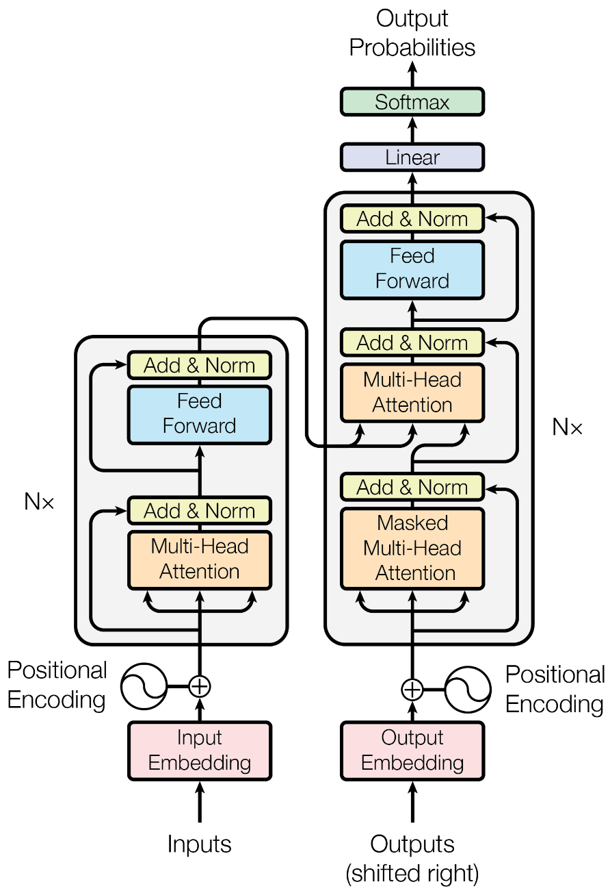

**图 1.** Transformer - 模型架构.

大多数具有竞争力的神经序列转导模型都有编码器- 解码器结构 [CoRRa14, CoRR14, System14]. 在这里, 编码器将输入符号表示序列 $(x_{1},...,x_{n})$ 映射为连续表示序列 $\mathbf{z}=(z_{1},...,z_{n})$. 给定 $\mathbf{z}$, 解码器随后一次生成一个符号的输出序列 $(y_{1},...,y_{m})$. 在每个步骤中, 模型是自回归的 [Xivd13], 在生成下一个符号时会将之前生成的符号作为额外输入.

Transformer 遵循这一总体架构, 对编码器和解码器都采用堆叠自注意力和逐点全连接层, 分别如[图 1](#figure-01) 的左半部分和右半部分所示.

### 3.1 编码器和解码器堆栈

##### 编码器:

编码器由一层一层堆叠的 $N=6$ 相同的层组成. 每一层都有两个子层. 第一个是多头自注意力机制, 第二个是一个简单的按位置全连接前馈网络. 我们在每两个子层周围使用残差连接 [Recogn16], 随后进行层归一化 [Xivc16]. 也就是说, 每个子层的输出是 $\mathrm{LayerNorm}(x+\mathrm{Sublayer}(x))$, 其中 $\mathrm{Sublayer}(x)$ 是子层自身实现的函数. 为了方便这些残差连接, 模型中的所有子层以及嵌入层都生成维度为 $d_{\mathrm{model}}=512$ 的输出.

##### 解码器:

解码器也由一系列相同的层组成. 除了每个编码器层中的两个子层之外, 解码器还插入了第三个子层, 用于对编码器堆栈的输出执行多头注意力. 与编码器类似, 我们在每个子层周围使用残差连接, 随后进行层归一化. 我们还修改了解码器堆栈中的自注意力子层, 以防止位置关注后续位置. 这种掩码, 结合输出嵌入偏移一个位置的事实, 确保位置 $i$ 的预测只能依赖于小于 $i$ 位置的已知输出.

### 3.2 注意力

注意力函数可以描述为将查询和一组键- 值对映射到输出, 其中查询, 键, 值和输出都是向量. 输出是值的加权和, 其中分配给每个值的权重是通过查询与相应键的兼容函数计算得出的.

#### 3.2.1 缩放点积注意力

我们将特定的注意力称为“缩放点积注意力” ([图 2](#figure-02)). 输入包括维度为 $d_{k}$ 的查询和键, 以及维度为 $d_{v}$ 的值. 我们计算查询与所有键的点积, 将每个点积除以 $\sqrt{d_{k}}$, 然后应用 softmax 函数以获得值的权重.

在实际操作中, 我们同时在一组查询上计算注意力函数, 这些查询被打包到矩阵 $Q$ 中. 键和值也分别打包到矩阵 $K$ 和 $V$ 中. 我们计算输出矩阵为:

$$
\mathrm{Attention}(Q,K,V)=\mathrm{softmax}(\frac{\mathrm{QK}^\top}{\sqrt{d_{k}}})V\tag{1}
$$

最常用的两种注意力函数是加性注意力 [CoRR14] 和点积 (乘性) 注意力. 点积注意力与我们的算法完全相同, 除了 $\frac{1}{\sqrt{d_{k}}}$ 的缩放因子之外. 加性注意力使用具有单个隐藏层的前馈网络来计算兼容性函数. 虽然两者在理论复杂性上相似, 但在实际应用中, 由于可以使用高度优化的矩阵乘法代码实现, 点积注意力速度更快且空间效率更高.

当 $d_{k}$ 的值较小时, 这两种机制的性能相似, 但对于较大的 $d_{k}$ 值, 未经过缩放的加性注意力优于点积注意力 [CoRR17]. 我们怀疑, 当 $d_{k}$ 的值较大时, 点积的数值会变大, 使 softmax 函数进入梯度极小的区域 [+8]. 为了抵消这一效应, 我们将点积乘以 $\frac{1}{\sqrt{d_{k}}}$ 进行缩放.

#### 3.2.2 多头注意力

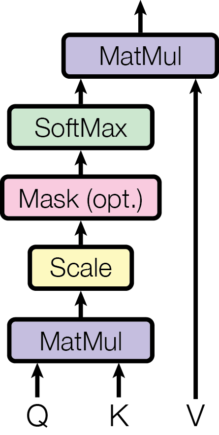

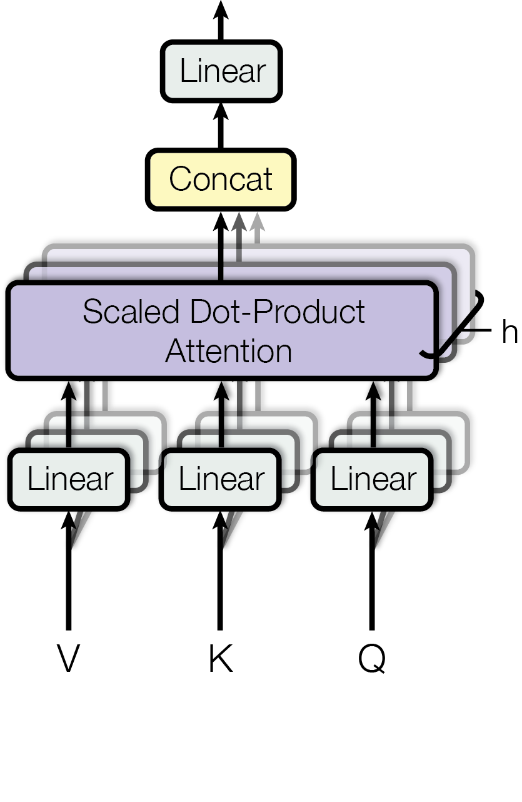

**图 2.** (左) 缩放点积注意力. (右) 多头注意力由几个并行运行的注意力层组成.

与其使用 $d_{\mathrm{model}}$ 维度的键, 值和查询执行单一的注意力函数, 我们发现将查询, 键和值用不同的, 学习得到的线性投影分别线性投影 $h$ 次到 $d_{k}$, $d_{k}$ 和 $d_{v}$ 维度更加有益. 在这些投影后的查询, 键和值中, 我们并行执行注意力函数, 产生 $d_{v}$ 维度的输出值. 这些输出值被连接起来并再次进行投影, 从而得到最终的值, 如 [图 2](#figure-02) 所示.

多头注意力使模型能够同时关注不同位置的不同表示子空间的信息. 对于单个注意力头, 平均化会抑制这一点.

$$
\mathrm{MultiHead}(Q,K,V)\qquad =\mathrm{Concat}(\mathrm{\mathrm{head}_{1}},...,\mathrm{\mathrm{head}_{h}})W^{O}
$$

$$
\mathrm{where}~{}\mathrm{\mathrm{head}_{i}}\qquad =\mathrm{Attention}(\mathrm{QW}^{Q}_{i},\mathrm{KW}^{K}_{i},\mathrm{VW}^{V}_{i})
$$

其中投影是参数矩阵 $W^{Q}_{i}\in\mathbb{R}^{d_{\mathrm{model}}\times d_{k}}$, $W^{K}_{i}\in\mathbb{R}^{d_{\mathrm{model}}\times d_{k}}$, $W^{V}_{i}\in\mathbb{R}^{d_{\mathrm{model}}\times d_{v}}$ 和 $W^{O}\in\mathbb{R}^{\mathrm{hd}_{v}\times d_{\mathrm{model}}}$.

在本工作中, 我们采用 $h=8$ 并行注意力层或头. 对于每一个, 我们使用 $d_{k}=d_{v}=d_{\mathrm{model}}/h=64$. 由于每个头的维度减小, 总计算成本与全维度的单头注意力类似.

#### 3.2.3 我们模型中注意力的应用

Transformer 在三个不同的方面使用多头注意力:

- •

在“编码器- 解码器注意力”层中, 查询来自前一个解码器层, 而记忆键和值来自编码器的输出. 这允许解码器中的每个位置关注输入序列中的所有位置. 这模仿了序列到序列模型中典型的编码器- 解码器注意力机制, 例如 [Xivh16, CoRR14, Xiv17].

- •

编码器包含自注意力层. 在自注意力层中, 所有的键, 值和查询都来自同一个地方, 在这里是编码器前一层的输出. 编码器中的每个位置都可以关注编码器前一层的所有位置.

- •

类似地, 解码器中的自注意力层允许解码器中的每个位置关注解码器中直到该位置 (包括该位置) 的所有位置. 我们需要在解码器中防止左向信息流, 以保留自回归特性. 我们通过在缩放点积注意力中屏蔽掉 (设置为 $-\infty$) 对应非法连接的 softmax 输入中的所有值来实现这一点. 参见 [图 2](#figure-02).

### 3.3 逐位置前馈网络

除了注意力子层之外, 我们的编码器和解码器中的每一层都包含一个全连接前馈网络, 该网络对每个位置分开且一致地应用. 这包括两次线性变换, 中间有一个 ReLU 激活函数.

$$
\mathrm{FFN}(x)=\max(0,\mathrm{xW}_{1}+b_{1})W_{2}+b_{2}\tag{2}
$$

虽然线性变换在不同位置上是相同的, 但它们在每一层使用的参数不同. 另一种描述方法是将其视为两个卷积, 卷积核大小为 1. 输入和输出的维度为 $d_{\mathrm{model}}=512$, 内层的维度为 $d_{\mathrm{ff}}=2048$.

### 3.4 嵌入和 Softmax

与其他序列转换模型类似, 我们使用学习到的嵌入将输入标记和输出标记转换为维度为 $d_{\mathrm{model}}$ 的向量. 我们还使用通常的学习线性变换和 softmax 函数将解码器输出转换为预测的下一个标记概率. 在我们的模型中, 我们在两个嵌入层和 softmax 之前的线性变换之间共享相同的权重矩阵, 类似 [Xivg16]. 在嵌入层中, 我们将这些权重乘以 $\sqrt{d_{\mathrm{model}}}$.

### 3.5 位置编码

由于我们的模型不包含循环和卷积, 为了使模型能够利用序列的顺序, 我们必须注入一些关于序列中标记的相对或绝对位置的信息. 为此, 我们在编码器和解码器堆栈底部的输入嵌入上添加“位置编码”. 位置编码的维度与嵌入相同, 即 $d_{\mathrm{model}}$, 这样两者就可以相加. 位置编码有许多选择, 包括学习型和固定型 [Xiv17].

在这项工作中, 我们使用不同频率的正弦和余弦函数:

$$
\mathrm{PE}_{(\mathrm{pos},2i)}=\mathrm{sin}(\mathrm{pos}/10000^{2i/d_{\mathrm{model}}})
$$

$$
\mathrm{PE}_{(\mathrm{pos},2i+1)}=\mathrm{cos}(\mathrm{pos}/10000^{2i/d_{\mathrm{model}}})
$$

其中 $\mathrm{pos}$ 是位置, $i$ 是维度. 也就是说, 位置编码的每个维度对应一个正弦波. 波长形成从 $2\pi$ 到 $10000\cdot 2\pi$ 的等比数列. 我们选择这个函数是因为我们假设它可以让模型容易地学习按相对位置进行注意力, 因为对于任何固定偏移 $k$, $\mathrm{PE}_{\mathrm{pos}+k}$ 可以表示为 $\mathrm{PE}_{\mathrm{pos}}$ 的线性函数.

我们还尝试使用学习到的位置嵌入 [Xiv17], 结果发现这两种版本产生的结果几乎相同 (见 [表 3](#table-03) 行 (E)). 我们选择正弦版本是因为它可能允许模型外推到训练中未遇到的更长序列长度.

## 4 为什么使用自注意力

在本节中, 我们比较了自注意力层与通常用于将一个可变长度的符号表示序列 $(x_{1},...,x_{n})$ 映射到另一个等长序列 $(z_{1},...,z_{n})$ 的循环和卷积层的各种方面, $x_{i},z_{i}\in\mathbb{R}^{d}$, 例如典型序列转换编码器或解码器中的隐藏层. 为了说明我们使用自注意力的动机, 我们考虑三个期望目标.

一是每层的总计算复杂度. 另一是可并行计算的数量, 衡量标准是所需的最少顺序操作次数.

第三个是网络中长距离依赖的路径长度. 在许多序列转换任务中, 学习长距离依赖是一个关键挑战. 影响学习此类依赖能力的一个关键因素是前向和后向信号在网络中必须经过的路径长度. 输入和输出序列中任意位置组合之间的路径越短, 学习长距离依赖就越容易 [Gradie01]. 因此, 我们还比较了由不同层类型组成的网络中任意两个输入和输出位置之间的最大路径长度.

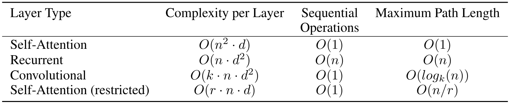

**表 1.** 不同层类型的最大路径长度, 每层复杂度和最少顺序操作数. $n$ 是序列长度, $d$ 是表示维度, $k$ 是卷积的核大小, $r$ 是受限自注意力中邻域的大小.

如 [表 1](#table-01) 所示, 自注意力层通过恒定数量的顺序执行操作连接所有位置, 而循环层则需要 $O(n)$ 个顺序操作. 在计算复杂度方面, 当序列长度 $n$ 小于表示维度 $d$ 时, 自注意力层比循环层更快, 这在最先进的机器翻译模型使用的句子表示 (如词片 [Xivh16] 和字节对 [Xive15] 表示) 中最为常见. 为了提高处理非常长序列任务的计算性能, 自注意力可以限制只考虑输入序列中以各自输出位置为中心的 $r$ 大小的邻域. 这将把最大路径长度增加到 $O(n/r)$. 我们计划在未来的工作中进一步研究这种方法.

单个卷积层, 卷积核宽度为 $k<n$, 并不能连接所有输入与输出位置对. 在卷积核连续的情况下, 这需要堆叠 $O(n/k)$ 个卷积层; 在空洞卷积的情况下, 则需要 $O(\mathrm{log}_{k}(n))$ 个卷积层 [Xiva17], 从而增加网络中任意两位置间的最长路径长度. 卷积层通常比循环层更耗费资源, 约为 $k$ 倍. 然而, 可分离卷积 [Xive16] 显著降低了复杂度至 $O(k\cdot n\cdot d+n\cdot d^{2})$. 即使有 $k=n$, 可分离卷积的复杂度仍等于自注意力层与逐点前馈层的组合, 这也是我们模型所采用的方法.

作为附带好处, 自注意力可能产生更可解释的模型. 我们检查了模型的注意力分布, 并在附录中展示和讨论了一些示例. 单个注意力头不仅清楚地学习执行不同任务, 许多还表现出与句子的句法和语义结构相关的行为.

## 5 训练

本节描述了我们模型的训练方案.

### 5.1 训练数据与批处理

我们在标准的 WMT 2014 英德数据集上进行了训练, 该数据集由约 450 万对句子构成. 句子使用字节对编码进行编码 [CoRR17], 源语言与目标语言共用大约 37000 个词汇. 对于英法翻译, 我们使用了规模更大的 WMT 2014 英法数据集, 共包含 3600 万句子, 并将词拆分为 32000 个字块词汇 [Xivh16]. 句子对按近似序列长度进行批处理. 每个训练批次包含的句子对约有 25000 个源语言词和 25000 个目标语言词.

### 5.2 硬件与时间安排

我们在一台机器上训练模型, 配备 8 块 NVIDIA P100 GPU. 对于使用论文中描述的超参数的基础模型, 每个训练步骤大约需要 0.4 秒. 我们训练了基础模型, 总共训练了 10 万步, 也就是 12 小时. 对于我们的大型模型 (表[3](#table-03) 底部描述), 步长为 1.0 秒. 大型模型训练了 30 万步 (3.5 天).

### 5.3 优化器

我们使用了 Adam 优化器 [ICLRa15], 配合 $\beta_{1}=0.9$, $\beta_{2}=0.98$ 和 $\epsilon=10^{-9}$. 我们根据以下公式在训练过程中调整学习率:

$$
\mathrm{lrate}=d_{\mathrm{model}}^{-0.5}\cdot\min({\mathrm{step}\_\mathrm{num}}^{-0.5},{\mathrm{step}\_\mathrm{num}}\cdot{\mathrm{warmup}\_\mathrm{steps}}^{-1.5})\tag{3}
$$

这对应于在前 $\mathrm{warmup}\_\mathrm{steps}$ 个训练步骤线性增加学习率, 然后随后按步骤数的平方根倒数比例下降. 我们使用了 $\mathrm{warmup}\_\mathrm{steps}=4000$.

### 5.4 正则化

我们在训练中采用三种类型的正则化:

##### 残差 Dropout

我们对每个子层的输出应用 dropout [Resear29], 然后再将其加到子层输入并进行归一化. 另外, 我们对编码器和解码器堆栈中嵌入和位置编码的和也应用了 dropout. 对于基础模型, 我们使用了 $P_{\mathrm{drop}}=0.1$ 的比率.

##### 标签平滑

在训练过程中, 我们采用了值为 $\epsilon_{\mathrm{ls}}=0.1$ [CoRR15] 的标签平滑. 这会降低困惑度, 因为模型学会更不确定, 但提高了准确率和 BLEU 得分.

## 6 结果

### 6.1 机器翻译

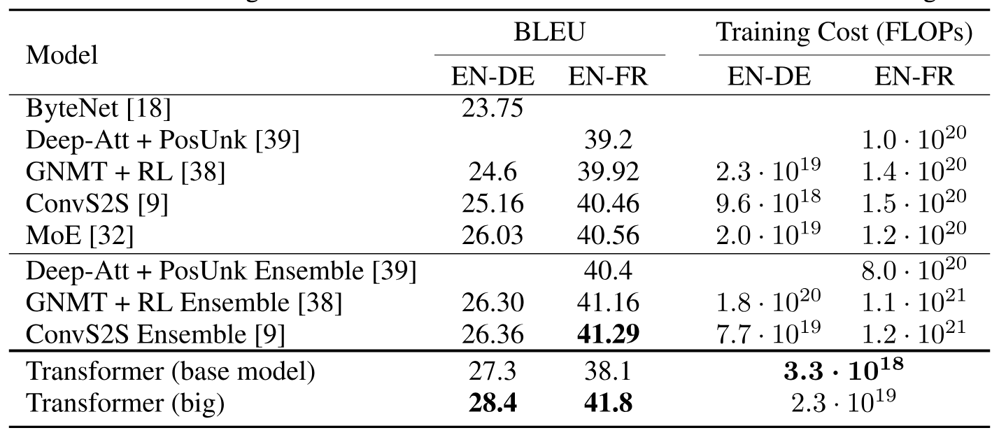

**表 2.** Transformer 在 English-to-German 和 English-to-French newstest2014 测试中取得了比先前最先进模型更好的 BLEU 分数, 同时训练成本仅为其一小部分.

在 WMT 2014 英语到德语翻译任务中, 大型 Transformer 模型 ([表 2](#table-02) 中的 Transformer (big)) 的表现优于之前报告的所有最佳模型 (包括集成模型) 超过 $2.0$ BLEU, 创下了 $28.4$ 的新一代 BLEU 最高分. 该模型的配置列在 [表 3](#table-03) 的最后一行. 训练在 $8$ 个 P100 GPU 上花费了 $3.5$ 天. 即便我们的基础模型, 也超过了所有已发表的模型和集成模型, 且训练成本仅为任何竞争模型的一小部分.

在 WMT 2014 英语到法语翻译任务中, 我们的大模型在 BLEU 分数中达到了 $41.0$, 超过了所有以前发布的单一模型, 而训练成本不到之前最先进模型的 $1/4$. 用于英语到法语的 Transformer (大) 模型使用的 dropout 率为 $P_{\mathrm{drop}}=0.1$, 而不是 $0.3$.

对于基础模型, 我们使用了通过平均最后 5 个检查点得到的单一模型, 这些检查点以 10 分钟间隔保存. 对于大模型, 我们平均了最后 20 个检查点. 我们使用了束搜索, 束宽为 $4$, 长度惩罚为 $\alpha=0.6$ [Xivh16]. 这些超参数是在开发集上实验后选择的. 我们在推理期间设置最大输出长度为输入长度 $50$, 但在可能的情况下提前终止 [Xivh16].

[表 2](#table-02) 总结了我们的结果, 并将我们的翻译质量和训练成本与文献中的其他模型架构进行了比较. 我们通过将训练时间, 使用的 GPU 数量以及每个 GPU 持续单精度浮点计算能力的估计值相乘, 来估算训练模型所使用的浮点运算次数 [+9].

### 6.2 模型变体

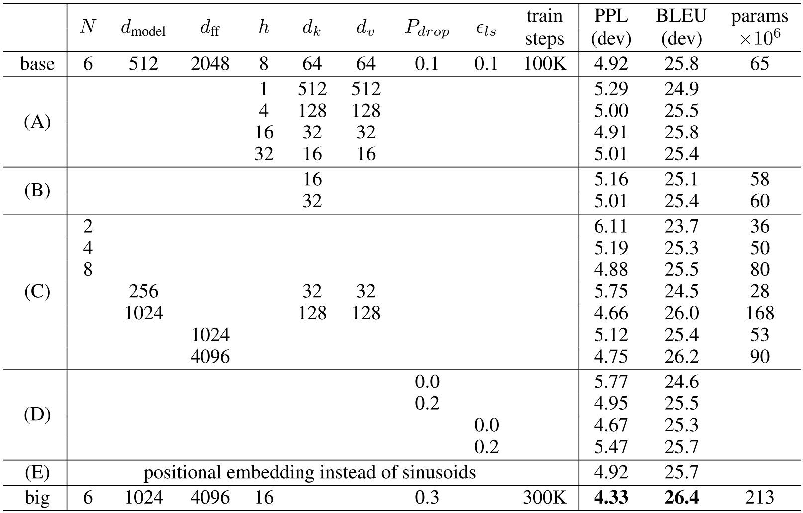

**表 3.** Transformer 架构的变体. 未列出的值与基础模型相同. 所有指标均基于英语到德语的翻译开发集 newstest2013. 列出的困惑度是按每个词片计算, 根据我们的字节对编码, 不应与按单词计算的困惑度进行比较.

为了评估 Transformer 不同组件的重要性, 我们以不同方式修改了基础模型, 测量其在英语到德语翻译开发集 newstest2013 上的性能变化. 我们使用了上一节中描述的束搜索, 但没有进行检查点平均. 我们在[表 3](#table-03) 中展示了这些结果.

在[表 3](#table-03) 的(A)行中, 我们改变了注意力头的数量以及注意力键和值的维度, 同时保持计算量不变, 如第[3.2.2 节](#S3.SS2.SSS2) 所述. 虽然单头注意力比最佳设置低 0.9 BLEU, 但头数过多时, 质量也会下降.

在[表 3](#table-03) 的行(B)中, 我们观察到减少注意力键的大小 $d_{k}$ 会损害模型质量. 这表明确定兼容性并不容易, 使用比点积更复杂的兼容性函数可能会带来好处. 我们进一步在行(C)和(D)中观察到, 正如预期的那样, 更大的模型表现更好, 而 dropout 对于避免过拟合非常有帮助. 在行(E)中, 我们用可学习的位置嵌入 [Xiv17] 替换了正弦位置编码, 并观察到与基础模型几乎相同的结果.

### 6.3 英语句法成分解析

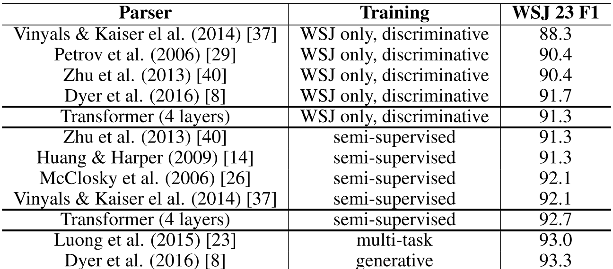

**表 4.** Transformer 在英语成分解析方面具有良好的泛化能力 (结果基于 WSJ 第 23 节)

为了评估 Transformer 是否可以泛化到其他任务, 我们在英语成分解析上进行了实验. 该任务具有特定的挑战: 输出受到严格的结构约束, 并且长度明显长于输入. 另外, RNN 序列到序列模型在小数据环境下无法达到最先进的结果 [System15].

我们在宾夕法尼亚树库 (Penn Treebank) 的华尔街日报 (WSJ) 部分训练了一个 4 层 Transformer, 训练集约有 40K 句子 [Comput93]. 我们还在半监督环境下进行了训练, 使用更大, 置信度较高的 BerkeleyParser 语料库, 总计约 1700 万句子 [System15]. 我们在仅 WSJ 设置中使用了 16K 词汇表, 在半监督设置中使用了 32K 词汇表.

我们只进行了少量实验来选择 dropout, 包括注意力和残差 (见[第 5.4 节](#S5.SS4)) , 学习率和 beam size, 在第 22 节开发集上进行, 所有其他参数均保持与英德基础翻译模型相同. 在推理过程中, 我们将最大输出长度提高到输入长度 $300$. 我们在 WSJ 单独设置和半监督设置中都使用了 $21$ 和 $\alpha=0.3$ 的 beam size.

我们在[表 4](#table-04) 中的结果显示, 尽管没有针对任务进行特殊调优, 我们的模型表现出乎意料地好, 产生的结果优于此前报告的所有模型, 除了循环神经网络语法 (RNNG) [NAACL16].

与 RNN 序列到序列模型 [System15] 相比, Transformer 即使仅在 WSJ 的 4 万条训练句上训练, 也能超过 BerkeleyParser [July06].

## 7 结论

在这项工作中, 我们提出了 Transformer, 这是第一个完全基于注意力的序列转换模型, 用多头自注意力替换了编码器- 解码器架构中最常用的循环层.

对于翻译任务, Transformer 的训练速度明显快于基于循环或卷积层的架构. 在 WMT 2014 英语到德语和 WMT 2014 英语到法语的翻译任务中, 我们取得了新的最先进水平. 在前一项任务中, 我们的最佳模型甚至超过了先前所有报道的集成方法.

我们对基于注意力的模型的未来充满期待, 并计划将其应用于其他任务. 我们计划将 Transformer 扩展到涉及文本以外输入和输出模式的问题, 并研究局部, 受限的注意力机制, 以高效处理大型输入和输出, 如图像, 音频和视频. 使生成过程不那么顺序化也是我们的另一个研究目标.

我们用于训练和评估模型的代码可在 [https://github.com/tensorflow/tensor2tensor](https://github.com/tensorflow/tensor2tensor] 获取.

##### 致谢

我们感谢 Nal Kalchbrenner 和 Stephan Gouws 的富有成效的意见, 修正和启发.

## 注意力可视化

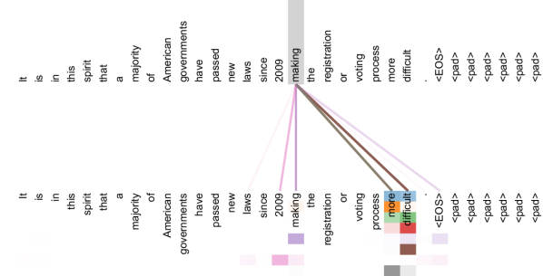

**图 3.** 这是一个注意力机制的示例, 显示在第 6 层中的第 5 层编码器自注意力中遵循远距离依赖关系的情况. 许多注意力头关注动词‘making’的远程依赖, 完成短语‘making…more difficult’. 此处仅显示单词‘making’的注意力. 不同颜色表示不同的注意力头. 彩色查看效果最佳.

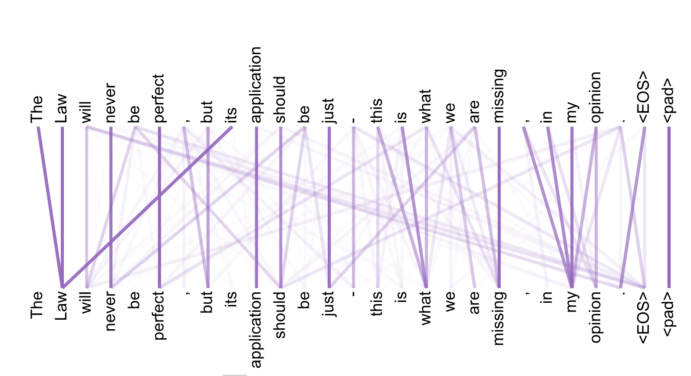

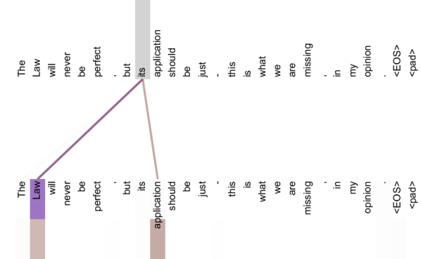

**图 4.** 两个注意力头, 同样位于第 6 层中的第 5 层, 显然与照应解析有关. 上方: 头 5 的完整注意力. 下方: 仅来自单词‘its’的注意力, 针对注意力头 5 和 6. 注意该单词的注意力非常集中.

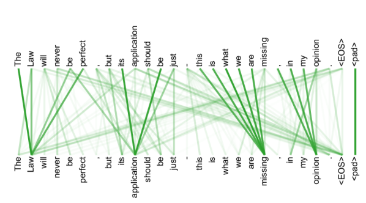

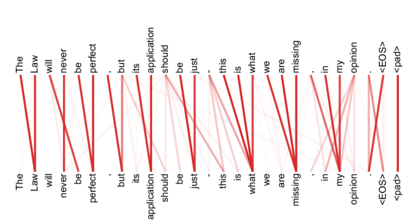

**图 5.** 许多注意力头表现出与句子结构相关的行为. 我们在上方给出两个示例, 来自第 6 层中的第 5 层编码器自注意力的两个不同头. 这些头显然学习执行不同的任务.

[+1]: 脚注标记: 1

[+2]: 脚注标记: 1

[+3]: 脚注标记: 1

[+4]: 脚注标记: 1

[+5]: 脚注标记: 1

[+6]: 脚注标记: 1

[+7]: 脚注标记: 1

[+8]: 为了说明点积为什么会变大, 假设 $q$ 和 $k$ 的分量是独立随机变量, 均值为 $0$, 方差为 $1$. 则它们的点积 $q\cdot k=\sum_{i=1}^{d_{k}}q_{i}k_{i}$ 的均值为 $0$, 方差为 $d_{k}$.

[+9]: 我们分别使用了 K80, K40, M40 和 P100 的 2.8, 3.7, 6.0 和 9.5 TFLOPS 的数值.
