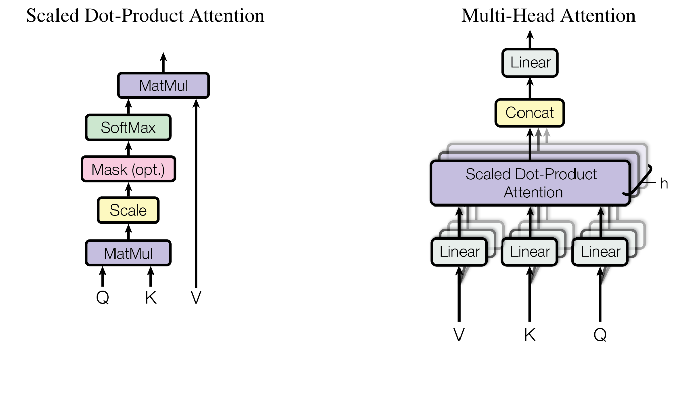
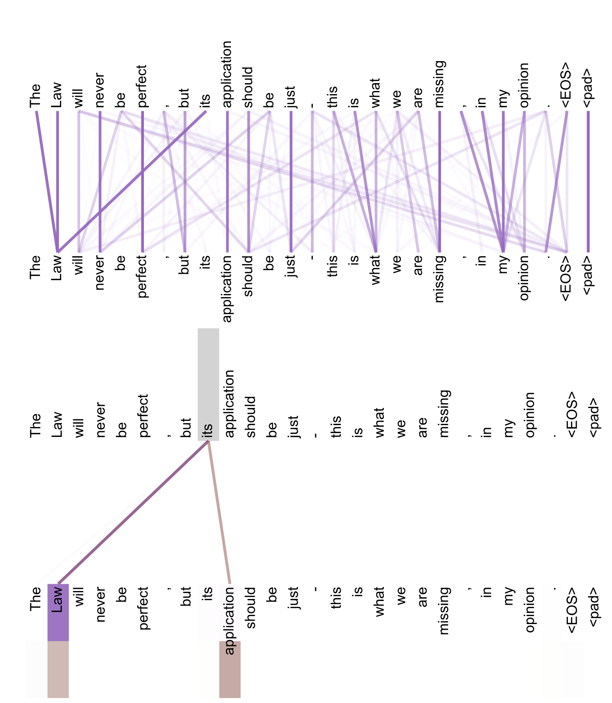
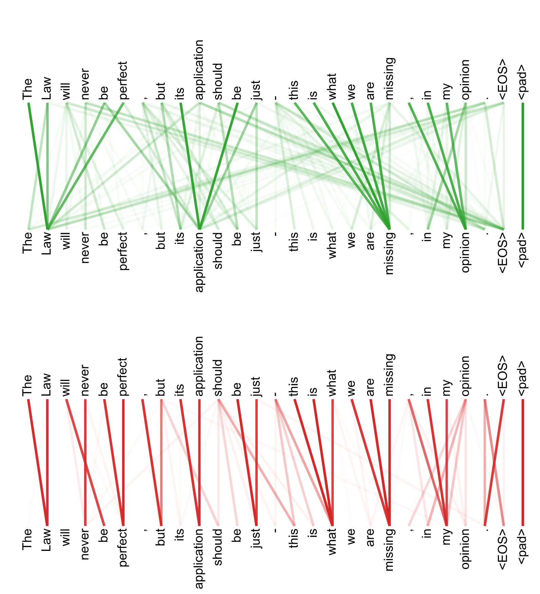

> [Ashish Vaswani](https://x.com/ashvaswani) [+equal], [Noam Shazeer](https://www.noamshazeer.com/) [+equal], [Niki Parmar](https://x.com/nikiparmar09) [+equal], [Jakob Uszkoreit](http://jakob.uszkoreit.net/) [+equal], [Llion Jones](https://x.com/LlionJ) [+equal], [Aidan N. Gomez](https://aidangomez.ca/) [+equal] [+google-brain], [Lukasz Kaiser](http://liafa.jussieu.fr/~kaiser/) [+equal] 和 [Illia Polosukhin](https://ilblackdragon.com/) [+equal] [+google-research]. 论文于 2017 年 6 月 12 日首次提交至 arXiv; 当前版本为 v7. 发表于第 31 届神经信息处理系统大会 (NIPS 2017) 论文集. [Attention Is All You Need](https://arxiv.org/abs/1706.03762v7). [原论文 PDF](/paper/attention-is-all-you-need.pdf). [TeX 源码](https://export.arxiv.org/e-print/1706.03762v7). 精确的印刷版式和参考文献以原论文 PDF 为准.

在正确注明出处的前提下, Google 允许仅为新闻或学术作品复制本文的表格和图.

## 摘要

主流的序列转导模型以包含编码器和解码器的复杂循环神经网络或卷积神经网络为基础. 表现最佳的模型还通过注意力机制连接编码器与解码器. 我们提出一种新的简单网络架构 Transformer, 它完全基于注意力机制, 不再使用循环和卷积. 两项机器翻译实验表明, 这类模型的质量更高, 更易于并行, 所需训练时间也显著缩短. 我们的模型在 WMT 2014 英译德任务上取得 28.4 BLEU, 比已有最佳结果 (包括集成模型) 高出 2 BLEU 以上. 在 WMT 2014 英译法任务上, 模型使用 8 块 GPU 训练 3.5 天后, 取得单模型 41.8 BLEU 的新最佳结果, 训练成本仅为文献中最佳模型的一小部分. 我们还将 Transformer 成功应用于英语成分句法分析; 无论训练数据充足还是有限, 它都能很好地泛化到这项任务.

## 1 引言

循环神经网络, 尤其是长短期记忆网络 [Hoc97] 和门控循环神经网络 [Chu14], 已经成为语言建模, 机器翻译等序列建模与转导问题中的先进方法 [Sut14, Bah14, Cho14a]. 此后, 许多研究继续推进循环语言模型和编码器-解码器架构 [Wu17, Luo15a, Joz16].

循环模型通常按输入和输出序列中的符号位置分解计算. 将各个位置与计算时间步对齐后, 模型根据前一隐藏状态 $h_{t-1}$ 和位置 $t$ 的输入生成隐藏状态序列 $h_t$. 这种内在的顺序性使单个训练样本内部无法并行; 序列越长, 问题越突出, 因为内存限制也制约了跨样本的批处理规模. 近期工作通过因式分解技巧 [Kuc17] 和条件计算 [Sha17] 显著提高了计算效率, 后者还改善了模型性能. 但顺序计算这一根本限制依然存在.

注意力机制已经成为许多有效的序列建模与转导模型的一部分, 可以不受输入或输出序列中位置距离的限制来建模依赖关系 [Bah14, Kim17]. 不过, 除少数情况外 [Par16], 这类注意力机制仍与循环网络配合使用.

本文提出 Transformer, 一种舍弃循环结构, 完全依靠注意力机制来捕捉输入与输出之间全局依赖的模型架构. Transformer 提供了更高的并行度, 并且只需在 8 块 P100 GPU 上训练 12 小时, 即可在翻译质量上达到新的最佳水平.

## 2 背景

减少顺序计算也是 Extended Neural GPU [Kai16a], ByteNet [Kal17] 和 ConvS2S [Geh17] 的出发点; 这些模型都以卷积神经网络为基本构件, 并行计算所有输入和输出位置的隐藏表示. 在这些模型中, 关联任意两个输入或输出位置的信号所需的运算次数随位置间距离增加: ConvS2S 线性增长, ByteNet 对数增长. 因此, 相距较远的位置之间的依赖更难学习 [Hoc01]. Transformer 将这一运算次数降为常数, 代价是注意力加权位置的平均操作降低了有效分辨率; 我们用[第 3.2 节](#section-3-2)介绍的多头注意力来抵消这一影响.

自注意力有时也称内部注意力, 它把单个序列中的不同位置联系起来, 以计算该序列的表示. 自注意力已经成功用于阅读理解, 生成式摘要, 文本蕴涵以及与任务无关的句子表示学习 [Che16e, Par16, Pau17, Lin17b].

端到端记忆网络以循环注意力机制取代与序列位置对齐的循环结构, 并且已经在简单语言问答和语言建模任务上取得良好表现 [Suk15].

据我们所知, Transformer 是第一个完全依赖自注意力计算输入和输出表示, 且不使用与序列位置对齐的 RNN 或卷积的转导模型. 下文将介绍 Transformer, 说明采用自注意力的理由, 并讨论它相对于 [Kai16, Kal17] 和 [Geh17] 等模型的优势.

## 3 模型架构

**图 1.** Transformer—模型架构.

多数有竞争力的神经序列转导模型采用编码器-解码器结构 [Cho14a, Bah14, Sut14]. 编码器把符号表示的输入序列 $(x_1,\dots,x_n)$ 映射为连续表示序列 $\mathbf{z}=(z_1,\dots,z_n)$. 给定 $\mathbf{z}$ 后, 解码器每次生成一个符号, 依次得到输出序列 $(y_1,\dots,y_m)$. 在每一步中, 模型都以自回归方式工作 [Gra13], 生成下一个符号时会把此前生成的符号作为额外输入.

Transformer 沿用这一整体架构, 在编码器和解码器中都使用堆叠的自注意力层与逐位置全连接层, 分别如[图 1](#figure-01) 左半部分和右半部分所示.

### 3.1 编码器与解码器堆栈

**编码器:** 编码器由 $N=6$ 个相同的层堆叠而成. 每层包含两个子层. 第一个子层是多头自注意力机制, 第二个是简单的逐位置全连接前馈网络. 我们在每个子层外都使用残差连接 [He16], 然后进行层归一化 [Ba16]. 也就是说, 每个子层的输出为 $\mathrm{LayerNorm}(x+\mathrm{Sublayer}(x))$, 其中 $\mathrm{Sublayer}(x)$ 是该子层实现的函数. 为了使用这些残差连接, 模型中的所有子层以及嵌入层都输出 $d_{\mathrm{model}}=512$ 维向量.

**解码器:** 解码器同样由 $N=6$ 个相同的层堆叠而成. 除编码器每层所含的两个子层外, 解码器还加入第三个子层, 对编码器堆栈的输出执行多头注意力. 与编码器类似, 每个子层外都使用残差连接, 然后进行层归一化. 我们还修改了解码器堆栈中的自注意力子层, 阻止各位置关注后续位置. 这一掩码与错开一个位置的输出嵌入共同确保: 位置 $i$ 的预测只能依赖位置小于 $i$ 的已知输出.

### 3.2 注意力

注意力函数可以描述为把一个查询和一组键-值对映射为一个输出, 其中查询, 键, 值和输出都是向量. 输出是这些值的加权和, 每个值的权重由查询与对应键的兼容性函数计算得到.

#### 3.2.1 缩放点积注意力

我们把这里使用的注意力称为"缩放点积注意力" ([图 2](#figure-02)). 输入包括维度为 $d_k$ 的查询和键, 以及维度为 $d_v$ 的值. 我们计算查询与所有键的点积, 分别除以 $\sqrt{d_k}$, 再应用 softmax 函数得到各个值的权重.

实际计算时, 我们同时处理一组查询, 并把它们组合成矩阵 $Q$. 键和值也分别组合成矩阵 $K$ 和 $V$. 输出矩阵计算如下:

$$
\mathrm{Attention}(Q,K,V)=\mathrm{softmax}\left(\frac{QK^\top}{\sqrt{d_k}}\right)V
$$

最常用的两种注意力函数是加性注意力 [Bah14] 和点积 (乘性) 注意力. 除了缩放因子 $\frac{1}{\sqrt{d_k}}$ 之外, 点积注意力与我们的算法完全相同. 加性注意力用一个只有单隐藏层的前馈网络计算兼容性函数. 两者的理论复杂度相近, 但点积注意力可以使用高度优化的矩阵乘法代码实现, 因而实际速度更快, 占用空间也更少.

$d_k$ 较小时, 两种机制的表现相近; $d_k$ 较大时, 加性注意力优于未经缩放的点积注意力 [Bri17]. 我们推测, $d_k$ 较大时, 点积的绝对值会变大, 把 softmax 函数推入梯度极小的区域 [+dot-product]. 为了抵消这一影响, 我们用 $\frac{1}{\sqrt{d_k}}$ 缩放点积.

#### 3.2.2 多头注意力

**图 2.** (左) 缩放点积注意力. (右) 多头注意力由多个并行运行的注意力层组成.

与其用 $d_{\mathrm{model}}$ 维的键, 值和查询执行一次注意力函数, 我们发现另一种做法更有效: 分别通过 $h$ 个不同且可学习的线性投影, 把查询, 键和值映射到 $d_k$, $d_k$ 和 $d_v$ 维. 我们对投影后的每组查询, 键和值并行执行注意力函数, 得到 $d_v$ 维输出. 这些输出拼接后再次投影, 得到最终结果, 如[图 2](#figure-02) 所示.

多头注意力让模型可以在不同位置共同关注来自不同表示子空间的信息. 如果只有一个注意力头, 平均操作会抑制这种能力.

$$
\begin{aligned}
\mathrm{MultiHead}(Q,K,V)&=\mathrm{Concat}(\mathrm{head}_1,\dots,\mathrm{head}_h)W^O\\
\text{其中}\quad \mathrm{head}_i&=\mathrm{Attention}(QW_i^Q,KW_i^K,VW_i^V)
\end{aligned}
$$

其中, 投影使用的参数矩阵为 $W_i^Q\in\mathbb{R}^{d_{\mathrm{model}}\times d_k}$, $W_i^K\in\mathbb{R}^{d_{\mathrm{model}}\times d_k}$, $W_i^V\in\mathbb{R}^{d_{\mathrm{model}}\times d_v}$ 和 $W^O\in\mathbb{R}^{h d_v\times d_{\mathrm{model}}}$.

本文采用 $h=8$ 个并行注意力层, 即 8 个头. 每个头使用 $d_k=d_v=d_{\mathrm{model}}/h=64$. 由于每个头的维度较低, 总计算成本与使用完整维度的单头注意力相近.

#### 3.2.3 注意力在模型中的应用

Transformer 以三种方式使用多头注意力:

- 在"编码器-解码器注意力"层中, 查询来自上一解码器层, 记忆中的键和值来自编码器的输出. 因而, 解码器的每个位置都能关注输入序列中的所有位置. 这与 [Wu17, Bah14, Geh17] 等序列到序列模型中常见的编码器-解码器注意力机制相仿.
- 编码器包含自注意力层. 在自注意力层中, 所有键, 值和查询都来自同一处, 此处即编码器上一层的输出. 编码器中的每个位置都能关注上一层的所有位置.
- 同样, 解码器的自注意力层允许每个位置关注解码器中直到该位置为止的所有位置, 包括该位置本身. 为保持自回归性质, 我们必须阻止解码器中向左的信息流. 具体做法是在缩放点积注意力内部, 屏蔽 softmax 输入中对应非法连接的所有值, 即把它们设为 $-\infty$. 参见[图 2](#figure-02).

### 3.3 逐位置前馈网络

除注意力子层外, 编码器和解码器的每一层还包含一个全连接前馈网络, 它以相同方式分别作用于每个位置. 该网络由两个线性变换组成, 中间使用 ReLU 激活函数.

$$
\mathrm{FFN}(x)=\max(0,xW_1+b_1)W_2+b_2
$$

不同位置使用相同的线性变换, 不同层使用的参数则不同. 也可以把它描述为两个卷积核大小为 1 的卷积. 输入和输出维度均为 $d_{\mathrm{model}}=512$, 内层维度为 $d_{\mathrm{ff}}=2048$.

### 3.4 嵌入与 Softmax

与其他序列转导模型类似, 我们用学习得到的嵌入把输入和输出 token 转换为 $d_{\mathrm{model}}$ 维向量. 我们还用常见的可学习线性变换和 softmax 函数, 把解码器输出转换为下一个 token 的预测概率. 与 [Pre16] 类似, 模型的两个嵌入层与 softmax 前的线性变换共享同一个权重矩阵. 在嵌入层中, 我们把这些权重乘以 $\sqrt{d_{\mathrm{model}}}$.

### 3.5 位置编码

模型既没有循环也没有卷积, 因此要利用序列顺序, 就必须注入 token 在序列中相对或绝对位置的信息. 为此, 我们在编码器和解码器堆栈底部的输入嵌入中加入"位置编码". 位置编码与嵌入同为 $d_{\mathrm{model}}$ 维, 因而可以直接相加. 位置编码有多种选择, 包括可学习和固定的编码 [Geh17].

本文使用不同频率的正弦和余弦函数:

$$
\mathrm{PE}_{(\mathrm{pos},2i)}=\sin(\mathrm{pos}/10000^{2i/d_{\mathrm{model}}})
$$

$$
\mathrm{PE}_{(\mathrm{pos},2i+1)}=\cos(\mathrm{pos}/10000^{2i/d_{\mathrm{model}}})
$$

其中, $\mathrm{pos}$ 表示位置, $i$ 表示维度. 换言之, 位置编码的每个维度对应一条正弦曲线. 其波长构成从 $2\pi$ 到 $10000\cdot 2\pi$ 的等比数列. 我们选择这些函数, 是因为假设它们能让模型轻松学会按相对位置施加注意力: 对任意固定偏移 $k$, $\mathrm{PE}_{\mathrm{pos}+k}$ 都可以表示为 $\mathrm{PE}_{\mathrm{pos}}$ 的线性函数.

我们也试用了可学习的位置嵌入 [Geh17], 发现两个版本的结果几乎相同 (见[表 3](#table-03) 的 (E) 行). 我们选择正弦版本, 因为它可能让模型外推到比训练时所见更长的序列.

## 4 为什么使用自注意力

本节从多个方面比较自注意力层与常用于以下映射的循环层和卷积层: 把一个可变长度的符号表示序列 $(x_1,\dots,x_n)$ 映射为另一个等长序列 $(z_1,\dots,z_n)$, 其中 $x_i,z_i\in\mathbb{R}^d$; 典型的序列转导编码器或解码器中的隐藏层就属于这种情况. 为说明采用自注意力的理由, 我们考察三个要求.

第一是每层的总计算复杂度. 第二是可并行的计算量, 用所需顺序运算的最少次数衡量.

第三是网络中长距离依赖之间的路径长度. 学习长距离依赖是许多序列转导任务面临的主要难题. 影响这类依赖学习能力的一个重要因素, 是前向和反向信号在网络中必须经过的路径长度. 输入与输出序列中任意一对位置之间的路径越短, 长距离依赖就越容易学习 [Hoc01]. 因此, 我们还比较了由不同类型的层组成的网络中, 任意两个输入和输出位置之间的最大路径长度.

**表 1.** 不同类型的层对应的最大路径长度, 每层复杂度和最少顺序运算次数. $n$ 是序列长度, $d$ 是表示维度, $k$ 是卷积核大小, $r$ 是受限自注意力的邻域大小.

如[表 1](#table-01) 所示, 自注意力层只需常数次顺序运算就能连接所有位置, 循环层则需要 $O(n)$ 次顺序运算. 就计算复杂度而言, 当序列长度 $n$ 小于表示维度 $d$ 时, 自注意力层比循环层更快; 最先进的机器翻译模型所用的句子表示通常符合这一条件, 例如 word-piece [Wu17] 和 byte-pair [Sen15] 表示. 对于很长的序列, 可以把自注意力限制在输入序列中以相应输出位置为中心, 大小为 $r$ 的邻域内, 以改善计算性能. 这样会把最大路径长度增加到 $O(n/r)$. 我们计划在后续工作中继续研究这种方法.

当卷积核宽度 $k<n$ 时, 单个卷积层无法连接所有输入与输出位置对. 要做到这一点, 连续卷积核需要堆叠 $O(n/k)$ 个卷积层, 空洞卷积则需要 $O(\log_k(n))$ 个卷积层 [Kal17], 因而增加了网络中任意两个位置之间的最长路径. 卷积层的开销通常是循环层的 $k$ 倍. 可分离卷积 [Cho16a] 可以把复杂度显著降至 $O(k\cdot n\cdot d+n\cdot d^2)$. 即使 $k=n$, 可分离卷积的复杂度也等于一个自注意力层加一个逐位置前馈层, 这正是本文模型采用的组合.

自注意力还可能让模型更容易解释. 我们检查了模型的注意力分布, 并在附录中给出和讨论了一些例子. 各个注意力头显然学会了执行不同任务, 其中许多还表现出与句法和语义结构相关的行为.

## 5 训练

本节介绍模型的训练方案.

### 5.1 训练数据与批处理

我们在标准 WMT 2014 英德数据集上训练, 该数据集约有 450 万个句对. 句子使用 byte-pair encoding [Bri17] 编码, 源语言和目标语言共享约 37000 个 token 的词表. 英法翻译使用规模大得多的 WMT 2014 英法数据集, 其中包含 3600 万个句子; token 被拆分到一个含 32000 个 word-piece 的词表中 [Wu17]. 句对按近似序列长度组成批次. 每个训练批次包含若干句对, 约含 25000 个源 token 和 25000 个目标 token.

### 5.2 硬件与训练安排

我们在一台配有 8 块 NVIDIA P100 GPU 的机器上训练模型. 对采用全文所述超参数的基础模型, 每个训练步骤约需 0.4 秒. 基础模型共训练 100000 步, 即 12 小时. 大模型的配置见[表 3](#table-03) 最后一行, 每步耗时 1.0 秒. 大模型共训练 300000 步, 即 3.5 天.

### 5.3 优化器

我们使用 Adam 优化器 [Kin15], 其中 $\beta_1=0.9$, $\beta_2=0.98$, $\epsilon=10^{-9}$. 训练过程中, 学习率按下式变化:

$$
\mathrm{lrate}=d_{\mathrm{model}}^{-0.5}\cdot\min\left(\mathrm{step\_num}^{-0.5},\mathrm{step\_num}\cdot\mathrm{warmup\_steps}^{-1.5}\right)
$$

也就是在最初的 $\mathrm{warmup\_steps}$ 个训练步骤内线性提高学习率, 此后按步数的平方根倒数成比例降低. 我们取 $\mathrm{warmup\_steps}=4000$.

### 5.4 正则化

训练期间, 我们使用三类正则化:

**残差 Dropout** 我们先对每个子层的输出应用 dropout [Sri14], 再将它与子层输入相加并归一化. 此外, 编码器和解码器堆栈中的嵌入与位置编码相加后, 我们也对其应用 dropout. 基础模型的 dropout 率为 $P_{\mathrm{drop}}=0.1$.

**标签平滑** 训练期间, 我们采用 $\epsilon_{\mathrm{ls}}=0.1$ 的标签平滑 [Sze16]. 由于模型会学得更加不确定, 这会使困惑度指标变差, 但能提高准确率和 BLEU 分数.

## 6 结果

### 6.1 机器翻译

**表 2.** Transformer 在 English-to-German 和 English-to-French newstest2014 测试上的 BLEU 分数优于此前的最佳模型, 训练成本却只有后者的一小部分.

在 WMT 2014 英译德任务上, 大型 Transformer 模型 ([表 2](#table-02) 中的 Transformer (big)) 比此前报告的最佳模型 (包括集成模型) 高出 2.0 BLEU 以上, 取得 28.4 BLEU 的新最佳结果. 该模型的配置见[表 3](#table-03) 最后一行. 训练在 8 块 P100 GPU 上耗时 3.5 天. 即使是我们的基础模型, 也超过了此前发布的所有模型和集成模型, 而训练成本仅为任何竞争模型的一小部分.

在 WMT 2014 英译法任务上, 我们的大模型取得 41.0 BLEU, 超过此前发布的所有单模型, 训练成本还不到此前最佳模型的 $1/4$. 用于英译法的 Transformer (big) 模型采用 $P_{\mathrm{drop}}=0.1$ 的 dropout 率, 而不是 $0.3$.

对于基础模型, 我们使用最后 5 个检查点的平均结果得到一个模型, 这些检查点每隔 10 分钟保存一次. 对于大模型, 我们平均最后 20 个检查点. 束搜索的束宽为 $4$, 长度惩罚为 $\alpha=0.6$ [Wu17]. 这些超参数由开发集上的实验选定. 推理时, 我们把最大输出长度设为输入长度加 $50$, 但会尽可能提前终止 [Wu17].

[表 2](#table-02) 汇总了实验结果, 并将我们的翻译质量和训练成本与文献中的其他模型架构进行比较. 我们将训练时间, GPU 数量以及每块 GPU 可持续提供的单精度浮点计算能力估计值相乘, 据此估算训练模型所用的浮点运算次数 [+flops].

### 6.2 模型变体

**表 3.** Transformer 架构的不同变体. 未列出的值与基础模型相同. 所有指标均在英译德开发集 newstest2013 上测得. 表中的困惑度按 word-piece 计算, 与我们的 byte-pair encoding 一致, 不应同按词计算的困惑度比较.

为了评估 Transformer 各组件的重要性, 我们以不同方式改动基础模型, 测量其在英译德开发集 newstest2013 上的性能变化. 束搜索采用上一节所述设置, 但不进行检查点平均. 结果见[表 3](#table-03).

在[表 3](#table-03) 的 (A) 组各行中, 我们改变注意力头的数量以及注意力键和值的维度, 同时保持计算量不变, 如[第 3.2.2 节](#section-3-2-2)所述. 单头注意力比最佳设置低 0.9 BLEU, 头数过多时质量也会下降.

在[表 3](#table-03) 的 (B) 组各行中, 减小注意力键的维度 $d_k$ 会损害模型质量. 这说明判断兼容性并不容易, 比点积更复杂的兼容性函数或许会有帮助. 从 (C) 和 (D) 组各行还能看到, 与预期相同, 更大的模型表现更好, dropout 对避免过拟合也很有效. 在 (E) 行中, 我们用可学习的位置嵌入 [Geh17] 替换正弦位置编码, 得到的结果与基础模型几乎相同.

### 6.3 英语成分句法分析

**表 4.** Transformer 能够很好地泛化到英语成分句法分析 (结果基于 WSJ 第&nbsp;23 节).

为了评估 Transformer 能否泛化到其他任务, 我们开展了英语成分句法分析实验. 这项任务有其特殊难点: 输出受到严格的结构约束, 而且明显长于输入. 此外, RNN 序列到序列模型在小数据环境下尚未达到当时的最佳结果 [Vin15].

我们在 Penn Treebank 的 Wall Street Journal (WSJ) 部分 [Mar93] 上训练一个 $d_{\mathrm{model}}=1024$ 的 4 层 Transformer, 训练集约含 40000 个句子. 我们还在半监督设置下训练该模型, 使用规模更大的高置信度语料库和 BerkeleyParser 语料库, 总计约 1700 万个句子 [Vin15]. 仅使用 WSJ 的设置采用 16000 个 token 的词表, 半监督设置采用 32000 个 token 的词表.

我们只做了少量实验, 在 WSJ 第&nbsp;22 节开发集上选择注意力与残差 dropout ([第 5.4 节](#section-5-4)), 学习率和束宽; 其余参数均与英译德基础翻译模型相同. 推理时, 最大输出长度增加到输入长度加 $300$. 仅使用 WSJ 和半监督两种设置都采用 $21$ 的束宽和 $\alpha=0.3$.

[表 4](#table-04) 的结果表明, 尽管没有针对任务专门调优, 模型的表现仍出乎意料地好; 除 Recurrent Neural Network Grammar [Dye16] 外, 它超过了此前报告的所有模型.

与 RNN 序列到序列模型 [Vin15] 不同, 即使只用 WSJ 的 40000 个训练句子, Transformer 也超过了 BerkeleyParser [Pet06].

## 7 结论

本文提出 Transformer, 这是第一个完全基于注意力的序列转导模型; 它用多头自注意力取代了编码器-解码器架构中最常用的循环层.

在翻译任务上, Transformer 的训练速度显著快于采用循环层或卷积层的架构. 我们在 WMT 2014 英译德和 WMT 2014 英译法两项任务上都取得新的最佳结果. 在前一项任务中, 最佳模型甚至超过了此前报告的所有集成模型.

我们期待注意力模型今后的发展, 并计划将其用于其他任务. 我们准备把 Transformer 扩展到输入和输出为非文本模态的问题, 还会研究局部, 受限的注意力机制, 以便高效处理图像, 音频, 视频等大型输入和输出. 降低生成过程的顺序性也是我们的一个研究目标.

训练和评估模型所用的代码见 [https://github.com/tensorflow/tensor2tensor](https://github.com/tensorflow/tensor2tensor).

**致谢** 感谢 Nal Kalchbrenner 和 Stephan Gouws 提出的宝贵意见与修正, 以及他们带来的启发.

## 8 注意力可视化

**图 3.** 编码器第 5 层 (共 6 层) 的自注意力跟踪长距离依赖的一个例子. 许多注意力头关注动词 "making" 的远距离依赖, 补全短语 "making...more difficult". 此处只显示对单词 "making" 的注意力. 不同颜色表示不同的注意力头. 彩色查看效果最好.

**图 4.** 同样位于第 5 层 (共 6 层) 的两个注意力头, 看来与照应消解有关. 上: 头 5 的完整注意力. 下: 注意力头 5 和 6 中仅来自单词 "its" 的注意力. 可以看到, 这个词的注意力非常集中.

**图 5.** 许多注意力头表现出似乎与句子结构相关的行为. 上图给出两个例子, 分别来自编码器第 5 层 (共 6 层) 自注意力中的两个头. 这些头显然学会了执行不同任务.

[+equal]: 同等贡献, 作者顺序随机排列. Jakob 提出用自注意力取代 RNN, 并开始评估这一想法. Ashish 与 Illia 共同设计并实现了最初的 Transformer 模型, 深度参与了这项工作的各个方面. Noam 提出缩放点积注意力, 多头注意力和无参数的位置表示, 也参与了几乎所有细节. Niki 在最初的代码库和 tensor2tensor 中设计, 实现, 调试并评估了大量模型变体. Llion 也尝试了新的模型变体, 负责最初的代码库, 高效推理和可视化. Lukasz 与 Aidan 投入了无数个漫长的工作日, 设计并实现 tensor2tensor 的各个部分, 以它取代早期代码库, 大幅改善了结果, 也显著加快了研究进度.

[+google-brain]: 本工作在 Google Brain 任职期间完成.

[+google-research]: 本工作在 Google Research 任职期间完成.

[+dot-product]: 为说明点积为何会变大, 假设 $q$ 和 $k$ 的各个分量都是均值为 $0$, 方差为 $1$ 的独立随机变量. 那么它们的点积 $q\cdot k=\sum_{i=1}^{d_k}q_i k_i$ 的均值为 $0$, 方差为 $d_k$.

[+flops]: 对 K80, K40, M40 和 P100, 我们采用的数值分别为 2.8, 3.7, 6.0 和 9.5 TFLOPS.
