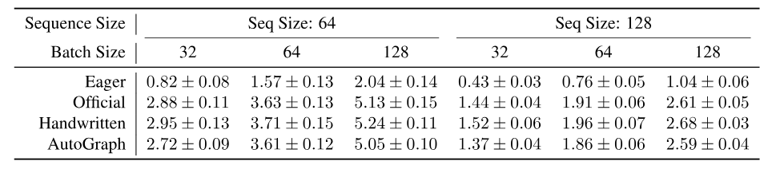
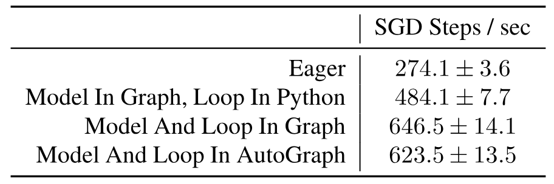
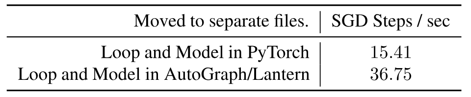
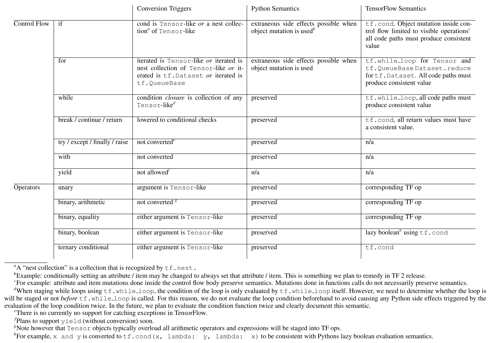
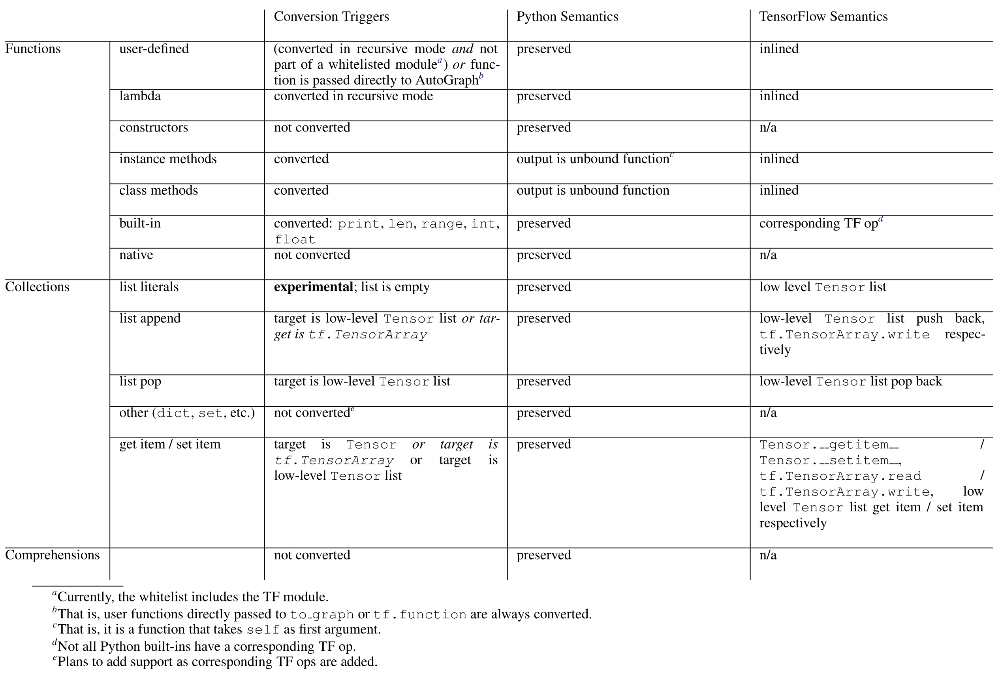
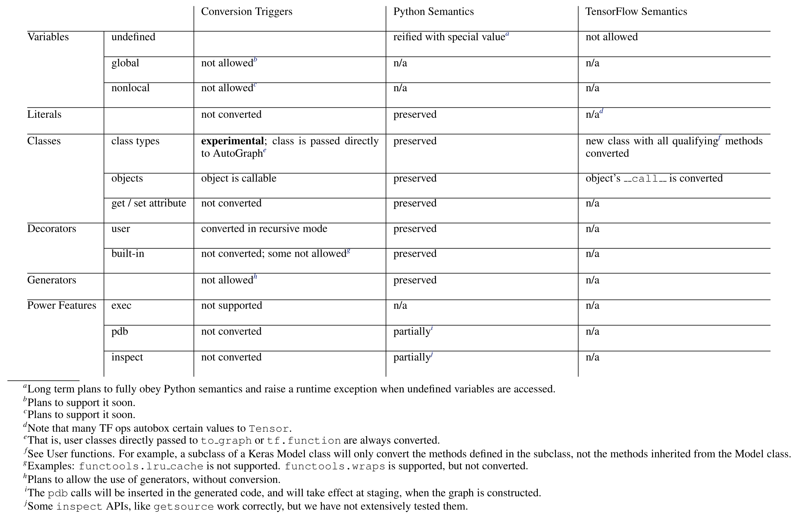

> [Dan Moldovan](https://dblp.org/pid/209/9551.html), [James M. Decker](https://dblp.org/pid/198/0881.html), [Fei Wang](https://dblp.org/pid/52/3194-46.html), [Andrew A. Johnson](https://dblp.org/pid/186/0067-2.html), [Brian K. Lee](https://dblp.org/pid/228/7805.html), [Zachary Nado](https://dblp.org/pid/228/7785.html), [D. Sculley](https://dblp.org/pid/s/DSculley.html), [Tiark Rompf](https://dblp.org/pid/19/7373.html) 和 [Alexander B. Wiltschko](https://dblp.org/pid/209/9851.html). Google Brain, 美国马萨诸塞州剑桥, 以及普渡大学. 通信作者为 Tiark Rompf 和 Alexander B. Wiltschko. 关键词: 机器学习, SysML. 2018 年 10 月 16 日首次提交至 arXiv; 当前版本为 v2, 提交于 2019 年 3 月 26 日. 发表于 [Proceedings of Machine Learning and Systems 1 (MLSys 2019)](https://proceedings.mlsys.org/paper_files/paper/2019/hash/e31cef6b735cf838db79202dbee7b093-Abstract.html). [AutoGraph: Imperative-style Coding with Graph-based Performance](https://arxiv.org/abs/1810.08061). <a href="/paper/autograph.pdf" target="_blank" rel="noopener noreferrer">原始 PDF</a>. [arXiv DOI](https://doi.org/10.48550/arXiv.1810.08061). [TeX 源文件](https://export.arxiv.org/e-print/1810.08061). 精确的印刷版式和参考文献以原始 PDF 为准.

## 摘要

人们通常认为, 易写的机器学习代码与可扩展或执行迅速的机器学习代码之间存在取舍. 在机器学习中, Autograd 和 PyTorch 这类*命令式*风格的库易于编写, 但解释执行开销很高, 也不容易部署到生产环境或移动设备. TensorFlow 和 Theano 这类*基于图*的库能从全程序优化中获益并广泛部署, 但表达复杂模型更为繁琐. 我们说明了如何通过源代码转换在 Python 中使用分阶段编程, 从而在这两种库设计模式之间取得折中, 兼得二者的优势. 关键认识是把所有依赖类型的决定推迟到运行时, 这与动态分派相似. 我们在 AutoGraph 中实现了这些原则, AutoGraph 是一个改善 TensorFlow 库编程体验的软件系统; 与原生 TensorFlow 图相比, 它提升了易用性, 同时不损失性能. 我们还说明, 该系统不依赖后端, 可以面向另一种具备 TensorFlow 图所没有特性的 IR.

<span id="section-1"></span>

## 1 机器学习的编程范式

随着神经网络等机器学习 (ML) 模型在翻译和图像识别等许多重要工业问题上取得当前最佳性能, 面向机器学习的专用编程平台也得到广泛采用. 为满足快速增长的使用需求, 用于构建新 ML 模型的平台发展迅速. 这些平台遵循两种主要范式: *基于图*的编程和*命令式*编程. 它们也称为*定义后运行*和*运行时定义* [Tok15].

TensorFlow 和 Theano 等*基于图*的系统使用高级语言 (通常是 Python), 以元编程方式生成较低层的计算中间表示 (IR) [Aba16b, The16]. 对 TensorFlow 而言, 这种 IR 提供了一种表示形式, 可以自动分布到数据中心, 在 GPU 或 TPU 等加速硬件上执行, 部署到移动设备或 Web 服务器, 也能从全程序优化中获益. 计算收益可观, 代价是开发者需要承担额外的认知负担.

PyTorch 和 Autograd [Pas17, Mac15] 等*命令式*编程系统直接运行用户代码, 逐步构建用户程序的表示, 供自动微分或编译使用. TensorFlow 也通过"即时执行"支持命令式风格的编码: 用户编写的 Python 代码立即执行 TensorFlow 内核, 而不构建图. 这类系统让用户获得传统命令式编码的便利, 但在程序优化, 可扩展计算和可移植性方面的机会较少.

对于需要依赖数据的控制流 (如条件或循环) 的模型, 这些方法之间的差异尤其明显, 而这类控制流对强化学习, 基于序列的模型和许多新兴研究领域中的当前最佳方法很重要. *命令式*平台允许用户编写符合习惯的原生 Python 控制流, 用传统语法表达条件和循环等依赖数据的控制流操作. 但这种方法减少了全程序优化的机会, 并且为了自动微分, 每次执行都要重新追踪. *基于图*的平台避免了这个问题, 却不允许用传统 Python 语法编写依赖数据的控制流, 而要求把所有这类控制流写成函数式形式. 原因是 Python 本身不支持推迟控制流的执行.

尽管*基于图*和*命令式*编程常被视为彼此正交, 相互独立的编程范式, 我们给出了一种兼具两者优势的方法: 保留*命令式*方法的易用性, 同时得到*基于图*方法的性能和可移植性. 这种方法假定代码可以转换为专用 IR, 且 IR 能给程序员带来速度, 内存和数值稳定性优化等实际收益, 也能部署到多种平台. 不过, 与许多 IR 一样, 我们也假定直接用它编程很繁琐. 由于 TensorFlow 图用途广泛且 IR 稳健, 本文的大部分讨论都以它为重点, 但我们在评估 ([第 9.1 节](#section-9-1)) 中说明, 该方法完全不依赖任何后端; 实际上, 只要为代码生成引擎另选后端, 我们就能表示一些难以用 TensorFlow IR 表达的程序.

本文的贡献如下:

- 我们提出一种新方法, 在保留*基于图*系统的性能和可移植性的同时, 让用户获得*命令式* ML 系统的表达能力.
- 我们在 Python 中使用静态分析和*源代码转换* (SCT) 展示这种方法.
- 借助这些分析和代码转换, 我们在 Python 中启用依据运行时类型信息进行分派的分阶段编程, 大多数情况下不需要额外注解.
- 我们使用名为 AutoGraph 的系统把符合 Python 习惯的代码转换为 TensorFlow 图 IR. 我们说明 AutoGraph 可以推广到其他后端, 也能把 Python 代码转换成 Lantern IR. Lantern IR 支持 TensorFlow 图 IR 所没有的特性, 如可重入函数调用.
- 我们说明, 用户可以借助该系统轻松表达复杂的 ML 程序, 将其降级到优化后的 IR, 并获得与手写方案相当的运行速度.

<span id="section-2"></span>

## 2 相关工作

已有多种系统和方法试图为定义 ML 模型提供易用的编程接口, 同时不降低性能. 开放神经网络交换 (ONNX) 格式 [Onn18] 就是其中之一. 它提供一种 IR, 并为许多高级前端提供 API, 可面向多个专注于优化和高性能计算的常用后端. 该 IR 表现为计算图, 与许多*命令式*系统一样通过追踪生成. ONNX 说明了用 IR 充当*命令式*系统和*基于图*系统之间中介的可能性. 不过, 通过追踪提取图时, 由于无法捕捉依赖数据的控制流, 可能丢失控制流信息.

另一个较新的方法是 PyTorch 的 Torch Script 框架 [Pyt18]. 它和 AutoGraph 一样以 Python AST 转换为基础, 但二者有若干重要差异, 最显著的是 Torch Script 在动态形状图上除了形状传播以外不支持其他分阶段处理. [第 10 节](#section-10)对 Torch Script 和 AutoGraph 作了更完整的比较. Myia 系统 [Mer18] 提供了与 Torch Script 相似的功能: 用户用 Python 表达数值代码, 随后代码被解析为一种不同于 Python AST 的基于图的 IR. JANUS [Jeo19] 修改 Python 解释器, 工作方式类似把 Python 字节码编译为 TensorFlow 图代码的 JIT 编译器. 相比之下, AutoGraph 是一个独立库, 执行源到源转换.

通过分阶段编程或多重分派提供更便捷的延迟执行已有很长的历史. 典型例子包括 Lightweight Modular Staging 基于类型的延迟执行模型 [Rom10], 用 Lua 与 Terra 配合生成高性能数值代码 [Dev13], 以及 Julia 的多重分派系统 [Bez12]. 实现或使用 Python 代码重写的库只得到有限应用, 其中包括注重隐私和保密性的 Jeeves 系统 [Yan16a], 它依赖 MacroPy [Hao13], 以及嵌入 Python 的 Lisp 方言 Hy 系统 [Hy18]. 但如果不作大幅修改, 这些方法都不适合单独用于 Python 语言.

其他工作提供了具备不同特性的多种 ML 框架. Lantern [Wan18e, Wan18f] 把编程语言研究中的概念 (有界续延和多阶段编程) 用于实现一个表达力强的*基于图*的 ML 框架. Tangent [Mer17a] 使用 SCT 执行自动微分. Dynet [Neu17] 是一种运行时定义系统, 配有动态批处理运行时, 用于自动批量处理计算. MXNet [Che15b] 通过不同语法同时提供*运行时定义*和*基于图*两种选择. chainer [Tok15] 与 torch-autograd 都是纯粹的运行时定义系统; 后者是 Autograd 库的 Lua 移植版 [Tor18]. Numba [Lam15] 在运行时把带注解的 Python 函数转换为机器码.

<span id="section-3"></span>

## 3 TensorFlow 编程

TensorFlow 软件编程系统在 ML 从业者中日益普及, 尤其受到专注大规模训练和部署的从业者欢迎 [Hal18]. ML 程序自然会分阶段执行, 因为模型架构和数据样例在程序生命周期的不同时间点才会就绪; TensorFlow 把这些阶段明确表现出来. TensorFlow 用户必须先构建待运行计算的表示, 随后再在程序中指定执行该计算. 这种表示采用数据流图, 因为它便于优化, 分布和部署. 这种编程模型有时并不直观, 会造成棘手的易用性问题和错误, 指定控制流时尤其如此. 例如, 一些控制流结构应包含在降级后的 IR 中, 另一些则用于指定是否要把计算分阶段写入 IR. 常见编码模式是用模型超参数有条件地生成计算:

```python
# Conditional on bool not added to graph
if HParams.nonlin == 'relu':
  x = tf.nn.relu(x)
else:
  x = tf.nn.tanh(x)
```

但控制流的另一些用法是要依据数据执行:

```python
# Conditional on Tensor added to graph
x = tf.cond(tf.reduce_sum(x) > 0,
  lambda: x * x, lambda: x)
```

上面的代码以函数式风格表达条件语句, 使其可以在图内依据数据执行. 但这在审美和实践上都与 Python 的命令式风格冲突. 当用户需要嵌套控制流, 或使用 `continue` 和 `break` 等其他 Python 惯用写法时, 问题会更严重. 我们希望改写为

```python
# Conditional on Tensor - staged
if tf.reduce_sum(x) > 0:
  x = x * x
```

并让它自动转换为函数式风格. 我们只希望对使用数值类型的表达式进行这种转换. 依据普通 Python 布尔值进行分支的条件语句 (如上面的超参数示例) 应以命令式方式执行, 不生成分阶段代码.

<span id="section-4"></span>

## 4 扩展运算符重载

在 TensorFlow 中, 对复杂程序以元编程方式生成数据流图可能很困难, 但*运算符重载*让这项工作容易了一些. 例如, 用户不必写出 `tf.add(a, b)`, 而可以直接使用 `a + b`. 这是因为 Python 允许程序员重载语言的一部分. Python 的运算符重载让自定义类 (如 TensorFlow 的 `Tensor` 类型) 能够覆盖部分默认功能, 如对象用于二元运算符 (例如 `+,*,-,%,/,^,~`) 或元素访问时的行为.[+1]

```python
# Because Python lets us write this ...
class Tensor(_TensorLike):
  def __add__(self, right):
    return tf.add(self, right)

# ... we can write this
import tensorflow as tf
a = tf.constant(3)
b = tf.constant(4)
c = a + b
```

这是 Python 的一项强大功能, 但它只能扩展对象或类的方法, 不包括构建现代 ML 模型所需的编程结构. 例如, Python 中不能重载条件语句的行为.

```python
# We can write if statements...
if cond:
  ans = true_fn()
else:
  ans = false_fn()

# ... but we cannot overload them
def __if__(self, cond, true_fn, false_fn):
  if cond:
    return true_fn()
  else:
    return false_fn()
```

如果控制流语法可以重载, *命令式*程序就能生成用户代码的完整表示, 其中包括此前不可见的循环和条件语句. *基于图*的程序也不必要求用户以繁琐的函数式形式编写程序控制流, 因为它们可以为 `__if__`, `__for__`, `__while__` 和 Python 语言的其他实用部分提供非标准覆盖.

为绕过这个限制, 我们对整个函数使用 SCT, 使 Python 语言中的非局部部分也可以重载. 我们描述了该系统的一个具体实现, 名为 *AutoGraph*, 它使用 SCT, 让用户仍能编写符合 Python 习惯的代码, 同时面向较低层的 IR.

<span id="section-5"></span>

## 5 面向实际 ML 系统的分阶段编程

利用重载任意 Python 语法的能力, 我们构建了名为 AutoGraph 的分阶段编程系统, 用于提高*命令式*风格 ML 程序的性能; 反过来, 它也能简化*基于图*的 ML 程序.

AutoGraph 允许用户采用符合习惯的命令式 Python 编程, 同时享有 TensorFlow 图的优势, 并通过单函数 API 暴露给用户, 形式是[代码清单 1](#listing-01)所示的 Python 函数装饰器.

<span id="listing-01"></span>

```python
import autograph as ag

# AutoGraph converts whole
# functions via a decorator...
@ag.convert()
def f(x):
  if x > 0:
    x = x * x
  return x

# ... into a form where control flow
# and other idioms are overloadable
def new_f(x):
  def if_true():
    x_1 = x
    x_1 = x_1 * x_1
    return x_1
  def if_false():
    return x
  x = ag.if_stmt(
    ag.gt_(x, 0), if_true, if_false)
  return x
```

**代码清单 1.** AutoGraph 自动把上半部分的代码转换为下半部分的代码 (简化示例).

AutoGraph 可以处理 `if`, `for` 和 `while` 语句等控制流, 即使它们任意嵌套或含有 `break` 和 `continue` 语句.

AutoGraph 系统可以通过 SCT 重载条件和循环, 从而偏离 Python 的默认行为. 请注意, 使用同样风格的 SCT 时, 我们可以选择重载某些语句, 同时为其他语句保留 Python 语义. 因此, 我们预计该系统可能成为 Python 开发者普遍感兴趣的工具, 或成为新语言实现值得考虑纳入的一项特性. 为了透明地支持 TensorFlow 中需要分阶段或不分阶段处理的控制流, 如[第 3 节](#section-3)的条件示例所示, 我们必须依据布尔谓词的类型改变 `if` 语句的行为.

<span id="section-6"></span>

## 6 "动态分派"使 Python 支持分阶段编程

既然能让 Python 控制流支持重载, 我们就可以通过编写 `ag.if_stmt` 的非默认实现来重新定义其默认行为. 如果条件语句的谓词是 Python 布尔值, 我们希望按普通语义执行条件语句. 但如果传入的是 TensorFlow Tensor 或其他专用数值类型, 我们希望生成更专门的分阶段代码. [代码清单 2](#listing-02)给出了 `ag.if_stmt` 的简化版本.

<span id="listing-02"></span>

```python
def if_stmt(cond, body, orelse):
  if is_tensor(cond):
    return tf.cond(cond, body, orelse)
  elif cond:
    return body()
  else:
    return orelse()
```

**代码清单 2.** AutoGraph 条件语句覆盖的简化版本.

我们用*动态分派*描述这种运行时决策, 因为它类似面向对象编程中常见的动态*方法*分派. 动态分派使我们能在 ML 代码中常见的两种控制流用途之间无缝切换: 一种是依据超参数值进行分支或循环的"宏编程"模式, 另一种是把控制流降级到目标 IR 的数据依赖模式.

同样的逻辑也用于 `ag.for_stmt` 和 `ag.while_stmt` 对应函数中的 `for` 与 `while` 循环. 我们还提供覆盖 `print` 语句的功能. `print` 通常与 TensorFlow 图不兼容, 因为它会立即记录信息, 而我们希望在图运行时记录值.

请注意, `break` 和 `continue` 语句等原生 Python 结构在 TensorFlow 中没有直接表示. 因此需要进行代码转换, 在不影响程序语义的前提下完全移除这些语句. 具体做法是把相应语句降级为等价的 TensorFlow 结构. 例如, `continue` 借助额外变量和条件语句进行降级.

动态分派方法会增加运行时开销. 确实, 如果用 AutoGraph 执行未分阶段处理的普通 Python 计算, 速度会更慢. 但由于我们的目标是可脱离 Python 运行时单独执行的较低层 IR, 这部分开销会被摊薄.

**一般方法.** 函数转换按以下步骤进行:

1.  读取函数源代码, 并在可能的情况下获取其闭包变量.
2.  把源代码解析为 Python AST, 抽象掉 Python 版本之间的细小差异.
3.  分多遍转换源代码, 每一遍包含两个主要步骤:
    1.  执行下文详述的静态分析. AST 会得到附加信息的注解, 供实际转换使用.
    2.  执行 AST 转换, 每项转换处理一种特定的 Python 惯用写法. 具体转换见下文.
4.  把最终 AST 序列化为输出代码.
5.  将新输出代码加载为 Python 函数, 并动态附加与原函数闭包变量对应的符号.

**与静态方法的比较.** 可以从 Python 代码中静态提取计算图, 但这样做需要施加一组严格约束. Torch Script [Pyt18] 等系统选择以 DSL 的形式施加这些约束, 该 DSL 是 Python 的有限子集. 然而, AutoGraph 的一项主要设计决定是尽可能让用户使用原始 Python 接口 (其限制见[第 10 节](#section-10)). 此外, 受限于绑定时间分析, 如果完全依靠静态方法, 就必须引入某种替代性的静态类型系统 (如静态类型注解), 否则无法在 Python 中进行分阶段编程. 在动态环境中为任意类型启用分阶段编程确实需要审慎处理 [Dec19], 但由于我们主要以 TensorFlow 为后端, 而 TensorFlow 又以数组类型 (Tensor) 为核心, 一些实现难题得到大幅缓解. [第 7 节](#section-7)将详细讨论这一点.

<span id="section-7"></span>

## 7 代码分析与转换

Python 中只有一部分内容可以直接转换. 为了实现分阶段编程所需的重载, 必须大幅重写用户提供的代码. 例如, 循环和条件语句要改写为函数式形式; 非局部控制流语句需要降级. 我们借助数据流分析和其他程序结构分析完成这些重写, 并将它们分成多个专用遍.

<span id="section-7-1"></span>

### 7.1 数据流分析

每个专用转换遍之前都会先运行若干数据流分析遍. 下文按运行顺序介绍这些分析.

**控制流图构建.** 标准的过程内控制流图 (CFG) 支持多种静态分析.

**限定名解析.** 我们建立限定名抽象, 把符号概念扩展到 `a.b` 这样的复合名称. 例如, 限定名 `a.b` 大致对应 AST: `Attribute(name=Name('a'), attr='b')`.

**活动性分析.** 在这里, 我们为 AST 节点添加注解, 记录相应语句读取和修改的符号列表. 只有直接修改才视为写入. 例如, 在语句 `a.b = c` 中, `a.b` 被视为已修改, `a` 则不算. 活动性分析还会跟踪词法作用域, 作用域的嵌套关系 (如父作用域), 以及其中包含的符号.

**到达定义分析.** 这种标准数据流分析所加的注解有助于确定到达各名称的定义. 此外, 还会为某些语句标注进入时已定义的符号列表.

**活跃变量分析.** 这种标准数据流分析识别进入或退出某些语句时仍然活跃的符号, 其中包括条件语句等复合语句.

<span id="section-7-2"></span>

### 7.2 代码转换遍

AutoGraph 使用由多个通常相互独立的 AST 转换遍构成的可扩展系统来转换代码. 例如, 一个转换遍把 `if` 语句改写为可重载的函数式形式, 另一个转换遍把 `break` 语句降级为新的循环谓词和额外条件语句. 这种机制便于逐步支持更多 Python 惯用写法.

当前转换按应用顺序包括以下内容:

**指令.** 识别对特定函数的调用, 这些函数充当 AutoGraph 编译指令, 并为相关 AST 节点添加注解. `ag.set_loop_options` 就是此类指令的一个例子.

**Break, Continue 和 Return 语句.** 这实际上是三个独立的转换遍, 但性质非常相似. 每种情况下, 对应语句都会降级为条件语句或扩展后的循环条件.

```python
# Before conversion
if cond:
  return f(x)
return g(x)

# After conversion
if cond:
  return_value = f(x)
else:
  return_value = g(x)
return return_value
```

**Assert 语句.** 这些语句会被原地转换为可重载的函数式形式.

**列表.** 列表字面量以及 `append` 和 `pop` 函数调用等列表惯用写法会由自定义函数重载 (如 `ag.list_append` 和 `ag.list_pop`), 从而允许对相应操作进行分阶段处理.

数组计算还需要标准 Python 库中没有的一种惯用操作: 栈操作. AutoGraph 提供 `ag.stack` 函数, 可以用与其他重载一致的方式进行重载. 请注意, 列表访问 (如 `l[i]`) 和修改交由另一个涵盖切片运算符的转换遍处理.

**切片.** Python 确实允许用户类重载切片运算符 (`__setitem__`, `__getitem__`). 但切片写操作的语义是修改目标. 我们把切片写改写为 TensorFlow 当前所需的值语义. 例如, `x[i] = y` 被原地转换为 `x = ag.setitem(x, i, y)`. 切片读操作则以机械方式转换.

**函数调用.** 所有函数调用都会重载. 根据被调用函数的特征和转换配置, 重载会动态转换目标函数, 原样调用它, 或用新函数替换它. 例如, 内置函数 `print` 可以转换为 `tf.print` (详见[第 16 节](#section-16)).

```python
# Before conversion
def f(a, x):
  return a(x)

# After conversion (simplified)
def f(a, x):
  return ag.converted_call(a, x)
```

**控制流.** 此转换遍用可重载的等价函数式形式替换所有局部控制流.

`if` 语句是无状态的, 因此它的函数式形式可以用无参数函数表达, 这些函数返回语句内部修改的所有变量.

```python
# Before conversion
if x > 0:
  x = x * x

# After conversion (simplified)
def true_fn():
  return x * x
def false_fn():
  return x
x = ag.if_stmt(x > 0, true_fn, false_fn)
```

请注意, Python 允许在控制流语句的主体内定义符号 (即首次赋值), 并在随后使用. 因此, 可以写出某些符号是否定义取决于条件分支是否执行的代码. 但条件运算符的函数式版本总会在两个分支中设置该条件语句可能修改的符号. 为模拟未定义语义, 我们使用一个特殊值将变量的"未定义"状态具体化. 这目前与 Python 语义有所偏离, 但我们计划通过验证并在使用前显式删除"未定义"符号来修正.

`while` 和 `for` 循环是有状态的, 它们的函数式形式需要用函数参数和返回值表示循环内部修改的变量 (即循环状态).

```python
# Before conversion
while x > eps:
  x = f(x)

# After conversion (simplified)
def loop_test(x):
  return x > eps
def loop_body(x):
  return f(x)
x = ag.while_stmt(
  loop_test, loop_body, (x,))
```

`for` 语句采用相似方式处理. 与 `if` 语句一样, `while` 和 `for` 循环也可能在主体内定义符号. 如果循环主体从未执行, 这些符号将保持未定义. 对于进入循环时尚未定义的符号 (由活跃变量分析识别), 系统同样使用特殊的"未定义"值进行处理.

重载后的控制流使用动态分派 (见[第 16 节](#section-16)).

**三元条件表达式.** 三元运算符 `x if cond else y` 被原地转换为函数式形式 `ag.if_stmt(cond, x, y)`.

**逻辑表达式.** 二元和一元逻辑表达式可以通过传统运算符重载处理 (如 `<` 运算符对应的 `__lt__`). 但出于兼容性原因, `Tensor` 并不支持所有运算符 (例如不支持 `__eq__`). 因此, 我们把某些二元和一元运算符原地替换为可重载的函数式形式. 例如, `a and b` 被替换为 `ag.and_(a, b)`.

**函数包装器.** 此转换遍会用额外的样板代码包装整个函数块. 例如, 这样可以加入创建 TensorFlow *名称作用域*所需的调用, 提高所呈现图的可读性. 此外, 函数包装器包含专门的错误处理器, 用于拦截某些错误并改善易用性.

<span id="section-8"></span>

## 8 超越 TensorFlow: 其他后端

如果这项代码转换只能以 TensorFlow 为后端, 那么 TensorFlow 的限制也必然适用于 AutoGraph. 但由于元编程的性质, AutoGraph 中的 SCT 很容易面向多种后端. 如前所述, TensorFlow 的一个缺点是无法处理图内可重入函数, 因而也无法处理递归模型. 为说明 AutoGraph 所实现的通用 SCT 方法有何用途, 我们选择面向名为 Lantern [Wan18e, Wan18f] 的新 ML 框架原型. 它可以生成描述递归模型的图.

**Lantern IR.** Lantern 后端把描述数值操作的类 Lisp S 表达式转换为高效的 C++ 代码. 重要的是, Lantern 支持 TensorFlow 图规范中没有的编程特性, 如函数递归和内联函数定义; 这些特性对某些当前最佳的 ML 语言模型不可或缺. 我们通过面向 Lantern S 表达式 IR 来说明 AutoGraph 的通用性, 并用额外的代码转换遍支持该 IR.

**分阶段处理函数和递归.** 为处理模型中的函数, 我们引入两个新函数: `__def_staging(function, *args)` 和 `__call_staging(function, *args)`. 它们分别在生成的 S 表达式中发出函数定义或函数调用. 由于 AutoGraph 提供的是延迟 API, 我们能够依据已知参数, 在 S 表达式 IR 中特化生成的函数. 请注意, 函数调用或定义中的这种特化不需要额外修改, 因为 AutoGraph 现有的分派和重载机制已经可以处理. 生成的计算图有了定义和调用函数的能力, 便具备定义和运行递归模型所需的接口.

为说明这一点, 我们给出 Python $\to$ S-Expr $\to$ C++ 的端到端示例. 先看下面这个 Python 递归函数:

```python
@ag.convert()
def tree_prod(base, tree):
  if not tree.is_empty:
    l = tree_prod(base, tree.left)
    r = tree_prod(base, tree.right)
    return l * r * tree.value
  else:
    return base
```

加入面向 Lantern 所需的修改后, 它会生成以下 Python 代码 (为便于展示而简化):

```python
def run(base, tree):
  def tree_prod(base, tree):
    def true_fn():
      return base

    def false_fn():
      l = __call_staged(tree_prod,
        base, tree.left)
      r = __call_staged(tree_prod,
        base, tree.right)
      return l * r * tree.value
    ag.if_stmt(tree.is_empty,
      true_fn, false_fn)
  __def_staged(tree_prod, base, tree)
  return __call_staged(tree_prod, base,
    tree)
```

请注意, 为正确生成分阶段函数, 必须向 `__def_staged` 传入最终将传给所定义函数的参数. 运行这段代码会生成 S 表达式代码, 随后作为输入交给 Lantern. Lantern 执行若干内部计算, 最终生成并执行以下 C++ 代码:

```cpp
double Snippet(double base, Tree tree) {
  auto rec = [&](Tree tree,
  function<double(double)> cont,
  double base) {
    double grad = 0.0;
    if (!tree.is_empty) {
      auto cont_l = [&](double x1) {
        double sub_grad = 0.0;
        auto cont_r = [&](double x2) {
          double x3 = tree.value;
          double x4 = cont(x1 * x2 * x3);
          double x5 = x3 * x4;
          sub_grad += x2 * x5;
          return x1 * x5;
        };
        grad += rec(tree.R, cont_r, base);
        return sub_grad;
      };
      grad += rec(tree.L, cont_l, base);
    } else
      grad += cont(base);
    return grad;
  };
  return rec(tree,
    [&](auto x){return 1.0;}, base);
}
```

如上所示, 对递归函数进行分阶段处理时, 生成的 C++ 代码也必须递归 (`rec` 函数表明了这一点). 生成的 C++ 代码看起来相当复杂, 原因在于其中要处理反向传播. 反向传播通过回调实现, 它们表现为续延, 在代码中记作 `cont`, `cont_l` 和 `cont_r`; 细节见 [Wan18e, Wan18f].

<span id="section-9"></span>

## 9 评估

我们从多个角度检验 AutoGraph 的实用性. 首先, 我们考察 AutoGraph 能否提高依赖数据相关控制流的 ML 代码的可读性, 同时不付出性能代价. 其次, 我们检验 AutoGraph 能否把通常留在 TensorFlow 图外的计算移入图 IR, 如随机梯度下降 (SGD) 的整个训练过程. 再次, 我们面向其他 IR, 检验 AutoGraph 能否利用 TensorFlow 图不支持的特性生成高性能代码. 我们还准备了更复杂算法的示例, 包括带注意力机制的神经模型翻译, 序列到序列, MAML 元学习和 L-BFGS 优化. 这些示例见[第 15 节](#section-15).

**RNN 单元.** 下面的代码片段实现了一个 RNN 模型, 对简单输入, 它产生的结果与 TensorFlow 内置 `tf.dynamic_rnn` 函数相同, 运行速度也相近.

```python
def dynamic_rnn(rnn_cell, input_data,
  initial_state, sequence_len=None):
  input_data = tf.transpose(input_data,
    (1, 0, 2))
  outputs = []
  ag.set_element_type(outputs, tf.float32)
  state = initial_state
  if sequence_length is None:
    max_len = tf.shape(input_data)[0]
  else:
    max_len = tf.reduce_max(sequence_len)
  for i in tf.range(max_len):
    prev_state = state
    output, state = rnn_cell(input_data[i],
      state)
    state = tf.where(
      i < sequence_len,
      state,
      prev_state)
    outputs.append(output)
  outputs = ag.stack(outputs)
  outputs = tf.transpose(outputs,
    (1, 0, 2))
  return outputs, state
```

请将这个简洁易读的实现与[第 12 节](#section-12)中的等价图版本比较.

<span id="table-01"></span>



**表 1.** RNN 单元性能 (千样例/秒)

我们比较了 TensorFlow 对 `tf.dynamic_rnn` 的官方实现, 一个手写的基于图的实现, 以及由 AutoGraph 把上述代码片段转换成图后的实现. 每次运行都执行一个隐藏层大小为 256 的 RNN, 并改变批大小和序列长度. 实验先预热运行 5 次, 再报告随后 100 次运行的均值和标准差. 对所有示例, 每次运行都是一次 `tf.Session.run()` 调用. 所有基准测试均在一颗支持双线程的 6 核 Intel Xeon E5-1650 CPU 上进行. 使用 AutoGraph 提高了代码可读性, 对性能的影响很小.

**图内训练.** 通常, 表示单个训练步骤的 TensorFlow 图会在 TensorFlow 外部的 Python 训练循环中反复执行. 之所以采用这种方法, 是因为在 TensorFlow 图中使用控制流运算符很困难, 但它会产生额外的计算开销. 这里, 我们用 AutoGraph 展示一个完全实现为计算图的训练循环. 我们用随机梯度下降 (SGD) 在 MNIST 上训练一个线性层, 并将其性能与其他几种实现比较. 第一种方法是 TensorFlow Eager, 它是 TensorFlow 中一种类似 NumPy 和 PyTorch 的命令式执行模式. 第二种方法是传统 TensorFlow 训练过程. 第三种方法是使用 TensorFlow `while_loop` API 实现的图内训练循环.

<span id="table-02"></span>



**表 2.** 模型和训练循环

每次运行包含 1000 个训练步骤, 批大小为 200. 实验先预热运行一次, 再报告随后 10 次运行的均值和标准差. 对图内训练循环示例, 全部 1000 个训练步骤在一次 `tf.Session.run()` 调用中执行. 对其他示例, 每个训练步骤分别执行一次 `tf.Session.run()` 调用. 在 Python 循环中反复执行单训练步骤图 (传统方法) 比即时风格代码快 75%. 把整个训练过程移入 TensorFlow 图后, 速度又提高了约 30%.

<span id="section-9-1"></span>

### 9.1 AutoGraph + Lantern: TreeLSTM

我们依照 [Tai15] 的工作, 在斯坦福情感数据集 [Soc13] 上评估了用于情感分类的 TreeLSTM 模型. 该模型通过递归嵌入左右子树, 并借助 BiLSTM 核心组合嵌入向量, 从而嵌入句法分析树. 随后, 整句的嵌入被传给 MLP 进行情感预测. 该模型既可以在 PyTorch 中用递归函数轻松表达, 也可以在 AutoGraph 中面向 Python 递归函数表达. 我们比较了最终生成的 C++ 代码与 PyTorch 实现的训练效率. 为接近"真实场景"的运行时间, 该实验在装有 Ubuntu 16.04 的笔记本电脑上以单线程运行; 电脑配有主频 1.70 GHz 的双核 AMD A9-9410 Radeon CPU 和 8 GB, 2400 MHz 的 SODIMM 同步内存.

面向 Lantern 的 AutoGraph TreeLSTM 实现约比 PyTorch 实现快 2.38 倍. 我们的系统每秒约完成 36.75 个 SGD 步骤, PyTorch 实现则为每秒 15.41 步. 由于递归模型难以批处理, 两个系统的批大小均设为 1.

<span id="table-03"></span>



**表 3.** 面向 Lantern 的 TreeLSTM

<span id="section-10"></span>

## 10 讨论

开发源代码转换方法绝非机械性的工作. 多项设计决定最终可能在表达能力, 性能和可移植性上产生不同结果. 本节讨论其中一些决定, 说明它们如何塑造 AutoGraph 的现状及其当前限制. [第 13 节](#section-13)将详细讨论 AutoGraph 中的错误处理.

**把工程实践作为一项特性.** 我们在 AutoGraph 中实现的代码转换遍不是局部的, 相互之间可能产生复杂的交互. 例如, 转换深度嵌套的 `for` 循环和 `if` 语句时, 会暴露每一层嵌套之间的数据流交互. 为构建可靠的系统, 我们广泛采用工程最佳实践. 例如, 所有静态分析, 代码转换和实用函数都经过大量单元测试 (AutoGraph 的 2.2 万行代码中, 超过 50% 是测试). 特性之间的交互还会通过端到端参考测试检验. AutoGraph 系统的任何改动都必须通过所有单元测试和参考测试, 所有代码也至少由一名工程师人工审查, 检查正确性, 可读性以及是否符合风格指南. 根据我们的经验, 这种以测试和审查为中心的开发实践发现了许多出人意料的细微错误, 也让 AutoGraph 这样复杂的库仍然比较容易维护和扩展. 我们还构建了许多用于操作 Python 源代码的实用工具, 简化了开发工作 (见[第 14 节](#section-14)).

**实现分阶段编程的其他方法.** SCT 的一种替代方案是构建新的 Python 解释器, 为 Python 程序提供可映射到 TensorFlow 图的非标准执行语义; AutoGraph 的早期提案确实准备这样做. 但非标准 Python 解释器需要重新实现 Python 语言的方方面面, 包括机器学习代码中根本不需要修改的部分.

我们也可以把 Python 解析为自己的中间表示, 较新的 Myia 系统 [Mer18] 采用了这种策略. 随后, 这种中间表示既可以转换回 Python, 也可以在专用虚拟机中执行. 事实上, 该策略与我们配合 Lantern 工作的能力相似; AutoGraph 修改原始 Python 源代码, 使其生成作为 IR 的 S 表达式, 再由 Lantern 使用.

我们选择在转换后发出 Python 代码, 这样做有几个优点. 如果不支持的代码惯用写法不影响程序语义, 就允许它们直接通过转换. 这简化了对旧有 TensorFlow 代码的支持. 此外, 用户可以检查乃至修改生成的代码.

**比较 Torch Script 与 AutoGraph.** 与 ONNX 相似, PyTorch 的 Torch Script 框架 [Pyt18] 允许用户保存模型供以后评估, 同时提供层次更高的编程接口: 几乎原生的 Python, 只增加两个装饰器. 这两个装饰器 `torch.jit.trace` 和 `torch.jit.script` 通过不同方法, 从符合习惯的 Python 代码生成 Torch Script 代码 (Python 的一个子集, 用作最终计算图的 IR).

`torch.jit.trace` 装饰器顾名思义, 通过追踪提取计算图. 这样会生成完全按形状特化的 Torch Script 代码, 因而可以得到高度优化的模型 (也为潜在编译器提供容易处理的目标). 但 Torch Script 中的追踪与 ONNX 有相同缺点; 正如 Torch Script 开发者明确所说: "追踪只能正确记录不依赖数据的函数和模块 (例如, 不能有以张量数据为条件的条件语句)......"

另一方面, Torch Script 的 `torch.jit.script` 装饰器会把带装饰器的 Python 函数直接翻译成 Torch Script 代码, 因而允许依赖数据的控制流. 这看起来与 AutoGraph 的源代码转换模型相似 (详见[第 6 节](#section-6)), 但两种方法之间有多项重要差异. Torch Script 与 PyTorch 运行时内在绑定, 因此不能与任何其他专用或加速 ML 后端配合使用. 此外, `torch.jit.script` 的所有工作都在编译时完成, 所以目前唯一可用的分阶段处理形式, 是在动态形状图 (由 `torch.jit.script` 生成) 上进行形状传播. 这个缺点来自选择面向相对基础的 IR (Torch Script), 而非 Python 代码. 不过, 这一选择有一个很有用的结果: 可以在 Torch Script 上干净地实现自动批处理, 而面向更广泛 IR 的系统很难做到这一点.

**限制.** Python 语言内容庞杂, AutoGraph 不会对其全部内容进行分阶段处理. 我们专注于支持机器学习编程的子集, 但仍缺少许多实用结构, 如关联数据结构和 `try/except` 块. 有些情况下, TensorFlow 或 Lantern IR 中没有对应结构; 不过, 随着我们增加对更多 IR 的支持, 应当能够成功转换更多 Python 语言特性. 虽然只有 Python 语言的一个子集会转换为 TensorFlow 结构, AutoGraph 仍允许几乎所有 Python 结构, 只是会直接调用它们而不作转换. 因此, AutoGraph 与现有图代码中的绝大部分兼容. [第 16 节](#section-16)完整记录了 AutoGraph 对 Python 语言的支持情况.

另外, AutoGraph 所作的依赖数据的分阶段处理决定不会呈现给用户, 这很像 Python 运算符重载会隐藏重载运算符内执行的计算. 例如, 如果用户意外向条件语句传入 Python 布尔值而非 TensorFlow 布尔值, 它就不会分阶段写入图, 可能影响性能. 用户目前几乎没有工具发现并调试这种行为. 我们提供的错误消息已经优于这类系统的朴素实现 (见[第 13 节](#section-13)), 但仍需进一步改进.

Python 与各 IR 类型系统之间的不匹配也带来其他难题. 例如, TensorFlow 不支持可空类型, 所以控制流在 TensorFlow 中分阶段处理时, 我们要求所有代码路径都初始化变量, 从而对 Python 语义施加额外约束. 同样, 由于列表等 Python 类型是泛型, 元素访问缺少类型信息; 当 IR 为强类型时 (通常如此), 我们可能要求用户提供额外注解. 能够免去这些注解的更先进类型推断机制是未来的研究课题.

我们尽力保证转换为 IR 时要么保持语义, 要么明确失败. 不过, 系统的正确性仍需更严格的处理. 我们计划从形式和实证两个方面入手, 使用随机代码生成模糊测试系统. 与此同时, 我们以 AutoGraph 的大型测试套件作为正确性证据, 其中包含数百项测试. 此外, AutoGraph 已包含在 `tf.function` 中, 后者是 TensorFlow 2.0 加速代码的默认方式, 因而 AutoGraph 也要经受覆盖 TensorFlow 代码库的所有测试. 这种基于测试的正确性概念无法提供形式保证, 但我们指出, 它与其他 Python 语义形式分析的做法一致 [Pol13].

最后, AutoGraph 依赖 `inspect` 和 `imp` 等 Python 内省与反射 API. 虽然绝大多数使用场景都能使用这些 API, 但 AutoGraph 在某些情况下无法使用, 例如源代码信息不可用时.

<span id="section-11"></span>

## 11 结论与未来工作

我们介绍了 AutoGraph, 这是一个分阶段编程系统, 能自动把符合习惯的 Python 代码改写为等价的较低层 IR, 其中包括 TensorFlow 图和其他实验性更强的后端. AutoGraph 在*命令式*代码与*基于图*的代码之间取得了设计平衡. 完全命令式的模型运行时开销高, 完全分阶段的模型给开发者带来很重的心智负担, 这两种编程模型并非只能二选一. 借助 SCT, 我们可以消除二者的区别. 我们认为这种方法适用范围很广, 正在新的应用中面向更多种类的 IR 开展工作.

AutoGraph 的全部代码均通过 GitHub 上的 TensorFlow 项目开源: <https://github.com/tensorflow/tensorflow/tree/master/tensorflow/python/autograph>.

## 致谢

我们感谢 Alex Passos 和 TensorFlow 团队的其他成员, 感谢他们帮助并支持将 AutoGraph 集成到 TensorFlow 2.0 中.

Josh Levenberg 在此前工作中研究了基于动态分派的技术.

<span id="section-12"></span>

## 12 动态 RNN 实现

下面是 `tf.dynamic_rnn` 单元的手写图实现.

```python
def dynamic_rnn(rnn_cell, input_data,
  initial_state, sequence_len=None):
  input_data = tf.transpose(input_data,
    (1, 0, 2))
  outputs = tf.TensorArray(
    tf.float32, size=0, dynamic_size=True)
  if sequence_length is None:
    max_len = input_data.shape[0]
  else:
    max_len = tf.reduce_max(sequence_len)
  def while_body(i, state, outputs):
    prev_state = state
    output, state = rnn_cell(
      input_data[i], state)
    state = tf.where(
      i < sequence_len,
      state,
      prev_state)
    outputs = outputs.write(i, output)
    return i + 1, state, outputs
  def while_cond(i, state, outputs):
    return i < max_len
  _, state, outputs = tf.while_loop(
    while_cond,
    while_body,
    loop_vars=(tf.constant(0),
      initial_state,
      outputs))
  outputs = outputs.stack()
  outputs = tf.transpose(outputs, (1, 0, 2))
  return outputs, state
```

<span id="section-13"></span>

## 13 错误处理

除 Python 运行时执行的常规语法验证外, AutoGraph 中还有三个不同的执行步骤:

- 转换
- 分阶段处理 (如构建 TensorFlow 图)
- 运行时 (如执行 TensorFlow 图)

后两个步骤可分别对应 TensorFlow 等平台以及 PyTorch JIT 模型所实现的多阶段编程模型中的两个阶段. 每个步骤对错误处理都有不同要求, 但主要使用以下两项技术:

- *构建源映射*. AST 中的每个节点即使经过多遍 SCT, 仍与用户 Python 代码中的某个原始行关联.
- *错误重写*. TensorFlow 代码的堆栈跟踪中有若干帧会指向 AutoGraph 编译器系统编写的代码行, 而非用户代码, 由 AutoGraph 生成的 TensorFlow 代码尤其如此. 我们能够把临时文件 (AutoGraph 生成代码时使用) 重新关联到用户的原始源文件.

**转换错误.** 有些代码本身是合法 Python, 但 AutoGraph 不支持, 因而可能产生转换错误. 这些错误通常来自 AutoGraph 内部代码.

为保证易用性, 这类错误必须指出引发错误的惯用写法在转换后代码中的位置. 此外, 错误消息必须提供足够信息, 让开发者可以修正错误. 最后, 错误堆栈跟踪应避免引用内部代码, 因为这些信息通常对用户无用.

目前, 我们通过生成类似堆栈跟踪的消息来满足这一要求, 该消息会指出错误位置. 今后, 我们计划进一步精简这类错误消息.

**分阶段处理错误.** 成功转换的代码中也可能出现分阶段处理错误, 通常是因为参数类型, 形状或超参数值不允许或无效, 或者存在其他只能在运行时检测的情况. 为处理这类错误, 我们计划生成类似堆栈跟踪的消息, 其中包含生成中间代码所依据的原始代码帧. 我们维护了生成 AST 中每个节点与用户原始源代码之间的 AST 源映射, 因而可以做到这一点.

另一个难题是错误消息可能引用生成的符号, 或生成代码特有的上下文. 如何弥补这个缺点是未来的研究课题.

**运行时错误.** 这类错误的名称指分阶段 IR 的运行时.

例如, TensorFlow 中的整数除零错误:

```python
def f(n):
  return tf.constant(10, dtype=tf.int32) / n
```

IR 执行环境通常含有把错误来源追踪到用户代码的工具. 但对 AutoGraph 而言, 追踪到的是生成的代码. 为解决这个问题, 我们计划拦截这些错误, 并附上帮助用户继续把错误来源追踪到转换前原始代码的信息. 我们计划随着 TensorFlow 2.0 API 加入 `tf.function` 来改善用户体验.

<span id="section-14"></span>

## 14 实用工具

为构建上述系统, 我们创建了一个大型源代码转换工具库, 预计它也能为更广泛的 Python 社区所用.

**便捷地引用和解除引用代码.** 下面列出几个实用函数:

- `parser.parse_entity(fn_or_class)` 接受 Python 类或函数, 返回对应的 AST 节点, 外面包裹一个容纳它的 `Module` 节点.
- `parser.parse_str(code_string)` 与 `parse_entity` 相同, 区别是它以 Python 代码字符串作为输入. 字符串可以包含任何有效 Python 代码.
- `pretty_printer.fmt(ast_node)` 返回一个表示 AST, 可美观打印的字符串.
- `compiler.ast_to_source(ast_node)` 把 AST 反解析为等价的 Python 代码, 并以字符串返回.
- `compiler.ast_to_object(ast_node)` 把 AST 编译为等价的 Python 实体, 并以模块返回.

例如:

```python
node = parse_str('a = b')
print(fmt(node))

# Output:
Module:
| body=[
| | Assign:
| | | targets=[
| | | | Name:
| | | | | id="a"
| | | | | ctx=Store()
| | | | | annotation=None
| | | ]
| | | value=Name:
| | | | id="b"
| | | | ctx=Load()
| | | | annotation=None
| ]
```

这些工具便于对 AST 作小幅修改.

```python
node = parse_str('a = b')
node.body[0].value.id = 'c'
print(ast_to_source(node))

# Output:
a = c
```

**模板化代码重写.** 示例:

```python
code_quote = '''
def fn(args):
  body
'''
new_body = textwrap.dedent('''
  a = x
  b = y
  return a + b
''')
node = templates.replace(
  code_quote,
  fn='my_function',
  args=('x', 'y'),
  body=parser.parse_str(new_body).body
)
print(compiler.ast_to_source(node))

# Output:
def my_function(x, y):
  a = x
  b = y
  return a + b
```

该函数把字符串符号或 AST 节点插入引用的代码模板, 并执行额外的完整性检查. 这样可以轻松构建复杂代码块, 尤其适合手动构建 AST.

<span id="section-15"></span>

## 15 扩展示例

我们扩展正文中的玩具示例, 说明 AutoGraph 在实现更贴近实际的算法和模型时有何用途. 这些示例使用 TensorFlow 的基准测试工具[+2]实现, 因而更容易运行. 这样也能把 AutoGraph 生成代码的性能与其他参考实现比较, 后者既包括 AutoGraph 作者的实现, 也包括随 TensorFlow 分发的实现. 我们会报告每个示例的一些初步结果.

本节提到的所有示例代码, 以及全文各示例的完整可运行代码, 均见 <https://github.com/tensorflow/autograph/examples/sysml2019>.

<span id="section-15-1"></span>

### 15.1 束搜索

束搜索是一种常用于机器翻译的算法. 该算法在每次转移时选择最可能的步骤来构建候选序列, 并可能丢弃可能性较低的序列. 这是 AutoGraph 一个很有意思的使用场景, 因为束搜索的每一步都包含复杂的计算和决策, 而步骤数受最大序列长度限制. 束搜索最简单的实现是一个循环, 当所有候选序列均已终止时跳出. 更稳健的实现会分别跟踪仍在生长和已经终止的候选序列; 如果没有仍在生长的候选序列可能取得高于终止序列的分数, 就跳出循环. 跳出循环对束搜索的性能很重要, 因为它生成的序列通常远短于允许的最大长度.

我们使用 TensorFlow Eager 实现了束搜索. 使用 AutoGraph 后, 该基准测试的运行速度是同一代码使用 TensorFlow Eager 时的 2 到 3.2 倍. 提升幅度会随最大序列长度和词表大小变化. 使用 AutoGraph 时, 序列越长, 词表越小, 提升通常越大. 序列越长, 循环迭代次数越多, 所以用 AutoGraph 把这些循环嵌入 TensorFlow 图会表现出更大的相对提升. 词表越大, 向量和矩阵运算的代价越高, 总耗时也越长.

<span id="section-15-2"></span>

### 15.2 L-BFGS

L-BFGS (有限内存 Broyden-Fletcher-Goldfarb-Shannon) 算法常用于机器学习中的参数估计. 我们的实现以 Yaroslav Bulatov 编写的 TensorFlow Eager 实现[+3]为基础. 在基准测试中, 两种实现的代码量大致相同; 批大小为 10 时, AutoGraph 的速度接近 Eager 的 2 倍.

<span id="section-15-3"></span>

### 15.3 模型无关元学习 (MAML)

模型无关元学习 (MAML, [Fin17a]) 是一种元学习算法, 对小样本学习尤其有效. 我们的基准测试以 [Fin17a] 中的正弦示例为基础.[+4]

我们用同时兼容 TensorFlow Eager 和 AutoGraph 的代码实现 MAML 基准测试. 训练单个元参数时, AutoGraph 转换后的代码运行速度是同一代码在 Eager 模式下的 1.9 倍. 训练 10 个元参数时, AutoGraph 转换后的代码快 2.7 倍.

<span id="section-15-4"></span>

### 15.4 seq2seq

seq2seq (序列到序列) 模型[+5]是一种通用编码器和解码器, 可用于机器翻译等任务. 我们实现了该模型, 并实现了一个基准测试来测量模型在随机输入序列上的性能.

我们在 TensorFlow Eager 中实现该基准测试, 再使用 AutoGraph 转换这份 Eager 代码. AutoGraph 转换后的代码比 Eager 等价实现快 1.18 到 3.05 倍. 性能提升随词表大小变化: 对较大的词表, AutoGraph 表现更好. 把序列长度从 64 变为 128 对性能提升几乎没有影响. 我们还实现了可选的"教师强制", 它使 AutoGraph 带来的提升接近翻倍. 原因是教师强制减少了执行计算所用的时间, 所以 Eager 模式的开销在总耗时中占比更大. AutoGraph 的设计目标是减少这类开销; 在此例中, 它把依赖数据的控制流嵌入由 TensorFlow 执行的图.

<span id="section-16"></span>

## 16 支持的特性

[表 4](#table-04), [表 5](#table-05) 和 [表 6](#table-06) 列出了 AutoGraph 当前支持的 Python 与 TensorFlow 特性.

<span id="table-04"></span>



**表 4.** AutoGraph 支持的特性 [+6] [+7] [+8] [+9] [+10] [+11] [+12] [+13]

<span id="table-05"></span>



**表 5.** AutoGraph 支持的特性 (续) [+14] [+15] [+16] [+17] [+18]

<span id="table-06"></span>



**表 6.** AutoGraph 支持的特性 (续) [+19] [+20] [+21] [+22] [+23] [+24] [+25] [+26] [+27] [+28]
[+1]: 见 [Python 语言参考的 3.3 小节](https://docs.python.org/3/reference/).

[+2]: <https://www.tensorflow.org/community/benchmarks>

[+3]: <https://github.com/yaroslavvb/stuff/tree/master/eager_lbfgs>

[+4]: <https://github.com/cbfinn/maml>

[+5]: <https://google.github.io/seq2seq/>

[+6]: "嵌套集合"是 `tf.nest` 可以识别的集合.

[+7]: 例如, 有条件地设置属性/元素可能被改成始终设置该属性/元素. 我们计划在 TF 2 发布版中修正这一点.

[+8]: 例如, 在控制流主体内完成的属性和元素修改会保持语义. 在函数调用中完成的修改不一定保持语义.

[+9]: 使用 `tf.while_loop` 对 while 循环进行分阶段处理时, 循环条件只由 `tf.while_loop` 自身求值. 但我们需要在调用 `tf.while_loop` *之前*判断循环是否要分阶段处理. 因此, 我们不预先对循环条件求值, 以免两次求值循环条件触发任何 Python 副作用. 今后, 我们计划对条件函数求值两次, 并明确记录这种语义.

[+10]: TensorFlow 目前不支持捕获异常.

[+11]: 计划很快支持 `yield`(不转换).

[+12]: 但请注意, `Tensor` 对象通常重载所有算术运算符, 表达式会被分阶段写入 TF 操作.

[+13]: 例如, `x and y` 被转换为 `tf.cond(x, lambda: y, lambda: x)`, 以符合 Python 的惰性布尔求值语义.

[+14]: 白名单目前包含 TF 模块.

[+15]: 即直接传给 `to_graph` 或 `tf.function` 的用户函数总会被转换.

[+16]: 即以 `self` 为第一个参数的函数.

[+17]: 并非所有 Python 内置函数都有对应的 TF 操作.

[+18]: 计划随着对应 TF 操作的加入而增加支持.

[+19]: 长期计划是完全遵守 Python 语义, 在访问未定义变量时引发运行时异常.

[+20]: 计划很快提供支持.

[+21]: 计划很快提供支持.

[+22]: 请注意, 许多 TF 操作会自动把某些值装箱为 `Tensor`.

[+23]: 即直接传给 `to_graph` 或 `tf.function` 的用户类总会被转换.

[+24]: 见用户函数. 例如, Keras Model 类的子类只会转换该子类中定义的方法, 不会转换从 Model 类继承的方法.

[+25]: 例如, 不支持 `functools.lru_cache`. 支持 `functools.wraps`, 但不作转换.

[+26]: 计划允许使用生成器, 但不作转换.

[+27]: `pdb` 调用会插入生成的代码, 并在构建图的分阶段处理时生效.

[+28]: `getsource` 等部分 `inspect` API 可以正常工作, 但我们尚未对其进行广泛测试.
