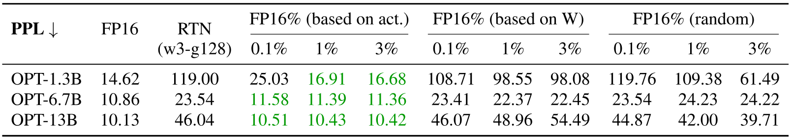
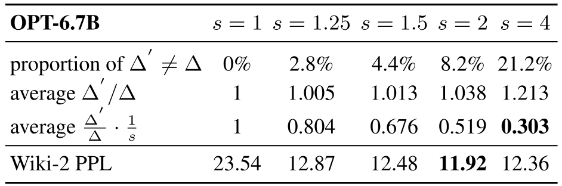
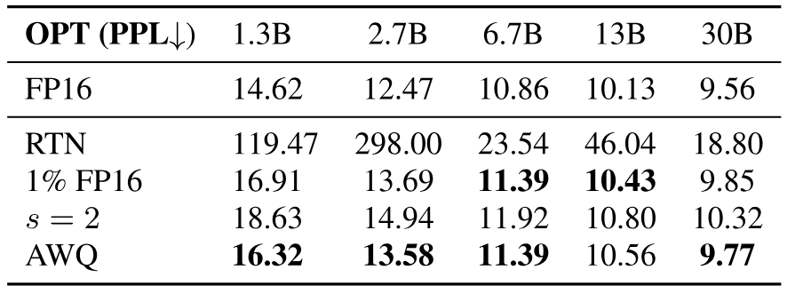
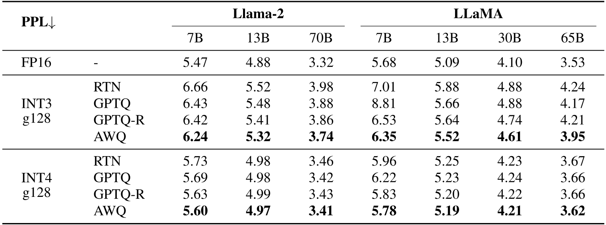
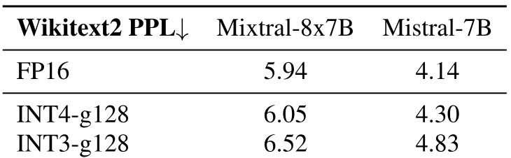
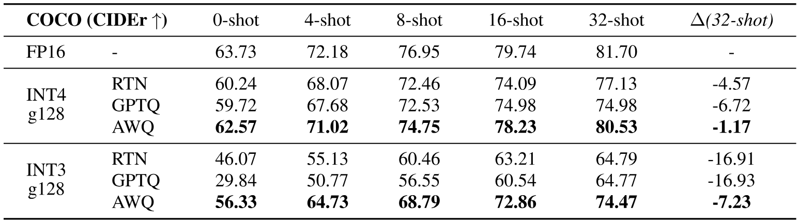
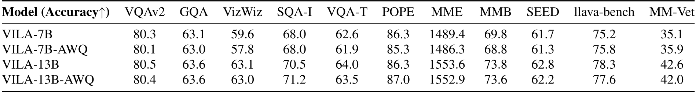

> [Ji Lin](https://www.linji.me/), [Jiaming Tang](https://jiamingtang.me/), [Haotian Tang](https://www.mit.edu/~kentang/), [Shang Yang](https://ys-2020.github.io/), [Wei-Ming Chen](https://developer.nvidia.com/blog/author/weimingc/), [Wei-Chen Wang](https://weichenwang.me/), [Guangxuan Xiao](https://guangxuanx.com/), [Xingyu Dang](https://dangxingyu.github.io/), [Chuang Gan](https://people.csail.mit.edu/ganchuang/), and [Song Han](https://songhan.mit.edu/). 首次提交至 arXiv: June 1, 2023; 当前版本为 v6. [AWQ: Activation-aware Weight Quantization for LLM Compression and Acceleration](https://arxiv.org/abs/2306.00978). [原始 PDF](/paper/awq.pdf). [TeX 源码](https://export.arxiv.org/e-print/2306.00978). 精确的印刷版式和参考文献以原始 PDF 为准.

## 摘要

大型语言模型 (LLMs) 在各种任务上表现出色, 但天文般的模型规模提高了服务的硬件门槛 (内存大小) 并减慢了标记生成速度 (内存带宽). 在本文中, 我们提出了激活感知权重量化 (AWQ), 这是一种对硬件友好的 LLM 低比特仅权重量化方法. 我们的方法基于这样一个观察: 权重的重要性并不相同—仅保护 *1%* 的显著权重就能大幅减少量化误差. 然后, 我们提出通过观察 *激活, 而非权重*, 搜索保护显著权重的最优通道级缩放系数. AWQ 不依赖任何反向传播或重建, 因此它可以很好地保持 LLM 在不同领域和模态上的泛化能力, 而不会过拟合校准集. AWQ 在各种语言建模和特定领域基准测试中均优于现有方法. 得益于更好的泛化能力, 它在 *指令微调* 的语言模型以及首次在 *多模态* 语言模型上实现了优秀的量化性能. 与 AWQ 一起, 我们实现了一个高效且灵活的推理框架, 专为边缘上的 LLM 设计, 在桌面和移动 GPU 上相较 Huggingface FP16 实现提供了超过 3$\times$ 的加速. 它还使在移动 GPU (NVIDIA Jetson Orin 64GB) 上部署 70B Llama-2 模型变得民主化.

[+1]

## 1 引言

基于转换器的大型语言模型 (LLMs) [Vas17] 在各种基准测试中表现出色 [Bro77, Zha22a, Tou23, Les23]. 然而, 模型体积大导致服务成本高. 例如, GPT-3 有 1750 亿参数, 以 FP16 存储时为 350GB, 而最新的 H100 GPU 内存仅为 96GB, 更不用说边缘设备了.

LLM 的低位权重量化可以节省内存, 但很困难. 量化感知训练 (QAT) 由于训练成本高并不实用, 而训练后量化 (PTQ) 在低位设置下会导致较大精度下降. 最接近的工作是 GPTQ [Fra22], 它使用二阶信息进行误差补偿. 在重构过程中可能对校准集过拟合, 从而扭曲在分布外域上学习到的特征 ([图 6](#figure-06)), 这可能会成为问题, 因为 LLM 是*通用*模型.

在本文中, 我们提出了激活感知权重量化 (Activation-aware Weight Quantization, AWQ), 这是一种对大语言模型 (LLMs) 友好的低位权重专用量化方法. 我们的方法基于以下观察: *权重对于 LLMs 的性能并非同等重要*. 只有一小部分 (0.1%-1%) 的*显著*权重; 跳过这些显著权重的量化将显著降低量化损失 ([表 1](#table-01)). 为了找到显著的权重通道, 我们的洞察是应该参考*激活*分布而不是*权重*分布, 尽管我们进行的是*仅权重量化*: 对应于较大激活幅值的权重通道更显著, 因为它们处理更重要的特征. 为了避免硬件效率低下的混合精度实现, 我们分析了权重量化的误差, 并得出结论: *对显著通道进行放大可以减少其相对量化误差* (公式 [2](#S2.E2)). 根据这一直觉, 我们设计了一种每通道缩放方法, 以自动搜索在全权重量化下最小化量化误差的最优缩放比例. AWQ 不依赖任何反向传播或重构, 因此可以很好地保留 LLMs 在各种领域和模态上的泛化能力, 而不会过拟合校准集. 另外, 我们还实现了一个高效的服务框架, 将 AWQ 理论上的内存节省转化为实际加速. 我们的框架利用内核融合来最小化推理开销 (*例如*, 中间 DRAM 访问和内核启动开销), 从而更好地实现对线性层量化带来的加速 (AWQ 应用于包含大部分参数的线性层).

实验表明, AWQ 在不同模型家族 (例如 LLaMA [Tou23], OPT [Zha22a]) 和不同模型规模上, 在各种任务中都优于现有方法. 得益于更好的泛化能力, 它也在*指令调优*的语言模型 (例如 Vicuna) 以及首次应用于*多模态*语言模型 (OpenFlamingo [Awa23]) 时, 实现了良好的量化性能. 通过我们高效的系统实现, 在不同的大型语言模型中, 相较于 Huggingface 的 FP16 实现, 我们持续观察到平均 3.2-3.3$\times$ 的加速效果. 另外, 它使 Llama-2-70B 模型能够在单个具备 64GB 内存的 NVIDIA Jetson Orin 上轻松部署. 它还在笔记本 RTX 4070 GPU (仅 8GB 内存) 上, 以每秒 30 个 token 的交互速度, 使高达 130 亿参数的语言模型变得更加普及.

AWQ 已被包括 [FastChat](https://github.com/lm-sys/FastChat/blob/main/docs/awq.md), [vLLM](https://github.com/vllm-project/vllm/blob/main/vllm/model_executor/quantization_utils/awq.py), [HuggingFace TGI](https://github.com/huggingface/text-generation-inference/pull/1054), [LMDeploy](https://github.com/InternLM/lmdeploy) 等在内的各种开源 LLM 服务解决方案广泛采纳.

## 2 AWQ: 激活感知权重量化

*量化* 是将浮点数映射为低位整数的过程. 这是一种有效的方法, 用于降低大型语言模型 [Det22, Fra22, Yao22a, Xia23] 的模型大小和推理成本. 在本节中, 我们首先提出了一种仅针对权重的量化方法, 通过保护更“重要”的权重来在*无需训练/回归*的情况下提高准确性. 然后, 开发了一种数据驱动的方法来搜索最优缩放, 从而减少量化误差 ([图 1](#figure-01)).

**图 1.** 我们观察到, 通过观察 *激活分布* (中间), 可以找到 LLMs 中 1%的显著权重. 将显著权重保持在 FP16 可以显著提升量化性能 (PPL 从 43.2 (左) 提升到 13.0 (中) ), 但混合精度格式在硬件上效率不高. 我们遵循激活感知原则, 提出 AWQ (右). AWQ 执行逐通道缩放以保护显著权重, 从而减少量化误差. PPL 是使用 OPT-6.7B 在 INT3-g128 量化下测得的.

### 2.1 通过保留 1%显著权重提升 LLM 量化性能

**表 1.** 在 FP16 中保留一小部分权重 (0.1%-1%) 显著提高了量化模型相对于四舍五入 (RTN) 的性能. 只有在通过观察*激活*分布而不是*权重*分布选择重要权重的情况下, 这种方法才有效. 我们用绿色标出困惑度较好的结果. 我们使用了组大小为 128 的 INT3 量化, 并测量了 WikiText 困惑度 ($\downarrow$).

我们观察到大语言模型 (LLMs) 的权重*并非同等重要*: 有一小部分*显著*的权重对于 LLMs 的性能远比其他权重重要. 跳过对这些显著权重的量化可以帮助弥补量化损失带来的性能下降, *无需*任何训练或回归 ([图 1](#figure-01)(b)). 为了验证这一观点, 我们在[表 1](#table-01) 中基准测试了在跳过部分权重通道时量化 LLMs 的性能. 我们在保持部分权重通道为 FP16 的同时, 测量了 INT3 量化模型的性能. 一种广泛使用的方法来确定权重的重要性是查看其大小或 $L_{2}$- 范数 [Han15a, Fra18]. 但我们发现跳过大范数的权重通道 (*即*基于 W 的 FP16%) 并不能显著提升量化性能, 其改进程度与随机选择相似. 有趣的是, 基于*激活大小*选择权重可以显著提升性能: 仅保留对应大激活的 0.1%-1%的通道, 就能显著改善量化性能, 甚至匹配基于重构的强方法 GPTQ [Fra22]. 我们假设, 具有较大幅度的输入特征通常更为重要. 将对应的权重保持为 FP16 可以保留这些特征, 从而有助于模型获得更好的性能.

限制: 尽管将 0.1% 的权重保持为 FP16 可以在量化性能有所提升而模型大小 (以总比特数衡量) 没有明显增加的情况下实现, 但这种混合精度数据类型会使系统实现变得困难. 我们需要提出一种方法来保护重要权重, 而无需将其实际保持为 FP16.

### 2.2 通过激活感知缩放保护显著权重

我们提出一种替代方法, 通过*按通道缩放*来减少显著权重的量化误差, 该方法不会受到硬件效率低下的问题影响.

量化误差分析. 我们从仅权重量化的误差分析开始. 考虑一组/块权重 $\mathbf{w}$; 线性操作可以写为 $y=\mathbf{w}\mathbf{x}$, 量化对应物为 $y=Q(\mathbf{w})\mathbf{x}$. 具体来说, 量化函数定义为:

$$
Q(\mathbf{w})=\Delta\cdot\mathrm{Round}(\frac{\mathbf{w}}{\Delta}),\quad\Delta=\frac{\max(|\mathbf{w}|)}{2^{N-1}},\tag{1}
$$

其中 $N$ 是量化位数, $\Delta$ 是由绝对最大值决定的量化缩放因子. 现在考虑一个权重元素 $w\in\mathbf{w}$, 如果我们将 $w$ 乘以 $s>1$ 并对 $x$ 进行反向缩放, 我们将得到 $Q(w\cdot s)(x/s)$, 其结果是:

$$
Q(w\cdot s)\cdot\frac{x}{s}=\Delta^{ {}^{\prime}}\cdot\mathrm{Round}(\frac{\mathrm{ws}}{\Delta})\cdot x\cdot\frac{1}{s},\tag{2}
$$

其中 $\Delta^{ {}^{\prime}}$ 是应用 $s$ 之后的新量化缩放器. 我们通过经验发现: (1) $\mathrm{Round}(\cdot)$ 的期望误差 (记为 $\mathrm{RoundErr}$) 不会变化: 由于 round 函数将浮点数映射为整数, 误差大致均匀分布在 0-0.5 之间, 导致平均误差为 0.25; (2) 对单个元素 $w$ 进行缩放通常不会改变该组的极值 $\mathbf{w}$. 因此我们有 $\Delta^{ {}^{\prime}}\approx\Delta$; (3) 方程 [2](#S2.E2) 的误差可以表示为 $\mathrm{Err}^{ {}^{\prime}}=\Delta^{ {}^{\prime}}\cdot \mathrm{RoundErr}\cdot\frac{1}{s}$, 相对于原始误差 $\mathrm{RoundErr}$ 的比例为 $\frac{\Delta^{ {}^{\prime}}}{\Delta}\cdot\frac{1}{s}$. 给定 $\Delta^{ {}^{\prime}}\approx\Delta$ 和 $s>1$, 对于显著权重 $w$, 相对误差更小.

为了验证这个想法, 我们将 1%的显著通道与 $s>1$ 相乘用于 OPT-6.7B 模型, 并测量每组在[表 2](#table-02) 中的 $\Delta$ 变化. 我们发现放大显著通道非常有效: $s=1$ (仅 RTN) 的困惑度从 23.54 改善到 $s=2$ 的 11.92. 随着 $s$ 增大, $\Delta$ 变化的比例通常会变大, 但对于 $s<2$ 而言比例仍然很小; 显著通道的相对误差随着 $s$ 增加而持续减小. 然而, 最好的 PPL 实际出现在 $s=2$. 这是因为如果我们使用非常大的 $s$, 当 $\Delta$ 增加时, 它会增加*非显著*通道的相对误差 (非显著通道的误差会被 $\frac{\Delta^{ {}^{\prime}}}{\Delta}$ 放大, 并且在 $s=4$ 下 21.2%的通道的比例大于 1), 这可能损害模型的整体精度. 因此, 在保护显著通道时, 我们也需要考虑非显著通道的误差.

**表 2.** 当将 1% 的显著通道乘以 $s>1$ 时的统计数据. 放大显著通道显著改善了困惑度 (23.54 到 11.92). 随着 $s$ 的增大, 改变的 $\Delta$ 百分比增加, 显著通道的错误降低率也增加. 然而, 最佳困惑度在 $s=2$ 时实现, 因为进一步增加 $s$ 将增加*非显著*通道的量化误差.

**表 3.** AWQ 通过使用基于缩放的方法保护显著权重并减少量化误差. 它始终优于四舍五入到最接近值的量化 (RTN), 并在性能上可与混合精度 (1% FP16) 相媲美, 同时更加适合硬件实现.

搜索缩放. 为了同时考虑显著和非显著权重, 我们选择自动搜索每个输入通道的最优缩放因子, 以最小化某一层量化后的输出差异. 形式上, 我们希望优化以下目标:

$$
\mathbf{s}^{*}=\mathrm{arg\,min}_{\mathbf{s}}\mathcal{L}(\mathbf{s}),\quad\mathcal{L}(\mathbf{s})=\| Q(\mathbf{W}\cdot\mathbf{s})(\mathbf{s^{-1}}\cdot\mathbf{X})-\mathbf{W}\mathbf{X}\|\tag{3}
$$

这里 $Q$ 表示权重量化函数 (例如, 使用组大小为 128 的 INT3/INT4 量化), $\mathbf{W}$ 是 FP16 格式的原始权重, $\mathbf{X}$ 是从小型校准集缓存的输入特征 (我们从预训练数据集中取一个小型校准集, 以避免对特定任务过拟合). $\mathbf{s}$ 是每个 (输入) 通道的缩放因子; 对于 $\mathbf{s^{-1}}\cdot\mathbf{X}$, 它通常可以与前一个操作 [Wei22, Xia23] 融合. 由于量化函数不可微, 我们无法直接使用普通反向传播来优化该问题. 有一些技术依赖于近似梯度 [Ben13, Ess19], 但我们发现仍然存在收敛不稳定的问题.

为了使该过程更稳定, 我们通过分析会影响缩放因子选择的因素, 为最优缩放定义了一个*搜索空间*. 如上一节所示, 权重通道的重要性实际上由激活尺度决定 (因此称为“激活感知”). 因此, 我们只使用一个非常简单的搜索空间:

$$
\mathbf{s}=\mathbf{s_{X}}^{\alpha},\quad\alpha^{*}=\mathrm{arg\,min}_{\alpha}\mathcal{L}(\mathbf{s_{X}}^{\alpha})\tag{4}
$$

$\mathbf{s}$ 仅与激活 $\mathbf{s_{X}}$ 的幅度相关, 我们使用单个超参数 $\alpha$ 来在重要通道和非重要通道的保护之间进行平衡. 我们可以通过在 $[0,1]$ 区间上的快速网格搜索找到最佳 $\alpha$ ($0$ 表示我们不进行缩放; $1$ 对应最激进的缩放). 我们进一步通过最小化均方误差 (MSE) 来应用权重裁剪, 因为裁剪权重可以进一步帮助减少方程 [2](#S2.E2) 中的 $\Delta^{ {}^{\prime}}$, 从而减少量化误差. 我们在 [表 3](#table-03) 中提供了 OPT 模型在 INT3-g128 量化下的消融研究; AWQ 始终优于四舍五入量化 (RTN), 并在性能上与混合精度 (1% FP16) 相当, 同时更适合硬件实现.

优势. 我们的方法不依赖任何回归 [Fra22] 或反向传播, 而这些在许多量化感知训练方法中是必需的. 它对校准集的依赖最小, 因为我们只测量每个通道的平均幅值, 从而防止过拟合 ([图 6](#figure-06)). 因此, 我们的方法在量化过程中需要的数据更少, 并且可以保留 LLM 在校准集分布之外的知识. 更多细节请参见第 [3.3](#S3.SS3) 节.

## 3 实验

### 3.1 设置

#### 量化

我们在本工作中专注于*仅权重量化的分组*量化. 如之前的工作 [Det22c, Fra22] 所示, 分组量化对于改善性能/模型大小权衡总是有帮助的. 除了另有说明外, 我们在整个工作中使用了 128 的分组大小. 我们关注 INT4/INT3 量化, 因为它们能够在很大程度上保留 LLM 的性能 [Det22c]. 对于 AWQ, 我们使用了来自 Pile [Gao20] 数据集的小型校准集, 以避免过拟合到特定的下游领域. 我们使用了网格规模为 20 的方法来搜索方程 [4] 中的最优 $\alpha$ (#S2.E4 "在 2.2 通过激活感知缩放保护显著权重 ‣ 2 AWQ: 激活感知权重量化 ‣ AWQ: 用于 LLM 压缩和加速的激活感知权重量化").

#### 模型

我们在 LLaMA [Tou23] 和 OPT [Zha22a] 系列上对我们的方法进行了基准测试. 还有其他开源 LLM, 例如 BLOOM [Les23], 但它们的质量普遍较差, 因此我们未将其纳入研究. 我们进一步对一个指令调优模型 Vicuna [Chi23a] 以及视觉语言模型 OpenFlamingo-9B [Awa23] 和 LLaVA-13B [Liu23j] 进行了基准测试, 以展示我们方法的通用性.

#### 评估.

遵循先前的文献 [Det22, Xia23, Fra22, Det22c, Yao22a], 我们主要在语言建模任务上对量化模型进行了分析 (在 WikiText-2 [Mer16a] 上进行困惑度评估), 因为困惑度可以稳定地反映 LLM 的性能 [Det22c].

#### 基线.

我们的主要基线是普通的四舍五入量化 (RTN). 当使用像 128 这样的小组大小时, 它实际上表现相当强 [Fra22, Det22c]. 我们还比较了用于大语言模型权重量化的最先进方法 GPTQ [Fra22]. 对于 GPTQ, 我们还比较了使用“重新排序”技巧的更新版本 (记作 GPTQ-Reorder 或 GPTQ-R). 其他技术如 ZeroQuant [Yao22a], AdaRound [Nag20] 和 BRECQ [Li21a] 依赖反向传播来更新量化权重, 可能难以扩展到大模型; 它们也未能优于 GPTQ [Fra22], 因此未纳入研究.

### 3.2 评估

#### LLaMA 模型结果

我们将研究重点放在 LLaMA 模型 (LLaMA [Tou23] 和 Llama-2 [Tou23a]) 上, 因为它们相比其他开源大语言模型表现更优 [Zha22a, Les23]; 它也成为许多流行开源模型的基础 [Tao23, Chi23a]. 我们在量化前后评估了困惑度, 见[表 4](#table-04). 可以看到, AWQ 在不同模型规模 (7B-70B) 和生成任务中, 始终优于四舍五入 (RTN) 和 GPTQ [Fra22] (有或没有重新排序).

**表 4.** AWQ 在不同模型尺寸和不同位精度下优于四舍五入量化 (RTN). 在 LLaMA 和 Llama-2 模型上, 它始终比 GPTQ (有或没有重新排序) 实现更好的困惑度.

**图 2.** 在 GPT-4 评估协议下, 将 INT3-g128 量化的 Vicuna 模型与 FP16 版本进行比较 [Chi23a]. 更多获胜案例 (蓝色) 表明性能更好. 与 RTN 和 GPTQ [Fra22] 相比, AWQ 始终提升了量化后的性能, 显示了对指令调优模型的泛化能力.

#### 指令调优模型的量化.

指令微调可以显著提高模型的性能和可用性 [Wei22c, San22, Ouy22, Chu22]. 它已成为模型部署前的一个重要步骤. 我们进一步在一个流行的指令微调模型 Vicuna [Chi23a] 上对我们方法的性能进行了基准测试, 如 [图 2](#figure-02) 所示. 我们使用 GPT-4 得分来评估量化模型在 80 个样本问题上的性能, 相对于 FP16 对应模型 [Chi23a]. 我们对响应进行了两种顺序的比较 (量化-FP16, FP16- 量化), 以消除顺序效应 (我们发现 GPT-4 倾向于提高第一个输入的评分), 因此进行了 160 次试验. AWQ 在两种规模 (7B 和 13B) 下, 一直优于 RTN 和 GPTQ, 提高了 INT3-g128 量化 Vicuna 模型的性能, 证明了其对指令微调模型的泛化能力.

**表 5.** 视觉语言模型 OpenFlamingo-9B 在 COCO 图像描述数据集上的量化结果. AWQ 在零样本和多种少样本设置下都优于现有方法, 展示了对不同模态和上下文学习任务的通用性. AWQ 在 INT4-g128 下将量化降级 (32-shot) 从 4.57 降低到 1.17, 实现了模型大小的 4 倍缩减, 同时性能损失可以忽略.

**图 3.** 在 COCO 描述数据集上量化 OpenFlamingo-9B [Awa23] 的定性结果 (4-shot, INT4-g128 量化). 与四舍五入 (RTN) 基线相比, 我们的方法显著提高了描述的质量. 我们用颜色标注文本以显示正确或错误的描述.

#### 多模态语言模型的量化.

大型多模态模型 (LMMs) 或视觉语言模型 (VLMs) 是增强了视觉输入的 LLMs [Ala22, Li23m, Koh23, Dri23, Zha23e, Liu23j]. 这类模型能够在图像/视频输入的条件下生成文本. 由于我们的方法不存在对校准集的过拟合问题, 因此可以直接应用于 VLMs 以提供准确且高效的量化. 我们在 COCO 字幕 [Che15a] 数据集上使用 OpenFlamingo-9B 模型 [Awa23] ([Ala22] 的开源复现版) 进行了实验 ([表 5](#table-05)). 我们测量了不同少样本设置下 5k 样本的平均性能. 由于语言部分占据模型大小的主要部分, 我们仅对模型的语言部分进行量化. 在零样本和各种少样本设置下, AWQ 的表现优于现有方法, 展示了其在不同模态和上下文学习任务中的泛化能力. 在 INT4-g128 下, 它将量化退化 (32-shot) 从 4.57 降至 1.17, 实现了 4$\times$ 的模型大小减少, 同时性能损失可以忽略. 我们在[图 3](#figure-03) 中进一步提供了一些定性字幕结果, 以展示我们相对于 RTN 的优势. 我们的方法为 LMM/VLM 的量化提供了一键式解决方案. 据我们所知, 这是*首次*对 VLM 进行低比特量化的研究.

**图 4.** 来自 LLaVA-13B 模型的视觉推理示例 [Liu23j]. AWQ 优于四舍五入 (RTN) 基线, 提供了更合理的答案. 我们用颜色标注文本以显示正确或错误的回答.

#### 视觉推理结果.

我们进一步提供了一些 LLaVA-13B [Liu23j] 模型的定性视觉推理示例, 如 [图 4](#figure-04) 所示. 与四位 INT4-g128 量化的 round-to-nearest (RTN) 基线相比, AWQ 改进了响应, 使答案更合理. 在第一个示例中, AWQ 模型能够理解这个表情包, 因为从太空看它像地球, 而 RTN 给出了错误描述 (用红色标记). 在第二个示例中, AWQ 正确回答了问题 (画作的艺术家), 而 RTN 未提供任何关于艺术家的信息. 在最后一个示例中, RTN 错误地指出图片中有一只鸟, 而 AWQ 通过注意图片是在山区拍摄的提供了更多信息. AWQ 通过减少回答中的事实错误, 提高了视觉语言模型的视觉推理能力; 即使四位量化, RTN 仍不足够.

|OPT / Wiki PPL
$\downarrow$||1.3B|2.7B|6.7B|13B|30B|

**表 6.** 我们的方法与 GPTQ 正交: 结合 GPTQ 时, 它在极低位量化 (INT2-g64) 下进一步缩小了性能差距. 结果是 OPT 模型在 WikiText-2 上的困惑度.

#### 极低位量化.

我们进一步将 LLM 量化到 INT2 以适应有限的设备内存 ([表 6](#table-06)). RTN 完全失败, 而 AWQ 在 GPTQ 的基础上带来了显著的困惑度提升, 尽管相比 FP16 仍存在性能差距. 我们的方法与 GPTQ 正交. 我们可以将我们的方法与 GPTQ 结合, 以进一步提升 INT2 量化性能, 使其成为更实用的设置.

**图 5.** AWQ 提供了一种现成的解决方案, 将理论内存占用减少转化为可量化的加速. 因此, AWQ 在 4090 (桌面 GPU) 和 Orin (移动 GPU) 上分别比 Huggingface 的 FP16 实现快 3.9 倍 $\times$ 和 3.5 倍 $\times$. AWQ 还使 Llama-2-13B 在仅有 8GB 内存的笔记本 GPU (4070) 上部署成为可能.

#### 加速评估.

在[图 5](#figure-05) 中, 我们展示了 AWQ 系统的加速结果. 我们对线性层以及没有量化权重的层进行了优化. 我们在 RTX 4090 (桌面 GPU) , RTX 4070 (笔记本 GPU) 和 Jetson Orin (移动 GPU) 上进行了基准测试实验. 对于所有 LLM, 我们使用固定的提示长度为 4 个令牌进行批量大小为 1 的推理. 每次推理生成 200 个令牌, 并计算中位延迟作为最终结果. 如[图 5](#figure-05)(a)所示, 与 Huggingface FP16 实现相比, 我们的系统在 4090 上为三类 LLM (Llama-2, MPT 和 Falcon) 带来了 2.7-3.9$\times$ 的加速. 在只有 8GB 显存的笔记本 4070 GPU 上, 我们仍然能够以每秒 33 个令牌的速度运行 Llama-2-13B 模型, 而 FP16 实现甚至无法运行 7B 模型.

我们的系统在 NVIDIA Jetson Orin (32GB) 上也表现出令人期待的性能. 如[图 5](#figure-05)(b)所示, 在运行 Llama-2 模型时, 我们的系统实现了每秒 33 个令牌的交互处理速率. 得益于 AWQ, 即使是更大的模型如 MPT-30B 也能够在这一资源受限的边缘设备上顺畅运行, 处理速度达到每秒 7.8 个令牌. 我们使用原生 PyTorch API 实现了所有 AWQ 模型的前向传播, 并且这段代码可以在各种 GPU 架构上复用. 因此, 我们的系统兼具了两方面优势: 最先进的推理速度和卓越的可扩展性.

### 3.3 分析

**图 6.** 左图: AWQ 只需要一个更小的校准集就能达到良好的量化性能. 相比 GPTQ, 它可以使用 10$\times$ 更小的校准集来获得更好的困惑度. 右图: 我们的方法对校准集分布更具鲁棒性. 总体而言, 使用相同的校准和评估分布效果最佳 (PubMed-PubMed, Enron-Enron). 但当使用不同的校准分布 (PubMed-Enron, Enron-PubMed) 时, AWQ 仅增加 0.5-0.6 的困惑度, 而 GPTQ 的困惑度差距为 2.3-4.9. 所有实验均在 OPT-6.7B 模型下使用 INT3-g128 量化完成.

#### 校准集的数据效率更高.

我们的方法需要更小的校准集, 因为我们不依赖回归/反向传播; 我们仅从校准集中测量平均激活规模, 这样数据利用率高. 为了展示这一点, 我们在 [图 6](#figure-06) (a) 中对 OPT-6.7B 模型进行 INT3-g128 量化后比较困惑度. AWQ 所需的校准集远小以达到良好的量化表现; 相比 GPTQ, 它可以使用 10$\times$ 更小的校准集 (16 个序列 *对比* 192 个序列) 来获得更好的困惑度.

#### 对校准集分布具有鲁棒性.

我们的方法对校准集的分布不太敏感, 因为我们只测量来自校准集的平均激活尺度, 这在不同数据集分布间更具普遍适用性. 我们进一步在 [图 6](#figure-06)(b) 中对不同校准集分布的效果进行了基准测试. 我们从 Pile 数据集 [Gao20] 中取了两个子集: PubMed 摘要和 Enron 邮件 [Kli04]. 我们使用每个子集作为校准集, 并在两个集合上评估量化模型 (校准集和评估集分开, 互不重叠; 评估使用了 1k 样本). 总体来说, 使用相同的校准集和评估集分布效果最好 (PubMed-PubMed, Enron-Enron). 但当使用不同的校准分布时 (PubMed-Enron, Enron-PubMed), AWQ 仅使困惑度增加 0.5-0.6, 而 GPTQ 的困惑度则增加 2.3-4.9. 这表明 AWQ 对校准集分布具有较强的鲁棒性.

## 4 相关工作

#### 模型量化方法.

量化降低了深度学习模型的位精度 [Han15, Ben18, Nag19a, Wan19a, Nag20, Lin20b], 这有助于减小模型大小并加速推理. 量化技术通常分为两类: 量化感知训练 (QAT, 依赖反向传播更新量化权重) [Ben13, Gho21a, Nag21, Cho18a] 和训练后量化 [Ben18, Nag19a, Nag20] (PTQ, 通常无需训练). QAT 方法难以轻松扩展到像 LLMs 这样的大模型. 因此, 人们通常使用 PTQ 方法对 LLMs 进行量化.

#### LLM 的量化.

人们研究了 LLM 量化的两种设置: (1) W8A8 量化, 其中激活和权重都量化为 INT8 [Det22, Xia23, Yao22a, Wei22b, Wei23]; (2) 仅低位权重量化 (例如 W4A16), 其中仅将权重量化为低位整数 [Fra22, Det22c, She23a, Par22]. 本文重点研究第二种设置, 因为它不仅降低了硬件门槛 (需要更小的内存大小), 也加快了令牌生成速度 (缓解了内存受限的工作负载). 除了常规的四舍五入基线 (RTN) 之外, GPTQ [Fra22] 最接近我们的工作. 然而, GPTQ 的重建过程会导致对校准集的过拟合问题, 而且可能无法保留 LLMs 在其他模态和领域中的通用能力. 它还需要一个重新排序技巧才能在某些模型上工作 (例如 LLaMA-7B [Tou23] 和 OPT-66B [Zha22a]).

#### 对低比特量化大语言模型 (LLM) 的系统支持.

低比特量化的 LLM 已成为降低推理成本的流行设置. 有一些系统支持可以实现实际的加速. GPTQ [Fra22] 为 OPT 模型提供 INT3 内核, 而 GPTQ-for-LLaMA 在 Triton [Til19] 的帮助下扩展了对 INT4 重排序量化的内核支持. FlexGen [She23a] 和 llama. cpp [+2] 执行分组 INT4 量化以减少 I/O 成本和卸载. FasterTransformer [+3] 实现了用于仅权重逐张量量化的 FP16$\times$INT4 GEMM, 但不支持分组量化. LUT-GEMM [Par22] 在 GPU CUDA 核心上借助查找表执行按位计算. AWQ 内核可在张量核心和 CUDA 核心上自适应执行, 适用于 LLM 推理中的上下文和生成阶段. 因此, 我们运行的最先进 LLaMA 模型相比 Huggingface 的 FP16 实现实现了 3.2-3.3$\times$ 的加速.

## 5 结论

在这项工作中, 我们提出了激活感知权重量化 (AWQ), 这是一种简单但有效的低比特权重专用大语言模型 (LLM) 压缩方法. AWQ 基于如下观察: 在大语言模型中权重的重要性并不均等, 并且通过每通道缩放来减少重要权重的量化损失. AWQ 不会对校准集过拟合, 并能保持大语言模型在各种领域和模态中的通用能力. 它在语言建模任务上优于现有方法, 并且适用于指令调优语言模型和多模态语言模型. 我们的系统实现进一步将 AWQ 理论上节省的内存转化为在桌面和移动 GPU 上相较于 Huggingface 的 FP16 实现 3.2-3.3 倍的实际加速, 从而实现大语言模型在边缘设备上的普及部署.

## 致谢

我们感谢 MIT 人工智能硬件项目, 美国国家科学基金会, NVIDIA 学术合作奖, MIT-IBM Watson 人工智能实验室, 亚马逊和 MIT 科学中心, 高通创新奖学金, 微软图灵学术计划对本研究的支持.

## 附录 A 更广泛的影响与局限性

更广泛的影响. 在本文中, 我们提出了一种通用技术, 以实现大型语言模型 (LLMs) 的低位仅权重量化的准确且高效的方法. 它使 LLMs 更加高效和易于使用, 因此可能继承 LLMs 的影响. 从积极方面来看, 量化有助于使 LLMs 民主化, 从而有利于更多人 (尤其是低收入人群). 它降低了部署 LLMs 的成本和硬件门槛, 促进了这些模型的边缘推理, 同时解决了数据隐私问题 (因为我们无需将数据发送到云端). 从消极方面来看, LLMs 可能会被恶意用户利用来传播虚假信息和进行操纵. 量化无法阻止这些负面影响, 但它也不会使情况恶化.

限制. 在本文中, 我们遵循之前的工作 [Det22, Fra22, Xia23, Yao22a, Det22c], 主要在困惑度和准确率等标准准确率指标上对量化模型进行基准测试. 然而, 除了准确率之外, LLM 基准测试还有其他重要指标, 如鲁棒性, 公平性, 偏差, 毒性, 有用性, 校准等. [Lia22]. 我们认为, 对量化 LLM 进行涵盖这些方面的更全面评估会很有帮助, 这部分工作我们留到未来完成. 另外, 由于在硬件上数据类型转换更容易, 我们仅研究了 LLM 的低位整数量化. 通过改变数据类型 (例如 FP4 [Det22c]), 可能会有进一步改进, 但我们在本研究中未包括.

## 附录 B 计算量

本文研究了大语言模型 (LLMs) 的训练后量化 (PTQ). 由于不依赖于任何反向传播, 计算需求通常较低. 对于小模型 (<40B 参数), 我们使用了一块 NVIDIA A100 GPU, 而对于大型模型, 由于内存限制, 我们使用了 2-4 块 A100 GPU.

量化过程通常很快, 只需几个 GPU 小时 (根据模型大小, 范围从 0.1 到 3 不等). 精度测量时间取决于模型和数据集的大小: 在 4 个常识问答任务上测试 LLaMA-65B (我们在多个数据集上测试的最大模型) 需要 3 个 GPU 小时; 在 MMLU (包含 57 个子数据集) 上测试需要 5 个 GPU 小时. 对于较小的模型和数据集 (例如 WikiText-2), GPU 小时会更少.

## 附录 C 无分组量化的局限性

我们的方法通过搜索良好的缩放来保护显著的权重通道. 在分组量化下, 它效果相当不错, 能够达到与将显著权重保持在 FP16 相同的精度 ([图 1](#figure-01)). 然而, 这种基于缩放的方法每个 *组* 只能保护 *一个* 显著通道. 对于分组量化来说, 这不是问题 (我们只需要保护 0.1%-1% 的显著通道, 组大小通常很小, 如 128, 因此平均每组只需要保护不到 1 个通道). 但对于非分组量化, 我们只能为 *整个权重* 保护一个输入通道, 这可能不足以弥补性能下降. 如 [表 7](#table-07) 所示, 在 INT3-g128 量化下, AWQ 的性能与保持 1% 显著权重在 FP16 下相似. 而在 INT3 非分组量化下, 仍然存在明显差距. 尽管如此, 我们仍想强调, 非分组量化的性能在相似成本下仍远落后于分组量化. 因此, 分组量化是 LLM 边缘部署压缩的 *更实用的方案*, 并且 AWQ 可以在此设置下有效提升量化后的性能.

**表 7.** AWQ 可以在不引入混合精度的情况下, 在分组量化下匹配保留 1%显著权重的 FP16 性能, 但对于非分组量化则不行. 尽管如此, 分组量化相比非分组量化具有更好的性能, 使其成为 LLM 仅权重量化的更实际设置, 而 AWQ 在此设置下表现相当不错. 结果是在 WikiText-2 数据集上的困惑度.

[+1]: †footnotetext: $*$ 表示同等贡献.

[+2]: **https://github.com/ggerganov/llama.cpp

[+3]: ††https://github.com/NVIDIA/FasterTransformer
