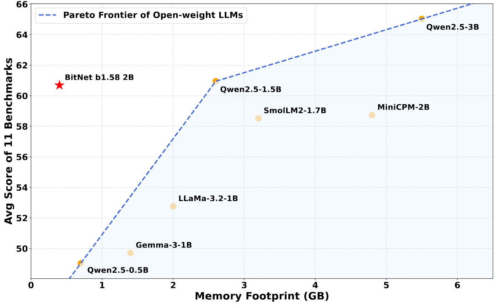
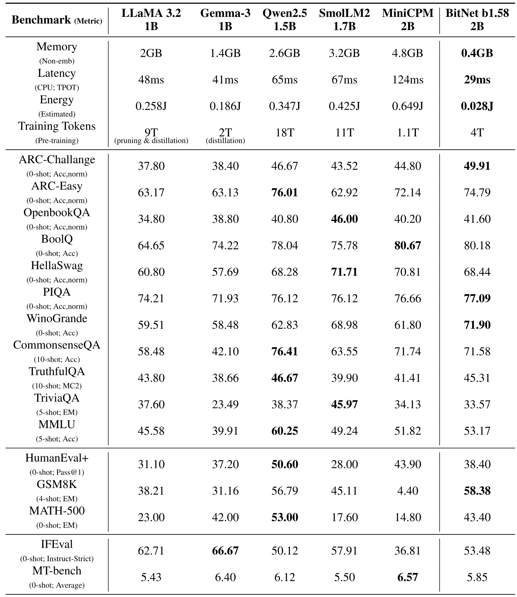
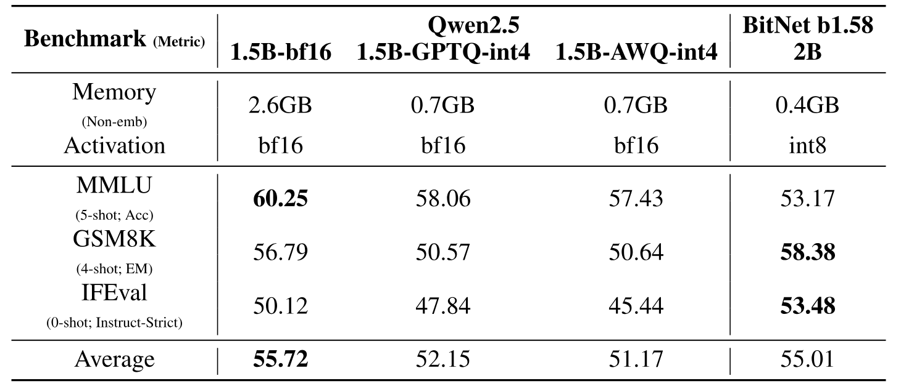
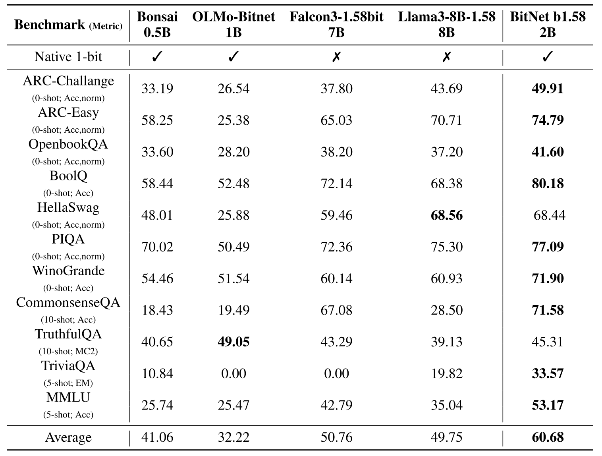
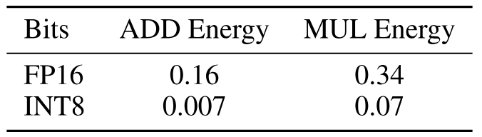

> [Shuming Ma](https://shumingma.com/) [+author-note], [Hongyu Wang](https://ustcwhy.github.io/) [+author-note], [Shaohan Huang](https://buaahsh.github.io/), [Xingxing Zhang](https://xingxingzhang.github.io/), [Ying Hu](https://dblp.org/pid/92/4882.html), [Ting Song](https://aclanthology.org/people/ting-song/), [Yan Xia](https://www.microsoft.com/en-us/research/people/yanxia/), 以及 [Furu Wei](https://www.microsoft.com/en-us/research/people/fuwei/) [+author-note]. 论文于 2025 年 4 月 16 日首次提交至 arXiv, 当前版本为 v2, 仍在持续完善. [BitNet b1.58 2B4T Technical Report](https://arxiv.org/abs/2504.12285). <a href="/paper/bitnet-b1-58-2b4t.pdf" target="_blank" rel="noopener noreferrer">原始 PDF</a>. [DOI](https://doi.org/10.48550/arXiv.2504.12285). [TeX 源码](https://export.arxiv.org/e-print/2504.12285v2). 精确的印刷版式和参考文献以原始 PDF 为准.

[+author-note]: Shuming Ma 与 Hongyu Wang 贡献相同. Furu Wei 是通讯作者. Shuming Ma, Shaohan Huang, Xingxing Zhang, Ting Song, Yan Xia 与 Furu Wei 就职于 Microsoft Research. Hongyu Wang 就职于中国科学院大学. Ying Hu 就职于清华大学. [GeneralAI](https://aka.ms/GeneralAI).

## 摘要

我们提出 BitNet b1.58 2B4T, 这是首个开源的原生 1-bit 大语言模型 (LLM), 参数规模为 20 亿. 该模型在包含 4 万亿 token 的语料库上训练, 并在语言理解, 数学推理, 编程能力和对话能力等基准上接受了严格评测. 结果表明, BitNet b1.58 2B4T 的性能与规模相近的主流开放权重全精度 LLM 相当, 同时在计算效率上有明显优势, 包括大幅降低内存占用, 能耗和解码延迟. 为便于后续研究与应用, 我们通过 Hugging Face 发布了模型权重, 并开源了适用于 GPU 和 CPU 架构的推理实现.

- **BitNet b1.58 2B4T (1.58-bit):** [`bitnet-b1.58-2B-4T`](https://huggingface.co/microsoft/bitnet-b1.58-2B-4T)<br>*BitNet b1.58 2B4T 的打包权重, 仅用于推理*
- **BitNet b1.58 2B4T (bf16):** [`bitnet-b1.58-2B-4T-bf16`](https://huggingface.co/microsoft/bitnet-b1.58-2B-4T-bf16)<br>*BitNet b1.58 2B4T 的主权重, 仅用于训练*
- **BitNet b1.58 2B4T (gguf):** [`bitnet-b1.58-2B-4T-gguf`](https://huggingface.co/microsoft/bitnet-b1.58-2B-4T-gguf)<br>*BitNet b1.58 2B4T 的 GGUF 格式, 用于 bitnet.cpp*
- **BitNet b1.58 2B4T 代码:** [`bitnet.cpp`](https://github.com/microsoft/BitNet); **演示:** [`aka.ms/bitnet-demo`](https://aka.ms/bitnet-demo)

<span id="figure-01"></span>



**图 1.** 从性能与内存的关系来看, BitNet b1.58 2B4T 推进了由参数量低于 3B 的主流开放权重 LLM 所定义的 Pareto 前沿, 表现出更高的效率.

<span id="section-1"></span>

## 1 引言

开源大语言模型 (LLM) 让更多人能够使用先进的 AI 能力, 推动了创新, 也让自然语言处理, 代码生成和视觉计算等不同领域的研究成为可能 [Dub24, Qwe25, Bai25a]. 模型公开后, 人们可以广泛开展实验并加以调整. 然而, 高昂的部署与推理算力需求成为阻碍其进一步普及的一道重要门槛. 先进的开源 LLM 通常内存占用很大, 能耗较高, 推理延迟也很明显, 因而不适用于许多边缘设备, 资源受限环境和实时应用.

1-bit LLM 是一种极端但很有潜力的模型量化形式, 其权重以及可能的激活值被限制为二值 $\{-1,+1\}$ 或三值 $\{-1,0,+1\}$, 为解决效率问题提供了可行方案. 它们能大幅减少存储权重所需的内存, 并支持高效的位运算, 因而有望显著降低部署成本与能耗, 加快推理速度. 尽管已有工作研究 1-bit 模型, 现有开源方案通常分为两类: 1) 对预训练全精度模型应用训练后量化 (PTQ), 这可能造成明显的性能下降 [Xu24h, Tea24b]; 2) 规模相对较小的原生 1-bit 模型 (从头使用 1-bit 权重训练, 例如 OLMo-Bitnet-1B [+1]), 其能力可能尚不及更大的全精度模型. 这一性能差距至今仍限制着 1-bit LLM 的实际影响.

为弥合效率与性能之间的差距, 我们提出 BitNet b1.58 2B4T, 首个经过大规模训练的开源原生 1-bit LLM. 该模型包含 20 亿参数, 从头在 4 万亿 token 的大规模数据集上训练, 并采用了专为 1-bit 范式设计的架构与训练创新. **本工作的核心贡献是证明, 原生 1-bit LLM 经过有效的大规模训练后, 能够在广泛任务上达到与同等规模主流开放权重全精度模型相当的性能.**

本技术报告详述了 BitNet b1.58 2B4T 的开发与评测. 我们先介绍其架构和训练方法, 再给出语言理解, 数学推理, 编程能力以及多轮对话能力等标准基准上的完整评测结果. 结果证实, 与成熟的全精度基线相比, 该模型性能强劲, 同时效率优势明显. 最后, 我们宣布通过 Hugging Face 公开发布 BitNet b1.58 2B4T 模型权重, 并提供针对 GPU 和 CPU 执行优化的开源推理代码, 以便后续研究并推动高效 LLM 的实际部署.

<span id="section-2"></span>

## 2 架构

BitNet b1.58 2B4T 的架构源自标准 Transformer 模型 [Vas17], 并在 BitNet 框架 [Wan23, Ma24] 的基础上进行了重要修改. 该模型完全从头训练.

其核心架构创新在于用自定义的 *BitLinear* 层替代标准的全精度线性层 (*torch.nn.Linear*). 这是 BitNet 方法的基础. 在这些 *BitLinear* 层中:

- **权重量化:** 模型权重在前向传播期间被量化为 1.58 bit. 这里采用绝对均值 (absmean) 量化方案, 将权重映射为三值 $\{-1,0,+1\}$. 这会大幅缩小模型, 并支持高效的数学运算.
- **激活量化:** 流经线性投影的激活值被量化为 8-bit 整数. 这里使用按 token 应用的绝对最大值 (absmax) 量化策略.
- **归一化:** 我们引入 `subln` 归一化 [Wan22l] 以进一步提高训练稳定性, 这对量化训练尤其有益.

除 *BitLinear* 层外, 模型还集成了几种成熟的 LLM 技术, 以提高性能与稳定性:

- **激活函数 (FFN):** 在前馈网络 (FFN) 子层中, BitNet b1.58 2B4T 没有采用常用的 SwiGLU 激活函数 [Sha20], 而是使用平方 ReLU ($\mathrm{ReLU}^{2}$). 选择该函数是因为它可能改善 1-bit 场景中的模型稀疏性和计算特性 [Wan24af, Wan24ag].
- **位置嵌入:** 使用旋转位置嵌入 (RoPE) [Su24] 注入位置信息, 这是现代高性能 LLM 的标准做法.
- **移除偏置:** 与 LLaMA 等架构一致, 整个网络的线性层和归一化层均移除偏置项, 以减少参数量并可能简化量化.

在分词方面, 我们采用为 LLaMA 3 开发的 tokenizer [Dub24]. 该 tokenizer 使用字节级字节对编码 (BPE) 方案, 词表大小为 128,256 个 token. 这一选择能够稳健地处理不同类型的文本和代码, 而且该 tokenizer 应用广泛, 便于与现有开源工具和生态系统直接集成.

<span id="section-3"></span>

## 3 训练

BitNet b1.58 2B4T 的训练包含三个阶段: 大规模预训练, 之后是监督微调 (SFT) 和直接偏好优化 (DPO). 近端策略优化 (PPO) 或群组相对策略优化 (GRPO) 等高级技术可以进一步提高数学和思维链推理等能力 [Sch17a, Sha24d], 但当前版本的 BitNet b1.58 2B4T 仅使用预训练, SFT 和 DPO. 强化学习方法仍是未来的研究方向.

<span id="section-3-1"></span>

### 3.1 预训练

预训练阶段旨在让模型获得广泛的世界知识和基础语言能力. 我们借鉴了成熟 LLM 实践中的通用训练策略 [Dub24], 并针对 1-bit 架构作了调整.

<span id="section-3-1-1"></span>

#### 3.1.1 学习率调度

训练采用两阶段学习率调度.

- **阶段 1 (高学习率):** 初始阶段使用标准余弦衰减调度, 但起始峰值学习率相对较高. 这一决定来自如下观察: 1-bit 模型的训练通常比全精度模型更稳定, 因而初始学习步可以更激进.
- **阶段 2 (冷却):** 在计划训练 token 数约进行到一半时, 学习率会突然衰减, 随后通过峰值明显更低的余弦调度维持. 这一 "冷却" 阶段让模型可以在更高质量的数据上细化其表示 (见 [第 3.1.3 节](#section-3-1-3)).

<span id="section-3-1-2"></span>

#### 3.1.2 权重衰减调度

在调整学习率的同时, 我们还采用了两阶段权重衰减策略.

- **阶段 1:** 在训练第一阶段, 权重衰减遵循余弦调度, 峰值为 $0.1$. 这种正则化有助于在初始高学习率阶段防止过拟合.
- **阶段 2:** 在第二阶段, 权重衰减实际上被禁用 (设为零). 这样, 在较低学习率和精选数据的引导下, 模型参数可以落在更细粒度的最优点上.

<span id="section-3-1-3"></span>

#### 3.1.3 预训练数据

预训练语料由公开文本和代码数据集混合而成, 包括 DCLM [Li25a] 等大型网络抓取数据, 以及 FineWeb-EDU [Pen24] 等教育类网页. 为提高数学推理能力, 我们还加入了合成生成的数学数据. 数据投放策略与两阶段训练相对应: 第一阶段处理大部分通用网络数据, 第二阶段的冷却期则侧重质量更高的精选数据集, 同时降低学习率.

<span id="section-3-2"></span>

### 3.2 监督微调 (SFT)

预训练之后, 模型接受监督微调 (SFT), 以增强遵循指令的能力并改善其在对话交互格式中的表现.

<span id="section-3-2-1"></span>

#### 3.2.1 SFT 数据

SFT 阶段使用了多种公开的指令遵循与对话数据集. 其中包括但不限于 WildChat [Zha24ac], LMSYS-Chat-1M [Zhe23c], WizardLM Evol-Instruct [Xu24i] 和 SlimOrca [Lia23]. 为进一步加强特定能力, 尤其是推理能力和遵循复杂指令的能力, 我们还加入了以 GLAN [Li24u] 和 MathScale [Tan24c] 等方法生成的合成数据集.

<span id="section-3-2-2"></span>

#### 3.2.2 对话模板

在 SFT 和推理的对话任务中, 使用以下对话模板结构:

```text
<|begin_of_text|>System: {system_message}<|eot_id|>
User: {user_message_1}<|eot_id|>
Assistant: {assistant_message_1}<|eot_id|>
User: {user_message_2}<|eot_id|>
Assistant: {assistant_message_2}<|eot_id|>...
```

<span id="section-3-2-3"></span>

#### 3.2.3 优化细节

SFT 期间采用了几项重要的优化选择:

- **损失聚合:** 我们没有对一个批次内各 token 的交叉熵损失取平均值 (mean reduction), 而是求和. 实验观察表明, 对这个模型而言, 求和损失能够改善收敛, 并取得更好的最终性能.
- **超参数调优:** 我们仔细调整了学习率和训练 epoch 数. 与预训练阶段的发现一致, SFT 期间使用相对较大的学习率, 对 1-bit 模型的效果优于全精度模型微调常用的学习率. 要达到最佳收敛效果, 微调时间还需要长于同等规模全精度模型, 训练 epoch 数也更多.

<span id="section-3-3"></span>

### 3.3 直接偏好优化 (DPO)

在 SFT 阶段之后, 我们应用直接偏好优化 (DPO) [Raf23], 使模型行为在有用性和安全性上进一步符合人类偏好. DPO 直接使用偏好数据优化语言模型, 不需要训练单独的奖励模型, 因而比传统 RLHF 更高效. 这一 DPO 阶段用于改善模型的对话能力, 并使其在实际使用场景中的整体表现更贴近预期交互模式.

<span id="section-3-3-1"></span>

#### 3.3.1 训练数据

DPO 训练所用的偏好数据集由多种公开资源组合而成, 这些资源能够反映人类对不同模型输出的判断. 具体而言, 我们使用了 UltraFeedback [Cui24a] 和 MagPie [Xu24j]. 汇集这些数据集后可得到稳健而多元的偏好信号, 引导模型生成更符合人类预期的回答.

<span id="section-3-3-2"></span>

#### 3.3.2 训练细节

DPO 训练进行了 2 个 epoch. 我们采用 $2\times 10^{-7}$ 的学习率, 并将控制与参考策略偏离程度的 DPO beta 参数设为 0.1. 为提高这一阶段的训练效率, 我们集成了 *Liger Kernel* 库 [Hsu24a] 中经过优化的内核. 从定性观察来看, DPO 过程有效地引导模型采用偏好的回答风格, 同时没有明显削弱预训练和 SFT 阶段建立的核心能力.

<span id="table-01"></span>



**表 1.** BitNet b1.58 2B4T 与规模相近 (10 亿至 20 亿参数) 的主流开放权重全精度 LLM 在效率指标及广泛基准性能上的比较. 所比较的模型均为指令微调版本.

<span id="section-4"></span>

## 4 评测

<span id="table-02"></span>



**表 2.** BitNet b1.58 (2B) 与原始 bf16 精度和经过 INT4 训练后量化 (GPTQ 和 AWQ) 的 Qwen2.5 1.5B 的比较. 所有模型均基于指令微调检查点.

<span id="table-03"></span>



**表 3.** BitNet b1.58 2B4T 与其他开放权重 1-bit 模型的性能比较. 其中包括原生训练的 1-bit 模型 (Bonsai-0.5B, OLMo-Bitnet-1B) 和经过训练后量化而达到 1.58-bit 的更大模型 (Falcon3-1.58bit-7B, Llama3-8B-1.58).

我们在多种基准上测量性能, 基准分类如下:

- **语言理解与推理:** ARC-Easy [Yad19], ARC-Challenge [Yad19], HellaSwag [Zel19], WinoGrande [Sak19], PIQA [Bis20], OpenbookQA [Mih18b] 和 CommonsenseQA [Tal19]
- **世界知识:** TruthfulQA [Lin22] 和 MMLU [Hen20]
- **阅读理解:** TriviaQA [Jos17] 和 BoolQ [Cla19]
- **数学与代码:** GSM8K [Cob21], MATH-500 [Hen21] 和 HumanEval+ [Liu24i]
- **指令遵循与对话:** IFEval [Zho23a] 和 MT-bench [Sto23e]

我们将 BitNet b1.58 2B4T 与规模相近的主流开放权重全精度 LLM 比较, 包括 LLaMA 3.2 1B [Dub24], Gemma-3 1B [Gem25a], Qwen2.5 1.5B [Qwe25], SmolLM2 1.7B [All25] 和 MiniCPM 2B [Hu24]. 所有模型均为指令微调版本. 为公平比较, 我们使用公开评测流水线重新运行了所有基准. 更多评测细节见 [第 9 节](#section-9). 主要结果见 [表 1](#table-01).

<span id="section-4-1"></span>

### 4.1 主要结果

如 [表 1](#table-01) 所示, BitNet b1.58 2B4T 的资源效率十分突出. 在解码期间, 其非嵌入部分的内存占用和估算能耗 [Hor14, Zha22g] 均明显低于接受评测的所有全精度模型, 因而在运行成本以及资源受限设备的部署能力上有显著优势.

在任务性能方面, BitNet b1.58 2B4T 也很有竞争力. 在涵盖推理, 知识和数学能力的几项基准上, 它取得了所比较模型中的最佳结果. 在其他基准上, 其性能也与表现最好的全精度模型非常接近. 尽管部分全精度模型在特定任务或总体平均分上略占优势, BitNet b1.58 2B4T 在所有方面都表现强劲. 结果表明, BitNet b1.58 2B4T 的能力几乎与同等规模的主流模型持平, 效率则大幅提高.

<span id="section-4-2"></span>

### 4.2 与训练后量化模型的比较

我们进一步研究效率与性能之间的权衡, 使用标准 INT4 方法 (GPTQ 和 AWQ), 将 BitNet b1.58 2B4T 与主流竞品 Qwen2.5 1.5B 的训练后量化 (PTQ) 版本比较. 结果汇总于 [表 2](#table-02).

INT4 量化虽然成功减少了全精度模型的内存占用, 但 BitNet b1.58 2B4T 凭借其原生 1-bit 架构, 所需内存更少. 更重要的是, 与量化模型相比, 这种更高的内存效率并未牺牲性能. 相较于原始全精度模型, 标准 PTQ 技术会造成明显的性能下降. 相比之下, 在接受评测的基准上, BitNet b1.58 2B4T 的总体性能仍优于 Qwen2.5-1.5B 的 INT4 量化版本. 这一比较说明, 相较于对现有架构应用常规 INT4 PTQ, BitNet b1.58 2B4T 在效率-性能曲线上处于更有利的位置, 能以更少的资源提供更好的性能.

<span id="section-4-3"></span>

### 4.3 与开放权重 1-bit 模型的比较

最后, 我们将 BitNet b1.58 2B4T 与其他专为近 1-bit 精度设计或量化至这一精度的模型放在一起比较. 比较对象包括规模较小的原生训练 1-bit 模型, 以及经过训练后量化至 1.58-bit 精度但规模大得多的模型. 比较结果见 [表 3](#table-03).

评测结果明确表明, BitNet b1.58 2B4T 是这一类别中的领先模型. 它的总体性能明显强于所有其他对比的 1-bit 模型, 在绝大多数基准上取得最高分. 值得一提的是, BitNet b1.58 2B4T 不仅大幅超越了规模较小的原生训练 1-bit 模型, 也优于那些参数量大得多但被量化至 1-bit 的模型. 这反映出 BitNet b1.58 2B4T 所用原生训练方法的有效性: 即便与更大且接受过训练后量化的模型相比, 它仍为这种极端量化精度下运行的模型建立了新的先进性能水平.

<span id="section-5"></span>

## 5 推理实现

高效推理对部署大语言模型十分重要, 在资源受限环境中尤其如此. BitNet b1.58 2B4T 采用 1.58-bit 权重和 8-bit 激活值 (W1.58A8) 的独特量化方案, 需要专门实现, 因为标准深度学习库往往缺少为这种混合精度低 bit 格式优化的 kernel. 为解决这一问题, 我们开发并开源了分别用于 GPU 和 CPU 平台的专用推理库. 代码公开于 [https://aka.ms/bitnet](https://aka.ms/bitnet).

<span id="section-5-1"></span>

### 5.1 GPU 推理

当前 GPU 架构及其软件库 (例如 cuBLAS, PyTorch kernel) 主要针对 FP16, BF16 和 INT8/INT4 等标准数据类型的运算进行优化. BitNet b1.58 2B4T 所需的特定 W1.58A8 矩阵乘法通常得不到原生高性能支持. 这一限制可能妨碍 1-bit 模型在现有硬件上实现其理论效率增益.

为实现高效的 GPU 推理, 我们开发了专用于 W1.58A8 矩阵乘法的自定义 CUDA kernel. 三值权重 ($\{-1,0,+1\}$, 表示 1.58 bit) 无法用标准数据类型高效存储, 因而我们将多个权重值打包进一个 8-bit 整数 (`int8`), 再存入高带宽内存 (HBM). 具体而言, 四个三值被编码为一个 `int8` 值. 计算时, CUDA kernel 从 HBM 将打包的 `int8` 权重载入速度更快的 GPU 片上共享内存 (SRAM). 随后, 它会在与 8-bit 激活值执行矩阵乘法前, 立即将这些值解包回适于高效三值计算的表示 (例如重建 -1, 0, +1 值). 这种 "打包-存储-加载-解包-计算" 策略既减少了内存带宽占用, 又利用了自定义计算指令. Ladder 框架 [Wan24e] 进一步阐述了实现细节和优化策略.

尽管自定义 kernel 与朴素实现相比大幅提升了性能, 但我们注意到, 当前的通用 GPU 架构并未针对 1-bit 模型作出最佳设计. 我们认为, 未来的硬件创新可能需要加入专用的低 bit 运算逻辑, 才能充分释放 BitNet b1.58 等模型在性能和能效上的潜力.

<span id="section-5-2"></span>

### 5.2 CPU 推理

为了让更多人能够使用, 并支持在缺少强大 GPU 的设备上部署 (例如边缘设备, 笔记本电脑和标准服务器), 我们开发了 *bitnet.cpp*. 这个 C++ 库是包括 BitNet b1.58 在内的 1-bit LLM 的官方 CPU 推理参考实现.

*bitnet.cpp* 提供了针对标准 CPU 架构高效执行而优化的 kernel. 这些 kernel 针对模型特定的量化方案设计, 尽可能避免通用量化库或繁琐底层位操作带来的开销. 它以符合 BitNet b1.58 训练方法的方式处理权重元素, 从而保证数值精度 (相对于训练过程的无损推理).

这种方法可直接在 CPU 上快速, 准确地推理 1.58-bit 模型. 更多技术细节和使用说明见 *bitnet.cpp* 仓库及其技术报告 [Wan25ao].

<span id="section-6"></span>

## 6 结论

本技术报告介绍了 BitNet b1.58 2B4T, 它是迈向兼具高效率与强能力的大语言模型的一项重要进展. 作为首个在 4 万亿 token 上训练, 参数规模达到 20 亿的开源原生 1-bit LLM, 本工作证明了在训练过程中直接采用极端量化的可行性.

在语言理解, 推理, 数学, 编程和对话等基准上的完整评测表明, BitNet b1.58 2B4T 的性能可与同等规模先进的开放权重全精度模型相比. 尤其重要的是, 它以大幅降低的计算需求取得了相当的性能, 可明显节省内存占用, 能耗和推理延迟. 为支持实际使用和后续研究, 我们开发并发布了 GPU (通过自定义 CUDA kernel) 和 CPU (通过 `bitnet.cpp` 库) 的优化推理实现, 同时也在 Hugging Face 上提供模型权重.

BitNet b1.58 2B4T 是一个有力的概念验证, 对大规模 LLM 必须依赖全精度权重才能取得高性能这一观点提出了挑战. 它为在此前无法承载这类模型的资源受限环境中部署强大的语言模型开辟了道路, 可能让更多人获得先进的 AI 能力.

<span id="section-7"></span>

## 7 未来方向

尽管 BitNet b1.58 2B4T 已取得可观结果, 仍有若干研究方向值得探索:

- **缩放定律与更大模型:** 研究原生 1-bit LLM 的缩放特性很重要. 未来工作将探索训练更大的模型 (例如 7B, 13B 参数及以上), 并在规模更大的数据集上训练, 以了解其性能能否继续与全精度模型持平.
- **软硬件协同设计与优化:** 1-bit 模型的全部潜力可能受到当前硬件限制. 需要继续开发面向现有硬件 (GPU, CPU, NPU) 的高度优化 kernel. 面向 1-bit 运算和数据移动协同设计未来的硬件加速器, 还可能使速度和能效实现数量级提升.
- **扩展序列长度:** 扩大 BitNet b1.58 2B4T 能处理的最大序列长度很重要. 这一改进对于需要长上下文理解的任务很有价值, 例如总结长文档或进行复杂问题求解, 对提高**长思维链推理**任务的性能尤其重要. 研究适用于更长序列低 bit 模型的高效注意力机制将是其中的重点.
- **多语言能力:** 当前模型主要使用以英语为主的数据训练. 扩充预训练语料库, 并可能调整架构以有效支持**多种语言**, 是提高其适用范围的一项主要工作.
- **多模态集成:** 探索将 1-bit 原则融入**多模态架构**是另一个有潜力的方向. 在低 bit 框架内高效处理并融合不同模态 (例如文本与图像) 的信息, 可能催生新的应用.
- **理论理解:** 进一步研究大规模 1-bit 训练为何有效的理论基础, 仍是一个开放问题. 分析这些模型的学习动态, 损失景观和表示性质, 可能为未来发展带来有价值的见解.

沿着这些方向推进, 我们希望进一步提高 1-bit LLM 的能力与效率, 让人工智能更具可持续性, 也更易于使用. BitNet b1.58 2B4T 及其相关工具的开源发布, 为社区继续推进这些工作提供了基础.

<span id="section-8"></span>

## 8 开放权重基线

我们将本工作评测的开放权重 LLM 链接汇总如下:

- **LLaMA 3.2 1B**: [meta-llama/Llama-3.2-1B-Instruct](https://huggingface.co/meta-llama/Llama-3.2-1B-Instruct)
- **Gemma-3 1B**: [google/gemma-3-1b-it](https://huggingface.co/google/gemma-3-1b-it)
- **Qwen2.5 0.5B**: [Qwen/Qwen2.5-0.5B-Instruct](https://huggingface.co/Qwen/Qwen2.5-0.5B-Instruct)
- **Qwen2.5 1.5B**: [Qwen/Qwen2.5-1.5B-Instruct](https://huggingface.co/Qwen/Qwen2.5-1.5B-Instruct)
- **Qwen2.5 3B**: [Qwen/Qwen2.5-3B-Instruct](https://huggingface.co/Qwen/Qwen2.5-3B-Instruct)
- **SmolLM2 1.7B**: [HuggingFaceTB/SmolLM2-1.7B-Instruct](https://huggingface.co/HuggingFaceTB/SmolLM2-1.7B-Instruct)
- **MiniCPM 2B**: [openbmb/MiniCPM-2B-dpo-bf16](https://huggingface.co/openbmb/MiniCPM-2B-dpo-bf16)
- **Qwen2.5 1.5B-GPTQ-int4**: [Qwen/Qwen2.5-1.5B-Instruct-GPTQ-Int4](https://huggingface.co/Qwen/Qwen2.5-1.5B-Instruct-GPTQ-Int4)
- **Qwen2.5 1.5B-AWQ-int4**: [Qwen/Qwen2.5-1.5B-Instruct-AWQ](https://huggingface.co/Qwen/Qwen2.5-1.5B-Instruct-AWQ)
- **Bonsai 0.5B**: [deepgrove/Bonsai](https://huggingface.co/deepgrove/Bonsai)
- **OLMo-Bitnet 1B**: [NousResearch/OLMo-Bitnet-1B](https://huggingface.co/NousResearch/OLMo-Bitnet-1B)
- **Falcon3-1.58bit 7B**: [tiiuae/Falcon3-7B-Instruct-1.58bit](https://huggingface.co/tiiuae/Falcon3-7B-Instruct-1.58bit)
- **Llama3-8B-1.58 8B**: [HF1BitLLM/Llama3-8B-1.58-100B-tokens](https://huggingface.co/HF1BitLLM/Llama3-8B-1.58-100B-tokens)

<span id="section-9"></span>

## 9 评测流水线细节

为保证评测标准统一, 我们针对不同基准类别使用了成熟的工具包. 具体如下:

- 对 HumanEval+ 编程基准, 我们使用 [evalplus](https://github.com/evalplus/evalplus) 工具包.
- 对 MATH-500 数学推理基准, 我们使用定制版 [math-evaluation-harness](https://github.com/ZubinGou/math-evaluation-harness) 工具包.
- 对 MT-Bench 对话基准, 我们使用官方 [LLM Judge](https://github.com/lm-sys/FastChat/blob/main/fastchat/llm_judge/README.md) 开源代码库进行评测.
- 对所有其他评估语言理解, 推理, 知识和阅读理解的基准, 我们使用标准 [lm-evaluation-harness](https://github.com/EleutherAI/lm-evaluation-harness) 框架.

对于生成式任务 (例如 GSM8K, IFEval 和 MT-Bench), 模型采用对话格式的 prompt, 其他任务则使用相应工具包的默认设置.

<span id="table-04"></span>



**表 4.** 7nm 工艺节点下不同精度 ADD 和 MUL 的能耗 (单位为 pJ).

在能耗方面, 我们使用 [Hor14, Zha22g] 中的能耗模型估算矩阵乘法的算术运算能耗 (AOE). 序列长度设为 512 个 token. [表 4](#table-04) 给出了 7nm 工艺节点下 ADD 和 MUL 运算的能耗.

为评估 CPU 解码性能, 我们在搭载第 13 代 Intel Core i7-13800H 处理器的 Surface Laptop Studio 2 系统上测量延迟. 基准测试使用 8 个 CPU 线程. 具体来说, BitNet b1.58 2B4T 使用其 *bitnet.cpp* 实现测试, 其他模型则使用 *llama.cpp* 框架评测. 对每个模型, 我们生成 128 个 token, 并报告该任务中每个 token 的平均延迟.

[+1]: [https://huggingface.co/NousResearch/OLMo-Bitnet-1B](https://huggingface.co/NousResearch/OLMo-Bitnet-1B)
