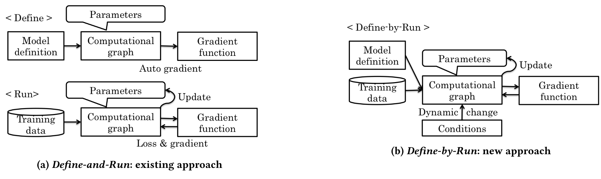
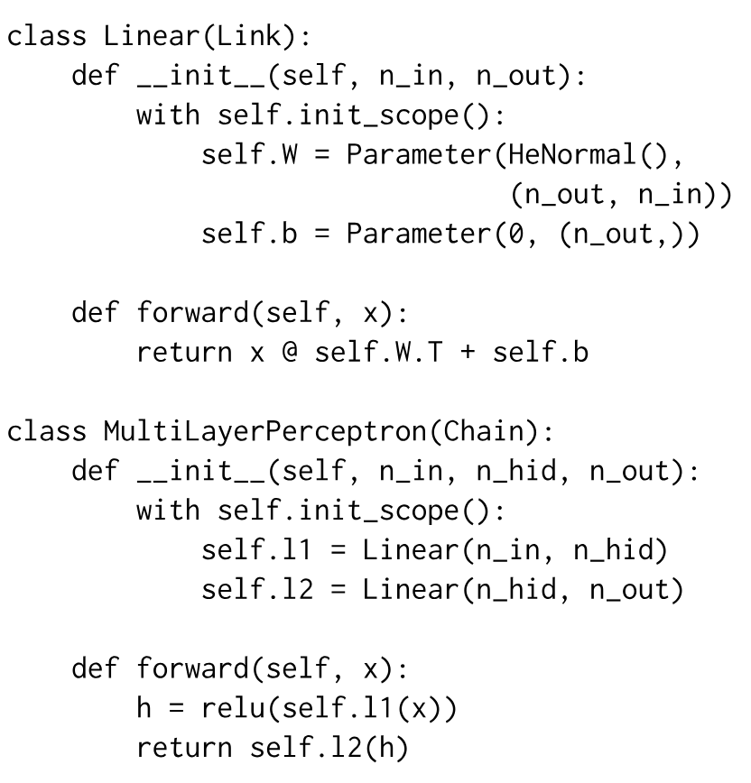
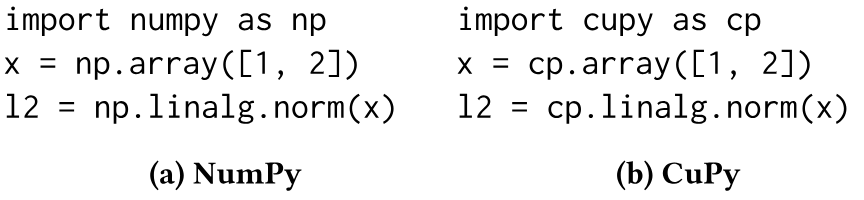
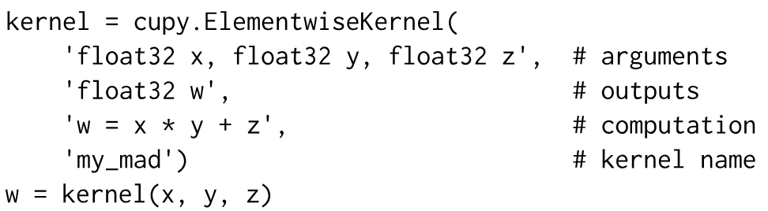
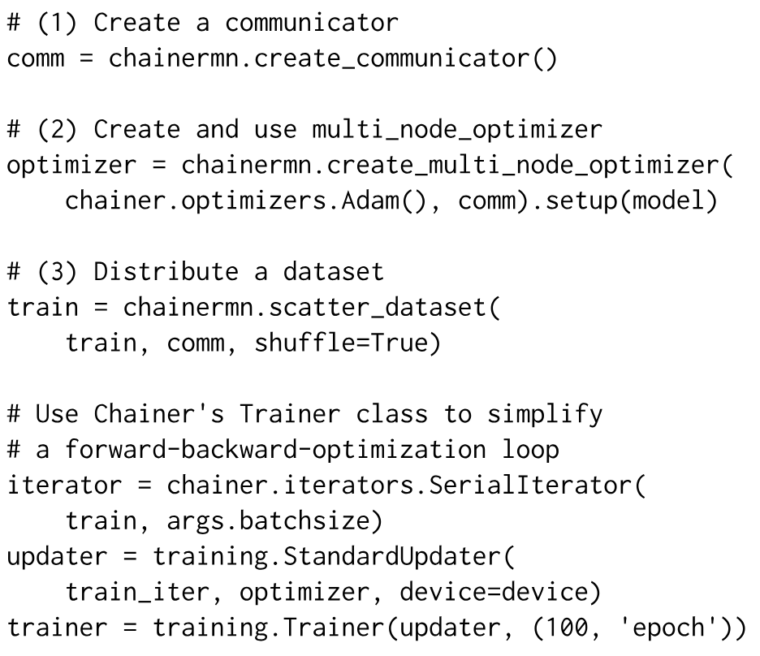
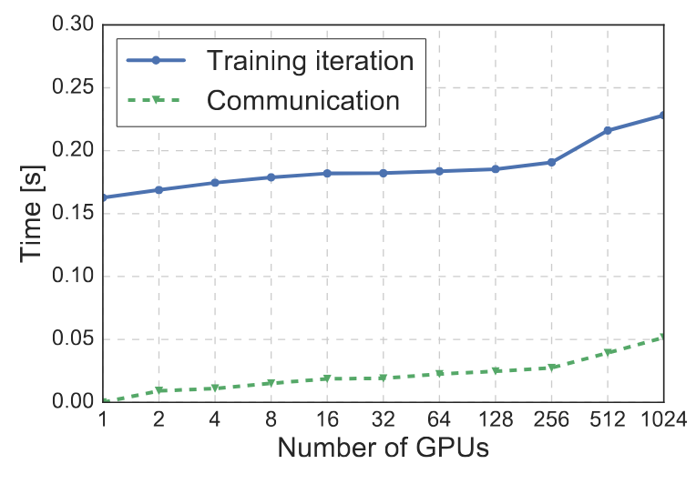
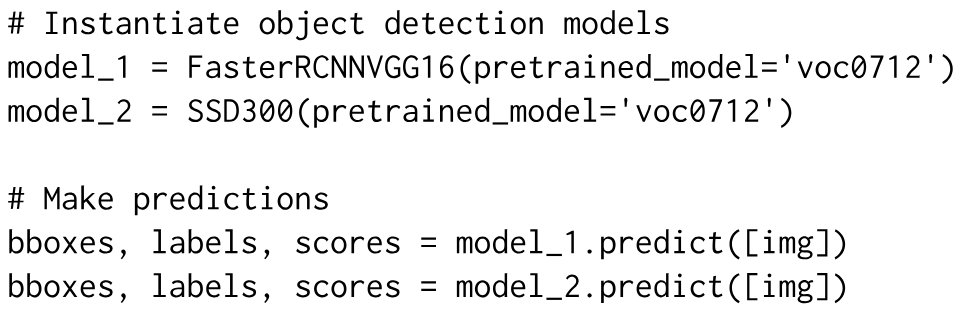
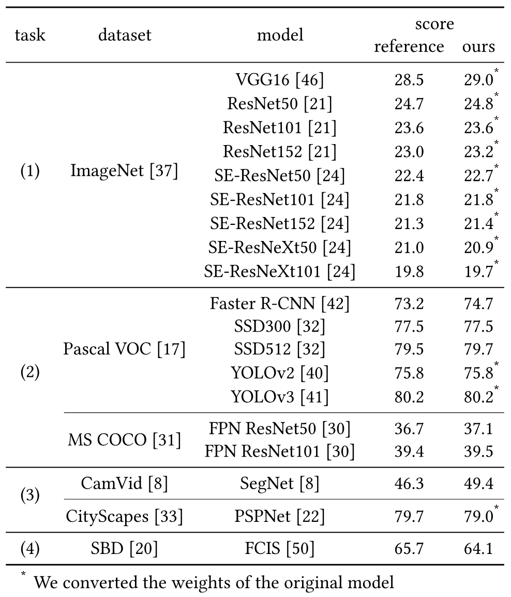

> [Seiya Tokui](https://www.beam2d.net/), [Ryosuke Okuta](https://www.iss.is.tohoku.ac.jp/members/ryosuke-okuta/), [Takuya Akiba](https://takiba.net/), [Yusuke Niitani](https://dblp.org/pid/205/3125.html), [Toru Ogawa](https://dblp.org/pid/58/9405.html), [Shunta Saito](https://dblp.org/pid/174/7047.html), [Shuji Suzuki](https://github.com/shu65), [Kota Uenishi](https://zenn.dev/kuenishi), [Brian Vogel](https://github.com/bkvogel), [Hiroyuki Yamazaki Vincent](https://dblp.org/pid/245/6059.html). 论文于 2019 年 8 月 1 日首次提交至 arXiv; 当前版本为 v1. 发表于 KDD 2019 应用数据科学赛道, 第 2002–2011 页. [Chainer: A Deep Learning Framework for Accelerating the Research Cycle](https://arxiv.org/abs/1908.00213). <a href="/paper/chainer.pdf" target="_blank" rel="noopener noreferrer">原始 PDF</a>. [DOI](https://doi.org/10.1145/3292500.3330756). [TeX 源码](https://export.arxiv.org/e-print/1908.00213v1). 原始 PDF 是精确印刷版式与参考文献的权威版本.

## 摘要

神经网络软件框架在深度学习方法的开发与应用中起着关键作用. 本文介绍 Chainer 框架, 它旨在以灵活, 直观且高性能的方式, 实现研究人员和实践者所需的各类深度学习模型. Chainer 通过 CuPy 提供熟悉的类 NumPy API, 利用图形处理器进行加速; 通过 Define-by-Run 在 Python 中支持通用的动态模型; 同时提供面向先进计算机视觉模型和分布式训练的附加软件包.

## 1 引言

深度学习正在推动人工智能研究的第三次浪潮 [Lec15a]. 近期研究表明, 深度学习正走出其在模式识别中的早期成功, 进入不同领域和行业的新应用. 要落实这些研究构想, 需要深度学习软件框架.

实现神经网络 (NN) 需要一组专用构件, 包括多维数组, 激活函数和自动微分. 为避免重复开发这些工具, 许多开发者采用 Caffe [Jia13] 或 Torch [Col08] 等开源深度学习框架. 深度学习最早在计算机视觉和语音识别中成功应用, 因此早期深度学习框架主要为卷积神经网络 (CNN) 等前馈网络设计; 这类网络适合分析图像等定长数据.

此后, 更多种类的深度学习模型成为重要研究主题. 游戏领域取得瞩目成果后 [Mni13], 深度强化学习成为很有前景的研究方向. 此外, 循环神经网络 (RNN) 在文本等变长数据上展现出良好效果, 这类模型的使用随之增加. 带长短期记忆 (LSTM) 的 RNN 已成功用于机器翻译 [Sut14] 和对话模型 [Vin15a].

然而, 现有深度学习框架大多面向使用 CNN 的图像处理, 因而缺少对数据结构与训练模型进行抽象的能力, 难以实现更通用的深度学习模型. 许多现有框架还使用领域特定语言表示深度学习模型, 再由解释器将其转为内存中的数据结构. 因此, 使用这些框架的开发者无法使用标准编程语言的调试器—而调试又是开发和调整深度学习模型的重要环节, 这便成了一个突出问题.

本文介绍 Chainer, 一个开源深度学习框架, 为复杂算法的实现, 模型训练和模型参数调整提供简洁而高效的支持. 本文余下部分安排如下. [第 2 节](#section-2) 介绍现有深度学习框架的标准架构. [第 3 节](#section-3) 介绍 Chainer 的架构. [第 4 节](#section-4) 介绍内存用量优化和双重反向传播等性能技术. [第 5 节](#section-5) 介绍作为图形处理器 (GPU) 后端库的 CuPy. [第 6 节](#section-6) 介绍分布式训练能力. [第 7 节](#section-7) 介绍计算机视觉附加软件包 ChainerCV. [第 8 节](#section-8) 介绍相关工作. 最后, [第 9 节](#section-9) 总结全文并给出未来方向.

## 2 背景与动机

**图 1.** 计算图构建与训练的关系.

在典型 NN 框架中, 模型分两个阶段构建; 我们将这种范式称为 *Define-and-Run* ([图 1(a)](#figure-01)). 在 Define 阶段, 首先定义并构建模型的计算图. 该阶段对应神经网络对象的实例化, 所依据的模型定义指定层间连接的数据流图, 初始权重与激活函数. 通常使用自动微分定义前向和反向传播的计算, 也可以进行图优化. 在 Run 阶段, 执行计算图实际的前向和反向计算. 给定一组训练样本后, 这一阶段使用随机梯度下降等优化算法最小化损失函数, 从而训练模型.

在 Define-and-Run 范式下, CNN 等静态 NN 模型很容易实现. 模型定义可以使用 Protobuf 或 YAML [Goo13] 等特定标记语言编写. 深度学习框架充当执行模型定义的解释器, 而模型定义可以视为一个独立 NN 程序. NN 程序接收输入 (数据样本), 处理输入 (前向/反向计算), 改变模型内部状态 (更新), 并输出结果 (预测).

Define-and-Run 范式很适合 CNN 等静态模型, 因为完整的计算图为潜在的图优化提供了条件, 可以提高内存效率和/或运行时性能. 然而, 实现其他类型的 NN 模型时会遇到两个主要问题.

第一个问题是, 支持通用动态图, 即带控制流的神经网络, 可能十分繁琐. 在 TensorFlow [Aba15] 等框架中, 控制流决策通过 *Switch* 和 *Merge* 等特殊算子定义在数据流图中, 而不是使用宿主语言的控制流语法.

第二个问题是, 在 Define-and-Run 范式下, 用户无法访问神经网络的内部机制. 这给有效模型的构建带来多重困难. 例如, 要有效调试和调整模型, 用户必须能够观察模型内部正在发生什么. 但计算图是单一类的一个大型对象, 包含整个模型的信息, 即结构, 权重, 梯度和节点间操作, 实质上是一个黑盒. 因此, 分析器和调试器等开发工具无法判断模型的故障或改进方式. 如果框架还执行图优化, 问题会进一步加剧.

## 3 设计与编程模型

本节介绍基于 Define-by-Run 范式的自动微分 API 基本设计 ([图 1(b)](#figure-01)).

### 3.1 按需构建计算图

反向传播通过记录应用于输入数组的操作历史并沿历史回溯来执行. 在 Define-by-Run 范式中, 对具体输入数组执行前向计算的同时, 也记录操作历史. 为每个变量和操作在计算图中创建一个节点, 即可做到这一点. 计算图只定义如何回溯施加于输入的操作, 并不定义前向计算. 我们用两类节点定义计算图: 表示计算所涉及变量的*变量节点*, 以及表示应用于变量之操作的*函数节点*. 将函数 $f$ 应用于输入变量 $x$ 并得到输出变量 $y$ 后, 函数节点 $n_{f}$ 保存对输入节点 $n_{x}$ 的引用, 输出节点 $n_{y}$ 则保存对函数节点 $n_{f}$ 的引用. 这些引用用于回溯计算图.

定义前向计算的程序与不计算梯度的普通数值计算相似. 唯一的区别是, 每个可微函数在计算输出之外还会把计算历史存入计算图. 计算图的构建只依赖程序的执行轨迹, 因而可以与宿主语言的任意语法结构组合, 如条件分支和循环. 这样的程序每次调用时都可以生成拓扑与大小不同的计算图, 同时保持正确的梯度计算. 可利用的宿主语言能力不限于这些基础语言结构; 我们也可以使用调试器和分析器等高级工具.

**图 2.** 通过面向对象编程定义模型的示例.

### 3.2 面向对象的模型定义

可组合性是深度学习的一项重要特征. 网络片段以多种组合方式连接, 形成丰富的架构. 用来编写深度模型的 API 应具备可组合性, 以便灵活复用和组合组件.

在 Define-by-Run 范式中, 模型由定义前向计算的代码和决定其行为的参数组成. 代码以宿主语言程序编写, 并且必须与参数绑定.

面向对象编程解决了参数绑定问题. 每个拥有自身参数的神经网络片段都由一个类定义. 这些片段再组合到另一个类中, 形成更大的模型组件. 这样便解决了神经网络模块化和参数绑定的问题. [图 2](#figure-02) 展示了全连接层和多层感知机的定义示例. 参数在对象构造时初始化, 前向计算则写成方法.

在参数处理方面, 面向对象的模型定义还为模型提供了统一接口. 模型由模型片段树组成, 因此遍历该树即可轻松收集特定子树的参数.

这种面向对象的模型定义方式由 Chainer 于 2015 年率先引入, 如今已广泛用于 PyTorch 和 TensorFlow Eager 等其他 Define-by-Run 框架.

## 4 技术特性

本节介绍 Chainer 中若干提高简洁性与效率的技术, 它们也适用于基于 Define-by-Run 范式的框架.

### 4.1 内存高效的反向传播

内存效率是深度学习框架的核心问题, 因为模型和数据的规模受可用物理内存限制. 在框架层面还可以进一步优化, 尤其是降低峰值内存用量.

#### 4.1.1 降低全局内存用量

在基于 Define-by-Run 范式的深度学习框架中, 内存管理自然交由宿主语言处理. Chainer 依赖引用计数垃圾回收 (GC), 它是标准 Python 实现 (即 CPython) 的主要内存管理机制. 基于 Define-by-Run 范式的自动微分 API 与引用计数 GC 配合良好; 一旦计算历史的某个子图变得不可达, 便会立即释放.

引用计数 GC 释放计算图时, 各节点按计算图的拓扑顺序释放. 与此同时, 反向传播算法也按拓扑顺序访问节点. 合并这两个过程, 便能将反向传播的峰值内存消耗降到最低. 具体做法是在计算图回溯期间处理完一个函数节点后, 立即手动消除对该节点的引用.

#### 4.1.2 降低逐函数的局部内存用量

一般来说, 函数的梯度 (更准确地说是雅可比矩阵) 取决于输入. 因此, 将反向计算接口设计为同时接收输入数组和输出误差是很自然的. 但对于无需输入数组即可计算梯度的操作, 这种接口会妨碍内存用量优化. 某些操作 (如 $\tanh$) 可以使用输出数组而非输入数组计算梯度. 如果作用于输出的下一个操作需要输入来计算梯度, 我们就可以删除输入数组并保留输出数组, 从而尽量减少为反向传播留在内存中的数据. 还有一些操作既不需要输入数组也不需要输出数组. 此时, 两者的引用都可以删除.

每个可微操作都实现为 `FunctionNode` 的子类, 并重写 `forward` 和 `backward` 方法. 在 `forward` 中, 通过调用 `retain_inputs` 和 `retain_outputs` 方法, 显式声明 `backward` 所需的输入和输出. 未列入这些声明的输入或输出不会为反向传播保存. 尤其是输入不再传给 `backward` 方法; `backward` 的实现只在需要时取出它们.

Chainer 使用一种特定的变量对象表示, 其设计目标是在内存不再需要时尽快释放. 在朴素的 Define-by-Run 自动微分实现中, 每个变量节点会直接包含一个多维数组 (例如作为属性). 这种设计的问题在于, 删除对变量的最后一个引用之前, 数组占用的内存无法回收. 特别是, 即使用户代码没有直接引用变量, 计算图仍可能持有引用, 使其内存无法回收. 问题源于无法区分用户代码引用与节点间引用. 应当注意, 只要用户代码对变量的引用仍然存在, 与变量关联的多维数组数据就必须保留. 但计算图内部的引用并不总要求数据继续存在; 如果没有操作将变量保留为输入或输出, 就应释放数据. 据此, 我们可以分别用不同对象表示用户代码中的变量和计算图中的变量, 从而解决该问题. 在 Chainer 中, 每个 `Variable` 对象保存数组数据, 它与表示计算图变量节点的相应 `VariableNode` 对象彼此独立. 只有当某个操作保留该变量时, 变量节点对象才会持有对数组数据的引用. 这样一来, 一旦用户代码的最后一个引用被移除, 只要没有操作将它保留为输入或输出, 就能立即回收变量所占内存.

### 4.2 双重反向传播

对包含梯度计算的计算过程继续进行反向传播, 是现代深度学习框架的一项重要特性. 它对应海森矩阵-向量积的自动微分. 这项特性有时称为*双重反向传播*.

用支持微分的函数实现每个操作的反向计算, 即可支持双重反向传播. 这个思路看似直接, 朴素实现却可能产生引用环, 造成不必要的内存消耗. 为避免引用环, 必须考虑两个因素: 访问所得梯度的接口, 以及每个可微函数对输出的保留.

#### 4.2.1 访问所得梯度的接口

触发反向传播有两种接口风格. 第一种是 `Variable.backward()` 方法, 它计算相对于每个输入的梯度. 所得梯度直接存储在变量对象中. 另一种是同时接收一组输入和一组输出作为参数的 `grad()` 函数. 此时, 函数返回与指定输出相对应的一组计算梯度. 后一种接口不会在对象间引入额外引用, 前一种则可能加入从输入节点到计算梯度的引用. 由于计算梯度通过计算图间接引用输入节点, 因而会形成引用环.

如[第 4.1 节](#section-4-1) 所述, 通过区分用户代码引用和节点间引用, 可以消除这个引用环. 变量到对应梯度的引用不属于计算图, 因此我们将其放在 `Variable` 对象中, 而不是 `VariableNode` 对象中.

#### 4.2.2 双重反向传播中的输出保留

如[第 4.1 节](#section-4-1) 所述, 每个 `FunctionNode` 实现的 `backward` 方法可能会使用前向计算中声明为保留的输出变量. 要让反向传播可微, 需要一个特殊步骤, 因为函数节点不能保留对输出节点的引用; 否则会引入引用环. 这意味着输出节点可能在函数节点执行反向计算之前就被释放. 我们仍可通过为该输出节点重放图构建过程, 保证可微反向传播的有效性, 即在反向传播期间创建一个新节点对象并连接起来, 就像它是原输出节点一样. 此外, 我们还把输出数组数据作为备份存到函数节点, 供重建的输出节点使用. 这不会破坏计算的有效性; 输出节点被释放, 表明没有其他节点或用户代码持有对它的引用, 因而重建输出节点不会与任何现有节点冲突.

## 5 CuPy 提供的 GPU 支持

深度神经网络的典型用途需要大量浮点数值计算, 因此深度学习框架必须充分利用 GPU 等外部加速器的算力. 对编写深度神经网络代码的人来说, 在保持灵活, 简洁且易于扩展组件的同时实现高性能 GPU 程序并非易事. CuPy 是一个开源 Python 库, 以兼容 NumPy 的语法提供 NVIDIA GPU 的算力. 借助 NVIDIA 提供的 CUDA 平台, 包括 cuBLAS, cuDNN, cuRAND, cuSOLVER, cuSPARSE 和 NCCL, 它可以充分利用 GPU 架构, 加速以类 NumPy 语法描述的任何计算.

CuPy 的接口与 NumPy 高度兼容; 大多数情况下可以直接替换. 它支持标准数值数据类型, 数组索引, 切片, 转置, 变形和广播.

用户可以通过 C++ 代码片段创建自定义 CUDA 内核, 从而更快地执行代码. CuPy 会自动包装并编译代码, 生成 CUDA 二进制文件. 编译后的二进制文件会缓存起来, 供后续运行复用.

CuPy 最初作为 Chainer 的后端开发. Chainer 的初始版本使用 PyCUDA [Klc12] 实现, 后者是广泛使用的 Python CUDA GPU 计算库. 但 PyCUDA 对 NumPy 功能的支持不足以满足深度学习需要, CUDA 支持也不充分. 2017 年 6 月发布 Chainer v2.0 和 CuPy v1.0 时, CuPy 从 Chainer 中独立出来. 此后, 许多非深度学习项目也利用了 CuPy 的高性能和简洁接口. 例如, 基于 Python 的概率建模软件 Pomegranate [Sch17b] 和自然语言处理库 spaCy [Hon17] 都将 CuPy 用作 GPU 后端.

### 5.1 CuPy 示例

CuPy 与 NumPy 一样是 Python 软件包, 因而可以用同样的方式导入 Python 程序. 如[图 3](#figure-03) 中的代码所示, `cp` 是 CuPy 的缩写, 与 NumPy 使用 `np` 类似. `cupy.ndarray` 类是 CuPy 的核心, 它是 `numpy.ndarray` 的 GPU 替代品. 代码中的 `x` 是 `cupy.ndarray` 的实例. 除了把 NumPy 换成 CuPy, 其创建语法与 NumPy 完全相同. `cupy.ndarray` 与 `numpy.ndarray` 的主要区别在于, 前者的内容分配在 GPU 内存中. CuPy 的大多数数组操作与 NumPy 相似. 例如, NumPy 使用 `numpy.linalg.norm` 在 CPU 上计算欧几里得范数, CuPy 则使用 `cupy.linalg.norm` 在 GPU 上计算.

**图 3.** 使用 NumPy 和 CuPy 的示例.

### 5.2 支持的功能

如上一小节所示, CuPy 在 `cupy.ndarray` 对象上实现了许多函数. 其支持的 NumPy API 子集见参考资料 [+1].

#### 5.2.1 线性代数

CuPy 支持 NumPy 中的大多数线性代数函数, 如特征分解, Cholesky 分解, QR 分解, 奇异值分解, 线性方程求解, 矩阵求逆和 Moore-Penrose 伪逆. 这些函数定义在 `cupy.linalg` 中, 与 `numpy.linalg` 兼容. 它们都以 cuSOLVER 为后端, 后者是在 GPU 上运行的 LAPACK 实现.

#### 5.2.2 稀疏矩阵

CuPy 通过 cuSPARSE 支持稀疏矩阵. 这些矩阵拥有与 SciPy [Jon01] 中 `scipy.sparse` 稀疏矩阵相同的接口. 用户可以按需选择坐标格式稀疏矩阵, 压缩稀疏行矩阵, 压缩稀疏列矩阵或对角存储稀疏矩阵.

#### 5.2.3 排序

CuPy 提供兼容 NumPy 的 sort, argsort 和 lexsort 函数, 后端采用 Thrust, 这是一个用 C++ 和 CUDA 编写的并行算法库. CuPy 利用了 Thrust 为 GPU 实现的成熟并行排序算法.

**图 4.** 用户自定义内核示例.

### 5.3 自定义 CUDA 内核

CuPy 将运算符, 两类内核和泛型组合起来, 使用户能够轻松用自定义内核扩展它. 只需提供 CUDA 代码片段, 即可在 GPU 上方便地组合并启动任意内核.

逐元素内核对所有元素执行同一种操作. 例如, `cupy.add` 函数对每一对元素应用 $+$ 运算符. 归约内核则使用二元运算符折叠所有元素. 例如, `sum` 函数用 $+$ 运算符折叠所有元素. 逐元素内核和归约内核分别类似于 MapReduce [Dea04] 中的 Map 和 Reduce. [图 4](#figure-04) 是一个用户自定义逐元素内核的示例. 第一, 第二个参数分别是输入变量列表和输出变量列表. 每个变量的定义由类型说明符和参数名组成. 第三个参数是用户希望定义的 CUDA 代码片段. 该代码片段可以使用任意 CUDA 代码.

CuPy 还支持泛型. 如果指定 `T` 等类型参数, 而非 `float32` 等具体类型, 自定义内核会生成为模板函数. 泛型参数可以接收任意类型的数组. 例如, 输入类型指定为 `’T x, T y’` 时, 该函数接收一对数据类型相同但类型任意的数组, 如整数数组或浮点数组.

## 6 分布式并行训练

本节介绍 Chainer 的分布式学习能力组件, 它原名为 *ChainerMN*.

尽管 GPU 性能持续提升, 即使用上最新 GPU, 训练过程仍很耗时. 例如, 在 ImageNet 数据集 [Den09a] 上训练 ResNet-50 [He16d], 使用单个 GPU 通常需要长达一周. Chainer 的分布式能力可以整合多个 GPU 的算力, 充分利用硬件性能, 同时保留其 Define-by-Run 方法带来的灵活性. 这使得动态图神经网络, 生成对抗网络和深度强化学习等复杂用例也能方便地进行分布式学习.

### 6.1 分布式深度学习基础

#### 6.1.1 数据并行与模型并行

通过分布式处理并行训练主要有两种方法: 数据并行和模型并行. 在数据并行中, 每个工作进程都有一个模型副本, 并为不同的小批量计算梯度. 各工作进程利用这些梯度协同更新模型. 如果每个工作进程处理的批量大小为 $b$, 工作进程数为 $n$, 那么通过通信得到的梯度等价于批量大小为 $bn$ 时的梯度. 工作进程越多, 一次迭代中用于计算梯度的训练数据越多, 梯度质量因而提高, 学习过程也得到加速.

在模型并行中, 每个工作进程持有模型的一部分, 并与其他进程协作计算一个小批量 [Dea12]. GPU 内存较小时, 模型并行尤其得到积极采用. 目前已有研究表明数据并行效率更高, 但在自然语言处理等模型参数量巨大的领域, 仍会结合数据并行采用模型并行 [Sha18e].

#### 6.1.2 同步与异步

在同步和异步两种通信模型间进行设计选择, 是构建整体并行计算的关键因素. 下文以数据并行为重点介绍两种模型.

与由前向计算, 反向计算和优化组成的非并行训练序列相比, 分布式训练中的同步数据并行多了一个称为全归约的步骤. 全归约是一种并行计算操作, 它计算参数之和并将结果分发给所有进程. 这是 MPI 的标准功能. 在额外的全归约通信步骤中, 工作进程相互通信, 获取各进程所算梯度的总和并完成分发. 每个工作进程用总和除以副本数, 得到平均梯度; 优化前, 再用全归约通信所得梯度更新自己的模型副本.

异步模型则设有称为参数服务器的特殊工作进程. 参数服务器在训练过程中拥有并控制模型参数. 普通工作进程通过前向和反向计算得到梯度后, 将其发送给参数服务器. 参数服务器接收梯度并用它更新模型. 工作进程取得新的模型参数后, 开始计算新梯度.

### 6.2 并行设计

Chainer 采用数据并行和同步通信模型. 下文将解释为何从[第 6.1 节](#section-6-1) 讨论的选项中作出这一选择.

数据并行无需改动现有实现, 只要增加少量内容: 拆分数据集, 并计算各工作进程的平均梯度. 这是因为在图像识别等很多场景中, 数据并行等同于增大小批量. 因此, 我们首先选择数据并行, 后来又加入对模型并行的实验性支持. 此外, 我们采用同步通信模型, 因为它具有确定性行为和收敛性 [Pan17, Goy17a].

同步数据并行的梯度交换可通过工作进程间的全归约通信实现, 因此借助 Chainer 的通信器抽象, Chainer 理论上能在任何支持全归约操作的通信库上运行. Chainer 最先支持的库是 OpenMPI, 其启用 CUDA 感知的构建尤其高效. 但全归约通信尤其需要高效率, 因为每次训练迭代都要调用它, 并且需要处理大量数据. 我们采用 NVIDIA 开发的 NCCL [Ncc15] 作为运行全归约的主要库. NCCL 是一个高度优化的通信库, 能在节点内和节点间的 NVIDIA GPU 上高效执行全归约操作.

### 6.3 API 设计

我们先说明 Chainer 分布式学习能力的设计目标, 再介绍让现有 Chainer 深度学习程序支持分布式训练所需的最少步骤.

分布式执行不应牺牲 Chainer 的 Define-by-Run 设计所带来的灵活性. Define-by-Run 允许模型结构在迭代之间不同, 唯一的假设是: 对于全归约而言, 各工作进程的模型结构只需在单次迭代中相同. 梯度交换通信紧邻优化步骤之前发生, 对 Chainer 的其他组件透明. 在这一最低限度的假设下, 优化步骤前后可以放置任何代码, 模型结构也可在任意迭代中动态改变.

[图 5](#figure-05) 展示了训练 MNIST 分类模型的核心代码, 其中包含分布式模式下的三项主要增补: *(1)* 控制所有进程间通信的通信器组件; *(2)* 将优化器转换为 `mutli_node_optimizer`, 以便在工作进程间交换梯度; *(3)* 将数据集分发给所有工作进程.

`mutli_node_optimizer` 是实现 Chainer 分布式能力最重要的组件. 它包装普通优化器, 并在优化模型之前通过全归约操作跨进程交换梯度. 除了通信之外, 其行为与原始优化器完全相同. 最后, `scatter_dataset` 让各工作进程就数据并行时应读取哪一部分训练数据达成一致. 训练数据集被切分为等大的片段, 并分发给各工作进程.

移植到分布式模式所需的改动尽可能少, 使 Chainer 得以保留 Define-by-Run 范式带来的灵活性.

**图 5.** 使用 ChainerMN 的训练代码示例.

### 6.4 评估

我们以在 ImageNet 数据集上训练 90 个 epoch 的 ResNet-50 [He16d] 作为基准. 这项任务已广泛用于评估分布式深度学习的性能 [Goy17a, You18, Cod17].

我们使用了一个包含 128 个节点的集群, 每个节点配备 8 个 NVIDIA Tesla P100 GPU. 每个工作进程的小批量大小为 32; 使用 1024 个工作进程时, 总小批量大小为 32k. 实验配置的更多细节见附录.

[图 6](#figure-06) 展示了不同 GPU 数量下的通信时间 (即全归约操作) 和完成整次迭代的时间 (即前向和反向计算, 通信与优化), 数值为 100 次迭代的平均值. 与单 GPU 和单节点 (即 8 个 GPU) 基线相比, 使用 1024 个 GPU 时, 扩展效率分别为 70% 和 80%. 使用 1024 个 GPU 训练 90 个 epoch, 包括每个 epoch 后的验证, 5 次独立运行的平均训练时间为 $897.9\pm 3.3$ s.

**图 6.** 不同 GPU 数量下 ResNet-50 训练的迭代时间和通信时间.

## 7 ChainerCV

本节介绍面向计算机视觉任务的附加软件包 *ChainerCV*.

尽管 Chainer 功能强大, 它所支持的内容与计算机视觉深度学习的需求之间仍有差距. 深度学习模型正变得更强, 更复杂. 因此, 研究人员和工程师很难从头实现这些算法. 此外, 数据加载器和非极大值抑制 [Oro16] 等前/后处理函数属于计算机视觉的常用工具, 却不在 Chainer 的范围内.

ChainerCV 旨在帮助非专业人士快速制作想法原型, 降低进入该领域的门槛. 该库为图像分类, 目标检测, 语义分割和实例分割等多种计算机视觉任务提供先进模型, 预训练权重及训练脚本. 该库还以统一 API 提供数据加载器, 评估指标等工具. 我们的设计基于三项原则: *易于使用*, *统一 API* 和*可复现性*.

### 7.1 易于使用

ChainerCV 支持四项任务: 图像分类 [Rus15], 目标检测 [Lin14b], 语义分割 [Cor16] 和实例分割 [Li17b]. 每项任务都可以实现若干神经网络. 例如, 目标检测包含 7 种实现.

ChainerCV 为同一任务准备的模型共享简洁接口, 因而很容易使用其实现进行推理. 即便模型解决的是同一任务, 神经网络的输出类型以及输出的后处理方式也可能不同. 推理接口隐藏了不同模型底层实现之间的差异. 此外, 实例化模型对象时会自动下载预训练权重, 进一步简化推理过程. 如[图 7](#figure-07) 所示, 使用预训练权重时, 只需两行 Python 代码就能实现推理.

ChainerCV 不仅提供易用的推理功能, 还为一部分模型提供便于定制的训练脚本. 训练脚本使用 Chainer 的训练抽象编写, 因而可以轻松替换训练组件. 脚本允许用户扩展, 例如使用自定义数据集训练.

**图 7.** 使用两个目标检测模型执行推理的示例. 两个模型拥有相同的推理接口.

### 7.2 统一 API

ChainerCV 强调采用统一 API 的模块化设计, 让用户能以不同方式组合实现. 这些实现包括神经网络模型, 数据加载器, 评估指标和可视化工具. 整个库使用相同的数据表示, 从而保持 API 一致. 例如, 我们定义了图像, 边界框, 逐像素语义标签, 实例掩码和关键点的数据表示. 相似函数的 API 也保持一致. 例如前文所述, 所有模型的推理方法始终以可迭代的图像集合为输入.

统一 API 不仅让接口直观, 也使我们可以在其上构建工具. 例如, 我们提供了抽象评估循环的实现. 在内部, 这一抽象遍历数据集, 根据图像作出预测, 再用真实值和预测值计算评估指标. 应当注意, 必须为数据加载器和推理方法约定接口, 抽象工具才能在数据加载器, 推理方法和评估指标之间传递数据. [图 8](#figure-08) 给出了一个示例.

### 7.3 可复现性

在机器学习和计算机视觉中, 可复现性是影响研究质量的重要因素. ChainerCV 提供保证性能与已发表结果相当的训练代码, 旨在简化结果复现. 这些算法既可作为基线, 通过改进产生新想法, 也可用于把新方法与现有方法比较. 如果实现不够严谨, 偏离原始逻辑和超参数就很容易改变训练模型的性能. 这种错误会让实现失去作为有效基线的资格, 因为研究人员将无法取得有竞争力的结果, 也无法正确评估其想法的影响. [表 1](#table-01) 列出了 ChainerCV 支持的模型及其实验结果. 表中也给出原论文或作者实现报告的参考分数. 如表所示, 我们重新实现的性能接近原始实现. 应当注意, 训练中的随机性可能造成分数差异.

**图 8.** 使用 `DetectionVOCEvaluator` 执行目标检测评估循环的示例.

**表 1.** ChainerCV 支持的模型及其在 (1) 图像分类, (2) 目标检测, (3) 语义分割和 (4) 实例分割上的分数. 图像分类报告 top-1 错误率. 目标检测中, 对 Pascal VOC 分数报告平均精度均值 (mAP), 对 MS COCO 分数报告不同交并比阈值下 mAP 的平均值. 语义分割报告平均交并比 (mIoU). 实例分割报告掩码的 mAP.

## 8 相关工作

据我们所知, 在 Chainer 提出这种方法之前, Autograd [Mac14] 已采用 Define-by-Run 范式构建反向计算图. Autograd 是一个基于 NumPy [Oli06] 的库, 其设计让用户能够用采用 NumPy 的 Python 代码编写可微计算图. 但它并非为深度学习框架而设计, 因而不支持训练深度模型所需的 GPU 加速. 所以, Chainer 是首个以 Define-by-Run 范式专门面向深度学习工作负载的框架. 目前已有其他一些深度学习框架采用 Define-by-Run. PyTorch [Pas16] 是一种受 Chainer 启发的常用 Define-by-Run 框架 [+2]; 随后的 TensorFlow [Aba15] 引入了名为 "eager mode" 的特性, 支持 Define-by-Run 模型定义. MXNet [Che15b] 支持命令式张量计算, 可以通过惰性求值与声明式符号表达式结合. PaddlePaddle [Pad16] 和 CNTK [Aga14] 在同时支持声明式风格的基础上, 还将命令式风格作为可选编程方式. 这些框架大多只把 Define-by-Run 作为可选模式, 与之不同, Chainer 的整体实现和 API 都针对 Define-by-Run 做了高度优化. 由此形成的代码库更简洁, 降低了新开发者参与贡献的成本.

DistBelief [Dea12] 最先在深度神经网络分布式训练中整合三项重要技术: 数据并行和模型并行, 异步 SGD, 以及主从异构模型. 随后, TensorFlow [Aba15], MXNet [Che15b] 和 PaddlePaddle [Pad16] 也提供了这些技术. 但异步 SGD 无法避免陈旧梯度 ([第 6.1.2 节](#section-6-1-2)) 对准确率的影响, 参数服务器也可能成为瓶颈. 为缓解这些问题, 它们的近期版本加入了运行同步 SGD 的选项 [Pan17, Ser18].

与此同时, Caffe2 和 PyTorch [Pas16] 使用同步 SGD. 为抵消同步开销, Caffe2 和 PyTorch 在一层的反向计算一完成便启动全归约, 将全归约通信与计算重叠, 从而尽量缩短其关键路径.

虽然开源计算机视觉模型已很普遍, 我们却只发现少数工作秉持与 ChainerCV 相似的理念. 主要竞品是论文附带的研究程序代码. 它们的首要目的是以可验证方式分享研究结果, 因而经常忽视可读性和模块化.

与 ChainerCV 关系更密切的库是 *pytorch/vision* [Pyt16] 和 GluonCV [Glu18]. *pytorch/vision* 是以后端 PyTorch 运行的计算机视觉库. 在本文撰写时, 它对预训练模型的支持仅限于图像分类. GluonCV 是近期发布的计算机视觉库, 后端采用另一个深度学习框架 Gluon [Glu17]. 与 ChainerCV 类似, GluonCV 支持目标检测, 语义分割和实例分割. 但它们并未把可复现性作为核心目标.

## 9 结论

本文介绍了 Chainer, 一个让用户可以轻松实现新算法和复杂神经网络的深度学习框架. Chainer 已成功用于多种前沿应用, 包括深度强化学习 [Mni13], word2vec 分布式表示 [Mik13a], 循环神经网络语言模型 [Mik10], 人体姿态估计 [Tos14] 和变分自编码器 [Kin14]. 世界各地的开发者和用户正通过 GitHub 积极协作, 持续改进 Chainer; 我们预计, Chainer 今后会更加通用, 实用. 特别是, 改进 CuPy 所带来的性能提升, 让用户能够以不依赖 CPU/GPU 的代码应用多种深度学习模型. 我们邀请深度学习社区的所有成员试用 Chainer, 并参与其开发.

## 致谢

如果没有所有贡献者的帮助, 以及 Chainer, CuPy, ChainerCV 和相关项目用户的反馈, 本项工作不可能完成. 我们向他们致以特别感谢.

## 10 实验配置细节

本节给出正文所报告实验结果的详细配置.

### 10.1 分布式训练

在[第 6.4 节](#section-6-4) 的实验评估中, 我们使用了基于 Chainer 3.0.0rc1 和 ChainerMN 1.0.0 的开发分支 [+3]. 底层通信库采用 NCCL 2.0.5 和 OpenMPI 1.10.2.

我们使用了一个内部集群, 其中包含 128 个节点. 每个节点配有两颗 Intel Xeon E5-2667 处理器 (3.20 GHz, 8 核), 256 GB 内存和 8 个 NVIDIA Tesla P100 GPU. 所有节点均通过 Mellanox InfiniBand FDR 互连.

每个工作进程的小批量大小为 32; 使用 1024 个工作进程时, 总小批量大小为 32k. 计算通常使用单精度; 为减小有效载荷大小, 通信采用半精度浮点数.

[+1]: https://docs-cupy.chainer.org

[+2]: https://github.com/pytorch/pytorch/blob/v0.4.1/README.md

[+3]: 我们进行这项评估时, ChainerMN 还是以 Chainer 插件库的形式发布; 此后它已合并到 Chainer 主线.
