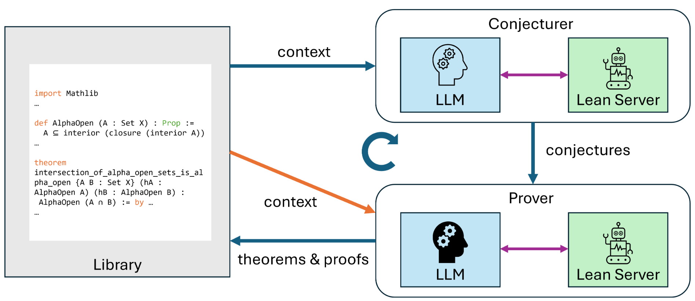
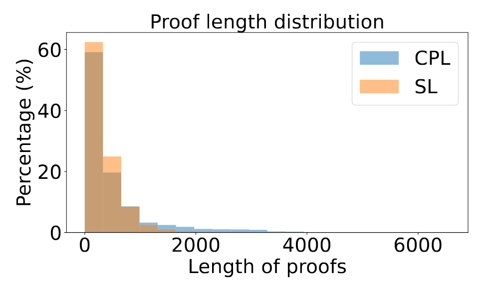
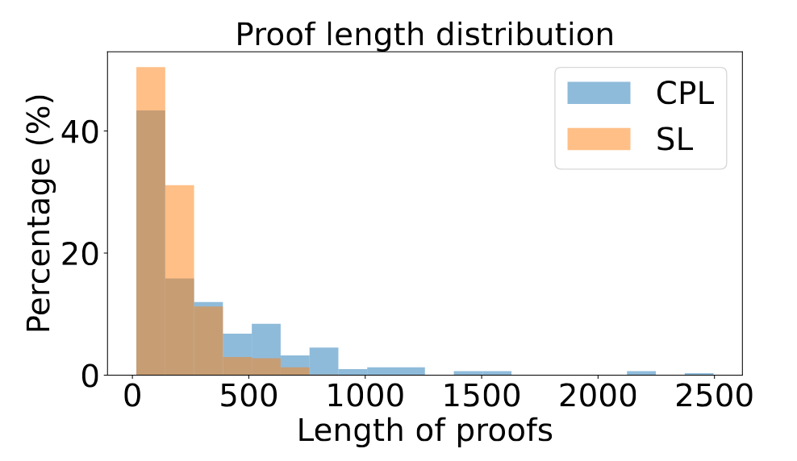

> [Kazumi Kasaura](https://www.omron.com/sinicx/en/activity/researcher/kazumikasaura/), [Naoto Onda](https://www.ondanaoto.com/), [Yuta Oriike](https://dblp.org/pid/410/6502), [Masaya Taniguchi](https://tani.cc/), [Akiyoshi Sannai](https://dblp.org/pid/220/5533), [Sho Sonoda](https://sites.google.com/view/shosonoda/home). 2025 年 9 月 16 日首次提交至 arXiv; 当前版本为 v4, 修订于 2026 年 6 月 29 日. 论文发表于 [第 6 届自然语言与逻辑和机器学习研讨会论文集 (NALOMA), 2026 年 8 月, 第 40-49 页](https://aclanthology.org/2026.naloma-1.5/). [Discovering New Theorems via LLMs with In-Context Proof Learning in Lean](https://arxiv.org/abs/2509.14274v4). <a href="/paper/conjecturing-proving-loop.pdf" target="_blank" rel="noopener noreferrer">原始 PDF</a>. [DOI](https://doi.org/10.48550/arXiv.2509.14274). [TeX 源文件](https://export.arxiv.org/e-print/2509.14274v4). 精确的印刷版式和参考文献以原始 PDF 为准.

## 摘要

大语言模型 (LLM) 已在形式化定理证明中展现出相当大的潜力. 本研究考察 LLM 发现新定理并给出可验证证明的能力. 我们提出名为 *Conjecturing-Proving Loop* (CPL) 的流程, 它反复生成数学猜想, 并尝试在 Lean 4 中证明这些猜想. CPL 的一项主要特点是, 每轮都以前面生成的定理及其形式化证明作为 LLM 的条件, 从而通过上下文学习改进证明策略, 无需更新参数. 理论分析和实验结果都表明, 与同时生成命题和证明的框架相比, CPL 能以更高概率发现难以证明的定理. 实验还表明, 把 LLM 自己生成并经形式化验证的结果重新用作上下文, 能持续提高后续证明的成功率, 说明自生成上下文学习对神经定理证明有效. 源代码见 [https://github.com/auto-res/ConjecturingProvingLoop](https://github.com/auto-res/ConjecturingProvingLoop).

<span id="section-1"></span>

## 1 引言

大语言模型 (LLM) 已在定理证明中展现出相当大的潜力. LLM 可能产生幻觉, 而自然语言中的这类幻觉又难以发现, 因此已有研究让 LLM 生成形式化证明, 再由 Lean [+1] 等交互式定理证明器 (ITP) 验证. 本文关注 LLM 发现新定理的能力.

我们提出 *Conjecturing-Proving Loop*, 这是一个自动生成数学猜想并以 Lean 4 格式证明它们的流程. 将猜想与证明两个阶段分开后, 我们可以避免反复生成相同的定理, 并促使系统证明难度更高的定理. 换言之, CPL 对猜想/证明候选进行*分层采样*, 按照证明难度分配搜索资源, 防止循环退化为只产生简单的短证明. 借助这种分层方式, CPL 能发现并验证更长的证明; 对于同时采样命题和证明的简单框架, 这类证明更难发现. 本文会对此作更细致的理论讨论.

<span id="figure-01"></span>



**图 1.** Conjecturing-Proving Loop 概览. 猜想器以库为上下文生成猜想, 证明器尝试证明这些猜想, 已证明的猜想及其证明则作为定理存入库中. 库也为证明器提供上下文. 猜想器和证明器的过程都由 LLM 与 Lean Server 之间的交互组成.

本方法还有一个特点: 我们把已证明的定理及其证明放入上下文, 继续生成和证明更多定理, 让系统通过证明策略的上下文学习生成难度更高的证明, 无需训练 LLM. GPT 等闭源 LLM 的推理能力和 Lean 代码生成能力近来有所提高, 因此我们让它们同时担任猜想器和证明器. 使用闭源 LLM 的一个缺点是无法自由训练模型, 但在我们的框架中, LLM 可以从此前验证过的证明中进行上下文学习, 进而提升证明能力.

实验以若干数学概念为种子, 检验框架能否重新发现关于这些概念的重要性质. 更具体地说, 我们选取了几个拓扑学概念: 它们只依赖 Lean 数学库 Mathlib [+2] 中已有的概念来定义, 自身却尚未纳入 Mathlib. 我们使用该框架生成关于这些概念的定理. 结果表明, 框架重新发现了数学论文中已经发表的一条重要定理, 而没有拆分猜想器和证明器的简单框架未能找到它. 我们也验证了证明策略的上下文学习在框架中确实有效: 即使让 LLM 使用自然语言, 它在没有上下文时也无法证明这条重要定理, 加入生成的上下文后则成功给出了证明.

本文的贡献概括如下. 第一, 我们提出 Conjecturing-Proving Loop, 用于自动生成数学猜想并以 Lean 4 格式证明它们. 第二, 理论和实验结果都说明, 该框架可以自动发现难以证明的定理. 第三, 当上下文包含 LLM 自己在目标定理命题出现之前生成并验证的证明时, LLM 可以通过上下文学习提升证明能力.

我们的工作也说明, AI 有望自动扩展形式化数学库. 形式化数学只覆盖自然语言数学的一部分, 因而扩展 Mathlib 等形式化库对于数学验证和自动化很重要. 另一方面, 应当纳入库中的命题未必都能从自然语言中得到. 我们的框架可以一边学习给定概念, 一边生成相关命题.

<span id="section-2"></span>

## 2 相关工作

已有多项工作使用 LLM 进行数学推理, 包括自然语言推理 [Dee24a] 和面向 ITP 的形式语言推理 [Ren25b, Lin25i]. 这些工作主要解决现有问题, 并使用监督微调 (SFT) 和/或基于可验证奖励的强化学习 (RLVR) 提升 LLM 的解题能力. 训练数据有限, 因此前人也提出了由 AI 生成待解问题的方法 [Ma25, Hua25a, Zha25ac]. 这些工作与本方法有两点不同: 第一, 我们关注生成并证明有意义的定理, 而这些工作侧重训练 LLM 证明器. 第二, 这些工作基于强化学习, 本方法则基于上下文学习, 所以可以用于闭源 LLM.

多项研究报告称, 在提示中加入适当的上下文可以提高 LLM 的数学推理能力 [Wei22a, Zho22c, Dro22, Hu24c, Poi25]. 这些研究把人工编写的示例或从数据库提取的数据用作上下文学习材料, 我们的框架则像上下文强化学习 [Moe25b] 那样, 使用 LLM 自身的输出. 此外, 也有研究先猜测并证明若干命题, 再把它们用作引理, 以证明难度更高的定理 [Tha23, Wan23k, Che25h, Bab25]. 与这些研究不同, 我们不会把待证定理提供给 LLM; 我们考察的是 LLM 发现该定理的能力, 而且证明生成时使用的上下文库早在目标定理命题出现之前就已经产生.

利用 ITP 反馈生成形式化证明的技术已有研究提出 [Fir23, Tha23, Lin25j], 我们也采用了该技术 (见[第 3.3 节](#section-3-3)). 不过, 本文强调的是从其他命题已经验证的证明中学习策略.

Minimo [Poe24] 与我们的框架相近: 它联合训练猜想器和证明器智能体来寻找定理. 不同之处在于, Minimo 试图在不利用现有知识的情况下重新发现数学, 本研究的目标更为实际: 使用现有大语言模型尝试发现定理.

一篇综述 [Zha26a] 对定理生成进行了全面而及时的总结, 其中也包括使用 LLM 的方法.

<span id="section-3"></span>

## 3 方法

本节先概述框架, 再说明猜想器和证明器的架构.

<span id="section-3-1"></span>

### 3.1 流程概览

[图 1](#figure-01) 展示了我们的框架. Conjecturing-Proving Loop (CPL) 由四个主要部分组成: 猜想器 (LLM 智能体), 证明器 (LLM 智能体), Lean 服务器和库 (Lean 代码数据). 首先, 由用户初始化库.

1. 猜想器基于库生成有效 Lean 4 格式的新数学猜想, 同时访问 Lean 服务器.
2. 证明器逐一尝试为生成的猜想给出有效证明, 同时访问 Lean 服务器. 这一步也把库作为上下文.
3. 通过验证的猜想-证明对被加入库中. 随后回到第一步.

猜想和证明步骤的细节见下面两小节.

将猜想与证明两个阶段分开后, 我们可以避免反复生成相同的定理, 并促使系统证明难度更高的定理. 更细致的讨论见[第 4 节](#section-4).

把库作为上下文提供给猜想器, 一是为了防止生成重复猜想, 二是为了让猜想器从已经证明的定理类推出新猜想.

把库作为上下文提供给证明器, 是为了让证明器在证明期间使用已经证明的定理, 并通过上下文学习掌握证明策略.

<span id="section-3-2"></span>

### 3.2 猜想循环

为了生成多样的猜想, 每个猜想步骤都采用以下过程.

1. 猜想器 LLM 依据当前库生成猜想.
2. Lean 服务器逐一检查生成的猜想在语法上是否有效, 内容是否新颖. 验证后的猜想会送至证明器.

系统使用 Lean 的 `exact?` 命令检查猜想的新颖性; 该命令会判断上下文中的现有定理能否证明这个猜想. 请注意, 执行该命令的上下文导入了整个 Mathlib4 (Lean4 标准库), 并包含当前库和已经验证的猜想. 因此, 这里所谓的新颖意味着该猜想尚未出现在 Mathlib4, 已经生成的库或已经验证的猜想中.

提供给猜想器 LLM 的系统提示如下:

> 你是 mathlib4 库的贡献者. 请基于给定库, 生成 Lean 4 格式的新定理猜想; 它们不必为真. 不要生成列表中已经出现的命题. 不要包含证明, 注解或 import. 每条新命题都应以 'theorem' 开头 (不带注解), 并以 ':= sorry' 结尾. 另外, 请使用标准数学符号 (如 $\forall$, $\exists$, $\sqrt{}$), 不要使用 Unicode 转义序列 (如 \u2200).

<span id="section-3-3"></span>

### 3.3 证明器循环

证明器按以下过程尝试证明每个生成的猜想.

1. 证明器 LLM 生成猜想的证明代码. 如果 LLM 判断猜想不可证明, 证明器以失败结束循环.
2. Lean 服务器验证生成的证明. 如果证明通过验证, 证明器以成功结束循环.
3. 如果已经达到最大尝试次数, 证明器以失败结束循环. 否则, Lean 服务器的错误消息会返回给 LLM, 然后回到第 1 步.

证明器和 Lean 服务器都会得到上下文. 因此, 证明器既可以从上下文中学习证明策略, 也可以把上下文中的定理当作引理使用.

提供给证明器 LLM 的系统提示如下:

> 你是 mathlib4 库的贡献者. 请用 Lean 4 证明给定内容中的最后一条定理. 编写直接接在最后一条定理 ':=' 后面的 Lean 4 代码. 代码应以 'by' 开头, 或者是一个项表达式. 你可以把给定内容中的定理用作引理. 证明中不要使用 'sorry'. 如果你判断该定理不可证明, 请返回空字符串而不是证明. 不要包含任何其他文本.

实验中最大尝试次数设为 $16$.

<span id="section-3-4"></span>

### 3.4 基线

作为对照, 我们还使用简单循环 (SL) 框架为这些概念生成定理; 在该框架中, LLM 同时生成定理及其证明. 首先, 由用户初始化库. 与 CPL 不同, 该简单循环基线不拆分猜想器和证明器, 单个循环如下:

1. LLM 基于库生成 Lean 4 格式的命题及其证明, 同时访问 Lean 服务器进行验证.
2. 如果上一步成功, 生成的命题-证明对会存入库中. 随后回到第 1 步.

第 1 步与证明器循环相似. 具体过程如下:

1. LLM 生成 Lean 格式的命题及其证明.
2. Lean 服务器检查生成的内容. 如果内容通过验证, 循环成功结束.
3. 如果已经达到最大尝试次数, 循环以失败结束. 否则, Lean 服务器的错误消息会返回给 LLM, 然后回到第 1 步.

提供给 LLM 的系统提示如下:

> 你是 mathlib4 库的贡献者. 请基于给定库, 生成一条 Lean 4 格式的新定理及其证明. 除 Lean 4 代码外, 不要输出任何内容. 生成的代码必须接在给定库之后, 且只能包含定理命题及其证明. 不要输出 theorem 之外的声明, 如 variable, section 或 namespace. 不要生成库中已有的定理. 新定理应以 'theorem' 开头 (不带注解). 你可以把给定库中的定理用作证明引理. 证明中不要使用 'sorry'. 另外, 请使用标准数学符号 (如 $\forall$, $\exists$, $\sqrt{}$), 不要使用 Unicode 转义序列 (如 \u2200).

与证明器循环一样, 最大尝试次数设为 $16$.

<span id="section-4"></span>

## 4 理论

出于以下原因, SL 和 CPL 所生成定理的分布预计会有所不同. 当命题及其证明一次生成时, 所生成定理的分布同时取决于命题分布和证明成功率. 如果先生成命题, 随后多次尝试证明, 定理分布会更接近可证明命题的分布, 证明成功率的影响也会减弱.

更形式地说, 令 $s(T)$ 为 LLM 生成命题 $T$ 的概率分布, $r(T)$ 为 LLM 成功生成 $T$ 的证明的概率. 我们把 SL 简化为依次生成命题及其证明的过程, 证明正确时输出二者. CPL 同样经过简化, 建模为先生成命题, 再尝试生成有效证明, 直至成功或尝试次数达到 $N$. 为简单起见, 我们忽略上下文的影响.

SL 生成定理 $T$ 的概率正比于 $s(T)r(T)$, CPL 中则正比于 $s(T)\left(1-(1-r(T))^N\right)$. 因此, 随着 $N$ 增大, CPL 中的定理分布会趋近于可证明命题 ($r(T)>0$ 的 $T$) 的分布, 难以证明的定理也更容易被生成.

另一方面, SL 发现一条定理所需证明尝试次数的期望为 $E_\mathrm{SL}:=\left(\mathbb{E}_{T\sim s}[r(T)]\right)^{-1}$, CPL 中则为

$$
E_\mathrm{CPL}:=\frac{\mathbb{E}_{T\sim s}\left[(1-(1-r(T))^N)r(T)^{-1}\right]}{\mathbb{E}_{T\sim s}\left[1-(1-r(T))^N\right]}.
$$

这是因为, 生成命题 $T$ 后, 证明 $T$ 的成功概率为 $1-(1-r(T))^N$, 尝试次数的期望为 $(1-(1-r(T))^N)r(T)^{-1}$. [+3]

由于 $\left(1-(1-r)^N\right)r^{-1}$ 关于 $r$ 单调递减, 由切比雪夫和不等式可得

$$
\mathbb{E}_{T\sim s}\left[(1-(1-r(T))^N)\right]
\leq \mathbb{E}_{T\sim s}\left[(1-(1-r(T))^N)r(T)^{-1}\right]\mathbb{E}_{T\sim s}[r(T)].
$$

因此, $E_{\mathrm{SL}}\leq E_{\mathrm{CPL}}$, 这解释了 CPL 为什么比 SL 生成更少的定理.

在证明尝试次数固定的条件下, 定理 $T_0$ 在 CPL 中比在 SL 中更容易生成的条件如下. SL 每生成一次命题, 找到 $T_0$ 的概率为 $s(T_0)r(T_0)$, 证明尝试次数始终为 $1$. CPL 每生成一次命题, 找到 $T_0$ 的概率为 $s(T_0)(1-(1-r(T_0))^N)$, 证明尝试次数的期望为 $\mathbb{E}_{T\sim s}\left[(1-(1-r(T))^N)r(T)^{-1}\right]$. 由于 $s(T_0)\ll 1$, 所需条件可以近似为

$$
\frac{1-(1-r(T_0))^N}{\mathbb{E}_{T\sim s}\left[(1-(1-r(T))^N)r(T)^{-1}\right]} > r(T_0),
$$

该条件与 $s(T_0)$ 无关. 若 $r(T_0)>0$, 还可以写成

$$
(1-(1-r(T_0))^N)r(T_0)^{-1}
> \mathbb{E}_{T\sim s}\left[(1-(1-r(T))^N)r(T)^{-1}\right].
$$

由于 $\left(1-(1-r)^N\right)r^{-1}$ 关于 $r$ 单调递减, 证明成功率足够低的可证明定理在 CPL 中更容易生成.

<span id="section-5"></span>

## 5 实验

我们证明了该框架能够重新发现研究级定理, 也验证了上下文学习在框架中有效.

实验脚本和生成的库见 [https://github.com/auto-res/ConjecturingProvingLoop](https://github.com/auto-res/ConjecturingProvingLoop).

<span id="section-5-1"></span>

### 5.1 设置

实验关注一般拓扑学中的几个次要概念: 半开性, $\alpha$-开性和预开性. 我们以包含这些概念 Lean 4 定义的下列文件作为初始库.

```lean
import Mathlib
import Aesop

namespace Topology

variable {X : Type*} [TopologicalSpace X]

def P1 (A : Set X) : Prop :=
  A ⊆ closure (interior A)

def P2 (A : Set X) : Prop :=
  A ⊆ interior (closure (interior A))

def P3 (A : Set X) : Prop :=
  A ⊆ interior (closure A)
```

P1, P2 和 P3 分别表示 "半开", "$\alpha$-开" 和 "预开", 并经过匿名化处理, 以防 LLM 使用已有知识. 选择这些概念的原因是, 它们只用 Mathlib 中已有的概念就能定义, 自身却尚未纳入 Mathlib; 它们的数学价值已经得到认可并受到研究, 但又没有知名到让 LLM 掌握其性质.

我们把下列定理设为目标, 并考察系统能否生成它:

> *两个 P2 ($\alpha$-开) 集的交集仍为 P2 ($\alpha$-开)*

这条定理很重要, 因为它是证明 $\alpha$-开集构成另一种拓扑时最困难的部分 ([Nja65] 中的命题 2). 我们已经确认, 至少无法直接从实验所用 LLM 的知识中推导出该定理. 见[第 5.3.3 节](#section-5-3-3). 检查生成的库是否包含目标定理时, 我们把定理命题放在生成的库之后, 再看 `exact?` 命令能否补全证明. 如果库中包含与目标定理显然等价或更强的命题, 补全就会成功. 这样可以容纳定理表述上的变化, 只要 Lean 服务器能够识别即可.

CPL 和 SL 都使用 GPT-o3 [+4]. 对 CPL 和 SL, 我们分别生成 $20$ 次库: 每次都持续生成定理, 直至 API 用量达到 $14000000$ 个 token.

<span id="section-5-2"></span>

### 5.2 结果

CPL 平均生成 106 条定理, 且**在 20 次运行中有 5 次发现了目标定理**. SL 平均生成 328 条定理, 但**在 20 次运行中一次也没有生成目标定理**. Fisher 精确检验的结果为 $p=0.024$, 表明 CPL 更容易生成目标定理.

该定理的一份生成证明见[第 7 节](#section-7). 这份证明不同于 Njåstad 的原始证明, 说明 LLM 是独立找到该证明的.

虽然 SL 生成的定理更多, CPL 却更容易生成难以证明的定理; 这一结果与[第 4 节](#section-4)的讨论一致. 为进一步验证这一点, 我们测量了生成定理的证明长度. [图 2](#figure-02) 给出了 CPL 和 SL 所生成定理的证明长度 (字符数) 分布. 可以看出, CPL 能生成比 SL 更长的证明. 已知证明的长度与难度正相关 [+5] [Wu25p, Son26b]. 因此, 该结果与理论分析一致.

<span id="figure-02"></span>



**图 2.** 我们的框架与简单循环框架所生成定理的证明长度 (字符数) 分布.

<span id="section-5-3"></span>

### 5.3 提供上下文的效果

为了独立验证上述 CPL 效果, 我们进行了另一项实验 ([第 5.3.1 节](#section-5-3-1)).

我们还验证了把生成的库作为上下文提供给证明器能提高证明能力 ([第 5.3.2 节](#section-5-3-2)和[第 5.3.3 节](#section-5-3-3)).

<span id="section-5-3-1"></span>

#### 5.3.1 不使用上下文学习的生成

为了观察排除上下文学习影响后 CPL 与 SL 的差异, 我们只把种子文件用作上下文来生成定理. 换言之, 对 CPL 和 SL, 我们分别多次独立执行首轮单循环, 直至 API 用量达到 $3000000$ 个 token.

<span id="figure-03"></span>



**图 3.** 不使用上下文时, 我们的框架与简单循环框架所生成定理的证明长度 (字符数) 分布.

计入重复项后, CPL 生成了 $309$ 条定理, SL 生成了 $941$ 条. [图 3](#figure-03) 给出了生成证明的分布. 可以观察到分布发生偏移. 根据 Kolmogorov-Smirnov 检验, CPL 倾向于生成比 SL 更长的证明, $p$ 值为 $1\times 10^{-13}$.

CPL 和 SL 都没有生成目标定理. 另请参见后续实验的结果.

<span id="section-5-3-2"></span>

#### 5.3.2 重新证明生成的定理

首先, 我们在两种设置下尝试重新证明 CPL 生成的全部定理: 一种设置的上下文包含待证定理生成之前产生的库, 另一种只包含这些概念的定义. 结果是, 在有上下文的设置下, **99% 的定理 (2106/2123 条) 得到证明**; 在没有上下文的设置下, 只有 **91% 的定理 (1935/2123 条) 得到证明**. 根据 McNemar 检验, 该差异在 $4\times 10^{-35}$ 的 p 值下具有统计显著性. 因此, 上下文提高了 LLM 的证明能力.

<span id="section-5-3-3"></span>

#### 5.3.3 Alpha-开集交集的证明能力

我们还对生成目标定理时使用的 $5$ 份上下文分别尝试重新证明目标定理 $16$ 次. (生成该定理前平均会生成 $49$ 条定理.) 作为对照, 我们也在没有任何生成库的情况下尝试重新证明 $80$ 次. 过程与证明器循环相同, 只是把系统提示改为:

> 你是 mathlib4 库的贡献者. 请用 Lean 4 证明给定内容中的最后一条定理. 编写直接接在最后一条定理 ':=' 后面的 Lean 4 代码. 代码应以 'by' 开头, 或者是一个项表达式. 你可以把给定内容中的定理用作引理. 证明中不要使用 'sorry'. 如果你判断该定理为假, 请返回空字符串而不是证明. 不要包含任何其他文本.

请注意, 不返回证明的条件已由 "不可证明" 改为 "为假".

结果是, **加入生成库作为上下文的设置重新证明成功 $7$ 次, 而没有该库的设置在全部 $80$ 次尝试中都失败**. 这说明证明器可以通过上下文学习获得原本没有上下文时不具备的定理证明能力.

[第 7 节](#section-7)所示的该定理生成证明没有把其他生成定理当作引理. 因此, 生成的库被用于证明策略的上下文学习, 而不是仅仅充当证明所用的引理集合.

我们还让 LLM (GPT-4o [+6] 和 GPT-o3) 在包含这些概念定义的上下文中, 用自然语言 (英语) 证明该定理 $16$ 次, 并人工检查回复. 自然语言实验使用以下系统提示:

> 请证明下列定理. 如果你判断该定理为假, 请返回 "False" 而不是证明.

提供给 LLM 的待证命题如下:

> 在拓扑空间中, 如果一个集合是其内部的闭包的内部的子集, 则称其为 alpha-开集. 任意两个 alpha-开集的交集仍为 alpha-开集.

结果是, GPT-4o 有 $10$ 次错误地称命题为假, 另有 $6$ 次生成了错误证明. GPT-o3 从未生成错误证明, 但它每次都错误地判断该定理为假. GPT-4o 的大多数判断都认为该定理为假, 这说明 GPT 的知识中并不包含该定理. GPT-4o 生成的一份有缺口证明见[第 8 节](#section-8).

<span id="section-6"></span>

## 6 结论与未来工作

我们提出了 Conjecturing-Proving Loop, 用于自动生成数学猜想并以 Lean 4 格式证明它们. 实验表明, 该框架能够重新发现研究级定理. 我们也验证了证明策略的上下文学习在框架中有效.

本研究关注的命题相对容易想到. 未来工作应改进猜想生成过程, 产生更深入, 更有见地的数学命题; 一种可能的做法是引入相关技术, 引导 LLM 探索数学理论中尚未涉足的区域.

## 致谢

本工作得到 JST Moonshot R&D Program JPMJMS2236, JST BOOST JPMJBY24E2, JST CREST JPMJCR2015, JSPS KAKENHI 24K21316, 24K16077, Advanced General Intelligence for Science Program (AGIS) 以及 RIKEN TRIP initiative 的支持.

<span id="section-7"></span>

## 7 目标定理的生成证明

::: details 证明
```lean
theorem P2_inter {X : Type*} [TopologicalSpace X] {A B : Set X} : P2 A → P2 B → P2 (A ∩ B) := by
  intro hP2A hP2B x hx
  rcases hx with ⟨hxA, hxB⟩
  -- Auxiliary open neighbourhoods furnished by `P2 A` and `P2 B`.
  set UA : Set X := interior (closure (interior A)) with hUA
  set UB : Set X := interior (closure (interior B)) with hUB
  have hUA_open : IsOpen UA := by
    simpa [hUA] using (isOpen_interior :
      IsOpen (interior (closure (interior A))))
  have hUB_open : IsOpen UB := by
    simpa [hUB] using (isOpen_interior :
      IsOpen (interior (closure (interior B))))
  have hxUA : x ∈ UA := by
    have : x ∈ interior (closure (interior A)) := hP2A hxA
    simpa [hUA] using this
  have hxUB : x ∈ UB := by
    have : x ∈ interior (closure (interior B)) := hP2B hxB
    simpa [hUB] using this
  -- Combine the two neighbourhoods.
  have hO_open : IsOpen (UA ∩ UB : Set X) := hUA_open.inter hUB_open
  have hxO : x ∈ UA ∩ UB := ⟨hxUA, hxUB⟩
  -- Main claim: the intersection lies in the relevant closure.
  have hO_sub : (UA ∩ UB : Set X) ⊆ closure (interior (A ∩ B)) := by
    intro y hy
    rcases hy with ⟨hyUA, hyUB⟩
    -- `y` is simultaneously in the closures of `interior A` and `interior B`.
    have hy_clA : y ∈ closure (interior A) := by
      -- `UA ⊆ closure (interior A)`
      have hsub : (UA : Set X) ⊆ closure (interior A) := by
        intro z hz
        have hz' : z ∈ interior (closure (interior A)) := by
          simpa [hUA] using hz
        exact interior_subset hz'
      exact hsub hyUA
    have hy_clB : y ∈ closure (interior B) := by
      have hsub : (UB : Set X) ⊆ closure (interior B) := by
        intro z hz
        have hz' : z ∈ interior (closure (interior B)) := by
          simpa [hUB] using hz
        exact interior_subset hz'
      exact hsub hyUB
    -- Show that every open neighbourhood of `y` meets `interior (A ∩ B)`.
    have : y ∈ closure (interior (A ∩ B)) := by
      apply (mem_closure_iff).2
      intro V hVopen hyV
      -- First refinement, intersect with `UB`.
      have hV1_open : IsOpen (V ∩ UB) := hVopen.inter hUB_open
      have hyV1 : y ∈ V ∩ UB := ⟨hyV, hyUB⟩
      -- Obtain a point in `interior A`.
      rcases (mem_closure_iff).1 hy_clA (V ∩ UB) hV1_open hyV1 with
        ⟨a, ⟨haV, haUB⟩, haIntA⟩
      -- `a` is now in `V`, `UB`, and `interior A`.
      have ha_clB : a ∈ closure (interior B) := by
        have hsub : (UB : Set X) ⊆ closure (interior B) := by
          intro z hz
          have hz' : z ∈ interior (closure (interior B)) := by
            simpa [hUB] using hz
          exact interior_subset hz'
        exact hsub haUB
      -- Second refinement, intersect with `interior A`.
      have hW_open : IsOpen (V ∩ interior A) := hVopen.inter isOpen_interior
      have haW : a ∈ V ∩ interior A := ⟨haV, haIntA⟩
      -- Obtain a point in `interior B`.
      rcases (mem_closure_iff).1 ha_clB (V ∩ interior A) hW_open haW with
        ⟨z, ⟨hzV, hzIntA⟩, hzIntB⟩
      -- `z` lies in `V`, `interior A`, and `interior B`.
      have hzIntAB : z ∈ interior (A ∩ B) := by
        -- The set `interior A ∩ interior B` is open and contained in `A ∩ B`.
        have hS_open : IsOpen (interior A ∩ interior B) :=
          isOpen_interior.inter isOpen_interior
        have hS_sub : (interior A ∩ interior B : Set X) ⊆ A ∩ B := by
          intro w hw
          rcases hw with ⟨h1, h2⟩
          exact ⟨interior_subset h1, interior_subset h2⟩
        have hS_to : (interior A ∩ interior B : Set X) ⊆
            interior (A ∩ B) :=
          interior_maximal hS_sub hS_open
        have hzS : z ∈ interior A ∩ interior B := ⟨hzIntA, hzIntB⟩
        exact hS_to hzS
      exact ⟨z, hzV, hzIntAB⟩
    exact this
  -- Use the neighbourhood just constructed.
  have hNhd : (UA ∩ UB : Set X) ∈ 𝓝 x :=
    hO_open.mem_nhds hxO
  have h_mem :
      x ∈ interior (closure (interior (A ∩ B))) :=
    (mem_interior_iff_mem_nhds).2
      (Filter.mem_of_superset hNhd hO_sub)
  simpa using h_mem
```
:::

<span id="section-8"></span>

## 8 生成的错误证明示例

下面是 GPT-4o 生成的一份 "证明", 试图说明两个 alpha-开集的交集仍为 alpha-开集.

::: details 证明
为了证明给定定理, 先来定义拓扑空间中的 alpha-开集.

令 $(X, \tau)$ 为拓扑空间, $A \subseteq X$. 如果

$$
A \subseteq \mathrm{int}(\overline{\mathrm{int}(A)}),
$$

则称集合 $A$ 为 alpha-开集, 其中 $\mathrm{int}(A)$ 表示 $A$ 的内部, $\overline{\mathrm{int}(A)}$ 表示 $\mathrm{int}(A)$ 的闭包.

我们要证明任意两个 alpha-开集的交集仍为 alpha-开集. 设 $A, B \subseteq X$ 是两个 alpha-开集; 根据定义, 有:

1. $A \subseteq \mathrm{int}(\overline{\mathrm{int}(A)})$
2. $B \subseteq \mathrm{int}(\overline{\mathrm{int}(B)})$

我们需要证明 $A \cap B$ 也是 alpha-开集, 即

$$
A \cap B \subseteq \mathrm{int}(\overline{\mathrm{int}(A \cap B)}).
$$

首先注意到 $\mathrm{int}(A \cap B) \subseteq \mathrm{int}(A) \cap \mathrm{int}(B)$.

闭包和内部运算都是单调的, 因此:

$$
\overline{\mathrm{int}(A \cap B)} \subseteq \overline{\mathrm{int}(A) \cap \mathrm{int}(B)} \subseteq \overline{\mathrm{int}(A)} \cap \overline{\mathrm{int}(B)}.
$$

再次取内部可得:

$$
\mathrm{int}(\overline{\mathrm{int}(A \cap B)}) \subseteq \mathrm{int}(\overline{\mathrm{int}(A)} \cap \overline{\mathrm{int}(B)}) \subseteq \mathrm{int}(\overline{\mathrm{int}(A)}) \cap \mathrm{int}(\overline{\mathrm{int}(B)}).
$$

由假设 $A \subseteq \mathrm{int}(\overline{\mathrm{int}(A)})$ 和 $B \subseteq \mathrm{int}(\overline{\mathrm{int}(B)})$, 可得

$$
A \cap B \subseteq \mathrm{int}(\overline{\mathrm{int}(A)}) \cap \mathrm{int}(\overline{\mathrm{int}(B)}) \supset \mathrm{int}(\overline{\mathrm{int}(A \cap B)}).
$$

所以,

$$
A \cap B \subseteq \mathrm{int}(\overline{\mathrm{int}(A \cap B)}).
$$

这说明 $A \cap B$ 确实是 alpha-开集. 因此, 任意两个 alpha-开集的交集仍为 alpha-开集.

所以定理成立.
:::

这份证明显然存在缺口, 因为从倒数第二组关系推导最后一个关系时, 子集关系的方向被颠倒了.

[+1]: [https://lean-lang.org/](https://lean-lang.org/)

[+2]: [https://github.com/leanprover-community/mathlib4](https://github.com/leanprover-community/mathlib4)

[+3]: 由于 $(1-(1-r)^N)r^{-1}$ 实际上是多项式, 我们把它在 $r=0$ 时的值视为 $N$.

[+4]: [https://platform.openai.com/docs/models/o3](https://platform.openai.com/docs/models/o3). 虽然 GPT 目前已经发布到 5.2 版, 但 o3 是本研究开始时的最新版本. 实验所用概念和定理是以 o3 为前提设计的; GPT-5 的初始性能更高, 不适合这些实验, 因而没有采用.

[+5]: 请注意, 此处的 "难度" 是指在 Lean 中生成有效证明的难度, "证明长度" 是指 Lean 代码的长度; 二者未必等同于自然语言中的难度或长度.

[+6]: [https://platform.openai.com/docs/models/gpt-4o](https://platform.openai.com/docs/models/gpt-4o)
