> [Hanchen Li](https://hanchenli.github.io/), [Runyuan He](https://runyuanhe.github.io/), [Qiuyang Mang](https://joyemang33.github.io/), [Qizheng Zhang](https://alex-q-z.github.io/), [Huanzhi Mao](https://huanzhimao.com/), [Xiaokun Chen](https://dblp.org/pid/252/1625.html), [Hangrui Zhou](https://hehezhou.github.io/), [Alvin Cheung](https://people.eecs.berkeley.edu/~akcheung/), [Joseph Gonzalez](https://dblp.org/pid/61/8262), and [Ion Stoica](https://dblp.org/pid/s/IonStoica.html). 首次提交 arXiv: 2025 年 11 月 4 日; 当前版本 v6, 修订于 2026 年 5 月 25 日. [Continuum: Efficient and Robust Multi-Turn LLM Agent Scheduling with KV Cache Time-to-Live](https://arxiv.org/abs/2511.02230v6). [原始 PDF](/paper/continuum.pdf). [DOI](https://doi.org/10.48550/arXiv.2511.02230). [TeX 源码](https://arxiv.org/src/2511.02230v6). 原始 PDF 对确切的印刷版式和参考文献保持权威性.

## 摘要

KV 缓存管理是高效 LLM 推理的基础. 为了最大化利用率, 现有推理引擎会在有新请求等待时驱逐已完成请求的 KV 缓存. 这一策略不适用于智能体工作负载, 因为这类负载在 LLM 调用之间穿插工具调用, 引入了阻碍跨轮次有效复用 KV 的暂停. 由于许多工具调用的持续时间远短于人类响应式多轮聊天, 在这些工具调用期间保留 KV 缓存是有价值的. 然而, 仍有许多挑战. 第一, 我们既要考虑重新计算或重新加载 (启用卸载时) 的潜在成本, 也要考虑从 GPU 驱逐后不断增加的排队延迟. 第二, 由于工具调用持续时间具有内部方差, 在工具调用持续时间可预测性有限时, 该方法仍需保持稳健.

我们提出 Continuum, 这是一种通过引入 KV 缓存保留的生存时间机制来优化多轮智能体工作负载作业完成时间的服务系统. 对于生成工具调用的请求, Continuum 根据重新加载成本和驱逐带来的潜在排队延迟确定生存时间, 并有选择地将 KV 缓存固定在 GPU 内存中. 当 TTL 到期时, KV 缓存可以自动驱逐以释放 GPU 内存, 从而在边界情况下提供稳健性能. 与程序级先到先服务结合时, Continuum 保持多轮连续性并减少智能体工作流延迟. 在真实智能体 (SWE-Bench, BFCL, OpenHand) 上使用 Llama-3.1 8B/70B, Gemma-3 12B 和 GLM-4.5 355B 的评估表明, Continuum 在提升吞吐量的同时, 将平均作业完成时间改善了超过 8 倍.

<span id="figure-01"></span>

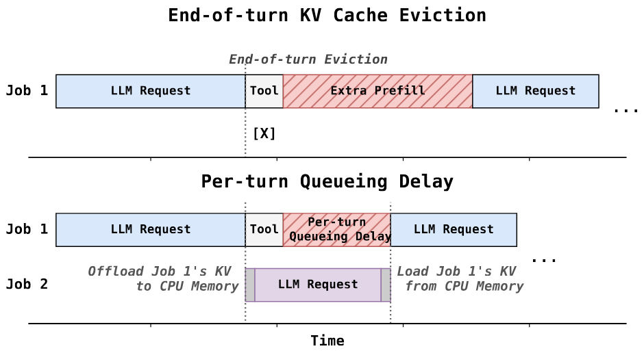

**图 1.** 先前智能体服务系统的两种主要失败模式. 红色方块表示次优调度和 KV 缓存管理带来的开销: 即使启用 CPU 卸载, 智能体在 KV 缓存驱逐后仍会遭遇排队延迟.

<span id="section-01"></span>

## 1 引言

KV 缓存管理是大语言模型推理的关键, 会影响输入处理 (prefill) 和输出生成 (decoding) 阶段 [Kwo23, She24, Che25e]. KV 缓存管理的一个关键组成部分是驱逐策略. 理想情况下, 系统应避免驱逐即将在近期被引用的 token. 与传统缓存系统类似, 现有推理引擎假定解码完成后 KV 缓存的重要性降低. 如果等待队列中有其他新请求, 它们会被丢弃以最大化利用率. 我们将这种策略称为**轮次结束驱逐**.

虽然轮次结束驱逐对多轮聊天应用效果良好, 但它会显著降低现代智能体工作负载的性能, 尤其是涉及工具调用的负载. 这些智能体应用已在软件工程 [Pre24], 计算机使用 [Ant24b] 和科学研究 [Ren25a] 等领域日益普及. 这类工作负载的特征是交替执行 (a) 推导下一步动作的推理步骤, 以及 (b) 智能体调用外部工具的执行步骤. 工具输出随后会追加到请求上下文中, 并在推理引擎中启动新的推理步骤. 由于工具调用可能比人类打字速度快得多 (*即* $\leq 2$s), 这种新工作负载需要改变轮次结束驱逐策略.

当智能体从推理步骤转为工具调用后, 请求的 KV 缓存被驱逐, 核心问题就出现了. 如果这一步的 KV 缓存已经被驱逐, 工具执行完成且下一步推理开始时, 引擎必须重新计算前缀 (prefill), 或从 CPU 重新加载 (启用 CPU 卸载时 [Che25e]). 这种重复 prefill 会造成显著延迟并降低整体系统吞吐量. 更重要的是, 即使启用 CPU 卸载来复用 KV 缓存, 驱逐仍会带来另一个问题: **每轮排队延迟**. 当下一步推理的 KV 缓存已从 GPU 内存中驱逐时, 即使可以从 CPU 重新加载, 也必须在等待队列中等待其他请求释放 GPU 内存后才能开始推理. 如[图 1](#figure-01) 所示, 这种每轮排队延迟会累积, 导致每个智能体程序的延迟不断增加. 由于离线剖析无法测量这种延迟, 我们需要设计一个将其影响纳入其中的新模型. 此外, 由于工具调用可能具有固有的变化性, 我们需要设置最大的 KV 缓存保留时间以避免无限期等待. 然而, 如果该时间恰好在工具调用前到期, 先前的等待时间就会被浪费. 因此, 我们需要仔细设置 KV 缓存保留时间, 使其适应工作负载.

先前工作未能解决这些挑战. InferCept [Abh24a] 仅依据重新加载成本决定是否保留 KV. 但它没有建模跨轮次累积的每轮排队延迟, 也没有稳健机制处理变化的工具调用持续时间. 这使其难以实际部署. 正如我们在[第 6 节](#section-06)中展示的, InferCept 会跨轮次累积排队惩罚, 导致次优性能. Autellix [Luo25b] 使用轮次结束驱逐, 忽略了多轮智能体调度中保留 KV 缓存的重要性. Pie [Gim25] 暴露了接口, 却没有提供 KV 缓存保留决策策略. Ayo [Tan25], Alto [San24] 和 Parrot [Qiu24] 假设工作流是静态的, 不适用于动态智能体.

为提供高效且稳健的解决方案, 我们提出 Continuum, 这是一种利用 KV 缓存生存时间技术来改善多轮智能体工作负载作业完成时间的服务系统. 受先前缓存论文启发, Continuum 引入 KV 缓存 TTL 机制, 在请求完成后将 KV 缓存保留在 GPU 中, 以覆盖原有的轮次结束驱逐. 对于推理步骤中生成工具调用的每个 LLM 请求, Continuum 同时建模 prefill/重新加载成本, 以及保留 KV 缓存带来的每轮排队延迟降低. 在根据上述两个因素和工具调用分布得到潜在命中收益后, Continuum 将其与 TTL 期间占用 GPU 内存空间的成本比较, 以决定 KV 缓存可以在 GPU 内存中停留多久, 之后自动驱逐. 如果工具调用在 TTL 窗口内返回, 下一请求可以立即恢复, 从而节省 prefill 和排队延迟. 当工具调用预测不准确, 实际耗时超过预期时, Continuum 会在 TTL 到期后驱逐 KV 缓存, 稳健地纠正错误, 防止严重的内存压力或死锁. 此外, Continuum 将 TTL 机制与程序级先到先服务调度结合. 这能改善请求顺序, 并简化复杂智能体工作流的调度.

我们在 vLLM 之上实现 Continuum, 采用易于维护并可集成到其他推理引擎的模块化设计. Continuum 实现了一个工具调用处理器, 每当请求进入或离开服务引擎时都会被调用. 它识别工具调用, 预测持续时间, 并同时根据吞吐量和请求顺序问题决定 KV 缓存固定的超时时间. 这种模块化设计只对推理引擎原有调度逻辑做最小改动, 也为未来扩展工具调用感知调度提供了空间.

为评估 Continuum 的性能, 我们在函数调用 [Mao24b] 和编码智能体 [Lie25] 的真实智能体工作负载上开展了广泛实验. 在三种硬件和模型设置下, 我们展示 Continuum 将多轮智能体工作负载的延迟降低 1.12 倍至 3.66 倍, 并将吞吐量提高 1.10 倍至 3.22 倍. 此外, 我们在 Tensormesh 内部测试平台上评估 Continuum, 表明它可以将真实 SWE 智能体工作负载的延迟最多降低 8.18 倍. 我们将开源跟踪数据, 代码和智能体服务测试平台, 以促进未来的智能体服务研究.

总而言之, 我们的贡献如下:

- 我们识别出智能体服务中的关键 KV 缓存保留问题, 并说明需要更好的解决方案.
- 我们设计 Continuum, 这是一种带有 KV 缓存生存时间机制的高效, 稳健服务系统, 用于降低基于轮次的驱逐成本和每轮排队延迟.
- 我们展示 Continuum 在仿真和真实案例中相对于先前方法的延迟和吞吐量最高可改善 8.18 倍.
- 我们将在发表后开源收集的智能体推理跟踪数据, 代码和智能体服务测试平台.

<span id="section-02"></span>

## 2 背景

<span id="figure-02"></span>

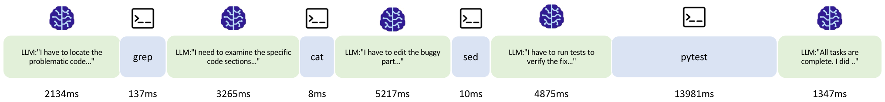

**图 2.** SWE-Agent 的说明性示例. 该智能体通过中间的工具调用逐步解决软件工程缺陷. 这些工具调用持续时间不同, 会打断 LLM 推理的连续性.

### 2.1 智能体的 ReAct 范式

现代智能体工作负载大多遵循 *ReAct* 智能体循环 [Cao23], 在推理步骤和动作步骤之间交替: 前者由 LLM 解读上下文并输出思考, 后者调用外部工具. 这一范式已经成为事实标准: Claude Code [Cod26] 和 Cursor [Cur25] 等编码智能体因其清晰度和性能而采用它, LangChain [Lan25] 和 LangGraph [Lan25a] 等框架使其广泛可用, GPT-OSS [Ope25c] 和 Kimi-K2 [Kim25a] 等近期开放权重模型则将工具调用能力直接融入基础模型.

一个重要趋势是, 智能体应用越来越多地将这一循环扩展为*长时程, 多轮*迭代, 在几十轮甚至数百轮中反复交错思考, 工具调用和上下文更新. 近期基准测试反映了这一点, 包括面向工具-智能体-用户交互的 $\tau$-bench [Yao24], 面向多轮工具增强交互的 MINT [Wan23a], 以及面向多轮决策和工具使用场景的 AgentBench [Liu23a].

### 2.2 现有方法的局限

由于三个主要原因, 先前工作无法处理这种新兴的复杂工作负载:

**固定工作流.** 一类工作关注使用**预定义, 静态**计算图调度智能体工作流. Teola [Tan25] 将应用分解为原语级数据流图, 然后应用图级优化. Alto [San24] 关注分布式组件之间的流式和流水线执行. Parrot [Qiu24] 通过语义变量向 LLM 服务暴露应用级上下文, 使引擎能够推断连续 LLM 请求之间的数据依赖. Teola, Parrot 和 Alto 的共同局限是都假设静态或确定定义的 DAG, 因而**无法处理动态智能体工作负载**, 例如依赖图在运行时演化的 ReAct 风格智能体. 这限制了这些工作对实际多样智能体的优化能力 [Any24, Lie25, Yan24d].

**不考虑工具调用.** Autellix [Luo25b] 引入程序级已获服务 (PLAS) 调度, 根据智能体程序的累积服务时间优先处理时间较少的请求. Tempo [Zha25j] 提出在面对聊天, 智能体和推理等不同请求类型时满足 SLO 的调度器, 而我们的重点是具有多轮且工具调用可变的智能体工作负载. 这些工作没有考虑智能体工作负载中工具调用的独特特征, 例如持续时间的变化以及对 KV 缓存管理的影响. 正如我们稍后在[第 3.2 节](#section-03)展示的, 这种忽视会导致次优调度决策和更高延迟.

**KV 缓存保留策略不足.** 一些先前工作观察到了智能体工作负载中 KV 缓存复用的挑战. InferCept [Abh24a] 引入了在工具调用之间固定 KV 缓存的“preserve”操作. 然而, 其策略忽略了请求的多轮性质. 当 KV 缓存在轮次之间被驱逐时, 程序返回后每轮都会产生额外排队时间. 在多轮场景中, 排队时间会在每一轮累积. 忽略这些影响会使它们即使在保留 KV 缓存有显著收益时也不在 GPU 中保留它. 此外, 其 preserve 操作是固定的, 无法实时适应工具使用. 如果实际工具调用时间远长于预测, 盲目“保留”KV 缓存会造成显著低效. 这使其难以实际部署. Pie [Gim25] 引入可编程服务系统, 将生成循环分解为细粒度处理器. 它将控制权交给用户程序, 允许自定义工具调用处理. 然而, 它要求开发者为每个智能体手工设计调度, 并且没有提供适应动态工具调用延迟或多轮依赖的实际方法.

<span id="table-01"></span>

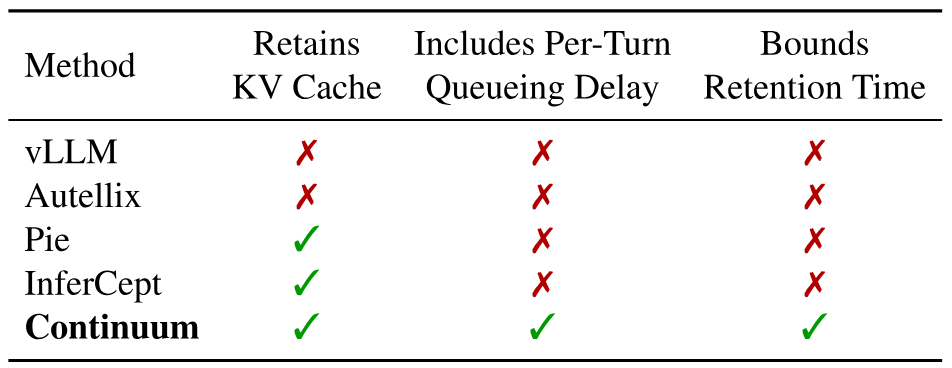

**表 1.** Continuum 与代表性基线的比较.

<span id="section-03"></span>

## 3 动机

<span id="figure-03"></span>

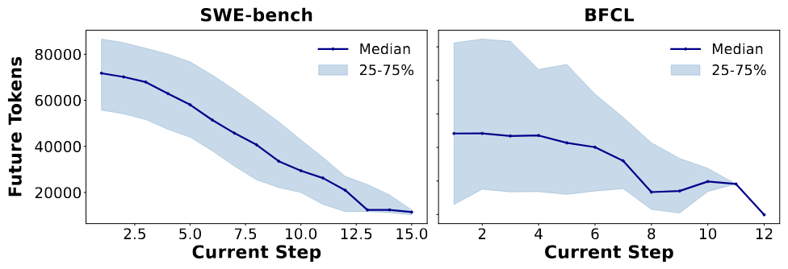

**图 3.** 评估中使用的 SWE-Bench 和 BFCL 智能体工作负载特征. 随着步骤数增加, 请求越来越接近完成.

### 3.1 智能体执行轨迹

我们首先分析现代智能体工作负载的特征. 我们收集并分析了运行 SWE-Bench [Nar24] 的 mini-swe-agent [Lie25] 的 100 条跟踪数据, 以及运行 GPT-5 基础模型的 BFCL V4 Web Search [Mao25] 的 100 条跟踪数据. [图 2](#figure-02) 展示了 SWE-Bench 中一个缩短的说明性跟踪示例, 说明智能体如何逐步解决软件工程任务.

<span id="table-02"></span>

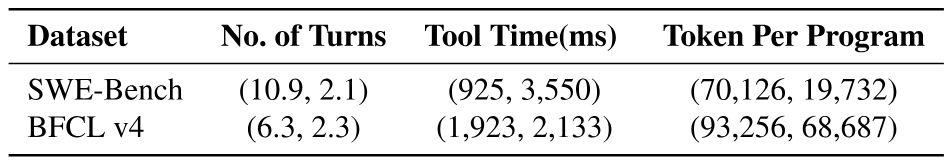

**表 2.** 两个收集数据集的统计信息. 报告数字的格式为 (均值, 标准差).

结论有三个方面. 第一, 这些新型智能体程序包含许多轮次. 轮次增加带来了额外的调度困难. 第二, 工具调用时间的分布不同, 但许多调用很短. 虽然生成这些短工具调用后请求会被视为完成, 但工具调用完成后下一请求很快就会到达, 从而复用 KV 缓存.

最后, 如[图 3](#figure-03) 所示, 随着程序接近完成, 两种工作负载的未来 token 总数预期都会减少. 这表明后续轮次的预期完成时间更短. 这说明, 优先处理更早到达的请求 (程序级 FCFS) 或已经执行更多轮次的请求, 可能是理论最优但需要全知信息的最短剩余时间优先 (SRTF) 调度策略的良好近似. 但在存在工具调用时维持这种顺序并不简单, 我们将在[第 3.2 节](#section-03)讨论.

<span id="figure-04"></span>

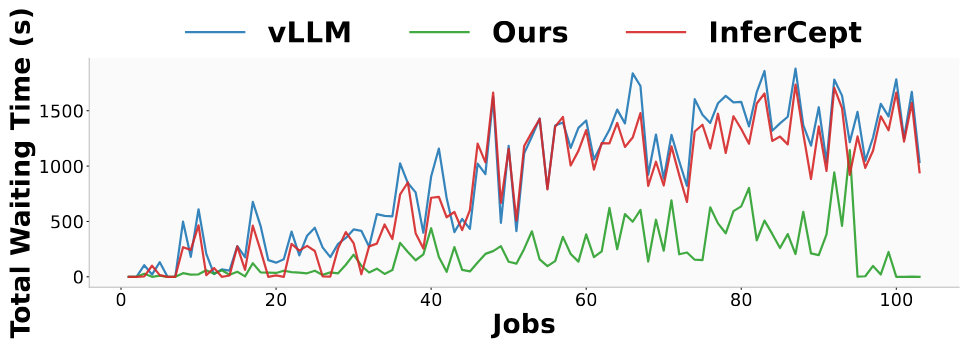

**图 4.** CPU 卸载下的程序级排队延迟. InferCept 的 preserve 决策忽略排队成本, 因此被驱逐的程序仍会跨轮次累积大量等待时间; 尽管 InferCept 节省了重新加载成本, 其等待时间仍接近原始 vLLM.

<span id="figure-05"></span>

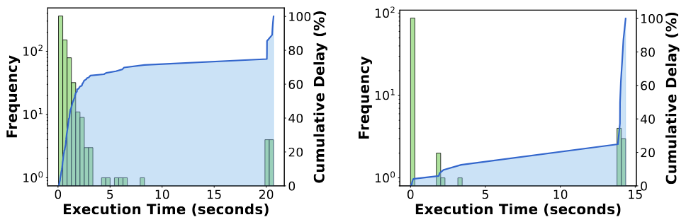

**图 5.** 函数执行时间可能具有极长的长尾. fetch_url 最慢的 10% 占总延迟的 52.5%, 而 cd 最慢的 10% 占 94.1%.

### 3.2 智能体工作负载面临的挑战

**基于轮次的驱逐.** 虽然这些工具调用可能很短, 推理引擎仍将其视为 LLM 请求之间同质的间隔. vLLM 或 SGLang 会在解码完成后立即驱逐请求的 KV 缓存, 隐含地假设请求已经完成. 然而, 如果 KV 缓存已被驱逐, 引擎必须重新执行完整 prefill, 或在启用卸载时从 DRAM 重新加载 KV 缓存, 从而产生额外延迟. 大多数系统无法高效处理这些场景. [图 1](#figure-01) 展示了这一影响: 工具调用制造的暂停触发 KV 缓存驱逐, 返回时需要 prefill 或重新加载 KV. 因此, 需要考虑工具调用的 KV 缓存保留策略来避免这些开销.

**每轮排队延迟.** 智能体程序的多轮特性还给调度器带来一个先前工作严重忽略的新挑战. 当当前智能体程序等待工具时, 如果调度器为最大化吞吐量将 GPU 内存分配给其他请求, 当前程序的 KV 缓存就会从 GPU 内存中移除. 当程序的工具调用返回, 后续 LLM 请求发送给调度器时, 它必须在其他请求持续进行 prefill/解码的后面等待 GPU 空间.

无论 KV 缓存是否存储在 CPU DRAM 中, 这段等待都会在智能体程序执行中形成间隔. 如[图 1](#figure-01) 所示, 除了先前的 prefill/加载成本外, 这段间隔也会增加工具调用带来的延迟, 跨轮次累积并导致每个程序的显著延迟. 此外, 它还打破程序执行连续性, 使较早到达的请求排在较晚请求之后. 注意, 即使我们在等待队列中赋予新请求最高优先级, 它仍会被 GPU 中其他请求正在进行的计算阻塞.

现有工作没有在保留策略中考虑每轮排队延迟. InferCept [Abh24a] 的 KV “preserve”操作仅在 CPU 卸载成本超过工具调用期间估计的 GPU 占用成本时调用. 关键在于, 这一决策只考虑下一轮的*重新加载成本*, 完全忽略被驱逐程序重新进入等待队列后必须在其他活动请求后面等待的排队延迟. 借助 LMCache [Che25e] 等引擎提供的快速异步 CPU 卸载, 重新加载成本变小, 因此 InferCept 的 preserve 操作很少被调用. 然而, 无论卸载速度如何, 排队延迟都仍然存在: 即使 KV 能瞬间重新加载, 返回请求仍需等待其他请求占用的 GPU 内存释放. 由于这种排队成本在*每一轮*产生, 累积延迟会随每个程序的轮次数量成比例增长, 这正是智能体工作负载的运行区间.

我们在[图 4](#figure-04) 中展示忽略多轮调度带来的性能下降. 我们剖析原始 vLLM 和 InferCept 算法中每个请求经历的总驱逐开销. 横轴按到达时间表示每个智能体程序, 纵轴表示每个智能体作业的总气泡时间, 即请求在执行前于等待队列中经历的总空闲时间. 即使采用 InferCept 的 KV 保留, 气泡仍然存在并造成延迟增加, 尽管它的吞吐量优于 vLLM.

**可变工具调用.** 当前 KV 缓存保留策略在工具调用差异很大时也会失败. 例如, InferCept 会将 KV 缓存固定在 GPU 内存中, 直到工具调用后下一请求到达. 在工具调用延迟稳定时, 这种方法工作良好. 然而, 如[图 5](#figure-05) 所示, 许多工具调用的执行时间变化很大. 当工具调用耗时远超预期时, 被固定的 KV 缓存可能长时间占用 GPU 内存. 数据库智能体也有类似模式, 因为外部工具调用更复杂. 这会导致内存使用低效, 甚至在保留的 KV 缓存完全占满 GPU 时发生潜在死锁. 因此, 静态保留策略在实际场景中缺乏稳健性.

<span id="section-04"></span>

## 4 Continuum 调度算法

鉴于先前工作的失败, 我们确定了服务智能体工作负载时的关键问题: 如何在多轮场景中高效, 稳健地保留 KV 缓存?

最优 KV 缓存保留策略应具备以下特征:

- 它应为工具调用后很快会复用 KV 缓存的请求保留缓存, 尽量减少 prefill/加载开销.
- 它应考虑智能体程序的多轮连续性, 减少等待并保持程序顺序.
- 它应能稳健应对变化的工具调用延迟.

<span id="figure-06"></span>

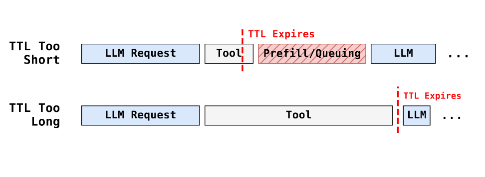

**图 6.** 必须合理设置生存时间, 以平衡内存使用与 prefill 加每轮排队延迟.

为了保证稳健性, 我们借用了传统系统中的生存时间 (TTL) 概念: 为每个请求的 KV 缓存赋予 TTL 值, 定义它留在 GPU 内存中的最长时间. 这既能保留 KV 缓存, 又可防止长时间运行或失败的工具调用无限期阻塞 GPU 资源.

然而, 与静态 preserve 操作相比, 为每个 KV 缓存条目设置适当的 TTL 值并不容易. 第一, TTL 值不能过大. 如[图 6](#figure-06) 所示, 如果超时时间过长, 被固定的 KV 缓存会无谓占用 GPU 内存, 阻塞其他请求并降低系统整体吞吐量. 另一方面, 如果特定 KV 缓存的固定时间过短, KV 缓存会在工具调用完成前被驱逐, 即使已浪费 GPU 占用时间, 仍会造成昂贵的重新计算或调度气泡.

鉴于这些权衡, 必须谨慎设置 TTL 值. 只有根据工具调用持续时间, prefill/加载成本和程序连续性的测量结果设置合适的 TTL 值, 我们才能在缓存复用收益与维持其他请求系统吞吐量的需要之间取得平衡, 从而获得良好性能.

**算法 1. Continuum 的调度算法**

- **全局状态:** 等待队列 $Q$; TTL 映射 $P$ (记录被固定的程序及其 TTL); 历史工具调用记录 $S$, 其中 $S[f]$ 表示工具 $f$ 已记录的工具调用信息
- **函数** $\mathrm{OnRequestArrive}(\mathrm{request}\ r)$:
  - $Q \leftarrow Q \cup \{r\}$, $id \leftarrow r$ 的程序 ID
  - **如果** $id$ 是已见程序:
    - $(f, t) \leftarrow r$ 中的工具调用信息
    - $S[f] \leftarrow S[f] \cup \{t\}$
- **函数** $\mathrm{OnRequestFinish}(\mathrm{request}\ r)$:
  - **如果** $r$ 是其程序的最后一个请求:
    - 释放 $r$ 使用的 KV 缓存
  - **否则:**
    - $f \leftarrow$ 完成 $r$ 后要调用的下一个工具
    - $id \leftarrow r$ 的程序 ID
    - $P[id] \leftarrow \mathrm{CalcTTL}(r, S[f])$
- **函数** $\mathrm{Schedule}()$:
  - **当** $Q$ 非空时:
    - **对每个** $P.\mathrm{keys}$ 中的 $id$:
      - **如果** 当前时间 $> P[id]$ 且 $id \notin Q.\mathrm{programs}$:
        - 释放 $id$ 上一请求使用的 KV 缓存
        - $P \leftarrow P \setminus (id, P[id])$
    - $r \leftarrow \mathrm{argmax}_{r' \in Q}\ \mathrm{CalcPriority}(r', P)$
    - **如果** $r$ 无法装入内存:
      - **中断**
    - $Q \leftarrow Q \setminus \{r\}$
    - 将 $r$ 发往运行队列
    - $id \leftarrow r$ 的程序 ID
    - **如果** $id \in P.\mathrm{keys}$:
      - $P \leftarrow P \setminus (id, P[id])$

### 4.1 效用模型

<span id="table-03"></span>

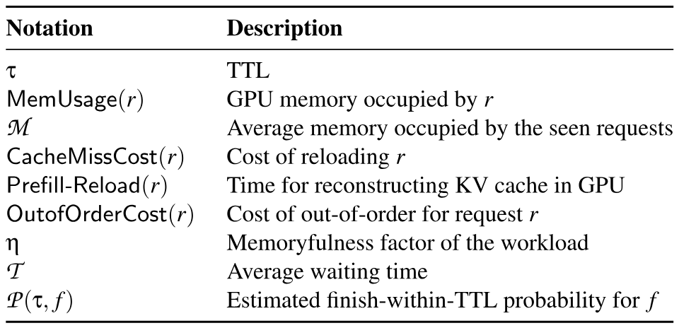

**表 3.** Continuum 成本模型中请求 $r$ 及其关联工具调用 $f$ 的关键记号.

为了给请求的 KV 缓存固定设置有效的 TTL 值 (秒), Continuum 必须选择能在潜在复用收益与成本之间取得最佳平衡的值. 收益和成本都以时间为单位, 因为它们最终会转化为所有程序总作业完成延迟的变化. 数学上, 给定请求 $r$ 和 TTL 值 $\tau$, Continuum 估计将请求 $r$ 的 KV 缓存固定 $\tau$ 时间的 $\mathrm{Cost}(\tau, r)$ 和 $\mathrm{Benefit}(r)$.

为简化问题, $\mathrm{Benefit}(r)$ 假设下一请求在 TTL 窗口内到达. TTL 在工具调用返回前到期的情况会在[第 4.2 节](#section-04)处理.

**成本估计.** 固定请求 KV 缓存的成本来自占用本可用于服务其他请求的 GPU 内存所产生的机会成本:

$$\mathrm{Cost}(\tau, r) = \frac{\mathrm{MemUsage}(r)}{\mathcal{M}} \times \tau,$$

其中, $\mathrm{MemUsage}(r)$ 是请求 $r$ 的 KV 缓存使用的 GPU 内存量, $\mathcal{M}$ 是活动请求的平均 GPU 内存占用, $\tau$ 是 TTL 值.

比值 $\frac{\mathrm{MemUsage}(r)}{\mathcal{M}}$ 表示固定 $r$ 时会阻塞多少个平均请求. 换言之, 如果固定 $r$ 占用的内存与 $k$ 个请求相同, 那么固定 $r$ 会给大约 $k$ 个其他请求各增加 $\tau$ 延迟. 我们假设在需要保留 KV 时, 等待队列始终包含足够多的请求, 使这种阻塞效应发生.

**收益估计.** 当请求在 TTL 期间内再次发出时, 固定其 KV 缓存的收益得以实现; 它可以避免重新加载或 prefill 来自 $r$ 所属程序的 KV 缓存, 同时节省每轮排队延迟:

$$\mathrm{Benefit}(r) = \mathrm{CacheMissCost}(r) + \mathrm{OutofOrderCost}(r)$$

这里, $\mathrm{CacheMissCost}(r)$ 衡量请求 $r$ 重新加载或 prefill KV 缓存的成本, $\mathrm{OutofOrderCost}(r)$ 衡量请求因等待其他请求释放 GPU 内存而产生的预期排队延迟. 我们将避免的成本之和作为收益.

与 $\mathrm{Cost}(\tau, r)$ 类似, 我们可以通过 (1) 上下文重建开销 $\mathrm{Prefill\!-\!Reload}(r)$, 以及 (2) 将承受额外延迟开销的近似请求数 $\frac{\mathrm{MemUsage}(r)}{\mathcal{M}}$, 来测量 $\mathrm{CacheMissCost}(r)$. 成本形式化定义如下:

$$\mathrm{CacheMissCost}(r) = \frac{\mathrm{MemUsage}(r)\times\mathrm{Prefill\!-\!Reload}(r)}{\mathcal{M}}$$

$\mathrm{Prefill\!-\!Reload}(r)$ 是 prefill 或重新加载的时间成本, 具体取决于是否启用 CPU 卸载. 它基于[第 5.3 节](#section-05)所述的快速离线剖析.

**测量预期排队延迟.** 如[第 3.2 节](#section-03)所述, 保留 KV 缓存还会消除程序在被驱逐后返回时经历的排队延迟, 即使 CPU 卸载使重新加载本身很快也是如此. $\mathrm{OutofOrderCost}$ 是 InferCept [Abh24a] 等先前保留策略缺少的关键项, 它们只考虑重新加载成本. 通过建模这一项, 只要节省的排队延迟超过占用 GPU 内存的成本, 即使重新加载很便宜, Continuum 也可以合理地保留 KV 缓存.

注意, 排队延迟收益与工作负载的记忆性密切相关, *即* 随着程序推进, 剩余步骤数是否会以可预测方式减少. 例如, 如果每个程序发出的请求数服从几何分布, 那么无论已经服务多少请求, 预期剩余请求数都保持不变; 这种情况下, 固定缓存对排队延迟没有收益, 因为保持顺序无法加快短作业优先完成. 相反, 如果每个程序发出固定数量的请求, TTL 就可以通过近似最短作业优先来消除排队成本.

设 $N$ 为程序中的请求总数, $k$ 为已经服务的请求数. 我们定义如下*记忆性因子*:

$$\eta = -\mathrm{Corr}(k, N - k).$$

可以看出, 该因子很好地建模了工作负载的记忆性程度: 当工作负载完全无记忆时, $k$ 与 $N-k$ 独立, 因此 $\eta = 0$. 相反, 当工作负载完全有记忆时, *即* 所有程序都有相同的固定请求数, 有 $\mathrm{Corr}(k, N-k) = \mathrm{Corr}(k, -k) = -1$, 因此 $\eta = 1$.

注意, 在某些情况下 $\eta$ 可能小于零 (轮次分布极度长尾), 这表示一种*反记忆*模式: 程序有所进展反而似乎揭示出更多剩余工作. 我们没有观察到这种模式, 但 Continuum 的设计考虑了这类极端工作负载: 较好的做法是只短暂服务每个程序并频繁切换, 以适应长尾轮次分布.

现在可以基于上述 $\eta$ 定义 $\mathrm{OutofOrderCost}(r)$. 当 $\eta = 1$ 时, 延迟恰好等于 $r$ 所属程序返回等待队列时的等待时间. 为匹配这一点, 我们将该工作负载中历史请求每单位上下文大小的平均等待时间记录为 $\frac{\mathcal{T}}{\mathcal{M}}$, 其中 T 是先前请求的平均排队延迟. 此时, 延迟可以很好地由 $\frac{\mathcal{T}}{\mathcal{M}}\times \mathrm{MemUsage}(r)$ 衡量. 这里考虑 $\mathrm{MemUsage}(r)$, 因为大上下文请求更难调度 (它们必须等待足够多的连续内存被释放). 一般情况下, 我们如下定义乱序成本:

$$\mathrm{OutofOrderCost}(r) = \frac{\mathcal{T}}{\mathcal{M}}\times \mathrm{MemUsage}(r) \times \eta.$$

### 4.2 设置 TTL 值

本节描述 Continuum 如何根据上述成本收益模型和历史工具调用信息设置 KV 缓存的 TTL 值. 如算法 1 (`CalcTTL` 行) 所示, Continuum 确定最优 TTL 值 $\tau^{*}$, 以最大化保留 KV 缓存的预期净收益:

$$\tau^{*} = \mathrm{argmax}_{\tau}\ \mathcal{P}(\tau, f) \times \mathrm{Benefit}(r) - \mathrm{Cost}(\tau, r),$$

其中, $\mathcal{P}(\tau, f)$ 估计工具调用 $f$ 在时间 $\tau$ 内完成的概率. 该公式表示将 $r$ 的 KV 缓存保留 $\tau$ 时长对作业总延迟的预期净收益. 消去公共项 $\frac{\mathrm{MemUsage}(r)}{\mathcal{M}}$ 后, 上式可以变换为:

$$\mathrm{argmax}_{\tau}\ \mathcal{P}(\tau, f) \times \big(\mathcal{T}\cdot\eta + \mathrm{Prefill\!-\!Reload}(r)\big) - \tau,$$

这表明我们的实现只需额外计算 $\mathcal{T}$ 和 $\mathcal{P}(\tau, f)$. $\mathcal{T}$ 可以估计为已被驱逐请求所经历排队延迟的滑动窗口平均值. 由于无法完全预测下一次工具调用的持续时间, 我们使用历史工具调用记录 $S[f]$ 得到的经验 CDF 估计 $\mathcal{P}(\tau, f)$. 具体计算如下:

$$\mathcal{P}(\tau, f) = \frac{1}{|S[f]|} \cdot \sum_{t \in S[f]} \mathbb{I}[t \leq \tau],$$

其中, $\mathbb{I}[\cdot]$ 是指示函数.

最后, 我们枚举 $S[f]$ 中记录的所有不同工具调用持续时间作为候选值 (包括 $\tau=0$), 选择预期奖励最高的值来求解公式 2.

**冷启动处理.** 当 $S[f]$ 中的历史记录很少时, 经验 CDF 估计可能不可靠. 此时, 我们先尝试使用全局工具调用信息估计 $\mathcal{P}(\tau, f_{\mathrm{any}})$, 其计算为 $\sum_{t \in S}\mathbb{I}[t \leq \tau]/|S|$.

此外, 在引擎服务刚开始时, 即使全局记录也可能不可靠. 为解决这一问题, 我们设计了 Continuum 的最小版本, 使用固定 TTL 阈值 $T_{\mathrm{default}}$; 它由同一成本模型推导, 并假设工具调用持续时间服从单位均值指数分布, *即* $\mathrm{ToolCallDuration}\sim\mathrm{Exp}(1)$, 且工作负载完全有记忆, *即* $\eta=1$. 随后将 $T_{\mathrm{default}}$ 设为该场景下的最优 $\tau^{*}$.

实践中, 我们设置阈值 $M$, 根据 $S[f]$ 决定使用固定 TTL, 全局记录还是上述细粒度估计. 也就是说, 当 $|S|\leq K$ 时使用 $T_{\mathrm{default}}$; 否则, 当 $|S[f]|\leq K$ 时使用全局记录, 其余情况使用细粒度 TTL 设置. 在实现中, 我们设置 $K=100$, 并将 $\mathcal{T}$ 初始化为零.

此外, 由于智能体通常会在生产前使用工具进行后训练 [Cao25, Che25b, Luo25a], 用户也可以在训练期间获得这些成本模型统计信息.

### 4.3 调度优先级

为了使调度与 TTL 算法兼容, 我们需要重新定义推理引擎中的请求优先级. Continuum 引入 TTL 感知优先级, 在 TTL 内提升已固定请求以保持连续性, 同时仍维持程序级 FCFS 顺序. 具体来说, 调度器为等待队列 $Q$ 中的每个请求 $r$ 分配多键优先级元组, 并按以下标准依次排序:

- **抢占状态:** 与原始引擎相同, 被抢占的请求 (由运行队列争用引起) 优先于未被抢占的请求.
- **TTL 状态:** 在其他请求中, TTL 窗口内保留的请求优先于未固定请求.
- **程序级到达顺序:** 最后, 每个类别内部按程序级到达时间排序, 以维持 FCFS 公平性.

<span id="section-05"></span>

## 5 Continuum 系统设计

<span id="figure-07"></span>

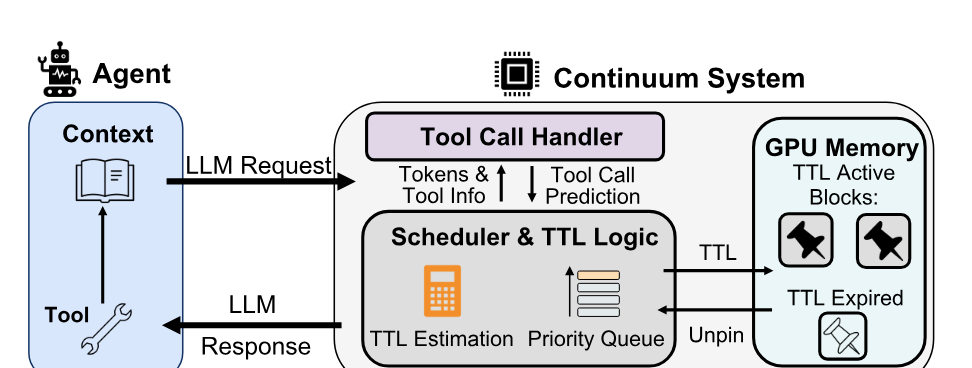

**图 7.** Continuum 系统概览.

在 Continuum 中, 我们的设计目标是采用模块化架构, 尽量减少对推理引擎调度器核心循环的改动. 在客户端, 我们为每个推理请求附加程序标识符 (`program_id`), 使系统能够识别多轮智能体程序, 并跨步骤推断工具调用.

请求到达服务引擎后, 会进入现有的调度器循环. Continuum 添加了一个轻量工具调用处理器, 在请求到达和完成时调用. 该处理器解析 LLM 输出中的工具调用, 使用同一 `program_id` 内观测到的请求间隔跟踪每种工具的延迟, 并向调度器返回 TTL. 调度器使用这一提示固定请求的 KV 缓存以供下一步复用, 之后在 TTL 到期或程序终止时解除固定.

### 5.1 工具调用处理器

工具调用处理器是一个独立类, 由主调度器在请求到达后或完成时调用. 这种解耦结构使工具处理逻辑与核心调度循环保持隔离, 从而便于未来扩展解析器或工具感知策略.

**识别工具调用.** 调度器完成请求后, 将响应转发给工具调用处理器, 由后者判断响应是否包含工具调用. 处理器按照函数调用模式解析消息, 因为 LLM 输出经常采用标准化工具调用结构, 例如 OpenAI 模式:

```json
{
  "id": "fc_0",
  "call_id": "call_0",
  "type": "function_call",
  "name": "get_weather",
  "arguments": {"location": "Paris"}
}
```

对于这一示例模式, 处理器检查每个返回消息块的 `type`; 如果它表示函数/工具调用, 处理器就提取调用的 `name`, 并将其作为工具调用类型. 在 SWE-Bench 中, 包含函数调用的每个 LLM 响应保证恰好包含一个 `bash` 函数调用. 我们提取 `bash` 块中的字符串, 并将后面的第一个词作为工具调用名称.

不同 LLM 的更多函数调用格式示例 [Lin25, Qwe24] 可见[附录 B](#section-appendix-b). Continuum 可以通过类似[附录 A](#section-appendix-a)的解析器轻松扩展到这些格式.

**记录工具完成时间.** 对于程序 ID $p$ 标识的程序中每个 LLM 请求 $i$, 当调度器记录一个带工具调用输出的已完成请求时, 处理器会记录服务器端完成时间戳 $t_{\mathrm{finish}}^{p,i}$ 以及工具调用名称. 当具有同一 $p$ 的下一请求 $i+1$ 到达时, 我们观察其服务器端到达时间戳 $t_{\mathrm{arrive}}^{p,i+1}$, 并计算请求间隔 $t_{\mathrm{arrive}}^{p,i+1}-t_{\mathrm{finish}}^{p,i}$. 我们将这一间隔记录为本次工具调用的执行时间, 供未来 TTL 计算使用.

### 5.2 调度器中的高效 TTL 固定

工具调用处理器给出 TTL 值后, 调度器需要执行固定操作.

**请求固定.** 如果该步骤未被标记为最后一步 (例如解析结果包含工具调用), 调度器会调用工具调用处理器获得 TTL 值 $\tau^{*}$, 若其非零, 则调用 `pin_request(request, $\tau^{*}$)`. 这会在字典 `pinned_requests` 中记录请求及其过期时间 `current_timestamp + $\tau^{*}$`, 并有意跳过释放请求的 KV 块. `pinned_requests` 也会传递给等待队列, 以优先调度同一程序中的下一请求.

**请求解除固定.** 每个调度步骤开始时, 调度器运行 `unpin_requests()`. 它扫描 `pinned_requests`, 对 TTL 已到期*且*其 `program_id` 当前不在等待队列中的条目解除固定. 这可以防止后续请求已经到达推理引擎, 但调度器尚未安排它时过早驱逐. 此外, 当程序最后一步完成时, 调度器会主动解除同一 `program_id` 的所有剩余固定, 因为近期不会再复用 KV 缓存.

**防止死锁.** 被固定的请求会累积, 当所有 GPU 内存都被这些请求占用时可能发生死锁. 由于同一程序的下一请求仍在等待队列中时会保留已固定请求, 整个调度循环可能卡住, 因为缺少空间而无法调度新请求运行.

因此, 当这种死锁发生时, 我们需要一种解除请求固定的机制. 在 Continuum 中, 当调度逻辑因空间争用无法调度新请求时, 它会检查 `pinned_requests` 中是否存在已固定请求. 如果存在, 我们会从 `pinned_requests` 中按程序到达时间最晚的顺序迭代选择牺牲请求, 解除固定并释放空间, 直到第一个请求可以被调度运行. 选中的请求会从队列中移除, 释放其 KV 缓存, 并按需重新入队, 确保后续分配能够继续. 这即使在存在许多固定请求时也能防止死锁.

**离线剖析.** 为了根据上下文大小预测[第 4.1 节](#section-04)所需的 prefill 时间和重新加载时间 ($\mathrm{Prefill\!-\!Reload}(r)$), 我们对每个硬件和模型组合进行离线剖析, 以便在线估计. 剖析有两个目的: **(1)** CPU 卸载场景下的 GPU-CPU 带宽. 我们通过取平均 CPU 卸载吞吐量来测量. **(2)** 用于估计 prefill 成本的 prefill 与上下文长度曲线. 我们对分块大小 $\{1000, 2000, 4000,... \mathrm{max\_context\_length}\}$ 执行 prefill, 并对数据拟合二次曲线. 诚然, 请求可能还有一些页面留在 GPU 内存中, 不需要重新计算. 但内存争用时这些剩余页面通常很少, 因此我们用完整 prefill 时间近似, 误差很小. 每个硬件模型组合的剖析耗时不到 10 分钟.

<span id="figure-08"></span>

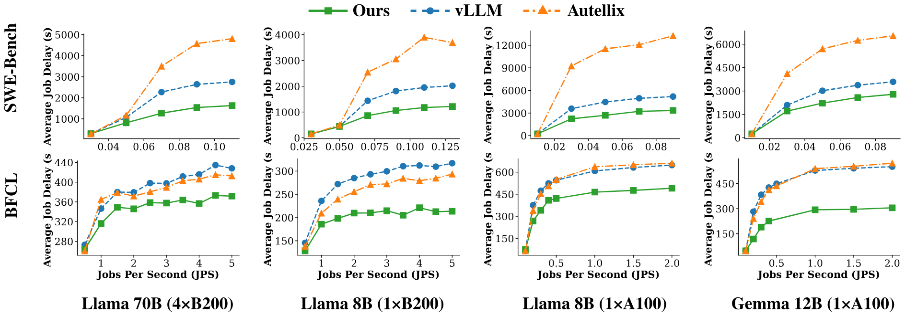

**图 8.** Continuum 在不同模型大小, 硬件配置和数据集上优于基线调度器.

<span id="figure-09"></span>

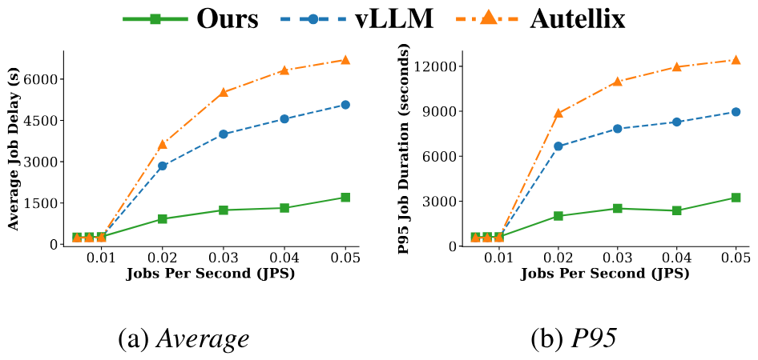

**图 9.** 在 H100 上使用 Llama-8B 时, Continuum 在 OpenHands 的平均延迟和 P95 延迟上达到最佳性能.

### 5.3 实现

我们在 vLLM 之上实现 Continuum, 使用约 1 千行 Python. 除了添加到调度器类的上述固定操作外, 我们还在 vLLM 原有调度器中使用了工具调用处理器的三个函数:

- `func_call_finish(tool, timestamp):` 当请求完成且解析结果包含工具调用时, 此函数通知工具调用处理器记录工具调用开始时间.
- `update_tool_call_time(program_id, timestamp):` 当新请求到达时, 表示前一请求的工具调用已经完成, 因此我们记录时间.
- `set_up_ttl(request, tool):` 根据先前工具调用信息和系统设置, 为调度器中的已完成请求给出最佳 TTL 值.

<span id="section-06"></span>

## 6 评估

<span id="figure-10"></span>

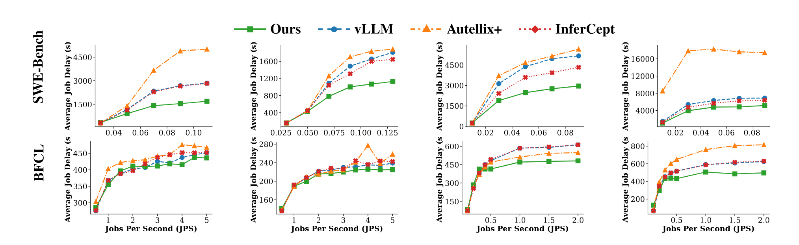

**图 10.** 启用 DRAM 卸载时, Continuum 取得一致改善. 它通过同时考虑工具调用和多轮性质, 优于 InferCept 等具有智能 DRAM 卸载逻辑的系统.

评估的主要结论如下:

- **延迟降低.** Continuum 通过智能固定 KV 缓存, 相对于基线调度器取得显著的延迟降低
- **稳健改善.** Continuum 在不同轮次数和不同卸载场景中都优于基线.
- **开箱即用.** Continuum 可以在不降低质量的情况下更快地运行真实智能体.

### 6.1 实验设置

**模型与硬件.** 我们使用 Llama-3.1-8B, Llama-3.1-70B 和 Gemma-3-12B 评估 Continuum. 我们使用 Runpod 的 A100-SXM GPU, AWS 和 Tensormesh 的 H100, 以及本地服务器的 B200 GPU.

**数据集.** 除[图 12](#figure-12) 中的真实 SWE-Bench 实验外, 我们在两个使用 GPT-5 [+1] 运行的收集工作负载上进行评估, 并使用泊松分布作为智能体程序的到达模式:

- SWE-Bench [Jim23]: 我们在 SWE-Bench 上运行 mini-swe-agent [Lie25] [+2]. 我们将请求保持在上下文窗口内.
- Berkeley Function Calling Leaderboard [Mao25]: 我们使用最新版 BFCL V4 (Web Search 类别). 它包含使用网页浏览工具回答问题的智能体. 我们将工作负载缩小 0.4 倍, 使 llama-3.1 的上下文窗口 (128k token) 内至少能容纳 100 个请求.
- OpenHand [Oth24]: OpenHands 是流行的开源编码智能体. 我们运行官方仓库中 Go 语言的 multi-SWE-bench [Zan25] 示例.

**主要基线.**

- *原始 vLLM* 我们使用 vllm 0.10.2 稳定版的默认设置, 其中启用大小为 2048 的分块.
- *CPU DRAM 卸载* 我们使用带 LMCache 0.3.7 [Che25e] 的 vllm 0.10.2. 对于 A100 GPU, 我们将卸载使用的 DRAM 大小设为 100GB; 对于 B200 和 H100 GPU, 则将每个 GPU 使用的 DRAM 大小设为 200GB. 我们也将其应用到下述算法之上.
- *Autellix* 我们在 vllm 之上实现 Autellix [Luo25b] 的 PLAS 算法. 通过启用 LMCache, 我们将 Autellix 扩展到 CPU 卸载场景 (Autellix+).
- *InferCept* 我们在 vllm + lmcache 之上实现 InferCept [Abh24a] 的选择性 preserve, swap 或 evict 算法. 由于 LMCache 中的 CPU 卸载是非阻塞的 (优于原始 InferCept), 我们相应更新了成本估计.
- *分布式推理* 对于真实智能体实验, 我们比较了其他开源方案, 包括具有原生缓存感知路由的 SGLang 0.5.5.post3 [Sgl25a], 以及配置为 1P1D 进行 PD 解耦的 Nvidia Dynamo 0.7.0.post1 [Dyn25].

<span id="figure-11"></span>

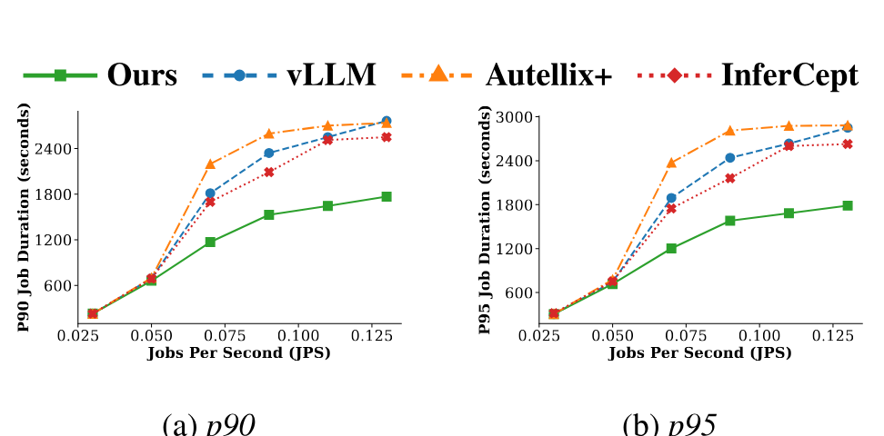

**图 11.** 对使用 Llama-8B 模型运行的 SWE Bench 跟踪数据, Continuum 取得更好的 P90 和 P95 延迟.

<span id="figure-12"></span>

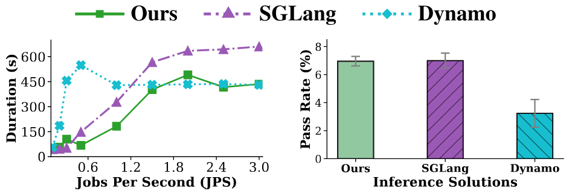

**图 12.** 在分布式设置中, 对于真实 SWE 智能体, Continuum 在通过率相同的情况下改善了延迟.

### 6.2 端到端实验

我们对 SWE-Bench, BFCL 和 OpenHands 工作负载进行跟踪重放实验. [图 8](#figure-08), [图 10](#figure-10) 和[图 9](#figure-09) 展示了 Continuum 的端到端改善. 我们在 BFCL 和 SWE-Bench 工作负载上都展示出平均响应时间和吞吐量的显著改善. 例如, 使用 Llama-3.1-8B 模型时, 与原始 vLLM 基线相比, Continuum 将平均响应时间最多降低 2 倍. 性能增益在不同模型大小和硬件配置中保持一致, 说明该方法在多种场景下都有效. 虽然 Autellix 在 BFCL 上优于基线, 但它在 SWE-Bench 上表现较差, 因为它错误地假定执行时间越长的请求预期完成时间也越长.

注意, 每秒作业数低于先前 LLM 服务论文报告的数值. 这是因为智能体工作负载复杂得多, 经常涉及超过 10 次 LLM 推理请求, 产生更高的计算负载.

我们还将评估扩展到其他实用智能体. 如[图 9](#figure-09) 所示, 在 AWS 的一张 H100 GPU 上使用 Llama 8B 运行 OpenHands 智能体时, 我们获得了更低延迟. 由于平均轮次数更高, 基线在高轮次数下恶化, 因此我们的改善更加显著.

此外, 我们观察到 Continuum 始终优于 CPU 卸载基线. 另一方面, 与基线相比, PLAS 在 CPU 卸载上的增益减弱. 这表明 Continuum 在减少调度气泡方面具有稳健的性能改善, 并且与 DRAM 卸载技术正交.

在[图 11](#figure-11) 中, 我们展示 Continuum 由于能减少每轮排队延迟, 因而相对于基线取得更好的 P90 和 P95 延迟. 每个点的设置都是在单张 B200 上运行 Llama-8B 模型, 并将 CPU 卸载设为每个 GPU 200GB.

<span id="figure-13"></span>

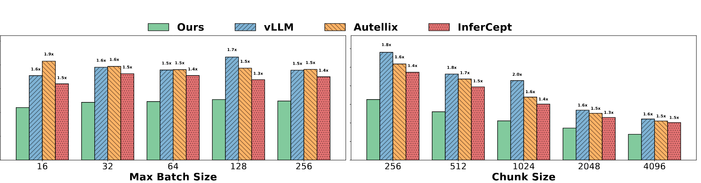

**图 13.** Continuum 在不同最大批大小和分块大小配置下都改善了延迟.

**分布式设置中的真实 SWE 智能体.** 为了全面评估 Continuum 在大规模真实部署场景中的性能. 我们在 Tensormesh 内部 H100 测试平台上, 使用 Continuum 为 SWE-Bench-Verified 中 500 个任务运行真实 SWE 智能体. 我们为 SWE-Bench 平台添加按泊松分布分发智能体的作业分发器, 从而建立智能体客户端环境. Continuum 使用简单的会话感知路由, 并与其他分布式推理方案比较. 我们测量每个作业的完成时间, 并在生成结束后收集每个智能体程序生成结果在 SWE-bench 上的通过率.

如[图 12](#figure-12) 所示, 在通过率相同时, Continuum 的平均延迟始终优于基线. 注意, Continuum 的通过率实际上高于基线. 这是因为 SWE-Bench 为防止环境 docker 挂起而设置了时间限制. 当基线运行时间超过 15 分钟时, 它会被抢占并视为失败. 这证明了 Continuum 在真实生产设置中的可用性.

### 6.3 敏感性分析

**改变推理引擎配置.** 为表明 Continuum 对不同推理引擎配置具有稳健性, 我们使用不同推理引擎配置评估 Continuum. 在[图 13](#figure-13) 中, 我们将每秒作业数设为 0.13, 并改变最大批大小, 将 Continuum 与不同基线比较. 可以看出, Continuum 的改善在不同批大小下保持稳定. 此外, 在[图 13](#figure-13) 中, 我们将分块大小从 256 变到 4096, 在不同分块大小下观察到类似改善. 这说明我们的方法对不同推理引擎配置具有稳健性.

**轮次数的缩放规律.** [图 14](#figure-14) 评估了调度器在多轮场景下的稳健性. 我们通过重复跟踪数据 (1$\times$ 至 5$\times$), 同时反向缩放 token 长度以模拟更多轮次, 并使 token 总数仍能放入上下文窗口, 从而在 SWE-Bench 上模拟更多轮次的场景. 在请求速率为 0.13 JPS, DRAM 卸载为 200 GB 时, 结果表明基线方法会随轮次数增加而恶化. 这是因为轮次增加会带来更多工具调用和更长的总体执行时间, 加剧传统方法面临的调度挑战. 相比之下, 我们的方法保持稳定的低延迟性能, 说明它对复杂, 多轮智能体交互有效.

**SSD 卸载.** 与 CPU 卸载类似, SSD 卸载提供更大空间, 但加载速度更慢. 我们在 B200 上使用 llama-8B 和 SWE-bench 工作负载, 通过 LMCache 在 CPU 卸载之外增加 SSD 存储层来评估 Continuum. 如[图 15](#figure-15) 所示, 在同时使用不同大小磁盘时, Continuum 相对于基线始终能改善平均延迟.

<span id="figure-14"></span>

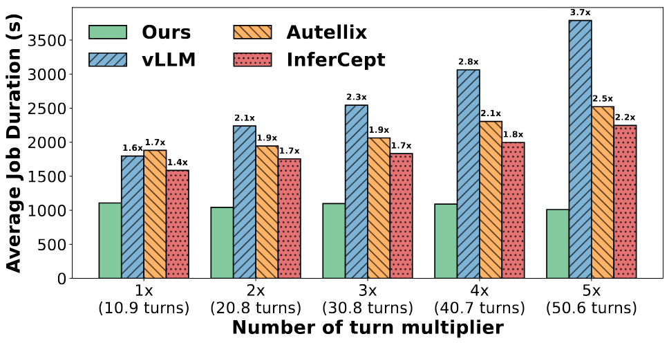

**图 14.** 随轮次数增加, Continuum 的改善更大, 而延迟时间保持稳定.

<span id="figure-15"></span>

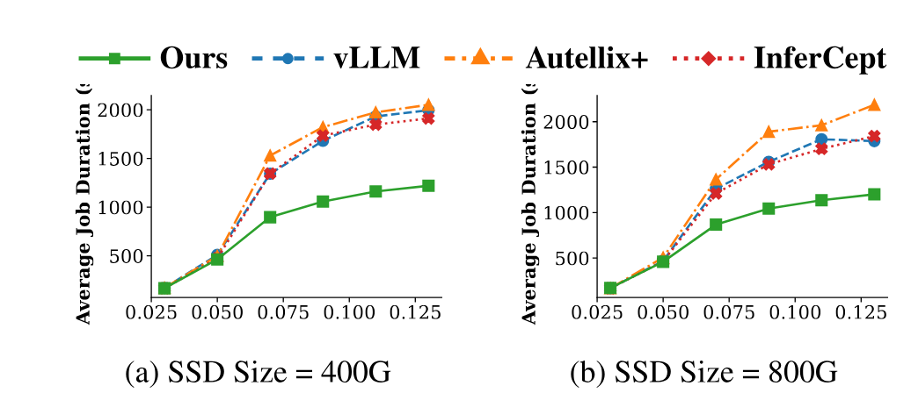

**图 15.** 当我们将卸载设备从 CPU 扩展到 SSD 时, Continuum 降低了延迟.

### 6.4 消融研究与微基准测试

**消融研究.** 我们开展消融研究, 分析成本建模对 Continuum 整体性能的影响. 在[图 16](#figure-16) 中, 我们将 Continuum 与只应用部分优化的基线比较. 程序级 FCFS 将 vLLM 原有的请求级 FCFS 改为基于程序到达顺序的优先级. 静态 TTL 建立在程序级 FCFS 之上, 使用从冷启动处理估计的固定 TTL 阈值. 如结果所示, Continuum 的不同思路逐步改善性能.

**调度器开销.** 如[表 4](#table-04) 所示, 与基线相比, 我们的方法引入了少量调度开销. 然而, 该开销仅为个位数毫秒, 相对于 LLM 推理的 GPU 执行时间可以忽略不计. 调度策略带来的显著端到端性能改善远大于调度延迟的小幅增加.

**在强化学习中的应用.** 我们还对 Continuum 在强化学习中的潜在用途进行了微基准测试. 我们在 Multi-SWE bench [Zan25] 上使用 GLM-4.5-fp8 训练运行 OpenHands 智能体来生成 rollout. 硬件设置为一台 8xH100 节点. 我们按照原论文报告的每分钟推理步骤数, 与同期强化学习工作 ThunderAgent [Kan26] 比较. 如[表 5](#table-05) 所示, Continuum 在单节点 rollout 上达到更高吞吐量.

<span id="figure-16"></span>

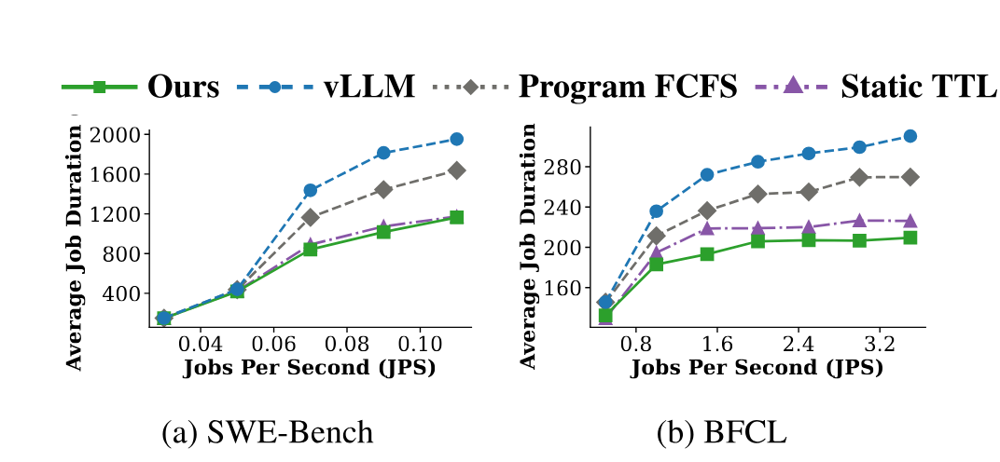

**图 16.** Continuum 各个思路的贡献. 程序级 FCFS 优先处理程序到达时间更早的请求, 而不是请求本身到达更早的请求. 静态 TTL 使用冷启动处理机制计算的固定 TTL 阈值.

<span id="table-04"></span>

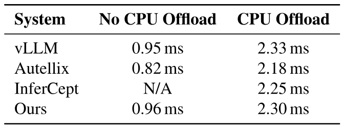

**表 4.** 在不同 DRAM 卸载设置下, 相比其他方法, Continuum 引入了少量调度延迟开销.

<span id="table-05"></span>

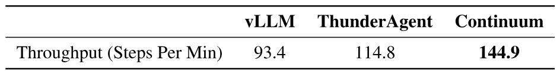

**表 5.** Continuum 在 OpenHands rollout 上优于同期工作.

<span id="section-07"></span>

## 7 相关工作

**LLM 推理系统.** 已有许多研究论文致力于改善 LLM 推理. vLLM [Kwo23] 和 SGLang [She24] 等服务引擎通过采用分页注意力设计和优化内核, 实现了先进推理性能. 除了改善 GPU 执行速度的各种内核级优化 [Ye25, Dao22, Zhu25a] 外, 研究者还提出了许多资源管理优化: 连续批处理 [Yu22a], 分块 prefill [Ram24], 跳跃连接多级调度 [Wu23a]. 其中许多已经移植到推理引擎中.

先前工作还探索了向 CPU DRAM 和磁盘高效卸载 [Gao24a, Xie25, Che25e, Liu24d, Yao25]. 对于分布式推理, 人们采用了会话感知路由 [Sri24, Vll25], KV 缓存感知路由 [Xia25] 和 prefill-decode 解耦 [Zho24]. 在这些工作基础上, Continuum 将 LLM 推理扩展到长时程多轮智能体工作负载, 并在不同请求竞争资源时改善资源管理.

**计算机系统中的生存时间机制.** 生存时间 (TTL) 是计算机系统设计中的一种长期抽象, 广泛用于 DNS 解析器, 分布式缓存, CDN 边缘节点和一致性协议, 以限制陈旧程度并防止资源无限期保留 [Kri01, Jun03, Coh05, Nis13, Bas18a, Mou19, Law20, Yan21a, Her21, Hen24]. 在这些设置中, TTL 是一种粗粒度有效期窗口, 在不可预测的更新或获取延迟下平衡新鲜度, 负载和稳健性. 我们继承这一传统, 但将 TTL 扩展到新领域: LLM 推理引擎内部的细粒度资源管理. 与条目相互独立, 正确性约束属于语义而非性能关键的传统 TTL 用法不同, KV 缓存与 LLM 服务引擎中的 GPU 内存压力, prefill 成本和调度公平性紧密相互作用. 据我们所知, Continuum 是首个根据预测工具调用持续时间, 调度侧延迟传播和工作负载模式, 使用 TTL 调节 LLM KV 缓存的系统.

**超越 ReAct 风格智能体的通用性.** Continuum 当前设计针对 ReAct 风格, 工具交错的智能体进行了优化, 其中每个 LLM 步骤返回明确工具调用, 随后在下一步骤前出现间隔. Continuum 自然扩展到并行工具调用, 因为它仍遵循顺序的“reason -> tool -> reason”节奏. 然而, 一些新兴智能体框架可能包含非线性控制流: 推测分支, 异步多智能体协调和上下文折叠. 尽管这类工作负载大多仍处于实验阶段, 尚未在真实生产工作负载中测试, 其推理模式可能违反顺序流程并需要未来修改. 扩展 Continuum 来支持这类工作负载是未来的重要方向. 更多讨论见[附录 C.1](#section-appendix-c1).

<span id="section-08"></span>

## 8 结论

智能体工作负载因频繁工具调用, 高度可变的步骤间延迟以及保持多轮连续性的需要, 给 LLM 服务系统带来了新的调度挑战. 我们提出 Continuum, 这是一种 KV 缓存保留和调度系统, 通过生存时间机制平衡缓存复用收益与阻塞 GPU 内存的成本. 通过将基于 TTL 的固定与程序级 FCFS 集成, Continuum 减少了不必要的 prefill, 缓解每轮排队延迟, 并能稳健适应不可预测的工具调用延迟. 我们在 vLLM 之上的实现在不同模型大小, 硬件配置和真实智能体工作负载中都一致改善了端到端作业完成时间. Continuum 表明, 有原则, 工具感知的 KV 管理是高效多轮智能体服务的基础. 我们希望它为未来系统将智能体工作负载深度集成到 LLM 推理引擎奠定基础.

<span id="section-appendix-a"></span>

## 附录 A 工具调用解析器实现示例

我们在此附上 mini-SWE-agent 的工具解析器实现.

```python
class ToolCallParser:
  """用于从 LLM 输出中提取函数调用的解析器.

  使用与 mini-swe-agent 相同的解析逻辑, 从 Markdown 代码块中提取 bash 命令,
  并识别函数调用.

  可以为其他使用不同解析逻辑的数据集扩展此实现.
  """

  def parse(self, text: str) -> Optional[str]:
    """解析 LLM 输出并提取函数调用名称.

    参数:
      text: LLM 的输出文本

    返回:
      函数调用名称 (例如 "ls", "cd", "git"); 未找到时返回 None
    """
    # 与 mini-swe-agent 相同的正则表达式模式: r"```bash\s*\n(.*?)\n```"
    actions = re.findall(r"```bash\s*\n(.*?)\n```", text, re.DOTALL)

    if len(actions) == 1:
      bash_action = actions[0].strip()
      # 提取动作的第一个词 (命令)
      words = bash_action.split()
      if words:
        return words[0]

    return None
```

**代码清单 1.** 工具调用解析器示例

<span id="section-appendix-b"></span>

## 附录 B 更多函数调用示例

在底层, 不同模型在聊天模板和生成内容中呈现工具调用的方式不同. 例如, Llama-3 变体可能发出函数风格字符串 `func_name(param_1=val_1, param_2=val_2, ...)`, 而 Qwen-3 变体使用 `{"name": "func_name", "arguments": {...}}`. 无论格式如何, 服务引擎 (例如 vLLM, SGLang) 都包含针对具体模型, 感知模板的解析器, 它接收生成的长字符串, 恢复函数名称和参数, 并将其规范化为 OpenAI 风格模式, 以便下游统一处理. 因此, 如果使用服务引擎提供的通用函数调用接口, 就无需担心模型特定的解析.

对于应用不使用函数调用接口, 而是通过聊天接口要求模型输出结构化 bash 命令的其他用例, 也很容易解析出函数名称和参数. 例如, 在 SWE Bench 中, 要提取预期工具调用, 只需找到唯一的 bash 代码块, 按 `&&` 或 `||` 拆分命令字符串, 然后解析每个子命令: 第一个 token 是可执行文件/函数名称 (pytest, git, ……), 其余是参数.

```shell
pytest -q && git add -A && git commit -m "fix: handle None case in parser"
```

在 Terminal Bench 中, 这甚至更容易, 因为其结构化格式已经为我们处理了命令拆分.

```json
{
  "state_analysis": "The tests are failing with a NameError.",
  "explanation": "Open the file, fix the missing import and rerun tests.",
  "commands": [
    { "keystrokes": "vim src/app/main.py\n", "is_blocking": false, "timeout_sec": 2.0 },
    { "keystrokes": "pytest -q\n", "is_blocking": true, "timeout_sec": 30.0 }
  ],
  "is_task_complete": false
}
```

<span id="section-appendix-c"></span>

## 附录 C 相关工作的扩展讨论

<span id="section-appendix-c1"></span>

### C.1 新型工具调用方式

**借助工具思考.** 这一模式将规划与执行交错: 模型发出结构化中间计划, 调用工具, 整合反馈, 并继续思维链 [Ope25c, Gao24c, Wu25a, Che23a]. 在 Continuum 中, 一旦发出工具调用, 当前请求就被视为完成; 工具完成后, 带有更新上下文的后续请求进入队列. Continuum 可以通过实现[附录 A](#section-appendix-a)所示的工具解析器来扩展到该场景.

**并行工具调用.** 当子任务相互独立时 (例如, “美国和英国的天气如何?”), 并行发出多个工具调用可以缩短轮次延迟 [Kim24a, Ant25b, Ope23d, Mao24a, Yan24d, Pat25a]. 按设计, 这些调用可交换: 它们可以按任意顺序执行, 响应在完成时追加到上下文. Continuum 可以通过来自客户端的函数调用预测器扩展.

**异步工具.** 异步工具调用使执行非阻塞: 每个调用返回一个句柄 (*future*/promise), 模型稍后可以等待它, 从而在工具后台运行时继续生成 [Gim24a, Gin24, Ope25d]. 这对广度优先或树搜索行为尤其有用 (例如, 扇出多个并发探针的深度研究或浏览智能体). 这种工作负载非常适合 Continuum: 由于模型在等待之间几乎不进行主动计算, 只要避免过早驱逐, KV 缓存复用率就很高.

### C.2 模型架构

人们一直在提出超越传统仅解码 Transformer 的新 LLM 模型架构. 混合专家 (MoE) [Sha17, Fed22, Cho22b] 通过为每个输入 token 只激活一部分参数, 将稀疏性引入模型, 从而以较低推理成本支持更大模型. 滑动窗口 Transformer [Bel20, Zah20] 将注意力范围限制在局部窗口而非完整上下文, 减少推理期间的内存占用. 混合模型将完整注意力与更高效的注意力机制结合, 例如线性注意力 [Cho20a, Kat20], SSM [Gu23, Gu22, Gu20, Gu21] 或低秩注意力 [Wan20a], 以减少内存占用并提高推理速度. 这些架构缓解推理期间的内存瓶颈以达到更高吞吐量, 但仍会遭遇本文讨论的调度问题, 尤其是不同作业持续争用 GPU 空间导致的调度气泡.

<span id="section-appendix-d"></span>

## 附录 D 局限与未来工作

**TTL 成本模型的敏感性.** Continuum 依赖一个结合经验工具调用 CDF, 内存使用估计和“记忆性”因子的成本收益模型, 以推导最优 TTL 值. 虽然这一设计有原则依据, 但它假设工具调用分布和工作负载特征足够稳定, 使历史样本具有预测力. 在高度波动或对抗性工作负载中, 例如工具延迟因后端争用或外部 API 波动而突然变化的智能体, 该模型可能产生次优 TTL, 暂时降低调度效率. 此外, 记忆性因子 $\eta$ 等关键参数, 以及 $\mathrm{CacheMissCost}()$ 和 $\mathrm{OutOfOrderCost}()$ 中的近似, 都依赖同一工作负载过去轮次的观测, 可能无法泛化到未见过的智能体行为. 由于智能体大多预先经过后训练, Continuum 可以使用训练期间的分布来处理冷启动, 从而缓解这一问题. 我们将处理智能体中的突发分布变化留作未来工作.

[+1]: 我们使用 GPT-5 以获得更强模型能力, 确保生成的工作流大多正确. 基础小模型经常无法完成任务.

[+2]: SWE-bench 官方智能体, 截至 4 月 13 日在排行榜上排名第 5.
