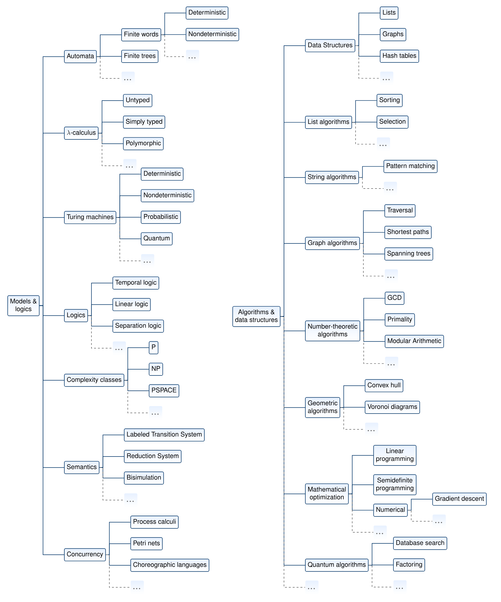
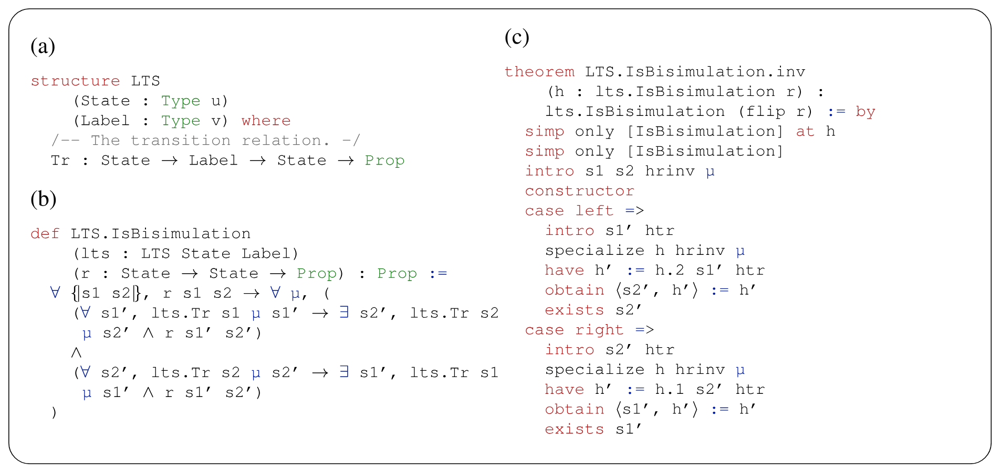
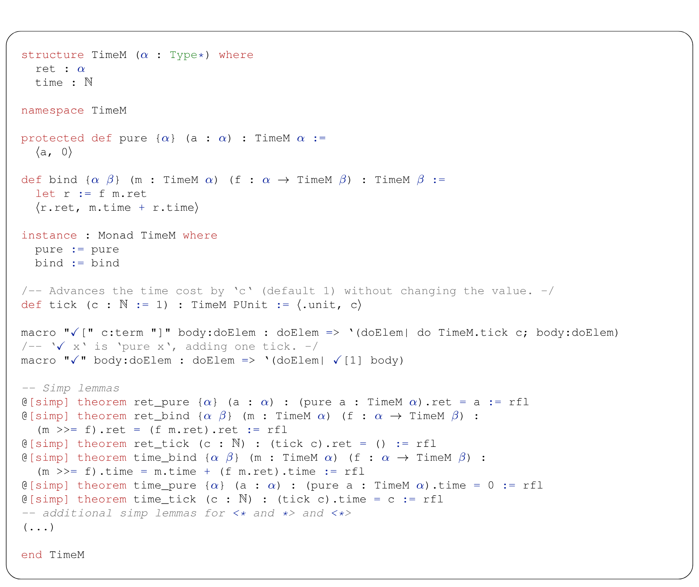
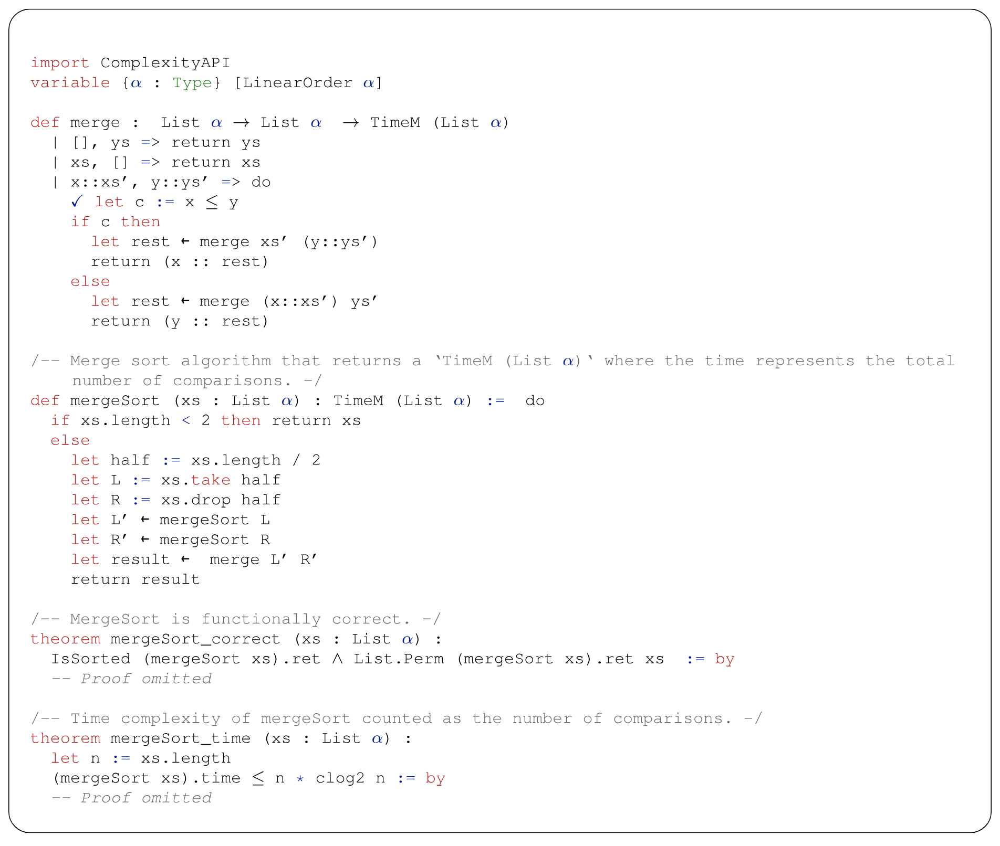
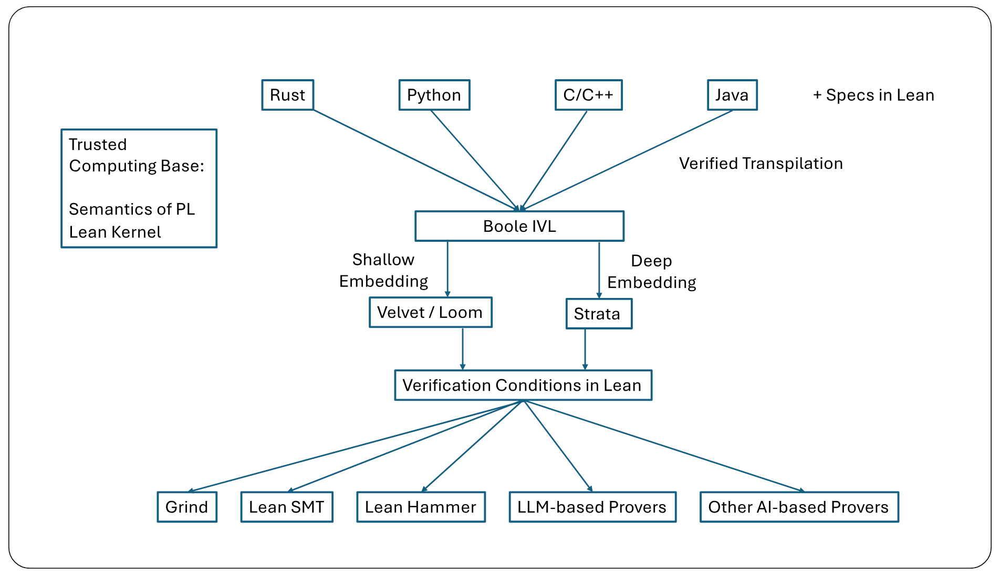
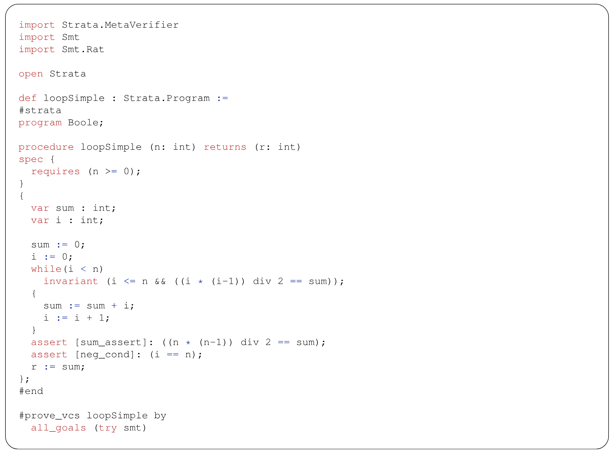
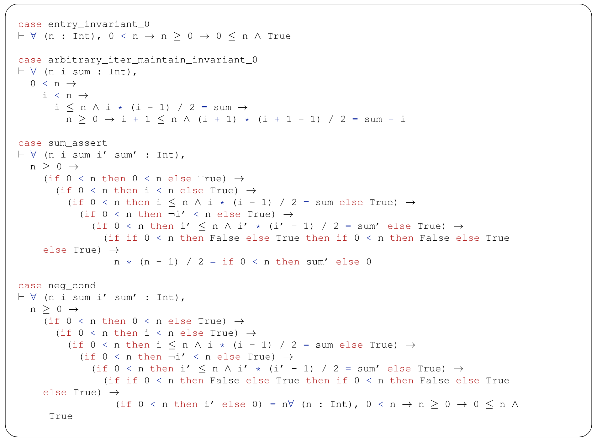

> [Clark Barrett](https://theory.stanford.edu/~barrett/), [Swarat Chaudhuri](https://www.cs.utexas.edu/~swarat/), [Fabrizio Montesi](https://www.fabriziomontesi.com/), [Jim Grundy](https://dblp.org/pid/92/2259), [Pushmeet Kohli](https://dblp.org/pid/94/248), [Leonardo de Moura](https://leodemoura.github.io/about/), [Alexandre Rademaker](https://arademaker.github.io/), 以及 [Sorrachai Yingchareonthawornchai](https://sites.google.com/view/sorrachai). 论文于 2026 年 2 月 4 日首次提交至 arXiv; 当前版本为 v1, 日期为 2026 年 2 月 4 日. [CSLib: The Lean Computer Science Library](https://arxiv.org/abs/2602.04846v1). <a href="/paper/cslib.pdf" target="_blank" rel="noopener noreferrer">原始 PDF</a>. [DOI](https://doi.org/10.48550/arXiv.2602.04846). [TeX 源文件](https://export.arxiv.org/e-print/2602.04846v1). 精确的印刷排版和参考文献以原始 PDF 为准.

## 摘要

我们介绍 CSLib, 这是一个开源框架, 用于在 Lean 证明助手中证明计算机科学相关定理和编写形式化验证代码.
CSLib 希望成为计算机科学领域的 Mathlib, 就像 Lean 的 Mathlib 之于数学. Mathlib 产生了巨大影响: 它是 Lean 在数学研究界广受欢迎的一个主要原因, 也在训练用于数学推理的 AI 系统时发挥了重要作用. 可是, Lean 中的计算机科学知识基础目前十分有限. CSLib 将大幅扩充这个知识库, 并提供基础设施, 以便在现实世界的验证项目中使用这些知识. CSLib 将借此 (1) 推动 Lean 在计算机科学教育与研究中的广泛使用; (2) 支持以人工方式和 AI 辅助方式开发大规模形式化验证系统.

## 1 引言

乍看之下, Mathlib [Mat20b] 是一个数学成果和技术库, 这些内容已在 Lean [Mou21] 证明助手中形式化. 实际上, 它远不止于此: 它是世界各地数学家共同开展的一项社区工作, 目标是以易于审查和共享的形式收集全世界的数学知识. Mathlib 提供了一种新的数学研究平台, 让许多人可以放心协作, 共同处理大型而困难的项目 [Rin24]. 同时, 它把广泛的数学定义与证明表示成机器可检查的形式, 因而为 AI 系统辅助数学发现提供了新的机会 [Yan24k, Hub26]. 新一代数学家正在接受这种数学研究方法, 许多知名人士也开始支持它 [Tao24b, Kon25a]. Mathlib 是这场范式转变的核心, 其影响怎么强调都不为过.

计算机科学始终与数学关系密切. 许多计算机科学系最初由数学系分化而来, 即便到今天, 计算机科学理论和数学之间的界线仍很模糊. 而且, 计算机科学家早已认识到, 形式数学是一种强力工具, 可以帮助设计可靠且安全的系统 [Boy83, Cla97, Hoa03]. 但到目前为止, 还没有人尝试建立一个类似 Mathlib 的通用形式化计算机科学知识库.

本文是一篇白皮书, 我们在其中介绍 CSLib, [+1] 这是一个面向 Lean 形式化验证与计算机科学研究的库, 旨在改变这种状况. CSLib 有两根"支柱":

1. *在 Lean 中形式化所有必要的计算机科学概念*. 形式化内容包括但不限于: $\lambda$ 演算和资源受限图灵机等计算模型; 众多算法与数据结构及其正确性和复杂性证明; 并发理论; 编程语言基础; 以及与计算机科学有关, 但目前尚未收录于 Mathlib 的数学工具.
2. *为基于 Lean 的日常命令式代码推理建设基础设施*. 这套基础设施包括一种名为 Boole 的中间编程语言, 它允许把经典命令式结构与 Lean 编写的规约交织在一起; 从 Boole 代码生成 Lean 语言验证条件的工具; 以及支柱 1 所涵盖算法与数据结构的已验证 Boole 实现.

[+1]: CSLib 主网站位于 [https://cslib.io](https://cslib.io). 当前 CSLib 代码库位于 [https://github.com/leanprover/cslib/](https://github.com/leanprover/cslib/).

综合起来, CSLib 中的 Lean 代码与证明让 Lean 可以成为具有数学基础的计算机科学研发媒介. 例如, 理论研究者可以用 CSLib 的内置抽象快速拟定一种新的近似算法, 并写出刻画其基本性质的定理; 编程语言研究者可以用这个框架构建已验证编译器; 系统研究者则可以用这个库为新的网络协议建模, 同时给出最坏情况保证. Boole 框架在 Lean 与日常编程语言之间搭起了一座必要的桥梁. 具体而言, 我们设想未来能够大规模地把 Rust 和 C++ 等
主流语言中的代码自动转换成 Boole.
CSLib 的内置基础设施把验证这些 Boole 语言程序的任务转化为证明 Lean 语言定理的任务. 随后再用 Lean 语言的证明工具完成这个证明任务.

**CSLib 的影响.** 我们认为 CSLib 将产生两方面的影响: 一是解决对可靠软件系统的迫切现实需求, 二是满足计算机科学长期以来对更严谨, 更具扩展性的方法的需要.

先说第一点, AI 的发展给全世界的计算基础设施带来了新的风险, 软件可靠性与安全性的进展因此比以往任何时候都更加紧迫. 当今的 AI 系统分析代码的能力很强, 由 AI 驱动的恶意行为者因而更容易发现并利用漏洞. 与此同时, AI 编码智能体正在编写越来越多的代码. 这虽然整体提高了生产力, 但 AI 也可能给代码引入正确性错误与安全漏洞 [Per23]. 形式化方法可以从数学上证明代码无错误, 无漏洞, 从而缓解这些风险, 不论代码由人还是 AI 编写.

但是, 形式化方法历来需要投入大量人力, 这限制了它的影响.
以 seL4 [Kle09] 为例, 它是世界上第一个经过形式化验证的操作系统内核.
这个系统产生了深远影响: 在 DARPA HACMS 项目中, 一架由 seL4 驱动的无人机抵挡住了一支精锐红队连续六周的攻击, 因而被称为"世界上最安全的无人机". 但 seL4 也反映出传统形式化验证的成本负担. 该系统投入了超过 20 人年的证明工作, 并在 Isabelle [Nip02] 框架中编写了约 480,000 行形式规约与证明. 大多数商业项目很难承受这样的成本.

CSLib 的构想从两个方面处理这个瓶颈. CSLib 建成后, 开发者可以组合预先验证的 CSLib 组件, 以组合方式构造可靠且安全的系统. 第二, CSLib 可以简化 AI 在形式化验证中的使用. AI 系统已经在纯数学场景下表现出超越人类的形式证明能力 [Hub26]. 可是, 要把这种能力用于范围广泛的代码验证, 我们需要一种能全面描述代码性质的语言. Lean 与 CSLib 将提供这种语言. CSLib 也会成为高质量数据的仓库, 供形式化和形式证明 AI 系统训练使用.

除对实用形式化验证的影响外, CSLib 还将成为 21 世纪计算机科学研究的平台. CSLib 所支持的形式化验证会增强人们对各项主张的信心, 并允许大规模复用基础概念. 我们也可以设想, 在 CSLib 上训练的 AI 工具将发现新算法并解决开放问题, 把 AI 智能体在数学研究中刚开始承担的角色扩展到计算机科学.

**图 1.** (a) 模型与逻辑. (b) 算法与数据结构. CSLib 的支柱 1: 所涵盖主题的一种可能组织方式.

## 2 技术路径

下面进一步说明 CSLib 技术路径的两根支柱.

### 2.1 支柱 1: 在 Lean 中形式化计算机科学

CSLib 的第一根开发支柱使用 Lean 形式化一套完整的计算模型, 算法与数据结构, 也形式化这些对象的性质以及性质的证明. 这些形式化内容将组成一套连贯, 集成的框架, 而不是一批互不相关的模块. 这种统一使整体的价值超过各部分之和, 也是 Mathlib 产生影响的主要原因之一.

这根支柱与 Mathlib 相辅相成. 一方面, 它大量使用 Mathlib 中的模块, 例如大 O 推理和概率论模块. 另一方面, 它也会形式化一些核心数学内容, 例如分析近似算法所需的某些组合数学引理, 或证明优化算法收敛所需的不等式; 这些内容对计算机科学有用, 但目前尚未出现在 Mathlib 中. 我们会根据具体情况把这些形式化内容贡献给 Mathlib, 或将它们保留在 CSLib 仓库内.

下面进一步说明这根支柱的目标.

**模型与逻辑.** 多年来, 计算机科学家设计了许多种*计算模型*. 其中包括确定性, 非确定性, 概率和量子计算模型; 函数式计算, 在线算法和交互式协议的模型; 求解决策问题的模型; 以及近似求解优化问题的模型. 这些模型很多从未被形式化; 已有的形式化内容往往分散在彼此隔离的仓库中. CSLib 支柱 1 的一个主要目标是建立一套统一的模型形式化体系.

另一项工作是形式化模型与算法的*规约记法*. 例如, 时序逻辑适合描述有状态系统的性质; Hoare 逻辑是描述过程式代码的标准机制; 分离逻辑可以简化底层命令式计算的规约; 线性逻辑适合推理资源使用和并发行为. 目前还没有一个统一代码库收录这些规约记法, CSLib 将处理这个问题.

**图 2.** (a) 带标签转移系统 ("LTS") 的定义, 它为离散计算系统各个可能状态的可观察行为建模. (b) 两个状态之间互模拟的定义. (c) 证明互模拟的逆关系仍是互模拟的定理.

**图 3.** 用于基本算法复杂性分析的单子 API. $\texttt{TimeM}~\alpha$ 类型的对象包含 $\texttt{ret}$ 和 $\texttt{time}$, 前者是 $\alpha$ 类型的值, 后者是计算这个值所产生的时间成本. $\texttt{bind}$ 操作把两项计算串联起来, 并把组合计算的时间成本定义为各项操作时间成本之和. 辅助函数 $\texttt{tick}$ 赋予时间成本. 记号 $\checkmark$ 是调用 $\texttt{tick}$ 的语法糖. 最后一部分断言了几个基本引理, 用于化简包含 $\texttt{TimeM}$ 的表达式.

**图 4.** 使用 [图 3](#figure-03) 中 API 的归并排序实现. 请注意, 每次调用排序例程都会返回一个已排序列表以及一项计算成本. 有了这些定义, 就可以形式化陈述并证明归并排序的正确性以及最坏情况下的比较次数.

我们将在这根支柱中建立的具体形式化内容必然会随时间演变,
但 [图 1](#figure-01)-(a) 列出了我们目前计划涵盖的一部分模型和逻辑. [图 2](#figure-02)-(a) 与 [图 2](#figure-02)-(b) 给出了具体的形式化示例. 具体而言, [图 2](#figure-02)-(a) 展示了带标签转移系统 [Win95] 的一部分 Lean 定义, 这是有状态系统的经典模型; [图 2](#figure-02)-(b) 则定义了互模拟, 即系统状态之间一种重要的等价概念. 如果状态 $s_1$ 和 $s_2$ 由某个互模拟关系关联, 那么 $s_1$ 可以用一个对应转移模拟 $s_2$ 的所有转移, 反之亦然; 而且原转移与模拟转移所到达的状态仍由该互模拟关系关联.

转移系统和互模拟在计算机科学中有很多应用, 涉及硬件设计 [Che96], 控制 [Gir11] 和机器学习 [Zha21i] 等领域. 因而, 这些概念的形式定义和相关定理 (例如 [图 2](#figure-02)-(c) 中的定理) 在理论与实践方面都有价值. 可是, 这类形式化内容并不自然地属于 Mathlib 的范围, 因此也体现了 CSLib 将提供的独特能力.

**算法与数据结构.** 支柱 1 还将使用 Lean 建立一个完整的形式化验证算法与数据结构仓库. 我们的长期目标是让这个库涵盖整个计算机科学. 中期目标则是涵盖典型计算机科学专业毕业生可能遇到的所有算法和数据结构. [图 1](#figure-01)-(b) 列出了一部分计划覆盖的算法类别.

这条工作线的一个主要目标是形式化算法分析, 尤其是算法的*复杂性*.
关于自动化, 轻量级的程序复杂性分析, 已有大量工作 [Gul09, Ros89]; 也有一些工作使用证明助手验证特定算法的复杂性 [Cha19a, Cha21b], 或在 Isabelle 中做形式化 [Nip25]. 但据我们所知, 仅有一项工作 [Irv25] 尝试在 Lean 中系统形式化算法复杂性. 该形式化工作 [Bro23] 关注随机预言机计算; 相比之下, 我们的目标是一套通用的复杂性分析框架.

我们提出的框架还需要进一步研究才能得到精确定义, 并且会随时间演变. 目前, 我们在
[图 3](#figure-03) 中展示一个简单的单子 API, 它类似于 Mathlib 的 Writer 单子, 也受到函数式算法分析既有工作的启发 [Dan08, Gib11], 并将成为 CSLib 复杂性分析框架的一部分. 这个 API 把过程的返回值与计算这些值的成本打包在一起;
[图 4](#figure-04) 给出了使用示例.
把时间复杂性视为一种计算效应, 可以让正确性分析与复杂性分析彼此正交.
同时, 该框架允许用户控制 tick 的放置位置, 因而可以尝试不同的成本模型并开展多种复杂性分析.

这个 API 也有多项局限. 例如, 它依赖用户手动添加 tick 注解, 用户可能错误地标注它们, 而不是自动验证执行成本. 它也不能直接证明"没有算法能以快于 $f(n)$ 的速度求解问题 X"这类陈述. 不过, 这个方法很轻量, 又能证明许多有关算法复杂性的有趣定理, 因而适合作为工作的起点. 从长期来看, 我们计划用显式形式化 RAM 模型与查询模型的重量级方法补充这一方案.

### 2.2 支柱 2: 推理日常代码的基础设施

CSLib 的第二根支柱将开发一套新的强大基础设施, 用于推理日常命令式代码. Lean 最近为命令式程序的定义 [Ull22] 与验证 [+2] 增加了大量支持, 我们打算在支柱 1 的工作中利用这些进展. 本支柱采用的方法与之互补: 它们把基于 Lean 的形式推理连接到 Rust, Python 和 C++ 等主流语言的代码验证.

[+2]: [`mvcgen` 策略](https://lean-lang.org/doc/reference/latest/The--mvcgen--tactic/).

我们的方法建立在演绎验证技术与工具的深厚传统之上 [Flo67, Hoa69], 尤其是建立在中间验证语言 (IVL) 上的系统. 其中最知名的可能是 Boogie IVL [Lei08, Lei10], 许多系统都使用它 (例如 Dafny [Lei10a], Viper [Juh14], CIVL [Kra21] 和 Move Prover [Zho20]).
CSLib 的支柱 2 将以一种名为 *Boole* 的新 IVL 为基础, 它一部分灵感来自 Boogie, 同时也利用 Lean 的能力与优势.

**图 5.** CSLib 代码推理构想.

[图 5](#figure-05) 展示了基于 CSLib 开展代码推理的长期构想. 我们设想的框架将支持多种前端语言. 用户可以编写代码, 并附上以 Lean 表示的规约. 这些内容随后会被转译 (通过编译进行翻译) 为 Boole. 我们计划围绕 Boole 建立一个演绎验证平台, 它可以使用多种算法和后端生成 Lean 中的验证条件. 然后再使用各种 Lean 自动化技术解决这些条件.

**图 6.** 一个以 Strata 的 Boole 方言编写的简单程序, 用于计算前 $n$ 个正整数之和.

若干面向未来的设计原则指引着这项构想, 目的是避开既有工作暴露出的缺点和陷阱:

1. Boole 应当看起来像伪代码, 便于人类理解;
2. Boole 及其生态系统将嵌入 Lean, 转译步骤和验证条件生成步骤都应以尽量缩小可信计算基 (TCB) 为目标来实现;
3. 验证条件应生成为 Lean 目标, 既便于人类直观阅读, 也容易与其来源代码对应;
4. 代码规约和验证条件应能利用 CSLib 支柱 1 定义的丰富形式化体系.

从 Boole 生成验证条件时, 我们会利用 Loom [Gla26] 和 Strata 等其他开源项目的基础设施与思想. Loom [+3] 提供了一种在 Lean 中定义浅嵌入语言的机制 (包括一种类似 Dafny, 名为 Velvet 的语言), 并对验证条件生成的正确性给出有力保证. Strata [+4] 是一个开源项目, 旨在方便创建称为*方言*的领域特定语言, 这些语言会*深嵌入* Lean.

[+3]: [Loom 代码库](https://github.com/verse-lab/loom).

[+4]: [Strata 代码库](https://github.com/strata-org/Strata).

**图 7.** 由 [图 6](#figure-06) 中程序生成的 Lean 验证条件.

[图 6](#figure-06) 展示了一小段包含 Boole 程序的 Lean 代码. Boole 被实现为 Strata Core 方言的扩展, 而 Core 方言本身很大程度上仿照经典 Boogie IVL. 在导入并打开相关软件包的序言之后, 程序本体可以写成容易阅读的形式. 请注意 `spec` 关键字, 它表示一项规约. 在本例中, `requires` 关键字指出了一个要求 (前置条件), 即 $n$ 应当非负. 我们也可以用 `invariant` 关键字指定循环不变式, 还可以用 `assert` 关键字指定应在代码特定位置成立的更一般程序不变式.

我们可以把规约和代码转换为验证条件, 从而*验证*这些断言. 具体做法是为程序中的每种结构赋予 Lean 语义, 再遵循标准的演绎验证方法: 对程序中的某些无循环路径, 证明沿这条路径的所有可能执行都满足"路径前置条件蕴含路径后置条件".
示例中的 `#prove_vcs` 命令会调用一个原型验证条件生成器, 在 Lean 中生成目标. [图 7](#figure-07) 展示了一组生成的目标. 例如, 第一个目标表示从过程入口到循环起点的一条路径. 程序的前置条件要求 $n \ge 0$, 循环条件必须为真, 即 $i < n$. 这些条件应当蕴含循环不变式. 我们的验证条件生成器会做一些基本化简: 在本例中, 它知道进入循环时 $i=0$, 因而用 $0$ 替换 $i$ 并进行化简. 结果就是图中所示的目标. 类似地, 第二个目标对应一项验证条件, 它说明循环不变式经过一次迭代后仍然保持; 另外两个目标则对应两项断言.

Lean 中的目标可以手工证明, 也可以调用 *hammer*, 即自动证明 Lean 目标的通用策略. [图 5](#figure-05) 底部列出了几种可能的 hammer. 在这个示例中, 名为 `smt` 的策略可以解决所有目标. 该策略使用 Lean-SMT 工具 [Moh25] 把目标翻译成 SMT 公式, 调用求解器, 取得证明证书, 再在 Lean 中逐步重放证明. 这类 hammer 的数量和能力都在快速增长, 未来还会出现更强的 hammer, 包括基于 AI 的方法.

CSLib 的长期路线图包括持续扩展 Boole, 为它增加更多功能, 例如成本语义 (用于推理计算复杂性并证明相关定理), 使用 Mathlib 与 CSLib 支柱 1 中定义来编写规约的能力, 并发推理支持, 以及指针等底层结构的推理支持.
我们会考虑现代编程抽象与验证技术, 例如编排式编程 [Mon23, Rub24] 和分离逻辑 [Jun18, Ohe19] 研究中的方法.

更重要的是, 我们还打算把 Boole 用作验证标准编程语言中真实系统的真正*中间*语言. 具体计划是在 Lean 中形式化真实编程语言的语义, 利用这些语义把相应语言中的代码和规约转换为 Boole 代码与规约, 再用我们为 Boole 构建的验证工具验证转换后的代码.
Aeneas 项目 [Ho22a] 可以作为这种流水线的参照, 它把 Rust 的一个相当大的子集转换到多种证明助手中 (包括 Lean).

这根支柱最后一个具体目标是汇集一个大型代码库, 其中的代码均已用 CSLib 验证基础设施认证. 我们计划免费开放这个库, 并将它与 VeriLib 等相辅相成的工作集成. [+5]

[+5]: [VeriLib](https://verilib.org/).

## 3 AI 的作用

AI 代码生成正在经历一场持续的变革, 它从两个方面推动着 CSLib 的社区工作. 一方面, 我们认为 CSLib 可以成为集体应对 AI *风险*的一种手段: 这些风险包括由 AI 驱动的恶意行为者破坏全世界的软件, 以及使用 AI 编码工具的工程师在不知情的情况下写出脆弱代码. 这些风险使严格的软件验证和形式化验证代码生成比以往更加重要, CSLib 将为此提供支持. 另一方面, AlphaProof [Hub26], Deepseek-Prover [Ren25b] 和 Aristotle [Ach25] 等 AI 项目表明, AI 有能力解决困难的形式证明任务. 但是, 基于 AI 的证明器会受到底层证明助手现有抽象的限制. CSLib 扩大 Lean 中与计算机科学有关的抽象范围后, 也会大幅提升这类证明器在形式化验证场景中的能力.

CSLib 产生的形式化内容将成为高质量训练数据, 用于基于 AI 的形式化和定理证明系统 [Hub26, Ren25b, Lin25i]. 同时, 我们预计基于 AI 的 Lean 证明工具会大幅加快 CSLib 的开发. 理想结果是形成一个"飞轮", 使基于 AI 的证明工具与人类专家在创造新知识时都不断提高效率.

在 CSLib 这种复杂开发工作中使用 AI 有一个风险: AI 生成的形式化内容可能存在错误. 同时, AI 为形式陈述生成的 Lean 证明即使可靠, 也可能难以被人理解. 我们会确保 AI 工具在 CSLib 开发中只发挥咨询作用, 而所有提交到 CSLib 的形式化内容与证明都必须经过人工的, 基于 Github 的代码审查, 以缓解这些风险.

## 4 建设 CSLib 社区

一个库的影响取决于其用户规模. 形式化验证虽然是计算机科学中一个活跃的子领域, 但我们希望 CSLib 的影响能超越这个研究领域. 我们希望各类计算机科学研究者都在日常工作中使用 CSLib, 从理论研究者到系统构建者都是如此. 我们希望 CSLib 能大幅降低形式化验证的成本, 让各行各业的工程师都愿意采用形式方法. 我们希望许多大学使用 CSLib 教授计算机科学的数学基础.

所幸, 我们可以参照 Mathlib [Baa25] 来实现这些目标. Mathlib 社区已经表明, 开放讨论和社区活动对于 Mathlib 这类大规模形式化项目的成功必不可少. 我们效仿他们, 在 Lean Zulip 聊天平台上建立了 CSLib 频道. [+6]
这个频道已经很活跃, 我们鼓励所有对项目感兴趣的人加入. 我们还请大家关注未来几个月里针对 CSLib 特定组件发布的贡献征集. 未来数月和数年中, 我们也计划举办多场 CSLib 研讨会与教程活动. 如果你有兴趣参加或主办这类活动, 请联系我们!

[+6]: [Lean Zulip 上的 CSLib 频道](https://leanprover.zulipchat.com/#narrow/channel/513188-CSLib).

另一个方面是采用严格的代码审查做法, 并开发工具来降低 CSLib 开发与维护的成本.
特别是, 自动形式化和形式定理证明 AI 工具在过去几年中发展极快. 如 [第 3 节](#section-3) 所述, CSLib 工作的一个目标是利用并改进这些工具. 我们预计, 这些工具会显著降低开发和使用 CSLib 的门槛.

依赖类型语言历来与主流命令式语言处在两个彼此分离的世界, 这是其应用有限的一个主要原因. CSLib 的支柱 2 旨在改变这种现状. 要实现这一构想, 把 Rust 和 C++ 等主流语言翻译成 Boole 的工程工作格外重要. 我们鼓励社区成员接受挑战, 构建这些翻译器.

最后, 我们会优先为 CSLib 编写高质量, 可检索的文档. 这类文档将包括专门面向不同计算机科学领域研究者的教程, 以及入门教材. 如果你愿意主持或参与编写这样的教材, 请联系我们.

## 5 治理模式

CSLib 采用双机构治理结构, 以平衡战略方向与技术执行. 指导委员会由学术界和产业界的领军人物组成, 负责争取资金支持并指引项目的总体构想. 该委员会的创始成员是 Clark Barrett (Stanford University & Amazon Web Services), Swarat Chaudhuri (Google DeepMind & UT Austin), Jim Grundy (Amazon Web Services), Pushmeet Kohli (Google DeepMind), Fabrizio Montesi (University of Southern Denmark) 和 Leonardo de Moura (Lean FRO & Amazon Web Services). 维护团队与委员会协同工作, 负责管理代码库的技术方向, 质量标准与日常开发.
在本文写作时, 团队由首席维护者 Fabrizio Montesi 领导, 他负责协调总体工作; 技术负责人 Alexandre Rademaker 与 Sorrachai Yingchareonthawornchai 负责长期, 跨领域的开发; 领域维护者 Chris Henson 和 Kim Morrison 则分别负责 $\lambda$ 演算, 元编程和 CI/CD 基础设施等特定领域.

随着社区发展, 维护团队和指导委员会自然都会变化. 具体而言, 我们计划定期依据表现 (尤其是贡献和审查活动) 以及项目需要邀请新的维护者. 目标是在指导委员会的指引下保持战略一致性, 通过维护团队的专门知识保证技术质量, 同时为广泛的贡献者营造友好的环境.

## 6 路线图

下面简要说明我们设想 CSLib 项目在 2026 年和 2027 年的发展方式. 这份路线图只是暂定方案, 因为项目目前仅启动了几个月, 我们还计划根据社区意见改进其范围. CSLib 网站上有一份更详细, 会定期修订的路线图: [https://cslib.io](https://cslib.io).

**2026 年.** CSLib 仓库已经包含操作语义, 程序等价性, 若干自动机模型, 一种线性逻辑, 以及几个基本排序和搜索算法的初步 Lean 形式化. 我们预计到 2026 年底, CSLib 将包含典型本科算法与数据结构课程所涉及的许多算法的形式化内容, 以及典型本科计算理论课程所涉及的大多数模型与逻辑的形式化内容. 社区成员也可以贡献自己专业研究领域中的形式化内容. 请注意, 支柱 1 任务的进展不依赖 Boole 就绪.

对于支柱 2, 我们已经在 Strata 框架之上开发了 Boole 的初始版本. 接下来一年, 我们预计该框架会日趋成熟. 到 2026 年底, Boole 框架将能可靠地生成 Lean 语言验证条件, 并与基于 SMT 的 hammer 交互. 届时, CSLib 仓库将包含相当数量的基本算法与数据结构的 Boole 语言表示, 以及所有相关验证条件的 Lean 规约与证明.

**2027 年.** 项目第二年将关注规模化与统一. 具体而言, 支柱 1 的工作会转向技术难度较高的主题, 例如复杂性理论, 并发, 安全编译, 随机算法和量子算法. 我们预计, CSLib 将因此在 2027 年底前实质性帮助完成至少一项重要的计算机科学基础发现. 在支柱 2 的工作中, 我们将扩展 Boole, 使其支持分离逻辑等验证底层系统代码所需的工具, 并大量使用支柱 1 的工具编写更高级的系统规约. 我们预计, CSLib 将在 2027 年底前支持对至少一个规模可观的现实系统进行端到端验证.

## 致谢

我们感谢 CSLib 当前和未来的所有贡献者 [+7] 为项目付出的工作, 也感谢 Eric Wieser 和 Tom Kalil 对本文提出的周到意见.

[+7]: CSLib 当前贡献者名单位于 [https://github.com/leanprover/cslib/graphs/contributors](https://github.com/leanprover/cslib/graphs/contributors).
