> [DeepSeek-AI](https://www.deepseek.com/). 发布于 2026 年 9 月 10 日. 本网页阅读版以官方技术报告 [DeepSeek-V4.1-Flash: Pushing the Limits of KV Cache Compression](https://huggingface.co/deepseek-ai/DeepSeek-V4.1-Flash/blob/main/DeepSeek_V41_Tech_Report.pdf) 为底本. 该报告没有 arXiv 记录或 TeX 源文件; 若需核对原文措辞, 印刷版式和完整参考文献, 请以<a href="/paper/deepseek-v4-1-flash.pdf" target="_blank" rel="noopener noreferrer">原始 PDF</a> 为准.

## 摘要

长程智能体得到广泛应用后, 模型负载越来越偏向输入侧. 以往工作虽已大幅降低长上下文计算成本, 但预填充依然耗费大量算力; 庞大的 KV 缓存也持续挤压 HBM 与 SSD 容量, 并占用数据传输带宽. 计算, 存储和带宽三方面的压力叠加, 成为进一步降低部署成本的主要瓶颈. 为此, 我们提出 DeepSeek-V4.1-Flash: 一个拥有 552B 主干参数, 支持最长一百万 Token 上下文的多模态混合专家 (MoE) 模型. 借助因果编码器-解码器 (CED) 架构, 模型在解码阶段每个 Token 激活 16B 参数, 而预填充阶段仅激活 8B 参数, 从而显著提高智能体负载下的成本效率. 为将 KV 缓存压缩推向极致, DeepSeek-V4.1-Flash 在压缩稀疏注意力 2 (CSA2) 中引入跨层 KV 缓存复用, 并采用 FP4 KV 缓存. 这些设计把全局 KV 缓存 (始终驻留在 HBM) 压缩到每 Token 890 字节, 约为 DeepSeek-V4-Flash 的四分之一. 再通过一项名为 SWA 有界重放的部署优化, DeepSeek-V4.1-Flash 的持久化 KV 缓存 (始终位于 SSD 或主机内存) 又降至 DeepSeek-V4-Flash 的约八分之一. 尽管 KV 缓存小得多, 模型的表现仍明显优于基线. 我们还精简了 DeepSeek-V4 架构, 并加入数项高效架构扩展. DeepSeek-V4.1-Flash 在包含 45T Token 的多模态语料上完成预训练, 随后接受全面的后训练, 因而在多类文本与多模态智能体场景中均有出色表现. 模型检查点见 [https://huggingface.co/deepseek-ai/DeepSeek-V4.1-Flash](https://huggingface.co/deepseek-ai/DeepSeek-V4.1-Flash).

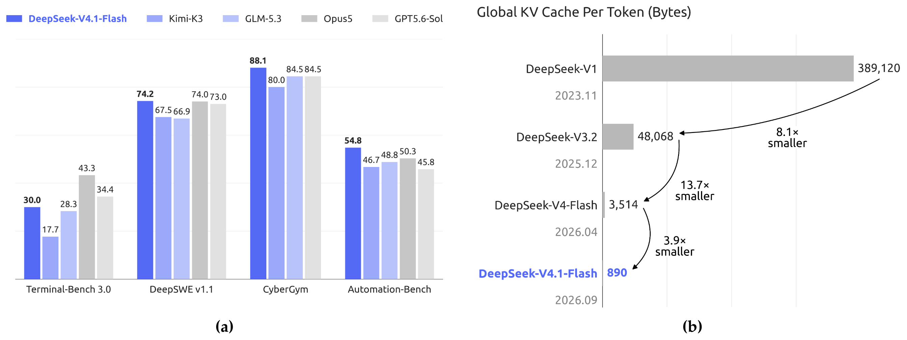

**图 1.** (a) DeepSeek-V4.1-Flash 与同类模型在智能体基准上的表现. (b) 各代 DeepSeek 模型每 Token 的全局 KV 缓存大小 (字节), 体现 DeepSeek 持续降低上下文内存需求的努力. DeepSeek-V4.1-Flash 每 Token 的全局 KV 缓存相较 DeepSeek-V4-Flash 和 DeepSeek-V1 分别缩小约 4 倍和 437 倍.

## 1 引言

近年来, 长程智能体的应用迅速扩展, 超长上下文处理因而成为日益重要的模型负载. 支持这类负载, 既要高效处理长序列, 也要持久存储, 复用和传输庞大的 KV 缓存. KV 缓存管理由此成为模型部署的基础能力, 同时在计算, 存储和通信方面带来很大挑战. 以往的稀疏注意力研究 [Dee25a, Dee26] 已明显降低长序列处理的计算成本, 使持久化存储和数据搬运逐渐成为更突出的瓶颈.

具体而言, DeepSeek-V4 [Dee26] 把覆盖完整上下文的全局注意力分支与局部滑动窗口注意力 (SWA) 结合起来. 全局分支维护由主 KV 和索引器 K 构成的全局 KV, SWA 则维护局部 KV 状态. 窗口大小固定时, SWA KV 的存储量不随序列长度增长. 因而在序列足够长时, 受 HBM 容量限制的运行时 KV 占用主要来自全局 KV. 部分 KV 还会为前缀复用而持久化, 即持久化 KV 缓存, 其容量受 SSD 和主机内存限制. I/O 与互连带宽也会限制缓存的迁移和加载. 这些约束会降低服务吞吐量, 增加部署成本, 最终阻碍智能体以更长任务跨度进入更广泛的应用场景.

继续缩小 KV 缓存, 是缓解存储与通信瓶颈, 降低长上下文服务成本的要点. 为此, 我们开发了 DeepSeek-V4.1-Flash, 这是一款为更激进的 KV 缓存压缩而设计的多模态混合专家 (MoE) 模型. DeepSeek-V4.1-Flash 有 552B 主干参数, 原生支持多模态输入, 最长可容纳一百万 Token 的上下文. 我们采用因果编码器-解码器 (CED) 架构, 从编码器最后一层的隐藏状态投影得到解码器的全局 KV. 由此, 模型在预填充阶段每 Token 激活 8B 参数, 在解码阶段激活 16B 参数, 对输入占比较高的智能体场景尤其经济. DeepSeek-V4.1-Flash 虽远大于 DeepSeek-V4-Flash, 但在序列长度相同时, 运行时 KV 缓存只需后者约四分之一的存储量, 持久化 KV 缓存只需约八分之一. 同时, DeepSeek-V4.1-Flash 的整体表现更好. 这样的 KV 缓存压缩率来自模型架构, 缓存精度和部署策略的联合优化. 从概念上看, DeepSeek-V4 可以视为以 SWA 为基础的局部处理主干, 再辅以压缩后的全局上下文. 这一视角促使我们在基本保留局部注意力设计的同时, 着重简化全局分支. 在架构层面, 我们设计了压缩稀疏注意力 2 (CSA2): 对全局 KV (包括主 KV 和索引器 K) 与 Top-K 索引实行跨层复用, 大幅减少 KV 缓存存储. CSA2 静态分配三种模式: Full, Reindex 和 Reuse. Full 模式生成全局 KV 并执行索引. Reindex 模式复用前一层的全局 KV, 用自身的索引器 Q 对共享索引器 K 重新评分, 并选出新的 Top-K 索引. Reuse 模式既复用前一层的全局 KV, 也复用其 Top-K 索引, 直接执行稀疏注意力. 三种模式下, 每一层都保留自己的全局 Q 和 SWA KV. 共享全局 KV 和索引器 K 可避免重复存储缓存. DeepSeek-V4 使用压缩稀疏注意力 (CSA) 与高度压缩注意力 (HCA) 混合架构, DeepSeek-V4.1-Flash 则改用纯 CSA2. 在缓存精度方面, 我们在训练中使用 FP4 全局 KV 缓存, 性能只出现轻微下降. 如[图 1(b)](#figure-01) 所示, CSA2 与 FP4 KV 缓存共同把全局 KV 缓存缩小到 DeepSeek-V4-Flash 的约四分之一. 在部署层面, DeepSeek-V4.1-Flash 与 DeepSeek-V4 一样, 每一层都采用滑动窗口注意力 (SWA). DeepSeek-V4 使用混合策略, 在持久保存 SWA KV 缓存的存储成本与精确重建所需的计算之间取舍. 精确重建需要重放最近的 $L\times n_{\mathrm{win}}$ 个 Token, 其中 $L$ 是层数, $n_{\mathrm{win}}$ 是 SWA 窗口大小. DeepSeek-V4.1-Flash 引入 SWA 有界重放, 只重放最近的 $n_{\mathrm{win}}$ 个 Token, 近似重建所需的 SWA KV 状态.

实验显示, 这样做只会造成可忽略的性能下降. 这一结果提供了新的存储-计算折中: 无需把 SWA KV 缓存持久保存到 SSD, 代价只是少量预填充重算. 采用 SWA 有界重放后, 持久化 KV 缓存进一步缩小到 DeepSeek-V4-Flash 的约八分之一. 这些优化明显缓解了 HBM 与 SSD 的容量压力, 降低部署成本, 也为更大规模的部署创造条件.

除了 CED 和 CSA2, 我们还进一步精简了原有的 DeepSeek-V4 架构. 我们把原来的 mHC [Xie26] 升级为 Single-Pass mHC, 并配套开发 Mega-mHC 部署内核; 与原先由四个内核构成的实现相比, 它可将激活内存流量减半. 我们也集成了 Engram [Che26b] 条件记忆模块来增强模型能力, 并引入 DSpark [Che26c] 推测解码架构, 通过半自回归草稿生成和按置信度调度的验证提高解码效率. 汇总所有架构改进后, DeepSeek-V4.1-Flash 的单 Token 解码 FLOPs 在不同上下文长度下基本不变. [图 2](#figure-02) 显示, 上下文长度从 4K 扩展到 1M, 即增加 256 倍时, 其解码 FLOPs 仅增加四分之一, 远低于 DeepSeek-V4-Flash 的增幅.

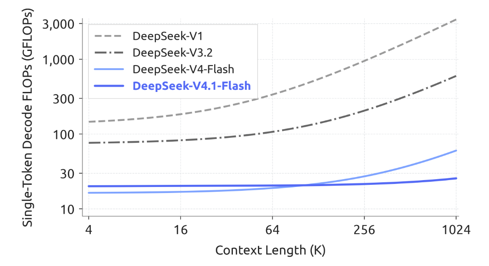

**图 2.** 各代 DeepSeek 模型的单 Token 解码 FLOPs 与上下文长度之间的关系. 为计入计算精度, 我们分别以 1, 0.5 和 0.25 对 BF16, FP8 和 FP4 运算加权. 随上下文增长, DeepSeek-V4.1-Flash 的解码 FLOPs 基本保持不变, 明显降低了长上下文场景的计算成本.

为充分发挥这些架构设计在 KV 缓存压缩上的优势, 并进一步提高训练与推理效率, 我们针对 DeepSeek-V4.1-Flash 协同优化训练基础设施和推理系统, 以支持高效, 可扩展的大规模多模态训练与长上下文部署. 训练基础设施支持视觉编码器解耦执行, 长序列的均衡图像分片, 以及注意力复用所需的跨阶段共享状态管理. 推理系统实现了编码器和解码器的 SWA 有界重放路径. 其他优化还包括通信-计算重叠, Engram 嵌入表分片和推理内核融合. 其中, 每个 CSA2 Reuse 模式层在预填充阶段只执行 15 个内核, 在解码阶段只执行 11 个. 我们还在主机内存中分开存放生命周期较长的全局 KV 和生命周期较短的编码器 SWA KV, 并用有界重放近似重建缺失的编码器 SWA 状态.

预训练期间, 我们在包含 45T Token 的大规模多模态语料上训练 DeepSeek-V4.1-Flash. 稀疏注意力从 64K 序列长度起直接训练, 不经过任何稠密注意力预热阶段. 预训练完成后, 模型具备原生多模态能力, 并支持最长一百万 Token 的上下文. 评测中, DeepSeek-V4.1-Flash-Base 的世界知识, 推理和编程能力与 DeepSeek-V4-Pro-Base 相当, 在留出评测上还提高了 5%-10%, 而其总参数量只有后者的三分之一, 激活参数量只有四分之一. 这些结果表明模型的参数效率很高, 也反映出面向真实部署的训练数据质量有所改善.

在此基础模型之上, 我们通过后训练激发其推理与智能体能力. 与上述架构创新不同, 后训练没有引入算法创新: 整套流程遵循标准范式, 即先做监督微调 (SFT), 再做强化学习 (RL) 和在策略蒸馏 (OPD); 除 DeepSeek-V4 开发中已成熟采用的做法外 [Dee26], 没有其他改动. 实质变化全部位于数据流水线. 我们建立了大规模自动化流水线来合成数据, 构建环境, 并逐步扩大 RL 所用数据, 任务和 rollout 的规模, 从而拓展模型在文本, 多模态和智能体领域的能力. [图 1(a)](#figure-01) 汇总了 DeepSeek-V4.1-Flash 在核心智能体基准上的成绩. 评测结果显示, 这款模型虽然规模紧凑, 却形成了鲜明的能力特征:

- 推理. 模型的推理能力很强, 在数学和竞赛编程等重推理基准上维持较高准确率, 表现与 Kimi-K3 [Kim26c] 和 DeepSeek-V4-Pro 等顶尖开源模型相当.

- 智能体. 在 Terminal-Bench 2.1 [Mer26], DeepSWE v1.1 [Dee26c] 和 AutomationBench [She26] 等标准智能体基准上, DeepSeek-V4.1-Flash 与闭源前沿模型不相上下. 它完全能够处理日常编程任务和白领工作流. 不过, 在 Terminal-Bench 4.0 [Mar26] 等需要专家级领域知识的科学类智能体任务上, 它与巨型模型仍有差距.

- 多模态. 在多模态领域, 对于视觉推理和专业图表解读基准, 该模型超过了 Kimi-K3 等顶尖开源对手. 除了正式指标, 它在前端开发和办公自动化等现实视觉智能体工作流中也很实用, 可以利用渲染后的屏幕截图进行视觉检查和自我修正. 但我们承认, 与巨型闭源系统相比, 它的整体表现仍有明显差距.

这些结果表明, DeepSeek-V4.1-Flash 在绝大多数基准上已经能够比肩闭源前沿模型, 也能完成 95% 以上的现实任务. 同时, 较小的激活规模带来低推理延迟和低服务成本. 因此我们认为, DeepSeek-V4.1-Flash 在能力与效率之间取得了较好平衡, 可以作为快速, 经济的助手, 为广泛用户的日常工作提供支持. 总体而言, DeepSeek-V4.1-Flash 在提高模型智能与推理效率的同时降低了部署成本. 它明显降低了大规模部署长程智能体的成本门槛, 为这类智能体进入更多场景创造了条件. DeepSeek-V4.1-Flash 也是我们继续扩展的新起点. 以此为基础, 我们将同步扩展模型架构, 预训练和后训练, 继续探索模型智能的前沿.

## 2 架构

### 2.1 概述

DeepSeek-V4.1-Flash 是一个多模态混合专家 (MoE) Transformer, 接收图像和文本输入, 并以自回归方式生成文本. 它的语言主干包含 40 层因果 Transformer, 由一个 20 层因果编码器和其后的 20 层解码器组成. 除最前面的两层只采用 SWA 外, 每一层都同时包含全局注意力和滑动窗口注意力 (SWA). 视觉编码器与 MLP 投影器把图像转换为视觉嵌入, 再与文本嵌入一同处理; 多模态数据从语言模型预训练开始便已加入. DeepSeek-V4.1-Flash 总计有 552B 主干参数和 196B Engram 参数, 预填充阶段每 Token 激活 8B 参数, 解码阶段激活 16B 参数. [图 3](#figure-03) 展示了 DeepSeek-V4.1-Flash 的整体架构.

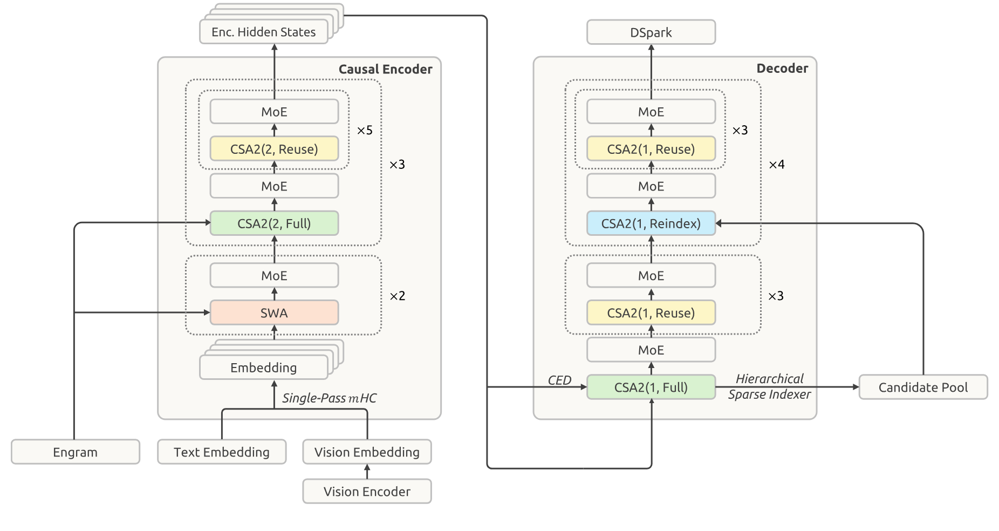

**图 3.** DeepSeek-V4.1-Flash 的整体架构. 40 层网络分为各含 20 层的因果编码器与解码器. 所有前馈层均使用标准 DeepSeekMoE. 编码器最前面的两层采用滑动窗口注意力 (SWA); 其余各层使用压缩稀疏注意力 2 (CSA2), 其中 CSA2(压缩率, 模式) 指定压缩率与模式. 模型还采用 Single-Pass mHC, Engram, DSpark 和分层稀疏索引器.

因果编码器-解码器 (CED) 与压缩稀疏注意力 2 (CSA2) 分别处理长上下文推理中的不同成本. CED 从编码器输出构建解码器的全局键值 (KV) 缓存, 使大部分提示 Token 可以绕过完整的解码器计算, 同时保留各层自己的滑动窗口注意力. 这会把预填充计算量减少近一半, 降低智能体负载在上下文持续增长时处理新输入或未缓存输入的成本. CSA2 跨层共享全局 KV 以减少缓存存储, 并复用稀疏选择结果以减少索引工作. 在解码器中, 分层稀疏索引器把后续索引器限制在早期索引器选出的候选池内, 进一步减少每个查询需要评分的条目数.

我们保留 DeepSeekMoE [Dai24] 的共享专家与细粒度路由专家, 并为图像和文本 Token 引入模态专属负载均衡 [Wan24d]. Single-Pass mHC [Xie26] 调整残差流的混合方式, 使内核融合更高效; Engram [Che26b] 则加入稀疏访问的条件记忆. 主干预训练期间不使用 MTP 模块, 而用 DSpark [Che26c] 进行推测解码. 主干预训练结束后, 我们单独训练 DSpark. 主 KV 缓存也压缩为 FP4, 进一步降低存储开销. 下文将介绍这些组件及对应的优化改动.

#### 2.1.1 多模态架构

多模态输入路径由视觉编码器和 MLP 投影器构成. 对每张输入图像, 视觉编码器先生成空间网格形式的视觉特征. 随后, 一个 $3\times3$ 像素重排操作把各个局部邻域沿通道维重新排列, 降低空间分辨率, 再由 MLP 投影器把特征映射到语言主干的隐藏维度. 最后, 所得视觉嵌入会插入输入嵌入序列中对应的图像 Token 位置, 与文本嵌入一同交给语言主干处理.

**DeepSeek-ViT.** 我们从头训练一个名为 DeepSeek-ViT 的视觉编码器, 使其原生支持不同分辨率的图像. DeepSeek-ViT 以 Vision Transformer [Dos20] 架构为基础, 另作数项修改. 为接收任意分辨率的输入, 我们以 2D-RoPE 取代标准绝对位置嵌入. 为使 ViT 更贴近 LLM 的设计原则, 我们将图块嵌入层的卷积改为线性投影, 以兼容 Muon 优化器. 归一化使用 RMSNorm [Zha19], 激活函数使用 SwiGLU [Sha20]. 在把视觉特征送入 LLM 之前, 我们采用 $3\times3$ 下采样的像素重排操作, 将视觉 Token 数量缩小九倍, 从而有效支持最高约 $1344\times1344$ 像素的输入分辨率.

**面向 MoE 的多模态无辅助损失负载均衡.** 图像与文本 Token 的表示分布不同, 在 MoE 中可能产生不同的专家路由偏好. 若只平衡二者汇总后的负载, 各模态内部的不均衡便可能被掩盖. 为解决这一问题, 我们扩展无辅助损失负载均衡 [Wan24d], 分别为文本和图像 Token 维护逐专家的修正偏置. 路由时, 每个 Token 使用所属模态对应的修正偏置来选择专家, 但仍以原始路由分数对所选专家的输出加权. 每一步训练结束后, 两组偏置根据各自的专家负载独立更新. 这一设计可在每种模态内部平衡专家使用率, 让多模态训练保持稳定和高效.

### 2.2 因果编码器-解码器 (CED)

智能体工作流会频繁调用工具, 产生大量预填充请求; 一旦 KV 缓存未命中, 计算开销便十分可观. 为缓解预填充瓶颈, 我们借鉴 YoCo [Sun24b], 提出因果编码器-解码器 (CED) 架构. YoCo 允许上半部分网络层直接共享下半部分生成的 KV 缓存, 从而减少预填充计算. 在此基础上, CED 加入一系列结构改进, 同时增加总体 KV 缓存容量和 KV 生成的计算深度. 结果是, CED 能够减少近一半的预填充计算, 同时保持与基线相当的性能.

对于全局注意力, CED 把 Transformer 底部 $L/2$ 层视为因果编码器. 上半部分网络层 (即 $l>L/2$ 的解码器) 的 KV 条目不从各自的隐藏状态 $H_l$ 得到, 而是直接使用随层变化的投影权重 ($W_l^{\mathrm{KV}}$ 和 $W_l^Z$), 从第 $L/2$ 层的隐藏状态 $H_{L/2}$ 投影得到:

$$
C_l=H_{L/2}W_l^{\mathrm{KV}},\qquad Z_l=H_{L/2}W_l^Z,\qquad l>\frac{L}{2},
$$

其中 $C$ 和 $Z$ 分别表示 KV 条目及其对应的压缩权重. 因而在预填充阶段, CED 只需计算前一半网络层, 只花很少的计算成本便可得到上层全局 KV 缓存.

对于滑动窗口注意力 (SWA), CED 在所有层中保留传统的逐层计算. 具体而言, 任意一层 $l$ 的局部键和值都直接来自该层当前的隐藏状态 $H_l$. 这实际上增加了局部 KV 生成的计算深度, 但若要保留这种逐层计算, 就必须进行 SWA 重放. 在预填充阶段, 为解码器计算 SWA KV 缓存还需额外处理 $n_{\mathrm{win}}\times L/2$ 个 Token, 其中 $n_{\mathrm{win}}$ 表示窗口大小. 若多轮交互中每轮提示较短, 解码器的这部分计算开销便不可忽略. 所幸, 以往研究 [Che25ad] 已表明, SWA 的实际有效感受野远小于理论上的 $n_{\mathrm{win}}\times L/2$. 据此, 我们提出解码器 SWA 有界重放, 在 SWA 计算中只预填充提示末尾的 $n_{\mathrm{win}}$ 个 Token, 大幅降低计算成本. 详见[第 3.2.2 节](#section-3-2-2).

总的来说, 对于长度满足 $N\gg n_{\mathrm{win}}$ 的序列, CED 把预填充复杂度从 $O(N\,L)$ 降到 $O(N\,L/2+n_{\mathrm{win}}\times L/2)\approx O(N\,L/2)$, 整体计算量约减半.

### 2.3 压缩稀疏注意力 2 (CSA2)

长上下文服务必须同时控制 KV 缓存占用和注意力计算量. 这两项成本可以沿三个相乘的维度降低: 一是条目大小, 如 GQA [Ain23] 减少 KV 头数, MLA [Dee24] 让各个头共享较小的潜在表示; 二是序列维度, 如 DeepSeek-V4 [Dee26] 中的 CSA 和 HCA, 每 $m$ 个 Token 压缩为一个条目; 三是层维度, 一部分网络层不再保有自己的缓存和选择结果, 而是复用其他层的缓存 [Bra24] 与选择结果, 或直接由更高效的网络层替代. 以往工作已经证明沿层维度压缩有效: IndexCache [Bai26] 跨层复用 Top-K 索引, 减少索引器计算; YOIO [Sun26b] 只计算一次稀疏路由, 再由所有层共享; HySparse [Gao26] 让稀疏层复用稠密层的 KV 缓存. 不过, 单纯复用索引无法节省主 KV 存储, 全网络共享路由会限制性能, 混合设计仍会保留完整注意力层; 更重要的是, 这些方法没有一种覆盖全部三个相乘维度.

CSA2 联合利用这三个维度: 跨层共享主 KV 与索引器 K, 并允许各层复用 Top-K 索引, 同时将缓存共享与索引复用解耦. 这些复用策略与经过简化的压缩器相结合, 再配合分层稀疏索引器, 缩小解码器中后续索引层的搜索范围. 与 CSA 类似, CSA2 包含一个轻量级索引器, 用索引器 Q 和索引器 K 为主 KV 条目评分, 并为每个查询选出 Top-K 条目. 每个 Q 都会同时关注选中的条目与该层自己的滑动窗口 KV (SWA KV). CSA2 也把压缩率为 1 的未压缩主 KV 作为一种特殊设置. 同时, CSA2 还简化了压缩器和索引器. 在 CSA 中, 压缩率为 $m$ 时, 每个主 KV 条目由 $2m$ 个原始 KV 缓存条目生成, 相邻压缩条目的来源会彼此重叠. 压缩过程中还会加入绝对位置嵌入, 编码这 $2m$ 个条目的位置. CSA2 去除了这种重叠和绝对位置嵌入. 它还从主 KV 条目投影得到索引器 K, 替代 CSA 从隐藏状态出发的独立压缩路径. 这两项设计让实现更简单, 训练效率也更高. [第 2.3.1 节](#section-2-3-1) 与[第 2.3.2 节](#section-2-3-2) 将分别介绍跨层复用策略和分层稀疏索引器.

#### 2.3.1 跨层 KV 与索引复用

每一层 CSA2 都静态分配为 Full, Reindex 或 Reuse 三种模式之一. 无论采用哪种模式, 该层都会计算自己的查询和 SWA KV, 将它们与选中的主 KV 条目一同用于生成新的注意力输出. 三种模式的区别在于如何取得主 KV, 索引器 K 和 Top-K 索引. [图 4](#figure-04) 展示了这三种模式.

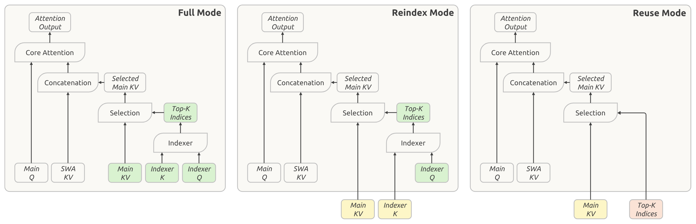

**图 4.** CSA2 的三种运行模式. 各模式取得主 KV, 索引器 K 与 Top-K 索引的方式不同. 绿色块表示当前层计算的量; 黄色块表示从最近一个 Full 模式层复用的主 KV 和索引器 K; 红色块表示从最近一个产生索引的层 (Full 或 Reindex 模式层) 复用的 Top-K 索引. 三种模式都会在当前层计算主 Q 和 SWA KV.

**Full 模式.** 该层计算自己的主 KV 和索引器 Q, 从主 KV 投影得到索引器 K, 再运行索引器产生新的 Top-K 索引. 因而它会执行完整的 CSA2 计算路径, 各组件的职责与 DeepSeek-V4 中一个完整 CSA 层相同.

**Reindex 模式.** 该层复用前层最近一次可用的主 KV 及其对应的索引器 K. 索引器计算自己的查询, 对复用的键重新评分, 并产生新的 Top-K 索引. 这样, 主 KV 和索引器 K 可以继续共享, 稀疏选择结果仍可随网络层改变.

**Reuse 模式.** 该层复用最近一次可用的主 KV, 也复用前面的 Full 或 Reindex 模式层针对该主 KV 计算出的最新 Top-K 索引. 它直接以这一选择结果执行注意力, 无需计算索引器 Q 或评估索引分数.

共享主 KV 和索引器 K 可以减少缓存存储, 复用 Top-K 索引则可避免额外的索引器计算. Reindex 模式在维持缓存共享的同时, 允许所选条目随层变化. CSA2 与 CED 结合时, 分配为 Full 模式的解码器层从第 $L/2$ 层 (即因果编码器的最后一层) 隐藏状态计算自己的全局 KV. Reindex 与 Reuse 模式不变.

#### 2.3.2 分层稀疏索引器

跨层索引复用减少了索引器的评估次数, 但剩余索引器仍需为因果可见的完整上下文评分. 上下文极长时, 这项成本依然是主要的计算瓶颈. 以往工作会先为汇聚后的块表示评分并剪枝, 再执行 Token 级索引, 以此引入索引器稀疏性 [Xu26]. 我们发现, 在解码器中, 可以自然地利用浅层索引器的信息限制深层索引器考察的候选项, 而无须添加额外状态. 因此, 我们引入仅用于 CED 解码器的分层稀疏索引器, 以减少解码期间的重复评分. 对每个查询, 第一个分配为 Full 模式的网络层会构建候选池, 供后续重新索引的网络层作为搜索范围. 候选池大小固定时, 深层索引器对每个查询的成本便从与上下文长度成线性关系变为常数. 这一机制会感知训练过程, 并在后训练阶段引入: 候选限制在训练和推理中完全一致, 因而深层索引器会在与推理相同的搜索范围内得到优化. [图 5](#figure-05) 展示了这一过程. 第一个 Full 模式层为所有因果可见的主 KV 位置评分, 并生成自身注意力所用的 Top-K 索引. 它还会按块选择候选项: 每个块的分数取其中所有位置索引分数的最大值, 再选出分数最高的块. 随后, 它把所选块覆盖的位置收集成候选池, 大小超过最终的 Top-K 集合. 例如, 选取 2,048 个块且每块包含 8 个位置, 会得到 16,384 个候选位置. 该候选池决定后续索引器的搜索位置; 最终 Top-K 选择则决定每一层读取哪些主 KV 条目.

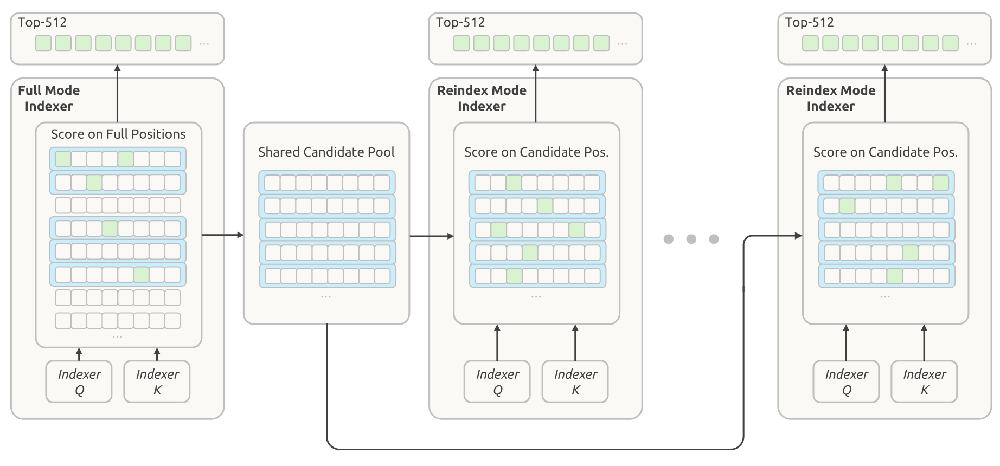

**图 5.** 分层稀疏索引器. 每个方格代表一个位置; 绿色方格标出选中的索引, 蓝色矩形标出按最大索引器分数选中的块. 解码器中第一个 Full 模式 CSA2 层选出自己的 Top-512 索引, 并从选中的块构建共享候选池, 供后续网络层使用. Reindex 模式 CSA2 层随后从该候选池中选择自己的 Top-512 索引.

后续 Reindex 模式层只为对应查询的候选位置评分, 并在候选池内选出各自的 Top-K 条目. Reuse 模式层不再执行新索引, 而使用针对其所复用主 KV 计算出的最新 Top-K 索引. 因而各个索引层共享候选池, 最终选择结果仍可不同.

候选池大小固定时, 后续每个索引器为单个查询评分的位置数有一个不随上下文长度变化的上界. 第一个 Full 模式层仍会扫描整个因果可见范围. 因此, 分层索引能保留第一次全范围扫描, 同时降低后续索引器评估的成本.

### 2.4 高效架构扩展

#### 2.4.1 Single-Pass mHC

我们曾在 DeepSeek-V4 中提出 mHC [Xie26], 在相邻 Transformer 块之间维护 $n$ 条残差流. 对每个 Token, 将这些流记作 $X_l\in\mathbb{R}^{n\times d}$, 其中 $l$ 是块索引, $d$ 是隐藏维度. 更新方式如下:

$$
X_{l+1}=B_lX_l+C_l\mathcal{F}_l(A_lX_l),\qquad (A_l,B_l,C_l)=\mathcal{H}(X_l),
$$

其中, $A_l\in\mathbb{R}^{1\times n}$, $C_l\in\mathbb{R}^{n\times1}$ 和 $B_l\in\mathbb{R}^{n\times n}$ 是根据 $X_l$ 预测的逐 Token 系数. 系数预测器 $\mathcal{H}$ 包括归一化与投影.

理想情况下, 两个块之间的残差变换是从 $(X_{l-1},Y_{l-1})$ 到 $(X_l,\hat{X}_l)$ 的单次映射, 其中 $\hat{X}_l=A_lX_l$ 是当前块输入, $Y_{l-1}=\mathcal{F}_{l-1}(\hat{X}_{l-1})$ 是前一块输出. 这种映射需要读取 $(n+1)d$ 次, 写入 $(n+1)d$ 次, 因而激活内存流量的下界为 $(2n+2)d$. 实际上, DeepSeek-V4 对[公式 2](#equation-02) 采用多遍实现; 由于数据依赖, 三个内核依次执行:

$$
X_l=B_{l-1}X_{l-1}+C_{l-1}Y_{l-1}
$$

$$
(A_l,B_l,C_l)=\mathcal{H}(X_l)
$$

$$
\hat{X}_l=A_lX_l
$$

三个内核分别读取 $(n+1)d$, $nd$ 和 $nd$ 个值, 总共写入 $(n+1)d$ 个值. 若计入 $\mathcal{F}_l$ 中的预归一化, 激活内存总流量为 $(4n+4)d$, 是下界的两倍.

在 $\mathcal{H}$ 中, 归一化权重会离线折叠进投影权重, RMS 除法则在投影后执行. 因此, 三个阶段中有两个可以共用一次残差遍历: 残差更新不需要沿隐藏维度做归约, 所以每个 $X_l$ 分块算出后, 都可立即用于累加投影输出和计算 RMS 所需的平方和. 输入混合无法融合进这一遍, 因为 $A_l$ 要等所有隐藏分块完成归约后才可取得. 因而还需再次读取 $X_l$. 第二遍也可同时完成输入预归一化. 这种两遍实现总共需要 $(3n+2)d$ 次激活读写, 比下界多读取一次 $X_l$.

为此, 我们提出 Single-Pass mHC, 将输入混合系数后移一个块: 每个块使用前一块产生的混合系数, 从而消除上述依赖:

$$
X_{l+1}=B_lX_l+C_l\mathcal{F}_l(A_{l-1}X_l),\qquad (A_l,B_l,C_l)=\mathcal{H}(X_l).
$$

输入混合现在使用 $A_{l-1}$ 而非 $A_l$, 不再依赖由 $X_l$ 计算的系数. 每个 $X_l$ 分块都可以立即同时用于输入混合与系数预测, 无须等待完整归约. 实验表明, 这一位移只会造成可忽略的性能下降.

预训练时, 我们保留现有的多内核实现, 因为这一位移只改变每个块所用的混合系数. 部署时, 我们把残差更新, 输入混合和系数预测融合进一个名为 Mega-mHC 的内核. 该内核实现 mHC 时需要 $(3n+2)d$ 次激活读写, 实现 Single-Pass mHC 时需要 $(2n+2)d$ 次. Mega-mHC 沿隐藏维度分块处理 $X_l$. 每个分块既用于计算混合输入, 也用于累加预测下一块 $(A_l,B_l,C_l)$ 所需的量. 该内核还纳入输入预归一化与 FP8 转换. 这样, 残差只读写各一次, 达到理想映射的 $(n+1)d$ 次读取和 $(n+1)d$ 次写入, 将原实现的激活内存流量减半.

#### 2.4.2 Engram

我们在 DeepSeek-V4.1-Flash 中加入 Engram [Che26b]. 这一条件记忆模块来自此前工作, 目的是把记忆与计算解耦. 我们沿用原有 Engram 设计, 包括分词器压缩, 多头哈希, 上下文感知门控和多分支集成, 但作了两项修改. 第一, 去掉短因果卷积, 因为它带来的性能收益不足以抵消推理栈复杂度的增加. 第二, 先以动量更新, 再做 Sinkhorn 均衡, 以此优化 Engram 嵌入, 详见[第 2.5 节](#section-2-5).

196B 个 Engram 参数平均分配给两个模块. 每个模块使用 $N$-gram 阶数 $\{2,3,4\}$, 有 8 个哈希头, 每个阶数的总嵌入维度为 2048. 每个头索引一张约有 16M 个条目的表, 各表大小取不同的素数. 嵌入表和键/值投影均采用 FP8 精度. 两个模块分别置于第 1 层和第 14 层 (从零开始计数), 以平衡各训练流水线阶段的内存用量. 推理时, 确定性寻址让系统可以通过后台 RDMA 传输从主机内存预取嵌入; 第一个模块的预取过程会与首个 Transformer 块的计算重叠. Engram 训练与推理的实现细节见[第 3.1.3 节](#section-3-1-3).

#### 2.4.3 DSpark

DeepSeek-V4.1-Flash 配备了 DSpark [Che26c], 这是一个将半自回归草稿与置信度调度验证相结合的推测解码模块.

草稿器由三个 Transformer 块组成, 滑动注意力窗口为 128 个 Token. 一次前向传播会并行计算五个草稿位置的基础 logit, 轻量级 Markov 头则为草稿 Token 之间的依赖建模. 置信度头预测各位置的条件接受概率, 据此估计前缀存活概率. 调度器将这些估计值与测得的引擎吞吐量曲线结合起来, 动态选择每个请求的验证长度, 以在当前系统负载下尽量提高全系统的预期 Token 吞吐量.

DeepSeek-V3 [Dee24a] 中的 MTP 模块会在整个预训练过程中与主干联合训练, DSpark 则在预训练后的专门阶段引入. 在这一阶段, 主干保持冻结, 只训练 DSpark. 后训练期间, 我们继续让 DSpark 与主干一同训练, 但不会把 DSpark 目标的梯度传播到主干. 这样可让 DSpark 与不断变化的策略保持一致, 同时加速在线服务以及 RL 与 OPD 的 rollout 生成.

#### 2.4.4 FP4 主 KV 缓存

长上下文智能体负载要求每个请求配备庞大的 KV 缓存, 因而会增加服务成本.

DeepSeek-V4 已对 FP4 索引器的查询和键采用量化感知训练 (QAT) [Jac18], 以加速索引计算并缩小索引器缓存. 尽管其他格式在实验中精度更高, 我们仍选择 OCP 标准的 MXFP4 格式 [Dar23], 以支持尽可能多的硬件平台. 现在, 我们把 QAT 扩展到主 KV 缓存; 在这里, FP4 用于减少存储, 而非加速矩阵乘法. 在执行注意力前反量化缓存值, 可以使用精度更高的格式, 又不要求硬件原生支持该格式的矩阵乘法, 因而仍能兼容不同硬件平台.

在评测的几种约四比特格式中, 我们选择 E2M1, 每 16 个通道配一个 E4M3 缩放因子. 这一设计沿用 NVFP4 [Alv25], 但去掉第二级全局缩放因子, 在精度与简洁性之间取舍. 即使去掉该缩放因子, 主 KV 缓存也有充足的动态范围: 该格式最大支持 $448\times6=2688$ 的绝对值, 远高于缓存的绝对值上界. 在 DeepSeek-V4.1-Flash 中, 训练所得 RMSNorm 权重的最大绝对值约为 1. 经过 RMS 归一化后, 512 通道 KV 潜在表示的 $\ell_2$ 范数至多约为 $\sqrt{512}$. RoPE 保持该范数不变, 因而旋转后所有通道绝对值的最大值也不超过约 $\sqrt{512}\approx22.6$. 训练期间观测到的最大绝对值约为 10. 因此, 去掉全局缩放因子不会造成可测的精度下降, 并能简化缓存布局.

为在 DeepSeek-V4.1-Flash 中以 FP4 存储主 KV 缓存, 我们在后训练阶段引入 QAT. 非 RoPE 与 RoPE 分量使用同一种量化格式. 缓存在 RoPE 之后量化: 实验中, 在 RoPE 之前量化只带来轻微的精度改善, 却会在解码时增加额外开销. SWA KV 缓存对量化较敏感, 因而仍采用 FP8. 与 DeepSeek-V4 的 FP8 主 KV 缓存相比, 这种格式几乎能把 HBM 与卸载到 SSD 后的存储占用都减半.

### 2.5 优化

以 DeepSeek-V4 的优化配置为基础, 我们作了几项新改动, 使其更适配当前架构.

第一, 我们采用逐头 Muon: 先按注意力头拆分 Query 权重, 再执行 Muon 更新. 下面简要说明这样设计的原因. 若把 Muon 看作预条件梯度下降, 普通 Muon 会对所有头使用同一个预条件器, 逐头 Muon 则为不同注意力头提供不同的预条件器. 这样能更好地处理注意力头之间的异质性 [Zha24ad, Zha26b] [+zha26b-section-3]. 结果显示, 逐头 Muon 的表现优于普通 Muon. GLM 5 [Zen26] 与 Kimi-K3 [Kim26c] 也通过实验验证了逐头 Muon 的优势.

[+zha26b-section-3]: [Zha26b] 的第三节.

第二, 若对新加入的 Engram 参数使用 Adam, 优化器状态会占用大量额外内存. 为减少训练内存, 我们改为对 Engram 嵌入表, Token 嵌入和预测头执行基于动量的更新, 随后进行 Sinkhorn 均衡. Sinkhorn 均衡此前已在 SinkGD [Sce25] 中用于线性层权重矩阵; 在这里, 我们将其扩展到这些大型参数矩阵. 与 Muon 一样, 此方法只需要一个动量缓冲区, 实验表现却优于 Adam.

**基本配置.** 归一化层权重和其他非矩阵参数 (包括偏置和缩放因子) 仍使用 AdamW [Los17]. 语言模型主干中线性变换的权重矩阵, Engram 投影层和视觉-语言投影器使用 Muon [Kel24]. Query 和 Key 权重使用逐头 Muon. 我们为 Muon 加入解耦权重衰减和 Nesterov 动量 [Nes83, Liu25]; 归一化层权重也使用权重衰减, 偏置和缩放因子则不使用. Sinkhorn 均衡更新同样使用 Nesterov 动量, 但不做权重衰减. 预训练期间, 视觉编码器保持冻结直至学习率衰减阶段, 但其最后一个归一化层和视觉-语言投影器始终可训练. 学习率开始衰减时, 我们解冻视觉编码器, 并以较小学习率和 LLM 联合优化.

**Engram / 嵌入 / 预测头的 Sinkhorn 均衡更新.** 完整流程见算法 1. 整体流程与 Muon 相同, 只是以 Sinkhorn 均衡取代 Newton-Schulz 正交化. 用 $m$ 表示矩阵较大的维度, 对嵌入表和预测头而言, 它对应词表大小; 用 $n$ 表示隐藏维度.

**算法 1. 采用 Sinkhorn 均衡的动量更新**

- **要求:** 权重 $W_t\in\mathbb{R}^{m\times n}$, 梯度 $G_t$, 动量 $M_{t-1}$, 动量系数 $\beta$, 基础学习率 $\eta_t$, 学习率修正系数 $\gamma$, 数值常数 $\varepsilon$ 和 $\tau$, 以及奇数个归一化步骤 $K$.
- $M_t\leftarrow\beta M_{t-1}+(1-\beta)G_t$.
- $\hat{G}_t\leftarrow\beta M_t+(1-\beta)G_t$ (Nesterov 动量).
- $\rho_i\leftarrow\|\hat{G}_{t,i,:}\|_2$, $\bar{\rho}\leftarrow\frac{1}{m}\sum_{i=1}^{m}\rho_i$.
- $U^{(0)}\leftarrow\hat{G}_t$.
- 若 $\rho_i\leq\tau\bar{\rho}$, 则令 $U^{(0)}_{i,:}\leftarrow0$ (遮蔽接近零的行).
- **对于** $k=1,\ldots,K$:
  - **若** $k$ 为奇数, 则对每个 $i=1,\ldots,m$:
    - $U^{(k)}_{i,:}\leftarrow U^{(k-1)}_{i,:}/(\|U^{(k-1)}_{i,:}\|_2+\varepsilon)$.
  - **否则**, 对每个 $j=1,\ldots,n$:
    - $U^{(k)}_{:,j}\leftarrow U^{(k-1)}_{:,j}/(\|U^{(k-1)}_{:,j}\|_2+\varepsilon)$.
- $\Delta_t\leftarrow\sqrt{n}U^{(K)}$ (将单位行 $\ell_2$ 范数转换为单位行 RMS).
- $\tilde{\eta}_t\leftarrow\gamma\eta_t$ (匹配 Adam 的更新幅度).
- $W_{t+1}\leftarrow W_t-\tilde{\eta}_t\Delta_t$.

给定 Nesterov 动量更新 $\hat{G}_t$, Sinkhorn 均衡会找到对角缩放矩阵 $D_r$ 和 $D_c$, 使得

$$
\begin{alignedat}{2}
\Delta_t &= \sqrt{n}U^{(K)} &&= \sqrt{n}D_r\hat{G}_tD_c,\\
\frac{1}{n}\sum_{j=1}^{n}(\Delta_t)_{ij}^{2} &&&\approx 1,\\
\frac{1}{m}\sum_{i=1}^{m}(\Delta_t)_{ij}^{2} &&&\approx 1,
\end{alignedat}
$$

因此, 该流程会近似拉齐更新矩阵逐行与逐列的 RMS. 一行对应一个 Token 索引或 n-gram 标识, 一列编码一个隐藏特征. Sinkhorn 均衡沿行列两个方向归一化, 利用了这种 Token-特征结构. 为保证数值稳定, 满足 $\rho_i\leq\tau\bar{\rho}$ 的行会被遮蔽. 因子 $\sqrt{n}$ 把单位行 $\ell_2$ 范数转换为单位逐行 RMS. 我们还把有效学习率调整为 $\tilde{\eta}_t=\gamma\eta_t$, 以匹配 Adam 的更新幅度. $\gamma$ 取 0.18, 接近 Moonlight [Liu25] 使用的 0.2.

更一般地说, Sinkhorn 均衡与利用矩阵或张量轴结构的优化器密切相关 [Sha18, Zha25ay, Wen25b, Gle25, Den26, Yua26a, Xu26a]. 例如, Adafactor [Sha18] 以另一种方式执行逐行, 逐列归一化, Adam-mini [Zha25ay] 则为嵌入表和预测头采用另一种逐行归一化. 这些归一化策略在优化表现和通信开销上可能有所不同. 更细致的研究留待今后开展.

## 3 通用基础设施

### 3.1 训练基础设施

#### 3.1.1 多模态训练基础设施

**对比学习中的通信-计算重叠.** 视觉编码器先以对比目标优化, 再用生成式下一 Token 预测损失微调. 在对比学习阶段, 损失基于完整一批文本-视觉对计算, 因而两种模态的特征都必须在数据并行 rank 之间执行 all-gather, 通信量很大. 文本特征的梯度只取决于汇集后的视觉特征; 对称地, 视觉特征的梯度也只取决于汇集后的文本特征. 因此, 两次 all-gather 都可与前向或反向传播重叠, 无须停顿流水线:

$$
\begin{aligned}
&\mathrm{Forward}(V)\to\left(\mathrm{Forward}(T)\parallel\mathrm{AllGather}(V)\right)\to\nabla_{\mathrm{Text}}\\
&\mathord{\to}\;\left(\mathrm{Backward}(T)\parallel\mathrm{AllGather}(T)\right)\to\nabla_{\mathrm{Vision}}\to\mathrm{Backward}(V),
\end{aligned}
$$

其中, $V$ 和 $T$ 分别表示视觉与文本特征, $(A\parallel C)$ 表示计算 $A$ 与通信 $C$ 重叠, $\nabla$ 表示梯度计算. 按照这一调度, 视觉特征在文本前向传播期间汇集, 文本特征在文本反向传播期间汇集, 两次 all-gather 都完全隐藏在有效计算之后.

**端到端并行.** 为处理视觉编码器与 LLM 在模型和数据上的异质性 [Zha25ax], 我们采用近期训练系统使用的解耦编码器设计 [Lon25, Kim26b]. 视觉编码器复制在 LLM 参数树之外, 每一步训练分为三个阶段: 视觉编码器前向传播, LLM 前向/反向传播, 以及视觉编码器反向传播. 这种分离可避免视觉编码器与 LLM 的计算相互干扰. 经过负载均衡的视觉处理只出现在第一和最后阶段, LLM 阶段不含视觉计算, 因而保留纯文本训练的并行策略.

**长序列多模态训练优化.** DeepSeek-V4.1-Flash 的训练序列最长达到一百万 Token, 预训练和后训练都有相当一部分在超长序列上进行. 这种序列长度下, 多模态样本会造成严重的 I/O, CPU 和内存瓶颈.

- 均衡图像分片. 预训练期间, 单条图像密集的超长序列在加载时便可能耗尽一台主机的 I/O, CPU 和内存. 因此, 每条序列的图像会以负载均衡方式分片到各个 CP rank, 每张图像恰好只加载一次. 图像仅读取一次时, 只要满足

$$
\frac{N\times\rho}{B_{\mathrm{IO}}}<\frac{N\times C}{B_{\mathrm{GPU}}}\Longleftrightarrow\rho<\frac{B_{\mathrm{IO}}}{B_{\mathrm{GPU}}}C,
$$

加载过程就始终隐藏在计算之后. 这里, $N$ 是 Token 数, $\rho$ 是每 Token 的原始字节数, $C$ 是每 Token 的计算量, $B_{\mathrm{IO}}$ 和 $B_{\mathrm{GPU}}$ 分别是文件系统与 GPU 带宽. 因为 $N$ 可约去, 这一条件只涉及每 Token 的量 ($\rho$ 与 $C$), 与序列长度和集群规模无关; $\rho$ 由视觉模块配置决定, 如分辨率上限或空间下采样. 因此, 只有消融实验中每 Token 计算量较低的小模型会受存储吞吐量限制, 生产规模模型仍受计算约束.

- 增量图像传输. 除上述均衡分片外, 强化学习 rollout 只会增量地把图像传给推理引擎, 并把引擎在 CPU 侧的解码与预处理结果缓存在分布式文件系统中, 供后续 rollout 和训练复用.

#### 3.1.2 CSA2 的注意力共享训练

我们在[第 2.3 节](#section-2-3) 介绍了 CSA2. 这种注意力共享方法有三种模式, 其中一部分会让多层网络共享主 KV, 索引器 K 和 Top-K 索引中的一项或多项. 要在大规模分布式训练中支持 CSA2, 除注意力计算本身外还要做额外协调. 共享注意力组件的网络层可能位于不同流水线阶段, 直接复用模块与传统的阶段内执行并不兼容. 为此, 我们采用下述设计来支持 CSA2 训练.

影子索引器在每个参与阶段放置一个可执行的轻量副本, 同时为共享参数保留唯一的逻辑所有者. 所有者仍负责优化与检查点保存, 参数同步和梯度聚合则让影子副本在整个训练过程中保持一致. 这种设计保留原有模型语义, 流水线调度器也无须把共享层视为特殊执行单元.

当源网络层与消费网络层跨越流水线边界时, 扩展流水线载荷可向下游消费者提供所需的中间表示和稀疏路由信息. 这些状态会并入现有点对点通信路径, 并以符合上下文并行的方式分区, 在保持相应梯度流的同时避免不必要的复制.

微批次级共享状态管理会追踪并行活跃的流水线微批次所对应的状态, 协调这些状态在前向执行, 激活重算和反向传播中的生命周期. 共享状态会保留到最后一个消费者处理完毕, 随即释放, 以限制额外内存开销. 同一运行时抽象还会处理阶段放置和源-消费者关系, 使注意力实现能够访问共享状态, 又不依赖具体流水线布局.

再配合对优化器, 检查点, 预热和计算图追踪流程的轻量调整, 这些机制让 CSA2 可以在现有分布式训练接口和流水线调度下透明运行.

#### 3.1.3 Engram

Engram 嵌入表按行划分到 engram 并行大小所对应的专用进程组. 组大小决定每台设备的内存用量与嵌入查找通信范围之间的取舍. 优化器状态会在每个表分区的副本间进一步分片. Engram 查找索引只取决于输入 Token 序列. 因此, 每个流水线阶段开始处理当前训练步的微批次前, 系统便为整个本地批次启动嵌入预取, 尽量减少对流水线执行的干扰. 嵌入梯度在反向传播期间缓冲, 等主干完成反向传播后再送回所属 rank. 为高效集成多模态训练, 嵌入预取和梯度传输会分别与视觉编码器的前向, 反向计算重叠. 嵌入以 FP8 存储和读取, 取回的值与缩放因子直接传给后续 GEMM. 更新 Engram 表时, Sinkhorn 归一化会跨迭代保留行, 列缩放向量, 避免反复写入完整的归一化矩阵. 行归一化与部分列统计的累加也会融合进单个内核, 进一步减少内存流量. 在 RL rollout 期间, Engram 嵌入表常驻 GPU 内存. 这样可以减轻主机内存压力, 并避免主机内存碎片导致内存不足.

### 3.2 推理系统

DeepSeek-V4.1-Flash 从一开始就把推理效率纳入设计. 它的架构在概念上虽然复杂, 实际的推理内核流却相当简洁. 通过合理的内核融合, 我们把复杂操作封装起来, 用少量融合内核让硬件资源维持完整流水线. 其中包括 FlashMLA [Fla25] 的 fused-RoPE-attention-RoPE-cast 内核, DeepGEMM [Zha25f] 的 Mega-Gate, Mega-mHC 与 Mega-MoE 内核, TileKernels [Wan26a] 的内核, 以及 DeepSelect [Qia26] 的 TopK 内核. 结果是, 绝大多数 Transformer 层 (即 CSA2 采用 Reuse 模式的网络层) 在预填充期间只执行 15 个内核, 解码期间只执行 11 个, 同时实现高吞吐量与低延迟推理.

在部署层面, 我们采用编码器-预填充-解码 (EPD) 解耦, 使视觉编码, 预填充和解码可以独立扩展, 并重叠执行.

#### 3.2.1 持久化 KV 缓存管理

在相同负载下, V4.1 的持久化 KV 缓存占用只有 V4 的八分之一. 这来自两个相乘的因素: 持久化 KV 缓存不再存储 SWA KV, 大小几乎减半; 其中保留的全局 KV 又通过架构和精度优化压缩到 V4 的四分之一.

V4 部署中, SWA KV 占持久化 KV 缓存容量的近一半. 在该缓存内部, 全局 KV 和 SWA KV 分开管理, 均服从 LRU 淘汰策略. 全局 KV 会完整存储, 命中时复用完整前缀. SWA KV 则只在提示末尾与输出末尾两个特定位置缓存, 便于重新生成和多轮会话; 一旦命中, 计算便从该缓存位置继续. 为维持较高命中率, 我们在 SSD 上配置了足够大的持久化 KV 缓存, 使两类 KV 在典型负载下都能驻留超过 72 小时. 尽管只在指定位置保留 $n_{\mathrm{win}}$ 个 KV 条目, 未压缩的 SWA KV 缓存仍会带来相当大的存储开销, 尤其是轮次较短的多轮对话.

持久保存 SWA KV 既昂贵又低效, 因为它的访问模式与持久化 KV 缓存的长期保留策略并不匹配. 全局 KV 存在长尾复用, SWA KV 却只会在活跃会话内一个以分钟计的狭窄窗口中复用; 会话一结束或下一轮开始, 它便失效. V4 技术报告曾提出零 SWA 缓存, 通过重算缺失的 SWA KV 避免存储开销. 但精确恢复需要对 $L\times n_{\mathrm{win}}$ 个 Token 做完整前向传播, 生产部署中成本过高.

因此, V4.1 对持久化 KV 缓存管理作出如下调整:

1. SWA KV 不再进入持久化 KV 缓存, 而是存放在一个分布式内存池中; 每台机器从主机 DRAM 划出 10% 供该内存池使用. 该池的总容量小得多, 但 TTL 很短 (只有数分钟), 过期条目可以立即回收给新会话. 在现实负载下, 如此高的周转率足以服务绝大多数并发活跃会话. 全局 KV 仍放在持久化 KV 缓存中, 保证至少 72 小时的生命周期.

2. 淘汰 SWA KV 必然会造成未命中, 但轻量回退机制编码器 SWA 有界重放 (详见[第 3.2.2 节](#section-3-2-2)) 可将其成本控制在较低水平. 对于不可避免但并不频繁的全局 KV 命中, SWA KV 未命中请求, 它只重算 $n_{\mathrm{win}}$ 个 Token, 而非执行完整的 $L\times n_{\mathrm{win}}$ Token 前向传播, 即可恢复缺失状态. 有界重放是这项设计的核心: 它把灾难性的未命中变为平缓, 廉价的性能退化, 从而使移除持久化 KV 缓存中的 SWA KV 成为合理选择.

#### 3.2.2 SWA 有界重放

SWA 依赖会随层累积, 因此精确重建 $L$ 层的 SWA KV 需要重放 $L\times n_{\mathrm{win}}$ 个 Token. SWA 有界重放只重放最近的 $n_{\mathrm{win}}$ 个 Token, 并把 SWA 截断到重放段, 接受近似状态: 若从位置 $s$ 开始重放, 位于 $i$ 的查询会关注区间 $[\max(s,i-W+1),i]$ 内的 SWA 键.

**编码器 SWA 有界重放.** 编码器 SWA 有界重放让前缀缓存只依赖全局 KV, 从而可将 SWA KV 移出持久化 KV 缓存.

若编码器 SWA KV 缺失, 我们会重放缓存前缀末尾的 $n_{\mathrm{win}}$ 个 Token, 再与未缓存后缀一同处理. 重放的 Token 只重新生成 SWA KV, 不重算或覆盖全局 KV, 直接复用已有缓存; 未缓存后缀则同时生成全局 KV 和 SWA KV.

按设计, 重放所得前缀状态是近似值, 因而为未缓存后缀计算的全局 KV 和 SWA KV 会依赖缓存命中位置, 在不同位置上并非数学等价. 实验证据令人鼓舞: 这种有界重放策略几乎不会损害响应质量.

**解码器 SWA 有界重放.** 解码器 SWA 有界重放把解码器前向传播限制在 $n_{\mathrm{win}}$ 个 Token, 使预填充总计算量减少近一半.

在 CED 中, 解码器全局 KV 从编码器最后一层的隐藏状态投影得到. 预填充要在编码器处结束, 唯一障碍是解码器 SWA KV: 它由每个解码器层自己的隐藏状态生成, 而前几步解码需要用到. 我们从不缓存解码器 SWA KV, 若要精确重建, 就需让 $L/2$ 个解码器层处理提示末尾的 $L/2\times n_{\mathrm{win}}$ 个 Token. 若一段很长的缓存前缀后面只有很短的未缓存后缀, 这项计算会十分昂贵. 因此, 我们也在这一场景采用有界重放: 每次预填充都重放提示末尾的 $n_{\mathrm{win}}$ 个 Token, 在相同 SWA 截断条件下把其编码器输出送入各解码器层, 所得解码器 SWA KV 只用于解码, 不用于前缀缓存.

按设计, 重建后的解码器 SWA KV 与完整解码器前向传播所得结果并不具有数学等价性. 我们也发现, 该策略只会对响应质量产生可忽略的影响. 为进一步保证安全, 后训练期间还会模拟相同重放, 让模型在训练中适应这一过程.

## 4 预训练

### 4.1 数据构建

**文本数据整理.** 为追求更高的智能水平, 我们不再局限于小规模数据实验所反映的一般样本级质量, 而更关注各类语料之间的整体相互作用及其独有的信息增益. 我们采用更系统, 更标准的数据构建流水线, 以提高数据质量并优化数据配比. 具体而言, 基于更全面的评测, 我们仔细设计了覆盖模型参数量与训练数据规模的缩放阶梯, 用来指导大规模训练. 信息增益有限的模型生成内容会被过滤, 包括能力较弱模型的输出和低质量机器翻译文本. 我们把这类内容视为隐式重复, 因为它们大多只是改写已有信息, 长期训练后可能产生负面影响. 我们还探索模型在环的数据迭代方法, 为今后大规模使用合成数据打基础. 更多领域专家也参与进来, 构建细粒度的数据质量评测维度. 与上一版相比, 新语料加入了近期发布的开源仓库, 提交, 程序库和新兴框架中的更多代码, 覆盖更广泛的编程语言, 也更贴近当代现实软件工程场景.

**多模态数据整理.** 多模态预训练数据集主要包含三类数据: 图文对, 图文交错数据和领域特定数据. 我们认为原始 Web 数据天然包含丰富的多模态知识, 因而没有开展大规模数据合成, 而是优先清洗并使用数据的原始形态, 在预训练中以最直接, 最具扩展性的方式压缩视觉知识. 初次收集数据时, 我们发现爬取系统过度偏向以文本为中心的网页内容, 于是改用 Common Crawl 重新启动, 以扩大多模态来源的覆盖面. 对于图文数据, 我们从网页中同时提取图像及其 alt 文本, 通过图文相关性阈值筛选, 再按图像语义去重. 交错数据子集主要来自网页和 PDF. 处理大规模多模态语料通常比纯文本语料耗费更多 CPU 与磁盘存储, 因此交错数据的构建按成本逐步上升的阶段组织. 检索图像前, 先采用启发式与统计过滤, 去重和质量模型选出高价值文档. 存留下来的文档会组成图文交错序列, 再次以感知图像的方式过滤和去重. 最后, 使用 SmolVLM [Mar25] 严格评定图文内容质量, 提取高质量交错数据. 这一过程中被过滤的文档, 有一部分会经过筛选与重组, 回收为额外的图文对. 为弥补从 Web 收集数据固有的局限, 我们还加入领域特定数据集, 提高模型在细粒度视觉感知 (如视觉定位与指向), 光学字符识别 (OCR) 和长尾知识获取方面的能力. 此外, 我们收集了大量图像-代码对与计算机使用轨迹, 以改善多模态智能体理解能力.

**数据整合与去重.** 纯文本与多模态数据经不同流水线处理, 最终训练语料取二者的并集. 若样本重叠, 就用多模态版本取代纯文本版本, epoch 数取两套配置中较大的值. 替换后, 语料中纯文本与多模态数据的 Token 比为 7:1. 预训练和上下文扩展期间, 我们通过联合预取与分配训练样本, 尽量降低样本重叠. 超长文档会在混合前以确定性方式预先切分, 使训练 Token 均匀分布在各数据分片与训练步中. 我们还改进了最适拟合打包算法, 把填充率控制在不超过 $10^{-4}$.

### 4.2 预训练设置

#### 4.2.1 模型设置

Transformer 层数设为 40, 隐藏维度 $d$ 设为 5120. 我们采用因果编码器-解码器架构, 编码器与解码器各 20 层. 最前面的两层只使用滑动窗口注意力. 编码器其余 18 层使用压缩率 $m=2$ 的 CSA2, 分成三个配置完全相同的六层组. 每组第一层采用 Full 模式, 其余五层采用 Reuse 模式. 解码器的 20 层使用压缩率 $m=1$ 的 CSA2, 分成五个四层组. 第一组的第一层采用 Full 模式, 其余三层采用 Reuse 模式. 其余四组配置相同: 第一层采用 Reindex 模式, 其余三层采用 Reuse 模式. 所有 CSA2 层的索引器查询头数设为 32, 索引器头维度设为 128, 稀疏注意力选取的 KV 条目数 (即 attention top-k) 设为 512. 查询头数设为 64, 头维度设为 512, 查询压缩维度设为 1280. 分层稀疏索引器最多选择 2,048 个各含 8 个位置的块, 总计最多产生 16,384 个候选位置. 输出投影组数设为 8, 每个中间注意力输出的维度设为 1024. 滑动窗口注意力附加分支的窗口大小 $n_{\mathrm{win}}$ 设为 128. 所有 Transformer 块都使用 MoE 层, 采用带截断的 SwiGLU 激活函数 [Ope25c], 阈值为 10. 每个 MoE 层包含 1 个共享专家和 384 个路由专家, 各专家的中间隐藏维度为 2304. 每个 Token 会激活 6 个路由专家. 对于 mHC, 扩展因子设为 4, Sinkhorn-Knopp 迭代次数设为 20. 视觉编码器层数设为 32, 隐藏维度设为 1024, 注意力头数设为 16, 图像图块大小设为 14. 视觉 MLP 投影器有两层, 隐藏维度为 5120. 按此配置, DeepSeek-V4.1-Flash 包含 552B 主干参数, 预填充阶段每 Token 激活 8B 参数, 解码阶段激活 16B 参数.

#### 4.2.2 训练设置

线性变换参数使用 Muon 优化器 [Kel24, Liu25], 所有 RMSNorm 模块的权重与其他非矩阵参数使用 AdamW 优化器 [Los17], 所有嵌入和预测头则使用 Sinkhorn 均衡更新. AdamW 的超参数设为 $\beta_1=0.9$, $\beta_2=0.95$, $\varepsilon=10^{-20}$, $\mathrm{weight\_decay}=0.1$. Muon 的动量设为 0.95, 权重衰减设为 0.1, 并把每个更新矩阵的 RMS 重新缩放至 0.18, 以复用 AdamW 学习率. Sinkhorn 均衡更新采用与 Muon 相同的动量系数和学习率修正因子, 并设 $K=11$, $\tau=10^{-3}$, $\varepsilon=10^{-20}$. 按照 [Che26b], Engram 的学习率放大 5 倍. 我们用 45T 个多模态数据 Token 训练 DeepSeek-V4.1-Flash, 全程未出现不稳定. 批大小始终固定为 1.006 亿 Token. 学习率在最初 2000 步线性预热, 随后保持 $2.6\times10^{-4}$ 直至处理 28T 个 Token. 从 28T 到 40T 个 Token, 按余弦调度将学习率降至 $2.6\times10^{-5}$. 40T 到 45T 个 Token 期间保持此值. 模型从 64K 序列长度起使用稀疏注意力从头训练, 处理到 34T 个 Token 时把序列长度扩展至 1M. 对无辅助损失负载均衡, 图像和文本 Token 的偏置更新速度均设为 0.001, 同时保留一个较小的序列级均衡损失, 权重为 0.0001, 以免单条序列内出现极端不平衡. 与 DeepSeek-V4 类似, 预训练时采用样本级注意力掩码.

**视觉编码器训练.** DeepSeek-ViT 在接入语言主干前会单独训练. 流水线分为两个阶段: 对比预训练与自回归微调. 对比预训练期间, 使用 SigLIP 提出的 sigmoid 对比损失 [Zha23t], 在约 47B 个取自 alt 文本数据的图文对上优化模型. 为从如此庞大的数据集中高效学习视觉表示, 我们把输入分辨率上限设为 $224\times224$ 像素, 较大图像保持宽高比缩小. 在这一阶段使用更高分辨率虽能带来明显增益, 实验却表明这些收益对最终模型帮助不大. 后续自回归阶段专门处理高分辨率外推, 因而在对比预训练中提高分辨率只会大幅增加计算开销, 整体改善很小. 自回归微调阶段, 我们将视觉编码器连接到一个 4B MoE LLM, 用下一 Token 预测目标, 在图像描述, alt 文本, 图表和 OCR 等数据集的 236B 个 Token 上训练. 此阶段旨在增强编码器为细粒度视觉特征建模的能力. 因此, 输入分辨率限制在 $544\times544$ 到 $1344\times1344$ 像素之间, 超出范围的图像按比例缩放. 完成后, 丢弃 LLM, 只保留优化后的视觉编码器供后续预训练流水线使用, 并沿用相同的输入分辨率策略.

### 4.3 评测

#### 4.3.1 评测基准

我们把 DeepSeek-V4.1-Flash-Base 与前代模型 DeepSeek-V4-Flash-Base 和 DeepSeek-V4-Pro-Base 比较. 报告的基准覆盖五个主要维度: 世界知识, 语言理解与推理, 编程与数学, 长上下文和多模态能力.

世界知识基准包括 AGIEval [Zho23], MMLU-Pro [Wan24c], C-Eval [Hua23], MultiLoKo [Hup25], SimpleQA-Verified [Haa25] 与 SuperGPQA [Du25a]. 语言理解与推理基准包括 BigBench Hard (BBH) [Suz22], BigBench Extra Hard (BBEH) [Kaz25], DROP [Dua19] 和 HellaSwag [Zel19]. 编程与数学基准包括 BigCodeBench [Zhu25a], HumanEval [Che21], GSM8K [Cob21], MATH [Hen21] 和 MGSM [Shi23]. 长上下文基准为 LongBench-V2 [Bai25].

多模态基准包括 MMMU-Pro [Yue24], DocVQA [Mat21], CVBench [Ton24], 以及 RefCOCO/RefCOCO+/RefCOCO-g [Kaz14, Nag16a, Mao16, Yu16].

#### 4.3.2 评测结果

除[表 1](#table-01) 所列结果外, 为进一步评估模型在现实研发场景中的能力, 我们还在专用内部语料上测试困惑度. 通过模型 API 无法测试困惑度, 因此这里主要考察我们自己的预训练基础模型. 评测集根据日常开发工作另行收集, 包括内部文档, 专有代码仓库和学术材料, 用于测试模型对复杂科学问题和前沿研究的推理, 归因与问题求解能力. [图 6](#figure-06) 给出了结果, 指标为不同模型的每字节比特数 (BPB), 越低越好.

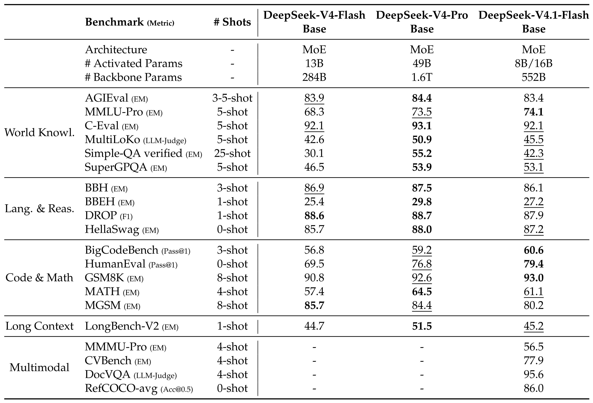

**表 1.** DeepSeek-V4-Flash-Base, DeepSeek-V4-Pro-Base 与 DeepSeek-V4.1-Flash-Base 的比较. 所有模型都在内部框架中评测, 评测设置相同. 分数差距不超过 0.3 时视为同一水平. 每行最高分以粗体显示, 次高分带下划线.

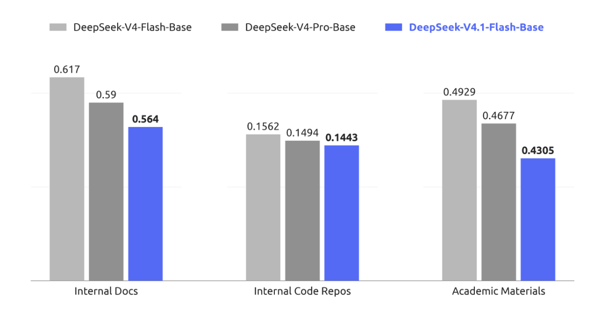

**图 6.** DeepSeek-V4-Flash-Base, DeepSeek-V4-Pro-Base 和 DeepSeek-V4.1-Flash-Base 在留出评测集上的每字节比特数 (BPB) 比较. DeepSeek-V4.1-Flash-Base 在所有任务上都取得最低 BPB, 表明它更有潜力成为强大的基础模型.

## 5 后训练

### 5.1 后训练流水线

本次发布没有引入新的后训练算法. 整套方案遵循标准范式: 先做监督微调 (SFT), 再做强化学习 (RL) 与在策略蒸馏 (OPD; [Gu25, Lu25]), 除成熟做法外不作算法修改. 我们几乎把全部精力放在模型训练的内容而非优化方式上, 投入建设大规模自动化的数据合成与环境构建流水线. 具体来说, 流水线会 (i) 合成多样, 可验证的训练任务及其参考解答和奖励信号, (ii) 以程序化方式构建并扩展交互式智能体环境, 低成本收集和评估轨迹, (iii) 进行严格过滤, 去重和难度校准, 保证数据质量与课程平衡. 我们发现, 即使优化流程固定而普通, 系统性提高合成数据与环境的规模, 多样性和可验证性, 也足以解释几乎所有观测到的增益. 这也印证了一条更普遍的经验: 现阶段, 打磨数据和环境流水线的边际收益远高于后训练算法创新.

#### 5.1.1 大规模智能体任务合成

任务是智能体学习的基本燃料, 但传统上, 构建高质量训练任务需要投入大量人工. 我们观察到, 模型已经开始表现出自行构建训练任务的能力, 尽管离完善还很远. 看到这一潜力后, 我们投入大量工作来增强模型构建任务和验证质量的能力.

我们把每项任务形式化为三元组 (问题, 环境, 验证系统), 再沿两个维度评估质量: 难度, 即确保任务并非微不足道; 正确性, 即保证三个组成部分都没有严重缺陷. 以难度和正确性作为奖励信号, 我们迭代训练模型, 使其构建出更好的任务. RL 任务的完整生命周期也会持续监控. 每当一项任务用于新一轮 RL 训练, 产生的轨迹都会提供新证据, 供再次审核质量. 在这一通用框架下, 我们为两个核心场景建立了专用的训练环境生产流水线: 通用智能体和编程智能体.

**通用智能体.** 我们鼓励内部员工和外部合作伙伴把最新模型用于日常工作流, 并在自愿前提下回传交互数据与反馈. 根据回传数据中出现的接口, 我们构建大量模拟工具, 重现现实工具与系统的接口和行为, 包括输入格式, 输出结构, API 模式和行为约束, 覆盖常用 SaaS 与企业应用, 也包括较为专业的业务后端系统. 同时, 我们大规模收集内部员工提交的负面反馈和模型失败案例, 将其纳入流水线, 生成源自真实工作流的单轮与多轮智能体环境. 通过重建相关工具上下文, 用户交互模式与失败条件, 流水线可以系统性重放失败, 并针对观察到的模型弱点开展强化学习.

**编程智能体.** 编程智能体训练环境有两个来源: 1) 内部员工与外部合作伙伴的编程智能体会话, 筛选后只保留高度复杂的任务或模型表现较差的任务, 再按轨迹去重; 2) 星标数达到阈值的公开 GitHub 仓库. 环境由多个专用智能体协同构建. 首先, 一个智能体判断项目能否在容器中构建并完整运行, 以及能否自动验证; 若可以, 它会选择某一轮交互或某次提交作为任务起点, 设计数个足够复杂的实现方向, 并给出具体评测点, 包括 fail-to-pass 与 pass-to-pass 两类, 同时生成构建报告, 必要时从 Web 获取外部资源. 接着, 另一个智能体在隔离容器中配置依赖, 初始工作目录, 测试代码与任务描述, 完成自测, 删除可能泄露解法的痕迹, 再把环境打包成新的镜像层. 然后, 多个不同智能体尝试完成任务; 独立的质量检查智能体会连同求解智能体的轨迹一起审查环境, 检查环境问题, 事实错误, 评测点与任务描述不匹配, 以及可被投机攻破的风险. 检查未通过时, 修复智能体会修正所有已发现错误, 调整过易或过难的评测点, 再让任务重新进入验证.

通过这些流水线, 我们可以自动批量生产正确, 有区分度, 且长度和难度可控的 RL 训练数据. 无论是通用智能体环境对真实工作流的忠实复现, 还是编程智能体环境对编程任务的精确构建, 最终都会汇入统一训练系统, 在持续质量监控下迭代提升模型能力.

#### 5.1.2 在合成任务中进行 RL

我们在合成任务中采用大规模异步 RL, 改善模型表现, 并塑造它在复杂场景中的行为. RL 训练沿两个维度扩展: 训练算力与 scaffold 数量. 如[图 7](#figure-07) 和[图 8](#figure-08) 所示, 随累计 RL 步数增加算力后, 无论是在单个 scaffold 内扩展, 联合训练同一 scaffold 的不同版本, 还是跨异构 scaffold 训练, 性能都会持续上升.

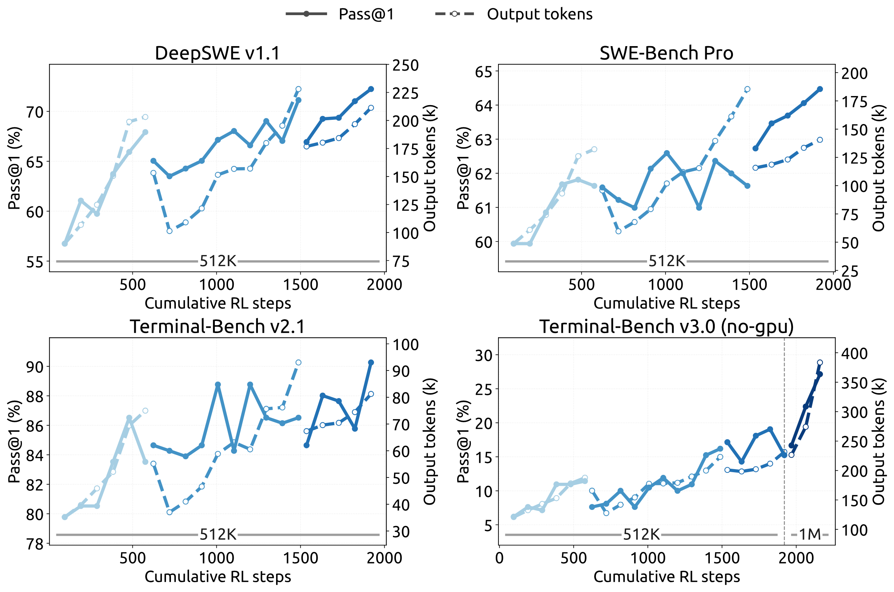

**图 7.** 在 DeepSeek Harness 的 Minimal 模式下, RL 训练规模扩大后, 多项代码智能体基准的性能均有提高. 把最大上下文长度进一步扩展到 1M Token, 还能继续改善 Terminal-Bench v3.0 等超长程任务的表现.

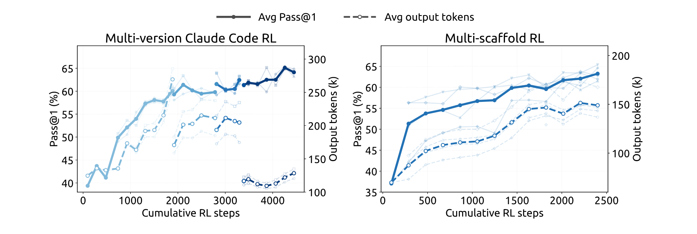

**图 8.** 联合训练多个 Claude Code 版本 (左), 以及 OpenCode, Pi, DeepSeek Harness Standard 模式和 PTC 模式等异构 scaffold (右) 时, 性能会随累计 RL 步数提升. 性能在 DeepSWE v1.1 上评测. 颜色较浅的曲线表示对各个 scaffold 版本或 scaffold 的单独评测.

为跨不同 scaffold 进行 RL 训练, 我们把智能体 rollout 执行拆分为智能体沙箱与 worker 容器. 沙箱运行 scaffold 及其工具, worker 则提供与 scaffold 无关的控制层, 负责编排 rollout, 把异构交互规范为通用轨迹模式, 并与训练器通信. 二者都在 DSec ([第 5.1.3 节](#section-5-1-3)) 上运行, 位于可抢占 GPU 训练池之外, 使长时间运行的 rollout 与细粒度训练调度彼此分离. 训练器遭抢占时, rollout 执行可以暂停并卸载, 保留完整状态供后续恢复, 同时释放 CPU 与 GPU 资源. 这种设计无须修改底层算法, 就能跨异构 scaffold 稳定, 高效地执行 RL.

为使有效 RL 算力超出单次训练, 我们通过模型合并来重新初始化后续 RL 训练. 具体来说, 合并来自不同 scaffold 或配置训练的检查点, 把不同优化路径取得的改进结合起来. [图 7](#figure-07) 和[图 8](#figure-08) 中不连续的曲线段, 表示模型重新初始化后连续进行的多轮 RL 训练. 这样既能进一步提高任务表现, 也能改善 Token 效率, 是汇总并行 RL 算力, 跨连续多轮训练继续扩展的一种简单实用的方法.

#### 5.1.3 大规模运行智能体: DSec

从 DeepSeek-V3 过渡到 V4 时, 智能体训练环境的数量与种类迅速增加, 促使我们构建 DeepSeek 弹性计算 (DSec), 一个用于大规模智能体训练和评测的生产级沙箱平台. 它最初的设计目标包括异构执行环境, 可扩展镜像分发, 多种隔离后端, 高密度资源管理, 命令轨迹日志和安全恢复抢占.

V4.1 训练把需求进一步推高至数百万个并发沙箱实例, 覆盖不同的 harness, 平台, 代码仓库, 软件依赖和任务特定服务. 在这一规模下, 主要瓶颈转向数据中心扩展性, 工作负载隔离, 单节点计算密度, 以及约束能力越来越强的智能体出现的不当行为. 下面简述几项主要设计.

**横向扩展大规模计算.** DSec 通过两套互补机制扩展: 分片, 以及放松一致性的调度. 为容纳大量机器, 我们把计算节点划分为多个分片, 即所谓规模单元. 分片也能隔离不同实验的负载, 缩小故障影响范围, 避免单个内存密集型任务耗尽无关工作共享的资源.

DSec 没有使用 Kubernetes 等现成编排器, 而是以自定义放置引擎调度大量沙箱, 用较弱的全局一致性换取扩展能力. 其依据是一项关键观察: 只要每个计算节点都强制执行本地安全约束, 智能体沙箱的放置只要求最终一致性. 因此, 放置引擎部署成多个彼此独立, 不同步协调的副本. 每个副本根据近期测量值预测可用资源, 作出足够好的放置决定. 为弥补一致性的损失, 每个节点负责验证最终放置决定; 若新放置会超过本地告警阈值, 则由硬性准入约束拒绝. 整体上, 这种设计让 DSec 可以扩展到数百万个容器, 不会受中央协调瓶颈限制.

**高密度运行沙箱.** 在节点层面, 我们使用硬件支持的子 NUMA 分区, 把每个 worker VM 绑定到独立 NUMA 域. 容器在这些 worker VM 内运行, CPU 与内存分配均限制在 VM 所属的本地 NUMA 资源中. 这一设置在激进内存超分与 Linux 内核锁竞争之间取得平衡, 同时把内存压力和运行时故障局部化. 在类似负载配置下, 单个物理节点可支持的并发活跃容器密度从约 1,000 个提高到 2,500 个以上, 才会出现可测的端到端退化.

但高密度部署可能受后台负载干扰, 扭曲对时间敏感的评测. 因而 DSec 引入延迟敏感 (LS) 执行类别. 我们对非 LS 任务使用 SCHED_IDLE, 尽量降低其调度优先级; 同时使用核心调度, 保证同级超线程只同时执行同一优先级类别的任务, 消除干扰.

**缓解智能体不当行为.** RL 训练中, 我们经常发现智能体试图钻奖励的空子, 或无意间让环境崩溃. 在一些尝试中, 智能体利用了近期披露的漏洞, 包括 XFS 驱动的权限问题, AppArmor 中的非法内存访问, 从软件包镜像服务泄露答案等. 智能体还常会删除关键二进制文件, 破坏系统文件, 甚至移除文件系统. 我们为每个沙箱使用单独的 AppArmor 配置文件和细粒度 eBPF 网络策略, 阻止这类尝试. 若智能体使环境崩溃, 就把这条轨迹视为失败, 并向 RL 框架报告一个"后果"信号.

#### 5.1.4 RL 中可控的推理强度

除模型架构和硬件进步外, 输出 Token 数也是服务成本的主要决定因素, 因而会左右现实应用中的成本-质量折中. 为此, 我们在强化学习中引入标量强度等级 $b$, 作为显式条件信号. 这一机制同时用于单轮推理和多轮智能体任务. 具体来说, 我们在系统提示前加上以下指令:

推理强度: {effort} (范围 1-100; 数值越高, 要求推理越充分)

其中, $b\in\{1,\ldots,100\}$ 表示请求的强度等级.

对每个训练提示 $x$, 我们在每个强度等级 $b\in\mathcal{B}$ 下采样 $M_b$ 条响应:

$$
z_{b,j}\sim\pi_\theta(\cdot\mid x,b),\qquad b\in\mathcal{B},\qquad j=1,\ldots,M_b.
$$

这里, $j$ 表示在强度等级 $b$ 下采样的响应. 共享同一 $(x,b)$ 的响应组成一个子组, 在组内对奖励做均值中心化, 计算组相对优势. 因而不同强度等级的响应不会直接比较. 每个子组内部, 通过让奖励的长度分量依赖 $b$, 诱导与强度相关的行为. 具体而言, 我们把长度惩罚项 $r^{\mathrm{len}}_{b,j}$ 加到响应 $z_{b,j}$ 的奖励中:

$$
r_{b,j}^{\mathrm{len}}=-\min\left\{C_{\max},\,k(b)\frac{\ell_{b,j}}{L_{\mathrm{norm}}}\right\},
$$

其中, $\ell_{b,j}$ 是推理 Token 数, $L_{\mathrm{norm}}$ 是参考长度, $C_{\max}$ 限制单条轨迹可扣除的最大值. Token 惩罚系数随请求强度指数下降:

$$
k(b)=k_0\exp\left(-\frac{b-b_{\min}}{\tau}\right),\qquad \tau=\lambda\overline{\Delta b},
$$

其中, $k_0$ 是各强度等级下的基础惩罚系数, $b_{\min}$ 是 $\mathcal{B}$ 的最小值, $\overline{\Delta b}$ 是训练强度等级的平均间隔, $\lambda$ 控制惩罚衰减速度. $b$ 每增加 $\tau$, 惩罚系数便乘以 $e^{-1}$. 参数 $k_0$ 控制整体上缩短推理的压力, 较小的 $\tau$ 会使惩罚衰减更快, 往往让各强度等级之间的行为差异更明显. 附录 C 从边际效用角度解释了 $k(b)$ 采用指数参数化的原因.

部署时, 标量 $b$ 提供了灵活控制模型推理强度的接口. 改变 $b$, 同一个模型检查点便可沿已学到的成本-质量前沿切换不同运行状态, 适配不同的延迟, Token 预算和解答质量要求. 训练虽然只使用有限组强度等级, 部署时却可用中间值诱导插值后的推理行为, 为测试时资源分配提供细粒度而高效的机制.

我们于 2026 年 9 月上线的生产部署中, 公共 API 提供 max, high 和 low 三档预设推理强度, 直接映射到这一标量接口.

如[表 2](#table-02) 所示, 三档分别对应 $b=100$, $b=75$ 和 $b=50$. API 用户无需修改模型权重或解码配置, 即可选择已学成本-质量前沿上的运行点.

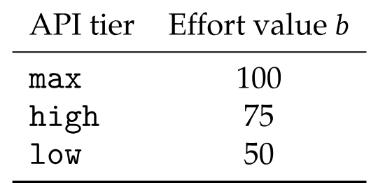

**表 2.** 公共 API 的推理强度档位与底层标量强度值 $b$ 之间的映射.

LLM 强化学习 rollout 阶段的长尾问题一直是训练效率的主要瓶颈. 为此, 我们扩展后训练基础设施, 支持异步生成样本 [Zen26, Kim26b], 通过维持足够高的并发度, 显著缓解 rollout 阶段的长尾问题. 现在, 几乎所有 RL 与 OPD 任务都已启用异步训练, rollout 效率明显提高.

### 5.2 异步后训练基础设施

#### 5.2.1 整体工作流

rollout 与训练部署在同一批物理设备上, 通过分时运行, 无须手动调整两个阶段间的资源分配. 每项任务指定在途样本数量的上限, 系统在整个 rollout 阶段维持这一上限.

为维持目标 rollout 并发度, 我们评测了三种分发粒度. 最终采用样本级分发: 一旦新完成的样本数达到下一个提示所分配的 GRPO 组大小, 无论这些完成样本来自哪些组, 都会分发该提示. 这有助于在整个训练期间维持稳定的 rollout 并发度. 确定此策略前, 我们还试过另外两种分发粒度. 第一次尝试在开始时额外分发几个批次, 每次训练迭代后再补充一个完整批次; 但训练指标会严重振荡, 说明批次级粒度过粗. 第二次改用提示级分发, 一个 GRPO 组完成后才分发新提示, 却很容易被组内长尾样本拖住, 难以平稳维持目标 rollout 并发度.

积累足够训练样本后, 训练会抢占正在进行的 rollout. 训练期间使用拼接式路由重放: 对跨越多个检查点的样本, 将各 rollout 片段产生的专家路由拼接起来, 而不是丢弃并用新检查点重新计算路由信息.

#### 5.2.2 缓解长度偏差与离策略影响

异步生成虽能有效提高 rollout 效率, 也会带来两项可能降低训练质量的副作用. 第一, 它会造成长度分布偏差, 在训练早期尤其明显, 因为短序列往往先完成, 从而占据最初的训练批次. 第二, 它必然产生离策略样本, 即部分或全部 Token 由早期检查点生成的样本. 两类问题需要分别处理.

针对长度偏差, 我们采用两种机制. 首先, 分发器可以按数据集限制并发度, 调节稳态训练批次中各数据集的占比, 通过控制输入样本来源间接减轻长度偏斜. 其次, 系统支持丢弃过早返回的短样本, 使长度分布平滑过渡到稳态, 防止模型过拟合过短序列.

针对离策略问题, 我们另设两种机制. 首先, 调整控制样本分发的逻辑与训练样本等待条件, 可以限制最大离策略比例, 防止训练数据与当前模型偏离过远. 其次, 训练中加入损失掩码, 排除陈旧度过高 Token 的贡献, 减轻陈旧样本对梯度更新的不利影响.

#### 5.2.3 性能优化

异步 RL 框架会定期中断 rollout 阶段, 切换到更新后的策略检查点. 我们希望切换过程无感: 中断应近乎瞬间完成, 被中断的 rollout 恢复后应像从未停止一样继续.

系统支持 Token 级中断, 生成可在任意 Token 边界停止, 从而迅速停止 rollout. 收集到足够训练数据后, 所有在途样本几乎会立刻停止, 系统无须等待便可进入训练阶段.

为跨检查点切换保留 rollout 进度, KV 缓存和专家路由等 rollout 状态会在生成期间按 Token 粒度持久化. 使用新检查点恢复时, 直接复用已保存状态, 免去重新预填充的成本, 被中断样本可从原位置准确继续. 由于所有在途样本的状态都要保留, 我们按样本粒度进行垃圾回收, 每个样本完成后立即释放其状态.

除了切换检查点, 同一套快速中断与无缝恢复机制也让训练任务能迅速响应集群调度的抢占信号而不丢失进度, 提高集群总体利用率.

#### 5.2.4 大规模在策略蒸馏

作为后训练的最后阶段, 最终全词表 OPD 任务使用所有领域的数据集和 40 多个教师模型训练. 它也采用异步生成来提高 rollout 效率. 各领域训练流程不同, 每个领域的最佳教师可能来自模型开发的不同阶段. 各教师模型的架构彼此不同, 与学生模型也可能不同. 后训练基础设施可以直接处理这种设置, 支持教师数量实际上不受限制, 架构异构的全词表 OPD, 并以几乎可忽略的成本在它们之间高效切换 [Dee26].

OPD 阶段还要求训练期间动态重新配置. 我们持续追踪模型能力, 并据此调整训练方案, 包括数据集配比, 各数据集并发上限和当前教师. 在同步训练中, rollout 批次会提供明确的配置边界, 这类改动较直接. 异步设置下, 按不同配置生成的样本可能同时在途. 我们的基础设施支持在配置间一致地过渡, 不会中断 rollout 或训练.

### 5.3 评测

#### 5.3.1 评测设置

后训练评测主要关注推理与智能体能力, 知识密集型表现则主要由预训练决定, 已列于[表 1](#table-01).

推理方面, 我们在 GPQA Diamond [Rei23], Humanity's Last Exam [Pha25], Codeforces (内部基准) 和 MathArena Apex [Dek25] 上评测, temperature 与 top-$p$ 均为 1.0. 智能体能力评测分为四类:

- 编程智能体: Terminal-Bench 2.1 [Mer26], Terminal-Bench 3.0 [Mar26a], Terminal-Bench 4.0 [Mar26], DeepSWE v1.1 [Dee26c], ProgramBench [Yan26a], NL2Repo-Bench [Din25].

- 网络安全: SEC-Bench Pro 260505 版 [Lee26], CyberGym [Wan25c] 与 ExploitGym [Wan26b].

- 通用智能体: AutomationBench v1.0.6 公开评测集 [She26], Agents' Last Exam [Sun26a] (ALE-CLI).

- 视觉智能体: Chartography [Gar26], BabyVision [Che26], ZeroBench 主集 [Rob25].

评测编程智能体时, DeepSeek-V4.1-Flash 使用 DeepSeek Harness 的 Minimal 模式, 上下文窗口为 1M Token, temperature 设为 1.0, top-p 设为 0.95. 为符合官方设置要求, DeepSWE v1.1 使用 mini-SWE harness. SEC-Bench Pro 专门使用 Claude Code harness, 因为它采用会话压缩设计. 视觉智能体任务使用 Claude Code harness 评测, 上下文窗口为 512k Token, temperature 设为 1.0, top-p 设为 0.95. Agents' Last Exam 与 AutomationBench 使用各自的官方 scaffold 评测. 其他编程 scaffold 下的模型表现见[表 4](#table-04).

为减少编程智能体评测中的奖励投机, 我们限制互联网访问, 并从环境中移除 Git 历史. 同时, 自动清除不同环境中的临时构建缓存与软件包缓存, 包括 Go 模块缓存 (go/mod), node modules 依赖产物, 编译后的 JAR 文件和 Python pycache 目录. 即便如此, 测试中仍会出现寻找漏洞的行为, 例如反编译 Ubuntu Linux 核心软件包, 在 CyberGym 中寻找漏洞. 模型能力越强, Docker 容器和验证脚本等标准评测基础设施越容易被模型钻空子. 我们呼吁研究界在设计下一代基准时, 优先检测并缓解这类行为. 如[表 3](#table-03) 所示, 相较前代 DeepSeek-V4-Flash, DeepSeek-V4.1-Flash 在推理和智能体基准上都有明显提升, 并能达到或超过顶尖开源与专有模型. 在视觉智能体任务中, DeepSeek-V4.1-Flash 表现稳健, 尤其擅长需要视觉推理和分析复杂专业图表的场景. 它虽超过领先开源模型 Kimi-K3, 但我们承认, 与领先闭源模型相比仍有可测差距.

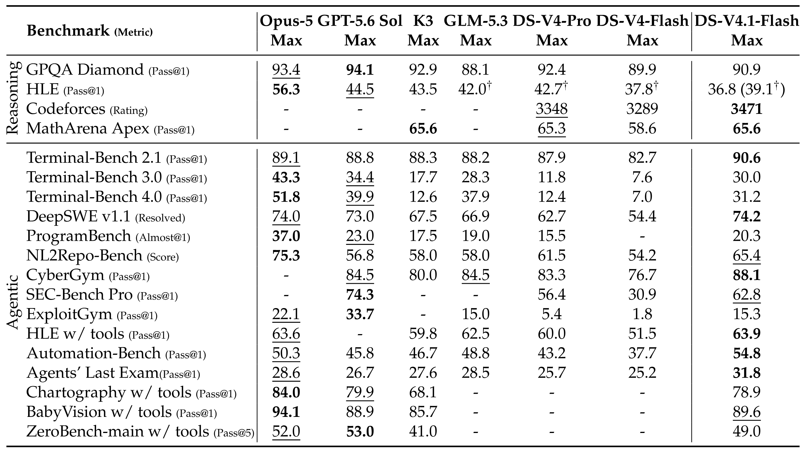

**表 3.** DeepSeek-V4.1-Flash 与闭源/开源模型的比较. † 表示 HLE 的纯文本子集. 最佳结果以粗体标出, 次佳结果带下划线.

#### 5.3.2 评测结果

除峰值表现外, DeepSeek-V4.1-Flash 还提供推理强度设置, 让用户能可控地以推理成本换取准确率. 如[图 9](#figure-09) 所示, 在推理和智能体基准上, 准确率与输出长度都会随强度等级稳步提高. 强度从 25 提至 100 后, 八项重推理基准的平均 Pass@1 从 67.1% 提至 76.3%, DeepSWE v1.1 从 66.0% 提至 74.2%, Terminal-Bench 2.1 从 82.4% 提至 90.6%, 代价是输出 Token 约增至 2.5 倍. 在单响应推理中学到的强度控制可忠实迁移到长程智能体轨迹, 控制多轮交互中探索与验证的总量. 增益主要集中在前段: 60-80 区间使用不到最高设置一半的 Token 预算, 已能取得最高设置大部分的准确率; 最后提高到强度 100, 智能体轨迹会延长 1.6-1.8 倍, 改善却很有限. 因而最高档最适合最具挑战性的任务, 日常智能体使用则可在中等强度下取得较好的成本-性能平衡.

**图 9.** 性能与输出长度随推理强度的变化. 每个面板在推理强度值从 25 变为 100 时, 绘出 Pass@1 (实线, 左轴) 与每条响应的平均输出 Token 数 (虚线, 右轴); 重推理基准的结果取八项基准的平均值 (AIME 2026, Apex 2025 Shortlist, GPQA Diamond, HLE, IMO-AnswerBench, LiveCodeBench, MathArena-Apex, SimpleQA-Verified). DeepSWE v1.1 基于 mini-SWE 评测, Terminal-Bench v2.1 基于 DeepSeek Harness (Minimal) 评测.

#### 5.3.3 不同推理强度下的表现

[图 9](#figure-09) 给出了不同预算值下的性能与平均响应长度. 随推理强度提高, 模型产生的推理轨迹逐渐变长, 重推理基准和软件工程任务上的准确率也单调上升; 最大增益集中在低至中等预算区间, 此后收益递减. RL 训练虽然只涉及有限个强度等级, 标量强度仍能在一定范围内灵活地插值控制响应长度. 实践者可以沿平滑连续的区间在质量, 延迟和 Token 成本之间取舍: 对延迟敏感的应用可用低强度换取有限的准确率损失, 困难任务则可调用高强度, 发挥模型的完整推理能力. 公共 API 服务提供 low, high 和 max 三档预设, 分别对应强度值 50, 75 和 100.

#### 5.3.4 不同智能体 scaffold 下的表现

实际部署中, 模型很少只用于一个固定智能体框架. 各 scaffold 的系统提示, 工具定义, 上下文管理策略与交互协议并不相同, 过拟合某个 harness 的模型换到另一个框架后, 性能可能大幅下降. 为评估模型面对这类变化时的稳健性, 我们比较了六个 scaffold 系列的八种配置: Claude Code [Cod26], Codex [Cod26a], OpenCode [Ope26b], Pi [Zec26], mini-SWE [Yan24l], 以及采用 Minimal, Standard 和 PTC 模式的 DeepSeek Harness (DSH) [Dee26d]. 各 scaffold 使用完全相同的模型检查点, 解码配置和任务集, 只改变周围的 harness, 包括原生系统提示, 工具模式和轮次逻辑. [表 4](#table-04) 给出了 Max 推理强度 (100) 下在 DeepSWE v1.1 和 Terminal-Bench v2.1 上的表现. 模型的智能体能力能很好地迁移到提示与工具接口各异的 scaffold 系列, 并不依赖某个特定 harness 的惯例. 周围交互协议与工具抽象改变后, 性能仍然稳健, 说明其智能体行为与单一 scaffold 设计并非紧密耦合. 这种稳健性也符合合成训练数据中环境, 工具模式与交互格式的多样性 ([第 5 节](#section-5)); 这些数据本来就是为了促进跨智能体 scaffold 的泛化而设计.

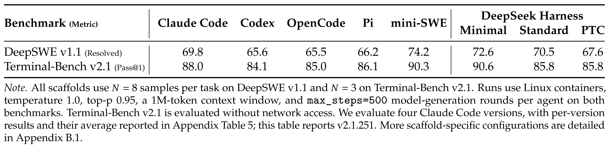

**表 4.** Max 推理强度下不同智能体 scaffold 的表现.

#### 5.3.5 多智能体

为探索多智能体如何协作处理复杂任务, 我们使用 DeepSeek Harness 的 Agent Team 模式, 对 DeepSeek-V4.1-Flash 开展了初步实验.

**多智能体 harness.** 我们使用 Agent Team 模式的 DeepSeek Harness. 其中, 主智能体默认可通过 `spawn_teammate` 异步创建具名且持久的队友.

每个队友会接到一项委派任务, 启动时可采用两种模式: fresh 模式不包含主智能体历史, fork 模式则包含主智能体已完成轮次的一次性快照. 所有智能体共享同一个仓库检出, 所作编辑会立即对彼此可见.

智能体通过持久化的点对点邮箱通信. 由 `send_message` 发送的消息会在运行中队友的下一个步骤边界送达; 若队友空闲, 则启动新一轮; 若队友不活跃, 则将其恢复. 在每个队友的任务生命周期中, 主智能体通过 `list_agents` 监控运行状态, 通过 `wait_agent` 等待状态, 邮箱或共享任务变化. 任务归属, 依赖关系与建议写入范围在共享任务板上维护, 更新时通过四个 `team_task_*` 工具检查版本. 需要干预时, 只有主智能体可以通过 `interrupt_agent` 中断队友当前轮次. 所需工作完成后, 主智能体审查并测试合并后的改动, 再给出最终答复.

**训练.** Agent Team 模式使用 RL 训练, 奖励由任务表现, 鼓励委派与智能体间通信的协作奖励, 以及促进高效协调的派生延迟惩罚共同构成. 派生延迟的计算方式是: 把执行事件及其协作依赖表示成有向无环图 (DAG), 根据 Token 数按固定预填充/解码速率计算成本, 再加上实测工具执行时间, 最后取关键路径长度. 这样可鼓励有用的并行, 同时惩罚不必要的串行工作与同步, 并降低服务端批处理和排队延迟的影响.

**性能.** 我们从 ProgramBench [Yan26a] 构建一个高置信度子集, 只保留参考解答在隐藏测试套件上通过率至少为 95% 的任务. 筛选后剩下 172 项"黄金"任务. 我们还在 FrontierSWE v2 [Fro26] 上评测. 它是 FrontierSWE 的后继版本, 规模更大, 难度更高, 方法也有明显改进. 我们从当前公开任务中排除需要 GPU 的任务, 构建一个无 GPU 子集. 在两个基准上, 单智能体与多智能体配置均设置明确的单次 rollout 墙钟时间上限. 这里报告的结果仍属初步: 我们比较观察到的最强多智能体配置与现有最强单智能体基线. 在 ProgramBench 上, 每项任务最多运行三次 rollout, 每种配置计划运行 516 次. 报告 Almost@1, 即单次 rollout 得分至少达到 0.95 的比例. 在 FrontierSWE v2 上报告 Mean@5. ProgramBench 的时间上限从 1 小时到 12 小时, FrontierSWE v2 从 1 小时到 20 小时. 每个时间点的指标都根据达到上限时已有的输出计算.

如[图 10](#figure-10) 所示, 在两个基准的每个时间上限下, 多智能体配置都优于单智能体配置. ProgramBench 上, 多智能体的 Almost@1 从 1 小时的 13.59% 提至 8 小时峰值 30.04%; 单智能体对应数值为 12.79% 和 20.39%. FrontierSWE v2 上, 多智能体 Mean@5 从 1 小时的 13.50% 提至 20 小时的 32.90%, 单智能体则从 10.50% 提至 28.20%.

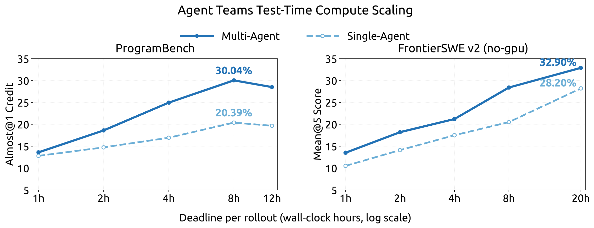

**图 10.** 在 ProgramBench (Almost@1) 和 FrontierSWE v2 (Mean@5) 上, 单智能体与多智能体配置的测试时计算扩展曲线, 横轴为单次 rollout 的墙钟时间上限.

## 6 结论, 局限与未来方向

本文提出 DeepSeek-V4.1-Flash, 一个支持最长一百万 Token 上下文的多模态混合专家 (MoE) 模型. DeepSeek-V4.1-Flash 通过联合优化模型架构, 缓存精度和部署策略, 把 KV 缓存压缩推向极致. 因果编码器-解码器 (CED) 架构使模型在预填充阶段每 Token 只激活 8B 参数, 解码阶段则激活 16B 参数, 提高了输入占比较高的智能体负载下的成本效率. 序列长度相同时, 压缩稀疏注意力 2 (CSA2) 的跨层 KV 缓存复用与 FP4 KV 缓存把全局 KV 缓存 (始终驻留在 HBM) 降至每 Token 890 字节, 约为 DeepSeek-V4-Flash 的四分之一. SWA 有界重放又把持久化 KV 缓存 (始终位于 SSD 或主机内存) 降至 DeepSeek-V4-Flash 的约八分之一. 这些改动在明显改善模型整体性能的同时, 缓解了 HBM 与 SSD 的容量压力. DeepSeek-V4.1 的参数占用远小于 GLM-5.3 和 Kimi-K3 等当代开源模型, 但在主要基准上表现相当, 多项任务上还更胜一筹.

DeepSeek-V4.1-Flash 相较 DeepSeek-V4-Flash 大幅简化了数个架构组件, 新引入的架构变化也带来了尚未完全刻画的稳健性边界. 内部评测覆盖了多种测试用例和边界条件, 在所测设置下没有观察到模型能力的系统性退化. 然而, 任何有限测试套件都无法覆盖所有极端输入与部署条件. CSA2 的潜在选择错误和 SWA 有界重放中的近似状态重建, 仍可能在未经测试的边界案例中导致能力下降. 今后, 我们会继续扩充压力测试与评测栈, 特别关注长上下文稀疏检索, 以及缓存恢复边界处的 SWA 状态重建. 我们也会监控现实负载, 系统刻画潜在失效模式与稳健性边界, 进一步改善模型在极端条件下的稳健性.

随着 AI 模型展现出很强的性能, 标准评测基准日益接近饱和. DeepSeek-V4.1-Flash 的表现已非常接近 Fable-5 和 GPT-6 Astra 等顶尖模型, 在日常应用中提供高度相近的用户体验, 但最具挑战性的任务上仍有差距. 基准分数的差距虽然很小, 这种接近并不代表模型在复杂, 高难度推理与边缘案例上已经具备领先闭源系统的前沿能力.

因此, 我们会持续更新评测流程, 严格衡量最先进推理能力的边界. 在继续降低模型成本的同时, 我们认为模型智能的进一步提升将依赖数据, 模型容量与 RL 的协同扩展. 以 DeepSeek-V4.1-Flash 为新起点, 我们会继续探索模型能力边界, 系统解决大规模数据合成与 RL 扩展中的主要难题. 还会积极推进模型与 harness 的协同设计, 让二者组成的系统共同演进与优化. 通过同步降低成本, 扩展能力, 我们希望让高能力智能体更易获取和部署, 进一步降低各行各业采用 AI 技术的门槛.

## 7 作者名单

作者按名字的字母顺序排列. 标有 * 的人员已离开团队.

**研发与工程.** Anyi Xu, B. Li, Bangcai Lin, Bing Xue, BingCheng Xian, Bingzheng Xu, Bochao Wu, Bowei Zhang, Boyi Deng, C.C. Yu, Chao Jin, Chaofan Lin, Chen Dong, Chenbing Wang, Chenfan Feng, Chengda Lu*, Chenggang Zhao, Chengqi Deng, Chengyuan Zhang, Chenhao Xu, Chenqi Zhao, Chenze Shao, Chuhao Wang, Chuqi Zhang, Damai Dai, Dejian Yang, Deli Chen, Di Huang, Di Wu, Donghao Li, Erhang Li, Eric Fu, F. Zhou, Fangwei Zhou, Fangyun Lin, Fangzhou Yuan, Feiyu Xia, Fucong Dai, Guangbo Hao, Guanglin Li, Guanting Chen*, Guoai Cao, Guofan Fan, Guolai Meng, Guowei Li, Haichuan Zhang, Haiyang Ma, Haiyang Shen, Han Li, Han Yu, Han Zhang, Hangyuan Deng, Hanwei Xu, Hanxiang Xu, Hanxun Zhong, Hao Guo, Hao Jiang, Hao Li, Hao Qin, Haodong Wen, Haofen Liang, Haofeng Huang, Haohua Liu, Haoling Zhang, Haoming Luo, Haoran Yang, Haotian Xu*, Haotian Yuan, Haoting Huang, Haowen Luo, Haoyang Cai, Haoyu Chen, Haozhe Ji, Hengran Zhang, Hengrui Wang, Hengxu Wu, Honghui Ding, Hongxuan Tang, Huadong Wang, Huanqi Cao, Huazuo Gao, Hui Qu, Hui Zeng, J. Yang, J.H. Jin, J.H. Zhang, J.X. Zou, Jia Yu, Jiahui Zhou, Jiajun Chen, Jialiang Huang, Jialin Zhao, Jiamin Tang, Jian Zhou, Jianan Tong, Jianwen Li, Jiaqi Zhu, Jiarui Wang, Jiasheng Ye, Jiashi Li, Jiaxin Xu, Jiaying Ding, Jibai Lu, Jiewen Hu, Jin Yan, Jincheng Zhai, Jingchang Chen, Jingcheng Hu, Jingli Zhou, Jingsheng Xu, Jingting Xiang, Jingyan Yun, Jingyang Yuan, Jingyuan Cheng, Jinhua Zhu, Jinpeng Wang, Jinyi Chen, Jinyi Hu, Jiping Yu, Jueliang Guo, Junbo Pei, Junbo Sun, Junguang Jiang, Junjie Qiu, Junkang Zhou, Junqi Liu, Junren Li, Junxian Li, Junxiao Song, Junyi Guo, Kai Dong, Kaifeng Chen, Kaige Gao, Kang Guan, Kangdong Yuan, Ke Hong, Ke Xu, Kefan Zhao, Kexin Ji, Kexin Zhang, Kexing Zhou, Kuai Yu, Lan Zhang, Lean Wang, Lecong Zhang, Lei Wang, Letian Gao, Liang Zhao, Liansheng Xu, Lihua Guo, Lingxiao Luo, Lingyue Fu, Litao Deng, Litong Wang, Liyue Zhang, Longhao Chen, Lu Chen, Luotian Huang, Luyao Ma, Luyao Wang, M.S. Di, Max Mei, Menghao Ye, Miao Cui, Mingchuan Zhang, Minghua Zhang*, Minghui Tang, Mingjing Zhang, Mingqi Wei, Mingshu Chen, Mingxing Liu, Mingxu Zhou, Mingyu Xu, Mingyu Yang, Mingze Wang, Muyang Chen, Ni Shentu, Ning Wang, Niufang Ning, Panpan Huang, Peixin Cong, Peiyi Wang, Peiyuan Xin, Pengfei Ren, Pengfei Yan, Pengle Zhang, Qi Kang, Qi Tang, Qiancheng Wang, Qiang Li, Qihao Zhu, Qingyang Li, Qinyu Chen, Qiushi Du, Qizhou Guo, Rongxian Xu, Rui Ding, Rui Hu, Rui Tian, Rui Yu, Ruidong Zhu, Ruifan Xu, Ruihan Yang, Ruihang Xia, Ruijie Lu, Ruilin Geng, Ruipeng Hong, Ruiqi Ge, Ruisong Zhang, Ruize Sun, Ruizhe Pan, Runji Wang, Runqian Chen, Runxin Xu, Ruohong Tian, Ruomeng Shen, Ruoyu Zhang, Ryan X., S.H. Liu, Shanghao Lu, Shangyan Zhou, Shanhuang Chen, Shaofei Cai, Shaoheng Nie, Shaoyuan Chen, Shengding Hu, Shengkai Lin, Shengwen Ran, Shengyu Liu, Shengyuan Jia, Shi Bai, Shi Feng, Shicheng Xu, Shichun Liu, Shiqiang Hu*, Shirong Ma, Shiyu Wang, Shiyuan Feng, Shufan Gong, Shuhan Lin, Shuiping Yu, Shunfeng Zhou, Shuo Yang, Shuomeng Wang, Shuting Guo, Shuting Pan, Shuying Yu, Sinuo Cao, Siyi Lin, Sizhe Chen, Songyang Chen, Songyang Zhou, Tao Ni, Tao Yun, Tian Jin, Tian Pei, Tian Ye, Tianle Lin, Tianran Ji*, Tianyi Cui, Tianyuan Yue, Tingting Yu, Tongrui Xiong, Wangding Zeng, Wei Liu, Wei Zhang, Weibin Xu, Weihao Zeng, Weilin Zhao, Wen Liu, Wenfeng Liang, Wenjie Pang, Wenjing Luo, Wenjing Yao*, Wenjun Gao, Wenkai Shao, Wenkai Yang, Wenli Zhang, Wenlu Wang, Wenlve Huang, Wenqian Yan, Wentao Zhang, Xi Gao, Xiang He, Xiang Li, Xiangli Li, Xiangwen Wang, Xiangying Zhang, Xiankui Wei, Xiao Bi, Xiaodong Liu, Xiaohan Wang, Xiaojian Qu, Xiaokang Chen, Xiaokang Zhang, Xiaotao Nie, Xiaoyao Zou, Xiaoyuan Li, Xicheng Guo, Xieting Chu, Xin Cheng, Xin Liu, Xin Xie, Xinbo Xu, Xingchao Liu, Xingchen Liu, Xingkai Yu, Xingyou Li, Xintong Yao, Xinyang Chen, Xinyong Jiang, Xinyu Yang, Xinyu Yang, Xu Chen, Xuanyu Wang, Xubei Zhong, Xuecheng Su, Xuejie Liu, Xuheng Lin, Xujie Fan, Xuncheng Zhao, Xuwei Fu, Y.C. Yan, Y.H. Jiang, Y.T. Wu*, Y.W. M., Y.Z. Wang, Yafei Gao, Yang Yang, Yang Zhang, Yanru Ma, Yanwen Huang, Yao Li, Yao Li, Yao Meng, Yao Zhao, Yaofeng Sun, Yaohui Wang, Yaoyang Ye, Yehang Yin, Yexinrui Wu, Yi Qian, Yi Tao, Yi Yu, Yichao Zhang, Yichen Jiang, Yicheng Wang, Yifan Ding, Yifan Shi, Yifeng Peng, Yifeng Zhai, Yijia Wu, Yiliang Xiong, Yilun Wang, Ying He, Ying Zhou*, Yingjia Luo, Yinmin Zhong, Yiping Wang, Yisong Wang, Yixiang Zhang, Yixiao Chen, Yixuan Tan, Yixuan Wei, Yiyang Ma, Yiyao Yang, Yiyuan Liu, Yizai Cai, Yizhen Wei, Yizhi Wang, Yonglun Yang, Yongqi Zhuo, Yongqiang Guo, Yongtong Wu, Yu Wu, Yu Zhang, Yuan Bian, Yuan Cheng, Yuan Ou, Yuan Sun, Yuanfan Xu, Yuanhang Sun, Yuanhao Li, Yuchen Liu, Yuchen Yao, Yudong Han, Yuduan Wang, Yuhan Wu, Yuhao Meng, Yuheng Zou, YuKun Li, Yunchuan Wang, Yunfan Xiao, Yunfan Xiong, Yupeng Chen, Yuqian Cao, Yuqian Wang, Yuqing Chen, Yushun Zhang, Yutong Lin, Yuwei Xiao, Yuxian Gu, Yuxiang Chen, Yuxiang Huang, Yuxiang Luo, Yuxiang You, Yuxin Chen, Yuxin Xiang, Yuxuan Liu, Yuxuan Zhou, Yuyang Zhou, Yuzhe Guo, Yuzhen Huang, Yuzhuo Bai, Z.Y. Z., Zanlin Ni, Zehao Wang, Zehua Zhao, Zehui Ren, Zejun Zhao, Zhangli Sha, Zhanying Wang, Zhaochen Zhang, Zhaoshuai Du, Zhe Fu, Zhean Xu, Zhenda Xie, Zheng Liu, Zhengyan Zhang, Zhenhua Dong, Zhewen Hao, Zhibang Wang, Zhibin Gou, Zhicheng Ma, Zhihao Li, Zhihong Shao, Zhihuan Huang, Zhijie Li, Zhirui Lu, Zhixian Huang, Zhixuan Chen, Zhixuan Chen, Zhixuan Pan, Zhiyu Wu, Zhizhou Ren, Zhu He, Zhuoshu Li, Zhuping Zhang, Zian Xu, Zihao Wang, Zihui Gu, Zijia Zhu, Zili Zhang, Zilin Li, Zilong Hou, Zilong Lyu, Ziqiao Wang, Ziwei Xie, Ziya Zhang, Ziyi Gao, Zizheng Pan, Zonglin Li, Zongqing Yao, Zui Chen, Zuofan Wu

**商务与合规.** Chenchen Ling, Chengyu Hou, Chong Chen, D. Li, Di Qi, Dongjie Ji, Fang Wei, Fanyi Xia, Fei Xie, Feiyi Tan, Hailong Guo, Haiyan Zhai, Hui Zhou, Huihui Tan, Huijie Li, Jia Luo, Jia Song, Jialu Cai, Jian Liang, Jiangting Zhou, Jiaqi Gao, Jiayi Shao, Jie Chen, Jieyu Yang, Jin Chen, Jingde Zhang, Jingzi Zhou, Jinqian Wang, Jinyang Liu, JinZhao Sun, Junhua Ling, Junmin Zheng, Kaicheng Yang, Ke Xu, Le Su, Leyi Xia, Liangfeng Ding, Lin Zhuo, Linwang Ma, Linyan Zhu, Liyu Cai, Luqi Yao, M.K. Zhang, Meng Li, Miao Lin, Miaojun Wang, Min Zhang, Mingming Li, Mingming Wang, Mingze Yin, Minmin Han, Nan Cao, Ning Wang, Ningxin Ma, Panpan Wang, Peihan Lin, Peng Sun, Peng Zhang, Qian Ying, Qiang Xiang, Qiao Wang, Qingmiao Mao, Qiwei Jiang, Rongli Jin, Ruyi Chen, Sha Tao, Shangmian Sun, Shaoqing Wu, Shichao Zou, Si Lei, Tianyang Zhang, Tianyu Sun, Tingting Yin, W.L. Xiao, Wei An, Wei Li, Wei Wang, Weiwei Lin, Wenqing Hou, X. Lin, Xiangfei Meng, Xianzhu Huang, Xiao Peng, Xiaoqian Li, Xiaoting Zhang, Xiaowen Sun, Xiaoxiang Wang, Xiaoyu Ye, Xinrou Zhang, Xinyu Zhang, Xue Cao, Xueyin Chen, Yanan Zhou, Yanhong Xu, Yao Xia, Yao Xu, Yi Shao, Yihong Zhang, Yiling Ma, Ying Tang, Yining Lou, Yiru Chen, Yishi Piao, Yixuan Chen, Yong Xiong, Yuchen Xuan, Yuehan Yang, Yuer Xu, Yukun Zha, Yunxian Ma, Yuping Lin, Yuting Yan, Yutong Xie, Yuwen Sheng, Yuxuan Zhu, Zekai Zhang, Zhe Ju, Zhenzhen Lin, Zheren Gao, Zheyang Sun, Zhigang Yan, Zhongyu Wu, Zi Wang, Zihua Qu, Ziling Yan, Ziyi Wan

## 8 评测细节

### 8.1 Scaffold 配置

所有 scaffold 都在 Linux 任务容器中运行, 使用[表 4](#table-04) 的统一评测设置. 每次运行从基准任务描述开始, 采用 scaffold 运行时或评测集成提供的提示, 任务模板与工具定义. 我们没有添加实验性系统提示.

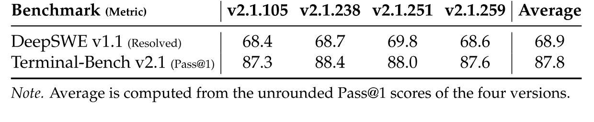

**表 5.** Max 推理强度下不同 Claude Code 版本的表现.

- **Claude Code (v2.1.105, v2.1.238, v2.1.251, v2.1.259).** 每个版本都使用 Claude Agent SDK 及其原生工具接口. [表 4](#table-04) 报告 v2.1.251 的结果; [表 5](#table-05) 比较四个版本.
- **Codex (v0.147.0).** 使用标准 app-server 模式和适配后的工具模式.
- **OpenCode (v1.18.15).** 使用配有 shell 与文件工具以及原生任务委派功能的 build agent.
- **Pi (v0.84.2).** 使用 RPC 模式, 配有文件与 shell 工具, 以及暴露 `search`, `open_page` 和 `find_in_page` 的搜索扩展.
- **mini-SWE.** 使用 `mini_swe_v2` 移植版 [+1], 只配一个 bash 工具, 每轮必须调用工具, 并以提交标记结束.
- **DeepSeek Harness (DSH).** Minimal 模式只配一个 bash 工具; Standard 模式使用完整 `sdk` profile 和 26 个初始函数工具, 包括 Web 搜索与抓取; PTC 模式使用 `run_code`, 供 TypeScript 程序调用 24 个底层工具. Standard 与 PTC 均使用 v0.1.1+custom.202609011522.

[+1]: mini-swe-agent, 提交 `04d809ceab9d`.

### 8.2 不同 Scaffold 下的推理强度

[图 11](#figure-11) 的六个面板中, 提高推理强度都会延长轨迹: 每一对 scaffold-基准组合的平均单轨迹输出 Token 数均随强度单调增长. Pass@1 与这种增长的联系较弱. 它整体上有所提高, 但并非单调; 大部分面板在中间设置下都有平台或回落. 三种 scaffold 的标定方式也不同: 在 DeepSWE v1.1 上, Claude Code 的曲线最平坦, 额外使用的 Token 相对较少; DeepSeek Harness (Minimal) 起点最低, 以最大的 Token 成本换得最多增益; mini-SWE 居中. 在 Terminal-Bench v2.1 上, 三种 scaffold 集中在狭窄区间, 最大强度下依次为 DeepSeek Harness (Minimal), mini-SWE 和 Claude Code. 任务接近饱和后, scaffold 的选择至少和强度档位同样重要.

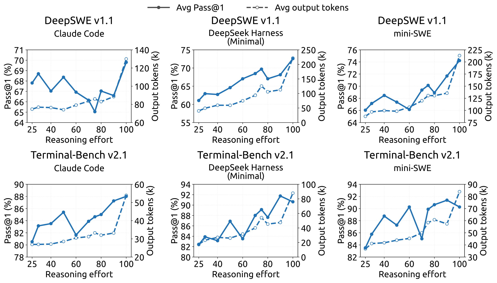

**图 11.** 推理强度会稳定地增加轨迹长度, 但在不同编程 scaffold 下与准确率的相关性较弱. 每个面板绘制 Pass@1 (%, 实线, 左轴) 与平均单轨迹输出 Token 数 (k, 虚线, 右轴) 随推理强度设置的变化; 上排为 DeepSWE v1.1, 下排为 Terminal-Bench v2.1, 三种智能体 scaffold 分别是 Claude Code, DeepSeek Harness (Minimal) 与 mini-SWE. 所有面板均使用同一个检查点.

### 8.3 不同推理强度下各推理基准的详细结果

[图 12](#figure-12) 显示, 推理强度设置能平滑, 稳定地控制输出长度和准确率. 八项基准涵盖竞赛数学, 科学问答, 开放域知识与代码, 结果始终一致. 就长度而言, 强度从 25 提至 100 时, 每项基准的平均响应都可预测地增长, 增幅统一落在 2.0-3.1 倍: AIME 2026 从每条响应 4.6k Token 增至 11.4k, MathArena Apex 2025 从 29.1k 增至 86.1k; 没有失控增长或异常, 因而可以提前估算任一档位的计算成本. 准确率沿同样平滑的轨迹变化, 每项基准都朝正确方向发展, 强度提高后从未下降: MathArena Apex 2025 提高 40.3 个百分点 (25.3%→65.6%), Apex 2025 Shortlist 提高 11.5 个百分点; 已近饱和的基准也保持稳定 (GPQA Diamond +1.3, LiveCodeBench +2.6), AIME 2026 则达到 100%. 因而模型提供了一个可靠的单一旋钮, 可控且可预测地移动成本-准确率运行点, 让每次部署都能选择符合延迟与计算预算的强度档位, 而不牺牲准确率.

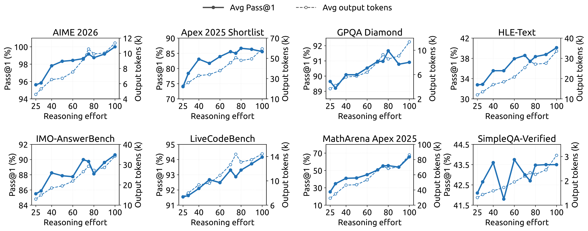

**图 12.** 八项重推理基准上性能与输出长度随推理强度的变化. 每个面板在推理强度值从 25 变为 100 时, 绘出 Pass@1 (实线, 左轴) 和每条响应的平均输出 Token 数 (虚线, 右轴).

## 9 推理强度控制中的指数 Token 惩罚

标量强度变量可以在部署时控制成本-质量折中, 无须设置硬性 Token 预算. 强化学习期间, 较低强度施加较强的 Token 惩罚, 较高强度则允许更多计算. 本节简要说明指数惩罚调度的由来.

若轨迹以强度等级 $b$ 生成了 $\ell$ 个推理 Token, 长度扣分为

$$
r^{\mathrm{len}}(\ell,b)=-\min\left\{C_{\max},\,k(b)\frac{\ell}{L_{\mathrm{norm}}}\right\},
$$

其中, $L_{\mathrm{norm}}$ 是参考长度, $C_{\max}$ 限制扣分上限. 随强度变化的 Token 惩罚系数为

$$
k(b)=k_0\exp\left(-\frac{b-b_{\min}}{\tau}\right),
$$

其中, $k_0$ 是最低强度等级 $b_{\min}$ 下的惩罚系数, $\tau$ 控制惩罚衰减速度.

为说明这种选择, 考虑一个固定问题 $x$. 设 $p_x(\ell)$ 为经过 $\ell$ 个推理 Token 后解决该问题的概率. 在未达到扣分上限的区域, 将偏好的推理长度 $\ell_x^*(b)$ 定义为

$$
\ell_x^*(b)\in\arg\max_{\ell\geq0}\left[p_x(\ell)-k(b)\frac{\ell}{L_{\mathrm{norm}}}\right].
$$

对于内部最优解, 一阶条件为

$$
p_x'\left(\ell_x^*(b)\right)=\frac{k(b)}{L_{\mathrm{norm}}},
$$

其中, $p_x'(\ell)=dp_x(\ell)/d\ell$ 是增加推理后, 解题概率的边际增益.

假设这一边际收益在相关运行范围内近似指数衰减:

$$
p_x'(\ell)\approx a_x\exp\left(-\frac{\ell}{s_x}\right),
$$

其中, $a_x>0$ 是随实例变化的缩放因子, $s_x>0$ 决定衰减速度. 把[公式 12](#equation-12) 和[公式 15](#equation-15) 代入[公式 14](#equation-14), 得

$$
\ell_x^*(b)\approx C_x-s_x\log k_0+\frac{s_x}{\tau}(b-b_{\min}),
$$

其中, $C_x=s_x\log(a_xL_{\mathrm{norm}})$ 与 $b$ 无关. 因此在这一局部模型下, 指数惩罚调度使请求强度与偏好推理长度之间呈简单的一阶仿射趋势.

对两个满足 $b_2>b_1$ 的强度等级, 对应的预测长度差为

$$
\ell_x^*(b_2)-\ell_x^*(b_1)\approx\frac{s_x}{\tau}(b_2-b_1).
$$

因此, $k_0$ 主要控制整体上缩短推理的压力, $\tau$ 则控制预测结果对强度的敏感程度.

这一推导是奖励层面的局部近似, 并不是说测得的平均长度必须呈线性关系或逐点单调. 实际行为可能偏离, 因为强度指令会直接改变推理策略, 生成过程具有随机性, 智能体轨迹包含的轮数不同, 子组奖励归一化也会改变优化力度. 分析还假设存在惩罚上限尚未生效的内部解. 达到上限后, 边际 Token 惩罚变为零, 必须单独考察封顶区域.
