> [DeepSeek-AI](https://www.deepseek.com/). 论文于 2026 年 4 月 26 日首次提交至 arXiv. 本网页阅读版依据 [DeepSeek-V4: Towards Highly Efficient Million-Token Context Intelligence](https://arxiv.org/abs/2606.19348v1) 的 arXiv v1 版本整理. 精确印刷版式以[原始 PDF](/paper/deepseek-v4.pdf) 为准. [DOI](https://doi.org/10.48550/arXiv.2606.19348). [TeX 源文件](https://arxiv.org/src/2606.19348v1).

## 摘要

我们推出 DeepSeek-V4 系列的预览版, 其中包括两个性能强劲的混合专家 (MoE) 语言模型: 拥有 1.6T 参数 (激活 49B) 的 DeepSeek-V4-Pro, 以及拥有 284B 参数 (激活 13B) 的 DeepSeek-V4-Flash. 两者均支持 100 万 token 的上下文长度. DeepSeek-V4 系列在架构与优化方面包含多项关键升级: (1) 将压缩稀疏注意力 (CSA) 与高度压缩注意力 (HCA) 相结合的混合注意力架构, 用于提高长上下文效率; (2) 增强传统残差连接的流形约束超连接 (*m*HC); (3) 以及用于加快收敛并提高训练稳定性的 Muon 优化器. 我们使用超过 32T 个多样且高质量的 token 对两个模型进行预训练, 随后采用一套全面的后训练流程来释放并进一步增强其能力. DeepSeek-V4-Pro-Max 是 DeepSeek-V4-Pro 的最高推理强度模式, 它重新定义了开放模型的当前最佳水平, 并在核心任务上超越其前代模型. 与此同时, DeepSeek-V4 系列在长上下文场景中具有很高的效率. 在 100 万 token 的上下文设置下, 与 DeepSeek-V3.2 相比, DeepSeek-V4-Pro 仅需 27% 的单 token 推理 FLOPs 和 10% 的 KV cache. 这使我们能够在常规场景下支持 100 万 token 的上下文, 从而让长程任务和进一步的测试时扩展更具可行性. 模型检查点见 [https://huggingface.co/collections/deepseek-ai/deepseek-v4](https://huggingface.co/collections/deepseek-ai/deepseek-v4).

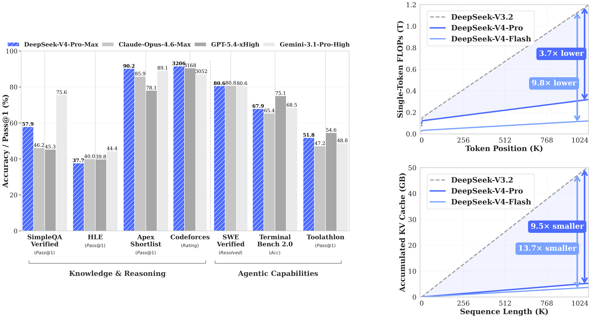

**图 1.** **左**: DeepSeek-V4-Pro-Max 及同类模型的基准性能. **右**: DeepSeek-V4 系列与 DeepSeek-V3.2 的推理 FLOPs 和 KV cache 大小.

## 1 引言

推理模型 [Ope24, Guo25] 的出现确立了测试时扩展的新范式, 推动大语言模型 (LLM) 的性能取得显著提升. 然而, 这一扩展范式从根本上受到标准注意力机制 [Vas17] 二次计算复杂度的制约, 使超长上下文和推理过程面临难以承受的性能瓶颈. 与此同时, 从复杂的智能体工作流到大规模跨文档分析, 长程场景与任务的出现也使高效支持超长上下文成为未来发展的关键. 尽管近期的开源工作 [Dee24a, Yan25a, Min25, Tea25] 提升了通用能力, 但处理超长序列时架构层面的这一核心低效问题仍是关键阻碍, 既限制了测试时扩展带来的进一步收益, 也妨碍了对长程场景与任务的进一步探索.

为了突破超长上下文中的效率壁垒, 我们开发了 DeepSeek-V4 系列, 其中包括拥有 1.6T 参数 (激活 49B) 的 DeepSeek-V4-Pro 预览版, 以及拥有 284B 参数 (激活 13B) 的 DeepSeek-V4-Flash 预览版. 通过架构创新, DeepSeek-V4 系列大幅提升了处理超长序列的计算效率. 这一突破使模型能够高效支持 100 万 token 的上下文长度, 为下一代 LLM 开启百万 token 级上下文的新时代. 我们相信, 高效处理超长序列的能力将推动测试时扩展迈向下一阶段, 为深入研究长程任务铺平道路, 并为探索在线学习等未来范式奠定必要基础.

与 DeepSeek-V3 架构 [Dee24a] 相比, DeepSeek-V4 系列保留了 DeepSeekMoE 框架 [Dai24] 和多 token 预测 (MTP) 策略, 同时在架构与优化方面引入多项关键创新. 为提高长上下文效率, 我们设计了结合压缩稀疏注意力 (CSA) 与高度压缩注意力 (HCA) 的混合注意力机制. CSA 沿序列维度压缩 KV cache, 随后执行 DeepSeek 稀疏注意力 (DSA) [Dee25a], 而 HCA 对 KV cache 进行更激进的压缩, 但保留稠密注意力. 为增强建模能力, 我们引入流形约束超连接 (*m*HC) [Xie26] 来升级传统残差连接. 此外, 我们将 Muon [Kel24, Liu25] 优化器引入 DeepSeek-V4 系列的训练, 从而加快收敛并提高训练稳定性.

为了实现 DeepSeek-V4 系列的高效训练与推理并提升开发效率, 我们引入了多项基础设施优化. 第一, 我们为 MoE 模块设计并实现单个融合内核, 使计算, 通信和内存访问完全重叠. 第二, 我们采用领域特定语言 (DSL) TileLang [Wan26], 以平衡开发效率与运行时效率. 第三, 我们提供具备批次不变性和确定性的高效内核库, 确保训练与推理之间的逐位可复现性. 第四, 对于训练框架, 我们使用张量级检查点扩展自动微分框架, 以细粒度控制重计算; 同时通过用于 Muon 优化器的混合 ZeRO 策略, 借助重计算与融合内核实现的成本高效 *m*HC, 以及用于管理压缩注意力的两阶段上下文并行来提高训练效率. 第五, 对于推理框架, 我们设计了带有磁盘存储策略的异构 KV cache 结构, 以实现共享前缀的高效复用. 此外, 在后训练阶段, 我们为 MoE 专家权重和索引器 QK 路径引入 FP4 量化感知训练, 以减少内存与计算开销.

通过采用混合 CSA 与 HCA, 并对计算和存储精度进行优化, 与 DeepSeek-V3.2 相比, DeepSeek-V4 系列显著降低了推理 FLOPs, 并大幅缩小了 KV cache, 在长上下文设置下尤其如此. [图 1](#figure-01) 右侧展示了 DeepSeek-V3.2 和 DeepSeek-V4 系列的估算单 token 推理 FLOPs 与累计 KV cache 大小. 在 1M-token 上下文场景中, 即使 DeepSeek-V4-Pro 激活的参数更多, 其单 token FLOPs (按等效 FP8 FLOPs 衡量) 也仅为 DeepSeek-V3.2 的 27%, KV cache 大小仅为后者的 10%. 此外, 激活参数更少的 DeepSeek-V4-Flash 将效率进一步提高: 在 1M-token 上下文设置下, 其单 token FLOPs 仅为 DeepSeek-V3.2 的 10%, KV cache 大小仅为后者的 7%. 另外, DeepSeek-V4 系列的路由专家参数使用 FP4 精度. 在现有硬件上, FP4 $\times$ FP8 运算的峰值 FLOPs 目前与 FP8 $\times$ FP8 相同, 但未来硬件理论上可以将其实现为效率提高 $1/3$, 从而进一步提升 DeepSeek-V4 系列的效率.

在预训练期间, 我们分别使用 32T 个 token 训练 DeepSeek-V4-Flash, 使用 33T 个 token 训练 DeepSeek-V4-Pro. 预训练后, 这两个模型均可原生且高效地支持长度为 1M token 的上下文. 在内部评测中, 凭借参数效率更高的设计, DeepSeek-V4-Flash-Base 已经在大多数基准上超越 DeepSeek-V3.2-Base. DeepSeek-V4-Pro-Base 进一步发挥这一优势, 在 DeepSeek 基础模型中树立新的性能标准, 并在推理, 编码, 长上下文和世界知识任务上全面领先.

DeepSeek-V4 系列的后训练流程采用两阶段范式: 首先独立培养特定领域专家, 随后通过在策略蒸馏 [Lu25, Gu25] 将其整合为统一模型. 首先, 针对数学, 编码, 智能体和指令遵循等每个目标领域, 分别独立训练一个专家模型. 基础模型先在高质量的特定领域数据上进行监督微调 (SFT), 以建立基础能力. 随后, 使用组相对策略优化 (GRPO) [Guo25] 进行强化学习 (RL), 在针对特定成功标准定制的奖励模型引导下, 进一步优化模型与领域相符的行为. 此阶段会得到一组多样化的专业化专家, 每个专家都擅长各自领域. 最后, 为整合这些不同能力, 我们通过在策略蒸馏训练一个统一模型, 其中统一模型作为学生, 以教师模型为参照学习优化反向 KL 损失.

**核心评测结果摘要**

- **知识**: 在广泛世界知识评测中, DeepSeek-V4-Pro 的最高推理强度模式 DeepSeek-V4-Pro-Max 在 SimpleQA [Ope24b] 和 Chinese-SimpleQA [He24] 基准上显著优于领先的开源模型. 在通过 MMLU-Pro [Wan24c], HLE [Pha25] 和 GPQA [Rei24] 评测的教育知识方面, DeepSeek-V4-Pro-Max 略微领先同类开源模型. 尽管 DeepSeek-V4-Pro-Max 在这些知识评测中仍落后于领先的专有模型 Gemini-3.1-Pro, 但已显著缩小差距.
- **推理**: 通过增加推理 token, DeepSeek-V4-Pro-Max 在标准推理基准上展现出优于 GPT-5.2 和 Gemini-3.0-Pro 的性能. 尽管如此, 其性能仍略逊于 GPT-5.4 和 Gemini-3.1-Pro, 表明其技术进展相较当前最佳前沿模型约落后 3 至 6 个月. 此外, DeepSeek-V4-Flash-Max 的性能可与 GPT-5.2 和 Gemini-3.0-Pro 相比, 使其成为复杂推理任务中极具成本效益的架构.
- **智能体**: 在公开基准上, DeepSeek-V4-Pro-Max 与 Kimi-K2.6 和 GLM-5.1 等领先开源模型相当, 但略逊于前沿闭源模型. 在内部评测中, DeepSeek-V4-Pro-Max 优于 Claude Sonnet 4.5, 并接近 Opus 4.5 的水平.
- **长上下文**: DeepSeek-V4-Pro-Max 在拥有一百万 token 上下文窗口的合成与真实用例上取得强劲结果, 在学术基准上甚至超越 Gemini-3.1-Pro.
- **DeepSeek-V4-Pro 与 DeepSeek-V4-Flash**: 由于参数规模较小, DeepSeek-V4-Flash-Max 在知识评测中的表现较低. 但分配更多思考预算后, 它在推理任务上取得了相当的结果. 在智能体评测中, DeepSeek-V4-Flash-Max 虽然在多项基准上可与 DeepSeek-V4-Pro-Max 相比, 但在更复杂的高难度任务上仍落后于体量更大的 DeepSeek-V4-Pro-Max.

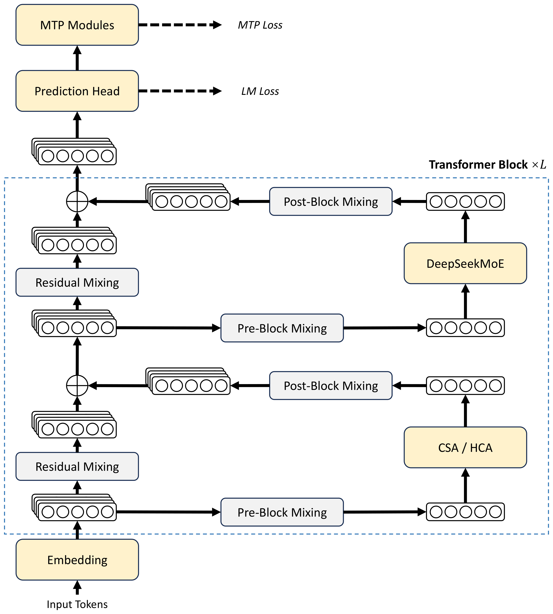

**图 2.** DeepSeek-V4 系列的整体架构. 我们在注意力层中使用混合 CSA (压缩稀疏注意力) 与 HCA (高度压缩注意力), 在前馈层中使用 DeepSeekMoE, 并使用 *m*HC 增强传统残差连接.

## 2 架构

总体而言, DeepSeek-V4 系列保留 Transformer [Vas17] 架构与多 token 预测 (MTP) 模块 [Glo24, Dee24a], 同时相较 DeepSeek-V3 引入多项关键升级: (1) 第一, 我们引入流形约束超连接 (*m*HC) [Xie26] 来增强传统残差连接; (2) 第二, 我们设计了混合注意力架构, 通过压缩稀疏注意力与高度压缩注意力大幅提高长上下文效率; (3) 第三, 我们采用 Muon [Kel24, Liu25] 作为优化器. 对于混合专家 (MoE) 组件, 我们仍采用 DeepSeekMoE [Dai24] 架构, 仅在 DeepSeek-V3 的基础上进行少量调整. 多 token 预测 (MTP) [Qi20, Glo24, Li24g, Dee24a] 的配置与 DeepSeek-V3 保持完全一致. 其他所有未说明的细节均遵循 DeepSeek-V3 [Dee24a] 中确立的设置. [图 2](#figure-02) 展示了 DeepSeek-V4 的整体架构, 具体细节如下.

### 2.1 继承自 DeepSeek-V3 的设计

**混合专家.**

与先前的 DeepSeek 系列模型 [Dee24, Dee24a] 一样, DeepSeek-V4 系列的前馈网络 (FFN) 也采用 DeepSeekMoE 范式 [Dai24], 设置细粒度路由专家与共享专家. 与 DeepSeek-V3 不同, 我们将计算亲和度分数的激活函数从 $\mathrm{Sigmoid}(\cdot)$ 改为 $\mathrm{Sqrt}(\mathrm{Softplus}(\cdot))$. 对于负载均衡, 我们也采用无辅助损失策略 [Wan24d, Dee24a], 并加入轻量的逐序列均衡损失, 以防单条序列内部出现极端不均衡. 对于 DeepSeek-V4, 我们取消了对路由目标节点数量的限制, 并仔细重新设计并行策略以保持训练效率. 此外, 与 DeepSeek-V3 相比, 我们将最初几个 Transformer 块中的稠密 FFN 层替换为采用哈希路由 [Rol21] 的 MoE 层. 哈希路由策略根据与输入 token ID 相关的预定义哈希函数, 确定每个 token 的目标专家.

**多 token 预测.**

与 DeepSeek-V3 一样, DeepSeek-V4 系列也设置了 MTP 模块与目标. 鉴于 MTP 策略已在 DeepSeek-V3 中得到验证, 我们在 DeepSeek-V4 系列中不加修改地采用相同策略.

### 2.2 流形约束超连接

如[图 2](#figure-02) 所示, DeepSeek-V4 系列引入流形约束超连接 (*m*HC) [Xie26], 以增强相邻 Transformer 块之间的传统残差连接. 与朴素超连接 (HC) [Zhu25] 相比, *m*HC 的核心思想是将残差映射约束到特定流形上, 从而在保持模型表达能力的同时, 提高信号跨层传播的稳定性. 本小节简要介绍标准 HC, 并说明我们如何设计 *m*HC 以实现稳定训练.

**标准超连接.**

标准 HC 将残差流的宽度扩大 $n_{\mathrm{hc}}$ 倍. 具体而言, 残差流的形状从 $\mathbb{R}^{d}$ 扩展至 $\mathbb{R}^{n_{\mathrm{hc}}\times d}$, 其中 $d$ 是实际层输入的隐藏维度. 令 $X_{l}=[\mathbf{x}_{l,1};\ldots;\mathbf{x}_{l,n_{\mathrm{hc}}}]^\top\in\mathbb{R}^{n_{\mathrm{hc}}\times d}$ 为第 $l$ 层之前的残差状态. HC 引入三个线性映射: 输入映射 $A_{l}\in\mathbb{R}^{1\times n_{\mathrm{hc}}}$, 残差变换 $B_{l}\in\mathbb{R}^{n_{\mathrm{hc}}\times n_{\mathrm{hc}}}$, 以及输出映射 $C_{l}\in\mathbb{R}^{n_{\mathrm{hc}}\times 1}$. 残差状态的更新可表示为:

$$
X_{l+1}=B_{l}X_{l}+C_{l}\mathcal{F}_{l}(A_{l}X_{l}),\tag{1}
$$

其中, $\mathcal{F}_{l}$ 表示第 $l$ 层 (例如 MoE 层), 其输入与输出形状均为 $\mathbb{R}^{d}$. 请注意, 实际层输入 $A_{l}X_{l}\in\mathbb{R}^{d}$ 同样是 $d$ 维的, 因而扩展后的残差宽度不会影响内部层的设计. HC 将残差宽度与实际隐藏维度解耦, 以极小的计算开销提供一个互补的扩展轴, 因为 $n_{\mathrm{hc}}$ 通常远小于隐藏维度 $d$. 然而, 尽管 HC 已展现出提高模型性能的潜力, 我们发现堆叠多层时, 训练会频繁出现数值不稳定, 从而阻碍 HC 的扩展.

**流形约束残差映射.**

*m*HC 的核心创新是将残差映射矩阵 $B_{l}$ 约束在双随机矩阵的流形 (Birkhoff 多面体) $\mathcal{M}$ 上, 从而提高信号跨层传播的稳定性:

$$
B_{l}\in\mathcal{M}\coloneq\{M\in\mathbb{R}^{n\times n}\mid M\mathbf{1}_{n}=\mathbf{1}_{n},\;\mathbf{1}_{n}^\top M=\mathbf{1}_{n}^\top,\;M\geqslant 0\}.\tag{2}
$$

该约束保证映射矩阵的谱范数 $\|B_{l}\|_{2}$ 以 1 为上界, 因而残差变换是非扩张的, 这提高了前向传播与反向传播期间的数值稳定性. 此外, 集合 $\mathcal{M}$ 对乘法封闭, 从而保证深度堆叠 *m*HC 场景下的稳定性. 另外, 输入变换 $A_{l}$ 与输出变换 $C_{l}$ 也通过 Sigmoid 函数被约束为非负且有界, 以避免信号抵消风险.

**动态参数化.**

三个线性映射的参数是动态生成的, 并被分解为动态 (依赖输入) 分量与静态 (不依赖输入) 分量. 给定输入 $X_{l}\in\mathbb{R}^{n_{\mathrm{hc}}\times d}$, 首先将其展平并归一化: $\hat{X}_{l}=\mathrm{RMSNorm}(\mathrm{vec}(X_{l}))\in\mathbb{R}^{1\times n_{\mathrm{hc}}d}$. 随后, 我们遵循传统 HC, 生成无约束的原始参数 $\tilde{A}_{l}\in\mathbb{R}^{1\times n_{\mathrm{hc}}}$, $\tilde{B}_{l}\in\mathbb{R}^{n_{\mathrm{hc}}\times n_{\mathrm{hc}}}$ 和 $\tilde{C}_{l}\in\mathbb{R}^{n_{\mathrm{hc}}\times 1}$:

$$
\tilde{A}_{l} =\alpha_{l}^{\mathrm{pre}}\cdot(\hat{X}_{l}W^{\mathrm{pre}}_{l})+S_{l}^{\mathrm{pre}},\tag{3}
$$

$$
\tilde{B}_{l} =\alpha_{l}^{\mathrm{res}}\cdot\mathrm{Mat}(\hat{X}_{l}W^{\mathrm{res}}_{l})+S_{l}^{\mathrm{res}},\tag{4}
$$

$$
\tilde{C}_{l} =\alpha_{l}^{\mathrm{post}}\cdot(\hat{X}_{l}W^{\mathrm{post}}_{l})^\top+S_{l}^{\mathrm{post}},\tag{5}
$$

其中, $W^{\mathrm{pre}}_{l},W^{\mathrm{post}}_{l}\in\mathbb{R}^{n_{\mathrm{hc}}d\times n_{\mathrm{hc}}}$ 与 $W^{\mathrm{res}}_{l}\in\mathbb{R}^{n_{\mathrm{hc}}d\times n_{\mathrm{hc}}^{2}}$ 是用于生成动态分量的可学习参数; $\mathrm{Mat}(\cdot)$ 将大小为 $1\times n_{\mathrm{hc}}^{2}$ 的向量重塑为大小为 $n_{\mathrm{hc}}\times n_{\mathrm{hc}}$ 的矩阵; $S_{l}^{\mathrm{pre}}\in\mathbb{R}^{1\times n_{\mathrm{hc}}}$, $S_{l}^{\mathrm{post}}\in\mathbb{R}^{n_{\mathrm{hc}}\times 1}$ 和 $S_{l}^{\mathrm{res}}\in\mathbb{R}^{n_{\mathrm{hc}}\times n_{\mathrm{hc}}}$ 是可学习的静态偏置; $\alpha_{l}^{\mathrm{pre}}$, $\alpha_{l}^{\mathrm{res}}$, $\alpha_{l}^{\mathrm{post}}\in\mathbb{R}$ 是初始化为较小值的可学习门控因子.

**应用参数约束.**

得到无约束原始参数 $\tilde{A}_{l},\tilde{B}_{l},\tilde{C}_{l}$ 后, 我们对其应用前述约束, 以提高数值稳定性. 具体而言, 对于输入和输出映射, 我们使用 Sigmoid 函数 $\sigma(\cdot)$ 来保证其非负性与有界性:

$$
A_{l} =\sigma(\tilde{A}_{l}),\tag{6}
$$

$$
C_{l} =2\sigma(\tilde{C}_{l}).\tag{7}
$$

对于残差映射 $\tilde{B}_{l}$, 我们将其投影到双随机矩阵流形 $\mathcal{M}$ 上. 这一过程通过 Sinkhorn-Knopp 算法实现: 先对 $\tilde{B}_{l}$ 应用指数函数以保证正性, 得到 $M^{(0)}=\exp(\tilde{B}_{l})$, 随后迭代执行列归一化与行归一化:

$$
M^{(t)}=\mathcal{T}_{r}(\mathcal{T}_{c}(M^{(t-1)})),\tag{8}
$$

其中, $\mathcal{T}_{r}$ 和 $\mathcal{T}_{c}$ 分别表示行归一化与列归一化. 该迭代收敛至受约束的双随机矩阵 $B_{l}=M^{(t_{\max})}$. 我们选择 $t_{\max}=20$ 作为实用取值.

### 2.3 使用 CSA 与 HCA 的混合注意力

当上下文长度达到极端规模时, 注意力机制会成为模型的主要计算瓶颈. 对于 DeepSeek-V4, 我们设计了两种高效注意力架构, 即压缩稀疏注意力 (CSA) 与高度压缩注意力 (HCA), 并采用二者交错的混合配置, 从而显著降低长文本场景中的注意力计算成本. CSA 同时整合压缩与稀疏注意力策略: 它先将每 $m$ 个 token 的键值 (KV) cache 压缩为一个条目, 再应用 DeepSeek 稀疏注意力 (DSA) [Dee25a], 使每个查询 token 仅关注 $k$ 个压缩 KV 条目. HCA 旨在实现极致压缩, 将每 $m^{\prime}$ ($\gg m$) 个 token 的 KV cache 合并为单个条目. CSA 与 HCA 的混合架构显著提高了 DeepSeek-V4 系列的长上下文效率, 使一百万 token 上下文在实践中切实可行. 本小节介绍混合注意力架构的核心技术, 我们还提供了一个开源实现 [+1], 用以明确说明更多细节.

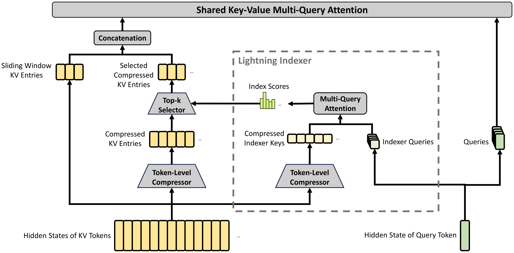

**图 3.** CSA 的核心架构. 它将 KV 条目数量压缩至 $\frac{1}{m}$, 随后应用 DeepSeek 稀疏注意力以进一步加速. 此外, 一小组滑动窗口 KV 条目会与选中的压缩 KV 条目结合, 以增强局部细粒度依赖关系.

#### 2.3.1 压缩稀疏注意力

[图 3](#figure-03) 展示了 CSA 的核心架构. 它先将每 $m$ 个 token 的 KV cache 压缩为一个条目, 随后应用 DeepSeek 稀疏注意力以进一步加速.

**压缩键值条目.**

令 $H\in\mathbb{R}^{n\times d}$ 为输入隐藏状态序列, 其中 $n$ 是序列长度, $d$ 是隐藏维度. CSA 首先计算两组 KV 条目 $C^{a},C^{b}\in\mathbb{R}^{n\times c}$ 及其对应的压缩权重 $Z^{a},Z^{b}\in\mathbb{R}^{n\times c}$, 其中 $c$ 是头维度:

$$
C^{a} =H\cdot W^{a\mathrm{KV}},\quad C^{b}=H\cdot W^{b\mathrm{KV}},\tag{9}
$$

$$
Z^{a} =H\cdot W^{aZ},\quad\ \ Z^{b}=H\cdot W^{bZ},\tag{10}
$$

其中, $W^{a\mathrm{KV}},W^{b\mathrm{KV}},W^{aZ},W^{bZ}\in\mathbb{R}^{d\times c}$ 是可训练参数. 随后, 根据压缩权重和可学习的位置偏置 $B^{a},B^{b}\in\mathbb{R}^{m\times c}$, 将 $C^{a}$ 与 $C^{b}$ 中每 $m$ 个 KV 条目压缩为一个条目, 得到 $C^{\mathrm{Comp}}\in\mathbb{R}^{\frac{n}{m}\times c}$. 每个压缩条目 $C^{\mathrm{Comp}}_{i}\in\mathbb{R}^{c}$ 的计算方式为

$$
[S^{a}_{mi:m(i+1)-1};S^{b}_{m(i-1):mi-1}] =\mathrm{Softmax}_{\mathrm{row}}([Z^{a}_{mi:m(i+1)-1}+B^{a};Z^{b}_{m(i-1):mi-1}+B^{b}]),\tag{11}
$$

$$
C^{\mathrm{Comp}}_{i} =\sum_{j=mi}^{m(i+1)-1}S^{a}_{j}\odot C^{a}_{j}+\sum_{j=m(i-1)}^{mi-1}S^{b}_{j}\odot C^{b}_{j},\tag{12}
$$

其中, $\odot$ 表示 Hadamard 积; $\mathrm{Softmax}_{\mathrm{row}}(\cdot)$ 表示沿行维度的 softmax 操作, 它对来自 $Z^{a}$ 与 $Z^{b}$ 的总计 $2m$ 个元素进行归一化. 当 $i=0$ 时, $Z^{b}_{m(i-1):mi-1}$ 用负无穷填充, $C^{b}_{m(i-1):mi-1}$ 用零填充. 请注意, 每个 $C^{\mathrm{Comp}}_{i}$ 均源自 $2m$ 个 KV 条目, 但用于 $C^{\mathrm{Comp}}_{i}$ 的 $C^{b}$ 索引与用于 $C^{\mathrm{Comp}}_{i-1}$ 的 $C^{a}$ 索引相互重叠. 因此, CSA 实际上将序列长度压缩至 $\frac{1}{m}$.

**用于稀疏选择的 Lightning Indexer.**

得到压缩 KV 条目 $C^{\mathrm{Comp}}$ 后, CSA 应用 DSA 策略, 为核心注意力选择 top-k 个压缩 KV 条目. 首先, CSA 执行与 $C^{\mathrm{Comp}}$ 相同的压缩操作, 得到压缩索引器键 $K^{\mathrm{IComp}}\in\mathbb{R}^{\frac{n}{m}\times c^{I}}$, 其中 $c^{I}$ 是索引器头维度. 随后, 对于查询 token $t$, 我们以低秩方式生成索引器查询 $\{\mathbf{q}_{t,1}^{I};\mathbf{q}_{t,2}^{I};...;\mathbf{q}_{t,n_{h}^{I}}^{I}\}$:

$$
\mathbf{c}_{t}^{Q} =\mathbf{h}_{t}\cdot W^{\mathrm{DQ}},\tag{13}
$$

$$
[\mathbf{q}_{t,1}^{I};\mathbf{q}_{t,2}^{I};...;\mathbf{q}_{t,n_{h}^{I}}^{I}]=\mathbf{q}_{t}^{I} =\mathbf{c}_{t}^{Q}\cdot W^{\mathrm{IUQ}},\tag{14}
$$

其中, $\mathbf{h}_{t}\in\mathbb{R}^{d}$ 是查询 token $t$ 的输入隐藏状态; $\mathbf{c}_{t}^{Q}\in\mathbb{R}^{d_{c}}$ 是查询的压缩潜在向量; $d_{c}$ 表示查询压缩维度; $n_{h}^{I}$ 表示索引器查询头的数量; $W^{\mathrm{DQ}}\in\mathbb{R}^{d\times d_{c}}$ 与 $W^{\mathrm{IUQ}}\in\mathbb{R}^{d_{c}\times c^{I}n_{h}^{I}}$ 分别是索引器查询的下投影矩阵和上投影矩阵. 随后, 查询 token $t$ 与先前压缩块 $s$ ($s$ < $\mathrm{Floor}(\frac{t}{m})$) 之间的索引分数 $I_{t,s}\in\mathbb{R}$ 计算如下

$$
[w_{t,1}^{I};w_{t,2}^{I};...;w_{t,n_{h}^{I}}^{I}]=\mathbf{w}_{t}^{I} =\mathbf{h}_{t}\cdot W^{w},\tag{15}
$$

$$
I_{t,s} =\sum_{h=1}^{n_{h}^{I}}w_{t,h}^{I}\cdot\mathrm{ReLU}\left(\mathbf{q}^{I}_{t,h}\cdot K^{\mathrm{IComp}}_{s}\right),\tag{16}
$$

其中, $W^{w}\in\mathbb{R}^{d\times n_{h}^{I}}$ 是可学习矩阵; $w_{t,h}^{I}\in\mathbb{R}$ 是第 $h$ 个索引器头的权重. 对于查询 token $t$, 给定其索引分数 $I_{t,:}$, 我们使用 top-k 选择器, 选择性保留压缩 KV 条目的子集 $\mathcal{C}^{\mathrm{SprsComp}}_{t}$, 供后续核心注意力使用:

$$
\mathcal{C}^{\mathrm{SprsComp}}_{t}=\left\{C^{\mathrm{Comp}}_{s}\ \Big|\ I_{t,s}\in\mathrm{Top-k}(I_{t,:})\right\}.\tag{17}
$$

**共享键值 MQA.**

选出稀疏 KV 条目后, CSA 以多查询注意力 (MQA) [Sha19] 方式执行核心注意力, 其中 $\mathcal{C}^{\mathrm{SprsComp}}_{t}$ 内的每个压缩 KV 条目同时作为注意力键和值. 具体而言, 对于查询 token $t$, 我们首先从压缩潜在向量 $\mathbf{c}_{t}^{Q}$ 生成注意力查询 $\{\mathbf{q}_{t,1};\mathbf{q}_{t,2};...;\mathbf{q}_{t,n_{h}}\}$:

$$
[\mathbf{q}_{t,1};\mathbf{q}_{t,2};...;\mathbf{q}_{t,n_{h}}]=\mathbf{q}_{t}=\mathbf{c}_{t}^{Q}\cdot W^{\mathrm{UQ}},\tag{18}
$$

其中, $n_{h}$ 表示查询头数量; $W^{\mathrm{UQ}}\in\mathbb{R}^{d_{c}\times cn_{h}}$ 是查询的上投影矩阵. 请注意, 潜在查询向量 $\mathbf{c}_{t}^{Q}$ 与索引器查询所使用的向量共享. 随后, 我们对 $\{\mathbf{q}_{t,i}\}$ 和 $\mathcal{C}^{\mathrm{SprsComp}}_{t}$ 执行 MQA:

$$
\mathbf{o}_{t,i}=\mathrm{CoreAttn}\left(\texttt{query=}\mathbf{q}_{t,i},\texttt{key=}\mathcal{C}^{\mathrm{SprsComp}}_{t},\texttt{value=}\mathcal{C}^{\mathrm{SprsComp}}_{t}\right),\tag{19}
$$

其中, $\mathbf{o}_{t,i}\in\mathbb{R}^{c}$ 是第 $t$ 个 token 处第 $i$ 个头的核心注意力输出; $\mathrm{CoreAttn}(\cdot)$ 表示核心注意力操作.

**分组输出投影.**

在 DeepSeek-V4 的配置中, $cn_{h}$ 相当大. 因此, 将核心注意力操作的输出 $[\mathbf{o}_{t,1};\mathbf{o}_{t,2};...;\mathbf{o}_{t,n_{h}}]=\mathbf{o}_{t}\in\mathbb{R}^{cn_{h}}$ 直接投影到 $d$ 维隐藏状态会带来沉重的计算负担. 为降低这一成本, 我们设计了分组输出投影策略. 具体而言, 我们首先将 $n_{h}$ 个输出分成 $g$ 组, 随后对于每组输出 $\mathbf{o}^{G}_{t,i}\in\mathbb{R}^{c\frac{n_{h}}{g}}$, 将其投影为 $d_{g}$ 维中间输出 $\mathbf{o}^{G^{\prime}}_{t,i}\in\mathbb{R}^{d_{g}}$, 其中 $d_{g}<c\frac{n_{h}}{g}$. 最后, 将中间输出 $[\mathbf{o}^{G^{\prime}}_{t,1};\mathbf{o}^{G^{\prime}}_{t,2};...;\mathbf{o}^{G^{\prime}}_{t,g}]\in\mathbb{R}^{d_{g}g}$ 投影为最终注意力输出 $\mathbf{\hat{o}}_{t}\in\mathbb{R}^{d}$.

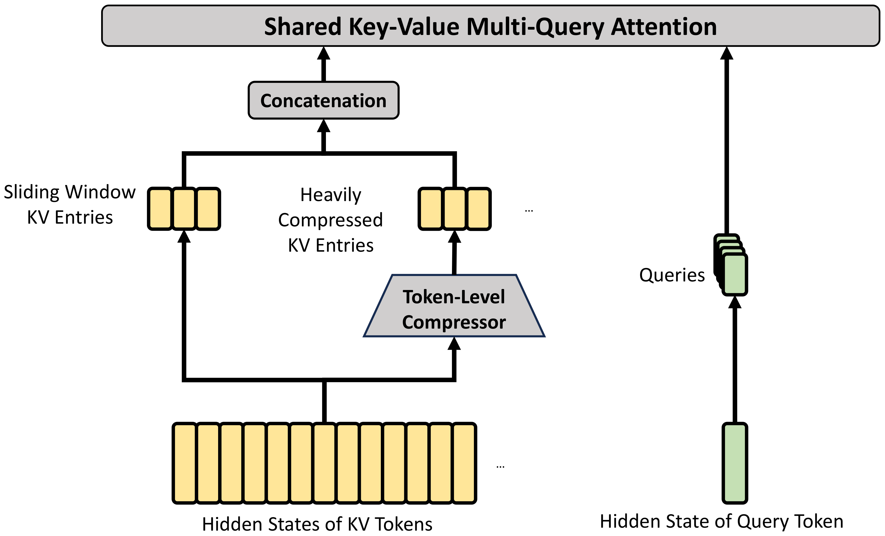

**图 4.** HCA 的核心架构. 它执行更强的压缩, 将 $m^{\prime}$ ($\gg m$) 个 token 的 KV 条目合并为一个. 我们还额外引入一小组滑动窗口 KV 条目, 以增强局部细粒度依赖关系.

#### 2.3.2 高度压缩注意力

[图 4](#figure-04) 展示了 HCA 的核心架构. 它采用更高压缩率来压缩 KV cache, 但不采用稀疏注意力.

**压缩键值条目.**

总体而言, HCA 的压缩策略与 CSA 相似, 但采用更大的压缩率 $m^{\prime}$ ($\gg m$), 且不执行重叠压缩. 令 $H\in\mathbb{R}^{n\times d}$ 为输入隐藏状态序列, HCA 首先计算原始 KV 条目 $C\in\mathbb{R}^{n\times c}$ 及其对应的压缩权重 $Z\in\mathbb{R}^{n\times c}$:

$$
C =H\cdot W^{\mathrm{KV}},\tag{20}
$$

$$
Z =H\cdot W^{Z},\tag{21}
$$

其中, $W^{\mathrm{KV}},W^{Z}\in\mathbb{R}^{d\times c}$ 是可训练参数. 随后, 根据压缩权重与可学习的位置偏置 $B\in\mathbb{R}^{m^{\prime}\times c}$, 将 $C$ 中每 $m^{\prime}$ 个 KV 条目压缩为一个, 得到 $C^{\mathrm{Comp}}\in\mathbb{R}^{\frac{n}{m^{\prime}}\times c}$. 每个压缩条目 $C^{\mathrm{Comp}}_{i}\in\mathbb{R}^{c}$ 的计算方式为

$$
S_{m^{\prime}i:m^{\prime}(i+1)-1} =\mathrm{Softmax}_{\mathrm{row}}(Z_{m^{\prime}i:m^{\prime}(i+1)-1}+B),\tag{22}
$$

$$
C^{\mathrm{Comp}}_{i} =\sum_{j=m^{\prime}i}^{m^{\prime}(i+1)-1}S_{j}\odot C_{j}.\tag{23}
$$

通过这一压缩操作, HCA 将序列长度压缩至 $\frac{1}{m^{\prime}}$.

**共享键值 MQA 与分组输出投影.**

与 CSA 一样, HCA 也采用共享 KV MQA 与分组输出投影策略. 在 KV 压缩后, 对于查询 token $t$, HCA 首先以低秩方式生成注意力查询 $\{\mathbf{q}_{t,1};\mathbf{q}_{t,2};...;\mathbf{q}_{t,n_{h}}\}$:

$$
\mathbf{c}_{t}^{Q} =\mathbf{h}_{t}\cdot W^{\mathrm{DQ}},\tag{24}
$$

$$
[\mathbf{q}_{t,1};\mathbf{q}_{t,2};...;\mathbf{q}_{t,n_{h}}]=\mathbf{q}_{t} =\mathbf{c}_{t}^{Q}\cdot W^{\mathrm{UQ}},\tag{25}
$$

其中, $\mathbf{h}_{t}\in\mathbb{R}^{d}$ 是查询 token $t$ 的输入隐藏状态; $n_{h}$ 表示查询头数量; $W^{\mathrm{DQ}}\in\mathbb{R}^{d\times d_{c}}$ 和 $W^{\mathrm{UQ}}\in\mathbb{R}^{d_{c}\times cn_{h}}$ 分别是查询的下投影矩阵与上投影矩阵. 随后, 我们对 $\{\mathbf{q}_{t,i}\}$ 和 $C^{\mathrm{Comp}}$ 执行 MQA:

$$
\mathbf{o}_{t,i}=\mathrm{CoreAttn}\left(\texttt{query=}\mathbf{q}_{t,i},\texttt{key=}C^{\mathrm{Comp}},\texttt{value=}C^{\mathrm{Comp}}\right),\tag{26}
$$

其中, $\mathbf{o}_{t,i}\in\mathbb{R}^{c}$ 是第 $t$ 个 token 处第 $i$ 个头的核心注意力输出. 随后, 与 CSA 相同, HCA 将 $n_{h}$ 个输出分成 $g$ 组, 并将每组输出 $\mathbf{o}^{G}_{t,i}\in\mathbb{R}^{c\frac{n_{h}}{g}}$ 投影为 $d_{g}$ 维中间输出 $\mathbf{o}^{G^{\prime}}_{t,i}\in\mathbb{R}^{d_{g}}$, 其中 $d_{g}<c\frac{n_{h}}{g}$. 最后, HCA 将中间输出 $[\mathbf{o}^{G^{\prime}}_{t,1};\mathbf{o}^{G^{\prime}}_{t,2};...;\mathbf{o}^{G^{\prime}}_{t,g}]\in\mathbb{R}^{d_{g}g}$ 投影为最终注意力输出 $\mathbf{\hat{o}}_{t}\in\mathbb{R}^{d}$.

#### 2.3.3 其他细节

除上述 CSA 与 HCA 核心架构外, 我们的混合注意力还包含其他多项技术. 为使行文清晰, 我们在上文介绍中省略了这些附加技术, 并将在本小节中简要说明. 此外, 为简明起见, 本小节仅关注这些技术的核心思想, 可能会省略少量细节. 我们建议读者参阅开源实现, 以了解明确无歧义的细节.

**查询与键值条目归一化.**

对于 CSA 与 HCA, 我们均在核心注意力操作前, 对查询的每个头以及压缩 KV 条目的唯一头执行额外的 RMSNorm 操作. 这种归一化可避免注意力 logit 爆炸, 并可能提高训练稳定性.

**部分旋转位置嵌入.**

对于 CSA 与 HCA, 我们在注意力查询, KV 条目和核心注意力输出上部分应用旋转位置嵌入 (RoPE) [Su24]. 具体而言, 对于 CSA 和 HCA 使用的每个查询向量与 KV 条目向量, 我们在其最后 64 个维度上应用 RoPE. 由于 KV 条目同时作为注意力键和值, 朴素的核心注意力输出 $\{\mathbf{o}_{t,i}\}$ 会携带由 KV 条目加权和产生的绝对位置嵌入. 作为应对措施, 我们还在每个 $\mathbf{o}_{t,i}$ 的最后 64 个维度上应用位置为 $-i$ 的 RoPE. 这样一来, 核心注意力输出也会携带相对位置嵌入, 每个 KV 条目对核心注意力输出的贡献也将与查询和 KV 条目之间的距离相关.

**滑动窗口注意力附加分支.**

为在 CSA 与 HCA 中严格保持因果性, 每个查询仅关注此前的压缩 KV 块. 因此, 查询无法访问其自身压缩块内其他 token 的信息. 与此同时, 在语言建模中, 近期 token 通常与查询 token 具有更高相关性. 基于这些原因, 我们以滑动窗口方式为 CSA 与 HCA 引入一个补充注意力分支, 以更好地建模局部依赖关系. 具体而言, 对于每个查询 token, 我们额外生成与最近 $n_{\mathrm{win}}$ 个 token 对应的 $n_{\mathrm{win}}$ 个未压缩 KV 条目. 在 CSA 和 HCA 的核心注意力中, 滑动窗口内的这些 KV 条目将与压缩 KV 条目一同使用.

**Attention Sink.**

在 CSA 与 HCA 的核心注意力中, 我们采用 Attention Sink 技术 [Xia24a, Ope25c]. 具体而言, 我们设置一组可学习的 sink logit $\{z^{\prime}_{1},z^{\prime}_{2},...,z^{\prime}_{n_{h}}\}$. 对于第 $h$ 个注意力头, 将 $\mathrm{Exp}(z^{\prime}_{h})$ 加到注意力分数的分母中:

$$
s_{h,i,j}=\frac{\mathrm{Exp}(z_{h,i,j})}{\sum_{k}\mathrm{Exp}(z_{h,i,k})+\mathrm{Exp}(z^{\prime}_{h})},\tag{27}
$$

其中, $s_{h,i,j},z_{h,i,j}\in\mathbb{R}$ 分别表示第 $h$ 个注意力头在第 $i$ 个查询 token 与此前第 $j$ 个 token 或压缩块之间的注意力分数与注意力 logit. 该技术允许每个查询头将注意力分数总和调整为不等于 1, 甚至接近 0.

#### 2.3.4 效率讨论

通过采用混合 CSA 与 HCA 以及低精度计算和存储, DeepSeek-V4 系列的注意力模块在注意力 FLOPs 与 KV cache 大小两方面都具有出色效率, 在长上下文场景中尤其如此. 第一, 我们为 KV 条目采用混合存储格式: 旋转位置嵌入 (RoPE) 维度使用 BF16 精度, 其余维度使用 FP8 精度. 与纯 BF16 存储相比, 这一混合表示将 KV cache 大小减少了近一半. 第二, Lightning Indexer 内的注意力计算以 FP4 精度执行, 从而在极长上下文下加速注意力操作. 第三, 相较 DeepSeek-V3.2, DeepSeek-V4 系列选择了更小的注意力 top-k, 从而提高模型在短文本与中等长度文本上的效率. 最后也是最重要的一点, 压缩注意力与混合注意力技术大幅降低了 KV cache 大小与计算 FLOPs.

以头维度为 128 的 BF16 GQA8 [Ain23] 作为基线, 这是 LLM 注意力的常见配置之一. 在 1M 上下文设置下, DeepSeek-V4 系列的 KV cache 大小可以大幅降至该基线的约 $2\%$. 此外, 即便与已经相当高效的基线 DeepSeek-V3.2 [Dee25a] 相比, DeepSeek-V4 系列仍展现出显著的效率优势. [图 1](#figure-01) 右侧给出了二者推理 FLOPs 与 KV cache 大小的比较.

**算法 1: DeepSeek-V4 的 Muon 优化器.**

- **给定:** 学习率 $\eta$, 动量 $\mu$, 权重衰减 $\lambda$, 更新缩放因子 $\gamma$.
- **对于**每个训练步骤 $t$:
  - **对于**每个逻辑上独立的权重 $W \in \mathbb{R}^{n \times m}$:
    - $G_t = \nabla_W \mathcal{L}_t(W_{t-1})$. **计算梯度.**
    - $M_t = \mu M_{t-1} + G_t$. **累积动量缓冲区.**
    - $O^{\prime}_t = \mathrm{HybridNewtonSchulz}(\mu M_t + G_t)$. **Nesterov 技巧与混合 Newton-Schulz.**
    - $O_t = O^{\prime}_t \cdot \sqrt{\max(n, m)} \cdot \gamma$. **重新缩放更新的 RMS.**
    - $W_t = W_{t-1} \cdot \left(1 - \eta \lambda \right) - \eta O_t$. **执行权重衰减与更新.**

### 2.4 Muon 优化器

由于 Muon [Kel24, Liu25] 优化器收敛更快且训练稳定性更高, 我们将其用于 DeepSeek-V4 系列的大多数模块. 算法 1 给出了 Muon 优化的完整流程.

**基本配置.**

对于嵌入模块, 预测头模块, *m*HC 模块的静态偏置与门控因子, 以及所有 RMSNorm 模块的权重, 我们保留 AdamW [Los17] 优化器. 其他所有模块均使用 Muon 更新. 遵循 [Liu25], 我们也对 Muon 参数应用权重衰减, 使用 Nesterov [Nes83, Kel24] 技巧, 并重新缩放更新矩阵的均方根 (RMS), 以复用 AdamW 超参数. 与该工作不同, 我们使用混合 Newton-Schulz 迭代进行正交化.

**混合 Newton-Schulz 迭代.**

对于给定矩阵 $M$, 令其奇异值分解 (SVD) 为 $M=U\Sigma V^\top$. Newton-Schulz 迭代旨在将 $M$ 近似正交化为 $U V^\top$. 通常先将 $M$ 归一化为 $M_{0}=M/\|M\|_{F}$, 以确保其最大奇异值不超过 1. 随后, 每次 Newton-Schulz 迭代执行以下操作:

$$
M_{k}=aM_{k-1}+b(M_{k-1}M_{k-1}^\top)M_{k-1}+c(M_{k-1}M_{k-1}^\top)^{2}M_{k-1}.\tag{28}
$$

我们的混合 Newton-Schulz 在两个不同阶段中执行 10 次迭代. 前 8 步使用系数 $(a,b,c)=(3.4445,-4.7750,2.0315)$ 推动快速收敛, 使奇异值接近 1. 最后 2 步改用系数 $(a,b,c)=(2,-1.5,0.5)$, 将奇异值精确稳定在 1.

**避免注意力 logits 爆炸.**

DeepSeek-V4 系列的注意力架构允许我们直接对注意力查询与 KV 条目应用 RMSNorm, 从而有效防止注意力 logits 爆炸. 因此, 我们未在 Muon 优化器中使用 QK-Clip 技术 [Liu25].

## 3 通用基础设施

### 3.1 专家并行中的细粒度通信与计算重叠

混合专家 (MoE) 可通过专家并行 (EP) 加速. 然而, EP 需要复杂的节点间通信, 并对互连带宽与延迟提出很高要求. 为缓解 EP 中的通信瓶颈, 并在较低互连带宽要求下取得更高的端到端性能, 我们提出一种细粒度 EP 方案, 将通信与计算融合到单个流水线内核中, 以实现通信与计算重叠.

**隐藏通信延迟.**

EP 方案的关键在于, MoE 层中的通信延迟可以有效隐藏在计算过程中. 如[图 5](#figure-05) 所示, DeepSeek-V4 系列中的每个 MoE 层主要可分解为四个阶段: 两个通信受限阶段 *Dispatch* 和 *Combine*, 以及两个计算受限阶段 *Linear-1* 和 *Linear-2*. 性能分析表明, 在单个 MoE 层内, 通信总时间少于计算总时间. 因此, 将通信与计算融合为统一流水线后, 计算仍是主要瓶颈, 这意味着系统能够容忍更低的互连带宽, 而不会降低端到端性能.

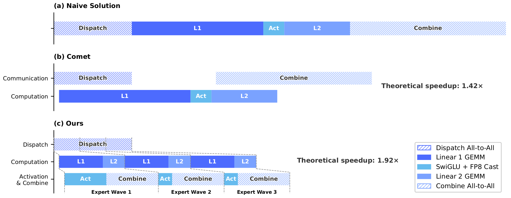

**图 5.** 我们的 EP 方案与相关工作的示意图. Comet [Zha25d] 分别将 Dispatch 与 Linear-1, Linear-2 与 Combine 重叠. 我们的 EP 方案通过将专家拆分并调度为多个波次, 实现更细粒度的重叠. 理论加速比在 DeepSeek-V4-Flash 架构的配置下评估.

**细粒度 EP 方案.**

为进一步降低互连带宽要求并放大重叠的收益, 我们引入更细粒度的专家划分方案. 受多项相关工作 [Aim25, Zha25d] 启发, 我们将专家拆分并调度为多个*波次*. 每个波次由一小部分专家组成. 一旦该波次内所有专家完成通信, 计算即可立即开始, 无需等待其他专家. 如[图 5](#figure-05) 所示, 在稳态下, 当前波次的计算, 下一波次的 token 传输, 以及已完成专家的结果发送会并发进行. 这在专家之间形成细粒度流水线, 使整个波次中的计算与通信均保持连续. 基于波次的调度可加速强化学习 (RL) rollout 等极端情形, 这类情形通常会遇到长尾小批次.

**性能与开源 Mega-Kernel.**

我们在 NVIDIA GPU 与华为昇腾 NPU 平台上验证了细粒度 EP 方案. 与有竞争力的非融合基线相比, 它在通用推理工作负载上实现 $1.50\sim 1.73\times$ 加速, 在 RL rollout 和高速智能体服务等延迟敏感场景中最高实现 $1.96\times$ 加速. 我们已将名为 **MegaMoE** [+2] 的 CUDA Mega-Kernel 实现作为 DeepGEMM 的组件开源.

**观察与建议.**

我们分享内核开发中的经验, 并向硬件厂商提出一些建议, 希望有助于高效硬件设计并实现更好的软硬件协同设计:

- **计算-通信比.** 完全的通信-计算重叠取决于计算-通信比, 而非仅取决于带宽. 令峰值计算吞吐量为 $C$, 互连带宽为 $B$. 当 $C/B\leqslant V_{\mathrm{comp}}/V_{\mathrm{comm}}$ 时, 通信可以被完全隐藏, 其中 $V_{\mathrm{comp}}$ 表示计算量, $V_{\mathrm{comm}}$ 表示通信量. 对于 DeepSeek-V4-Pro, 每个 token-专家对需要 $6hd$ FLOPs (SwiGLU 门投影, 上投影和下投影), 但仅需 $3h$ 字节通信 (FP8 Dispatch + BF16 Combine), 因此可简化为:

  $$
  \frac{C}{B}\leqslant 2d=6144\;\mathrm{FLOPs/Byte}.
  $$

  即每 GBps 互连带宽足以隐藏 6.1 TFLOP/s 计算所需的通信. 带宽一旦达到此阈值, 就不再是瓶颈, 而为进一步增加带宽投入更多硅面积会产生递减收益. 我们建议未来硬件设计以此类平衡点为目标, 而非无条件扩展带宽.
- **功耗预算.** 极致的内核融合会同时将计算, 内存与网络推至高负载, 使功耗节流成为关键性能限制因素. 我们建议未来硬件设计为这种完全并发的工作负载提供充足的功耗余量.
- **通信原语.** 在 dispatch 阶段, 我们采用基于拉取的方法, 每个 GPU 主动从远程 GPU 读取激活值, 从而避免细粒度推送带来的高通知延迟. 未来硬件若具备更低延迟的跨 GPU 信号机制, 将使推送方式变得可行, 并支持更自然的通信模式.
- **激活函数.** 我们建议用不涉及指数或除法运算的低成本逐元素激活替代 SwiGLU. 这会直接降低 GEMM 后处理的开销, 防止 GEMM 流水线因激活函数计算而停顿, 从而提高总体计算吞吐量与资源利用率.

### 3.2 使用 TileLang 灵活高效地开发内核

在实践中, 我们精细的模型架构原本会产生数百个细粒度 Torch ATen 算子. 我们采用 TileLang [Wan26] 开发一组融合内核来替代其中绝大部分, 以较低的开发成本实现最佳性能. 它还使我们能在验证期间快速构建注意力变体等算子的原型. 这些内核在模型架构开发, 大规模训练以及推理服务的最终生产部署中发挥关键作用. 作为领域特定语言 (DSL), TileLang 在开发效率与运行时效率之间取得平衡, 既支持快速开发, 也支持在同一代码库内进行深入的迭代优化. 此外, 我们与 TileLang 社区密切合作, 推动形成更敏捷, 高效且稳定的内核开发工作流.

**使用 Host Codegen 降低调用开销.**

随着加速器性能持续提升, CPU 侧编排开销变得日益突出. 对于小型且高度优化的内核, 固定的主机侧开销很容易限制利用率和吞吐量. 这类开销的一个常见来源是, 运行时契约检查等主机侧逻辑通常为了灵活性使用 Python 编写, 因而每次调用都会产生固定成本.

我们使用 *Host Codegen* 缓解这一开销, 将大部分主机侧逻辑移入生成的主机代码. 具体而言, 我们首先在 IR (中间表示) 层同时生成设备内核与轻量级主机启动器, 并嵌入从语言前端解析的必要元数据, 例如数据类型, 秩/形状约束以及步幅/布局假设. 随后, 基于 TVM-FFI [Che18] 框架将启动器编译为主机端源代码; 其紧凑的调用约定与零拷贝张量互操作共同将主机侧开销降至最低. 运行时, 生成的主机代码执行验证与参数编组, 将所有逐调用检查移出 Python 执行路径. 测量结果表明, CPU 侧验证开销从数十或数百微秒降至每次调用不到一微秒.

**SMT 求解器辅助的形式化整数分析.**

TileLang 内核涉及复杂的张量索引运算, 需要强大的形式化整数分析. 在布局推断, 内存冒险检测和边界分析等编译 Pass 中, 编译器必须验证整数表达式是否满足特定性质, 以启用相应优化. 因此, 更强的形式化分析能力可以发掘更高级, 更复杂的优化机会.

为此, 我们将 Z3 SMT 求解器 [DeM08] 集成到 TileLang 的代数系统中, 为张量程序中的大多数整数表达式提供形式化分析能力. 通过将 TileLang 的整数表达式转换为 Z3 的无量词非线性整数算术 (QF_NIA), 我们在计算开销与形式表达能力之间取得平衡. QF_NIA 基于整数线性规划 (ILP) 求解器, 可以直接求解内核中常见的标准线性整数表达式. 此外, 其内在的非线性推理能力可有效处理可变张量形状上的向量化等高级挑战. 在合理资源限制下, Z3 提升总体优化性能, 同时将编译时间开销限制在数秒以内. 它对向量化, 屏障插入和代码简化等多个编译 Pass 均有显著影响.

**数值精度与逐位可复现性.**

在生产环境中, 数值正确性与可复现性和原始吞吐量同样关键. 因此, 我们默认优先保证精度: 在编译器层禁用 fast-math 优化, 影响精度的近似仅以显式选择启用的前端算子提供 (例如 `T.__exp`, `T.__log` 和 `T.__sin`). 相反, 当需要严格的 IEEE-754 语义时, TileLang 提供带有显式舍入模式的 IEEE 兼容 intrinsic (例如 `T.ieee_fsqrt`, `T.ieee_fdiv` 和 `T.ieee_add`), 使开发者能够精确指定数值行为.

我们还以逐位可复现性为目标, 用于对照手写 CUDA 基线验证内核. 我们使 TileLang 的代数简化与 lowering 规则同主流 CUDA 工具链 (例如 NVCC) 对齐, 以避免引入非预期位级差异的变换. 布局注解 (例如 `T.annotate_layout`) 还允许用户固定依赖布局的 lowering 决策, 使求值与累加顺序同参考 CUDA 实现保持一致, 从而在需要时得到逐位相同的输出.

评测表明, 这些面向精度与可复现性的设计选择不会牺牲性能: 在保守的默认设置下, TileLang 内核仍具有竞争力, 同时提供可选择性放宽数值约束的配置项, 以获得更高速度.

### 3.3 具备批次不变性和确定性的高性能内核库

为实现高效训练与推理, 我们开发了一套完整的高性能计算内核. 除基本功能和最大化硬件利用率外, 另一项关键设计目标是确保训练可复现, 并保证预训练, 后训练和推理流水线之间逐位一致. 因此, 我们以极小的性能开销实现了端到端, 逐位批次不变且确定性的内核. 这些内核有助于调试, 稳定性分析和保持一致的后训练行为.

**批次不变性.**

批次不变性保证任一给定 token 的输出逐位相同, 不受其在批次中位置的影响. 实现批次不变性面临的主要挑战如下:

- **注意力.** 为实现批次不变性, 我们不能使用 split-KV 方法 [Dao23]. 该方法将单条序列的注意力计算分布到多个流式多处理器 (SM) 上, 以均衡 SM 负载. 然而, 放弃这一技术会导致严重的波次量化问题 [+3], 从而可能不利于 GPU 利用率. 为解决这一问题, 我们为批次不变解码开发了双内核策略. 第一个内核在单个 SM 内计算整条序列的注意力输出, 确保满载波次的高吞吐量. 第二个内核为最大程度降低最后一个未填满波次的延迟并缓解波次量化, 使用多个 SM 处理单条序列. 为保证两个内核逐位相同, 我们仔细设计第二个内核的计算路径, 使其累加顺序与第一个内核相同. 此外, 第二个内核使用线程块集群内的分布式共享内存 [+4], 实现跨 SM 高速数据交换. 这种双内核方法将批次不变解码的开销有效限制在可忽略的范围内.
- **矩阵乘法.** 传统 cuBLAS 库 [Cor24] 无法实现批次不变性. 因此, 我们使用 DeepGEMM [Zha25e] 对其进行端到端替换. 此外, 对于非常小的批次, 传统实现通常使用 split-k [Osa23] 技术提高性能. 遗憾的是, split-k 技术无法保证批次不变性, 而这是 DeepSeek-V4 的关键特性. 因此, 我们在大多数场景中放弃 split-k, 但这可能导致性能下降. 为解决这一问题, 我们引入一组优化, 使矩阵乘法实现在大多数主要场景中达到甚至超过标准 split-k 的性能.

**确定性.**

确定性训练对调试硬件或软件问题非常有益. 此外, 当训练出现损失尖峰等异常时, 确定性使研究人员更容易定位数值原因, 并进一步改进模型设计. 训练中的非确定性通常源于不确定的累加顺序, 常常由原子加法指令导致. 这一问题主要出现在反向传播期间, 尤其是以下部分:

- **注意力反向传播.** 在稀疏注意力反向传播的传统实现中, 我们使用 `atomicAdd` 累加 KV token 的梯度. 由于浮点加法不满足结合律, 这会引入非确定性. 为解决该问题, 我们为每个 SM 分配独立的累加缓冲区, 随后对所有缓冲区执行全局确定性求和.
- **MoE 反向传播.** 当来自不同 rank 的多个 SM 并发向接收 rank 上的同一缓冲区写入数据时, 协商写入位置也会引入非确定性. 为解决该问题, 我们在每个单独 rank 内设计 token 顺序预处理机制, 并在多个 rank 之间隔离缓冲区. 这一策略同时保证了专家并行发送结果与 MoE 反向传播累加顺序的确定性.
- ***m*HC 中的矩阵乘法.** *m*HC 涉及输出维度仅为 24 的矩阵乘法. 对于非常小的批次, 我们不得不使用 split-k [Osa23] 算法, 其朴素实现会导致非确定性. 为解决这一问题, 我们分别输出每个拆分部分, 并在后续内核中执行确定性归约, 从而同时保持性能与确定性.

### 3.4 训练框架

我们的训练框架建立在为 DeepSeek-V3 [Dee24a] 开发的可扩展高效基础设施之上. 在训练 DeepSeek-V4 时, 我们继承这一稳健基础, 同时引入多项关键创新来适配其新型架构组件, 具体包括 Muon 优化器, *m*HC 和混合注意力机制, 并保持较高的训练效率与稳定性.

#### 3.4.1 Muon 的高效实现

Muon 优化器需要完整梯度矩阵来计算参数更新, 与零冗余优化器 (ZeRO) [Raj20] 结合时会带来挑战. 传统 ZeRO 面向 AdamW 等逐元素优化器设计, 单个参数矩阵可在多个 rank 之间划分并更新. 为解决这一冲突, 我们为 Muon 设计了 ZeRO bucket 分配的混合策略.

对于稠密参数, 我们限制 ZeRO 并行的最大规模, 并使用背包算法将参数矩阵分配给这些 rank, 确保每个 rank 管理的负载大致均衡. 每个 rank 上的 bucket 会填充至各 rank 最大 bucket 的大小, 以便高效执行 reduce-scatter 操作. 在我们的设置中, 每个 rank 管理不超过五个参数矩阵, 这种填充通常产生不到 10% 的内存开销. 当数据并行总规模超过 ZeRO 的限制时, 我们在额外的数据并行组上冗余计算 Muon 更新, 以计算换取总 bucket 内存的减少.

对于 MoE 参数, 我们独立优化每个专家. 首先展平所有层中全部专家的所有 SwiGLU [Sha20] 下投影矩阵, 随后展平上投影矩阵与门矩阵. 接着填充展平后的向量, 确保可将其均匀分布到所有 rank, 而不拆分任何逻辑上独立的矩阵. 鉴于专家数量众多, 我们不限制 MoE 参数的 ZeRO 并行规模, 且填充开销也可忽略不计.

此外, 每个 rank 上形状相同的连续参数会自动合并, 从而批量执行 Newton-Schulz 迭代, 提高硬件利用率. 我们还观察到, 使用 BF16 矩阵乘法计算时, Muon 中的 Newton-Schulz 迭代仍保持稳定. 利用这一点, 我们进一步以随机舍入方式将需要跨数据并行 rank 同步的 MoE 梯度量化为 BF16 精度, 将通信量减半. 为避免低精度加法器引入累加误差, 我们以两阶段方法替代传统的树形或环形 reduce-scatter 集合通信. 首先, all-to-all 操作在各 rank 间交换局部梯度, 随后每个 rank 以 FP32 执行局部求和. 该设计保持了数值稳健性.

#### 3.4.2 兼顾成本与内存效率的 *m*HC 实现

与传统残差连接相比, 引入 *m*HC 会同时增加激活内存消耗与流水线阶段间的通信量. 为降低这些成本, 我们实现了多项优化策略.

第一, 我们为训练与推理仔细设计并实现 *m*HC 融合内核. 第二, 我们引入选择性保存中间张量检查点的重计算策略. 具体而言, 我们重计算大多数层间隐藏状态与所有归一化层输入, 同时避免重计算计算密集型操作. 这在节省内存与计算开销之间取得平衡. 第三, 我们调整 DualPipe 1F1B 重叠方案, 以适应增加的流水线通信, 并使 *m*HC 中部分操作能够并发执行.

综合而言, 这些优化将 *m*HC 的墙钟时间开销限制在重叠 1F1B 流水线阶段的 6.7%. 更多工程优化细节见 *m*HC 专文 [Xie26].

#### 3.4.3 长上下文注意力的上下文并行

传统上下文并行 (CP) 沿序列维度划分, 每个 rank 维护连续的 $s$ 个 token. 这给压缩注意力机制 (即 CSA 与 HCA) 带来两个挑战. 一方面, 训练样本由多条序列打包而成, 每条序列独立按 $m$ (或 $m^{\prime}$) 倍压缩, 末尾不足 $m$ 个的 token 会被丢弃. 因此, 压缩 KV 长度通常小于 $\frac{s}{m}$, 且在各 rank 间不同. 另一方面, 压缩需要连续的 $m$ 个 KV 条目, 它们可能跨越两个相邻 CP rank 的边界.

为应对这些挑战, 我们设计了两阶段通信方法. 第一阶段, 每个 rank $i$ 将最后 $m$ 个未压缩 KV 条目发送至 rank $i+1$. 随后, rank $i+1$ 将收到的部分条目与本地 $s$ 个未压缩 KV 条目一起压缩, 产生固定长度为 $\frac{s}{m}+1$ 的压缩条目, 其中含有一些填充条目. 第二阶段, 跨所有 CP rank 的 all-gather 操作收集局部压缩 KV 条目. 随后, 融合的选择并填充算子将其重新组织为总长度 $\texttt{cp\_size}\cdot\frac{s}{m}$ 的完整压缩 KV 条目集, 所有填充条目均置于末尾. 对于 HCA 和 CSA 中的索引器, 每个查询 token 可见的压缩 KV 条目范围可按规则预计算. 对于 CSA 中的稀疏注意力, top-$k$ 选择器会显式指定每个查询可见的压缩 KV 条目索引.

#### 3.4.4 扩展自动微分以支持灵活的激活检查点

传统激活检查点以整个模块为粒度, 决定在反向传播期间保留还是重计算模块的输出激活. 这种粗粒度常常无法在重计算成本与激活内存占用之间实现最佳权衡. 另一种方法是手动实现整层的前向与反向逻辑, 并显式管理张量检查点状态. 该方法虽能实现细粒度控制, 却失去了自动微分框架的便利, 大幅增加开发复杂度.

为在不牺牲编程效率的情况下实现细粒度控制, 我们实现了支持自动微分的张量级激活检查点机制. 借助该机制, 开发者只需实现前向传播, 并有选择地标注各个张量以自动保存检查点和重计算. 我们的框架利用 TorchFX [Ree22] 追踪完整计算图. 对于每个标注张量, 它执行反向遍历, 找出重计算该张量所需的最小子图. 我们将这些最小子图定义为重计算图, 并在相应梯度计算前将其插入反向逻辑.

与手动实现相比, 该设计在训练期间不会引入额外开销. 框架中的重计算通过直接释放已标注张量的 GPU 内存, 并复用重计算张量的存储指针来实现, 无需任何 GPU 内存拷贝. 此外, 由于图追踪会实际运行模型, 我们可以追踪每个张量的底层存储指针, 从而自动消除共享存储张量的重复重计算 (例如 reshape 操作的输入与输出). 这样, 开发者在标注重计算时便无需分析底层内存细节.

### 3.5 推理框架

我们的推理框架大体继承自 DeepSeek-V3, 但在 KV cache 管理方面有所不同.

#### 3.5.1 KV cache 结构与管理

为高效管理 DeepSeek-V4 混合注意力机制产生的异构 KV cache, 我们设计了定制 KV cache 布局. [图 6](#figure-06) 展示了该布局, 下面将作详细说明.

**DeepSeek-V4 中的异构 KV 条目.**

DeepSeek-V4 系列的混合注意力机制引入多种 KV 条目, 它们具有不同的键值 (KV) cache 大小与更新规则. 用于稀疏选择的 Lightning Indexer 为 KV cache 引入额外维度, 其嵌入大小与主要注意力中的维度不同. CSA 与 HCA 采用的压缩技术分别将序列长度缩短至 $\frac{1}{m}$ 和 $\frac{1}{m^{\prime}}$, 从而降低总体 KV cache 大小. 因此, 不同层的 KV cache 大小各不相同. 此外, 滑动窗口注意力 (SWA) 层也采用不同的 KV cache 大小, 以及独立的 cache 命中与逐出策略. 在压缩分支中, 每 $m$ 个 token 生成一个 KV 条目. 当剩余 token 数量不足以压缩时, 所有待处理 token 及其关联隐藏状态必须保留在缓冲区中, 直至可以执行压缩操作. 这些缓冲 token 表示由位置上下文决定的序列状态, 也在 KV cache 框架内管理.

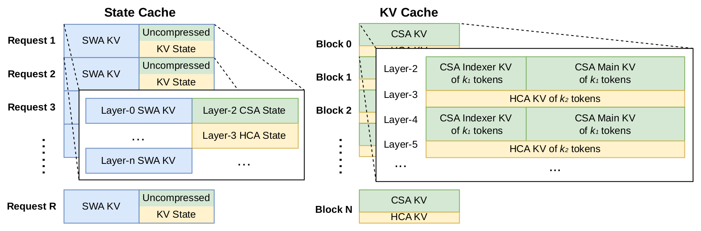

**图 6.** DeepSeek-V4 的 KV cache 布局示意图. KV cache 被组织为两个主要部分: 用于 CSA/HCA 的传统 KV cache, 以及用于 SWA 和 CSA/HCA 中尚未具备压缩条件的 token 的状态 cache. 在状态 cache 中, 每个请求分配一个固定大小的 cache 块. 在该块内, SWA 区段存储与最近 $n_{\mathrm{win}}$ 个 token 对应的 KV 条目, CSA/HCA 区段存储尚未具备压缩条件的未压缩尾部状态. 在传统 KV cache 中, 每个请求分配多个块. 每个 cache 块覆盖 $\mathrm{lcm}(m,m^{\prime})$ 个原始 token, 产生 $k_{1}=\frac{\mathrm{lcm}(m,m^{\prime})}{m}$ 个 CSA 压缩 token 和 $k_{2}=\frac{\mathrm{lcm}(m,m^{\prime})}{m^{\prime}}$ 个 HCA 压缩 token.

**管理混合注意力 KV cache 的挑战.**

混合注意力机制违背了 PagedAttention 及其变体背后的基本假设. 尽管近期的混合 KV cache 管理算法 (例如 Jenga [Zha25f], Hymba [Don25]) 面向通用混合注意力模型或特定结构, 但两项主要障碍使所有层的 KV cache 无法在 PagedAttention 框架下统一:

- 多样化的 cache 策略, 例如滑动窗口注意力所用的策略.
- 高性能注意力内核施加的约束, 包括对齐要求.

为高效管理 DeepSeek-V4 的 KV cache, 我们设计了相应策略来克服这两项挑战.

**用于 SWA 与未压缩尾部 token 的状态 cache.**

为解决第一项障碍, 我们采用另一种 cache 管理机制. SWA 旨在有限 KV cache 大小下提高性能, 因而可以合理地将其与压缩分支中的未压缩尾部 token 一同视为状态空间模型. 相应的 KV cache 可被视为仅依赖当前位置的序列特定状态. 因此, 我们预分配一个大小固定且有限的状态 cache 池, 并动态分配给各条序列.

**稀疏注意力内核协同设计.**

对于第二项障碍, 传统高性能注意力内核通常假设每块具有固定的 $B$ 个 token 以优化性能, 在 CSA 中对应 $B\cdot m$ 个原始 token, 在 HCA 中对应 $B\cdot m^{\prime}$ 个原始 token. 通过采用高性能稀疏注意力内核, 不同层每块可容纳数量可变的 token, 而不会降低性能. 要实现这一点, 需要协同设计 KV cache 布局与稀疏注意力内核. 例如, 填充块以对齐 cache line 可以提高性能. 因此, 对于压缩率为 $m$ 的 CSA 和压缩率为 $m^{\prime}$ 的 HCA, 每块原始 token 数可以是 $\mathrm{lcm}(m,m^{\prime})$ 的任意倍数, 即两个压缩率最小公倍数的任意倍数.

#### 3.5.2 磁盘 KV cache

部署 DeepSeek-V4 推理服务时, 我们利用磁盘 KV cache 消除共享前缀请求的重复预填充. 对于 CSA/HCA 中的压缩 KV 条目与滑动窗口注意力 (SWA) 中的未压缩 KV 条目, 我们分别设计存储管理方案.

对于 CSA 与 HCA, 我们直接将所有压缩 KV 条目存储到磁盘. 当请求命中已存储前缀时, 我们读取并复用该前缀对应的压缩 KV 条目, 直至最后一个完整压缩块. 需要注意的是, 对于尾部不完整块中的前缀 token, 仍需重新计算以恢复未压缩 KV 条目, 因为 CSA 与 HCA 的未压缩 KV 条目并未存储.

对于 SWA KV 条目, 由于它们未经压缩且存在于每一层, 其数据量约为压缩 CSA 与 HCA KV 条目的 8 倍. 为高效处理这些庞大的 SWA KV 条目, 我们提出并实现三种不同的磁盘 SWA KV 条目管理策略, 每种策略在存储开销与计算冗余之间提供不同权衡:

- **完整 SWA cache.** 该策略存储所有 token 的完整 SWA KV 条目, 不产生冗余计算. 在该策略下, 只需读取命中前缀内最后 $n_{\mathrm{win}}$ 个 token 的磁盘 cache, 即可重建该前缀的 SWA KV 条目. 尽管没有冗余计算, 该策略对现代基于 SSD 的存储系统效率不高, 因为每个命中请求只会访问已存 SWA KV cache 的一小部分, 从而形成不均衡的写密集访问模式.
- **定期保存检查点.** 该策略每隔 $p$ 个 token 对其中最后 $n_{\mathrm{win}}$ 个 token 的 SWA KV 条目保存检查点, 其中 $p$ 是可调参数. 对于命中前缀, 我们加载最近的检查点状态, 随后重计算剩余尾部 token. 通过调整 $p$, 该策略可按需权衡存储与计算.
- **不缓存 SWA.** 该策略不存储任何 SWA KV 条目. 对于命中前缀, 需要执行更多重计算来恢复 SWA KV 条目. 具体而言, 在每个注意力层中, 每个 token 的 SWA KV 条目仅依赖上一层最近 $n_{\mathrm{win}}$ 个 token 的 SWA KV 条目. 因此, 利用已缓存的 CSA 与 HCA KV 条目, 对于 $L$ 层模型, 重计算最后 $n_{\mathrm{win}}\cdot L$ 个 token 足以恢复最后 $n_{\mathrm{win}}$ 个 SWA KV 条目.

我们会根据具体部署场景选择最合适的策略, 在存储与计算之间实现所需权衡.

## 4 预训练

### 4.1 数据构建

在 DeepSeek-V3 预训练数据的基础上, 我们致力于构建更多样, 质量更高且有效上下文更长的训练语料库. 我们持续改进数据构建流水线. 对于网页来源数据, 我们实施过滤策略, 移除批量自动生成内容与模板化内容, 从而降低模型崩溃风险 [Zhu24]. 数学与编程语料仍是训练数据的核心组成部分, 我们还在中期训练阶段加入智能体数据, 进一步增强 DeepSeek-V4 系列的编码能力. 对于多语言数据, 我们为 DeepSeek-V4 构建了更大的语料库, 提升模型对不同文化背景下长尾知识的覆盖能力. 对于 DeepSeek-V4, 我们特别重视长文档数据的整理, 优先选择科学论文, 技术报告以及其他具有独特学术价值的材料. 综合以上内容, 我们的预训练语料库包含超过 32T 个 token, 涵盖数学内容, 代码, 网页, 长文档及其他高质量类别.

对于预训练数据, 我们大体沿用 DeepSeek-V3 的预处理策略. 在分词方面, 我们在 DeepSeek-V3 分词器的基础上引入少量用于上下文构建的特殊 token, 词表大小仍保持为 128K. 我们还继承 DeepSeek-V3 的 token 拆分 [Dee24a] 与中间填充 (FIM) [Dee24b] 策略. 受 [Din24a] 启发, 我们将不同来源的文档打包为适当序列, 尽量减少样本截断. 与 DeepSeek-V3 不同, 我们在预训练期间采用样本级注意力掩码.

### 4.2 预训练设置

#### 4.2.1 模型设置

**DeepSeek-V4-Flash.**

我们将 Transformer 层数设为 43, 隐藏维度 $d$ 设为 4096. 前两层使用纯滑动窗口注意力, 后续各层交错使用 CSA 与 HCA. 对于 CSA, 压缩率 $m$ 设为 4, 索引器查询头数 $n_{h}^{I}$ 设为 64, 索引器头维度 $c^{I}$ 设为 128, 为稀疏注意力选择的 KV 条目数 (即注意力 top-k) 设为 512. 对于 HCA, 压缩率 $m^{\prime}$ 设为 128. 对于 CSA 与 HCA, 查询头数 $n_{h}$ 均设为 64, 头维度 $c$ 设为 512, 查询压缩维度 $d_{c}$ 设为 1024. 输出投影组数 $g$ 设为 8, 每个中间注意力输出的维度 $d_{g}$ 设为 1024. 对于滑动窗口注意力附加分支, 窗口大小 $n_{\mathrm{win}}$ 设为 128. 所有 Transformer 块均采用 MoE 层, 但前 3 个 MoE 层使用哈希路由策略. 每个 MoE 层由 1 个共享专家与 256 个路由专家组成, 每个专家的中间隐藏维度为 2048. 在路由专家中, 每个 token 激活 6 个专家. 多 token 预测深度设为 1. 对于 *m*HC, 扩展因子 $n_{\mathrm{hc}}$ 设为 4, Sinkhorn-Knopp 迭代次数 $t_{\max}$ 设为 20. 在此配置下, DeepSeek-V4-Flash 总计包含 284B 参数, 每个 token 激活 13B 参数.

**DeepSeek-V4-Pro.**

我们将 Transformer 层数设为 61, 隐藏维度 $d$ 设为 7168. 前两层使用 HCA, 后续各层交错使用 CSA 与 HCA. 对于 CSA, 压缩率 $m$ 设为 4, 索引器查询头数 $n_{h}^{I}$ 设为 64, 索引器头维度 $c^{I}$ 设为 128, 为稀疏注意力选择的 KV 条目数 (即注意力 top-k) 设为 1024. 对于 HCA, 压缩率 $m^{\prime}$ 设为 128. 对于 CSA 与 HCA, 查询头数 $n_{h}$ 均设为 128, 头维度 $c$ 设为 512, 查询压缩维度 $d_{c}$ 设为 1536. 输出投影组数 $g$ 设为 16, 每个中间注意力输出的维度 $d_{g}$ 设为 1024. 对于滑动窗口注意力附加分支, 窗口大小 $n_{\mathrm{win}}$ 设为 128. 所有 Transformer 块均采用 MoE 层, 但前 3 个 MoE 层使用哈希路由策略. 每个 MoE 层由 1 个共享专家与 384 个路由专家组成, 每个专家的中间隐藏维度为 3072. 在路由专家中, 每个 token 激活 6 个专家. 多 token 预测深度设为 1. 对于 *m*HC, 扩展因子 $n_{\mathrm{hc}}$ 设为 4, Sinkhorn-Knopp 迭代次数 $t_{\max}$ 设为 20. 在此配置下, DeepSeek-V4-Pro 总计包含 1.6T 参数, 每个 token 激活 49B 参数.

#### 4.2.2 训练设置

**DeepSeek-V4-Flash.**

大多数参数使用 Muon 优化器 [Kel24, Liu25], 但嵌入模块, 预测头模块和所有 RMSNorm 模块的权重使用 AdamW 优化器 [Los17]. AdamW 超参数设为 $\beta_{1}=0.9$, $\beta_{2}=0.95$, $\varepsilon=10^{-20}$ 和 $\mathrm{weight\_decay}=0.1$. Muon 的动量设为 0.95, 权重衰减设为 0.1, 并将每个更新矩阵的 RMS 重新缩放至 0.18, 以复用 AdamW 学习率. 我们使用 32T 个 token 训练 DeepSeek-V4-Flash, 并与 DeepSeek-V3 相同, 采用批次大小调度策略, 将批次大小 (按 token 计) 从较小规模增至 75.5M, 随后在大部分训练期间维持 75.5M. 学习率在前 2000 步线性预热, 大部分训练期间保持 $2.7\times 10^{-4}$. 接近训练结束时, 最终按余弦调度将学习率衰减至 $2.7\times 10^{-5}$. 训练从 4K 序列长度开始, 随后逐步扩展至 16K, 64K 和 1M. 对于稀疏注意力设置, 前 1T 个 token 先使用稠密注意力预热模型, 在序列长度达到 64K 时引入稀疏注意力, 并在剩余训练期间保持使用. 引入注意力稀疏性时, 我们先设置一个较短阶段预热 CSA 中的 Lightning Indexer, 随后在大部分训练期间使用稀疏注意力训练模型. 对于无辅助损失负载均衡, 偏置更新速度设为 0.001. 均衡损失权重设为 0.0001, 以避免单条序列内出现极端不均衡. MTP 损失权重在大部分训练期间设为 0.3, 学习率开始衰减时改为 0.1.

**DeepSeek-V4-Pro.**

除具体超参数值外, DeepSeek-V4-Pro 的训练设置大体与 DeepSeek-V4-Flash 一致. 大多数参数使用 Muon 优化器, 但嵌入模块, 预测头模块和所有 RMSNorm 模块的权重使用 AdamW 优化器. AdamW 与 Muon 的超参数同 DeepSeek-V4-Flash 相同. 我们使用 33T 个 token 训练 DeepSeek-V4-Pro, 并同样采用批次大小调度策略, 最大批次大小为 94.4M 个 token. 学习率调度策略大体与 DeepSeek-V4-Flash 相同, 但峰值学习率设为 $2.0\times 10^{-4}$, 结束学习率设为 $2.0\times 10^{-5}$. 训练也从 4K 序列长度开始, 随后逐步扩展至 16K, 64K 和 1M. 与 DeepSeek-V4-Flash 相比, DeepSeek-V4-Pro 从更长的稠密注意力阶段开始, 引入稀疏注意力的策略则与 DeepSeek-V4-Flash 相同, 遵循两阶段训练方法. 对于无辅助损失负载均衡, 偏置更新速度设为 0.001. 均衡损失权重设为 0.0001, 以避免单条序列内出现极端不均衡. MTP 损失权重在大部分训练期间设为 0.3, 学习率开始衰减时改为 0.1.

#### 4.2.3 缓解训练不稳定性

训练万亿参数 MoE 模型面临重大的稳定性挑战, DeepSeek-V4 系列也不例外. 我们在训练期间遇到了明显的不稳定问题. 简单回滚虽可暂时恢复训练状态, 但无法防止损失尖峰再次出现, 因而不足以作为长期解决方案. 经验上, 我们发现尖峰的出现始终与 MoE 层中的异常值相关, 而路由机制本身似乎会加剧这些异常值的产生. 因此, 我们尝试从两个维度处理该问题: 打破路由引发的恶性循环, 以及直接抑制异常值. 幸运的是, 我们发现了两项能有效维持训练稳定性的实用技术. 虽然目前仍不完全理解其背后的机制, 但我们将其公开分享, 以推动社区进一步探索.

**预先路由 (Anticipatory Routing).**

我们发现, 将骨干网络与路由网络的同步更新解耦可显著提高训练稳定性. 因此, 在步骤 $t$, 我们使用当前网络参数 $\theta_{t}$ 计算特征, 但使用历史网络参数 $\theta_{t-\Delta t}$ 计算并应用路由索引. 实践中, 为避免两次加载模型参数的开销, 我们在步骤 $t-\Delta t$ 预先取得步骤 $t$ 的数据. 我们"预先"计算并缓存稍后在步骤 $t$ 使用的路由索引, 因而将该方法称为预先路由 (Anticipatory Routing). 我们还在基础设施层对此进行了大量优化. 第一, 由于预计算路由索引仅需对数据执行一次前向传播, 我们仔细编排流水线执行, 并使计算与专家并行 (EP) 通信重叠, 成功将预先路由的额外墙钟时间开销限制在约 20%. 第二, 我们引入自动检测机制, 仅在出现损失尖峰时触发短暂回滚并启用预先路由; 以该模式运行一段时间后, 系统恢复标准训练. 最终, 这种动态应用使我们能以可忽略的总体额外训练开销避免损失尖峰, 且不损害模型性能.

**SwiGLU 截断.**

先前文献 [Bel17, Riv24] 已明确使用截断来约束数值范围, 从而提高训练稳定性. 在实际训练中, 我们凭经验发现, 应用 SwiGLU 截断 [Ope25c] 可有效消除异常值, 并在不损害性能的情况下显著提升训练稳定性. 在 DeepSeek-V4-Flash 与 DeepSeek-V4-Pro 的整个训练期间, 我们将 SwiGLU 线性分量截断至 $[-10,10]$ 范围, 同时将门分量的上限限制为 $10$.

### 4.3 评测

#### 4.3.1 评测基准

在基础模型评测中, 我们考虑涵盖四个关键维度的基准: 世界知识, 语言理解与推理, 编码与数学, 以及长上下文处理.

**世界知识**基准包括 AGIEval [Zho23], C-Eval [Hua23], CMMLU [Li23e] MMLU [Hen20], MMLU-Redux [Gem24], MMLU-Pro [Wan24c], MMMLU [Ope24c], MultiLoKo [Hup25], Simple-QA verified [Haa25], SuperGPQA [Du25a], FACTS Parametric [Che25] 和 TriviaQA [Jos17].

**语言理解与推理**基准包括 BigBench Hard (BBH) [Suz22], DROP [Dua19], HellaSwag [Zel19], CLUEWSC [Xu20] 和 WinoGrande [Sak19].

**编码与数学**基准包括 BigCodeBench [Zhu25a], HumanEval [Che21], GSM8K [Cob21], MATH [Hen21], MGSM [Shi23] 和 CMath [Wei23b].

**长上下文**基准包括 LongBench-V2 [Bai25].

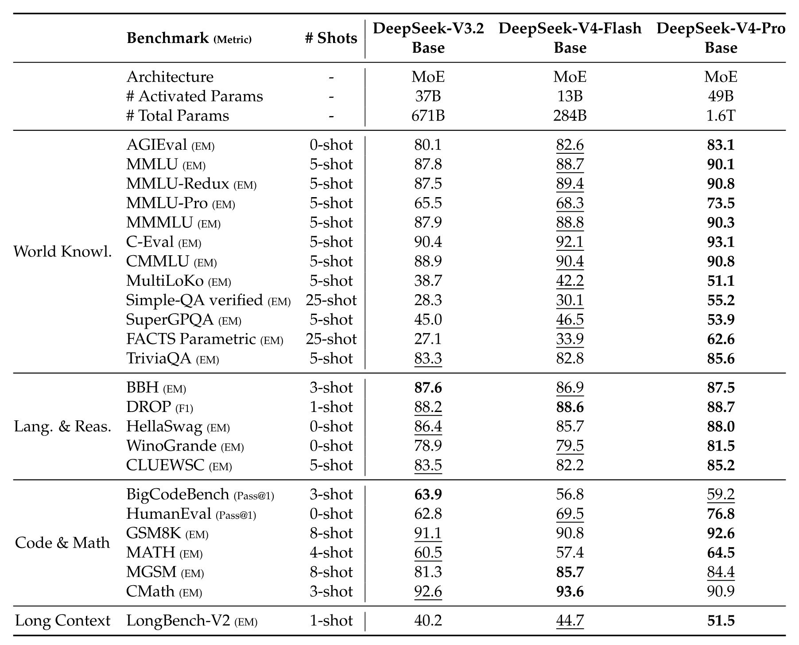

**表 1.** DeepSeek-V3.2-Base, DeepSeek-V4-Flash-Base 与 DeepSeek-V4-Pro-Base 的比较. 所有模型均在内部框架中评测, 并采用相同评测设置. 分数差距不超过 0.3 时视为同一水平. 每行最高分以**粗体**显示, 第二高分带下划线.

#### 4.3.2 评测结果

[表 1](#table-01) 详细比较了 DeepSeek-V3.2, DeepSeek-V4-Flash 与 DeepSeek-V4-Pro 的基础模型, 三者均在统一内部框架下以严格一致的设置评测.

DeepSeek-V4-Flash-Base 与 DeepSeek-V3.2-Base 的比较展现了令人信服的效率优势. 尽管激活参数与总参数数量均大幅减少, DeepSeek-V4-Flash-Base 仍在广泛基准上优于 DeepSeek-V3.2-Base. 这一优势在世界知识任务和具有挑战性的长上下文场景中尤其明显. 这些结果凸显出, DeepSeek-V4-Flash-Base 的架构改进, 数据质量提升与训练优化, 即使在更紧凑的参数预算下也能带来更强性能, 在大多数评测中有效超越规模更大的 DeepSeek-V3.2-Base.

此外, DeepSeek-V4-Pro-Base 在能力上实现了进一步的决定性飞跃, 几乎全面领先 DeepSeek-V3.2-Base 与 DeepSeek-V4-Flash-Base. 凭借几乎所有类别的改进, DeepSeek-V4-Pro-Base 在要求最高的基准上创下 DeepSeek 基础模型的新性能峰值. 在知识密集型评测中, 它取得大幅提升, 同时显著推进长上下文理解. 在大多数推理与代码基准上, DeepSeek-V4-Pro-Base 也超越前两个模型. 这一全面提升确认 DeepSeek-V4-Pro-Base 是 DeepSeek 系列最强的基础模型, 在知识, 推理, 编码与长上下文能力的各个方面均优于前代模型.

## 5 后训练

### 5.1 后训练流水线

预训练后, 我们执行后训练阶段, 得到 DeepSeek-V4 系列最终模型. 尽管训练流水线大体沿用 DeepSeek-V3.2, 但进行了一项关键方法替换: 混合强化学习 (RL) 阶段完全由在策略蒸馏 (OPD; [Lu25, Gu25]) 取代.

#### 5.1.1 专家训练

我们通过调整 DeepSeek-V3.2 训练流水线来开发领域专家. 具体而言, 每个模型先经历初始微调阶段, 随后在特定领域提示与奖励信号引导下进行强化学习 (RL), 依次完成优化. 在 RL 阶段, 我们实现组相对策略优化 (GRPO) 算法, 超参数与先前研究 [Guo25, Dee25a] 保持高度一致.

**推理强度.**

人们普遍认为, 模型在推理任务上的性能从根本上受所投入计算量支配. 因此, 我们在不同 RL 配置下训练不同的专家模型, 以便开发针对不同推理强度优化的模型. 如[表 2](#table-02) 所述, DeepSeek-V4-Pro 与 DeepSeek-V4-Flash 均支持三种特定推理强度模式. 对于每种模式, 我们在 RL 训练期间应用不同的长度惩罚与上下文窗口, 从而产生不同长度的推理输出 token. 为整合这些不同推理模式, 我们使用由 `<think>` 和 `</think>` token 标记的专用回复格式. 此外, 对于 "Think Max" 模式, 我们在系统提示开头添加一条特定指令, 引导模型的推理过程, 如[表 3](#table-03) 所示.

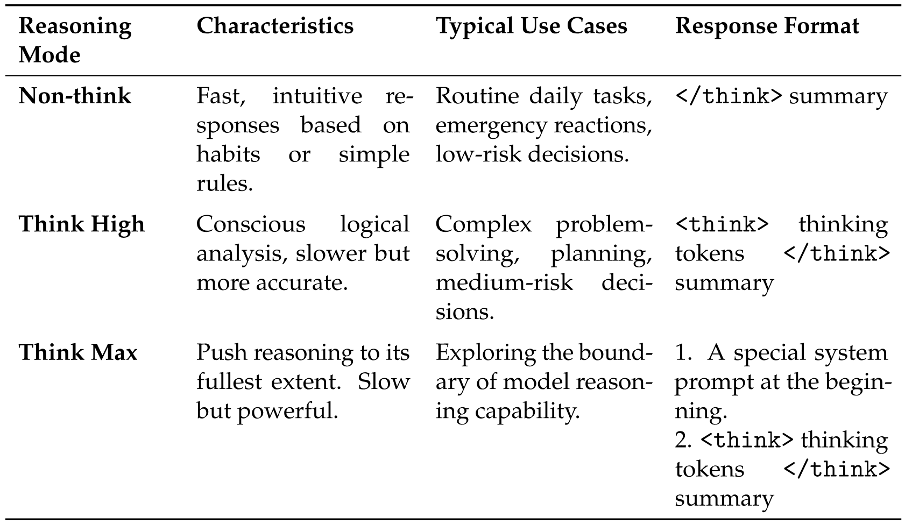

**表 2.** 三种推理模式的比较.

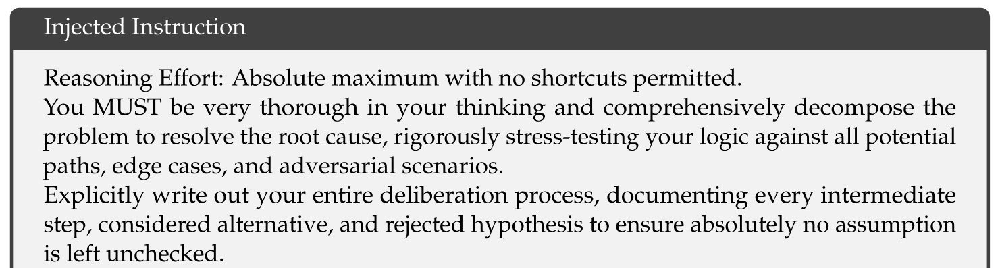

**表 3.** 注入到 "Think Max" 模式系统提示中的指令.

**生成式奖励模型.**

通常, 易验证任务可使用简单的基于规则的验证器或测试用例有效优化. 相比之下, 难验证任务传统上依赖人类反馈强化学习 (RLHF), 这需要大量人工标注来训练标量奖励模型. 然而, 在 DeepSeek-V4 系列的后训练阶段, 我们舍弃了这些传统的标量奖励模型. 取而代之的是, 为处理难验证任务, 我们整理评分准则驱动的 RL 数据, 并使用生成式奖励模型 (GRM) 评估策略轨迹. 关键在于, 我们直接对 GRM 本身应用 RL 优化. 在该范式中, Actor 网络直接充当 GRM, 使模型的评估 (判断) 能力与标准生成能力能够联合优化. 通过统一这些角色, 模型内部推理能力会自然融入评估过程, 从而产生高度稳健的评分. 此外, 由于模型利用自身逻辑在复杂任务间泛化, 该方法仅需极少量多样化人工标注即可实现更强性能.

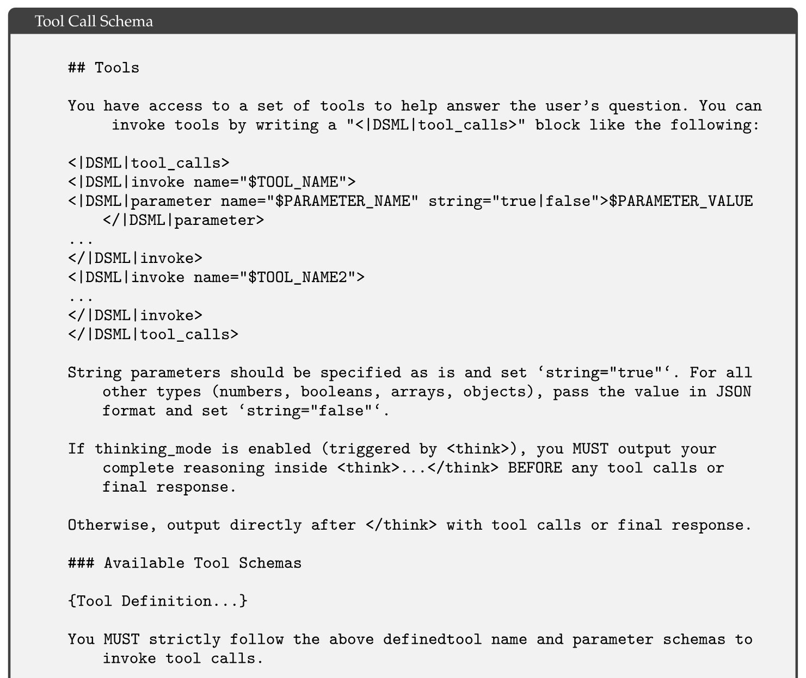

**表 4.** DeepSeek-V4 系列的工具调用 Schema.

**工具调用 Schema 与特殊 token.**

与先前版本一致, 我们使用专用 `<think></think>` 标签标记推理过程. 在 DeepSeek-V4 系列中, 我们引入新的工具调用 Schema, 使用特殊 "|DSML|" token, 并采用基于 XML 的工具调用格式, 如[表 4](#table-04) 所示. 实验表明, XML 格式可有效缓解转义失败并减少工具调用错误, 为模型-工具交互提供更稳健的接口.

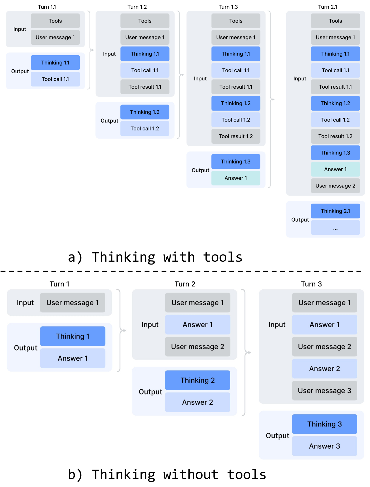

**图 7.** DeepSeek-V4 系列的思考管理.

**交错式思考 (Interleaved Thinking).**

DeepSeek-V3.2 引入了一种上下文管理策略, 在多轮工具结果间保留推理轨迹, 但收到新用户消息时将其丢弃. 该策略虽有效, 但在复杂智能体工作流中仍会造成不必要的 token 浪费, 每次新用户轮次都会清空所有累积推理内容, 迫使模型从头重建问题解决状态. 利用 DeepSeek-V4 系列扩展至 1M-token 的上下文窗口, 我们进一步改进这一机制, 最大限度发挥智能体环境中交错式思考的作用:

- **工具调用场景.** 如[图 7(a)](#figure-07) 所示, 整场对话中的所有推理内容都会完整保留. DeepSeek-V3.2 会在每个新用户轮次丢弃思考轨迹, 而 DeepSeek-V4 系列会跨所有轮次保留完整推理历史, 包括用户消息前后的推理内容. 这使模型能在长程智能体任务中保持连贯且累积的思维链.
- **通用对话场景.** 如[图 7(b)](#figure-07) 所示, 保留原有策略: 收到新用户消息时丢弃先前轮次的推理内容, 在持续推理轨迹收益有限的设置中保持上下文简洁.

与 DeepSeek-V3.2 相同, 通过用户消息模拟工具交互的智能体框架 (例如 Terminus) 可能不会触发工具调用上下文路径, 因而无法受益于增强的推理持久性. 对于此类架构, 我们仍建议使用 Non-think 模型.

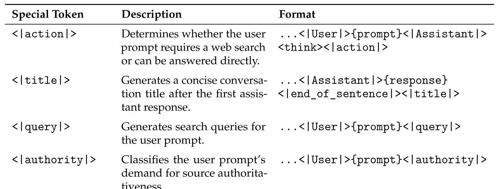

**表 5.** 辅助任务的 Quick Instruction 特殊 token.

**Quick Instruction.**

在聊天机器人场景中, 生成回复前必须执行多项辅助任务 (例如判断是否触发网页搜索, 意图识别等). 传统上, 这些任务由单独的小模型处理, 由于它无法复用现有 KV cache, 因而需要冗余预填充. 为克服这一限制, 我们引入 Quick Instruction. 我们直接在输入序列后附加一组专用特殊 token, 每个 token 对应一项特定辅助任务. 通过直接复用已计算的 KV cache, 该机制完全避免冗余预填充, 并允许生成搜索查询, 判断权威性与领域等特定任务并行执行. 因此, 该方法显著降低用户感知的首 token 延迟 (TTFT), 并消除维护和迭代额外小模型的工程开销. [表 5](#table-05) 总结了支持的 Quick Instruction token.

#### 5.1.2 在策略蒸馏

通过专门微调与强化学习训练多个特定领域专家后, 我们采用多教师在策略蒸馏 (OPD; [Lu25, Gu25]) 作为将专家能力整合进最终模型的主要技术. OPD 已成为一种有效的后训练范式, 可将领域专家的知识与能力高效转移到单一统一模型. 它让学生在自己生成的轨迹上学习教师模型的输出分布. 形式化地, 给定一组 $N$ 个专家模型 $\{\pi_{E_{1}},\pi_{E_{2}},\dots,\pi_{E_{N}}\}$, OPD 目标函数定义为:

$$
\mathcal{L}_{\mathrm{OPD}}(\theta)=\sum_{i=1}^{N}w_{i}\cdot\mathrm{D}_{\mathrm{KL}}\left(\pi_{\theta}\parallel\pi_{E_{i}}\right).\tag{29}
$$

在该公式中, $w_{i}$ 表示分配给每个专家的权重, 通常由专家的相对重要性决定. 计算反向 KL 损失 $\mathrm{D}_{\mathrm{KL}}\left(\pi_{\theta}\parallel\pi_{E_{i}}\right)$ 需要从学生 $\pi_{\theta}$ 采样训练轨迹, 以保持在策略学习. 这一机制保证统一策略 $\pi_{\theta}$ 有选择地学习与当前任务上下文相关的专业化专家 (例如数学推理任务与数学专家对齐, 编程任务与编码专家对齐). 通过该机制, 来自彼此独立的专家权重的知识经由 logits 级对齐整合到统一参数空间, 实际规避了传统权重合并或混合 RL 技术中常见的性能下降. 此阶段使用覆盖不同领域的十多个教师模型来蒸馏单个学生模型.

在处理上述 OPD 目标时, 先前工作通常将全词表 KL 损失简化为每个 token 位置的 token 级 KL 估计, 并在策略损失计算中用 $\texttt{sg}\big[\log\frac{\pi_{E_{i}}(y_{t}|x,y_{<t})}{\pi_{\theta}(y_{t}|x,y_{<t})}\big]$ (`sg` 表示停止梯度操作) 作为逐 token 优势估计, 以复用 RL 框架. 该方法虽然节省资源, 却会导致梯度估计方差较高, 并常常造成训练不稳定. 因此, 我们在 OPD 中采用全词表 logits 蒸馏. 计算反向 KL 损失时保留完整 logits 分布, 可得到更稳定的梯度估计, 并确保忠实蒸馏教师知识. 下一小节将介绍使全词表 OPD 能够大规模实施的工程工作.

### 5.2 后训练基础设施

后训练基础设施建立在为 DeepSeek-V3.2 开发的可扩展框架之上. 具体而言, 我们集成第 3.4 节所述的分布式训练栈, 以及前文为高效自回归采样引入的 rollout 引擎. 在此基础上, 本工作引入以下主要增强. 这些设计使涉及十多个不同教师模型的超长上下文 RL 与 OPD 合并任务能够高效执行, 从而大幅加快模型发布的迭代周期.

#### 5.2.1 FP4 量化感知训练

为在部署时加速推理并减少内存流量, 我们在后训练阶段引入量化感知训练 (QAT) [Ben18], 使模型 (包括教师模型与参考模型) 适应量化引入的精度下降. 我们对两个组件应用 FP4 (MXFP4) 量化 [Dar23]: (1) GPU 内存占用的主要来源 MoE 专家权重 [Ope25c]; (2) CSA 索引器中的查询-键 (QK) 路径, 其 QK 激活完全以 FP4 缓存, 加载和相乘, 从而加速长上下文场景中的注意力分数计算. 此外, 在 QAT 过程中, 我们还将索引分数 $I_{:,:}$ 从 FP32 量化至 BF16. 该优化使 top-k 选择器加速 2$\times$, 同时保持 99.7% 的 KV 条目召回率.

对于 MoE 专家权重, 遵循 QAT 的常见做法, 优化器维护的 FP32 主权重先量化为 FP4, 再反量化回 FP8 用于计算. 值得注意的是, 我们从 FP4 到 FP8 的反量化是无损的. 这是因为 FP8 (E4M3) 比 FP4 (E2M1) 多 2 个指数位, 提供更大的动态范围. 因此, 只要每个 FP8 量化块 ($128\times 128$ tile) 内各 FP4 子块 ($1\times 32$ tile) 的最大与最小缩放因子之比不超过特定阈值, 细粒度缩放信息就能被 FP8 扩展的动态范围完全容纳. 我们通过经验验证当前权重满足该条件. 这使整个 QAT 流水线无需任何修改即可完全复用现有 FP8 训练框架. 在反向传播中, 梯度针对前向传播中相同的 FP8 权重计算, 并直接传播回 FP32 主权重, 等价于通过量化操作应用直通估计器 (STE). 这也避免了重新量化转置权重的需要.

在不涉及反向传播的 RL 训练推理与 rollout 阶段, 我们直接使用原生 FP4 量化权重, 而非模拟量化. 这既保证采样期间的模型行为与线上部署完全一致, 也减少内核的内存读取量以获得实际加速, 并显著降低内存消耗. CSA 索引器中的 QK 路径也采用类似处理.

#### 5.2.2 全词表 OPD 的高效教师调度

我们的框架支持教师数量实际上无上限的全词表在策略蒸馏 (OPD), 每个教师都可能包含数万亿参数. 为实现这一点, 所有教师权重均卸载到集中式分布存储, 并在教师前向传播期间按需加载, 使用类似 ZeRO 的参数分片来缓解 I/O 与 DRAM 压力. 此外, 为所有教师直接生成词表大小 $|V|>100\mathrm{k}$ 的 logits 会带来无法承受的开销, 即使将其暂存到磁盘也是如此. 我们在前向传播期间仅将教师最后一层隐藏状态缓存到集中式缓冲区, 以解决这一问题. 训练时, 取回这些缓存状态, 并通过相应预测头即时重建完整 logits. 该设计仅产生可忽略的重计算开销, 同时完全规避显式生成 logits 带来的内存负担. 为降低教师预测头的 GPU 内存占用, 我们在数据分发期间按教师索引排列训练样本. 这种安排确保每个不同的教师预测头在每个 mini-batch 中仅加载一次, 且任意时刻设备内存中至多驻留一个教师预测头. 所有参数与隐藏状态的加载/卸载操作均在后台异步进行, 不会阻塞关键路径上的计算. 最后, 使用专用 TileLang 内核计算教师与学生 logits 之间的精确 KL 散度, 从而加速计算并减少动态内存分配.

#### 5.2.3 可抢占且容错的 rollout 服务

为最大化 GPU 资源利用率, 同时为高优先级任务快速调配硬件资源, 我们的 GPU 集群采用集群级抢占式任务调度器, 任何运行中的任务都可能随时被抢占. 此外, 硬件故障在大规模 GPU 集群中十分常见. 为此, 我们为 RL/OPD rollout 实现了可抢占且容错的 LLM 生成服务.

具体而言, 我们为每个生成请求实现 token 粒度的预写日志 (WAL). 每当请求生成新 token, 就立即将其追加到该请求的 WAL. 抢占期间, 暂停推理引擎并保存未完成请求的 KV cache. 恢复时, 使用持久化 WAL 与已保存 KV cache 继续解码. 即使发生致命硬件错误, 也可使用 WAL 中持久化的 token 重新执行预填充阶段, 重建 KV cache.

重要的是, 从头重新生成未完成请求在数学上并不正确, 因为这会引入长度偏差. 较短回复更有可能在中断中保留下来, 因此每当发生中断时, 从头重新生成会使模型更倾向产生较短序列. 若推理栈具有批次不变性与确定性, 也可使用采样器伪随机数生成器的固定一致种子重新生成, 从而解决正确性问题. 然而, 该方法仍会产生重新执行解码阶段的额外成本, 效率远低于 token 粒度 WAL 方法.

#### 5.2.4 将 RL 框架扩展至百万 token 级上下文

我们为百万 token 序列上的高效 RL 与 OPD 引入针对性优化. rollout 阶段采用第 5.2.3 节详述的可抢占容错 rollout 服务. 对于推理与训练阶段, 将 rollout 数据格式分解为轻量元数据与体量较大的逐 token 字段. 数据分发期间, 可加载完整 rollout 数据的元数据, 执行全局打乱与打包布局计算. 体量较大的逐 token 字段通过共享内存数据加载器加载, 以消除节点内数据冗余, 并在 mini-batch 粒度上用毕即释放, 大幅减轻 CPU 与 GPU 内存压力. 根据工作负载动态确定设备上的 mini-batch 数量, 从而在计算吞吐量与 I/O 重叠间实现高效权衡.

#### 5.2.5 智能体 AI 的沙箱基础设施

为满足智能体 AI 在后训练与评测期间的多样执行需求, 我们构建了生产级沙箱平台 **DeepSeek Elastic Compute (DSec)**. DSec 包含三个 Rust 组件, 即 API 网关 (`Apiserver`), 每台主机上的 Agent (`Edge`) 和集群监控器 (`Watcher`). 它们通过自定义 RPC 协议互连, 并在 3FS 分布式文件系统 [Dee25c] 之上横向扩展. 在生产环境中, 单个 DSec 集群可管理数十万个并发沙箱实例.

DSec 的设计源于四项观察: (1) 智能体工作负载高度异构, 从轻量函数调用到具有多样操作系统与安全要求的完整软件工程流水线; (2) 环境镜像数量多且体积大, 但必须快速加载并支持迭代定制; (3) 高密度部署要求高效利用 CPU 与内存; (4) 沙箱生命周期必须与 GPU 训练调度协调, 包括抢占和基于检查点的恢复. 基于这些观察, 下文分别阐述 DSec 的四项核心设计.

**统一接口背后的四种执行后端.**

DSec 提供单一 Python SDK (`libdsec`), 对四种执行后端进行抽象. **Function Call** 将无状态调用分发至预热容器池, 消除冷启动开销. **Container** 完全兼容 Docker, 并利用 EROFS [Gao19] 按需加载来高效组装镜像. 基于 Firecracker [Aga20] 构建的 **microVM** 为安全敏感的高密度部署增加虚拟机级隔离. 基于 QEMU [Bel05] 构建的 **fullVM** 支持任意客户操作系统. 四者共享统一的 API 接口, 包括命令执行, 文件传输与 TTY 访问, 只需更改一个参数即可在它们之间切换.

**通过分层存储快速加载镜像.**

DSec 通过分层按需加载, 兼顾快速启动与不断增长的大型环境镜像库. 对于容器, 基础镜像与文件系统 commit 存储为由 3FS 支持的只读 EROFS 层, 并直接挂载到 overlay `lowerdir`. 挂载时, 文件元数据在本地磁盘上保持即时可用, 数据块则按需从 3FS 获取. 对于 microVM, DSec 使用 `overlaybd` [Li20] 磁盘格式: 只读基础层位于 3FS, 供跨实例共享; 写入则进入本地写时复制层. 此类快照可形成链, 便于高效版本管理和毫秒级恢复.

**大规模并发下的密度优化.**

为在每个集群中容纳数十万个沙箱, DSec 处理两项资源瓶颈. 第一, 它减少虚拟化环境中的重复页缓存占用, 并应用内存回收以实现安全超配. 第二, 它缓解容器运行时的自旋锁竞争, 从而降低每个沙箱的 CPU 开销, 显著提高单机部署密度.

**轨迹日志与抢占后的安全恢复.**

DSec 为每个沙箱维护全局有序的轨迹日志, 持久记录每次命令调用及其结果. 轨迹有三个用途: (1) **客户端快进**, 训练任务被抢占时仍保留沙箱资源; 恢复时, DSec 重放先前已完成命令的缓存结果, 加速任务恢复, 同时避免重新执行非幂等操作造成的错误; (2) **细粒度溯源**, 每次状态变化的来源与对应结果均可追踪; (3) **确定性重放**, 可根据轨迹忠实复现任何历史会话.

### 5.3 标准基准评测

#### 5.3.1 评测设置

**知识与推理.**

知识与推理数据集包括 MMLU-Pro [Wan24c], GPQA [Rei24], Human Last Exam [Pha25], Simple-QA Verified [Haa25], Chinese-SimpleQA [He24], LiveCodeBench-v6 [Jai24], CodeForces (内部基准), HMMT 2026 Feb, Apex [Bal25], Apex Shortlist [Bal25], IMOAnswerBench [Luo25] 和 PutnamBench [Tso24].

对于代码, 我们在 LiveCodeBench-v6 与内部 Codeforces 基准上评测 DeepSeek-V4 系列. 对于 Codeforces, 我们收集了 14 场 Codeforces Division 1 比赛, 共 114 道题 (2025 年 5 月至 11 月). Elo 等级分计算如下. 每场比赛中, 每道题生成 32 个候选解答. 对每道题独立地从中无放回采样 10 个解答, 并随机排列形成提交序列. 每次提交均用领域专家构建的测试套件评判. 已解出题目的分数遵循 OpenAI (2025) 的罚分方案: 模型获得以相同先前失败次数解出同一道题的人类参赛者分数中位数. 由此得到每个采样提交序列的比赛总分, 随后将其转换为比赛排名, 再通过标准 Codeforces 等级分系统转换为估计等级分. 比赛级期望等级分定义为, 每道题 10 次提交的所有可能随机选择与排列下该估计等级分的期望. 模型总等级分是全部 14 场比赛的比赛级期望等级分均值.

对于推理与知识任务, 温度设为 1.0, Non-think, High 和 Max 模式的上下文窗口分别设为 8K, 128K 和 384K 个 token. 对于数学任务 (例如 HMMT, IMOAnswerBench, Apex 和 HLE), 使用以下模板评测: `"{question}\nPlease reason step by step, and put your final answer within \boxed{}."`. 对于数学任务上的 DeepSeek-V4-Pro-Max, 我们使用以下模板引出更深入的推理: `"Solve the following problem. The problem may ask you to prove a statement, or ask for an answer. If finding an answer is required, you should come up with the answer, and your final solution should also be a rigorous proof of that answer being valid.\n\n{question}"`.

对于形式数学任务, 我们在 Lean v4.28.0-rc1 [Mou21] 上的智能体设置中评测, 可访问 Lean 编译器与语义 tactic 搜索引擎, 以最高推理强度运行最多 500 次工具调用. 此外, 我们评测了计算更密集的流水线: 首先生成候选自然语言解答并通过自验证 [Sha25] 过滤, 随后将保留的解答作为指导交给形式化智能体, 证明对应 Lean 陈述. 该设计使用非形式推理改善探索, 同时通过形式验证保持严格正确性. 只有严格验证器 Comparator 在两种设置下均接受提交时, 才将其计为正确.

K2.6 与 GLM-5.1 的部分条目留空, 因为其 API 过于繁忙, 未能返回查询回复.

**1M-token 上下文.**

由于 DeepSeek-V4 系列支持 1M-token 上下文, 我们选择 OpenAI MRCR [Ope24d] 与 CorpusQA [Lu26] 作为基准, 评测模型在长上下文场景中的性能. 为统一所有模型的配置, 我们在这些任务上重新评测 Claude Opus 4.6 与 Gemini 3.1 Pro. GPT-5.4 的 API 未能响应大量查询, 因而未对其进行评测.

**智能体.**

智能体数据集包括 Terminal Bench 2.0 [Mer26], SWE-Verified [Ope24e], SWE Multilingual [Yan25b], SWE-Pro [Den25], BrowseComp [Wei25], MCPAtlas [Ban26a] 的公开评测集, GDPval-AA [Pat25, Aa25] 和 Tool-Decathlon [Li25b].

对于代码智能体任务 (SWE-Verified, Terminal-Bench, SWE-Pro, SWE Multilingual), 我们使用内部开发的评测框架评测 DeepSeek-V4 系列. 该框架提供一组最小工具, 即一个 bash 工具和一个文件编辑工具. 最大交互步骤数设为 500, 最大上下文长度设为 512K 个 token. 对于 Terminal-Bench 2.0, 我们认可 GLM-5.1 指出的环境相关问题. 尽管如此, 为保持一致性, 我们报告在原始 Terminal-Bench 2.0 数据集上的性能. 在 Terminal-Bench 2.0 Verified 子集上, DeepSeek-V4-Pro 得分约为 72.0.

对于搜索智能体任务 (BrowseComp, HLE w/ tool), 我们也使用配备网页搜索与 Python 工具的内部评测框架, 最大交互步骤数设为 500, 最大上下文长度设为 512K 个 token. 对于 BrowseComp, 我们使用与 DeepSeek-V3.2 [Dee25a] 相同的上下文管理策略, 即丢弃全部历史上下文.

#### 5.3.2 评测结果

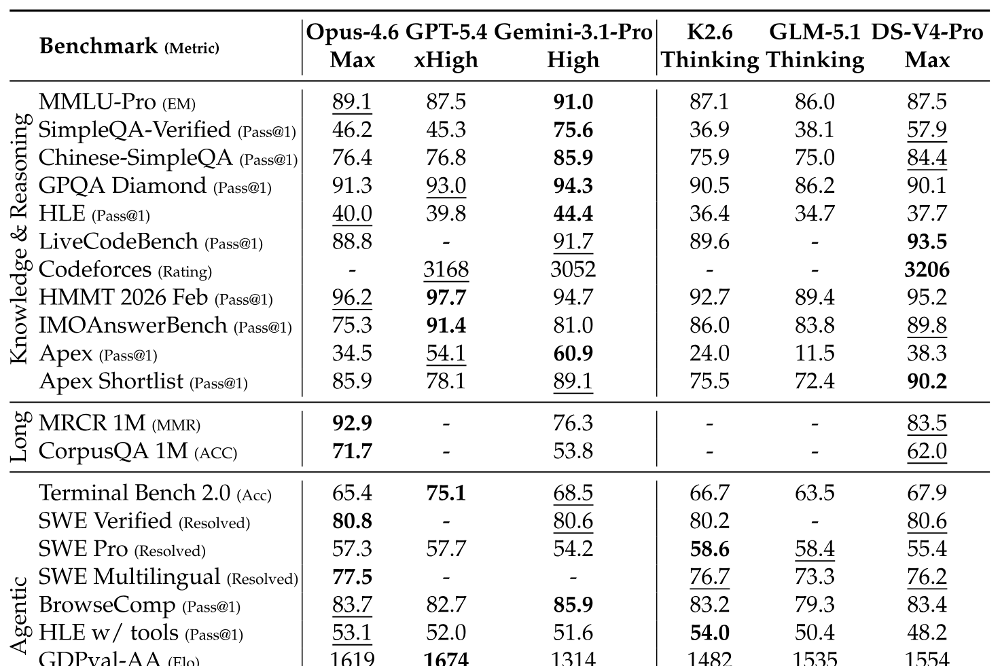

**表 6.** DeepSeek-V4-Pro-Max 与闭源/开源模型的比较. "Max", "xHigh" 和 "High" 表示推理强度. 最佳结果以粗体突出显示, 次佳结果带下划线.

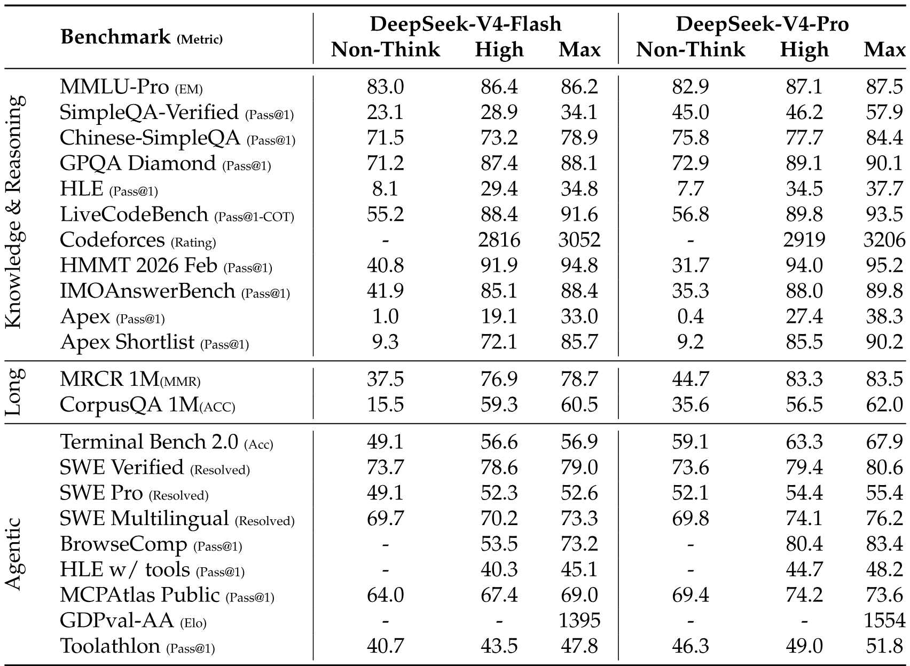

**表 7.** DeepSeek-V4 系列不同规模与模式的比较. "Non-Think", "High" 和 "Max" 表示推理强度.

[表 6](#table-06) 比较了 DeepSeek-V4-Pro-Max 与其他闭源/开源模型. 我们还评测了 DeepSeek-V4-Flash 与 DeepSeek-V4-Pro 的不同模式, 结果见[表 7](#table-07).

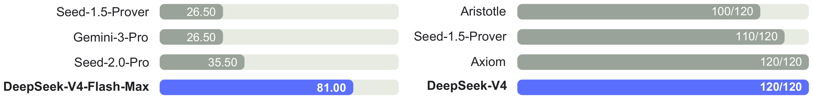

**图 8.** 实用与前沿范式下的形式推理. 左: Putnam-200 Pass@8 遵循 Seed-Prover 引入的设置, 在 PutnamBench [Tso24] 的固定随机子集上评测; 所有模型均在同一题集上测试. 我们遵循 Seed-Prover 协议, 但以开源 LeanExplore [Ash25] 替换专有搜索工具, 得到仅含最少智能体工具且采样受限的轻量设置. 右: Putnam-2025 在扩展后的形式-非形式混合范式中探索数学推理前沿, 将非形式推理与形式验证结合, 以揭示缺口并提高严谨性; DeepSeek-V4 达到证明满分 120/120.

**知识.**

在通用世界知识评测中, DeepSeek-V4-Pro 的最高推理强度模式 DeepSeek-V4-Pro-Max 在开源大语言模型中确立新的当前最佳水平. SimpleQA-Verified 表明, DeepSeek-V4-Pro-Max 以 20 个绝对百分点的优势显著超越所有现有开源基线. 尽管取得这些进展, 它目前仍落后于领先的专有模型 Gemini-3.1-Pro. 在教育知识与推理领域, DeepSeek-V4-Pro-Max 在 MMLU-Pro, GPQA 和 HLE 基准上略微优于 Kimi 与 GLM, 但落后于领先专有模型. 总体而言, DeepSeek-V4-Pro-Max 是提升开源模型世界知识能力的重要里程碑.

此外, DeepSeek-V4-Flash 与 DeepSeek-V4-Pro 在知识任务上存在显著性能差距; 这是预期结果, 因为更大的参数量有助于在预训练期间保留更多知识. 值得注意的是, 提高推理强度后, 两个模型在知识基准上的结果均有所改善.

**推理.**

DeepSeek-V4-Pro-Max 在各项推理基准上超越所有先前开放模型, 并在多项指标上达到当前最佳闭源模型水平; 较小的 DeepSeek-V4-Flash-Max 也在代码与数学推理任务上超越此前最佳开源模型 K2.6-Thinking. 与此同时, DeepSeek-V4-Pro 和 DeepSeek-V4-Flash 在编程竞赛中表现出色. 根据我们的评测, 二者性能可与 GPT-5.4 相比, 这是开放模型首次在该任务上达到闭源模型水平. 在 Codeforces 排行榜上, DeepSeek-V4-Pro-Max 目前在人类参赛者中排名第 23. DeepSeek-V4 在智能体与计算密集型设置下的形式数学任务上也展现出强劲性能. 在智能体设置下, 它取得[图 8](#figure-08) 所示的当前最佳结果, 超越 Seed Prover [Che25a] 等先前模型. 使用计算更密集的流水线后, 性能进一步提升, 超越包括 Aristotle [Ach25] 在内的系统, 并达到该设置下已知最佳结果.

**智能体.**

DeepSeek-V4 系列在评测中展现出强劲的智能体性能. 对于代码智能体任务, DeepSeek-V4-Pro 取得可与 K2.6 和 GLM-5.1 相比的结果, 但这些开放模型仍落后于闭源对照模型. DeepSeek-V4-Flash 在编码任务上不及 DeepSeek-V4-Pro, 在 Terminal Bench 2.0 上尤其如此. 其他智能体评测中也观察到类似趋势. 值得注意的是, DeepSeek-V4-Pro 在 MCPAtlas 与 Toolathlon 上表现良好, 这两个评测集包含广泛的工具与 MCP 服务, 表明模型具有出色的泛化能力, 并非只在内部框架上表现良好.

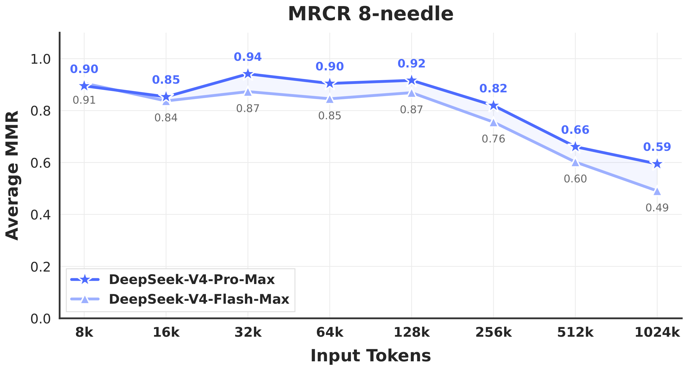

**图 9.** DeepSeek-V4 系列在 MRCR 任务上的性能.

**1M-token 上下文.**

DeepSeek-V4-Pro 在衡量上下文内检索的 MRCR 任务上优于 Gemini-3.1-Pro, 但仍落后于 Claude Opus 4.6. 如[图 9](#figure-09) 所示, 检索性能在 128K 上下文窗口内保持高度稳定. 超过 128K 后虽出现可见性能下降, 但与专有及开源对照模型相比, 模型在 1M token 时的检索能力仍非常强. 与 MRCR 不同, CorpusQA 更接近真实场景. 评测结果同样表明 DeepSeek-V4-Pro 优于 Gemini-3.1-Pro.

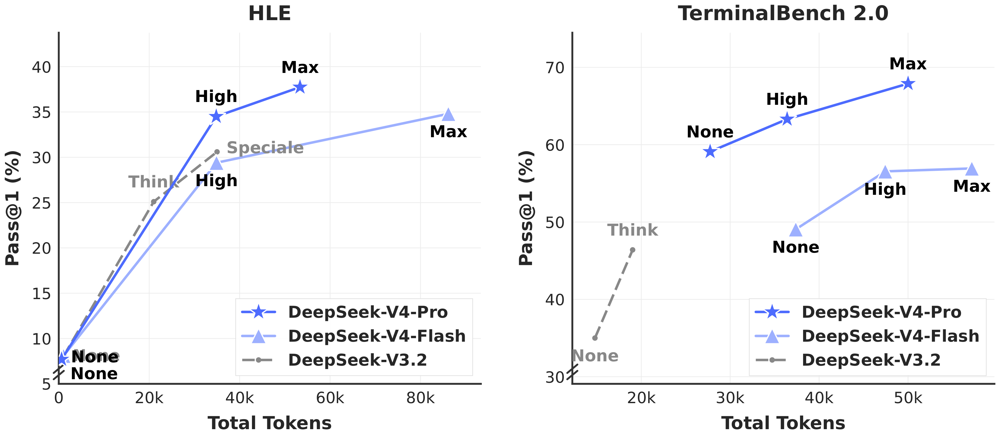

**图 10.** 不同推理强度下的 HLE 与 Terminal Bench 2.0 性能. "None" 表示 Non-think 模式, "Speciale" 表示 DeepSeek-V3.2-Speciale 模型.

**推理强度.**

如[表 7](#table-07) 所示, Max 模式在 RL 中使用更长上下文与更低长度惩罚, 在最具挑战性的任务上优于 High 模式. [图 10](#figure-10) 比较了 DeepSeek-V4-Pro, DeepSeek-V4-Flash 与 DeepSeek-V3.2 在代表性推理和智能体任务上的性能与成本. 通过扩展测试时计算, DeepSeek-V4 系列相较前代模型取得显著提升. 此外, 在 HLE 等推理任务上, DeepSeek-V4-Pro 的 token 效率高于 DeepSeek-V3.2.

### 5.4 真实场景任务表现

标准化基准往往难以捕捉多样化真实任务的复杂性, 导致测试结果与实际用户体验之间存在差距. 为弥合这一差距, 我们开发了内部专用指标, 相较传统基准优先考虑真实使用模式. 该方法确保优化能够转化为切实收益. 评测框架专门面向 DeepSeek API 与聊天机器人的主要用例, 使模型性能与实际需求保持一致.

#### 5.4.1 中文写作

中文写作是 DeepSeek 的主要用例之一. 我们对功能性写作与创意写作进行了严格评测. [表 12](#table-12) 给出了 DeepSeek-V4-Pro 与 Gemini-3.1-Pro 在功能性写作任务上的成对比较. 这些任务由常见日常写作查询组成, 提示通常简洁直接. 我们选择 Gemini-3.1-Pro 作为基线, 因为它在评测中是中文写作表现最佳的外部模型. 结果表明, DeepSeek-V4-Pro 以 62.7% 对 34.1% 的总体胜率优于基线; 主要原因是 Gemini 在中文写作场景中偶尔会让其固有风格偏好凌驾于用户明确要求之上.

[表 13](#table-13) 给出了创意写作比较, 从指令遵循与写作质量两个维度评测. 与 Gemini-3.1-Pro 相比, DeepSeek-V4-Pro 在指令遵循上的胜率为 60.0%, 写作质量上的胜率为 77.5%, 表明指令遵循略有改善, 写作质量大幅提升. 尽管 DeepSeek-V4-Pro 在整体用户用例评测中取得更好结果, 但仅针对最具挑战性提示, 尤其是涉及高复杂度约束或多轮场景的提示进行评测后发现, Claude Opus 4.5 仍相较 DeepSeek-V4-Pro 保持性能优势. 如[表 14](#table-14) 所示, Claude Opus 4.5 的胜率为 52.0%, DeepSeek-V4-Pro 为 45.9%.

#### 5.4.2 搜索

搜索增强问答是 DeepSeek 聊天机器人的核心能力. 在 DeepSeek 网页端与应用中, "non-think" 模式采用检索增强搜索 (RAG), "thinking" 模式则使用智能体搜索.

**检索增强搜索.**

我们在客观与主观问答类别上对 DeepSeek-V4-Pro 和 DeepSeek-V3.2 进行成对评测. 如[表 11](#table-11) 所示, DeepSeek-V4-Pro 以显著优势超越 DeepSeek-V3.2, 并在两个类别中均展现出一致优势. 最明显的提升出现在单值搜索和规划与策略任务中, 表明 DeepSeek-V4-Pro 擅长定位精确事实答案, 并基于检索上下文制定结构化计划. 然而, DeepSeek-V3.2 在比较与推荐任务上仍相对有竞争力, 这表明 DeepSeek-V4-Pro 在需要针对搜索结果进行均衡多视角推理的场景中仍有潜在改进空间.

**智能体搜索.**

与标准 RAG 不同, 智能体搜索使模型能针对每次查询迭代调用搜索与抓取工具, 显著提高总体搜索性能. 对于 DeepSeek-Chat 的思考模式, 我们优化了智能体搜索功能, 以在预定义"思考预算"内最大化回复准确性. 如[表 9](#table-09) 所示, 智能体搜索始终优于 RAG, 在复杂任务上尤其如此. 此外, 其成本效率仍然很高, 仅略高于标准 RAG (见[表 10](#table-10)).

#### 5.4.3 白领任务

为严格评测模型在复杂企业生产力场景中的实用性, 我们构建了一套包含 30 项高级中文专业任务的综合评测集. 这些工作流有意涵盖高层次认知需求, 包括深入信息分析, 全面文档生成和细致文档编辑, 覆盖 13 个关键行业 (例如金融, 教育, 法律与科技). 评测在配备 Bash 与网页搜索等基本工具的内部智能体评测框架中进行.

鉴于这些任务具有开放性, 自动指标通常无法捕捉高质量回复的细微差别. 因此, 我们进行人工评测, 比较 DeepSeek-V4-Pro-Max 与 Opus-4.6-Max 的性能. 标注者从四个维度对模型输出进行盲评:

- **任务完成度:** 是否成功解决核心问题.
- **指令遵循:** 是否遵守特定约束与指示.
- **内容质量:** 事实准确性, 逻辑连贯性与专业语气.
- **版式美观度:** 布局可读性与视觉呈现.

如[图 12](#figure-12) 所示, DeepSeek-V4-Pro-Max 在多样化中文白领任务上优于 Opus-4.6-Max, 胜出或持平的比例达到 63%, 并在分析, 生成和编辑任务中展现出一致优势. [图 12](#figure-12) 所示的详细维度得分凸显模型在任务完成度与内容质量方面的主要优势. 具体而言, DeepSeek-V4-Pro-Max 会频繁提供补充见解与自验证步骤, 主动预判用户隐含意图. 它也擅长长文生成, 能给出深入连贯的叙述, 而非依赖 Opus-4.6-Max 经常产生的过度简化要点列表. 此外, 模型严格遵守正式专业规范, 例如标准化中文层级编号. 然而, 在指令遵循方面, 它偶尔忽略特定格式约束, 略落后于 Opus. 此外, 模型不太擅长将大量文本输入压缩为简洁摘要. 最后, 其版式美观度在演示文稿幻灯片整体视觉设计方面仍有很大改进空间. [图 13](#figure-13), [14](#figure-14) 和 [15](#figure-15) 展示了多个测试用例; 由于部分输出篇幅很长, 仅显示部分页面.

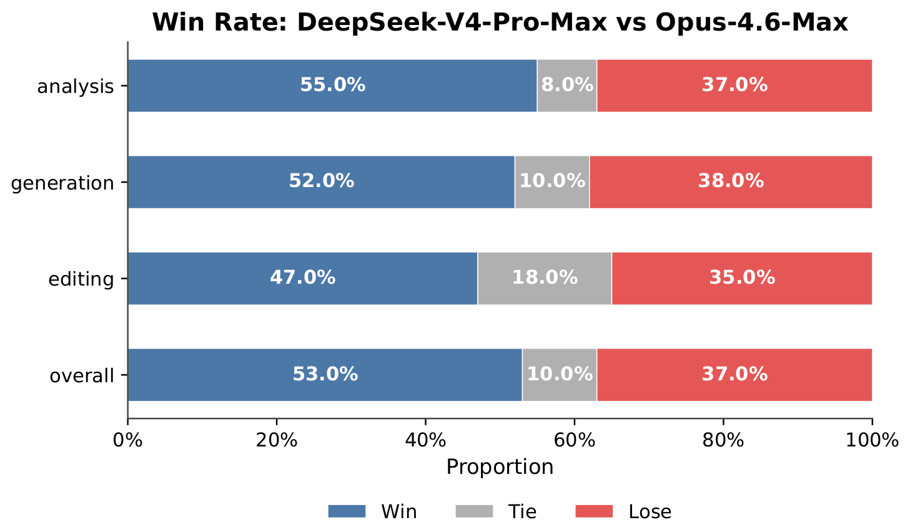

**图 11.** 分析, 生成, 编辑任务与总体性能的胜率比较.

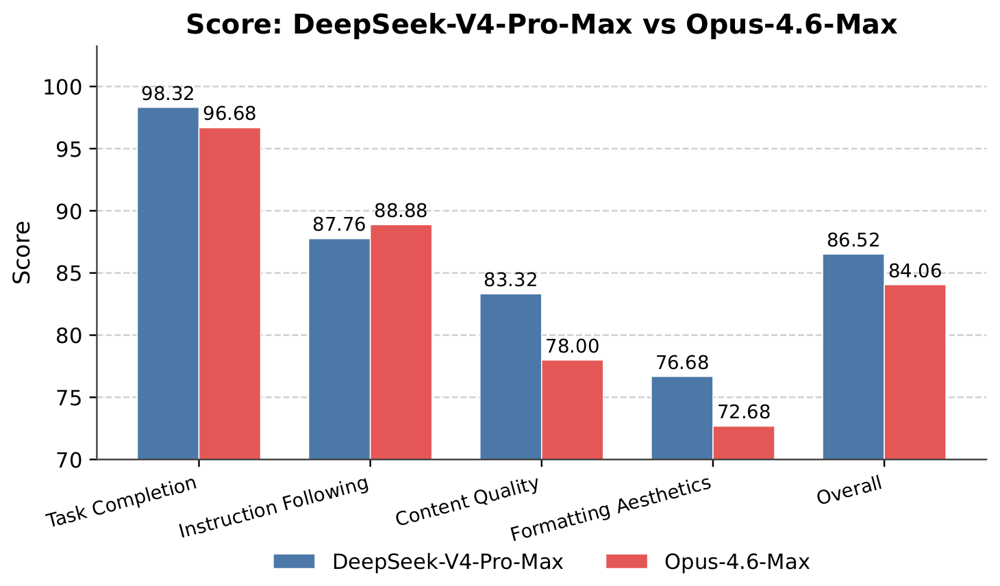

**图 12.** 详细维度得分, 包括任务完成度, 内容质量, 版式美观度和指令遵循.

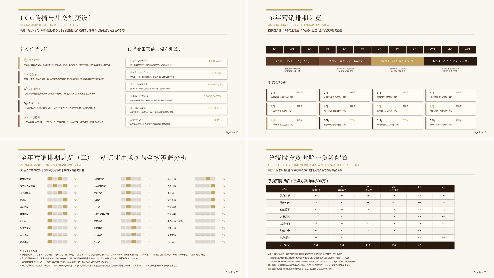

**图 13.** 一项要求为热门奶茶品牌与北京地铁起草联合营销方案的任务输出示例.

#### 5.4.4 代码智能体

为对代码智能体能力进行基准测试, 我们从真实内部研发工作负载中整理任务. 我们向 50 多位内部工程师收集 ${\sim}$200 项具有挑战性的任务, 涵盖功能开发, 缺陷修复, 重构与诊断, 横跨 PyTorch, CUDA, Rust 和 C++ 等多种技术栈. 每项任务均附带原始代码库, 对应执行环境以及人工标注的评分准则; 经过严格质量筛选, 保留 30 项任务作为评测集. 如[表 8](#table-08) 所示, DeepSeek-V4-Pro 显著优于 Claude Sonnet 4.5, 并接近 Claude Opus 4.5 的水平.

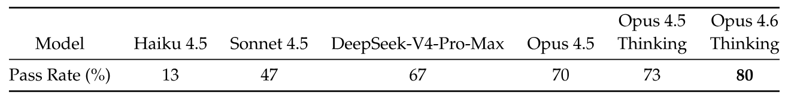

**表 8.** 研发编码基准上的比较 (外部模型仅出于评测目的而纳入).

一项调查询问 DeepSeek 开发者与研究人员 ($N=85$), 他们都曾在日常工作中使用 DeepSeek-V4-Pro 进行智能体编码. 与其他前沿模型相比, DeepSeek-V4-Pro 是否已适合作为默认且主要的编码模型? 52% 回答是, 39% 倾向于是, 不到 9% 回答否. 受访者认为 DeepSeek-V4-Pro 在大多数任务上能给出令人满意的结果, 但也指出其会出现一些简单错误, 误解模糊提示, 以及偶尔过度思考.

## 6 结论, 局限与未来方向

本工作推出 DeepSeek-V4 系列预览版, 目标是构建突破超长上下文处理效率壁垒的下一代大语言模型. 通过结合 CSA 与 HCA 的混合注意力架构, DeepSeek-V4 系列大幅提升了长序列处理效率. 架构创新与广泛的基础设施优化相结合, 使模型能够原生高效支持百万 token 级上下文, 并为未来的测试时扩展, 长程任务和在线学习等新兴范式奠定必要基础. 评测结果表明, DeepSeek-V4-Pro 的最高推理强度模式 DeepSeek-V4-Pro-Max 重新定义了开放模型的当前最佳水平. 它在知识基准上大幅超越先前开源模型, 取得接近前沿专有模型的优秀推理性能, 并具备有竞争力的智能体能力. 与此同时, DeepSeek-V4-Flash-Max 在保持极具成本效益架构的同时, 取得可与领先闭源模型相比的推理性能. 我们相信, DeepSeek-V4 系列为开放模型开启百万 token 级上下文的新时代, 并为实现更高效率, 更大规模与更强智能铺平道路.

为追求极致的长上下文效率, DeepSeek-V4 系列采用了大胆的架构设计. 为最大限度降低风险, 我们保留了许多经过初步验证的组件与技巧, 它们虽有效, 却也使架构相对复杂. 在未来迭代中, 我们将开展更全面, 更系统的研究, 将架构提炼至最本质的设计, 在不牺牲性能的前提下使其更加优雅. 与此同时, 尽管预先路由 (Anticipatory Routing) 与 SwiGLU 截断已被证明能有效缓解训练不稳定性, 但其底层原理仍未得到充分理解. 我们将积极研究训练稳定性的根本问题, 并加强内部指标监控, 目标是以更系统且可预测的方法实现稳定的大规模训练. 此外, 除 MoE 与稀疏注意力架构外, 我们还将主动探索新维度上的模型稀疏性, 例如更稀疏的嵌入模块 [Che26b], 以在不损害能力的情况下进一步提高计算与内存效率. 我们也会持续研究低延迟架构与系统技术, 使长上下文部署和交互响应更快. 此外, 我们认识到长程多轮智能体任务的重要性与实用价值, 将继续沿该方向迭代探索. 我们也在努力为模型加入多模态能力. 最后, 我们致力于开发更好的数据整理与合成策略, 在日益广泛的场景与任务中持续增强模型智能, 稳健性与实际可用性.

## 附录 A 作者名单与致谢

### A.1 作者名单

作者按名字的字母顺序排列. 标有 * 的姓名表示已离开团队的人员.

**研究与工程:** Anyi Xu, Bangcai Lin, Bing Xue, Bingxuan Wang*, Bingzheng Xu, Bochao Wu, Bowei Zhang, Chaofan Lin, Chen Dong, Chengda Lu, Chenggang Zhao, Chengqi Deng, Chenhao Xu, Chenze Shao, Chong Ruan*, Conner Sun, Damai Dai, Daya Guo*, Dejian Yang, Deli Chen, Donghao Li, Erhang Li, Fangyun Lin, Fangzhou Yuan, Feiyu Xia, Fucong Dai, Guangbo Hao, Guanting Chen, Guoai Cao, Guolai Meng, Guowei Li, Han Yu, Han Zhang, Hanwei Xu, Hao Li, Haofen Liang, Haoling Zhang, Haoming Luo, Haoran Wei*, Haotian Yuan, Haowei Zhang*, Haowen Luo, Haoyu Chen, Haozhe Ji, Honghui Ding, Hongxuan Tang, Huanqi Cao, Huazuo Gao, Hui Qu, Hui Zeng, J. Yang, J.Q. Zhu, Jia Yu, Jialiang Huang, Jiasheng Ye, Jiashi Li, Jiaxin Xu, Jiewen Hu, Jin Yan, Jingchang Chen, Jingli Zhou, Jingting Xiang, Jingyang Yuan, Jingyuan Cheng, Jinhua Zhu, Jiping Yu, Joseph Sun, Jun Ran*, Junguang Jiang, Junjie Qiu, Junlong Li*, Junxiao Song, Kai Dong, Kaige Gao, Kang Guan, Kexing Zhou, Kezhao Huang*, Kuai Yu, Lean Wang, Lecong Zhang, Lei Wang, Li Zhang, Liang Zhao, Lihua Guo, Lingxiao Luo, Linwang Ma, Litong Wang, Liyu Cai, Liyue Zhang, Longhao Chen, M.S. Di, M.Y Xu, Max Mei, Mingchuan Zhang, Minghua Zhang, Minghui Tang, Mingxu Zhou, Panpan Huang, Peixin Cong, Peiyi Wang, Qiancheng Wang, Qihao Zhu, Qingyang Li, Qinyu Chen, Qiushi Du, Qiwei Jiang, Rui Tian, Ruifan Xu, Ruijie Lu, Ruiling Xu, Ruiqi Ge, Ruisong Zhang, Ruizhe Pan, Runji Wang, Runqian Chen, Runqiu Yin, Runxin Xu, Ruomeng Shen, Ruoyu Zhang, S.H. Liu, Shanghao Lu, Shangyan Zhou, Shanhuang Chen, Shaofei Cai, Shaoheng Nie, Shaoyuan Chen, Shengding Hu, Shengyu Liu, Shiqiang Hu, Shirong Ma, Shiyu Wang, Shuiping Yu, Shunfeng Zhou, Shuting Pan, Shuying Yu, Songyang Zhou, Tao Ni, Tao Yun, Tian Jin, Tian Pei, Tian Ye, Tianle Lin, Tianran Ji, Tianyi Cui, Tianyuan Yue, Tingting Yu, Tun Wang, W. Zhang, Wangding Zeng, Weilin Zhao, Wen Liu, Wenfeng Liang, Wenjie Pang, Wenjing Luo, Wenjing Yao, Wenjun Gao, Wenkai Yang, Wenlve Huang, Wentao Zhang, Wenting Ma, Xi Gao, Xiang He, Xiangwen Wang, Xiao Bi, Xiaodong Liu, Xiaohan Wang, Xiaokang Chen, Xiaokang Zhang, Xiaotao Nie, Xin Cheng, Xin Liu, Xin Xie, Xingchao Liu, Xingchen Liu, Xingkai Yu, Xingyou Li, Xinyu Yang, Xu Chen, Xuanyu Wang, Xuecheng Su, Xuheng Lin, Xuwei Fu, Y.C. Yan, Y.Q. Wang*, Y.W. Ma, Yanfeng Luo, Yang Zhang, Yanhong Xu, Yanru Ma, Yanwen Huang, Yao Li, Yao Li, Yao Zhao, Yaofeng Sun, Yaohui Wang, Yi Qian, Yi Yu, Yichao Zhang, Yifan Ding, Yifan Shi, Yijia Wu, Yiliang Xiong, Ying He, Ying Zhou, Yingjia Luo, Yinmin Zhong, Yishi Piao, Yisong Wang, Yixiang Zhang, Yixiao Chen, Yixuan Tan, Yixuan Wei, Yiyang Ma, Yiyuan Liu, Yonglun Yang, Yongqiang Guo, Yongtong Wu, Yu Wu, Yuan Cheng, Yuan Ou, Yuanfan Xu, Yuanhao Li, Yuduan Wang, Yuhan Wu, Yuhao Meng, Yuheng Zou, YuKun Li, Yunfan Xiong, Yupeng Chen, Yuqian Cao, Yuqian Wang, Yushun Zhang, Yutong Lin, Yuxian Gu, Yuxiang Luo, Yuxiang You, Yuxuan Liu, Yuxuan Zhou, Yuyang Zhou, Yuzhen Huang, Z.F. Wu, Zehao Wang, Zehua Zhao, Zehui Ren, Zhangli Sha, Zhe Fu, Zhean Xu, Zhenda Xie, Zhengyan Zhang, Zhewen Hao, Zhibin Gou, Zhicheng Ma, Zhigang Yan, Zhihong Shao, Zhixian Huang, Zhixuan Chen, Zhiyu Wu, Zhizhou Ren, Zhuoshu Li, Zhuping Zhang, Zian Xu, Zihao Wang, Zihui Gu, Zijia Zhu, Zilin Li, Zipeng Zhang*, Ziwei Xie, Ziyi Gao, Zizheng Pan, Zongqing Yao.

**业务与合规:** Chenchen Ling, Chengyu Hou, Dongjie Ji, Fang Wei, Hengqing Zhang, Jia Luo, Jia Song, Jialu Cai, Jian Liang, Jiangting Zhou, Jieyu Yang, Jin Chen, Jingzi Zhou, Junmin Zheng, Leyi Xia, Linyan Zhu, Miaojun Wang, Mingming Li, Minmin Han, Ning Wang, Panpan Wang, Peng Zhang, Ruyi Chen, Shangmian Sun, Shaoqing Wu, W.L. Xiao, Wei An, Wenqing Hou, Xianzu Wang, Xiaowen Sun, Xiaoxiang Wang, Xinyu Zhang, Xueyin Chen, Yao Xu, Yi Shao, Yiling Ma, Ying Tang, Yuehan Yang, Yuer Xu, Yukun Zha, Yuping Lin, Yuting Yan, Zekai Zhang, Zhe Ju, Zheren Gao, Zhongyu Wu, Zihua Qu, Ziyi Wan.

### A.2 致谢

感谢 [Dolly Deng](https://www.zhihu.com/people/toyama) 及其他测试人员针对 DeepSeek-V4 系列模型能力提出的宝贵建议与反馈.

## 附录 B 评测细节

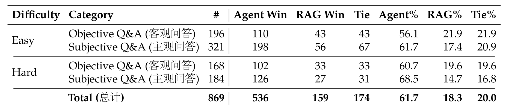

**表 9.** DeepSeek-V4-Pro 的智能体搜索与检索增强搜索比较.

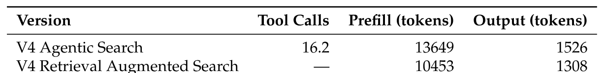

**表 10.** DeepSeek-V4-Pro 的成本比较: 智能体搜索与检索增强搜索 (均值). 智能体搜索的大多数工具调用是并行的.

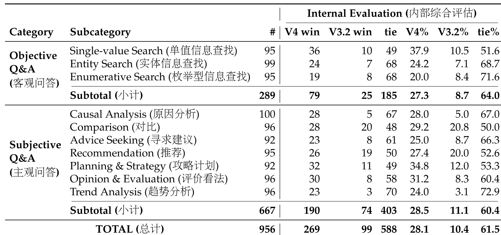

**表 11.** DeepSeek-V4-Pro 与 DeepSeek-V3.2 在搜索问答任务上的比较评测.

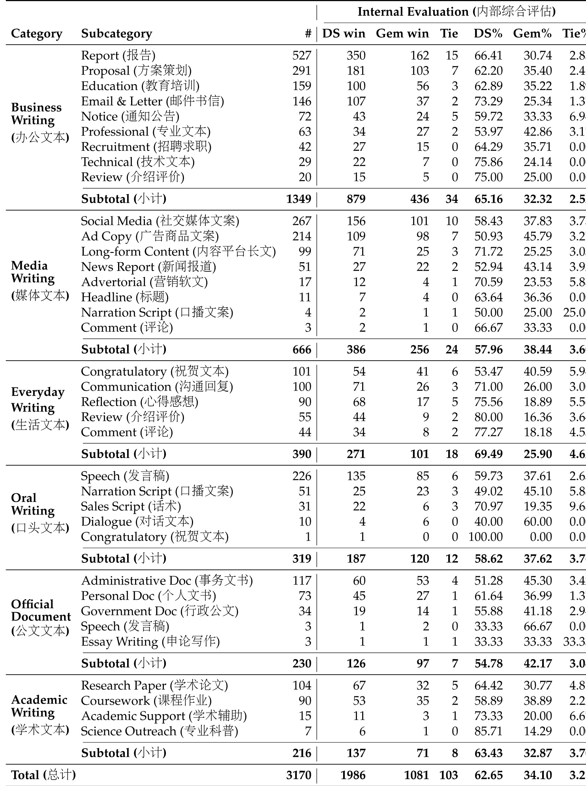

**表 12.** DeepSeek-V4-Pro 与 Gemini-3.1-Pro 在中文功能性写作上的比较分析.

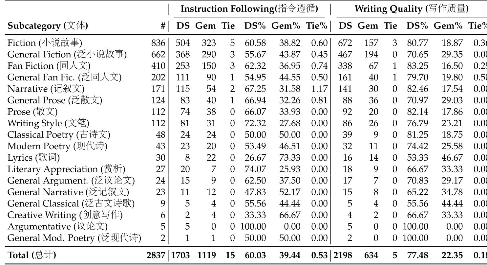

**表 13.** DeepSeek-V4-Pro 与 Gemini-3.1-Pro 在中文创意写作上的比较分析.

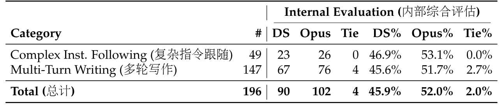

**表 14.** DeepSeek-V4-Pro 与 Claude-Opus-4.5 在复杂指令遵循与多轮写作上的比较.

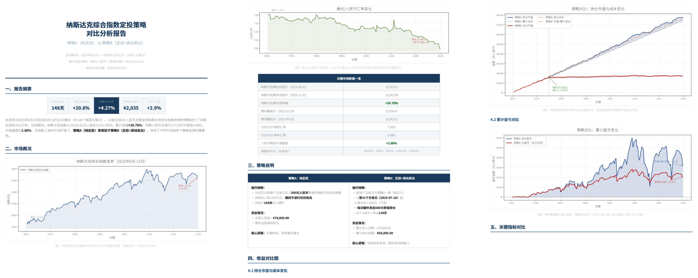

**图 14.** 一项要求比较两种纳斯达克定投策略的任务输出示例.

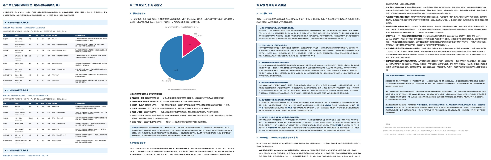

**图 15.** 一项要求研究 2020-2025 年诺贝尔科学奖并生成分析性 PDF 报告的任务输出示例.

[+1]: [https://huggingface.co/deepseek-ai/DeepSeek-V4-Pro/tree/main/inference](https://huggingface.co/deepseek-ai/DeepSeek-V4-Pro/tree/main/inference)

[+2]: [https://github.com/deepseek-ai/DeepGEMM/pull/304](https://github.com/deepseek-ai/DeepGEMM/pull/304)

[+3]: [https://docs.nvidia.com/deeplearning/performance/dl-performance-matrix-multiplication/index.html#wave-quant](https://docs.nvidia.com/deeplearning/performance/dl-performance-matrix-multiplication/index.html#wave-quant)

[+4]: [https://docs.nvidia.com/cuda/cuda-programming-guide/02-basics/writing-cuda-kernels.html#distributed-shared-memory](https://docs.nvidia.com/cuda/cuda-programming-guide/02-basics/writing-cuda-kernels.html#distributed-shared-memory)
