> [Tero Karras](https://scholar.google.fi/citations?user=-50qJW8AAAAJ), [Miika Aittala](https://people.csail.mit.edu/miika/), [Timo Aila](https://users.aalto.fi/~ailat1/) 和 [Samuli Laine](https://users.aalto.fi/~laines9/). [Elucidating the Design Space of Diffusion-Based Generative Models](https://arxiv.org/abs/2206.00364), 于 2022 年 6 月 1 日首次提交至 arXiv; 当前 arXiv 版本为 v2, 修订于 2022 年 10 月 11 日. 论文发表于 *Advances in Neural Information Processing Systems 35* (NeurIPS 2022), 第 26565-26577 页: [官方论文集页面](https://proceedings.neurips.cc/paper_files/paper/2022/hash/a98846e9d9cc01cfb87eb694d946ce6b-Abstract-Conference.html), [DOI](https://doi.org/10.52202/068431-1926) 和 [TeX 源码](https://arxiv.org/e-print/2206.00364v2). <a href="/paper/diffusion-design-space.pdf" target="_blank" rel="noopener noreferrer">原始 PDF</a>. 精确的印刷排版和参考文献以原始 PDF 为准.

## 摘要

我们认为, 扩散生成模型现有的理论与实践被不必要地复杂化了, 因而提出一个能够清楚区分各项具体设计选择的设计空间来改善这一局面. 由此, 我们找出了采样过程, 训练过程以及分数网络预条件中的多项改进. 这些改进共同在 CIFAR-10 上取得了新的最佳 FID: 类别条件设置下为 1.79, 无条件设置下为 1.97; 同时采样速度远快于以往设计 (每张图像只需 35 次网络求值). 为进一步说明这些改进的模块化性质, 我们证明, 所提出的设计变更可以显著提高以往预训练分数网络所能达到的效率与质量: 其中包括将一个已有 ImageNet-64 模型的 FID 从 2.07 改进到接近最佳水平的 1.55, 并在采用这些改进重新训练后取得新的最佳成绩 1.36.

## 1 引言

扩散生成模型 [Soh15] 已成为神经图像合成的一种强大新框架, 在无条件 [Den20, Nic21, Son21] 和条件 [Ho22b, Nic22, Nic21, Pre22, Ram22, Rom22, Sah22, Son21] 设置中都有应用, 某些情况下其质量甚至超过了 GAN [Goo14, Dha21]. 它们也迅速用于其他领域, 如音频 [Kon21, Pop21] 和视频 [Ho22] 生成, 图像分割 [Bar22a, Wol22] 以及语言翻译 [Nac21]. 因此, 如何应用这些模型, 并进一步改进图像/分布质量, 训练成本和生成速度, 受到广泛关注.

这类模型的文献包含大量理论内容, 对采样调度, 训练动态, 噪声水平参数化等的推导往往尽可能直接地建立在理论框架之上, 从而确保模型具备扎实的理论基础. 但这种做法也可能掩盖可用的设计空间: 一个提出的模型可能看起来像紧密耦合的整体, 任何单独组件似乎都无法在不破坏整个系统的情况下修改.

第一项贡献是从实践角度考察这些模型背后的理论, 更多关注训练和采样阶段出现的"有形"对象与算法, 而较少关注可能推导出它们的统计过程. 我们希望由此更清楚地理解这些组件如何相互关联, 以及整个系统的设计有哪些自由度. 我们关注一大类模型: 使用神经网络对训练数据加入高斯噪声后所得, 依赖噪声水平的边缘分布之分数 [Hyv05] 建模. 因而, 本文讨论的是*去噪分数匹配* [Vin11].

第二组贡献涉及扩散模型合成图像时使用的采样过程. 我们找到了表现最好的采样时间离散化方案, 在采样过程中应用高阶 Runge-Kutta 方法, 评估不同的采样器调度, 并分析随机性在采样过程中的作用. 这些改进显著减少了合成所需的采样步数, 而且改进后的采样器可以直接替换多种广泛使用的扩散模型中的原采样器 [Nic21, Son21].

第三组贡献集中在分数建模神经网络的训练上. 在继续采用常用网络架构 (DDPM [Den20], NCSN [Son19a]) 的同时, 我们首次对扩散模型中网络输入, 输出和损失函数的预条件进行了系统分析, 并由此推导出改善训练动态的最佳实践. 我们还提出了一种更好的训练噪声水平分布, 并指出通常用于 GAN 的非泄漏增强 [Kar20a] 同样有利于扩散模型.

综合这些贡献, 结果质量得到显著改善, 例如在 $64\times64$ 分辨率下, CIFAR-10 [Kri09] 和 ImageNet [Den09a] 分别取得了创纪录的 1.79 和 1.36 FID. 设计空间中的所有关键要素都在表中明确列出, 我们认为这会让单个组件更容易创新, 从而更广泛, 更有针对性地探索扩散模型的设计空间. 实现和预训练模型见 <https://github.com/NVlabs/edm>

## 2 在统一框架中表示扩散模型

用 $p_\text{data}(\boldsymbol{x})$ 表示数据分布, 其标准差为 $\sigma_\text{data}$; 再考虑一族平滑分布 $p(\boldsymbol{x}; \sigma)$, 它们由向数据加入标准差为 $\sigma$ 的独立同分布高斯噪声得到. 当 $\sigma_{\max}\gg\sigma_\text{data}$ 时, $p(\boldsymbol{x}; \sigma_{\max})$ 实际上与纯高斯噪声无法区分. 扩散模型的思路是随机采样一幅噪声图像 $\boldsymbol{x}_0 \sim \mathcal{N}(\mathbf{0}, \sigma_{\max}^2 \mathbf{I})$, 再依次将其去噪为噪声水平满足 $\sigma_0 = \sigma_{\max}> \sigma_1 > \dots > \sigma_N = 0$ 的图像 $\boldsymbol{x}_i$, 使每个噪声水平上都有 $\boldsymbol{x}_i \sim p(\boldsymbol{x}_i; \sigma_i)$. 因此, 该过程的终点 $\boldsymbol{x}_N$ 服从数据分布.

Song 等人 [Son21] 提出了一个随机微分方程 (SDE), 在样本 $\boldsymbol{x}$ 随时间演化时维持目标分布 $p$. 于是, 上述过程可以用随机求解器实现, 在每次迭代中同时移除和加入噪声. 他们还给出了对应的"概率流"常微分方程 (ODE), 其中唯一的随机性来源是初始噪声图像 $\boldsymbol{x}_0$. 与通常的讨论顺序相反, 我们先考察 ODE, 因为它很适合用于分析采样轨迹及其离散化. 这些认识同样适用于随机采样; 我们会在 [第 4 节](#section-4) 中将后者作为推广重新引入.

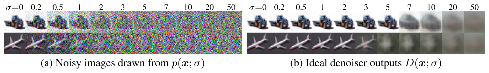

**图 1.** CIFAR-10 上的去噪分数匹配. **(a)** 训练集图像受到不同水平的加性高斯噪声污染. 高噪声水平会产生过饱和的颜色; 为使可视化更清晰, 我们对图像进行了归一化. **(b)** 解析最小化 [公式 2](#equation-02) 所得的最优去噪结果 (见[第 8.3 节](#section-8-3)). 随着噪声水平升高, 结果趋近于数据集均值.

**ODE 表述.** 概率流 ODE [Son21] 在时间向前或向后推进时, 分别连续提高或降低图像的噪声水平. 为指定该 ODE, 首先必须选择调度 $\sigma(t)$, 用它定义时刻 $t$ 所需的噪声水平. 例如, 令 $\sigma(t)\propto\sqrt{t}$ 在数学上很自然, 因为它对应恒速热扩散 [Fou22]. 不过, 我们将在 [第 3 节](#section-3) 中说明, 调度的选择会带来重大的实际影响, 不应只依据理论上的便利性来决定.

概率流 ODE 的定义性特征是: 将样本 $\boldsymbol{x}_a \sim p \big( \boldsymbol{x}_a; \sigma(t_a) \big)$ 从时刻 $t_a$ 演化到 $t_b$ (时间向前或向后均可), 会得到样本 $\boldsymbol{x}_b \sim p \big( \boldsymbol{x}_b; \sigma(t_b) \big)$. 沿用先前工作 [Son21], 下式满足这一要求 (见 [第 8.1 节](#section-8-1) 和 [第 8.2 节](#section-8-2)): 

$$
\mathrm{d}\boldsymbol{x}= -\dot\sigma(t) ~\sigma(t) ~\nabla_{\hspace{-0.5mm}\boldsymbol{x}}\log p \big( \boldsymbol{x}; \sigma(t) \big) ~\mathrm{d}t\text{,}
$$
其中上点表示时间导数. $\nabla_{\hspace{-0.5mm}\boldsymbol{x}}\log p(\boldsymbol{x}; \sigma)$ 是*分数函数* [Hyv05], 即在给定噪声水平下指向更高数据密度的向量场. 直观地说, 该 ODE 向前迈出无穷小的一步会把样本推离数据, 其速率取决于噪声水平的变化. 等价地, 向后一步会把样本推向数据分布.

**去噪分数匹配.** 分数函数有一个重要性质: 它不依赖底层密度函数 $p(\boldsymbol{x}; \sigma)$ 通常难以求得的归一化常数 [Hyv05], 因而更容易计算. 具体来说, 如果 $D(\boldsymbol{x};\sigma)$ 是一个去噪函数, 对每个 $\sigma$ 都分别最小化从 $p_\text{data}$ 中抽取样本的期望 $L_2$ 去噪误差, 即 

$$
\mathbb{E}_{\boldsymbol{y}\sim p_\text{data}} \mathbb{E}_{\boldsymbol{n}\sim \mathcal{N}(\mathbf{0}, \sigma^2 \mathbf{I})} \| D(\boldsymbol{y}+ \boldsymbol{n}; \sigma) - \boldsymbol{y}\|^2_2
\text{,}\hspace*{2mm}\text{then}\hspace*{2mm}
\nabla_{\hspace{-0.5mm}\boldsymbol{x}}\log p(\boldsymbol{x}; \sigma) = \big( D(\boldsymbol{x}; \sigma) - \boldsymbol{x}\big) / \sigma^2 \text{,}
$$
其中 $\boldsymbol{y}$ 是训练图像, $\boldsymbol{n}$ 是噪声. 从这个角度看, 分数函数从 $\boldsymbol{x}$ 的信号中分离出噪声分量, 而 [公式 1](#equation-01) 随时间放大 (或减弱) 这一分量. [图 1](#figure-01) 展示了理想 $D$ 的实际行为. 扩散模型的关键认识是, $D(\boldsymbol{x};\sigma)$ 可以实现为依照 [公式 2](#equation-02) 训练的神经网络 $D_\theta(\boldsymbol{x};\sigma)$. 注意, $D_\theta$ 可能包含额外的前处理和后处理步骤, 例如将 $\boldsymbol{x}$ 缩放到合适的动态范围; 我们会在 [第 5 节](#section-5) 中回到这种*预条件*.

**表 1.** 不同模型族采用的具体设计选择. $N$ 是采样时希望执行的 ODE 求解器迭代次数. 对应的时间步序列为 $\{t_0, t_1, \dots, t_N\}$, 其中 $t_N = 0$. 如果模型最初针对特定的 $N$ 和 $\{t_i\}$ 训练, 则分别以 $M$ 和 $\{u_j\}$ 表示其原始值. 去噪器定义为 $D_\theta(\boldsymbol{x}; \sigma) = c_\mathrm{skip}(\sigma) \boldsymbol{x} + c_\mathrm{out}(\sigma) F_\theta(c_\mathrm{in}(\sigma) \boldsymbol{x}; c_\mathrm{noise}(\sigma))$; $F_\theta$ 表示原始神经网络层.

**随时间变化的信号缩放.** 一些方法 (见 [第 9.1 节](#section-9-1)) 引入额外的缩放调度 $s(t)$, 并将 $\boldsymbol{x}= s(t) \hat{\boldsymbol{x}}$ 视为原始未缩放变量 $\hat{\boldsymbol{x}}$ 的缩放版本. 这会改变随时间变化的概率密度, 进而改变 ODE 的解轨迹. 所得 ODE 是 [公式 1](#equation-01) 的推广: 

$$
\mathrm{d}\boldsymbol{x}= \left[ \frac{\dot s(t)}{s(t)} ~\boldsymbol{x}-s(t)^2 ~\dot\sigma(t) ~\sigma(t) ~\nabla_{\hspace{-0.5mm}\boldsymbol{x}}\log p\left(\frac{\boldsymbol{x}}{s(t)}; \sigma(t)\right) \right] ~\mathrm{d}t\text{.}
$$
注意, 计算分数函数时我们显式撤销了对 $\boldsymbol{x}$ 的缩放, 以使 $p(\boldsymbol{x}; \sigma)$ 的定义与 $s(t)$ 无关.

**通过离散化求解.** 将 [公式 3](#equation-03) 代入 [公式 4](#equation-04) 以定义逐点梯度, 即可得到待求解的 ODE; 其解可通过数值积分求出, 也就是在离散时间区间上迈出有限步. 这既要选择积分格式 (如 Euler 法或 Runge-Kutta 的某种变体), 也要选择离散采样时刻 $\{t_0, t_1, \dots, t_N\}$. 许多先前工作采用 Euler 法, 但我们将在 [第 3 节](#section-3) 中说明, 二阶求解器能提供更好的计算折中. 为简洁起见, 这里不再单独给出将 Euler 法用于本文 ODE 的伪代码; 从 [算法 1](#algorithm-01) 中省略第 6-8 行即可得到它.

**合并各部分.** [表 1](#table-01) 给出了在本文框架中复现三种早期方法之确定性变体的公式. 选择这些方法, 一是因为它们应用广泛且达到了最佳性能, 二是因为它们源自不同的理论基础. 去除间接引用和递归后, 我们的一些公式看起来与原论文很不一样; 详见 [第 9 节](#section-9). 这种重构的主要目的是把先前工作中常常纠缠在一起的所有独立组件明确呈现出来. 在本文框架中, 组件之间没有隐式依赖: 原则上, 各个公式只要选择合理, 就能得到可运行的模型. 换言之, 修改一个组件并不要求同时改动其他部分, 例如无需这样做来维持模型在极限下收敛到数据的性质. 当然, 实际上一些选择和组合会比另一些更好.

## 3 对确定性采样的改进

提高输出质量和/或降低采样计算成本是扩散模型研究中的常见主题 (如 [Doc22, Jol21, Liu22h, Lu22c, Luh21, Nic21, Sal22, Vah21, Wat22, Wat21, Zha22i]). 我们假设, 与采样过程有关的选择在很大程度上独立于网络架构和训练细节等其他组件. 换言之, $D_\theta$ 的训练流程不应决定 $\sigma(t)$, $s(t)$ 和 $\{t_i\}$, 反之亦然; 从采样器的角度看, $D_\theta$ 只是一个黑箱 [Wat22, Wat21]. 为检验这一假设, 我们在三个*预训练*模型上评估不同的采样器, 每个模型分别代表一种理论框架和模型族. 我们先用这些模型原有的采样器实现测量基线结果, 再利用 [表 1](#table-01) 中的公式把采样器纳入统一框架, 随后加入本文的改进. 这样便能评估不同的实际选择, 并提出适用于所有模型的通用采样改进.

我们评估了 Song 等人 [Son21] 在 $32\times32$ 无条件 CIFAR-10 [Kri09] 上训练的 "DDPM++ cont. (VP)" 和 "NCSN++ cont. (VE)" 模型, 它们分别对应方差保持 (VP) 与方差爆炸 (VE) 表述 [Son21], 最初受到 DDPM [Den20] 和 SMLD [Son19a] 的启发. 我们还评估了 Dhariwal 和 Nichol [Dha21] 在 $64\times64$ 类别条件 ImageNet [Den09a] 上训练的 "ADM (dropout)" 模型, 它对应改进的 DDPM (iDDPM) 表述 [Nic21]. 该模型使用一组离散的 $M=1000$ 个噪声水平训练. 更多细节见 [第 9 节](#section-9).

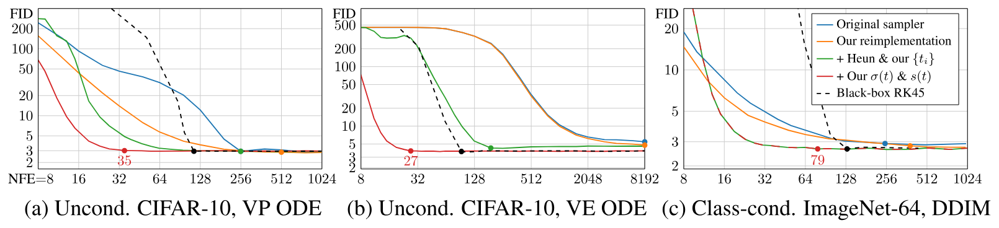

**图 2.** 在三个预训练模型上比较确定性采样方法. 对每条曲线, 圆点表示 FID 与观测到的最低 FID 相差不超过 3% 时的最小 NFE.

我们用 50,000 张生成图像与全部可用真实图像之间计算的 Fréchet inception distance (FID) [Heu17] 评估结果质量. [图 2](#figure-02) 给出了 FID 关于神经函数求值次数 (NFE) 的关系, 即生成一张图像需要计算多少次 $D_\theta$. 采样过程的成本完全由 $D_\theta$ 主导, 因此 NFE 的改进会直接转化为采样速度的提升. 蓝色表示原始确定性采样器; 在统一框架中重新实现的对应方法 (橙色) 得到相近但始终更好的结果. 差异来自原始实现中的若干疏漏, 以及我们在 DDIM 情况下对离散噪声水平更谨慎的处理; 详见 [第 9 节](#section-9). 需要注意, 尽管各原始代码库的结构差异很大, [算法 1](#algorithm-01) 和 [表 1](#table-01) 已经完整指定了我们的重新实现.

**离散化与高阶积分器.** ODE 的数值求解必然只是对真实解轨迹的近似. 求解器每一步都会引入*截断误差*, 并在 $N$ 步中累积. 局部误差通常随步长超线性增长, 因而增大 $N$ 可以提高解的精度.

常用的 Euler 法是一阶 ODE 求解器, 对步长 $h$ 的局部误差为 $\mathcal{O}(h^2)$. 高阶 Runge-Kutta 方法 [Sul03] 的误差缩放更有利, 但每一步都要多次计算 $D_\theta$. 近期也有工作提出用线性多步法采样扩散模型 [Liu22h, Zha22i]. 经过大量测试, 我们发现 Heun 二阶法 [Asc98] (又称改进 Euler 法, 梯形法则) 能在截断误差和 NFE 之间取得很好的平衡; Jolicoeur-Martineau 等人 [Jol21] 此前也在扩散模型中考察过该方法. 如 [算法 1](#algorithm-01) 所示, 它为 $\boldsymbol{x}_{i+1}$ 引入额外的校正步骤, 以计入 $\mathrm{d}\boldsymbol{x}/ \mathrm{d}t$ 在 $t_i$ 与 $t_{i+1}$ 之间的变化. 每一步增加一次 $D_\theta$ 求值, 即可使该校正的局部误差达到 $\mathcal{O}(h^3)$. 注意, 步进到 $\sigma=0$ 会导致除零, 因此这种情况下我们改回 Euler 法. 二阶求解器的一般族将在 [第 10.2 节](#section-10-2) 中讨论.

**算法 1: 使用 Heun 二阶法与任意 $\sigma(t)$ 和 $s(t)$ 的确定性采样.**

- **过程** $\operatorname{HeunSampler}(D_\theta(\boldsymbol{x};\sigma), \sigma(t), s(t), t_{i \in \{0, \dots, N\}})$
  - **采样** $\boldsymbol{x}_0 \sim \mathcal{N}(\mathbf{0}, \sigma^2(t_0)s^2(t_0)\mathbf{I})$. 在 $t_0$ 生成初始样本.
  - **对于** $i \in \{0, \dots, N-1\}$: 用 $N$ 个时间步求解 [公式 4](#equation-04).
    - $\boldsymbol{d}_i \gets \left(\frac{\dot \sigma(t_i)}{\sigma(t_i)} + \frac{\dot s(t_i)}{s(t_i)}\right)\boldsymbol{x}_i - \frac{\dot\sigma(t_i)s(t_i)}{\sigma(t_i)}D_\theta\left(\frac{\boldsymbol{x}_i}{s(t_i)}; \sigma(t_i)\right)$. 在 $t_i$ 计算 $\mathrm{d}\boldsymbol{x}/\mathrm{d}t$.
    - $\boldsymbol{x}_{i+1} \gets \boldsymbol{x}_i + (t_{i+1}-t_i)\boldsymbol{d}_i$. 从 $t_i$ 到 $t_{i+1}$ 迈出一个 Euler 步.
    - **如果** $\sigma(t_{i+1}) \ne 0$:
      - $\boldsymbol{d}'_i \gets \left(\frac{\dot \sigma(t_{i+1})}{\sigma(t_{i+1})} + \frac{\dot s(t_{i+1})}{s(t_{i+1})}\right)\boldsymbol{x}_{i+1} - \frac{\dot\sigma(t_{i+1})s(t_{i+1})}{\sigma(t_{i+1})}D_\theta\left(\frac{\boldsymbol{x}_{i+1}}{s(t_{i+1})}; \sigma(t_{i+1})\right)$. 在 $t_{i+1}$ 计算 $\mathrm{d}\boldsymbol{x}/\mathrm{d}t$.
      - $\boldsymbol{x}_{i+1} \gets \boldsymbol{x}_i + (t_{i+1}-t_i)(\frac{1}{2}\boldsymbol{d}_i + \frac{1}{2}\boldsymbol{d}'_i)$. 在 $t_{i+1}$ 应用显式梯形法则.
  - **返回** $\boldsymbol{x}_N$. 返回 $t_N$ 处的无噪声样本.

时间步 $\{t_i\}$ 决定步长以及截断误差如何分布在不同噪声水平之间. [第 10.1 节](#section-10-1) 给出了详细分析, 结论是步长应随 $\sigma$ 的减小而单调减小, 并且不必因样本而异. 我们采用一种参数化方案, 根据噪声水平序列 $\{\sigma_i\}$ 定义时间步, 即 $t_i=\sigma^{-1}(\sigma_i)$. 令 $\sigma_{i<N} = (Ai + B)^\rho$, 并选择常数 $A$ 和 $B$, 使 $\sigma_0 = \sigma_{\max}$ 且 $\sigma_{N-1} = \sigma_{\min}$, 得到 

$$
\sigma_{i<N} = \big( {\sigma_{\max}}^\frac{1}{\rho} + {\textstyle\frac{i}{N-1}} ( {\sigma_{\min}}^\frac{1}{\rho} - {\sigma_{\max}}^\frac{1}{\rho} ) \big)^\rho \hspace*{3mm}\text{and}\hspace*{3mm}\sigma_N = 0 \text{.}
$$
其中 $\rho$ 控制以拉长 $\sigma_{\max}$ 附近的步长为代价, 将 $\sigma_{\min}$ 附近的步长缩短多少. [第 10.1 节](#section-10-1) 的分析表明, 令 $\rho=3$ 几乎能使每一步的截断误差相等, 但采样图像时, 取 5 到 10 范围内的 $\rho$ 效果要好得多. 这说明 $\sigma_{\min}$ 附近的误差影响很大. 本文余下部分取 $\rho=7$.

Heun 法和 [公式 5](#equation-05) 的结果是 [图 2](#figure-02) 中的绿色曲线. 所有情况下都有一致的改进: Heun 法以显著更低的 NFE 达到与 Euler 法相同的 FID.

**轨迹曲率与噪声调度.** ODE 解轨迹的形状由函数 $\sigma(t)$ 和 $s(t)$ 决定. 选择这两个函数可以减小上述截断误差, 因为误差幅度预计与 $\mathrm{d}\boldsymbol{x}/ \mathrm{d}t$ 的曲率成正比. 我们认为最佳选择是 $\sigma(t)=t$ 和 $s(t)=1$, DDIM [Son21a] 也采用这一选择. 此时, [公式 4](#equation-04) 的 ODE 简化为 $\mathrm{d}\boldsymbol{x}/ \mathrm{d}t= \big( \boldsymbol{x}- D(\boldsymbol{x}; t) \big) / t$, 且 $\sigma$ 与 $t$ 可以互换.

由此直接可知, 对任意 $\boldsymbol{x}$ 和 $t$, 向 $t=0$ 迈出一个 Euler 步就能得到去噪图像 $D_\theta(\boldsymbol{x}; t)$. 因而解轨迹的切线总是指向去噪器输出. 该方向预计只会随噪声水平缓慢变化, 对应近似线性的解轨迹. [图 3c](#figure-03) 的一维 ODE 示意图支持这一直觉: 在大噪声和小噪声水平下, 解轨迹都趋于线性, 只有中间一小段区域有明显曲率. [图 1b](#figure-01) 的真实数据也呈现同样的现象, 不同去噪器目标之间的变化集中在相对狭窄的 $\sigma$ 范围内. 采用所主张的调度后, ODE 的高曲率也仅限于同一范围.

令 $\sigma(t)=t$ 和 $s(t)=1$ 的效果由 [图 2](#figure-02) 中的红色曲线表示. DDIM 已经采用相同选择, 因此 ImageNet-64 的红色曲线与绿色曲线相同. 但 VP 和 VE 改用不同于原方案的调度后得到了显著改善.

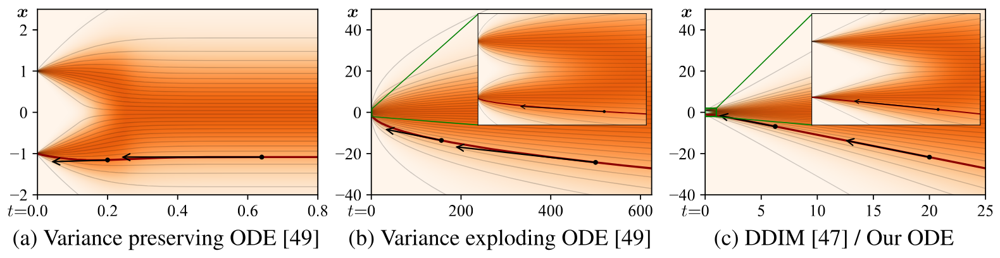

**图 3.** 一维 ODE 曲率示意图, 其中 $p_\text{data}$ 是位于 $\boldsymbol{x}=\pm 1$ 的两个 Dirac 峰. 每幅图的水平 $t$ 轴都选为显示 $\sigma\in[0,25]$, 插图则显示数据附近的 $\sigma\in[0,1]$. 黑色箭头表示局部梯度示例. **(a)** Song 等人 [Son21] 的方差保持 ODE 在 $\sigma$ 较大时, 解轨迹会变平为水平线. 只有当 $\sigma$ 较小时, 局部梯度才开始指向数据. **(b)** 方差爆炸变体在数据附近有极大曲率, 且解轨迹处处弯曲. **(c)** 采用 DDIM [Son21a] 和本文所用的调度时, 随着 $\sigma$ 增大, 解轨迹趋近于指向数据均值的直线. 当 $\sigma\to 0$ 时, 轨迹变为线性并指向数据流形.

**讨论.** 本节为改进确定性采样所做的选择汇总在 [表 1](#table-01) 的*采样*部分. 它们共同大幅减少了获得高质量结果所需的 NFE: VP 减少 $7.3\times$, VE 减少 $300\times$, DDIM 减少 $3.2\times$, 分别对应 [图 2](#figure-02) 中突出显示的 NFE 值. 实际上, 单张 NVIDIA V100 每秒可生成 26.3 张高质量 CIFAR-10 图像. 各项改进的一致性证实了我们的假设: 采样过程与各模型最初的训练方式正交. 作为进一步验证, [图 2](#figure-02) 的黑色虚线给出了采用本文调度的自适应 RK45 方法 [Dor80] 的结果; 这种复杂 ODE 求解器的成本超过了其收益.

## 4 随机采样

确定性采样有许多优点, 例如可以通过逆转 ODE 将真实图像转换为对应的潜在表示. 但与每一步都向图像注入新噪声的随机采样相比, 它往往得到更差的输出质量 [Son21a, Son21]. 既然理论上 ODE 和 SDE 恢复的是同一分布, 随机性究竟起什么作用?

**背景.** Song 等人 [Son21] 的 SDE 可以推广 [Hua21b, Zha21l] 为 [公式 1](#equation-01) 的概率流 ODE 与随时间变化的 *Langevin 扩散* SDE [Gre94] 之和 (见 [第 8.5 节](#section-8-5)): 

$$
\mathrm{d}\boldsymbol{x}_{\pm} =
    \underbrace{-\dot\sigma(t) \sigma(t) \nabla_{\hspace{-0.5mm}\boldsymbol{x}}\log p\big( \boldsymbol{x}; \sigma(t) \big) \,\mathrm{d}t}_{\mathrm{probability\ flow\ ODE\ (Eq.\ 1)}}\,\pm\,
    \underbrace{
      \underbrace{\beta(t) \sigma(t)^2 \nabla_{\hspace{-0.5mm}\boldsymbol{x}}\log p\big( \boldsymbol{x}; \sigma(t) \big) \,\mathrm{d}t}_{\text{deterministic noise decay}} +
      \underbrace{\sqrt{2 \beta(t)} \sigma(t) \,\mathrm{d}\omega_t}_{\text{noise injection}}
    }_{\text{Langevin diffusion SDE}} ,
$$
其中 $\omega_t$ 是标准 Wiener 过程. $\mathrm{d}\boldsymbol{x}_+$ 和 $\mathrm{d}\boldsymbol{x}_-$ 现在分别是时间向前和向后推进的 SDE, 二者由 Anderson [And82] 的时间反演公式联系起来. Langevin 项还可看作确定性的基于分数的去噪项与随机噪声注入项之和, 二者对净噪声水平的贡献相互抵消. 因此, $\beta(t)$ 实际表示以新噪声替换现有噪声的相对速率. 取 $\beta(t) = {\dot \sigma(t)}/{\sigma(t)}$ 时, 即可恢复 Song 等人 [Son21] 的 SDE, 此时分数从前向 SDE 中消失.

**算法 2: 采用 $\sigma(t)=t$ 和 $s(t)=1$ 的随机采样器.**

- **过程** $\operatorname{StochasticSampler}(D_\theta(\boldsymbol{x};\sigma), t_{i \in \{0, \dots, N\}}, \gamma_{i \in \{0, \dots, N-1\}}, S_\mathrm{noise})$
  - **采样** $\boldsymbol{x}_0 \sim \mathcal{N}(\mathbf{0}, t_0^2\mathbf{I})$.
  - **对于** $i \in \{0, \dots, N-1\}$:
    - $\gamma_i = \begin{cases} \min(S_\mathrm{churn}/N, \sqrt{2}-1) & \text{if } t_i \in [S_\mathrm{tmin},S_\mathrm{tmax}], \\ 0 & \text{otherwise}. \end{cases}$
    - **采样** $\boldsymbol{\epsilon}_i \sim \mathcal{N}(\mathbf{0}, S_\mathrm{noise}^2\mathbf{I})$.
    - $\hat t_i \gets t_i + \gamma_i t_i$. 选择临时提高的噪声水平 $\hat t_i$.
    - $\boldsymbol{\hat x}_i \gets \boldsymbol{x}_i + \sqrt{\hat t_i^2-t_i^2}\boldsymbol{\epsilon}_i$. 加入新噪声, 从 $t_i$ 移至 $\hat t_i$.
    - $\boldsymbol{d}_i \gets (\boldsymbol{\hat x}_i-D_\theta(\boldsymbol{\hat x}_i;\hat t_i))/\hat t_i$. 在 $\hat t_i$ 计算 $\mathrm{d}\boldsymbol{x}/\mathrm{d}t$.
    - $\boldsymbol{x}_{i+1} \gets \boldsymbol{\hat x}_i + (t_{i+1}-\hat t_i)\boldsymbol{d}_i$. 从 $\hat t_i$ 到 $t_{i+1}$ 迈出一个 Euler 步.
    - **如果** $t_{i+1} \ne 0$:
      - $\boldsymbol{d}'_i \gets (\boldsymbol{x}_{i+1}-D_\theta(\boldsymbol{x}_{i+1};t_{i+1}))/t_{i+1}$. 应用二阶校正.
      - $\boldsymbol{x}_{i+1} \gets \boldsymbol{\hat x}_i + (t_{i+1}-\hat t_i)(\frac{1}{2}\boldsymbol{d}_i + \frac{1}{2}\boldsymbol{d}'_i)$.
  - **返回** $\boldsymbol{x}_N$.

这一视角说明了随机性为何在实践中有用: 隐式 Langevin 扩散会把样本推向给定时刻所需的边缘分布, 主动校正早期采样步骤产生的误差. 另一方面, 用离散 SDE 求解器步近似 Langevin 项本身也会引入误差. 先前结果 [Bao22, Jol21, Son21a, Son21] 表明非零 $\beta(t)$ 有益, 但据我们所知, Song 等人 [Son21] 对 $\beta(t)$ 的隐式选择没有特殊性质. 因此, 最优随机性水平应由实验确定.

**本文的随机采样器.** 我们提出一种随机采样器, 把二阶确定性 ODE 积分器与显式, 类似 Langevin 的噪声加入和移除"扰动"结合起来. [算法 2](#algorithm-02) 给出了伪代码. 在每一步 $i$, 给定噪声水平 $t_i$ ($=\sigma(t_i)$) 上的样本 $\boldsymbol{x}_i$, 我们执行两个子步骤. 首先, 按因子 $\gamma_i\ge0$ 向样本加入噪声, 达到更高的噪声水平 $\hat t_i = t_i + \gamma_i t_i$. 其次, 从噪声增大的样本 $\boldsymbol{\hat x}_i$ 出发, 用一步将 ODE 从 $\hat t_i$ 反向求解到 $t_{i+1}$. 这样得到噪声水平为 $t_{i+1}$ 的样本 $\boldsymbol{x}_{i+1}$, 然后继续迭代. 需要强调的是, 这不是通用 SDE 求解器, 而是针对该特定问题设计的采样流程. 其正确性来自两个子步骤的交替: 每个步骤都维持正确分布 (ODE 步存在截断误差). Song 等人 [Son21] 的预测器-校正器采样器在概念上与本文方法结构相似.

为分析本文方法与 Euler-Maruyama 的主要差异, 先注意后者在离散化 [公式 6](#equation-06) 时存在一个细微偏差. Euler-Maruyama 可以理解为先加入噪声, 再执行一个 ODE 步; 但这个 ODE 步并非从噪声注入后的中间状态出发, 而是假设 $\boldsymbol{x}$ 和 $\sigma$ 仍停留在迭代步开始时的初始状态. 在本文方法中, [算法 2](#algorithm-02) 第 7 行用于计算 $D_\theta$ 的参数对应噪声注入后的状态; 类 Euler-Maruyama 方法则会用 $\boldsymbol{x}_i;t_i$ 代替 $\boldsymbol{\hat x}_i;\hat t_i$. 当 $\Delta_t$ 趋于零时, 这些选择之间可能没有差别; 但在用大步长追求低 NFE 时, 差异似乎会变得显著.

**实际考虑.** 增大随机性可以有效校正早期采样步骤产生的误差, 但也有自身的缺点. 我们观察到 (见 [第 11.1 节](#section-11-1)), 在所有数据集和去噪器网络上, 过度进行类似 Langevin 的噪声加入与移除都会使生成图像逐渐丢失细节. 在很低和很高的噪声水平下, 颜色还会向过饱和漂移. 我们怀疑, 实际去噪器在 [公式 3](#equation-03) 中诱导了轻微非保守的向量场, 违背 Langevin 扩散的前提并造成这些不利影响. 值得一提的是, 使用解析去噪器 (如 [图 1b](#figure-01) 所示去噪器) 的实验没有出现这种退化.

如果退化源于 $D_\theta(\boldsymbol{x}; \sigma)$ 的缺陷, 就只能在采样时用启发式方法补救. 我们只在特定噪声水平范围 $t_i \in [S_\text{tmin}, S_\text{tmax}]$ 内启用随机性, 以抑制颜色向过饱和漂移. 对这些噪声水平, 定义 $\gamma_i = S_\text{churn}/ N$, 其中 $S_\text{churn}$ 控制随机性的总量. 我们还对 $\gamma_i$ 截断, 保证引入的新噪声不超过图像中已有的噪声. 最后, 我们发现将 $S_\text{noise}$ 设为略大于 $1$, 放大新增噪声的标准差, 可以部分抵消细节损失. 这说明, 假设的 $D_\theta(\boldsymbol{x};\sigma)$ 非保守性中, 一个主要因素是去除噪声略多的倾向; 最可能的原因是任何使用 $L_2$ 训练的去噪器都可能发生向均值回归 [Leh18].

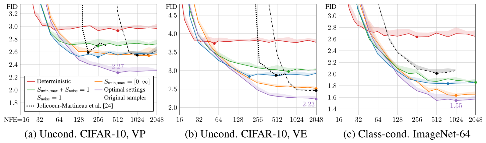

**图 4.** 随机采样器的评估结果 ([算法 2](#algorithm-02)). 紫色曲线对应 $\{S_\text{churn}, S_\text{tmin}, S_\text{tmax}, S_\text{noise}\}$ 的最优选择; 橙色, 蓝色和绿色对应禁用 $S_\text{tmin,tmax}$ 和/或 $S_\text{noise}$ 的作用. 红色曲线给出确定性采样器 ([算法 1](#algorithm-01)) 的参考结果, 等价于令 $S_\text{churn}= 0$. 黑色虚线对应先前工作的原始随机采样器: VP 使用 Euler-Maruyama [Son21], VE 使用预测器-校正器 [Son21], ImageNet-64 使用 iDDPM [Nic21]. 圆点表示观测到的最低 FID.

**评估.** [图 4](#figure-04) 表明, 本文的随机采样器以显著优势超过先前的采样器 [Jol21, Nic21, Son21], 尤其是在步数较少时. Jolicoeur-Martineau 等人 [Jol21] 使用标准的高阶自适应 SDE 求解器 [Rob12], 其性能可作为这类求解器的一般基线. 本文采样器针对具体用途设计, 例如依次执行噪声注入和 ODE 步, 且并非自适应. 对扩散模型采样而言, 自适应求解器能否真正胜过充分调优的固定调度, 仍是一个开放问题.

仅改进采样器, 就能把原本达到 FID 2.07 的 ImageNet-64 模型 [Dha21] 提升到 1.55, 非常接近最佳水平; 此前级联扩散 [Ho22b] 报告的 FID 为 1.48, 无分类器引导 [Ho21] 为 1.55, StyleGAN-XL [Sau22] 为 1.52. 这些结果说明采样器改进可能带来可观收益, 同时也揭示了随机性的主要缺点: 为取得最佳结果, 必须根据具体模型作出若干隐式或显式的启发式选择. 实际上, 我们不得不通过网格搜索逐案寻找 $\{S_\text{churn}, S_\text{tmin}, S_\text{tmax}, S_\text{noise}\}$ 的最优值 ([第 11.2 节](#section-11-2)). 这引出一个普遍问题: 将随机采样作为评估模型改进的主要手段, 可能会在无意中影响与模型架构和训练有关的设计选择.

## 5 预条件与训练

监督式训练神经网络有多种公认的良好实践. 例如, 输入和输出信号的幅值宜固定为单位方差等恒定尺度, 并应避免不同样本的梯度幅值相差过大 [Bis95, Hua20b]. 让神经网络直接对 $D$ 建模并不理想. 例如, 输入 $\boldsymbol{x}=\boldsymbol{y}+\boldsymbol{n}$ 由干净信号 $\boldsymbol{y}$ 和噪声 $\boldsymbol{n}\sim\mathcal{N}(\mathbf{0},\sigma^2 \mathbf{I})$ 组成, 其幅值会随噪声水平 $\sigma$ 发生巨大变化. 因此, 通常不会直接用神经网络表示 $D_\theta$, 而是训练另一个网络 $F_\theta$, 再由它导出 $D_\theta$.

先前方法 [Nic21, Son21a, Son21] 通过依赖 $\sigma$ 的归一化因子处理输入缩放, 并训练 $F_\theta$ 预测缩放至单位方差的 $\boldsymbol{n}$, 以此对输出做预条件, 随后再通过 $D_\theta(\boldsymbol{x};\sigma) = \boldsymbol{x}-\sigma F_\theta(\cdot)$ 重建信号. 这种做法的缺点是, 当 $\sigma$ 较大时, 网络必须细致调整输出, 才能精确抵消已有噪声 $\boldsymbol{n}$ 并得到尺度正确的输出; 请注意, 网络产生的任何误差都会被放大 $\sigma$ 倍. 在这种情况下, 直接预测期望输出 $D(\boldsymbol{x}; \sigma)$ 似乎容易得多. 借鉴先前自适应混合信号与噪声的参数化方式 (例如 [Doc22, Sal22, Vah21]), 我们提出用依赖 $\sigma$ 的跳跃连接对神经网络做预条件, 使其可以估计 $\boldsymbol{y}$, $\boldsymbol{n}$ 或介于两者之间的量. 因而, 我们将 $D_\theta$ 写成如下形式: 

$$
D_\theta(\boldsymbol{x}; \sigma) = c_\text{skip}(\sigma) ~\boldsymbol{x}+ c_\text{out}(\sigma) ~F_\theta \big( c_\text{in}(\sigma) ~\boldsymbol{x}; ~c_\text{noise}(\sigma) \big) \text{,}
$$
其中, $F_\theta$ 是待训练的神经网络, $c_\text{skip}(\sigma)$ 调制跳跃连接, $c_\text{in}(\sigma)$ 和 $c_\text{out}(\sigma)$ 缩放输入与输出的幅值, $c_\text{noise}(\sigma)$ 则把噪声水平 $\sigma$ 映射为 $F_\theta$ 的条件输入. 在各噪声水平上对 [公式 2](#equation-02) 取加权期望, 可得总体训练损失 $\mathbb{E}_{\sigma, \boldsymbol{y}, \boldsymbol{n}} \left[ \lambda(\sigma) ~ \| D(\boldsymbol{y}+ \boldsymbol{n}; \sigma) - \boldsymbol{y}\|^2_2 \right]$, 其中 $\sigma \sim p_\text{train}$, $\boldsymbol{y}\sim p_\text{data}$, 且 $\boldsymbol{n}\sim \mathcal{N}(\mathbf{0}, \sigma^2 \mathbf{I})$. 给定噪声水平 $\sigma$ 的采样概率由 $p_\text{train}(\sigma)$ 给出, 相应权重由 $\lambda(\sigma)$ 给出. 也可以按照 [公式 7](#equation-07) 中网络的原始输出 $F_\theta$ 等价地表示该损失: 

$$
\mathbb{E}_{\sigma, \boldsymbol{y}, \boldsymbol{n}} \Big[
    \underbrace{\lambda(\sigma) ~ c_\text{out}(\sigma)^2}_{\text{effective weight}}
    \big\|
      \underbrace{F_\theta \big( c_\text{in}(\sigma) \cdot (\boldsymbol{y}+ \boldsymbol{n}); c_\text{noise}(\sigma) \big)}_{\text{network output}} -
      \underbrace{\tfrac{1}{c_\text{out}(\sigma)} \big(\boldsymbol{y}- c_\text{skip}(\sigma) \cdot (\boldsymbol{y}+ \boldsymbol{n}) \big)}_{\text{effective training target}}
    \big\|^2_2 \Big] \text{.}
$$
这种形式揭示了 $F_\theta$ 的有效训练目标, 使我们可以从第一性原理出发确定合适的预条件函数. 如 [第 8.6 节](#section-8-6) 所述, 我们要求网络输入和训练目标具有单位方差 ($c_\text{in}$, $c_\text{out}$), 并尽量减少对 $F_\theta$ 误差的放大 ($c_\text{skip}$), 由此推导出 [表 1](#table-01) 中的选择. $c_\text{noise}$ 的公式则根据经验选定.

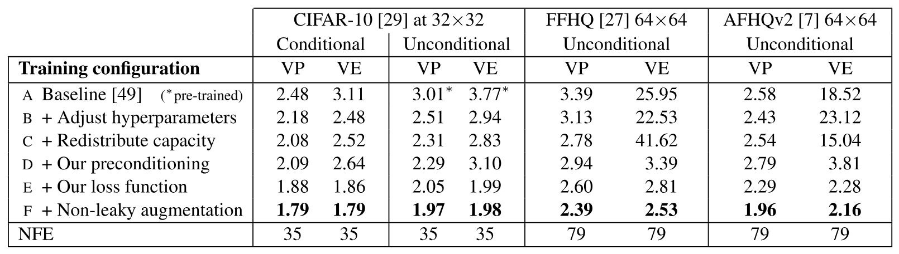

**表 2.** 训练改进的评估. 起点 (配置 A) 是采用我们的**确定性**采样器的 VP 与 VE. 在终点 (配置 E, F), VP 与 VE 仅在 $F_\theta$ 的架构上有所不同.

[表 2](#table-02) 给出了采用一系列训练设置所得的 FID, 评估使用 [第 3 节](#section-3) 中的确定性采样器. 我们从 Song 等人 [Son21] 的基线训练设置出发; 该设置在 VP 和 VE 两种情况下差异很大, 因此分别报告结果 (配置 A). 为了获得更有意义的比较基准, 我们重新调整基本超参数 (配置 B), 并移除最低分辨率层, 转而将最高分辨率层的容量翻倍, 从而提高模型的表达能力 (配置 C); 详见 [第 12.3 节](#section-12-3). 随后, 我们用自己的预条件方案取代原有的 $\{c_\text{in}, c_\text{out}, c_\text{noise}, c_\text{skip}\}$ 选择 (配置 D), 结果大体不变, 但 VE 在 $64\times64$ 分辨率下有显著改善. 预条件的主要益处并非直接改善 FID, 而是使训练更加稳健, 让我们可以把重点转向重新设计损失函数而不产生不良影响.

**损失加权与采样.** [公式 8](#equation-08) 表明, 按照 [公式 7](#equation-07) 对 $F_\theta$ 做预条件并训练时, 每个样本的有效损失权重为 $\lambda(\sigma)c_\text{out}(\sigma)^2$. 为平衡有效损失权重, 我们令 $\lambda(\sigma)=1/c_\text{out}(\sigma)^2$; 如 [图 5a](#figure-05) (绿色曲线) 所示, 这也使整个 $\sigma$ 范围内的初始训练损失相等. 最后还需选择 $p_\text{train}(\sigma)$, 即训练时如何选择噪声水平. 检查训练后每个 $\sigma$ 对应的损失 (蓝色和橙色曲线) 可以发现, 只有中等噪声水平上的损失能够显著降低; 噪声水平很低时, 几乎消失的噪声分量既难以辨别也无关紧要, 而在高噪声水平下, 训练目标总是与趋近数据集均值的正确答案不同. 因此, 我们用一个简单的对数正态分布作为 $p_\text{train}(\sigma)$, 将训练集中在相关范围内; 具体见 [表 1](#table-01), [图 5a](#figure-05) (红色曲线) 也给出了示意.

[表 2](#table-02) 表明, 将我们提出的 $p_\text{train}$ 和 $\lambda$ (配置 E) 与预条件方案 (配置 D) 配合使用后, 所有情况下的 FID 都有大幅改善. 在同期工作中, Choi 等人 [Cho22c] 提出了一种相似方案, 优先考虑对形成图像中可感知内容最相关的噪声水平. 但他们只单独考虑了 $\lambda$ 的选择, 因而总体改善较小.

**增强正则化.** 较小数据集上的扩散模型经常受到潜在过拟合的困扰, 为此我们借用了 GAN 文献中的增强流水线 [Kar20a]. 这套流水线包含多种几何变换 (见 [第 12.2 节](#section-12-2)), 在添加噪声前作用于训练图像. 为防止增强泄漏到生成图像中, 我们把增强参数作为 $F_\theta$ 的条件输入; 推理时将其置零, 从而保证只生成未增强的图像. [表 2](#table-02) 表明, 数据增强带来了稳定改善 (配置 F), 使有条件和无条件 CIFAR-10 分别取得 1.79 和 1.97 的新 SOTA FID, 超过此前 1.85 [Sau22] 和 2.10 [Vah21] 的记录.

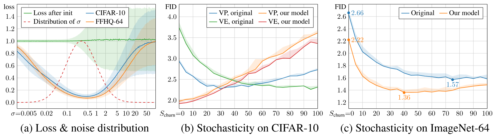

**图 5.** **(a)** 观测到的各噪声水平初始损失 (绿色) 与最终损失, 后者以本文研究的 $32\times32$ (蓝色) 和 $64\times64$ (橙色) 模型为代表. 阴影区域表示 10k 个随机样本上的标准差. 我们提出的训练样本密度以红色虚线表示. **(b)** 使用 256 步 (NFE $=$ 511) 时, $S_\text{churn}$ 对无条件 CIFAR-10 的影响. 对 Song 等人 [Son21] 的原始训练设置而言, 随机采样非常有益 (蓝色, 绿色), 而确定性采样 ($S_\text{churn}= 0$) 得到的 FID 较差. 对我们的训练设置而言, 情况正好相反 (橙色, 红色); 随机采样不仅没有必要, 反而有害. **(c)** 使用 256 步 (NFE $=$ 511) 时, $S_\text{churn}$ 对类别条件 ImageNet-64 的影响. 在这一更具挑战性的场景中, 随机采样再次显现出用处. 我们的训练设置同时改善了确定性采样和随机采样的结果.

**再谈随机采样.** 有意思的是, 如 [图 5b](#figure-05), [图 5c](#figure-05) 所示, 随着模型本身的改进, 随机采样的重要性似乎有所降低. 在 CIFAR-10 上采用我们的训练设置时 ([图 5b](#figure-05)), 确定性采样得到的结果最好, 任何程度的随机采样都会损害结果.

**ImageNet-64.** 在最后一项实验中, 我们使用所提出的训练改进, 从头训练了一个类别条件 ImageNet-64 模型. 该模型取得了 1.36 的新 SOTA FID, 超过此前 1.48 的记录 [Ho22b]. 我们原样采用 ADM 架构 [Dha21], 以配置 E 训练, 只做了极少调优; 详见 [第 12.3 节](#section-12-3). 我们没有发现过拟合问题, 因而没有采用增强正则化. 如 [图 5c](#figure-05) 所示, 最优随机采样量远低于使用预训练模型时, 但与 CIFAR-10 不同, 随机采样仍明显优于确定性采样. 这表明, 多样性更高的数据集仍能从随机采样中受益.

## 6 结论

我们将扩散模型纳入统一框架的方法呈现出模块化设计. 这样便能有针对性地研究各个组件, 有望更充分地覆盖可行的设计空间. 在测试中, 我们只需替换多个早期模型的采样器, 就能大幅改善结果. 例如, 在 ImageNet-64 上, 我们的采样器把一个表现普通的模型 (FID 2.07) 提升为此前 SOTA 模型 (1.48) [Ho22b] 的有力竞争者 (1.55), 加入训练改进后则取得 1.36 的 SOTA FID. 我们还仅用 35 次模型评估, 确定性采样和一个小型网络, 就在 CIFAR-10 上取得了新的 SOTA 结果. 当前的高分辨率扩散模型依赖独立的超分辨率步骤 [Ho22b, Nic22, Ram22], 子空间投影 [Jin22a], 超大型网络 [Dha21, Son21] 或混合方法 [Pre22, Rom22, Vah21]; 我们认为本文贡献与这些扩展相互正交. 不过, 面对更高分辨率的数据集, 我们的许多参数值可能需要重新调整. 此外, 随机采样与训练目标之间的确切相互作用, 仍是一个值得未来研究的问题.

**社会影响.** 若将我们在样本质量上的进展用于 DALL·E 2 这类大规模系统, 可能会放大负面社会影响, 包括各类虚假信息, 或强化刻板印象和有害偏见 [Mis22a]. 扩散模型的训练与采样需要大量电力; 本项目在内部 NVIDIA V100 集群上消耗了 $\sim 250$ MWh 电力.

## 致谢

感谢 Jaakko Lehtinen, Ming-Yu Liu, Tuomas Kynkäänniemi, Axel Sauer, Arash Vahdat 和 Janne Hellsten 参与讨论并提出意见, 也感谢 Tero Kuosmanen, Samuel Klenberg 和 Janne Hellsten 维护我们的计算基础设施.

## 7 补充结果

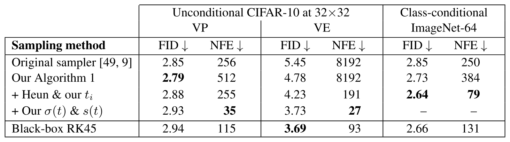

**表 3.** 确定性采样改进的评估. 数值对应 [图 2](#figure-02) 中的曲线. 标有 "—" 的数值与其上方数值相同, 因为我们的采样器与 DDIM 使用相同的 $\sigma(t)$ 和 $s(t)$.

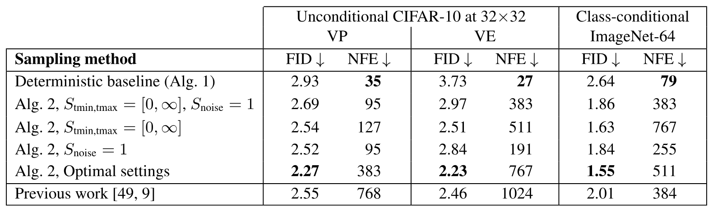

**表 4.** 随机采样改进的评估与消融. 数值对应 [图 4](#figure-04) 中的曲线.

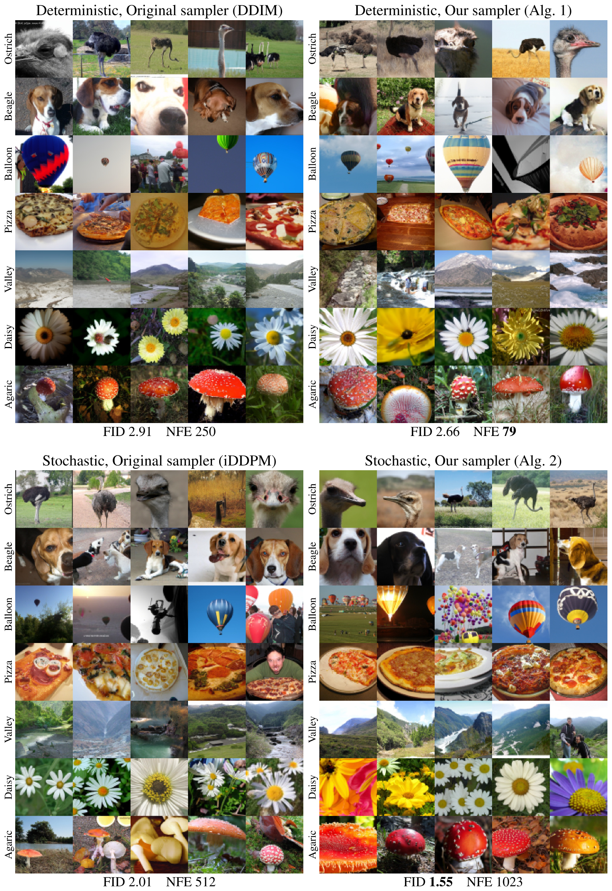

**图 6.** 在 $64\times64$ 分辨率的类别条件 ImageNet [Den09a] 上, 使用 Dhariwal 和 Nichol 的预训练模型 [Dha21] 时不同采样器的结果. 各个情形对应 [图 2c](#figure-02) 和 [图 4c](#figure-04) 中的点.

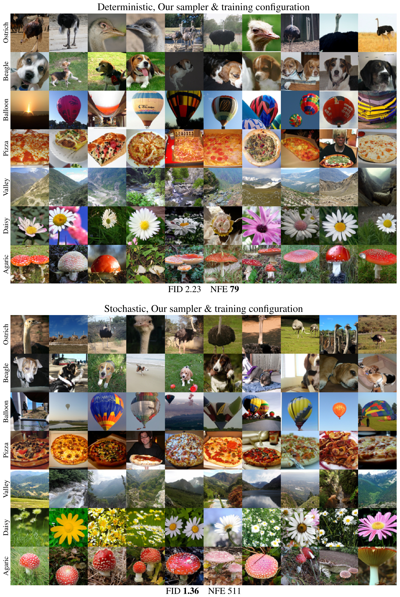

**图 7.** 在 $64\times64$ 分辨率的类别条件 ImageNet [Den09a] 上, 使用我们的确定性和随机采样器时, 本文训练配置所得的结果.

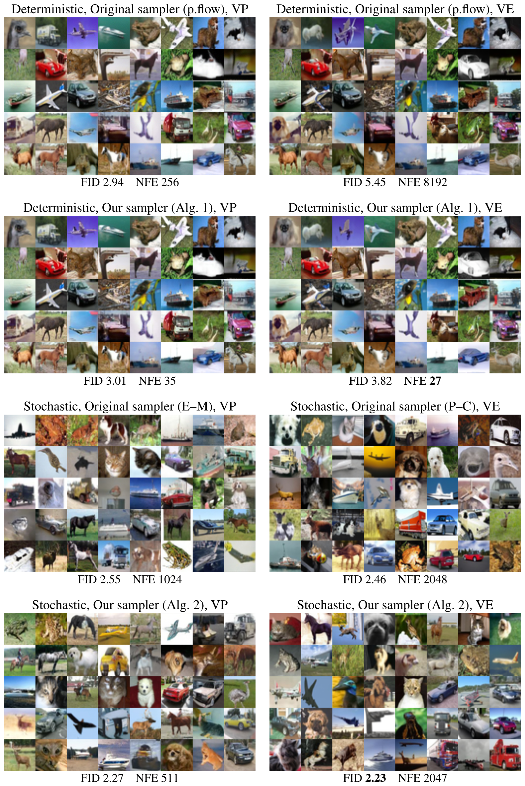

**图 8.** 在 $32\times32$ 分辨率的无条件 CIFAR-10 [Kri09] 上, 使用 Song 等人的预训练模型 [Son21] 时不同采样器的结果. 各个情形对应 [图 2a](#figure-02), [图 2b](#figure-02) 和 [图 4a](#figure-04), [图 4b](#figure-04) 中的点.

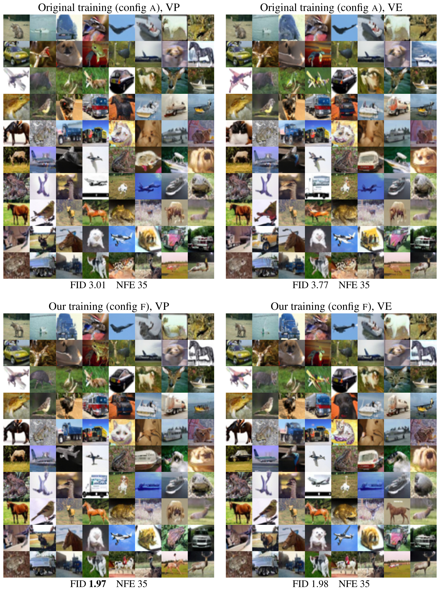

**图 9.** 在 $32\times32$ 分辨率的无条件 CIFAR-10 [Kri09] 上, 使用确定性采样器且每种情形采用同一组潜变量编码 ($\boldsymbol{x}_0$) 时不同训练配置的结果.

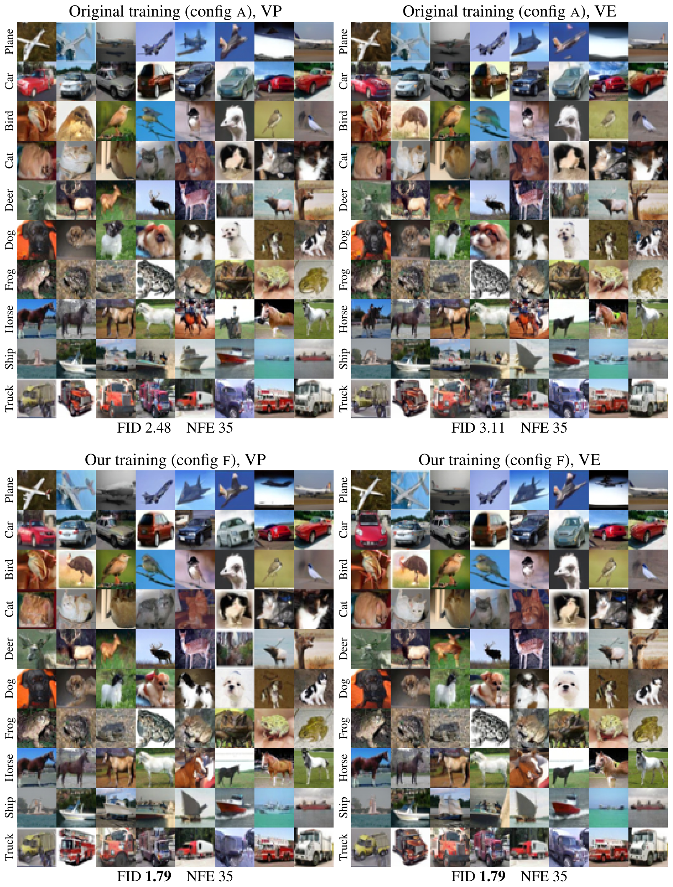

**图 10.** 在 $32\times32$ 分辨率的类别条件 CIFAR-10 [Kri09] 上, 使用确定性采样器且每种情形采用同一组潜变量编码 ($\boldsymbol{x}_0$) 时不同训练配置的结果.

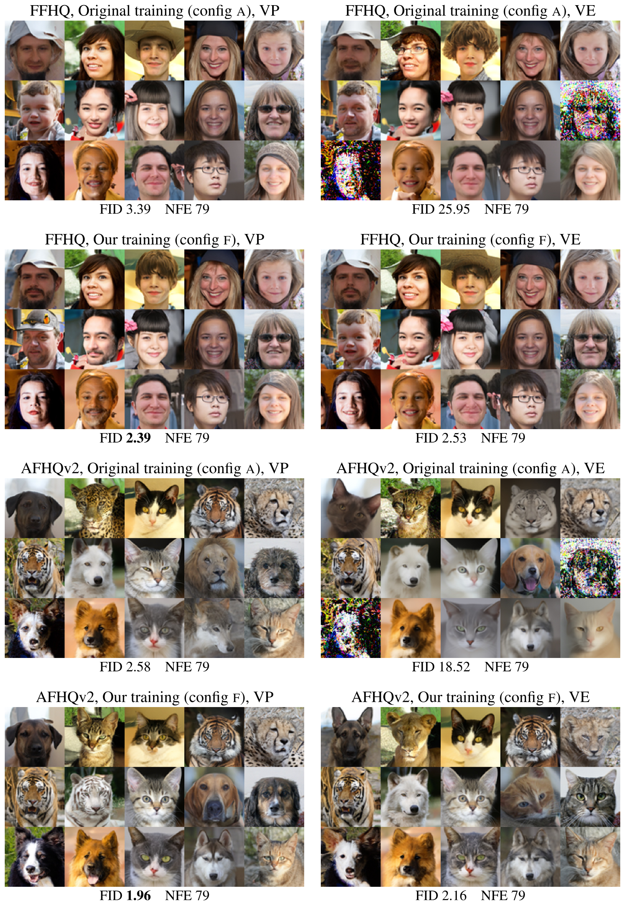

**图 11.** 在 $64\times64$ 分辨率的 FFHQ [Kar18] 和 AFHQv2 [Cho20c] 上, 使用确定性采样器且每种情形采用同一组潜变量编码 ($\boldsymbol{x}_0$) 时不同训练配置的结果.

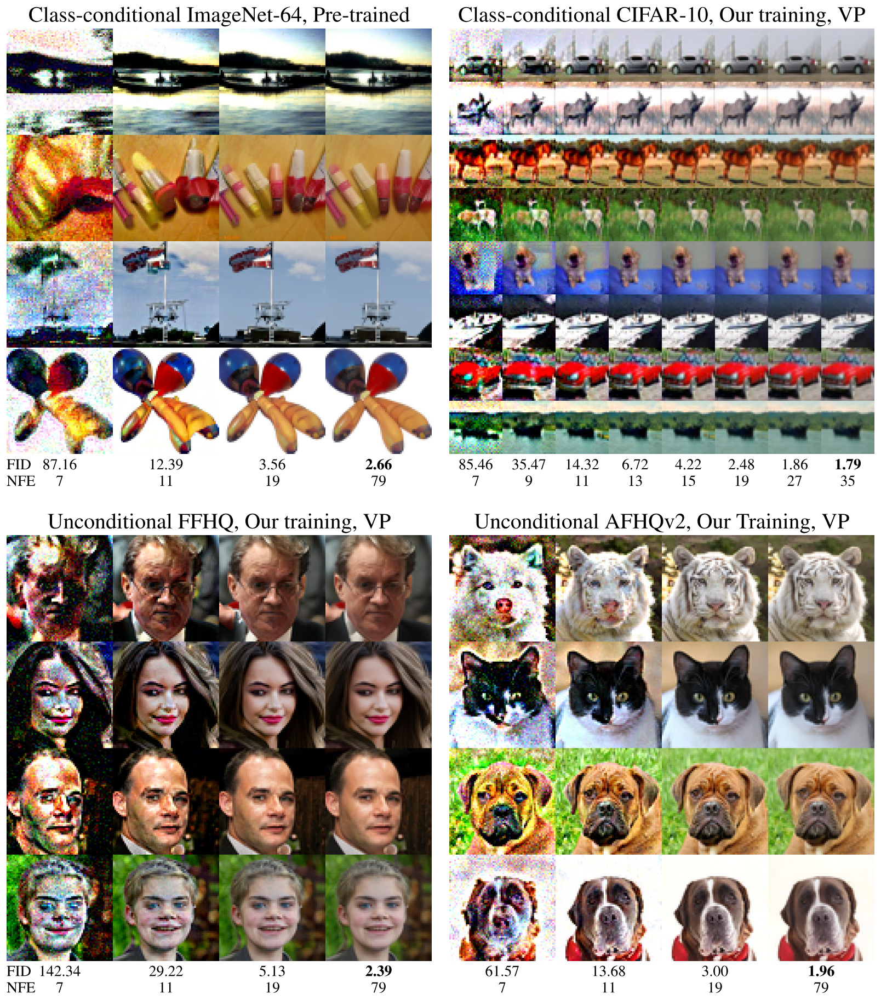

**图 12.** 使用确定性采样器时, 图像质量和 FID 随 NFE 的变化. 在 $32\times32$ 分辨率下, NFE $=$ 13 左右即可获得尚可的图像质量, 但 FID 会持续改善到 NFE $=$ 35. 在 $64\times64$ 分辨率下, NFE $=$ 19 左右即可获得尚可的图像质量, 但 FID 会持续改善到 NFE $=$ 79.

[图 6](#figure-06) 展示了使用 Dhariwal 和 Nichol [Dha21] 的预训练 ADM 模型在类别条件 ImageNet-64 [Den09a] 上生成的图像. 我们在确定性和随机两种设置下, 将原始 DDIM [Son21a] 和 iDDPM [Nic21] 采样器与本文方法进行比较 ([第 3 节](#section-3) 和 [第 4 节](#section-4)). [图 7](#figure-07) 则展示了采用改进后的训练配置从头训练模型时得到的相应结果 ([第 5 节](#section-5)).

在 [图 8](#figure-08) 和 [图 9](#figure-09) (无条件 CIFAR-10 [Kri09]), [图 10](#figure-10) (类别条件 CIFAR-10) 以及 [图 11](#figure-11) (FFHQ [Kar18] 和 AFHQv2 [Cho20c]) 中, 我们将 Song 等人 [Son21] 的原始采样器及训练配置与本文方法进行了比较. 为便于比较, 对于每个数据集/场景, 不同训练配置和 ODE 选择均使用相同的潜变量编码 $\boldsymbol{x}_0$. [图 12](#figure-12) 展示了确定性采样时不同 NFE 对应的生成图像质量.

[表 3](#table-03) 和 [表 4](#table-04) 汇总了确定性与随机采样方法在多个数据集上的数值结果; 这些结果此前已在 [图 2](#figure-02) 和 [图 4](#figure-04) 中表示为 NFE 的函数.

## 8 公式推导

### 8.1 先前工作的原始 ODE / SDE 表述

Song 等人 [Son21] 将其前向 SDE ([Son21] 中的公式 5) 定义为
$$
\mathrm{d}\boldsymbol{x}= \boldsymbol{f}(\boldsymbol{x}, t) ~\mathrm{d}t + g(t) ~\mathrm{d}\omega_t
  \text{,}
$$
其中, $\omega_t$ 是标准 Wiener 过程, $\boldsymbol{f}(\cdot, t): \mathbb{R}^d \rightarrow \mathbb{R}^d$ 和 $g(\cdot): \mathbb{R} \rightarrow \mathbb{R}$ 分别是漂移系数与扩散系数, $d$ 是数据集的维数. 方差保持 (VP) 与方差爆炸 (VE) 表述对这些系数的选择不同, 而 $\boldsymbol{f}(\cdot)$ 始终具有 $\boldsymbol{f}(\boldsymbol{x}, t) = f(t) ~\boldsymbol{x}$ 的形式, 其中 $f(\cdot): \mathbb{R} \rightarrow \mathbb{R}$. 因此, 该 SDE 可等价地写成 

$$
\mathrm{d}\boldsymbol{x}= f(t) ~\boldsymbol{x}~\mathrm{d}t + g(t) ~\mathrm{d}\omega_t
  \text{.}
$$

该 SDE 的扰动核 ([Son21] 中的公式 29) 具有如下通用形式: 

$$
p_{0t}\big( \boldsymbol{x}(t) ~|~ \boldsymbol{x}(0) \big) = \mathcal{N} \big( \boldsymbol{x}(t); ~s(t) ~\boldsymbol{x}(0), ~s(t)^2 ~\sigma(t)^2 ~\mathbf{I}\big)
  \text{,}
$$
其中, $\mathcal{N}(\boldsymbol{x}; \boldsymbol{\mu}, \boldsymbol{\Sigma})$ 表示 $\mathcal{N}(\boldsymbol{\mu}, \boldsymbol{\Sigma})$ 的概率密度函数在 $\boldsymbol{x}$ 处的取值, 

$$
s(t) = \exp\left( \int_0^t f(\xi) ~\mathrm{d}\xi \right)
  \text{,}
  \hspace{4mm}\text{and}\hspace{4mm}
  \sigma(t) = \sqrt{\int_0^t \frac{g(\xi)^2}{s(\xi)^2} ~\mathrm{d}\xi}
  \text{.}
$$

对扰动核关于 $\boldsymbol{x}(0)$ 积分, 即可得到边缘分布 $p_t(\boldsymbol{x})$: 

$$
p_t(\boldsymbol{x}) = \int_{\mathbb{R}^d} p_{0t}(\boldsymbol{x}~|~ \boldsymbol{x}_0) ~p_\text{data}(\boldsymbol{x}_0) ~\mathrm{d}\boldsymbol{x}_0
  \text{.}
$$

Song 等人 [Son21] 定义了概率流 ODE ([Son21] 中的公式 13), 使其遵循同一个 $p_t(\boldsymbol{x})$: 

$$
\mathrm{d}\boldsymbol{x}= \left[ f(t) ~\boldsymbol{x}- \tfrac{1}{2} ~g(t)^2 ~\nabla_{\hspace{-0.5mm}\boldsymbol{x}}\log p_t(\boldsymbol{x}) \right] ~\mathrm{d}t
  \text{.}
$$

### 8.2 我们的 ODE 表述 ([公式 1](#equation-01) 与 [公式 4](#equation-04))

原始 ODE 表述 ([公式 14](#equation-14)) 围绕函数 $f$ 和 $g$ 构建, 它们直接对应公式中出现的特定项; 边缘分布的性质 ([公式 12](#equation-12)) 只能根据这些函数间接推导. 然而, $f$ 和 $g$ 本身几乎没有实际意义, 边缘分布对于最初训练模型, 启动采样过程以及理解 ODE 的实际行为却至关重要. 既然概率流 ODE 的目的就是匹配一组特定的边缘分布, 那么自然应把边缘分布视为一等对象, 直接基于 $\sigma(t)$ 和 $s(t)$ 定义 ODE, 从而不再需要 $f(t)$ 和 $g(t)$.

首先, 将 [公式 13](#equation-13) 中的边缘分布写成闭式形式:
$$
\begin{aligned}
  p_t(\boldsymbol{x}) &= \int_{\mathbb{R}^d} p_{0t}(\boldsymbol{x}~|~ \boldsymbol{x}_0) ~p_\text{data}(\boldsymbol{x}_0) ~\mathrm{d}\boldsymbol{x}_0 \\
  &= \int_{\mathbb{R}^d} p_\text{data}(\boldsymbol{x}_0) ~\Big[ \mathcal{N} \big( \boldsymbol{x}; ~s(t) ~\boldsymbol{x}_0, ~s(t)^2 ~\sigma(t)^2 ~\mathbf{I}\big) \Big] ~\mathrm{d}\boldsymbol{x}_0 \\
  &= \int_{\mathbb{R}^d} p_\text{data}(\boldsymbol{x}_0) ~\Big[ s(t)^{-d} ~\mathcal{N} \big( \boldsymbol{x}/ s(t); ~\boldsymbol{x}_0, ~\sigma(t)^2 ~\mathbf{I}\big) \Big] ~\mathrm{d}\boldsymbol{x}_0 \\
  &= s(t)^{-d} \int_{\mathbb{R}^d} p_\text{data}(\boldsymbol{x}_0) ~\mathcal{N} \big( \boldsymbol{x}/ s(t); ~\boldsymbol{x}_0, ~\sigma(t)^2 ~\mathbf{I}\big) ~\mathrm{d}\boldsymbol{x}_0 \\
  &= s(t)^{-d} ~\Big[ p_\text{data}\ast \mathcal{N} \big( \mathbf{0}, ~\sigma(t)^2 ~\mathbf{I}\big) \Big] \big( \boldsymbol{x}/ s(t) \big)
  \text{,}
\end{aligned}
$$
其中, $p_a \ast p_b$ 表示概率密度函数 $p_a$ 与 $p_b$ 的卷积. 方括号内的表达式对应 $p_\text{data}$ 的光滑化版本, 它通过向样本添加独立同分布的 Gaussian 噪声得到. 将此分布记为 $p(\boldsymbol{x}; \sigma)$: 

$$
p(\boldsymbol{x}; \sigma) = p_\text{data}\ast \mathcal{N} \big( \mathbf{0}, ~\sigma(t)^2 ~\mathbf{I}\big)
  \hspace{5mm}\text{and}\hspace{5mm}
  p_t(\boldsymbol{x}) = s(t)^{-d} ~p\big( \boldsymbol{x}/ s(t); \sigma(t) \big)
  \text{.}
$$

现在可以用 $p(\boldsymbol{x}; \sigma)$ 代替 $p_t(\boldsymbol{x})$, 表示概率流 ODE ([公式 14](#equation-14)): 

$$
\begin{aligned}
  \mathrm{d}\boldsymbol{x}&= \left[ f(t) \boldsymbol{x}- \tfrac{1}{2} ~g(t)^2 ~\nabla_{\hspace{-0.5mm}\boldsymbol{x}}\log \big[ p_t(\boldsymbol{x}) \big] \right] ~\mathrm{d}t \\
  &= \left[ f(t) \boldsymbol{x}- \tfrac{1}{2} ~g(t)^2 ~\nabla_{\hspace{-0.5mm}\boldsymbol{x}}\log \big[ s(t)^{-d} ~p\big( \boldsymbol{x}/ s(t); \sigma(t) \big) \big] \right] ~\mathrm{d}t \\
  &= \left[ f(t) \boldsymbol{x}- \tfrac{1}{2} ~g(t)^2 ~\big[ \nabla_{\hspace{-0.5mm}\boldsymbol{x}}\log s(t)^{-d} + \nabla_{\hspace{-0.5mm}\boldsymbol{x}}\log p\big( \boldsymbol{x}/ s(t); \sigma(t) \big) \big] \right] ~\mathrm{d}t \\
  &= \left[ f(t) \boldsymbol{x}- \tfrac{1}{2} ~g(t)^2 ~\nabla_{\hspace{-0.5mm}\boldsymbol{x}}\log p\big( \boldsymbol{x}/ s(t); \sigma(t) \big) \right] ~\mathrm{d}t

  \text{.}
\end{aligned}
$$

接下来, 根据 [公式 12](#equation-12), 用 $s(t)$ 改写 $f(t)$: 

$$
\begin{aligned}
  \exp\left( \int_0^t f(\xi) ~\mathrm{d}\xi \right) &= s(t) \\
  \int_0^t f(\xi) ~\mathrm{d}\xi &= \log s(t) \\
  \mathrm{d}\bigg[ \int_0^t f(\xi) ~\mathrm{d}\xi \bigg] \big/ \mathrm{d}t &= \mathrm{d}\big[ \log s(t) \big] / \mathrm{d}t \\
  f(t) &= \dot s(t) / s(t)

  \text{.}
\end{aligned}
$$

同理, 也可以用 $\sigma(t)$ 改写 $g(t)$: 

$$
\begin{aligned}
  \sqrt{\int_0^t \frac{g(\xi)^2}{s(\xi)^2} ~\mathrm{d}\xi} &= \sigma(t) \\
  \int_0^t \frac{g(\xi)^2}{s(\xi)^2} ~\mathrm{d}\xi &= \sigma(t)^2 \\
  \mathrm{d}\bigg[ \int_0^t \frac{g(\xi)^2}{s(\xi)^2} ~\mathrm{d}\xi \bigg] \big/ \mathrm{d}t &= \mathrm{d}\big[ \sigma(t)^2 \big] / \mathrm{d}t \\
  g(t)^2 / s(t)^2 &= 2 ~\dot\sigma(t) ~\sigma(t) \\
  g(t) / s(t) &= \sqrt{2 ~\dot\sigma(t) ~\sigma(t)} \\
  g(t) &= s(t) ~\sqrt{2 ~\dot\sigma(t) ~\sigma(t)}

  \text{.}
\end{aligned}
$$

最后, 将 $f$ ([公式 28](#equation-28)) 和 $g$ ([公式 34](#equation-34)) 代入 [公式 24](#equation-24) 的 ODE:
$$
\begin{aligned}
  \mathrm{d}\boldsymbol{x}&= \left[ [f(t)] ~\boldsymbol{x}- \tfrac{1}{2} ~[g(t)]^2 ~\nabla_{\hspace{-0.5mm}\boldsymbol{x}}\log p\big( \boldsymbol{x}/ s(t); \sigma(t) \big) \right] ~\mathrm{d}t \\
  &= \bigg[ \big[ \dot s(t) / s(t) \big] ~\boldsymbol{x}- \tfrac{1}{2} ~\Big[ s(t) \sqrt{2 ~\dot\sigma(t) ~\sigma(t)} \Big]^2 ~\nabla_{\hspace{-0.5mm}\boldsymbol{x}}\log p\big( \boldsymbol{x}/ s(t); \sigma(t) \big) \bigg] ~\mathrm{d}t \\
  &= \bigg[ \big[ \dot s(t) / s(t) \big] ~\boldsymbol{x}- \tfrac{1}{2} ~\Big[ 2 ~s(t)^2 ~\dot\sigma(t) ~\sigma(t) \Big] ~\nabla_{\hspace{-0.5mm}\boldsymbol{x}}\log p\big( \boldsymbol{x}/ s(t); \sigma(t) \big) \bigg] ~\mathrm{d}t \\
  %
  &= \left[ \frac{\dot s(t)}{s(t)} ~\boldsymbol{x}-s(t)^2 ~\dot\sigma(t) ~\sigma(t) ~\nabla_{\hspace{-0.5mm}\boldsymbol{x}}\log p\left(\frac{\boldsymbol{x}}{s(t)}; \sigma(t)\right) \right] ~\mathrm{d}t
  \text{.}
\end{aligned}
$$

由此得到正文中的 [公式 4](#equation-04); 令 $s(t) = 1$, 即可恢复 [公式 1](#equation-01):
$$
\mathrm{d}\boldsymbol{x}= -\dot\sigma(t) ~\sigma(t) ~\nabla_{\hspace{-0.5mm}\boldsymbol{x}}\log p\big( \boldsymbol{x}; \sigma(t) \big) ~\mathrm{d}t
  \text{.}
$$

我们的表述 ([公式 4](#equation-04)) 突出了这样一个事实: 概率流 ODE 的每种实现都只是同一个规范 ODE 的重新参数化; 改变 $\sigma(t)$ 相当于重新参数化 $t$, 而改变 $s(t)$ 相当于重新参数化 $\boldsymbol{x}$.

### 8.3 去噪得分匹配 ([公式 2](#equation-02) 与 [公式 3](#equation-03))

为求完整, 我们针对有限数据集推导得分匹配与去噪之间的联系. 更一般的处理方式与相关背景可参见 Hyvärinen [Hyv05] 和 Vincent [Vin11].

假设训练集由有限个样本 $\{\boldsymbol{y}_1, \dots, \boldsymbol{y}_Y\}$ 构成. 这意味着 $p_\text{data}(\boldsymbol{x})$ 可表示为 Dirac delta 分布的混合:
$$
p_\text{data}(\boldsymbol{x}) = \frac{1}{Y} \sum_{i=1}^Y \delta \big( \boldsymbol{x}- \boldsymbol{y}_i \big)
  \text{,}
$$
因此也可以根据 [公式 20](#equation-20), 将 $p(\boldsymbol{x}; \sigma)$ 写成闭式形式: 

$$
\begin{aligned}
  p(\boldsymbol{x}; \sigma) &= p_\text{data}\ast \mathcal{N} \big( \mathbf{0}, ~\sigma(t)^2 ~\mathbf{I}\big) \\
  &= \int_{\mathbb{R}^d} p_\text{data}(\boldsymbol{x}_0) ~\mathcal{N} \big( \boldsymbol{x}; ~\boldsymbol{x}_0, ~\sigma^2 ~\mathbf{I}\big) ~\mathrm{d}\boldsymbol{x}_0 \\
  &= \int_{\mathbb{R}^d} \Bigg[ \frac{1}{Y} \sum_{i=1}^Y \delta \big( \boldsymbol{x}_0 - \boldsymbol{y}_i \big) \Bigg] \mathcal{N} \big( \boldsymbol{x}; ~\boldsymbol{x}_0, ~\sigma^2 ~\mathbf{I}\big) ~\mathrm{d}\boldsymbol{x}_0 \\
  &= \frac{1}{Y} \sum_{i=1}^Y \int_{\mathbb{R}^d} \mathcal{N} \big( \boldsymbol{x}; ~\boldsymbol{x}_0, ~\sigma^2 ~\mathbf{I}\big) ~\delta \big( \boldsymbol{x}_0 - \boldsymbol{y}_i \big) ~\mathrm{d}\boldsymbol{x}_0 \\
  &= \frac{1}{Y} \sum_{i=1}^Y \mathcal{N} \big( \boldsymbol{x}; ~\boldsymbol{y}_i, ~\sigma^2 ~\mathbf{I}\big)

  \text{.}
\end{aligned}
$$

现在考虑 [公式 2](#equation-02) 中的去噪得分匹配损失. 展开期望后, 可以将公式改写为对含噪样本 $\boldsymbol{x}$ 的积分: 

$$
\begin{aligned}
  \mathcal{L}(D; \sigma) &= \mathbb{E}_{\boldsymbol{y}\sim p_\text{data}} ~\mathbb{E}_{\boldsymbol{n}\sim \mathcal{N}(\mathbf{0}, \sigma^2 \mathbf{I})} ~\big\| D(\boldsymbol{y}+ \boldsymbol{n}; \sigma) - \boldsymbol{y}\big\|^2_2 \\
  &= \mathbb{E}_{\boldsymbol{y}\sim p_\text{data}} ~\mathbb{E}_{\boldsymbol{x}\sim \mathcal{N}(\boldsymbol{y}, \sigma^2 \mathbf{I})} ~\big\| D(\boldsymbol{x}; \sigma) - \boldsymbol{y}\big\|^2_2 \\
  &= \mathbb{E}_{\boldsymbol{y}\sim p_\text{data}} \int_{\mathbb{R}^d} \mathcal{N}(\boldsymbol{x}; ~\boldsymbol{y}, ~\sigma^2 ~\mathbf{I}) ~\big\| D(\boldsymbol{x}; \sigma) - \boldsymbol{y}\big\|^2_2 ~\mathrm{d}\boldsymbol{x}\\
  &= \frac{1}{Y} \sum_{i=1}^Y \int_{\mathbb{R}^d} \mathcal{N}(\boldsymbol{x}; ~\boldsymbol{y}_i, ~\sigma^2 ~\mathbf{I}) ~\big\| D(\boldsymbol{x}; \sigma) - \boldsymbol{y}_i \big\|^2_2 ~\mathrm{d}\boldsymbol{x}\\
  &= \int_{\mathbb{R}^d} \underbrace{\frac{1}{Y} \sum_{i=1}^Y \mathcal{N}(\boldsymbol{x}; ~\boldsymbol{y}_i, ~\sigma^2 ~\mathbf{I}) ~\big\| D(\boldsymbol{x}; \sigma) - \boldsymbol{y}_i \big\|^2_2}_{=: ~ \mathcal{L}(D; \boldsymbol{x}, \sigma)}  ~\mathrm{d}\boldsymbol{x}
  %

  \text{.}
\end{aligned}
$$

[公式 50](#equation-50) 意味着, 可以对每个 $\boldsymbol{x}$ 独立最小化 $\mathcal{L}(D; \boldsymbol{x}, \sigma)$, 从而最小化 $\mathcal{L}(D; \sigma)$:
$$
D(\boldsymbol{x}; \sigma) = \mathop{\mathrm{arg}\,\min}_{D(\boldsymbol{x}; \sigma)} \mathcal{L}(D; \boldsymbol{x}, \sigma)
  \text{.}
$$
这是一个凸优化问题; 令关于 $D(\boldsymbol{x}; \sigma)$ 的梯度为零, 即可唯一确定其解: 

$$
\begin{aligned}
  \mathbf{0}&= \nabla_{D(\boldsymbol{x}; \sigma)} \Big[ \mathcal{L}(D; \boldsymbol{x}, \sigma) \Big] \\
  \mathbf{0}&= \nabla_{D(\boldsymbol{x}; \sigma)} \Bigg[ \frac{1}{Y} \sum_{i=1}^Y \mathcal{N}(\boldsymbol{x}; ~\boldsymbol{y}_i, ~\sigma^2 ~\mathbf{I}) ~\big\| D(\boldsymbol{x}; \sigma) - \boldsymbol{y}_i \big\|^2_2 \Bigg] \\
  \mathbf{0}&= \sum_{i=1}^Y \mathcal{N}(\boldsymbol{x}; ~\boldsymbol{y}_i, ~\sigma^2 ~\mathbf{I}) ~\nabla_{D(\boldsymbol{x}; \sigma)} \Big[ \big\| D(\boldsymbol{x}; \sigma) - \boldsymbol{y}_i \big\|^2_2 \Big] \\
  \mathbf{0}&= \sum_{i=1}^Y \mathcal{N}(\boldsymbol{x}; ~\boldsymbol{y}_i, ~\sigma^2 ~\mathbf{I}) ~\Big[ 2 ~D(\boldsymbol{x}; \sigma) - 2~\boldsymbol{y}_i \Big] \\
  \mathbf{0}&= \Bigg[ \sum_{i=1}^Y \mathcal{N}(\boldsymbol{x}; ~\boldsymbol{y}_i, ~\sigma^2 ~\mathbf{I}) \Bigg] D(\boldsymbol{x}; \sigma) - \sum_{i=1}^Y \mathcal{N}(\boldsymbol{x}; ~\boldsymbol{y}_i, ~\sigma^2 ~\mathbf{I}) ~\boldsymbol{y}_i \\
  D(\boldsymbol{x}; \sigma) &= \frac{ \sum_i \mathcal{N}(\boldsymbol{x}; ~\boldsymbol{y}_i, ~\sigma^2 ~\mathbf{I}) ~\boldsymbol{y}_i }{ \sum_i \mathcal{N}(\boldsymbol{x}; ~\boldsymbol{y}_i, ~\sigma^2 ~\mathbf{I}) }

  \text{,}
\end{aligned}
$$
这给出了理想去噪器 $D(\boldsymbol{x}; \sigma)$ 的闭式解. 请注意, 对小型数据集而言, [公式 57](#equation-57) 在实践中可以计算; [图 1b](#figure-01) 展示了 CIFAR-10 上的结果.

接下来, 考虑 [公式 45](#equation-45) 所定义分布 $p(\boldsymbol{x}; \sigma)$ 的得分: 

$$
\begin{aligned}
  \nabla_{\hspace{-0.5mm}\boldsymbol{x}}\log p(\boldsymbol{x}; \sigma) &= \frac{\nabla_{\hspace{-0.5mm}\boldsymbol{x}}p(\boldsymbol{x}; \sigma)}{p(\boldsymbol{x}; \sigma)} \\
  &= \frac{ \nabla_{\hspace{-0.5mm}\boldsymbol{x}}\Big[ \frac{1}{Y} \sum_i \mathcal{N} \big( \boldsymbol{x}; ~\boldsymbol{y}_i, ~\sigma^2 ~\mathbf{I}\big) \Big] }{ \Big[ \frac{1}{Y} \sum_i \mathcal{N} \big( \boldsymbol{x}; ~\boldsymbol{y}_i, ~\sigma^2 ~\mathbf{I}\big) \Big] } \\
  &= \frac{ \sum_i \nabla_{\hspace{-0.5mm}\boldsymbol{x}}\mathcal{N} \big( \boldsymbol{x}; ~\boldsymbol{y}_i, ~\sigma^2 ~\mathbf{I}\big) }{ \sum_i \mathcal{N} \big( \boldsymbol{x}; ~\boldsymbol{y}_i, ~\sigma^2 ~\mathbf{I}\big) }

  \text{.}
\end{aligned}
$$

可以进一步化简 [公式 60](#equation-60) 的分子:
$$
\begin{aligned}
  \nabla_{\hspace{-0.5mm}\boldsymbol{x}}\mathcal{N} \big( \boldsymbol{x}; ~\boldsymbol{y}_i, ~\sigma^2 ~\mathbf{I}\big) &= \nabla_{\hspace{-0.5mm}\boldsymbol{x}}\Bigg[ \big( 2 \pi \sigma^2 \big)^{-\frac{d}{2}} ~\exp \frac{\| \boldsymbol{x}- \boldsymbol{y}_i \|_2^2}{-2 ~\sigma^2} \Bigg] \\
  &= \big( 2 \pi \sigma^2 \big)^{-\frac{d}{2}} ~\nabla_{\hspace{-0.5mm}\boldsymbol{x}}\Bigg[ \exp \frac{\| \boldsymbol{x}- \boldsymbol{y}_i \|_2^2}{-2 ~\sigma^2} \Bigg] \\
  &= \Bigg[\big( 2 \pi \sigma^2 \big)^{-\frac{d}{2}} \exp \frac{\| \boldsymbol{x}- \boldsymbol{y}_i \|_2^2}{-2 ~\sigma^2} \Bigg] ~\nabla_{\hspace{-0.5mm}\boldsymbol{x}}\Bigg[ \frac{\| \boldsymbol{x}- \boldsymbol{y}_i \|_2^2}{-2 ~\sigma^2} \Bigg] \\
  &= \mathcal{N} \big( \boldsymbol{x}; ~\boldsymbol{y}_i, ~\sigma^2 ~\mathbf{I}\big) ~\nabla_{\hspace{-0.5mm}\boldsymbol{x}}\Bigg[ \frac{\| \boldsymbol{x}- \boldsymbol{y}_i \|_2^2}{-2 ~\sigma^2} \Bigg] \\
  &= \mathcal{N} \big( \boldsymbol{x}; ~\boldsymbol{y}_i, ~\sigma^2 ~\mathbf{I}\big) \bigg[ \frac{\boldsymbol{y}_i - \boldsymbol{x}}{\sigma^2} \bigg]
  \text{.}
\end{aligned}
$$

将结果代回 [公式 60](#equation-60): 

$$
\begin{aligned}
  \nabla_{\hspace{-0.5mm}\boldsymbol{x}}\log p(\boldsymbol{x}; \sigma) &= \frac{ \sum_i \nabla_{\hspace{-0.5mm}\boldsymbol{x}}\mathcal{N} \big( \boldsymbol{x}; ~\boldsymbol{y}_i, ~\sigma^2 ~\mathbf{I}\big) }{ \sum_i \mathcal{N} \big( \boldsymbol{x}; ~\boldsymbol{y}_i, ~\sigma^2 ~\mathbf{I}\big) } \\
  &= \frac{ \sum_i \mathcal{N} \big( \boldsymbol{x}; ~\boldsymbol{y}_i, ~\sigma^2 ~\mathbf{I}\big) \Big[ \frac{\boldsymbol{y}_i - \boldsymbol{x}}{\sigma^2} \Big] }{ \sum_i \mathcal{N} \big( \boldsymbol{x}; ~\boldsymbol{y}_i, ~\sigma^2 ~\mathbf{I}\big) } \\
  &= \Bigg( \frac{ \sum_i \mathcal{N} \big( \boldsymbol{x}; ~\boldsymbol{y}_i, ~\sigma^2 ~\mathbf{I}\big) \boldsymbol{y}_i }{ \sum_i \mathcal{N} \big( \boldsymbol{x}; ~\boldsymbol{y}_i, ~\sigma^2 ~\mathbf{I}\big) } - \boldsymbol{x}\Bigg) \big/ \sigma^2

  \text{.}
\end{aligned}
$$

注意, [公式 68](#equation-68) 中的分式与 [公式 57](#equation-57) 完全相同. 因此, 可以将 [公式 68](#equation-68) 等价地写为
$$
\nabla_{\hspace{-0.5mm}\boldsymbol{x}}\log p(\boldsymbol{x}; \sigma) = \big( D(\boldsymbol{x}; ~\sigma) - \boldsymbol{x}\big) / \sigma^2
  \text{,}
$$
这与正文中的 [公式 3](#equation-03) 一致.

### 8.4 实际求解我们的 ODE ([算法 1](#algorithm-01))

将 $\boldsymbol{x}$ 视为原始未缩放变量 $\hat{\boldsymbol{x}}$ 的缩放版本, 并把 $\boldsymbol{x}= s(t) ~\hat{\boldsymbol{x}}$ 代入缩放 ODE ([公式 4](#equation-04)) 中的得分项:
$$
\begin{aligned}
  & \nabla_{\hspace{-0.5mm}\boldsymbol{x}}\log p\big( \boldsymbol{x}/ s(t); \sigma(t) \big) \\
  &= \nabla_{[ s(t) \hat{\boldsymbol{x}}]} \log p\big( [s(t) ~\hat{\boldsymbol{x}}] / s(t); \sigma(t) \big) \\
  &= \nabla_{s(t) \hat{\boldsymbol{x}}} \log p\big( \hat{\boldsymbol{x}}; \sigma(t) \big) \\
  &= \tfrac{1}{s(t)} \nabla_{\hat{\boldsymbol{x}}} \log p\big( \hat{\boldsymbol{x}}; \sigma(t) \big)
  \text{.}
\end{aligned}
$$

还可以利用 [公式 3](#equation-03), 按照 $D(\cdot)$ 进一步改写: 

$$
\nabla_{\hspace{-0.5mm}\boldsymbol{x}}\log p\big( \boldsymbol{x}/ s(t); \sigma(t) \big) ~=~ \tfrac{1}{s(t) \sigma(t)^2} \Big( D\big( \hat{\boldsymbol{x}}; \sigma(t) \big) - \hat{\boldsymbol{x}}\Big)

  \text{.}
$$

现在将 [公式 74](#equation-74) 代入 [公式 4](#equation-04), 并用训练后的模型 $D_\theta(\cdot)$ 近似理想去噪器 $D(\cdot)$:
$$
\begin{aligned}
  \mathrm{d}\boldsymbol{x}&= \left[ \dot s(t) ~\boldsymbol{x}/ s(t) - s(t)^2 ~\dot\sigma(t) ~\sigma(t) ~\Big[ \tfrac{1}{s(t) \sigma(t)^2} \Big( D_\theta \big( \hat{\boldsymbol{x}}; \sigma(t) \big) - \hat{\boldsymbol{x}}\Big) \Big] \right] ~\mathrm{d}t \\
  &= \left[ \tfrac{\dot s(t)}{s(t)} ~\boldsymbol{x}- \tfrac{\dot\sigma(t) s(t)}{\sigma(t)} \Big( D_\theta \big( \hat{\boldsymbol{x}}; \sigma(t) \big) - \hat{\boldsymbol{x}}\Big) \right] ~\mathrm{d}t
  \text{.}
\end{aligned}
$$

最后, 代回 $\hat{\boldsymbol{x}}= \boldsymbol{x}/ s(t)$: 

$$
\begin{aligned}
  \mathrm{d}\boldsymbol{x}&= \left[ \tfrac{\dot s(t)}{s(t)} ~\boldsymbol{x}- \tfrac{\dot\sigma(t) s(t)}{\sigma(t)} \Big( D_\theta \big( [\hat{\boldsymbol{x}}]; \sigma(t) \big) - [\hat{\boldsymbol{x}}] \Big) \right] ~\mathrm{d}t \\
  &= \left[ \tfrac{\dot s(t)}{s(t)} ~\boldsymbol{x}- \tfrac{\dot\sigma(t) s(t)}{\sigma(t)} \Big( D_\theta \big( [\boldsymbol{x}/ s(t)]; \sigma(t) \big) - [\boldsymbol{x}/ s(t)] \Big) \right] ~\mathrm{d}t \\
  &= \left[ \tfrac{\dot s(t)}{s(t)} ~\boldsymbol{x}- \tfrac{\dot\sigma(t) s(t)}{\sigma(t)} D_\theta \big( \boldsymbol{x}/ s(t); \sigma(t) \big) + \tfrac{\dot\sigma(t)}{\sigma(t)} ~\boldsymbol{x}\right] ~\mathrm{d}t \\
  &= \left[ \left( \tfrac{\dot\sigma(t)}{\sigma(t)} + \tfrac{\dot s(t)}{s(t)} \right) \boldsymbol{x}- \tfrac{\dot\sigma(t) s(t)}{\sigma(t)} D_\theta \big( \boldsymbol{x}/ s(t); \sigma(t) \big) \right] ~\mathrm{d}t

  \text{.}
\end{aligned}
$$

也可以将 [公式 80](#equation-80) 等价地写成
$$
\mathrm{d}\boldsymbol{x}/ \mathrm{d}t = \bigg( \frac{\dot\sigma(t)}{\sigma(t)} + \frac{\dot s(t)}{s(t)} \bigg) \boldsymbol{x}- \frac{\dot\sigma(t) s(t)}{\sigma(t)} D_\theta \bigg( \frac{\boldsymbol{x}}{s(t)}; \sigma(t) \bigg)
  \text{,}
$$
这与 [算法 1](#algorithm-01) 的第 4, 7 行一致.

### 8.5 我们的 SDE 表述 ([公式 6](#equation-06))

我们按以下思路推导 [公式 6](#equation-06) 中的 SDE:

- 所需的边缘密度 $p\big( \boldsymbol{x}; \sigma(t) \big)$ 是数据密度 $p_\text{data}$ 与标准差为 $\sigma(t)$ 的各向同性 Gaussian 密度的卷积 (见 [公式 20](#equation-20)). 因此, 将密度视为时间 $t$ 的函数时, 它会按照扩散率随时间变化的热扩散 PDE 演化. 第一步是求出这个 PDE.

- 随后利用 Fokker-Planck 方程恢复一族 SDE, 其密度按该 PDE 演化. 对这族 SDE 做适当的参数化, 即可得到 [公式 6](#equation-06).

#### 8.5.1 通过热扩散生成边缘分布

考虑概率密度 $q(\boldsymbol{x}, t)$ 随时间的演化. 我们希望找到一个 PDE, 使其在初值 $q(\boldsymbol{x}, 0) := p_\text{data}(\boldsymbol{x})$ 下的解为 $q(\boldsymbol{x}, t) = p\big( \boldsymbol{x}, \sigma(t) \big)$. 换言之, 该 PDE 应当复现 [公式 20](#equation-20) 中假定的边缘分布.

所需边缘分布是 $p_\text{data}$ 与标准差 $\sigma(t)$ 随时间变化的各向同性正态分布的卷积, 因而可以由扩散率 $\kappa(t)$ 随时间变化的热方程生成. 在 Fourier 域中分析最为方便, 因为边缘密度只是 Gaussian 函数与变换后数据密度的逐点乘积. 为了找到能产生正确标准差的扩散率, 先写出热方程 PDE: 

$$
\frac{\partial q(\boldsymbol{x}, t)}{\partial t} = \kappa(t) {\Delta_{\boldsymbol{x}}}q(\boldsymbol{x}, t)

  \text{.}
$$

对 [公式 82](#equation-82) 沿 $\boldsymbol{x}$ 维做 Fourier 变换, 得到 

$$
\frac{\partial \hat q(\boldsymbol{\nu}, t)}{\partial t} = - \kappa(t) |\boldsymbol{\nu}|^2 \hat q(\boldsymbol{\nu}, t)

  \text{.}
$$

目标解 $q(\boldsymbol{x}, t)$ 及其 Fourier 变换 $\hat q(\boldsymbol{\nu}, t)$ 由 [公式 20](#equation-20) 给出:
$$
\begin{aligned}
  q(\boldsymbol{x}, t) &= p\big( \boldsymbol{x}; \sigma(t) \big) = p_\text{data}(\boldsymbol{x}) \ast \mathcal{N}\big( \mathbf{0}, ~\sigma(t)^2 ~\mathbf{I}\big) \\
  \hat q(\boldsymbol{\nu}, t) &= \hat{p}_\text{data}(\boldsymbol{\nu}) ~\exp\Big( {-}\tfrac{1}{2} ~|\boldsymbol{\nu}|^2 ~\sigma(t)^2 \Big)
  \text{.}
\end{aligned}
$$

对目标解沿时间轴求导, 得到 

$$
\begin{aligned}
  \frac{\partial \hat q(\boldsymbol{\nu}, t)}{\partial t} &= - \dot\sigma(t) \sigma(t) ~|\boldsymbol{\nu}|^2 ~ \hat{p}_\text{data}(\boldsymbol{\nu}) ~\exp\Big( {-}\tfrac{1}{2} ~|\boldsymbol{\nu}|^2 ~\sigma(t)^2 \Big) \\
  &= - \dot \sigma(t) \sigma(t) ~|\boldsymbol{\nu}|^2 ~\hat q(\boldsymbol{\nu},t)

  \text{.}
\end{aligned}
$$

[公式 83](#equation-83) 与 [公式 87](#equation-87) 的左侧相同. 令右侧相等, 即可求出产生所需演化的 $\kappa(t)$:
$$
\begin{aligned}
  - \kappa(t) |\boldsymbol{\nu}|^2 \hat q(\boldsymbol{\nu}, t) &= - \dot \sigma(t) \sigma(t) ~ |\boldsymbol{\nu}|^2 ~ \hat q(\boldsymbol{\nu},t) \\
  \kappa(t) &= \dot \sigma(t) \sigma(t)
  \text{.}
\end{aligned}
$$

总而言之, 与噪声水平 $\sigma(t)$ 对应的所需边缘密度由以下 PDE 生成: 

$$
\frac{\partial q(\boldsymbol{x}, t)}{\partial t} = \dot \sigma(t) \sigma(t) {\Delta_{\boldsymbol{x}}}q(\boldsymbol{x}, t)
$$
初始密度为 $q(\boldsymbol{x}, 0) = p_\text{data}(\boldsymbol{x})$.

#### 8.5.2 我们的 SDE 推导

给定 SDE 

$$
\mathrm{d}\boldsymbol{x}= \boldsymbol{f}(\boldsymbol{x}, t) ~ \mathrm{d}t ~ + ~ \boldsymbol{g}(\boldsymbol{x}, t) ~ \mathrm{d}\omega_t

  \text{,}
$$
Fokker-Planck PDE 将其解的概率密度 $r(\boldsymbol{x}, t)$ 随时间的演化描述为
$$
\frac{\partial r(\boldsymbol{x}, t)}{\partial t} = -\nabla_{\hspace{-0.5mm}\boldsymbol{x}}\cdot \big( \boldsymbol{f}(\boldsymbol{x},t) ~r(\boldsymbol{x},t) \big) + \tfrac{1}{2} \nabla_{\hspace{-0.5mm}\boldsymbol{x}}\nabla_{\hspace{-0.5mm}\boldsymbol{x}}: \big( \mathbf{D}(\boldsymbol{x}, t) ~r(\boldsymbol{x}, t) \big)
  \text{,}
$$
其中, $\mathbf{D}_{ij} = \sum_k \boldsymbol{g}_{ik} \boldsymbol{g}_{jk}$ 是*扩散张量*. 考虑添加与 $\boldsymbol{x}$ 无关的白噪声这一特殊情形 $\boldsymbol{g}(\boldsymbol{x}, t) = g(t) ~\mathbf{I}$, 方程可化简为 

$$
\frac{\partial r(\boldsymbol{x}, t)}{\partial t} = -\nabla_{\hspace{-0.5mm}\boldsymbol{x}}\cdot \big( \boldsymbol{f}(\boldsymbol{x},t) ~r(\boldsymbol{x},t) \big) + \tfrac{1}{2} ~g(t)^2 ~{\Delta_{\boldsymbol{x}}}r(\boldsymbol{x}, t)

  \text{.}
$$

我们要寻找一个 SDE, 其解的密度由 [公式 90](#equation-90) 中的 PDE 描述. 令 $r(\boldsymbol{x}, t) = q(\boldsymbol{x}, t)$, 并使 [公式 93](#equation-93) 与 [公式 90](#equation-90) 相等, 可得该 SDE 必须满足的充分条件:
$$
\begin{aligned}
  -\nabla_{\hspace{-0.5mm}\boldsymbol{x}}\cdot \big( \boldsymbol{f}(\boldsymbol{x},t) ~q(\boldsymbol{x},t) \big) + \tfrac{1}{2} ~g(t)^2 ~{\Delta_{\boldsymbol{x}}}q(\boldsymbol{x}, t) &= \dot\sigma(t) ~\sigma(t) ~{\Delta_{\boldsymbol{x}}}q(\boldsymbol{x}, t) \\
  \nabla_{\hspace{-0.5mm}\boldsymbol{x}}\cdot \big( \boldsymbol{f}(\boldsymbol{x},t) ~q(\boldsymbol{x},t) \big) &= \Big( \tfrac{1}{2} ~g(t)^2 - \dot\sigma(t) ~\sigma(t) \Big) ~{\Delta_{\boldsymbol{x}}}q(\boldsymbol{x}, t)
  \text{.}
\end{aligned}
$$

只要函数 $\boldsymbol{f}(\boldsymbol{x},t)$ 和 $g(t)$ 满足该方程, 就构成所求 SDE. 现在寻找这样一族具体解. 关键在于恒等式 $\nabla_{\hspace{-0.5mm}\boldsymbol{x}}\cdot \nabla_{\hspace{-0.5mm}\boldsymbol{x}}= {\Delta_{\boldsymbol{x}}}$. 确切地说, 任取 $\upsilon(t)$ 并令 $\boldsymbol{f}(\boldsymbol{x},t) ~q(\boldsymbol{x},t) = \upsilon(t) ~\nabla_{\hspace{-0.5mm}\boldsymbol{x}}q(\boldsymbol{x},t)$, ${\Delta_{\boldsymbol{x}}}q(\boldsymbol{x},t)$ 项就会出现在等式两侧并相互抵消:
$$
\begin{aligned}
  \nabla_{\hspace{-0.5mm}\boldsymbol{x}}\cdot \big( \upsilon(t) ~\nabla_{\hspace{-0.5mm}\boldsymbol{x}}q(\boldsymbol{x},t) \big) &= \Big( \tfrac{1}{2} ~g(t)^2 - \dot\sigma(t) ~\sigma(t) \Big) ~{\Delta_{\boldsymbol{x}}}q(\boldsymbol{x}, t) \\
  \upsilon(t) ~{\Delta_{\boldsymbol{x}}}q(\boldsymbol{x},t) &= \Big( \tfrac{1}{2} ~g(t)^2 - \dot\sigma(t) ~\sigma(t) \Big) ~{\Delta_{\boldsymbol{x}}}q(\boldsymbol{x}, t) \\
  \upsilon(t) &= \tfrac{1}{2} ~g(t)^2 - \dot\sigma(t) ~\sigma(t)
  \text{.}
\end{aligned}
$$

上述 $\boldsymbol{f}(\boldsymbol{x},t)$ 实际上与得分函数成正比, 因为该公式等于密度对数的梯度:
$$
\begin{aligned}
  \boldsymbol{f}(\boldsymbol{x}, t) &= \upsilon(t) ~\frac{\nabla_{\hspace{-0.5mm}\boldsymbol{x}}q(\boldsymbol{x},t)}{q(\boldsymbol{x},t)} \\
  &= \upsilon(t) ~\nabla_{\hspace{-0.5mm}\boldsymbol{x}}\log q(\boldsymbol{x}, t) \\
  &= \Big( \tfrac{1}{2} ~g(t)^2 - \dot\sigma(t) ~\sigma(t) \Big) ~\nabla_{\hspace{-0.5mm}\boldsymbol{x}}\log q(\boldsymbol{x}, t)
  \text{.}
\end{aligned}
$$

将其代回 [公式 91](#equation-91), 并以 $p(\boldsymbol{x}; \sigma(t))$ 代替 $q(\boldsymbol{x},t)$, 即可恢复一族 SDE; 对任意 $g(t)$, 其解的密度都具有噪声水平为 $\sigma(t)$ 的所需边缘分布:
$$
\mathrm{d}\boldsymbol{x}= \Big( \tfrac{1}{2} ~g(t)^2 - \dot\sigma(t) ~\sigma(t) \Big) ~\nabla_{\hspace{-0.5mm}\boldsymbol{x}}\log p\big( \boldsymbol{x}; \sigma(t) \big) ~\mathrm{d}t ~+~ g(t) ~\mathrm{d}\omega_t
  \text{.}
$$

自由参数 $g(t)$ 实际上指定了任意时刻的噪声替换率. 特殊选择 $g(t) = 0$ 对应概率流 ODE. 但以 $g(t)$ 参数化并不直观. 为得到更易解释的参数化, 令 $g(t) = \sqrt{2 ~\beta(t)} ~\sigma(t)$, 即可得到正文 [公式 6](#equation-06) 中的 (前向) SDE: 

$$
\mathrm{d}\boldsymbol{x}_{+} =
    -\dot\sigma(t) \sigma(t) \nabla_{\hspace{-0.5mm}\boldsymbol{x}}\log p\big( \boldsymbol{x}; \sigma(t) \big) \,\mathrm{d}t\, + \,
      \beta(t) \sigma(t)^2 \nabla_{\hspace{-0.5mm}\boldsymbol{x}}\log p\big( \boldsymbol{x}; \sigma(t) \big) \,\mathrm{d}t+
      \sqrt{2 \beta(t)} \sigma(t) \,\mathrm{d}\omega_t

  \text{.}
$$

此时, 噪声替换量与噪声的标准差 $\sigma(t)$ 成正比, 比例因子为 $\beta(t)$. 确切地说, 按 [公式 3](#equation-03) 展开中间项的得分函数, 得到 $\beta(t) ~\big[ D\big( \boldsymbol{x};\sigma(t) \big) - \boldsymbol{x}\big] ~\mathrm{d}t$, 它按照负噪声分量的比例改变 $\boldsymbol{x}$; 随机项则以相同速率注入新噪声. 直观来看, 根据当前噪声标准差缩放 Langevin 探索的幅值是一条合理基线, 因为密度模糊会使数据流形实际向外 "扩散" 这么多.

去噪扩散所用的*反向* SDE, 只需将 Anderson [And82] 的时间反演公式 (Song 等人 [Son21] 的公式 6 所述) 应用于 [公式 103](#equation-103) 即可得到; 反演的全部效果就是改变中间项的符号.

SDE 的缩放推广可以采用与前述 ODE 类似的方法推导, 因此这里省略推导过程.

### 8.6 我们的预条件与训练 ([公式 8](#equation-08))

根据 [公式 2](#equation-02), 给定去噪器 $D_\theta$ 在给定噪声水平 $\sigma$ 下的去噪得分匹配损失为
$$
\mathcal{L}(D_\theta; \sigma) = \mathbb{E}_{\boldsymbol{y}\sim p_\text{data}} ~\mathbb{E}_{\boldsymbol{n}\sim \mathcal{N}(\mathbf{0}, \sigma^2 \mathbf{I})} ~\big\| D_\theta(\boldsymbol{y}+ \boldsymbol{n}; \sigma) - \boldsymbol{y}\big\|^2_2
  \text{.}
$$

对 $\mathcal{L}(D_\theta; \sigma)$ 在各噪声水平上取加权期望, 得到总体训练损失: 

$$
\begin{aligned}
  \mathcal{L}(D_\theta) &= \mathbb{E}_{\sigma \sim p_\text{train}} \big[ \lambda(\sigma) ~\mathcal{L}(D_\theta; \sigma) \big] \\
  &= \mathbb{E}_{\sigma \sim p_\text{train}} ~\Big[ \lambda(\sigma) ~\mathbb{E}_{\boldsymbol{y}\sim p_\text{data}} ~\mathbb{E}_{\boldsymbol{n}\sim \mathcal{N}(\mathbf{0}, \sigma^2 \mathbf{I})} ~\big\| D_\theta(\boldsymbol{y}+ \boldsymbol{n}; \sigma) - \boldsymbol{y}\big\|^2_2 \Big] \\
  &= \mathbb{E}_{\sigma \sim p_\text{train}} ~\mathbb{E}_{\boldsymbol{y}\sim p_\text{data}} ~\mathbb{E}_{\boldsymbol{n}\sim \mathcal{N}(\mathbf{0}, \sigma^2 \mathbf{I})}  ~\Big[ \lambda(\sigma) ~\big\| D_\theta(\boldsymbol{y}+ \boldsymbol{n}; \sigma) - \boldsymbol{y}\big\|^2_2 \Big] \\
  &= \mathbb{E}_{\sigma, \boldsymbol{y}, \boldsymbol{n}} \Big[ \lambda(\sigma) ~\big\| D_\theta(\boldsymbol{y}+ \boldsymbol{n}; \sigma) - \boldsymbol{y}\big\|^2_2 \Big]

  \text{,}
\end{aligned}
$$
其中, 噪声水平服从 $\sigma \sim p_\text{train}$, 并按 $\lambda(\sigma)$ 加权.

利用 [公式 7](#equation-07) 中对 $D_\theta(\cdot)$ 的定义, 可以进一步将 $\mathcal{L}(D_\theta)$ 改写为 

$$
\begin{aligned}
  & \mathbb{E}_{\sigma, \boldsymbol{y}, \boldsymbol{n}} \Big[ \lambda(\sigma) \big\| c_\text{skip}(\sigma) (\boldsymbol{y}{+} \boldsymbol{n}) + c_\text{out}(\sigma) F_\theta\big(c_\text{in}(\sigma) (\boldsymbol{y}{+} \boldsymbol{n}); c_\text{noise}(\sigma)\big) - \boldsymbol{y}\big\|^2_2 \Big]  \\
  &= \mathbb{E}_{\sigma, \boldsymbol{y}, \boldsymbol{n}} \Big[ \lambda(\sigma) \big\| c_\text{out}(\sigma) F_\theta\big(c_\text{in}(\sigma) (\boldsymbol{y}{+} \boldsymbol{n}); c_\text{noise}(\sigma)\big) - \big( \boldsymbol{y}- c_\text{skip}(\sigma) (\boldsymbol{y}+ \boldsymbol{n}) \big) \big\|^2_2 \Big] \\
  &= \mathbb{E}_{\sigma, \boldsymbol{y}, \boldsymbol{n}} \Big[ \lambda(\sigma) c_\text{out}(\sigma)^2 \big\| F_\theta\big(c_\text{in}(\sigma) (\boldsymbol{y}{+} \boldsymbol{n}); c_\text{noise}(\sigma)\big) - \tfrac{1}{c_\text{out}(\sigma)} \big( \boldsymbol{y}- c_\text{skip}(\sigma) (\boldsymbol{y}{+} \boldsymbol{n}) \big) \big\|^2_2 \Big] \\
  &= \mathbb{E}_{\sigma, \boldsymbol{y}, \boldsymbol{n}} \Big[ w(\sigma) ~\big\| F_\theta\big(c_\text{in}(\sigma) (\boldsymbol{y}{+} \boldsymbol{n}); c_\text{noise}(\sigma)\big) - F_\text{target}(\boldsymbol{y}, \boldsymbol{n}; \sigma) \big\|^2_2 \Big]
  \text{,}
\end{aligned}
$$
这与 [公式 8](#equation-08) 一致, 对应于使用标准 $L_2$ 损失对 $F_\theta$ 进行传统监督训练, 其有效权重 $w(\cdot)$ 和目标 $F_\text{target}(\cdot)$ 为
$$
w(\sigma) = \lambda(\sigma) ~c_\text{out}(\sigma)^2
  \hspace{4mm}\text{and}\hspace{4mm}
  F_\text{target}(\boldsymbol{y}, \boldsymbol{n}; \sigma) = \tfrac{1}{c_\text{out}(\sigma)} \big( \boldsymbol{y}- c_\text{skip}(\sigma) (\boldsymbol{y}+ \boldsymbol{n}) \big)
  \text{,}
$$

现在可以从第一性原理出发推导 $c_\text{in}(\sigma)$, $c_\text{out}(\sigma)$, $c_\text{skip}(\sigma)$ 和 $\lambda(\sigma)$ 的公式, 结果列于 [表 1](#table-01) 的 "Ours" 栏.

首先, 要求 $F_\theta(\cdot)$ 的训练输入具有单位方差:
$$
\begin{aligned}
  \mathop{\mathrm{Var}}_{\boldsymbol{y}, \boldsymbol{n}} \big[ c_\text{in}(\sigma) (\boldsymbol{y}+ \boldsymbol{n}) \big] &= 1 \\
  c_\text{in}(\sigma)^2 ~\mathop{\mathrm{Var}}_{\boldsymbol{y}, \boldsymbol{n}} \big[ \boldsymbol{y}+ \boldsymbol{n}\big] &= 1 \\
  c_\text{in}(\sigma)^2 \big( \sigma_\text{data}^2 + \sigma^2 \big) &= 1 \\
  c_\text{in}(\sigma) &= 1 \big/ \sqrt{\sigma^2 + \sigma_\text{data}^2}
  \text{.}
\end{aligned}
$$

其次, 要求有效训练目标 $F_\text{target}$ 具有单位方差: 

$$
\begin{aligned}
  \mathop{\mathrm{Var}}_{\boldsymbol{y}, \boldsymbol{n}} \big[ F_\text{target}(\boldsymbol{y}, \boldsymbol{n}; \sigma) \big] &= 1 \\
  \mathop{\mathrm{Var}}_{\boldsymbol{y}, \boldsymbol{n}} \Big[ \tfrac{1}{c_\text{out}(\sigma)} \big( \boldsymbol{y}- c_\text{skip}(\sigma) (\boldsymbol{y}+ \boldsymbol{n}) \big) \Big] &= 1 \\
  \tfrac{1}{c_\text{out}(\sigma)^2} \mathop{\mathrm{Var}}_{\boldsymbol{y}, \boldsymbol{n}} \big[ \boldsymbol{y}- c_\text{skip}(\sigma) (\boldsymbol{y}+ \boldsymbol{n}) \big] &= 1 \\
  c_\text{out}(\sigma)^2 &= \mathop{\mathrm{Var}}_{\boldsymbol{y}, \boldsymbol{n}} \big[ \boldsymbol{y}- c_\text{skip}(\sigma) (\boldsymbol{y}+ \boldsymbol{n}) \big] \\
  c_\text{out}(\sigma)^2 &= \mathop{\mathrm{Var}}_{\boldsymbol{y}, \boldsymbol{n}} \Big[ \big( 1 - c_\text{skip}(\sigma) \big) ~\boldsymbol{y}+ c_\text{skip}(\sigma) ~\boldsymbol{n}\Big] \\
  c_\text{out}(\sigma)^2 &= \big( 1 - c_\text{skip}(\sigma) \big)^2 ~\sigma_\text{data}^2 + c_\text{skip}(\sigma)^2 ~\sigma^2

  \text{.}
\end{aligned}
$$

第三, 选择 $c_\text{skip}(\sigma)$ 使 $c_\text{out}(\sigma)$ 最小, 从而尽量减少对 $F_\theta$ 误差的放大:
$$
c_\text{skip}(\sigma) = \mathop{\mathrm{arg}\,\min}_{c_\text{skip}(\sigma)} c_\text{out}(\sigma)
  \text{.}
$$
由于 $c_\text{out}(\sigma) \ge 0$, 也可以等价地写成
$$
c_\text{skip}(\sigma) = \mathop{\mathrm{arg}\,\min}_{c_\text{skip}(\sigma)} c_\text{out}(\sigma)^2
  \text{.}
$$
这是一个凸优化问题; 令关于 $c_\text{skip}(\sigma)$ 的导数为零, 即可唯一确定其解: 

$$
\begin{aligned}
  0 &= \mathrm{d}\big[ c_\text{out}(\sigma)^2 \big] / \mathrm{d}c_\text{skip}(\sigma) \\
  0 &= \mathrm{d}\Big[ \big(1 - c_\text{skip}(\sigma)\big)^2 ~\sigma_\text{data}^2 + c_\text{skip}(\sigma)^2 ~\sigma^2 \Big] / \mathrm{d}c_\text{skip}(\sigma) \\
  0 &= \sigma_\text{data}^2 ~\mathrm{d}\Big[ \big(1 - c_\text{skip}(\sigma)\big)^2 \Big] / \mathrm{d}c_\text{skip}(\sigma) + \sigma^2 ~\mathrm{d}\big[c_\text{skip}(\sigma)^2 \big] / \mathrm{d}c_\text{skip}(\sigma) \\
  0 &= \sigma_\text{data}^2 ~\big[ 2 ~c_\text{skip}(\sigma) - 2 \big] + \sigma^2 ~\big[ 2 ~c_\text{skip}(\sigma) \big] \\
  0 &= \big( \sigma^2 + \sigma_\text{data}^2 \big) ~c_\text{skip}(\sigma) - \sigma_\text{data}^2 \\
  c_\text{skip}(\sigma) &= \sigma_\text{data}^2 / \big( \sigma^2 + \sigma_\text{data}^2 \big)

  \text{.}
\end{aligned}
$$

现在将 [公式 131](#equation-131) 代入 [公式 123](#equation-123), 补全 $c_\text{out}(\sigma)$ 的公式:
$$
\begin{aligned}
  c_\text{out}(\sigma)^2 &= \big( 1 - \big[ c_\text{skip}(\sigma) \big] \big)^2 ~\sigma_\text{data}^2 + \big[ c_\text{skip}(\sigma) \big]^2 ~\sigma^2 \\
  c_\text{out}(\sigma)^2 &= \bigg( 1 - \bigg[ \frac{\sigma_\text{data}^2}{\sigma^2 + \sigma_\text{data}^2} \bigg] \bigg)^2 ~\sigma_\text{data}^2 + \bigg[ \frac{\sigma_\text{data}^2}{\sigma^2 + \sigma_\text{data}^2} \bigg]^2 ~\sigma^2 \\
  c_\text{out}(\sigma)^2 &= \bigg[ \frac{\sigma^2 ~\sigma_\text{data}}{\sigma^2 + \sigma_\text{data}^2} \bigg]^2 + \bigg[ \frac{\sigma_\text{data}^2 ~\sigma}{\sigma^2 + \sigma_\text{data}^2} \bigg]^2 \\
  c_\text{out}(\sigma)^2 &= \frac{\big( \sigma^2 ~\sigma_\text{data}\big)^2 + \big( \sigma_\text{data}^2 ~\sigma \big)^2}{\big( \sigma^2 + \sigma_\text{data}^2 \big)^2} \\
  c_\text{out}(\sigma)^2 &= \frac{(\sigma \cdot \sigma_\text{data})^2 ~\big( \sigma^2 + \sigma_\text{data}^2 \big)}{\big( \sigma^2 + \sigma_\text{data}^2 \big)^2} \\
  c_\text{out}(\sigma)^2 &= \frac{(\sigma \cdot \sigma_\text{data})^2}{\sigma^2 + \sigma_\text{data}^2} \\
  c_\text{out}(\sigma) &= \sigma \cdot \sigma_\text{data}\big/ \sqrt{\sigma^2 + \sigma_\text{data}^2}
  \text{.}
\end{aligned}
$$

第四, 要求有效权重 $w(\sigma)$ 在各噪声水平上均匀一致:
$$
\begin{aligned}
  w(\sigma) &= 1 \\
  \lambda(\sigma) ~c_\text{out}(\sigma)^2 &= 1 \\
  \lambda(\sigma) &= 1 / c_\text{out}(\sigma)^2 \\
  \lambda(\sigma) &= 1 \big/ \bigg[ \frac{\sigma \cdot \sigma_\text{data}}{\sqrt{\sigma^2 + \sigma_\text{data}^2}} \bigg]^2 \\
  \lambda(\sigma) &= 1 \big/ \bigg[ \frac{(\sigma \cdot \sigma_\text{data})^2}{\sigma^2 + \sigma_\text{data}^2} \bigg] \\
  \lambda(\sigma) &= \big( \sigma^2 + \sigma_\text{data}^2 \big) / (\sigma \cdot \sigma_\text{data})^2
  \text{.}
\end{aligned}
$$

我们沿用先前工作, 将输出层权重初始化为零. 因此, 初始化时 $F_\theta(\cdot) = 0$, 每个噪声水平上的损失期望值均为 $1$. 固定 $\sigma$, 将 $\lambda(\sigma)$ 和 $c_\text{skip}(\sigma)$ 的取值代入 [公式 109](#equation-109), 即可看出这一点:
$$
\begin{aligned}
  & \mathbb{E}_{\boldsymbol{y}, \boldsymbol{n}} \Big[ \lambda(\sigma) \big\| c_\text{skip}(\sigma) (\boldsymbol{y}{+} \boldsymbol{n}) + c_\text{out}(\sigma) F_\theta\big(c_\text{in}(\sigma) (\boldsymbol{y}{+} \boldsymbol{n}); c_\text{noise}(\sigma)\big) - \boldsymbol{y}\big\|^2_2 \Big] \\
  %
  &= \mathbb{E}_{\boldsymbol{y}, \boldsymbol{n}} \bigg[ \frac{\sigma^2 + \sigma_\text{data}^2}{(\sigma \cdot \sigma_\text{data})^2} \bigg\| \frac{\sigma_\text{data}^2}{\sigma^2 + \sigma_\text{data}^2} (\boldsymbol{y}{+} \boldsymbol{n}) - \boldsymbol{y}\bigg\|^2_2 \bigg] \\
  &= \mathbb{E}_{\boldsymbol{y}, \boldsymbol{n}} \bigg[ \frac{\sigma^2 + \sigma_\text{data}^2}{(\sigma \cdot \sigma_\text{data})^2} \bigg\| \frac{\sigma_\text{data}^2 \boldsymbol{n}- \sigma^2 \boldsymbol{y}}{\sigma^2 + \sigma_\text{data}^2} \bigg\|^2_2 \bigg] \\
  &= \mathbb{E}_{\boldsymbol{y}, \boldsymbol{n}} \bigg[ \frac{1}{\sigma^2 + \sigma_\text{data}^2} \bigg\| \frac{\sigma_\text{data}}{\sigma} \boldsymbol{n}- \frac{\sigma}{\sigma_\text{data}} \boldsymbol{y}\bigg\|^2_2 \bigg] \\
  &= \frac{1}{\sigma^2 + \sigma_\text{data}^2} \mathbb{E}_{\boldsymbol{y}, \boldsymbol{n}} \bigg[   \frac{\sigma_\text{data}^2}{\sigma^2} \langle \boldsymbol{n}, \boldsymbol{n}\rangle + \frac{\sigma^2}{\sigma_\text{data}^2} \langle \boldsymbol{y}, \boldsymbol{y}\rangle - 2 \langle \boldsymbol{y}, \boldsymbol{n}\rangle \bigg] \\
  &= \frac{1}{\sigma^2 + \sigma_\text{data}^2} \bigg[ \frac{\sigma_\text{data}^2}{\sigma^2} \underbrace{\mathop{\mathrm{Var}}(\boldsymbol{n})}_{= \sigma^2} + \frac{\sigma^2}{\sigma_\text{data}^2} \underbrace{\mathop{\mathrm{Var}}(\boldsymbol{y})}_{= \sigma_\text{data}^2} - 2 \underbrace{\mathop{\mathrm{Cov}}(\boldsymbol{y}, \boldsymbol{n})}_{=0} \bigg] \\
  &= 1
\end{aligned}
$$

## 9 在我们的框架中重新表述先前方法

本节推导 [表 1](#table-01) 中先前方法的公式, 讨论相应的原始采样器和预训练模型, 并详述在我们的框架中使用这些方法时涉及的实际考量.

在实践中, 这些方法的原始实现在模型输入输出的定义, 图像数据的动态范围, $\boldsymbol{x}$ 的缩放以及对 $\sigma$ 的解释方面差异很大. 我们通过统一设置消除这些差异: 模型始终符合我们对 $F_\theta$ 的定义, 图像数据始终表示在连续范围 $[-1, 1]$ 内, $\boldsymbol{x}$ 和 $\sigma$ 的具体含义也始终与 [公式 4](#equation-04) 一致.

我们始终以双精度 (`float64`) 执行 [算法 1](#algorithm-01) 和 [算法 2](#algorithm-02), 以尽量减少浮点舍入误差的累积. 但网络 $F_\theta(\cdot)$ 仍以单精度 (`float32`) 执行, 以缩短运行时间, 并在网络架构方面忠实遵循先前工作.

### 9.1 方差保持表述

#### 9.1.1 VP 采样

Song 等人 [Son21] 将 VP SDE ([Son21] 中的公式 32) 定义为
$$
\mathrm{d}\boldsymbol{x}= -\tfrac{1}{2} ~\Big( \beta_{\min}+ t ~\big( \beta_{\max}- \beta_{\min}\big) \Big) ~\boldsymbol{x}~\mathrm{d}t + \sqrt{ \beta_{\min}+ t ~\big( \beta_{\max}- \beta_{\min}\big) } ~\mathrm{d}\omega_t
  \text{,}
$$
这与 [公式 10](#equation-10) 一致, 其中 $f$ 和 $g$ 取为: 

$$
f(t) = -\tfrac{1}{2} ~\beta(t)
  \text{,}\hspace{4mm}
  g(t) = \sqrt{\beta(t)}
  \text{,}\hspace{4mm}\text{and}\hspace{4mm}
  \beta(t) = \big( \beta_{\max}- \beta_{\min}\big) ~t + \beta_{\min}
  \text{.}
$$

用 $\alpha(t)$ 表示 $\beta(t)$ 的积分:
$$
\begin{aligned}
  \alpha(t) &= \int_0^t \beta(\xi) ~\mathrm{d}\xi \\
  &= \int_0^t \Big[ \big( \beta_{\max}- \beta_{\min}\big) ~\xi + \beta_{\min}\Big] ~\mathrm{d}\xi \\
  &= \tfrac{1}{2} ~\big( \beta_{\max}- \beta_{\min}\big) ~t^2 + \beta_{\min}~t \\
  &= \tfrac{1}{2} ~\beta_\text{d}~t^2 + \beta_{\min}~t
  \text{,}
\end{aligned}
$$
其中 $\beta_\text{d}= \beta_{\max}- \beta_{\min}$. 现在将 [公式 153](#equation-153) 代入 [公式 12](#equation-12), 可得 $\sigma(t)$ 的公式: 

$$
\begin{aligned}
  \sigma(t) &= \sqrt{\int_0^t \frac{\big[ g(\xi) \big]^2}{\big[ s(\xi) \big]^2} ~\mathrm{d}\xi} \\
  &= \sqrt{\int_0^t \frac{\big[ \sqrt{\beta(\xi)} \big]^2}{\big[ 1 / \sqrt{e^{\alpha(\xi)}} \big]^2} ~\mathrm{d}\xi} \\
  &= \sqrt{\int_0^t \frac{\beta(\xi)}{1 / e^{\alpha(\xi)}} ~\mathrm{d}\xi} \\
  &= \sqrt{\int_0^t \dot\alpha(\xi) ~e^{\alpha(\xi)} ~\mathrm{d}\xi} \\
  &= \sqrt{e^{\alpha(t)} - e^{\alpha(0)}} \\
  &= \sqrt{e^{\frac{1}{2} \beta_\text{d}t^2 + \beta_{\min}t} - 1}

  \text{,}
\end{aligned}
$$
这与 [表 1](#table-01) 的 "Schedule" 行一致. 对 $s(t)$ 同理: 

$$
\begin{aligned}
  s(t) &= \exp\left( \int_0^t \big[ f(\xi) \big] ~\mathrm{d}\xi \right) \\
  &= \exp\left( \int_0^t \big[ -\tfrac{1}{2} ~\beta(\xi) \big] ~\mathrm{d}\xi \right) \\
  &= \exp\left( -\tfrac{1}{2} \left[ \int_0^t \beta(\xi) ~\mathrm{d}\xi \right] \right) \\
  &= \exp\left( -\tfrac{1}{2} ~\alpha(t) \right) \\
  &= 1 / \sqrt{e^{\alpha(t)}} \\
  &= 1 / \sqrt{e^{\frac{1}{2} \beta_\text{d}t^2 + \beta_{\min}t}}

  \text{,}
\end{aligned}
$$
这与 [表 1](#table-01) 的 "Scaling" 行一致. 利用 [公式 163](#equation-163), 可以将 [公式 169](#equation-169) 等价地写成稍简单的形式: 

$$
s(t) = 1 / \sqrt{\sigma(t)^2 + 1}

  \text{.}
$$

Song 等人 [Son21] 选择在 $[\epsilon_\text{s}, 1]$ 内以均匀间隔分布采样时间步 $\{t_0, \dots, t_{N-1}\}$. 这相当于令
$$
t_{i<N} = 1 + \tfrac{i}{N-1}(\epsilon_\text{s} - 1)
  \text{,}
$$
这与 [表 1](#table-01) 的 "Time steps" 行一致.

最后, Song 等人 [Son21] 令 $\beta_{\min}= 0.1$, $\beta_{\max}= 20$, $\epsilon_\text{s} = 10^{-3}$ ([Son21] 的附录 C), 并选择在 $[-1, 1]$ 范围内表示图像. 这些选择可直接兼容我们的表述, 并反映在 [表 1](#table-01) 的 "Parameters" 部分.

#### 9.1.2 VP 预条件

在 VP 情形下, Song 等人 [Son21] 将 [公式 13](#equation-13) 中 $p_t(\boldsymbol{x})$ 的得分近似为 [+1] 

$$
\nabla_{\hspace{-0.5mm}\boldsymbol{x}}\log p_t(\boldsymbol{x}) ~\approx~ \underbrace{{-}\tfrac{1}{\bar\sigma(t)} ~F_\theta\big( \boldsymbol{x}; ~(M{-}1)t \big)}_{\mathop{\mathrm{score}}(\boldsymbol{x}; F_\theta, t)}

  \text{,}
$$
其中 $M = 1000$, $F_\theta$ 表示网络, $\bar\sigma(t)$ 对应 [公式 11](#equation-11) 中扰动核的标准差.

分别展开 [公式 20](#equation-20) 和 [公式 11](#equation-11) 中 $p_t(\boldsymbol{x})$ 和 $\bar\sigma(t)$ 的定义, 并代入 $\boldsymbol{x}= s(t) \hat{\boldsymbol{x}}$, 得到关于未缩放变量 $\hat{\boldsymbol{x}}$ 的相应公式:
$$
\begin{aligned}
  \nabla_{\boldsymbol{x}} \log \big[ p\big( \boldsymbol{x}/ s(t); \sigma(t) \big) \big] &\approx {-}\tfrac{1}{[s(t) \sigma(t)]} ~F_\theta\big( \boldsymbol{x}; ~(M{-}1)t \big) \\
  \nabla_{[s(t) \hat{\boldsymbol{x}}]} \log p\big( [s(t) ~\hat{\boldsymbol{x}}] / s(t); \sigma(t) \big) &\approx {-}\tfrac{1}{s(t) \sigma(t)} ~F_\theta\big( [s(t) ~\hat{\boldsymbol{x}}]; ~(M{-}1)t \big) \\
  \tfrac{1}{s(t)} \nabla_{\hat{\boldsymbol{x}}} \log p\big( \hat{\boldsymbol{x}}; \sigma(t) \big) &\approx {-}\tfrac{1}{s(t) \sigma(t)} ~F_\theta\big( s(t) ~\hat{\boldsymbol{x}}; ~(M{-}1)t \big) \\
  \nabla_{\hat{\boldsymbol{x}}} \log p\big( \hat{\boldsymbol{x}}; \sigma(t) \big) &\approx {-}\tfrac{1}{\sigma(t)} ~F_\theta\big( s(t) ~\hat{\boldsymbol{x}}; ~(M{-}1)t \big)
  \text{.}
\end{aligned}
$$

现在可以用 [公式 3](#equation-03) 替换左侧, 并展开 [公式 170](#equation-170) 中 $s(t)$ 的定义:
$$
\begin{aligned}
  \Big[ \Big( D\big( \hat{\boldsymbol{x}}; \sigma(t) \big) - \hat{\boldsymbol{x}}\Big) / \sigma(t)^2 \Big] &\approx {-}\tfrac{1}{\sigma(t)} ~F_\theta\big( s(t) ~\hat{\boldsymbol{x}}; ~(M{-}1)t \big) \\
  D\big( \hat{\boldsymbol{x}}; \sigma(t) \big) &\approx \hat{\boldsymbol{x}}- \sigma(t) ~F_\theta\big( s(t) ~\hat{\boldsymbol{x}}; ~(M{-}1)t \big) \\
  D\big( \hat{\boldsymbol{x}}; \sigma(t) \big) &\approx \hat{\boldsymbol{x}}- \sigma(t) ~F_\theta\bigg( \bigg[ \tfrac{1}{\sqrt{\sigma(t)^2 + 1}} \bigg] ~\hat{\boldsymbol{x}}; ~(M{-}1)t \bigg)
  \text{,}
\end{aligned}
$$
再将 $\sigma(t) \rightarrow \sigma$ 且 $t \rightarrow \sigma^{-1}(\sigma)$, 可以进一步按照 $\sigma$ 表示: 

$$
D(\hat{\boldsymbol{x}}; \sigma) ~\approx~ \hat{\boldsymbol{x}}- \sigma ~F_\theta\Big( \tfrac{1}{\sqrt{\sigma^2 + 1}} ~\hat{\boldsymbol{x}}; ~(M{-}1) ~\sigma^{-1}(\sigma) \Big)

  \text{.}
$$

采用 [公式 180](#equation-180) 的右侧作为 $D_\theta$ 的定义, 得到 

$$
D_\theta(\hat{\boldsymbol{x}}; \sigma) = \underbrace{1~\cdot}_{c_\text{skip}}\hat{\boldsymbol{x}}~\underbrace{-~\sigma}_{c_\text{out}} \,\cdot ~F_\theta\Big( \underbrace{\tfrac{1}{\sqrt{\sigma^2 + 1}}}_{c_\text{in}} \,\cdot~\hat{\boldsymbol{x}}; ~\underbrace{(M{-}1)~\sigma^{-1}(\sigma)}_{c_\text{noise}} \Big)

  \text{,}
$$
其中 $c_\text{skip}$, $c_\text{out}$, $c_\text{in}$ 和 $c_\text{noise}$ 与 [表 1](#table-01) 的 "Network and preconditioning" 部分一致.

#### 9.1.3 VP 训练

Song 等人 [Son21] 将训练损失定义为 [+2]
$$
\mathbb{E}_{t \sim \mathcal{U}(\epsilon_\text{t}, 1), \boldsymbol{y}\sim p_\text{data}, \bar{\boldsymbol{n}}\sim \mathcal{N}(\mathbf{0}, \mathbf{I})} \Big[ \big\| \bar\sigma(t) ~\mathop{\mathrm{score}}\big( s(t) ~\boldsymbol{y}+ \bar\sigma(t) ~\bar{\boldsymbol{n}}; ~F_\theta, t \big) + \bar{\boldsymbol{n}}\big\|^2_2 \Big]
  \text{,}
$$
其中 $\mathop{\mathrm{score}}(\cdot)$ 的定义与 [公式 172](#equation-172) 相同. 代入 $\bar\sigma(t) = s(t) \sigma(t)$ 和 $\bar{\boldsymbol{n}}= \boldsymbol{n}/ \sigma(t)$ 来化简公式, 其中 $\boldsymbol{n}\sim \mathcal{N}(\mathbf{0}, \sigma(t)^2 \mathbf{I})$: 

$$
\begin{aligned}
  & \mathbb{E}_{t, \boldsymbol{y}, \bar{\boldsymbol{n}}} \Big[ \big\| s(t) \sigma(t) ~\mathop{\mathrm{score}}\big( s(t) ~\boldsymbol{y}+ [s(t)\sigma(t)] ~\bar{\boldsymbol{n}}; ~F_\theta, t \big) + \bar{\boldsymbol{n}}\big\|^2_2 \Big] \\
  &= \mathbb{E}_{t, \boldsymbol{y}, \boldsymbol{n}} \Big[ \big\| s(t) \sigma(t) ~\mathop{\mathrm{score}}\big( s(t) ~\boldsymbol{y}+ s(t)\sigma(t) ~[\boldsymbol{n}/ \sigma(t)]; ~F_\theta, t \big) + [\boldsymbol{n}/ \sigma(t)] \big\|^2_2 \Big] \\
  &= \mathbb{E}_{t, \boldsymbol{y}, \boldsymbol{n}} \Big[ \big\| s(t) \sigma(t) ~\mathop{\mathrm{score}}\big( s(t) ~(\boldsymbol{y}+ \boldsymbol{n}); ~F_\theta, t \big) + \boldsymbol{n}/ \sigma(t) \big\|^2_2 \Big]

  \text{.}
\end{aligned}
$$

结合 [公式 172](#equation-172), [公式 170](#equation-170) 与 [公式 74](#equation-74), 可以用 $D_\theta(\cdot)$ 表示 $\mathop{\mathrm{score}}(\cdot)$:
$$
\mathop{\mathrm{score}}\big( s(t) ~\boldsymbol{x}; F_\theta, t \big) ~=~ \tfrac{1}{s(t) \sigma(t)^2} \Big( D_\theta \big( \boldsymbol{x}; \sigma(t) \big) - \boldsymbol{x}\Big)
  \text{.}
$$

将其代回 [公式 185](#equation-185), 得到
$$
\begin{aligned}
  & \mathbb{E}_{t, \boldsymbol{y}, \boldsymbol{n}} \Big[ \big\| s(t) \sigma(t) ~\Big[ \tfrac{1}{s(t) \sigma(t)^2} \Big( D_\theta \big( \boldsymbol{y}+ \boldsymbol{n}; \sigma(t) \big) - (\boldsymbol{y}+ \boldsymbol{n}) \Big) \Big] + \tfrac{1}{\sigma(t)} ~\boldsymbol{n}\big\|^2_2 \Big] \\
  &= \mathbb{E}_{t, \boldsymbol{y}, \boldsymbol{n}} \Big[ \big\| \tfrac{1}{\sigma(t)} \Big( D_\theta \big( \boldsymbol{y}+ \boldsymbol{n}; \sigma(t) \big) - (\boldsymbol{y}+ \boldsymbol{n}) \Big) + \tfrac{1}{\sigma(t)} ~\boldsymbol{n}\big\|^2_2 \Big] \\
  &= \mathbb{E}_{t, \boldsymbol{y}, \boldsymbol{n}} \Big[ \tfrac{1}{\sigma(t)^2} ~\big\| D_\theta \big( \boldsymbol{y}+ \boldsymbol{n}; \sigma(t) \big) - \boldsymbol{y}\big\|^2_2 \Big]
  \text{.}
\end{aligned}
$$

再将 $\sigma(t) \rightarrow \sigma$ 且 $t \rightarrow \sigma^{-1}(\sigma)$, 可以进一步按照 $\sigma$ 表示: 

$$
\underbrace{\mathbb{E}_{\sigma^{-1}(\sigma) \sim \mathcal{U}(\epsilon_\text{t}, 1)}}_{p_\text{train}} \mathbb{E}_{\boldsymbol{y}, \boldsymbol{n}} \Big[ \underbrace{\tfrac{1}{\sigma^2}}_{\lambda} \big\| D_\theta \big( \boldsymbol{y}+ \boldsymbol{n}; \sigma \big) - \boldsymbol{y}\big\|^2_2 \Big]

  \text{,}
$$
这与 [公式 108](#equation-108) 一致, 其中 $p_\text{train}$ 和 $\lambda$ 的选择列于 [表 1](#table-01) 的 "Training" 部分.

#### 9.1.4 VP 的实际考量

我们在 CIFAR-10 上使用的预训练 VP 模型对应 Song 等人 [Son21] 提供的 "DDPM++ cont. (VP)" 检查点 [+3]. 它共有 6200 万个可训练参数, 支持连续噪声水平范围 $\sigma \in \big[ \sigma(\epsilon_\text{t}), \sigma(1) \big] \approx [0.001, 152]$, 即比我们偏好的采样范围 $[0.002, 80]$ 更宽. 我们直接将模型导入为 $F_\theta(\cdot)$, 并用 [表 1](#table-01) 中的定义运行 [算法 1](#algorithm-01) 和 [算法 2](#algorithm-02).

在 [图 2a](#figure-02) 中, 原始采样器 (蓝色) 与我们的重新实现 (橙色) 之间的差异, 源于 Song 等人 [Son21] 实现中的疏漏; Jolicoeur-Martineau 等人 [Jol21] 也指出了这些问题 ([Jol21] 的附录 D). 第一, 原始采样器在 Euler 步中使用了错误的乘数 [+4], 它把 $\mathrm{d}\boldsymbol{x}/ \mathrm{d}t$ 乘以 $-1 / N$, 而不是 $(\epsilon_\text{s} - 1) / (N - 1)$. 第二, 最后一步从 $t_{N-1} = \epsilon_\text{s}$ 走到 $t_N = \epsilon_\text{s} - 1 / N$, 会发生过冲或欠冲; 当 $N < 1000$ 时, $t_N < 0$. 实际上, 这意味着生成图像含有明显噪声, 例如在 $N = 128$ 时噪声相当严重. 我们的表述避免了这些问题, 因为 [算法 1](#algorithm-01) 中的步长始终由 $\{t_i\}$ 和 $t_N = 0$ 一致地计算.

### 9.2 方差爆炸表述

#### 9.2.1 理论上的 VE 采样

Song 等人 [Son21] 将 VE SDE ([Son21] 中的公式 30) 定义为
$$
\mathrm{d}\boldsymbol{x}= \sigma_{\min}\bigg( \frac{\sigma_{\max}}{\sigma_{\min}} \bigg)^t \sqrt{2 \log \frac{\sigma_{\max}}{\sigma_{\min}}} ~\mathrm{d}\omega_t
  \text{,}
$$
这与 [公式 10](#equation-10) 一致, 其中 

$$
f(t) = 0
  \text{,}\hspace{4mm}
  g(t) = \sigma_{\min}\sqrt{2\log\sigma_\mathrm{d}} ~\sigma_\mathrm{d}^t
  \text{,}\hspace{4mm}\text{and}\hspace{4mm}
  \sigma_\mathrm{d}= \sigma_{\max}/ \sigma_{\min}
  \text{.}
$$

VE 表述不采用缩放, 由 [公式 12](#equation-12) 很容易看出:
$$
s(t) = \exp\left( \int_0^t \big[ f(\xi) \big] ~\mathrm{d}\xi \right) = \exp\left( \int_0^t \big[ 0 \big] ~\mathrm{d}\xi \right) = \exp(0) = 1
  \text{.}
$$

将 [公式 192](#equation-192) 代入 [公式 12](#equation-12), 可知 $\sigma(t)$ 具有如下形式: 

$$
\begin{aligned}
  \sigma(t) &= \sqrt{\int_0^t \frac{\big[ g(\xi) \big]^2}{\big[ s(\xi) \big]^2} ~\mathrm{d}\xi} \\
  &= \sqrt{\int_0^t \frac{\big[ \sigma_{\min}\sqrt{2\log\sigma_\mathrm{d}} ~\sigma_\mathrm{d}^\xi \big]^2}{\big[ 1 \big]^2} ~\mathrm{d}\xi} \\
  &= \sqrt{\int_0^t \sigma_{\min}^2 ~\big[ 2\log\sigma_\mathrm{d}\big] ~\big[ \sigma_\mathrm{d}^{2\xi} \big] ~\mathrm{d}\xi} \\
  &= \sigma_{\min}\sqrt{\int_0^t \Big[ \log \big( \sigma_\mathrm{d}^2 \big) \Big] ~\Big[ \big( \sigma_\mathrm{d}^2 \big)^\xi \Big] ~\mathrm{d}\xi} \\
  &= \sigma_{\min}\sqrt{\big( \sigma_\mathrm{d}^2 \big)^t - \big( \sigma_\mathrm{d}^2 \big)^0} \\
  &= \sigma_{\min}\sqrt{\sigma_\mathrm{d}^{2t} - 1}

  \text{.}
\end{aligned}
$$

[公式 199](#equation-199) 与 Song 等人报告的扰动核一致 ([Son21] 中的公式 29). 但请注意, 这并不满足他们希望采用的定义 $\sigma(t) = \sigma_{\min}~\big( \tfrac{\sigma_{\max}}{\sigma_{\min}} \big)^t$ ([Son21] 的附录 C).

#### 9.2.2 实践中的 VE 采样

Song 等人 [Son21] 的原始实现 [+5] 使用反向扩散预测器 [+6], 对离散 VE SDE [+8] 的离散反向概率流 [+7] 进行积分. 合并起来, 得到 $\boldsymbol{x}_{i+1}$ 的如下更新规则: 

$$
\boldsymbol{x}_{i+1} = \boldsymbol{x}_i + \tfrac{1}{2} ~\big( \bar\sigma_i^2 - \bar\sigma_{i+1}^2 \big) ~\nabla_{\hspace{-0.5mm}\boldsymbol{x}}\log \bar p_i (\boldsymbol{x})
  \text{,}
$$
其中
$$
\bar\sigma_{i<N} = \sigma_{\min}~\bigg( \frac{\sigma_{\max}}{\sigma_{\min}} \bigg)^{1 - i / (N-1)}
  \hspace{4mm}\text{and}\hspace{4mm}
  \bar\sigma_N = 0
  \text{.}
$$

有意思的是, 采用以下选择时, [公式 200](#equation-200) 与我们的 ODE 的 Euler 迭代完全相同:
$$
s(t) = 1
  \text{,}\hspace{4mm}
  \sigma(t) = \sqrt{t}
  \text{,}\hspace{4mm}\text{and}\hspace{4mm}
  t_i = \bar\sigma_i^2
  \text{.}
$$

这些公式与 [表 1](#table-01) 的 "Sampling" 部分一致; 将它们代入 [算法 1](#algorithm-01) 的第 5 行即可验证其正确性:
$$
\begin{aligned}
  \boldsymbol{x}_{i+1} &= \boldsymbol{x}_i + (t_{i+1} - t_i) ~\boldsymbol{d}_i \\
  &= \boldsymbol{x}_i + (t_{i+1} - t_i) \bigg[ \bigg( \frac{\dot\sigma(t)}{\sigma(t)} + \frac{\dot s(t)}{s(t)} \bigg) \boldsymbol{x}- \frac{\dot\sigma(t) s(t)}{\sigma(t)} D \bigg( \frac{\boldsymbol{x}}{s(t)}; \sigma(t) \bigg) \bigg] \\
  &= \boldsymbol{x}_i + (t_{i+1} - t_i) \bigg[ \frac{\dot\sigma(t)}{\sigma(t)} ~\boldsymbol{x}- \frac{\dot\sigma(t)}{\sigma(t)} ~D \big( \boldsymbol{x}; \sigma(t) \big) \bigg] \\
  &= \boldsymbol{x}_i - (t_{i+1} - t_i) ~\dot\sigma(t) ~\sigma(t) \bigg[ \Big( D \big( \boldsymbol{x}; \sigma(t) \big) - \boldsymbol{x}\Big) \big/ \sigma(t)^2 \bigg] \\
  &= \boldsymbol{x}_i - (t_{i+1} - t_i) ~\dot\sigma(t) ~\sigma(t) ~\nabla_{\hspace{-0.5mm}\boldsymbol{x}}\log p\big( \boldsymbol{x}; \sigma(t) \big) \\
  &= \boldsymbol{x}_i - (t_{i+1} - t_i) \Big[ \tfrac{1}{2\sqrt{t}} \Big] \Big[ \sqrt{t} \Big] ~\nabla_{\hspace{-0.5mm}\boldsymbol{x}}\log p\big( \boldsymbol{x}; \sigma(t) \big) \\
  &= \boldsymbol{x}_i + \tfrac{1}{2} ~(t_i - t_{i+1}) ~\nabla_{\hspace{-0.5mm}\boldsymbol{x}}\log p\big( \boldsymbol{x}; \sigma(t) \big) \\
  &= \boldsymbol{x}_i + \tfrac{1}{2} ~\big( \bar\sigma_i^2 - \bar\sigma_{i+1}^2 \big) ~\nabla_{\hspace{-0.5mm}\boldsymbol{x}}\log p\big( \boldsymbol{x}; \sigma(t) \big)
  \text{,}
\end{aligned}
$$
取 $\bar p_i(\boldsymbol{x}) = p\big( \boldsymbol{x}; \sigma(t_i) \big)$ 后, 它便与 [公式 200](#equation-200) 完全相同.

最后, Song 等人 [Son21] 在 CIFAR-10 上令 $\sigma_{\min}= 0.01$ 且 $\sigma_{\max}= 50$ ([Son21] 的附录 C), 并选择在 $[0, 1]$ 范围内表示图像, 以匹配先前的 SMLD 模型. 我们的标准范围 $[-1, 1]$ 大两倍, 因此必须将 $\sigma_{\min}$ 和 $\sigma_{\max}$ 乘以 $2\times$ 作为补偿. [表 1](#table-01) 的 "Parameters" 部分反映了调整后的数值.

#### 9.2.3 VE 预条件

在 VE 情形下, Song 等人 [Son21] 直接将 [公式 13](#equation-13) 中 $p_t(\boldsymbol{x})$ 的得分近似为 [+9] 

$$
\nabla_{\hspace{-0.5mm}\boldsymbol{x}}\log p_t(\boldsymbol{x}) ~\approx~ \bar{F}_\theta\big( \boldsymbol{x}; \sigma(t) \big)

  \text{,}
$$
其中, 网络 $\bar{F}_\theta$ 的设计还包含额外的预处理 [+10] 和 [+11] 后处理 [+12] 步骤: 

$$
\bar{F}_\theta\big( \boldsymbol{x}; \sigma \big) ~=~ \tfrac{1}{\sigma} ~F_\theta\big( 2 \boldsymbol{x}{-} 1; \log(\sigma) \big)

  \text{.}
$$
为保持一致, 我们用 $\{c_\text{skip}, c_\text{out}, c_\text{in}, c_\text{noise}\}$ 处理预处理和后处理, 而不将其固化在网络本身之中.

但 [公式 211](#equation-211) 和 [公式 212](#equation-212) 假设图像表示在 $[0, 1]$ 范围内, 因而无法直接用于我们的框架. 为改用 $[-1, 1]$, 我们进行替换 $p_t(\boldsymbol{x}) \rightarrow p_t(2 \boldsymbol{x}{-} 1)$, $\boldsymbol{x}\rightarrow \tfrac{1}{2} \boldsymbol{x}+ \tfrac{1}{2}$ 和 $\sigma \rightarrow \tfrac{1}{2} \sigma$: 

$$
\begin{aligned}
  \nabla_{[\frac{1}{2} \boldsymbol{x}+ \frac{1}{2}]} \log p_t \big( 2 \big[ \tfrac{1}{2} \boldsymbol{x}+ \tfrac{1}{2} \big] {-} 1 \big) &\approx \tfrac{1}{[\frac{1}{2} \sigma]} ~F_\theta\big( 2 \big[ \tfrac{1}{2} \boldsymbol{x}+ \tfrac{1}{2} \big] {-} 1; \log \big[ \tfrac{1}{2} \sigma \big] \big) \\
  2 ~\nabla_{\boldsymbol{x}} \log p_t(\boldsymbol{x}) &\approx \tfrac{2}{\sigma} ~F_\theta\Big( \boldsymbol{x}; \log \big( \tfrac{1}{2} \sigma \big) \Big) \\
  \nabla_{\boldsymbol{x}} \log p(\boldsymbol{x}; \sigma) &\approx \tfrac{1}{\sigma} ~F_\theta\Big( \boldsymbol{x}; \log \big( \tfrac{1}{2} \sigma \big) \Big)

  \text{.}
\end{aligned}
$$

现在用 [公式 3](#equation-03) 替换 [公式 215](#equation-215) 的左侧, 即可按照 $D_\theta(\cdot)$ 表示模型: 

$$
\begin{aligned}
  \Big( D_\theta \big( \boldsymbol{x}; \sigma \big) - \boldsymbol{x}\Big) / \sigma^2 &= \tfrac{1}{\sigma} ~F_\theta\Big( \boldsymbol{x}; \log\big( \tfrac{1}{2} \sigma \big) \Big)  \\
  D_\theta \big( \boldsymbol{x}; \sigma \big) &= \underbrace{1~\cdot}_{c_\text{skip}} \boldsymbol{x}+ \underbrace{\sigma~\cdot}_{c_\text{out}} F_\theta\Big(\underbrace{1~\cdot}_{c_\text{in}} \boldsymbol{x}; ~\underbrace{\log \big( \tfrac{1}{2} \sigma \big)}_{c_\text{noise}} \Big)

  \text{,}
\end{aligned}
$$
其中 $c_\text{skip}$, $c_\text{out}$, $c_\text{in}$ 和 $c_\text{noise}$ 与 [表 1](#table-01) 的 "Network and preconditioning" 部分一致.

#### 9.2.4 VE 训练

Song 等人 [Son21] 为 VP 和 VE 定义训练损失的方式相似, 因此可以借用 [公式 216](#equation-216) 中 $\mathop{\mathrm{score}}(\cdot)$ 的定义, 复用 [公式 185](#equation-185): 

$$
\begin{aligned}
  & \mathbb{E}_{t, \boldsymbol{y}, \boldsymbol{n}} \Big[ \big\| s(t) \sigma(t) ~\mathop{\mathrm{score}}\big( s(t) ~(\boldsymbol{y}+ \boldsymbol{n}); ~F_\theta, t \big) + \boldsymbol{n}/ \sigma(t) \big\|^2_2 \Big] \\
  &= \mathbb{E}_{t, \boldsymbol{y}, \boldsymbol{n}} \Big[ \big\| \sigma(t) ~\mathop{\mathrm{score}}\big( \boldsymbol{y}+ \boldsymbol{n}; ~F_\theta, t \big) + \boldsymbol{n}/ \sigma(t) \big\|^2_2 \Big] \\
  &= \mathbb{E}_{t, \boldsymbol{y}, \boldsymbol{n}} \Big[ \big\| \sigma(t) ~\Big[ \Big( D_\theta \big( \boldsymbol{y}+ \boldsymbol{n}; \sigma(t) \big) - (\boldsymbol{y}+ \boldsymbol{n}) \Big) / \sigma(t)^2 \Big] + \boldsymbol{n}/ \sigma(t) \big\|^2_2 \Big] \\
  &= \mathbb{E}_{t, \boldsymbol{y}, \boldsymbol{n}} \Big[ \tfrac{1}{\sigma(t)^2} ~\big\| D_\theta \big( \boldsymbol{y}+ \boldsymbol{n}; \sigma(t) \big) - \boldsymbol{y}\big\|^2_2 \Big]

  \text{.}
\end{aligned}
$$

对于 VE 训练, 原始实现 [+13] 定义 $\sigma(t) = \sigma_{\min}~\big( \tfrac{\sigma_{\max}}{\sigma_{\min}} \big)^t$. 因此可以将 [公式 221](#equation-221) 改写为
$$
\underbrace{\mathbb{E}_{\ln(\sigma) \sim \mathcal{U}( \ln(\sigma_{\min}), \ln(\sigma_{\max}))}}_{p_\text{train}} \mathbb{E}_{\boldsymbol{y}, \boldsymbol{n}} \Big[ \underbrace{\tfrac{1}{\sigma^2}}_{\lambda} \big\| D_\theta \big( \boldsymbol{y}+ \boldsymbol{n}; \sigma \big) - \boldsymbol{y}\big\|^2_2 \Big]
  \text{,}
$$
这与 [公式 108](#equation-108) 一致, 其中 $p_\text{train}$ 和 $\lambda$ 的选择列于 [表 1](#table-01) 的 "Training" 部分.

#### 9.2.5 VE 的实际考量

我们在 CIFAR-10 上使用的预训练 VE 模型对应 Song 等人 [Son21] 提供的 "NCSN++ cont. (VE)" 检查点 [+14]. 它共有 6300 万个可训练参数, 支持连续噪声水平范围 $\sigma \in \big[ \sigma(\epsilon_\text{t}), \sigma(1) \big] \approx [0.02, 100]$. 这比我们偏好的采样范围 $[0.002, 80]$ 更窄, 因此在所有相关实验中令 $\sigma_{\min}= 0.02$. 请注意, 配置 E 中的训练改进消除了这一限制, 所以 [表 2](#table-02) 的配置 E 和 F 恢复使用 $\sigma_{\min}= 0.002$. 导入模型时, 我们移除 [公式 212](#equation-212) 所示的预处理和后处理步骤, 以保持与 [公式 217](#equation-217) 中 $F_\theta(\cdot)$ 的定义一致. 做出这些修改后, 即可使用 [表 1](#table-01) 中的定义运行 [算法 1](#algorithm-01) 和 [算法 2](#algorithm-02).

在 [图 2b](#figure-02) 中, 原始采样器 (蓝色) 与我们的重新实现 (橙色) 之间的差异, 源于原始实现在步数较多时产生的浮点舍入误差. 这些情况下, 我们的结果更准确, 因为 [算法 1](#algorithm-01) 以双精度表示 $\boldsymbol{x}_i$.

### 9.3 改进型 DDPM 与 DDIM

#### 9.3.1 DDIM ODE 表述

Song 等人 [Son21a] 发现, 他们的确定性 DDIM 采样器可以表示为对以下 ODE 做 Euler 积分 ([Son21a] 中的公式 14): 

$$
\mathrm{d}\boldsymbol{x}(t) = \epsilon_\theta^{(t)} \left( \frac{\boldsymbol{x}(t)}{\sqrt{\sigma(t)^2 + 1}} \right) ~\mathrm{d}\sigma(t)
  \text{,}
$$
其中, $\boldsymbol{x}(t)$ 是其离散更新公式中迭代量的缩放版本 ([Son21a] 中的公式 10), $\epsilon_\theta$ 是为预测归一化噪声向量而训练的模型. 也就是说, 对 $\boldsymbol{x}(t) = \boldsymbol{y}(t) + \boldsymbol{n}(t)$ 有 $\epsilon_\theta^{(t)}\big( \boldsymbol{x}(t) / \sqrt{\sigma(t)^2 + 1} \big) \approx \boldsymbol{n}(t) / \sigma(t)$. 在我们的表述中, $D_\theta$ 经过训练以近似干净信号, 即 $D_\theta\big( \boldsymbol{x}(t); \sigma(t) \big) \approx \boldsymbol{y}$. 因此可按如下方式, 用 $D_\theta$ 重新解释 $\epsilon_\theta$:
$$
\begin{aligned}
  \boldsymbol{n}(t) &= \boldsymbol{x}(t) - \boldsymbol{y}(t) \\
  \big[ \boldsymbol{n}(t) / \sigma(t) \big] &= \big( \boldsymbol{x}(t) - \big[ \boldsymbol{y}(t) \big] \big) / \sigma(t) \\
  \epsilon_\theta^{(t)} \big( \boldsymbol{x}(t) / \sqrt{\sigma(t)^2 + 1} \big) &= \big( \boldsymbol{x}(t) - D_\theta \big( \boldsymbol{x}(t); \sigma(t) \big) \big) / \sigma(t)
  \text{.}
\end{aligned}
$$

假设在 $L_2$ 意义下 $\epsilon(\cdot)$ 和 $D(\cdot)$ 都是理想的, 可以利用 [公式 3](#equation-03) 进一步化简上述公式: 

$$
\begin{aligned}
  \epsilon^{(t)} \big( \boldsymbol{x}(t) / \sqrt{\sigma(t)^2 + 1} \big) &= \big( \boldsymbol{x}(t) - D \big( \boldsymbol{x}(t); \sigma(t) \big) \big) / \sigma(t)  \\
  &= -\sigma(t) ~\Big[ \Big( D \big( \boldsymbol{x}(t); \sigma(t) \big) - \boldsymbol{x}(t) \Big) / \sigma(t)^2 \Big] \\
  &= -\sigma(t) ~\nabla_{\boldsymbol{x}(t)} \log p\big( \boldsymbol{x}(t); \sigma(t) \big)

  \text{.}
\end{aligned}
$$

将 [公式 229](#equation-229) 代回 [公式 223](#equation-223), 得到
$$
\mathrm{d}\boldsymbol{x}(t) = -\sigma(t) ~\nabla_{\boldsymbol{x}(t)} \log p\big( \boldsymbol{x}(t); \sigma(t) \big) ~\mathrm{d}\sigma(t)
  \text{,}
$$
再令 $\sigma(t) = t$, 可以进一步化简为
$$
\mathrm{d}\boldsymbol{x}= -t ~\nabla_{\hspace{-0.5mm}\boldsymbol{x}}\log p\big( \boldsymbol{x}; \sigma(t) \big) ~\mathrm{d}t
  \text{.}
$$
这与取 $s(t) = 1$ 和 $\sigma(t) = t$ 时的 [公式 4](#equation-04) 一致, 并反映在 [表 1](#table-01) 的 "Sampling" 部分.

#### 9.3.2 iDDPM 时间步离散化

Ho 等人 [Den20] 的原始 DDPM 表述把前向过程 ([Den20] 中的公式 2) 定义为一条 Markov 链, 它按照离散方差调度 $\{\beta_1, \dots, \beta_T\}$, 逐渐向 $\bar{\boldsymbol{x}}_0 \sim p_\text{data}$ 添加 Gaussian 噪声:
$$
q(\bar{\boldsymbol{x}}_t ~|~ \bar{\boldsymbol{x}}_{t-1}) = \mathcal{N}\big( \bar{\boldsymbol{x}}_t; ~\sqrt{1 - \beta_t} ~\bar{\boldsymbol{x}}_{t-1}, ~\beta_t ~\mathbf{I}\big)
  \text{.}
$$

从 $\bar{\boldsymbol{x}}_0$ 到 $\bar{\boldsymbol{x}}_t$ 的相应转移概率 ([Den20] 中的公式 4) 为 

$$
q(\bar{\boldsymbol{x}}_t ~|~ \bar{\boldsymbol{x}}_0) = \mathcal{N}\big( \bar{\boldsymbol{x}}_t; ~\sqrt{\bar\alpha_t} ~\bar{\boldsymbol{x}}_0, ~(1 - \bar\alpha_t) ~\mathbf{I}\big)
  \text{,}\hspace{4mm}\text{where}\hspace{4mm}
  \bar\alpha_t = \prod_{s=1}^t ~(1 - \beta_s)
  \text{.}
$$

Ho 等人 [Den20] 基于线性调度定义 $\{\beta_t\}$, 再由 [公式 233](#equation-233) 计算相应的 $\{\bar\alpha_t\}$. 也可以先定义 $\{\bar\alpha_t\}$, 再求解 $\{\beta_t\}$: 

$$
\begin{aligned}

  \bar\alpha_t &= \prod_{s=1}^t ~(1 - \beta_s) \\
  \bar\alpha_t &= \bar\alpha_{t-1} ~(1 - \beta_t) \\
  \beta_t &= 1 - \frac{\bar\alpha_t}{\bar\alpha_{t-1}}
  \text{.}
\end{aligned}
$$

Nichol 和 Dhariwal [Nic21] 的改进型 DDPM 表述对 $\bar\alpha_t$ 采用 cosine 调度 ([Nic21] 中的公式 17), 定义为
$$
\bar\alpha_t = \frac{f(t)}{f(0)}
  \text{,}\hspace{4mm}\text{where}\hspace{4mm}
  f(t) = \cos^2 \bigg( \frac{t/T + s}{1 + s} \cdot \frac{\pi}{2} \bigg)
  \text{,}
$$
其中 $s = 0.008$. 但在他们的实现 [+15] 中, Nichol 等人省略了除以 $f(0)$, 直接定义 [+16] 

$$
\bar\alpha_t = \cos^2 \bigg( \frac{t/T + s}{1 + s} \cdot \frac{\pi}{2} \bigg)
  \text{.}
$$

为避免 $t = T$ 附近的奇点, 他们还将 $\beta_t$ 截断至 $0.999$. 利用 [公式 233](#equation-233) 和 [公式 234](#equation-234), 可以按照 $\bar\alpha_t$ 表示该截断: 

$$
\begin{aligned}

  \bar\alpha'_t &= \prod_{s=1}^t ~\big( 1 - [\beta'_s] \big) \\
  &= \prod_{s=1}^t ~\Big( 1 - \min\big( [\beta_s], ~0.999) \Big) \\
  &= \prod_{s=1}^t ~\bigg( 1 - \min\bigg( 1 - \frac{\bar\alpha_s}{\bar\alpha_{s-1}}, ~0.999 \bigg) \bigg) \\
  &= \prod_{s=1}^t ~\max\bigg( \frac{\bar\alpha_s}{\bar\alpha_{s-1}}, ~0.001 \bigg)
  \text{.}
\end{aligned}
$$

现在在统一框架中重新解释上述公式. 回顾 [表 1](#table-01), 我们按噪声水平 $\sigma(u_j)$ 递减的顺序, 用 $\{u_j\}$ 表示原始 iDDPM 采样步, 其中 $j \in \{0, \dots, M\}$. 为统一 [公式 233](#equation-233), [公式 238](#equation-238) 和 [公式 239](#equation-239) 的记号, 必须替换 $T \longrightarrow M$ 和 $t \longrightarrow M-j$: 

$$
\begin{aligned}
  q(\bar{\boldsymbol{x}}_j ~|~ \bar{\boldsymbol{x}}_M) &= \mathcal{N}\big( \bar{\boldsymbol{x}}_j; ~\sqrt{\bar\alpha'_j} ~\bar{\boldsymbol{x}}_M, ~(1 - \bar\alpha'_j) ~\mathbf{I}\big)  \text{,} \\[2mm]
  \bar\alpha_j &= \cos^2 \bigg( \frac{(M - j) / M + C_2}{1 + C_2} \cdot \frac{\pi}{2} \bigg)  \text{,}\hspace{4mm}\text{and} \\
  \bar\alpha'_j &= \prod_{s=M-1}^j ~\max\bigg( \frac{\bar\alpha_j}{\bar\alpha_{j+1}}, ~C_1 \bigg) ~=~ \bar\alpha'_{j+1} ~\max\bigg( \frac{\bar\alpha_j}{\bar\alpha_{j+1}}, ~C_1 \bigg)
  \text{,}
\end{aligned}
$$
其中常数为 $C_1 = 0.001$ 和 $C_2 = 0.008$.

可以进一步化简 [公式 244](#equation-244):
$$
\begin{aligned}
  \bar\alpha_j &= \cos^2 \bigg( \frac{(M - j) / M + C_2}{1 + C_2} \cdot \frac{\pi}{2} \bigg) \\
  &= \cos^2 \bigg( \frac{\pi}{2} ~\frac{(1 + C_2) - j / M}{1 + C_2} \bigg)\\
  &= \cos^2 \bigg( \frac{\pi}{2} - \frac{\pi}{2} ~\frac{j}{M (1 + C_2)} \bigg)\\
  &= \sin^2 \bigg( \frac{\pi}{2} ~\frac{j}{M (1 + C_2)} \bigg)
  \text{,}
\end{aligned}
$$
得到 [表 1](#table-01) 的 "Parameters" 部分所示公式.

为统一 $\boldsymbol{x}$ 与 $\bar{\boldsymbol{x}}$ 的定义, 必须在每个时间步 $t = u_j$ 上, 使 [公式 11](#equation-11) 的扰动核与 [公式 243](#equation-243) 的转移概率匹配:
$$
\begin{aligned}
  p_{0t}\big( \boldsymbol{x}(u_j) ~|~ \boldsymbol{x}(0) \big) &= q(\bar{\boldsymbol{x}}_j ~|~ \bar{\boldsymbol{x}}_M) \\
  \mathcal{N} \big( \boldsymbol{x}(u_j); ~s(t) ~\boldsymbol{x}(0), ~s(u_j)^2 ~\sigma(u_j)^2 ~\mathbf{I}\big) &= \mathcal{N}\left( \bar{\boldsymbol{x}}_j; ~\sqrt{\bar\alpha'_j} ~\bar{\boldsymbol{x}}_M, ~\big( 1 - \bar\alpha'_j \big) ~\mathbf{I}\right)
  \text{.}
\end{aligned}
$$

代入 [第 9.3.1 节](#section-9-3-1) 中的 $s(t) = 1$ 和 $\sigma(t) = t$, 以及 $\bar{\boldsymbol{x}}_M = \boldsymbol{x}(0)$:
$$
\mathcal{N} \big( \boldsymbol{x}(u_j); ~\boldsymbol{x}(0), ~u_j^2 ~\mathbf{I}\big) = \mathcal{N}\left( \bar{\boldsymbol{x}}_j; ~\sqrt{\bar\alpha'_j} ~\boldsymbol{x}(0), ~\big( 1 - \bar\alpha'_j \big) ~\mathbf{I}\right)
  \text{.}
$$

定义 $\bar{\boldsymbol{x}}_j = \sqrt{\bar\alpha'_j} ~\boldsymbol{x}(u_j)$, 即可匹配这两个分布的均值:
$$
\begin{aligned}
  \mathcal{N} \big( \boldsymbol{x}(u_j); ~\boldsymbol{x}(0), ~u_j^2 ~\mathbf{I}\big) &= \mathcal{N}\left( \sqrt{\bar\alpha'_j} ~\boldsymbol{x}(u_j); ~\sqrt{\bar\alpha'_j} ~\boldsymbol{x}(0), ~\big( 1 - \bar\alpha'_j \big) ~\mathbf{I}\right) \\
  &= \mathcal{N}\bigg( \boldsymbol{x}(u_j); ~\boldsymbol{x}(0), ~\frac{1 - \bar\alpha'_j}{\bar\alpha'_j} ~\mathbf{I}\bigg)
  \text{.}
\end{aligned}
$$

匹配方差并求解 $\bar\alpha'_j$, 得到
$$
\begin{aligned}
  u_j^2 &= (1 - \bar\alpha'_j) ~/~ \bar\alpha'_j \\
  u_j^2 ~\bar\alpha'_j &= 1 - \bar\alpha'_j \\
  u_j^2 ~\bar\alpha'_j + \bar\alpha'_j &= 1 \\
  (u_j^2 + 1) ~\bar\alpha'_j &= 1 \\
  \bar\alpha'_j &= 1 ~/~ (u_j^2 + 1)
  \text{.}
\end{aligned}
$$

最后, 利用 [公式 245](#equation-245) 展开左侧并求解 $u_{j-1}$:
$$
\begin{aligned}
  \bar\alpha'_{j+1} ~\max(\bar\alpha_j / \bar\alpha_{j+1}, ~C_1) &= 1 ~/~ (u_j^2 + 1) \\
  \bar\alpha'_j ~\max(\bar\alpha_{j-1} / \bar\alpha_j, ~C_1) &= 1 ~/~ (u_{j-1}^2 + 1) \\
  \big[ 1 ~/~ (u_j^2 + 1) \big] ~\max(\bar\alpha_{j-1} / \bar\alpha_j, ~C_1) &= 1 ~/~ (u_{j-1}^2 + 1) \\
  \max(\bar\alpha_{j-1} / \bar\alpha_j, ~C_1) ~(u_{j-1}^2 + 1) &= u_j^2 + 1 \\
  u_{j-1}^2 + 1 &= (u_j^2 + 1) ~/~ \max(\bar\alpha_{j-1} / \bar\alpha_j, ~C_1) \\
  u_{j-1} &= \sqrt{\frac{u_j^2 + 1}{\max(\bar\alpha_{j-1} / \bar\alpha_j, ~C_1)} - 1}
  \text{,}
\end{aligned}
$$
得到以 $u_M = 0$ 为起点的 $\{u_j\}$ 递推公式, 与 [表 1](#table-01) 的 "Time steps" 行一致.

#### 9.3.3 iDDPM 预条件与训练

将 [第 9.3.1 节](#section-9-3-1) 的 $\sigma(t) = t$ 代入 [公式 227](#equation-227), 可解得 $D_\theta(\cdot)$:
$$
\begin{aligned}
  \epsilon_\theta^{(j)} \left( \boldsymbol{x}/ \sqrt{\sigma^2 + 1} \right) &= \big( \boldsymbol{x}- D_\theta(\boldsymbol{x}; \sigma) \big) / \sigma \\
  D_\theta(\boldsymbol{x}; \sigma) &= \boldsymbol{x}- \sigma ~\epsilon_\theta^{(j)} \left( \boldsymbol{x}/ \sqrt{\sigma^2 + 1} \right)
  \text{.}
\end{aligned}
$$

我们定义 $F_\theta(\cdot; j) = \epsilon_\theta^{(j)}(\cdot)$, 并通过寻找最近的 $u_j$, 由 $\sigma$ 求得 $j$: 

$$
D_\theta(\boldsymbol{x}; \sigma) = \underbrace{1~\cdot}_{c_\text{skip}} \boldsymbol{x}~\underbrace{-~\sigma}_{c_\text{out}} \,\cdot ~F_\theta\Big( \underbrace{\tfrac{1}{\sqrt{\sigma^2 + 1}}}_{c_\text{in}} \,\cdot~\boldsymbol{x}; ~\underbrace{\mathop{\mathrm{arg}\,\min}_j |u_j - \sigma|}_{c_\text{noise}} \Big)

  \text{,}
$$
其中 $c_\text{skip}$, $c_\text{out}$, $c_\text{in}$ 和 $c_\text{noise}$ 与 [表 1](#table-01) 的 "Network and preconditioning" 部分一致.

请注意, [公式 268](#equation-268) 与 [公式 181](#equation-181) 中的 VP 预条件公式完全相同. 此外, Nichol 和 Dhariwal [Nic21] 与 Song 等人 [Son21] 采用相同方式定义主要训练损失 $L_\text{simple}$ ([Nic21] 中的公式 14), 其中 $\sigma$ 从 $\{u_j\}$ 中均匀抽取. 因此可以复用 [公式 190](#equation-190), 取 $\sigma = u_j$, $j \sim \mathcal{U}(0, M-1)$ 和 $\lambda(\sigma) = 1 / \sigma^2$, 与 [表 1](#table-01) 的 "Training" 部分一致. 除 $L_\text{simple}$ 外, Nichol 和 Dhariwal [Nic21] 还采用辅助损失项 $L_\text{vlb}$; 详情参见 [Nic21] 中的相应章节 (3.1).

#### 9.3.4 iDDPM 的实际考量

我们在 ImageNet-64 上使用的预训练 iDDPM 模型对应 Dhariwal 和 Nichol [Dha21] 提供的 "ADM (dropout)" 检查点 [+17]. 它含有 2.96 亿个可训练参数, 支持由 $M = 1000$ 个噪声水平构成的离散集合 $\sigma \in \{u_j\} \approx \{20291, 642, 321, 214, 160, 128, 106, 92, 80, 71, \dots, 0.0064\}$. 只能在这些特定的 $\sigma$ 取值上求值 $F_\theta$, 这带来了三个实际挑战:

1.  在 DDIM 中, 当 $N \ne M$ 时, 必须选择如何对 $\{u_j\}$ 重采样以得到 $\{t_i\}$. Song 等人 [Son21a] 使用简单的重采样方案: 对重采样因子 $k \in \mathbb{Z}^+$ 令 $t_i = u_{k \cdot i}$. 但该方案要求 $1000 \equiv 0 \pmod{N}$, 极大限制了 $N$ 的可选值. Nichol 和 Dhariwal [Nic21] 则采用更灵活的方案: 令 $t_i = u_j$, 其中 $j = \lfloor (M - 1) / (N - 1) \cdot i \rfloor$. 不过, 实际上 $u_{j<8}$ 的值远大于我们偏好的 $\sigma_{\max}= 80$. 我们令 $j_0 = 8$, 并定义 $j = \lfloor j_0 + (M - 1 - j_0) / (N - 1) \cdot i \rfloor$, 从而跳过这些值, 与 [表 1](#table-01) 的 "Time steps" 行一致. [图 2c](#figure-02) 中原始采样器 (蓝色) 与我们的重新实现 (橙色) 之间的差异正是由这一选择造成的.

2.  对于我们的时间步离散化 ([公式 5](#equation-05)), 必须保证 $\sigma_i \in \{u_j\}$. 为此, 将每个 $\sigma_i$ 舍入到最近的支持值, 即 $\sigma_i \gets u_{\mathop{\mathrm{arg}\,\min}_j |u_j - \sigma_i|}$, 并令 $\sigma_{\min}= 0.0064 ~\approx~ u_{N-1}$. 这已经足够, 因为 [算法 1](#algorithm-01) 只在 $\sigma \in \{\sigma_{i<N}\}$ 时求值 $D_\theta(\cdot; \sigma)$.

3.  对于我们的随机采样器, 必须保证 $\hat t_i \in \{u_j\}$. 为此, 将 [算法 2](#algorithm-02) 的第 5 行替换为 $\hat t_i \gets u_{\mathop{\mathrm{arg}\,\min}_j |u_j - (t_i + \gamma_i t_i)|}$.

做出这些修改后, 我们可以直接将预训练模型导入为 $F_\theta(\cdot)$, 并使用 [表 1](#table-01) 中的定义运行 [算法 1](#algorithm-01) 和 [算法 2](#algorithm-02). 请注意, 如 [Nic21] 相应章节 (3.1) 所述, 模型同时输出 $\epsilon_\theta(\cdot)$ 和 $\Sigma_\theta(\cdot)$; 我们只使用前者, 忽略后者.

## 10 确定性采样的进一步分析

### 10.1 截断误差分析与离散化参数选择

如 [第 3 节](#section-3) 所述, 扩散模型往往需要大量采样步, 根本原因在于任何数值 ODE 求解器都必然只是近似; 步长越大, 每一步偏离真实解就越远. 具体而言, 给定时间步 $i-1$ 处的 $\boldsymbol{x}_{i-1}$, 求解器以 $\boldsymbol{x}_i$ 近似真实的 $\boldsymbol{x}^*_i$, 产生局部截断误差 $\boldsymbol{\tau}_i = \boldsymbol{x}^*_i - \boldsymbol{x}_i$. 局部误差在 $N$ 步中累积, 最终形成全局截断误差 $\boldsymbol{e}_N$.

Euler 方法是一阶 ODE 求解器, 这意味着对任意足够光滑的 $\boldsymbol{x}(t)$, 均有 $\boldsymbol{\tau}_i = \mathcal{O}\left(h_i^2\right)$, 其中 $h_i = |t_i - t_{i-1}|$ 是局部步长 [Sul03]. 换言之, 存在某些 $C$ 和 $H$, 使每个 $h_i < H$ 都满足 $\|\boldsymbol{\tau}_i\| < C h_i^2$; 即把 $h_i$ 减半会使 $\boldsymbol{\tau}_i$ 减少 $4\times$. 此外, 若假设 $D_\theta$ 是 Lipschitz 连续的 (本文研究的所有网络架构都满足这一点), 则全局截断误差的界为 $\|\boldsymbol{e}_N\| \le E \max_i \|\boldsymbol{\tau}_i\|$, 其中 $E$ 的值取决于 $N$, $t_0$, $t_N$ 和 Lipschitz 常数 [Sul03]. 因此, 要在给定 $N$ 时减小全局误差, 进而能够减小 $N$ 本身, 归根结底就是选择求解器和 $\{t_i\}$, 使 $\max_i \|\boldsymbol{\tau}_i\|$ 最小.

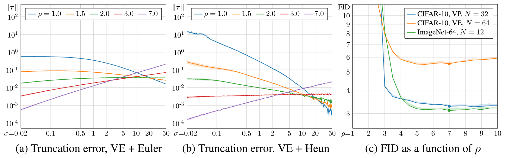

**图 13.** **(a)** 在基于 VE 的 CIFAR-10 模型上使用 Euler 方法时, 不同噪声水平 ($x$ 轴) 下的局部截断误差 ($y$ 轴). 每条曲线对应一种不同的时间步离散化, 由 $N=64$ 和多项式指数 $\rho$ 的特定选择定义. 数值表示一次 Euler 迭代与一系列更小 Euler 迭代之间的均方根误差 (RMSE), 后者作为真实值. 阴影区域表示不同潜变量 $\boldsymbol{x}_0$ 上的标准差, 在低 $\sigma$ 处几乎不可见. **(b)** Heun 二阶方法 ([算法 1](#algorithm-01)) 对应的误差曲线. **(c)** 对不同模型使用 Heun 二阶方法测得的 FID ($y$ 轴) 随多项式指数 ($x$ 轴) 的变化. 阴影区域表示观测到的最低与最高 FID 之间的变化范围, 点表示我们在其他所有实验中使用的 $\rho$ 值.

为了解局部截断误差在实践中的表现, 我们使用基于 VE 的 CIFAR-10 模型, 测量不同噪声水平下的 $\boldsymbol{\tau}_i$. 对给定噪声水平, 令 $t_i = \sigma^{-1}(\sigma_i)$, 并根据具体情形选择某个 $t_{i-1} > t_i$. 随后从 $p(\boldsymbol{x}; \sigma_{i-1})$ 采样 $\boldsymbol{x}_{i-1}$, 在 $t_{i-1}$ 与 $t$ 之间均匀选取的子区间上执行 200 个 Euler 步, 以此估计真实的 $\boldsymbol{x}^*_i$. 最后, 将均方根误差 (RMSE), 即 $\|\boldsymbol{\tau}_i\| / \scriptstyle\sqrt{\dim\boldsymbol{\tau}}$, 的均值和标准差绘制为 $\sigma_i$ 的函数, 并在 200 个随机 $\boldsymbol{x}_{i-1}$ 样本上取平均. [图 13a](#figure-13) 展示了 Euler 方法的结果, 蓝色曲线对应关于 $\sigma$ 的均匀步长 $h_\sigma = 1.25$, 即 $\sigma_{i-1} = \sigma_i + h_\sigma$ 且 $t_{i-1} = \sigma^{-1}(\sigma_{i-1})$. 可以看到, 在低噪声水平 ($\sigma_i \le 0.5$) 下误差很大 ($\text{RMSE} \approx 0.56$), 而在高噪声水平下小得多. 这符合常见直觉: 为减小 $\boldsymbol{e}_N$, 应当随 $\sigma$ 减小而单调减小步长. 每条曲线周围的阴影区域表示标准差, 在低 $\sigma$ 处几乎不可见. 这表明 $\boldsymbol{\tau}_i$ 关于 $\boldsymbol{x}_{i-1}$ 几乎恒定, 因而逐样本改变 $\{t_i\}$ 调度不会带来好处.

根据噪声水平改变局部步长的一种便利做法, 是将 $\{\sigma_i\}$ 定义为某个单调递增, 无界扭曲函数 $w(z)$ 的线性重采样. 换言之, $\sigma_{i<N} = w(A i + B)$ 且 $\sigma_N = 0$, 其中常数 $A$ 和 $B$ 的选择使 $\sigma_0 = \sigma_{\max}$ 且 $\sigma_{N-1} = \sigma_{\min}$. 实践中, 令 $\sigma_{\min}= \max(\sigma_\text{lo}, 0.002)$ 且 $\sigma_{\max}= \min(\sigma_\text{hi}, 80)$, 其中 $\sigma_\text{lo}$ 和 $\sigma_\text{hi}$ 分别是给定模型支持的最低与最高噪声水平; 我们发现这些选择在实践中表现良好. 为平衡低, 高噪声水平上的 $\boldsymbol{\tau}_i$, 例如可以使用由指数 $\rho$ 参数化的多项式扭曲函数 $w(z) = z^\rho$. 这一选择给出如下 $\{\sigma_i\}$ 公式: 

$$
\sigma_{i<N} = \left( {\sigma_{\max}}^\frac{1}{\rho} + \frac{i}{N-1} \left( {\sigma_{\min}}^\frac{1}{\rho} - {\sigma_{\max}}^\frac{1}{\rho} \right) \right)^\rho, \sigma_N = 0,
$$
当 $\rho=1$ 时, 该公式化为均匀离散化; 随 $\rho$ 增大, 它会越来越侧重低噪声水平.[+18]

根据 $\sigma_i$ 的值, 现在可以计算 $\sigma_{i-1} = \big( \sigma_i^{1 / \rho} - A \big)^\rho$, 从而在 [图 13a](#figure-13) 中展示不同 $\rho$ 选择对应的 $\boldsymbol{\tau}_i$. 可以看到, 增大 $\rho$ 会降低低噪声水平 ($\sigma < 10$) 下的误差, 同时增大高噪声水平 ($\sigma > 10$) 下的误差. $\rho=2$ 时大致达到平衡, 但 RMSE 仍较高 ($\sim0.03$), 这意味着 Euler 方法每一步都会偏离正确结果若干个 ULP. 虽然可以通过增大 $N$ 来减小误差, 但理想情况下, 即使步数较少, RMSE 也应远低于 0.01.

Heun 方法为 $\boldsymbol{x}_{i+1}$ 引入额外校正步, 以考虑 $\mathrm{d}\boldsymbol{x}/ \mathrm{d}t$ 可能在 $t_i$ 与 $t_{i+1}$ 之间变化这一事实; Euler 方法则假设它恒定不变. 该校正使局部截断误差实现三次收敛, 即 $\boldsymbol{\tau}_i = \mathcal{O}\left(h_i^3\right)$, 代价是每步额外求值一次 $D_\theta$. [第 10.2 节](#section-10-2) 将讨论 Heun 类方案的一般族. [图 13b](#figure-13) 在与 [图 13a](#figure-13) 相同的设置下, 展示了 Heun 方法的局部截断误差. 可以看到, $\|\boldsymbol{\tau}_i\|$ 的差异总体上更加明显; 考虑到两种方法分别为二次和三次收敛, 这是意料之中的. Euler 方法 RMSE 较低的情形, 使用 Heun 方法时往往更低; RMSE 较高的情形则反之. 最值得注意的是, 红色曲线显示几乎恒定的 $\text{RMSE} \in [0.0030, 0.0045]$. 这意味着在 $\rho=3$ 时, [公式 269](#equation-269) 与 Heun 方法的组合实际上非常接近最优.

到目前为止, 我们只考虑了原始数值误差, 即 RGB 空间中各分量与真实结果的偏差. 原始数值误差与某些用例相关, 例如图像操作中先沿 $t$ 增大的方向求解 ODE, 再返回 $t=0$; 此时 $\|\boldsymbol{e}_N\|$ 直接表示原始图像在此过程中的劣化程度, 可用 $\rho=3$ 将其最小化. 但对于从头生成新图像, 可以合理预期不同噪声水平会引入不同种类的误差; 按照感知重要性衡量时, 这些误差未必等价. 我们在 [图 13c](#figure-13) 中对此进行研究, 绘制了不同模型和不同 $N$ 选择下 FID 随 $\rho$ 的变化. 请注意, ImageNet-64 模型只在一组离散噪声水平上训练; 为配合 [公式 269](#equation-269) 使用, 我们把每个 $t_i$ 舍入到最近的支持值, 即 $t'_i = u_{\mathop{\mathrm{arg}\,\min}_j |u_j - t_i|}$.

从图中可以看出, 尽管 $\rho=3$ 得到的 FID 已经较好, 选择 $\rho > 3$ 还能进一步降低 FID. 这相当于有意在高噪声水平引入误差, 以减小低噪声水平下的误差. 直观上这很合理, 因为 $\sigma_{\max}$ 的值本来就有些任意; 增大 $\sigma_{\max}$ 会显著影响 $\|\boldsymbol{e}_N\|$, 却不会对最终图像分布产生同等程度的影响. 总体而言, 我们发现 $\rho=7$ 在所有情形下表现都不错, 因而其他实验均使用该值.

### 10.2 二阶 Runge-Kutta 变体的一般族

[算法 1](#algorithm-01) 所示的 Heun 方法属于显式二阶段二阶 Runge-Kutta 方法族, 其中每种方法的计算成本相同. 该方法族的一种常见参数化 [Sul03] 为
$$
\boldsymbol{d}_i = f(\boldsymbol{x}_i;t_i)\ \ \ \textrm{;} \ \ \ \boldsymbol{x}_{i+1} = \boldsymbol{x}_i + h\Big[\Big(1-{\tfrac{1}{2\alpha}}\Big)\boldsymbol{d}_i+{\tfrac{1}{2\alpha}}f(\boldsymbol{x}_i + \alpha h \boldsymbol{d}_i;t_i+\alpha h)\Big]\textrm{,}
$$
其中 $h=t_{i+1}-t_i$, $\alpha$ 参数控制额外梯度的求值位置及其对所取步长的影响程度. 取 $\alpha=1$ 对应 Heun 方法, 取 $\alpha=\tfrac{1}{2}$ 和 $\alpha=\tfrac{2}{3}$ 则分别得到所谓的 midpoint 方法和 Ralston 方法. 由于底层函数 $f$ 的几何性质, 这些变体产生的近似误差类型各不相同.

为确定适用于本文用例的最优 $\alpha$, 我们另行开展了一系列实验. 结果显示, $\alpha=1$ 似乎已非常接近最优. 尽管如此, 实验中的最佳选择是 $\alpha=1.1$, 表现略好; 但大于 1 的值会越过目标 $t_{i+1}$, 在理论上难以说明其合理性. 我们无法很好地解释这一现象, 也不能断定它是否普遍成立, 因而没有把 $\alpha$ 设为新的超参数, 而是将其固定为 $1$, 恰好对应 Heun 方法. 进一步分析留待未来工作, 包括让 $\alpha$ 在采样期间变化的可能性.

将 $\alpha=1$ 还有一个好处: 可以使用仅针对特定 $\sigma$ 值训练的预训练神经网络 $D_\theta(\boldsymbol{x};\sigma)$. 这是因为与其他二阶变体不同, Heun 步恰好在 $t_{i+1}$ 处求值额外梯度. 因此, 只需确保每个 $t_i$ 都对应网络训练过的某个 $\sigma$ 值即可.

**算法 3: 使用一般二阶 Runge-Kutta 的确定性采样, $\sigma(t)=t$ 且 $s(t)=1$.**

- **过程** $\operatorname{AlphaSampler}(D_\theta(\boldsymbol{x};\sigma), t_{i \in \{0, \dots, N\}}, \alpha)$
  - **采样** $\boldsymbol{x}_0 \sim \mathcal{N}(\mathbf{0}, t_0^2\mathbf{I})$.
  - **对于** $i \in \{0, \dots, N-1\}$:
    - $h_i \gets t_{i+1}-t_i$. 步长.
    - $\boldsymbol{d}_i \gets (\boldsymbol{x}_i-D_\theta(\boldsymbol{x}_i;t_i))/t_i$. 在 $(\boldsymbol{x}_i,t_i)$ 处求值 $\mathrm{d}\boldsymbol{x}/\mathrm{d}t$.
    - $(\boldsymbol{x}'_i,t'_i) \gets (\boldsymbol{x}_i+\alpha h_i\boldsymbol{d}_i,t_i+\alpha h_i)$. 额外求值点.
    - **如果** $t'_i \ne 0$:
      - $\boldsymbol{d}'_i \gets (\boldsymbol{x}'_i-D_\theta(\boldsymbol{x}'_i;t'_i))/t'_i$. 在 $(\boldsymbol{x}'_i,t'_i)$ 处求值 $\mathrm{d}\boldsymbol{x}/\mathrm{d}t$.
      - $\boldsymbol{x}_{i+1} \gets \boldsymbol{x}_i+h_i[(1-\frac{1}{2\alpha})\boldsymbol{d}_i+\frac{1}{2\alpha}\boldsymbol{d}'_i]$. 从 $t_i$ 到 $t_{i+1}$ 的二阶步.
    - **否则**:
      - $\boldsymbol{x}_{i+1} \gets \boldsymbol{x}_i+h_i\boldsymbol{d}_i$. 从 $t_i$ 到 $t_{i+1}$ 的 Euler 步.
  - **返回** $\boldsymbol{x}_N$.

[算法 3](#algorithm-03) 给出了由 $\alpha$ 参数化的一般二阶求解器伪代码. 为清楚起见, 伪代码假设采用 [第 3 节](#section-3) 中主张的特定选择 $\sigma(t)=t$ 和 $s(t)=1$. 请注意, 只有当 $\alpha \ge 1$ 时才可能回退到 Euler 步 (第 11 行).

## 11 随机采样的进一步结果

### 11.1 过度随机迭代导致的图像劣化

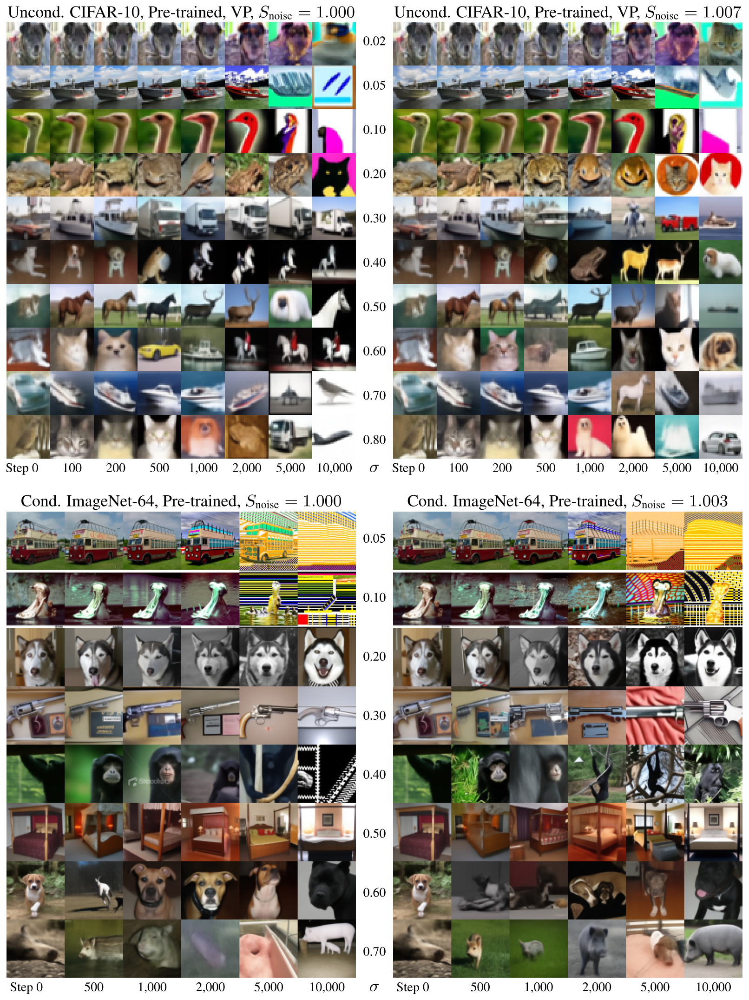

**图 14.** 反复添加和移除噪声时图像逐渐劣化. 从 $p(\boldsymbol{x}; \sigma)$ 抽取一幅随机图像 (第一列), 固定 $\gamma_i = \sqrt{2}-1$, 并运行 [算法 2](#algorithm-02) 一定步数 (其余各列). 每行对应一个特定的 $\sigma$ 选择 (标在中间), 整个过程中保持不变. 结果先经过去噪器, 即 $D_\theta(\boldsymbol{x}_i; \sigma)$, 再予以可视化.

[图 14](#figure-14) 展示了过度 Langevin 迭代造成的图像劣化 ([第 4 节](#section-4) 的 "实际考量"). 这些图像通过在固定噪声水平 $\sigma$ 下执行指定次数的迭代生成, 每次迭代添加和移除等量噪声. 理论上, Langevin 动力学应使分布趋向理想分布 $p(\boldsymbol{x};\sigma)$; 但如 [第 4 节](#section-4) 所述, 只有当去噪器 $D_\theta(\boldsymbol{x};\sigma)$ 在 [公式 3](#equation-03) 中诱导出保守向量场时, 这一点才成立.

从图中可以清楚看出, 所有情形的图像分布都会受到反复迭代的损害, 但具体失效模式取决于数据集和噪声水平. 在低噪声水平 (约低于 $0.2$) 下, 图像往往从 2k 次迭代起出现过饱和, 此后完全损坏. 我们令 $S_\text{tmin}> 0$ 的启发式方法, 旨在完全阻止极低噪声水平下的随机采样, 从而避免这种影响.

在高噪声水平下, 若不做标准差校正, 即 $S_\text{noise}=1.000$, 随着迭代次数增加, 图像会变得更抽象且失去色彩; CIFAR-10 的 10k 列尤为明显, 其中图像大多变成黑白, 背景也无法辨认. 如图右侧相应图像所示, 令 $S_\text{noise}> 1$ 来启发式增大标准差, 可以有效抵消这一趋势. 值得注意的是, 这仍无法修复低噪声水平下的过饱和与损坏, 表明过度迭代的有害影响有多个来源. 要更深入理解这些观测现象的根本原因, 还需进一步研究.

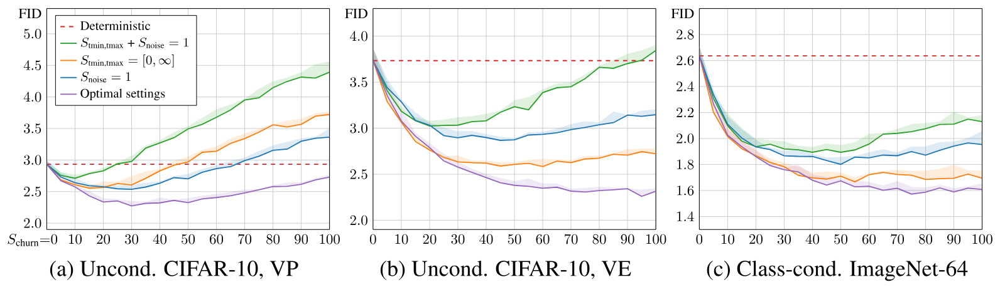

**图 15.** 使用 Song 等人 [Son21] 以及 Dhariwal 和 Nichol [Dha21] 的预训练网络, 对随机采样器 ([算法 2](#algorithm-02)) 参数进行消融. 对 $N = 256$ 步 (NFE = 511), 每条曲线给出 FID ($y$ 轴) 随 $S_\text{churn}$ ($x$ 轴) 的变化. 红色虚线对应我们的确定性采样器 ([算法 1](#algorithm-01)), 等价于令 $S_\text{churn}= 0$. 紫色曲线对应 $\{S_\text{tmin}, S_\text{tmax}, S_\text{noise}\}$ 的最优选择, 分别针对每种情形通过网格搜索求得. 橙色, 蓝色和绿色对应禁用 $S_\text{tmin,tmax}$ 和/或 $S_\text{noise}$ 的作用. 阴影区域表示观测到的最低与最高 FID 之间的变化范围.

[图 15](#figure-15) 使用 Song 等人 [Son21] 以及 Dhariwal 和 Nichol [Dha21] 的预训练网络, 在固定 NFE 下, 以 FID 随 $S_\text{churn}$ 的函数形式给出随机采样器的输出质量. 总体而言, 对每种情形和启发式校正组合都存在一个最优随机量, 超过后结果便开始劣化. 还可以看出, 无论 $S_\text{churn}$ 取何值, 启用所有校正都能得到最佳结果, 但 $S_\text{noise}$ 与 $S_\text{tmin,tmax}$ 哪个更重要取决于具体情形.

### 11.2 随机采样参数

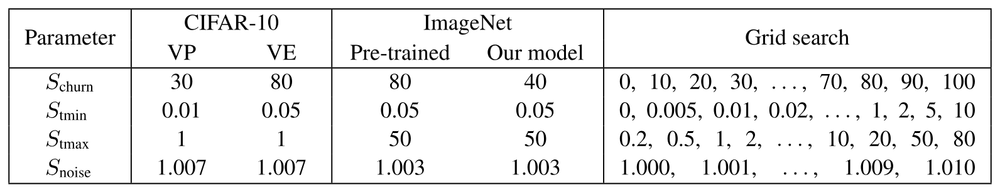

**表 5.** [第 4 节](#section-4) 随机采样实验所用的参数.

[表 5](#table-05) 列出了随机采样实验中使用的 $S_\text{churn}$, $S_\text{tmin}$, $S_\text{tmax}$ 和 $S_\text{noise}$ 数值. 这些数值通过对最右栏所列组合进行网格搜索确定. 可以看出, 最优参数取决于具体情形; 若能更深入地理解劣化现象, 未来有望找到更直接的处理方式.

## 12 实现细节

我们在新编写的代码库中实现了本文技术, 大体基于 Song 等人 [+19] [Son21], Dhariwal 和 Nichol [+20] [Dha21] 以及 Karras 等人 [+21] [Kar21] 的原始实现. 我们进行了大量测试, 验证本文实现与先前工作得到完全相同的结果, 涵盖采样器, 预训练模型, 网络架构, 训练配置和评估. 所有实验都使用 PyTorch 1.10.0, CUDA 11.4 和 CuDNN 8.2.0, 在 NVIDIA DGX-1 上运行, 每台配有 8 块 Tesla V100 GPU.

我们的实现和预训练模型见 <https://github.com/NVlabs/edm>

### 12.1 FID 计算

我们计算 50,000 幅生成图像与所有可用真实图像之间的 FID [Heu17], 不采用 $x$ 翻转等任何增强. 使用 StyleGAN3 [+22] [Kar21] 提供的预训练 Inception-v3 模型, 该模型又是原始 TensorFlow 模型 [+23] 的直接 PyTorch 翻译. 我们已经验证, 本文的 FID 实现与 Dhariwal 和 Nichol [Dha21] 及 Karras 等人 [Kar21] 得到完全相同的结果. 为减小通常约为 $\pm 2\%$ 的随机变化影响, 每项实验计算三次 FID 并报告最小值. 我们还在 [图 4](#figure-04), [图 5b](#figure-05), [图 13c](#figure-13) 和 [图 15](#figure-15) 中标出了所得最高与最低 FID 之间的差异.

### 12.2 增强正则化

在 [第 5 节](#section-5) 中, 我们提出用条件增强对抗 $D_\theta$ 的过拟合. 增强流水线围绕 Karras 等人 [Kar20a] 最初在 GAN 场景下提出的相同概念构建. 实践中, 我们采用 6 种几何变换; 研究发现, 颜色破坏和图像空间滤波等其他增强类型会持续损害扩散模型.

[表 6](#table-06) 给出了增强流水线的细节. 在添加噪声 $\boldsymbol{n}\sim \mathcal{N}(\mathbf{0}, \sigma^2 \mathbf{I})$ 前, 对每幅训练图像 $\boldsymbol{y}\sim p_\text{data}$ 独立应用增强. 首先, 根据加权掷硬币决定启用还是禁用各项增强. 除始终启用的 $x$ 翻转外, 给定增强的启用概率 ("Prob." 栏) 在 CIFAR-10 上固定为 12%, 在 FFHQ 和 AFHQv2 上固定为 15%. 随后从相应分布 ("Parameters" 栏) 抽取 8 个随机参数; 若某项增强被禁用, 则将相关参数覆写为零. 根据这些参数 ("Transformation" 栏) 构造齐次二维变换矩阵. 使用 [Kar20a] 的实现将该变换应用于图像, 其中采用 $2\times$ 超采样的高质量 Wavelet 滤波器. 最后, 构造 9 维条件输入向量 ("Conditioning" 栏), 与图像和噪声水平输入一同馈入去噪器网络.

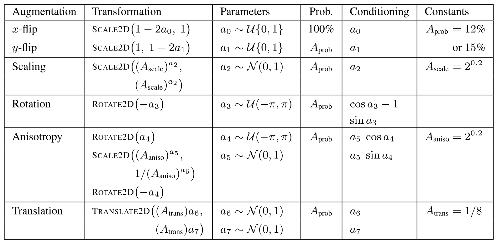

**表 6.** 我们的增强流水线. 每幅训练图像都会接受由 8 个随机参数决定的组合几何变换, 这些参数以一定概率取非零值.

条件输入的作用是向网络提供一组辅助任务. 除对 $p(\boldsymbol{x}; \sigma)$ 建模这一主要任务外, 实际上还要求网络针对增强参数 $\boldsymbol{a}$ 的每种可能选择, 对无限多个分布 $p(\boldsymbol{x}; \sigma, \boldsymbol{a})$ 建模. 这些辅助任务为网络提供了种类繁多的独特训练样本, 防止它对任何单一样本过拟合. 辅助任务似乎也有益于主要任务; 我们推测, 这是因为每种 $\boldsymbol{a}$ 选择对应的去噪操作本身都相似.

我们把条件输入设计成以零表示未应用任何增强的情形. 采样期间只需令 $\boldsymbol{a} = \mathbf{0}$, 即可得到与主要任务一致的结果. 我们没有观察到辅助任务与主要任务之间发生任何泄漏; 即使 $A_\text{prob} = 100\%$, 生成图像也没有域外几何变换的痕迹. 实际上, 这意味着只要结果有所改善, 就可以任意选择常数 $\{A_\text{prob}, A_\text{scale}, A_\text{aniso}, A_\text{trans}\}$. 水平翻转是一个有意思的例子. 大多数先前工作使用随机 $x$ 翻转增强训练集, 这对多数数据集有益, 但缺点是生成图像中的文字或标志可能呈镜像. 采用我们的无泄漏增强, 以 100% 概率执行 $x$ 翻转增强, 可以得到相同益处而没有这些缺点. 因此, 我们只依赖自己的增强方案, 并禁用数据集 $x$ 翻转, 确保生成图像忠于原始分布.

### 12.3 训练配置

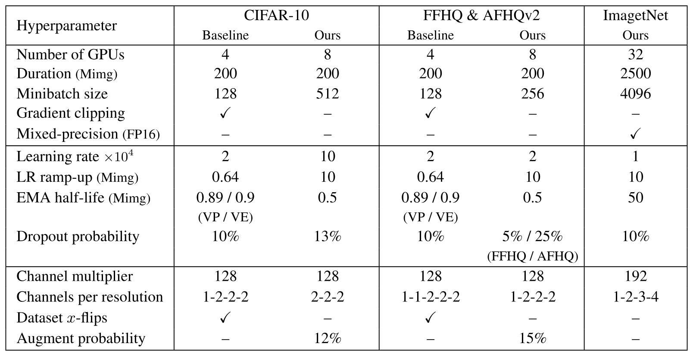

**表 7.** [第 5 节](#section-5) 训练运行所用的超参数.

[表 7](#table-07) 给出了 [第 5 节](#section-5) 所报告训练实验使用的确切超参数集合. 我们先详述 CIFAR-10, FFHQ 和 AFHQv2 所用的配置, 再讨论改进型 ImageNet 模型的训练.

[表 2](#table-02) 的配置 A ("Baseline") 对应 Song 等人 [Son21] 在两种情形 (VP 和 VE) 下的原始设置, 配置 F ("Ours") 对应我们的改进设置. 每个模型持续训练, 直到从训练集抽取的图像总数达到 2 亿, 在 [表 7](#table-07) 中简写为 "200 Mimg"; batch size 为 512 时, 这相当于总计 $\sim 400{,}000$ 次训练迭代. 每 250 万幅图像保存一次模型快照, 并根据分辨率, 使用 NFE $=$ 35 或 NFE $=$ 79 的确定性采样器, 报告取得最低 FID 的快照结果.

在配置 B 中, 我们重新调整基本超参数, 以加快训练并获得更有意义的比较基准. 具体而言, 根据分辨率, 将并行度从 4 块 GPU 提高到 8 块, batch size 从 128 提高到 512 或 256. 我们还禁用实践中未发现任何益处的梯度裁剪, 即强制 $\| \mathrm{d}\mathcal{L}(D_\theta) / \mathrm{d}\theta \|_2 \le 1$. 此外, 将 CIFAR-10 的学习率从 0.0002 提高到 0.001, 在前 1000 万幅图像期间逐步升高, 并将 $\theta$ 指数移动平均的半衰期统一为 50 万幅图像. 最后, 以 1% 为增量做完整网格搜索, 为每个数据集调整 [表 7](#table-07) 所示的 dropout 概率. 总训练时间约为: $32\times32$ 分辨率的 CIFAR-10 训练 2 天, $64\times64$ 分辨率的 FFHQ 和 AFHQv2 训练 4 天.

在配置 C 中, 我们移除 $4\times4$ 层, 转而将 $16\times16$ 层的容量翻倍, 从而提高模型的表达能力; 研究发现, 前者主要造成过拟合, 后者对取得高质量结果至关重要. Song 等人 [Son21] 的原始模型在 $64\times64$ (若适用) 和 $32\times32$ 分辨率采用 128 个通道, 在 $16\times16$, $8\times8$ 和 $4\times4$ 分辨率采用 256 个通道. 我们改为在 $64\times64$ 分辨率 (若适用) 采用 128 个通道, 在 $32\times32$, $16\times16$ 和 $8\times8$ 分辨率采用 256 个通道. [表 7](#table-07) 将这些数量简写为 128 的倍数, 从最高分辨率列到最低分辨率. 实际上, 这种再平衡略微减少了可训练参数总数, $32\times32$ 分辨率的每个模型约有 5600 万个参数, $64\times64$ 分辨率的模型约有 6200 万个参数.

在配置 D 中, 用改进后的公式替换原始预条件 ([表 1](#table-01) 的 "Network and preconditioning" 部分). 在配置 E 中, 对噪声分布和损失加权做同样替换 ([表 1](#table-01) 的 "Training" 部分). 最后, 在配置 F 中启用 [第 12.2 节](#section-12-2) 所述的增强正则化. 其他超参数与配置 C 相同.

为在 ImageNet-64 上取得 SOTA 结果, 需要比其他数据集训练得久得多. 为缩短训练时间, 我们使用 32 块 NVIDIA Ampere GPU (4 个节点), batch size 为 4096 (每块 GPU 128), 并通过 FP16/FP32 混合精度训练使用高性能 Tensor Core. 实践中, 可训练参数以 FP32 存储, 但求值 $F_\theta$ 时将其转换为 FP16; embedding 层和 self-attention 层除外, 因为我们发现 FP16 有限的指数范围偶尔会导致稳定性问题. 模型训练了两周, 相当于从训练集抽取约 $\sim 25$ 亿幅图像并完成 $\sim 600{,}000$ 次训练迭代; 学习率为 0.0001, 指数移动平均为 5000 万幅图像, 模型架构和 dropout 概率与 Dhariwal 和 Nichol [Dha21] 相同. 我们没有发现过拟合问题, 因而没有采用增强正则化.

### 12.4 网络架构

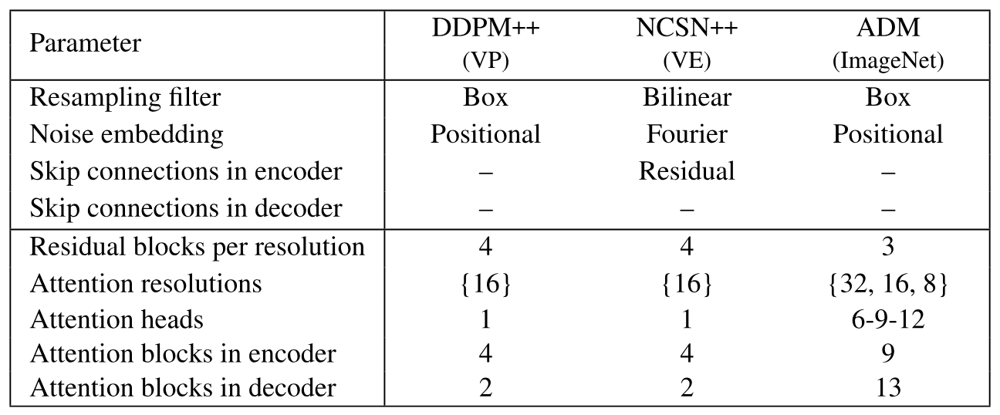

**表 8.** 本文所用网络架构的细节.

经过训练改进后, 在配置 F 中, VP 与 VE 除网络架构外完全相同; VP 采用 DDPM++ 架构, VE 采用 NCSN++, 两者最初均由 Song 等人 [Son21] 提出. 如 [表 8](#table-08) 所示, 这些架构都是同一 U-net 主干相对直接的变体, 有三处差异. 第一, DDPM++ 的上采样和下采样层采用 box filter $[1, 1]$, NCSN++ 则采用 bilinear filter $[1, 3, 3, 1]$. 第二, DDPM++ 直接继承 DDPM [Den20] 的噪声水平位置编码方案, NCSN++ 则以随机 Fourier 特征 [Tan20a] 取代. 第三, NCSN++ 从输入图像到编码器中的每个块加入额外残差跳跃连接, 如 [Son21] 的附录 H ("progressive growing architectures") 所述.

对于类别条件和增强正则化, 我们在噪声水平输入之外引入两个可选条件输入, 以扩展原始 DDPM++ 和 NCSN++ 架构. 类别标签表示为 one-hot 编码向量, 先乘以 $\sqrt{C}$, 其中 $C$ 为类别总数, 再馈入全连接层. 对增强参数, 将 [第 12.2 节](#section-12-2) 的条件输入原样馈入全连接层. 随后通过逐元素相加, 把所得特征向量与原始噪声水平条件向量合并.

对类别条件 ImageNet-64, 我们原样采用 Dhariwal 和 Nichol [Dha21] 的 ADM 架构. 该模型共有 $\sim 2.96$ 亿个可训练参数. 如 [表 7](#table-07) 和 [表 8](#table-08) 所述, 它与 DDPM++ 最显著的差异包括: 模型稍浅 (每个分辨率 3 个残差块, 而非 4 个), 但通道多得多 (例如最低分辨率为 768, 而非 256); 网络中穿插更多 self-attention 层 (22 层, 而非 6 层); 并使用 multi-head attention (例如最低分辨率有 12 个 head). 架构选择的确切影响仍是值得未来研究的问题.

### 12.5 许可证

数据集:

- CIFAR-10 [Kri09]: MIT 许可证

- FFHQ [Kar18]: Creative Commons BY-NC-SA 4.0 许可证

- AFHQv2 [Cho20c]: Creative Commons BY-NC 4.0 许可证

- ImageNet [Den09a]: 许可证状态不明确

预训练模型:

- Song 等人的 CIFAR-10 模型 [Son21]: Apache V2.0 许可证

- Dhariwal 和 Nichol 的 ImageNet-64 模型 [Dha21]: MIT 许可证

- Szegedy 等人的 Inception-v3 模型 [Sze16]: Apache V2.0 许可证

[+1]: <https://github.com/yang-song/score_sde_pytorch/blob/1618ddea340f3e4a2ed7852a0694a809775cf8d0/models/utils.py#L144>

[+2]: <https://github.com/yang-song/score_sde_pytorch/blob/1618ddea340f3e4a2ed7852a0694a809775cf8d0/losses.py#L73>

[+3]: `vp/cifar10_ddpmpp_continuous/checkpoint_8.pth`, <https://drive.google.com/drive/folders/1xYjVMx10N9ivQQBIsEoXEeu9nvSGTBrC>

[+4]: <https://github.com/yang-song/score_sde_pytorch/blob/1618ddea340f3e4a2ed7852a0694a809775cf8d0/sampling.py#L182>

[+5]: <https://github.com/yang-song/score_sde_pytorch>

[+6]: <https://github.com/yang-song/score_sde_pytorch/blob/1618ddea340f3e4a2ed7852a0694a809775cf8d0/sampling.py#L191>

[+7]: <https://github.com/yang-song/score_sde_pytorch/blob/1618ddea340f3e4a2ed7852a0694a809775cf8d0/sde_lib.py#L102>

[+8]: <https://github.com/yang-song/score_sde_pytorch/blob/1618ddea340f3e4a2ed7852a0694a809775cf8d0/sde_lib.py#L246>

[+9]: <https://github.com/yang-song/score_sde_pytorch/blob/1618ddea340f3e4a2ed7852a0694a809775cf8d0/models/utils.py#L163>

[+10]: <https://github.com/yang-song/score_sde_pytorch/blob/1618ddea340f3e4a2ed7852a0694a809775cf8d0/models/ncsnpp.py#L239>

[+11]: <https://github.com/yang-song/score_sde_pytorch/blob/1618ddea340f3e4a2ed7852a0694a809775cf8d0/models/ncsnpp.py#L261>

[+12]: <https://github.com/yang-song/score_sde_pytorch/blob/1618ddea340f3e4a2ed7852a0694a809775cf8d0/models/ncsnpp.py#L379>

[+13]: <https://github.com/yang-song/score_sde_pytorch/blob/1618ddea340f3e4a2ed7852a0694a809775cf8d0/sde_lib.py#L234>

[+14]: `ve/cifar10_ncsnpp_continuous/checkpoint_24.pth`, <https://drive.google.com/drive/folders/1b0gy_LLgO_DaQBgoWXwlVnL_rcAUgREh>

[+15]: <https://github.com/openai/improved-diffusion>

[+16]: <https://github.com/openai/improved-diffusion/blob/783b6740edb79fdb7d063250db2c51cc9545dcd1/improved_diffusion/gaussian_diffusion.py#L39>

[+17]: `https://openaipublic.blob.core.windows.net/diffusion/jul-2021/64x64_diffusion.pt`

[+18]: 在极限情形 $\rho \rightarrow \infty$ 下, [公式 269](#equation-269) 化为原始 VE ODE 所采用的同一几何序列. 因此, 我们的离散化可视为 Song 等人 [Son21] 所提方法的参数化推广.

[+19]: <https://github.com/yang-song/score_sde_pytorch>

[+20]: <https://github.com/openai/guided-diffusion>

[+21]: <https://github.com/NVlabs/stylegan3>

[+22]: `https://api.ngc.nvidia.com/v2/models/nvidia/research/stylegan3/versions/1/files/metrics/inception-2015-12-05.pkl`

[+23]: `http://download.tensorflow.org/models/image/imagenet/inception-2015-12-05.tgz`
