> [Chengwu Liu](https://dblp.org/pid/276/4722-1.html) [+internship], [Yichun Yin](https://dblp.org/pid/180/5934.html), [Ye Yuan](https://dblp.org/pid/33/6315-16.html), [Jiaxuan Xie](https://dblp.org/pid/250/2540.html), [Botao Li](https://dblp.org/pid/179/3223.html), [Siqi Li](https://dblp.org/pid/34/180.html), [Jianhao Shen](https://dblp.org/pid/217/2324.html), [Yan Xu](https://dblp.org/pid/03/4702.html), [Lifeng Shang](https://dblp.org/pid/70/4288.html) 和 [Ming Zhang](https://dblp.org/pid/73/1844-4.html). 论文于 2026 年 4 月 17 日首次提交至 arXiv, 当前版本为 v1. 已被 ACL 2026 Main Conference 接收. [Discover and Prove: An Open-source Agentic Framework for Hard Mode Automated Theorem Proving in Lean 4](https://arxiv.org/abs/2604.15839v1). [原论文 PDF](/paper/discover-and-prove.pdf). [DOI](https://doi.org/10.48550/arXiv.2604.15839). [TeX 源码](https://export.arxiv.org/e-print/2604.15839v1). 精确的印刷版式和参考文献以原论文 PDF 为准.

[+internship]: 本工作在华为技术有限公司实习期间完成. 代码和数据集已发布在 [GitHub](https://github.com/liuchengwucn/discover-and-prove).

## 摘要

大多数 ATP 基准把最终答案嵌入形式化陈述, 我们把这种惯例称为"简单模式". 相比人类竞赛者面对的问题, 这种设计简化了任务, 也可能使模型能力的估计过于乐观. 我们把更严格也更贴近实际的设置称为"困难模式": 系统必须先独立找出答案, 再构造形式化证明. 为了支持困难模式研究, 我们做出两项贡献. 第一, 我们发布 MiniF2F-Hard 和 FIMO-Hard, 它们是由专家重新标注的两个常用 ATP 基准的困难模式版本. 第二, 我们提出 Discover And Prove (*DAP*), 这是一个智能体框架: 它通过带显式自我反思的 LLM 自然语言推理找出答案, 再把困难模式陈述改写成简单模式陈述, 交给现有 ATP 证明器处理. *DAP* 刷新了最佳结果: 在 CombiBench 上, 它把已解问题数从 7 个 (此前 SOTA, Pass@16) 提高到 10 个; 在 PutnamBench 上, 它首次以困难模式形式化证明了 36 条定理. 同时, 实验还表明, 当前最先进的 LLM 在同一批问题上的答案准确率超过 80%, 而形式化证明器不足 10%. 困难模式基准正适合测量这道明显的差距.

<span id="section-1"></span>

## 1 引言

用 AI 解数学问题已引起大量研究兴趣. 原因不只在于它可用于教育和数学研究等具体领域, 还在于处理高度抽象的数学问题通常需要一些能够泛化并迁移到复杂现实任务的能力. 这些能力包括规划, 搜索, 演绎推理和归纳 [Yan24k]. 在各种数学任务中, 竞赛题尤其受到关注, 国际数学奥林匹克 (IMO) 难度的题目更是如此. 这类问题不只是数值计算或简单套用公式. 它们通常要求抽象和建模, 严密的逻辑论证, 也常常需要直觉与创造力. 因此, 解出 IMO 难度的问题被广泛视为 AI 的一个重要里程碑 [Yan24k].

现有数学问题求解方法大致分为两类: 非形式化方法和形式化方法. 非形式化方法利用大语言模型 (LLM) 较强的推理能力, 用自然语言解题; 形式化方法则用 Lean [Mou21] 和 Isabelle [Nip02] 等形式化语言表达解答. 形式化方法的一项主要优势是, 以形式化语言写出的证明可以由证明助手程序自动而严格地验证. 参加 2024 年国际数学奥林匹克 (IMO) 的 AI 系统采用了形式化方法 [Alp24]. 到 2025 年 IMO 时, 大多数受评系统已经转向非形式化方法 [Luo25i, Hua25h, Wei25i, Hua25i].

我们观察到, 当前不少形式化工作会把最终答案直接写入待证陈述, 我们称之为"简单模式". 我们指出, 简单模式可能大幅降低形式化解题任务的难度. 为了解决这个问题, 我们借鉴 PutnamBench [Tso24] 和 CombiBench [Liu25ad] 等先前工作: 求解型问题在 Lean 4 中编码为两个独立目标 (两个不同的 `sorry`). 在这种"困难模式"设置中, 模型必须先用答案替换第一个 `sorry`, 再为剩余目标给出常规形式化证明. 这样一来, 形式化陈述不会再嵌入人类竞赛者必须自行发现的额外信息. 按照定义, *困难模式*要求形式化陈述不能把任何必须由人类竞赛者推导的量作为前提给出; AI 系统必须独立求出这些量. 我们沿用 Lean 社区的惯例, 把它称为"困难模式" [+hard-mode-name]. CombiBench [Liu25ad] 把同一区别称为"不含解答"与"含解答", PutnamBench [Tso24] 则使用"无答案"与"有答案". [图 1](#figure-01) 给出了简单模式与困难模式的差异示例. 我们委托专家标注者重新标注两个常用的 ATP 竞赛数据集 MiniF2F 和 FIMO, 得到 MiniF2F-Hard 与 FIMO-Hard. 重新标注时, 我们还修正了现有形式化基准中已知的对齐问题 [Wan25l, Lin25j].

[+hard-mode-name]: [Lean 社区讨论](https://leanprover.zulipchat.com/#narrow/channel/208328-IMO-grand-challenge/topic/IMO.202025.20problem.20statements).

为了解决困难模式问题, 我们提出 Discover and Prove (*DAP*) 框架, 这是一个面向困难模式 ATP 任务的完全开源智能体式 ATP 框架. *DAP* 由发现模块和证明模块两部分组成. 我们让一个开源 LLM 生成推理与答案, 并通过自验证过程反复改进. 发现模块"发现"一个可能的答案并填入第一个 `sorry` 后, 证明模块调用传统 ATP 证明器, 尝试给出完整的形式化证明. *DAP* 取得了当前最佳结果. 在完整 PutnamBench 数据集上评测时, *DAP* 共解出 36 个问题. 其中, 对具有困难模式变体的求解型问题, 它解出 19 个. 据我们所知, 这是 PutnamBench 在这种困难模式评测设置下的首个公开结果. 在 CombiBench 困难模式上, 它解出 10 个问题, 明显超过此前解出 8 个问题的最佳方法 Kimina-Prover Preview.

我们的贡献有三点.

1. 我们重新标注两个常用的 ATP 竞赛数据集 MiniF2F 和 FIMO, 使提供给人类竞赛者和 AI 系统的任务对齐, 消除简单模式造成的差异, 从而为评估 AI 数学能力提供更有原则的依据.
2. 我们提出 *DAP*, 一个开源的智能体式困难模式 ATP 框架. *DAP* 的设计简单直接, 在 PutnamBench 和 CombiBench 上取得当前最佳性能.
3. 我们通过分析量化 *DAP* 证明器中两个模块各自对整体性能的贡献. 这些结果揭示了非形式化方法与形式化方法在解决竞赛难度数学问题时各自的相对优势.

<span id="section-2"></span>

## 2 相关工作

<span id="figure-01"></span>

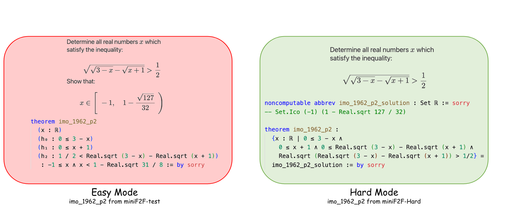

**图 1.** 自动定理证明中简单模式与困难模式设置的差异. 图中用两种不同方式形式化了一个 IMO 问题. 我们特意选择这个例子, 用它说明重新标注工作所修正的语义错位: 简单模式形式化只证明 $x$ 必须落在某些区间内, 却没有证明这些区间中的每个值都能取到, 因而把原题的当且仅当要求削弱成单向蕴含. 相比之下, 我们的困难模式形式化把答案表示成集合, 在形式化陈述中完整表达了自然语言题目的要求.

<span id="section-2-1"></span>

### 2.1 使用 AI 解决数学问题

在 CoT 提示和 RLVR 训练的推动下, LLM 的数学推理能力已有明显进展. 前沿模型 (例如 OpenAI o1 [Ope24h], DeepSeek R1 [Dee25c] 和 Google Gemini 2.5 Pro [Com25a]) 在 GSM8K [Cob21], MATH-500 [Lig23] 和 AIME 2024/2025 等常用数学基准上已接近饱和.

非形式化方法有一个缺点: 它生成的解题过程很难自动验证. 若要判断一个生成证明是否有效, 领域专家必须仔细检查其中的细微错误 [Lig23], 这在大规模场景下并不现实. 因此, 非形式化系统通常用于只要求最终数值或符号答案的问题, 再把结果与标准答案直接比较来验证 [Wen25a].

<span id="section-2-2"></span>

### 2.2 自动定理证明

自动定理证明 (ATP) 的主要优势是, 证明助手可以自动且严格地检查形式化证明 [You25, Wan23j]. 形式化方法一直面临形式化数据不足的问题 [Xin25], 但随着 LLM 规模和搜索计算量增加, 它们发展得很快 [Xin25b, Che25h]. Kimina-Prover Preview [Wan25l], DeepSeek-Prover-V2 [Ren25b] 和 Goedel-Prover-V2 [Lin25j] 等近期系统已在 MiniF2F [Zhe22a] 基准上取得明显进展. Seed-Prover [Che25h] 是一种按引理组织, 对整份证明进行推理的模型. 它借助 Lean 编译器反馈, 已证引理和自我总结反复改进证明, 在 PutnamBench 上超过 50%, 并使 MiniF2F 接近饱和. DSP [Jia23d] 用自然语言证明草稿和结构化证明提纲引导形式化定理证明器; DSP+ [Cao25d] 则用现代推理模型重新启用了这一范式. DAP 与 DSP/DSP+ 有三点主要差异, 详见[第 10 节](#section-10).

还有一些智能体框架也以基于 Lean 的 ATP 为目标 [Tha23, Ana24, Bab25, Wan25an], 参见[第 9 节](#section-9).

对于需要最终答案的非形式化数学问题, 先前工作通常把求解问题转换成证明问题: 把目标答案嵌入形式化陈述, 再证明该陈述 [Zhe22a, Liu23s, Xio23a]. 这种做法带来两个问题. 第一, 把答案写入陈述可能降低问题本身的难度: 对许多求解型问题来说, 主要困难在于找出答案, 而不是在答案已知后证明某个推论, 所以直接提供答案相当于给出很强的提示. 第二, 由此得到的形式化陈述有时没有与人类竞赛者面对的任务完全语义对齐. 先前的分析 (例如 FMC [Xie25e] 和 OlympiadBench [He24d]) 指出, 一些现有形式化基准存在错位: 某些形式化陈述可能只覆盖人类解题者必须完成的部分目标.

<span id="section-2-3"></span>

### 2.3 形式化与数据整理

高质量形式化数据集很少, 而且需要专家投入大量工作 [Xin25]. MiniF2F [Zhe22a] 是使用最广的 ATP 基准之一, 收录了数学奥林匹克以及高中和本科课程中的形式化题目; Kimina-Prover Preview [Wan25l] 修正了其中一部分问题. FIMO [Liu23s] 来自 IMO 短名单问题, 但此前没有公开的 Lean 4 版本, 妨碍了它在近期研究中的使用. PutnamBench [Tso24] 由人工构造的 Putnam 竞赛题形式化组成, 并首次同时提供"有答案"和"无答案"两种评测设置. CombiBench [Liu25ad] 包含 100 道组合数学题, 难度从初中一直延伸到 IMO 和大学水平, 补充了其他基准偏重数论与代数的不足; IMOSLLean4 [San25] 和 IMO-Steps [You24] 还提供完整证明. 为了缓解数据稀缺, 自动形式化方法 [Wu22a] 会自动把非形式化问题翻译成形式化陈述. 代表性资源包括 Lean Workbook [Yin25a], NuminaMath-LEAN [Wan25l], Goedel-Pset-v1 [Lin25i] 和 FormalMATH [Yu25j]. 这些输出通常只由 LLM-as-a-judge [Yin25a] 验证, 无法保证语义正确, 因此更多用于证明器的 RL 训练阶段 [Wan25l, Xin25], 而不是评测基准. 据我们所知, 所有自动形式化技术都采用简单模式, 会把目标答案直接嵌入生成的陈述.

<span id="section-3"></span>

## 3 方法

<span id="figure-02"></span>

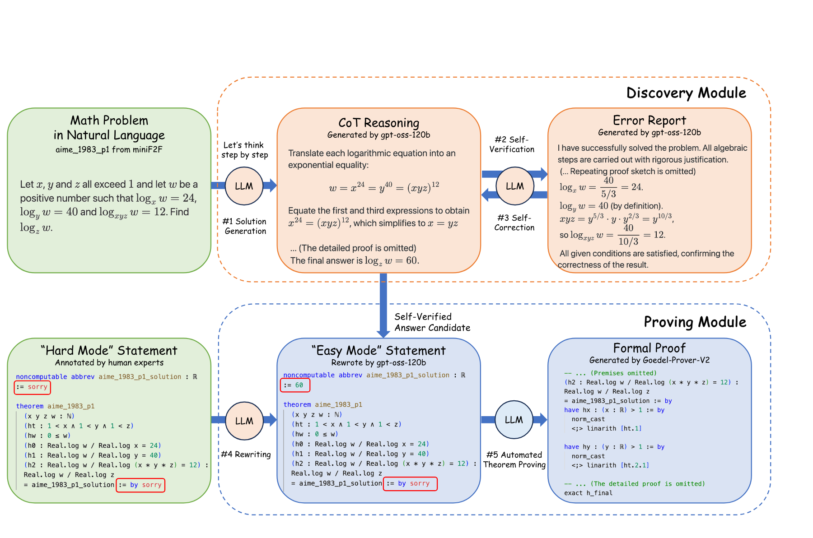

**图 2.** 主要流程图. 数学问题先由发现模块处理并生成解答, 随后在改写阶段把这个解答写入简单模式陈述. 橙色圆形表示推理 LLM, 蓝色圆形表示定理证明器 (另一个不同的 LLM).

为了证明包含两个 `sorry` 占位符的困难模式 Lean 4 定理, 我们提出 Discover and Prove (*DAP*) 框架. 它模拟人类数学家的做法, 同时给出答案和详细证明. 顾名思义, *DAP* 由发现模块和证明模块两个主要模块组成. 发现模块以自然语言工作, 负责找出问题的正确解, 随后把原始困难模式 Lean 4 陈述转换成简单模式陈述. 这项转换把 `sorry` 占位符从两个减为一个, 剩下的单个陈述可以由传统自动定理证明器解决. 然后, 证明模块使用 Lean 4 形式化语言, 为发现模块找到的解构造严格证明. DAP 框架的完整工作流见[图 2](#figure-02).

<span id="section-3-1"></span>

### 3.1 发现模块

发现模块要解出原始数学问题, 再把答案代入 Lean 4 困难模式陈述中的第一个 `sorry` 占位符, 供证明模块使用. 这个过程先假设一个答案来引导证明搜索, 与人类解题方式相似. OpenAI o1 [Ope24h] 和 DeepSeek R1 [Dee25c] 等长思维链出现后, LLM 的推理能力已有明显提升, 但一次生成便解出高难度 IMO 级问题仍未实现. 现有研究表明, 当前最先进的 LLM 往往需要信息检索, 计算器和外部记忆等辅助工具来支持深度推理 [Nak21, Luo25c, Yua24d]. 受 LLM 推理系统先前工作 [Hua25h] 启发, 我们采用一个较为直接的设置: 由先进推理模型生成解题步骤, 再通过自验证提高准确率. 具体过程包括以下步骤:

1. **解答生成:** 给定一道自然语言数学题, 利用模型的推理能力生成描述求解过程的详细思维链.
2. **自验证:** 要求推理 LLM 检查步骤中的潜在错误, 并生成一份指出错误位置的报告 ([第 11.5 节](#section-11-5)给出了一份代表性报告). 如果自验证没有发现错误, 流程进入第 4 步; 否则进入第 3 步.
3. **自校正:** 要求推理 LLM 生成一份修订后的解答, 修复错误报告中指出的问题.
4. **改写:** 把 Lean 4 困难模式陈述, 自然语言题目和模型的思维链推理一并交给 LLM, 要求它生成只含一个占位符, 可供自动定理证明器处理的 Lean 4 陈述.

四个步骤都通过精心设计的 LLM 提示词实现, 详见[第 11 节](#section-11). 发现模块非常重要, 因为错误答案常会产生从一开始就无法证明的错误形式化陈述, 因而要求模型具备深度推理和可靠自验证能力. 该框架已开源, 以便复现实验并提供一个基线. 发现模块使用开源模型 GPT-OSS-120B, 它在自然语言数学推理任务上表现很强. 原则上, 任何兼具可靠数学推理能力与基础 Lean 能力的模型都可以接入该框架.

<span id="section-3-2"></span>

### 3.2 证明模块

发现模块把困难模式陈述转换成简单模式形式后, 任务便成为可由传统定理证明器处理的标准 ATP 问题. 为此, 我们使用当前最先进的开源定理证明器 Goedel-Prover-V2 (32B) 处理转换后的问题. 推理模型与 ATP 模型彼此解耦, 所以任一底层模型改进都能让框架受益; 该框架也为评估用证明助手语言生成形式化数学解答的 LLM 提供了一个当代基线.

<span id="section-4"></span>

## 4 数据整理

<span id="table-01"></span>

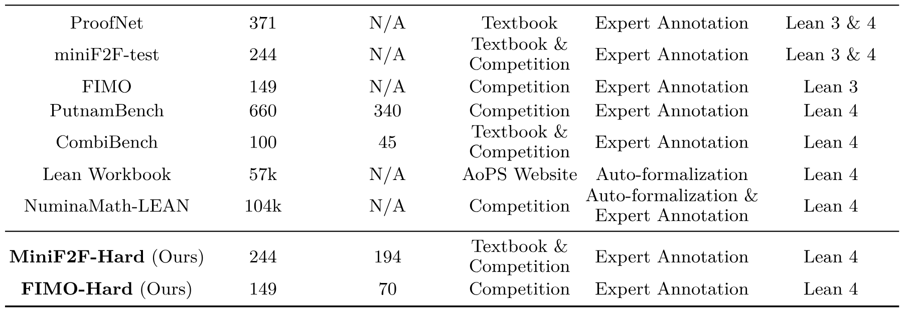

**表 1.** 本表列出常用自动定理证明数据集的陈述样本数, 困难模式问题数, 数据来源, 数据整理方法, 以及与不同版本 Lean 形式化语言的兼容性. ProofNet 和 miniF2F 最初以 Lean 3 数据集发布, 现在已有公开的社区 Lean 4 移植版本. 尽管已有研究报告了 Lean 4 版 FIMO 上的性能, FIMO 数据集尚无公开的 Lean 4 版本.

<span id="section-4-1"></span>

### 4.1 标注原则

我们的重新标注遵循三项原则.

**语义准确性:** 专家标注的数据集规模小但可靠; 自动形式化数据集规模大却难以验证. 当前验证方法 (LLM-as-a-judge [Yin25a] 和 BEq [Liu24y]) 不能保证与原始自然语言问题语义对齐. 因此, 我们从专家标注的数据源出发, 手工重新检查每条陈述.

**可解释性:** 形式化陈述应准确反映人类竞赛者要完成的工作: 所有待求量都不能作为前提给出, 所有待证命题都必须出现在目标中. 当前基准反复以三种方式违反这一要求: (1) 在陈述中编码最终答案, (2) 把证明目标削弱成原目标的真子集, 或 (3) 添加人类竞赛者没有的前提. [图 1](#figure-01) 给出了代表性实例; 我们始终遵循 IMOLean [Mye25] 约定.

**一致性:** 形式化风格会明显影响 ATP 成功率 [Lin25i]. 如果允许标注者任意选择形式化方式, 评测就会引入偏差. 我们制定了统一约定, 强调符合 Lean 习惯的写法, 即"更进一步地采用符合 Lean 习惯的方向, 而不是试图紧贴某个特定英文版本". 这与 IMOLean [Mye25] 只提供一个规范陈述的做法一致.

<span id="section-4-2"></span>

### 4.2 数据选择

为了解决这些缺陷, 我们请 Lean 专家重新标注 MiniF2F [Zhe22a] 和 FIMO [Liu23s] 这两个原本由人类专家标注的数据集. ProofNet 同样是高质量的专家标注数据集, 但我们发现其中所有自然语言条目本身都是证明型问题, 因而没有选择它. 每位标注者都有一年以上 Lean 相关经验. MiniF2F 和 FIMO 原本就由专家制作; 我们参照文献 [Wan25l] 记录的错误报告重新检查数据, 并让两位专家分别独立标注每个问题, 以交叉验证标签并保证正确性.

<span id="section-4-3"></span>

### 4.3 数据集质量修复

除了制作困难模式变体, 标注者还完成了三类并非简单机械操作的质量改进工作, 完整细节见[第 12 节](#section-12). **将 FIMO 移植到 Lean 4:** 我们把所有 FIMO 问题从 Lean 3 移植到 Lean 4, 并验证它们能够编译且语义忠实. **修复语义错位:** 我们在 miniF2F 中发现并修复约 $15$ 个错误, 在 FIMO 中修复约 $20$ 个错误, 涉及四种错误类型 ([表 5](#table-05)). **按困难模式改写:** 把未知值提升为自由参数, 并显式添加边界条件; 参见[图 3](#figure-03) ([第 13 节](#section-13)).

<span id="section-5"></span>

## 5 实验

<span id="table-02"></span>

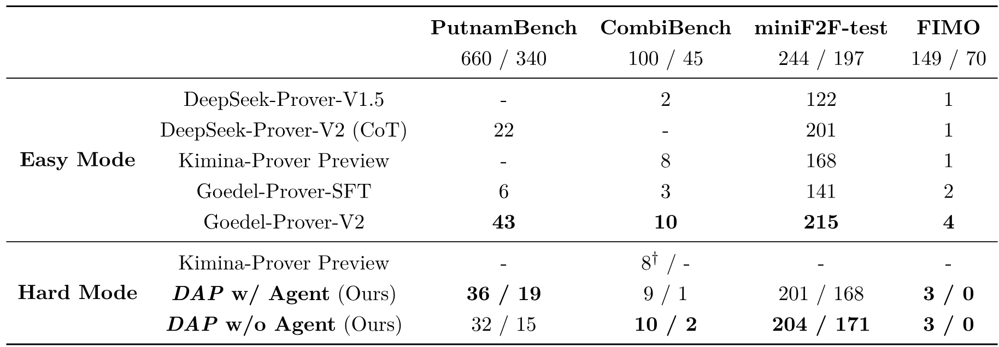

**表 2.** 多种开源方法在标准基准和困难模式基准上的性能. 每个数据集名称下方的数字分别表示样本总数和困难模式样本数. 每种设置下的最佳结果用粗体表示. 在困难模式评测中, 每个数据集都包含证明型问题 (按其原始形式评测) 和求解型问题 (形式化陈述中不提供答案). 每个 $X / Y$ 条目分别表示已解问题总数 ($X$) 与以困难模式解出的求解型问题数 ($Y$). 除非另有说明, 所有结果均为 Pass@32. $^\dagger$Kimina-Prover Preview 最初报告在 Pass@16 下解出 7 个 CombiBench 问题; 表中的 8 是我们在 Pass@32 下重新评测的结果.

发现模块使用开源模型 GPT-OSS-120B, 该模型在自然语言数学推理任务上表现很强. 证明模块使用 Goedel-Prover-V2, 该模型在传统自动定理证明中达到当前最佳性能. 我们的形式化验证环境使用 Lean 4.15.0, 并通过 Kimina-Server [Dos25] 与 Lean 4 REPL 交互.

GPT-OSS-120B 采用模型推荐的配置, 采样温度为 1.0. 在自验证期间, 模型最多可以进行 30 次迭代, 用于自检和纠错. 如果所有尝试均告失败, 流水线便退回无智能体 (消融) 设置, 直接把推理模型的输出当作答案候选, 不再验证. Goedel-Prover-V2 采用开发者推荐的采样配置: 温度 0.7, `max_tokens` 设为 30,000, 采样 32 次, 评测指标为 Pass@32. [表 2](#table-02) 报告 PutnamBench, CombiBench, miniF2F-Hard 和 FIMO-Hard 上的性能.

我们的方法在困难模式问题上取得当前最佳性能. 在 CombiBench 上, 它解出 10 个问题, 超过此前最佳结果的 8 个; 它还是第一个在 PutnamBench 的"无答案"设置下解出问题的方法. 值得注意的是, 在 PutnamBench 和 miniF2F-test 上, 我们方法的困难模式准确率已接近 Goedel-Prover-V2 的简单模式性能, 表明 Discover and Prove 方法能够有效地把困难模式问题化为简单模式陈述.

<span id="section-6"></span>

## 6 讨论

<span id="section-6-1"></span>

### 6.1 智能体有效性消融研究

先进推理 LLM 本身具备很强的自我反思能力 [Wen25a]. 因此, 显式引入自验证和自校正机制可能增加不必要的推理开销. 为了研究智能体模式何时有益, 我们在 PutnamBench, CombiBench, MiniF2F-Hard 和 FIMO-Hard 数据集上关闭智能体模式并进行实验. 结果见[表 2](#table-02).

关闭智能体的显式自验证与自校正机制后, PutnamBench 等高难度数据集上的性能明显下降. 相反, CombiBench 和 MiniF2F 等较低难度数据集上没有出现性能下降. 我们推测, 原因在于这些数据集包含相当多的简单问题 (例如初中教科书问题), 推理 LLM 几乎不费力便能解出. 在这种情况下, 显式自验证可能无意中让模型的指令遵循行为占据过强主导地位, 导致过度自我质疑, 反而给解答引入额外噪声.

<span id="table-03"></span>

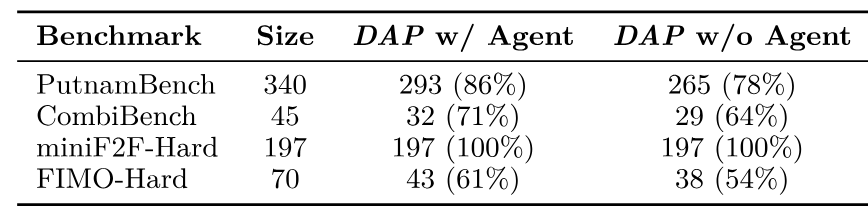

**表 3.** 我们在具有确定标准答案的困难模式问题子集上, 评估发现模块求解自然语言数学问题的性能.

我们分析了发现模块在具有标准答案的困难模式问题上的准确率, 因为这类问题可以直接评估自然语言回答 ([表 3](#table-03)). 即使不使用智能体式自我反思, 模型在 Putnam 问题上的正确率也约为 78%, 在 MiniF2F 上则接近饱和. 对较低难度的问题, 推理 LLM 的一次生成准确率已经很高, 显式自验证与自校正可能多余. 但在 PutnamBench 和 FIMO-Hard 等难度更高的基准上, 这些智能体组件仍然非常重要. [第 14 节](#section-14) 给出了发现模块在 CombiBench 和 FIMO 上的细粒度失败模式分析.

对自验证迭代次数的消融表明, 10 次迭代已接近饱和, 30 次 (默认值) 只带来很小的额外收益, 详见[第 15 节](#section-15).

<span id="section-6-2"></span>

### 6.2 改写策略消融

*DAP* 的一个核心设计是两阶段改写流水线: 发现模块先用自然语言推导答案, 随后才把困难模式陈述转换成供 ATP 证明器处理的简单模式陈述. 为了说明这一设计, 我们比较三种替代策略. **不改写:** 把包含两个 `sorry` 占位符的困难模式问题陈述直接交给 ATP 证明器. **直接改写:** 移除发现模块, 改让一个 LLM 在单个步骤中同时找出答案*并*生成改写后的简单模式陈述. **所提改写 (我们的方法):** 发现模块先找到答案, 改写阶段再用该答案转换陈述.

<span id="table-04"></span>

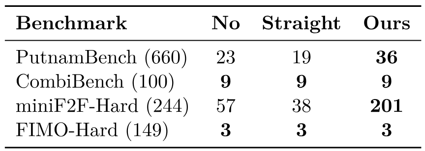

**表 4.** 三种改写策略的 Pass@32 比较. 不改写和直接改写的结果均由人工验证, 排除了伪证明.

[表 4](#table-04) 给出结果, 我们从中得到三点观察.

**不改写对困难模式问题基本无效.** 我们认为, 原因是模型没有在困难模式 ATP 任务上训练过. 当它被要求在形式化系统中同时找答案并给出证明时, 分布外性能会大幅下降.

**直接改写没有更好, 有时反而更差.** 要求模型在单个步骤中同时处理答案发现和形式化, 会让它经常两件事都做不好. 非形式化数学推理与语法精确的 Lean 代码生成共同施加负担, 导致大多数基准上的性能下降.

**伪证明解释了剩余差距.** 在不改写和直接改写设置中, 我们经常观察到*伪证明* (作弊行为). 求解时, 模型可以看到完整的 Lean 陈述, 包括 `abbrev solution` 定义, 所以有时会直接把问题条件复制进证明, 绕开真正的数学推理. [图 4](#figure-04) 给出了 `fimo_2009_algebra_p3` 的具体实例 ([第 16 节](#section-16)). *DAP* 的解耦设计阻止了这条捷径: 证明器只能收到改写后的简单模式陈述, 看不到答案占位符, 因而没有机会这样作弊.

*DAP* 的模块化设计允许独立替换发现模块与证明模块. 使用轻量小型开源模型和更强 Aristotle API 的实验均表明, 该流水线在不同资源限制下都能正常工作, 更强的非形式化推理模型还能进一步提高性能 (参见[第 17 节](#section-17)).

<span id="section-6-3"></span>

### 6.3 自然语言推理还是形式化语言推理?

在 AI 解决复杂问题的进展中, 选择自然语言推理还是形式化语言推理是一个两难问题. 自然语言推理近期出现了长思维链和从人类反馈中强化学习 (RLHF) 等创新, OpenAI o1 和 DeepSeek R1 是其中的代表, 它们明显增强了 LLM 的能力. 研究表明, 自然语言表示的经验性能上限可以很高; AIME 等高难度数据集上的性能已快速趋于饱和 [Ope24h, Wen25a]. 2025 年 IMO 中, 大多数 AI 系统从形式化表示转向自然语言表示, 成功解出需要创造性推理的问题, 多份解答达到金牌水平. 相比之下, Seed Prover [Che25h] 和 Aristotle [Ach25] 等形式化语言系统依靠大量计算搜索取得奖牌水平结果, 有些解答直到正式提交截止时间之后才完成.

本研究把困难模式 ATP 用作比较自然语言推理与形式化语言推理的中立基准. 我们观察到类似的分化: 带自我反思的当前最先进 LLM 在 PutnamBench 上的准确率超过 80%, 形式化语言系统则不足 10%

尽管自然语言推理的实证性能很强, 形式化数学语言在未来数学推理 AI 系统中仍不可或缺. 自然语言证明容易出现细微错误, 不经形式化验证很难发现, 严重限制了它在教育和高等数学研究等关键应用中的实用价值. Putnam 和 FIMO 等数据集上的结果表明, 形式化数学推理仍需大幅改进. 因此, 一个可行的未来研究方向是结合自然语言方法与形式化语言方法的优势, 缩小现有性能差距.

<span id="section-7"></span>

## 7 结论

本研究指出当前简单模式自动定理证明设置存在语义准确性, 可解释性与透明度问题. 我们认为, 由人类专家按统一约定手工标注的困难模式形式化陈述, 能更准确地反映数学竞赛参与者面对的解题要求.

为了缓解困难模式 ATP 基准稀缺的问题, 我们请 Lean 4 专家把高质量数据集重新标注成困难模式, 得到 MiniF2F-Hard 和 FIMO-Hard. 同时, 我们修正了现有语义错位, 并实行统一约定.

为了解决困难模式问题, 我们提出 *DAP* 框架, 用于严格评估 AI 系统解决复杂形式化数学问题的能力. 该框架在 PutnamBench 和 CombiBench 上取得当前最佳性能, 也是首个在 PutnamBench 困难模式设置上报告进展的工作. 这些结果表明, 先用自然语言推理求出答案, 再用形式化方法加以证明的组合是有效的.

<span id="section-8"></span>

## 8 局限

本工作的主要局限是数据集可能受到污染, 从而让报告的 AI 性能估计偏高. 本研究标注的 miniF2F 和 FIMO 数据集, 它们对应的自然语言原题 (例如 IMO 短名单问题), 以及其他相关数据集都可以从互联网公开获取. 本工作使用的两个主要 LLM, GPT-OSS-120B 和 Goedel-Prover-V2, 已公开模型权重, 却没有公开训练语料; 因此, 我们无法确定训练数据是否包含这些数据集.

本研究展示了发现模块与证明模块之间的性能差距, 说明困难模式 ATP 的瓶颈在形式化推理, 而不是自然语言推理. 这表明 DSP [Jia23d] 等用自然语言推理辅助形式化语言推理的方法很有潜力. 不过, 在我们的工作中, 传给证明模块的自然语言输出仅限答案候选. 因此, 形式化语言推理与自然语言推理的结合仍然有限. 理想情况下, 两个模块应当更紧密地交互, 一种模态遇到困难时由另一种模态协助. 如何实现这种更紧密的协作整合, 留待未来研究.

## 致谢

本论文得到中国国家重点研发计划项目部分资助, 项目编号为 2023YFC3341203.

<span id="section-9"></span>

## 9 形式化定理证明的智能体框架

除纯证明搜索方法外, 研究者还探索了多种面向 Lean ATP 的智能体框架. COPRA [Tha23] 通过语言智能体循环, 把通用 LLM 转换成 Lean 证明专家. LeanAgent [Ana24] 研究终身学习, 让 LLM 在高等数学上的性能不断提高. ProverAgent [Bab25] 使用非形式化模型提出辅助引理, 以引导形式化证明. MA-LoT [Wan25an] 采用基于 Lean 的多智能体长思维链方法, 根据 Lean 编译器反馈反复修复证明. 这些系统都没有在实验中与 *DAP* 直接比较, 因为它们以标准 (简单模式) ATP 任务为目标, 相关设置不能直接相比.

<span id="section-10"></span>

## 10 DAP 与 DSP/DSP+ 的比较

DAP 与 DSP/DSP+ 有三点主要差异. 第一, **目标任务**: DSP/DSP+ 解决完整形式化陈述已知的标准 ATP; DAP 面向困难模式 ATP, 系统必须先找出答案, 再给出证明. 第二, **模块间通信**: DSP 把中间推理步骤 (草稿和证明提纲) 传给形式化证明器; DAP 只把最终答案传给改写阶段. 只传答案可以避免依赖特定形式化语言的习惯写法, 也避开了把自然语言解题步骤直接注入基于 tactic 的 Lean 证明时, 这些步骤往往难以使用甚至适得其反的问题 [Liu23s]. 另外, DSP 的设计与 Isabelle 的子目标语法紧密耦合, 难以移植到 Lean; DSP+ 的提纲步骤则必须是可表示成 Lean `have` 陈述的单个等式, 限制了适用范围. 第三, **验证设计**: DAP 在把结果传给证明器之前, 先在发现模块内完成自验证; DSP 没有自验证, DSP+ 只在形式化提纲出现语法错误时修复.

<span id="section-11"></span>

## 11 发现模块使用的提示词

<span id="section-11-1"></span>

### 11.1 解答生成提示词

````text
### 核心指令 ###

* **严谨至上:** 你的首要目标是给出完整且论证严谨的解答. 解答中的每一步都必须逻辑可靠, 解释清楚. 如果最终答案正确, 但推理有误或不完整, 仍视为失败.
* **如实说明完整性:** 如果找不到完整解答, 你**不得**猜测, 也不得编造一个看似正确却暗藏错误或论证缺口的解答. 你应当只给出自己能够严格证明的重要部分结果. 如果一项部分结果让完整求解取得实质进展, 就可视为重要结果. 例如:
  * 证明一个重要引理.
  * 在逻辑可靠的分类证明中, 完整解决一个或多个情形.
  * 确立题中数学对象的一项重要性质.
  * 对于最优化问题, 证明一个上界或下界, 但不证明该界可以取到.
* **所有数学内容使用 TeX:** 所有数学变量, 表达式和关系都必须放在 TeX 定界符中 (例如 `设 $n$ 是整数.`).

### 输出格式 ###

你的回答必须严格按照以下顺序组织成这些部分.

**1. 总结**

简要概述你的结果. 本节必须包含两部分:

* **a. 结论:** 明确说明你找到了完整解答还是部分解答.
  * **对于完整解答:** 给出最终答案, 例如"我已成功解决本题. 最终答案是...".
  * **对于部分解答:** 给出你能严格证明的主要结论, 例如"我尚未找到完整解答, 但已严格证明...".
* **b. 方法提要:** 从较高层次概述解答思路. 专家应当无需阅读全部细节, 便能从该提要理解论证的逻辑脉络. 其中应包括:
  * 整体策略的叙述.
  * 所有重要引理或主要中间结果的完整且精确的数学陈述.
  * 如适用, 说明构成论证主干的重要构造或分类讨论.

**2. 详细解答**

给出完整的逐步数学证明. 每一步都必须有可靠的逻辑依据和清楚的解释. 细节应当充分, 使专家无需自行补全缺口便能验证推理正确性. 本节只能包含完整严谨的证明, 不得出现内部评论, 替代方法或失败尝试.

### 自校正指令 ###

在最终输出前, 仔细检查"方法提要"和"详细解答", 确保内容清晰严谨, 并严格遵守上述所有指令. 确认每条陈述都直接服务于最终连贯的数学论证.
````

<span id="section-11-2"></span>

### 11.2 自验证提示词

```text
下面是错误报告. 如果你同意其中某一项, 能否改进解答, 使其完整严谨? 请注意, 生成错误报告的评估者可能误解你的解答, 因而也会犯错. 如果你不同意报告中的某一项, 请补充详细解释, 避免这种误解. 新解答必须严格遵守系统提示词中的指令.
```

<span id="section-11-3"></span>

### 11.3 自校正提示词

````text
你是一名精通 Lean 4 证明助手中形式化数学的 AI 助手. 你的任务是完成一项具体且目标明确的代码修改.

你会收到三项输入:
1. 一道自然语言数学题 (`<NATURAL_LANGUAGE_PROBLEM>`).
2. 这道题的一份详细自然语言解答 (`<NATURAL_LANGUAGE_SOLUTION>`).
3. 一段形式化该问题的 Lean 4 代码陈述 (`<LEAN4_STATEMENT>`).

Lean 4 陈述含有一个用于填写答案的定义, 通常是值为 `sorry` 的 `abbrev` 或 `def`.

**你的任务是:**

1. **阅读 `<NATURAL_LANGUAGE_SOLUTION>`, 找出问题的最终答案**. 答案通常在结尾明确给出 (例如"值为 π/2", "结果为 42").
2. **在 `<LEAN4_STATEMENT>` 中找到定义答案变量的 `abbrev` 或 `def` 行** (例如 `abbrev my_solution : ℝ := sorry`).
3. **用提取出的最终答案替换**该定义中的 `sorry`. 确保 Lean 4 语法正确 (例如把 `π` 写成 `Real.pi`).
4. **输出只做了这一处修改的完整 Lean 4 代码块.** 不得修改代码的任何其他部分. 尤其是, `theorem` 的证明同样为 `sorry`, 必须保持不变.

**示例:**

**<NATURAL_LANGUAGE_PROBLEM>:**
计算积分 \[\int_0^1 \frac{1}{1+x^2} \,dx.\]

**<NATURAL_LANGUAGE_SOLUTION>:**
题目要求计算 \(f(x) = \frac{1}{1+x^2}\) 从 \(0\) 到 \(1\) 的定积分.

\(\frac{1}{1+x^2}\) 的一个原函数是 \(\arctan(x)\).
根据微积分基本定理, 有:
\[
\int_0^1 \frac{1}{1+x^2} \,dx = [\arctan(x)]_0^1
\]
\[
= \arctan(1) - \arctan(0)
\]
因为 \(\arctan(1) = \pi/4\) 且 \(\arctan(0) = 0\), 所以积分值为:
\[
\frac{\pi}{4} - 0 = \frac{\pi}{4}.
\]
最终答案是 \(\pi/4\).

**<LEAN4_STATEMENT>:**
```lean
import Mathlib.Analysis.SpecialFunctions.Trigonometric.Arctan

open Set

abbrev integral_value : ℝ := sorry

theorem integral_example
  : ∫ x in Icc 0 1, 1 / (1 + x^2) = integral_value :=
sorry
```

**预期输出:**
```lean
import Mathlib.Analysis.SpecialFunctions.Trigonometric.Arctan

open Set

abbrev integral_value : ℝ := Real.pi / 4

theorem integral_example
  : ∫ x in Icc 0 1, 1 / (1 + x^2) = integral_value :=
sorry
```

---

现在, 对以下输入执行该任务.

**<NATURAL_LANGUAGE_PROBLEM>:**
{{NATURAL_LANGUAGE_PROBLEM}}

**<NATURAL_LANGUAGE_SOLUTION>:**
{{NATURAL_LANGUAGE_SOLUTION}}

**<LEAN4_STATEMENT>:**
```lean
{{LEAN4_STATEMENT}}
```
````

<span id="section-11-4"></span>

### 11.4 改写提示词

````text
你是一名数学专家, 也是一名严格细致的国际数学奥林匹克 (IMO) 考试阅卷人. 你的主要任务是严格验证给出的数学解答. 只有每一步都得到严格论证, 才能把解答判为正确. 如果解答通过错误推理, 有根据的猜测或含有缺口的论证得到正确的最终答案, 必须把它标记为错误或不完整.

### 指令 ###

**1. 核心指令**
* 你唯一的任务是找出并报告给定解答中的所有问题. 你必须充当**验证者**, 而不是解题者. **不得尝试修正发现的错误或补全缺口.**
* 你必须逐步检查完整解答. 分析应写入**详细验证日志**, 并在其中说明每一步的判断依据: 对正确步骤, 简要说明即可; 对存在错误或缺口的步骤, 必须详细解释.

**2. 如何处理解答中的问题**
发现某一步存在问题时, 必须先把它分为以下两类之一, 再按相应流程处理.

* **a. 严重错误:**
  指任何破坏证明逻辑链条的错误. 其中既包括**逻辑谬误** (例如声称 `A>B, C>D` 可推出 `A-C>B-D`), 也包括**事实错误** (例如 `2+3=6` 这样的计算错误).
  * **处理流程:**
    * 说明具体错误, 并指出它**使当前推理路线失效**.
    * 不再检查任何依赖该错误的后续步骤.
    * 但是, 必须浏览解答其余部分, 找出并验证所有完全独立的部分. 例如, 如果证明分成多个情形, 一个情形中的错误不妨碍你检查其他情形.

* **b. 论证缺口:**
  用于结论可能正确, 但给出的论证不完整, 含糊或不够严谨的步骤.
  * **处理流程:**
    * 说明论证中的缺口.
    * 声明为了继续讨论, 将**假定该步骤的结论为真**.
    * 随后继续验证全部后续步骤, 检查其余论证是否可靠.

**3. 输出格式**
回答必须分成两个主要部分: 先写**总结**, 再写**详细验证日志**.

* **a. 总结**
  本节必须位于回答开头, 并包含两部分:
  * **最终结论**: 用一个明确的句子判断解答整体是否有效. 例如:"解答正确.", "解答含有一个严重错误, 因此无效.", 或"解答思路可行, 但含有几个论证缺口.".
  * **问题列表**: 用项目列表概括你发现的**每一个**问题. 每项必须包含:
    * **位置:** 直接引用出现问题的关键短语或公式.
    * **问题:** 简要说明问题, 并把它归类为**严重错误**或**论证缺口**.

* **b. 详细验证日志**
  总结之后, 按核心指令给出完整的逐步验证日志. 提及解答的具体部分时, 先**引用相关原文**, 明确所指内容, 再给出详细分析.

**规定总结格式示例**
*这是一个用于说明规定格式的通用示例. 你的实际发现必须基于下方给出的真实解答.*

**最终结论:** 解答**无效**, 因为其中含有严重错误.

**问题列表:**
* **位置:** "交换极限与积分后, 得到..."
  * **问题:** 论证缺口 - 解答没有给出一致收敛性等依据, 便交换了极限与积分.
* **位置:** "由 $A > B$ 和 $C > D$ 可得 $A-C > B-D$"
  * **问题:** 严重错误 - 这一步是逻辑谬误. 不能以这种方式对不等式作减法.
````

<span id="section-11-5"></span>

### 11.5 自验证错误报告示例

自验证步骤要求 LLM 逐步仔细审查生成的解答, 并给出结构化错误报告. 每项发现都会指出解答中的具体位置, 说明问题, 并划分严重程度. 下面是一份代表性错误报告, 由发现模块处理一道函数方程问题时生成.

```text
最终结论: 解答含有几个论证缺口, 因而不够严谨.

问题列表:
* 位置: 引理 1 的证明 - "h(x0) 是集合 {y | y < x0} 的一个上界..."
  问题: 论证缺口 - 没有证明 h(x0) 为 x0 所有前驱的上界; 声称这与上确界性质矛盾的论证无效.
* 位置: 引理 2 的证明 - "两行都可以对自然数变量作简单归纳来证明."
  问题: 论证缺口 - 对第二个坐标的归纳只给出了提要; 没有证明复合 beta 函数满足所需的单调性和支配性质.
* 位置: 引理 2 的证明 - 基础情形"当 n=0 时...", 但前文令 N 从 1 开始.
  问题: 轻微论证缺口 - 没有处理指标不一致的问题, 不过这不影响整体论证.
```

<span id="section-12"></span>

## 12 数据集质量修复

**将 FIMO 移植到 Lean 4:** 公开的 FIMO 数据集使用 Lean 3 编写. 尽管已有大体自动化的迁移工具, Lean 3 与 Lean 4 之间的语法和程序库变化仍使很多陈述无法直接移植: tactic 名称发生变化, Mathlib API 经过重组, 有些构造必须手工改写, 才能在编译通过的同时保持语义忠实. 标注者把每个 FIMO 问题都移植到 Lean 4, 并验证各条陈述可以编译且忠实于原意.

**修复语义错位:** 标注者遵循[第 4.1 节](#section-4-1)所述原则, 找出并修复源数据集中的形式化错误. 我们在 miniF2F 中发现约 15 处错位, 在 FIMO 中发现 20 处. [表 5](#table-05) 汇总了最常见的四种错误.

<span id="table-05"></span>

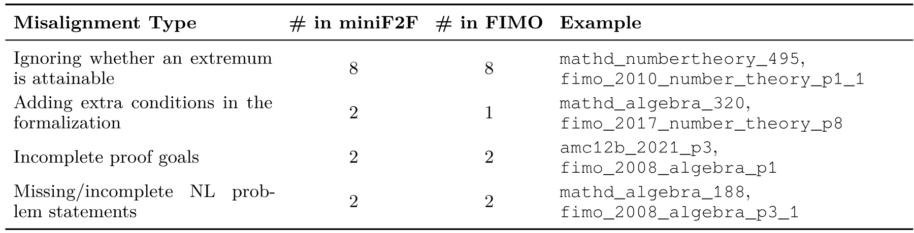

**表 5.** 重新标注 miniF2F 和 FIMO 时发现并修正的语义错位类型.

**按困难模式兼容性改写:** 我们的标注原则要求, 任何必须由人类竞赛者推导的量都不能硬编码到形式化陈述中. 有时这需要实质性地改写问题, 把未知值变成自由参数, 并显式添加适当的边界条件 (最简性, 无平方因子, 正性等). [图 3](#figure-03) 给出了改写前后的代表性示例 ([第 13 节](#section-13)).

<span id="section-13"></span>

## 13 困难模式标注示例

[图 3](#figure-03) 给出了为兼容困难模式而改写问题的代表性前后对比. 原始形式化把 `c = 2` 硬编码进陈述, 泄露了部分答案; 改写后的版本把 `c` 提升为自由参数, 并显式添加最简性和无平方因子条件, 要求求解器独立确定规范形式.

<span id="figure-03"></span>

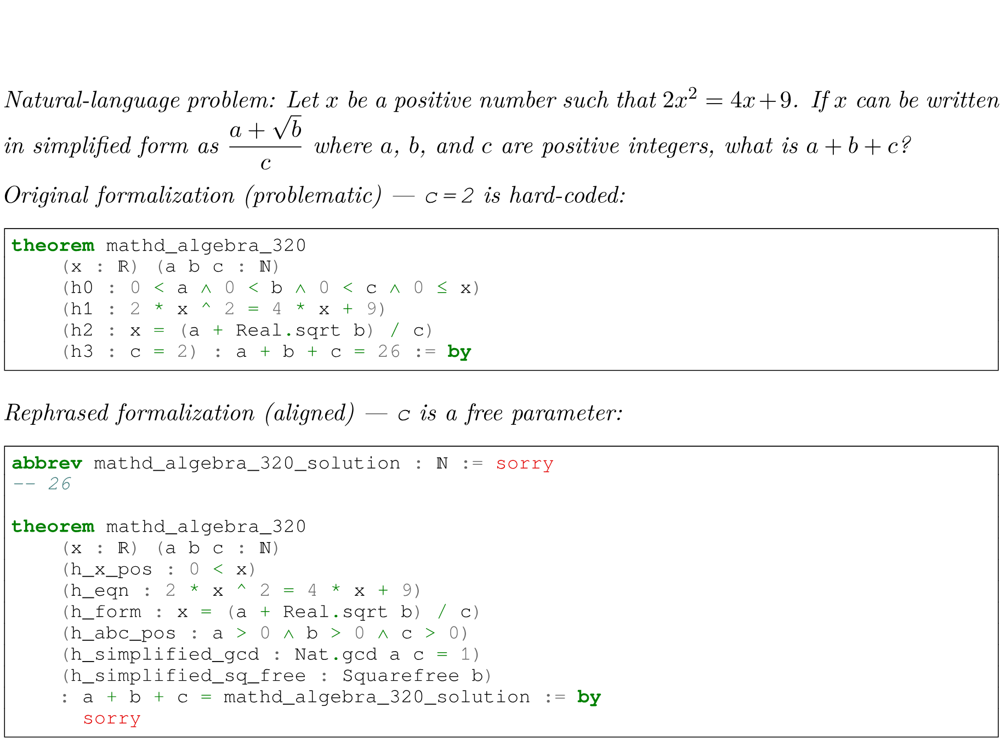

**图 3.** 为兼容困难模式而改写 `mathd_algebra_320`. 原始形式化把 `c = 2` 硬编码进陈述, 泄露了部分答案; 改写后的版本把 `c` 提升为自由参数, 并显式添加最简性和无平方因子条件, 要求求解器独立确定规范形式.

<span id="section-14"></span>

## 14 发现模块失败模式分析

为了了解发现模块的局限, 我们分析了 CombiBench 的 45 道求解型问题和 FIMO 的 70 道求解型问题上的所有发现模块输出. 这两组问题难度适中 (避开了 miniF2F-Hard 上的饱和现象), 并覆盖组合数学, 数论和代数等多个竞赛数学领域, 很适合用来诊断实际弱点. 我们手工归类每次发现失败, 并在[表 6](#table-06) 中汇总主要错误类型.

<span id="table-06"></span>

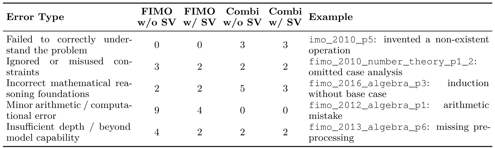

**表 6.** 发现模块在使用和不使用自验证 (SV) 时, 在 FIMO 和 CombiBench 上的失败模式分析. 计数表示出现每种失败类型的问题数量.

**FIMO: 数论和代数难度很高.** 许多 FIMO 问题仍超出模型能力; 自验证无法让最难的实例完全恢复正确答案. 函数方程问题尤其困难, 即使用了验证也常常失败, 因为这类问题需要多步代数变形, 很难自动检查底层推理.

**CombiBench: 理解失败.** 在 CombiBench 上, 我们经常观察到模型没有正确理解题目, 甚至凭空添加原题不存在的条件. 自验证并没有明显减少这类理解失败. 我们推测, 某些组合数学表述对人类很自然, 现有 LLM 却不易理解, 因而会解析错误或误解.

**自验证有帮助, 但不是万能药.** 对数论和代数问题, 自验证明显减少了轻微计算错误 ($9 \to 4$) 和部分浅层推理失败 ($4 \to 2$), 挽回了因算术失误而错误的答案. 对组合数学问题, 自验证把推理基础错误的实例数从 $5$ 减到 $3$, 但没有消除理解错误或幻觉. 总体来看, 当错误是局部失误 (例如一次算术疏忽), 而不是对题目的根本误解时, 自验证最有效.

<span id="section-15"></span>

## 15 自验证迭代消融

[表 7](#table-07) 量化了最大自验证迭代次数对发现模块准确率的影响.

<span id="table-07"></span>

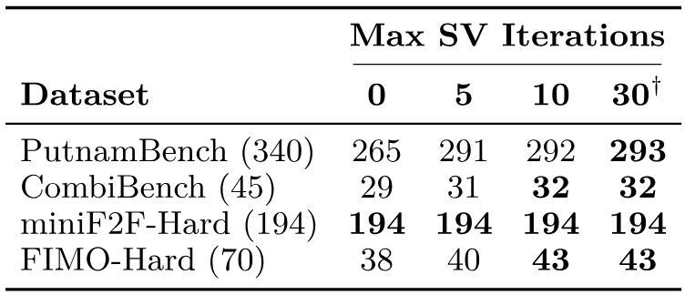

**表 7.** 最大自验证迭代预算不同时的发现模块准确率 (正确解题数). 各列标题表示迭代上限; 0 表示不使用自验证. $^\dagger$为默认设置. 所有结果均为 Pass@32.

由此可以得到两点观察. 第一, 在 miniF2F-Hard 上, 发现模块即使不使用自验证也达到 100% 准确率, 这与饱和现象一致 (但应当注意数据集可能受污染). 第二, 对 PutnamBench 和 FIMO-Hard 等难度更高的基准, 自验证带来明显收益; 10 次迭代已接近饱和, 能够平衡计算成本与准确率, 30 次迭代只增加少量收益, 因而用作默认值.

<span id="section-16"></span>

## 16 伪证明示例

[图 4](#figure-04) 给出了不改写设置下观察到的一个具体伪证明. 证明可以用 `rfl` 闭合, 因为 `abbrev solution` 被定义成与定理陈述中出现的集合完全相同. 证明器根本不需要推理其中的数学内容.

<span id="figure-04"></span>

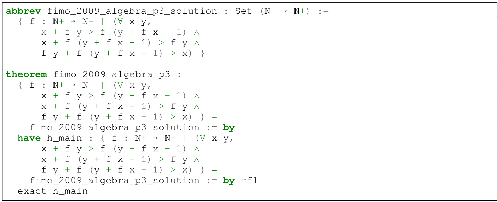

**图 4.** 不改写设置下观察到的 `fimo_2009_algebra_p3` 伪证明. `abbrev solution` 被定义成定理陈述中出现的同一个集合, 所以证明器无需作任何数学推理, 便能用 `rfl` 闭合目标.

<span id="section-17"></span>

## 17 跨模型搭配

*DAP* 的模块化设计有一项实用优势: 发现模块与证明模块可以独立替换. 为了说明这种灵活性, [表 8](#table-08) 报告三种模型组合的结果: 默认组合, 使用小型开源模型的轻量组合, 以及使用更强闭源模型的高资源组合. Aristotle API [Ach25] 不支持并发请求, 且每个问题可能耗时数小时, 因此我们为该设置从每个数据集抽取 5 个问题; 结果以已解数/总数表示.

<span id="table-08"></span>

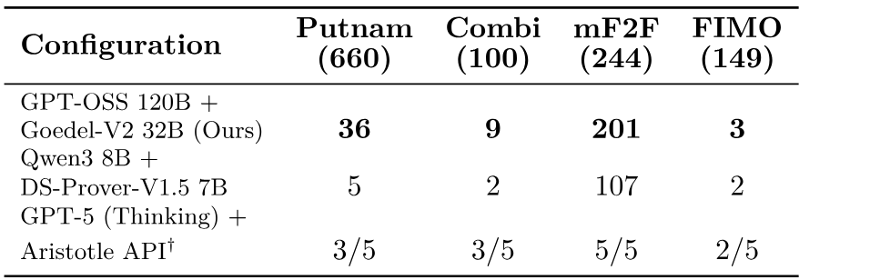

**表 8.** 不同发现-证明模型组合的 Pass@32 结果. $^\dagger$Aristotle API 结果来自抽样 (每个数据集 5 个问题).

由此可以得出两个结论. 第一, 即使使用小型节省资源的模型, 流水线仍然可以工作, 因而适合计算资源有限的设置. 第二, 用明显更强的模型替换发现模块会带来有意义的进一步提升, 说明随着非形式化推理模型继续改进, 该方法仍有很大余量.
