> [Yinmin Zhong](https://www.yinminzhong.com/), [Shengyu Liu](https://interestinglsy.github.io/), [Junda Chen](https://x.com/Junda_Chen_), [Jianbo Hu](https://dblp.org/pid/97/1511), [Yibo Zhu](http://yibozhu.com), [Xuanzhe Liu](http://www.liuxuanzhe.com), [Xin Jin](https://xinjin.github.io/), and [Hao Zhang](https://haozhang.ai/). 首次提交至 arXiv: January 18, 2024; 当前版本为 v3. [DistServe: Disaggregating Prefill and Decoding for Goodput-optimized Large Language Model Serving](https://arxiv.org/abs/2401.09670). [原始 PDF](/paper/distserve.pdf). [TeX 源码](https://export.arxiv.org/e-print/2401.09670). 精确的印刷版式和参考文献以原始 PDF 为准.

## 摘要

DistServe 通过分离预填充计算和解码计算来提高大型语言模型 (LLM) 服务的性能. 现有的 LLM 服务系统将两个阶段放在同一位置, 并在所有用户和请求之间对预填充和解码计算进行批处理. 我们发现, 这种策略不仅导致预填充- 解码的强干扰, 还会耦合两个阶段的资源分配和并行计划. LLM 应用通常强调每个阶段的个体延迟: 预填充阶段的首个 token 时间 (TTFT) 和解码阶段每个请求的每输出 token 时间 (TPOT). 在存在严格延迟要求的情况下, 现有系统必须在两种延迟之间优先考虑一种, 或者过度配置计算资源以同时满足两者.

DistServe 将预填充和解码计算分配到不同的 GPU 上, 从而消除了预填充- 解码的干扰. 考虑到应用的 TTFT 和 TPOT 要求, DistServe 共优化了资源分配和并行策略, *针对*每个阶段进行定制. DistServe 还会根据服务集群的带宽来安排这两个阶段, 以最小化拆分带来的通信开销. 因此, DistServe 在每个 GPU 上, 在满足 TTFT 和 TPOT 约束的情况下, 显著提升了 LLM 服务性能的最大处理速率. 我们的评估显示, 在各种流行的 LLM, 应用和延迟要求下, DistServe 相比最先进的系统, 可以服务 4.48$\times$ 次请求或实现 10.2$\times$ 更严格的 SLO, 同时仍保持 $>90\%$ 请求的延迟在约束范围内.

## 1 引言

大型语言模型 (LLMs), 例如 GPT-4 [Ope23], Bard [Bar23] 和 LLaMA [Tou23d], 代表了生成式人工智能的重大变革. 它们开始重塑现有的互联网服务, 从搜索引擎到个人助理 [Inf23], 并使全新的应用成为可能, 如通用聊天机器人 [Sch22, Chi23b] 和编程助手 [Che21, Roz23]. 然而, 这些进展也带来了一个重大挑战: 处理端到端的 LLM 查询可能比标准搜索查询慢得多 [Reu23]. 为了满足各种应用的严格延迟要求, 服务提供商需要超额配置计算资源, 特别是大量 GPU, 从而导致成本效率下降. 因此, 在保持高 SLO 达成率 (满足 SLO 的请求比例) 的前提下, 优化每次 LLM 查询的成本, 对于所有 LLM 服务来说越来越重要.

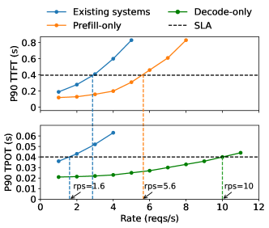

**图 1.** 在一个 NVIDIA 80GB A100 上以合成工作负载服务一个 13B 参数的 LLM 时的性能, 输入长度 = 512, 输出长度 = 64. 上图: 比较现有系统与仅服务预填充阶段系统的 P90 首令牌响应时间 (TTFT) 延迟. 下图: 比较现有系统与仅服务解码阶段系统的 P90 每输出令牌时间 (TPOT) 延迟.

一个大型语言模型 (LLM) 服务以两个阶段响应用户查询. *预填充阶段*处理用户的提示, 该提示由一系列令牌组成, 以*一步生成*响应的第一个令牌. 在此之后, *解码阶段*按顺序生成后续令牌, *多步进行*; 每个解码步骤都基于前一步中生成的令牌生成一个新令牌, 直到生成终止令牌. 这个双阶段过程将 LLM 服务与传统服务区分开来—LLM 服务的延迟通过两个关键指标来衡量: *首令牌时间* (TTFT), 即预填充阶段的持续时间, 以及*每输出令牌时间* (TPOT), 代表生成每个请求令牌 (首令牌除外) 的平均时间 [+1]. 不同的应用对每个指标的需求各不相同. 例如, 实时聊天机器人 [Sch22] 优先考虑低 TTFT 以保证响应及时, 而 TPOT 仅在其生成速度快于人类阅读速度 (即每分钟 250 词) 时仍然重要. 相反, 文档摘要更强调低 TPOT 以加快摘要生成速度.

因此, 鉴于应用对 TTFT 和 TPOT 的需求, 一个有效的 LLM 服务系统应平衡这些需求并最大化*每 GPU 吞吐量*, 定义为每个已配置 GPU 在遵守 SLO 达成目标 (例如 90%) 的情况下可服务的最大请求速率—每 GPU 吞吐量越高, 单次查询成本就越低.

由于预填充和解码阶段共享 LLM 权重和工作内存, 现有的 LLM 服务系统通常会将两个阶段在 GPU 上进行共置, 并通过对请求批量处理预填充和解码步骤来最大化整体系统吞吐量—即所有用户和请求的每秒生成 token 数 [Yu22a, Kwo23a]. 然而, 为了满足延迟要求, 我们发现这些系统必须过度配置计算资源. 为了说明这一点, [图 1](#figure-01) 展示了在使用现有系统服务 13B LLM 时, P90 TTFT 和 TPOT 随请求速率增加的变化 [Kwo23], 工作负载模式和两个延迟约束设置为模拟使用 LLM 为一篇文章生成简短摘要. 在 90% 的 SLO 达成率下, 单个 A100 GPU 上可实现的最大有效吞吐量受制于 TTFT 和 TPOT 两者中更严格的要求, 大约为每秒 1.6 个请求 (rps). 当每个阶段在单独的 GPU 上独立服务时, 性能对比明显, 由橙色和绿色曲线显示, 预填充阶段在每个 GPU 上达到 5.6 rps, 解码阶段为 10 rps. 理想情况下, 通过为预填充分配 2 个 GPU, 为解码分配 1 个 GPU, 我们可以有效地以整体 10 rps 的吞吐量服务模型, 即每个 GPU 相当于 3.3 rps, 比现有系统高出 2.1 倍. 吞吐量差异主要源于预填充和解码的共置—这两个阶段具有非常不同的计算特性和延迟要求 (§[2.1](#S2.SS1)).

首先, 共置会导致强烈的*预填充- 解码干扰*. 预填充步骤通常比解码步骤耗时更长. 当它们被批量处理时, 批次中的解码步骤会被预填充步骤延迟, 从而显著延长它们的 TPOT; 同样, 解码步骤的加入也会导致 TTFT 的非平凡增加, 如 [图 2](#figure-02) 所示. 即使我们将它们分开调度, 问题仍然存在, 因为它们开始争夺资源. 等待 GPU 执行的解码任务会因正在进行的预填充任务而面临额外的排队延迟, 反之亦然. 优先调度某一阶段的任务可能会导致另一阶段的延迟要求无法满足.

其次, 预填充和解码计算在延迟要求和对不同形式并行性的偏好上存在差异 (§[3](#S3)). 然而, 将预填充和解码共置, 会使它们的资源分配耦合, 从而无法实施更适合满足各阶段特定延迟需求的不同并行策略.

为了克服这些挑战, 我们提出将大型语言模型推理的预填充和解码阶段分离, 并分配到不同的 GPU 上. 我们的方法有两个好处. 首先, 在不同 GPU 上独立运行每个阶段消除了预填充与解码的干扰. 其次, 它允许根据各阶段的特定延迟需求独立扩展每个阶段, 并采用定制的资源分配和模型并行策略. 虽然分离会导致 GPU 之间的中间状态通信, 但我们显示在现代 GPU 集群中通信开销可以忽略不计 (§[3.3](#S3.SS3)), 并且如果管理得当, 分离能够显著提高每个 GPU 的吞吐量.

基于上述洞察, 在本工作中, 我们构建了 DistServe, 一个通过分离预填充和解码阶段来优化有效吞吐量的 LLM 服务系统. 考虑到 TTFT 和 TPOT 的需求, DistServe 首先通过联合优化预填充和解码阶段的 GPU 分配及并行策略, 在假设服务单个模型副本的情况下独立地扩展每个阶段. 该优化确保最大化每 GPU 的有效吞吐量, 并可能根据各自的延迟要求为每个阶段分配不同数量的 GPU 和并行策略. 然后, DistServe 通过复制将此分配扩展到多个实例, 直到满足用户要求的流量率 (§[4](#S4)). DistServe 还具有一个算法, 可根据其分配方案和集群带宽来放置预填充和解码计算, 从而最小化阶段间中间状态传输的开销.

我们将 DistServe 实现为构建在 LLM 推理引擎之上的编排层. 我们在各种 LLM 上评估 DistServe, 并基于三种重要的现实世界 LLM 应用 (聊天机器人, 编程助手和文档摘要) 改变工作负载. 与最先进的解决方案相比, DistServe 在延迟约束下可以处理多达 $4.48\times$ 个请求. 我们的贡献包括:

- 识别现有大型语言模型服务系统中预填充- 解码干扰和资源耦合的问题, 并提出将预填充和解码阶段分离的方案.
- 设计一种新颖的部署算法, 以自动选择预填充和解码实例的吞吐量最优方案.
- 对 DistServe 进行基于实际工作负载的全面评估.

## 2 背景和动机

一个大型语言模型 (LLM) 服务遵循客户端- 服务器架构: 客户端将一段文本作为请求提交给服务器; 服务器在 GPU 上托管 LLM, 对请求进行推理, 并将生成的结果返回 (或流式传输) 给客户端. 如 §[1](#S1) 中所述, 由于独特的预填充- 解码过程, LLM 服务可能对 TTFT 和 TPOT 强加严格的服务级目标 (SLOs), 具体取决于应用需求. 服务系统必须在满足这两个 SLO 的同时, 尽量减少与昂贵 GPU 相关的成本. 换句话说, 我们希望服务系统在每个 GPU 配置满足 SLO 达成目标的前提下, 最大化每秒处理的请求数—*最大化每 GPU 的吞吐量*. 接下来, 我们详细说明 LLM 推理计算 (§[2.1](#S2.SS1)), 并讨论现有的 LLM 服务优化方法 (§[2.2](#S2.SS2)).

### 2.1 LLM 推理

现代大语言模型 (LLMs) [Ope23, Tou23d] 在给定输入序列的情况下预测下一个标记. 这个预测涉及为序列中的每个标记计算一个隐藏表示. LLM 可以接受可变数量的输入标记, 并并行计算它们的隐藏表示, 其计算工作量随着并行处理的标记数呈超线性增长. 无论输入标记数量多少, 计算都需要大量的 I/O 来将 LLM 权重和中间状态从 GPU 的 HBM 移动到 SRAM. 这个过程在不同的输入规模下是一致的.

填充 (prefill) 步骤处理新的序列, 这些序列通常包含许多 token, 并同时处理这些 token. 不同于填充, 每个解码步骤只处理前一个步骤生成的一个新 token. 这导致两个阶段在计算上有显著差异. 当处理的用户提示不是很短时, 填充步骤往往是计算密集型的. 例如, 对于一个 13B LLM, 计算一个 512-token 序列的填充步骤会使 A100 成为计算瓶颈. 模型越大, 使填充步骤成为计算瓶颈所需的序列越短 (参见 §[3.1](#S3.SS1)). 相比之下, 解码阶段尽管每步只处理一个新 token, 但产生的 I/O 与填充阶段类似, 使其受到 GPU 内存带宽的限制.

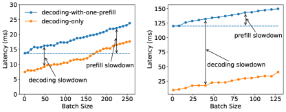

**图 2.** 当为具有 130 亿参数的 LLM 提供服务时, 随着批量大小的增加, 一个批次的执行时间. 对比仅解码批次和在批次中仅添加一个预填充请求的情况.

在两个阶段中, 每个标记位置都会生成中间状态, 称为 KV 缓存 [Kwo23], 这些状态在后续解码步骤中还需要使用. 为了避免重新计算它们, 这些状态会被保存到 GPU 内存中. 由于 LLM 权重和 KV 缓存在内存中是共享使用的, 多数 LLM 推理引擎选择在 GPU 上将预填充阶段和解码阶段放在一起, 尽管它们有不同的计算特性.

### 2.2 LLM 服务优化

在实时在线服务中, 会有多个请求到来, 必须在 SLO 范围内提供服务. 将它们的计算进行批处理和并行化是实现低延迟, 高吞吐量以及 GPU 高利用率的关键.

批处理. 当前的服务系统 [Yu22a, Kwo23, Agr23] 使用一种被称为*连续批处理*的批处理技术. 这种方法将新请求的预填充与正在进行的解码批量处理. 它提高了 GPU 的利用率, 并最大化整体系统吞吐量—所有用户和请求生成的每秒令牌数. 然而, 如 §[1](#S1) 中提到, 并在 §[2.3](#S2.SS3) 后续详细阐述, 这种方法在 TTFT 和 TPOT 之间会产生权衡. 连续批处理的一种高级变体 [Agr23] 试图通过分段预填充并以避免超过 GPU 性能限制的方式附加解码任务来平衡 TTFT 和 TPOT—但本质上, 它是以牺牲 TTFT 换取 TPOT. 总之, 预填充和解码的批处理不可避免地会在 TTFT 或 TPOT 上产生妥协.

模型并行. 在大语言模型 (LLM) 服务中, 模型并行通常分为算子内并行和算子间并行 [Li23j, Zhe22, Sho20]. 两者都可以用于支持更大的模型, 但可能对服务性能有不同影响. 算子内并行将计算密集型算子 (如矩阵乘法) 分配到多个 GPU 上, 加速计算, 但会产生大量通信. 它减少了执行时间 [+2], 从而降低延迟, 特别是预填充阶段的 TTFT, 但需要 GPU 之间的高带宽连接 (例如 NVLink). 算子间并行将 LLM 层组织成多个阶段, 每个阶段运行在一个 GPU 上, 形成流水线. 由于阶段间通信, 它会适度增加执行时间, 但随着每增加一个 GPU, 系统的吞吐能力会线性扩展. 在本文中, 我们揭示了模型并行的另一个好处: 减少预填充和解码阶段的排队延迟, 这来源于较短的执行时间. 我们在 §[3](#S3) 中具体分析这一点. 除了模型并行之外, 复制一个模型实例, 无论其模型并行配置如何, 都能线性扩展系统的吞吐能力.

这些并行策略创造了一个复杂的优化空间, 需要根据应用的延迟要求谨慎权衡.

### 2.3 问题与机遇

将预加载和解码计算进行共置和批处理以最大化整体系统吞吐量, 如现有系统中所做的, 对于服务提供商来说是成本有效的. 然而, 在存在服务级别目标 (SLO) 的情况下, 由于以下讨论的问题, 现有方法难以同时维持高服务质量和低成本.

预加载- 解码干扰. 如[图 2](#figure-02) 所示, 向解码请求批中添加单个预加载任务会显著减慢两者的处理速度, 导致平均首次完成时间 (TTFT) 和任务处理总时间 (TPOT) 明显增加. 具体而言, 批处理中解码任务必须等待较长的预加载任务完成, 从而延长 TPOT; 随着预加载任务时间的增加, 减慢效果进一步加剧, 如[图 2](#figure-02)(b)所示. 在预加载中增加解码任务也会增加完成预加载任务的时间, 尤其在 GPU 已满负荷的情况下 ([图 2](#figure-02) 蓝色曲线).

调度无效. 将预加载和解码任务分开并顺序调度并不能缓解干扰. 由于需等待 GPU 上正在进行的预加载任务, 解码任务可能经历更长的排队延迟. 另外, 专门用于解码的批处理常常导致 GPU 利用率不足. 在任一阶段优先处理任务都会对另一阶段的延迟产生负面影响, 使优先调度无效.

资源与并行耦合. 在同一 GPU 上共置预填充和解码阶段不可避免地会共享它们的资源和并行设置. 然而, 每个阶段都有其独特的计算特性和延迟要求, 这需要更异构的资源分配. 例如, 预填充阶段受益于更多的 GPU 和操作内并行性, 以减少执行时间, 从而满足严格的 TTFT SLO. 解码阶段可以使用比预填充更少的 GPU 处理更高的速率, 其最佳并行性配置取决于运行的批次大小. 在现有系统中, 由于耦合, 资源分配和并行计划是为了满足 TTFT 和 TPOT 中更苛刻的要求, 这可能对另一个阶段并不理想. 这通常导致为了满足两个 SLO 而过度配置资源.

机会. 为了解决这些问题, 我们提出将预填充阶段和解码阶段分离. 我们使用“实例”一词来表示管理完整模型权重副本的资源单元. 当应用模型并行时, 一个实例可以对应多个 GPU. 需要注意的是, 当我们将两个阶段分配到不同的 GPU 时, 每个阶段都会管理其自己的模型权重副本, 从而产生*预填充实例*和*解码实例*. 预填充实例在接收到请求后, 仅执行该请求的预填充计算以生成第一个输出 token. 然后, 它将中间结果 (主要是 KV 缓存) 发送给解码实例, 由解码实例负责后续解码步骤. 由于解码计算通常 GPU 利用率较低, 我们可能为每个解码实例分配多个预填充实例. 这允许对更多解码任务进行批处理, 以实现更高的 GPU 利用率.

将预填充和解码进行解耦, 自然地解决了两个阶段之间的干扰, 使每个阶段能够专注于其优化目标—TTFT 或 TPOT. 每种类型的实例可以采用不同的资源和并行策略以满足各种延迟要求. 通过调整提供给两种类型实例的 GPU 数量和并行度, 我们可以最大化整个系统的每台设备有效吞吐量, 避免资源过度配置, 从而最终在遵循服务质量的前提下降低每次查询的成本. 接下来, 我们开发方法来找出每个阶段的最佳资源分配和并行计划.

## 3 权衡分析

解耦使得两个阶段分离开来, 并允许对每个阶段的特性进行独立分析, 为算法设计提供了宝贵的见解. 它还扩展了设计空间: 现在每个阶段都需要根据各自的延迟要求独立进行扩展和调度.

在本节中, 我们分析了预填充实例 (§[3.1](#S3.SS1)) 和解码实例 (§[3.2](#S3.SS2)) *分解后*的计算模式. 我们的目标是识别关键参数, 并为每个阶段的批处理和并行处理制定指导方针. 然后, 我们强调几个实际部署的注意事项 (§[3.3](#S3.SS3)). 本节为每 GPU 吞吐量优化奠定了基础.

### 3.1 预填充实例分析

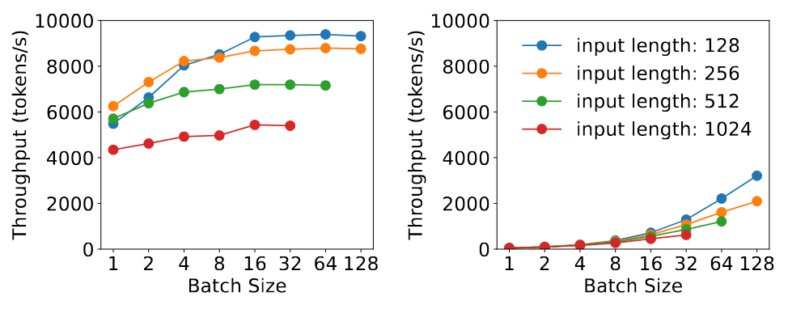

**图 3.** 在使用 13B 参数的 LLM 提供服务时, 不同批量大小和输入长度下, 预填充阶段和解码阶段的吞吐量.

分解之后, 预填充阶段通过并行处理用户提示的所有标记生成第一个标记. 假设给定的到达率, 我们的目标是以最少的资源满足服务对 TTFT 的延迟要求.

批处理策略. 预填充步骤通常计算密集. [图 3](#figure-03)(a) 显示了预填充阶段的吞吐量随着输入长度和批处理大小的变化情况. 对于 13B 参数的 LLM, 处理 512 个 token 的单序列就可以充分利用 A100 GPU; 更大的模型则需要更短的序列才能达到 GPU 饱和. 一旦 GPU 成为计算瓶颈, 增加批处理中的请求数量将不再提高 GPU 效率. 相反, 它会按比例延长批处理的总处理时间, 从而无意中延迟所有包含的请求. 因此, 对于预填充实例, 有必要提前对特定的 LLM 和 GPU 进行性能分析, 以确定一个临界输入长度阈值, 记为 $L_{m}$, 超过该阈值预填充阶段将变为计算瓶颈. 仅当调度请求的输入长度低于 $L_{m}$ 时, 才应考虑增加批处理请求数. 在实践中, 用户提示的平均长度通常超过数百个 token [Sha23b]. 预填充实例的批处理大小通常保持较小.

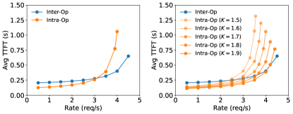

**图 4.** 在两块 A100 GPU 上使用不同并行方式服务 66B 参数的 LLM 时的平均 TTFT.

并行计划. 为了研究仅预填实例的并行偏好, 我们在两块 A100 GPU 上使用跨操作或内部操作并行策略运行一个 66B LLM. 为了简化问题, 我们假设请求输入长度均为 512 个令牌, 并且请求到达遵循泊松过程. 我们比较了在不同到达率下的平均 TTFT, 见 [图 4](#figure-04)(a): 在较低到达率下, 内部操作并行更高效, 而随着到达率增加, 跨操作并行占据优势. 分解使预填阶段能够类似于 M/D/1 队列, 因此我们可以使用排队论来验证这一观察结果.

我们首先使用单设备情况下的符号表示而不考虑并行性: 每个请求的执行时间表示为 $D$, 由于预填充长度一致而保持不变. 由于一个请求即可使 GPU 饱和, 我们通过先到先服务 (FCFS) 调度请求, 而不采用批处理. 假设泊松到达率为 $R$ 且利用率条件为 $\mathrm{RD}<1$, 则平均 TTFT ($\mathrm{Avg}\_\mathrm{TTFT}$) 可以通过 M/D/1 队列 [Sho18] 的闭式形式建模:

$$
\small \mathrm{Avg}\_\mathrm{TTFT}=D+\frac{\mathrm{RD}^{2}}{2(1-\mathrm{RD})},\tag{1}
$$

其中第一项代表执行时间, 第二项对应排队延迟. 基于公式 [1](#S3.E1), 我们结合了并行性.

在 2 路操作间并行情况下, 我们假设请求级延迟变为 $D_{s}$, 且最慢的阶段需要 $D_{m}$ 完成. 我们有 $D\approx D_{s}\approx 2\times D_{m}$, 由于跨层激活通信可以忽略不计 [Zhe22, Li23j]. 具有 2 路操作间并行的平均 TTFT 推导如下:

$$
\small \mathrm{Avg}\_\mathrm{TTFT}_{\mathrm{inter}}=D_{s}+\frac{\mathrm{RD}_{m}^{2}}{2(1-\mathrm{RD}_{m})}=D+\frac{\mathrm{RD}^{2}}{4(2-\mathrm{RD})}.\tag{2}
$$

对于操作内并行, 我们引入加速系数 $K$, 其中 $1<K<2$, 反映了操作内并行高通信开销导致的不完美加速. 执行时间为 $D_{s}=\frac{D}{K}$ 时, 2 度操作内并行的平均 TTFT 为:

$$
\small \mathrm{Avg}\_\mathrm{TTFT}_{\mathrm{intra}}=\frac{D}{K}+\frac{\mathrm{RD}^{2}}{2K(K-\mathrm{RD})}.\tag{3}
$$

对比方程 [2](#S3.E2) 与方程 [3](#S3.E3): 在较低速率下, 当执行时间 (第一项) 是主要因素时, 操作内并行降低执行时间使其更高效. 随着速率增加且排队延迟 (第二项) 变得更显著, 操作间并行变得有利, 这与 [图 4](#figure-04)(a) 一致.

预填充阶段对并行性的偏好也受到 TTFT SLO 和加速系数 $K$ 的影响. 从 [图 4](#figure-04)(a) 可以看出: 更严格的 SLO 会使操作内并行性更具优势, 因为它能够在遵守 SLO 的前提下支持更高的请求速率. K 的值取决于输入长度, 模型架构, 通信带宽和部署 [Sho20, Zhe22] 等因素. 如 [图 4](#figure-04)(b) 所示, K 的下降显著降低了操作内并行性的效果. §[4](#S4) 开发了优化资源和并行性配置的算法, 同时考虑了这些参数.

### 3.2 解码实例分析

与预填充实例不同, 解码实例遵循不同的计算模式: 它从预填充实例接收中间状态 (KV 缓存) 和第一个令牌, 并一次生成后续令牌. 对于解码实例, 我们的优化目标是使用最少的计算资源满足应用程序的 TPOT 要求.

批处理策略. 由于单个解码任务在很大程度上受带宽限制, 批处理是避免 GPU 利用率低 (从而每个 GPU 的有效吞吐量高) 的关键. 在预填充和解码阶段共置的现有系统中, 增加解码批量大小是困难的, 因为这会与满足延迟目标发生冲突, 特别是在请求率高的场景下. 这是因为共享 GPU 会导致预填充任务和解码任务之间的竞争, 从而在 TTFT 和 TPOT 之间产生权衡. 例如, 更高的到达率会生成更多的预填充任务, 如果优先考虑预填充任务, 则需要更多的 GPU 时间来满足 TTFT 要求, 这反过来又会对 TPOT 产生不利影响.

相反, 分离架构提供了一种解决方案, 通过将多个预填充实例分配到单个解码实例. 这种方法允许在专用 GPU 上为解码阶段积累更大的批量大小, 而不会牺牲 TPOT.

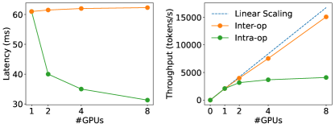

**图 5** 在不同并行度下, 为 13B LLM 提供服务时, 批量大小=128, 输入长度=256 时的解码阶段延迟和吞吐量.

并行计划. 拆分后, 由于需要为所有活动请求维护 KV 缓存, 解码的批量大小可能会受到 GPU 内存容量的限制. 通过模型并行扩展解码实例或利用 LLM KV 缓存的高级内存管理技术 (如 Paged-Attention [Kwo23] 和 GQA [Ain23a]), 可以进一步将解码批量大小扩展到几乎受计算限制. 当解码批量大小继续增加接近计算限制时, 解码计算开始类似于预填充阶段. 基于这一观察, 我们在 [图 5](#figure-05) 中研究了在大批量条件下, 不同并行度下延迟和吞吐量的变化: 操作内并行性可降低延迟, 但收益递减, 这是由通信和分区后利用率下降造成的. 操作间并行性几乎可以线性地扩展吞吐量. 因此, 当 TPOT SLO 非常严格时, 操作内并行性对于降低 TPOT 以满足延迟目标至关重要. 在此之外, 操作间并行性更适合线性提升吞吐量.

当模型可以适配到单个 GPU 的内存时, 对于预填充和解码实例, 复制是一种与模型并行性竞争的选项, 可以线性扩展系统的吞吐能力. 它还可能减少排队延迟—如公式 [1](#S3.E1) 所示—通过用 $R/N$ 替换 $R$, 假设请求均匀分配到 $N$ 个副本, 但代价是需要在 GPU 内存中维护额外的模型权重副本.

### 3.3 实际问题

我们已经建立了为每个阶段选择批处理和并行性的方法论. 在本节中, 我们讨论并解决在实际部署分离的预填充和解码阶段时遇到的若干挑战.

变量预填充长度. §[3](#S3) 假设请求中的提示长度是统一的. 在实际部署中, 根据 LLM 应用, 请求的长度是不统一的. 这种不均匀性可能会导致对应用了操作间并行的预填充实例产生流水线空隙 [Hua19b, Nar19], 因为不同长度请求的流水线阶段执行时间会有所不同. 这会导致与使用 M/D/1 队列模型得出的结论有轻微偏差. 为了解决这个问题, §[4](#S4) 开发了基于工作负载搜索并行度的算法, 并采用调度来最小化空隙 (§[4.3](#S4.SS3)).

通信开销. 从预填充实例向解码实例传输 KV 缓存会产生显著的开销. 例如, 在 OPT-66B 上, 单个 512-token 请求的 KV 缓存大小约为 1.13GB. 假设平均到达率为每秒 10 个请求, 我们需要传输 $1.13\times 10=11.3$ GB 数据—或者等效于 90Gbps 的带宽, 以使开销不可见. KV 缓存的大小会随着平均输入长度和到达率的增加而增加. 虽然许多用于 LLM 的现代 GPU 集群都配备了 Infiniband (例如 800 Gbps), 但在跨节点带宽受限的情况下, 拆分依赖于常见的节点内 NVLINK, 其中 A100 GPU 之间的峰值带宽为 600 GB/s, 再次使传输开销可忽略 (见 §[6.3](#S6.SS3)). 然而, 这一需求对预填充和解码实例的放置施加了额外限制, 我们将在下一节中加以考虑.

通过本节的分析, 我们识别出工作负载模式, 放置约束, SLO 要求, 并行策略和资源分配作为在设计拆分服务系统时形成考虑网络的关键参数. 如何自动导航搜索空间以找到实现每 GPU 最优吞吐量的配置是具有挑战性的, 并将在下一节中讨论.

## 4 方法

我们建立了 DistServe 来解决上述挑战. 给定模型, 工作负载特性, 延迟要求和 SLO 达成目标, DistServe 将确定 (a) 预填充和解码实例的并行策略, (b) 每种实例类型的部署数量, 以及 (c) 如何将它们放置到物理集群上. 我们称这个解决方案为部署方案. 我们的目标是找到一个能够最大化每个 GPU 有效吞吐量的部署方案.

如§[3.3](#S3.SS3) 中所述, 一个关键的设计考虑是管理解耦的预填充和解码阶段之间的通信, 考虑到不同的集群设置. 在本节中, 我们首先介绍两种部署算法: 一种用于具有高速跨节点网络的集群 (§[4.1](#S4.SS1)), 另一种用于缺乏此类基础设施的环境 (§[4.2](#S4.SS2)); 后一种引入了额外约束. 随后, 我们开发了适应实际工作负载细微差别的在线调度优化 (§[4.3](#S4.SS3)).

### 4.1 高节点亲和集群的部署

**算法 1: 高节点亲和部署算法.**

- **输入:** LLM $G$, 每实例节点上限 $N$, 每节点 GPU 数 $M$, GPU 内存容量 $C$, 工作负载 $W$, 流量速率 $R$.
- **输出:** 部署 $\mathit{\mathrm{best}\_\mathrm{plm}}$.
- 初始化 $\mathit{\mathrm{prefill}\_\mathrm{config}}\leftarrow\emptyset$ 和 $\mathit{\mathrm{decode}\_\mathrm{config}}\leftarrow\emptyset$.
- **对于** $\mathit{\mathrm{intra}\_\mathrm{op}}\in\{1,2,...,M\}$:
  - **对于** $\mathit{\mathrm{inter}\_\mathrm{op}}\in\{1,2,...,\frac{N\times M}{\mathit{\mathrm{intra}\_\mathrm{op}}}\}$:
    - **如果** $\frac{G.\mathrm{size}}{\mathit{\mathrm{inter}\_\mathrm{op}}\times\mathit{\mathrm{intra}\_\mathrm{op}}}<C$:
      - $\hat{G}\leftarrow\mathrm{parallel}(G,\mathit{\mathrm{inter}\_\mathrm{op}},\mathit{\mathrm{intra}\_\mathrm{op}})$.
      - $\mathit{\mathrm{prefill}\_\mathrm{goodput}}\leftarrow\mathrm{simu\_prefill}(\hat{G},W)$.
      - $\mathit{\mathrm{decode}\_\mathrm{goodput}}\leftarrow\mathrm{simu\_decode}(\hat{G},W)$.
      - **如果** $\frac{\mathit{\mathrm{prefill}\_\mathrm{config}.\mathrm{goodput}}}{\mathrm{prefill}\_\mathrm{config}.\mathrm{num}\_\mathrm{gpus}}<\frac{\mathit{\mathrm{prefill}\_\mathrm{goodput}}}{\mathrm{config}.\mathrm{num}\_\mathrm{gpus}}$:
        - $\mathit{\mathrm{prefill}\_\mathrm{config}}\leftarrow\mathit{\mathrm{config}}$.
      - **如果** $\frac{\mathit{\mathrm{decode}\_\mathrm{config}.\mathrm{goodput}}}{\mathrm{decode}\_\mathrm{config}.\mathrm{num}\_\mathrm{gpus}}<\frac{\mathit{\mathrm{decode}\_\mathrm{goodput}}}{\mathrm{config}.\mathrm{num}\_\mathrm{gpus}}$:
        - $\mathit{\mathrm{decode}\_\mathrm{config}}\leftarrow\mathit{\mathrm{config}}$.
- $n\leftarrow\lceil\frac{R}{\mathit{\mathrm{prefill}\_\mathrm{config}.\mathrm{goodput}}}\rceil$ 且 $m\leftarrow\lceil\frac{R}{\mathit{\mathrm{decode}\_\mathrm{config}.\mathrm{goodput}}}\rceil$.
- $\mathit{\mathrm{best}\_\mathrm{plm}}\leftarrow(\mathit{\mathrm{prefill}\_\mathrm{config}},\mathit{\mathrm{decode}\_\mathrm{config}},n,m)$.
- **返回:** $\mathit{\mathrm{best}\_\mathrm{plm}}$.

在配备了 Infiniband 的高节点亲和性集群上, KV 缓存跨节点的传输开销可以忽略不计, DistServe 可以在任意两个节点之间高效地部署预填充和解码实例而不受限制. 我们为此类场景提出了一个两级放置算法: 我们首先分别优化预填充和解码实例的并行配置, 以达到每个 GPU 的阶段级最佳吞吐量; 然后, 我们使用复制来匹配整体流量速率.

然而, 由于缺乏一个简单的解析公式来计算 SLO 达成率 (即满足 TTFT 要求的请求百分比), 且工作负载具有多样的输入, 输出长度和不规则的到达模式, 为单一实例类型 (例如预填实例) 找到最优的并行配置仍然具有挑战性. 通过真实测试平台进行 SLO 评估耗时过长. 因此, 我们求助于构建模拟器来估计 SLO 达成率, 假设事先已知工作负载的到达过程及输入和输出长度分布. 虽然短期区间无法预测, 但在较长时间尺度 (例如小时或天) 上的工作负载模式通常是可预测的 [Li23j, Zha23b]. DistServe 从历史请求轨迹中拟合出一个分布, 并从该分布重新采样新的轨迹作为模拟器的输入工作负载来计算 SLO 达成率. 接下来, DistServe 通过二分搜索简单地枚举放置方式, 并通过模拟实验找到满足 SLO 达成目标的最大速率.

算法 [1](#alg1) 概述了该流程. 我们列举了所有可行的并行配置, 在集群容量限制下, 分别针对预填充和解码实例. 例如, 对于特定的预填充阶段配置, 我们使用 `simu_prefill` 进行模拟并找到其最大吞吐量 (解码也类似, 使用 `simu_decode`). 在确定了预填充和解码实例的最优并行配置后, 我们将其复制以根据其吞吐量实现用户所需的整体流量.

算法 [1](#alg1) 的复杂度为 $O(\mathrm{NM}^{2})$, 每个实例的节点上限为 $N$, $M$ 表示现代集群中每个节点的典型 GPU 数 (例如 8). 搜索空间是可管理的, 在我们最大的设置中求解时间不到 1.3 分钟, 如 §[6.5](#S6.SS5) 所示.

模拟器构建. 算法 [1](#alg1) 依赖模拟器来在给定工作负载和并行计划的情况下估算不同 SLO 和 SLO 达成目标下的吞吐量. 为了构建准确的模拟器, 我们分别分析了预填充和解码阶段的 FLOPs 和内存访问次数, 并使用延迟模型来近似推理执行时间. 详情见附录 [A](#A1). 得益于 DNN 工作负载 [Guj20, Li23j] 的高度可预测性 (在 §[6.4](#S6.SS4) 中验证), 模拟器的结果与实际分析结果高度一致.

到目前为止, 我们已经开发了算法 [1](#alg1), 假设我们可以在集群的任意两个节点之间放置预填充和解码, 并且 KV 缓存传输利用高带宽. 在许多真实集群中, 节点内部的 GPU 可以通过高带宽 NVLINK 访问, 而分布在不同节点的 GPU 的带宽有限. 接下来我们开发一个算法来应对这一限制.

**算法 2: 低节点亲和力部署算法.**

- **输入:** LLM $G$, 每实例节点上限 $N$, 每节点 GPU 数 $M$, GPU 内存容量 $C$, 工作负载 $W$, 流量速率 $R$.
- **输出:** 部署 $\mathit{\mathrm{best}\_\mathrm{plm}}$.
- 初始化 $\mathit{\mathrm{intra}\_\mathrm{node}\_\mathrm{config}}\leftarrow\emptyset$.
- **对于** $\mathit{\mathrm{inter}\_\mathrm{op}}\in\{1,2,...,N\}$:
  - $\hat{G}\leftarrow\mathrm{parallel}(G,\mathit{\mathrm{inter}\_\mathrm{op}})$.
  - $\mathcal{P}\leftarrow\mathrm{get\_intra\_node\_configs}(\hat{G},M,C)$.
  - **对于** $P\in\mathcal{P}$:
    - $\mathit{P.\mathrm{goodput}}\leftarrow\mathrm{simulate}(\hat{G},P,W)$.
    - **如果** $\frac{\mathit{\mathrm{intra}\_\mathrm{node}\_\mathrm{config}.\mathrm{goodput}}}{\mathrm{intra}\_\mathrm{node}\_\mathrm{config}.\mathrm{num}\_\mathrm{gpus}}<\frac{\mathit{P.\mathrm{goodput}}}{P.\mathrm{num}\_\mathrm{gpus}}$:
      - $\mathit{\mathrm{intra}\_\mathrm{node}\_\mathrm{config}}\leftarrow P$.
- $n\leftarrow\lceil\frac{R}{\mathit{\mathrm{intra}\_\mathrm{node}\_\mathrm{config}.\mathrm{goodput}}}\rceil$.
- $\mathit{\mathrm{best}\_\mathrm{plm}}\leftarrow(\mathit{\mathrm{inter}\_\mathrm{op}},\mathit{\mathrm{intra}\_\mathrm{node}\_\mathrm{config}},n)$.
- **返回:** $\mathit{\mathrm{best}\_\mathrm{plm}}$.

### 4.2 低节点亲和力集群的部署

一个直接的解决方案是始终将预填充实例和解码实例放在同一个节点上, 利用 NVLINK, 它在 GPU 节点内通常可用. 对于大型模型, 例如具有 175B 参数 (350GB) 的模型, 我们可能甚至无法在一个 8-GPU 节点中托管一对预填充和解码实例 ($80G\times 8=640G<350\times 2\mathrm{GB}$). 我们将其作为额外的放置约束并与模型并行性共同优化, 如算法 [2](#alg2) 所示.

关键洞察在于中间状态的传输仅发生在预填充实例和解码实例的对应层之间. 利用操作间并行性, 我们将层分组为阶段, 并将每个实例划分为段, 称为实例段, 每个段保持一个特定的操作间阶段. 通过在单个节点中将相同阶段的预填充段和解码段放置在一起, 我们强制中间状态传输仅通过 NVLINK 进行. 在节点内部, 我们为同一实例的各段设置相同的并行度和资源分配. 鉴于每个节点的 GPU 通常有限 (通常为 8 个), 我们可以枚举单个节点内可能的配置, 并使用模拟器确定能够产生最佳吞吐量的配置.

如算法 [2](#alg2) 所述, 我们首先枚举操作间并行度以获得所有可能的实例段. 对于每个段, 我们通过调用 `get_intra_node_configs` 获取节点内的所有可能配置. 然后我们使用模拟来找到最优配置, 并复制它以满足目标流量率.

### 4.3 在线调度

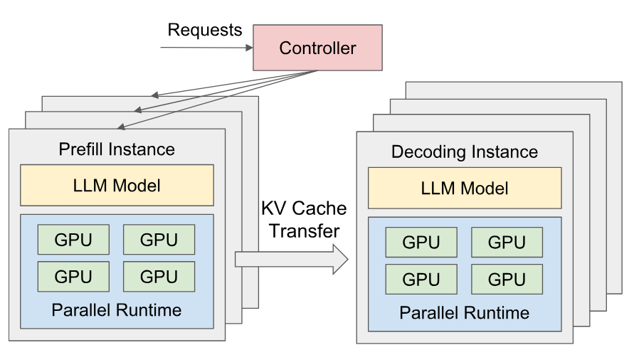

**图 6.** DistServe 运行时系统架构

DistServe 的运行时架构如[图 6](#figure-06) 所示. DistServe 采用简单的 FCFS (先到先服务) 调度策略. 所有进入的请求首先到达集中控制器, 然后被分派到队列最短的 prefill 实例进行 prefill 处理, 随后再分派到负载最轻的解码实例进行解码步骤. 虽然该设置很简单, 但通过几个关键的优化针对实际工作负载的特点进行了优化.

减少流水线空闲. 在流水线中由非均匀提示长度造成的空闲 (§[3.3](#S3.SS3)) 问题上, 我们通过调度请求以平衡流水线中所有批次的执行时间来缓解这一问题. 这是通过注意到, 对于 prefill 实例和解码实例, 批次中新生成的 token 数是批次实际执行时间的可靠指标来实现的. 对于 prefill 实例, 我们对目标模型和 GPU 进行分析, 以确定使 GPU 达到饱和所需的最短提示长度 $L_{m}$. 我们安排 prefill 批次的总序列长度接近 $L_{m}$, 通过将多个短于 $L_{m}$ 的请求组合成一批, 或单独调度长度超过 $L_{m}$ 的请求. 对于解码实例, 我们将 $L_{m}$ 设置为最大的批次大小.

战斗型业务. 工作负载的突发性可能导致大量 KV 缓存从预填充实例传输到解码实例, 存在解码实例内存过载的风险. 为避免这种情况, DistServe 采用“拉取”方式传输 KV 缓存, 而非“推送”方式—解码实例*按需*从预填充实例获取 KV 缓存, 使用预填充实例的 GPU 内存作为队列缓冲. 因此, 每种类型的实例可以按照自身节奏运行, 无需复杂协调.

重新规划. DistServe 中的资源和并行计划是针对特定工作负载模式优化的, 如果工作负载模式随时间变化, 可能会变得次优. DistServe 实施周期性重新规划. 工作负载分析器监控关键参数, 如请求的平均输入输出长度, 平均到达率等. 如果检测到显著的模式变化, DistServe 将触发基于最近历史数据的重新部署算法. 此过程高效—建议的算法在几秒内运行完成 (§[6.5](#S6.SS5)), 重新加载 LLM 权重可在几分钟内完成—远短于实际工作负载变化通常出现的每小时尺度.

DistServe 不实现像抢占 [Han22a] 和容错 [Zha21c] 这样的高级运行时策略, 这些策略是对分解的补充. 然而, 我们讨论了它们如何适应 DistServe. 在 DistServe 中, FCFS 策略可能导致“车队效应”, 即较长的请求在预填充阶段阻塞较短的请求. 正如现有文献 [Wu23b] 所建议, 加入抢占策略可以提升效率, 并且在我们系统的架构中是可行的. 虽然在当前的 DistServe 中这不是主要关注点, 但容错是一个需要考虑的重要方面. 在传统的共置和基于复制的系统中, 一个实例的故障通常不会扰乱其他副本实例. 然而, 在 DistServe 中, 预填充实例与解码实例之间的依赖引入了故障传播的风险. 例如, 一个映射到多个预填充实例的单个解码实例的故障可能会严重影响整个服务和集群. 我们将这两项留作未来工作.

## 5 实现

DistLLM 是一个面向 LLM 的端到端分布式服务系统, 包含一个部署算法模块, 一个 RESTful API 前端, 一个编排层和一个并行执行引擎. 算法模块, 前端和编排层使用 6.5K 行 Python 代码实现. 并行执行引擎使用 8.1K 行 C/CUDA 代码实现.

部署算法模块实现了 §[4](#S4) 中提到的算法和模拟器, 该算法为特定模型和集群设置提供部署决策. 前端支持与 OpenAI API 兼容的接口, 客户端可以指定采样参数, 如最大输出长度和温度值. 编排层管理 prefill 和解码实例, 负责请求分发, KV 缓存传输以及结果交付. 它利用 NCCL [Ncc23] 进行跨节点 GPU 通信, 并使用异步 cudaMemcpy 进行节点内通信, 从而在传输过程中避免阻塞 GPU. 每个实例由并行执行引擎驱动, 该引擎使用 Ray [Mor18] Actor 来实现 GPU 工作器, 这些工作器分布式执行 LLM 推理并管理 KV 缓存. 它整合了许多最新的 LLM 优化技术, 如连续批处理 [Yu22a], FlashAttention [Dao22c], PagedAttention [Kwo23], 并支持流行的开源 LLM, 例如 OPT [Zha22a] 和 LLaMA [Tou23d].

## 6 评估

在本节中, 我们评估了 DistServe 在不同规模的 LLM (从 13B 到 175B) 以及包括聊天机器人, 代码补全和摘要在内的各种应用数据集上的表现. 评估表明, DistServe 在所有设置下始终优于当前的最先进系统 (§[6.2](#S6.SS2)). 具体来说, DistServe 可以处理高达 $4.48\times$ 的更高速率和 $10.2\times$ 更严格的 SLO, 同时满足超过 90% 请求的延迟要求. 另外, 我们分析了 DistServe 的延迟分解, 以显示由于我们的带宽感知部署算法 (§[6.3](#S6.SS3)), 通信开销可以忽略不计, 并对我们的技术进行了消融研究 (§[6.4](#S6.SS4)).

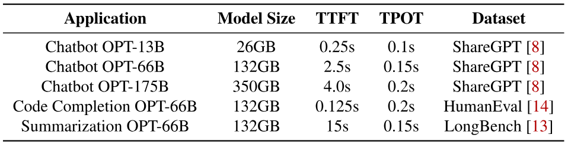

**表 1.** 评估中的工作负载及延迟要求.

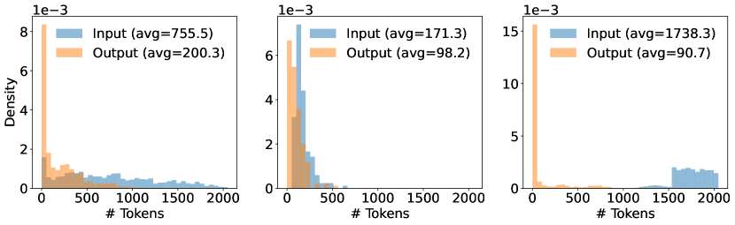

**图 7.** (a) ShareGPT, (b) HumanEval 和 (c) LongBench 数据集的输入输出长度分布.

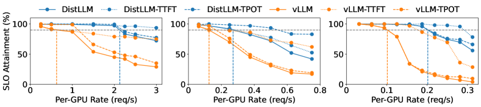

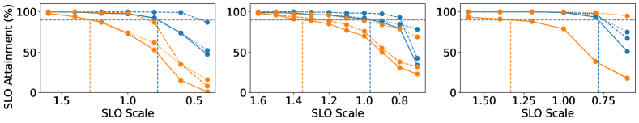

**图 8.** 在 ShareGPT 数据集上使用 OPT 模型的聊天机器人应用.

### 6.1 实验设置

集群测试平台. 我们在一个包含 4 个节点和 32 个 GPU 的集群上部署 DistServe. 每个节点配备 8 块通过 NVLINK 连接的 NVIDIA SXM A100-80GB GPU. 节点间带宽为 25Gbps. 由于节点间带宽有限, 我们在大多数实验中对 DistServe 使用低节点亲和性放置算法 (§[2](#alg2)), 除了消融研究 (§[6.4](#S6.SS4)) 使用模拟方法.

模型和工作负载设置. 与先前针对 LLM 服务的工作 [Kwo23] 类似, 我们选择了 OPT [Zha22a] 系列, 它是学术界和工业界广泛使用的代表性 LLM 系列. 我们在所有实验中均使用 FP16 精度. 对于工作负载, 如 [表 1](#table-01) 所示, 我们选择了三种典型的 LLM 应用, 并根据其服务目标经验性地设置 SLO, 因为据我们所知, 这些应用没有可用的 SLO 设置. 对于每个应用, 我们选择合适的数据集并从中抽样请求进行评估. 由于所有数据集都不包含时间戳, 我们使用不同请求率的泊松分布生成请求到达时间. 由于篇幅限制, 我们在所有三款 OPT 模型上测试了聊天机器人工作负载, 而其他两个工作负载仅在 OPT-66B 上测试, 该模型大小与最近开源 LLM 系列 [Tou23d] 中最大规模相匹配.

- 聊天机器人 [Sch22]: 我们使用 ShareGPT 数据集 [Sha23b] 用于聊天机器人应用, 这是一个由用户共享的 ChatGPT 对话集合. 对于 OPT-13B, TTFT SLO 设置为 0.2 秒以保证响应速度, TPOT SLO 设置为 0.1 秒, 高于正常的人类阅读速度. 对于 OPT-66B 和 OPT-175B, 由于模型执行延迟增加, 我们对两项 SLO 略微放宽.
- 代码补全 [Che21]: 我们使用 HumanEval [Che21] 数据集进行代码补全任务. 它包含 164 个编程问题, 每个问题都有函数签名或文档字符串, 通常用于学术界评估代码补全模型. 由于代码补全工具被用作个人实时编码助手, 我们将两个 SLO 都设置得很严格.
- 摘要生成 [Sum23]: 这是一个流行的 LLM 任务, 用于为长文章, 论文甚至学术论文生成简明摘要. 我们使用包含摘要生成任务的 LongBench [Bai23a] 数据集. 如 [图 7](#figure-07) 所示, LongBench 的输入长度远长于其他两个数据集. 因此, 我们为 TTFT 设置了宽松的 SLO, 但要求 TPOT 严格.

评估指标: 我们将 SLO 达成率作为主要评估指标. 在特定的 SLO 达成目标下 (例如 90%), 我们关注两件事: 每个 GPU 的最大有效吞吐量以及系统可以处理的最低 SLO. 我们特别关注 SLO 达成率为 90% (在所有曲线图中以垂直线表示), 但也会改变速率和延迟要求以观察 SLO 达成率的变化. 为了准确了解两个延迟要求对系统的各自影响, 我们还呈现了仅满足其中一个 SLO 的请求比例.

基线. 我们将 DistServe 与最先进的服务系统 vLLM [Kwo23] 进行比较. 它支持 Orca [Yu22a] 提出的迭代级调度和 PagedAttention, 用以减少由 KV 缓存分配引起的内存碎片. 然而, 它将预填充和解码计算共置并批处理, 以最大化整体系统吞吐量, 因此难以以成本高效的方式满足延迟要求. 由于 vLLM 仅支持操作内并行性, 我们遵循之前的工作 [Kwo23], 为三款 OPT 模型分别设置操作内并行度为 1, 4 和 8.

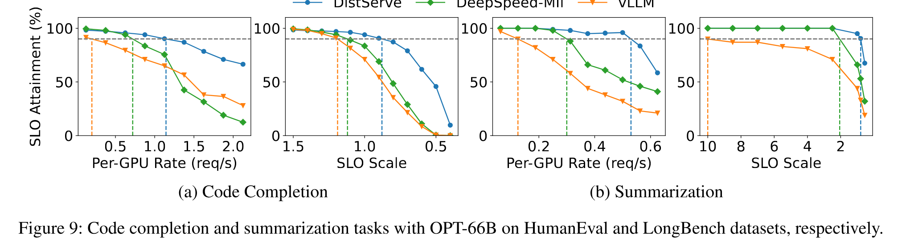

**图 9.** 使用 OPT-66B 在 HumanEval 和 LongBench 数据集上分别进行代码补全和总结任务.

### 6.2 端到端实验

在本节中, 我们将 DistServe 与 vLLM 在真实应用数据集上的端到端性能进行比较.

聊天机器人. 我们评估 DistServe 在三个 OPT 模型上的聊天机器人应用性能. [图 8](#figure-08) 的第一行显示, 当我们逐渐增加速率时, 会有更多请求违反延迟要求, SLO 达成率下降. 垂直线表示系统每个 GPU 可处理的最大速率, 以便超过 90% 的请求满足延迟要求. 虚线和破折线分别表示仅 TTFT 或 TPOT 要求下实现的 SLO 达成率.

在 ShareGPT 数据集上, 与 vLLM 相比, DistServe 可以维持比 $2.0\times$–$3.41\times$ 更高的请求速率. 这是因为 DistLLM 通过去聚合消除了预填充- 解码干扰. 两个阶段可以通过分配不同的资源并采用定制的并行策略来优化各自的目标. 因此, 仅满足 TTFT 要求的曲线 (Dist-TTFT) 与仅满足 TPOT 要求的曲线 (Dist-TPOT) 之间的差距相对较小. 具体来说, 通过分析为 175B 选择的部署策略 [+3], 我们发现预填充实例的 inter-op = 3, intra-op = 3; 解码实例的 inter-op = 3, intra-op = 4. 在此部署下, DistServe 可以有效地在 ShareGPT 上平衡两个实例之间的负载, 以最低成本满足延迟要求. 这一非平凡的部署策略难以手动找到, 从而证明了算法的有效性. 在 vLLM 的情况下, 将预填充和解码放在一起会大大减慢解码阶段, 从而显著增加 TPOT. 由于聊天机器人应用对 TPOT 的严格要求, 尽管 vLLM 对大多数请求满足 TTFT SLO, 但大量违反 TPOT SLO 的请求拖累了整体 SLO 的达成.

[图 8](#figure-08) 的第二行显示了两个系统在应对延迟要求变化时的稳健性. 我们固定速率, 然后使用一个称为 SLO Scale 的参数, 同时线性缩放 [表 1](#table-01) 中的两个延迟要求. 随着 SLO Scale 的减小, 延迟要求变得更加严格. 我们的目标是观察系统在仍能达到目标情况下所能承受的最严格 SLO Scale. [图 8](#figure-08) 显示, DistServe 可以实现比 vLLM 更严格 $1.4\times$–$1.8\times$ 的 SLO, 从而为用户提供更具吸引力的服务质量.

代码补全. [图 9](#figure-09)(a)展示了 DistServe 在提供 OPT-66B 服务时在代码补全任务上的表现. DistServe 能够维持比 vLLM 更高的 $3.2\times$ 请求速率和更严格的 $1.5\times$ SLO. 作为一个实时编码助手, 代码补全任务要求比聊天机器人更低的 TTFT, 这导致两个系统最终都受 TTFT 要求的限制. 然而, 相比之下, 通过消除解码任务的干扰, 并通过搜索算法自动增加 prefill 实例中的操作内并行性, DistServe 降低了 prefill 任务的平均延迟, 从而满足了更多请求的 TTFT 要求.

总结. [图 9](#figure-09)(b) 显示了 DistServe 在提供 OPT-66B 服务时的摘要任务性能. DistServe 实现了比 vLLM 更高的请求速率 ($4.48\times$) 和更严格的 SLO ($10.2\times$). 从 LongBench 数据集中抽样的请求具有较长的输入长度, 这对预填充计算带来了显著压力. 然而, 由于摘要任务对 TTFT 的要求较宽松, TPOT 服务质量变得尤为重要. 将预填充和解码阶段结合的 vLLM, 由于较长的预填充作业, 在解码阶段经历更大的减速, 并未能满足 TPOT 要求.

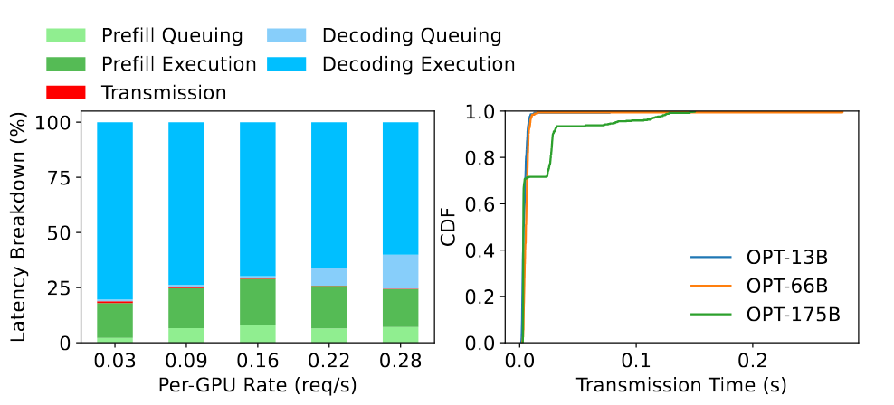

**图 10.** 左: 使用 DistServe 在 ShareGPT 数据集上提供 OPT-175B 服务时的延迟分解. 右: OPT 模型 KV 缓存传输时间的 CDF 函数.

### 6.3 延迟分解

为了详细了解 DistServe 的性能, 我们对 DistServe 中的请求进行了延迟分解. 我们将 DistServe 中请求的处理生命周期分为五个阶段: 预填充排队, 预填充执行, 传输, 解码排队和解码执行. 然后将每个阶段中所有请求消耗的总时间相加, 以确定它们在系统总执行时间中的各自比例.

[图 10](#figure-10)(a) 显示了 OPT-175B 模型在 ShareGPT 数据集上的延迟分解. 我们选择 OPT-175B 是因为 KV Cache 的传输对于大型模型来说更具挑战. 实际上, 即使对于 OPT-175B, KV Cache 的传输也只占总延迟的不到 0.1%. 即便通过查看 [图 10](#figure-10)(b) 中显示的绝对传输时间的累积分布函数(CDF), 我们也观察到超过 95% 的请求延迟不到 30ms, 尽管我们的测试平台的跨节点带宽有限. 这是由于 §[4.2](#S4.SS2) 中描述的算法, 我们要求预填充实例和解码实例在同一台机器上保持相同阶段, 从而利用节点内 NVLINK 带宽进行传输, 从而显著减少传输延迟.

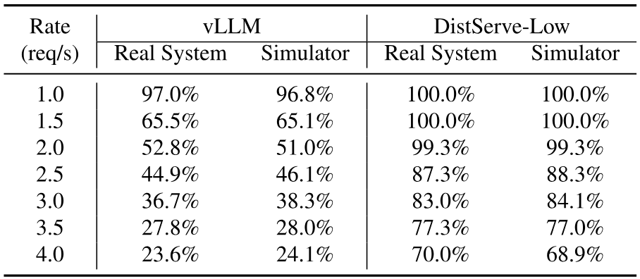

**表 2.** 模拟器与真实系统在不同速率下报告的 SLO 达成情况比较.

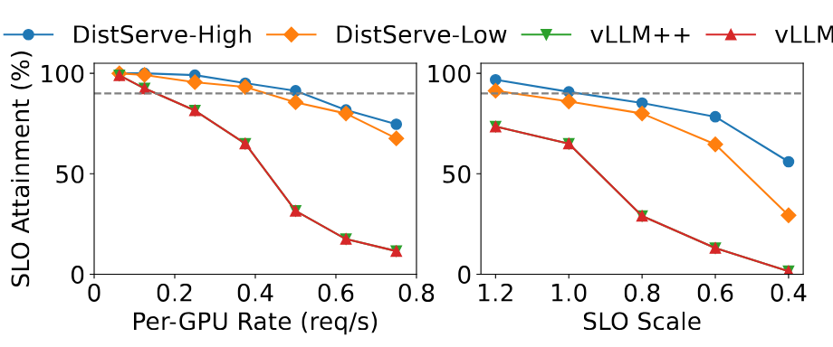

**图 11.** 消融实验.

### 6.4 消融研究

我们研究了 DistServe 中两项关键创新的有效性: 解聚合和放置搜索算法. 在 §[6.2](#S6.SS2) 中, 我们遵循 vLLM 原始论文 [Kwo23] 选择其默认的并行设置. 因此, 我们实现了“vLLM”, 它枚举了不同的并行策略并选择最佳策略. 对于 DistServe, 我们还比较了由算法 [2](#alg2) (DistServe-Low) 找到的放置方案与由算法 [1](#alg1) (DistServe-High) 找到的放置方案进行比较, 后者的搜索约束更少并假设高跨节点带宽. 由于 vLLM 不支持操作间并行, 并且我们的物理测试平台没有高跨节点带宽, 因此我们使用模拟进行该实验.

模拟器精度. 注意到 DNN 模型执行 [Guj20] 即便在并行设置下 [Li23j, Zhe22] 也具有高可预测性. 我们在表 [2](#table-02) 中研究了模拟器的精度. 对于“vLLM”和“DistServe-Low”, 我们比较了模拟器报告的 SLO 达成情况与在我们测试平台上不同速率下实际运行的结果. 所有情况下误差都小于 2%, 验证了模拟器的准确性.

结果. [图 11](#figure-11) 显示了四个系统在 ShareGPT 数据集上服务 OPT-13B 时的性能. “vLLM” 的性能与“vLLM”相同, 因为我们发现默认的非并行设置具有最佳的每 GPU 吞吐量. 这进一步证明了解耦的重要性. Prefill 和解码阶段之间的干扰显著降低了通过调整并行度实现潜在性能提升的可能性. 相比之下, “DistLLM-High” 能够比“DistLLM-Low”取得进一步改进, 因为它不受部署约束的影响—即同一节点上的 prefill 和解码实例应共享相同的模型阶段. 通过解耦, 我们可以为 prefill 和解码实例使用定制的并行策略, 并在没有耦合效应的情况下优化它们的目标.

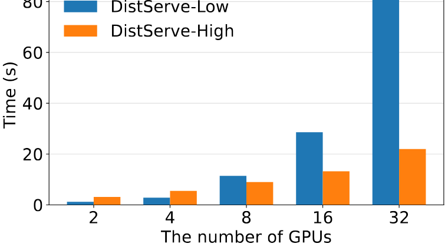

**图 12.** 算法运行时间

### 6.5 算法运行时间

[图 12](#figure-12) 显示了在 AWS m5d. metal 实例上, 具有 96 个核心的情况下, 随着提供给单个实例的 GPU 数量 ($N\times M$) 增加, 算法 [1](#alg1) (DistServe-Low) 和算法 [2](#alg2) (DistServe-High) 的运行时间. 根据结果, DistServe 随 GPU 数量良好扩展, 并且与模型大小无关. 这是因为模拟器只模拟离散事件, 因此无论模型多大, 运行时间都是相同的. 另一方面, 两个算法高度可并行化, 因为不同并行策略的搜索彼此独立, 从而使算法的执行时间随着 CPU 核心数量增加几乎线性加速.

随着 GPU 数量的增加, “Dist-Low”的执行时间变得比“Dist-High”更长. 这是因为“Dist-High”中对预填充和解码实例并行策略的搜索是独立的, 可以并行进行. 但对于“Dist-Low”, 由于部署上存在额外的限制, 我们需要枚举预填充和解码实例的所有可能的节点内并行组合. 即便如此, 算法的执行时间仍以分钟计, 并且由于它只需要在每次重新部署之前执行一次, 因此这个开销是可以接受的.

## 7 相关工作

推理服务. 近期关于推理服务已有大量研究工作. 它们涵盖了从通用生产级系统如 TorchServe [Ser23] 和 NVIDIA Triton [Nvi19b] 到专门针对基于 Transformer 的 LLM 优化的系统 [Li23j, Yu22a, Agr23, Wu23b, Fan21, Nvi19a, Zho22, Su23]. 在这些系统中, Orca [Yu22a] 引入了迭代级调度以提高吞吐量. vLLM [Kwo23] 提出了一种用于 KVCache 的新型内存管理策略. SARATHI [Agr23] 提出了分块预填充方法, 将预填充请求拆分为块并搭载解码请求以提高硬件利用率. FastServe [Wu23b] 实施了迭代级抢占式调度, 以缓解长作业造成的排队延迟. 然而, 它们都采用预填充和解码处理的共置方法, 因此导致严重的干扰.

面向吞吐量优化的系统. 在深度学习应用中, 优化吞吐量是一个热门话题. Pollux [Qia21] 通过动态调整作业的资源来提高深度学习集群的调度性能, 从而提升整个集群的吞吐量. Sia [Sub23] 引入了一种异构感知的调度方法, 可以高效地将集群资源匹配到弹性资源自适应作业. Clockwork [Guj20] 和 Shepherd [Zha23b] 提供了延迟感知的调度和抢占机制以提高服务吞吐量, 但它们仅针对传统的小模型. AlpaServe [Li23j] 专注于大语言模型 (LLMs), 采用模型并行来统计复用 GPU 执行, 从而提高资源利用率. 然而, 它仅针对非自回归生成. DistServe 是首个针对自回归大语言模型推理优化吞吐量的工作.

资源解聚. 资源解聚系统 [Sha18b, Guo23d, Com23a] 将硬件资源从传统的单片服务器基础设施中解耦, 并分离为不同的池进行独立管理. 它允许更加灵活, 高效和可扩展的部署, 并提高资源利用率. 许多应用程序受益于具有高速网络带宽和异构硬件支持的真正解聚数据中心 [Zha23a, Aud22]. DistServe 采用了类似的概念, 通过解聚其系统组件, 实现独立的资源扩展和管理.

模型并行用于训练. DistServe 与训练中关于模型并行的大量工作是正交的 [Zhe22, Sho20, Hua19b, Raj20a, Nar19]. 如 §[3.3](#S3.SS3) 所述, 推理服务工作负载具有训练环境中不存在的独特特性. 这些系统与 DistServe 相交的地方在于它们沿不同维度实现模型并行的方法. DistServe 可以将新的并行优化集成到其布局搜索算法中.

## 8 结论

我们提出了 DistServe, 一种新的 LLM 服务架构, 将预填充和解码计算进行拆分. DistServe 最大化每个 GPU 的吞吐量—即可服务的最大请求率, 同时遵守为每个 GPU 配置的 SLO 达成目标, 从而实现每个 LLM 查询的成本降低至 $4.48\times$, 并保证满足 SLO. 我们的研究结果表明, 随着延迟成为 LLM 服务越来越重要的指标, 预填充和解码拆分是一种在提高性能和服务质量保证方面极具潜力的策略.

## 附录 A LLM 推理的延迟模型

为了准确模拟不同部署策略的吞吐量, 我们使用分析模型来预测 LLM 推理中预填充和解码阶段的执行时间.

在现代大型语言模型服务系统中 [Nvi19a, Kwo23, Wu23b], 受内存限制的操作如 Softmax 和 LayerNorm 通常会与矩阵乘法内核融合以提高效率. 因此, GEMM 占据了整体延迟的主导地位, 我们的分析主要集中于它们.

### A. 1 符号定义

以下是与模型架构相关的符号:

- $h$: 隐藏层大小
- $n$: 注意力头数
- $s$: 头大小 ($h=n\cdot s$)
- $m$: FFN 中间层大小

注意: 如果使用张量并行, $h$, $n$ 和 $m$ 应该除以张量并行的大小.

下面是描述将要执行的批次的符号:

- $B$: 批量大小
- $l_{0},l_{1},\dots,l_{B-1}$: 批次内每个请求的输入长度
- $t$: 批次中的标记数量, ($t=\sum_{i=0}^{B-1}l_{i}$)
- $t_{2}$: 输入长度的平方和 ($t_{2}=\sum_{i=0}^{B-1}l_{i}^{2}$)
- $b$: 注意力内核中的块大小. 该参数用于 FlashAttention [Dao22c], 这是一种当前大型语言模型服务系统采用的常见内核优化技术.

### A. 2 预填充阶段延迟建模

由于注意力操作使用了特别优化的内核, 我们首先讨论预填充阶段的另外四个矩阵乘法:

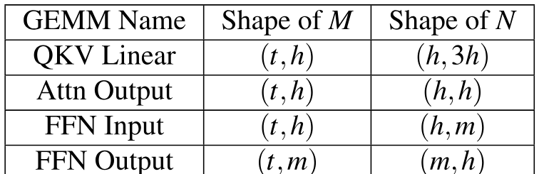

**表 3.**

这些操作的算术强度 (AI) 为 $O(t)$. 在 NVIDIA A100-80GB GPU 上, 当 AI 超过 156 时, 它是计算受限的. 由于 $t$ 在实际情况下通常可以达到几百, 这些操作都是计算受限的. 因此, 我们可以根据总 FLOPs 来建模这些操作的延迟:

$$
T_{1}=C_{1}\cdot(4\mathrm{th}^{2}+2\mathrm{thm})
$$

接下来, 我们讨论使用 FlashAttention[Dao22c] 优化的预填充注意力操作. 由于注意力只在同一请求的 token 之间操作, 目前的实现会为同一批次中的每个请求启动注意力内核. 对于一个注意力头和一个具有 $l$ 个 token 的请求, 注意力内核需要执行总计 $2\mathrm{sl}+3\mathrm{sl}\cdot(l/b)\approx 3\mathrm{sl}\cdot(l/b)$ 次内存读写, 以及 $2\mathrm{sl}^{2}+\mathrm{sl}\approx 2\mathrm{sl}^{2}$ 次 FLOPs. 因此, AI 是 $2b/3=10.677$ (当 $b=16$ 时) 或 $21.333$ (当 $b=32$ 时), 表明它在 A100 GPU 上是一个内存受限操作. 因此, 整个注意力层的延迟 (包括所有请求和所有头) 可以建模为:

$$
T_{2}=C_{2}\cdot n\cdot\sum_{i=0}^{B-1}\frac{3\mathrm{sl}_{i}^{2}}{b}=C_{2}\cdot\frac{3\mathrm{nst}_{2}}{b}=C_{2}\cdot\frac{3\mathrm{ht}_{2}}{b}
$$

总体而言, 预填充阶段的延迟可以建模为:

$$
T_{\mathrm{Prefill}}=C_{1}\cdot(4\mathrm{th}^{2}+2\mathrm{thm})+C_{2}\cdot\frac{3\mathrm{ht}_{2}}{b}+C_{3}
$$

我们使用 $C_{3}$ 来量化其他开销, 如 Python 运行时, 系统噪声等. 然后我们使用分析和插值来确定 $C_{1}$, $C_{2}$ 和 $C_{3}$ 的值.

### A. 3 解码阶段延迟建模

同样地, 我们首先关注解码阶段的以下 GEMM:

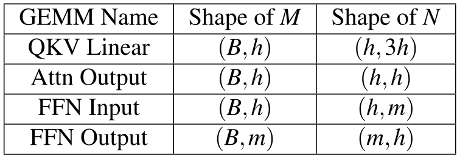

**表 4.**

这些操作的 AI 是 $O(B)$. $B$ 受 GPU 内存大小和严格延迟要求限制, 因此在现有的服务场景中, 这些操作是内存受限的. 总内存读写为 $8\mathrm{Bh}+4h^{2}+2\mathrm{hm}+2\mathrm{Bm}$, 并且由于 $h$ 和 $m$ 通常显著大于 $B$, 我们可以将延迟建模为:

$$
T_{3}=C_{4}\cdot(4h^{2}+2\mathrm{hm})
$$

至于解码注意力操作, 对于一个注意力头和一个具有 $l$ 个生成 token 的请求, 它需要执行 $3\mathrm{sl}$ 次内存读写, 以及 $2\mathrm{sl}$ 次 FLOPs. 它是内存受限的, 因此我们可以将解码注意力的延迟建模为:

$$
T_{4}=C_{5}\cdot n\cdot 3s\sum_{i=0}^{B-1}l_{i}=C_{5}\cdot 3\mathrm{ht}
$$

总结一下, 解码阶段的延迟为:

$$
T_{\mathrm{Decoding}}=C_{4}\cdot(4h^{2}+2\mathrm{hm})+C_{5}\cdot 3\mathrm{ht}
$$

在这里我们没有引入开销项 (比如在分析阶段的 $C_{3}$), 因为 $4h^{2}+2\mathrm{hm}$ 已经是一个常数, 并且开销可以放入 $C_{4}$ 中. 同样地, 我们使用分析和插值来确定 $C_{4}$ 和 $C_{5}$ 的数值.

## 附录 B DistLLM 在端到端实验中的部署

在端到端实验 [6.2](#S6.SS2) 中, DistServe 为预填充和解码实例选择的张量并行 (TP) 和流水线并行 (PP) 配置列在右侧.

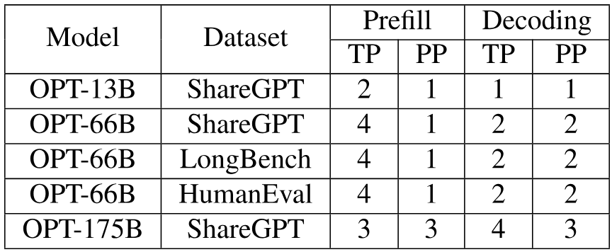

**表 5.**

[+1]: 总体请求延迟等于 TTFT 加上 TPOT 乘以解码阶段生成的令牌数.

[+2]: 这里我们强调“执行时间”而不是延迟, 因为延迟包括执行时间和排队延迟.

[+3]: DistServe 选择的所有部署位置都可以在附录 [B](#A2) 中找到.
