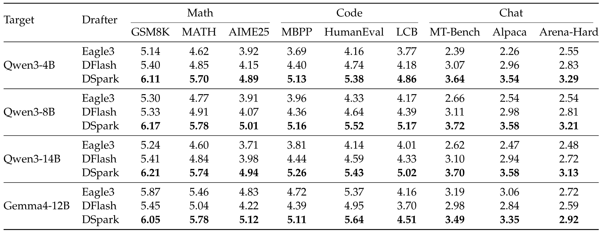
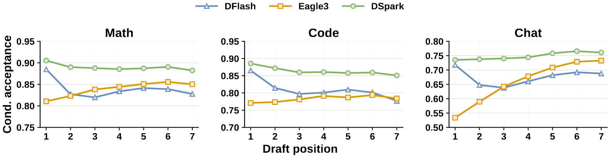
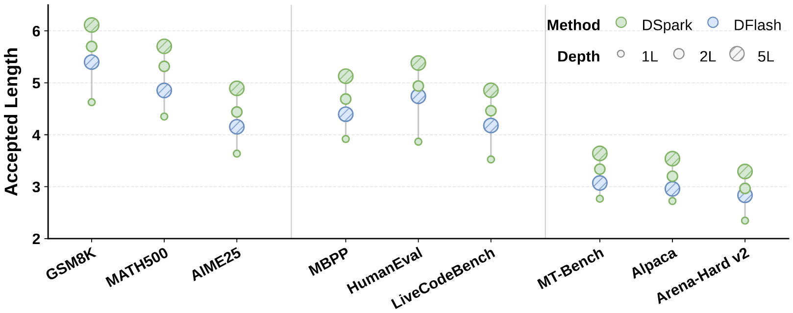
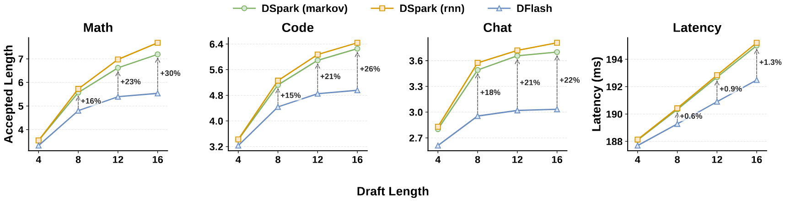
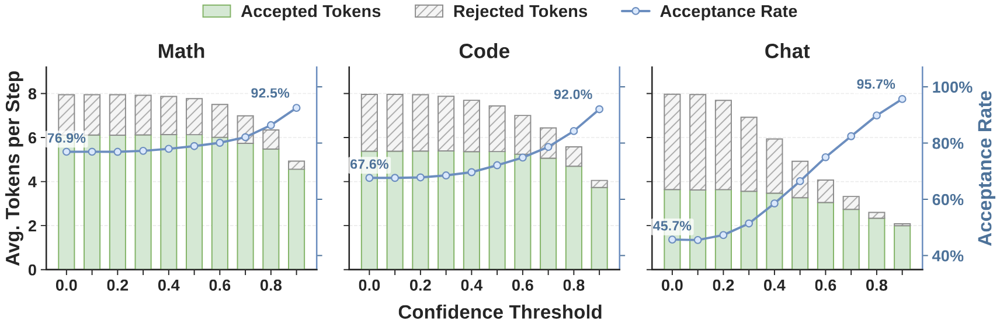
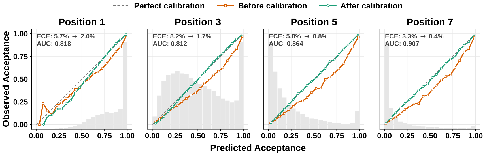
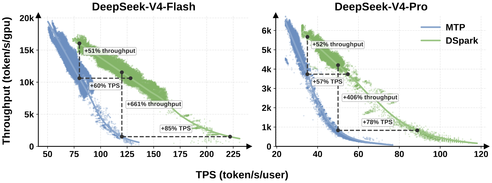
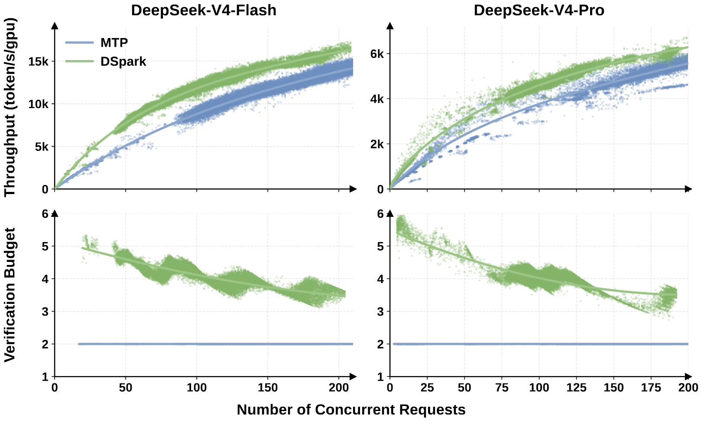

> [Xin Cheng](https://dblp.org/pid/96/4269-2.html) [+equal], [Xingkai Yu](https://dblp.org/pid/257/4432.html) [+equal], [Chenze Shao](https://dblp.org/pid/227/3123.html) [+equal], [Jiashi Li](https://dblp.org/pid/241/9364.html) [+equal], [Yunfan Xiong](https://dblp.org/pid/343/8320.html) [+equal], [Yi Qian](https://dblp.org/pid/84/4625.html), [Jiaqi Zhu](https://dblp.org/pid/23/5224.html), [Shirong Ma](https://dblp.org/pid/289/1472.html), [Xiaokang Zhang](https://dblp.org/pid/60/7487.html), [Jiasheng Ye](https://dblp.org/pid/298/0158.html), [Qinyu Chen](https://dblp.org/pid/91/5007.html), [Chengqi Deng](https://dblp.org/pid/255/4939.html), [Jiping Yu](https://dblp.org/pid/226/4099.html), [Damai Dai](https://dblp.org/pid/199/2097.html), [Zhengyan Zhang](https://dblp.org/pid/23/10446.html), [Yixuan Wei](https://dblp.org/pid/238/0096.html), [Yixuan Tan](https://dblp.org/pid/166/3526.html), [Wenkai Yang](https://dblp.org/pid/250/3934.html), [Runxin Xu](https://dblp.org/pid/267/5291.html), [Yu Wu](https://dblp.org/pid/22/0-24.html), [Zhean Xu](https://dblp.org/pid/355/2237.html), [Xuanyu Wang](https://dblp.org/pid/195/6495.html), [Muyang Chen](https://dblp.org/pid/335/2649.html), [Rui Tian](https://dblp.org/pid/15/9722.html), [Xiao Bi](https://dblp.org/pid/237/3479.html), [Zhewen Hao](https://dblp.org/pid/313/3144.html), [Shaoyuan Chen](https://dblp.org/pid/126/1575.html), [Huanqi Cao](https://dblp.org/pid/214/8159.html), [Wentao Zhang](https://dblp.org/pid/41/3249.html), [Anyi Xu](https://dblp.org/pid/319/6065.html), [Huishuai Zhang](https://dblp.org/pid/144/7537.html), [Dongyan Zhao](https://dblp.org/pid/63/1870.html), [Wenfeng Liang](https://dblp.org/pid/59/9456.html). 作者来自北京大学与 DeepSeek-AI. 首次提交至 arXiv 的日期为 2026 年 7 月 6 日; 当前版本为 v1. [DSpark: Confidence-Scheduled Speculative Decoding with Semi-Autoregressive Generation](https://arxiv.org/abs/2607.05147v1). <a href="/paper/dspark.pdf" target="_blank" rel="noopener noreferrer">原始 PDF</a>. [DOI](https://doi.org/10.48550/arXiv.2607.05147). [TeX 源文件](https://arxiv.org/src/2607.05147v1). [代码与检查点](https://github.com/deepseek-ai/DeepSpec). 精确的印刷版排版与参考文献以原始 PDF 为准.

## 摘要

推测解码将草稿生成与目标验证解耦, 从而加速大语言模型 (LLM) 推理. 近期的并行草稿模型可以在一次前向传播中高效提出较长的 token 序列, 但由于缺少 token 间依赖, 其接受率会迅速下降. 而且, 不加区分地验证这些扩展块, 会把宝贵的批处理容量浪费在拒绝风险较高的 token 上, 严重降低高并发服务系统的吞吐量. 我们提出 DSpark, 一个将高吞吐并行生成与自适应、负载感知验证统一起来的推测解码框架. 为保持草稿质量, DSpark 采用半自回归架构, 将并行骨干网络与轻量顺序模块结合, 以建模块内依赖并缓解后缀衰减. 为提高系统效率, DSpark 使用置信度调度验证, 根据估计的前缀存活概率和特定引擎的吞吐特征, 动态调整每个请求的验证长度. 在多个领域的离线基准上, DSpark 的接受长度明显优于当前最先进的自回归与并行草稿模型. 在真实用户流量下部署于 DeepSeek-V4 服务系统后, DSpark 成功减少了验证浪费. 在吞吐量相同的情况下, DSpark 相比既有生产基线 (MTP-1) 将每用户生成速度提高了 60%-85%. 更重要的是, 它避免了严格交互性约束下的吞吐量严重下降, 从而实现了以往无法达到的性能层级, 推进了服务系统的 Pareto 前沿. 为推动社区研究, 我们开源了 [DSpark 检查点](https://huggingface.co/deepseek-ai/DeepSeek-V4-Pro-DSpark/tree/main), 以及 [DeepSpec](https://github.com/deepseek-ai/DeepSpec), 一个由算法驱动的推测解码训练仓库.

## 1 引言

大语言模型 (LLM) 以自回归方式生成文本: 每生成一个新 token, 都要在此前所有 token 的条件下完成一次完整前向传播, 因此推理延迟与输出长度成正比. 由此造成的 GPU 利用率低下与用户感知等待时间过长, 是生产环境 LLM 服务的主要瓶颈, 对实时对话助手和多轮智能体工作流等延迟敏感场景尤其如此. 推测解码 [Lev23, Che23] 提供了一种有理论保证的解决方案: 轻量的*草稿模型*提出一组候选 token, 完整规模的*目标模型*通过拒绝采样在一次前向传播中验证整个块, 接受与目标分布一致的最长前缀, 并追加一个奖励 token. 验证可以并行进行, 且接受规则能够精确保留目标分布, 因此推测解码可以在完全不损失质量的情况下加速生成.

草稿模型的设计决定了草拟延迟与接受率之间的权衡. 早期草稿模型采用自回归方式 [Li24v, Che24w], 每个位置都以前面采样得到的 token 为条件. 但其草拟延迟随块大小线性增长, 迫使这些方法使用较短的块和较浅的架构. 为打破这一顺序瓶颈, 并行草稿模型 [Cai24d, Liu26b, Che26d] 成为一种颇具吸引力的替代方案: 所有草稿位置都在一次前向传播中产生, 草拟延迟几乎不受块大小影响. 从结构上看, 并行草稿模型因而能够高效生成长得多的草稿块.

不过, 要充分发挥大型并行草稿块的潜力, 仍有两个主要瓶颈, 分别涉及生成质量与系统效率. 第一, 并行草稿模型独立预测各个位置, 无法建模块内的 token 间依赖. 这种独立性会导致多模态冲突, 并使靠后位置的接受率迅速衰减 [Gu18, Hua22d]. 第二, 最优验证长度仍难以确定. 并行生成很容易产生长草稿块, 但不加区分地验证所有候选 token 会降低系统吞吐量, 在高并发工作负载下尤其明显 [Liu24ab, Hu26]. 理想的验证长度随两个维度变化. 从数据来看, 代码等结构化请求自然具有更高的接受率, 而开放式聊天的接受率较低 [Xia24j, Abr26]. 从系统来看, 轻负载下验证额外 token 几乎没有成本. 但在重负载下, 验证拒绝风险较高的 token 会占用本可服务其他活跃请求的宝贵批处理容量 [Liu24ac, Wu25u].

为解决这些瓶颈, 我们提出 **DSpark**, 一个将高吞吐并行生成与自适应、负载感知验证统一起来的推测解码框架. DSpark 的核心是用两种互补机制化解草稿生成与验证中的固有权衡.

- 第一, 为弥补 token 间依赖的缺失, DSpark 采用半自回归架构. 它让计算开销较大的草稿骨干网络保持完全并行, 只在末端添加一个轻量串行输出头来注入局部转移信息. 这种设计保留了并行模型的草拟速度, 同时显著缓解后缀衰减.
- 第二, 为解决系统层面的瓶颈, DSpark 使用置信度调度验证. 它将估计各位置前缀存活概率的置信度头与硬件感知调度器结合, 动态调整每个请求的验证长度. 该调度器利用实时引擎吞吐特征, 只把目标验证预算分配给预期回报最高的 token.

我们在受控离线基准与生产规模在线部署中全面评估了 DSpark. 在涵盖数学推理、代码生成和日常聊天的受控离线基准上, DSpark 始终优于强基线. 具体而言, 在 Qwen3-4B、8B 和 14B 目标模型 [Yan25g] 上, DSpark 相比自回归 Eagle3 [Li25] 将宏平均接受长度分别提高了 30.9%、26.7% 和 30.0%, 相比并行 DFlash [Che26d] 则分别提高了 16.3%、18.4% 和 18.3%. 除了总体指标, 我们对不同位置的细粒度分析还揭示了不同草稿模型的生成特征, 并以实验证明 DSpark 成功结合了并行模型在初始 token 上的高容量与自回归模型的后缀连贯性.

除离线评估外, 我们还将 DSpark 部署到 DeepSeek-V4 [Int26] 服务系统中, 在真实用户流量下评估其性能. 与此前的 MTP-1 生产基线 [Dee24a] 相比, DSpark 显著拓宽了系统的工作范围. 具体而言, 在总吞吐能力相同的情况下, 它始终将每用户生成速度提高 60%-85% (V4-Flash) 和 57%-78% (V4-Pro). 在严格的服务等级协议 (SLA) 下, 基线容量会严重下降, 例如 Flash 为 120 TPS、Pro 为 50 TPS; 此时 DSpark 通过减少验证开销维持了稳定吞吐量. DSpark 跨过了这一性能断崖, 实现了以往无法达到的严格交互性层级, 推进了 LLM 服务的 Pareto 前沿.

为促进开源社区的共同研究, 我们公开发布相关产物. 具体而言, 我们发布了适用于 DeepSeek-V4-Flash (preview) 和 DeepSeek-V4-Pro (preview) 的训练后 [DSpark 检查点](https://huggingface.co/deepseek-ai/DeepSeek-V4-Pro-DSpark/tree/main). 我们还开源了 [DeepSpec](https://github.com/deepseek-ai/DeepSpec), 一个由算法驱动的训练仓库, 其中包括 Eagle3、DFlash 和 DSpark. 这些产物可用于进一步研究高效 LLM 服务.

## 2 背景

### 2.1 推测解码

自回归语言模型每次前向传播只生成一个 token, 因而推理延迟与输出长度成正比. 推测解码 [Ge22, Lev23, Che23] 使用轻量草稿模型 $M_{d}$ 加速目标模型 $M_{t}$ 的推理. 在每个解码周期中, 草稿模型提出 $γ$ 个候选 token $x_{1},\ldots,x_{\gamma}$. 目标模型在一次前向传播中验证所有候选, 并接受与自身分布一致的最长前缀.

具体来说, 在每个草稿位置 $k$, 目标模型计算自己的分布 $p_{k}^{t}$, 并与草稿分布 $p_{k}^{d}$ 比较. token $x_{k}$ 以概率 $\min(1,\,p_{k}^{t}(x_{k})/p_{k}^{d}(x_{k}))$ 被接受. 验证从左向右进行: 如果位置 $k$ 首次遭到拒绝, 后面的所有 token $x_{k+1},\ldots,x_{\gamma}$ 都会被丢弃, 无论其质量如何.

令 $\tau$ 表示每个周期接受的 token 数, $T_{\mathrm{draft}}$ 和 $T_{\mathrm{verify}}$ 分别表示草拟与验证过程的实际耗时. 每个生成 token 的平均延迟为:

$$
L=\frac{T_{\mathrm{draft}}+T_{\mathrm{verify}}}{\tau}.
$$

因此, 要提高加速比, 有三种途径: 降低 $T_{\mathrm{draft}}$ (更快地草拟)、提高 $\tau$ (更好地草拟), 或降低有效的 $T_{\mathrm{verify}}$ (更聪明地验证).

### 2.2 草稿模型架构

草稿模型的设计决定了 $T_{\mathrm{draft}}$ 与 $\tau$ 之间的权衡. 现有方法分为两类.

**自回归草稿模型.** 自回归草稿模型按顺序生成草稿 token, 每个位置以前面采样得到的 token 为条件 [Dee24a, Li24g, Li24v, Li25, Zha25az]. 这种显式依赖带来了很强的建模能力, 但草拟成本随块大小线性增长: $T_{\mathrm{draft}}\propto\gamma$, 迫使自回归草稿模型使用较小的 $\gamma$ 和较浅的架构, 以保持较低的 $T_{\mathrm{draft}}$. 为弥补短块的不足, 基于树的验证 [Mia24a] 将候选扩展成树, 再通过树注意力验证多条路径, 但大量验证 token 会降低整体服务吞吐量.

**并行草稿模型.** 并行草稿模型在一次前向传播中产生全部 $γ$ 个草稿 token, 因此 $T_{\mathrm{draft}}$ 几乎不受块大小影响 [Cai24d, Che26d, Liu26b, Li25ae, San26]. 这样便可使用大得多的块 (如 $\gamma{=}16$), 而不会使延迟同比增加.

其中, DFlash [Che26d] 是当前最先进的并行草稿模型, 它以目标模型提取的丰富上下文特征 (KV 注入) 作为草稿模型的条件. 在预填充阶段, 一组目标层 $\{l_{1},\ldots,l_{m}\}$ 的隐藏状态经拼接后投影到草稿隐藏空间:

$$
H_{\mathrm{ctx}}=\mathrm{RMSNorm}\bigl(W_{c}\,[H^{(l_{1})};\,\ldots;\,H^{(l_{m})}]\bigr),
$$

其中, $W_{c}\in\mathbb{R}^{d\times md}$ 是共享投影. 这些上下文特征会注入每个草稿层: 沿键和值的序列维度, 将其与草稿块表示拼接:

$$
K_{i}=[W_{i}^{K}H_{\mathrm{ctx}};\;W_{i}^{K}H_{d}],\quad V_{i}=[W_{i}^{V}H_{\mathrm{ctx}};\;W_{i}^{V}H_{d}].
$$

块内所有位置都彼此进行双向注意, 同时关注注入的目标上下文.

草稿模型与目标模型共享嵌入层和语言建模头 (两者均冻结). 它以锚点 token [+1] 的嵌入和后续 $γ$ 个掩码 token 嵌入为输入, 在一次前向传播中产生所有掩码位置的 logits. 无论块大小如何, 草拟都只需一次前向传播, 因此在相同延迟预算下, DFlash 能够采用比自回归草稿模型更深的架构与更大的块.

## 3 架构

DSpark 的整体结构见[图 1](#figure-01). 由[公式 1](#equation-01) 可知, 推测解码的每 token 延迟为 $L=(T_{\mathrm{draft}}+T_{\mathrm{verify}})/\tau$. 自回归草稿模型能取得较高的 $\tau$, 但要付出 $T_{\mathrm{draft}}\propto\gamma$ 的代价; 并行草稿模型将 $T_{\mathrm{draft}}$ 压缩至一次传播, 却由于各位置独立预测而牺牲 $\tau$. 同时, 固定长度验证会把 $T_{\mathrm{verify}}$ 浪费在几乎必然被拒绝的低置信度后缀 token 上. DSpark 用两个互补组件解决这些局限:

- **半自回归生成** ([第 3.1 节](#section-3-1)). 并行骨干网络承担大部分草稿计算, 使 $T_{\mathrm{draft}}$ 几乎不受 $\gamma$ 影响. 轻量顺序块随后向草稿 token 中注入依赖, 以极小的额外延迟提高 $\tau$.
- **置信度调度验证** ([第 3.2 节](#section-3-2)). 置信度头估计各位置的接受概率, 硬件感知调度器利用这些估计剪除低置信度后缀 token, 减少不必要的验证计算.

**图 1.** **DSpark 架构与解码周期.** 给定提示 token ABC, 目标模型执行一步并生成下一个 token D, 作为草拟阶段的锚点. DSpark 以 D 为输入, 使用较重的并行骨干网络与轻量顺序头生成草稿 token EFGH 及相应的置信度分数 $c_{1}$-$c_{4}$. 随后, 硬件感知前缀调度器评估这些分数, 保留前缀 EFG 并丢弃低置信度 token H. 最后, 目标模型并行验证调度后的前缀. 如图所示, E 和 F 被接受, G 被拒绝, 于是模型生成修正后的 token G∗ 来完成本轮.

### 3.1 半自回归生成

并行草稿模型在一次前向传播中产生全部 $γ$ 个草稿 logits, 因此各预测无法以块内其他位置采样得到的 token 为条件. 当上下文存在多种合理续写时, 例如 "of course" 与 "no problem", 并行草稿模型可能生成 "of problem" 或 "no course" 等不连贯组合, 因为每个位置都对所有可能的前驱取边缘分布, 而不是以实际采样得到的前驱为条件 [Gu18, Hua22e]. 接受率因此沿块迅速衰减, 浪费草拟与验证计算. 我们由此采用一种**半自回归**结构, 将草稿生成分为两个阶段:

**并行阶段.** 并行骨干网络 (在我们的实现中为 DFlash [Che26d]) 对整个块执行一次前向传播, 产生隐藏状态 $h_{1},\ldots,h_{\gamma}$ 与基础 logits $U_{1},\ldots,U_{\gamma}$. 我们只对原始 DFlash 骨干网络做了一处小改动: 原方法输入一个锚点 token 与 $γ$ 个掩码 token, 并只预测掩码位置; 我们则把锚点本身作为第一个预测位置, 使 $γ$ 个输入 token (锚点 $+$ $γ{-}1$ 个掩码) 产生 $γ$ 个草稿 logits. 这样可以减少草稿计算, 同时保持近似的草稿质量.

**顺序阶段.** 顺序阶段用依赖前缀的转移偏置 $B_{k}(x_{0},x_{<k},x_{k})$ 补充基础 logits, 使每个草稿位置能够以块内此前采样的 token 为条件. 顺序阶段不定义全局归一化能量模型, 而是通过自回归分解得到因果块分布:

$$
P(X\mid x_{0})=\prod_{k=1}^{\gamma}p_{k}(x_{k}\mid x_{0},x_{<k}),\qquad p_{k}(v\mid x_{0},x_{<k})=\frac{\exp\!\left(U_{k}(v)+B_{k}(x_{0},x_{<k},v)\right)}{\sum_{u\in\mathcal{V}}\exp\!\left(U_{k}(u)+B_{k}(x_{0},x_{<k},u)\right)}.
$$

其中, $x_{0}$ 表示上一验证周期产生的锚点 token, $U_{k}$ 是并行骨干网络在位置 $k$ 产生的基础 logit 向量, $\mathcal{V}$ 是词表. 推理时, 顺序块按照 $p_{k}(\cdot\mid x_{0},x_{<k})$ 从左向右采样. 这一采样过程本质上是顺序的, 因而该块必须具有较小的计算开销 ($T_{\mathrm{sequential}}\ll T_{\mathrm{parallel}}$), 使整体草拟延迟仍由并行阶段主导. 下面介绍顺序块的两种实现.

- **Markov 头.** 最简单的实现把 $B_{k}$ 的依赖限制在紧邻的前一个 token, 将其化为一阶转移 $B(x_{k-1},x_{k})$. 原则上, 它是完整的 $V\times V$ 矩阵 $B$; 我们用低秩分解 $B=W_{1}W_{2}$ 来近似, 其中 $W_{1}\in\mathbb{R}^{V\times r}$, $W_{2}\in\mathbb{R}^{r\times V}$. 给定前一 token $x_{k-1}$, 位置 $k$ 的转移偏置为:

  

  $$
  B(x_{k-1},\,\cdot\,)=W_{1}[x_{k-1}]\,W_{2}\;\in\;\mathbb{R}^{V},
  $$

  其中, $W_{1}$ 充当嵌入查找表, $W_{2}$ 充当 logit 投影. 低秩分解 (默认 $r{=}256$) 使存储开销与单步计算量都很小, 即使词表很大, 顺序循环依然高效. 回到前面的例子: 位置 1 采样 "of" 后, Markov 头会在位置 2 提升 "course" 并抑制 "problem", 从而缓解跨模态冲突.
- **RNN 头.** Markov 头在一步以外没有记忆, 位置 $k$ 无法访问 $x_{k-1}$ 之前的 token. RNN 头维护循环状态 $s_{k}$, 在块内累积完整的前缀历史, 从而放宽了这一限制. 每一步中, 模块将当前状态 $s_{k-1}\in\mathbb{R}^{r}$、前一 token 的嵌入 $W_{1}[x_{k-1}]\in\mathbb{R}^{r}$ 与骨干网络隐藏状态 $h_{k}\in\mathbb{R}^{d}$ 拼接为输入向量 $z_{k}=[s_{k-1};\,W_{1}[x_{k-1}];\,h_{k}]\in\mathbb{R}^{2r+d}$, 再执行一次门控更新:

  

  $$
  \begin{aligned}
  s_{k}=\sigma(W_{g}\,z_{k}) & \odot s_{k-1}+\bigl(1-\sigma(W_{g}\,z_{k})\bigr)\odot\tanh(W_{c}\,z_{k}), \\
  & B_{k}(x_{<k},\,\cdot\,)=W_{2}^{\top}\,\tanh(W_{o}\,z_{k}),
  \end{aligned}
  $$

  其中, $W_{g},W_{c},W_{o}\in\mathbb{R}^{r\times(2r+d)}$ 由同一个线性投影联合参数化, 再拆分为门、候选与输出分量. 状态 $s_{0}$ 初始化为零.

### 3.2 置信度调度验证

半自回归架构使 DSpark 能够高效生成大型草稿块. 但生成更多草稿 token 并不会自动带来更高的端到端加速比. 不加区分地验证完整草稿块, 反而可能降低系统的整体吞吐量, 在高并发场景下尤其如此 [Liu24ab, Hu26].

这一性能瓶颈源于两个相互作用的因素. 第一, 从数据来看, 草稿接受率在不同领域间本就存在差异: 代码等结构化文本自然具有较高的接受率, 而开放式聊天的接受率明显更低 [Xia24j, Abr26]. 第二, 从系统来看, 验证额外 token 的实际成本严格取决于引擎负载. 系统负载较轻时, 即使额外验证遭到拒绝, 惩罚也很小. 但在高并发部署中, 每次不必要的验证都会占用目标模型的批处理容量, 而这些容量本可用于其他活跃请求 [Liu24ac, Wu25u].

因此, 要充分发挥大型草稿块的潜力, 就需要一种统一机制, 只把目标模型的计算分配给预期回报为正的 token. DSpark 将预测前缀存活概率的**置信度头** ([第 3.2.1 节](#section-3-2-1)) 与**硬件感知前缀调度器** ([第 3.2.2 节](#section-3-2-2)) 结合, 后者根据当前系统负载动态确定最优验证长度.

#### 3.2.1 置信度头

受 [Hua24f, Wan26c] 启发, 置信度头为每个草稿位置 $k$ 输出一个标量 $c_{k}\in(0,1)$. 关键在于, $c_{k}$ 建模的是条件概率: 在块内此前所有 token 均被接受的条件下, 位置 $k$ 的草稿 token 通过目标验证的概率. 该架构由一个轻量线性投影与随后的 sigmoid 函数组成:

$$
c_{k}=\sigma\bigl(w^{\top}[h_{k};\,W_{1}[x_{k-1}]]\bigr),
$$

其中, $h_{k}$ 是骨干网络的隐藏状态, $W_{1}[x_{k-1}]$ 是前一个草稿 token 的 Markov 嵌入. 我们使用解析得到的单步接受率 $c_{k}^{*}$ 监督 $c_{k}$. 该接受率由草稿分布 $p_{k}^{d}$ 与目标分布 $p_{k}^{t}$ 之间的总变差距离决定:

$$
c_{k}^{*}=1-\tfrac{1}{2}\|p_{k}^{d}-p_{k}^{t}\|_{1}.
$$

**事后校准.** 基于阈值的验证启发式方法 [Hua24f, Li24v, Zha26c] 只要求置信度分数能正确排列草稿 token 的质量, 而我们的硬件感知调度方法 (详见[第 3.2.2 节](#section-3-2-2)) 必须使用累积接受概率的绝对大小来精确计算预期接受长度 $\tau$. 神经网络给出的置信度估计往往过度自信 [Guo17a, Ova19], 直接使用原始置信度分数会扭曲吞吐量估计, 导致次优调度.

为此, 我们提出**顺序温度缩放 (Sequential Temperature Scaling, STS)**. 每个 $c_{i}$ 都建模条件概率, 因此根据链式法则, 草稿前缀被接受的联合概率可分解为累积乘积 $\prod_{i\leqslant k}c_{i}$. STS 使用留出的验证集, 从左向右依次校准这一联合概率. 具体来说, 在每个位置 $k\in\{1,\dots,\gamma\}$, 我们执行简单的一维网格搜索, 寻找使累积乘积的预期校准误差 (Expected Calibration Error, ECE) [Nae15] 最小的温度标量, 同时固定此前所有位置已经校准的分数. 温度缩放是保序变换: 它修正预测概率以匹配经验接受率, 同时不打乱置信度头学得的草稿 token 相对排序.

#### 3.2.2 硬件感知前缀调度器

**算法 1: 硬件感知前缀调度器.**

- **要求:** 活跃请求 $r\in\{1,\dots,R\}$; 每个请求的置信度序列 $c_{r,1},\dots,c_{r,\gamma}$; 预先分析的步速率曲线 $\mathrm{SPS}(B)$.
- **保证:** 选出的各请求前缀长度 $\ell_{1}^{*},\dots,\ell_{R}^{*}$.
- **对于** $r=1$ **至** $R$:
  - 计算前缀存活概率: 对 $j=1,\dots,\gamma$, 令 $a_{r,j}\gets\prod_{i\leq j}c_{r,i}$.
- 构造候选空间 $\mathcal{E}\gets\{(r,j)\mid a_{r,j}>0\}$, 并按 $a_{r,j}$ 降序排列.
- 初始化状态: 对所有 $r$, 令 $\ell_{r}\gets0$; 批大小 $B\gets R$; 预期接受数 $\tau^{*}\gets R$.
- 初始化跟踪变量: $\Theta_{\mathrm{best}}\gets R\cdot\mathrm{SPS}(R)$; 对所有 $r$, 令选定长度 $\ell_{r}^{*}\gets0$.
- **依次处理**排序后的每个 $(r,j)\in\mathcal{E}$:
  - $\ell_{r}\gets j$; $B\gets B+1$; $\tau^{*}\gets\tau^{*}+a_{r,j}$.
  - 当前吞吐量 $\Theta\gets\tau^{*}\cdot\mathrm{SPS}(B)$.
  - **如果** $\Theta>\Theta_{\mathrm{best}}$:
    - $\Theta_{\mathrm{best}}\gets\Theta$; 更新选定长度 $\ell_{r}^{*}\gets\ell_{r}$.
  - **否则:**
    - **中止.**
- **返回:** 达到 $\Theta_{\mathrm{best}}$ 的 $(\ell_{1}^{*},\dots,\ell_{R}^{*})$.

先前方法 [Hua24f, Li24v] 通常对置信度分数采用静态阈值, 以确定验证长度. 在孤立的单请求假设下, 这种方法很有效; 但在高并发生产系统中, 验证草稿 token 的收益很大程度上取决于当前系统负载, 静态阈值可能并非最优.

为此, 我们将验证长度选择表述为全局吞吐量最大化问题 ([算法 1](#algorithm-01)). 考虑一批 $R$ 个活跃请求. 对请求 $r$, 令 $c_{r,1},\dots,c_{r,\gamma}$ 表示各位置的置信度估计, $\ell_{r}\in\{0,\dots,\gamma\}$ 表示调度后的验证长度. 推测解码只能动态接受草稿 token 构成的连续前缀, 因此位置 $j$ 的 token 存活概率为累积乘积 $a_{r,j}=\prod_{i\leqslant j}c_{r,i}$.

在一次验证步骤中, 发送给目标模型的总批大小 (以 token 计) 为 $B=\sum_{r=1}^{R}(1+\ell_{r})$, 成功接受的 token 期望数为 $\tau=\sum_{r=1}^{R}\bigl(1+\sum_{j=1}^{\ell_{r}}a_{r,j}\bigr)$. 在一项简化假设下 [+2], 令 $\mathrm{SPS}(B)$ 表示给定前向传播批大小 $B$ 时, 引擎以每秒步数衡量的吞吐量. 该容量曲线只在引擎初始化时分析一次, 并以轻量成本表存储. 随后, 调度器通过动态选择验证长度 $\ell_{1},\dots,\ell_{R}$, 最大化预期的全系统 token 吞吐量 $\Theta=\tau\cdot\mathrm{SPS}(B)$.

寻找 $\Theta$ 的全局最大值看似需要组合搜索, 但目标函数的结构允许采用高效的贪心解法. 因为 $a_{r,j}$ 随 $j$ 单调不增 (即 $a_{r,j}\leq a_{r,j-1}$), 所以将请求 $r$ 的验证长度从 $j-1$ 扩展到 $j$ 时, 预期接受 token 数的边际增益恰为 $a_{r,j}$. 这种单调性保证, 按 $a_{r,j}$ 对候选 token 做全局排序时, 自然会遵循块内的前缀依赖. 因此, 如果总验证批大小 $B$ 固定, 最优分配 $\{\ell_{r}\}$ 可通过从所有 $\{a_{r,j}\}$ 构成的全局池中贪心选择存活概率最高的草稿 token 得到.

根据这一点, 可以沿贪心接纳路径求取最优值. 我们首先按存活概率降序排列所有有效的前缀扩展. 为动态确定最优目标批大小 $B$, 我们依次从排序后的池中接纳 token, 并查询成本表来更新预期吞吐量 $\Theta$.

无损推测解码严格要求*非预见性质*: 接纳决策不得依赖未来的候选 token [Lev23, Che23]. 由于置信度头使用前一个已采样 token 的 Markov 特征, 计算下一个存活概率 $a_{r,k+1}$ 明确需要已经实例化的候选 $x_{r,k}$. 因此, 回溯式全局搜索会无意间把 $x_{r,k}$ 泄漏到第 $k$ 步的接纳决策中, 引入选择偏差 (我们在[第 8 节](#section-8)给出一个具体反例来说明这一理论违例).

为保证严格的因果性, 调度器 ([算法 1](#algorithm-01)) 采用提前停止机制. 一旦吞吐量下降 ($\Theta\leq\Theta_{\mathrm{best}}$), 贪心搜索便立即终止, 因此截断决策只依赖于截至该步处理过的前缀. 这样可将接纳事件与未来 token 隔离, 保证精确恢复目标分布. 需要说明的是, 当且仅当目标函数 $\Theta$ 单峰时, 这种逐步提前停止才能得到全局最大吞吐量, 这隐含假设硬件容量曲线平滑衰减. 我们在[第 5.2 节](#section-5-2)讨论真实世界中 SPS 特征不平滑、系统流水线异步时所需的工程调整.

### 3.3 训练

训练期间, 我们从每个目标序列中随机采样多个锚点位置, 组成 $γ$-token 块作为训练数据. 整个训练过程中, 目标模型保持冻结; 草稿模型共享并冻结目标模型的嵌入层与语言建模头, 只更新草稿骨干网络、顺序块和置信度头.

训练目标由三项组成: 交叉熵损失 $\mathcal{L}_{\mathrm{ce}}$、分布匹配损失 $\mathcal{L}_{\mathrm{tv}}$ 与置信度损失 $\mathcal{L}_{\mathrm{conf}}$. 三项都使用 $w_{k}=\exp(-(k{-}1)/\gamma)$ [Che26d] 按位置加权, 从而更重视前缀验证下对预期接受长度贡献更大的块前部位置. 交叉熵损失 $\mathcal{L}_{\mathrm{ce}}$ 训练草稿模型预测正确的下一个 token:

$$
\mathcal{L}_{\mathrm{ce}}=-\sum_{k=1}^{\gamma}w_{k}\log p^{d}_{k}(x_{k}^{*}),
$$

其中, $x_{k}^{*}$ 是真值 token, $p^{d}_{k}$ 是草稿分布. 分布匹配损失 $\mathcal{L}_{\mathrm{tv}}$ 惩罚草稿分布与目标分布之间的总变差距离:

$$
\mathcal{L}_{\mathrm{tv}}=\sum_{k=1}^{\gamma}w_{k}\|p_{k}^{d}-p_{k}^{t}\|_{1}.
$$

总变差距离是接受率的直接代理: 单步接受概率等于 $1-\frac{1}{2}\|p^{d}-p^{t}\|_{1}$ [Lev23], 因而最小化 $\mathcal{L}_{\mathrm{tv}}$ 会直接最大化预期接受率.

置信度损失 $\mathcal{L}_{\mathrm{conf}}$ 是二元交叉熵, 用于训练置信度头预测[公式 8](#equation-08) 中的软接受标签 $c_{k}^{*}$:

$$
\mathcal{L}_{\mathrm{conf}}=-\sum_{k=1}^{\gamma}w_{k}\bigl[c_{k}^{*}\log c_{k}+(1-c_{k}^{*})\log(1-c_{k})\bigr].
$$

总目标是三项的加权组合 (默认权重为 $\alpha_{\mathrm{ce}}=0.1$、$\alpha_{\mathrm{tv}}=0.9$、$\alpha_{\mathrm{conf}}=1.0$):

$$
\mathcal{L}=\alpha_{\mathrm{ce}}\,\mathcal{L}_{\mathrm{ce}}+\alpha_{\mathrm{tv}}\,\mathcal{L}_{\mathrm{tv}}+\alpha_{\mathrm{conf}}\,\mathcal{L}_{\mathrm{conf}}
$$

## 4 实验

本节使用离线基准验证 DSpark 的草稿质量, 并在[第 5 节](#section-5)报告置信度调度器在在线生产流量下的效果. [第 4.1 节](#section-4-1)介绍实验设置, [第 4.2 节](#section-4-2)给出主要结果, [第 4.3 节](#section-4-3)则包含进一步分析.

### 4.1 实验设置

**目标模型与草稿模型.** 我们在四个不同规模和模型家族的目标模型上评估 DSpark: Qwen3-{4B, 8B, 14B} [Yan25g] 和 Gemma4-12B [Gem26]. 草稿模型方面, 我们将 DSpark 与两个代表性模型比较: 当前最先进的并行草稿模型 DFlash [Che26d], 以及基于训练时测试 (Training-Time Test, TTT) 的自回归草稿模型 Eagle3 [Li25]. 为进行严格且公平的比较, 我们在相同的[训练框架](https://github.com/deepseek-ai/DeepSpec)中用相同数据重新训练所有草稿模型 [+3]. 我们将 Eagle3 的 TTT 时域 (7) 与 DFlash 和 DSpark 使用的块大小 (7) 对齐, 并为所有草稿模型使用相同的目标模型特征层. 草稿模型层数方面, Eagle3 设为 1 层, DSpark 与 DFlash 设为 5 层 [Che26d]. 除非另有说明, DSpark 均指 Markov 头变体; [第 4.3.2 节](#section-4-3-2)研究 RNN 头变体.

**训练数据.** 我们使用 [Open-PerfectBlend](https://huggingface.co/datasets/mlabonne/open-perfectblend), 它是由 130 万个样本组成的 PerfectBlend [Xu24k] 开源版本. 这是一个通用指令数据集, 包含聊天 (17.6%)、数学 (39.4%)、代码 (38.9%) 与指令遵循数据 (4.1%). 我们只使用 Open-PerfectBlend 的提示; 回答由各目标模型按照推荐采样参数重新生成. 每个草稿模型训练 10 个 epoch, 以确保完全收敛. 数据生成与评估均采用非思考模式.

**评估方案.** 我们在三个领域评估不同算法的性能:

- **数学推理**, 包括 GSM8K [Cob21]、MATH500 [Lig23a] 和 AIME25 [Zha25ba].
- **代码生成**, 包括 MBPP [Aus21b]、HumanEval [Che21h] 和 Live-CodeBench [Jai25a].
- **日常聊天**, 包括 MT-Bench [Sto23e]、Alpaca [Tao23] 和 Arena-Hard [Li24w, Li24j].

所有基准均使用标准推测解码 [Lev23, Che23], 采样温度设为 $1.0$. 我们报告每个解码轮次的接受长度 ($\tau$) [+4]. 所有草稿模型均使用链式草拟.

**表 1.** **推测解码的主要结果.** 我们报告不同目标模型和领域中每个解码轮次的接受长度 ($\tau$), 数值越高越好. **粗体**表示最佳结果.

### 4.2 实验结果

为排除系统层面调度策略的影响, 单独考察草稿的原始质量, 离线评估会禁用置信度调度器, 要求所有草稿模型提出固定大小的 token 块. 主要结果以每轮平均接受长度 ($\tau$) 衡量, 见[表 1](#table-01).

在所有受评目标模型和基准领域中, DSpark 始终优于自回归基线 (Eagle3) 与并行基线 (DFlash). 具体而言, 在 Qwen3-4B、8B 和 14B 模型上, DSpark 相比 Eagle3 将宏平均接受长度分别提高了 30.9%、26.7% 和 30.0%. 与 DFlash 相比, DSpark 在三个规模上的相对提升分别为 16.3%、18.4% 和 18.3%. Gemma4-12B 目标模型上同样稳定的性能提升表明, 这一优势可以推广到不同模型家族.

除了平均提升外, [表 1](#table-01) 还显示出明显的领域效应: 结构化任务的接受长度自然更高 (例如 Qwen3-4B 在数学和代码任务上分别为 5.57 与 5.12), 而开放式聊天较低 (3.49). 数据可预测性的这种内在差异意味着, 静态验证长度经常会把计算浪费在很可能被拒绝的末尾 token 上. 这直接引出了置信度调度验证: 根据预期接受率动态剪除草稿块.

### 4.3 实验分析

#### 4.3.1 为什么并行生成能优于自回归生成?

**图 2.** **不同位置的条件接受率.** 我们使用 Qwen3-4B 目标模型, 报告每个草稿位置的经验条件接受率, 并对各领域内的基准取平均值. 与标准前缀存活率不同, 该指标排除先前拒绝的惩罚, 单独衡量位置 $k$ 的基础预测质量. 可以看到, 自回归草稿模型 (Eagle3) 保持稳定或呈上升趋势, 而并行草稿模型 (DFlash) 出现后缀衰减.

[表 1](#table-01) 中有一个反直觉的现象: 并行草稿模型 (DFlash) 与半自回归草稿模型 (DSpark) 得到的接受长度往往长于完全自回归草稿模型 (Eagle3). 这一发现与通常的预期相反, 即逐步自回归生成会比并行模型产生质量更高的序列 [Ren20, Isr26, Zhe25b].

为分析这种现象, 我们不只考察宏观的接受长度. 使用 Qwen3-4B 目标模型和[第 4.1 节](#section-4-1)所述基准集, 我们引入在实际推测解码 rollout 期间跟踪的*不同位置条件接受率*. 具体而言, 对给定草稿位置 $k$, 评估分母只统计目标模型成功验证并接受位置 $1$ 至 $k-1$ 的所有先前草稿 token 的样本. 随后, 该指标计算在这些有效样本中, 位置 $k$ 的 token 也被接受的比例. 这样, 位置 $k$ 的评估便不会因先前的前缀错误受到惩罚, 得以呈现每个具体步骤的内在预测质量. [图 2](#figure-02) 列出了这些测量结果, 展示了不同架构间清晰的行为差异.

**位置 1 的容量优势.** 在第一个草稿位置, 两种架构都只根据目标上下文预测下一个 token. 此处的性能差异完全源自架构容量: Eagle3 等自回归模型受 $O(\gamma)$ 延迟所限, 只能使用浅层网络; 延迟为 $O(1)$ 的并行草稿模型则可使用深得多的网络. 这一结构差距使位置 1 的准确率有明显差别, DFlash 的初始值显著高于 Eagle3 (例如数学任务上为 0.88 对 0.81, 聊天任务上为 0.72 对 0.53). 推测解码是严格的前缀匹配存活过程, 因而第一个 token 的影响最大: 一旦在此拒绝, 整个块立即失效. 由此, 虽然后面位置的接受率迅速衰减, 初始容量优势仍会对最终接受长度产生格外显著的作用, 这解释了并行草稿模型为何最终在整体上优于自回归模型.

**后部位置的独立性局限.** 考察曲线尾部 (位置 2 至 7) 可以看到独立并行生成的固有局限. 随着前面的 token 确定一条具体的语义路径, 后续 token 自然变得更可预测. Eagle3 等自回归模型能够有效利用这种条件确定性, 在块的后部维持甚至提高条件接受率 (例如聊天任务上由 0.53 升至 0.74). 相比之下, DFlash 的接受率迅速衰减, 代码任务上从 0.87 降至 0.78, 聊天任务上从 0.72 降至 0.63. 每个并行位置都对所有可能的先前 token 取边缘分布, 而非以准确采样得到的前缀为条件, 因此模型经常提出不一致的后缀组合, 这种现象称为多模态冲突 [Gu18, Ste18].

**用半自回归缓解后缀衰减.** 上述分析给出了清晰的架构目标: 用并行骨干网络的高容量处理初始 token, 并以自回归模型的依赖建模能力处理后续 token. 这直接引出了 DSpark 的半自回归设计. 如[图 2](#figure-02) 所示, DSpark 继承了深层并行草稿模型的高初始接受率 (例如数学任务的初始值为 0.93). 同时, 轻量顺序头缓解了并行生成典型的接受率快速衰减. DSpark 由此在整个草稿块中保持较高且稳定的条件接受率.

#### 4.3.2 少量自回归便有很大作用

根据[第 4.3.1 节](#section-4-3-1)的分析, 我们沿两个维度探索 DSpark 的架构设计空间: 草稿模型深度 (transformer 层数) 与候选长度 (块大小 $\gamma$). 除非另有说明, 本节所有实验均使用 Qwen3-4B 作为目标模型, 并遵循[第 4.1 节](#section-4-1)所述评估方案.

**图 3.** **草稿模型深度的影响.** 固定候选长度时, DSpark 的性能随草稿模型层数增加而提高. 值得注意的是, 仅有 2 层的浅层 DSpark 优于 5 层的 DFlash 基线, 说明顺序建模具有很高的参数效率.

**图 4.** **候选长度与延迟开销的影响.** 在各种块大小下, DSpark 始终优于 DFlash (左侧三个面板). 最右侧面板表明, 顺序头只会在服务期间引入很小的延迟开销.

**草稿模型深度.** 增加 transformer 层数会自然提高草稿模型的预测容量. 为单独考察这一影响, 我们将块大小固定为 7, 把 DSpark 的层数从 1 变至 5, 并与 5 层 DFlash 基线比较. [图 3](#figure-03) 汇总了数学、代码和聊天领域的接受长度. 与预期一致, DSpark 的性能随深度单调提高, 从一层增加至两层时的边际增益最大. 值得注意的是, 2 层 DSpark 在所有领域中都优于 5 层 DFlash 基线. 这说明, 通过轻量顺序头注入局部自回归具有很好的准确率-参数权衡, 能够取得比单纯堆叠更深并行层更好的序列连贯性.

**候选长度.** 接下来, 我们将草稿模型深度固定为 5 层, 并在 $\{4,8,12,16\}$ 范围内改变草稿长度 (候选长度 $\gamma$ 加一个锚点 token), 以评估较长草稿块上的性能. 对 DSpark, 我们同时评估默认的 Markov 头与 RNN 头. [图 4](#figure-04) 前三个面板表明, DSpark 在每种候选长度下都优于 DFlash. 更重要的是, 性能差距随 $\gamma$ 增大而稳步扩大. 纯并行生成 (DFlash) 会出现接受率快速衰减 ([图 2](#figure-02)), 因此在长块上的边际收益下降. DSpark 缓解了这种衰减, 相比 DFlash 的相对增益因而增大. 例如, 当 $\gamma=7$ 时, DSpark 在数学、代码和聊天任务上分别将接受长度提高 16%、15% 和 18%; 当 $\gamma=15$ 时, 这些增益分别扩大到 30%、26% 和 22%. RNN 头相比 Markov 头只带来很小的额外收益, 主要出现在候选长度较长时. 考虑到更高的实现复杂度和较差的部署特性, 我们默认使用 Markov 头.

**延迟开销.** 我们量化了 DSpark 顺序生成循环的开销. [图 4](#figure-04) 最右侧面板报告了批大小为 128 时的单轮引擎延迟, 其中包括一次目标验证传播、并行草稿块前向传播与串行采样循环. 为避免序列长度造成偏差, 报告的延迟是不同上下文长度 ($\{512,1024,2048,4096\}\ \mathrm{tokens}$) 下的算术平均值. 在这一批大小下, 目标模型主导验证计算时间, 因此顺序块的延迟开销可以忽略. 所以, 即使接受长度最多提高 30%, 将草稿长度从 4 增至 16 相比 DFlash 基线也只会给完整轮次的延迟增加 0.2% 至 1.3%.

#### 4.3.3 验证要更聪明, 而不是更长: 置信度头的作用

尽管 DSpark 在长草稿块上保持较高的接受率, 验证整个候选仍然效率低下 [Hua24f, Hu26]. 由于[第 4.2 节](#section-4-2)提到的固有领域差异, 开放式聊天中的末尾 token 仍有很高的拒绝风险, 盲目验证会浪费目标模型的计算. 为评估置信度头能否有效剪除这些没有前景的后缀, 我们使用 Qwen3-4B 进行离线阈值扫描. 此处单独验证估计器, 将硬件感知前缀调度器 ([第 3.2.2 节](#section-3-2-2)) 留到[第 5 节](#section-5)的实际生产评估中考察.

**图 5.** **置信度阈值扫描.** 阈值为 0 对应标准的固定长度验证. 随着阈值升高, 总接受率稳步上升, 因为置信度头有效剪除了最终会被拒绝的 token (阴影条).

**图 6.** **Alpaca 数据集上的可靠性图.** 原始置信度估计器具有很强的区分能力, 但其预测本身过度自信. 采用事后校准有助于让前缀存活概率与经验接受率对齐. 背景的阴影直方图表示不同置信度区间中的样本数频率分布.

**诊断: 静态阈值扫描.** [图 5](#figure-05) 绘出了不同置信度阈值下的平均每步 token 数 (柱状图) 与总接受率 (折线). 随着阈值升高, 接受率稳步上升, 因为估计器过滤了最终会被拒绝的 token (阴影条). 这说明置信度头能够识别价值较低的后缀 token; 在 token 分布熵较高、固定长度验证效率受限的聊天工作负载上, 剪除现象最明显. 在 Chat 子图中, 提高阈值明显减少了被拒绝的 token, 使接受率从 45.7% 升至 95.7%. 相比之下, 结构化任务 (Math 和 Code) 的剪除较少, 保留的草稿 token 更多, 接受率分别从 76.9% 升至 92.5%、从 67.6% 升至 92.0%.

**从静态阈值到校准调度.** 静态阈值有助于诊断, 但在动态服务环境中并非最优, 因为它不考虑系统负载: 低并发时验证低置信度 token 的机会成本很小, 高并发时则会浪费宝贵的批处理容量. 这种负载依赖性引出了硬件感知前缀调度器. 按[第 3.2 节](#section-3-2)的表述, 要最大化系统层面的吞吐量, 置信度模型既要有很强的预测区分能力, 也要精确校准, 才能准确估计累积存活概率. 可靠性图 ([图 6](#figure-06))表明, 原始模型虽然有很强的区分能力 (ROC-AUC [Han82] 为 0.81 至 0.90), 却过度自信 (ECE 为 3%-8%). 应用事后 STS ([第 3.2.1 节](#section-3-2-1))可缓解这种过度自信, 将平均 ECE 降至 $\sim$1%, 得到可靠的存活率估计.

## 5 DSpark 的真实部署

[第 4 节](#section-4)确认了 DSpark 在离线基准上的算法收益, 但将其与 DeepSeek-V4 [Int26] 等大规模模型一同部署, 会在训练和推理两方面带来额外的系统级难题. 本节介绍 DSpark 的端到端生产流水线. 我们详细说明可扩展的训练机制、部署硬件感知前缀调度器 ([第 3.2.2 节](#section-3-2-2)) 所需的系统级优化, 以及该框架在真实用户流量下的端到端性能.

### 5.1 可扩展且灵活的训练

DSpark 草稿模型与 DeepSeek-V4-Flash 和 DeepSeek-V4-Pro 的 preview 版本 [Int26] 共同部署. 并行骨干网络由三个采用 mHC [Xie26] 与大小为 128 的滑动窗口注意力的 MoE 层 [Dai24] 组成. 我们将最大块大小设为 $\gamma=5$, 并使用 Markov 头进行顺序建模. 置信度头与草稿模型一同进行端到端训练, 随后使用 STS 校准, 从而提供可靠的调度信号.

训练草稿模型需要目标模型的输出分布作为监督. 在完整文档上下文上评估两个模型, 会产生很大的内存占用与工作进程间通信开销. 为解决这些瓶颈, 我们在内部训练框架 (HAI-LLM) [+5] 中实现了两项系统级优化:

- **隐藏状态通信.** 在并行工作进程间传输目标模型的完整词表 logits ($V\approx 10^{5}$) 会造成严重的带宽瓶颈. 我们转而临时缓存目标模型前向传播的激活值, 并只传输紧邻语言建模 (LM) 头之前的隐藏状态. 随后, LM 头投影只在草稿模型的工作进程上为采样的目标位置局部执行. 这将单 token 通信复杂度降至 $O(d)$, 其中 $d$ 是隐藏维度.
- **锚点限定的序列打包.** 为使草稿模型的计算成本不受目标模型上下文长度影响, 我们从训练序列中采样固定数量的草稿锚点, 并将这些孤立预测块打包为密集训练批次. 我们使用 token 级注意力索引而非标准二维掩码来管理打包. 这样既能在多个独立序列与锚点间维持精确的因果掩码, 又避免了标准填充造成的计算与内存开销.

### 5.2 硬件感知前缀调度器的实际应用

在[第 3.2.2 节](#section-3-2-2)中, [算法 1](#algorithm-01)给出了理论上正确且无损的调度机制. 但将该算法直接部署到生产环境中, 会与实际基础设施产生两个根本冲突. 第一, 算法假设容量曲线平滑且单峰, 而实际硬件容量 $\mathrm{SPS}(B)$ 本身是离散的, 呈锯齿状、阶梯式下降 [Yan20e]. 第二, 算法需要逐步调度动态数量的草稿 token, 这与连续 CUDA 图重放 [Spe23a] 和零开销调度 (Zero-Overhead Scheduling, ZOS) [Zhu25c, Zhe24] 相冲突.

为兼顾系统兼容性、吞吐量与算法正确性, 我们将调度器改为异步运行. ZOS 要求在当前步骤完成前获知下一步的批大小, 因而同步调度必然会让 GPU 流水线停顿. 我们转而使用两个步骤之前的置信度头输出来近似即将使用的验证容量. 从机制上看, 当前步骤中的候选 token 仍严格按照实际的最新累积置信度分数排序; 两步之前的历史预测只用于确定动态截断长度 (即批容量上限 $K$). 接纳过程由此成为动态 top-$K$ 选择. 近似容量 $K$ 虽然引入了轻微的时间偏移, 选择机制本质上仍保持排序: 最有信心的草稿 token 总会优先得到验证. 这种调整完全隐藏了调度延迟, 并与 ZOS 顺畅集成.

在这一异步流水线之上, 我们进一步解决硬件利用率瓶颈. 为防止调度器陷入锯齿状 SPS 断崖造成的局部最小值, 我们移除提前停止的 `break`, 从而允许无约束的全局搜索. 通常, 这种回溯式搜索会泄漏未来 token 的信息, 违背无损保证 ([第 8 节](#section-8)). 但 ZOS 驱动的调整自然避免了这个问题. 无约束搜索只评估两步之前的历史预测, 接纳决策因此与当前 token $x_{r,k}$ 的具体取值隔离. 截断长度本来就只依赖两步之前已有的信息. 所以, 异步设计形成了一道因果屏障, 既在硬件容量断崖之间最大化物理吞吐量, 又精确保留目标分布.

### 5.3 高吞吐低延迟推理

解码期间, 生产服务系统必须同时优化两个相互竞争的目标: 单请求延迟与总吞吐量 [Kwo23, Zho24, Zha25c]. 前者决定单个用户的服务质量, 对基于智能体的工作负载 [Tiw26] 日益重要; 后者决定系统可同时服务的用户总数. 推测解码不可避免地会产生无效的验证计算, 因而必须在这一权衡中取舍, 用额外系统计算换取更快的单请求生成.

但在我们的部署环境中, 每步处理的请求数经常受资源上限 (如每个请求固定的 KV-cache 容量) 与可用用户流量池 (如 RL 长尾负载) 限制. 因此, 有效批大小长期远低于 GPU 计算饱和阈值. 在这种情况下, 传统权衡得到简化: 给定固定并发上限时, 最大化每 GPU 的总 token 吞吐量与最大化每用户生成速度 (*tok/s/user*) 不再相互竞争, 而是高度相关.

为达到最大吞吐量, 异步调度器 ([第 5.2 节](#section-5-2)) 会主动将闲置计算资源分配给最有前景的草稿 token. 但这种动态路由会在物理执行层带来严重难题: 推理框架必须在同一批次内高效支持长度可变的查询. 标准解码 kernel 针对固定查询长度做了大量优化; 如果直接处理长度可变的验证前缀, 填充和工作负载分布不均会严重降低 GPU 利用率. 我们将物理执行与逻辑序列跟踪解耦, 从而解决这一问题. 在计算 kernel 中, 不同请求的全部 token 会被展平, 并作为独立元素以相同方式处理. 随后, 通过集成到稀疏注意力实现中的标记张量, 严格传递复杂的序列内依赖. 对于 DeepSeek-V4 架构, 只需修改 index-attention 和 compress kernel 即可支持这种变长路由, 动态调度器因而能够顺畅运行, 不会引入底层执行开销.

### 5.4 真实用户流量下的性能

**图 7.** **吞吐量与 TPS 的关系.** 真实流量下, 总输出 token 吞吐量与单请求生成速度 (tok/s/user) 的关系. 在生产部署所测流量与引擎配置下, DSpark 相比 MTP-1 基线推进了观测到的吞吐量-交互性前沿.

我们在 DeepSeek-V4-Flash (preview) 与 DeepSeek-V4-Pro (preview) 的生产服务引擎中, 将最大草稿长度设为 $\gamma=5$ 的 DSpark-5 与 MTP-1 [Dee24a] 基线比较. MTP-1 是此前的生产配置, 在 DeepSeek-V4-preview 发布两周后被 DSpark 取代. 生产系统过去一直采用这种单 token 配置, 因为部署静态的多 token 草稿模型 (如 MTP-3/5) 会在高并发时因验证开销过大而严格降低总吞吐量. 因此, 与这一既有基线比较, 可以直接反映 DSpark 在动态服务环境中安全释放大型草稿块性能潜力的能力. 所有图中的散点都是直接从真实用户流量中采样的原始遥测数据, 包含复杂的真实请求分布; 实线表示拟合的性能前沿.

**服务 Pareto 前沿.** [图 7](#figure-07) 展示了系统总吞吐量与每用户生成速度 (交互性) 之间的权衡. 为量化 DSpark 在实际部署约束下的表现, 我们在几个交互性 SLA 锚点上评估系统. 此处, SLA (Service Level Agreement) 指系统必须保证的最低每用户生成速度, 以每秒 token 数计.

对于 V4-Flash 引擎, 我们在 80 和 120 tok/s/user 的 SLA 锚点上评估系统. 在适中的 80 tok/s/user SLA 下, DSpark 相比 MTP-1 基线将总吞吐量提高 51%. 更严格的 120 tok/s/user SLA 属于性质不同的工作区间: 在这一约束下, 单 token MTP-1 基线接近工作边界, 只能维持很小的并发批次. 因此, 此处的相对吞吐比在数值上很大, DSpark 的名义总吞吐量高出 661%. 我们因而主要把这个高 SLA 数据点视为 DSpark 拓宽可行交互性前沿的证据, 而不是相对一个利用充分的基线所获得的代表性倍数加速. 在相同的实际吞吐量下比较更稳定, 此时 DSpark 将每用户生成速度提高了 60% 至 85%.

V4-Pro 部署呈现相同规律. 在适中的 35 tok/s/user SLA 下, DSpark 将总吞吐量提高 52%. 在更严格的 50 tok/s/user SLA 下, MTP-1 再次进入低并发工作区间, 使 DSpark 获得了名义上 406% 的相对吞吐优势. 与 V4-Flash 相同, 我们将这个数据点视为一种迹象: 对于基线无法高效支持的交互性目标, DSpark 仍能维持有用的吞吐量. 在相同系统容量下, DSpark 的每用户生成速度提高 57% 至 78%. 总体来看, 这些结果表明 DSpark 向外推进了观测到的吞吐量-交互性前沿: 它在中等 SLA 工作区间提高吞吐量, 更重要的是, 它在严格交互性约束下仍能保持非退化的服务容量.

**图 8.** **负载自适应吞吐量与验证预算.** 上排 (a, b): 不同系统并发程度下的总输出吞吐量. 下排 (c, d): 分配给每个请求的平均目标验证预算. 随着并发负载增加, 动态调度器会自动限制每个请求的验证长度, 以避免资源争用.

**负载下的吞吐量动态.** [图 8](#figure-08) 通过绘制总吞吐量 (上排) 和动态验证预算 (下排) 随系统并发度的变化, 分析这些收益背后的机制.

- 在生产部署中常见的中等并发区间 (V4-Flash 并发请求少于 200 个, V4-Pro 少于 150 个), 硬件感知调度器会利用可用的目标计算容量, 分配更长的验证预算, 从 MTP-1 固定的 2 个 token 扩展到每请求约 4-6 个 token. 扩展验证让每次前向传播接受更多 token, 直接促成了 Pareto 前沿上的吞吐量提升.
- 随着系统并发度上升、目标容量饱和, 调度器会动态收紧这一预算. 平均验证长度随负载平滑下降, 保证低置信度草稿 token 在消耗宝贵的批处理容量前就被剪除. 这种负载感知行为使生产部署保持稳定: 流量较轻时, DSpark 会最大化闲置计算的效用; 流量较重时, 它能有效保留宝贵的批处理容量.

**局限.** 尽管前缀调度器尽可能减少了目标模型验证的浪费, DSpark 仍需承担一项固定的草稿端成本: 通过并行骨干网络生成初始 $\gamma$-token 块. 对接受率本来就很低的复杂查询, 这部分前期草拟计算无法回收. 未来可以在草稿模型内部加入难度感知提前退出, 让此类请求跳过完整块生成.

## 6 相关工作

**推测解码算法.** 推测解码将 token 候选与验证解耦, 从而加速自回归生成. 现代方法以早期分块方法 [Ste18, Sun21, Ge22, Xia23e] 为基础, 使用拒绝采样精确保留目标模型分布 [Che23, Lev23]. 推理加速比直接取决于草稿模型的效率与准确率, 因而大量研究都在优化其架构. 除了使用独立的小型语言模型 [Che23, Lev23], 后续工作还把多 token 头或特征外推器直接集成到目标模型中 [Cai24d, Ank24, Li24g, Li24v, Li25, Zha25az, Glo24, Dee24a, Cai25, Eld26]. 其他策略包括通过提前退出实现自推测 [Zha24ae, Elh24, Liu24ad, Xia25e]、动态词表压缩 [Zha25bb, Wil26]、提示查找 [Sax23, Som25]、后缀自动机 [Hu25k] 和检索 [He23, She26a]. 为消除草拟本身的顺序瓶颈, 一系列研究提出并行或分块生成, 包括 Medusa [Cai24d]、P-EAGLE [Hui26]、PARD [An26, An26a]、DART [Liu26b] 和 DFlash [Che26d]. 随后, DDTree、TAPS 和 JetSpec 将草稿链扩展为可验证树 [Rin26, Wan26d, Hu26a]. 同期工作还包括: Domino [Hua26a] 引入了与我们的 RNN 头概念相近的 CausalEncoder; DFlare [Zha26d] 通过逐层融合解决条件信息瓶颈.

**推测解码的系统感知调度.** 除了草稿模型架构, 另一类工作关注如何确定每轮要生成或验证的最优推测 token 数. 为此, 各种方法会利用置信度启发式 [Mam24, Li24v, Du24b, Liu26c, Wen26]、学习得到的接受率预测器 [Hua24f, Vll26] 或 bandit 风格策略 [Liu26d] 动态调整草稿长度. 另有近期工作认识到推测解码本质上是系统级调度问题, 因而根据实时系统负载与请求优先级调整推测预算, 以优化整体有效吞吐量与延迟 [Dec26, Liu24ab, Hua26b, Li26a, Wu25u, Hu26, Mia24a, Sad25].

**并行生成.** 并行生成 token 的模型具有近乎不受输出长度影响的解码延迟, 因此成为自回归解码的一种有吸引力的替代方案. 非自回归 Transformer [Gu18] 开创了这一方向, 在一次传播中独立预测所有位置. 但这样会迫使模型对所有合理模式取平均, 生成混合了不同有效序列片段的输出. 为解决这一局限, 研究形成了两条主要路线. 一条路线保留单次传播架构, 但改变模型看到的内容或训练方式: 引入潜变量作为条件输入, 引导所有位置形成一致的输出 [Gu18, Kai18, Ma19]; 或放宽训练目标, 使模型着重产生一个连贯输出, 而非建模所有有效备选上的完整分布 [Sha21, Du21b, Qia21a, Sha23e]. 另一条路线则通过迭代式重新预测 [Gha19, Aus21c, Li22d]、块级自回归 [Wan18g, Arr25], 或 CRF [Sun19e]、CTC [Lib18, Sah20]、HMM [Hua22d] 和 PCFG [Gui23] 等结构化输出层, 重新引入有限的顺序依赖.

推测解码还有一项额外要求: 草稿模型必须为拒绝采样规则提供精确的逐 token 概率. 由于涉及迭代细化、潜变量边缘化或全局归一化, 上述大部分技术无法直接提供这样的概率. 例如, 与我们设计十分接近的 CRF-NAT [Sun19e] 同样在并行隐藏状态上添加了顺序模块, 但其全局归一化配分函数阻碍了精确的逐 token 概率计算. 类似地, 将 CTC 输出层用于并行推测解码时, CTC-drafter [Wen24b] 受对齐路径的潜变量边缘化所限, 只能进行贪心验证. DSpark 让顺序修正保持局部, 从而避开这些限制, 使逐 token 概率仍是精确的 softmax 计算结果.

## 7 结论

本文提出 DSpark, 一个用于克服高并发生产环境下大语言模型推理结构性与系统级瓶颈的推测解码框架. 在算法层面, DSpark 引入半自回归生成范式, 将计算开销较大的并行骨干网络与轻量顺序头结合, 以缓解独立并行草稿模型的后缀接受率快速衰减. 在系统层面, 我们将验证长度选择表述为全局吞吐量最大化问题, 并采用硬件感知前缀调度器, 根据经过校准的存活概率与实时引擎负载动态调整目标模型的验证预算. 大量离线评估表明, DSpark 在多个领域中显著优于当前最先进的自回归与并行基线. DSpark 在 DeepSeek-V4 中的真实部署进一步验证了它在生产服务中的实际价值: 通过合理管理验证开销, DSpark 在重负载下维持稳定并发, 持续提高每用户生成速度, 并向外推进 LLM 服务的 Pareto 前沿.

## 8 反例: 不提前停止造成的选择偏差

我们给出一个简单反例, 说明离线全局搜索, 即不使用[算法 1](#algorithm-01)中的 `break` 条件, 会违反无损推测解码所需的非预见性质. 形式上, 第 $k$ 个草稿 token 的接纳事件 $\ell_{r}\geq k$ 必须由采样 token $x_{r,k}$ 之前调度器可见的信息决定. 它不能依赖 $x_{r,k}$ 本身的具体取值. 考虑一个只有单个请求 ($R=1$)、最大草稿长度为 $\gamma=2$ 的场景. 假设第一个位置在 token 产生前的置信度为 $a_{1}=0.8$, 预先分析的容量曲线为

$$
\mathrm{SPS}(1)=1.0,\qquad\mathrm{SPS}(2)=0.5,\qquad\mathrm{SPS}(3)=0.45.
$$

验证 $0$ 个与 $1$ 个草稿 token 时的预期吞吐量为

$$
\begin{aligned}
\Theta_{0} & =1\cdot\mathrm{SPS}(1)=1.0, \\
\Theta_{1} & =(1+0.8)\cdot\mathrm{SPS}(2)=0.9.
\end{aligned}
$$

如果不提前停止, 调度器会在提交任何接纳决策前继续计算 $\Theta_{2}$. Markov 置信度头使用此前采样的 token, 所以下一个置信度分数 $c_{2}$ 明确依赖 $x_{1}$ 的具体取值. 因此, 第二个前缀的存活概率

$$
a_{2}=a_{1}c_{2}
$$

同样依赖 $x_{1}$. 考虑 $x_{1}$ 的两种可能取值:

- **情况 1 ($x_{1}$ 产生较高的 $c_{2}$):** 假设 $x_{1}$ 使 $c_{2}=0.9$. 那么

  $$
  a_{2}=0.8\times 0.9=0.72.
  $$

  长度为 $2$ 时的预期吞吐量为

  $$
  \Theta_{2}=(1+0.8+0.72)\times 0.45=1.134.
  $$

  由于 $\Theta_{2}$ 是 $\{1.0,0.9,1.134\}$ 中的全局最大值, 调度器返回 $\ell=2$. 第一个 token $x_{1}$ 被接纳进验证前缀.
- **情况 2 ($x_{1}$ 产生较低的 $c_{2}$):** 假设 $x_{1}$ 使 $c_{2}=0$. 那么

  $$
  a_{2}=0.
  $$

  长度为 $2$ 时的预期吞吐量为

  $$
  \Theta_{2}=(1+0.8+0)\times 0.45=0.81.
  $$

  此时全局最大值仍为 $\Theta_{0}=1.0$, 因此调度器返回 $\ell=0$. 第一个 token $x_{1}$ 不会被接纳进验证前缀.

所以, 是否接纳第一个草稿 token 会随其自身取值动态变化. 这种回溯依赖引入了选择偏差: 调度器偏好能产生高置信度续写的 token, 但 $x_{1}$ 的接纳决策本应在观察 $x_{1}$ 之前作出. 下面明确给出分布偏差. 令词表为 $\{A,B\}$, 并考虑第一个位置的目标分布与草稿分布:

$$
p_{\mathrm{t}}(A)=0.7,\qquad p_{\mathrm{t}}(B)=0.3,
$$

$$
p_{\mathrm{d}}(A)=0.5,\qquad p_{\mathrm{d}}(B)=0.5.
$$

第一个位置的标准推测接受概率为

$$
\sum_{x\in\{A,B\}}\min\bigl(p_{\mathrm{t}}(x),p_{\mathrm{d}}(x)\bigr)=\min(0.7,0.5)+\min(0.3,0.5)=0.8,
$$

与假设值 ($a_{1}=0.8$) 相同. 假设回溯式调度器的行为如上: 当 $x_{1}=A$ 时, 续写置信度较高, 因而 $\ell=2$; 当 $x_{1}=B$ 时, 续写置信度较低, 因而 $\ell=0$. 此时第一个输出 token 的分布如下. 如果 $x_{1}=A$, 草稿 token 会被接纳, 并以如下概率被接受:

$$
\min\left(1,\frac{p_{\mathrm{t}}(A)}{p_{\mathrm{d}}(A)}\right)=\min\left(1,\frac{0.7}{0.5}\right)=1,
$$

所以输出 token 为 $A$. 如果 $x_{1}=B$, 草稿 token 不会被接纳; 目标模型转而从 $p_{\mathrm{t}}$ 中重新生成一个 token. 因此,

$$
\Pr(Y=A)=\Pr(x_{1}=A)\cdot 1+\Pr(x_{1}=B)\cdot p_{\mathrm{t}}(A)=0.5+0.5\times 0.7=0.85,
$$

由此得到

$$
\Pr(Y=B)=0.15.
$$

这一输出分布 ($(0.85,0.15)$) 不同于目标分布 ($(0.7,0.3)$), 证明回溯式调度器并非无损. 在因果贪心调度器中, 提前停止机制可以避免这个问题. 由于 $\Theta_{1}<\Theta_{0}$, 调度器会在计算 $c_{2}$ 等任何依赖续写的量之前立即停止并返回 $\ell=0$. 因此, 第一个位置的接纳决策只依赖 token 产生前的信息, 不会受到 $x_{1}$ 具体取值的影响. 这恢复了标准无损性论证所需的非预见性质.

[+equal]: 贡献相同.

[+1]: 本文交替使用*锚点 token* 与*奖励 token* 两个术语, 均表示上一解码轮次中目标模型生成的最后一个 token.

[+2]: 在实际服务场景中, 平均上下文长度远低于极端值 (如 1M token), 因而对 DeepSeek-V4 这类高度优化的架构而言, 上下文长度对解码延迟的影响很小. 而且, 在预填充-解码分离部署中, 解码负载均衡器会让各数据并行 (DP) rank 的请求数与总上下文长度大致均衡. 这实际上摊薄了序列长度差异, 因而可以安全假设引擎吞吐量主要取决于验证批大小 $B$.

[+3]: 为支持后续研究, 我们发布了训练得到的所有[检查点](https://huggingface.co/collections/deepseek-ai/deepspec), 包括 Eagle3、DFlash 和 DSpark.

[+4]: 为表述清楚, 除非另有说明, 报告的接受长度与接受率指标均包含目标模型生成的奖励 token.

[+5]: [https://www.high-flyer.cn/en/blog/hai-llm/](https://www.high-flyer.cn/en/blog/hai-llm/)
