> [Vivienne Sze](https://sze.mit.edu/people/vivienne-sze/), [Yu-Hsin Chen](https://people.csail.mit.edu/yhchen/), [Tien-Ju Yang](https://dblp.org/pid/08/10809) 和 [Joel S. Emer](https://people.csail.mit.edu/emer/). 2017 年 3 月 27 日首次提交至 arXiv, 当前版本为 v2. 发表于 2017 年 12 月的 *Proceedings of the IEEE*, 105(12), 2295-2329. [Efficient Processing of Deep Neural Networks: A Tutorial and Survey](https://arxiv.org/abs/1703.09039). [原始 PDF](/paper/efficient-dnn-processing.pdf). [DOI](https://doi.org/10.1109/JPROC.2017.2761740). [TeX 源文件](https://export.arxiv.org/e-print/1703.09039). 精确的印刷版式和参考文献以原始 PDF 为准.

## 摘要

深度神经网络 (DNN) 目前广泛用于计算机视觉, 语音识别和机器人等许多人工智能 (AI) 应用. DNN 在许多 AI 任务上达到了最先进的准确率, 但代价是很高的计算复杂度. 因此, 要让 DNN 广泛部署于 AI 系统, 就必须采用能提高 DNN 处理*能效*和*吞吐量*的技术, 同时不牺牲应用准确率或增加硬件成本.

本文旨在全面介绍和综述近期为实现 DNN 高效处理而取得的进展. 具体而言, 本文将概述 DNN, 讨论支持 DNN 的各种硬件平台和架构, 并说明仅改变硬件设计或同时改变硬件设计和 DNN 算法来降低 DNN 计算成本的主要趋势. 本文还将汇总各种开发资源, 帮助研究人员和实践者迅速进入这一领域, 并指出评估学术界和工业界快速涌现的 DNN 硬件设计时应采用的重要基准指标和设计考量; 这些设计也可包含算法协同设计.

读者将从本文了解以下概念: 理解 DNN 的主要设计考量; 能够利用基准和比较指标评估不同的 DNN 硬件实现; 理解各种硬件架构与平台之间的权衡; 能够评估各种 DNN 设计技术对高效处理的作用; 以及理解近期的实现趋势与机会.

## I 引言

深度神经网络 (DNN) 目前是许多现代人工智能 (AI) 应用的基础 [Lec15]. 自 DNN 在语音识别 [Den13] 和图像识别 [Kri12] 中取得突破性应用以来, 使用 DNN 的应用数量迅速增长. DNN 用于众多应用, 包括自动驾驶汽车 [Che15c], 癌症检测 [Est17] 和复杂游戏 [Sil16]. 在其中许多领域, DNN 的准确率如今已经能够超过人类. DNN 的优异性能来自其提取高级特征的能力: 它先对大量数据进行统计学习, 获得输入空间的有效表示, 再从原始感知数据中提取高级特征. 这不同于早期采用专家设计的手工特征或规则的方法.

不过, DNN 的优异准确率以很高的计算复杂度为代价. 通用计算引擎, 特别是图形处理器 (GPU), 一直承担着大量 DNN 处理工作, 但人们越来越希望为 DNN 计算提供更专门的加速. 本文旨在概述 DNN, 用于理解其行为的各种工具, 以及目前探索的 DNN 计算高效加速技术.

本文结构如下:

- [第 II 节](#section-ii)介绍 DNN 为何重要的背景, 其历史和应用.
- [第 III 节](#section-iii)概述 DNN 的基本组成部分和目前常用的 DNN 模型.
- [第 IV 节](#section-iv)说明 DNN 研究与开发所用的各种资源.
- [第 V 节](#section-v)说明处理 DNN 所用的各种硬件平台, 以及在不影响应用准确率的情况下 (即产生逐位相同的结果) 提高吞吐量和能效的各种优化.
- [第 VI 节](#section-vi)讨论如何利用混合信号电路和新型存储技术进行近数据处理, 以解决主导 DNN 吞吐量和能耗的高成本数据移动问题.
- [第 VII 节](#section-vii)说明可对 DNN 进行的各种算法与硬件联合优化, 这些优化力求尽量减小对准确率的影响, 同时提高吞吐量和能效.
- [第 VIII 节](#section-viii)说明比较各种 DNN 设计时应考虑的主要指标.

## II 深度神经网络 (DNN) 背景

本节说明 DNN 在整个人工智能领域中的位置, 以及推动其发展的一些概念. 我们还将简要梳理 DNN 发展史上的主要阶段, 并介绍目前应用 DNN 的一些领域.

### II-A 人工智能与 DNN

DNN 又称深度学习, 属于广义 AI 领域的一部分. 20 世纪 50 年代提出人工智能一词的计算机科学家 John McCarthy 将 AI 定义为创造能够像人一样实现目标的智能机器的科学与工程. 深度学习与整个人工智能领域的关系如[图 1](#figure-01) 所示.

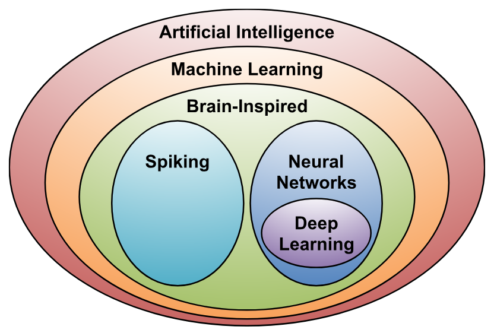

**图 1.** 人工智能背景下的深度学习.

人工智能包含一个很大的子领域, 即机器学习. Arthur Samuel 在 1959 年将机器学习定义为使计算机无须显式编程即可学习的研究领域. 这意味着一个程序在创建之后, 能够在编程概念之外学会执行某些智能活动. 与之相对, 专用程序的行为由手工启发式规则明确且静态地定义.

有效的机器学习算法优势明显. 不必采用费力且成败难料的方法, 为一个领域中的每个问题分别编写定制程序; 单个机器学习算法只需通过一个称为*训练*的过程进行学习, 即可处理每个新问题.

机器学习领域中有一个通常称为脑启发计算的方向. 大脑是我们目前所知最擅长学习和解决问题的"机器", 因此自然可以从中寻找机器学习方法. 所以, 脑启发计算是指基本形式或功能的某些方面取自大脑工作方式的程序或算法. 它并非试图创造一个大脑, 而是让程序模拟我们所理解的大脑运行方式中的某些方面.

虽然科学家仍在探索大脑工作的细节, 但人们普遍认为大脑的主要计算单元是*神经元*. 人类大脑平均约有 860 亿个神经元. 神经元彼此连接, 有多个称为树突的单元进入其中, 还有一个称为轴突的单元从中伸出, 如[图 2](#figure-02) 所示. 神经元接收通过树突传入的信号, 对这些信号进行计算, 并在轴突上产生信号. 这些输入和输出信号称为*激活值*. 一个神经元的轴突会分支, 并与许多其他神经元的树突相连. 轴突分支与树突之间的连接称为*突触*. 据估计, 人类大脑平均有 $10^{14}$ 到 $10^{15}$ 个突触.

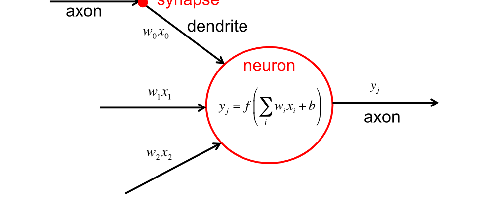

**图 2.** 大脑中与神经元的连接. $x_{i}$, $w_{i}$, $f(\cdot)$ 和 $b$ 分别为激活值, 权重, 非线性函数和偏置. (图改编自 [Li00].)

突触的一个主要特征是, 它可以缩放经过自身的信号 ($x_{i}$), 如[图 2](#figure-02) 所示. 该缩放因子可称为*权重* ($w_{i}$), 人们认为大脑正是通过改变突触对应的权重来学习. 因此, 不同的权重会对输入产生不同的响应. 注意, 学习是指响应学习刺激而调整权重, 大脑的组织结构 (可视为程序) 并不改变. 这一特征使大脑成为机器学习式算法的优秀灵感来源.

脑启发计算范式中有一个称为脉冲计算的子领域. 该领域的灵感来自这样一个事实: 树突和轴突上的通信是脉冲状的, 所传递的信息并不只取决于脉冲的幅度. 它还取决于脉冲到达的时间; 神经元中的计算也不只是单个数值的函数, 而是脉冲宽度以及不同脉冲间时序关系的函数. IBM TrueNorth 是一个受大脑脉冲启发的项目示例 [Mer14]. 与脉冲计算相对, 脑启发计算的另一个子领域称为神经网络, 这也是本文的重点. [+1]

### II-B 神经网络与深度神经网络 (DNN)

神经网络的灵感来自神经元计算包含输入值加权和这一概念. 这些加权和对应于突触执行的数值缩放, 以及神经元对这些数值的组合. 此外, 神经元并非只输出该加权和, 否则神经元级联所对应的计算就只是一种简单的线性代数运算. 神经元内部还会对组合后的输入执行一种函数运算. 这种运算似乎是一个非线性函数, 使神经元只在输入越过某个阈值时产生输出. 因此, 依此类推, 神经网络会对输入值的加权和应用非线性函数. [第 III-A1 节](#section-iii-a1)将介绍其中一些非线性函数.

[图 3(a)](#figure-03) 给出了计算神经网络的示意图. 输入层中的神经元接收一些数值, 并将其传播给网络中间层的神经元; 中间层也常称为"隐藏层". 来自一个或多个隐藏层的加权和最终传播到输出层, 由输出层向用户呈现网络的最终输出. 为了使脑启发术语与神经网络对应, 神经元的输出通常称为*激活值*, 突触通常称为*权重*, 如[图 3(a)](#figure-03) 所示. 本文将采用激活值/权重这一套术语.

[图 3(b)](#figure-03) 展示了每一层的计算示例: $y_{j}=f(\sum\limits_{i=1}^{3}W_{ij}\times x_{i}+b)$, 其中 $W_{ij}$, $x_{i}$ 和 $y_{j}$ 分别为权重, 输入激活值和输出激活值, *$f(\cdot)$* 是[第 III-A1 节](#section-iii-a1)所述的非线性函数. 为简化起见, [图 3(b)](#figure-03) 省略了偏置项 $b$.

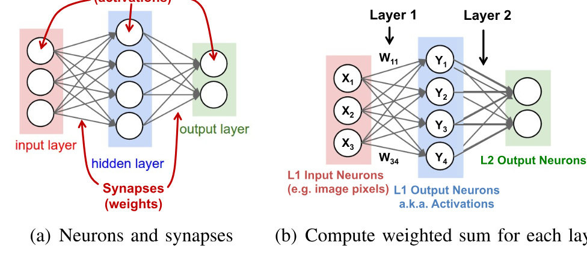

**图 3.** 简单的神经网络示例及术语 (图改编自 [Li00]).

神经网络领域中有一个称为*深度学习*的方向, 其中的神经网络具有三层以上, 即一个以上的隐藏层. 如今, 深度学习常用的网络层数从 5 层到 1,000 多层不等. 本文通常使用*深度神经网络 (DNN)* 一词指代深度学习所用的神经网络.

DNN 能够学习比浅层神经网络更复杂, 更抽象的高级特征. 使用 DNN 处理视觉数据可以说明这一点. 在这类应用中, 图像像素输入 DNN 的第一层, 该层的输出可解释为图像中是否存在不同的低级特征, 如线条和边缘. 在随后的层中, 这些特征会组合成高级特征存在可能性的度量, 例如, 线条组合成形状, 形状又进一步组合成形状集合. 最后, 网络根据所有这些信息, 给出这些高级特征构成某个特定对象或场景的概率. 这种深层特征层次结构使 DNN 能够在许多任务中取得优异性能.

### II-C 推理与训练

DNN 是一种机器学习算法, 因此其基本程序不会随着它学习执行给定任务而改变. 对于 DNN, 这种学习需要确定网络中权重 (和偏置) 的值, 称为网络*训练*. 训练完成后, 程序可以使用训练过程中确定的权重计算网络输出, 从而执行任务. 使用这些权重运行程序称为*推理*.

本节将以[图 6](#figure-06) 所示的图像分类为贯穿示例, 说明 DNN 的训练与使用. 使用 DNN 进行推理时, 我们给出一幅输入图像, DNN 的输出是一个分数向量, 每个对象类别对应一个分数; 分数最高的类别表示图像中对象最可能所属的类别. 训练 DNN 的总目标是确定一组权重, 使正确类别的分数最大, 错误类别的分数最小. 训练网络时, 正确类别通常是已知的, 因为用于训练的图像 (即网络的训练集) 已给出正确类别. 理想正确分数与 DNN 根据当前权重计算出的分数之间的差距称为*损失* ($L$). 因而, 训练 DNN 的目标是找到一组权重, 使其在大型训练集上的平均损失最小.

训练网络时, 权重 ($w_{ij}$) 通常通过一种称为梯度下降的爬山优化过程更新. 损失相对于每个权重的梯度, 即损失对该权重的偏导数, 乘以一个倍数后用于更新权重 (即更新后的 $w_{ij}^{t+1}=w_{ij}^{t}-\alpha\frac{\partial L}{\partial w_{ij}}$, 其中 $\alpha$ 称为学习率). 注意, 该梯度表明权重应如何改变才能减小损失. 此过程不断迭代, 以降低总体损失.

一种高效计算梯度偏导数的方法是*反向传播*. 反向传播是从微积分的*链式法则*推导出的计算, 它通过在网络中反向传递数值, 计算各个权重对损失的影响.

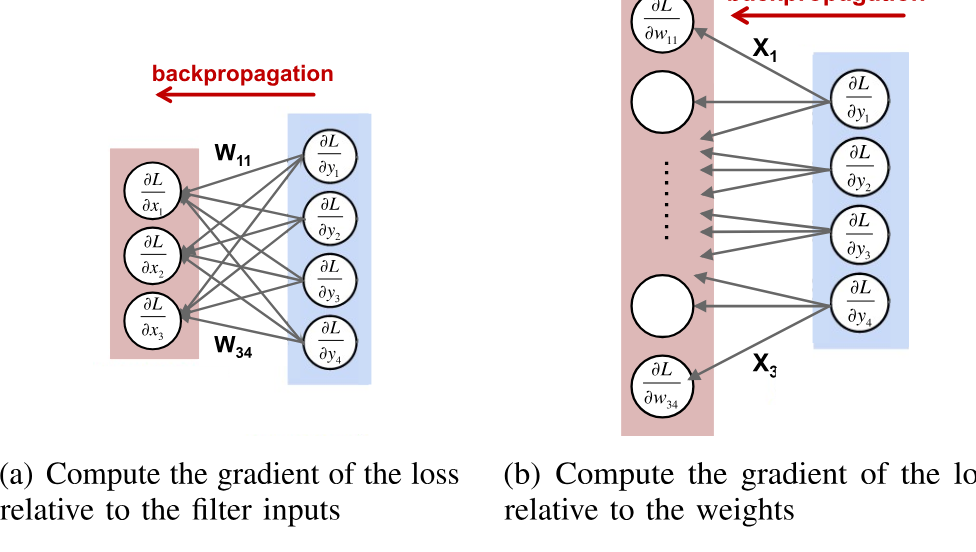

**图 4.** 通过神经网络进行反向传播的示例.

事实上, 这种反向传播计算在形式上与推理所用的计算非常相似, 如[图 4](#figure-04) 所示 [Mat14]. [+2] 因此, 高效执行推理的技术有时也可用于训练. 不过, 有两点值得注意. 第一, 反向传播需要保留网络的中间输出供反向计算使用, 因此训练需要更多存储空间. 第二, 由于爬山过程使用梯度, 训练的精度要求通常高于推理. 因此, [第 VII 节](#section-vii)讨论的许多低精度技术仅限用于推理.

人们采用多种技术来提高训练的效率和稳健性. 例如, 通常会先汇集多组输入数据, 即一个*批次*的损失, 再执行一次权重更新; 这有助于加快训练过程并使其更加稳定.

权重可以通过多种方式训练. 如上所述, 最常见的方法称为*监督学习*, 其中所有训练样本都带有标签 (例如正确类别). 另一种方法是*无监督学习*, 其中所有训练样本都不带标签, 目标实质上是找出数据中的结构或簇. *半监督学习*介于两者之间, 只有一小部分训练数据带有标签 (例如使用无标签数据确定簇边界, 再用少量有标签数据为簇添加标签). 最后, 可以利用*强化学习*训练权重, 使 DNN 在给定当前环境状态的情况下, 输出智能体接下来为使预期奖励最大而应采取的动作; 不过, 奖励可能不会在动作完成后立即给出, 而是在一系列动作之后才给出.

另一种常用的权重确定方法是*微调*, 即以已有的预训练权重为起点, 再针对新数据集 (例如迁移学习) 或新约束 (例如低精度) 调整这些权重. 与从随机起点开始相比, 这种方法训练更快, 有时还能取得更高的准确率.

本文将重点讨论 DNN 推理而非训练的高效处理, 因为 DNN 推理通常在资源有限的嵌入式设备上执行 (而非云端), 后文将作更详细的讨论.

### II-D 发展历程

神经网络在 20 世纪 40 年代已经提出, 但直到 20 世纪 80 年代末, 首个采用多个数字神经元的实际应用才随用于手写数字识别的 LeNet 网络出现 [Lec89a] [+3]. ATM 广泛使用这类系统识别支票上的数字. 到 2010 年代初, 基于 DNN 的应用开始蓬勃发展, 其中包括 Microsoft 于 2011 年推出的语音识别系统 [Den13] 和 2012 年用于图像识别的 AlexNet 系统 [Kri12]. [图 5](#figure-05) 简要梳理了深度学习的发展历程.

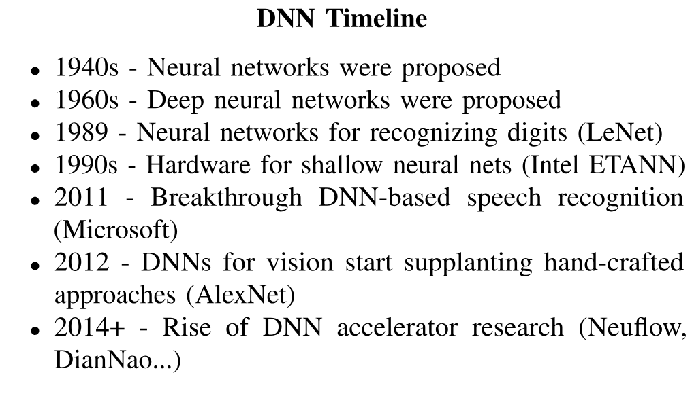

**图 5.** 神经网络简史. "深"指网络中的层数.

人们认为, 2010 年代初深度学习的成功由三个因素共同促成. 第一个因素是可用于训练网络的信息量. 学习强大的表示 (而非采用手工方法) 需要大量训练数据. 例如, Facebook 每天接收超过 3.5 亿幅图像, Walmart 每小时产生 2.5 PB 客户数据, YouTube 每分钟有 300 小时的视频上传. 因此, 云服务提供商和许多企业拥有海量数据来训练算法.

第二个因素是可用计算能力. 半导体器件和计算机架构的进步不断提升计算能力, 我们似乎已经跨过一个门槛, 能够在合理时间内完成 DNN 中大量的加权和计算; 推理和训练都需要这类计算.

这些早期 DNN 应用的成功开启了算法开发的浪潮. 它还推动了若干框架的开发, 其中大部分为开源框架, 让研究人员和实践者更容易探索和使用 DNN. 这些工作共同促成了第三个因素: 算法技术不断演进, 显著提高了应用准确率, 并拓宽了 DNN 的应用领域.

ImageNet 挑战赛 [Rus15] 很好地体现了深度学习取得的成果. 这项挑战赛包含多个不同项目. 其中一个项目是图像分类任务, 算法接收一幅图像并识别其中的内容, 如[图 6](#figure-06) 所示. 训练集包含 120 万幅图像, 每幅图像都标有其所含对象所属的 1,000 个类别之一. 在评估阶段, 算法必须准确识别测试图像集中的对象, 而这些图像此前并未见过.

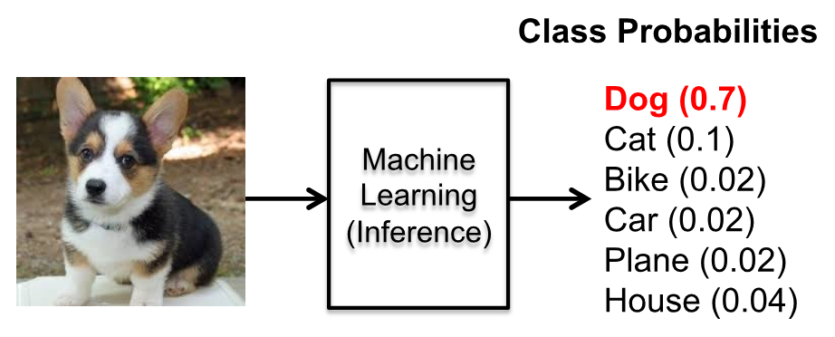

**图 6.** 图像分类任务示例. 机器学习平台接收一幅图像, 并针对预定义的一组类别输出置信度分数.

[图 7](#figure-07) 展示了 ImageNet 竞赛历年最佳参赛者的表现. 可以看到, 算法最初的错误率为 25% 或更高. 2012 年, University of Toronto 的一个团队采用计算能力很强的图形处理器 (GPU) 和名为 AlexNet 的深度神经网络方法, 将错误率降低了约 10% [Kri12]. 他们的成果带动了大量深度学习式算法涌现, 之后性能持续提高.

随着 ImageNet 挑战赛转向深度学习方法, 使用 GPU 的参赛者数量也相应增加. 2012 年只有 4 名参赛者使用 GPU, 到 2014 年几乎所有参赛者 (110 名) 都在使用 GPU. 这反映出竞赛采用的方法几乎完全从传统计算机视觉方法转向了基于深度学习的方法.

2015 年, ImageNet 的获胜方案 ResNet [He16c] 以低于 5% 的 top-5 错误率 [+4] 超过了人类水平的准确率. 此后, 错误率降至 3% 以下, 关注重点也转向竞赛中难度更高的项目, 如对象检测和定位. 这些成果显然推动了 DNN 在众多应用中的采用.

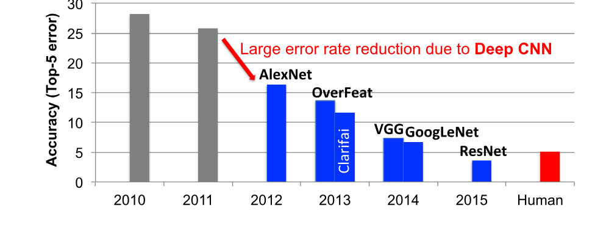

**图 7.** ImageNet 挑战赛结果 [Rus15].

### II-E DNN 的应用

从多媒体到医疗领域, 许多应用都能受益于 DNN. 本节将举例说明目前 DNN 已经产生影响的领域, 并介绍未来有望受到 DNN 影响的新兴领域.

- **图像与视频** 视频可以说是大数据中规模最大的一类. 它占如今互联网流量的 70% 以上 [Vni16]. 例如, 全球视频监控系统每天收集超过 8 亿小时的视频 [Woo16]. 从视频中提取有意义的信息离不开计算机视觉. DNN 显著提高了许多计算机视觉任务的准确率, 包括图像分类 [Rus15], 对象定位与检测 [Gir14], 图像分割 [She17] 和动作识别 [Sim14].
- **语音与语言** DNN 显著提高了语音识别 [Hin12] 的准确率, 也提高了机器翻译 [Den13], 自然语言处理 [Col11] 和音频生成 [Oor16] 等许多相关任务的准确率.
- **医疗** DNN 在基因组学中发挥了重要作用, 用于深入了解自闭症, 癌症和脊髓性肌萎缩症等疾病的遗传因素 [Xio15, Zho15, Ali15, Zen16]. DNN 还用于医学成像, 检测皮肤癌 [Est17], 脑癌 [Jer16] 和乳腺癌 [Wan16].
- **游戏** 近来, 许多与游戏有关的重大 AI 挑战已通过 DNN 得到解决. 这些成果还需要训练技术上的创新, 其中许多依赖强化学习 [Kae96]. 在 Atari 游戏 [Mni13] 和围棋 [Sil16] 中, DNN 已经超越人类水平; 由于可能走法的数量大得难以想象, 穷举所有可能性并不可行.
- **机器人** DNN 已成功用于多种机器人任务, 如机械臂抓取 [Lev16], 地面机器人的运动规划 [Pfe17], 视觉导航 [Gup17, Che15c], 四旋翼飞行器的稳定控制 [Zha16] 和自动驾驶车辆的驾驶策略 [Sha16a].

DNN 如今已广泛用于多媒体应用 (例如计算机视觉和语音识别). 展望未来, 我们预计 DNN 很可能会在上述医疗和机器人领域发挥越来越重要的作用, 也会更多用于金融 (例如交易, 能源预测和风险评估), 基础设施 (例如结构安全和交通控制), 天气预报以及事件检测 [Hem16]. 众多应用领域给 DNN 高效处理带来了新问题; 相应的解决方案必须具备适应性和可扩展性, 才能处理这些应用可能采用的各种新型 DNN.

### II-F 嵌入式与云端

DNN 处理的各种应用和环节 (即训练与推理) 有不同的计算需求. 具体而言, 训练往往需要大型数据集 [+5], 还需要大量计算资源来进行多轮权重更新. 在许多情况下, 训练一个 DNN 模型仍需数小时到数天, 因而通常在云端进行. 相比之下, 推理既可在云端进行, 也可在边缘端进行 (例如 IoT 或移动设备).

许多应用希望 DNN 推理处理靠近传感器完成. 例如, 在商店等候时间测量或交通模式预测等计算机视觉应用中, 最好直接在图像传感器处从视频中提取有意义的信息, 而不是送到云端处理, 这样可以降低通信成本. 对自动驾驶车辆, 无人机导航和机器人等其他应用而言, 依赖云端的延迟和安全风险过高, 因此需要本地处理. 然而, 视频包含大量数据, 处理时计算复杂度很高; 因而, 用于视频分析的低成本硬件虽然难以实现, 却是支持这些应用的必要条件. 语音识别使我们可以自然地与智能手机等电子设备交互. Apple Siri 和 Amazon Alexa 语音服务等应用目前大部分在云端处理, 但仍希望在设备本身完成识别, 以降低延迟和对连接性的依赖, 并改善隐私与安全性.

许多执行 DNN 推理的嵌入式平台在能耗, 计算和内存成本方面受到严格限制; 在这些约束下, 高效处理 DNN 因而变得极其重要. 所以, 本文将重点讨论推理而非训练的计算需求.

## III DNN 概述

DNN 会因应用不同而呈现各种形状和规模. 常见形状和规模也在快速演变, 以提高准确率和效率. 在所有情况下, DNN 的输入都是一组表示网络待分析信息的数值. 例如, 这些数值可以是图像的像素, 音频波形的采样幅度, 或某个系统或游戏状态的数值表示.

处理输入的网络主要分为两类: 前馈网络和循环网络, 如[图 8(a)](#figure-08) 所示. 在前馈网络中, 所有计算都以一系列操作的形式作用于前一层的输出. 最后一组操作生成网络的输出, 例如图像包含某个对象的概率, 音频序列包含某个词的概率, 图像中围绕某个对象的边界框, 或建议采取的动作. 这类 DNN 没有记忆, 无论此前向网络输入过何种序列, 同一输入的输出始终相同.

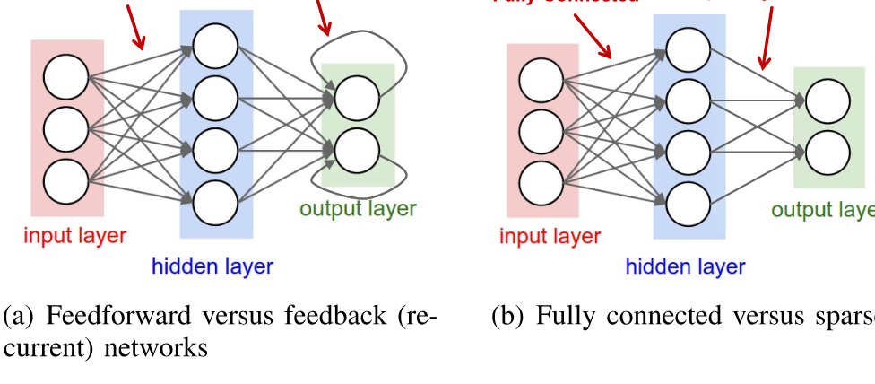

**图 8.** 不同类型的神经网络 (图改编自 [Li00]).

相比之下, 循环神经网络 (RNN) 具有内部记忆, 可以让长期依赖关系影响输出; 长短期记忆网络 (LSTM) [Bec24] 是其中常用的一种变体. 在这类网络中, 某些中间操作产生的数值会存储在网络内部, 并在处理后续输入时与其结合, 作为其他操作的输入. 本文将重点讨论前馈网络, 因为 (1) RNN 中的主要计算仍是加权和, 而前馈网络部分会涉及这一计算; (2) 迄今专门针对 RNN 的硬件加速仍很少受到关注.

DNN 可以完全由*全连接* (FC) 层组成 (也称为多层感知机, MLP), 如[图 8(b)](#figure-08) 最左侧一层所示. 在 FC 层中, 所有输出激活值都由全部输入激活值的加权和构成 (即所有输出都与所有输入相连). 这需要大量存储和计算. 好在许多应用中, 我们可以将权重设为零, 去除激活值之间的部分连接, 而不影响准确率. 由此得到*稀疏连接层*. [图 8(b)](#figure-08) 最右侧一层展示了稀疏连接层.

我们还可以通过限制对一个输出有贡献的权重数量来提高计算效率. 如果每个输出仅是固定大小输入窗口的函数, 就会产生这种结构化稀疏性. 如果计算每个输出时都使用同一组权重, 还可进一步提高效率. 这种重复使用相同权重值的方式称为*权重共享*, 可以显著降低权重的存储需求.

一种极为常用的窗口化且共享权重的 DNN 层会将计算组织为卷积, 如[图 9(a)](#figure-09) 所示. 每个输出激活值的加权和仅使用一小片邻域内的输入激活值计算 (即邻域以外的所有权重都设为零), 并且每个输出共享同一组权重 (即滤波器具有空间不变性). 这类基于卷积的层称为*卷积* (CONV) 层. [+6]

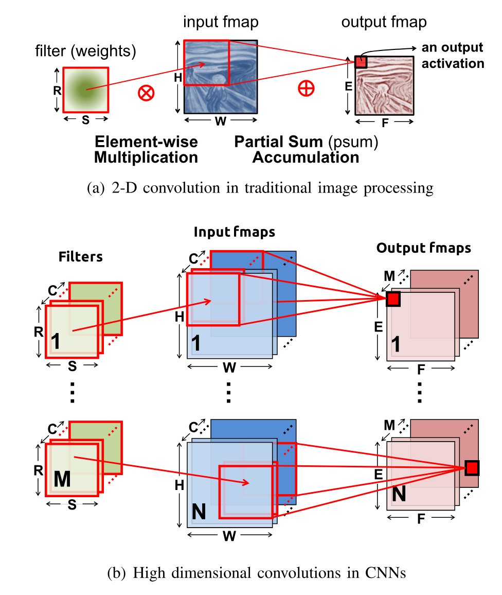

**图 9.** 卷积的维度.

### III-A 卷积神经网络 (CNN)

DNN 的一种常见形式是*卷积神经网络* (CNN), 它由多个 CONV 层组成, 如[图 10](#figure-10) 所示. 在这类网络中, 每一层都会生成输入数据逐级提高的抽象表示, 称为*特征图* (fmap), 其中保留了必要且独有的信息. 现代 CNN 采用层数很多的深层层次结构, 能够取得优异性能. CNN 广泛用于图像理解 [Kri12], 语音识别 [Sai13a], 游戏 [Sil16] 和机器人 [Lev16] 等多种应用. 本文将重点讨论 CNN 在图像处理中的应用, 尤其是图像分类任务 [Kri12].

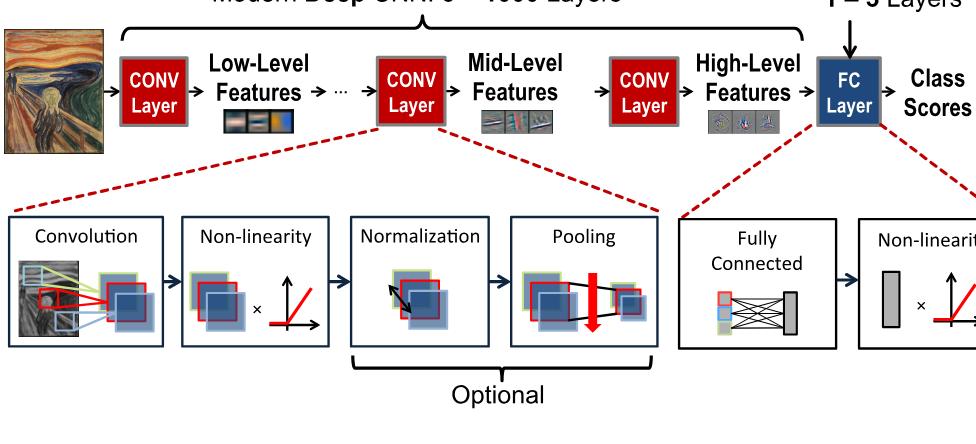

**图 10.** 卷积神经网络.

CNN 中每个 CONV 层主要由[图 9(b)](#figure-09) 所示的高维卷积组成. 在这一计算中, 一层的输入激活值组织为一组二维*输入特征图* (ifmap), 每个输入特征图称为一个*通道*. 每个通道都与滤波器栈中各自不同的二维滤波器进行卷积, 每个通道对应一个滤波器; 这组二维滤波器通常合称一个三维滤波器. 每一点的卷积结果会在所有通道上求和. 此外, 还可在滤波结果上加一维偏置, 但最近的一些网络 [He16c] 已在部分层中不再使用偏置. 这一计算的结果是构成*输出特征图* (ofmap) 一个通道的输出激活值. 可以对同一输入使用更多三维滤波器, 以产生更多输出通道. 最后, 可以将多个输入特征图作为一个*批次*共同处理, 从而可能提高滤波器权重的复用率.

根据[表 I](#table-01)中的形状参数, CONV 层的计算定义为

$$
\scriptsize\begin{split}&\mathbf{O}[z][u][x][y]=\mathbf{B}[u]+\sum_{k=0}^{C-1}\sum_{i=0}^{S-1}\sum_{j=0}^{R-1}\mathbf{I}[z][k][Ux+i][Uy+j]\times\mathbf{W}[u][k][i][j],\\
&0\leq z<N,0\leq u<M,0\leq x<F,0\leq y<E,\\
&E=(H-R+U)/U,F=(W-S+U)/U.\end{split}
$$

$\mathbf{O}$, $\mathbf{I}$, $\mathbf{W}$ 和 $\mathbf{B}$ 分别是 ofmap, ifmap, 滤波器和偏置矩阵. $U$ 是给定的步幅大小. [图 9(b)](#figure-09) 给出了这一计算的可视化表示 (忽略偏置).

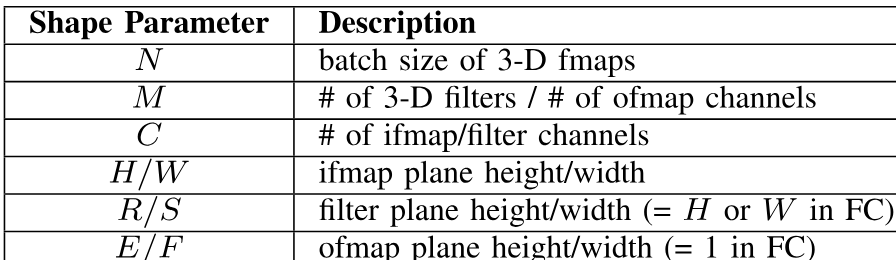

**表 1.** CONV/FC 层的形状参数.

为使 CNN 的术语与通用 DNN 术语对应,

- 滤波器由权重构成 (即突触)
- 输入和输出特征图 (ifmap, ofmap) 由激活值构成 (即输入和输出神经元)

近期 CNN 模型通常使用 5 个 [Kri12] 到 1,000 多个 [He16c] CONV 层. 通常在 CONV 层之后应用少量全连接 (FC) 层, 例如 1 到 3 层, 用于分类. FC 层也像 CONV 层一样在 ifmap 上应用滤波器, 但其滤波器与 ifmap 大小相同. 因此, FC 层不具备 CONV 层的权重共享特性. 加上对形状参数的若干约束后, [式 1](#equation-01)仍适用于 FC 层的计算: $H=R$, $F=S$, $E=F=1$, 且 $U=1$.

除了 CONV 层和 FC 层, DNN 中还可以包含非线性, 池化和归一化等多种可选层. 下面讨论这些层各自的功能和计算.

#### III-A1 非线性

每个 CONV 层或 FC 层之后通常会应用非线性激活函数. 如[图 11](#figure-11) 所示, DNN 使用各种非线性函数来引入非线性. 其中包括 sigmoid 或双曲正切等沿用已久的传统非线性函数, 也包括整流线性单元 (ReLU) [Nai10]; 后者因结构简单且能实现快速训练, 近年来受到广泛采用. 人们还研究了 leaky ReLU [Maa13], parametric ReLU [He15] 和 exponential LU [Cle16] 等 ReLU 变体, 以提高准确率. 最后, 一种称为 maxout 的非线性函数会取两个相交线性函数的最大值, 已被证明在语音识别任务中有效 [Zha14, Zha16a].

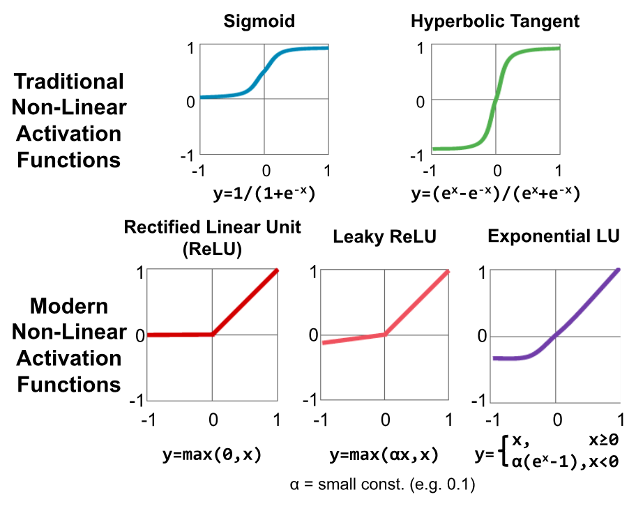

**图 11.** 各种形式的非线性激活函数 (图改编自 Caffe Tutorial [Jia14]).

#### III-A2 池化

用于降低特征图维数的各种计算统称为*池化*. 池化分别应用于各个通道, 使网络能够对小幅位移和形变保持稳健性与不变性. 池化会将其*感受野*中的一组值合并或汇聚为数量更少的值. 池化可按感受野大小 (例如 $2 \times 2$) 和池化操作 (例如最大值或平均值) 进行配置, 如[图 12](#figure-12) 所示. 池化通常在互不重叠的块上进行 (即步幅等于池化区域的大小). 一般会使用大于 1 的步幅, 从而缩小表示 (即特征图) 的维数.

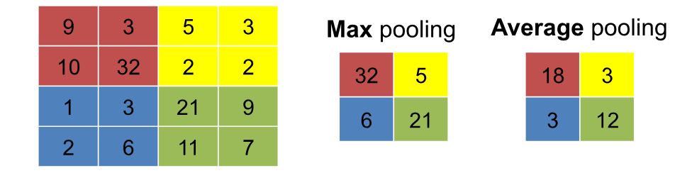

**图 12.** 各种形式的池化 (图改编自 Caffe Tutorial [Jia14]).

#### III-A3 归一化

控制各层输入的分布有助于显著加快训练并提高准确率. 因此, 会对层输入激活值的分布 ($\sigma$, $\mu$) 进行归一化, 使其均值为 0, 标准差为 1. 在批归一化 (BN) 中, 归一化后的值会进一步缩放和平移, 如[式 2](#equation-02) 所示, 其中参数 ($\gamma$, $\beta$) 通过训练学习 [Iof15]. $\epsilon$ 是用于避免数值问题的小常数. 在此之前使用的是局部响应归一化 (LRN) [Kri12], 其灵感来自神经生物学中的侧抑制: 兴奋的神经元 (即高值激活) 应抑制相邻神经元 (即使其产生低值激活); 不过, BN 如今已成为 CNN 设计中的标准做法, LRN 则基本弃用. 注意, LRN 通常在非线性函数之后执行, 而 BN 大多在 CONV 层或 FC 层与非线性函数之间执行.

$$
\begin{split}y=\frac{x-\mu}{\sqrt{\sigma^{2}+\epsilon}}\gamma+\beta\end{split}
$$

### III-B 常用 DNN 模型

过去 20 年间已经开发出许多 DNN 模型. 这些模型具有不同的"网络架构", 体现在层数, 层类型, 层形状 (即滤波器大小, 通道数和滤波器数) 以及层间连接等方面. 理解这些差异和趋势, 对于在高效 DNN 引擎中纳入适当的灵活性十分重要.

本节将概述 LeNet [Lec98] 等各种常用 DNN, 以及[图 7](#figure-07) 所示参加和/或赢得 ImageNet 挑战赛 [Rus15] 的 DNN. 其中大多数模型及其预训练权重都可以公开下载; [表 II](#table-02) 汇总了这些 DNN 模型. 表中报告了两组 top-5 错误率结果. 第一行通过使用图像的多个裁剪区域和多个已训练模型组成的集成模型来提高准确率 (即 DNN 需要运行多次); 这些结果用于参加 ImageNet 挑战赛. 第二行报告只使用单个裁剪区域时的准确率 (即 DNN 只运行一次), 这更符合实时和/或能量受限应用的实际部署方式.

*LeNet* [Lec89a] 是 1989 年提出的首批 CNN 方法之一. 它用于对大小为 $28 \times 28$ 的灰度图像中的数字进行分类. 最著名的版本 LeNet-5 包含两个 CONV 层和两个 FC 层 [Lec98]. 每个 CONV 层都使用大小为 $5 \times 5$ 的滤波器 (每个滤波器有 1 个通道), 第一层有 6 个滤波器, 第二层有 16 个滤波器. 每次卷积后使用 $2 \times 2$ 平均池化, 并使用 sigmoid 作为非线性函数. 总体而言, LeNet 处理每幅图像需要 60k 个权重和 341k 次乘加运算 (MAC). LeNet 带来了 CNN 的首次商业成功, 它被部署在 ATM 中识别存入支票上的数字.

*AlexNet* [Kri12] 是 2012 年首个赢得 ImageNet 挑战赛的 CNN. 它由 5 个 CONV 层和 3 个 FC 层组成. 每个 CONV 层有 96 到 384 个滤波器, 滤波器大小从 $3 \times 3$ 到 $11 \times 11$ 不等, 每个滤波器有 3 到 256 个通道. 第一层滤波器的 3 个通道对应输入图像的红, 绿, 蓝分量. 每一层都使用 ReLU 非线性函数. 第 1, 2 和 5 层的输出应用 $3 \times 3$ 最大池化. 为减少计算量, 网络第一层使用 4 的步幅. AlexNet 在第 1 层和第 2 层的最大池化之前引入了 LRN, 但后来的 CNN 模型已不常使用 LRN. AlexNet 区别于 LeNet 的一个重要因素是权重数量大得多, 而且形状逐层变化. 为减少第二个 CONV 层的权重和计算量, 第一层的 96 个输出通道分成两组, 每组 48 个, 作为第二层的输入通道, 因此第二层的滤波器只有 48 个通道. 同样, 第四层和第五层的权重也分成两组. 总体而言, AlexNet 处理一幅 $227 \times 227$ 输入图像需要 61M 个权重和 724M 次 MAC.

*Overfeat* [Ser14] 的架构与 AlexNet 很相似, 也有 5 个 CONV 层和 3 个 FC 层. 主要区别是第 3 层的滤波器数从 384 增至 512, 第 4 层从 384 增至 1,024, 第 5 层从 256 增至 1,024; 第 2 层不分为两组; 第一个全连接层只有 3,072 个通道, 而不是 4,096 个; 输入大小为 $231 \times 231$, 而不是 $227 \times 227$. 因此, 权重数增至 146M, 每幅图像的 MAC 数增至 2.8G. Overfeat 有两个不同模型: fast (此处所述) 和 accurate. ImageNet 挑战赛所用的 accurate 模型比 fast 模型的 top-5 错误率低 0.65%, 代价是 MAC 数增加 $1.9\times$.

*VGG-16* [Sim15] 将深度增加到 16 层, 包含 13 个 CONV 层和 3 个 FC 层. 为平衡增加深度的成本, 较大的滤波器 (例如 $5 \times 5$) 由多个权重更少的小滤波器 (例如 $3 \times 3$) 构成, 从而获得相同的感受野, 如[图 13(a)](#figure-13) 所示. 因此, 所有 CONV 层的滤波器大小都相同, 均为 $3 \times 3$. 总体而言, VGG-16 处理一幅 $224 \times 224$ 输入图像需要 138M 个权重和 15.5G 次 MAC. VGG 有两个不同模型: VGG-16 (此处所述) 和 VGG-19. VGG-19 的 top-5 错误率比 VGG-16 低 0.1%, 代价是 MAC 数增加 $1.27\times$.

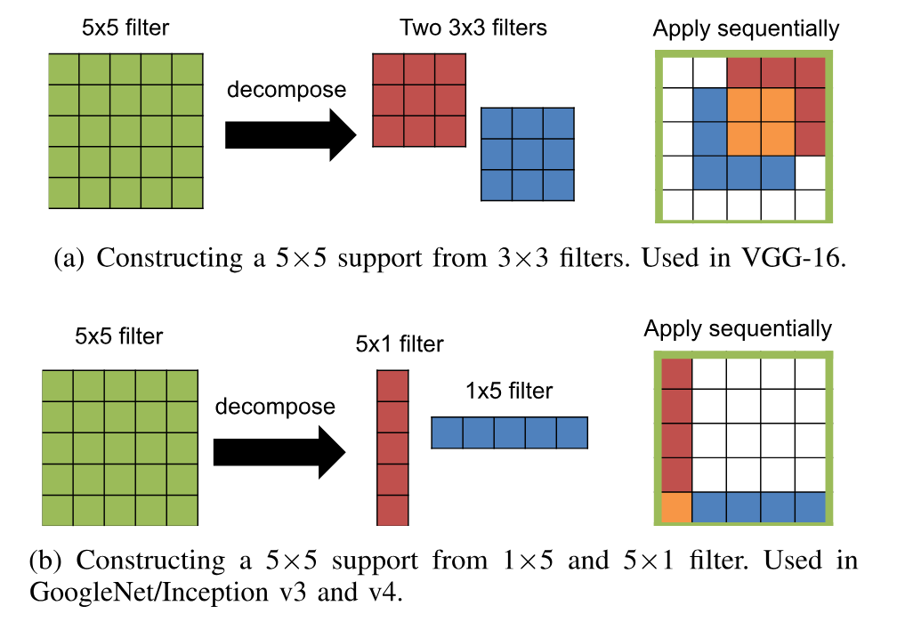

**图 13.** 将较大的滤波器分解为较小的滤波器.

*GoogLeNet* [Sze14] 的深度进一步增加到 22 层. 它引入了[图 14](#figure-14) 所示的 inception 模块, 该模块由并行连接组成, 而此前只有单个串行连接. 每个并行连接采用不同大小的滤波器 (即 $1 \times 1$, $3 \times 3$, $5 \times 5$) 以及 $3 \times 3$ 最大池化, 各连接的输出拼接为模块输出. 使用多种滤波器大小相当于在多个尺度上处理输入. 为提高训练速度, GoogLeNet 的设计使训练时为反向传播而存储的权重和激活值都能放入 GPU 内存. 为减少权重数量, 它应用 $1 \times 1$ 滤波器作为"瓶颈", 减少每个滤波器的通道数 [Lin14]. 这 22 层由 3 个 CONV 层, 随后的 9 个 inception 层 (每个 inception 层内部深度为 2 个 CONV 层), 以及 1 个 FC 层组成. 自 2014 年提出以来, GoogleNet (也称 Inception) 已有多个版本: v1 (此处所述), v3 [+7] 和 v4. Inception-v3 使用[图 13(b)](#figure-13) 所示的小型一维滤波器分解卷积, 以减少 MAC 数和权重数, 从而将深度增加到 42 层. v3 配合批归一化 [Iof15], 在计算量增加 $2.5\times$ 的情况下, top-5 错误率比 v1 低 3% 以上 [Sze16]. Inception-v4 使用下一节介绍的残差连接 [Sze17], 将错误率降低了 0.4%.

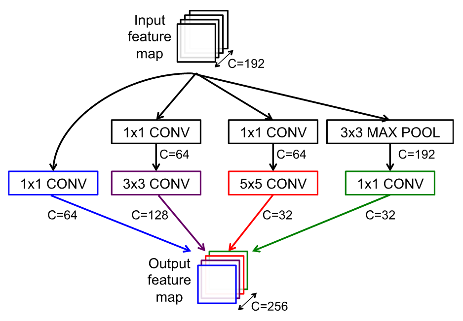

**图 14.** GoogleNet [Sze14] 的 inception 模块及通道长度示例. 注意, 每个 CONV 层之后都有一个 ReLU (图中未绘出).

*ResNet* [He16c] 又称残差网络, 它利用残差连接进一步增加深度 (34 层或更多). 它是 ImageNet 挑战赛中首个超过人类准确率的 DNN 参赛方案, top-5 错误率低于 5%. 深层网络面临的一个问题是训练期间的梯度消失: 误差在网络中反向传播时, 梯度会逐渐缩小, 影响很深的网络中较早各层更新权重的能力. 残差网络引入一个包含恒等连接的"捷径"模块, 使权重层 (即 CONV 层) 可以被跳过, 如[图 15](#figure-15) 所示. 捷径模块不直接学习权重层的函数 $F(x)$, 而是学习残差映射 ($F(x)=H(x)-x$). 起初, $F(x)$ 为零, 采用恒等连接; 随着训练逐步进行, 才使用通过权重层的实际前向连接. 这与用于序列数据的 LSTM 网络相似. ResNet 还采用 $1 \times 1$ 滤波器作为"瓶颈", 以减少权重参数数量. 因此, 捷径模块中的两个层替换为三个层 ($1 \times 1$, $3 \times 3$, $1 \times 1$), 其中 $1 \times 1$ 先减少再增加 (恢复) 权重数量. ResNet-50 由 1 个 CONV 层, 随后的 16 个捷径层 (每个捷径层内部深度为 3 个 CONV 层), 以及 1 个 FC 层组成; 每幅图像需要 25.5M 个权重和 3.9G 次 MAC. ResNet 有多个不同深度的版本 (例如*不含瓶颈:* 18, 34; *含瓶颈:* 50, 101, 152). 具有 152 层的 ResNet 赢得了 ImageNet 挑战赛, 需要 11.3G 次 MAC 和 60M 个权重. 与 ResNet-50 相比, 它的 top-5 错误率降低约 1%, 代价是 MAC 数增加 $2.9\times$, 权重数增加 $2.5\times$.

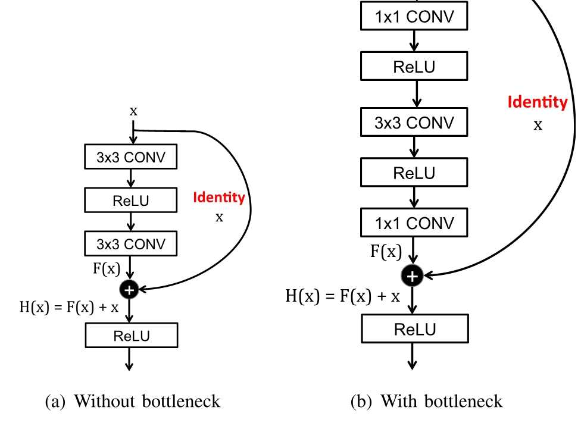

**图 15.** ResNet [He16c] 的捷径模块. 注意, 捷径中最后一个 CONV 层之后的 ReLU 位于加法之后.

从[表 II](#table-02)所示的常用 DNN 中可以看出若干趋势. 增加网络深度往往会提高准确率. 在控制权重数量的情况下, 更深的网络可以支持更广泛, 区分能力更强的非线性函数, 也能在所学习的表示中提供更多层次 [Urb17, Sim15, Sze14, He16c]. 滤波器形状仍然逐层变化, 因而灵活性仍很重要. 此外, 大部分计算已集中在 CONV 层, 而不是 FC 层. 同时, FC 层的权重数有所减少; 在最近的大多数网络中 (自 GoogLeNet 起), CONV 层在权重数量上也占主导地位. 因此, 硬件实现应重点提高 CONV 层的效率, 因为这些层在许多领域中越来越重要.

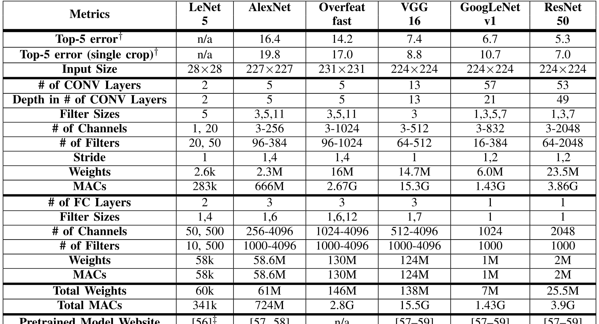

**表 2.** 常用 DNN 汇总 [Lec98, Kri12, Sim15, Sze14, He16c]. *†*准确率根据 ImageNet [Rus15] 上的 Top-5 错误率测量. *‡*此版本 LeNet-5 的滤波器具有 431k 个权重, 处理每幅图像需要 2.3M 次 MAC, 并使用 ReLU 而不是 sigmoid.

## IV DNN 开发资源

DNN 得以快速发展的一个主要因素, 是研究界和工业界提供了一系列开发资源. 这些资源也有助于开发 DNN 加速器: 它们可以描述工作负载的特征, 并便于探索模型复杂度与准确率之间的权衡. 本节将介绍这些资源, 让有兴趣进入这一领域的人可以迅速上手.

### IV-A 框架

为简化 DNN 开发并支持共享已训练的网络, 各方开发了多种深度学习框架. 这些开源项目包含用于 DNN 的软件库. UC Berkeley 于 2014 年发布了 Caffe [Jia14]. 它支持 C, C++, Python 和 MATLAB. Google 于 2015 年发布 Tensorflow, 它支持 C++ 和 Python; 也支持多个 CPU 和 GPU, 灵活性高于 Caffe, 并将计算表示为数据流图, 用于管理"张量" (多维数组). 另一个常用框架是 Torch, 它由 Facebook 和 NYU 开发, 支持 C, C++ 和 Lua. 此外还有 Theano, MXNet, CNTK 等多个框架, [Nvi00]对它们作了介绍. 也有一些更高层的库可以运行在上述框架之上, 提供更统一的使用方式并加快开发. Keras 就是这类库之一, 它使用 Python 编写, 支持 Tensorflow, CNTK 和 Theano.

这些框架不仅为 DNN 研究人员和应用设计人员提供了方便, 对设计高性能或更高效的 DNN 计算引擎也极为有用. 具体而言, 这些框架大量使用一组基本操作, 如 CONV 层处理, 因而可以采用经过优化的软件或硬件加速器. 这种加速对框架用户是透明的. 例如, 大多数框架都可以使用 Nvidia 的 cuDNN 库, 在 Nvidia GPU 上快速执行. 同样, 也可以透明地整合专用硬件加速器, Eyeriss 芯片 [Che17a] 就采用了这种方式.

最后, 这些框架还为硬件研究人员提供了有价值的工作负载来源. 它们可用于以不同工作负载驱动实验设计, 对不同工作负载进行性能剖析, 以及探索软硬件权衡.

### IV-B 模型

可以从多个网站 [Caf00, Caf00a, Mat00, Ten00] 下载适用于不同框架的预训练 DNN 模型. 应当注意, 即使对于同一个 DNN (例如 AlexNet), 这些模型的准确率也可能因训练方式不同而相差约 1% 到 2%, 因此结果并不总与原始论文完全一致.

### IV-C 常用分类数据集

比较不同 DNN 模型时, 必须考虑任务难度. 例如, 对 MNIST 数据集 [Lec00] 的手写数字进行分类, 要远比按 ImageNet 数据集 [Rus15] 的要求将对象分到 1,000 个类别之一简单 ([图 16](#figure-16)). 可以预期, 用于较难任务的 DNN 比用于简单任务的 DNN 规模更大 (即权重更多), MAC 数也更多, 因而需要更多能量且吞吐量更低. 例如, LeNet-5 [Lec98] 用于数字分类, 而 AlexNet [Kri12], VGG-16 [Sim15], GoogLeNet [Sze14] 和 ResNet [He16c] 则用于 1,000 类图像分类.

许多 AI 任务都提供公开数据集, 用于评估给定 DNN 的准确率. 公开数据集对于比较不同方法的准确率十分重要. 最简单也最常见的任务是图像分类: 给定一幅完整图像, 从 N 个类别中选出该图像最可能所属的 1 个类别. 这一任务不涉及定位或检测.

*MNIST* 是一个广泛使用的数字分类数据集, 于 1998 年提出 [Lec00]. 它由手写数字的 $28 \times 28$ 像素灰度图像组成. 数据集有 10 个类别 (对应 10 个数字), 包含 60,000 幅训练图像和 10,000 幅测试图像. MNIST 刚提出时, LeNet-5 达到了 99.05% 的准确率. 此后, 利用 dropconnect 对神经网络进行正则化, 准确率提高到 99.79% [Wan13]. 因此, MNIST 如今被视为相当容易的数据集.

*CIFAR* 是一个由各种对象的 $32 \times 32$ 像素彩色图像组成的数据集, 于 2009 年发布 [Kri00]. CIFAR 是 8,000 万 Tiny Image 数据集 [Tor08] 的一个子集. CIFAR-10 由 10 个互斥类别组成. 它包含 50,000 幅训练图像 (每类 5,000 幅) 和 10,000 幅测试图像 (每类 1,000 幅). CIFAR-10 刚提出时, 两层卷积深度信念网络取得了 64.84% 的准确率 [Kri10]. 此后, 使用分数最大池化, 准确率提高到 96.53% [Gra14].

*ImageNet* 是一个大型图像数据集, 最初于 2010 年推出; 该数据集在 2012 年稳定下来 [Rus15]. 它包含 1,000 个类别的 $256 \times 256$ 像素彩色图像. 这些类别以 WordNet 为骨架定义, 以处理含义有歧义的词, 并将同义词合并到同一个对象类别中. 换言之, ImageNet 类别具有层次结构. 所选的 1,000 个类别在 ImageNet 层次结构中彼此不重叠. ImageNet 数据集包含许多细粒度类别, 包括 120 个不同的犬种. 它有 1.3M 幅训练图像 (每类 732 到 1,300 幅), 100,000 幅测试图像 (每类 100 幅) 和 50,000 幅验证图像 (每类 50 幅).

ImageNet 挑战赛使用两个指标报告准确率: Top-5 和 Top-1 错误率. Top-5 错误率是指, 得分最高的 5 个类别中只要有一个是正确类别, 就算分类正确. Top-1 要求得分最高的类别就是正确类别. 2012 年, ImageNet 挑战赛的获胜方案 (AlexNet) 在 top-5 上达到 83.6% 的准确率 (大幅优于当年未采用 DNN 的亚军方案 73.8% 的准确率); 它在验证集的 top-1 上达到 61.9%. 2017 年, top-5 的最高准确率为 97.7%.

综观各种图像分类数据集, 可以看出 MNIST 是相当容易的数据集, 而 ImageNet 覆盖的类别更广, 难度也更高. 因而, 评估给定 DNN 的准确率时, 必须考虑准确率是在哪个数据集上测得的.

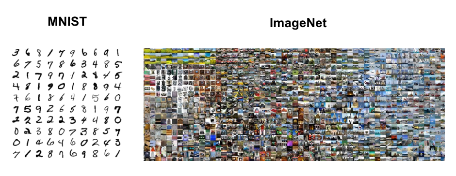

**图 16.** MNIST (10 个类别, 60k 幅训练图像, 10k 幅测试图像) [Lec00] 与 ImageNet (1,000 个类别, 1.3M 幅训练图像, 100k 幅测试图像) [Rus15] 数据集.

### IV-D 其他任务的数据集

最先进 DNN 在图像分类任务上的准确率已经优于人类水平, 因而 ImageNet 挑战赛开始将重点转向单对象定位和对象检测等难度更高的任务. 对于单对象定位, 必须定位目标对象并对其分类 (从 1,000 个类别中选择). DNN 输出得分最高的 5 个类别和 5 个边界框位置. 如果识别出的对象确实出现在图像中, 但未包含在真值标签中, 则不予惩罚. 对于对象检测, 必须定位图像中的所有对象并对其分类 (从 200 个类别中选择). 必须标注属于这些类别的所有对象的边界框. 未标注的对象和重复检测都会受到惩罚.

除了 ImageNet, 计算机视觉任务还有其他常用图像数据集. 用于对象检测的 PASCAL VOC (2005-2012) 数据集包含 11k 幅图像, 覆盖 20 个类别 (27k 个对象实例, 其中 7k 个带有详细分割) [Pas00]. 用于上下文中的对象检测, 分割和识别的 MS COCO 数据集包含 328k 幅图像中的 2.5M 个标注实例 (91 个对象类别) [Coc00]; 与 ImageNet 相比, COCO 的类别较少, 但每类实例更多, 有利于精确的二维定位. COCO 每幅图像中的标注实例也更多, 可能有助于利用上下文信息.

最近还出现了规模更大的数据集. 例如, Google 的 Open Images 数据集包含超过 9M 幅图像 [Ope00], 涵盖 6,000 个类别. 还有一个 YouTube 数据集包含 8M 段视频 (共 0.5M 小时), 覆盖 4,800 个类别 [You00]. Google 还发布了一个音频数据集, 包含 632 个音频事件类别, 以及 2M 段经过人工标注, 时长 10 秒的声音片段 [Aud00]. 随着 DNN 变得更深, 需要训练的权重参数增多, 这些大型数据集会愈发重要.

毫无疑问, 更大的数据集和面向新领域的数据集都将成为分析和探索未来 DNN 引擎效率的重要资源.

## V DNN 处理硬件

随着 DNN 日益普及, 近期许多硬件平台都加入了专门面向 DNN 处理的功能. 例如, Intel Knights Landing CPU 提供了用于深度学习的特殊向量指令; Nvidia PASCAL GP100 GPU 支持 16 位浮点 (FP16) 运算, 可在一个单精度核心上执行两个 FP16 操作, 从而加快深度学习计算. 也有一些系统专为 DNN 处理而构建, 如 Nvidia DGX-1 和 Facebook 的定制 DNN 服务器 Big Basin [Con17]. 各种嵌入式片上系统 (SoC), 如 Nvidia Tegra 和 Samsung Exynos, 以及 FPGA, 也已展示了 DNN 推理能力. 因此, 必须充分了解这些平台如何执行处理, 以及如何为 DNN 设计专用加速器, 以进一步提高吞吐量和能效.

CONV 层和 FC 层的基本组成都是乘加 (MAC) 操作, 这类操作很容易并行化. 为了获得高性能, 人们普遍采用高度并行的计算范式, 包括[图 17](#figure-17) 所示的时序架构和空间架构. 时序架构主要见于 CPU 或 GPU, 并使用多种技术来提高并行度, 如向量 (SIMD) 或并行线程 (SIMT). 这类时序架构使用集中式控制来管理大量 ALU. 这些 ALU 只能从存储层次结构中获取数据, 无法直接相互通信. 相比之下, 空间架构采用数据流处理, 即 ALU 构成处理链, 可以直接相互传递数据. 有时, 每个 ALU 都可以拥有自己的控制逻辑和本地存储器, 后者称为暂存器或寄存器文件. 我们将带有本地存储器的 ALU 称为处理单元 (PE). 空间架构常见于基于 ASIC 和 FPGA 的 DNN 设计. 本节将讨论在不影响准确率的前提下, 如何针对这些不同平台采取不同的高效处理设计策略 (即本节所有方法都产生逐位相同的结果); 具体而言:

- 对于 CPU 和 GPU 等*时序*架构, 我们将讨论如何通过对内核进行*计算变换*来减少乘法次数, 从而*提高吞吐量*.
- 对于加速器使用的*空间*架构, 我们将讨论*数据流*如何增加对存储层次结构中低成本存储器的数据复用, 从而*降低能耗*.

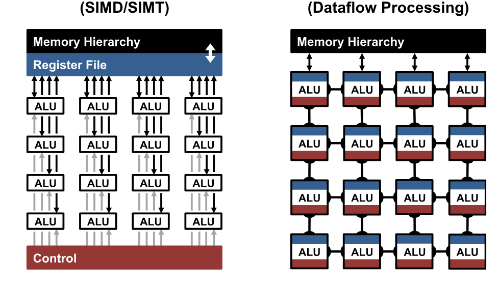

**图 17.** 高度并行的计算范式.

### V-A 加速 CPU 和 GPU 平台上的内核计算

CPU 和 GPU 使用 SIMD 或 SIMT 等并行化技术来并行执行 MAC. 所有 ALU 共享同一套控制和存储器 (寄存器文件). 在这些平台上, FC 层和 CONV 层通常都映射为矩阵乘法 (即内核计算). [图 18](#figure-18) 展示了如何用矩阵乘法处理 FC 层. 滤波器矩阵的高度是滤波器数量, 宽度是每个滤波器的权重数量 (输入通道数 ($C$) $\times$ 宽度 ($W$) $\times$ 高度 ($H$), 因为在 FC 层中 $R=W$ 且 $S=H$); 输入特征图矩阵的高度是每张输入特征图的激活值数量 ($C$ $\times$ $W$ $\times$ $H$), 宽度是输入特征图数量 ([图 18(a)](#figure-18) 中为 1, [图 18(b)](#figure-18) 中为 $N$); 最后, 输出特征图矩阵的高度是输出特征图的通道数 ($M$), 宽度是输出特征图的数量 ($N$), 其中 FC 层的每张输出特征图尺寸为 $1 \times 1 \times{}$ 输出通道数 ($M$).

DNN 中的 CONV 层也可以使用[图 19](#figure-19) 所示的松弛 Toeplitz 矩阵形式映射为矩阵乘法. 使用矩阵乘法处理 CONV 层的缺点是, 输入特征图矩阵中存在[图 19(a)](#figure-19) 标出的冗余数据. 这会造成存储效率低下, 或需要复杂的存储器访问模式.

有一些面向 CPU (如 OpenBLAS, Intel MKL 等) 和 GPU (如 cuBLAS, cuDNN 等) 的软件库会优化矩阵乘法. 矩阵乘法会按照这些平台的存储层次结构进行分块, 其高层存储容量通常为数 MB.

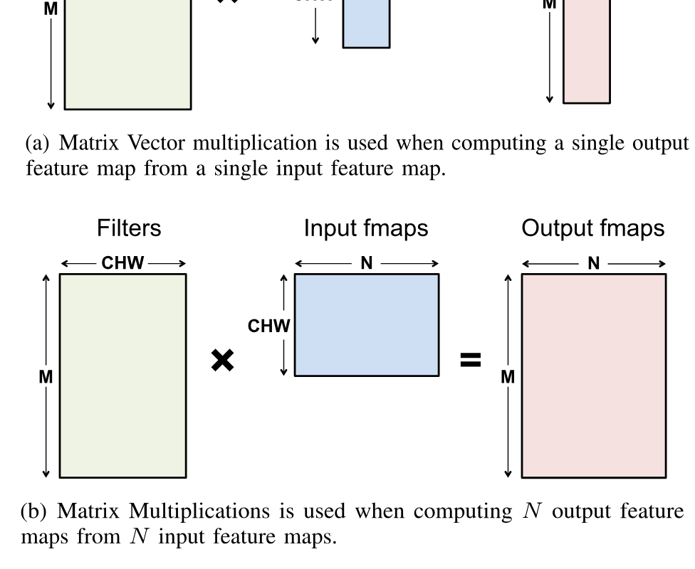

**图 18.** 全连接层到矩阵乘法的映射

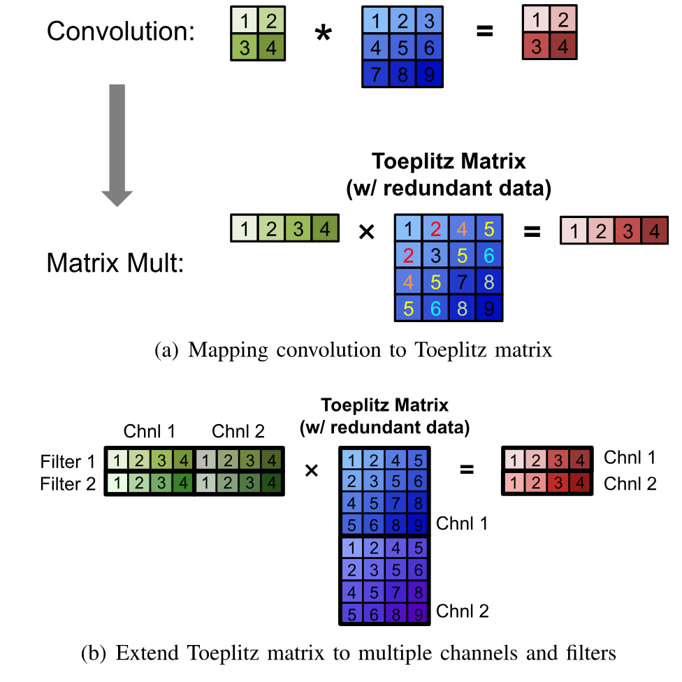

**图 19.** 卷积层到矩阵乘法的映射.

还可以对数据应用计算变换, 减少乘法次数, 从而进一步加速这些平台上的矩阵乘法, 同时仍得到逐位相同的结果. 这种方法往往以增加加法次数和采用更不规则的数据访问模式为代价.

快速傅里叶变换 (FFT) [Mat14, Dub12] 是一种广为人知的方法, 如[图 20](#figure-20) 所示, 它将乘法次数从 O($N_{o}^{2}N_{f}^{2}$) 降至 O($N_{o}^{2}\log_{2}N_{o}$), 其中输出尺寸为 $N_{o}\times N_{o}$, 滤波器尺寸为 $N_{f}\times N_{f}$. 为了执行卷积, 我们先对滤波器和输入特征图进行 FFT, 再在频域中执行乘法; 随后对所得乘积应用逆 FFT, 以恢复空间域中的输出特征图. 然而, 使用 FFT 有几个缺点: (1) FFT 的收益会随滤波器尺寸减小; (2) FFT 的尺寸由输出特征图尺寸决定, 而后者通常远大于滤波器; (3) 频域中的系数是复数. 因此, FFT 虽然减少了计算量, 却需要更大的存储容量和带宽. 最后, 降低复杂度的一种常用方法是使权重稀疏, 这将在[第 VII-B2 节](#section-vii-b2) 讨论; 使用 FFT 后很难利用这种稀疏性.

可以对 FFT 进行几项优化, 使其更适合 DNN. 为了减少操作次数, 可以预先计算并存储滤波器的 FFT. 此外, 输入特征图的 FFT 可以只计算一次, 再用于生成输出特征图中的多个通道. 最后, 由于图像只包含实数值, 其傅里叶变换具有对称性, 可以利用这一点降低存储和计算成本.

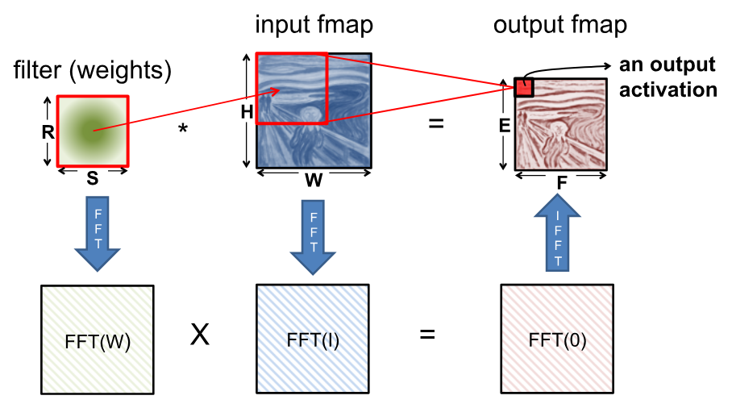

**图 20.** 使用 FFT 加速 DNN.

其他方法还包括 Strassen [Con14] 和 Winograd [Lav16]. 它们通过重排计算, 分别将乘法次数从 O($N^{3}$) 降至 O($N^{2.807}$), 以及对 $3 \times 3$ 滤波器将乘法次数减少 $2.25\times$, 代价是数值稳定性降低, 存储需求增加, 并且需要根据滤波器尺寸进行专门处理.

实际应用中, 不同形状和尺寸的层可能会使用不同算法 (例如, 大于 $5 \times 5$ 的滤波器使用 FFT, $3 \times 3$ 及以下的滤波器使用 Winograd). MKL 和 cuDNN 等现有平台库会根据给定的形状和尺寸动态选择合适的算法 [Mkl16, Che14].

### V-B 加速器的节能数据流

对 DNN 而言, 处理瓶颈在于存储器访问. 如[图 21](#figure-21) 所示, 每次 MAC 需要读取三次存储器 (分别读取滤波器权重, 特征图激活值和部分和), 并写入一次存储器 (写入更新后的部分和). 在最坏情况下, 所有存储器访问都必须经过片外 DRAM, 这会严重影响吞吐量和能效. 例如, AlexNet 要执行 724M 次 MAC, 就需要近 3000M 次 DRAM 访问. 此外, DRAM 访问所需的能量最高可比计算高出几个数量级 [Hor14].

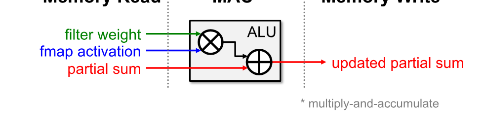

**图 21.** 每次 MAC 的读写访问.

[图 17](#figure-17) 所示的空间架构等加速器可以引入多个能耗不同的本地存储层次, 从而降低数据移动的能量成本, 如[图 22](#figure-22) 所示. 其中包括一个连接 DRAM, 容量为数百 KB 的大型全局缓冲区, 一个可在 ALU 之间直接传递数据的 PE 间网络, 以及每个处理单元 (PE) 内部容量为数 KB 或更小的寄存器文件 (RF). 多级存储层次通过提供低成本的数据访问来提高能效. 例如, 从 RF 或相邻 PE 获取数据的能耗会比从 DRAM 获取低一到两个数量级.

加速器可以设计成支持利用这套存储层次的专用处理数据流. 数据流决定哪些数据何时读入存储层次的哪一级, 以及何时进行处理. 由于 DNN 的处理过程没有随机性, 可以设计一种固定数据流, 使其适应 DNN 的形状和尺寸, 并优化至最佳能效. 优化后的数据流会尽量减少对存储层次中能耗较高层级的访问. 能够存储大量数据的大型存储器比小型存储器消耗更多能量. 例如, DRAM 可以存储数 GB 数据, 但每次访问的能耗比容量仅数 KB 的小型片上存储器高两个数量级. 因此, 每当一份数据从高能耗层级移到能耗较低的层级时, 我们都希望尽可能多地复用这份数据, 从而减少后续对高能耗层级的访问. 然而, 这些低成本存储器的容量有限. 因此, 我们需要探索能在这些约束下最大化复用的数据流.

对于 DNN, 我们研究的数据流会利用[图 23](#figure-23) 所示的三种输入数据复用形式 (卷积复用, 特征图复用和滤波器复用). 在卷积复用中, 同一通道内使用相同的输入特征图激活值和滤波器权重, 只是针对不同加权和采用不同组合. 在特征图复用中, 多个滤波器应用于同一特征图, 因而输入特征图的激活值会跨滤波器使用多次. 最后, 在滤波器复用中, 当同时处理多张输入特征图 (称为一个批次) 时, 相同的滤波器权重会跨输入特征图使用多次.

如果能将数据存入本地存储层次并进行多次访问, 而无须返回 DRAM, 就能利用这三种数据复用, 大幅减少 DRAM 访问. 例如, 在 AlexNet 的 CONV 层中, DRAM 读取次数最多可减少 $500\times$. 本地存储器也可用于累加部分和, 这样部分和就无须到达 DRAM. 在最佳情况下, 如果所有数据复用和累加都能由本地存储层次完成, AlexNet 中的 3000M 次 DRAM 访问可以降至仅 61M 次.

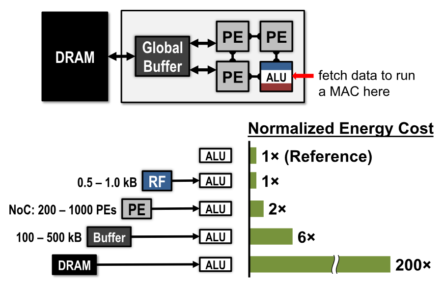

**图 22.** 存储层次和数据移动能耗 [Che16c].

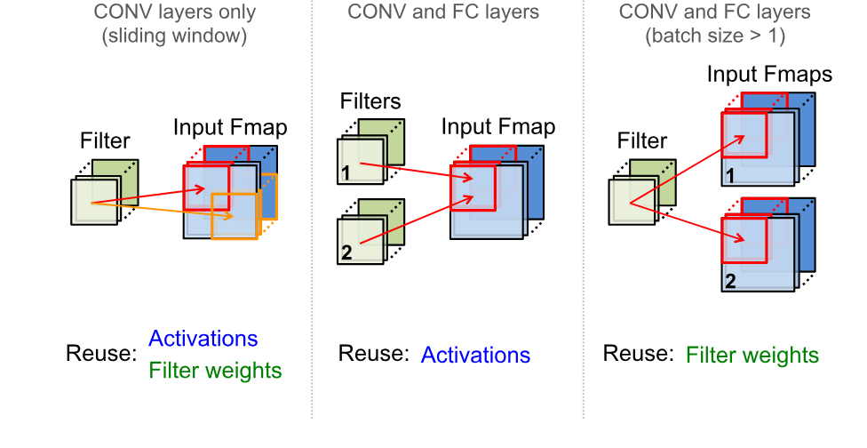

**图 23.** DNN 中的数据复用机会 [Che16c].

DNN 加速器的运行方式与通用处理器类似, 如[图 24](#figure-24) 所示 [Che17b]. 在传统计算机系统中, 编译器根据硬件架构 (如 x86 或 ARM) 将程序转换为机器可读的二进制代码以供执行; 在 DNN 处理中, 映射器根据数据流将 DNN 的形状和尺寸转换为与硬件兼容的计算映射以供执行. 编译器通常优化性能, 而映射器优化能效.

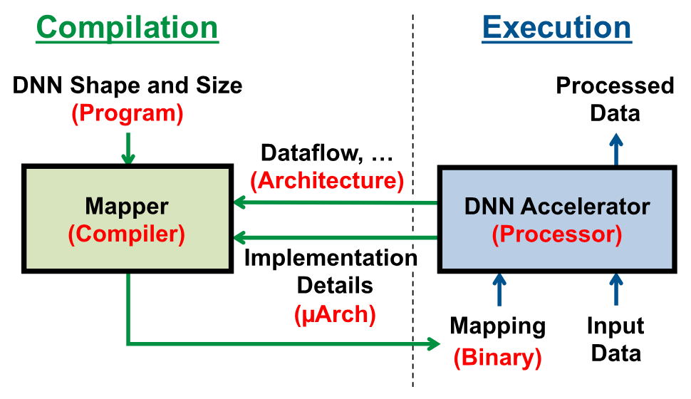

**图 24.** DNN 加速器的运行方式 (黑色文字) 与通用处理器的运行方式 (红色文字) 之间的类比. 图片改编自 [Che17b].

可以根据数据处理特征 [Che16c], 使用以下分类体系 ([图 25](#figure-25)) 对近期工作中的 DNN 数据流 [San09, Sri10, Cha10, Gok14, Par15, Cav15, Gup15, Du15, Pee13, Zha15, Che14b, Che14a] 进行分类:

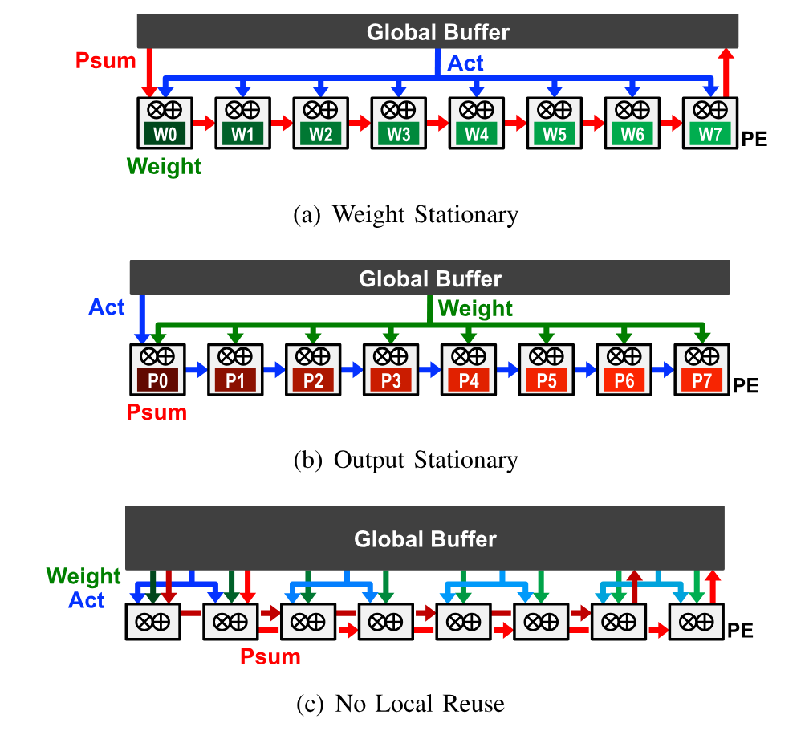

**图 25.** DNN 数据流 [Che16c].

#### V-B1 权重驻留 (WS)

权重驻留数据流通过尽可能从 PE 的寄存器文件 (RF) 中访问权重, 尽量降低读取权重的能耗 ([图 25(a)](#figure-25)). 每个权重从 DRAM 读入各 PE 的 RF, 并保持驻留以供后续访问. 当权重位于 RF 中时, 处理过程会尽可能多地执行使用同一权重的 MAC, 从而最大化权重的卷积复用和滤波器复用. 输入和部分和必须经过空间阵列和全局缓冲区移动. 输入特征图的激活值会广播到所有 PE, 随后部分和在整个 PE 阵列上进行空间累加.

实现权重驻留数据流的早期工作之一是 nn-X, 又称 neuFlow [Gok14], 它使用 8 个二维卷积引擎处理一个 $10 \times 10$ 滤波器. 每个引擎共有 100 个 MAC 单元, 即 PE, 每个 PE 都有一个在处理过程中保持驻留的权重. 输入特征图的激活值广播到所有 MAC 单元, 部分和则在 MAC 单元之间累加. 为了正确累加部分和, 还需要额外的延迟存储元件, 这些元件计入所需的本地存储容量. 其他权重驻留实例见 [San09, Sri10, Cha10, Par15, Cav15].

#### V-B2 输出驻留 (OS)

输出驻留数据流旨在尽量降低部分和的读写能耗 ([图 25(b)](#figure-25)). 它将同一输出激活值的部分和累加保留在本地 RF 中. 为了让部分和的累加驻留在 RF 中, 一种常见实现是让输入激活值流经 PE 阵列, 并将权重广播到阵列中的所有 PE.

ShiDianNao [Du15] 是实现输出驻留数据流的一个例子, 其中每个 PE 从相邻 PE 获取相应的输入激活值, 负责处理一个输出激活值. PE 阵列实现了专用网络, 用于沿水平和垂直方向传递数据. 每个 PE 还配有数据延迟寄存器, 将数据保留所需的周期数. 在系统层面, 全局缓冲区将输入激活值流式送入 PE 阵列, 并向其中广播权重. 部分和在每个 PE 内部累加, 随后以数据流形式送回全局缓冲区. 其他输出驻留实例见 [Gup15, Pee13].

如[图 26](#figure-26) 所示, 输出驻留有多种可能的变体, 因为同时处理的输出激活值可以来自不同维度. 例如, 变体 $\mathrm{OS}_{A}$ 面向 CONV 层处理, 因此侧重于一次处理同一通道中的输出激活值, 以最大化数据复用机会. 变体 $\mathrm{OS}_{C}$ 面向 FC 层处理, 并侧重于生成来自所有不同通道的输出激活值, 因为每个通道只有一个输出激活值. 变体 $\mathrm{OS}_{B}$ 介于 $\mathrm{OS}_{A}$ 和 $\mathrm{OS}_{C}$ 之间. $\mathrm{OS}_{A}$, $\mathrm{OS}_{B}$ 和 $\mathrm{OS}_{C}$ 变体的实例分别见 [Du15], [Gup15] 和 [Pee13].

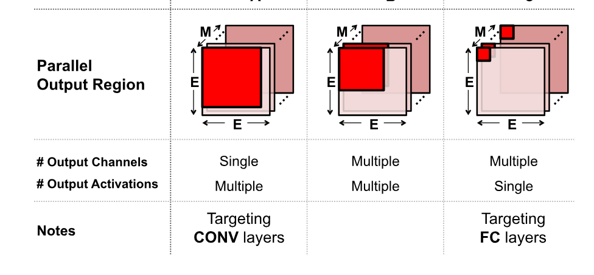

**图 26.** 输出驻留的变体 [Che16c].

#### V-B3 无本地复用 (NLR)

小型寄存器文件在能耗 (pJ/bit) 方面效率很高, 但在面积 ($\mu m^{2}$/bit) 方面效率较低. 为了最大化存储容量并尽量降低片外存储器带宽, PE 不分配本地存储, 而是将全部面积用于全局缓冲区以增加其容量 ([图 25(c)](#figure-25)). 无本地复用数据流与前述数据流的区别在于, PE 阵列内部没有任何数据保持驻留. 因此, 所有类型的数据都会增加空间阵列上的流量以及通往全局缓冲区的流量. 具体来说, 它必须多播激活值, 单播滤波器权重, 然后在整个 PE 阵列上对部分和进行空间累加.

UCLA 的无本地复用数据流 [Zha15] 是其中一个例子. 滤波器权重和输入激活值从全局缓冲区读出, 由配有定制加法树的 MAC 单元处理, 加法树可以在一个周期内完成累加, 随后所得部分和或输出激活值再放回全局缓冲区. 另一个例子是 DianNao [Che14b], 它同样从缓冲区读取输入激活值和滤波器权重, 再通过配有定制加法树的 MAC 单元处理. 不过, DianNao 实现了专用寄存器, 将部分和保留在 PE 阵列中, 这有助于进一步降低访问部分和的能耗. 另一个无本地复用数据流实例见 [Che14a].

#### V-B4 行驻留 (RS)

[Che16c] 提出了一种行驻留数据流, 其目标是让*所有*类型的数据 (权重, 像素, 部分和) 在 RF 层级实现最大程度的复用与累加, 从而优化整体能效. 这与 WS 或 OS 数据流不同, 后两者分别只针对权重和部分和进行优化.

如[图 27](#figure-27) 所示, 行驻留数据流把一维行卷积的处理分配给各 PE. 它将一行滤波器权重驻留在 PE 的 RF 中, 随后把输入激活值流式送入 PE. PE 每次对一个滑动窗口执行 MAC, 并且只使用一个存储空间来累加部分和. 由于不同滑动窗口之间的输入激活值存在重叠, 可以将输入激活值保留在 RF 中并进行复用. 遍历这一行中的所有滑动窗口后, 一维卷积便告完成, 同时最大化该行数据的复用和本地累加.

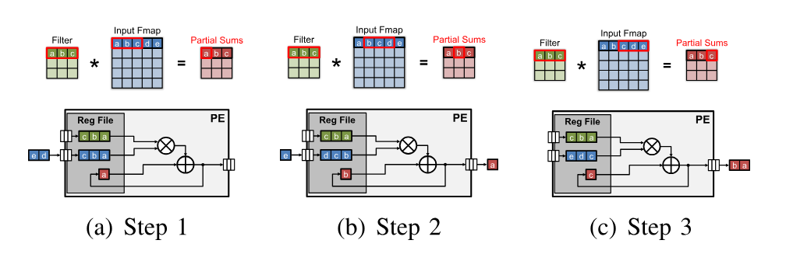

**图 27.** 行驻留数据流在 PE 内部的一维卷积复用 [Che16c].

每个 PE 处理一个一维卷积时, 可以聚合多个 PE 来完成二维卷积, 如[图 28](#figure-28) 所示. 例如, 要使用三行滤波器生成第一行输出激活值, 需要进行三个一维卷积. 因此, 可以使用一列中的三个 PE, 每个 PE 分别运行三个一维卷积之一. 部分和还会在这三个 PE 之间沿垂直方向累加, 生成第一行输出. 为生成第二行输出, 我们使用另一列 PE, 将三行输入激活值向下移动一行, 并使用相同的滤波器行执行三个一维卷积. 持续添加 PE 列, 直到完成所有输出行 (即 PE 列数等于输出行数).

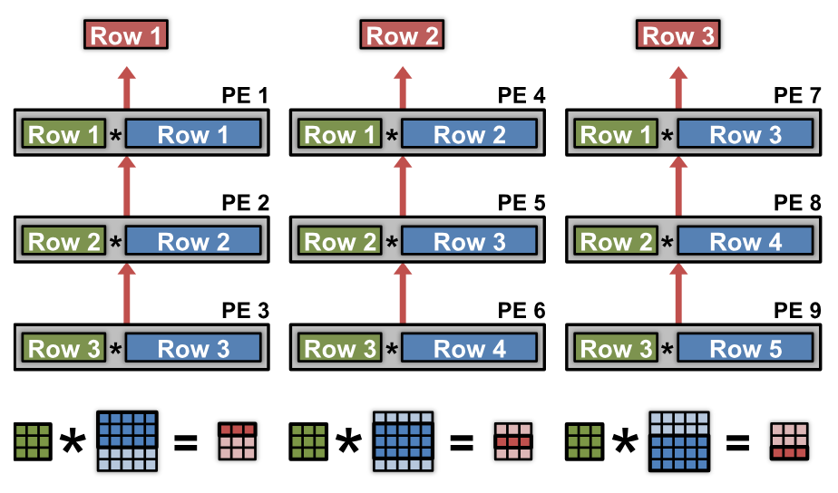

**图 28.** 行驻留数据流在空间阵列内的二维卷积复用 [Che16c].

这个二维 PE 阵列支持其他形式的复用, 从而减少对成本更高的全局缓冲区的访问. 例如, 每行滤波器会在多个 PE 之间沿水平方向复用. 每行输入激活值会在多个 PE 之间沿对角线方向复用. 每行部分和则会在多个 PE 之间沿垂直方向进一步累加. 因此, 二维卷积的数据复用和累加会在二维 PE 阵列内部得到最大化.

为了处理 CONV 层的高维卷积 (即多张特征图, 多个滤波器和多个通道), 可以将多行映射到同一个 PE, 如[图 29](#figure-29) 所示. 二维卷积映射到一组 PE, 其他维度则通过交错或串接额外数据来处理. 为了在 PE 内部复用滤波器, 将不同特征图的行串接起来, 并通过同一个 PE 作为一维卷积运行. 为了在 PE 内部复用输入特征图, 将不同的滤波器行交错排列, 并通过同一个 PE 作为一维卷积运行. 最后, 为了增加 PE 内部的本地部分和累加, 将来自不同通道的滤波器行和特征图行交错排列, 并通过同一个 PE 作为一维卷积运行. 随后, 来自不同通道的部分和自然会在 PE 内部累加.

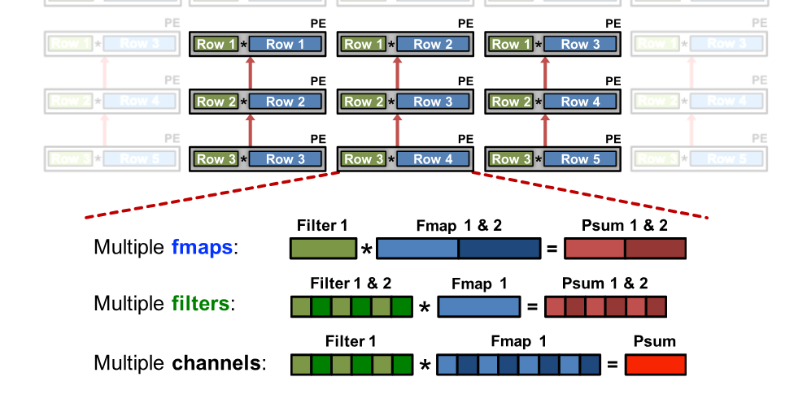

**图 29.** 将不同输入特征图, 滤波器和通道的多行映射到阵列中的同一个 PE, 以便在行驻留数据流中进一步复用 [Che16c].

可同时处理的滤波器, 通道和特征图数量是可编程的, 并且存在一种能够实现最佳能效的最优映射. 这种映射取决于 DNN 的形状配置以及所提供的硬件资源, 如 PE 数量和存储层次中的存储器容量. 由于所有变量在运行前都已知, 可以构建编译器 (即映射器) 离线执行这项优化, 针对不同 DNN 配置硬件, 采用不同的 RS 数据流映射, 如[图 30](#figure-30) 所示.

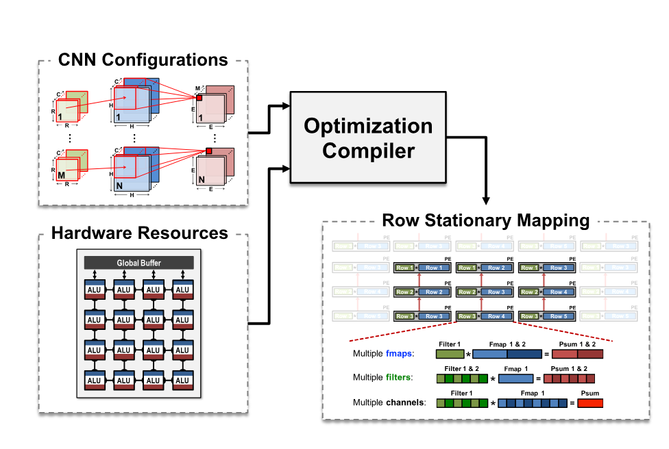

**图 30.** 映射优化以硬件和 DNN 形状约束为输入, 确定能效最优的数据流 [Che16c].

Eyeriss [Che16f] 是实现行驻留数据流的一个例子. 如[图 31](#figure-31) 所示, 它由一个 $14 \times 12$ PE 阵列, 一个 108KB 全局缓冲区, ReLU 单元和特征图压缩单元组成. 该芯片通过 64 位双向数据总线与片外 DRAM 通信, 将数据取入全局缓冲区. 随后, 全局缓冲区将数据流式送入 PE 阵列进行处理.

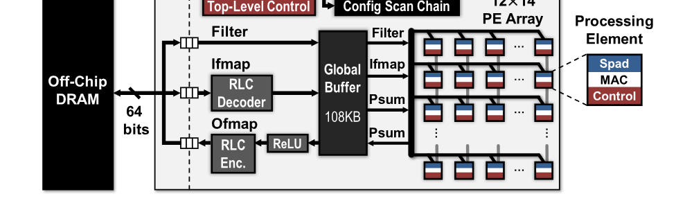

**图 31.** Eyeriss DNN 加速器 [Che16f].

为了支持 RS 数据流, 硬件设计需要解决两个问题. 第一, 固定尺寸的 PE 阵列如何容纳不同的层形状? 第二, 虽然数据会按非常特定的模式传递, 但这种模式仍会随形状配置而变化. 固定设计如何按不同模式传递数据?

可以使用[图 32](#figure-32) 所示的两种映射策略来解决第一个问题. 第一种是复制, 可用于映射未占满整个 PE 阵列的形状. 例如, AlexNet 的第 3 层到第 5 层中, 每个二维卷积只使用一个 $13 \times 3$ PE 阵列. 随后将这一结构复制 4 次, 每个副本运行不同的通道和滤波器. 第二种策略称为折叠. 例如, AlexNet 的第 2 层需要一个 $27 \times 5$ PE 阵列才能完成二维卷积. 为了将其装入 $14 \times 12$ 的物理 PE 阵列, 它被折叠为 $14 \times 5$ 和 $13 \times 5$ 两部分, 并分别沿垂直方向映射到物理 PE 阵列中. 由于该映射没有使用所有 PE, 可以对未使用的 PE 进行时钟门控以节省能耗.

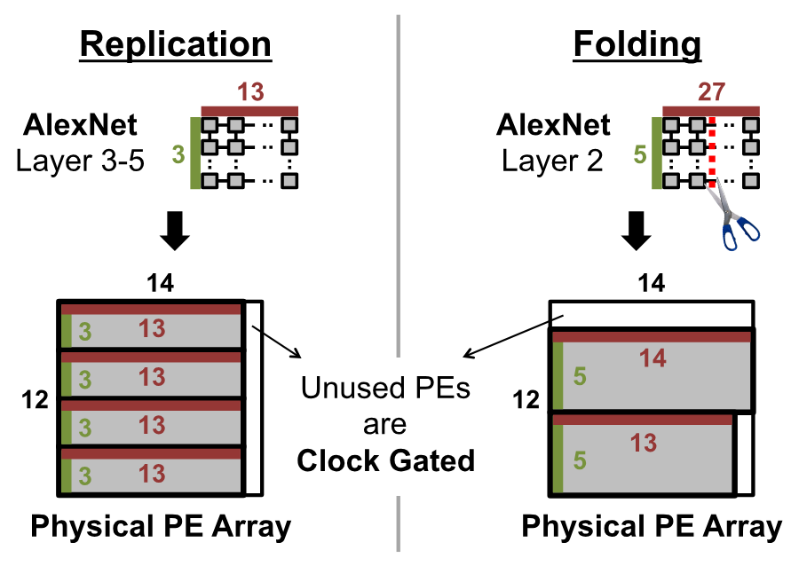

**图 32.** 映射使用复制和折叠来最大化 PE 阵列利用率 [Che16f].

第二个问题涉及灵活的数据传送, 可使用定制多播网络解决. 将数据传递到多个目的地的最简单方法是向所有 PE 广播数据, 再由各 PE 判断是否需要处理这些数据. 不过, 这种方法的能效并不高, 尤其是在 PE 阵列规模较大时. 因此, 可以使用多播网络, 只把数据发送到需要的位置.

#### V-B5 不同数据流的能耗比较

为了评估和比较不同数据流, 针对所有数据流的空间架构仿真都采用相同的硬件总面积和 PE 数量 (256 个). 每个处理单元 (PE) 的本地存储器 (寄存器文件) 容量约为 0.5-1.0kB, 共享存储器 (全局缓冲区) 容量约为 100-500kB. 这些存储器的容量选取为与视频编码 [Sze14a] 等多媒体处理的典型加速器相当. 在相同面积约束下, 还会根据各数据流的需求进一步调整存储器容量. 例如, 无本地复用数据流不需要在 PE 中配置 RF, 因而会为它分配大得多的全局缓冲区. 仿真使用 AlexNet 的层配置, 批大小为 16. 仿真还考虑了访问存储层次中不同层级所需能量不同这一事实.

[图 33](#figure-33) 比较了批大小为 16 时, 各数据流处理 AlexNet CONV 层的芯片和 DRAM 能耗. WS 和 OS 数据流分别在访问权重和部分和时能耗最低. 不过, RS 数据流的总能耗最低, 因为它优化的是整体能效, 而不是只针对某一种数据类型.

[图 33(a)](#figure-33) 按存储层次对同一结果进行了细分. RS 数据流在 RF 中消耗的能量最多, 因为其设计会把大多数访问移到存储层次的最低一级. RF 的单次访问能耗最低, 因而这有助于实现最低的总能耗. NLR 数据流在 DRAM 层级的能耗最低, 因为它的全局缓冲区大得多, 片上存储容量也因此高于其他数据流. 然而, NLR 数据流的大多数数据访问来自全局缓冲区, 与访问 RF 或 PE 阵列内部的数据相比, 全局缓冲区的单次访问能耗仍然相对较高. 因此, NLR 数据流的总能耗仍然相当高. 总体而言, RS 数据流的能耗比其他数据流低 $1.4\times$ 到 $2.5\times$.

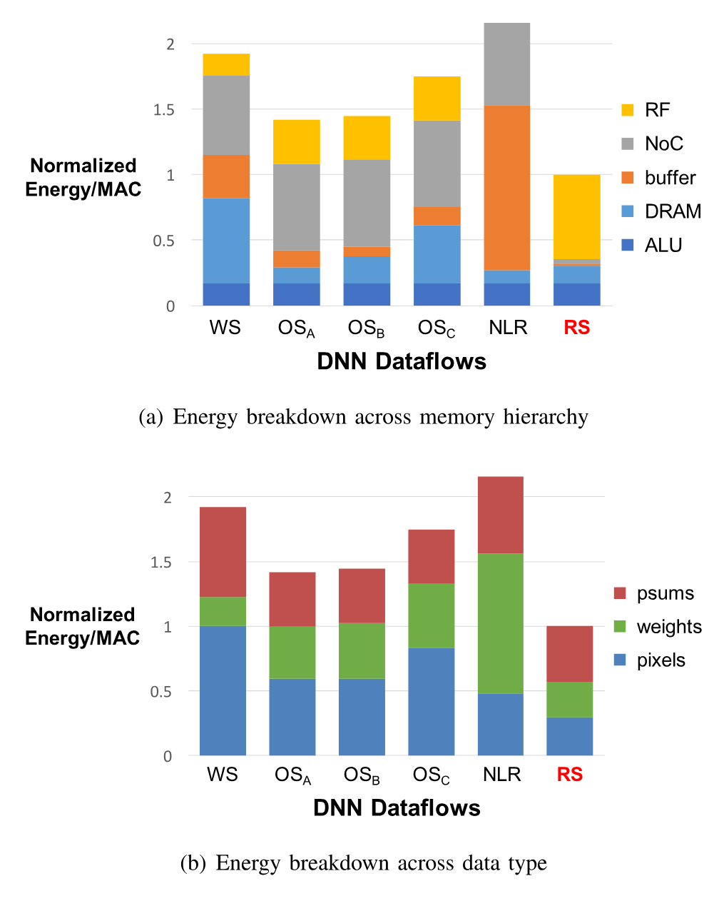

**图 33.** 批大小为 16 时, AlexNet CONV 层中不同数据流的能效比较 [Kri12]: (a) 按存储层级和 ALU 细分, (b) 按数据类型细分. OS*A*, OS*B* 和 OS*C* 是不同实现中常见的三种 OS 数据流变体 [Che16c].

[图 34](#figure-34) 展示了批大小为 16 时, AlexNet FC 层中不同数据流的能效. FC 层的数据复用不如 CONV 层多, 因此所有数据流都会消耗大量能量来读取权重. 不过, RS 数据流的能耗仍然最低, 因为它优化了访问输入激活值和部分和的能耗. 对于 OS 数据流, $\mathrm{OS}_{C}$ 此时的能耗低于 $\mathrm{OS}_{A}$, 因为它是为 FC 层设计的. 总体而言, 批大小为 16 时, RS 的能耗仍比其他数据流低 $1.3\times$.

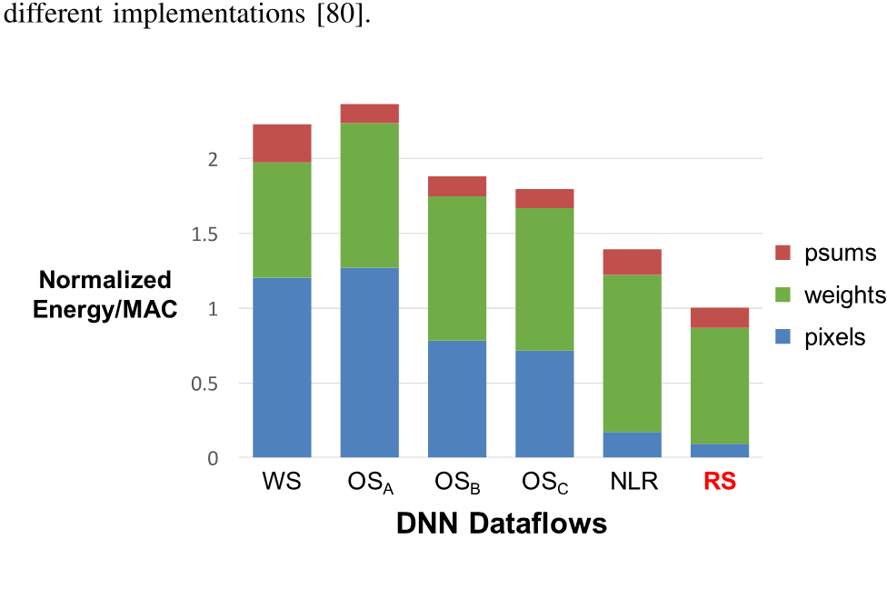

**图 34.** 批大小为 16 时, AlexNet FC 层中不同数据流的能效比较 [Che16c].

[图 35](#figure-35) 展示了 RS 数据流设计按 AlexNet 不同层细分的能耗. 在 CONV 层中, 能量主要由 RF 消耗; 在 FC 层中, 能量主要由 DRAM 消耗. 不过, 大部分能量由 CONV 层消耗, 约占总能耗的 80%. 随着近期 DNN 模型加深并加入更多 CONV 层, CONV 层与 FC 层数量之比只会越来越大. 因此, 今后应投入大量精力优化 CONV 层的能耗.

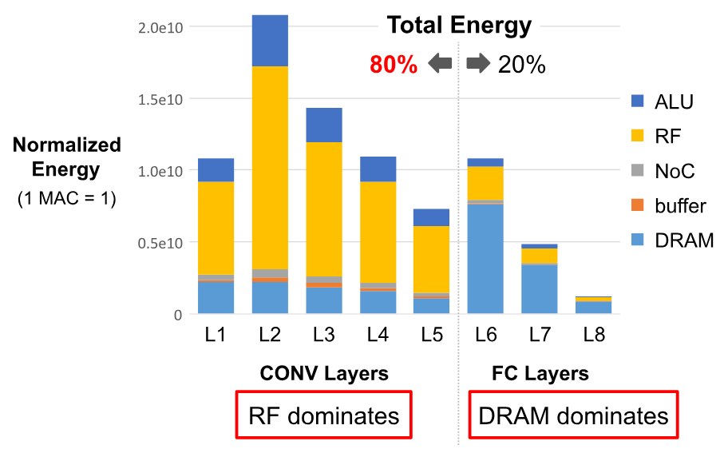

**图 35.** AlexNet 各层的能耗细分 [Che16c]. RF 能耗在卷积层中占主导. DRAM 能耗在全连接层中占主导. 卷积层在能耗中占主导.

最后, 到目前为止, 我们考察的架构存储容量相对有限, 约为数百 KB. 如果存储容量大得多, 达到数 MB, 还可以考虑其他数据流. 例如, Fused-Layer 研究了跨层的数据流优化 [Alw16].

## VI 近数据处理

上一节指出, 数据移动在能耗中占主导. 空间架构将片上存储器分散布置, 使其更接近计算位置 (例如放入 PE), 同时也有人尝试让片外高密度存储器靠近计算位置, 或把计算本身集成到存储器中; 后一种方法通常称为*存内处理*或*存内逻辑*. 在嵌入式系统中, 也有人尝试把计算移入最初采集数据的传感器. 本节将讨论如何利用混合信号电路设计和先进存储技术, 让计算与数据彼此靠近以减少数据移动 (即近数据处理).

这类工作中有许多采用模拟处理, 缺点是对电路和器件非理想特性的敏感度更高. 因此, 计算通常以较低精度执行, 可以在 DNN 训练期间使用[第 VII 节](#section-vii) 介绍的技术将这一点纳入考虑. 另一个需要考虑的因素是, DNN 通常在数字域中训练; 因此, 模拟处理还会产生模数转换 (ADC) 和数模转换 (DAC) 的额外开销.

### VI-A DRAM

先进存储技术可以降低 DRAM 等高密度存储器的访问能耗. 例如, *嵌入式 DRAM (eDRAM)* 将高密度存储器置于片上, 避免切换片外电容产生的高能耗 [Kei01]; eDRAM 的密度是 SRAM 的 $2.85\times$, 能效是 DRAM (DDR3) 的 $321\times$ [Che14a]. 与 DRAM 相比, eDRAM 还可提供更高带宽和更低延迟. 在 DNN 处理中, eDRAM 可用于在片上存储数十 MB 的权重和激活值, 避免片外访问, DaDianNao 已展示这种做法 [Che14a]. eDRAM 的缺点是密度低于片外 DRAM, 并且可能增加芯片成本.

DRAM 不必集成到芯片内部, 也可以使用硅通孔 (TSV) 堆叠在芯片上方. 这种技术通常称为*三维存储器*, 并已通过 Hybrid Memory Cube (HMC) [Jed12] 和 High Bandwidth Memory (HBM) [Hbm13] 等形式实现商业化. 与现有二维 DRAM 相比, 三维存储器可提供高一个数量级的带宽, 并将访问能耗最多降低 $5\times$, 因为 TSV 的电容低于典型的片外互连. 近期工作从多个方面探索了如何使用 HMC 高效处理 DNN. 例如, Neurocube [Kim16a] 将 SIMD 处理器集成到 HMC 的逻辑裸片中, 使存储器和计算彼此靠近. Tetris [Gao17] 探索了如何将 HMC 与 Eyeriss 空间架构及行驻留数据流结合使用. 为了利用 HMC 的低能耗和高吞吐量特性, 它提出为计算分配比片上存储器更大的面积 (即使用更大的 PE 阵列和更小的全局缓冲区). 它还调整了数据流, 以适配 HMC 存储器和更小的片上存储器. 相比使用传统二维 DRAM 的基线系统, Tetris 将能耗降低了 $1.5\times$, 并将吞吐量提高了 $4.1\times$.

### VI-B SRAM

近期工作不仅研究如何让存储器靠近计算, 也研究了如何把计算移入存储器. 例如, 可以把乘加操作直接集成到 SRAM 阵列的位单元中 [Zha16b], 如[图 36(a)](#figure-36) 所示. 在这项工作中, 使用一个 5 位 DAC 将字线 (WL) 驱动到表示特征向量的模拟电压, 位单元则存储二值权重 $\pm 1$. 位单元电流 ($I_{\mathrm{BC}}$) 实际上是特征向量值与位单元所存权重值的乘积; 同一列中各位单元的电流相加, 对位线 ($V_{\mathrm{BL}}$) 进行放电. 与从 SRAM 读取 1 位权重后单独执行计算相比, 这种方法可节省 $12\times$ 的能量. 为了抵消电路非理想特性, DAC 会考虑相对于 WL 电压呈非线性的位线放电, 并使用 boosting 将易受器件变化影响的弱分类器组合成强分类器 [Wan14].

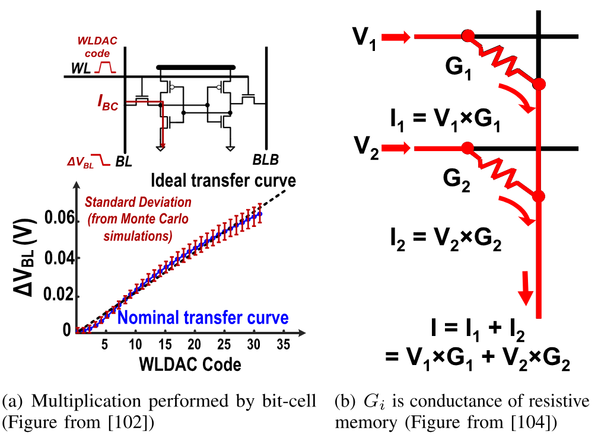

**图 36.** 通过 (a) SRAM 位单元和 (b) 非易失性电阻存储器进行模拟计算.

### VI-C 非易失性电阻存储器

还可以把乘加操作直接集成到先进的高密度*非易失性*存储器中, 方法是将其用作可编程电阻元件, 这类元件通常称为*忆阻器* [Chu71]. 具体而言, 如[图 36(b)](#figure-36) 所示, 乘法以电阻的电导作为权重, 电压作为输入, 电流作为输出. 加法则依据基尔霍夫电流定律, 对不同忆阻器的电流求和. 这是权重驻留数据流的最终形式, 因为权重始终保持在原位. 这种方法的优点包括降低能耗, 因为计算嵌入存储器后会减少数据移动; 同时还能提高密度, 因为存储和计算可以紧密排布, 达到与 DRAM 相近的密度 [Wil13]. [+8]

非易失性电阻存储器件有几种常见候选方案, 包括相变存储器 (PCM), 电阻式 RAM (RRAM 或 ReRAM), 导电桥 RAM (CBRAM) 和自旋转移矩磁性 RAM (STT-MRAM) [Lu16]. 这些器件在耐久性 (即可以写入多少次), 数据保持时间, 写入电流, 密度 (即单元尺寸), 变化和速度方面各有取舍.

如 [Ery16] 所述, 使用非易失性电阻存储器进行处理有几个缺点. 第一, 它存在前文所述模拟处理的精度降低和 ADC/DAC 开销问题. 第二, 阵列尺寸受连接电阻器件的导线限制; 具体而言, 在大型阵列 (如 1k $\times$ 1k) 中, 导线能耗占主导, 而且沿导线产生的 IR 压降会降低读取精度. 第三, 对电阻器件进行编程的写入能耗可能很高, 某些情况下需要多个脉冲. 最后, 电阻器件还可能出现器件间和周期间变化, 并且在整个电导范围内具有非线性电导.

近期已有多项工作探索如何将忆阻器用于 DNN. ISAAC [Sha16b] 用忆阻器替换 DaDianNao 中的 eDRAM. 为解决精度支持有限的问题, ISAAC 使用 8 个各存储 2 位的忆阻器计算 16 位点积; 每个忆阻器执行一次 1 位 $\times$ 2 位乘法, 一个 16 位输入需要 16 个周期才能处理完毕. 换言之, ISAAC 架构以面积和时间换取更高精度. 最后, ISAAC 将其 25.1M 个忆阻器组织为分层结构, 以避免大型阵列带来的问题. PRIME [Chi16] 也用忆阻器替换 DRAM 主存; 具体而言, 它使用 $256 \times 256$ 忆阻器阵列, 可配置为 4 位多级单元计算或 1 位单级单元存储. 需要说明的是, ISAAC 和 PRIME 的结果来自仿真. 实际制造大型忆阻器阵列仍然是一个很大的研究挑战; 例如, [Pre15] 使用一个实际制造的 $12 \times 12$ 忆阻器阵列展示线性分类器.

### VI-D 传感器

在图像处理等某些应用中, 来自传感器本身的数据移动可能占系统能耗的很大一部分. 因此, 也有研究尝试让计算尽可能靠近传感器. 其中, 很多工作侧重于将计算移入模拟域, 以避免使用传感器内的 ADC, 因为 ADC 占传感器功耗的很大一部分. 不过, 如前所述, 由于电路存在非理想特性, 模拟计算需要较低的精度.

在 [Zha15a] 中, 矩阵乘法被集成到 ADC 中, 乘法结果的最高有效位采用开关电容以 8 位逐次逼近形式计算. [Lee16] 将这一方法扩展到不仅在模拟域中执行乘法, 还执行累加. 这项工作假设 3 位和 6 位分别足以表示权重和激活值. 这使传感器中的 ADC 转换次数减少了 $21\times$. RedEye [Lik16] 更进一步, 在传感器端以模拟方式执行整个卷积层 (包括卷积, 最大池化和量化). 需要说明的是, [Zha15a] 和 [Lee16] 报告的是实际制造的测试芯片测量结果, 而 [Lik16] 的结果来自仿真.

计算不仅可以嵌入 ADC 之前, 也可以嵌入传感器本身. 例如, [Wan12] 使用 Angle Sensitive Pixels 传感器计算输入梯度, 配合压缩后, 可将传感器的数据移动减少 $10\times$. 此外, 由于 DNN 第一层通常会输出类似梯度的特征图, 或许可以跳过第一层的计算, 从而进一步降低能耗, 如 [Che16g, Sul14] 所述.

## VII DNN 模型与硬件的协同设计

早期工作在设计 DNN 模型时以最大化准确率为目标, 很少考虑实现复杂度. 不过, 这样的设计可能很难实现和部署. 为此, 近期工作表明, 可以协同设计 DNN 模型和硬件, 在共同提高准确率和吞吐量的同时降低能耗和成本, 从而提高方案被采用的可能性. 本节将介绍 DNN 模型与硬件协同设计方面的各种工作. 需要注意的是, 与[第 V 节](#section-v)不同, 本节讨论的技术可能影响准确率; 因此, 目标不仅是大幅降低能耗, 提高吞吐量, 还要尽量减小准确率损失.

协同设计方法大致可以分为以下几类:

- *降低运算和操作数的精度.* 包括从浮点转为定点, 缩短位宽, 非线性量化和权重共享.
- *减少运算次数和模型大小.* 包括压缩, 剪枝和紧凑网络架构等技术.

### VII-A 降低精度

量化是把数据映射到一组更少的量化级. 最终目标是尽量减小从量化级重建的数据与原始数据之间的误差. 量化级数量体现了*精度*, 并最终决定表示数据所需的位数(通常为量化级数量的 $\log_{2}$); 因此, *降低精度*是指减少量化级数量, 从而减少位数. 降低精度可以减少存储开销和/或计算需求.

将数据映射到量化级有多种方式. 最简单的是线性映射, 各量化级之间的距离相同([图 37(a)](#figure-37)). 另一种方法是采用简单的映射函数, 例如*对数函数*([图 37(b)](#figure-37)), 其中各级之间的距离并不相同; 这种映射通常可用移位等简单逻辑实现. 也可以使用更复杂的映射函数, 由数据确定或学习量化级([图 37(c)](#figure-37)), 例如使用 k-means 聚类; 这种方法通常通过查找表实现映射.

最后, 量化可以是固定的(即网络中所有数据类型以及各层, 滤波器和通道都采用相同的量化方法), 也可以是可变的(即权重与激活以及网络中的不同层, 滤波器和通道可以采用不同的量化方法).

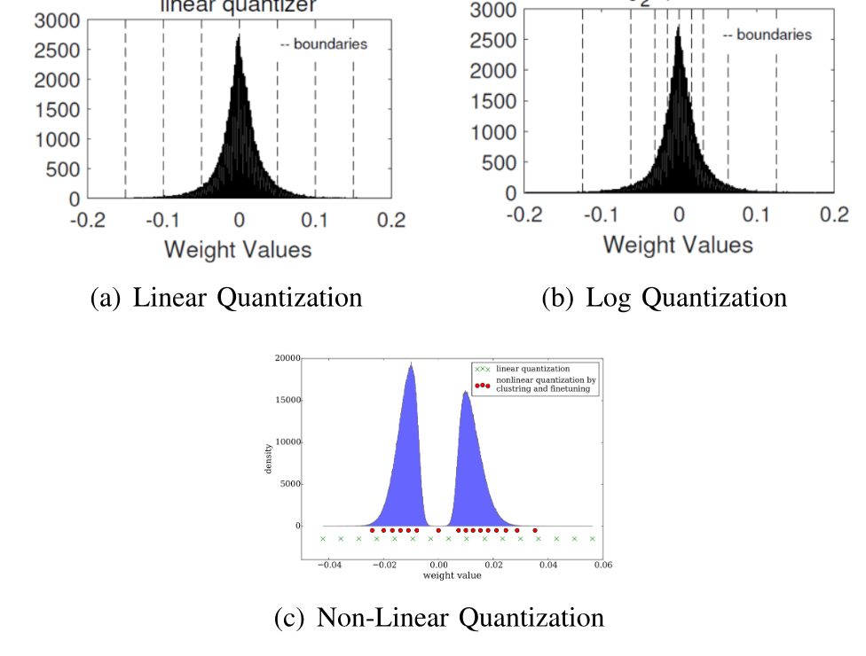

**图 37.** 各种量化方法(图引自 [Lee17, Han15]).

早期的降精度研究主要关注降低权重精度, 而不是激活精度, 因为权重会直接增加存储容量需求, 激活对存储容量的影响则取决于网络架构和数据流. 不过, 较新的工作也开始研究激活量化的影响. 由于梯度对量化很敏感, 大多数降精度研究也侧重于降低推理而非训练的精度, 但也有一些例外 [Gup15, Hub16a, Zho16a].

[表 III](#table-03) 汇总了近期工作中用于降低精度的关键技术, 涵盖了对权重和激活应用线性及非线性量化的方法. 准确率影响以 32 位浮点基准精度为参照进行报告, 这是 GPU 和 CPU 等平台使用的默认精度.

#### VII-A1 线性量化

降低精度的第一步通常是把数值和运算从浮点转换为定点. 如[图 38(a)](#figure-38) 所示, 32 位浮点数表示为 $(-1)^{s}\times m\times 2^{(e-127)}$, 其中 $s$ 是符号位, $e$ 是 8 位指数, $m$ 是 23 位尾数, 覆盖范围为 $10^{-38}$ 到 $10^{38}$.

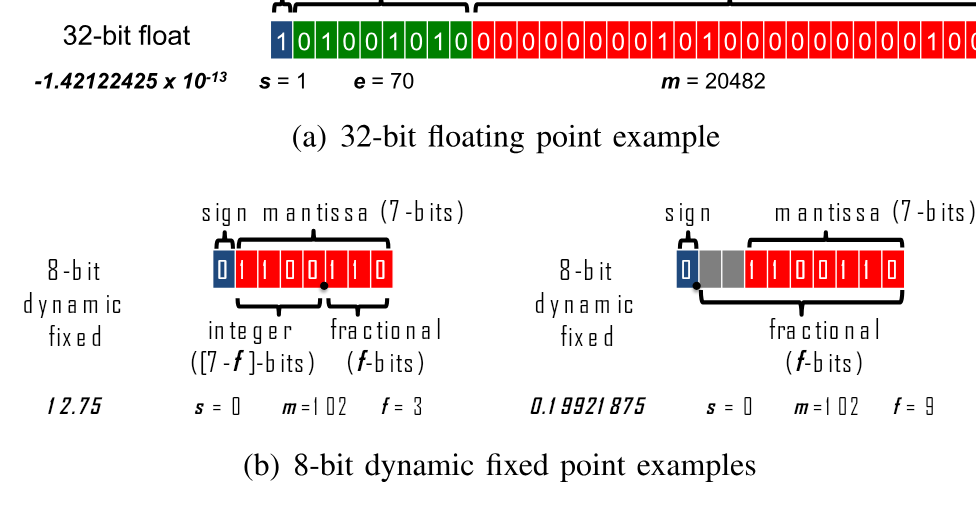

**图 38.** 各种数值表示方法.

N 位定点数表示为 $(-1)^{s}\times m\times 2^{-f}$, 其中 $s$ 是符号位, $m$ 是 (N-1) 位尾数, $f$ 决定小数点位置并充当缩放因子. 例如, 对于 8 位整数, 当 $f=0$ 时, 动态范围是 -128 到 127; 当 $f=10$ 时, 动态范围是 -0.125 到 0.124023438. 如[图 38(b)](#figure-38) 所示, *动态*定点表示允许 $f$ 随所需动态范围变化. 这对 DNN 很有用, 因为权重与激活的动态范围可能有很大差异. 此外, 动态范围在不同层和层类型之间也可能不同 (例如卷积层和全连接层). 使用动态定点时, 无须微调权重即可把权重位宽降至 8 位, 激活位宽降至 10 位 [Ma16]; 经过微调后, 权重和激活都能达到 8 位 [Gys16].

使用 8 位定点对能耗和面积有如下影响 [Hor14]:

- 8 位定点加法的能耗比 32 位定点加法低 $3.3\times$(面积小 $3.8\times$), 比 32 位浮点加法低 $30\times$(面积小 $116\times$). 定点加法的能耗和面积大致随位数线性增长.
- 8 位定点乘法的能耗比 32 位定点乘法低 $15.5\times$(面积小 $12.4\times$), 比 32 位浮点乘法低 $18.5\times$(面积小 $27.5\times$). 定点乘法的能耗和面积大致随位数的平方增长.

降低精度还会减少存储的能耗和面积开销. 正如前文所述, 这一点十分重要, 因为内存访问和数据移动主导着能耗. 内存的能耗和面积大致随位数线性增长. 不过需要指出, 如果不缩短位宽, 仅从浮点改为定点并不会降低内存的能耗或面积开销.

为完整起见, 还应说明, 定点乘加 (MAC) 运算内部数值的精度通常高于权重和激活. 为保证精度没有损失, N 位定点精度的权重和输入激活需要执行 N 位 $\times$ N 位乘法, 产生 2N 位输出乘积; 该输出需要以 2N+M 位精度累加, 其中 M 根据最大滤波器尺寸 $\log_{2}$([图 9(b)](#figure-09) 中的 $C\times R\times S$) 确定. 对于[第 III-B 节](#section-iii-b)介绍的常用 DNN, M 在 10 到 16 位之间. 累加后, 最终输出激活的精度通常降至 N 位 [Gup15, Ma16], 如[图 39](#figure-39) 所示. 如果权重和激活的分布以零附近为中心, 使累加不会只向一个方向移动, 降低输出精度就不会显著影响准确率; 使用批归一化时尤其如此.

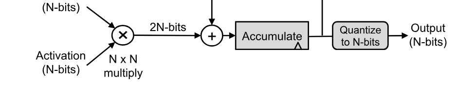

**图 39.** 降低乘加(MAC)精度.

降精度不仅是研究方向, 也已用于近期的商用 DNN 处理平台. 例如, Google 在 2016 年 5 月发布的 Tensor Processing Unit(TPU)面向 8 位整数运算设计 [Hig16]. 类似地, Nvidia 在 2016 年 4 月发布的 PASCAL GPU 也包含用于深度学习推理的 8 位整数指令 [Mor16]. 在 CPU 和 GPU 等通用平台上, 使用 8 位计算的主要收益是提高吞吐量, 因为一个时钟周期可以执行四个 8 位运算, 而不是一个 32 位运算.

通用平台通常支持 8 位, 16 位和/或 32 位运算, 但研究表明, DNN 所需的最低位精度实际上可以用更细的粒度变化. 例如, 在不显著影响准确率(即变化小于 1%)的情况下, AlexNet 各层的权重和激活精度可在 4 到 9 位之间变化 [Jud16, Moo16]. 专用硬件可以利用这种细粒度变化来提高吞吐量或降低能耗. 例如, 使用位串行处理时, 完成一次运算所需的时钟周期数与位宽成正比, 适应细粒度位精度变化可使速度相较 16 位提高 $2.24\times$ [Jud16]. 另一种做法是设计乘法器, 使其关键路径随位精度下降而缩短, 因为解析乘积所需的加法器更少; 再配合电压缩放, 相较 16 位可节能 $2.56\times$ [Moo16]. 这些位缩放结果以 16 位为参照, 若能进一步观察它们相对于各层所需最高精度(即 [Jud16, Moo16] 中的 9 位)的影响, 会很有意义.

精度还可以更激进地降至单比特, 这一研究领域通常称为*二值网络*. BinaryConnect(BC)[Cou15]提出二值权重(即 -1 和 1)的概念, 使用二值权重后, MAC 中的乘法只需加法和减法. Binarized Neural Networks(BNN)[Cou16]随后把它扩展为同时使用二值权重*和*二值激活, 从而把 MAC 简化为 XNOR.不过, BC 和 BNN 的准确率分别损失 19% 和 29.8% [Ras16].

为了减小这一准确率损失, Binary Weight Nets(BWN)和 XNOR-Nets 对 DNN 处理作了几项重大修改 [Ras16]. 这些修改包括: 将输出乘以缩放因子以恢复动态范围(即权重实际变为 -$w$ 和 $w$, 其中 $w$ 是滤波器内权重绝对值的平均值) [+9]; 保持第一层和最后一层为 32 位浮点精度; 在卷积前执行归一化, 以减小激活的动态范围. 经过这些修改, BWN 把准确率损失降至 0.8%, XNOR-Nets 则降至 11%. 将激活精度提高到略高于 1 位, 还能进一步减小 XNOR-Net 的损失. 例如, Quantized Neural Networks(QNN)[Hub16a], DoReFa-Net [Zho16a] 和 HWGQ-Net [Cai17]允许激活使用 2 位, 同时权重仍为 1 位; 在 HWGQ-Net 中, 准确率损失因此降至 5.2%.

上述二值网络都把权重限制为两个值(-$w$ 和 $w$), 但允许权重为零(即 -$w$, 0, $w$)可能带来收益. 虽然与二值权重相比, 每个权重需要多一位, 但可以利用权重稀疏性来降低计算和存储开销, 从而可能抵消这一额外位的成本. Ternary Weight Nets(TWN)[Li16b]研究了这种做法, Trained Ternary Quantization(TTQ)又将其扩展为对每个权重训练不同的缩放值(即 -$w_{1}$, 0, $w_{2}$); 在假设激活使用 32 位浮点的情况下, 准确率损失为 0.6% [Zhu17].

近期论文也研究了二值/三值网络的硬件实现. YodaNN [And16]使用二值权重, BRein [And17]使用二值权重和激活. [第 VI 节](#section-vi)介绍的 SRAM 内计算工作 [Zha16b]也使用二值权重. 最后, 名义上受脉冲启发的 TrueNorth 芯片可以利用 TrueNorth 的量化权重表, 实现具有二值激活和三值权重的低精度神经网络 [Ess16]. 这些工作往往不支持最先进的 DNN 模型(YodaNN 除外).

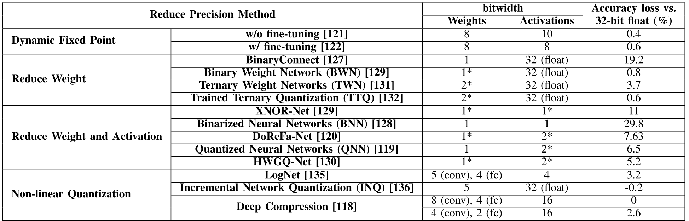

**表 3.** 降低 AlexNet 数值精度的方法. 准确率以 ImageNet Top-5 错误率衡量.*未应用于第一层和/或最后一层

#### VII-A2 非线性量化

前述工作采用量化级均匀分布的线性量化. 研究表明, 权重和激活的分布并不均匀 [Han15, Miy16], 因而非线性量化有可能提高准确率. 近期工作主要采用两种方法: (1) 对数域量化; (2) 学习式量化或权重共享.

*对数域量化.* 如果像[图 37(b)](#figure-37) 所示那样按对数分布分配量化级, 权重和激活会更均匀地分布在各量化级上, 每一级的利用也更充分, 从而减小量化误差. 例如, 对 VGG-16 使用 4 位线性量化会损失 27.8% 的准确率, 而以 2 为底的对数量化只损失 5% [Lee17]. 此外, 当权重量化为 2 的幂时, 乘法可替换为移位 [Gys16, Miy16]. [+10] Incremental Network Quantization (INQ) 把大权重和小权重分成不同组, 再迭代地量化并重新训练权重, 可进一步减小准确率损失 [Zho17].

*权重共享.* 权重共享迫使多个权重共用一个值, 从而减少一个滤波器或一层中的唯一权重数. 一种方法是用哈希函数对权重分组, 每组使用一个值 [Che15d]. 也可以用 k-means 算法对权重分组 [Han15]. 系统同时存储共享权重以及指示滤波器各位置应使用哪个权重的索引. 因此, 获取权重需要两个步骤: (1) 读取权重索引; (2) 根据权重索引读取共享权重. 如果权重索引的位数(唯一权重数的 $\log_{2}$)小于权重本身的位宽, 这种方法可以降低读取和存储权重的成本.

例如, 在 Deep Compression [Han15] 中, AlexNet 每层的唯一权重数在卷积层降至 256 个, 在全连接层降至 16 个, 分别需要 8 位和 4 位权重索引. 假设有 $U$ 个唯一权重, 且根据[图 9(b)](#figure-09), 该层滤波器大小为 $C \times R \times S \times M$; 如果读取一个 $C R S M\times \log_{2}U$ 位内存和一个 $U\times16$ 位内存 (如[图 40](#figure-40) 所示) 的成本低于读取一个 $C R S M\times16$ 位内存, 就可以节省能耗. 需要注意, 权重共享与之前的量化方法不同, 它不会降低 MAC 计算本身的精度, 只会减少权重存储需求.

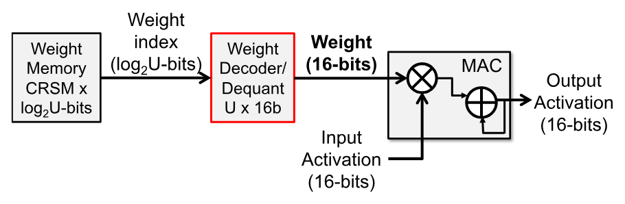

**图 40.** 权重共享硬件.

### VII-B 减少运算次数和模型大小

除了减小每次运算或每个操作数(权重/激活)的大小外, 还有大量研究试图减少运算次数和模型大小. 这些技术大致可分为利用激活统计特性, 网络剪枝, 网络架构设计和知识蒸馏.

#### VII-B1 利用激活统计特性

如[第 III-A1 节](#section-iii-a1) 所述, ReLU 是 DNN 中常用的非线性形式, 它将所有负值置零, 如[图 41(a)](#figure-41) 所示. 因此, ReLU 后特征图的输出激活是稀疏的; 例如, 如[图 41(b)](#figure-41) 所示, AlexNet 特征图的稀疏度在 19% 到 63% 之间. 与 sigmoid 等其他非线性相比, 这种稀疏性给 ReLU 带来了实现优势.

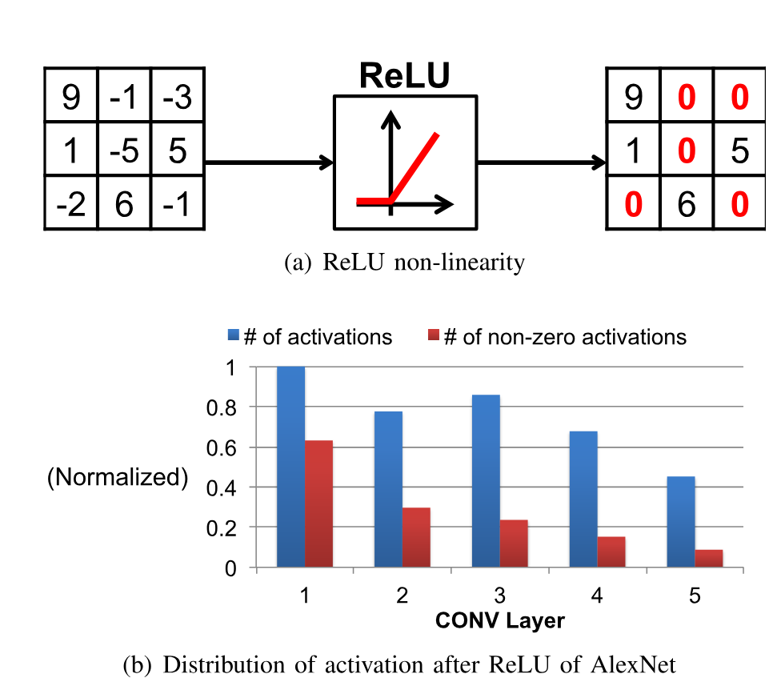

**图 41.** ReLU 产生的激活稀疏性.

可以利用稀疏性通过压缩来节省能耗和面积, 对成本高昂的片外 DRAM 访问尤其有效. 例如, 一种简单的游程编码先标记 16 位非零值, 再标记最长为 31 的连续零值, 可将激活的外部内存带宽降低 $2.1\times$, 将总体外部带宽(包括权重)降低 $1.5\times$ [Che17a]. [+11] 除压缩外, 还可以修改硬件, 对零值激活跳过权重读取和 MAC 运算, 从而将能耗降低 45% [Che16f]. 硬件还可以跳过相应周期, 而不只是门控读取与 MAC 计算, 使吞吐量提高 $1.37\times$ [Alb16].

对数值较小的激活进行剪枝, 可使激活更加稀疏. 例如, 剪掉所有较小的激活值, 可以额外提速 11% [Alb16]或降低 $2\times$ 功耗 [Rea16], 同时对准确率影响很小. 更激进地剪除更多激活可以进一步提高吞吐量, 代价是准确率下降.

#### VII-B2 网络剪枝

为了便于网络训练, 网络通常会过度参数化. 因此, 网络中大量权重是冗余的, 可以删除(即置零). 这一过程称为网络剪枝. 激进的网络剪枝通常需要对权重进行一定微调, 才能保持原有准确率.1989 年提出的 Optimal Brain Damage 技术 [Lec89]首次采用这种方法. 其思路是计算每个权重对训练损失的影响(见[第 II-C 节](#section-ii-c)), 称为权重显著性. 低显著性权重会被删除, 其余权重则经过微调; 不断重复这一过程, 直到达到所需的权重削减量和准确率.

2015 年, [Han15c]把类似思路用于现代 DNN.显著性对于大规模 DNN 很难计算, 因此该工作不再将它用作指标, 而是直接根据权重大小进行剪枝. 先剪除较小的权重, 再微调模型以恢复准确率. 不微调权重时, 约可剪除 50% 的权重; 经过微调后, 可剪除超过 80% 的权重. 总体而言, 这种方法可使 AlexNet 的权重数减少 $9\times$, MAC 数减少 $3\times$. 权重削减主要来自全连接层(全连接层减少 $9.9\times$, 卷积层减少 $2.7\times$).

不过, 只看权重数并不能很好地衡量能耗. 例如, AlexNet 全连接层的权重数远多于卷积层, 但如[图 35](#figure-35) 所示, 卷积层的能耗远高于全连接层 [Che16c]. 与其用权重数和 MAC 运算数间接表示能耗, 不如直接以能耗驱动权重剪枝 [Yan17a]. 能耗评估方法可以估算 DNN 能耗, 同时计入存储层次各级的数据移动, MAC 数和数据稀疏性, 如[图 42](#figure-42) 所示; 这一能耗估算工具可从 [Dnn00] 获得. [图 43(a)](#figure-43) 给出了常用 DNN 模型的估算能耗. 然后可以用能耗感知剪枝根据能耗剪除权重, 使 AlexNet 所有层的总能耗降低 $3.7\times$; 如[图 43(b)](#figure-43) 所示, 其效率比基于权重大小的方法 [Han15c] 高 $1.74\times$. 如前所述, AlexNet 的过度参数化广为人知. 能耗感知剪枝也可用于本身已较小的 GoogleNet, 使能耗降低 $1.6\times$.

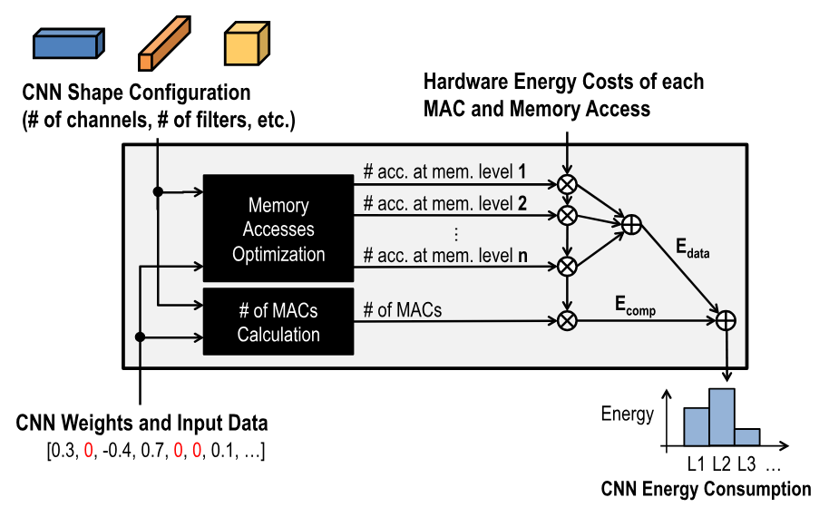

**图 42.** [Yan17a]提出的能耗估算方法, 根据存储层次各级的数据移动, MAC 数和数据稀疏性估算能耗.

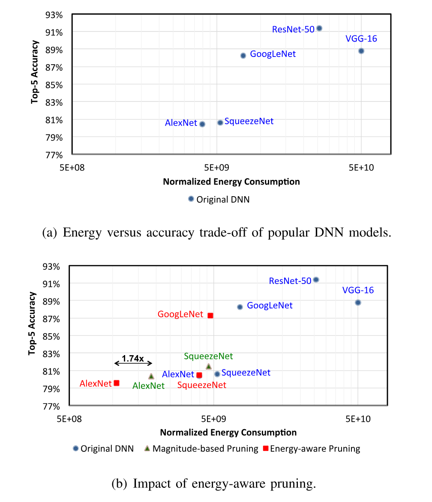

**图 43.** 使用 [Yan17a]方法估算的能耗值.

近期工作研究了如何用硬件高效支持稀疏权重处理. 其中一个关注点是剪枝后如何妥善存储稀疏权重. 与[第 VII-B1 节](#section-vii-b1)讨论的稀疏激活压缩类似, 可以压缩稀疏权重, 从而将内存访问带宽降低 20% 到 30% [Han15].

如[图 18(a)](#figure-18) 所示, 当 DNN 处理以矩阵向量乘法形式执行时, 一个难点是如何用压缩格式存储稀疏权重矩阵. 压缩可以按行或按列进行. 如[图 44(a)](#figure-44) 所示, 压缩稀疏行 (CSR) 格式常用于执行稀疏矩阵向量乘法. 不过, 由于矩阵每一行都是稀疏的, 即使每次只使用输入向量的一个子集, 也需要多次读取该向量. 另一种选择是使用[图 44(b)](#figure-44) 所示的压缩稀疏列 (CSC) 格式, 该格式会多次更新输出, 每次只读取输入向量的一个元素 [Dor14]. 如果输出小于输入, CSC 格式的总内存带宽会低于 CSR; 对 DNN 而言, 条件是滤波器数量*没有*显著多于滤波器内权重数 ([图 9(b)](#figure-09) 中的 $C\times R\times S$). 这一条件通常成立, 因此 CSC 可以成为处理稀疏 DNN 的有效格式.

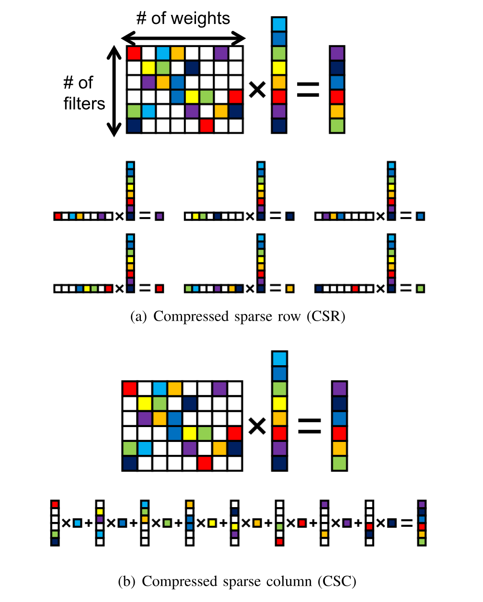

**图 44.** 使用不同存储格式的稀疏矩阵向量乘法(图引自 [Dor14]).

研究人员已探索用定制硬件高效支持经过剪枝的 DNN 模型. 许多工作以不解压权重或激活为目标进行处理. EIE [Han16a]专门针对全连接层执行稀疏矩阵向量乘法. 它以 CSC 格式存储权重, 同时存储每一列的起始位置; 由于压缩后的权重长度不定, 必须保存这一位置. 当输入非零时, 系统读取压缩后的权重列并更新输出. 为处理稀疏性, 系统用额外逻辑跟踪应更新的输出位置. SCNN [Par17a]支持以压缩格式处理卷积层. 它采用输入固定数据流, 将压缩权重和激活送入乘法器阵列, 再由散播网络对分散的部分和进行累加.

近期工作还研究了如何利用结构化剪枝, 避免采用定制硬件 [Wen16, Anw17]. 结构化剪枝不剪除单个权重(也称细粒度剪枝), 而是剪除成组权重(也称粗粒度剪枝). 结构化剪枝有两项优势: (1) 生成的权重能更好地适配现有通用硬件中的数据并行架构(例如 SIMD), 从而提高处理效率 [Yu17]; (2) 在一组权重间分摊标记非零权重位置所需的额外开销, 改善压缩率并降低存储成本. 权重组可以是一对相邻权重, 滤波器的一整行或一整列, 滤波器的整个通道, 也可以是整个滤波器; 分组越大, 准确率损失往往越高 [Mao17].

#### VII-B3 紧凑网络架构

改进网络架构本身也能减少权重数和运算数. 目前的趋势是用一系列较小滤波器替换大滤波器, 小滤波器的权重总数更少; 依次应用这些滤波器时, 可以获得相同的总有效感受野(即滤波器为计算输出而使用的输入图像区域). 这种方法既可在设计网络架构时(训练前)使用, 也可通过分解已训练网络的滤波器(训练后)使用. 后一种方法免去了从头训练网络的麻烦, 但灵活性不如前者. 例如, 现有方法只能把已训练网络中的一个滤波器分解为一系列滤波器, 各滤波器之间不能加入非线性.

**训练前.** 近期 DNN 模型更常使用宽度和高度较小的滤波器, 因为将多个小滤波器串联起来可以模拟较大的滤波器, 如[图 13](#figure-13) 所示. 例如, 一个 $5 \times 5$ 卷积可替换为两个 $3 \times 3$ 卷积. 也可以把一个 $N \times N$ 卷积分解为两个一维卷积, 即一个 $1 \times N$ 卷积和一个 $N \times 1$ 卷积 [Sze16]; 这实质上增加了一项限制, 要求二维滤波器必须可分离, 这是图像处理中常见的约束 [Lim90]. 类似地, 可以像 Xception [Cho16a] 和 MobileNets [How17] 那样, 用一组二维卷积 (即只应用于一个输入通道) 后接 $1 \times 1$ 三维卷积来替换三维卷积. 二维卷积和 $1 \times 1$ 三维卷积的顺序可以互换.

$1 \times 1$ 卷积层还可以减少给定层输出特征图的通道数, 从而减少下一层滤波器的通道数和计算成本, [Lin14, Sze14, He16c] 对此已有展示; 如[第 III-B 节](#section-iii-b) 所述, 这通常称为“瓶颈”. 为实现这一目的, $1 \times 1$ 滤波器数量必须少于 $1 \times 1$ 滤波器中的通道数. 例如, 32 个 $1 \times 1 \times 64$ 滤波器可以把 64 通道输入转换为 32 通道输出, 并把下一层的滤波器通道数降至 32. SqueezeNet 使用大量 $1 \times 1$ 滤波器, 以大幅减少权重数 [Ian17]. 它提出一种 *fire* 模块, 先用 $1 \times 1$ 卷积滤波器“压缩”网络, 再用多个 $1 \times 1$ 和 $3 \times 3$ 卷积滤波器将其扩展. 与 AlexNet 相比, 它使权重总数减少 $50\times$, 同时保持相同准确率. 不过需要注意, 减少权重数不一定会降低能耗; 例如, 如[图 43(a)](#figure-43) 所示, SqueezeNet 的能耗高于 AlexNet.

**训练后.** 张量分解可以在不影响准确率的情况下, 分解已训练网络中的滤波器. 它把一层中的权重视为四维张量, 再分解为较小张量的组合(即若干层). 然后可以应用低秩近似进一步提高压缩率, 代价是准确率下降, 但微调权重可以恢复准确率.

这种方法使用 Canonical Polyadic(CP)分解进行了展示. CP 分解是奇异值分解的高阶扩展, 可以通过贪心算法 [Den14a]或非线性最小二乘法 [Leb15]等多种方法求解. 将 CP 分解与低秩近似结合, 可在 CPU 上实现 $4.5\times$ 加速 [Leb15]. 不过, 当表示权重的张量维数大于二时, CP 分解无法以数值稳定的方式计算 [Leb15]. 为缓解这一问题, [Kim16b]改用了 Tucker 分解.

#### VII-B4 知识蒸馏

使用深层网络或对不同模型的预测取平均(即集成), 比使用单个较浅网络的准确率更高, 但计算复杂度也更高. 为了兼顾两者, 知识蒸馏把复杂模型(教师)学到的知识迁移到较简单的模型(学生). 因此, 学生网络可以达到用相同数据集直接训练时无法达到的准确率 [He18a, Ba14]. 例如, [Hin15]展示了知识蒸馏如何使学生网络的语音识别准确率提高 2%, 达到与 10 个网络组成的集成教师网络相近的准确率.

[图 45](#figure-45) 展示了最简单的知识蒸馏方法 [He18a]. softmax 层常用作图像分类网络的输出层, 根据类别分数生成类别概率 [+12]; 它把类别分数压缩为 0 到 1 之间且总和为 1 的数值. 这种知识蒸馏方法不用数据集标签等硬目标 (取值为 0 或 1), 而是使用教师 DNN (或教师 DNN 集成) 的类别分数等软目标 (取值在 0 到 1 之间). 目标是尽量减小软目标与学生 DNN 类别分数之间的平方差. 使用类别分数而不是类别概率作为软目标, 是因为类别分数中的小值包含重要信息, softmax 可能会将其消除. 另一种做法是将 softmax 配置为生成更软的类别概率, 使较小值保留更多信息, 此时可以把 softmax 层之后的类别概率用作软目标 [Hin15]. 最后, 还可以把教师 DNN 的中间表示作为额外提示, 用来训练学生 DNN [Rom14].

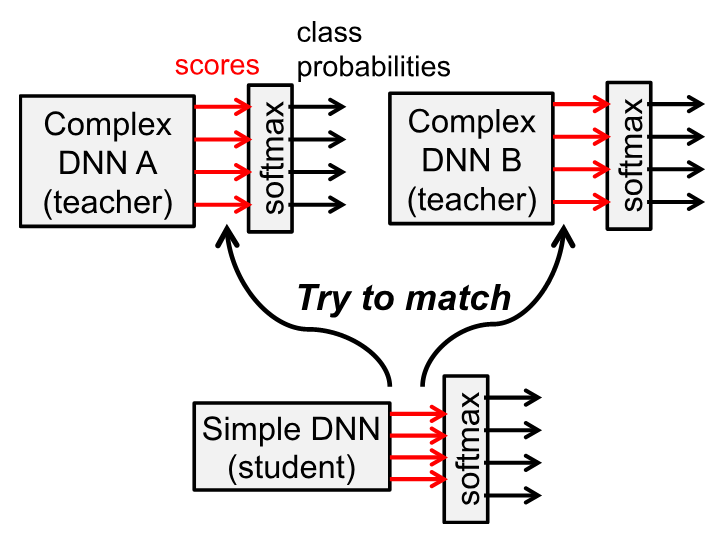

**图 45.** 知识蒸馏使小型 DNN 的类别分数与大型 DNN 集成的类别分数相匹配.

## VIII DNN 评估与比较的基准指标

如本文所述, 高效处理 DNN 已经得到大量研究. 比较不同设计和所提技术的各项优缺点时, 应考虑若干关键指标. 这些指标应涵盖准确率/鲁棒性, 功率/能耗, 吞吐量/延迟和成本等重要属性. 完整报告这些指标, 才能全面反映所提设计或技术作出的取舍. 我们建立了一个网站, 用于收集各类论文中的这些指标 [Ben00a].

在*准确率*和*鲁棒性*方面, 应当像[第 IV 节](#section-iv)所述那样, 在广泛接受的数据集上报告准确率. 衡量准确率时, 应考虑数据集和/或任务的难度. 例如, 用于数字识别的 MNIST 数据集明显比 ImageNet 数据集简单. 因此, 在 MNIST 上表现良好的 DNN 未必能在 ImageNet 上表现良好. 比较不同 DNN 模型的准确率时, 必须使用相同的数据集和任务; 目前更适合使用 ImageNet, 因为它对 DNN 构成挑战, 而 MNIST 也能用简单的非 DNN 技术解决. 如果主要展示硬件创新, 最好报告常用 DNN 模型(例如 AlexNet, GoogLeNet)的结果, 因为这些模型的准确率和鲁棒性已得到充分研究与测试.

在电池容量有限的嵌入式设备(例如智能手机, 智能传感器, UAV 和可穿戴设备)上进行边缘 DNN 处理时, *能耗*很重要; 在数据中心中进行云端处理时, 由于冷却成本造成严格的功率上限, *功率*很重要. 对于某些应用, 受延迟, 隐私或通信带宽限制, 边缘处理优于云端处理. 评估功率和能耗时, 必须计入系统的所有部分, 包括芯片和外部内存访问.

导航和机器人等交互式应用要实现实时性能, 必须具备*高吞吐量*. 对于数据分析, 高吞吐量意味着可以在给定时间内分析更多数据. 随着视觉数据量呈指数增长, 高吞吐量的大数据分析愈发重要, 尤其是在需要根据分析结果采取行动时(例如安保或反恐, 以及医学诊断).

实时交互式应用需要*低延迟*. 延迟衡量像素到达系统到生成结果之间的时间. 延迟以秒计, 吞吐量以运算次数/秒计. 高吞吐量通常通过把多幅图像/多帧批量处理来获得, 这会产生多帧延迟(例如, 每秒 30 帧时, 一批 100 帧会导致 3 秒延迟). 这种延迟无法用于高速导航等实时应用, 因为它会减少修正路线的可用时间. 因此, 同时实现低延迟和高吞吐量并不容易.

*硬件成本*在很大程度上取决于片上存储容量和核心数量. 典型嵌入式处理器的片上存储有限, 只有几百 KB.片上内存容量和外部内存带宽之间存在取舍, 因此两项指标都应报告. 同样, 核心数与吞吐量之间存在相关性. 此外, 尽管芯片上可以构建许多核心, 仍应报告给定时刻实际能使用的核心数. 映射和内存带宽会造成限制, 因而假设峰值利用率和性能通常并不现实. 相应地, 功率和吞吐量应针对实际运行 DNN 的情况进行报告, 不能只报告理论极限.

### VIII-A DNN 模型指标

评估给定 DNN 模型的特性时, 应考虑以下指标:

- 模型的*准确率*, 以 ImageNet 等数据集上的 Top-5 错误率表示. 此外, 还应报告所用数据增强的类型(例如多次裁剪, 集成模型).
- 应报告模型的*网络架构*, 包括层数, 滤波器尺寸, 滤波器数量和通道数.
- *权重数*会影响模型的存储需求, 因而应当报告. 如果可能, 还应报告非零权重数, 因为它反映了理论上的最低存储需求.
- 应报告需要执行的 *MAC 数*, 因为它在一定程度上反映给定 DNN 的运算次数和潜在吞吐量. 如果可能, 还应报告非零 MAC 数, 因为它反映了理论上的最低计算需求.

[表 IV](#table-04) 展示了如何报告多种知名 DNN 的这些指标. 表中的准确率对应分类时只对单个模型使用一次裁剪的情况, 因而权重数和 MAC 数保持一致. [+13] 需要注意, 计入非零 (NZ) 运算后, MAC 数和权重数会显著减少. NZ MAC 数取决于输入数据, 因此我们建议使用 ImageNet 公开提供的 50,000 幅验证图像进行计算. 最后, 有多种方法可以减少 DNN 中的权重 (例如[第 VII-B2 节](#section-vii-b2)的网络剪枝). [表 IV](#table-04) 还展示了另一组 DNN 模型指标示例, 将使用 [Yan17a] 剪枝得到的稀疏 DNN 与稠密 DNN 进行比较.

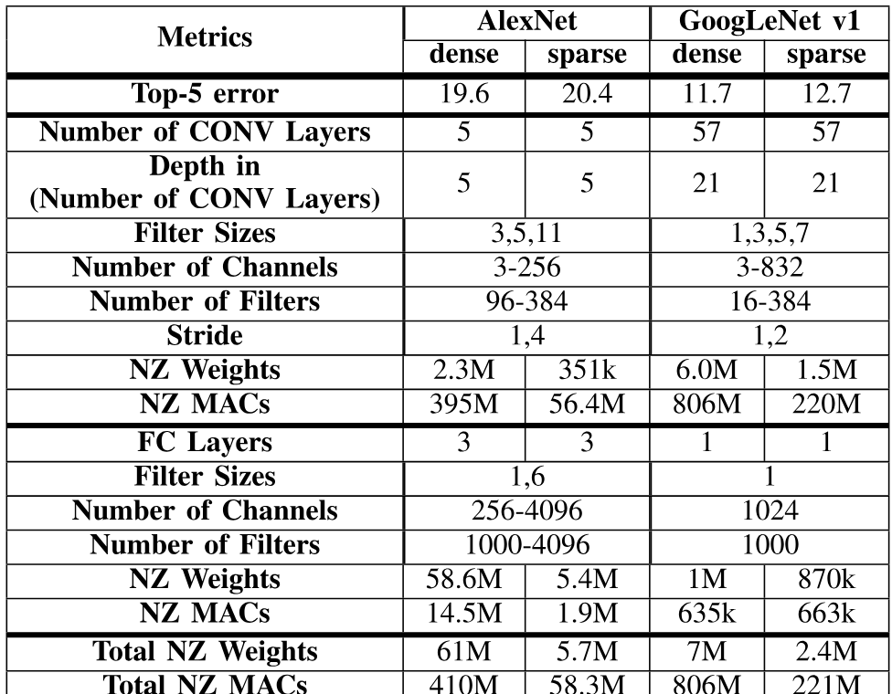

**表 4.** 常用 DNN 模型的指标. 通过报告非零(NZ)权重和 MAC 来计入稀疏性.

### VIII-B DNN 硬件指标

衡量 DNN 硬件的效率时, 还应考虑以下指标:

- 应针对多种 DNN 模型报告设计的*功率和能耗*; 应提供 DNN 模型的规格, 包括测量期间硬件支持哪些层和位精度. 此外, 还应计入片外访问量(例如 DRAM 访问), 因为它在系统功率中占很大比重; 可以用每次推理从片外读取和写入的数据总量来报告.
- 应结合批大小以及多种 DNN 模型的实际运行时间来报告*延迟和吞吐量*, 以计入映射与内存带宽的影响. 与峰值吞吐量相比, 这些指标更实用, 信息也更充分.
- 芯片的*成本*取决于面积效率, 其中要计入内存的大小和类型(例如寄存器或 SRAM)以及控制逻辑的数量. 应以每个乘法器对应的核心面积(平方毫米)连同工艺技术进行报告.

就成本而言, 不同平台会有不同的实现专用指标. 例如, 对 FPGA 应报告具体器件, 以及 DSP, BRAM, LUT 和 FF 等资源的利用率; 还可以报告 GOPs/slice 等性能密度.

每个处理器都应像[表 V](#table-05) 以 Eyeriss 芯片为例所示, 针对各项指标报告多种规格. 只有计入所有指标和规格, 才能公平评估各种设计取舍. 例如, 如果没有给出特定数据集和任务上的准确率, 就可以运行一个简单 DNN, 轻易声称低功耗, 高吞吐量和低成本, 但该处理器可能无法完成有意义的任务; 同样, 如果不报告片外带宽, 就可以构建一个只有乘法器的处理器, 轻易声称低成本, 高吞吐量, 高准确率和低*芯片*功耗, 但在评估*系统*功耗时, 片外内存访问会造成很大开销. 最后, 还应报告测试设置, 包括结果是实测还是仿真所得 [+14], 以及测试了多少幅图像.

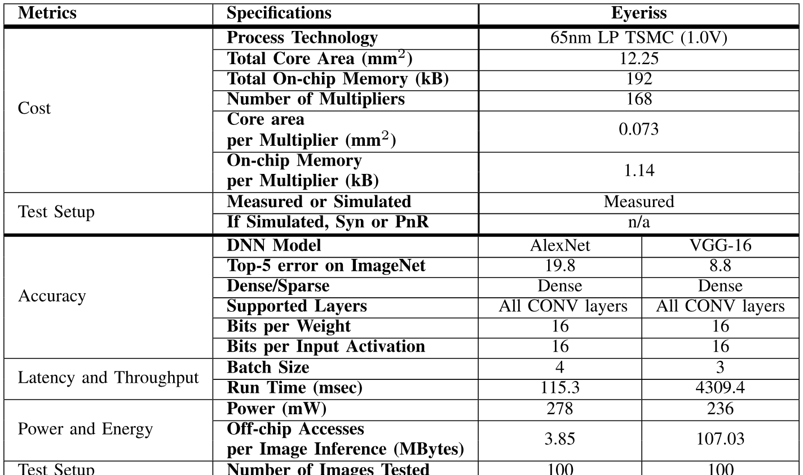

**表 5.** Eyeriss 的基准指标示例 [Che16f].

总的来说, 判断一个 DNN 系统对给定应用是否可行, 可以采用以下评估过程: (1) 准确率决定它能否完成给定任务; (2) 延迟和吞吐量决定它能否足够快地实时运行; (3) 能耗和功率主要决定可以承载该处理过程的设备形态; (4) 主要由芯片面积决定的成本, 决定了这套方案的价格.

## IX 总结

过去几年, 深度神经网络(DNN)的使用迅速增长. 它们目前广泛用于计算机视觉, 语音识别和机器人等许多人工智能(AI)应用, 准确率往往高于人类. 不过, DNN 实现这种出色准确率的代价是很高的计算复杂度. 因此, 要让 DNN 扩展到现有领域和新领域, 就必须采用能够以经济高效的硬件处理深度神经网络的技术, 在不牺牲*准确率*的情况下提高*能效*和*吞吐量*.

构建高效 DNN 处理系统, 首先应了解当前和未来的应用, 现在需要的具体计算, 以及这些计算可能如何演变. 本文调研了许多当前应用, 重点介绍计算机视觉应用, 相关算法以及驱动这些算法的数据. 这些应用, 算法和输入数据都在快速变化. 因此, 推断这些趋势并确定处理下一代计算所需的灵活程度, 会成为任何设计项目的重要组成部分.

在设计空间探索过程中, 必须理解并权衡重要的系统指标. 对于 DNN 计算, 这些指标包括准确率, 能耗, 吞吐量和硬件成本. 评估这些指标自然很关键, 因而本文也调研了 DNN 工作负载的重要组成部分. 具体而言, DNN 工作负载有两个主要组成部分. 首先, 工作负载包括每个 DNN 网络的形式, 其中包含各层的“形状”以及各层之间的连接. 这些形式在同一应用内部和不同应用之间都可能变化. 其次, 工作负载包括输入 DNN 的具体数据. 这些数据会随训练使用的输入集或推理运行期间输入的数据而变化.

本文还调研了以往工作优化 DNN 处理的多条路径. 数据移动主导着能耗, 因此近期一些研究主要试图在保持准确率, 吞吐量和成本的同时减少数据移动. 为此, 需要选择具有合适存储层次的架构, 例如空间阵列, 并开发能在存储层次低成本级别提高数据复用率的数据流. 本文给出了数据流的分类体系, 并分析了它们的特性. 另一些工作通过改变 DNN 中数据值的表示来节省空间和能量. 还有一些工作利用权重和/或激活的稀疏性来节能, 有时也能提高吞吐量.

DNN 领域也为软硬件协同设计提供了很好的机会. 例如, 多项工作指出, 提高稀疏度(增加零值数量), 或通过降低数值精度, 采用更复杂的存储值到实际计算值映射来优化数据表示, 都可以提高效率. 不过, 为避免准确率下降, 通常需要修改网络或微调网络权重, 使其适应这些变化. 因此, 本文既回顾了多种相关技术, 也讨论了用于描述, 运行和训练网络的框架.

最后, DNN 还可以利用混合信号电路设计和先进技术来提高效率, 包括使用忆阻器进行模拟计算以及使用三维堆叠内存. 先进技术也有助于把计算移近数据源, 方法是将计算嵌入传感器和内存附近或内部. 当然, 这些技术还应组合起来考虑, 同时仔细理解它们之间的相互作用, 寻找软硬件/算法联合协同优化的机会.

综上所述, 尽管已经开展了大量工作, 深度神经网络仍然是一个重要研究领域, 在各级硬件设计中都有许多前景良好的应用和创新机会.

## 致谢

本研究获得 DARPA YFA, MIT CICS 以及 Nvidia 和 Intel 捐赠的资助. 作者感谢匿名审稿人以及 James Noraky, Mehul Tikekar 和 Zhengdong Zhang 对本文提出的宝贵意见.

[+1]: 注: 近期工作以一种特殊方式使用 TrueNorth, 使其可以计算低精度神经网络 [Ess16]. [第 VII-A 节](#section-vii-a)讨论了这类神经网络.

[+2]: 对每个滤波器进行反向传播时: (1) 根据滤波器输入(即前向激活)和损失相对于滤波器输出的梯度, 计算损失相对于权重的梯度; (2) 根据滤波器权重和损失相对于滤波器输出的梯度, 计算损失相对于滤波器输入的梯度.

[+3]: 20 世纪 60 年代初, 单模拟神经元系统曾用于自适应滤波 [Wid60, Wid05].

[+4]: Top-5 错误率根据正确答案是否出现在算法选出的前 5 个类别中来衡量.

[+5]: DNN 的一项主要缺点是需要大型数据集, 以防训练期间出现过拟合.

[+6]: 注: CONV 层中的结构化稀疏性与[第 VII-B2 节](#section-vii-b2)所述网络剪枝产生的稀疏性相互正交.

[+7]: v2 与 v3 非常相似.

[+8]: 电阻器件可以插入两条导线的交叉点之间, 在某些情况下可以不使用访问晶体管.

[+9]: 这也可以视为一种权重共享形式, 每个滤波器只使用两个权重.

[+10]: 不过需要注意, 乘法在总能耗中所占比例并不大.

[+11]: 这种简单游程压缩与理论熵极限之间只相差 5-10%.

[+12]: 也常称为 logits.

[+13]: 数据增强常用于提高准确率, 包括使用图像的多次裁剪来应对错位; 此外, 还可以集成多个模型, 由于初始化或数据集等训练设置不同, 甚至网络架构不同, 各模型具有不同权重. 如果使用多次裁剪和多个模型, 所需 MAC 数与权重数都会增加.

[+14]: 如果结果来自仿真, 应说明它来自综合还是布局布线后仿真, 以及使用了哪个工艺库角.
