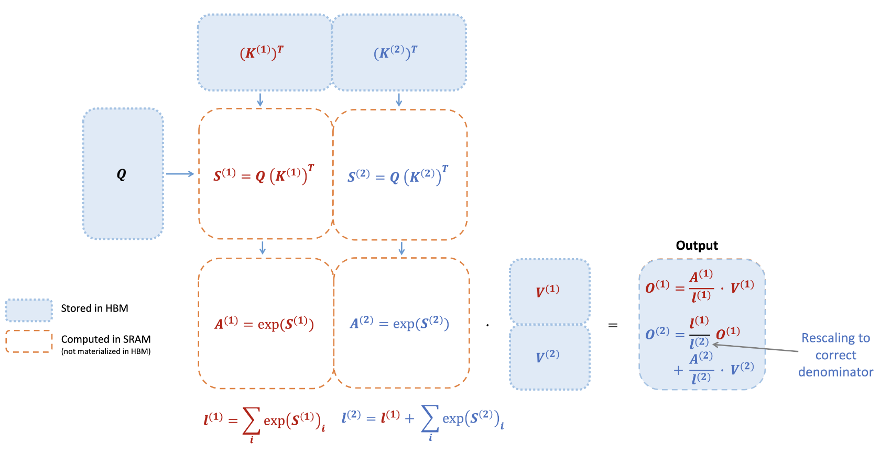
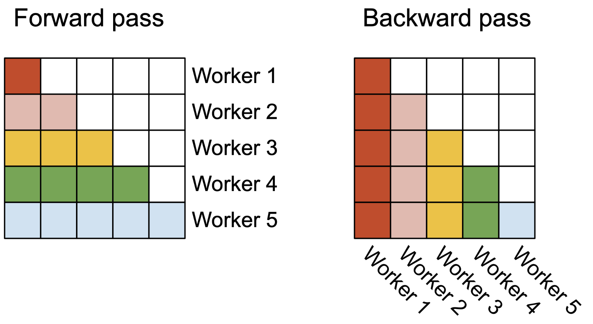
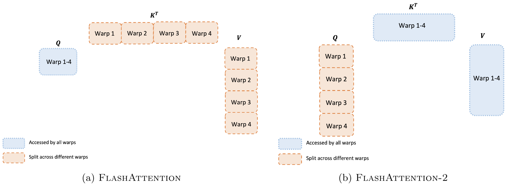
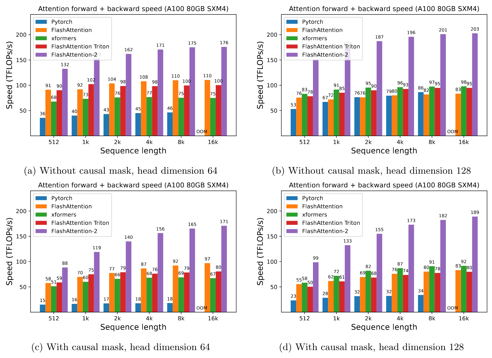
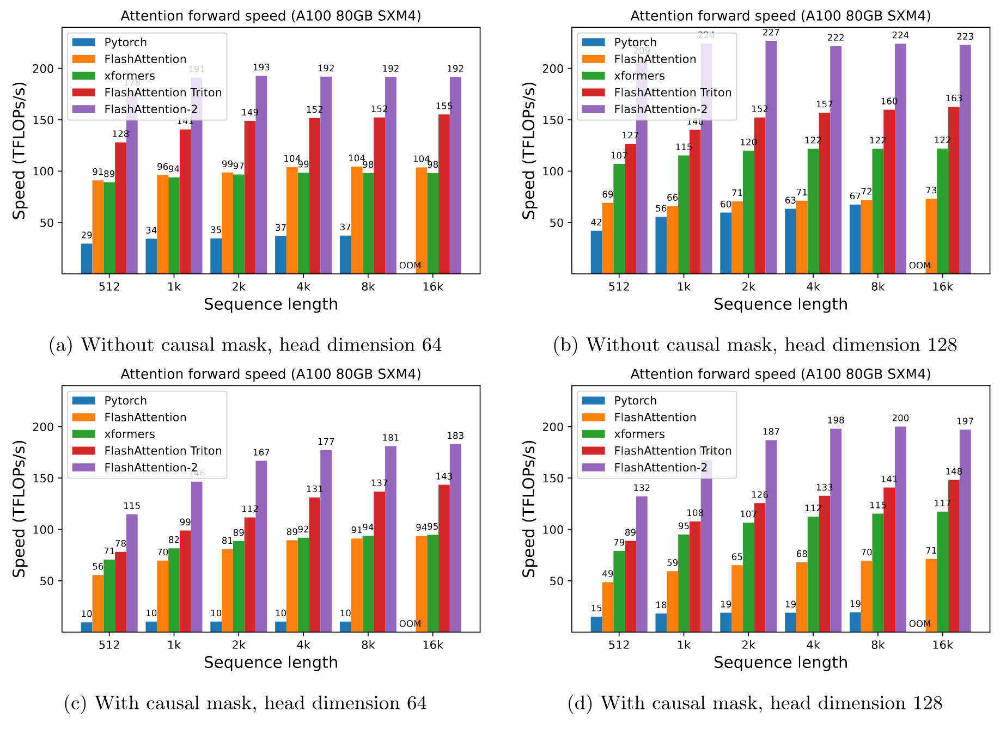
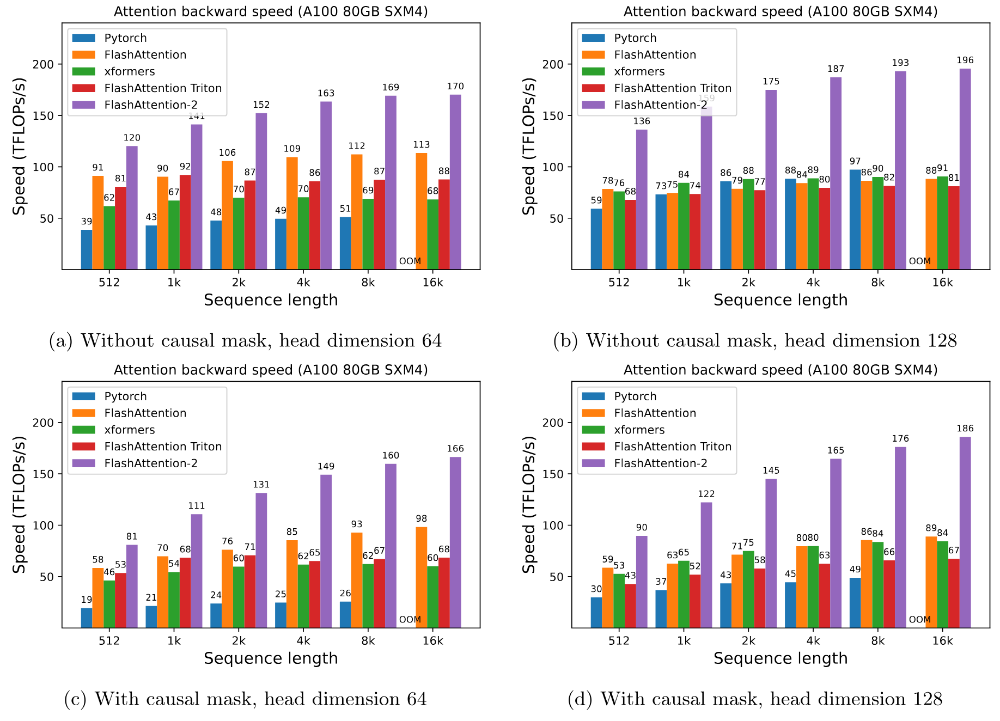
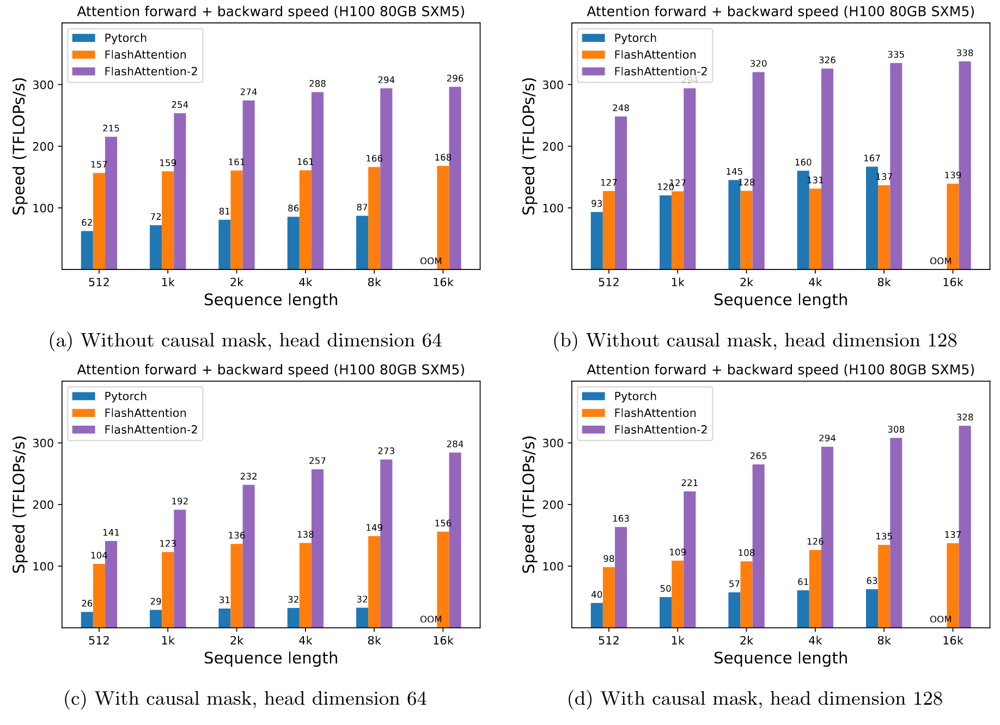
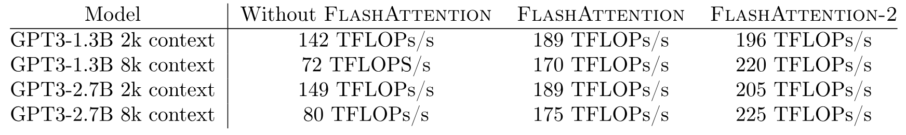

> [Tri Dao](https://tridao.me/). 论文于 2023 年 7 月 17 日首次提交至 arXiv; 当前版本为 v1; 发表于 [ICLR 2024](https://openreview.net/forum?id=mZn2Xyh9Ec). [FlashAttention-2: Faster Attention with Better Parallelism and Work Partitioning](https://arxiv.org/abs/2307.08691). <a href="/paper/flashattention-2.pdf" target="_blank" rel="noopener noreferrer">原始 PDF</a>. [DOI](https://doi.org/10.48550/arXiv.2307.08691). [TeX 源文件](https://export.arxiv.org/e-print/2307.08691v1). 精确的印刷排版与参考文献以原始 PDF 为准.

## 摘要

过去几年, 将 Transformer 扩展到更长序列一直是一个主要问题, 这有望改善语言建模与高分辨率图像理解的性能, 并为代码, 音频和视频生成带来新的应用. 注意力层是扩展到更长序列时的主要瓶颈, 因为其运行时间和内存会随序列长度呈二次增长. FlashAttention [Dao22] 利用 GPU 非对称的内存层次结构, 在不做近似的情况下显著节省内存 (从二次降为线性), 并加快运行速度 (相较优化基线快 2-4$\times$). 然而, FlashAttention 的速度仍远不及优化后的矩阵乘法 (GEMM) 操作, 只能达到理论峰值 FLOPs/s 的 25-40%. 我们发现, 效率不高是因为 GPU 上不同线程块和 warp 之间的工作划分并非最优, 导致占用率偏低或产生不必要的共享内存读写. 我们提出 FlashAttention-2, 通过更好的工作划分来解决这些问题. 具体来说, 我们 (1) 调整算法以减少非矩阵乘法 FLOP 的数量, (2) 将注意力计算并行到不同线程块上以提高占用率, 即使只有单个头也这样处理, 以及 (3) 在每个线程块内将工作分配给不同 warp, 减少经由共享内存的通信. 相比 FlashAttention, 这些改进带来约 2$\times$ 加速, 在 A100 上达到理论峰值 FLOPs/s 的 50-73%, 接近 GEMM 操作的效率. 我们通过实验验证, 在端到端训练 GPT 风格模型时, FlashAttention-2 在每块 A100 GPU 上的训练速度最高可达 225 TFLOPs/s (模型 FLOP 利用率为 72%). [+1]

## 1 引言

扩展 Transformer [Vas17] 的上下文长度是一项挑战, 因为其核心注意力层的运行时间和内存需求会随输入序列长度呈二次增长. 理想情况下, 我们希望突破标准的 2k 序列长度限制, 训练能够理解书籍, 高分辨率图像和长视频的模型. 仅在过去一年中, 就出现了数个上下文远长于以往的语言模型: 上下文长度为 32k 的 GPT-4 [Ope23], 上下文长度为 65k 的 MosaicML MPT, 以及上下文长度为 100k 的 Anthropic Claude. 长文档问答与故事写作等新兴用例表明, 模型需要如此长的上下文.

为了降低在这类长上下文上计算注意力的需求, 人们提出了许多近似注意力的方法 [Kit20, Roy21, Wan20a, Kat20, Cho20a, Bel20a, Zah20, Che21b]. 据我们所知, 尽管这些方法已有一些用例, 大多数大规模训练仍然使用标准注意力. 受此启发, Dao 等人 [Dao22] 提出重新排列注意力计算, 并利用经典技术 (分块与重计算) 显著加快计算, 将内存用量从随序列长度二次增长降为线性增长. 与优化基线相比, 这在不做近似的情况下带来 2-4$\times$ 的实际时间加速和最高 10-20$\times$ 的内存节省; 因此, FlashAttention 已广泛用于 Transformer 的大规模训练和推理.

然而, 随着上下文长度进一步增加, FlashAttention 的效率仍远不及矩阵乘法 (GEMM) 等其他原语. 具体来说, 虽然 FlashAttention 已比标准注意力实现快 2-4$\times$, 但前向传播只能达到设备理论峰值 FLOPs/s 的 30-50% ([图 5](#figure-05)), 而反向传播更具挑战, 在 A100 GPU 上只能达到峰值吞吐量的 25-35% ([图 6](#figure-06)). 相比之下, 优化后的 GEMM 最多可以达到设备理论峰值吞吐量的 80-90%. 经过仔细分析, 我们发现 FlashAttention 在 GPU 上不同线程块与 warp 之间的工作划分仍非最优, 导致占用率偏低或产生不必要的共享内存读写.

在 FlashAttention 的基础上, 我们提出 FlashAttention-2, 通过更好的并行方式与工作划分来解决这些问题.

1.  在 [第 3.1 节](#section-3-1) 中, 我们调整算法以减少非矩阵乘法 FLOP 的数量, 同时不改变输出. 虽然非矩阵乘法 FLOP 只占 FLOP 总量的一小部分, 但由于 GPU 设有专门的矩阵乘法单元, 执行这些操作需要更长时间, 因而矩阵乘法吞吐量最高可达非矩阵乘法吞吐量的 16$\times$. 因此, 应当减少非矩阵乘法 FLOP, 尽可能把时间花在矩阵乘法 FLOP 上.

2.  除了批次和头数维度外, 我们还沿序列长度维度并行执行前向传播与反向传播. 当序列较长时 (因此批次大小通常较小), 这会提高占用率 (GPU 资源利用率).

3.  即使在一个注意力计算块内部, 我们也会在一个线程块的不同 warp 之间划分工作, 以减少通信和共享内存读写.

在 [第 4 节](#section-4) 中, 我们通过实验验证了 FlashAttention-2 即使与 FlashAttention 相比也能带来显著加速. 不同设置 (使用或不使用因果掩码, 不同头维度) 下的基准测试表明, FlashAttention-2 相比 FlashAttention 能获得约 2$\times$ 加速, 前向传播最高达到理论峰值吞吐量的 73%, 反向传播最高达到理论峰值吞吐量的 63%. 用于端到端训练 GPT 风格模型时, 我们在每块 A100 GPU 上达到最高 225 TFLOPs/s 的训练速度.

## 2 背景

我们先介绍 GPU 的性能特征和执行模型. 还会说明注意力的标准实现以及 FlashAttention.

### 2.1 硬件特征

**GPU 性能特征.** GPU 由计算元件 (例如浮点运算单元) 和内存层次结构组成. 大多数现代 GPU 都有用于加速低精度矩阵乘法的专用单元 (例如 Nvidia GPU 上用于 FP16/BF16 矩阵乘法的 Tensor Core). 内存层次结构包括高带宽内存 (HBM) 和片上 SRAM (即共享内存). 以 A100 GPU 为例, 它有 40-80GB 的高带宽内存 (HBM), 带宽为 1.5-2.0TB/s; 108 个流式多处理器各有 192KB 片上 SRAM, 估计带宽约为 19TB/s [Jia18a, Jia21]. 由于程序员无法直接控制 L2 缓存, 本文的讨论集中在 HBM 和 SRAM 上.

**执行模型.** GPU 有大量线程来执行一项操作 (称为 kernel). 线程被组织成线程块, 再调度到流式多处理器 (SM) 上运行. 在每个线程块内, 线程组成 warp (每个 warp 含 32 个线程). 一个 warp 内的线程可以通过快速 shuffle 指令通信, 也可以协作执行矩阵乘法. 一个线程块内的 warp 可以通过读写共享内存进行通信. 每个 kernel 都从 HBM 将输入加载到寄存器和 SRAM, 执行计算, 再将输出写入 HBM.

### 2.2 标准注意力实现

给定输入序列 $\mathbf{Q}, \mathbf{K}, \mathbf{V}\in \mathbb{R}^{N \times d}$, 其中 $N$ 是序列长度, $d$ 是头维度, 我们希望计算注意力输出 $\mathbf{O}\in \mathbb{R}^{N \times d}$:

$$
\mathbf{S}= \mathbf{Q}\mathbf{K}^\top \in \mathbb{R}^{N \times N}, \quad \mathbf{P}= \mathrm{softmax}(\mathbf{S}) \in \mathbb{R}^{N \times N}, \quad \mathbf{O}= \mathbf{P}\mathbf{V}\in \mathbb{R}^{N \times d},
$$

其中 $\mathrm{softmax}$ 按行应用. [+2] 对于多头注意力 (MHA), 同样的计算会在多个头之间并行执行, 也会沿批次维度 (一个批次内的输入序列数量) 并行执行.

注意力的反向传播如下. 设 $\mathbf{dO}\in \mathbb{R}^{N \times d}$ 为 $\mathbf{O}$ 关于某个损失函数的梯度. 根据链式法则 (即反向传播):

$$
\begin{aligned}
\mathbf{dV}&= \mathbf{P}^\top \mathbf{dO}\in \mathbb{R}^{N \times d} \\
  \mathbf{dP}&= \mathbf{dO}\mathbf{V}^\top \in \mathbb{R}^{N \times N} \\
  \mathbf{dS}&= \mathrm{dsoftmax}(\mathbf{dP}) \in \mathbb{R}^{N \times N} \\
  \mathbf{dQ}&= \mathbf{dS}\mathbf{K}\in \mathbb{R}^{N \times d} \\
  \mathbf{dK}&= \mathbf{Q}\mathbf{dS}^\top \in \mathbb{R}^{N \times d},
\end{aligned}
$$

其中 $\mathrm{dsoftmax}$ 是按行应用 softmax 的梯度 (反向传播). 可以推导出, 若某个向量 $s$ 和 $p$ 满足 $p = \mathrm{softmax}(s)$, 则给定输出梯度 $dp$, 输入梯度为 $ds = (\mathrm{diag}(p) - p p^\top)dp$.

标准注意力实现会将矩阵 $\mathbf{S}$ 和 $\mathbf{P}$ 实体化到 HBM 中, 需要 $O(N^2)$ 内存. 通常 $N \gg d$ (一般 $N$ 约为 1k-8k, $d$ 约为 64-128). 标准注意力实现会 (1) 调用矩阵乘法 (GEMM) 子程序计算 $\mathbf{S}= \mathbf{Q}\mathbf{K}^\top$, 将结果写入 HBM, 然后 (2) 从 HBM 加载 $\mathbf{S}$ 来计算 softmax, 并将结果 $\mathbf{P}$ 写入 HBM, 最后 (3) 调用 GEMM 得到 $\mathbf{O}= \mathbf{P}\mathbf{V}$. 由于大多数操作受内存带宽限制, 大量内存访问会延长实际运行时间. 此外, 因为必须实体化 $\mathbf{S}$ 和 $\mathbf{P}$, 所需内存为 $O(N^2)$. 此外, 还必须保存 $\mathbf{P}\in \mathbb{R}^{N \times N}$, 以便在反向传播中计算梯度.

### 2.3 FlashAttention

为了在 GPU 等硬件加速器上加快注意力计算, [Dao22] 提出一种算法, 在保持相同输出 (不做近似) 的同时减少内存读写.

#### 2.3.1 前向传播

FlashAttention 采用经典的分块技术来减少内存 IO: (1) 将输入块从 HBM 加载到 SRAM, (2) 计算相对于该块的注意力, 再 (3) 更新输出, 而不把大型中间矩阵 $\mathbf{S}$ 和 $\mathbf{P}$ 写入 HBM. 由于 softmax 会耦合整行或行块, 在线 softmax [Mil18, Rab21] 可以把注意力计算拆成多个块, 并重缩放每块的输出, 最终得到正确结果 (不做近似). FlashAttention 大幅减少内存读写量, 相较优化后的基线注意力实现可获得 2-4$\times$ 的实际时间加速.

我们介绍在线 softmax 技术 [Mil18] 以及它如何用于注意力 [Rab21]. 为简单起见, 只考虑注意力矩阵 $\mathbf{S}$ 的一个行块, 其形式为 $\begin{bmatrix} \mathbf{S}^{(1)} & \mathbf{S}^{(2)} \end{bmatrix}$, 其中矩阵 $\mathbf{S}^{(1)}, \mathbf{S}^{(2)} \in \mathbb{R}^{B_r \times B_c}$, $B_r$ 和 $B_c$ 分别是行块与列块的大小. 我们希望计算这个行块的 softmax, 再与取值相乘; 取值形式为 $\begin{bmatrix} \mathbf{V}^{(1)} \\ \mathbf{V}^{(2)} \end{bmatrix}$, 其中矩阵 $\mathbf{V}^{(1)}, \mathbf{V}^{(2)} \in \mathbb{R}^{B_c \times d}$. 标准 softmax 会计算:

$$
\begin{aligned}
m &= \max(\mathrm{rowmax}(\mathbf{S}^{(1)}), \mathrm{rowmax}(\mathbf{S}^{(2)})) \in \mathbb{R}^{B_r}  \\
  \ell &= \mathrm{rowsum}(e^{\mathbf{S}^{(1)} - m}) + \mathrm{rowsum}(e^{\mathbf{S}^{(2)} - m}) \in \mathbb{R}^{B_r}  \\
  \mathbf{P}&= \begin{bmatrix} \mathbf{P}^{(1)} & \mathbf{P}^{(2)} \end{bmatrix} = \mathrm{diag}(\ell)^{-1}\begin{bmatrix} e^{\mathbf{S}^{(1)} - m} & e^{\mathbf{S}^{(2)} - m} \end{bmatrix} \in \mathbb{R}^{B_r \times 2B_c} \\
  \mathbf{O}&= \begin{bmatrix} \mathbf{P}^{(1)} & \mathbf{P}^{(2)} \end{bmatrix} \begin{bmatrix} \mathbf{V}^{(1)} \\ \mathbf{V}^{(2)} \end{bmatrix} = \mathrm{diag}(\ell)^{-1} e^{\mathbf{S}^{(1)} - m} \mathbf{V}^{(1)} + e^{\mathbf{S}^{(2)} - m} \mathbf{V}^{(2)} \in \mathbb{R}^{B_r \times d}.
\end{aligned}
$$

在线 softmax 改为相对于每个块计算"局部" softmax, 再重缩放以得到最终的正确输出:

$$
\begin{aligned}
m^{(1)} &= \mathrm{rowmax}(\mathbf{S}^{(1)})  \in \mathbb{R}^{B_r}\\
  \ell^{(1)} &= \mathrm{rowsum}(e^{\mathbf{S}^{(1)} - m^{(1)}}) \in \mathbb{R}^{B_r} \\
  \tilde{\mathbf{P}}^{(1)} &= \mathrm{diag}(\ell^{(1)})^{-1} e^{\mathbf{S}^{(1)} - m^{(1)}} \in \mathbb{R}^{B_r \times B_c}\\
  \mathbf{O}^{(1)} &= \tilde{\mathbf{P}}^{(1)} \mathbf{V}^{(1)} = \mathrm{diag}(\ell^{(1)})^{-1} e^{\mathbf{S}^{(1)} - m^{(1)}} \mathbf{V}^{(1)} \in \mathbb{R}^{B_r \times d}\\
  m^{(2)} &= \max(m^{(1)}, \mathrm{rowmax}(\mathbf{S}^{(2)})) = m \\
  \ell^{(2)} &= e^{m^{(1)} - m^{(2)}} \ell^{(1)} + \mathrm{rowsum}(e^{\mathbf{S}^{(2)} - m^{(2)}}) = \mathrm{rowsum}(e^{\mathbf{S}^{(1)} - m}) + \mathrm{rowsum}(e^{\mathbf{S}^{(2)} - m}) = \ell \\
  \tilde{\mathbf{P}}^{(2)} &= \mathrm{diag}(\ell^{(2)})^{-1} e^{\mathbf{S}^{(2)} - m^{(2)}} \\
  \mathbf{O}^{(2)} &= \mathrm{diag}(\ell^{(1)} / \ell^{(2)})^{-1} \mathbf{O}^{(1)} + \tilde{\mathbf{P}}^{(2)} \mathbf{V}^{(2)} = \mathrm{diag}(\ell^{(2)})^{-1} e^{s^{(1)} - m} \mathbf{V}^{(1)} + \mathrm{diag}(\ell^{(2)})^{-1} e^{s^{(2)} - m} \mathbf{V}^{(2)} = \mathbf{O}.
\end{aligned}
$$

我们展示 FlashAttention 如何利用在线 softmax 实现分块 ([图 1](#figure-01)), 从而减少内存读写.

**图 1.** FlashAttention 前向传播的执行方式, 其中键 $\mathbf{K}$ 被划分为两个块, 值 $\mathbf{V}$ 也被划分为两个块. 通过计算相对于每个块的注意力并重缩放输出, 最终可以得到正确答案, 同时避免对中间矩阵 $\mathbf{S}$ 和 $\mathbf{P}$ 进行代价高昂的内存读写. 此图经过简化, 省略了 softmax 中用每个元素减去逐行最大值的步骤.

#### 2.3.2 反向传播

在反向传播中, 一旦输入块 $\mathbf{Q}, \mathbf{K}, \mathbf{V}$ 已加载到 SRAM, FlashAttention 就重新计算注意力矩阵 $\mathbf{S}$ 和 $\mathbf{P}$ 的值, 因而不必存储大型中间值. 无需保存大小为 $N \times N$ 的大型矩阵 $\mathbf{S}$ 和 $\mathbf{P}$ 后, FlashAttention 根据序列长度可节省 10-20$\times$ 的内存 (所需内存随序列长度 $N$ 线性增长, 而非二次增长). 由于内存读写减少, 反向传播的实际时间也加快 2-4$\times$.

反向传播对 [第 2.2 节](#section-2-2) 中的等式应用分块. 尽管在概念上反向传播比前向传播更简单 (不需要重缩放 softmax), 实现却复杂得多. 这是因为反向传播需要在 SRAM 中保留更多数值以完成 5 次矩阵乘法, 而前向传播只需要 2 次矩阵乘法.

## 3 FlashAttention-2: 算法, 并行方式与工作划分

我们介绍 FlashAttention-2 算法, 其中包含对 FlashAttention 的若干调整, 以减少非矩阵乘法 FLOP 的数量. 接着说明如何在不同线程块上并行计算, 充分利用 GPU 资源. 最后说明如何在一个线程块内的不同 warp 之间划分工作, 以减少共享内存访问量. 如 [第 4 节](#section-4) 中的验证所示, 这些改进带来 2-3$\times$ 加速.

### 3.1 算法

我们调整 FlashAttention 算法, 以减少非矩阵乘法 FLOP 的数量. 这是因为现代 GPU 有专用计算单元 (例如 Nvidia GPU 上的 Tensor Core), 能大幅加快矩阵乘法. 以 A100 GPU 为例, FP16/BF16 矩阵乘法的理论峰值吞吐量为 312 TFLOPs/s, 而非矩阵乘法 FP32 的理论峰值吞吐量只有 19.5 TFLOPs/s. 换个角度看, 每个非矩阵乘法 FLOP 的代价是矩阵乘法 FLOP 的 16$\times$. 为了保持高吞吐量 (例如超过理论峰值 TFLOPs/s 的 50%), 我们希望尽可能把时间花在矩阵乘法 FLOP 上.

#### 3.1.1 前向传播

我们重新审视 [第 2.3 节](#section-2-3) 所示的在线 softmax 技巧, 并做两项小改动以减少非矩阵乘法 FLOP:

1.  不必用 $\mathrm{diag}(\ell^{(2)})^{-1}$ 重缩放输出更新中的两项:

    $$
    \mathbf{O}^{(2)} = \mathrm{diag}(\ell^{(1)} / \ell^{(2)})^{-1} \mathbf{O}^{(1)} + \mathrm{diag}(\ell^{(2)})^{-1} e^{\mathbf{S}^{(2)} - m^{(2)}} \mathbf{V}^{(2)}.
    $$

    我们可以改为维护 $\mathbf{O}^{(2)}$ 的"未缩放"版本, 并保留统计量 $\ell^{(2)}$:

    $$
    \tilde{\mathbf{O}}^{(2)} = \mathrm{diag}(\ell^{(1)})^{-1} \mathbf{O}^{(1)} + e^{\mathbf{S}^{(2)} - m^{(2)}} \mathbf{V}^{(2)}.
    $$

    只有在循环的最后才用 $\mathrm{diag}(\ell^{(\mathrm{last})})^{-1}$ 缩放最终的 $\tilde{\mathbf{O}}^{(\mathrm{last})}$, 从而得到正确输出.

2.  无需同时为反向传播保存最大值 $m^{(j)}$ 和指数和 $\ell^{(j)}$. 只需存储 logsumexp $L^{(j)} = m^{(j)} + \log(\ell^{(j)})$.

对于 [第 2.3 节](#section-2-3) 中的简单两块情形, 在线 softmax 技巧现在变为:

$$
\begin{aligned}
m^{(1)} &= \mathrm{rowmax}(\mathbf{S}^{(1)})  \in \mathbb{R}^{B_r}\\
  \ell^{(1)} &= \mathrm{rowsum}(e^{\mathbf{S}^{(1)} - m^{(1)}}) \in \mathbb{R}^{B_r} \\
  \tilde{\mathbf{O}^{(1)}} &= e^{\mathbf{S}^{(1)} - m^{(1)}} \mathbf{V}^{(1)} \in \mathbb{R}^{B_r \times d}\\
  m^{(2)} &= \max(m^{(1)}, \mathrm{rowmax}(\mathbf{S}^{(2)})) = m \\
  \ell^{(2)} &= e^{m^{(1)} - m^{(2)}} \ell^{(1)} + \mathrm{rowsum}(e^{\mathbf{S}^{(2)} - m^{(2)}}) = \mathrm{rowsum}(e^{\mathbf{S}^{(1)} - m}) + \mathrm{rowsum}(e^{\mathbf{S}^{(2)} - m}) = \ell \\
  \tilde{\mathbf{P}}^{(2)} &= \mathrm{diag}(\ell^{(2)})^{-1} e^{\mathbf{S}^{(2)} - m^{(2)}} \\
  \tilde{\mathbf{O}}^{(2)} &= \mathrm{diag}(e^{m^{(1)} - m^{(2)}})^{-1} \tilde{\mathbf{O}}^{(1)} + e^{\mathbf{S}^{(2)} - m^{(2)}} \mathbf{V}^{(2)} = e^{s^{(1)} - m} \mathbf{V}^{(1)} + e^{s^{(2)} - m} \mathbf{V}^{(2)} \\
  \mathbf{O}^{(2)} &= \mathrm{diag}(\ell^{(2)})^{-1} \tilde{\mathbf{O}}^{(2)} = \mathbf{O}.
\end{aligned}
$$

完整的 FlashAttention-2 前向传播见 [算法 1](#algorithm-01).

**算法 1: FlashAttention-2 前向传播**

- **要求:** HBM 中的矩阵 $\mathbf{Q}, \mathbf{K}, \mathbf{V} \in \mathbb{R}^{N \times d}$, 块大小 $B_c$, $B_r$.
- 将 $\mathbf{Q}$ 划分为 $T_r = \left\lceil\frac{N}{B_r} \right\rceil$ 个块 $\mathbf{Q}_1, \dots, \mathbf{Q}_{T_r}$, 每块大小为 $B_r \times d$; 将 $\mathbf{K}, \mathbf{V}$ 划分为 $T_c = \left\lceil \frac{N}{B_c} \right\rceil$ 个块 $\mathbf{K}_1, \dots, \mathbf{K}_{T_c}$ 和 $\mathbf{V}_1, \dots, \mathbf{V}_{T_c}$, 每块大小为 $B_c \times d$.
- 将输出 $\mathbf{O} \in \mathbb{R}^{N \times d}$ 划分为 $T_r$ 个块 $\mathbf{O}_i, \dots, \mathbf{O}_{T_r}$, 每块大小为 $B_r \times d$; 将 logsumexp $L$ 划分为 $T_r$ 个块 $L_i, \dots, L_{T_r}$, 每块大小为 $B_r$.
- **对于** $1 \le i \le T_r$:
  - 将 $\mathbf{Q}_i$ 从 HBM 加载到片上 SRAM.
  - 在片上初始化 $\mathbf{O}_{i}^{(0)} = (0)_{B_r \times d} \in \mathbb{R}^{B_r \times d}, \ell_{i}^{(0)} = (0)_{B_r} \in \mathbb{R}^{B_r}, m_{i}^{(0)} = (-\infty)_{B_r} \in \mathbb{R}^{B_r}$.
  - **对于** $1 \le j \le T_c$:
    - 将 $\mathbf{K}_j, \mathbf{V}_j$ 从 HBM 加载到片上 SRAM.
    - 在片上计算 $\mathbf{S}_{i}^{(j)} = \mathbf{Q}_i \mathbf{K}_j^\top \in \mathbb{R}^{B_r \times B_c}$.
    - 在片上计算 $m_{i}^{(j)} = \max(m_{i}^{(j-1)}, \mathrm{rowmax}(\mathbf{S}_{i}^{(j)})) \in \mathbb{R}^{B_r}$, $\tilde{\mathbf{P}}_{i}^{(j)} = \exp(\mathbf{S}_{i}^{(j)} - m_{i}^{(j)}) \in \mathbb{R}^{B_r \times B_c}$ (逐元素), $\ell_{i}^{(j)} = e^{m_{i}^{j-1} - m_{i}^{(j)}} \ell_{i}^{(j-1)} + \mathrm{row\ sum}(\tilde{\mathbf{P}}_{i}^{(j)}) \in \mathbb{R}^{B_r}$.
    - 在片上计算 $\mathbf{O}_{i}^{(j)} = \mathrm{diag}(e^{m_{i}^{(j-1)} - m_{i}^{(j)}})^{-1} \mathbf{O}_{i}^{(j-1)} + \tilde{\mathbf{P}}_{i}^{(j)} \mathbf{V}_j$.
  - 在片上计算 $\mathbf{O}_{i} = \mathrm{diag}(\ell_{i}^{(T_c)})^{-1} \mathbf{O}_{i}^{(T_c)}$.
  - 在片上计算 $L_{i} = m_{i}^{(T_c)} + \log(\ell_i^{(T_c)})$.
  - 将 $\mathbf{O}_{i}$ 写入 HBM, 作为 $\mathbf{O}$ 的第 $i$ 个块.
  - 将 $L_{i}$ 写入 HBM, 作为 $L$ 的第 $i$ 个块.
- **返回:** 输出 $\mathbf{O}$ 和 logsumexp $L$.

**因果掩码.** 注意力的一个常见用例是自回归语言建模, 此时需要对注意力矩阵 $\mathbf{S}$ 应用因果掩码 (即将所有满足 $j > i$ 的项 $\mathbf{S}_{ij}$ 置为 $-\infty$).

1.  由于 FlashAttention 和 FlashAttention-2 已按块运行, 对所有列索引均大于行索引的块 (序列较长时约占一半), 可以跳过该块的计算. 与不使用因果掩码的注意力相比, 这会带来约 1.7-1.8$\times$ 加速.

2.  对于行索引一定严格小于列索引的块, 无需应用因果掩码. 这意味着每一行只需对 1 个块应用因果掩码 (假设块为方形).

**正确性, 运行时间与内存需求.** 与 FlashAttention 一样, [算法 1](#algorithm-01) 返回正确的输出 $\mathbf{O}= \mathrm{softmax}(\mathbf{Q}\mathbf{K}^\top)\mathbf{V}$ (不做近似), 使用 $O(N^2d)$ FLOP, 并在输入和输出之外需要 $O(N)$ 额外内存 (用于存储 logsumexp $L$). 其证明与 Dao 等人 [Dao22] 的证明 (定理 1) 几乎相同, 因此此处省略.

#### 3.1.2 反向传播

FlashAttention-2 的反向传播与 FlashAttention 几乎相同. 我们做了一项小改动: 只使用逐行 logsumexp $L$, 不再同时使用 softmax 的逐行最大值与逐行指数和. 为完整起见, [算法 2](#algorithm-02) 给出了反向传播的说明.

**算法 2: FlashAttention-2 反向传播**

- **要求:** HBM 中的矩阵 $\mathbf{Q}, \mathbf{K}, \mathbf{V}, \mathbf{O}, \mathbf{dO} \in \mathbb{R}^{N \times d}$, HBM 中的向量 $L \in \mathbb{R}^N$, 块大小 $B_c$, $B_r$.
- 将 $\mathbf{Q}$ 划分为 $T_r = \left\lceil\frac{N}{B_r} \right\rceil$ 个块 $\mathbf{Q}_1, \dots, \mathbf{Q}_{T_r}$, 每块大小为 $B_r \times d$; 将 $\mathbf{K}, \mathbf{V}$ 划分为 $T_c = \left\lceil \frac{N}{B_c} \right\rceil$ 个块 $\mathbf{K}_1, \dots, \mathbf{K}_{T_c}$ 和 $\mathbf{V}_1, \dots, \mathbf{V}_{T_c}$, 每块大小为 $B_c \times d$.
- 将 $\mathbf{O}$ 划分为 $T_r$ 个块 $\mathbf{O}_i, \dots, \mathbf{O}_{T_r}$, 每块大小为 $B_r \times d$; 将 $\mathbf{dO}$ 划分为 $T_r$ 个块 $\mathbf{dO}_i, \dots, \mathbf{dO}_{T_r}$, 每块大小为 $B_r \times d$; 将 $L$ 划分为 $T_r$ 个块 $L_i, \dots, L_{T_r}$, 每块大小为 $B_r$.
- 在 HBM 中初始化 $\mathbf{dQ} = (0)_{N \times d}$, 并将其划分为 $T_r$ 个块 $\mathbf{dQ}_1, \dots, \mathbf{dQ}_{T_r}$, 每块大小为 $B_r \times d$. 将 $\mathbf{dK}, \mathbf{dV} \in \mathbb{R}^{N \times d}$ 划分为 $T_c$ 个块 $\mathbf{dK}_1, \dots, \mathbf{dK}_{T_c}$ 和 $\mathbf{dV}_1, \dots, \mathbf{dV}_{T_c}$, 每块大小为 $B_c \times d$.
- 计算 $D = \mathrm{rowsum}(\mathbf{dO} \circ \mathbf{O}) \in \mathbb{R}^d$ (逐元素相乘), 将 $D$ 写入 HBM 并划分为 $T_r$ 个块 $D_1, \dots, D_{T_r}$, 每块大小为 $B_r$.
- **对于** $1 \le j \le T_c$:
  - 将 $\mathbf{K}_j, \mathbf{V}_j$ 从 HBM 加载到片上 SRAM.
  - 在 SRAM 中初始化 $\mathbf{dK}_j = (0)_{B_c \times d}, \mathbf{dV}_j = (0)_{B_c \times d}$.
  - **对于** $1 \le i \le T_r$:
    - 将 $\mathbf{Q}_i, \mathbf{O}_i, \mathbf{dO}_i, \mathbf{dQ}_i, L_i, D_i$ 从 HBM 加载到片上 SRAM.
    - 在片上计算 $\mathbf{S}_{i}^{(j)} = \mathbf{Q}_i \mathbf{K}_j^\top \in \mathbb{R}^{B_r \times B_c}$.
    - 在片上计算 $\mathbf{P}_{i}^{(j)} = \exp(\mathbf{S}_{ij} - L_{i}) \in \mathbb{R}^{B_r \times B_c}$.
    - 在片上计算 $\mathbf{dV}_j \leftarrow \mathbf{dV}_j + (\mathbf{P}_{i}^{(j)})^\top \mathbf{dO}_i \in \mathbb{R}^{B_c \times d}$.
    - 在片上计算 $\mathbf{dP}_{i}^{(j)} = \mathbf{dO}_{i} \mathbf{V}_j^\top \in \mathbb{R}^{B_r \times B_c}$.
    - 在片上计算 $\mathbf{dS}_{i}^{(j)} = \mathbf{P}_{i}^{(j)} \circ (\mathbf{dP}_{i}^{(j)} - D_i) \in \mathbb{R}^{B_r \times B_c}$.
    - 将 $\mathbf{dQ}_i$ 从 HBM 加载到 SRAM, 然后在片上更新 $\mathbf{dQ}_{i} \leftarrow \mathbf{dQ}_i + \mathbf{dS}_{i}^{(j)} \mathbf{K}_j \in \mathbb{R}^{B_r \times d}$, 再写回 HBM.
    - 在片上计算 $\mathbf{dK}_{j} \leftarrow \mathbf{dK}_j + {\mathbf{dS}_{i}^{(j)}}^\top \mathbf{Q}_i \in \mathbb{R}^{B_c \times d}$.
  - 将 $\mathbf{dK}_j, \mathbf{dV}_j$ 写入 HBM.
- **返回:** $\mathbf{dQ}, \mathbf{dK}, \mathbf{dV}$.

**多查询注意力与分组查询注意力.** 多查询注意力 (MQA) [Sha19] 和分组查询注意力 (GQA) [Ain23] 是注意力的两种变体, 其中多个查询头会关注同一个键头和值头, 以减小推理期间 KV 缓存的大小. 我们无需为计算复制键头和值头, 而是隐式操作指向头的索引以执行相同计算. 在反向传播中, 需要对隐式复制的不同头的梯度 $\mathbf{dK}$ 和 $\mathbf{dV}$ 求和.

### 3.2 并行方式

第一版 FlashAttention 沿批次大小与头数并行. 我们用 1 个线程块处理 1 个注意力头, 总计有 $\mathrm{batch size} \cdot \mathrm{number of heads}$ 个线程块. 每个线程块都会调度到一个流式多处理器 (SM) 上运行, 例如 A100 GPU 有 108 个 SM. 当这一数量较大时 (例如 $\geq 80$), 这种调度效率很高, 因为我们可以有效利用 GPU 上几乎所有计算资源.

在长序列情形下 (通常意味着批次较小或头数较少), 为了更充分地利用 GPU 上的多处理器, 我们现在还沿序列长度维度进行并行. 在这种情况下, 这样做会带来显著加速.

**前向传播.** 可以看出, 外层循环 (遍历序列长度) 中的各项彼此独立, 天然适合并行; 我们把它们调度到互不通信的不同线程块上. 与 FlashAttention 一样, 我们也沿批次维度和头数维度并行. 当批次大小和头数较小时, 沿序列长度增加并行度有助于提高占用率 (GPU 资源的使用比例), 从而在这种情况下加快运行.

交换循环顺序 (外层循环遍历行块, 内层循环遍历列块, 而不是像原始 FlashAttention 论文那样采用相反顺序), 以及沿序列长度维度并行的想法, 最早由 Phil Tillet 在 Triton [Til19] 实现中提出并实现. [+3]

**反向传播.** 注意, [算法 2](#algorithm-02) 中不同列块之间唯一共享的计算是更新 $\mathbf{dQ}$: 需要将 $\mathbf{dQ}_i$ 从 HBM 加载到 SRAM, 然后在片上更新 $\mathbf{dQ}_{i} \leftarrow \mathbf{dQ}_i + \mathbf{dS}_{i}^{(j)} \mathbf{K}_j$, 再写回 HBM. 因此, 我们也沿序列长度维度并行, 为反向传播的每个列块调度 1 个线程块. 我们使用原子加法在不同线程块之间通信, 以更新 $\mathbf{dQ}$.

并行方案见 [图 2](#figure-02).

**图 2.** 在前向传播中 (左), 我们并行执行各个工作单元 (线程块), 每个工作单元负责注意力矩阵的一个行块. 在反向传播中 (右), 每个工作单元负责注意力矩阵的一个列块.

### 3.3 Warp 之间的工作划分

[第 3.2 节](#section-3-2) 说明了如何调度线程块; 即使在每个线程块内部, 也必须决定如何在不同 warp 之间划分工作. 我们通常为每个线程块使用 4 个或 8 个 warp, 划分方式见 [图 3](#figure-03).

**前向传播.** 对于每个块, FlashAttention 在 4 个 warp 之间拆分 $\mathbf{K}$ 和 $\mathbf{V}$, 同时让所有 warp 都能访问 $\mathbf{Q}$. 每个 warp 通过乘法得到 $\mathbf{Q}\mathbf{K}^\top$ 的一个切片, 然后它们需要与 $\mathbf{V}$ 的一个切片相乘并通信, 将结果相加. 这称为 "split-K" 方案. 然而, 这样效率不高, 因为所有 warp 都要把中间结果写入共享内存, 同步后再将中间结果相加. 这些共享内存读写拖慢了 FlashAttention 的前向传播.

在 FlashAttention-2 中, 我们改为在 4 个 warp 之间拆分 $\mathbf{Q}$, 同时让所有 warp 都能访问 $\mathbf{K}$ 和 $\mathbf{V}$. 每个 warp 执行矩阵乘法并得到 $\mathbf{Q}\mathbf{K}^\top$ 的一个切片后, 只需与共享的 $\mathbf{V}$ 切片相乘, 即可得到对应的输出切片. Warp 之间无需通信. 减少共享内存读写后即可加快运行 ([第 4 节](#section-4)).

**图 3.** 前向传播中不同 warp 之间的工作划分

**反向传播.** 与此类似, 我们也采用能够避开 "split-K" 的 warp 划分方式. 不过, 由于所有不同输入和梯度 $\mathbf{Q}, \mathbf{K}, \mathbf{V}, \mathbf{O}, \mathbf{dO}, \mathbf{dQ}, \mathbf{dK}, \mathbf{dV}$ 之间的依赖关系更加复杂, 仍然需要进行一些同步. 即便如此, 避免 "split-K" 仍会减少共享内存读写, 并再次带来加速 ([第 4 节](#section-4)).

**调优块大小.** 增大块通常会减少共享内存加载与存储, 但会增加所需寄存器数量和共享内存总量. 一旦超过某个块大小, 寄存器溢出会造成显著减速, 或者所需共享内存超过 GPU 的可用容量, 导致 kernel 完全无法运行. 我们通常根据头维度 $d$ 和设备共享内存大小, 选择 $\{64, 128\} \times \{64, 128\}$ 的块大小.

由于块大小实际上只有 4 种选择, 我们会为每种头维度手动调优; 不过, 自动调优可以省去这些人工工作. 我们将此留待未来研究.

## 4 实验验证

我们评估使用 FlashAttention-2 训练 Transformer 模型的影响.

- **注意力基准测试.** 我们测量 FlashAttention-2 在不同序列长度下的运行时间, 并与 PyTorch 中的标准实现, FlashAttention 以及 Triton 中的 FlashAttention 比较. 我们确认, FlashAttention-2 比 FlashAttention 快 1.7-3.0$\times$, 比 Triton 中的 FlashAttention 快 1.3-2.5$\times$, 比标准注意力实现快 3-10$\times$. FlashAttention-2 最高达到 230 TFLOPs/s, 即 A100 GPU 理论峰值 TFLOPs/s 的 73%.

- **端到端训练速度** 使用序列长度 2k 或 8k 端到端训练大小为 1.3B 和 2.7B 的 GPT 风格模型时, FlashAttention-2 相比 FlashAttention 最多加速 1.3$\times$, 相比不使用 FlashAttention 的基线最多加速 2.8$\times$. FlashAttention-2 在每块 A100 GPU 上最高达到 225 TFLOPs/s (模型 FLOP 利用率为 72%).

### 4.1 注意力基准测试

我们在 A100 80GB SXM4 GPU 上测量不同设置下各种注意力方法的运行时间 (不使用/使用因果掩码, 头维度为 64 或 128). 结果见 [图 4](#figure-04), [图 5](#figure-05) 和 [图 6](#figure-06), 其中 FlashAttention-2 比 FlashAttention 以及 `xformers` 中的 FlashAttention ("cutlass" 实现) 快约 2$\times$. 在前向传播中, FlashAttention-2 比 Triton 中的 FlashAttention 快约 1.3-1.5$\times$; 在反向传播中则快约 2$\times$. 与 PyTorch 中的标准注意力实现相比, FlashAttention-2 最多可以快 10$\times$.

基准设置: 将序列长度从 512 变到 1k, ..., 16k, 并设置批次大小, 使 token 总数为 16k. 隐藏维度设为 2048, 头维度设为 64 或 128 (即 32 个头或 16 个头). 我们使用下式计算前向传播的 FLOP:

$$
4 \cdot \mathrm{seqlen}^2 \cdot \mathrm{head dimension} \cdot \mathrm{number of heads}.
$$

使用因果掩码时, 将该数值除以 2, 因为实际上大约只计算一半的项. 为得到反向传播的 FLOP, 将前向传播的 FLOP 乘以 2.5 (因为前向传播有 2 次矩阵乘法, 而由于重计算, 反向传播有 5 次矩阵乘法).

**图 4.** A100 GPU 上注意力前向传播与反向传播的速度

**图 5.** A100 GPU 上注意力前向传播的速度

**图 6.** A100 GPU 上注意力反向传播的速度

仅在 H100 GPU 上运行同一实现 (不使用任何特殊指令来利用 TMA 和第 4 代 Tensor Core 等新特性), 我们即可达到最高 335 TFLOPs/s ([图 7](#figure-07)). 我们预计, 使用新指令后, 在 H100 GPU 上还能再加速 1.5x-2x. 我们将此留待未来研究.

**图 7.** H100 GPU 上注意力前向传播与反向传播的速度

### 4.2 端到端性能

我们在 8$\times$A100 80GB SXM 上测量参数量为 1.3B 或 2.7B 的 GPT 风格模型的训练吞吐量. 如 [表 1](#table-01) 所示, FlashAttention-2 相比不使用 FlashAttention 的基线快 2.8$\times$, 相比 FlashAttention-2 快 1.3$\times$, 每块 A100 GPU 最高达到 225 TFLOPs/s.

需要说明的是, 我们按照 Megatron-LM [Sho19] (以及许多其他论文和库) 所用的公式来计算 FLOP:

$$
6 \cdot \mathrm{seqlen} \cdot \mathrm{number of params} + 12 \cdot \mathrm{number of
    layers} \cdot \mathrm{hidden dim} \cdot \mathrm{seqlen}^2.
$$

第一项计入权重-输入乘法产生的 FLOP, 第二项计入注意力产生的 FLOP. 不过, 也可以认为第二项应当减半, 因为使用因果掩码时, 注意力中只需计算大约一半的元素. 为保持一致, 我们选择沿用文献中的公式 (不把注意力 FLOP 除以 2).

**表 1.** 在 8$\times$A100 GPU 上训练 GPT 风格模型的速度 (TFLOPs/s/GPU). FlashAttention-2 最高达到 225 TFLOPs/s (模型 FLOP 利用率为 72%). 我们将其与不运行 FlashAttention 的基线比较.

## 5 讨论与未来方向

FlashAttention-2 比 FlashAttention 快 2$\times$, 这意味着, 花费与以前训练 8k 上下文模型相同的成本, 我们可以训练上下文长达 16k 的模型. 我们期待它能用于理解长篇书籍和报告, 高分辨率图像, 音频及视频. FlashAttention-2 也会加快现有模型的训练, 微调和推理.

近期, 我们计划与研究人员和工程师合作, 使 FlashAttention 能广泛用于不同类型的设备 (例如 H100 GPU, AMD GPU), 并支持 FP8 等新数据类型. 眼下的下一步是针对 H100 GPU 优化 FlashAttention-2, 以使用新的硬件特性 (TMA, 第 4 代 Tensor Core, fp8). 将 FlashAttention-2 的底层优化与高层算法改动 (例如局部, 膨胀, 块稀疏注意力) 结合起来, 或许能让我们训练上下文长得多的 AI 模型. 我们也期待与编译器研究人员合作, 让这些优化技术更容易编程实现.

## 致谢

我们感谢 Phil Tillet 和 Daniel Haziza, 他们分别在 Triton [Til19] 与 `xformers` 库 [Lef22] 中实现了 FlashAttention 的不同版本. 不同注意力实现方式之间的思想交流促成了 FlashAttention-2. 我们感谢 Nvidia CUTLASS 团队 (尤其是 Vijay Thakkar, Cris Cecka, Haicheng Wu 和 Andrew Kerr) 开发 CUTLASS 库, 特别是 CUTLASS 3.x 版本; 它为实现 FlashAttention-2 提供了简洁的抽象和强大的构件. 我们感谢 Driss Guessous 将 FlashAttention 集成到 PyTorch. FlashAttention-2 得益于与 Phil Wang, Markus Rabe, James Bradbury, Young-Jun Ko, Julien Launay, Daniel Hesslow, Michaël Benesty, Horace He, Ashish Vaswani 和 Erich Elsen 的有益讨论. 感谢 Stanford CRFM 和 Stanford NLP 提供计算支持. 我们感谢 Dan Fu 和 Christopher Ré 的合作, 建设性反馈, 以及他们在硬件高效算法设计这一研究方向上始终给予的鼓励. 我们感谢 Albert Gu 和 Beidi Chen 对本技术报告早期草稿提出的有益建议.

[+1]: FlashAttention-2 可从 <https://github.com/Dao-AILab/flash-attention> 获取

[+2]: 为了表述清楚, 我们省略了对 $\mathbf{Q}\mathbf{K}^\top$ 的缩放 (通常乘以 $1/\mathrm{d}$), 以及可选的 $\mathbf{S}$ 逐元素掩码和/或对 $\mathbf{P}$ 应用的 dropout

[+3]: <https://github.com/openai/triton/blob/main/python/tutorials/06-fused-attention.py>
