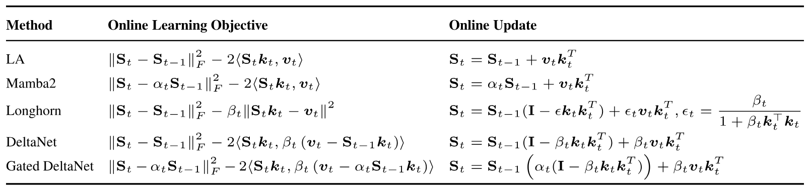
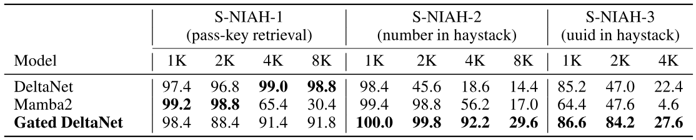
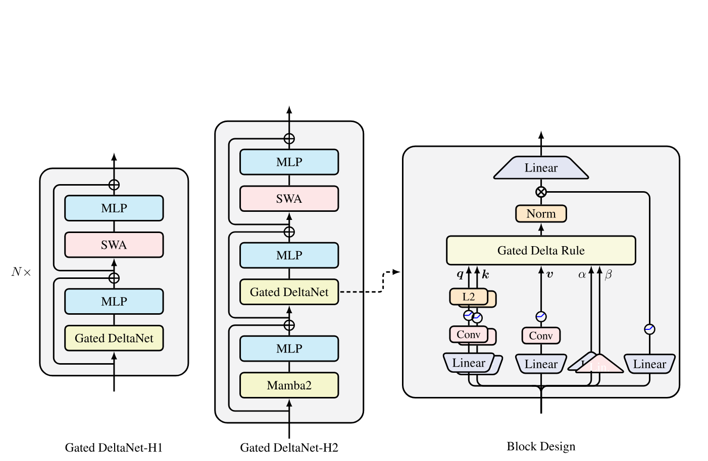
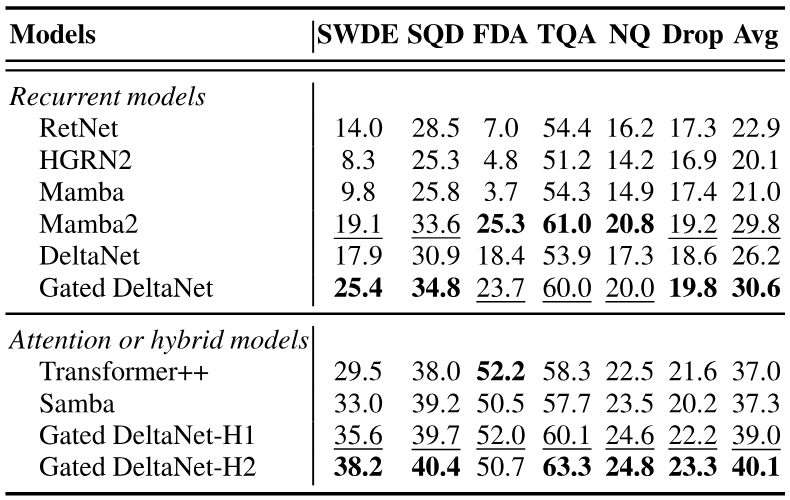
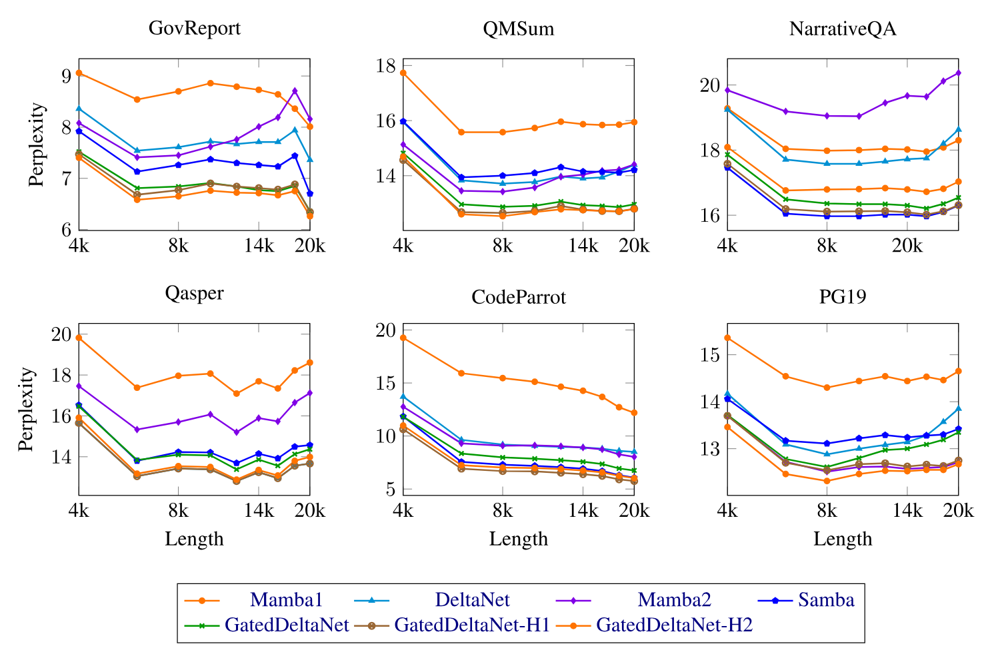
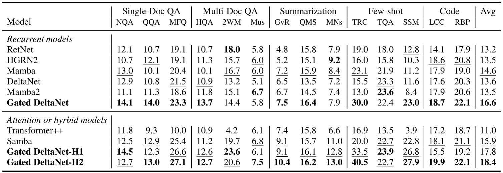
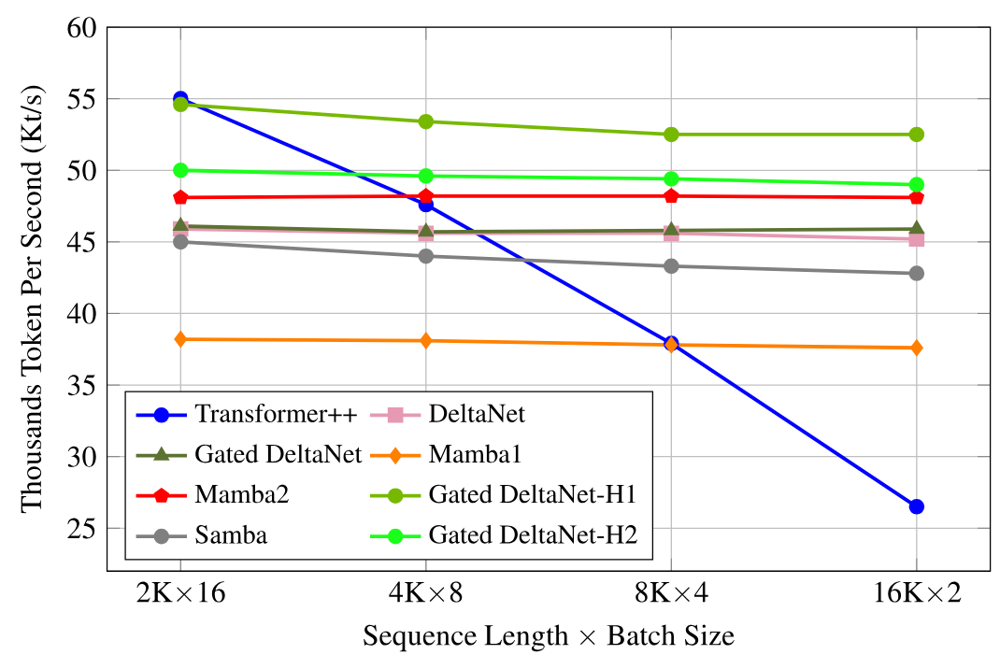
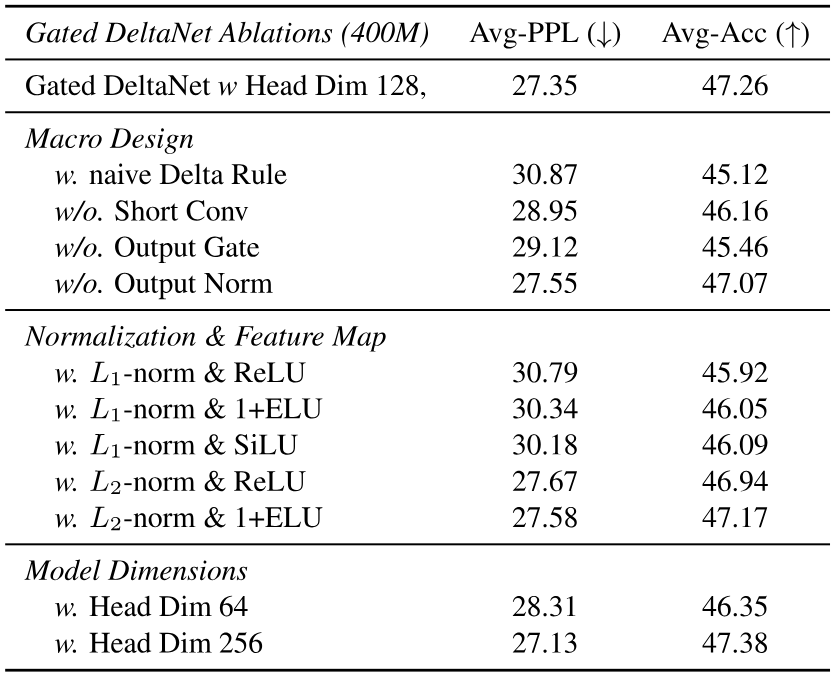
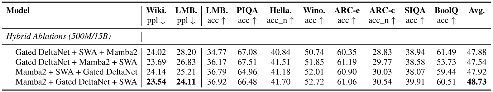

> [Songlin Yang](https://sustcsonglin.github.io/) [+author-note], [Jan Kautz](https://www.jankautz.com/), [Ali Hatamizadeh](https://ahatamiz.github.io/). 2024 年 12 月 9 日首次提交至 arXiv; 当前版本为 v3. 发表于 [ICLR 2025](https://openreview.net/forum?id=r8H7xhYPwz). [Gated Delta Networks: Improving Mamba2 with Delta Rule](https://arxiv.org/abs/2412.06464). [原始 PDF](/paper/gated-delta-networks.pdf). [DOI](https://doi.org/10.48550/arXiv.2412.06464). [TeX 源码](https://export.arxiv.org/e-print/2412.06464v3). 精确版式与参考文献以原始 PDF 为准.

## 摘要

线性 Transformer 是标准 Transformer 的高效替代方案, 但在检索和长上下文任务上的性能一直有限. 为解决这些问题, 近期工作分别研究了两种机制: 用门控自适应控制记忆, 用 delta 更新规则精确修改记忆. 我们发现二者可以互补: 门控能够迅速清除记忆, delta 规则则适合定向更新. 基于这一观察, 我们提出门控 delta 规则, 并设计了适配现代硬件的并行训练算法. 新架构 Gated DeltaNet 在语言建模, 常识推理, 上下文检索, 长度外推和长上下文理解等多项基准上都优于 Mamba2 与 DeltaNet. 我们还将 Gated DeltaNet 层同滑动窗口注意力或 Mamba2 层组合成混合架构, 同时提高训练效率和任务性能.

代码: [https://github.com/NVlabs/GatedDeltaNet](https://github.com/NVlabs/GatedDeltaNet)

## 1 引言

Transformer 的注意力机制适合精确的序列建模, 训练时也能充分利用现代 GPU 的并行能力, 因而显著拓展了大语言模型 (LLM) 的能力. 但自注意力的计算量随序列长度平方增长, 训练和推理成本都很高.

一种替代方案是线性 Transformer [Kat20]. 它用核化点积线性注意力取代传统的 softmax 注意力, 再将计算改写成带矩阵值状态的线性 RNN, 从而大幅降低推理时的内存需求. 早期线性 Transformer 的语言建模性能不及标准 Transformer; 后来的模型引入类似 LSTM 的数据相关门控, 例如 GLA [Yan24a] 和 Mamba2 [Dao24], 性能有所改善. 不过, 长序列中的信息管理仍然困难, 尤其是上下文检索任务, 传统 Transformer 依旧占优 [Aro23, Aro24, Jel24, Wen24, Aky24].

这并不意外: 线性 Transformer 可以理解为一种基于外积的键值关联记忆, 与张量积表示相似 [Smo90]. 但它能存储的正交键值对数量受模型维度限制. 一旦序列长度超过该维度, "记忆碰撞" 就不可避免, 精确检索也会受阻 [Sch21].

Mamba2 用一个简单的门控更新规则 ${\mathbf{S}}_t=\alpha_t{\mathbf{S}}_{t-1}+{\bm{v}}_t{\bm{k}}_t^\top$ 缓解这一限制; 每个时间步都按动态比例 $\alpha_t\in(0,1)$ 统一衰减全部键值关联. 这种做法没有区分不同关联的重要程度, 因而可能浪费记忆容量. 当模型只想忘掉一条特定关联时, 其他关联也会以相同比例衰减, 无法做到定向清除.

相比之下, 使用 delta 规则 [Wid60] 的线性 Transformer, 即 DeltaNet [Sch21, Yan24b], 会按顺序用新键值对 (软性地) 替换旧键值对, 从而选择性更新记忆. 它在上下文检索的合成基准上表现很好. 但每次只能修改一个键值对, 遇到上下文切换, 需要清除先前数据时, 无法迅速删除过时或无关的信息. DeltaNet 在真实任务上的表现因此较为一般 [Yan24b], 原因很可能正是缺少有效的记忆清除机制.

门控更新规则和 delta 规则在记忆管理上各有所长, 因此我们提出门控 delta 规则, 用一个简单机制将二者结合起来. 令 $\alpha_t\rightarrow0$ 可以迅速清空记忆; 令 $\alpha_t\rightarrow1$ 则等同于切换到纯 delta 规则, 可以只更新指定内容而不影响其他信息.

剩下的问题是如何在硬件上高效实现门控 delta 规则. [Yan24b] 利用 WY 表示 [Bis85] 将 delta 规则的计算并行化; 我们在这一算法上加入门控项, 同时保留分块并行 [Hua22a, Sun23b, Yan24a] 的优势, 使训练仍能高效利用硬件.

最终得到的 Gated DeltaNet 在语言建模, 常识推理, 上下文检索, 长度外推和长上下文理解等基准上都优于 Mamba2 与 DeltaNet. 在此基础上, 我们又把 Gated DeltaNet 层同滑动窗口注意力或 Mamba2 层组合成混合架构, 进一步提高训练效率和模型性能.

## 2 预备知识

### 2.1 Mamba2: 带衰减的线性注意力

排除归一化和查询/键激活后, 线性 Transformer [Kat20] 可以写成如下线性递推:

$$
{\mathbf{S}}_t={\mathbf{S}}_{t-1}+{\bm{v}}_t{\bm{k}}_t^\top\in\mathbb{R}^{d_v\times d_k},\qquad\qquad {\bm{o}}_t={\mathbf{S}}_t{\bm{q}}_t\in\mathbb{R}^{d_v}
$$

其中 $d_k$ 和 $d_v$ 分别是查询/键与值的 (头) 维度. 展开递推式后, 可以分别写成下列向量形式 (左) 和矩阵形式 (右):

$$
{\bm{o}}_t=\sum_{i=1}^t({\bm{v}}_i{\bm{k}}_i^\top){\bm{q}}_t=\sum_{i=1}^t{\bm{v}}_i({\bm{k}}_i^\top{\bm{q}}_t)\in\mathbb{R}^{d_v},\qquad {\mathbf{O}}=({\mathbf{Q}}{\mathbf{K}}^\top\odot{\mathbf{M}}){\mathbf{V}}\in\mathbb{R}^{L\times d_v}
$$

这里 $L$ 是序列长度, ${\mathbf{M}}\in\mathbb{R}^{L\times L}$ 是因果掩码: 当 $i<j$ 时 ${\mathbf{M}}_{ij}=0$, 否则为 $1$.

这种基础线性注意力的语言建模性能远逊于 Transformer. 常见的改进办法是加入衰减项, 用来遗忘历史信息. 以 Mamba2 [Dao24] 为例, 它可以表示为如下线性递推 (忽略具体参数化方式):

$$
{\mathbf{S}}_t={\color{#ffd54f}\alpha_t}{\mathbf{S}}_{t-1}+{\bm{v}}_t{\bm{k}}_t^\top,\qquad {\bm{o}}_t={\mathbf{S}}_t{\bm{q}}_t
$$

其中 ${\color{#ffd54f}\alpha_t\in(0,1)}$ 是随 $t$ 变化的数据相关标量衰减项. 定义累积衰减乘积 ${\color{#ffd54f}\gamma_j=\prod_{i=1}^j\alpha_i}$, 展开递推后, 同样可以得到向量形式 (左) 和并行矩阵形式 (右):

$$
{\bm{o}}_t=\sum_{i=1}^t\left({\color{#ffd54f}\frac{\gamma_t}{\gamma_i}}{\bm{v}}_i{\bm{k}}_i^\top\right){\bm{q}}_t=\sum_{i=1}^t{\bm{v}}_i\left({\color{#ffd54f}\frac{\gamma_t}{\gamma_i}}{\bm{k}}_i^\top{\bm{q}}_t\right),\qquad {\mathbf{O}}=\left(({\mathbf{Q}}{\mathbf{K}}^\top)\odot{\color{#ffd54f}\Gamma}\right){\mathbf{V}}
$$

${\color{#ffd54f}\Gamma\in\mathbb{R}^{L\times L}}$ 是考虑衰减的因果掩码. 当 $i\geq j$ 时, ${\color{#ffd54f}\Gamma_{ij}=\frac{\gamma_i}{\gamma_j}}$; 否则 ${\color{#ffd54f}\Gamma_{ij}=0}$. [Dao24] 将这种并行形式与递推形式的等价关系称为状态空间对偶 (SSD). Gated RFA [Pen21], xLSTM [Bec24] 和 Gated RetNet [Sun24b] 也采用了同类递推结构. 当 $\gamma_t$ 与数据无关时, 该形式退化为 RetNet [Sun23b] 和 Lightning-Attention [Qin24c]. 如果把 $\gamma_t$ 从标量扩展为矩阵, 只要用外积结构进行参数化, 仍可设计高效训练算法; [Yan24a] 给出了这种方法, 后续工作也采用了它 [Yan24a, Pen24a, Qin24a, Zha24g, Cho24a, He25, Lu25a].

**分块训练.** 递推形式和并行形式都不适合直接进行高效训练 [Hua22a, Yan24a], 因此需要分块并行形式 [Hua22a, Sun23b], 以线性时间完成硬件友好的训练. 它把输入和输出划分成若干个长度为 $C$ 的块, 每个块的输出由前一块的最终状态以及当前块的查询/键/值共同计算. 沿用 [Sun23b, Yan24a, Yan24b] 的记号, 以查询块 ${\bm{q}}$ 为例: ${\mathbf{Q}}_{[t]}:={\bm{q}}_{tC+1:(t+1)C+1}$ 表示第 $t$ 块的查询, ${\bm{q}}_{[t]}^r:={\bm{q}}_{tC+r}$ 表示其中第 $r$ 个查询. 第 $t$ 块的初始状态定义为 ${\mathbf{S}}_{[t]}:={\mathbf{S}}_{[t]}^0={\mathbf{S}}_{[t-1]}^C$. 部分展开递推式可得

$$
{\mathbf{S}}_{[t]}^r={\mathbf{S}}_{[t]}+\sum_{i=1}^r{\bm{v}}_{[t]}^i{\bm{k}}_{[t]}^{i\top}\in\mathbb{R}^{d_v\times d_k},\qquad {\bm{o}}_{[t]}^r={\mathbf{S}}_{[t]}^r{\bm{q}}_{[t]}^r={\mathbf{S}}_{[t]}{\bm{q}}_{[t]}^r+\sum_{i=1}^r{\bm{v}}_{[t]}^i\left({\bm{k}}_{[t]}^{i\top}{\bm{q}}_{[t]}^r\right)\in\mathbb{R}^{d_v}
$$

等价的矩阵形式为

$$
{\mathbf{S}}_{[t+1]}={\mathbf{S}}_{[t]}+{\mathbf{V}}_{[t]}{\mathbf{K}}_{[t]}^\top\in\mathbb{R}^{d_v\times d_k},\qquad {\mathbf{O}}_{[t]}={\mathbf{Q}}_{[t]}{\mathbf{S}}_{[t]}^\top+\left({\mathbf{Q}}_{[t]}{\mathbf{K}}_{[t]}^\top\odot{\mathbf{M}}\right){\mathbf{V}}_{[t]}\in\mathbb{R}^{C\times d_v}
$$

其中 ${\mathbf{M}}\in\mathbb{R}^{C\times C}$ 是因果掩码. 这些式子主要由矩阵乘法组成, 适合用 Tensor Core 加速. 分块算法也很容易扩展到带衰减的线性注意力:

$$
{\mathbf{S}}_{[t+1]}={\color{#ffd54f}\overrightarrow{{\mathbf{S}}_{[t]}}}+{\mathbf{V}}_{[t]}^\top{\color{#ffd54f}\overrightarrow{{\mathbf{K}}_{[t]}}}\in\mathbb{R}^{d_v\times d_k},\qquad {\mathbf{O}}_{[t]}={\color{#ffd54f}\overleftarrow{{\mathbf{Q}}_{[t]}}}{\mathbf{S}}_{[t]}^\top+\left({\mathbf{Q}}_{[t]}{\mathbf{K}}_{[t]}^\top\odot{\color{#ffd54f}\Gamma_{[t]}}\right){\mathbf{V}}_{[t]}\in\mathbb{R}^{C\times d_v}
\tag{1}
$$

其中 ${\color{#ffd54f}(\Gamma_{[t]})_{ij}=\frac{\gamma_{[t]}^i}{\gamma_{[t]}^j},\ \gamma_{[t]}^j=\prod_{j=tC+1}^{tC+j}\alpha_j}$. [+1] 下文用左箭头 ($\overleftarrow{\cdot}$) 和右箭头 ($\overrightarrow{\cdot}$) 分别表示变量衰减到每个块的首位置与末位置:

$$
{\color{#ffd54f}\overleftarrow{{\bm{q}}_{[t]}^r}}={\color{#ffd54f}\gamma_{[t]}^r}{\bm{q}}_{[t]}^r\qquad\mathrm{decaying\ each\ vector\ to\ the\ first\ position\ of\ chunk}\ t
$$

$$
{\color{#ffd54f}\overrightarrow{{\bm{k}}_{[t]}^r}}={\color{#ffd54f}\frac{\gamma_{[t]}^C}{\gamma_{[t]}^r}}{\bm{k}}_{[t]}^r\qquad\mathrm{decaying\ each\ vector\ to\ the\ last\ position\ of\ chunk}\ t
$$

$$
{\color{#ffd54f}\overrightarrow{{\mathbf{S}}_{[t]}}}={\color{#ffd54f}\gamma_{[t]}^C}{\mathbf{S}}_{[t]}\qquad\mathrm{decaying\ the\ state\ matrix\ over\ the\ entire\ chunk}\ t
\tag{2}
$$

其他变量 (如 ${\color{#ffd54f}\overrightarrow{\bm{v}}}$) 也作同样处理. Mamba2 的 SSD 分解算法与这一分块算法基本等价. [Yan24a] 还提出了更一般的扩展分块算法, 可在线性注意力中加入细粒度衰减机制.

### 2.2 Delta 网络: 使用 Delta 规则的线性注意力

delta 更新规则 [Wid60, Sch21] 会*动态*擦除当前输入键 ${\bm{k}}_t$ 所关联的值 ${\bm{v}}_t^{\mathrm{old}}$, 再写入新值 ${\bm{v}}_t^{\mathrm{new}}$. 新值是当前输入值与旧值的线性组合, 组合比例由"写入强度" $\beta_t\in(0,1)$ 控制. [+2]

$$
{\mathbf{S}}_t={\mathbf{S}}_{t-1}-\underbrace{\left({\mathbf{S}}_{t-1}{\bm{k}}_t\right)}_{{\bm{v}}_t^{\mathrm{old}}}{\bm{k}}_t^\top+\underbrace{\left(\beta_t{\bm{v}}_t+(1-\beta_t){\mathbf{S}}_{t-1}{\bm{k}}_t\right)}_{{\bm{v}}_t^{\mathrm{new}}}{\bm{k}}_t^\top={\mathbf{S}}_{t-1}\left({\mathbf{I}}-\beta_t{\bm{k}}_t{\bm{k}}_t^\top\right)+\beta_t{\bm{v}}_t{\bm{k}}_t^\top
$$

由上式可见, DeltaNet 是一阶线性递推, 其转移矩阵是广义 Householder 矩阵 $({\mathbf{I}}-\beta_t{\bm{k}}_t{\bm{k}}_t^\top)$. DeltaNet 的关联回忆和语言建模能力很强 [Sch21], 但计算效率不高, 因而长期没有受到太多关注; [Yan24b] 后来提出了下面的硬件高效分块训练算法.

**分块并行形式.** 部分展开递推式可得

$$
{\mathbf{S}}_{[t]}^r={\mathbf{S}}_{[t]}\underbrace{\left(\prod_{i=1}^r{\mathbf{I}}-\beta_{[t]}^i{\bm{k}}_{[t]}^i{\bm{k}}_{[t]}^{i\top}\right)}_{:={\mathbf{P}}_{[t]}^r}+\underbrace{\sum_{i=1}^r\left(\beta_{[t]}^i{\bm{v}}_{[t]}^i{\bm{k}}_{[t]}^{i\top}\prod_{j=i+1}^r\left({\mathbf{I}}-\beta_{[t]}^j{\bm{k}}_{[t]}^j{\bm{k}}_{[t]}^{j\top}\right)\right)}_{:={\mathbf{H}}_{[t]}^r}
\tag{3}
$$

${\mathbf{P}}_{[t]}^j$ 包含广义 Householder 矩阵的累积乘积, 可以用经典 WY 表示 [Bis85] 加速:

$$
{\mathbf{P}}_{[t]}^r={\mathbf{I}}-\sum_{i=1}^r{\bm{w}}_{[t]}^i{\bm{k}}_{[t]}^{i\top}\in\mathbb{R}^{d_k\times d_k},\qquad {\bm{w}}_{[t]}^r=\beta_{[t]}^r\left({\bm{k}}_{[t]}^r-\sum_{i=1}^{r-1}{\bm{w}}_{[t]}^i\left({\bm{k}}_{[t]}^{i\top}{\bm{k}}_{[t]}^r\right)\right)\in\mathbb{R}^{d_k}
\tag{4}
$$

同理, ${\mathbf{H}}_{[t]}^r$ 可以表示为

$$
{\mathbf{H}}_{[t]}^r=\sum_{i=1}^r{\bm{u}}_{[t]}^i{\bm{k}}_{[t]}^{i\top}\in\mathbb{R}^{d_v\times d_k},\qquad {\bm{u}}_{[t]}^r=\beta_{[t]}^r\left({\bm{v}}_{[t]}^r-\sum_{i=1}^{r-1}{\bm{u}}_{[t]}^i\left({\bm{k}}_{[t]}^{i\top}{\bm{k}}_{[t]}^r\right)\right)\in\mathbb{R}^{d_v}
\tag{5}
$$

矩阵形式为 ${\mathbf{P}}_{[t]}={\mathbf{I}}-{\mathbf{W}}_{[t]}^\top{\mathbf{K}}_{[t]}\in\mathbb{R}^{d_k\times d_k}$ 和 ${\mathbf{H}}_{[t]}={\mathbf{U}}_{[t]}^\top{\mathbf{K}}_{[t]}\in\mathbb{R}^{d_v\times d_k}$. 再用 UT 变换 [Jof06], 可将 ${\mathbf{W}}$ 与 ${\mathbf{U}}$ 写成

$$
{\mathbf{T}}_{[t]}=\left[{\mathbf{I}}+\mathrm{strictLower}\left(\mathrm{diag}(\beta_{[t]}){\mathbf{K}}_{[t]}{\mathbf{K}}_{[t]}^\top\right)\right]^{-1}\mathrm{diag}(\beta_{[t]})\in\mathbb{R}^{C\times C}
\tag{6}
$$

$$
{\mathbf{W}}_{[t]}={\mathbf{T}}_{[t]}{\mathbf{K}}_{[t]}\in\mathbb{R}^{C\times d_k},\qquad {\mathbf{U}}_{[t]}={\mathbf{T}}_{[t]}{\mathbf{V}}_{[t]}\in\mathbb{R}^{C\times d_v}
\tag{7}
$$

将它们代回[式 3](#equation-03), 即得以矩阵乘法为主的 DeltaNet 分块算法, 可以利用 Tensor Core 加速:

$$
{\mathbf{S}}_{[t+1]}={\mathbf{S}}_{[t]}{\mathbf{P}}_{[t]}+{\mathbf{H}}_{[t]}={\mathbf{S}}_{[t]}+\left({\mathbf{U}}_{[t]}-{\mathbf{W}}_{[t]}{\mathbf{S}}_{[t]}^\top\right)^\top{\mathbf{K}}_{[t]}\in\mathbb{R}^{d_v\times d_k}
\tag{8}
$$

$$
{\mathbf{O}}_{[t]}={\mathbf{Q}}_{[t]}{\mathbf{S}}_{[t]}^\top+\left({\mathbf{Q}}_{[t]}{\mathbf{K}}_{[t]}^\top\odot{\mathbf{M}}\right)\left({\mathbf{U}}_{[t]}-{\mathbf{W}}_{[t]}{\mathbf{S}}_{[t]}^\top\right)\in\mathbb{R}^{C\times d_v}
\tag{9}
$$

## 3 门控 Delta 网络

### 3.1 形式化: 门控 Delta 规则

所提出的门控 delta 规则简单而有效:

$$
{\mathbf{S}}_t={\mathbf{S}}_{t-1}\left({\color{#ffd54f}\alpha_t}\left({\mathbf{I}}-\beta_t{\bm{k}}_t{\bm{k}}_t^\top\right)\right)+\beta_t{\bm{v}}_t{\bm{k}}_t^\top
\tag{10}
$$

数据相关门控项 ${\color{#ffd54f}\alpha_t}\in(0,1)$ 控制状态衰减. 这一形式兼具门控机制和 delta 规则的特点: 门控项负责自适应管理记忆, delta 更新结构则负责学习键值关联.

我们用 [Liu24h] 提出的在线学习框架分析门控 delta 规则. 在该框架中, 递归状态更新是在线学习问题的*闭式*解, 见[表 1](#table-01). 近期线性 RNN 通常会在在线学习目标中加入正则项, 防止状态偏离先前值, 从而保留记忆. 但状态被信息填满后, 这种保留机制会成为负担: 每个状态都必须编码多条信息的叠加, 精确检索随之变得困难. Mamba2 和 Gated DeltaNet 为此引入自适应缩放因子 $\alpha_t$, 放松正则项对 ${\mathbf{S}}_t$ 与 ${\mathbf{S}}_{t-1}$ 的约束. 模型因而可以选择性遗忘, 动态管理记忆, 也能滤掉无关信息 (见[§ 3.2](#32-个案研究single-needle-in-a-haystack-s-niah)).

另一方面, Linear Attention (LA) 和 Mamba2 使用简单的负内积损失 $-\langle{\mathbf{S}}_t{\bm{k}}_t,{\bm{v}}_t\rangle$, Longhorn [Liu24h] 则用表达能力更强的在线回归目标 $\|{\mathbf{S}}_t{\bm{k}}_t-{\bm{v}}_t\|^2$ 来建模键值关联. Longhorn 的更新规则与 delta 更新规则很接近, [+3] 这说明 (门控) delta 规则在上下文关联回忆上可能优于 Mamba2.

从快速权重编程 [Iri22], 测试时训练 [Sun24a] 和测试时回归 [Wan25f] 的角度看, 隐状态 ${\mathbf{S}}$ 可以视为一个 (快速) 权重矩阵; delta 规则通过*测试时*随机梯度下降 (SGD) 优化在线回归目标 $\mathcal{L}({\mathbf{S}}_t)=\frac{1}{2}\|{\mathbf{S}}_t{\bm{k}}_t-{\bm{v}}_t\|^2$:

$$
{\mathbf{S}}_{t+1}={\mathbf{S}}_t-\beta_t\nabla\mathcal{L}({\mathbf{S}}_t)={\mathbf{S}}_t-\beta_t({\mathbf{S}}_t{\bm{k}}_t-{\bm{v}}_t){\bm{k}}_t^\top={\mathbf{S}}_t\left({\mathbf{I}}-\beta_t{\bm{k}}_t{\bm{k}}_t^\top\right)+\beta_t{\bm{v}}_t{\bm{k}}_t^\top
$$

其中 $\beta_t$ 是 (自适应) 学习率. 按这种解释, 门控 delta 规则相当于在 SGD 更新中加入自适应权重衰减项 $\alpha_t$; 权重衰减在深度学习中很常见 [Kro91, And23]. 与此同时, Titans [Beh24] 也证明, 在 RNN 的测试时 SGD 更新中加入权重衰减是有效的.

**表 1.** 按 [Liu24h] 的框架比较不同线性 RNN 模型及其在线学习目标. 为便于比较, 我们把 Longhorn 的向量值 ${\bm{\beta}}$ 简化为标量 $\beta$.

**表 2.** 1.3B 模型在 S-NIAH 基准套件上的零样本性能比较 (设置见[§ 4](#4-实验)).

### 3.2 个案研究: Single Needle in a Haystack (S-NIAH)

为理解 delta 规则与门控规则如何互补, 我们在 RULER [Hsi24a] 的 Single Needle-In-A-Haystack (S-NIAH) 基准套件上做了个案研究. 一组键值对充当上下文这堆"干草"中的"针"; 给出键后, 模型必须回忆出对应的值. [表 2](#table-02) 给出了结果, 可以归纳出三点.

**衰减不利于长期保留.** 最简单的 S-NIAH-1 使用重复的合成上下文, 模型只需记住很少的信息, 因而主要检验长期保留能力. DeltaNet 在各种序列长度上都接近满分. Mamba2 对历史信息衰减得太快, 超过 2K 后性能明显下降; Gated DeltaNet 使用了 delta 规则, 下降幅度较小.

**门控有助于过滤.** S-NIAH-2/3 使用真实文章作为上下文, 模型必须保存所有可能相关的信息, 因而检验的是记忆管理效率. 状态大小固定时, 如果不能清理记忆, 信息就会叠加在一起而无法区分, 形成记忆碰撞. DeltaNet 清理记忆的能力较弱, 序列变长后性能大幅下降. Mamba2 和 Gated DeltaNet 可以用门控过滤无关信息, 因而表现更好.

**Delta 规则有助于记忆.** S-NIAH-3 把待记忆的值从数字换成 UUID, 用于检验复杂模式的记忆能力. Mamba2 的性能很快下降, Gated DeltaNet 则保持得更好, 说明 delta 规则确实更善于记忆.

### 3.3 算法: 硬件高效的分块训练

本节推导用于训练 Gated DeltaNet 的硬件高效分块算法. 部分展开[式 10](#equation-10) 的递推可得

$$
{\mathbf{S}}_{[t]}^r={\mathbf{S}}_{[t]}\underbrace{\left(\prod_{i=1}^r{\color{#ffd54f}\alpha_{[t]}^i}\left({\mathbf{I}}-\beta_{[t]}^i{\bm{k}}_{[t]}^i{\bm{k}}_{[t]}^{i\top}\right)\right)}_{:={\mathbf{F}}_{[t]}^r}+\underbrace{\sum_{i=1}^r\left(\beta_{[t]}^i{\bm{v}}_{[t]}^i{\bm{k}}_{[t]}^{i\top}\prod_{j=i+1}^r{\color{#ffd54f}\alpha_{[t]}^j}\left({\mathbf{I}}-\beta_{[t]}^j{\bm{k}}_{[t]}^j{\bm{k}}_{[t]}^{j\top}\right)\right)}_{:={\mathbf{G}}_{[t]}^r}
$$

容易看出 ${\mathbf{F}}_{[t]}^r={\color{#ffd54f}\gamma_{[t]}^r}{\mathbf{P}}_{[t]}^r={\color{#ffd54f}\overleftarrow{{\mathbf{P}}_{[t]}^r}}$. 对于 ${\mathbf{G}}_{[t]}^r$, 我们把[式 5](#equation-05) 改写为

$$
{\mathbf{G}}_{[t]}^r=\sum_{i=1}^r{\color{#ffd54f}\frac{\gamma_{[t]}^r}{\gamma_{[t]}^i}}\widetilde{\bm{u}}_{[t]}^i{\bm{k}}_{[t]}^{i\top}\in\mathbb{R}^{d_v\times d_k},\qquad \widetilde{\bm{u}}_{[t]}^r=\beta_{[t]}^r\left({\bm{v}}_{[t]}^r-\sum_{i=1}^{r-1}\widetilde{\bm{u}}_{[t]}^i\left({\color{#ffd54f}\frac{\gamma_{[t]}^r}{\gamma_{[t]}^i}}{\bm{k}}_{[t]}^{i\top}{\bm{k}}_{[t]}^r\right)\right)\in\mathbb{R}^{d_v}
$$

(证明见[附录 A](#附录-a-门控-delta-规则的扩展-wy-表示)). 经过 UT 变换, 得到矩阵形式:

$$
\widetilde{\mathbf{U}}_{[t]}=\left[{\mathbf{I}}+\mathrm{strictLower}\left(\mathrm{diag}(\beta_{[t]})\left({\color{#ffd54f}\Gamma_{[t]}}\odot{\mathbf{K}}_{[t]}{\mathbf{K}}_{[t]}^\top\right)\right)\right]^{-1}\mathrm{diag}(\beta_{[t]}){\mathbf{V}}_{[t]}\in\mathbb{R}^{C\times d_v}
$$

与 Mamba2 扩展线性注意力的做法 ([式 1](#equation-01)) 相似, 我们把 DeltaNet 的分块算法 ([式 8](#equation-08)-[9](#equation-09)) 改成下式, 使 Gated DeltaNet 可以高效训练:

$$
{\mathbf{S}}_{[t+1]}={\color{#ffd54f}\overrightarrow{{\mathbf{S}}_{[t]}}}+\left(\widetilde{\mathbf{U}}_{[t]}-{\color{#ffd54f}\overleftarrow{{\mathbf{W}}_{[t]}}}{\mathbf{S}}_{[t]}^\top\right)^\top{\color{#ffd54f}\overrightarrow{{\mathbf{K}}_{[t]}}}\in\mathbb{R}^{d_v\times d_k}
$$

$$
{\mathbf{O}}_{[t]}={\color{#ffd54f}\overleftarrow{{\mathbf{Q}}_{[t]}}}{\mathbf{S}}_{[t]}^\top+\left({\mathbf{Q}}_{[t]}{\mathbf{K}}_{[t]}^\top\odot{\mathbf{M}}\right)\left(\widetilde{\mathbf{U}}_{[t]}-{\color{#ffd54f}\overleftarrow{{\mathbf{W}}_{[t]}}}{\mathbf{S}}_{[t]}^\top\right)\in\mathbb{R}^{C\times d_v}
$$

其中 ${\color{#ffd54f}\overleftarrow{{\bm{q}}_{[t]}^r}=\gamma_{[t]}^r}{\bm{q}}_{[t]}^r$, ${\color{#ffd54f}\overleftarrow{{\bm{w}}_{[t]}^r}=\gamma_{[t]}^r}{\bm{w}}_{[t]}^r$, ${\color{#ffd54f}\overrightarrow{{\bm{k}}_{[t]}^r}=\frac{\gamma_{[t]}^C}{\gamma_{[t]}^r}}{\bm{k}}_{[t]}^r$, 以及 ${\color{#ffd54f}\overrightarrow{{\mathbf{S}}_{[t]}}=\gamma_{[t]}^C}{\mathbf{S}}_{[t]}$; 这些定义与[式 2](#equation-02) 相同.

### 3.4 门控 Delta 网络与混合模型

**Token mixer 块.** 基础 Gated DeltaNet 沿用 Llama 的宏观架构, 将 token mixer 层与 SwiGLU MLP 层交替堆叠, 但以门控 delta 规则的 token mixing 取代自注意力. [图 1](#figure-01) 右侧给出了块结构. 对于门控 delta 规则 ([式 10](#equation-10)), 查询, 键和值 $\{{\bm{q}},{\bm{k}},{\bm{v}}\}$ 依次经过线性投影, 短卷积与 SiLU; 为使训练稳定, ${\bm{q}}$ 和 ${\bm{k}}$ 还要做 L2 归一化. $\alpha,\beta$ 只使用线性投影. [+4] 按照 [Sun23b] 的做法, 输出先经过归一化和门控, 再做输出投影.

**图 1.** Gated DeltaNet 模型的 (混合) 架构与块设计. Gated DeltaNet-H1 和 H2 分别采用 Gated DeltaNet + SWA 与 Mamba2 + Gated DeltaNet + SWA 的排列. 在块结构中, 查询/键路径包含线性投影, 短卷积, SiLU 和 L2 归一化; 值路径包含线性投影, 短卷积和 SiLU; alpha/beta 使用线性投影; 输出门使用带 SiLU 的线性投影.

**混合模型.** 线性 Transformer 不善于建模局部移位与比较, 固定大小的状态也给检索任务带来困难 [Aro24]. 参照 Griffin [De24] 和 Samba [Ren24] 等混合架构, 我们将线性递归层与滑动窗口注意力 (SWA) 组合成 GatedDeltaNet-H1. 另一个模型 GatedDeltaNet-H2 依次堆叠 Mamba2, GatedDeltaNet 和 SWA.

## 4 实验

**设置.** 我们比较了近期多种架构, 包括纯 Transformer, 基于 RNN 的模型和混合模型. 基线为 RetNet [Sun23b], HGRN2 [Qin24a], Mamba [Gu23], Mamba2 [Dao24], Samba [Ren24] 与 DeltaNet [Yan24b]. 为保证公平, 所有模型都采用 1.3B 参数, 在 FineWeb-Edu [Pen24] 中抽取的 100B token 上以相同条件训练. 优化器为 AdamW, 峰值学习率为 4e-4, 权重衰减为 0.1, 梯度裁剪为 1.0. 学习率采用余弦退火, 预热 1B token; 批大小为 0.5M token. 所有模型均使用词表大小为 32,000 的 Llama2 tokenizer. 序列建模的训练长度为 4K token; Samba 和我们的混合模型使用 2K 的滑动窗口. 评测设置见[§ B.1](#b1-评测), 消融实验见[§ B.2](#b2-消融实验).

**表 3.** 语言建模与零样本常识推理性能比较.

**常识推理.** [表 3](#table-03) 给出了 400M 和 1.3B 参数模型的语言建模困惑度以及常识推理的**零样本**准确率. 在两种规模下, Gated DeltaNet 都优于 RetNet, HGRN2, Mamba, Mamba2 和 DeltaNet 等其他线性模型. 混合版本的性能还要更高.

**表 4.** 输入截断到 2K token 时, 真实世界回忆型检索任务的准确率. SQD: SQUADE. TQA: Trivial QA.

**真实数据上的上下文检索.** [表 4](#table-04) 给出了 [Aro24a] 使用的真实世界回忆密集型任务结果. 线性递归模型与 Transformer 之间仍有明显差距; 将线性递归与注意力结合的混合模型则在检索任务上超过了纯注意力模型.

在纯递归模型中, DeltaNet 虽然擅长合成的上下文检索任务 [Yan24b], 但真实数据上的性能不及 Mamba2, 与 [表 2](#table-02) 中 S-NIAH-2/3 的结果一致. 借助门控 delta 规则, Gated DeltaNet 同时超过 DeltaNet 与 Mamba2, 不过优势没有[表 2](#table-02) 那么大. 我们认为, 未经指令对齐的小语言模型容易出现重复错误, 而这正是这些任务的主要错误来源 (参见 [Aro24a] 附录 E). 这类错误基本不取决于更新规则, 所以模型间的差距小于[表 2](#table-02).

**图 2.** 六项长序列基准上的长度外推结果.

**长序列上的长度外推.** 如[图 2](#figure-02) 所示, 我们在六项长上下文基准上测试模型外推到 20K token 的能力. 在 RNN 模型中, Gated DeltaNet 的总体困惑度最低. 各模型的长度外推结果有好有坏, 但 Gated DeltaNet 相对更稳健, 说明它的记忆管理更好. 混合模型利用注意力建模局部上下文, 减轻递归模块管理记忆的负担, 因而进一步改善了结果. 后续工作将测试更长的序列.

**长上下文理解.** [表 5](#table-05) 给出了模型在 LongBench [Bai23] 上的结果. 在递归模型中, Gated DeltaNet 一直占优, 尤其是在单文档问答, 少样本上下文学习和代码任务上; 这三类任务分别反映了检索, 上下文学习和状态跟踪能力.

**表 5.** LongBench [Bai23] 的 14 项任务准确率, 依次为 Narrative QA, QasperQA, MultiField QA, HotpotQA, 2WikiMulti QA, Musique, GovReport, QMSum, MultiNews, TRec, Trivia QA, SamSum, LCC 和 RepoBench-P.

**图 3.** 单张 H100 GPU 上 1.3B 模型的训练吞吐量比较.

**吞吐量比较.** [图 3](#figure-03) 比较了各模型的训练吞吐量. 门控 delta 规则相对原始 delta 规则只增加了很小的开销, 因此 Gated DeltaNet 与 DeltaNet 的吞吐量基本相同. 二者的转移矩阵表达能力更强, 速度略低于 Mamba2 (每秒少 2-3K token).

Transformer++ 在 2K 上下文窗口下最快, 这得益于高度优化的 Flash-Attention-2 kernel [Dao23b]. 因此, 把窗口大小为 2K 的 SWA 与其他 token mixer 结合后, 混合模型的吞吐量反而高于独立的 mixer: Samba 快于 Mamba, Gated DeltaNet-H1 和 -H2 也快于 Gated DeltaNet. 即使序列较短, Gated DeltaNet-H1 仍有很好的训练吞吐量.

## 5 相关工作

**门控线性 RNN.** 线性递归语言模型的训练与推理效率较高, 近年来受到广泛关注. 线性 RNN 最初使用与数据无关的衰减机制, 代表模型包括 S4 [Gu22], S5 [Smi23], LRU [Orv23], RWKV4/5 [Pen23b] 和 RetNet [Sun23b]; 后来的 HGRN1/2 [Qin24a, Qin23a], Mamba1/2 [Gu23, Dao24], RWKV6 [Pen24a] 与 GSA [Zha24g] 转而使用数据相关衰减. 这种变化来自门控/遗忘机制已被反复验证的优势 (Mamba 称之为选择机制). 这一概念源于早期门控 RNN [Ger00], 后续研究也一再确认其作用 [Gre15, Wes18, Qin24a, Qin23a, Gu23].

现代遗忘门与 LSTM 等传统设计不同: 它不再依赖前一隐状态, 只依赖输入数据, 因而可以沿序列长度高效并行 [Mar18, Qin23a]. DeltaNet 一直缺少遗忘门; 我们的门控扩展以直接, 有效且硬件友好的方式补上了这一点. 同期工作 RWKV-7 [+5] 也采用了相似思路, 但形式更宽松, 使用对角加低秩转移: ${\mathbf{S}}_t={\mathbf{S}}_{t-1}(\mathrm{diag}({\mathbf{d}}_t)-{\mathbf{a}}_t{\mathbf{b}}_t^\top)+{\bm{v}}_t{\bm{k}}_t^\top$, 其中 ${\mathbf{d}}_t,{\mathbf{a}}_t,{\mathbf{b}}_t\in\mathbb{R}^{d_k}$. 分块算法也能作类似调整, Flash Linear Attention [Yan24] 已经实现了这种情况. [+6]

**Delta 规则.** delta 学习规则的记忆容量高于 Hebbian 学习 [Gar88, Pra89]. 线性 Transformer 使用近似 Hebbian 的规则, DeltaNet 则利用 delta 规则; 它的容量优势不仅体现在合成上下文学习任务上, 也延伸到语言建模 [Iri21, Yan24b], 强化学习 [Iri22a] 和图像生成 [Iri23a]. [Yan24b] 将 delta 规则沿序列长度并行化, 并说明 DeltaNet 的数据相关单位阵加低秩结构 $({\mathbf{I}}-\beta_t{\bm{k}}_t{\bm{k}}_t^\top)$ 比 Mamba2 的数据相关对角矩阵 $(\alpha_t{\mathbf{I}})$ 更灵活. 这一结构优势可能支持正则语言识别 [Fan24, Gra24] 以及超出 $\mathrm{TC}^0$ 复杂度类的状态跟踪 [Mer24], 而这些能力对代码和推理任务很重要.

delta 规则也有理论局限 [Iri23], 在真实数据集上的性能较为一般 [Yan24b], 仍有改进空间. 以非线性递推增强表达能力的早期方案 [Iri21, Iri22a] 牺牲了训练并行性, 形成性能与效率之间的取舍. 新近工作尝试在不破坏并行性的前提下改善状态跟踪, 例如允许负特征值 [Gra24], 或使用多个 Householder 转移矩阵的乘积 [Sie25] 来实现高秩变换. 这些方法也可以直接用于 Gated DeltaNet.

从 (在线) 学习目标看, 还可以用其他形式扩展表达能力: TTT [Sun24a] 和 Titans [Beh24] 使用非线性回归 $\mathcal{L}({\mathbf{S}}_t)=\frac{1}{2}\|f_{{\mathbf{S}}_t}({\bm{k}}_t)-{\bm{v}}_t\|^2$, 其中 $f_{\mathbf{S}}$ 是以 ${\mathbf{S}}$ 为参数的非线性函数; Mesa layer [Von24] 则在回归中考虑全部历史, 即 $\mathcal{L}({\mathbf{S}}_t)=\frac{1}{2}\sum_{i=1}^t\|{\mathbf{S}}_t{\bm{k}}_i-{\bm{v}}_i\|^2$. 二者的区别类似最小均方与递归最小二乘算法. 不过, 这些表达能力更强的变体会引入非线性递推, 必须采取折中办法, 例如像 TTT 和 Titans 那样处理完整个块后才做非线性更新, 或近似非线性递推 [Lim24, Gon24a, Sch25].

**混合模型.** 本文在层与层之间交错插入注意力层, MiniMax-01 [Min25a] 和 Hybrid Mamba2-Attention [Wal24] 也采用了这种常见设计. 另一个值得研究的方向是在单层内部混合线性注意力与 softmax 注意力 [Hua22a, Zan24, Mun24, Nun24, Don25, Zha25h].

## 6 结论

本文提出 Gated DeltaNet. 相比 Mamba2, 它能更好地学习键值关联; 相比 DeltaNet, 它可以更灵活地清除记忆, 因而在多类任务上持续取得更好的实验结果. 我们扩展了 [Yan24b] 的并行算法, 使 Gated DeltaNet 可以高效利用硬件训练. 混合版 Gated DeltaNet 的训练吞吐量和总体性能更高, 适合实际部署.

## 致谢

感谢 Yu Zhang 协助绘图和模型评测; Kazuki Irie 对论文草稿提出了宝贵意见; Simeng Sun 与 Zhixuan Lin 讨论了长序列任务的评测设置; Eric Alcaide 和 Volodymyr Kyrylov 参与讨论了 DeltaNet 的在线学习解释.

## 附录 A 门控 delta 规则的扩展 WY 表示

为简化记号, 这里只考虑第一个块.

${\mathbf{S}}_t$ 的扩展 WY 表示为

$$
{\mathbf{S}}_t=\sum_{i=1}^t{\color{#ffd54f}\frac{\gamma_t}{\gamma_i}}{\bm{u}}_i{\bm{k}}_i^\top,\qquad {\bm{u}}_t=\beta_t\left({\bm{v}}_t-\sum_{i=1}^{t-1}{\color{#ffd54f}\frac{\gamma_t}{\gamma_i}}{\bm{u}}_i{\bm{k}}_i^\top{\bm{k}}_t\right)
$$

下面用数学归纳法证明.

::: details 证明

$$
{\mathbf{S}}_{t+1}={\mathbf{S}}_t\left({\color{#ffd54f}\alpha_{t+1}}\left({\mathbf{I}}-\beta_{t+1}{\bm{k}}_{t+1}{\bm{k}}_{t+1}^\top\right)\right)+\beta_{t+1}{\bm{v}}_{t+1}{\bm{k}}_{t+1}^\top
$$

$$
={\color{#ffd54f}\alpha_{t+1}}\left(\sum_{i=1}^t{\color{#ffd54f}\frac{\gamma_t}{\gamma_i}}{\bm{u}}_i{\bm{k}}_i^\top\right)-{\color{#ffd54f}\alpha_{t+1}}\beta_{t+1}\left(\sum_{i=1}^t{\color{#ffd54f}\frac{\gamma_t}{\gamma_i}}{\bm{u}}_i{\bm{k}}_i^\top{\bm{k}}_i{\bm{k}}_{t+1}^\top\right)+\beta_{t+1}{\bm{v}}_{t+1}{\bm{k}}_{t+1}^\top
$$

$$
=\sum_{i=1}^t{\color{#ffd54f}\frac{\gamma_{t+1}}{\gamma_i}}{\bm{u}}_i{\bm{k}}_i^\top+\underbrace{\beta_{t+1}\left({\bm{v}}_{t+1}-\sum_{i=1}^t{\color{#ffd54f}\frac{\gamma_{t+1}}{\gamma_i}}{\bm{u}}_i{\bm{k}}_i^\top{\bm{k}}_{t+1}\right)}_{{\bm{u}}_{t+1}}{\bm{k}}_{t+1}^\top
$$

$$
=\sum_{i=1}^t{\color{#ffd54f}\frac{\gamma_{t+1}}{\gamma_i}}{\bm{u}}_i{\bm{k}}_i^\top+\underbrace{{\color{#ffd54f}\frac{\gamma_{t+1}}{\gamma_{t+1}}}}_{1}{\bm{u}}_{t+1}{\bm{k}}_{t+1}^\top
$$

$$
=\sum_{i=1}^{t+1}{\color{#ffd54f}\frac{\gamma_{t+1}}{\gamma_i}}{\bm{u}}_i{\bm{k}}_i^\top
$$

:::

## 附录 B 实验续篇

### B.1 评测

**常识推理.** 按照 [Gu23], 我们在多项常识推理基准上评测模型: PIQA [Bis20], HellaSwag [Zel19a], WinoGrande [Sak19], ARC-easy (ARC-e) 和 ARC-challenge (ARC-c) [Cla18], SIQA [Sap19], BoolQ [Cla19], Wikitext [Mer17] 和 LAMBADA [Pap16].

**上下文检索.** 评测同时包括合成任务与真实任务. 合成任务采用 RULER [Hsi24a] 的 Needle-In-A-Haystack Single (NIAH-S) 基准套件, 其中三个任务逐渐变难: S-NIAH-1 (passkey retrieval), S-NIAH-2 (numerical needle in haystack) 和 S-NIAH-3 (word-based needle in haystack).

真实任务沿用 [Aro24a] 的设置, 包括: SWDE [Loc19] 用于结构化 HTML 关系抽取, FDA [Aro23a] 用于 PDF 键值检索, 另有多项问答数据集, 包括 SQuAD [Raj18], TriviaQA [Jos17], Drop [Dua19] 和 NQ [Kwi19]. 预训练模型没有经过指令微调, 因此我们采用 [Aro24a] 提供的 Cloze Completion Formatting prompt, 使格式更接近模型的下一词预测训练目标.

**长上下文理解.** 我们在 LongBench [Bai23] 的 14 项任务上评测, 包括叙事理解 (Narrative QA [Cis18]), 科学理解 (QasperQA [Das21]), 多跳推理 (MultiField QA, HotpotQA [Yan18a], 2WikiMulti QA [Ho20], Musique [Tri22]), 文档摘要 (GovReport [Hua21], QMSum [Zho21b], MultiNews [Fab19]), 以及若干专门任务 (TRec [Li02], Trivia QA [Jos17], SamSum [Gli19], LCC [Guo23b] 和 RepoBench-P [Liu23g]).

### B.2 消融实验

**表 S.1.** Gated DeltaNet 块的消融实验. Avg-PPL 和 Avg-Acc 分别表示平均困惑度与零样本常识推理准确率 (同[表 3](#table-03)). 所有模型均有 400M 参数, 并在 FineWeb-Edu [Pen24] 的同一子集上训练 15B token.

**表 S.2.** Gated DeltaNet 模型的消融实验. 所有评测均使用 `lm-evaluation-harness` [Gao21b]. 所有模型都采用 Llama tokenizer, 并在 FineWeb-Edu [Pen24] 的同一子集上训练.

[表 S.1](#table-06) 给出了 Gated DeltaNet 各组件的消融实验. 短卷积和输出门都直接影响模型性能, 输出归一化带来的改善较小. 与 [Yan24b] 一致, L2 归一化对最佳性能不可缺少, 特征映射的选择影响较弱; 不过 SiLU 始终优于其他激活函数, 与 [Qin23] 的观察相符. 实验还表明, 头维度取 128 能在性能与计算效率之间取得较好平衡. [表 S.2](#table-07) 显示, 在几种混合架构中, 按 Mamba2, Gated DeltaNet, SWA 的顺序组合效果最好.

[+author-note]: 公式部分由 Songlin Yang 贡献; 工作完成于他在 NVIDIA 实习期间.

[+1]: 这里略微复用了 $\gamma$ 的记号: 它表示各块内部从首位置重新开始计算的累积乘积, 而不是整条序列上的累积乘积.

[+2]: 也可以令 $\beta_t\in(0,2)$, 允许出现负特征值, 从而释放 DeltaNet 的状态跟踪能力 [Gra24, Sie25].

[+3]: 二者的理论区别在于优化方法: Longhorn 使用隐式在线学习 [Kul10] 推导闭式全局最优更新; 如 [Liu24h] 所述, DeltaNet 则用一步显式梯度下降优化同一目标.

[+4]: $\alpha$ 采用 Mamba2 的参数化方式, 这里为简洁起见省略.

[+5]: [https://github.com/BlinkDL/RWKV-LM/tree/main/RWKV-v7](https://github.com/BlinkDL/RWKV-LM/tree/main/RWKV-v7)

[+6]: [https://github.com/fla-org/flash-linear-attention/tree/main/fla/ops/generalized_delta_rule](https://github.com/fla-org/flash-linear-attention/tree/main/fla/ops/generalized_delta_rule)
