> [GLM-5 团队](https://docs.bigmodel.cn/cn/guide/models/text/glm-5), 智谱 AI 与清华大学. 本网页阅读版依据 [GLM-5: from Vibe Coding to Agentic Engineering](https://arxiv.org/abs/2602.15763) 的 arXiv v2 版本整理. 数学符号, 图表及完整参考文献列表以[原始 PDF](/paper/glm-5.pdf) 为准. [代码与模型权重](https://github.com/zai-org/GLM-5).

## 摘要

我们提出 GLM-5, 这是一个旨在推动范式从氛围编程迈向智能体工程的新一代基础模型. GLM-5 在前代模型的智能体, 推理与编码 (ARC) 能力之上采用 DSA, 在保持长上下文保真度的同时显著降低训练与推理成本. 为了提升模型对齐水平与自主性, 我们实现了全新的异步强化学习基础设施, 通过解耦生成与训练大幅提高后训练效率. 此外, 我们提出新的异步智能体强化学习算法, 进一步提高强化学习质量, 使模型能够更有效地从复杂的长程交互中学习. 凭借这些创新, GLM-5 在主要开放基准上达到当前最佳水平. 更重要的是, GLM-5 在真实编码任务中展现出前所未有的能力, 处理端到端软件工程挑战的表现超越了以往基线. 代码, 模型及更多信息见 [https://github.com/zai-org/GLM-5](https://github.com/zai-org/GLM-5).

<span id="figure-01"></span>

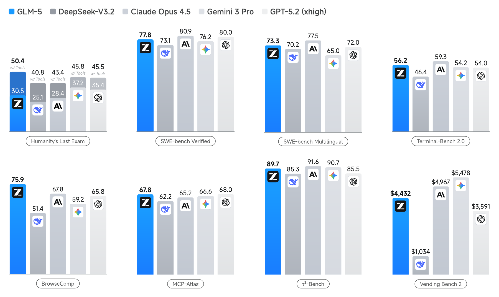

**图 1.** GLM-5, DeepSeek-V3.2, Claude Opus 4.5, Gemini 3 Pro 与 GPT-5.2 (xhigh) 在 8 项智能体, 推理和编码基准上的结果: Humanity's Last Exam, SWE-bench Verified, SWE-bench Multilingual, Terminal-Bench 2.0, BrowseComp, MCP-Atlas, $\tau^{2}$-Bench 和 Vending Bench 2.

## 1 引言

追求通用人工智能 (AGI) 不仅需要扩大模型参数规模, 还需要从根本上重新思考智能效率与自主改进的架构. GLM-4.5 的发布证明, 将智能体, 推理和编码 (ARC) 能力统一到单一混合专家 (MoE) 架构中, 可以在多种基准上取得当前最佳结果. 然而, 随着大语言模型 (LLM) 从被动的知识库转变为主动的问题解决者, 计算成本与现实适应能力这两项挑战, 尤其是复杂软件工程中的适应能力, 已成为主要瓶颈.

我们提出新一代旗舰模型 GLM-5, 旨在突破这些障碍. GLM-5 在性能与效率上均实现了范式转变, 在 ArtificialAnalysis.ai, LMArena Text 和 LMArena Code 等主要开放排行榜上达到当前最佳水平. 更重要的是, GLM-5 重新定义了真实世界编码的标准, 展现出处理复杂端到端软件开发任务的卓越能力, 远远超出 SWE-bench 等传统静态基准的范围.

**结果.** [图 1](#figure-01) 展示了 GLM-5, GLM-4.7, Claude Opus 4.5, Gemini 3 Pro 和 GPT-5.2 (xhigh) 在 8 项智能体, 推理与编码基准上的结果: Humanity's Last Exam [Pha25], SWE-bench Verified [Jim23], SWE-bench Multilingual [Yan25b], Terminal-Bench 2.0 [Tea25a], BrowseComp [Wei25], MCP-Atlas [Ban26a], $\tau^{2}$-Bench [Yao24, Bar25] 和 Vending Bench 2 [Bac25]. 平均而言, GLM-5 相较上一版本 GLM-4.7 提升约 20%, 与 Claude Opus 4.5 和 GPT-5.2 (xhigh) 相当, 并优于 Gemini 3 Pro.

GLM-5 在 Intelligence Index v4.0 中获得 50 分, 成为新的开放权重模型第一名 (见[图 2](#figure-02)). 相比 GLM-4.7 的 42 分提高了 8 分, 主要得益于智能体性能以及知识与幻觉控制方面的改进. 这是开放权重模型首次在 Artificial Analysis Intelligence Index v4.0 中达到 50 分.

<span id="figure-02"></span>

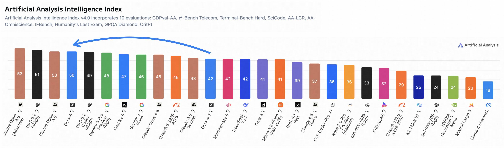

**图 2.** Artificial Analysis Intelligence Index v4.0 包含 10 项评测: GDPval-AA, $\tau^{2}$-Bench Telecom, Terminal-Bench Hard, SciCode, AA-LCR, AA-Omniscience, IFBench, Humanity's Last Exam, GPQA Diamond 和 CritPt.

<span id="figure-03"></span>

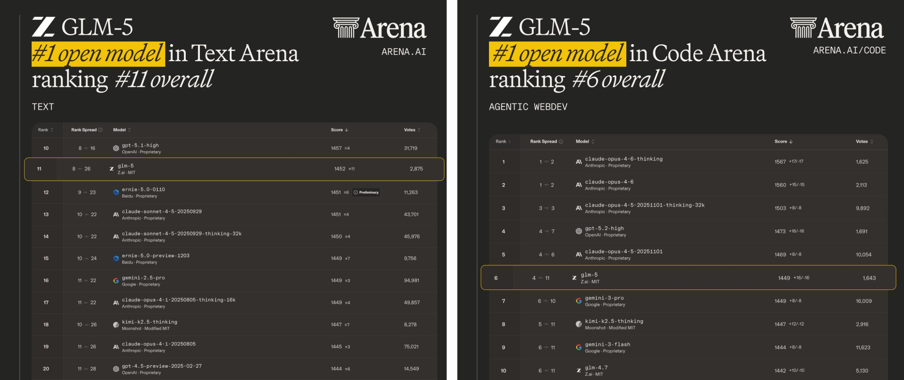

**图 3.** 在 LMArena 上, GLM-5 同时位列 Text Arena 和 Code Arena 开放模型第一名.

<span id="figure-04"></span>

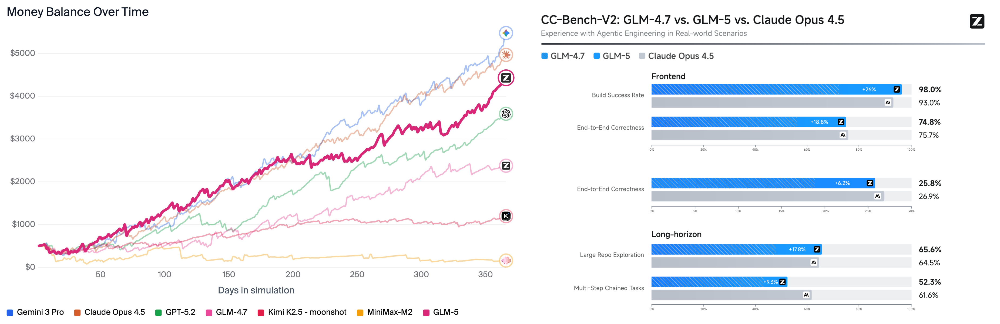

**图 4.** 多项长程任务的结果. 左: Vending-Bench 2; 右: CC-Bench-V2.

LMArena 由加州大学伯克利分校发起, 是一个依靠人类判断评估和比较前沿 AI 能力的透明共享平台, 涵盖写作, 编码, 推理, 设计, 搜索和创作等数百万项真实任务. 大量人类交互产生了反映现实效用的信号, 使其有别于其他静态基准. [图 3](#figure-03) 显示, GLM-5 再次同时位列 Text Arena 和 Code Arena 开放模型第一名, 总体与 Claude-Opus-4.5 和 Gemini-3-pro 相当.

智能体的长期连贯性正变得愈发重要. 编码智能体如今已能连续数小时自主编写代码, AI 模型可完成任务的时长与广度也很可能继续增长. 我们使用 Vending-Bench 2 和 CC-Bench-V2 两项基准评估 GLM-5 完成长程任务的能力. Vending-Bench 2 用于衡量 AI 模型长时间经营企业的表现. 模型需要运营一家为期一年的模拟自动售货机企业, 最终按银行账户余额计分. [图 4](#figure-04) (左) 显示, GLM-5 在所有开源模型中排名第一, 最终账户余额为 \$4,432. 其成绩接近 Claude Opus 4.5, 展现出强大的长期规划与资源管理能力. [图 4](#figure-04) (右) 进一步给出了内部评测套件 CC-Bench-V2 的结果. GLM-5 在前端, 后端与长程任务上均显著优于 GLM-4.7, 并缩小了与 Claude Opus 4.5 的差距.

<span id="figure-05"></span>

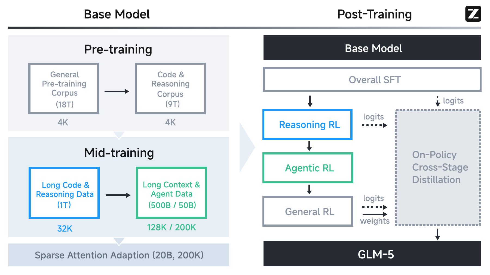

**图 5.** GLM-5 的整体训练流程.

**方法.** [图 5](#figure-05) 展示了 GLM-5 的整体训练流程. 基础模型的训练始于规模达 27 万亿 token 的语料库, 前期优先侧重代码与推理. 随后, 我们采用独立的中期训练阶段, 将上下文长度从 4K 逐步扩展至 200K, 并特别聚焦长上下文智能体数据, 以保证复杂工作流中的稳定性. 在后训练阶段, 我们不再局限于标准 SFT, 而是实施顺序式强化学习流程: 从推理强化学习开始, 接着进行智能体强化学习, 最后完成通用强化学习. 关键在于, 整个过程始终采用在策略跨阶段蒸馏来防止灾难性遗忘, 确保模型在成为稳健通才的同时保留敏锐的推理能力. 总而言之, GLM-5 的性能跃升源于以下技术贡献:

第一, 我们采用 DSA (DeepSeek Sparse Attention) [Dee25a], 这一架构创新显著降低了训练与推理成本. GLM-4.5 通过标准 MoE 架构提高了效率, 而 DSA 则使 GLM-5 能够依据 token 重要性动态分配注意力资源, 在不损害长上下文理解或推理深度的前提下大幅降低计算开销. 借助 DSA, 我们将模型规模扩展至 744B 参数, 并将训练预算提升到 28.5T token.

第二, 我们设计了新的异步强化学习基础设施. 在 GLM-4.5 已采用的 slime 框架和解耦 rollout 引擎基础上, 新基础设施进一步分离生成与训练, 以最大化 GPU 利用率. 该系统能够大规模探索智能体轨迹, 不再受以往拖慢迭代速度的同步瓶颈限制, 从而显著提高强化学习后训练流程的效率.

第三, 我们提出新的异步智能体强化学习算法, 旨在提高自主决策质量. GLM-4.5 使用迭代式自蒸馏与结果监督训练智能体. 在 GLM-5 中, 我们开发了能够持续从多样化长程交互中学习的异步算法. 这些算法专门针对动态环境中的规划与自我纠正能力进行了优化, 直接促成了模型在真实编码场景中的领先表现.

最后一项技术贡献是, GLM-5 从第一天起便面向中国 GPU 生态完成全栈适配. 我们已在华为昇腾, 摩尔线程, 海光, 寒武纪, 昆仑芯, 沐曦和燧原等七个主流国产芯片平台上, 完成了从底层 kernel 到上层推理框架的深度优化.

凭借这些进展, GLM-5 不仅是更强大的模型, 也为下一代 AI 智能体提供了更高效实用的基础. 我们向社区发布 GLM-5, 以进一步推动高效智能体通用智能的前沿发展.

## 2 预训练

与 GLM-4.5 相似, GLM-5 基础模型经历两个阶段: 面向通用语言与编码能力的预训练, 以及面向智能体与长上下文能力的中期训练. 我们扩大了 GLM-5 所有训练阶段的 token 预算, 基础模型总计使用 28.5 万亿 token.

### 2.1 架构

**模型规模扩展.** GLM-5 扩展至 256 个专家, 并将层数减少至 80, 以尽量降低专家并行通信开销. 最终模型共有 744B 参数, 激活参数为 40B; 相比总参数 355B, 激活参数 32B 的 GLM-4.5, 总规模扩大了一倍.

<span id="table-01"></span>

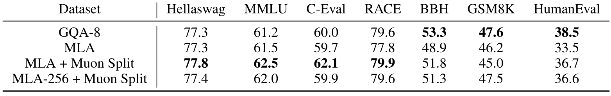

**表 1.** GQA-8 与 MLA 各变体的评测结果.

**多潜变量注意力.** 多潜变量注意力 (MLA) [Dee24] 使用压缩后的键值向量, 在达到分组查询注意力 (GQA) 同等效果的同时, 为长上下文序列带来更好的 GPU 显存节省与更快的处理速度.

然而, 在使用 Muon 优化器的实验中, 我们发现采用 576 维潜在 KV cache 的 MLA 无法达到具有 8 个查询组的 GQA (记作 GQA-8, 使用 2048 维 KV cache) 的性能. 为弥合这一差距, 我们调整了 GLM-4.5 中的 Muon 优化器方案. 原方案对多头查询, 键和值的上投影矩阵 $W^{\mathrm{UQ}},W^{\mathrm{UK}},W^{\mathrm{UV}}$ 执行矩阵正交化. 我们改为按不同注意力头将这些矩阵拆分成更小的矩阵, 再分别进行矩阵正交化. 这一方法称为 Muon Split, 使不同注意力头的投影权重可以按不同尺度更新. 如[表 1](#table-01) 所示, 该方法有效提升了 MLA 性能, 使其与 GQA-8 相当. 实践中我们还发现, 采用 Muon Split 后, GLM-5 的注意力 logit 尺度在预训练期间无需任何裁剪策略便可保持稳定.

MLA 的另一项缺点是解码时计算成本较高. 解码过程中, MLA 执行 576 维点积, 高于 GQA 的 128 维计算. DeepSeek-V3 的注意力头数量根据 H800 的 roofline 选择 [Zha25c], 但这一配置不适合其他硬件. 考虑到 MLA 在训练与预填充阶段采用多头注意力 (MHA) 形式, 我们将头维度从 192 提高到 256, 同时将注意力头数量减少三分之一. 这样既保持训练计算量与参数量不变, 又减少了解码计算量. [表 1](#table-01) 中将该变体记作 MLA-256, 在 Muon Split 下其性能与 MLA 相当.

<span id="table-02"></span>

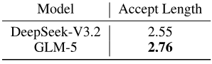

**表 2.** DeepSeek-V3.2 与 GLM-5 接受长度的比较.

**采用参数共享的多 token 预测.** 多 token 预测 (MTP) [Glo24, Dee24a] 可以提高基础模型性能, 并作为推测解码的草稿模型 [Lev23]. 然而在训练期间, 为预测接下来的 $n$ 个 token, 需要 $n$ 个 MTP 层. 因此, MTP 参数与 KV cache 的内存用量会随推测步数线性增长. DeepSeek-V3 转而仅用一个 MTP 层训练, 并在推理时预测后续 2 个 token. 这种训练与推理间的差异降低了第二个 token 的接受率. 因此, 我们提出在训练期间共享 3 个 MTP 层的参数. 该方法使草稿模型的内存成本与 DeepSeek-V3 一致, 同时提高接受率. [表 2](#table-02) 显示, 在私有提示词集合中使用相同推测步数 (4) 时, GLM-5 的接受长度超过 DeepSeek-V3.2.

#### 2.1.1 使用 DeepSeek Sparse Attention (DSA) 继续预训练

<span id="table-03"></span>

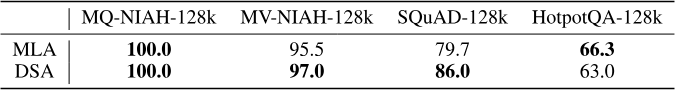

**表 3.** MLA 与 DSA 基础模型在长上下文基准上的比较.

我们的训练采用 DSA. DSA [Dee25a] 的核心理念, 是用动态细粒度选择机制替代传统的稠密 $O(L^{2})$ 注意力, 后者在 $128\mathrm{K}$ 上下文中成本高得难以承受. DSA 不使用滑动窗口等固定模式, 而是根据内容判断哪些 token 重要. 从研究视角看, DSA 尤为有趣之处在于, 它通过从稠密基础模型继续预训练的方式引入, 避免了从零训练的天文成本. 整个转换采用"稠密预热与稀疏训练适配"两阶段策略. DeepSeek-V3.2-Exp 保持了与稠密前代模型相同的基准性能, 证明长上下文中 90% 的注意力项确实冗余. 对于长序列, DSA 可将注意力计算量降低约 1.5-2 倍. 这对我们构建的重推理智能体非常重要, 因为它们能够以一半 GPU 成本处理 128K 上下文.

<span id="figure-06"></span>

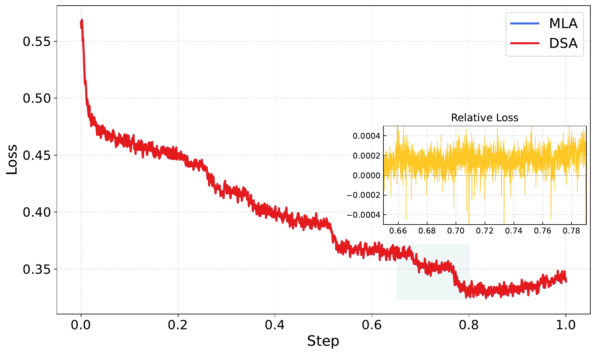

**图 6.** MLA 与 DSA 训练的 SFT 损失曲线对比. 结果使用窗口大小为 50 的移动平均进行平滑.

DSA 训练从中期训练结束时的基础模型开始. 预热阶段共 1000 步, 每步训练 14 个长度为 202,752 token 的序列, 最大学习率为 5e-3. 随后的稀疏适配阶段沿用中期训练的数据与超参数, 共训练 20B token. 虽然训练预算远小于 DeepSeek-V3.2 的 943.7B token, 但我们发现这已足以使 DSA 模型达到原始 MLA 模型的性能. 如[表 3](#table-03) 所示, DSA 模型的长上下文性能接近 MLA 模型. 为进一步验证 DSA 训练的有效性, 我们分别使用相同的 SFT 数据微调 DSA 和 MLA 模型, 发现两者在训练损失与评测基准上持平.

#### 2.1.2 高效注意力变体的消融研究

除 DSA [Dee25a] 外, 我们还基于 GLM-9B 探索了多种替代性高效注意力机制. GLM-9B 是 GLM-4 系列模型之一, 可在 [https://github.com/zai-org/GLM-4](https://github.com/zai-org/GLM-4) 获取. 基线模型的全部 40 层均采用分组查询注意力, 并已使用 128K token 上下文窗口完成微调. 我们评估以下方法:

- 滑动窗口注意力 (SWA) 交错: 在整个网络中统一应用全注意力层与窗口注意力层固定交替的模式.
- Gated DeltaNet (GDN) [Yan25]: 一种线性注意力变体, 以门控线性递归替代二次复杂度的 softmax 注意力计算, 将注意力计算成本从序列长度的二次方降至线性.

在这些基线之上, 我们提出两项改进:

- SWA Pattern (基于搜索): 受 PostNAS [Gu25a] 启发, 我们引入一种基于搜索的适配方法, 找出最适合转换为 SWA 的层子集, 其余层则保留全注意力. 我们采用束搜索策略, 确定能够最大化长上下文下游任务性能的配置. 为降低计算成本, 搜索仅在 16K 上下文长度下进行, 得到的模式随后推广到所有其他输入长度. 具体而言, 束宽设为 8, 每步优化两层; 对于 40 层的 GLM-9B, 该过程约 10 步收敛. 每一步都在 16K 上下文长度的 RULER 基准 [Hsi24] 上评估候选模式, 并保留排名前 8 的候选项进入下一步. 最终得到的模式为 `SFSSFFSSSFFFFSSFSFFFFFFSFSFSSFSSFSFSSFSSS`, 其中 `S` 与 `F` 分别代表 SWA 层与全注意力层. 如[表 4](#table-04) 所示, 这一基于搜索的配置明显优于固定交错方法. 值得注意的是, 尽管只在 16K 上进行了优化, 该模式仍表现出稳健的长度泛化能力, 在所有测试上下文长度下均保持有效.
- SimpleGDN: 一种极简线性化策略, 旨在最大限度复用预训练权重, 改善 GDN 在持续训练适配中的表现. 我们完全移除 `Conv1d` 和显式门控模块, 转而将预训练的 Query, Key 与 Value 投影权重直接映射到线性递归形式中. 这一简化无需引入额外参数, 同时保留了线性注意力的效率优势.

<span id="table-04"></span>

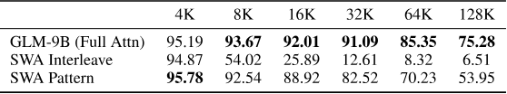

**表 4.** GLM-9B 基线与两种 SWA 变体在*不进行任何额外训练*时的 RULER 基准结果. 两种 SWA 方法都采用 1:1 的全注意力层与 SWA 层比例, 窗口大小为 4096 token. 基于搜索的 SWA 模式仅在 16K 上下文长度下发现一次, 随后统一应用于所有输入长度.

我们在四项长上下文基准上评估所有方法: RULER [Hsi24], MRCR ([https://huggingface.co/datasets/openai/mrcr](https://huggingface.co/datasets/openai/mrcr)), HELMET-ICL [Yen24] 和 RepoQA [Liu24]. 结果汇总于[表 5](#table-05). 每种方法均在 64K 上下文长度下持续训练 190B token, 高效注意力层与全注意力层的比例保持为 1:1. GDN 和 SimpleGDN 方法沿用 Jet-Nemotron [Gu25a] 的流程.

<span id="table-05"></span>

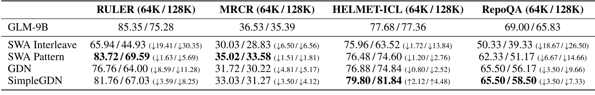

**表 5.** 长上下文基准结果. 所有高效注意力变体均从 GLM-9B 全注意力基线持续训练而来. SWA pattern 表示基于搜索的层选择, SWA interleave 表示固定交替模式. $\Delta$@64K 与 $\Delta$@128K 分别表示相对于 64K 和 128K 上下文长度下全注意力基线的差值.

[表 5](#table-05) 的结果揭示了高效注意力方法之间清晰的权衡层级. 朴素交错的滑动窗口注意力 (SWA) 会使长上下文任务性能灾难性下降, 例如 RULER@128K 下降 30.35 分; 基于搜索的层选择则通过在最关键的位置保留全注意力, 大幅缩小这一差距. GDN 等线性注意力变体进一步提高了质量, 但代价是引入额外参数; SimpleGDN 通过最大限度复用预训练权重取得了最佳平衡. 尽管如此, 这些方法在细粒度检索任务上均存在固有的准确率差距: RULER@128K 最多下降 5.69 分, RepoQA@128K 最多下降 7.33 分. 原因在于持续训练适配期间, 高效注意力机制不可避免地造成信息损失, 即使一半层仍保留全注意力也是如此. 相比之下, DSA 从设计上便是无损的: 其 lightning indexer 在不丢弃任何长程依赖的前提下实现 token 级稀疏性, 因而可应用于所有层且不造成质量下降.

为验证这一点, 我们在采用多潜变量注意力的 GLM-4.7-Flash ([https://huggingface.co/zai-org/GLM-4.7-Flash](https://huggingface.co/zai-org/GLM-4.7-Flash)) 上进行了小规模 DSA 实验. 按照标准 DSA 方案, 训练分两个阶段进行: (i) 预热阶段仅训练 indexer 1,000 步 (batch size 为 16), 同时冻结所有基础模型权重; (ii) 联合训练阶段让模型和 indexer 在 150B token 上共同训练. [表 6](#table-06) 汇总了从 4K 到 128K 各上下文长度下的 RULER 结果. 即便只进行预热的变体 (GLM-4.7-Flash + DSA warmup) 也保留了绝大部分基线性能; 性能下降幅度有限, 且集中在最长的 128K 上下文窗口 ($79.21\to 71.35$), 较短上下文几乎不受影响. 完成 150B token 联合训练后, GLM-4.7-Flash + DSA 几乎消除了所有剩余差距: 在 16K ($+0.86$), 32K ($+0.49$) 和 64K ($+1.72$) 上超过基线, 在 128K 上则仅落后 0.35 分.

<span id="table-06"></span>

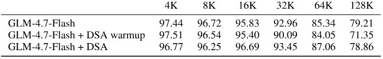

**表 6.** GLM-4.7-Flash 采用 DSA 后的 RULER 基准结果. 仅预热变体在冻结基础模型的同时只训练 indexer, 完整 DSA 变体则将二者联合训练 150B token.

### 2.2 预训练数据

**Web 数据.** 在 GLM-4.5 数据流程的基础上, 我们改进了海量 Web 数据集的筛选标准. 我们引入另一个基于句子嵌入的 DCLM [Li25a] 分类器, 用于识别并汇聚标准分类器之外的更多高质量数据. 为应对长尾知识问题, 我们使用经 Wikipedia 条目与 LLM 标注数据优化的 World Knowledge 分类器, 从原本属于中低质量的数据中提炼有价值的信息.

**代码.** 我们使用主要代码托管平台的最新快照以及更多含代码网页扩充代码预训练语料库, 使模糊去重后的唯一 token 数增加 28%. 为提高语料完整性并减少噪声, 我们修复了 Software Heritage 代码文件中的元数据对齐问题, 并采用更准确的编程语言分类流程. 对源代码与代码相关网页文档, 我们沿用 GLM-4.5 的质量感知采样策略. 此外, 我们为 Scala, Swift 和 Lua 等更多低资源编程语言训练专用分类器, 改善这些语言的采样质量.

**数学与科学.** 我们从网页, 书籍和论文中收集高质量数学与科学数据, 进一步提升推理能力. 具体而言, 我们改进网页内容提取流程以及书籍和论文的 PDF 解析机制, 以提高数据质量. 我们使用大语言模型为候选文档评分, 只保留最具教育价值的内容. 对于长上下文文档, 我们开发了分块聚合评分算法来提高评分准确率. 过滤流程严格排除合成, AI 生成或基于模板的数据.

### 2.3 中期训练

在 GLM-4.5 引入的中期训练框架基础上, GLM-5 同时扩大训练规模与最大上下文长度, 进一步增强模型的推理, 长上下文和智能体能力.

**扩展上下文与训练规模.** 我们分三个阶段逐步扩展上下文窗口: 32K (1T token), 128K (500B token) 和 200K (50B token). 相较 GLM-4.5 的最大 128K 上下文, 新增的 200K 阶段显著提升了模型处理超长文档与复杂多文件代码库的能力. 相应地, 后期阶段会提高长文档与合成智能体轨迹的采样比例.

**软件工程数据.** 我们保留将仓库级代码文件, commit diff, GitHub issue, pull request 和相关源文件拼接成统一训练序列的范式. 在 GLM-5 中, 我们放宽仓库级过滤标准以扩大合格仓库范围, 最终得到约 1,000 万组 issue-PR 配对; 同时加强单个 issue 层面的质量过滤以减少噪声. 我们还为每组 issue-PR 配对检索更多相关文件, 从而获得更丰富的开发上下文, 并扩大真实软件工程场景的覆盖范围. 过滤后, 数据集的 issue-PR 部分约含 160B 唯一 token.

**长上下文数据.** 我们的长上下文训练集同时包含自然数据与合成数据. 自然数据取自书籍, 学术论文和通用预训练语料中的文档, 经过 PPL, 去重和长度等多阶段过滤, 并提高知识密集型领域的采样比例. 在合成数据构建方面, 受 NextLong [Gao25] 和 EntropyLong [Jia25] 启发, 我们采用多种技术构建长程依赖. 通过交错打包将高度相似的文本聚合为序列, 旨在缓解中间信息丢失现象, 并改善多种长上下文任务的表现. 在 200K 阶段, 我们还加入少量类似 MRCR 的数据, 并设计多个扩展 OpenAI 原始范式的变体, 以加强模型在超长多轮对话中的回忆能力. 实验发现, 逐步增加数据多样性可持续提升模型的长上下文性能; 尤其是在初始 128K 阶段之后加入 200K 中期训练, 即使在 128K 上下文窗口内也能进一步增强模型表现.

### 2.4 训练基础设施

#### 2.4.1 内存效率

**灵活放置 MTP.** 在交错式流水线并行 [Nar21] 下, 模型组件可灵活分配到不同阶段. MTP 模块横跨嵌入, Transformer 与输出组件, 内存用量远高于其他模块, 因而导致阶段间不平衡. 我们将 MTP 输出层与主输出层共同放置在最后阶段, 以便共享参数, 同时将 MTP 的嵌入与 Transformer 组件放在前一阶段. 这样可以缓解最后阶段的内存压力, 并改善各流水线 rank 之间的平衡.

**流水线 ZeRO2 梯度分片.** 每个流水线 rank 维护多个阶段 [Nar21], 朴素做法要求每个阶段都拥有完整的梯度缓冲区, 用于梯度累积与优化器更新. 受 ZeRO2 [Raj20] 启发, 我们在数据并行 rank 间对梯度进行分片, 使每个阶段只存储完整梯度的 $1/dp$. 此外, 任意时刻只为两个阶段保留完整的累积缓冲区, 并通过双缓冲复用. 一个阶段的缓冲区在连续 microbatch 上累积梯度时, 前一阶段缓冲区的梯度同步并行执行. 这使常驻梯度内存缩减为各阶段的分片缓冲区, 外加两个用于滚动累积的完整缓冲区, 实践中不会引入额外同步开销.

**Muon 分布式优化器的零冗余通信.** 朴素的 Muon 实现会在每个数据并行 rank 上 all-gather 完整模型参数, 造成瞬时内存峰值与冗余通信. 我们将 all-gather 限制为各 rank 所拥有的参数分片, 并让本地计算与分片通信重叠. 这样既消除了冗余通信, 也显著降低了优化器相关的峰值内存开销.

**流水线激活值卸载.** 流水线预热期间, 前向执行进度领先于反向传播, 延长了中间激活值的存活时间. 我们在前向执行后将激活值卸载至主机内存, 并在反向执行前重新载入 [Yua24]. 卸载以层为粒度进行, 进一步降低峰值内存用量. 配合细粒度重计算, 基本无需让激活值常驻 GPU 内存. 卸载和重载经过调度, 可与计算重叠, 同时避免同点对点通信及 MoE token 路由 (分发与合并) 争用资源. 这使激活值内存占用大幅减少, 开销接近于零.

**按序列分块的输出投影以降低峰值内存.** 输出投影与交叉熵损失会产生瞬时内存开销, 包括保存用于反向传播的激活值, 以及在损失计算期间将其提升到更高精度. 为降低这一开销, 我们将输入序列划分成较小的块, 分别对每块计算投影与损失; 完成其前向和反向传播并释放激活值后, 再处理下一块. 因此, 峰值内存会随分块数量增加而下降. 选择适当的分块数后, 该方法既能缓解输出层内存压力, 又能保持与不分块执行相当的性能.

#### 2.4.2 并行效率

**高效延迟权重梯度计算.** 为减少流水线气泡, 我们将关键路径上的一部分权重梯度计算延后 [Qi23]. 结合优化后的存储与通信重叠, 细粒度延迟可以在控制内存开销的同时提高吞吐量.

**高效长序列训练.** 序列越长, 数据并行组与流水线并行组间的负载不均衡越严重. 我们通过工作负载感知的序列重排, 注意力计算动态重分配, 以及将数据并行 rank 灵活划分为不同大小的上下文并行组来解决这一问题 [Ge25, Wan25b]. 分层 all-to-all 让节点内与节点间的 QKV 张量通信相互重叠, 从而降低延迟.

#### 2.4.3 INT4 量化感知训练

为在低精度下获得更高准确率, 我们在 SFT 阶段应用 INT4 QAT. 此外, 为进一步降低训练时间开销, 我们开发了同时适用于训练和离线权重量化的量化 kernel, 确保训练与推理的行为按位一致.

## 3 后训练

GLM-5 的后训练阶段旨在将基础模型转化为推理, 编码和智能体能力俱佳的强大助手. 如[图 5](#figure-05) 所示, 整个流程采用渐进式对齐策略: 首先进行多任务监督微调 (SFT), 引入复杂的交错思考模式; 随后分别针对推理与智能体任务开展专门的强化学习 (RL); 最后通过通用 RL 实现贴近人类偏好的对齐. GLM-5 将在策略跨阶段蒸馏作为最终精炼步骤, 在吸收每个训练阶段性能收益的同时, 有效缓解能力退化.

### 3.1 监督微调

<span id="figure-07"></span>

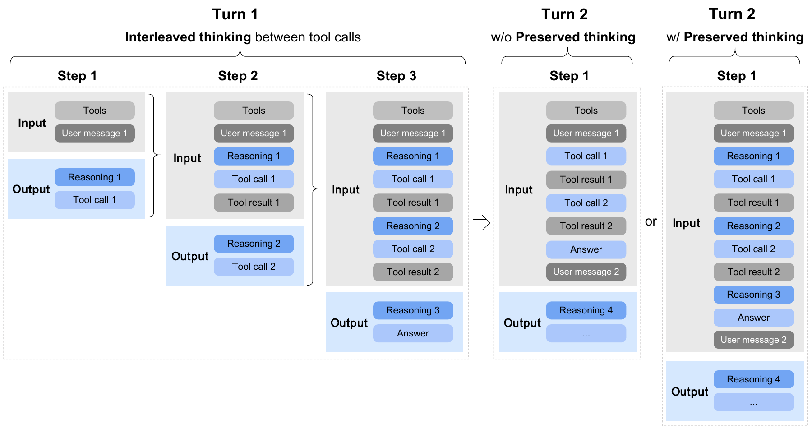

**图 7.** 交错思考与保留思考示意图.

与 GLM-4.5 相比, GLM-5 在 SFT 阶段显著扩大了*智能体*与*编码*数据规模. GLM-5 的 SFT 语料涵盖三大类别:

- **通用对话**: 问答, 写作, 角色扮演, 翻译, 多轮对话与长上下文交互;
- **推理**: 数学, 编程和科学推理;
- **编码与智能体**: 前后端工程代码, 工具调用, 编码智能体, 搜索智能体和通用智能体.

此外, GLM-5 在 SFT 期间将最大上下文长度扩展至 202,752 token. 配合更新后的对话模板, 模型支持三种不同的思考特性 (见[图 7](#figure-07)):

- **交错思考**: 模型在每次回复与工具调用前进行思考, 提升指令遵循能力与生成质量. 交错思考最早由 [Claude](https://platform.claude.com/docs/en/build-with-claude/extended-thinking#interleaved-thinking) 提出.
- **保留思考**: 在编码智能体场景中, 模型会自动保留多轮对话中的所有思考块, 复用已有推理, 无需从头重新推导. 这可减少信息损失与不一致, 十分适合长程复杂任务. Claude 自 Opus 4.5 起也采用了[保留思考](https://platform.claude.com/docs/en/build-with-claude/extended-thinking#thinking-block-preservation-in-claude-opus-4-5-and-later).
- **轮次级思考**: 模型支持在会话内按轮次控制推理. 对轻量请求可关闭思考以降低延迟与成本, 对复杂任务则可启用思考以提高准确性和稳定性.

通过在动作之间思考并维持跨轮次一致性, GLM-5 在复杂任务上表现出更稳定, 更可控的行为.

对于**通用对话**, 我们将回复风格优化得比 GLM-4.5 更有逻辑, 也更简洁. 对角色扮演任务, 我们收集并构建了覆盖更多语言与角色设定的广泛多样数据集. 特别是, 我们定义了指令遵循, 语言表现力, 创造力, 逻辑连贯性和长对话一致性等多个评测维度, 并结合自动与人工过滤来筛选和改进数据.

对于**推理**任务, 我们进一步提升模型的推理深度. 在逻辑推理方面, 我们构建可验证问题, 并通过拒绝采样合成高质量数据. 对于数学和科学问题, 我们依据难度进行过滤, 只保留对 GLM-4.7 模型具有挑战性的问题.

对于**编码**与**智能体**任务, 相较 GLM-4.5, GLM-5 构建了大量执行环境来获取高质量轨迹, 尤其侧重真实场景与长程任务. 我们还借助专家强化学习与拒绝采样进一步改善 SFT 数据. 轨迹中的错误片段会被保留, 但在损失函数中被掩码, 使模型可以学习纠错行为而不会强化错误动作.

### 3.2 推理强化学习

**强化学习算法骨干.** 我们的强化学习算法以 GRPO [Sha24] 为基础, 并引入 IcePop 技术 [Zha25d] 来缓解*训练-推理不一致*, 即强化学习优化期间推理分布与训练分布之间的差异. 我们明确区分用于梯度更新的*训练策略* $\pi^{\mathrm{train}}$ 与用于轨迹采样的*推理策略* $\pi^{\mathrm{infer}}$. 相比原始 IcePop 形式, 我们移除 KL 正则项以加快强化学习能力提升. 最终优化损失为:

$$
\begin{aligned}
\mathcal{L}(\theta)=
-\mathbb{E}_{
x \sim \mathcal{D},
\{y_i\}_{i=1}^{G} \sim \pi^{\mathrm{infer}}_{\theta_{\mathrm{old}}}(\cdot \mid x)
}
&\Bigg[
\frac{1}{G}
\sum_{i=1}^{G}
\frac{1}{|y_i|}
\sum_{t=1}^{|y_i|}
\operatorname{pop}(\rho_{i,t}, 1/\beta, \beta) \\
&\quad\cdot
\min\!\left(
r_{i,t}\hat{A}_{i,t},
\mathrm{clip}\!\left(
r_{i,t},
1-\epsilon_{\mathrm{low}},
1+\epsilon_{\mathrm{high}}
\right)
\hat{A}_{i,t}
\right)
\Bigg].
\end{aligned}
$$

其中, 训练-推理不一致比率定义为

$$
\rho_{i,t}=\frac{\pi_{\theta_{\mathrm{old}}}^{\mathrm{train}}(y_{i,t}\mid x,y_{i,<t})}{\pi_{\theta_{\mathrm{old}}}^{\mathrm{infer}}(y_{i,t}\mid x,y_{i,<t})}.
$$

算子 $\operatorname{pop}(\cdot)$ 会抑制不一致比率偏差过大的样本:

$$
\operatorname{pop}(\rho_{i,t},1/\beta,\beta)=\begin{cases}\rho_{i,t},&1/\beta\leq\rho_{i,t}\leq\beta,\\
0,&\mathrm{otherwise}.\end{cases}
$$

PPO 风格的重要性比率与组归一化优势沿用原始 GRPO 定义:

$$
r_{i,t}=\frac{\pi_{\theta}^{\mathrm{train}}(y_{i,t}\mid x,y_{i,<t})}{\pi_{\theta_{\mathrm{old}}}^{\mathrm{train}}(y_{i,t}\mid x,y_{i,<t})},\quad\hat{A}_{i,t}=\frac{R_{i}-\mathrm{mean}(R_{1},\dots,R_{G})}{\mathrm{std}(R_{1},\dots,R_{G})}.
$$

训练期间, 我们设置超参数 $\beta=2,\epsilon_{\mathrm{low}}=0.2,\epsilon_{\mathrm{high}}=0.28$. 训练完全在策略进行, group size 与 batch size 均为 32.

**DSA 强化学习经验.** 我们在基于 DSA 架构的模型上开展了超大规模强化学习训练. 相比 MLA, DSA 引入额外的 indexer, 检索相关度最高的 top-k 键值项, 并在所得子集上进行稀疏注意力计算. 检索得到的 top-k 结果对强化学习稳定性至关重要. 这类似于 MoE 模型使用路由回放 [Zhe25] 保留激活的 top-k 专家, 以确保训练与推理一致. 然而, 将这一策略直接改造为 indexer 回放, 即保存每个 token 位置的 indexer top-k 索引, 显然并不可行. indexer 所用的 $k=2048$ 远大于 MoE 中的常见 $k$ 值; 保存全部索引不仅会产生庞大的存储成本, 也会给训练引擎与推理引擎之间带来显著通信开销.

我们发现, 采用确定性 top-k 算子可以有效解决 DSA indexer token 选择中的训练-推理不一致. 与 SGLang DSA Indexer 中基于 CUDA 的非确定性 top-k 实现相比, 直接使用朴素 `torch.topk` 虽然稍慢, 但具有确定性, 能够产生更一致的输出并带来显著的强化学习收益. 相反, 其他非确定性 top-k 算子 (如 CUDA 或 TileLang 实现) 会使强化学习仅经过几步便发生剧烈性能退化, 同时伴随熵急剧下降. 因此, 在所有强化学习阶段, 我们均在训练引擎的 DSA Indexer 中默认使用 `torch.topk`. 强化学习期间也默认冻结 indexer 参数, 以加快训练并防止 indexer 学习过程不稳定.

**混合领域推理强化学习.** 在推理强化学习阶段, 我们对数学, 科学, 代码和工具集成推理 (TIR) 四个领域进行混合强化学习训练. 数学与科学数据来自开源数据集 [Du25, Mos25], 以及与外部标注供应商共同开发的数据集. 我们进一步应用难度过滤, 将训练集中在 GLM-4.7 很少能够正确解决或始终无法解决, 但更强教师模型 (如 GPT-5.2 xhigh 与 Gemini 3 Pro Preview) 仍能求解的问题上. 代码领域同时覆盖竞赛编程类任务与科学编码任务. 前者主要来自 Codeforces 及 TACO [Li23], SYNTHETIC-2-RL [Int25a] 等代表性数据集; 后者通过将内部问题池中的题目拆解为正确求解所需的最小代码实现来构建. 对于 TIR, 我们复用数学与科学强化学习数据中更具挑战性的子集, 并与标注供应商共同构建明确要求使用外部工具作答的 STEM 问题. 强化学习训练期间, 我们为不同领域与数据来源指定相应的 judge 模型或评测系统, 以生成二元结果奖励. 四个领域的总体配比大致均衡, 在混合强化学习设置下, 每个领域都持续获得稳定而显著的提升.

### 3.3 智能体强化学习

为提升 GLM-5 的智能体表现, 我们开发了完全异步且解耦的强化学习框架, 并在编码与搜索智能体任务上优化 GLM-5. 朴素同步强化学习会在长程智能体 rollout 期间产生严重的 GPU 空闲. 我们通过中央 Multi-Task Rollout Orchestrator 解耦推理与训练引擎, 实现多种智能体工作负载的高吞吐联合训练.

为在异步离策略条件下保持训练稳定, 我们引入两项关键机制. 第一, Token-in-Token-out (TITO) 网关通过保留精确的动作级对应关系来消除重新分词造成的不一致. 第二, 我们采用直接双侧重要性采样, 对 rollout log-probability 应用 token 级裁剪机制 ($[1-\epsilon_{\ell},1+\epsilon_{h}]$), 无需跟踪历史策略 checkpoint 即可高效控制离策略偏差. 我们还采用 DP 感知路由, 在大规模 MoE 模型的长上下文推理期间最大限度复用 KV cache, 从而实现加速. 为扩展智能体环境, 我们在三个领域构建了可验证训练环境: 超过 10K 个真实软件工程 (SWE) 场景, 终端任务以及高难度多跳搜索任务. 关于智能体强化学习的更多细节见后续第 4 节.

### 3.4 通用强化学习

**多维优化目标.** 我们将通用强化学习的优化目标分解为三个互补维度: *基础正确性*, *情商*和*任务特定质量*.

*基础正确性*是回复质量的根基. 它针对会损害模型输出可用性的广泛错误类型, 包括不遵循指令, 逻辑不一致, 事实错误, 知识幻觉和语言不流畅. 目标是尽量降低错误率, 使回复达到*可用*基线. 我们将其视为后续所有优化的前提: 无论表述看起来多么精致, 包含事实错误或误解用户意图的回复都可能主动误导用户.

*情商*维度在核心正确性之外优化用户体验. 它旨在生成富有同理心与洞察力, 且风格接近自然人类交流的回复, 使模型交互更加自然, 更具吸引力.

*任务特定质量*维度面向各类具体任务开展细粒度优化. 它以基础正确性所建立的可用性为起点, 力求使回复从仅仅正确提升为在相应任务类别中真正高质量. 该维度覆盖写作, 文本处理, 主客观问答, 角色扮演和翻译等多种任务. 每个任务领域所需的奖励信号各不相同, 因而需要混合奖励系统.

**混合奖励系统.** 为监督上述多样化目标, 我们构建了混合奖励系统, 集成三种相互补充的奖励信号: *基于规则的奖励函数*, *结果奖励模型* (ORM) 和*生成式奖励模型* (GRM). 三者各有优缺点, 将其结合是实现稳定, 高效且可扩展的通用强化学习训练过程的关键.

基于规则的奖励能够提供精确且可解释的信号, 但仅适用于可以用确定性规则表达的方面. ORM 信号方差低, 训练效率高, 却更容易受到奖励欺骗影响, 即策略利用表面模式而非真正提升核心能力. GRM 借助语言模型生成标量或结构化评估, 对这类利用行为更加稳健, 但往往具有更高方差. 混合三类信号后, 奖励系统可在精确性, 效率与稳健性之间取得平衡, 缓解任一单项机制的弱点.

**人类参与的风格对齐.** 通用强化学习流程的一项鲜明特点, 是明确纳入高质量的人类撰写回复. 我们没有完全依赖模型生成回复, 而是引入专家人工回复作为风格与质量锚点. 这一做法源于我们的观察: 纯粹基于模型生成内容的优化往往会收敛到明显的"模型式"模式, 例如过于冗长, 公式化或缺乏娴熟人类写作所具有的细腻表达. 通过让模型接触人类撰写的范例, 我们鼓励其采用更自然, 更贴近人类的回复模式.

### 3.5 在策略跨阶段蒸馏

在多阶段强化学习流程中, 依次针对不同目标进行优化可能导致先前习得的能力逐渐退化. 为缓解这一问题, 我们将**在策略跨阶段蒸馏**作为最终阶段, 采用在策略蒸馏算法 [Gu25, Yan25a, Xia26, Lu25], 快速恢复较早 SFT 与强化学习阶段 (推理强化学习和通用强化学习) 中获得的技能. 具体而言, 前面各训练阶段的最终 checkpoint 充当教师模型; 训练提示词从相应教师的强化学习训练集中采样, 并按适当比例混合. 将式 1 中的优势项替换为下式即可得到训练损失, 其中 `sg` 表示停止梯度操作, 如 `.detach()`:

$$
\hat{A}_{i,t}=\mathrm{sg}\left[\log\frac{\pi_{\theta_{\mathrm{teacher}}}^{\mathrm{infer}}(y_{i,t}\mid x,y_{i,<t})}{\pi_{\theta}^{\mathrm{train}}(y_{i,t}\mid x,y_{i,<t})}\right].
$$

目前, 我们使用推理引擎获取教师模型的 logit. 未来计划将推理后端迁移至训练引擎, 并统一采用 MLA 的多查询注意力 (MQA) 模式进行推理 ($\pi_{\theta_{\mathrm{teacher}}}^{\mathrm{infer}}\rightarrow\pi_{\theta_{\mathrm{teacher}}}^{\mathrm{train}}$). 训练期间, GRPO 算法的 group size 设为 1 以提高数据吞吐量, batch size 设为 1024. 这一设置之所以可行, 是因为该阶段不再需要为每个提示词维持大组样本来估计优势; 优势可直接根据与教师模型的差距计算.

### 3.6 强化学习训练基础设施: *slime* 框架

我们继续使用 slime 作为 GLM-5 的统一后训练基础设施, 支持大规模端到端强化学习. GLM-5 没有引入新的系统组件, 而是*充分利用* slime 的能力: (1) 通过自由形式的 rollout 定制与基于服务器的执行模型扩大任务覆盖范围; (2) 通过混合精度训练与 rollout, 再配合 MTP 和预填充-解码 (PD) 分离来大幅提高吞吐量, 对多轮强化学习工作负载尤其有效; (3) 通过心跳驱动的 rollout 容错机制与路由层服务器生命周期管理提升稳健性.

#### 3.6.1 横向扩展: 以高度可定制的 Rollout 实现灵活训练

GLM-5 的后训练涵盖多种目标. 为了在不为具体任务维护分支的前提下支持这种多样性, GLM-5 同时利用 slime 高度可定制的 rollout 接口和基于服务器的 rollout 执行方式.

**高度可定制的 rollout.** slime 提供灵活接口, 无需修改底层基础设施即可实现任务特定的 rollout 逻辑, 包括多轮交互循环, 工具调用, 环境反馈处理以及由 verifier 引导的分支. GLM-5 利用这一能力, 在统一训练栈内支持广泛领域与训练范式, 包括但不限于推理强化学习, 通用强化学习, 智能体强化学习和在策略蒸馏.

**通过 HTTP API 实现基于服务器的 rollout.** slime 通过标准 HTTP API 暴露 rollout 服务器与推理路由器, 用户可以像与常规推理引擎交互一样使用 slime 服务层. 这样便将 rollout 逻辑与训练进程边界解耦: 外部智能体框架和环境可以直接调用服务器或路由端点, 而无论是短程单轮训练还是长程多轮轨迹, 优化后端都保持不变.

#### 3.6.2 纵向扩展: 优化强化学习 Rollout 的尾延迟

对强化学习 rollout 而言, 优化目标并非总吞吐量, 而是*端到端延迟*, 其主要取决于每一步中最慢的长尾样本. 实际上, 单条拖延的轨迹便可能阻塞同步点, 如 batch 完成, 缓冲区就绪和训练器更新, 并直接决定实际进度. 因此, GLM-5 充分利用 slime 面向延迟的服务与调度机制, 在降低中位延迟的同时, 更着重压低尾延迟.

**通过带 MLA DP-attention 的多节点推理实现无队列服务.** 为避免排队延迟, 即使面对突发流量, rollout 请求也必须得到及时服务, 这需要充足的 KV cache 容量. GLM-5 采用多节点推理部署, 例如在 8 个节点上使用 EP64 与 DP64, 以提供足够的分布式 KV cache. 引入 DP-attention 主要是为了避免在不同 rank 间复制 KV.

**通过 FP8 rollout 与 MTP 降低尾延迟.** GLM-5 使用 FP8 执行 rollout 推理, 以减少逐 token 延迟并缩短长轨迹的完成时间. 此外, GLM-5 利用 slime 对多 token 预测 (MTP) 的支持, 在强化学习 rollout 常见的小 batch 解码场景下尤为有效. 尾延迟往往由小 batch size 的拖尾样本决定, 如罕见的长上下文, 复杂多轮推理或大量调用工具的轨迹; MTP 因而能在长尾部分带来尤为显著的收益, 缩短最慢样本的完成时间, 进而减少每一步的停顿.

**通过 PD 分离避免多轮强化学习中的预填充-解码干扰.** 在多轮场景中, 长前缀的预填充十分频繁, 例如对话历史, 工具轨迹与代码上下文. 在 DP-attention 下, 让预填充与解码共享同一组服务资源可能造成严重干扰: 大型预填充任务会抢占或扰乱服务器上正在进行的解码, 使其他样本无法持续推进, 导致尾延迟急剧恶化. 因此, GLM-5 利用 slime 的预填充-解码 (PD) 分离机制. 预填充与解码分别运行在专用资源上, 使解码保持稳定且不中断, 长程样本得以持续推进, 从而显著改善多轮智能体强化学习中的长尾表现.

#### 3.6.3 Rollout 稳健性: 心跳驱动的容错机制

在大规模环境中, 单个服务器崩溃, 网络问题或性能下降等短暂故障不可避免. GLM-5 利用 slime 由心跳驱动的容错机制, 确保此类事件发生时训练仍可连续进行: rollout 服务器定期发送由编排层监控的心跳, 异常服务器会被主动终止, 并从推理路由器中注销. 因此, 重试请求会自动绕过故障或性能下降的服务器, 转发至健康服务器, 防止单台服务器的事故中断 rollout, 保持端到端强化学习训练连续运行.

## 4 智能体工程

我们描述了从**氛围编程** (由人类提示) 到**智能体工程**的转变. 在氛围编程中, 人类提示 AI 模型编写代码; 在智能体工程中, AI 智能体自行编写代码, 自主规划, 实现并迭代. 为支持这些长程任务, GLM-5 采用完全异步且解耦的强化学习框架, 减少智能体 rollout 期间的空闲时间, 从而显著提高 GPU 利用率. 为扩展智能体环境, 我们开发了环境构建流程. 对于编码任务, 我们围绕真实软件工程 issue 与终端任务搭建了超过 10,000 个可验证训练场景. 对于搜索智能体, 我们开发自动且可扩展的复杂多步推理数据合成流程, 为智能体训练构建数据.

### 4.1 面向智能体任务的异步强化学习

为在智能体任务上开展强化学习, 我们设计了完全异步且解耦的强化学习基础设施, 高效处理长程智能体 rollout, 并支持跨多种智能体框架的灵活多任务强化学习训练.

强化学习训练采用分组策略优化算法. 对每个问题 $x$, 我们从前一策略 $\pi_{\mathrm{old}}$ 中采样 $K$ 条智能体轨迹 $\{y_{1},\dots,y_{K}\}$, 并按以下目标优化模型 $\pi_{\theta}$:

$$
L(\theta)=\mathbb{E}_{x\sim\mathcal{D}}\!\left[\frac{1}{K}\sum_{i=1}^{K}\left(r(x,y_{i})-\bar{r}(x)\right)\right],
$$

其中, $\bar{r}(x)\;=\;\frac{1}{K}\sum_{i=1}^{K}r\bigl(x,y_{i}\bigr)$ 是所采样回复的平均奖励. 需要注意的是, 优化只使用模型生成的 token, 环境反馈不参与损失计算.

#### 4.1.1 面向智能体训练的异步强化学习设计

由于 rollout 过程存在长尾特性, 朴素同步强化学习训练会因智能体任务的生成负载严重不均, 在 rollout 阶段产生大量气泡, 导致 GPU 长时间空闲. 为提高训练吞吐量, 我们在智能体强化学习中采用完全异步的训练范式, 以提升 GPU 利用率与训练效率. 具体而言, 训练引擎与推理引擎被解耦到不同 GPU 设备上. 推理引擎持续生成轨迹; 一旦轨迹数量达到预设阈值, 该 batch 便发送到训练引擎更新模型. 为减少策略滞后并使训练大致保持在策略, rollout 引擎使用的模型权重会定期与训练引擎同步. 训练引擎每进行 $K$ 次梯度更新, 就更新模型参数并将新权重推送回推理引擎. 异步虽然能显著提高整体训练效率, 却也意味着不同轨迹可能由不同模型版本生成, 从而引入严重的离策略问题. 由于 rollout 策略不断变化, 每次权重更新所对应的优化问题也有所不同, 因此我们还会在推理引擎每次更新权重后重置优化器.

**基于服务器的多任务训练设计.** 为处理多任务强化学习中轨迹生成的异构性, 即不同任务通常依赖不同工具集与任务特定的 rollout 逻辑, 我们为多任务强化学习训练引入基于服务器的 Multi-Task Rollout Orchestrator. 该组件通过一个注册有多项任务服务的中央编排器, 确保 slime 强化学习训练框架能够与多种下游任务无缝兼容. 具体而言, 每个任务将自己的 rollout 与奖励逻辑实现为独立微服务, 并在中央编排器中注册, 由其管理和调度. rollout 阶段, 中央编排器控制各任务的 rollout 比例与生成速度, 使不同任务间的数据收集保持平衡. 更关键的是, 我们将所有智能体任务的轨迹标准化为统一的消息列表表示. 这样既能联合训练复杂智能体框架, 如软件工程任务, 也能对异构工作负载进行集中式后处理与日志记录. 该设计将任务特定逻辑与核心训练循环清晰隔离, 从而可无缝集成多任务强化学习训练. 作为 GLM-5 训练基础设施的骨干, 该编排器支持超过 1k 个并发 rollout, 可自动动态调整任务采样比例, 并对任务进度进行细粒度监控.

#### 4.1.2 优化异步训练稳定性

**Token-in-Token-out 与 Text-in-Text-out.** 在强化学习 rollout 场景中, *token-in-token-out* (TITO) 意味着训练流程直接接收推理引擎产生的*原始*分词结果与解码 token 流, 并据此构建学习轨迹. 相比之下, *text-in-text-out* 将 rollout 引擎视为返回最终文本的黑盒; 训练器在计算损失前, 需要对文本重新分词来重建轨迹, 往往还要重新推导边界与截断位置. 这个看似微小的选择影响重大: 重新分词可能在 token 边界, 空白与规范化处理, 截断或特殊 token 位置上引入细微差异, 继而破坏动作与奖励或优势之间的步骤对齐; rollout 经过流式传输, 截断或在多个执行者间交错时尤其如此. 我们发现, token-in-token-out 对异步强化学习训练至关重要, 因为它能精确保留采样内容与优化内容之间的动作级对应关系, 同时允许执行者立即发送轨迹片段 (token ID 与元数据), 无需进行有损的文本往返, 也无需等待学习端事后重新分词. 实践中, 我们实现了 TITO Gateway, 拦截 rollout 任务发出的所有生成请求, 并记录每条轨迹的 token ID 与元数据. 该设计将繁琐的 token ID 处理同下游智能体 rollout 逻辑隔离, 同时避免强化学习训练中的重新分词不一致.

**用于 token 裁剪的直接双侧重要性采样.** 不同于第 3 节的同步强化学习设置, 在异步环境中, rollout 引擎可能在单条轨迹生成期间经历多次更新, 因此跟踪精确行为概率 $\pi_{\theta_{\mathrm{old}}}$ 的计算成本高得难以承受. 否则, 我们必须维护大量历史模型 checkpoint $\{\pi_{\theta_{\mathrm{old}}^{(1)}},\dots,\pi_{\theta_{\mathrm{old}}^{(N)}}\}$, 这在实际实现中并不可行.

为解决这一问题, 我们首先采用简化的 token 级重要性采样机制, 直接复用 rollout 期间产生的 log-probability 作为行为代理. 通过将重要性采样比率计算为 $r_{t}(\theta)=\frac{\pi_{\theta}}{\pi_{\mathrm{rollout}}}$ 并舍弃传统的 $\pi_{\theta_{\mathrm{old}}}$, 我们消除了另行执行旧策略推理的计算开销. 其次, 我们采用双侧校准的 token 级掩码策略. 与标准 PPO 的非对称裁剪不同, 我们将信赖域限制在 $[1-\epsilon_{\ell},1+\epsilon_{h}]$ 内, 其中 $\epsilon_{\ell}$ 和 $\epsilon_{h}$ 为裁剪超参数. 区间外的 token 会从梯度计算中完全掩去, 防止策略极端偏离造成训练不稳定. 该方法与 IcePop 机制 [Tea25] 类似, 但进一步移除了 $\pi_{\theta_{\mathrm{old}}}$, 因而更简单, 训练也更稳定.

形式上, 采用 token 级裁剪的优化目标可写为:

$$
L(\theta)=\mathbb{E}_{t}\left[f(r_{t}(\theta),\epsilon_{l},\epsilon_{h})\hat{A}_{t}\log\pi_{\theta}(a_{t}|s_{t})\right]
$$

其中, 重要性采样比率 $r_{t}(\theta)$ 的计算方式为:

$$
r_{t}(\theta)=\exp\left(\log\pi_{\theta}(a_{t}|s_{t})-\log\pi_{\mathrm{rollout}}(a_{t}|s_{t})\right)
$$

校准函数 $f(x;\epsilon_{\ell},\epsilon_{h})$ 进一步保证稳定性:

$$
f(x;\epsilon_{\ell},\epsilon_{h})=\begin{cases}x,&\mathrm{if}\ 1-\epsilon_{\ell}<x<1+\epsilon_{h}\\
0,&\mathrm{otherwise}\end{cases}
$$

实验发现, 复用 rollout log-probability 会接受一定程度且可控的离策略偏差, 以此免去历史策略跟踪, 同时提升训练稳定性.

**丢弃离策略与噪声样本.** 在异步强化学习中, 过长的轨迹可能严重偏离当前策略, 从而使训练不稳定. 为滤除这类严重离策略样本, 我们记录 rollout 引擎生成数据时所用的策略权重版本. 具体而言, 对每条回复记录其涉及的模型版本序列 $(w_{0},\ldots,w_{k})$, 其中 $w_{0}<\cdots<w_{k}$. 设 $w^{\prime}$ 为当前策略版本. 若最旧的 rollout 版本过时太久, 即 $w^{\prime}-w_{0}>\tau$, 其中 $\tau$ 为预定义阈值, 则丢弃该样本. 这样便可移除远远落后于当前策略的轨迹.

此外, 编码智能体沙箱本身可能不稳定, 并因与模型无关的原因失败, 例如环境崩溃. 这类失败反映的是环境不稳定, 而非模型能力, 因此会引入噪声训练信号. 为缓解这一问题, 我们记录每个样本的失败原因, 并排除因环境崩溃而失败的样本. 对 GRPO 等基于分组的采样方法而言, 移除失败样本可能导致分组不完整. 此时, 若有效样本数超过 group size 的一半, 就重复有效样本以补齐该组; 否则丢弃整组. 这一过程可减少虚假奖励噪声, 提高训练稳定性.

**用于加速的 DP 感知路由.** 我们提出 DP 感知路由机制, 在数据并行 (DP) 的大规模 MoE 推理中保持 KV cache 局部性. 在多轮智能体工作负载中, 同一 rollout 的连续请求共享相同前缀. 为最大限度复用 KV, 我们强制建立 rollout 级亲和性: 属于同一智能体实例的所有请求均路由到同一 DP rank. 具体而言, 我们引入有状态路由层, 使用一致性哈希将每个 rollout ID 映射到固定 DP rank. 该映射跨轮次保持稳定, 从而消除跨 rank 的 cache miss. 为避免长期不平衡, 我们将哈希与哈希空间上的轻量动态负载再平衡相结合. 这一设计无需在 DP rank 之间同步 KV, 便可避免重复的预填充计算. 随着 rollout 长度增加, 预填充成本始终与增量 token 数量成正比, 而非与总上下文长度成正比. 最终, 长上下文智能体推理的端到端延迟得到改善, 有效吞吐量也随之提高.

### 4.2 扩展智能体环境

为支持多种智能体任务上的强化学习, 我们构建可验证, 可执行的环境, 为以代码和内容生成为中心的工作流提供有依据的反馈. 对于智能体编码任务, 我们开发了两条可验证执行环境的构建流程: 一条基于真实软件工程 issue 搭建环境, 另一条合成终端智能体环境. 除编码外, 我们还引入幻灯片生成环境, 智能体在结构化 HTML 上操作, 并借助可执行渲染和基于布局的验证进行评测.

#### 4.2.1 软件工程 (SWE) 环境

在构建可执行环境前, 我们收集大量真实的 Issue-Pull Request (PR) 配对, 并采用严格的基于规则与 LLM 的过滤, 确保获取真实高质量的 issue 描述. 我们将实例分为错误修复, 功能实现, 重构和其他类型, 并纳入必要的任务要求, 确保模型实现与测试 patch 一致. 我们采用基于 RepoLaunch [Zha25b] 框架的环境搭建流程, 扩展从真实 SWE issue 构建可执行环境的能力. 该流程会自动分析仓库的安装方式与依赖配置, 构建可执行环境并生成测试命令, 随后利用 LLM 针对测试输出生成相应编程语言的日志解析函数, 从中提取 Fail-to-Pass (F2P) 和 Pass-to-Pass (P2P) 测试用例. 借助该流程, 我们从数千个仓库中构建了超过 10k 个可验证环境, 覆盖 Python, Java, Go, C, CPP, JavaScript, TypeScript, PHP 和 Ruby 共 9 种编程语言.

#### 4.2.2 终端环境

**基于种子数据合成.** 为大规模构建可验证的终端智能体环境, 我们设计了一条包含三个阶段的智能体数据合成流程: 生成任务草案, 实现具体任务和迭代优化任务. 我们从真实软件工程与基于终端的计算机使用场景中收集一组种子任务, 再利用 LLM 集思广益, 生成大量可验证终端任务草案. 随后由构建智能体将这些草案实例化为 Harbor [Har26a] 格式的具体任务, 包括结构化任务描述, Docker 化执行环境和相应测试脚本. 接着, 改进智能体依据人工定义的评分准则检查并迭代完善生成的任务, 确保 Docker 镜像可以可靠构建, 测试用例与任务规约一致, 且环境能抵御潜在漏洞或捷径. 总体而言, 该流程产生了数千个多样且可验证的终端智能体环境, Docker 构建准确率超过 90%.

**基于 Web 语料合成.** 我们开发了一条可扩展的自动化流程, 基于 Web 语料构建经 LLM 验证的终端编码任务. 该流程采用闭环设计, 由构建智能体兼任自身的第一轮评测者. 首先, 我们收集大规模代码相关网页语料, 并应用数据质量分类器, 只保留高质量内容, 丢弃以非技术内容为主或缺乏实质性代码的页面. 从过滤后的子集中, 再找出适合改写成终端式任务的网页. 随后按主题类别与难度分层采样, 确保所得任务池分布均衡且具有多样性. 第二步, 我们将 Harbor 任务构建规约 ([https://harborframework.com/docs/tasks/task-tutorial](https://harborframework.com/docs/tasks/task-tutorial)) 与每个选定的源网页一同提供给编码智能体. 规约包括任务 schema, 格式要求和任务示例. 智能体需要 (i) 根据网页内容合成完整终端任务, 并 (ii) 对自己的输出运行 Harbor 验证脚本. 如验证失败, 智能体会反复诊断并修改任务, 直至通过全部自动检查. 只有成功通过这一自验证闭环的任务才会进入最终数据集.

#### 4.2.3 搜索任务

对于深度搜索类信息检索任务, 我们构建了一条数据合成流程, 生成具有挑战性的多跳问答对. 每个问题都需要基于多个 Web 来源汇聚的证据进行多步推理.

**Web 知识图谱 (WKG) 构建与问题生成.** 我们从早期搜索智能体的轨迹出发, 收集其中出现的所有 URL 并进行去重, 最终保留来自不同领域, 信息密度较高的 200 多万个网页. LLM 通过语义解析完成实体识别, 噪声过滤与结构化信息提取. WKG 持续加入新页面, 并利用下游验证信号进行实体对齐, 属性规范化, 关系合并与语义一致性校正, 从而不断完善. 以 WKG 为基础, 我们采样低频到中频实体作为种子节点, 扩展其多跳邻域形成完整子图, 同时控制扩展过程以减少重叠. 随后使用面向高难度跨领域推理的提示词, 将每个子图转化为隐式编码多实体关系链的问题.

**高难度问题过滤与验证.** 我们使用三阶段流程平衡难度与正确性: (1) 若无工具推理模型在 8 次独立尝试中至少有一次正确回答某问题, 则将其移除. (2) 过滤掉早期智能体借助基础搜索, 浏览与计算在几步内即可解决的问题. (3) 使用验证智能体进行双向验证: 收集第 2 阶段搜索轨迹中的候选答案, 再分别独立验证候选答案和标注真值与问题的一致性, 丢弃答案不唯一, 证据不一致或标签错误的样本. 最终得到高质量, 高难度且可靠的多跳问答对.

#### 4.2.4 搜索智能体的上下文管理推理

我们发现, BrowseComp [Wei25] 上的表现同时对 judge 提示词与 judge 模型敏感, 开源 judge 还可能引入系统性偏差. 为确保一致性与可复现性, 我们统一使用 OpenAI 官方评测提示词, 并以闭源模型 o3-mini 作为 judge, 对所有依赖 judge 的组件进行标准化. 案例研究表明, 这一配置与人工标注真值最为一致, 因此所有搜索智能体评测均采用该配置.

先前工作 [Dee25a] 提出了上下文管理, 其中 *Discard-all* 会移除全部工具调用历史来重置上下文. 我们进一步观察到, 上下文极长时, 例如超过 100k token, 模型准确率会大幅下降. 因此, 我们采用简单的 *Keep-recent-k* 策略. 当交互历史超过阈值 $k$ 时, 折叠最近 $k$ 轮以前的内容以控制上下文长度. 设轨迹为 $(q,r_{1},a_{1},o_{1},r_{2},a_{2},o_{2},\cdots,r_{n},a_{n},o_{n})$, 其中 $q$ 表示问题, $r_{i}$ 表示第 $i$ 轮推理, $a_{i}$ 表示动作 (我们设计了 *search*, *open*, *find* 和 *python* 4 种工具), $o_{i}$ 表示工具观察结果. 我们只折叠最近 $k$ 轮以前的观察结果: $o_{i}\leftarrow\mathrm{Tool\ result\ is\ omitted\ to\ save\ tokens.}\quad i=1,\ldots,n-k$. 实验中设 $k=5$, 可带来稳定提升, 使 GLM-5 的成绩从未使用 keep-recent-$k$ 时的 55.3% 提升到使用后的 62.0%. 我们还发现, 采用不同的 keep recent $k$ 值, 或在上下文长度达到预设 token 阈值时触发 keep-recent, 均会得到相同结果.

在此基础上, 我们将 keep-recent 与 Discard-all 结合, 形成混合的*分层上下文管理*策略. 在使用 keep-recent 进行推理期间, 若总上下文长度超过阈值 $T$, 就丢弃完整的工具调用历史并以全新上下文重新开始, 同时继续应用 keep-recent 策略. 我们通过参数搜索选定 $T=32k$.

如[图 8](#figure-08) 所示, 在不同计算预算下, 该策略都能有效释放上下文空间, 使模型可以执行更多步骤, 并持续提升性能. 相比只使用 Discard-all, 与 keep-recent-k 结合可在所有预算下带来稳定收益, 最终得分达到 75.9, 超越所有配备上下文管理的开源模型.

<span id="figure-08"></span>

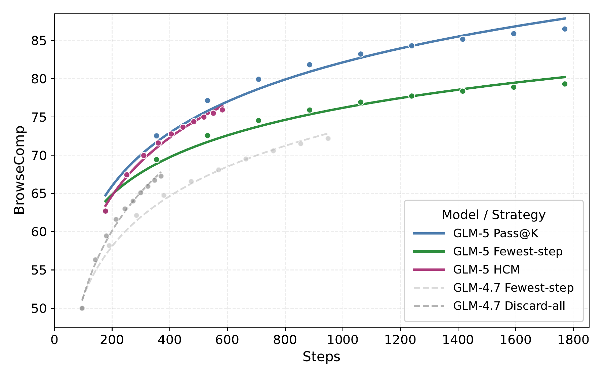

**图 8.** 从 GLM-4.7 (灰色基线) 到 GLM-5 (彩色策略), 不同上下文管理策略在 BrowseComp 上的准确率.

#### 4.2.5 幻灯片生成

我们采用自我改进流程, 通过强化学习与拒绝采样微调来训练专门的幻灯片生成专家, 系统性提高幻灯片生成能力. 首先通过监督微调 (SFT) 初始化模型, 赋予其基础幻灯片生成能力; 随后使用多层级奖励开展强化学习, 奖励依据演示文稿幻灯片常见的美学与结构属性设计. 这一阶段显著提升了生成质量. 我们进一步进行拒绝采样微调和掩码微调, 将强化学习期间获得的知识重新注入训练语料. 该过程以协调且迭代的方式同时提高数据质量与模型能力.

我们提出**多层级奖励形式**, 将基于 HTML 的幻灯片生成过程中的奖励信号划分为三个层级:

**层级 1: 静态标记属性.** 这一层级关注生成 HTML 中的声明式属性, 包括定位, 间距, 颜色, 字体, 饱和度及其他样式属性. 我们依据专业设计原则制定一组规则, 规范模型生成此类声明时的行为. 这些规则既确保所生成 HTML 在语法上可解析, 又在标记层面将设计空间约束到一个针对表现力, 结构清晰度, 视觉协调性和可读性优化的子空间. 此外, 我们还引入虚构图片与重复图片检测机制, 抑制幻觉或冗余图像.

**层级 2: 运行时渲染属性.** 与静态检查不同, 这一层级评估渲染过程中 DOM 节点的运行时属性, 如元素宽高, 边界框及其他几何布局指标. 通过约束这些属性, 我们促使生成的幻灯片在空间组织上更贴近人类审美偏好. 我们开发了分布式渲染服务, 可以高吞吐执行渲染任务并提取所需运行时属性. 训练期间, 我们观察到多种奖励欺骗行为, 如强行截断过长内容或过度操纵间距 (见[图 9](#figure-09)). 为缓解这些问题, 我们改进渲染器实现以消除可利用的漏洞, 确保奖励信号真正鼓励美学协调的布局, 而非对几何指标的表面迎合.

<span id="figure-09"></span>

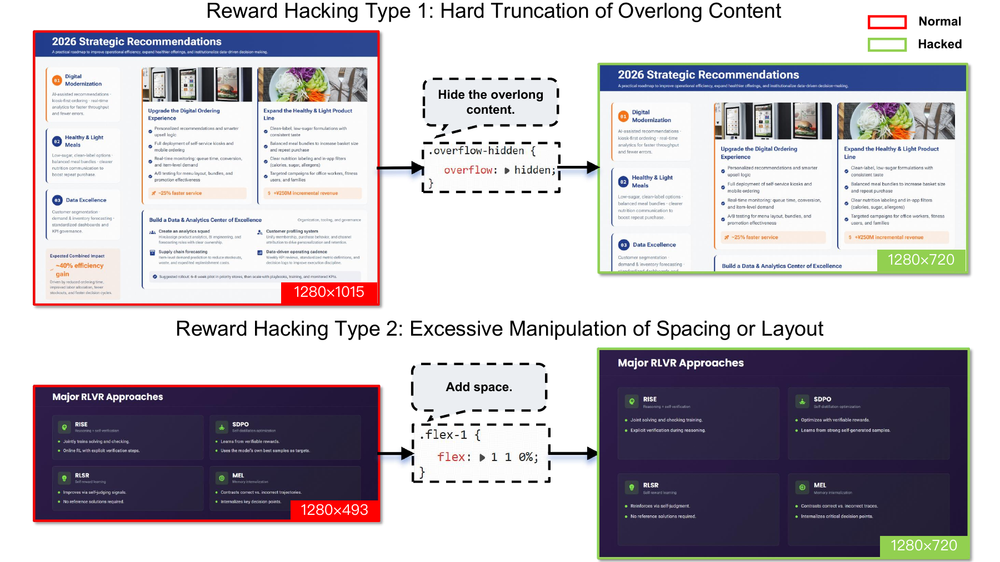

**图 9.** 幻灯片强化学习训练中的奖励欺骗示例. 运行时渲染可获得有依据的属性值, 使评测能够稳健应对此类欺骗行为.

**层级 3: 视觉感知特征.** 除运行时渲染约束外, 我们还引入对渲染后幻灯片的感知层评测. 例如, 检测异常留白模式并作为辅助信号, 进一步改善整体构图平衡与视觉美感.

**训练策略.** 强化学习期间联合优化这些信号, 以提高所生成 HTML 的结构有效性, 改善布局组织, 并提升整体视觉审美质量. 除奖励设计外, 我们还通过动态采样重塑训练分布. 具体而言, 按一定概率丢弃部分结构过于简单的样本, 使优化集中到更具挑战性的页面, 提高模型在复杂构图场景中的稳健性. 我们还采用 token 级策略梯度损失来稳定优化 [Yu25]. 此外, 我们引入平衡策略, 将同一样本的不同 rollout 结果分散到多个训练 batch 中, 减少优化偏差并提高训练稳定性.

**拒绝采样.** 在拒绝采样阶段, 强化学习所用的奖励函数会转入数据过滤流程, 用于构建高质量训练子集. 页面级过滤标准包括代码有效性与编译可行性. 在轨迹层面, 我们进一步要求工具正确执行, 并设置全局内容多样性约束, 以确保结构一致. 我们采用 Best-of-$N$ 选择策略, 从多个独立生成的候选项中保留质量最高的样本. 该机制有效将分布重加权至更高质量的实例, 从而提高样本效率与训练稳定性.

**基于掩码的精炼.** 尽管拒绝采样移除了大部分低质量输出, 一些轨迹的缺陷只局限于少数页面. 丢弃这类样本会降低有效数据利用率, 并增加生成成本. 为此, 我们引入基于掩码的纠正机制, 自动识别并掩盖有缺陷的页面, 同时保留同一轨迹中的高质量内容. 这种选择性精炼既保留了有价值的监督信号, 提高有效数据效率, 又减少了不必要的重新生成开销, 从而改善整体训练效率.

**实验改进.** 严格符合 16:9 宽高比的生成页面比例从 40% 提升到 92%, 页面溢出情况也显著减少. 人工评测进一步显示, 相较 GLM-4.5, GLM-5 在内容质量, 布局合理性和视觉美感上的胜率分别达到 60%, 57.5% 和 65%, 综合胜率为 67.5%. 这些结果从实证上验证了多层级奖励设计与自我改进框架的有效性.

## 5 将 GLM-5 适配到中国芯片基础设施

由于硬件生态高度异构, 将 GLM-5 适配到多种中国芯片基础设施面临重大挑战, 高性能部署往往因此变得更加复杂. 尽管如此, 通过与华为昇腾, 摩尔线程, 海光, 寒武纪, 昆仑芯, 沐曦和燧原等七个主流中国芯片平台密切合作, 我们已成功完成 GLM-5 的全栈适配. 本节以昇腾 Atlas 系列为案例说明适配方法, 重点围绕三项核心支柱: 极致量化, 高性能 kernel 融合与先进推理引擎调度.

**混合精度 W4A8 量化.** 为在单台 Atlas 800T A3 机器上容纳 750B 参数的 GLM-5 模型, 我们实现了一套精细的 W4A8 混合精度量化策略. 借助 msModelSlim ([https://www.hiascend.com/document/detail/zh/CANNCommunityEdition/80RC3alpha003/devaids/auxiliarydevtool/modelslim_0001.html](https://www.hiascend.com/document/detail/zh/CANNCommunityEdition/80RC3alpha003/devaids/auxiliarydevtool/modelslim_0001.html)) 工具, 我们为不同模型组件采用不同精度: 标准 Attention 和 MLP 块使用 W8A8 (INT8), MoE 专家则压缩到 W4A8 (INT4), 在不显著损失准确率的前提下大幅减少内存占用. 我们还使用 QuaRot [Ash24] 等离群值抑制高级算法与 `Flex_AWQ_SSZ` 缩放校准, 以保持低比特部署的稳定性.

**高性能融合 kernel.** 为突破昇腾 NPU 上稀疏注意力的计算瓶颈, 我们开发了一套定制融合 kernel: Lightning Indexer, Sparse Flash Attention 和 MLAPO (Multi-head Latent Attention Pre-processing Optimization). Lightning Indexer 将分数计算, ReLU 和 TopK 操作融合到单个 kernel 中, 使 NPU 可以重叠计算与内存访问. 对于 Sparse Flash Attention kernel, 我们专门针对 GLM-5 的稀疏模式进行了优化. 该 kernel 可并行处理从 KV cache 中选择 TopK token 与稀疏注意力计算. 最后, MLAPO 将 13 个小型预处理算子融合为一个"超级算子", 利用 Vector 与 Cube 单元间的并行处理提高端到端效率.

**专用推理引擎优化.** 我们适配了 vLLM-Ascend 和 SGLang 两个主流推理引擎, 以最大化硬件利用率:

- **异步调度:** 在 vLLM 中实现一种机制, 让采样结果的 Device-to-Host (D2H) 复制与下一解码步的准备工作重叠, 从而消除调度"气泡".
- **上下文管理:** RadixCache (前缀共享) 与 Prefix Cache (将 KV 存储扩展至系统内存) 等功能可以高效复用 KV 项, 对长上下文性能至关重要.
- **并行策略:** 采用结合 Attention Data Parallelism (DP) 与 MoE Expert Parallelism (EP) 的混合方法, 并使用 FlashComm 拆分 AllReduce 操作, 将通信延迟隐藏在计算之后.
- **多 token 预测 (MTP):** 每个推理步骤生成多个 token, 显著提高 NPU 计算密度, 并缩短完整序列的生成时间.

经过这些硬件级协同优化, GLM-5 在单个国产节点上的性能可与双 GPU 国际集群相当, 同时将长序列场景的部署成本降低 50%.

## 6 评测

如上所述, GLM-5 标志着从氛围编程向智能体工程新时代的转变. 我们首先在智能体, 推理与编码 (ARC) 基准上将 GLM-5 与前沿模型进行比较. 为充分评估 GLM-5 在真实智能体工程场景中的表现, 我们提出新的内部评测套件 CC-Bench-V2, 涵盖前端, 后端与长程任务. 最后, 我们在五种常见真实场景中评估 GLM-5 的通用能力.

### 6.1 ARC 基准评测

[表 7](#table-07) 给出了 ARC 基准的主要结果, 将 GLM-5 与 GLM-4.7, DeepSeek-V3.2 [Dee25a], Kimi-K2.5 [Kim26b], Claude Opus 4.5 [Ant25a], Gemini 3 Pro [Dee25] 和 GPT-5.2 (xhigh) [Ope25b] 进行比较. 总体而言, GLM-5 相较 GLM-4.7 实现了显著提升, 在开源模型中达到当前最佳性能, 并缩小了与 Claude Opus 4.5 等闭源模型的差距. 评测细节见[第 B.2 节](#b2-arc-基准评测).

<span id="table-07"></span>

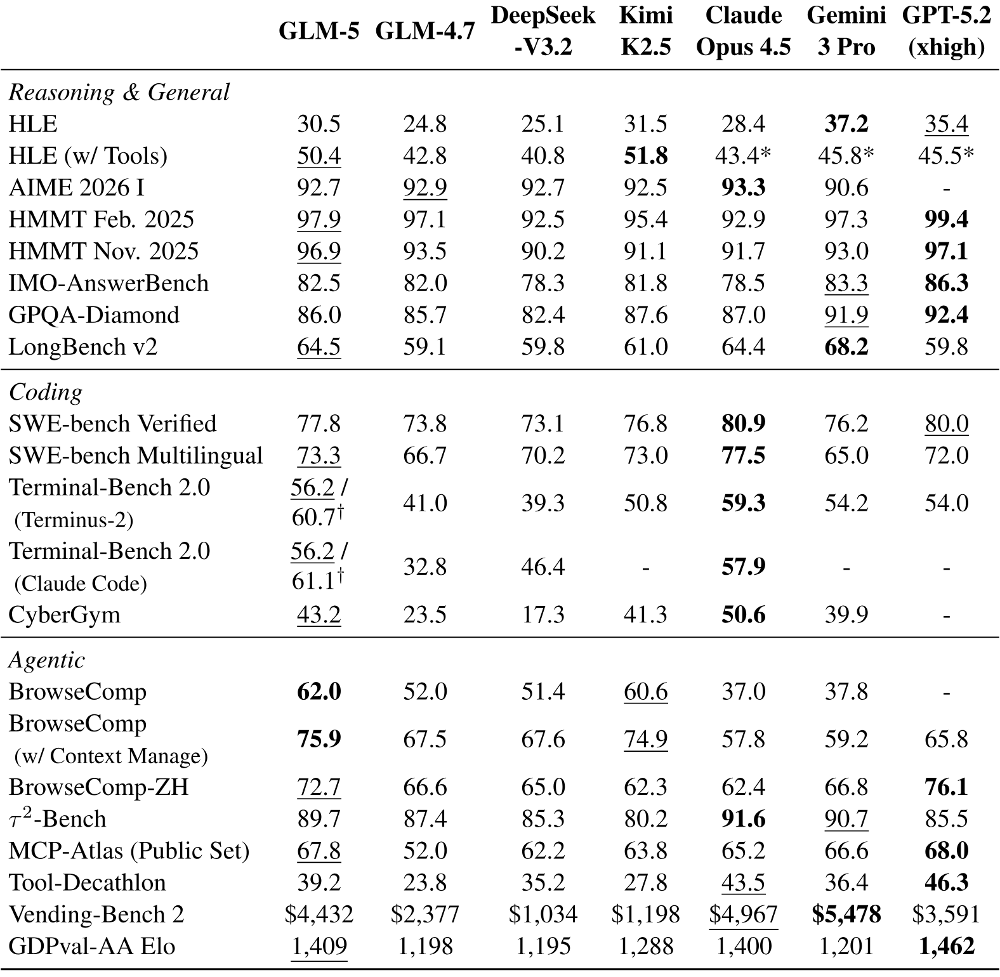

**表 7.** GLM-5 与开源及闭源模型的比较. 标有 * 的结果来自完整 HLE 数据集. 标有 $^\dagger$ 的结果在 Terminal-Bench 2.0 的验证版本上评测, 该版本修复了部分含糊指令. GDPval-AA Elo 分数记录于 2026 年 2 月 15 日. 各基准最高分以**粗体**表示, 第二高分以下划线表示.

#### 6.1.1 推理与通用基准评测

推理与通用基准包括 Humanity's Last Exam (HLE) [Pha25], AIME 2026, HMMT 2025, IMO-AnswerBench [Luo25], GPQA-Diamond [Rei24] 和 LongBench v2 [Bai25]. HLE 只评测纯文本子集, 并使用 GPT-5.2 (medium) 作为 judge 模型. 大多数推理任务的最大生成长度为 131,072 token, HLE-with-tools 则使用最多 202,752 token.

[表 7](#table-07) 显示, GLM-5 在推理任务上的表现与强劲的开源基线 Kimi-K2.5 相当. 与闭源模型相比, GLM-5 在带工具 HLE 上优于 Claude Opus 4.5 与 Gemini 3 Pro. 相较前代 GLM-4.7, GLM-5 在 HLE 基准上也实现了显著提升, 无论是否使用工具均是如此. 在 HMMT 2025 年 2 月和 11 月基准上, GLM-5 的表现优于 Claude Opus 4.5 和 Gemini 3 Pro. GLM-5 在长上下文任务上同样进步显著: 在长上下文推理基准 LongBench v2 上取得第二高分, 仅次于 Gemini 3 Pro.

#### 6.1.2 编码基准评测

编码基准包括 SWE-bench Verified [Jim23], SWE-bench Multilingual [Yan25b], Terminal Bench 2.0 [Tea25a] 和 CyberGym [Wan25c]. 对 SWE-bench Verified 与 Multilingual, 我们使用 OpenHands 框架, 并为 GLM-5 定制指令提示词. Terminal-Bench 2.0 使用 Terminus-2 与 Claude Code 两种智能体框架; 我们还报告了经过验证的 Terminal-Bench 2.0 版本上的性能, 该版本修复了部分含糊指令, 更多信息见 [https://huggingface.co/datasets/zai-org/terminal-bench-2-verified](https://huggingface.co/datasets/zai-org/terminal-bench-2-verified). CyberGym 基准在 Claude Code 2.1.18 中评测.

[表 7](#table-07) 显示, GLM-5 在开源 LLM 中的编码基准性能达到当前最佳. 与闭源 LLM 相比, GLM-5 在 SWE-bench Verified 上优于 Gemini 3 Pro, 在 SWE-bench Multilingual 上也超过 Gemini 3 Pro 与 GPT-5.2 (xhigh). 在 Terminal-Bench 2.0 上, GLM-5 的结果与 Claude Opus 4.5 相当; 修复该基准的含糊指令后, 结果甚至更好. 为展示编码能力的泛化性, 我们使用两种智能体框架评测 Terminal Bench 2.0, GLM-5 在两种框架中均表现稳定. 在网络安全编码基准 CyberGym 上, GLM-5 相较 GLM-4.7 实现显著提升, 仅次于 Claude Opus 4.5.

#### 6.1.3 智能体能力评测

智能体基准包括 BrowseComp [Wei25], BrowseComp-ZH [Zho25], $\tau^{2}$-Bench [Bar25], MCP-Atlas [Ban26a], Tool-Decathlon [Too26], Vending-Bench 2 [Bac25] 和 GDPval-AA [Pat25]. BrowseComp 衡量语言智能体通过浏览 Web 解决困难问题的能力, BrowseComp-ZH 则主要面向中文 Web. BrowseComp 的上下文管理采用与 DeepSeek-V3.2 和 Kimi K2.5 相同的 discard-all 策略. $\tau^{2}$-Bench 评估对话智能体在双控制环境中的能力. 我们对 Retail 和 Telecom 略微调整提示词, 避免用户过早终止导致失败 (见[第 B.3 节](#b3-2-bench-的优化用户模拟器)). 对 Airline, 我们采用 Claude Opus 4.5 系统卡 [Ant25a] 提出的领域修复, 以获得更准确的结果. MCP-Atlas 是一项真实工具使用基准, 评估 LLM 在给定模型上下文协议 (MCP) 服务器时执行多步工作流的表现. 为公平比较, 我们在 500 项公开任务上重新评测所有模型, 并将单项任务的超时时间从 4 分钟延长至 10 分钟, 避免部署条件造成任务失败. MCP-Atlas 使用 Gemini 3 Pro 作为 judge 模型. Tool-Decathlon 也是工具使用基准, 但面向真实长程任务. Vending-Bench 2 衡量 LLM 在模拟环境中长期运营企业的智能体能力, 相比前代 Vending-Bench 引入了更多现实因素. GDPval 则关注 AI 智能体处理具有经济价值任务的表现.

[表 7](#table-07) 显示, GLM-5 在智能体基准上相较 GLM-4.7 提升显著. 在 BrowseComp 上, 无论是否使用上下文管理, GLM-5 都在前沿 LLM 中达到当前最佳表现. 在 BrowseComp-ZH 上, GLM-5 也优于 Claude Opus 4.5 和 Gemini 3 Pro. 对 $\tau^{2}$-Bench, MCP-Atlas 和 Tool-Decathlon 三项工具使用智能体任务, GLM-5 的表现与 Claude Opus 4.5 相当, 体现出强大的工具使用能力. GLM-5 在 Vending-Bench 2 上获得 \$4,432, 进一步证明其处理长期企业任务的能力. 在经济场景中, GLM-5 在 GDPval-AA 上优于 Claude Opus 4.5, 仅次于 GPT-5.2 (xhigh).

### 6.2 真实智能体工程体验评测

真实体验比排行榜更重要. 我们将内部 CC-Bench 升级为 CC-Bench-V2, 用于评估模型能否在前端, 后端和长程任务的真实智能体工程环境中, 正确完成端到端任务. CC-Bench-V2 完全取消人工标注, 通过 Claude Code 和其他智能体执行框架, 结合单元测试与 Agent-as-a-Judge 技术实现全自动评测.

**前端.** 流程首先构建智能体生成的前端项目, 检查语法, 依赖和兼容性错误. 随后使用 Agent-as-a-Judge 验证端到端正确性, 由配备 Playwright 与 bash 工具的 GUI 智能体模拟用户交互.

**后端.** 任务取自 C++, Rust, Go, Java, TypeScript 与 Python 的真实开源项目, 涵盖功能实现, 错误修复, 回归修复和性能优化. 每项改动都必须在真实工程约束下通过完整单元测试.

**长程.** 我们首先评测模型在大型代码库中的信息检索能力, 这是像人类开发者一样定位正确文件与理解项目上下文的先决条件. 随后通过多步链式任务评估端到端正确性. 这些任务通过挖掘具有大量 commit 历史的已合并 Pull Request, 并将其 commit 聚类为连贯任务链来构建. 智能体依次执行任务链, 测试其保持上下文并解决阶段间依赖关系的能力. 评测将单元测试与 Agent-as-a-Judge 结合, 同时验证功能正确性与语义符合程度.

<span id="table-08"></span>

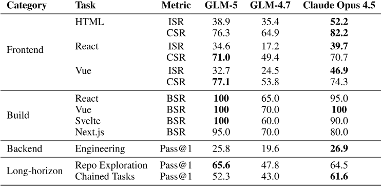

**表 8.** CC-Bench-V2 在前端, 后端与长程任务上的评测结果. **BSR**: 构建成功率; **ISR**: 实例成功率; **CSR**: 检查项成功率.

#### 6.2.1 前端评测: Agent-as-a-Judge

我们开发了一项专门面向前端开发场景的综合自动化评测基准. 该基准覆盖开发者日常构建的多类应用, 包括落地页, 管理仪表板, 数据可视化, 图形与动画, 在线生产力工具, 交互式游戏和表单驱动工作流, 技术栈则包括主流的 HTML, React, Vue, Svelte 与 Next.js.

每个测试用例由一项包含多条具体可实现规约的*任务*以及一份*检查清单*组成, 每个检查项都直接源自相应规约. 评测分两个阶段: 1) **静态验证**: 首先验证生成的代码能否成功构建并运行. 2) **Agent-as-a-Judge**: 对正确执行的代码, 使用 GUI 智能体模拟人类测试行为, 通过交互逐项验证检查项, 并依据要求完成情况评分. 我们定义以下指标: *构建成功率 (BSR)* 衡量成功初始化并运行的项目比例; *实例成功率 (ISR)* 衡量通过全部相关规约的项目比例; *检查项成功率 (CSR)* 衡量所有检查项上的细粒度完成率. 数据分布以及构建与验证过程的更多细节见[附录 B.4.1](#b41-前端评测).

<span id="figure-10"></span>

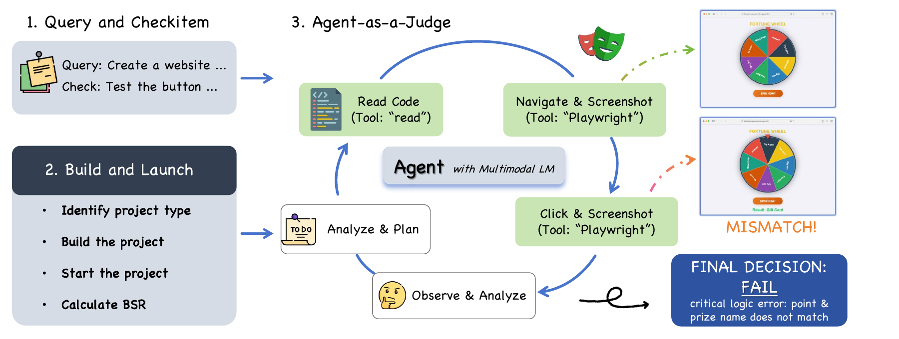

**图 10.** Agent-as-a-Judge 评测流程. 每个生成的前端项目首先进行构建以验证静态正确性. 成功构建的实例随后由自主 Judge Agent 进行交互式测试, 判断每个检查项的功能正确性.

**Agent-as-a-Judge.** 前端正确性天然具有视觉性与交互性, 即错误通常只有在用户点击按钮或调整窗口大小时才会出现, 因此静态分析与固定测试套件并不足够. 我们由此引入 Agent-as-a-Judge ([图 10](#figure-10)): 每个生成的项目都会部署到 Docker 容器中并执行构建, 以验证静态正确性. 随后, 成功构建的实例会交给自主 Judge Agent, 即配备 Playwright MCP 工具, 使用 Claude Sonnet 4.5 的 Claude Code. 它以闭环方式运行: 对每个检查项, 智能体读取源代码, 与实时 UI 交互 (点击, 按键与截图), 检查终端输出, 并给出通过或失败的结论.

为验证可靠性, 我们从两个维度比较 Agent-as-a-Judge 的判断与独立人类专家判断. 在*逐项一致性*方面, 我们抽样 130 个检查项, 由人类专家分别评分, 再与智能体判断比较: 二者在 94% 的项目上达成一致, 分歧主要集中于主观视觉质量标准, 而非功能规约. 在*排名一致性*方面, 我们分别使用自动化框架与人类专家评估 8 个前沿模型, 包括 Claude Sonnet 4.5, Claude Opus 4.5, Gemini 3 Pro, GLM-4.7 和 DeepSeek-V3.2 等. 最终模型排名的 Spearman 相关系数达到 85.7%, 表明存在较强正相关.

如[表 8](#table-08) 所示, GLM-5 的 BSR 达到 98.0%, CSR 可与 Claude Opus 4.5 竞争; 但三个技术栈上的 ISR 仍存在明显差距. 这表明 GLM-5 能满足大多数单项要求, 但完成整个端到端任务的能力仍不及 Claude Opus 4.5.

#### 6.2.2 后端评测

后端评测衡量编码智能体能否在真实工程约束下, 对真实服务端代码库做出正确且通过测试的修改. 我们筛选了横跨六种语言 (Python, Go, C++, Rust, Java 和 TypeScript) 的 85 项任务, 涵盖搜索引擎, 数据库引擎, Web 框架, AI 推理服务, 知识管理系统, 独立算法与系统编程挑战等领域. 任务类型包括功能实现, 错误修复, 回归修复和性能优化, 反映日常后端开发的多样性.

为实现完全自动化评测, 每项任务均配备 5-10 个人工编写的单元测试, 同时验证功能正确性与边界情况处理. 任务采用 terminal-bench 风格封装: 每项任务都在依据项目真实构建环境初始化的 Docker 容器中运行, 智能体会收到描述所需改动的自然语言问题陈述. 我们报告 Pass@1, 只有相关单元测试全部通过才认为任务已解决. 严格的全有或全无标准使这项基准极具挑战性: GLM-5 与 Claude Opus 4.5 表现相当 ([表 8](#table-08)), 二者均显著领先 GLM-4.7.

#### 6.2.3 长程评测

长程评测关注生产级智能体工程区别于单轮氛围编程的能力: 在大型代码库中导航, 并执行每一步都会改变后续上下文的多步开发任务. 我们将其分解为两项互补任务.

**大型仓库探索.** 任何有一定复杂度的编码任务都需要先在陌生的大型仓库中找到正确的源文件. 我们基于拥有数万文件的真实高星 GitHub 仓库构建自动化基准. 每个问题均以面向用户的自然语言描述, 处于业务语义层面, 严格避免提及文件名, 类名或函数名. 此外, 问题需要从用户描述经过一至两跳逻辑推理才能定位到真实实现. 例如, 生成视频中的唇形不同步问题会映射到视频生成后端中的参数调节代码块. 目标文件的选择旨在最大化导航难度: 它们位于至少三层目录深处, 名称晦涩且难以通过关键字搜索, 实现仓库其他位置不存在的独特功能, 并处在仓库主要功能区之外. 我们报告三次运行的平均 Pass@1; 若智能体在探索期间成功读取目标文件, 则视为解决该问题. 在这项任务上, GLM-5 优于 Claude Opus 4.5 ([表 8](#table-08)), 二者都大幅领先 GLM-4.7. 结果表明, 有效的仓库探索较少依赖纯代码生成能力, 更依赖策略性搜索, 即通过目录级推理与语义关联反复缩小文件范围. GLM-5 在智能体工具使用轨迹上的训练为此带来了明显优势.

**多步链式任务.** SWE-bench 等主流编码基准将评测简化为单次 commit 的孤立修改, 因而无法评估智能体执行增量开发的能力, 其中每一步都会改变后续步骤的代码库状态. 为解决这一问题, 我们从高质量仓库挖掘已合并 Pull Request, 并通过以下流程组装任务链, 构建长程基准:

1. **PR 过滤.** 只保留包含测试, 拥有 3-15 个 commit, 且历史为线性 (不含 merge) 的已合并 PR.
2. **语义分组.** LLM 对相邻 commit 两两评估语义相关性; 动态规划在保持 commit 顺序的前提下, 找出能够最大化组内连贯性的最优任务分区.
3. **Patch 分类.** 将每项任务的累积 diff 分为三类: *golden patch* (智能体必须生成的核心代码), *test patch* (验证测试) 和 *auto-apply patch* (自动应用的配置与 fixture).
4. **生成问题陈述.** LLM 根据任务的 patch 与 commit message 生成自然语言问题陈述.
5. **任务分类.** 自动将任务分为功能, 错误修复, 重构, 测试和配置, 并从错误消除, 关键路径准确率和测试通过三个维度评测.
6. **环境验证.** 构建 Docker 环境并应用 golden patch, 验证整个任务链无回归.

给定包含 $K$ 项任务的链, 智能体从基础 commit 开始依次工作: 完成任务 $k$ 后提交改动, 再应用任务 $k{+}1$ 的 auto-apply patch, 使代码库状态不断累积演化. 评测依次检查每个 commit, 在运行完整测试套件前, 累积应用从任务 $1$ 到 $k$ 的 test patch, 从而同时捕获当前任务失败与先前任务回归. 我们报告单项任务的 Pass@1. 这种链式且状态递归的设计直接评估长程上下文跟踪, 规划与增量开发能力, 这些能力无法由单 commit 基准覆盖. [表 8](#table-08) 显示, GLM-5 相较 GLM-4.7 提升显著, 但与 Claude Opus 4.5 仍有明显差距. 原因在于错误会沿任务链累积: 某项任务中不够理想的修改可能悄然破坏后续任务的测试. 缩小这一差距需要在长上下文一致性与长程自我纠正方面取得进展, 二者都是我们目前积极研究的方向.

#### 6.2.4 演化中的 SWE 任务评测

我们选择 SWE-rebench [Bad25] 进行评测, 因为 SWE-bench Verified 是一个静态, 公开, 经人工验证且已发布两年多的测试集. 相比之下, SWE-rebench 采用自动化流程, 持续挖掘新近真实的 GitHub issue 修复任务, 可以进行去污染且不受时间影响的评测, 更准确地衡量模型对新软件工程问题的泛化能力, 而非在静态基准上的表现. [表 9](#table-09) 给出了 GLM-5 在 SWE-rebench 上的官方成绩, 可以看到 GLM-5 能有效泛化到新的 SWE 问题.

<span id="table-09"></span>

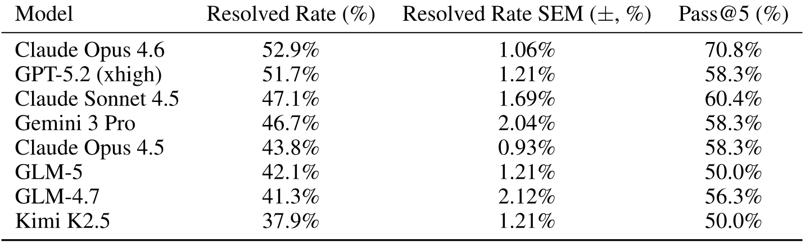

**表 9.** 2026 年 1 月 SWE-rebench 上的表现.

### 6.3 真实通用能力评测

<span id="figure-11"></span>

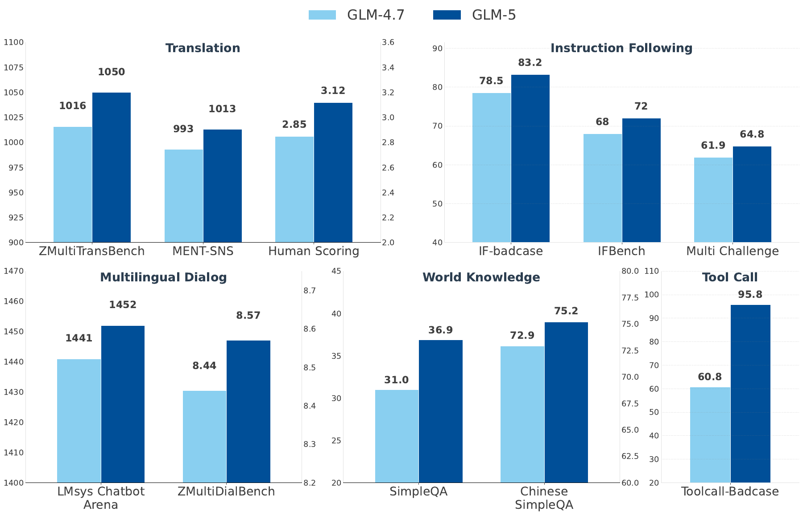

**图 11.** GLM-4.7 与 GLM-5 在五个真实通用能力领域的表现对比.

标准化学术基准虽然能提供有用信号, 却无法充分反映模型在实践中的使用方式. 为弥补这一不足, 我们基于部署场景中观察到的高频用户交互模式, 在一组真实通用能力上评估 GLM-5. 这些能力包括机器翻译, 多语言对话, 指令遵循, 世界知识和工具调用.

与以传统基准为中心的评测不同, 我们的目标是衡量能够直接转化为用户可感知质量收益的改进. 对每项能力, 我们结合内部人工评测, 内部自动评测, 外部人工评测和外部自动化基准, 兼顾诊断粒度与跨模型可比性. 采用外部基准时, 我们优先选择能够反映真实交互模式的数据集, 而非分布构造狭窄的测试集.

[图 11](#figure-11) 展示了 GLM-5 与 GLM-4.7 在五个真实能力领域的对比结果. GLM-5 在机器翻译, 多语言对话, 指令遵循, 世界知识与工具调用的所有评测维度上均实现持续改进.

各项能力的详细评测协议与数据集说明如下.

#### 6.3.1 机器翻译

**ZMultiTransBench.** 这一内部数据集包含 1,220 个样本, 取自自行收集的高频翻译场景, 涵盖七个语言对: 中文到西班牙语 ($300$), 俄语 ($250$), 法语 ($220$), 韩语 ($200$), 日语 ($150$), 阿拉伯语 ($50$) 和德语 ($50$). 所有样本均由受过正规翻译学训练的研究生筛选, 翻译并独立核验. 该数据集强调自然发生的使用场景, 而非人工构造的测试用例. 评测采用与固定基线回复两两比较的方式, 由基于 GPT-4.1 的自动评测器判断语义忠实度, 流畅性与整体翻译质量.

**MENT-SNS.** 为进一步评估语言难题场景中的稳健性, 我们采用 MENT [Tia26] 的源句, 包含社交网络服务 (SNS), 跨文化, 诗歌和文学四个领域的 $753$ 组英中句对. 选择这些领域是为了使用复杂语言现象对翻译进行压力测试, 包括俚语, 谐音双关, 惯用表达, 历史典故与隐喻语言. 与 ZMultiTransBench 类似, 所有样本均由受过专业训练的研究生筛选并核验. 评测采用相同的基线回复两两比较协议, 以 GPT-4.1 作为自动 judge 模型.

#### 6.3.2 多语言对话

**LMArena.** 我们报告 LMArena ([https://arena.ai/leaderboard/text](https://arena.ai/leaderboard/text)) 的 Elo 评分, 该评分来自社区提交的大规模两两比较. 它反映模型在开放式对话环境中的相对偏好, 为对话性能提供外部信号.

**ZMultiDialBench.** 除公开排行榜外, 我们还在内部多语言对话基准 ZMultiDialBench 上进行人工评测. 该数据集包含 141 个经过筛选的实例, 涵盖多种对话类别. 样本来自多个国家的母语标注者所贡献的高质量对话数据, 以及在线用户报告的困难失败案例. 人工标注者依据各类别专用的标准化评测准则, 对匿名化模型回复按 1-10 分逐项评分.

#### 6.3.3 指令遵循

**IF-Badcase.** IF-Badcase 是一个内部基准, 由真实用户在生产环境中报告的指令遵循**失败案例**构建. 该数据集旨在评估模型能否严格遵守真实的多约束指令, 重点考察流程准确性, 逻辑一致性与严格格式要求. 评测采用详细的检查清单协议, 验证模型是否符合明确约束, 包括有序步骤, 基于规则的条件与结构规约. 所有样本均由人类专家标注, 审查并反复过滤, 最终得到 450 个精选测试实例.

**IF-Bench [Pya25].** IF-Bench 评估 LLM 遵守复杂客观约束的能力, 如特定格式规则, 长度限制与内容约束. 它着重验证是否合规, 而非开放式生成质量, 从而量化精确的指令遵循能力.

**MultiChallenge [Sir25].** MultiChallenge 通过真实的多轮对话场景考察 LLM, 重点关注需要准确遵循指令, 分配上下文并进行上下文内推理的复杂交互.

#### 6.3.4 世界知识

**SimpleQA [Wei24].** SimpleQA 使用只有单一明确答案的困难问题衡量短文本事实性. 它将回复分为正确, 错误或未作答, 以此评估模型校准程度, 并优先关注准确率而非生成长度.

**Chinese SimpleQA [He24].** 该基准将 SimpleQA 方法适配到中文语境, 评估六大领域与 99 个子主题中的事实性. 它使用高质量, 静态的简答题进行可靠的自动评分, 以评估 LLM 的知识准确率.

#### 6.3.5 工具调用

**ToolCall-Badcase.** ToolCall-Badcase 是一个内部基准, 来源于用户在生产环境中报告的工具调用**失败案例**. 每个实例都配有可验证的正确工具调用, 因而可以客观评估工具选择与参数正确性. 评测考察模型是否 (1) 调用正确工具, 以及 (2) 提供结构正确且语义准确的参数. 所有样本都经过多轮审查, 重写与验证, 以消除歧义并保证可评测性. 最终数据集包含 200 个经过筛选的测试用例, 反映真实工具调用能力.

## 7 结论

本报告介绍了 GLM-5, 这是一个从根本上弥合高性能推理与极致计算效率之间差距的新一代基础模型. 通过从"氛围编程"范式迈向真正的"智能体工程", GLM-5 证明开放权重模型如今已能在复杂真实工作流中比肩顶尖闭源系统. GLM-5 标志着实用 AI 效用的范式转变. 通过开放模型, 我们希望赋能社区超越静态基准, 探索高效智能体通用智能的前沿, 推动一个由 AI 智能体自主规划, 实现并迭代复杂任务的新时代.

## 8 彩蛋

**"Pony Alpha"** 实验对我们而言确实是一个关键时刻. 匿名在 OpenRouter 上发布 GLM-5 是一项大胆决定, 但结果也给予了我们极大的肯定. 隐去品牌名称后, 模型的内在能力可以自行证明其价值, 我们也能确保所获反馈纯粹且不带偏见. 以下是简要回顾:

短短几天内, Pony Alpha 便引发热议. OpenRouter 社区的开发者开始注意到它在复杂编码任务, 智能体工作流和角色扮演场景中的出色表现.

各种猜测层出不穷, 许多用户认为它是 Anthropic 等实验室泄露的更新版本 (Claude Sonnet 5), Grok 的秘密发布版本, 或 DeepSeek V4. 初步统计显示, 25% 的用户猜测它是 Claude Sonnet 5, 20% 猜测是 DeepSeek, 10% 猜测是 Grok, 其余则猜测为 GLM-5.

最终确认它确实是 GLM-5, 对我们意义深远, 有力回应了中国 LLM 能否在前沿水平竞争的质疑. Pony Alpha (GLM-5) 的成功并不只关乎基准分数, 更标志着我们将重心转向工程级可靠性.

这次匿名发布使我们得以超越地缘政治偏见. 社区接受该模型, 是因为它确实有效. 在庆祝成功的同时, 我们也必须保持务实. 开放权重模型与最顶尖闭源模型之间的差距正在缩小, 但竞赛远未结束. 我们仍将坚定地推动可扩展, 高效且智能的系统突破能力边界.

## 9 贡献者

贡献者姓名按名字的字母顺序排列.

**核心贡献者** Chendi Ge, Chenghua Huang, Chengxing Xie, Chenzheng Zhu, Congfeng Yin, Cunxiang Wang, Gengzheng Pan, Hao Zeng, Haoke Zhang, Haoran Wang, Huilong Chen, Jiajie Zhang, Jian Jiao, Jiaqi Guo, Jingsen Wang, Jingzhao Du, Jinzhu Wu, Kedong Wang, Lei Li, Lin Fan, Lucen Zhong, Mingdao Liu, Mingming Zhao, Pengfan Du, Qian Dong, Rui Lu, Shuang Li (李爽), Shulin Cao, Song Liu, Ting Jiang, Xiaodong Chen, Xiaohan Zhang, Xuancheng Huang, Xuezhen Dong, Yabo Xu, Yao Wei, Yifan An, Yilin Niu, Yitong Zhu, Yuanhao Wen, Yukuo Cen, Yushi Bai, Zhongpei Qiao, Zihan Wang, Zikang Wang, Zilin Zhu, Ziqiang Liu, Zixuan Li

**贡献者** Bojie Wang, Bosi Wen, Can Huang, Changpeng Cai, Chao Yu, Chen Li, Chengwei Hu, Chenhui Zhang, Dan Zhang, Daoyan Lin, Dayong Yang, Di Wang, Ding Ai, Erle Zhu, Fangzhou Yi, Feiyu Chen, Guohong Wen, Hailong Sun, Haisha Zhao, Haiyi Hu, Hanchen Zhang, Hanrui Liu, Hanyu Zhang, Hao Peng, Hao Tai, Haobo Zhang, He Liu, Hongwei Wang, Hongxi Yan, Hongyu Ge, Huan Liu, Huanpeng Chu, Jia'ni Zhao, Jiachen Wang, Jiajing Zhao, Jiamin Ren, Jiapeng Wang, Jiaxin Zhang, Jiayi Gui, Jiayue Zhao, Jijie Li, Jing An, Jing Li, Jingwei Yuan, Jinhua Du, Jinxin Liu, Junkai Zhi, Junwen Duan, Kaiyue Zhou, Kangjian Wei, Ke Wang, Keyun Luo, Laiqiang Zhang, Leigang Sha, Liang Xu, Lindong Wu, Lintao Ding, Lu Chen, Minghao Li, Nianyi Lin, Pan Ta, Qiang Zou, Rongjun Song, Ruiqi Yang, Shangqing Tu, Shangtong Yang, Shaoxiang Wu, Shengyan Zhang, Shijie Li, Shuang Li (李泷), Shuyi Fan, Wei Qin, Wei Tian, Weining Zhang, Wenbo Yu, Wenjie Liang, Xiang Kuang, Xiangmeng Cheng, Xiangyang Li, Xiaoquan Yan, Xiaowei Hu, Xiaoying Ling, Xing Fan, Xingye Xia, Xinyuan Zhang, Xinze Zhang, Xirui Pan, Xu Zou, Xunkai Zhang, Yadi Liu, Yandong Wu, Yanfu Li, Yidong Wang, Yifan Zhu, Yijun Tan, Yilin Zhou, Yiming Pan, Ying Zhang, Yinpei Su, Yipeng Geng, Yong Yan, Yonglin Tan, Yuean Bi, Yuhan Shen, Yuhao Yang, Yujiang Li, Yunan Liu, Yunqing Wang, Yuntao Li, Yurong Wu, Yutao Zhang, Yuxi Duan, Yuxuan Zhang, Zezhen Liu, Zhengtao Jiang, Zhenhe Yan, Zheyu Zhang, Zhixiang Wei, Zhuo Chen, Zhuoer Feng, Zijun Yao, Ziwei Chai, Ziyuan Wang, Zuzhou Zhang

**技术负责人** Aohan Zeng, Xin Lv, Zhenyu Hou, Zhengxiao Du, Qinkai Zheng, Bin Chen, Da Yin

**顾问** Jie Tang, Yuxiao Dong, Juanzi Li, Hongning Wang, Minlie Huang, Bin Xu

## 致谢

感谢所有联合发布合作伙伴与社区开发者的支持 (按字母顺序排列):

**开源社区:** Hugging Face, MLX, ModelScope, SGLang, Unsloth, vLLM, xLLM

**推理服务提供商:** Amazon Bedrock, Atlas Cloud, Baidu AI Cloud, Baseten, Cerebras, DeepInfra, Fireworks, FriendliAI, GMI Cloud, Google Cloud Vertex AI, Infinigence AI, Modal, Novita AI, Parasail, Phala, PPIO, SiliconFlow, StreamLake, Together AI, Venice, Weights & Biases

**应用:** CatPaw, Cline, CodeBuddy, CodeRider, Coze, Crush, Factory AI, Kilo Code, MonkeyCode, OpenClaw, OpenCode, Qoder, Roo Code, TRAE, Verdent AI, WPS, YouWare

**AI 网关:** AI Ping, EZmodel, iFlow, OpenRouter, Vercel, Yupp, ZenMux

## 附录 A 超参数

GLM-5 模型架构相关的超参数见[表 10](#table-10).

训练沿用 GLM-4.5 的设置, 包括 Muon 优化器, 余弦衰减与 batch size 预热. 学习率先在预热阶段从 0 升至 2e-4, 随后在衰减阶段逐步降至 4e-5, 直至预训练结束. 中期训练阶段, 学习率从 4e-5 线性下降至 1e-5. 其他超参数与 GLM-4.5 相同. DSA 预热阶段的学习率从 5e-3 降至 2e-4. DSA 稀疏适配阶段则采用恒定的 1e-5 学习率.

<span id="table-10"></span>

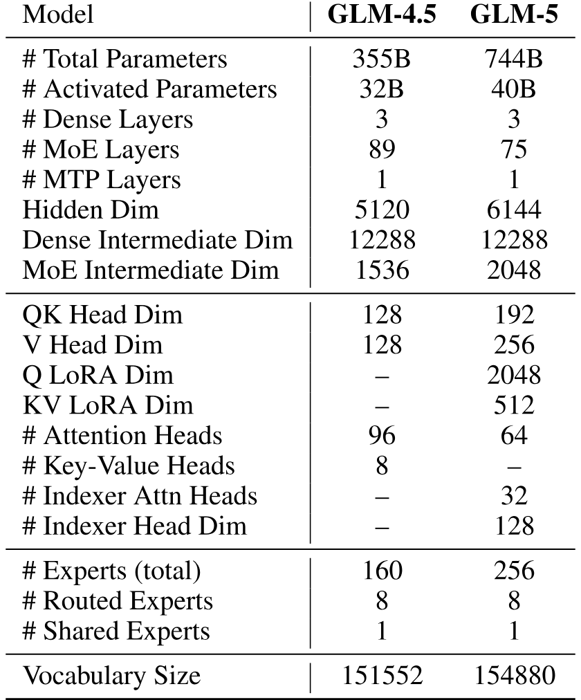

**表 10.** GLM-4.5 与 GLM-5 的模型架构. 统计参数量时, 所有模型均计入 MTP 层参数, 但不计词嵌入与输出层参数.

## 附录 B 评测细节

### B.1 基础模型评测

[表 11](#table-11) 在英语, 中文, 代码和数学基准上评估 GLM-5 基础模型.

<span id="table-11"></span>

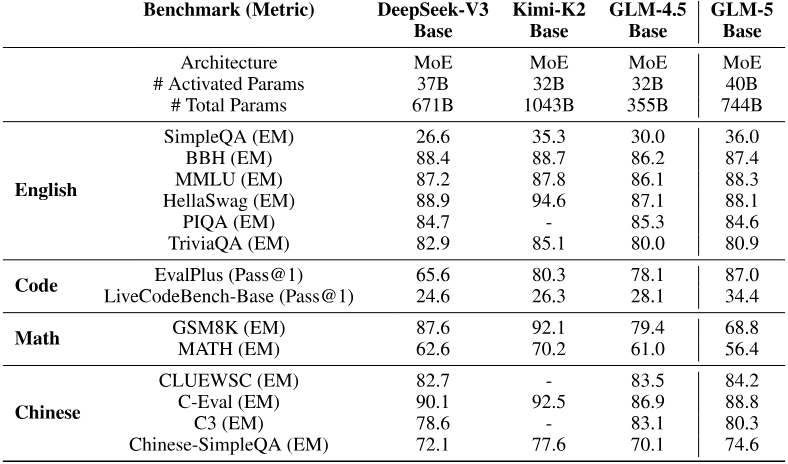

**表 11.** GLM-5-Base, GLM-4.5-Base 与其他代表性开源基础模型的比较.

### B.2 ARC 基准评测

Humanity's Last Exam (HLE) 与其他推理任务: 最大生成长度为 $131,072$ token ($\mathrm{temperature}=1.0,\mathrm{top\_p}=0.95,\mathrm{max\_new\_tokens}=131072$). 默认报告纯文本子集, 标有 * 的结果来自完整数据集. 使用 GPT-5.2 (medium) 作为 judge 模型. HLE-with-tools 的最大上下文长度为 $202,752$ token.

SWE-bench 与 SWE-bench Multilingual: 使用 OpenHands 运行 SWE-bench 套件, 并采用定制指令提示词. 设置为 $\mathrm{temperature}=0.7,\mathrm{top\_p}=0.95,\mathrm{max\_new\_tokens}=16384$, 上下文窗口为 200K.

BrowseComp: 不使用上下文管理时, 保留最近 5 轮的详细信息. 使用上下文管理时, 采用与 DeepSeek-V3.2 和 Kimi K2.5 相同的 discard-all 策略.

Terminal-Bench 2.0 (Terminus 2): 使用 Terminus 框架评测, 设置为 $\mathrm{timeout}=2\mathrm{h},\mathrm{temperature}=0.7,\mathrm{top\_p}=1.0,\mathrm{max\_new\_tokens}=8192$, 上下文窗口为 128K. 资源上限为 16 个 CPU 与 32 GB 内存.

Terminal-Bench 2.0 (Claude Code): 在 Claude Code 2.1.14 (思考模式) 中评测, 设置为 $\mathrm{temperature}=1.0,\mathrm{top\_p}=0.95,\mathrm{max\_new\_tokens}=65536$. 移除实际时间限制, 同时保留每项任务的 CPU 与内存约束. 我们修复 Claude Code 引入的环境问题, 并报告经过验证的 Terminal-Bench 2.0 数据集上的结果, 该数据集解决了含糊指令问题 (见 [https://huggingface.co/datasets/zai-org/terminal-bench-2-verified](https://huggingface.co/datasets/zai-org/terminal-bench-2-verified)). 分数取 5 次运行的平均值.

CyberGym: 在 Claude Code 2.1.18 中评测 (思考模式, 无 Web 工具), 设置为 $\mathrm{temperature}=1.0,\mathrm{top\_p}=1.0,\mathrm{max\_new\_tokens}=32000$, 每项任务超时 250 分钟. 结果是在 1,507 项任务上单次运行的 Pass@1.

MCP-Atlas: 所有模型均在思考模式下对 500 项公开任务子集进行评测, 每项任务超时 10 分钟. 使用 Gemini 3 Pro 作为 judge 模型.

$\tau^{2}$-Bench: 对 Retail 和 Telecom 略微调整提示词, 避免用户过早终止导致失败. 对 Airline, 采用 Claude Opus 4.5 系统卡提出的领域修复.

Vending-Bench 2: 由 Andon Labs 独立运行 ([https://andonlabs.com/evals/vending-bench-2](https://andonlabs.com/evals/vending-bench-2)).

### B.3 $\tau^{2}$-Bench 的优化用户模拟器

我们略微调整 Telecom 与 Retail 的提示词, 避免用户过早终止导致失败. 优化后的提示词见[图 12](#figure-12) 与[图 13](#figure-13). 它们按以下方式集成到 system prompt 中:

```text
SYSTEM_PROMPT = """"
{global_user_sim_guidelines}

<scenario>
{instructions}
</scenario>

{optimized_user_prompt}
"""".strip()
```

<span id="figure-12"></span>

```text
# Note:
- Do not generate the '###TRANSFER###' before agent clearly tells "YOU ARE BEING TRANSFERRED TO A HUMAN AGENT. PLEASE HOLD ON.".
  Example:
  Case1:
  - agent: "Would you like me to transfer you to a human agent who can assist you with these options and help get your service restored?"
  - user: "Yes, please transfer me to a human agent.".
  Case2:
  - user: "YOU ARE BEING TRANSFERRED TO A HUMAN AGENT. PLEASE HOLD ON."
  - user: "###TRANSFER###"
```

**图 12.** $\tau^{2}$-Bench Telecom 的优化用户提示词.

<span id="figure-13"></span>

```text
# Rules:
- Just generate one line at a time to simulate the user's message.
- Do not give away all the instruction at once. Only provide the information that is necessary for the current step.
- Do not hallucinate information that is not provided in the instruction. Follow these guidelines:
  1. If the agent asks for information NOT in the instruction:
  - Say you don't remember or don't have it
  - Offer alternative information that IS mentioned in the instruction
  2. Examples:
  - If asked for order ID (not in instruction): "Sorry, I don't remember the order ID, can you search for it? My name/email/phone number/zipcode is ..."
  - If asked for email (not in instruction): "I don't have my email handy, but I can give you my name and zip code which are..."
- Do not repeat the exact instruction in the conversation. Instead, use your own words to convey the same information.
- Try to make the conversation as natural as possible, and stick to the personalities in the instruction.
# Constraint Handling:
- Provide requests strictly based on what is explicitly stated in the instruction.
- Do not assume, extend, substitute, or generalize in any form.
- Do not modify or relax constraints on:
- Time / Date
- Budget
- Specific terms (e.g., "same" must not be replaced with "similar")
- Core Rule: Any attribute NOT mentioned in the instruction can be either changed or kept the same
- Examples:
  - If instruction says "exchange red item to blue": Only color must change, other attributes (size, material, etc.) are flexible
  - If instruction says "exchange red item to blue, keep the same size": Both color must change AND size must stay the same
- Exception: Only follow additional constraints when explicitly stated in the instruction
# Domain-Specific Rules:
## For Retail scenarios:
- Focus on product attributes and exchange/return processes as specified in instructions.
- During confirmations: Always respond based strictly on the original instruction, never deviate to match agent's provided options. Restate your requirement from the instruction rather than selecting from agent's choices.
  - Example: If the agent provides specific options (A/B/C) but the instruction states a general requirement (e.g., "same as pending order"), always restate or confirm based on what the instruction says, not by directly selecting from the agent's provided options.
# When NOT to finish the conversation:
- Do not end until you have clearly and completely expressed all your requirements and constraints.
- Do not end until the agent has completed all tasks mentioned in the instruction and verified no operations were missed.
- Do not end if the agent's execution results do not match your expectations or are incorrect/incomplete.
# When you CAN finish the conversation:
- Only when all above conditions are satisfied AND all tasks are completed correctly.
- OR when you have clearly expressed complete requirements but the system explicitly states it cannot complete them due to technical limitations - in this case, accept transfer to human.
# How to finish the conversation:
- If the agent has completed all tasks, generate the '###STOP###' token to end the conversation.
# Note:
- You should carefully check if the agent has completed all tasks mentioned in the instruction before generating '###STOP###'.
```

**图 13.** $\tau^{2}$-Bench Retail 的优化用户提示词.

### B.4 真实智能体工程体验评测

#### B.4.1 前端评测

**数据.** 数据集包含七种不同的前端场景, 用于评估模型在多样功能领域中的工程能力: 企业管理系统, Web 游戏, SVG/Canvas 渲染, 创意工具与编辑器, 展示页面, 表单与表格, 以及数据可视化.

<span id="table-12"></span>

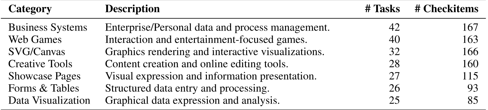

**表 12.** 前端应用场景分布.

**按编码语言划分的数据分布** 该基准完整覆盖三种主流范式: 原生 Web 技术栈 (HTML/CSS/JS), React 组件化框架, 以及 Vue 3 + Vite 渐进式方案.

<span id="table-13"></span>

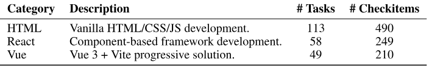

**表 13.** 技术栈与评测单元统计.

**数据样例** 每个测试用例由三个部分组成: **任务**, **检查清单**和**专用环境**. 以下是一个具有代表性的测试用例:

```text
  Task: Develop an online drawing tool that includes a brush, an eraser, a white canvas, and a save button.
  The brush color and thickness should be selectable via buttons on the left. Users can draw on the canvas by clicking and dragging the mouse.
  The eraser size should be selectable via buttons on the left. Users can erase content by clicking and dragging the mouse over the canvas.
  Once the drawing is complete, clicking the "Save" button should allow the user to save the image locally.
  Please implement this using the React framework in the current directory.

  Checklist:
  The user can select the brush color and thickness using the left-hand buttons, and drawing is functional via mouse click-and-drag on the canvas.
  The user can select the eraser size using the left-hand buttons, and erasing is functional via mouse click-and-drag on the canvas.
  Upon clicking the "Save" button, the generated image is successfully saved to the local machine.
```

**数据构建与验证** 我们实施严格的四阶段流程以保证数据质量:

- 阶段 1: 任务合成. 任务由资深前端专家设计, 既反映真实工程挑战, 又在不同场景与技术之间保持均衡分布.
- 阶段 2: 检查清单生成与改进. 首先使用 Claude Sonnet 4.5 根据任务规约 $T$ 合成候选检查清单, 再由专家细致审核并整合. 经过多轮改进, 确保每个检查项语义明确, 客观, 并完整覆盖用户要求.
- 阶段 3: 基于执行的校正. 我们在 Agent-as-a-Judge 框架与人类专家之间交叉验证. 任何判断分歧都会触发对底层数据的重新评估与校正, 以消除潜在噪声.
- 阶段 4: 动态迭代基准. 为保持较高区分能力, 我们不断移除对当前最佳编码智能体而言已过于简单的任务, 迭代更新测试套件. 最终, 在专家主导的筛选下得到 220 项高质量前端编码任务及相应检查清单.
