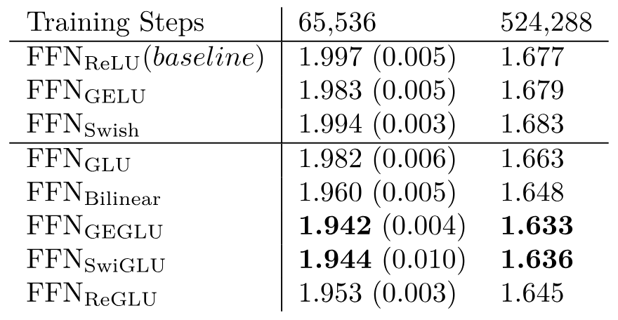
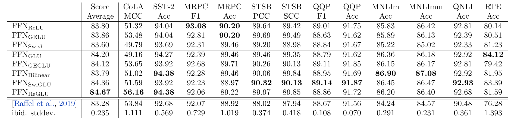
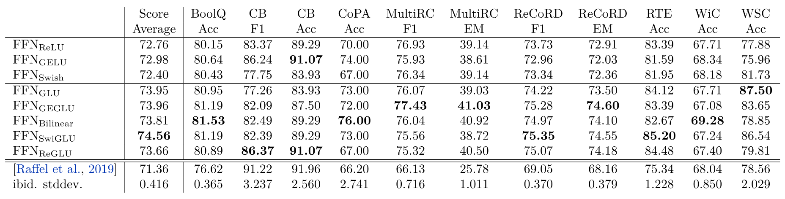
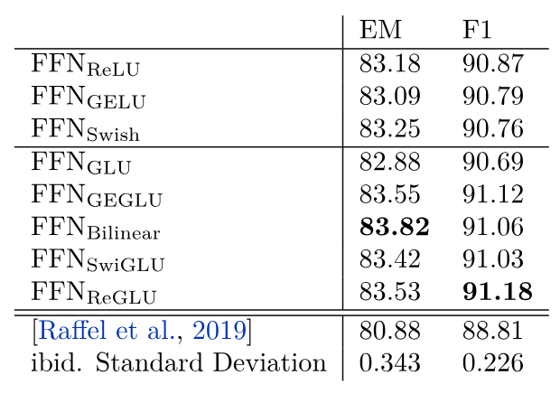

> [Noam Shazeer](https://www.noamshazeer.com/). 首次提交至 arXiv: 2020 年 2 月 12 日; 当前版本: v1. [GLU Variants Improve Transformer](https://arxiv.org/abs/2002.05202v1). <a href="/paper/glu-variants.pdf" target="_blank" rel="noopener noreferrer">原始 PDF</a>. [arXiv DOI](https://doi.org/10.48550/arXiv.2002.05202). [TeX 源文件](https://export.arxiv.org/e-print/2002.05202v1). 精确的印刷版式和参考文献以原始 PDF 为准.

## 摘要

门控线性单元 (Gated Linear Units, GLU) [Dau16] 由两个线性投影逐元素相乘而成, 其中一个投影先经过 sigmoid 函数. 可以用其他非线性函数, 甚至线性函数替换 sigmoid, 得到不同的 GLU 变体. 我们在 Transformer [Vas17] 序列到序列模型的前馈子层中测试了这些变体, 发现其中一些变体的质量优于常用的 ReLU 或 GELU 激活函数.

## 1 引言

Transformer [Vas17] 序列到序列模型交替使用多头注意力和它所谓的"逐位置前馈网络" (FFN). FFN 接收向量 $x$ (序列中某个位置的隐藏表示), 再让它通过两个学习得到的线性变换 (分别由矩阵 $W_1$ 和 $W_2$ 以及偏置向量 $b_1$ 和 $b_2$ 表示). 两个线性变换之间使用修正线性 (ReLU) [Glo11] 激活函数.

$$
\mathrm{FFN}(x,W_1,W_2,b_1,b_2)=\max(0,xW_1+b_1)W_2+b_2
$$

沿用 T5 代码库 [Raf19] 的做法 [+1], 我们使用不带偏置的版本:

$$
\mathrm{FFN}_{\mathrm{ReLU}}(x,W_1,W_2)=\max(xW_1,0)W_2
$$

后续工作提出用其他非线性激活函数替换 ReLU, 例如高斯误差线性单元 $\mathrm{GELU}(x)=x\Phi(x)$ [Hen16] 和 $\mathrm{Swish}_\beta(x)=x\sigma(\beta x)$ [Ram17].

$$
\begin{aligned}
\mathrm{FFN}_{\mathrm{GELU}}(x,W_1,W_2)&=\mathrm{GELU}(xW_1)W_2 \\
\mathrm{FFN}_{\mathrm{Swish}}(x,W_1,W_2)&=\mathrm{Swish}_1(xW_1)W_2
\end{aligned}
$$

## 2 门控线性单元 (GLU) 及其变体

[Dau16] 提出了门控线性单元 (GLU): 一种将输入的两个线性变换逐元素相乘, 并对其中一个变换应用 sigmoid 激活的神经网络层. 他们还建议去掉激活函数, 将这种形式称为"双线性"层, 并把它归于 [Mni07].

$$
\begin{aligned}
\mathrm{GLU}(x,W,V,b,c)&=\sigma(xW+b)\otimes(xV+c) \\
\mathrm{Bilinear}(x,W,V,b,c)&=(xW+b)\otimes(xV+c)
\end{aligned}
$$

我们还可以用其他激活函数定义 GLU 变体:

$$
\begin{aligned}
\mathrm{ReGLU}(x,W,V,b,c)&=\max(0,xW+b)\otimes(xV+c) \\
\mathrm{GEGLU}(x,W,V,b,c)&=\mathrm{GELU}(xW+b)\otimes(xV+c) \\
\mathrm{SwiGLU}(x,W,V,b,c,\beta)&=\mathrm{Swish}_\beta(xW+b)\otimes(xV+c)
\end{aligned}
$$

本文进一步提出了 Transformer FFN 层的若干变体, 用 GLU 或其某个变体替代第一个线性变换和激活函数. 与前面相同, 我们省略偏置项.

$$
\begin{aligned}
\mathrm{FFN}_{\mathrm{GLU}}(x,W,V,W_2)&=(\sigma(xW)\otimes xV)W_2 \\
\mathrm{FFN}_{\mathrm{Bilinear}}(x,W,V,W_2)&=(xW\otimes xV)W_2 \\
\mathrm{FFN}_{\mathrm{ReGLU}}(x,W,V,W_2)&=(\max(0,xW)\otimes xV)W_2 \\
\mathrm{FFN}_{\mathrm{GEGLU}}(x,W,V,W_2)&=(\mathrm{GELU}(xW)\otimes xV)W_2 \\
\mathrm{FFN}_{\mathrm{SwiGLU}}(x,W,V,W_2)&=(\mathrm{Swish}_1(xW)\otimes xV)W_2
\end{aligned}
$$

这些层都有 3 个权重矩阵, 而原始 FFN 只有 2 个. 为保持参数量和计算量不变, 将这些层与原始的双矩阵版本比较时, 我们把隐藏单元数 $d_{\mathrm{ff}}$ ($W$ 和 $V$ 的第二维及 $W_2$ 的第一维) 缩小为原来的 $\frac{2}{3}$.

## 3 Text-to-Text Transfer Transformer (T5) 实验

我们在 [Raf19] 的迁移学习设置下测试上述 FFN 变体. 一个编码器-解码器 Transformer 模型 [Vas17] 先用预测缺失文本片段的去噪目标训练, 随后在多项语言理解任务上微调.

### 3.1 模型架构

我们采用与 [Raf19] 基础模型相同的代码库, 模型架构和训练任务. 编码器和解码器各含 12 层, $d_{\mathrm{model}}=768$. 对注意力层, $h=12$, 且 $d_k=d_v=64$. FFN 层的隐藏维度为 $d_{\mathrm{ff}}=3072$. 如上所述, 基于 GLU 变体的 FFN 层有 3 个权重矩阵而非 2 个, 因此我们把隐藏层缩小至 $d_{\mathrm{ff}}=2048$, 使其参数量和运算量与基础模型相同.

**表 1.** Transformer 模型在 [Raf19] 片段填充任务留出集上的对数困惑度. 所有模型的参数量和计算量均匹配.

### 3.2 预训练与困惑度结果

与 [Raf19] 完全相同, 我们在 C4 数据集上以片段填充为目标预训练 524,288 步. 每个训练批次包含 128 个样本, 每个样本的输入为 512 个 token, 输出为 114 个 token, 输出中包含从输入删除的多个 token 片段 [+2]. 同样依照 [Raf19], 我们采用 Adafactor 优化器 [Sha18] 和平方根倒数学习率调度. 在最后 10% 的训练步中, 我们还线性衰减学习率. 我们与 [Raf19] 的主要区别是预训练时不使用 dropout. 我们发现这样能得到更好的结果. 我们在 C4 的一个留出分片上计算训练目标的对数困惑度, 并认为它能很好地反映模型质量. 对每种模型架构, 我们还进行了 4 次较短的训练 (65,536 步), 以测量不同运行之间的差异. 结果列于 [表 1](#table-01). GEGLU 和 SwiGLU 变体取得了最低的困惑度.

### 3.3 微调

随后, 我们将每个完成训练的模型分别微调一次, 数据为 Stanford Question-Answering Dataset (SQuAD) [Raj16], GLUE [Wan18d] 和 SuperGlue [Wan19h] 基准中全部语言理解任务按样本数成比例组成的混合数据. [+3] 微调共进行 131072 步, 学习率为 $10^{-3}$. 与训练时相同, 每一步中输入序列的总长度约为 65,536 个 token. 按照 [Raf19], 我们在层输出, 前馈隐藏层和注意力权重上使用 $0.1$ 的 dropout 率. 微调期间嵌入矩阵保持不变.

[表 2](#table-02), [表 3](#table-03) 和 [表 4](#table-04) 给出了开发集上的结果. 对每项任务, 我们报告微调期间所记录各检查点中的最高分数. 虽然结果有噪声, 新的 GLU 变体在多数任务上表现最好. 为便于比较, 每张表的底部还列出了 [Raf19] 的结果. 该模型与我们的 $\mathrm{FFN}_{\mathrm{ReLU}}$ 模型相同. 他们的结果明显更差, 我们认为原因是他们在预训练期间使用了 dropout. 表中还列出了 [Raf19] 测得的不同运行间标准差.

**表 2.** GLUE 语言理解基准 [Wan18d] (开发集).

**表 3.** SuperGLUE 语言理解基准 [Wan19h] (开发集).

**表 4.** SQuAD [Raj16] v1.1 (开发集).

## 4 结论

我们扩展了 GLU 层族, 并提出在 Transformer 中使用这些层. 在迁移学习设置下, 新变体似乎能在预训练采用的去噪目标上取得更低的困惑度, 也能在多项下游语言理解任务上取得更好的结果. 这些架构实现简单, 看不出有计算方面的缺点. 我们无法解释这些架构为何有效; 与其他一切一样, 我们把它们的成功归于神的善意.

[+1]: 也是为了机器学习的公平.

[+2]: 在 32 核 TPUv2 集群上, 每个训练步约耗时 0.15 秒.

[+3]: 这与 [Raf19] 不同, 后者分别在不同任务上微调. 为了简单起见, 我们只进行一次微调.
