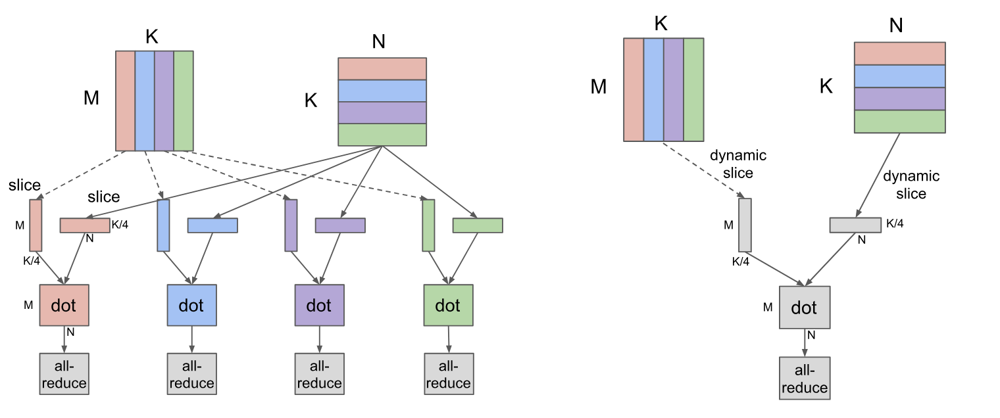
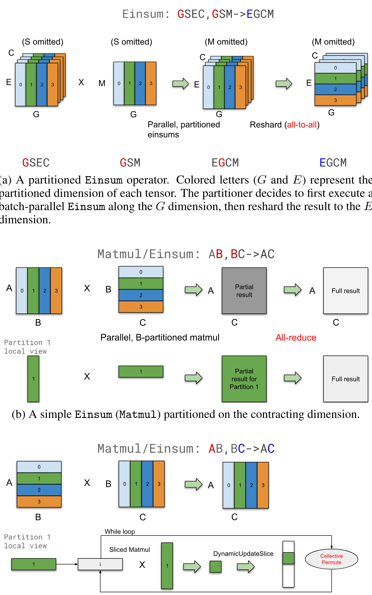
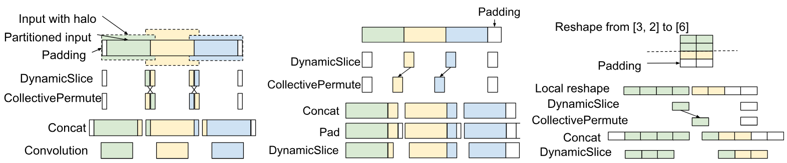
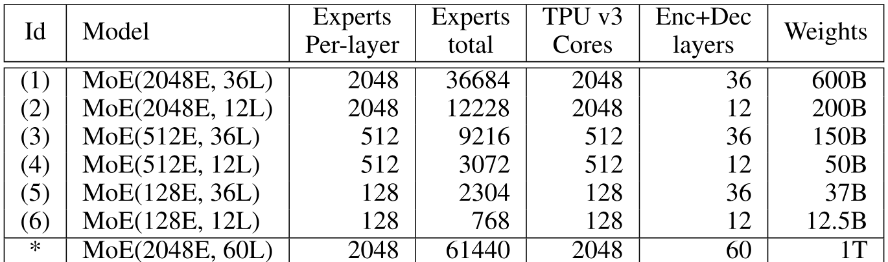
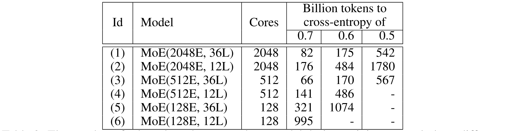
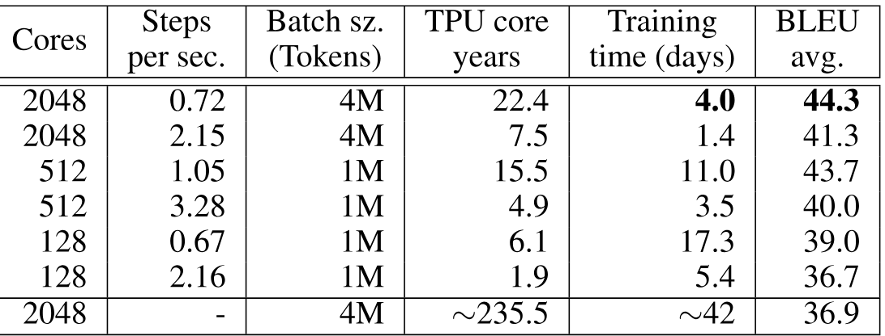
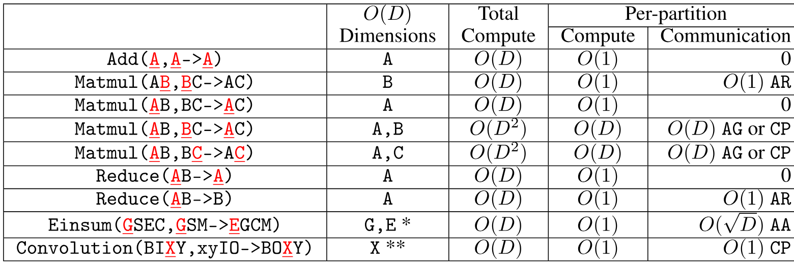

> [Dmitry Lepikhin](https://x.com/lepikhin), [HyoukJoong Lee](https://dblp.org/pid/21/276), [Yuanzhong Xu](https://x.com/ukoxyz), [Dehao Chen](https://dblp.org/pid/50/6185), [Orhan Firat](https://orhanfirat.com/), [Yanping Huang](https://x.com/bignamehyp), [Maxim Krikun](https://dblp.org/pid/05/1775), [Noam Shazeer](https://www.noamshazeer.com/), and [Zhifeng Chen](https://www.zhifengchen.me/). 2020 年 6 月 30 日首次提交至 arXiv, 当前版本为 v1. 发表于 [ICLR 2021](https://openreview.net/forum?id=qrwe7XHTmYb). [GShard: Scaling Giant Models with Conditional Computation and Automatic Sharding](https://arxiv.org/abs/2006.16668). [原始 PDF](/paper/gshard.pdf). [TeX 源码](https://export.arxiv.org/e-print/2006.16668). 精确的印刷版式和参考文献以原始 PDF 为准.

## 摘要

在许多拥有海量训练数据和算力的实际机器学习应用中, 扩大神经网络规模一直是提高模型质量的重要手段. 尽管扩展规模已被证明能够可靠地改善模型质量, 实践中仍要面对计算成本, 编程难度和并行设备上的高效实现等问题. GShard 模块由一组轻量级注解 API 和一项 XLA 编译器扩展组成. 它只需少量修改现有模型代码, 就能表达多种并行计算模式. 借助自动分片, GShard 让我们把采用稀疏门控专家混合 (Sparsely-Gated Mixture-of-Experts) 的多语言神经机器翻译 Transformer 模型扩展到 6000 亿以上参数. 实验表明, 这一巨型模型可在 2048 个 TPU v3 加速器上用 4 天完成高效训练, 从 100 种语言翻译到英语的质量远高于此前方法.

<span id="section-01"></span>

## 1 引言

扩大神经网络规模可在多种机器学习问题上明显改善质量 [Aro18, Fra18, Kap20, Dev18, Mah18, Bro20c]. 在计算机视觉中, 提高模型容量已经改善了多类视觉架构的图像分类和检测精度 [He16, He16a, Ghi19]. 自然语言处理也有同样的规律: 扩展 Transformer [Vas17b] 能持续改善语言理解 [Dev18, Raf19, Bro20c], 跨语言下游迁移 [Dev18, Con19] 和大规模多语言神经机器翻译 [Ari19, Hua19, Sha17]. 这一普遍现象促使近期研究重新考察影响扩展效果的因素 [Adv17, Hes17, Hes19, Gei20, Kap20], 包括训练数据量, 模型大小和所用计算量. 研究发现, 最终模型质量与数据量, 计算量和模型大小之间存在幂律关系 [Hes17, Kap20], 但大模型带来的质量收益也伴随着许多实际问题. 训练效率是其中一个常被忽视的问题; 本文把它定义为超越现有最佳系统所需的计算量和训练时间.

<span id="figure-01"></span>


**图 1.** 随着 MoE 模型规模增大至 600B, 多语言翻译质量 (相对于双语基线的平均 $\Delta$BLEU) 提升, 同时端到端训练成本 (以 TPU v3 核心年计) 仅呈亚线性增长. 将模型规模从 37.5B 增加到 600B (16 倍), 导致计算成本从 6 年增加到 22 年 (3.6 倍). 取得最佳翻译质量的 600B 参数模型是在 2048 个 TPU v3 核心上训练 4 天, 总成本为 22 TPU v3 核心年. 相比之下, 训练所有 100 个双语基线模型需要 29 个 TPU v3 核心年. 我们最优质的稠密单一 Transformer 模型 (2.3B 参数) 获得 $\Delta$BLEU 为 6.1, 是通过在 2048 个 TPU v3 核心上使用 GPipe [Hua19] 训练 6 周, 总成本为 235.5 TPU v3 核心年.

<span id="section-01-01"></span>

### 1.1 扩展的实际挑战

在这里, 我们列出了在训练超大规模模型时面临的主要实际挑战, 这些模型的规模远超单个加速器 (如 GPU 或 TPU) 内存容量的极限.

**架构特定的模型并行支持.** 在常用深度学习框架如 TensorFlow [Aba16] 和 PyTorch [Pas17] 下, 缺乏对高效模型并行算法的支持. 支持基于图划分的简单模型并行, 但由于网络的顺序依赖和基于梯度的优化, 这会导致严重的资源未充分利用. 为了有效扩展现有模型, 用户通常需要投入大量工程工作, 例如, 将模型代码迁移到专用框架 [Sha18a, Hua19].

**计算成本与模型规模的超线性增长.** 通过增加深度或宽度直接扩展模型规模 [Bro20c, Hua19] 通常会导致训练步骤时间至少呈线性增加. 通过在多个设备上拆分层权重和计算实现模型并行通常是必要的, 这会导致网络通信开销和设备未充分利用. 设备未充分利用源于分配不均衡以及底层神经网络的顺序依赖. 这种计算成本与模型规模之间的超线性关系无法仅通过使用更多设备来解决, 从而使训练大规模模型变得不切实际.

**巨型模型表示的基础设施可扩展性.** 对于分布在数千台设备上的大规模模型, 使用天真的图表示可能成为深度学习框架及其优化编译器的瓶颈. 例如, 通过跨 $D$ 台设备使用操作间分区添加 $D$ 倍的层数, 或使用操作内分区增加模型维度, 可能会导致一个包含 $O(D)$ 个节点的图. 设备之间的通信通道可能进一步增加图的大小, 最多达到 $O(D^{2})$ (例如, 分区 gather 或 transpose). 图的这种大小增加会导致大规模模型的图构建和编译时间变得不可行.

**实现分区策略需要大量工作.** 要让模型在多台设备上高效运行, 必须协调设备间通信, 因而很难正确划分模型. 图级划分需要复杂算法 [Hua19, Har18], 以降低不同设备所承载图分区之间的顺序依赖开销. 在算子级并行中, 分区后算子的通信模式取决于算子语义, 例如是要累加局部结果, 还是要重新排列数据分片. 根据我们的经验, TensorFlow 等框架含有大量语义各异的算子, 在模型中手动处理这些问题要投入很多工作. 无论采用哪种方式, 模型分区都会给使用者增加负担: 一旦模型架构发生变化, 底层设备通信也必须随之调整.

<span id="section-01-02"></span>

### 1.2 大规模高效训练的设计原则

本文通过构建一个带稀疏门控专家混合层的 6000 亿参数序列到序列 Transformer 模型来解决这些问题. 该模型的计算成本呈亚线性增长, 编译时间为 $O(1)$. 我们用 $2048$ 台 TPU v3 设备训练这个模型, 在多语言机器翻译任务上耗时 $4$ 天; 由单个非集成模型把 $100$ 种语言翻译成英语时, 翻译质量远高于此前方法. 我们还测试了多种模型规模. 结果显示, 模型越大, 翻译质量越高, 而训练所需的总实际时间仅随模型规模亚线性增长, 如 [图 1](#figure-01) 所示. 为了构建如此庞大的模型, 我们作出以下设计选择.

**亚线性扩展.** 首先, 模型架构的计算和通信需求应随模型容量亚线性增长. 条件计算 [Ben15a, Sha17, Elb20, Bap20a] 针对每个输入只激活一个子网络, 从而兼顾训练和推理效率. 在基于 RNN 的机器翻译和语言模型中加入逐位置稀疏门控专家混合 (MoE) 层 [Sha17], 可以用亚线性计算成本扩大模型容量并取得当时最好的结果. 因此, 第 [2 节](#section-02) 将介绍如何用 MoE 层扩展 Transformer 架构.

**抽象的作用.** 其次, 模型描述应当与分区实现和优化分离. 这样, 模型开发者可以专注于网络架构并灵活调整分区策略, 底层系统则负责保持语义的转换和高效并行执行. 为此, 我们提出了 GShard 模块; 用户只需用分区策略标注模型中的少数关键张量. GShard 包含一组简单的注解 API, 以及用于自动并行化的 XLA 编译器扩展 [Xla17]. 模型开发者可以把模型写成在一台拥有巨大内存和算力的设备上运行, 编译器再依据注解和自身的启发式规则, 自动为目标系统划分计算. 第 [3.2 节](#section-03-02) 给出了更多注解示例.

<span id="figure-02"></span>



**图 2.** 在 4 台设备上对 Dot 算子 ($[M,K]\times[K,N]=[M,N]$) 采用 MPMD 分区和本文提出的 SPMD 分区. 本例的两个操作数都沿收缩维度 $K$ 分区, 每台设备计算局部结果, 再通过 AllReduce 在全局合并. MPMD 分区会为每台设备生成单独的算子, 因而限制可扩展性; SPMD 分区只生成一个在所有设备上运行的程序. 使用本文的 SPMD 分区时, 编译时间与设备数量无关.

**可扩展编译器.** 第三, 系统基础设施, 包括计算表示和编译, 必须能够扩展到数千个设备以实现并行执行. 例如, [图 2](#figure-02) 展示了在 4 个设备上分割点积操作的两种不同方式 (颜色编码). 请注意, 在 [图 2a](#figure-02) 中采用通常的 MPMD (多程序多数据) 方法时, 扩展变得更加具有挑战性, 因为图中的节点数量会随着设备数量线性增加. 相反, 我们开发了一种用于 SPMD (单程序多数据) 转换的编译器技术, 它生成一个单一程序在所有设备上运行, 使编译时间保持不变, 与设备数量无关, 如 [图 2b](#figure-02) 所示. 我们将在第 [3.3](#section-03-03) 节更详细地讨论我们的 SPMD 框架.

本文其余部分安排如下. 第 [2 节](#section-02) 详细介绍带有稀疏门控 MoE 层的 Transformer 架构. 第 [3 节](#section-03) 介绍 GShard 模块. 第 [4 节](#section-04) 说明如何把专家混合模型用于覆盖 $100$ 个语言对的多语言机器翻译. 第 [5 节](#section-05) 给出实现的性能和内存测量结果. 第 [6 节](#section-06) 讨论相关工作.

<span id="section-02"></span>

## 2 模型

<span id="section-02-01"></span>

### 2.1 Transformer 架构的稀疏扩展

Transformer [Vas17b] 架构已被广泛用于自然语言处理. 它已成为许多序列到序列任务 (如机器翻译) 的事实标准. Transformer 利用两个计算模块, 即编码器和解码器, 两者都是通过堆叠多个 Transformer 层来实现的. Transformer 编码器层由两个连续的层组成, 即自注意力层, 随后是逐位置前馈层. 解码器增加了第三个跨注意力层, 该层关注编码器输出. 我们通过条件计算稀疏扩展 Transformer, 将每隔一层的前馈层替换为逐位置专家混合 (MoE) 层 [Sha17], 并在编码器和解码器中使用变体的 top-2 门控 ([图 3](#figure-03)). 我们通过改变 Transformer 层数和每个 MoE 层的专家数量来扩展模型容量.

每个训练样本由一对子词 token 序列组成. 训练和推理时, 每个 token 都会激活 MoE Transformer 中的一个子网络. 子网络的大小大致不受每个 MoE 层专家数量的影响, 因而计算成本可以像上一节所述那样保持亚线性增长. 第 [3.1 节](#section-03-01) 进一步分析计算复杂度, 第 [5 节](#section-05) 讨论训练性能.

<span id="figure-03"></span>


**图 3.** 用 MoE 层扩展 Transformer 编码器. MoE 层替换每隔一个 Transformer 前馈层, 解码器的改法相同. (a) 标准 Transformer 模型的编码器由自注意力层和前馈层堆叠而成, 中间穿插残差连接和层归一化. (b) 把每隔一个前馈层换成 MoE 层, 得到 MoE Transformer 编码器. (c) 扩展到多台设备时, MoE 层在设备间分片, 其余各层则在每台设备上复制.

<span id="section-02-02"></span>

### 2.2 逐位置专家混合层

我们模型中使用的专家混合 (MoE) 层基于 [Sha17], 并在稀疏门控函数和使用的辅助损失上有所变化. Transformer 的 MoE 层由 $E$ 个前馈网络组成 $\mathrm{FFN}_{1}\dots\mathrm{FFN}_{E}$:

$$
\mathcal{G}_{s,E}=\mathrm{GATE}(x_s)\tag{1}
$$

$$
\mathrm{FFN}_e(x_s)=\mathit{wo}_e\cdot\mathrm{ReLU}(\mathit{wi}_e\cdot x_s)\tag{2}
$$

$$
y_s=\sum^E_{e=1}\mathcal{G}_{s,e}\cdot\mathrm{FFN}_e(x_s)\tag{3}
$$

其中 $x_s$ 是 MoE 层的输入 token, $\mathit{wi}$ 和 $\mathit{wo}$ 分别是前馈层 (即一个专家) 的输入和输出投影矩阵. 向量 $\mathcal{G}_{s,E}$ 由门控网络计算. $\mathcal{G}_{s,E}$ 为每个专家给出一个非负值; 大部分值为零, 表示不会把该 token 分派给相应专家. 每个 token 只会分派给极少数专家, 本文最多选择两个. $\mathcal{G}_{s,E}$ 中对应的非零项表示各专家对网络最终输出的贡献. 每个专家 $\mathrm{FFN}_e$ 都对 $x_s$ 应用一个使用 ReLU [Nai10] 激活函数的两层全连接网络. MoE 层的输出 $y_s$ 是所有选中专家输出的加权平均.

门控函数 $\mathrm{GATE}(\cdot)$ 通过 softmax 激活函数给出各专家处理输入 token 的权重. 它需要同时满足两个目标:

- **负载均衡.** MoE 层应当只为每个 token 激活少数专家. 最直接的做法是根据 softmax 概率选择前 $k$ 个专家, 但这种方法会造成负载不均 [Sha17]: 训练期间, 大多数 token 会被分配给少数繁忙专家, 它们的输入缓冲区不断增大, 其余专家却得不到充分训练, 最终拖慢训练. 因此, 门控函数需要把处理负载较均匀地分配给所有专家.
- **大规模效率.** 如果门控函数顺序执行, 负载均衡并不难. 但对于含 $N$ 个 token、$E$ 个专家的输入批次, 仅门控函数的计算成本就至少为 $O(NE)$. 本文实验中的 $N$ 以百万计, $E$ 以千计; 顺序实现会让大部分计算资源长期空闲. 因此, 门控函数还必须能在多台设备上高效并行执行.

为满足这些要求, 我们在门控函数 $\mathrm{GATE}(\cdot)$ 中加入以下机制 (详见[算法 1](#algorithm-01)):

- **专家容量.** 我们为每个专家设置统一的 token 数量上限. 假设训练批次共有 $N$ 个 token, 每个 token 最多分配给两个专家, 则专家容量设为 $O(N/E)$. $\mathrm{GATE}(\cdot)$ 用 $c_e$ 记录发往专家 $e$ 的 token 数量. 如果一个 token 选中的两个专家都已超过容量, 该 token 就会溢出, 此时 $\mathcal{G}_{s,E}$ 退化为零向量, 而 $x_s$ 经残差连接传递到下一层.
- **局部分组调度.** $\mathrm{GATE}(\cdot)$ 将训练批次中的所有 token 均匀分成 $G$ 组, 每组包含 $S=N/G$ 个 token, 各组彼此独立并行处理. 每组为每个专家分配 $2N/(G\cdot E)$ 的部分容量, 并限制发往该专家的 token 数量不超过这一上限. 这样仍能满足专家容量约束并平衡总体负载.
- **辅助损失.** 门控函数不能总是选择相同的少数专家, 否则这些专家会溢出, 其余专家则利用不足. 按照 [Sha17], 我们定义辅助损失 $\ell_{\mathrm{aux}}$ 来施加这一约束, 并以常数 $k$ 将其加入总损失: $\mathcal{L}=\ell_{\mathrm{nll}}+k*\ell_{\mathrm{aux}}$. [算法 1](#algorithm-01) 第 13 行中, $c_e/S$ 表示路由到专家 $e$ 的输入比例, 目标是最小化 $c_e/S$ 的均方值. 由于 $c_e$ 来自不可微的 top-2 操作, 我们用每个专家的平均门控 $m_e$ 作为可微近似, 以 $m_e(c_e/S)$ 替代 $(c_e/S)^2$, 从而用梯度下降优化.
- **随机路由.** $y_s$ 是所选专家输出的加权平均. 当第二个专家的权重很小时, 可以忽略它以节省专家容量. 因此, 在满足容量约束的前提下, $\mathrm{GATE}(\cdot)$ 按与权重 $g_2$ 成正比的概率把 token 分配给次优专家.

<span id="algorithm-01"></span>

**算法 1: 带辅助损失的分组 top-2 门控.**

- **数据:** $x_{S}$, 一组大小为 $S$ 的 token.
- **数据:** $C$, 分配给该组的专家容量.
- **结果:** $\mathcal{G}_{S,E}$, 组合权重的组.
- **结果:** $\ell_{\mathrm{aux}}$, 组辅助损失.
- $c_E\leftarrow 0$ $\triangleright$ 每个专家的门控决策.
- $g_{S,E}\leftarrow \mathrm{softmax}(\mathit{wg}\cdot x_S)$ $\triangleright$ 每个 token 对每个专家的门控值; $\mathit{wg}$ 是可训练权重.
- $m_E\leftarrow\frac{1}{S}\sum^s_{s=1}g_{s,E}$ $\triangleright$ 每个专家的平均门控值.
- **对于** $s\leftarrow 1$ 到 $S$:
  - $g_1,e_1,g_2,e_2=\mathrm{top\_2}(g_{s,E})$ $\triangleright$ top-2 门控权重和专家索引.
  - $g_1\leftarrow g_1/(g_1+g_2)$ $\triangleright$ 归一化 $g_1$.
  - $c\leftarrow c_{e_1}$ $\triangleright$ 专家 $e_1$ 缓冲区中的位置.
  - **如果** $c_{e_1}<C$:
    - $\mathcal{G}_{s,e_1}\leftarrow g_1$ $\triangleright$ 专家 $e_1$ 对 $x_s$ 的组合权重.
  - $c_{e_1}\leftarrow c+1$ $\triangleright$ 将专家 $e_1$ 的决策计数加一.
- $\ell_{\mathrm{aux}}=\frac{1}{E}\sum^E_{e=1}\frac{c_e}{S}\cdot m_e$.
- **对于** $s\leftarrow 1$ 到 $S$:
  - $g_1,e_1,g_2,e_2=\mathrm{top\_2}(g_{s,E})$ $\triangleright$ top-2 门控权重和专家索引.
  - $g_2\leftarrow g_2/(g_1+g_2)$ $\triangleright$ 归一化 $g_2$.
  - $\mathit{rnd}\leftarrow \mathrm{uniform}(0,1)$ $\triangleright$ 以概率 $\propto 2\cdot g_2$ 分派到次优专家.
  - $c\leftarrow c_{e_2}$ $\triangleright$ 专家 $e_2$ 缓冲区中的位置.
  - **如果** $c<C\land 2\cdot g_2>\mathit{rnd}$:
    - $\mathcal{G}_{s,e_2}\leftarrow g_2$ $\triangleright$ 专家 $e_2$ 对 $x_s$ 的组合权重.
  - $c_{e_2}\leftarrow c+1$.

<span id="section-03"></span>

## 3 使用 GShard 的高并行实现

本节介绍如何在 TPU 设备集群上高效实现第 [2 节](#section-02) 的模型.

第一步是把模型写成线性代数运算, 因为我们的软件栈 TensorFlow [Aba16] 和硬件平台 TPU 都针对这类运算做了充分优化. 模型的大部分内容可以像原始 Transformer 一样直接表示为线性代数. MoE 层较为特殊, 尤其是[算法 1](#algorithm-01) 中的 $\mathrm{GATE}(\cdot)$ 函数带有顺序性, 需要额外处理; 第 [3.1 节](#section-03-01) 将说明具体方法.

接下来, 我们对线性代数计算进行注释以表达并行性. 计算中的每个张量都可以使用第 [3.2](#section-03-02) 节中的分片 API 来注释, 以便在设备集群中进行复制或分布. 使用分片注释可以实现模型描述与高效并行实现之间的关注点分离, 并允许用户灵活表达多样的并行策略. 例如, (1) 注意力层通过沿批量维度拆分并将其权重复制到所有设备来实现并行. 另一方面, (2) 由于 MoE 层专家的体积庞大, 无法在所有设备上复制, 唯一可行的策略是将专家分片到多个设备. 另外, 整个模型在这两种模式 (1)-(2) 之间交替进行. 使用注释可以让模型开发者摆脱系统优化的工作, 并避免将并行实现和底层细节硬编码到模型代码中.

最终, 编译器基础设施接收一个 (部分) 标注的线性代数计算, 并生成一个高效的并行程序, 可扩展到数千个设备. 正如第 [3.3](#section-03-03) 节中所描述的, 编译器应用 SPMD (单程序多数据) 划分转换来表示每个设备的计算, 插入必要的跨设备通信, 处理不规则模式如不均匀划分, 最终生成一个在所有设备上启动以进行并行执行的单一程序.

<span id="section-03-01"></span>

### 3.1 逐位置专家混合层用线性代数表示

我们的模型实现 ([算法 2](#algorithm-02)) 把整个加速器集群视为一台设备, 用少量与集群具体配置无关的张量运算表示核心数学算法. 爱因斯坦求和记法 [Ein23] (即 `tf.einsum`) 能简洁地表达模型, 因此实现中大量使用了这种记法. softmax 门控只需一次 `einsum` 和随后的 softmax 函数. 把输入分派给选中专家的过程, 可由调度掩码与输入之间的一次 `einsum` 表示. 所有 $\mathrm{FFN}_e$ 的权重分别合并为三维张量 `wi` 和 `wo`, $\mathrm{FFN}_1\dots\mathrm{FFN}_E$ 的计算则由三个算子完成 (两次 `einsum` 和一次 `relu`). 最后再用一次 `einsum` 对所有专家的输出求加权平均, 得到最终输出.

[算法 2](#algorithm-02) 中的 `Top2Gating` 会计算[算法 1](#algorithm-01) 所述各组局部 $\mathcal{G}_{S,E}$ 的并集. `combine_weights` 是一个形状为 `[G, S, E, C]` 的四维张量. 当输入 token $s$ 被发送到专家 $e$ 输入缓冲区中的位置 $c$ 时, `combine_weights[g, s, e, c]` 非零. 对于给定的 `g` 和 `s`, 切片 `combine_weights[g, s, :, :]` 最多包含两个非零值. 二值张量 `dispatch_mask` 由 `combine_weights` 生成, 只需将其中所有非零值设为 1.

<span id="algorithm-02"></span>

**算法 2: 逐位置 MoE 层的前向传播. 带下划线的字母 (例如 $\underline{G}$ 和 $\underline{E}$) 表示张量将沿该维度分片.**


<div class="paper-algorithm">

- $\mathrm{gates}\leftarrow\mathrm{softmax}(\mathrm{einsum}("\mathtt{\underline{G}SM,ME\to\underline{G}SE}",\mathrm{inputs},\mathrm{wg}))$.
- $\mathrm{combine\_weights},\mathrm{dispatch\_mask}\leftarrow\mathrm{Top2Gating}(\mathrm{gates})$.
- $\mathrm{dispatched\_expert\_inputs}\leftarrow\mathrm{einsum}("\mathtt{\underline{G}SEC,\underline{G}SM\to\underline{E}GCM}",\mathrm{dispatch\_mask},\mathrm{reshaped\_inputs})$.
- $h\leftarrow\mathrm{einsum}("\mathtt{\underline{E}GCM,\underline{E}MH\to\underline{E}GCH}",\mathrm{dispatched\_expert\_inputs},\mathrm{wi})$.
- $h\leftarrow\mathrm{relu}(h)$.
- $\mathrm{expert\_outputs}\leftarrow\mathrm{einsum}("\mathtt{\underline{E}GCH,\underline{E}HM\to\underline{G}ECM}",h,\mathrm{wo})$.
- $\mathrm{outputs}\leftarrow\mathrm{einsum}("\mathtt{\underline{G}SEC,\underline{G}ECM\to\underline{G}SM}",\mathrm{combine\_weights},\mathrm{expert\_outputs})$.

</div>

我们需要适当选择组的数量 $G$ 和专家的数量 $E$, 以便该算法能够扩展到拥有 $D$ 个设备的集群. 值得分析在给定包含 $N$ 个 token 的训练批次时, 其整体计算复杂度 (总的浮点运算次数).

我们分析[算法 2](#algorithm-02) 的计算复杂度随设备数量 $D$ 的变化, 并基于以下假设: a) 每个设备的 token 数量 $\frac{N}{D}=O(1)$ 是常数 [+1]; b) $G=O(D)$, $S=O(1)$ 和 $N=O(\mathrm{GS})=O(D)$; c) $M=O(1)$, $H=O(1)$; d) $E=O(D)$; 以及 e) $C=O(\frac{2S}{E})=O(\frac{1}{D}),D<S$ 是正整数 [+2].

[算法 2](#algorithm-02) 中的浮点运算总数 $\mathit{FLOPS}$ 为:

$$
\begin{aligned}
&\mathit{FLOPS}_{\mathrm{Softmax}}+\mathit{FLOPS}_{\mathrm{Top2Gating}}+\mathit{FLOPS}_{\mathrm{Dispatch|Combine}}+\mathit{FLOPS}_{\mathrm{FFN}}\\
&=O(GSME)+O(GSEC)+O(GSMEC)+O(EGCHM)\\
&=O(D\cdot 1\cdot 1\cdot D)+O\left(D\cdot 1\cdot D\cdot\frac{1}{D}\right)+O\left(D\cdot 1\cdot 1\cdot D\cdot\frac{1}{D}\right)+O\left(D\cdot D\cdot\frac{1}{D}\cdot 1\cdot 1\right)\\
&=O(D^2)+O(D)+O(D)+O(D)
\end{aligned}
$$

因此每台设备上的计算量为 $\mathit{FLOPS}/D=O(D)+O(1)+O(1)+O(1)$. 单台设备的 softmax 复杂度 $\mathit{FLOPS}_{\mathrm{softmax}}/D=O(D)$ 随设备数线性增长, 但由于 $D\ll H$ 且 $D<S$, 实际上会被其他项主导. 因此可以将 $\mathit{FLOPS}/D$ 视为 $O(1)$, 满足亚线性扩展的设计要求. 第 [5 节](#section-05) 通过实验验证了这一分析.

除计算成本外, 跨设备通信成本也不是常数, 但随 $D$ 增加时仅以 $O(\sqrt{D})$ 的较低速度增长 (第 [5 节](#section-05)).

<span id="section-03-02"></span>

### 3.2 并行执行的 GShard 注释 API

由于[算法 1](#algorithm-01) 中的张量规模和计算量都很大, 必须把算法并行到多台设备上.[算法 2](#algorithm-02) 用带下划线的字母给出一种直接的张量分片方案. GShard 的 *sharding* API 可以标注程序中的张量, 指定需要分区的张量及其分区方式. 这些信息会传给编译器, 由编译器自动完成并行执行所需的转换. 本文使用 TensorFlow/Lingvo [She19a] 中的以下 API.

- **`replicate(tensor)`.** 注释张量, 使其在各分区中被复制, 并返回注释后的张量. 这通常用于复制模型中非 MoE 层的权重.
- **`split(tensor, split_dimension, num_partitions)`.** 注释张量, 使其沿 `split_dimension` 分区, 并返回注释后的张量. 第 $i$ 个分区放在第 $i$ 台设备上; `num_partitions` 不应超过系统中的设备数量.
- **`shard(tensor, device_assignment)`.** 对 `split()` 进行泛化, 允许沿多个维度分区, 并指定每个分区的放置位置. [附录 A.3](#appendix-a-03) 进一步说明了该 API.

调用 split 或 shard 只会添加注解, 不会改变用户程序中的逻辑形状. 用户仍按完整形状编程, 无须处理不均匀分区等问题.

GShard 的简单 API 以相同方式适用于所有维度, 因而具有通用性. 根据使用场景, 分片维度可以是批次 (数据并行), 特征, 专家, 甚至图像模型中的空间维度. 分片注解以张量为单位, 因此模型的不同部分可以采用不同分区方式. 借助这种灵活性, 我们可以分割巨型 MoE 权重, 在 MoE 层与非 MoE 层之间切换分区模式, 也能支持本文以外的场景, 例如大型图像的空间分区 [Che19a] ([附录 A.4](#appendix-a-04)).

使用上述分片 API, 可以把[算法 2](#algorithm-02) 的分片策略写成下面的形式. 输入张量沿第一维拆分, 门控权重张量则复制到各设备. 计算出发往各专家的输入后, 再用 split 把分片维度从组 ($G$) 切换为专家 ($E$). $D$ 表示设备数.

```pseudocode
# 沿组维度 G 分片输入
inputs = split(inputs, 0, D)
# 复制门控权重
wg = replicate(wg)
gates = softmax(einsum("GSM,ME->GSE", inputs, wg))
combine_weights, dispatch_mask = Top2Gating(gating_logits)
dispatched_expert_inputs = einsum(
  "GSEC,GSM->EGCM", dispatch_mask, reshaped_inputs)
# 沿专家维度 E 重新分片
dispatched_expert_inputs = split(dispatched_expert_inputs, 0, D)
h = einsum("EGCM,EMH->EGCH", dispatched_expert_inputs, wi)
...
```

**逐张量分片分配.** 如上例所示, 用户不必标注程序中的每个张量. 通常只需标注少数重要算子, 例如模型中的 Einsum; 其余张量的分片由编译器按启发式规则推断 [+3]. 例如, 输入张量沿 $G$ 维度分区, 权重张量则被复制, 因此编译器选择让 einsum 输出沿同一 $G$ 维度分区 (第 5 行). 同理, 输入调度 einsum (第 7 行) 的两个输入都沿 $G$ 维度分区, 编译器便推断其输出也沿 $G$ 维度拆分; 随后我们在输出上添加 split 注解, 将它重新分片到 $E$ 维度. 上例中的部分注解也能由编译器确定 (如 replicate(wg)), 但仍建议标注计算的初始输入和最终输出张量.

目前, 编译器从用户标注的算子出发, 通过迭代数据流分析把分片信息传播到相邻的操作数和使用者. 分析会尽量对齐相邻算子的分片决策, 以减少重新分片. 也可以采用整数规划或机器学习等方法, 但改进自动分片分配并非本文重点, 留待后续研究.

**混合手动与自动分片.** 对常见情况而言, 使用分片注解的自动分区通常已经足够, 但 GShard 也允许在同一程序中混用手动分区算子和自动分区算子. 如果用户掌握了算子语义之外的运行时信息, 就能据此进一步控制算子的分区方式. 例如, XLA 和 TensorFlow 的 Gather 定义都不包含输入各段的索引边界, 但用户可能知道某个 Gather 只在各分区内部重排数据. 此时可以直接缩小维度并执行局部 Gather; 否则编译器必须保守估计索引范围, 引入不必要的通信. [算法 2](#algorithm-02) 第 3 行的调度 Einsum 使用 one-hot 矩阵分发输入, 也可以改成经过简单手动分区的 Gather, 模型其余部分仍由编译器自动分区. 下面的伪代码展示了这种用法.

```pseudocode
# input 的形状为 [G, S, M]; split() 不改变逻辑形状
input = split(input, 0, num_devices)
# s_indices 的形状为 [E, G, C, 1], 值是 input 中 S 维的索引
s_indices = split(s_indices, 1, num_devices)

# 开始手动分区
# partitioned_input 的形状为 [G/num_devices, S, M]
partitioned_input = auto_to_manual_spmd_partition(input)
# partitioned_s_indices 的形状为 [E, G/num_devices, C, 1]
partitioned_s_indices = auto_to_manual_spmd_partition(s_indices)
# 拼接 partitioned_input 中的 G 维索引: 在 G 维上生成 Iota
partitioned_gs_indices = concat(
  iota([E, G/num_devices, C, 1], 1), partitioned_s_indices, 3)
# partitioned_data 的形状为 [E, G/num_devices, C, M]
partitioned_data = gather(partitioned_input, partitioned_gs_indices)

# 切回自动分区
# data 的形状为 [E, G, C, M]
data = manual_to_auto_spmd_partition(partitioned_data)
...
```

<span id="section-03-03"></span>

### 3.3 GShard 的 XLA SPMD 分区器

本节介绍依据分片注解自动划分计算图的编译器基础设施. 分片注解告诉编译器各张量应如何分布到设备上. SPMD (单程序多数据) 分区器 (下文简称“分区器”) 是一个编译器组件, 它把计算图转换成在所有设备上并行执行的单一程序. 因而无论分区数量多少, 编译时间都几乎不变, 可以扩展到数千个分区. [+4]

我们在 XLA 编译器中实现了分区器 [Xla17]. TensorFlow, JAX, PyTorch 和 Julia 等前端框架已经具备把各自图表示降级为 XLA HLO 图的逻辑. XLA 的算子集比 TensorFlow 等常用前端框架小得多, 因此实现分区器的工作量更少, 又不会损失通用性; 前端已有的降级过程承担了提供表达能力的大部分工作. 虽然这套基础设施是在 XLA 中开发的, 本文技术也可用于其他机器学习框架的中间表示, 如 ONNX [Onn19], TVM Relay [Roe18] 和 Glow IR [Rot18].

XLA 把计算建模为数据流图: 节点是算子, 边是算子间流动的张量. 分区器的核心是逐算子处理, 按输入和输出指定的分片, 把完整尺寸算子转换成分区尺寸算子. 计算分区后会产生多种跨设备数据传输模式. 为了在大规模系统上获得最佳性能, 需要定义一组核心通信原语并针对目标平台优化.

<span id="section-03-03-01"></span>

#### 3.3.1 通信原语

由于分区器强制所有设备运行同一程序, 通信模式也很规整. XLA 定义了一组执行 MPI 风格通信的集合算子 [For09]. 下面列出 SPMD 分区器使用的常见通信原语.

**CollectivePermute.** 该算子指定一组源-目的对, 把源端输入数据发送到对应目的端. 它有两种用途: 改变分片张量在各分区间的设备顺序, 以及执行本节稍后介绍的 halo 交换.

**AllGather.** 该算子按指定顺序拼接所有参与者的张量, 用于把分片张量转换为复制张量.

**AllReduce.** 该算子对所有参与者的输入执行逐元素规约 (例如求和), 用于合并来自不同分区、经过部分规约的中间张量. 在 TPU 设备网络中, AllReduce 的成本不会随分区数量增加而增长 (第 [5.2 节](#section-05-02)). 其他网络拓扑也普遍采用这一原语, 并已有高效实现 [Cho19].

**AllToAll.** 该算子沿某一维度在逻辑上切分每个参与者的输入, 再把各片发送给不同参与者. 收到其他参与者的数据片后, 每个参与者将其拼接成结果. 该算子用于把分片张量从一个维度重新分片到另一维度. 在 TPU 设备网络中, AllToAll 能高效完成这种重新分片, 成本随分区数量亚线性增长 (第 [5.2 节](#section-05-02)).

<span id="section-03-03-02"></span>

#### 3.3.2 逐算子的 SPMD 分区

分区器的核心是逐个算子进行转换: 根据指定分片, 把完整尺寸的算子变为分区尺寸的算子. 有些算子很容易支持, 如逐元素运算; 下面讨论几种需要跨分区通信的常见情况.

在一般情况下, 有一些重要的技术挑战, 我们将在第 [3.3.3](#section-03-03-03) 节中讨论. 为了使讨论与 MoE 模型更相关, 本节聚焦于 Einsum 分区, 以说明一些通信模式. 为了简化, 假设所有张量都均匀分区, 这意味着要分区的维度大小是分区数量的倍数.

**Einsum 案例研究.** Einsum 是实现 MoE 模型时最关键的算子. 在 XLA HLO 中, Einsum 表示为 Dot 运算, 每个操作数 (LHS 或 RHS) 都包含三类维度:

- **批次维度**极易并行. LHS、RHS 和输出必须具有相同的批次维度集合, 输出中的每个元素只依赖 LHS 和 RHS 中对应的批次.
- **收缩维度**只存在于操作数中. 左侧 (LHS) 和右侧 (RHS) 必须具有相同的收缩维度集合, 这些维度在输出中求和并折叠.
- **非收缩维度**也是并行维度, 它存在于一个操作数和输出中. LHS 与 RHS 各有一组非收缩维度, 输出会继承这些维度.

分片传播会优先让 LHS, RHS 和输出的批次维度采用相同分片, 因为这样不需要跨分区通信. 但这并非总能做到; 以下三种情况需要跨分区通信.

<span id="figure-04"></span>



**图 4.** 使用跨设备通信的 Einsum 分区示例.

- **重新分片.** 在我们构建的 MoE 模型中, [算法 2](#algorithm-02) 第 3 行的专家调度逻辑需要在执行 Einsum 后切换分片维度. AllToAll 可以高效地完成重新分片 (见第 [5.2](#section-05-02) 节), 因此我们先在本地执行 Einsum, 再重新分片到目标维度, 如 [图 4a](#figure-04) 所示.
- **累积部分结果.** 如果输入沿收缩维度分片, 本地结果只是部分结果, 需要用 AllReduce 合并为最终结果, 如 [图 4b](#figure-04) 所示.
- **切分成环.** 在某些场景下, 我们还实现了类似 Cannon 算法 [Can69] 的方法来限制每个分片张量的大小. 如果两个操作数都沿非收缩维度分片, 它们的非收缩维度不同, 因而无法直接计算局部 Einsum. 复制一个操作数不会带来冗余计算, 但前提是该操作数能放入设备内存. 如果操作数过大, 我们会把二者切成多段, 在循环中逐段计算结果, 并使用 CollectivePermute 传递输入片段, 如 [图 4c](#figure-04) 所示.

<span id="section-03-03-03"></span>

#### 3.3.3 支持完整的算子集

为了让 SPMD 分区器在不额外限制张量形状或算子配置的情况下支持完整算子集, 我们还解决了几个问题. 这些问题通常涉及分区间不对称的计算或通信模式. SPMD 要用一个足以覆盖所有分区的程序来表达它们, 因而处理起来尤其困难. 如果只根据运行时设备 ID 在单个程序中加入大量分支, 程序体积会急剧膨胀.

**静态形状和不均匀划分.** XLA 要求张量形状是静态的. [+5] 然而, 当计算被划分时, 并非所有划分的输入/输出形状都相同, 因为维度可能无法被划分数量整除. 在这些情况下, 形状的大小会向上取整到分区计数的下一个倍数, 而填充区域内的数据可以是任意的.

计算算子时, 为保证结果正确, 有时必须在填充区域写入已知值. 例如, 对 Reduce-Sum 算子分区时需要填入单位元 0. 假设被分区维度的大小为 15, 无法被分区数 2 整除, 那么分区 1 会比实际所需多出一列. 我们创建取值范围为 $[0,8)$ 的 Iota 算子, 加上由 $\mathrm{PartitionId}\times 8$ 算出的分区偏移, 再与完整形状的界限 15 比较. 最后依据谓词从操作数或 0 中选择, 得到掩码后的操作数.

**静态算子配置.** XLA 算子采用静态配置, 例如卷积中的填充、步幅和膨胀. 但不同分区未必使用相同配置: 以卷积为例, 最左侧分区需要在左边填充, 最右侧分区则需要在右边填充. 遇到这种情况, 分区器可以选择一种让部分分区多生成少量数据的配置, 再切除无关部分. [附录 A.4](#appendix-a-04) 给出了卷积和类似算子的示例.

**Halo 交换.** 某些算子的通信模式需要与相邻分区交换部分数据, 我们称之为 *halo 交换*. 分区之间的 halo 数据通过 CollectivePermute 算子交换.

<span id="figure-05"></span>



**图 5.** Halo 交换示例.

Halo 交换最常用于基于窗口的算子分区, 如 Convolution 和 ReduceWindow, 因为相邻分区可能需要相互重叠的输入数据 ([图 5a](#figure-05)). 实际上, 由于窗口配置可能包含膨胀, 步幅和填充等高级用法, halo 大小也可能不均匀, 因此这类算子的 halo 交换通常还要配合适当的填充, 切片和掩码. [附录 A.4](#appendix-a-04) 介绍了多种具体情形.

Halo 交换还可用于会改变形状大小的数据格式化算子. 例如, 经过 Slice 或 Pad 算子后, 张量形状和分区边界都会变化, 因此需要重新对齐不同分区上的数据. 这可以作为一种 halo 交换处理 ([图 5b](#figure-05)).

还有一些数据格式化算子在逻辑上不改变形状大小, 但受静态形状约束和不均匀分区影响, 同样可能需要 halo 交换. 例如 Reverse 算子会颠倒张量元素的顺序; 如果张量分区不均匀, 就必须在分区之间移动数据, 让填充在逻辑上仍位于结果张量右侧. Reshape 是另一个例子. 考虑把张量从 $[3,2]$ 重塑为 $[6]$: 输入在第一维上不均匀地分为两份 (分区形状为 $[2,2]$), 输出也分为两份 (分区形状为 $[3]$). 输入因不均匀分区而带有填充, 但 Reshape 后输出不再有填充, 所以需要采用与 Slice 类似的 halo 交换 ([图 5c](#figure-05)).

**编译器优化.** SPMD 分区器会创建多种数据格式化算子, 用于切片, 填充, 拼接, 掩码和 halo 交换. 我们利用 XLA 在 TPU 上的融合能力, 并对切片和填充执行代码移动优化, 从而掩盖大部分数据格式化开销. 因此, 这些算子的运行时开销通常可以忽略, 即使在大量使用掩码和填充的卷积网络中也是如此.

<span id="section-04"></span>

## 4 大规模多语言, 大规模机器翻译 (M4)

<span id="section-04-01"></span>

### 4.1 多语言翻译

我们选择多语言神经机器翻译 (MT) [Fir16, Joh16, Aha19], 验证 GShard 高效训练方案. 多语言 MT 本质上是多任务学习问题, 目标是用一个神经网络同时翻译多个语言对. 这项工作延续了 [Hua19, Ari19, Sha17] 通往通用机器翻译模型 [Mul20] 的研究路线, 即由单一模型处理所有领域中一百多种语言之间的互译. 这类大规模多语言翻译模型既便于对大模型进行压力测试, 也已经在实际生产系统中产生作用 [Rec20].

大规模多语言 MT 的模型质量有两项成功标准: 1) 改善训练数据充足的高资源语言; 2) 改善数据有限的低资源语言. 随着单一翻译模型所涵盖的语言对 (任务) 增多, 正向语言迁移 [Bal88] 会给低资源语言带来显著收益. M4 覆盖的语言很多, 因而在改善低资源任务方面有明显优势. 相反, 对高资源语言而言, 任务增多会压缩模型分给每项任务的容量, 翻译质量因而低于仅针对单一语言对训练的模型. 把模型扩大到足以提供额外容量的规模, 可以缓解高资源语言的容量瓶颈 [Ari19, Hua19].

因此, 大规模多语言, 大规模 MT 要在两方面取得平衡: 通过涵盖大量语言增强正迁移, 以及通过扩大模型规模缓解容量瓶颈. 为此, 在扩大模型和语言数量时还需要一种便于使用的神经网络架构. 为增强正迁移并减少负迁移 [+6], 一种自然的设计是在语言之间共享部分组件 (共享子网络), 同时保留语言专用组件 (不共享的语言专用子网络). 但语言越多, 模型设计中决定共享哪些部分的搜索空间增长越快, 基于启发式规则搜索合适架构很快就会失去实用性. 这便需要能够从数据中学习神经网络连接模式的方法, 作为可扩展且实用的解决方案.

本节说明采用稀疏门控专家混合 [Sha17] 的条件计算 [Ben13a, Dav13a] 如何满足上述要求. 我们把神经机器翻译模型扩展到一万亿以上参数, 同时把如此庞大网络的训练时间控制在可接受范围内, 以此验证其效果. 例如, 用于 M4 的 600B GShard 模型可以在 25 万个训练步内处理 1 万亿个 token [+7], 总用时不到 4 天. 我们不断增加模型中的专家数量以提高模型容量, 并研究影响收敛, 模型质量和训练效率的因素. 我们还说明条件计算如何加快训练 [Ben15a], 以及如何在没有任务或语言相关性先验知识的情况下, 高效学会让每个 token 稀疏地通过网络门控和路由, 即直接从数据中学习路由决策.

<span id="section-04-02"></span>

### 4.2 数据集与基线

要通过逐步增大模型来提高质量, 首先需要大量训练数据 [Kap20]. 延续多语言机器翻译密集扩展的既有工作 [Hua19, Ari19], 我们采用贴近实际环境的机器翻译测试平台和网页规模的内部数据集. 训练语料从网络中挖掘 [Usz10], 包含 100 种语言与英语之间双向翻译的平行文档, 共计 250 亿个训练样本. 这个训练集有几个特点. 由于数据来自网络, 联合语料噪声较多, 但覆盖的领域和语言也很广. 如此广的覆盖范围使各语言对的样本数量严重失衡. 这种失衡呈明显的幂律分布: 高资源语言有数十亿个样本, 低资源语言只有数万个. 这些特点给研究增加了难度, 但也让整个实验尽可能接近现实. 数据集的更多细节见 [Hua19, Ari19].

我们关注从全部 100 种语言翻译到英语的质量, 以 BLEU 分数 [Pap02] 衡量. 模型训练使用了约 130 亿个样本 [+8]. 为建立基线, 我们给每个语言对分别训练一个双语神经机器翻译模型 (例如单独的德语到英语模型), 再根据各语言可用的训练数据调参 [+9]. 我们不逐一展示各语言对的 BLEU 分数, 而是按惯例把基线放在 $x$ 轴的零点, 报告每个 GShard 大规模多语言模型的 $\Delta$BLEU 趋势线 (见[图 6](#figure-06)). [图 6](#figure-06) 的 $x$ 轴从左到右按可用训练数据量递减排列, 最左侧是高资源语言, 最右侧是低资源语言. 换言之, 通用机器翻译的最终目标是让单一多语言模型的 $\Delta$BLEU 趋势线在全部语言上都高于基线. 我们还加入一个在同一数据集上通过 GPipe 流水线并行训练的 96 层稠密 Transformer 编码器-解码器 T(96L), 作为另一条基线, 即[图 6](#figure-06) 中的虚线. 它在 2048 个 TPU v3 核心上训练了 6 周以上才收敛 [+10], 性能超过原始 GPipe T(128L) [+11] [Hua19], 是本文比较中最强的单一稠密模型基线.

<span id="section-04-03"></span>

### 4.3 稀疏门控 MoE Transformer: 模型与训练

近年来, 扩展 Transformer 架构一直是探索性研究方向 [Bap18, Iri19, Wan19d]. 新方法通常通过堆叠更多层 [Bap18, Hua19], 扩大网络的主要维度 (模型维度, 隐藏维度或注意力头数) [Dev18, Raf19], 以及最近采用架构搜索学习网络连接结构 [So19] [+12] 来扩展 Transformer. 对大规模多语言机器翻译, [Hua19] 给出了使用 GPipe 流水线并行扩展 Transformer 的最佳实践: 一个 128 层, 60 亿参数的 Transformer 能够改善高资源语言, 同时对低资源语言产生最强的正迁移. 这一结果很有希望, 也符合我们对通用翻译的要求, 但密集扩展 Transformer 架构仍有实际限制, 即第 [1 节](#section-01) 在训练效率部分讨论的问题.

我们的目标是把训练时间控制在实用范围内, 因而需要能够保证训练效率的架构. 策略包含三部分: 像 GPipe [Hua19] 一样堆叠更多层以增加网络深度; 如第 [2.2 节](#section-02-02) 所述, 引入多个前馈网络 (专家) 副本以增加网络宽度; 如第 [2.1 节](#section-02-01) 所述, 使用学习得到的路由模块把 token 稀疏地分配给专家. 三者组成一种容易扩展, 训练高效且表达能力很强的架构, 即稀疏门控专家混合 Transformer, 简称 MoE Transformer.

**模型细节.** 每个专家的形状与普通 Transformer 前馈网络相同, 每隔一个 Transformer 层放置一次专家 (MoE 层). 为简化配置, 我们让训练设备数等于每个 MoE 层的专家数, 但这并非必要条件. 训练时, 模型权重和激活都使用 float32, 以保证训练稳定. 我们还用 bfloat16 [Bfl20] 激活对 MoE(2048E, 60L) 做了额外的可扩展性实验, 模型权重总数为 1 万亿. 经过仔细的人工诊断, 这个模型可以训练, 但我们仍在这一深度为 1 万亿参数的模型上遇到数值稳定性导致的可训练性问题, 因而没有纳入结果, 以保证可复现性. 更多模型和训练细节见[附录 A.2](#appendix-a-02).

<span id="figure-06"></span>


**图 6.** 使用 GShard 训练的多语言 MoE Transformer 模型与单语言基线的翻译质量比较. $x$ 轴上的位置表示语言, 从高资源到低资源. $\Delta$BLEU 表示单个多语言模型相比于针对特定语言训练和调优的单语言 Transformer 模型的质量提升. 使用 GShard 训练的 MoE Transformer 模型以实线趋势线表示. 虚线趋势线表示在相同数据集上用 GPipe 训练的单个 96 层多语言 Transformer 模型 T(96L). 为了清晰, 每条趋势线用了 10 的滑动窗口进行平滑处理. (彩色效果最佳)

<span id="section-04-04"></span>

### 4.4 结果

在讨论训练效率之前, 我们先考察不同设计选择对 MoE Transformer 的影响. 为缩小搜索空间, 实验改变两个变量: Transformer 编码器-解码器堆栈的层数 (L), 以及每隔一层放置的 MoE 层所含专家总数 (E). 深度有三种选择: 12 层 (原始 Transformer 的深度, 包含 6 个编码器层和 6 个解码器层), 36 层和 60 层. 替换每隔一个前馈层的专家数量也有三种选择: 128, 512 和 2048. 无论实验深度如何, 训练设备数都固定为每层专家数, 分别使用 128, 512 和 2048 个核心. 模型配置详见[表 1](#table-01).

对于[表 1](#table-01) 每一行实验, 我们都训练相应的 MoE Transformer, 直到模型处理过 1 万亿 ($10^{12}$) 个 token, 再用此时的检查点评估模型. 到这一阶段, 所有实验都没有出现过拟合. 相反, 继续训练时损失仍会下降. 我们在留出测试集上评估模型对所有语言对的 BLEU 分数. 全部结果见[图 6](#figure-06).

下面对各项实验作定性分析, 讨论每种设置对高资源和低资源语言的影响, 以衡量通用翻译的进展. 在展开分析前, 先重述模型质量的预期变化. 要在单一模型中同时改善高资源和低资源语言, 扩大后的模型既要给高资源任务分配足够容量, 缓解容量瓶颈, 又要通过充分共享参数来增强对低资源任务的正迁移. 我们认为这类系统的预期学习动态与长期存在的记忆和泛化难题大致相关; 最近已有工作从宽度和深度扩展的角度研究这一问题 [Che16a]. 我们希望模型不仅能在留出测试集上更好地泛化, 也能在语言之间表现出较强的迁移能力, 这是泛化性能的另一种体现 [Lam18].

<span id="table-01"></span>



**表 1.** MoE Transformer 模型家族. 为了达到所需的容量, 我们 i) 通过堆叠更多层来增加深度, ii) 通过扩展每层 MoE 的专家数量以及用于训练的核心数量来增加网络宽度.

**加深模型可全面带来稳定的质量收益.** 我们首先研究模型深度与高资源和低资源语言模型质量之间的关系. 为测试泛化性能, 实验保持每层专家数不变, 对三种专家规模 (128, 512 和 2048) 分别把网络深度从 12 层增至 36 层. 这样得到三组实验: 每组的每层专家数固定, 深度则增加三倍.

对[图 6](#figure-06) 中的每种配置, 固定每层专家数 (E) 并增加深度 (L), 都能让低资源和高资源语言获得稳定收益, 即沿 $y$ 轴向上移动 $\Delta$. 深度从 12L 增至 36L 时, 增量近似恒定, 平均提高 2 到 3 个 BLEU 点, 如[表 3](#table-03) 最后一列所示.

<span id="capacity-bottleneck"></span>

**缓解容量瓶颈可显著改善质量.** 第 [4.1 节](#section-04-01) 说明了容量瓶颈会加剧任务干扰, 尤其会降低高资源语言的质量. 随后, 我们增加每层专家数来缓解这一问题, 代价是模型参数 (权重) 数量大幅增加. 这里要判断这种容量瓶颈能否被清楚观察到, 并考察缓解瓶颈后模型质量和效率的变化. 为此, 我们先比较三个深度相同 (12L), 每层专家数依次为 128, 512 和 2048 的模型. 每层专家数从 128 增至 512, 即扩大四倍后, 100 种语言的平均 BLEU 大幅提高 3.3. 但再次扩大四倍, 从 512 增至 2048 时, 平均 BLEU 只提高 1.3. 质量仍有明显改善, 但收益已经开始递减.

我们推测, 在本实验的参数化方式, 语言数量和训练数据量下, 容量瓶颈位于 128 到 512 个专家之间. 缓解瓶颈后, 模型可以继续通过增加深度获益, 比较同为 128 个专家的 12 层和 36 层模型即可看出这一点. 而容量瓶颈尚未缓解时, 增加深度的作用要小得多.

**更多专家主要改善高资源任务.** 比较高资源和低资源语言的收益, 也有助于解释多任务模型扩展后的质量变化. 如前所述, 低资源语言受益于迁移, 高资源语言则需要更多容量. 下面固定深度, 考察增加每层专家数的影响.

如[图 6](#figure-06) 所示, 在 12 层模型中, 增加专家数给高资源语言带来的收益更大, 而低资源语言已经出现前述的收益递减. 36 层模型也呈现相同模式. 增加专家可以缓解容量瓶颈, 但共享子网络随之减少, 迁移量也会下降.

**深层稠密模型更有利于向低资源任务正迁移.** 最后, 作为此前实验的一个宽松推论, 我们考察深度对低资源任务的影响. 为此, 分析中加入一个用 GPipe 在相同数据上训练的 96 层稠密模型 T(96L). 我们把 T(96L) 与浅层 MoE(128E, 12L) 比较. 对大部分高资源和中等资源语言, 两个模型的差距几乎不变; 进入低资源区间后, 差距开始扩大并偏向深层稠密模型 T(96L). 根据前面的论述, 跨任务共享子网络的比例越高, 迁移带宽越大; 稠密 T(96L) 的共享比例为 100%, 因而质量优于浅层模型. 还要注意, 含 370 亿参数的 MoE(36E, 128L) 也能在低资源语言上达到同等迁移质量.

我们推测, 增加深度可能增强向低资源任务的迁移, 从而在这一方向上改善泛化. 但参与比较的模型对训练资源的需求并不成比例. 这也再次说明训练效率很重要, 下一节将研究这个问题.

<span id="section-04-05"></span>

### 4.5 训练效率

本节关注 MoE Transformer 的训练效率. 前文已经给出了沿不同维度扩展模型可显著改善质量的实验证据, 也分析了影响收益大小的因素. 衡量训练效率时, 我们先记录达到指定训练损失需要处理多少 token, 再记录模型处理指定数量 token 的实际时间. 这里考察的是改变其他因素时的训练时间和训练损失 [+13], 而非上一节分析的测试误差.

**更深的模型样本效率更高, 使用更少样本即可更快收敛.** 已有研究表明, 深层模型的样本效率更高, 在训练样本数量相同时能达到更低的训练和测试误差 [Hua19, Sho19], 通常认为这是过度参数化的加速效应 [Aro18]. 我们用 GShard 和 MoE Transformer 再次检验这一假设, 并给出深层稀疏激活模型的取舍.

为此, 我们比较各模型达到预设训练损失时处理的 token 数量. [表 2](#table-02) 显示了一个总体趋势: MoE Transformer 的深度扩大三倍后, 达到预设训练损失阈值所需的 token 减少 2 到 3 倍. 例如, MoE(128E, 12L) 达到 0.7 训练交叉熵所需的 token 是 MoE(128E, 36L) 的 3 倍, 即 (6) 对比 (5). 512 和 2048 个专家的模型也有类似趋势, 即 (4) 对比 (3) 和 (2) 对比 (1).

<span id="table-02"></span>



**表 2.** 模型在训练中达到三种交叉熵损失时已经处理的 token 数量. 总体上, 深层模型的样本效率高于对应的浅层模型, 收敛也更快.

[表 2](#table-02) 还有一项观察也与容量瓶颈有关. 比较深度相同的模型 (5), (3) 和 (1), 专家数从 128 增至 512 时, 达到 0.7 训练损失所需的 token 数量显著下降. 实际上, 容量瓶颈恰好出现在这里, 符合第 [4.4 节](#capacity-bottleneck) 的假设. 经过这一相变后, 容量充足的模型往往呈现相近的样本效率, 如模型 (3) 和 (1) 所示.

**最大模型 (600B) 可在 4 天内完成训练并达到最佳质量.** 接下来分析模型规模与实际训练时间的关系. 我们记录所用 TPU 核心数, 每秒训练步数, 每批 token 总数, TPU 核心年 [+14] 和实际训练天数, 分别对应[表 3](#table-03) 的各列.

首先考察我们训练的最大模型之一: 编号为 (1), 含 6000 亿参数的 MoE(2048E, 36L). 它使用 2048 个 TPU 核心训练 4 天, 取得了平均 BLEU 最佳的翻译质量, 总训练成本为 22.4 TPU 年. 随着模型扩大, 质量收益尚未出现趋于平稳的迹象, 但我们仍在寻找成本更低的扩展方案.

[表 3](#table-03) 再次表明, 采用条件计算进行扩展比密集扩展实用得多. 稠密扩展模型 T(96L) 使用与 (1) 相同数量的 TPU 核心, 训练成本却超过十倍 (235 TPU 核心年), 模型质量还落后于 GShard 模型.

<span id="table-03"></span>



**表 3.** 不同专家数量和层数的 MoE 模型性能.

本节在多语言机器翻译, 尤其是 M4 的 MoE Transformer 应用上测试了 GShard. 我们找出容量瓶颈, 正迁移和训练效率等影响最终结果的变量, 并用实验说明它们之间的关系. 下面将分析 GShard 的性能, 包括内存效率, 运行时效率和通信基准.

<span id="section-05"></span>

## 5 性能和内存消耗

本节讨论 GShard 在 TPU 平台上的计算和内存效率. 测量和分析表明, 随着设备和专家数量增加, 单台设备的内存消耗大致不变, 单步时间则呈亚线性增长. 例如, 模型从 128 台设备扩展到 2048 台设备, 规模扩大 16 倍时, 执行时间只增加 1.7 倍. 我们还给出多种分区算子的微基准测试与分析, 可供本文以外的场景参考.

<span id="section-05-01"></span>

### 5.1 内存效率与可扩展性

GShard 模型主要有三类内存用量. 经过 SPMD 分区后, 随着专家数增加, 每一类在单台设备上的大小都保持不变.

- 复制权重 (例如 Transformer 前馈层).
- 分布式权重 (MoE 前馈层 [+15]).
- 激活 (每层的输出, 用于前向和反向传播).

[图 7](#figure-07) 展示了这种 $O(1)$ 内存扩展, 图中给出不同模型在单台设备上的内存分布. 层数固定时, 随着专家数增加, 权重和激活占用的内存都保持不变.

另一方面, 权重和激活内存都会随层数线性增长. 如果内存需求超过单台设备的可用容量, 编译器会在反向传播时自动重新计算部分激活, 以降低激活内存峰值. 因此, MoE(2048E, 60L) 的激活内存反而小于 MoE(2048E, 36L). 重新计算的开销也经过优化: 36L 和 60L 模型分别只有 28% 和 34% 的总计算周期用于重新计算; 12L 和 24L 模型能直接放入设备内存, 这一比例为 0%.

<span id="figure-07"></span>


**图 7.** 每设备内存消耗 (GB).

<span id="section-05-02"></span>

### 5.2 运行时效率与可扩展性

<span id="figure-08"></span>


**图 8.** 测量执行时间与理论上限的对比. 仅显示前向传播, 反向传播具有类似分解. “MoE 分发与合并”表示 AllToAll 的跨分区通信.

[图 8](#figure-08) 分解了一个 MoE 层及其相邻 Transformer 层的执行时间, 并把实测性能与 roofline 上限比较. 估算上限时假设计算, 内存或通信受限的算子可分别达到峰值 FLOPS, 内存带宽或互连带宽的 100%. 许多算子同时受多种资源限制, 因而这一估计很乐观. 在 128 个专家的较小规模下, 模型可达到 roofline 性能的 70% 以上. 模型扩大 16 倍至 2048 个专家时, 设备时间增加 1.7 倍, 仍能达到 roofline 性能的 48%.

分析性能可扩展性之前, 先回顾第 [3.1 节](#section-03-01) 讨论的相关张量维度. 使用 $D$ 台设备时, 专家数 $E$ 和组数 $G$ 都设为 $O(D)$, 每组分得的专家容量 $C$ 设为 $O(1/D)$. 这种设置无法无限扩展, 因为 $C$ 至少为 1, 但足以支持数千个专家.

**Transformer 层和 MoE 前馈层.** 这些是模型的稠密部分, 设计目标是充分利用 TPU. 随着专家数增加, 这些计算在单台设备上的成本仍为常数. 前馈层和 Transformer 投影主要由大型矩阵乘法组成, 能很好地使用 TPU 的矩阵单元. 实验中, 这些算子达到了峰值 FLOPS 的 85% 以上. 注意力算子主要是批量矩阵乘法; 序列较短时受内存带宽限制, 因此实验中只达到峰值 FLOPS 的 30% 以上.

**门控计算.** [图 8](#figure-08) 中的 “Gate Einsum” 指[算法 2](#algorithm-02) 的前两个和最后一个 Einsum. 第一个 Einsum 完成投影, 计算送入 softmax 的逐专家输入. 它的成本为 $O(D)$, 但只占整层很小一部分. 另两个 Einsum 分发 token 并合并专家结果. 它们实际用 one-hot 矩阵实现 Gather, 成本较高, 但 $O(\mathrm{GC})=O(1)$, 不随专家数变化. 专家从 128 增至 2048, 即扩大 16 倍时, 这些 Einsum 的执行时间约增加 2 倍.

单台设备上的其余门控计算包含 ArgMax 和 Cumsum 等通用计算. 它们要么受内存限制, 要么本质上是顺序执行, 并不适合发挥 TPU 的能力. 大部分时间用于顺序 Cumsum: 把表示每个 token 所选专家的 one-hot 矩阵, 转换成表示每个专家所选 token 的 one-hot 矩阵. [图 8](#figure-08) 展示了 Cumsum 的线性复杂度. 这部分门控计算的成本也是 $O(D)$, 但与 softmax 前的 Einsum 相似, 常数因子很小. 在 128 个专家时, 其执行时间可以忽略; 在 2048 个专家时, 它占 MoE 层和 Transformer 层总时间的比例仍低于 10%.

门控中占比最大的是通信, 即[图 8](#figure-08) 的 “MoE dispatch and combine”. 这些都是 AllToAll 算子, 第 [5.3 节](#section-05-03) 将说明其成本为 $O(\sqrt{D})$. 专家数从 128 增长 16 倍至 2048 时, 执行时间约增加 3.75 倍, 在 MoE 和 Transformer 总执行时间中的占比从 16% 升至 36%.

<span id="section-05-03"></span>

### 5.3 通信微基准与逐算子可扩展性

在本节中, 我们测量并分析了基本算子 SPMD 分区器的性能可扩展性, 这可用于指导本文所示 MoE 模型之外的使用情况.

**通信原语的性能扩展.** MoE 模型有两个关键集合通信算子: AllReduce 用于累加局部结果, AllToAll 用于重新分片 (第 [3.3.2 节](#section-03-03-02)). [图 9](#figure-09) 展示了它们从 16 个分区扩展到 2048 个分区时的性能. TPU 上的 AllReduce 执行时间与设备数无关. [图 9](#figure-09) 中的波动来自具体拓扑的差别, 例如形状是正方形还是矩形, 连接方式是环面还是网格.

AllToAll 的成本会随分区数增加, 但增长是亚线性的. 在二维 TPU 集群上, AllToAll 成本约为 $O(\sqrt{D})$, 其中 $D$ 为分区数. 当每个分区发送的数据量固定时, 即[图 9](#figure-09) 的 8MB 或 32MB, 所有分区发送的总数据量为 $d=O(D)$. 每个数据块平均需要经过 $h=O(\sqrt{D})$ 跳, 网络中共有 $l=O(D)$ 条设备间链路. 因此, 如果受带宽限制, AllToAll 的执行时间为

$$
t=\frac{\mathrm{dh}}{l}=O(\frac{D\sqrt{D}}{D})=O(\sqrt{D}).
$$

即使受延迟限制, 执行时间仍为 $O(h)=O(\sqrt{D})$. 从 16 个分区增至 2048 个分区, $D$ 扩大 128 倍, AllToAll 执行时间却只增加 9 倍. 因此可以利用重新分片高效实现跨分区调度 ([图 4a](#figure-04)).

AllGather 和 CollectivePermute 更容易分析. AllGather 的输出比输入大 $D$, 如果我们固定输入大小, 则其通信成本为 $O(D)$. CollectivePermute 具有一对一的通信模式, 在源-目的配对较近的合理设备排列下, 其成本在固定输入大小下为 $O(1)$.

<span id="figure-09"></span>


**图 9.** 通信, AllReduce 和 AllToAll 的性能扩展. 两轴均为对数刻度. AllReduce 成本大约为 $O(1)$, AllToAll 成本大约为 $O(\sqrt{D})$, 其中 $D$ 是分区数量. 我们使用 8MB 和 32MB 数据来测量它们的性能. 对于 AllToAll, 这意味着每个分区最初有 8MB (或 32MB) 数据, 然后将其分成 $D$ 份, 并将每份发送到不同的接收分区.

<span id="table-04"></span>



**表 4.** 分区操作的可扩展性. 通信原语缩写: AR: 全归约(AllReduce), AG: 全汇集(AllGather), CP: 集体置换(CollectivePermute), AA: 全到全(AllToAll). \*这是模型中的分发 Einsum, 其中 C 被设为 $O(1/D)$. \*\*I/O 是输入/输出特征维度, B 是批次维度, X/Y 是输入空间维度, x/y 是卷积核空间维度.

**分区算子的可扩展性.** [表 4](#table-04) 总结了 GShard 常用算子的性能可扩展性, 包括第 [3.3.2 节](#section-03-03-02) 的 Einsum/Matmul 示例, 以及 Convolution 和 Reduce 等常用算子. 表中同时列出每个分区的局部计算和依据上述分析所需的通信.

[表 4](#table-04) 中的大多数操作在计算和通信方面均具有亚线性可扩展性, 这与我们对 MoE 模型的性能测量一致. $O(1)$ 空间分区卷积的可扩展性也展示了 GShard 在图像分区方面的效率 ([附录 A.4](#appendix-a-04)).

不过, [表 4](#table-04) 最后两个 Matmul 的操作数分片不匹配, 单分区计算和通信均按 $O(D)$ 扩展. 这不是分区算法效率不足, 而是完整算子的总计算量本来就很大, 为 $O(D^{2})$. 这些情况可以采用不同分区策略, 对应不同通信原语: 复制一个操作数会产生 AllGather, 但该操作数必须能放入设备内存; 在循环中切片 ([图 4c](#figure-04)) 则会产生 CollectivePermute.

<span id="section-06"></span>

## 6 相关工作

**神经网络.** 深度学习模型有力推动了人工智能多个子领域的发展. 多年来, 计算机视觉 [Kri12, Sze14, He16], 自然语言理解 [Sut14, Bah14, Wu17], 语音识别与合成 [Hin12, Cha16, Chi18, Oor16, She18] 等领域不断利用各类模型架构刷新最佳结果. 最近, 基于注意力的 Transformer 又进一步推进了这些领域的技术水平 [Vas17b, Dev18].

**模型扩展.** 学术研究和工业应用都观察到, 在数据集足够大, 任务足够复杂时, 更大的神经网络通常表现更好. 在同一模型系列中, 单纯加宽或加深网络往往就能改善模型质量. 例如, 更深的 ResNet 表现更好 [He16a], 更大的 Transformer 翻译质量更高 [Vas17b], 扩大词汇表, 嵌入或特征交叉也能改善模型 [Ari19, Con19]. 跨模型系列的研究同样发现, 容量更大的模型不但能更好地拟合训练数据, 测试时的泛化也更好 [Zha17, Ney17, Hua19]. 这一现象推动了许多工作, 尝试构建远大于常规研究或生产模型的神经网络. Shazeer 等人证明, 采用专家混合层的 690 亿参数循环语言模型在十亿词 (LM1B) 基准上取得了更低的测试困惑度 [Sha17]. Brown 等人则证明, 1750 亿参数的非稀疏模型能在多个下游 NLP 任务上取得很准确的少样本结果.

**硬件.** 神经网络需要大量算力. 专门用于神经网络训练和推理的硬件, 包括芯片和联网计算机, 可以追溯到 25 年前 [Ien96]. 2000 年代末以来, 研究者开始用 GPU 加速神经网络 [Rai09, Kri12, Cir10]. 最近, 业界也投入巨资建设更专用的硬件系统, 以降低神经网络硬件的成本 [Jou17a]. 神经网络的核心计算是各种形式的乘加, 如卷积, 矩阵乘法和 einsum; 这些数值计算高度可并行, 因而芯片配备了大量浮点处理单元 (FPU). 专用硬件的算力随之迅速增长. 据报道, GPU 每次浮点运算的价格在过去 4 年下降了十倍 [Rec19], 每瓦浮点运算数在过去 12 年提高了两个数量级 [Sun19a]. 普及的低成本算力是神经网络成功的主要推动因素之一.

**软件.** 支持神经网络的软件系统随底层硬件一同发展 [Dea12, Bas12a, Aba16, Pas17]. 加速器是高度并行的计算设备, 但直接编程困难得多. 框架简化了神经网络构建, 并向使用者隐藏许多硬件细节. 框架又依靠底层库高效驱动专用硬件, 例如 Nvidia GPU 的 CUDA [Nic08] 和 Google TPU 的 XLA [Xla17]. 要在这些专用硬件上获得高效率, 这些底层库不可或缺.

**模型训练和推理中的并行.** 现代神经网络在训练和推理时广泛使用计算机集群, 每台计算机配有多个加速器. 数据并行 [Kri12] 最为常用, 也得到 TensorFlow [Aba16], PyTorch [Pas17] 和 JAX [Bra18, Fro18] 等主要框架支持. 各设备对不同输入运行同一程序, 在更新权重前合并本地梯度. 模型并行则把输入批次以外的计算也分割开, 这是构建超大模型所必需的. 例如, 流水线 [Hua19, Har18] 把大模型的层划分为多个阶段, 算子级分区 [Sha18a, Jia19a] 则把单个算子拆成更小的并行算子. GShard 使用一种算子级分区, 把模型扩展到大量并行专家.

**自动并行.** 分布式异构环境难以编程, 对主要使用高层接口的从业者尤其如此, 因而深度学习框架试图减轻用户指定分布式计算方式的负担. 例如, TensorFlow [Aba16] 支持数据并行, 也支持按节点分配设备并划分计算图的基本模型并行. Mesh TensorFlow [Sha18a] 在 TensorFlow 上层的 Python 库中重写计算, 帮助用户构建采用 SPMD 式逐算子分区的大模型; 相比之下, 我们的方法依据轻量级注解在编译器中划分计算图, 用户不必重写模型. FlexFlow [Jia19a] 通过自动搜索找出图中算子的最佳分区以提高性能; 它关注如何确定分区策略, GShard 的 SPMD 分区器则关注如何转换已经标注的图. 权重更新分片 [Xu20a] 是另一种基于 XLA 的自动并行转换, 主要优化 TPU 集群性能, 概念上可视为 GShard 的特例. Zero [Raj19] 分别划分权重, 激活和优化器状态, 用一组优化减少并行训练设备上的内存冗余, 可扩展至 1700 亿参数; GShard 不区分这些张量, 因而更通用. 上述特定分区技术都能通过标注相应张量实现, 让我们得以扩展到一万亿以上参数并探索更多设计.

**条件计算与机器翻译.** 条件计算 [Ben15a, Sha17, Elb20, Bap20a] 假定样本应在网络中通过激活依赖输入的子网络来路由. 路由取决于某项标准, 一般可以是样本的估计难度 [Lug20], 可用计算预算 [Elb20, Bap20a], 或由稀疏专家混合学习得到的标准 [Sha17]. 稀疏门控专家混合 [Sha17] 灵活, 也容易扩展到 Transformer [Vas17b] 等最佳神经序列模型, 因而我们对其加以扩展以满足训练效率要求.

<span id="section-07"></span>

## 7 结论

本文介绍 GShard, 一个能自动对大规模计算进行分区的深度学习模块. GShard 只要求在用户模型代码中加入轻量级分片注解, 并提供易用且灵活的 API 来扩展巨型神经网络. 我们用 GShard 把 Transformer 扩展为带稀疏门控专家混合层的 MoE Transformer, 并证明一个 6000 亿参数的多语言神经机器翻译模型可以在 4 天内高效完成训练. 用一个模型把 100 种语言翻译成英语时, 它的性能和质量都优于此前方法. 除翻译质量大幅提高外, GShard 训练的 MoE Transformer 也有很高的训练效率: 成本为 22 TPU v3 核心年, 而训练全部 100 个双语 Transformer 基线模型需要 29 TPU 年. 实验结果证明, 利用条件计算扩展模型既能改善实际机器学习应用的质量, 训练时也仍然实用且样本高效. 本文方法在可扩展性和成本之间取得良好平衡, 也降低了扩展巨型神经网络时对模型专用框架或工具的依赖. 这些结果说明, 通过扩展神经网络改善模型质量是一条现实可行的路线.

这项研究带来了几点经验. 结果表明, 逐步扩大神经网络会持续改善质量; 随模型增大, 质量收益尚未达到平台期. 模型扩展已经是深度学习从业者的必要工具, 但同时也应重视训练效率. 为此, 我们找出影响训练效率的因素, 并说明它们对下游任务质量的作用. 采用条件计算的神经网络可以在规模和计算成本之间取得良好平衡. 实际上, 这些设计决策把实验周期从几个月或几周缩短到几天, 同时仍能训练万亿参数量级的模型.

合适的抽象层把模型描述与并行实现分离, 让模型开发者专注于网络实现, GShard 则自动划分计算图, 生成在所有设备上并行运行的程序. 我们发现, 要让编译过程可以扩展, 关键是生成一个足够通用的单一程序, 表达所有底层并行设备上的计算. 传统方法为不同分区生成多个专用程序, 扩展到数千个分区时编译时间会急剧增加. 为解决这一问题, 我们引入多项基于 SPMD 分片的编译器改进, 使任意张量维度都能分区. 模型扩展和训练效率应同步考虑; 条件计算等算法改进与易用接口结合后, 可以有效使用大规模算力.

最后, 实验结果也支持这一结论: 单看参数数量, 并不能准确反映大规模模型的有效容量 [Li18b, Mad20]. 比较模型时还要考虑问题本身的性质, 例如本文这种任务数量众多, 各任务训练数据严重失衡的场景, 并控制影响网络不同运行模式的因素, 如容量瓶颈和正迁移.

## 致谢

感谢 Google Brain 和 Translate 团队提供有益意见并参与深入讨论, 也感谢整个 XLA 和 Lingvo 开发团队为本项目打下基础. 特别感谢 Youlong Cheng, Naveen Arivazhagan, Ankur Bapna, Ruoming Pang, Yonghui Wu, Yuan Cao, David Majnemer, James Molloy, Peter Hawkins, Blake Hechtman, Mark Heffernan, Dimitris Vardoulakis, Tamas Berghammer, Marco Cornero, Cong Liu, Tong Shen, Hongjun Choi, Jianwei Xie, Sneha Kudugunta 和 Macduff Hughes.

<span id="appendix-a"></span>

## 附录 A

<span id="appendix-a-01"></span>

### A.1 使用平坦束搜索进行解码

解码时, 我们使用与 [Wu17] 类似、带长度归一化的束搜索. 解码按自回归方式逐个生成目标序列 token, 因此输出长度为 $m$ 时, 解码器层堆栈要顺序执行 $m$ 次. 每个解码器 MoE 层都有需要跨设备通信的分派/组合操作. 推理使用与训练相同的集群和设备数量.

束搜索期间, 我们把各个束假设展平为一个序列, 其中交错排列所有底层 token, 并修改解码器自注意力掩码, 使每个假设只关注合并后展平序列中的相应位置. 每个解码器自注意力层维护的 key/value 张量也采用相同转换. 这样, 每次扩展束后都不必重新排序此前计算的注意力 key/value, 只需重排表示当前活动假设的 $0/1$ 掩码. 代价是注意力计算耗时增加到 $k$ 倍.

这种权衡可能是正面的也可能是负面的, 具体取决于实现细节. 如 [Sha19] 所解释的, 对于 Transformer 模型的增量解码, 内存带宽限制很重要. 从这个角度来看, 通过展平束, 我们用一个稍高计算/内存比率的操作 (对更长序列中更多键进行注意力点积) 替换了两个低计算/内存比率的操作 (注意力点积和 key/value 重排), 但总访问内存量相同.

<span id="appendix-a-02"></span>

### A.2 机器翻译实验细节

在我们的机器翻译实验中, MoE Transformer 模型共享: a) 1024 的 Transformer 模型维度; b) 8192 前馈和 MoE 隐藏层维度; c) 多头注意力中的 16 个头; d) 128 的注意力 key 和 value 维度; 以及 e) 0.1 的输入, 残差和注意力丢弃率.

我们使用了 Adafactor [Sha18] 优化器, 其特点包括: a) 二阶矩分解估计; b) 一阶矩衰减 $\beta_{1}=0.0$; c) 二阶矩衰减 $\beta_{2}=0.99$ 并使用 $1-t^{-0.8}$ 调度; d) 更新裁剪阈值为 1.0; e) 学习率为 1.0, 并在 10k 训练步骤后进行平方根衰减.

我们使用 SentencePiece [Kud18] 子词分词器, 对于源语言端使用涵盖 102 种语言的单一多语种词汇表, 大小为 64000, 对于仅英文的目标语言端词汇表大小为 32000.

<span id="appendix-a-03"></span>

### A.3 通用分片 API

除了第 [3.2 节](#section-03-02) 中列出的两种常用分片 API (replicate() 和 split()) 外, 用户或编译器可以使用更高级的分片策略以最小化数据传输.

shard(tensor, device_assignment) 注解张量, 使其根据提供的设备分配进行分区, 并返回已注解的张量. 我们使用设备分配 (一个多维整数数组) 来表示如何进行分割. device_assignment 与数据张量的秩相同; 它的元素数量是分区的总数, 每个元素是占据相应数据切片的设备 ID. 例如, 一个形状为 $[3,16,64]$ 的三维张量, 如果其设备分配形状为 $[1,2,4]$, 将得到分区形状 $[3,8,16]$, 而设备分配中的元素顺序决定每个分区占据的切片.

<span id="figure-10"></span>


**图 10.** 基于设备拓扑的两种不同设备分配示例. 一个二维张量被分割成 2x4 个分区, 并且通信模式沿张量的行在分区之间进行. 数字表示设备 ID.

由于数据在设备之间的移动会严重影响并行执行的性能, 因此在进行设备分配以实现最大性能时, 考虑目标设备拓扑结构以及张量各分区之间的通信是非常重要的. [图 10](#figure-10) 显示了基于设备拓扑和张量行间通信模式的两种不同设备分配方案.

<span id="appendix-a-04"></span>

### A.4 卷积和基于窗口操作的 SPMD 分区

GShard 能够对卷积中的空间维度进行分区, 并且足够通用, 可以支持像超大图像这样的使用场景 [Che19a]. 要对卷积层进行空间分片, 我们可以使用以下方式的分片 API.

```pseudocode
# 沿 W 空间维度分片输入图像 [N, C, H, W]
inputs = split(inputs, 3, D)
# 复制卷积核
kernel = replicate(kernel)
conv = conv2d(inputs, kernel)
...
```

然后 GShard 将把空间维度上的分片传播到其他层和反向传播. 其余部分讨论了对卷积和类似操作进行分区的具体复杂性. 有几种基于窗口的操作 (例如卷积, ReduceWindow), 它们都需要某种类型的边界数据交换, 因为数据可能在窗口之间共享. 我们使用 CollectivePermute 操作在分区之间交换边界数据, 但一个复杂之处在于, 边界大小在不同分区之间可能不同, 而 CollectivePermute 需要静态形状.

我们首先介绍 SPMD 分区器必须考虑的窗口配置. 卷积中的每个空间维度具有以下一组配置.

- **步幅**是窗口移动到下一个输出元素的距离, 以元素数计.
- **低/高填充**是左侧 (基底) 维度低端和高端的填充元素数.
- **基底膨胀**是左侧基底的膨胀因子, 即相邻元素间的填充数加 1, 不计低/高填充. 不使用基底膨胀时, 该值为 1.
- **窗口膨胀**是右侧 (窗口) 相邻元素间的填充数加 1.

**非恒定 halo 大小.** 下面用一个没有膨胀的简单例子说明非恒定 halo 大小很常见. [图 11](#figure-11) 是一个分成四个分区的卷积, 各分区的右侧 halo 大小为 (1, 2, 3, 4), 可表示为分区 ID 的线性函数 $\mathrm{partition}\_\mathrm{id}+1$. 分区 1 负责生成 2 个输出元素 (红色单元格), 因此它需要从分区 0 获取 0 个元素, 从分区 2 获取 2 个元素 (两个红色虚线窗口覆盖的区域).

<span id="figure-11"></span>


**图 11.** 具有非恒定 halo 大小的卷积.

[图 12](#figure-12) 描述了一般 halo 交换的操作顺序. 首先, 我们计算各分区左右 halo 的最大尺寸, 并执行最大尺寸的 halo 交换 (步骤 1 和 2). 由于某些分区的 halo 可能超过所需, 我们使用 DynamicSlice (基于分区 ID) 来截取当前分区的有效区域 (步骤 3). 最后, 一些分区可能包含无效值 (例如, 来自超出范围输入数据的 halo), 因此我们按照第 [3.3.3 节](#section-03-03-03) 中的描述应用掩码.

<span id="figure-12"></span>


**图 12.** 一般 halo 交换的操作顺序.

<span id="figure-13"></span>


**图 13.** 带基底膨胀的分区卷积.

**基底膨胀.** 基础扩张 (Base dilation) 为 halo 交换增加了额外的复杂性, 因为每个分区的偏移量可能位于扩张孔上, 并且在扩张后还会应用低/高填充, 这使得边缘元素的行为与内部元素不同. 我们通过三种情况处理基础扩张 ([图 13](#figure-13)).

- $\mathrm{stride}\times \mathrm{per}\_\mathrm{shard}\_\mathrm{window}\_\mathrm{count}$ 可被 $\mathrm{dilation}$ 整除, 其中 $\mathrm{per}\_\mathrm{shard}\_\mathrm{window}\_\mathrm{count}$ 是每个分区处理的窗口数, 即每个分区的输出元素数. 该条件保证所有分区在 LHS 第一个数据元素之前具有相同的填充量, 因而可以使用同一个低端填充. halo 交换发生在未膨胀、未填充的基区中, 分区 $i$ 所需数据的最大索引可按下式计算:

$$
\frac{\mathrm{stride}\times \mathrm{per}\_\mathrm{shard}\_\mathrm{window}\_\mathrm{count}\times i+\mathrm{window}\_\mathrm{size}-\mathrm{low}\_\mathrm{pad}+\mathrm{dilation}-1}{\mathrm{dilation}},
$$

这个索引决定正确的 halo 大小. 由于 $\mathrm{stride}\times \mathrm{per}\_\mathrm{shard}\_\mathrm{window}\_\mathrm{count}$ 可被 $\mathrm{dilation}$ 整除, 上式可简化为 $a\times i+b$, 其中 $a$ 和 $b$ 都是常数.

- $\mathrm{stride}==1$, 但 $\mathrm{per}\_\mathrm{shard}\_\mathrm{window}\_\mathrm{count}$ 不能被 $\mathrm{dilation}$ 整除. 此时各分区的低端填充不同, 而窗口操作的这一配置是静态的, SPMD 执行无法针对每个分区分别特化. 在操作数上使用 Pad 和 DynamicSlice 也不可行, 因为它们在膨胀前执行, 所有内容都会乘上膨胀因子. 不过, 当 $\mathrm{stride}==1$ 时, 填充和膨胀后的基区中每个位置都是有效的窗口起点. 我们可以对所有分区使用最大的低端填充, 让各分区计算全部所需窗口, 再对窗口操作的输出应用 DynamicSlice, 去掉多余数据. 分区 $i$ 在未填充基区中所需数据的最大索引仍为:

$$
\frac{\mathrm{per}\_\mathrm{shard}\_\mathrm{window}\_\mathrm{count}\times i+\mathrm{window}\_\mathrm{size}-\mathrm{low}\_\mathrm{pad}+\mathrm{dilation}-1}{\mathrm{dilation}},
$$

但不能简化为 $a\times i+b$.

- $\mathrm{stride}\neq 1$, 且 $\mathrm{stride}\times \mathrm{per}\_\mathrm{shard}\_\mathrm{window}\_\mathrm{count}$ 不能被 $\mathrm{dilation}$ 整除. 如果前两种条件都不成立, 各分区可能从不同数量的填充元素开始, 并非每个偏移都是有效的窗口起点. 以 [图 13](#figure-13) 的最后一个例子为例: 无论低端填充取何值, 都会有分区无效, 因为 $\mathrm{stride}\neq 1$ 时可能跳过有效窗口. 一种解决方法是同时填充基区和窗口. 我们可以使用基区各分区所需的最大低端填充, 再按该值增大窗口. 各分区的窗口低端和高端填充仍然不同, 这可以先用 Pad、再用 DynamicSlice 实现. 窗口填充会屏蔽基区中未对齐的元素, 让未填充窗口元素的起点与各分区在基区中所需的起点对齐.

**窗口扩张.** 如果 RHS 被复制, 窗口扩张只会在基于其 LHS 对操作进行分区时影响有效窗口大小. 如果扩张后的 RHS 也被分区, 这通常发生在步幅卷积的梯度计算中, 处理窗口扩张仍然比处理基础扩张简单, 因为 RHS 上没有低/高填充. 我们将跳过实现细节.

[+1]: 在实践中, 这通常是必要的, 以避免设备内存溢出.

[+2]: 扩展 $D>S$ 需要不同地使用分数专家容量.

[+3]: 对编译器推断缺失的分片也很重要, 因为反向传播计算通常由前端框架自动生成, 用户无法访问这些张量.

[+4]: 另一种方法是 MPMD (多程序多数据), 其扩展性如 [图 2](#figure-02) 所示.

[+5]: 中间表示中的有限动态性通常对于高效针对加速器是必要的.

[+6]: 负迁移是通过不相关任务共享模型容量的概念, 这反过来会损害这些相互干扰任务的质量.

[+7]: 子词切分后的源端 token.

[+8]: 与使用相同数据集的以往工作相比, 哈萨克语和拉丁语到英语的语言对被排除在评估之外.

[+9]: 我们在 Transformer-Big 或 Transformer-Base 布局中, 为高资源或低资源语言分别调整了批量大小和各种正则化方法的值 (例如 dropout).

[+10]: T(96L) 的测量结果是: 用 300k 步处理 1 万亿个 token, 每步约 400 万个 token, 总预算为 235.5 TPU v3 核心年.

[+11]: 编码器 64 层, 解码器 64 层, 隐藏维度 16384, 注意力头 32

[+12]: 由于利用架构搜索的方法计算密集, 因此它们不在本工作的范围内考虑.

[+13]: 本节报告的训练损失对应于交叉熵损失, 并不包括在第 [2.2](#section-02-02) 节中引入的辅助损失项.

[+14]: TPU 核心年仅通过核心数量与年计墙时的乘积来衡量.

[+15]: 门控投影权重的大小为 $O(E)$, 可以进行分区; 但它们在实践中足够小, 可以直接复制, 对峰值内存的影响也可以忽略.
