> Dmitry Lepikhin, HyoukJoong Lee, Yuanzhong Xu, Dehao Chen, Orhan Firat, Yanping Huang, Maxim Krikun, Noam Shazeer, and Zhifeng Chen. 首次提交至 arXiv: June 30, 2020; 当前版本为 v1. [GShard: Scaling Giant Models with Conditional Computation and Automatic Sharding](https://arxiv.org/abs/2006.16668). [原始 PDF](/paper/gshard.pdf). [TeX 源码](https://export.arxiv.org/e-print/2006.16668). 精确的印刷版式和参考文献以原始 PDF 为准.

## 摘要

神经网络的扩展对于提高在许多拥有大量训练数据和计算资源的真实世界机器学习应用中的模型质量至关重要. 尽管这一扩展趋势被确认是提高模型质量的可靠方法, 但在实现过程中仍存在一些挑战, 例如计算成本, 编程简便性以及在并行设备上的高效实现. GShard 是由一组轻量级注解 API 和对 XLA 编译器的扩展组成的模块. 它提供了一种优雅的方式, 用最少的现有模型代码修改表达各种并行计算模式. GShard 使我们能够使用自动分片将多语言神经机器翻译 Transformer 模型与稀疏门控专家混合 (Sparsely-Gated Mixture-of-Experts) 扩展到超过 6000 亿参数. 我们展示了这样一个巨型模型可以在 2048 个 TPU v3 加速器上在 4 天内高效训练, 其从 100 种语言到英语的翻译质量远超现有技术水平.

## 1 引言

扩展神经网络在各种机器学习问题上带来了显著的质量提升 [Xivk18, Xivl18, Xivb01, Xivm18, ECCVb18, Xivb05]. 对于计算机视觉来说, 增加模型容量已经在多种计算机视觉架构中提高了图像分类和检测的准确性 [IEEEd16, Spring16, Recogn19]. 同样地, 在自然语言处理领域, 扩展 Transformer [Attent17] 在语言理解任务 [Xivm18, Explob19, Xivc05], 跨语言下游迁移 [Xivm18, Unsupe19] 以及 (大规模) 多语言神经机器翻译 [Findin19, Systed19, Xivp17] 上也带来了持续的提升. 这一普遍趋势促使最近的研究审视在扩展成功中起关键作用的因素 [Highdi17, Deep17, Feb19, Experi20, Xivb01], 包括训练数据的数量, 模型大小以及过去研究所发现的计算量. 虽然最终模型的质量被发现与数据量, 计算量和模型大小呈幂律关系 [Deep17, Xivb01], 但更大模型带来的显著质量提升也伴随着各种实际挑战. 其中最重要的之一是训练效率, 我们将其定义为为了实现优于现有最佳系统的模型质量而使用的计算量和训练时间, 而这一点往往被忽略.

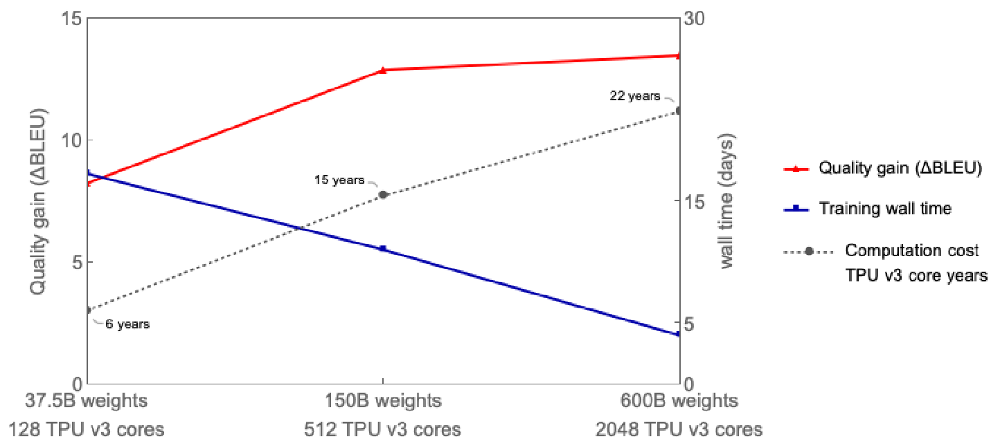

**图 1.** 随着 MoE 模型规模增大至 600B, 多语言翻译质量 (相对于双语基线的平均 $\Delta$BLEU) 提升, 同时端到端训练成本 (以 TPU v3 核心年计) 仅呈亚线性增长. 将模型规模从 37.5B 增加到 600B (16 倍), 导致计算成本从 6 年增加到 22 年 (3.6 倍). 取得最佳翻译质量的 600B 参数模型是在 2048 个 TPU v3 核心上训练 4 天, 总成本为 22 TPU v3 核心年. 相比之下, 训练所有 100 个双语基线模型需要 29 个 TPU v3 核心年. 我们最优质的稠密单一 Transformer 模型 (2.3B 参数) 获得 $\Delta$BLEU 为 6.1, 是通过在 2048 个 TPU v3 核心上使用 GPipe [Systed19] 训练 6 周, 总成本为 235.5 TPU v3 核心年.

### 1.1 扩展的实际挑战

在这里, 我们列出了在训练超大规模模型时面临的主要实际挑战, 这些模型的规模远超单个加速器 (如 GPU 或 TPU) 内存容量的极限.

##### 架构特定的模型并行支持

在常用深度学习框架如 TensorFlow [OSDId16] 和 PyTorch [Automc17] 下, 缺乏对高效模型并行算法的支持. 支持基于图划分的简单模型并行, 但由于网络的顺序依赖和基于梯度的优化, 这会导致严重的资源未充分利用. 为了有效扩展现有模型, 用户通常需要投入大量工程工作, 例如, 将模型代码迁移到专用框架 [Systeb18, Systed19].

##### 计算成本与模型规模的超线性增长

通过增加深度或宽度直接扩展模型规模 [Xivb05, Systed19] 通常会导致训练步骤时间至少呈线性增加. 通过在多个设备上拆分层权重和计算实现模型并行通常是必要的, 这会导致网络通信开销和设备未充分利用. 设备未充分利用源于分配不均衡以及底层神经网络的顺序依赖. 这种计算成本与模型规模之间的超线性关系无法仅通过使用更多设备来解决, 从而使训练大规模模型变得不切实际.

##### 巨型模型表示的基础设施可扩展性

对于分布在数千台设备上的大规模模型, 使用天真的图表示可能成为深度学习框架及其优化编译器的瓶颈. 例如, 通过跨 $D$ 台设备使用操作间分区添加 $D$ 倍的层数, 或使用操作内分区增加模型维度, 可能会导致一个包含 $O(D)$ 个节点的图. 设备之间的通信通道可能进一步增加图的大小, 最多达到 $O(D^{2})$ (例如, 分区 gather 或 transpose). 图的这种大小增加会导致大规模模型的图构建和编译时间变得不可行.

##### 实施分区策略的非平凡努力

将模型划分以在多设备上高效运行是一项具有挑战性的任务, 因为这需要跨设备协调通信. 对于图级划分, 需要复杂的算法 [Systed19, Xivn18] 来减少由于不同设备上分配的图的不同分区之间的顺序依赖引入的开销. 对于算子级并行, 不同分区算子有不同的通信模式, 这取决于语义, 例如, 它是否需要累加部分结果, 或重排数据分片. 根据我们的经验, 手动处理模型中的这些问题需要大量的精力, 考虑到像 TensorFlow 这样的框架拥有大量具有临时语义的算子. 在所有情况下, 实施模型划分对从业者来说尤其是一种负担, 因为更改模型架构将需要更改底层设备通信, 从而产生连锁效应.

### 1.2 大规模高效训练的设计原则

在本文中, 我们展示了如何通过构建一个拥有稀疏门控专家混合层的 $600$ 十亿参数序列到序列 Transformer 模型来克服这些挑战, 该模型具有亚线性计算成本和 $O(1)$ 编译时间. 我们使用 $2048$ TPU v3 设备在 $4$ 天内对多语言机器翻译任务训练了该模型, 并且在将 $100$ 语言翻译成英语时, 单一非集成模型相比现有技术实现了远优的翻译质量. 我们进行了各种模型规模的实验, 发现随着模型变大, 翻译质量提高, 但训练所需的总实际时间仅随模型规模亚线性增加, 如 [图 1](#figure-01) 所示. 为了构建如此超大的模型, 我们做出了以下关键设计选择.

##### 次线性扩展

首先, 模型架构应设计为使计算和通信需求在模型容量上呈子线性增长. 条件计算 [Condit15, Xivp17, ArXivb10, Contro20] 使我们能够通过在每个输入基础上激活子网络来满足训练和推理效率. 通过添加按位置稀疏门控的专家混合 (MoE) 层来扩展基于 RNN 的机器翻译和语言模型的容量 [Xivp17], 使得在子线性计算成本下实现了最先进的结果. 因此, 我们在第 [2](#S2) 节中提出了将 MoE 层扩展到 Transformer 架构的方法.

##### 抽象的力量

其次, 模型描述应与分区实现和优化分开. 这种关注点的分离使模型开发者能够专注于网络架构, 并灵活地更改分区策略, 而底层系统应用语义保持的转换并实现高效的并行执行. 为此, 我们提出了一个模块 GShard, 它只要求用户在模型中用分区策略标注几个关键张量. 它由一组用于标注的简单 API 组成, 以及 XLA [Tensor19] 中的编译器扩展用于自动并行化. 模型开发者编写模型时, 就好像存在一个具有巨大内存和计算能力的单个设备, 而编译器会根据标注和自身的启发式自动为目标划分计算. 我们在第 [3.2] 节 (#S3.SS2 "3.2 GShard 注解 API 用于并行执行 ‣ 3 使用 GShard 的高并行实现 ‣ GShard: 利用条件计算和自动分片扩展巨型模型") 中提供了更多标注示例.

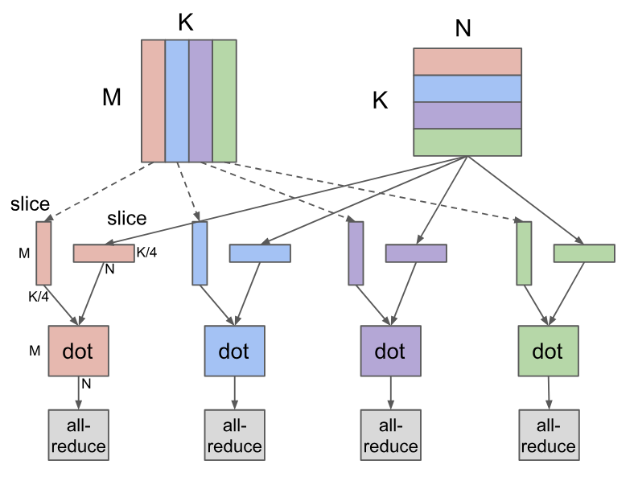

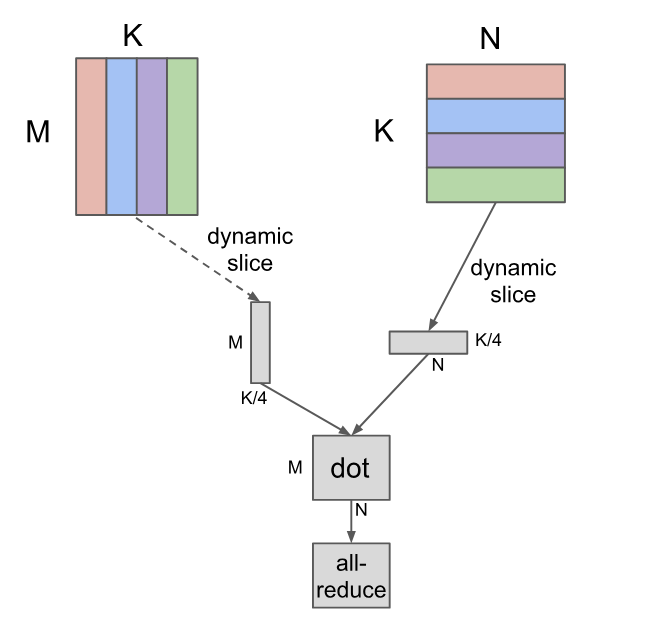

**图 2.** 在 4 个设备上对点操作符 ($[M,K]\times[K,N]=[M,N]$) 使用 MPMD 和我们提出的 SPMD 分区的比较. 在此示例中, 两个操作数都沿收缩维度分区 $K$, 每个设备计算本地结果并通过 AllReduce 全局合并. MPMD 分区为每个设备生成单独的操作符, 从而限制了其可扩展性, 而 SPMD 分区生成一个程序以在所有设备上运行. 请注意, 使用我们的 SPMD 分区时, 编译时间不依赖于所使用的设备数量.

##### 可扩展编译器

第三, 系统基础设施, 包括计算表示和编译, 必须能够扩展到数千个设备以实现并行执行. 例如, [图 2](#figure-02) 展示了在 4 个设备上分割点积操作的两种不同方式 (颜色编码). 请注意, 在 [图 2a](#figure-02) 中采用通常的 MPMD (多程序多数据) 方法时, 扩展变得更加具有挑战性, 因为图中的节点数量会随着设备数量线性增加. 相反, 我们开发了一种用于 SPMD (单程序多数据) 转换的编译器技术, 它生成一个单一程序在所有设备上运行, 使编译时间保持不变, 与设备数量无关, 如 [图 2b](#figure-02) 所示. 我们将在第 [3.3](#S3.SS3) 节更详细地讨论我们的 SPMD 框架.

本文的其余部分组织如下. 第[2]节(#S2 "2 模型 ‣ GShard: 通过条件计算和自动分片扩展巨型模型") 更详细地描述了我们带有稀疏门控 MoE 层的 Transformer 架构. 第[3]节(#S3 "3 使用 GShard 的高度并行实现 ‣ GShard: 通过条件计算和自动分片扩展巨型模型") 介绍了我们的开发模块 GShard. 第[4]节(#S4 "4 大规模多语言, 大规模机器翻译 (M4) ‣ GShard: 通过条件计算和自动分片扩展巨型模型") 展示了我们的专家混合模型在 $100$ 语言对上的多语言机器翻译任务的应用. 第[5]节(#S5 "5 性能和内存消耗 ‣ GShard: 通过条件计算和自动分片扩展巨型模型") 给出了我们实现的性能和内存测量. 第[6]节(#S6 "6 相关工作 ‣ GShard: 通过条件计算和自动分片扩展巨型模型") 讨论了相关工作.

## 2 模型

### 2.1 Transformer 架构的稀疏扩展

Transformer [Attent17] 架构已被广泛用于自然语言处理. 它已成为许多序列到序列任务 (如机器翻译) 的事实标准. Transformer 利用两个计算模块, 即编码器和解码器, 两者都是通过堆叠多个 Transformer 层来实现的. Transformer 编码器层由两个连续的层组成, 即自注意力层, 随后是逐位置前馈层. 解码器增加了第三个跨注意力层, 该层关注编码器输出. 我们通过条件计算稀疏扩展 Transformer, 将每隔一层的前馈层替换为逐位置专家混合 (MoE) 层 [Xivp17], 并在编码器和解码器中使用变体的 top-2 门控 ([图 3](#figure-03)). 我们通过改变 Transformer 层数和每个 MoE 层的专家数量来扩展模型容量.

每个训练示例由一对子词标记序列组成. 在训练和推理过程中, 每个标记都会激活 MoE Transformer 的一个子网络. 子网络的大小大致不依赖于每个 MoE 层的专家数量, 从而允许如前一节所述的计算成本次线性扩展. 计算复杂性在第 [3.1](#S3.SS1) 节中进行了进一步分析, 而训练性能则在第 [5](#S5) 节中讨论.

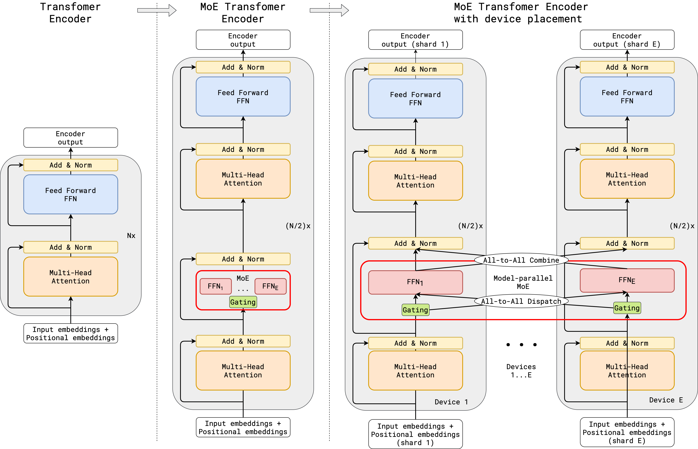

**图 3.** Transformer 编码器中 MoE 层扩展的示意图. MoE 层替换每个其他的 Transformer 前馈层. 解码器的修改类似. (a) 标准 Transformer 模型的编码器是由自注意力层和前馈层交替组成, 并配有残差连接和层归一化. (b) 通过用 MoE 层替换每个其他的前馈层, 我们得到 MoE Transformer 编码器的模型结构. (c) 在扩展到多个设备时, MoE 层在设备之间进行分片, 而所有其他层则被复制.

### 2.2 逐位置专家混合层

我们模型中使用的专家混合 (MoE) 层基于 [Xivp17], 并在稀疏门控函数和使用的辅助损失上有所变化. Transformer 的 MoE 层由 $E$ 个前馈网络组成 $\mathrm{FFN}_{1}\dots\mathrm{FFN}_{E}$:

$$
\mathcal{G}_{s,E}\qquad =\mathrm{GATE}(x_{s})\tag{1}
$$

$$
\mathrm{FFN}_{e}(x_{s})\qquad =\mathrm{wo}_{e}\cdot\mathrm{ReLU}(\mathrm{wi}_{e}\cdot x_{s})\tag{2}
$$

$$
y_{s}\qquad =\sum^{E}_{e=1}\mathcal{G}_{s,e}\cdot\mathrm{FFN}_{e}(x_{s})\tag{3}
$$

其中 $x_{s}$ 是 MoE 层的输入 token, wi 和 wo 分别是前馈层 (一个专家) 的输入和输出投影矩阵. 向量 $\mathcal{G}_{s,E}$ 由门控网络计算. $\mathcal{G}_{s,E}$ 对每个专家有一个非负值, 其中大多数为零, 这意味着 token 不会被分派到该专家. 这个 token 会分派到极少数几个专家. 我们选择让每个 token 最多分派到两个专家. $\mathcal{G}_{s,E}$ 中的对应条目为非零值, 表示某个专家对最终网络输出的贡献程度. 每个专家 $\mathrm{FFN}_{e}$ 对 $x_{s}$ 应用一个使用 ReLU [ICML10] 激活函数的全连接两层网络. MoE 层的输出 $y_{s}$ 是从所有选定专家输出的加权平均.

门控函数 $\mathrm{GATE}(\cdot)$ 对 MoE 层至关重要, 它通过 softmax 激活函数建模, 用于表示每个专家在处理输入 token 时的权重. 换句话说, 用于表示一个专家在处理输入 token 时的能力. 另外, 门控函数必须满足两个目标:

- •

平衡负载 希望 MoE 层能够对给定的 token 稀疏地激活专家. 一个简单的解决方案是根据 softmax 概率分布选择前 $k$ 个专家. 然而, 众所周知, 这种方法会导致训练 [Xivp17] 的负载不平衡问题: 在训练过程中, 大多数 token 会被分配到少数几个专家, 导致只有少量 (繁忙的) 专家积累了非常大的输入缓冲区, 而其他专家未接受训练, 从而减慢训练速度. 同时, 许多其他专家根本无法得到充分训练. 门控函数的更好设计将处理负担更均匀地分布到所有专家上.

- •

大规模效率 如果门控函数是顺序执行的, 要实现负载平衡将相当简单. 仅门控函数的计算成本至少为 $O(\mathrm{NE}$, 对于输入批次中的所有 $N$ 个 token, 给定 $E$ 个专家. 然而, 在我们的研究中, $N$ 的规模是以百万计, 而 $E$ 的规模是以千计, 门控函数的顺序实现将导致大多数计算资源大部分时间处于空闲状态. 因此, 我们需要一个高效的门控函数并行实现来利用多台设备的计算能力.

我们在门控函数 $\mathrm{GATE}(\cdot)$ 中设计了以下机制以满足上述要求 (细节见算法[1](#alg1“在 2.2 中, 按位置的专家混合层‣ 2 模型 ‣ GShard: 带条件计算和自动分片的缩放巨型模型”) ):

- •

专家容量 为了确保负载平衡, 我们强制执行一个专家处理的代币数量低于我们定义的专家容量的统一阈值. 假设训练批次中的标记总数为 $N$, 且每个标记最多分配给两位专家, 则专家容量设定为 $O(N/E)$. $\mathrm{GATE}(\cdot)$ 会 $c_{e}$ 发送给专家的标记数量进行计数. 当被某一个令牌选中的两位专家都超过了其容量时, 该令牌被视为溢出令牌, 其中 $\mathcal{G}_{s,E}$ 退化为零向量. 此类令牌的表示 $x_{s}$ 通过残余连接传递到下一层.

- •

本地组调度 $\mathrm{GATE}(\cdot)$ 将训练批中的所有令牌均匀划分为 $G$ 组, 即每个组包含 $S=N/G$ 个令牌. 所有组别均独立并行处理. 每个小组都被赋予每位专家的分数能力, $2N/(G\cdot E)$. 每个组确保最多发送到这个数量的令牌给专家. 通过这种方式, 我们可以确保专家能力依然得到执行, 整体负担得到平衡.

- •

辅助损失 对于门控函数来说, 不总是选择相同的少数专家非常重要, 因为这会导致只有少数专家出现容量溢出, 而其他专家则未被充分利用. 根据 [Xivp17], 我们定义了一个辅助损失项 $\ell_{\mathrm{aux}}$ 来强制执行这一约束. 它以常数乘数 $k$ 被加入模型 $\mathcal{L}=\ell_{\mathrm{nll}}+k*\ell_{\mathrm{aux}}$ 的整体损失函数中. 在算法 [1](#alg1) 的第 (13) 行中, 辅助损失项 $\ell_{\mathrm{aux}}$ 的具体形式是由以下考虑驱动的: 项 $c_{e}/S$ 表示路由到每个专家的输入比例, 而我们希望最小化 $c_{e}/S$ 的均方值. 但由于 $c_{e}$ 是由 top-2 操作得出且不可微分, 我们使用每个专家的平均门控 $m_{e}$ 作为可微分的近似, 并将 $(c_{e}/S)^{2}$ 替换为 $m_{e}(c_{e}/S)$, 现在可以通过梯度下降进行优化.

- •

随机路由 直观地, 因为 $y_{s}$ 是所选专家返回结果的加权平均, 如果第二个专家的权重非常小, 我们可以简单地忽略第二个专家以节约整体专家容量. 因此, 除了遵守专家容量约束外, $\mathrm{GATE}(\cdot)$ 以与其权重 $g_{2}$ 成比例的概率分配到第二最佳专家.

**算法 1: 带辅助损失的组级别前 2 门控.**

- **数据:** $x_{S}$, 一组大小为 $S$ 的令牌.
- **数据:** $C$, 分配给该组的专家容量.
- **结果:** $\mathcal{G}_{S,E}$, 组合权重的组.
- **结果:** $\ell_{\mathrm{aux}}$, 组辅助损失.
- $c_{E}\leftarrow 0$ $\triangleright$ 每个专家的门控决策.
- $g_{S,E}\leftarrow \mathrm{softmax}(\mathrm{wg}\cdot x_{S})$ $\triangleright$ 每个 token 每个专家的门控, $\mathrm{wg}$ 是可训练权重.
- $m_{E}\leftarrow\frac{1}{S}\sum^{s}_{s=1}g_{s,E}$ $\triangleright$ 每个专家的平均门控.
- **对于** $s\leftarrow 1$ 到 $S$:
  - $g1,e1,g2,e2=\mathrm{top}\_2(g_{s,E})$ $\triangleright$ top-2 门控和专家索引.
  - $g1\leftarrow g1/(g1+g2)$ $\triangleright$ 规范化 $g1$.
  - $c\leftarrow c_{e1}$ $\triangleright$ 在 $e1$ 专家缓冲区中的位置.
  - **如果** $c_{e1}<C$:
    - $\mathcal{G}_{s,e1}\leftarrow g1$ $\triangleright$ $e1$ $x_{s}$ 的专家组合权重.
  - $c_{e1}\leftarrow c+1$ $\triangleright$ 增加 $e1$ 专家决策计数.
- $\ell_{\mathrm{aux}}=\frac{1}{E}\sum^{E}_{e=1}\frac{c_{e}}{S}\cdot m_{e}$.
- **对于** $s\leftarrow 1$ 到 $S$:
  - $g1,e1,g2,e2=\mathrm{top}\_2(g_{s,E})$ $\triangleright$ 前两名门和专家索引.
  - $g2\leftarrow g2/(g1+g2)$ $\triangleright$ 归一化 $g2$.
  - $\mathrm{rnd}\leftarrow \mathrm{uniform}(0,1)$ $\triangleright$ 以概率 $\propto 2\cdot g2$ 分派到次优专家.
  - $c\leftarrow c_{e2}$ $\triangleright$ 在 $e2$ 专家缓冲区中的位置.
  - **如果** $c<C\land 2\cdot g2>\mathrm{rnd}$:
    - $\mathcal{G}_{s,e2}\leftarrow g2$ $\triangleright$ $e2$ $x_{s}$ 的专家组合权重.
  - $c_{e2}\leftarrow c+1$.

## 3 使用 GShard 的高并行实现

本节描述了在 [2](#S2) 中运行在 TPU 设备集群上高效的模型实现.

第一步是将模型以线性代数操作的形式表示, 我们的软件栈 (TensorFlow [OSDId16]) 和硬件平台 (TPU) 在这方面高度定制和优化. 用线性代数表示模型的大部分部分非常容易, 就像原始 Transformer 一样. 然而, 要用线性代数表示 MoE 层 (特别是算法 [1](#alg1) 中提出的 $\mathrm{GATE}(\cdot)$ 函数) 则需要一些努力, 因为它具有顺序性质, 我们在第 [3.1](#S3.SS1) 节中描述了详细内容.

接下来, 我们对线性代数计算进行注释以表达并行性. 计算中的每个张量都可以使用第 [3.2](#S3.SS2) 节中的分片 API 来注释, 以便在设备集群中进行复制或分布. 使用分片注释可以实现模型描述与高效并行实现之间的关注点分离, 并允许用户灵活表达多样的并行策略. 例如, (1) 注意力层通过沿批量维度拆分并将其权重复制到所有设备来实现并行. 另一方面, (2) 由于 MoE 层专家的体积庞大, 无法在所有设备上复制, 唯一可行的策略是将专家分片到多个设备. 另外, 整个模型在这两种模式 (1)-(2) 之间交替进行. 使用注释可以让模型开发者摆脱系统优化的工作, 并避免将并行实现和底层细节硬编码到模型代码中.

最终, 编译器基础设施接收一个 (部分) 标注的线性代数计算, 并生成一个高效的并行程序, 可扩展到数千个设备. 正如第 [3.3](#S3.SS3) 节中所描述的, 编译器应用 SPMD (单程序多数据) 划分转换来表示每个设备的计算, 插入必要的跨设备通信, 处理不规则模式如不均匀划分, 最终生成一个在所有设备上启动以进行并行执行的单一程序.

### 3.1 逐位置专家混合层用线性代数表示

我们的模型实现 (算法 [2](#alg2) ) 将整个加速器集群视为一个单一设备, 并将其核心数学算法表示为几个独立于集群具体设置的张量操作. 爱因斯坦求和符号 [Spring23] (即 tf. einsum) 是一种强大的构造, 可以简洁地表示模型, 我们在实现中广泛使用它. softmax 门的计算可以通过一个 einsum 后跟 softmax 函数轻松表示. 将输入分配给选定专家的操作通过调度掩码和输入之间的单个 einsum 表示. 所有 $\mathrm{FFN}_{e}$ 权重被合并为单个三维张量 wi 和 wo, 并且 $\mathrm{FFN}_{1}\dots\mathrm{FFN}_{E}$ 的计算通过三个操作符表示 (两个 einsum 和一个 relu). 最后, 将所有专家输出的加权平均值作为最终输出, 通过另一个 einsum 表示.

算法 [2](#alg2) 中的 Top2Gating 计算算法 [1](#alg1) 描述的所有组本地 $\mathcal{G}_{S,E}$ 的并集. combine_weights 是一个形状为 [G, S, E, C] 的 4 维张量. 当输入 token $s$ 被发送到专家 $e$ 的输入缓冲器的缓冲位置 $c$ 时, 值 combine_weights[g, s, e, c] 非零. 对于特定的 g 和 s, 切片 combine_weight[g, s, : , : ] 最多包含两个非零值. 二值 dispatch_mask 通过简单地将所有非零值设置为 1 从 combine_weights 生成.

**算法 2: 位置级 MoE 层的前向传播. 带下划线的字母 (例如 G 和 E) 表示张量将沿该维度进行划分.**

[⬇](data: text/plain; base64, Z2F0ZXMgPSBzb2Z0bWF4KGVpbnN1bSgiJlxHRyZTTSxNRS0 JlxHRyZTRSIsIGlucHV0cywgd2cpKQpjb21iaW5lX3dlaWdodHMsIGRpc3BhdGNoX21hc2sgPSBUb3AyR2F0aW5nKGdhdGVzKQpkaXNwYXRjaGVkX2V4cGVydF9pbnB1dHMgPSBlaW5zdW0oCiAgICAiJlxHRyZTRUMsJlxHRyZTTS0 JlxFRSZHQ00iLCBkaXNwYXRjaF9tYXNrLCByZXNoYXBlZF9pbnB1dHMpCmggPSBlaW5zdW0oIiZcRUUmR0NNLCZcRUUmTUgtPiZcRUUmR0NIIiwgZGlzcGF0Y2hlZF9leHBlcnRfaW5wdXRzLCB3aSkKaCA9IHJlbHUoaCkKZXhwZXJ0X291dHB1dHMgPSBlaW5zdW0oIiZcRUUmR0NILCZcRUUmSE0tPiZcR0cmRUNNIiwgaCwgd28pCm91dHB1dHMgPSBlaW5zdW0oCiAgICAiJlxHRyZTRUMsJlxHRyZFQ00tPiZcR0cmU00iLCBjb21iaW5lX3dlaWdodHMsIGV4cGVydF9vdXRwdXRzKQ==)

- 栅门 $\leftarrow \mathrm{softmax}(\mathrm{einsum}("\mathrm{GSM},\mathrm{ME}\to\mathrm{GSE}",\mathrm{inputs},\mathrm{wg}))$.
- $\mathrm{combine\_weights},\mathrm{dispatch\_mask}\leftarrow\mathrm{Top2Gating}(\mathrm{gates})$.
- $\mathrm{dispatched\_expert\_inputs}\leftarrow\mathrm{einsum}("\mathrm{GSEC},\mathrm{GSM}\to\mathrm{EGCM}",\mathrm{dispatch\_mask},\mathrm{reshaped\_inputs})$.
- $h\leftarrow\mathrm{einsum}("\mathrm{EGCM},\mathrm{EMH}\to\mathrm{EGCH}",\mathrm{dispatched\_expert\_inputs},\mathrm{wi})$.
- $h\leftarrow\mathrm{relu}(h)$.
- $\mathrm{expert\_outputs}\leftarrow\mathrm{einsum}("\mathrm{EGCH},\mathrm{EHM}\to\mathrm{GECM}",h,\mathrm{wo})$.
- $\mathrm{outputs}\leftarrow\mathrm{einsum}("\mathrm{GSEC},\mathrm{GECM}\to\mathrm{GSM}",\mathrm{combine\_weights},\mathrm{expert\_outputs})$.

我们需要适当选择组的数量 $G$ 和专家的数量 $E$, 以便该算法能够扩展到拥有 $D$ 个设备的集群. 值得分析在给定包含 $N$ 个 token 的训练批次时, 其整体计算复杂度 (总的浮点运算次数).

我们分析算法 [2](#alg2) 的计算复杂度随设备数量 $D$ 的变化, 并基于以下假设: a) 每个设备的 token 数量 $\frac{N}{D}=O(1)$ 是常数 [+1]; b) $G=O(D)$, $S=O(1)$ 和 $N=O(\mathrm{GS})=O(D)$; c) $M=O(1)$, $H=O(1)$; d) $E=O(D)$; 以及 e) $C=O(\frac{2S}{E})=O(\frac{1}{D}),D<S$ 是正整数 [+2].

算法 [2](#alg2) 中的浮点操作总数 $\mathrm{FLOPS}$:

$$
\mathrm{FLOPS}_{\mathrm{Softmax}}\qquad +\qquad \mathrm{FLOPS}_{\mathrm{Top2Gating}}\qquad +\qquad \mathrm{FLOPS}_{\mathrm{Dispatch|Combine}}\qquad +\qquad \mathrm{FLOPS}_{\mathrm{FFN}}=
$$

$$
O(\mathrm{GSME})\qquad +\qquad O(\mathrm{GSEC})\qquad +\qquad O(\mathrm{GSMEC})\qquad +\qquad O(\mathrm{EGCHM})=
$$

$$
O(D\cdot 1\cdot 1\cdot D)\qquad +\qquad O(D\cdot 1\cdot D\cdot\frac{1}{D})\qquad +\qquad O(D\cdot 1\cdot 1\cdot D\cdot\frac{1}{D})\qquad +\qquad O(D\cdot D\cdot\frac{1}{D}\cdot 1\cdot 1)=
$$

$$
O(D^{2})\qquad +\qquad O(D)\qquad +\qquad O(D)\qquad +\qquad O(D)
$$

因此每个设备 $\mathrm{FLOPS}/D=O(D)+O(1)+O(1)+O(1)$ 的操作数. 每个设备的 softmax 复杂度 $\mathrm{FLOPS}_{\mathrm{softmax}}/D=O(D)$ 随设备数量线性增长, 但在实际中被其他项主导, 因为 $D<<H$ 和 $D<S$. 因此 $\mathrm{FLOPS}/D$ 可被认为是 $O(1)$, 满足亚线性扩展设计要求. 第 [5] 节(#S5 "5 性能和内存消耗 ‣ GShard: 通过条件计算和自动分片扩展巨型模型") 通过实证验证了该分析.

除了计算成本, 我们还有非常量的跨设备通信成本, 但当我们增加 $D$ 时, 它以适度的速度 $O(\sqrt{D})$ 增长 (第 [5](#S5) 节).

### 3.2 并行执行的 GShard 注释 API

由于算法 [1](#alg1) 中张量的庞大规模和计算需求, 我们必须在多台设备上并行化该算法. 在算法 [2](#alg2) 中, 下划线字母说明了如何对每个张量进行分片的直接解决方案. GShard 中的 *sharding* API 允许我们在程序中标注张量, 以选择性地指定它们应如何被分区. 此信息会传递给编译器, 使编译器能够自动应用并行执行的转换. 在我们的工作中, 我们使用了 TensorFlow/Lingvo [Xivd02] 中的以下 API.

- •

replicate(tensor) 注释张量, 使其在各分区中被复制, 并返回注释后的张量. 这通常用于模型中的非 MoE 层以复制权重.

- •

split(tensor, split_dimension, num_partitions) 注释张量, 使其沿 split_dimension 被分区, 并返回注释后的张量. 第 $i$ 分区放置在第 $i$ 个设备上, num_partitions 不应超过系统上的设备数量.

- •

shard(tensor, device_assignment) 将 split() 泛化, 以允许对多个维度进行分区并指定每个分区的放置位置. 附录 [A. 3](#A1.SS3) 对该 API 提供了更详细的描述.

请注意, 对 split 或 shard 的调用仅添加注解, 并不会改变用户程序中的逻辑形状. 用户仍然使用完整的形状, 无需担心诸如分区不均等问题.

GShard 的通用性体现在简单的 API 适用于所有维度. 被分片的维度可以包括批次 (数据并行) , 特征, 专家, 甚至图像模型中的空间维度, 这取决于使用场景. 另外, 由于分片注解是针对每个张量的, 模型的不同部分可以以不同方式进行分区. 这种灵活性使我们能够对巨型 MoE 权重进行分区, 并在 MoE 层和非 MoE 层之间切换分区模式, 以及适用于本文之外的使用场景, 例如大型图像的空间分区 [TPUs19] (附录 [A. 4](#A1.SS4)).

使用上述分片 API, 我们可以如下表示算法 [2](#alg2) 中显示的分片策略. 输入张量沿第一个维度拆分, 而门控权重张量被复制. 在计算分发到各专家的输入后, 我们应用 split 来将分片从组 ($G$) 维度切换到专家 ($E$) 维度. $D$ 是设备数量.

[⬇](data: text/plain; base64, ICAjIFBhc3NpbmcgaW5wdXRzIGFsb25nIHRoZSBncm91cCAoRykgZGVtbwokXEhpbGlnaHQlKyBpbXB1dHMgPSBzcGxpdChpbXB1dHMgLCAwLCBEKQogICMgUmVwbGFjZSB0aGUgZ2F0aW5nIHdlaWdodAolXEhpbGlnaHQlKyB3ZyA9IHJlcGxhY2Uod2cpCiAgZ2F0ZXMgPSBzb2Z0bWF4KGVpbnN1bShcIkdTTSxNTS0+R1NFXCIsIGlucHV0cywgd2cpCiAgY29tYmluZWRfd2VpZ2h0cywgZGlzcGF0Y2hfbWFzayA9IFRvcDIoR2F0aW5nTG9naXRzKQogIGRpc3BhdGNoZWRfZXhwZXJ0X2lucHV0cyA9IGVpbnN1bSgKICAgIFwiR1NFRCxHU00tPkVHQ00iLCBkaXNwYXRjaF9tYXNrLCByZXNoYXBlZF9pbnB1dHMpCiAgIyBQYXJ0aXRpb24gZGlzcGF0Y2hlZCBpbnB1dHMgYWxvbmcgZXhwZXJ0IChFKSBkZW0uCiVcSGlsaWdodCUrIGRpc3BhdGNoZWRfZXhwZXJ0X2lucHV0cyA9IHNwbGl0KGRpc3BhdGNoZWRfZXhwZXJ0X2lucHV0cywgMCwgRCkKICBoID0gZWluc3VtKFwiRUdDTSxFTUgtRUdDSFwiLCBkaXNwYXRjaGVkX2V4cGVydF9pbnB1dHMsIHdpKQogIC4uLg==)

- **沿组 (G) 维度拆分输入.**
- \`inputs = split(inputs, 0, D)\`.
- **复制门控权重.**
- \`wg = replicate(wg)\`.
- \`gates = softmax(einsum("GSM, ME->GSE", inputs, wg))\`.
- \`combine\_weights, dispatch\_mask = Top2Gating(gating\_logits)\`.
- \`dispatched\_expert\_inputs = einsum("GSEC, GSM->EGCM", dispatch\_mask, reshaped\_inputs)\`.
- **沿专家维度 (E) 分割派发的输入.**
- \`dispatched\_expert\_inputs = split(dispatched\_expert\_inputs, 0, D)\`.
- \`h = einsum("EGCM, EMH->EGCH", dispatched\_expert\_inputs, wi)\`.
- \`...\`

##### 每个张量的分片分配

如上例所示, 用户并不需要为程序中的每个张量进行标注. 通常只需在一些重要操作上进行标注, 例如我们模型中的 Einsums, 编译器会使用自身的启发式方法推断其余张量的分片 [+3]. 例如, 由于输入张量沿着 $G$ 维度进行分区, 而权重张量是复制的, 编译器选择沿相同 $G$ 维度分区 einsum 的输出 (第 5 行). 类似地, 由于输入调度 einsum (第 7 行) 的两个输入都沿 $G$ 维度进行分区, 输出的分片被推断为沿 $G$ 维度拆分, 然后我们在输出上添加拆分标注, 以沿 $E$ 维度重新分片. 在上述示例中, 某些标注也可以由编译器确定 (例如 replicate(wg)), 但建议对计算的初始输入张量和最终输出张量进行标注.

目前, 编译器使用迭代数据流分析将分片信息从操作符传播到其邻居 (操作数和用户), 从用户标注的操作符开始. 分析过程尝试通过对相邻操作符的分片决策进行对齐来最小化重新分片的可能性. 也可能采用其他方法, 如整数规划或机器学习方法, 但改进自动分片分配不是本文的重点, 我们将其作为未来工作留待研究.

##### 混合手动和自动分片

带有分片注释的自动分区对于常见情况通常已足够, 但 GShard 也具有灵活性, 允许将手动分区的操作符与自动分区的操作符混合使用. 这为用户提供了更多关于操作符如何分区的控制, 例如用户在运行时可能掌握比操作符语义更多的知识. 例如, XLA 或 TensorFlow 的 Gather 操作符定义都没有传达输入中不同范围的索引边界信息, 但用户可能知道某个特定的 Gather 操作符只在各分区内重新排列数据. 在这种情况下, 用户可以简单地通过缩小维度大小并执行局部 Gather 来轻松分区操作符; 否则, 编译器需要对索引范围采取保守策略, 并增加不必要的通信开销. 例如, 算法 [2](#alg2) 中的调度 Einsum (第 3 行), 它使用 one-hot 矩阵来分发输入, 也可以通过使用简单手动分区的 Gather 操作符来实现, 而模型的其余部分则自动分区. 以下是说明此用例的伪代码.

[⬇](data: text/plain; base64, Iy 输入具有形状 [G, S, M]. split() 不会改变逻辑形状. input = split(input, 0, num_devices)
# s_indices 具有形状 [E, G, C, 1]. 值: 指向输入中 S 的索引. s_indices = split(s_indices, 1, num_devices) # 开始手动分区. # partitioned_input 具有形状 [G/num_devices, S, M]
%highlight%partitioned_input = auto_to_manual_spmd_partition(input)
# partitioned_s_indices 具有形状 [E, G/num_devices, C, 1]
%highlight%partitioned_s_indices = auto_to_manual_spmd_partition(s_indices)
# 与 G 指向一起连接在 partitioned_input 上: Iota 在 G 维度上. partitioned_gs_indices = concat( iota([E, G/num_devices, C, 1], 1), partitioned_s_indices, 3)
# partitioned_data 具有形状 [E, G/num_devices, C, M]
partitioned_data = gather( partitioned_input, partitioned_gs_indices) # 切换回自动分区. # data 具有形状 [E, G, C, M]
%highlight%data = manual_to_auto_spmd_partition(partitioned_data). . .

- **输入具有形状** \[G, S, M\], \`split()\` 不会改变逻辑形状.
- \`input = split(input, 0, num\_devices)\`.
- **$s_{\mathrm{indices}}$ 具有形状** \[E, G, C, 1\], 值为输入中指向 $S$ 的索引.
- \`s\_indices = split(s\_indices, 1, num\_devices)\`.
- **开始手动分区.**
- **分区输入的形状为** \[G/num\_devices, S, M\].
  - \`partitioned\_input = auto\_to\_manual\_spmd\_partition(input)\`.
- **分区 $s_{\mathrm{indices}}$ 的形状为** \[E, G/num\_devices, C, 1\].
  - \`partitioned\_s\_indices = auto\_to\_manual\_spmd\_partition(s\_indices)\`.
- **在分区输入中使用 G 索引进行拼接: 对 G 维度进行 Iota.**
  - \`partitioned\_gs\_indices = concat(iota([E, G/num\_devices, C, 1], 1), partitioned\_s\_indices, 3)\`.
- **分区数据的形状为** \[E, G/num\_devices, C, M\].
  - \`partitioned\_data = gather(partitioned\_input, partitioned\_gs\_indices)\`.
- **切换回自动分区.**
- **数据的形状为** \[E, G, C, M\].
  - \`data = manual\_to\_auto\_spmd\_partition(partitioned\_data)\`.
- \`...\`

### 3.3 GShard 的 XLA SPMD 分区器

本节描述了编译器基础设施, 该基础设施根据分片注解自动划分计算图. 分片注解告知编译器每个张量应如何在设备间分布. SPMD (单程序多数据) 划分器 (为简便起见称为“划分器”) 是一个编译器组件, 它将计算图转换为在所有设备上并行执行的单个程序. 这使得编译时间几乎保持不变, 无论分区数量多少, 从而允许我们扩展到数千个分区. [+4]

我们在 XLA 编译器中实现了划分器 [Tensor19]. 多个前端框架, 包括 TensorFlow, JAX, PyTorch 和 Julia, 已经具有将其图表示转换为 XLA HLO 图的降低逻辑. 与流行的前端框架 (如 TensorFlow) 相比, XLA 的操作符集要小得多, 这减少了实现划分器的负担而不会损害通用性, 因为前端的现有降低过程已完成了使其表达能力强的繁重工作. 虽然我们在 XLA 中开发了基础设施, 但这里描述的技术可以应用于其他机器学习框架的中间表示 (例如, ONNX [Exchan19], TVM Relay [MAPL18], Glow IR [Graph18]).

XLA 将计算建模为数据流图, 其中节点是操作符, 边是流经操作符之间的张量. 分区器的核心是每个操作的处理, 它根据输入和输出上指定的分片, 将全尺寸操作符转换为分区尺寸操作符. 当计算被分区时, 会引入各种跨设备数据传输模式. 为了在大规模下最大化性能, 定义一组核心通信原语并针对目标平台进行优化是至关重要的.

#### 3.3.1 通信原语

由于分区器强制所有设备运行相同的程序, 通信模式也很规整, XLA 定义了一组执行 MPI 风格通信的集合操作符 [Septem09]. 下面列出我们在 SPMD 分区器中使用的常见通信原语.

##### CollectivePermute

此操作符指定一组源- 目的地对, 源的数据会发送到相应的目的地. 它用于两个地方: 更改分片张量在分区之间的设备顺序, 以及本节稍后讨论的边界交换.

##### AllGather

此操作符按指定顺序将所有参与者的张量串联起来. 它用于将分片张量更改为复制张量.

##### AllReduce

该操作符对所有参与者的输入执行按元素的规约 (例如求和). 它用于合并来自不同分区的部分规约的中间张量. 在 TPU 设备网络中, 当分区数量增加时, AllReduce 的成本是恒定的 (第 [5.2 节](#S5.SS2)). 它也是其他类型网络拓扑中常用的, 具有高效实现的原语 [Alto19].

##### AllToAll

该操作符将每个参与者的输入沿某一维度逻辑分割, 然后将每一部分发送给不同的参与者. 在接收到来自其他参与者的数据片后, 每个参与者将这些片段连接在一起以生成其结果. 它用于将分片张量从一个维度重新分片到另一个维度. 在 TPU 设备网络中, AllToAll 是这种重新分片的高效方法, 当分区数量增加时, 其成本呈亚线性增长 (第 [5.2 节](#S5.SS2)).

#### 3.3.2 按操作符的 SPMD 分区

分区器的核心是将全尺寸操作符根据指定的分片转换为分区尺寸操作符的每操作符转换. 虽然一些操作符 (例如, 逐元素操作) 很容易支持, 但我们会讨论几种需要跨分区通信的常见情况.

在一般情况下, 有一些重要的技术挑战, 我们将在第 [3.3.3](#S3.SS3.SSS3) 节中讨论. 为了使讨论与 MoE 模型更相关, 本节聚焦于 Einsum 分区, 以说明一些通信模式. 为了简化, 假设所有张量都均匀分区, 这意味着要分区的维度大小是分区数量的倍数.

##### Einsum 案例研究

在实现 MoE 模型时, Einsum 是最关键的操作符. 在 XLA HLO 中, 它们表示为 Dot 操作, 其中每个操作数 (LHS 或 RHS) 由三种类型的维度组成:

- •

批次维度是极易并行的维度. 相同的批次维度集合必须存在于 LHS, RHS 和输出中, 并且输出中的每个元素仅依赖于 LHS 和 RHS 中对应的批次.

- •

收缩维度仅存在于操作数中. 左侧 (LHS) 和右侧 (RHS) 必须具有相同的收缩维度集合, 并且它们将在输出中被求和并折叠.

- •

非收缩维度也是并行维度, 存在于某一个操作数和输出中. 左侧 (LHS) 和右侧 (RHS) 各自有自己的非收缩维度集合, 这些维度会被输出继承.

分片传播优先选择在 LHS, RHS 和输出的批量维度上使用相同的分片, 因为这样可以避免任何跨分区通信. 然而, 这并不总是可行, 在以下三种情况下我们需要跨分区通信.

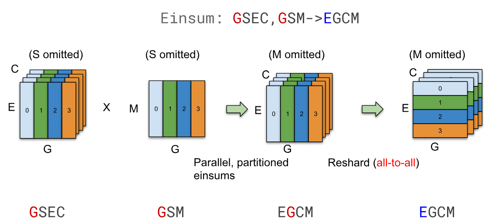

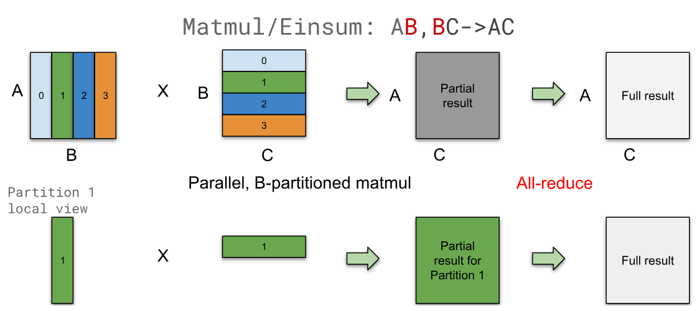

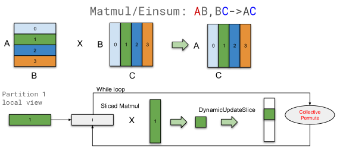

**图 4.** 使用跨设备通信的 Einsum 分区示例.

- •

重新分片. 在我们构建的 MoE 模型中, 专家调度逻辑 (算法 [2] 第 3 行 (#alg2 “在 3.1 按位置的专家混合层用线性代数表示 ‣ 使用 GShard 的高并行实现 ‣ GShard: 使用条件计算和自动分片扩展大型模型”) ) 在执行 Einsum 后需要切换分区维度. 由于使用 AllToAll 重新分片是高效的 (第 [5.2] 节 (#S5.SS2 “5.2 运行时效率与可扩展性 ‣ 5 性能与内存消耗 ‣ GShard: 使用条件计算和自动分片扩展大型模型”) ), 我们首先在本地执行 Einsum, 然后重新分片到所需维度, 如 [图 4a](#figure-04) 所示.

- •

累积部分结果. 如果输入沿收缩维度分区, 本地结果是部分的, 我们需要使用 AllReduce 将它们合并以生成最终结果, 如 [图 4b](#figure-04) 所示.

- •

切割成一个环. 对于某些场景, 我们还实现了类似 Cannon 算法 [USA69] 的算法, 以限制每个划分张量的大小. 例如, 如果两个操作数都划分在非收缩维度上, 我们无法直接计算局部 Einsum, 因为操作数具有不同的非收缩维度. 复制其中一个操作数不会导致冗余计算, 但需要复制的操作数能容纳在设备内存中. 因此, 如果操作数大小过大, 我们会将两个操作数分段, 并用循环遍历结果的每个片, 并使用集换 (CollectivePermute) 来传递输入片 ([图 4c](#figure-04) ).

#### 3.3.3 支持完整的运算符集

我们解决了几个额外的挑战, 以使 SPMD 分区器能够支持完整的运算符集, 而不受张量形状或运算符配置的额外约束. 这些挑战通常涉及分区之间的不对称计算或通信模式, 这在 SPMD 中特别难以表达, 因为单个程序需要对所有分区都足够通用. 我们不能仅仅根据运行时设备 ID 在单个程序中创建许多分支, 因为那会导致程序大小爆炸.

##### 静态形状和不均匀划分

XLA 要求张量形状是静态的. [+5] 然而, 当计算被划分时, 并非所有划分的输入/输出形状都相同, 因为维度可能无法被划分数量整除. 在这些情况下, 形状的大小会向上取整到分区计数的下一个倍数, 而填充区域内的数据可以是任意的.

计算算符时, 我们可能需要在填充区域中填充已知值以确保正确性. 例如, 如果我们需要划分一个缩减- 加算子, 则需要使用单位元值为零. 举例说明, 分割后的维度 (15) 无法被分割为 2 (划分计数), 因此分区 1 比所需多列一列. 我们创建一个范围为 \[0, 8 的 Iota 算子, 加入从 $\mathrm{PartitionId}\times 8$ 计算的划分偏移量, 并与完整形状偏移量 (15) 进行比较. 基于谓词值, 我们从操作数或零中选择, 结果即为掩码操作数.

##### 静态算子配置

XLA 操作符具有静态配置, 例如在卷积中定义的填充, 步幅和扩张. 然而, 不同的分区可能不会以相同的操作符配置执行. 例如, 对于卷积, 最左边的分区在其左侧应用填充, 而最右边的分区在其右侧应用填充. 在这种情况下, 分区器可能会选择使某些分区生成略多于所需数据的配置, 然后切出不相关的部分. [附录 A. 4](#A1.SS4) 讨论了卷积和类似操作符的示例.

##### Halo 交换

某些操作符具有涉及与相邻分区进行部分数据交换的通信模式, 我们称之为 *halo 交换*. 我们使用 CollectivePermute 操作符在分区之间交换 halo 数据.

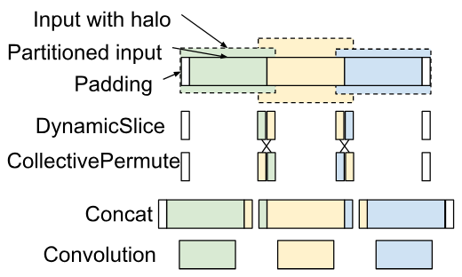

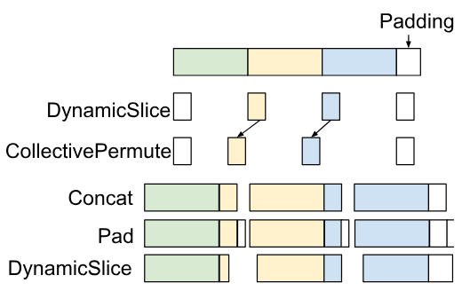

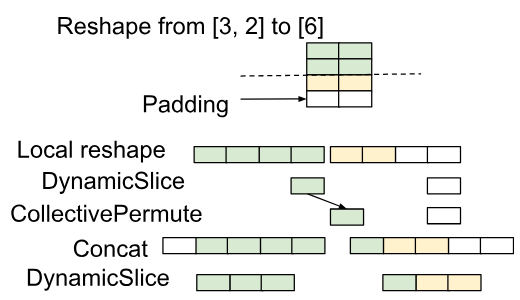

**图 5.** 光环交换示例.

Halo 交换最典型的使用场景是用于基于窗口的操作符的分区 (例如卷积, ReduceWindow), 因为相邻的分区可能需要重叠的输入数据 ([图 5a](#figure-05)). 在实践中, 这些操作符的 halo 交换通常需要与适当的填充, 切片和掩码结合使用, 这是由于窗口配置的高级用法 (扩张, 步幅和填充) 以及不均匀的 halo 大小. 我们在附录[A. 4](#A1.SS4) 中描述了各种场景.

Halo 交换的另一个用途是用于改变形状大小的数据格式化操作符. 例如, 在 Slice 或 Pad 操作符之后, 张量的形状会发生变化, 分区之间的边界也会随之改变. 这就要求我们重新对不同分区上的数据进行对齐, 这可以作为一种 halo 交换来处理 ([图 5b](#figure-05)).

其他数据格式化算符虽然逻辑上不改变形状大小, 但由于静态形状约束和不均匀划分, 也可能需要光环交换. 例如, 逆向算符会反转张量中元素的顺序, 但如果张量划分不均匀, 我们需要在划分间移动数据以保持填充在逻辑上位于结果张量的右侧. 另一个例子是 Reshape. 考虑将一个张量从 \[3, 2\] 重塑到 \[6\], 其中输入在第一维上以两种方式不均匀划分 (划分形状 \[2, 2\]), 输出也以两种方式划分 (划分形状 \[3\]). 由于不均匀划分, 输入端存在填充, 但 Reshape 后, 输出张量不再有填充; 因此, 光环交换的必要性类似于切片 ([图 5c](#figure-05) ).

##### 编译器优化

SPMD 分区器创建各种数据格式化操作符, 以执行切片, 填充, 串接, 遮罩和光晕交换. 为了解决这个问题, 我们利用 XLA 在 TPU 上的融合功能, 以及代码运动优化以实现切片和填充, 以在很大程度上隐藏数据格式化的开销. 因此, 运行时间开销通常可以忽略不计, 即使是在大量使用掩蔽和填充的卷积网络中.

## 4 大规模多语言, 大规模机器翻译 (M4)

### 4.1 多语言翻译

我们选择了多语言神经机器翻译 (MT) [Multiw16, Dec17, CoRR03] 来验证我们使用 GShard 进行高效训练的设计. 多语言 MT, 本质上是一个多任务学习问题, 旨在构建一个神经网络, 用于同时翻译多种语言对. 这扩展了我们关于 [Systed19, Findin19, Xivp17] 的工作方向, 走向通用机器翻译模型 [Exploc19], 即一个可以在所有领域实现一百多种语言互译的单一模型. 这类大规模多语言翻译模型不仅便于在大规模下进行模型压力测试, 而且已被证明在现实生产系统中具有实际影响 [Recent20].

在大规模多语言机器翻译中, 有两个标准用来衡量模型质量的成功与否: 1) 在拥有大量训练数据的语言 (高资源语言) 上取得的改进, 以及 2) 在数据有限的语言 (低资源语言) 上的改进. 随着单一翻译模型中需要建模的语言对 (任务) 数量增加, 正向语言迁移 [Person88] 开始为低资源语言带来显著提升. 考虑到所涉及的语言数量, M4 在提升低资源任务上具有明显优势. 相反, 对于高资源语言, 任务数量的增加限制了模型中每个任务的容量, 导致翻译质量低于仅训练单一语言对的模型. 通过将模型规模扩大到大规模以满足额外容量需求, 可缓解高资源语言的这种容量瓶颈 [Findin19, Systed19].

大规模多语言, 因此大规模机器翻译旨在在通过大规模多语言性增加正迁移与通过大规模扩展缓解容量瓶颈之间取得平衡. 在这样做的过程中, 模型规模和考虑的语言数量必须与便捷的神经网络架构相结合. 为了增强正迁移并减少负迁移 [+6], 人们可以自然地设计一种在语言之间共享组件 (共享子网络) 的模型架构, 同时包含一些语言特有的组件 (非共享, 语言特定的子网络). 然而, 随着语言数量的增加, 模型设计中的搜索空间 (决定共享什么) 会迅速增长, 使基于启发式的合适架构搜索变得不切实际. 因此, 基于从数据中学习神经网络连线模式的方法作为一种可扩展且实用的前进方式的需求应运而生.

在本节中, 我们讨论了条件计算 [Estima13, Lowran13] 如何通过稀疏门控的专家混合 [Xivp17] 符合上述详细的期望, 并通过将神经机器翻译模型扩展到超过 1 万亿参数来展示其有效性, 同时保持如此庞大网络的训练时间在可行范围内. 例如, 一个用于 M4 的 600B GShard 模型可以在不到 4 天的时间内, 通过 25 万次训练步骤处理 1 万亿个标记 [+7]. 我们通过向模型中添加越来越多的专家来实验提高模型容量, 并研究对收敛性, 模型质量和训练效率起作用的因素. 另外, 我们展示了条件计算如何加速训练 [Condit15], 以及如何通过网络稀疏地对每个标记进行门控/路由, 可在没有任何任务或语言相关性先验知识的情况下高效学习, 展示了从数据中直接学习路由决策的能力.

### 4.2 数据集与基线

随着模型逐步增大以获得更高质量的前提, 首先需要大量的训练数据 [Xivb01]. 继先前关于多语言机器翻译密集扩展的工作 [Systed19, Findin19], 我们致力于现实环境下的机器翻译测试, 并使用了网络规模的内部数据集. 从网络中挖掘的训练语料 [USA10] 包含 100 种语言的平行文档, 包括与英语互译, 总计 250 亿个训练示例. 训练集的一些特征值得一提. 由于从网络挖掘而来, 联合语料相当嘈杂, 同时覆盖了多样的领域和语言. 如此大范围的覆盖也带来了语言之间训练示例数量的严重不平衡. 这种不平衡遵循明显的幂律, 从高资源语言的数十亿示例到低资源语言的数万个示例不等. 虽然上述特征给我们的研究带来了挑战, 但也使整体尝试尽可能现实. 我们建议读者参阅 [Systed19, Findin19] 以获取所使用数据集的更多详细信息.

我们专注于提高从所有 100 种语言到英语的翻译质量 (以 BLEU 分数 [Lingui02] 衡量). 这导致大约有 130 亿个训练样本用于模型训练 [+8]. 为了建立我们的基线, 我们为每个语言对训练了单独的双语神经机器翻译模型 (例如, 德语到英语的单个模型), 并根据每种语言可用的训练数据进行调优 [+9]. 我们不显示每个语言对的单独 BLEU 分数, 而是遵循将基线沿 $x$ 轴放置在零点的惯例, 并报告使用 GShard 训练的每个大规模多语言模型的 $\Delta$ BLEU 趋势线 (见 [图 6](#figure-06)). [图 6](#figure-06) 中的 $x$ 轴从左到右按可用训练数据量递减排序, 其中最左侧对应高资源语言, 最右侧对应低资源语言. 重申一下, 我们在通用机器翻译方面的最终目标是使单个多语言模型的 $\Delta$ BLEU 趋势线超过所有所考虑语言的基线. 我们还包括了一个密集 96 层 Transformer 编码器- 解码器网络 T(96L) 的变体, 使用 GPipe 流水线并行在相同的数据集上训练, 作为另一条基线 ([图 6](#figure-06) 中的虚线趋势线). 训练收敛超过 6 周, 使用 2048 个 TPU v3 核心 [+10], 性能优于最初的 GPipe T(128L) [+11] [Systed19], 并且是我们比较中使用的最强单一密集模型基线.

### 4.3 稀疏门控 MoE Transformer: 模型与训练

Transformer 架构的扩展近年来一直是一个探索性的研究方向 [Traini18, Inters19, Lingui19]. 一般而言, 新兴方法通过堆叠越来越多的层来扩展 Transformer [Traini18, Systed19], 扩大网络的主要维度 (即模型维度, 隐藏维度或注意力头数) [Xivm18, Explob19], 并且最近通过架构搜索学习网络连接结构 [The19] [+12]. 对于大规模多语言机器翻译, [Systed19] 展示了使用 GPipe 流水线并行扩展 Transformer 的最佳实践; 其中, 一个包含 128 层, 60 亿参数的 Transformer 模型被证明在提升高资源语言的性能方面有效, 同时对低资源语言表现出最高的正迁移. 虽然非常有前景, 并且满足我们对通用翻译的期望, 但 Transformer 架构的密集扩展在实际操作中存在限制, 这些限制在第 [1](#S1) 节中训练效率部分有所提及.

我们以实际的训练时间为目标, 并寻求能够保证训练效率的架构. 我们的策略有三个支柱; 通过堆叠更多层来增加网络深度, 类似于 GPipe [Systed19], 通过引入多个前馈网络 (专家) 的副本来增加网络宽度, 如第 [2.2](#S2.SS2) 节所述, 并利用学习到的路由模块将 token (稀疏地) 分配给专家, 如第 [2.1](#S2.SS1) 节所述. 通过这三大组成部分, 我们获得了一种易于扩展, 高效训练且表达能力强的架构, 我们称之为稀疏门控专家混合 Transformer, 简称 MoE Transformer.

##### 模型细节

详细说明模型细节, 每个专家被设计成具有与常规 Transformer 前馈网络相同的形状, 并且专家 (MoE 层) 在每隔一个 Transformer 层分配一次. 为了简便, 我们将训练所使用的设备数量与每个 MoE 层的专家数量绑定在一起, 尽管这不是必需的. 在训练过程中, 我们对模型权重和激活都使用 float32 以确保训练稳定性. 我们还用 MoE(2048E, 60L) 和 bfloat16 [Tensor20] 激活进行了额外的可扩展性实验, 总共有 1 万亿个模型权重. 虽然通过仔细和手动诊断可以进行训练, 但对于深度 1 万亿模型, 我们遇到了一些数值稳定性的可训练性问题, 因此为了可重复性, 未包含这些结果. 更多模型和训练细节, 请参见附录 [A. 2](#A1.SS2).

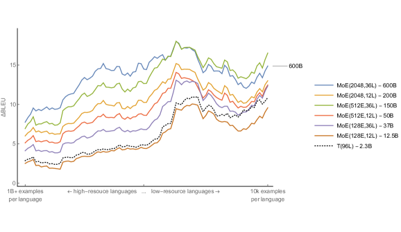

**图 6.** 使用 GShard 训练的多语言 MoE Transformer 模型与单语言基线的翻译质量比较. $x$ 轴上的位置表示语言, 从高资源到低资源. $\Delta$BLEU 表示单个多语言模型相比于针对特定语言训练和调优的单语言 Transformer 模型的质量提升. 使用 GShard 训练的 MoE Transformer 模型以实线趋势线表示. 虚线趋势线表示在相同数据集上用 GPipe 训练的单个 96 层多语言 Transformer 模型 T(96L). 为了清晰, 每条趋势线用了 10 的滑动窗口进行平滑处理. (彩色效果最佳)

### 4.4 结果

在深入讨论训练效率的细节之前, 我们首先调查了各种设计选择对构建 MoE Transformer 的影响. 为了剪枝搜索空间, 我们探索了两个变量的变化, 即 Transformer 编码器- 解码器堆栈中的层数 (L) 和每隔一个 MoE 层使用的专家总数 (E). 对于深度, 我们测试了三种不同的选项: 12 层 (原始 Transformer 深度, 包括 6 个编码器层和 6 个解码器层) , 36 层和 60 层. 对于每隔一层替换的前馈层专家数量, 我们也测试了三个选项, 即 128, 512 和 2048 个专家. 请注意, 用于训练的设备数量固定等于每层专家的数量, 分别使用 128, 512 和 2048 个核心, 而不考虑实验中的深度. 另外, 请参见[表 1](#table-01) 中有关模型配置的详细描述.

对于每个实验 ([表 1](#table-01) 的行), 我们训练相应的 MoE Transformer 模型, 直到模型看到 1 万亿 ($10^{12}$) 个标记. 此时的模型检查点用于模型评估. 在任何实验中, 我们都没有观察到过拟合的模式. 相反, 我们观察到如果继续训练, 训练损失会继续改善. 我们评估了模型在保留测试集上的所有语言对所达到的 BLEU 分数. [图 6](#figure-06) 报告了我们所有的结果.

在这里, 我们为每个实验分享定性分析, 并讨论每种设置对高资源和低资源语言的影响, 以跟踪我们朝着通用翻译的进展. 为了为即将到来的分析奠定基础, 有必要重申基础质量提升的预期行为. 为了在单个模型中同时提高高资源和低资源语言的质量, 扩展模型必须通过为高资源任务分配足够的容量来缓解容量瓶颈问题, 同时通过促进充分的参数共享来增强对低资源任务的正向迁移. 我们大致将此类系统的预期学习动态与长期存在的记忆与泛化困境相关联, 该困境最近沿着宽度与深度扩展的方向进行了研究 [DLRS16]. 我们不仅期望我们的模型在保留的测试集上能够更好地泛化, 还期望它们在不同语言间表现出较高的迁移能力, 作为泛化性能的另一种体现 [Gangul18].

|编号|模型|Experts Per 层|专家  total|TPU v3 Cores|Enc Dec layers|权重|
| --- | --- | --- | --- | --- | --- | --- |
| (1)|MoE(2048E, 36L)|2048|36684|2048|36|600B|
| (2)|MoE(2048E, 12L)|2048|12228|2048|12|200B|
| (3)|MoE(512E, 36L)|512|9216|512|36|150B|
| (4)|MoE(512E, 12L)|512|3072|512|12|50B|
| (5)|MoE(128E, 36L)|128|2304|128|36|37B|
| (6)|MoE(128E, 12L)|128|768|128|12|12.5B|
|*|MoE(2048E, 60L)|2048|61440|2048|60|1T|

**表 1.** MoE Transformer 模型家族. 为了达到所需的容量, 我们 i) 通过堆叠更多层来增加深度, ii) 通过扩展每层 MoE 的专家数量以及用于训练的核心数量来增加网络宽度.

##### 更深的模型在各领域带来一致的质量提升

我们首先研究模型深度与高资源语言和低资源语言模型质量之间的关系. 为了测试泛化性能, 我们进行了三种不同的实验, 同时保持每层的专家数量不变. 对于每次实验每层专家数量增加 (128, 512 和 2048), 我们将每个专家规模的网络深度从 12 层增加到 36 层. 这产生了三组, 其中每层专家数固定, 但每组内深度增加了三倍:

对于[图 6](#figure-06) 中展示的每种配置, 我们观察到, 在保持每层专家数量 (E) 固定的情况下, 增加深度 (L) 会为低资源和高资源语言带来一致的提升 (沿 $y$ 轴向向上 $\Delta$ 移动), 几乎每次将深度从 12L 扩展到 36L 时都有一个恒定的加成因素 (平均增加 2 到 3 个 BLEU, 如[表 3](#table-03) 最后一列所示).

##### 放宽容量瓶颈带来显著的质量提升

在第 [4.1](#S4.SS1) 节中, 我们强调了容量瓶颈对任务干扰的影响, 导致质量下降, 尤其是对资源丰富的语言. 之后, 我们通过增加每层专家的数量缓解了这一复杂问题, 这反过来又导致所研究模型的参数 (权重) 数量显著增加. 在这里, 我们研究了这种所谓的容量瓶颈是否可以明显观察到, 并探索在放宽该瓶颈后对模型质量和效率的影响. 为此, 我们首先考虑三个具有相同深度 (12 层) 的模型, 每层专家数量逐渐增加: 128, 512 和 2048. 当我们将每层专家数量从 128 增加到 512 (增加四倍) 时, 我们注意到模型质量有大幅提升, 在 100 种语言上的平均 BLEU 分数提高了 3.3. 然而, 当我们再次将每层专家数量从 512 增加到 2048 (增加四倍) 时, 平均 BLEU 分数仅提高 1.3. 尽管质量显著提高, 这种收益下降的情况暗示了收益递减的出现.

推测, 对于特定的参数设置, 语言数量以及我们实验设置中使用的训练数据量, 容量瓶颈预计存在于 128 到 512 个专家之间. 一旦瓶颈得到缓解, 模型可以逐步增加深度, 这可以通过比较具有 128 个专家的 12 层模型与 36 层模型看出. 有趣的是, 如果容量瓶颈没有得到缓解, 增加深度的效果并不明显.

##### 拥有更多专家可提高质量, 尤其是对于高资源任务

另一个能够揭示多任务模型扩展质量提升原因的维度是高资源语言和低资源语言改进的对比. 如前所述, 低资源语言受益于迁移, 而高资源语言则需要额外的容量. 接下来我们将研究在固定深度的情况下, 每层增加专家数量的影响.

如[图 6](#figure-06) 所示, 对于 12 层模型, 增加专家数量对高资源语言的提升更大, 而对低资源语言的回报递减现象则先前已被揭示. 类似的模式也在 36 层模型中观察到. 虽然增加更多专家可以缓解容量瓶颈, 但同时由于共享子网络减少, 使得迁移量也减少.

##### 深度稠密模型在向低资源任务的正迁移方面表现更好

最后, 我们考察了深度对低资源任务的影响, 作为我们之前实验的一个松散推论. 为此, 我们在分析中加入了一个使用 GPipe 在相同数据上训练的 96 层稠密模型 T(96L). 我们将 T(96L) 与浅层 MoE(128E, 12L) 模型进行比较. 对于大多数高到中等资源语言, 两种模型之间的差距几乎保持不变, 而当进入低资源环境时, 这一差距开始向稠密深层 T(96L) 模型倾斜. 根据我们之前的论述, 随着跨任务共享子网络的比例增加 (T(96L) 为 100%), 传递带宽最大化, 从而相对于其浅层对应模型表现出更好的质量. 同时注意, MoE(36E, 128L) 也可以实现对低资源语言的相同传递质量, 其参数量为 370 亿.

我们推测, 增加深度可能会潜在地增强对低资源任务的迁移效果, 从而在这一轴上有更好的泛化能力. 但我们也想强调, 对比中的模型在训练资源需求上存在不均衡. 我们再次想强调训练效率的重要性, 这正是我们接下来研究的主题.

### 4.5 训练效率

在本节中, 我们将关注 MoE Transformer 模型的训练效率. 到目前为止, 我们已经看到了在不同维度上扩展模型如何带来显著质量提升的实证证据, 并且研究了影响改进程度的因素. 为了衡量训练效率, 我们首先跟踪处理到达到特定训练损失所需的令牌数量, 其次跟踪模型处理特定数量令牌所需的实际时间. 请注意, 我们关注的是训练时间和训练损失 [+13], 同时变化其他因素, 而不是上节分析的测试误差.

##### 更深的模型样本效率更高, 用更少的样本收敛更快

已经证明, 更深的模型在样本效率方面更优, 在相同数量的训练样本下能够获得更好的训练/测试误差 [Systed19, Xivb09], 这通常归因于过参数化的加速效果 [Xivk18]. 我们通过使用 GShard 的 MoE Transformers 再次实证测试该假设, 并分享这些不仅深層且稀疏激活模型的权衡.

为此目的, 我们比较了每个模型在达到预设训练损失时处理的令牌数量. 从 [表 2](#table-02) 中观察到的一般趋势是, 深度增加三倍的 MoE Transformer 模型需要的令牌数量比达到预设训练损失阈值的令牌数量少 2 到 3 倍. 例如, MoE(128E, 12L) 达到 0.7 的训练交叉熵所需的令牌数量是 MoE(128E, 36L) 的 3 倍, (6) 对比 (5). 对于具有 512 和 2048 个专家的模型, 我们也观察到类似的趋势, (4) 对比 (3) 以及 (2) 对比 (1).

|编号|模型|核心数|十亿个标记到   交叉熵|||
| --- | --- | --- | --- | --- | --- |
|0.7|0.6|0.5||||
| (1)|MoE(2048E, 36L)|2048|82|175|542|
| (2)|MoE(2048E, 12L)|2048|176|484|1780|
| (3)|MoE(512E, 36L)|512|66|170|567 年|
| (4)|MoE(512E, 12L)|512|141|486 年|-|
| (5)|MoE(128E, 36L)|128|321|1074 年|-|
| (6)|MoE(128E, 12L)|128|995 年|-|-|

**表 2.** 模型在训练过程中观察到的代币数量, 达到了三种不同的交叉熵损失. 一个普遍趋势是, 深度模型比同类浅模型更高效且收敛更快.

从 [表 2](#table-02) 中的另一个有趣观察同样与容量瓶颈的存在有关. 比较深度相同的模型, (5) ,  (3) 和 (1), 我们注意到当专家数量从 128 增加到 512 时, 达到训练损失 0.7 所需的令牌数量显著下降. 实际上, 这正是我们观察到容量瓶颈所在的位置, 符合第 [4.4 节](#S4.SS4.SSS0.Px2) 的假设. 在这一相位变化之后, 容量充足的模型倾向于表现出类似的样本效率特征, 如模型 (3) 和 (1) 所示.

##### 最大模型 (600B) 可以在 4 天内完成训练, 并达到最佳质量

接下来我们具体分析模型规模与训练所用实际时间之间的相互关系. 我们监控使用的 TPU 核心数量, 每秒训练步数, 每批次的总 token 数, TPU 核心年 [+14], 以及实际训练所用的天数 (请参见 [表 3](#table-03) 的各列).

我们首先研究我们训练的最大模型之一, MoE(2048E, 36L), 拥有 6000 亿参数, 模型编号为 (1). 使用 2048 个 TPU 核心训练 4 天后, 该模型在平均 BLEU 方面达到了最佳翻译质量, 但训练总共耗费了 22.4 TPU 年. 虽然我们在扩大模型规模时尚未看到质量提升的趋于平稳的迹象, 但我们仍然致力于寻找具有成本效益的扩展解决方案.

[表 3](#table-03) 的结果再次验证了条件计算的扩展相比于密集扩展更加实用. 对于 (1) 所使用的相同 TPU 核心数, 即密集扩展版本 T(96L), 训练时间似乎是其十倍以上 (235 个 TPU 核心年), 同时在模型质量方面落后于使用 GShard 训练的模型.

|编号|模型|核心数|步数   每秒|批量大小   (标记)|TPU 核心   年|训练   时间 (天)|BLEU   平均值|
| --- | --- | --- | --- | --- | --- | --- | --- |
| (1)|MoE(2048E, 36L)|2048|0.72|400 万|22.4|4.0|44.3|
| (2)|MoE(2048E, 12L)|2048|2.15|400 万|7.5|1.4|41.3|
| (3)|MoE(512E, 36L)|512|1.05|100 万|15.5|11.0|43.7|
| (4)|MoE(512E, 12L)|512|3.28|100 万|4.9|3.5|40.0|
| (5)|MoE(128E, 36L)|128|0.67|100 万|6.1|17.3|39.0|
| (6)|MoE(128E, 12L)|128|2.16|100 万|1.9|5.4|36.7|
|*|T(96L)|2048|-|400 万|$\sim$235.5|$\sim$42|36.9|

**表 3.** 不同专家数量和层数的 MoE 模型性能.

在本节中, 我们对多语言机器翻译 (尤其是 M4) 中的 MoE Transformer 应用进行了 GShard 的基准测试. 我们确定了影响最终结果的变量, 例如容量瓶颈, 正迁移和训练效率, 并提供了实验结果以揭示它们之间的相互作用. 接下来我们将具体分析 GShard 的性能, 包括内存和运行时效率以及通信基准.

## 5 性能和内存消耗

本节讨论 GShard 在 TPU 平台上如何实现计算和内存效率. 我们的测量和分析表明, 当增加设备和专家的数量时, 设备内存消耗大致保持不变, 而步长时间呈亚线性增长, 即当我们将模型从 128 个设备扩展到 2048 个设备, 模型规模增加 16 倍时, 执行时间仅增加 1.7 倍. 我们还提供了各种分区操作的微基准测试和分析, 这可以指导超出本文的使用案例.

### 5.1 内存效率与可扩展性

在 GShard 模型中, 主要有三类内存使用, 在 SPMD 分区后, 当专家数量增加时, 每个设备的大小保持不变.

- •

复制权重 (例如 Transformer 前馈层).

- •

分布式权重 (MoE 前馈层 [+15]).

- •

激活 (每一层的输出, 用于前向和反向传播).

$O(1)$ 内存扩展如 [图 7](#figure-07) 所示, 显示了不同模型的每设备内存使用分布. 在固定层数的情况下, 随着专家数量增加, 权重内存和激活内存保持不变.

另一方面, 权重内存和激活内存都会随着层数线性增长. 当内存需求超过每个设备的可用内存时, 基于编译器的重新计算将自动在反向传播中重新计算部分激活, 以减少峰值激活内存. 这就是为什么 MoE(2048E, 60L) 的激活大小小于 MoE(2048E, 36L). 重新计算的开销也经过优化, 例如, 36L 和 60L 模型重新计算分别只占总计算周期的 28% 和 34%, 而 12L 和 24L 模型则为 0%, 因为它们在设备内存中无需重新计算.

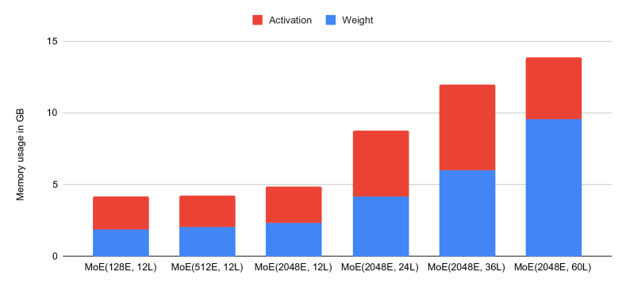

**图 7.** 每设备内存消耗 (GB).

### 5.2 运行时效率与可扩展性

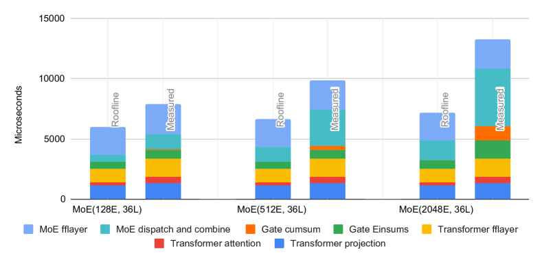

**图 8.** 测量执行时间与理论上限的对比. 仅显示前向传播, 反向传播具有类似分解. “MoE 分发与合并”表示 AllToAll 的跨分区通信.

[图 8](#figure-08) 显示了 MoE 层及其相邻 Transformer 层的执行时间分解. 它还将实现的性能与理论峰值线进行对比, 该峰值线的估算假设计算受限, 内存受限或通信受限的操作可以达到峰值 FLOPS, 内存带宽或互连带宽的 100%. 这是一个非常乐观的估计, 因为许多操作器受多种资源的混合限制. 在较小规模 (128 个专家) 下, 我们的模型可以达到理论峰值性能的 >70%. 当我们将模型扩展到 16 倍更大 (2048 个专家) 时, 设备时间增加 1.7 倍, 但仍可以达到理论峰值性能的 48%.

在分析性能可扩展性之前, 我们回顾一下相关张量维度的规模扩展, 如第 [3.1 節](#S3.SS1) 所讨论的内容. 使用 $D$ 设备时, 专家数量 $E$ 和组数 $G$ 都设置为 $O(D)$. 每组专家的分数容量 $C$ 设置为 $O(1/D)$. 该设置不能无限扩展, 因为 $C$ 至少需要为 1, 但它足以扩展到数千个专家.

##### Transformer 层和 MoE 前馈层

这些是模型中的密集部分, 旨在实现 TPU 的峰值利用率. 在每个设备上, 当我们扩展到更多专家时, 这些计算也具有恒定成本. 前馈层和 Transformer 投影主要是大型矩阵乘法, 能够很好地利用 TPU 的矩阵单元. 在我们的实验中, 这些操作实现了超过 85% 的峰值 FLOPS. 注意力操作主要由批量矩阵乘法组成, 当序列长度较短时, 这些操作受限于内存带宽. 因此, 在我们的实验中, 注意力操作只实现了超过 30% 的峰值 FLOPS.

##### 门控计算

在 [图 8](#figure-08) 中, “Gate Einsum” 表示算法 [2](#alg2) 中的前两个和最后一个 Einsum. 第一个 Einsum 是计算每个专家输入到 softmax 的投影. 它有一个 $O(D)$ 成本, 但在层中所占比例非常小. 其他两个 Einsum 是分配 token 和合并专家结果. 它们有效地使用一热矩阵实现 Gather, 这更昂贵, 但具有与专家数量无关的恒定 $O(\mathrm{GC})=O(1)$ 成本. 当我们将专家数量从 128 扩展到 2048 (16 倍) 时, 这些 Einsum 的执行时间增加约 2 倍.

剩余的每设备门控计算涉及许多通用计算, 如 ArgMax 和 Cumsum, 这些计算要么受内存限制, 要么本质上是顺序的, 因此设计上并不适合利用 TPU. 大部分时间花费在顺序 Cumsum 操作上, 用于将表示每个 token 所选专家的一热矩阵转换为表示每个专家所选 token 的一热矩阵. Cumsum 的线性复杂度在 [图 8](#figure-08) 中进行了展示. 门控计算的这部分也有 $O(D)$ 的成本, 但幸运的是, 与 softmax 之前的 Einsum 类似, 其常数因子非常小. 在 128 个专家的情况下, 其执行时间可以忽略不计, 而在 2048 个专家的 MoE 和 Transformer 层中, 占总时间的不到 10%.

门控最重要的部分是通信, 如 [图 8](#figure-08) 中的“MoE 分发和合并”所示. 这些是 AllToAll 操作, 正如我们将在第 [5.3](#S5.SS3) 节讨论的, 它们的成本是 $O(\sqrt{D})$. 当专家数量从 128 增加 16 倍至 2048 时, 执行时间约增加 3.75 倍, 其在 MoE 和 Transformer 中的执行时间比例从 16% 增加到 36%.

### 5.3 通信微基准和每操作符可扩展性

在本节中, 我们测量并分析了基本算子 SPMD 分区器的性能可扩展性, 这可用于指导本文所示 MoE 模型之外的使用情况.

##### 通信原语的性能扩展

MoE 模型中的两个关键集体通信操作是 AllReduce 和 AllToAll. AllReduce 用于累积部分结果, 而 AllToAll 用于重新分片 (第 [3.3.2 节](#S3.SS3.SSS2)). [图 9](#figure-09) 显示了它们在 16 到 2048 个分区中的性能可扩展性. TPU 上的 AllReduce 执行时间与设备数量无关. [图 9](#figure-09) 中的差异是由于每种拓扑的具体情况, 例如它是正方形还是矩形, 以及它是环形还是网格.

另一方面, AllToAll 随着分区数量的增加而变得更昂贵, 但呈亚线性增长. 在我们的二维 TPU 集群上, AllToAll 的成本大约是 $O(\sqrt{D})$, 其中 $D$ 是分区数量. 这是因为每个分区发送的固定数据量 (在 [图 9](#figure-09) 中为 8MB 或 32MB) 下, 所有分区发送的总数据量为 $d=O(D)$. 同时, 每个数据块平均需要经过 $h=O(\sqrt{D})$ 个跳数, 并且网络中总共有 $l=O(D)$ 个设备间链接. 因此, 如果带宽受限, AllToAll 的执行时间是

$$
t=\frac{\mathrm{dh}}{l}=O(\frac{D\sqrt{D}}{D})=O(\sqrt{D}).
$$

即使受到延迟限制, 执行时间仍然是 $O(h)=O(\sqrt{D})$. 比较 2048 个分区和 16 个分区, 虽然 $D$ 增长了 128 倍, 但 AllToAll 的执行时间只增加了 9 倍. 这使我们能够使用重新分片来高效实现跨分区调度 ([图 4a](#figure-04)).

AllGather 和 CollectivePermute 更容易分析. AllGather 的输出比输入大 $D$, 如果我们固定输入大小, 则其通信成本为 $O(D)$. CollectivePermute 具有一对一的通信模式, 在源- 目的配对较近的合理设备排列下, 其成本在固定输入大小下为 $O(1)$.

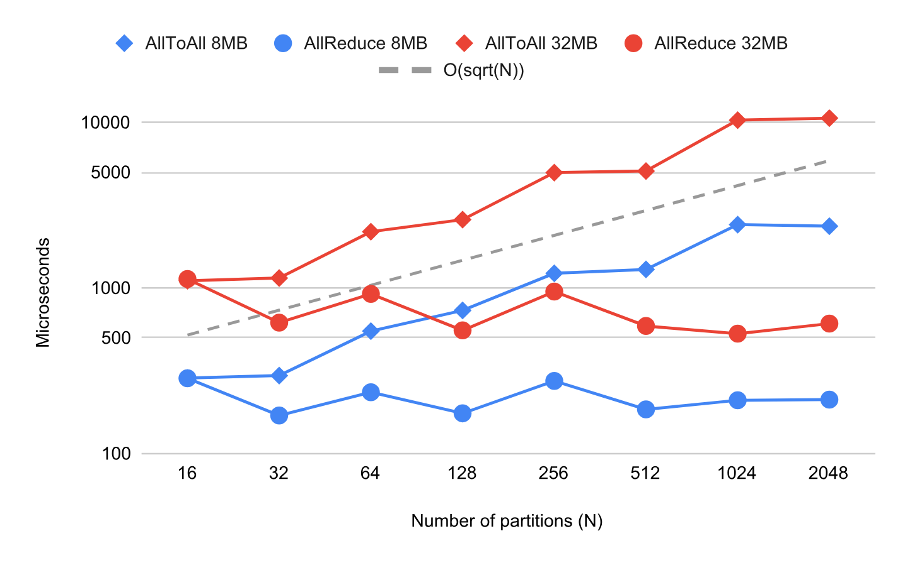

**图 9.** 通信, AllReduce 和 AllToAll 的性能扩展. 两轴均为对数刻度. AllReduce 成本大约为 $O(1)$, AllToAll 成本大约为 $O(\sqrt{D})$, 其中 $D$ 是分区数量. 我们使用 8MB 和 32MB 数据来测量它们的性能. 对于 AllToAll, 这意味着每个分区最初有 8MB (或 32MB) 数据, 然后将其分成 $D$ 份, 并将每份发送到不同的接收分区.

||$O(D)$|总计|每分区||
| --- | --- | --- | --- | --- |
||维度|计算|计算|通信|
|加 (A, A->A)|A|$O(D)$|$O(1)$|0|
|矩阵乘 (AB, BC->AC)|B|$O(D)$|$O(1)$|$O(1)$ AR|
|矩阵乘 (AB, BC->AC)|A|$O(D)$|$O(1)$|0|
|矩阵乘 (AB, BC->AC)|A, B|$O(D^{2})$|$O(D)$|$O(D)$ AG 或 CP|
|矩阵乘 (AB, BC->AC)|A, C|$O(D^{2})$|$O(D)$|$O(D)$ AG 或 CP|
|归约 (AB->A)|A|$O(D)$|$O(1)$|0|
|归约 (AB->B)|A|$O(D)$|$O(1)$|$O(1)$ AR|
|Einsum(GSEC, GSM->EGCM)|G, E *|$O(D)$|$O(1)$|$O(\sqrt{D})$ AA|
|卷积(BIXY, xyIO->BOXY)|X **|$O(D)$|$O(1)$|$O(1)$ CP|

**表 4.** 分区操作的可扩展性. 通信原语缩写: AR: 全归约(AllReduce), AG: 全汇集(AllGather), CP: 集体置换(CollectivePermute), AA: 全到全(AllToAll). *这是我们模型中的 Einsum 分发, 其中我们将 C 设置为 $O(1/D)$.** I/O 是输入/输出特征维度, B 是批次维度, X/Y 是输入空间维度, x/y 是卷积核空间维度.

##### 分区操作的可扩展性

我们在 [表 4](#table-04) 中总结了使用 GShard 的常见操作的性能可扩展性. 它包含了第 [3.3.2 节](#S3.SS3.SSS2) 中的 Einsum/Matmul 示例, 以及其他常见操作, 如卷积和归约. 该表包括每个分区的本地计算, 以及基于我们上述分析所需的通信.

[表 4](#table-04) 中的大多数操作在计算和通信方面均具有亚线性可扩展性, 这与我们对 MoE 模型的性能测量一致. $O(1)$ 空间分区卷积的可扩展性也展示了 GShard 在图像分区方面的效率 (附录 [A. 4](#A1.SS4)).

然而, [表 4](#table-04) 中的最后两个 Matmul 运算符具有 $O(D)$ 的每分区计算和通信的缩放, 其中它们在操作数上具有不匹配的分片. 这并不是由于分区算法效率低下, 而是因为完整运算符中的总计算量非常大 ($O(D^{2})$). 对于这些情况, 可以使用不同的分区策略, 从而产生不同的通信原语: 复制一个操作数将导致 AllGather (要求被复制的操作数能适应设备内存), 而在循环中切分 ([图 4c](#figure-04)) 将导致 CollectivePermute.

## 6 相关工作

神经网络 深度学习模型在推动人工智能的子领域方面非常成功. 多年来, 多个领域不断报告使用各种模型架构在计算机视觉任务 [Advanc12, IEEE15, IEEEd16], 自然语言理解任务 [Advanc14, Xivi14, Xivm16], 语音识别和合成任务 [Signal12, Listen16, Stateo18, Xivn16, Natura18] 上的新最先进结果. 最近, 基于注意力的 Transformer 模型进一步推进了这些领域的最先进水平 [Attent17, Xivm18].

模型扩展 既有学术研究也有工业应用观察到, 在足够大的数据集和复杂任务下, 更大的神经网络通常表现更好. 在单一模型系列中, 仅仅将网络加宽或加深通常会在经验上提升模型质量. 例如, 更深的 ResNet 表现更好 [Spring16], 更大的 Transformer 模型获得了更好的翻译质量 [Attent17], 具有更大词汇量, 嵌入或特征组合的模型表现也更好 [Findin19, Unsupe19]. 在不同模型系列中, 也观察到更大的模型具有更大的模型容量不仅能更好地拟合训练数据, 而且在测试时泛化能力也更强 [Unders17, Explor17, Systed19]. 这一观察促使了许多研究努力, 旨在构建比通常用于深度学习研究模型或生产模型的神经网络更大的模型. Shazeer 等人表明, 使用专家混合层的 690 亿参数循环语言模型在一亿词 (LM1B) 基准测试中实现了更低的测试困惑度 [Xivp17]. Brown 等人表明, 一个非稀疏的 1750 亿参数模型能够在多个下游 NLP 任务中表现出高度准确的少量样本性能.

硬件神经网络需要大量计算能力. 为了解决这一需求, 专门用于神经网络训练和推理的硬件 (芯片和联网机器) 可以追溯到 25 年前 [VLSI96]. 自 2000 年代末以来, 研究人员开始利用 GPU 来加速神经网络 [Larges09, Advanc12, Neural10]. 最近, 业界也投入大量资金构建更专门的硬件系统, 以追求更具成本效益的神经网络硬件 [Archit17]. 由于神经网络的核心计算 (各种形式的乘加运算: 卷积, 矩阵乘法, einsum) 是高度可并行化的数值计算, 这些芯片配备了大量浮点处理单元 (FPU). 因此, 这些专门设计的硬件的计算能力显著增长. 据报道, GPU 的每浮点运算价格在过去 4 年下降了十倍 [Ref19], 而每瓦特浮点运算数在过去 12 年增加了 2 个数量级 [Xiv11]. 广泛可用的低成本计算能力是神经网络成功的一个主要推动因素.

软件 支持神经网络的软件系统随着底层硬件的进步而发展 [Advana12, Xiv12, OSDId16, Automd17]. 虽然加速器是高度并行的计算机器, 但直接编程它们要困难得多. 框架使构建神经网络变得更容易, 并抽象掉了许多针对硬件的具体细节. 它们又依赖于较低级的库来高效驱动特殊硬件 (加速器). 例如, 针对 Nvidia GPU 的 CUDA [Queue08], 或针对 Google TPU 的 XLA [Tensor19]. 这些较低级的库对于在这些特殊硬件上实现高效性能至关重要.

模型训练和推理中的并行性 现代神经网络在训练和推理过程中广泛使用集群机器, 每台机器都配备了多个加速器. 数据并行 [Advanc12] 是最常用的方法, 并且被主要框架支持 (TensorFlow [OSDId16], PyTorch [Automc17], JAX [NumPy18, MLSys18]), 其中设备运行相同的程序但使用不同的输入数据, 并在权重更新之前合并各自的本地梯度. 另一方面, 模型并行将计算划分超出输入批次, 这对于构建非常大的模型是必要的. 例如, 流水线 [Systed19, Xivn18] 将大模型的层划分为多个阶段, 而算子级划分 [Systeb18, Altoa19] 则将单个算子划分为更小的并行算子. GShard 使用了一种算子级划分来将我们的模型扩展到大量并行专家中.

自动并行 由于在分布式异构环境中编程具有挑战性, 尤其是对于高水平从业者来说, 深度学习框架试图减轻用户在指定分布式计算方式上的负担. 例如, TensorFlow [OSDId16] 支持数据并行, 并通过每节点设备分配进行图划分的基本模型并行. Mesh TensorFlow [Systeb18] 通过在 TensorFlow 之上的 Python 库中重写计算, 帮助用户构建具有 SPMD 风格的每操作划分的大型模型; 相比之下, 我们的方法是在编译器中基于轻量级注释对图进行划分, 而无需用户重写模型. FlexFlow [Altoa19] 使用自动搜索发现图中操作的最佳划分以提升性能; 它主要关注划分策略的确定, 而我们的 SPMD 划分器则关注将标注图转换的机制. 权重更新分片 [Automa20] 是另一种基于 XLA 的自动并行化转换, 主要关注 TPU 集群的性能优化, 从概念上可以看作是 GShard 的特例. Zero [Xiv10] 提出了一系列优化方法, 通过分别划分权重, 激活和优化器状态来减少并行训练设备中的内存冗余, 并能够将模型扩展到 1700 亿参数; 相比之下, GShard 更通用, 因为它不区分这些张量, 所有这些特定的划分技术都可以通过简单地注释相应张量来支持, 使我们能够扩展到超过 1 万亿参数并探索更多设计选择.

条件计算与机器翻译 条件计算 [Condit15, Xivp17, ArXivb10, Contro20] 假设示例应通过激活依赖输入的子网络在网络内部进行路由. 路由取决于 (或条件于) 某些标准, 并且在不失一般性的情况下, 可以是以下任意一种: 示例的估计难度 [Surpri20], 可用的计算预算 [ArXivb10, Contro20], 或者更一般地, 使用稀疏性诱导的专家混合学习的标准 [Xivp17]. 我们扩展了稀疏门控的专家混合模型 [Xivp17], 由于其灵活性以及轻松扩展到最先进的神经序列模型——变换器 (Transformers) [Attent17], 以满足训练效率需求.

## 7 结论

在本文中, 我们介绍了 GShard, 一种自动在大规模上划分计算的深度学习模块. GShard 仅在用户模型代码中需要轻量级的分片注释, 并提供了一个易于使用且灵活的 API, 用于扩展大型神经网络. 我们将 GShard 应用于利用稀疏门控专家混合层 (MoE Transformer) 扩展 Transformer 架构, 并展示了一个 6000 亿参数的多语言神经机器翻译模型可以在 4 天内高效训练, 在使用单一模型将 100 种语言翻译为英语时, 比现有方法实现了更优的性能和质量. 除了远超的翻译质量之外, 使用 GShard 训练的 MoE Transformer 模型在训练效率上也表现出色, 其训练成本为 22 个 TPU v3 核心年, 而训练所有 100 个双语 Transformer 基线模型则需要 29 个 TPU 年. 本文呈现的实证结果证实, 通过利用条件计算扩展模型不仅可以提升实际机器学习应用的质量, 同时在训练中依然具有实用性和样本效率. 我们提出的方法在可扩展性与成本之间提供了良好的权衡, 同时减少了为扩展大型神经网络而依赖模型特定框架或工具的需求. 总体而言, 我们的结果有助于阐明实现神经网络扩展以获得更好模型质量的现实可行途径.

我们从研究中学到了几个经验教训. 我们的结果表明, 逐步扩大神经网络规模会带来持续的质量提升, 这验证了随着模型规模的增加, 质量提升尚未达到顶峰. 虽然本文的结果巩固了模型扩展是深度学习从业者工具箱中必不可少的观点, 但我们也敦促从业者追求训练效率. 为此, 我们确定了影响训练效率的因素, 并展示了它们对下游任务质量的影响. 我们展示了如何使用条件计算构建的神经网络在规模和计算成本之间实现有利的权衡. 在实践中, 这些关键设计决策使我们能够享受到实验周期从几个月或几周缩短到仅几天, 就能训练出数量级达到万亿参数的模型.

另外, 拥有适当的抽象层, 将模型描述与并行实现分离, 使模型开发者能够专注于网络实现, 同时让 GShard 自动划分计算图并生成在所有设备上并行运行的程序. 我们发现, 生成一个足够通用以在所有底层并行设备上表达计算的单一程序, 是可扩展编译的关键. 为不同分区生成多个专用程序的传统方式在扩展到数千个分区时会导致编译时间骤增. 为了解决这种复杂性, 我们基于 SPMD 分片引入了各种编译器改进, 使任何张量维度都可以被分区. 作为经验教训, 我们强调模型扩展性和训练效率应当齐头并进; 当算法改进 (如条件计算) 与易用接口结合时, 可以有效利用大量计算能力.

最后, 我们的实验证据支持这样一点: 单纯的参数数量并不总是与大规模模型的有效容量相关 [Measur18, Effect20]. 模型比较还应考虑问题的性质, 例如像我们案例中那样任务高度多样且训练数据在各任务间严重不平衡, 以及控制影响网络不同操作模式的因素, 例如容量瓶颈与正向迁移.

## 致谢

我们要感谢 Google Brain 和 Translate 团队的有益建议和富有洞察力的讨论, 以及整个 XLA 和 Lingvo 开发团队对该项目的基础性贡献. 特别感谢 Youlong Cheng, Naveen Arivazhagan, Ankur Bapna, Ruoming Pang, Yonghui Wu, Yuan Cao, David Majnemer, James Molloy, Peter Hawkins, Blake Hechtman, Mark Heffernan, Dimitris Vardoulakis, Tamas Berghammer, Marco Cornero, Cong Liu, Tong Shen, Hongjun Choi, Jianwei Xie, Sneha Kudugunta 和 Macduff Hughes.

## 附录 A

### A. 1 使用平板束搜索进行解码

在解码期间, 我们使用类似于 [Xivm16] 的带长度归一化的束搜索. 解码是自回归的, 每次生成目标序列中的一个标记, 因此对于长度为 $m$ 的输出, 解码器层堆栈会被顺序执行 $m$ 次. 特别地, 对于每个解码器 MoE 层, 都存在分发/组合操作, 这需要跨设备通信. 推理使用与训练相同的集群和相同数量的设备.

在束搜索期间, 我们将束假设展平成一个包含所有底层标记交错的单一序列, 并且我们修改了解码器自注意力掩码, 使每个假设只对联合平坦序列中的适当位置进行注意. 我们对每个解码器自注意力层维护的 key/value 张量应用相同的转换. 这使我们能够避免在每次束扩展后重新排序先前计算的注意力 key/values. 相反, 我们只重新排序表示当前活动假设的 $0/1$ 掩码. 然而, 注意力所需时间变为 $k$ 倍.

这种权衡可能是正面的也可能是负面的, 具体取决于实现细节. 如 [Xiva11] 所解释的, 对于 Transformer 模型的增量解码, 内存带宽限制很重要. 从这个角度来看, 通过展平束, 我们用一个稍高计算/内存比率的操作 (对更长序列中更多键进行注意力点积) 替换了两个低计算/内存比率的操作 (注意力点积和 key/value 重排), 但总访问内存量相同.

### A. 2 机器翻译实验细节

在我们的机器翻译实验中, MoE Transformer 模型共享: a) 1024 的 Transformer 模型维度; b) 8192 前馈和 MoE 隐藏层维度; c) 多头注意力中的 16 个头; d) 128 的注意力 key 和 value 维度; 以及 e) 0.1 的输入, 残差和注意力丢弃率.

我们使用了 Adafactor [ArXivb18] 优化器, 其特点包括: a) 二阶矩分解估计; b) 一阶矩衰减 $\beta_{1}=0.0$; c) 二阶矩衰减 $\beta_{2}=0.99$ 并使用 $1-t^{-0.8}$ 调度; d) 更新裁剪阈值为 1.0; e) 学习率为 1.0, 并在 10k 训练步骤后进行平方根衰减.

我们使用 SentencePiece [EMNLP18] 子词分词器, 对于源语言端使用涵盖 102 种语言的单一多语种词汇表, 大小为 64000, 对于仅英文的目标语言端词汇表大小为 32000.

### A. 3 通用分片 API

除了第 [3.2 节](#S3.SS2) 中列出的两种常用分片 API (replicate() 和 split()) 外, 用户或编译器可以使用更高级的分片策略以最小化数据传输.

shard(tensor, device_assignment) 注解张量, 使其根据提供的设备分配进行分区, 并返回已注解的张量. 我们使用设备分配 (一个多维整数数组) 来表示如何进行分割. device_assignment 与数据张量的秩相同; 它的元素数量是分区的总数, 每个元素是占据相应数据切片的设备 ID. 例如, 一个形状为 $[3,16,64]$ 的三维张量, 如果其设备分配形状为 $[1,2,4]$, 将得到分区形状 $[3,8,16]$, 而设备分配中的元素顺序决定每个分区占据的切片.

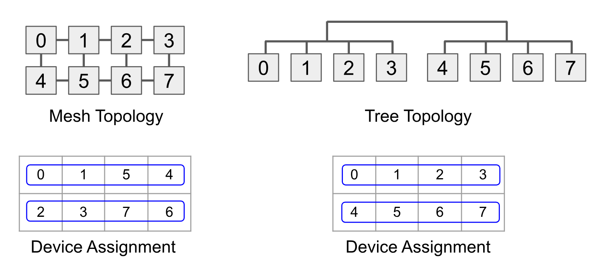

**图 10.** 基于设备拓扑的两种不同设备分配示例. 一个二维张量被分割成 2x4 个分区, 并且通信模式沿张量的行在分区之间进行. 数字表示设备 ID.

由于数据在设备之间的移动会严重影响并行执行的性能, 因此在进行设备分配以实现最大性能时, 考虑目标设备拓扑结构以及张量各分区之间的通信是非常重要的. [图 10](#figure-10) 显示了基于设备拓扑和张量行间通信模式的两种不同设备分配方案.

### A. 4 卷积和基于窗口操作的 SPMD 分区

GShard 能够对卷积中的空间维度进行分区, 并且足够通用, 可以支持像超大图像这样的使用场景 [TPUs19]. 要对卷积层进行空间分片, 我们可以使用以下方式的分片 API.

[⬇](data: text/plain; base64, ICAj 分部输入图像 [N, C, H, W] 沿 W 空间维度
%Highlight% 输入 = split(输入, 3, D) # 复制内核
%Highlight% 内核 = replicate(内核) conv = conv2d(输入, 内核). . .

# 沿着 W 空间维度对输入图像 [N, C, H, W] 进行分区

inputs = split(inputs, 3, D)

# 复制卷积核

kernel \= replicate (kernel)

conv = conv2d(输入, 内核)

. . .

然后 GShard 将把空间维度上的分片传播到其他层和反向传播. 其余部分讨论了对卷积和类似操作进行分区的具体复杂性. 有几种基于窗口的操作 (例如卷积, ReduceWindow), 它们都需要某种类型的边界数据交换, 因为数据可能在窗口之间共享. 我们使用 CollectivePermute 操作在分区之间交换边界数据, 但一个复杂之处在于, 边界大小在不同分区之间可能不同, 而 CollectivePermute 需要静态形状.

我们首先介绍 SPMD 分区器必须考虑的窗口配置. 卷积中的每个空间维度具有以下一组配置.

- •

步幅是窗口移动以生成下一个输出元素的距离 (以元素数量为单位).

- •

低/高填充是左侧 (基底) 维度低端/高端填充的元素数量.

- •

基底膨胀是左侧基底的膨胀因子, 即每个元素之间填充的元素数量加 1 (不包括低/高填充). 没有基底膨胀意味着值设置为 1.

- •

窗口膨胀是右侧 (窗口) 每个元素之间填充的元素数量加 1.

##### 非恒定光环大小.

我们通过一个没有扩张的简单示例展示了非恒定 halo 大小的普遍性. [图 11](#figure-11) 显示了一个四分区卷积, 其中分区的右 halo 大小为 (1, 2, 3, 4), 可以表示为分区 ID 的线性函数: $\mathrm{partition}\_\mathrm{id}+1$. 分区 1 负责生成 2 个输出元素 (红色单元格), 这意味着该分区需要从分区 0 获取 0 个元素, 从分区 2 获取 2 个元素 (由两个红色虚线窗口覆盖的区域).

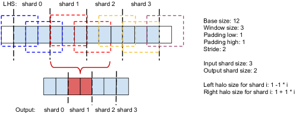

**图 11.** 具有非恒定光环大小的卷积.

[图 12](#figure-12) 描述了一般 halo 交换的操作顺序. 首先, 我们计算各分区左右 halo 的最大尺寸, 并执行最大尺寸的 halo 交换 (步骤 1 和 2). 由于某些分区的 halo 可能超过所需, 我们使用 DynamicSlice (基于分区 ID) 来截取当前分区的有效区域 (步骤 3). 最后, 一些分区可能包含无效值 (例如, 来自超出范围输入数据的 halo), 因此我们按照第 [3.3.3 节](#S3.SS3.SSS3) 中的描述应用掩码.

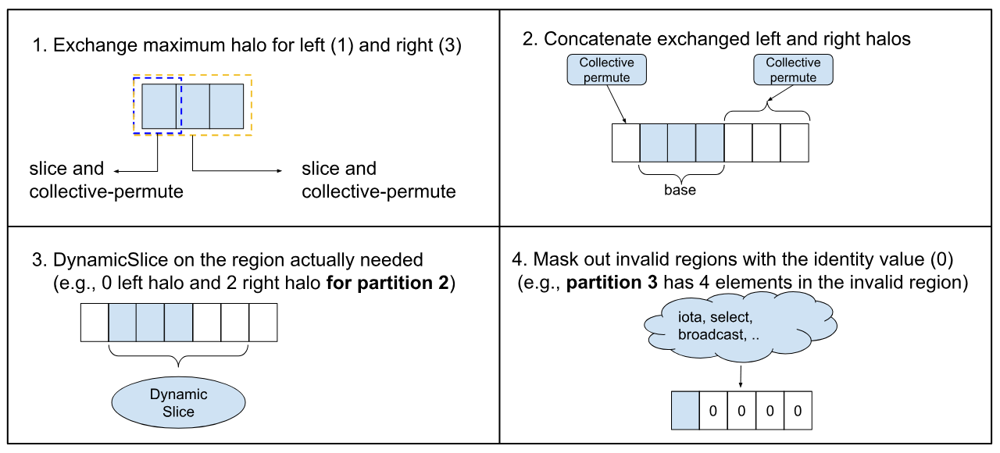

**图 12.** 一般 halo 交换的操作顺序.

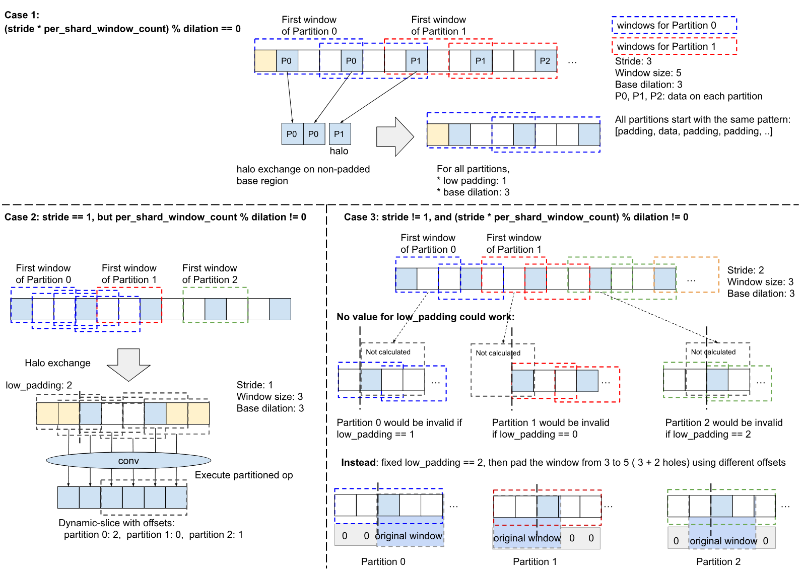

**图 13.** 带基底膨胀的分区卷积.

##### 基底膨胀.

基础扩张 (Base dilation) 为 halo 交换增加了额外的复杂性, 因为每个分区的偏移量可能位于扩张孔上, 并且在扩张后还会应用低/高填充, 这使得边缘元素的行为与内部元素不同. 我们通过三种情况处理基础扩张 ([图 13](#figure-13)).

- •

$\mathrm{stride}\times \mathrm{per}\_\mathrm{shard}\_\mathrm{window}\_\mathrm{count}$ 可被 $\mathrm{dilation}$ 整除, 其中 $\mathrm{per}\_\mathrm{shard}\_\mathrm{window}\_\mathrm{count}$ 是每个分区要处理的窗口数 (即每个分区的输出元素数). 该条件保证所有分区在 LHS 第一个数据元素之前的填充数量相同, 因此可以使用相同的低填充. 光环交换发生在未膨胀/非填充的基区, 分区 $i$ 所需数据的极限索引可按下图计算.

$
\frac{\mathrm{stride}\times \mathrm{per}\_\mathrm{shard}\_\mathrm{window}\_\mathrm{count}\times I \mathrm{window}\_\mathrm{size}-\mathrm{low}\_\mathrm{pad} \mathrm{扩张}-1}{\mathrm{扩张}},
$

决定了正确的光环大小. 由于 $\mathrm{stride}\times \mathrm{per}\_\mathrm{shard}\_\mathrm{window}\_\mathrm{count}$ 可被 $\mathrm{dilation}$ 整除, 可以简化为 $a\times i+b$, 其中 $a$ 和 $b$ 都是常数.

- •

$\mathrm{stride}==1$ 但是 $\mathrm{per}\_\mathrm{shard}\_\mathrm{window}\_\mathrm{count}$ 不能被 $\mathrm{dilation}$ 整除. 在这种情况下, 不同分区的低填充不同, 但这是窗口操作中的静态配置, 不能针对每个分区进行 SPMD 执行的专门化处理. 在操作数上使用 Pad 和 DynamicSlice 也不可行, 因为这些操作符会在扩张之前应用, 所以所有内容都会被扩张因子乘以. 幸运的是, 通过 $\mathrm{stride}==1$, 填充和扩张后的基础区域上的所有位置都是有效的窗口起点, 我们可以使用所有分区的最大低填充来确保每个分区计算所有所需窗口, 然后在分区窗口操作符的输出上进行 DynamicSlice 以去除不必要的数据. 非填充基础区域上分区 $i$ 所需数据的限制索引与以前相同,

$
 \frac{\mathrm{每\_分片\_窗口\_计数} \times i \mathrm{窗口\_大小} - \mathrm{低\_填充} \mathrm{扩张} - 1}{\mathrm{扩张}},
$

但不能简化为 $a\times i+b$.

- •

$\mathrm{stride}\neq 1$ 和 $\mathrm{stride}\times \mathrm{per}\_\mathrm{shard}\_\mathrm{window}\_\mathrm{count}$ 不能被 $\mathrm{dilation}$ 整除. 如果上述条件都不成立, 则不同的分区可能会以不同数量的填充元素开始, 并且并非所有偏移都是有效的窗口起点. 考虑 [图 13](#figure-13) 中的最后一个例子. 无论我们选择多少低填充, 一些分区都会无效, 因为自 $\mathrm{stride}\neq 1$ 起可能会跳过有效窗口. 解决此问题的一种方法是在填充基区的同时填充窗口. 我们可以使用基区分区所需的最大低填充量, 然后将窗口大小增加该低填充值. 然而, 不同分区的窗口低填充和高填充量各不相同, 可通过先进行 Pad 再进行 DynamicSlice 来实现. 窗口填充用于屏蔽基区未对齐的元素, 以便非填充窗口元素的起始位置与每个分区在基区中所需的起始位置对齐.

##### 窗口扩张.

如果 RHS 被复制, 窗口扩张只会在基于其 LHS 对操作进行分区时影响有效窗口大小. 如果扩张后的 RHS 也被分区, 这通常发生在步幅卷积的梯度计算中, 处理窗口扩张仍然比处理基础扩张简单, 因为 RHS 上没有低/高填充. 我们将跳过实现细节.

[+1]: 在实践中, 这通常是必要的, 以避免设备内存溢出.

[+2]: 扩展 $D>S$ 需要不同地使用分数专家容量.

[+3]: 对编译器推断缺失的分片也很重要, 因为反向传播计算通常由前端框架自动生成, 用户无法访问这些张量.

[+4]: 另一种方法是 MPMD (多程序多数据), 其扩展性如 [图 2](#figure-02) 所示.

[+5]: 中间表示中的有限动态性通常对于高效针对加速器是必要的.

[+6]: 负迁移是通过不相关任务共享模型容量的概念, 这反过来会损害这些相互干扰任务的质量.

[+7]: 子词分割后的源端标记.

[+8]: 与使用相同数据集的以往工作相比, 哈萨克语和拉丁语到英语的语言对被排除在评估之外.

[+9]: 我们在 Transformer-Big 或 Transformer-Base 布局中, 为高资源或低资源语言分别调整了批量大小和各种正则化方法的值 (例如 dropout).

[+10]: T(96L) 测量为在 300k 步处理 1 万亿个代币, 每步处理约 400 万个代币, 总预算为 235.5 TPU v3 核心年

[+11]: 编码器 64 层, 解码器 64 层, 隐藏维度 16384, 注意力头 32

[+12]: 由于利用架构搜索的方法计算密集, 因此它们不在本工作的范围内考虑.

[+13]: 本节报告的训练损失对应于交叉熵损失, 并不包括在第 [2.2](#S2.SS2) 节中引入的辅助损失项.

[+14]: TPU 核心年仅通过核心数量与年计墙时的乘积来衡量.

[+15]: 门投影权重大小为 ZXQ00013QXZ, 可以分区, 但在实践中它们足够小, 可以复制, 并且对峰值内存的影响可以忽略不计.
