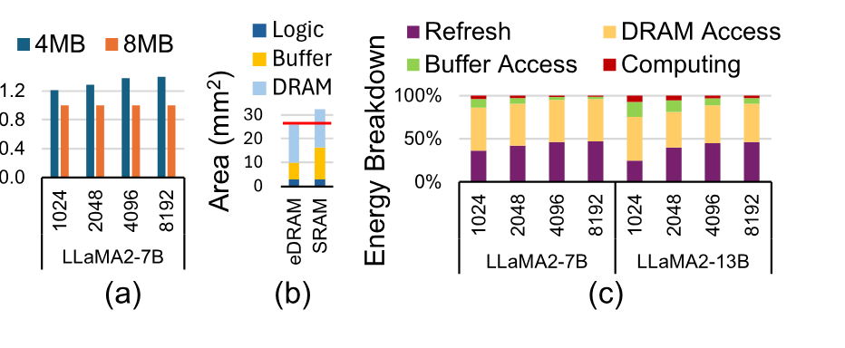
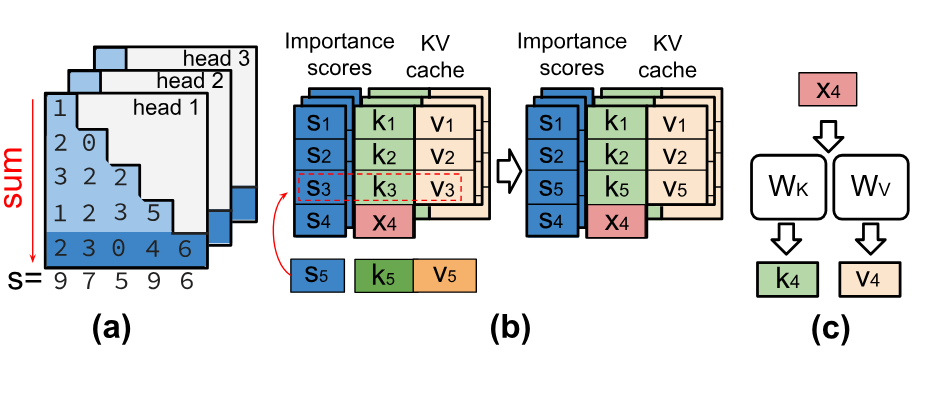
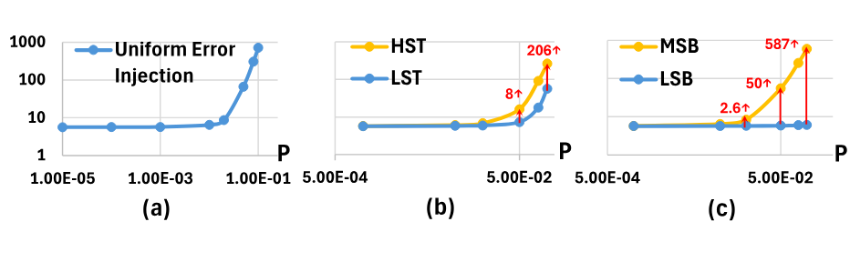
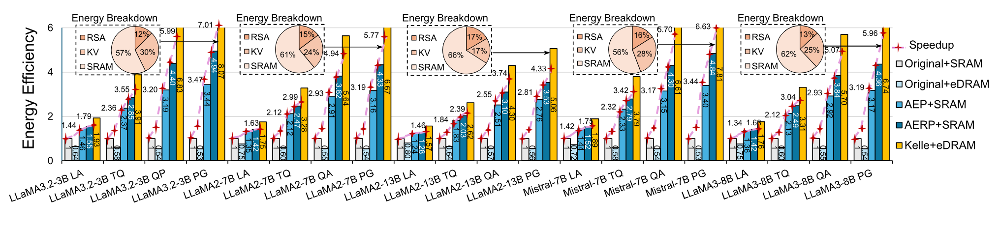

> [Tianhua Xia](https://scholar.google.com/citations?user=cC4Aw_4AAAAJ&hl=en) 和 [Sai Qian Zhang](https://www.saiqianzhang.com/). 论文于 2025 年 10 月 16 日首次提交至 arXiv, 当前版本为 v1. 论文发表于第 58 届 IEEE/ACM 微体系结构国际研讨会(MICRO '25)论文集. 本阅读版转写自 [Kelle: Co-design KV Caching and eDRAM for Efficient LLM Serving in Edge Computing](https://arxiv.org/abs/2510.16040v1). [原始 PDF](/paper/kelle.pdf). [DOI](https://doi.org/10.1145/3725843.3756071). [TeX 源文件](https://export.arxiv.org/e-print/2510.16040v1). 精确的印刷版式和参考文献以原始 PDF 为准.

## 摘要

在边缘设备上运行大语言模型(LLM), 对降低延迟, 改善实时处理能力和加强隐私保护至关重要. 直接在设备上执行推理后, 数据不必发送至云端, 因而响应更快, 对网络连接的依赖也更少. 然而, 在边缘设备上部署 LLM 仍有不少困难, 尤其是键值(KV)缓存的管理, 它在 LLM 服务中处于核心位置. 随着输入文本变长, KV 缓存的大小随序列长度线性增长, 带来显著的内存占用和数据访问开销. 另一方面, 边缘设备的内存和算力有限, 难以存放并高效访问 LLM 推理所需的大型缓存.

为缓解 KV 缓存造成的大量开销, 我们提出以嵌入式 DRAM(eDRAM)作为边缘设备 LLM 服务的主要存储介质, 其存储密度高于 SRAM. 但为保证数据完整性, eDRAM 需要定期刷新, 而刷新会消耗大量功率. 为降低 eDRAM 开销并改善系统整体性能, 我们提出 *Kelle*, 一种面向 eDRAM 边缘系统部署 LLM 的软硬件协同设计方案. 配合细粒度内存驱逐, 重计算和刷新控制算法, *Kelle* 加速器相较现有基线方案实现了 $3.9\times$ 加速和 $4.5\times$ 节能.

## 1 引言

大语言模型(LLM)已在广泛领域展现出很强的能力. 云端部署虽然能提供更高的处理能力, 但也存在通信延迟高和安全风险等局限. 随着 LLM 持续发展, 将其能力直接带到边缘设备上变得愈发重要 [Shi16a]. 把 LLM 集成到边缘设备中, 既能扩大其可用范围, 也能为个人和工业需求提供稳健的定制体验. 这一趋势不仅在学术界受到关注 [Fra22, Zha24x, Cai24c, Yu24c, Yu24b], Intel [She23e], NVIDIA [Nvi22a], Microsoft [Wan23] 和 Qualcomm [Sor23] 等公司也在积极探索类似方案.

然而, 在边缘设备上部署 LLM 仍有困难, 尤其是键值(KV)缓存 [Rad19b] 的管理, 它对提升 LLM 的 token 生成速度很关键. 这一机制在注意力计算期间保存先前算出的 *Key 和 Value* 向量(KV 向量), 并在生成后续 token 时复用. 这样, 每生成一个新 token 时便无需重新计算更早 token 的向量. 但随着模型规模和生成文本长度增加, KV 缓存的内存占用也会迅速增长 [Hoo24, Zha24y]. 例如, LLaMA 2-7B 以 FP16 处理长度为 8192 的序列时, KV 缓存会占用 4GB 内存, 频繁发生的片上 SRAM 与片外 DRAM 访问因而成为总执行延迟的主要限制 [Pop22, Yu24b]. 对片上 SRAM 容量有限的边缘设备等资源受限系统而言, 这个问题尤其突出 [Zha24y]. 例如, Jetson Orin NX 边缘 GPU 只有 4MB L3 缓存 [Nvi22a].

一种直接的解决办法是增大片上 SRAM, 从而减少昂贵的片外内存访问并改善系统整体性能 [Tu18, Che14a]. 然而, 边缘设备的面积和功率预算有限, 扩大 SRAM 会挤占计算核心等其他关键部件的资源 [Kun86, Wan22k, Che19c]. 作为另一种选择, 本文研究在 LLM 执行期间使用嵌入式 DRAM(eDRAM)作为 KV 向量的主要片上存储介质. eDRAM 单元所需的晶体管更少, 例如每个 eDRAM 单元使用 3T, 而 SRAM 单元使用 6T, 因此 eDRAM 的数据存储密度更高, 容量可达两倍以上 [Git20, Che14a]. 更高的存储密度使同一芯片面积能够容纳更多片上存储. 此外, eDRAM 的漏电功率也远低于 SRAM(根据已有工作 [Chu11], 约低 $3.5\times$). 这些优势使 eDRAM 很适合在边缘设备中存放 KV 向量.

**图 1.** (a) LLM token 生成. (b) 用于存放中间数据的 KV 缓存, 其中 N 表示 token 索引.

不过, eDRAM 的一个主要缺点是必须定期刷新, 以防漏电导致数据丢失. 具体而言, 刷新 eDRAM 单元需要一次读写操作, 会增加延迟和功耗, 从而显著影响 LLM 的高效部署. 为解决 eDRAM 集成带来的问题, 我们协同设计了 KV 缓存算法与 eDRAM 硬件系统, 在不损失准确率的前提下实现高效 KV 缓存. 本文的贡献如下:

- 我们提出 *Kelle*, 一种面向 eDRAM 边缘系统设备内 LLM 服务的算法-系统协同设计方案. 为降低 eDRAM 集成成本并提高 LLM 执行效率, 我们提出*基于注意力的驱逐与重计算策略*(AERP)和*二维自适应刷新策略*(2DRP), 以高效实现 KV 缓存([第 4.1 节](#section-4-1)和[第 4.2 节](#section-4-2)).
- 我们设计了以 eDRAM 为主要片上存储的 *Kelle 加速器*, 并采用定制内存布局. 为尽可能提高效率, 加速器集成了专用 eDRAM 控制器和*脉动驱逐器*, 用于高效实现 AERP 与 2DRP([第 5 节](#section-5)).
- 我们还提出 Kelle 调度器([第 6 节](#section-6)), 它采用高效计算模式优化 eDRAM 数据生存期和 LLM 服务延迟, 显著减少 eDRAM 刷新能耗和内存流量.
- 评估结果表明, 与其他基线硬件平台相比, Kelle 实现了 $3.9\times$ 加速和 $4.5\times$ 节能, 对 LLM 准确率的影响可以忽略([第 7 节](#section-7), [第 8 节](#section-8)).

## 2 背景与相关工作

### 2.1 LLM 工作流程

现代 LLM(如 Llama 系列 [Oth23, Oth23a] 和 GPT 系列 [Rad19b, Oth20])由多层 Transformer 解码器堆叠而成, 每个解码器包含两个基本部件: 自注意力(SA)块和前馈网络(FFN). 在 LLM 服务过程中, SA 块的输入先分别乘以三个权重矩阵 $W_{Q}$, $W_{K}$ 和 $W_{V}$, 得到查询($q$), 键($k$)和值($v$). 随后, $q$ 和 $k$ 与 $v$ 一同经过乘法, softmax 和残差加法, 生成 SA 输出. SA 的输出再交给 FFN 继续处理, 通常采用标准 MLP [Rad18, Rad19b] 或门控 MLP [Liu21c, Oth23, Oth23a]. FFN 由多个全连接(FC)层和 GeLU [Hen16a] 等中间激活函数组成.

LLM 服务包含两个主要阶段: 预填充和解码. 预填充阶段并行处理上下文 token. 解码阶段根据当前和之前的 token 预测下一个 token. 具体做法是把当前输入与先前 token 的信息结合起来, 这些信息以键和值(KV)向量表示. 此过程以自回归方式反复进行([图 1a](#figure-01)).

### 2.2 KV 缓存

在解码阶段, 每个新生成 token 的 KV 向量都会存入 KV 缓存以提高生成速度, 如[图 1b](#figure-01) 所示. 这样, 每生成一个新 token 时便无需重新计算更早 token 的向量. 具体而言, 为产生一个 LLM 块的输出, 长度为 $C$ 的第 N 个 token 输入向量分别乘以 $W_{Q}$, $W_{K}$ 和 $W_{V}$, 生成查询 $q_{N}$, 键 $k_{N}$ 和值 $v_{N}$ 三个维度均为 $1\times C$ 的向量, 其中 $C$ 表示通道大小, 如[图 1b](#figure-01) 所示. 随后, $q_{N}$ 和其他 KV 向量沿通道维度拆成多个部分, 每部分的维度为 $1\times\frac{C}{H}$, 其中 $H$ 表示头数. 头 h 对应的向量分别记为 $q^{h}_{N}$, $k^{h}_{N}$ 和 $v^{h}_{N}$. 接着从内存载入此前 $N-1$ 个 token 的 KV 向量. 对每个头 h, 分别计算 $q^{h}_{N}$ 与各键向量 $k^{h}_{n},1\leq n\leq N$ 的点积, 再将结果送入 softmax 函数, 得到维度为 $1\times N$ 的注意力分数向量 $A^{h}_{N}$. 然后, 注意力分数向量与各值向量 $v^{h}_{n},1\leq n\leq N$ 计算点积, 得到长度为 $\frac{C}{H}$ 的结果向量 $y^{h}_{N}$. 随后跨多个头拼接 $y^{h}_{N}$, 得到向量 $y_{N}$, 再与 $W_{O}$ 相乘. [图 2](#figure-02) 展示了这一过程, 可由下列公式表示:

$$
A^{h}_{N}=\mathrm{softmax}([q^{h^{\top}}_{N}k^{h}_{1},q^{h^{\top}}_{N}k^{h}_{2},\ldots,q^{h^{\top}}_{N}k^{h}_{N}])
$$

$$
y^{h}_{N}=\sum_{1\leq n\leq N}(A^{h}_{N,n}\cdot v^{h}_{n})
$$

其中 $A^{h}_{N,n}$ 表示 $A^{h}_{N}$ 的第 $n$ 个元素. 根据[公式 1](#equation-01)和[公式 2](#equation-02), KV 向量对 $[k^{h}_{n},v^{h}_{n}]$ 的相对顺序不会影响解码计算. 换言之, 若交换两对 KV 向量的值(例如交换 $[k^{h}_{1},v^{h}_{1}]$ 和 $[k^{h}_{2},v^{h}_{2}]$), 由[公式 1](#equation-01)和[公式 2](#equation-02)得到的 $y^{h}_{N}$ 保持不变.

**图 2.** KV 向量计算示例.

KV 缓存压缩技术大体可分为两类: token 丢弃 [Xia24a, Zha23g, Ge24, Liu24p, Yan24f, Liu24m] 和 KV 缓存量化 [Liu24c, Hoo24, Xia24h]. token 丢弃策略识别并永久删除不重要的 token, 此后便无法再访问它们. StreamLLM [Xia24a] 识别序列开头对 LLM 性能很关键的 *sink token*, 并保留近期 token 以维持性能. H2O [Zha23g] 识别累积注意力分数较高的 *heavy hitter token*. KIVI [Liu24c] 按通道对 KV 向量分组, 实现 2-bit 非对称量化. QuaRot [Ash24] 使用零样本 Hadamard 变换减少模型中的离群值, 从而支持 4-bit 量化. 推测解码 [Mcd25, Hu25i, Hu25j, Lev23] 是另一种加速 LLM 的推理技术: 它用轻量草稿模型提出多个 token, 再由完整模型选择性验证. Kelle 可以与推测解码技术正交结合.

### 2.3 嵌入式 DRAM

**表 1.** SRAM 与 eDRAM 的对比.

多种 eDRAM 电路设计 [Git20, Yu20] 已成为 SRAM 的替代方案, 其中一些只需两个晶体管. 3T-eDRAM 尤为突出: 与 SRAM 相比, 它的密度超过两倍, 静态功耗降低 $3.5\times$ [Chu11, Cha13]. [表 1](#table-01) 比较了 3T-eDRAM 与 SRAM, 结果由 Destiny [Por15] 在 65nm 工艺节点下仿真得到. eDRAM 具有更高的存储密度, 更低的访问延迟和能耗, 因而很适合用于 LLM. 尽管 eDRAM 有多项优势, 它仍有一个严重缺点: 必须定期刷新, 以免电荷泄漏造成数据损坏. 因此, eDRAM 最适合存放**大量瞬态数据**, 从而避免频繁刷新.

已有研究探讨了在加速器系统中用 eDRAM 支持 CNN 计算 [Che14a, Zha23l, Tu18, Ngu19], 并提出了降低刷新功率开销的方法. DaDianNao [Che14a] 将 eDRAM 划分为多个 bank 以缓解刷新故障, 但没有解决刷新能耗或数据留存问题. RANA [Tu18] 在 CNN 训练期间注入 bit 留存错误, 以减轻刷新频率较低造成的准确率下降. CAMEL [Zha23l] 优化 CNN 模型架构, 缩短训练期间的数据生存期. 先前研究已经证明 eDRAM 可高效支持卷积神经网络(CNN)的推理和训练, 但尚未探索其在 LLM 中的潜力. Kelle 则利用 eDRAM 尽量减少 LLM KV 缓存的片外内存访问, 此前还没有工作研究这一方向.

### 2.4 边缘 LLM 加速器

为在边缘设备上部署 LLM, 多项研究提出了提高量化 Transformer 准确率的方法 [Guo23, Zad20, Lee24, Par18a, Fan22a, Lu20, Tra22, Liu24x, Xio25b]. Tender [Lee24] 将缩放因子设为 2 的幂, 提出一种硬件高效的 LLM 量化方法. COMET [Liu24x] 为 4-bit LLM 量化设计了高效混合精度 GPU kernel. FlexGen [Sto24], InfiniGen [Lee24c], InstInfer [Pan24g] 和 LLM.npu [Xu24f] 等工作研究了片上单元与主存之间的模型卸载策略, 以便在资源受限设备上高效部署 LLM. Cambricon-LLM [Yu24b] 提出一种基于 chiplet 的混合架构, 结合 NPU 与专用 NAND 闪存芯片, 以实现高效的设备端推理.

**图 3.** (a) 采用 4MB 与 8MB SRAM 的边缘系统在不同模型和序列长度下的归一化延迟. (b) 采用 8MB eDRAM 与 8MB SRAM 的边缘系统面积构成, 红线表示面积预算. (c) 集成 eDRAM 的边缘系统能耗构成. 解码长度对应的预填充长度为 512. 解码期间使用 8MB eDRAM 存放部分层的 KV 缓存. 报告的 DRAM 能耗同时计入模型权重访问和从 eDRAM 卸载 KV 缓存的开销.

## 3 为什么在边缘设备 LLM 中使用 eDRAM?

### 3.1 扩大片上内存的收益与难点

先前研究 [Zha24w, Zha24y, Yu24b] 表明, LLM 服务速度受到片外内存带宽的明显限制. 特别是在 LLM 解码阶段, KV 缓存访问是最主要的瓶颈 [Zha24y, Zha23g, Lee24c]. 减少片外内存用量的一种直接方法是增大片上 SRAM, 从而减少昂贵的片外内存访问并提高系统性能 [Tu18, Che14a]. 为说明这一点, 我们评估了两套分别配有 4MB 和 8MB SRAM 的边缘计算系统, 测量它们以不同序列长度执行 LLaMA2-7B 时的延迟. 测试使用仿真平台, 其中包含用于 8-bit MAC 运算的 $32\times 32$ 脉动阵列, 以及带宽为 64GB/s 的 16GB DRAM, 可视为类似 Google Coral 边缘设备 [Sur20] 的边缘张量处理单元(TPU). 如[图 3a](#figure-03) 所示, SRAM 容量翻倍平均可实现 $1.27\times$ 加速. 然而, 在评估平台上将 SRAM 从 4MB 扩至 8MB, 会使功耗和芯片面积分别增加 $29\%$ 和 $26\%$. 边缘环境的面积与功率预算有限, 增大 SRAM 会减少其他关键部件可用的资源, 导致系统性能次优 [Kun86, Wan22k, Che19c]. 据此可得以下观察:

**观察 1.** 更大的片上内存能缓解 LLM 的 KV 缓存瓶颈, 但以 SRAM 作为片上存储的边缘设备会为此付出面积和功率代价.

### 3.2 集成 eDRAM 的利弊

在不增加面积的前提下扩大内存容量, 一种方法是用 eDRAM 取代 SRAM. 在与 SRAM 面积相同的条件下, eDRAM 不仅可提供两倍以上的容量, 根据[表 1](#table-01), 其访问能耗和漏电能耗也更低. 如[图 3b](#figure-03) 所示, 配有 8MB eDRAM 的评估系统占用的面积小于 8MB SRAM 系统, 因而能在更小芯片上实现更低的 LLM 服务延迟. 大量研究 [Xia24i, Agr14, Cho14b] 和商业产品 [Git20, Tec24, Wen10, Flu14, Tim13] 已证明, 以 eDRAM 为主要片上存储介质是可行的. 但它能否改善边缘设备上的 LLM 服务, 还没有得到研究.

![65nm eDRAM 在 $105^{\circ}C$ 下的留存故障分布 [Kon08].](./kelle/figure-04.png)

**图 4.** 65nm eDRAM 在 $105^{\circ}C$ 下的留存故障分布 [Kon08].

**图 5.** Kelle 加速器概览.

尽管 eDRAM 有多项优势, 先前研究 [Tu18, Zha23l] 表明, 刷新操作可能成为系统整体能耗的一项重要瓶颈. 此外, eDRAM 用于存放生存期较长的数据时, 刷新不够频繁会提高读出错误的风险, 如[图 4](#figure-04) 所示. 留存故障率表示刷新间隔变化时发生留存错误的 bit 百分比. 为说明这一问题, 我们在[第 3.1 节](#section-3-1)的系统中以 8MB eDRAM 取代 4MB SRAM. eDRAM 刷新间隔设为 $45\mu s$, 以确保数据不损坏. 我们评估了 eDRAM 系统在不同模型和序列长度下的能耗. 如[图 3c](#figure-03) 所示, 若不进行优化, eDRAM 刷新最多占总能耗的 $46\%$, 平均能耗会增加 $1.7\times$.

**观察 2.** 在相同芯片面积下, eDRAM 可使边缘设备上的 LLM 服务获得优于 SRAM 的延迟. 但要充分发挥其功率优势, 必须大幅减少 eDRAM 刷新操作.

### 3.3 Kelle: KV 缓存与 eDRAM 协同设计

降低 eDRAM 能耗有三种有效策略: 降低数据刷新频率, 减少存储数据量, 以及缩短数据生存期. 为借助 eDRAM 改善边缘设备上的 LLM 服务性能, 我们提出 *Kelle*, 一种硬件与算法协同设计方案, 用于尽量降低 eDRAM 刷新能耗并高效管理 KV 缓存.

#### 3.3.1 eDRAM 刷新控制

降低数据刷新频率可能增加留存故障风险, 造成数据损坏. 这引出了一个关键问题: *LLM 对 KV 缓存中数据损坏的容忍度有多高, 才不会损害准确率?* 围绕这一问题, 我们协同设计了 eDRAM 内存布局, 控制器和*二维自适应刷新策略*(2DRP), 以设置[第 4.2 节](#section-4-2)所述的细粒度动态刷新间隔.

#### 3.3.2 KV 缓存驱逐

缩小 KV 缓存可显著降低 eDRAM 的数据存储需求, 进而减少刷新能耗并改善系统性能. 先前研究发现, 驱逐不重要的 token 不会损害生成质量. 但为识别不重要的 token, 先前工作要么需要对序列进行 profiling [Ge24, Liu24p], 要么需要额外计算 [Zha23g, Xia24a]. 为高效管理 KV 缓存, 我们提出一种新的*脉动驱逐器*架构, 用于加速[第 4.1 节](#section-4-1)介绍的*基于注意力的驱逐与重计算策略*(AERP).

#### 3.3.3 KV 向量重计算

序列长度增长到一定阈值后, 访问片外内存所需的时间可能超过重新计算部分 KV 张量的时间, 此时 KV 缓存的收益会下降. 如[第 4.1 节](#section-4-1)所示, 重计算与 eDRAM 适合存放瞬态数据的特点很契合. 但需要结合硬件特性谨慎调度, 才能在重计算与存储之间取得平衡. 我们提出 *Kelle 调度器*, 通过设计计算模式缩短 KV 向量的数据生存期, 详见[第 6 节](#section-6).

## 4 Kelle 算法

本节介绍 Kelle 框架采用的高效算法, [图 5](#figure-05) 给出了整体概览. 执行期间, Kelle 使用*基于注意力的驱逐与重计算策略*(AERP)和*二维自适应刷新策略*(2DRP)管理 eDRAM 操作, 具体见[第 4.1 节](#section-4-1)和[第 4.2 节](#section-4-2).

### 4.1 基于注意力的驱逐与重计算策略

首先讨论解码阶段 eDRAM 容量用尽时的驱逐策略.

#### 4.1.1 驱逐策略

对于容量有限, 最多可容纳 $N^{\prime}$ 个 token 的 KV 缓存, 在解码阶段, 第 $(N^{\prime}+1)$ 个 token 到来时, 必须从某个 token $n$(其中 $1\leq n\leq N^{\prime}$)中驱逐 KV 向量 $[k^{h}_{n},v^{h}_{n}]$. 要驱逐的第 $h$ 个头, 第 $n$ 个 token 的 KV 向量根据其重要性 $s^{h}_{n}$ 选定; 该重要性由 KV 缓存中所有其他 token 的注意力分数([公式 1](#equation-01))求和得到:

$$
s^{h}_{n}=\sum_{1\leq i\leq n}A^{h}_{n,i}
$$

[图 6](#figure-06) 展示了驱逐过程示例. 假设 KV 缓存的预算总共可存放 $N^{\prime}=4$ 个向量. 我们考虑包含三个注意力头的情况. 为便于说明, 图中只画出第一个头的计算, 省略头标记. 当 $[k_{5},v_{5}]$ 到来时, 首先用[公式 3](#equation-03)计算重要性分数, 如[图 6a](#figure-06) 所示. 随后驱逐重要性分数最小的 token(第三个 token)所对应的 KV 向量, 如[图 6b](#figure-06) 所示. 利用 $y_{N}$ 的计算不受 KV 向量相对顺序影响这一性质, 可按顺序从缓存读取 KV 向量来计算[公式 1](#equation-01)和[公式 2](#equation-02), 无需考虑它们原来的 token 索引. 需要注意, 同一 token $n$ 的重要性分数 $s_{n}^{h}$ 可能因注意力头而异. 因此, 各头 h 的 KV 向量驱逐模式也会不同.

在上下文 token 长度为 $N_{cxt}$ 的预填充阶段, 所有上下文 token 并行处理. 对每层内的每个头, 第 N 个 token 的重要性分数计算为 $s^{h}_{N}=\sum_{1\leq n\leq N_{cxt}}A^{h}_{n,N}$. $s^{h}_{n}$ 最高的前 $N^{\prime}$ 个 token 将保留在 KV 缓存中, 供解码操作使用.

除 $s^{h}_{n}$ 分数最高的 token 外, 初始 token 和最近的 token 也会保留, 因为先前工作 [Xia24a, Zha23g] 已证明它们会影响模型性能, 我们的实验也支持这一结论.

#### 4.1.2 重计算策略

**图 6.** (a) 三个头各自的重要性分数计算. (b) 分数最低 token 的 KV 向量被新 KV 向量替换. 第四个 token 在三个头中的两个头上都很重要, 因此存储输入向量 $x_{4}$. 存储 $x_{4}$ 可释放一个 eDRAM 条目, 从而降低 eDRAM 刷新成本. (c) 重计算第四个 token 的 KV 向量以节省 eDRAM 存储.

如[第 2.3 节](#section-2-3)所述, eDRAM 很适合存放瞬态数据. 驱逐策略虽然减少了模型执行期间需要保留的 KV 向量数量, 但生存期较长的 KV 向量存入 eDRAM 后仍需要刷新, 成本很高. 为降低刷新成本, 我们可以进一步采用重计算技术. 具体而言, 对 KV 缓存中的一组 token $N_{\mathrm{recomp}}$, 使用相应输入向量 $x_{N}$ 重计算其 KV 向量; 如[图 1b](#figure-01) 所示, 这些输入向量会送入 $W_{Q},W_{K},$ 和 $W_{V}$. 采用重计算后, 存储需求可从保留两个向量(K 和 V)降为只保留一个向量(输入 x). 这样便能按需重计算 K 和 V, 有效缓解 KV 向量生存期过长的问题.

解码阶段执行时, 首先将输入向量 $x_{N}$ 分别乘以 $W_{K}$ 和 $W_{V}$, 为所有头 $h\in H$ 重计算 KV 向量 $k^{h}_{N}$ 和 $v^{h}_{N}$([图 6c](#figure-06)), 然后将其用于解码. 为通过重计算节省 KV 缓存空间, 维度为 $1\times C$ 的输入向量 $x_{N}$ 的存储成本必须低于重计算得到的 KV 向量. 为满足这一条件, 若不使用重计算时 token $N$ 的 KV 向量会保留在至少 $\theta\gt 50\%$ 的头中, 就改用 $x_{N}$ 重计算这些向量, 其中 $\theta$ 表示 token 的**流行度**. 这样做的依据是, KV 向量的存储成本 $2\times\frac{C}{H}\times\theta H$ 会超过 $x_{N}$ 的大小(即 $C$). 如[图 6b](#figure-06) 所示, 第四个 token 在三个头中的两个头上都很流行, 因此保留输入向量 $x_{4}$, 而不存储 KV 向量.

重计算除了节省存储外, 得到的 KV 向量也属于瞬态数据, 因为它们只在计算[公式 1](#equation-01)时短暂使用, 这进一步发挥了 eDRAM 的优势. 此外, [第 5.2 节](#section-5-2)介绍的计算引擎采用脉动阵列架构, 因此额外重计算成本很低.

在预填充阶段, 首先计算头 $h$ 中每个 token $n$ 的重要性分数 $s_{n}^{h}$. 随后, 对每个头 $h$, 根据相应 token 的重要性分数驱逐 KV 向量. 对重要性分数较高的 token, 若其 KV 向量保留在至少 $50\%$ 的头中(即流行 token), 则存储输入向量 $x_{n}$, 否则存储 KV 向量. 解码期间, 每个新 token 的存储格式根据流行度 $\theta$ 的计算结果动态确定. [图 7a](#figure-07) 概括了完整的 AERP 方案. token 流行度在解码期间可能变化, 但经验证据表明其波动有限, 即对超过 $50\%$ 的头很重要的 token 很少会降低重要性. 因此在 Kelle 中, 一个 token 一旦以输入向量形式存储, 除非被驱逐, 否则其存储格式在整个解码阶段保持不变.

### 4.2 二维自适应刷新策略

![(a) AERP 概要, 为简洁起见只显示一个头 h. (b) 二维自适应刷新策略. (c) 2DRP 示例. $k_{5}[15:8]$ 表示第五个 token 键向量的第 8 至第 15 bit. 颜色越深表示刷新越频繁, 留存错误率越低.](./kelle/figure-07.png)

**图 7.** (a) AERP 概要, 为简洁起见只显示一个头 h. (b) 二维自适应刷新策略. (c) 2DRP 示例. $k_{5}[15:8]$ 表示第五个 token 键向量的第 8 至第 15 bit. 颜色越深表示刷新越频繁, 留存错误率越低.

**图 8.** (a) bit 翻转错误率为 P 时的 PPL. (b) 仅对(a) HST 与 LST 和(b) MSB 与 LSB 施加 bit 翻转时, 不同 bit 翻转错误率下的 LLM 准确率, 其中 $P$ 表示错误率. PPL 越低表示性能越好, 红色数字表示 PPL 值之间的差距.

为研究 LLM 在不损害准确率的前提下对 KV 缓存数据损坏的容忍度, 我们在 eDRAM 内存单元中引入 bit 翻转错误来模拟留存故障. 具体而言, 我们使用 Wikitext-2 [Mer17] 数据集, 评估这类故障对 LLaMA2-7B 模型困惑度(PPL)的影响. PPL 越低, 性能越好. 执行期间, 以均匀概率向 KV 缓存注入 bit 翻转错误. [图 8a](#figure-08) 中的结果表明, 错误率低于 $10^{-3}$ 时, PPL 增幅很小, 不超过 0.1. 但随着 bit 翻转错误继续增加, PPL 会显著上升. 这说明 LLM 能够容忍一定程度的 KV 缓存错误. 接下来自然要问: *能否设计粒度更细的刷新策略, 在维持准确率的同时支持更低的刷新频率?*

在[第 4.1 节](#section-4-1)中, token 按[公式 3](#equation-03)定义的重要性分数驱逐. 我们推测, eDRAM 刷新策略也能采用类似方法: 不太重要 token 的 KV 向量或输入向量使用较低刷新频率, 较重要 token 则使用较高频率. 为检验这一假设, 我们实现自适应刷新策略并重复实验. 为简化表述, 按重要性分数将 token 分为高分 token(HST)组和低分 token(LST)组. 分别对 HST 与 LST 组中相应 token 的 KV 向量施加概率为 $p$ 的 bit 留存故障(bit 翻转错误). [图 8b](#figure-08) 的结果表明, 留存故障影响 HST 组时, LLM 性能下降幅度大于影响 LST 组时, 说明 HST 组 token 需要更高的刷新频率, 支持了我们的假设.

同样可以合理推测, 低有效位(LSB)受留存故障错误的影响小于高有效位(MSB), 因为 LSB 上的 bit 翻转造成的数值变化更小. 对 KV 向量中的每个值, 我们分别向 MSB(bit 15-8)或 LSB(bit 7-0)注入 bit 留存错误. [图 8c](#figure-08) 的结果表明, 在相同 bit 翻转错误率下, MSB 对留存错误比 LSB 更敏感, 进一步支持了我们的假设.

根据上述观察, 我们提出一种名为*二维自适应刷新策略*(2DRP)的自适应刷新控制方法, 如[图 7b](#figure-07) 所示. 该策略同时依据 KV 向量或输入向量中每个数值的 bit 位置, 以及每个 token 的重要性分数, 调整各 eDRAM 单元的刷新频率. [图 7c](#figure-07) 给出了 2DRP 示例, 其中 KV 缓存最多容纳 $N^{\prime}=3$ 个 token. 刷新频率随 token 重要性和 bit 位置重要程度的提高而增加. 执行期间, 系统动态计算 KV 向量与输入向量的重要性分数, 再根据这些分数和 bit 位置分配刷新频率.

## 5 Kelle 边缘加速器

**图 9.** Kelle 硬件加速器概览.

[图 9](#figure-09) 给出了 Kelle 加速器概览. 它包含混合 eDRAM-SRAM 内存子系统, 可重构脉动阵列(RSA)和专用功能单元(SFU). 权重量化为 8 bit, 激活和 KV 向量保持 16 bit; 权重存放在 SRAM 中, 激活与 KV 向量则存放在 eDRAM 中. 运行时, 脉动驱逐器累积注意力分数, eDRAM 控制器负责 KV 向量驱逐和重计算, 同时动态调整刷新频率, 详见[第 4.1 节](#section-4-1)和[第 4.2 节](#section-4-2). RSA 中的每个处理单元(PE)执行 8-bit 乘加(MAC)运算.

SFU 负责激活函数, softmax, 归一化和位置嵌入等非线性运算. 先前研究 [Wan20b, Xia24g, Das22, Qin25b] 表明, 非线性运算的能耗随输入序列长度增长. 在这些运算中, softmax 会消耗大量资源. 我们采用 Softermax [Ste21] 的在线最大值计算来尽量减少内存访问. 对其他非线性运算, 我们沿用相应计算流程, 使用查找表(LUT)完成计算.

### 5.1 内存子系统

[图 10](#figure-10) 展示了 Kelle 加速器的内存子系统. 在这一设计中, 2MB SRAM 存放权重, 激活和 KV 向量分别存放在 256KB *激活 eDRAM* 与 4MB *KV 缓存 eDRAM* 中. Kelle 加速器按重要性分数和 bit 位置将 KV 向量分成四组, 再分别采用相应刷新频率, 从而实现 2DRP. 具体而言, HST 组 token 的 KV 向量 MSB(bit 15-8)以最高频率刷新, LST 组 token 的 KV 向量 LSB(bit 7-0)以最低频率刷新. 为支持 AERP, 某些 token 在 KV 缓存 eDRAM 中存储输入向量而非 KV 向量. 这些输入向量也按重要性分数和 bit 宽度分成四组, 控制方式与 KV 向量相同. 为简化表述, 下文介绍内存子系统设计时只提 KV 向量, 不再单独说明输入向量.

为在 LLM 推理期间执行 2DRP, KV 向量的每个元素按 bit 拆分, 存入不同的 eDRAM bank. 具体而言, KV 向量的 MSB 和 LSB 分别存入不同的 KV 缓存 eDRAM bank, 称为 *MSB bank* 和 *LSB bank*, 在[图 10](#figure-10) 中分别用深色和浅色标出. 每个 token 的重要性分数通过[公式 3](#equation-03)以 4-bit 精度动态计算并存入寄存器文件, 其中每个条目对应一个横跨四个 bank 的 KV 向量. 同一 token 对应的 KV 向量在不同 eDRAM bank 中共享同一地址. 系统使用一个驱逐控制器管理全部四个 bank 上的 AERP, 并使用两个刷新控制器分别在 MSB 与 LSB bank 上执行 2DRP.

在每个 MSB 和 LSB bank 内, token 再按注意力分数分成两组, 刷新控制器中的计数器监控各组的刷新间隔. 控制器遍历 eDRAM 条目, 从寄存器文件读取注意力分数以确定每个 token 所属的组. 某组的刷新间隔到期时, 控制器触发 *refresh* 信号. 随后计算该组 token 对应的 KV 向量地址, 读出再写回 KV 向量, 完成刷新. 刷新操作在模型不使用 KV 向量时触发, 因而可以隐藏刷新延迟. KV 缓存容量用尽且有新 token 到来时, 驱逐控制器从脉动驱逐器接收待驱逐 token 的索引, 并以新 token 替换它.

为并行供数, 避免 bank 冲突并充分利用 $32\times 32$ RSA, Kelle KV 缓存被划分为 32 个 bank. 其中, Key MSB, Key LSB, Value MSB 和 Value LSB 四组各分配 8 个 bank. 借助这一设计和流水化缓存读取, Kelle eDRAM 可提供足够带宽, 在无 bank 冲突的情况下充分利用 RSA. 此外, token 读取和 token 驱逐等其他 eDRAM 访问彼此独立, 也能有效缓解 bank 冲突.

在 LLM 执行期间, RSA I/O 控制器以很低的开销重组来自不同 bank 的数据, 供计算使用. 此外, Kelle 加速器把一部分 LLM 层的 KV 向量存入 eDRAM, 层数由具体 LLM 的大小和文本长度决定. eDRAM 大幅降低了片外内存访问开销.

**图 10.** Kelle 内存子系统. 某些 token 的输入向量存放在 KV 缓存中, 以红色行表示.

### 5.2 可重构脉动阵列

脉动阵列核心由 $32\times 32$ 二维阵列组成, 它以交错方式处理输入, 并将算出的部分和发送至累加器与 SFU. 它采用[图 11a](#figure-11) 所示的权重驻留数据流. 我们采用类似 FAST [Zha21g] 的可重构策略, 原地执行转置矩阵乘法.

关键在于, [第 4.1 节](#section-4-1)的重计算在 LLM 解码阶段只引入很小开销. 利用脉动阵列适合矩阵运算的特点, 可高效地把重计算 token 的向量与当前 token 的输入向量组合成输入矩阵. 沿用[图 6b](#figure-06) 示例中的记号, [图 11a](#figure-11) 展示了当前 token 的输入向量 $x_{5}$ 送入 RSA 计算 KV 向量的过程. 为重计算第四个 token 的 KV 向量, 可将 $x_{4}$ 和 $x_{5}$ 组合成矩阵, 如[图 11b](#figure-11) 所示, 延迟和能耗只会小幅增加.

**图 11.** (a)和(b)展示重计算对 RSA 运行的影响. (c) RSA 与脉动驱逐器的集成. (d) 脉动阵列与脉动驱逐器的执行顺序. 红圈中的数字表示顺序.

### 5.3 脉动驱逐器

**图 12.** (a)和(b)展示基线与 Kelle 调度器中 SA 块的计算模式和 eDRAM 数据生存期. SM 表示 softmax 运算.

AERP 算法的 token 驱逐过程包括: 按[公式 1](#equation-01)计算注意力分数, 按[公式 3](#equation-03)更新重要性分数, 找出重要性分数最低的 token, 再更新 KV 缓存.

为高效实现驱逐算法, 我们提出脉动驱逐器(SE), 它以脉动方式运行并集成到 RSA 中, 可即时搜索最小重要性分数. 重要性分数通过对[公式 1](#equation-01)中的 $Q K^{T}$ 结果求和得到, 无需经过 softmax. 这种集成保证 RSA 算出新 token 的注意力分数后, 立即找到重要性分数最小的 token. 找到最小重要性分数对应的 token 索引后, SE 将索引发送给 eDRAM 控制器中的驱逐控制器, 以驱逐相应 token. [图 11c](#figure-11) 展示了 SE 的设计及其与 RSA 的集成. SE 包含一列寄存器, 在[图 11c](#figure-11) 中记为 *S*, 用于预载先前 token 的重要性分数; 另一条记为 *M* 的寄存器链则周期性地自上而下传播最小重要性分数(min). [图 11d](#figure-11) 展示了 RSA 和 SE 的执行顺序. 在一个周期内, RSA 的第 $i$ 行计算注意力分数, 随后 SE 的第 $i$ 行更新重要性分数和最小重要性分数索引, 分别标为步骤 1 和步骤 2. 下一周期在 RSA 与 SE 的下一行执行相同操作, 分别标为步骤 3 和步骤 4. 脉动驱逐器避免了最小值搜索给 LLM 执行带来的额外延迟.

## 6 Kelle 调度器

为进一步降低 eDRAM 刷新能耗, 我们提出一种新的计算模式, 它能缩短数据生存期并加速 LLM 推理, 同时不损害准确率.

首先, 我们对 LLM 解码阶段自注意力(SA)架构中的数据生存期进行数值分析. 如[第 2.1 节](#section-2-1)所述, SA 计算首先将输入 $X$ 分别与权重矩阵 $W_{Q}$, $W_{K}$ 和 $W_{V}$ 相乘, 得到输出 $Q,K$ 和 $V$. 这些过程分别记为 $\mathrm{MM}_{Q}$, $\mathrm{MM}_{K}$ 和 $\mathrm{MM}_{V}$. 接着, $Q$ 与 $K$ 相乘, 再执行 softmax 以计算注意力分数 $A$, 两个过程分别记为 $\mathrm{MM}_{qk}$ 和 $\mathrm{SM}$. 最后, $A$ 与权重矩阵 $W_{O}$ 相乘得到 SA 输出, 记为 $\mathrm{MM}_{O}$. 矩阵乘法的延迟($T_{\mathrm{MM}}$)估算如下:

$$
T_{\mathrm{MM}}=\frac{N_{\mathrm{MM}}}{\mathrm{TOP}_{\mathrm{RSA}}}
$$

其中 $N_{\mathrm{MM}}$ 表示矩阵乘法所需的 MAC 运算数. $\mathrm{TOP}_{\mathrm{RSA}}$ 表示[第 5.2 节](#section-5-2)所述的 RSA 吞吐量. KV 向量的 eDRAM 访问操作延迟记为 $T_{\mathrm{eDRAM}}$, 建模如下:

$$
T_{\mathrm{eDRAM}}=\frac{S_{\mathrm{KV}}}{B_{\mathrm{eDRAM}}}
$$

其中 $S_{\mathrm{KV}}$ 表示 KV 向量的字节数. $B_{\mathrm{eDRAM}}$ 表示 eDRAM 带宽. 同理, 权重 SRAM 访问操作延迟记为 $T_{\mathrm{SRAM}}$, 建模如下:

$$
T_{\mathrm{SRAM}}=\frac{S_{W}}{B_{\mathrm{SRAM}}}
$$

其中 $S_{W}$ 表示权重的字节数. $B_{\mathrm{SRAM}}$ 表示 SRAM 带宽.

**表 2.** 各方法的准确率表现. FP16 表示不缩减 KV 缓存时 LLM 在 FP16 下的准确率.

[图 12a](#figure-12) 展示了基线计算模式, 其中矩阵乘法 $\mathrm{MM}_{Q}$, $\mathrm{MM}_{K}$, $\mathrm{MM}_{V}$ 和 $\mathrm{MM}_{qk}$ 依次执行, 延长了输入 $X$, $Q$, $K$ 和 $V$ 的数据生存期. 数据生存期定义为数据算出后到被后续操作使用之间的时间. 例如, 在[图 12a](#figure-12) 中, 从 SRAM 访问权重矩阵 $W_{Q}$ 后, 向量 $Q$ 的计算在 $t_{1}$ 开始, 到 $t_{4}$ 时 $Q$ 与 $K$ 开始相乘, 此时 $Q$ 被使用. 在 $t_{1}$ 与 $t_{4}$ 之间, $W_{K}$ 和 $W_{V}$ 从 SRAM 载入, $K$ 则从 eDRAM KV 缓存访问. 访问 $W_{K}$ 与 $W_{V}$ 的延迟均为 $T_{\mathrm{SRAM}}$, 访问 $K$ 的延迟为 $T_{\mathrm{eDRAM}}$. 因而 $Q$ 的数据生存期为 $2\times T_{\mathrm{SRAM}}+T_{\mathrm{eDRAM}}$. 所有激活都存放在 eDRAM 中且需要刷新, 所以全部激活的总数据生存期是各激活数据生存期之和. 与 $T_{\mathrm{SRAM}}$ 和 $T_{\mathrm{eDRAM}}$ 相比, [公式 4](#equation-04)中的计算时间 $T_{\mathrm{MM}}$ 很小, 因此忽略不计. 延长的数据生存期会提高 eDRAM 刷新成本. 基线调度中瞬态数据的总生存期 $L_{bl}$ 建模如下:

$$
\begin{split}L_{X}&=3\times T_{\mathrm{SRAM}},L_{Q}=2\times T_{\mathrm{SRAM}}+T_{\mathrm{eDRAM}}\\
L_{K}&=T_{\mathrm{SRAM}}+T_{\mathrm{eDRAM}},L_{V}=2T_{\mathrm{eDRAM}}\\
L_{bl}&=L_{X}+L_{Q}+L_{K}+L_{V}=6T_{\mathrm{SRAM}}+4T_{\mathrm{eDRAM}}\end{split}
$$

其中 $L_{X}$, $L_{Q}$, $L_{K}$ 和 $L_{V}$ 分别表示 $X$, $Q$, $K$ 和 $V$ 的数据生存期. $T_{\mathrm{SRAM}}$ 和 $T_{\mathrm{eDRAM}}$ 的定义分别见[公式 6](#equation-06)和[公式 5](#equation-05). Kelle 使用的计算模式则如[图 12b](#figure-12) 所示. 得益于独立片上内存的集成, 权重与 KV 向量的内存访问能够并行执行. 这种安排缩短了激活的数据生存期, 可估算如下:

$$
\begin{split}L_{X}&=3\times T_{\mathrm{SRAM}},L_{Q}=T_{\mathrm{SRAM}}+T_{\mathrm{eDRAM}}\\
L_{\mathrm{Kelle}}&=L_{X}+L_{Q}=4T_{\mathrm{SRAM}}+T_{\mathrm{eDRAM}}\end{split}
$$

键向量和值向量会立即用于各自的计算, 无需长期存储, 因此可认为其数据生存期可以忽略. 与基线方案相比, Kelle 调度器显著缩短了 eDRAM 中瞬态数据的生存期, 从而降低刷新能耗并改善系统性能.

## 7 准确率评估

### 7.1 主要准确率结果

我们在多种 LLM 上评估 Kelle, 包括不同规模的 Llama2 [Oth23a], Llama3 [Dub24], Llama3.2 [Dub24], Mistral [Jia23a], QWEN [Yang24b] 和 OPT [Zha22]. 对语言生成任务, 我们以 WikiText-2(WK2) [Mer17] 与 PG19 [Rae20] 的困惑度评估 Kelle. WK2 的序列长度从数百到数千 token 不等. PG19 的序列长度从数万到数百万 token 不等. 我们使用 Cold Compress 框架 [Pyt23, Ada24] 评估 PG19 文本生成任务, 向模型提供书名和简短描述, 并将序列生成长度设为 8192. Kelle 还在多个零样本任务上接受评估, 包括 PIQA(PQ) [Bis20], Lambada(LA) [Rad19b], Arc Easy(A-e) [Cla18], Arc Challenge(A-c) [Cla18], TriviaQA(TQ) [Jos17] 和 Qasper(QP) [Das21]. 我们采用 LM Evaluation Harness [Gao21] 的默认参数.

对于 KV 向量驱逐, 在预填充和解码两个阶段, KV 缓存保留的 token 数量均根据数据集动态调整. 为模拟 eDRAM 刷新频率较低造成的 bit 翻转错误, 我们根据刷新间隔以预定义概率引入 bit 级留存故障. HST 的 MSB(bit 15-8), HST 的 LSB(bit 7-0), LST 的 MSB 和 LST 的 LSB 对应的刷新间隔分别设为 0.36ms, 5.4ms, 1.44ms 和 7.2ms, 平均留存时间为 1.05ms. 由此得到的平均留存故障率为 2e-3.

**表 3.** LLaMA2-7B 在不同缓存大小下的准确率.

我们将 Kelle 算法的准确率与先进量化框架 QuaRot(QR) [Ash24] 进行比较. 此外, 还纳入近期两种 KV 缓存驱逐技术 StreamLLM [Xia24a] 和 H2O [Zha23g] 作为对比. 所有方法的模型权重均量化为 8 bit. 为使量化基线与 KV 缓存驱逐基线拥有相同的 KV 缓存预算, QuaRot 的 KV 向量量化为 4 bit, StreamLLM, H2O 和 Kelle 则保持未量化的 16 bit. 对 Kelle, PQ, LA, A-e 和 A-c 的 token 存储预算设为 $N^{\prime}=128$, WK2 设为 $N^{\prime}=512$, TQ 与 QP 设为 $N^{\prime}=1024$, PG19 设为 $N^{\prime}=2048$. 在 token 预算内, PQ, LA, A-e 和 A-c 的最近 token 窗口设为 64, WK2 设为 256, TQ 与 QP 设为 512, PG-19 设为 1024. 所有数据集还会保留 10 个初始 token. StreamLLM 和 H2O 的 token 存储预算与 Kelle 相同. 我们还比较了不驱逐 KV 缓存的原始 FP16 模型, 记为 FP16. 如[表 2](#table-02) 所示, Kelle 的准确率与保留完整 KV 缓存的原始模型相当, 并且优于或持平于其余方法, 表明 AERP 和 2DRP 算法具有更好的准确率表现.

### 7.2 消融研究

我们调整 Llama2-7B 模型的预算大小 $N^{\prime}$, 考察它对不同任务的影响. Kelle 的其他设置(如量化 bit 宽度和留存故障率)保持不变. 从[表 3](#table-03) 可以看到, 预算 $N^{\prime}$ 减小时, 准确率持续下降, 但在 $N^{\prime}\geq 128$ 时, 与未剪枝 KV 缓存([表 3](#table-03) 中的 Full)相比仍有合理表现.

**表 4.** LLaMA2-7B 在不同刷新间隔下的准确率.

**图 13.** Kelle 与基线系统的比较. 性能以归一化能效和加速比评估. 饼图展示 Kelle+eDRAM 中主要部件的片上能耗构成. 红色虚线表示相应设置的加速比.

接下来考察 2DRP 对 LLM 准确率的影响. 具体而言, 我们将 2DRP 与所有 eDRAM 单元采用同一刷新间隔的条件比较, 同时使后者的平均留存故障率与 2DRP 相同. Kelle 的其他条件保持不变. [表 4](#table-04) 展示了 Llama2-7B 模型在不同任务上随刷新间隔变化的准确率. 在[表 4](#table-04) 中, Uniform($\mu$s)表示 eDRAM 采用的统一刷新间隔. HST 行中的两个数分别表示 HST 的 MSB 与 LSB 刷新间隔, LST 行同理. 我们发现, 在所有条件和数据集上, 2DRP 的准确率都高于 eDRAM 统一刷新.

边缘部署常涉及面向用户的应用, 因此有必要评估 2DRP 引入的近似内存行为对文本生成定性指标的影响. 为评估连贯性, 我们在 LLaMA2-7B 和 Mistral-7B 模型上运行 Kelle, 使用 CNN/DailyMail [Nal16] (CNN) 摘要数据集并报告 ROUGE-1 分数. 为评估事实正确性, 我们在 TruthfulQA 基准 [Lin22] (Truth) 上测试 Kelle, 报告单选题准确率. 为评估偏见倾向, 我们使用 BBQ 基准 [Par22b], 报告两个模型相应的偏见评估分数. [表 6](#table-06) 的结果表明, Kelle 在所有标准上的表现均与 FP16 模型相当.

最后, 我们使用 QuaRot 框架 [Ash24] 量化 Llama2-7B 模型, 该框架采用 Hadamard 变换实现低 bit LLM 量化. 模型权重量化为 4 bit, KV 向量和激活量化为 8 bit. 如[表 6](#table-06) 所示, 量化后 Kelle 的系统性能有望进一步改善, 同时对准确率的影响仍很小. 这说明 Kelle 与模型量化技术兼容.

**表 5.** Kelle 定性指标

**表 6.** 量化后 Kelle 的准确率

## 8 硬件评估

本节报告[第 5 节](#section-5)所述 Kelle 边缘加速器的硬件评估结果. Kelle 边缘加速器包含二维 $32\times 32$ RSA, SFU, 必要接口和内存控制器, 均使用 SystemVerilog 以 RTL 实现, 频率设为 1GHz. 我们使用 45nm NanGate Open Cell Library [Nan10] 和 Synopsys Design Compiler [Bal19] 综合各部件, 报告 Kelle 加速器的面积与功率. 用于存放权重的 SRAM 设为 2MB. 用于存放 KV 缓存和激活的 eDRAM 分别设为 4MB 与 256KB. SRAM 和 eDRAM 带宽分别设为 128GB/s 与 256GB/s. 我们使用 Destiny [Por15] 评估 eDRAM 与 SRAM 在 $105^{\circ}C$, 65nm 工艺节点下的面积, 功率和时序性能. eDRAM 留存时间分布与[图 4](#figure-04) 的数据一致 [Kon08, Zha23l]. 值得注意的是, eDRAM 的工作温度低于 $105^{\circ}C$ 时, 留存时间会更长, 可进一步改善系统性能. 我们使用 Cacti 7 [Bal17] 仿真一块容量 16GB, 带宽 64GB/s 的 LPDDR4 DRAM, 与 Google Coral 边缘设备 [Sur20] 中的 DRAM 相近. 在这些设置下, 片上总面积为 $9.5mm^{2}$, RSA, eDRAM, SRAM 和 SFU 的面积占比分别为 $23\%$, $33\%$, $37\%$ 和 $7\%$. DRAM 占用 $16mm^{2}$. 片上功率为 6.52W, RSA, eDRAM, SRAM 和 SFU 的功率占比分别为 $17\%$, $29\%$, $41\%$ 和 $13\%$. DRAM 功率为 11.74W. Kelle 加速器达到 4.13 INT8 TOPs. [第 6 节](#section-6)所述 Kelle 调度器进一步降低了 eDRAM 开销.

我们在多种 LLM 架构和多项任务上评估 Kelle 加速器的硬件性能, 任务包括 Lambada(LA) [Rad19b], TriviaQA(TQ) [Jos17], Qasper(QA) [Das21] 和 PG19 [Rae20], 对应的上下文长度分别设为 128, 512, 1024 和 512, 解码长度分别设为 512, 2048, 5120 和 8192. batch size 设为 16. 所有评估结果均计入片外 DRAM 访问延迟和能耗.

**图 14.** LLM 加速器对比

### 8.1 端到端性能评估

#### 8.1.1 评估基线

为分别了解[第 5 节](#section-5)讨论的 Kelle 算法和 eDRAM 加速器的贡献, 我们把 Kelle 算法与 eDRAM Kelle 加速器的组合记为 **Kelle+eDRAM**, 并与四种基线方案比较.

第一种基线 **Original+SRAM** 在以 SRAM 为主要片上存储的系统上运行原始 LLM. 模型权重量化为 8 bit, 激活和 KV 向量保持 16 bit, 并使用配置为 8-bit MAC 运算的 Kelle RSA 处理. KV 缓存完整保留, 不应用 AERP. SRAM 系统的总片上面积配置为与 Kelle+eDRAM 相同. 我们调整 SRAM 和脉动阵列大小, 使计算/内存 IO 比达到平衡, 最终配置为含 $24\times 24$ 个 8-bit PE 的脉动阵列, 4MB 片上 SRAM 和 16GB 片外 DRAM. 第二种基线 **Original+eDRAM** 在 eDRAM Kelle 加速器上运行原始 LLM, 同时完整保留 KV 缓存. 模型使用配置为 8-bit MAC 运算的 Kelle RSA 处理. 此基线移除所有算法创新, 只评估 eDRAM 系统的性能. 第三种基线 **AEP+SRAM** 采用[第 7.1 节](#section-7-1)所述设置, 应用基于注意力的驱逐技术剪枝 KV 缓存, 并在 Original+SRAM 的同一 SRAM 系统上实现. 其目标是评估缓存驱逐算法对 SRAM 系统的影响. 注意, 这一基线不涉及任何重计算. 第四种基线 **AERP+SRAM** 在 SRAM Kelle 加速器上运行 AERP 算法.

#### 8.1.2 端到端性能改善

[图 13](#figure-13) 在多个 LLM 和数据集上, 从能效与处理延迟两方面比较上述基线方案. 与 Original+SRAM 相比, Kelle+eDRAM 的延迟和能效平均分别改善 $3.94\times$ 和 $4.46\times$, 且解码序列越长, 性能差距越大. Kelle 的性能来自 AERP 和 2DRP 的算法创新, 也来自高效 eDRAM 内存控制器, 脉动驱逐器设计和 Kelle 调度器等硬件优势.

#### 8.1.3 各项技术对性能改善的贡献

本节分别考察各项 Kelle 优化技术的影响. 首先, 与 Original+SRAM 相比, Original+eDRAM 平均将加速比提高 $32\%$, 但能效降低 $39\%$. 能耗增加源于 eDRAM 刷新操作没有经过算法或硬件级优化. 与 SRAM 相比, eDRAM 容量更大, 访问速度更快, 因而提高了加速比. 第二, 将 AEP+SRAM 系统与 Original+SRAM 系统比较时, 由脉动驱逐器加速的注意力驱逐策略将延迟降低 $2.39\times$, 能效提高 $2.41\times$. 接着, 得益于基于注意力的重计算策略, AERP+SRAM 系统相较 AEP+SRAM 系统将加速比和能效分别提高 $1.19\times$ 与 $1.27\times$. 最后, 对运行 AERP 模型的系统, 经 2DRP 和 Kelle 调度器优化的 eDRAM 使 Kelle+eDRAM 相较 AERP+SRAM 的加速比提高 $1.29\times$, 能效提高 $1.45\times$. 具体而言, 2DRP 机制大幅降低刷新能耗, 使 Kelle 得以充分发挥 eDRAM 的优势.

#### 8.1.4 开销分析

[图 13](#figure-13) 中的饼图展示 Kelle+eDRAM 系统的能耗构成. KV 缓存的能耗占比下降, 表明 eDRAM 与 Kelle 算法结合后缓解了内存访问瓶颈. 脉动阵列能高效执行矩阵-矩阵乘法, 因而 KV 重计算的硬件开销很小, RSA 只占片上能耗的一小部分.

为加速 token 驱逐, 我们引入脉动驱逐器单元, 它是与 RSA 耦合的小型计算单元. 该单元面积为 $0.06mm^{2}$(片上面积的 $0.6\%$), 功率为 0.028W(片上功率的 $0.4\%$). 脉动驱逐器可避免 KV 缓存驱逐及冗余内存与计算访问导致 LLM 执行停顿. 它使系统能效提高 $5\%$, 延迟降低 $7\%$.

### 8.2 与其他加速器的比较

我们将 Kelle+eDRAM 与其他先进 LLM 加速器比较. LLM.npu [Xu24f] 通过重构 prompt 与模型, 改进设备端神经处理单元(NPU)卸载, 以降低预填充延迟. DynaX [Xio25b] 提出动态细粒度结构化剪枝, 提高稀疏注意力计算效率, 达到 $90\%$ 的注意力稀疏度. DynaX 缓解了预填充阶段的计算瓶颈. COMET [Liu24x] 将 LLM 量化为 4 bit, 并设计高性能 GPU kernel 以支持混合精度计算. 先进量化技术不是本文重点, 因此我们将 COMET 配置为权重量化 8 bit, 激活与 KV 向量均量化 4 bit, 保证其 KV 缓存存储预算与 Kelle+eDRAM 相当. 最后, 我们将 Kelle 与 NVIDIA Jetson Orin 边缘 GPU [Nvi22a] 上使用 FP8 的 LLM 实现比较, 后者通过 pynvml [Pyn17] 和 nvidia-smi [Nvi24e] 测量.

如[图 14](#figure-14) 所示, Kelle+eDRAM 在加速比与能效上的改善优于其他 LLM 加速器. LLM.npu 和 DynaX 优化计算密集的预填充阶段, 但没有解决 LLM 解码阶段遇到的 KV 缓存瓶颈. Kelle 相较 COMET 的性能优势表明, 只依赖 KV 缓存压缩而缺少专用硬件加速器支持存在局限.

### 8.3 消融研究

#### 8.3.1 KV 缓存预算的影响

**表 7.** 多种 KV 缓存预算下的能效.

[表 7](#table-07) 展示 Kelle+eDRAM 在不同 KV 缓存预算 $N^{\prime}$ 下的能效改善. 不进行驱逐时, PG19 可容纳的最大 token 数为 $N^{\prime}=8750$. 结果表明, 即使在这种条件下, Kelle 的能效仍约为 Original+SRAM 的 $3\times$, 说明 Kelle 具有稳健性.

#### 8.3.2 重计算的影响

**图 15.** (a) KV 缓存重计算对 Kelle+eDRAM 的影响. (b) 2DRP 与 Kelle 调度器的评估.

**图 16.** (a) KV 缓存重计算的影响. (b) 长输入序列评估. P 和 D 分别表示预填充与解码阶段.

我们比较 Kelle+eDRAM 启用和不启用 KV 缓存重计算时的能耗. 如[图 15a](#figure-15) 所示, 重计算算法有效降低 KV 缓存能耗, RSA 能耗只略有增加. 此外, 我们对不同 LLM 架构和任务在预填充与解码阶段的 token 流行度变化进行 profiling. 平均而言, 预填充阶段的流行 token 中, 超过 $86\%$ 在解码阶段仍然流行, 验证了[第 4.1.2 节](#section-4-1-2)提出的执行策略.

重计算让 Kelle 能在片上存放更多 token, 减少 DRAM 访问. 处理 LLaMA2-7B 模型时, 从 DRAM 访问一个 KV 向量约需 $1.1\ \mu s$. 相比之下, 用 RSA 重计算一个 KV 向量会额外增加 $3.2\ \mu s$ 延迟. 重计算将计算与内存访问重叠, 有助于隐藏内存停顿, 平均使总延迟降低, 能效提高 $25\%$. 例如, 从 DRAM 载入四个 KV 向量需要 $4.4\ \mu s$. 使用重计算后, 载入三个向量, 并在载入期间并行重计算一个向量, 总延迟降至 $3.3\ \mu s$. 从能耗看, 无论输入向量数量多少, RSA 都保持活动, 所以重计算的增量能耗可以忽略.

[图 16a](#figure-16) 展示 Kelle 在三种设置下的 roofline 模型: No Recomp(不使用重计算), Recomp(重计算工作量适中)和 Over Recomp(重计算过量). 重计算通过提高有效内存带宽来改善性能. 但随着重计算的 KV 向量增多, RSA 会成为瓶颈. Over Recomp 曲线体现了这一行为, Kelle 会从内存受限状态转为计算受限状态.

#### 8.3.3 2DRP 和 Kelle 调度器的影响

我们在四种策略下评估运行 Llama2-7B 模型并执行 PG19 任务的 Kelle+eDRAM. **Org** 策略按 eDRAM 的留存时间, 以 $45\mu s$ 间隔刷新, 几乎不会发生数据损坏. **Uni** 策略采用统一的 $0.36ms$ 刷新间隔, 在该间隔下可达到与 2DRP 相同的 LLM 准确率. 2DRP 记为 **2D**, 它根据注意力分数和 bit 位置采用不同刷新间隔. **2K** 策略同时采用 2DRP 和 Kelle 调度器. 如[图 15b](#figure-15) 所示, 2DRP 中粒度更细的刷新策略提高了能效. 同时采用 2DRP 和 Kelle 调度器时, Kelle 达到最佳性能.

#### 8.3.4 eDRAM 留存时间的影响

我们评估 eDRAM 留存时间对 Kelle 性能的影响, 并考虑其对 bit 故障率的作用. 留存时间受设计, 工艺节点和温度等多种因素影响 [Git20, Kon08, Zha23l]. 我们在 TriviaQA 和 PG19 任务上使用不同留存时间的 2DRP, 评估 Kelle+eDRAM. 具体而言, 我们将 Kelle 的留存时间($45\mu s$)分别缩短到平均刷新间隔 $525\mu s$, $262\mu s$ 和 $131\mu s$. [表 8](#table-08) 给出了这两种设置相较 Original+SRAM 系统的能效. 得益于 AERP, KV 缓存访问开销在总能耗中始终只占很小部分. 因而留存时间缩短导致的能耗增幅很小, Kelle+eDRAM 仍能保持性能优势.

#### 8.3.5 输入序列长度的影响

我们使用 Llama2-7B 模型和 PG-19 数据集, 在不同输入输出序列长度下评估长输入序列时 Kelle+eDRAM 的能耗. 每项实验设置以输入长度-输出长度表示(如 "16K-128"). 如[图 16b](#figure-16) 所示, 输入序列较长而解码长度较短时, 预填充阶段占据总能耗的主要部分, 系统转为计算受限. 此时, Kelle 的能效比 Original+SRAM 基线提高 $2.1\times$. 随着输入和输出序列同时增长, 激活的 DRAM 访问能耗也相应增加. 在这种内存访问更密集的场景中, 得益于高效 KV 缓存管理策略, Kelle 的平均能效比 Original+SRAM 提高 $5.6\times$, 比 AERP+SRAM 提高 $1.8\times$.

#### 8.3.6 Batch size 的影响

**表 8.** 不同刷新间隔下的能效.

**表 9.** 不同 batch size 下的能效.

如[表 9](#table-09) 所示, 我们使用 Llama2-7B 模型和 PG-19 数据集比较 Kelle 在不同 batch size 下的性能. batch size 较小时, RSA 利用率较低, 模型权重的数据传输效率也较低, 因此 Kelle 相对 Original+SRAM 基线的能效改善不太显著, 但仍始终优于所有基线. batch size 为 1 时, Kelle 相较 Original+SRAM, AEP+SRAM 和 AERP+SRAM 的加速比分别提高 $71\%$, $37\%$ 和 $25\%$.

#### 8.3.7 eDRAM 带宽的影响

我们进行实验, 评估 eDRAM 带宽降至 128GB/s 时的 Kelle. 具体做法是将 bank 数减半, 每个 bank 的容量翻倍, 同时保持 eDRAM 总面积和总容量不变. 在 Llama2-7B 模型的 PG-19 与 TriviaQA 任务上, Kelle+eDRAM 相较 AERP+SRAM 的能耗收益分别为 $1.47\times$ 和 $1.35\times$, 相较 Original+SRAM 则分别为 $6.31\times$ 和 $5.42\times$. 这些结果略低于全带宽 Kelle, 但表明即使带宽下降, 增大 eDRAM 容量仍能有效减少昂贵的 DRAM 访问并提高带宽效率.

### 8.4 讨论

#### 8.4.1 处理长上下文推理

长上下文推理时, eDRAM 容量有限, 多出的 KV 数据会卸载至 16GB DRAM. 对 LLaMA 2 7B 的简单分析表明, 若 8-bit 权重占 16GB DRAM 中的 6.5GB, 且每个 token 在 32 层中均有一对 16-bit KV 向量, Kelle 不使用 AERP 时最多可支持 19000 个输入 token. 引入 AERP 后, 每层执行结束便立即缩减 KV 缓存, 释放内存以容纳后续层的完整输入序列. 这样, Kelle 最多可支持约 60K token 的输入序列. 此外, 将 KV 向量量化为 4 bit 后, 最多可支持 240K token. 系统仍有上限, 但已超过通常可达数万 token 的 LLM 输入长度 [Oth23a, Yang24b, Bai25a].

更长的输入序列虽然会增加开销, 但[公式 1](#equation-01)和[公式 2](#equation-02)的置换不变性质允许把新 KV 向量放到被驱逐向量的原位置, 大幅简化分页过程. 此外, 向量可以按顺序预取, 无需复杂的查找机制. 因此, 预取开销随输入长度线性增长, 不会出现不成比例的增长.

#### 8.4.2 将 Kelle 集成到 GPU

Kelle 以脉动阵列实现, 但 AERP 也可以适配 GPU; 不过, GPU 缺少脉动驱逐器, 找出注意力分数最低的 token 可能效率不高. 2DRP 专用于 eDRAM, 用于降低刷新能耗. eDRAM 可以与 GPU 现有内存系统耦合, 用于存放 KV 向量. 最后, Kelle 调度器可以直接用 CUDA 实现.

## 9 结论

KV 缓存技术对提高 LLM 效率至关重要. 然而, 存储大量 KV 向量会占用很多内存, 并增加数据访问成本. 本文提出 Kelle 系统, 以 eDRAM 作为 KV 向量的主要存储介质. Kelle 的性能表明, eDRAM 在实现 KV 缓存机制方面有很大潜力, 可为后续研究提供方向.
