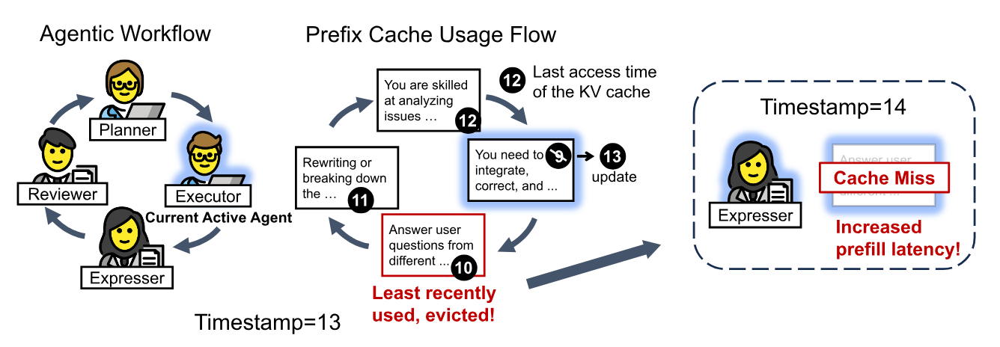
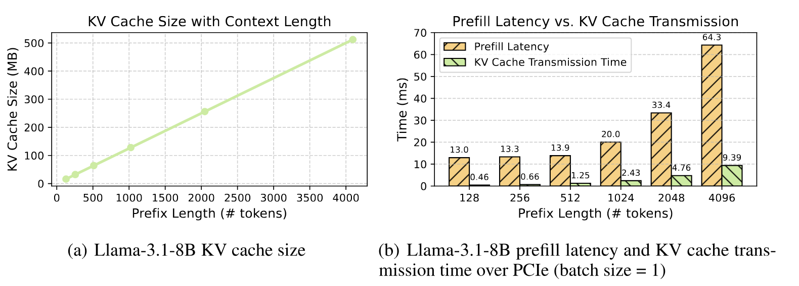
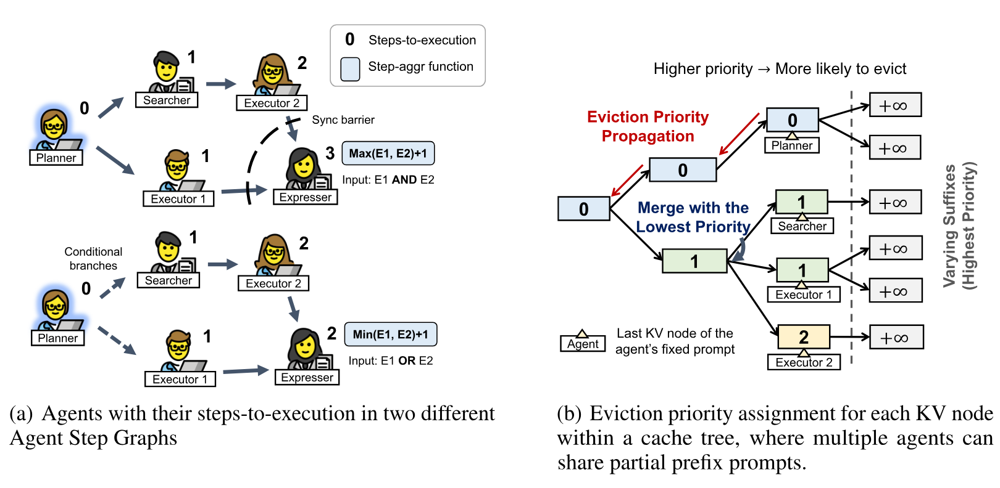
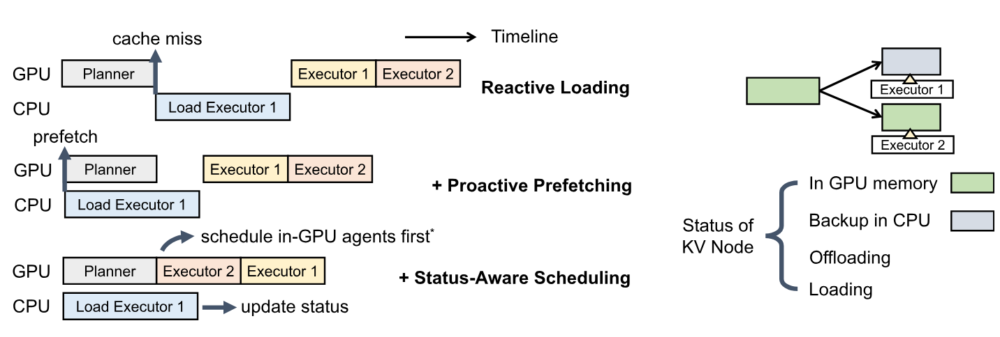
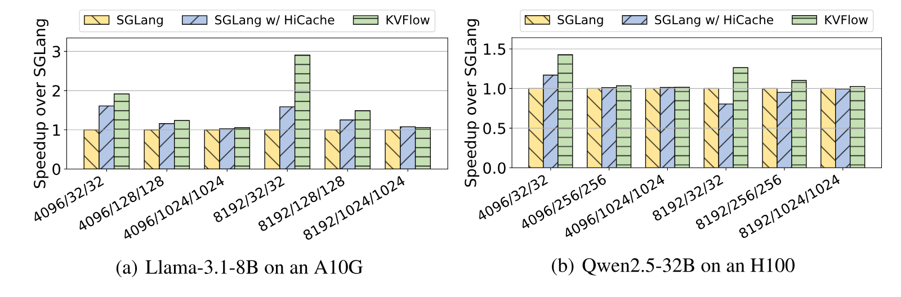
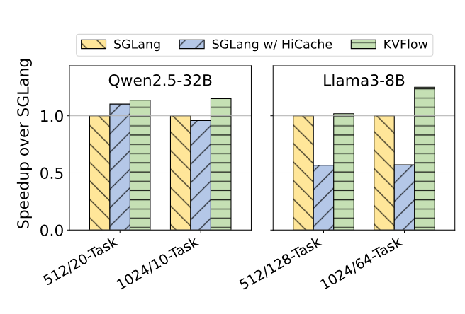
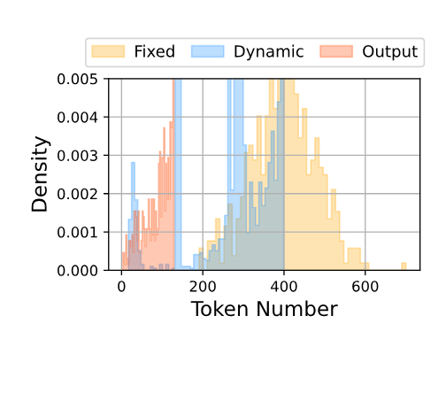
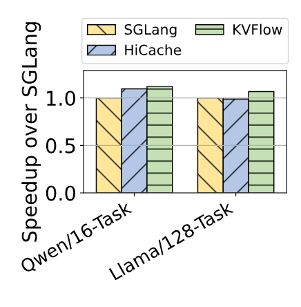

> [Zaifeng Pan](https://panzaifeng.github.io/), [Ajjkumar Patel](https://dblp.org/pid/412/9471), [Zhengding Hu](https://dblp.org/pid/359/5899) [+corresponding-author], [Yipeng Shen](https://dblp.org/pid/04/4092), [Yue Guan](https://dblp.org/pid/54/7820-3), [Wan-Lu Li](https://dblp.org/pid/412/8586), [Lianhui Qin](https://lianhui.ucsd.edu/), [Yida Wang](https://yidawang.org/) 和 [Yufei Ding](https://yufeiding.ucsd.edu/). arXiv 初次提交于 2025 年 7 月 10 日; 当前版本为 v1. 发表于 [NeurIPS 2025](https://neurips.cc/virtual/2025/loc/san-diego/poster/119883). [KVFlow: Efficient Prefix Caching for Accelerating LLM-Based Multi-Agent Workflows](https://arxiv.org/abs/2507.07400v1). [原始 PDF](/paper/kvflow.pdf). [DOI](https://doi.org/10.48550/arXiv.2507.07400). [TeX 源文件](https://arxiv.org/src/2507.07400v1). 精确的印刷版式和参考文献以原始 PDF 为准.

## Abstract

基于大语言模型 (LLM) 的智能体工作流已经成为一种常用范式, 可协调多个专用智能体解决复杂任务. 为提高服务效率, 现有 LLM 系统采用前缀缓存, 复用与智能体固定提示对应的键值 (KV) 张量, 从而避免在重复调用时进行冗余计算. 然而, 当前系统通常使用最近最少使用 (LRU) 策略驱逐 KV 缓存, 该策略无法预判智能体未来的使用情况, 经常在即将复用前丢弃 KV 缓存. 这会导致频繁的缓存未命中以及大量重计算或交换开销.

我们提出 KVFlow, 一种面向智能体工作负载的工作流感知 KV 缓存管理框架. KVFlow 将智能体执行调度抽象为智能体步骤图 (Agent Step Graph), 并为每个智能体分配一个距执行步数值, 以估计其距离未来激活的时间远近. 这些值在 KV 节点层面指导细粒度驱逐策略, 使 KVFlow 能保留可能被复用的条目, 并高效管理树形缓存中的共享前缀. 此外, KVFlow 引入完全重叠的 KV 预取机制, 在后台线程中主动将下一步计划执行的智能体所需张量从 CPU 加载到 GPU, 从而避免生成期间因缓存未命中而停顿. 与采用分层基数缓存的 SGLang 相比, 对于提示较大的单工作流, KVFlow 可实现最高 1.83$\times$ 的加速; 对于存在大量并发工作流的场景, 可实现最高 2.19$\times$ 的加速.

## 1 Introduction

基于 LLM 的智能体工作流协调多个专用智能体, 每个智能体由固定提示定义并负责特定子任务, 从而以模块化且可解释的方式解决复杂问题 [Cao23, Shi23b, Hon23, Li23s, Wan24l]. 例如, MetaGPT [Hon23] 围绕产品经理和工程师等软件工程角色组织智能体协作. 这种设计虽然提高了可复用性和一致性, 但工作流在整个执行过程中需要反复调用每个智能体的 LLM, 因而也会带来较高的推理延迟.

为减轻这项开销, 现有智能体框架和应用 [Hon23, Wu23c, Zhu24a, Zha24l, Pan24c, He25a] 依赖配备系统级优化的 LLM 服务系统 [Kwo23, Zhe24, Ten23]. 一项常用技术是前缀缓存 [Zhe24, Aut25], 它在不同解码步骤和请求之间复用自注意力层为静态提示 token 生成的键值 (KV) 张量. 这对智能体工作流尤其有益, 因为每个智能体初始化时都有固定提示, 用于指定其名称、职责和行为特征. 这些提示在各次迭代中保持不变, 因此前缀缓存可以避免对静态内容进行冗余计算, 并显著降低每个智能体的推理延迟.

然而, GPU 内存有限时, 仅靠前缀缓存还不够. 现有系统通常采用最近最少使用 (LRU) 策略, 驱逐最近没有访问的 KV 缓存. 我们发现, 这一策略在智能体工作流中可能导致次优性能. 例如, 如[图 1](#figure-01) 所示, 考虑一个由四个智能体组成的工作流 [Wan24l], 这些智能体按顺序执行管线组织, 并被迭代调用. 在图示 Executor 智能体执行期间, LRU 策略将 Expresser 的 KV 缓存判定为驱逐候选, 因为它最近没有被访问. 尽管该缓存马上就会被复用, 当工作流推进到 Expresser 智能体时, 仍会发生缓存未命中. 这种驱逐行为引入不必要的重计算, 降低了智能体执行的整体效率.

为解决现有 LLM 服务系统在智能体工作流中的局限, 我们提出 KVFlow, 一种工作流感知 KV 缓存管理框架. 我们首先引入*智能体步骤图*, 这一灵活抽象可以捕获智能体之间的执行依赖关系, 并支持包括条件分支和同步屏障在内的多种工作流结构. 图中的每个智能体节点都关联一个计算得到的*距执行步数*值, 用于估计该智能体预计多久后运行. 该值由在图中传播的步数聚合函数计算得出, 使 KVFlow 能够推断动态且结构化的执行模式.

运行时, KVFlow 通过两种主要方式利用这些信息优化缓存行为. 首先, KVFlow 不使用 LRU, 而是采用工作流感知驱逐策略, 优先驱逐距执行步数较大的智能体所对应的 KV 缓存. 由于多个智能体可以通过树形缓存共享公共前缀, 我们进一步在缓存节点层面分配驱逐优先级, 实现细粒度的高效管理. 其次, KVFlow 引入完全重叠的 KV 预取机制, 因为智能体步骤图可以预测接下来调用的智能体, 该机制会提前主动将所需 KV 张量从 CPU 加载到 GPU. 这样可以在不阻塞生成的情况下有效消除前缀缓存未命中. 这些优化共同提高了缓存效率, 并降低智能体工作流的执行延迟.

**图 1.** 一个由 Planner、Executor、Expresser 和 Reviewer 四个智能体组成的循环智能体工作流抽象, 改编自 [Wan24l]. 在时间戳 13, Executor 处于活跃状态并更新其 KV 缓存, 根据 LRU 策略, 这会驱逐 Expresser 的缓存. 在时间戳 14, Expresser 再次变为活跃状态时发生缓存未命中, 导致预填充延迟增加.

概括而言, 本文作出以下贡献:

- 我们指出现有 LLM 服务系统中的一项根本低效问题: 广泛使用的 LRU KV 缓存驱逐策略在智能体工作流下会导致次优性能.
- 我们提出 KVFlow, 一种工作流感知 KV 缓存管理优化, 它根据智能体执行顺序确定驱逐优先级, 并通过完全重叠的预取消除缓存未命中开销.
- 我们对 KVFlow 进行全面评估, 结果表明它可以显著降低缓存未命中开销; 与采用分层基数缓存的 SGLang 相比, 在大提示单工作流和大量并发工作流下分别实现最高 1.83$\times$ 和 2.19$\times$ 的加速.

## 2 Background

**LLM 服务系统中的前缀缓存.** 为实现细粒度的前缀复用并消除冗余存储, 现代 LLM 服务系统 [Kwo23, Zhe24] 将 KV 缓存组织为 GPU 上的树形结构, 每个节点存储一段 token 及其对应的 KV 张量. 收到新请求后, 系统从树根开始匹配前缀, 并沿匹配路径拼接 KV 张量, 以重建完整的缓存前缀. GPU 内存不足时, 系统根据 LRU 策略驱逐节点. 内存耗尽可能由两种原因造成. 一种常见情形是并发用户请求数量很大, 每个请求执行不同的智能体工作流, 从而产生大量活跃的 KV 缓存条目. 另一种情形是智能体提示很大而硬件容量有限. 如[图 2(a)](#figure-02) 所示, 单个请求的 KV 缓存大小会随前缀长度迅速增长, 上下文越长, 内存压力越大. 此外, 可以将 CPU 内存配置为二级缓存层, 备份已驱逐的 KV 张量, 从而允许通过 PCIe 交换缓存. 尽管 PCIe 会带来延迟, 交换仍远快于重新计算 KV 张量 [Jin24a, Gao24a]. [图 2(b)](#figure-02) 比较了基于 PCIe 的 KV 缓存传输时间与预填充计算时间, 证实在内存压力下卸载到 CPU 内存是一种高效策略.

**图 2.** 不同上下文长度下的 KV 缓存特征. (a) KV 缓存大小随 token 数量线性增长, 导致内存用量增加. (b) 通过 PCIe 传输 KV 缓存所需的时间始终远短于重计算所需的时间.

**智能体工作流.** 智能体工作流 [Zha24l, He25a, Pan24c, Zhu24a] 是一种 LLM 应用范式, 它将多个智能体组织成执行图, 以协作解决复杂任务. 与完全自主的智能体 [Par23, Wan24k, Neu24] 相比, 智能体工作流利用人类领域知识, 在各种任务中取得更一致、更稳健的性能 [Hon23, Rid24, Wan23e, Zha24m, Qia23, Mor23a]. 每个智能体的执行通常涉及一次或多次 LLM 调用, 其提示由*固定*部分和任务特定的*动态*部分组成. 固定部分通常编码智能体角色、行为指令、任务描述和少样本学习示例, 而且可能相当长. 例如, [Zha24m] 中 TestBench Agent 和 RTL Generator Agent 的固定提示包含很长的少样本学习示例, 分别超过 3000 和 1000 个 token. 因此, 缓存固定部分对应的 KV 可以显著降低预填充延迟, 提高工作流的整体执行效率. 相比之下, 动态部分往往包含用户输入的问题或指令, 缓存价值较低.

## 3 Design of KVFlow

本节介绍 KVFlow 的设计, 它通过两项主要技术增强智能体工作流的前缀缓存管理. 首先, 我们引入工作流感知驱逐策略, 根据未来使用情况确定 KV 节点的优先级, 改进默认的 LRU 策略. 其次, 我们提出重叠式 KV 预取机制, 通过主动加载和状态感知调度隐藏 CPU-GPU 传输延迟.

### 3.1 Workflow-Aware Eviction Policy

现有 LLM 服务系统通常采用 LRU 驱逐策略, 但该策略在智能体工作流下会成为次优选择. 具体而言, 一个即将执行的智能体可能已经闲置很久, 而刚刚完成执行的智能体在近期可能不会再次使用. 此外, 最近执行的智能体所动态生成的后缀通常会随任务进展快速变化, 不太可能被复用, 却仍会暂时留在缓存中. 借助工作流信息, 我们可以预测即将执行的智能体序列, 从而作出信息更充分的驱逐决策, 避免 LRU 引起的低效.

**图 3.** 工作流感知驱逐策略示意图. (a) 每个智能体工作流被抽象为智能体步骤图, 其中距执行步数值通过依赖边上的步数聚合函数计算. (b) 这些值在缓存树中传播, 用于为 KV 节点分配驱逐优先级. 距执行步数较小的节点会保留更久, 降低被过早驱逐的概率.

**智能体步骤图与距执行步数.** 要根据工作流结构作出驱逐决策, 首先需要捕获智能体之间的依赖关系. 然而, 现实工作流中的智能体交互差异很大. 如[图 3(a)](#figure-03) 所示, 两个工作流存在明显差异: 在上方示例中, Expresser 智能体同时依赖 Executor1 和 Executor2; 相比之下, 下方工作流包含条件分支, 任一 executor 完成后都可以触发 Expresser. 控制流图 (CFG) 或 DAG 等传统抽象无法统一捕获这类多样的执行语义.

为此, 我们引入*智能体步骤图*抽象, 其中每个节点对应一次智能体调用, 边表示依赖关系. 与传统图不同, 智能体步骤图中的每个节点都关联一个*步数聚合函数*, 用于确定如何根据前驱节点推导其距执行步数. 对于前缀缓存管理, 我们只关注每个智能体最早可能执行的步骤, 并抽象掉具体的依赖类型.

例如, 在[图 3(a)](#figure-03) 上方的工作流中, Expresser 智能体需要两个上游 executor 均执行完成, 因此其步数值计算为 $\max(E1, E2) + 1$. 在下方工作流中, 任一路径完成即可, 因此步数值为 $\min(E1, E2) + 1$. 通过递归应用这些聚合函数, 智能体步骤图可以统一计算任意多智能体工作流中的距执行步数.

**工作流感知驱逐优先级分配.** 根据智能体步骤图中的距执行步数, 我们设计了一种细粒度驱逐策略, 为 KV 缓存节点分配优先级. 如[图 3(b)](#figure-03) 所示, 距执行步数较大的智能体更可能被驱逐. 重要的是, 由于智能体可以在树形缓存布局中共享公共前缀段, 我们在缓存节点层面而不是智能体层面分配驱逐优先级.

具体而言, 我们只为每个智能体的固定提示部分分配优先级; 所有变化的后缀始终被赋予最高驱逐优先级, 以便尽早驱逐. 对每个智能体, 我们将其距执行步数值分配给固定提示的最后一个节点, 并沿树向上传播. 当一个节点聚合多个智能体的输入时, 我们为它分配子节点中的最小优先级 (即最不应被驱逐), 确保只要任一智能体近期仍会使用共享节点, 该节点就会得到保留.

这种传播方案会在缓存树上生成一张优先级图, 动态反映工作流驱动的复用潜力. 当 GPU 内存受限时, KVFlow 首先驱逐变化的后缀, 然后按分配优先级的降序逐步驱逐前缀 KV 节点, 优先驱逐近期不太可能复用的节点. 该设计自然支持多个并发工作流, 共享节点上的冲突通过选取所有工作流中的最低优先级 (最保守的优先级) 来解决.

### 3.2 Overlapped KV Prefetching

工作流感知驱逐策略可以避免过早驱逐即将执行的智能体, 但当智能体的 KV 缓存已被驱逐而它又需要再次运行时, 仍可能发生缓存未命中. 对于长提示, 这种情况的代价尤其高, 因为从头重新计算 KV 缓存会产生大量开销. 为缓解该问题, 我们把 CPU 内存作为二级缓存, 用于存储已驱逐智能体的固定提示 KV.

CPU 缓存可用时, 现有系统通常采用*响应式加载*策略, 如[图 4](#figure-04) 顶部时间线所示. 例如, 如果 Executor 1 的前缀缓存已经卸载到 CPU 内存, 系统只会在调度 Executor 1 时响应式地将其重新加载, 从而避免重计算. 然而, CPU 到 GPU 的数据传输仍会引入明显延迟, 对长前缀尤其如此.

**主动预取.** 为降低这项传输开销, 我们提出*主动预取*机制, 利用工作流信息提前异步加载所需的 KV 缓存. 如[图 4](#figure-04) 第二条时间线所示, Planner 执行时, 系统预计接下来会调用 Executor 1, 因而主动将其 KV 缓存从 CPU 预取到 GPU. 智能体执行主要涉及 GPU 上的模型前向过程和下一个 token 采样 (模型输出从 GPU 传输到 CPU), KV 加载则涉及 CPU 到 GPU 的传输, 因此两种操作使用不同的硬件资源, 可以并行进行而不互相干扰. 值得注意的是, PCIe 支持全双工传输, CPU 与 GPU 之间可以进行无争用的双向通信. 当工作流包含分支时, 系统会根据步骤图保守地预取下一步所有可能执行的智能体, 但并发预取数量不超过预定义限制.

**图 4.** 重叠式 KV 预取示意图. 与响应式加载相比, KVFlow 将提前加载后续智能体的主动预取与状态感知调度结合起来, 尽量减少 CPU-GPU 传输开销. *位于 GPU 中的智能体可以来自同一工作流, 也可以来自另一个并发工作流.

然而, 仅靠预取并不总是足够. 当前智能体的执行时间短于预取时长时, 未完成的 KV 加载仍可能阻塞生成. 这种情况在高并发设置中很常见, 因为多个工作流会竞争 CPU-GPU 带宽并造成排队延迟. [图 4](#figure-04) 第二条时间线展示了这种情形: 尽管进行了预取, Executor 1 的生成仍然停顿.

**状态感知调度.** 为进一步减少 GPU 空闲时间, 我们为请求调度策略加入状态感知能力. 在每个调度步骤中, 如果某个请求的前缀缓存仍处于加载过程中, 调度器会暂时跳过它, 优先处理其他就绪请求, 例如[图 4](#figure-04) 中的 Executor 2 或其他并发工作流中的请求. 为此, 我们为每个缓存节点关联一个状态变量, 它可以是四种状态之一: *位于 GPU 内存*、*已备份至 CPU*、*正在加载*或*正在卸载*. 调度器检查请求所需的所有节点, 跳过任何处于*正在加载*状态的节点以避免重复加载, 并且只在所有依赖项均可用时调度该请求. 加载完成后, 后台加载线程更新缓存节点的状态, 将就绪信息通知调度器. 同样, 处于*正在卸载*状态的节点不会参与驱逐决策, 以免内存回收期间发生竞态条件.

如[图 4](#figure-04) 第三条时间线所示, KVFlow 通过结合主动预取与状态感知调度, 有效消除缓存未命中, 并让 GPU 计算与预取完全重叠, 从而隐藏 CPU-GPU 传输延迟.

### 3.3 Implementation

我们基于 SGLang v0.4.4 [Zhe24] 实现 KVFlow 原型; SGLang 是一种高效的 LLM 服务系统, 同时提供用于执行 LLM 的后端和用于开发应用的前端接口. SGLang 后端使用基数树管理前缀 KV 缓存. 我们扩展了这一机制, 以支持工作流感知驱逐策略和完全重叠的 KV 预取. 此外, 我们修改了 SGLang 的前端和后端, 以支持传输智能体工作流信息. 当前原型虽然集成在 SGLang 的前端 API 中, 但我们的方法并不限于 SGLang. 只需修改前端发往服务器的 HTTP 请求, 它就可以适配其他智能体工作流框架.

**步骤信息捕获.** 捕获智能体步骤图生成的距执行步数信息, 对于在运行时指导我们的优化至关重要. 在实现中, 我们假设每个 `sgl.function` 对应一个独立智能体. 执行期间, 我们对 LLM 调用进行即时替换, 将工作流元数据嵌入 HTTP 请求. 这些元数据包括当前智能体的身份以及智能体步骤图中所有智能体的距执行步数, 表明后续步骤中可能调用哪些智能体. 后端收到这些信息后, 可以相应地更新 KV 缓存树中的驱逐优先级, 并在可驱逐的 GPU 内存足够大时触发预取.

除了捕获步骤图拓扑之外, 我们还需要跟踪每个智能体固定提示的最后一个 KV 节点, 如[图 3](#figure-03) 所示. 区分一个请求中提示的固定部分和动态部分是一项挑战. 我们提供两种替代方案. 第一种是引入原语接口, 允许用户显式标记固定部分的结束位置. 第二种是设计启发式方法, 跟踪智能体的缓存命中历史, 并将持续命中的前缀视为固定部分.

**客户端跟踪.** 在服务场景中, 多个智能体工作流可能在同一后端实例上并发执行. 现有服务系统不会区分请求来源, 可能导致命名冲突. 例如, 两个不同工作流都可能定义名为“Planner”的智能体. 为解决这个问题, 我们为每个应用分配唯一的客户端 ID. 客户端 ID 会附加到发往后端的每个请求, 使系统能够区分智能体身份, 避免来自不同客户端的工作流互相干扰.

## 4 Evaluation

我们通过一系列微基准评估 KVFlow, 以了解它在不同缓存和执行条件下的性能. 实验旨在回答以下关键问题: (1) 对于提示前缀较大且 GPU 内存有限的单个工作流, KVFlow 能否降低端到端延迟? (2) 多个工作流并行运行时, KVFlow 在高并发下表现如何? 为回答这些问题, 我们首先在[第 4.1 节](#section-04-01) 分析单工作流延迟, 然后在[第 4.2 节](#section-04-02) 研究多工作流执行.

KVFlow 只修改系统级缓存管理, 不会影响模型权重、提示或解码逻辑, 因而能够保证输出的语义正确性不变. 因此, 我们的评估只关注延迟等系统性能指标.

### 4.1 Single-Workflow Latency

我们首先评估批量大小 = 1 时执行单个智能体工作流的延迟. 这种单请求延迟反映了由用户单独触发工作流的交互式使用场景, 例如 notebook 或开发工具. 在线服务系统依靠批处理提高吞吐量, 而这些场景更注重单个请求的响应速度.

我们的基准是一个由 10 个智能体组成的顺序执行工作流. 如[第 2 节](#section-02) 所述, 每个智能体的输入提示由固定前缀 (各次调用之间共享) 和动态后缀 (每次运行会变化) 组成. 我们随机采样 token 序列, 分别控制两部分的长度, 以生成合成输入提示.

**模型与测试平台.** 我们在两套配置上开展实验: (1) NVIDIA A10G GPU 上运行 Llama-3.1-8B, GPU 配备 24GB 内存和带宽为 2GB/s 的 PCIe Gen1; (2) NVIDIA H100 GPU 上运行 Qwen2.5-32B, GPU 配备 80GB 内存和带宽为 64 GB/s 的 PCIe Gen5. Llama 模型使用 32 个注意力头和 8 个 KV 头, Qwen 使用 40 个注意力头和 8 个 KV 头. 我们采用确定性解码 (temperature = 0, greedy sampling), 以确保延迟测量一致. 选择这两套配置是为了代表 GPU 内存约束较紧的场景.

**基线.** 我们将 KVFlow 与两种 SGLang 配置比较. 第一种记为 **SGLang**, 它在 GPU 内存中维护基数结构的 KV 缓存, 不在 CPU 上保留备份. GPU 内存不足时, 前缀节点会被驱逐, 复用时必须从头重新计算. 第二种配置记为 **SGLang w/ HiCache**, 我们启用 SGLang 的分层基数缓存, 这是 SGLang 默认的 CPU 缓存扩展. 它通过异步地将常用缓存节点备份到主机内存来扩展 SGLang 的基数树. 如果一个节点被驱逐后再次访问, 系统会从 CPU 将其重新加载, 而不是重新计算. 为进一步降低 CPU-GPU 传输成本, 采用 HiCache 的 SGLang 将第 $l$ 层的 GPU 计算与第 $l{+}1$ 层的加载重叠, 形成简单的两阶段管线.

**图 5.** 一个 10 智能体顺序工作流相对 SGLang (仅 GPU 缓存) 的加速比. 横轴: *固定部分 token / 动态部分 token / 输出 token*.

**评估方法.** 我们首先多次执行每个智能体的固定提示来预热缓存, 确保构建其前缀缓存, 并将其备份到 CPU 内存 (针对 HiCache). 然后, 我们执行该 10 智能体工作流十次, 每次使用不同的动态后缀. 延迟取所有运行的平均值. 这模拟了反复调用工作流或循环式行为的真实使用模式 [Wan24l].

**结果.** [图 5](#figure-05) 展示了不同提示配置*固定 / 动态 / 输出*下相对 SGLang (仅 GPU 缓存) 的加速比. 我们有意测试较大的固定前缀长度 (例如 8192 个 token), 以超出 GPU 内存并迫使系统驱逐缓存.

在所有设置中, KVFlow 始终取得最高加速比. 例如, 在 A10G 上的 8192/32/32 设置中, KVFlow 比 SGLang w/ HiCache 快 1.83$\times$, 比仅 GPU 的 SGLang 基线快 2.91$\times$. 这证实工作流感知驱逐和预取策略可以有效隐藏 CPU-GPU 传输开销. HiCache 虽然减少了重计算开销, 但当计算时间短于传输时间时, 仍会受到管线冷启动和重叠不足的影响.

我们还发现, SGLang w/ HiCache 通常优于仅 GPU 的 SGLang 基线, 因为从 CPU 加载通常比重新计算更快. 然而, 在 H100 上的一些大上下文设置中 (例如 8192/32/32), HiCache 的性能提升很小, 甚至有所下降. 这可能源于 SGLang 管线逻辑中的次优调度: 在内存争用或传输量较大时, CPU-GPU 传输未能与计算有效重叠.

随着输出 token 数量增加, KVFlow 的相对收益会减小. 原因是这些设置中的 LLM 解码延迟主导了总运行时间, 缓存加载所影响的时间占比随之下降. 许多工作都在优化自回归 LLM 中耗时较长的解码步骤, 包括推测解码 [Che23, Lev23, Sax23]、KV 缓存稀疏化 [Xia24a] 和提前退出 [Fu24a]; 这些工作与我们的方法正交, 可以同 KVFlow 一起使用.

与此同时, KVFlow 的加速比随固定提示长度增加. 固定 token 设为 8192 时, 平均加速比达到 1.48$\times$, 而 fixed = 4096 时只有 1.28$\times$. 这是因为前缀越长, 缓存未命中的开销越高, KVFlow 的主动缓存管理也就越有利.

### 4.2 High-Concurrency Workflow Performance

我们还在单张 H100 GPU 上同时启动多个独立工作流, 评估高并发下的系统性能. 假设这些工作流之间既不交互也不共享. 如[图 6](#figure-06) 所示, 我们对四种配置进行基准测试, 每种配置都用每个智能体的固定提示长度和并发工作流数量标记. 动态 token 和输出 token 的长度固定为 256. 对每种设置, 我们选择 GPU 可以承载的适当并发度, 同时确保前缀缓存不会耗尽内存. 如果并发度过高, 所有可用内存都会被活跃请求占用, 系统无法再维护可复用的前缀缓存, 这种情况超出了我们的优化范围.

**图 6.** H100 上不同固定提示长度/并发度设置下的高并发工作流性能对比.

**图 7.** PEER 风格工作流中固定部分、动态部分和输出部分的 token 分布.

**图 8.** KVFlow 相对 SGLang 和 HiCache 在 PEER 风格多智能体应用上的加速比.

**结果.** 根据[图 6](#figure-06), KVFlow 在所有设置下始终优于 SGLang 和 HiCache, 加速比最高达到 1.25$\times$. KVFlow 在固定提示为 1024 个 token 时的性能提升高于 512 个 token, 因为前者的缓存未命中开销更高. 特别是, HiCache 在高并发下表现很差, 多种情况下甚至落后于 SGLang. 例如, 在 1024 个固定提示 token 和 64 个并发工作流下, 它的性能只有不使用 CPU 缓存的 SGLang 的 0.57$\times$. 我们推测, 这是因为频繁的缓存未命中会触发响应式回载操作, 扰乱 SGLang 的调度-计算管线. 此外, 由于 SGLang 中的 KV 存储布局碎片化, PCIe 带宽无法得到充分利用. KVFlow 同样没有解决碎片化问题, 但通过更合理的驱逐和主动预取, 它可以让 PCIe 传输与 GPU 计算更充分地重叠. 因此, 与采用响应式加载的朴素 LRU HiCache 相比, 它的性能最高可提升 2.19$\times$.

**真实工作流模拟.** 为更好地反映真实部署场景, 我们基于 PEER [Wan24l] 框架模拟智能体工作流. 在我们的设置中, 每个工作流由四个智能体组成, 使用 PEER 提供的工作流模板实例化. 对每个智能体, 我们采样一个角色和一条指令, 并提示 LLM 生成该智能体的提示. 由于 LLM 采样本身具有随机性, 即使角色和指令相似, 生成的提示也会有所不同. 同时, 所有智能体都在同一应用上下文中运行, 因而它们的提示往往共享部分重叠的前缀. 由此得到的工作流既多样又存在部分冗余, 反映了真实多智能体应用的常见特征.

我们使用 PEER 的 Financial QA 数据集作为工作流输入. 得到的工作负载规模适中, 智能体提示通常从几十到几百个 token 不等. [图 7](#figure-07) 展示了所有智能体中固定部分、动态部分和输出部分的 token 长度分布. [图 8](#figure-08) 展示了 KVFlow、SGLang 和采用 HiCache 的 SGLang 之间的性能对比. KVFlow 相比 SGLang 和 HiCache 均有明显提升, 加速比分别最高达到 1.12$\times$ 和 1.08$\times$. 结果表明, KVFlow 在真实部署场景中的多应用服务方面具有很强的实践潜力.

## 5 Related Work

**LLM 服务优化.** 大量工作通过优化请求调度来改进在线 LLM 服务, 包括连续批处理 (也称为迭代级调度) [Yu22a]、用于缓解队首阻塞的多级反馈队列 [Wu23a]、面向流式场景的体验质量感知调度器 [Liu24r] 等. 另一类工作关注 KV 缓存管理. vLLM 提出 PagedAttention [Kwo23], 通过分页存储 KV 张量减少内存碎片, SGLang 则引入 RadixAttention [Zhe24], 以消除前缀缓存中的冗余. 还有一些工作针对聊天机器人场景设计专用的前缀缓存策略 [Gao24a, Yu25b]. InferCept [Abh24a] 预测工具调用时长, 并使用成本模型决定保留、交换还是丢弃被拦截请求的 KV 缓存. 这些优化与 KVFlow 正交, KVFlow 关注的是由多个智能体组成的工作流. Autellix [Luo25b] 和 ParrotServe [Qiu24] 虽然研究智能体工作流中的请求调度, 但没有考虑前缀缓存管理, 因而它们的目标与我们的方法互补.

**智能体工作流框架.** 近期工作提出了多种多智能体框架 [Hon23, Li23s, Wu23c, Zhu24a, Inc24, Ant24c, Gao24d], 将智能体组织为结构化角色以协作解决复杂任务. 这些框架内置了智能体之间的消息传递和依赖关系构建机制、在智能体动作中方便地集成工具使用和推理方法的能力、常见智能体角色与行为的预定义抽象, 以及支持智能体并发协作的高效多线程执行. 其中一些系统将智能体工作流抽象为计算图, 节点表示调用 LLM 的智能体, 边表示控制流或消息依赖关系. 这一抽象使系统可以应用图级变换, 例如边剪枝 [Zha24n]、算子插入 [Zha24l] 或拓扑优化 [Zhu24a, He25a], 以提高应用的正确性或质量. 然而, 这些框架仍侧重应用层构建, 依赖传统 LLM 服务基础设施处理生成. 相比之下, 我们的工作利用智能体工作流的结构优化服务系统本身, 目标是在多智能体执行工作负载下提高后端效率.

## 6 Conclusion

我们提出 KVFlow, 一种用于优化智能体工作流中 LLM 服务的工作流感知 KV 缓存管理框架. KVFlow 将智能体执行抽象为步骤图, 并计算每个智能体的距执行步数, 从而实现能够预判未来使用情况的系统化驱逐策略. 它还引入完全重叠的 KV 预取机制, 主动消除缓存未命中造成的停顿. 评估结果表明, 对于长提示或高并发工作流, KVFlow 可以显著提高相对于现有系统的服务效率.

以往多智能体系统研究主要关注前端应用逻辑和交互协议的设计, 而 KVFlow 表明, 工作流语义对于实现系统级优化同样重要.

[+corresponding-author]: 通讯作者.
