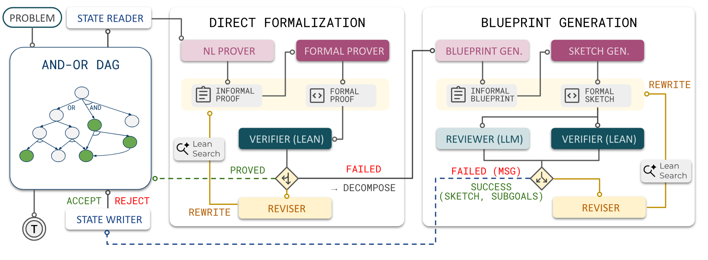
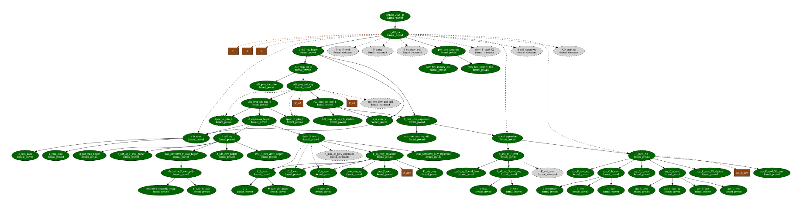
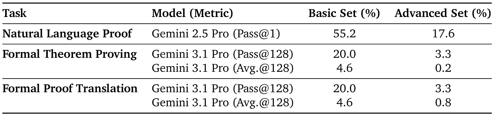
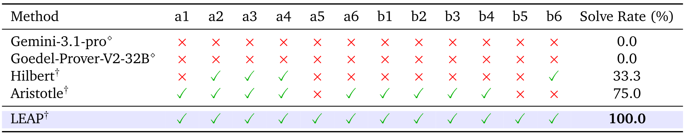
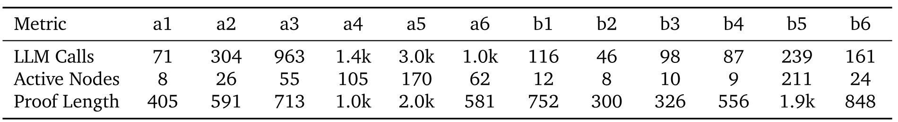
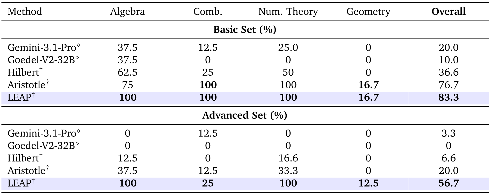
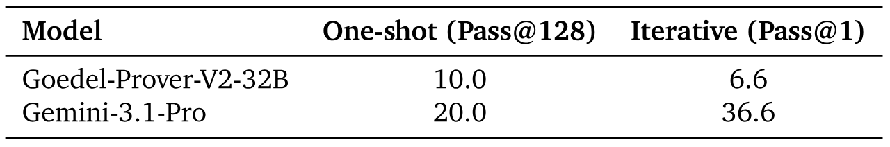
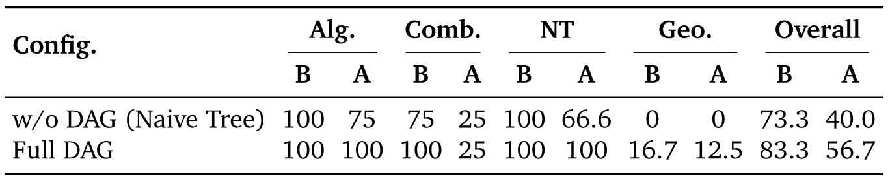
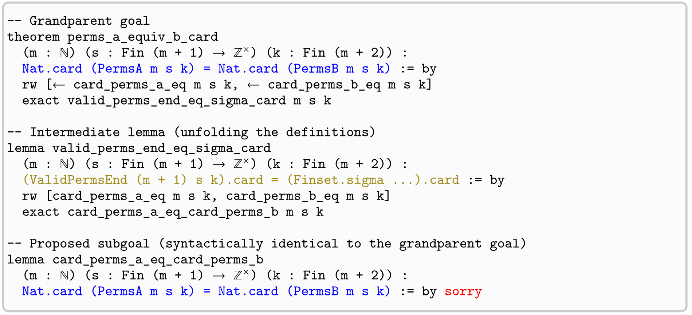

> [Po-Nien Kung](https://billkunghappy.github.io/ponien-kung/), [Linfeng Song](https://scholar.google.com/citations?user=yWZdmLYAAAAJ), [Dawsen Hwang](https://scholar.google.com/citations?user=yuX2FDAAAAAJ), [Jinsung Yoon](https://scholar.google.com/citations?user=kiFd6A8AAAAJ), [Chun-Liang Li](https://scholar.google.com/citations?user=vqHIt_sAAAAJ), [Simone Severini](https://scholar.google.com/citations?user=yi-Q7zcAAAAJ), [Mirek Olšák](https://dblp.org/pid/192/1864), [Edward Lockhart](https://scholar.google.com/citations?user=P1MWvREAAAAJ), [Quoc V Le](https://scholar.google.com/citations?user=vfT6-XIAAAAJ), [Burak Gokturk](https://scholar.google.com/citations?user=351ivuQAAAAJ), [Thang Luong](https://scholar.google.com/citations?user=Bmbkv6sAAAAJ), [Tomas Pfister](https://scholar.google.com/citations?user=ahSpJOAAAAAJ), [Nanyun Peng](https://violetpeng.github.io/). 论文于 2026 年 6 月 2 日首次提交至 arXiv; 当前版本为 v2, 修订于 2026 年 6 月 3 日. [LEAP: Supercharging LLMs for Formal Mathematics with Agentic Frameworks](https://arxiv.org/abs/2606.03303v2). [原始 PDF](/paper/leap-formal-mathematics.pdf). [DOI](https://doi.org/10.48550/arXiv.2606.03303). [TeX 源文件](https://export.arxiv.org/e-print/2606.03303v2). 精确的印刷排版与参考文献以原始 PDF 为准.

## 摘要

大语言模型 (LLM) 在非形式化数学推理方面表现出很强的能力, 但难以用 Lean 等形式语言生成可由机器验证的证明.
我们提出 LEAP (LLM-in-Lean Environment Agentic Prover), 这是一个智能体框架, 使通用基础模型在自动形式化定理证明上达到当前最佳水平.
LEAP 利用基础模型的非形式化推理, 指令遵循和迭代式自我改进能力. 系统把复杂问题分解成较小单元, 并与 Lean 编译器持续交互, 从而衔接形式化证明构造与非形式化蓝图.
为了在日趋饱和的基准之外进行严格评测, 我们提出 Lean-IMO-Bench: 一个用 Lean 形式化 IMO 风格问题的基准. 其中的问题陈述简短, 但证明并非常规做法所能完成, 往往包含多个步骤, 难度跨度也很大.
在最新的 2025 年 Putnam 竞赛这一面向北美本科生的年度数学竞赛中, LEAP 解出了全部 12 道题, 与前沿形式数学模型近期取得的突破相当; 在 Lean-IMO-Bench 上, LEAP 将通用 LLM 的单次形式化求解率从不足 10% 提高到 70%, 明显超过一个达到 IMO 金牌水平的专用系统所创下的 48%. 我们还展示了 LEAP 在研究级任务中的用途: 它自主形式化了组合数学开放难题的复杂证明, 其中包括 Knuth 偶数阶 Cayley 图 Hamilton 分解一个关键子问题的已验证证明.

<span id="section-1"></span>

## 1 引言

大语言模型 (LLM) 在使用自然语言进行数学推理方面取得了显著进展, 这也称为"非形式化数学推理". 它们在数学竞赛与研究级数学的复杂推理和问题求解上都表现出很强的能力 [Hua25h, Luo25i, Fen26, Fen26a, Fen26b]. 不过, 正如 Hilbert [Var25] 和 Goedel-Prover-V2 [Lin25j] 等近期工作所讨论的那样, 自然语言解答经常包含逻辑谬误和幻觉, 也很难自动验证. 验证困难并不只限于自动化系统; 即使对人类数学家而言, 核查复杂证明也非常耗时, 而且需要稀缺的专家劳动 [Gre24]. Kepler 猜想的证明 [Hal05] 是一个著名例子: 它经历了 4 年同行评审, 审稿人最终也只能声称对其正确性"有 99% 的把握" [+kepler-conjecture], 此后又用了 10 年才完成形式化验证 [Hal17]. 这一验证瓶颈表明, 在自然语言中判断正确性本身就是一项困难任务, 因而促使人们研究形式数学: 证明用机器可检查的语言编写, 再由 Lean [Mou21], Isabelle [Nip02], Coq [Hue97] 和 HOL Light [Har09] 中的严格内核验证, 可以自动给出准确性有保证的验证结果. 然而, 通往形式化定理证明的鸿沟仍然很难跨越, 当前自动形式化证明器的表现也远落后于使用自然语言的通用 LLM.

[+kepler-conjecture]: [Kepler 猜想](https://en.wikipedia.org/wiki/Kepler_conjecture).

为了弥合这一差距, 研究界近期的工作主要在形式语料上微调专用证明器模型, 如 AlphaProof [Hub26], DeepSeek Prover V2 [Ren25b], Seed Prover [Che25h] 和 Goedel Prover V2 [Lin25j]. 这些工作假设通用 LLM 未经专门训练就无法胜任严格的形式化任务. FormalProofBench [Rav26] [+formalproofbench] 和 TaoBench [Tay26] 的结果也确实表明, 通用 LLM 往往不及专用证明器模型.

[+formalproofbench]: 该论文关联一个带实时排行榜的私有数据集 [https://www.vals.ai/benchmarks/proof_bench](https://www.vals.ai/benchmarks/proof_bench). 我们曾多次联系对方, 希望参加排行榜评测, 但没有收到回复.

近期有些工作探索了智能体式搜索或推理时搜索, 但仍然依赖专用模型. 例如, Hilbert [Var25], AlphaProofNexus [Tso26], Aristotle [Ach25] 和 Seed Prover V1.5 [Che25a] 使用通用 LLM 做非形式化推理, Lean 证明步骤则交给专用模型. Axiom [+axiom] 和 Numina [+numina] 声称在 Putnam 2025 上取得了很强的结果, 却一直闭源且不提供公开访问, 因而无法得到科学验证.

[+axiom]: [https://github.com/AxiomMath/putnam2025](https://github.com/AxiomMath/putnam2025).

[+numina]: [https://github.com/project-numina/Numina-Putnam2025](https://github.com/project-numina/Numina-Putnam2025).

本文表明, 通用 LLM 在单次定理证明上仍有局限, 但瓶颈并非语言理解, 而是无法一次生成又长, 又复杂且正确的证明. 通用 LLM 具备一些可与专用模型互补的能力: 较强的非形式化推理, 指令遵循, 工具使用和自我改进. 这些能力很适合智能体式 ATP 框架, 在这类框架中, 证明构造会被分解并经过迭代改进.
为此, 我们提出 **LEAP (LLM-in-Lean Environment Agentic Prover)**, 一个仅使用通用 LLM 完成形式数学任务的智能体框架. LEAP 借鉴人类的工作流程, 先生成高层蓝图并形成有向无环图 (DAG), 再生成 Lean 证明, 根据编译器反馈反复纠错.

为了在 MiniF2F [Zhe22a] 和 PutnamBench [Tso24] 等已趋饱和的基准之外评估进展, 我们提出 Lean-IMO-Bench, 将有难度的非形式化数学基准 IMO-Bench [Luo25] 中的问题陈述形式化为 Lean. 现有基准有的侧重较短问题, 有的强调对本科数学的广泛覆盖. Lean-IMO-Bench 则补充了另一类问题: 陈述只需初等知识, 解法却常常取决于非常规洞察, 并展开为漫长, 多步且结构复杂的证明, 因而能更严格地检验形式化定理证明能力.

在最新的 2025 年 Putnam 竞赛上, LEAP 用 Lean 解出了全部 12 道题, 达到满分表现. 这项北美年度本科数学竞赛难度很高, 2025 年最高分为 110/120, 中位数却只有 2 分. 这一结果与 Axiom [+axiom] 和 Numina [+numina] 等前沿形式数学推理模型近期取得的突破相当.
在 Lean-IMO-Bench 上, LEAP 将通用 LLM 的求解率从不足 10% 大幅提高到 70%, 超过了专用 ATP 模型 (5%) 与 Aristotle (48%). Aristotle 是一个包含专用 ATP 组件的强系统, 其得分达到 2025 年 IMO 金牌水平.
本文有 3 项贡献:

- **受工作流程启发的智能体设计** 我们提出 LEAP, 用智能体框架编码人类的数学工作流程, 把高层蓝图设计, 底层形式化证明生成和基于编译器反馈的迭代结合起来. 更重要的是, LEAP 表明只用通用 LLM 也能达到当前最佳的形式化定理证明水平, 这对专门微调不可或缺的看法提出了质疑.
- **Lean-IMO-Bench 数据集:** 为了在 MiniF2F 和 PutnamBench 等已趋饱和的基准之外评估进展, 我们提出 Lean-IMO-Bench. 这个新数据集较有难度, 它把 IMO-Bench 中的非形式化问题陈述翻译成形式化 Lean 陈述. 相关资源见 [https://imobench.github.io](https://imobench.github.io).
- **有力的实验结果与发现:** LEAP 解出了 Putnam 2025 的全部 12 道题, 在 Lean-IMO-Bench 上也远超此前基线. 我们的分析表明, 对通用 LLM 而言, 形式数学的主要瓶颈并不只有形式语言理解, 还在于缺少与证明环境进行结构化, 迭代式交互的机制. LEAP 生成的 Lean 解答见 [https://github.com/google-deepmind/superhuman/tree/main/leap](https://github.com/google-deepmind/superhuman/tree/main/leap).

<span id="section-2"></span>

## 2 LEAP: 蓝图驱动的自动定理证明

<span id="section-2-1"></span>

### 2.1 使用蓝图形式化证明

数学证明的形式化很少能一次完成: 它需要一套结构化计划, 逐步把高层论证翻译成 Lean. 为了处理这种复杂性, 近期的形式化工作经常使用 Lean Blueprint 工具 [+lean-blueprint]. 数学家可以用它编写便于人类阅读, 与 Lean 代码相连的证明路线图, 并将路线图可视化为有向无环图 (DAG), 其中每个节点表示一项证明义务.
这一工作流程已用于协调 Fermat 大定理形式化路线图 [+flt-roadmap] 等大型项目, 多年的证明工作通过明确的依赖图组织起来.

[+lean-blueprint]: [Lean Blueprint](https://github.com/PatrickMassot/leanblueprint).

[+flt-roadmap]: [在 Lean 中形式化 Fermat 大定理](https://leanprover-community.github.io/blog/posts/FLT-announcement/).

受这一工作流程启发, 我们提出 LEAP, 一个通过分层分解与规划进行自动定理证明的智能体. LEAP 不会一次性合成完整证明, 而是逐步起草蓝图, 将 Lean 目标分解为支撑引理, 并用 AND-OR DAG 维护不断演化的证明计划.

<span id="figure-01"></span>



**图 1.** **LEAP 工作流程.** LEAP 首先尝试直接形式化, 并结合编译器反馈修订与 LeanSearch [Gao24g] 检索. 如果失败, 它会生成非形式化蓝图和形式化证明草图; 只有依赖关系仍保持无环时, 才将已验证的子目标加入 DAG.

<span id="section-2-2"></span>

### 2.2 概述

[图 1](#figure-01) 展示了 LEAP 的工作流程. 给定输入定理后, LEAP 将其 Lean 陈述登记为根*目标* [+goal], 在 AND-OR DAG 中表示为 OR 节点. 为了处理一个开放目标, *状态读取器*会取回它的陈述, 依赖关系和相关引理. 随后, LEAP 先尝试**直接证明**: 生成非形式化证明, 将其翻译为 Lean 代码, 再用 Lean 编译器检查候选结果.

[+goal]: *目标*是任何有待证明的定理或引理陈述; 分解会引入*子目标*. 见[第 10 节](#section-10).

如果直接证明失败, LEAP 转入**分解**. 它先起草一份提出中间引理的非形式化蓝图, 再把蓝图翻译成 Lean 证明草图. 该草图只假设所提出的引理来证明当前目标: 主定理的证明体不含 `sorry`, `sorry` 占位符只能出现在新提出的引理陈述中.
如果 Lean 编译器接受了草图, 系统便将它加入为 AND 节点, 并把所提出的引理加入为子 OR 节点. 这样, 一旦全部子目标都得到证明, 父目标也随之得到证明. 已验证的草图随后交给*状态写入器*, 后者先检查更新是否保持无环, 再将它提交到 DAG. 此后, 智能体递归处理新建的子目标.

这一工作流程依赖 3 个紧密配合的设计选择: **基于 DAG 的分层记忆化**保留进展并跨分支复用引理; **交错式非形式化-形式化规划**把自然语言策略与可执行的 Lean 代码连接起来; **验证引导的证明搜索**利用编译器反馈和基于 LLM 的评审, 决定接受, 修订, 分解或放弃候选分支.

<span id="section-2-3"></span>

### 2.3 通过 DAG 进行分层记忆化

LEAP 不仅用 AND-OR DAG 记录证明进展, 也用它组织分层记忆化. OR 节点表示开放目标或引理陈述, 任意有效证明策略都可以解决它们; AND 节点表示候选分解, 只有其中全部子目标都得到证明, 分解才能成功. [图 2](#figure-02) 展示了这一结构.

DAG 有两项主要优势. 第一项是**单调细化**: 目标一旦被分解为支撑子目标, 后续搜索就可以集中扩展和解决这些后代节点, 无需重构已经建立的依赖次序. 这样便把局部证明探索与全局证明组织分开: 单个证明尝试可以被修订, 扩展或放弃, DAG 则保留整体证明计划稳定的依赖结构. 第二项是**引理记忆化**: 中间引理陈述以共享证明节点的形式存储; 同一个子问题在不同分支中出现时, 这些节点可以复用. 这也支持*预见式引理规划*: 生成蓝图时, LEAP 可以提出当前草图尚不直接需要, 但可能有助于后续证明步骤的辅助引理陈述. 这些前瞻性引理会保留在图记忆中, 但不必用于解决当前 AND 节点. 这些性质使独立的证明计划可以汇合到共同依赖上, 同时减少重复推导.

由此形成的依赖结构也更透明: 哪些目标仍然开放, 哪些引理已经解决, 哪些节点阻塞了下游进展都一目了然. LEAP 因而可以判断哪里可能需要补充引理, 修改分解或加强假设, 同时也为人机协作提供一个可解释的蓝图式工作区.

<span id="section-2-4"></span>

### 2.4 交错式非形式化-形式化规划

如[图 1](#figure-01) 所示, LEAP 的直接证明路径和蓝图分解路径都会经过非形式化证明草稿. 这利用了 LLM 与 Lean 的互补优势: LLM 擅长非形式化推理, 策略生成和改进, Lean 则提供严格且可由机器检查的验证.

在直接证明中, LEAP 先为当前目标生成非形式化论证, 再将它翻译为候选 Lean 证明. 在分解中, 它起草非形式化蓝图, 说明如何把目标归约为支撑子目标, 然后将计划转换为记录所提依赖关系的 Lean 草图. 在这两种情况下, 非形式化草图都在正式形式化之前提供了规划空间, 因此证明构造不像单纯直接生成代码那样脆弱 (非形式化证明和蓝图的示例见[第 10 节](#section-10)).

这种交错还让证明进展更容易解释: 每次形式化尝试都有对应的非形式化理由, 用户可以检查为什么会提出某个证明步骤或分解, 而不必只看 Lean 代码或编译器反馈.

<span id="section-2-5"></span>

### 2.5 验证引导的证明搜索

如[图 1](#figure-01) 所示, LEAP 在两个层次上使用验证. 首先, Lean 编译器对候选证明和草图做形式化检查, 保证接受的代码语法有效且类型正确. 对证明草图而言, LEAP 只允许为提出的子目标 (引理) 放置 `sorry` 占位符. 这保留了证明 DAG 的 AND-OR 语义: 只要所有被引用的子目标都得到证明, 父目标也就得到证明.
其次, 蓝图提出新子目标后, LLM 评审器会判断分解的质量: 子目标是否与父目标相关, 是否让问题变得更容易, 以及是否提供了完成证明的可行路径. 这种规划层评审对复杂目标尤其重要, 因为 Lean 草图可能在语法上有效, 却引入定义不当或并不比原陈述简单的子目标. 如果没有这层筛选, 智能体可能反复扩展薄弱蓝图, 把搜索预算花在没有实际进展的分支上. 我们在[第 5.3 节](#section-5-3) 中通过去掉 LLM 评审器的消融实验研究这一失败模式.

因此, LLM 评审器相当于搜索筛选器: 它识别没有前景的分解, 触发回溯, 并推动系统探索替代策略. LEAP 当前采用带回溯的简单 DAG 深度优先搜索 (DFS). 该评审器的效果还指向一个更广的未来方向: LLM 也可以作为启发式评估器, 引导形式化证明空间中的搜索.

<span id="figure-02"></span>



**图 2.** **Putnam 2025 A6 题的 DAG 示例.** LEAP 将定理分解为证明草图与支撑引理. 通过**预见式引理规划**, 智能体还可以提出当前并不直接需要, 但以后可能有用的辅助引理陈述; 它们以虚线边表示, 证明主定理并不需要这些引理. 绿色节点表示已证明节点, 棕色方框表示在某个节点引入的定义, 结构或变量.

<span id="section-3"></span>

## 3 Lean-IMO-Bench: 在 Lean 中形式化 IMO 问题

<span id="table-01"></span>



**表 1.** Lean-IMO-Bench 三项评测任务的基线表现. 自然语言证明的表现依据人类专家评审.

<span id="section-3-1"></span>

### 3.1 Lean-IMO-Bench

我们在 [Luo25] 的基础工作之上提出 Lean-IMO-Bench, 这是一个经过筛选的 60 题集合. [Luo25] 提出的 IMO-ProofBench 是一套严格的题集, 由数学家与 IMO 奖牌获得者组成的专家组审核.
该基准包含 60 道题, 平均分为 *Basic* 与 *Advanced* 两组, 每组 30 题. *Basic* 组覆盖 IMO 预备到 IMO-Medium 难度, 包含 8 道代数题, 8 道组合题, 8 道数论题和 6 道几何题. *Advanced* 组包含最高达到 IMO-Hard 难度的新题, 其中有 8 道代数题, 8 道组合题, 6 道数论题和 8 道几何题. 总体而言, 该基准在代数, 组合, 几何和数论之间大致均衡.

为尽可能保证 Lean-IMO-Bench 的准确性, Lean 专家手工形式化并验证了全部 60 个问题陈述. 这些问题处于 IMO 水平, 所需数学背景属于初等数学. 因此, 我们预计相应的 Lean 解答会很简洁, 从而有意排除形式化复杂现代数学理论所带来的额外负担.

该数据集可用于评估 3 项不同任务: **自然语言证明**, **形式化定理证明**和**形式化证明翻译**, 本文重点研究形式化定理证明. [表 1](#table-01) 汇总了 Lean-IMO-Bench 上的基线表现.
对于自然语言证明任务, 我们引用 [Luo25] 作为参考: Gemini 2.5 Pro 表现出很强的非形式化推理能力. 但如[表 1](#table-01) 所示, 这项能力并不会直接转化为形式化定理证明能力: Gemini 3.1 Pro 在形式化定理证明上的表现差得多, 尤其是在 Advanced 组. 在形式化证明翻译任务中提供正确的非形式化证明也几乎没有改善结果, Pass@128 保持不变, Average@128 只略有提升.

[表 1](#table-01) 显示出模型的 Lean 能力存在明显差距. 模型已经可以用自然语言成功解出这些题, 因而数学推理并非瓶颈, 可靠地生成有效 Lean 代码才是主要难点.

<span id="section-4"></span>

## 4 实验结果

我们以 Gemini-3.1-pro 作为后端大语言模型评估 LEAP, 并与 4 个基线比较: **Gemini-3.1-pro**, 用于测试强通用模型的单次证明生成; **Goedel-Prover-V2-32B** [Lin25j], 一个面向 Lean 的当前最佳开源 ATP 模型; **Hilbert** [Var25], 一个结合 Goedel-Prover-V2-32B 与 Gemini-3.1-pro 的智能体式 Lean 形式化框架; **Aristotle** [Ach25], 一个带有专用 ATP 组件的自动定理证明系统, 在 2025 年 IMO 上达到金牌水平.

我们在两个数据集上评估形式化证明能力: **Putnam 2025** 和本文提出的 **Lean-IMO-Bench**. Putnam 2025 包含第 86 届 William Lowell Putnam 数学竞赛的 12 道本科水平题目 [+putnam-results], 这是一项难度很高的北美数学竞赛. 2025 年竞赛最高分为 110/120, 平均分约为 10, 中位数为 2.

[+putnam-results]: 美国数学协会, [*第 86 届 William Lowell Putnam 数学竞赛结果*](https://maa.org/news/results-of-the-86th-william-lowell-putnam-mathematical-competition/).

<span id="section-4-1"></span>

### 4.1 Putnam 2025 结果

[表 2](#table-02) 给出了 Putnam 2025 基准的评测结果. 在 Pass@128 设置下, 直接形式化基线 (Gemini-3.1-pro 和 Goedel-Prover-V2-32B) 一题也未解出, 表明单轮生成不足以应对该数据集的逻辑复杂度.

<span id="table-02"></span>



**表 2.** Putnam 2025 结果. 绿色对勾 (✓) 表示成功解出, 红色叉号 (×) 表示失败. 评测设置: $^\diamond$ 表示 pass@128, $^\dagger$ 表示 rollout=2.

开源智能体框架 Hilbert 比直接生成有所改进, 解出了 12 道题中的 4 道. 不过, 评测中我们发现 Hilbert 的递归搜索设计会产生 $\mathcal{O}((n \cdot b)^{d})$ 的指数时间复杂度, 其中 $n$ 是引理重试次数, $b$ 是平均分支因子, $d=10$ 是最大证明深度. 这种方法需要大量重复的 LLM 调用, 因此我们将每次 Hilbert rollout 的时限设为 7 天. 为了与当前最佳的专有系统对照, 我们还报告了 Aristotle 的表现. 该系统虽然闭源, 但可作为强基线; 进行两次 rollout 时, 它解出了 12 道题中的 9 道. [+aristotle-report]

[+aristotle-report]: 一份[非官方报告](https://www.reddit.com/r/mlscaling/comments/1pjnccr/aristotle_smashes_putnam_by_solving_formally/)称 Aristotle 解出了该基准 12 道题中的 10 道; 不过, 该报告中的运行与我们的评测都未能成功解出 A5.

LEAP 成功解出了 Putnam 2025 的全部 12 道题, 将直接形式化的 0% 基准求解率提高到智能体框架下的 100%. 这一表现直接来自 LEAP 受蓝图启发的 AND-OR DAG 架构, 它解决了 Hilbert 等标准递归框架中出现的搜索瓶颈. LEAP 支持分层记忆化, 允许独立证明分支复用共享中间引理, 从而显著缓解指数搜索复杂度, 并高效解题. 关于取得这些结果所需计算成本与搜索效率的逐题细分, 运行时间和效率统计见[表 3](#table-03).

<span id="table-03"></span>



**表 3.** **LEAP 在 Putnam 2025 上的运行时间与搜索效率.** 对每道题, 我们报告计算成本 (获得已验证证明所需的 LLM 调用总数), 已探索的搜索空间 (活跃 DAG 节点/引理) 和最终 Lean 证明的行数.

<span id="section-4-2"></span>

### 4.2 Lean-IMO-Bench 结果

[表 4](#table-04) 给出了 Lean-IMO-Bench 上的评测结果. 我们加入这个数据集, 用于测试模型在更广泛的数学学科与不同复杂度层级上的稳健性, 作为 Putnam 基准的补充挑战.

直接形式化基线 (Gemini-3.1-Pro 和 Goedel-Prover-V2-32B) 与开源 Hilbert 框架在该数据集上都很吃力, 在 Advanced 组上的表现严重下降. 专有 Aristotle 系统虽然解决了大多数 Basic 问题, 但随着复杂度增加, 效果急剧下滑. 特别是, 所有参评方法在几何类别上的表现都接近于 0. 这与一项公认的困难相符: 如果没有补充性的领域专用框架, 在 Lean 中形式化奥林匹克级几何极为困难. 我们保留该类别, 仅用于评估通用推理在极端形式化约束下的表现.

与这些基线相比, LEAP 的总体求解率最高, 在 Basic 组和 Advanced 组上分别达到 83.3% 和 56.7%. LEAP 有效利用其 DAG 架构, 表现出很强的领域泛化能力; 不论难度层级如何, 它在代数和数论上都保持 100% 的求解率.

<span id="table-04"></span>



**表 4.** Lean-IMO-Bench 结果. 我们分别报告 **Basic** 与 **Advanced** 组中不同数学类别的求解率 (%). 评测设置: $^\diamond$ 表示 pass@128, $^\dagger$ 表示 rollout=2. 每部分的最佳结果以粗体显示.

<span id="section-5"></span>

## 5 讨论

<span id="section-5-1"></span>

### 5.1 超越单次形式化

LEAP 的一个核心动机是: 即使通用基础模型不是专用 Lean 证明器, 也可以成为有效的迭代式形式化工具. 专用证明器经过形式化证明合成训练, 通用模型则提供指令遵循, 长上下文推理, 非形式化规划, 工具使用和基于反馈修订等互补能力.

为了单独考察这一效果, 我们在两种设置下评估[图 1](#figure-01) 标出的*直接形式化*组件. 在单次设置中, 每个模型都通过独立采样的证明尝试按 Pass@128 评测. 在迭代设置中, 每个模型只有一次初始尝试, 随后最多进行 20 步基于编译器反馈的修订, 在较小采样预算下得到 Pass@1 结果. 如[表 5](#table-05) 所示, Goedel-Prover-V2-32B 没有从该反馈循环中受益, Gemini-3.1-pro 则从 $20.0\%$ 大幅提高到 $36.6\%$.

这表明迭代式形式化还依赖局部 Lean 证明合成以外的能力. 解读编译器错误, 维持上下文并分多步修订证明尝试, 可能与单次形式化证明的准确率同样重要. 这些结果支持以通用基础模型作为 LEAP 的推理骨干, 同时也保留了将其与专用证明器结合, 用于局部证明生成的可能性.

<span id="table-05"></span>



**表 5.** Lean-IMO-Bench Basic 组上的**单次形式化**与**迭代式形式化**表现.

<span id="section-5-2"></span>

### 5.2 基于 DAG 的记忆化效果

LEAP 用基于 DAG 的记忆维护证明进展, 而不是使用孤立的分解树. 中间引理因而可以存为共享节点并跨分支复用, 同时系统还能看到现有目标, 依赖关系和此前提出的引理等图上下文.

为了评估这一设计, 我们将 LEAP 与一个树结构变体比较. 该变体采用相同工作流程, 但去掉全局引理共享. 如[表 6](#table-06) 所示, 树变体已经明显优于 Hilbert [Var25]; 后者在 Basic 和 Advanced 组上分别达到 36.6% 和 6.6% ([表 4](#table-04)). 这说明即使没有基于 DAG 的记忆化, 交错式非形式化-形式化规划和验证引导的搜索仍然有效. 完整 DAG 版本把 Basic 组的表现从 73.3% 进一步提高到 83.3%, Advanced 组从 40.0% 提高到 56.7%, 体现了全局证明记忆的作用.

在 Advanced Algebra 和 Advanced Number Theory 等较难类别上, 改进尤其明显; 共享引理和图上下文在这些类别中更可能发挥作用. 我们认为这项增益来自两方面. 第一, DAG 支持预见式引理规划: 在高层节点提出的辅助引理以后可以由下游子目标复用 ([图 2](#figure-02)). 第二, 重复子问题可以跨分支共享, 不必多次重新发现或重新证明同一个引理. 这些性质共同减少了重复推导, 提高了证明搜索效率.

<span id="table-06"></span>



**表 6.** **DAG 记忆化消融实验.** Lean-IMO-Bench Basic (B)/Advanced (A) 组各类别的求解率 (%).

<span id="section-5-3"></span>

### 5.3 迈向 LLM 引导的证明搜索

编译器验证会检查证明草图在形式上是否类型正确, 却不会判断它的分解是否有用. 草图可能依靠帮助不大, 难度过高或几乎等同于原目标的候选引理来证明父目标. 在 LEAP 中, LLM 评审器充当局部搜索启发式: 候选分解提交到 DAG 之前, 它会判断这些分解是否真正简化了父目标, 并据此筛选.

我们的消融实验聚焦 Putnam 2025 A5, 因为它是评测中最困难的情况之一: LEAP 需要最长的运行时间和两次 rollout 才能成功形式化证明. 去掉基于 LLM 的分解评审器后, 智能体即使尝试 8 次 rollout 仍然失败. 这一对比表明局部 LLM 评审提供了有效的搜索信号: 它尽早拒绝薄弱分解, 触发回溯, 并阻止智能体把 rollout 浪费在没有实质进展的分支上.
我们进一步检查消融设置下的分解轨迹; [图 3](#figure-03) 给出了一个代表性失败案例.
该分解在形式上可以接受, 却没有简化数学状态. 智能体先展开祖父目标中的定义, 建立一个中间引理, 随后又把这些定义折叠回候选子目标, 使其在语法上与原陈述完全相同. 没有语义评审时, 这个重复引理会被视为新步骤, 于是智能体不断重复同一种无效分解, 直到用尽搜索预算. 这一失败说明了 LLM 引导证明搜索的潜力: 评审器可以判断候选引理是否真正推进了证明, 剪除成环或不能简化问题的分支, 并把计算资源导向更有希望的路径.

<span id="figure-03"></span>



**图 3.** **没有 LLM 评审时的无效分解.** 候选子目标重述了祖父目标, 因而该分解在形式上可以接受, 却没有简化证明搜索.

<span id="section-5-4"></span>

### 5.4 观点: 通用 LLM 作为形式化证明器: 从零到领先

LEAP 表明, 通用 LLM 较差的单次定理证明表现与当前最佳结果之间看似难以逾越的差距, 可以由设计良好的智能体框架有效弥合. 我们不再只依赖小型专用 LLM, 并证明基础模型的广博知识, 指令遵循和自我纠错能力已经绰绰有余. 有了合适的脚手架, 这些基础模型可以从几乎为零的形式数学表现进步到解出高度复杂的问题.

小型专用 LLM 虽然缺少基础模型那种统筹全局的智能体能力, 但仍有其价值. 将基础模型的高层结构推理与微调专用模型专注的形式步骤生成结合起来, 可能形成一种非常有效的混合架构. 不过, 探索这种混合方法不在本文范围内, 因为我们的主要目标是说明通用 LLM 在智能体工作流程中独立发挥作用时的能力.

<span id="section-6"></span>

## 6 案例研究: 形式化组合数学开放问题

**有向 Cayley 图的 Hamilton 分解.** 为了在高度复杂的数学任务上评估 LEAP, 我们选取了组合数学中一个近期得到解决的开放问题: 当 $m$ 为偶数时, 有向 Cayley 图 $\Gamma_{m}=Cay(\mathbb{Z}_{m}^{3},\{e_{1},e_{2},e_{3}\})$ 的 Hamilton 分解. 该问题最初由 Donald Knuth 提出, 它询问能否把图中的有向弧恰好划分为 3 个互不相同且覆盖所有顶点的 Hamilton 环. 偶数情形构造的非形式化数学证明非常复杂, 依赖大量组合分析, 还要在图的不同层之间进行局部缺陷路由.
我们的形式化工作集中在一个关键子问题上: 严格验证单个颜色类路由动力学的二维平面投影形成长度为 $m^{2}$ 的完整数学环. 对这一特定动力学的非形式化论证约有 20 页, 其中密集使用分段映射, 依赖奇偶性的区间和复杂的跨行转移. 为了处理如此大规模的形式化验证, 我们使用 LEAP, 它成功把整体式非形式化证明分解成粒度较细, 结构严密的证明图. LEAP 自主, 系统地解决图中相互依赖的节点, 完整验证了复杂的环合并动力学, 最终合成 5000 多行严格的 Lean 4 代码, 完成该子问题的形式化证明. 完整问题描述和非形式化证明见 [https://github.com/dpwoodru/knuthCycles/tree/main](https://github.com/dpwoodru/knuthCycles/tree/main).

**形式化 Erdős 问题 457.** 我们还在 Erdős 问题 457 上测试了 LEAP, 这是一个关于无三角形图密度的经典图论问题. 该问题虽然已经解决, 但很适合用于评估 LEAP 能否自主重建并验证已有数学结果. LEAP 的任务是在 Lean 4 中从第一原理推导已知证明, 它有效处理了组合约束, 确认了定理的有效性. 这次成功复现表明, LEAP 可以在无人干预的情况下, 可靠地把复杂的现有文献转化为可信度很高的形式化证明.

形式化陈述和详细问题描述见[第 9 节](#section-9).

<span id="section-7"></span>

## 7 结论与未来工作

LEAP 的成功说明, 只要配合适当的结构化脚手架, 现代通用 LLM 就具备处理严格领域任务所需的可观推理能力. 在形式数学中, 这种脚手架自然表现为证明分解和验证器引导的改进: 模型将复杂定理分解为较小子目标, Lean 编译器检查每个形式化步骤. 这一设计为把非形式化推理转化为机器验证的证明提供了结构化机制.
未来工作的一个核心难题是如何高效遍历由此产生的证明树. 随着分解产生越来越细的子目标, 搜索空间会迅速增长. 未来系统应改进分支优先级, 分解策略, 以及大规模证明搜索中的计算资源分配. 要把智能体形式化证明系统扩展到更复杂的数学问题, 这些改进十分重要.

## 致谢

我们感谢 Michael P. Brenner, Honghao Lin, David Woodruff 和 Vahab Mirrokni 提供 Knuth 环问题偶数情形的非形式化证明. 我们也感谢 Ashley Aragorn Khoo, Paul Lezeau, Calle Sönne 和 Moritz Firsching 形式化 Lean-IMO-Bench 中的 Lean 问题陈述.

<span id="section-8"></span>

## 8 相关工作

**神经定理证明** 早期的神经定理证明工作主要使用内部符号引擎, 如 Metamath [Sut20], MM0 [Car20], 或面向几何问题的专用形式语言 [Lu21a].
mathlib [Mat20b], LeanDojo [Yan23e] 和 MiniF2F [Zhe22a] 等后续工作率先使用 LLM 在 Lean 中进行生成式定理证明.
这些工作提供了丰富的已知定理库, 用于逐步搜索的交互式环境和难度适中的评测集, 构成了这一方向的支柱.
为了处理庞大的搜索空间, 研究者探索了 HyperTree Proof Search [Lam22] 及相关 Monte Carlo 树搜索方法 [Lin25a, Xin25b].
基于搜索的方法在 tactic 层工作, Baldur [Fir23] 和 DeepSeek-prover-v1.5 [Xin25] 则探索了完整证明生成, 试图一步产生整个证明. 另一个有前景的方向是用非形式化证明或草图引导形式化证明搜索. "起草, 勾勒与证明"方法 [Jia23d] 表明, 将非形式化证明用作蓝图可以显著引导并改进形式化定理证明. LEAP 延续了这一思路, 使用通用 LLM 生成非形式化蓝图, 再根据编译器反馈迭代改进形式化证明, 但形式化步骤不依赖经过专门微调的模型.

**专用证明器模型** 近期的突破往往依赖在形式数学语料上大规模微调大模型. 代表性工作包括 AlphaProof [Hub26], DeepSeek Prover V2 [Ren25b], Seed Prover [Che25h], Kimina Prover [Wan25l] 和 Goedel Prover V2 [Lin25j]. 这些模型通过扩大形式系统上的训练与搜索规模达到当前最佳表现. 不过, 它们需要大量训练计算资源, 并且高度专门化于特定形式语言. 相比之下, LEAP 表明通用 LLM 置于合适的智能体环境后, 无需这种专门微调也能取得有竞争力的表现.

**自动形式化** 自动形式化是把自然语言数学翻译为形式化陈述和证明的任务, 它连接着非形式化推理与形式化推理. 早期工作依赖神经机器翻译技术 [Wu22a]. 近期研究开始用 LLM 生成形式化陈述, 以大规模训练证明器, AlphaProof [Hub26] 的自动形式化流水线便是一个例子. LEAP 在智能体框架中利用通用 LLM 的自动形式化能力, 弥合非形式化蓝图与形式化证明之间的差距.

**使用 LLM 的数学推理** 大语言模型在求解自然语言数学问题方面进步显著, 表现出很强的复杂推理能力. OpenAI o1 [Ope24h] 和 DeepSeek R1 [Dee25c] 等近期进展表明, 扩大强化学习规模能有效处理复杂数学任务, 并在 AIME 等竞赛基准上取得高分. 不过, 在形式化定理证明基准上直接评估这些模型时, 求解率往往很低, 说明非形式化推理与形式化验证之间仍有差距. LEAP 在智能体框架中利用通用 LLM 的非形式化推理和指令遵循能力, 让它们与 Lean 编译器交互并迭代自我纠错, 无需专门微调便可弥合形式化差距.

<span id="section-9"></span>

## 9 问题陈述

下面给出我们用 LEAP 测试的开放问题之 LEAN 陈述.

**有向 Cayley 图的 Hamilton 分解** 有向 Cayley 图 $\Gamma_{m}=Cay(\mathbb{Z}_{m}^{3},\{e_{1},e_{2},e_{3}\})$ 的 Hamilton 分解问题询问能否将其边划分为 3 个互不相同的有向 Hamilton 环. 对偶数情形构造 ($m=2h \ge 10$), 可以在分析上把单个颜色类的三维路由动力学投影为定义在 $\mathbb{Z}_{m} \times \mathbb{Z}_{m}$ 网格上的二维平面"轮映射". 下面的形式化陈述编码了 Color 2 子图的精确操作语义, 包括依赖奇偶性的结构缺陷, 坐标偏移和分段转移, 并断言其轮映射形成一个长度为 $m^2$ 的完整单环.

**有向 Cayley 图 Hamilton 分解的 Lean 陈述**

```lean
import Mathlib

set_option autoImplicit false

variable (h : ℕ) (hh : 5 ≤ h)

abbrev Fiber2 (h : ℕ) := Fin (2 * h) × Fin (2 * h)

-- 1. Base Coordinate Definitions
def one2 : Fin (2 * h) := ⟨1, by omega⟩
def mMinusOne2 : Fin (2 * h) := ⟨2 * h - 1, by omega⟩
def mMinusTwo2 : Fin (2 * h) := ⟨2 * h - 2, by omega⟩

def succ2c (x : Fin (2 * h)) : Fin (2 * h) := x + one2 h hh
def pred2c (x : Fin (2 * h)) : Fin (2 * h) := x - one2 h hh

-- 2. Exceptional Set Logic (Defects)
def y2SwitchRow (x : Fin (2 * h)) : Prop :=
  x.val = h + 1 ∨ x.val = h + 2 ∨ x.val = h + 3

instance (x : Fin (2 * h)) : Decidable (y2SwitchRow h x) := by
  unfold y2SwitchRow
  infer_instance

def y2star (x : Fin (2 * h)) : Fin (2 * h) :=
  if y2SwitchRow h x then
    if h % 2 = 0 then mMinusTwo2 h hh else mMinusOne2 h hh
  else
    ⟨2 * h - 1 - x.val, by omega⟩

def A2 (x : Fin (2 * h)) : Fin (2 * h) :=
  succ2c h hh (y2star h hh x)

def activeB2 (x y : Fin (2 * h)) : Prop :=
  if h % 2 = 0 then
    (x.val = h + 1 ∧ y.val ≤ h - 1) ∨
      (x.val = h + 4 ∧ h - 3 ≤ y.val ∧ y.val ≤ 2 * h - 2)
  else
    (x.val = h + 1 ∧ 1 ≤ y.val ∧ y.val ≤ h - 1) ∨
      (x.val = h + 4 ∧ h - 3 ≤ y.val)

instance (x y : Fin (2 * h)) : Decidable (activeB2 h x y) := by
  unfold activeB2
  infer_instance

-- 3. The Round Map
def r2Map (p : Fiber2 h) : Fiber2 h :=
  let x := p.1
  let u := pred2c h hh p.2
  if u = A2 h hh x then
    (succ2c h hh x,
      if x.val = h + 1 ∨ x.val = h + 2 then u else pred2c h hh u)
  else if activeB2 h x u then
    (x, pred2c h hh u)
  else
    (x, u)

-- 4. The Self-Contained Goal
/-- The unrolled Hamiltonicity goal for the Color 2 round map. -/
theorem color2_singleCycle_unrolled (h6 : 6 ≤ h) :
    (∀ p : Fin (2 * h) × Fin (2 * h), (r2Map h hh)^[(2 * h) * (2 * h)] p = p) ∧
    (∀ (p : Fin (2 * h) × Fin (2 * h)) (k : ℕ), 0 < k → k < (2 * h) * (2 * h) → (r2Map h hh)^[k] p ≠ p) := by
  sorry
```

**Erdős 457** Erdős 问题 457 是一个关于连续整数之素因数的数论问题. 具体而言, 它猜想存在一个实数 $\varepsilon > 0$, 使得对无穷多个整数 $n$, 每个满足 $p \le (2 + \varepsilon)\log n$ 的素数 $p$ 都整除从 $n+1$ 开始的 $\lfloor\log n\rfloor$ 个连续整数之积. 下面的 Lean 形式化准确表达了这一渐近素数整除条件.

**Erdős 问题 457 的 Lean 陈述**

```lean
import Mathlib

theorem erdos_457 : ∃ ε > (0 : ℝ),
    { (n : ℕ) | ∀ (p : ℕ), p ≤ (2 + ε) * Real.log n → p.Prime →
      p ∣ ∏ i ∈ Finset.Icc 1 ⌊Real.log n⌋₊, (n + i) }.Infinite := by
  sorry
```

<span id="section-10"></span>

## 10 证明上下文与产物

本节介绍 LEAP 在证明规划中使用的形式化与非形式化产物. 形式化产物对应由编译器检查或在证明 DAG 中表示的 Lean 层对象, 非形式化产物则对应自然语言规划对象, 用于引导直接证明和分解.

**形式化上下文.** *证明目标*是尚待证明的 Lean 定理或引理陈述. 原始输入定理是根证明目标, 分解引入的引理陈述则成为证明 DAG 中的子目标. *形式化证明*是当前证明目标的完整 Lean 证明, 不依赖新提出但尚未证明的引理; Lean 编译器接受它后, 对应目标会被标记为已解决. *证明草图*是一种 Lean 产物, 它在假设一组候选引理的前提下证明当前目标. 在 LEAP 中, 证明草图只能为这些明确提出的引理包含 `sorry` 占位符. 因此, 已验证的证明草图定义了一项有效分解: 只要以后证明了它引用的所有候选引理, 当前目标也就得到证明. 我们使用 Lean-IMO-Bench Basic 组的 001 和 009 题展示这些上下文的示例. <strong>除根问题的证明目标外, 所有产物均由 LEAP 自动创建.)</strong>

**证明目标示例 (Lean-IMO-Bench, Basic 001)**

```lean
theorem PBBasic001 : {f : ℤ → ℤ | ∀ x y, f (2 * x) + 2 * f y = f (f (x + y))}
  = {0} ∪ {(fun x ↦ 2 * x + c)| (c : ℤ)} :=
by sorry
```

**形式化证明示例 (Lean-IMO-Bench, Basic 001)**

```lean
import Mathlib

theorem PBBasic001 : {f : ℤ → ℤ | ∀ x y, f (2 * x) + 2 * f y = f (f (x + y))}
      = {0} ∪ {(fun x ↦ 2 * x + c)| (c : ℤ)} :=
by
  ext f
  simp only [Set.mem_setOf_eq, Set.mem_union, Set.mem_singleton_iff, Set.mem_range]
  constructor
  · intro h
    have h1 : ∀ y, f (f y) = 2 * f y + f 0 := by
      -- [Proof details omitted for brevity]
    have h2 : ∀ x, f (2 * x) = 2 * f x - f 0 := by
      -- [Proof details omitted]
    have h3 : ∀ x y, f (x + y) = f x + f y - f 0 := by
      -- [Proof details omitted]

    have hc : ∃ c, c = f 0 := ⟨f 0, rfl⟩
    rcases hc with ⟨c, hc_eq⟩
    have hk : ∃ k, k = f 1 - c := ⟨f 1 - c, rfl⟩
    rcases hk with ⟨k, hk_eq⟩

    -- ... [Induction steps for h4 omitted] ...

    have h5 : ∀ x : ℤ, f x = k * x + c := by
      -- ... [Negative cases to prove linear form omitted] ...

    have eq_all : ∀ x y : ℤ, k * (2 * x) + c + 2 * (k * y + c) = k * (k * (x + y) + c) + c := by
      intro x y
      have h_orig := h x y
      simp only [h5] at h_orig
      exact h_orig

    have hk_eq : k * (k - 2) = 0 := by
      -- [Algebraic simplification using eq_all 1 0 and eq_all 0 0 omitted]

    have hk2 : k = 0 ∨ k = 2 := by
      cases mul_eq_zero.mp hk_eq with
      | inl h1 => left; exact h1
      | inr h2 => right; omega

    rcases hk2 with hk0 | hk2
    · left
      have eq00 := eq_all 0 0
      rw [hk0] at eq00
      have hc0 : c = 0 := by linarith [eq00]
      ext x
      simp only [Pi.zero_apply]
      have hfx := h5 x
      rw [hk0, hc0] at hfx
      omega
    · right
      use c
      ext x
      have hfx := h5 x
      rw [hk2] at hfx
      omega

  -- Prove that the derived candidates are indeed solutions mappings
  · rintro (rfl | ⟨c, rfl⟩)
    · intro x y
      simp only [Pi.zero_apply, mul_zero, add_zero]
    · intro x y
      dsimp only
      ring
```

**证明草图示例 (Lean-IMO-Bench, Basic 006)**

```lean
import Mathlib

open Polynomial

-- Shared Definitions from the file environment
def K (c : ℕ → ℤ) : ℤ := (c 1)^2 - (2 : ℤ) * (c 0) * (c 2)

def k_target (c : ℕ → ℤ) : ℕ := max 2 (Int.toNat (K c + (1 : ℤ)))

def esymm_one_target (s : Multiset ℝ) : ℕ → ℝ
  | 0 => 0
  | k + 1 => s.esymm k

def esymm_two_target (s : Multiset ℝ) : ℕ → ℝ
  | 0 => 0
  | 1 => 0
  | k + 2 => s.esymm k

-- Supporting Lemmas (with sorry)
lemma root_count_bound_implies_eq (c : ℕ → ℤ) (hc : c 0 ≠ 0) (k : ℕ)
  (h_not_less : ¬ (((∑ i ∈ Finset.Icc 0 k, monomial i (c i)).rootSet ℝ).ncard < k)) :
  ((∑ i ∈ Finset.Icc 0 k, monomial i (c i)).rootSet ℝ).ncard = k ∧
  (∑ i ∈ Finset.Icc 0 k, monomial i (c i)).natDegree = k := by
  sorry

lemma k_le_K_of_eq (c : ℕ → ℤ) (hc : c 0 ≠ 0) (k : ℕ) (hk : (2 : ℕ) ≤ k)
  (h_eq : ((∑ i ∈ Finset.Icc 0 k, monomial i (c i)).rootSet ℝ).ncard = k)
  (h_deg : (∑ i ∈ Finset.Icc 0 k, monomial i (c i)).natDegree = k) :
  (k : ℤ) ≤ K c := by
  sorry

lemma k_target_ge_two (c : ℕ → ℤ) : (2 : ℕ) ≤ k_target c := by
  sorry

lemma k_target_gt_K (c : ℕ → ℤ) : K c < (k_target c : ℤ) := by
  sorry

-- Main Theorem
theorem PBBasic006 (c : ℕ → ℤ) (hc : c 0 ≠ 0) :
  ∃ k, ((∑ i ∈ Finset.Icc 0 k, monomial i (c i)).rootSet ℝ).ncard < k := by
  use k_target c
  by_contra h
  have h1 := root_count_bound_implies_eq c hc (k_target c) h
  have h2 := k_le_K_of_eq c hc (k_target c) (k_target_ge_two c) h1.1 h1.2
  have h3 := k_target_gt_K c
  linarith
```

**非形式化上下文.** *非形式化证明*是直接证明当前目标的自然语言计划, 不会通过分解引入新子目标. 它用于指导完整形式化证明的生成. *非形式化蓝图*是一种更高层的自然语言计划, 说明如何把当前目标归约为有用的支撑引理. 与非形式化证明不同, 非形式化蓝图可以引入不会立即证明的候选引理, 也可以包含供后续证明步骤使用的辅助引理. 随后, 这些候选引理被翻译为形式化子目标, 并组织到证明 DAG 中. 示例如下:

<strong>非形式化证明示例 (Lean-IMO-Bench, Basic 001)</strong>

令 $S = \{f : \mathbb{Z} \to \mathbb{Z} \mid \forall x, y \in \mathbb{Z}, f(2x) + 2f(y) = f(f(x+y))\}$, $T = \{0\} \cup \{x \mapsto 2x + c \mid c \in \mathbb{Z}\}$. 我们要证明 $S = T$.

<strong>第 1 部分: 证明 $T \subseteq S$</strong>

假设 $f \in T$. 那么, $f$ 或者是常值零函数 ($f = 0$), 或者对某个 $c \in \mathbb{Z}$ 有 $f(x) = 2x + c$.

- 情形 1: 如果 $f = 0$, 那么对任意 $x, y \in \mathbb{Z}$, 左边为 $f(2x) + 2f(y) = 0 + 2(0) = 0$. 右边为 $f(f(x+y)) = f(0) = 0$. 两边相等, 所以 $f \in S$.
- 情形 2: 如果对某个 $c \in \mathbb{Z}$ 有 $f(x) = 2x + c$, 那么对任意 $x, y \in \mathbb{Z}$, 左边为:
  $f(2x) + 2f(y) = (2(2x) + c) + 2(2y + c) = 4x + 4y + 3c$.
  右边为:
  $f(f(x+y)) = f(2(x+y) + c) = 2(2x + 2y + c) + c = 4x + 4y + 3c$.
  两边相等, 所以 $f \in S$.

由此证明 $T \subseteq S$.

<strong>第 2 部分: 证明 $S \subseteq T$</strong>

令 $f \in S$. 那么对所有 $x, y \in \mathbb{Z}$, 有:

$(1)\ f(2x) + 2f(y) = f(f(x+y))$.

将 $x = 0$ 代入式 (1):
$f(0) + 2f(y) = f(f(y))$.
令 $c = f(0)$. 那么对所有 $y \in \mathbb{Z}$, 有:

$(2)\ f(f(y)) = 2f(y) + c$.

在式 (1) 的右边使用式 (2) (因为它对包括 $x+y$ 在内的任意输入都成立), 得到:

$(3)\ f(2x) + 2f(y) = 2f(x+y) + c$.

将 $y = 0$ 代入式 (3):
$f(2x) + 2f(0) = 2f(x) + c$.
因为 $f(0) = c$, 上式变为 $f(2x) + 2c = 2f(x) + c$, 因而:

$(4)\ f(2x) = 2f(x) - c$.

现在将式 (4) 代回式 (3) 左边:
$(2f(x) - c) + 2f(y) = 2f(x+y) + c$.
整理各项得到:
$2f(x+y) = 2f(x) + 2f(y) - 2c$.
因为陪域是 $\mathbb{Z}$, 两边可以同除以 $2$, 得到:

$(5)\ f(x+y) = f(x) + f(y) - c$.

定义新函数 $g: \mathbb{Z} \to \mathbb{Z}$, 其中 $g(x) = f(x) - c$. 式 (5) 可改写为:
$g(x+y) + c = (g(x) + c) + (g(y) + c) - c$.
化简后得到 Cauchy 函数方程:
对所有 $x, y \in \mathbb{Z}$, $g(x+y) = g(x) + g(y)$.

由于 $g$ 在整数上满足 $g(x+y) = g(x) + g(y)$, 它必定是线性函数. 令 $k = g(1) \in \mathbb{Z}$. 由标准归纳法, 对所有整数 $x \ge 0$ 有 $g(x) = kx$ (且 $g(0) = 0$). 对负整数, $0 = g(0) = g(x + (-x)) = g(x) + g(-x)$, 即 $g(x) = -g(-x) = -(-kx) = kx$. 因此, 对所有 $x \in \mathbb{Z}$ 都有 $g(x) = kx$.
于是, 对所有 $x \in \mathbb{Z}$ 都有 $f(x) = kx + c$.

为了确定 $k$ 和 $c$ 可以取哪些值, 将 $f(x) = kx + c$ 代回原式 (1):
左边: $f(2x) + 2f(y) = k(2x) + c + 2(ky + c) = 2kx + 2ky + 3c$.
右边: $f(f(x+y)) = k(f(x+y)) + c = k(k(x+y) + c) + c = k^2x + k^2y + (k+1)c$.

要使等式 $2kx + 2ky + 3c = k^2x + k^2y + (k+1)c$ 对所有 $x, y \in \mathbb{Z}$ 成立, 对应系数必须相等.
令 $x=0$, $y=0$, 得到:

$(6)\ 3c = (k+1)c$.

令 $x=1$, $y=0$, 得到:
$2k + 3c = k^2 + (k+1)c$.
该式减去式 (6) 后得到 $2k = k^2$, 化简为 $k(k-2) = 0$. 因为 $k \in \mathbb{Z}$, 解只能是 $k = 0$ 或 $k = 2$.

- 情形 A: $k = 0$.
  将 $k = 0$ 代入式 (6):
  $3c = c \implies 2c = 0 \implies c = 0$.
  所以 $f(x) = 0x + 0 = 0$, 即 $f$ 是零函数. 因此 $f \in \{0\} \subseteq T$.
- 情形 B: $k = 2$.
  将 $k = 2$ 代入式 (6):
  $3c = 3c$, 这对任意 $c \in \mathbb{Z}$ 都成立.
  因此, 对某个 $c \in \mathbb{Z}$ 有 $f(x) = 2x + c$. 所以 $f \in \{x \mapsto 2x + c \mid c \in \mathbb{Z}\} \subseteq T$.

在所有情形下, 任意 $f \in S$ 也都属于 $T$, 从而证明 $S \subseteq T$.
两个方向的集合包含关系都已成立, 所以 $S = T$.

<strong>非形式化蓝图示例 (Lean-IMO-Bench, Basic 006)</strong>

<strong>高层数学思路</strong>

已知整系数多项式 $P(x) = \sum_{i=0}^k c_i x^i$ 的次数为 $k$, 且恰有 $k$ 个实根, 目标是证明 $k \le K(c)$, 其中 $K(c) = c_1^2 - 2c_0 c_2$.

该证明巧妙地使用多重集对称多项式与 AM-GM 不等式, 避开有理函数和多项式导数:

1. **多项式根与分裂**: $P$ 的自然次数为 $k$, 且有 $k$ 个互不相同的实根, 因而它在 $\mathbb{R}$ 上完全分裂, 根的多重集 $S$ 的基数为 $k$.
2. **Vieta 公式**: Vieta 公式用 $S$ 的初等对称多项式表示系数 $c_0, c_1, c_2$:
  $c_0 = c_k (-1)^k E_k$
  $c_1 = c_k (-1)^{k-1} E_{k-1}$
  $c_2 = c_k (-1)^{k-2} E_{k-2}$
  其中 $E_i = \mathrm{esymm}_i(S)$.
3. **多重集恒等式**: 将每个根 $x \in S$ 映射为其余所有根之积 $(S \setminus \{x\})$.`prod`, 构造新多重集 $Y$. 纯粹的多重集归纳恒等式表明:
  $\sum Y = E_{k-1}$
  $\mathrm{esymm}_2(Y) = E_k E_{k-2}$
  $\prod Y = (E_k)^{k-1}$
4. **平方和**: 对多重集 $Z = c_k Y$, 计算其元素平方构成的多重集 $W = \{ z^2 \mid z \in Z \}$ 之和.
  利用关系 $(\sum Z)^2 = \sum (Z^2) + 2 \mathrm{esymm}_2(Z)$, 可以代数地算出 $\sum W = c_1^2 - 2c_0 c_2 = K(c)$.
5. **整数乘积界**: $Z$ 的乘积为 $c_k ((-1)^k c_0)^{k-1}$. 由于 $P$ 的次数为 $k$ 且 $c_0 \neq 0$, $c_0$ 与 $c_k$ 都是非零整数. 因此, $Z$ 的乘积是非零整数, 从而 $\prod W = (\prod Z)^2 \ge 1$.
6. **AM-GM 不等式**: 对多重集 $W$ 应用 AM-GM 不等式 ($W$ 由 $k$ 个非负实数组成, 其乘积 $\ge 1$), 得到 $\sum W \ge k \implies K(c) \ge k$.

<strong>所需全局定义, 变量或结构</strong>

不需要新的定义, 公理或结构. 我们只使用标准 Mathlib 组件, 如 `Multiset`, `Polynomial` 和 `esymm`.

**较小引理 (子问题)**

```lean
lemma coeff_of_sum_Icc (c : ℕ → ℤ) (k : ℕ) (hk : (2 : ℕ) ≤ k) (i : ℕ) (hi : i ≤ k) :
  (∑ j ∈ Finset.Icc 0 k, Polynomial.monomial j (c j)).coeff i = c i
```

**用途**: 化简给定求和形式中的多项式系数提取.

```lean
lemma card_roots_eq_of_ncard_rootSet {k : ℕ} {P : Polynomial ℝ}
  (h_deg : P.natDegree = k)
  (h_ncard : (P.rootSet ℝ).ncard = k) :
  P.roots.card = k
```

**用途**: 证明次数为 $k$ 且有 $k$ 个互异实根的多项式, 按重数计恰有 $k$ 个根.

```lean
lemma multiset_map_erase_prod_sum {R : Type*} [CommRing R] (s : Multiset R) :
  (s.map (fun x => (s.erase x).prod)).sum = s.esymm (s.card - 1)
```

**用途**: 将逐元素排除乘积之和与 $E_{k-1}$ 联系起来的多重集恒等式.

```lean
lemma multiset_map_erase_prod_esymm_two {R : Type*} [CommRing R] (s : Multiset R) :
  (s.map (fun x => (s.erase x).prod)).esymm 2 = s.prod * s.esymm (s.card - 2)
```

**用途**: 将排除乘积的第 2 个初等对称多项式与 $E_k E_{k-2}$ 联系起来的多重集恒等式.

```lean
lemma multiset_sum_sq_eq {R : Type*} [CommRing R] (s : Multiset R) :
  (s.map (fun x => x^2)).sum = (s.sum)^2 - (2 : R) * s.esymm 2
```

**用途**: 用多重集的和及其第 2 个初等对称多项式表示该多重集的平方和.

```lean
lemma multiset_map_erase_prod_prod {R : Type*} [CommRing R] (s : Multiset R) :
  (s.map (fun x => (s.erase x).prod)).prod = s.prod ^ (s.card - 1)
```

**用途**: 计算排除乘积多重集的完整乘积.

```lean
lemma multiset_sum_ge_card_of_prod_ge_one (W : Multiset ℝ) (hw : ∀ x ∈ W, 0 ≤ x) (hp : (1 : ℝ) ≤ W.prod) :
  (W.card : ℝ) ≤ W.sum
```

**用途**: 将 AM-GM 不等式专门用于乘积至少为 1 的多重集, 证明其和以下界为基数.

**证明体提纲**

1. 将 $P$ 定义为求和 $\sum_{i \in \texttt{Finset.Icc}\  0 k} \texttt{monomial}\  i (c_i)$, 将 $P_R$ 定义为 $P.\texttt{map}\  (\texttt{algebraMap}\  \mathbb{Z} \text{ } \mathbb{R})$.
2. 应用 `coeff_of_sum_Icc`, 断言对 $i \in \{0, 1, 2, k\}$ 有 $P_R.\texttt{coeff}\  i = (c_i : \mathbb{R})$.
3. 使用 `card_roots_eq_of_ncard_rootSet` 和自然次数的单射性, 建立 $P_R.\texttt{roots.card} = k$.
4. 根据 `Polynomial.splits_iff_card_roots` 建立 $P_R.\texttt{splits}\  (\texttt{RingHom.id}\  \mathbb{R})$.
5. 令 $s = P_R.\texttt{roots}$. 调用 Vieta 公式 (`Polynomial.coeff_eq_esymm_roots_of_splits`), 用 $s.\texttt{esymm}\  i$ 表示 $c_0$, $c_1$ 和 $c_2$.
6. 定义符合理论蓝图的多重集 $Y$ 和 $Z$. 使用 `multiset_sum_sq_eq`, `multiset_map_erase_prod_sum` 与 `multiset_map_erase_prod_esymm_two`, 证明 $Z$ 中元素的平方和经过代数展开后恰为 $(c_1^2 - 2c_0 c_2 : \mathbb{R}) = (K(c) : \mathbb{R})$.
7. 使用 `multiset_map_erase_prod_prod` 得到 $Z.\texttt{prod} = c_k ((-1)^k c_0)^{k-1}$.
8. 注意到 $c_0$ 和 $c_k$ 都是非零整数, 它们的代数组合 $Z.\texttt{prod}$ 表示一个非零整数, 因此其平方 (即 $W = Z^2$ 的乘积) $\ge 1$.
9. 将 $W$ 传给 `multiset_sum_ge_card_of_prod_ge_one`, 推出 $W.\texttt{sum} \ge W.\texttt{card}$.
10. 利用 $W.\texttt{card} = k$ 和 $W.\texttt{sum} = (K(c) : \mathbb{R})$, 推出 $(k : \mathbb{R}) \le (K(c) : \mathbb{R})$. 使用 `norm_cast` 将其转换回 $(k : \mathbb{Z}) \le K(c)$.
