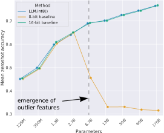
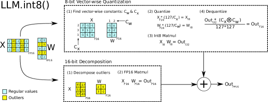
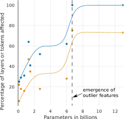
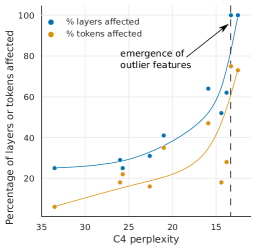
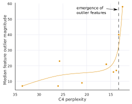
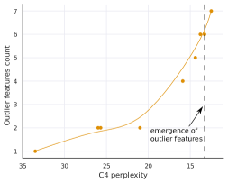

> Tim Dettmers, Mike Lewis, Younes Belkada, and Luke Zettlemoyer. 首次提交至 arXiv: August 15, 2022; 当前版本为 v2. [LLM.int8(): 8-bit Matrix Multiplication for Transformers at Scale](https://arxiv.org/abs/2208.07339). [原始 PDF](/paper/llm-int8.pdf). [TeX 源码](https://export.arxiv.org/e-print/2208.07339). 精确的印刷版式和参考文献以原始 PDF 为准.

## 摘要

大型语言模型已经被广泛采用, 但在推理时需要大量 GPU 内存. 我们开发了一种针对变压器中的前馈层和注意力投影层的 Int8 矩阵乘法方法, 该方法在保持全精度性能的同时, 将推理所需内存减半. 使用我们的方法, 一个 175B 参数的 16/32 位检查点可以被加载, 转换为 Int8, 并立即使用而不会导致性能下降. 这得益于对变压器语言模型中高度系统化的突现特性 (这些特性主导了注意力机制和变压器的预测性能) 的理解和处理. 为了应对这些特性, 我们开发了一个两部分量化过程 LLM. int8(). 首先, 我们使用向量级量化, 并为矩阵乘法中的每个内积使用单独的归一化常数, 以量化大部分特性. 但是, 对于突发的异常值特性, 我们还引入了一种新型混合精度分解方案, 将异常特性维度隔离到 16 位矩阵乘法中, 同时仍有超过 99.9% 的值使用 8 位进行乘法运算. 通过 LLM. int8(), 我们实证表明, 在不降低性能的情况下, 可以在最大 175B 参数的 LLM 上进行推理. 该结果使得此类模型更容易访问, 例如使得在单台配备消费者级 GPU 的服务器上使用 OPT-175B/BLOOM 成为可能. 我们将我们的软件开源.

## 1 引言

大型预训练语言模型在自然语言处理 (NLP) 中被广泛采用 [Vaswaa17, Radfoa19, Browna20, Zhang22], 但在推理时需要大量内存. 对于参数量在 6.7B 及以上的大型 Transformer 语言模型, 前馈层和注意力投影层及其矩阵乘法操作占用了 95% [+1] 的参数, 并消耗了 65-85% 的计算量 [Ilharc20]. 减少参数大小的一种方法是将它们量化为更少的位数, 并使用低位精度矩阵乘法. 基于这一目标, 已经开发了针对 Transformer 的 8 位量化方法 [Chen20, Lin20, Zafrir19, Shen20]. 虽然这些方法可以减少内存使用, 但会降低性能, 通常需要在训练后进一步调节量化, 并且只针对参数少于 3.5 亿的模型进行了研究. 对于参数量高达 3.5 亿的无性能下降量化仍然理解不足, 而多十亿参数的量化仍是一个未解决的挑战.

在本文中, 我们提出了首个适用于变换器的大规模十亿级 Int8 量化程序, 并且不会导致任何性能下降. 我们的程序可以在加载具有 16 位或 32 位权重的 175B 参数变换器后, 将前馈网络和注意力投影层转换为 8 位, 并立即使用生成的模型进行推理, 而不会降低性能. 我们通过解决两个关键挑战实现了这一结果: 在超过 10 亿参数的规模下对更高量化精度的需求, 以及显式表示稀疏但系统性的大幅度异常特征的需求, 这些特征一旦在所有变换器层中出现 (从 6.7B 参数规模开始), 就会破坏量化精度. 这种精度损失在 C4 评估困惑度中有所反映 (第 [3](#S3) 节), 并且一旦这些异常特征出现, 零样本准确率也会下降, 如 [图 1](#figure-01) 所示.

**图 1.** OPT 模型在 WinoGrande, HellaSwag, PIQA 和 LAMBADA 数据集上的平均零样本准确率. 图中展示了 16 位基线, 以前最精确的 8 位量化方法作为对照, 以及我们新的 8 位量化方法 LLM. int8(). 可以看到, 当系统性异常在 6.7B 参数规模出现时, 常规量化方法失败, 而 LLM. int8() 保持了 16 位的准确率.

我们展示了使用我们方法的第一部分——向量化量化, 可以在最多 27 亿参数的规模下保持性能. 对于向量化量化, 矩阵乘法可以看作是行向量和列向量的独立内积的序列. 因此, 我们可以为每个内积使用单独的量化归一化常数来提高量化精度. 在进行下一步操作之前, 我们可以通过列和行归一化常数的外积进行去归一化, 以恢复矩阵乘法的输出.

要在不降低性能的情况下扩展到超过 67 亿参数, 理解推理过程中隐藏状态特征维度中的极端异常值的出现至关重要. 为此, 我们提供了一种新的描述性分析, 显示在大约 25%的所有 Transformer 层中, 首次出现比其他维度大多达 20 倍的大特征, 并且随着我们将 Transformer 扩展到 60 亿参数, 这些异常值逐渐扩散到其他层. 在大约 67 亿参数时, 出现了阶段性变化, 所有 Transformer 层和 75%的序列维度都受到极端幅度特征的影响. 这些异常值高度系统化: 在 67 亿规模时, 每个序列出现 150, 000 个异常值, 但它们集中在整个 Transformer 的仅 6 个特征维度. 将这些异常特征维度设为零会使 top-1 注意力 softmax 概率质量下降超过 20%, 并使验证困惑度下降 600-1000%, 尽管它们仅占所有输入特征的约 0.1%. 相比之下, 移除相同数量的随机特征概率最多下降 0.3%, 困惑度下降约 0.1%.

为了支持具有如此极端异常值的有效量化, 我们开发了混合精度分解, 这是我们方法的第二部分. 我们对异常值特征维度执行 16 位矩阵乘法, 对其他 99.9%的维度执行 8 位矩阵乘法. 我们将向量级量化和混合精度分解的组合命名为 LLM. int8(). 我们展示了通过使用 LLM. int8(), 我们可以在具有高达 175B 参数的 LLM 中进行推理, 而不会有任何性能下降. 我们的方法不仅提供了关于这些异常值对模型性能影响的新见解, 还首次使得在单台配备消费级 GPU 的服务器上使用非常大型模型 (例如 OPT-175B/BLOOM) 成为可能. 尽管我们的工作侧重于在不降低性能的情况下使大型语言模型可用, 但我们也在附录 [D](#A4) 中展示了我们如何保持大模型 (如 BLOOM-176B) 的端到端推理运行时性能, 并为 6.7B 参数或更大规模的 GPT-3 模型提供适度的矩阵乘法加速. 我们开源了我们的软件 [+2], 并发布了与 Hugging Face Transformers [Wolf19] 的集成, 使我们的方法可用于所有具有线性层的托管 Hugging Face 模型.

**图 2.** LLM. int8()的示意图. 给定 16 位浮点输入 $\mathbf{X}_{f16}$ 和权重 $\mathbf{W}_{f16}$, 特征和权重被分解为大幅值特征的子矩阵和其他值. 异常特征矩阵使用 16 位进行乘法运算. 所有其他值使用 8 位进行乘法运算. 通过按行和按列缩放 $\mathbf{C}_{x}$ 和 $\mathbf{C}_{w}$ 的绝对最大值, 然后将输出量化为 Int8, 执行 8 位向量乘法. Int32 矩阵乘法输出 $\mathbf{ {\mathrm{Out}}}_{i32}$ 通过归一化常数 $\mathbf{C}_{x}\otimes\mathbf{C}_{w}$ 的外积进行反量化. 最后, 异常和常规输出都被累加为 16 位浮点输出.

## 2 背景

在本工作中, 通过扩展变换器模型, 将量化技术推向极限. 我们关注两个问题: 在什么规模以及为什么量化技术会失败, 以及这与量化精度如何相关? 为了解答这些问题, 我们研究了高精度非对称量化 (零点量化) 和对称量化 (绝对最大值量化). 虽然零点量化通过使用数据类型的全部位范围提供高精度, 但由于实际限制很少使用. 绝对最大值量化是最常用的技术.

### 2.1 8 位数据类型和量化

绝对值最大量化通过将输入乘以 $s_{x_{f16}}$ (即 127 除以整个张量的绝对最大值) 来缩放到 8 位范围 $[-127,127]$. 这等价于除以无穷范数并乘以 127. 因此, 对于 FP16 输入矩阵 $\mathbf{X}_{f16}\in\mathbb{R}^{s\times h}$, Int8 绝对值最大量化表示为:

$$
\mathbf{X}_{i8}=\Biggl{\lfloor}{\dfrac{127\cdot\mathbf{X}_{f16}}{\max\limits_{\mathrm{ij}}(|\mathbf{X}_{f16_{\mathrm{ij}}}|)}}\Biggr{\rceil}=\Biggl{\lfloor}{\dfrac{127}{\|\mathbf{X}_{f16}\rVert_{\infty}}\mathbf{X}_{f16}}\Biggr{\rceil}=\Bigl{\lfloor}{s_{x_{f16}}\mathbf{X}_{f16}}\Bigr{\rceil},
$$

其中 $\lfloor{}\rceil{}$ 表示四舍五入到最接近的整数.

零点量化通过利用归一化动态范围 $\mathrm{nd}_{x}$ 进行缩放, 然后以零点 $\mathrm{zp}_{x}$ 进行偏移, 将输入分布移动到整个范围 $[-127,127]$. 通过这种仿射变换, 任何输入张量都将使用数据类型的所有位, 从而减少非对称分布的量化误差. 例如, 对于 ReLU 输出, 在最大绝对值量化中, $[-127,0)$ 中的所有值都未被使用, 而在零点量化中, 全 $[-127,127]$ 范围被使用. 零点量化由以下公式给出:

$$
\mathrm{nd}_{x_{f16}}=\dfrac{2\cdot 127}{\max\limits_{\mathrm{ij}}(\mathbf{X}_{f16}^{\mathrm{ij}})-\min\limits_{\mathrm{ij}}(\mathbf{X}_{f16}^{\mathrm{ij}})}\tag{1}
$$

$$
\mathrm{zp}_{x_{i16}}=\bigl{\lfloor}{\mathbf{X}_{f16}\cdot\min\limits_{\mathrm{ij}}(\mathbf{X}_{f16}^{\mathrm{ij}})\bigr{\rceil}}\tag{2}
$$

$$
\mathbf{X}_{i8}=\bigl{\lfloor}{ {\mathrm{nd}_{x_{f16}}\mathbf{X}_{f16}}\bigr{\rceil}}\tag{3}
$$

要在操作中使用零点量化, 我们将张量 $\mathbf{X}_{i8}$ 和零点 $\mathrm{zp}_{x_{i16}}$ 输入到一个特殊指令 [+3] 中, 该指令在执行 16 位整数操作之前, 将 $\mathrm{zp}_{x_{i16}}$ 加到 $\mathbf{X}_{i8}$ 的每个元素上. 例如, 要将两个零点量化数 $A_{i8}$ 和 $B_{i8}$ 及其零点 $\mathrm{zp}_{a_{i16}}$ 和 $\mathrm{zp}_{b_{i16}}$ 相乘, 我们计算:

$$
C_{i32}=\mathrm{multiply}_{i16}({A}_{\mathrm{zp}_{a_{i16}}},{B}_{\mathrm{zp}_{b_{i16}}})=({A}_{i8}+\mathrm{zp}_{a_{i16}})({B}_{i8}+\mathrm{zp}_{b_{i16}})\tag{4}
$$

当 multiplyi16 指令不可用 (例如在 GPU 或 TPU 上) 时, 需要展开:

$$
C_{i32}={A}_{i8}{B}_{i8}+{A}_{i8}\mathrm{zp}_{b_{i16}}+{B}_{i8}\mathrm{zp}_{a_{i16}}+\mathrm{zp}_{a_{i16}}\mathrm{zp}_{b_{i16}},\tag{5}
$$

其中 $A_{i8}B_{i8}$ 使用 Int8 精度计算, 而其余部分使用 Int16/32 精度计算. 因此, 如果没有 multiplyi16 指令, 零点量化可能会很慢. 在这两种情况下, 输出都作为 32 位整数 $C_{i32}$ 累加. 要对 $C_{i32}$ 进行反量化, 我们将其除以缩放常量 $\mathrm{nd}_{a_{f16}}$ 和 $\mathrm{nd}_{b_{f16}}$.

#### 使用 16 位浮点输入和输出的 Int8 矩阵乘法.

给定隐藏状态 ${\mathbf{X}_{f16}\in\mathbb{R}^{s\times h}}$ 和权重 $\mathbf{W}_{f16}\in\mathbb{R}^{h\times o}$, 以及序列维度 $s$, 特征维度 $h$ 和输出维度 $o$, 我们按如下方式执行带有 16 位输入和输出的 8 位矩阵乘法:

$$
\begin{split}\mathbf{X}_{f16}\mathbf{W}_{f16}=\mathbf{C}_{f16}&\approx\frac{1}{c_{x_{f16}}c_{w_{f16}}}\mathbf{C}_{i32}=S_{f16}\cdot\mathbf{C}_{i32}\\
&\approx S_{f16}\cdot\mathbf{A}_{i8}\mathbf{B}_{i8}=S_{f16}\cdot Q(\mathbf{A}_{f16})\phantom{.}Q(\mathbf{B}_{f16}),\end{split}\tag{6}
$$

其中 $Q(\cdot)$ 可以是 absmax 或零点量化, 而 $c_{x_{f16}}$ 和 $c_{w_{f16}}$ 分别是 absmax 的张量级缩放常量 $s_{x}$ 和 $s_{w}$, 或零点量化的 $\mathrm{nd}_{x}$ 和 $\mathrm{nd}_{w}$.

## 3 个 Int8 矩阵在大规模下的乘法

使用每个张量单一缩放常数的量化方法的主要挑战在于, 一个单独的异常值可能会降低所有其他值的量化精度. 因此, 每个张量拥有多个缩放常数是更可取的, 比如块级常数 [Dettme22], 这样异常值的影响就被限制在每个块中. 我们在最常见的块量化方法之一——按行量化 [Khudia21] 上进行了改进, 采用了向量级量化, 如下文详细描述.

为了处理在 6.7B 规模以上的所有 Transformer 层中出现的大幅度异常特征, 向量级量化已不再足够. 为此, 我们开发了混合精度分解, 其中少量的大幅度特征维度 ($\approx$0.1%) 以 16 位精度表示, 而其余 99.9% 的值使用 8 位乘法. 由于大多数条目仍以低精度表示, 我们相比 16 位仍保留约 50% 的内存减少. 例如, 对于 BLOOM-176B, 我们将模型的内存占用减少了 1.96 倍.

向量级量化和混合精度分解如 [图 2](#figure-02) 所示. LLM. int8() 方法是绝对值最大向量级量化与混合精度分解的结合.

### 3.1 向量级量化

增加矩阵乘法缩放常数数量的一种方法是将矩阵乘法视为一系列独立的内积. 给定隐藏状态 $\mathbf{X}_{f16}\in\mathbb{R}^{b\times h}$ 和权重矩阵 $\mathbf{W}_{f16}\in\mathbb{R}^{h\times o}$, 我们可以为 $\mathbf{X}_{f16}$ 的每一行分配一个不同的缩放常数 $c_{x_{f16}}$, 为 $\mathbf{W}_{f16}$ 的每一列分配一个不同的缩放常数 $c_{w}$. 为了去量化, 我们通过 $1/(c_{x_{f16}}c_{w_{f16}})$ 对每个内积结果进行反归一化. 对于整个矩阵乘法, 这等价于通过外积 $\mathbf{c}_{x_{f16}}\otimes\mathbf{c}_{w_{f16}}$ 进行反归一化, 其中 $\mathbf{c}_{x}\in\mathbb{R}^{s}$ 和 $\mathbf{c}_{w}\in\mathbb{R}^{o}$. 因此, 带行列常数的矩阵乘法的完整公式为:

$$
\mathbf{C}_{f_{16}}\approx\frac{1}{\mathbf{c}_{x_{f16}}\otimes\mathbf{c}_{w_{f16}}}\mathbf{C}_{i32}=S\cdot\mathbf{C}_{i32}=\mathbf{S}\cdot\mathbf{A}_{i8}\mathbf{B}_{i8}=\mathbf{S}\cdot Q(\mathbf{A}_{f16})\phantom{.}Q(\mathbf{B}_{f16}),\tag{7}
$$

我们称之为矩阵乘法的向量化量化.

### 3.2 LLM. int8() 的核心: 混合精度分解

在我们的分析中, 我们证明了一个对亿级规模 8 位变换器来说很重要的问题是它们具有大的幅值特征 (列), 这些特征对于变换器的性能至关重要, 并且需要高精度量化. 然而, 按向量量化 (vector-wise quantization), 也就是我们最好的量化技术, 会对隐藏状态的每一行进行量化, 这对异常特征是无效的. 幸运的是, 我们发现这些异常特征在实际中既极为稀疏又具有系统性, 仅占所有特征维度的大约 0.1%, 因此使我们能够开发一种新的分解技术, 专注于对这些特定维度进行高精度乘法.

我们发现, 对于给定的输入矩阵 $\mathbf{X}_{f16}\in\mathbb{R}^{s\times h}$, 这些异常值几乎在所有序列维度 $s$ 中系统性地出现, 但仅限于特定的特征/隐藏维度 $h$. 因此, 我们提出了矩阵乘法的混合精度分解方法, 将异常特征维度分离到集合 ${O=\{i|i\in\mathbb{Z},0\leq i\leq h\}}$ 中, 该集合包含 $h$ 的所有维度, 这些维度至少有一个异常值, 其幅值超过阈值 $\alpha$. 在我们的工作中, 我们发现 $\alpha=6.0$ 足以将变换器性能下降降低到接近于零. 使用爱因斯坦符号 (所有下标作为上标), 给定权重矩阵 $\mathbf{W}_{f16}\in\mathbb{R}^{h\times o}$, 矩阵乘法的混合精度分解定义如下:

$$
\mathbf{C}_{f16}\approx\sum\limits_{h\in O}\mathbf{X}_{f16}^{h}\mathbf{W}_{f16}^{h}+\mathbf{S}_{f16}\cdot\sum\limits_{h\not\in O}\mathbf{X}_{i8}^{h}\mathbf{W}_{i8}^{h}\tag{8}
$$

其中 $\mathbf{S}_{f16}$ 是 Int8 输入和权重矩阵 $\mathbf{X}_{i8}$ 与 $\mathbf{W}_{i8}$ 的去标准化项.

将其分为 8 位和 16 位, 使得在使用 8 位权重 (超过 99.9% 的数值) 的内存高效矩阵乘法时, 仍能对异常值进行高精度乘法. 由于对于参数量高达 13B 的 Transformer, 异常特征维度的数量不超过 7 ($|O|\leq 7$), 因此此分解操作仅消耗大约 0.1% 的额外内存.

### 3.3 实验设置

我们在多个公开可用的预训练语言模型 (最高达到 175B 参数) 上测量量化方法的鲁棒性. 关键问题不是量化方法对于特定模型的表现有多好, 而是该方法在模型规模扩展时的性能趋势.

我们使用两种实验设置. 一种基于语言建模困惑度 (perplexity), 我们发现这是一个非常稳健且对量化退化非常敏感的度量方法. 我们使用此设置来比较不同量化基线. 另外, 我们在 OPT 模型上评估多种不同终端任务的零样本精度下降, 并将我们的方法与 16 位基线进行比较.

在语言建模设置中, 我们使用在 fairseq 中预训练的密集自回归变换器 [Ott19], 参数规模介于 1.25 亿到 130 亿之间. 这些变换器已经在书籍 [Zhu15], 英文维基百科, CC-News [Nagel16], OpenWebText [Cohen19], CC-Stories [Trinh18] 以及英文 CC100 [Wenzek20] 上进行了预训练. 有关这些预训练模型如何训练的更多信息, 请参见 [Artetx21].

为了评估 Int8 量化后语言建模的性能下降, 我们在 C4 语料库的验证数据上评估 8 位变换器的困惑度 [Raffel19], 该语料库是 Common Crawl 语料库的一个子集. [+4] 我们使用 NVIDIA A40 GPU 进行此评估.

为了衡量零样本性能的下降, 我们使用 OPT 模型 [Zhang22], 并在 EleutherAI 语言模型评估框架上评估这些模型 [Gao21].

### 3.4 主要结果

在 C4 语料库上评估的 125M 到 13B Int8 模型的主要语言建模困惑度结果见 [表 1](#table-01). 我们发现, absmax, 行级和零点量化在模型规模扩大时失败, 其中参数达到 27 亿的模型的表现比较小的模型更差. 零点量化在超过 67 亿参数后也会失败. 我们的方法 LLM. int8() 是唯一能够保持困惑度的方法. 因此, LLM. int8() 是唯一具有有利扩展趋势的方法.

当我们在 [图 1](#figure-01) 中观察 OPT 模型在 EleutherAI 语言模型评估框架上的零样本性能的扩展趋势时, 我们看到 LLM. int8() 在参数从 1.25 亿到 1750 亿增长的情况下保持了完整的 16 位性能. 另一方面, 基线的 8 位绝对最大向量量化扩展性能较差, 并退化为随机性能.

|参数|125M|1.3B|2.7B|6.7B|13B|
| --- | --- | --- | --- | --- | --- |
|32 位浮点|25.65|15.91|14: 43|13.30|12: 45|
|Int8 绝对最大值|87.76|16.55|15.11|14.59|19.08|
|Int8 零点|56.66|16.24|14.76|13.49|13.94|
|Int8 按行绝对最大值|30.93|17.08|15.24|14.13|16.49|
|Int8 按向量绝对最大值|35.84|16.82|14.98|14.13|16.48|
|Int8 按向量零点|25.72|15.94|14.36|13.38|13.47|
|Int8 absmax 按行分解|30.76|16.19|14.65|13: 25|12: 46|
|Absmax LLM. int8 () (向量分解)|25.83|15.93|14: 44|13.24|12: 45|
|Zeropoint LLM. int8 () (向量分解)|25.69|15.92|14: 43|13.24|12: 45|

**表 1.** C4 不同变压器尺寸参数范围 (125M 至 13B 参数) 量化方法的验证难点. 我们看到, Absmax, 行, 零点和矢量化会导致性能显著下降, 尤其是在 13B 时, 8 位 13B 的困惑度比 8 位 6.7B 更差. 如果我们使用 LLM. int8 (), 随着扩展, 我们会恢复完整的困惑度. 零点量子化因其非对称量子化而具有优势, 但在混合精度分解中使用时已不再有利.

尽管我们的主要关注点是节省内存, 我们也测量了 LLM. int8() 的运行时间. 与 FP16 基线相比, 量化开销可能会降低拥有少于 6.7B 参数的模型的推理速度. 然而, 6.7B 参数或更少的模型适合大多数 GPU, 因此在实际中量化需求较少. 对于与 175B 模型中相当的大矩阵乘法, LLM. int8() 的运行时间大约快两倍. 附录 [D](#A4) 提供了这些实验的更多细节.

## 4 大规模 Transformer 中出现的巨大幅度特征

随着我们对 Transformer 进行扩展, 出现了幅度较大的异常特征, 并且强烈影响所有层及其量化. 给定一个隐藏状态 $\mathbf{X}\in\mathbb{R}^{s\times h}$, $s$ 为序列/标记维度, $h$ 为隐藏/特征维度, 我们将某个特征定义为特定维度 $h_{i}$. 我们的分析着眼于给定 Transformer 所有层中特定的特征维度 $h_{i}$.

我们发现异常特征会强烈影响注意力机制以及变压器的整体预测性能. 对于一个 13B 模型而言, 每个 2048 个 token 的序列中可能存在多达 15 万个异常值, 但这些异常特征高度系统化, 并且最多只代[表 7](#table-07) 个独特的特征维度 $h_{i}$. 从这一分析中获得的见解对于开发混合精度分解至关重要. 我们的分析解释了零点量化的优势, 以及为什么在使用混合精度分解时这种优势消失, 以及小模型与大模型的量化性能差异.

### 4.1 发现异常特征

对新兴现象进行定量分析的难点有两个方面. 我们旨在选择一小部分特征进行分析, 使结果易于理解且不过于复杂, 同时捕捉重要的概率和结构模式. 我们使用经验方法来找到这些约束条件. 我们根据以下标准定义异常值: 特征的幅度至少为 6.0, 影响至少 25%的层数, 并影响至少 6%的序列维度.

更正式地讲, 给定一个具有 $L$ 层和隐藏状态 $\mathbf{X}_{l}\in\mathbb{R}^{s\times h},l=0...L$ 的 Transformer, 其中 $s$ 是序列维度, $h$ 是特征维度, 我们将特征定义为任意隐藏状态 $\mathbf{X}_{l_{i}}$ 中的一个特定维度 $h_{i}$. 我们跟踪那些至少有一个值的幅度达到 $\alpha\geq 6$ 的维度 $h_{i},0\leq i\leq h$, 并且仅在这些异常值在至少 25% 的 Transformer 层 $0...L$ 中出现在同一特征维度 $h_{i}$, 并且在所有隐藏状态 $\mathbf{X}_{l}$ 的所有序列维度 $s$ 中至少出现 6% 时收集统计数据. 由于特征异常仅出现在注意力投影 (key/query/value/output) 和前馈网络扩展层 (第一子层), 我们在此分析中忽略注意力函数和 FFN 收缩层 (第二子层).

我们设定这些阈值的理由如下. 我们发现使用混合精度分解时, 如果将幅度为 6 或更大的任何特征视为异常特征, 困惑度的下降就会停止. 关于受异常值影响的层数, 我们发现异常特征在大模型中具有系统性: 它们要么出现在大多数层中, 要么根本不出现. 另一方面, 在小模型中它们是概率性的: 它们会在每个序列的某些层中有时出现. 因此, 我们设置了检测异常特征所需受影响层数的阈值, 以便将检测限制在我们具有 1.25 亿参数的最小模型中的单个异常值. 这一阈值对应于至少 25% 的 Transformer 层在相同特征维度上受到异常值的影响. 第二常见的异常特征只出现在单层 (占 2% 的层), 表明这是一个合理的阈值. 我们使用相同的方法来确定我们 1.25 亿模型中受异常值影响的序列维度阈值: 异常值至少出现在 6% 的序列维度中.

我们测试模型的规模可达 130 亿参数. 为了确保观察到的现象不是由于软件中的错误导致的, 我们评估了在三种不同软件框架中训练的 Transformer 模型. 我们评估了四个使用 OpenAI 软件的 GPT-2 模型, 五个使用 Fairseq 的 Meta AI 模型 [Ott19], 以及一个使用 Tensorflow-Mesh 的 EleutherAI GPT-J 模型 [Shazee18]. 更多细节可以在附录 [C](#A3) 中找到. 我们还在两种不同的推理软件框架中进行分析: Fairseq 和 Hugging Face Transformers [Wolf19].

### 4.2 测量异常特征的影响

为了证明异常特征对注意力和预测性能是至关重要的, 我们在将隐藏状态 $\mathbf{X}_{l}$ 输入注意力投影层之前, 把异常特征设置为零, 然后将其与包含异常特征的常规 softmax 概率的 top-1 值进行比较. 我们对所有层独立进行此操作, 这意味着我们将常规 softmax 概率值前向传递以避免级联错误, 并隔离由异常特征引起的影响. 我们还报告了在去除异常特征维度 (将其设置为零) 并将这些更改后的隐藏状态传递通过 Transformer 时困惑度的下降情况. 作为对照, 我们对随机的非异常特征维度使用相同的程序, 并记录注意力和困惑度的退化情况.

**图 3.** 在整个 Transformer 中, 不同层和所有序列维度受大幅异常特征影响的百分比, 按 (a) 模型大小 或 (b) C4 困惑度 分类. 曲线为 (a) 和 (b) 的 4 段和 9 段线性段 B 样条插值. 一旦发生相位转移, 异常值会出现在所有层中, 并影响约 75% 的全部序列维度. (a) 表明参数规模出现突然的相位转移, 而 (b) 则表明随着困惑度下降, 出现逐渐的指数相位转移. (a) 中的明显转变与量化方法性能突然下降同时发生.

**图 4.** (a) 中最大异常特征的中位幅度显示异常特征大小突然变化. 这似乎是量化方法在异常出现后失败的主要原因. 虽然异常特征维度的数量大致与模型大小成正比, 但 (b) 显示, 所有分析的模型中异常特征数量严格随困惑度单调变化. 曲线为 9 段线性段的 B 样条插值.

我们的主要定量结果可以总结为四个要点.

(1) 当按参数数量测量时, 如 [图 3(a)](#figure-03) 所示, Transformer 所有层中大幅特征的出现突然发生在 6B 至 6.7B 参数之间, 此时受影响层的百分比从 65% 增加到 100%. 受影响的序列维度数量迅速从 35% 增加到 75%. 这一突然变化与量化开始失效的点同时发生.

(2) 或者, 当通过困惑度进行测量时, 可以看到在所有变压器层中, 大幅度特征的出现可以视为根据困惑度下降的指数函数平滑出现, 如[图 3(b)](#figure-03) 所示. 这表明, 出现并没有什么突然之处, 并且我们可能通过研究较小模型中的指数趋势, 在阶段性变化发生之前检测到出现的特征. 这也表明, 出现不仅与模型大小有关, 还与困惑度有关, 而困惑度又与多个附加因素相关, 例如使用的训练数据量和数据质量 [Hoffma22, Henigh20].

(3) 一旦在变压器的所有层中出现异常特征, 中位数异常特征幅值会迅速增加, 如[图 4(a)](#figure-04) 所示. 异常特征的高幅值及其不对称分布破坏了 Int8 量化精度. 这是从 6.7B 规模开始量化方法失效的核心原因——量化分布的范围过大, 以至于大多数量化箱为空, 并且小的量化值被量化为零, 本质上消除了信息. 我们假设, 除了 Int8 推理之外, 由于 6.7B 规模以上存在异常值, 常规的 16 位浮点训练也会变得不稳定——如果将大小为 60 的向量相乘, 很容易偶然超过 16 位最大值 65535.

(4) 异常特征的数量随着 C4 困惑度的降低严格单调增加, 如 [图 4(b)](#figure-04) 所示, 而与模型大小的关系则是非单调的. 这表明模型困惑度而非单纯的模型大小决定了相位变化. 我们假设模型大小只是达到涌现所需的众多重要协变量之一.

这些异常特征在相位转移发生后高度系统化. 例如, 对于序列长度为 2048 的 6.7B 变压器, 我们发现整个变压器每个序列大约有 15 万个异常特征, 但这些特征仅集中在 6 个不同的隐藏维度中.

这些异常值对于变压器性能至关重要. 如果移除这些异常值, 平均 top-1 softmax 概率将从约 40% 降至约 20%, 验证困惑度也会增加 600-1000%, 尽管异常特征维度最多只有 7 个. 当我们改为移除 7 个随机特征维度时, top-1 概率仅下降 0.02-0.3%, 困惑度增加仅 0.1%. 这凸显了这些特征维度的重要性. 对于这些异常特征的量化精度至关重要, 因为即使是微小的误差也会严重影响模型性能.

### 4.3 量化性能的解释

我们的分析表明, 大型变压器中某些特征维度的异常值普遍存在, 这些特征维度对于变压器性能至关重要. 由于按行和按向量的量化分别缩放每个隐藏状态序列维度 $s$ (行), 而异常值出现在特征维度 $h$ (列), 因此两种方法都无法有效处理这些异常值. 这就是为什么 absmax 量化方法在异常值出现后会迅速失效.

然而, 几乎所有异常值都具有严格的非对称分布: 它们要么完全为正, 要么完全为负 (见附录 [C](#A3)). 这使零点量化对这些异常值特别有效, 因为零点量化是一种非对称量化方法, 可以将这些异常值缩放到整个 $[-127,127]$ 范围内. 这解释了我们在 [表 1](#table-01) 中量化缩放基准测试中取得的强劲性能. 然而, 在 13B 规模下, 即使是零点量化也会因累积的量化误差和异常值幅度的快速增长而失败, 如 [图 4(a)](#figure-04) 所示.

如果我们使用带有混合精度分解的完整 LLM. int8() 方法, 零点量化的优势将消失, 这表明剩余的分解特征是对称的. 然而, 逐向量量化仍然相较于逐行量化有优势, 这表明模型权重的增强量化精度对于保持完整预测性能是必要的.

## 5 相关工作

关于量化数据类型和变压器量化有紧密相关的研究, 如下所述. 附录 [B](#A2) 提供了更多关于卷积网络量化的相关工作.

8 位数据类型. 我们的工作研究围绕 Int8 数据类型的量化技术, 因为它目前是 GPU 唯一支持的 8 位数据类型. 其他常见的数据类型是定点或浮点 8 位数据类型 (FP8). 这些数据类型通常具有一个符号位以及不同的指数位和小数位组合. 例如, 这种数据类型的一种常见变体具有 5 位指数和 2 位小数位 [Wang18, Sun19, Cambie20, Mellem19], 并使用无缩放常数或零点缩放. 这些数据类型在大幅值情况下误差较大, 因为它们的小数位只有 2 位, 但在小幅值情况下提供高精度. [Jin22] 对在具有特定标准差的输入情况下, 某些定点指数/小数位宽何时最优提供了优秀的分析. 我们认为 FP8 数据类型相比 Int8 数据类型提供了更优性能, 但目前, GPU 和 TPU 都不支持这种数据类型.

语言模型中的异常特征. 此前已有研究探讨了语言模型中大幅度的异常特征 [Schijn21, Bondar21, Weia22, Luo21]. 之前的工作证明了变压器中异常特征出现的理论关系, 以及它与层归一化和词元频率分布的关联 [Gaoa19]. 同样地, [Kovale21] 将 BERT 模型家族中异常特征的出现归因于 LayerNorm, [Puccet22] 则通过实验证明异常特征的出现与训练分布中词元的频率相关. 我们进一步扩展了这项工作, 展示了自回归模型的规模如何与这些异常特征的涌现特性相关, 并展示了如何正确建模异常特征对有效量化至关重要.

多十亿规模的变压器量化. 已有两种与我们并行开发的方法: nuQmm [Park22] 和 ZeroQuant [Yaoa22]. 两者都使用相同的量化方案: 分组权重量化 (group-w2ise quantization), 其量化归一化常数的粒度比向量级量化更细. 该方案提供了更高的量化精度, 但也需要自定义 CUDA 内核. nuQmm 和 ZeroQuant 都旨在加速推理并减少内存占用, 而我们则专注于在 8 位内存占用下保持预测性能. nuQmm 和 ZeroQuant 评估的最大模型参数分别为 27 亿和 200 亿. ZeroQuant 在对 200 亿模型进行 8 位量化时实现了零性能下降. 我们展示了我们的方法能够实现高达 1760 亿参数模型的零性能下降量化. nuQmm 和 ZeroQuant 都表明, 更细的量化粒度可以作为量化大型模型的有效手段. 这些方法与 LLM. int8() 互为补充. 另一项并行工作是 GLM-130B, 它利用我们的研究成果实现了零性能下降的 8 位量化 [Zeng22]. GLM-130B 在存储 8 位权重的同时, 执行全 16 位精度矩阵乘法.

## 6 讨论与局限性

我们首次展示了数十亿参数的变换器可以被量化为 Int8, 并且在推理中立即使用而不会导致性能下降. 我们通过分析大规模新兴大幅度特征的见解, 实现了混合精度分解, 从而将异常特征隔离到一个单独的 16 位矩阵乘法中. 结合向量级量化, 我们的方法 LLM. int8() 能够在经验上恢复参数高达 175B 的模型的完整推理性能.

我们工作的主要局限性是, 我们的分析仅针对 Int8 数据类型, 没有研究 8 位浮点数 (FP8) 数据类型. 由于当前的 GPU 和 TPU 不支持这种数据类型, 我们认为最好将其留作未来工作. 然而, 我们也相信许多来自 Int8 数据类型的见解将直接应用于 FP8 数据类型. 另一个局限性是, 我们仅研究参数最多为 175B 的模型. 虽然我们将 175B 模型量化为 Int8 而不降低性能, 但在更大规模下, 可能出现额外的新兴特性, 从而影响我们的量化方法.

第三个限制是我们没有在注意力函数中使用 Int8 乘法. 由于我们的重点是减少内存占用, 而注意力函数不使用任何参数, 因此严格来说不是必须的. 然而, 对这一问题的初步探索表明, 解决方案需要使用除我们在此开发的方法之外的额外量化方法, 我们将这留作未来工作.

最后的限制是我们关注推理, 但不研究训练或微调. 我们在附录 [E](#A5) 中提供了对 Int8 微调和大规模训练的初步分析. 大规模 Int8 训练需要在量化精度, 训练速度和工程复杂性之间进行复杂的权衡, 是一个非常困难的问题. 我们同样将其留作未来工作.

||||可运行的最大模型||
| --- | --- | --- | --- | --- |
|类别|硬件|GPU 内存|8 位|16 位|
|企业级|8x A100|80 GB|OPT-175B / BLOOM|OPT-175B / BLOOM|
|企业级|8x A100|40 GB|OPT-175B / BLOOM|OPT-66B|
|学术服务器|8x RTX 3090|24 GB|OPT-175B / BLOOM|OPT-66B|
|学术桌面|4x RTX 3090|24 GB|OPT-66B|OPT-30B|
|付费云|Colab Pro|15 GB|OPT-13B|GPT-J-6B|
|免费云|Colab|12 GB|T0/T5-11B|GPT-2 1.3B|

**表 2.** 不同的硬件配置以及哪些方法可以以 16 位与 8 位精度运行. 我们可以看到, 我们的 8 位方法使许多之前无法访问的模型变得可用, 尤其是 OPT-175B/BLOOM.

## 7 更广泛的影响

我们工作的主要影响是使可以访问以前无法放入 GPU 内存的大模型. 这使得由于 GPU 内存有限而无法进行的研究和应用成为可能, 尤其是对于资源最少的研究人员. 请参见 [表 3](#table-03) 获取现在可在不影响性能的情况下访问的模型/GPU 组合. 然而, 我们的工作也使拥有大量 GPU 的资源丰富的组织能够在相同数量的 GPU 上服务更多模型, 这可能会增加资源丰富和贫乏的组织之间的差距.

特别是, 我们认为大型预训练模型的公开发布, 例如最近的开放预训练变换器 (OPT) [Zhang22], 以及我们针对零样本和少数样本提示的新 Int8 推断, 将使学术机构开展此前因资源限制无法实现的新研究. 此类大规模模型的广泛普及, 可能对社会产生难以预测的积极和有害影响.

#### 致谢

感谢 Ofir Press, Gabriel Ilharco, Daniel Jiang, Mitchell Wortsman, Ari Holtzman 和 Mitchell Gordon 对本书草稿的反馈. 我们感谢 JustHeuristic (Yozh) 和 Titus von Köller 在 Hugging Face 变形金刚整合方面的帮助.

## 清单

检查清单紧随参考文献. 请仔细阅读清单指南, 了解如何回答这些问题. 对于每个问题, 将默认的 \[TODO\] 改为 \[Yes\] , \[No\] 或 \[N/A\]. 强烈建议您在回答中加入理由, 无论是引用论文的相关部分, 还是提供简短的内文描述. 例如:

- •

你有附上代码和数据集的许可吗? \[是的] 参见 LABEL: gen\_inst 章节.

- •

你有包含代码和数据集的许可吗? \[不] 代码和数据都是专有的.

- •

你有包含代码和数据集的许可吗? \[无]

请不要修改问题, 只使用提供的宏来回答. 请注意, 清单部分不计入页数限制. 请在论文中删除此指示区块, 只保留上方的“清单”部分标题及下方的问题/答案.

1.1.

致所有作者. . . . . .

1. (a)

摘要和引言中的主要主张是否准确反映了论文的贡献和范围? \[是的\]

2. (b)

你描述了你工作的局限性吗? \[是的] 详见限制部分

3. (c)

你是否讨论过你的工作可能带来的负面社会影响? \[是的] 详见更广泛的影响部分

4. (d)

您是否阅读了伦理评审指南, 并确保您的论文符合这些指南? \[是的] 是的, 我们认为我们的工作符合这些指导原则.

2.2.

如果你包含理论结果. . . . . .

1. (a)

你是否陈述了所有理论结果的完整假设? \[无]

2. (b)

你是否包含了所有理论结果的完整证明? \[无]

3.3.

如果你做实验. . . . . .

1. (a)

你是否包含了复现主要实验结果所需的代码, 数据和说明 (无论是在补充材料中还是网址)? \[是的] 我们将把代码包含在补充材料中.

2. (b)

你是否指定了所有训练细节 (例如数据分割, 超参数, 它们的选择方式)? \[是的]请参见实验设置部分

3. (c)

你有报告错误条吗 (比如多次运行实验后随机种子的错误条)? \[不] 我们的实验对每个模型都是确定性的. 我们不是多次运行同一个模型, 而是在不同尺度上运行多个模型. 我们无法计算这些实验的误差条.

4. (d)

你是否包括了总计算量和所使用的资源类型 (例如, GPU 类型, 内部集群或云服务提供商)? \[是的] 请参见 exper2imental 设置部分

4.4.

如果你正在使用现有资源 (例如代码, 数据, 模型) 或策划/发布新资源. . . . . .

1. (a)

如果你的作品使用了现有资源, 你有没有注明创作者? \[是的] 见实验装置部分

2. (b)

你提到资产的许可了吗? \[不] 许可适用于我们使用的所有资产. 各个许可证很容易查到.

3. (c)

您是否在补充材料或通过 URL 包含了任何新的资源? \[不适用\] 我们只使用现有的数据集.

4. (d)

您是否讨论了如何以及是否从您使用/整理的数据中的人获得了同意? \[不适用\]

5. (e)

您是否讨论了您使用/整理的数据是否包含可识别个人信息或冒犯性内容? \[不适用\]

5.5.

如果您使用了众包或进行了涉及人类受试者的研究…

1. (a)

您是否包含了给参与者的完整指令文本和截图 (如适用)? \[不适用\]

2. (b)

您是否描述了任何潜在的参与者风险, 并提供了机构审查委员会 (IRB) 批准的链接 (如适用)? \[不适用\]

3. (c)

您是否包含了支付给参与者的预计小时工资和参与者补偿的总金额? \[不适用\]

## 附录 A 与 16 位精度相比的内存使用情况

[表 3](#table-03) 比较了不同开源模型的 16 位推理和 LLM. int8() 的内存占用. 我们可以看到, LLM. int8() 允许在配备消费级 GPU 的单节点上运行最大的开源模型 OPT-175B 和 BLOOM-176B.

||||可运行的最大模型||
| --- | --- | --- | --- | --- |
|类别|硬件|GPU 内存|8 位|16 位|
|企业级|8x A100|80 GB|OPT-175B / BLOOM|OPT-175B / BLOOM|
|企业级|8x A100|40 GB|OPT-175B / BLOOM|OPT-66B|
|学术服务器|8x RTX 3090|24 GB|OPT-175B / BLOOM|OPT-66B|
|学术桌面|4x RTX 3090|24 GB|OPT-66B|OPT-30B|
|付费云|Colab Pro|15 GB|OPT-13B|GPT-J-6B|
|免费云|Colab|12 GB|T0/T5-11B|GPT-2 1.3B|

**表 3.** 不同硬件设置以及哪些方法可以在 16 位与 8 位精度下运行. 我们可以看到, 我们的 8 位方法使许多之前无法访问的模型变得可访问, 特别是 OPT-175B/BLOOM.

## 附录 B 相关工作补充

#### 参数少于 10 亿的 Transformer 的量化

Transformer 的量化主要集中在亚十亿参数的掩码语言模型 (MLM), 包括 BERT [Devlin18] 和 RoBERTa [Liub19]. 8 位 BERT/RoBERTa 的版本包括 Q8BERT [Zafrir19], QBERT [Shen20], 带量化噪声的产品量化 [Fan20], TernaryBERT [Zhang20] 以及 BinaryBERT [Baia21]. [Zhao21] 的工作同时进行了量化和剪枝. 所有这些模型都需要量化感知微调或训练后量化才能在低精度下使用. 与我们的方法相比, 模型可以直接使用而不会性能下降.

如果将矩阵乘法视为 1x1 卷积, 那么逐向量量化等价于结合行量化的卷积的逐通道量化 [Khudia21]. 对于矩阵乘法, 这在 BERT 规模的变压器 (350M 参数) 中由 [Refb20] 使用, 而我们是第一个研究自回归和大规模模型的逐向量量化的人. 我们所知道的唯一其他对 BERT 以外的变压器进行量化的工作是 [Chen20], 它在前向传播中使用零点量化进行训练后量化, 在反向传播中使用零点行量化. 然而, 这项工作仍然是针对参数数不到十亿的变压器. 我们在评估中比较了零点量化和行量化, 并且不需要训练后量化.

#### 低比特宽度和卷积网络量化

使用少于 8 位的数据类型的工作通常用于卷积神经网络 (CNN), 以减少其内存占用并提高移动设备的推理速度, 同时将模型性能下降降到最低. 针对不同位宽的方法已经被研究: 1 位方法 [Bengio16, Rasteg16, Courba15], 2 到 3 位 [Zhu17, Choi19], 4 位 [Refc19], 更多位数 [Courba14], 或可变位数 [Gong19]. 有关更多相关工作, 请参见 [Qin20] 的综述. 虽然我们认为对于十亿级规模的变换器, 低于 8 位的位宽在一定性能下降下是可行的, 但我们专注于不会降低性能的 8 位变换器, 并且可以利用常用 GPU 通过 Int8 张量核心加速推理.

另一类专注于卷积网络量化的工作是学习对量化过程的调整以改善量化误差. 例如, 使用 Hessian 信息 [Dong19], 步长量化 [Esser19], 软量化 [Gong19], 通过线性规划优化的混合精度 [Yao21], 以及其他学习的量化方法 [Zhang18, Gholam21].

## 附录 C 异常特征数据详细信息

[表 4](#table-04) 提供了我们异常特征分析的表格数据. 我们提供了每个 Transformer 中最常见异常值的四分位数, 以及单侧异常值的数量, 也就是其分布不对称且不跨零的异常值.

||||异常值||频率|||Top-1 softmax 概率||
| --- | --- | --- | --- | --- | --- | --- | --- | --- | --- |
|模型|PPL$\downarrow$|参数|数量|单边|层数|SDims|四分位数|含异常值|不含异常值|
|GPT2|33.5|117M|1|1|25%|6%|(-8, -7, -6)|45%|19%|
|GPT2|26.0|345M|2|1|29%|18%|(6, 7, 8)|45%|19%|
|FSEQ|25.7|125M|2|2|25%|22%|(-40, -23, -11)|32%|24%|
|GPT2|22.6|762M|2|0|31%|16%|(-9, -6, 9)|41%|18%|
|GPT2|21.0|1.5B|2|1|41%|35%|(-11, -9, -7)|41%|25%|
|FSEQ|15.9|1.3B|4|3|64%|47%|(-33, -21, -11)|39%|15%|
|FSEQ|14.4|2.7B|5|5|52%|18%|(-25, -16, -9)|45%|13%|
|GPT-J|13.8|6.0B|6|6|62%|28%|(-21, -17, -14)|55%|10%|
|FSEQ|13.3|6.7B|6|6|100%|75%|(-44, -40, -35)|35%|13%|
|FSEQ|12.5|13B|7|6|100%|73%|(-63, -58, -45)|37%|16%|

**表 4.** 出现在至少 25%所有层和至少 6%序列维度中, 大小至少为 6 的离群值的统计摘要统计. 我们可以看到, C4 验证困惑度越低, 异常值越多. 离群值通常是单侧的, 其最大范围的四分位数显示, 离群值的大小是其他特征维度最大幅度的 3-20 倍, 而这些特征维度的范围通常为 \[-3.5, 3.5\]. 随着规模的增加, 离群值在变换器的所有层中变得越来越常见, 且几乎出现在所有序列维度中. 当同一特征维度的所有层中出现相同的离群值, 约占所有序列维度 (SDim) 的 75%时, 相变发生在 6.7B 参数处. 尽管离群值仅占所有特征的约 0.1%, 但对于大幅软最大概率来说是必不可少的. 如果去除异常值, 平均前一软最大概率会减少约 20%. 由于离群值在序列维度 $s$ 中大多分布不对称, 这些离群值破坏了对称的超极大量子化, 并有利于非对称零点量子化. 这解释了我们验证困惑度分析的结果. 这些观察似乎是普遍存在的, 因为它们在不同软件框架 (fairseq, OpenAI, Tensorflow-mesh) 中训练的模型中也会出现, 也出现在不同的推理框架 (fairseq, Hugging Face Transformers) 中. 这些离群值对变压器结构的轻微变化 (旋转嵌入, 嵌入范数, 残差缩放, 不同初始化) 也表现出鲁棒性.

## 附录 D 推理加速与减速

### D. 1 矩阵乘法基准测试

虽然我们的工作专注于内存效率以使模型更易获得, 但 Int8 方法也经常用于加速推理. 我们发现量化和分解的开销是显著的, 而 Int8 矩阵乘法本身只有在整个 GPU 得到充分利用时才有优势, 而这一点仅在大规模矩阵乘法中才成立. 这仅发生在模型维度为 4096 或更大的 LLM 中.

原始矩阵乘法和量化开销的详细基准见[表 5](#table-05). 我们看到在模型大小为 5140 (隐藏层大小 20560) 时, cuBLASLt 中的原始 Int8 矩阵乘法开始比 cuBLAS 快两倍. 如果需要对输入进行量化并对输出进行反量化——如果整个 Transformer 并非完全使用 Int8, 这是严格要求的——那么与 16 位相比的加速在模型大小为 5140 时会降至 1.6 倍. 模型大小为 2560 或更小的模型则会变慢. 加入混合精度分解会进一步减慢推理速度, 因此只有 13B 和 175B 的模型有加速效果.

通过为混合精度分解优化 CUDA 内核, 这些数字可以显著提升. 然而, 我们也看到, 现有的自定义 CUDA 内核比使用 PyTorch 默认内核和 NVIDIA 提供的量化内核快得多, 而后者会减慢所有矩阵乘法, 除了 175B 模型之外.

|GPT-3 大小|小|中|大|特大|2.7B|6.7B|13B|175B|
| --- | --- | --- | --- | --- | --- | --- | --- | --- |
|模型维度|768|1024|1536|2048|2560|4096|5140|12288|
|FP16 位基线|1.00x|1.00x|1.00x|1.00x|1.00x|1.00x|1.00x|1.00x|
|无开销 Int8|0.99x|1.08x|1.43x|1.61x|1.63x|1.67x|2.13x|2.29x|
|PyTorch NVIDIA 绝对最大值|0.25x|0.24x|0.36 倍|0.45x|0.53x|0.70x|0.96x|1.50x|
|PyTorch NVIDIA 向量化|0.21x|0.22x|0.33x|0.41x|0.50x|0.65x|0.91 倍|1.50x|
|向量方式|0.43x|0.49x|0.74 倍|0.91 倍|0.94 倍|1.18 倍|1.59 倍|2.00 倍|
|LLM. int8() (向量级分解)|0.14 倍|0.20 倍|0.36 倍|0.51 倍|0.64 倍|0.86 倍|1.22 倍|1.81 倍|

**表 5.** 与 16 位矩阵乘法相比, 在不同规模 GPT-3 变压器的前馈网络第一隐藏层的推理加速. 隐藏层维度是模型维度的 4 倍. 未考虑开销的 8 位加速假设不进行量化或反量化. 小于 1.0 倍的数字表示减速. Int8 矩阵乘法仅在模型和隐藏层维度较大的情况下加快推理速度.

### D. 2 端到端基准测试

除了矩阵乘法基准测试外, 我们还测试了 Hugging Face 中 BLOOM-176B 的端到端推理速度. Hugging Face 使用经过优化的实现并缓存注意力值. 由于这种类型的推理是分布式的, 因此依赖通信, 我们预计 Int8 推理带来的整体加速和减速会更小, 因为整体推理运行时间的很大一部分是固定的通信开销.

我们对比了 16 位基准, 并尝试在 Int8 推理的情况下使用更大的批量大小或更少的 GPU 设置, 因为我们可以在更少的设备上适配更大的模型. 我们可以在[表 6](#table-06) 中看到我们的基准结果. 总体而言, Int8 推理略慢, 但与 16 位推理相比每个 token 的延迟仍接近毫秒级.

|批量大小|硬件|1|8|32|
| --- | --- | --- | --- | --- |
|bfloat16 基线|8xA100 80GB|239|32|9.94|
|LLM. int8()|8xA100 80GB|253|34|10.44|
|LLM. int8()|4xA100 80GB|246|33|9.40|
|LLM. int8()|3xA100 80GB|247|33|9.11|

**表 6.** 对使用不同数量 GPU 运行 BLOOM-176B 模型多种推理类型的消融研究. 我们比较了量化的 BLOOM-176B 模型与原生 BLOOM-176B 模型的 GPU 使用数量. 我们还报告了不同批量大小下每个 token 的生成速度 (毫秒). 我们使用集成在 transformers 中的方法, 依赖 HuggingFace 的 accelerate 库处理多 GPU 推理. 我们的方法通过在比原生模型更少的 GPU 上适配, 达到了与原生模型类似的性能.

## 附录 E 训练结果

我们在各种训练设置下测试了 Int8 训练, 并与 32 位基线进行了比较. 我们测试了不同的设置, 包括在 Transformer 中运行 8 位前馈网络时, 注意力层中有或没有 8 位线性投影, 以及注意力本身使用 8 位, 并与 32 位性能进行比较. 我们测试了两个任务: (1) 在部分 RoBERTa 语料库上进行语言建模, 包括 Books [Zhu15], CC-News [Nagel16], OpenWebText [Cohen19] 和 CC-Stories [Trinh18]; (2) 神经机器翻译 (NMT) [Ott18], 使用 WMT14 和 WMT16 [Bojar14, Sennri16] 数据集.

结果显示在 [表 7](#table-07) 和 [表 8](#table-08) 中. 我们可以看到, 在训练中, 使用带 Int8 数据类型和向量级量化的注意力线性投影会导致 NMT 和 1.1B 语言模型性能下降, 但对 209M 语言模型没有影响. 如果使用混合精度分解, 结果会略有改善, 但在大多数情况下不足以恢复完整性能. 这表明, 使用 8 位 FFN 层进行训练是直接的, 而其他层则需要额外的技术或不同于 Int8 的数据类型, 才能在不降低性能的情况下进行大规模 8 位训练.

||是 8 位|||||
| --- | --- | --- | --- | --- | --- |
|参数|FFN|线性|注意力|分解|PPL (困惑度)|
|209M||||0%|16.74|
|209M|✓|||0%|16.77|
|209M|✓|✓.||0%|16.83|
|209M|✓|✓||2%|16.78|
|209M|✓|✓||5%|16.77|
|209M|✓|✓||10%|16.80|
|209M|✓|✓|✓|2%|24.33|
|209M|✓|✓|✓|5%|20.00|
|209M|✓|✓|✓|10%|19.00|
|1.1B||||0%|9.99|
|1.1B|✓|||0%|9.93|
|1.1B|✓|✓||0%|10.52|
|1.1B|✓|✓||1%|10.41|

**表 7.** 小规模和大规模语言建模的初步结果. 在注意力机制中使用 8 位会严重降低性能, 而使用混合精度分解也无法完全恢复性能. 对于小规模语言模型, 无论是在注意力层中的 8 位 FFN 还是 8 位线性投影, 都接近基线性能, 但在大规模下性能下降.

|是 8 位||||
| --- | --- | --- | --- |
|FFN|线性|分解|BLEU|
|||0%|28.9|
|✓||0%|28.8|
|✓|✓|0%|不稳定|
|✓|✓|2%|28.0|
|✓|✓|5%|27.6|
|✓|✓|10%|27.5|

**表 8.** WMT14 的神经机器翻译结果, 针对 8 位 FFN 和线性注意力层. 分解表示用 16 位而非 8 位计算的比例. BLEU 分数为三个随机种子的中位数.

## 附录 F 微调结果

我们还在在 GLUE 上微调过的 RoBERTa-large 上测试了 8 位微调. 我们运行了两种不同的设置: (1) 与其他 Int8 方法进行比较, 以及 (2) 比较 8 位 FFN 层和 8 位注意力投影层微调相对于 32 位的性能下降. 我们使用 5 个随机种子进行微调, 并报告中位数性能.

[表 9](#table-09) 对比了以往不同的 8 位微调方法, 结果显示向量级量化优于其他方法. [表 10](#table-10) 展示了 8 位 FFN 和/或线性注意力投影的性能, 以及使用混合精度分解时的提升. 我们发现, 8 位 FFN 层不会导致性能下降, 而如果 8 位注意力线性投影没有结合混合精度分解 (至少将幅值前 2% 的维度以 16 位计算而非 8 位), 则会导致性能下降. 这些结果凸显了混合精度分解在微调中对保持性能的重要作用.

|方法|MNLI|QNLI|QQP|RTE|SST-2|MRPC|CoLA|STS-B|平均|
| --- | --- | --- | --- | --- | --- | --- | --- | --- | --- |
|32 位基线|90.4|94.9|92.2|84.5|96.4|90.1|67.4|93.0|88.61|
|32 位复制|90.3|94.8|92.3|85.4|96.6|90.4|68.8|92.0|88.83|
|Q-BERT [Shen20]|87.8|93.0|90.6|84.7|94.8|88.2|65.1|91.1|86.91|
|Q8BERT [Zafrir19]|85.6|93.0|90.1|84.8|94.7|89.7|65.0|91.1|86.75|
|PSQ [Chen20]|89.9|94.5|92.0|86.8|96.2|90.4|67.5|91.9|88.65|
|向量方式|90.2|94.7|92.3|85.4|96.4|91.0|68.6|91.9|88.81|

**表 9.** GLUE 微调结果, 针对前馈层 (FFN) 量化方法, 前馈层为 8 位, 其余为 16 位. 未使用混合精度分解. 可以看出, 按向量量化在基线之上有所提升.

|是 8 位||||||||||||
| --- | --- | --- | --- | --- | --- | --- | --- | --- | --- | --- | --- |
|FFN|线性|分解|MNLI|QNLI|QQP|RTE|SST-2|MRPC|CoLA|STS-B|平均|
|||0%|90.4|94.9|92.2|84.5|96.4|90.1|67.4|93.0|88.6|
|✓||0%|90.2|94.7|92.3|85.4|96.4|91.0|68.6|91.9|88.8|
|✓|✓|0%|90.2|94.4|92.2|84.1|96.2|89.7|63.6|91.6|87.7|
|✓|✓|1%|90.0|94.6|92.2|83.0|96.2|89.7|65.8|91.8|87.9|
|✓|✓|2%|90.0|94.5|92.2|85.9|96.7|90.4|68.0|91.9|88.7|
|✓|✓|3%|90.0|94.6|92.2|86.3|96.4|90.2|68.3|91.8|88.7|

**表 10.** 8 位前馈网络 (FFN) 和线性注意力层在 GLUE 上的分解情况. 分数为 5 个随机种子的中位数. Decomp 表示分解成 16 位矩阵乘法的百分比. 与推理相比, 如果线性注意力层也被转换为 8 位, 则微调似乎需要更高的分解百分比.

[+1]: 其他参数大多来自嵌入层. 少量来自归一化和偏置.

[+2]: [https://github.com/TimDettmers/bitsandbytes](https://github.com/TimDettmers/bitsandbytes)

[+3]: [https://www.felixcloutier.com/x86/pmaddubsw](https://www.felixcloutier.com/x86/pmaddubsw)

[+4]: [https://commoncrawl.org/](https://commoncrawl.org/)
