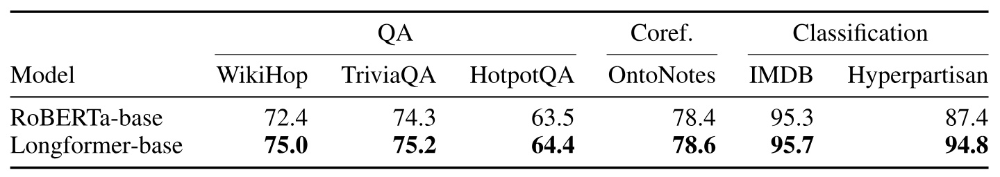

> [Iz Beltagy](https://beltagy.net/) [+equal], [Matthew E. Peters](https://dblp.org/pid/48/9898.html) [+equal] 和 [Arman Cohan](https://armancohan.com/) [+equal]. 2020 年 4 月 10 日首次提交至 arXiv; 当前版本为 v2. [Longformer: The Long-Document Transformer](https://arxiv.org/abs/2004.05150v2). [原始 PDF](/paper/longformer.pdf). [DOI](https://doi.org/10.48550/arXiv.2004.05150). [TeX 源文件](https://export.arxiv.org/e-print/2004.05150v2). 准确的印刷版式和参考文献以原始 PDF 为准.

## 摘要

基于 Transformer 的模型无法处理长序列, 因为其自注意力操作的开销随序列长度呈二次增长. 为解决这一限制, 我们提出 Longformer, 它的注意力机制随序列长度线性扩展, 因而可以轻松处理包含数千乃至更多 token 的文档. Longformer 的注意力机制可以直接替换标准自注意力, 并结合局部窗口注意力与由任务驱动的全局注意力. 沿用此前对长序列 Transformer 的研究, 我们在字符级语言建模上评估 Longformer, 并在 `text8` 和 `enwik8` 上取得当前最佳结果. 与大多数先前工作不同, 我们还预训练 Longformer, 再针对多种下游任务进行微调. 预训练后的 Longformer 在长文档任务上始终优于 RoBERTa, 并在 WikiHop 和 TriviaQA 上取得新的当前最佳结果. 最后, 我们提出 Longformer-Encoder-Decoder (LED), 这是 Longformer 的一个变体, 用于支持长文档生成式序列到序列任务, 并在 arXiv 摘要数据集上验证其效果. [+1]

## 1 引言

Transformer [Vas17] 已在多种自然语言任务中取得当前最佳结果, 包括生成式语言建模 [Dai19, Rad19] 和判别式语言理解 [Dev18]. 这一成功部分得益于自注意力组件, 它使网络可以捕获整个序列中的上下文信息. 自注意力虽然强大, 但其内存和计算需求随序列长度呈二次增长, 因而处理长序列并不可行 (或代价很高).

**图 1.** 完整自注意力和 Longformer 不同自注意力实现的运行时间与内存; `Longformer-loop` 未向量化, `Longformer-chunk` 已向量化, `Longformer-cuda` 则采用自定义 CUDA 内核实现. Longformer 的内存用量随序列长度线性增长, 而完整自注意力机制在当前 GPU 上处理长序列时会耗尽内存. 不同实现的速度各异, 其中向量化的 `Longformer-chunk` 最快. 更多细节见[第 3.2 节](#section-3-2).

为解决这一限制, 我们提出 Longformer, 一种修改后的 Transformer 架构, 其自注意力操作随序列长度线性扩展, 因而可以灵活处理长文档 ([图 1](#figure-01)). 这对长文档分类, 问答 (QA) 和共指消解等自然语言任务很有用, 因为现有方法通常会切分或缩短长上下文, 使其成为不超过 BERT 类预训练模型典型 512 token 限制的较小序列. 这种切分可能导致重要的跨分区信息丢失, 为缓解这一问题, 现有方法往往依赖复杂架构来处理这类交互. 相比之下, 我们提出的 Longformer 可以通过多层注意力构建整个上下文的上下文化表示, 从而减少对任务特定架构的需求.

近期工作已经研究了 Transformer 处理长序列时的计算低效问题 (见[表 1](#table-01)). 不过, 它们主要关注自回归语言建模 (LM), 而长文档 Transformer 在迁移学习场景 [Dai15, Pet18, How18, Dev18] 下应用于文档级 NLP 任务, 仍基本无人探索. 我们填补了这一空白, 并表明 Longformer 的注意力机制可以直接替换预训练 Transformer 中的自注意力机制, 在一组文档 NLP 任务上均带来提升.

Longformer 的注意力机制结合了窗口化局部上下文自注意力和由最终任务驱动的全局注意力, 后者编码了有关任务的归纳偏置. 通过消融实验和对照试验, 我们表明两类注意力都不可或缺: 局部注意力主要用于构建上下文化表示, 全局注意力则使 Longformer 能够构建用于预测的完整序列表示.

我们首先使用窗口注意力与一种新的膨胀注意力模式, 在自回归字符级语言建模上评估 Longformer, 使模型可在现代 GPU 上处理最长 32K 个字符的序列. 我们在 `text8` 和 `enwik8` 基准数据集上取得当前最佳结果, 说明 Longformer 能够有效建模长文档.

随后, 为评估 Longformer 替换现有预训练模型中完整自注意力操作的能力, 我们从已发布的 RoBERTa [Liu19a] 检查点继续训练, 使用掩码语言建模 (MLM) 目标对其进行预训练. 预训练完成后, 我们通过微调将其用于下游语言任务, 并表明 Longformer 在包括文本分类, 问答和共指消解在内的多种文档级自然语言任务上始终优于 RoBERTa, 且在其中两个数据集上取得当前最佳结果.

最后, 我们提出 Longformer 的一个变体: 它不采用仅编码器的 Transformer 架构, 而采用与原始 Transformer 模型 [Vas17] 类似的编码器-解码器架构, 用于序列到序列 (seq2seq) 学习 [Sut14]. 我们将该模型称为 Longformer-Encoder-Decoder (LED), 它在编码器网络中采用 Longformer 的高效注意力模式, 因而可以处理摘要等长文档 seq2seq 任务. 我们在 arXiv 摘要数据集 [Coh18] 上验证了 LED 的效果.

**表 1.** 使 Transformer 适应长文档的先前工作概览. ltr: 从左到右.

**图 2.** 完整自注意力模式与 Longformer 注意力模式配置的比较.

## 2 相关工作

**长文档 Transformer.** [表 1](#table-01) 总结了近期的长文档研究. 已有研究探索了两类自注意力方法. 第一类是从左到右 (ltr) 的方法, 它将文档分块并从左到右依次处理. 这类模型在自回归语言建模中取得了成功, 但不适合受益于双向上下文的迁移学习任务.

我们的工作属于另一类通用方法: 定义某种稀疏注意力模式, 避免计算完整的二次注意力矩阵乘法. 注意力模式与我们最相似的模型是 Sparse Transformer [Chi19], 它使用一种膨胀滑动窗口, 其中 8x8 大小的分块由 BlockSparse [Gra17] 提供. 我们的实现 ([第 3 节](#section-3)) 也包含自定义 CUDA 内核, 但它比用 C++ 实现且面向特定 TensorFlow 版本的 BlockSparse 更灵活, 也更易维护. 我们还提出了由任务驱动的额外全局注意力模式, 适用于常见 NLP 任务 ([第 3 节](#section-3)), 并表明它们对迁移学习场景下的良好性能不可或缺.

少数模型尝试了自回归语言建模之外的任务, 这是一个进步, 因为可以认为, 把语言建模作为主要评估目标导致开发出的模型适用范围有限. BP-Transformer [Ye19] 在机器翻译 (MT) 上进行了评估, 但没有探索预训练-微调场景. Blockwise attention [Qiu19] 对模型进行了预训练, 并在问答 (QA) 上评估. 不过, 这项评估较为有限: 它没有包含语言建模, 而且 QA 数据集中的文档相对较短, [+2] 因此该模型在长文档任务上的效果仍未得到探索.

**面向长文档的任务特定模型.** 为绕过 BERT 等预训练 Transformer 模型的 512 长度限制, 已经出现了许多任务特定方法. 最简单的方法是直接截断文档, 分类任务中常采用这种做法 [Xie19]. 另一种方法将文档划分为长度为 512 的块 (可以重叠), 分别处理每个块, 再用任务特定模型合并激活值 [Jos19]. 第三种方法常用于多跳和开放域问答任务, 它采用两阶段模型, 第一阶段检索相关文档, 再将其传给第二阶段提取答案 [Cla17, Che17]. 这些方法都会因截断而丢失信息, 或受到两阶段方法中级联错误的影响. Longformer 则可以处理长序列而无需截断或分块, 因而我们可以采用简单得多的方法: 拼接所有可用上下文, 一次完成处理.

几项同期工作 [+3] 探索了与 Longformer 相似的思路, 即在 Transformer 中使用局部 + 全局注意力, 并针对长文档自然语言任务进行预训练. 其中, ETC [Ain20] 以类似的局部 + 全局注意力取代完整自注意力, 使 Transformer 能扩展到长文档. ETC 与 Longformer 不同: 它使用相对位置嵌入 (我们只在自回归 LM 场景中使用), 引入额外的预训练目标 (CPC loss), 并以略有不同的方式配置全局注意力. 它在阅读理解和分类等多项任务上取得了强劲结果. GMAT [Gup20] 采用了类似思路, 让输入中的少数全局位置充当全局内存. BigBird [Zah20] 在 ETC 基础上扩展, 并评估了包括摘要在内的更多任务. 更重要的是, BigBird 通过理论分析表明稀疏 Transformer 是序列函数的通用逼近器, 并保留了完整自注意力的这些性质.

## 3 Longformer

原始 Transformer 模型包含时间和内存复杂度均为 $O(n^{2})$ 的自注意力组件, 其中 $n$ 是输入序列长度. 为解决这一问题, 我们按照一种"注意力模式"对完整自注意力矩阵进行稀疏化, 该模式指定哪些输入位置对彼此施加注意力. 与完整自注意力不同, 我们提出的注意力模式随输入序列线性扩展, 因而可以高效处理更长的序列. 本节讨论该注意力模式的设计与实现.

### 3.1 注意力模式

**滑动窗口.** 考虑到局部上下文的重要性 [Kov19], 我们的注意力模式在每个 token 周围使用固定大小的窗口注意力. 将多层这种窗口注意力堆叠起来, 可以得到较大的感受野: 顶层能够访问所有输入位置, 并可构建纳入整个输入信息的表示, 与 CNN 类似 [Wu19]. 给定固定窗口大小 $w$, 每个 token 会关注两侧各 $\frac{1}{2}w$ 个 token ([图 2(b)](#figure-02)). 这种模式的计算复杂度为 $O(n\times w)$, 随输入序列长度 $n$ 线性增长. 在有 $\ell$ 层的 Transformer 中, 顶层的感受野大小为 $\ell\times w$ (假设所有层的 $w$ 固定). 具体应用中, 为在效率和模型表示能力之间取得平衡, 对各层使用不同的 $w$ 值可能更合适 ([第 4.1 节](#section-4-1)).

**膨胀滑动窗口.** 为在不增加计算量的情况下进一步扩大感受野, 滑动窗口可以进行"膨胀". 这类似于膨胀 CNN [Oor16], 其中窗口的间隔大小为膨胀率 $d$ ([图 2(c)](#figure-02)). 假设所有层使用固定的 $d$ 和 $w$, 感受野为 $\ell\times d\times w$, 即使 $d$ 较小, 也可覆盖数万个 token.

在多头注意力中, 每个注意力头计算不同的注意力分数. 我们发现, 为各个头设置不同的膨胀配置可以改善性能: 不使用膨胀的头专注于局部上下文, 其他使用膨胀的头则专注于更长的上下文.

**全局注意力.** 在面向自然语言任务的当前最佳 BERT 类模型中, 最佳输入表示与语言建模不同, 并且随任务而异. 对于掩码语言建模 (MLM), 模型使用局部上下文预测被遮盖的单词; 对于分类, 模型把整个序列的表示聚合到一个特殊 token 中 (BERT 中为 `[CLS]`). 对于 QA, 问题与文档被拼接起来, 使模型能够通过自注意力比较二者.

在我们的模型中, 窗口注意力和膨胀注意力的灵活性不足以学习任务特定表示. 因此, 我们在少数预选输入位置上加入"全局注意力". 重要的是, 我们让这种注意力操作保持对称: 即具有全局注意力的 token 会关注整个序列中的所有 token, 而序列中的所有 token 也会关注它. [图 2(d)](#figure-02) 给出了一个示例, 其中滑动窗口注意力在少数自定义位置上的 token 处加入全局注意力. 例如, 对分类任务, `[CLS]` token 使用全局注意力; 在 QA 中, 所有问题 token 都使用全局注意力. 这类 token 的数量与 $n$ 相比很少, 且不随之变化, 因此局部与全局注意力组合后的复杂度仍为 $O(n)$. 指定全局注意力虽然与任务相关, 却能以简单方式向模型注意力中加入归纳偏置, 比现有任务特定方法使用复杂架构来合并较小输入块之间的信息简单得多.

**全局注意力的线性投影.** 回顾一下, 给定线性投影 $Q$, $K$, $V$, Transformer 模型 [Vas17] 按如下方式计算注意力分数:

$$
\mathrm{Attention}(Q,K,V)=\mathrm{softmax}\left(\frac{Q{}K^\top}{\sqrt{d_{k}}}\right)V
$$

我们使用两组投影: $Q_{s}$, $K_{s}$, $V_{s}$ 用于计算滑动窗口注意力的注意力分数, $Q_{g}$, $K_{g}$, $V_{g}$ 用于计算全局注意力的注意力分数. 额外投影为建模不同类型的注意力提供了灵活性, 我们表明这对下游任务取得最佳性能至关重要. $Q_{g}$, $K_{g}$, $V_{g}$ 的初始值均与 $Q_{s}$, $K_{s}$, $V_{s}$ 对应一致.

### 3.2 实现

在常规 Transformer 中, 注意力分数按[公式 1](#equation-01) 计算. 代价高昂的操作是矩阵乘法 $Q{}K^\top$, 因为 $Q$ 和 $K$ 都有 $n$ 个 (即序列长度) 投影. 对 Longformer 而言, 膨胀滑动窗口注意力只计算 $Q{}K^\top$ 中固定数量的对角线. 如[图 1](#figure-01) 所示, 与完整自注意力内存用量的二次增长相比, 这使内存用量线性增长. 不过, 实现它需要某种带状矩阵乘法, 而 PyTorch/Tensorflow 等现有深度学习库并不支持这种运算. [图 1](#figure-01) 比较了三种不同实现方式的性能: `loop` 是内存高效的 PyTorch 实现, 支持膨胀但慢到无法使用, 只用于测试; `chunks` 仅支持非膨胀情形, 用于预训练/微调场景; `cuda` 则是我们用 TVM [Che18d] 实现, 功能完整且经过高度优化的自定义 CUDA 内核, 用于语言建模实验 (更多细节见[第 9 节](#section-9)).

## 4 自回归语言建模

自回归语言建模或从左到右的语言建模, 可以宽泛地定义为: 给定输入序列中某个现有 token/字符之前的 token/字符, 估计该 token/字符的概率分布. 这项任务被视为自然语言中的基础任务之一, 近期使用 Transformer 建模长序列的先前工作也将其作为主要评估任务 [Dai19, Rae20, Suk19]. 同样, 我们在自回归语言建模上开发并评估模型.

### 4.1 注意力模式

对于自回归语言建模, 我们使用膨胀滑动窗口注意力. 沿用 [Suk19], 我们在各层使用不同的窗口大小. 具体而言, 较低层使用较小的窗口, 随着层数升高逐渐增大窗口. 这样, 顶层可以学习整个序列的高层表示, 而底层则捕获局部信息. 这也在效率 (较小的窗口因非零值较少, 计算成本更低) 与性能 (较大的窗口表示能力更强, 通常能改善性能) 之间取得了平衡.

我们不在较低层使用膨胀滑动窗口, 以最大限度发挥它们学习和利用紧邻局部上下文的能力. 对于较高层, 我们只在 2 个头上使用少量且逐渐增大的膨胀率. 这样模型便能直接关注远处的 token, 同时不牺牲局部上下文.

### 4.2 实验设置

为与先前工作比较, 我们关注字符级 LM [Mah06].

**训练.** 理想情况下, 我们希望以现代 GPU 内存能够容纳的最大窗口大小和序列长度来训练模型. 不过, 我们发现模型需要大量梯度更新, 先学会局部上下文, 才能学会利用更长的上下文. 为适应这一点, 我们采用分阶段训练流程, 在多个训练阶段中逐渐增大注意力窗口和序列长度. 具体而言, 第一阶段从较短的序列长度和较小的窗口开始, 此后每个阶段都将窗口大小和序列长度加倍, 并将学习率减半. 这样可以加快训练, 同时把较慢的部分 (最长序列和最大窗口) 留到最后. 模型共训练 5 个阶段, 起始序列长度为 2,048, 最后一个阶段的序列长度为 23,040 (各阶段的详细配置和其他所有超参数见[第 10 节](#section-10)).

**评估.** 我们使用长度为 32,256 的序列进行评估. 沿用 [Dai19], 我们把数据集划分为大小为 32,256, 步长为 512 的重叠序列, 并报告序列最后 512 个 token 上的性能.

#### 4.2.1 结果

[表 2](#table-02) 和[表 3](#table-03) 汇总了在 `text8` 和 `enwik8` 数据集上的评估结果. 我们使用小型模型在 `text8` 和 `enwik8` 上都刷新了当前最佳结果, 在 `text8` 和 `enwik8` 上的 BPC 分别为 **1.10** 和 **1.00**, 说明了模型的有效性.

对于大型模型, 鉴于这些实验成本高昂, 并沿用近期工作 [Kit20, Rae20], 我们只在 `enwik8` 上评估. [表 3](#table-03) 表明 Longformer 优于规模相当的 Transformer-XL 模型, 与规模相当的 Sparse Transformer [Chi19] 性能相当, 并且追平或略逊于参数量超过其两倍的近期模型. 如[第 2 节](#section-2) 所述, Adaptive Span [Suk19] 和 Compressive Transformer [Rae20] 并不适合预训练-微调范式, 这一点值得注意.

**表 2.** *小型*模型在 `text8` 和 `enwik8` 上的 BPC

**表 3.** *大型*模型在 `enwik8` 上的性能

#### 4.2.2 消融研究

**表 4.** 上: 逐层改变窗口大小. 下: 使用/不使用膨胀 (@ 第 1 阶段 150K 步)

为了说明注意力模式各项设计选择的重要性, 我们尝试了不同变体, 并报告其对照实验结果. 为使消融研究更易处理, 我们在 `text8` 上用小型模型的第 1 阶段配置, 将每种配置训练 150K 步 [+4], 再报告开发集上的 BPC 性能.

[表 4](#table-04) 上半部分说明了不同逐层窗口大小配置方式的影响. 我们观察到, 从底层到顶层逐渐增大窗口大小时性能最佳, 反向排列时性能较差, 而使用固定窗口大小 (即另一种配置中各窗口大小的平均值) 时, 性能介于二者之间. [表 4](#table-04) 下半部分给出了加入膨胀的影响. 与完全不使用膨胀相比, 在两个头上加入一定程度的膨胀会稍微改善性能.

## 5 预训练与微调

目前, 许多 NLP 任务中的当前最佳系统都会使用任务监督来微调预训练模型 (例如 BERT). 我们的主要动机之一, 是开发适用于长文档任务的此类模型. 为此, 我们在一个文档语料库上预训练 Longformer, 并针对包括分类, 问答和共指消解在内的六项任务进行微调. 得到的模型可以处理最长 4,096 个 token 的序列 (是 BERT 的 8 倍) [+5].

我们使用掩码语言建模 (MLM) 预训练 Longformer, 其目标是还原序列中被随机遮盖的 token. 由于 MLM 预训练成本高昂, 我们从已发布的 RoBERTa [Liu19a] 检查点继续预训练, 只做支持 Longformer 注意力机制所需的最少改动. 请注意, 我们的注意力模式可以接入任何预训练 Transformer 模型, 无需改变模型架构.

**注意力模式.** 我们使用窗口大小为 512 的滑动窗口注意力, 因而计算量与 RoBERTa 相同. [+6]

**位置嵌入.** RoBERTa 使用学习得到的绝对位置嵌入, 最大位置为 512. 为支持更长的文档, 我们加入额外的位置嵌入, 最长支持位置 4,096. 为了利用 RoBERTa 的预训练权重, 我们没有随机初始化新位置嵌入, 而是多次复制 RoBERTa 的 512 个位置嵌入来初始化它们, 因为对 BERT 注意力头的分析表明, 模型学习到了关注局部上下文的强偏置, 包括前一个或后一个 token [Cla19a]. 复制初始化在除分区边界外的所有位置保留了这种局部结构. 尽管方法简单, 我们发现它非常有效 (见[表 5](#table-05)), 使 Longformer 的预训练可以通过少量梯度更新迅速收敛.

**表 5.** RoBERTa 与多种预训练 Longformer 配置的 MLM BPC.

**继续 MLM 预训练.** 我们使用 fairseq [Ott19a], 在自己编制的长文档语料库上预训练 Longformer (语料库详情见[第 11 节](#section-11)). 我们训练两种规模的模型: 基础模型和大型模型. 两种模型都训练 65K 次梯度更新, 序列长度为 4,096, 批大小为 64 ($2^{18}$ 个 token), 最大学习率为 3e-5, 先进行 500 步线性预热, 再采用 3 次幂多项式衰减. 其余超参数与 RoBERTa 相同.

**表 6.** 各数据集以 wordpiece 计的平均上下文长度和第 95 百分位数. WH: WikiHop, TQA: TriviaQA, HQA: HotpotQA, ON: OntoNotes, HY: Hyperpartisan news

**表 7.** 问答, 共指消解与文档分类的微调结果汇总. 结果来自开发集, 比较 Longformer-base 与 RoBERTa-base. TriviaQA 和 Hyperpartisan 的指标为 F1, WikiHop 和 IMDB 使用准确率, HotpotQA 使用联合 F1, OntoNotes 使用平均 F1.

[表 5](#table-05) 给出了训练语料库开发集上的 BPC. 第一行显示, RoBERTa-base 的 BPC 为 1.846, 与 RoBERTa 论文在其语料库上报告的 1.880 BPC 相当. 这说明我们的训练语料库与 RoBERTa 训练语料库的分布相近. 接下来两行展示了 Longformer 预训练前的性能, 分别采用随机初始化的位置嵌入和复制的位置嵌入. 二者的显著差异表明复制初始化很重要, 而 RoBERTa BPC 与初始化后 BPC 之间相对较小的差异则说明, 我们的滑动窗口注意力与 RoBERTa 权重配合良好. 再接下来的两行展示继续预训练的影响. 训练 2K 步后, BPC 从 1.957 降至 1.753, 训练 65K 步后进一步降至 1.705, 说明模型正在学习更好地利用滑动窗口注意力和更长的上下文. RoBERTa-large 和 Longformer-large 也呈现相似模式.

**冻结 RoBERTa 权重.** 我们还在冻结所有 RoBERTa 权重, 仅训练新位置嵌入的情况下预训练 Longformer. 这种配置的动机是完整保留 RoBERTa 在短文档上的性能. 该配置的 BPC 为 1.850 (低于初始化时的 1.957), 但高于所有权重均可训练时的 1.705.

## 6 任务

我们将 Longformer 用于多项长文档任务, 包括问答, 共指消解和分类. [表 6](#table-06) 表明, 评估数据集的上下文明显长于 512 个 wordpiece. 我们的主要目标是评估注意力机制能否替代 BERT 类模型中的标准自注意力机制, 并与强基线开展对照试验. 我们还想评估, 能否用较简单的模型取代因 BERT 上下文受限而需要的复杂任务特定模型, 只需将所有可用上下文拼成一个序列即可.

我们的基线是基于 RoBERTa 的模型, 它将上下文分成尽可能长的片段, 分别送入 RoBERTa, 再拼接激活值进行后续处理. 对于问答任务, 我们还把问题拼接到每个片段中, 使 RoBERTa 能根据问题调整其上下文表示. Longformer 变体用预训练期间使用的窗口注意力和由任务驱动的全局注意力, 替换 RoBERTa 的自注意力机制. 全局注意力使用额外的线性投影 ([第 3.1 节](#section-3-1)).

### 6.1 问答

我们使用三个数据集: WikiHop [Wel18], TriviaQA [Jos17] 和 HotpotQA [Yan18a]. [+7]

对 WikiHop 和 TriviaQA, 我们沿用 BERT [Dev18] 的简单问答模型, 将问题和文档拼接成一个长序列, 通过 Longformer 处理, 再接一个数据集特定的预测层. WikiHop 为候选答案使用分类层, 而 TriviaQA 使用 [Cla17] 的损失函数预测答案跨度. 对 WikiHop, 我们在问题 token 和候选答案上加入全局注意力; 对 TriviaQA, 则在问题 token 上加入全局注意力.

HotpotQA 是一个多跳问答数据集, 需要从 10 个 Wikipedia 段落中提取答案跨度和证据句, 其中 2 个段落相关, 其余为干扰项. 我们使用两阶段模型, 先选择最相关的段落, 再将它们传给第二阶段提取答案. 两个阶段都将问题与上下文拼成一个序列, 通过 Longformer 处理, 再使用任务特定的预测层. 我们以多任务方式训练模型, 联合预测相关段落, 证据句, 答案跨度和问题类型 (是/否/跨度). 请注意, 该模型比近期包含复杂任务特定架构的 SOTA 模型更简单 (例如 [Tu19, Che19d, Tu20, Gro20]). 模型和超参数的更多细节见[第 12 节](#section-12).

### 6.2 共指消解

我们使用 OntoNotes [Pra12] 和 [Jos19] 的模型, 后者修改自 [Lee18c] 的系统, 用 BERT 替换 ELMo. Longformer 系统直接调整了基线模型: 用 Longformer 替换 RoBERTa 并扩展序列长度. 我们没有为这项任务使用全局注意力.

### 6.3 文档分类

我们在 IMDB [Maa11] 和 Hyperpartisan news detection [Kie19] 数据集上评估. [+8] IMDB 是一个标准情感分类数据集, 由电影评论组成. 该数据集中的大多数文档较短, 但约有 13.6% 超过 512 个 wordpiece ([表 6](#table-06)). Hyperpartisan 中的文档相对较长, 而且该数据集只有 645 篇文档, 规模较小, 因而很适合检验 Longformer 适应有限数据的能力. 我们在 `[CLS]` token 上使用全局注意力.

### 6.4 结果

**主要结果.** [表 7](#table-07) 汇总了所有微调实验的结果. 我们观察到 Longformer 始终优于 RoBERTa 基线. 对 WikiHop 和 Hyperpartisan 等需要长上下文的任务, 性能提升尤其明显. TriviaQA 的提升较小, 因为局部上下文通常足以回答问题. 对 HotpotQA 而言, 支持事实的辅助监督使模型很容易找到相关上下文, 随后只需关注局部上下文, 因而收益较小. WikiHop 的情况与之不同, 它只提供对中间推理链的远程监督, 而我们的方法能在整个上下文上推理, 因而表现出色. 在 IMDB 和 OntoNotes 数据集上, 性能提升较小. 对 IMDB 而言, 数据集大部分由短文档构成, 因此提升较小符合预期. 对 OntoNotes 而言, 我们发现任意两个指称之间的距离通常很短, 因此分别处理较小块的基线无需考虑跨块交互, 也能将各指称串联成共指链.

**用于 QA 的 Longformer-large.** 我们还评估了 Longformer-large 在长上下文问答任务上的性能. [表 8](#table-08) 表明, Longformer-large 在 WikiHop 和 TriviaQA 上以较大优势 (分别为 3.6 分和 4 分) 取得新的当前最佳结果 [+9]; 在 HotpotQA 上, 它则比当前最佳模型 [Fan20c] 低 1 分. [表 9](#table-09) 给出了 HotpotQA 的详细结果, 并与已发表和未发表的同期模型比较. Longformer 在已发表结果的排行榜上位列第二, 优于 HGN [Fan20c] 之外的所有其他已发表结果. 该任务中所有已发表的顶尖模型 [Tu19, Fan20c, Sha20a] 都使用 GNN [Kip17] 或实体图网络, 它们似乎编码了对任务很重要的归纳偏置, 可能进一步改善我们的结果. 尽管如此, Longformer 仍表现强劲, 优于包括近期非 GNN 方法 [Gla19, Sha20a, Gro20] 在内的所有其他方法.

**表 8.** 提交时 (2020 年 5 月) Longformer-large 的排行榜结果. 所有数值均为 F1 分数.

**表 9.** HotpotQA 干扰项设置下的测试集结果. Quark 的测试结果不可用. 所有数值均为 F1 分数. *†* 表示同期提交的排行榜结果.

### 6.5 WikiHop 消融实验

**表 10.** WikiHop 开发集消融实验

[表 10](#table-10) 给出了 WikiHop 开发集上的消融研究. 所有结果都使用 Longformer-base, 以相同超参数微调五个 epoch, 特别说明的情况除外. 更长的序列, 全局注意力, 用于全局注意力的独立投影矩阵, MLM 预训练和更长的训练, 都能使 Longformer 受益. 此外, 当配置与 RoBERTa-base 相同 (seqlen: 512, 使用 $n^{2}$ 注意力) 时, Longformer 的表现略逊于 RoBERTa-base, 证实性能提升并非来自额外预训练. 使用仅解冻额外位置嵌入时预训练的 RoBERTa 模型, 性能略有下降, 说明 Longformer 可以在 WikiHop 这类大型训练数据集上, 通过任务特定微调学会使用长距离上下文.

## 7 Longformer-Encoder-Decoder (LED)

原始 Transformer [Vas17] 采用编码器-解码器架构, 用于摘要和翻译等序列到序列任务 [Sut14]. 仅编码器 Transformer 对多种 NLP 任务都很有效, 而预训练编码器-解码器 Transformer 模型 (例如 BART [Lew19] 和 T5 [Raf19]) 也在摘要等任务上取得了很强的结果. 不过, 这类模型无法高效扩展到输入更长的 seq2seq 任务.

为便于在 seq2seq 学习中建模长序列, 我们提出一种 Longformer 变体, 它同时包含 Transformer 编码器栈和解码器栈, 但编码器不使用完整自注意力, 而使用 Longformer 的高效局部 + 全局注意力模式. 解码器对所有编码后的 token 和先前已经解码的位置使用完整自注意力. 我们将该模型称为 Longformer-Encoder-Decoder (LED), 它随输入长度线性扩展. 由于预训练 LED 成本高昂, 我们使用 BART 初始化 LED 参数, 并在层数和隐藏层大小上完全沿用 BART 架构. 唯一的区别是, 为处理更长的输入, 我们把位置嵌入从 BART 的 1K token 扩展到 16K token, 并采用[第 5 节](#section-5) 中对 RoBERTa 使用的方式, 将 BART 的 1K 个位置嵌入重复复制 16 次, 以此初始化新的位置嵌入矩阵. 与 BART 一样, 我们发布 LED-base 和 LED-large 两种模型规模, 它们的编码器栈和解码器栈分别各有 6 层和 12 层.

我们使用 arXiv 摘要数据集 [Coh18] 在摘要任务上评估 LED, 该数据集关注科学领域的长文档摘要. 文档长度的第 90 百分位数为 14.5K token, 因而适合用于评估 LED. LED 的编码器读取文档, 解码器生成输出摘要. 编码器使用窗口大小为 1,024 token 的局部注意力, 并在第一个 `<s>` token 上使用全局注意力. 解码器对整个编码器和先前已解码的位置使用完整注意力. 与标准 seq2seq 模型一样, LED 使用正确训练摘要进行教师强制训练, 推理时使用束搜索.

**表 11.** Longformer-Encoder-Decoder (LED) 在 arXiv 数据集上的摘要结果. 从左到右的指标依次为 ROUGE-1, ROUGE-2 和 ROUGE-L.

**图 3.** 改变输入大小时 LED 的 ROUGE-1 和 ROUGE-2 (arXiv 验证集).

[表 11](#table-11) 展示了 LED-large 16K 在 arXiv 摘要任务上的结果. 该模型只是从 BART 初始化, 没有额外预训练. 我们观察到 LED 在 arXiv 上取得当前最佳结果, 略优于 BigBird [Zah20]. 请注意, BigBird 摘要模型支持 4K token 的序列长度, 但从 Pegasus [Zha20b] 开始并继续预训练, 而 Pegasus 是一个专为摘要设计并预训练的模型. LED 没有经过预训练, 也没有采用任务特定初始化, 但凭借处理更长输入的能力, 仍能略微优于 BigBird. 预训练 LED 应该可以进一步改善性能. [图 3](#figure-03) 进一步说明了序列长度的重要性, 表明处理更长输入的能力会显著改善结果.

## 8 结论与未来工作

我们提出了 Longformer, 这是一种可扩展到长文档处理的 Transformer 模型, 无需切分/缩短长输入, 也无需用复杂架构合并各块信息, 就能轻松完成多种文档级 NLP 任务. Longformer 采用结合局部和全局信息的注意力模式, 同时随序列长度线性扩展. Longformer 在 `text8` 和 `enwik8` 的字符级语言建模任务上取得当前最佳结果. 预训练后, Longformer 在长文档任务上始终优于 RoBERTa, 并在 WikiHop 和 TriviaQA 上取得新的当前最佳结果. 我们还提出了 LED, 即 Longformer 面向序列到序列任务建模的编码器-解码器变体, 并在 arXiv 长文档摘要任务上取得当前最佳结果. 在未来工作中, 我们希望研究其他预训练目标, 尤其是针对 LED 的目标, 进一步增大序列长度, 并探索其他可能受益于该模型的任务.

## 致谢

我们感谢 Noah Smith, Dan Weld, Dirk Groeneveld, Kyle Lo, Daniel King 和 Doug Downey 提供了有益的讨论与反馈, 并感谢 AI2 基础设施团队的技术支持.

## 9 实现细节

实现 Longformer 的膨胀滑动窗口注意力, 需要某种带状矩阵乘法 (即除特定对角线外, 输出均为零的矩阵乘法), 而 PyTorch/Tensorflow 等现有深度学习库并不直接支持这种运算. [图 1](#figure-01) 比较了三种不同实现方式的运行时间与内存.  `Longformer-loop` 是一种朴素实现, 在循环中分别计算每条对角线. 它只计算非零值, 因而内存效率较高, 但慢到无法使用. 我们只把它用于测试, 因为它容易实现, 不会用于实际实验.  `Longformer-chunks` 仅支持非膨胀情形. 它将 $Q$ 和 $K$ 划分为大小为 $w$, 重叠大小为 $\frac{1}{2}w$ 的块, 将这些块相乘, 再遮盖对角线. 它使用 PyTorch 的单次矩阵乘法操作, 因而计算效率很高, 但会计算一些零值, 所以内存用量是完全优化实现应有用量的 2 倍. 凭借其计算效率, 该实现最适合预训练/微调场景. 我们没有发现内存增加在这一场景中构成问题.  `Longformer-cuda` 是我们使用 TVM [Che18d] 实现的自定义 CUDA 内核. 它完整实现了我们的注意力 (不像 `Longformer-chunks` 那样受限), 内存效率最高, 并且速度与高度优化的完整自注意力相当. [+10] 我们主要在自回归语言建模实验中使用这一实现, 因为它内存效率高 (可以使用最长的序列), 同时支持膨胀 (字符级 LM 实验需要这一功能).

**Tensor Virtual Machine (TVM).** 我们使用 TVM [Che18d] 构建自定义 CUDA 内核, 它是一个深度学习编译器栈, 可将函数的高级描述编译为经过优化的设备特定代码. 我们通过 TVM 使用高级 Python 构造描述带状矩阵乘法, 随后由 TVM 生成对应的 CUDA 代码并编译到 GPU 上.

## 10 字符级 LM 超参数

我们在 `text8` 和 `enwik8` 上评估, 两个数据集都包含来自 Wikipedia 的 100M 个字符, 并按 90M, 5M, 5M 划分为训练集, 开发集和测试集. 我们的模型只规定自注意力组件的工作方式, 与 Transformer 模型的其他设计选择无关. 我们的实现基于 Transformer-XL [Dai19] 代码 [+11], 并禁用了内存机制. 与 [Dai19] 一样, 我们使用带正弦权重的相对位置嵌入. 我们使用两种不同的模型规模: 一种是 [Dai19] 中的小型模型 (12 层, 隐藏大小 512), 另一种是 [Chi19] 中的大型模型 (30 层, 隐藏大小 512). 我们使用 apex [+12] 进行混合精度训练 (16 位和 32 位浮点数), 以减少内存用量并加快训练. 不过, 为避免数值不稳定, 我们保留了 fp32 的注意力计算. [+13] 我们使用梯度检查点 [Che16] 来减少内存用量, 并在 48GB RTX8000 GPU 上运行实验. 所有超参数和阶段配置均列于[表 12](#table-12). 我们的 CUDA 内核支持自回归模式, 其中每个 token 只关注此前 token 的一个窗口. 我们的实现还包含一种与膨胀滑动窗口注意力兼容的相对位置嵌入版本.

我们在 4 块 RTX8000 GPU 上运行小型模型实验, 用时 16 天. 对大型模型, 我们在 8 块 RTX8000 GPU 上运行实验, 用时 13 天. 大多数超参数搜索与[表 4](#table-04) 中的消融实验相似, 即在 `text8` 上将配置运行 150K 步. 我们实验了绝对位置嵌入和学习得到的位置嵌入, 小型模型的 [0.1, 0.2] 和大型模型的 [0.1, 0.4] dropout 值, pre-layernorm 与 post-layernorm [Xio20], 第 1 阶段取值为 [2.5e-5, 5e-4, 1e-4] 的学习率 (LR), 恒定与余弦 LR 调度, 以及不同的膨胀配置 (所有头使用, 2 个头使用, 不使用). [表 12](#table-12) 报告的每阶段梯度更新次数, 是通过运行各阶段直至验证 BPC 不再改善来确定的.

**表 12.** 字符级语言建模中性能最佳模型的超参数

## 11 预训练数据

**表 13.** 预训练数据

为使模型在预训练中学习长距离依赖, 我们编制了一个长文档语料库. 其中一些数据源也用于原始 RoBERTa 预训练, 包括 Books 语料库 [Zhu15] 和英文 Wikipedia. 我们还加入了 Realnews 数据集 [Zel19c] 中文档长度超过 1,200 个 token 的子集的三分之一, 以及 Stories [Tri18a] 语料库的三分之一. 我们希望混合长文档与短文档, 让模型能够学习更长距离的依赖, 同时不忘记原始 RoBERTa 预训练中的信息. 预训练数据的统计信息见[表 13](#table-13).

## 12 任务特定模型细节

所有问答和分类模型均使用 PyTorch-Lightning [+14] 实现. 除 Hyperpartisan news 外, 我们使用所有数据集的官方训练/开发/测试划分; 对 Hyperpartisan news, 我们将其随机划分为 80/10/10 的训练/开发/测试集.

**WikiHop.** WikiHop 中的实例包括: 一个问题, 候选答案 (从 2 个到 79 个不等), 支持上下文 (从 3 个到 63 个段落不等) 和正确答案. 数据集不为多跳推理链提供任何中间标注, 因此模型必须根据间接的答案监督推断这些推理链.

为准备 Longformer 和 RoBERTa 的输入数据, 我们先使用 RoBERTa 的 wordpiece 分词器, 对问题, 候选答案和支持上下文进行分词. 随后, 我们用特殊 token 将问题和候选答案拼成 `[q] question [/q] [ent] candidate1 [/ent]... [ent] candidateN [/ent]`. 上下文也使用 RoBERTa 的文档分隔 token 作为分隔符来拼接: `</s> context1 </s>... </s> contextM </s>`. 特殊 token `[q], [/q], [ent], [/ent]` 被加入 RoBERTa 词表, 并在任务微调前随机初始化.

准备好输入数据后, 我们按如下方式计算各模型顶层的激活值. 我们取问题和候选答案, 在模型序列长度范围内尽可能多地拼接上下文 (RoBERTa 为 512, Longformer 为 4,096), 将序列送入模型, 收集输出激活值, 并重复这一过程直至所有上下文用尽 (Longformer-large 除外, 由于内存要求, 我们只包含第一个长度为 4,096 的序列). 随后, 将所有块的激活值拼成一个长序列. 对 Longformer, 我们对整个问题和候选答案序列使用全局注意力.

预测时, 我们在每个 `[ent]` 上接一个输出单个 logit 的线性层, 对每个候选答案在所有块上的 logit 求平均, 应用 softmax, 并使用相对于正确候选答案的交叉熵损失.

训练使用 Adam 优化器, 先在 200 次梯度更新中线性预热至最大学习率, 再在剩余训练过程中线性衰减. 我们使用梯度累积, 使有效批大小达到 32 个实例, 每 250 次梯度更新检查一次开发集准确率, 并报告最高开发集准确率. 其他超参数 (dropout, 权重衰减) 与 RoBERTa 预训练相同.

总体而言, 我们只进行了少量超参数试验; 但为公平比较 Longformer 与 RoBERTa, 我们对 Longformer-base 和 RoBERTa-base 进行了相同的超参数搜索. 搜索包括 LR 在 [2e-5, 3e-5, 5e-5], epoch 数在 [5, 10, 15] 上的网格搜索. Longformer-base 的最佳配置使用 lr=3e-5, 训练 15 个 epoch. 我们对 Longformer-large 进行了两次超参数试验, lr=3e-5, epoch 数取 [5, 15] (训练 5 个 epoch 的模型开发集准确率更高, 为 77.6, 也是提交到公共排行榜进行测试集评估的唯一模型). 所有模型均在单块 RTX8000 GPU 上训练, Longformer-base 训练 5 个 epoch 约需一天.

**TriviaQA.** TriviaQA 有超过 100K 个用于训练的问题, 答案, 文档三元组. 文档是 Wikipedia 条目, 答案是在条目中提及的命名实体. 数据没有标注回答问题的跨度, 但可以通过简单文本匹配找到它.

与 WikiHop 类似, 我们使用 RoBERTa 分词器对问题和文档分词, 再将输入组成 `[s] question [/s] document [/s]`. 我们将文档截断到 4,096 个 wordpiece, 以免处理速度过慢. 随后, 我们以与上文 WikiHop 相似的方式从 RoBERTa 和 Longformer 获取激活值. 我们对所有问题 token 使用全局注意力.

预测时, 我们加入一个预测答案跨度起点和终点的层. 由于训练数据采用远程监督 (没有正确答案跨度), 我们使用 [Cla17] 的损失函数, 它类似于 OR: 模型只需正确预测一个答案跨度, 而非所有跨度.

最佳配置的超参数列于[表 14](#table-14). 其余超参数与 RoBERTa 类似. 在超参数搜索中, 我们只为 RoBERTa 基线调整 LR, 尝试 [3e-5, 5e-5, 1e-4], 随后在所有后续实验中使用最佳值 3e-5, 不再调整. 我们用最佳配置训练了一次 Longformer-large, 并将其输出提交至排行榜. 实验在 32GB V100 GPU 上运行. 小型模型使用 4 块 GPU 训练 1 天, 大型模型使用 8 块 GPU 训练 1 天.

**HotpotQA.** HotpotQA 数据集要求根据来自 10 个不同 Wikipedia 条目的 10 个段落回答问题, 其中 2 个段落与问题相关, 其余为干扰项. 它包含答案跨度提取和证据句识别两项任务. 我们的 HotpotQA 模型在一个联合模型中同时完成答案跨度提取和证据提取. 我们发现, 使用设置相似的两阶段 Longformer 模型能取得更高性能: 第一阶段先识别相关段落, 第二阶段再查找最终答案跨度与证据. [+15] 这主要是因为先移除干扰段落可以减少最终证据与跨度检测中的噪声, 近期该数据集的当前最佳方法也发现这一点很重要 [Fan20c]. 与 WikiHop 和 TriviaQA 类似, 为准备 Longformer 的输入数据, 我们把问题和全部 10 个段落拼成一个长上下文. 具体采用如下带特殊 token 的输入格式: "`[CLS] [q] question [/q] $\langle$t$\rangle$ $\texttt{title}_{\texttt{1}}$ $\langle$/t$\rangle$` $\texttt{sent}_{\texttt{1,1}}$ `[s]` $\texttt{sent}_{\texttt{1,2}}$ `[s]` `...` $\langle$`t$\rangle$ $\texttt{title}_{\texttt{2}}$ $\langle$/t$\rangle$ ` $\texttt{sent}_{\texttt{2,1}}$ `[s]` $\texttt{sent}_{\texttt{2,2}}$ `[s]` `...`", 其中 `[q]`, `[/q]`, $\langle$`t$\rangle$`, $\langle$`/t$\rangle$`, `[s]`, `[p]` 分别是表示问题起止, 段落标题起止和句子的特殊 token. 这些特殊 token 被加入 Longformer 词表, 并在任务微调前随机初始化. 对 Longformer, 我们在问题 token, 段落标题起始 token 和句子 token 上使用全局注意力. 模型在段落标题起始 token 上加入额外的前馈层来预测相关段落, 也在句子 token 上加入额外的前馈层来预测证据句. 第一阶段模型训练完成后, 我们为训练集和开发集预测相关段落分数. 随后, 我们最多保留 5 个原始分数高于预设阈值 (-3.0) 的段落, 并从上下文中移除其他段落. 接着, 我们在得到的缩短上下文上训练第二阶段模型. 对答案跨度提取, 我们使用 BERT 的 QA 模型 [Dev18], 并在第一个特殊 token (`[CLS]`) 上加入问题类型 (是/否/跨度) 分类头. 对证据提取, 我们在对应于句子和段落 token 的表示上应用 2 层前馈网络, 得到相应的证据预测分数, 并使用二元交叉熵损失训练模型. 在证据提取的推理阶段, 我们使用与 [Gro20] 类似的受限解码策略, 确保证据句恰好来自两个段落, 这正是该数据集的设置. 我们合并跨度, 问题分类, 句子和段落损失, 通过损失的线性组合以多任务方式训练模型. 实验在 RTX8000 GPU 上完成, 使用 4 块 GPU 训练每个 epoch 约需半天. 我们使用 Adam 优化器训练模型, 采用线性预热 (1000 步) 和线性衰减. 我们只进行了少量超参数调整, LR 取 3e-5 和 5e-5, epoch 数取 3 到 7, 发现 LR 为 3e-5, 训练 5 个 epoch 的模型效果最佳. 我们也对 RoBERTa 基线进行了相同的超参数搜索. 其余超参数见[表 14](#table-14).

**表 14.** 问答模型的超参数. 所有模型都使用类似的调度器, 采用线性预热和衰减.

**共指模型细节.** 该共指模型直接改编自 [Jos19] 中基于 BERT 的 coarse-to-fine 模型. 使用 RoBERTa wordpiece 分词器预处理每篇文档后, 它把每篇文档划分为不重叠且不超过最大序列长度的片段, 再拼接激活值, 用于形成共指簇的 coarse-to-fine 聚类阶段. RoBERTa-base 的最大序列长度为 384, 这是使用原始实现中的默认超参数, 在 [256, 384, 512] 上进行三次试验后选出的. [+16] Longformer-base 的序列长度为 4,096. 与原始实现类似, 预训练 RoBERTa 参数和随机初始化的任务参数使用不同的学习率. 对任务参数使用较大的学习率, 可使优化器将其调整到离随机初始值更远的位置, 同时不破坏预训练 RoBERTa 参数中的信息.

超参数搜索规模很小, 为公平比较, RoBERTa 和 Longformer 都在 RoBERTa LR [1e-5, 2e-5, 3e-5] 与任务 LR [1e-4, 2e-4, 3e-4] 上进行网格搜索. Longformer-base 的最佳配置为 RoBERTa lr=1e-5, 任务 lr=1e-4. 其他所有超参数均与原始实现相同. 在单块 GPU 上训练约需 10 小时.

我们的实现是一种 superhack, 涉及 PyTorch 和 Tensorflow 共享同一进程和 GPU. 为避免在 PyTorch 中重新实现 Tensorflow 里复杂的 coarse-to-fine 逻辑 (其中用到 [Lee18c] 最初发布, 经过高度优化的自定义 GPU 内核), 我们设计了一个系统, 让模型底部的 Transformer 部分在 PyTorch 与 Tensorflow 之间来回传递激活值和梯度. 输入张量首先通过 PyTorch 中的 Transformer, 从顶层收集激活值, 由 GPU 传至 CPU, 再从 CPU 传至 Tensorflow, 随后传回 GPU, 以运行 coarse-to-fine 聚类并计算损失. 接着, 梯度在 Tensorflow 中反向传播至 Transformer 顶部, 再反向执行这一过程, 将梯度传给 PyTorch, 继续通过模型其余部分反向传播. 参数更新使用独立的优化器, 并维持相同的 LR 调度. 与运行模型的总体成本相比, 该方法的额外开销很小.

**文本分类.** 对于分类, 沿用 BERT, 我们在第一个 `[CLS]` token 上使用简单的二元交叉熵损失, 并为 `[CLS]` 加入全局注意力. 我们使用 Adam 优化器, 批大小为 32, 采用线性预热和衰减, 预热步数等于总训练步数的 0.1. 对 IMDB 和 Hyperpartisan news, 我们都在 LR [3e-5, 5e-5] 与 epoch 数 [10, 15, 20] 上进行网格搜索, 发现 LR 为 3e-5, 训练 15 个 epoch 的模型效果最佳. 实验在单块 RTX8000 GPU 上完成.

[+1]: [https://github.com/allenai/longformer](https://github.com/allenai/longformer)

[+2]: SQuAD 上下文通常不超过 512 的限制, MRQA 则在构建时丢弃了长文档样本.

[+3]: 这些工作均在 Longformer 之后发表于 arXiv.

[+4]: 一项注意事项是, 最终性能的排序不会与第 150K 步时的排序一致. 不过, 这种近似可以省去将每项实验运行至完成的高昂成本.

[+5]: 当前 GPU 可以处理最长 16K 的序列.

[+6]: 像[第 4.1 节](#section-4-1) 那样在少数头上加入膨胀会降低性能, 可能是因为它与预训练 RoBERTa 权重不兼容. 若要改善性能, 可能需要从头重新训练这种模型.

[+7]: 我们使用完整版 TriviaQA 和 HotpotQA, 而非 MRQA [Fis19] 中的简化版本.

[+8]: 对 Hyperpartisan, 我们将训练数据划分为 80/10/10 的训练/开发/测试集, 并报告五个随机种子下的平均 F1.

[+9]: 指提交时, 即 2020 年 5 月. 后来, BigBird [Zah20] 改善了这些数据集上的排行榜结果. 其中存在一些混杂因素, 例如 BigBird 预训练使用的计算量是 Longformer 的 16 倍, 这可能影响性能.

[+10]: 值得注意的是, 理论上, 经过充分优化的 `Longformer-cuda` 应快于 $n^{2}$ 计算. 不过, 要达到这种性能, 需要专门掌握底层 GPU 编程知识, 与实现高度优化的矩阵乘法类似. 我们当前的实现速度足够快, 也足够实用.

[+11]: [https://github.com/kimiyoung/transformer-xl](https://github.com/kimiyoung/transformer-xl)

[+12]: [https://github.com/NVIDIA/apex](https://github.com/NVIDIA/apex)

[+13]: 我们发现, 在注意力操作中使用 fp16 会导致浮点溢出, 并在训练后期产生 NaN.

[+14]: [https://github.com/PyTorchLightning/pytorch-lightning](https://github.com/PyTorchLightning/pytorch-lightning)

[+15]: 在联合 F1 指标上, 两阶段模型的最终开发集性能比单阶段模型高约 4.2 分.

[+16]: https://github.com/mandarjoshi90/coref

[+equal]: 贡献相同.
