> [Ruihao Gong](https://xhplus.github.io/), [Yifu Ding](https://yifu-ding.github.io/), [Zining Wang](https://dblp.org/pid/181/4125), [Chengtao Lv](https://scholar.google.com/citations?user=r8vseSUAAAAJ), [Xingyu Zheng](https://xingyu-zheng.github.io/), [Jinyang Du](https://dblp.org/pid/18/8964), [Jinyang Guo](https://jinyangguo.github.io/), [Xianglong Liu](https://xlliu-beihang.github.io/), [Haotong Qin](https://htqin.github.io/), [Michele Magno](https://pbl.ee.ethz.ch/the-institute/people/person-detail.michele-magno.html), [Yang Yong](https://dblp.org/pid/24/167), [Shiqiao Gu](https://dblp.org/pid/305/3723), [Dahua Lin](https://dahualin.org/). 论文于 2024 年 9 月 25 日首次提交至 arXiv, 后发表于 *Neural Networks* 第 192 卷 (2025). 本网页阅读版依据 [A Survey of Low-bit Large Language Models: Basics, Systems, and Algorithms](https://arxiv.org/abs/2409.16694) 的 arXiv v3 版本整理. 数学符号, 图表及完整参考文献列表以[原始 PDF](/paper/low-bit-llms.pdf) 为准. [DOI](https://doi.org/10.1016/j.neunet.2025.107856). [TeX 源文件](https://arxiv.org/src/2409.16694).

## 摘要

大语言模型 (LLM) 在自然语言处理领域取得了显著进展, 并在多类任务上展现出优异性能. 然而, 高昂的内存与计算需求给实际部署带来了严峻挑战. 低比特量化通过降低模型参数, 激活值和梯度的位宽来减少内存占用和计算开销, 已成为缓解这些问题的关键方法. 本文全面综述面向 LLM 的低比特量化方法, 涵盖基本原理, 系统实现和算法策略. 我们首先介绍低比特 LLM 的基础概念和新型数据格式, 随后回顾在各类硬件平台上支持低比特 LLM 的框架与系统, 再对高效低比特训练和推理所采用的技术及工具包进行分类与分析. 最后, 本文讨论低比特 LLM 的未来趋势和潜在进展.

本文从基础, 系统和算法三个视角给出系统性总结, 可为后续研究利用低比特量化提升 LLM 的效率与适用性提供有价值的参考和指导.

## 1 引言

大语言模型 (LLM) [Ope24a, Tou23, Tou23a, Dub24, Loz24, Dee24] 凭借从文本生成到语言理解等多类任务上的出色表现, 推动了自然语言处理领域的深刻变革. 与此同时, 这种能力也伴随着巨大的计算和内存需求, 使模型在资源受限或高并发场景下的部署面临明显困难. 为解决这些问题, 低比特量化已成为提升 LLM 效率和可部署性的核心手段.

低比特量化通过降低张量位宽, 有效减少 LLM 的内存占用和计算需求. 将 LLM 的权重, 激活值和梯度压缩为低比特整数或二值表示后, 量化可以在保持可接受精度的同时显著加速推理与训练, 并降低存储需求. 这项技术使先进 LLM 能够运行在资源受限的设备上, 从而扩展其应用范围.

本文旨在全面综述大语言模型的低比特量化, 覆盖相关基础概念, 系统实现和算法方法. 与传统模型相比, LLM 是基础模型的典型范式, 通常拥有海量参数, 因而给有效量化带来了独特挑战. 如图 1 所示, 第 2 节介绍 LLM 低比特量化的基础知识, 包括面向 LLM 的新型低比特数据格式和量化粒度. 第 3 节回顾不同硬件平台上支持低比特 LLM 的系统与框架. 第 4 节和第 5 节分别归纳面向高效训练和推理的低比特量化技术. 在训练方面, 我们讨论 LLM 的低比特训练与微调方法. 在推理方面, 我们将 LLM 量化方法分为量化感知训练和训练后量化. 量化感知训练常用于二值量化等极低比特设置; 训练后量化所需资源较少, 因而在现有研究中应用更广. 为便于理解, 本文先介绍减少离群值影响的等价变换和缓解量化误差的权重补偿, 再讨论混合精度, 量化与其他压缩方法的结合, 以及新型量化形式. 此外, 我们还总结集成这些算法的工具包, 以支持高精度低比特 LLM 的开发. 最后, 第 6 节讨论未来趋势与方向, 包括新兴研究领域, 潜在突破及新技术对 LLM 量化的影响.

本文详细说明低比特 LLM 的基础知识, 系统梳理通过低比特量化加速训练和推理的实现方式, 并总结维持与提升量化精度的算法和策略. 我们希望本综述能为相关研究提供参考, 推动 LLM 量化技术的发展.

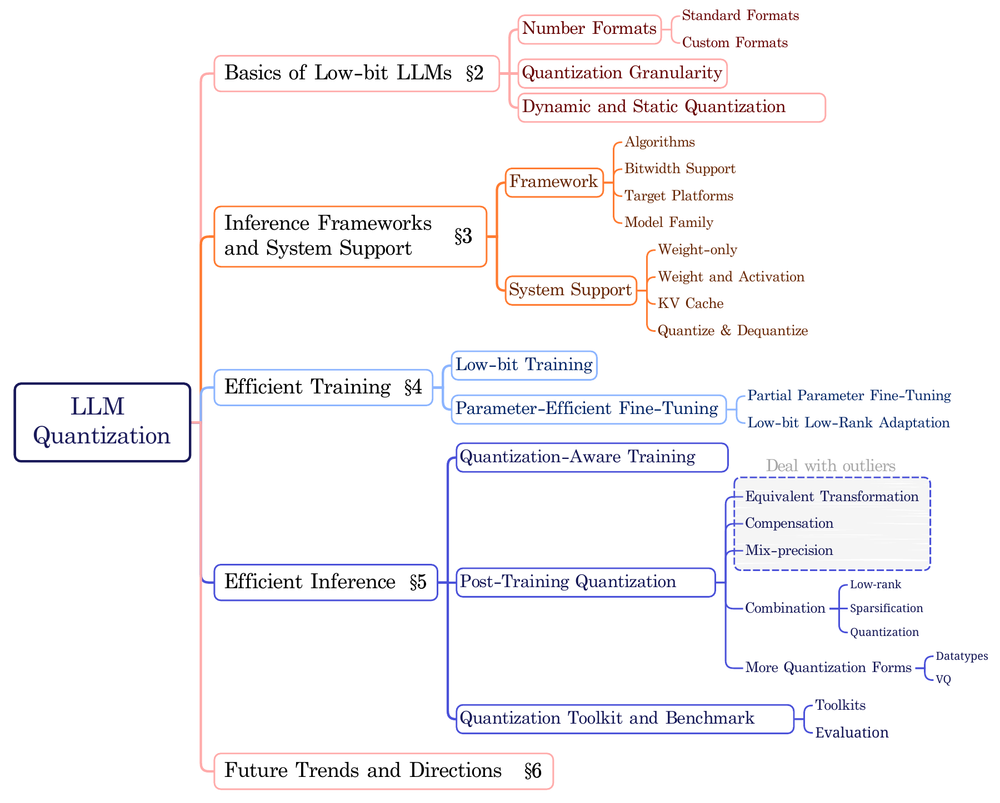

**图 1.** LLM 量化方法的整体框架, 展示了本综述覆盖的主要方向.

## 2 低比特 LLM 基础

本节从三个方面介绍量化与低比特 LLM 的基础知识: (1) 低比特数值格式. 为处理 LLM 中的离群值, 量化首先引入低比特浮点数, 并设计了多种定制数据格式, 但整数仍是主流选择. (2) 量化粒度. 更细的量化粒度可以保留更多信息并获得更好的结果, 而较粗的粒度占用的存储更少, 推理效率也更高. (3) 动态量化与静态量化. 动态量化在运行时计算量化参数, 无需校准, 因而量化模型的准备更简单; 静态量化需要预先校准量化参数, 但推理速度更快.

### 2.1 低比特数值格式

我们首先介绍低比特数值格式. 一方面说明已被广泛认可的标准格式, 并重点分析它们在 LLM 中的差异; 另一方面介绍若干专为 LLM 设计的典型定制格式.

#### 2.1.1 标准格式

**浮点数.**
IEEE 754 [Iee19] 标准完整定义了浮点数据类型, 它也是计算机系统中最常见的数值格式. 本文用 $\mathrm{FP}k$ 表示浮点格式, 其中 $k$ 是该数值在内存中占用的位数, 常见取值包括 $32,16,8$ 等. 浮点数可以统一表示为:

$$
\begin{aligned}
X_{\mathrm{FP}k} = {(-1)}^{s}2^{p-\mathrm{bias}}(1.\mathrm{mantissa})={(-1)}^{s}2^{p-\mathrm{bias}} \\
\left(1+\frac{d_{1}}{2}+\frac{d_{2}}{2^{2}}+\ldots+\frac{d_{m}}{2^{m}}\right),
\end{aligned}\tag{1}
$$

其中, $s$ 是符号位, $p$ 是指数整数, $\mathrm{bias}$ 是施加在指数上的偏置, $m$ 是有效数字中尾数位的总数, $d_{1},d_{2},\ldots,d_{m}$ 表示二进制格式尾数部分的各位数字. 对于一个 $\mathrm{FP}k$ 数值, $s$, $p$ 和 $m$ 的位数之和应为 $k$.

由于 LLM 占用大量内存, 较低位宽格式已广泛用于训练和推理. 目前 16 位及更低位宽已成为实际应用的主流, 因此本文不再讨论 32 位格式. 根据指数部分 (E) 和尾数部分 (M) 的位数分配, 每种 $\mathrm{FP}k$ 还可以继续细分. 本文用 $\mathrm{E}e\mathrm{M}m$ 表示这些子类别. 对 $\mathrm{FP}16$ 而言, IEEE 754 定义了 float16 (也称半精度或 FP16) 和 bfloat16 (脑浮点或 BF16), 分别表示为 E5M10 和 E8M7. bfloat16 的指数位数与 FP32 相同, 因而可以表示更大的数量级; 但由于尾数位更少, 其有效数字分布比 float16 更稀疏, 这一特性在 LLM 中可能具有独特优势 [Hen19]. $\mathrm{FP}8$ 的 E4M3 和 E5M2 同样属于标准格式, MLC-LLM 和 Quanto 等主流深度学习推理引擎已对其提供支持 (详见第 3.1.2 节).

**NormalFloat (NF).** [Det24] NF 是一种用于 LLM 仅权重量化的固定浮点方法. 其数据表示沿用浮点形式, 但 $2^{k}$ 个取值 $X^{\mathrm{NF}}_{i},i\in[0,2^{k}-1]$ 估计为:

$$
\begin{aligned}
X^{\mathrm{NF}}_{i} =\frac{1}{2}\Bigl(\mathrm{quantile}\!\left(N(0,1),\frac{i}{2^{k}+1}\right) \\
\quad+\,\mathrm{quantile}\!\left(N(0,1),\frac{i+1}{2^{k}+1}\right)\Bigr),
\end{aligned}\tag{2}
$$

其中, $\mathrm{quantile}(\cdot,q)$ 表示输入的第 $q$ 分位数, $N(0,1)$ 表示标准正态分布. 对于取值范围不在 -1 到 1 之间的张量, 需要先用其最大绝对值缩放. 为确保能够精确表示零, NF 通过估计负值部分的 $2^{k-1}$ 个 $X^{\mathrm{NF}}_{i}$ 和正值部分的 $2^{k-1}-1$ 个 $X^{\mathrm{NF}}_{i}$ 对数据进行非对称划分, 再删除两组中重复的一个零. 这样估计出的 NF 会使每个量化区间内的期望样本数近似相等, 从而尽可能保留量化数据的信息.

**Micro Scaling FP.** [Dar23] 该格式由 AMD, Arm, Intel, Meta, Microsoft, NVIDIA 和 Qualcomm 等产业联盟成员共同提出和开发, 旨在为张量的细粒度子块建立统一标准. 它对采用 FP8, FP6, FP4 或 INT8 等不同原始格式的数据块使用 E8M0 缩放因子. 缩放块大小表示每个缩放因子覆盖的元素数量. 共享缩放因子既能维持较高的数值表示精度, 也具有显著的硬件效率.

**整数.** 整数量化是量化技术出现以来研究最广泛的数据格式, 它将浮点数划分为 $2^{k}$ 个等间距的离散整数. 公式为:

$$
X_{\mathrm{INT}_{k}}=(-1)^{s}(d_{1}2^{m}+d_{2}2^{m-1}+\cdots+d_{m}2^{0}),\quad x\in\mathbb{N}^{+},\tag{3}
$$

对于有符号整数, $m=k-1$ 且 $s\in\{0,1\}$; 对于无符号整数, $m=k$ 且可以视为 $s=0$. 因此, 有符号整数的范围是 $[-2^{k-1},2^{k-1}-1]$, 无符号整数的范围是 $[0,2^{k}-1]$. 在 LLM 出现之前, 整数量化已用于 BERT 类语言模型 [She20].

**二值数.** 二值化是最激进的量化技术, 它直接提取数值的符号 [Liu18, Qin22, Li24]. 这种方法会损失大量信息, 但能够显著加快推理并压缩参数. 硬件本身以 $0,1$ 表示每一位, 开发者则通过不同的逻辑规则和累加算法实现各类二值运算. 因此, 浮点数可以根据算法中单个比特所代表的预期值被二值化为 $\{-1,1\}$ 或 $\{0,1\}$. 一些研究还将二值化扩展到三值量化. 在 LLM 出现前, BinaryBERT, TernaryBERT 等工作已探索二值或三值量化格式 [Bai21, Zha20, Liu22, Liu23a].

表 1 给出了多种标准格式的表示范围. 即使位宽相同, 不同数值格式的取值范围也可能存在显著差异. 指数位数 $E$ 越多, 浮点格式的表示范围越大, 但可表示的点也越稀疏. 因此, 为特定模型和任务选择数据格式时, 需要在更精细的数值间隔与更大的表示范围之间权衡.

![不同数值格式的最小值和最大值 [Iee19].](./low-bit-llms/table-01.png)

**表 1.** 不同数值格式的最小值和最大值 [Iee19].

#### 2.1.2 定制格式

为加快计算并更好地拟合 LLM 的数值分布, 许多研究在上述标准格式之外提出了定制数值格式. 本节介绍三种典型格式. LLM 出现之前的相关工作 [Tam19] 尚未在 LLM 上验证性能, 因此不在此展开.

**Floating-point Integer (Flint).** [Guo22] Flint 结合了浮点和整数表示的优点, 其形式为 $X_{\mathrm{Flint}}=2^{p-\mathrm{bias}}\times(1.\mathrm{mantissa})$. 下面以面向浮点 MAC 单元的 4 位 Flint 为例:

$$
\begin{aligned}
p&=\begin{cases}
3-\mathrm{LZD}(b_{2}b_{1}b_{0}),&b_{3}=0,\\
4+\mathrm{LZD}(b_{2}b_{1}b_{0}),&b_{3}=1,
\end{cases}\\
\mathrm{mantissa}&=b_{2}b_{1}b_{0}\mathbin{\texttt{<<}}(\mathrm{LZD}(b_{2}b_{1}b_{0})+1),
\end{aligned}\tag{4}
$$

其中, `LZD` 表示前导零检测器 (Leading Zero Detector) [Okl94], 用于统计位串左侧的连续零; `<<` 表示左移操作; 基于浮点实现的 Flint4 取 $\mathrm{bias}=1$. Flint 将指数编码进整数, 从而扩展表示范围. 与纯整数相比, 它能用有限位数表示更大的范围, 因而更契合 LLM 参数分布.

**Adaptive Biased Float (Abfloat).** Outlier-Victim Pair Quantization (OVP) [Guo23] 最早提出 Abfloat 来处理离群值. 它与 Flint 的区别在于, Abfloat 对指数使用更大的 $\mathrm{bias}$, 并左移 $m$ 位以放大 `mantissa` 前的 $1$, 从而覆盖量级更大的离群值. $\mathrm{E}e\mathrm{M}m$ Abfloat 可以表示为:

$$
X_{\mathrm{Abfloat}}=(-1)^{s}\times 2^{p+\mathrm{bias}}\times(2^{m}+\mathrm{mantissa}).\tag{5}
$$

当 $\mathrm{bias}=0$ 时, 其范围与 $\mathrm{Flint}4$ 类似. 对 E2M1 取 $\mathrm{bias}=2$ 时, 范围变为 $\{12,\dots,96\}$; 取 $\mathrm{bias}=3$ 时, 范围进一步扩展为 $\{24,\dots,192\}$. 另一个区别是, Abfloat 仅用于离群值, 普通值仍以 INT4/8 或 Flint4 存储. 这两种格式都需要定制系统支持, 以定义加法和乘法等基础操作的行为.

**Student Float (SF).** [Dot24] SF 沿用浮点格式, 但为量化设置了特定的固定点, 因而不同于前两类格式. SF 改进了第 2.1.1 节的 NF, 并假设参数服从 Student t 分布 $S(t;\nu)$, 其概率密度函数为:

$$
S(t;\nu)=\frac{\Gamma\left(\frac{\nu+1}{2}\right)}{\sqrt{\nu\pi}\Gamma\left(\frac{\nu}{2}\right)}\left(1+\frac{t^{2}}{\nu}\right)^{-\frac{\nu+1}{2}},\tag{6}
$$

其中, $t$ 是自变量, $\nu$ 是自由度, $\Gamma$ 是广义阶乘函数.

$$
\tilde{X}^{\mathrm{SF}}_{i}=\mathrm{quantile}\left(S(t;\nu),q_{i}\right),\quad q_{i}=\begin{cases}\omega+(\frac{1}{2}-\omega)\frac{i-1}{7}&i\in\{1,\dots,8\}\\ \frac{1}{2}+(\frac{1}{2}-\omega)\frac{i-8}{8}&i\in\{9,\dots,16\}\end{cases},\tag{7}
$$

其中, $\omega=\frac{1}{2}(\frac{1}{32}+\frac{1}{30})$, $\{q_{1},\dots,q_{8}\}$ 和 $\{q_{9},\dots,q_{16}\}$ 是两组等间距分位点. 随后通过 ${X}^{\mathrm{SF}}_{i}=\frac{\tilde{X}^{\mathrm{SF}}_{i}}{\max_{i}|\tilde{X}^{\mathrm{SF}}_{i}|}$ 将 $\tilde{X}^{\mathrm{SF}}$ 归一化到 $[-1,1]$. 随着 $\nu$ 增大, t 分布的峰值降低并变宽, SF4 的取值分布也随之展开. 当 $\nu\to\infty$ 时, 它收敛到标准正态分布 (NF). 与 NF 相同, SF 用于仅权重量化 (见第 3.2.1 节), 因而无需从底层定义基础运算, 但需要定制从 SF 到标准格式的反量化过程.

### 2.2 量化粒度

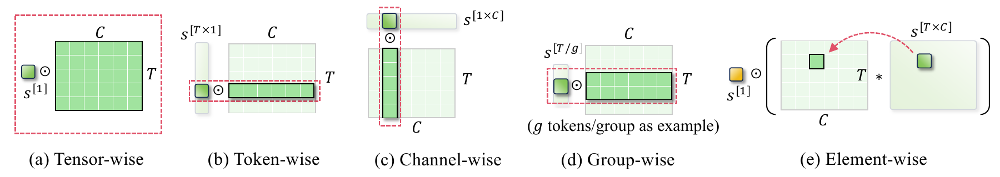

**图 2.** 不同量化粒度示意图.

量化粒度描述缩放因子和零点中的每个元素分别对应怎样的权重或激活分区, 它决定缩放恢复和零点平移的精细程度. 图 2 展示了五种基本粒度: 逐张量, 逐 token, 逐通道, 逐组和逐元素.

**逐张量量化**是最简单也最粗的粒度, 整个张量只使用一个缩放因子和一个零点 [Zha24]. 它通常速度最快, 但无法处理变化范围很大的数值, 因而可能造成最明显的性能下降. 对精度要求较高, 或任务与模型对量化较敏感时, 这种方式并不合适.

**逐 token 量化**仅用于 LLM, 即每个 token (词或子词) 各自使用一个缩放因子 [Yao22]. 它能够捕获不同 token 之间的细粒度差异. 实践中通常对激活值使用动态逐 token 量化, 以减少量化误差并维持生成模型的多样性.

**逐通道量化**让权重张量内每个通道分别使用一个缩放因子, 且该因子可以合并进量化权重 [Kim24]. 逐 token 激活量化通常与逐通道权重量化配合使用. 对激活中的第 $i$ 个 token 和权重中的第 $j$ 个通道, 可以先将相应的 $s_{\textbf{x}_{i}}\in s_{\textbf{x}}\in\mathbb{R}^{T\times 1}$ 与 $s_{\textbf{w}_{j}}\in s_{\textbf{w}}\in\mathbb{R}^{1\times C}$ 计算为 $s\in\mathbb{R}^{[1]}$, 再乘到输出矩阵 $\textbf{X}_{O}$ 的坐标 $[i,j]$ 上. 这样只需很少的额外计算, 就能保持生成性能.

**逐组量化**让一组张量或通道共享同一缩放因子, 从而平衡计算复杂度与量化误差. 若每组包含 $g$ 个 token 或通道, 缩放因子的存储量也会缩小为原来的 $1/g$ [Heo23, Yao22].

**逐元素量化**仅在权重训练阶段使用, 并总是与逐张量等另一种量化粒度结合 (见图 2 (e)). 推理前, 逐元素缩放因子会合并到量化权重中, 因而推理时只需计算逐张量缩放因子即可恢复数值量级 [Lee23].

不同量化粒度通常会组合使用. 例如, [Lee23] 根据数据分布对 Key 矩阵使用逐通道缩放, 对 Value 矩阵使用逐 token 缩放. 更多算法将在第 5.2.3 节介绍.

### 2.3 动态量化与静态量化

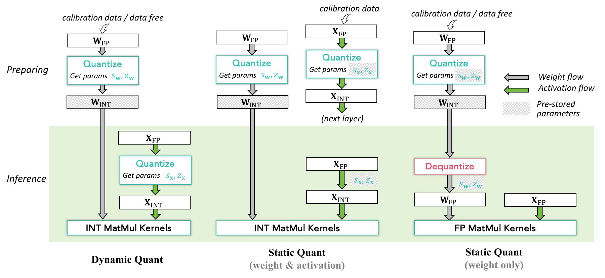

**图 3.** 动态量化与静态量化. 绿色方框内为推理流程, 方框外为生产和准备流程.

动态量化与静态量化主要指 PTQ 中的两种策略, 如图 3 所示. 这里以整数量化为例, 其他低比特量化方法的流程与之类似.

**动态量化** [Kri18, Liu22a] 会校准并保存量化权重. 它通常不需要输入数据, 而是通过最小化每个权重张量的量化误差, 搜索最优缩放因子 $s_{\mathbf{w}}$ 和零点 $Z_{\mathbf{w}}$. 推理时, 激活值进入量化模块, 计算最优缩放因子 $s_{\mathbf{x}}$ 和零点 $Z_{\mathbf{x}}$, 再由这些动态得到的参数量化至 INT8, 随后与量化权重执行整数 GEMM. 激活值的缩放因子和零点根据当前批次输入数据实时获得, 因而能够灵活适应输入分布, 将量化误差降到最低. 代价是推理期间计算缩放因子会增加额外计算量. 由于无需校准, 动态量化适合需要快速部署的场景.

**静态量化** [Bai21a] 从训练数据集中取少量数据作为校准数据. 将这些样本输入模型后, 可以得到权重与激活值共同使用的最优缩放因子 (图 3 中间), 或仅供权重使用的最优缩放因子 (图 3 右侧), 并在推理期间固定这些参数. 这样可以在准备阶段评估量化模型, 确认量化不会显著损害模型性能. 推理时, 图 3 中间的方式将激活值量化至低比特, 再与量化权重执行低比特 GEMM [Det22]. 图 3 右侧的方式则把权重反量化为浮点数, 激活值保持不量化, 随后执行浮点 GEMM [Lin24], 因而称为仅权重量化.

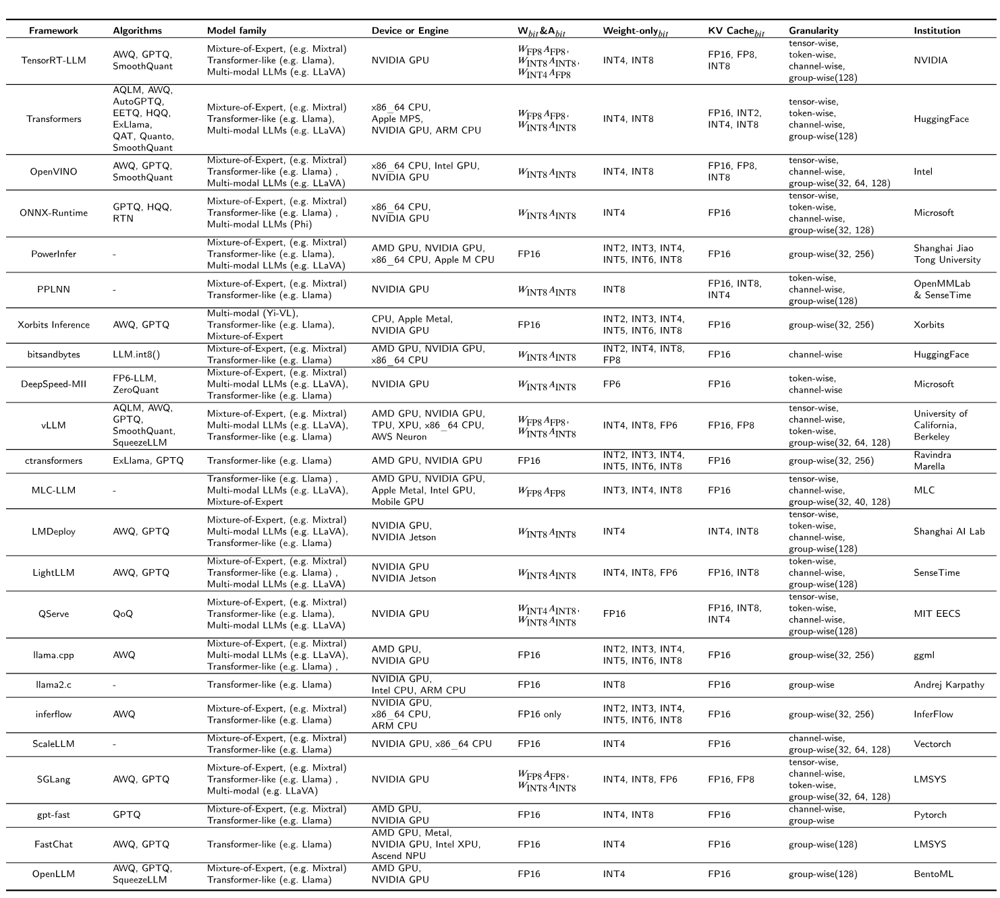

**表 2.** 量化大语言模型的推理框架.

## 3 框架与系统支持

大语言模型出现后的短短几年中, 已涌现出大量便于使用 LLM 的框架. 本节选择与量化相关的知名代表性框架和工具, 按以下两类进行总结: (1) **量化推理框架**, 提供完整的库和 API, 便于快速开发与部署 LLM 应用; (2) **量化系统支持**, 为量化方法提供底层核心功能. 下文重点讨论不同框架和库中的 LLM 量化能力.

### 3.1 量化推理框架

表 2 列出了具有代表性的推理框架. 大语言模型的推理过程包含 Prefill 和 Decode 两个关键阶段. Prefill 阶段对输入提示进行 token 化, 再通过 Transformer 层生成上下文嵌入, 利用自注意力捕获 token 之间的依赖关系. 该阶段建立丰富的输入上下文表示, 并将其保存以供后续文本生成使用. Decode 阶段以自回归方式生成文本, 每次根据已有序列预测一个新 token, 涉及嵌入查找, 注意力计算和基于概率分布的 token 选择. Prefill 一次处理全部输入, 计算量较大; Decode 则以增量方式逐步构建输出. 两个阶段共同使 LLM 能够生成连贯且符合上下文的文本, 也构成量化等效率优化技术的基础.

目前没有任何单一推理框架在性能或使用率上占据绝对主导地位. 一些经典深度学习框架已经集成高效大模型推理支持, 包括 TensorRT-LLM ([链接](https://github.com/NVIDIA/TensorRT-LLM)), ONNX-runtime ([链接](https://github.com/microsoft/onnxruntime)), Hugging Face Transformers ([链接](https://huggingface.co/docs/transformers/en/index)), OpenVINO ([链接](https://github.com/openvinotoolkit/nncf)), PowerInfer ([链接](https://github.com/SJTU-IPADS/PowerInfer)), PPLNN ([链接](https://github.com/openppl-public/ppl.nn)) 和 Xorbits Inference ([链接](https://github.com/xorbitsai/inference)). 此外, 大模型兴起后还出现了多种专为 LLM 设计的推理框架, 如 bitsandbytes ([链接](https://github.com/bitsandbytes-foundation/bitsandbytes)), ctransformers ([链接](https://github.com/marella/ctransformers)), MLC-LLM ([链接](https://github.com/mlc-ai/mlc-llm)), DeepSpeed-MII ([链接](https://github.com/microsoft/DeepSpeed-MII)), vLLM ([链接](https://github.com/vllm-project/vllm)), LMDeploy ([链接](https://github.com/InternLM/lmdeploy)), LightLLM ([链接](https://github.com/ModelTC/lightllm)), QServe ([链接](https://github.com/mit-han-lab/qserve)), llama.cpp ([链接](https://github.com/ggerganov/llama.cpp)), llama2.c ([链接](https://github.com/karpathy/llama2.c)), inferflow ([链接](https://github.com/inferflow/inferflow)), ScaleLLM ([链接](https://github.com/vectorch-ai/ScaleLLM)), SGLang ([链接](https://github.com/sgl-project/sglang)), gpt-fast ([链接](https://github.com/pytorch-labs/gpt-fast)), FastChat ([链接](https://github.com/lm-sys/FastChat)) 和 OpenLLM ([链接](https://github.com/bentoml/OpenLLM)). 这些框架较为轻量, 并集成了大量面向大模型的专项优化.

#### 3.1.1 即用型算法

随着 LLM 量化算法不断出现, 一些典型方法已被多数框架集成, 另一些方法则最初依托特定框架开发和发布. 表 2 列出了各主流框架中最容易直接使用的算法. GPTQ [Fra22], AWQ [Lin24] 和 SmoothQuant [Xia23] 等方法已被多数框架采用, 共同特点包括量化后精度较高, 性能良好, 易于接入既有实现流程且使用门槛低.

另有一些算法得到若干框架支持. 例如, bitsandbytes (Hugging Face 生态) 完整支持 LLM.int8() [Det22], 可以直接从 Hugging Face Hub 存取 8 位权重, 并将线性层权重量化为 8 位. FP6-LLM [Xia24] 被集成到 DeepSpeed-FastGen ([链接](https://github.com/microsoft/DeepSpeed/tree/master/blogs/deepspeed-fastgen)) [Hol24] 中, 为 6 位浮点仅权重量化提供运行时量化, 并可通过统一配置高效完成 6 位 LLM 权重的量化和反量化. 值得注意的是, Hugging Face Transformers 和 MIT EECS 的 QServe [Lin24a] 集成了大部分算法, 同时提供完整手册和详细示例, 便于研究人员与开发者快速上手.

#### 3.1.2 位宽支持

位宽支持往往能反映推理框架或引擎的量化系统实现是否完整. 按其在 LLM 加速中的位置和作用, 可以分为三类:

**Weight-onlybit** 表示只量化权重, 激活值仍保留为 FP16 [Lin24]. 量化权重先通过预先得到的缩放因子反量化回 FP16, 再与 FP16 激活值执行 FP16 `mma`. 因此, 这种方式理论上支持任意位宽的非均匀量化. 较小的权重数据量可以降低计算设备与存储主机之间的数据传输延迟, 但权重反量化会增加额外耗时. 第 3.2.1 节将进一步分析其加速机制.

**Wbit&Abit** 表示同时量化权重和激活值, 并在底层执行低比特矩阵乘法 (MatMul). 例如, NVIDIA GPU 的 PTX ISA 8.5 ([链接](https://docs.nvidia.com/cuda/parallel-thread-execution/index.html)) 中, 指令 `mma.sync.aligned.shape.row.col .s32.u4.u4.s32` 的乘数数据类型为 4 位无符号整数. 所有框架都支持 INT8 和 FP16 MatMul, 但受硬件计算能力及指令集支持范围限制, 只有部分框架支持 INT4 和 FP8 MatMul. 仅有少数框架允许权重与激活使用不同位宽, 如 $W_{\mathrm{INT4}}A_{\mathrm{INT8}}$, 这需要由 GEMV 指令组装定制计算内核 ([链接](https://huggingface.co/docs/transformers/main/en/quantization/eetq)) [Egi24]. 使用低比特 MatMul 时, 硬件架构必须支持相应的低比特计算, 还可能需要将驱动升级或降级到匹配版本, 才能复现实际低比特运算并获得预期加速比.

**KV Cachebit** 列出键值缓存的位宽. 随着批大小和序列长度增长, KV cache 的内存消耗会迅速上升, 甚至可能超过模型本身. 对 KV cache 量化可以显著减少模型推理期间的内存占用 [Hoo24, Yue24a, Liu24]. 与仅权重量化类似, 量化后的键值对通常需要在 MatMul 前反量化为浮点数; 否则系统必须专门支持低比特数值与浮点数相乘. 除表中列出的位宽外, 所有框架都支持直接存储激活值的 FP16 KV cache.

表中还列出了量化粒度. 用户需要查阅框架手册, 确认某种粒度适用于权重, 激活值还是 KV cache. 这里汇总各框架支持的粒度, 用于帮助选择已经实现目标计算内核的合适框架.

#### 3.1.3 目标平台

深度学习硬件市场竞争激烈. NVIDIA 是当前深度学习 GPU 领域的先行者之一, 因而大多数框架都支持 NVIDIA GPU. vLLM, bitsandbytes, llama.cpp, ctransformers, MLC-LLM 和 PowerInfer 也支持 AMD GPU. TPU, XPU, Metal 等其他处理单元获得的系统支持相对有限. 以将 LLM 扩展到边缘设备为目标的框架更可能支持这些平台, 如 MLC-LLM, ONNX-Runtime 和 llama.cpp.

需要注意, 表 2 中同时支持低比特量化和硬件部署, 并不意味着任意量化模型都能部署到列出的每种硬件上. 用户仍应仔细查阅相关手册. 本文汇总的表格主要用于缩短筛选框架的时间, 帮助读者找到可能满足部署需求的方案.

#### 3.1.4 模型家族

所有框架都支持自定义模型, 并能接入 Hugging Face Hub 等外部模型库. 为帮助用户快速开始, 框架通常为常用模型提供预定义规格文件. 大模型可以粗略分为三类: Transformer 类 LLM (如 Llama, Orion, Baichuan, ChatGLM, Falcon), 混合专家模型 (如 Mixtral, Mistral, DeepSeek) 和多模态 LLM (如 LLaVA).

不过, 外部模型库中的大模型并不一定都能顺利运行, 因为框架集成新算法通常存在滞后. 从外部模型库导入支持列表之外的新模型前, 用户应先查看框架自带的模型库, 并确认目标模型没有额外的底层系统要求.

### 3.2 量化的系统支持

在实际实现中, 有些量化算法虽然降低了权重或激活值位宽, 却未能加快推理, 这一现象常令人困惑. 因而一个关键问题是: *量化究竟如何实现真正的加速和存储节省?* 回答这个问题前, 必须先明确模型推理中的数据传输过程.

![推理过程中权重和激活值在缓存系统中的传输. 带宽和延迟以 NVIDIA A100 的官方数据为例. `PCIe` 是连接 GPU, SSD 等硬件组件的高速接口标准. `Async_Copy` 表示使用 cp.async 内建函数执行异步数据复制. `ldmatrix` 和 `lds` 是从共享内存向寄存器加载矩阵的指令, 前者要求严格的数据布局, 后者则提供细粒度且灵活的加载方式 [Nvi25].](./low-bit-llms/figure-04.png)

**图 4.** 推理过程中权重和激活值在缓存系统中的传输. 带宽和延迟以 NVIDIA A100 的官方数据为例. `PCIe` 是连接 GPU, SSD 等硬件组件的高速接口标准. `Async_Copy` 表示使用 cp.async 内建函数执行异步数据复制. `ldmatrix` 和 `lds` 是从共享内存向寄存器加载矩阵的指令, 前者要求严格的数据布局, 后者则提供细粒度且灵活的加载方式 [Nvi25].

图 4 展示权重和激活值在多级缓存系统中的传输过程, 也是量化 LLM 的一般数据流. GPU 通常采用多级缓存结构, 各级容量和 IO 速度不同. 片上缓存 (L2 cache, 共享内存和寄存器) 访问更快但容量有限; 片外缓存 (设备内存或全局内存, 主机内存) 容量更大但访问更慢. 因此, 当前 LLM 推理框架需要按分块方式加载和计算数据, 并使用高度并行的单指令多线程 (SIMT) 范式来保证可接受的推理速度.

*主机内存 $\rightarrow$ 设备内存.* 对权重而言, 每次将一层权重从主机内存加载到设备全局内存. 以 NVIDIA A100 为例 [Smi20], 单方向带宽较低, 仅为 25 GB/s. 量化权重通常以紧凑格式保存, 因而可以缩短传输时间. 激活值在推理过程中直接由设备生成, 无需从主机复制.

*片外内存 $\rightarrow$ 片上内存.* 将即将参与矩阵乘法的一块权重和激活值从片外全局内存复制到片上 L2 cache 和共享内存. 每次复制的数据量主要由 MatMul 内核设计决定, 通常是一次 SIMT 内核执行所计算元素数量的整数倍. A100 在这一层级的带宽为 1555 GB/s.

*共享内存 $\rightarrow$ 寄存器.* 为加快计算, 量化, 反量化和 MatMul 通常都在寄存器中执行, 因而需要以较小分块将权重和激活值从共享内存复制到寄存器. 该层级带宽为 19400 GB/s, 所需线程数超过 `PCIe` 的 10 倍, 计算强度约为其 $1/780$.

*卸载 (寄存器 $\rightarrow$ 共享内存 $\rightarrow$ 片外内存).* 计算结果会复制或累加到共享内存中的对应元素. 一个数据块完成计算后, 共享内存中的结果被卸载到片外内存. 随后可以释放上一数据块的权重与激活存储, 再继续处理下一块.

以上以线性层 MatMul 为例说明了数据传输过程. 在此基础上才能回答: **量化如何降低延迟和存储需求?** 若要真正加速推理并节省存储, 必须从底层到上层为量化提供完整的系统支持.

下文按作用范围讨论四类系统支持: **仅权重, 权重与激活, KV cache, 量化与反量化**. 我们先介绍多数框架采用的通用做法. 它们未必最为高效, 但可扩展性和通用性较好, 便于快速接入新算法和实现. 随后再介绍若干定制设计, 这些研究针对加速和生成质量瓶颈, 在特定范围内提出更快的方案. 图 5 展示权重或激活量化如何缩短推理时间, 其中以 4 位整数量化为例, 也可替换为其他低比特格式. 图 6 展示量化 KV cache 对推理的影响. 两图的加速时间线将相对 FP16 的耗时变化分为三类: *加速* (绿色), *减速* (深灰色) 和*无影响* (浅灰色).

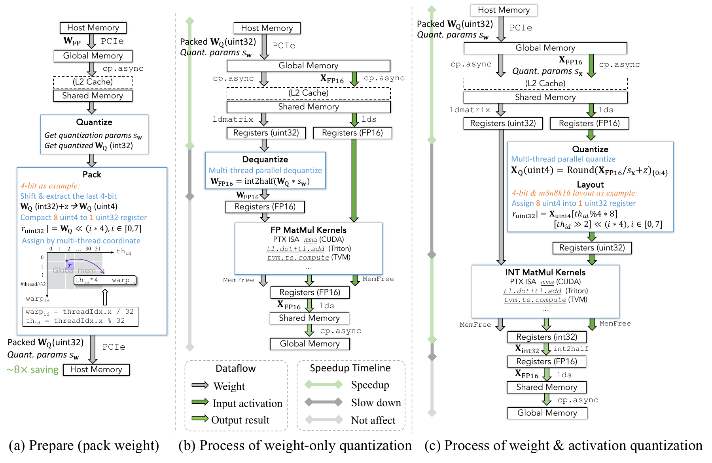

**图 5.** 量化的数据传输过程: (a) 量化权重准备 (权重打包), (b) 仅权重量化, (c) 权重与激活量化.

#### 3.2.1 仅权重量化

无论大模型出现前后, 模型推理的一个根本瓶颈都是数据传输和存储成本, 但这一点在普通小模型中常被忽略. 大模型数据量巨大, 传输延迟不可忽视, 甚至会超过计算延迟, 成为 LLM 推理的主要难题. 仅权重量化由此产生, 它压缩权重并减少各级缓存之间的数据复制负担 [Lin24, Fra22].

图 5 (a) 和 (b) 展示了相关过程. 仅权重量化和权重与激活量化都需要提前将权重打包为较低位宽. 权重打包只在推理前执行一次, 所需计算资源和时间很少. 权重数据分配给多个线程, 每个线程按以下步骤平铺一块数据: (1) 使用预先得到的缩放因子将权重量化到较低位宽; (2) 紧密打包进 `uINT32` 单元, 不留下空闲位; (3) 卸载并存储到主机内存. 因此, 打包权重比浮点权重显著节省存储.

从图 5 (b) 的时间线可见, 较小的数据量减轻了权重从主机内存传输到片上内存的负担. 但通用内核通常要求两个输入具有相同数据类型, 因而在 MatMul 前还需额外反量化权重. 只要反量化耗时小于数据传输节省的时间, 仅权重量化就能带来加速, 实际情况通常正是如此. LLM 参数传输开销巨大, 使仅权重量化具有实际价值. 因此, 即使仍使用浮点 MatMul 内核, 它也能加速 LLM 推理.

在定制设计方面, 仅权重量化会在 MatMul 前将权重恢复为 FP16, 所以准备量化权重时可以使用任意位宽打包. 已有研究提出 3 位, 5 位和 6 位权重量化 [Shi24, Fra22, Xia24]. 此外, 量化权重必须先反量化到较高位宽, 因而无需设计从低位宽数值到实数的线性满射. 换言之, 可以将整数映射到任意浮点数, 并通过查找表完成反量化 [Dot24, Det24]. 为充分利用存储并缩短推理中的权重反量化时间, 研究人员还针对特定平台设计定制后端. 例如, FP6-LLM [Xia24] 设计完整 GPU 内核, 支持更快的 FP6$\rightarrow$FP16 反量化和密集权重存储. SpQR [Det23] 提供高效 GPU 解码后端, 通过稀疏量化处理离群值并实现负载均衡.

#### 3.2.2 权重与激活量化

按照传统量化做法, 权重和激活值均被量化到低位宽, MatMul 内核也由低比特指令实现. 图 5 (c) 的时间线表明, 加速来自缓存系统中的权重传输和低比特 MatMul. 额外操作包括 MatMul 前将激活值从 FP16 量化为低比特整数, 以及 MatMul 后将结果从 INT32 转换回 FP16.

相比仅权重量化, 权重与激活量化通常能获得更大加速. 计算密集的 MatMul 可以使用更高效的低位宽指令和更高并行度, 因而受益明显. 同时应尽量简化激活量化, 减少运行时量化耗时. 实际加速比仍高度依赖硬件设计, 例如浮点和整数处理单元的数量.

定制设计主要分为两类. (1) 更快的量化和反量化 (或数据类型转换). 例如, QQQ [Zha24a] 分别加速用于激活量化的 FP16$\rightarrow$INT8, 用于权重反量化的 INT4$\rightarrow$INT8, 以及将 MatMul 结果转换回浮点的 INT32$\rightarrow$FP16. 该工作建立在 [Kim22] 首先提出的快速 INT4$\rightarrow$FP16 转换之上. 除直接加速外, 也有方法试图消除转换过程. Tender [Lee24] 采用分解量化技术, 去除推理期间的运行时量化和反量化. (2) 更快的 MatMul 内核. GEMV 比 GEMM 更灵活地适配不同位宽, 甚至可以接收 INT1*INT8, INT3*INT8 等两个位宽不同的输入矩阵 [Wan23]. 将多个矩阵向量积组合起来, 可以在没有填充位或空闲位的情况下得到目标结果. 例如, EETQ ([链接](https://github.com/NetEase-FuXi/EETQ)) 提供比 GEMM 内核快 13-27% 的 GEMV 算子. SqueezeLLM [Kim23] 通过 GEMV 实现基于查找表的 MatMul, 在不支持整数 MatMul 指令的硬件上提供高效 4 位 MatMul 内核. AQLM [Egi24] 设计 W1A16 和 W2A8 MatMul 内核, 直接接收极低位宽输入矩阵进行计算, 无需反量化或数据类型转换.

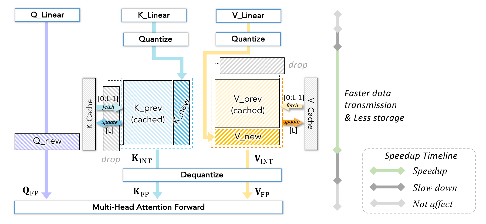

**图 6.** KV cache 量化示意图.

#### 3.2.3 KV cache 量化

KV cache 即键值缓存, 用于优化逐 token 预测文本的生成模型. 模型每次虽然只生成一个 token, 但每个 token 都依赖此前上下文. 为避免重复计算, KV cache 像内存库一样保存先前的键值结果, 供后续生成复用. 其存储需求高度依赖序列长度, 隐藏维度和注意力头数等因素, 量化是压缩这部分存储的有效方法. 整体流程如图 6 所示.

KV cache 随序列化输入数据在运行时生成和更新. 推理时, 线性层产生的 $\mathbf{K}_{\mathrm{new}}$ 和 $\mathbf{V}_{\mathrm{new}}$ 先被量化, 再拼接到已经量化的键和值列表末尾, 形成新列表. 当缓存大小超过上限时, 最早的键值对会被丢弃. 随后将矩阵反量化为 FP16, 再与新生成的查询 $\mathbf{Q}_{\mathrm{new}}$ 执行多头注意力前向传播. 图中的加速时间线展示 KV cache 量化对推理的影响. 与浮点 KV cache 相比, 量化缓存占用的设备内存更少, 数据字节数也更小, 因而缓存系统中的 KV 数据传输耗时更短.

KV cache 量化主要包括四类技术. (1) 降低位宽. QoQ [Lin24a] 将 KV 压缩到 4 位, 并提出 SmoothAttention 以避免低位宽导致精度下降. KIVI [Liu23b] 进一步提出无需调优的 2 位 KV cache 量化. [Yan24c] 使用混合精度策略, 将更早的 KV 量化到较低位宽, 对较新的 KV 保留更多位. (2) 量化窗口. 许多研究 [Zha24b, Dua24] 延迟 KV 对的量化, 只有全精度 KV 列表长度超过窗口大小时才批量量化. 例如, SKVQ [Dua24] 使用滑动窗口机制, 在窗口内确定量化参数. (3) 跳过 $\mathbf{K}_{\mathrm{new}}$ 的反量化. WKVQuant [Yue24a] 等方法将浮点 $\mathbf{K}_{\mathrm{new}}$ 和 $\mathbf{V}_{\mathrm{new}}$ 拼接到反量化后的 $\mathbf{K}_{\mathrm{prev}}$ 与 $\mathbf{V}_{\mathrm{prev}}$, 从而在键值矩阵中保留当前 token 的更多信息, 再在满足条件时量化新的键值并存入 KV cache. (4) 优化离群值. KV 矩阵存在逐 token 离群值, 因而可以用更高位宽保存离群值, 或减小其幅度来改善性能 [Don24, Liu24, Kan24, Lin24a]. 这类方法的一般做法与整模型量化类似, 本文不再展开.

#### 3.2.4 量化与反量化

本节将量化粗略分为三类: (1) *浮点量化*, 将高位浮点数转换为低位浮点数; (2) *整数量化*, 主要指将浮点数划分为等间距整数. 高位宽整数到低位宽整数的再量化在实践中很少使用, 也鲜有研究为此设计快速实现, 因此略去; (3) *二值化*, 包括 `sign` 和 `bool` 函数.

##### 浮点量化

将高位宽浮点数转换到低位宽, 本质上是裁剪尾数位. 原因在于, 源格式的指数位和尾数位通常不少于低位宽目标格式. 算法 1 以 FP32 到 FP8 的转换为例. 依据 [Mic22], 通用流程可总结如下.

(1) *缩放.* 目标格式位宽较小, 表示范围可能大幅收缩, 无法覆盖大部分数据. 先通过学习或校准得到缩放因子, 再将源值缩放到合适范围, 可以在量化为 FP8 后尽量保留信息.

(2) *检查上溢和下溢.* 检查源值是否超过 FP8 范围的上下界, 若超过则直接返回最大值或最小值. 若未上溢, 再检查指数是否低于 FP8 能表示的最小正规格化正数. 若发生下溢, 将该值除以 FP$x$ 的最小非正规格化数, 舍入到最近整数, 再乘回最小非正规格化数. 此时整数决定尾数位, 指数位全部置零.

(3) *复制与舍入.* 若该值既不上溢也不下溢, 将源 FP32 的低 $e$ 位复制到目标 FP8, 再通过就近舍入将尾数裁剪为 $m$ 位. 舍入及上下溢处理对实际应用中的数值稳定性和精度至关重要. 不过, 尾数位减少仍不可避免地带来精度损失.

**算法 1: 量化为较低位宽浮点数.**

- **输入:** $X_{\mathrm{FP}32}$, $s\in\mathbb{R}^{+}$, $X_{0}\in\mathbb{R}$, $e,m\in\mathbb{Z}^{+}$, $\mathrm{clip}^{\min}$ 和 $\mathrm{clip}^{\max}$.
- **输出:** $X_{\mathrm{FP}8}$.
- 令 $X_{\mathrm{FP32}}^{\mathrm{unscaled}}=X_{\mathrm{FP32}}/s$.
- 令 $e^{\min}$ 为 `-(1 << (e - 1)) + 1`, $e^{\max}$ 为 `(1 << (e - 1))`.
- 令 $m=x-e-1$, 即 FP8 指数部分的理论最大值.
- 令 $X_{\mathrm{FP}8}^{e}=e^{\max}+2^{8-1}\mathbin{\texttt{<<}}23$, 即 FP8 尾数部分的理论最大值.
- 令 ${X_{\mathrm{FP}8}^{m}}$ 为 `~(0x007FFFFF >> m) & 0x007FFFFF`.
- 令 $X_{\mathrm{FP}8}^{\mathrm{theomax}}=X_{\mathrm{FP}8}^{e}+X_{\mathrm{FP}8}^{m}$.
- **检查指数上溢:**
  - **若** $X_{\mathrm{FP32}}^{\mathrm{unscaled}}>\min(\mathrm{clip}^{\max},X_{\mathrm{FP}8}^{\mathrm{theomax}})$:
    - 令 $X_{\mathrm{FP}8}=\min(\mathrm{clip}^{\max},X_{\mathrm{FP}8}^{\mathrm{theomax}})$.
  - **否则若** $X_{\mathrm{FP}8}^{\mathrm{theomax}}<\max(\mathrm{clip}^{\min},-X_{\mathrm{FP}8}^{\mathrm{theomax}})$:
    - 令 $X_{\mathrm{FP}8}=\max(\mathrm{clip}^{\min},-X_{\mathrm{FP}8}^{\mathrm{theomax}})$.
  - **否则:**
    - 令 $X_{\mathrm{FP}8}^{\mathrm{sign}}=X_{\mathrm{FP32}}^{\mathrm{unscaled}}$ `& 0x80000000`.
    - 令 $X_{\mathrm{FP}8}^{e}=X_{\mathrm{FP32}}^{\mathrm{unscaled}}$ `& 0x7F800000`.
    - 令 $X_{\mathrm{FP}8}^{m}=X_{\mathrm{FP32}}^{\mathrm{unscaled}}$ `& 0x007FFFFF`.
    - **检查指数下溢:**
      - **若** $(X_{\mathrm{FPx}}^{e}\mathbin{\texttt{>>}}23)-2^{x-1}<e^{\min}+1$:
        - 令 ${X_{\mathrm{FP}8}^{\min}}_{\mathrm{subnorm}}$ 为 `1 / (1 << ((1 << (e - 1)) + m - 2))`.
        - 令 $X_{\mathrm{FPx}}=\mathrm{round2int}(X_{\mathrm{FP32}}^{\mathrm{unscaled}}/{X_{\mathrm{FP}8}^{\min}}_{\mathrm{subnorm}}){X_{\mathrm{FP}8}^{\min}}_{\mathrm{subnorm}}$.
    - **舍入尾数:**
      - 令 $R_{m}=(X_{\mathrm{FP}8}^{m}\mathbin{\texttt{<<}}m)$ `& 0x007FFFFF + 0x3F800000`.
      - 令 $R_{m}=\mathrm{round2int}(R_{m}-1)$.
    - **处理尾数:**
      - 令 $X_{\mathrm{FP}8}^{m}=(X_{\mathrm{FP}8}^{m}\mathbin{\texttt{>>}}(23-m)+R_{m})\mathbin{\texttt{<<}}(23-m)$.
      - 令 $X_{\mathrm{FP8}}=X_{\mathrm{FP}8}^{\mathrm{sign}}+X_{\mathrm{FP}8}^{e}+X_{\mathrm{FP}8}^{m}$.
- **返回:** $X_{\mathrm{FP8}}$.

##### 浮点反量化

将浮点数反量化到更高位宽较为直接. 在 FP 格式体系中, 低位宽数值的指数位和尾数位都不会多于高位宽目标格式. 因此, 可以直接从原数值提取符号位, 指数和尾数, 复制到目标格式对应部分的最高有效位, 再对指数和尾数的剩余位补零 ([链接](https://github.com/pytorch/pytorch/blob/main/c10/util/Float8_fnuz_cvt.h)).

##### 整数量化

首先用缩放因子 $s\in\mathbb{R}^{+}$ 除浮点数, 将其缩放到 $\mathrm{INT}k$ 的表示区间, 再加入零点 $z\in\mathbb{Z}$ 平移截断范围 [Wu20]. $\mathrm{round}(\cdot)$ 表示就近舍入, $\mathrm{clamp}(\cdot,q^{\min},q^{\max})$ 将数值限制在 $k$ 位表示区间内. 对称量化中 $q^{\min}=-2^{k-1},q^{\max}=2^{k-1}-1$, 非对称量化中 $q^{\min}=0,q^{\max}=2^{k}-1$. 整体公式为:

$$
X_{\mathrm{INT}_{k}}=\mathrm{clamp}\left(\mathrm{round}\left(\frac{X_{\mathrm{FP}}}{s}\right)+z,q^{\min},q^{\max}\right),\tag{8}
$$

缩放因子可以初始化为 $s_{0}=({X_{\mathrm{FP}}^{\max}-X_{\mathrm{FP}}^{\min}})/$ $({q^{\max}-q^{\min}}),$ 其中 $X_{\mathrm{FP}}^{\max}$ 和 $X_{\mathrm{FP}}^{\min}$ 分别为最大值和最小值.

系统实现中, 许多框架采用 Marlin 量化 ([链接](https://github.com/IST-DASLab/marlin)) [Fra24] 作为标准流程. 算法 2 以 4 位整数量化为例概述 Marlin 量化. 数值被量化并以目标位宽的无符号整数存储, 再通过额外的前移或后移得到有符号值. 首先用 $s$ 缩放 $X_{\mathrm{FP32}}$ 并舍入到整数, 然后加 $2^{k-1}$, 将其平移到 uINT4 (4 位无符号整数) 的非负区间. C++ 内建类型转换函数 `float2uint` 的细节略去. 为清楚说明打包过程, 先给出嵌套 **for** 循环, 再给出等价的简化形式.

在 4 位量化中, 每 8 个值打包为一个 uINT32, 量化矩阵大小为原来的四分之一. $i$`::`8 表示沿维度 $C$ 从 $i$ 开始, 每次递增 8 并默认持续到该维度末尾. 随后将数值左移 $4*i$ 位, 放入相应的 4 位区间, 右侧留下 $4*i$ 个零, 使此前保存的量化值在 `OR` 操作后得以保留.

**算法 2: 从 FP32 到 INT4 的 Marlin 量化.**

- **输入:** $X_{\mathrm{FP32}}\in\mathbb{R}^{T,C}$ 和 $s\in\mathbb{R}^{+}$.
- **输出:** $X_{\mathrm{uINT}4}$.
- 令 $X_{\mathrm{FP32}}^{\mathrm{round}}\leftarrow\mathrm{round}(X_{\mathrm{FP32}}/\mathrm{scale})$.
- **平移到 uINT4 区间:**
  - 令 $X_{\mathrm{FP32}}^{\mathrm{clamp}}\leftarrow\mathrm{clamp}(X_{\mathrm{FP32}}^{\mathrm{round}}+2^{3},0,2^{4}-1)$.
  - 令 $X_{\mathrm{uINT32}}\leftarrow\mathrm{float2uint}(X_{\mathrm{FP32}}^{\mathrm{clamp}})$.
- **每 8 个 $X_{\mathrm{uINT32}}$ 打包为一个 uINT32:**
  - **对于** $k\leftarrow 0$ **到** `C//8`:
    - **对于** $i\leftarrow 0$ **到** $7$:
      - 令 $X_{\mathrm{INT4}}[:,k]_{(4i+3:4i)}\leftarrow X_{\mathrm{uINT32}}[:,i+8k]\mathbin{\texttt{<<}}(4i)$.
- **等价简化形式:**
  - `i::8` 创建从 $i$ 开始, 以 $8$ 为步长且默认延伸到末尾的序列.
  - **对于** $i\leftarrow 0$ **到** $7$:
    - 令 $X_{\mathrm{uINT4}}[:,:]_{(:4i)}\leftarrow X_{\mathrm{uINT32}}[:,i\mathbin{\texttt{::}}8]\mathbin{\texttt{<<}}(4i)$.
- **返回:** $X_{\mathrm{uINT4}}$.

一些定制算法进一步加速数据类型转换. QQQ [Zha24a] 设计快速 FP16 到 INT8 转换 `FastFP16toINT8`. 它先加 128, 将 FP16 值平移到 uINT8 的表示区间, 再额外加 1024, 实际上完成转换并把 uINT8 的 8 位放入 FP16 尾数低位. 最后提取 FP16 的低 8 位, 与 `0x80` 执行 `XOR`, 得到目标 INT8 格式. 实践中, 整体流程还可以简化为 `FMA`, `PRMT` 和 `XOR` 操作.

##### 整数反量化

整数反量化通过乘以缩放因子, 将整数投影回实数:

$$
\hat{X}_{\mathrm{FP}}=s\cdot(X_{\mathrm{INT}x}-z)\approx X_{\mathrm{FP}}.\tag{9}
$$

许多工作还会从候选值中搜索最优 $s$ 进行初始化 [Wei23]:

$$
s_{\mathrm{candidate}} =\frac{i}{\mathrm{num}_{i}}s_{0},\qquad i\in\mathbb{Z}^{+},i\in(0,\mathrm{num}_{i}).\tag{10}
$$

$$
\mathrm{s.t.}\;\min\|{X}_{\mathrm{FP}}-\hat{X}_{\mathrm{FP}}\|_{p}.\tag{11}
$$

其中, $\mathrm{num}_{i}$ 是候选值数量, 通常设为 50 或 100 等 [Yua24a, Wei23]. $s$ 也可以作为可学习参数 [Wei23, Sha23]. 在 LLM 出现前, 如何寻找更优 $s$ 已得到广泛研究 [Din24, Wei23a, Tia24a].

系统实现首先按打包方式解包元素, 再乘以相应缩放因子. 缩放因子可以采用第 2.2 节介绍的逐张量, 逐通道, 逐 token 等粒度. 也有工作提出定制实现, 如 `SINT4toS8` [Li23a] 通过乘 16 加速 INT4 到 INT8 的转换.

##### 二值化

二值化使用 `sign` 或 `bool` 函数提取符号:

$$
X_{\mathrm{sign}}=\begin{cases}1,&X_{\mathrm{FP}}\geq 0,\\ -1,&X_{\mathrm{FP}}<0,\end{cases}\quad X_{\mathrm{bool}}=\begin{cases}1,&X_{\mathrm{FP}}\geq 0,\\ 0,&X_{\mathrm{FP}}<0.\end{cases}\tag{12}
$$

使用 `sign` 还是 `bool` 取决于算法希望每个比特表示什么值. 例如, 二值 Transformer 通常对注意力分数和 ReLU 后的激活使用 `bool`, 对线性函数中的权重和激活使用 `sign`. 硬件始终把比特视为 0 或 1, 因而可以组装指令来实现所需的矩阵乘法 ([链接](https://github.com/yifu-ding/BGEMM-CUDA)). 例如, NVIDIA GPU 的 `mma` 指令接收 0/1 位矩阵, 并在执行按位累加 `popcount` 时将其视为 0 和 1. 为得到正确累加结果, `popcount` 可以采用不同算术规则; 若每遇到一个 0 就减 1, 即可得到 `sign` 函数的结果. 加速实现包括查找表 ([链接](https://github.com/WojciechMula)), nifty popcnt [Wil58], hacker popcnt [War12] 和 hakmem popcnt ([链接](https://en.wikipedia.org/w/index.php?title=HAKMEM&oldid=1228234783)) 等.

##### 二值化反量化

二值化反量化只需乘以缩放因子 $s$, 即 $\hat{X}_{\mathrm{FP}}=s\cdot X_{\mathrm{sign}/\mathrm{bool}}$, 以恢复原始数值的量级. 二值化显然会损失大量信息, 因而性能大幅下降, 针对 LLM 二值化的研究相对较少. 不过, 它在加速和存储缩减方面优势明显, 仍值得深入探索, 只是可能需要超越 `sign` 和 `bool` 的新形式. DB-LLM [Che24] 将权重分解为两个 1 位矩阵, 实现 2 位权重量化, 理论上能够高效执行 MatMul.

## 4 面向高效 LLM 训练的量化策略

### 4.1 低比特训练

低比特 LLM 训练有多种加速策略, 常用技术包括 BF16, FP16, FP8 和 INT8 训练.

**FP16 训练.** 在各类数据格式中, BF16 训练因稳定性较好而广泛用于 LLM, 但需要采用 Ampere 或 Hopper 架构的硬件支持, 如 A100, 4090 和 H100. Volta 或 Turing 等较旧架构 (如 V100 和 T4) 不支持该格式, 此时通常采用 FP16 加速训练, 小型计算机视觉模型也是如此. FP16 指数位较少, 更容易发生上溢或下溢, 因而需要损失缩放策略来保留幅度很小或很大的梯度. 详细流程见算法 3.

**算法 3: 使用 FP16 精度更新权重.**

- 保留一份 FP32 主权重副本.
- **当**训练尚未收敛时:
  - 创建权重的 FP16 副本.
  - 使用 FP16 权重和激活执行前向传播.
  - 将所得损失乘以缩放因子 $S$.
  - 使用 FP16 权重, 激活和对应梯度执行反向传播.
  - 将权重梯度乘以 $1/S$.
  - 完成包括梯度裁剪在内的权重更新.

**FP8 训练.** NVIDIA 和 AMD 等硬件厂商已推出支持 FP8 或 FP4 的新架构. 若希望以较少改动获得可观加速, 可以使用厂商提供的 Transformer Engine. FP8 的动态范围足以单独存储任一激活或梯度, 却不足以同时覆盖所有激活和梯度. 因而适用于 FP16 的单一损失缩放因子无法直接用于 FP8 训练, 必须为每个 FP8 张量设置独立缩放因子. 缩放过程可表示为:

$$
\mathrm{FP8\_MAX}=\mathrm{maximum\_representable\_value}(\mathrm{fp8\_format}),\tag{13}
$$

$$
\mathrm{exp}=\mathrm{get\_exponent}(\mathrm{FP8\_MAX}/\mathrm{amax}),\tag{14}
$$

$$
\mathrm{new\_scaling\_factor}=2.0^{\mathrm{exp}}.\tag{15}
$$

$\mathrm{fp8\_format}$ 表示 E4M3 或 E5M2 等格式, $\mathrm{FP8\_MAX}$ 是该格式的相应最大值, $\mathrm{amax}$ 是张量的最大绝对值, 再由 $\mathrm{exp}$ 计算 $\mathrm{new\_scaling\_factor}$. 但在线计算 $\mathrm{new\_scaling\_factor}$ 会引入大量额外内存访问, 因而最佳实践是延迟缩放. 该策略根据此前若干轮迭代观察到的最大绝对值来选择缩放因子, 可以充分发挥 FP8 计算性能, 但需要额外保存历史最大值作为 FP8 算子的参数. 当前先进模型之一 DeepSeek V3 [Dee24a] 采用细粒度逐块 FP8 量化, 实现高精度 FP8 训练. 表 3 列出支持低比特浮点训练的主流框架和引擎, 包括 Microsoft 的 DeepSpeed ([链接](https://github.com/microsoft/DeepSpeed)), NVIDIA 的 Megatron-LM ([链接](https://github.com/NVIDIA/Megatron-LM)) 和 Graphcore 的 UnitScaling ([链接](https://github.com/graphcore-research/unit-scaling)).

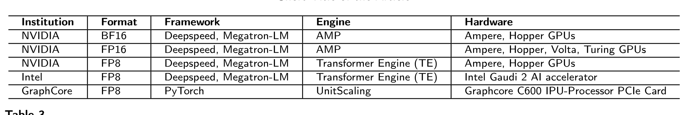

**表 3.** 低比特训练系统.

**INT8 训练.** 训练期间除模型权重外, 还需要保存优化器所需梯度, 以及权重或梯度的备份信息. LLM 的海量参数使这一内存瓶颈在微调中更加突出, 限制模型进入更广泛的应用场景. INT8 Training [Zhu20] 是降低梯度内存占用的直接方法, 但反向传播中的量化不稳定会使 LLM 训练更加不稳定, 甚至发生崩溃.

QST [Zha24c] 同时优化三项主要内存来源: 模型权重, 优化器状态和中间激活. 除将 LLM 权重量化为 4 位并引入使用隐藏状态执行任务预测的独立侧网络外, QST 还采用多个低秩适配器和无梯度下采样模块, 显著减少可训练参数量, 从而节省优化器状态内存. Q-GaLore [Zha24d] 指出, GaLore 通过 SVD 投影梯度的内存节省策略耗时较多. 为此, Q-GaLore 根据梯度收敛统计量自适应更新梯度子空间, 将投影矩阵保持为 INT4, 权重保持为 INT8, 从而可在单张 16 GB GPU 上从头训练 Llama-7B. Jetfire [Xi24] 使用 INT8 数据流优化内存访问, 并以逐块量化维持预训练 Transformer 的精度. 4-bit Optimizer [Li24a] 采用更小块大小, 同时利用逐行与逐列信息改善量化, 还发现并使用线性量化器解决二阶矩量化中的零点问题.

**第 4.1 节要点**

BF16 和 FP16 已成为广泛采用的训练加速技术, 精度风险相对较低. FP8 适合对线性层等特定模块执行细粒度量化, 但精度风险高于 BF16/FP16. INT8 虽已得到部分研究探索, 实际应用仍不普遍, 精度风险也最高. 为降低这些风险, 通常会引入动态缩放等技术来调节和稳定精度.

### 4.2 PEFT 量化策略

经过充分预训练的 LLM 具有出色的泛化能力, 在微调时也表现出良好的迁移性与适应性, 因而可以服务于多种下游任务. 然而, LLM 庞大的参数规模会在微调期间形成显著的内存瓶颈, 阻碍其进一步普及. 参数高效微调 (PEFT) 正是为解决资源受限条件下的 LLM 微调问题而提出 [Din23, Han24].

随着 LLM 微调需求不断增长, 研究者发现量化能够降低微调过程的内存占用. 一类方法改进传统的 QAT 训练, 显著减少每次更新涉及的参数量; 另一类方法则将量化与低秩适配 (LoRA) 微调结合起来.

#### 4.2.1 结合量化的部分参数微调

以往的 QAT 方法所需资源几乎与全参数训练相同, 因而不适合资源受限的微调场景. 为此, 研究者提出了部分参数微调策略. PEQA [Kim24] 沿用朴素的 QAT 训练方式, 但在量化权重 $W$ 并得到缩放因子 $s_{0}$ 与定点数 $\overline{W}_{0}$ 后, 它会固定 $W$, 仅训练 $s_{0}$. OWQ [Lee24a] 则在混合精度量化后只更新高精度的 "弱列".

#### 4.2.2 低比特低秩适配

低秩适配 (LoRA) [Hu21] 冻结预训练权重, 仅训练低秩矩阵. 尽管它能将可训练参数量缩减约 10,000 倍, 却不会减小预训练模型权重本身, 因而微调内存需求仅降低约 3 倍.

QLoRA [Det24] 等方法对量化后的 LLM 微调 LoRA, 借助低比特量化进一步降低内存占用. 它们首先使用 PTQ 方法将预训练 LLM 量化至低比特:

$$
\textbf{W}_{q}\leftarrow \mathrm{quant}(\textbf{W}),\tag{16}
$$

其中, **W** 是各层的权重.

随后冻结全部权重参数, 在微调时只更新 LoRA, 其前向传播为:

$$
\textbf{Y}=\textbf{X}\cdot \mathrm{dequant}(\textbf{W}_{q})+\textbf{X}\cdot\textbf{A}\textbf{B},\tag{17}
$$

其中, **X** 是各层的输入.

在这类方法中, 矩阵 **A** 通常以随机高斯值初始化, **B** 则初始化为全零. 这种做法不仅大幅减少模型权重参数的内存占用, 还使优化器在微调期间只需保存 LoRA 的梯度, 从而显著节省内存. QLoRA [Det24] 使用 Normal Float 对 **W** 执行双重量化, 在良好保持精度的同时节省内存, 可用单张 48 GB GPU 微调 65B 预训练模型. IR-QLoRA [Qin24b] 将信息论引入 QLoRA 范式, 通过信息校准与连接增强微调效果. LoRA+ [Hay24] 表明, 为 LoRA 中的矩阵 A 和 B 设置不同学习率能够实现高效的特征学习. QDyLoRA [Raj24] 与 Bayesian-LoRA [Meo24] 则采用更灵活的 LoRA 秩分配.

另一些方法希望在 LoRA 微调后直接得到可部署的量化合并模型. QA-LoRA [Xu23] 以 INT 格式量化 **W**, 并将 $\textbf{X}\cdot\textbf{A}^{i\times r}\textbf{B}^{r\times o}$ 调整为 $\mathrm{mean}(\textbf{X})\cdot\textbf{A}^{\frac{i}{L}\times r}\textbf{B}^{r\times o}$. 这样一来, 微调后的 **A****B** 可以无损合并进 INT 格式的 $\textbf{W}_{q}$, 部署时无需额外计算. L4Q [Jeo24] 则保持 $\textbf{A}\in\mathbb{R}^{i\times r}$ 的维度, 直接采用完整的 QAT 前向传播方式, 并同时更新 $\textbf{A},\textbf{B}$ 以及 $\textbf{W}+\textbf{A}\textbf{B}$ 的量化器参数 $s$ 和 $b$. L4Q 在预训练阶段不会通过量化降低权重内存占用, 但优化器仍无需保留权重梯度, 最终得到的微调量化模型可以直接部署, 且精度更高.

许多研究已经发现, LoRA 的初始化会显著影响这类量化参数高效微调方法的效果. 因此, 它们会在微调前最小化 $\left\|\textbf{W}-(\textbf{W}_{q}+\textbf{A}\textbf{B})\right\|_{F}$. LoftQ [Li23b] 与 LQ-LoRA [Guo23a] 都通过迭代计算实现这一目标: $Q_{t}\leftarrow \mathrm{quant}(\textbf{W}-\textbf{A}_{t-1}\textbf{B}_{t-1}^{\top})$, 以及 $\textbf{A}_{t},\textbf{B}_{t}\leftarrow \mathrm{SVD}(\textbf{W}-Q_{t})$. LQ-LoRA 还建议引入校准数据, 将最小化目标调整为 $\left\|\sqrt{F}\odot(\textbf{W}-(\textbf{W}_{q}+\textbf{A}\textbf{B}))\right\|_{F}^{2}$, 其中 $F$ 是 **W** 的 Fisher 信息矩阵, $\odot$ 表示 Hadamard 积. 此外, LQ-LoRA 还引入动态量化配置, 以更好地适应资源限制.

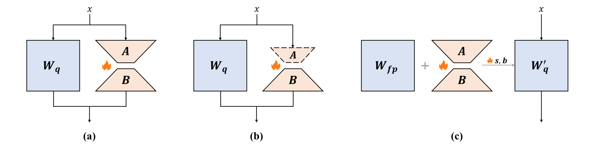

**图 7.** 不同 LoRA 结构示意图.

图 7 展示了不同的 LoRA 结构. 图 7 (a) 表示 QLoRA 一类方法, 它们在微调阶段不修改 LLM 的任何部分, 并完整保留原始 LoRA 结构 [Det24, Qin24b, Hay24, Li23b]. 图 7 (b) 表示 QA-LoRA 一类方法, 它们同样不在微调期间修改 LLM, 但会调整原始 LoRA 结构 [Xu23]. 图 7 (c) 表示 L4Q 一类方法, 它们会修改原始 LoRA 结构, 并采用近似 QAT 的训练流程 [Jeo24].

(a) 与 (b) 在微调期间只需量化后的 LLM 权重 $W_{q}$, 而 (c) 还需要保存预训练的全精度权重 $W_{\mathrm{fp}}$. (a) 仅用于降低训练成本, 微调后无法直接生成量化模型; (b) 与 (c) 则可在微调后直接整合 LoRA 模块, 得到可部署的量化模型. 与这些方法的仅权重量化不同, RoLoRA [Hua24] 将旋转与 LoRA 结合, 实现有效的权重-激活量化. 尽管已经出现针对 MoE 的 LoRA 研究 [Li24b, Luo24, Gao24], 这些工作尚未聚焦量化. 在量化场景下, 需要评估降低位宽是否会加剧专家不平衡, 还应研究在哪些位置采用 LoRA-MoE 方法进行量化感知训练 (包括路由器与负载均衡), 以及深层是否有必要分配更多位 [Gao24].

**第 4.2 节要点**

为降低量化感知训练的内存占用, 常见策略是只更新部分权重, 例如仅更新一部分权重列. 为降低常规微调的内存占用, 可以将量化与低秩近似结合, 将固定权重量化至更低位宽, 从而进一步节省内存.

## 5 面向高效 LLM 推理的量化算法

本节梳理 LLM 量化算法. 量化算法大体可分为量化感知训练 (QAT) 与训练后量化 (PTQ) 两条主要路线. QAT 将量化引入训练或微调过程, 使模型能够学习并适应量化约束, 从而尽量减少低精度带来的精度损失. 相比之下, PTQ 从预训练浮点模型和少量校准数据出发, 目标是在不进行端到端训练的情况下生成准确的量化模型. 下文将详细介绍这些方法, 系统汇总适用于 LLM 的各类量化算法, 实现策略, 以及它们对模型性能与效率的影响.

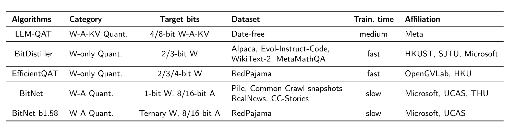

**表 4.** 不同 QAT 方法的比较.

### 5.1 量化感知训练

表 4 汇总了不同的 LLM QAT 方法. LLM-QAT [Liu23c] 是较早系统研究 LLM 量化感知训练的工作. 为克服训练数据限制, 它提出无数据知识蒸馏, 对齐全精度教师模型与量化学生模型的 logits. 在 LLM-QAT 基础上, BitDistiller [Du24] 在自蒸馏阶段采用非对称截断策略进行非对称量化. EfficientQAT [Che24a] 将 QAT 拆分为连续的两个阶段, 显著降低训练成本: 第一阶段优化每个块的全部参数, 第二阶段仅优化整个网络的量化参数. 为探索极低比特量化, BitNet [Wan23] 以 BitLinear 替换原始 Linear 层并从头训练. 其变体 BitNet b1.58 [Ma24] 为每个参数采用三值权重, 实现接近无损的性能.

**第 5.1 节要点**

尽管训练过程更复杂, QAT 在极低比特场景下尤其有效. 若目标是超低比特配置, 且计算资源充足, QAT 会是合适的方案. 不过, 从头开始执行 QAT 难度较高, 使用 QAT 微调预训练模型通常更加实际和高效. 此外, 选择能够跨领域泛化的训练数据至关重要, 这样可以降低过拟合风险.

### 5.2 训练后量化

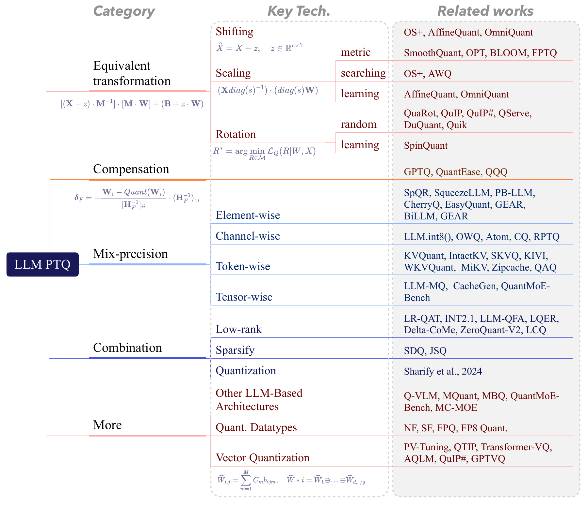

**图 8.** PTQ 算法概览.

训练后量化 (PTQ) 是对预训练模型应用量化的技术. 与 QAT 不同, PTQ 不要求模型在训练时包含量化模块, 因而非常适合部署原本以高精度训练的模型. 当训练数据访问受限或重新训练的计算成本过高时, PTQ 尤其实用. 随着 LLM 发展, PTQ 凭借较低的训练成本, 在近几年迅速涌现出大量算法.

为便于介绍, 本文按照图 8 对 PTQ 算法进行系统分类.

#### 5.2.1 等价变换

许多研究 [Luo20, Bon21, Wei23, Xia23] 指出, LLM 中存在显著离群值. 这些离群值会迫使大量普通数值使用有限位数表示, 从而造成较大量化误差与精度下降, 给量化带来严峻挑战. 因此, 近年来出现了许多缓解 LLM 离群值问题的算法.

在所有解决离群值问题的算法中, 等价变换是最具代表性且最有效的方法之一. Outlier Suppression (OS) [Wei22] 是较早将等价变换用于语言模型的工作. OS 拆分 LayerNorm 函数并迁移其参数 $\gamma$, 以避开离群值:

$$
\textbf{X}_{j}=\textbf{X}^{\prime}_{j}\cdot\gamma_{j}\tag{18}
$$

此时 LayerNorm 不再执行缩放, 下一层的权重则可以吸收 $\gamma$:

$$
\textbf{W}(x\odot\begin{bmatrix}\gamma_{1}\\ \gamma_{2}\\ \cdots\\ \gamma_{n}\end{bmatrix})=(\textbf{W}\odot\begin{bmatrix}\gamma_{1}&\gamma_{2}&\cdots&\gamma_{n}\\ \gamma_{1}&\gamma_{2}&\cdots&\gamma_{n}\\ \cdots\\ \gamma_{1}&\gamma_{2}&\cdots&\gamma_{n}\end{bmatrix})x\tag{19}
$$

OS 由此抑制离群值. 在它之后, 大量等价变换技术相继出现. 多数方法通过使权重或激活中的离群值分布更加对称, 平滑, 减轻离群值对量化的影响. 该过程可以写为:

$$
\begin{aligned}
\textbf{Y}&=\textbf{X}\textbf{W}+\textbf{B} \\
&=[(\textbf{X}-\Delta)\cdot\textbf{M}^{-1}]\cdot[\textbf{M}\cdot\textbf{W}]+(\textbf{B}+\Delta\cdot\textbf{W}),
\end{aligned}\tag{20}
$$

其中, $\Delta$ 是让输入离群值分布更对称的平移因子, **M** 是让分布更加平滑的矩阵. 借助上述等价变换, 许多现有量化方法在不同量化设置与场景下取得了当前最佳 (SOTA) 性能.

按照实现方式, 等价变换还可细分为平移变换, 缩放变换和旋转变换. 下文分别详细介绍这三类方法.

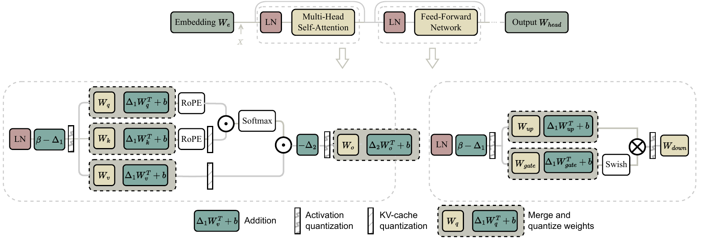

**图 9.** 平移变换总体示意图. $\Delta_{1}$ 与 $\Delta_{2}$ 表示两类平移操作. $\Delta_{1}$ 可以合并到 LayerNorm 的参数 $\beta$ 和权重矩阵中. $\Delta_{2}$ 无法合并进权重矩阵, 因而值投影 $W_{v}$ 与输出投影 $W_{o}$ 之间的平移变换只能在线执行, 可能引入额外计算开销.

##### 平移变换

LLM 的离群值在不同通道间呈非对称分布. 这种非对称表示会让原本由小范围通道组成的张量呈现很大的整体范围, 增加量化难度. 为解决这一问题, OS+ [Wei23] 首先提出逐通道平移变换, 按照下式调整各通道的激活, 减轻非对称性的影响:

$$
\hat{X}=X-\Delta,\tag{21}
$$

其中, $\Delta\in\mathbb{R}^{c\times 1}$ 作为行向量, 分别平移激活的每个通道. 需要注意, 这不是对称量化中常见的平移操作, 而是逐通道作用, 为逐张量量化提供更合适的分布. 具体而言, OS+ 以人工规则定义 $\Delta$:

$$
\Delta_{j}=\frac{\max(\textbf{X}_{:,j})+\min(\textbf{X}_{:,j})}{2}.\tag{22}
$$

经过逐通道平移, 张量的范围会缩小至最大的通道范围, 从而消除非对称离群值的影响. 但以人工规则设定等价参数通常无法得到最优结果. OmniQuant [Sha23] 因此通过最小化逐块量化误差, 以可微方式求解最优平移参数:

$$
\underset{\Delta}{\mathrm{arg}\,\min}\,\|\mathcal{O}(\textbf{W},\textbf{X})-\mathcal{O}\big(Q_{w}\left(\textbf{W};\Delta\right),Q_{a}\left(\textbf{X};\Delta\right)\big)\|,\tag{23}
$$

其中, $\mathcal{O}$ 表示 LLM 中 Transformer 块的映射函数, $Q_{w}(\cdot)$ 与 $Q_{a}(\cdot)$ 分别表示权重量化器和激活量化器, $\Delta$ 是平移参数. 逐块最小化易于优化, 所需资源也很少. 因此, 与 OS+ 的直接计算相比, 逐块优化目标函数能够以高效, 节省资源的方式得到更有效的平移向量. 不过, OmniQuant 需要微调可学习参数, 否则容易出现梯度爆炸等问题. 与 OmniQuant 类似, AffineQuant [Ma24a] 也采用基于学习的平移操作.

图 9 展示了平移变换的结构. 平移因子 $\Delta$ 可以融合进 LayerNorm 与权重矩阵, 因而不会产生额外开销.

##### 缩放变换

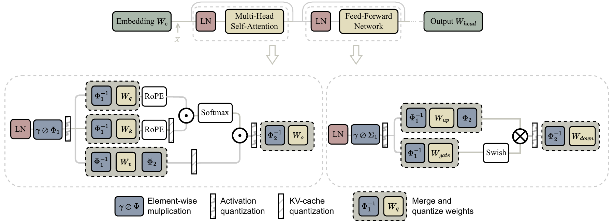

**图 10.** 缩放变换总体示意图. $\Phi$ 可以合并到 LayerNorm 的参数 $\gamma$ 和权重矩阵中.

平移变换能有效处理激活离群值的非对称分布, 缩小由非对称性造成的巨大范围. 但它只对逐张量量化有帮助, 无法降低逐通道量化的难度, 因为各通道中的离群值并未从根本上消失. 为进一步减小离群值对量化的影响, SmoothQuant [Xia23] 首先提出缩放变换. 该方法基于一个关键观察: 尽管离群值使激活比权重更难量化, 不同 token 在各通道上的变化模式却较为相似 [Det22a]. 基于这一观察, SmoothQuant 引入数学等价的逐通道缩放变换, 离线地将量化难度从激活迁移到权重, 并显著平滑不同通道的数值幅度:

$$
\textbf{Y}=(\textbf{X}\mathrm{diag}(\Phi)^{-1})\cdot(\mathrm{diag}(\Phi)\textbf{W})=\hat{\textbf{X}}\hat{\textbf{W}},\tag{24}
$$

其中, $\Phi$ 是平滑因子. $\mathrm{diag}(\Phi)$ 对应式 (20) 中的矩阵 **M**, 但它是用于逐通道平滑的对角矩阵. SmoothQuant 引入超参数 $\alpha$ 作为迁移强度, 控制从激活迁移到权重的量化难度:

$$
\Phi_{j}=\frac{\max(|\textbf{X}_{j}|)^{\alpha}}{\max(|\textbf{W}_{j}|)^{1-\alpha}}.\tag{25}
$$

不过, 不同模型需要经过多次尝试才能确定最佳迁移强度. 例如, 对全部 OPT [Zha22] 与 BLOOM [Sca23] 模型而言, $\alpha=0.5$ 是相对均衡的取值.

受 SmoothQuant 启发, FPTQ [Li23c] 认为计算激活平滑尺度时没有必要考虑权重, 但必须使用非线性无损映射保留所有激活值. 该映射应满足两项条件: (1) 温和处理正常值; (2) 强力抑制离群值. 因此, 它采用对数函数改进平滑矩阵 $\Phi$ 的计算:

$$
\Phi_{j}=\frac{\max(|\textbf{X}_{j}|)}{\log_{2}(2+\max(\textbf{X}_{j}))}.\tag{26}
$$

除 FPTQ 外, 还有许多工作沿用了 SmoothQuant 的思路. OS+ 与 AWQ [Lin24] 都通过搜索寻找平滑尺度, 但二者的优化目标和搜索空间不同. OS+ 的优化目标为:

$$
\begin{aligned}
\Phi^{*} = \underset{\Phi}{\mathrm{arg}\,\min}\,\mathbb{E}\|Q\big((\textbf{X}-\Delta)\cdot \mathrm{diag}(\Phi)^{-1}\big)Q\big(\mathrm{diag}(\Phi)\cdot\textbf{W}^{\mathsf{T}}\big) \\
+\hat{\textbf{b}}-(\textbf{X}\textbf{W}^{\mathsf{T}}+\textbf{b})\|^{2}_{F}.
\end{aligned}\tag{27}
$$

为简化搜索空间, OS+ 只优化离群值阈值 $t$: 将激活范围超过 $t$ 的通道压缩至 $(-t,t)$, 其余通道保持不变. 这样便把问题缩减为单变量优化, 随后通过网格搜索寻找使目标函数最小的 $t$. 得到最优 $t$ 后, 缩放向量按下式计算:

$$
\Phi_{j}=\max(1.0,\frac{\max(\textbf{X}_{:,j}-\Delta_{j})}{t}).\tag{28}
$$

AWQ 发现, 权重通道的显著性实际上由激活尺度决定. 因此, 它采用激活感知的优化目标与非常简洁的搜索空间:

$$
\begin{aligned}
\Phi ={\Phi_{x}}^{\alpha}, \\
\alpha^{*} =\underset{\alpha}{\mathrm{arg}\,\min}\,\left\|Q\!\left(\textbf{W}\cdot\mathrm{diag}({\Phi_{x}}^{\alpha})\right)(\mathrm{diag}({\Phi_{x}}^{\alpha}))^{-1}\textbf{X}-\textbf{W}\textbf{X}\right\|,
\end{aligned}\tag{29}
$$

其中, ${\Phi_{x}}$ 是逐通道激活幅度的平均值, 单一超参数 $\alpha$ 用于平衡对显著通道和非显著通道的保护.

除基于搜索的方法外, 一些方法还通过学习寻找最优缩放矩阵. OmniQuant 与 AffineQuant 都会学习缩放矩阵. 在式 (25) 中, OmniQuant 同时学习平移因子 $\Delta$ 和缩放矩阵 $\mathrm{diag}(\Phi)$, 但其优化范围局限于对角矩阵. AffineQuant [Ma24a] 指出, 受限的搜索范围会产生较大量化误差, 降低量化方法在低比特场景中的泛化能力. 因此, 它学习一般可逆矩阵, 对权重和激活执行等价仿射变换, 从而取得更好的效果.

图 10 展示了缩放变换的结构. 与平移变换一样, 缩放因子 $\Phi$ 可以合并进 LayerNorm 和权重矩阵.

##### 旋转变换

QuIP [Che24b] 最早将旋转变换引入量化. QuIP 的核心观察是, 当权重矩阵与 Hessian 矩阵具有不相干性时, 量化效果更好. 也就是说, 权重应具有相近的幅度, 需要精确舍入的方向也不应与坐标轴对齐. 具体而言, 若满足下式, 权重矩阵便具有 $\mu$-不相干性:

$$
\max(\textbf{W})\leq\mu\|\textbf{W}\|_{F}/\sqrt{mn},\tag{30}
$$

其中, $mn$ 是矩阵元素数量, $\|\cdot\|_{F}$ 是 Frobenius 范数. QuIP 表明, 在权重矩阵左右分别乘以正交矩阵可以降低相干性, 这等价于对权重矩阵执行旋转变换. QuIP 使用具有 Kronecker 结构的正交矩阵, 从而快速完成附加计算. 在此基础上, QuIP# [Tse24] 改用 Hadamard 矩阵, 通过更好的不相干性增强量化, 同时加快前向传播. 这是因为 Hadamard 变换只需 $\mathcal{O}(n\log n)$ 次加法即可计算.

上述两种方法都针对仅权重量化. QuaRot [Ash24] 随后提出同时量化 KV 缓存的权重-激活量化方法. QuaRot 分两个阶段运行. 第一阶段以全精度处理模型权重, 并在模型前向传播中加入两次 Hadamard 运算. 第二阶段使用现有方法量化权重, 再将量化操作集成进前向传播, 在线量化激活.

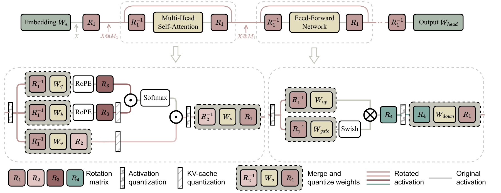

**图 11.** 旋转变换总体示意图. 旋转后的激活离群值更少, 因而更易量化. $R_{1}$ 与 $R_{2}$ 是可以合并进权重矩阵的随机矩阵. $R_{3}$ 与 $R_{4}$ 无法合并, 通常采用 Hadamard 矩阵.

然而, QuIP 的正交矩阵以及 QuIP#, QuaRot 的 Hadamard 矩阵都是随机生成的. 尽管这些研究表明随机矩阵可以在一定程度上缓解离群值问题, 它们并非最优解. SpinQuant [Liu24a] 发现, 不同旋转矩阵会使量化网络的性能产生显著差异. 例如, 在 MMLU 基准上, 不同旋转可令下游零样本推理任务的平均准确率相差多达 13 个百分点. SpinQuant 因此提出基于学习的旋转变换, 使用 Cayley SGD 学习旋转矩阵, 优化目标为:

$$
\textbf{R}^{*}=\underset{\textbf{R}\in\mathcal{M}}{\mathrm{arg}\,\min}\,\mathcal{L}_{Q}(\textbf{R}|\textbf{W},\textbf{X}).\tag{31}
$$

其中, $\mathcal{M}$ 表示 Stiefel 流形, 即全部正交矩阵的集合, $\mathcal{L}_{Q}(\cdot)$ 表示任务损失. 与随机矩阵相比, 学得的矩阵可以显著提高性能并减小方差. SpinQuant [Liu24a] 中的图清晰展示了旋转变换的整体过程, 本文将其借用为图 11. 对 QuaRot [Ash24] 而言, 由于 $R_{2}$ 处采用逐头旋转变换, 量化注意力输出之前必须插入在线 Hadamard 矩阵, 才能实现等价变换. DuQuant [Lin24b] 发现这些方法在平滑极端离群值方面存在局限, 因而采用基于先验知识的旋转和置换变换. 与 SpinQuant 不同, 它使用贪心搜索优化旋转矩阵. PrefixQuant [Che24c] 发现了逐 token 离群值, 它们尤其常见于起始 token 与低语义信息 token. 由于这些 token 在所有输入中保持不变, PrefixQuant 通过离线预填充保存其 KV 缓存.

缩放变换与旋转变换可用于 LLM 量化的不同部分. QServe [Lin24a] 是面向高效 LLM 服务的协同设计量化系统, 结合了缩放与旋转变换. 对在线计算旋转矩阵会产生额外开销的位置, QServe 以缩放变换替代旋转操作, 从而避免该开销.

#### 5.2.2 补偿

权重补偿技术源自 Optimal Brain Damage (OBD) [Lec89], 其基本做法是对目标函数进行 Taylor 级数展开. 该方法假设移除任意参数后, 其余参数对目标函数的影响保持不变. 在 OBD 基础上, OBS [Has93] 与 OBQ [Fra22a] 通过求解逆 Hessian 矩阵, 计算每个权重参数对目标函数的影响, 并同时为剩余权重计算补偿项, 抵消每次权重调整引入的误差.

逐个量化权重的方法在较小模型上表现良好, 但扩展至大模型时计算开销过高. 为加速量化, GPTQ [Fra22] 逐列量化权重, 并使用二阶信息补偿舍入误差. 具体而言, 该算法通过更新量 $\boldsymbol{\delta}_{R}$ 调整全精度权重子集 $R$, 以补偿量化权重 $\mathrm{Quant}(\mathbf{W}_{i})$ 引入的量化误差:

$$
\mathbf{W}_{i}=\underset{\mathbf{W}_{i}}{\mathrm{arg}\,\min}\,\frac{(\mathrm{Quant}(\mathbf{W}_{i})-\mathbf{W}_{i})^{2}}{[\mathbf{H}_{R}^{-1}]_{ii}}.\tag{32}
$$

$$
\boldsymbol{\delta}_{R}=-\frac{\mathbf{W}_{i}-\mathrm{Quant}(\mathbf{W}_{i})}{[\mathbf{H}_{R}^{-1}]_{ii}}\cdot(\mathbf{H}_{R}^{-1})_{:,i}.\tag{33}
$$

其中, Hessian 矩阵为 $\mathbf{H}_{R}=2\mathbf{X}_{R}\mathbf{X}_{R}^{\top}$. 在 GPTQ 基础上, 研究者又陆续提出多种方法. QuantEase [Beh23] 使用坐标下降, 为未量化权重计算更精确的补偿. QQQ [Zha24e] 则对经 OS+ [Wei23] 变换的权重采用 GPTQ.

#### 5.2.3 混合精度

如前所述, 大语言模型的激活与权重中普遍存在离群值, 给量化带来显著挑战. 因此, 许多 LLM 混合精度方法的基本动机都是分别以较高精度表示少量离群值, 以较低精度表示其余数值. 与第 2.2 节相同, 按照混合精度的粒度, 这些方法可分为逐元素, 逐通道, 逐 token 和逐张量四类.

**逐元素.** SpQR [Det23] 首次证明权重中也存在离群值. 它按照敏感度识别并分离这些离群权重, 将其保存为高度稀疏的高精度矩阵. SqueezeLLM [Kim23] 对非显著权重采用非均匀量化, 实现接近无损的性能. CherryQ [Cui24] 类似地定义异质性指标, 用于识别关键的 "cherry" 参数. 为探索极高压缩率, PB-LLM [Sha23a] 首次对 LLM 的非显著权重进行二值化. PB-LLM 仍会为 10%-30% 的显著权重分配高精度, 因而 BiLLM [Hua24a] 对显著权重使用残差近似, 对非显著权重使用分组量化, 将 LLM 权重量化位宽降至 1.08 位. GEAR [Kan24] 将混合精度概念扩展至 KV 缓存压缩, 使用低秩矩阵近似量化残差.

**逐通道.** LLM.int8() [Det22a] 按照离群通道将权重和激活拆成两个独立部分, 尽量降低激活的输出量化误差, 从而有效减少推理期间的 GPU 内存占用. OWQ [Lee24a] 提出敏感度感知混合精度方案, 使用 Hessian 指标识别弱列. 此外, OWQ 还提供弱列调优 (WCT), 为任务特定适配实现准确的参数高效微调. RPTQ [Yua23] 观察到激活不同通道的范围差异会增加量化难度, 因而将通道重新排序至不同簇, 并分别量化. Atom [Zha24f] 对激活动态重排, 对权重静态重排, 使二者与相应激活通道保持对齐. Atom 还将 KV 缓存量化至 4 位, 显著提高服务吞吐量. CQ [Zha24b] 受信息论启发, 将多个键/值通道耦合并联合量化.

**逐 token.** KVQuant [Hoo24], IntactKV [Liu24] 和 SKVQ [Dua24] 等 KV 缓存量化研究发现, 特殊 token (首个 token 或低语义信息 token) 造成的逐 token 离群值会显著影响性能, 因而预先以高精度保存这些离群值. KIVI [Liu24b] 与 WKVQuant [Yue24a] 以全精度保留最新的 KV 缓存, 量化较早的缓存. MiKV [Yan24c], ZipCache [He24a] 和 SnapKV [Li24c] 按不同指标以高精度保留重要 KV 对. QAQ [Don24] 则为不同 token 动态分配自适应位宽.

**逐张量.** LLM-MQ [Li23d] 根据一阶信息和量化误差, 为更敏感的层分配更高位宽. CacheGen [Liu24c] 发现, 与深层 KV 缓存值的损失相比, LLM 对浅层 KV 缓存值的损失更加敏感, 因而为敏感的浅层分配更高精度. QuantMoE-Bench [Li24d] 研究不同块, 专家和线性层的权重位宽, 结果表明采用不同权重位数确实有效.

#### 5.2.4 组合方法

当前的大模型量化方法已经取得较好效果, 但低比特量化的表示能力有限, 在极高压缩率下的表现仍不理想. 因此, 研究者开始探索将量化与低秩分解, 模型稀疏化和模型蒸馏等常用压缩方法结合起来.

##### 低秩

QAT 通常被认为能够提供最佳精度, 但其内存成本过高, 难以应用于 LLM. 因此, 一些方法引入 LoRA 或其他矩阵分解技术, 在 PTQ 与 QAT 之间取得折中. 与第 4.2 节讨论的 PEFT 不同, 这些方法并非增强模型在微调数据上的学习能力, 而是利用 LoRA, SVD 等技术减小量化误差, 让量化模型更接近全精度模型.

一些工作使用 LoRA 实现参数高效 QAT. LR-QAT [Bon24] 在前向传播中计算 $s\cdot\mathrm{clamp}(\textbf{W}_{q}+\textbf{A}^{i\times r}\textbf{B}^{r\times o})$, 反向传播时不更新 **W**, 因而可以在配备 24 GB 内存的单张消费级 GPU 上训练 7B LLM. 微调后可得到对量化友好的模型. LLM-QFA 希望通过一次超网络训练生成多种位宽的模型, 借助 LoRA 的低资源成本显著降低该生成方式的资源开销. INT2.1 [Cha23] 使用 LoRA 将优化目标从最小化逐层或逐块量化误差, 转变为最小化模型整体输出误差. 通过端到端微调, 它缩小输出分布与对应原始全精度输出分布之间的距离.

另一些工作通过矩阵分解降低量化误差. LQER [Zha24g] 对量化误差执行 SVD, 并使用激活诱导的缩放矩阵, 引导奇异值分布趋向所需模式. Delta-CoMe [Pin24] 发现, delta 权重经 SVD 分解后, 奇异值呈长尾分布, 因而提出混合精度 delta 量化方法, 以高比特表示这些奇异值对应的奇异向量. ZeroQuant-V2 [Yao23] 引入优化的低秩补偿方法, 使用量化误差经 SVD 得到的低秩矩阵, 改善模型质量恢复. LCQ [Cai24] 使用秩大于 1 的低秩码本进行量化, 解决高压缩率下使用秩 1 码本造成的精度损失.

##### 稀疏化

模型稀疏化通过移除不重要权重来加速模型, 量化则以更低比特表示进一步压缩剩余权重, 因而二者可以互补使用. SDQ [Jeo24a] 首先按照幅度尽可能稀疏化 LLM 权重, 直到 LLM 质量受到明显影响 (例如困惑度提高 1%), 随后使用混合精度量化处理离群值. 不过, 该方法没有考虑两种技术之间的耦合.

稀疏化与量化往往相互冲突. 稀疏化倾向于保留 LLM 中绝对值较大的参数 [Han15, Sun23], 量化则偏好范围较小的参数值 [Wei23]. 因此, 稀疏化保留的参数可能降低量化性能. JSQ [Guo24] 设计了新的稀疏度指标来解决这一问题:

$$
\begin{aligned}
\textbf{I}_{ij} =\|\textbf{X}\|_{2}\cdot\|\textbf{W}\|, \\
\textbf{A}_{ij} =\max(\hat{\textbf{Y}}_{:i})-\min(\hat{\textbf{Y}}_{:i}), \\
\mathrm{where}\qquad\hat{\textbf{Y}}=\textbf{X}\cdot(\Theta(\textbf{W};i;j))^{\mathsf{T}}, \\
\textbf{S}_{ij} =\textbf{I}_{ij}+\lambda\textbf{A}_{ij}.
\end{aligned}\tag{34}
$$

其中, $\Theta(\textbf{W};i;j)$ 表示将 **W** 第 $i$ 行, 第 $j$ 列的元素置为 0 后得到的辅助权重矩阵, $\lambda$ 是折中因子. 使用这一指标可以在保留离群值所含信息与缩小激活范围以利量化之间取得更好的平衡.

##### 量化

除将量化与其他压缩方法结合外, 也可以整合不同量化技术以获得更好的效果. 一项近期工作 [Sha24a] 将 SmoothQuant 与 GPTQ 结合起来. 实际上, 多数等价变换方法与补偿量化方法彼此正交, 可以组合开展进一步探索.

#### 5.2.5 更多 LLM 架构

除传统稠密 LLM 外, 面向多模态大语言模型 (MLLM) 与混合专家 (MoE) 模型的量化方法也受到广泛关注. Q-VLM [Wan24b] 通过挖掘跨层依赖, 在离散化误差与搜索成本之间取得良好折中, 提供了首个 MLLM 训练后量化框架. MQuant [Yu25a] 提出静态方案, 为视觉模态和语言模态使用独立量化参数, 同时缓解在线 Hadamard 旋转引起的权重离群值. MBQ [Li24e] 同样考虑语言与视觉模态之间的敏感度差异, 调整重建损失以求得最优逐通道均衡因子. QuantMoE-Bench [Li24d] 探索面向 MoE 模型结构的混合精度量化方案, 表明不同 MoE 结构需要不同位数. MC-MOE [Hua24b] 将位分配转化为线性规划 (LP) 问题, 并平衡各专家的重要性.

#### 5.2.6 更多量化形式

除整数量化外, 更多量化形式正被引入 LLM, 因为它们同样能将 32 位或 16 位模型的平均位宽压缩至 4 位或更低. 这些方法在节省内存时未必都能带来显著加速, 但通常可以提高精度.

##### 更多量化数据类型

整数量化通常为整个块分配一个缩放因子, 再将每个元素分别量化为整数. 这既能降低内存占用, 也能在权重与激活都量化后利用定点运算加速. 然而, 随着 LLM 量化对精度的要求提高, 研究者开始提出更贴合原始数值分布的格式.

Normal Float [Det21, Det24] 与 Quantile Quantization 一同提出, 它假设权重服从正态分布. 该数据类型在信息论意义下被认为是最优的, 能保证输入张量分配给每个量化区间的数值数量相同. 不过, Dotzel 等人 [Dot24a] 通过统计分析发现, 多数 LLM 权重与激活服从 Student's t 分布. 基于这一结果, 他们推导出理论上最优的新格式 Student Float (SF4).

与 NF/SF 相比, 浮点 (FP) 量化拥有更好的硬件支持, 同时比整数量化更加灵活, 因而能更有效地处理长尾或钟形分布. FP 可以灵活分配指数位和尾数位, 由此产生了多种分配方案. FPQ [Liu23d] 结合预平移指数偏置, 通过联合搜索格式与最大值来确定 FP 量化器. FP8 量化 [Kuz22] 通过评估量化误差等指标测试多种分配方案, 并提出支持可学习分配与量化的 FP8 量化模拟.

##### 向量量化

向量量化 (VQ) 联合量化多个向量维度. 它会学习码本 $C_{1},...,C_{M}$, 每个码本包含 $2^{B}$ 个向量 (用于 B 位编码). 编码给定数据库向量时, VQ 将其条目拆成若干子组, 再从学习到的码本中选择一个向量来编码每组. 第 $i$ 层的一部分权重通过从每个码本选择一个编码并求和来表示:

$$
\widehat{W}_{i,j}=\sum_{m=1}^{M}{C_{m}d_{ijm}}\tag{35}
$$

其中, $d_{ijm}\in\mathbb{R}^{2^{B}}$ 表示第 $i$ 个输出单元, 第 $j$ 个输入维度组和第 $m$ 个码本对应的 one-hot 编码.

要表示第 $i$ 层的完整权重, 只需进行拼接:

$$
\widehat{W}_{i}=\widehat{W}_{1}\oplus...\oplus\widehat{W}_{d_{\mathrm{in}}/g}\tag{36}
$$

其中, $\oplus$ 表示拼接.

Transformer-VQ [Lin23] 将向量量化 (VQ) 用于注意力的键向量序列, 将注意力复杂度降至线性. 其他大多数 VQ 工作则聚焦优化码本 $C_{m}\in\mathbb{R}^{2^{B}}$ 和由 one-hot $d$ 表示的离散编码. AQLM [Egi24a] 以输入自适应方式学习权重矩阵的加性量化, 并在每个 Transformer 块内联合优化码本参数. QuIP# [Egi24a] 引入基于高度对称 E8 晶格的硬件高效码本, 利用向量量化开发不相干权重中固有的球形次高斯分布. GPTVQ [Baa24] 交替执行一列或多列量化与剩余未量化权重更新, 使用逐层输出重建 MSE 的 Hessian 信息, 并通过整数量化和基于 SVD 的压缩进一步压缩码本. PV-Tuning [Mal24] 指出直通估计器 (STE) 会导致次优结果, 因而在微调期间对尺度, 码本, 零点 (连续参数) 和分配 (离散编码) 采用交替迭代优化策略. QTIP [Tse24a] 使用有状态解码器, 将码本大小与比特率, 有效维度分离, 实现超高维量化.

**第 5.2 节要点**

对于标准 LLM 训练后量化 (PTQ), 可以通过平移, 缩放和旋转等价变换减轻离群值影响, 再用 GPTQ 等先进补偿方法进一步降低量化误差. 若优先追求高精度, 可采用混合精度量化恢复性能损失; 若目标是高压缩率, 则可结合低秩近似与稀疏化方法. 此外, 新兴数据格式, 新型量化函数, 以及多模态大语言模型 (MLLM) 和混合专家 (MoE) 等前沿模型架构, 都提供了独特的探索空间.

### 5.3 量化工具包与基准

#### 5.3.1 工具包

LLM 量化通常有三种基本策略: 量化感知训练 (QAT), 训练后量化 (PTQ) 与参数高效微调 (PEFT).

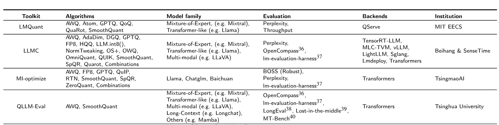

**表 5.** 大语言模型量化工具包与基准.

致力于综合比较的量化工具包, 通常会从多个方面支持主流模型与量化算法. 大多数工具包都涵盖 Llama 系列, Mixtral 和 Vicuna 等知名模型, QLLM-Eval 等更关注模型多样性的工具则进一步支持更多模型. 在算法方面, LLMC, LMQuant 与 MI-optimize 关注不同量化算法的性能, 提供统一, 公平且全面的比较基准. 所有基准都以一个或多个推理框架作为后端, 并为用户保留接口, 便于定义和评估自定义模型与算法.

#### 5.3.2 评估

基准评估集中展示量化 LLM 最受关注的两个方面, 即效率与生成质量. 表 5 列出了详细评估方向.

**效率方面.** 推理效率通过可部署性与吞吐量衡量, 二者是 LLM 压缩最关键的特性 [Lin24a, Gon24]. 理论上, 减少参数存储可以加快推理, 但实际效果取决于具体系统实现. 基准为我们提供公平, 便捷的观察手段, 用于区分哪些算法与实现真正带来加速和存储节省. 量化模型的生产效率则以校准时间衡量, 它反映 PTQ 算法的时间与计算资源成本 [Gon24]. 消耗大量资源的方法通常有更好的生成质量, 所需时间较少的方法则可能生成效果更差, 这正是生成量化 LLM 时需要权衡的问题.

**生成质量方面.** 评估维度包括困惑度, 准确率, 逻辑能力, 补全能力与可信度等 [Lin24a, Gon24, Li24f, Liu24d]. 多数基准都会评估涌现能力, 这是 LLM 的关键特征. 具体而言, 模型和算法会在对话, 长上下文, 多任务等不同场景中接受测试 [Li24f]. 部分基准还关注生成内容的安全性, 评估 LLM 的可信度与鲁棒性 [Li24f, Liu24d].

**第 5.3 节要点**

若目标是复现多种量化算法, 推荐使用 LLMC, MI-optimize 与 LMQuant, 因为它们提供了全面的量化方法集合. 若重点是跨推理框架部署, LLMC 是理想选择, 它提供灵活的量化设置, 并能无缝兼容多个后端.

## 6 未来趋势与研究方向

随着大语言模型量化持续发展, 多项新趋势与研究方向将塑造这一领域的未来. 本节讨论量化技术, 模型架构与硬件设计方面可能出现的进展, 这些进展将进一步改善量化模型的效率, 性能与应用范围.

**量化技术.** 尽管已经取得进展, 量化技术仍面临若干挑战. 首先, 大语言模型 (LLM) 离群值的来源尚不明确, 这是进一步降低量化位宽的重要障碍. 揭示这些离群值内部形成机制的研究十分关键, 它将为社区提供有价值的认识, 推动量化技术发展并实现更高效的模型. 其次, 在精度可接受的前提下探索最低比特表示极具价值. 维持性能的同时尽可能降低位宽, 可以充分利用硬件能力. 第三, 为优化模型性能与效率, 必须探索统一的混合比特量化策略, 同时涵盖位宽选择以及层内, 层间位分配. 现有方法主要强调层内混合精度, 经常忽略层间混合精度的潜在收益. 最后, 开发语义引导的方法, 对键值 (KV) 缓存进行更低比特的量化和压缩, 将成为重要方向. 在长上下文推理中, KV 缓存的巨大内存占用往往是主要瓶颈, 因而找到有效的 KV 缓存压缩方法, 对突破这一限制并提升模型效率至关重要.

**模型架构.** 模型架构创新也将发挥关键作用. 首先, 研究者将探索多模态模型的量化, 以保证模型处理不同数据类型和应用时的效率. 其次, 量化研究会扩展至混合专家 (MoE) 等新兴模型结构和其他大规模架构. 第三, 探索量化与模型大小之间的关系, 将有助于在管理量化取舍的同时优化小模型性能.

**硬件设计.** 硬件与量化的协同设计是释放新潜力的关键. 第一个重点方向是为新型极低比特量化开发系统. 创新的低比特表示格式和高效系统实现, 可能为摩尔定律带来的挑战提供新解法. 第二个方向是使用 FP4 等更低比特精度加速训练. 为此类低精度训练开发硬件支持, 将有助于在保持性能的同时提高模型训练速度.

## 7 结论

本文深入梳理了大语言模型 (LLM) 的低比特量化技术, 强调这些技术对解决资源受限环境中模型部署所面临的计算与内存挑战具有重要意义. 文章首先说明低比特量化的基础知识, 包括专为 LLM 设计的新型数据格式与量化粒度. 随后回顾系统和框架, 展示不同硬件平台支持低比特 LLM 的多种方式与工具, 并对训练和推理优化技术进行分类讨论, 以系统呈现当前方法. 最后, 本文探讨未来方向与新兴趋势, 强调能够进一步提高 LLM 量化效率和效果的潜在研究领域与技术进展. 随着 LLM 研究不断演进, 本综述希望成为推动低比特量化技术发展的有价值参考.
