> [Chao Jin](https://dblp.org/pid/19/4764-7) [+equal], [Ziheng Jiang](https://dblp.org/pid/14/8980) [+equal], [Zhihao Bai](https://dblp.org/pid/234/8717), [Zheng Zhong](https://dblp.org/pid/69/7279), [Juncai Liu](https://dblp.org/pid/304/3355), [Xiang Li](https://dblp.org/pid/40/1491-67), [Ningxin Zheng](https://dblp.org/pid/234/5381), [Xi Wang](https://dblp.org/pid/08/5760), [Cong Xie](https://dblp.org/pid/130/0102), [Qi Huang](https://dblp.org/pid/46/4397-1), [Wen Heng](https://dblp.org/pid/201/7460), [Yiyuan Ma](https://dblp.org/pid/234/3589), [Wenlei Bao](https://dblp.org/pid/162/4919), [Size Zheng](https://dblp.org/pid/254/6617-1), [Yanghua Peng](https://dblp.org/pid/195/5934), [Haibin Lin](https://dblp.org/pid/142/1829), [Xuanzhe Liu](https://dblp.org/pid/08/2161), [Xin Jin](https://dblp.org/pid/68/3340-8), 以及 [Xin Liu](https://dblp.org/pid/76/1820-86). 2025 年 5 月 16 日首次提交至 arXiv; 当前版本为 v3. 已被 EuroSys '26 接收; [DOI 10.1145/3767295.3769325](https://doi.org/10.1145/3767295.3769325). [MegaScale-MoE: Large-Scale Communication-Efficient Training of Mixture-of-Experts Models in Production](https://arxiv.org/abs/2505.11432). [原始 PDF](/paper/megascale-moe.pdf). [TeX 源文件](https://export.arxiv.org/e-print/2505.11432v3). 精确的印刷版式和参考文献以原始 PDF 为准.

[+equal]: 同等贡献.

## 摘要

我们提出 MegaScale-MoE, 一个为高效训练大规模混合专家 (MoE) 模型量身打造的生产系统. MoE 是一种很有前景的架构, 可以将大语言模型 (LLM) 扩展到前所未有的规模, 从而提升模型性能. 然而, 现有 MoE 训练系统的训练效率会下降, 而 MoE 模型规模不断扩大, 硬件持续演进又加剧了这一问题.

高效通信对提升 MoE 训练十分重要, 因此 MegaScale-MoE 为每个 MoE 层中的注意力和 FFN 定制通信高效的并行策略, 并采用整体方法, 在算子间和算子内两个层面实现通信与计算重叠. MegaScale-MoE 还通过调整通信模式, 将通信压缩到更低精度, 进一步提升训练效率. 在 1,440 块 NVIDIA Hopper GPU 上训练 352B MoE 模型时, MegaScale-MoE 达到 1.41M tokens/s 的训练吞吐量, 效率较 Megatron-LM 提升 $1.88\times$. 我们分享了加速 MoE 训练的运维经验, 并希望这些系统设计上的见解能够推动未来的 MoE 系统研究.

## 1 引言

随着大语言模型 (LLM) [Cho22b, Tou23a, Jia24a] 规模的增长, 其训练规模也随之扩大. 训练规模的扩张使效率提升从一项可取的改进变成了不可或缺的要求 [Jia24f]. 作为一家为数十亿用户构建 AI 产品的公司, 我们一直在数千块 GPU 上训练具有数千亿参数的 LLM. 因此, 训练效率哪怕只有少量提升, 也能显著减少计算资源消耗和训练时间, 直接影响开发先进 LLM 的可行性与可持续性.

在各种 LLM 架构中, 混合专家 (MoE) 模型以稀疏激活 [Cho22b, Jia24a, Fed22, Sha17] 见长: 它将输入 token 动态路由到一组经过选择的专用网络组件, 即*专家*, 而不是激活全部参数. 采用这种设计后, 随模型规模增长所需的 FLOPs 呈次线性增长, 因而可以显著降低计算成本. 近期的工业界进展 [Du22, Raj22, Dbr25, Xai24, Dee24a] 已经展现出 MoE 模型的潜力: 与模型质量相当的稠密模型相比, 其训练成本可降低一个数量级.

尽管 MoE 模型的训练成本较低, 我们从系统角度观察到训练中的一个主要性能瓶颈: 通信. 例如, 在 NVIDIA Hopper GPU 上训练一个内部模型时, 通信占前向传播总时间的 43.6%, 占整个训练过程的 32%. 造成这一瓶颈的主要因素有两个. 第一, MoE 模型天然会引入更多通信开销. MoE 模型的参数规模更大, 因此与稠密模型训练相比, 其模型并行需要分布到更多 GPU 上. 第二, 要实现稀疏计算, 前向和反向传播都需要额外进行两次 all-to-all 通信, 分别用于分发与聚合 token, 这会阻碍正在进行的计算.

而且, 随着硬件进步, 计算与通信之间的失衡愈发明显, 通信开销的影响也越来越大. 模型架构不断改进的同时, 硬件能力也在快速发展, GPU 的处理速度显著提高 ([图 1](#figure-01)). 与此同时, 业界开始采用更低的训练精度, 以提高训练效率并降低成本 [Pen23e, Dee24a]. 这些趋势缩短了原始计算时间, 使通信开销的相对影响成为更严重的瓶颈. 例如, 在某些情况下, 仅仅将现有张量并行扩展到多节点, 就会使通信开销超过 50%. 因此, 要维持并提升 MoE 模型训练的可扩展性, 通信优化不可或缺, 尤其是在需要跨多块 GPU 频繁同步数据的分布式环境中.

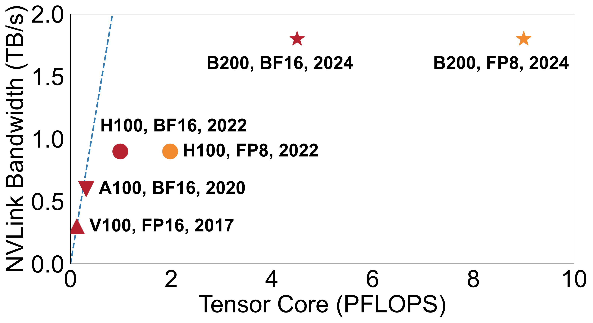

**图 1.** NVIDIA GPU 的演进.

本文介绍 MegaScale-MoE 的设计, 实现与运维经验. MegaScale-MoE 是一个为高效大规模 MoE 训练而优化的生产系统. MegaScale-MoE 细致处理通信瓶颈, 力求拓展 MoE 训练的边界, 并显著提高性能和效率. MoE 与稠密模型在架构上的主要区别位于层内, 也是通信开销的主要来源; 基于这一认识, MegaScale-MoE 利用高带宽 NVLink, 将每个 MoE 层限制在单个节点内. 我们的分析 ([第 3 节](#section-3)) 和评估 ([第 6 节](#section-6)) 表明, 尽管现有系统普遍采用跨节点专家并行 [Dee24a, Hwa23], 我们的方法仍能在数千块 GPU 上有效地将 MoE 训练扩展到数千亿参数的模型.

具体而言, MegaScale-MoE 从三个主要方面解决 MoE 训练中的通信问题. 第一, MegaScale-MoE 为每个 MoE 层的注意力模块和 FFN 模块定制并行策略, 以减少通信量. 我们比较了现有 LLM 训练框架中的并行策略, 综合考量它们对大规模训练的影响, 包括通信量以及通信能否有效重叠 (即是否位于关键路径上). 在此分析的基础上, 我们为 MoE 训练选择最优的并行策略组合.

第二, MegaScale-MoE 在算子层面让通信与计算完全重叠. MegaScale-MoE 将每个 MoE 层的前向和反向传播拆分为独立的计算算子和通信算子. 对于算子间重叠, MegaScale-MoE 采用整体调度策略, 在前向和反向传播中谨慎调整通信算子与计算算子的顺序, 将通信隐藏在相互独立的计算中. 这种方法还优化了 GPU 内存使用. MegaScale-MoE 采用选择性激活重物化, 在前向传播期间只在 GPU 内存中保留一部分激活, 并在反向传播期间通过重新计算或重新通信获得所需激活. 借助这一整体调度, MegaScale-MoE 能够有效隐藏重物化开销, 仅存储一半激活便可达到相当的性能.

为了重叠关键路径上的通信, MegaScale-MoE 采用细粒度方法, 将通信拆分为 tile 并与 GPU 计算模式对齐, 再将这些 tile 级通信融合进计算 kernel. 对于需要分发 token 的 MoE 模型, MegaScale-MoE 将高效的本地 scatter 操作融合进 kernel, 并沿 scatter 维度重新组织计算任务, 以缓解多个数据源造成的通信瓶颈. 这种细粒度重叠利用 GPU 之间的高带宽连接, 在各节点内部进行.

第三, MegaScale-MoE 利用通信压缩进一步提升 MoE 训练效率. 具体而言, 对于广泛采用的 BF16 混合精度训练, MegaScale-MoE 将节点间参数同步的精度从 FP32 降至 BF16, 从而将相关开销减半. 在 FP8 训练中, MegaScale-MoE 用 FP8 通信替代 BF16 reduce-scatter, 并配合定制的量化策略和 FP32 归约, 在保持收敛稳定性的同时减少通信量.

MegaScale-MoE 已部署在我们的数据中心, 用于训练产品所需的 MoE 模型. 在 1,440 块 NVIDIA Hopper GPU 上训练 352B MoE 模型时, MegaScale-MoE 的 MFU (模型 FLOPs 利用率) 最高可达到先进开源 LLM 训练框架 Megatron-LM [Sho19] 的 $1.88\times$. 通过全面的通信优化, MegaScale-MoE 为我们的生产环境提供大规模训练能力, 高效扩展到数万亿参数和数千块 GPU, 并节省数百万 GPU 小时.

## 2 背景

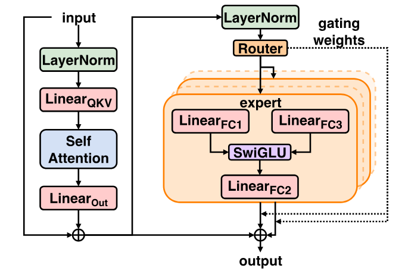

**图 2.** 混合专家 (MoE) 层.

### 2.1 Transformer 的混合专家机制

混合专家 (MoE) 机制是一种旨在提升 Transformer [Vas17] 模型性能的先进方法, 而 Transformer 模型在 LLM 领域正变得越来越重要 [Jia24a, Cho22b, Dbr25, Dee24a]. 它在前馈网络 (FFN) 组件中集成多个专家网络, 从而扩展 Transformer 架构. 如[图 2](#figure-02) 所示, MoE 模型根据输入 token 的特征, 将其动态路由到最相关的专家. 这一过程由可训练的门控机制管理, 它为每个 token 选择最合适的专家. 由于每次输入只激活一部分专家, 这种架构创新让 MoE 模型能够在不按比例增加推理成本的情况下扩展容量.

### 2.2 大规模 LLM 训练

在数万块 GPU 上大规模训练大语言模型是一项复杂的系统工程挑战, 需要综合运用多种系统技术. 为了分配训练工作负载, 必须结合数据并行, 张量并行和流水线并行等策略 [Sho19, Ras20, Jia24f], 因为每种方法都有局限, 无法单独实现有效扩展.

**数据并行.** 数据并行将训练数据均匀分布到所有设备, 每台设备均复制模型参数和优化器状态. 为了在每次训练迭代后同步参数, 数据并行会执行 all-reduce 通信操作. 零冗余优化器 (ZeRO) [Raj20] 将模型状态分布到所有参与设备上, 改进了数据并行. ZeRO 分为三个递进阶段, 每个阶段都会进一步节省内存, 但代价是通信量增加.

**张量并行.** 张量并行将计算密集型张量操作分布到多台设备, 使其能够并行计算, 从而显著加快训练过程. 模型内具体的划分策略和算子之间的依赖关系决定了张量并行可能需要收集已拆分的输入 (all-gather), 或合并输出 (reduce-scatter). 在 LLM 训练中, LayerNorm 和 Dropout 等算子的计算量不大, 却需要大量激活内存. 为了解决这一问题, 研究者提出了张量并行的一种变体, 即**序列并行** [Kor22], 沿序列长度维度划分这些算子. 对于长上下文训练, 一些工作 [Sho19, Sam23, Con25a] 将序列并行或张量并行应用于自注意力中的不同算子. [图 3](#figure-03) 展示了注意力模块的主流并行策略, 即张量并行, 序列并行和上下文并行 (TP, SP 和 CP), 我们将在[第 3.1 节](#section-3-1) 分析这些策略.

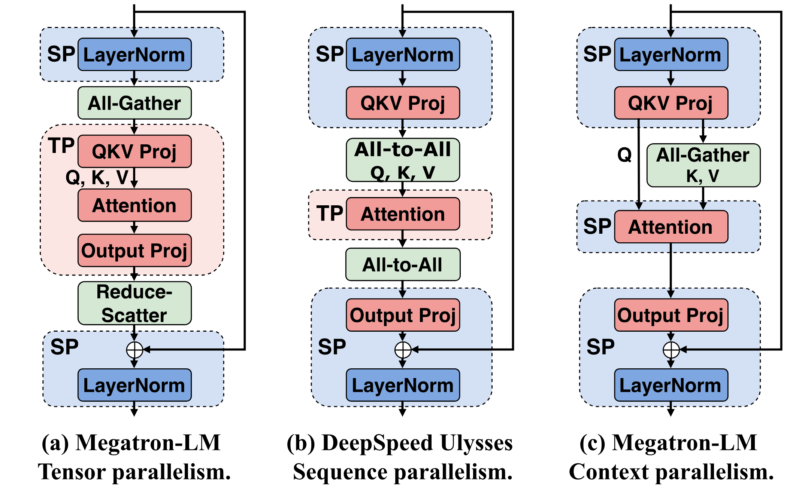

**图 3.** 自注意力的不同并行策略. "TP" 表示沿隐藏维度划分, "SP" 表示沿序列长度维度划分.

**流水线并行.** 流水线并行将模型层划分为在不同设备上处理的阶段, 以流水线方式执行, 从而提高效率. 为此, 每个 batch 会被拆分为多个 micro-batch. 为尽量减少流水线气泡, 研究者开发了多种调度策略, 例如 GPipe [Hua19], PipeDream 1F1B [Nar19] 和 Interleaved 1F1B [Nar21] 等. Megatron-LM 采用 Interleaved 1F1B 流水线调度, 进一步将一台设备上的每个阶段划分为多个虚拟阶段, 以降低流水线气泡率.

**专家并行.** 专家并行为训练 MoE 模型而设计, 它将专家分布到多台设备上, 从而缓解内存压力并实现并行处理. 为了高效地将 token 分配给适当的专家并取回其输出, 通常会采用 all-to-all 通信.

## 3 通信高效的并行策略

随着 MoE 模型兴起和硬件计算能力演进, 通信开销在生产环境的 MoE 训练中变得越来越重要. 本节讨论用于减少通信量, 同时满足高 GEMM (通用矩阵乘法) 效率等其他训练要求的并行策略.

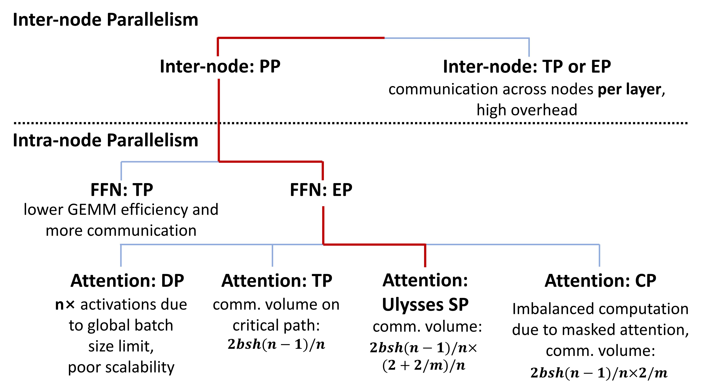

**图 4.** 大规模 MoE 训练的设计空间.

[图 4](#figure-04) 展示了大规模 MoE 训练中并行策略的设计空间, 不包括最外层的数据并行. 我们先讨论节点间并行. 专家并行将专家分布到多个节点上, 从而缓解 MoE 模型参数量庞大带来的内存压力, 但它会在每一层引入跨节点通信, 损害训练效率. 同样, 张量并行的通信开销很高, 因此将 TP 限制在单个节点内效率更高. 沿用先前工作 [Jia24f], 我们采用流水线并行来分布模型参数, 减少通信, 并让不同 micro-batch 的通信相互重叠.

以往的大规模 MoE 训练系统, 如 Megatron-LM [Sho19] 和 DeepSpeed-MoE [Raj22], 会引入张量并行, 在节点内划分模型参数来扩展训练. 然而, 我们在实践中发现这种方法存在两个问题: (1) TP 会划分专家维度, 对 GEMM 效率产生负面影响; (2) TP 会引入大量通信开销, 并且该开销不会随并行规模增加而降低, 最终使现代硬件上的通信时间超过计算时间.

为解决这些问题, 我们针对 MoE 模型的各个组件定制并行策略. 对前馈网络 (即专家), 我们用专家并行取代张量并行, 并采用针对不同 top-k 和专家规模优化的自定义通信模式, 确保通信开销低于张量并行. 对其他组件, 我们采用序列并行, 沿序列维度而非 batch 维度进行划分, 从而无需增大全局 batch size 即可扩展. 与张量并行相比, 这也减少了关键路径上的通信. 由于各组件之间的参数量不对称, 额外的内存和 DP 通信开销仍然可控. 下文将详细说明这种节点内并行策略的依据和分析. [表 1](#table-01) 列出了主要符号.

### 3.1 注意力模块的序列并行

MoE 模型的专家组件天然可以并行, 因此以往大多数 MoE 训练工作 [Raj22, Li23i] 都侧重优化专家并行, 而数据并行 (DP) 通常用于注意力等非 MoE 组件. 然而, 在扩展 MoE 训练时, 这种方法会消耗 $n\times$ 的激活内存, 因而并不足够. 出现这一问题是因为 DP 会在节点之间和节点内部同时拆分 batch 维度. 与[图 4](#figure-04) 所示的其他节点内并行策略相比, 对注意力模块应用 DP 会迫使一个节点内的每块 GPU 同时处理一个 micro-batch, 使激活大小增加 $8\times$, 往往导致内存不足.

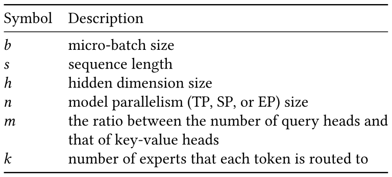

**表 1.** 符号说明.

为了实现可扩展的 MoE 训练, 必须对注意力模块实施节点内并行. 张量并行 (TP) 常用于在节点内并行执行注意力操作. 然而, 它需要沿关键路径对激活执行 all-gather 和 reduce-scatter, 因而会引入不可避免的通信成本. 随着计算 FLOPs 与通信带宽之间的差距不断扩大, 我们发现 TP 的通信开销甚至会超过自注意力的计算时间. 这一由通信主导的瓶颈限制了通信与计算重叠的能力, 最终降低训练效率.

我们采用 DeepSpeed-Ulysses [Sam23] 提出的序列并行 (SP) 来扩展 MoE 训练, 并有效减少关键路径上的通信. SP 常用于长上下文训练, 以解决长输入带来的内存问题. 我们发现它也很适合大规模 MoE 训练. 第一, 与 TP 相比, 它可以显著降低通信开销, 尤其是在使用分组查询注意力 [Ain23a] 时. 第二, 尽管它会引入一些参数冗余, 并增加参数同步期间的通信开销, 但 MoE 模型的独特特征使这些代价仍然可控且可以接受.

**通信效率.** 使用 TP 时, 注意力模块的通信量为

$$
2bsh(n-1)/n.
$$

使用 SP 时, 通信量降为

$$
2bsh(n-1)/n\times(2+2/m)/n,
$$

其中, $m$ 表示查询头数量与键值头数量之比. 假设模型在 NVLink 域大小为 8 的 NVIDIA Hopper GPU 工作站上训练, 序列并行注意力的通信延迟可以降至张量并行注意力所需延迟的大约四分之一.

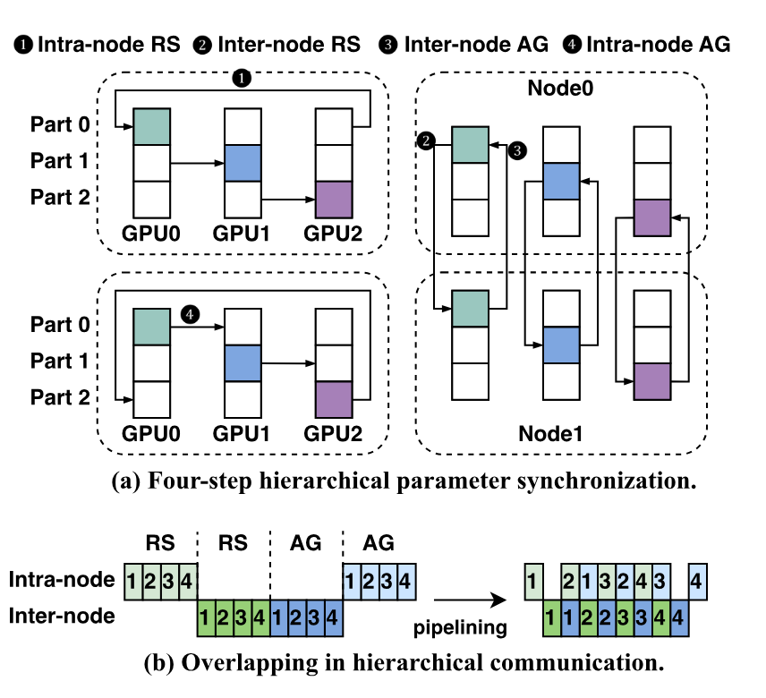

**图 5.** SP 注意力中用于参数同步的分层通信.

**数据通信与内存开销.** SP 与 TP 注意力之间一个显著的区别在于参数如何分布到设备上: TP 对注意力权重进行分片, 而 SP 会复制这些权重. 这让人担心梯度和参数同步的通信开销可能增加. 但结果与直觉相反: 考虑到节点内外带宽并不对称, 而且现代通信库 [Ncc21] 采用了[图 5](#figure-05) 所示, [第 10.1 节](#section-10-1) 所分析的分层通信操作, 虽然 SP 注意力需要同步的参数是 TP 注意力的 $n\times$, 但实际场景中的通信开销差异很小.

另一方面, 在 MoE 训练中, SP 注意力额外引入的 GPU 内存消耗很小. 对于拥有数十至数百名专家的大规模 MoE 模型, GPU 内存主要由专家参数占用. [第 6.2 节](#section-6-2) 详述的实验确认, SP 注意力额外的参数同步和内存开销仍然可控.

**平衡与不平衡.** 除 Ulysses 风格的 SP 注意力之外, 我们还探索了其他形式, 包括沿序列维度划分所有激活的上下文并行 (CP) [Con25a]. 然而, 由于注意力中的因果掩码让每个 token 只能关注先前的 token, CP 注意力会遇到工作负载不平衡. 为了缓解这一问题, 我们尝试使用 zigzag 策略, 将序列首尾的分区放在同一块 GPU 上, 但仍然很难达到完全平衡. 因此, 在大规模训练中, 整个训练过程常受制于最不平衡的 data batch. 而且, 这种不平衡会扰乱训练流水线, 从而降低整体训练效率.

### 3.2 前馈网络的专家并行

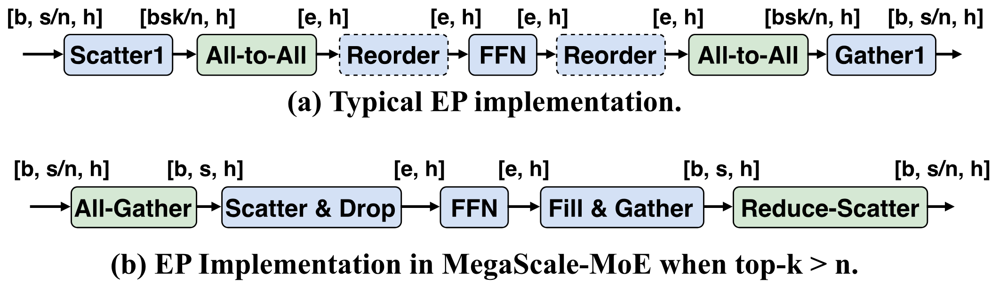

**图 6.** 通信高效的专家并行. $e$ 表示路由到该 worker 的 token 数量.

在选择前馈网络组件的并行策略时, 专家并行 (EP) 始终优于张量并行. TP 会划分每个专家的隐藏维度, 降低 GEMM 效率, 而 EP 则在每台设备上保留完整的专家计算. 理论上, EP 的通信成本为

$$
2k/n\times bsh(n-1)/n,
$$

而 TP 的通信成本为

$$
2bsh(n-1)/n.
$$

尽管两者的相对效率取决于 $k/n$ 之比, 但我们针对不同的 top-$k$ 值设计了自适应通信策略, 以尽量减少 EP 的通信量.

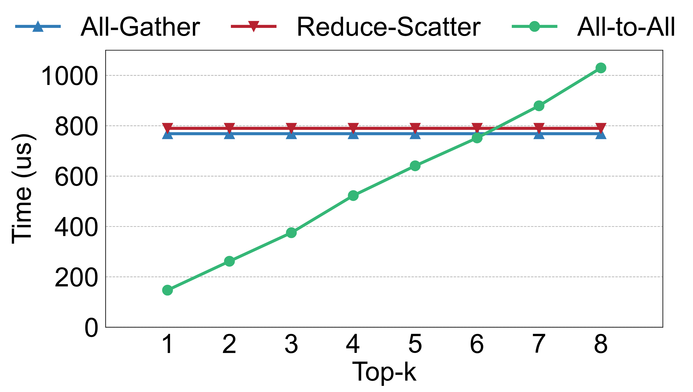

**图 7.** 用于 token 分发的 AG, RS 和 A2A 对比.

**高效通信模式.** [图 6](#figure-06) 比较了典型 EP 实现与 MegaScale-MoE 的方法. 标准 EP 实现需要两次 all-to-all 通信, 分别用于分发和聚合 token. 此外, 在发送 token 之前和接收 token 之后可能还需要执行 scatter 操作, 以确保分配给同一专家的 token 位于连续的内存空间中.

当 top-$k$ 值超过 $n$ 时, 我们用 all-gather 和 reduce-scatter 取代传统的 all-to-all 通信. 首先, all-gather 操作从所有 worker 收集 token. 随后, 本地 scatter 操作丢弃不需要的 token, 只保留当前 worker 上的专家所需的 token. 专家完成计算后, token 被组装为完整张量. 这种方法可以在通信前执行 gather 操作, 然后用 reduce-scatter 生成最终结果, 从而确保 EP 的通信开销不高于 TP.

在实际训练中, all-to-all 通信的效率低于 all-gather 和 reduce-scatter, 因为它要求每个 worker 与所有其他 worker 通信, 而 all-gather 和 reduce-scatter 遵循基于环的通信模式, 只在相邻 worker 之间通信. 如[图 7](#figure-07) 所示, 对 Mixtral 8x7B 中这三种操作的通信时间进行比较后可以看出, 当 top-$k$ > 6 时, 基于 all-gather 的 EP 实现效率更高.

**高效算子.** 我们没有像 Megatron-LM 那样使用 `torch.scatter_add` 和 `torch.gather` 来 scatter 和 gather 张量, 而是直接使用 CUDA 开发高效的 scatter 和 gather 算子. 根据 token 路由结果, 我们预先计算输入张量中每一行 (代表一个 token) 到输出张量对应行的映射. 随后, scatter 和 gather 算子按照这一映射高效传输数据.

**负载均衡.** MoE 模型训练中的一个常见难题是专家之间的负载均衡 [Li23i, Dee24d]. 为此, 我们使用辅助损失和 token 丢弃来均衡各节点内部 GPU 之间的工作负载. 与 DeepSeek-V2 [Dee24d] 类似, 我们将放在同一块 GPU 上的专家视为一组, 并按设备而非单个专家计算均衡损失和计算容量.

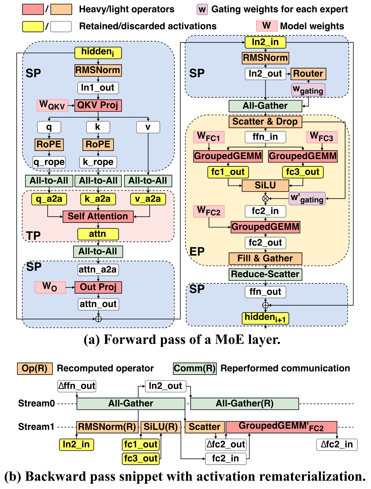

**图 8.** 选择性激活重物化.

## 4 通信与计算重叠

在优化并行策略, 尽量减少通信量之后, 我们进一步采用全面的通信与计算重叠技术, 将通信开销降至接近零. 大模型训练需要集成多种技术, 这增加了通信重叠的复杂性. 例如, 设备可能在任意时刻同时处理计算和通信 kernel, 让 PP 与 DP 通信相互重叠, 并管理设备与主机之间的数据传输. Megatron-LM 等现有框架将注意力模块与 FFN 模块组装成 MoE 层, 并依赖 `torch.autograd` 包执行反向传播, 这限制了通信重叠的灵活性. MegaScale-MoE 则将每个 MoE 层的注意力模块和 FFN 模块分解为作为 GPU kernel 运行的算子, 通过灵活调度实现细粒度通信重叠.

### 4.1 算子间重叠

我们在不同 CUDA stream 上异步执行通信算子和相互独立的计算算子, 让两者相互重叠. 为了在训练过程中达到最佳性能, 我们采用专门手工定制的整体调度策略.

**整体调度.** 从调用方的角度看, 我们实现了统一的宏模块来执行整个 MoE 层的前向与反向传播, 从而拓展调度的灵活性. 例如, 在反向传播期间, 各种通信算子可以与激活重计算等无依赖计算相互重叠, 从而提高效率. 从运行时角度看, 一个主要难题是解决资源冲突, 以高效管理并发通信任务, 防止阻塞并最大化吞吐量. 这需要谨慎协调, 例如确定分配给每个通信算子的 SM 数量, 从而尽量减少干扰并优化整体吞吐量.

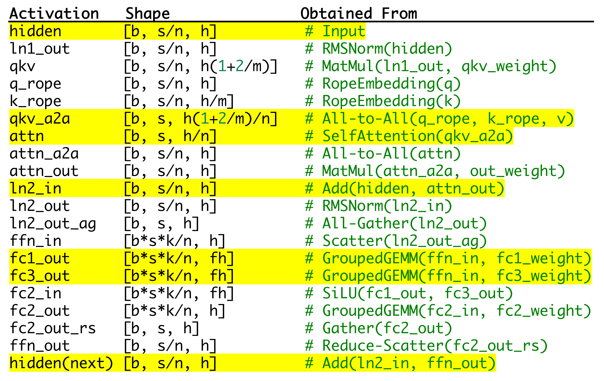

**图 9.** 重物化中的激活形状.

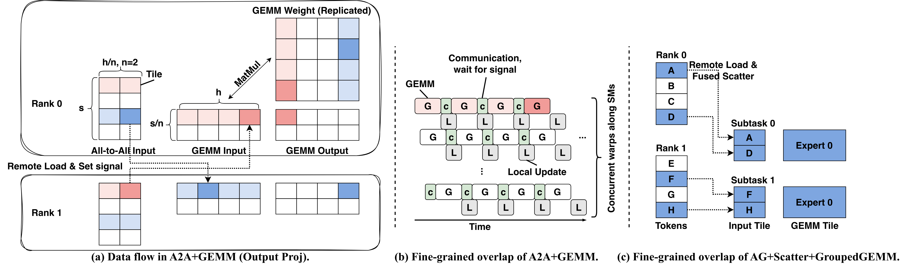

**图 10.** 细粒度算子内通信与计算重叠.

**选择性激活重物化.** 整体调度策略还有助于在不牺牲训练速度的情况下减少内存使用. 与计算需求相当的稠密模型相比, MoE 模型的参数量大出数倍, 因而训练时的内存压力要高得多. 除使用 ZeRO 优化 [Raj20] 消除 DP 组之间冗余的优化器状态之外, 我们还通过选择性激活重物化进一步优化内存使用. 该方法重新执行能够与其他必要算子重叠的计算和通信算子, 从而减少激活内存需求.

[图 8a](#figure-08) 展示了 Mixtral [Jia24a] MoE 层的前向传播, 并标出了该过程中产生的主要激活. MegaScale-MoE 有选择地保留重计算成本较高的激活, 并重新计算由内存密集型操作或通信操作生成的其他激活. 这尽量减少了对反向计算的依赖, 使重物化操作能够与其他计算和通信相互重叠, 避免延误关键路径. 例如, 如[图 8b](#figure-08) 所示, FC2 的 GroupedGEMM 算子在反向传播时需要激活 `fc2_in` 和 `fc2_out` 的梯度 (记为 $\Delta$`fc2_out`) 作为输入. MegaScale-MoE 重新计算 `fc2_in`, 并让该算子与梯度通信 (即对 $\Delta$`ffn_out` 执行 all-gather) 相互重叠. 类似地, `ffn_in` 通过重新执行 `RMSNorm` 和 all-gather 获得, 这两个算子分别隐藏在之前的通信和 FC2 GroupedGEMM 中. MegaScale-MoE 还将 `ffn_out` 的加权求和紧接在 SwiGLU [Sha20] 激活函数之后, 因此无需存储 `ffn_out`. 这种重排避免了跨越非线性边界的算子, 从而确保计算一致性.

[图 9](#figure-09) 展示了前向传播期间产生的主要激活的形状, 其中高亮的激活会保留下来供反向传播使用. 设一个 MoE 层内的模型并行规模为 $n$, 单个专家的中间隐藏大小为 $fh$. 单个 MoE 层的总激活量为

$$
(2n+2k+3kf+12+5/m)bsh/n,
$$

我们将其降至

$$
(2kf+4+2/m)bsh/n.
$$

MegaScale-MoE 在保持相同训练速度的同时, 将激活内存减少了 $\sim 50\%$.

### 4.2 算子内重叠

尽管算子间重叠能够有效隐藏通信延迟, 要消除执行时间线上的所有气泡仍非易事, 尤其是在前向传播中, 此时没有重物化算子或梯度计算算子可与通信重叠. 一些前向算子直接依赖通信, 例如为专家计算分发 token, 除非引入另一个 micro-batch, 否则无法实现重叠, 但这会增加内存压力.

一种广泛采用的解决方案 [Jia24f, Tra25, Wan22b] 是将算子分解为更小的并行算子, 并在不同 CUDA stream 上执行, 从而实现流水线处理. 然而, 这种方法会引入不可忽略的开销: $(i)$ 复杂的 stream 控制需要主机干预, 而 CPU 控制具有非确定性, 会产生随机气泡; $(ii)$ 尾部计算不完善, 增加整体计算延迟.

为解决上述问题, 我们采用算子内重叠, 并行执行存在直接依赖关系的通信算子和计算算子. 核心思路是融合这些算子, 并将工作负载拆分为 tile. 沿用先前工作 [Jan22, Cha24c, Zha25e, Zhe25a], 我们在设备内存中实现通信算子与计算算子之间的 barrier. 这些 barrier 支持细粒度的 tile 级通知, 无需主机干预, 从而进一步提高训练性能. 我们分别为注意力模块和 FFN 模块实现了两类 kernel: 与 GEMM 重叠的 kernel, 以及与 MoE GroupedGEMM 重叠的 kernel.

**与 GEMM 重叠.** 我们先介绍 GEMM kernel 的算子内通信与计算重叠. 具体而言, 我们分别为 SP 注意力中的输出投影和 QKV 投影实现 all-to-all (A2A)+GEMM 与 GEMM+A2A kernel, 其中 X+Y 表示在 X 之后执行 Y. [图 10](#figure-10) 展示了 A2A+GEMM 的数据流和重叠模式. 对本地数据的 GEMM 与远程数据的通信同时开始. 我们使用专用 GPU copy engine 传输数据, 确保所有 SM (流式多处理器) 都充分用于计算. 当远程数据 tile 到达本地内存后, 信号会通知 GEMM kernel 继续计算到达的 tile. 对于 GEMM+A2A, all-to-all 操作会融合进 GEMM kernel. 每个 GEMM 计算 tile 的末尾都会执行远程数据传输, 将输出数据 tile 写入远程 rank. 我们还为张量并行实现了 all-gather+GEMM 和 GEMM+reduce-scatter kernel, 它们分别类似于 A2A+GEMM 和 GEMM+A2A.

对于 A2A+GEMM 和 GEMM+A2A, 由于 all-to-all 比 all-gather 和 reduce-scatter 更复杂, 我们会为通信分配少量 SM. 分配给通信的 SM 数量经过调优, 使通信与计算具有相近的延迟. 而且, 多个 rank 可能同时从同一设备读取或向同一设备写入, 这可能引起 NVLink 争用. 为缓解这一问题, 我们采用 swizzling [Cha24c, Zha25e, Zhe25a] 对 tile 通信和计算重新排序, 使通信 tile 的到达速度与计算 tile 的处理速度一致.

**与 GroupedGEMM 重叠.** 对于包含 token 分发与合并的专家并行, 我们希望让通信与 GroupedGEMM 重叠. 我们实现了两类重叠 kernel: all-gather+scatter+GroupedGEMM, 以及 GroupedGEMM+gather+reduce-scatter. 与 GEMM kernel 的重叠技术不同, MoE GroupedGEMM 需要对 token 执行 shuffle (scatter/gather). 因此, 每个计算 tile 可能依赖来自多个 rank 的 token. 为了有效重叠计算与通信, 我们对 token 顺序进行排序, 尽量减少每个计算 tile 所依赖的 rank 数量. 此外, 每个 tile 各有自己的依赖关系, 因此其信号控制会随动态确定的 MoE 路由而变化.

具体而言, 对于 AG+scatter+GroupedGEMM, 我们先根据 token 被路由到的专家索引, 沿序列维度对 token 重新排序. 随后, 对每个专家, 按来源 rank 索引对路由来的 token 排序. 最后, 我们将排序后的序列切分为 block, 并使用一系列计算 tile 执行 GroupedGEMM. 具体来说, 如[图 10c](#figure-10) 所示, 我们根据索引映射选择输入数据行, 从而将本地 scatter 融合进 kernel. 每个专家的 GroupedGEMM 计算被划分为多个 tile, 每个 tile 只依赖一部分来源 rank, 甚至只依赖单个来源 rank. 这样可以减少每个计算 block 的总体等待时间, 避免重复加载专家参数, 并改善计算 tile 与通信 tile 之间的重叠.

## 5 通信压缩

我们进一步应用通信压缩来减少通信开销. 为了保持收敛稳定性, 混合精度训练框架通常会用 FP32 等较高精度传输等待归约的张量, 以确保累加更加准确. 数据并行中的梯度 reduce-scatter 就是一个常见例子.

**DP 通信压缩.** 随着 MoE 模型参数量增加, 数据并行中同步参数和梯度的通信开销也会增加. 先前工作已经探索通过梯度压缩缓解这一成本. 在我们的 BF16 混合精度训练中, 我们谨慎地将 FP32 降为 BF16, 用于梯度同步, 以平衡效率和收敛稳定性.

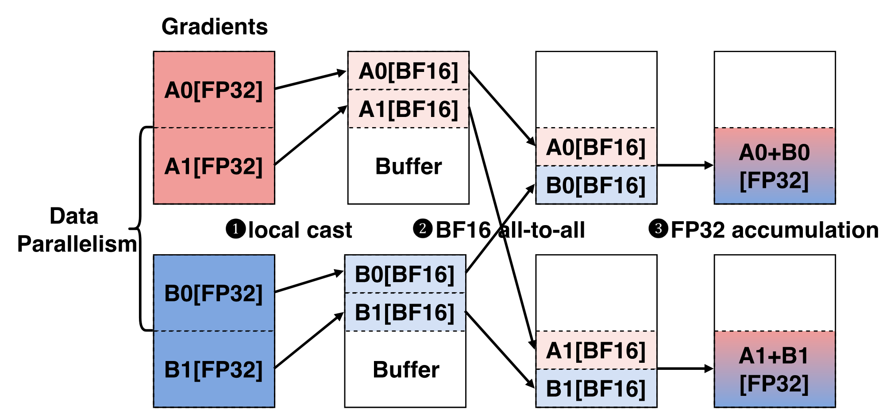

**图 11.** DP 通信压缩.

具体而言, 如[图 11](#figure-11) 所示, 在流水线并行的本地梯度累加期间, 我们将主梯度保留为 FP32. 每个模型阶段完成累加后, 我们不再只依靠 reduce-scatter 同步梯度, 而是将梯度转换为 BF16, 并在数据并行组内执行 all-to-all 通信, 收集所需的梯度分片, 随后在本地以 FP32 累加. 结果表明, 与直接使用 FP32 执行 reduce-scatter 相比, 这种方法引入的精度损失可以忽略, 同时将梯度通信开销降低了 50%.

这种方法可以尽量降低风险, 主要有两个原因. 第一, 它只在通信时将累加后的梯度一次性转换为 BF16, 本地梯度累加仍保持 FP32 精度. 第二, 它不使用环式 reduce 来通信 BF16 梯度, 而是采用 all-to-all 通信, 最终归约则使用 FP32 求和. 这种设计避免了基于环的归约反复累加 BF16 数值时可能产生的精度损失.

我们观察到, 转换大梯度并执行 all-to-all 通信会增加峰值内存消耗, 可能导致内存不足错误. 为了缓解这一问题, 我们开发了一个内存高效算子, 将 BF16 梯度原地写入 FP32 输入 buffer 的一半, 同时将剩余一半作为 BF16 all-to-all 通信的输出 buffer, 从而避免峰值内存增长.

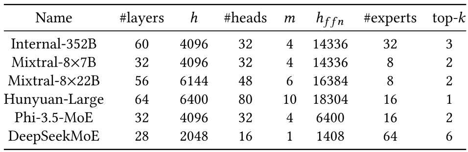

**表 2.** 评估中的模型配置.

**FP8 训练的通信压缩.** 在低精度 FP8 训练中, 计算时间缩短, 因此通信时间所占比例上升. 为缓解通信开销, 我们探索使用 FP8 精度和适当的量化技术压缩通信量. 目前, 我们在采用张量并行的 FP8 MoE 训练中应用通信压缩, 重点处理容易发生上溢或下溢的归约场景. 例如, 我们对所有张量采用 E4M3 格式 (4 位指数和 3 位尾数). 与 DP reduce-scatter 压缩类似, 我们在前向传播中用 FP8 all-to-all 取代 BF16 TP reduce-scatter, 并以 FP32 精度执行归约. 在对应的反向传播中, 我们对梯度应用 FP8 all-gather. 需要注意的是, 仅降低精度会使损失与 BF16 训练不一致. 为缓解这一问题, 我们对前向通信采用逐 token 激活量化, 对反向通信采用逐通道量化. 在反向传播中, 我们还沿 token 维度以较小的组大小 (例如 128) 进行分组量化.

## 6 评估

本节对 MegaScale-MoE 进行全面评估, 涵盖整体训练性能 ([第 6.1 节](#section-6-1)), MegaScale-MoE 主要优化的消融研究 ([第 6.2 节](#section-6-2)), 以及精度与通信协同设计的有效性 ([第 6.3 节](#section-6-3)). [表 2](#table-02) 列出了评估所用 MoE 模型的配置, 包括隐藏大小 ($h$), FFN 中间大小 ($h_{\mathrm{ffn}}$), 专家数量和 top-$k$ 值. 除非另有说明, 评估均在 NVIDIA H800 GPU 上进行, 其规格见[表 4](#table-04).

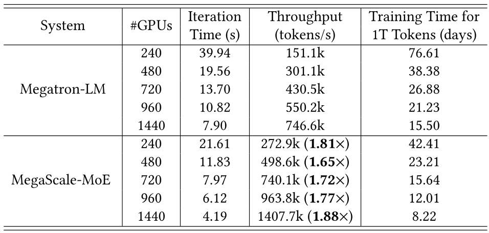

**表 3.** 使用 NVIDIA H800 GPU 训练 352B MoE 模型的强扩展性能. 吞吐量列括号内的数字表示 MegaScale-MoE 相对 Megatron-LM 的加速比.

### 6.1 训练性能

MegaScale-MoE 构建于 Megatron-LM [Sho19] 之上. Megatron-LM 是一个先进的开源 LLM 训练系统, 支持 3D 并行策略, 并持续更新以纳入社区最新的优化. 评估采用 GitHub 上 commit hash 为 f1f03922 的 Megatron-LM [Meg25]; 几个月前开始实验时, 我们因其稳定性而选择了这个版本. 为了公平比较, 我们为 Megatron-LM 和 MegaScale-MoE 使用相同的全局 batch size, 并分别为两个系统选择最优的并行配置. 具体而言, MegaScale-MoE 在每个节点内采用 SP 注意力与 EP, Megatron-LM 则在每个节点内采用 TP, 两个系统的 PP size 均设为 15. 我们调节 Megatron-LM 的配置, 以满足其所有组件必须使用统一 TP size 的要求. 如[第 3.1 节](#section-3-1) 所述, 对 Megatron-LM 而言, TP size 为 1 会产生难以承受的 $8\times$ 激活内存 (只能通过使用梯度检查点进行缓慢的重计算来解决), 而 TP size 为 8 会迫使 EP 跨节点运行, 产生比 PP 更多的通信成本. 值得说明的是, 评估中的两个系统均启用了 MegaScale [Jia24f] 中面向数据并行与流水线并行的通信与计算重叠技术. 因此, 通信开销主要来自 TP, SP 和 EP 等节点内模型并行. 序列长度为 8,192, 词表大小为 65,536.

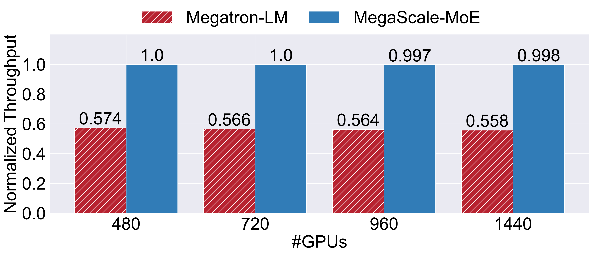

**图 12.** 使用 NVIDIA H800 GPU 训练 352B MoE 模型的弱扩展性能.

**可扩展性.** [表 3](#table-03) 比较了 Megatron-LM 和 MegaScale-MoE 在 352B MoE 模型上的强扩展训练性能. 我们增加 GPU 数量, 同时将全局 batch size 固定为 720. 在所有设置中, MegaScale-MoE 相比 Megatron-LM 均达到 1.65-$1.88\times$ 的加速. 随着 GPU 数量增加, MegaScale-MoE 的 MFU (模型 FLOPs 利用率) 从 32.48% 降至 27.89%. 这一结果符合预期, 因为 batch size 固定时, 每条流水线的 micro-batch 数量会随 GPU 增加而减少, 从而产生更多气泡.

[图 12](#figure-12) 展示了 Megatron-LM 和 MegaScale-MoE 在同一模型上的弱扩展训练性能. 我们让全局 batch size 与 GPU 数量成比例扩展, GPU 数量从 480 增至 1,440, 全局 batch size 则从 360 增至 1,080. MegaScale-MoE 的训练吞吐量达到 Megatron-LM 的 1.74-$1.79\times$. 随着规模扩大, 通信开销增加使 Megatron-LM 的吞吐量下降了 2.74%. MegaScale-MoE 则受益于全面的通信与计算重叠, 呈现近乎线性的可扩展性, 吞吐量仅下降 0.2%.

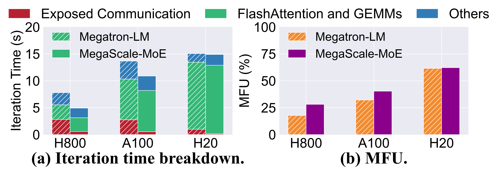

**图 13.** 在不同 GPU 上训练 Mixtral 8x7B 的性能分解.

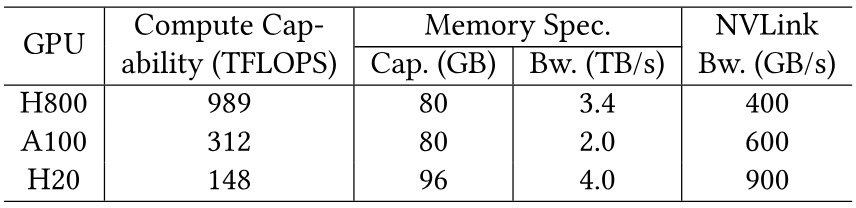

**表 4.** 不同 NVIDIA GPU 的规格.

**不同 GPU 上的性能分解.** 我们深入分析 MegaScale-MoE, 以进一步了解生产环境中训练 MoE 模型的性能. 我们分别在 32 块 NVIDIA H800, H20 和 A100 GPU 上训练 Mixtral 8x7B. 所用 GPU 的规格见[表 4](#table-04). 我们将 DP size 设为 4, Megatron-LM 的 TP size 设为 8, MegaScale-MoE 的 SP 和 EP size 设为 8. 如[图 13b](#figure-13) 所示, 在四种 GPU 上, MegaScale-MoE 的 MFU 始终高于 Megatron-LM, 最高达到后者的 $1.58\times$. [图 13a](#figure-13) 展示了 Megatron-LM 与 MegaScale-MoE 的迭代时间分解. 暴露的通信时间是未与计算操作重叠的通信时间. 我们计算 MFU 时计入 FlashAttention 和 GEMM 操作. 性能提升主要来自 MegaScale-MoE 通信高效的并行策略和细粒度重叠通信.

需要注意的是, GPU 计算能力越高, MFU 值反而越低. 这是因为 MoE 模型不同于稠密模型, 它包含路由, 本地 scatter 和 gather 等许多内存密集型操作; 内存带宽的增长没有计算能力快, 因而这些操作依然耗时. 此外, 计算能力提升时 GEMM 效率也会下降, 因为它同样依赖内存加载, 受到内存带宽限制.

### 6.2 消融研究

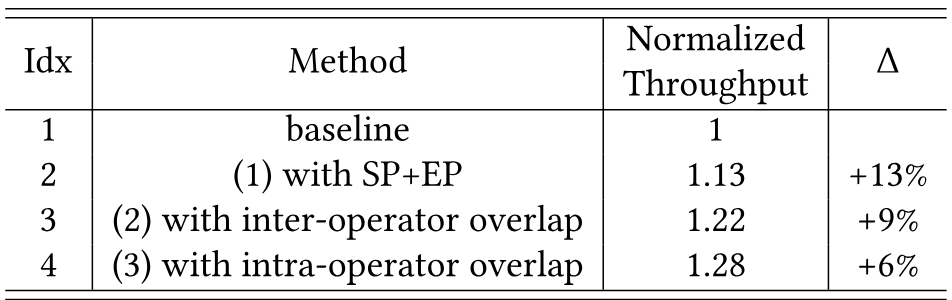

**表 5.** 使用 240 块 NVIDIA H800 GPU, 以 720 的 batch size 训练 352B MoE 模型时的吞吐量提升分解.

我们评估 MegaScale-MoE 各项优化技术的有效性. 首先, 我们进行系统性分解实验, 逐项启用每项技术, 以单独衡量其对整体性能的贡献. [表 5](#table-05) 展示了在 240 块 GPU 上以 720 的全局 batch size 训练 352B MoE 模型时, 不同优化带来的吞吐量提升分解. 基线是 MegaScale-MoE 的一个版本, 它对注意力和 FFN 均采用 TP, 并禁用通信与计算重叠. 首先, 通过应用通信高效的策略, 即对注意力采用 SP, 对专家采用 EP, 我们在该基线之上初步将吞吐量提高了 13%. 随后, 我们针对大规模 MoE 训练的主要瓶颈: 通信开销. 算子间和算子内重叠方法有效隐藏了这些成本, 分别使训练速度进一步提高 9% 和 6%.

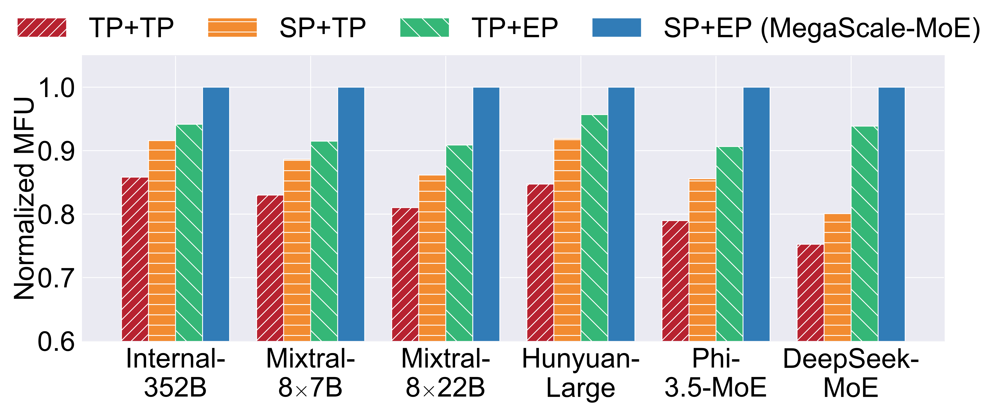

**图 14.** 不同模型的并行效率.

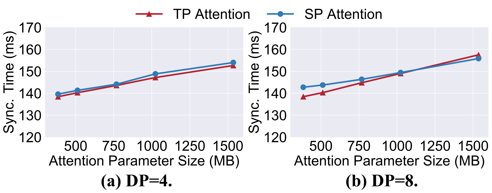

**图 15.** SP 和 TP 注意力下的参数同步时间.

在完成系统性分解后, 我们对每个组件进行消融研究, 每次改变一项设置并保持其余设置不变, 以更深入地了解其行为.

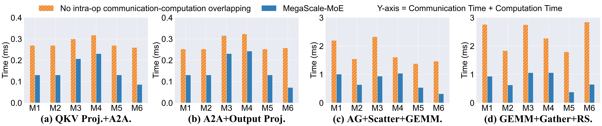

**图 16.** 每层重叠后的通信与计算时间同未重叠时间的对比. M1-M6 表示[表 2](#table-02) 中从上到下列出的 6 个模型; A2A, AG 和 RS 分别表示 all-to-all, all-gather 和 reduce-scatter.

**并行策略.** 我们使用一个配备 8 块 NVIDIA H800-SXM GPU 的节点, 比较各种节点内并行策略下的训练效率. 我们将并行策略记作 X+Y, 其中 X 表示注意力的并行策略, Y 表示专家的并行策略. 注意力可选择的并行策略包括 TP 和我们的 SP, 专家则可选择 TP 和 EP. 为了单独衡量优化并行带来的性能收益, 我们禁用了其他系统优化.

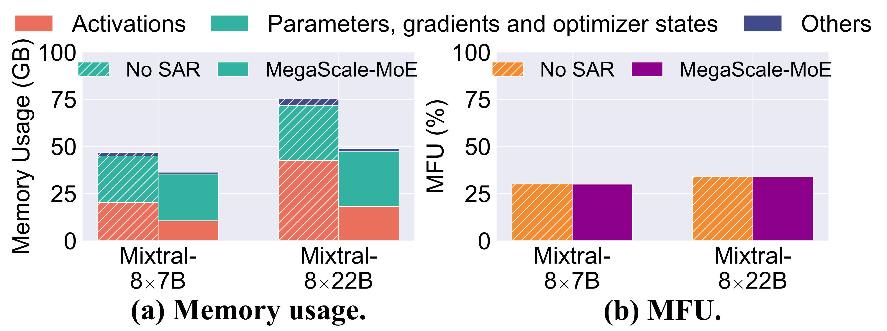

**图 17.** 选择性激活重物化 (SAR) 的消融研究.

我们测量一个内部 MoE 模型和五个开源 MoE 模型的训练 MFU, 这些模型的配置各不相同, 如[表 2](#table-02) 所列. 全局 batch size 设为 32, 我们调整每个模型的层数, 使其能够装入 GPU 内存. [图 14](#figure-14) 表明, MegaScale-MoE 的 SP+EP 并行策略始终优于其他三种并行策略, 与 TP+TP 相比, MFU 提高了 14.9%-32.9%. 性能提升主要来自两个因素. 第一, 如[第 3 节](#section-3) 所述, 与 TP 相比, SP 和 EP 能有效减少通信量, 从而降低通信开销. 第二, TP 沿中间大小维度划分 FFN 模块, 会降低 GEMM 效率.

为了更全面地评估并行策略, 我们还报告了 SP 中复制注意力参数所引入的额外开销. 在内存使用方面, 7 个模型中 SP 的内存占用比 TP 高 1.2%-5.4%, 存储参数, 梯度和优化器状态需要多用 1.7%-8.1% 的内存. 考虑到 SP 带来的显著性能收益, 这一开销仍然可控.

对于参数同步时间, 我们沿用大规模训练设置, 将 TP 或 SP size 设为 8, 从而在单个节点内有效地并行执行每一层. 每块 GPU 上的注意力参数大小在 384 MB 到 1536 MB 之间变化, FFN 参数大小则固定为每块 GPU 10 GB, 以反映典型的实际训练设置. 我们分别使用 4 个和 8 个 DP 组运行采用 SP 和 TP 注意力的 MegaScale-MoE, 对应 32 块和 64 块 GPU. [图 15](#figure-15) 表明, SP 与 TP 注意力的同步时间始终相近, 差异仅为 0.3%-3.1%. 这与我们的假设一致: SP 与 TP 在 DP 通信延迟方面应表现出相似的性能特征.

**算子内通信重叠.** 随后, 我们测量前向传播中四组主要通信算子及其对应计算算子的持续时间: $(i)$ QKV Projection 与 all-to-all 配对, $(ii)$ all-to-all 与 Output Projection 配对, $(iii)$ all-gather 与 scatter 和 GroupedGEMM 配对, $(iv)$ GroupedGEMM 与 gather 和 reduce-scatter 配对, 如[图 8](#figure-08) 所示. [图 16](#figure-16) 表明, 在全部 6 个模型上, 相较于不采用细粒度重叠的基线, MegaScale-MoE 将通信算子与计算算子的总时间缩短了 1.2-$4.7\times$. 算子内通信与计算重叠还使 MegaScale-MoE 的训练迭代时间缩短了 7.1%-12.9%.

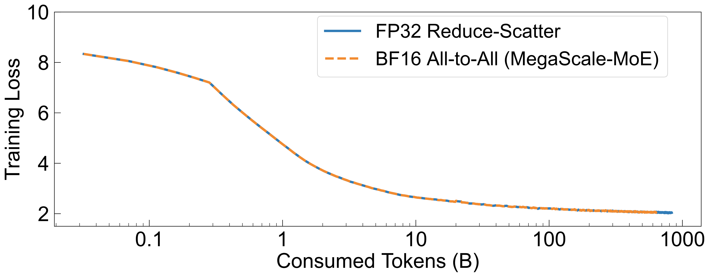

**图 18.** 采用 DP 通信压缩的 MegaScale-MoE 训练损失曲线.

**选择性激活重物化.** 我们将 MegaScale-MoE 与禁用选择性激活重物化的基线 (No SAR) 进行比较, 后者在训练期间将所有激活存入 GPU 内存. 我们在 128 块 NVIDIA H800 GPU 上训练 Mixtral 8x7B 和 Mixtral 8x22B, 以评估这两种方法. [图 17](#figure-17) 展示了内存使用分解和训练 MFU. 与 No SAR 相比, MegaScale-MoE 在两个模型上分别将激活内存消耗降低 45.5% 和 57.2%, 使总内存分别减少 21.3% 和 35%, 同时将训练性能差异保持在 0.5% 以内.

**数据并行通信压缩.** 我们按照[第 5 节](#section-5) 的说明, 使用 BF16 all-to-all DP 通信和 FP32 reduce-scatter 通信训练 7B MoE 模型, 以验证通信压缩技术的有效性. [图 18](#figure-18) 展示了训练损失曲线, 它们几乎完全相同. 该优化只压缩 batch 的累加梯度, 并且只在通信期间执行 BF16 与 FP32 之间的转换, 因而引入的风险很小.

### 6.3 模型收敛

我们使用 MegaScale-MoE 评估模型收敛性. [图 19](#figure-19) 展示了从头训练 35B MoE 模型, 以及从 checkpoint 继续训练 176B MoE 模型时的损失曲线, 其中同时给出了 BF16 和 FP8 精度下的结果. MegaScale-MoE 在 BF16 和 FP8 格式下均能确保稳定收敛和一致的训练损失.

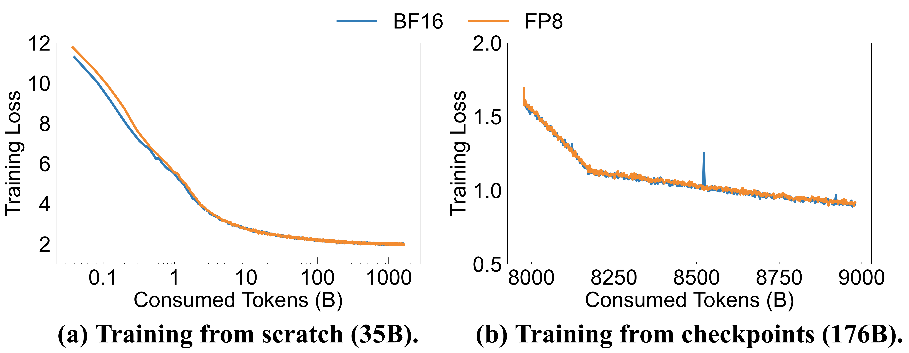

**图 19.** MegaScale-MoE 在 FP8 和 BF16 下的损失曲线.

## 7 实践经验

本节介绍我们部署和运维 MegaScale-MoE 的经验.

**部署经验.** MegaScale-MoE 已部署在我们的生产环境中, 承担公司内部大部分大规模 MoE 训练任务. 它支持训练数万亿参数的模型, 单个训练作业可扩展到 10,000 块以上的 GPU, 每项训练任务可运行数月. MegaScale-MoE 结合上述技术, 在不影响模型性能的情况下尽量减少 MoE 训练中的空闲通信时间并优化内存使用, 最终在大规模 MoE 训练中节省数百万 GPU 小时. [图 20](#figure-20) 展示了一个真实生产作业的模型收敛情况, 该作业训练一个专有 MoE 模型, 总参数量为 200B, 每个 token 激活 20B 参数. 该作业使用超过 10,000 块 GPU, 持续数月. 训练过程稳定, 损失持续收敛.

**FP8 训练.** 为保持 FP8 训练的收敛稳定性, 我们投入了大量精力. 例如, 我们观察到 SwiGLU 算子会显著扩大数值范围. 为解决这一问题, 我们用精度更高的逐 token 量化 ($1\times h$) 取代逐张量量化. 此外, 由于 SwiGLU 与门控权重相乘会进一步扩大动态数值范围, 我们将门控权重乘法后移到 FC2 输出之后, 以减少量化误差.

除了确保训练收敛, 我们还引入了其他工程优化. 现有 FP8 训练实现 [Tra25, Lia24b] 以 BF16 存储模型参数, GEMM 计算需要频繁转换到 FP8, 增加转换和转置开销. 为此, 我们使用多精度优化器直接以 FP8 存储模型参数, 同时将主参数保留为 FP32, 并为不同数据类型使用独立 buffer. 这样既减少了内存消耗, 又将数据并行中的参数 all-gather 通信减半.

**规模扩展.** 训练 MoE 模型时会产生一个有趣的工程问题: 能否在不增加计算负载的情况下, 通过增加模型参数无限扩展训练规模? 这种方法对张量并行并不可行, 因为扩大模型需要更高的 TP degree 才能容纳额外参数. 虽然增加 TP 会减少每块 GPU 上的计算, 但如[式 1](#equation-01) 和[式 4](#equation-04) 所示, 通信开销保持不变, 从而使通信时间越来越长, 训练效率越来越低. 换言之, TP 天生存在可扩展性限制, 并且常依赖高速节点内链路来缓解通信延迟.

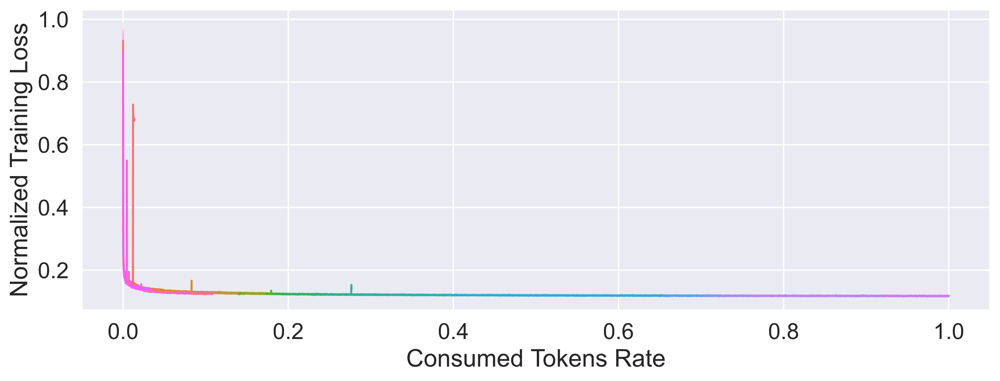

**图 20.** 一个真实生产作业的归一化训练损失曲线: 在 10,000 多块 GPU 上持续数月, 使用数万亿 token 训练每个 token 激活 20B 参数, 总参数量为 200B 的 MoE 模型. 不同颜色表示训练重启.

相比之下, 使用 SP 和 EP 扩展训练时, 如[式 2](#equation-02) 和[式 3](#equation-03) 所示, 通信量会随并行规模 $n$ 增加而减少. 这意味着从理论上说, 这种并行策略可以扩展到大得多的规模. 然而, 在实际的分层基础设施中会出现一个重要问题: 当扩展到 NVLink 域以外, 带宽降至 RDMA 水平时, 这种方法能否维持训练效率?

形式化地说, 对于引入 MoE 机制的 SwiGLU 结构, 计算时间与通信时间之比 $R$ 定义为:

$$
\mathrm{comm\_time}=\frac{2k\times bsh(n-1)/n/n}{\mathrm{bandwidth}},
$$

$$
\mathrm{comp\_time}=\frac{3k\times bsh\times h_{\mathrm{ffn}}/n}{\mathrm{peak}}.
$$

$$
R=\frac{\mathrm{comp\_time}}{\mathrm{comm\_time}}
$$

$$
=3/2\times h_{\mathrm{ffn}}\times\frac{\mathrm{bandwidth}}{\mathrm{peak}}\times n/(n-1)
$$

$$
\approx 3/2\times h_{\mathrm{ffn}}\times\frac{\mathrm{bandwidth}}{\mathrm{peak}}
$$

为了维持训练效率, FFN 的计算时间必须超过通信时间, 从而确保通信开销得到有效重叠. 因此, 我们的目标是维持 $R>1$, 由此得到两个主要结论:

- $R$ 的值与专家数量, top-$k$, 隐藏维度, 并行规模或输入大小无关, 因而可以灵活选择算法参数.
- $R$ 只由专家的中间维度, 计算峰值和通信带宽决定. 因此, 在固定硬件上, 只要专家维度足够大, MoE 模型就能从工程角度在保持训练效率的同时进行扩展.

**整体与自动.** 我们在算子间通信与计算重叠上投入了大量工程工作, 包括确定算子执行顺序, 通信与计算的并发方式, 以及为通信分配 SM. 这些人工干预让我们能更深入地理解训练动态, 从而进行针对性优化. 随着训练推进, 经验积累, 我们希望在搜索空间内自动完成算子调度, 在细粒度层面优化训练过程并获得最佳性能. 自动优化留待未来研究.

**MoE 与稠密模型训练.** 在持续优化 MoE 模型训练的过程中, 我们发现它与稠密模型训练之间有几项重要区别. 在稠密 Transformer 层中, 优化工作集中在自注意力和 GEMM 上. 前者常使用 FlashAttention [Dao22] 等技术加速, 后者属于稠密计算, 通常能在 GPU 的并行处理单元上达到较高利用率. 相比之下, 如[图 13a](#figure-13) 所示, 注意力与 GroupedGEMM 的总运行时间只占一层执行时间的大约三分之一. 其余时间由通信和其他算子占用. MegaScale-MoE 虽然有效解决了通信开销, 但我们观察到, MoE 模型中的计算算子天生比稠密模型中的同类算子更复杂, 也会导致性能下降. 具体而言, 它们是拖慢任务的主要来源, 原因有三个:

第一, 每个专家的中间维度小于稠密模型中的 FFN 层. 为了高效并发处理多个专家的计算, GroupedGEMM 使用单个 CUDA kernel 执行大量小型矩阵乘法. 该 kernel 的资源使用, 包括共享内存, L1 cache 和线程数, 通过 `cuFuncSetAttribute` 进行精细控制. 但这种细粒度控制可能引入同步延迟. 第二, 路由到各专家的 token 数量不平衡, 因此 GroupedGEMM 的输入和输出是形状动态变化的张量. 频繁分配和释放这些张量会加剧 GPU 内存碎片. 第三, MoE 门控机制涉及大量小型算子, 用于计算路由分数和传递路由决策等任务. CPU 性能抖动可能延迟这些 kernel 的启动, 甚至使启动延迟超过它们在 GPU 上的实际执行时间, 从而产生流水线气泡.

## 8 相关工作

**大模型训练.** 为满足这些模型庞大的计算需求, LLM 研究推动了可扩展, 高效且稳健的训练技术 [Ras20, Sho19, Jia24f, Zha25ax]. DeepSpeed [Ras20] 提供零冗余优化器 (ZeRO) [Raj20, Raj21, Ren21], 在参与数据并行的 GPU 之间对模型参数, 梯度和优化器状态进行分片, 使 LLM 能够在内存消耗可控的情况下扩展. Megatron-LM [Sho19] 侧重层内模型并行技术, 对每一层的参数和计算进行划分. 流水线并行将一组连续层的参数和计算分配给每块 GPU [Hua19, Nar19], 将一个 batch 拆分为多个 micro-batch, 并以流水线方式处理这些 micro-batch. MegaScale [Jia24f] 表明, 结合张量并行, 流水线并行和数据并行, 可以在前所未有的规模上高效训练数十亿参数的大模型.

**混合专家训练.** 为解决训练先进神经网络带来的计算难题, 机器学习领域越来越多地采用混合专家架构. 随后, 研究者提出了许多深度学习框架, 用于在多 GPU 集群上训练 MoE 或运行 MoE 推理. DeepSpeed-MoE [Raj22] 通过模型架构设计和压缩技术显著降低训练成本. HetuMoE [Nie22] 使用分层 all-to-all 通信策略实现性能加速. SE-MoE [She22] 侧重利用 CPU 内存和 SSD 等异构资源进行可扩展的高效训练. FasterMoE [He22] 引入一整套优化, 包括动态 shadowing, 细粒度调度和避免拥塞的专家选择策略. Janus [Liu23r] 为 MoE 模型提出以数据为中心的范式转变, 旨在降低通信需求并提高训练效率. Tutel [Hwa23] 采用自适应并行和流水线处理, 为 MoE 模型提供动态解决方案. 然而, 对于数千亿参数的模型, 它的动态并行切换和分层 all-to-all 可能产生大量开销. 为避免这些开销, 最新的 MoE 训练系统 [Dee24d, Dee24a] 使用辅助损失或路由偏置来平衡负载, 并限制跨节点 token 分发. MegaScale-MoE 将每个 MoE 层映射到节点内部, 消除了跨节点 token 分发.

最近, DeepSeek-V3 [Dee24a] 为生产规模 MoE 模型的训练引入了两项主要优化: DeepEP 用于高性能跨节点 all-to-all 通信, DualPipe 用于让通信与计算重叠. 跨节点 InfiniBand 带宽相对较低, 因此 DeepEP 将 token 分发限制在最多 4 个节点, 以维持恒定的跨节点通信量, 但这限制了路由灵活性. MegaScale-MoE 则将每个 MoE 层放在节点内部, 确保能够高效路由到任意 top-k 专家. DualPipe 利用流水线并行, 让不同 micro-batch 之间的通信与计算重叠, 这需要存储 $2\times$ 的模型参数. MegaScale-MoE 的重叠则发生在单个 micro-batch 的前向或反向传播内部, 不产生额外内存开销, 并且同时兼容采用和不采用流水线并行的系统.

**长上下文训练.** Megatron-LM [Sho19, Kor22] 选择只沿序列维度划分特定操作, 而各种序列并行方法 [Li24s, Liu23, Li23g, Gu24a] 已被用于训练需要长上下文的模型. Blockwise Parallel Transformer [Liu24w] 方法基于 online softmax 计算, 实现自注意力的分块计算和 FFN 融合. Ring Attention [Liu23, Li23g] 引入了与自注意力计算集成的环式通信机制, 以交换 key 和 value chunk. 我们采用 DeepSpeed Ulysses [Sam23] 中 all-to-all 风格的 SP 注意力, 它按 head 而非序列长度划分注意力, 因为这样通信量更少, 计算模式也更均衡.

**通信与计算重叠.** 一些框架 [Has19, Li20c, Mah23, Pen19, Zha23] 侧重在采用单一并行策略的分布式深度学习训练中让通信与计算重叠. 一些编译器风格的工作 [Jan22, Wan22b, Pat24b] 在 kernel 之间提供细粒度重叠, 但过度划分 GEMM kernel 可能导致 GPU 利用率下降. Centauri [Che24f] 通过通信划分和分层调度, 加强采用 3D 并行的 LLM 训练中的通信重叠. 与 Centauri 类似, 我们的算子间通信重叠通过重新排列算子, 将通信隐藏在独立计算中. 我们还利用算子内重叠隐藏关键路径上的通信, 同时不影响 GPU 利用率.

## 9 结论

本文深入介绍了 MegaScale-MoE 的设计, 实现和部署. MegaScale-MoE 是一个为高效训练 MoE 模型而构建的生产级系统. MegaScale-MoE 采用通信高效的方法, 包括通信量更低的并行策略, 算子间与算子内的通信与计算重叠, 以及通过调整通信模式实现的通信压缩, 从而释放高性能 GPU 的计算能力. 在 1,440 块 NVIDIA Hopper GPU 上训练 352B MoE 模型时, MegaScale-MoE 达到 1.41M tokens/s 的吞吐量, 比 Megatron-LM 提高 $1.88\times$. 我们希望通过分享加速大规模 MoE 训练的经验, 推动未来的相关研究.

## 致谢

我们感谢 shepherd Cheng Li 和匿名审稿人提出的宝贵反馈与建议. 本工作部分得到国家重点研发计划项目 2022YFB4500700, 青年教师科研创新能力支持项目 ZYGXQNJSKYCXNLZCXM-I1, 北京大学中央高校基本科研业务费专项资金, 以及国家自然科学基金项目 62172008 和 62325201 的资助. Xin Jin 和 Xin Liu 是通讯作者. Chao Jin, Xuanzhe Liu 和 Xin Jin 同时隶属于教育部高可信软件技术重点实验室 (北京大学).

## 10 附录

### 10.1 用于参数同步的分层通信

设完整注意力权重的大小为 $P$, 模型并行 (TP 或 SP) 的维度为 $n$, 数据并行大小为 $d$. 通常, 用于模型并行的 GPU 位于同一节点, 需要节点内通信; 数据并行则跨越多个节点, 需要节点间通信. 考虑一个包含 $d$ 台设备的数据并行组, 每台设备都持有相同的参数分区.

TP 注意力的参数同步会通信大小为 $P/n$ 的数据, 在 LLM 训练中主要通过 $d$ 台设备上的两个步骤完成:

- 执行节点间 `reduce-scatter` 操作, 数据大小为 $P/n$, 使用 $d$ 台设备.
- 执行节点间 `all-gather` 操作, 数据大小为 $P/n$, 使用 $d$ 台设备.

因此通信主要发生在节点之间, 通信量为 $2P/n(d-1)/d$.

对于 SP 注意力, 参数同步涉及完整的 $P$ 大小数据, 使用 $n\times d$ 台设备. 考虑到节点内与节点间网络带宽的差异, 该过程可以通过四步分层通信实现: 先在节点内归约复制的参数, 再跨节点归约, 随后将其分发回每台设备. [图 5a](#figure-05) 展示了 $n=3$, $d=2$ 时的分层通信示例. 详细步骤如下.

- 执行节点内 `reduce-scatter` 操作, 数据大小为 $P$, 使用 $n$ 台设备.
- 执行节点间 `reduce-scatter` 操作, 数据大小为 $P/n$, 使用 $d$ 台设备.
- 执行节点间 `all-gather` 操作, 数据大小为 $P/n$, 使用 $d$ 台设备.
- 执行节点内 `all-gather` 操作, 数据大小为 $P$, 使用 $n$ 台设备.

SP 注意力的节点间通信量仍为 $2P/n(d-1)/d$, 另外还有 $2P(n-1)/n$ 的节点内通信量.

而且, 由于节点内和节点间通信使用不同资源, 这些步骤可以划分为小 chunk 并进行流水线处理, 如[图 5b](#figure-05) 所示, 从而高效地相互隐藏. 节点间通信延迟与节点内通信延迟之比为

$$
\frac{1}{n}\times\frac{\mathrm{intra\text{-}node\ bandwidth}}{\mathrm{inter\text{-}node\ bandwidth}}\times\frac{n(d-1)}{d(n-1)}
$$

考虑一个使用 H100 SXM 机器的典型训练场景, 其中 NVLink 带宽为 450 GB/s, 设备间 NIC 通信带宽为 50 GB/s. 在这种情况下, 节点间通信的延迟很容易超过节点内通信. 这意味着节点内通信可以掩盖节点间通信. 因此, 在此类场景中, SP 注意力的梯度和参数同步实际上与 TP 注意力一致.
