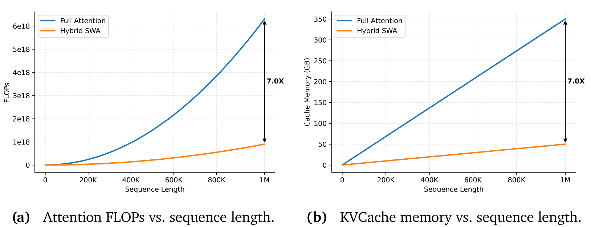
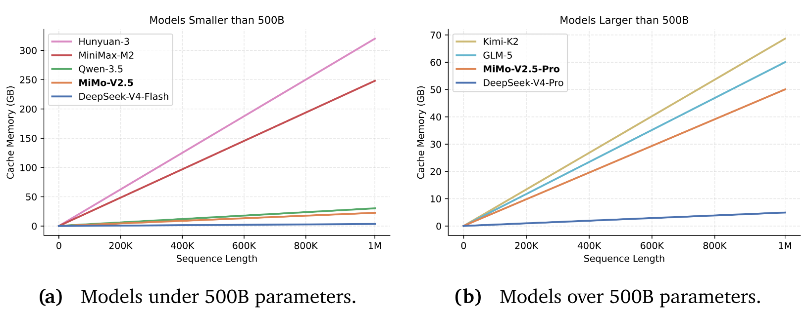
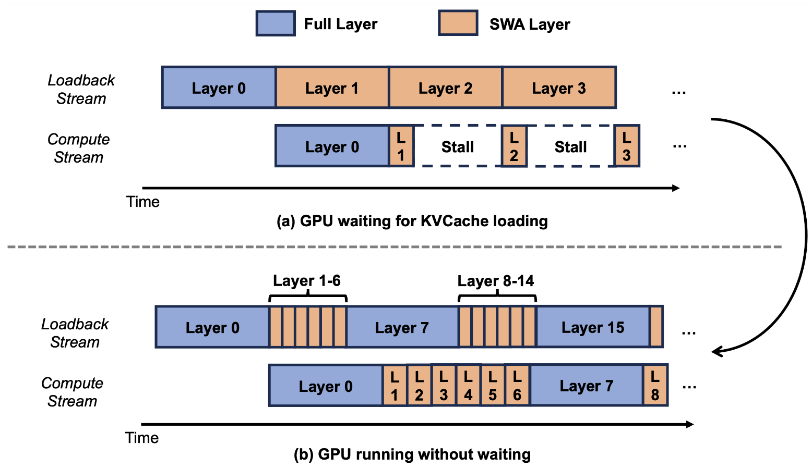
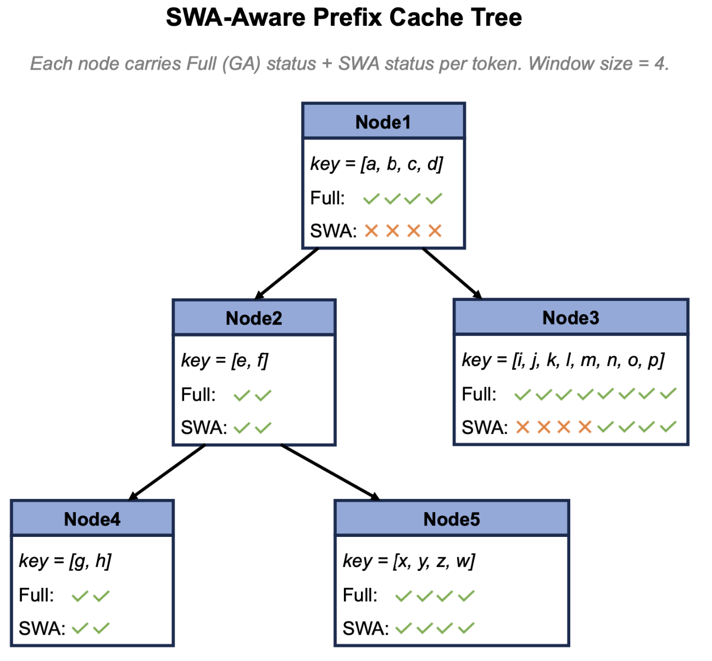
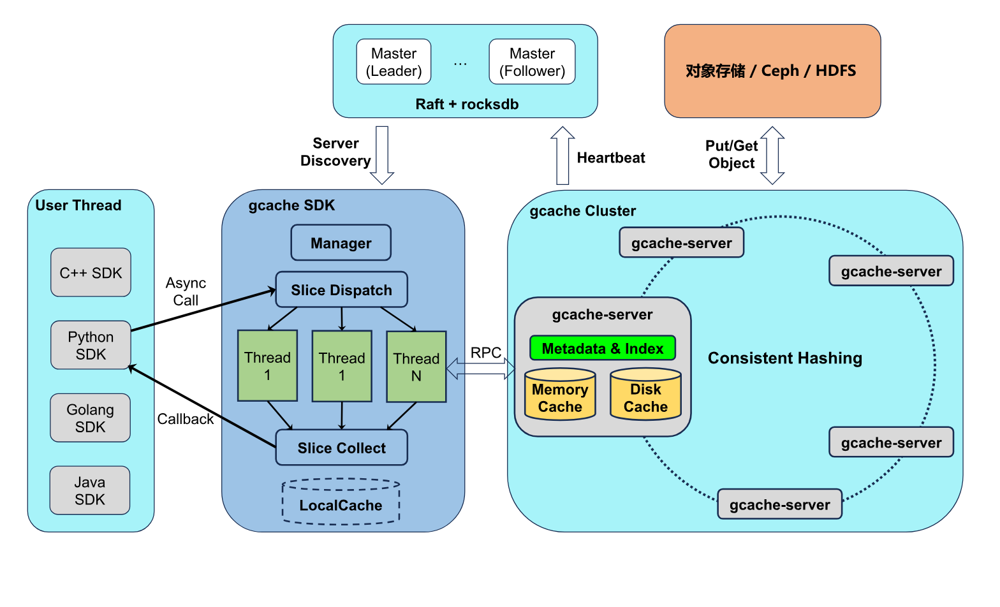
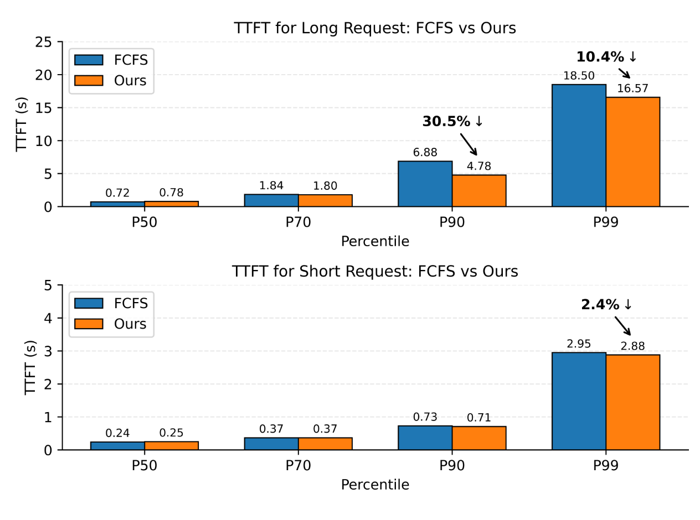
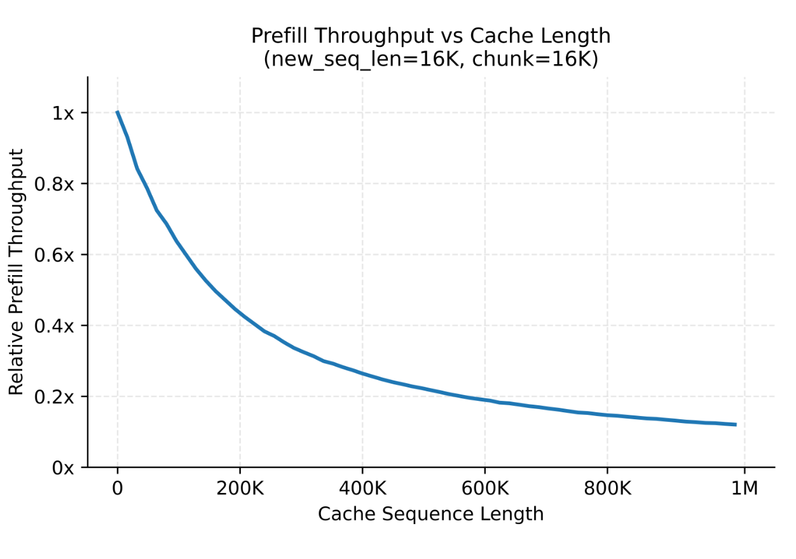
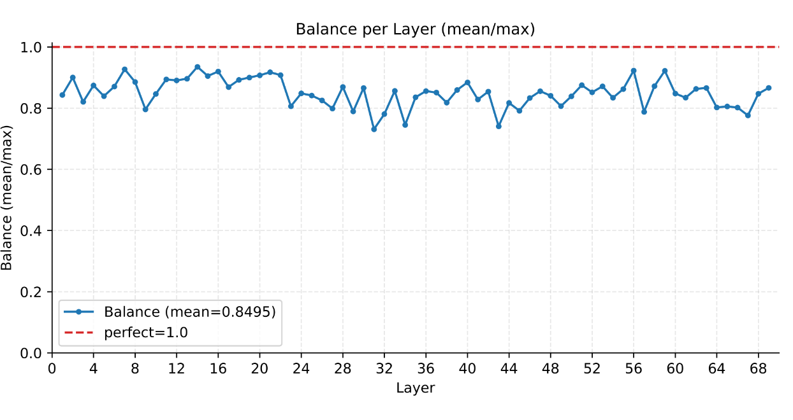
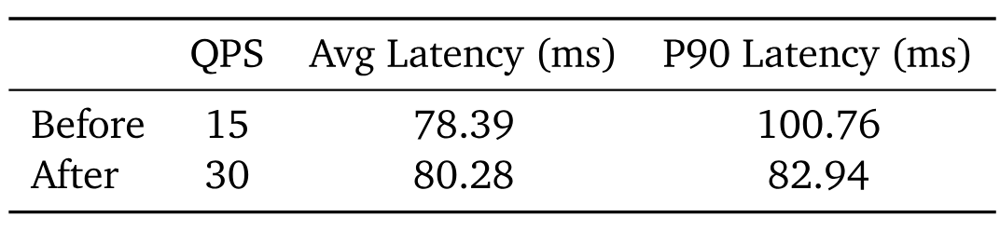

> [Xiaomi MiMo Team](https://mimo.xiaomi.com/): [Anqi Liu](https://openalex.org/A5141026052), [Aoxin Ma](https://openalex.org/A5114237559), [Bo Chen](https://openalex.org/A5141025290), [Bo Yang](https://openalex.org/A5122931632), [Chen Wang](https://openalex.org/A5141002806), [Chen Zhang](https://openalex.org/A5140990535), [Chengda Tang](https://openalex.org/A5064576050), [Chengwei Wang](https://orcid.org/0000-0001-9657-7661), [Chiheng Lou](https://orcid.org/0009-0006-1994-9947), [Depeng Yan](https://openalex.org/A5141017742), [Fuli Luo](https://openalex.org/A5141044109), [Gang Wang](https://openalex.org/A5141039897), [Hailin Zhang](https://scholar.google.com/citations?user=ca900BIAAAAJ), [Jiale Sun](https://orcid.org/0000-0003-1702-2399), [Kang Zhou](https://openalex.org/A5141004120), [Rui Huang](https://openalex.org/A5141042579), [Shaohui Liu](https://orcid.org/0000-0001-7255-0982), [Shen Huang](https://openalex.org/A5043900893), [Shijie Cao](https://openalex.org/A5140976747), [Shuaishuai Fan](https://openalex.org/A5140988287), [Tianling Zhou](https://openalex.org/A5122183403), [Xiangwei Deng](https://openalex.org/A5141028578), [Xueyang Xie](https://openalex.org/A5032999214), [Xuli Wang](https://openalex.org/A5053269508), [Yingchun Lai](https://openalex.org/A5122146186), [Yu Yang](https://openalex.org/A5140976570), [Yuan Zhang](https://openalex.org/A5141040676), [Zhen Tang](https://openalex.org/A5141029587), [Zhonghua Deng](https://openalex.org/A5141014135), [Zihan Jiang](https://openalex.org/A5141002085). 论文于 2026 年 7 月 14 日首次提交至 arXiv; 当前版本为 v1. [Full-Pipeline Inference Optimization for MiMo-V2.5 Series: Pushing Hybrid SWA Efficiency to the Limit](https://arxiv.org/abs/2607.13095v1). [原始 PDF](/paper/mimo-v2-5-inference.pdf). [DOI](https://doi.org/10.48550/arXiv.2607.13095). [TeX 源码](https://arxiv.org/src/2607.13095v1). 精确的印刷版式和参考文献以原始 PDF 为准.

## 摘要

本文介绍一套面向 MiMo-V2.5 模型家族的全流水线推理优化方案, 该系列结合了混合滑动窗口注意力 (Hybrid SWA), 稀疏混合专家 (MoE) 和多模态编码器. 与全注意力相比, Hybrid SWA 在理想情况下可以大幅降低注意力计算量和 KVCache 存储量, 但要在生产环境中真正获得这些收益, 仍需投入大量工程工作. 我们通过逐层预取, SWA 感知前缀缓存树和专用放置策略系统优化 KVCache 系统, 实现严格的 $O(W)$ SWA 存储复杂度和较高的缓存命中率. 我们还构建了 GCache, 一套采用 RDMA 网络优化的高性能分布式缓存基础设施, 并开发 KVCache 亲和路由器, 在保持负载均衡的同时减少计算量. 对于多模态输入, 我们也优化了 GPU 图像预处理, 并行视频解码和多模态缓存共享. 这些优化共同构成首个投入大规模生产的 LLM 服务系统, 能够高效支持 Hybrid SWA + MoE + 多模态的复合架构.

## 1 引言

MiMo-V2.5 模型家族包括 MiMo-V2.5 [Mim26a] 和 MiMo-V2.5-Pro [Mim26], 融合了多项架构设计: 混合滑动窗口注意力 (Hybrid SWA) 将 KVCache 存储量压缩至全注意力的约 1/7; 稀疏 MoE 激活在保持模型容量的同时减少每个 token 的计算量; 多模态编码器则支持对视觉, 音频和视频的跨模态理解. 这些特性让 MiMo-V2.5 系列在长上下文和多模态场景中兼具性能与效率潜力.

我们的目标从一开始就很明确: 训练一个既强大又能高效进行长上下文推理的模型. 这两个目标天然存在张力. 强推理能力需要对长距离依赖建模, 通常意味着更大规模的注意力计算和更高的 KVCache 开销. 在传统全注意力架构中, 注意力计算量和 KVCache 存储量都会随上下文长度迅速增长, 使长上下文训练与推理的成本高得难以承受. Hybrid SWA 在不同层之间交错使用局部滑动窗口注意力 (SWA) 和全局全注意力: 大多数层只在局部窗口内计算注意力, 少数关键层则保留全局视野. 从理论上看, 这种结构能将注意力复杂度降至接近线性, 同时保留长距离依赖建模能力.

不过, 架构上的理论优势不会自动转化为生产效率. Hybrid SWA 给 KVCache 命中率管理, 前缀匹配和全注意力层与 SWA 层之间的双重语义一致性带来了新的复杂性. 实际工程系统还要面对多级存储间的数据移动, 异步预取与调度错位, 分布式缓存状态难以同步等问题, 因此很难直接兑现理论收益.

除 Hybrid SWA 外, MoE 对分布式调度和负载均衡提出了很高的要求, 多模态编码器在大图像和长视频场景中也仍是吞吐瓶颈. 调度策略以及 Prefill/Decode 执行流水线同样需要细致优化. 本文介绍 MiMo-V2.5 系列推理系统的端到端工程实践, 涵盖 KVCache 管理, 分层缓存系统, SWA 感知前缀缓存树, 调度策略, Prefill/Decode 执行流水线和多模态优化, 在生产环境中系统兑现该架构的理论效率潜力, 尤其是 Hybrid SWA 的潜力.

## 2 背景

在展开具体优化之前, 我们先量化 Hybrid SWA 的理论效率边界, 也就是这一设计选择背后的架构依据, 以及衡量后续所有优化的基线.

### 2.1 计算分析

以 MiMo-V2.5-Pro 为例, 模型共有 70 层: 10 个全注意力层和 60 个 SWA 层, 滑动窗口大小为 128. 下图给出了 Hybrid SWA 相对于全注意力的计算成本. SWA 层占总层数的 6/7, 因此 Hybrid SWA 架构的总计算量约为全注意力的 1/7. 在 Prefill 主要受计算限制的 Chunked Prefill 场景中, 这会直接按比例降低 Prefill 成本.

### 2.2 KVCache 存储分析

SWA 层只需保留滑动窗口内的 KV, 无需保留完整序列, 因此 KVCache 内存用量也会降至接近 1/7. Decode 阶段主要受内存限制, 其延迟与读取模型参数和 KVCache 的总字节数成正比. 对长序列而言, KVCache 体积可能远超模型参数, 所以 KVCache 存储量的降低几乎会直接转化为长序列场景下 Decode 成本的下降, 使用稀疏注意力并减少每个 token 的 KV 访问量的模型除外.

**图 1.** MiMo-V2.5-Pro 上 Hybrid SWA 的理论效率分析. 与全注意力相比, 注意力计算量和 KVCache 存储量都减少约 $7\times$.

不同模型架构的 KVCache 存储量差异很大. [图 2](#figure-02) 比较了两个参数规模组中的代表性模型: 参数量低于 500B 的模型和高于 500B 的模型. 模型配置取自各自的官方检查点 [Dee26a, Dee26b, Min25, Kim25c, Qwe26, Hy26, Mim26a, Mim26, Zen26]. 在各自组内, MiMo-V2.5 和 MiMo-V2.5-Pro 的预计 KV cache 内存需求均为第二低, 分别仅高于 DeepSeek-V4-Flash 和 DeepSeek-V4-Pro.

**图 2.** 不同模型架构的预计 KVCache 内存与序列长度关系.

需要注意, 实际成本差异并不严格对应 KVCache 大小的比值, 因为还存在不随序列长度变化的固定计算和内存访问成本. 不过在长上下文场景中, 整体趋势仍然成立: **短序列的收益有限, 序列越长, 推理成本优势越大**.

## 3 KVCache 系统重构

MiMo-V2 和 MiMo-V2.5 系列是较早采用 Hybrid SWA 架构的模型, 但当时主流开源推理框架和缓存系统都没有提供完整的 SWA 支持. MiMo API 上线时, 我们选择 SGLang v0.5.5 [Zhe24] 作为服务后端代码库, 随即遇到一个严重问题. 该版本中 SGLang 的 HiCache 不支持 SWA; 更准确地说, 早期 SWA 支持为了保持兼容性, 仍会存储完整 KVCache. 虽然有一些变通方法可以改善 SWA 的可用性, 但我们希望构建一套性能上限更高, 也更易用的 KVCache 系统.

### 3.1 SWA KVCache 管理

#### 3.1.1 KVCache 双池设计

Hybrid SWA 带来一个根本性的存储冲突: 全注意力层需要存储完整序列的 KV ($O(N)$), SWA 层只需维护滑动窗口内的 KV ($O(W)$). 采用传统的单 KV 池设计时, 系统必须按 $O(N)$ 为所有层分配 GPU 内存, 无法利用 SWA 的窗口稀疏性, 实际上退化为接近完整 KVCache 的实现.

一个自然的解决办法是将 KVCache 拆分为全注意力和 SWA 两个独立池, 同时在系统层提供统一抽象:

- **物理层:** 分别维护 Full KV 池和 SWA KV 池. SWA 池只按窗口大小配置, 支持基于窗口独立淘汰, 从而将 SWA 存储量严格限制为 $O(W)$. 该机制也延伸到 L2 和 L3 存储层级.
- **逻辑层:** 向上层 (前缀树, 调度器, 传输协议) 暴露单一序列视图, 以全注意力索引为权威依据, 并维护 Full $\to$ SWA 映射, 对分层存储透明.
- **调度约束:** 系统接纳请求时会同时验证 Full KV 和 SWA KV 的容量约束, 避免单维检查造成资源误分配.
- **数据移动:** 跨层级传输完全依据 SWA mask 执行, 只移动窗口内的有效数据, 避免消耗多余带宽.

借助该设计, SWA KVCache 在系统层实现严格的 $O(W)$ 存储约束, 将整体 KVCache 容量效率提高 **约 $7\times$**, 释放 Hybrid SWA 的结构优势. 主流推理框架也采用了类似的实现方式.

#### 3.1.2 逐层 KVCache 预取

完成 SWA KVCache 存储优化后, SWA 层只需预取极少量的 KVCache. 这样一来, 通过逐层调度, Host-to-Device KVCache 预取几乎可以与计算完全重叠, 将推理时读取缓存的成本降至接近零.

**图 3.** 逐层 KVCache 预取: (a) 计算流停顿并等待 KVCache 加载; (b) SWA 感知逐层调度让加载和计算重叠, GPU 无需等待即可运行.

#### 3.1.3 SWA 感知前缀缓存树

传统 RadixAttention 的命中规则建立在一个简单假设上: token 序列相同 $\to$ KV 相同. 该假设在全注意力下成立, 只要两个请求具有相同的 token ID, 相应 KV 就一定仍在池中, 可以直接复用.

但该假设在 SWA 下不再成立. 原因在于前缀树的逻辑生命周期与 SWA KV 的物理生命周期不一致. 前缀树节点长度不受 SWA 窗口限制, 节点的序列长度可以短于窗口, 也可能长得多; 节点还会随请求合并, 拆分和移除不断变化. 因此, 一个前缀树节点在逻辑上可能仍表示完整 token 序列, 与之对应的 SWA KV 却可能只剩尾部, 甚至已被完全淘汰. 如果前缀树仍按 "token 相同 $\to$ 命中" 规则给出可复用长度, 调度器可能收到一个尾部 KV 已被淘汰的伪命中, 后续注意力计算就会读取无效或已被覆盖的槽位, 直接损害模型正确性.

为了在 SWA 下正确而高效地复用前缀, 必须从三个方面修改前缀树语义:

1. **将匹配规则升级为 "窗口安全长度":** 除 token 相同外, 尾部 $W$ 个 token 在 SWA 池中还必须有有效槽位. 匹配长度会截断到这个新边界, 超出部分均视为未命中. 这样可以保证从命中片段中取出的 KV 始终有效.
1. **将淘汰与请求生命周期绑定:** 长 Prefill 每完成一个 chunk, 请求结束, 以及 Decode 每生成 $N$ 个 token 时, 都会触发窗口外 SWA 的释放. 在长上下文或长输出任务中, SWA 池用量因此会保持在 $W$ 或 chunk 级别, 而不会随序列长度增长.
1. **节点携带双重索引:** 每个前缀树节点记录两组信息, 即全注意力片段索引 (决定逻辑顺序并参与全注意力层计算) 和 SWA 片段映射 (决定窗口安全性). 两者的淘汰分别管理: 可以单独淘汰窗口外的 SWA 片段, 同时保留全注意力片段, 让全注意力层仍可复用该前缀; 也可以淘汰整个片段.

SWA 将 KV 体积压缩到 1/7, 带来容量层面的收益; 命中率则带来复用层面的收益. 两者共同决定实际的 Prefill 计算成本曲线. 引入 "窗口安全长度" 匹配规则后, 给定 token 容量下的原始命中率会略微降低, 但相同存储预算可容纳的 token 数量会增加数倍. **按固定存储预算衡量, 有效命中率会显著提高.**

**图 4.** SWA 感知前缀缓存树: 每个节点按 token 携带全注意力状态和 SWA 状态, 窗口大小为 4; 节点会跟踪尾部哪些 token 仍有有效 SWA 槽位.

#### 3.1.4 KVCache 命中率优化

三个 HiCache 层级全部重构为 SWA 感知后, 设备, 主机和存储后端各自维护 "哪些位置具有有效 SWA" 的状态. 但 HiCache 的数据移动流水线是异步的, 不同部署的缓存不一样, 会话间共享前缀长度也各不相同; 各层级中的全注意力 Cache 和有效 SWA 索引很容易失去同步. 按照 SWA 感知前缀缓存树的匹配规则, 如果序列命中全注意力 Cache 却未命中 SWA Cache, 匹配长度就会被大幅截断: 截断越多, 需要重新计算的内容越长, SWA Cache 优化效果越差. 因此, 我们针对不同场景优化了分布式一致性和缓存命中率:

**Device 完整, Host 缺失.** 当 L3$\to$L2 预取因带宽和延迟权衡只拉取尾部片段, 或 L1 前缀树重组未同步至 L2/L3 时, 就会出现这种情况. 我们会在前缀树节点合并和 Prefill 完成等时机, 主动检查 Device 与 Host 之间的 SWA 占用差异, 在 Host 的 SWA 池中分配补充槽位, 再通过 D2H 传输异步写入 Device SWA KV.

**Host 完整, Device 缺失.** 下一次 H2D 传输时自然对齐, 无需主动修复.

**高频序列的 L3 前缀被淘汰.** 长序列头部因高频访问而长期留在 L1/L2, 缓存亲和会将相同前缀的请求路由到同一节点. L3 Cache 长时间没有直接访问, 可能被存储淘汰策略清除, 过早释放全局高频序列的 L3 Cache, 严重影响跨机器复用. 我们会在访问 L1/L2 Cache 时定期查询 L3 Cache, 防止它过早淘汰.

**中短序列 SWA 保留策略.** 根据用户请求模式, 对中短序列, 我们会在固定长度位置保留相对密集的 SWA KV Cache. 提高 SWA 密度虽然会增加 SWA 在整体 KVCache 中的占比, 但能直接改善多用户共享系统提示等场景.

这些优化将 KVCache 容量扩展转化为更长的有效命中长度, 使跨会话的长前缀复用成为可能, 对长 Agent 会话, 多用户共享系统提示以及面向同一代码库的重复工具调用尤其有利.

### 3.2 GCache: 高性能分布式缓存基础设施

GCache 是小米存储团队开发的高性能通用缓存系统, 也是统一训推存储架构的重要组成部分. 早期在训练场景中, 存储团队发现一些开源缓存项目对分布式文件系统的加速能力有限, 无法充分发挥性能潜力, 因而开始自研解决方案. 后来随着 MiMo 大模型发布和推理服务上线, 团队将 GCache 改造成独立存储产品, 用于模型分发, 同时作为推理引擎的 L3 KVCache.

GCache 同时支持文件和 KV 语义, 支持跨内存, 磁盘和远端层级的多级缓存, 共享内存持久化与全路径零拷贝, 高并发非阻塞 IO 和 RDMA 通信; 在保持良好扩展性的同时, 满足上层服务对高吞吐和低延迟的要求.

#### 3.2.1 架构设计

[图 5](#figure-05) 展示了 GCache 的整体架构. GCache 有以下几个主要特性:

1. **去中心化元数据管理** 支持集群无限扩展: 通过对 key 做一致性哈希来确定存储位置. Master 采用基于 Raft 的高可用部署, 但只负责心跳和服务发现, IO 路径不经过 Master.
1. **服务端同时支持内存和磁盘缓存:** 内存中的冷数据会淘汰至磁盘, 磁盘中的热数据会提升至内存. 这种方式很适合推理场景, 可以自动保证活跃会话的性能, 同时降低长期空闲会话的成本. 缓存条目持久化到共享内存, 服务重启不会丢失缓存. 扩容或缩容也可以平滑完成, 不会丢失缓存.
1. **多语言 SDK 使用专用线程** 对请求进行切片和分发: 这些线程不占用用户线程资源; 切片可以提高并发度, 并将 IO 大小控制在适合 RDMA 的范围. 线程使用异步回调, 回调粒度可以灵活设为单个 KV, 批次或 CUDA stream.

**图 5.** GCache 架构: SDK 将切片后的请求分发到按一致性哈希组织的 gcache-server 集群; 基于 Raft 的 Master 负责服务发现, 后端使用对象存储 (Ceph/HDFS).

#### 3.2.2 网络优化

当前主流 GPU 机器配有 $8\times$ 400G 高性能网卡. 不过, 即使采用 Prefill-Decode (PD) 分离部署, 现有推理框架仍难以跑满网络带宽, 业界甚至开始呼吁降低网卡规格来节省成本.

为了充分利用高速网络, GCache 通信优先使用 GPU 网卡而不是前端网卡, 并在通信模块中实施大量优化, 包括 NUMA 绑定和同 rail 亲和. 基准测试中, IO 大小为 1MB 时, 单进程 RDMA 读取吞吐达到 170 GB/s, 延迟仅为 280 $\mu$s; 在 GDR 场景下, 得益于更高的 HBM 带宽, 单进程吞吐约为 350 GB/s, 足以满足推理框架的通信需求.

#### 3.2.3 存储成本优化

2026 年, 业界越来越关注存储成本. 与其他供应商使用专用存储机器不同, GCache 优先与 GPU 机器混合部署, 接管 Prefill 和 Decode 节点的一部分内存以及机器内置的 NVMe SSD, 从而实现零额外存储成本.

#### 3.2.4 可靠性保障

由于采用混合部署, GPU 机器的高故障率构成可靠性挑战. GCache 上线以来, 几乎每天都会遇到宿主机故障. 首先, 团队投入大量精力强化故障处理逻辑. 其次, 由于 key 通过一致性哈希完全分布, 预先把会话 ID 分成逻辑集合, 可以保证相关会话分散在不同节点, 减小单节点故障的影响范围. 第三, 借助底层平台的硬件检测能力, 系统可以主动发现故障并自动迁移数据. 对于极少数无法主动处理的突然崩溃, 较短的 SDK 超时可以让推理框架及时发现未命中并重新计算, 基本不影响在线推理.

基于这些工作, GCache 在混合部署下仍采用单副本存储, 无需多副本冗余来保证可用性, 这是其存储成本较低的重要原因.

### 3.3 关于缓存命中率的讨论

借助上述 SWA KVCache 优化, 即更小的存储占用配合更稳定, 容量更大的 GCache L3 存储, 我们得以大幅延长 Cache TTL (Time-To-Live), 提高 KV Cache 命中率. KVCache 淘汰归根结底源于存储容量约束. 当容量接近饱和时, 系统会优先保留新请求的 KV Cache, 并使用类似 LRU 的策略淘汰之前访问过的条目, 导致同一上下文在几小时后复用时经常无法命中. SWA 的存储占用很小, 相同成本可以保留数倍于以往的并发请求缓存, 大容量 L3 还能以较低成本进一步扩充可用容量. 存储空间越多, KVCache 淘汰压力越小, 保留时间也越长. TTL 变长会扩大历史上下文的命中窗口, 缓存命中率也随之上升. SWA 降低了带宽传输开销, 虽然不直接影响 TTL, 却大幅降低跨层级数据移动成本, 保证整个缓存系统稳定高效运行.

自模型上线以来, 我们持续观察服务端指标: 在主流的高质量 harness 框架下, **服务端 KV Cache 命中率平均为 93%**; 对于持续高强度使用的重度用户, 该指标还会更高, 达到 95% 以上. 后续我们会继续迭代 SWA 的 KV Cache 管理逻辑, 并与更多 harness 框架开展 harness-inference 协同设计, 进一步提高命中率上限.

## 4 调度优化

早期 SGLang 社区的路由服务尚不成熟, 不同实例之间没有共享状态. 如果某个路由服务意外故障, 或请求被路由到另一个路由实例, KVCache 调度就会退化. 为解决该问题并保证大规模集群部署的高可用性, 小米开发了 LLM-Router, 一套以 Redis 为集中存储, 可动态扩展的无状态调度器; 单个服务故障后不会再引起 KVCache 退化, 缓存命中率也能得到持续保证.

### 4.1 KVCache 与负载亲和调度

HiCache 对 L2 命中率非常敏感. L2 Cache 未命中时, 系统必须从 L3 查找并拉取 KVCache, 等待拉取完成后才能开始推理. 在路由侧提高 L2 命中率可以减少不必要的同步等待, 直接提升吞吐.

路由器通过在 Radix 前缀树中维护已分发的请求, 实现 KVCache 亲和调度. 在多个 Prefill 实例之间, 它优先选择已经缓存当前请求前缀的节点, 同时平衡负载, 避免负载向热点倾斜. 该策略部署后, L2 缓存命中率提高约 **25%**, 单节点输入吞吐提高约 **30%**. 核心公式大致如下:

$$
\mathrm{score}(\mathrm{worker}) = \mathrm{matchWeight} \times \mathrm{prefixMatchPercentage} - \mathrm{normalizedLoad}
$$

### 4.2 TTFT 优化

模型服务出现排队时, 传统 FCFS (First Come First Serve) 策略不会考虑缓存命中率较高和较低的请求之间的优先关系. 缓存命中率较高但计算量较小的请求, 可能要等待命中率较低的请求完成推理, 导致 TTFT P99 异常延长, 同时拖低平均吞吐.

为解决这一问题, 路由器从等待队列中调度时, 会优先处理未缓存 token 较少的请求, 防止缓存友好型请求被较慢的请求阻塞, 进而引起 P99 退化. 但该策略可能使某些请求一直无法得到执行, 因此我们加入等待时间惩罚机制来缓解饥饿. 如[图 6](#figure-06) 所示, 结果表明该策略不会降低较短请求的服务质量, 同时能让较长请求的 **TTFT P90 最多降低 30%**.

**图 6.** FCFS 与本文调度策略在长请求 (上) 和短请求 (下) 上的 P50/P70/P90/P99 TTFT 比较: 长请求 P90 降低 30.5%, 短请求 TTFT 基本不变.

## 5 Prefill 优化

### 5.1 并行配置

理论上, Prefill 阶段采用较小的 EP (Expert Parallelism) 能从三个方面提高性能和吞吐: 跨机器规模更小, 通信开销更低; DP (Data Parallelism) 实例更少, 减轻 DP 间注意力负载不均衡的影响; 每台机器容纳更多专家, 改善 MoE 负载均衡. 但 EP 大小受 GPU 内存限制, 内存必须同时容纳模型参数和 KVCache. 过去 SWA KVCache 必须存储所有 token 的 KVCache, 迫使系统使用较大的 EP; 优化后只需存储 SWA 窗口内的 token, 因而可以把 EP 缩小到原来的一半, **端到端性能提高约 40%**. 后续我们会继续研究 Hybrid SWA 结构的 PP (Pipeline Parallelism) 优化, 进一步减小 EP 并提高整体吞吐.

### 5.2 长度分桶策略

MiMo-V2.5 系列的混合架构相比纯 GQA 显著提高了计算效率, 但吞吐仍会随序列长度增加而明显下降. [图 7](#figure-07) 展示 Chunked Prefill 在计算 chunk 固定为 16K token, 前缀长度不同时的吞吐.

**图 7.** 计算 chunk 固定为 16K 时, 相对 Prefill 吞吐与缓存序列长度的关系: 吞吐从前缀接近零时的 $1\times$, 降至前缀为 1M token 时的约 $0.12\times$.

在 Agent 场景中, 超长请求主要来自多轮 Agent 交互, 通常带有大量前缀缓存. 长度差异很大的请求被调度到同一模型实例时, 短请求会受长请求制约, 整体吞吐下降, 主要有以下两种情况:

1. **DP-Attention 同步:** 每层注意力计算完成后, 多个 DP 必须通过集合通信同步, 然后才能进入 MoE 阶段. 同一 EP 组的不同 DP 上同时存在长短请求时, 短请求会被长请求的计算拖慢.
1. **Chunked Prefill 干扰:** 前缀长度不同的请求被分入同一 chunk 时, 短前缀请求会被长前缀请求的计算拖慢.

为缓解这些负载不均衡问题, 我们采用 **三级长度分桶策略** (0-64K / 64K-256K / 256K-1M), 将负载特征相近的请求聚合到同一桶中计算, 显著提高生产环境中的平均 Prefill 吞吐. 在此基础上, 我们正在探索粒度更细, 更灵活的分桶机制, 以适应动态生产负载.

### 5.3 MoE 负载均衡

MiMo-V2.5 系列的所有模型都采用 MoE 架构, 因此 Prefill 阶段需要考虑专家负载均衡. 预训练阶段引入了负载均衡训练目标, 训练过程也比较稳定, 模型因而学到了相当均匀的专家路由策略. 推理时即使不启用任何专家负载均衡策略, 每层的平均专家负载因子 (所有 rank 的平均 token 数与该层任一 rank 的最大 token 数之比) 也约为 0.85, 已经说明分布较为均衡. 因此, 我们目前没有加入专家负载均衡策略. 我们会继续监控该指标, 并根据生产负载的变化按需引入相关优化.

**图 8.** 所有层的逐层专家负载均衡情况 (平均/最大 token 数之比), 平均值为 0.8495, 接近理想值 1.0.

### 5.4 解决 NUMA 冲突

某些 Ubuntu 系统中的 `numa_balancing` 内核参数会与 SGLang 的 numa-node 配置冲突, 导致模型推理期间的计算 kernel 之间偶发较大的执行间隔. 在多节点多 GPU 部署中, 这些间隔会随机出现在不同 rank 上, 每次 rank 间同步又会受最慢 rank 限制, 严重影响整体推理效率. 禁用系统内核的 `numa_balancing` 参数后, 问题得到解决, **端到端性能提高约 10%**.

## 6 Decode 优化

### 6.1 GPU 内存优化

在 Agent 场景中, 多轮对话会让上下文不断增长, KVCache 的 GPU 内存用量成为 Decode 的主要瓶颈. KVCache 填满内存后, batch size 无法继续扩大, GPU 计算单元不能得到充分利用, Decode 吞吐受限; 为维持吞吐, 需要更多节点, 推理成本也随之上升. 为提高单节点并发度, 我们实施了多项内存优化:

1. **Decode KVCache SWA 支持:** KVCache 有效容量提高到 **${\sim}5\times$**.
1. **PD 分离 KVCache 预分配优化:** 将传入请求的 KVCache 预分配从 GPU 内存移至 CPU 内存, 仅在 Decode 真正开始时才传输到 GPU 内存, 消除资源过量预留造成的浪费.
1. **CUDA Graph 内存调优:** 优化 CUDA Graph 参数以减少内存浪费, 提高 KVCache 容量.

### 6.2 MTP 优化

MiMo-V2.5 系列原生支持 3 层 MTP (Multi-Token Prediction) 来加速 Decode 输出, 但之前 Prefill 没有启用 MTP, 导致 Decode 最初输出的 128 个 token 在 MTP 层中没有有效 KVCache, 预测接受率很低. Agent 场景的输出序列大多较短, 因而该限制严重制约了 MTP 的实际加速效果. 在 Prefill 阶段引入 MTP 支持, 并专门适配和优化 HiCache L2/L3 后, Decode 早期阶段的 MTP 加速效果大幅改善: **0-128 token 加速达到 $2.3\times$, 128-256 token 加速达到 $1.5\times$**, 有效降低 Agent 场景中的实际 Decode 成本.

## 7 多模态推理优化

基于 SGLang 社区 v0.5.7 的 EPD 设计, 我们针对 MiMo-V2.5 系列的 EPD 分离实施了一系列工程优化和稳定性修复, 在延迟没有退化的情况下将 **Encoder 吞吐提高一倍**. 我们正在把这些改动上游合并至 SGLang (issue #24945). [表 1](#table-01) 汇总了优化前后的 Encoder 性能.

**表 1.** 优化前后的 Encoder 性能.

### 7.1 架构优化

- **让多模态 embedding 传输与推理重叠:** 在 Prefill 调度器主循环中, 我们支持跨 TP rank 异步复制多模态 embedding 数据, 并让复制与 Prefill 推理重叠, 减少 GPU 空闲时间.
- **Encoder 数据并行:** Encoder 模型相对较小, 设置 $\mathrm{TP}>1$ 会降低性能. 我们以 $\mathrm{TP}=1$ 部署 Encoder, 同时支持数据并行, 简化单机 8-GPU 部署和运维.
- **Encoder 跨请求 batch 支持:** 我们为 EPD Encoder Server 引入跨请求 batching. Encoder 调度器按模态聚合并发请求, 将多个请求的图像或音频合并到一次前向传播中, 随后按请求拆分并返回结果, 解决逐请求编码导致 GPU 利用率较低的问题.

### 7.2 预处理优化

- **GPU 图像预处理:** 对大图像在 CPU 上执行 resize/normalize/patchify 会显著增加端到端延迟, 因此我们将预处理移植到 GPU, 消除 CPU 瓶颈.
- **并行图像下载和解码:** 我们采用多进程下载和 PIL 解码, 避免串行下载和 GIL 竞争造成的延迟.
- **多模态下载与前向传播并行:** 初版 Encoder 实现中, batch 之间以及 batch 内部的数据下载和推理都是串行的, 下载期间 GPU 一直空闲. 我们使用消息队列将下载与推理解耦, 使一个 batch 内的下载和推理能够重叠.
- **并行视频解码:** 我们将帧提取索引均匀分成 $N$ 个 chunk, 每个 chunk 启动一个独立 VideoDecoder, 再由并行线程完成解码, 把 1 小时视频的 Encoder 端到端延迟 **从 156 s 降至 23 s**.

### 7.3 缓存优化

- **Encoder 一致性哈希:** 存在多个 Encoder 时, Prefill 以轮询方式选择 Encoder 会降低多模态缓存命中率. 我们通过一致性哈希将具有相同 key 的请求路由到同一 Encoder, **缓存命中率提高 30%**.
- **节点内 Embedding 缓存共享:** 我们通过共享内存, 让同一节点上的多个 Encoder GPU 共享多模态缓存数据, 提高缓存命中率.

## 8 后记

回头来看, MiMo-V2.5 系列的推理效率并非来自某一项突破, 而是多个维度协同优化的结果. Hybrid SWA 对 Prefill 和 Decode 都有帮助, 但如果 KVCache 实现没有充分优化, 反而可能增加两个阶段的成本. 为解决这个问题, 我们系统重构了 KVCache 管理, 分层缓存和前缀缓存树, 处理 SWA 感知 KVCache 的主要难点, 并优化调度以及 Prefill/Decode 流水线. 所有改动都经过生产环境验证, 最终兑现 Hybrid SWA 的理论效率收益. 到这一步, Hybrid SWA 才真正发挥出长上下文推理中性能与效率兼顾的架构优势. 对 MoE 配置和多模态推理流水线的进一步优化, 也显著提高了服务性能.

我们给出了首个全面覆盖 Hybrid SWA + MoE + 多模态复合架构的大规模工程实现, 并通过降低 API 价格, 将由此节省的成本回馈给用户. 同时, 我们已通过 PR 向 SGLang 开源社区贡献部分优化, 后续还会推进更多开源工作, 目标是降低工程优化的门槛, 让这些兼具高性能和高效率的复合架构得到更广泛的探索与采用.

## A 贡献与致谢

衷心感谢所有贡献者提供的宝贵支持并付出努力. *每项职责内的作者按名字字母顺序排列*.

- Anqi Liu
- Aoxin Ma
- Bo Chen
- Bo Yang
- Chen Wang
- Chen Zhang
- Chengda Tang
- Chengwei Wang
- Chiheng Lou
- Depeng Yan
- Fuli Luo [+corresponding-author]
- Gang Wang
- Hailin Zhang
- Jiale Sun
- Kang Zhou
- Rui Huang
- Shaohui Liu
- Shen Huang
- Shijie Cao
- Shuaishuai Fan
- Tianling Zhou
- Xiangwei Deng
- Xueyang Xie
- Xuli Wang
- Yingchun Lai
- Yu Yang
- Yuan Zhang
- Zhen Tang
- Zhonghua Deng
- Zihan Jiang

[+corresponding-author]: 通讯作者.
