> [Mengdi Wu](https://wmdi.github.io/), [Xinhao Cheng](https://www.csd.cs.cmu.edu/people/doctoral-student/xinhao-cheng), [Shengyu Liu](https://interestinglsy.github.io/), [Chunan Shi](https://dblp.org/pid/334/3643.html), [Jianan Ji](https://jiananji.me/), [Man Kit Ao](https://dblp.org/pid/411/1681.html), [Praveen Velliengiri](https://www.linkedin.com/in/praveen-velliengiri-97556a104), [Xupeng Miao](https://hsword.github.io/), [Oded Padon](https://www.wisdom.weizmann.ac.il/~padon/) 和 [Zhihao Jia](https://www.cs.cmu.edu/~zhihaoj2/). 论文于 2024 年 5 月 9 日首次提交至 arXiv; 当前版本为 v3, 修订于 2025 年 6 月 6 日. 发表于 [第 19 届 USENIX 操作系统设计与实现研讨会 (OSDI 2025)](https://www.usenix.org/conference/osdi25/presentation/wu-mengdi), 第 21-38 页. [Mirage: A Multi-Level Superoptimizer for Tensor Programs](https://arxiv.org/abs/2405.05751v3). <a href="/paper/mirage.pdf" target="_blank" rel="noopener noreferrer">原始 PDF</a>. [arXiv DOI](https://doi.org/10.48550/arXiv.2405.05751). [TeX 源文件](https://export.arxiv.org/e-print/2405.05751v3). 精确的印刷版式和参考文献以原始 PDF 为准.

## 摘要

我们提出了 Mirage, 首个面向张量程序的多层超级优化器. Mirage 的核心思想是 μGraph, 它以统一表示覆盖 GPU 计算层次中的内核, 线程块和线程层. 借助 μGraph, Mirage 能发现结合代数变换, 调度变换和新定制内核生成的全新优化. 为了在庞大的搜索空间中高效搜索, Mirage 引入基于抽象的剪枝技术, 大幅缩小搜索空间, 同时提供一定的最优性保证. 为确保优化后的 μGraph 与输入程序等价, Mirage 还引入了一套具有有力理论保证的概率等价性验证流程. 实验结果表明, 即使面对已被广泛使用和高度优化的 DNN, Mirage 的表现仍明显优于现有方法. Mirage 已公开发布于 [https://github.com/mirage-project/mirage](https://github.com/mirage-project/mirage).

## 1 引言

让深度神经网络 (DNN) 在 GPU 上高性能运行, 对现代机器学习应用至关重要. 如今的 DNN 框架一般使用张量程序描述 DNN 计算. 张量程序是一种有向无环图, 节点表示张量代数算子 (例如矩阵乘法), 边表示算子之间共享的张量 (即 $n$ 维数组).

为了优化输入张量程序, 现有框架 (例如 PyTorch [Pyt17] 和 TensorFlow [Aba16]) 使用人工设计的规则, 将张量程序映射到专家编写的 GPU 内核. 这类方法通常需要大量工程投入来设计和实现优化规则, 而且仍可能漏掉某些优化机会. 为此, 近期工作提出了*自动化*方法: 在全面的程序变换空间中搜索, 再根据变换在目标 GPU 上的性能加以应用, 从而优化张量程序. 这些方法大体分为两类.

第一类工作包括 Halide [Rag13], TVM [Che18] 和 Ansor [Zhe20]. 它们受 Halide 提出的算法与调度分离思想 [+1] 启发, 在固定算法的前提下优化张量程序的*调度*. 给定算法后, 这类优化器会搜索在目标硬件上执行内核的各种策略, 自动生成高性能内核. 但由于 DNN 具有线性代数性质, 一个张量程序可以用许多数学等价的算法表示. 现有基于调度的优化器只考虑由用户人工指定算法的内核, 因而会错过优化机会.

第二类工作包括 TASO, Grappler, Tensat 和 PET, 它们考虑*代数变换*, 利用一个张量程序不同算法之间的数学等价关系 [Jia19b, Opt19, Yan21f, Wan21]. 代数变换的例子包括: (1) 将一种线性代数算子转换为另一种, 如把卷积变换为矩阵乘法; (2) 融合多个算子, 以减少内存访问和内核开销; (3) 根据交换律, 结合律和分配律重组算子. 这些优化器在算法层执行代数变换, 并要求程序员手动指定可用算子及其实现, 因此性能受限于所提供内核的性能.

上述两类现有自动优化方法仍然要求程序员手动指定一组内核 (每个内核由一个张量函数定义), 然后探索代数变换*或*调度变换的搜索空间. 然而, 一些高级性能优化需要跨越 GPU 计算层次中的内核, 线程块和线程层协同变换, 还会引入全新的内核计算 (例如分解标准内核后只融合部分计算的定制内核). 这类优化不在现有自动化方法的搜索空间内, 仍须手工实现.

FlashAttention [Dao23] 就是一个例子 (详见[第 8.2 节](#section-8-2)). 它通过在算法层重排算子 (代数变换), 跨 GPU 内核重组计算 (得到新的定制内核), 并让每个内核的并行化策略适配 GPU 架构 (调度变换), 来优化 GPU 上的注意力计算 [Wol22a]. 现有框架无法自动发现这个例子所需的变换, 因此只能手工实现. FlashAttention 在常用张量程序优化器 Triton [Til19] 中的实现超过 700 行代码 [Htm23].

我们提出 Mirage, 首个面向张量程序的*多层超级优化器*. Mirage 能自动发现并验证复杂的张量程序优化, 这类优化需要联合处理代数变换, 调度变换和新定制内核的发现.

Mirage 的核心思想是 μGraph. 这是一种*分层图表示*, 用于描述 GPU 计算层次中多个层级上的张量程序. μGraph 以统一方式处理内核, 线程块和线程层, 因而能够表达跨这些层级的代数变换与调度变换. 此外, 优化 μGraph 还可以引入新的定制内核, 超出代数变换和调度变换的范围. 例如, Mirage 能自动发现表示 FlashAttention [Dao23] 及其推理变体 FlashDecoding [Htm23a] 的 μGraph, 也能发现其他 μGraph; 在某些用例中, 后者比这些人工设计的内核快至 $2.2\times$. Mirage 发现的多数优化都不在现有方法的搜索空间内.

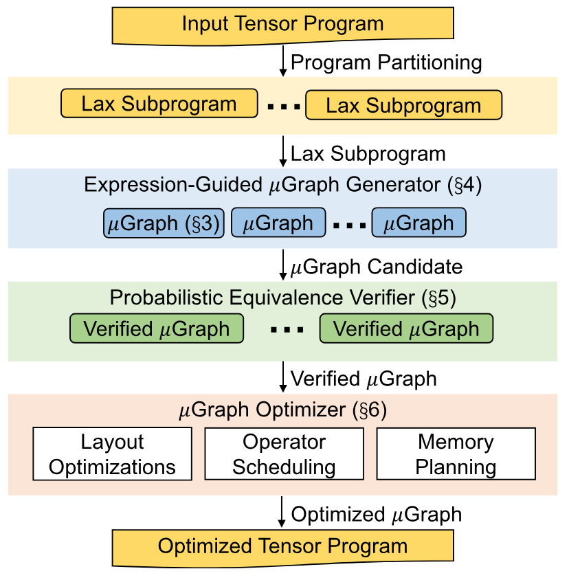

**图 1.** Mirage 概览.

[图 1](#figure-01) 展示了 Mirage 的整体流程. Mirage 首先把输入张量程序拆分为属于受限 Lax 片段的子程序. Lax 片段在[第 5 节](#section-5) 中有形式化定义, 它包含矩阵乘法和卷积等多线性算子, 除法 (用于归一化) 以及受限的指数运算 (用于激活函数). 将张量程序划分为 Lax 子程序, 可以在保留大多数优化机会的同时缩小优化搜索空间, 也让 Mirage 的概率等价性验证器成为可能.

**表达式引导的 μGraph 生成器.** 对每个 Lax 子程序, Mirage 的*表达式引导生成器*会穷举搜索与之等价的 μGraph. Mirage 面临的一项主要挑战是, 它的搜索空间明显大于以往的超级优化技术. 例如, TASO [Jia19b] 和 PET [Wan21] 只使用一组固定的预定义内核, 在内核层搜索张量程序; Mirage 则会在内核, 线程块和线程层同时执行超级优化. 为了高效探索这个大得多的搜索空间, Mirage 引入一种基于*抽象表达式*的新剪枝技术, 在为所发现的 μGraph 提供一定理论最优性保证的同时, 大幅减少需要考虑的 μGraph 数量. Mirage 还把搜索集中在内核层和线程块层, 并在线程层采用基于规则的方法, 进一步缩小搜索空间.

**概率等价性验证器.** 对 Mirage 找到的 μGraph 验证其与输入程序的功能等价性, 是另一项挑战, 因为程序的输入和输出张量最多可含数百万个元素. Mirage 的一个核心思想是*概率等价性验证*: 在有限域上执行随机测试, 检查 μGraph 之间是否等价. 对一般程序而言, 随机测试通常只能提供有限的正确性保证. Mirage 利用一项新的理论结果证明, Lax 片段施加的限制能让有限域上的随机测试为 Lax 程序提供有力的正确性保证. 具体来说, 我们证明多项式恒等性测试 (PIT) 算法 [Sch80, Zip79] 可以推广到 Lax 程序, 从而得到一种误差可任意降低的 Lax 程序等价性随机算法. Mirage 使用该随机算法, 以概率方式确保每个优化程序都与输入程序等价.

**μGraph 优化器.** 对每个通过验证的 μGraph, Mirage 的 μGraph *优化器*会继续考虑可能的张量布局, 调度算子执行顺序, 并在内核, 线程块和线程各层规划内存分配, 以最大化运行时性能. 最后, Mirage 根据为每个 Lax 子程序找到的最佳 μGraph, 返回优化后的张量程序.

**评估结果.** 我们在 NVIDIA A100 和 H100 GPU 上, 用多种常见 DNN 基准评估 Mirage. 即使是 LLM 中使用的分组查询注意力 [Mod24] 这类应用广泛且已被现有系统高度优化的 DNN 基准, Mirage 仍能利用现有系统缺失的细微定制内核和优化, 将性能提高至 $3.3\times$.

## 2 多层图表示

Mirage 使用 μGraph 描述张量程序在 GPU 上的执行. 一个 μGraph 包含多个层级的分层图, 分别表示内核, 线程块和线程层的计算 [+2]. 本节先介绍 GPU 层次结构, 再以[图 3](#figure-03) 为贯穿示例, 说明 μGraph 的主要组成部分.

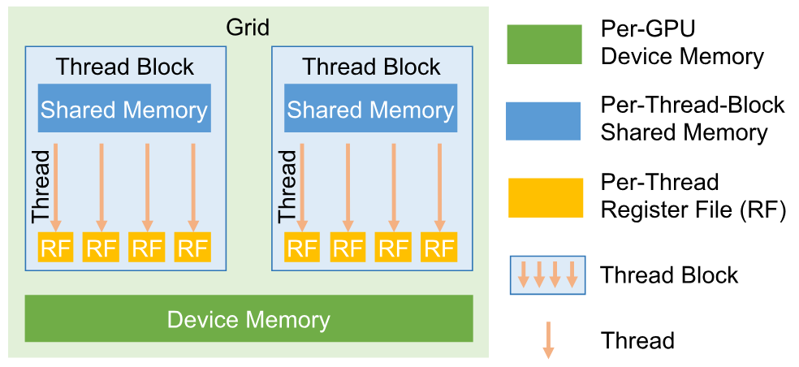

**图 2.** GPU 的计算与内存层次结构.

**GPU 层次结构.** [图 2](#figure-02) 展示了当今 GPU 的层次结构. GPU 上的计算组织成*内核*, 每个内核都是一个函数, 以单程序多数据 (SPMD) 方式在多个 GPU 核心上同时执行. 一个内核包含由多个*线程块*组成的网格; 每个线程块在一个 GPU 流式多处理器上执行, 并包含多个*线程*, 用于对各个数据元素执行计算. 每个线程都有一个线程私有的*寄存器文件*, 同一线程块内的所有线程都能访问*共享内存*, 以完成协同操作. 最后, 内核的所有输入和输出都存放在 GPU *设备内存*中.

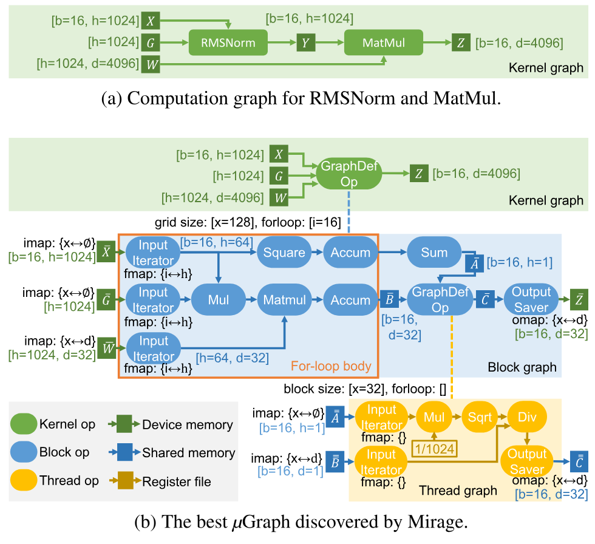

**图 3.** [图 3a](#figure-03) 是 RMSNorm 与 MatMul 的计算图. [图 3b](#figure-03) 展示 Mirage 为计算 RMSNorm 与 MatMul 找到的最佳 μGraph; 它把计算融合到单个内核中, 减少设备内存访问和内核启动开销, 性能比现有方法高 $1.9\times$. 方括号中的数字表示张量形状, 花括号中的数字表示相应算子的 *imap*, *omap* 或 *fmap*.

**内核图.** 每个张量程序对应一个*内核图*. 图中的每个节点表示在整个 GPU 上运行的内核, 每条边表示内核之间共享的张量. 内核图中的所有张量都存放在 GPU 设备内存中, 因为不同内核无法通过寄存器文件或共享内存共享数据. 内核图中的节点可以是现有内核库支持的*预定义*内核算子, 例如 cuDNN [Che14] 的卷积和 cuBLAS [Cub16] 的矩阵乘法. 为了支持内核融合等细粒度内核间优化, 内核图中的节点也可以是*图定义*内核算子, 其语义和行为由更低一层的图 (即线程块图) 定义. 例如, [图 3b](#figure-03) 中的内核算子就是由线程块图描述的图定义算子.

**线程块图.** *线程块图*描述一个线程块对应的计算 [+3]. 其中每个节点表示一个*线程块算子*, 用于规定块内计算; 每条边 ([图 3b](#figure-03) 中的蓝色箭头) 表示线程块算子之间共享的张量. Mirage 把线程块图中的所有中间张量存放在 GPU *共享内存*中, 原因有二. 第一, GPU 共享内存的带宽远高于设备内存, 这种设计让 Mirage 能尽量把中间结果保存在共享内存中, 减少设备内存访问. 第二, 对于大小超过共享内存容量, 必须存放在设备内存中的张量, Mirage 以这些张量为边界把计算拆成多个线程块图, 使每个图只包含位于共享内存中的张量. 这种拆分不会引入额外的设备内存访问.

每个线程块图还带有若干描述其执行方式的属性, 下面逐一介绍.

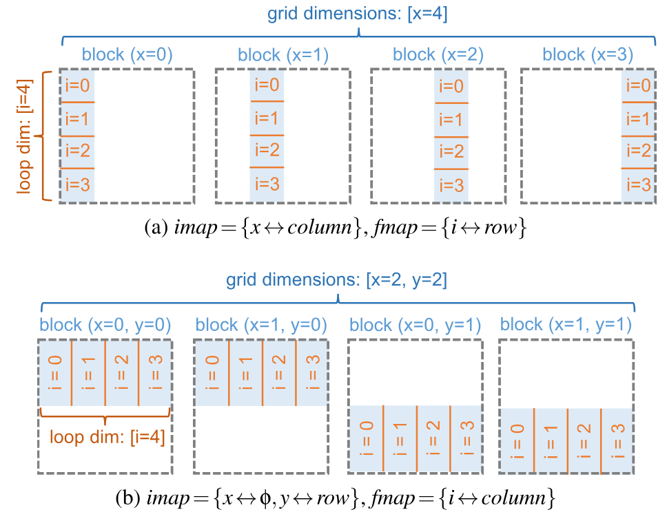

**图 4.** 展示如何用 *imap* 和 *fmap* 在不同线程块与 for 循环迭代之间划分输入张量.

**网格维度.** 一个内核中的所有线程块组成最多 3 维的网格, 三个维度分别记为 $x$, $y$ 和 $z$. 线程块图最多带有三个*网格维度*, 用于指定 $x$, $y$, $z$ 各方向上的线程块数量. [图 3b](#figure-03) 中的线程块图会启动 $128$ 个线程块.

首先, 对图定义内核算子的每个输入张量 (例如[图 3b](#figure-03) 内核图中的 $X$, $G$ 和 $W$), 相应的线程块图都包含一个 *imap*, 用于指定如何把输入张量划分成分配给各个线程块的子张量. 对每个网格维度 (即 $x$, $y$ 或 $z$), *imap* 将其映射到 (1) 输入张量的某个数据维度, 或 (2) 特殊的*复制*维度 $\phi$. 对于 (1), 映射到的数据维度沿该网格维度在各线程块之间*等分*. 对于 (2), 输入张量会在这些线程块间*复制*. 例如, [图 3b](#figure-03) 中的线程块图接收三个输入 $\overline{X}$, $\overline{G}$ 和 $\overline{W}$, 它们表示每个线程块的输入张量. 对 $\overline{W}$ 而言, $\operatorname{imap}=\{x\leftrightarrow d\}$ 表示张量 $W$ 的 $d$ 维被分成 128 个等大的块. 因此, $\overline{W}$ 的形状为 $[h=1024,d=32]$.

其次, 对线程块图的每个输出张量 (例如[图 3b](#figure-03) 中的 $\overline{Z}$), 线程块图都包含一个 *omap*, 用于指定如何拼接所有线程块的输出, 构造内核算子的最终输出. 在 *omap* 中, 每个网格维度都必须映射到输出张量的某个数据维度, 因为不同线程块必须把互不重叠的张量写入设备内存. 对[图 3b](#figure-03) 中形状为 $[b=16,d=32]$ 的 $\overline{Z}$, $\operatorname{omap}=\{x\leftrightarrow d\}$ 表示拥有相同 $x$ 索引的线程块沿 $d$ 维拼接, 最终得到形状为 $[b=16,d=4096]$ 的张量 $Z$.

**For 循环体.** 为了让大型输入张量能装入共享内存, 并使从设备内存加载数据与计算重叠, 线程块图可以包含一个*for 循环体*, 通过多次执行它完成一个内核. 内核中的 for 循环后通常还会接一段后处理. 例如, 计算平均值时, for 循环负责对 $n$ 个值求和, 后处理再除以 $n$. 如[图 3b](#figure-03) 橙色框所示, Mirage 使用*输入迭代器*, *for 循环累加器*以及二者之间的所有算子来描述线程块图的 for 循环体. 线程块图的每个输入张量首先通过*输入迭代器*, 从设备内存向共享内存加载张量的一部分 (例如 $\overline{X}$, $\overline{G}$ 和 $\overline{W}$). 每个输入迭代器都带有 *fmap*, 用于指定每次迭代加载输入张量的哪一部分. 形式上, *fmap* 把每个 for 循环维度映射到 (1) 输入张量的某个数据维度, 或 (2) 复制维度 $\phi$. 与 *imap* 类似, 对于 (1), 张量沿该维度等分; 对于 (2), 张量在各次迭代间复制. [图 4](#figure-04) 展示了如何用不同的 *imap* 和 *fmap*, 在各线程块和 for 循环迭代之间划分输入矩阵.

每个线程块图还带有一个*for 循环维度*, 用于确定完成内核需要执行多少次 for 循环体. Mirage 还使用*for 循环累加器* (例如[图 3b](#figure-03) 中的两个 `Accum` 算子), 对每次迭代得到的中间结果执行标准累加操作 (例如求和和取最大值), 并将累积结果存入共享内存. for 循环体执行完毕后, Mirage 继续在累积结果上直接执行循环体外的剩余算子. 最后由*输出保存器*把最终结果从共享内存写回设备内存.

**线程图.** *线程图*把计算范围从一个线程块进一步缩小到单个线程. 与线程块图类似, 每个线程图也带有*线程块维度*和*for 循环维度*. 前者指定线程在线程块内的组织方式, 后者定义完成所描述计算所需的总迭代次数. 每个线程图都包含*输入迭代器*和*输出保存器*: 输入迭代器把输入张量 (例如[图 3b](#figure-03) 中的 $\overline{\overline{A}}$ 和 $\overline{\overline{B}}$) 从共享内存加载到寄存器文件; 输出保存器把输出张量从寄存器文件写回共享内存 (例如 $\overline{\overline{C}}$). 线程图是 μGraph 中最低层的图, 只包含预定义线程算子.

**张量布局.** 内核图, 线程块图或线程图中的每个张量都带有一个*张量布局* ([图 3](#figure-03) 为简洁起见省略), 用于指定张量在线性内存中的排布方式. 张量布局只影响 μGraph 的性能, 不影响输出的正确性.

**定义 2.1 (μGraph 有效性).** 若满足以下条件, 则 μGraph $G$ *有效*: (1) 对每个内核, 线程块和线程算子 $o\in G$, 其输入和输出张量都符合 $o$ 的规格; (2) 每个内核图, 线程块图和线程图中的所有张量都能分别放入 GPU 设备内存, 共享内存和寄存器文件; (3) 对每个含 for 循环体的线程块图和线程图, 从输入到输出的任意路径都恰好经过一个输入迭代器, 一个 for 循环累加器和一个输出保存器.

**与以往工作的比较.** 以往工作分别考虑代数变换 [Jia19b, Wan21] 或调度变换 [Rag13, Che18, Mul16], 而 μGraph 能用统一方式同时表示二者. 具体而言, 网格维度, for 循环维度以及它们到张量维度的相应映射 (即 *imap*, *omap* 和 *fmap*) 构成了图定义算子的完整调度搜索空间. 横跨内核, 线程块和线程层的分层图, 让 Mirage 能在这些层级探索代数变换.

## 3 案例研究: RMSNorm

本节以均方根层归一化 (RMSNorm) [Zha19l] 为例, 展示 μGraph 表示和 Mirage 超级优化方法的优势. RMSNorm 是近期大语言模型中广泛采用的归一化技术 [Mod24]. 形式上, RMSNorm 以张量 $X$ 和 $G$ 为输入, 根据均方根对二者的逐元素乘积进行归一化:

$$
Y_{ij}=\frac{X_{ij}G_{j}}{\operatorname{RMS}(X_{i})},\operatorname{RMS}(X_{i})=\sqrt{\frac{1}{d}\sum_{j=1}^{d}X_{ij}^{2}},
$$

其中 $d$ 是 $X$ 的隐藏维度大小.

RMSNorm 后面常接矩阵乘法 (MatMul). [图 3a](#figure-03) 展示了 RMSNorm 后接 MatMul 算子的计算图, 其中 $X$ 为输入张量, $G$ 和 $W$ 表示两个权重张量. 现有机器学习编译器一般会分别启动两个内核, 执行 RMSNorm 和 MatMul 计算. 这是因为两个操作内部都要沿某个输入维度进行归约, 很难把二者融合到单个内核中. 这种做法必须把中间结果 (即 $Y$) 存入设备内存, 因为不同内核无法通过共享内存或寄存器文件共享数据.

[图 3b](#figure-03) 展示了 Mirage 自动找到的最佳 μGraph, 它在单个内核中完成 RMSNorm 和 MatMul. 计算被融合到一个图定义内核算子中, 从而无需把中间结果 (即 $Y$) 写入设备内存, 并减少内核启动开销.

下面归纳 Mirage 找到的 μGraph 与原始 μGraph 之间的主要区别. 这些区别涉及发现新的定制内核, 以及组合代数变换与调度变换, 因此不可能通过分别考虑两类变换来发现最终的 μGraph. 首先, Mirage 利用矩阵乘法和逐元素除法的交换性, 调换 MatMul 与 RMSNorm 中除法的顺序 (代数变换). 其次, Mirage 并行执行均方根中的累加 (即 $A_{i}=\sum_{j}X_{ij}^{2}$) 和矩阵乘法中的累加 (即 $B_{ik}=\sum_{j}X_{ij}G_{j}W_{jk}$) (调度变换), 避免把累加结果写入设备内存. 接着, Mirage 实例化一个线程图, 执行一串逐元素算子, 并把所有中间结果留在寄存器文件中 (调度变换). 最后, 找到的最佳 μGraph 使用一个新的定制内核融合 RMSNorm 与 MatMul 的计算, 减少设备内存访问和内核启动开销. 这个 μGraph 在 NVIDIA A100 和 H100 GPU 上分别比现有系统中的手写内核快 $1.5\times$ 和 $1.9\times$.

## 4 表达式引导的 μGraph 生成器

本节介绍 Mirage 的 μGraph 生成器, 它会自动发现输入张量程序可能对应的 μGraph. 为了生成能表达内核, 线程块和线程层优化的 μGraph, Mirage 必须探索比现有超级优化器大得多的搜索空间, 后者只考虑内核层优化. Mirage 使用两项主要技术应对这一挑战. 首先, 我们观察到, 内核层和线程块层的优化对性能远比线程层优化重要, 因为访问设备内存和共享内存的代价比访问寄存器文件高几个数量级. 因此, Mirage 的 μGraph 生成器采用一种*混合方法*: 在内核层和线程块层穷举一定大小以内的所有可能图, 在线程层则基于规则构造图. 这种方法缩小了搜索空间, 同时保留大多数对性能有显著影响的优化. 其次, 为进一步剪枝搜索空间, Mirage 引入一种基于 μGraph 抽象表示的剪枝技术, 这种表示称为*抽象表达式*. 它能减少 Mirage 需要考虑的 μGraph 数量, 同时为所找到 μGraph 的最优性提供一定的理论保证. [第 4.1 节](#section-4-1) 和[第 4.2 节](#section-4-2) 介绍混合 μGraph 生成算法, [第 4.3 节](#section-4-3) 介绍表达式引导的剪枝技术.

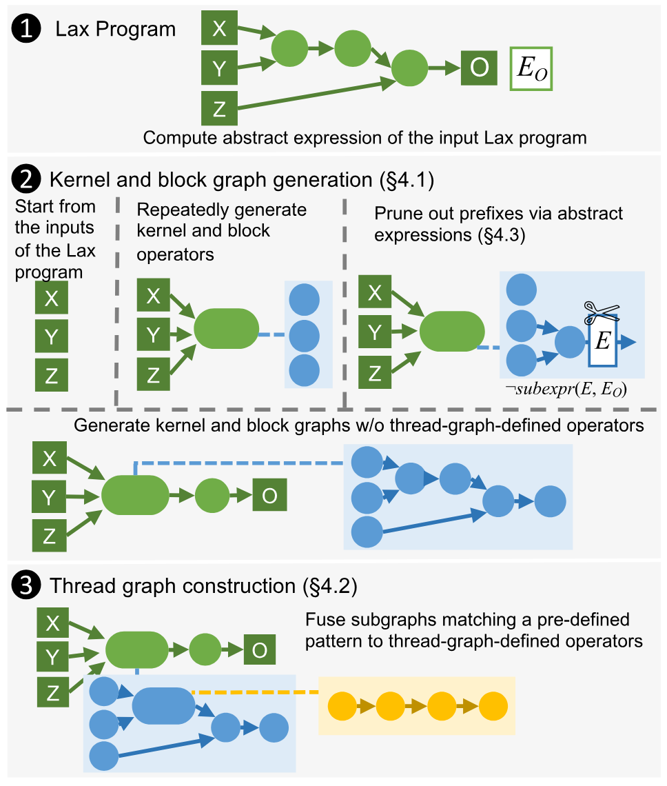

**图 5.** μGraph 生成器概览.

**算法 1.** Mirage 的混合 μGraph 生成算法.

- **输入:** 计算图为 $G_{\mathrm{ref}}$ 的 Lax 程序.
- **输出:** 一组 μGraph $\mathcal{S}$.
- $E_O\gets E(G_{\mathrm{ref}})$.
- $\mathcal{S}_0,\mathcal{S}\gets\varnothing$.
- $\operatorname{GenerateNextKernelOperator}(\mathrm{Inputs}(G_{\mathrm{ref}}))$.
- **对所有** $G\in\mathcal{S}_0$ **执行:**
  - $\mathcal{S}\gets\mathcal{S}\cup\{\operatorname{ThreadGraphConstruction}(G)\}$.
- **函数** $\operatorname{GenerateNextKernelOperator}(G_K)$:
  - $\mathcal{S}_0\gets\mathcal{S}_0\cup\{G_K\}$.
  - **对所有**内核图算子类型 $t$ 和输入集合 $I$ **执行:**
    - **若**对每个 $op\in G_K$ 都有 $\operatorname{rank}(I,t)>\operatorname{rank}(op.I,op.t)$, **则:**
      - **若** $t$ 是预定义算子, **则:**
        - **若** $o:=\operatorname{ConstructOp}(G_K,I,t)$ 有效, **则:**
          - $\operatorname{GenerateNextKernelOperator}(G_K\cup\{o\})$.
      - **否则**, $t$ 是图定义算子:
        - **对所有** $\mathit{gridDims}$ 和 $\mathit{forloopDims}$ **执行:**
          - $G_B\gets\operatorname{TBGraph}(I,\mathit{gridDimd},\mathit{forloopDims})$.
          - $\operatorname{GenerateNextBlockOperator}(G_K,G_B)$.
- **函数** $\operatorname{GenerateNextBlockOperator}(G_K,G_B)$:
  - **若** $G_B$ 中所有共享张量均已被使用, **则:**
    - **若** $o:=\operatorname{ConstructOp}(G_K,G_B.I,G_B)$ 有效, **则:**
      - $\operatorname{GenerateNextKernelOperator}(G_K\cup\{o\})$.
  - **对所有**线程块图算子类型 $t$ 和输入集合 $I$ **执行:**
    - **若**对每个 $op\in G_B$ 都有 $\operatorname{rank}(I,t)>\operatorname{rank}(op.I,op.t)$, **则:**
      - **若** $o:=\operatorname{ConstructOp}(G_B,I,t)$ 有效, **则:**
        - $\operatorname{GenerateNextBlockOperator}(G_K,G_B\cup\{o\})$.
- **函数** $\operatorname{ConstructOp}(G,I,\mathit{attrs})$:
  - $E\gets\operatorname{ExprInfr}(E(I),\mathit{attrs})$. 参见[表 1](#table-01).
  - **若** $\operatorname{Subexpr}(E,E_O)$, 则通过抽象表达式剪枝.
  - $S\gets G.\operatorname{outputTensorShapeInfr}(I,\mathit{attrs})$. 检查张量形状.
  - **若** $S.\mathit{valid}$ 且 $G.\mathit{mAlloc}+S.\mathit{size}\leq G.\mathit{mLimit}$, 则检查内存:
    - **返回** $G.\operatorname{constructOp}(I,\mathit{attrs})$.
  - **返回** Invalid.
- **函数** $\operatorname{ThreadGraphConstruction}(G)$:
  - $G_{\mathrm{fused}}\gets G$.
  - **只要**存在能与前置算子融合的 $o\in G_{\mathrm{fused}}$, **就执行:**
    - $G_{\mathrm{fused}}\gets\operatorname{FuseOp}(G_{\mathrm{fused}},o)$.
  - **返回** $G_{\mathrm{fused}}$.

### 4.1 内核图与线程块图生成

如[图 5](#figure-05) 的第二部分所示, Mirage 以增量方式生成内核图和线程块图, 并使用多种剪枝技术缩小搜索空间. 具体来说, Mirage 维护一个有效 μGraph 的*前缀*, 再逐步加入新算子扩展它. 对图 $G=(V,E)$, 如果 $G^{\prime}=(V^{\prime},E^{\prime})$ 是 $G$ 的子图, 且满足 $\forall u\in V^{\prime},\forall(v,u)\in E,v\in V^{\prime}$, 我们就称 $G^{\prime}$ 是 $G$ 的*前缀*.

为了生成内核图中的下一个算子, Mirage 枚举内核算子类型 $t$ 和输入张量集合 $I$. 如果 $t$ 表示图定义算子类型, Mirage 会生成描述其内核计算的线程块图: (1) 枚举网格维度与 for 循环维度 (见[第 2 节](#section-2)), 以便计算线程块图的输入张量形状; (2) 执行与内核层相似的嵌套生成流程, 但不再考虑图定义算子. [算法 1](#algorithm-01) 通过 $\operatorname{GenerateNextKernelOperator}$ 和 $\operatorname{GenerateNextBlockOperator}$ 两个过程分别展示 Mirage 如何生成内核算子和线程块算子. Mirage 会在 $\operatorname{ConstructOp}$ 中检查张量形状和内存用量, 再添加算子, 从而确保前缀有效.

为确保相同的 μGraph 只生成一次, Mirage 定义了 μGraph 的*规范形式*. 对 μGraph $G$, 设其中算子按拓扑顺序排列为 $o_{1},\ldots,o_{n}$, 则 $o_{i}$ 第 $j$ 个输出的*索引*定义为元组 $(i,j)$. $G$ 中的每个算子 $o_{i}$ 都被赋予*秩* $(\mathit{input}_{i},\mathit{type}_{i})$, 其中 $\mathit{input}_{i}$ 是 $o_{i}$ 的输入张量索引列表, $\mathit{type}_{i}$ 是算子类型. 如果 μGraph 中的算子按秩递增排列, 它就是规范形式. Mirage 要求两个算子生成过程都按秩递增的顺序添加算子, 因而只生成规范形式的 μGraph. 这种做法不会剪掉任何有效解, 因为每个 μGraph 都可以通过重排算子转换为规范形式.

Mirage 还使用*抽象表达式*技术, 剪掉不满足特定约束的前缀, 详见[第 4.3 节](#section-4-3).

### 4.2 线程图构造

类似的嵌套生成策略也可用于线程图, 但为了缩小搜索空间, Mirage 改用基于变换的方法构造线程图 (见[图 5](#figure-05) 第三个面板及[算法 1](#algorithm-01) 中的 $\operatorname{ThreadGraphConstruction}$ 过程). Mirage 在构造线程图时执行算子融合, 尽可能复用寄存器文件中的张量, 以减少共享内存访问. 例如, Mirage 把[图 3b](#figure-03) 中的三个逐元素算子 (`Mul`, `Sqrt` 和 `Div`) 融合到一个线程图中, 不再把中间结果写入共享内存, 并将这些算子的全部计算都留在寄存器文件中. 当前实现侧重算子融合, 但也可以使用其他基于规则的变换来构造线程图.

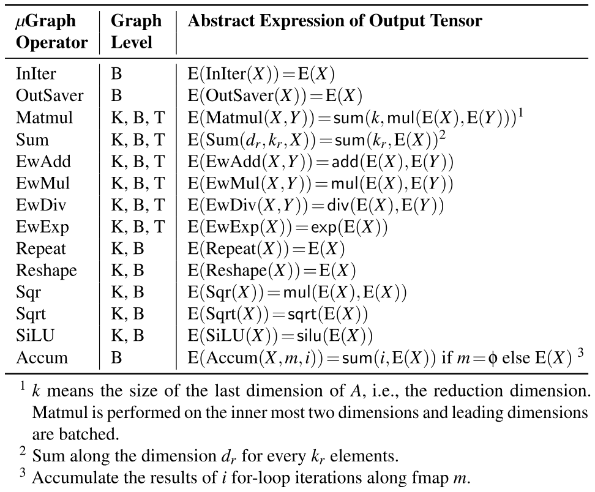

**表 1.** Mirage 支持的算子. 第二列列出支持各算子的图层级 (K, B 和 T 分别表示内核图, 线程块图和线程图). 最后一列定义各算子输出的抽象表达式, 其中 $E$ 把张量映射到其抽象表达式.

### 4.3 通过抽象表达式剪枝

在搜索可能的 μGraph 时, 我们希望避开那些中间结果无法用于目标计算的 μGraph 前缀. 例如, 对输入程序 $X\cdot Z+Y\cdot Z$, 我们可以剪掉计算 $X\cdot Y$ 的前缀, 但不应剪掉计算 $X+Y$ 的前缀, 因为 $(X+Y)\cdot Z$ 与输入程序等价. 可是在搜索目标计算的过程中, 怎样判断一个前缀能否用于目标计算? 下面, 我们基于这一直觉提出一种剪枝技术, 用*抽象*绕开这个"先有鸡还是先有蛋"的问题. 我们先给出抽象方式, 即*抽象表达式*, 然后说明如何用它剪枝. 最后, 我们将给出理论保证: 在一定条件下, 这种剪枝不会排除最优 μGraph.

**抽象表达式.** 回想一下, μGraph 中的一条边对应输入张量的某个张量值函数. 直观来说, 抽象表达式忽略同一输入张量中不同元素之间的差别, 以此抽象这些函数. 形式上, 抽象表达式是整数理论与未解释函数理论上的一阶逻辑项. 在 μGraph 中, 每条边的抽象表达式记为 $\mathrm{E}(\cdot)$, 由[表 1](#table-01) 定义. 计算 μGraph 的抽象表达式时, 所有图定义算子都会被"内联". 具体来说, 图定义算子输入端计算出的表达式会传入其低层图, 而低层图得到的输出表达式就是该图定义算子的输出表达式. [图 6](#figure-06) 展示了注意力子图的抽象表达式.

抽象表达式能捕捉每条边所计算函数的部分信息, 但也会舍弃许多细节. 例如, 若 $X$ 是一个 $k\times k$ 矩阵, 按行求和与按列求和会得到相同的抽象表达式 $\mathsf{sum}(k,\mathrm{E}(X))$. 不过, 在抽象表达式中保留 $k$ 对有效剪枝很重要.

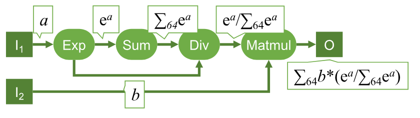

**图 6.** 抽象表达式示意图. 张量的抽象表达式标注在边上. 此处使用便于阅读的记法: $\mathrm{e}^{a}$ 表示 $\operatorname{exp}(a)$, $\sum_{k}a$ 表示 $\mathsf{sum}(k,a)$, $a/b$ 表示 $\mathsf{div}(a,b)$, $a*b$ 表示 $\mathsf{mul}(a,b)$. 张量 $I_{1}$, $I_{2}$ 和 $O$ 都是 $64\times 64$ 矩阵.

**抽象子表达式与剪枝.** 我们在抽象表达式上形式化定义两种关系, 即等价关系和抽象子表达式关系, 再用它们对 μGraph 的搜索空间进行剪枝. 具体来说, 如果某个 μGraph 前缀的抽象表达式, 不是任何一个与输入程序抽象表达式等价的抽象表达式的子表达式, 我们便将它剪掉. 我们把抽象表达式形式化为整数算术理论与未解释函数理论上的未解释函数, 并根据[表 2](#table-02) 中的两组公理 $A_{\text{eq}}$ 和 $A_{\text{sub}}$, 使用 SMT 求解器推理这些表达式.

首先, $A_{\text{eq}}$ 对抽象表达式间的等价关系进行公理化. 下文会看到, 这些公理不必可靠: 抽象表达式等价的 μGraph 不必功能等价, 因为不等价的 μGraph 可能拥有相同的抽象表达式. 其次, $A_{\text{sub}}$ 对抽象表达式间的子表达式关系进行公理化. $A_{\text{sub}}$ 有一个重要性质: 只要 μGraph $G_{1}$ 是 $G_{2}$ 的前缀, 即可以通过向 $G_{1}$ 添加算子构造 $G_{2}$, $\mathrm{E}(G_{1})$ 就是 $\mathrm{E}(G_{2})$ 的抽象子表达式. 形式上, $A_{\text{sub}}\models\operatorname{subexpr}(\mathrm{E}(G_{1}),\mathrm{E}(G_{2}))$, 其中 $\models$ 表示在整数算术理论与未解释函数理论模意义下的蕴涵.

搜索期间, 算法 1 首先计算输入 Lax 程序的抽象表达式, 记为 $E_{O}$; 若某个 μGraph 前缀 $G$ 满足 $A_{\text{eq}}\cup A_{\text{sub}}\not\models\operatorname{subexpr}(\mathrm{E}(G),E_{O})$, 则将其剪掉. 换言之, 若某个图的抽象表达式不是 $E_{O}$ 的子表达式, 该图就会被剪枝. 这项检查由 SMT 求解器 (Z3 [Dem08]) 完成. 作为一项优化, 检查结果会被缓存并复用, 因为 Mirage 可能在搜索过程中遇到抽象表达式相同的多个 μGraph.

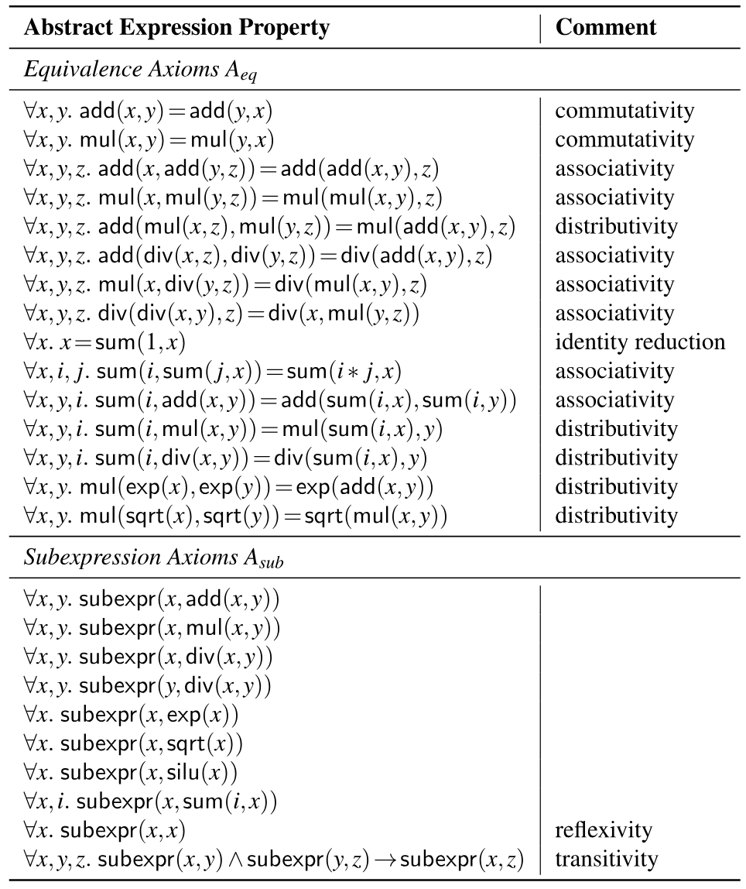

**表 2.** 用于剪枝的抽象表达式公理化. Mirage 查询 SMT 求解器, 检查这些公理是否蕴涵 $\operatorname{subexpr}(E_{1},E_{2})$, 从而判断抽象表达式 $E_{1}$ 是否为 $E_{2}$ 的子表达式. 这些公理中的所有变量均为全称量化.

**理论保证及剪枝与最优性的权衡.** 直观来说, 我们的剪枝会保留任何能够得到某个 μGraph 的前缀, 只要其抽象表达式 (根据 $A_{\text{eq}}$) 与输入 Lax 程序的抽象表达式等价. 形式化表述如下:

**定理 1 (通过抽象表达式剪枝).** 对输入 μGraph $G_{0}$ 及与 $G_{0}$ 等价的 μGraph $G$, 如果 $A_{\text{eq}}\models E(G_{0})=E(G)$, 则算法 1 将生成 $G$.

::: details 证明
由[表 1](#table-01) 和[表 2](#table-02) 可知, 对任意算子 *op*, 若 $Y=\mbox{\rm op}(X_{1},\ldots,X_{n})$, 则对 $1\leq i\leq n$ 有 $A_{\text{sub}}\models\operatorname{subexpr}(\mathrm{E}(X_{i}),\mathrm{E}(Y))$. 也就是说, *op* 每个输入的抽象表达式始终是 *op* 输出的子表达式. 由于 $A_{\text{sub}}$ 包含自反公理和传递公理, 对 $G$ 的任意前缀 $G^{\prime}$ 都有 $A_{\text{sub}}\models\operatorname{subexpr}(\mathrm{E}(G^{\prime}),\mathrm{E}(G))$. 再结合假设 $A_{\text{eq}}\models E(G_{0})=E(G)$, 可得 $A_{\text{eq}}\cup A_{\text{sub}}\models\operatorname{subexpr}(\mathrm{E}(G^{\prime}),\mathrm{E}(G_{0}))$. 因此, $G$ 的任何前缀都不会被剪掉, Mirage 将生成 $G$.
:::

该定理说明了抽象表达式如何解决前文所述的"先有鸡还是先有蛋"问题. 要判断一个 μGraph 前缀是否有用, 我们在*抽象层面*判断它是否为某个有用计算的前缀. 抽象方式和公理 $A_{\text{eq}}$ 的选择, 体现了最优性与剪枝之间的权衡. 如定理 1 所示, 我们只能保证找到这样的最优 μGraph: 在 $A_{\text{eq}}$ 下, 它的抽象表达式与输入程序的抽象表达式等价. 更强的公理会扩大定理覆盖的 μGraph 集合, 但也会降低剪枝效果, 因为更多前缀可以通过子表达式测试. 特别要注意, $A_{\text{eq}}$ 不含约消规则 (例如 $\mathsf{div}(\mathsf{mul}(x,y),y)=y$). 因此, Mirage 可能漏掉一些等价的 μGraph. 但加入这样的公理会让任何表达式都成为任何表达式的子表达式, 从而使期望的剪枝完全失效. 实验结果表明, 所选 $A_{\text{eq}}$ 在剪枝与最优性之间取得了良好平衡.

## 5 概率等价性验证器

Mirage 的*概率等价性验证器*检查候选 μGraph 是否与目标 Lax 程序等价. 核心做法是在两个有限域上用*随机输入*计算二者. 使用有限域而非浮点数, 既能避开浮点误差, 又能提供有力的理论保证: 接受非等价 μGraph 的概率可以降到任意低.

对一般程序而言, 随机测试几乎无法提供正确性保证. 不过我们证明, 对 Lax 程序 (形式化定义见下文), 随机测试能够提供概率正确性保证, 而重复测试可以把错误概率降到任意小的阈值.

以往工作 [Wan21] 使用过类似技术, 检查只含线性算子 (例如矩阵乘法和卷积) 的张量程序是否等价. 我们提出的随机测试技术还支持除法和指数运算, 这些运算是许多 DNN 优化所必需的 (例如[第 3 节](#section-3) 的 RMSNorm 示例).

Mirage 在下文定义的 Lax μGraph (线性运算, 除法和一次指数运算) 之间验证等价性. [第 5.1 节](#section-5-1) 介绍主要理论结果, [第 5.2 节](#section-5-2) 介绍 Mirage 的验证方法.

**定义 5.1 (Lax μGraph).** 若满足以下条件, 则 μGraph $G$ 是 Lax μGraph: (1) $G$ 只包含多线性算子 [+4], 除法和指数运算; (2) $G$ 中从输入到输出的每条路径最多包含一次指数运算.

### 5.1 理论基础

不失一般性, 假设 Lax μGraph $G$ 接收 $n$ 个输入张量, 产生一个输出张量. 我们的理论结果可以直接推广到有多个输出的 Lax μGraph. 由于每个 Lax μGraph 都包含线性算子, 除法, 且每条路径上最多有一次指数运算, 输出张量每个条目的计算都可以写成下列形式 (使用 $\frac{\frac{a}{b}}{\frac{c}{d}}=\frac{ad}{bc}$, $\frac{a}{b}+\frac{c}{d}=\frac{ad+bc}{bd}$, $e^{x}e^{y}=e^{x+y}$ 等标准恒等式):

$$
\frac{\sum_{i=1}^{k}f_{i}\exp(g_{i}/h_{i})}{\sum_{i=1}^{k^{\prime}}f^{\prime}_{i}\exp(g^{\prime}_{i}/h^{\prime}_{i})}
$$

其中 $f_{i}$, $g_{i}$, $h_{i}$, $f_{j}^{\prime}$, $g_{j}^{\prime}$ 和 $h_{j}^{\prime}$ ($1\leq i\leq k$, $1\leq j\leq k^{\prime}$) 是以输入张量条目为变量的多项式.

下面的定理是支撑随机等价性验证的主要理论结果. 它把有限域上的多项式恒等性测试 (PIT) [Sch80, Zip79] 推广到 Lax μGraph. 两个 Lax μGraph 之差也具有[公式 2](#equation-02) 所示形式. 因此, 两个 Lax μGraph 的恒等性测试可以归结为检验这种形式的表达式是否为零. 由于存在指数运算, 我们使用两个有限域, 而不是一个. [+5]

**定理 2.** 设 $P$ 是[公式 2](#equation-02) 所述形式的函数, 其中 $f_{i},g_{i},h_{i},f_{i}^{\prime},g_{i}^{\prime},h_{i}^{\prime}$ 是次数至多为 $d$ 的非零多项式, 其整数系数位于 $[-w,w]$ 之间. 设 $p,q$ 为满足 $q\mid p-1$ 且 $q>2w$ 的素数. 设 $\mathcal{G}$ 为 $\mathbb{Z}_{p}$ 中 $q$ 次单位根的集合. 如果 $P$ 不是零函数, 则 [Li25af]

$$
\Pr_{(\vec{u},\vec{v},\omega)\leftarrow\mathbb{Z}_{p}^{N}\times\mathbb{Z}_{q}^{N}\times\mathcal{G}}\left[\frac{\sum_{i=1}^{k}f_{i}(\vec{u})\omega^{g_{i}(\vec{v})/h_{i}(\vec{v})}}{\sum_{i=1}^{k^{\prime}}f^{\prime}_{i}(\vec{u})\omega^{g^{\prime}_{i}(\vec{v})/h^{\prime}_{i}(\vec{v})}}\right]\leq 8dk^{4}/q+q^{-1/k^{2}}.
$$

### 5.2 有限域上的随机测试

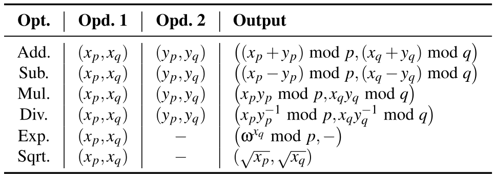

**表 3.** 随机测试使用的算术运算. Mirage 选择两个素数 $p$ 和 $q$, 使 $q$ 整除 $p-1$. $x_{p}$ 和 $x_{q}$ 分别取自有限域 $\mathbb{Z}_{p}$ 和 $\mathbb{Z}_{q}$. 记号 $x^{-1}$ 和 $\sqrt{x}$ 分别表示 $x$ 在相应有限域中的乘法逆元和平方根. 具体而言, $xx^{-1}\bmod p=1$, 且 $\sqrt{x}\sqrt{x}\bmod p=x$.

Mirage 利用定理 2, 在定理 2 定义的有限域 $\mathbb{Z}_{p}$ 和 $\mathbb{Z}_{q}$ 上执行随机测试, 以概率方式验证两个 μGraph 是否等价. 为检查两个 μGraph 的等价性, Mirage 首先生成输入张量, 每个条目都从 $\mathbb{Z}_{p}\times\mathbb{Z}_{q}$ 中均匀采样. Mirage 还从 $\mathbb{Z}_{p}$ 中 $q$ 次单位根的集合里均匀采样 $\omega$, 用于指数运算. 随后, Mirage 使用[表 3](#table-03) 定义的运算, 在这些输入上计算两个 μGraph. 如[第 5.1 节](#section-5-1) 所述, $\mathbb{Z}_{p}$ 和 $\mathbb{Z}_{q}$ 分别用于指数外部和内部的计算. 除指数运算以外, 所有运算都在 $\mathbb{Z}_{p}$ 和 $\mathbb{Z}_{q}$ 中独立通过模运算实现. 对指数运算, Mirage 使用 $\mathbb{Z}_{q}$ 中的值 $x_{q}$, 计算 $\omega^{x_{q}}\bmod p$, 从而得到 $\mathbb{Z}_{p}$ 中的结果.

需要注意的是, 在 Lax μGraph 中, 每条路径最多执行一次指数运算. 最后, Mirage 检查两个 μGraph 是否产生相同输出. 这一过程会重复多次; 如果两个 μGraph 通过所有随机测试, 就认为二者等价. 下面由定理 2 推出的定理说明, 该过程可以把错误率降至任意低.

**定理 3.** 等价的 μGraph 总能通过 μGraph 验证. 对两个不等价的 μGraph 和给定概率阈值 $0<\delta\leq 1$, 它们通过全部 $\Omega(\frac{k^{2}}{\ln q}\cdot\ln\frac{1}{\delta})$ 次随机测试的概率至多为 $\delta$.

**数值稳定性.** 虽然该定理在有限域计算与实数计算之间建立了联系, 但实数计算与浮点运算之间仍可能出现偏差, 尤其是在较大中间值引发上溢或下溢时. Mirage 使用浮点测试, 过滤数值误差较大的 μGraph.

## 6 μGraph 优化器

如[图 1](#figure-01) 所示, 对每个通过验证的 μGraph, Mirage 的 μGraph *优化器*会进一步执行*布局优化*, *算子调度*和*内存规划*, 最大化其性能. Mirage 把这些 μGraph 优化推迟到验证之后, 原因有二. 第一, 这些优化*不会*影响所生成 μGraph 的正确性. 生成 μGraph 时忽略这些优化, 可以缩小 Mirage 需要考虑的搜索空间, 因为拓扑相同, 但张量布局, 算子顺序或内存分配方案不同的 μGraph, 会被 μGraph 生成器视为同一个图. 第二, 验证后再应用这些优化, 也能缩小这些优化本身的搜索空间, 因为 μGraph 优化器只需优化功能上与输入等价的 μGraph.

**张量布局.** μGraph 优化器探索内核, 线程块和线程层所有中间张量可能采用的数据布局, 并选择性能最佳的组合. 我们把布局选择表述为约束优化问题, 再用整数线性规划 (ILP) 算法求得最优解. 具体来说, 对每个张量 $t$ 及其每种可能布局 $l$, 我们引入布尔变量 $B_{t,l}$, 表示张量 $t$ 是否使用布局 $l$. 内核, 线程块和线程层的算子可能对张量布局施加各种约束. 例如, 使用 cuBLAS 库 [Cub16] 中的矩阵乘法内核时, 两个输入张量的最内层维度必须位于最后两个维度之中. 这些限制会转换为一系列关于 $B_{t,l}$ 的线性约束. 不同张量布局的性能可能不同. 例如, 一些输入张量布局支持从设备内存到共享内存的批量复制, 另一些则不支持. Mirage 引入代价函数, 对每个算子在不同布局选择下的性能建模. Mirage 使用现成的 ILP 求解器 (即 Z3 [Dem08]), 找到满足所有布局约束且代价最小的布局策略.

**算子调度.** 在一个 μGraph 中, 算子有多种拓扑执行顺序, 不同顺序可能带来不同性能. 对给定的输入 μGraph, μGraph 优化器通过尽量减少每个线程块内部的线程级同步 (即 CUDA 中的 `__syncthreads()`), 找到高效的算子调度策略. 为此, Mirage 为每个节点标记一个*深度*, 定义为从任一输入算子到该节点的最长路径长度. Mirage 使用动态规划算法计算每个节点的深度, 再按深度递增的顺序调度所有算子. 这种方法可以把生成的 CUDA 内核所需线程级同步次数降至最低, 因为 Mirage 只需在深度不同的算子之间插入同步点.

**内存规划.** 第三类验证后优化是内存规划, 它确定内核, 线程块和线程层所有中间张量的内存偏移. Mirage 把内存规划表述为*动态存储分配*问题, 穷举所有可能的分配方案, 从中找出最优策略.

## 7 实现

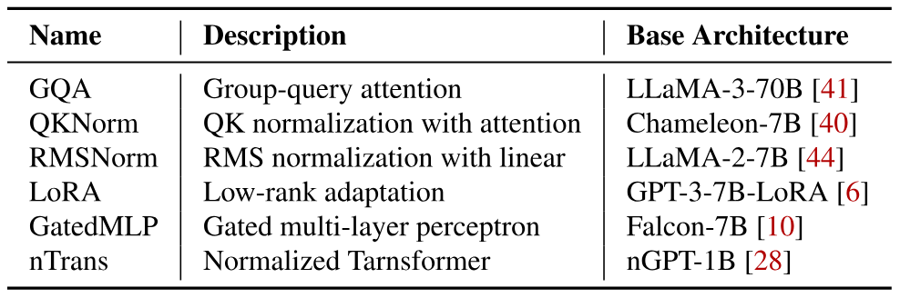

**表 4.** 评估使用的 DNN 基准.

Mirage 使用 C++, CUDA 和 Python 实现, 代码共 3 万行. 内核算子使用 cuDNN 和 cuBLAS 库 [Che14, Cub16] 实现, 线程块算子和线程算子使用 cuTLASS [Ker22] 与 CUDA PTX 实现. 对每个输入张量程序, Mirage 自动生成并验证可能的 μGraph. 对每个通过验证的 μGraph, Mirage 为其中所有定制内核生成 CUDA 源代码, 再用 CUDA 编译器将代码编译为二进制文件. 这种方法让一般张量程序可以即时 (JIT) 编译和部署, 生成的内核只需改动几行代码, 就能直接集成到 PyTorch 程序中. Mirage 的 SMT 和 ILP 求解器使用 Z3 4.12.6 [Dem08] 实现.

我们的实现支持[表 1](#table-01) 所列算子. Mirage 可以扩展以加入新算子, 例如内核, 线程块和/或线程层的卷积或矩阵乘法变体. 为了支持新的线性算子, Mirage 需要: (1) 该算子在内核, 线程块和/或线程层的浮点实现, 供 μGraph 优化器生成 CUDA 内核; (2) 该算子在模算术上的实现 (见[第 5 节](#section-5)); (3) 为该算子扩展抽象表达式公理 $A_{\text{eq}}$ 和 $A_{\text{sub}}$ (见[第 4.3 节](#section-4-3)).

要使用定理 2 和定理 3, 随机测试应选取足够大的素数 $p$ 和 $q$, 并迭代多次. 当前实现使用乘积能装入 16 位整数的最大 $p$ 和 $q$ 值 (即 $p=227,q=113$), 在 GPU 上运行这些随机测试. 我们利用 Mirage 的 GPU 优化来加速搜索流程, 例如把中间结果保存在共享内存中. 我们还执行一次不迭代的随机测试, 并比较输出张量的所有元素. 这套等价性验证流程不会产生假阴性. 理论上, 它可能产生假阳性, 但我们在实践中尚未观察到. 因此, 我们认为该流程足以用于搜索, 并计划在优化流程末尾只对最佳 μGraph 增加一个能提供理论保证的最终验证步骤.

**非 Lax 程序的等价性验证.** Mirage 可以为任意张量程序生成 μGraph, 但概率等价性验证器仅适用于 Lax 程序, 不支持 ReLU [Nai10] 等某些 DNN 算子. 作为替代方案, 我们为任意张量程序开发了基于求解器的验证器. 该验证器依赖用户提供的一阶逻辑性质, 例如各算子的线性, 结合性, 交换性和分配性, 并使用自动定理证明器根据这些性质验证等价性. 与概率等价性验证器相比, 基于求解器的验证器支持更一般的程序, 代价是需要额外手工指定每个新算子的性质. 关于这种验证器的详细讨论超出了本文范围.

## 8 评估

### 8.1 实验设置

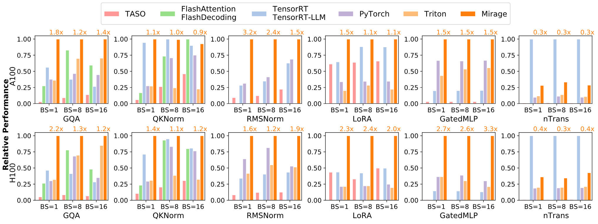

**图 7.** 在 A100 和 H100 GPU 上, 比较 Mirage 与现有系统在 6 个基准上的性能. 所有系统的性能均以 Mirage 归一化 (越高越好). Mirage 柱形上方的数字表示相对最佳基线的加速比.

由于 Mirage 是 Lax 程序的超级优化器, 我们把评估集中在现有 DNN 中常见的多种 DNN 基准上, 每个基准都是 Lax 程序. 这些基准提供了最细粒度的方式, 用于比较 Mirage 与现有系统的性能. [表 4](#table-04) 列出了评估中的六个基准. GQA, RMSNorm 和 GatedMLP 是大语言模型 (LLM) 的主要构件. QKNorm 在注意力之前引入查询-键归一化, 以改善模型收敛 [Cha24]. LoRA 支持低秩适配, 可针对不同任务微调 DNN. 我们为 GQA 使用 8K 上下文长度, 为 QKNorm 使用 4K 上下文长度, 分别对应 LLaMA-3-70B [Mod24] 和 Chameleon-7B [Cha24] 支持的最大长度. 我们还评估 Mirage 生成的内核如何改善完整 DNN 的端到端性能, 包括 Chameleon [Cha24], nGPT [Los24], LLaMA-3 [Mod24] 和 LoRA [Hu21].

实验在 NVIDIA A100 和 H100 GPU 上进行, 两者均有 40GB 内存. 除 GQA (用于 LLaMA-2-70B) 外, 所有基准都能放入单张 GPU. GQA 通常使用张量模型并行 [Sho19] 分布到四张 GPU 上. 因此, 我们在这种并行策略下评估 GQA, 把八个键值头均分到四张 GPU. 由于 Mirage 及所有基线的性能只取决于输入张量形状, 我们用随机输入将每个实验重复 1,000 次, 并报告平均运行时间.

基准之一 LoRA 需要通过拼接表达一种常见优化, 即通过拼接融合两次矩阵乘法. 为了在 Mirage 中支持这项优化, 我们引入一个新的线性算子. 它接收四个输入, 计算 $f(W,X,Y,Z)=(W\|X)\times(Y\|Z)$, 其中 $\|$ 表示张量拼接. 该算子等价于计算 $W\times Y+X\times Z$. 我们把它对应的抽象表达式定义为: $\mathrm{E}(f(W,X,Y,Z))=\mathsf{add}(\mathsf{sum}(k_{1},\mathsf{mul}(\mathrm{E}(W),\mathrm{E}(Y))),\mathsf{sum}(k_{2},\mathsf{mul}(\mathrm{E}(X),\mathrm{E}(Z))))$, 其中 $k_{1}$ 和 $k_{2}$ 分别是 $W$ 和 $X$ 的最后一个维度.

除非另有说明, Mirage 在内核图中最多考虑 5 个算子, 在每个线程块图中最多考虑 11 个算子.

### 8.2 基准结果

[图 7](#figure-07) 比较了 Mirage 与其他系统在 NVIDIA A100 和 H100 GPU 上运行六个 DNN 基准的性能. 所有系统都使用半精度浮点数运行这些 DNN 基准. TASO [Jia19b] 和 PET [Wan21] 是 DNN 超级优化器, 能在内核层自动生成代数变换. 我们报告合并后的 TASO/PET 基线, 因为最新版 TASO 实现将 PET 的部分等价变换作为特殊替换纳入其中. PyTorch [Pyt17] 使用高度优化的 cuDNN 和 cuBLAS 库 [Cub16, Che14], 在 GPU 上执行 DNN 算子. 对 PyTorch 基线, 我们启用 `torch.compile` 并使用 FlashAttention 内核, 以获得最佳性能. TensorRT 及其 LLM 变体 TensorRT-LLM 包含一组人工设计且高度优化的常见张量算子内核, 例如注意力 [Ten17a]. FlashAttention 及其推理变体 FlashDecoding 是为高效注意力手工编写的内核 [Dao23, Hon24d]. 最后, Triton 是一个生成高性能内核的调度型优化器, 已用于生产系统, 性能优于其他基于调度的方法 [Til19]. 所有基线均使用 CUDA Graphs 来尽量降低内核启动开销.

与现有最佳方法相比, Mirage 通过结合代数变换, 调度变换和新定制内核的生成, 将这些基准的性能提高至 $3.3\times$. [第 3 节](#section-3) 展示了为 RMSNorm 找到的最佳 μGraph. 下面介绍其余基准的案例研究.

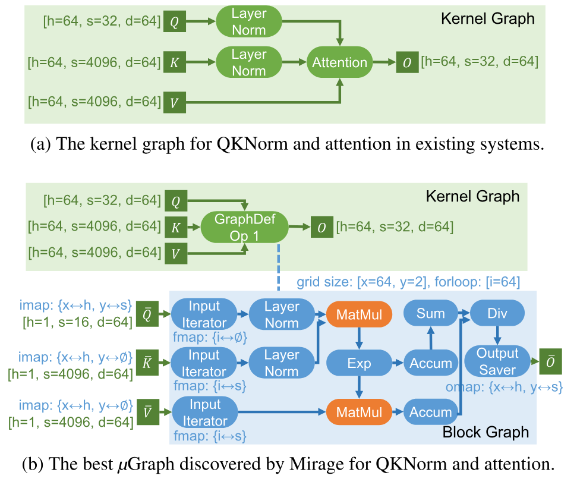

**图 8.** 对比现有优化器和 Mirage 用于 QKNorm 与注意力的 μGraph.

**GQA.** 分组查询注意力是 LLM 的支柱, 现有框架已对它进行大量优化. 例如, FlashAttention 和 FlashDecoding 是由专家设计的注意力内核, 已被现有 LLM 推理系统采用 [Dao23]. Mirage 既能发现这些专家设计的内核, 也能找到性能比它们高至 $2.2\times$ 的其他 μGraph. 这项加速来自现有手写内核之上的两项额外优化. 首先, 当前方法依赖固定启发式规则来确定 GQA 的网格维度, 在某些场景下并非最优. 例如, 批大小分别为 1 和 8 时, TensorRT-LLM 以 (8, 2, 1) 和 (8, 2, 8) 的网格维度启动 GQA 内核. 但这两种配置都无法充分利用 A100 (108 个 SM) 和 H100 (132 个 SM) GPU 上的所有 SM. 相比之下, Mirage 会为每个 μGraph 自动搜索最佳网格维度, 从而充分利用 SM. 进一步的消融实验表明, 最佳 μGraph 使用与 TensorRT-LLM 相同的网格维度时, 性能会下降 18%.

其次, 现有方法使用固定的张量维度, 在线程块之间并行化 GQA. 例如, FlashAttention [Dao23] 沿*样本*, *头*和*查询序列*维度并行化注意力; FlashDecoding 与 TensorRT-LLM 则使用*样本*, *头*和*键值序列*维度. 对拥有许多头的传统多头注意力, 两种策略都很高效; 对注意力头较少的 GQA, 它们却不是最佳选择. Mirage 可以在样本, KV 头, 查询序列和键值序列维度中选择, 自动确定最高效的并行策略. Mirage 还会针对不同注意力场景生成不同的 μGraph, 与现有系统使用的启发式规则相比, 最多可将设备内存访问减少 $7\times$.

可以在现有系统中实现 Mirage 的 μGraph, 但要支持不同场景下的不同内核, 需要投入大量工程工作. Mirage 则能自动生成这些图并验证其正确性.

**QKNorm.** 为了减少模型发散, 近期一些 DNN 把查询-键归一化 (QKNorm) 引入 Transformer 架构 [Cha24]. 如[图 8a](#figure-08) 所示, QKNorm 在注意力之前对查询向量和键向量应用层归一化. 现有注意力实现 (例如 FlashAttention 和 TensorRT-LLM) 尚不支持这些额外的归一化层, 因而需要分别启动归一化内核和注意力内核.

如[图 8b](#figure-08) 所示, Mirage 自动找到一个将 QKNorm 和注意力计算集成到定制内核中的 μGraph. 该 μGraph 重组注意力计算, 使其可以和两次层归一化融合, 从而避免把中间结果写入 GPU 设备内存, 并使内核执行速度提高至 $1.4\times$.

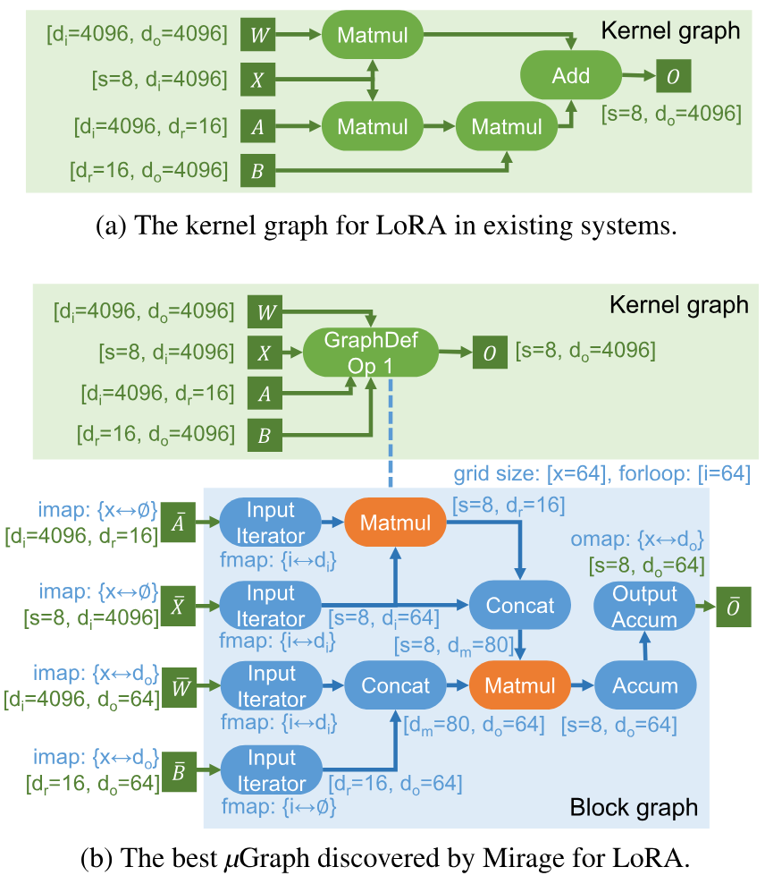

**图 9.** 对比现有优化器和 Mirage 用于 LoRA 的张量程序: $O=W\times X+B\times A\times X$. 注意, 矩阵 $A$ 和 $B$ 都是低秩矩阵.

**LoRA.** 低秩适配 (LoRA) 向预训练 DNN 的线性算子加入一对低秩适配器, 以改善模型在下游任务上的性能. 现有张量程序优化器会为原有线性算子和 LoRA 新增的两个线性算子分别启动内核 ([图 9a](#figure-09)). 由于这些 LoRA 算子的计算量很小, 这种做法会产生很高的内核启动开销. [图 9b](#figure-09) 展示了 Mirage 为 LoRA 找到的最佳 μGraph, 它把三个 `Matmul` 和后续 `Add` 融合为单个内核. Mirage 利用下列代数变换, 把计算重组为两个线程块层 `Matmul`: $W\times X+B\times A\times X=(W\|B)\times\big(X\|(A\times X)\big)$. [图 9b](#figure-09) 中的 `Concat` 不涉及任何计算, 只需更新 GPU 共享内存中的张量偏移即可完成. 这个 μGraph 将 LoRA 的执行开销降低 1.1-$2.4\times$.

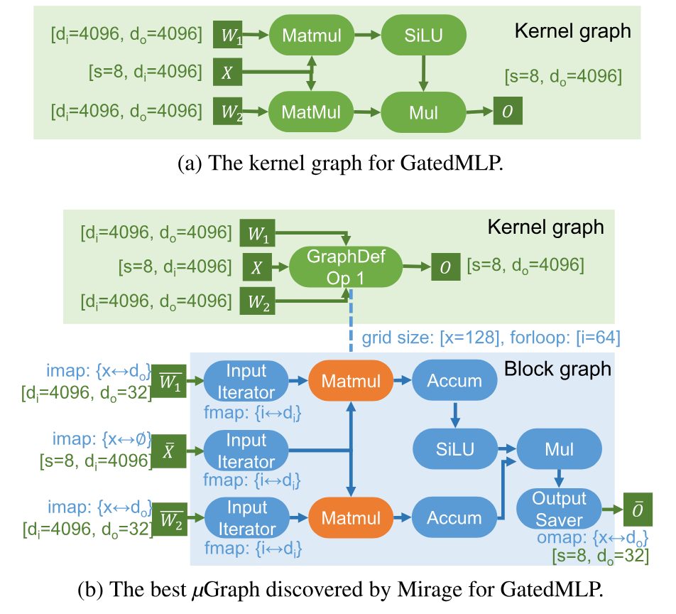

**图 10.** 对比现有优化器和 Mirage 用于 GatedMLP 的 μGraph.

**GatedMLP.** 门控多层感知机常用于 DNN, 以捕捉非线性表示. 我们使用 Falcon-7B [Alm23b] 中引入的 GatedMLP 配置, 其内核图见[图 10a](#figure-10). 现有张量程序优化器通常把两个 `Matmul` 融合到单个内核中, 以减少 GPU 设备内存访问, 因为输入张量 $X$ 只需加载一次. 但这种做法仍要启动多个内核, 并把中间结果, 具体来说就是两个 `Matmul` 的输出, 存入设备内存, 因为 `SiLU` 激活和逐元素乘法没有与 `Matmul` 融合.

相比之下, Mirage 找到的最佳 μGraph ([图 10b](#figure-10)) 在同一个线程块图中并行执行两个 `Matmul`, 再把其余计算 (即 `SiLU` 和 `Mul`) 作为同一线程块图中的后处理步骤加以融合. 这种方法在 A100 GPU 上获得 $1.5\times$ 加速, 在 H100 GPU 上获得 2.7-$3.3\times$ 加速.

**nTrans.** 为了加速模型训练, nGPT 引入归一化 Transformer, 对 Transformer 中的所有中间结果执行归一化 [Los24]. 形式上, 其计算定义为 $y=\texttt{Norm}(x+\alpha(\texttt{Norm}(h-x)))$, 其中 `Norm` 是归一化层, $x$, $h$ 和 $\alpha$ 是输入张量. 现有系统会为 nTrans 分别启动三个内核, 因为其计算交替使用归一化, 逐元素加法和逐元素乘法. Mirage 自动找到一个把整个计算融合到单个内核中的 μGraph, 并将所有中间结果存入 GPU 共享内存. Mirage 的性能优于其他基线, 但慢于 TensorRT. 出现这一性能差距, 是因为对图定义内核中的每个张量, Mirage 都会从全局内存把数据加载到共享内存, 再将其写回. 这种设计提高了内存效率, 并支持异步流水线. 但对计算量较小的内核, 这些内存传输的开销可能主导内核运行时间. 为减轻这项开销, 我们计划扩展 Mirage, 使其在加载数据时可以绕过共享内存, 从而避免不必要的数据移动.

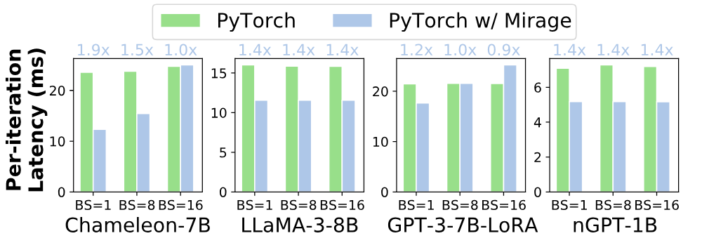

**图 11.** 对比 PyTorch 与采用 Mirage 生成内核的 PyTorch 的端到端推理性能.

### 8.3 端到端结果

除微基准性能外, 我们还评估 Mirage 生成的内核如何影响常用 DNN 的端到端延迟. Mirage 支持即时编译和部署, 其生成的内核可以直接集成到 PyTorch 程序中. 我们在四个 DNN 模型上, 对比使用原生手写 CUDA 内核的 PyTorch 与使用 Mirage 生成内核的 PyTorch. 结果见[图 11](#figure-11). Mirage 通过自动生成高度优化的内核, 将这些模型的端到端延迟降低 0.9-$1.9\times$. 只需修改 PyTorch 程序中的几行代码, 即可获得这项改进.

### 8.4 搜索时间

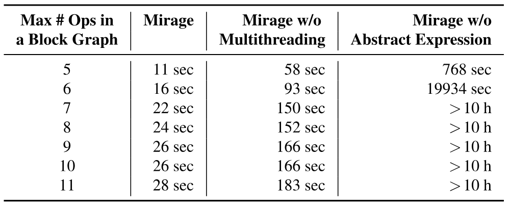

**表 5.** Mirage 加速 μGraph 生成技术的消融实验. 我们评估多线程和抽象表达式对 RMSNorm 搜索时间的影响.

在评估中, Mirage 优化一个 Lax 程序最多需要 4 小时. 这项优化是部署到目标硬件前的一次性开销. 本小节给出 Mirage 搜索流程的详细结果和消融实验, 重点分析相关技术如何在保持较低搜索时间的同时, 支持探索大型 μGraph. 具体而言, 我们评估两项技术的影响: 通过抽象表达式剪枝 ([第 4.3 节](#section-4-3)) 和多线程. [表 5](#table-05) 报告了改变线程块图所允许的最大算子数量时, RMSNorm 的搜索时间.

多线程显著缩短搜索时间, 而通过抽象表达式剪枝对 Mirage 的可扩展性不可或缺. 具体来说, 这些剪枝技术让 Mirage 可以探索每个线程块图最多包含 11 个算子的 μGraph. 若禁用抽象表达式剪枝, 在 10 小时搜索窗口内, Mirage 只能处理至多包含 6 个算子的线程块图. 要发现[图 3](#figure-03) 所示的 RMSNorm 优化 μGraph, 必须探索包含 11 个算子的线程块图.

### 8.5 优化消融实验

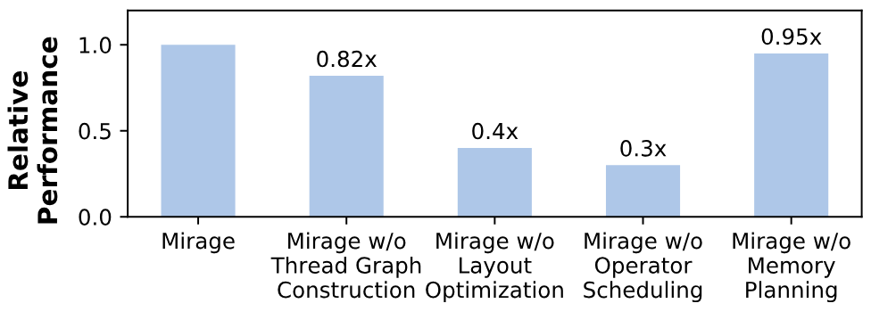

**图 12.** Mirage 所用优化的消融实验. 我们分别禁用每项优化, 评估由此产生的性能下降. 实验在 A100 上使用批大小为 $1$ 的 GQA 进行.

我们进行消融实验, 评估线程图构造及[第 6 节](#section-6) 所述优化的影响, 包括布局优化, 算子调度和内存规划. 具体来说, 我们分别禁用每项优化, 测量 Mirage 找到的最佳 μGraph 的性能下降幅度. 实验在 A100 上使用批大小为 $1$ 的 GQA 基准进行. [图 12](#figure-12) 所示结果表明, 禁用任一项优化都会导致 $5\%$ 至 $70\%$ 的性能下降.

## 9 相关工作

**人工设计的内核.** TensorFlow XLA [Xla17, Aba16], PyTorch [Pyt17] 和 TensorRT [Ten17a] 等许多现有框架依靠 GPU 专家为机器学习算子手工设计内核. 近来, 人们投入了大量工程工作, 手工优化常用 DNN, 尤其是基础模型 [Bom22] 的 GPU 内核. 例如, 为加速注意力计算 [Wol22a], 已经出现了多种基于 FlashAttention 的专用内核 [Dao23, Htm23a, Hon24d, Fas21]. 现代 GPU 日趋复杂, 例如 A100 带有张量核心 [Mar18b], H100 带有线程块集群 [Htt23], 因此人工设计的内核可能漏掉难以手工发现的细微优化.

**基于超级优化的方法.** 超级优化最初用于寻找最优指令序列 [Mas87, Sch13, Ban06]. 近期工作已将超级优化技术用于张量程序 [Jia19b, Wan21, Zhe23f, Yan21d, Ung22, Jia19a, Hu24d, Jeo25]. 但这些尝试都只考虑内核层的代数变换, 无法发现需要在内核, 线程块和线程各层联合考虑代数变换与调度变换的复杂优化. 实验结果表明, Mirage 的性能大幅超过现有 DNN 超级优化器, 说明多层联合优化十分重要.

**基于调度的方法.** 近期工作提出了可以自动优化 GPU 内核执行调度的机器学习编译器. TVM [Che18, Che18a], Ansor [Zhe20], Triton [Til19] 等系统以及其他工作 [Zhe20a, Hag23, Fen22], 都以 Halide 提出的算法-调度分离思想为基础. 它们搜索优化后的调度, 在 GPU 上执行用户指定的算法. 但基于调度的方法要求用户明确指定每个内核的算法, 其性能受这些既定算法的质量限制.

**多层图表示.** Welder [Shi23a] 和 ASPEN [Par23c] 引入了与 Mirage 的 μGraph 相似的多层分块图, 因为两种表示都遵循 GPU 层次结构. 不过, 以往工作专注于调度变换, Mirage 则超越了调度, 还会考虑代数变换并发现新的定制内核. 本文给出的大多数优化都不在这些以往方法的范围内.

## 10 结论

本文提出 Mirage, 首个面向张量程序的多层超级优化器. Mirage 引入一种分层图表示, 描述张量程序在 GPU 执行层次的内核, 线程块和线程层上的计算; 它还使用一种基于抽象的新剪枝技术, 在提供一定最优性保证的同时, 大幅缩小 Mirage 需要考虑的搜索空间. 即使面对应用广泛且已被高度优化的 DNN, Mirage 的性能也比现有张量程序优化器高至 $3.3\times$.

## 致谢

感谢匿名审稿人和我们的指导人 Stephanie Wang 提出的宝贵意见与建议. 感谢 Tianqi Chen, Phillip Gibbons, Bohan Hou, Muyan Hu, Jinchen Jiang, Xiaoyu Jiang, Ruihang Lai, Yu Zhou 以及其他 CMU Catalyst 成员对本工作的反馈. 本研究部分得到美国国家科学基金会项目 CNS-2147909, CNS-2211882 和 CNS-2239351, 以及 Amazon, Cisco, Google, Meta, NVIDIA, Oracle, Qualcomm 和 Samsung 研究资助的支持. 本研究还部分得到魏茨曼科学研究所新科学家中心研究经费和 Azrieli Foundation 资助的支持.

[+1]: 在调度优化文献中, 算法描述内核要计算什么, 调度则规定如何执行内核计算.

[+2]: 为简化表述, 我们用*线程块*指 CUDA 内核中的 thread block, 用*线程*指单个 CUDA thread.

[+3]: 在 CUDA 编程模型中, 一个内核的计算定义为相互独立的各个线程块所执行的计算.

[+4]: 如果具有 $n$ 个输入的算子 *op* 对所有输入 $I_{k}$ 都是线性的, 则 *op* 是多线性的:  (1) $\forall X,Y.\mbox{\rm op}(I_{1},...,I_{k-1},X,I_{k+1},...,I_{n})+\mbox{\rm op}(I_{1},...,I_{k-1},Y,I_{k+1},...,I_{n})=\mbox{\rm op}(I_{1},...,I_{k-1},X+Y,I_{k+1},...,I_{n})$, 且  (2) $\alpha\cdot\mbox{\rm op}(I_{1},...,I_{k-1},X,I_{k+1},...,I_{n})=\mbox{\rm op}(I_{1},...,I_{k-1},\alpha\cdot X,I_{k+1},...,I_{n}).$

[+5]: 我们分别使用两个素数 $p$ 和 $q$, 对指数外部和内部执行多项式恒等性测试 [Sch80, Zip79]. 条件 $q$ 整除 $p-1$, 是为了保证 $\mathbb{Z}_{p}$ 中存在 $q$ 次单位根.
