> [Ruiyi Wang](https://pearls-lab.github.io/people/) 和 [Prithviraj Ammanabrolu](https://prithvirajva.com/). 论文首次提交至 [arXiv](https://arxiv.org/abs/2510.01132) 的日期为 2025-10-01, 当前版本为 v2 (2025-12-06). [A Practitioner’s Guide to Multi-turn Agentic Reinforcement Learning](https://arxiv.org/abs/2510.01132). [原始 PDF](/paper/multi-turn-agentic-rl.pdf). [DOI](https://doi.org/10.48550/arXiv.2510.01132). [TeX 源码](https://export.arxiv.org/e-print/2510.01132v2). 精确的印刷版式和参考文献以原始 PDF 为准.

## 摘要

我们研究通过多轮强化学习将大语言模型训练为智能体时, 哪些做法真正有效、哪些并不奏效. 尽管该领域进展迅速, 现有框架和定义仍较为分散, 尚无系统性的形式化方法来分析不同任务中哪些设计选择最为关键. 为弥补这一空缺, 我们首先将设计空间拆分为三个相互关联的支柱——环境、奖励和策略, 并通过实证为情境化文本领域中的 LLM 智能体推导出一套训练方案. 具体而言, 我们测试了用于情境化具身推理的热门环境 TextWorld 和 ALFWorld, 以及更偏软件工程任务的 SWE-Gym. (i) 对于环境, 我们从状态空间和动作空间的规模以及最优解长度等方面分析任务复杂度的影响, 发现同一领域中的简单环境也能为智能体泛化到更复杂任务的能力提供信号. (ii) 对于奖励, 我们对相对奖励稀疏性进行消融, 观察到稠密的逐轮奖励虽能加快训练, 但性能和稳定性高度依赖所选的 RL 算法. (iii) 对于智能体策略, 我们探究奖励稀疏性与有偏 (PPO、GRPO) 和无偏 (RLOO) 策略梯度方法之间的相互作用, 并展示在固定预算下如何找到监督微调 (SFT) 与 RL 训练的最佳比例.

<span id="figure-01"></span>

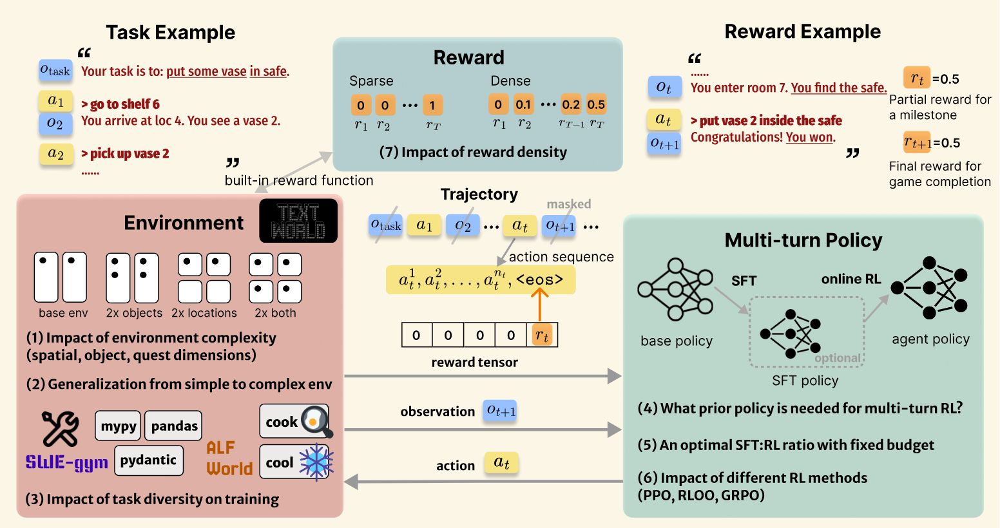

**图 1.** 多轮智能体强化学习及其关键研究问题示意图.

<span id="section-1"></span>

## 1 引言

将 LLM 训练为能够在开放式环境中行动的自主智能体, 会带来独特挑战: 跨越长时域进行规划、做出多轮序贯决策, 以及优化多轮奖励. 从静态的单轮问题求解转向动态的多步推理, 对于交互式文本和具身模拟基准 (TextWorld [Cot19]、ALFWorld [Shr21] 等)、现实世界的软件编程 (OSWorld [Xie24a]、SWE-gym [Pan25b] 等) 以及新情境中的抽象推理 (ARC-AGI [Cho25d]) 都至关重要. 然而, 现有多轮 RL 的实现差异很大: 有些工作将加入工具的单次查询称为多轮 [Zen25c], 另一些工作则依赖基于模型的假设 [Wan25ag]. 这种碎片化导致不同论文的结果难以比较, 也让人难以区分真正的多轮学习与将单轮方法改造成伪多轮的方法.

本文旨在推动对以下开放问题的研究: *哪些因素在实践中决定了面向 LLM 智能体学习的多轮 RL 能否奏效*. 鉴于多轮 RL 方法缺乏统一标准, 我们将设计空间系统地分解为三个相互依赖的支柱——环境、奖励和策略, 并通过实证为情境化文本领域中的 LLM 智能体推导训练方案 ([图 1](#figure-01)). 我们在用于具身推理的 TextWorld 和 ALFWorld, 以及用于现实世界编程的 SWE-gym 上评估该方法, 从每个支柱中提炼关键观察. 对于**环境**, 我们考察性能如何随环境复杂度和任务多样性变化, 以及智能体如何跨环境、跨任务泛化. 对于**策略**, 我们研究模型先验如何影响持续的多轮 RL 训练, 并分析多轮模仿学习 (SFT) 与多轮 RL 的相互作用. 我们还比较有偏 (PPO、GRPO) 和无偏 (RLOO) 的策略梯度 RL 算法, 以分离算法启发式带来的收益. 对于**奖励**, 我们改变逐轮奖励的密度, 分析其对训练的影响.

实验表明, 我们的方案适用于文本推理、情境化具身推理和软件工程任务. 分析得到的主要发现如下: (1) 多轮 RL 的性能会随环境复杂度变化, 在空间、对象和解的维度上均如此; (2) 在简单环境中训练的智能体能够较好地泛化到复杂环境; (3) 多任务训练可以提升多轮 RL 的性能; (4) 少量示例形成的模型先验能够加速收敛, 但泛化仍离不开 RL; (5) 在固定预算下存在一个兼顾任务准确率与泛化能力的最佳 SFT:RL 比例; (6) 有偏和无偏算法都能实现稳定学习, 说明收益来自我们的多轮形式化, 而非算法启发式; (7) 与稀疏奖励相比, 稠密的逐轮奖励能加快多轮 RL 训练, 但需要针对算法进行调参.

这些观察形成了一套具体的多轮 RL 方案, 可指导三个支柱的协同设计. 我们表明, LLM 的多轮 RL 并非单轮优化的简单延伸, 而是需要重新思考环境、策略和奖励的基本设计. 为便于后续研究, 我们将发布基于 veRL [She25c] 构建的多轮智能体 RL 框架, 其中包含本文实验的训练脚本和模型权重. 这项工作为开发能够在现实交互环境中有效运行的智能体 AI 系统提供了理论认识和实践指南.

<span id="section-2"></span>

## 2 相关工作

尽管 PPO [Sch17a]、RLOO [Ahm24]、GRPO [Sha24d] 和 DAPO [Yu25g] 等 LLM 单轮 RL 方法已针对即时响应质量得到充分优化, 将它们用于多轮智能体场景仍并非易事. 这些方法假定奖励紧随单个动作给出, 但多轮环境只有在较长的交互序列之后才会揭示结果, 因而破坏了单轮方法所依赖的动作—奖励耦合. 现有多轮 RL 工作对这些挑战的推进仍然有限. 一些方法通过在单轮问答对中交错加入工具调用或推理步骤来构造多轮场景 [Zen25c, Don25g]. 另一些针对真正交互环境的工作, 要么依赖没有逐轮学习信号的稀疏终止奖励 [Wan25ag], 要么将逐轮优势均匀分配给序列中的所有 token, 缺乏细粒度的信用分配 [Zho25g]. 更重要的是, 目前还缺乏对 RL 的三个基本支柱——环境、策略和奖励——如何共同决定多轮交互环境性能的全面理解. 本文系统分析这些支柱分别如何影响多轮 RL 训练, 并总结在不同交互式智能体环境中实际训练多轮 RL 的要点. 全文在各个章节中分别讨论相关工作.

<span id="section-3"></span>

## 3 多轮智能体强化学习

我们将多轮智能体任务形式化为部分可观测马尔可夫决策过程 (POMDP), 定义为元组 $(\mathcal{S},\mathcal{A},\mathcal{T},\mathcal{R},\Omega,\mathcal{O},\gamma)$. 以 Textworld 任务 [Cot19] 为例, 智能体从动作空间 $\mathcal{A}$ 中采样动作 $a_{t}$ (`go south`), 并从观测空间 $\Omega$ 接收文本观测 $o_{t}$ (`You are in front of a garden`). $o_{t}$ 是隐藏状态空间 $\mathcal{S}$ 中真实状态 $s_{t}$ 的部分描述, 后者包含完整的状态世界模型. 我们假定状态转移函数 $\mathcal{T}:\mathcal{S}\times\mathcal{A}\rightarrow\mathcal{S}$ 是确定性的. 执行动作后, 智能体还会收到标量奖励 $r_{t}=\mathcal{R}(s_{t},a_{t})$. 智能体的目标是学习一个策略, 使奖励的期望折扣和 $\mathbb{E}[\sum_{t}\gamma^{t}\cdot r_{t}]$ 最大.

我们将由任务提示 $u$、动作序列和状态序列组成的轨迹历史记为 $h_{t}=(u,s_{0},a_{0},s_{1},a_{1},\cdots,s_{t})$ [+1]. 带有策略 $\pi_{\theta}$ 的 LLM 智能体根据轨迹历史采样动作序列 $a_{t}\sim\pi_{\theta}(\cdot|h_{t})$. $a_{t}$ 是自然语言 token 序列: $(a_{t}^{1},a_{t}^{2},...,a_{t}^{n_{t}},a_{t}^{\mathrm{eos}})$, 其中每个 token $a_{t}^{i}$ 按 $\pi_{\theta}(\cdot|h_{t},a_{t}^{<i})$ 生成. 智能体环境只在语言命令生成完毕后执行命令, 因此奖励自然定义在以 `<eos>` token 标记的命令边界处. 于是, 我们在 $a_{t}^{\mathrm{eos}}$ 处分配标量奖励 $r_{t}$, 每个动作 token 的奖励写为: $r_{t}^{i}=\begin{cases}r_{t}&\mathrm{if}\ a_{t}^{i}=\texttt{<eos>}\\ 0&\mathrm{otherwise}\end{cases}$. 我们通过屏蔽所有状态 token, 确保只有动作 token 对损失有贡献.

下面给出一个具体例子: 在 rollout 阶段, 使用聊天模板输入 LLM 的内容为:

```text
<|im_start|>user
Your task is: {task prompt}. state: {state 0} your action:<|im_end|>
<|im_start|>assistant
{action 0}<|im_end|>
...
<|im_start|>user
state: {state t} your action:<|im_end|>
<|im_start|>assistant
```

策略 $\pi_{\theta}$ 对应的 LLM 生成输出 `{action t}<|im_end|>`. 环境负责状态转移和奖励计算: `next_state, reward, done = env.step(state, action)`. 每一轮的奖励分配给 `<|im_end|>` token. 随后, 按照该模板将动作和下一状态追加到聊天历史中.

<span id="section-4"></span>

## 4 背景与实验设置

我们的实验系统考察 RL 的三个基本支柱如何影响多轮智能体 RL 的性能. 对于**环境** ([第 5 节](#section-5)), 我们研究环境复杂度扩展如何在空间、对象和解的维度上影响学习 ([第 5.1 节](#section-5-1)), 评估在简单环境中训练的智能体能否泛化到复杂环境 ([第 5.2 节](#section-5-2)), 并分析任务多样性如何影响训练和泛化 ([第 5.3 节](#section-5-3)). 对于**策略** ([第 6 节](#section-6)), 我们分析示例数据形成的模型先验如何影响 RL 收敛, 并在预算约束下确定 SFT 与 RL 数据比例的最佳取值 ([第 6.1 节](#section-6-1)). 我们将有偏算法 (PPO、GRPO) 与无偏算法 (RLOO) 进行比较, 以分离算法设计和多轮形式化各自带来的收益 ([第 6.2 节](#section-6-2)). 对于**奖励** ([第 7 节](#section-7)), 我们研究奖励密度, 即轨迹中反馈信号的频率, 如何影响训练和最终性能 ([第 7.1 节](#section-7-1)). 这些实验表明, 多轮 RL 需要对所有组件进行谨慎的协同设计, 而不是简单扩展单轮方法.

**任务与环境.** 我们在三个情境化文本基准上进行评估: 用于情境化具身推理语言落地的 TextWorld [Cot19] 和 ALFWorld [Shr21], 以及用于现实世界软件工程的 SWE-Gym [Pan25b]. 我们扩展 veRL [She25c] 的高效 RL 训练基础设施, 通过标准的 `step` 和 `reset` 接口接入这些基准环境. 与同时提供观测和可执行动作列表、将问题简化为动作选择的传统 RL 设置不同, 我们的智能体只能依据环境观测生成可执行的自然语言命令, 不会得到动作提示, 从而检验其通过探索发现有效动作的能力. 任务和环境的详细信息见 [附录 B](#appendix-b).

- **TextWorld**: 一种文本冒险游戏环境, 智能体通过自然语言在房间间移动、操作对象并完成任务. 我们从三个维度控制复杂度, 以程序方式生成任务: 世界大小 (w)、对象数量 (o) 和任务长度 (q). 例如, `w2-o3-q4` 表示 2 个房间、3 个对象和一个 4 步任务. 每个任务使用唯一的随机种子以增加多样性.
- **ALFWorld**: 一个具身家居环境, 要求通过文本交互完成多步任务. 我们使用涵盖六类任务的纯文本变体, 在 `train` 划分上训练, 在 `valid_unseen` 划分上评估.
- **SWE-Gym**: 包含修复缺陷和实现功能的现实世界编程任务. 我们关注 5 种代表性任务类型: getmoto、pydantic、mypy、pandas 和 iterative_dvc, 随机抽取 90 个训练实例和 25 个评估实例.

**训练与评估.** 我们使用 Qwen2.5-1.5B-Instruct、Qwen2.5-7B-Instruct 和 Qwen3-8B 作为基础模型 (简称 Qwen-1.5B、Qwen-7B 和 Qwen-8B), 采用 PPO [Sch17a]、GRPO [Sha24d] 和 RLOO [Ahm24] 算法训练. 最大迭代步数和 token 上限随任务复杂度调整. 在 rollout 生成阶段, 我们使用 0.7 的温度来平衡探索与利用. 我们在留出的测试集上评估智能体, 以任务成功率作为主要指标, 即智能体在探索预算内完成目标的 episode 百分比. 对于 SWE-Gym, 我们报告测试套件通过比例. 完整的训练细节和超参数调优分析见附录 [C](#appendix-c) 和 [A](#appendix-a).

<span id="section-5"></span>

## 5 环境

环境从根本上决定了智能体必须克服的挑战. 单轮任务主要衡量推理难度, 多轮环境则引入空间导航、对象操作和长时域规划等维度. 我们研究多轮系统实际部署中的三个核心问题: (1) *环境复杂度如何影响多轮 RL 的训练效率?* 这决定了不同复杂度任务所需的探索预算和模型规模. (2) *在简单环境中训练的智能体能否泛化到复杂环境?* 这是扩展智能体系统时的关键考量. (3) *任务多样性如何影响训练和泛化?* 我们不仅展示适用于 TextWorld 的多轮 RL 方案能够泛化到 ALFWorld 和 SWE-Gym, 还考察智能体学到的是可泛化技能, 还是记住了任务特有的行为. 实验表明, 多轮 RL 能够在不同环境和多样任务之间实现有效的知识迁移.

**设置.** 我们设计了两组实验条件, 用于改变环境复杂度和任务多样性. 对于**环境复杂度**, 我们从基础配置 w2-o3-q4 出发, 构造受控变体: w8-o3-q4 (提高空间复杂度)、w2-o12-q4 (提高对象复杂度)、w8-o12-q4 (同时提高两个维度), 以及 w4-o6-q8 (按比例扩展所有维度). 在 SWE-Gym 中, 我们聚焦 getmoto 任务子集以分离复杂度因素, 并按两个不同指标将任务分为 Easy、Medium 和 Hard: (1) *解的复杂度* (标准补丁的代码行数) 和 (2) *验证复杂度* (测试套件大小). 对于**任务多样性**, 我们构造异质性逐渐增加的训练混合. 在 ALFWorld 中, 我们测试单一类型 (仅 pick & place)、4 种类型 (heat、cool、cook、examine) 和全部 6 种类型 (另加入 pick two & place). 在 SWE-Gym 中, 我们比较单一类型 (仅 getmoto) 与全部 5 种类型 (getmoto、pydantic、mypy、pandas 和 iterative_dvc). 为保证公平比较, 所有混合的数据规模相同, 并在单一类型和混合类型的留出测试集上评估. 我们使用 PPO 和 GRPO, 以一致的超参数训练 Qwen-1.5B、Qwen-7B 和 Qwen-8B. 完整的任务规格和训练细节见附录 [B.1](#appendix-b-1) 和 [C.1](#appendix-c-1).

<span id="section-5-1"></span>

### 5.1 多轮 RL 性能如何随环境复杂度变化?

[表 1](#table-01) 显示, 随着环境复杂度提高, 基础模型的表现急剧下降; 当空间和对象两个维度同时扩展时, 性能从 17% 降至 3%. 尤其值得注意的是, **多轮 RL 带来的提升会随复杂度增加而减小**: PPO 在基础环境中带来 88% 的提升, 在最复杂的设置中则降至 51%. 此外, **对象复杂度比空间复杂度更具挑战性**, 说明在多轮交互中操作和跟踪多个对象, 从根本上比情境化文本领域中的空间探索更困难. 我们在编程领域观察到相似趋势 ([表 2](#table-02)). 当任务需要更长的代码解或通过更严格的测试套件时, 基础模型的性能会下降. 不过, 多轮 GRPO 在各难度层级都能稳定恢复性能, 说明我们的指标确实刻画了真实复杂度.

**性能也会随模型规模变化**. 如 [表 3](#table-03) 所示, 7B 模型在 w4-o6-q8 上达到 72% 的成功率, 表明较大的模型更善于处理复杂环境中扩大的状态空间. 即使是 1.5B 模型也表现出较强的学习潜力, 在 w2-o3-q4 和 w4-o6-q8 上分别提升 65% 和 58%.

<span id="table-01"></span>

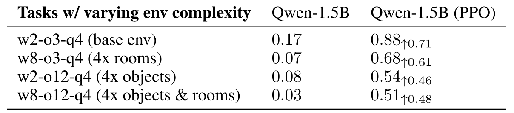

**表 1.** 多轮 PPO 在不同复杂度维度的 TextWorld 任务上的性能. 基础环境: w2-o3-q4. 最大步数: 12.

<span id="table-02"></span>

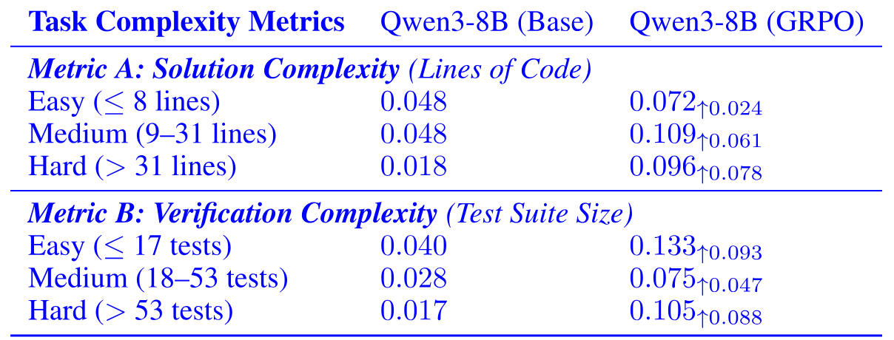

**表 2.** 多轮 GRPO 在不同复杂度维度的 SWE-Gym 任务上的性能. 我们将 Qwen3-8B 基础模型与经多轮 GRPO 训练的策略进行比较, 并按解的规模 (补丁行数) 和验证工作量 (测试套件大小) 划分任务.

<span id="table-03"></span>

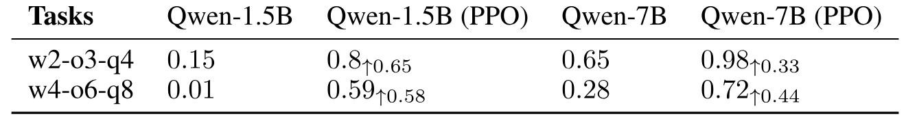

**表 3.** 不同模型规模在按比例扩展的 TextWorld 环境中的多轮 PPO 性能比较. 最大步数: 12 (w2-o3-q4) 和 24 (w4-o6-q8).

<span id="table-04"></span>

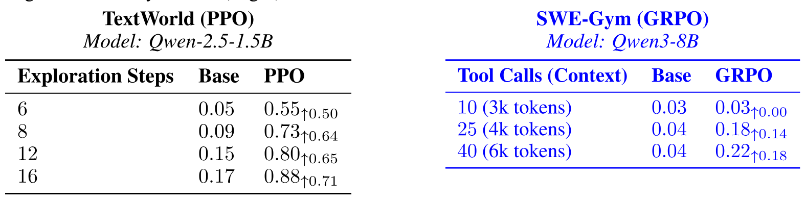

**表 4.** 探索时域对多轮性能的影响. 我们比较了增加允许探索步数对 TextWorld w2-o3-q4 任务 (左) 的影响, 以及增加允许工具调用次数和响应长度对 SWE-Gym 任务 (右) 的影响.

最后, 我们研究探索预算 (智能体在 rollout 中可执行的最大步数) 如何影响学习. 对于最优解为 4 步的 w2-o3-q4 任务, 我们将最大步数从 6 调整到 16. [表 4](#table-04) 显示, **探索超过 8 步后, 性能趋于饱和**. 将智能体限制在 6 步 (最优步数的 $1.5\times$) 时, PPO 的成功率只有 55%; 允许 8 步 (最优步数的 $2\times$) 时, 成功率达到 73%. 继续增加到 12 步和 16 步, 只带来很小的提升. 这说明探索不足会严重限制学习, 但对于 TextWorld 任务, 预算超过最优步数的 2 倍几乎没有额外收益. 相比之下, **复杂编程任务能显著受益于更长的时域.** 在 SWE-Gym 中, 将上下文窗口和允许的工具调用次数从 10 增至 40, 会使成功率从 3% 提高到 22%. 与简单文本游戏不同, 软件仓库中的推理不会很快饱和; 持续探索让智能体能够反复调试并改进解法.

<span id="section-5-2"></span>

### 5.2 多轮 RL 如何泛化到复杂度不同的环境?

为考察多轮 RL 是否能学到可迁移技能, 我们评估了跨环境泛化. 我们分别在 w2-o3-q4、w8-o3-q4 和 w2-o12-q4 上训练单任务模型, 并在等比例混合的 w2-o12-q4 和 w8-o3-q4 上训练一个混合复杂度模型, 同时保持各条件的 RL 数据总量不变. [表 5](#table-05) 表明, **在较简单环境中训练的智能体能够显著泛化到更复杂的环境**; 在 w2-o3-q4 上训练的模型在所有更高复杂度环境中的性能都有提升. 从 w8-o3-q4 (提高空间复杂度) 进行迁移的效果尤其突出, 它在各目标环境上取得最大的平均提升; 在 w8-o12-q4 上提升 48%, 与直接在 w8-o12-q4 上训练所带来的 48% 提升相当. 这些结果说明, 多轮 RL 学到的空间探索和对象操作等可复用技能能够跨复杂度层级迁移.

**这种泛化能力也延伸到了非具身领域. 如 [表 6](#table-06) 所示, 在 Easy 任务 (按测试套件复杂度划分) 上训练的代码智能体能够有效迁移到更困难的问题, 在 Medium 和 Hard 任务上分别提升 4.8% 和 3.6%. 这与 TextWorld 中的发现一致, 说明多轮 RL 能够学到纠错和状态跟踪等稳健、可复用的行为, 即使环境复杂度提高, 这些行为仍然有效.**

<span id="table-05"></span>

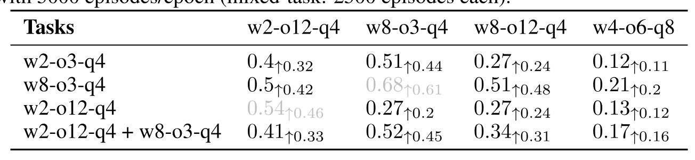

**表 5.** 多轮 PPO 在 TextWorld 任务上的跨环境泛化. 所有模型均以每个 epoch 5000 个 episode 训练 (混合任务: 每种各 2500 个 episode).

<span id="table-06"></span>

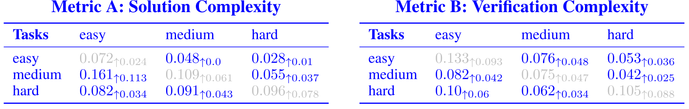

**表 6.** 多轮 GRPO 在 SWE-Gym 任务上的跨环境泛化. 我们分别按任务复杂度 (指标 A: 补丁行数) 和验证复杂度 (指标 B: 测试套件大小) 评估迁移性能. 对角线元素 (灰色) 表示分布内性能.

<span id="section-5-3"></span>

### 5.3 多轮 RL 如何泛化到同一领域的不同任务类型?

在 [第 5.1 节](#section-5-1) 和 [第 5.2 节](#section-5-2) 中, 我们考察了智能体如何应对单一任务类型中不同的环境复杂度. 这里讨论一个更宽泛的问题: *我们的多轮 RL 方案能否适用于 ALFWorld 这样的复杂情境化环境和 SWE-Gym 这样的现实场景?* 此外, *在任务子集上训练的智能体能否泛化到完整的任务分布?* 我们研究在多样任务类型上训练如何影响两个领域中的泛化. 在 ALFWorld 中, 不同任务需要不同的物理技能: 清洁要求找到并放置对象, 加热则要求按特定顺序操作设备. 在 SWE-gym 中, 任务涵盖从修复 pydantic 问题到解决 pandas 问题的多种软件工程挑战.

[表 7](#table-07) 和 [表 8](#table-08) 表明, **多轮 RL 可以成功用于具有挑战性的 ALFworld 和 SWE-Gym 环境**. 值得注意的是, **只在单一任务类型上训练的智能体对未见任务类型也有一定泛化能力**; 仅靠单类型训练, 在全部任务类型上便分别提升 12% (ALFWorld) 和 7% (SWE-Gym). 这说明即使接触的任务有限, 多轮 RL 仍能学到可迁移技能. 多任务训练还会惠及看似无关的任务: 在 clean、heat、cool 和 cook 混合任务上训练的智能体, 在 pick & place 单任务上比该任务的专门模型高 19%, 在全类型评估中高 21%. 结果说明, **多轮 RL 能够形成可在不同目标间迁移的泛化技能**.

<span id="table-07"></span>

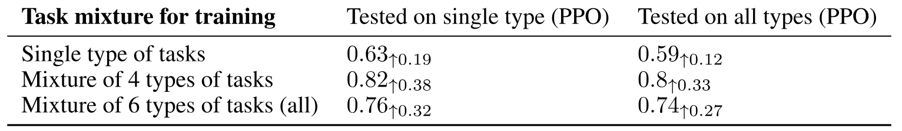

**表 7.** 在不同任务混合上训练的多轮 PPO 在 ALFWorld 未见任务上的性能.

<span id="table-08"></span>

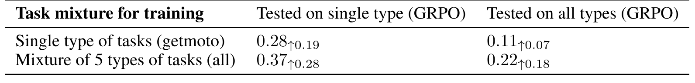

**表 8.** 在不同任务混合上训练的多轮 GRPO 在 SWE-gym 任务上的性能. 关于 GRPO 算法用法的更多讨论见 [第 6.2 节](#section-6-2).

<span id="section-6"></span>

## 6 策略

RL 优化算法和模型初始化方式的选择, 对多轮 RL 性能有决定性影响. 我们先考察示例数据的作用. 在实际应用中, 用于监督微调 (SFT) 的人类示例数据可能有限. 我们提出两个问题: (1) *怎样的模型策略先验能够支持有效的多轮 RL?* 这关系到智能体若能从头有效学习, 是否还需要昂贵的人类示例. (2) *给定固定的数据预算, SFT 数据与 RL 数据的最佳比例是多少?* 这决定了如何在示例收集和在线学习之间合理分配有限资源. 接着, 我们研究 *RL 优化方法的选择是否会显著影响多轮 RL 训练*. 我们将启发式策略梯度方法 (PPO [Sch17a]、GRPO [Sha24d]、Reinforce++ [Hu25d]) 与无偏方法 (RLOO [Ahm24]) 比较, 以区分多轮形式化与特定优化启发式各自的贡献; 近期关于依赖启发式结果之隐患的工作 [Oer25] 表明, 这一点对于严谨论证算法改进不可或缺.

**设置.** TextWorld 为每个程序生成的游戏提供标准解, 我们将其用作 SFT 示例数据, 以代表人类的多轮轨迹. SFT 数据采用逐轮聊天格式, 即多数指令遵循场景使用的默认模板. 我们使用与 RL 数据不同的随机种子生成 SFT 数据, 以防止数据泄漏. 我们采用 PPO、GRPO、Reinforce++ 和 RLOO 训练 Qwen-1.5B、Qwen-7B 和 Qwen-8B, 并在各实验中使用一致的超参数. 完整的任务规格和训练细节见附录 [B.2](#appendix-b-2) 和 [C.2](#appendix-c-2).

**多轮 PPO 形式化.** 对于近端策略优化 (PPO) [Sch17a] 等带有优势估计的优化算法, 我们采用 token 级信用分配. 我们计算 token 级价值, 并将 TD 误差写为 $\delta_{t}^{i}=r_{t}^{i}+\gamma V(h_{t}^{i+1})-V(h_{t}^{i})$, 其中 $h_{t}^{i}$ 是截至并包含 token $a_{t}^{i}$ 的历史. 随后使用 GAE 估计每个 token 的优势: $\hat{A}_{t}^{i}=\sum_{l=0}^{L-i}(\gamma\lambda)^{l}\delta_{t}^{i+l}$, 其中 $L$ 是时域长度 (从当前处到 episode 结束的 token 数). 虽然只有 `<eos>` token 获得奖励, 但之前的所有 token 都会通过价值自举得到非零优势. 因此, 轨迹中所有 token 的截断替代目标可以写为:

$$
L^{\mathrm{CLIP}}(\theta)=\mathbb{E}_{\tau\sim\pi_{\theta}}\left[\sum_{t=0}^{T}\sum_{i=1}^{n_{t}+1}\min\left(r_{t}^{i}(\theta)\hat{A}_{t}^{i},\mathrm{clip}(r_{t}^{i}(\theta),1-\epsilon,1+\epsilon)\hat{A}_{t}^{i}\right)\right]
$$

其中, 每个 token 的概率比为: $r_{t}^{i}(\theta)=\dfrac{\pi_{\theta}(a_{t}^{i}|h_{t},a_{t}^{<i})}{\pi_{\theta_{old}}(a_{t}^{i}|h_{t},a_{t}^{<i})}$.

<span id="section-6-1"></span>

### 6.1 模型策略先验如何影响多轮 RL 训练?

我们区分先验的建立 (通过 SFT) 和持续学习对先验的改进 (通过多轮在线 RL). 这种两阶段方法与现实部署过程相符, 即智能体先从示例中学习, 再进行在线学习. **我们发现, 较强的 SFT 先验能大幅提高 RL 的效率.** 在 TextWorld w2-o3-q4 任务的标准解上训练表明, 只需一小部分数据便可达到大规模 RL 训练的性能. 如 [表 9](#table-09) 所示, 仅用 60 条示例初始化、再经 400 个 RL episode 改进的模型可达到 85% 的成功率, 接近需要 5000 个 episode 的纯 RL 训练所达到的 88%.

为确定资源的最佳分配方式, 我们在固定为 1000 个成本单位的预算下分析性能; 考虑到人类标注需要更多投入, 我们假定 SFT 数据的成本是 RL episode 的 10$\times$. **我们发现, 纯 SFT 虽然擅长已知任务, 但要获得稳健性仍离不开 RL.** 将全部预算用于 SFT (100 条示例) 会带来出色的领域内性能 (w2-o3-q4 任务上为 95%), 却难以泛化到更困难的任务 (w4-o6-q8 任务上为 55%). 较为理想的是混合配置: 先使用 60 条示例, 再进行 400 个 RL episode. 该配置在 SFT 提供的行为基础和 RL 的适应能力之间取得平衡, 既保持 85% 的领域内成功率, 也将复杂 w4-o6-q8 任务上的泛化性能提高到 59%.

<span id="table-09"></span>

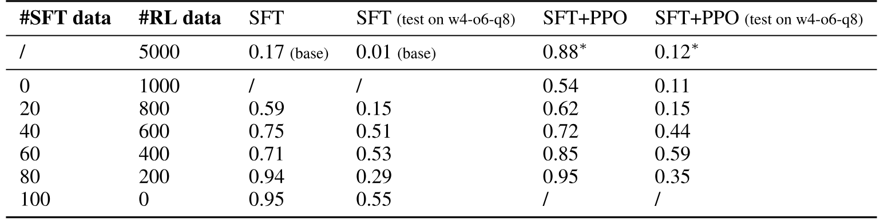

**表 9.** 固定预算下不同 SFT/RL 数据分配的性能. 模型在 w2-o3-q4 上训练, 在 w2-o3-q4 和 w4-o6-q8 上评估. 先进行 SFT, 再进行多轮 PPO. 表中包含先前实验结果以供比较.

最后, 我们考察先验能否在不同环境间迁移: 在 ALFWorld (3553 个样本) 上训练 SFT 模型来初始化 TextWorld 智能体, 反之亦然. 我们发现, **跨领域先验会直接损害多轮 RL 训练.** 使用另一领域进行初始化会导致策略迅速崩溃, 可能是因为从源环境学到的特定行为偏置和动作分布与目标环境的动态相冲突, 进而使策略优化失稳.

<span id="section-6-2"></span>

### 6.2 RL 算法如何影响多轮 RL 训练?

要论证方法的泛化性, 必须弄清性能提升究竟来自多轮形式化, 还是来自具体算法选择. 我们比较 PPO (带价值函数自举的启发式策略梯度方法)、RLOO (无偏策略梯度估计器), 以及 Reinforce++ 和 GRPO 等近期变体, 以区分 token 级信用分配和算法设计决策各自的贡献 [Oer25].

**PPO 和 RLOO 相比基础模型都取得了提升, 说明性能增益来自多轮形式化, 而非 PPO 特有的启发式.** [表 10](#table-10) 显示, PPO 在 w2-o3-q4 上达到 88% 的成功率, RLOO 为 51%. 相比之下, Reinforce++ 和 GRPO 相对基础模型几乎没有提升. 在更困难的 w4-o6-q8 任务上, 这一差距进一步扩大: PPO 仍保持 59% 的成功率, 而 1.5B 模型采用 RLOO、Reinforce++ 和 GRPO 时均发生崩溃.

**扩大模型规模有助于缩小简单任务上的差距**, 而 PPO 在复杂推理中仍是最佳算法. 参数规模达到 7B 时, PPO 和 RLOO 在简单的 w2-o3-q4 任务上均收敛至约 98%, 但 Reinforce++ 和 GRPO 仍落后, 分别为 72% 和 79%. 在更困难的 w4-o6-q8 任务上, PPO 以 72% 的成功率占优, 而 RLOO 和 GRPO 分别为 47% 和 36%. RLOO 在各任务中均能稳定取得提升, 证实性能增益并非来自 PPO 启发式; 不过, 结果也说明, **在该领域中, PPO 的样本效率和稳健性都显著高于 Reinforce++ 和 GRPO.**

<span id="table-10"></span>

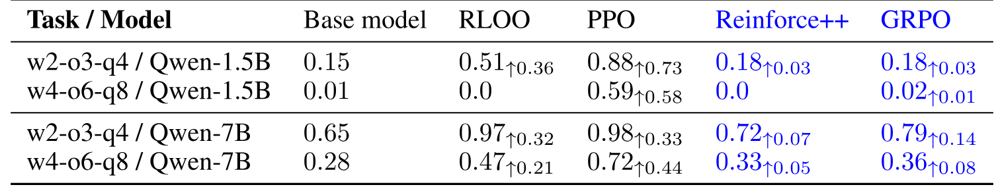

**表 10.** 不同模型规模下, PPO、RLOO、Reinforce++ 和 GRPO 等 RL 算法在多轮 TextWorld 任务上的比较.

我们还在 [第 5.3 节](#section-5-3) 中考察了 GRPO 在 SWE-Gym 任务上的表现. 尽管 GRPO 在 [表 10](#table-10) 的 TextWorld 任务上表现较差, SWE-Gym 的环境却使 GRPO 在计算上更具优势. 因此, 我们只在稀疏奖励设置 (每条轨迹仅有最终奖励) 下, 将 PPO 和 GRPO 作为有偏算法进行类比. [表 8](#table-08) 中 GRPO 的提升与 [表 10](#table-10) 中 PPO 的结果共同**说明了有偏方法在多轮 RL 中的有效性.**

<span id="section-7"></span>

## 7 奖励

多轮环境通常只在任务完成时提供稀疏反馈, 这会给长序列带来困难, 并可能导致收敛缓慢或训练不稳定. 不过, 一些环境会在求解里程碑处提供部分奖励, 形成稠密奖励信号. 我们研究奖励密度, 即轨迹中反馈信号的频率, 如何影响多轮 RL 的性能和学习效率.

**设置.** 我们在两个不同领域中研究奖励设计的影响: 文本游戏 TextWorld 和软件工程环境 SWE-Gym. 对于 **TextWorld**, 我们利用内置函数控制奖励密度, 比较**稀疏奖励** (仅在任务完成时提供) 和**稠密奖励** (在中间步骤提供). 我们在 *tw-simple* 任务 [+2] 上使用 PPO 和 RLOO, 对 3000 个 episode 进行评估. 对于 **SWE-Gym**, 我们更细致地评估奖励的*来源*和*粒度*. 我们将由真实执行得到的**验证奖励** (包括二元任务完成信号和细粒度单元测试通过比例) 与由评判模型 (CodeRM-8B [Ma25e] 和 GPT-4.1) 合成的**基于模型的奖励**进行比较. 考虑到编程任务时域很长, 我们采用 GRPO 以提高稳定性. 两种环境和奖励配置的完整规格见附录 [B.3](#appendix-b-3) 和 [C.3](#appendix-c-3).

<span id="table-11"></span>

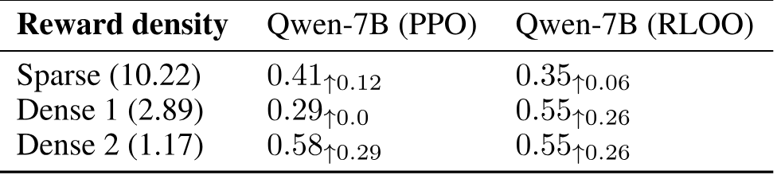

**表 11.** 不同奖励密度方案在 tw-simple 任务 (Qwen-7B) 上的性能. 括号中为奖励密度, 以每次奖励对应的步数表示.

<span id="section-7-1"></span>

### 7.1 多轮 RL 训练需要什么奖励信号?

**稠密奖励能显著提升多轮 RL 的性能, 但最佳密度因算法而异.** 如 [表 11](#table-11) 所示, PPO 受益于更频繁的反馈, 成功率从稀疏奖励下的 41% 跃升至最稠密信号 (Dense 2) 下的 58%. 相比之下, RLOO 在两种稠密配置下都保持稳定性能 (55%), 说明其无偏梯度估计对奖励密度不太敏感.

这里的关键认识是, 奖励密度应与优化策略相匹配. 稠密信号虽然能加速收敛, 但其作用取决于信号质量. 中间奖励若设计不当, 可能会引入噪声, 误导智能体.

<span id="section-7-2"></span>

### 7.2 复杂任务中的验证奖励与基于模型的奖励

TextWorld 为分析奖励密度提供了受控环境, 但软件工程等现实应用通常涉及复杂的长时域推理, 因而更难定义奖励密度. 为此, 我们使用 SWE-Gym 将分析扩展到编程领域. 我们研究两个关键问题: (1) *验证反馈的粒度是否重要?* (2) *基于模型的评判器能否替代验证器? *

**细粒度验证器奖励的必要性.** 我们先比较两种基于执行的反馈实现: 稀疏的*二元验证奖励* (仅当智能体通过完整测试套件时给予 +1) 和稠密的*比例验证奖励* (与通过的单元测试百分比成正比). 如 [表 12](#table-12) 所示, **细粒度验证器奖励对于更复杂的任务不可或缺.** 使用稀疏二元奖励时, 智能体的成功率只有 4.2%, 相比基础模型的 4% 几乎没有提升; 提供稠密的比例反馈后, 性能则提高到 22%. 这证实, 在软件工程等复杂领域中, 最终测试套件的“全有或全无”信号过于稀疏, 无法指导策略; 针对单个单元测试通过情况的细粒度奖励, 才能提供学习所需的梯度.

**验证器与基于模型的评判器.** 我们也考察基于模型的奖励能否有效替代验证器. 我们采用两个具备代码生成能力的模型评判器 CodeRM-8B [Ma25e] 和 GPT-4.1, 生成合成测试套件并评估智能体的代码生成进度. 基于模型的奖励虽比基础模型有所提升, 但明显不及验证奖励. 如 [表 12](#table-12) 所示, 由 CodeRM-8B 和 GPT-4.1 塑造的奖励分别取得 7.2% 和 9.3% 的成功率. 这些模型评判器能够提供一些有用信号, 但与比例验证奖励 (22%) 仍有很大差距. 因此, 对实践者而言, **最稳健的方案仍是依靠基于执行的单元测试, 而不是基于模型的代理.**

<span id="table-12"></span>

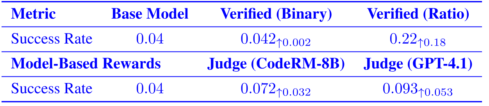

**表 12.** GRPO 在采用不同奖励信号的 SWE-Gym 任务上的性能. 我们比较基础模型、验证奖励 (二元与比例) 和基于模型的奖励 (CodeRM-8B 与 GPT-4.1).

<span id="section-8"></span>

## 8 方案与结论

我们围绕环境、策略和奖励三个支柱展开系统研究, 得到一套实用的多轮智能体 RL 方案, 并在 TextWorld、ALFWorld 和 SWE-Gym 上进行了验证.

**环境:** *课程很重要.* 从较简单的环境或验证复杂度较低的任务开始训练. 我们发现, 智能体在较容易的设置中形成的可复用技能 (如状态跟踪), 能够有效泛化到复杂、对象密集或长时域的任务.

**策略:** *优先考虑稳定性和先验.* 在多轮设置中, 经过稳定化处理的有偏算法 (PPO、GRPO) 显著优于无偏估计器 (RLOO) 和朴素梯度方法 (Reinforce++). 此外, 使用较强的 SFT 先验进行初始化, 可以大幅降低 RL 的样本复杂度, 比纯 RL 更高效地收敛.

**奖励:** *粒度优于近似.* 复杂推理离不开稠密奖励. 不过, 我们的结果表明, **经过验证的执行反馈** (如单元测试通过率) 远优于基于模型的替代信号. 实践者应优先构建细粒度、基于执行的信号, 而不是训练奖励模型.

通过系统确定这套方案——**课程 + 稳定化策略 + 经过验证的稠密奖励**, 我们为开发能够在现实世界中进行长期交互的真正自主智能体, 提供了实证基础和实践指南.

## 可复现性声明

我们致力于确保实验结果可以复现. 为此, 我们提供完整的实验设置细节, 并将发布复现实验所需的全部资源:

**代码与框架:** 我们将开源基于 veRL 构建的完整多轮 RL 框架, 其中包括 TextWorld、ALFWorld 和 SWE-Gym 的环境集成. 论文发表时, 仓库将包含所有训练脚本、评估流程和数据生成程序.

**实验细节:** 附录提供了所有实验的完整超参数, 包括各环境和模型配置的学习率、KL 惩罚、批量大小、探索预算和温度设置. 我们给出了确切的模型版本 (Qwen2.5-1.5B-Instruct、Qwen2.5-7B-Instruct、Qwen3-8B)、训练 epoch 数和收敛标准. 文中还记录了任务选择流程, 包括 TextWorld 程序生成所用的随机种子, 以及 ALFWorld 和 SWE-Gym 的具体任务划分.

**数据与模型:** 我们详细说明了数据生成过程, 包括如何从 TextWorld 标准解构造 SFT 示例, 以及 SWE-Gym 任务的采样策略. 我们将发布关键实验配置的模型权重. 对于需要特定版本的环境, 我们会提供确切的软件包版本和安装说明.

**计算需求:** 所有实验均在 NVIDIA H100 GPU 上完成. 我们报告各实验配置的大致训练时间和所需计算资源, 便于研究人员估算复现成本. 该框架支持分布式训练, 可高效地进行大规模复现.

<span id="appendix-a"></span>

## 附录 A 多轮 RL 的超参数调优

为建立稳健的多轮 RL 训练方案, 我们使用 PPO 在 TextWorld w2-o3-q4 任务上训练 Qwen-1.5B, 并进行了系统的超参数扫描. 按照第 [4](#section-4) 节的设置, 我们使用 5000 个 episode 训练, 并在 100 个留出 episode 上评估. 每个实验运行 30 个 epoch (约 575 步), 以评估早期训练稳定性, 并在整个训练过程中测量任务成功率.

[图 2](#figure-02) 显示, 不同超参数配置的性能差异很大. 较高的 KL 系数 ($>0.001$) 会产生更稳定的训练曲线. 配置比较表明, gamma 低于 1.0 会损害性能 (蓝色与粉色曲线), rollout 温度也会显著影响结果; 对比浅绿色、粉色和深绿色曲线可见, 最佳性能出现在 0.7 到 1.0 之间. 提高 actor 和 critic 网络的学习率, 都能改善训练效率和最终性能 (棕色与浅绿色曲线).

[表 13](#table-13) 证实了最佳配置: KL 系数为 0.01, 温度为 0.7, actor 学习率为 1e-6, critic 学习率为 1e-5, gamma 为 1.0. 这些设置兼顾训练稳定性和较强的最终性能, 构成了我们在所有基准上开展实验的基础.

<span id="figure-02"></span>

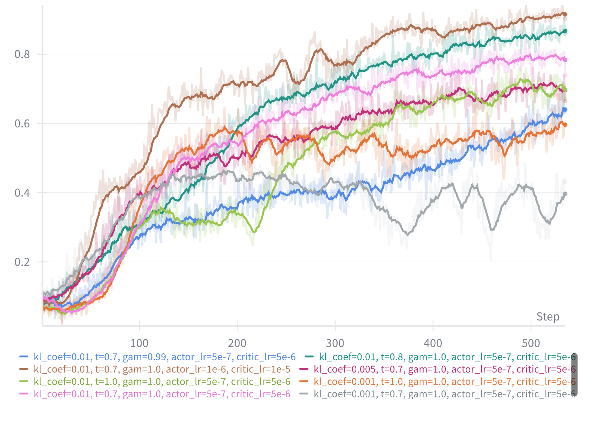

**图 2.** Qwen-1.5B 在 TextWorld w2-o3-q4 上采用不同超参数时的训练曲线. 所示参数包括: KL 系数 (kl_coef)、rollout 温度 (t)、actor/critic 学习率和折扣因子 (gam).

<span id="table-13"></span>

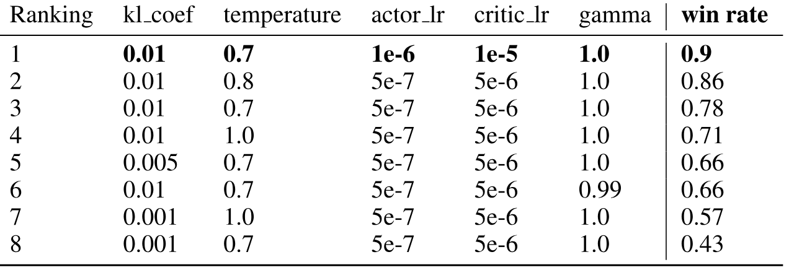

**表 13.** TextWorld w2-o3-q4 测试集上第 30 个 epoch 的成功率, 按性能排序. 仅展示性能最高的配置; 未列出的配置表现明显更差.

<span id="appendix-b"></span>

## 附录 B 任务与环境细节

我们在 [图 3](#figure-03) 中展示了 TextWorld w2-o3-q4 任务的示例. ALFWorld 任务基于 TextWorld 构建, 格式与其相似, 但更依赖智能体的具身理解. [图 4](#figure-04) 展示了 ALFWorld heat & place 任务的一个示例.

我们从 SWE-Gym 的 Hugging Face 仓库中提取任务 ([https://huggingface.co/datasets/SWE-Gym/SWE-Gym](https://huggingface.co/datasets/SWE-Gym/SWE-Gym)). [图 5](#figure-05) 展示了 SWE-Gym getmoto 任务的一个示例.

<span id="figure-03"></span>

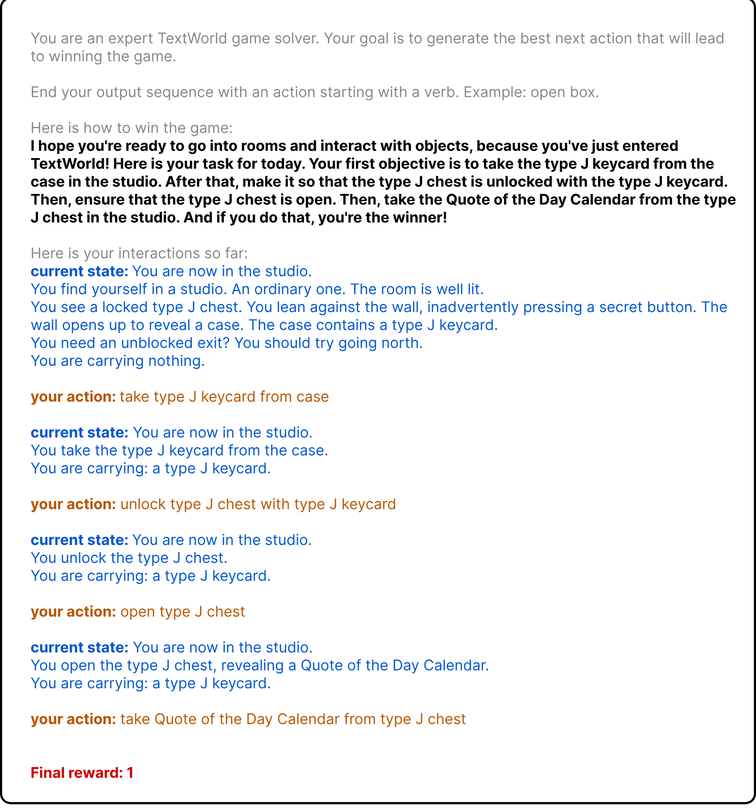

**图 3.** Textworld w2-o3-q4 任务示例. 灰色文本为提示, 粗体文本为目标, 蓝色文本为观测, 橙色文本为动作.

<span id="figure-04"></span>

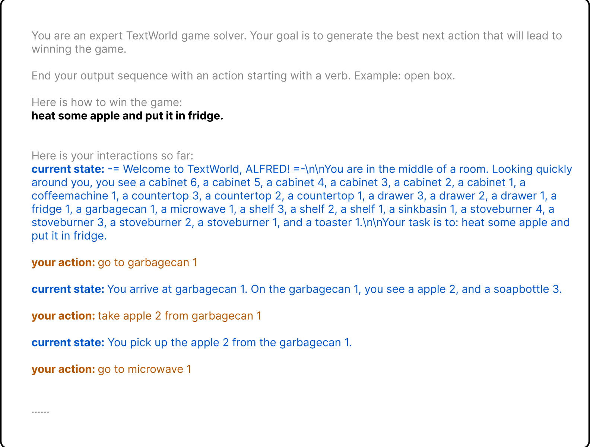

**图 4.** ALFWorld heat & place 任务示例. 灰色文本为提示, 粗体文本为目标, 蓝色文本为观测, 橙色文本为动作. 由于任务轨迹很长, 且与 TextWorld 示例相似, 我们只展示其中一部分.

<span id="figure-05"></span>

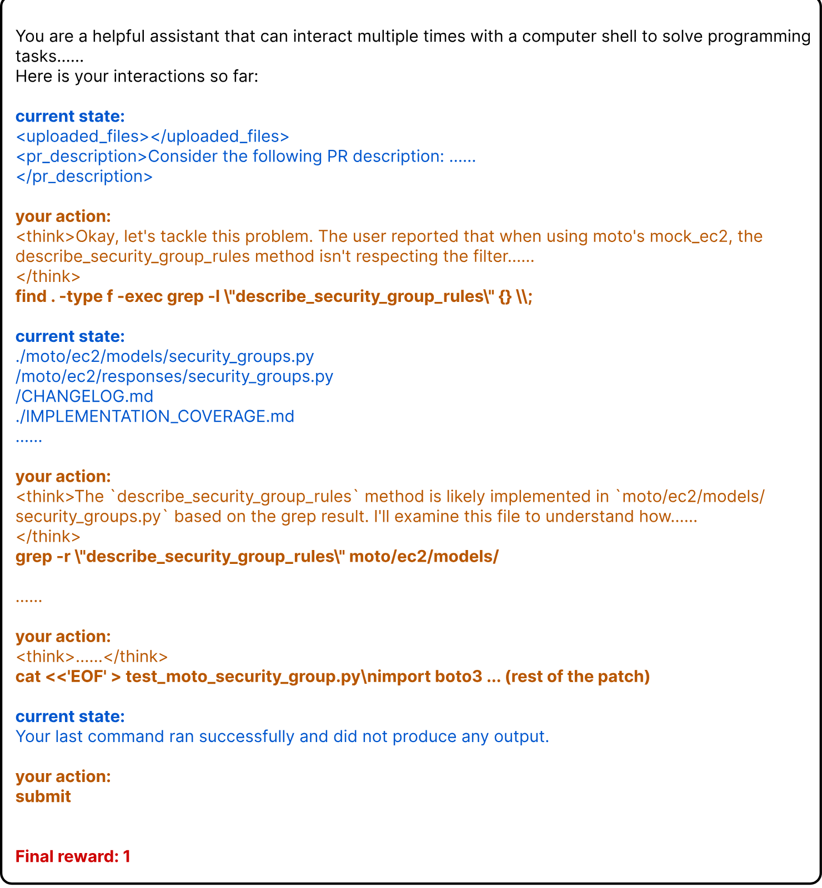

**图 5.** SWE-Gym getmoto 任务示例. 灰色文本为提示, 粗体文本为目标, 蓝色文本为观测, 橙色文本为动作.

<span id="appendix-b-1"></span>

### B.1 第 [5](#section-5) 节的其他任务细节

对于环境复杂度, 我们使用 TextWorld 的 `tw-make`, 分别为 w2-o3-q4、w8-o3-q4、w2-o12-q4 和 w4-o6-q8 以程序方式生成 5000 个 RL episode, 随机种子范围为 30001 至 35000.

对于使用 ALFWorld 研究任务复杂度的实验, 我们确保每种训练混合的数据量相同, 均为 1000. 简要的数据统计如下: (1) 单类型任务包含 1000 个 pick & place 任务, 从 3553 条训练数据中随机抽取; (2) 混合类型 (4 种) 分别包含 250 个 heat、cool、cook 和 examine 任务; (3) 混合类型 (全部类型) 从 3553 条训练数据中随机抽取任意类型的 1000 个任务.

对于使用 SWE-Gym 研究任务复杂度的实验, 我们确保每种训练混合的数据量相同, 均为 90. 简要的数据统计如下: (1) 单类型任务包含从 SWE-Gym Hugging Face 仓库随机抽取的 90 个 getmoto 任务; (2) 混合类型 (5 种) 分别包含 18 个 getmoto、pydantic、mypy、pandas 和 interactive_dvc 任务.

<span id="appendix-b-2"></span>

### B.2 第 [6](#section-6) 节的其他任务细节

我们从 TextWorld 游戏的标准轨迹中收集 0/20/40/60/80/100 条 SFT 数据. 随机种子范围为 40001 至 40101, 与 RL 数据不同.

<span id="appendix-b-3"></span>

### B.3 第 [7](#section-7) 节的其他任务细节

这些任务使用 TextWorld 内置的 `tw-simple` 函数以程序方式生成, 该函数带有逐步计算的稠密奖励计算器. 我们利用 TextWorld 内置的奖励函数逐步分配奖励. 我们分别为 sparse、dense 1 和 dense 2 三种密度级别收集 3000 个 episode.

<span id="appendix-c"></span>

## 附录 C 训练与评估细节

我们使用 8 块 NVIDIA H100 GPU 训练 Qwen-1.5B、Qwen-7B 和 Qwen-8B.

对于 PPO, 默认设置为: actor 学习率 5e-7、critic 学习率 5e-6、截断比率 0.2、折扣因子 $\gamma$ 为 1.0、KL 惩罚系数 0.001、批量大小 256, 并且 Qwen-1.5B 和 Qwen-7B 模型的熵正则化均为零.

对于 GRPO, Qwen3-8B 模型的默认设置为: actor 学习率 1e-6、KL 损失系数 0.001、GRPO 采样数 4、批量大小 16.

对于 RLOO, Qwen-1.5B 和 Qwen-7B 模型的默认设置均为: actor 学习率 1e-6、KL 惩罚系数 0.001、批量大小 256.

对于 SFT, 默认学习率为 1e-6.

<span id="appendix-c-1"></span>

### C.1 第 [5](#section-5) 节的其他训练细节

对于 TextWorld 实验, 我们训练 150 个 epoch, 并在第 150 个 epoch 时于 100 个留出测试集 (随机种子为 1 至 100) 上评估.

对于 ALFWorld 实验, 考虑到基础模型在这些任务上的准确率为零, 我们先在 300 条数据上进行一个 epoch 的 SFT, 其随机种子与 RL 数据不同. 完成 SFT 初始化后, 我们训练 90 个 epoch, 并在第 90 个 epoch 时于 100 个留出测试集上评估.

对于 SWE-Gym 实验, 我们训练 15 个 epoch, 并在第 15 个 epoch 时于 25 个留出测试集上评估.

<span id="appendix-c-2"></span>

### C.2 第 [6](#section-6) 节的其他训练细节

对于 SFT, 我们只进行一个 epoch, 确保示例数据仅被遍历一次, 以避免过拟合. 完成 SFT 后, 我们再进行 100 个 epoch 的 RL 训练.

在 RLOO 与 PPO 的比较中, 与 [附录 C.1](#appendix-c-1) 类似, 我们分别训练 150 个 epoch.

<span id="appendix-c-3"></span>

### C.3 第 [7](#section-7) 节的其他训练细节

对于采用稠密奖励的 PPO 和 RLOO 训练, 我们分别训练 150 个 epoch, 并在第 150 个 epoch 时于 100 条留出数据上测试.

<span id="appendix-d"></span>

## 附录 D TextWorld 任务上 PPO 与 RLOO 策略的训练曲线

<span id="figure-06"></span>

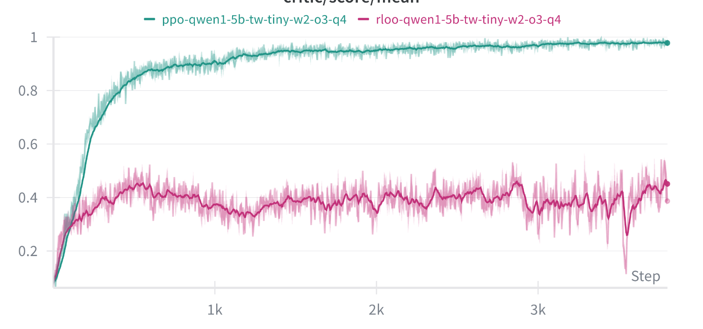

**图 6.** 使用 PPO 和 RLOO 在 TextWorld w2-o3-q4 任务上训练 Qwen-2.5-1.5B 模型时的训练奖励曲线.

<span id="figure-07"></span>

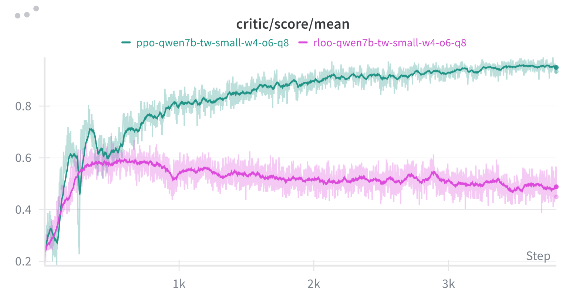

**图 7.** 使用 PPO 和 RLOO 在 TextWorld w4-o6-q8 任务上训练 Qwen-2.5-7B 模型时的训练奖励曲线.

<span id="appendix-e"></span>

## 附录 E LLM 的使用

在准备本文期间, 我们仅将大语言模型 (具体为 Claude) 用于文字润色和语法检查. LLM 用于提高清晰度、修正语法错误, 并使表述更加简洁. 所有实验设计、分析、解释和科学结论均完全是我们自己的原创工作. 实验结果的生成、图表制作和任何技术内容的撰写均未使用 LLM. 本文提出的核心研究思想、方法和发现均由人类作者完成.

[+1]: 为简化表述, 我们用观测 $o$ 代替状态 $s$. 智能体无法访问游戏的真实状态.

[+2]: [TextWorld tw-simple 文档](https://textworld.readthedocs.io/en/stable/textworld.challenges.simple.html).
