> [George Tsoukalas](https://georgetsoukalas.github.io/), [Jasper Lee](https://dblp.org/pid/48/6954), [John Jennings](https://www.cs.utexas.edu/~jej2879/), [Jimmy Xin](https://dblp.org/pid/341/5979), [Michelle Ding](https://rnclncj.github.io/), [Michael Jennings](https://dblp.org/pid/40/3198), [Amitayush Thakur](https://amit9oct.github.io/aboutme/) 和 [Swarat Chaudhuri](https://www.cs.utexas.edu/~swarat/). 论文于 2024 年 7 月 15 日首次提交至 arXiv; 当前版本为 v2, 日期为 2024 年 11 月 3 日. 论文已被 [NeurIPS 2024 Datasets and Benchmarks Track](https://proceedings.neurips.cc/paper_files/paper/2024/hash/1582eaf9e0cf349e1e5a6ee453100aa1-Abstract-Datasets_and_Benchmarks_Track.html) 接收. [PutnamBench: Evaluating Neural Theorem-Provers on the Putnam Mathematical Competition](https://arxiv.org/abs/2407.11214v2). <a href="/paper/putnambench.pdf" target="_blank" rel="noopener noreferrer">原始 PDF</a>. [DOI](https://doi.org/10.48550/arXiv.2407.11214). [TeX 源文件](https://export.arxiv.org/e-print/2407.11214v2). 精确的印刷排版和参考文献以原始 PDF 为准.

## 摘要

我们提出 PutnamBench, 一个用于评估神经定理证明器解决数学竞赛问题能力的新型多语言基准. PutnamBench 包含 640 道定理题的 1692 份人工构造形式化, 题目来自 William Lowell Putnam Mathematical Competition, 即北美首屈一指的本科生数学竞赛.
所有问题都有 Lean 4 和 Isabelle 形式化; 其中相当一部分也有 Coq 形式化. PutnamBench 要求很强的问题求解能力, 还要求熟悉本科数学课程所教授的广泛主题. 我们用 PutnamBench 评估了几种已有的神经和符号定理证明器.
这些方法只能解出少数 PutnamBench 问题, 说明该基准是神经定理证明研究中一项困难的开放挑战. PutnamBench 可从 [https://github.com/trishullab/PutnamBench](https://github.com/trishullab/PutnamBench) 获取.

## 1 引言

自动化数学推理是人工智能领域的一个长期目标 [New57].
这一问题的一条重要研究路线 [Li24t] 是用神经模型引导 Lean 4 [Mou21]、Isabelle [Wen08] 和 Coq [Coq23] 等形式框架中的定理证明. 这些框架可以像执行代码一样“执行”证明并给出执行反馈, 从而简化正确证明的搜索过程.

如何设计高质量基准, 是该研究领域的一项关键难题. 神经定理证明中最主要的两个竞赛题基准是 miniF2F [Zhe22a] 和 FIMO [Liu23s]. 前者形式化了高中课程题与 AIME、AMC、IMO 等数学竞赛题的混合集合; 后者收录了一批 IMO 题目. 两个基准都有局限. 例如, miniF2F 中许多问题可以直接用 SMT 求解器解决, FIMO 则只面向已经不再积极维护的 Lean 3 框架.

更一般地说, 随着大语言模型 (LLM) 在神经定理证明中的作用不断增加 [Li24t], 防止预训练集与评估集之间发生泄漏变得比以往更重要. 因此, 持续提供新基准本身就是一项目标.

本文用 PutnamBench 回应这项挑战. 这是一个经过人工筛选、面向神经定理证明器的新型多语言基准. PutnamBench 包含 William Lowell Putnam Mathematical Competition 中 640 道题目的 1692 份形式化; 该赛事是北美首屈一指的大学生数学竞赛. [+1]
所有问题都有 Lean 4 [Mou21] 和 Isabelle [Wen08] 形式化; 其中相当一部分还有 Coq [Coq23] 形式化. 全部形式化均由人工构造, 并经过仔细调试. 经 Putnam 竞赛主办方 Mathematical Association of America 许可, 该基准还收录了原始英文题面.

PutnamBench 的一项主要优势是, Putnam 竞赛题要求广泛的数学知识和技能. 由于比赛面向本科生, 题目会涉及分析和抽象代数等 International Mathematical Olympiad (IMO) 中没有的主题. 同时, 两项赛事的成绩存在相关性—Putnam 竞赛的顶尖选手往往也曾获得 IMO 奖牌. 因此, PutnamBench 与 IMO Grand Challenge [Imo19] 和 AI Mathematical Olympiad [Aim23] 的目标相符; 后者设置了 1000 万美元奖金, 用于奖励能够在 IMO 获得金牌的系统.

另一项优势是 PutnamBench 支持多种证明助理. Lean 4、Coq 和 Isabelle 是目前最流行的三种形式证明语言. 然而, 定理证明基准通常只包含其中严格意义上的一个子集—例如, miniF2F [Zhe22a] 没有 Coq 问题, FIMO [Liu23s] 只面向 Lean. PutnamBench 是第一个同时收录这三种语言问题的数学竞赛基准.

我们用 PutnamBench 评估了几种神经和符号方法: Draft-Sketch-Prove [Jia22]、COPRA [Tha23]、GPT-4、Sledgehammer [Pau15] 和 Coqhammer [Cza18]. 这些方法合计只能解出少数 PutnamBench 问题, 说明 PutnamBench 是神经定理证明社区面临的一项困难开放挑战.

[+1]: PutnamBench 可从 [https://github.com/trishullab/PutnamBench](https://github.com/trishullab/PutnamBench) 获取.

## 2 背景

**形式定理证明.** Lean 4 [Mou21]、Coq [Coq23] 和 Isabelle [Wen08] 等形式证明框架允许用户编写机器可验证的数学定理证明.
要创建这类证明, 首先要用相应框架的语言形式化陈述目标定理. 定理中涉及的数学对象可以从现有仓库导入, 也可以由用户定义.
在证明过程中, 证明框架会维护一个*状态*, 其中记录仍待完成的证明部分. 执行一个*证明步骤*即可改变这一状态. 用户的目标是用框架的语言写出一系列证明步骤, 将证明状态变为特殊的“QED”状态, 此时已不存在未完成的证明义务.

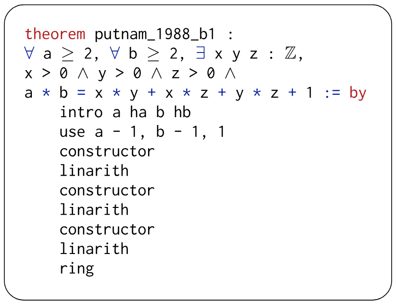

**图 1.** Putnam 1988 B1 的 Lean 4 形式化. 该题断言, 对所有整数 $a,b \geq 2$, 都存在正整数 $x,y,z$, 使得 $ab = xy + xz + yz + 1$. 形式证明先用 `intro` 引入所有相关变量和假设, 再用 `use` 指定 $x,y,z$ 的取值, 随后用自动化 tactic `linarith` 和 `ring` 证明所有目标. 这个证明通过 GPT-4 的一次少样本调用发现.

[图 1](#figure-01) 展示了 Lean 4 框架中的一个定理及其证明.

**Putnam 竞赛.** William Lowell Putnam Mathematical [Wil24] 由 Mathematical Association of America (MAA) 主办, 是北美首屈一指的大学生数学竞赛. 每年都有数千名来自美国和加拿大高校的本科生参加考试. 竞赛分为两场, 每场 3 小时、6 道题, 每场题目大致按难度递增排列. 有些问题要求参赛者给出一个具体解, 例如一个数、一个集合或某个陈述的真值, 但所有问题都要求提供正确性的自然语言证明. 竞赛题取材于本科课程中的许多不同主题, 并经常使用研究级数学思想的具体实例.

## 3 PutnamBench

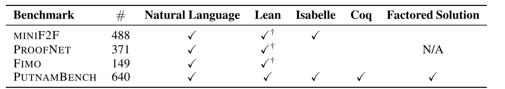

**表 1.** 现有形式定理证明评估基准的比较. PutnamBench 在一组使用本科数学知识的高难度竞赛题上同时支持 Lean 4、Isabelle 和 Coq, 因而超过了以往基准. 对于除了证明外还要求数值解的问题, 我们把解从定理陈述中分离出来.

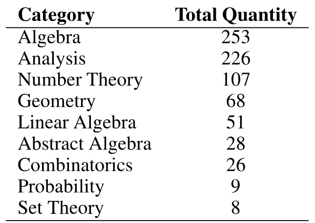

**表 2.** PutnamBench 问题按领域划分的数量. 我们的形式化总体上反映了 Putnam 问题的多样性; 不过, 由于各自的数学库对几何和概率主题支持有限, 我们只能形式化少量此类问题.

PutnamBench 是一个多语言评估基准, 由 Putnam 竞赛问题的形式化组成.
PutnamBench 完全由人工制作, 包含 640 份 Lean 4 形式化、640 份 Isabelle 形式化和 412 份 Coq 形式化. PutnamBench 合计收录了 Putnam 竞赛题的 1692 份形式化. 我们还在适用时加入非形式化题面和数值解.

下面具体说明 PutnamBench 的主要特点.

**多样性与广度.** miniF2F [Zhe22a] 和 FIMO [Liu23s] 通常依赖高中数学, 相比之下, PutnamBench 收录的问题种类更广, 需要使用标准本科数学课程中的定义. ProofNet 基准 [Aze23] 也从本科课程取题, 但这些问题通常来自标准教材, 而非数学竞赛. Putnam 问题经常需要同时使用多个领域的定义, 标准教材未必会作这样的要求. PutnamBench 的形式化涉及许多数学领域的概念, 包括:
(i) ***分析***: 极限、积分、导数、连续性;
(ii) ***线性代数***: 矩阵、行列式、域;
(iii) ***抽象代数***: 环、群、原群、置换;
(iv) ***代数***: 多项式、不等式、代数表达式;
(v) ***数论***: 素数、无理性、进位表示、因数、回文数;
(vi) ***几何***: 多边形、点集、直线交点、欧氏距离;
(vii) ***集合论与组合数学***: 可数性、幂集、离散结构、博弈.

**多种语言.** PutnamBench 包含 Putnam 问题的 Lean 4、Isabelle 和 Coq 形式化. 这些形式化也使用了各证明助理数学仓库中定义的概念—尤其是 Mathlib、HOL 标准库和 Coquelicot, 以及其他 Coq 仓库. 据我们所知, PutnamBench 是这些语言各自的第一个本科级竞赛基准. 此外, 我们首次为 Coq 制作了人类数学竞赛风格的评估基准.

我们希望这项贡献能让 Coq 使用者接触迅速发展的机器学习数学领域.

总体而言, 各语言中的问题形式化在结构上彼此对齐, 包括假设命名和表述框架. 由于各语言底层基础不同, 也可能出现差异. 我们还注意到, 每种语言中预先定义的数学理论并不相同, 有时会给特定问题的形式化带来困难.

与 miniF2F、FIMO 和 ProofNet 等旧基准相比, PutnamBench 是第一个发布初版时就支持 Lean 4 的基准 [+2].

**分离解.** 约 60% 的 Putnam 问题在自然语言形式下既要求给出一个闭式解, 又要求证明其正确性. 这类问题并不直接断言一个命题, 因而不能立即形式化为定理陈述. miniF2F [Zhe22a] 等旧基准通过改写题面绕开了这个问题, 改为要求证明给定解满足题目约束. 但这种化简降低了问题的整体难度, 因为找出解本身可能占据主要难点. 为解决这一问题, 我们把此类问题的解从形式定理陈述中分离出来. [图 2](#figure-02) 给出了一个例子. 这样便为神经定理证明提供了两项任务:

1. **任务 1:** 给定定理陈述, 先找出闭式解, 再把该解改写进定理陈述并提供正确性证明.

2. **任务 2:** 给定定理陈述和解, 生成其正确性证明. 这项任务与现有基准一致.

我们注意到, 得出数值解的过程可能与证明其正确性的过程高度相关. 采用这种方式, 形式化可以反映非形式化题面的真实难度.

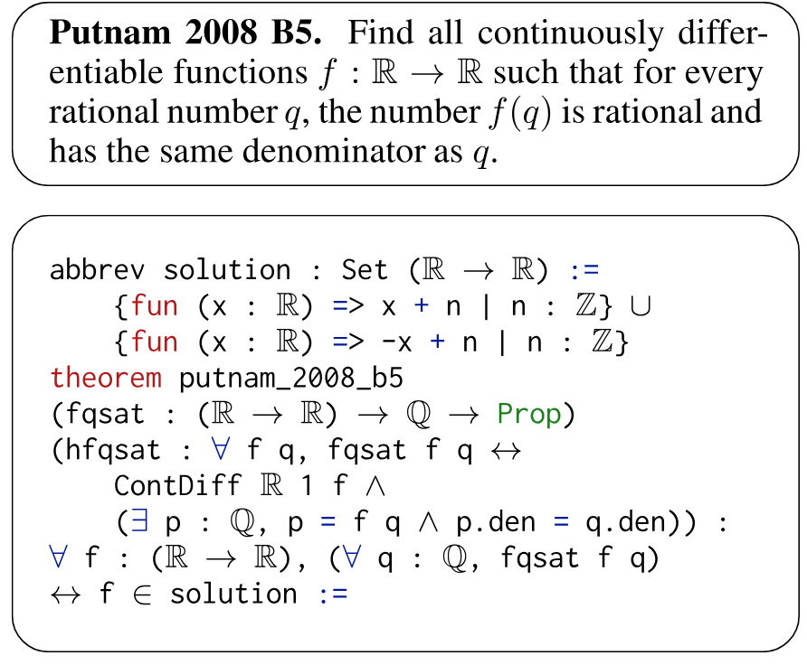

**图 2.** Putnam 2008 B5 的 Lean 4 形式化. 由于问题要求给出满足指定条件的函数集合 $f$, 它本身并不是一个定理陈述. 我们在定理陈述之外实例化变量“solution”, 以此形式化该问题. 这样, 模型既可以给出自己的候选解, 也可以使用我们提供的正确解并尝试生成正确性证明. miniF2F 和 FIMO 等基准只收录把解写进定理陈述的形式化.

**形式化工作量与难点.** 我们用几个月时间手工制作了这个基准. 团队由 2 名博士生和 5 名本科生组成, 成员此前都有大学数学、计算机科学和形式证明助理方面的经验. 我们发现, 用一种语言形式化一道问题平均约需 25 分钟.
每份形式化都至少由另一人验证一次. 我们测得, 验证一份形式化平均约需 10 分钟. 我们承认, 这里报告的形式化用时高于 miniF2F; 我们认为主要原因是 Putnam 问题更复杂, 经常需要使用我们必须在各语言数学库中查找的定义.

我们先制作 Lean 4 形式化, 然后依次制作 Isabelle 和 Coq 形式化. 由于各语言底层基础不同, 一种语言中的形式化有时不能直接移植到另一种语言; 例如, Isabelle 没有子类型机制, 而我们在 Lean 4 中大量使用了这一机制. Coq 形式化依赖多个数学仓库. 我们主要使用 MathComp 和 MathComp-Analysis [Mat15, Mat17], 也使用 Stdlib、Stdpp、Coquelicot、GeoCoq 和 Coqtail [Coq15, Geo15, All20].

有些问题并不适合自然地形式化—例如, 我们发现概率问题虽然能够形式化, 却往往需要大量概率论.
同样, 各语言对欧氏几何问题的支持程度不一; 尤其是 Lean 4 还没有足够完备的库, 无法形式化大多数几何问题. 相比之下, Coq 有一个完备的几何仓库 GeoCoq, 我们在 Coq 形式化中使用了它.

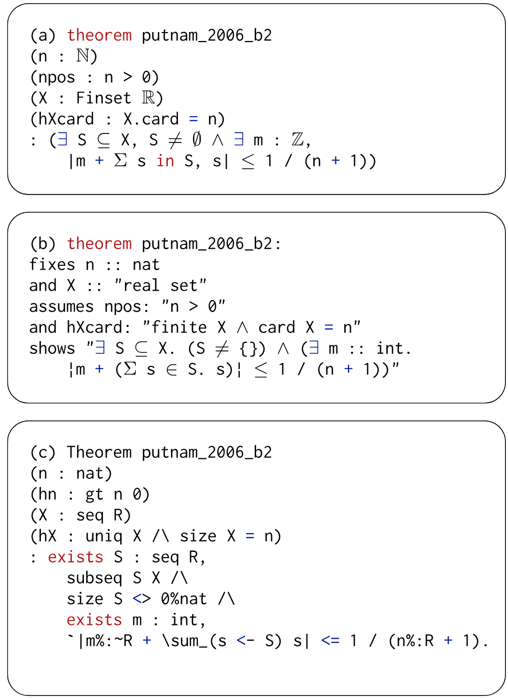

**图 3.** Putnam 2006 B2 在 (a) Lean 4、(b) Isabelle、(c) Coq 中的形式化. Putnam 2006 B2 断言, 给定满足 $|X| = n > 0$ 的有限子集 $X \subseteq \mathbb{R}$, 存在非空子集 $S \subseteq X$ 和 $m \in \mathbb{Z}$, 使得 $|m + \sum_{s \in S} s| \leq \frac{1}{n+1}$.

**数据集污染.** 与 MATH [Hen21] 和 GSM8K [Cob21] 等非形式化基准相比, 我们的基准有一项独特之处: 目标输出*从未被生成过*, 因而避免了直接污染. 据我们所知, 我们首次为大量 Putnam 问题提供了 Lean、Isabelle 和 Coq 中任一种语言的形式化. 由于编写形式证明必须先有形式定理陈述, 我们的任何问题此前都极不可能已有形式证明. 为确认这一点, 我们彻底检查了每种语言的形式数学仓库, 没有发现来自 Putnam Competition 的对齐定理与证明.
我们的基准不包含任何形式证明.

此外, 评估中的自动化方法找到的证明也不会收录, 只会在本文中提及. 通过非形式化证明进行迁移可能造成间接污染, 但正如 [第 4 节](#section-4) 的结果所示, 在形式证明环境中生成证明对所有现有神经方法仍然十分困难.

**许可与参与规则.** PutnamBench 中的 Lean 4 和 Isabelle 部分采用 Apache 2.0 许可, Coq 部分采用 MIT 许可. 我们让各部分许可与相应语言所用仓库的许可保持一致. 经 MAA 许可, 我们收录了取自竞赛的非形式化题面 [Ale85, Ked02, Ked20]. 我们在 [https://trishullab.github.io/PutnamBench/](https://trishullab.github.io/PutnamBench/) 维护公开排行榜, 并会随时接收未来工作的评估结果.

[+2]: miniF2F、FIMO 和 ProofNet 最初都使用 Lean 3 发布. 此后, 在社区工作的推动下, miniF2F 和 FIMO 增加了 Lean 4 形式化 [Aze23, Rah24]. 据我们所知, 目前没有开源的 FIMO Lean 4 版本.

## 4 实验评估

为了了解 PutnamBench 给当前最先进定理证明方法带来的难点, 我们尝试用一组此类方法解决其中的问题.
由于专门面向多语言定理证明的系统相对匮乏, 我们分别评估每种语言. 凡是在多种语言上接受评估的方法, 都以现成的基础模型为基础.

**指标.** 我们采用 $\mathrm{pass}@n$ [Lam22] 指标进行评估. 该指标衡量证明器在 $n$ 次*证明尝试*的预算下生成成功证明的能力, 成功与否由形式证明环境判定. 在基于搜索的方法 [Tha23] 中, 每次证明尝试都是一次独立搜索, 可以多次查询神经模型.

**模型.** 对每种语言, 我们都使用能力很强的基础模型 GPT-4 [Ope23] [+3] 进行评估. 我们采用上下文学习, 在提示中附加若干简单定理的成功证明示例, 每种语言各用相应示例. 对 Lean 4 方法的评估需要说明一点: 许多方法以 Lean 3 为目标, 而 Lean 3 不具备向后兼容性, 也已不再积极维护.
我们在 PutnamBench 上评估 COPRA [Tha23], 修改 COPRA 的提示示例, 让它能在 Lean 4 中搜索. 此外, 我们还评估 LeanDojo 的检索增强证明器 ReProver. 这是一个经过微调的模型, 设计目标是在证明搜索中使用并纳入检索得到的引理. 我们也评估关闭检索组件的版本.

在 Isabelle 实验中, 我们以 GPT-4 为底层基础模型运行 Draft, Sketch, and Prove (DSP) [Jia22]. 正如 [第 5 节](#section-5) 所述, 许多后续 Isabelle 定理证明工作扩展了 DSP 流程. 我们还单独调用 Sledgehammer 进行评估; 它是 Isabelle 中一款强大的符号自动化工具, 依靠外部 SMT 求解器完成工作.

至于 Coq, 以往的 Coq 神经方法主要面向软件验证任务, 而非竞赛数学.
因此, Coq 实验使用了同样支持 Coq 定理证明的 COPRA. 我们评估了采用局部敏感哈希模型配置的 Tactician [Bla20a] 平台. 我们还评估了 CoqHammer [Cza18]; 与 Isabelle 的 Sledgehammer 类似, 该工具会调用外部约束求解器.

[+3]: 所有评估均使用 GPT-4o.

### 4.1 结果

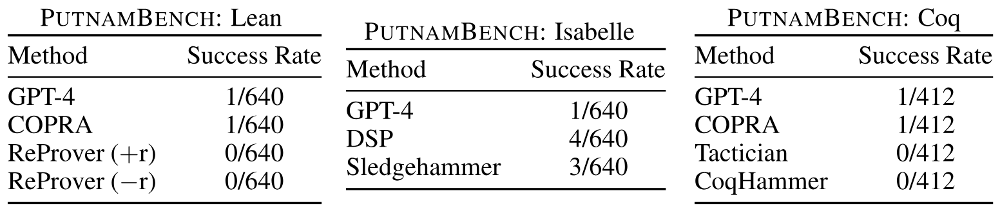

**表 3.** PutnamBench 在每种语言中的评估结果. 所有受测方法的表现都很差, 最多只能解出少数问题. 值得注意的是, Lean 和 Coq 中唯一都被解出的题是 Putnam 1988 B1, 但 Isabelle 中没有任何方法解出该题. ReProver 是我们的 Lean 微调基线; 无论是否使用检索, 它都未能解出任何问题. 符号自动化在 Isabelle 中很强, Sledgehammer 解出的问题数多于单独使用 GPT4. DSP 生成了 4 个成功证明, 其中 2 个无法由 Sledgehammer 单独生成.

**Lean 4.** 我们以 $\mathrm{pass}@10$ 提示 GPT-4, 温度设为 $T = 0.7$, 并使用若干简单定理及其证明作为示例, 为每道问题生成证明. 在全部 640 份 Lean 形式化中, 该实验只得到 1 个成功证明. [图 1](#figure-01) 给出了对应问题 Putnam 1988 B1 和生成的证明. 具体来说, Putnam 1988 B1 在 10 次尝试中的第一次就被解出. [图 18](#figure-18) 展示了 GPT-4 的一种失败模式.

我们也使用 COPRA 进行评估, 采用其默认搜索超参数, 执行 $\mathrm{pass}@1$, 并允许查询 GPT-4 共 60 次. 不过, COPRA 原本用于与 Lean 3 交互, 因此我们略微修改了它的系统提示, 使其能够在 Lean 4 中搜索. 对所有 Lean 4 形式化进行逐步证明搜索后, 系统正确证明了 1 道题, 即 1988 B1. 这个证明不需要在搜索中回溯; 证明长 10 行, 在第 10 次查询时找到. 如果允许 COPRA 进一步查询 GPT-4, 或许能得到更多成功证明, 但 GPT-4 的查询成本使这类实验目前还不可行.

我们发现, GPT-4 默认会用 Lean 3 语法生成证明, 而这种语法与 Lean 4 不兼容. 即便明确要求它输出 Lean 4, GPT-4 通常仍会继续输出 Lean 3 语法. [图 16](#figure-16) 收录了我们的提示, 其中说明 Lean 4 的一些设计差异, 以便更严格地约束模型使用 Lean 4 语法. 但我们仍观察到许多 GPT-4 输出 Lean 3 项的例子. [图 17](#figure-17) 给出了其中一个.

我们使用 LeanDojo [Yan23e] 采用的标准搜索参数运行 ReProver. 无论是否加入检索模块, 评估都没有证明成功的问题. 其他方法能够解出 Putnam 1988 B1, 但 ReProver 没有解出. 我们认为原因在于, 模型需要理解选择 $x,y,z=1,a-1,b-1$ 后, 经过化简终将满足目标条件. 像驱动 ReProver 搜索的这类较小模型, 可能不容易具备这种理解.

**Isabelle.** 我们沿用相同配置, 把提示改为 Isabelle 版本, 在 Isabelle 形式化上运行 GPT-4. GPT-4 成功证明了 Putnam 1986 B1, 这是一道以代数方式陈述的几何题. [图 19](#figure-19) 给出了题目陈述和 GPT-4 生成的证明.

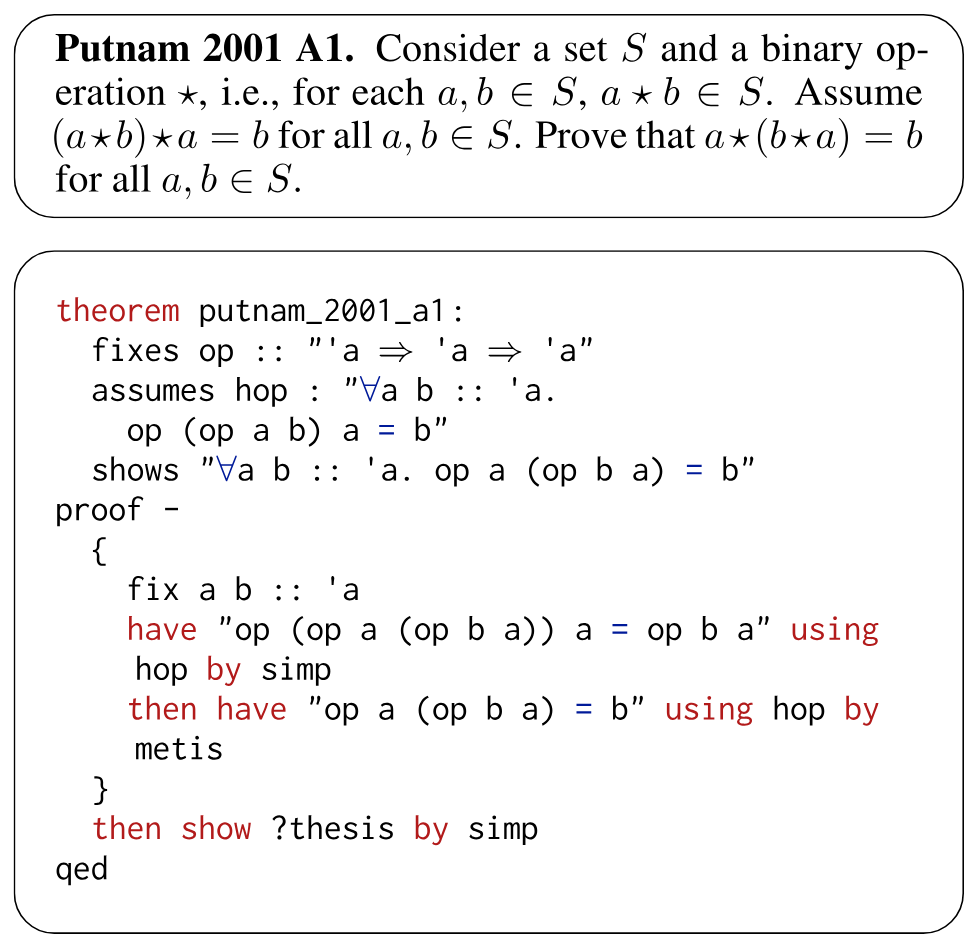

**图 4.** Putnam 2001 A1 的 Isabelle 形式化, 以及 DSP 评估发现的相应证明. 单独使用 Sledgehammer 也能成功证明该定理.

DSP 是一种神经符号方法, 已广泛用于 miniF2F 定理证明. 我们以 $\mathrm{pass}@10$ 运行 DSP, 温度设为 $T = 0.1$, 底层语言模型使用 GPT-4. 评估成功证明了 4 道题: Putnam 2001 A1 和 1971 B1, 这两题涉及原群, 即带二元运算的集合; Putnam 1995 A1, 涉及实数中对乘法封闭的子集; 以及 Putnam 1986 B1. 其中, Putnam 1995 A1 和 1986 B1 无法由 Sledgehammer 单独解决. [图 4](#figure-04) 收录了 Putnam 1995 A1 的生成证明.

我们还运行了 Sledgehammer 基线. 这是一款强大的 Isabelle 自动化工具, 会调用外部 SMT 求解器证明给定目标. 我们将超时设为 $t = 120$ 秒, 对每份 Isabelle 形式化运行 Sledgehammer. 评估成功证明了 3 道题: Putnam 1971 B1、2001 A1 和 2012 A2. 值得注意的是, 这几道题都涉及带二元运算的集合. [图 22](#figure-22) 收录了 1971 B1 和 2012 A2 的陈述.

**Coq.** 我们沿用 Lean 和 Isabelle 实验的配置, 用 Coq 版提示让 GPT-4 处理 Coq 形式化. 实验解出了 1 道题, 即同样在 Lean 4 中被解出的 Putnam 1988 B1. [图 14](#figure-14) 收录了证明; 它的总体结构与 Lean 证明相同.

在 $\mathrm{pass}@1$、60 次查询、$T = 0.0$ 的设置下评估 COPRA, 也只成功证明了 Putnam 1988 B1, 证明见 [图 14](#figure-14). 在这个例子中, 回溯对证明搜索至关重要. 1988 B1 的关键步骤是, 在引入 $a$ 和 $b$ 后选择 $x,y,z$. COPRA 最初错误地选择 $x, y, z = 1, 1, ab-1$, 后来通过回溯撤销了这一选择. 随后, COPRA 正确选择 $x, y,z = 1, a-1, b-1$, 并继续完成证明.

我们使用局部敏感哈希模型运行 Tactician, 每道题的超时为 $t = 600s$. 评估没有成功证明任何问题. 这类方法在取自 Coq 标准库的定理上表现不错 [Zha21j], 但目前还无法扩展到高难度奥林匹克风格问题.

我们以 8 个并行线程运行 CoqHammer, ATP 超时为 100 秒, 证明重建超时为 15 秒, sauto 超时为 5 秒, 每份形式化总共分配 120 秒. 评估没有得到成功证明—这表明 Coq 的符号工具尚不能处理 PutnamBench 问题. CoqHammer 和 Sledgehammer 虽依赖同一批外部求解器, 但前者表现不及后者, 这并不意外. Coq 的底层逻辑系统比 Isabelle 更复杂, 因而不太适合自动化.

### 4.2 总体分析

汇总所有语言中的全部实验, PutnamBench 共有 6 道题得到成功证明. 其中大多数来自 Isabelle 评估, Sledgehammer 的贡献尤其明显. Sledgehammer 能解出基准中全部 3 道涉及原群的问题, 却不能成功证明其他任何形式化. DSP 另外解出 2 道题, 并且高度依赖 Sledgehammer 填补中间步骤的证明. Lean 和 Coq 中被解出的那道题同样使用 `linarith` 和 `lia` 等自动 tactic, 只需要一个关键步骤.

因此, 现有方法并非对所有 PutnamBench 问题都束手无策. 不过根据我们的观察, 这些题属于 Putnam 竞赛历来最容易的一批. 它们都有很短的自然语言证明, 也不要求对特别复杂的对象进行推理. 我们认为, 自动化数学推理还需要取得重大进展, 才能在 PutnamBench 上取得进步.

## 5 相关工作

**形式基准.** 近年来已经出现多个形式数学评估基准. miniF2F [Zhe22a] 是由 AMC、AIME 和 IMO 等高中竞赛题构成的形式到形式基准. miniF2F 是一个多语言基准, 包含 488 道题, 每题都用 Lean 3、Metamath、Isabelle 和 HOL Light 形式化. 我们没有加入 Metamath 和 HOL Light 形式化, 因为它们并不是神经定理证明研究的重点. FIMO [Liu23s] 是另一个竞赛风格基准, 收录了 149 份 IMO 候选题的 Lean 3 形式化; 这些形式化先由 GPT-4 通过反向翻译流程生成, 再由人工验证. 两个基准都旨在衡量模型能否在非形式化题面有解时*验证*该解. Compfiles [Com24] 收录了 171 份竞赛题的 Lean 4 形式化, 主要来自 IMO 和 USAMO, 往往还附有形式证明, 但尚未用于自动定理证明器的基准评估. ProofNet [Aze23] 引入了一个包含 371 道练习题的基准; 题目来自标准本科数学教材, 用 Lean 3 形式化. ProofNet 的问题大多不来自竞赛, 但所用概念库比只依赖高中数学的 miniF2F 和 FIMO 更广. LeanDojo [Yan23e] 从 Lean 的 mathlib 库 [Mat20b] 中提取形式数学和证明数据集, 并训练检索增强模型, 在留出的测试集上生成证明. ProverBot9001 [San20a] 从形式验证 C 编译器 CompCert [Ler09] 中提取 Coq 定理和证明数据集. PISA [Jia21a] 的数据来自 Isabelle 的 Archive of Formal Proofs [Afp04], 其中包含一般数学中的定理和证明, 并不专门面向竞赛题.

**非形式基准.** 自然语言数学推理也有几个流行基准. MATH [Hen21] 包含 12500 道纯自然语言数学题, 取自多个高中竞赛, 并附有逐步的非形式化证明. GSM8K [Cob21] 收录 8500 道小学数学题, 用于评测自然语言处理数学风格问题的推理能力. 这些基准受益于充足的自然语言数据, 但也存在不足: 自然语言没有自动机制可以可靠验证得出数值答案的推理路径. 因此, 这类基准的成功指标通常依靠答案精确匹配, 因为验证推理路径并不精确, 最适合由人类专家完成. 相比之下, 在形式证明助理中证明定理时, 系统可以高度可靠地判断定理推理路径, 即*证明*, 是否正确.

**形式定理证明方法.** 研究者投入了大量工作来开发形式数学自动定理证明器 [Li24t]. 近期大多数方法训练神经模块预测证明步骤, 再用搜索机制包装该模块以找到有效证明. GPT-$f$ [Sut20] 在取自 Metamath 库 [Meg19] 的数据上训练 Transformer 架构, 用于合成证明. PACT 在 GPT-$f$ 的基础上增加辅助训练任务, 让神经模块面向 Lean 3 定理证明. FMSCL [Pol22] 交替进行证明搜索与训练, 根据搜索中发现的证明微调神经模型. HTPS [Lam22] 在 Lean 3 和 Metamath 中采用 Transformer 神经模块, 进行受 MCTS 启发的在线证明搜索. COPRA [Tha23] 使用 GPT-4, 向模型提供环境错误反馈和检索机制得到的引理, 从而在 Lean 3 和 Coq 中进行智能体式证明搜索. LLEMMA [Aze24] 在名为 Proof-Pile-2 的数学语料上继续预训练 Code Llama, 并用得到的模型在 Lean 4 中搜索形式证明. DeepSeek-Prover [Xin24] 大规模生成合成 Lean 数据, 用于训练证明器模型. AlphaGeometry [Tri24] 面向几何专用证明助理语言中的 IMO 问题, 采用交错搜索: 神经模块合成辅助构造, 符号引擎生成演绎闭包.

Isabelle 证明助理 [Pau94] 具有声明式特性和强大的符号自动化能力, 因而也受到神经定理证明研究的广泛关注. Isabelle 提供 Sledgehammer [Pau15], 一种调用外部自动定理证明器 (ATP) 合成证明的自动推理工具. Draft, Sketch, Prove (DSP) [Jia22] 使用高能力 LLM 生成自然语言证明, 再将它转换成 Isabelle 中的形式*草图*, 其中的缺口由 Sledgehammer 填补. Zhao 等人 [Zha23o] 用扩散模型预测 DSP 流程中提供给 LLM 的少样本示例的最佳顺序. Lyra [Zhe23b] 利用 Isabelle 执行时的错误反馈, 修改草图中符号证明器难以填补的空缺. POETRY [Wan24ac] 使用递归进行定理证明, 并训练神经模块生成证明草图, 而不是让 LLM 进行上下文学习. LEGO-Prover [Wan23k] 在这一流程中加入一个会随证明搜索任务不断增长的技能库. 除了利用自然语言证明的方法外, Thor [Jia22a] 还训练 Transformer 架构, 在执行一般证明步骤预测的同时预测成功的 Sledgehammer 调用. Baldur [Fir23] 探索了用 LLM 修复 Isabelle 中的错误证明.

Coq 交互式定理证明器既用于软件验证, 也用于一般数学. 著名的 Four Colour Theorem [Rob97] 和 Feit-Thompson theorem [Gon13] 都已在 Coq 中完成机械化证明. Coq 还被用于许多软件验证项目, 例如形式验证 C 编译器 CompCert 和 Verdi [Wil15], 后者是一个用于验证分布式系统协议的框架. ASTactic [Yan19b] 在多个 Coq 仓库的数据上训练包含循环网络和注意力机制的神经模块.
Proverbot9001 [San20a] 在 CompCert 项目留出的定理集上合成证明. COPRA [Tha23] 也用其多语言方法评估了这个基于 CompCert 的任务. Tactician [Bla20a] 为 Coq 使用者开发了证明自动化平台, 支持试验新的 tactic 预测与证明搜索机器学习技术. Zhang 等人 [Zha21j] 探索了 Tactician 中的多种在线学习技术, 包括使用局部敏感哈希实现的近似 $k$ 近邻方法, 我们的评估使用了这一方法. Graph2Tac [Bla24b] 用图神经网络在线学习新定理与定义的层次化表示, 并在 Tactician 中用这些表示搜索证明.

## 6 结论

我们提出 PutnamBench, 一个由 Putnam 竞赛问题形式化组成的神经定理证明基准. PutnamBench 的一个显著特点是覆盖代数、分析和数论等广泛的本科数学主题. 另一项独特优势是, 它收录了 Lean 4、Isabelle 和 Coq 这三种最流行形式证明框架中的问题.

实验表明, PutnamBench 是一项困难基准: 所有现有定理证明方法都只能解出少数问题. 我们认为这些失败有两个根本原因: (i) 现有定理证明器可以有效拼接训练语料中充分出现的标准证明步骤, 但往往不能合成新引理, 也不能把这些引理组织成复杂证明. (ii) 现有方法常常不能利用数学仓库中丰富的深层知识. 开发新一代神经定理证明器, 至少部分弥补这些弱点, 是一项值得继续研究的方向.

## 致谢

本研究得到 NSF 奖项 CCF-2212559 和 CCF-2403211、NSF Institute for Foundations of Machine Learning, 以及 Aziz Family Foundation 捐赠的支持. 感谢 Oliver Nash、Eric Wieser、Edward Lockhart、Fabian Gloeckle、Karl Palmskog、Lasse Blaauwbroek、Jason Rute 和 Kaiyu Yang 参与有益讨论、协助维护基准并支持实验配置.

## 7 检查清单

1. 所有作者...

   1. 摘要和引言中的主要主张是否准确反映论文的贡献和范围?

      **回答: 是.** 我们在 [第 3 节](#section-3) 和 [第 4 节](#section-4) 中支持了主要主张.

   2. 是否说明了工作的局限?

      **回答: 是.** 我们在 [第 3 节](#section-3) 中讨论了形式化某些问题类别的难点, 例如几何和概率; 这些难点来自各语言对相应数学理论的支持情况.

   3. 是否讨论了工作可能造成的负面社会影响?

      **回答: 不适用.** 我们预计这项工作不会造成负面社会影响.

   4. 是否阅读了伦理审查准则, 并确认论文符合准则?

      **回答: 是.** 我们已经阅读伦理审查准则, 并确认论文符合准则.

2. 如果论文包含理论结果...

   1. 是否陈述了所有理论结果的完整假设集合?

      **回答: 不适用.** 我们没有理论结果.

   2. 是否提供了所有理论结果的完整证明?

      **回答: 不适用.** 我们没有理论结果.

3. 如果进行了实验, 例如基准实验...

   1. 是否提供了复现主要实验结果所需的代码、数据和说明, 可以放在补充材料中或通过 URL 提供?

      **回答: 是.** 我们披露了实验相关的全部信息; 实验使用开源方法. 我们还给出了数据集 URL: [https://github.com/trishullab/PUTNAM/](https://github.com/trishullab/PUTNAM/).

   2. 是否说明了全部训练细节, 例如数据划分、超参数及其选择方式?

      **回答: 不适用.** 我们没有进行训练.

   3. 是否报告了误差条, 例如用不同随机种子多次运行后的结果?

      **回答: 否.** 我们使用神经定理证明社区认可的既定指标评估所选方法. 见 [第 4 节](#section-4).

   4. 是否给出了总计算量和所用资源类型, 例如 GPU 型号、内部集群或云提供商?

      **回答: 是.** 大多数实验依靠调用 GPT-4, 我们给出了采样细节. 我们还在 [第 4 节](#section-4) 中说明了调用符号方法时的超参数.

4. 如果使用了现有资产, 例如代码、数据、模型, 或者整理、发布了新资产...

   1. 如果工作使用现有资产, 是否引用了资产创建者?

      **回答: 是.** 我们引用了所用现有资产的创建者.

   2. 是否说明了资产许可?

      **回答: 是.** 我们让基准许可与这些资产的许可保持一致.

   3. 是否在补充材料中或通过 URL 提供了新资产?

      **回答: 是.** 我们通过以下 URL 分享数据集: [https://github.com/trishullab/PUTNAM/](https://github.com/trishullab/PUTNAM/).

   4. 是否讨论了使用或整理的数据所涉及人员如何表达同意, 以及是否取得同意?

      **回答: 是.** 我们取得了 MAA 的许可.

   5. 是否讨论了所使用或整理的数据中是否含有个人身份信息或冒犯性内容?

      **回答: 不适用.** 我们的数据不含此类内容.

5. 如果使用了众包或开展了人类受试者研究...

   1. 是否提供了给参与者的完整说明文字, 以及适用时的截图?

      **回答: 不适用.** 我们没有开展人类受试者研究, 也没有使用众包.

   2. 是否说明了参与者可能面临的风险, 并在适用时链接 Institutional Review Board (IRB) 批准文件?

      **回答: 不适用.** 我们没有开展人类受试者研究, 也没有使用众包.

   3. 是否给出了支付给参与者的估计时薪和参与者报酬总额?

      **回答: 不适用.** 我们没有开展人类受试者研究, 也没有使用众包.

## 8 附录

下面收录 PutnamBench 的更多形式化示例.

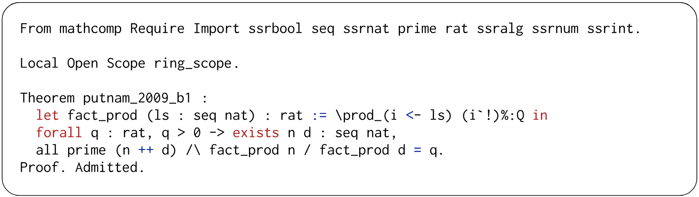

**图 5.** Putnam 2009 B1 的 Coq 形式化, 依赖 MathComp 仓库.

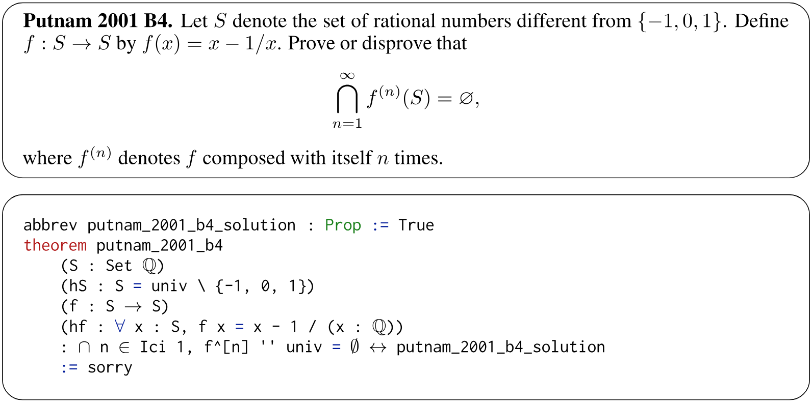

**图 6.** Putnam 2001 B4 的 Lean 4 形式化. 由于问题要求判断无限交集是否为空, 它本身并不是一个定理陈述. 我们把这个问题对应的“solution”视为布尔值, 并将它从定理陈述中分离. `sorry` 是 Lean 中的占位关键字.

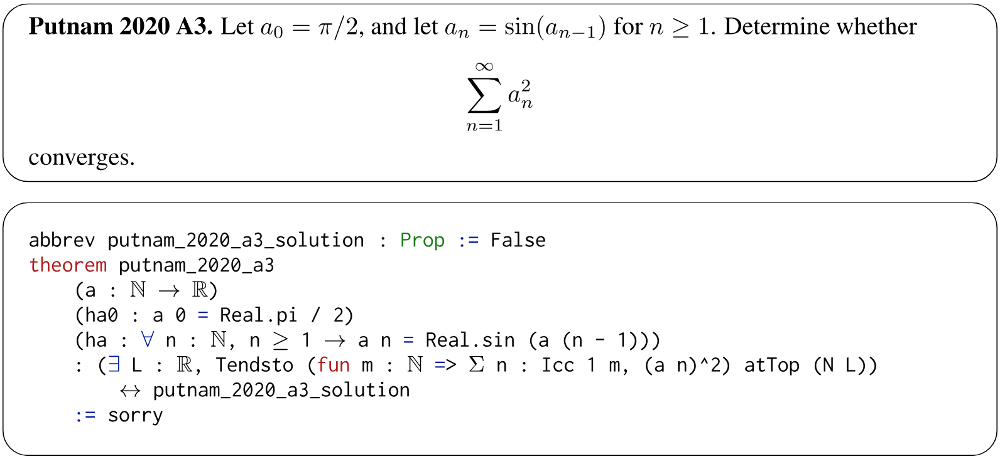

**图 7.** Putnam 2020 A3 的 Lean 4 形式化. 由于问题要求判断级数是否收敛, 它本身并不是一个定理陈述. 我们把这个问题对应的“solution”视为布尔值, 并将它从定理陈述中分离.

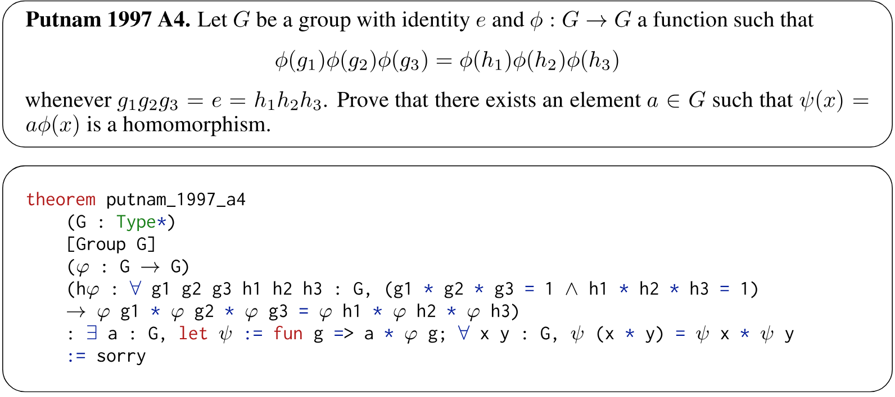

**图 8.** Putnam 1997 A4 的 Lean 4 形式化, 需要群论知识. 非形式化题面略有欠缺—$g_1, g_2, g_3, h_1, h_2, h_3$ 没有被明确规定属于 $G$. 形式化时, 必须明确 $g_i, h_i$ 的类型.

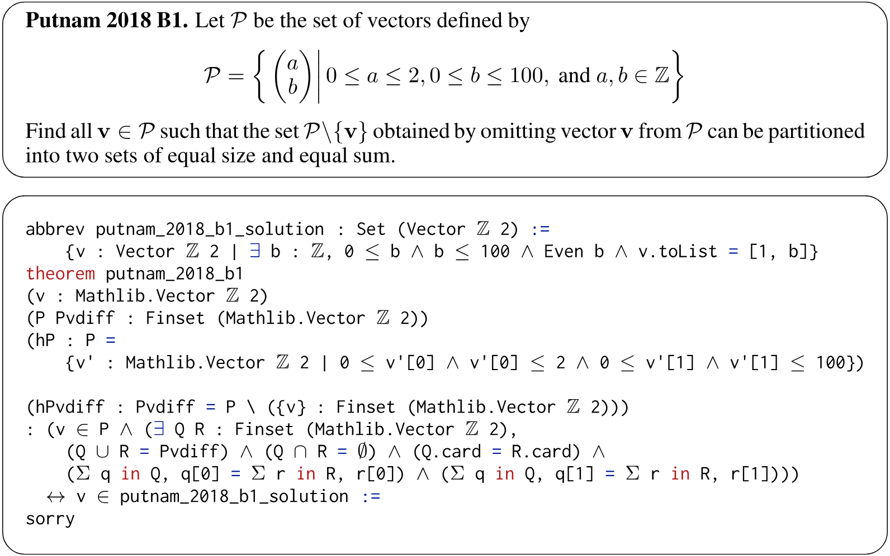

**图 9.** Putnam 2018 B1 的形式化, 需要 mathlib4 的 Vector 类.

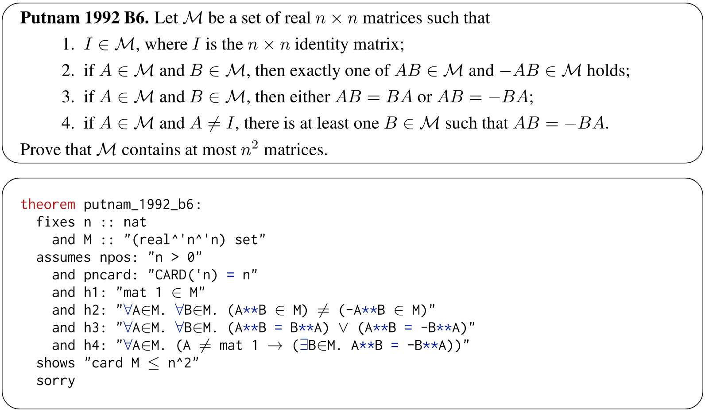

**图 10.** Putnam 1992 B6 的 Isabelle 形式化.

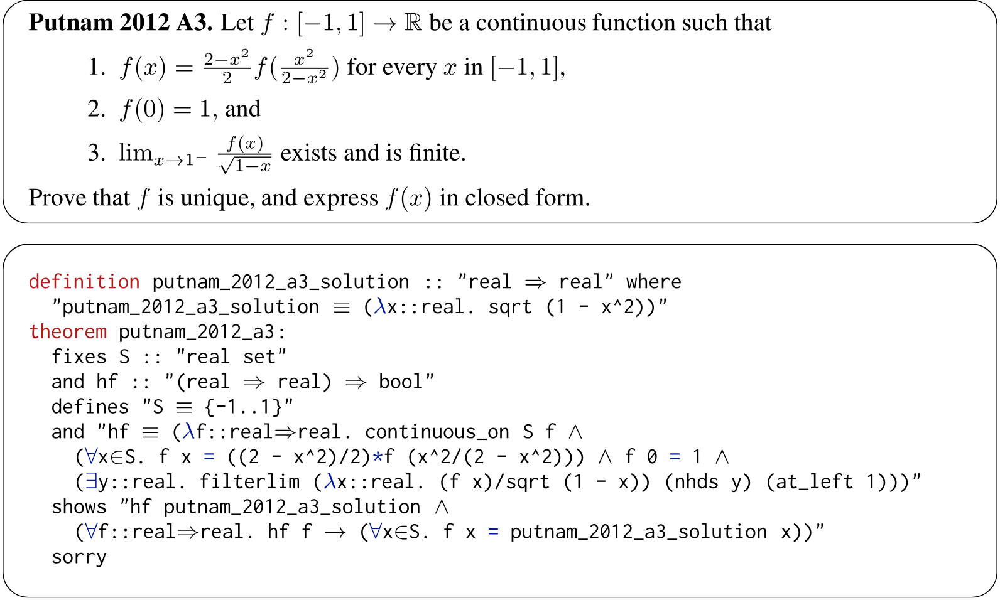

**图 11.** Putnam 2012 A3 的 Isabelle 形式化. 从定理陈述中分离解的机制与 Lean 类似.

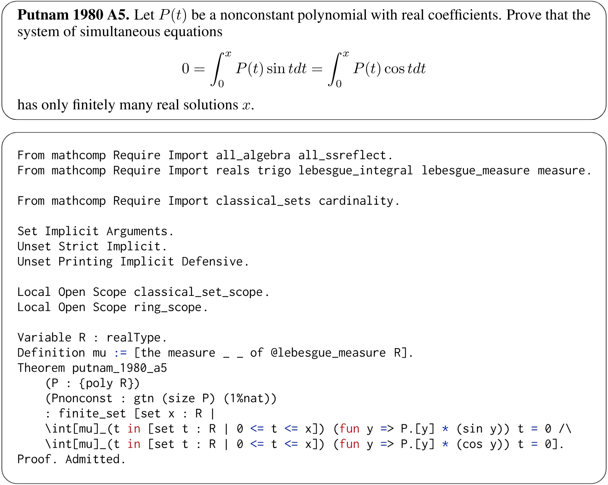

**图 12.** Putnam 1980 A5 的 Coq 形式化. 该形式化使用 Coq 标准库之外的仓库 Coquelicot. `sorry` 在 Coq 中对应 `Admitted`.

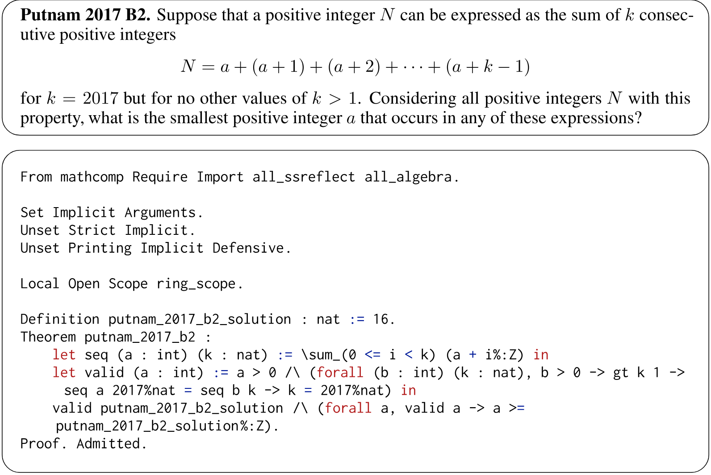

**图 13.** Putnam 2017 B2 的 Coq 形式化. 由于问题要求给出一个数值见证, 我们使用 Coq 的定义语法将其分离出来.

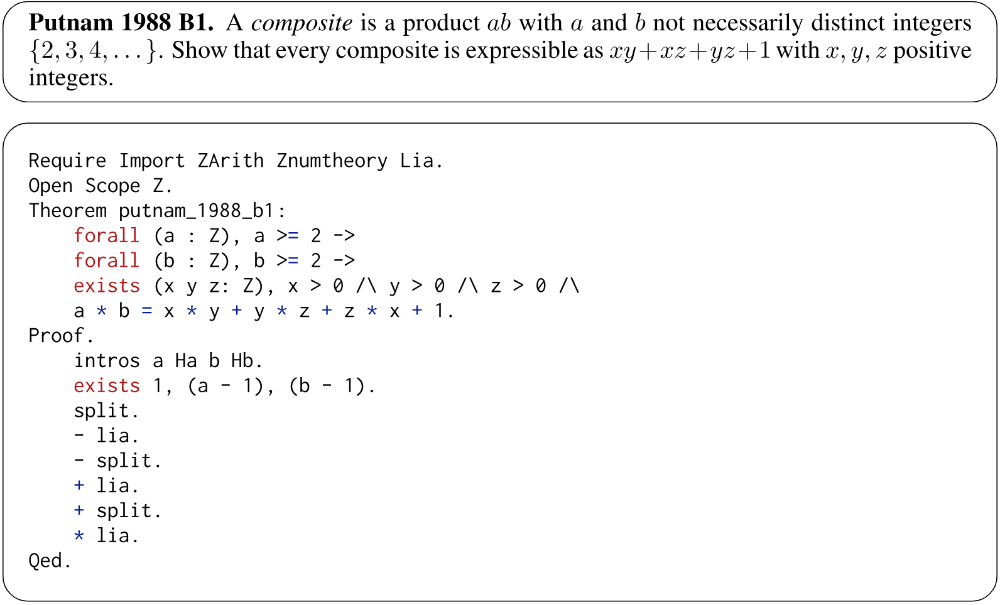

**图 14.** 通过 GPT-4 少样本调用生成的 Putnam 1988 B1 Coq 证明. 这个证明与同样由 GPT-4 发现的 Lean 版本相似. 问题的主要难点是根据 $a,b$ 选择 $x,y,z$. 正确给出这些值后, 其余证明就是例行工作, 可以交给处理线性算术的 `lia` 等自动化方法.

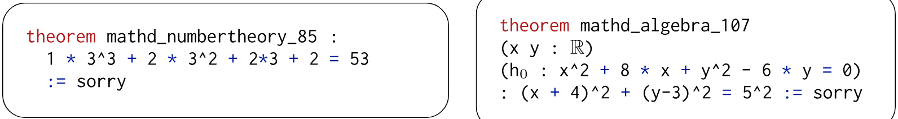

**图 15.** miniF2F 中简单问题的形式化示例. 这些问题适合在形式环境中评测直接的数学推理, 但与 PutnamBench 的竞赛题相比十分简单. 需要说明的是, miniF2F 的确包含一些直接取自高中竞赛的问题形式化, 只是数量较少.

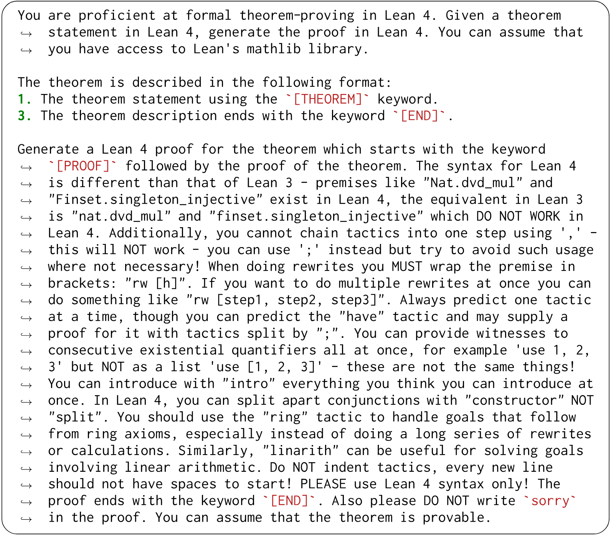

**图 16.** GPT-4 在 Lean 4 评估中使用的部分“系统提示”. GPT-4 容易生成 Lean 3 语法的输出, 因此提示特别强调避免此类语法错误. 我们也对 COPRA 的 Lean 3 系统提示作了类似修改.

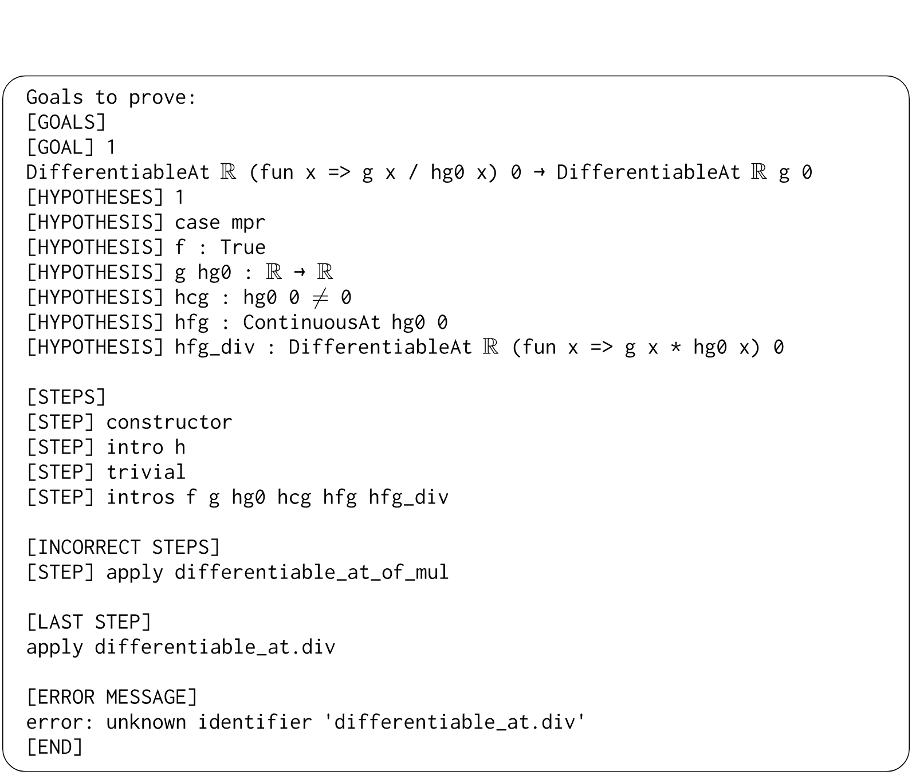

**图 17.** COPRA 在 Lean 4 中搜索 Putnam 2011 B2 证明时的一次失败 tactic 预测. GPT-4 预测了一个涉及前提“differentiable_at.div”的 tactic; 这个前提存在于 Lean 3, 却不存在于 Lean 4. 即便系统提示明确要求输出只能使用 Lean 4 语法, GPT-4 也不总能分清两者.

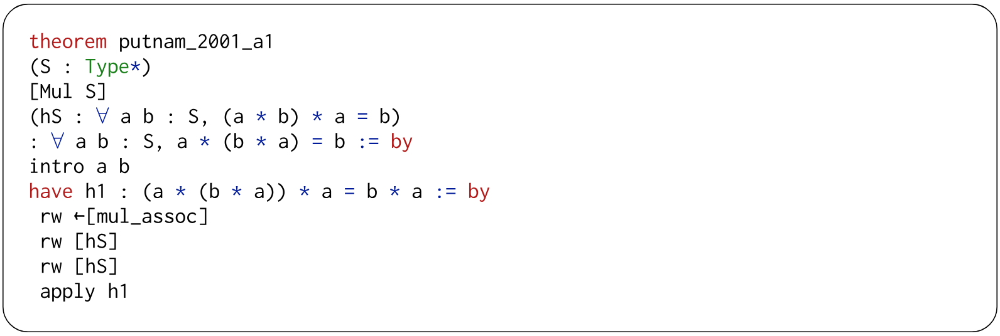

**图 18.** GPT-4 少样本调用生成的失败证明. GPT-4 误以为假设 `[Mul S]` 不仅给出运算 $\star$ 并断言它是 $S$ 上的二元运算, 还断言该运算满足结合律. tactic `rw [←mul_assoc]` 会用 $\star$ 的结合律进行改写, 因而不能用于这里.

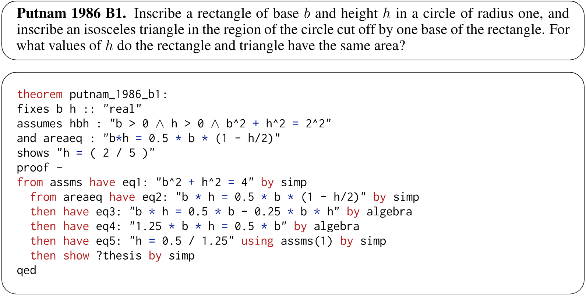

**图 19.** GPT-4 发现的 Isabelle 成功证明. 定理陈述与原问题不同, 采用代数形式; 不过, 官方解答同样是代数式的, 与生成的 Isabelle 证明相似.

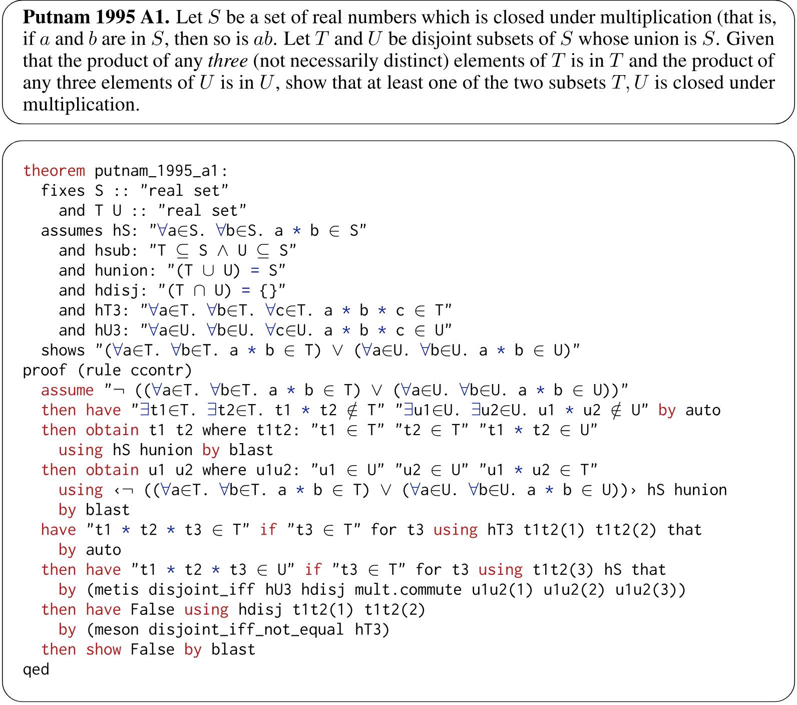

**图 20.** DSP 发现的 Isabelle 成功证明. 单次调用 sledgehammer 找不到这个证明, 因此 DSP 的草图机制对该问题至关重要. DSP 流程会让 LLM (GPT-4) 合成非形式化证明, 再把它翻译成 Isabelle 草图—这可能成为间接数据集污染的来源, 因为我们无法保证 GPT-4 的训练数据中没有这些非形式化证明.

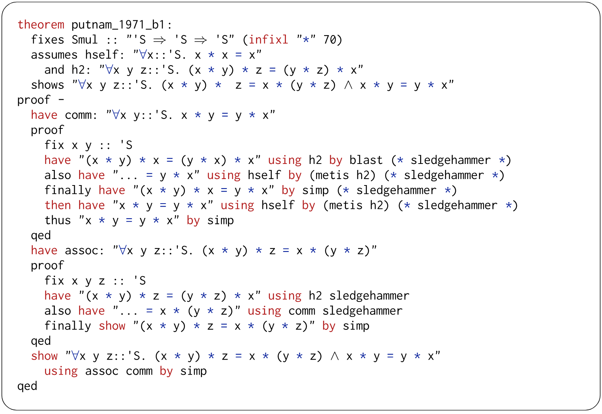

**图 21.** DSP 为 Putnam 1971 B1 生成的错误结果. 单次调用 Sledgehammer 可以证明该问题, 但流程生成的形式草图复杂得多, 而且存在错误, 最终导致证明失败.

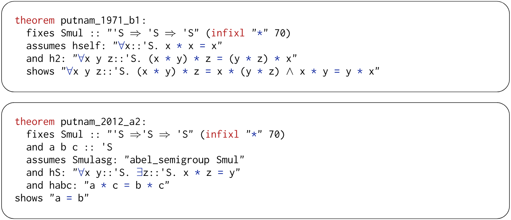

**图 22.** 另外两份通过调用 Sledgehammer 解出的 Isabelle 形式化. Sledgehammer 能解出的问题全都涉及集合上的二元运算. SMT 求解器能处理这类无需对复杂对象进行推理的问题, 并不意外.

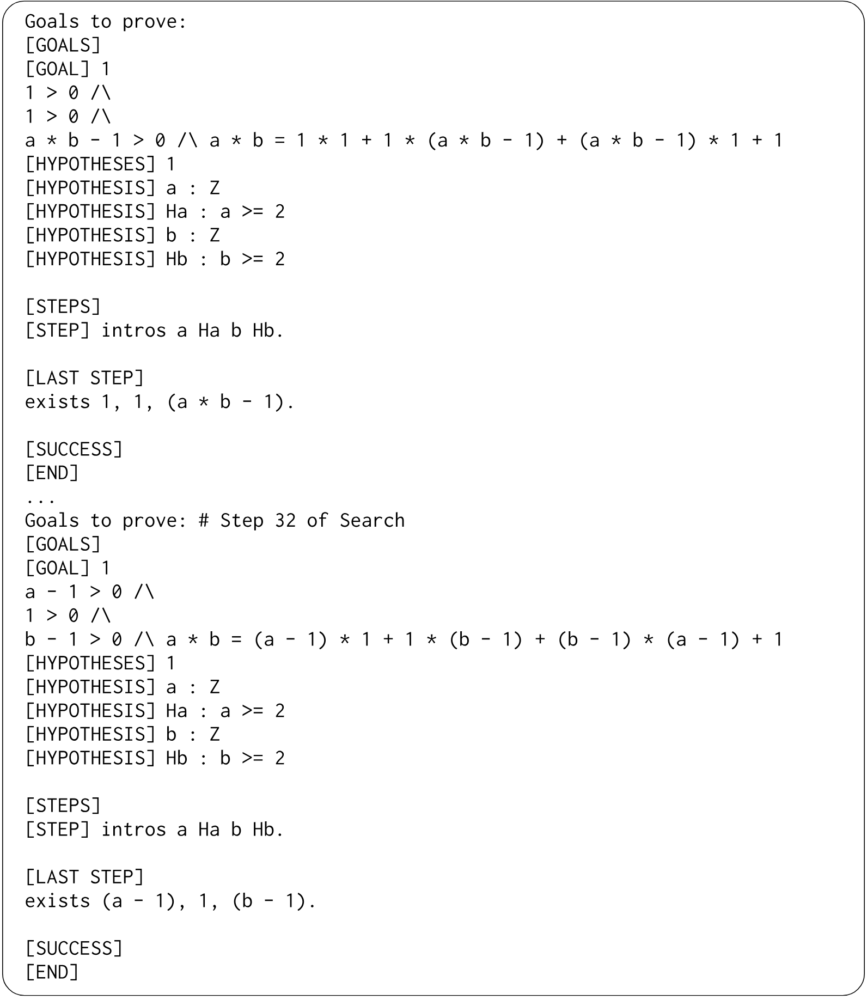

**图 23.** COPRA 尝试证明 Putnam 1988 B1 的早期阶段, 根据 $a,b$ 对 $x,y,z$ 作出错误预测. 正确选择是最关键的一步, 这个错误让该搜索路径注定失败. 随后, 在搜索第 32 步, COPRA 回溯并成功预测了 $x,y,z$ 的正确取值. 生成这一步后, 其余证明就很直接了.
